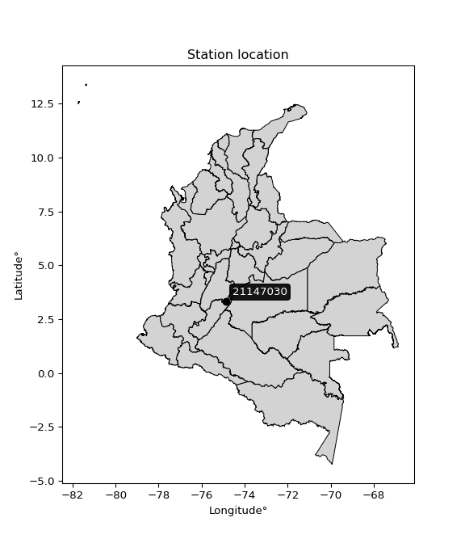

<div align="center">


</div>

# PMP Station (Rain, Pmax24h): 21147030

Probable Maximum Precipitation (PMP) is the greatest amount of rainfall for a specific duration that is meteorologically possible for a given location, acting as a "worst-case" scenario for extreme storms, crucial for designing safety-critical infrastructure like bridges, river deviations, dams, spillways, and nuclear plants to prevent catastrophic failure. PMP is calculated by hydrologists using meteorological data to determine the upper limit of extreme rainfall, often leading to the Probable Maximum Flood (PMF) for flood control design, and is increasingly being studied for climate change impacts. Probable Maximum Precipitation (PMP) is the theoretical upper limit of rainfall, a deterministic estimate for extreme events, while probability distributions (like GEV, Gumbel) describe the likelihood and frequency of various precipitation amounts, including rare ones, showing how often events occur, with PMP representing the extreme end of these distributions, used for critical infrastructure design to ensure safety against the worst conceivable weather, unlike standard statistical forecasts which cover typical probabilities.

The most common probability distributions in hydrology, used for analyzing floods, rainfall, and streamflow, include the Normal, Log-Normal, Gumbel, Gamma (including Log-Pearson Type III), and Generalized Extreme Value (GEV) distributions, often chosen based on the data´s skewness and whether modeling extremes or general conditions, with Gumbel and GEV popular for extreme events like floods, while the Normal distribution serves as a baseline, though often requiring transformations for skewed hydrological data. These distributions help in designing water infrastructure, managing water resources, and forecasting hydrologic events.

> Hydrological data often isn´t perfectly normal (it´s skewed), so different distributions are needed for different applications, such as: **Flood Frequency Analysis**: Using Gumbel, GEV, or Log-Pearson Type III for predicting extreme flood magnitudes and their return periods, **Rainfall Analysis**: Normal for annual totals, but Log-Normal, Weibull, or GEV for intensity or extreme daily rainfall, **Streamflow Modeling**: Gamma and Log-Normal for maximum flows, GEV for minimum flows, and Kappa for daily flows.

<div align="center">

</img>

</div>


## A. General information


### 1. General running parameters

• app_version: _v20260113_. • runtime: _2026-01-17 18:24:04.630693_. • Python version: _3.14.0_. • SciPy version: _1.16.3_. • Pandas version: _2.3.3_. • NumPy version: _2.3.5_. • Stations dataset (station_dataset_file): _dataset/pmax24h_in/automatic_colombia_2003_2025.csv_. • Stations catalog (station_catalog_file): _dataset/CNE.xls_. • Minimum year to eval til year_max (date_min): _1900_. • Maximum year to eval since year_min (date_max): _2025_. • Creates, save and include plots into reports (create_plot): _False_. • Plot only fit distributions with Δo > Δ (plot_only_fit): _True_. • Plot only simple graphs avoiding multiple CDFs and multiple Extreme values plots (plot_only_simple): _True_. • Eval low extreme values, if False, evaluates high extreme values (low_extreme): _False_. • Eval every SciPy distribution as logarithmic (pdist_logarithmic_on): _True_. • Standard deviation normalized (ddof): _1.0_. • Return periods to eval in years (Tr): _[2, 2.33, 5, 10, 15, 20, 25, 50, 75, 100, 200, 250, 500, 750, 1000]_. • Minimum data sample per station, 0 means any (minimum_sample): _5_. • Z-Score maximum threshold to adjust a value, 0 means disable (zscore_max): _3.5_. • Z-Score minimum threshold to adjust a value, 0 means disable (zscore_min): _-2.5_. • Avoid zeros, e.g. rain = 0 (avoid_zeros): _True_. • Avoid null values (avoid_nans): _True_. 

:file_folder:Table: [dataset.csv](../../dataset/pmax24h_in/automatic_colombia_2003_2025.csv)

> Delta Degrees of Freedom (DDOF): is a parameter used in the formulas for calculating variance and standard deviation. When ddof=0, the divisor is $N$ (the total number of observations) and this is used when your data set is the entire population. When ddof=1, the divisor is $N-1$ and this is used when your data set is a sample drawn from a larger population. Using $N-1$ provides an unbiased estimate of the population variance (known as Bessel´s correction).


### 2. Station info and location

|   id |   CODIGO | NOMBRE                       | CATEGORIA    | TECNOLOGIA                              | ESTADO   | FECHA_INSTALACION   |   FECHA_SUSPENSION |   ALTITUD |   LATITUD |   LONGITUD | DEPARTAMENTO   | MUNICIPIO   | AREA_OPERATIVA                    | ENTIDAD                                                     | AREA_HIDROGRAFICA   | ZONA_HIDROGRAFICA   | SUBZONA_HIDROGRAFICA   | CORRIENTE   | Catalogo   |   Version |
|-----:|---------:|:-----------------------------|:-------------|:----------------------------------------|:---------|:--------------------|-------------------:|----------:|----------:|-----------:|:---------------|:------------|:----------------------------------|:------------------------------------------------------------|:--------------------|:--------------------|:-----------------------|:------------|:-----------|----------:|
|    0 | 21147030 | CARRASPOSO  - AUT [21147030] | Limnigráfica | Automática con Telemetría, Convencional | Activa   | 15/02/1972          |                nan |       730 |   3.32753 |   -74.8669 | Huila          | Colombia    | Area Operativa 04 - Huila-Caquetá | INSTITUTO DE HIDROLOGIA METEOROLOGIA Y ESTUDIOS AMBIENTALES | Magdalena Cauca     | Alto Magdalena      | Río Cabrera            | Cabrera     | CNE_IDEAM  |  20251226 |

<div align="center">

Dynamic map: [:earth_americas:Google](http://maps.google.com/maps?q=3.327527778,-74.86691667) [:earth_americas:OSM](https://www.openstreetmap.org/#map=18/3.327527778/-74.86691667&layers=P) [:earth_americas:Bing](https://www.bing.com/maps?cp=3.327527778~-74.86691667&lvl=18) [:earth_americas:Apple](https://maps.apple.com/frame?center=3.327527778%2C-74.86691667&span=0.003%2C0.006)

</div>


<div align="center">

```geojson
{
  "type": "Feature",
  "geometry": {
    "type": "Point", 
    "coordinates": [-74.86691667, 3.327527778]
  }, 
  "properties": {
    "Name": "21147030"
  }
}
```

</div>


### 3. Discrete values table and plot

<div align="center">

|               |           0 |            1 |           2 |          3 |         4 |           5 |
|:--------------|------------:|-------------:|------------:|-----------:|----------:|------------:|
| Date          | 2019        | 2020         | 2021        | 2022       | 2023      | 2025        |
| Value         |   56.4      |   49.8       |   42        |   30       |   77      |   48.4      |
| Value_initial |   56.4      |   49.8       |   42        |   30       |   77      |   48.4      |
| count         |    6        |    6         |    6        |    6       |    6      |    6        |
| mean          |   50.6      |   50.6       |   50.6      |   50.6     |   50.6    |   50.6      |
| std           |   15.7124   |   15.7124    |   15.7124   |   15.7124  |   15.7124 |   15.7124   |
| zscore        |    0.369135 |   -0.0509152 |   -0.547338 |   -1.31107 |    1.6802 |   -0.140017 |


</div>


> The initial value (value_initial) correspond to the initial obtained or null completed value, and value (value) is adjusted only when the initial value is outside the valid range (outlier) definite through the Z-Score value. If Z-Score is active, values out of range or outliers are replaced with the station mean value. A Z-Score (or standard score) measures how many standard deviations a data point is from the mean of a dataset, indicating its relative position; positive scores mean above the mean, negative mean below, and a score of zero is exactly at the mean, allowing for comparison of values from different distributions. It´s calculated using the formula $z=(x–μ)/σ$, where $x$ is the data point, $μ$ is the mean, and $σ$ is the standard deviation, helping identify outliers and understand probability.
>
> <sub>**Note**: In this study, "completing" (filling gaps in) and "extending" (forecasting or lengthening the historical record) rainfall data series are avoided for certain critical analyses because they introduce artificial bias and uncertainty, which can distort the statistics of rare events (extremes), alter day-to-day variability, and compromise the integrity and homogeneity of the original data. Some reasons against Completing/Extending rainfall data are: **Distortion of Extremes and Variability**: The primary issue is that most gap-filling or extension methods rely on averaging or regression with nearby stations, which inherently smooths the data. Rainfall is highly variable in space and time, with a large percentage of zero values and occasional large storms. Infilling methods often underestimate the highest values and overestimate the lowest (zero) values, which severely distorts analyses focused on flood frequency, drought severity, and intensity-duration-frequency (IDF) curves, **Loss of Data Homogeneity**: Infilled or extended data are synthetic estimates, not actual measurements. Combining these estimates with observed data can violate the assumption of data homogeneity, which requires that the data properties do not change over time. Inhomogeneity can lead to incorrect conclusions about long-term trends or changes in climate patterns, **Propagation of Errors**: Errors and biases from the original data (e.g., wind-induced undercatch, instrument errors, site changes) or the data used for imputation can propagate through the analysis, leading to unreliable hydrological models and inaccurate predictions, **Compromised Statistical Integrity**: For statistical analyses, especially those involving the frequency of events, using artificial data can introduce time bias or autocorrelation that doesn´t exist in reality, making it difficult to assess the true probability of events, **Difficulty in Validation**: It is difficult to accurately validate the quality of filled or extended data, especially for past periods where ground-truth measurements are unavailable. The reliability of imputation techniques heavily depends on the density of the surrounding station network and the complexity of the local topography.</sub>


### 4. Active continuous probability distributions from SciPy (80 of 104 available)

A Probability Density Function (PDF) describes the relative likelihood of a continuous random variable falling within a specific range, where the total area under its curve equals 1, and the area over any interval gives the actual probability for that range. Unlike discrete probabilities (like rolling a die), a PDF shows density, not direct probability for a single point (which is zero), with higher points indicating higher likelihood, often visualized as a bell curve for normal distributions.

A log of a probability density function (log-PDF) is simply the logarithm of the PDF´s value, denoted as $log(f(x))$, useful for converting multiplication of probabilities into addition, improving numerical stability with tiny numbers, and connecting to information theory concepts like entropy. Instead of dealing with very small probabilities (e.g., 0.000001), log-PDFs use negative numbers (e.g., $log(0.00001) ≈ -11.51$ that are easier for computers to handle, preventing underflow errors and simplifying complex calculations. In this study, each active probability distribution from SciPy is also evaluated in the $log$ form.

[scipy.stats](https://docs.scipy.org/doc/scipy/reference/stats.html) is a Python´s powerful submodule within the SciPy library for comprehensive statistical analysis, offering over 130 probability distributions (like Normal, Poisson), functions for descriptive stats (mean, variance), hypothesis testing (t-tests, chi-square), random variable generation, and statistical tests, making it essential for data science, modeling, and research. It provides tools to explore, model, and draw conclusions from data efficiently, working seamlessly with NumPy.

<div align="center">

|   id | p_dist           |   n_parameter | fit_method   | label                                                                       | active   | ref                                                                                                      |
|-----:|:-----------------|--------------:|:-------------|:----------------------------------------------------------------------------|:---------|:---------------------------------------------------------------------------------------------------------|
|    0 | alpha            |             3 | MLE          | Alpha                                                                       | True     | [:mortar_board:](https://docs.scipy.org/doc/scipy/reference/generated/scipy.stats.alpha.html)            |
|    1 | anglit           |             2 | MM           | Anglit                                                                      | True     | [:mortar_board:](https://docs.scipy.org/doc/scipy/reference/generated/scipy.stats.anglit.html)           |
|    2 | arcsine          |             2 | MM           | Arcsine                                                                     | True     | [:mortar_board:](https://docs.scipy.org/doc/scipy/reference/generated/scipy.stats.arcsine.html)          |
|    3 | argus            |             3 | MLE          | Argus                                                                       | True     | [:mortar_board:](https://docs.scipy.org/doc/scipy/reference/generated/scipy.stats.argus.html)            |
|    4 | beta             |             4 | MLE          | Beta                                                                        | True     | [:mortar_board:](https://docs.scipy.org/doc/scipy/reference/generated/scipy.stats.beta.html)             |
|    5 | betaprime        |             4 | MLE          | Beta prime                                                                  | True     | [:mortar_board:](https://docs.scipy.org/doc/scipy/reference/generated/scipy.stats.betaprime.html)        |
|    6 | bradford         |             3 | MLE          | Bradford                                                                    | True     | [:mortar_board:](https://docs.scipy.org/doc/scipy/reference/generated/scipy.stats.bradford.html)         |
|    7 | burr             |             4 | MLE          | Burr (Type III)                                                             | True     | [:mortar_board:](https://docs.scipy.org/doc/scipy/reference/generated/scipy.stats.burr.html)             |
|    8 | burr12           |             4 | MLE          | Burr (Type III) 12                                                          | True     | [:mortar_board:](https://docs.scipy.org/doc/scipy/reference/generated/scipy.stats.burr12.html)           |
|    9 | cosine           |             2 | MLE          | Cosine                                                                      | True     | [:mortar_board:](https://docs.scipy.org/doc/scipy/reference/generated/scipy.stats.cosine.html)           |
|   10 | crystalball      |             4 | MLE          | Crystalball                                                                 | True     | [:mortar_board:](https://docs.scipy.org/doc/scipy/reference/generated/scipy.stats.crystalball.html)      |
|   11 | dgamma           |             3 | MLE          | Double gamma                                                                | True     | [:mortar_board:](https://docs.scipy.org/doc/scipy/reference/generated/scipy.stats.dgamma.html)           |
|   12 | dweibull         |             3 | MLE          | Double Weibull                                                              | True     | [:mortar_board:](https://docs.scipy.org/doc/scipy/reference/generated/scipy.stats.dweibull.html)         |
|   13 | erlang           |             3 | MLE          | Erlang                                                                      | True     | [:mortar_board:](https://docs.scipy.org/doc/scipy/reference/generated/scipy.stats.erlang.html)           |
|   14 | exponnorm        |             3 | MLE          | Exponentially modified Normal                                               | True     | [:mortar_board:](https://docs.scipy.org/doc/scipy/reference/generated/scipy.stats.exponnorm.html)        |
|   15 | exponpow         |             3 | MLE          | Exponential power                                                           | True     | [:mortar_board:](https://docs.scipy.org/doc/scipy/reference/generated/scipy.stats.exponpow.html)         |
|   16 | exponweib        |             4 | MLE          | Exponentiated Weibull                                                       | True     | [:mortar_board:](https://docs.scipy.org/doc/scipy/reference/generated/scipy.stats.exponweib.html)        |
|   17 | f                |             4 | MLE          | F                                                                           | True     | [:mortar_board:](https://docs.scipy.org/doc/scipy/reference/generated/scipy.stats.f.html)                |
|   18 | fatiguelife      |             3 | MLE          | Fatigue-life (Birnbaum-Saunders)                                            | True     | [:mortar_board:](https://docs.scipy.org/doc/scipy/reference/generated/scipy.stats.fatiguelife.html)      |
|   19 | foldnorm         |             3 | MM           | Fold Normal                                                                 | True     | [:mortar_board:](https://docs.scipy.org/doc/scipy/reference/generated/scipy.stats.foldnorm.html)         |
|   20 | gamma            |             3 | MLE          | Gamma                                                                       | True     | [:mortar_board:](https://docs.scipy.org/doc/scipy/reference/generated/scipy.stats.gamma.html)            |
|   21 | gausshyper       |             6 | MLE          | Gauss hypergeometric                                                        | True     | [:mortar_board:](https://docs.scipy.org/doc/scipy/reference/generated/scipy.stats.gausshyper.html)       |
|   22 | genexpon         |             5 | MLE          | Generalized exponential                                                     | True     | [:mortar_board:](https://docs.scipy.org/doc/scipy/reference/generated/scipy.stats.genexpon.html)         |
|   23 | genextreme       |             3 | MLE          | Generalized exponential                                                     | True     | [:mortar_board:](https://docs.scipy.org/doc/scipy/reference/generated/scipy.stats.genextreme.html)       |
|   24 | gengamma         |             4 | MLE          | Generalized gamma                                                           | True     | [:mortar_board:](https://docs.scipy.org/doc/scipy/reference/generated/scipy.stats.gengamma.html)         |
|   25 | genhalflogistic  |             3 | MLE          | Generalized half-logistic                                                   | True     | [:mortar_board:](https://docs.scipy.org/doc/scipy/reference/generated/scipy.stats.genhalflogistic.html)  |
|   26 | genlogistic      |             3 | MLE          | Generalized logistic                                                        | True     | [:mortar_board:](https://docs.scipy.org/doc/scipy/reference/generated/scipy.stats.genlogistic.html)      |
|   27 | gennorm          |             3 | MLE          | Generalized Normal                                                          | True     | [:mortar_board:](https://docs.scipy.org/doc/scipy/reference/generated/scipy.stats.gennorm.html)          |
|   28 | genpareto        |             3 | MLE          | Generalized Pareto                                                          | True     | [:mortar_board:](https://docs.scipy.org/doc/scipy/reference/generated/scipy.stats.genpareto.html)        |
|   29 | gompertz         |             3 | MLE          | Gompertz (or truncated Gumbel)                                              | True     | [:mortar_board:](https://docs.scipy.org/doc/scipy/reference/generated/scipy.stats.gompertz.html)         |
|   30 | gumbel_l         |             2 | MM           | Gumbel Left Skew                                                            | True     | [:mortar_board:](https://docs.scipy.org/doc/scipy/reference/generated/scipy.stats.gumbel_l.html)         |
|   31 | gumbel_r         |             2 | MM           | Gumbel Right Skew                                                           | True     | [:mortar_board:](https://docs.scipy.org/doc/scipy/reference/generated/scipy.stats.gumbel_r.html)         |
|   32 | halfgennorm      |             3 | MLE          | Upper half of a generalized normal                                          | True     | [:mortar_board:](https://docs.scipy.org/doc/scipy/reference/generated/scipy.stats.halfgennorm.html)      |
|   33 | halflogistic     |             2 | MM           | Half-logistic                                                               | True     | [:mortar_board:](https://docs.scipy.org/doc/scipy/reference/generated/scipy.stats.halflogistic.html)     |
|   34 | halfnorm         |             2 | MM           | Half Normal                                                                 | True     | [:mortar_board:](https://docs.scipy.org/doc/scipy/reference/generated/scipy.stats.halfnorm.html)         |
|   35 | hypsecant        |             2 | MM           | hyperbolic secant                                                           | True     | [:mortar_board:](https://docs.scipy.org/doc/scipy/reference/generated/scipy.stats.hypsecant.html)        |
|   36 | invgamma         |             3 | MLE          | Inverted gamma                                                              | True     | [:mortar_board:](https://docs.scipy.org/doc/scipy/reference/generated/scipy.stats.invgamma.html)         |
|   37 | invgauss         |             3 | MLE          | Inverse Gaussian                                                            | True     | [:mortar_board:](https://docs.scipy.org/doc/scipy/reference/generated/scipy.stats.invgauss.html)         |
|   38 | invweibull       |             3 | MLE          | Inverted Weibull                                                            | True     | [:mortar_board:](https://docs.scipy.org/doc/scipy/reference/generated/scipy.stats.invweibull.html)       |
|   39 | johnsonsb        |             4 | MLE          | Johnson SB                                                                  | True     | [:mortar_board:](https://docs.scipy.org/doc/scipy/reference/generated/scipy.stats.johnsonsb.html)        |
|   40 | johnsonsu        |             4 | MLE          | Johnson Su                                                                  | True     | [:mortar_board:](https://docs.scipy.org/doc/scipy/reference/generated/scipy.stats.johnsonsu.html)        |
|   41 | kappa3           |             3 | MLE          | Kappa 3                                                                     | True     | [:mortar_board:](https://docs.scipy.org/doc/scipy/reference/generated/scipy.stats.kappa3.html)           |
|   42 | kappa4           |             4 | MLE          | Kappa 4                                                                     | True     | [:mortar_board:](https://docs.scipy.org/doc/scipy/reference/generated/scipy.stats.kappa4.html)           |
|   43 | ksone            |             3 | MLE          | Kolmogorov-Smirnov one-sided test statistic distribution                    | True     | [:mortar_board:](https://docs.scipy.org/doc/scipy/reference/generated/scipy.stats.ksone.html)            |
|   44 | kstwobign        |             2 | MLE          | Limiting distribution of scaled Kolmogorov-Smirnov two-sided test statistic | True     | [:mortar_board:](https://docs.scipy.org/doc/scipy/reference/generated/scipy.stats.kstwobign.html)        |
|   45 | laplace          |             2 | MM           | Laplace                                                                     | True     | [:mortar_board:](https://docs.scipy.org/doc/scipy/reference/generated/scipy.stats.laplace.html)          |
|   46 | levy_l           |             2 | MLE          | Left-skewed Levy                                                            | True     | [:mortar_board:](https://docs.scipy.org/doc/scipy/reference/generated/scipy.stats.levy_l.html)           |
|   47 | loggamma         |             3 | MLE          | Log gamma                                                                   | True     | [:mortar_board:](https://docs.scipy.org/doc/scipy/reference/generated/scipy.stats.loggamma.html)         |
|   48 | logistic         |             2 | MM           | Logistic (or Sech-squared)                                                  | True     | [:mortar_board:](https://docs.scipy.org/doc/scipy/reference/generated/scipy.stats.logistic.html)         |
|   49 | loglaplace       |             3 | MLE          | Log-Laplace                                                                 | True     | [:mortar_board:](https://docs.scipy.org/doc/scipy/reference/generated/scipy.stats.loglaplace.html)       |
|   50 | lomax            |             3 | MLE          | Lomax (Pareto of the second kind)                                           | True     | [:mortar_board:](https://docs.scipy.org/doc/scipy/reference/generated/scipy.stats.lomax.html)            |
|   51 | maxwell          |             2 | MM           | Maxwell                                                                     | True     | [:mortar_board:](https://docs.scipy.org/doc/scipy/reference/generated/scipy.stats.maxwell.html)          |
|   52 | mielke           |             4 | MLE          | Mielke Beta-Kappa / Dagum                                                   | True     | [:mortar_board:](https://docs.scipy.org/doc/scipy/reference/generated/scipy.stats.mielke.html)           |
|   53 | moyal            |             2 | MM           | Moyal                                                                       | True     | [:mortar_board:](https://docs.scipy.org/doc/scipy/reference/generated/scipy.stats.moyal.html)            |
|   54 | nakagami         |             3 | MLE          | Nakagami                                                                    | True     | [:mortar_board:](https://docs.scipy.org/doc/scipy/reference/generated/scipy.stats.nakagami.html)         |
|   55 | ncf              |             5 | MLE          | Non-central F distribution                                                  | True     | [:mortar_board:](https://docs.scipy.org/doc/scipy/reference/generated/scipy.stats.ncf.html)              |
|   56 | nct              |             4 | MLE          | Non-central Student’s t                                                     | True     | [:mortar_board:](https://docs.scipy.org/doc/scipy/reference/generated/scipy.stats.nct.html)              |
|   57 | norm             |             2 | MM           | Normal                                                                      | True     | [:mortar_board:](https://docs.scipy.org/doc/scipy/reference/generated/scipy.stats.norm.html)             |
|   58 | pearson3         |             3 | MM           | Pearson type III                                                            | True     | [:mortar_board:](https://docs.scipy.org/doc/scipy/reference/generated/scipy.stats.pearson3.html)         |
|   59 | powerlaw         |             3 | MLE          | Power-function                                                              | True     | [:mortar_board:](https://docs.scipy.org/doc/scipy/reference/generated/scipy.stats.powerlaw.html)         |
|   60 | rayleigh         |             2 | MM           | Rayleigh                                                                    | True     | [:mortar_board:](https://docs.scipy.org/doc/scipy/reference/generated/scipy.stats.rayleigh.html)         |
|   61 | rdist            |             3 | MLE          | R-distributed (symmetric beta)                                              | True     | [:mortar_board:](https://docs.scipy.org/doc/scipy/reference/generated/scipy.stats.rdist.html)            |
|   62 | rice             |             3 | MLE          | Rice                                                                        | True     | [:mortar_board:](https://docs.scipy.org/doc/scipy/reference/generated/scipy.stats.rice.html)             |
|   63 | semicircular     |             2 | MM           | Semicircular                                                                | True     | [:mortar_board:](https://docs.scipy.org/doc/scipy/reference/generated/scipy.stats.semicircular.html)     |
|   64 | skewnorm         |             3 | MLE          | Skew normal                                                                 | True     | [:mortar_board:](https://docs.scipy.org/doc/scipy/reference/generated/scipy.stats.skewnorm.html)         |
|   65 | t                |             3 | MLE          | Student’s t                                                                 | True     | [:mortar_board:](https://docs.scipy.org/doc/scipy/reference/generated/scipy.stats.t.html)                |
|   66 | trapezoid        |             4 | MLE          | Trapezoid                                                                   | True     | [:mortar_board:](https://docs.scipy.org/doc/scipy/reference/generated/scipy.stats.trapezoid.html)        |
|   67 | triang           |             3 | MLE          | Triangular                                                                  | True     | [:mortar_board:](https://docs.scipy.org/doc/scipy/reference/generated/scipy.stats.triang.html)           |
|   68 | truncexpon       |             3 | MLE          | Truncated exponential                                                       | True     | [:mortar_board:](https://docs.scipy.org/doc/scipy/reference/generated/scipy.stats.truncexpon.html)       |
|   69 | truncnorm        |             4 | MLE          | Truncated normal                                                            | True     | [:mortar_board:](https://docs.scipy.org/doc/scipy/reference/generated/scipy.stats.truncnorm.html)        |
|   70 | truncpareto      |             4 | MLE          | Upper truncated Pareto                                                      | True     | [:mortar_board:](https://docs.scipy.org/doc/scipy/reference/generated/scipy.stats.truncpareto.html)      |
|   71 | truncweibull_min |             5 | MLE          | Doubly truncated Weibull minimum                                            | True     | [:mortar_board:](https://docs.scipy.org/doc/scipy/reference/generated/scipy.stats.truncweibull_min.html) |
|   72 | tukeylambda      |             3 | MLE          | Tukey-Lamdba                                                                | True     | [:mortar_board:](https://docs.scipy.org/doc/scipy/reference/generated/scipy.stats.tukeylambda.html)      |
|   73 | uniform          |             2 | MLE          | Uniform                                                                     | True     | [:mortar_board:](https://docs.scipy.org/doc/scipy/reference/generated/scipy.stats.uniform.html)          |
|   74 | vonmises         |             3 | MLE          | Von Mises                                                                   | True     | [:mortar_board:](https://docs.scipy.org/doc/scipy/reference/generated/scipy.stats.vonmises.html)         |
|   75 | vonmises_line    |             3 | MLE          | Von Mises line                                                              | True     | [:mortar_board:](https://docs.scipy.org/doc/scipy/reference/generated/scipy.stats.vonmises_line.html)    |
|   76 | wald             |             2 | MM           | Wald                                                                        | True     | [:mortar_board:](https://docs.scipy.org/doc/scipy/reference/generated/scipy.stats.wald.html)             |
|   77 | weibull_max      |             3 | MLE          | Weibull maximum                                                             | True     | [:mortar_board:](https://docs.scipy.org/doc/scipy/reference/generated/scipy.stats.weibull_max.html)      |
|   78 | weibull_min      |             3 | MLE          | Weibull minimum                                                             | True     | [:mortar_board:](https://docs.scipy.org/doc/scipy/reference/generated/scipy.stats.weibull_min.html)      |
|   79 | wrapcauchy       |             3 | MLE          | Wrapped  Cauchy                                                             | True     | [:mortar_board:](https://docs.scipy.org/doc/scipy/reference/generated/scipy.stats.wrapcauchy.html)       |

</div>

> **n_parameter:** # arguments & localization & scale.
>
> **Fit methods:** (MLE) maximum likelihood, (MM) L-moments.
>
>**Inactive** (With the only purpose of prevent loops, zero divisions, infinite values, over high estimated values or horizontal trending for recurrence intervals estimations, the follow distributions were disabled.)**:** lognorm, norminvgauss, powernorm, powerlognorm, cauchy, halfcauchy, foldcauchy, skewcauchy, chi2, expon, fisk, genhyperbolic, geninvgauss, gibrat, kstwo, laplace_asymmetric, levy, levy_stable, ncx2, pareto, rel_breitwigner, recipinvgauss, studentized_range, loguniform, 


## B. Probability (PDF) vs. Empirical (EDF) distributions functions

A continuous probability distribution (CPD) describes probabilities for variables that can take any value within a range (like rain any time), unlike discrete variables with specific outcomes (like temperature). It uses a Probability Density Function (PDF), a curve where the total area under it equals 1, and the probability of the variable falling within an interval (a to b) is found by calculating the area under the curve between those points. A key feature is that the probability of hitting any single exact value is zero, so probabilities are always expressed for ranges, e.g., $P(a ≤ X ≤ b)$.

<div align="center">

Distributions parameters from station values
|     |   station | p_dist              |   n |             loc |          scale | shape                  | shape1                 | shape2             | shape3             |
|----:|----------:|:--------------------|----:|----------------:|---------------:|:-----------------------|:-----------------------|:-------------------|:-------------------|
|   0 |  21147030 | alpha               |   6 |   -67.9602      |  996.881       | 8.527957309523492      |                        |                    |                    |
|   1 |  21147030 | anglit              |   6 |    50.6         |   41.9602      |                        |                        |                    |                    |
|   2 |  21147030 | arcsine             |   6 |    30.3154      |   40.5692      |                        |                        |                    |                    |
|   3 |  21147030 | argus               |   6 |    17.236       |   62.5647      | 4.131154356703456e-06  |                        |                    |                    |
|   4 |  21147030 | beta                |   6 |    30           |   93.2843      | 0.41265744722214615    | 3.412551904716139      |                    |                    |
|   5 |  21147030 | betaprime           |   6 |    -0.393072    |  171.347       | 16.51037864688811      | 56.47545345562493      |                    |                    |
|   6 |  21147030 | bradford            |   6 |    30           |   47.0001      | 0.9053979675200614     |                        |                    |                    |
|   7 |  21147030 | burr                |   6 |    -0.15641     |   50.7527      | 6.566755198577676      | 0.8589681751847407     |                    |                    |
|   8 |  21147030 | burr12              |   6 |    -4.31492     |   34.1446      | 817.9797742623448      | 0.0027701022593052253  |                    |                    |
|   9 |  21147030 | cosine              |   6 |    51.7216      |   12.3032      |                        |                        |                    |                    |
|  10 |  21147030 | crystalball         |   6 |    50.6         |   14.3434      | 45586.26429474407      | 24367.971415049447     |                    |                    |
|  11 |  21147030 | dgamma              |   6 |    48.4         |   12.5584      | 0.5221352630962224     |                        |                    |                    |
|  12 |  21147030 | dweibull            |   6 |    48.4         |   11.2805      | 0.829262367890563      |                        |                    |                    |
|  13 |  21147030 | erlang              |   6 |    17.0756      |    6.50879     | 5.150625718325875      |                        |                    |                    |
|  14 |  21147030 | exponnorm           |   6 |    38.5858      |    8.83204     | 1.3602867458095238     |                        |                    |                    |
|  15 |  21147030 | exponpow            |   6 |    30           |    1.51139     | 0.16148531683765427    |                        |                    |                    |
|  16 |  21147030 | exponweib           |   6 |    30           |    1.20117     | 1.2399177645099253     | 0.26577351243423336    |                    |                    |
|  17 |  21147030 | f                   |   6 |    14.1992      |   36.0405      | 12.849415004614983     | 312.420441613888       |                    |                    |
|  18 |  21147030 | fatiguelife         |   6 |    30           |    2.35932e-06 | 2836.8788400869107     |                        |                    |                    |
|  19 |  21147030 | foldnorm            |   6 |    27.6787      |   16.5287      | 1.2946650832656803     |                        |                    |                    |
|  20 |  21147030 | gamma               |   6 |    17.0757      |    6.50881     | 5.150604549601461      |                        |                    |                    |
|  21 |  21147030 | gausshyper          |   6 |    30           |   47.3338      | 0.8602438908127115     | 1.0387266773887047     | 1.033588752110413  | 1.0406018557957417 |
|  22 |  21147030 | genexpon            |   6 |    30           |    1.85742     | 0.08989515672790971    | 4.4148216089985056e-05 | 1.2411389934404524 |                    |
|  23 |  21147030 | genextreme          |   6 |    44.5287      |   12.5028      | 0.10967711423321812    |                        |                    |                    |
|  24 |  21147030 | gengamma            |   6 |    30           |    1.18822     | 1.2452072881415575     | 0.3236387638309749     |                    |                    |
|  25 |  21147030 | genhalflogistic     |   6 |    26.9429      |   52.6222      | 1.0512449633028682     |                        |                    |                    |
|  26 |  21147030 | genlogistic         |   6 |    17.5171      |   11.5038      | 10.574668754146161     |                        |                    |                    |
|  27 |  21147030 | gennorm             |   6 |    49.8         |    0.0512377   | 0.284418495506612      |                        |                    |                    |
|  28 |  21147030 | genpareto           |   6 |    -0.390122    |  117.495       | -1.5182145039634611    |                        |                    |                    |
|  29 |  21147030 | gompertz            |   6 |    42           |   19.4364      | 0.5649213746541593     |                        |                    |                    |
|  30 |  21147030 | gumbel_l            |   6 |    57.0553      |   11.1835      |                        |                        |                    |                    |
|  31 |  21147030 | gumbel_r            |   6 |    44.1447      |   11.1835      |                        |                        |                    |                    |
|  32 |  21147030 | halfgennorm         |   6 |    30           |    1.33572     | 0.3919088677322148     |                        |                    |                    |
|  33 |  21147030 | halflogistic        |   6 |    33.5998      |   12.2631      |                        |                        |                    |                    |
|  34 |  21147030 | halfnorm            |   6 |    31.615       |   23.7942      |                        |                        |                    |                    |
|  35 |  21147030 | hypsecant           |   6 |    50.6         |    9.1313      |                        |                        |                    |                    |
|  36 |  21147030 | invgamma            |   6 |   -25.5421      | 2162.29        | 29.393765999683563     |                        |                    |                    |
|  37 |  21147030 | invgauss            |   6 |    -4.19552     |  774.769       | 0.07072603109994449    |                        |                    |                    |
|  38 |  21147030 | invweibull          |   6 |    30           |    1.32937     | 0.06177146915102866    |                        |                    |                    |
|  39 |  21147030 | johnsonsb           |   6 |    30           |   47.0332      | -0.10987740235114718   | 0.1405596142133155     |                    |                    |
|  40 |  21147030 | johnsonsu           |   6 |    -4.02907     |    6.78127     | -10.572759390974138    | 3.8447550378758715     |                    |                    |
|  41 |  21147030 | kappa3              |   6 |    30           |   46.9985      | 67360.48549337851      |                        |                    |                    |
|  42 |  21147030 | kappa4              |   6 |    24.309       |   52.3563      | 1.1218605740788026     | 0.9879000057635482     |                    |                    |
|  43 |  21147030 | ksone               |   6 |    25.3         |   56.4         | 1.0                    |                        |                    |                    |
|  44 |  21147030 | kstwobign           |   6 |     0.697842    |   57.3051      |                        |                        |                    |                    |
|  45 |  21147030 | laplace             |   6 |    50.6         |   10.1423      |                        |                        |                    |                    |
|  46 |  21147030 | levy_l              |   6 |    79.8779      |   11.9632      |                        |                        |                    |                    |
|  47 |  21147030 | loggamma            |   6 | -4064.26        |  563.061       | 1492.7469856843209     |                        |                    |                    |
|  48 |  21147030 | logistic            |   6 |    50.6         |    7.90793     |                        |                        |                    |                    |
|  49 |  21147030 | loglaplace          |   6 |    -0.132048    |   48.5321      | 4.752979067608372      |                        |                    |                    |
|  50 |  21147030 | lomax               |   6 |    30           |    4.00769e+11 | 7690594790.938154      |                        |                    |                    |
|  51 |  21147030 | maxwell             |   6 |    16.6121      |   21.2987      |                        |                        |                    |                    |
|  52 |  21147030 | mielke              |   6 |    -0.147428    |   50.7461      | 5.638794622968359      | 6.566059239594187      |                    |                    |
|  53 |  21147030 | moyal               |   6 |    42.3975      |    6.4568      |                        |                        |                    |                    |
|  54 |  21147030 | nakagami            |   6 |    42           |   18.4152      | 0.3181662877243121     |                        |                    |                    |
|  55 |  21147030 | ncf                 |   6 |     0.255735    |   18.9712      | 23.686441211613        | 74.2748990698471       | 37.47337249596667  |                    |
|  56 |  21147030 | nct                 |   6 |    -0.113947    |    9.54459     | 14.112023082350909     | 5.026811590218825      |                    |                    |
|  57 |  21147030 | norm                |   6 |    50.6         |   14.3434      |                        |                        |                    |                    |
|  58 |  21147030 | pearson3            |   6 |    50.6         |   14.3434      | 0.519942476181141      |                        |                    |                    |
|  59 |  21147030 | powerlaw            |   6 |    30           |   47           | 0.14682311696075961    |                        |                    |                    |
|  60 |  21147030 | rayleigh            |   6 |    23.1602      |   21.8938      |                        |                        |                    |                    |
|  61 |  21147030 | rdist               |   6 |    26.3924      |   23.4076      | 1.1519170081230747     |                        |                    |                    |
|  62 |  21147030 | rice                |   6 |    23.9068      |   20.7123      | 0.37478788813844854    |                        |                    |                    |
|  63 |  21147030 | semicircular        |   6 |    50.6         |   28.6868      |                        |                        |                    |                    |
|  64 |  21147030 | skewnorm            |   6 |    34.896       |   21.2685      | 2.492680476395826      |                        |                    |                    |
|  65 |  21147030 | t                   |   6 |    50.5997      |   14.3433      | 58245999.628469296     |                        |                    |                    |
|  66 |  21147030 | trapezoid           |   6 |    25.3         |   56.4         | 1.0                    | 1.0                    |                    |                    |
|  67 |  21147030 | triang              |   6 |    13.0254      |   63.9746      | 0.9999999999981306     |                        |                    |                    |
|  68 |  21147030 | truncexpon          |   6 |    30           |   48.9816      | 0.9595444371350128     |                        |                    |                    |
|  69 |  21147030 | truncnorm           |   6 |    45.1501      |   17.1858      | -0.8817101344805636    | 15706.919359946329     |                    |                    |
|  70 |  21147030 | truncpareto         |   6 |    -5.95261     |   35.9526      | 1.2418180100143735e-07 | 2.307276565005736      |                    |                    |
|  71 |  21147030 | truncweibull_min    |   6 |    29.9536      |   45.9791      | 0.7040009121104527     | 0.0010099166687046151  | 1.0232127082191216 |                    |
|  72 |  21147030 | tukeylambda         |   6 |    39.9         |   10.6247      | 1.0731991006284285     |                        |                    |                    |
|  73 |  21147030 | uniform             |   6 |    30           |   47           |                        |                        |                    |                    |
|  74 |  21147030 | vonmises            |   6 |    -1.07957     |    1           | 1.0527635373837463     |                        |                    |                    |
|  75 |  21147030 | vonmises_line       |   6 |    53.492       |    7.48283     | 0.2054076750414811     |                        |                    |                    |
|  76 |  21147030 | wald                |   6 |    36.2566      |   14.3434      |                        |                        |                    |                    |
|  77 |  21147030 | weibull_max         |   6 |    77           |    1.3678      | 0.2984598012016957     |                        |                    |                    |
|  78 |  21147030 | weibull_min         |   6 |    26.651       |   26.6571      | 1.6528586187643803     |                        |                    |                    |
|  79 |  21147030 | wrapcauchy          |   6 |    29.9541      |    7.4876      | 2.3750910726154926e-05 |                        |                    |                    |
|  80 |  21147030 | logalpha            |   6 |    -4.62879     |  249.966       | 29.406081528317053     |                        |                    |                    |
|  81 |  21147030 | loganglit           |   6 |     3.88378     |    0.834783    |                        |                        |                    |                    |
|  82 |  21147030 | logarcsine          |   6 |     3.48021     |    0.807123    |                        |                        |                    |                    |
|  83 |  21147030 | logargus            |   6 |     3.19748     |    1.2035      | 0.00010352834716655405 |                        |                    |                    |
|  84 |  21147030 | logbeta             |   6 |     2.95954     |    1.38427     | 0.9944064215841788     | 0.40830291475376135    |                    |                    |
|  85 |  21147030 | logbetaprime        |   6 |    -2.91688     |    2.12865     | 2117.011023060445      | 663.5662310242549      |                    |                    |
|  86 |  21147030 | logbradford         |   6 |     3.4012      |    0.942619    | 1.0992744145541373     |                        |                    |                    |
|  87 |  21147030 | logburr             |   6 |    -0.00242988  |    3.97385     | 28.06242688514686      | 0.6797459603396829     |                    |                    |
|  88 |  21147030 | logburr12           |   6 |    -0.00829666  |    4.06082     | 20.032396042584278     | 1.86906795644063       |                    |                    |
|  89 |  21147030 | logcosine           |   6 |     3.87921     |    0.243687    |                        |                        |                    |                    |
|  90 |  21147030 | logcrystalball      |   6 |     3.88378     |    0.285357    | 1202.071388722682      | 131.34069899943918     |                    |                    |
|  91 |  21147030 | logdgamma           |   6 |     3.8795      |    0.261212    | 0.669788132413893      |                        |                    |                    |
|  92 |  21147030 | logdweibull         |   6 |     3.90801     |    0.225274    | 0.8520658823291523     |                        |                    |                    |
|  93 |  21147030 | logerlang           |   6 |    -3.64281     |    0.0108983   | 690.6056521812025      |                        |                    |                    |
|  94 |  21147030 | logexponnorm        |   6 |     3.88376     |    0.285358    | 5.767427776680518e-05  |                        |                    |                    |
|  95 |  21147030 | logexponpow         |   6 |     3.4012      |    0.743699    | 0.42355703463999367    |                        |                    |                    |
|  96 |  21147030 | logexponweib        |   6 |     3.4012      |    0.669216    | 0.40789300529075356    | 1.4492368478319166     |                    |                    |
|  97 |  21147030 | logf                |   6 |   -99.1194      |  103.003       | 930324.0121001219      | 360171.55124189775     |                    |                    |
|  98 |  21147030 | logfatiguelife      |   6 |   -33.6452      |   37.5282      | 0.007620123340392457   |                        |                    |                    |
|  99 |  21147030 | logfoldnorm         |   6 |     3.43853     |    0.328101    | 1.258013776637155      |                        |                    |                    |
| 100 |  21147030 | loggamma            |   6 |    -3.89134     |    0.0105273   | 738.5725451627725      |                        |                    |                    |
| 101 |  21147030 | loggausshyper       |   6 |     3.37928     |    0.964524    | 1.1493967776746739     | 0.8091932066147587     | 1.055536150849508  | 0.9524441586876962 |
| 102 |  21147030 | loggenexpon         |   6 |     3.40057     |    7.54587     | 6.677062857242797      | 72.15020229898846      | 3.1301780654024762 |                    |
| 103 |  21147030 | loggenextreme       |   6 |     3.79751     |    0.296412    | 0.3845540960033638     |                        |                    |                    |
| 104 |  21147030 | loggengamma         |   6 |     3.4012      |    0.788006    | 0.5068513686465169     | 1.353223110938009      |                    |                    |
| 105 |  21147030 | loggenhalflogistic  |   6 |     3.3523      |    1.0755      | 1.0847115526896642     |                        |                    |                    |
| 106 |  21147030 | loggenlogistic      |   6 |     3.92458     |    0.152584    | 0.8561445853998961     |                        |                    |                    |
| 107 |  21147030 | loggennorm          |   6 |     3.90801     |    0.0024646   | 0.3120907853409578     |                        |                    |                    |
| 108 |  21147030 | loggenpareto        |   6 |    -0.00403693  |   10.8733      | -2.500851289653696     |                        |                    |                    |
| 109 |  21147030 | loggompertz         |   6 |     3.4012      |    0.798484    | 1.1170413708190274     |                        |                    |                    |
| 110 |  21147030 | loggumbel_l         |   6 |     4.0122      |    0.222492    |                        |                        |                    |                    |
| 111 |  21147030 | loggumbel_r         |   6 |     3.75535     |    0.222492    |                        |                        |                    |                    |
| 112 |  21147030 | loghalfgennorm      |   6 |     3.4012      |    0.573523    | 1.2013679900460286     |                        |                    |                    |
| 113 |  21147030 | loghalflogistic     |   6 |     3.54557     |    0.243962    |                        |                        |                    |                    |
| 114 |  21147030 | loghalfnorm         |   6 |     3.5061      |    0.473352    |                        |                        |                    |                    |
| 115 |  21147030 | loghypsecant        |   6 |     3.88378     |    0.181664    |                        |                        |                    |                    |
| 116 |  21147030 | loginvgamma         |   6 |    -1.16185     | 1550.14        | 308.34119537392985     |                        |                    |                    |
| 117 |  21147030 | loginvgauss         |   6 |     1.64868     |  127.834       | 0.017436891425728136   |                        |                    |                    |
| 118 |  21147030 | loginvweibull       |   6 |    -3.16004e+07 |    3.16004e+07 | 113876285.62127396     |                        |                    |                    |
| 119 |  21147030 | logjohnsonsb        |   6 |     3.40061     |    0.943193    | -1.639143031467814     | 0.16282673980970572    |                    |                    |
| 120 |  21147030 | logjohnsonsu        |   6 |     7.79001     |    2.88001     | 18.916848326387047     | 17.02877302825835      |                    |                    |
| 121 |  21147030 | logkappa3           |   6 |     3.4012      |    0.66887     | 7.662031801714486      |                        |                    |                    |
| 122 |  21147030 | logkappa4           |   6 |     3.38644     |    0.973562    | 1.0116339004366686     | 1.0169205508882555     |                    |                    |
| 123 |  21147030 | logksone            |   6 |     3.38952     |    0.988506    | 1.0                    |                        |                    |                    |
| 124 |  21147030 | logkstwobign        |   6 |     2.75641     |    1.29024     |                        |                        |                    |                    |
| 125 |  21147030 | loglaplace          |   6 |     3.88378     |    0.201778    |                        |                        |                    |                    |
| 126 |  21147030 | loglevy_l           |   6 |     4.39136     |    0.197488    |                        |                        |                    |                    |
| 127 |  21147030 | logloggamma         |   6 |    -3.95516     |    2.00882     | 50.01375819887561      |                        |                    |                    |
| 128 |  21147030 | loglogistic         |   6 |     3.88378     |    0.157326    |                        |                        |                    |                    |
| 129 |  21147030 | logloglaplace       |   6 |    -0.246182    |    4.12568     | 19.476036010382035     |                        |                    |                    |
| 130 |  21147030 | loglomax            |   6 |     3.4012      |   22.5397      | 47.01694038904929      |                        |                    |                    |
| 131 |  21147030 | logmaxwell          |   6 |     3.2076      |    0.423731    |                        |                        |                    |                    |
| 132 |  21147030 | logmielke           |   6 |     3.4012      |    0.979691    | 0.6239835815426586     | 9.813305543259585      |                    |                    |
| 133 |  21147030 | logmoyal            |   6 |     3.72059     |    0.128456    |                        |                        |                    |                    |
| 134 |  21147030 | lognakagami         |   6 |     3.73767     |    0.252531    | 0.060295548753396114   |                        |                    |                    |
| 135 |  21147030 | logncf              |   6 |    -1.44002     |    5.32757     | 818.5298969573089      | 2772.181198499942      | 1.8982677291499468 |                    |
| 136 |  21147030 | lognct              |   6 |    -8.52862     |    0.212834    | 2091.271510880544      | 58.29559521872034      |                    |                    |
| 137 |  21147030 | lognorm             |   6 |     3.88378     |    0.285357    |                        |                        |                    |                    |
| 138 |  21147030 | logpearson3         |   6 |     3.88378     |    0.285357    | -0.10649389344702792   |                        |                    |                    |
| 139 |  21147030 | logpowerlaw         |   6 |     3.4012      |    0.942608    | 0.15780604520254296    |                        |                    |                    |
| 140 |  21147030 | lograyleigh         |   6 |     3.33787     |    0.435569    |                        |                        |                    |                    |
| 141 |  21147030 | logrdist            |   6 |     4.31472     |    0.577054    | 1.0095245419664804     |                        |                    |                    |
| 142 |  21147030 | logrice             |   6 |     3.23445     |    0.318473    | 1.7204214670548033     |                        |                    |                    |
| 143 |  21147030 | logsemicircular     |   6 |     3.88378     |    0.570714    |                        |                        |                    |                    |
| 144 |  21147030 | logskewnorm         |   6 |     4.08084     |    0.346787    | -1.0120914893449093    |                        |                    |                    |
| 145 |  21147030 | logt                |   6 |     3.88378     |    0.285357    | 6829091663.054729      |                        |                    |                    |
| 146 |  21147030 | logtrapezoid        |   6 |     3.30694     |    1.13113     | 1.0                    | 1.0                    |                    |                    |
| 147 |  21147030 | logtriang           |   6 |     3.09937     |    1.24445     | 0.9999863327634892     |                        |                    |                    |
| 148 |  21147030 | logtruncexpon       |   6 |     3.40119     |    1.06511     | 0.8849914790916324     |                        |                    |                    |
| 149 |  21147030 | logtruncnorm        |   6 |    -0.122452    |    1.43528     | 2.4550300494319153     | 4.292561710687863      |                    |                    |
| 150 |  21147030 | logtruncpareto      |   6 |     3.39969     |    0.00150474  | 0.20349502682534484    | 627.4270956576994      |                    |                    |
| 151 |  21147030 | logtruncweibull_min |   6 |     3.3882      |    1.08796     | 1.1085654631981359     | 0.00026289251881834585 | 0.8783489685424133 |                    |
| 152 |  21147030 | logtukeylambda      |   6 |     3.87242     |    0.490047    | 1.0395840811479946     |                        |                    |                    |
| 153 |  21147030 | loguniform          |   6 |     3.4012      |    0.942608    |                        |                        |                    |                    |
| 154 |  21147030 | logvonmises         |   6 |    -2.39899     |    1           | 12.758945977565464     |                        |                    |                    |
| 155 |  21147030 | logvonmises_line    |   6 |     3.87251     |    0.150027    | 1.0613937985359225     |                        |                    |                    |
| 156 |  21147030 | logwald             |   6 |     3.59846     |    0.285319    |                        |                        |                    |                    |
| 157 |  21147030 | logweibull_max      |   6 |     4.56833     |    0.770816    | 2.6006229569243557     |                        |                    |                    |
| 158 |  21147030 | logweibull_min      |   6 |     3.01128     |    0.971663    | 3.4418673851825634     |                        |                    |                    |
| 159 |  21147030 | logwrapcauchy       |   6 |     3.39942     |    0.150304    | 6.0594861231816334e-05 |                        |                    |                    |

</div>

> **loc** (Location parameter): This shifts the distribution along the x-axis. For many common distributions, like the normal (Gaussian) distribution, loc represents the mean $μ$. For others, like the uniform distribution, it might represent the minimum value, or for the beta distribution, the left end of the support interval.
>
> **scale** (Scale parameter): This determines the width or spread of the distribution. For the normal distribution, scale represents the standard deviation $σ$. For a uniform distribution, it defines the length of the interval (from $loc$ to $loc + scale$).
>
> **shape** (Shape parameters): Refers to parameters that define the specific form of a probability distribution, distinct from its location (loc) and scale (scale). These parameters are required arguments for most distribution functions. For example, a normal (Gaussian) distribution is fully defined by its location (mean) and scale (standard deviation), so it has no specific shape parameters beyond loc and scale. However, other distributions have intrinsic properties that need specification, as Gamma distribution that takes a shape parameter, often named $a$ or $alpha$.


### 0. Cumulative distribution values - CDF (160 evaluated)

Cumulative Distribution Function (CDF), denoted as $F$<sub>$X$</sub>$(x)$, is a function that gives the probability that a random variable $X$ will take a value less than or equal to a specific value, $x$ (i.e., $(P(X≥x)$. It essentially "accumulates" probabilities from a given point up to the far right (positive infinity), providing a complete picture of the distribution´s probabilities for both discrete (like rain) and continuous (like temperature) variables, helping to find probabilities over ranges or above certain values. Each station is evaluated separately ordering the $x$ values ascending, calculating the CDF and PDF values for the activated distributions and their logarithmic forms.

<div align="center">

CDF ordered by x ascending and calculating $log(f(x))$ separately
|   id |   Station |   date |    x |   count |   mean |     std |     zscore |   Value_initial |   station |   m |     alpha |   alpha_pdf |    anglit |   anglit_pdf |   arcsine |   arcsine_pdf |     argus |   argus_pdf |        beta |    beta_pdf |   betaprime |   betaprime_pdf |    bradford |   bradford_pdf |     burr |   burr_pdf |    burr12 |   burr12_pdf |    cosine |   cosine_pdf |   crystalball |   crystalball_pdf |    dgamma |      dgamma_pdf |   dweibull |   dweibull_pdf |    erlang |   erlang_pdf |   exponnorm |   exponnorm_pdf |   exponpow |   exponpow_pdf |   exponweib |   exponweib_pdf |         f |      f_pdf |   fatiguelife |   fatiguelife_pdf |   foldnorm |   foldnorm_pdf |     gamma |   gamma_pdf |   gausshyper |   gausshyper_pdf |    genexpon |   genexpon_pdf |   genextreme |   genextreme_pdf |    gengamma |   gengamma_pdf |   genhalflogistic |   genhalflogistic_pdf |   genlogistic |   genlogistic_pdf |   gennorm |   gennorm_pdf |   genpareto |   genpareto_pdf |    gompertz |   gompertz_pdf |   gumbel_l |   gumbel_l_pdf |   gumbel_r |   gumbel_r_pdf |   halfgennorm |   halfgennorm_pdf |   halflogistic |   halflogistic_pdf |   halfnorm |   halfnorm_pdf |   hypsecant |   hypsecant_pdf |   invgamma |   invgamma_pdf |   invgauss |   invgauss_pdf |   invweibull |   invweibull_pdf |   johnsonsb |   johnsonsb_pdf |   johnsonsu |   johnsonsu_pdf |      kappa3 |   kappa3_pdf |      kappa4 |   kappa4_pdf |     ksone |   ksone_pdf |   kstwobign |   kstwobign_pdf |   laplace |   laplace_pdf |   levy_l |   levy_l_pdf |   loggamma |   loggamma_pdf |   logistic |   logistic_pdf |   loglaplace |   loglaplace_pdf |       lomax |   lomax_pdf |   maxwell |   maxwell_pdf |    mielke |   mielke_pdf |      moyal |   moyal_pdf |    nakagami |   nakagami_pdf |       ncf |    ncf_pdf |       nct |    nct_pdf |      norm |   norm_pdf |   pearson3 |   pearson3_pdf |   powerlaw |   powerlaw_pdf |   rayleigh |   rayleigh_pdf |    rdist |     rdist_pdf |      rice |   rice_pdf |   semicircular |   semicircular_pdf |   skewnorm |   skewnorm_pdf |         t |      t_pdf |   trapezoid |   trapezoid_pdf |    triang |   triang_pdf |   truncexpon |   truncexpon_pdf |   truncnorm |   truncnorm_pdf |   truncpareto |   truncpareto_pdf |   truncweibull_min |   truncweibull_min_pdf |   tukeylambda |   tukeylambda_pdf |   uniform |   uniform_pdf |   vonmises |   vonmises_pdf |   vonmises_line |   vonmises_line_pdf |     wald |   wald_pdf |   weibull_max |   weibull_max_pdf |   weibull_min |   weibull_min_pdf |   wrapcauchy |   wrapcauchy_pdf |   logalpha |   logalpha_pdf |   loganglit |   loganglit_pdf |   logarcsine |   logarcsine_pdf |   logargus |   logargus_pdf |   logbeta |   logbeta_pdf |   logbetaprime |   logbetaprime_pdf |   logbradford |   logbradford_pdf |   logburr |   logburr_pdf |   logburr12 |   logburr12_pdf |   logcosine |   logcosine_pdf |   logcrystalball |   logcrystalball_pdf |   logdgamma |   logdgamma_pdf |   logdweibull |   logdweibull_pdf |   logerlang |   logerlang_pdf |   logexponnorm |   logexponnorm_pdf |   logexponpow |   logexponpow_pdf |   logexponweib |   logexponweib_pdf |      logf |   logf_pdf |   logfatiguelife |   logfatiguelife_pdf |   logfoldnorm |   logfoldnorm_pdf |   loggausshyper |   loggausshyper_pdf |   loggenexpon |   loggenexpon_pdf |   loggenextreme |   loggenextreme_pdf |   loggengamma |   loggengamma_pdf |   loggenhalflogistic |   loggenhalflogistic_pdf |   loggenlogistic |   loggenlogistic_pdf |   loggennorm |   loggennorm_pdf |   loggenpareto |   loggenpareto_pdf |   loggompertz |   loggompertz_pdf |   loggumbel_l |   loggumbel_l_pdf |   loggumbel_r |   loggumbel_r_pdf |   loghalfgennorm |   loghalfgennorm_pdf |   loghalflogistic |   loghalflogistic_pdf |   loghalfnorm |   loghalfnorm_pdf |   loghypsecant |   loghypsecant_pdf |   loginvgamma |   loginvgamma_pdf |   loginvgauss |   loginvgauss_pdf |   loginvweibull |   loginvweibull_pdf |   logjohnsonsb |   logjohnsonsb_pdf |   logjohnsonsu |   logjohnsonsu_pdf |   logkappa3 |   logkappa3_pdf |   logkappa4 |   logkappa4_pdf |   logksone |   logksone_pdf |   logkstwobign |   logkstwobign_pdf |   loglevy_l |   loglevy_l_pdf |   logloggamma |   logloggamma_pdf |   loglogistic |   loglogistic_pdf |   logloglaplace |   logloglaplace_pdf |    loglomax |   loglomax_pdf |   logmaxwell |   logmaxwell_pdf |   logmielke |   logmielke_pdf |    logmoyal |   logmoyal_pdf |   lognakagami |   lognakagami_pdf |    logncf |   logncf_pdf |    lognct |   lognct_pdf |   lognorm |   lognorm_pdf |   logpearson3 |   logpearson3_pdf |   logpowerlaw |   logpowerlaw_pdf |   lograyleigh |   lograyleigh_pdf |    logrdist |   logrdist_pdf |   logrice |   logrice_pdf |   logsemicircular |   logsemicircular_pdf |   logskewnorm |   logskewnorm_pdf |     logt |   logt_pdf |   logtrapezoid |   logtrapezoid_pdf |   logtriang |   logtriang_pdf |   logtruncexpon |   logtruncexpon_pdf |   logtruncnorm |   logtruncnorm_pdf |   logtruncpareto |   logtruncpareto_pdf |   logtruncweibull_min |   logtruncweibull_min_pdf |   logtukeylambda |   logtukeylambda_pdf |   loguniform |   loguniform_pdf |   logvonmises |   logvonmises_pdf |   logvonmises_line |   logvonmises_line_pdf |   logwald |   logwald_pdf |   logweibull_max |   logweibull_max_pdf |   logweibull_min |   logweibull_min_pdf |   logwrapcauchy |   logwrapcauchy_pdf |
|-----:|----------:|-------:|-----:|--------:|-------:|--------:|-----------:|----------------:|----------:|----:|----------:|------------:|----------:|-------------:|----------:|--------------:|----------:|------------:|------------:|------------:|------------:|----------------:|------------:|---------------:|---------:|-----------:|----------:|-------------:|----------:|-------------:|--------------:|------------------:|----------:|----------------:|-----------:|---------------:|----------:|-------------:|------------:|----------------:|-----------:|---------------:|------------:|----------------:|----------:|-----------:|--------------:|------------------:|-----------:|---------------:|----------:|------------:|-------------:|-----------------:|------------:|---------------:|-------------:|-----------------:|------------:|---------------:|------------------:|----------------------:|--------------:|------------------:|----------:|--------------:|------------:|----------------:|------------:|---------------:|-----------:|---------------:|-----------:|---------------:|--------------:|------------------:|---------------:|-------------------:|-----------:|---------------:|------------:|----------------:|-----------:|---------------:|-----------:|---------------:|-------------:|-----------------:|------------:|----------------:|------------:|----------------:|------------:|-------------:|------------:|-------------:|----------:|------------:|------------:|----------------:|----------:|--------------:|---------:|-------------:|-----------:|---------------:|-----------:|---------------:|-------------:|-----------------:|------------:|------------:|----------:|--------------:|----------:|-------------:|-----------:|------------:|------------:|---------------:|----------:|-----------:|----------:|-----------:|----------:|-----------:|-----------:|---------------:|-----------:|---------------:|-----------:|---------------:|---------:|--------------:|----------:|-----------:|---------------:|-------------------:|-----------:|---------------:|----------:|-----------:|------------:|----------------:|----------:|-------------:|-------------:|-----------------:|------------:|----------------:|--------------:|------------------:|-------------------:|-----------------------:|--------------:|------------------:|----------:|--------------:|-----------:|---------------:|----------------:|--------------------:|---------:|-----------:|--------------:|------------------:|--------------:|------------------:|-------------:|-----------------:|-----------:|---------------:|------------:|----------------:|-------------:|-----------------:|-----------:|---------------:|----------:|--------------:|---------------:|-------------------:|--------------:|------------------:|----------:|--------------:|------------:|----------------:|------------:|----------------:|-----------------:|---------------------:|------------:|----------------:|--------------:|------------------:|------------:|----------------:|---------------:|-------------------:|--------------:|------------------:|---------------:|-------------------:|----------:|-----------:|-----------------:|---------------------:|--------------:|------------------:|----------------:|--------------------:|--------------:|------------------:|----------------:|--------------------:|--------------:|------------------:|---------------------:|-------------------------:|-----------------:|---------------------:|-------------:|-----------------:|---------------:|-------------------:|--------------:|------------------:|--------------:|------------------:|--------------:|------------------:|-----------------:|---------------------:|------------------:|----------------------:|--------------:|------------------:|---------------:|-------------------:|--------------:|------------------:|--------------:|------------------:|----------------:|--------------------:|---------------:|-------------------:|---------------:|-------------------:|------------:|----------------:|------------:|----------------:|-----------:|---------------:|---------------:|-------------------:|------------:|----------------:|--------------:|------------------:|--------------:|------------------:|----------------:|--------------------:|------------:|---------------:|-------------:|-----------------:|------------:|----------------:|------------:|---------------:|--------------:|------------------:|----------:|-------------:|----------:|-------------:|----------:|--------------:|--------------:|------------------:|--------------:|------------------:|--------------:|------------------:|------------:|---------------:|----------:|--------------:|------------------:|----------------------:|--------------:|------------------:|---------:|-----------:|---------------:|-------------------:|------------:|----------------:|----------------:|--------------------:|---------------:|-------------------:|-----------------:|---------------------:|----------------------:|--------------------------:|-----------------:|---------------------:|-------------:|-----------------:|--------------:|------------------:|-------------------:|-----------------------:|----------:|--------------:|-----------------:|---------------------:|-----------------:|---------------------:|----------------:|--------------------:|
|    0 |  21147030 |   2022 | 30   |       6 |   50.6 | 15.7124 | -1.31107   |            30   |  21147030 |   1 | 0.0496329 |   0.0106512 | 0.0842276 |   0.0132377  |  0        |     0         | 0.0617774 |  0.00957672 | 3.02833e-07 | 3.51749e+07 |   0.0500193 |      0.0109519  | 7.45604e-08 |      0.0298806 | 0.051611 | 0.00934737 | 0.0112609 |   0.0641937  | 0.0628603 |   0.0104329  |     0.0754727 |        0.00991641 | 0.0461373 |      0.00451071 |   0.11152  |      0.0075411 | 0.0435307 |   0.0120455  |   0.0479908 |      0.00978049 |  0.0043417 |    1.97347e+11 | 1.62968e-05 |     1.51153e+09 | 0.0461944 | 0.0119009  |      0.031852 |       7.77454e+11 |  0.0485753 |     0.0210177  | 0.0435306 |  0.0120455  |  1.98241e-14 |        4.80104   | 1.60277e-07 |     0.0483978  |    0.0505195 |       0.0106994  | 1.24075e-06 |    1.40741e+08 |          0.029963 |             0.0101106 |     0.0460501 |        0.0106902  | 0.0727836 |    0.00355125 |    0.279987 |       0.0100904 | 0           |      0         |  0.0851467 |     0.00727985 |  0.0289461 |     0.00916852 |   6.84026e-12 |        0.212696   |       0        |         0          |   0        |     0          |   0.0664569 |      0.00722517 |  0.0486261 |      0.010826  |  0.0470073 |     0.0111985  |  0.000493555 |      3.26692e+10 | 4.97266e-08 |     1.08286e+07 |   0.0476206 |       0.0109913 | 9.14699e-07 |    0.0212737 | 6.00421e-15 |    1.03151   | 0.0833333 |   0.0177305 |    0.043772 |      0.0126031  |  0.065596 |    0.00646755 | 0.375685 |   0.00347447 |  0.0435461 |       0.336764 |  0.0688187 |     0.00810359 |    0.0457401 |         0.226685 | 4.15459e-10 |  0.0191896  | 0.0587486 |    0.012148   | 0.0516128 |   0.00934766 | 0.00900697 |  0.00532811 | 0           |     0          | 0.0488502 | 0.0109025  | 0.0491181 | 0.0103737  | 0.0754727 | 0.00991641 |  0.0572531 |     0.0109794  | 0.00429522 |    1.77509e+11 |  0.0476276 |      0.0135896 | 0.554226 |     0.0151335 | 0.0395357 | 0.0127178  |      0.0859353 |          0.0154443 |  0.0506081 |     0.0103408  | 0.0754731 | 0.00991655 |  0.00694444 |      0.00295508 | 0.0704019 |   0.00829496 |  1.81007e-09 |        0.0330925 | 5.32332e-05 |      0.0194066  |      0        |         0.0332681 |        1.99513e-08 |              0.185697  |   5.03005e-06 |         0.0667798 |  0        |     0.0212766 |    5.38401 |      0.331522  |     0.000274335 |           0.0171387 | 0        | 0          |     0.056484  |       0.00103079  |      0.031909 |        0.0154945  |  0.000975781 |        0.0212568 |  0.0424457 |       0.350527 |   0.0423651 |         0.48257 |     0        |         0        |  0.0426704 |       0.415862 |  0.146487 |    0.371542   |      0.0504317 |           0.373995 |   2.34171e-06 |          1.57255  | 0.0516428 |      0.285727 |    0.053981 |        0.303911 |   0.0406467 |        0.404322 |         0.045405 |             0.334572 |   0.0430273 |        0.18626  |     0.0679746 |          0.228042 |   0.0437292 |        0.338037 |      0.0454067 |           0.334581 |   3.56286e-07 |       3.39813e+08 |     1.0659e-09 |        1.41884e+06 | 0.0454383 |   0.335971 |        0.0449738 |             0.335618 |      0        |          0        |       0.0156382 |            0.813253 |   0.000559113 |          0.886871 |       0.0528018 |            0.346023 |   3.91983e-11 |      60540.6      |             0.023307 |                 0.488752 |        0.0516137 |             0.28052  |     0.062461 |         0.133647 |       0.457358 |        0.230194    |   5.54483e-09 |          1.39895  |     0.0621564 |          0.270497 |    0.00735506 |          0.162391 |      9.54464e-09 |             1.85415  |          0        |              0        |      0        |          0        |      0.0446162 |           0.244794 |     0.0402052 |          0.343988 |     0.0388594 |          0.367185 |        0.033916 |            0.413579 |     0.00224364 |        1.9613      |      0.0491733 |           0.330145 | 4.12979e-11 |        1.14614  |  0.00394625 |         1.09576 |  0.0118099 |        1.01163 |       0.035888 |           0.494248 |    0.344836 |        0.162859 |     0.0493771 |          0.331103 |     0.0444727 |          0.270108 |       0.0453639 |            0.242231 | 3.15515e-12 |       2.08596  |     0.023835 |         0.354113 | 7.69972e-06 |      768.291    | 0.000526891 |      0.0264482 |     0         |       0           | 0.0430145 |     0.329515 | 0.0446485 |     0.339338 |  0.045405 |      0.334572 |      0.048406 |          0.332564 |    0.00381354 |       1.35513e+12 |      0.010513 |          0.330277 | 0           |    0           | 0.0321501 |      0.395973 |         0.0355694 |              0.595515 |     0.0494311 |          0.329184 | 0.045405 |   0.334572 |     0.00694444 |           0.147345 |   0.0588253 |        0.389795 |     6.65834e-06 |            1.59866  |    1.93301e-08 |           1.94061  |         0        |          185.152     |             0.0125245 |                  1.07972  |      0.000202097 |              1.1905  |     0        |          1.06089 |       1.04545 |          0.327721 |        2.21249e-06 |                0.28187 |  0        |      0        |        0.0527937 |             0.346011 |        0.0422473 |             0.364936 |      0.00188658 |             1.05901 |
|    1 |  21147030 |   2021 | 42   |       6 |   50.6 | 15.7124 | -0.547338  |            42   |  21147030 |   2 | 0.295333  |   0.0284616 | 0.300736  |   0.0218578  |  0.360637 |     0.0173264 | 0.225543  |  0.0174294  | 0.708272    | 0.0191134   |   0.296754  |      0.0281554  | 0.322575    |      0.0242702 | 0.281043 | 0.0290239  | 0.498816  |   0.0245197  | 0.261164  |   0.0220395  |     0.274394  |        0.0232378  | 0.163429  |      0.0194266  |   0.267632 |      0.0216734 | 0.311978  |   0.0291041  |   0.2918    |      0.0298533  |  0.952378  |    0.00362178  | 0.807668    |     0.0076874   | 0.311107  | 0.0290346  |      0.786687 |       0.00963429  |  0.318904  |     0.024358   | 0.311978  |  0.0291041  |  0.401918    |        0.0251826 | 0.440674    |     0.0270834  |    0.294802  |       0.0281755  | 0.825481    |    0.00911744  |          0.168562 |             0.0132032 |     0.304401  |        0.0297673  | 0.152807  |    0.0126054  |    0.407059 |       0.0111586 | 1.18006e-10 |      0.0290651 |  0.229123  |     0.0179373  |  0.297781  |     0.0322556  |   0.536304    |        0.0200014  |       0.329708 |         0.0363406  |   0.337491 |     0.0304863  |   0.236686  |      0.0235969  |  0.297801  |      0.0285981 |  0.30245   |     0.0287656  |  0.417729    |      0.00187705  | 0.39725     |     0.00606431  |   0.300154  |       0.0287389 | 0.255286    |    0.0212737 | 0.297183    |    0.0220337 | 0.296099  |   0.0177305 |    0.323513 |      0.029372   |  0.21415  |    0.0211145  | 0.425879 |   0.00505443 |  0.307862  |       1.24501  |  0.252086  |     0.0238417  |    0.242381  |         1.20123  | 0.205685    |  0.0152426  | 0.299342  |    0.0261577  | 0.281044  |   0.0290235  | 0.302418   |  0.0374391  | 1.20734e-10 | 10812.4        | 0.297677  | 0.0284617  | 0.294563  | 0.0288184  | 0.274394  | 0.0232378  |  0.292552  |     0.0268006  | 0.818363   |    0.0100129   |  0.30943   |      0.027142  | 0.752318 |     0.0192223 | 0.299406  | 0.0275686  |      0.312047  |          0.0211714 |  0.293003  |     0.0282935  | 0.274397  | 0.0232382  |  0.0876748  |      0.0105     | 0.205126  |   0.014159   |  0.352207    |        0.0259019 | 0.293841    |      0.0281453  |      0.344484 |         0.0249429 |        0.499495    |              0.024462  |   0.604023    |         0.0495838 |  0.255319 |     0.0212766 |    7.22129 |      0.235587  |     0.223033    |           0.0211986 | 0.271037 | 0.0700696  |     0.0719525 |       0.00161476  |      0.330728 |        0.0289411  |  0.256053    |        0.0212558 |  0.318795  |       1.27503  |   0.328529  |         1.12527 |     0.38208  |         0.846154 |  0.286426  |       0.999827 |  0.287732 |    0.480946   |      0.32088   |           1.21342  |   0.446369    |          1.12939  | 0.280736  |      1.21088  |    0.287172 |        1.18031  |   0.320223  |        1.19911  |         0.304321 |             1.22629  |   0.200388  |        1.00896  |     0.227357  |          0.896242 |   0.308499  |        1.24533  |      0.304325  |           1.2263   |   0.647786    |       0.647521    |     0.619132   |        0.899271    | 0.305146  |   1.22755  |        0.305327  |             1.23023  |      0.349549 |          1.26066  |       0.343137  |            0.997795 |   0.401607    |          1.27616  |       0.296819  |            1.12867  |   0.568277    |          0.935088 |             0.22303  |                 0.722648 |        0.281042  |             1.21886  |     0.158788 |         0.611266 |       0.545185 |        0.300039    |   0.443125    |          1.18732  |     0.252601  |          0.978056 |    0.338677   |          1.6481   |      0.497003    |             1.09471  |          0.374546 |              1.76199  |      0.375314 |          1.49549  |      0.267828  |           1.3064   |     0.318058  |          1.28932  |     0.334784  |          1.32398  |        0.36549  |            1.32568  |     0.0413971  |        0.0666083   |      0.29759   |           1.18658  | 0.385612    |        1.14527  |  0.358867   |         1.04741 |  0.352195  |        1.01163 |       0.390515 |           1.29977  |    0.41744  |        0.288418 |     0.298103  |          1.18689  |     0.283191  |          1.29028  |       0.252974  |            1.23672  | 0.501763    |       1.02401  |     0.332625 |         1.34748  | 0.513314    |        0.951909 | 0.349436    |      1.87574   |     0.0144879 |       3.93416e+12 | 0.295776  |     1.17912  | 0.308392  |     1.23996  |  0.304321 |      1.22629  |      0.299742 |          1.19626  |    0.849964   |       0.398634    |      0.343773 |          1.38287  | 5.65206e-09 |    2.22657e+07 | 0.319682  |      1.26342  |         0.338819  |              1.07831  |     0.297117  |          1.18687  | 0.304321 |   1.22629  |     0.145008   |           0.673307 |   0.263086  |        0.824334 |     0.461232    |            1.16563  |    0.492587    |           1.06183  |         0.914184 |            0.273904  |             0.426549  |                  1.17054  |      0.358617    |              1.05035 |     0.356959 |          1.06089 |       1.30237 |          1.23027  |        0.221214    |                1.57752 |  0.354254 |      3.13588  |        0.29682   |             1.12874  |        0.30746   |             1.20559  |      0.358187   |             1.0588  |
|    2 |  21147030 |   2025 | 48.4 |       6 |   50.6 | 15.7124 | -0.140017  |            48.4 |  21147030 |   3 | 0.484351  |   0.0293501 | 0.447665  |   0.0237012  |  0.465409 |     0.0157853 | 0.348026  |  0.0207106  | 0.806082    | 0.0122006   |   0.483192  |      0.0289399  | 0.47061     |      0.022061  | 0.482301 | 0.0320543  | 0.626211  |   0.0160669  | 0.414582  |   0.0254036  |     0.439049  |        0.0274884  | 0.5       | 452890          |   0.5      |     14.4767    | 0.498394  |   0.0281126  |   0.492481  |      0.0311533  |  0.968858  |    0.00182882  | 0.845286    |     0.00453922  | 0.498256  | 0.0283655  |      0.837542 |       0.00657369  |  0.478232  |     0.0250548  | 0.498394  |  0.0281126  |  0.549222    |        0.0211063 | 0.589722    |     0.0198663  |    0.482017  |       0.029124   | 0.869251    |    0.00516251  |          0.260118 |             0.0155051 |     0.4975    |        0.0292178  | 0.32415   |    0.063306   |    0.480907 |       0.0119549 | 0.197722    |      0.0324117 |  0.36947   |     0.0260023  |  0.504836  |     0.0308549  |   0.639326    |        0.0129963  |       0.539497 |         0.0289056  |   0.519454 |     0.0261464  |   0.424041  |      0.0338714  |  0.48655   |      0.0291573 |  0.490275  |     0.0287682  |  0.42734     |      0.0012197   | 0.431705    |     0.00493242  |   0.488779  |       0.0290023 | 0.391438    |    0.0212737 | 0.434595    |    0.020985  | 0.409574  |   0.0177305 |    0.507601 |      0.0272501  |  0.4025   |    0.0396852  | 0.462424 |   0.00646098 |  0.498818  |       1.39489  |  0.430895  |     0.0310099  |    0.489515  |         2.42601  | 0.297485    |  0.013481   | 0.473445  |    0.0273974  | 0.482299  |   0.0320542  | 0.529841   |  0.0318652  | 0.392571    |     0.0379084  | 0.485646  | 0.0290769  | 0.486141  | 0.029702   | 0.439049  | 0.0274884  |  0.47274   |     0.0284601  | 0.871369   |    0.0069531   |  0.485473  |      0.0270927 | 0.909981 |     0.0373382 | 0.479163  | 0.027765   |      0.451225  |          0.0221267 |  0.480194  |     0.0289262  | 0.439055  | 0.0274887  |  0.167751   |      0.0145239  | 0.305751  |   0.0172865  |  0.507605    |        0.0227293 | 0.475969    |      0.0281149  |      0.494327 |         0.0220058 |        0.636388    |              0.0188167 |   0.925459    |         0.0516786 |  0.391489 |     0.0212766 |    8.25014 |      0.258257  |     0.370403    |           0.0246901 | 0.599159 | 0.0352121  |     0.0839263 |       0.00217014  |      0.510506 |        0.0265751  |  0.392087    |        0.021255  |  0.510758  |       1.37705  |   0.494878  |         1.19785 |     0.496627 |         0.788796 |  0.440678  |       1.1639   |  0.361324 |    0.562585   |      0.503805  |           1.319    |   0.597729    |          1.00947  | 0.481721  |      1.55883  |    0.479407 |        1.47796  |   0.500374  |        1.30622  |         0.494022 |             1.39789  |   0.5       |   106948        |     0.421052  |          2.16216  |   0.499368  |        1.3934   |      0.494026  |           1.39788  |   0.725315    |       0.462477    |     0.727974   |        0.651359    | 0.49477   |   1.39547  |        0.495136  |             1.39508  |      0.529628 |          1.25261  |       0.484342  |            0.994579 |   0.572584    |          1.11456  |       0.47405   |            1.33587  |   0.682538    |          0.690523 |             0.336123 |                 0.880615 |        0.482291  |             1.55149  |     0.342006 |         3.03862  |       0.591169 |        0.352089    |   0.600017    |          1.01857  |     0.423495  |          1.42712  |    0.564195   |          1.45138  |      0.632832    |             0.829771 |          0.59436  |              1.32548  |      0.5698   |          1.23489  |      0.492508  |           1.75171  |     0.511902  |          1.38754  |     0.528656  |          1.35372  |        0.546762 |            1.18957  |     0.0511181  |        0.0725018   |      0.484117  |           1.39771  | 0.547492    |        1.13333  |  0.50742    |         1.04784 |  0.495674  |        1.01163 |       0.5652   |           1.13564  |    0.465499 |        0.399186 |     0.484599  |          1.39699  |     0.493205  |          1.58877  |       0.499996  |            2.36032  | 0.627411    |       0.761054 |     0.527301 |         1.34676  | 0.639257    |        0.833229 | 0.590072    |      1.44713   |     0.812135  |       0.678239    | 0.476949  |     1.32973  | 0.498743  |     1.39209  |  0.494022 |      1.39789  |      0.486945 |          1.39644  |    0.898475   |       0.296433    |      0.538439 |          1.3177   | 0.226569    |    0.842223    | 0.508783  |      1.3559   |         0.49523   |              1.11545  |     0.484058  |          1.40275  | 0.494021 |   1.39789  |     0.256225   |           0.895012 |   0.39299   |        1.0075   |     0.61602     |            1.02031  |    0.624634    |           0.810051 |         0.945493 |            0.17966   |             0.585287  |                  1.06627  |      0.507427    |              1.0487  |     0.507425 |          1.06089 |       1.49337 |          1.41032  |        0.516445    |                2.35214 |  0.662051 |      1.43012  |        0.474062  |             1.33593  |        0.49277   |             1.36492  |      0.508352   |             1.05876 |
|    3 |  21147030 |   2020 | 49.8 |       6 |   50.6 | 15.7124 | -0.0509152 |            49.8 |  21147030 |   4 | 0.524964  |   0.0286223 | 0.480939  |   0.0238148  |  0.487443 |     0.0157044 | 0.377446  |  0.0213104  | 0.822424    | 0.0111661   |   0.523258  |      0.0282558  | 0.501192    |      0.0216303 | 0.526687 | 0.0312769  | 0.647765  |   0.0147487  | 0.450384  |   0.0257147  |     0.477761  |        0.0277704  | 0.672629  |      0.0598029  |   0.581204 |      0.0439631 | 0.537124  |   0.0271834  |   0.53545   |      0.0301693  |  0.971265  |    0.00161542  | 0.851351    |     0.00413566  | 0.537362  | 0.0274654  |      0.846413 |       0.00610765  |  0.513194  |     0.0248671  | 0.537124  |  0.0271834  |  0.578264    |        0.0203891 | 0.616613    |     0.0185642  |    0.522347  |       0.0284474  | 0.876118    |    0.00466156  |          0.282233 |             0.0160934 |     0.537697  |        0.0281664  | 0.5       |    0.820126   |    0.497787 |       0.0121615 | 0.243419    |      0.0328484 |  0.407082  |     0.027712   |  0.547116  |     0.0295044  |   0.656794    |        0.0119791  |       0.578715 |         0.0271176  |   0.555289 |     0.02504    |   0.472148  |      0.0347259  |  0.526863  |      0.0283892 |  0.530001  |     0.0279444  |  0.428985    |      0.00113268  | 0.438536    |     0.00483298  |   0.528847  |       0.0281972 | 0.421221    |    0.0212737 | 0.463847    |    0.0208065 | 0.434397  |   0.0177305 |    0.545035 |      0.0262039  |  0.462077 |    0.0455593  | 0.471741 |   0.00685638 |  0.538485  |       1.38501  |  0.47473   |     0.0315331  |    0.556596  |         2.19749  | 0.316107    |  0.0131236  | 0.511559  |    0.0270148  | 0.526686  |   0.031277   | 0.572958   |  0.0297126  | 0.443265    |     0.0346251  | 0.525866  | 0.0283374  | 0.527204  | 0.0289116  | 0.477761  | 0.0277704  |  0.512306  |     0.0280203  | 0.880801   |    0.00653141  |  0.523015  |      0.0265091 | 1        | 36138.6       | 0.517652  | 0.0271879  |      0.482249  |          0.0221834 |  0.520186  |     0.0281636  | 0.477767  | 0.0277707  |  0.188701   |      0.0154042  | 0.330431  |   0.0179706  |  0.538976    |        0.0220888 | 0.514985    |      0.0275934  |      0.524745 |         0.0214533 |        0.662086    |              0.0179091 |   1           |         0.0861813 |  0.421277 |     0.0212766 |    8.70271 |      0.290135  |     0.405357    |           0.0252205 | 0.644888 | 0.0302642  |     0.0870758 |       0.00233227  |      0.547051 |        0.0256133  |  0.421844    |        0.0212549 |  0.549779  |       1.35769  |   0.52902   |         1.1959  |     0.51913  |         0.790179 |  0.474216  |       1.18783  |  0.377666 |    0.583984   |      0.541253  |           1.30557  |   0.626211    |          0.988375 | 0.526374  |      1.56877  |    0.521783 |        1.49096  |   0.537577  |        1.30167  |         0.533846 |             1.39301  |   0.620252  |        2.6444   |     0.5       |        283.229    |   0.538989  |        1.38325  |      0.53385   |           1.393    |   0.738109    |       0.435334    |     0.745972   |        0.611439    | 0.534516  |   1.38992  |        0.534861  |             1.3888   |      0.565049 |          1.2306   |       0.51271   |            0.995242 |   0.603735    |          1.06985  |       0.51236   |            1.34936  |   0.701653    |          0.650526 |             0.361778 |                 0.919297 |        0.52668   |             1.55772  |     0.5      |        25.9994   |       0.6014   |        0.36574     |   0.62852     |          0.980383 |     0.465318  |          1.50457  |    0.604408   |          1.36779  |      0.655822    |             0.78307  |          0.630848 |              1.23386  |      0.604169 |          1.17544  |      0.542346  |           1.73671  |     0.551198  |          1.36639  |     0.566821  |          1.32127  |        0.579967 |            1.13859  |     0.0532236  |        0.0752799   |      0.524081  |           1.40289  | 0.579715    |        1.12629  |  0.537305   |         1.04824 |  0.524521  |        1.01163 |       0.596898 |           1.0871   |    0.477313 |        0.430105 |     0.524539  |          1.40199  |     0.538441  |          1.57967  |       0.562766  |            2.04987  | 0.64848     |       0.71713  |     0.565237 |         1.3124   | 0.66275     |        0.814699 | 0.629709    |      1.33306   |     0.829883  |       0.57248     | 0.51483   |     1.32522  | 0.538342  |     1.38302  |  0.533846 |      1.39301  |      0.526834 |          1.39899  |    0.906723   |       0.282323    |      0.575436 |          1.27589  | 0.249656    |    0.780137    | 0.547242  |      1.33965  |         0.52703   |              1.11447  |     0.52417   |          1.40826  | 0.533846 |   1.39301  |     0.282382   |           0.939586 |   0.422245  |        1.04433  |     0.644728    |            0.993354 |    0.647103    |           0.766247 |         0.950441 |            0.167601  |             0.615382  |                  1.04452  |      0.537332    |              1.0488  |     0.537676 |          1.06089 |       1.53355 |          1.40543  |        0.582782    |                2.28622 |  0.699938 |      1.23317  |        0.512374  |             1.34942  |        0.531701  |             1.36363  |      0.538543   |             1.05876 |
|    4 |  21147030 |   2019 | 56.4 |       6 |   50.6 | 15.7124 |  0.369135  |            56.4 |  21147030 |   5 | 0.695634  |   0.0225576 | 0.636472  |   0.0229272  |  0.592303 |     0.0163759 | 0.525735  |  0.0234076  | 0.88314     | 0.0075148   |   0.692574  |      0.0225292  | 0.63776     |      0.0198073 | 0.709498 | 0.0233072  | 0.728614  |   0.0101281  | 0.619591  |   0.0249481  |     0.657029  |        0.0256302  | 0.864229  |      0.0153729  |   0.764298 |      0.0183741 | 0.697621  |   0.02114    |   0.710444  |      0.0222828  |  0.979544  |    0.000970972 | 0.873951    |     0.00284669  | 0.699727  | 0.0213841  |      0.88083  |       0.00444555  |  0.669903  |     0.0221237  | 0.697621  |  0.0211399  |  0.703014    |        0.0175428 | 0.721488    |     0.013486   |    0.692877  |       0.0226965  | 0.901106    |    0.00308045  |          0.398863 |             0.0194155 |     0.701841  |        0.0212427  | 0.830534  |    0.0153006  |    0.581799 |       0.0133716 | 0.46214     |      0.0327945 |  0.610577  |     0.0328395  |  0.715868  |     0.0213963  |   0.723379    |        0.00849799 |       0.730421 |         0.0190199  |   0.702422 |     0.0194922  |   0.689817  |      0.0288427  |  0.695824  |      0.0223167 |  0.695936  |     0.0219148  |  0.435428    |      0.000847079 | 0.470014    |     0.00482809  |   0.696349  |       0.0221036 | 0.561628    |    0.0212737 | 0.59874     |    0.0201015 | 0.551418  |   0.0177305 |    0.698801 |      0.0202238  |  0.717763 |    0.0278276  | 0.524667 |   0.00940151 |  0.701396  |       1.19748  |  0.67556   |     0.0277163  |    0.760706  |         1.18593  | 0.397462    |  0.0115625  | 0.677905  |    0.0228345  | 0.709498  |   0.0233074  | 0.735264   |  0.0197311  | 0.634262    |     0.0241466  | 0.694931  | 0.0223916  | 0.698601  | 0.0224936  | 0.657029  | 0.0256302  |  0.683344  |     0.0231847  | 0.918802   |    0.0051099   |  0.684157  |      0.0219022 | 1        |     0         | 0.68296   | 0.0224475  |      0.627832  |          0.0217338 |  0.688337  |     0.02237    | 0.657037  | 0.0256302  |  0.304062   |      0.0195538  | 0.45968   |   0.0211958  |  0.675367    |        0.0193043 | 0.683907    |      0.0231022  |      0.658564 |         0.0191824 |        0.768443    |              0.0145319 |   1           |         0         |  0.561702 |     0.0212766 |    9.78527 |      0.230106  |     0.574776    |           0.0254531 | 0.790433 | 0.0157672  |     0.105751  |       0.00344225  |      0.698467 |        0.020085   |  0.562126    |        0.0212549 |  0.707413  |       1.14533  |   0.674378  |         1.1227  |     0.620112 |         0.848443 |  0.626497  |       1.2455   |  0.457605 |    0.712062   |      0.694531  |           1.12903  |   0.743928    |          0.905751 | 0.710921  |      1.32638  |    0.70036  |        1.31947  |   0.693717  |        1.18127  |         0.698843 |             1.22057  |   0.810477  |        0.942995 |     0.726455  |          1.12957  |   0.701639  |        1.19525  |      0.698846  |           1.22056  |   0.786038    |       0.340448    |     0.812485   |        0.464064    | 0.69901   |   1.21605  |        0.699055  |             1.21274  |      0.708522 |          1.05495  |       0.637209  |            1.00906  |   0.723665    |          0.85377  |       0.678076  |            1.27841  |   0.772962    |          0.501893 |             0.48839  |                 1.12741  |        0.709514  |             1.31471  |     0.807835 |         0.867434 |       0.651552 |        0.447529    |   0.73964     |          0.803017 |     0.665584  |          1.64639  |    0.749919   |          0.97001  |      0.741713    |             0.603666 |          0.760707 |              0.863504 |      0.733867 |          0.908318 |      0.735536  |           1.29399  |     0.709387  |          1.1457   |     0.717462  |          1.07695  |        0.706173 |            0.88532  |     0.0637673  |        0.097525    |      0.692666  |           1.26417  | 0.71597     |        1.0465   |  0.667937   |         1.05146 |  0.650422  |        1.01163 |       0.718028 |           0.857208 |    0.541796 |        0.626254 |     0.692981  |          1.26287  |     0.720135  |          1.28104  |       0.753944  |            1.12003  | 0.727115    |       0.553719 |     0.714899 |         1.07286  | 0.759506    |        0.740815 | 0.766451    |      0.882645  |     0.88394   |       0.334594    | 0.67256   |     1.17764  | 0.701219  |     1.1987   |  0.698844 |      1.22057  |      0.694338 |          1.25189  |    0.938693   |       0.234656    |      0.719595 |          1.02661  | 0.336313    |    0.635767    | 0.703911  |      1.14879  |         0.663968  |              1.07695  |     0.693336  |          1.26715  | 0.698843 |   1.22057  |     0.411423   |           1.13413  |   0.562217  |        1.20505  |     0.761406    |            0.883809 |    0.731644    |           0.598394 |         0.968689 |            0.128769  |             0.739463  |                  0.949702 |      0.667969    |              1.05108 |     0.669708 |          1.06089 |       1.69977 |          1.22626  |        0.815666    |                1.36103 |  0.814935 |      0.681643 |        0.678095  |             1.27842  |        0.694745  |             1.22084  |      0.670313   |             1.05882 |
|    5 |  21147030 |   2023 | 77   |       6 |   50.6 | 15.7124 |  1.6802    |            77   |  21147030 |   6 | 0.950634  |   0.0048432 | 0.97579   |   0.00732602 |  1        |     0         | 0.974105  |  0.0135511  | 0.973213    | 0.00220317  |   0.951419  |      0.00498023 | 0.999999    |      0.0156821 | 0.948194 | 0.00416274 | 0.860008  |   0.00390096 | 0.96789   |   0.00691865 |     0.967157  |        0.00511247 | 0.982448  |      0.00162171 |   0.942509 |      0.0036056 | 0.945076  |   0.00512751 |   0.946455  |      0.00445628 |  0.990985  |    0.000308041 | 0.913153    |     0.00128986  | 0.947597  | 0.00501198 |      0.942177 |       0.00193683  |  0.954411  |     0.00579655 | 0.945076  |  0.00512752 |  0.996593    |        0.0106262 | 0.897283    |     0.00497372 |    0.95405   |       0.00501914 | 0.941456    |    0.00124716  |          1        |             0.227823  |     0.941859  |        0.00489036 | 0.947562  |    0.0021231  |    1        |    2375.67      | 0.942456    |      0.0101258 |  0.997394  |     0.00138631 |  0.948399  |     0.00449291 |   0.840206    |        0.00375505 |       0.94356  |         0.00447255 |   0.943531 |     0.00543814 |   0.964696  |      0.00385832 |  0.949826  |      0.0049057 |  0.948566  |     0.00501509 |  0.448286    |      0.00047271  | 0.818516    |     1.1158      |   0.949123  |       0.0049447 | 0.999867    |    0.021271  | 0.994568    |    0.0179437 | 0.916667  |   0.0177305 |    0.942312 |      0.00536127 |  0.962973 |    0.00365076 | 0.958536 |   0.0353634  |  0.943995  |       0.379619 |  0.965724  |     0.00418587 |    0.948852  |         0.253488 | 0.594206    |  0.00778702 | 0.954784  |    0.00540969 | 0.948195  |   0.00416267 | 0.945312   |  0.00422827 | 0.926821    |     0.00672881 | 0.950659  | 0.00492732 | 0.949741  | 0.00474962 | 0.967157  | 0.00511247 |  0.954739  |     0.00512764 | 1          |    0.0031239   |  0.951378  |      0.0054613 | 1        |     0         | 0.953748  | 0.00537282 |      0.986654  |          0.0086827 |  0.952256  |     0.00528699 | 0.96716   | 0.00511218 |  0.840278   |      0.0325059  | 1         |   0.0312624  |  1           |        0.0126767 | 0.96064     |      0.00513911 |      1        |         0.0144188 |        1           |              0.0087325 |   1           |         0         |  1        |     0.0212766 |   12.9795  |      0.0477848 |     1           |           0.0171387 | 0.946402 | 0.00320021 |     0.999933  |       1.40849e+09 |      0.942776 |        0.00537416 |  0.999998    |        0.0212568 |  0.939099  |       0.374202 |   0.946091  |         0.54107 |     1        |         0        |  0.971753  |       0.723098 |  1        |    8.1053e+08 |      0.931354  |           0.404595 |   0.999993    |          0.749097 | 0.948451  |      0.31181  |    0.950724 |        0.339242 |   0.9537    |        0.43795  |         0.946532 |             0.381217 |   0.954281  |        0.19845  |     0.91351   |          0.296712 |   0.943846  |        0.379538 |      0.946532  |           0.381213 |   0.867482    |       0.198888    |     0.916052   |        0.226334    | 0.945967  |   0.381751 |        0.945381  |             0.382183 |      0.933308 |          0.394468 |       1         |          796.534    |   0.908351    |          0.364849 |       0.960357  |            0.449957 |   0.887605    |          0.259527 |             1        |                32.765    |        0.948209  |             0.320428 |     0.926818 |         0.170345 |       1        |        3.45593e+08 |   0.919543    |          0.366479 |     0.988191  |          0.235598 |    0.931446   |          0.297307 |      0.877843    |             0.301479 |          0.926908 |              0.288656 |      0.923229 |          0.352092 |      0.949511  |           0.276763 |     0.939783  |          0.369688 |     0.934339  |          0.361424 |        0.892891 |            0.364531 |     0.999993   |        4.98474e+10 |      0.950856  |           0.385695 | 0.944163    |        0.356704 |  1          |         1.8928  |  0.965379  |        1.01163 |       0.90312  |           0.369395 |    0.958442 |        2.14335  |     0.950886  |          0.385347 |     0.949023  |          0.307504 |       0.937349  |            0.265837 | 0.854305    |       0.291715 |     0.93392  |         0.371772 | 0.944362    |        0.371055 | 0.929553    |      0.273495  |     0.951097  |       0.13616     | 0.925014  |     0.441151 | 0.944322  |     0.379961 |  0.946532 |      0.381217 |      0.94979  |          0.385051 |    1          |       0.167414    |      0.930528 |          0.368355 | 0.516154    |    0.555945    | 0.940306  |      0.385599 |         0.950255  |              0.66018  |     0.950835  |          0.382118 | 0.946532 |   0.381217 |     0.840278   |           1.6208   |   0.999984  |        1.60713  |     1           |            0.6598   |    0.869079    |           0.31193  |         1        |            0.0795564 |             1         |                  0.729472 |      1           |              1.6     |     1        |          1.06089 |       1.94633 |          0.375282 |        0.999991    |                0.28187 |  0.934664 |      0.201349 |        0.960363  |             0.449899 |        0.94846   |             0.394773 |      0.999999   |             1.05901 |


</div>

An Empirical Distribution Function (EDF) is a step-function estimate of a true cumulative distribution function (CDF) based on observed sample data, representing the proportion of data points less than or equal to a given value. It is calculated by ordering your data and jumping up by $1/n$ (where $n$ is sample size) at each unique data point, allowing analysis without assuming an underlying population distribution, and it gets closer to the true CDF as the sample size grows. For the empirical probability calculations, the parameter $m$ correspond to the order number which means the position of the $x$ values in an ascending order list.

The Kolmogorov-Smirnov (K-S) test is a non-parametric statistical test used to determine if a sample data set comes from a specific theoretical distribution (one-sample) or if two different samples come from the same underlying distribution (two-sample), by comparing their cumulative distribution functions (CDFs). It calculates the maximum vertical difference (D statistic) between these functions, with a small p-value indicating a significant difference and rejection of the null hypothesis (that the data/samples match).


### 1. EDF California (1923)

California´s estimates the true probability distribution of water-related data (like rainfall, streamflow) using observed samples, crucial for risk assessment.

<div align="center">


$P=m/n$


</div>


**1.1. Empirical values**

<div align="center">

|                | 0                   | 1                  | 2              | 3                  | 4                  | 5              |
|:---------------|:--------------------|:-------------------|:---------------|:-------------------|:-------------------|:---------------|
| date           | 2022                | 2021               | 2025           | 2020               | 2019               | 2023           |
| x              | 30.0                | 42.0               | 48.4           | 49.8               | 56.4               | 77.0           |
| m              | 1                   | 2                  | 3              | 4                  | 5                  | 6              |
| empirical_dist | edf_california      | edf_california     | edf_california | edf_california     | edf_california     | edf_california |
| empirical      | 0.16666666666666666 | 0.3333333333333333 | 0.5            | 0.6666666666666666 | 0.8333333333333334 | 1.0            |
| empirical_tr   | 1.2                 | 1.4999999999999998 | 2.0            | 2.9999999999999996 | 6.000000000000002  | inf            |

</div>


**1.2. Kolmogorov-Smirnov fit test (sorted by Δ)**


<div align="center">

|                | 0                   | 1                   | 2                   | 3                   | 4                   | 5                  | 6                   | 7                  | 8                   | 9                   | 10                  | 11                  | 12                  | 13                  | 14                  | 15                  | 16                  | 17                  | 18                  | 19                  | 20                  | 21                  | 22                 | 23                  | 24                  | 25                  | 26                  | 27                 | 28                  | 29                 | 30                 | 31                 | 32                | 33                  | 34                 | 35                 | 36                  | 37                  | 38                  | 39                  | 40                 | 41                  | 42                  | 43                  | 44                  | 45                  | 46                  | 47                  | 48                  | 49                  | 50                  | 51                  | 52                 | 53                 | 54                  | 55                  | 56                  | 57                  | 58                  | 59                  | 60                 | 61                  | 62                  | 63                  | 64                 | 65                 | 66                  | 67                  | 68                  | 69                  | 70                  | 71                | 72                  | 73                  | 74                  | 75                | 76                  | 77                | 78                  | 79                  | 80                 | 81                 | 82                  | 83                  | 84                  | 85                  | 86                  | 87                  | 88                  | 89                  | 90                  | 91                  | 92                  | 93                  | 94                 | 95                  | 96                  | 97                  | 98                  | 99                  | 100                 | 101               | 102                | 103                | 104                 | 105                | 106                 | 107                 | 108                 | 109                 | 110                | 111                 | 112                 | 113              | 114                 | 115                 | 116                 | 117                | 118                | 119                | 120                 | 121                 | 122                 | 123                | 124               | 125                 | 126                | 127                | 128               | 129                 | 130                 | 131                 | 132                | 133                 | 134                 | 135                 | 136                 | 137                | 138               | 139                | 140                | 141                 | 142                | 143                 | 144                | 145                | 146                | 147                | 148                 | 149                | 150                 | 151                | 152                | 153               | 154                | 155                | 156                | 157                | 158                | 159                |
|:---------------|:--------------------|:--------------------|:--------------------|:--------------------|:--------------------|:-------------------|:--------------------|:-------------------|:--------------------|:--------------------|:--------------------|:--------------------|:--------------------|:--------------------|:--------------------|:--------------------|:--------------------|:--------------------|:--------------------|:--------------------|:--------------------|:--------------------|:-------------------|:--------------------|:--------------------|:--------------------|:--------------------|:-------------------|:--------------------|:-------------------|:-------------------|:-------------------|:------------------|:--------------------|:-------------------|:-------------------|:--------------------|:--------------------|:--------------------|:--------------------|:-------------------|:--------------------|:--------------------|:--------------------|:--------------------|:--------------------|:--------------------|:--------------------|:--------------------|:--------------------|:--------------------|:--------------------|:-------------------|:-------------------|:--------------------|:--------------------|:--------------------|:--------------------|:--------------------|:--------------------|:-------------------|:--------------------|:--------------------|:--------------------|:-------------------|:-------------------|:--------------------|:--------------------|:--------------------|:--------------------|:--------------------|:------------------|:--------------------|:--------------------|:--------------------|:------------------|:--------------------|:------------------|:--------------------|:--------------------|:-------------------|:-------------------|:--------------------|:--------------------|:--------------------|:--------------------|:--------------------|:--------------------|:--------------------|:--------------------|:--------------------|:--------------------|:--------------------|:--------------------|:-------------------|:--------------------|:--------------------|:--------------------|:--------------------|:--------------------|:--------------------|:------------------|:-------------------|:-------------------|:--------------------|:-------------------|:--------------------|:--------------------|:--------------------|:--------------------|:-------------------|:--------------------|:--------------------|:-----------------|:--------------------|:--------------------|:--------------------|:-------------------|:-------------------|:-------------------|:--------------------|:--------------------|:--------------------|:-------------------|:------------------|:--------------------|:-------------------|:-------------------|:------------------|:--------------------|:--------------------|:--------------------|:-------------------|:--------------------|:--------------------|:--------------------|:--------------------|:-------------------|:------------------|:-------------------|:-------------------|:--------------------|:-------------------|:--------------------|:-------------------|:-------------------|:-------------------|:-------------------|:--------------------|:-------------------|:--------------------|:-------------------|:-------------------|:------------------|:-------------------|:-------------------|:-------------------|:-------------------|:-------------------|:-------------------|
| station        | 21147030            | 21147030            | 21147030            | 21147030            | 21147030            | 21147030           | 21147030            | 21147030           | 21147030            | 21147030            | 21147030            | 21147030            | 21147030            | 21147030            | 21147030            | 21147030            | 21147030            | 21147030            | 21147030            | 21147030            | 21147030            | 21147030            | 21147030           | 21147030            | 21147030            | 21147030            | 21147030            | 21147030           | 21147030            | 21147030           | 21147030           | 21147030           | 21147030          | 21147030            | 21147030           | 21147030           | 21147030            | 21147030            | 21147030            | 21147030            | 21147030           | 21147030            | 21147030            | 21147030            | 21147030            | 21147030            | 21147030            | 21147030            | 21147030            | 21147030            | 21147030            | 21147030            | 21147030           | 21147030           | 21147030            | 21147030            | 21147030            | 21147030            | 21147030            | 21147030            | 21147030           | 21147030            | 21147030            | 21147030            | 21147030           | 21147030           | 21147030            | 21147030            | 21147030            | 21147030            | 21147030            | 21147030          | 21147030            | 21147030            | 21147030            | 21147030          | 21147030            | 21147030          | 21147030            | 21147030            | 21147030           | 21147030           | 21147030            | 21147030            | 21147030            | 21147030            | 21147030            | 21147030            | 21147030            | 21147030            | 21147030            | 21147030            | 21147030            | 21147030            | 21147030           | 21147030            | 21147030            | 21147030            | 21147030            | 21147030            | 21147030            | 21147030          | 21147030           | 21147030           | 21147030            | 21147030           | 21147030            | 21147030            | 21147030            | 21147030            | 21147030           | 21147030            | 21147030            | 21147030         | 21147030            | 21147030            | 21147030            | 21147030           | 21147030           | 21147030           | 21147030            | 21147030            | 21147030            | 21147030           | 21147030          | 21147030            | 21147030           | 21147030           | 21147030          | 21147030            | 21147030            | 21147030            | 21147030           | 21147030            | 21147030            | 21147030            | 21147030            | 21147030           | 21147030          | 21147030           | 21147030           | 21147030            | 21147030           | 21147030            | 21147030           | 21147030           | 21147030           | 21147030           | 21147030            | 21147030           | 21147030            | 21147030           | 21147030           | 21147030          | 21147030           | 21147030           | 21147030           | 21147030           | 21147030           | 21147030           |
| empirical_dist | edf_california      | edf_california      | edf_california      | edf_california      | edf_california      | edf_california     | edf_california      | edf_california     | edf_california      | edf_california      | edf_california      | edf_california      | edf_california      | edf_california      | edf_california      | edf_california      | edf_california      | edf_california      | edf_california      | edf_california      | edf_california      | edf_california      | edf_california     | edf_california      | edf_california      | edf_california      | edf_california      | edf_california     | edf_california      | edf_california     | edf_california     | edf_california     | edf_california    | edf_california      | edf_california     | edf_california     | edf_california      | edf_california      | edf_california      | edf_california      | edf_california     | edf_california      | edf_california      | edf_california      | edf_california      | edf_california      | edf_california      | edf_california      | edf_california      | edf_california      | edf_california      | edf_california      | edf_california     | edf_california     | edf_california      | edf_california      | edf_california      | edf_california      | edf_california      | edf_california      | edf_california     | edf_california      | edf_california      | edf_california      | edf_california     | edf_california     | edf_california      | edf_california      | edf_california      | edf_california      | edf_california      | edf_california    | edf_california      | edf_california      | edf_california      | edf_california    | edf_california      | edf_california    | edf_california      | edf_california      | edf_california     | edf_california     | edf_california      | edf_california      | edf_california      | edf_california      | edf_california      | edf_california      | edf_california      | edf_california      | edf_california      | edf_california      | edf_california      | edf_california      | edf_california     | edf_california      | edf_california      | edf_california      | edf_california      | edf_california      | edf_california      | edf_california    | edf_california     | edf_california     | edf_california      | edf_california     | edf_california      | edf_california      | edf_california      | edf_california      | edf_california     | edf_california      | edf_california      | edf_california   | edf_california      | edf_california      | edf_california      | edf_california     | edf_california     | edf_california     | edf_california      | edf_california      | edf_california      | edf_california     | edf_california    | edf_california      | edf_california     | edf_california     | edf_california    | edf_california      | edf_california      | edf_california      | edf_california     | edf_california      | edf_california      | edf_california      | edf_california      | edf_california     | edf_california    | edf_california     | edf_california     | edf_california      | edf_california     | edf_california      | edf_california     | edf_california     | edf_california     | edf_california     | edf_california      | edf_california     | edf_california      | edf_california     | edf_california     | edf_california    | edf_california     | edf_california     | edf_california     | edf_california     | edf_california     | edf_california     |
| p_dist         | dweibull            | loglaplace          | loglaplace          | logloglaplace       | loghypsecant        | logalpha           | loginvgamma         | loginvgauss        | loglogistic         | logkstwobign        | exponnorm           | genlogistic         | logerlang           | loggamma            | loggamma            | lognct              | loginvweibull       | logdgamma           | f                   | logfatiguelife      | logf                | logexponnorm        | lognorm            | logcrystalball      | logt                | logrice             | kstwobign           | weibull_min        | erlang              | gamma              | invgauss           | gumbel_r           | johnsonsu         | logweibull_min      | logbetaprime       | nct                | logcosine           | invgamma            | logpearson3         | burr                | mielke             | loggenlogistic      | logburr             | ncf                 | alpha               | logloggamma         | logskewnorm         | logjohnsonsu        | logmaxwell          | betaprime           | genextreme          | logburr12           | skewnorm           | rayleigh           | rice                | logtruncweibull_min | pearson3            | logweibull_max      | loggenextreme       | maxwell             | lograyleigh        | moyal               | loganglit           | loggumbel_r         | logncf             | foldnorm           | logwrapcauchy       | logkappa4           | burr12              | loggenexpon         | logmoyal            | logtukeylambda    | truncnorm           | logtruncexpon       | logbradford         | logvonmises_line  | genexpon            | truncweibull_min  | logtruncnorm        | loghalfgennorm      | loggompertz        | truncexpon         | logkappa3           | gausshyper          | loghalfnorm         | halflogistic        | halfnorm            | loghalflogistic     | wald                | logfoldnorm         | loguniform          | logwald             | logdweibull         | loglomax            | logsemicircular    | dgamma              | loggennorm          | truncpareto         | logmielke           | gennorm             | logksone            | t                 | norm               | crystalball        | logistic            | hypsecant          | bradford            | loggausshyper       | anglit              | loggumbel_l         | halfgennorm        | laplace             | semicircular        | logargus         | logarcsine          | cosine              | kappa4              | loggengamma        | arcsine            | genpareto          | gumbel_l            | vonmises_line       | logtriang           | wrapcauchy         | uniform           | kappa3              | ksone              | logexponweib       | loggenpareto      | loglevy_l           | argus               | levy_l              | logexponpow        | lognakagami         | nakagami            | loggenhalflogistic  | johnsonsb           | triang             | beta              | logbeta            | rdist              | logtrapezoid        | gompertz           | tukeylambda         | genhalflogistic    | lomax              | fatiguelife        | exponweib          | powerlaw            | gengamma           | logrdist            | logpowerlaw        | trapezoid          | invweibull        | logtruncpareto     | exponpow           | weibull_max        | logjohnsonsb       | logvonmises        | vonmises           |
| delta          | 0.08546291741019918 | 0.12092659151526144 | 0.12092659151526144 | 0.12130273845565585 | 0.12432090603855828 | 0.1259199783892888 | 0.12646151296379843 | 0.1278072213882585 | 0.12822554018943289 | 0.13077870114377946 | 0.13121670912328032 | 0.13149197539842794 | 0.13169420919043529 | 0.13193708725423015 | 0.13193708725423015 | 0.13211402180515142 | 0.13275065762848867 | 0.13294496878284767 | 0.13360592076923272 | 0.13427789342694663 | 0.13432289067999903 | 0.13448693482095286 | 0.1344897516360658 | 0.13448984028148847 | 0.13449015552815624 | 0.13451652764932337 | 0.13453190055435693 | 0.1348660786729584 | 0.13571256786732688 | 0.1357127174480669 | 0.1373976381379145 | 0.1377206114444019 | 0.137819229134704 | 0.13858830798571853 | 0.1388020119760477 | 0.1394626704558486 | 0.13961634919152222 | 0.13980355604200123 | 0.13983254371386178 | 0.13997985480384867 | 0.1399810181835066 | 0.13998675220817236 | 0.14029252501559686 | 0.14080115851296027 | 0.14170315154730995 | 0.14212726883356253 | 0.14249666871170996 | 0.14258607221624142 | 0.14283169877986873 | 0.14340820366315588 | 0.14431934616668252 | 0.14488355679151954 | 0.1464811160628413 | 0.1491761441704763 | 0.15037381675626382 | 0.15414212242651912 | 0.15436065490322026 | 0.15523858615762132 | 0.15525686425105412 | 0.15542796455322294 | 0.1561536669112102 | 0.15765969426996038 | 0.15895523649423327 | 0.15931160409626574 | 0.1607729985802797 | 0.1634299686091617 | 0.16478008171523956 | 0.16539675197254133 | 0.16548222208687285 | 0.16610755369338404 | 0.16613977584865405 | 0.166464569932432 | 0.16661343346772328 | 0.16666000832271813 | 0.16666432495755143 | 0.166664454174909 | 0.16666650639003405 | 0.166666646715338 | 0.16666664733653472 | 0.16666665712202353 | 0.1666666611218379 | 0.1666666648565962 | 0.16666666662536875 | 0.16666666666664684 | 0.16666666666666666 | 0.16666666666666666 | 0.16666666666666666 | 0.16666666666666666 | 0.16666666666666666 | 0.16666666666666666 | 0.16666666666666666 | 0.16666666666666666 | 0.16666666666681423 | 0.16842973325925498 | 0.1693653106000298 | 0.16990408225386286 | 0.17454560641228428 | 0.17476967971298552 | 0.17998107834706106 | 0.18052623261372083 | 0.18291123759223948 | 0.188899187061565 | 0.1889060427582943 | 0.1889060549332114 | 0.19193617213068093 | 0.1945184358560137 | 0.19557366663712283 | 0.19612400004788644 | 0.19686104526668724 | 0.20134886222690807 | 0.2029704194902084 | 0.20459006292802773 | 0.20550172167499103 | 0.20683677768843 | 0.21322108723927902 | 0.21628287781247868 | 0.23459376642583074 | 0.2349432867031503 | 0.2410306113955455 | 0.2515345689482006 | 0.25958478527673856 | 0.26131000082327427 | 0.27111640656951697 | 0.2712075428133589 | 0.271631205673759 | 0.27170553805889264 | 0.2819148936170214 | 0.2857989595508092 | 0.290691410477228 | 0.29153754150065747 | 0.30759843499664286 | 0.30866642479214546 | 0.3144525567144211 | 0.31884539092589126 | 0.33333333321259956 | 0.34494378617122556 | 0.36331948526919167 | 0.3736531425654528 | 0.374938485490606 | 0.3757287431948937 | 0.4189841848185987 | 0.42190985875915654 | 0.4232473471432042 | 0.42545861922244654 | 0.4344707096528395 | 0.4358709394928283 | 0.4533540043102941 | 0.4743347883100993 | 0.48502994783106684 | 0.4921475891718818 | 0.49702075353814895 | 0.5166304694481652 | 0.5292710376741614 | 0.551714101628269 | 0.5808510002756271 | 0.6190450932572202 | 0.7275823111313178 | 0.7695660040810102 | 0.9933738700168853 | 11.979539782822732 |
| deltao         | 0.530385761606      | 0.530385761606      | 0.530385761606      | 0.530385761606      | 0.530385761606      | 0.530385761606     | 0.530385761606      | 0.530385761606     | 0.530385761606      | 0.530385761606      | 0.530385761606      | 0.530385761606      | 0.530385761606      | 0.530385761606      | 0.530385761606      | 0.530385761606      | 0.530385761606      | 0.530385761606      | 0.530385761606      | 0.530385761606      | 0.530385761606      | 0.530385761606      | 0.530385761606     | 0.530385761606      | 0.530385761606      | 0.530385761606      | 0.530385761606      | 0.530385761606     | 0.530385761606      | 0.530385761606     | 0.530385761606     | 0.530385761606     | 0.530385761606    | 0.530385761606      | 0.530385761606     | 0.530385761606     | 0.530385761606      | 0.530385761606      | 0.530385761606      | 0.530385761606      | 0.530385761606     | 0.530385761606      | 0.530385761606      | 0.530385761606      | 0.530385761606      | 0.530385761606      | 0.530385761606      | 0.530385761606      | 0.530385761606      | 0.530385761606      | 0.530385761606      | 0.530385761606      | 0.530385761606     | 0.530385761606     | 0.530385761606      | 0.530385761606      | 0.530385761606      | 0.530385761606      | 0.530385761606      | 0.530385761606      | 0.530385761606     | 0.530385761606      | 0.530385761606      | 0.530385761606      | 0.530385761606     | 0.530385761606     | 0.530385761606      | 0.530385761606      | 0.530385761606      | 0.530385761606      | 0.530385761606      | 0.530385761606    | 0.530385761606      | 0.530385761606      | 0.530385761606      | 0.530385761606    | 0.530385761606      | 0.530385761606    | 0.530385761606      | 0.530385761606      | 0.530385761606     | 0.530385761606     | 0.530385761606      | 0.530385761606      | 0.530385761606      | 0.530385761606      | 0.530385761606      | 0.530385761606      | 0.530385761606      | 0.530385761606      | 0.530385761606      | 0.530385761606      | 0.530385761606      | 0.530385761606      | 0.530385761606     | 0.530385761606      | 0.530385761606      | 0.530385761606      | 0.530385761606      | 0.530385761606      | 0.530385761606      | 0.530385761606    | 0.530385761606     | 0.530385761606     | 0.530385761606      | 0.530385761606     | 0.530385761606      | 0.530385761606      | 0.530385761606      | 0.530385761606      | 0.530385761606     | 0.530385761606      | 0.530385761606      | 0.530385761606   | 0.530385761606      | 0.530385761606      | 0.530385761606      | 0.530385761606     | 0.530385761606     | 0.530385761606     | 0.530385761606      | 0.530385761606      | 0.530385761606      | 0.530385761606     | 0.530385761606    | 0.530385761606      | 0.530385761606     | 0.530385761606     | 0.530385761606    | 0.530385761606      | 0.530385761606      | 0.530385761606      | 0.530385761606     | 0.530385761606      | 0.530385761606      | 0.530385761606      | 0.530385761606      | 0.530385761606     | 0.530385761606    | 0.530385761606     | 0.530385761606     | 0.530385761606      | 0.530385761606     | 0.530385761606      | 0.530385761606     | 0.530385761606     | 0.530385761606     | 0.530385761606     | 0.530385761606      | 0.530385761606     | 0.530385761606      | 0.530385761606     | 0.530385761606     | 0.530385761606    | 0.530385761606     | 0.530385761606     | 0.530385761606     | 0.530385761606     | 0.530385761606     | 0.530385761606     |
| eval           | Δo > Δ              | Δo > Δ              | Δo > Δ              | Δo > Δ              | Δo > Δ              | Δo > Δ             | Δo > Δ              | Δo > Δ             | Δo > Δ              | Δo > Δ              | Δo > Δ              | Δo > Δ              | Δo > Δ              | Δo > Δ              | Δo > Δ              | Δo > Δ              | Δo > Δ              | Δo > Δ              | Δo > Δ              | Δo > Δ              | Δo > Δ              | Δo > Δ              | Δo > Δ             | Δo > Δ              | Δo > Δ              | Δo > Δ              | Δo > Δ              | Δo > Δ             | Δo > Δ              | Δo > Δ             | Δo > Δ             | Δo > Δ             | Δo > Δ            | Δo > Δ              | Δo > Δ             | Δo > Δ             | Δo > Δ              | Δo > Δ              | Δo > Δ              | Δo > Δ              | Δo > Δ             | Δo > Δ              | Δo > Δ              | Δo > Δ              | Δo > Δ              | Δo > Δ              | Δo > Δ              | Δo > Δ              | Δo > Δ              | Δo > Δ              | Δo > Δ              | Δo > Δ              | Δo > Δ             | Δo > Δ             | Δo > Δ              | Δo > Δ              | Δo > Δ              | Δo > Δ              | Δo > Δ              | Δo > Δ              | Δo > Δ             | Δo > Δ              | Δo > Δ              | Δo > Δ              | Δo > Δ             | Δo > Δ             | Δo > Δ              | Δo > Δ              | Δo > Δ              | Δo > Δ              | Δo > Δ              | Δo > Δ            | Δo > Δ              | Δo > Δ              | Δo > Δ              | Δo > Δ            | Δo > Δ              | Δo > Δ            | Δo > Δ              | Δo > Δ              | Δo > Δ             | Δo > Δ             | Δo > Δ              | Δo > Δ              | Δo > Δ              | Δo > Δ              | Δo > Δ              | Δo > Δ              | Δo > Δ              | Δo > Δ              | Δo > Δ              | Δo > Δ              | Δo > Δ              | Δo > Δ              | Δo > Δ             | Δo > Δ              | Δo > Δ              | Δo > Δ              | Δo > Δ              | Δo > Δ              | Δo > Δ              | Δo > Δ            | Δo > Δ             | Δo > Δ             | Δo > Δ              | Δo > Δ             | Δo > Δ              | Δo > Δ              | Δo > Δ              | Δo > Δ              | Δo > Δ             | Δo > Δ              | Δo > Δ              | Δo > Δ           | Δo > Δ              | Δo > Δ              | Δo > Δ              | Δo > Δ             | Δo > Δ             | Δo > Δ             | Δo > Δ              | Δo > Δ              | Δo > Δ              | Δo > Δ             | Δo > Δ            | Δo > Δ              | Δo > Δ             | Δo > Δ             | Δo > Δ            | Δo > Δ              | Δo > Δ              | Δo > Δ              | Δo > Δ             | Δo > Δ              | Δo > Δ              | Δo > Δ              | Δo > Δ              | Δo > Δ             | Δo > Δ            | Δo > Δ             | Δo > Δ             | Δo > Δ              | Δo > Δ             | Δo > Δ              | Δo > Δ             | Δo > Δ             | Δo > Δ             | Δo > Δ             | Δo > Δ              | Δo > Δ             | Δo > Δ              | Δo > Δ             | Δo > Δ             | Δo <= Δ           | Δo <= Δ            | Δo <= Δ            | Δo <= Δ            | Δo <= Δ            | Δo <= Δ            | Δo <= Δ            |
| fit            | 1                   | 1                   | 1                   | 1                   | 1                   | 1                  | 1                   | 1                  | 1                   | 1                   | 1                   | 1                   | 1                   | 1                   | 1                   | 1                   | 1                   | 1                   | 1                   | 1                   | 1                   | 1                   | 1                  | 1                   | 1                   | 1                   | 1                   | 1                  | 1                   | 1                  | 1                  | 1                  | 1                 | 1                   | 1                  | 1                  | 1                   | 1                   | 1                   | 1                   | 1                  | 1                   | 1                   | 1                   | 1                   | 1                   | 1                   | 1                   | 1                   | 1                   | 1                   | 1                   | 1                  | 1                  | 1                   | 1                   | 1                   | 1                   | 1                   | 1                   | 1                  | 1                   | 1                   | 1                   | 1                  | 1                  | 1                   | 1                   | 1                   | 1                   | 1                   | 1                 | 1                   | 1                   | 1                   | 1                 | 1                   | 1                 | 1                   | 1                   | 1                  | 1                  | 1                   | 1                   | 1                   | 1                   | 1                   | 1                   | 1                   | 1                   | 1                   | 1                   | 1                   | 1                   | 1                  | 1                   | 1                   | 1                   | 1                   | 1                   | 1                   | 1                 | 1                  | 1                  | 1                   | 1                  | 1                   | 1                   | 1                   | 1                   | 1                  | 1                   | 1                   | 1                | 1                   | 1                   | 1                   | 1                  | 1                  | 1                  | 1                   | 1                   | 1                   | 1                  | 1                 | 1                   | 1                  | 1                  | 1                 | 1                   | 1                   | 1                   | 1                  | 1                   | 1                   | 1                   | 1                   | 1                  | 1                 | 1                  | 1                  | 1                   | 1                  | 1                   | 1                  | 1                  | 1                  | 1                  | 1                   | 1                  | 1                   | 1                  | 1                  | 0                 | 0                  | 0                  | 0                  | 0                  | 0                  | 0                  |
| n              | 6                   | 6                   | 6                   | 6                   | 6                   | 6                  | 6                   | 6                  | 6                   | 6                   | 6                   | 6                   | 6                   | 6                   | 6                   | 6                   | 6                   | 6                   | 6                   | 6                   | 6                   | 6                   | 6                  | 6                   | 6                   | 6                   | 6                   | 6                  | 6                   | 6                  | 6                  | 6                  | 6                 | 6                   | 6                  | 6                  | 6                   | 6                   | 6                   | 6                   | 6                  | 6                   | 6                   | 6                   | 6                   | 6                   | 6                   | 6                   | 6                   | 6                   | 6                   | 6                   | 6                  | 6                  | 6                   | 6                   | 6                   | 6                   | 6                   | 6                   | 6                  | 6                   | 6                   | 6                   | 6                  | 6                  | 6                   | 6                   | 6                   | 6                   | 6                   | 6                 | 6                   | 6                   | 6                   | 6                 | 6                   | 6                 | 6                   | 6                   | 6                  | 6                  | 6                   | 6                   | 6                   | 6                   | 6                   | 6                   | 6                   | 6                   | 6                   | 6                   | 6                   | 6                   | 6                  | 6                   | 6                   | 6                   | 6                   | 6                   | 6                   | 6                 | 6                  | 6                  | 6                   | 6                  | 6                   | 6                   | 6                   | 6                   | 6                  | 6                   | 6                   | 6                | 6                   | 6                   | 6                   | 6                  | 6                  | 6                  | 6                   | 6                   | 6                   | 6                  | 6                 | 6                   | 6                  | 6                  | 6                 | 6                   | 6                   | 6                   | 6                  | 6                   | 6                   | 6                   | 6                   | 6                  | 6                 | 6                  | 6                  | 6                   | 6                  | 6                   | 6                  | 6                  | 6                  | 6                  | 6                   | 6                  | 6                   | 6                  | 6                  | 6                 | 6                  | 6                  | 6                  | 6                  | 6                  | 6                  |
| best_fit       | 1                   | 0                   | 0                   | 0                   | 0                   | 0                  | 0                   | 0                  | 0                   | 0                   | 0                   | 0                   | 0                   | 0                   | 0                   | 0                   | 0                   | 0                   | 0                   | 0                   | 0                   | 0                   | 0                  | 0                   | 0                   | 0                   | 0                   | 0                  | 0                   | 0                  | 0                  | 0                  | 0                 | 0                   | 0                  | 0                  | 0                   | 0                   | 0                   | 0                   | 0                  | 0                   | 0                   | 0                   | 0                   | 0                   | 0                   | 0                   | 0                   | 0                   | 0                   | 0                   | 0                  | 0                  | 0                   | 0                   | 0                   | 0                   | 0                   | 0                   | 0                  | 0                   | 0                   | 0                   | 0                  | 0                  | 0                   | 0                   | 0                   | 0                   | 0                   | 0                 | 0                   | 0                   | 0                   | 0                 | 0                   | 0                 | 0                   | 0                   | 0                  | 0                  | 0                   | 0                   | 0                   | 0                   | 0                   | 0                   | 0                   | 0                   | 0                   | 0                   | 0                   | 0                   | 0                  | 0                   | 0                   | 0                   | 0                   | 0                   | 0                   | 0                 | 0                  | 0                  | 0                   | 0                  | 0                   | 0                   | 0                   | 0                   | 0                  | 0                   | 0                   | 0                | 0                   | 0                   | 0                   | 0                  | 0                  | 0                  | 0                   | 0                   | 0                   | 0                  | 0                 | 0                   | 0                  | 0                  | 0                 | 0                   | 0                   | 0                   | 0                  | 0                   | 0                   | 0                   | 0                   | 0                  | 0                 | 0                  | 0                  | 0                   | 0                  | 0                   | 0                  | 0                  | 0                  | 0                  | 0                   | 0                  | 0                   | 0                  | 0                  | 0                 | 0                  | 0                  | 0                  | 0                  | 0                  | 0                  |
| best_fit_sort  | 1                   | 2                   | 3                   | 4                   | 5                   | 6                  | 7                   | 8                  | 9                   | 10                  | 11                  | 12                  | 13                  | 14                  | 15                  | 16                  | 17                  | 18                  | 19                  | 20                  | 21                  | 22                  | 23                 | 24                  | 25                  | 26                  | 27                  | 28                 | 29                  | 30                 | 31                 | 32                 | 33                | 34                  | 35                 | 36                 | 37                  | 38                  | 39                  | 40                  | 41                 | 42                  | 43                  | 44                  | 45                  | 46                  | 47                  | 48                  | 49                  | 50                  | 51                  | 52                  | 53                 | 54                 | 55                  | 56                  | 57                  | 58                  | 59                  | 60                  | 61                 | 62                  | 63                  | 64                  | 65                 | 66                 | 67                  | 68                  | 69                  | 70                  | 71                  | 72                | 73                  | 74                  | 75                  | 76                | 77                  | 78                | 79                  | 80                  | 81                 | 82                 | 83                  | 84                  | 85                  | 86                  | 87                  | 88                  | 89                  | 90                  | 91                  | 92                  | 93                  | 94                  | 95                 | 96                  | 97                  | 98                  | 99                  | 100                 | 101                 | 102               | 103                | 104                | 105                 | 106                | 107                 | 108                 | 109                 | 110                 | 111                | 112                 | 113                 | 114              | 115                 | 116                 | 117                 | 118                | 119                | 120                | 121                 | 122                 | 123                 | 124                | 125               | 126                 | 127                | 128                | 129               | 130                 | 131                 | 132                 | 133                | 134                 | 135                 | 136                 | 137                 | 138                | 139               | 140                | 141                | 142                 | 143                | 144                 | 145                | 146                | 147                | 148                | 149                 | 150                | 151                 | 152                | 153                | 154               | 155                | 156                | 157                | 158                | 159                | 160                |

</div>


**1.3. Best fit**

<div align="center">

|   id |   station | empirical_dist   | p_dist   |     delta |   deltao | eval   |   fit |   n |   best_fit |   best_fit_sort |
|-----:|----------:|:-----------------|:---------|----------:|---------:|:-------|------:|----:|-----------:|----------------:|
|    0 |  21147030 | edf_california   | dweibull | 0.0854629 | 0.530386 | Δo > Δ |     1 |   6 |          1 |               1 |

</div>


### 2. EDF Hazen (1930)

Hazen method for plotting positions is a formula used to estimate the empirical cumulative probability distribution of flood events or other hydrological data. This formula often results in biased estimations, particularly when extrapolating to extreme events (high return periods).

<div align="center">


$P=(m-0.5)/n$


</div>


**2.1. Empirical values**

<div align="center">

|                | 0                   | 1                  | 2                  | 3                  | 4         | 5                  |
|:---------------|:--------------------|:-------------------|:-------------------|:-------------------|:----------|:-------------------|
| date           | 2022                | 2021               | 2025               | 2020               | 2019      | 2023               |
| x              | 30.0                | 42.0               | 48.4               | 49.8               | 56.4      | 77.0               |
| m              | 1                   | 2                  | 3                  | 4                  | 5         | 6                  |
| empirical_dist | edf_hazen           | edf_hazen          | edf_hazen          | edf_hazen          | edf_hazen | edf_hazen          |
| empirical      | 0.08333333333333333 | 0.25               | 0.4166666666666667 | 0.5833333333333334 | 0.75      | 0.9166666666666666 |
| empirical_tr   | 1.090909090909091   | 1.3333333333333333 | 1.7142857142857144 | 2.4000000000000004 | 4.0       | 11.999999999999995 |

</div>


**2.2. Kolmogorov-Smirnov fit test (sorted by Δ)**


<div align="center">

|                | 0                   | 1                  | 2                   | 3                   | 4                   | 5                   | 6                   | 7                   | 8                   | 9                   | 10                  | 11                  | 12                  | 13                  | 14                  | 15                  | 16                 | 17                  | 18                | 19                  | 20                  | 21                  | 22                 | 23                  | 24                  | 25                  | 26                  | 27                  | 28                  | 29                  | 30                  | 31                  | 32                 | 33                  | 34                  | 35                  | 36                  | 37                  | 38                  | 39                  | 40                  | 41                  | 42                 | 43                  | 44                  | 45                  | 46                  | 47                  | 48                  | 49                 | 50                  | 51                  | 52                  | 53                  | 54                  | 55                  | 56                  | 57                  | 58                  | 59                  | 60                 | 61                  | 62                  | 63                  | 64                  | 65                  | 66                  | 67                  | 68                  | 69                  | 70                  | 71                  | 72                  | 73                  | 74                  | 75                  | 76                  | 77                  | 78                 | 79                  | 80                  | 81                 | 82                  | 83                  | 84                  | 85                 | 86                  | 87                  | 88                  | 89                  | 90                  | 91                  | 92                  | 93                  | 94                  | 95                  | 96                 | 97                  | 98                  | 99                  | 100                 | 101                 | 102                | 103                | 104                 | 105                | 106               | 107                 | 108                | 109                 | 110                | 111                 | 112                | 113                 | 114                 | 115                 | 116               | 117                 | 118                 | 119                 | 120                 | 121                 | 122                 | 123                 | 124                 | 125                | 126                | 127                | 128                | 129                | 130                | 131                | 132                 | 133                | 134                | 135                 | 136                 | 137                 | 138                | 139                | 140                | 141                | 142                 | 143                | 144               | 145                | 146                 | 147               | 148                | 149                | 150                | 151                | 152                | 153                | 154                | 155                | 156                | 157                | 158                | 159                |
|:---------------|:--------------------|:-------------------|:--------------------|:--------------------|:--------------------|:--------------------|:--------------------|:--------------------|:--------------------|:--------------------|:--------------------|:--------------------|:--------------------|:--------------------|:--------------------|:--------------------|:-------------------|:--------------------|:------------------|:--------------------|:--------------------|:--------------------|:-------------------|:--------------------|:--------------------|:--------------------|:--------------------|:--------------------|:--------------------|:--------------------|:--------------------|:--------------------|:-------------------|:--------------------|:--------------------|:--------------------|:--------------------|:--------------------|:--------------------|:--------------------|:--------------------|:--------------------|:-------------------|:--------------------|:--------------------|:--------------------|:--------------------|:--------------------|:--------------------|:-------------------|:--------------------|:--------------------|:--------------------|:--------------------|:--------------------|:--------------------|:--------------------|:--------------------|:--------------------|:--------------------|:-------------------|:--------------------|:--------------------|:--------------------|:--------------------|:--------------------|:--------------------|:--------------------|:--------------------|:--------------------|:--------------------|:--------------------|:--------------------|:--------------------|:--------------------|:--------------------|:--------------------|:--------------------|:-------------------|:--------------------|:--------------------|:-------------------|:--------------------|:--------------------|:--------------------|:-------------------|:--------------------|:--------------------|:--------------------|:--------------------|:--------------------|:--------------------|:--------------------|:--------------------|:--------------------|:--------------------|:-------------------|:--------------------|:--------------------|:--------------------|:--------------------|:--------------------|:-------------------|:-------------------|:--------------------|:-------------------|:------------------|:--------------------|:-------------------|:--------------------|:-------------------|:--------------------|:-------------------|:--------------------|:--------------------|:--------------------|:------------------|:--------------------|:--------------------|:--------------------|:--------------------|:--------------------|:--------------------|:--------------------|:--------------------|:-------------------|:-------------------|:-------------------|:-------------------|:-------------------|:-------------------|:-------------------|:--------------------|:-------------------|:-------------------|:--------------------|:--------------------|:--------------------|:-------------------|:-------------------|:-------------------|:-------------------|:--------------------|:-------------------|:------------------|:-------------------|:--------------------|:------------------|:-------------------|:-------------------|:-------------------|:-------------------|:-------------------|:-------------------|:-------------------|:-------------------|:-------------------|:-------------------|:-------------------|:-------------------|
| station        | 21147030            | 21147030           | 21147030            | 21147030            | 21147030            | 21147030            | 21147030            | 21147030            | 21147030            | 21147030            | 21147030            | 21147030            | 21147030            | 21147030            | 21147030            | 21147030            | 21147030           | 21147030            | 21147030          | 21147030            | 21147030            | 21147030            | 21147030           | 21147030            | 21147030            | 21147030            | 21147030            | 21147030            | 21147030            | 21147030            | 21147030            | 21147030            | 21147030           | 21147030            | 21147030            | 21147030            | 21147030            | 21147030            | 21147030            | 21147030            | 21147030            | 21147030            | 21147030           | 21147030            | 21147030            | 21147030            | 21147030            | 21147030            | 21147030            | 21147030           | 21147030            | 21147030            | 21147030            | 21147030            | 21147030            | 21147030            | 21147030            | 21147030            | 21147030            | 21147030            | 21147030           | 21147030            | 21147030            | 21147030            | 21147030            | 21147030            | 21147030            | 21147030            | 21147030            | 21147030            | 21147030            | 21147030            | 21147030            | 21147030            | 21147030            | 21147030            | 21147030            | 21147030            | 21147030           | 21147030            | 21147030            | 21147030           | 21147030            | 21147030            | 21147030            | 21147030           | 21147030            | 21147030            | 21147030            | 21147030            | 21147030            | 21147030            | 21147030            | 21147030            | 21147030            | 21147030            | 21147030           | 21147030            | 21147030            | 21147030            | 21147030            | 21147030            | 21147030           | 21147030           | 21147030            | 21147030           | 21147030          | 21147030            | 21147030           | 21147030            | 21147030           | 21147030            | 21147030           | 21147030            | 21147030            | 21147030            | 21147030          | 21147030            | 21147030            | 21147030            | 21147030            | 21147030            | 21147030            | 21147030            | 21147030            | 21147030           | 21147030           | 21147030           | 21147030           | 21147030           | 21147030           | 21147030           | 21147030            | 21147030           | 21147030           | 21147030            | 21147030            | 21147030            | 21147030           | 21147030           | 21147030           | 21147030           | 21147030            | 21147030           | 21147030          | 21147030           | 21147030            | 21147030          | 21147030           | 21147030           | 21147030           | 21147030           | 21147030           | 21147030           | 21147030           | 21147030           | 21147030           | 21147030           | 21147030           | 21147030           |
| empirical_dist | edf_hazen           | edf_hazen          | edf_hazen           | edf_hazen           | edf_hazen           | edf_hazen           | edf_hazen           | edf_hazen           | edf_hazen           | edf_hazen           | edf_hazen           | edf_hazen           | edf_hazen           | edf_hazen           | edf_hazen           | edf_hazen           | edf_hazen          | edf_hazen           | edf_hazen         | edf_hazen           | edf_hazen           | edf_hazen           | edf_hazen          | edf_hazen           | edf_hazen           | edf_hazen           | edf_hazen           | edf_hazen           | edf_hazen           | edf_hazen           | edf_hazen           | edf_hazen           | edf_hazen          | edf_hazen           | edf_hazen           | edf_hazen           | edf_hazen           | edf_hazen           | edf_hazen           | edf_hazen           | edf_hazen           | edf_hazen           | edf_hazen          | edf_hazen           | edf_hazen           | edf_hazen           | edf_hazen           | edf_hazen           | edf_hazen           | edf_hazen          | edf_hazen           | edf_hazen           | edf_hazen           | edf_hazen           | edf_hazen           | edf_hazen           | edf_hazen           | edf_hazen           | edf_hazen           | edf_hazen           | edf_hazen          | edf_hazen           | edf_hazen           | edf_hazen           | edf_hazen           | edf_hazen           | edf_hazen           | edf_hazen           | edf_hazen           | edf_hazen           | edf_hazen           | edf_hazen           | edf_hazen           | edf_hazen           | edf_hazen           | edf_hazen           | edf_hazen           | edf_hazen           | edf_hazen          | edf_hazen           | edf_hazen           | edf_hazen          | edf_hazen           | edf_hazen           | edf_hazen           | edf_hazen          | edf_hazen           | edf_hazen           | edf_hazen           | edf_hazen           | edf_hazen           | edf_hazen           | edf_hazen           | edf_hazen           | edf_hazen           | edf_hazen           | edf_hazen          | edf_hazen           | edf_hazen           | edf_hazen           | edf_hazen           | edf_hazen           | edf_hazen          | edf_hazen          | edf_hazen           | edf_hazen          | edf_hazen         | edf_hazen           | edf_hazen          | edf_hazen           | edf_hazen          | edf_hazen           | edf_hazen          | edf_hazen           | edf_hazen           | edf_hazen           | edf_hazen         | edf_hazen           | edf_hazen           | edf_hazen           | edf_hazen           | edf_hazen           | edf_hazen           | edf_hazen           | edf_hazen           | edf_hazen          | edf_hazen          | edf_hazen          | edf_hazen          | edf_hazen          | edf_hazen          | edf_hazen          | edf_hazen           | edf_hazen          | edf_hazen          | edf_hazen           | edf_hazen           | edf_hazen           | edf_hazen          | edf_hazen          | edf_hazen          | edf_hazen          | edf_hazen           | edf_hazen          | edf_hazen         | edf_hazen          | edf_hazen           | edf_hazen         | edf_hazen          | edf_hazen          | edf_hazen          | edf_hazen          | edf_hazen          | edf_hazen          | edf_hazen          | edf_hazen          | edf_hazen          | edf_hazen          | edf_hazen          | edf_hazen          |
| p_dist         | logburr12           | skewnorm           | logburr             | genextreme          | loggenlogistic      | mielke              | burr                | betaprime           | rice                | logskewnorm         | logjohnsonsu        | alpha               | logloggamma         | rayleigh            | ncf                 | nct                 | invgamma           | logpearson3         | pearson3          | logweibull_max      | loggenextreme       | maxwell             | johnsonsu          | loglaplace          | loglaplace          | invgauss            | exponnorm           | loghypsecant        | logweibull_min      | loglogistic         | logt                | logcrystalball      | lognorm            | logexponnorm        | logncf              | logf                | logfatiguelife      | loganglit           | foldnorm            | genlogistic         | f                   | gamma               | erlang             | lognct              | loggamma            | loggamma            | logerlang           | truncnorm           | logloglaplace       | logdgamma          | dweibull            | logdweibull         | logcosine           | logbetaprime        | gumbel_r            | logsemicircular     | kstwobign           | loggennorm          | logrice             | weibull_min         | logalpha           | truncpareto         | loginvgamma         | gennorm             | logvonmises_line    | logksone            | truncexpon          | halfnorm            | t                   | norm                | crystalball         | loguniform          | logwrapcauchy       | logistic            | logtukeylambda      | logkappa4           | logmaxwell          | hypsecant           | loginvgauss        | bradford            | loggausshyper       | logfoldnorm        | moyal               | anglit              | dgamma              | loggumbel_l        | laplace             | lograyleigh         | semicircular        | halflogistic        | logargus            | loginvweibull       | logarcsine          | cosine              | logkappa3           | loggumbel_r         | logkstwobign       | kappa4              | gausshyper          | loghalfnorm         | loggenexpon         | arcsine             | logmoyal           | gumbel_l           | logtruncweibull_min | loghalflogistic    | vonmises_line     | wald                | logtriang          | wrapcauchy          | uniform            | kappa3              | genexpon           | loggompertz         | logbradford         | genpareto           | ksone             | logtruncexpon       | argus               | logtruncnorm        | logwald             | loghalfgennorm      | burr12              | truncweibull_min    | nakagami            | loglomax           | loglevy_l          | loggenhalflogistic | logmielke          | johnsonsb          | halfgennorm        | triang             | levy_l              | logbeta            | loggengamma        | logtrapezoid        | gompertz            | genhalflogistic     | lomax              | logexponweib       | loggenpareto       | lognakagami        | logexponpow         | logrdist           | trapezoid         | beta               | invweibull          | rdist             | tukeylambda        | fatiguelife        | exponweib          | powerlaw           | gengamma           | logpowerlaw        | weibull_max        | logtruncpareto     | logjohnsonsb       | exponpow           | logvonmises        | vonmises           |
| delta          | 0.06274038675575161 | 0.0635273432683186 | 0.06505449784354467 | 0.06535008429980849 | 0.06562419858441093 | 0.06563269453676829 | 0.06563386388352183 | 0.06652508421021541 | 0.06704048342293045 | 0.06739103898725624 | 0.06745073883893582 | 0.06768425844178383 | 0.06793271893303965 | 0.06880635504547833 | 0.06897895204361315 | 0.06947425129280688 | 0.0698837671536458 | 0.07027803606259797 | 0.071027321569887 | 0.07190525282428795 | 0.07192353091772075 | 0.07209463121988957 | 0.0721124967577853 | 0.07284840105368529 | 0.07284840105368529 | 0.07360855902855762 | 0.07581389155730534 | 0.07584121943417277 | 0.07610303108239086 | 0.07653852849592735 | 0.07735473792876929 | 0.07735502696096402 | 0.0773551630488491 | 0.07735933995222594 | 0.07743966524694634 | 0.07810355110372352 | 0.07846981025468258 | 0.07852927344396948 | 0.08009663527582833 | 0.08083340336665967 | 0.08158953479123832 | 0.08172770110599237 | 0.0817277495329628 | 0.08207680834769854 | 0.08215093858406441 | 0.08215093858406441 | 0.08270142580181233 | 0.08328010013438995 | 0.08332958026126486 | 0.0833333332624237 | 0.08333333333345744 | 0.08333333333348097 | 0.08370708552277034 | 0.08713872073563383 | 0.08816950553250741 | 0.08881943627350036 | 0.09093446125323407 | 0.09121227307895097 | 0.09211594581841515 | 0.09383896992622426 | 0.0940913179116139 | 0.09448350335757905 | 0.09523560200781772 | 0.09719289928038752 | 0.09977857674752005 | 0.10219463254924993 | 0.10220650422035349 | 0.10278737933625043 | 0.10556585372823174 | 0.10557270942496105 | 0.10557272159987813 | 0.10695880182906686 | 0.10818657762760037 | 0.10860283879734767 | 0.10861713113370541 | 0.10886711499465385 | 0.11063403646773012 | 0.11118510252268043 | 0.1119889079301562 | 0.11224033330378946 | 0.11279066671455307 | 0.1129608715932951 | 0.11317406518572098 | 0.11352771193335387 | 0.11422905327420652 | 0.1180155288935748 | 0.12125672959469447 | 0.12177267448413726 | 0.12216838834165766 | 0.12283079202276076 | 0.12350344435509664 | 0.13009502912096987 | 0.13207955321320713 | 0.13294954447914542 | 0.13561150148037826 | 0.14752853326758958 | 0.1485332319286949 | 0.15126043309249737 | 0.15191770571873076 | 0.15313346808721912 | 0.15591737489391605 | 0.15769727806221212 | 0.1734049540788431 | 0.1762514519434053 | 0.1765490990828687  | 0.1776934031872885 | 0.177976667489941 | 0.18249217294962344 | 0.1877830732361836 | 0.18787420948002553 | 0.1882978723404256 | 0.18837220472555927 | 0.1906740807967635 | 0.19312534144490212 | 0.19636934458839927 | 0.19665334496766562 | 0.198581560283688 | 0.21123212613934106 | 0.22426510166330949 | 0.24258704257251146 | 0.24538431344129902 | 0.24700270203376035 | 0.24881555542020617 | 0.24949482395296108 | 0.24999999987926627 | 0.2517630665925883 | 0.2615022023251094 | 0.2616104528378922 | 0.2633144116803944 | 0.2799861519358583 | 0.2863037528235417 | 0.2903198092321194 | 0.29235182172777624 | 0.2923954098615603 | 0.3182766200364836 | 0.33857652542582317 | 0.33991401380987096 | 0.35113737631950614 | 0.3525376061594949 | 0.3691322928841425 | 0.3740247438105614 | 0.3954684791048378 | 0.39778589004775444 | 0.4136874202048156 | 0.445937704340828 | 0.4582718188239393 | 0.46838076829493563 | 0.502317518151932 | 0.5087919525557798 | 0.5366873376436274 | 0.5576681216434326 | 0.5683632811644002 | 0.5754809225052151 | 0.5999638027814985 | 0.6442489777979844 | 0.6641843336089603 | 0.6862326707476768 | 0.7023784265905536 | 1.0767072033502185 | 12.062873116156066 |
| deltao         | 0.530385761606      | 0.530385761606     | 0.530385761606      | 0.530385761606      | 0.530385761606      | 0.530385761606      | 0.530385761606      | 0.530385761606      | 0.530385761606      | 0.530385761606      | 0.530385761606      | 0.530385761606      | 0.530385761606      | 0.530385761606      | 0.530385761606      | 0.530385761606      | 0.530385761606     | 0.530385761606      | 0.530385761606    | 0.530385761606      | 0.530385761606      | 0.530385761606      | 0.530385761606     | 0.530385761606      | 0.530385761606      | 0.530385761606      | 0.530385761606      | 0.530385761606      | 0.530385761606      | 0.530385761606      | 0.530385761606      | 0.530385761606      | 0.530385761606     | 0.530385761606      | 0.530385761606      | 0.530385761606      | 0.530385761606      | 0.530385761606      | 0.530385761606      | 0.530385761606      | 0.530385761606      | 0.530385761606      | 0.530385761606     | 0.530385761606      | 0.530385761606      | 0.530385761606      | 0.530385761606      | 0.530385761606      | 0.530385761606      | 0.530385761606     | 0.530385761606      | 0.530385761606      | 0.530385761606      | 0.530385761606      | 0.530385761606      | 0.530385761606      | 0.530385761606      | 0.530385761606      | 0.530385761606      | 0.530385761606      | 0.530385761606     | 0.530385761606      | 0.530385761606      | 0.530385761606      | 0.530385761606      | 0.530385761606      | 0.530385761606      | 0.530385761606      | 0.530385761606      | 0.530385761606      | 0.530385761606      | 0.530385761606      | 0.530385761606      | 0.530385761606      | 0.530385761606      | 0.530385761606      | 0.530385761606      | 0.530385761606      | 0.530385761606     | 0.530385761606      | 0.530385761606      | 0.530385761606     | 0.530385761606      | 0.530385761606      | 0.530385761606      | 0.530385761606     | 0.530385761606      | 0.530385761606      | 0.530385761606      | 0.530385761606      | 0.530385761606      | 0.530385761606      | 0.530385761606      | 0.530385761606      | 0.530385761606      | 0.530385761606      | 0.530385761606     | 0.530385761606      | 0.530385761606      | 0.530385761606      | 0.530385761606      | 0.530385761606      | 0.530385761606     | 0.530385761606     | 0.530385761606      | 0.530385761606     | 0.530385761606    | 0.530385761606      | 0.530385761606     | 0.530385761606      | 0.530385761606     | 0.530385761606      | 0.530385761606     | 0.530385761606      | 0.530385761606      | 0.530385761606      | 0.530385761606    | 0.530385761606      | 0.530385761606      | 0.530385761606      | 0.530385761606      | 0.530385761606      | 0.530385761606      | 0.530385761606      | 0.530385761606      | 0.530385761606     | 0.530385761606     | 0.530385761606     | 0.530385761606     | 0.530385761606     | 0.530385761606     | 0.530385761606     | 0.530385761606      | 0.530385761606     | 0.530385761606     | 0.530385761606      | 0.530385761606      | 0.530385761606      | 0.530385761606     | 0.530385761606     | 0.530385761606     | 0.530385761606     | 0.530385761606      | 0.530385761606     | 0.530385761606    | 0.530385761606     | 0.530385761606      | 0.530385761606    | 0.530385761606     | 0.530385761606     | 0.530385761606     | 0.530385761606     | 0.530385761606     | 0.530385761606     | 0.530385761606     | 0.530385761606     | 0.530385761606     | 0.530385761606     | 0.530385761606     | 0.530385761606     |
| eval           | Δo > Δ              | Δo > Δ             | Δo > Δ              | Δo > Δ              | Δo > Δ              | Δo > Δ              | Δo > Δ              | Δo > Δ              | Δo > Δ              | Δo > Δ              | Δo > Δ              | Δo > Δ              | Δo > Δ              | Δo > Δ              | Δo > Δ              | Δo > Δ              | Δo > Δ             | Δo > Δ              | Δo > Δ            | Δo > Δ              | Δo > Δ              | Δo > Δ              | Δo > Δ             | Δo > Δ              | Δo > Δ              | Δo > Δ              | Δo > Δ              | Δo > Δ              | Δo > Δ              | Δo > Δ              | Δo > Δ              | Δo > Δ              | Δo > Δ             | Δo > Δ              | Δo > Δ              | Δo > Δ              | Δo > Δ              | Δo > Δ              | Δo > Δ              | Δo > Δ              | Δo > Δ              | Δo > Δ              | Δo > Δ             | Δo > Δ              | Δo > Δ              | Δo > Δ              | Δo > Δ              | Δo > Δ              | Δo > Δ              | Δo > Δ             | Δo > Δ              | Δo > Δ              | Δo > Δ              | Δo > Δ              | Δo > Δ              | Δo > Δ              | Δo > Δ              | Δo > Δ              | Δo > Δ              | Δo > Δ              | Δo > Δ             | Δo > Δ              | Δo > Δ              | Δo > Δ              | Δo > Δ              | Δo > Δ              | Δo > Δ              | Δo > Δ              | Δo > Δ              | Δo > Δ              | Δo > Δ              | Δo > Δ              | Δo > Δ              | Δo > Δ              | Δo > Δ              | Δo > Δ              | Δo > Δ              | Δo > Δ              | Δo > Δ             | Δo > Δ              | Δo > Δ              | Δo > Δ             | Δo > Δ              | Δo > Δ              | Δo > Δ              | Δo > Δ             | Δo > Δ              | Δo > Δ              | Δo > Δ              | Δo > Δ              | Δo > Δ              | Δo > Δ              | Δo > Δ              | Δo > Δ              | Δo > Δ              | Δo > Δ              | Δo > Δ             | Δo > Δ              | Δo > Δ              | Δo > Δ              | Δo > Δ              | Δo > Δ              | Δo > Δ             | Δo > Δ             | Δo > Δ              | Δo > Δ             | Δo > Δ            | Δo > Δ              | Δo > Δ             | Δo > Δ              | Δo > Δ             | Δo > Δ              | Δo > Δ             | Δo > Δ              | Δo > Δ              | Δo > Δ              | Δo > Δ            | Δo > Δ              | Δo > Δ              | Δo > Δ              | Δo > Δ              | Δo > Δ              | Δo > Δ              | Δo > Δ              | Δo > Δ              | Δo > Δ             | Δo > Δ             | Δo > Δ             | Δo > Δ             | Δo > Δ             | Δo > Δ             | Δo > Δ             | Δo > Δ              | Δo > Δ             | Δo > Δ             | Δo > Δ              | Δo > Δ              | Δo > Δ              | Δo > Δ             | Δo > Δ             | Δo > Δ             | Δo > Δ             | Δo > Δ              | Δo > Δ             | Δo > Δ            | Δo > Δ             | Δo > Δ              | Δo > Δ            | Δo > Δ             | Δo <= Δ            | Δo <= Δ            | Δo <= Δ            | Δo <= Δ            | Δo <= Δ            | Δo <= Δ            | Δo <= Δ            | Δo <= Δ            | Δo <= Δ            | Δo <= Δ            | Δo <= Δ            |
| fit            | 1                   | 1                  | 1                   | 1                   | 1                   | 1                   | 1                   | 1                   | 1                   | 1                   | 1                   | 1                   | 1                   | 1                   | 1                   | 1                   | 1                  | 1                   | 1                 | 1                   | 1                   | 1                   | 1                  | 1                   | 1                   | 1                   | 1                   | 1                   | 1                   | 1                   | 1                   | 1                   | 1                  | 1                   | 1                   | 1                   | 1                   | 1                   | 1                   | 1                   | 1                   | 1                   | 1                  | 1                   | 1                   | 1                   | 1                   | 1                   | 1                   | 1                  | 1                   | 1                   | 1                   | 1                   | 1                   | 1                   | 1                   | 1                   | 1                   | 1                   | 1                  | 1                   | 1                   | 1                   | 1                   | 1                   | 1                   | 1                   | 1                   | 1                   | 1                   | 1                   | 1                   | 1                   | 1                   | 1                   | 1                   | 1                   | 1                  | 1                   | 1                   | 1                  | 1                   | 1                   | 1                   | 1                  | 1                   | 1                   | 1                   | 1                   | 1                   | 1                   | 1                   | 1                   | 1                   | 1                   | 1                  | 1                   | 1                   | 1                   | 1                   | 1                   | 1                  | 1                  | 1                   | 1                  | 1                 | 1                   | 1                  | 1                   | 1                  | 1                   | 1                  | 1                   | 1                   | 1                   | 1                 | 1                   | 1                   | 1                   | 1                   | 1                   | 1                   | 1                   | 1                   | 1                  | 1                  | 1                  | 1                  | 1                  | 1                  | 1                  | 1                   | 1                  | 1                  | 1                   | 1                   | 1                   | 1                  | 1                  | 1                  | 1                  | 1                   | 1                  | 1                 | 1                  | 1                   | 1                 | 1                  | 0                  | 0                  | 0                  | 0                  | 0                  | 0                  | 0                  | 0                  | 0                  | 0                  | 0                  |
| n              | 6                   | 6                  | 6                   | 6                   | 6                   | 6                   | 6                   | 6                   | 6                   | 6                   | 6                   | 6                   | 6                   | 6                   | 6                   | 6                   | 6                  | 6                   | 6                 | 6                   | 6                   | 6                   | 6                  | 6                   | 6                   | 6                   | 6                   | 6                   | 6                   | 6                   | 6                   | 6                   | 6                  | 6                   | 6                   | 6                   | 6                   | 6                   | 6                   | 6                   | 6                   | 6                   | 6                  | 6                   | 6                   | 6                   | 6                   | 6                   | 6                   | 6                  | 6                   | 6                   | 6                   | 6                   | 6                   | 6                   | 6                   | 6                   | 6                   | 6                   | 6                  | 6                   | 6                   | 6                   | 6                   | 6                   | 6                   | 6                   | 6                   | 6                   | 6                   | 6                   | 6                   | 6                   | 6                   | 6                   | 6                   | 6                   | 6                  | 6                   | 6                   | 6                  | 6                   | 6                   | 6                   | 6                  | 6                   | 6                   | 6                   | 6                   | 6                   | 6                   | 6                   | 6                   | 6                   | 6                   | 6                  | 6                   | 6                   | 6                   | 6                   | 6                   | 6                  | 6                  | 6                   | 6                  | 6                 | 6                   | 6                  | 6                   | 6                  | 6                   | 6                  | 6                   | 6                   | 6                   | 6                 | 6                   | 6                   | 6                   | 6                   | 6                   | 6                   | 6                   | 6                   | 6                  | 6                  | 6                  | 6                  | 6                  | 6                  | 6                  | 6                   | 6                  | 6                  | 6                   | 6                   | 6                   | 6                  | 6                  | 6                  | 6                  | 6                   | 6                  | 6                 | 6                  | 6                   | 6                 | 6                  | 6                  | 6                  | 6                  | 6                  | 6                  | 6                  | 6                  | 6                  | 6                  | 6                  | 6                  |
| best_fit       | 1                   | 0                  | 0                   | 0                   | 0                   | 0                   | 0                   | 0                   | 0                   | 0                   | 0                   | 0                   | 0                   | 0                   | 0                   | 0                   | 0                  | 0                   | 0                 | 0                   | 0                   | 0                   | 0                  | 0                   | 0                   | 0                   | 0                   | 0                   | 0                   | 0                   | 0                   | 0                   | 0                  | 0                   | 0                   | 0                   | 0                   | 0                   | 0                   | 0                   | 0                   | 0                   | 0                  | 0                   | 0                   | 0                   | 0                   | 0                   | 0                   | 0                  | 0                   | 0                   | 0                   | 0                   | 0                   | 0                   | 0                   | 0                   | 0                   | 0                   | 0                  | 0                   | 0                   | 0                   | 0                   | 0                   | 0                   | 0                   | 0                   | 0                   | 0                   | 0                   | 0                   | 0                   | 0                   | 0                   | 0                   | 0                   | 0                  | 0                   | 0                   | 0                  | 0                   | 0                   | 0                   | 0                  | 0                   | 0                   | 0                   | 0                   | 0                   | 0                   | 0                   | 0                   | 0                   | 0                   | 0                  | 0                   | 0                   | 0                   | 0                   | 0                   | 0                  | 0                  | 0                   | 0                  | 0                 | 0                   | 0                  | 0                   | 0                  | 0                   | 0                  | 0                   | 0                   | 0                   | 0                 | 0                   | 0                   | 0                   | 0                   | 0                   | 0                   | 0                   | 0                   | 0                  | 0                  | 0                  | 0                  | 0                  | 0                  | 0                  | 0                   | 0                  | 0                  | 0                   | 0                   | 0                   | 0                  | 0                  | 0                  | 0                  | 0                   | 0                  | 0                 | 0                  | 0                   | 0                 | 0                  | 0                  | 0                  | 0                  | 0                  | 0                  | 0                  | 0                  | 0                  | 0                  | 0                  | 0                  |
| best_fit_sort  | 1                   | 2                  | 3                   | 4                   | 5                   | 6                   | 7                   | 8                   | 9                   | 10                  | 11                  | 12                  | 13                  | 14                  | 15                  | 16                  | 17                 | 18                  | 19                | 20                  | 21                  | 22                  | 23                 | 24                  | 25                  | 26                  | 27                  | 28                  | 29                  | 30                  | 31                  | 32                  | 33                 | 34                  | 35                  | 36                  | 37                  | 38                  | 39                  | 40                  | 41                  | 42                  | 43                 | 44                  | 45                  | 46                  | 47                  | 48                  | 49                  | 50                 | 51                  | 52                  | 53                  | 54                  | 55                  | 56                  | 57                  | 58                  | 59                  | 60                  | 61                 | 62                  | 63                  | 64                  | 65                  | 66                  | 67                  | 68                  | 69                  | 70                  | 71                  | 72                  | 73                  | 74                  | 75                  | 76                  | 77                  | 78                  | 79                 | 80                  | 81                  | 82                 | 83                  | 84                  | 85                  | 86                 | 87                  | 88                  | 89                  | 90                  | 91                  | 92                  | 93                  | 94                  | 95                  | 96                  | 97                 | 98                  | 99                  | 100                 | 101                 | 102                 | 103                | 104                | 105                 | 106                | 107               | 108                 | 109                | 110                 | 111                | 112                 | 113                | 114                 | 115                 | 116                 | 117               | 118                 | 119                 | 120                 | 121                 | 122                 | 123                 | 124                 | 125                 | 126                | 127                | 128                | 129                | 130                | 131                | 132                | 133                 | 134                | 135                | 136                 | 137                 | 138                 | 139                | 140                | 141                | 142                | 143                 | 144                | 145               | 146                | 147                 | 148               | 149                | 150                | 151                | 152                | 153                | 154                | 155                | 156                | 157                | 158                | 159                | 160                |

</div>


**2.3. Best fit**

<div align="center">

|   id |   station | empirical_dist   | p_dist    |     delta |   deltao | eval   |   fit |   n |   best_fit |   best_fit_sort |
|-----:|----------:|:-----------------|:----------|----------:|---------:|:-------|------:|----:|-----------:|----------------:|
|    0 |  21147030 | edf_hazen        | logburr12 | 0.0627404 | 0.530386 | Δo > Δ |     1 |   6 |          1 |               1 |

</div>


### 3. EDF Weibull (1939)

Weibull plotting position formula is an empirical method used to estimate the non-exceedance probability or plotting position for a set of observed data, is often recommended or widely used in practice, particularly in flood frequency analysis.

<div align="center">


$P=m/(n+1)$


</div>


**3.1. Empirical values**

<div align="center">

|                | 0                   | 1                  | 2                   | 3                  | 4                  | 5                  |
|:---------------|:--------------------|:-------------------|:--------------------|:-------------------|:-------------------|:-------------------|
| date           | 2022                | 2021               | 2025                | 2020               | 2019               | 2023               |
| x              | 30.0                | 42.0               | 48.4                | 49.8               | 56.4               | 77.0               |
| m              | 1                   | 2                  | 3                   | 4                  | 5                  | 6                  |
| empirical_dist | edf_weibull         | edf_weibull        | edf_weibull         | edf_weibull        | edf_weibull        | edf_weibull        |
| empirical      | 0.14285714285714285 | 0.2857142857142857 | 0.42857142857142855 | 0.5714285714285714 | 0.7142857142857143 | 0.8571428571428571 |
| empirical_tr   | 1.1666666666666665  | 1.4                | 1.75                | 2.333333333333333  | 3.5                | 6.999999999999997  |

</div>


**3.2. Kolmogorov-Smirnov fit test (sorted by Δ)**


<div align="center">

|                | 0                   | 1                   | 2                   | 3                   | 4                   | 5                   | 6                   | 7                   | 8                   | 9                  | 10                  | 11                  | 12                  | 13                  | 14                  | 15                  | 16                  | 17                  | 18                  | 19                  | 20                  | 21                  | 22                  | 23                  | 24                  | 25                  | 26                  | 27                  | 28                  | 29                  | 30                  | 31                  | 32                  | 33                  | 34                  | 35                  | 36                  | 37                  | 38                 | 39                  | 40                  | 41                  | 42                  | 43                  | 44                | 45                  | 46                  | 47                  | 48                  | 49                  | 50                  | 51                  | 52                  | 53                  | 54                  | 55                  | 56                 | 57                  | 58                  | 59                  | 60                 | 61                  | 62                  | 63                  | 64                  | 65                  | 66                  | 67                  | 68                  | 69                  | 70                  | 71                  | 72                  | 73                  | 74                  | 75                  | 76                  | 77                  | 78                  | 79                  | 80                  | 81                  | 82                  | 83                  | 84                  | 85                  | 86                  | 87                  | 88                  | 89                 | 90                  | 91                  | 92                  | 93                  | 94                  | 95                  | 96                 | 97                 | 98                 | 99                 | 100                 | 101                | 102                 | 103                | 104                 | 105                | 106                 | 107                 | 108                | 109                 | 110                | 111                 | 112                 | 113                 | 114                 | 115                 | 116                | 117                | 118                 | 119                 | 120                 | 121                 | 122                 | 123                 | 124                | 125                | 126                 | 127                | 128                 | 129                | 130               | 131                | 132                | 133                | 134                 | 135                | 136                 | 137                 | 138                | 139               | 140                | 141                 | 142                | 143                | 144                | 145                | 146                | 147                 | 148               | 149                | 150                | 151                | 152                | 153                | 154                | 155                | 156                | 157                | 158               | 159                |
|:---------------|:--------------------|:--------------------|:--------------------|:--------------------|:--------------------|:--------------------|:--------------------|:--------------------|:--------------------|:-------------------|:--------------------|:--------------------|:--------------------|:--------------------|:--------------------|:--------------------|:--------------------|:--------------------|:--------------------|:--------------------|:--------------------|:--------------------|:--------------------|:--------------------|:--------------------|:--------------------|:--------------------|:--------------------|:--------------------|:--------------------|:--------------------|:--------------------|:--------------------|:--------------------|:--------------------|:--------------------|:--------------------|:--------------------|:-------------------|:--------------------|:--------------------|:--------------------|:--------------------|:--------------------|:------------------|:--------------------|:--------------------|:--------------------|:--------------------|:--------------------|:--------------------|:--------------------|:--------------------|:--------------------|:--------------------|:--------------------|:-------------------|:--------------------|:--------------------|:--------------------|:-------------------|:--------------------|:--------------------|:--------------------|:--------------------|:--------------------|:--------------------|:--------------------|:--------------------|:--------------------|:--------------------|:--------------------|:--------------------|:--------------------|:--------------------|:--------------------|:--------------------|:--------------------|:--------------------|:--------------------|:--------------------|:--------------------|:--------------------|:--------------------|:--------------------|:--------------------|:--------------------|:--------------------|:--------------------|:-------------------|:--------------------|:--------------------|:--------------------|:--------------------|:--------------------|:--------------------|:-------------------|:-------------------|:-------------------|:-------------------|:--------------------|:-------------------|:--------------------|:-------------------|:--------------------|:-------------------|:--------------------|:--------------------|:-------------------|:--------------------|:-------------------|:--------------------|:--------------------|:--------------------|:--------------------|:--------------------|:-------------------|:-------------------|:--------------------|:--------------------|:--------------------|:--------------------|:--------------------|:--------------------|:-------------------|:-------------------|:--------------------|:-------------------|:--------------------|:-------------------|:------------------|:-------------------|:-------------------|:-------------------|:--------------------|:-------------------|:--------------------|:--------------------|:-------------------|:------------------|:-------------------|:--------------------|:-------------------|:-------------------|:-------------------|:-------------------|:-------------------|:--------------------|:------------------|:-------------------|:-------------------|:-------------------|:-------------------|:-------------------|:-------------------|:-------------------|:-------------------|:-------------------|:------------------|:-------------------|
| station        | 21147030            | 21147030            | 21147030            | 21147030            | 21147030            | 21147030            | 21147030            | 21147030            | 21147030            | 21147030           | 21147030            | 21147030            | 21147030            | 21147030            | 21147030            | 21147030            | 21147030            | 21147030            | 21147030            | 21147030            | 21147030            | 21147030            | 21147030            | 21147030            | 21147030            | 21147030            | 21147030            | 21147030            | 21147030            | 21147030            | 21147030            | 21147030            | 21147030            | 21147030            | 21147030            | 21147030            | 21147030            | 21147030            | 21147030           | 21147030            | 21147030            | 21147030            | 21147030            | 21147030            | 21147030          | 21147030            | 21147030            | 21147030            | 21147030            | 21147030            | 21147030            | 21147030            | 21147030            | 21147030            | 21147030            | 21147030            | 21147030           | 21147030            | 21147030            | 21147030            | 21147030           | 21147030            | 21147030            | 21147030            | 21147030            | 21147030            | 21147030            | 21147030            | 21147030            | 21147030            | 21147030            | 21147030            | 21147030            | 21147030            | 21147030            | 21147030            | 21147030            | 21147030            | 21147030            | 21147030            | 21147030            | 21147030            | 21147030            | 21147030            | 21147030            | 21147030            | 21147030            | 21147030            | 21147030            | 21147030           | 21147030            | 21147030            | 21147030            | 21147030            | 21147030            | 21147030            | 21147030           | 21147030           | 21147030           | 21147030           | 21147030            | 21147030           | 21147030            | 21147030           | 21147030            | 21147030           | 21147030            | 21147030            | 21147030           | 21147030            | 21147030           | 21147030            | 21147030            | 21147030            | 21147030            | 21147030            | 21147030           | 21147030           | 21147030            | 21147030            | 21147030            | 21147030            | 21147030            | 21147030            | 21147030           | 21147030           | 21147030            | 21147030           | 21147030            | 21147030           | 21147030          | 21147030           | 21147030           | 21147030           | 21147030            | 21147030           | 21147030            | 21147030            | 21147030           | 21147030          | 21147030           | 21147030            | 21147030           | 21147030           | 21147030           | 21147030           | 21147030           | 21147030            | 21147030          | 21147030           | 21147030           | 21147030           | 21147030           | 21147030           | 21147030           | 21147030           | 21147030           | 21147030           | 21147030          | 21147030           |
| empirical_dist | edf_weibull         | edf_weibull         | edf_weibull         | edf_weibull         | edf_weibull         | edf_weibull         | edf_weibull         | edf_weibull         | edf_weibull         | edf_weibull        | edf_weibull         | edf_weibull         | edf_weibull         | edf_weibull         | edf_weibull         | edf_weibull         | edf_weibull         | edf_weibull         | edf_weibull         | edf_weibull         | edf_weibull         | edf_weibull         | edf_weibull         | edf_weibull         | edf_weibull         | edf_weibull         | edf_weibull         | edf_weibull         | edf_weibull         | edf_weibull         | edf_weibull         | edf_weibull         | edf_weibull         | edf_weibull         | edf_weibull         | edf_weibull         | edf_weibull         | edf_weibull         | edf_weibull        | edf_weibull         | edf_weibull         | edf_weibull         | edf_weibull         | edf_weibull         | edf_weibull       | edf_weibull         | edf_weibull         | edf_weibull         | edf_weibull         | edf_weibull         | edf_weibull         | edf_weibull         | edf_weibull         | edf_weibull         | edf_weibull         | edf_weibull         | edf_weibull        | edf_weibull         | edf_weibull         | edf_weibull         | edf_weibull        | edf_weibull         | edf_weibull         | edf_weibull         | edf_weibull         | edf_weibull         | edf_weibull         | edf_weibull         | edf_weibull         | edf_weibull         | edf_weibull         | edf_weibull         | edf_weibull         | edf_weibull         | edf_weibull         | edf_weibull         | edf_weibull         | edf_weibull         | edf_weibull         | edf_weibull         | edf_weibull         | edf_weibull         | edf_weibull         | edf_weibull         | edf_weibull         | edf_weibull         | edf_weibull         | edf_weibull         | edf_weibull         | edf_weibull        | edf_weibull         | edf_weibull         | edf_weibull         | edf_weibull         | edf_weibull         | edf_weibull         | edf_weibull        | edf_weibull        | edf_weibull        | edf_weibull        | edf_weibull         | edf_weibull        | edf_weibull         | edf_weibull        | edf_weibull         | edf_weibull        | edf_weibull         | edf_weibull         | edf_weibull        | edf_weibull         | edf_weibull        | edf_weibull         | edf_weibull         | edf_weibull         | edf_weibull         | edf_weibull         | edf_weibull        | edf_weibull        | edf_weibull         | edf_weibull         | edf_weibull         | edf_weibull         | edf_weibull         | edf_weibull         | edf_weibull        | edf_weibull        | edf_weibull         | edf_weibull        | edf_weibull         | edf_weibull        | edf_weibull       | edf_weibull        | edf_weibull        | edf_weibull        | edf_weibull         | edf_weibull        | edf_weibull         | edf_weibull         | edf_weibull        | edf_weibull       | edf_weibull        | edf_weibull         | edf_weibull        | edf_weibull        | edf_weibull        | edf_weibull        | edf_weibull        | edf_weibull         | edf_weibull       | edf_weibull        | edf_weibull        | edf_weibull        | edf_weibull        | edf_weibull        | edf_weibull        | edf_weibull        | edf_weibull        | edf_weibull        | edf_weibull       | edf_weibull        |
| p_dist         | logdweibull         | dweibull            | loggenlogistic      | mielke              | burr                | logburr             | logbetaprime        | alpha               | logburr12           | logskewnorm        | logjohnsonsu        | nct                 | logloggamma         | ncf                 | invgamma            | betaprime           | logpearson3         | exponnorm           | skewnorm            | rayleigh            | johnsonsu           | invgauss            | f                   | genlogistic         | genextreme          | loglaplace          | loglaplace          | foldnorm            | logf                | logexponnorm        | lognorm             | logcrystalball      | logt                | logloglaplace       | pearson3            | maxwell             | logfatiguelife      | lognct              | loghypsecant       | loglogistic         | kstwobign           | logerlang           | loggamma            | loggamma            | erlang            | gamma               | logdgamma           | logncf              | logalpha            | loganglit           | logweibull_min      | logcosine           | loginvgamma         | loggenextreme       | logweibull_max      | rice                | loginvgauss        | logsemicircular     | hypsecant           | logistic            | laplace            | crystalball         | norm                | t                   | logrice             | weibull_min         | gumbel_r            | logargus            | loginvweibull       | anglit              | logmaxwell          | cosine              | loggennorm          | semicircular        | logksone            | loggumbel_l         | lograyleigh         | gennorm             | moyal               | loggumbel_r         | logkstwobign        | truncnorm           | logvonmises_line    | logwrapcauchy       | bradford            | truncexpon          | logkappa3           | genpareto           | gausshyper          | logtukeylambda     | kappa4              | logkappa4           | logfoldnorm         | loghalfnorm         | halflogistic        | halfnorm            | arcsine            | truncpareto        | loguniform         | logarcsine         | loggausshyper       | loggenexpon        | dgamma              | logtriang          | wrapcauchy          | uniform            | kappa3              | logtruncweibull_min | genexpon           | logmoyal            | ksone              | gumbel_l            | loghalflogistic     | vonmises_line       | logbradford         | wald                | loggompertz        | logtruncexpon      | argus               | loglevy_l           | logtruncnorm        | loghalfgennorm      | burr12              | truncweibull_min    | loglomax           | loggenhalflogistic | logmielke           | levy_l             | logwald             | johnsonsb          | halfgennorm       | triang             | logbeta            | loggengamma        | nakagami            | logtrapezoid       | loggenpareto        | genhalflogistic     | lomax              | gompertz          | logexponweib       | logexponpow         | logrdist           | lognakagami        | invweibull         | trapezoid          | beta               | rdist               | tukeylambda       | fatiguelife        | exponweib          | powerlaw           | gengamma           | logpowerlaw        | weibull_max        | logtruncpareto     | logjohnsonsb       | exponpow           | logvonmises       | vonmises           |
| delta          | 0.07488258115529542 | 0.08536617410125313 | 0.09124345821062309 | 0.09124432581282027 | 0.09124617859715756 | 0.09130842386662497 | 0.09242548412900112 | 0.09349113804291631 | 0.09358116112814707 | 0.0936924495651622 | 0.09371331813816464 | 0.09373908126863906 | 0.09374283433851349 | 0.09400693993734927 | 0.09423104898274634 | 0.09427634038469968 | 0.09445114472555118 | 0.09486634228844387 | 0.09511310125225703 | 0.09522951416812071 | 0.09523656935244743 | 0.09584984801477148 | 0.09666276911845902 | 0.09680699730824688 | 0.09690666306377616 | 0.09711706770573764 | 0.09711706770573764 | 0.09726846010642498 | 0.09741881614830264 | 0.09745040760915863 | 0.09745211893048944 | 0.09745217736860595 | 0.09745219263814502 | 0.09749321464613205 | 0.09759594261726201 | 0.09764077534411886 | 0.09788331226574251 | 0.09820864280775782 | 0.0982409514441214 | 0.09838448633924543 | 0.09908511557895444 | 0.09912796413548375 | 0.09931104506882313 | 0.09931104506882313 | 0.099326457474365 | 0.09932650732820289 | 0.09982982953806216 | 0.09984259769830062 | 0.10041143410364686 | 0.10049208006909263 | 0.10060986591216955 | 0.10221039469348278 | 0.10265198915427462 | 0.10321413152062231 | 0.10321977370728574 | 0.10332141782540882 | 0.1039976975787347 | 0.10728777682996632 | 0.10755332536440187 | 0.10858068943807175 | 0.1093519676899325 | 0.11001461044703942 | 0.11001461307571114 | 0.11001735131167656 | 0.11070700383979956 | 0.11094815323207369 | 0.11391108763487809 | 0.11461017660312567 | 0.11819026721620801 | 0.11864714340055282 | 0.11902217497034492 | 0.12104478257438345 | 0.12692655879323667 | 0.12951073348395636 | 0.13104723915423383 | 0.13104823470812832 | 0.13234414310168635 | 0.13290718499467322 | 0.13385017046043657 | 0.13562377136282772 | 0.13662847002393302 | 0.14280390965819947 | 0.14285493036538519 | 0.14285649748076823 | 0.14285706829678183 | 0.14285714279911044 | 0.14285714281584494 | 0.14285714282615336 | 0.14285714285712303 | 0.1428571428571358 | 0.14285714285713685 | 0.14285714285714268 | 0.14285714285714285 | 0.14285714285714285 | 0.14285714285714285 | 0.14285714285714285 | 0.1428571428571429 | 0.1428571428571429 | 0.1428571428571429 | 0.1428571428571429 | 0.14285714285908158 | 0.1440126129891542 | 0.14994333898849221 | 0.1520687875218979 | 0.15215992376573984 | 0.1525835866261399 | 0.15265791901127357 | 0.15671575164575452 | 0.1611507366357821 | 0.16150019217408124 | 0.1628672745694023 | 0.16434669003864333 | 0.16578864128252663 | 0.16607190558517904 | 0.16915750582861527 | 0.17058741104486158 | 0.1714452993129874 | 0.1874482802104362 | 0.19398226335545554 | 0.20197839280129987 | 0.20687275685822576 | 0.21128841631947465 | 0.21310126970592047 | 0.21378053823867538 | 0.2160487808783026 | 0.2258961671236065 | 0.22760012596610868 | 0.2328280122039667 | 0.23347955153653716 | 0.2442718662215726 | 0.250589467109256 | 0.2546055235178337 | 0.2566811241472746 | 0.2825623343221979 | 0.28571428559355194 | 0.3028622397115375 | 0.31450093428675185 | 0.31542309060522045 | 0.3168233204452092 | 0.328009251905109 | 0.3334180071698568 | 0.36207160433346874 | 0.3779731344905299 | 0.3835637172000759 | 0.4088569587711261 | 0.4102234186265423 | 0.4225575331096536 | 0.48140968889693164 | 0.496887190651018 | 0.5009730519293417 | 0.5219538359291469 | 0.5326489954501145 | 0.5397666367909294 | 0.5642495170672128 | 0.6085346920836987 | 0.6284700478946746 | 0.6505183850333911 | 0.6666641408762679 | 1.089189212117299 | 12.122396925679874 |
| deltao         | 0.530385761606      | 0.530385761606      | 0.530385761606      | 0.530385761606      | 0.530385761606      | 0.530385761606      | 0.530385761606      | 0.530385761606      | 0.530385761606      | 0.530385761606     | 0.530385761606      | 0.530385761606      | 0.530385761606      | 0.530385761606      | 0.530385761606      | 0.530385761606      | 0.530385761606      | 0.530385761606      | 0.530385761606      | 0.530385761606      | 0.530385761606      | 0.530385761606      | 0.530385761606      | 0.530385761606      | 0.530385761606      | 0.530385761606      | 0.530385761606      | 0.530385761606      | 0.530385761606      | 0.530385761606      | 0.530385761606      | 0.530385761606      | 0.530385761606      | 0.530385761606      | 0.530385761606      | 0.530385761606      | 0.530385761606      | 0.530385761606      | 0.530385761606     | 0.530385761606      | 0.530385761606      | 0.530385761606      | 0.530385761606      | 0.530385761606      | 0.530385761606    | 0.530385761606      | 0.530385761606      | 0.530385761606      | 0.530385761606      | 0.530385761606      | 0.530385761606      | 0.530385761606      | 0.530385761606      | 0.530385761606      | 0.530385761606      | 0.530385761606      | 0.530385761606     | 0.530385761606      | 0.530385761606      | 0.530385761606      | 0.530385761606     | 0.530385761606      | 0.530385761606      | 0.530385761606      | 0.530385761606      | 0.530385761606      | 0.530385761606      | 0.530385761606      | 0.530385761606      | 0.530385761606      | 0.530385761606      | 0.530385761606      | 0.530385761606      | 0.530385761606      | 0.530385761606      | 0.530385761606      | 0.530385761606      | 0.530385761606      | 0.530385761606      | 0.530385761606      | 0.530385761606      | 0.530385761606      | 0.530385761606      | 0.530385761606      | 0.530385761606      | 0.530385761606      | 0.530385761606      | 0.530385761606      | 0.530385761606      | 0.530385761606     | 0.530385761606      | 0.530385761606      | 0.530385761606      | 0.530385761606      | 0.530385761606      | 0.530385761606      | 0.530385761606     | 0.530385761606     | 0.530385761606     | 0.530385761606     | 0.530385761606      | 0.530385761606     | 0.530385761606      | 0.530385761606     | 0.530385761606      | 0.530385761606     | 0.530385761606      | 0.530385761606      | 0.530385761606     | 0.530385761606      | 0.530385761606     | 0.530385761606      | 0.530385761606      | 0.530385761606      | 0.530385761606      | 0.530385761606      | 0.530385761606     | 0.530385761606     | 0.530385761606      | 0.530385761606      | 0.530385761606      | 0.530385761606      | 0.530385761606      | 0.530385761606      | 0.530385761606     | 0.530385761606     | 0.530385761606      | 0.530385761606     | 0.530385761606      | 0.530385761606     | 0.530385761606    | 0.530385761606     | 0.530385761606     | 0.530385761606     | 0.530385761606      | 0.530385761606     | 0.530385761606      | 0.530385761606      | 0.530385761606     | 0.530385761606    | 0.530385761606     | 0.530385761606      | 0.530385761606     | 0.530385761606     | 0.530385761606     | 0.530385761606     | 0.530385761606     | 0.530385761606      | 0.530385761606    | 0.530385761606     | 0.530385761606     | 0.530385761606     | 0.530385761606     | 0.530385761606     | 0.530385761606     | 0.530385761606     | 0.530385761606     | 0.530385761606     | 0.530385761606    | 0.530385761606     |
| eval           | Δo > Δ              | Δo > Δ              | Δo > Δ              | Δo > Δ              | Δo > Δ              | Δo > Δ              | Δo > Δ              | Δo > Δ              | Δo > Δ              | Δo > Δ             | Δo > Δ              | Δo > Δ              | Δo > Δ              | Δo > Δ              | Δo > Δ              | Δo > Δ              | Δo > Δ              | Δo > Δ              | Δo > Δ              | Δo > Δ              | Δo > Δ              | Δo > Δ              | Δo > Δ              | Δo > Δ              | Δo > Δ              | Δo > Δ              | Δo > Δ              | Δo > Δ              | Δo > Δ              | Δo > Δ              | Δo > Δ              | Δo > Δ              | Δo > Δ              | Δo > Δ              | Δo > Δ              | Δo > Δ              | Δo > Δ              | Δo > Δ              | Δo > Δ             | Δo > Δ              | Δo > Δ              | Δo > Δ              | Δo > Δ              | Δo > Δ              | Δo > Δ            | Δo > Δ              | Δo > Δ              | Δo > Δ              | Δo > Δ              | Δo > Δ              | Δo > Δ              | Δo > Δ              | Δo > Δ              | Δo > Δ              | Δo > Δ              | Δo > Δ              | Δo > Δ             | Δo > Δ              | Δo > Δ              | Δo > Δ              | Δo > Δ             | Δo > Δ              | Δo > Δ              | Δo > Δ              | Δo > Δ              | Δo > Δ              | Δo > Δ              | Δo > Δ              | Δo > Δ              | Δo > Δ              | Δo > Δ              | Δo > Δ              | Δo > Δ              | Δo > Δ              | Δo > Δ              | Δo > Δ              | Δo > Δ              | Δo > Δ              | Δo > Δ              | Δo > Δ              | Δo > Δ              | Δo > Δ              | Δo > Δ              | Δo > Δ              | Δo > Δ              | Δo > Δ              | Δo > Δ              | Δo > Δ              | Δo > Δ              | Δo > Δ             | Δo > Δ              | Δo > Δ              | Δo > Δ              | Δo > Δ              | Δo > Δ              | Δo > Δ              | Δo > Δ             | Δo > Δ             | Δo > Δ             | Δo > Δ             | Δo > Δ              | Δo > Δ             | Δo > Δ              | Δo > Δ             | Δo > Δ              | Δo > Δ             | Δo > Δ              | Δo > Δ              | Δo > Δ             | Δo > Δ              | Δo > Δ             | Δo > Δ              | Δo > Δ              | Δo > Δ              | Δo > Δ              | Δo > Δ              | Δo > Δ             | Δo > Δ             | Δo > Δ              | Δo > Δ              | Δo > Δ              | Δo > Δ              | Δo > Δ              | Δo > Δ              | Δo > Δ             | Δo > Δ             | Δo > Δ              | Δo > Δ             | Δo > Δ              | Δo > Δ             | Δo > Δ            | Δo > Δ             | Δo > Δ             | Δo > Δ             | Δo > Δ              | Δo > Δ             | Δo > Δ              | Δo > Δ              | Δo > Δ             | Δo > Δ            | Δo > Δ             | Δo > Δ              | Δo > Δ             | Δo > Δ             | Δo > Δ             | Δo > Δ             | Δo > Δ             | Δo > Δ              | Δo > Δ            | Δo > Δ             | Δo > Δ             | Δo <= Δ            | Δo <= Δ            | Δo <= Δ            | Δo <= Δ            | Δo <= Δ            | Δo <= Δ            | Δo <= Δ            | Δo <= Δ           | Δo <= Δ            |
| fit            | 1                   | 1                   | 1                   | 1                   | 1                   | 1                   | 1                   | 1                   | 1                   | 1                  | 1                   | 1                   | 1                   | 1                   | 1                   | 1                   | 1                   | 1                   | 1                   | 1                   | 1                   | 1                   | 1                   | 1                   | 1                   | 1                   | 1                   | 1                   | 1                   | 1                   | 1                   | 1                   | 1                   | 1                   | 1                   | 1                   | 1                   | 1                   | 1                  | 1                   | 1                   | 1                   | 1                   | 1                   | 1                 | 1                   | 1                   | 1                   | 1                   | 1                   | 1                   | 1                   | 1                   | 1                   | 1                   | 1                   | 1                  | 1                   | 1                   | 1                   | 1                  | 1                   | 1                   | 1                   | 1                   | 1                   | 1                   | 1                   | 1                   | 1                   | 1                   | 1                   | 1                   | 1                   | 1                   | 1                   | 1                   | 1                   | 1                   | 1                   | 1                   | 1                   | 1                   | 1                   | 1                   | 1                   | 1                   | 1                   | 1                   | 1                  | 1                   | 1                   | 1                   | 1                   | 1                   | 1                   | 1                  | 1                  | 1                  | 1                  | 1                   | 1                  | 1                   | 1                  | 1                   | 1                  | 1                   | 1                   | 1                  | 1                   | 1                  | 1                   | 1                   | 1                   | 1                   | 1                   | 1                  | 1                  | 1                   | 1                   | 1                   | 1                   | 1                   | 1                   | 1                  | 1                  | 1                   | 1                  | 1                   | 1                  | 1                 | 1                  | 1                  | 1                  | 1                   | 1                  | 1                   | 1                   | 1                  | 1                 | 1                  | 1                   | 1                  | 1                  | 1                  | 1                  | 1                  | 1                   | 1                 | 1                  | 1                  | 0                  | 0                  | 0                  | 0                  | 0                  | 0                  | 0                  | 0                 | 0                  |
| n              | 6                   | 6                   | 6                   | 6                   | 6                   | 6                   | 6                   | 6                   | 6                   | 6                  | 6                   | 6                   | 6                   | 6                   | 6                   | 6                   | 6                   | 6                   | 6                   | 6                   | 6                   | 6                   | 6                   | 6                   | 6                   | 6                   | 6                   | 6                   | 6                   | 6                   | 6                   | 6                   | 6                   | 6                   | 6                   | 6                   | 6                   | 6                   | 6                  | 6                   | 6                   | 6                   | 6                   | 6                   | 6                 | 6                   | 6                   | 6                   | 6                   | 6                   | 6                   | 6                   | 6                   | 6                   | 6                   | 6                   | 6                  | 6                   | 6                   | 6                   | 6                  | 6                   | 6                   | 6                   | 6                   | 6                   | 6                   | 6                   | 6                   | 6                   | 6                   | 6                   | 6                   | 6                   | 6                   | 6                   | 6                   | 6                   | 6                   | 6                   | 6                   | 6                   | 6                   | 6                   | 6                   | 6                   | 6                   | 6                   | 6                   | 6                  | 6                   | 6                   | 6                   | 6                   | 6                   | 6                   | 6                  | 6                  | 6                  | 6                  | 6                   | 6                  | 6                   | 6                  | 6                   | 6                  | 6                   | 6                   | 6                  | 6                   | 6                  | 6                   | 6                   | 6                   | 6                   | 6                   | 6                  | 6                  | 6                   | 6                   | 6                   | 6                   | 6                   | 6                   | 6                  | 6                  | 6                   | 6                  | 6                   | 6                  | 6                 | 6                  | 6                  | 6                  | 6                   | 6                  | 6                   | 6                   | 6                  | 6                 | 6                  | 6                   | 6                  | 6                  | 6                  | 6                  | 6                  | 6                   | 6                 | 6                  | 6                  | 6                  | 6                  | 6                  | 6                  | 6                  | 6                  | 6                  | 6                 | 6                  |
| best_fit       | 1                   | 0                   | 0                   | 0                   | 0                   | 0                   | 0                   | 0                   | 0                   | 0                  | 0                   | 0                   | 0                   | 0                   | 0                   | 0                   | 0                   | 0                   | 0                   | 0                   | 0                   | 0                   | 0                   | 0                   | 0                   | 0                   | 0                   | 0                   | 0                   | 0                   | 0                   | 0                   | 0                   | 0                   | 0                   | 0                   | 0                   | 0                   | 0                  | 0                   | 0                   | 0                   | 0                   | 0                   | 0                 | 0                   | 0                   | 0                   | 0                   | 0                   | 0                   | 0                   | 0                   | 0                   | 0                   | 0                   | 0                  | 0                   | 0                   | 0                   | 0                  | 0                   | 0                   | 0                   | 0                   | 0                   | 0                   | 0                   | 0                   | 0                   | 0                   | 0                   | 0                   | 0                   | 0                   | 0                   | 0                   | 0                   | 0                   | 0                   | 0                   | 0                   | 0                   | 0                   | 0                   | 0                   | 0                   | 0                   | 0                   | 0                  | 0                   | 0                   | 0                   | 0                   | 0                   | 0                   | 0                  | 0                  | 0                  | 0                  | 0                   | 0                  | 0                   | 0                  | 0                   | 0                  | 0                   | 0                   | 0                  | 0                   | 0                  | 0                   | 0                   | 0                   | 0                   | 0                   | 0                  | 0                  | 0                   | 0                   | 0                   | 0                   | 0                   | 0                   | 0                  | 0                  | 0                   | 0                  | 0                   | 0                  | 0                 | 0                  | 0                  | 0                  | 0                   | 0                  | 0                   | 0                   | 0                  | 0                 | 0                  | 0                   | 0                  | 0                  | 0                  | 0                  | 0                  | 0                   | 0                 | 0                  | 0                  | 0                  | 0                  | 0                  | 0                  | 0                  | 0                  | 0                  | 0                 | 0                  |
| best_fit_sort  | 1                   | 2                   | 3                   | 4                   | 5                   | 6                   | 7                   | 8                   | 9                   | 10                 | 11                  | 12                  | 13                  | 14                  | 15                  | 16                  | 17                  | 18                  | 19                  | 20                  | 21                  | 22                  | 23                  | 24                  | 25                  | 26                  | 27                  | 28                  | 29                  | 30                  | 31                  | 32                  | 33                  | 34                  | 35                  | 36                  | 37                  | 38                  | 39                 | 40                  | 41                  | 42                  | 43                  | 44                  | 45                | 46                  | 47                  | 48                  | 49                  | 50                  | 51                  | 52                  | 53                  | 54                  | 55                  | 56                  | 57                 | 58                  | 59                  | 60                  | 61                 | 62                  | 63                  | 64                  | 65                  | 66                  | 67                  | 68                  | 69                  | 70                  | 71                  | 72                  | 73                  | 74                  | 75                  | 76                  | 77                  | 78                  | 79                  | 80                  | 81                  | 82                  | 83                  | 84                  | 85                  | 86                  | 87                  | 88                  | 89                  | 90                 | 91                  | 92                  | 93                  | 94                  | 95                  | 96                  | 97                 | 98                 | 99                 | 100                | 101                 | 102                | 103                 | 104                | 105                 | 106                | 107                 | 108                 | 109                | 110                 | 111                | 112                 | 113                 | 114                 | 115                 | 116                 | 117                | 118                | 119                 | 120                 | 121                 | 122                 | 123                 | 124                 | 125                | 126                | 127                 | 128                | 129                 | 130                | 131               | 132                | 133                | 134                | 135                 | 136                | 137                 | 138                 | 139                | 140               | 141                | 142                 | 143                | 144                | 145                | 146                | 147                | 148                 | 149               | 150                | 151                | 152                | 153                | 154                | 155                | 156                | 157                | 158                | 159               | 160                |

</div>


**3.3. Best fit**

<div align="center">

|   id |   station | empirical_dist   | p_dist      |     delta |   deltao | eval   |   fit |   n |   best_fit |   best_fit_sort |
|-----:|----------:|:-----------------|:------------|----------:|---------:|:-------|------:|----:|-----------:|----------------:|
|    0 |  21147030 | edf_weibull      | logdweibull | 0.0748826 | 0.530386 | Δo > Δ |     1 |   6 |          1 |               1 |

</div>


### 4. EDF Beard (1943)

The Beard formula (or Beard´s plotting position formula) in hydrology is used to estimate the empirical non-exceedance probability _(P)_ of a flood event (or other extreme hydrological data point) within a given dataset.

<div align="center">


$P=(m-0.31)/(n+0.38)$


</div>


**4.1. Empirical values**

<div align="center">

|                | 0                   | 1                   | 2                  | 3                  | 4                  | 5                  |
|:---------------|:--------------------|:--------------------|:-------------------|:-------------------|:-------------------|:-------------------|
| date           | 2022                | 2021                | 2025               | 2020               | 2019               | 2023               |
| x              | 30.0                | 42.0                | 48.4               | 49.8               | 56.4               | 77.0               |
| m              | 1                   | 2                   | 3                  | 4                  | 5                  | 6                  |
| empirical_dist | edf_beard           | edf_beard           | edf_beard          | edf_beard          | edf_beard          | edf_beard          |
| empirical      | 0.10815047021943573 | 0.26489028213166144 | 0.4216300940438871 | 0.5783699059561128 | 0.7351097178683387 | 0.8918495297805643 |
| empirical_tr   | 1.1212653778558874  | 1.3603411513859276  | 1.7289972899728996 | 2.3717472118959106 | 3.7751479289940844 | 9.246376811594207  |

</div>


**4.2. Kolmogorov-Smirnov fit test (sorted by Δ)**


<div align="center">

|                | 0                   | 1                    | 2                   | 3                   | 4                    | 5                    | 6                   | 7                   | 8                    | 9                   | 10                  | 11                 | 12                  | 13                  | 14                  | 15                  | 16                  | 17                | 18                  | 19                  | 20                  | 21                  | 22                  | 23                  | 24                 | 25                  | 26                  | 27                  | 28                 | 29                  | 30                  | 31                  | 32                  | 33                  | 34                  | 35                 | 36                  | 37                 | 38                  | 39                  | 40                  | 41                  | 42                  | 43                  | 44                 | 45                  | 46                  | 47                  | 48                  | 49                  | 50                | 51                  | 52                 | 53                  | 54                  | 55                  | 56                 | 57                  | 58                  | 59                  | 60                  | 61                  | 62                  | 63                 | 64                  | 65                  | 66                  | 67                 | 68                  | 69                  | 70                  | 71                  | 72                  | 73                  | 74                  | 75                  | 76                  | 77                  | 78                  | 79                  | 80                  | 81                  | 82                  | 83                  | 84                  | 85                  | 86                  | 87                  | 88                  | 89                 | 90                  | 91                  | 92                  | 93                  | 94                  | 95                  | 96                  | 97                  | 98                 | 99                  | 100                 | 101                | 102                 | 103                 | 104                 | 105                | 106                 | 107                 | 108                | 109                 | 110                 | 111                 | 112                 | 113               | 114                 | 115                 | 116                 | 117                 | 118                 | 119                 | 120                | 121                 | 122                 | 123                 | 124                 | 125                 | 126                 | 127                 | 128                | 129                 | 130                | 131                 | 132                | 133               | 134                 | 135                 | 136                | 137                | 138                | 139                 | 140                | 141               | 142                 | 143                 | 144                | 145                 | 146                | 147                 | 148                | 149               | 150                | 151                | 152                | 153                | 154                | 155                | 156                | 157                | 158                | 159                |
|:---------------|:--------------------|:---------------------|:--------------------|:--------------------|:---------------------|:---------------------|:--------------------|:--------------------|:---------------------|:--------------------|:--------------------|:-------------------|:--------------------|:--------------------|:--------------------|:--------------------|:--------------------|:------------------|:--------------------|:--------------------|:--------------------|:--------------------|:--------------------|:--------------------|:-------------------|:--------------------|:--------------------|:--------------------|:-------------------|:--------------------|:--------------------|:--------------------|:--------------------|:--------------------|:--------------------|:-------------------|:--------------------|:-------------------|:--------------------|:--------------------|:--------------------|:--------------------|:--------------------|:--------------------|:-------------------|:--------------------|:--------------------|:--------------------|:--------------------|:--------------------|:------------------|:--------------------|:-------------------|:--------------------|:--------------------|:--------------------|:-------------------|:--------------------|:--------------------|:--------------------|:--------------------|:--------------------|:--------------------|:-------------------|:--------------------|:--------------------|:--------------------|:-------------------|:--------------------|:--------------------|:--------------------|:--------------------|:--------------------|:--------------------|:--------------------|:--------------------|:--------------------|:--------------------|:--------------------|:--------------------|:--------------------|:--------------------|:--------------------|:--------------------|:--------------------|:--------------------|:--------------------|:--------------------|:--------------------|:-------------------|:--------------------|:--------------------|:--------------------|:--------------------|:--------------------|:--------------------|:--------------------|:--------------------|:-------------------|:--------------------|:--------------------|:-------------------|:--------------------|:--------------------|:--------------------|:-------------------|:--------------------|:--------------------|:-------------------|:--------------------|:--------------------|:--------------------|:--------------------|:------------------|:--------------------|:--------------------|:--------------------|:--------------------|:--------------------|:--------------------|:-------------------|:--------------------|:--------------------|:--------------------|:--------------------|:--------------------|:--------------------|:--------------------|:-------------------|:--------------------|:-------------------|:--------------------|:-------------------|:------------------|:--------------------|:--------------------|:-------------------|:-------------------|:-------------------|:--------------------|:-------------------|:------------------|:--------------------|:--------------------|:-------------------|:--------------------|:-------------------|:--------------------|:-------------------|:------------------|:-------------------|:-------------------|:-------------------|:-------------------|:-------------------|:-------------------|:-------------------|:-------------------|:-------------------|:-------------------|
| station        | 21147030            | 21147030             | 21147030            | 21147030            | 21147030             | 21147030             | 21147030            | 21147030            | 21147030             | 21147030            | 21147030            | 21147030           | 21147030            | 21147030            | 21147030            | 21147030            | 21147030            | 21147030          | 21147030            | 21147030            | 21147030            | 21147030            | 21147030            | 21147030            | 21147030           | 21147030            | 21147030            | 21147030            | 21147030           | 21147030            | 21147030            | 21147030            | 21147030            | 21147030            | 21147030            | 21147030           | 21147030            | 21147030           | 21147030            | 21147030            | 21147030            | 21147030            | 21147030            | 21147030            | 21147030           | 21147030            | 21147030            | 21147030            | 21147030            | 21147030            | 21147030          | 21147030            | 21147030           | 21147030            | 21147030            | 21147030            | 21147030           | 21147030            | 21147030            | 21147030            | 21147030            | 21147030            | 21147030            | 21147030           | 21147030            | 21147030            | 21147030            | 21147030           | 21147030            | 21147030            | 21147030            | 21147030            | 21147030            | 21147030            | 21147030            | 21147030            | 21147030            | 21147030            | 21147030            | 21147030            | 21147030            | 21147030            | 21147030            | 21147030            | 21147030            | 21147030            | 21147030            | 21147030            | 21147030            | 21147030           | 21147030            | 21147030            | 21147030            | 21147030            | 21147030            | 21147030            | 21147030            | 21147030            | 21147030           | 21147030            | 21147030            | 21147030           | 21147030            | 21147030            | 21147030            | 21147030           | 21147030            | 21147030            | 21147030           | 21147030            | 21147030            | 21147030            | 21147030            | 21147030          | 21147030            | 21147030            | 21147030            | 21147030            | 21147030            | 21147030            | 21147030           | 21147030            | 21147030            | 21147030            | 21147030            | 21147030            | 21147030            | 21147030            | 21147030           | 21147030            | 21147030           | 21147030            | 21147030           | 21147030          | 21147030            | 21147030            | 21147030           | 21147030           | 21147030           | 21147030            | 21147030           | 21147030          | 21147030            | 21147030            | 21147030           | 21147030            | 21147030           | 21147030            | 21147030           | 21147030          | 21147030           | 21147030           | 21147030           | 21147030           | 21147030           | 21147030           | 21147030           | 21147030           | 21147030           | 21147030           |
| empirical_dist | edf_beard           | edf_beard            | edf_beard           | edf_beard           | edf_beard            | edf_beard            | edf_beard           | edf_beard           | edf_beard            | edf_beard           | edf_beard           | edf_beard          | edf_beard           | edf_beard           | edf_beard           | edf_beard           | edf_beard           | edf_beard         | edf_beard           | edf_beard           | edf_beard           | edf_beard           | edf_beard           | edf_beard           | edf_beard          | edf_beard           | edf_beard           | edf_beard           | edf_beard          | edf_beard           | edf_beard           | edf_beard           | edf_beard           | edf_beard           | edf_beard           | edf_beard          | edf_beard           | edf_beard          | edf_beard           | edf_beard           | edf_beard           | edf_beard           | edf_beard           | edf_beard           | edf_beard          | edf_beard           | edf_beard           | edf_beard           | edf_beard           | edf_beard           | edf_beard         | edf_beard           | edf_beard          | edf_beard           | edf_beard           | edf_beard           | edf_beard          | edf_beard           | edf_beard           | edf_beard           | edf_beard           | edf_beard           | edf_beard           | edf_beard          | edf_beard           | edf_beard           | edf_beard           | edf_beard          | edf_beard           | edf_beard           | edf_beard           | edf_beard           | edf_beard           | edf_beard           | edf_beard           | edf_beard           | edf_beard           | edf_beard           | edf_beard           | edf_beard           | edf_beard           | edf_beard           | edf_beard           | edf_beard           | edf_beard           | edf_beard           | edf_beard           | edf_beard           | edf_beard           | edf_beard          | edf_beard           | edf_beard           | edf_beard           | edf_beard           | edf_beard           | edf_beard           | edf_beard           | edf_beard           | edf_beard          | edf_beard           | edf_beard           | edf_beard          | edf_beard           | edf_beard           | edf_beard           | edf_beard          | edf_beard           | edf_beard           | edf_beard          | edf_beard           | edf_beard           | edf_beard           | edf_beard           | edf_beard         | edf_beard           | edf_beard           | edf_beard           | edf_beard           | edf_beard           | edf_beard           | edf_beard          | edf_beard           | edf_beard           | edf_beard           | edf_beard           | edf_beard           | edf_beard           | edf_beard           | edf_beard          | edf_beard           | edf_beard          | edf_beard           | edf_beard          | edf_beard         | edf_beard           | edf_beard           | edf_beard          | edf_beard          | edf_beard          | edf_beard           | edf_beard          | edf_beard         | edf_beard           | edf_beard           | edf_beard          | edf_beard           | edf_beard          | edf_beard           | edf_beard          | edf_beard         | edf_beard          | edf_beard          | edf_beard          | edf_beard          | edf_beard          | edf_beard          | edf_beard          | edf_beard          | edf_beard          | edf_beard          |
| p_dist         | logburr12           | logburr              | skewnorm            | loggenlogistic      | mielke               | burr                 | betaprime           | genextreme          | logskewnorm          | logjohnsonsu        | alpha               | logloggamma        | rayleigh            | ncf                 | nct                 | invgamma            | logncf              | foldnorm          | logpearson3         | pearson3            | maxwell             | johnsonsu           | loglaplace          | loglaplace          | loggenextreme      | logweibull_max      | rice                | invgauss            | exponnorm          | loghypsecant        | logweibull_min      | loglogistic         | logt                | logcrystalball      | lognorm             | logexponnorm       | logf                | loganglit          | logfatiguelife      | logsemicircular     | genlogistic         | f                   | gamma               | erlang              | lognct             | loggamma            | loggamma            | logerlang           | logloglaplace       | logdgamma           | dweibull          | logdweibull         | logcosine          | logbetaprime        | gumbel_r            | kstwobign           | logrice            | weibull_min         | logalpha            | loginvgamma         | logksone            | anglit              | t                   | norm               | crystalball         | logistic            | logmaxwell          | loggennorm         | hypsecant           | loginvgauss         | semicircular        | truncnorm           | logvonmises_line    | logwrapcauchy       | bradford            | truncexpon          | logtukeylambda      | logkappa4           | halfnorm            | loguniform          | logfoldnorm         | truncpareto         | loggausshyper       | moyal               | logargus            | gennorm             | loggumbel_l         | laplace             | lograyleigh         | logarcsine         | halflogistic        | loginvweibull       | logkappa3           | cosine              | dgamma              | kappa4              | gausshyper          | loggumbel_r         | arcsine            | logkstwobign        | loghalfnorm         | loggenexpon        | logtruncweibull_min | logmoyal            | gumbel_l            | genpareto          | loghalflogistic     | logtriang           | wrapcauchy         | vonmises_line       | uniform             | kappa3              | genexpon            | wald              | loggompertz         | logbradford         | ksone               | logtruncexpon       | argus               | logtruncnorm        | loghalfgennorm     | burr12              | truncweibull_min    | loglevy_l           | loglomax            | logwald             | loggenhalflogistic  | logmielke           | nakagami           | johnsonsb           | levy_l             | halfgennorm         | triang             | logbeta           | loggengamma         | logtrapezoid        | gompertz           | genhalflogistic    | lomax              | loggenpareto        | logexponweib       | logexponpow       | lognakagami         | logrdist            | trapezoid          | beta                | invweibull         | rdist               | tukeylambda        | fatiguelife       | exponweib          | powerlaw           | gengamma           | logpowerlaw        | weibull_max        | logtruncpareto     | logjohnsonsb       | exponpow           | logvonmises        | vonmises           |
| delta          | 0.05887448849043986 | 0.060091070466324226 | 0.06040642861454981 | 0.06066077120719049 | 0.060669267159547846 | 0.060670436506301384 | 0.06156165683299497 | 0.06219999042606894 | 0.062427611610035794 | 0.06248731146171538 | 0.06272083106456339 | 0.0629692915558192 | 0.06384292766825789 | 0.06401552466639271 | 0.06451082391558643 | 0.06492033977642536 | 0.06513592506059351 | 0.065206353144167 | 0.06531460868537753 | 0.06606389419266645 | 0.06681126260041803 | 0.06714906938056486 | 0.06788497367646484 | 0.06788497367646484 | 0.0685074588829151 | 0.06851310106957853 | 0.06861474518770172 | 0.06864513165133718 | 0.0708504641800849 | 0.07087779205695233 | 0.07113960370517042 | 0.07157510111870691 | 0.07239131055154885 | 0.07239159958374358 | 0.07239173567162865 | 0.0723959125750055 | 0.07314012372650308 | 0.0732474086081551 | 0.07350638287746214 | 0.07392915414183893 | 0.07586997598943923 | 0.07662610741401787 | 0.07676427372877193 | 0.07676432215574236 | 0.0771133809704781 | 0.07718751120684397 | 0.07718751120684397 | 0.07773799842459189 | 0.07836615288404442 | 0.07836990588520326 | 0.078369905956237 | 0.07836990595626042 | 0.0787436581455499 | 0.08217529335841339 | 0.08320607815528697 | 0.08597103387601363 | 0.0871525184411947 | 0.08887554254900382 | 0.08912789053439346 | 0.09027217463059728 | 0.09634056651652673 | 0.09863742980169254 | 0.10060242635101119 | 0.1006092820477405 | 0.10060929422265757 | 0.10363941142012711 | 0.10567060909050968 | 0.1061025552106124 | 0.10622167514545988 | 0.10702548055293576 | 0.10727810620999634 | 0.10809723702049236 | 0.10814825772767807 | 0.10814982484306102 | 0.10815039565907471 | 0.10815047016140322 | 0.10815047021942858 | 0.10815047021943547 | 0.10815047021943573 | 0.10815047021943573 | 0.10815047021943573 | 0.10815047021943573 | 0.10815047022137436 | 0.10821063780850054 | 0.10861316222343531 | 0.11208318141204895 | 0.11305210151635425 | 0.11629330221747392 | 0.11680924710691681 | 0.1171892710815457 | 0.11786736464554032 | 0.12513160174374943 | 0.12586205270916978 | 0.12798611710192487 | 0.12911933540586784 | 0.13637015096083605 | 0.13702742358706932 | 0.14256510589036914 | 0.1428069959305508 | 0.14356980455147444 | 0.14817004070999867 | 0.1509539475166956 | 0.16365708617329594 | 0.16844152670162266 | 0.17128802456618475 | 0.1718362080815632 | 0.17272997581006805 | 0.17289279110452227 | 0.1729839273483642 | 0.17301324011272046 | 0.17340759020876428 | 0.17348192259389794 | 0.17578379866510208 | 0.177528745572403 | 0.17838663384052883 | 0.18147906245673784 | 0.18369127815202668 | 0.19634184400767962 | 0.20937481953164816 | 0.22769676044085002 | 0.2321124199020989 | 0.23392527328854473 | 0.23460454182129964 | 0.23668506543900697 | 0.23687278446092686 | 0.24042088606407858 | 0.24672017070623087 | 0.24842412954873294 | 0.2648902820109277 | 0.26509586980419697 | 0.2675346848416738 | 0.27141347069188027 | 0.2754295271004581 | 0.277505127729899 | 0.30338633790482217 | 0.32368624329416185 | 0.3349505864326504 | 0.3362470941878448 | 0.3376473240278336 | 0.34920760692445896 | 0.3542420107524811 | 0.382895607916093 | 0.39050505172761735 | 0.39879713807315426 | 0.4310474222091667 | 0.44338153669227787 | 0.4435636314088333 | 0.48835102342447306 | 0.5038285251785595 | 0.521797055511966 | 0.5427778395117712 | 0.5534729990327387 | 0.5605906403735537 | 0.5850735206498371 | 0.6293586956663231 | 0.6492940514772989 | 0.6713423886160155 | 0.6874881444588922 | 1.0717437759729982 | 12.087690253042167 |
| deltao         | 0.530385761606      | 0.530385761606       | 0.530385761606      | 0.530385761606      | 0.530385761606       | 0.530385761606       | 0.530385761606      | 0.530385761606      | 0.530385761606       | 0.530385761606      | 0.530385761606      | 0.530385761606     | 0.530385761606      | 0.530385761606      | 0.530385761606      | 0.530385761606      | 0.530385761606      | 0.530385761606    | 0.530385761606      | 0.530385761606      | 0.530385761606      | 0.530385761606      | 0.530385761606      | 0.530385761606      | 0.530385761606     | 0.530385761606      | 0.530385761606      | 0.530385761606      | 0.530385761606     | 0.530385761606      | 0.530385761606      | 0.530385761606      | 0.530385761606      | 0.530385761606      | 0.530385761606      | 0.530385761606     | 0.530385761606      | 0.530385761606     | 0.530385761606      | 0.530385761606      | 0.530385761606      | 0.530385761606      | 0.530385761606      | 0.530385761606      | 0.530385761606     | 0.530385761606      | 0.530385761606      | 0.530385761606      | 0.530385761606      | 0.530385761606      | 0.530385761606    | 0.530385761606      | 0.530385761606     | 0.530385761606      | 0.530385761606      | 0.530385761606      | 0.530385761606     | 0.530385761606      | 0.530385761606      | 0.530385761606      | 0.530385761606      | 0.530385761606      | 0.530385761606      | 0.530385761606     | 0.530385761606      | 0.530385761606      | 0.530385761606      | 0.530385761606     | 0.530385761606      | 0.530385761606      | 0.530385761606      | 0.530385761606      | 0.530385761606      | 0.530385761606      | 0.530385761606      | 0.530385761606      | 0.530385761606      | 0.530385761606      | 0.530385761606      | 0.530385761606      | 0.530385761606      | 0.530385761606      | 0.530385761606      | 0.530385761606      | 0.530385761606      | 0.530385761606      | 0.530385761606      | 0.530385761606      | 0.530385761606      | 0.530385761606     | 0.530385761606      | 0.530385761606      | 0.530385761606      | 0.530385761606      | 0.530385761606      | 0.530385761606      | 0.530385761606      | 0.530385761606      | 0.530385761606     | 0.530385761606      | 0.530385761606      | 0.530385761606     | 0.530385761606      | 0.530385761606      | 0.530385761606      | 0.530385761606     | 0.530385761606      | 0.530385761606      | 0.530385761606     | 0.530385761606      | 0.530385761606      | 0.530385761606      | 0.530385761606      | 0.530385761606    | 0.530385761606      | 0.530385761606      | 0.530385761606      | 0.530385761606      | 0.530385761606      | 0.530385761606      | 0.530385761606     | 0.530385761606      | 0.530385761606      | 0.530385761606      | 0.530385761606      | 0.530385761606      | 0.530385761606      | 0.530385761606      | 0.530385761606     | 0.530385761606      | 0.530385761606     | 0.530385761606      | 0.530385761606     | 0.530385761606    | 0.530385761606      | 0.530385761606      | 0.530385761606     | 0.530385761606     | 0.530385761606     | 0.530385761606      | 0.530385761606     | 0.530385761606    | 0.530385761606      | 0.530385761606      | 0.530385761606     | 0.530385761606      | 0.530385761606     | 0.530385761606      | 0.530385761606     | 0.530385761606    | 0.530385761606     | 0.530385761606     | 0.530385761606     | 0.530385761606     | 0.530385761606     | 0.530385761606     | 0.530385761606     | 0.530385761606     | 0.530385761606     | 0.530385761606     |
| eval           | Δo > Δ              | Δo > Δ               | Δo > Δ              | Δo > Δ              | Δo > Δ               | Δo > Δ               | Δo > Δ              | Δo > Δ              | Δo > Δ               | Δo > Δ              | Δo > Δ              | Δo > Δ             | Δo > Δ              | Δo > Δ              | Δo > Δ              | Δo > Δ              | Δo > Δ              | Δo > Δ            | Δo > Δ              | Δo > Δ              | Δo > Δ              | Δo > Δ              | Δo > Δ              | Δo > Δ              | Δo > Δ             | Δo > Δ              | Δo > Δ              | Δo > Δ              | Δo > Δ             | Δo > Δ              | Δo > Δ              | Δo > Δ              | Δo > Δ              | Δo > Δ              | Δo > Δ              | Δo > Δ             | Δo > Δ              | Δo > Δ             | Δo > Δ              | Δo > Δ              | Δo > Δ              | Δo > Δ              | Δo > Δ              | Δo > Δ              | Δo > Δ             | Δo > Δ              | Δo > Δ              | Δo > Δ              | Δo > Δ              | Δo > Δ              | Δo > Δ            | Δo > Δ              | Δo > Δ             | Δo > Δ              | Δo > Δ              | Δo > Δ              | Δo > Δ             | Δo > Δ              | Δo > Δ              | Δo > Δ              | Δo > Δ              | Δo > Δ              | Δo > Δ              | Δo > Δ             | Δo > Δ              | Δo > Δ              | Δo > Δ              | Δo > Δ             | Δo > Δ              | Δo > Δ              | Δo > Δ              | Δo > Δ              | Δo > Δ              | Δo > Δ              | Δo > Δ              | Δo > Δ              | Δo > Δ              | Δo > Δ              | Δo > Δ              | Δo > Δ              | Δo > Δ              | Δo > Δ              | Δo > Δ              | Δo > Δ              | Δo > Δ              | Δo > Δ              | Δo > Δ              | Δo > Δ              | Δo > Δ              | Δo > Δ             | Δo > Δ              | Δo > Δ              | Δo > Δ              | Δo > Δ              | Δo > Δ              | Δo > Δ              | Δo > Δ              | Δo > Δ              | Δo > Δ             | Δo > Δ              | Δo > Δ              | Δo > Δ             | Δo > Δ              | Δo > Δ              | Δo > Δ              | Δo > Δ             | Δo > Δ              | Δo > Δ              | Δo > Δ             | Δo > Δ              | Δo > Δ              | Δo > Δ              | Δo > Δ              | Δo > Δ            | Δo > Δ              | Δo > Δ              | Δo > Δ              | Δo > Δ              | Δo > Δ              | Δo > Δ              | Δo > Δ             | Δo > Δ              | Δo > Δ              | Δo > Δ              | Δo > Δ              | Δo > Δ              | Δo > Δ              | Δo > Δ              | Δo > Δ             | Δo > Δ              | Δo > Δ             | Δo > Δ              | Δo > Δ             | Δo > Δ            | Δo > Δ              | Δo > Δ              | Δo > Δ             | Δo > Δ             | Δo > Δ             | Δo > Δ              | Δo > Δ             | Δo > Δ            | Δo > Δ              | Δo > Δ              | Δo > Δ             | Δo > Δ              | Δo > Δ             | Δo > Δ              | Δo > Δ             | Δo > Δ            | Δo <= Δ            | Δo <= Δ            | Δo <= Δ            | Δo <= Δ            | Δo <= Δ            | Δo <= Δ            | Δo <= Δ            | Δo <= Δ            | Δo <= Δ            | Δo <= Δ            |
| fit            | 1                   | 1                    | 1                   | 1                   | 1                    | 1                    | 1                   | 1                   | 1                    | 1                   | 1                   | 1                  | 1                   | 1                   | 1                   | 1                   | 1                   | 1                 | 1                   | 1                   | 1                   | 1                   | 1                   | 1                   | 1                  | 1                   | 1                   | 1                   | 1                  | 1                   | 1                   | 1                   | 1                   | 1                   | 1                   | 1                  | 1                   | 1                  | 1                   | 1                   | 1                   | 1                   | 1                   | 1                   | 1                  | 1                   | 1                   | 1                   | 1                   | 1                   | 1                 | 1                   | 1                  | 1                   | 1                   | 1                   | 1                  | 1                   | 1                   | 1                   | 1                   | 1                   | 1                   | 1                  | 1                   | 1                   | 1                   | 1                  | 1                   | 1                   | 1                   | 1                   | 1                   | 1                   | 1                   | 1                   | 1                   | 1                   | 1                   | 1                   | 1                   | 1                   | 1                   | 1                   | 1                   | 1                   | 1                   | 1                   | 1                   | 1                  | 1                   | 1                   | 1                   | 1                   | 1                   | 1                   | 1                   | 1                   | 1                  | 1                   | 1                   | 1                  | 1                   | 1                   | 1                   | 1                  | 1                   | 1                   | 1                  | 1                   | 1                   | 1                   | 1                   | 1                 | 1                   | 1                   | 1                   | 1                   | 1                   | 1                   | 1                  | 1                   | 1                   | 1                   | 1                   | 1                   | 1                   | 1                   | 1                  | 1                   | 1                  | 1                   | 1                  | 1                 | 1                   | 1                   | 1                  | 1                  | 1                  | 1                   | 1                  | 1                 | 1                   | 1                   | 1                  | 1                   | 1                  | 1                   | 1                  | 1                 | 0                  | 0                  | 0                  | 0                  | 0                  | 0                  | 0                  | 0                  | 0                  | 0                  |
| n              | 6                   | 6                    | 6                   | 6                   | 6                    | 6                    | 6                   | 6                   | 6                    | 6                   | 6                   | 6                  | 6                   | 6                   | 6                   | 6                   | 6                   | 6                 | 6                   | 6                   | 6                   | 6                   | 6                   | 6                   | 6                  | 6                   | 6                   | 6                   | 6                  | 6                   | 6                   | 6                   | 6                   | 6                   | 6                   | 6                  | 6                   | 6                  | 6                   | 6                   | 6                   | 6                   | 6                   | 6                   | 6                  | 6                   | 6                   | 6                   | 6                   | 6                   | 6                 | 6                   | 6                  | 6                   | 6                   | 6                   | 6                  | 6                   | 6                   | 6                   | 6                   | 6                   | 6                   | 6                  | 6                   | 6                   | 6                   | 6                  | 6                   | 6                   | 6                   | 6                   | 6                   | 6                   | 6                   | 6                   | 6                   | 6                   | 6                   | 6                   | 6                   | 6                   | 6                   | 6                   | 6                   | 6                   | 6                   | 6                   | 6                   | 6                  | 6                   | 6                   | 6                   | 6                   | 6                   | 6                   | 6                   | 6                   | 6                  | 6                   | 6                   | 6                  | 6                   | 6                   | 6                   | 6                  | 6                   | 6                   | 6                  | 6                   | 6                   | 6                   | 6                   | 6                 | 6                   | 6                   | 6                   | 6                   | 6                   | 6                   | 6                  | 6                   | 6                   | 6                   | 6                   | 6                   | 6                   | 6                   | 6                  | 6                   | 6                  | 6                   | 6                  | 6                 | 6                   | 6                   | 6                  | 6                  | 6                  | 6                   | 6                  | 6                 | 6                   | 6                   | 6                  | 6                   | 6                  | 6                   | 6                  | 6                 | 6                  | 6                  | 6                  | 6                  | 6                  | 6                  | 6                  | 6                  | 6                  | 6                  |
| best_fit       | 1                   | 0                    | 0                   | 0                   | 0                    | 0                    | 0                   | 0                   | 0                    | 0                   | 0                   | 0                  | 0                   | 0                   | 0                   | 0                   | 0                   | 0                 | 0                   | 0                   | 0                   | 0                   | 0                   | 0                   | 0                  | 0                   | 0                   | 0                   | 0                  | 0                   | 0                   | 0                   | 0                   | 0                   | 0                   | 0                  | 0                   | 0                  | 0                   | 0                   | 0                   | 0                   | 0                   | 0                   | 0                  | 0                   | 0                   | 0                   | 0                   | 0                   | 0                 | 0                   | 0                  | 0                   | 0                   | 0                   | 0                  | 0                   | 0                   | 0                   | 0                   | 0                   | 0                   | 0                  | 0                   | 0                   | 0                   | 0                  | 0                   | 0                   | 0                   | 0                   | 0                   | 0                   | 0                   | 0                   | 0                   | 0                   | 0                   | 0                   | 0                   | 0                   | 0                   | 0                   | 0                   | 0                   | 0                   | 0                   | 0                   | 0                  | 0                   | 0                   | 0                   | 0                   | 0                   | 0                   | 0                   | 0                   | 0                  | 0                   | 0                   | 0                  | 0                   | 0                   | 0                   | 0                  | 0                   | 0                   | 0                  | 0                   | 0                   | 0                   | 0                   | 0                 | 0                   | 0                   | 0                   | 0                   | 0                   | 0                   | 0                  | 0                   | 0                   | 0                   | 0                   | 0                   | 0                   | 0                   | 0                  | 0                   | 0                  | 0                   | 0                  | 0                 | 0                   | 0                   | 0                  | 0                  | 0                  | 0                   | 0                  | 0                 | 0                   | 0                   | 0                  | 0                   | 0                  | 0                   | 0                  | 0                 | 0                  | 0                  | 0                  | 0                  | 0                  | 0                  | 0                  | 0                  | 0                  | 0                  |
| best_fit_sort  | 1                   | 2                    | 3                   | 4                   | 5                    | 6                    | 7                   | 8                   | 9                    | 10                  | 11                  | 12                 | 13                  | 14                  | 15                  | 16                  | 17                  | 18                | 19                  | 20                  | 21                  | 22                  | 23                  | 24                  | 25                 | 26                  | 27                  | 28                  | 29                 | 30                  | 31                  | 32                  | 33                  | 34                  | 35                  | 36                 | 37                  | 38                 | 39                  | 40                  | 41                  | 42                  | 43                  | 44                  | 45                 | 46                  | 47                  | 48                  | 49                  | 50                  | 51                | 52                  | 53                 | 54                  | 55                  | 56                  | 57                 | 58                  | 59                  | 60                  | 61                  | 62                  | 63                  | 64                 | 65                  | 66                  | 67                  | 68                 | 69                  | 70                  | 71                  | 72                  | 73                  | 74                  | 75                  | 76                  | 77                  | 78                  | 79                  | 80                  | 81                  | 82                  | 83                  | 84                  | 85                  | 86                  | 87                  | 88                  | 89                  | 90                 | 91                  | 92                  | 93                  | 94                  | 95                  | 96                  | 97                  | 98                  | 99                 | 100                 | 101                 | 102                | 103                 | 104                 | 105                 | 106                | 107                 | 108                 | 109                | 110                 | 111                 | 112                 | 113                 | 114               | 115                 | 116                 | 117                 | 118                 | 119                 | 120                 | 121                | 122                 | 123                 | 124                 | 125                 | 126                 | 127                 | 128                 | 129                | 130                 | 131                | 132                 | 133                | 134               | 135                 | 136                 | 137                | 138                | 139                | 140                 | 141                | 142               | 143                 | 144                 | 145                | 146                 | 147                | 148                 | 149                | 150               | 151                | 152                | 153                | 154                | 155                | 156                | 157                | 158                | 159                | 160                |

</div>


**4.3. Best fit**

<div align="center">

|   id |   station | empirical_dist   | p_dist    |     delta |   deltao | eval   |   fit |   n |   best_fit |   best_fit_sort |
|-----:|----------:|:-----------------|:----------|----------:|---------:|:-------|------:|----:|-----------:|----------------:|
|    0 |  21147030 | edf_beard        | logburr12 | 0.0588745 | 0.530386 | Δo > Δ |     1 |   6 |          1 |               1 |

</div>


### 5. EDF Chegodayev (1955)

The Chegodayev formula is an empirical plotting position formula used in hydrological frequency analysis to estimate the exceedance probability or return period of a specific event from a set of observed data. It is primarily used for plotting observed data points on probability paper to fit a theoretical distribution, particularly for analyzing extreme events like maximum flood flows or rainfall intensities. The constant _b_ value in the generalized plotting position formula is 0.3.

<div align="center">


$P=(m-b)/(n+1-2b)$


</div>


**5.1. Empirical values**

<div align="center">

|                | 0                   | 1                  | 2                  | 3                  | 4                 | 5                 |
|:---------------|:--------------------|:-------------------|:-------------------|:-------------------|:------------------|:------------------|
| date           | 2022                | 2021               | 2025               | 2020               | 2019              | 2023              |
| x              | 30.0                | 42.0               | 48.4               | 49.8               | 56.4              | 77.0              |
| m              | 1                   | 2                  | 3                  | 4                  | 5                 | 6                 |
| empirical_dist | edf_chegodayev      | edf_chegodayev     | edf_chegodayev     | edf_chegodayev     | edf_chegodayev    | edf_chegodayev    |
| empirical      | 0.10937499999999999 | 0.265625           | 0.421875           | 0.578125           | 0.734375          | 0.890625          |
| empirical_tr   | 1.1228070175438596  | 1.3617021276595744 | 1.7297297297297298 | 2.3703703703703702 | 3.764705882352941 | 9.142857142857142 |

</div>


**5.2. Kolmogorov-Smirnov fit test (sorted by Δ)**


<div align="center">

|                | 0                   | 1                   | 2                    | 3                   | 4                   | 5                  | 6                   | 7                   | 8                    | 9                    | 10                  | 11                  | 12                  | 13                  | 14                  | 15                  | 16                  | 17                  | 18                  | 19                  | 20                  | 21                  | 22                  | 23                  | 24                 | 25                 | 26                  | 27                  | 28                  | 29                  | 30                  | 31                  | 32                  | 33                  | 34                  | 35                  | 36                  | 37                  | 38                  | 39                  | 40                  | 41                | 42                  | 43                  | 44                  | 45                 | 46                 | 47                  | 48                  | 49                  | 50                  | 51                 | 52                  | 53                  | 54                 | 55                  | 56                  | 57                  | 58                  | 59                 | 60                  | 61                  | 62                  | 63                  | 64                  | 65                 | 66                  | 67                  | 68                  | 69                  | 70                  | 71                  | 72                  | 73                  | 74                  | 75                  | 76                  | 77                  | 78                 | 79                  | 80                  | 81                  | 82             | 83             | 84                  | 85                  | 86                  | 87                 | 88                  | 89                  | 90                  | 91                  | 92                 | 93                  | 94                  | 95                  | 96                  | 97                  | 98                  | 99                  | 100                | 101                 | 102                 | 103                 | 104                 | 105                 | 106                | 107                 | 108                 | 109                | 110                 | 111                 | 112                | 113                 | 114                 | 115                 | 116               | 117                 | 118                 | 119                 | 120                 | 121                 | 122                 | 123                 | 124                | 125                | 126                | 127                 | 128                | 129                 | 130                 | 131                | 132                | 133                | 134                | 135                 | 136                | 137                 | 138                | 139                | 140                | 141                 | 142                | 143                | 144               | 145               | 146                | 147                | 148                | 149                | 150                | 151                | 152                | 153                | 154                | 155                | 156                | 157                | 158                | 159                |
|:---------------|:--------------------|:--------------------|:---------------------|:--------------------|:--------------------|:-------------------|:--------------------|:--------------------|:---------------------|:---------------------|:--------------------|:--------------------|:--------------------|:--------------------|:--------------------|:--------------------|:--------------------|:--------------------|:--------------------|:--------------------|:--------------------|:--------------------|:--------------------|:--------------------|:-------------------|:-------------------|:--------------------|:--------------------|:--------------------|:--------------------|:--------------------|:--------------------|:--------------------|:--------------------|:--------------------|:--------------------|:--------------------|:--------------------|:--------------------|:--------------------|:--------------------|:------------------|:--------------------|:--------------------|:--------------------|:-------------------|:-------------------|:--------------------|:--------------------|:--------------------|:--------------------|:-------------------|:--------------------|:--------------------|:-------------------|:--------------------|:--------------------|:--------------------|:--------------------|:-------------------|:--------------------|:--------------------|:--------------------|:--------------------|:--------------------|:-------------------|:--------------------|:--------------------|:--------------------|:--------------------|:--------------------|:--------------------|:--------------------|:--------------------|:--------------------|:--------------------|:--------------------|:--------------------|:-------------------|:--------------------|:--------------------|:--------------------|:---------------|:---------------|:--------------------|:--------------------|:--------------------|:-------------------|:--------------------|:--------------------|:--------------------|:--------------------|:-------------------|:--------------------|:--------------------|:--------------------|:--------------------|:--------------------|:--------------------|:--------------------|:-------------------|:--------------------|:--------------------|:--------------------|:--------------------|:--------------------|:-------------------|:--------------------|:--------------------|:-------------------|:--------------------|:--------------------|:-------------------|:--------------------|:--------------------|:--------------------|:------------------|:--------------------|:--------------------|:--------------------|:--------------------|:--------------------|:--------------------|:--------------------|:-------------------|:-------------------|:-------------------|:--------------------|:-------------------|:--------------------|:--------------------|:-------------------|:-------------------|:-------------------|:-------------------|:--------------------|:-------------------|:--------------------|:-------------------|:-------------------|:-------------------|:--------------------|:-------------------|:-------------------|:------------------|:------------------|:-------------------|:-------------------|:-------------------|:-------------------|:-------------------|:-------------------|:-------------------|:-------------------|:-------------------|:-------------------|:-------------------|:-------------------|:-------------------|:-------------------|
| station        | 21147030            | 21147030            | 21147030             | 21147030            | 21147030            | 21147030           | 21147030            | 21147030            | 21147030             | 21147030             | 21147030            | 21147030            | 21147030            | 21147030            | 21147030            | 21147030            | 21147030            | 21147030            | 21147030            | 21147030            | 21147030            | 21147030            | 21147030            | 21147030            | 21147030           | 21147030           | 21147030            | 21147030            | 21147030            | 21147030            | 21147030            | 21147030            | 21147030            | 21147030            | 21147030            | 21147030            | 21147030            | 21147030            | 21147030            | 21147030            | 21147030            | 21147030          | 21147030            | 21147030            | 21147030            | 21147030           | 21147030           | 21147030            | 21147030            | 21147030            | 21147030            | 21147030           | 21147030            | 21147030            | 21147030           | 21147030            | 21147030            | 21147030            | 21147030            | 21147030           | 21147030            | 21147030            | 21147030            | 21147030            | 21147030            | 21147030           | 21147030            | 21147030            | 21147030            | 21147030            | 21147030            | 21147030            | 21147030            | 21147030            | 21147030            | 21147030            | 21147030            | 21147030            | 21147030           | 21147030            | 21147030            | 21147030            | 21147030       | 21147030       | 21147030            | 21147030            | 21147030            | 21147030           | 21147030            | 21147030            | 21147030            | 21147030            | 21147030           | 21147030            | 21147030            | 21147030            | 21147030            | 21147030            | 21147030            | 21147030            | 21147030           | 21147030            | 21147030            | 21147030            | 21147030            | 21147030            | 21147030           | 21147030            | 21147030            | 21147030           | 21147030            | 21147030            | 21147030           | 21147030            | 21147030            | 21147030            | 21147030          | 21147030            | 21147030            | 21147030            | 21147030            | 21147030            | 21147030            | 21147030            | 21147030           | 21147030           | 21147030           | 21147030            | 21147030           | 21147030            | 21147030            | 21147030           | 21147030           | 21147030           | 21147030           | 21147030            | 21147030           | 21147030            | 21147030           | 21147030           | 21147030           | 21147030            | 21147030           | 21147030           | 21147030          | 21147030          | 21147030           | 21147030           | 21147030           | 21147030           | 21147030           | 21147030           | 21147030           | 21147030           | 21147030           | 21147030           | 21147030           | 21147030           | 21147030           | 21147030           |
| empirical_dist | edf_chegodayev      | edf_chegodayev      | edf_chegodayev       | edf_chegodayev      | edf_chegodayev      | edf_chegodayev     | edf_chegodayev      | edf_chegodayev      | edf_chegodayev       | edf_chegodayev       | edf_chegodayev      | edf_chegodayev      | edf_chegodayev      | edf_chegodayev      | edf_chegodayev      | edf_chegodayev      | edf_chegodayev      | edf_chegodayev      | edf_chegodayev      | edf_chegodayev      | edf_chegodayev      | edf_chegodayev      | edf_chegodayev      | edf_chegodayev      | edf_chegodayev     | edf_chegodayev     | edf_chegodayev      | edf_chegodayev      | edf_chegodayev      | edf_chegodayev      | edf_chegodayev      | edf_chegodayev      | edf_chegodayev      | edf_chegodayev      | edf_chegodayev      | edf_chegodayev      | edf_chegodayev      | edf_chegodayev      | edf_chegodayev      | edf_chegodayev      | edf_chegodayev      | edf_chegodayev    | edf_chegodayev      | edf_chegodayev      | edf_chegodayev      | edf_chegodayev     | edf_chegodayev     | edf_chegodayev      | edf_chegodayev      | edf_chegodayev      | edf_chegodayev      | edf_chegodayev     | edf_chegodayev      | edf_chegodayev      | edf_chegodayev     | edf_chegodayev      | edf_chegodayev      | edf_chegodayev      | edf_chegodayev      | edf_chegodayev     | edf_chegodayev      | edf_chegodayev      | edf_chegodayev      | edf_chegodayev      | edf_chegodayev      | edf_chegodayev     | edf_chegodayev      | edf_chegodayev      | edf_chegodayev      | edf_chegodayev      | edf_chegodayev      | edf_chegodayev      | edf_chegodayev      | edf_chegodayev      | edf_chegodayev      | edf_chegodayev      | edf_chegodayev      | edf_chegodayev      | edf_chegodayev     | edf_chegodayev      | edf_chegodayev      | edf_chegodayev      | edf_chegodayev | edf_chegodayev | edf_chegodayev      | edf_chegodayev      | edf_chegodayev      | edf_chegodayev     | edf_chegodayev      | edf_chegodayev      | edf_chegodayev      | edf_chegodayev      | edf_chegodayev     | edf_chegodayev      | edf_chegodayev      | edf_chegodayev      | edf_chegodayev      | edf_chegodayev      | edf_chegodayev      | edf_chegodayev      | edf_chegodayev     | edf_chegodayev      | edf_chegodayev      | edf_chegodayev      | edf_chegodayev      | edf_chegodayev      | edf_chegodayev     | edf_chegodayev      | edf_chegodayev      | edf_chegodayev     | edf_chegodayev      | edf_chegodayev      | edf_chegodayev     | edf_chegodayev      | edf_chegodayev      | edf_chegodayev      | edf_chegodayev    | edf_chegodayev      | edf_chegodayev      | edf_chegodayev      | edf_chegodayev      | edf_chegodayev      | edf_chegodayev      | edf_chegodayev      | edf_chegodayev     | edf_chegodayev     | edf_chegodayev     | edf_chegodayev      | edf_chegodayev     | edf_chegodayev      | edf_chegodayev      | edf_chegodayev     | edf_chegodayev     | edf_chegodayev     | edf_chegodayev     | edf_chegodayev      | edf_chegodayev     | edf_chegodayev      | edf_chegodayev     | edf_chegodayev     | edf_chegodayev     | edf_chegodayev      | edf_chegodayev     | edf_chegodayev     | edf_chegodayev    | edf_chegodayev    | edf_chegodayev     | edf_chegodayev     | edf_chegodayev     | edf_chegodayev     | edf_chegodayev     | edf_chegodayev     | edf_chegodayev     | edf_chegodayev     | edf_chegodayev     | edf_chegodayev     | edf_chegodayev     | edf_chegodayev     | edf_chegodayev     | edf_chegodayev     |
| p_dist         | logburr             | logburr12           | loggenlogistic       | mielke              | burr                | betaprime          | skewnorm            | logskewnorm         | logjohnsonsu         | alpha                | logloggamma         | genextreme          | rayleigh            | ncf                 | nct                 | invgamma            | foldnorm            | logpearson3         | pearson3            | logncf              | maxwell             | johnsonsu           | loglaplace          | loglaplace          | invgauss           | loggenextreme      | logweibull_max      | rice                | exponnorm           | loghypsecant        | logweibull_min      | loglogistic         | logt                | logcrystalball      | lognorm             | logexponnorm        | logf                | loganglit           | logfatiguelife      | logsemicircular     | genlogistic         | f                 | gamma               | erlang              | lognct              | loggamma           | loggamma           | logerlang           | logloglaplace       | logdgamma           | dweibull            | logdweibull        | logcosine           | logbetaprime        | gumbel_r           | kstwobign           | logrice             | weibull_min         | logalpha            | loginvgamma        | logksone            | anglit              | t                   | norm                | crystalball         | logistic           | logmaxwell          | hypsecant           | semicircular        | loginvgauss         | loggennorm          | logargus            | moyal               | truncnorm           | logvonmises_line    | logwrapcauchy       | bradford            | truncexpon          | logtukeylambda     | logkappa4           | halfnorm            | logfoldnorm         | truncpareto    | loguniform     | loggausshyper       | loggumbel_l         | gennorm             | laplace            | logarcsine          | lograyleigh         | halflogistic        | loginvweibull       | logkappa3          | cosine              | dgamma              | kappa4              | gausshyper          | arcsine             | loggumbel_r         | logkstwobign        | loghalfnorm        | loggenexpon         | logtruncweibull_min | logmoyal            | genpareto           | gumbel_l            | logtriang          | wrapcauchy          | loghalflogistic     | uniform            | kappa3              | vonmises_line       | genexpon           | wald                | loggompertz         | logbradford         | ksone             | logtruncexpon       | argus               | logtruncnorm        | loghalfgennorm      | burr12              | truncweibull_min    | loglevy_l           | loglomax           | logwald            | loggenhalflogistic | logmielke           | johnsonsb          | nakagami            | levy_l              | halfgennorm        | triang             | logbeta            | loggengamma        | logtrapezoid        | gompertz           | genhalflogistic     | lomax              | loggenpareto       | logexponweib       | logexponpow         | lognakagami        | logrdist           | trapezoid         | invweibull        | beta               | rdist              | tukeylambda        | fatiguelife        | exponweib          | powerlaw           | gengamma           | logpowerlaw        | weibull_max        | logtruncpareto     | logjohnsonsb       | exponpow           | logvonmises        | vonmises           |
| delta          | 0.05984616451021135 | 0.06009901827100417 | 0.060415865251077616 | 0.06042436120343497 | 0.06042553055018851 | 0.0613167508768821 | 0.06163095839511412 | 0.06218270565392292 | 0.062242405505602505 | 0.062475925108450514 | 0.06272438559970633 | 0.06342452020663325 | 0.06359802171214501 | 0.06377061871027984 | 0.06426591795947356 | 0.06467543382031249 | 0.06493103603848704 | 0.06506970272926466 | 0.06581898823655363 | 0.06636045484115777 | 0.06656635664430521 | 0.06690416342445199 | 0.06764006772035197 | 0.06764006772035197 | 0.0684002256952243 | 0.0697319886634794 | 0.06973763085014284 | 0.06983927496826597 | 0.07060555822397202 | 0.07063288610083945 | 0.07089469774905754 | 0.07133019516259403 | 0.07214640459543598 | 0.07214669362763071 | 0.07214682971551578 | 0.07215100661889262 | 0.07289521777039021 | 0.07300250265204222 | 0.07326147692134927 | 0.07380563397282346 | 0.07562507003332636 | 0.076381201457905 | 0.07651936777265905 | 0.07651941619962949 | 0.07686847501436522 | 0.0769426052507311 | 0.0769426052507311 | 0.07749309246847902 | 0.07812124692793154 | 0.07812499992909039 | 0.07812500000012412 | 0.0781250000001476 | 0.07849875218943703 | 0.08193038740230052 | 0.0829611721991741 | 0.08572612791990075 | 0.08690761248508183 | 0.08863063659289094 | 0.08888298457828059 | 0.0900272686744844 | 0.09756509629709098 | 0.09790271193335387 | 0.10035752039489837 | 0.10036437609162768 | 0.10036438826654476 | 0.1033945054640143 | 0.10542570313439681 | 0.10597676918934706 | 0.10654338834165766 | 0.10678057459682289 | 0.10683727307895097 | 0.10787844435509664 | 0.10796573185238767 | 0.10932176680105661 | 0.10937278750824232 | 0.10937435462362533 | 0.10937492543963896 | 0.10937499994196753 | 0.1093749999999929 | 0.10937499999999978 | 0.10937499999999999 | 0.10937499999999999 | 0.109375       | 0.109375       | 0.10937500000193867 | 0.11280719556024144 | 0.11281789928038752 | 0.1160483962613611 | 0.11645455321320713 | 0.11656434115080394 | 0.11762245868942744 | 0.12488669578763656 | 0.1256171467530569 | 0.12774121114581205 | 0.12985405327420652 | 0.13563543309249737 | 0.13629270571873076 | 0.14207227806221212 | 0.14232019993425626 | 0.14332489859536157 | 0.1479251347538858 | 0.15070904156058273 | 0.16341218021718307 | 0.16819662074550978 | 0.17061167830099894 | 0.17104311861007193 | 0.1721580732361836 | 0.17224920948002553 | 0.17248506985395518 | 0.1726728723404256 | 0.17274720472555927 | 0.17276833415660764 | 0.1750490807967635 | 0.17728383961629013 | 0.17814172788441596 | 0.18074434458839927 | 0.182956560283688 | 0.19560712613934106 | 0.20864010166330949 | 0.22696204257251146 | 0.23137770203376035 | 0.23319055542020617 | 0.23386982395296108 | 0.23546053565844272 | 0.2361380665925883 | 0.2401759801079657 | 0.2459854528378922 | 0.24768941168039438 | 0.2643611519358583 | 0.26562499987926624 | 0.26631015506110955 | 0.2706787528235417 | 0.2746948092321194 | 0.2767704098615603 | 0.3026516200364836 | 0.32295152542582317 | 0.3347056804765376 | 0.33551237631950614 | 0.3369126061594949 | 0.3479830771438947 | 0.3535072928841425 | 0.38216089004775444 | 0.3902601457715045 | 0.3980624202048156 | 0.430312704340828 | 0.442339101628269 | 0.4426468188239393 | 0.4881061174683602 | 0.5035836192224465 | 0.5210623376436274 | 0.5420431216434326 | 0.5527382811644002 | 0.5598559225052151 | 0.5843388027814985 | 0.6286239777979844 | 0.6485593336089603 | 0.6706076707476768 | 0.6867534265905536 | 1.0714988700168853 | 12.088914782822732 |
| deltao         | 0.530385761606      | 0.530385761606      | 0.530385761606       | 0.530385761606      | 0.530385761606      | 0.530385761606     | 0.530385761606      | 0.530385761606      | 0.530385761606       | 0.530385761606       | 0.530385761606      | 0.530385761606      | 0.530385761606      | 0.530385761606      | 0.530385761606      | 0.530385761606      | 0.530385761606      | 0.530385761606      | 0.530385761606      | 0.530385761606      | 0.530385761606      | 0.530385761606      | 0.530385761606      | 0.530385761606      | 0.530385761606     | 0.530385761606     | 0.530385761606      | 0.530385761606      | 0.530385761606      | 0.530385761606      | 0.530385761606      | 0.530385761606      | 0.530385761606      | 0.530385761606      | 0.530385761606      | 0.530385761606      | 0.530385761606      | 0.530385761606      | 0.530385761606      | 0.530385761606      | 0.530385761606      | 0.530385761606    | 0.530385761606      | 0.530385761606      | 0.530385761606      | 0.530385761606     | 0.530385761606     | 0.530385761606      | 0.530385761606      | 0.530385761606      | 0.530385761606      | 0.530385761606     | 0.530385761606      | 0.530385761606      | 0.530385761606     | 0.530385761606      | 0.530385761606      | 0.530385761606      | 0.530385761606      | 0.530385761606     | 0.530385761606      | 0.530385761606      | 0.530385761606      | 0.530385761606      | 0.530385761606      | 0.530385761606     | 0.530385761606      | 0.530385761606      | 0.530385761606      | 0.530385761606      | 0.530385761606      | 0.530385761606      | 0.530385761606      | 0.530385761606      | 0.530385761606      | 0.530385761606      | 0.530385761606      | 0.530385761606      | 0.530385761606     | 0.530385761606      | 0.530385761606      | 0.530385761606      | 0.530385761606 | 0.530385761606 | 0.530385761606      | 0.530385761606      | 0.530385761606      | 0.530385761606     | 0.530385761606      | 0.530385761606      | 0.530385761606      | 0.530385761606      | 0.530385761606     | 0.530385761606      | 0.530385761606      | 0.530385761606      | 0.530385761606      | 0.530385761606      | 0.530385761606      | 0.530385761606      | 0.530385761606     | 0.530385761606      | 0.530385761606      | 0.530385761606      | 0.530385761606      | 0.530385761606      | 0.530385761606     | 0.530385761606      | 0.530385761606      | 0.530385761606     | 0.530385761606      | 0.530385761606      | 0.530385761606     | 0.530385761606      | 0.530385761606      | 0.530385761606      | 0.530385761606    | 0.530385761606      | 0.530385761606      | 0.530385761606      | 0.530385761606      | 0.530385761606      | 0.530385761606      | 0.530385761606      | 0.530385761606     | 0.530385761606     | 0.530385761606     | 0.530385761606      | 0.530385761606     | 0.530385761606      | 0.530385761606      | 0.530385761606     | 0.530385761606     | 0.530385761606     | 0.530385761606     | 0.530385761606      | 0.530385761606     | 0.530385761606      | 0.530385761606     | 0.530385761606     | 0.530385761606     | 0.530385761606      | 0.530385761606     | 0.530385761606     | 0.530385761606    | 0.530385761606    | 0.530385761606     | 0.530385761606     | 0.530385761606     | 0.530385761606     | 0.530385761606     | 0.530385761606     | 0.530385761606     | 0.530385761606     | 0.530385761606     | 0.530385761606     | 0.530385761606     | 0.530385761606     | 0.530385761606     | 0.530385761606     |
| eval           | Δo > Δ              | Δo > Δ              | Δo > Δ               | Δo > Δ              | Δo > Δ              | Δo > Δ             | Δo > Δ              | Δo > Δ              | Δo > Δ               | Δo > Δ               | Δo > Δ              | Δo > Δ              | Δo > Δ              | Δo > Δ              | Δo > Δ              | Δo > Δ              | Δo > Δ              | Δo > Δ              | Δo > Δ              | Δo > Δ              | Δo > Δ              | Δo > Δ              | Δo > Δ              | Δo > Δ              | Δo > Δ             | Δo > Δ             | Δo > Δ              | Δo > Δ              | Δo > Δ              | Δo > Δ              | Δo > Δ              | Δo > Δ              | Δo > Δ              | Δo > Δ              | Δo > Δ              | Δo > Δ              | Δo > Δ              | Δo > Δ              | Δo > Δ              | Δo > Δ              | Δo > Δ              | Δo > Δ            | Δo > Δ              | Δo > Δ              | Δo > Δ              | Δo > Δ             | Δo > Δ             | Δo > Δ              | Δo > Δ              | Δo > Δ              | Δo > Δ              | Δo > Δ             | Δo > Δ              | Δo > Δ              | Δo > Δ             | Δo > Δ              | Δo > Δ              | Δo > Δ              | Δo > Δ              | Δo > Δ             | Δo > Δ              | Δo > Δ              | Δo > Δ              | Δo > Δ              | Δo > Δ              | Δo > Δ             | Δo > Δ              | Δo > Δ              | Δo > Δ              | Δo > Δ              | Δo > Δ              | Δo > Δ              | Δo > Δ              | Δo > Δ              | Δo > Δ              | Δo > Δ              | Δo > Δ              | Δo > Δ              | Δo > Δ             | Δo > Δ              | Δo > Δ              | Δo > Δ              | Δo > Δ         | Δo > Δ         | Δo > Δ              | Δo > Δ              | Δo > Δ              | Δo > Δ             | Δo > Δ              | Δo > Δ              | Δo > Δ              | Δo > Δ              | Δo > Δ             | Δo > Δ              | Δo > Δ              | Δo > Δ              | Δo > Δ              | Δo > Δ              | Δo > Δ              | Δo > Δ              | Δo > Δ             | Δo > Δ              | Δo > Δ              | Δo > Δ              | Δo > Δ              | Δo > Δ              | Δo > Δ             | Δo > Δ              | Δo > Δ              | Δo > Δ             | Δo > Δ              | Δo > Δ              | Δo > Δ             | Δo > Δ              | Δo > Δ              | Δo > Δ              | Δo > Δ            | Δo > Δ              | Δo > Δ              | Δo > Δ              | Δo > Δ              | Δo > Δ              | Δo > Δ              | Δo > Δ              | Δo > Δ             | Δo > Δ             | Δo > Δ             | Δo > Δ              | Δo > Δ             | Δo > Δ              | Δo > Δ              | Δo > Δ             | Δo > Δ             | Δo > Δ             | Δo > Δ             | Δo > Δ              | Δo > Δ             | Δo > Δ              | Δo > Δ             | Δo > Δ             | Δo > Δ             | Δo > Δ              | Δo > Δ             | Δo > Δ             | Δo > Δ            | Δo > Δ            | Δo > Δ             | Δo > Δ             | Δo > Δ             | Δo > Δ             | Δo <= Δ            | Δo <= Δ            | Δo <= Δ            | Δo <= Δ            | Δo <= Δ            | Δo <= Δ            | Δo <= Δ            | Δo <= Δ            | Δo <= Δ            | Δo <= Δ            |
| fit            | 1                   | 1                   | 1                    | 1                   | 1                   | 1                  | 1                   | 1                   | 1                    | 1                    | 1                   | 1                   | 1                   | 1                   | 1                   | 1                   | 1                   | 1                   | 1                   | 1                   | 1                   | 1                   | 1                   | 1                   | 1                  | 1                  | 1                   | 1                   | 1                   | 1                   | 1                   | 1                   | 1                   | 1                   | 1                   | 1                   | 1                   | 1                   | 1                   | 1                   | 1                   | 1                 | 1                   | 1                   | 1                   | 1                  | 1                  | 1                   | 1                   | 1                   | 1                   | 1                  | 1                   | 1                   | 1                  | 1                   | 1                   | 1                   | 1                   | 1                  | 1                   | 1                   | 1                   | 1                   | 1                   | 1                  | 1                   | 1                   | 1                   | 1                   | 1                   | 1                   | 1                   | 1                   | 1                   | 1                   | 1                   | 1                   | 1                  | 1                   | 1                   | 1                   | 1              | 1              | 1                   | 1                   | 1                   | 1                  | 1                   | 1                   | 1                   | 1                   | 1                  | 1                   | 1                   | 1                   | 1                   | 1                   | 1                   | 1                   | 1                  | 1                   | 1                   | 1                   | 1                   | 1                   | 1                  | 1                   | 1                   | 1                  | 1                   | 1                   | 1                  | 1                   | 1                   | 1                   | 1                 | 1                   | 1                   | 1                   | 1                   | 1                   | 1                   | 1                   | 1                  | 1                  | 1                  | 1                   | 1                  | 1                   | 1                   | 1                  | 1                  | 1                  | 1                  | 1                   | 1                  | 1                   | 1                  | 1                  | 1                  | 1                   | 1                  | 1                  | 1                 | 1                 | 1                  | 1                  | 1                  | 1                  | 0                  | 0                  | 0                  | 0                  | 0                  | 0                  | 0                  | 0                  | 0                  | 0                  |
| n              | 6                   | 6                   | 6                    | 6                   | 6                   | 6                  | 6                   | 6                   | 6                    | 6                    | 6                   | 6                   | 6                   | 6                   | 6                   | 6                   | 6                   | 6                   | 6                   | 6                   | 6                   | 6                   | 6                   | 6                   | 6                  | 6                  | 6                   | 6                   | 6                   | 6                   | 6                   | 6                   | 6                   | 6                   | 6                   | 6                   | 6                   | 6                   | 6                   | 6                   | 6                   | 6                 | 6                   | 6                   | 6                   | 6                  | 6                  | 6                   | 6                   | 6                   | 6                   | 6                  | 6                   | 6                   | 6                  | 6                   | 6                   | 6                   | 6                   | 6                  | 6                   | 6                   | 6                   | 6                   | 6                   | 6                  | 6                   | 6                   | 6                   | 6                   | 6                   | 6                   | 6                   | 6                   | 6                   | 6                   | 6                   | 6                   | 6                  | 6                   | 6                   | 6                   | 6              | 6              | 6                   | 6                   | 6                   | 6                  | 6                   | 6                   | 6                   | 6                   | 6                  | 6                   | 6                   | 6                   | 6                   | 6                   | 6                   | 6                   | 6                  | 6                   | 6                   | 6                   | 6                   | 6                   | 6                  | 6                   | 6                   | 6                  | 6                   | 6                   | 6                  | 6                   | 6                   | 6                   | 6                 | 6                   | 6                   | 6                   | 6                   | 6                   | 6                   | 6                   | 6                  | 6                  | 6                  | 6                   | 6                  | 6                   | 6                   | 6                  | 6                  | 6                  | 6                  | 6                   | 6                  | 6                   | 6                  | 6                  | 6                  | 6                   | 6                  | 6                  | 6                 | 6                 | 6                  | 6                  | 6                  | 6                  | 6                  | 6                  | 6                  | 6                  | 6                  | 6                  | 6                  | 6                  | 6                  | 6                  |
| best_fit       | 1                   | 0                   | 0                    | 0                   | 0                   | 0                  | 0                   | 0                   | 0                    | 0                    | 0                   | 0                   | 0                   | 0                   | 0                   | 0                   | 0                   | 0                   | 0                   | 0                   | 0                   | 0                   | 0                   | 0                   | 0                  | 0                  | 0                   | 0                   | 0                   | 0                   | 0                   | 0                   | 0                   | 0                   | 0                   | 0                   | 0                   | 0                   | 0                   | 0                   | 0                   | 0                 | 0                   | 0                   | 0                   | 0                  | 0                  | 0                   | 0                   | 0                   | 0                   | 0                  | 0                   | 0                   | 0                  | 0                   | 0                   | 0                   | 0                   | 0                  | 0                   | 0                   | 0                   | 0                   | 0                   | 0                  | 0                   | 0                   | 0                   | 0                   | 0                   | 0                   | 0                   | 0                   | 0                   | 0                   | 0                   | 0                   | 0                  | 0                   | 0                   | 0                   | 0              | 0              | 0                   | 0                   | 0                   | 0                  | 0                   | 0                   | 0                   | 0                   | 0                  | 0                   | 0                   | 0                   | 0                   | 0                   | 0                   | 0                   | 0                  | 0                   | 0                   | 0                   | 0                   | 0                   | 0                  | 0                   | 0                   | 0                  | 0                   | 0                   | 0                  | 0                   | 0                   | 0                   | 0                 | 0                   | 0                   | 0                   | 0                   | 0                   | 0                   | 0                   | 0                  | 0                  | 0                  | 0                   | 0                  | 0                   | 0                   | 0                  | 0                  | 0                  | 0                  | 0                   | 0                  | 0                   | 0                  | 0                  | 0                  | 0                   | 0                  | 0                  | 0                 | 0                 | 0                  | 0                  | 0                  | 0                  | 0                  | 0                  | 0                  | 0                  | 0                  | 0                  | 0                  | 0                  | 0                  | 0                  |
| best_fit_sort  | 1                   | 2                   | 3                    | 4                   | 5                   | 6                  | 7                   | 8                   | 9                    | 10                   | 11                  | 12                  | 13                  | 14                  | 15                  | 16                  | 17                  | 18                  | 19                  | 20                  | 21                  | 22                  | 23                  | 24                  | 25                 | 26                 | 27                  | 28                  | 29                  | 30                  | 31                  | 32                  | 33                  | 34                  | 35                  | 36                  | 37                  | 38                  | 39                  | 40                  | 41                  | 42                | 43                  | 44                  | 45                  | 46                 | 47                 | 48                  | 49                  | 50                  | 51                  | 52                 | 53                  | 54                  | 55                 | 56                  | 57                  | 58                  | 59                  | 60                 | 61                  | 62                  | 63                  | 64                  | 65                  | 66                 | 67                  | 68                  | 69                  | 70                  | 71                  | 72                  | 73                  | 74                  | 75                  | 76                  | 77                  | 78                  | 79                 | 80                  | 81                  | 82                  | 83             | 84             | 85                  | 86                  | 87                  | 88                 | 89                  | 90                  | 91                  | 92                  | 93                 | 94                  | 95                  | 96                  | 97                  | 98                  | 99                  | 100                 | 101                | 102                 | 103                 | 104                 | 105                 | 106                 | 107                | 108                 | 109                 | 110                | 111                 | 112                 | 113                | 114                 | 115                 | 116                 | 117               | 118                 | 119                 | 120                 | 121                 | 122                 | 123                 | 124                 | 125                | 126                | 127                | 128                 | 129                | 130                 | 131                 | 132                | 133                | 134                | 135                | 136                 | 137                | 138                 | 139                | 140                | 141                | 142                 | 143                | 144                | 145               | 146               | 147                | 148                | 149                | 150                | 151                | 152                | 153                | 154                | 155                | 156                | 157                | 158                | 159                | 160                |

</div>


**5.3. Best fit**

<div align="center">

|   id |   station | empirical_dist   | p_dist   |     delta |   deltao | eval   |   fit |   n |   best_fit |   best_fit_sort |
|-----:|----------:|:-----------------|:---------|----------:|---------:|:-------|------:|----:|-----------:|----------------:|
|    0 |  21147030 | edf_chegodayev   | logburr  | 0.0598462 | 0.530386 | Δo > Δ |     1 |   6 |          1 |               1 |

</div>


### 6. EDF Blom (1958)

The Blom formula is a specific "plotting position" formula used in hydrology and statistical analysis to estimate the empirical cumulative probability (or non-exceedance probability) of a data series. It is particularly recommended for data that are approximately normally distributed. The constant _a_ is set to 0.375 (or 3/8).

<div align="center">


$P=(m-a)/(n+1-2a)$


</div>


**6.1. Empirical values**

<div align="center">

|                | 0                  | 1                  | 2                  | 3                 | 4                 | 5                  |
|:---------------|:-------------------|:-------------------|:-------------------|:------------------|:------------------|:-------------------|
| date           | 2022               | 2021               | 2025               | 2020              | 2019              | 2023               |
| x              | 30.0               | 42.0               | 48.4               | 49.8              | 56.4              | 77.0               |
| m              | 1                  | 2                  | 3                  | 4                 | 5                 | 6                  |
| empirical_dist | edf_blom           | edf_blom           | edf_blom           | edf_blom          | edf_blom          | edf_blom           |
| empirical      | 0.1                | 0.26               | 0.42               | 0.58              | 0.74              | 0.9                |
| empirical_tr   | 1.1111111111111112 | 1.3513513513513513 | 1.7241379310344827 | 2.380952380952381 | 3.846153846153846 | 10.000000000000002 |

</div>


**6.2. Kolmogorov-Smirnov fit test (sorted by Δ)**


<div align="center">

|                | 0                   | 1                    | 2                   | 3                   | 4                   | 5                   | 6                    | 7                   | 8                   | 9                   | 10                  | 11                  | 12                  | 13                  | 14                  | 15                  | 16                 | 17                  | 18                  | 19                  | 20                | 21                  | 22                  | 23                | 24                  | 25                  | 26                  | 27                  | 28                  | 29                  | 30                  | 31                  | 32                  | 33                  | 34                 | 35                  | 36                  | 37                  | 38                  | 39                  | 40                  | 41                  | 42                 | 43                  | 44                  | 45                  | 46                  | 47                  | 48                  | 49                 | 50                  | 51                  | 52                  | 53                  | 54                  | 55                  | 56                  | 57                  | 58                 | 59                  | 60                  | 61                  | 62                  | 63                 | 64                  | 65                  | 66                  | 67             | 68             | 69             | 70                  | 71                  | 72                  | 73                  | 74                  | 75                  | 76                  | 77                  | 78                  | 79                  | 80                  | 81                 | 82                 | 83                  | 84                  | 85                  | 86                 | 87                  | 88                  | 89                  | 90                  | 91                  | 92                  | 93                  | 94                | 95                  | 96                  | 97                  | 98                 | 99                 | 100                 | 101                 | 102                 | 103                | 104                | 105                | 106                | 107                | 108                 | 109                | 110                 | 111                 | 112                 | 113                | 114                | 115                 | 116               | 117                 | 118                 | 119                 | 120                 | 121                 | 122                 | 123                 | 124                 | 125                | 126                | 127                 | 128                 | 129                | 130                | 131                | 132                | 133                | 134                | 135                 | 136                 | 137                 | 138                | 139                 | 140                | 141                 | 142                | 143                | 144               | 145                | 146               | 147                 | 148                | 149                | 150                | 151                | 152                | 153                | 154                | 155                | 156                | 157                | 158                | 159                |
|:---------------|:--------------------|:---------------------|:--------------------|:--------------------|:--------------------|:--------------------|:---------------------|:--------------------|:--------------------|:--------------------|:--------------------|:--------------------|:--------------------|:--------------------|:--------------------|:--------------------|:-------------------|:--------------------|:--------------------|:--------------------|:------------------|:--------------------|:--------------------|:------------------|:--------------------|:--------------------|:--------------------|:--------------------|:--------------------|:--------------------|:--------------------|:--------------------|:--------------------|:--------------------|:-------------------|:--------------------|:--------------------|:--------------------|:--------------------|:--------------------|:--------------------|:--------------------|:-------------------|:--------------------|:--------------------|:--------------------|:--------------------|:--------------------|:--------------------|:-------------------|:--------------------|:--------------------|:--------------------|:--------------------|:--------------------|:--------------------|:--------------------|:--------------------|:-------------------|:--------------------|:--------------------|:--------------------|:--------------------|:-------------------|:--------------------|:--------------------|:--------------------|:---------------|:---------------|:---------------|:--------------------|:--------------------|:--------------------|:--------------------|:--------------------|:--------------------|:--------------------|:--------------------|:--------------------|:--------------------|:--------------------|:-------------------|:-------------------|:--------------------|:--------------------|:--------------------|:-------------------|:--------------------|:--------------------|:--------------------|:--------------------|:--------------------|:--------------------|:--------------------|:------------------|:--------------------|:--------------------|:--------------------|:-------------------|:-------------------|:--------------------|:--------------------|:--------------------|:-------------------|:-------------------|:-------------------|:-------------------|:-------------------|:--------------------|:-------------------|:--------------------|:--------------------|:--------------------|:-------------------|:-------------------|:--------------------|:------------------|:--------------------|:--------------------|:--------------------|:--------------------|:--------------------|:--------------------|:--------------------|:--------------------|:-------------------|:-------------------|:--------------------|:--------------------|:-------------------|:-------------------|:-------------------|:-------------------|:-------------------|:-------------------|:--------------------|:--------------------|:--------------------|:-------------------|:--------------------|:-------------------|:--------------------|:-------------------|:-------------------|:------------------|:-------------------|:------------------|:--------------------|:-------------------|:-------------------|:-------------------|:-------------------|:-------------------|:-------------------|:-------------------|:-------------------|:-------------------|:-------------------|:-------------------|:-------------------|
| station        | 21147030            | 21147030             | 21147030            | 21147030            | 21147030            | 21147030            | 21147030             | 21147030            | 21147030            | 21147030            | 21147030            | 21147030            | 21147030            | 21147030            | 21147030            | 21147030            | 21147030           | 21147030            | 21147030            | 21147030            | 21147030          | 21147030            | 21147030            | 21147030          | 21147030            | 21147030            | 21147030            | 21147030            | 21147030            | 21147030            | 21147030            | 21147030            | 21147030            | 21147030            | 21147030           | 21147030            | 21147030            | 21147030            | 21147030            | 21147030            | 21147030            | 21147030            | 21147030           | 21147030            | 21147030            | 21147030            | 21147030            | 21147030            | 21147030            | 21147030           | 21147030            | 21147030            | 21147030            | 21147030            | 21147030            | 21147030            | 21147030            | 21147030            | 21147030           | 21147030            | 21147030            | 21147030            | 21147030            | 21147030           | 21147030            | 21147030            | 21147030            | 21147030       | 21147030       | 21147030       | 21147030            | 21147030            | 21147030            | 21147030            | 21147030            | 21147030            | 21147030            | 21147030            | 21147030            | 21147030            | 21147030            | 21147030           | 21147030           | 21147030            | 21147030            | 21147030            | 21147030           | 21147030            | 21147030            | 21147030            | 21147030            | 21147030            | 21147030            | 21147030            | 21147030          | 21147030            | 21147030            | 21147030            | 21147030           | 21147030           | 21147030            | 21147030            | 21147030            | 21147030           | 21147030           | 21147030           | 21147030           | 21147030           | 21147030            | 21147030           | 21147030            | 21147030            | 21147030            | 21147030           | 21147030           | 21147030            | 21147030          | 21147030            | 21147030            | 21147030            | 21147030            | 21147030            | 21147030            | 21147030            | 21147030            | 21147030           | 21147030           | 21147030            | 21147030            | 21147030           | 21147030           | 21147030           | 21147030           | 21147030           | 21147030           | 21147030            | 21147030            | 21147030            | 21147030           | 21147030            | 21147030           | 21147030            | 21147030           | 21147030           | 21147030          | 21147030           | 21147030          | 21147030            | 21147030           | 21147030           | 21147030           | 21147030           | 21147030           | 21147030           | 21147030           | 21147030           | 21147030           | 21147030           | 21147030           | 21147030           |
| empirical_dist | edf_blom            | edf_blom             | edf_blom            | edf_blom            | edf_blom            | edf_blom            | edf_blom             | edf_blom            | edf_blom            | edf_blom            | edf_blom            | edf_blom            | edf_blom            | edf_blom            | edf_blom            | edf_blom            | edf_blom           | edf_blom            | edf_blom            | edf_blom            | edf_blom          | edf_blom            | edf_blom            | edf_blom          | edf_blom            | edf_blom            | edf_blom            | edf_blom            | edf_blom            | edf_blom            | edf_blom            | edf_blom            | edf_blom            | edf_blom            | edf_blom           | edf_blom            | edf_blom            | edf_blom            | edf_blom            | edf_blom            | edf_blom            | edf_blom            | edf_blom           | edf_blom            | edf_blom            | edf_blom            | edf_blom            | edf_blom            | edf_blom            | edf_blom           | edf_blom            | edf_blom            | edf_blom            | edf_blom            | edf_blom            | edf_blom            | edf_blom            | edf_blom            | edf_blom           | edf_blom            | edf_blom            | edf_blom            | edf_blom            | edf_blom           | edf_blom            | edf_blom            | edf_blom            | edf_blom       | edf_blom       | edf_blom       | edf_blom            | edf_blom            | edf_blom            | edf_blom            | edf_blom            | edf_blom            | edf_blom            | edf_blom            | edf_blom            | edf_blom            | edf_blom            | edf_blom           | edf_blom           | edf_blom            | edf_blom            | edf_blom            | edf_blom           | edf_blom            | edf_blom            | edf_blom            | edf_blom            | edf_blom            | edf_blom            | edf_blom            | edf_blom          | edf_blom            | edf_blom            | edf_blom            | edf_blom           | edf_blom           | edf_blom            | edf_blom            | edf_blom            | edf_blom           | edf_blom           | edf_blom           | edf_blom           | edf_blom           | edf_blom            | edf_blom           | edf_blom            | edf_blom            | edf_blom            | edf_blom           | edf_blom           | edf_blom            | edf_blom          | edf_blom            | edf_blom            | edf_blom            | edf_blom            | edf_blom            | edf_blom            | edf_blom            | edf_blom            | edf_blom           | edf_blom           | edf_blom            | edf_blom            | edf_blom           | edf_blom           | edf_blom           | edf_blom           | edf_blom           | edf_blom           | edf_blom            | edf_blom            | edf_blom            | edf_blom           | edf_blom            | edf_blom           | edf_blom            | edf_blom           | edf_blom           | edf_blom          | edf_blom           | edf_blom          | edf_blom            | edf_blom           | edf_blom           | edf_blom           | edf_blom           | edf_blom           | edf_blom           | edf_blom           | edf_blom           | edf_blom           | edf_blom           | edf_blom           | edf_blom           |
| p_dist         | logburr12           | skewnorm             | logburr             | genextreme          | loggenlogistic      | mielke              | burr                 | rice                | betaprime           | logskewnorm         | logjohnsonsu        | alpha               | logloggamma         | rayleigh            | ncf                 | nct                 | invgamma           | logpearson3         | logncf              | logweibull_max      | loggenextreme     | pearson3            | maxwell             | johnsonsu         | loglaplace          | loglaplace          | foldnorm            | invgauss            | exponnorm           | loghypsecant        | logweibull_min      | loglogistic         | logt                | logcrystalball      | lognorm            | logexponnorm        | logf                | loganglit           | logfatiguelife      | genlogistic         | f                   | gamma               | erlang             | lognct              | loggamma            | loggamma            | logsemicircular     | logerlang           | logloglaplace       | logdgamma          | dweibull            | logdweibull         | logcosine           | logbetaprime        | gumbel_r            | kstwobign           | logrice             | weibull_min         | logalpha           | loginvgamma         | logksone            | truncnorm           | logvonmises_line    | logwrapcauchy      | truncexpon          | logtukeylambda      | logkappa4           | loguniform     | truncpareto    | halfnorm       | loggennorm          | t                   | norm                | crystalball         | bradford            | loggausshyper       | anglit              | logistic            | gennorm             | logmaxwell          | hypsecant           | loginvgauss        | logfoldnorm        | moyal               | semicircular        | logargus            | loggumbel_l        | laplace             | lograyleigh         | halflogistic        | logarcsine          | dgamma              | loginvweibull       | logkappa3           | cosine            | kappa4              | gausshyper          | loggumbel_r         | logkstwobign       | arcsine            | loghalfnorm         | loggenexpon         | logtruncweibull_min | logmoyal           | gumbel_l           | loghalflogistic    | vonmises_line      | logtriang          | wrapcauchy          | uniform            | kappa3              | wald                | genpareto           | genexpon           | loggompertz        | logbradford         | ksone             | logtruncexpon       | argus               | logtruncnorm        | loghalfgennorm      | burr12              | truncweibull_min    | loglomax            | logwald             | loglevy_l          | loggenhalflogistic | logmielke           | nakagami            | johnsonsb          | levy_l             | halfgennorm        | triang             | logbeta            | loggengamma        | logtrapezoid        | gompertz            | genhalflogistic     | lomax              | loggenpareto        | logexponweib       | logexponpow         | lognakagami        | logrdist           | trapezoid         | beta               | invweibull        | rdist               | tukeylambda        | fatiguelife        | exponweib          | powerlaw           | gengamma           | logpowerlaw        | weibull_max        | logtruncpareto     | logjohnsonsb       | exponpow           | logvonmises        | vonmises           |
| delta          | 0.05940705342241831 | 0.060194009934985304 | 0.06172116451021137 | 0.06201675096647519 | 0.06229086525107763 | 0.06229936120343499 | 0.062300530550188526 | 0.06234769450659117 | 0.06319175087688211 | 0.06405770565392294 | 0.06411740550560252 | 0.06435092510845053 | 0.06459938559970635 | 0.06547302171214503 | 0.06564561871027985 | 0.06614091795947358 | 0.0665504338203125 | 0.06694470272926467 | 0.06743966524694633 | 0.06762603403989342 | 0.067639799371073 | 0.06769398823655359 | 0.06844135664430517 | 0.068779163424452 | 0.06951506772035199 | 0.06951506772035199 | 0.07009663527582832 | 0.07027522569522432 | 0.07248055822397204 | 0.07250788610083947 | 0.07276969774905756 | 0.07320519516259405 | 0.07402140459543599 | 0.07402169362763072 | 0.0740218297155158 | 0.07402600661889264 | 0.07477021777039022 | 0.07487750265204224 | 0.07513647692134928 | 0.07750007003332637 | 0.07825620145790502 | 0.07839436777265907 | 0.0783944161996295 | 0.07874347501436524 | 0.07881760525073112 | 0.07881760525073112 | 0.07881943627350035 | 0.07936809246847903 | 0.07999624692793156 | 0.0799999999290904 | 0.08000000000012414 | 0.08000000000014756 | 0.08037375218943704 | 0.08380538740230054 | 0.08483617219917411 | 0.08760112791990077 | 0.08878261248508185 | 0.09050563659289096 | 0.0907579845782806 | 0.09190226867448442 | 0.09219463254924992 | 0.09994676680105663 | 0.09999778750824234 | 0.0999993546236253 | 0.09999999994196751 | 0.09999999999999287 | 0.09999999999999976 | 0.1            | 0.1            | 0.1            | 0.10121227307895098 | 0.10223252039489833 | 0.10223937609162764 | 0.10223938826654472 | 0.10224033330378945 | 0.10279066671455306 | 0.10352771193335386 | 0.10526950546401426 | 0.10719289928038753 | 0.10730070313439682 | 0.10785176918934702 | 0.1086555745968229 | 0.1096275382599618 | 0.10984073185238769 | 0.11216838834165765 | 0.11350344435509663 | 0.1146821955602414 | 0.11792339626136106 | 0.11843934115080396 | 0.11949745868942746 | 0.12207955321320713 | 0.12422905327420652 | 0.12676169578763657 | 0.12749214675305692 | 0.129616211145812 | 0.14126043309249736 | 0.14191770571873075 | 0.14419519993425628 | 0.1451998985953616 | 0.1476972780622121 | 0.14980013475388582 | 0.15258404156058275 | 0.1665490990828687  | 0.1700716207455098 | 0.1729181186100719 | 0.1743600698539552 | 0.1746433341566076 | 0.1777830732361836 | 0.17787420948002552 | 0.1782978723404256 | 0.17837220472555926 | 0.17915883961629014 | 0.17998667830099893 | 0.1806740807967635 | 0.1831253414449021 | 0.18636934458839927 | 0.188581560283688 | 0.20123212613934105 | 0.21426510166330948 | 0.23258704257251145 | 0.23700270203376034 | 0.23881555542020616 | 0.23949482395296107 | 0.24176306659258828 | 0.24205098010796572 | 0.2448355356584427 | 0.2516104528378922 | 0.25331441168039437 | 0.25999999987926625 | 0.2699861519358583 | 0.2756851550611096 | 0.2763037528235417 | 0.2803198092321194 | 0.2823954098615603 | 0.3082766200364836 | 0.32857652542582316 | 0.33658068047653755 | 0.34113737631950614 | 0.3425376061594949 | 0.35735807714389467 | 0.3591322928841425 | 0.38778589004775443 | 0.3921351457715045 | 0.4036874202048156 | 0.435937704340828 | 0.4482718188239393 | 0.451714101628269 | 0.49231751815193203 | 0.5054586192224466 | 0.5266873376436274 | 0.5476681216434326 | 0.5583632811644001 | 0.5654809225052151 | 0.5899638027814985 | 0.6342489777979844 | 0.6541843336089603 | 0.6762326707476768 | 0.6923784265905536 | 1.0733738700168853 | 12.079539782822732 |
| deltao         | 0.530385761606      | 0.530385761606       | 0.530385761606      | 0.530385761606      | 0.530385761606      | 0.530385761606      | 0.530385761606       | 0.530385761606      | 0.530385761606      | 0.530385761606      | 0.530385761606      | 0.530385761606      | 0.530385761606      | 0.530385761606      | 0.530385761606      | 0.530385761606      | 0.530385761606     | 0.530385761606      | 0.530385761606      | 0.530385761606      | 0.530385761606    | 0.530385761606      | 0.530385761606      | 0.530385761606    | 0.530385761606      | 0.530385761606      | 0.530385761606      | 0.530385761606      | 0.530385761606      | 0.530385761606      | 0.530385761606      | 0.530385761606      | 0.530385761606      | 0.530385761606      | 0.530385761606     | 0.530385761606      | 0.530385761606      | 0.530385761606      | 0.530385761606      | 0.530385761606      | 0.530385761606      | 0.530385761606      | 0.530385761606     | 0.530385761606      | 0.530385761606      | 0.530385761606      | 0.530385761606      | 0.530385761606      | 0.530385761606      | 0.530385761606     | 0.530385761606      | 0.530385761606      | 0.530385761606      | 0.530385761606      | 0.530385761606      | 0.530385761606      | 0.530385761606      | 0.530385761606      | 0.530385761606     | 0.530385761606      | 0.530385761606      | 0.530385761606      | 0.530385761606      | 0.530385761606     | 0.530385761606      | 0.530385761606      | 0.530385761606      | 0.530385761606 | 0.530385761606 | 0.530385761606 | 0.530385761606      | 0.530385761606      | 0.530385761606      | 0.530385761606      | 0.530385761606      | 0.530385761606      | 0.530385761606      | 0.530385761606      | 0.530385761606      | 0.530385761606      | 0.530385761606      | 0.530385761606     | 0.530385761606     | 0.530385761606      | 0.530385761606      | 0.530385761606      | 0.530385761606     | 0.530385761606      | 0.530385761606      | 0.530385761606      | 0.530385761606      | 0.530385761606      | 0.530385761606      | 0.530385761606      | 0.530385761606    | 0.530385761606      | 0.530385761606      | 0.530385761606      | 0.530385761606     | 0.530385761606     | 0.530385761606      | 0.530385761606      | 0.530385761606      | 0.530385761606     | 0.530385761606     | 0.530385761606     | 0.530385761606     | 0.530385761606     | 0.530385761606      | 0.530385761606     | 0.530385761606      | 0.530385761606      | 0.530385761606      | 0.530385761606     | 0.530385761606     | 0.530385761606      | 0.530385761606    | 0.530385761606      | 0.530385761606      | 0.530385761606      | 0.530385761606      | 0.530385761606      | 0.530385761606      | 0.530385761606      | 0.530385761606      | 0.530385761606     | 0.530385761606     | 0.530385761606      | 0.530385761606      | 0.530385761606     | 0.530385761606     | 0.530385761606     | 0.530385761606     | 0.530385761606     | 0.530385761606     | 0.530385761606      | 0.530385761606      | 0.530385761606      | 0.530385761606     | 0.530385761606      | 0.530385761606     | 0.530385761606      | 0.530385761606     | 0.530385761606     | 0.530385761606    | 0.530385761606     | 0.530385761606    | 0.530385761606      | 0.530385761606     | 0.530385761606     | 0.530385761606     | 0.530385761606     | 0.530385761606     | 0.530385761606     | 0.530385761606     | 0.530385761606     | 0.530385761606     | 0.530385761606     | 0.530385761606     | 0.530385761606     |
| eval           | Δo > Δ              | Δo > Δ               | Δo > Δ              | Δo > Δ              | Δo > Δ              | Δo > Δ              | Δo > Δ               | Δo > Δ              | Δo > Δ              | Δo > Δ              | Δo > Δ              | Δo > Δ              | Δo > Δ              | Δo > Δ              | Δo > Δ              | Δo > Δ              | Δo > Δ             | Δo > Δ              | Δo > Δ              | Δo > Δ              | Δo > Δ            | Δo > Δ              | Δo > Δ              | Δo > Δ            | Δo > Δ              | Δo > Δ              | Δo > Δ              | Δo > Δ              | Δo > Δ              | Δo > Δ              | Δo > Δ              | Δo > Δ              | Δo > Δ              | Δo > Δ              | Δo > Δ             | Δo > Δ              | Δo > Δ              | Δo > Δ              | Δo > Δ              | Δo > Δ              | Δo > Δ              | Δo > Δ              | Δo > Δ             | Δo > Δ              | Δo > Δ              | Δo > Δ              | Δo > Δ              | Δo > Δ              | Δo > Δ              | Δo > Δ             | Δo > Δ              | Δo > Δ              | Δo > Δ              | Δo > Δ              | Δo > Δ              | Δo > Δ              | Δo > Δ              | Δo > Δ              | Δo > Δ             | Δo > Δ              | Δo > Δ              | Δo > Δ              | Δo > Δ              | Δo > Δ             | Δo > Δ              | Δo > Δ              | Δo > Δ              | Δo > Δ         | Δo > Δ         | Δo > Δ         | Δo > Δ              | Δo > Δ              | Δo > Δ              | Δo > Δ              | Δo > Δ              | Δo > Δ              | Δo > Δ              | Δo > Δ              | Δo > Δ              | Δo > Δ              | Δo > Δ              | Δo > Δ             | Δo > Δ             | Δo > Δ              | Δo > Δ              | Δo > Δ              | Δo > Δ             | Δo > Δ              | Δo > Δ              | Δo > Δ              | Δo > Δ              | Δo > Δ              | Δo > Δ              | Δo > Δ              | Δo > Δ            | Δo > Δ              | Δo > Δ              | Δo > Δ              | Δo > Δ             | Δo > Δ             | Δo > Δ              | Δo > Δ              | Δo > Δ              | Δo > Δ             | Δo > Δ             | Δo > Δ             | Δo > Δ             | Δo > Δ             | Δo > Δ              | Δo > Δ             | Δo > Δ              | Δo > Δ              | Δo > Δ              | Δo > Δ             | Δo > Δ             | Δo > Δ              | Δo > Δ            | Δo > Δ              | Δo > Δ              | Δo > Δ              | Δo > Δ              | Δo > Δ              | Δo > Δ              | Δo > Δ              | Δo > Δ              | Δo > Δ             | Δo > Δ             | Δo > Δ              | Δo > Δ              | Δo > Δ             | Δo > Δ             | Δo > Δ             | Δo > Δ             | Δo > Δ             | Δo > Δ             | Δo > Δ              | Δo > Δ              | Δo > Δ              | Δo > Δ             | Δo > Δ              | Δo > Δ             | Δo > Δ              | Δo > Δ             | Δo > Δ             | Δo > Δ            | Δo > Δ             | Δo > Δ            | Δo > Δ              | Δo > Δ             | Δo > Δ             | Δo <= Δ            | Δo <= Δ            | Δo <= Δ            | Δo <= Δ            | Δo <= Δ            | Δo <= Δ            | Δo <= Δ            | Δo <= Δ            | Δo <= Δ            | Δo <= Δ            |
| fit            | 1                   | 1                    | 1                   | 1                   | 1                   | 1                   | 1                    | 1                   | 1                   | 1                   | 1                   | 1                   | 1                   | 1                   | 1                   | 1                   | 1                  | 1                   | 1                   | 1                   | 1                 | 1                   | 1                   | 1                 | 1                   | 1                   | 1                   | 1                   | 1                   | 1                   | 1                   | 1                   | 1                   | 1                   | 1                  | 1                   | 1                   | 1                   | 1                   | 1                   | 1                   | 1                   | 1                  | 1                   | 1                   | 1                   | 1                   | 1                   | 1                   | 1                  | 1                   | 1                   | 1                   | 1                   | 1                   | 1                   | 1                   | 1                   | 1                  | 1                   | 1                   | 1                   | 1                   | 1                  | 1                   | 1                   | 1                   | 1              | 1              | 1              | 1                   | 1                   | 1                   | 1                   | 1                   | 1                   | 1                   | 1                   | 1                   | 1                   | 1                   | 1                  | 1                  | 1                   | 1                   | 1                   | 1                  | 1                   | 1                   | 1                   | 1                   | 1                   | 1                   | 1                   | 1                 | 1                   | 1                   | 1                   | 1                  | 1                  | 1                   | 1                   | 1                   | 1                  | 1                  | 1                  | 1                  | 1                  | 1                   | 1                  | 1                   | 1                   | 1                   | 1                  | 1                  | 1                   | 1                 | 1                   | 1                   | 1                   | 1                   | 1                   | 1                   | 1                   | 1                   | 1                  | 1                  | 1                   | 1                   | 1                  | 1                  | 1                  | 1                  | 1                  | 1                  | 1                   | 1                   | 1                   | 1                  | 1                   | 1                  | 1                   | 1                  | 1                  | 1                 | 1                  | 1                 | 1                   | 1                  | 1                  | 0                  | 0                  | 0                  | 0                  | 0                  | 0                  | 0                  | 0                  | 0                  | 0                  |
| n              | 6                   | 6                    | 6                   | 6                   | 6                   | 6                   | 6                    | 6                   | 6                   | 6                   | 6                   | 6                   | 6                   | 6                   | 6                   | 6                   | 6                  | 6                   | 6                   | 6                   | 6                 | 6                   | 6                   | 6                 | 6                   | 6                   | 6                   | 6                   | 6                   | 6                   | 6                   | 6                   | 6                   | 6                   | 6                  | 6                   | 6                   | 6                   | 6                   | 6                   | 6                   | 6                   | 6                  | 6                   | 6                   | 6                   | 6                   | 6                   | 6                   | 6                  | 6                   | 6                   | 6                   | 6                   | 6                   | 6                   | 6                   | 6                   | 6                  | 6                   | 6                   | 6                   | 6                   | 6                  | 6                   | 6                   | 6                   | 6              | 6              | 6              | 6                   | 6                   | 6                   | 6                   | 6                   | 6                   | 6                   | 6                   | 6                   | 6                   | 6                   | 6                  | 6                  | 6                   | 6                   | 6                   | 6                  | 6                   | 6                   | 6                   | 6                   | 6                   | 6                   | 6                   | 6                 | 6                   | 6                   | 6                   | 6                  | 6                  | 6                   | 6                   | 6                   | 6                  | 6                  | 6                  | 6                  | 6                  | 6                   | 6                  | 6                   | 6                   | 6                   | 6                  | 6                  | 6                   | 6                 | 6                   | 6                   | 6                   | 6                   | 6                   | 6                   | 6                   | 6                   | 6                  | 6                  | 6                   | 6                   | 6                  | 6                  | 6                  | 6                  | 6                  | 6                  | 6                   | 6                   | 6                   | 6                  | 6                   | 6                  | 6                   | 6                  | 6                  | 6                 | 6                  | 6                 | 6                   | 6                  | 6                  | 6                  | 6                  | 6                  | 6                  | 6                  | 6                  | 6                  | 6                  | 6                  | 6                  |
| best_fit       | 1                   | 0                    | 0                   | 0                   | 0                   | 0                   | 0                    | 0                   | 0                   | 0                   | 0                   | 0                   | 0                   | 0                   | 0                   | 0                   | 0                  | 0                   | 0                   | 0                   | 0                 | 0                   | 0                   | 0                 | 0                   | 0                   | 0                   | 0                   | 0                   | 0                   | 0                   | 0                   | 0                   | 0                   | 0                  | 0                   | 0                   | 0                   | 0                   | 0                   | 0                   | 0                   | 0                  | 0                   | 0                   | 0                   | 0                   | 0                   | 0                   | 0                  | 0                   | 0                   | 0                   | 0                   | 0                   | 0                   | 0                   | 0                   | 0                  | 0                   | 0                   | 0                   | 0                   | 0                  | 0                   | 0                   | 0                   | 0              | 0              | 0              | 0                   | 0                   | 0                   | 0                   | 0                   | 0                   | 0                   | 0                   | 0                   | 0                   | 0                   | 0                  | 0                  | 0                   | 0                   | 0                   | 0                  | 0                   | 0                   | 0                   | 0                   | 0                   | 0                   | 0                   | 0                 | 0                   | 0                   | 0                   | 0                  | 0                  | 0                   | 0                   | 0                   | 0                  | 0                  | 0                  | 0                  | 0                  | 0                   | 0                  | 0                   | 0                   | 0                   | 0                  | 0                  | 0                   | 0                 | 0                   | 0                   | 0                   | 0                   | 0                   | 0                   | 0                   | 0                   | 0                  | 0                  | 0                   | 0                   | 0                  | 0                  | 0                  | 0                  | 0                  | 0                  | 0                   | 0                   | 0                   | 0                  | 0                   | 0                  | 0                   | 0                  | 0                  | 0                 | 0                  | 0                 | 0                   | 0                  | 0                  | 0                  | 0                  | 0                  | 0                  | 0                  | 0                  | 0                  | 0                  | 0                  | 0                  |
| best_fit_sort  | 1                   | 2                    | 3                   | 4                   | 5                   | 6                   | 7                    | 8                   | 9                   | 10                  | 11                  | 12                  | 13                  | 14                  | 15                  | 16                  | 17                 | 18                  | 19                  | 20                  | 21                | 22                  | 23                  | 24                | 25                  | 26                  | 27                  | 28                  | 29                  | 30                  | 31                  | 32                  | 33                  | 34                  | 35                 | 36                  | 37                  | 38                  | 39                  | 40                  | 41                  | 42                  | 43                 | 44                  | 45                  | 46                  | 47                  | 48                  | 49                  | 50                 | 51                  | 52                  | 53                  | 54                  | 55                  | 56                  | 57                  | 58                  | 59                 | 60                  | 61                  | 62                  | 63                  | 64                 | 65                  | 66                  | 67                  | 68             | 69             | 70             | 71                  | 72                  | 73                  | 74                  | 75                  | 76                  | 77                  | 78                  | 79                  | 80                  | 81                  | 82                 | 83                 | 84                  | 85                  | 86                  | 87                 | 88                  | 89                  | 90                  | 91                  | 92                  | 93                  | 94                  | 95                | 96                  | 97                  | 98                  | 99                 | 100                | 101                 | 102                 | 103                 | 104                | 105                | 106                | 107                | 108                | 109                 | 110                | 111                 | 112                 | 113                 | 114                | 115                | 116                 | 117               | 118                 | 119                 | 120                 | 121                 | 122                 | 123                 | 124                 | 125                 | 126                | 127                | 128                 | 129                 | 130                | 131                | 132                | 133                | 134                | 135                | 136                 | 137                 | 138                 | 139                | 140                 | 141                | 142                 | 143                | 144                | 145               | 146                | 147               | 148                 | 149                | 150                | 151                | 152                | 153                | 154                | 155                | 156                | 157                | 158                | 159                | 160                |

</div>


**6.3. Best fit**

<div align="center">

|   id |   station | empirical_dist   | p_dist    |     delta |   deltao | eval   |   fit |   n |   best_fit |   best_fit_sort |
|-----:|----------:|:-----------------|:----------|----------:|---------:|:-------|------:|----:|-----------:|----------------:|
|    0 |  21147030 | edf_blom         | logburr12 | 0.0594071 | 0.530386 | Δo > Δ |     1 |   6 |          1 |               1 |

</div>


### 7. EDF Tukey (1962)

In hydrology, the Tukey formula is used as a plotting position formula to estimate the empirical probability or frequency of a flood event (or other hydrological data). The formula parameter is given as _c=0.333_ (or 1/3).

<div align="center">


$P=(m-c)/(n+1-2c)$


</div>


**7.1. Empirical values**

<div align="center">

|                | 0                   | 1                  | 2                   | 3                  | 4                  | 5                  |
|:---------------|:--------------------|:-------------------|:--------------------|:-------------------|:-------------------|:-------------------|
| date           | 2022                | 2021               | 2025                | 2020               | 2019               | 2023               |
| x              | 30.0                | 42.0               | 48.4                | 49.8               | 56.4               | 77.0               |
| m              | 1                   | 2                  | 3                   | 4                  | 5                  | 6                  |
| empirical_dist | edf_tukey           | edf_tukey          | edf_tukey           | edf_tukey          | edf_tukey          | edf_tukey          |
| empirical      | 0.10526315789473684 | 0.2631578947368421 | 0.42105263157894735 | 0.5789473684210527 | 0.7368421052631579 | 0.8947368421052632 |
| empirical_tr   | 1.1176470588235294  | 1.357142857142857  | 1.7272727272727273  | 2.375              | 3.7999999999999994 | 9.5                |

</div>


**7.2. Kolmogorov-Smirnov fit test (sorted by Δ)**


<div align="center">

|                | 0                   | 1                    | 2                   | 3                    | 4                   | 5                   | 6                    | 7                   | 8                   | 9                   | 10                  | 11                  | 12                 | 13                  | 14                  | 15                  | 16                  | 17                  | 18                  | 19                  | 20                 | 21                  | 22                  | 23                  | 24                  | 25                  | 26                  | 27                  | 28                  | 29                  | 30                 | 31                  | 32                  | 33                  | 34                  | 35                  | 36                  | 37                  | 38                  | 39                  | 40                  | 41                  | 42                  | 43                  | 44                  | 45                  | 46                  | 47                  | 48                 | 49                  | 50                  | 51                  | 52                  | 53                  | 54                  | 55                 | 56                  | 57                 | 58                  | 59                  | 60                  | 61                  | 62                  | 63                  | 64                  | 65                  | 66                  | 67                  | 68                  | 69                  | 70                  | 71                  | 72                  | 73                  | 74                  | 75                  | 76                  | 77                  | 78                  | 79                  | 80                  | 81                  | 82                  | 83                  | 84                  | 85                  | 86                  | 87                  | 88                 | 89                 | 90                  | 91                  | 92                  | 93                  | 94                 | 95                  | 96                  | 97                  | 98                  | 99                  | 100                 | 101                | 102                 | 103                 | 104                | 105                 | 106                | 107                 | 108                | 109                | 110                 | 111                 | 112                 | 113                 | 114                 | 115                 | 116                 | 117                 | 118                 | 119                 | 120                 | 121                 | 122                 | 123                | 124                 | 125                 | 126                 | 127                | 128                 | 129                 | 130                | 131                | 132                | 133                 | 134                | 135               | 136                 | 137               | 138                | 139                 | 140                | 141                 | 142                 | 143                 | 144                | 145                | 146                 | 147                 | 148                | 149                | 150                | 151                | 152                | 153                | 154                | 155                | 156                | 157                | 158               | 159                |
|:---------------|:--------------------|:---------------------|:--------------------|:---------------------|:--------------------|:--------------------|:---------------------|:--------------------|:--------------------|:--------------------|:--------------------|:--------------------|:-------------------|:--------------------|:--------------------|:--------------------|:--------------------|:--------------------|:--------------------|:--------------------|:-------------------|:--------------------|:--------------------|:--------------------|:--------------------|:--------------------|:--------------------|:--------------------|:--------------------|:--------------------|:-------------------|:--------------------|:--------------------|:--------------------|:--------------------|:--------------------|:--------------------|:--------------------|:--------------------|:--------------------|:--------------------|:--------------------|:--------------------|:--------------------|:--------------------|:--------------------|:--------------------|:--------------------|:-------------------|:--------------------|:--------------------|:--------------------|:--------------------|:--------------------|:--------------------|:-------------------|:--------------------|:-------------------|:--------------------|:--------------------|:--------------------|:--------------------|:--------------------|:--------------------|:--------------------|:--------------------|:--------------------|:--------------------|:--------------------|:--------------------|:--------------------|:--------------------|:--------------------|:--------------------|:--------------------|:--------------------|:--------------------|:--------------------|:--------------------|:--------------------|:--------------------|:--------------------|:--------------------|:--------------------|:--------------------|:--------------------|:--------------------|:--------------------|:-------------------|:-------------------|:--------------------|:--------------------|:--------------------|:--------------------|:-------------------|:--------------------|:--------------------|:--------------------|:--------------------|:--------------------|:--------------------|:-------------------|:--------------------|:--------------------|:-------------------|:--------------------|:-------------------|:--------------------|:-------------------|:-------------------|:--------------------|:--------------------|:--------------------|:--------------------|:--------------------|:--------------------|:--------------------|:--------------------|:--------------------|:--------------------|:--------------------|:--------------------|:--------------------|:-------------------|:--------------------|:--------------------|:--------------------|:-------------------|:--------------------|:--------------------|:-------------------|:-------------------|:-------------------|:--------------------|:-------------------|:------------------|:--------------------|:------------------|:-------------------|:--------------------|:-------------------|:--------------------|:--------------------|:--------------------|:-------------------|:-------------------|:--------------------|:--------------------|:-------------------|:-------------------|:-------------------|:-------------------|:-------------------|:-------------------|:-------------------|:-------------------|:-------------------|:-------------------|:------------------|:-------------------|
| station        | 21147030            | 21147030             | 21147030            | 21147030             | 21147030            | 21147030            | 21147030             | 21147030            | 21147030            | 21147030            | 21147030            | 21147030            | 21147030           | 21147030            | 21147030            | 21147030            | 21147030            | 21147030            | 21147030            | 21147030            | 21147030           | 21147030            | 21147030            | 21147030            | 21147030            | 21147030            | 21147030            | 21147030            | 21147030            | 21147030            | 21147030           | 21147030            | 21147030            | 21147030            | 21147030            | 21147030            | 21147030            | 21147030            | 21147030            | 21147030            | 21147030            | 21147030            | 21147030            | 21147030            | 21147030            | 21147030            | 21147030            | 21147030            | 21147030           | 21147030            | 21147030            | 21147030            | 21147030            | 21147030            | 21147030            | 21147030           | 21147030            | 21147030           | 21147030            | 21147030            | 21147030            | 21147030            | 21147030            | 21147030            | 21147030            | 21147030            | 21147030            | 21147030            | 21147030            | 21147030            | 21147030            | 21147030            | 21147030            | 21147030            | 21147030            | 21147030            | 21147030            | 21147030            | 21147030            | 21147030            | 21147030            | 21147030            | 21147030            | 21147030            | 21147030            | 21147030            | 21147030            | 21147030            | 21147030           | 21147030           | 21147030            | 21147030            | 21147030            | 21147030            | 21147030           | 21147030            | 21147030            | 21147030            | 21147030            | 21147030            | 21147030            | 21147030           | 21147030            | 21147030            | 21147030           | 21147030            | 21147030           | 21147030            | 21147030           | 21147030           | 21147030            | 21147030            | 21147030            | 21147030            | 21147030            | 21147030            | 21147030            | 21147030            | 21147030            | 21147030            | 21147030            | 21147030            | 21147030            | 21147030           | 21147030            | 21147030            | 21147030            | 21147030           | 21147030            | 21147030            | 21147030           | 21147030           | 21147030           | 21147030            | 21147030           | 21147030          | 21147030            | 21147030          | 21147030           | 21147030            | 21147030           | 21147030            | 21147030            | 21147030            | 21147030           | 21147030           | 21147030            | 21147030            | 21147030           | 21147030           | 21147030           | 21147030           | 21147030           | 21147030           | 21147030           | 21147030           | 21147030           | 21147030           | 21147030          | 21147030           |
| empirical_dist | edf_tukey           | edf_tukey            | edf_tukey           | edf_tukey            | edf_tukey           | edf_tukey           | edf_tukey            | edf_tukey           | edf_tukey           | edf_tukey           | edf_tukey           | edf_tukey           | edf_tukey          | edf_tukey           | edf_tukey           | edf_tukey           | edf_tukey           | edf_tukey           | edf_tukey           | edf_tukey           | edf_tukey          | edf_tukey           | edf_tukey           | edf_tukey           | edf_tukey           | edf_tukey           | edf_tukey           | edf_tukey           | edf_tukey           | edf_tukey           | edf_tukey          | edf_tukey           | edf_tukey           | edf_tukey           | edf_tukey           | edf_tukey           | edf_tukey           | edf_tukey           | edf_tukey           | edf_tukey           | edf_tukey           | edf_tukey           | edf_tukey           | edf_tukey           | edf_tukey           | edf_tukey           | edf_tukey           | edf_tukey           | edf_tukey          | edf_tukey           | edf_tukey           | edf_tukey           | edf_tukey           | edf_tukey           | edf_tukey           | edf_tukey          | edf_tukey           | edf_tukey          | edf_tukey           | edf_tukey           | edf_tukey           | edf_tukey           | edf_tukey           | edf_tukey           | edf_tukey           | edf_tukey           | edf_tukey           | edf_tukey           | edf_tukey           | edf_tukey           | edf_tukey           | edf_tukey           | edf_tukey           | edf_tukey           | edf_tukey           | edf_tukey           | edf_tukey           | edf_tukey           | edf_tukey           | edf_tukey           | edf_tukey           | edf_tukey           | edf_tukey           | edf_tukey           | edf_tukey           | edf_tukey           | edf_tukey           | edf_tukey           | edf_tukey          | edf_tukey          | edf_tukey           | edf_tukey           | edf_tukey           | edf_tukey           | edf_tukey          | edf_tukey           | edf_tukey           | edf_tukey           | edf_tukey           | edf_tukey           | edf_tukey           | edf_tukey          | edf_tukey           | edf_tukey           | edf_tukey          | edf_tukey           | edf_tukey          | edf_tukey           | edf_tukey          | edf_tukey          | edf_tukey           | edf_tukey           | edf_tukey           | edf_tukey           | edf_tukey           | edf_tukey           | edf_tukey           | edf_tukey           | edf_tukey           | edf_tukey           | edf_tukey           | edf_tukey           | edf_tukey           | edf_tukey          | edf_tukey           | edf_tukey           | edf_tukey           | edf_tukey          | edf_tukey           | edf_tukey           | edf_tukey          | edf_tukey          | edf_tukey          | edf_tukey           | edf_tukey          | edf_tukey         | edf_tukey           | edf_tukey         | edf_tukey          | edf_tukey           | edf_tukey          | edf_tukey           | edf_tukey           | edf_tukey           | edf_tukey          | edf_tukey          | edf_tukey           | edf_tukey           | edf_tukey          | edf_tukey          | edf_tukey          | edf_tukey          | edf_tukey          | edf_tukey          | edf_tukey          | edf_tukey          | edf_tukey          | edf_tukey          | edf_tukey         | edf_tukey          |
| p_dist         | logburr12           | skewnorm             | logburr             | genextreme           | loggenlogistic      | mielke              | burr                 | betaprime           | logskewnorm         | logjohnsonsu        | alpha               | logloggamma         | logncf             | rayleigh            | ncf                 | nct                 | invgamma            | rice                | logpearson3         | logweibull_max      | loggenextreme      | pearson3            | foldnorm            | maxwell             | johnsonsu           | loglaplace          | loglaplace          | invgauss            | exponnorm           | loghypsecant        | logweibull_min     | loglogistic         | logt                | logcrystalball      | lognorm             | logexponnorm        | logf                | loganglit           | logfatiguelife      | logsemicircular     | genlogistic         | f                   | gamma               | erlang              | lognct              | loggamma            | loggamma            | logerlang           | logloglaplace      | logdgamma           | dweibull            | logdweibull         | logcosine           | logbetaprime        | gumbel_r            | kstwobign          | logrice             | weibull_min        | logalpha            | loginvgamma         | logksone            | anglit              | t                   | norm                | crystalball         | logistic            | loggennorm          | truncnorm           | logvonmises_line    | logwrapcauchy       | bradford            | truncexpon          | logtukeylambda      | logkappa4           | loguniform          | truncpareto         | halfnorm            | loggausshyper       | logmaxwell          | hypsecant           | loginvgauss         | logfoldnorm         | moyal               | semicircular        | logargus            | gennorm             | loggumbel_l         | laplace             | lograyleigh        | halflogistic       | logarcsine          | loginvweibull       | logkappa3           | dgamma              | cosine             | kappa4              | gausshyper          | loggumbel_r         | logkstwobign        | arcsine             | loghalfnorm         | loggenexpon        | logtruncweibull_min | logmoyal            | gumbel_l           | loghalflogistic     | vonmises_line      | logtriang           | wrapcauchy         | genpareto          | uniform             | kappa3              | genexpon            | wald                | loggompertz         | logbradford         | ksone               | logtruncexpon       | argus               | logtruncnorm        | loghalfgennorm      | burr12              | truncweibull_min    | loglomax           | loglevy_l           | logwald             | loggenhalflogistic  | logmielke          | nakagami            | johnsonsb           | levy_l             | halfgennorm        | triang             | logbeta             | loggengamma        | logtrapezoid      | gompertz            | genhalflogistic   | lomax              | loggenpareto        | logexponweib       | logexponpow         | lognakagami         | logrdist            | trapezoid          | beta               | invweibull          | rdist               | tukeylambda        | fatiguelife        | exponweib          | powerlaw           | gengamma           | logpowerlaw        | weibull_max        | logtruncpareto     | logjohnsonsb       | exponpow           | logvonmises       | vonmises           |
| delta          | 0.05835442184347095 | 0.059141378356037944 | 0.06066853293126401 | 0.060964119387527826 | 0.06123823367213027 | 0.06124672962448763 | 0.061247898971241166 | 0.06213911929793475 | 0.06300507407497558 | 0.06306477392665516 | 0.06329829352950317 | 0.06354675402075899 | 0.0642817705101042 | 0.06442039013319767 | 0.06459298713133249 | 0.06508828638052622 | 0.06549780224136514 | 0.06572743286300281 | 0.06589207115031731 | 0.06657340246094612 | 0.0665871677921257 | 0.06664135665760629 | 0.06693874053898619 | 0.06738872506535787 | 0.06772653184550465 | 0.06846243614140463 | 0.06846243614140463 | 0.06922259411627696 | 0.07142792664502468 | 0.07145525452189211 | 0.0717170661701102 | 0.07215256358364669 | 0.07296877301648863 | 0.07296906204868336 | 0.07296919813656844 | 0.07297337503994528 | 0.07371758619144286 | 0.07382487107309488 | 0.07408384534240192 | 0.07566154153665827 | 0.07644743845437901 | 0.07720356987895766 | 0.07734173619371171 | 0.07734178462068214 | 0.07769084343541788 | 0.07776497367178375 | 0.07776497367178375 | 0.07831546088953167 | 0.0789436153489842 | 0.07894736835014304 | 0.07894736842117678 | 0.07894736842120026 | 0.07932112061048968 | 0.08275275582335317 | 0.08378354062022675 | 0.0865484963409534 | 0.08772998090613449 | 0.0894530050139436 | 0.08970535299933324 | 0.09084963709553706 | 0.09345325419182783 | 0.10036981719651172 | 0.10117988881595102 | 0.10118674451268034 | 0.10118675668759741 | 0.10421687388506695 | 0.10437016781579306 | 0.10520992469579346 | 0.10526094540297917 | 0.10526251251836216 | 0.10526308333437581 | 0.10526315783670437 | 0.10526315789472973 | 0.10526315789473661 | 0.10526315789473684 | 0.10526315789473684 | 0.10526315789473684 | 0.10526315789667551 | 0.10624807155544946 | 0.10679913761039972 | 0.10760294301787554 | 0.10857490668101444 | 0.10878810027344032 | 0.10901049360481552 | 0.11034554961825449 | 0.11035079401722961 | 0.11362956398129409 | 0.11687076468241375 | 0.1173867095718566 | 0.1184448271104801 | 0.11892165847636504 | 0.12570906420868921 | 0.12643951517410956 | 0.12738694801104866 | 0.1285635795668647 | 0.13810253835565522 | 0.13875981098188866 | 0.14314256835530892 | 0.14414726701641423 | 0.14453938332536997 | 0.14874750317493846 | 0.1515314099816354 | 0.16423454863823572 | 0.16901898916656244 | 0.1718654870311246 | 0.17330743827500783 | 0.1735907025776603 | 0.17462517849934145 | 0.1747163147431834 | 0.1747235204062621 | 0.17513997760358346 | 0.17521430998871712 | 0.17751618605992142 | 0.17810620803734278 | 0.17996744670806003 | 0.18321144985155718 | 0.18542366554684586 | 0.19807423140249897 | 0.21110720692646734 | 0.22942914783566937 | 0.23384480729691826 | 0.23565766068336408 | 0.23633692921611898 | 0.2386051718557462 | 0.23957237776370588 | 0.24099834852901836 | 0.24845255810105005 | 0.2501565169435523 | 0.26315789461610833 | 0.26682825719901615 | 0.2704219971663727 | 0.2731458580866996 | 0.2771619144952773 | 0.27923751512471817 | 0.3051187252996415 | 0.325418630688981 | 0.33552804889759025 | 0.337979481582664 | 0.3393797114226528 | 0.35209491924915787 | 0.3559743981473004 | 0.38462799531091235 | 0.39108251419255713 | 0.40052952546797344 | 0.4327798096039859 | 0.4451139240870972 | 0.44645094373353217 | 0.48915962341508995 | 0.5044059876434992 | 0.5235294429067854 | 0.5445102269065905 | 0.5552053864275581 | 0.5623230277683731 | 0.5868059080446564 | 0.6310910830611423 | 0.6510264388721183 | 0.6730747760108347 | 0.6892205318537115 | 1.072321238437938 | 12.084802940717468 |
| deltao         | 0.530385761606      | 0.530385761606       | 0.530385761606      | 0.530385761606       | 0.530385761606      | 0.530385761606      | 0.530385761606       | 0.530385761606      | 0.530385761606      | 0.530385761606      | 0.530385761606      | 0.530385761606      | 0.530385761606     | 0.530385761606      | 0.530385761606      | 0.530385761606      | 0.530385761606      | 0.530385761606      | 0.530385761606      | 0.530385761606      | 0.530385761606     | 0.530385761606      | 0.530385761606      | 0.530385761606      | 0.530385761606      | 0.530385761606      | 0.530385761606      | 0.530385761606      | 0.530385761606      | 0.530385761606      | 0.530385761606     | 0.530385761606      | 0.530385761606      | 0.530385761606      | 0.530385761606      | 0.530385761606      | 0.530385761606      | 0.530385761606      | 0.530385761606      | 0.530385761606      | 0.530385761606      | 0.530385761606      | 0.530385761606      | 0.530385761606      | 0.530385761606      | 0.530385761606      | 0.530385761606      | 0.530385761606      | 0.530385761606     | 0.530385761606      | 0.530385761606      | 0.530385761606      | 0.530385761606      | 0.530385761606      | 0.530385761606      | 0.530385761606     | 0.530385761606      | 0.530385761606     | 0.530385761606      | 0.530385761606      | 0.530385761606      | 0.530385761606      | 0.530385761606      | 0.530385761606      | 0.530385761606      | 0.530385761606      | 0.530385761606      | 0.530385761606      | 0.530385761606      | 0.530385761606      | 0.530385761606      | 0.530385761606      | 0.530385761606      | 0.530385761606      | 0.530385761606      | 0.530385761606      | 0.530385761606      | 0.530385761606      | 0.530385761606      | 0.530385761606      | 0.530385761606      | 0.530385761606      | 0.530385761606      | 0.530385761606      | 0.530385761606      | 0.530385761606      | 0.530385761606      | 0.530385761606      | 0.530385761606     | 0.530385761606     | 0.530385761606      | 0.530385761606      | 0.530385761606      | 0.530385761606      | 0.530385761606     | 0.530385761606      | 0.530385761606      | 0.530385761606      | 0.530385761606      | 0.530385761606      | 0.530385761606      | 0.530385761606     | 0.530385761606      | 0.530385761606      | 0.530385761606     | 0.530385761606      | 0.530385761606     | 0.530385761606      | 0.530385761606     | 0.530385761606     | 0.530385761606      | 0.530385761606      | 0.530385761606      | 0.530385761606      | 0.530385761606      | 0.530385761606      | 0.530385761606      | 0.530385761606      | 0.530385761606      | 0.530385761606      | 0.530385761606      | 0.530385761606      | 0.530385761606      | 0.530385761606     | 0.530385761606      | 0.530385761606      | 0.530385761606      | 0.530385761606     | 0.530385761606      | 0.530385761606      | 0.530385761606     | 0.530385761606     | 0.530385761606     | 0.530385761606      | 0.530385761606     | 0.530385761606    | 0.530385761606      | 0.530385761606    | 0.530385761606     | 0.530385761606      | 0.530385761606     | 0.530385761606      | 0.530385761606      | 0.530385761606      | 0.530385761606     | 0.530385761606     | 0.530385761606      | 0.530385761606      | 0.530385761606     | 0.530385761606     | 0.530385761606     | 0.530385761606     | 0.530385761606     | 0.530385761606     | 0.530385761606     | 0.530385761606     | 0.530385761606     | 0.530385761606     | 0.530385761606    | 0.530385761606     |
| eval           | Δo > Δ              | Δo > Δ               | Δo > Δ              | Δo > Δ               | Δo > Δ              | Δo > Δ              | Δo > Δ               | Δo > Δ              | Δo > Δ              | Δo > Δ              | Δo > Δ              | Δo > Δ              | Δo > Δ             | Δo > Δ              | Δo > Δ              | Δo > Δ              | Δo > Δ              | Δo > Δ              | Δo > Δ              | Δo > Δ              | Δo > Δ             | Δo > Δ              | Δo > Δ              | Δo > Δ              | Δo > Δ              | Δo > Δ              | Δo > Δ              | Δo > Δ              | Δo > Δ              | Δo > Δ              | Δo > Δ             | Δo > Δ              | Δo > Δ              | Δo > Δ              | Δo > Δ              | Δo > Δ              | Δo > Δ              | Δo > Δ              | Δo > Δ              | Δo > Δ              | Δo > Δ              | Δo > Δ              | Δo > Δ              | Δo > Δ              | Δo > Δ              | Δo > Δ              | Δo > Δ              | Δo > Δ              | Δo > Δ             | Δo > Δ              | Δo > Δ              | Δo > Δ              | Δo > Δ              | Δo > Δ              | Δo > Δ              | Δo > Δ             | Δo > Δ              | Δo > Δ             | Δo > Δ              | Δo > Δ              | Δo > Δ              | Δo > Δ              | Δo > Δ              | Δo > Δ              | Δo > Δ              | Δo > Δ              | Δo > Δ              | Δo > Δ              | Δo > Δ              | Δo > Δ              | Δo > Δ              | Δo > Δ              | Δo > Δ              | Δo > Δ              | Δo > Δ              | Δo > Δ              | Δo > Δ              | Δo > Δ              | Δo > Δ              | Δo > Δ              | Δo > Δ              | Δo > Δ              | Δo > Δ              | Δo > Δ              | Δo > Δ              | Δo > Δ              | Δo > Δ              | Δo > Δ              | Δo > Δ             | Δo > Δ             | Δo > Δ              | Δo > Δ              | Δo > Δ              | Δo > Δ              | Δo > Δ             | Δo > Δ              | Δo > Δ              | Δo > Δ              | Δo > Δ              | Δo > Δ              | Δo > Δ              | Δo > Δ             | Δo > Δ              | Δo > Δ              | Δo > Δ             | Δo > Δ              | Δo > Δ             | Δo > Δ              | Δo > Δ             | Δo > Δ             | Δo > Δ              | Δo > Δ              | Δo > Δ              | Δo > Δ              | Δo > Δ              | Δo > Δ              | Δo > Δ              | Δo > Δ              | Δo > Δ              | Δo > Δ              | Δo > Δ              | Δo > Δ              | Δo > Δ              | Δo > Δ             | Δo > Δ              | Δo > Δ              | Δo > Δ              | Δo > Δ             | Δo > Δ              | Δo > Δ              | Δo > Δ             | Δo > Δ             | Δo > Δ             | Δo > Δ              | Δo > Δ             | Δo > Δ            | Δo > Δ              | Δo > Δ            | Δo > Δ             | Δo > Δ              | Δo > Δ             | Δo > Δ              | Δo > Δ              | Δo > Δ              | Δo > Δ             | Δo > Δ             | Δo > Δ              | Δo > Δ              | Δo > Δ             | Δo > Δ             | Δo <= Δ            | Δo <= Δ            | Δo <= Δ            | Δo <= Δ            | Δo <= Δ            | Δo <= Δ            | Δo <= Δ            | Δo <= Δ            | Δo <= Δ           | Δo <= Δ            |
| fit            | 1                   | 1                    | 1                   | 1                    | 1                   | 1                   | 1                    | 1                   | 1                   | 1                   | 1                   | 1                   | 1                  | 1                   | 1                   | 1                   | 1                   | 1                   | 1                   | 1                   | 1                  | 1                   | 1                   | 1                   | 1                   | 1                   | 1                   | 1                   | 1                   | 1                   | 1                  | 1                   | 1                   | 1                   | 1                   | 1                   | 1                   | 1                   | 1                   | 1                   | 1                   | 1                   | 1                   | 1                   | 1                   | 1                   | 1                   | 1                   | 1                  | 1                   | 1                   | 1                   | 1                   | 1                   | 1                   | 1                  | 1                   | 1                  | 1                   | 1                   | 1                   | 1                   | 1                   | 1                   | 1                   | 1                   | 1                   | 1                   | 1                   | 1                   | 1                   | 1                   | 1                   | 1                   | 1                   | 1                   | 1                   | 1                   | 1                   | 1                   | 1                   | 1                   | 1                   | 1                   | 1                   | 1                   | 1                   | 1                   | 1                  | 1                  | 1                   | 1                   | 1                   | 1                   | 1                  | 1                   | 1                   | 1                   | 1                   | 1                   | 1                   | 1                  | 1                   | 1                   | 1                  | 1                   | 1                  | 1                   | 1                  | 1                  | 1                   | 1                   | 1                   | 1                   | 1                   | 1                   | 1                   | 1                   | 1                   | 1                   | 1                   | 1                   | 1                   | 1                  | 1                   | 1                   | 1                   | 1                  | 1                   | 1                   | 1                  | 1                  | 1                  | 1                   | 1                  | 1                 | 1                   | 1                 | 1                  | 1                   | 1                  | 1                   | 1                   | 1                   | 1                  | 1                  | 1                   | 1                   | 1                  | 1                  | 0                  | 0                  | 0                  | 0                  | 0                  | 0                  | 0                  | 0                  | 0                 | 0                  |
| n              | 6                   | 6                    | 6                   | 6                    | 6                   | 6                   | 6                    | 6                   | 6                   | 6                   | 6                   | 6                   | 6                  | 6                   | 6                   | 6                   | 6                   | 6                   | 6                   | 6                   | 6                  | 6                   | 6                   | 6                   | 6                   | 6                   | 6                   | 6                   | 6                   | 6                   | 6                  | 6                   | 6                   | 6                   | 6                   | 6                   | 6                   | 6                   | 6                   | 6                   | 6                   | 6                   | 6                   | 6                   | 6                   | 6                   | 6                   | 6                   | 6                  | 6                   | 6                   | 6                   | 6                   | 6                   | 6                   | 6                  | 6                   | 6                  | 6                   | 6                   | 6                   | 6                   | 6                   | 6                   | 6                   | 6                   | 6                   | 6                   | 6                   | 6                   | 6                   | 6                   | 6                   | 6                   | 6                   | 6                   | 6                   | 6                   | 6                   | 6                   | 6                   | 6                   | 6                   | 6                   | 6                   | 6                   | 6                   | 6                   | 6                  | 6                  | 6                   | 6                   | 6                   | 6                   | 6                  | 6                   | 6                   | 6                   | 6                   | 6                   | 6                   | 6                  | 6                   | 6                   | 6                  | 6                   | 6                  | 6                   | 6                  | 6                  | 6                   | 6                   | 6                   | 6                   | 6                   | 6                   | 6                   | 6                   | 6                   | 6                   | 6                   | 6                   | 6                   | 6                  | 6                   | 6                   | 6                   | 6                  | 6                   | 6                   | 6                  | 6                  | 6                  | 6                   | 6                  | 6                 | 6                   | 6                 | 6                  | 6                   | 6                  | 6                   | 6                   | 6                   | 6                  | 6                  | 6                   | 6                   | 6                  | 6                  | 6                  | 6                  | 6                  | 6                  | 6                  | 6                  | 6                  | 6                  | 6                 | 6                  |
| best_fit       | 1                   | 0                    | 0                   | 0                    | 0                   | 0                   | 0                    | 0                   | 0                   | 0                   | 0                   | 0                   | 0                  | 0                   | 0                   | 0                   | 0                   | 0                   | 0                   | 0                   | 0                  | 0                   | 0                   | 0                   | 0                   | 0                   | 0                   | 0                   | 0                   | 0                   | 0                  | 0                   | 0                   | 0                   | 0                   | 0                   | 0                   | 0                   | 0                   | 0                   | 0                   | 0                   | 0                   | 0                   | 0                   | 0                   | 0                   | 0                   | 0                  | 0                   | 0                   | 0                   | 0                   | 0                   | 0                   | 0                  | 0                   | 0                  | 0                   | 0                   | 0                   | 0                   | 0                   | 0                   | 0                   | 0                   | 0                   | 0                   | 0                   | 0                   | 0                   | 0                   | 0                   | 0                   | 0                   | 0                   | 0                   | 0                   | 0                   | 0                   | 0                   | 0                   | 0                   | 0                   | 0                   | 0                   | 0                   | 0                   | 0                  | 0                  | 0                   | 0                   | 0                   | 0                   | 0                  | 0                   | 0                   | 0                   | 0                   | 0                   | 0                   | 0                  | 0                   | 0                   | 0                  | 0                   | 0                  | 0                   | 0                  | 0                  | 0                   | 0                   | 0                   | 0                   | 0                   | 0                   | 0                   | 0                   | 0                   | 0                   | 0                   | 0                   | 0                   | 0                  | 0                   | 0                   | 0                   | 0                  | 0                   | 0                   | 0                  | 0                  | 0                  | 0                   | 0                  | 0                 | 0                   | 0                 | 0                  | 0                   | 0                  | 0                   | 0                   | 0                   | 0                  | 0                  | 0                   | 0                   | 0                  | 0                  | 0                  | 0                  | 0                  | 0                  | 0                  | 0                  | 0                  | 0                  | 0                 | 0                  |
| best_fit_sort  | 1                   | 2                    | 3                   | 4                    | 5                   | 6                   | 7                    | 8                   | 9                   | 10                  | 11                  | 12                  | 13                 | 14                  | 15                  | 16                  | 17                  | 18                  | 19                  | 20                  | 21                 | 22                  | 23                  | 24                  | 25                  | 26                  | 27                  | 28                  | 29                  | 30                  | 31                 | 32                  | 33                  | 34                  | 35                  | 36                  | 37                  | 38                  | 39                  | 40                  | 41                  | 42                  | 43                  | 44                  | 45                  | 46                  | 47                  | 48                  | 49                 | 50                  | 51                  | 52                  | 53                  | 54                  | 55                  | 56                 | 57                  | 58                 | 59                  | 60                  | 61                  | 62                  | 63                  | 64                  | 65                  | 66                  | 67                  | 68                  | 69                  | 70                  | 71                  | 72                  | 73                  | 74                  | 75                  | 76                  | 77                  | 78                  | 79                  | 80                  | 81                  | 82                  | 83                  | 84                  | 85                  | 86                  | 87                  | 88                  | 89                 | 90                 | 91                  | 92                  | 93                  | 94                  | 95                 | 96                  | 97                  | 98                  | 99                  | 100                 | 101                 | 102                | 103                 | 104                 | 105                | 106                 | 107                | 108                 | 109                | 110                | 111                 | 112                 | 113                 | 114                 | 115                 | 116                 | 117                 | 118                 | 119                 | 120                 | 121                 | 122                 | 123                 | 124                | 125                 | 126                 | 127                 | 128                | 129                 | 130                 | 131                | 132                | 133                | 134                 | 135                | 136               | 137                 | 138               | 139                | 140                 | 141                | 142                 | 143                 | 144                 | 145                | 146                | 147                 | 148                 | 149                | 150                | 151                | 152                | 153                | 154                | 155                | 156                | 157                | 158                | 159               | 160                |

</div>


**7.3. Best fit**

<div align="center">

|   id |   station | empirical_dist   | p_dist    |     delta |   deltao | eval   |   fit |   n |   best_fit |   best_fit_sort |
|-----:|----------:|:-----------------|:----------|----------:|---------:|:-------|------:|----:|-----------:|----------------:|
|    0 |  21147030 | edf_tukey        | logburr12 | 0.0583544 | 0.530386 | Δo > Δ |     1 |   6 |          1 |               1 |

</div>


### 8. EDF Gringorten (1963)

Gringorten plotting position formula is essential for estimating the probability and return periods of extreme events like floods and heavy rainfall. The constant _a=0.44_.

<div align="center">


$P=(m-a)/(n+1-2a)$


</div>


**8.1. Empirical values**

<div align="center">

|                | 0                   | 1                  | 2                   | 3                  | 4                  | 5                  |
|:---------------|:--------------------|:-------------------|:--------------------|:-------------------|:-------------------|:-------------------|
| date           | 2022                | 2021               | 2025                | 2020               | 2019               | 2023               |
| x              | 30.0                | 42.0               | 48.4                | 49.8               | 56.4               | 77.0               |
| m              | 1                   | 2                  | 3                   | 4                  | 5                  | 6                  |
| empirical_dist | edf_gringorten      | edf_gringorten     | edf_gringorten      | edf_gringorten     | edf_gringorten     | edf_gringorten     |
| empirical      | 0.09150326797385622 | 0.2549019607843137 | 0.41830065359477125 | 0.5816993464052288 | 0.7450980392156862 | 0.9084967320261437 |
| empirical_tr   | 1.1007194244604317  | 1.3421052631578947 | 1.7191011235955058  | 2.3906250000000004 | 3.9230769230769216 | 10.928571428571415 |

</div>


**8.2. Kolmogorov-Smirnov fit test (sorted by Δ)**


<div align="center">

|                | 0                   | 1                    | 2                  | 3                   | 4                   | 5                   | 6                   | 7                   | 8                   | 9                   | 10                  | 11                  | 12                  | 13                  | 14                  | 15                  | 16                  | 17                 | 18                  | 19                  | 20                  | 21                  | 22                  | 23                  | 24                  | 25                  | 26                  | 27                  | 28                 | 29                  | 30                  | 31                  | 32                  | 33                  | 34                  | 35                  | 36                  | 37                  | 38                  | 39                 | 40                  | 41                 | 42                  | 43                  | 44                  | 45                  | 46                  | 47                  | 48                  | 49                  | 50                 | 51                  | 52                  | 53                  | 54                  | 55                 | 56                  | 57                  | 58                  | 59                  | 60                  | 61                  | 62                  | 63                  | 64                  | 65                  | 66                  | 67                  | 68                  | 69                  | 70                 | 71                  | 72                  | 73                  | 74                  | 75                 | 76                  | 77                  | 78                  | 79                  | 80                  | 81                  | 82                  | 83                  | 84                  | 85                  | 86                  | 87                  | 88                 | 89                  | 90                  | 91                  | 92                 | 93                  | 94                  | 95                | 96                  | 97                  | 98                  | 99                  | 100                | 101                 | 102                 | 103                 | 104                 | 105                 | 106                 | 107                 | 108                 | 109                 | 110                | 111                 | 112                | 113                | 114                 | 115                 | 116                | 117                 | 118                 | 119                 | 120                 | 121                 | 122                 | 123                 | 124                 | 125                | 126                 | 127                | 128                 | 129                | 130               | 131                 | 132                | 133                | 134                | 135                 | 136                | 137                | 138                | 139                | 140                | 141                 | 142                | 143                 | 144                | 145                | 146                | 147                 | 148                | 149                | 150                | 151                | 152                | 153                | 154                | 155                | 156               | 157                | 158               | 159                |
|:---------------|:--------------------|:---------------------|:-------------------|:--------------------|:--------------------|:--------------------|:--------------------|:--------------------|:--------------------|:--------------------|:--------------------|:--------------------|:--------------------|:--------------------|:--------------------|:--------------------|:--------------------|:-------------------|:--------------------|:--------------------|:--------------------|:--------------------|:--------------------|:--------------------|:--------------------|:--------------------|:--------------------|:--------------------|:-------------------|:--------------------|:--------------------|:--------------------|:--------------------|:--------------------|:--------------------|:--------------------|:--------------------|:--------------------|:--------------------|:-------------------|:--------------------|:-------------------|:--------------------|:--------------------|:--------------------|:--------------------|:--------------------|:--------------------|:--------------------|:--------------------|:-------------------|:--------------------|:--------------------|:--------------------|:--------------------|:-------------------|:--------------------|:--------------------|:--------------------|:--------------------|:--------------------|:--------------------|:--------------------|:--------------------|:--------------------|:--------------------|:--------------------|:--------------------|:--------------------|:--------------------|:-------------------|:--------------------|:--------------------|:--------------------|:--------------------|:-------------------|:--------------------|:--------------------|:--------------------|:--------------------|:--------------------|:--------------------|:--------------------|:--------------------|:--------------------|:--------------------|:--------------------|:--------------------|:-------------------|:--------------------|:--------------------|:--------------------|:-------------------|:--------------------|:--------------------|:------------------|:--------------------|:--------------------|:--------------------|:--------------------|:-------------------|:--------------------|:--------------------|:--------------------|:--------------------|:--------------------|:--------------------|:--------------------|:--------------------|:--------------------|:-------------------|:--------------------|:-------------------|:-------------------|:--------------------|:--------------------|:-------------------|:--------------------|:--------------------|:--------------------|:--------------------|:--------------------|:--------------------|:--------------------|:--------------------|:-------------------|:--------------------|:-------------------|:--------------------|:-------------------|:------------------|:--------------------|:-------------------|:-------------------|:-------------------|:--------------------|:-------------------|:-------------------|:-------------------|:-------------------|:-------------------|:--------------------|:-------------------|:--------------------|:-------------------|:-------------------|:-------------------|:--------------------|:-------------------|:-------------------|:-------------------|:-------------------|:-------------------|:-------------------|:-------------------|:-------------------|:------------------|:-------------------|:------------------|:-------------------|
| station        | 21147030            | 21147030             | 21147030           | 21147030            | 21147030            | 21147030            | 21147030            | 21147030            | 21147030            | 21147030            | 21147030            | 21147030            | 21147030            | 21147030            | 21147030            | 21147030            | 21147030            | 21147030           | 21147030            | 21147030            | 21147030            | 21147030            | 21147030            | 21147030            | 21147030            | 21147030            | 21147030            | 21147030            | 21147030           | 21147030            | 21147030            | 21147030            | 21147030            | 21147030            | 21147030            | 21147030            | 21147030            | 21147030            | 21147030            | 21147030           | 21147030            | 21147030           | 21147030            | 21147030            | 21147030            | 21147030            | 21147030            | 21147030            | 21147030            | 21147030            | 21147030           | 21147030            | 21147030            | 21147030            | 21147030            | 21147030           | 21147030            | 21147030            | 21147030            | 21147030            | 21147030            | 21147030            | 21147030            | 21147030            | 21147030            | 21147030            | 21147030            | 21147030            | 21147030            | 21147030            | 21147030           | 21147030            | 21147030            | 21147030            | 21147030            | 21147030           | 21147030            | 21147030            | 21147030            | 21147030            | 21147030            | 21147030            | 21147030            | 21147030            | 21147030            | 21147030            | 21147030            | 21147030            | 21147030           | 21147030            | 21147030            | 21147030            | 21147030           | 21147030            | 21147030            | 21147030          | 21147030            | 21147030            | 21147030            | 21147030            | 21147030           | 21147030            | 21147030            | 21147030            | 21147030            | 21147030            | 21147030            | 21147030            | 21147030            | 21147030            | 21147030           | 21147030            | 21147030           | 21147030           | 21147030            | 21147030            | 21147030           | 21147030            | 21147030            | 21147030            | 21147030            | 21147030            | 21147030            | 21147030            | 21147030            | 21147030           | 21147030            | 21147030           | 21147030            | 21147030           | 21147030          | 21147030            | 21147030           | 21147030           | 21147030           | 21147030            | 21147030           | 21147030           | 21147030           | 21147030           | 21147030           | 21147030            | 21147030           | 21147030            | 21147030           | 21147030           | 21147030           | 21147030            | 21147030           | 21147030           | 21147030           | 21147030           | 21147030           | 21147030           | 21147030           | 21147030           | 21147030          | 21147030           | 21147030          | 21147030           |
| empirical_dist | edf_gringorten      | edf_gringorten       | edf_gringorten     | edf_gringorten      | edf_gringorten      | edf_gringorten      | edf_gringorten      | edf_gringorten      | edf_gringorten      | edf_gringorten      | edf_gringorten      | edf_gringorten      | edf_gringorten      | edf_gringorten      | edf_gringorten      | edf_gringorten      | edf_gringorten      | edf_gringorten     | edf_gringorten      | edf_gringorten      | edf_gringorten      | edf_gringorten      | edf_gringorten      | edf_gringorten      | edf_gringorten      | edf_gringorten      | edf_gringorten      | edf_gringorten      | edf_gringorten     | edf_gringorten      | edf_gringorten      | edf_gringorten      | edf_gringorten      | edf_gringorten      | edf_gringorten      | edf_gringorten      | edf_gringorten      | edf_gringorten      | edf_gringorten      | edf_gringorten     | edf_gringorten      | edf_gringorten     | edf_gringorten      | edf_gringorten      | edf_gringorten      | edf_gringorten      | edf_gringorten      | edf_gringorten      | edf_gringorten      | edf_gringorten      | edf_gringorten     | edf_gringorten      | edf_gringorten      | edf_gringorten      | edf_gringorten      | edf_gringorten     | edf_gringorten      | edf_gringorten      | edf_gringorten      | edf_gringorten      | edf_gringorten      | edf_gringorten      | edf_gringorten      | edf_gringorten      | edf_gringorten      | edf_gringorten      | edf_gringorten      | edf_gringorten      | edf_gringorten      | edf_gringorten      | edf_gringorten     | edf_gringorten      | edf_gringorten      | edf_gringorten      | edf_gringorten      | edf_gringorten     | edf_gringorten      | edf_gringorten      | edf_gringorten      | edf_gringorten      | edf_gringorten      | edf_gringorten      | edf_gringorten      | edf_gringorten      | edf_gringorten      | edf_gringorten      | edf_gringorten      | edf_gringorten      | edf_gringorten     | edf_gringorten      | edf_gringorten      | edf_gringorten      | edf_gringorten     | edf_gringorten      | edf_gringorten      | edf_gringorten    | edf_gringorten      | edf_gringorten      | edf_gringorten      | edf_gringorten      | edf_gringorten     | edf_gringorten      | edf_gringorten      | edf_gringorten      | edf_gringorten      | edf_gringorten      | edf_gringorten      | edf_gringorten      | edf_gringorten      | edf_gringorten      | edf_gringorten     | edf_gringorten      | edf_gringorten     | edf_gringorten     | edf_gringorten      | edf_gringorten      | edf_gringorten     | edf_gringorten      | edf_gringorten      | edf_gringorten      | edf_gringorten      | edf_gringorten      | edf_gringorten      | edf_gringorten      | edf_gringorten      | edf_gringorten     | edf_gringorten      | edf_gringorten     | edf_gringorten      | edf_gringorten     | edf_gringorten    | edf_gringorten      | edf_gringorten     | edf_gringorten     | edf_gringorten     | edf_gringorten      | edf_gringorten     | edf_gringorten     | edf_gringorten     | edf_gringorten     | edf_gringorten     | edf_gringorten      | edf_gringorten     | edf_gringorten      | edf_gringorten     | edf_gringorten     | edf_gringorten     | edf_gringorten      | edf_gringorten     | edf_gringorten     | edf_gringorten     | edf_gringorten     | edf_gringorten     | edf_gringorten     | edf_gringorten     | edf_gringorten     | edf_gringorten    | edf_gringorten     | edf_gringorten    | edf_gringorten     |
| p_dist         | logburr12           | skewnorm             | logburr            | genextreme          | loggenlogistic      | mielke              | burr                | rice                | betaprime           | logskewnorm         | logjohnsonsu        | alpha               | logloggamma         | rayleigh            | ncf                 | nct                 | invgamma            | logpearson3        | logweibull_max      | loggenextreme       | pearson3            | maxwell             | johnsonsu           | loglaplace          | loglaplace          | invgauss            | logncf              | exponnorm           | loghypsecant       | logweibull_min      | loglogistic         | foldnorm            | logt                | logcrystalball      | lognorm             | logexponnorm        | logf                | loganglit           | logfatiguelife      | genlogistic        | f                   | gamma              | erlang              | lognct              | loggamma            | loggamma            | logerlang           | logloglaplace       | logdgamma           | dweibull            | logdweibull        | logcosine           | logsemicircular     | logbetaprime        | gumbel_r            | kstwobign          | logrice             | truncnorm           | truncpareto         | weibull_min         | logalpha            | loginvgamma         | loggennorm          | logksone            | truncexpon          | logvonmises_line    | halfnorm            | loguniform          | gennorm             | logwrapcauchy       | logtukeylambda     | t                   | norm                | crystalball         | logkappa4           | logistic           | bradford            | loggausshyper       | anglit              | logmaxwell          | hypsecant           | loginvgauss         | logfoldnorm         | moyal               | loggumbel_l         | semicircular        | logargus            | dgamma              | laplace            | lograyleigh         | halflogistic        | logarcsine          | loginvweibull      | logkappa3           | cosine              | loggumbel_r       | kappa4              | logkstwobign        | gausshyper          | loghalfnorm         | arcsine            | loggenexpon         | logtruncweibull_min | logmoyal            | gumbel_l            | loghalflogistic     | vonmises_line       | wald                | logtriang           | wrapcauchy          | uniform            | kappa3              | genexpon           | loggompertz        | genpareto           | logbradford         | ksone              | logtruncexpon       | argus               | logtruncnorm        | loghalfgennorm      | logwald             | burr12              | truncweibull_min    | loglomax            | loglevy_l          | nakagami            | loggenhalflogistic | logmielke           | johnsonsb          | halfgennorm       | levy_l              | triang             | logbeta            | loggengamma        | logtrapezoid        | gompertz           | genhalflogistic    | lomax              | logexponweib       | loggenpareto       | logexponpow         | lognakagami        | logrdist            | trapezoid          | beta               | invweibull         | rdist               | tukeylambda        | fatiguelife        | exponweib          | powerlaw           | gengamma           | logpowerlaw        | weibull_max        | logtruncpareto     | logjohnsonsb      | exponpow           | logvonmises       | vonmises           |
| delta          | 0.06110639982764704 | 0.061893356340214034 | 0.0634205109154401 | 0.06371609737170392 | 0.06399021165630636 | 0.06399870760866372 | 0.06399987695541726 | 0.06404704091182001 | 0.06489109728211084 | 0.06575705205915167 | 0.06581675191083125 | 0.06605027151367926 | 0.06629873200493508 | 0.06717236811737376 | 0.06734496511550858 | 0.06784026436470231 | 0.06824978022554123 | 0.0686440491344934 | 0.06932538044512226 | 0.06933914577630185 | 0.06939333464178243 | 0.07014070304953401 | 0.07047850982968074 | 0.07121441412558072 | 0.07121441412558072 | 0.07197457210045305 | 0.07253770446263252 | 0.07417990462920077 | 0.0742072325060682 | 0.07446904415428629 | 0.07490454156782278 | 0.07519467449151451 | 0.07572075100066472 | 0.07572104003285945 | 0.07572117612074453 | 0.07572535302412137 | 0.07646956417561895 | 0.07657684905727097 | 0.07683582332657801 | 0.0791994164385551 | 0.07995554786313375 | 0.0800937141778878 | 0.08009376260485823 | 0.08044282141959397 | 0.08051695165595985 | 0.08051695165595985 | 0.08106743887370776 | 0.08169559333316029 | 0.08169934633431913 | 0.08169934640535287 | 0.0816993464053764 | 0.08207309859466577 | 0.08391747548918665 | 0.08550473380752927 | 0.08653551860440284 | 0.0893004743251295 | 0.09048195889031058 | 0.09145003477491284 | 0.09150326797385633 | 0.09220498299811969 | 0.09245733098350933 | 0.09360161507971315 | 0.09611423386326468 | 0.09729267176493622 | 0.09730454343603978 | 0.09814458981941548 | 0.10115339240814586 | 0.10205684104475315 | 0.10209486006470123 | 0.10328461684328666 | 0.1037151703493917 | 0.10393186680012717 | 0.10393872249685648 | 0.10393873467177356 | 0.10396515421034014 | 0.1069688518692431 | 0.10733837251947564 | 0.10788870593023925 | 0.10862575114904005 | 0.10900004953962555 | 0.10955111559457587 | 0.11035492100205163 | 0.11132688466519053 | 0.11154007825761642 | 0.11638154196547024 | 0.11726642755734384 | 0.11860148357078282 | 0.11913101405852033 | 0.1196227426665899 | 0.12013868755603269 | 0.12119680509465619 | 0.12717759242889343 | 0.1284610421928653 | 0.13070954069606455 | 0.13131555755104085 | 0.145894546339485 | 0.14635847230818355 | 0.14689924500059032 | 0.14701574493441705 | 0.15149948115911455 | 0.1527953172778983 | 0.15428338796581148 | 0.171647138298555   | 0.17177096715073853 | 0.17461746501530073 | 0.17605941625918392 | 0.17634268056183644 | 0.18085818602151887 | 0.18288111245186978 | 0.18297224869571171 | 0.1833959115561118 | 0.18347024394124545 | 0.1857721200124498 | 0.1882233806605884 | 0.18848341032714272 | 0.19146738380408557 | 0.1936795994993742 | 0.20633016535502735 | 0.21936314087899567 | 0.23768508178819775 | 0.24210074124944664 | 0.24375032651319445 | 0.24391359463589246 | 0.24459286316864737 | 0.24686110580827458 | 0.2533322676845865 | 0.25490196066357995 | 0.2567084920535784 | 0.25841245089608067 | 0.2750841911515445 | 0.281401792039228 | 0.28418188708725334 | 0.2854178484478056 | 0.2874934490772465 | 0.3133746592521699 | 0.33367456464150935 | 0.3382800268817664 | 0.3462354155351923 | 0.3476356453751811 | 0.3642303320998288 | 0.3658548091700385 | 0.39288392926344073 | 0.3938344921767332 | 0.40878545942050176 | 0.4410357435565142 | 0.4533698580396256 | 0.4602108336544127 | 0.49741555736761833 | 0.5071579656276752 | 0.5317853768593137 | 0.5527661608591189 | 0.5634613203800865 | 0.5705789617209014 | 0.5950618419971848 | 0.6393470170136706 | 0.6592823728246466 | 0.681330709963363 | 0.6974764658062399 | 1.075073216422114 | 12.071043050796588 |
| deltao         | 0.530385761606      | 0.530385761606       | 0.530385761606     | 0.530385761606      | 0.530385761606      | 0.530385761606      | 0.530385761606      | 0.530385761606      | 0.530385761606      | 0.530385761606      | 0.530385761606      | 0.530385761606      | 0.530385761606      | 0.530385761606      | 0.530385761606      | 0.530385761606      | 0.530385761606      | 0.530385761606     | 0.530385761606      | 0.530385761606      | 0.530385761606      | 0.530385761606      | 0.530385761606      | 0.530385761606      | 0.530385761606      | 0.530385761606      | 0.530385761606      | 0.530385761606      | 0.530385761606     | 0.530385761606      | 0.530385761606      | 0.530385761606      | 0.530385761606      | 0.530385761606      | 0.530385761606      | 0.530385761606      | 0.530385761606      | 0.530385761606      | 0.530385761606      | 0.530385761606     | 0.530385761606      | 0.530385761606     | 0.530385761606      | 0.530385761606      | 0.530385761606      | 0.530385761606      | 0.530385761606      | 0.530385761606      | 0.530385761606      | 0.530385761606      | 0.530385761606     | 0.530385761606      | 0.530385761606      | 0.530385761606      | 0.530385761606      | 0.530385761606     | 0.530385761606      | 0.530385761606      | 0.530385761606      | 0.530385761606      | 0.530385761606      | 0.530385761606      | 0.530385761606      | 0.530385761606      | 0.530385761606      | 0.530385761606      | 0.530385761606      | 0.530385761606      | 0.530385761606      | 0.530385761606      | 0.530385761606     | 0.530385761606      | 0.530385761606      | 0.530385761606      | 0.530385761606      | 0.530385761606     | 0.530385761606      | 0.530385761606      | 0.530385761606      | 0.530385761606      | 0.530385761606      | 0.530385761606      | 0.530385761606      | 0.530385761606      | 0.530385761606      | 0.530385761606      | 0.530385761606      | 0.530385761606      | 0.530385761606     | 0.530385761606      | 0.530385761606      | 0.530385761606      | 0.530385761606     | 0.530385761606      | 0.530385761606      | 0.530385761606    | 0.530385761606      | 0.530385761606      | 0.530385761606      | 0.530385761606      | 0.530385761606     | 0.530385761606      | 0.530385761606      | 0.530385761606      | 0.530385761606      | 0.530385761606      | 0.530385761606      | 0.530385761606      | 0.530385761606      | 0.530385761606      | 0.530385761606     | 0.530385761606      | 0.530385761606     | 0.530385761606     | 0.530385761606      | 0.530385761606      | 0.530385761606     | 0.530385761606      | 0.530385761606      | 0.530385761606      | 0.530385761606      | 0.530385761606      | 0.530385761606      | 0.530385761606      | 0.530385761606      | 0.530385761606     | 0.530385761606      | 0.530385761606     | 0.530385761606      | 0.530385761606     | 0.530385761606    | 0.530385761606      | 0.530385761606     | 0.530385761606     | 0.530385761606     | 0.530385761606      | 0.530385761606     | 0.530385761606     | 0.530385761606     | 0.530385761606     | 0.530385761606     | 0.530385761606      | 0.530385761606     | 0.530385761606      | 0.530385761606     | 0.530385761606     | 0.530385761606     | 0.530385761606      | 0.530385761606     | 0.530385761606     | 0.530385761606     | 0.530385761606     | 0.530385761606     | 0.530385761606     | 0.530385761606     | 0.530385761606     | 0.530385761606    | 0.530385761606     | 0.530385761606    | 0.530385761606     |
| eval           | Δo > Δ              | Δo > Δ               | Δo > Δ             | Δo > Δ              | Δo > Δ              | Δo > Δ              | Δo > Δ              | Δo > Δ              | Δo > Δ              | Δo > Δ              | Δo > Δ              | Δo > Δ              | Δo > Δ              | Δo > Δ              | Δo > Δ              | Δo > Δ              | Δo > Δ              | Δo > Δ             | Δo > Δ              | Δo > Δ              | Δo > Δ              | Δo > Δ              | Δo > Δ              | Δo > Δ              | Δo > Δ              | Δo > Δ              | Δo > Δ              | Δo > Δ              | Δo > Δ             | Δo > Δ              | Δo > Δ              | Δo > Δ              | Δo > Δ              | Δo > Δ              | Δo > Δ              | Δo > Δ              | Δo > Δ              | Δo > Δ              | Δo > Δ              | Δo > Δ             | Δo > Δ              | Δo > Δ             | Δo > Δ              | Δo > Δ              | Δo > Δ              | Δo > Δ              | Δo > Δ              | Δo > Δ              | Δo > Δ              | Δo > Δ              | Δo > Δ             | Δo > Δ              | Δo > Δ              | Δo > Δ              | Δo > Δ              | Δo > Δ             | Δo > Δ              | Δo > Δ              | Δo > Δ              | Δo > Δ              | Δo > Δ              | Δo > Δ              | Δo > Δ              | Δo > Δ              | Δo > Δ              | Δo > Δ              | Δo > Δ              | Δo > Δ              | Δo > Δ              | Δo > Δ              | Δo > Δ             | Δo > Δ              | Δo > Δ              | Δo > Δ              | Δo > Δ              | Δo > Δ             | Δo > Δ              | Δo > Δ              | Δo > Δ              | Δo > Δ              | Δo > Δ              | Δo > Δ              | Δo > Δ              | Δo > Δ              | Δo > Δ              | Δo > Δ              | Δo > Δ              | Δo > Δ              | Δo > Δ             | Δo > Δ              | Δo > Δ              | Δo > Δ              | Δo > Δ             | Δo > Δ              | Δo > Δ              | Δo > Δ            | Δo > Δ              | Δo > Δ              | Δo > Δ              | Δo > Δ              | Δo > Δ             | Δo > Δ              | Δo > Δ              | Δo > Δ              | Δo > Δ              | Δo > Δ              | Δo > Δ              | Δo > Δ              | Δo > Δ              | Δo > Δ              | Δo > Δ             | Δo > Δ              | Δo > Δ             | Δo > Δ             | Δo > Δ              | Δo > Δ              | Δo > Δ             | Δo > Δ              | Δo > Δ              | Δo > Δ              | Δo > Δ              | Δo > Δ              | Δo > Δ              | Δo > Δ              | Δo > Δ              | Δo > Δ             | Δo > Δ              | Δo > Δ             | Δo > Δ              | Δo > Δ             | Δo > Δ            | Δo > Δ              | Δo > Δ             | Δo > Δ             | Δo > Δ             | Δo > Δ              | Δo > Δ             | Δo > Δ             | Δo > Δ             | Δo > Δ             | Δo > Δ             | Δo > Δ              | Δo > Δ             | Δo > Δ              | Δo > Δ             | Δo > Δ             | Δo > Δ             | Δo > Δ              | Δo > Δ             | Δo <= Δ            | Δo <= Δ            | Δo <= Δ            | Δo <= Δ            | Δo <= Δ            | Δo <= Δ            | Δo <= Δ            | Δo <= Δ           | Δo <= Δ            | Δo <= Δ           | Δo <= Δ            |
| fit            | 1                   | 1                    | 1                  | 1                   | 1                   | 1                   | 1                   | 1                   | 1                   | 1                   | 1                   | 1                   | 1                   | 1                   | 1                   | 1                   | 1                   | 1                  | 1                   | 1                   | 1                   | 1                   | 1                   | 1                   | 1                   | 1                   | 1                   | 1                   | 1                  | 1                   | 1                   | 1                   | 1                   | 1                   | 1                   | 1                   | 1                   | 1                   | 1                   | 1                  | 1                   | 1                  | 1                   | 1                   | 1                   | 1                   | 1                   | 1                   | 1                   | 1                   | 1                  | 1                   | 1                   | 1                   | 1                   | 1                  | 1                   | 1                   | 1                   | 1                   | 1                   | 1                   | 1                   | 1                   | 1                   | 1                   | 1                   | 1                   | 1                   | 1                   | 1                  | 1                   | 1                   | 1                   | 1                   | 1                  | 1                   | 1                   | 1                   | 1                   | 1                   | 1                   | 1                   | 1                   | 1                   | 1                   | 1                   | 1                   | 1                  | 1                   | 1                   | 1                   | 1                  | 1                   | 1                   | 1                 | 1                   | 1                   | 1                   | 1                   | 1                  | 1                   | 1                   | 1                   | 1                   | 1                   | 1                   | 1                   | 1                   | 1                   | 1                  | 1                   | 1                  | 1                  | 1                   | 1                   | 1                  | 1                   | 1                   | 1                   | 1                   | 1                   | 1                   | 1                   | 1                   | 1                  | 1                   | 1                  | 1                   | 1                  | 1                 | 1                   | 1                  | 1                  | 1                  | 1                   | 1                  | 1                  | 1                  | 1                  | 1                  | 1                   | 1                  | 1                   | 1                  | 1                  | 1                  | 1                   | 1                  | 0                  | 0                  | 0                  | 0                  | 0                  | 0                  | 0                  | 0                 | 0                  | 0                 | 0                  |
| n              | 6                   | 6                    | 6                  | 6                   | 6                   | 6                   | 6                   | 6                   | 6                   | 6                   | 6                   | 6                   | 6                   | 6                   | 6                   | 6                   | 6                   | 6                  | 6                   | 6                   | 6                   | 6                   | 6                   | 6                   | 6                   | 6                   | 6                   | 6                   | 6                  | 6                   | 6                   | 6                   | 6                   | 6                   | 6                   | 6                   | 6                   | 6                   | 6                   | 6                  | 6                   | 6                  | 6                   | 6                   | 6                   | 6                   | 6                   | 6                   | 6                   | 6                   | 6                  | 6                   | 6                   | 6                   | 6                   | 6                  | 6                   | 6                   | 6                   | 6                   | 6                   | 6                   | 6                   | 6                   | 6                   | 6                   | 6                   | 6                   | 6                   | 6                   | 6                  | 6                   | 6                   | 6                   | 6                   | 6                  | 6                   | 6                   | 6                   | 6                   | 6                   | 6                   | 6                   | 6                   | 6                   | 6                   | 6                   | 6                   | 6                  | 6                   | 6                   | 6                   | 6                  | 6                   | 6                   | 6                 | 6                   | 6                   | 6                   | 6                   | 6                  | 6                   | 6                   | 6                   | 6                   | 6                   | 6                   | 6                   | 6                   | 6                   | 6                  | 6                   | 6                  | 6                  | 6                   | 6                   | 6                  | 6                   | 6                   | 6                   | 6                   | 6                   | 6                   | 6                   | 6                   | 6                  | 6                   | 6                  | 6                   | 6                  | 6                 | 6                   | 6                  | 6                  | 6                  | 6                   | 6                  | 6                  | 6                  | 6                  | 6                  | 6                   | 6                  | 6                   | 6                  | 6                  | 6                  | 6                   | 6                  | 6                  | 6                  | 6                  | 6                  | 6                  | 6                  | 6                  | 6                 | 6                  | 6                 | 6                  |
| best_fit       | 1                   | 0                    | 0                  | 0                   | 0                   | 0                   | 0                   | 0                   | 0                   | 0                   | 0                   | 0                   | 0                   | 0                   | 0                   | 0                   | 0                   | 0                  | 0                   | 0                   | 0                   | 0                   | 0                   | 0                   | 0                   | 0                   | 0                   | 0                   | 0                  | 0                   | 0                   | 0                   | 0                   | 0                   | 0                   | 0                   | 0                   | 0                   | 0                   | 0                  | 0                   | 0                  | 0                   | 0                   | 0                   | 0                   | 0                   | 0                   | 0                   | 0                   | 0                  | 0                   | 0                   | 0                   | 0                   | 0                  | 0                   | 0                   | 0                   | 0                   | 0                   | 0                   | 0                   | 0                   | 0                   | 0                   | 0                   | 0                   | 0                   | 0                   | 0                  | 0                   | 0                   | 0                   | 0                   | 0                  | 0                   | 0                   | 0                   | 0                   | 0                   | 0                   | 0                   | 0                   | 0                   | 0                   | 0                   | 0                   | 0                  | 0                   | 0                   | 0                   | 0                  | 0                   | 0                   | 0                 | 0                   | 0                   | 0                   | 0                   | 0                  | 0                   | 0                   | 0                   | 0                   | 0                   | 0                   | 0                   | 0                   | 0                   | 0                  | 0                   | 0                  | 0                  | 0                   | 0                   | 0                  | 0                   | 0                   | 0                   | 0                   | 0                   | 0                   | 0                   | 0                   | 0                  | 0                   | 0                  | 0                   | 0                  | 0                 | 0                   | 0                  | 0                  | 0                  | 0                   | 0                  | 0                  | 0                  | 0                  | 0                  | 0                   | 0                  | 0                   | 0                  | 0                  | 0                  | 0                   | 0                  | 0                  | 0                  | 0                  | 0                  | 0                  | 0                  | 0                  | 0                 | 0                  | 0                 | 0                  |
| best_fit_sort  | 1                   | 2                    | 3                  | 4                   | 5                   | 6                   | 7                   | 8                   | 9                   | 10                  | 11                  | 12                  | 13                  | 14                  | 15                  | 16                  | 17                  | 18                 | 19                  | 20                  | 21                  | 22                  | 23                  | 24                  | 25                  | 26                  | 27                  | 28                  | 29                 | 30                  | 31                  | 32                  | 33                  | 34                  | 35                  | 36                  | 37                  | 38                  | 39                  | 40                 | 41                  | 42                 | 43                  | 44                  | 45                  | 46                  | 47                  | 48                  | 49                  | 50                  | 51                 | 52                  | 53                  | 54                  | 55                  | 56                 | 57                  | 58                  | 59                  | 60                  | 61                  | 62                  | 63                  | 64                  | 65                  | 66                  | 67                  | 68                  | 69                  | 70                  | 71                 | 72                  | 73                  | 74                  | 75                  | 76                 | 77                  | 78                  | 79                  | 80                  | 81                  | 82                  | 83                  | 84                  | 85                  | 86                  | 87                  | 88                  | 89                 | 90                  | 91                  | 92                  | 93                 | 94                  | 95                  | 96                | 97                  | 98                  | 99                  | 100                 | 101                | 102                 | 103                 | 104                 | 105                 | 106                 | 107                 | 108                 | 109                 | 110                 | 111                | 112                 | 113                | 114                | 115                 | 116                 | 117                | 118                 | 119                 | 120                 | 121                 | 122                 | 123                 | 124                 | 125                 | 126                | 127                 | 128                | 129                 | 130                | 131               | 132                 | 133                | 134                | 135                | 136                 | 137                | 138                | 139                | 140                | 141                | 142                 | 143                | 144                 | 145                | 146                | 147                | 148                 | 149                | 150                | 151                | 152                | 153                | 154                | 155                | 156                | 157               | 158                | 159               | 160                |

</div>


**8.3. Best fit**

<div align="center">

|   id |   station | empirical_dist   | p_dist    |     delta |   deltao | eval   |   fit |   n |   best_fit |   best_fit_sort |
|-----:|----------:|:-----------------|:----------|----------:|---------:|:-------|------:|----:|-----------:|----------------:|
|    0 |  21147030 | edf_gringorten   | logburr12 | 0.0611064 | 0.530386 | Δo > Δ |     1 |   6 |          1 |               1 |

</div>


### 9. EDF Filliben (1975)

The specific values of the constants (0.3175) (often denoted as $alpha$) and (0.365) are derived from a method proposed by James J. Filliben in a 1975 paper. This particular formula is the mean value of the $i$-th order statistic of the normal distribution and is considered a robust and effective plotting position formula for the normal probability plot correlation coefficient test for normality.

<div align="center">


$P=(m-0.3175)/(n+0.365)$


</div>


**9.1. Empirical values**

<div align="center">

|                | 0                   | 1                   | 2                  | 3                  | 4                  | 5                  |
|:---------------|:--------------------|:--------------------|:-------------------|:-------------------|:-------------------|:-------------------|
| date           | 2022                | 2021                | 2025               | 2020               | 2019               | 2023               |
| x              | 30.0                | 42.0                | 48.4               | 49.8               | 56.4               | 77.0               |
| m              | 1                   | 2                   | 3                  | 4                  | 5                  | 6                  |
| empirical_dist | edf_filliben        | edf_filliben        | edf_filliben       | edf_filliben       | edf_filliben       | edf_filliben       |
| empirical      | 0.10722702278083267 | 0.26433621366849963 | 0.4214454045561665 | 0.5785545954438335 | 0.7356637863315004 | 0.8927729772191673 |
| empirical_tr   | 1.1201055873295205  | 1.3593166043780034  | 1.7284453496266123 | 2.3727865796831313 | 3.783060921248143  | 9.326007326007321  |

</div>


**9.2. Kolmogorov-Smirnov fit test (sorted by Δ)**


<div align="center">

|                | 0                   | 1                   | 2                   | 3                   | 4                   | 5                    | 6                   | 7                   | 8                  | 9                   | 10                  | 11                  | 12                  | 13                  | 14                  | 15                  | 16                  | 17                  | 18                  | 19                  | 20                  | 21                  | 22                  | 23                  | 24                  | 25                  | 26                  | 27                  | 28                 | 29                  | 30                  | 31                  | 32                  | 33                  | 34                  | 35                 | 36                  | 37                 | 38                  | 39                  | 40                  | 41                  | 42                  | 43                  | 44                 | 45                  | 46                  | 47                 | 48                  | 49                  | 50                 | 51                  | 52                 | 53                | 54                  | 55                  | 56                 | 57                  | 58                  | 59                  | 60                  | 61                 | 62                  | 63                  | 64                  | 65                  | 66                 | 67                  | 68                  | 69                  | 70                  | 71                | 72                  | 73                  | 74                  | 75                  | 76                  | 77                  | 78                  | 79                  | 80                  | 81                  | 82                  | 83                  | 84                  | 85                  | 86                  | 87                  | 88                  | 89                 | 90                  | 91                  | 92                  | 93                  | 94                 | 95                 | 96                  | 97                  | 98                  | 99                  | 100                 | 101                | 102                 | 103                 | 104                | 105                 | 106                 | 107                 | 108                 | 109                 | 110                 | 111                | 112                 | 113                | 114                | 115                 | 116                 | 117                 | 118                | 119                 | 120                 | 121                 | 122                 | 123                 | 124                 | 125                 | 126                 | 127                 | 128                | 129                | 130                | 131                 | 132                 | 133                 | 134               | 135                | 136                 | 137                 | 138                 | 139               | 140                | 141                | 142                 | 143               | 144                 | 145                 | 146                 | 147                 | 148              | 149                | 150               | 151                | 152                | 153               | 154                | 155                | 156                | 157               | 158                | 159                |
|:---------------|:--------------------|:--------------------|:--------------------|:--------------------|:--------------------|:---------------------|:--------------------|:--------------------|:-------------------|:--------------------|:--------------------|:--------------------|:--------------------|:--------------------|:--------------------|:--------------------|:--------------------|:--------------------|:--------------------|:--------------------|:--------------------|:--------------------|:--------------------|:--------------------|:--------------------|:--------------------|:--------------------|:--------------------|:-------------------|:--------------------|:--------------------|:--------------------|:--------------------|:--------------------|:--------------------|:-------------------|:--------------------|:-------------------|:--------------------|:--------------------|:--------------------|:--------------------|:--------------------|:--------------------|:-------------------|:--------------------|:--------------------|:-------------------|:--------------------|:--------------------|:-------------------|:--------------------|:-------------------|:------------------|:--------------------|:--------------------|:-------------------|:--------------------|:--------------------|:--------------------|:--------------------|:-------------------|:--------------------|:--------------------|:--------------------|:--------------------|:-------------------|:--------------------|:--------------------|:--------------------|:--------------------|:------------------|:--------------------|:--------------------|:--------------------|:--------------------|:--------------------|:--------------------|:--------------------|:--------------------|:--------------------|:--------------------|:--------------------|:--------------------|:--------------------|:--------------------|:--------------------|:--------------------|:--------------------|:-------------------|:--------------------|:--------------------|:--------------------|:--------------------|:-------------------|:-------------------|:--------------------|:--------------------|:--------------------|:--------------------|:--------------------|:-------------------|:--------------------|:--------------------|:-------------------|:--------------------|:--------------------|:--------------------|:--------------------|:--------------------|:--------------------|:-------------------|:--------------------|:-------------------|:-------------------|:--------------------|:--------------------|:--------------------|:-------------------|:--------------------|:--------------------|:--------------------|:--------------------|:--------------------|:--------------------|:--------------------|:--------------------|:--------------------|:-------------------|:-------------------|:-------------------|:--------------------|:--------------------|:--------------------|:------------------|:-------------------|:--------------------|:--------------------|:--------------------|:------------------|:-------------------|:-------------------|:--------------------|:------------------|:--------------------|:--------------------|:--------------------|:--------------------|:-----------------|:-------------------|:------------------|:-------------------|:-------------------|:------------------|:-------------------|:-------------------|:-------------------|:------------------|:-------------------|:-------------------|
| station        | 21147030            | 21147030            | 21147030            | 21147030            | 21147030            | 21147030             | 21147030            | 21147030            | 21147030           | 21147030            | 21147030            | 21147030            | 21147030            | 21147030            | 21147030            | 21147030            | 21147030            | 21147030            | 21147030            | 21147030            | 21147030            | 21147030            | 21147030            | 21147030            | 21147030            | 21147030            | 21147030            | 21147030            | 21147030           | 21147030            | 21147030            | 21147030            | 21147030            | 21147030            | 21147030            | 21147030           | 21147030            | 21147030           | 21147030            | 21147030            | 21147030            | 21147030            | 21147030            | 21147030            | 21147030           | 21147030            | 21147030            | 21147030           | 21147030            | 21147030            | 21147030           | 21147030            | 21147030           | 21147030          | 21147030            | 21147030            | 21147030           | 21147030            | 21147030            | 21147030            | 21147030            | 21147030           | 21147030            | 21147030            | 21147030            | 21147030            | 21147030           | 21147030            | 21147030            | 21147030            | 21147030            | 21147030          | 21147030            | 21147030            | 21147030            | 21147030            | 21147030            | 21147030            | 21147030            | 21147030            | 21147030            | 21147030            | 21147030            | 21147030            | 21147030            | 21147030            | 21147030            | 21147030            | 21147030            | 21147030           | 21147030            | 21147030            | 21147030            | 21147030            | 21147030           | 21147030           | 21147030            | 21147030            | 21147030            | 21147030            | 21147030            | 21147030           | 21147030            | 21147030            | 21147030           | 21147030            | 21147030            | 21147030            | 21147030            | 21147030            | 21147030            | 21147030           | 21147030            | 21147030           | 21147030           | 21147030            | 21147030            | 21147030            | 21147030           | 21147030            | 21147030            | 21147030            | 21147030            | 21147030            | 21147030            | 21147030            | 21147030            | 21147030            | 21147030           | 21147030           | 21147030           | 21147030            | 21147030            | 21147030            | 21147030          | 21147030           | 21147030            | 21147030            | 21147030            | 21147030          | 21147030           | 21147030           | 21147030            | 21147030          | 21147030            | 21147030            | 21147030            | 21147030            | 21147030         | 21147030           | 21147030          | 21147030           | 21147030           | 21147030          | 21147030           | 21147030           | 21147030           | 21147030          | 21147030           | 21147030           |
| empirical_dist | edf_filliben        | edf_filliben        | edf_filliben        | edf_filliben        | edf_filliben        | edf_filliben         | edf_filliben        | edf_filliben        | edf_filliben       | edf_filliben        | edf_filliben        | edf_filliben        | edf_filliben        | edf_filliben        | edf_filliben        | edf_filliben        | edf_filliben        | edf_filliben        | edf_filliben        | edf_filliben        | edf_filliben        | edf_filliben        | edf_filliben        | edf_filliben        | edf_filliben        | edf_filliben        | edf_filliben        | edf_filliben        | edf_filliben       | edf_filliben        | edf_filliben        | edf_filliben        | edf_filliben        | edf_filliben        | edf_filliben        | edf_filliben       | edf_filliben        | edf_filliben       | edf_filliben        | edf_filliben        | edf_filliben        | edf_filliben        | edf_filliben        | edf_filliben        | edf_filliben       | edf_filliben        | edf_filliben        | edf_filliben       | edf_filliben        | edf_filliben        | edf_filliben       | edf_filliben        | edf_filliben       | edf_filliben      | edf_filliben        | edf_filliben        | edf_filliben       | edf_filliben        | edf_filliben        | edf_filliben        | edf_filliben        | edf_filliben       | edf_filliben        | edf_filliben        | edf_filliben        | edf_filliben        | edf_filliben       | edf_filliben        | edf_filliben        | edf_filliben        | edf_filliben        | edf_filliben      | edf_filliben        | edf_filliben        | edf_filliben        | edf_filliben        | edf_filliben        | edf_filliben        | edf_filliben        | edf_filliben        | edf_filliben        | edf_filliben        | edf_filliben        | edf_filliben        | edf_filliben        | edf_filliben        | edf_filliben        | edf_filliben        | edf_filliben        | edf_filliben       | edf_filliben        | edf_filliben        | edf_filliben        | edf_filliben        | edf_filliben       | edf_filliben       | edf_filliben        | edf_filliben        | edf_filliben        | edf_filliben        | edf_filliben        | edf_filliben       | edf_filliben        | edf_filliben        | edf_filliben       | edf_filliben        | edf_filliben        | edf_filliben        | edf_filliben        | edf_filliben        | edf_filliben        | edf_filliben       | edf_filliben        | edf_filliben       | edf_filliben       | edf_filliben        | edf_filliben        | edf_filliben        | edf_filliben       | edf_filliben        | edf_filliben        | edf_filliben        | edf_filliben        | edf_filliben        | edf_filliben        | edf_filliben        | edf_filliben        | edf_filliben        | edf_filliben       | edf_filliben       | edf_filliben       | edf_filliben        | edf_filliben        | edf_filliben        | edf_filliben      | edf_filliben       | edf_filliben        | edf_filliben        | edf_filliben        | edf_filliben      | edf_filliben       | edf_filliben       | edf_filliben        | edf_filliben      | edf_filliben        | edf_filliben        | edf_filliben        | edf_filliben        | edf_filliben     | edf_filliben       | edf_filliben      | edf_filliben       | edf_filliben       | edf_filliben      | edf_filliben       | edf_filliben       | edf_filliben       | edf_filliben      | edf_filliben       | edf_filliben       |
| p_dist         | logburr12           | skewnorm            | logburr             | loggenlogistic      | mielke              | burr                 | genextreme          | betaprime           | logskewnorm        | logjohnsonsu        | alpha               | logloggamma         | rayleigh            | ncf                 | logncf              | nct                 | invgamma            | logpearson3         | foldnorm            | pearson3            | maxwell             | johnsonsu           | loggenextreme       | logweibull_max      | rice                | loglaplace          | loglaplace          | invgauss            | exponnorm          | loghypsecant        | logweibull_min      | loglogistic         | logt                | logcrystalball      | lognorm             | logexponnorm       | logf                | loganglit          | logfatiguelife      | logsemicircular     | genlogistic         | f                   | gamma               | erlang              | lognct             | loggamma            | loggamma            | logerlang          | logloglaplace       | logdgamma           | dweibull           | logdweibull         | logcosine          | logbetaprime      | gumbel_r            | kstwobign           | logrice            | weibull_min         | logalpha            | loginvgamma         | logksone            | anglit             | t                   | norm                | crystalball         | logistic            | loggennorm         | logmaxwell          | hypsecant           | truncnorm           | loginvgauss         | logvonmises_line  | logwrapcauchy       | bradford            | truncexpon          | logtukeylambda      | logkappa4           | halfnorm            | truncpareto         | loguniform          | loggausshyper       | semicircular        | logfoldnorm         | moyal               | logargus            | gennorm             | loggumbel_l         | laplace             | lograyleigh         | logarcsine         | halflogistic        | loginvweibull       | logkappa3           | cosine              | dgamma             | kappa4             | gausshyper          | loggumbel_r         | arcsine             | logkstwobign        | loghalfnorm         | loggenexpon        | logtruncweibull_min | logmoyal            | gumbel_l           | genpareto           | loghalflogistic     | vonmises_line       | logtriang           | wrapcauchy          | uniform             | kappa3             | genexpon            | wald               | loggompertz        | logbradford         | ksone               | logtruncexpon       | argus              | logtruncnorm        | loghalfgennorm      | burr12              | truncweibull_min    | loglomax            | loglevy_l           | logwald             | loggenhalflogistic  | logmielke           | nakagami           | johnsonsb          | levy_l             | halfgennorm         | triang              | logbeta             | loggengamma       | logtrapezoid       | gompertz            | genhalflogistic     | lomax               | loggenpareto      | logexponweib       | logexponpow        | lognakagami         | logrdist          | trapezoid           | beta                | invweibull          | rdist               | tukeylambda      | fatiguelife        | exponweib         | powerlaw           | gengamma           | logpowerlaw       | weibull_max        | logtruncpareto     | logjohnsonsb       | exponpow          | logvonmises        | vonmises           |
| delta          | 0.05796164886625177 | 0.05948298117594686 | 0.06027575995404483 | 0.06084546069491109 | 0.06085395664726845 | 0.060855125994021986 | 0.06127654298746599 | 0.06174634632071557 | 0.0626123010977564 | 0.06267200094943598 | 0.06290552055228399 | 0.06315398104353981 | 0.06402761715597849 | 0.06420021415411331 | 0.06421247762199045 | 0.06469551340330704 | 0.06510502926414596 | 0.06549929817309813 | 0.06576042160732876 | 0.06624858368038711 | 0.06699595208813869 | 0.06733375886828546 | 0.06758401144431214 | 0.06758965363097558 | 0.06769129774909866 | 0.06806966316418545 | 0.06806966316418545 | 0.06882982113905778 | 0.0710351536678055 | 0.07106248154467293 | 0.07132429319289102 | 0.07175979060642751 | 0.07257600003926945 | 0.07257628907146418 | 0.07257642515934926 | 0.0725806020627261 | 0.07332481321422368 | 0.0734320980958757 | 0.07369107236518274 | 0.07448322260500073 | 0.07605466547715983 | 0.07681079690173848 | 0.07694896321649253 | 0.07694901164346296 | 0.0772980704581987 | 0.07737220069456457 | 0.07737220069456457 | 0.0779226879123125 | 0.07855084237176502 | 0.07855459537292386 | 0.0785545954439576 | 0.07855459544398108 | 0.0789283476332705 | 0.082359982846134 | 0.08339076764300757 | 0.08615572336373423 | 0.0873372079289153 | 0.08906023203672442 | 0.08931258002211406 | 0.09045686411831788 | 0.09541711907792366 | 0.0991914982648543 | 0.10078711583873184 | 0.10079397153546116 | 0.10079398371037823 | 0.10382410090784777 | 0.1055484867474506 | 0.10585529857823028 | 0.10640636463318054 | 0.10717378958188929 | 0.10721017004065636 | 0.107224810289075 | 0.10722637740445806 | 0.10722694822047164 | 0.10722702272280027 | 0.10722702278082563 | 0.10722702278083251 | 0.10722702278083267 | 0.10722702278083274 | 0.10722702278083274 | 0.10722702278277141 | 0.10783217467315809 | 0.10818213370379526 | 0.10839532729622114 | 0.10916723068659706 | 0.11152911294888715 | 0.11323679100407491 | 0.11647799170519457 | 0.11699393659463742 | 0.1177433395447075 | 0.11805205413326092 | 0.12531629123147003 | 0.12604674219689038 | 0.12817080658964553 | 0.1285652669427061 | 0.1369242194239978 | 0.13758149205023112 | 0.14274979537808974 | 0.14336106439371255 | 0.14375449403919505 | 0.14835473019771928 | 0.1511386370044162 | 0.16384177566101654 | 0.16862621618934326 | 0.1714727140539054 | 0.17275965552016626 | 0.17291466529778865 | 0.17319792960044111 | 0.17344685956768402 | 0.17353799581152596 | 0.17396165867192603 | 0.1740359910570597 | 0.17633786712826388 | 0.1777134350601236 | 0.1787891277764025 | 0.18203313091989964 | 0.18424534661518843 | 0.19689591247084143 | 0.2099288879948099 | 0.22825082890401183 | 0.23266648836526072 | 0.23447934175170654 | 0.23515861028446144 | 0.23742685292408866 | 0.23760851287761003 | 0.24060557555179918 | 0.24727423916939262 | 0.24897819801189475 | 0.2643362135477659 | 0.2656499382673587 | 0.2684581322802769 | 0.27196753915504207 | 0.27598359556361984 | 0.27805919619306074 | 0.303940406367984 | 0.3242403117573236 | 0.33513527592037107 | 0.33680116265100657 | 0.33820139249099535 | 0.350131054363062 | 0.3547960792156429 | 0.3834496763792548 | 0.39068974121533795 | 0.399351206536316 | 0.43160149067232845 | 0.44393560515543967 | 0.44448707884743627 | 0.48853571291219366 | 0.50401321466628 | 0.5223511239751277 | 0.543331907974933 | 0.5540270674959005 | 0.5611447088367154 | 0.585627589112999 | 0.6299127641294848 | 0.6498481199404607 | 0.6718964570791772 | 0.688042212922054 | 1.0719284654607186 | 12.086766805603565 |
| deltao         | 0.530385761606      | 0.530385761606      | 0.530385761606      | 0.530385761606      | 0.530385761606      | 0.530385761606       | 0.530385761606      | 0.530385761606      | 0.530385761606     | 0.530385761606      | 0.530385761606      | 0.530385761606      | 0.530385761606      | 0.530385761606      | 0.530385761606      | 0.530385761606      | 0.530385761606      | 0.530385761606      | 0.530385761606      | 0.530385761606      | 0.530385761606      | 0.530385761606      | 0.530385761606      | 0.530385761606      | 0.530385761606      | 0.530385761606      | 0.530385761606      | 0.530385761606      | 0.530385761606     | 0.530385761606      | 0.530385761606      | 0.530385761606      | 0.530385761606      | 0.530385761606      | 0.530385761606      | 0.530385761606     | 0.530385761606      | 0.530385761606     | 0.530385761606      | 0.530385761606      | 0.530385761606      | 0.530385761606      | 0.530385761606      | 0.530385761606      | 0.530385761606     | 0.530385761606      | 0.530385761606      | 0.530385761606     | 0.530385761606      | 0.530385761606      | 0.530385761606     | 0.530385761606      | 0.530385761606     | 0.530385761606    | 0.530385761606      | 0.530385761606      | 0.530385761606     | 0.530385761606      | 0.530385761606      | 0.530385761606      | 0.530385761606      | 0.530385761606     | 0.530385761606      | 0.530385761606      | 0.530385761606      | 0.530385761606      | 0.530385761606     | 0.530385761606      | 0.530385761606      | 0.530385761606      | 0.530385761606      | 0.530385761606    | 0.530385761606      | 0.530385761606      | 0.530385761606      | 0.530385761606      | 0.530385761606      | 0.530385761606      | 0.530385761606      | 0.530385761606      | 0.530385761606      | 0.530385761606      | 0.530385761606      | 0.530385761606      | 0.530385761606      | 0.530385761606      | 0.530385761606      | 0.530385761606      | 0.530385761606      | 0.530385761606     | 0.530385761606      | 0.530385761606      | 0.530385761606      | 0.530385761606      | 0.530385761606     | 0.530385761606     | 0.530385761606      | 0.530385761606      | 0.530385761606      | 0.530385761606      | 0.530385761606      | 0.530385761606     | 0.530385761606      | 0.530385761606      | 0.530385761606     | 0.530385761606      | 0.530385761606      | 0.530385761606      | 0.530385761606      | 0.530385761606      | 0.530385761606      | 0.530385761606     | 0.530385761606      | 0.530385761606     | 0.530385761606     | 0.530385761606      | 0.530385761606      | 0.530385761606      | 0.530385761606     | 0.530385761606      | 0.530385761606      | 0.530385761606      | 0.530385761606      | 0.530385761606      | 0.530385761606      | 0.530385761606      | 0.530385761606      | 0.530385761606      | 0.530385761606     | 0.530385761606     | 0.530385761606     | 0.530385761606      | 0.530385761606      | 0.530385761606      | 0.530385761606    | 0.530385761606     | 0.530385761606      | 0.530385761606      | 0.530385761606      | 0.530385761606    | 0.530385761606     | 0.530385761606     | 0.530385761606      | 0.530385761606    | 0.530385761606      | 0.530385761606      | 0.530385761606      | 0.530385761606      | 0.530385761606   | 0.530385761606     | 0.530385761606    | 0.530385761606     | 0.530385761606     | 0.530385761606    | 0.530385761606     | 0.530385761606     | 0.530385761606     | 0.530385761606    | 0.530385761606     | 0.530385761606     |
| eval           | Δo > Δ              | Δo > Δ              | Δo > Δ              | Δo > Δ              | Δo > Δ              | Δo > Δ               | Δo > Δ              | Δo > Δ              | Δo > Δ             | Δo > Δ              | Δo > Δ              | Δo > Δ              | Δo > Δ              | Δo > Δ              | Δo > Δ              | Δo > Δ              | Δo > Δ              | Δo > Δ              | Δo > Δ              | Δo > Δ              | Δo > Δ              | Δo > Δ              | Δo > Δ              | Δo > Δ              | Δo > Δ              | Δo > Δ              | Δo > Δ              | Δo > Δ              | Δo > Δ             | Δo > Δ              | Δo > Δ              | Δo > Δ              | Δo > Δ              | Δo > Δ              | Δo > Δ              | Δo > Δ             | Δo > Δ              | Δo > Δ             | Δo > Δ              | Δo > Δ              | Δo > Δ              | Δo > Δ              | Δo > Δ              | Δo > Δ              | Δo > Δ             | Δo > Δ              | Δo > Δ              | Δo > Δ             | Δo > Δ              | Δo > Δ              | Δo > Δ             | Δo > Δ              | Δo > Δ             | Δo > Δ            | Δo > Δ              | Δo > Δ              | Δo > Δ             | Δo > Δ              | Δo > Δ              | Δo > Δ              | Δo > Δ              | Δo > Δ             | Δo > Δ              | Δo > Δ              | Δo > Δ              | Δo > Δ              | Δo > Δ             | Δo > Δ              | Δo > Δ              | Δo > Δ              | Δo > Δ              | Δo > Δ            | Δo > Δ              | Δo > Δ              | Δo > Δ              | Δo > Δ              | Δo > Δ              | Δo > Δ              | Δo > Δ              | Δo > Δ              | Δo > Δ              | Δo > Δ              | Δo > Δ              | Δo > Δ              | Δo > Δ              | Δo > Δ              | Δo > Δ              | Δo > Δ              | Δo > Δ              | Δo > Δ             | Δo > Δ              | Δo > Δ              | Δo > Δ              | Δo > Δ              | Δo > Δ             | Δo > Δ             | Δo > Δ              | Δo > Δ              | Δo > Δ              | Δo > Δ              | Δo > Δ              | Δo > Δ             | Δo > Δ              | Δo > Δ              | Δo > Δ             | Δo > Δ              | Δo > Δ              | Δo > Δ              | Δo > Δ              | Δo > Δ              | Δo > Δ              | Δo > Δ             | Δo > Δ              | Δo > Δ             | Δo > Δ             | Δo > Δ              | Δo > Δ              | Δo > Δ              | Δo > Δ             | Δo > Δ              | Δo > Δ              | Δo > Δ              | Δo > Δ              | Δo > Δ              | Δo > Δ              | Δo > Δ              | Δo > Δ              | Δo > Δ              | Δo > Δ             | Δo > Δ             | Δo > Δ             | Δo > Δ              | Δo > Δ              | Δo > Δ              | Δo > Δ            | Δo > Δ             | Δo > Δ              | Δo > Δ              | Δo > Δ              | Δo > Δ            | Δo > Δ             | Δo > Δ             | Δo > Δ              | Δo > Δ            | Δo > Δ              | Δo > Δ              | Δo > Δ              | Δo > Δ              | Δo > Δ           | Δo > Δ             | Δo <= Δ           | Δo <= Δ            | Δo <= Δ            | Δo <= Δ           | Δo <= Δ            | Δo <= Δ            | Δo <= Δ            | Δo <= Δ           | Δo <= Δ            | Δo <= Δ            |
| fit            | 1                   | 1                   | 1                   | 1                   | 1                   | 1                    | 1                   | 1                   | 1                  | 1                   | 1                   | 1                   | 1                   | 1                   | 1                   | 1                   | 1                   | 1                   | 1                   | 1                   | 1                   | 1                   | 1                   | 1                   | 1                   | 1                   | 1                   | 1                   | 1                  | 1                   | 1                   | 1                   | 1                   | 1                   | 1                   | 1                  | 1                   | 1                  | 1                   | 1                   | 1                   | 1                   | 1                   | 1                   | 1                  | 1                   | 1                   | 1                  | 1                   | 1                   | 1                  | 1                   | 1                  | 1                 | 1                   | 1                   | 1                  | 1                   | 1                   | 1                   | 1                   | 1                  | 1                   | 1                   | 1                   | 1                   | 1                  | 1                   | 1                   | 1                   | 1                   | 1                 | 1                   | 1                   | 1                   | 1                   | 1                   | 1                   | 1                   | 1                   | 1                   | 1                   | 1                   | 1                   | 1                   | 1                   | 1                   | 1                   | 1                   | 1                  | 1                   | 1                   | 1                   | 1                   | 1                  | 1                  | 1                   | 1                   | 1                   | 1                   | 1                   | 1                  | 1                   | 1                   | 1                  | 1                   | 1                   | 1                   | 1                   | 1                   | 1                   | 1                  | 1                   | 1                  | 1                  | 1                   | 1                   | 1                   | 1                  | 1                   | 1                   | 1                   | 1                   | 1                   | 1                   | 1                   | 1                   | 1                   | 1                  | 1                  | 1                  | 1                   | 1                   | 1                   | 1                 | 1                  | 1                   | 1                   | 1                   | 1                 | 1                  | 1                  | 1                   | 1                 | 1                   | 1                   | 1                   | 1                   | 1                | 1                  | 0                 | 0                  | 0                  | 0                 | 0                  | 0                  | 0                  | 0                 | 0                  | 0                  |
| n              | 6                   | 6                   | 6                   | 6                   | 6                   | 6                    | 6                   | 6                   | 6                  | 6                   | 6                   | 6                   | 6                   | 6                   | 6                   | 6                   | 6                   | 6                   | 6                   | 6                   | 6                   | 6                   | 6                   | 6                   | 6                   | 6                   | 6                   | 6                   | 6                  | 6                   | 6                   | 6                   | 6                   | 6                   | 6                   | 6                  | 6                   | 6                  | 6                   | 6                   | 6                   | 6                   | 6                   | 6                   | 6                  | 6                   | 6                   | 6                  | 6                   | 6                   | 6                  | 6                   | 6                  | 6                 | 6                   | 6                   | 6                  | 6                   | 6                   | 6                   | 6                   | 6                  | 6                   | 6                   | 6                   | 6                   | 6                  | 6                   | 6                   | 6                   | 6                   | 6                 | 6                   | 6                   | 6                   | 6                   | 6                   | 6                   | 6                   | 6                   | 6                   | 6                   | 6                   | 6                   | 6                   | 6                   | 6                   | 6                   | 6                   | 6                  | 6                   | 6                   | 6                   | 6                   | 6                  | 6                  | 6                   | 6                   | 6                   | 6                   | 6                   | 6                  | 6                   | 6                   | 6                  | 6                   | 6                   | 6                   | 6                   | 6                   | 6                   | 6                  | 6                   | 6                  | 6                  | 6                   | 6                   | 6                   | 6                  | 6                   | 6                   | 6                   | 6                   | 6                   | 6                   | 6                   | 6                   | 6                   | 6                  | 6                  | 6                  | 6                   | 6                   | 6                   | 6                 | 6                  | 6                   | 6                   | 6                   | 6                 | 6                  | 6                  | 6                   | 6                 | 6                   | 6                   | 6                   | 6                   | 6                | 6                  | 6                 | 6                  | 6                  | 6                 | 6                  | 6                  | 6                  | 6                 | 6                  | 6                  |
| best_fit       | 1                   | 0                   | 0                   | 0                   | 0                   | 0                    | 0                   | 0                   | 0                  | 0                   | 0                   | 0                   | 0                   | 0                   | 0                   | 0                   | 0                   | 0                   | 0                   | 0                   | 0                   | 0                   | 0                   | 0                   | 0                   | 0                   | 0                   | 0                   | 0                  | 0                   | 0                   | 0                   | 0                   | 0                   | 0                   | 0                  | 0                   | 0                  | 0                   | 0                   | 0                   | 0                   | 0                   | 0                   | 0                  | 0                   | 0                   | 0                  | 0                   | 0                   | 0                  | 0                   | 0                  | 0                 | 0                   | 0                   | 0                  | 0                   | 0                   | 0                   | 0                   | 0                  | 0                   | 0                   | 0                   | 0                   | 0                  | 0                   | 0                   | 0                   | 0                   | 0                 | 0                   | 0                   | 0                   | 0                   | 0                   | 0                   | 0                   | 0                   | 0                   | 0                   | 0                   | 0                   | 0                   | 0                   | 0                   | 0                   | 0                   | 0                  | 0                   | 0                   | 0                   | 0                   | 0                  | 0                  | 0                   | 0                   | 0                   | 0                   | 0                   | 0                  | 0                   | 0                   | 0                  | 0                   | 0                   | 0                   | 0                   | 0                   | 0                   | 0                  | 0                   | 0                  | 0                  | 0                   | 0                   | 0                   | 0                  | 0                   | 0                   | 0                   | 0                   | 0                   | 0                   | 0                   | 0                   | 0                   | 0                  | 0                  | 0                  | 0                   | 0                   | 0                   | 0                 | 0                  | 0                   | 0                   | 0                   | 0                 | 0                  | 0                  | 0                   | 0                 | 0                   | 0                   | 0                   | 0                   | 0                | 0                  | 0                 | 0                  | 0                  | 0                 | 0                  | 0                  | 0                  | 0                 | 0                  | 0                  |
| best_fit_sort  | 1                   | 2                   | 3                   | 4                   | 5                   | 6                    | 7                   | 8                   | 9                  | 10                  | 11                  | 12                  | 13                  | 14                  | 15                  | 16                  | 17                  | 18                  | 19                  | 20                  | 21                  | 22                  | 23                  | 24                  | 25                  | 26                  | 27                  | 28                  | 29                 | 30                  | 31                  | 32                  | 33                  | 34                  | 35                  | 36                 | 37                  | 38                 | 39                  | 40                  | 41                  | 42                  | 43                  | 44                  | 45                 | 46                  | 47                  | 48                 | 49                  | 50                  | 51                 | 52                  | 53                 | 54                | 55                  | 56                  | 57                 | 58                  | 59                  | 60                  | 61                  | 62                 | 63                  | 64                  | 65                  | 66                  | 67                 | 68                  | 69                  | 70                  | 71                  | 72                | 73                  | 74                  | 75                  | 76                  | 77                  | 78                  | 79                  | 80                  | 81                  | 82                  | 83                  | 84                  | 85                  | 86                  | 87                  | 88                  | 89                  | 90                 | 91                  | 92                  | 93                  | 94                  | 95                 | 96                 | 97                  | 98                  | 99                  | 100                 | 101                 | 102                | 103                 | 104                 | 105                | 106                 | 107                 | 108                 | 109                 | 110                 | 111                 | 112                | 113                 | 114                | 115                | 116                 | 117                 | 118                 | 119                | 120                 | 121                 | 122                 | 123                 | 124                 | 125                 | 126                 | 127                 | 128                 | 129                | 130                | 131                | 132                 | 133                 | 134                 | 135               | 136                | 137                 | 138                 | 139                 | 140               | 141                | 142                | 143                 | 144               | 145                 | 146                 | 147                 | 148                 | 149              | 150                | 151               | 152                | 153                | 154               | 155                | 156                | 157                | 158               | 159                | 160                |

</div>


**9.3. Best fit**

<div align="center">

|   id |   station | empirical_dist   | p_dist    |     delta |   deltao | eval   |   fit |   n |   best_fit |   best_fit_sort |
|-----:|----------:|:-----------------|:----------|----------:|---------:|:-------|------:|----:|-----------:|----------------:|
|    0 |  21147030 | edf_filliben     | logburr12 | 0.0579616 | 0.530386 | Δo > Δ |     1 |   6 |          1 |               1 |

</div>


### 10. EDF Jenkinson (1977)

The Jenkinson formula in hydrology is an empirical plotting position formula used to estimate the non-exceedance probability _(P)_ or return period _(T)_ of a given ordered observation within a sample. It is a widely used method in the frequency analysis of extreme events such as floods and rainfall, as it provides a distribution-free way to plot data. _a≈0.31_ and _b≈0.38_ are constants derived to approximate the median of the probability distribution for the given rank.

<div align="center">


$P=(m-a)/(n+b)$


</div>


**10.1. Empirical values**

<div align="center">

|                | 0                   | 1                   | 2                  | 3                  | 4                  | 5                  |
|:---------------|:--------------------|:--------------------|:-------------------|:-------------------|:-------------------|:-------------------|
| date           | 2022                | 2021                | 2025               | 2020               | 2019               | 2023               |
| x              | 30.0                | 42.0                | 48.4               | 49.8               | 56.4               | 77.0               |
| m              | 1                   | 2                   | 3                  | 4                  | 5                  | 6                  |
| empirical_dist | edf_jenkinson       | edf_jenkinson       | edf_jenkinson      | edf_jenkinson      | edf_jenkinson      | edf_jenkinson      |
| empirical      | 0.10815047021943573 | 0.26489028213166144 | 0.4216300940438871 | 0.5783699059561128 | 0.7351097178683387 | 0.8918495297805643 |
| empirical_tr   | 1.1212653778558874  | 1.3603411513859276  | 1.7289972899728996 | 2.3717472118959106 | 3.7751479289940844 | 9.246376811594207  |

</div>


**10.2. Kolmogorov-Smirnov fit test (sorted by Δ)**


<div align="center">

|                | 0                   | 1                    | 2                   | 3                   | 4                    | 5                    | 6                   | 7                   | 8                    | 9                   | 10                  | 11                 | 12                  | 13                  | 14                  | 15                  | 16                  | 17                | 18                  | 19                  | 20                  | 21                  | 22                  | 23                  | 24                 | 25                  | 26                  | 27                  | 28                 | 29                  | 30                  | 31                  | 32                  | 33                  | 34                  | 35                 | 36                  | 37                 | 38                  | 39                  | 40                  | 41                  | 42                  | 43                  | 44                 | 45                  | 46                  | 47                  | 48                  | 49                  | 50                | 51                  | 52                 | 53                  | 54                  | 55                  | 56                 | 57                  | 58                  | 59                  | 60                  | 61                  | 62                  | 63                 | 64                  | 65                  | 66                  | 67                 | 68                  | 69                  | 70                  | 71                  | 72                  | 73                  | 74                  | 75                  | 76                  | 77                  | 78                  | 79                  | 80                  | 81                  | 82                  | 83                  | 84                  | 85                  | 86                  | 87                  | 88                  | 89                 | 90                  | 91                  | 92                  | 93                  | 94                  | 95                  | 96                  | 97                  | 98                 | 99                  | 100                 | 101                | 102                 | 103                 | 104                 | 105                | 106                 | 107                 | 108                | 109                 | 110                 | 111                 | 112                 | 113               | 114                 | 115                 | 116                 | 117                 | 118                 | 119                 | 120                | 121                 | 122                 | 123                 | 124                 | 125                 | 126                 | 127                 | 128                | 129                 | 130                | 131                 | 132                | 133               | 134                 | 135                 | 136                | 137                | 138                | 139                 | 140                | 141               | 142                 | 143                 | 144                | 145                 | 146                | 147                 | 148                | 149               | 150                | 151                | 152                | 153                | 154                | 155                | 156                | 157                | 158                | 159                |
|:---------------|:--------------------|:---------------------|:--------------------|:--------------------|:---------------------|:---------------------|:--------------------|:--------------------|:---------------------|:--------------------|:--------------------|:-------------------|:--------------------|:--------------------|:--------------------|:--------------------|:--------------------|:------------------|:--------------------|:--------------------|:--------------------|:--------------------|:--------------------|:--------------------|:-------------------|:--------------------|:--------------------|:--------------------|:-------------------|:--------------------|:--------------------|:--------------------|:--------------------|:--------------------|:--------------------|:-------------------|:--------------------|:-------------------|:--------------------|:--------------------|:--------------------|:--------------------|:--------------------|:--------------------|:-------------------|:--------------------|:--------------------|:--------------------|:--------------------|:--------------------|:------------------|:--------------------|:-------------------|:--------------------|:--------------------|:--------------------|:-------------------|:--------------------|:--------------------|:--------------------|:--------------------|:--------------------|:--------------------|:-------------------|:--------------------|:--------------------|:--------------------|:-------------------|:--------------------|:--------------------|:--------------------|:--------------------|:--------------------|:--------------------|:--------------------|:--------------------|:--------------------|:--------------------|:--------------------|:--------------------|:--------------------|:--------------------|:--------------------|:--------------------|:--------------------|:--------------------|:--------------------|:--------------------|:--------------------|:-------------------|:--------------------|:--------------------|:--------------------|:--------------------|:--------------------|:--------------------|:--------------------|:--------------------|:-------------------|:--------------------|:--------------------|:-------------------|:--------------------|:--------------------|:--------------------|:-------------------|:--------------------|:--------------------|:-------------------|:--------------------|:--------------------|:--------------------|:--------------------|:------------------|:--------------------|:--------------------|:--------------------|:--------------------|:--------------------|:--------------------|:-------------------|:--------------------|:--------------------|:--------------------|:--------------------|:--------------------|:--------------------|:--------------------|:-------------------|:--------------------|:-------------------|:--------------------|:-------------------|:------------------|:--------------------|:--------------------|:-------------------|:-------------------|:-------------------|:--------------------|:-------------------|:------------------|:--------------------|:--------------------|:-------------------|:--------------------|:-------------------|:--------------------|:-------------------|:------------------|:-------------------|:-------------------|:-------------------|:-------------------|:-------------------|:-------------------|:-------------------|:-------------------|:-------------------|:-------------------|
| station        | 21147030            | 21147030             | 21147030            | 21147030            | 21147030             | 21147030             | 21147030            | 21147030            | 21147030             | 21147030            | 21147030            | 21147030           | 21147030            | 21147030            | 21147030            | 21147030            | 21147030            | 21147030          | 21147030            | 21147030            | 21147030            | 21147030            | 21147030            | 21147030            | 21147030           | 21147030            | 21147030            | 21147030            | 21147030           | 21147030            | 21147030            | 21147030            | 21147030            | 21147030            | 21147030            | 21147030           | 21147030            | 21147030           | 21147030            | 21147030            | 21147030            | 21147030            | 21147030            | 21147030            | 21147030           | 21147030            | 21147030            | 21147030            | 21147030            | 21147030            | 21147030          | 21147030            | 21147030           | 21147030            | 21147030            | 21147030            | 21147030           | 21147030            | 21147030            | 21147030            | 21147030            | 21147030            | 21147030            | 21147030           | 21147030            | 21147030            | 21147030            | 21147030           | 21147030            | 21147030            | 21147030            | 21147030            | 21147030            | 21147030            | 21147030            | 21147030            | 21147030            | 21147030            | 21147030            | 21147030            | 21147030            | 21147030            | 21147030            | 21147030            | 21147030            | 21147030            | 21147030            | 21147030            | 21147030            | 21147030           | 21147030            | 21147030            | 21147030            | 21147030            | 21147030            | 21147030            | 21147030            | 21147030            | 21147030           | 21147030            | 21147030            | 21147030           | 21147030            | 21147030            | 21147030            | 21147030           | 21147030            | 21147030            | 21147030           | 21147030            | 21147030            | 21147030            | 21147030            | 21147030          | 21147030            | 21147030            | 21147030            | 21147030            | 21147030            | 21147030            | 21147030           | 21147030            | 21147030            | 21147030            | 21147030            | 21147030            | 21147030            | 21147030            | 21147030           | 21147030            | 21147030           | 21147030            | 21147030           | 21147030          | 21147030            | 21147030            | 21147030           | 21147030           | 21147030           | 21147030            | 21147030           | 21147030          | 21147030            | 21147030            | 21147030           | 21147030            | 21147030           | 21147030            | 21147030           | 21147030          | 21147030           | 21147030           | 21147030           | 21147030           | 21147030           | 21147030           | 21147030           | 21147030           | 21147030           | 21147030           |
| empirical_dist | edf_jenkinson       | edf_jenkinson        | edf_jenkinson       | edf_jenkinson       | edf_jenkinson        | edf_jenkinson        | edf_jenkinson       | edf_jenkinson       | edf_jenkinson        | edf_jenkinson       | edf_jenkinson       | edf_jenkinson      | edf_jenkinson       | edf_jenkinson       | edf_jenkinson       | edf_jenkinson       | edf_jenkinson       | edf_jenkinson     | edf_jenkinson       | edf_jenkinson       | edf_jenkinson       | edf_jenkinson       | edf_jenkinson       | edf_jenkinson       | edf_jenkinson      | edf_jenkinson       | edf_jenkinson       | edf_jenkinson       | edf_jenkinson      | edf_jenkinson       | edf_jenkinson       | edf_jenkinson       | edf_jenkinson       | edf_jenkinson       | edf_jenkinson       | edf_jenkinson      | edf_jenkinson       | edf_jenkinson      | edf_jenkinson       | edf_jenkinson       | edf_jenkinson       | edf_jenkinson       | edf_jenkinson       | edf_jenkinson       | edf_jenkinson      | edf_jenkinson       | edf_jenkinson       | edf_jenkinson       | edf_jenkinson       | edf_jenkinson       | edf_jenkinson     | edf_jenkinson       | edf_jenkinson      | edf_jenkinson       | edf_jenkinson       | edf_jenkinson       | edf_jenkinson      | edf_jenkinson       | edf_jenkinson       | edf_jenkinson       | edf_jenkinson       | edf_jenkinson       | edf_jenkinson       | edf_jenkinson      | edf_jenkinson       | edf_jenkinson       | edf_jenkinson       | edf_jenkinson      | edf_jenkinson       | edf_jenkinson       | edf_jenkinson       | edf_jenkinson       | edf_jenkinson       | edf_jenkinson       | edf_jenkinson       | edf_jenkinson       | edf_jenkinson       | edf_jenkinson       | edf_jenkinson       | edf_jenkinson       | edf_jenkinson       | edf_jenkinson       | edf_jenkinson       | edf_jenkinson       | edf_jenkinson       | edf_jenkinson       | edf_jenkinson       | edf_jenkinson       | edf_jenkinson       | edf_jenkinson      | edf_jenkinson       | edf_jenkinson       | edf_jenkinson       | edf_jenkinson       | edf_jenkinson       | edf_jenkinson       | edf_jenkinson       | edf_jenkinson       | edf_jenkinson      | edf_jenkinson       | edf_jenkinson       | edf_jenkinson      | edf_jenkinson       | edf_jenkinson       | edf_jenkinson       | edf_jenkinson      | edf_jenkinson       | edf_jenkinson       | edf_jenkinson      | edf_jenkinson       | edf_jenkinson       | edf_jenkinson       | edf_jenkinson       | edf_jenkinson     | edf_jenkinson       | edf_jenkinson       | edf_jenkinson       | edf_jenkinson       | edf_jenkinson       | edf_jenkinson       | edf_jenkinson      | edf_jenkinson       | edf_jenkinson       | edf_jenkinson       | edf_jenkinson       | edf_jenkinson       | edf_jenkinson       | edf_jenkinson       | edf_jenkinson      | edf_jenkinson       | edf_jenkinson      | edf_jenkinson       | edf_jenkinson      | edf_jenkinson     | edf_jenkinson       | edf_jenkinson       | edf_jenkinson      | edf_jenkinson      | edf_jenkinson      | edf_jenkinson       | edf_jenkinson      | edf_jenkinson     | edf_jenkinson       | edf_jenkinson       | edf_jenkinson      | edf_jenkinson       | edf_jenkinson      | edf_jenkinson       | edf_jenkinson      | edf_jenkinson     | edf_jenkinson      | edf_jenkinson      | edf_jenkinson      | edf_jenkinson      | edf_jenkinson      | edf_jenkinson      | edf_jenkinson      | edf_jenkinson      | edf_jenkinson      | edf_jenkinson      |
| p_dist         | logburr12           | logburr              | skewnorm            | loggenlogistic      | mielke               | burr                 | betaprime           | genextreme          | logskewnorm          | logjohnsonsu        | alpha               | logloggamma        | rayleigh            | ncf                 | nct                 | invgamma            | logncf              | foldnorm          | logpearson3         | pearson3            | maxwell             | johnsonsu           | loglaplace          | loglaplace          | loggenextreme      | logweibull_max      | rice                | invgauss            | exponnorm          | loghypsecant        | logweibull_min      | loglogistic         | logt                | logcrystalball      | lognorm             | logexponnorm       | logf                | loganglit          | logfatiguelife      | logsemicircular     | genlogistic         | f                   | gamma               | erlang              | lognct             | loggamma            | loggamma            | logerlang           | logloglaplace       | logdgamma           | dweibull          | logdweibull         | logcosine          | logbetaprime        | gumbel_r            | kstwobign           | logrice            | weibull_min         | logalpha            | loginvgamma         | logksone            | anglit              | t                   | norm               | crystalball         | logistic            | logmaxwell          | loggennorm         | hypsecant           | loginvgauss         | semicircular        | truncnorm           | logvonmises_line    | logwrapcauchy       | bradford            | truncexpon          | logtukeylambda      | logkappa4           | halfnorm            | loguniform          | logfoldnorm         | truncpareto         | loggausshyper       | moyal               | logargus            | gennorm             | loggumbel_l         | laplace             | lograyleigh         | logarcsine         | halflogistic        | loginvweibull       | logkappa3           | cosine              | dgamma              | kappa4              | gausshyper          | loggumbel_r         | arcsine            | logkstwobign        | loghalfnorm         | loggenexpon        | logtruncweibull_min | logmoyal            | gumbel_l            | genpareto          | loghalflogistic     | logtriang           | wrapcauchy         | vonmises_line       | uniform             | kappa3              | genexpon            | wald              | loggompertz         | logbradford         | ksone               | logtruncexpon       | argus               | logtruncnorm        | loghalfgennorm     | burr12              | truncweibull_min    | loglevy_l           | loglomax            | logwald             | loggenhalflogistic  | logmielke           | nakagami           | johnsonsb           | levy_l             | halfgennorm         | triang             | logbeta           | loggengamma         | logtrapezoid        | gompertz           | genhalflogistic    | lomax              | loggenpareto        | logexponweib       | logexponpow       | lognakagami         | logrdist            | trapezoid          | beta                | invweibull         | rdist               | tukeylambda        | fatiguelife       | exponweib          | powerlaw           | gengamma           | logpowerlaw        | weibull_max        | logtruncpareto     | logjohnsonsb       | exponpow           | logvonmises        | vonmises           |
| delta          | 0.05887448849043986 | 0.060091070466324226 | 0.06040642861454981 | 0.06066077120719049 | 0.060669267159547846 | 0.060670436506301384 | 0.06156165683299497 | 0.06219999042606894 | 0.062427611610035794 | 0.06248731146171538 | 0.06272083106456339 | 0.0629692915558192 | 0.06384292766825789 | 0.06401552466639271 | 0.06451082391558643 | 0.06492033977642536 | 0.06513592506059351 | 0.065206353144167 | 0.06531460868537753 | 0.06606389419266645 | 0.06681126260041803 | 0.06714906938056486 | 0.06788497367646484 | 0.06788497367646484 | 0.0685074588829151 | 0.06851310106957853 | 0.06861474518770172 | 0.06864513165133718 | 0.0708504641800849 | 0.07087779205695233 | 0.07113960370517042 | 0.07157510111870691 | 0.07239131055154885 | 0.07239159958374358 | 0.07239173567162865 | 0.0723959125750055 | 0.07314012372650308 | 0.0732474086081551 | 0.07350638287746214 | 0.07392915414183893 | 0.07586997598943923 | 0.07662610741401787 | 0.07676427372877193 | 0.07676432215574236 | 0.0771133809704781 | 0.07718751120684397 | 0.07718751120684397 | 0.07773799842459189 | 0.07836615288404442 | 0.07836990588520326 | 0.078369905956237 | 0.07836990595626042 | 0.0787436581455499 | 0.08217529335841339 | 0.08320607815528697 | 0.08597103387601363 | 0.0871525184411947 | 0.08887554254900382 | 0.08912789053439346 | 0.09027217463059728 | 0.09634056651652673 | 0.09863742980169254 | 0.10060242635101119 | 0.1006092820477405 | 0.10060929422265757 | 0.10363941142012711 | 0.10567060909050968 | 0.1061025552106124 | 0.10622167514545988 | 0.10702548055293576 | 0.10727810620999634 | 0.10809723702049236 | 0.10814825772767807 | 0.10814982484306102 | 0.10815039565907471 | 0.10815047016140322 | 0.10815047021942858 | 0.10815047021943547 | 0.10815047021943573 | 0.10815047021943573 | 0.10815047021943573 | 0.10815047021943573 | 0.10815047022137436 | 0.10821063780850054 | 0.10861316222343531 | 0.11208318141204895 | 0.11305210151635425 | 0.11629330221747392 | 0.11680924710691681 | 0.1171892710815457 | 0.11786736464554032 | 0.12513160174374943 | 0.12586205270916978 | 0.12798611710192487 | 0.12911933540586784 | 0.13637015096083605 | 0.13702742358706932 | 0.14256510589036914 | 0.1428069959305508 | 0.14356980455147444 | 0.14817004070999867 | 0.1509539475166956 | 0.16365708617329594 | 0.16844152670162266 | 0.17128802456618475 | 0.1718362080815632 | 0.17272997581006805 | 0.17289279110452227 | 0.1729839273483642 | 0.17301324011272046 | 0.17340759020876428 | 0.17348192259389794 | 0.17578379866510208 | 0.177528745572403 | 0.17838663384052883 | 0.18147906245673784 | 0.18369127815202668 | 0.19634184400767962 | 0.20937481953164816 | 0.22769676044085002 | 0.2321124199020989 | 0.23392527328854473 | 0.23460454182129964 | 0.23668506543900697 | 0.23687278446092686 | 0.24042088606407858 | 0.24672017070623087 | 0.24842412954873294 | 0.2648902820109277 | 0.26509586980419697 | 0.2675346848416738 | 0.27141347069188027 | 0.2754295271004581 | 0.277505127729899 | 0.30338633790482217 | 0.32368624329416185 | 0.3349505864326504 | 0.3362470941878448 | 0.3376473240278336 | 0.34920760692445896 | 0.3542420107524811 | 0.382895607916093 | 0.39050505172761735 | 0.39879713807315426 | 0.4310474222091667 | 0.44338153669227787 | 0.4435636314088333 | 0.48835102342447306 | 0.5038285251785595 | 0.521797055511966 | 0.5427778395117712 | 0.5534729990327387 | 0.5605906403735537 | 0.5850735206498371 | 0.6293586956663231 | 0.6492940514772989 | 0.6713423886160155 | 0.6874881444588922 | 1.0717437759729982 | 12.087690253042167 |
| deltao         | 0.530385761606      | 0.530385761606       | 0.530385761606      | 0.530385761606      | 0.530385761606       | 0.530385761606       | 0.530385761606      | 0.530385761606      | 0.530385761606       | 0.530385761606      | 0.530385761606      | 0.530385761606     | 0.530385761606      | 0.530385761606      | 0.530385761606      | 0.530385761606      | 0.530385761606      | 0.530385761606    | 0.530385761606      | 0.530385761606      | 0.530385761606      | 0.530385761606      | 0.530385761606      | 0.530385761606      | 0.530385761606     | 0.530385761606      | 0.530385761606      | 0.530385761606      | 0.530385761606     | 0.530385761606      | 0.530385761606      | 0.530385761606      | 0.530385761606      | 0.530385761606      | 0.530385761606      | 0.530385761606     | 0.530385761606      | 0.530385761606     | 0.530385761606      | 0.530385761606      | 0.530385761606      | 0.530385761606      | 0.530385761606      | 0.530385761606      | 0.530385761606     | 0.530385761606      | 0.530385761606      | 0.530385761606      | 0.530385761606      | 0.530385761606      | 0.530385761606    | 0.530385761606      | 0.530385761606     | 0.530385761606      | 0.530385761606      | 0.530385761606      | 0.530385761606     | 0.530385761606      | 0.530385761606      | 0.530385761606      | 0.530385761606      | 0.530385761606      | 0.530385761606      | 0.530385761606     | 0.530385761606      | 0.530385761606      | 0.530385761606      | 0.530385761606     | 0.530385761606      | 0.530385761606      | 0.530385761606      | 0.530385761606      | 0.530385761606      | 0.530385761606      | 0.530385761606      | 0.530385761606      | 0.530385761606      | 0.530385761606      | 0.530385761606      | 0.530385761606      | 0.530385761606      | 0.530385761606      | 0.530385761606      | 0.530385761606      | 0.530385761606      | 0.530385761606      | 0.530385761606      | 0.530385761606      | 0.530385761606      | 0.530385761606     | 0.530385761606      | 0.530385761606      | 0.530385761606      | 0.530385761606      | 0.530385761606      | 0.530385761606      | 0.530385761606      | 0.530385761606      | 0.530385761606     | 0.530385761606      | 0.530385761606      | 0.530385761606     | 0.530385761606      | 0.530385761606      | 0.530385761606      | 0.530385761606     | 0.530385761606      | 0.530385761606      | 0.530385761606     | 0.530385761606      | 0.530385761606      | 0.530385761606      | 0.530385761606      | 0.530385761606    | 0.530385761606      | 0.530385761606      | 0.530385761606      | 0.530385761606      | 0.530385761606      | 0.530385761606      | 0.530385761606     | 0.530385761606      | 0.530385761606      | 0.530385761606      | 0.530385761606      | 0.530385761606      | 0.530385761606      | 0.530385761606      | 0.530385761606     | 0.530385761606      | 0.530385761606     | 0.530385761606      | 0.530385761606     | 0.530385761606    | 0.530385761606      | 0.530385761606      | 0.530385761606     | 0.530385761606     | 0.530385761606     | 0.530385761606      | 0.530385761606     | 0.530385761606    | 0.530385761606      | 0.530385761606      | 0.530385761606     | 0.530385761606      | 0.530385761606     | 0.530385761606      | 0.530385761606     | 0.530385761606    | 0.530385761606     | 0.530385761606     | 0.530385761606     | 0.530385761606     | 0.530385761606     | 0.530385761606     | 0.530385761606     | 0.530385761606     | 0.530385761606     | 0.530385761606     |
| eval           | Δo > Δ              | Δo > Δ               | Δo > Δ              | Δo > Δ              | Δo > Δ               | Δo > Δ               | Δo > Δ              | Δo > Δ              | Δo > Δ               | Δo > Δ              | Δo > Δ              | Δo > Δ             | Δo > Δ              | Δo > Δ              | Δo > Δ              | Δo > Δ              | Δo > Δ              | Δo > Δ            | Δo > Δ              | Δo > Δ              | Δo > Δ              | Δo > Δ              | Δo > Δ              | Δo > Δ              | Δo > Δ             | Δo > Δ              | Δo > Δ              | Δo > Δ              | Δo > Δ             | Δo > Δ              | Δo > Δ              | Δo > Δ              | Δo > Δ              | Δo > Δ              | Δo > Δ              | Δo > Δ             | Δo > Δ              | Δo > Δ             | Δo > Δ              | Δo > Δ              | Δo > Δ              | Δo > Δ              | Δo > Δ              | Δo > Δ              | Δo > Δ             | Δo > Δ              | Δo > Δ              | Δo > Δ              | Δo > Δ              | Δo > Δ              | Δo > Δ            | Δo > Δ              | Δo > Δ             | Δo > Δ              | Δo > Δ              | Δo > Δ              | Δo > Δ             | Δo > Δ              | Δo > Δ              | Δo > Δ              | Δo > Δ              | Δo > Δ              | Δo > Δ              | Δo > Δ             | Δo > Δ              | Δo > Δ              | Δo > Δ              | Δo > Δ             | Δo > Δ              | Δo > Δ              | Δo > Δ              | Δo > Δ              | Δo > Δ              | Δo > Δ              | Δo > Δ              | Δo > Δ              | Δo > Δ              | Δo > Δ              | Δo > Δ              | Δo > Δ              | Δo > Δ              | Δo > Δ              | Δo > Δ              | Δo > Δ              | Δo > Δ              | Δo > Δ              | Δo > Δ              | Δo > Δ              | Δo > Δ              | Δo > Δ             | Δo > Δ              | Δo > Δ              | Δo > Δ              | Δo > Δ              | Δo > Δ              | Δo > Δ              | Δo > Δ              | Δo > Δ              | Δo > Δ             | Δo > Δ              | Δo > Δ              | Δo > Δ             | Δo > Δ              | Δo > Δ              | Δo > Δ              | Δo > Δ             | Δo > Δ              | Δo > Δ              | Δo > Δ             | Δo > Δ              | Δo > Δ              | Δo > Δ              | Δo > Δ              | Δo > Δ            | Δo > Δ              | Δo > Δ              | Δo > Δ              | Δo > Δ              | Δo > Δ              | Δo > Δ              | Δo > Δ             | Δo > Δ              | Δo > Δ              | Δo > Δ              | Δo > Δ              | Δo > Δ              | Δo > Δ              | Δo > Δ              | Δo > Δ             | Δo > Δ              | Δo > Δ             | Δo > Δ              | Δo > Δ             | Δo > Δ            | Δo > Δ              | Δo > Δ              | Δo > Δ             | Δo > Δ             | Δo > Δ             | Δo > Δ              | Δo > Δ             | Δo > Δ            | Δo > Δ              | Δo > Δ              | Δo > Δ             | Δo > Δ              | Δo > Δ             | Δo > Δ              | Δo > Δ             | Δo > Δ            | Δo <= Δ            | Δo <= Δ            | Δo <= Δ            | Δo <= Δ            | Δo <= Δ            | Δo <= Δ            | Δo <= Δ            | Δo <= Δ            | Δo <= Δ            | Δo <= Δ            |
| fit            | 1                   | 1                    | 1                   | 1                   | 1                    | 1                    | 1                   | 1                   | 1                    | 1                   | 1                   | 1                  | 1                   | 1                   | 1                   | 1                   | 1                   | 1                 | 1                   | 1                   | 1                   | 1                   | 1                   | 1                   | 1                  | 1                   | 1                   | 1                   | 1                  | 1                   | 1                   | 1                   | 1                   | 1                   | 1                   | 1                  | 1                   | 1                  | 1                   | 1                   | 1                   | 1                   | 1                   | 1                   | 1                  | 1                   | 1                   | 1                   | 1                   | 1                   | 1                 | 1                   | 1                  | 1                   | 1                   | 1                   | 1                  | 1                   | 1                   | 1                   | 1                   | 1                   | 1                   | 1                  | 1                   | 1                   | 1                   | 1                  | 1                   | 1                   | 1                   | 1                   | 1                   | 1                   | 1                   | 1                   | 1                   | 1                   | 1                   | 1                   | 1                   | 1                   | 1                   | 1                   | 1                   | 1                   | 1                   | 1                   | 1                   | 1                  | 1                   | 1                   | 1                   | 1                   | 1                   | 1                   | 1                   | 1                   | 1                  | 1                   | 1                   | 1                  | 1                   | 1                   | 1                   | 1                  | 1                   | 1                   | 1                  | 1                   | 1                   | 1                   | 1                   | 1                 | 1                   | 1                   | 1                   | 1                   | 1                   | 1                   | 1                  | 1                   | 1                   | 1                   | 1                   | 1                   | 1                   | 1                   | 1                  | 1                   | 1                  | 1                   | 1                  | 1                 | 1                   | 1                   | 1                  | 1                  | 1                  | 1                   | 1                  | 1                 | 1                   | 1                   | 1                  | 1                   | 1                  | 1                   | 1                  | 1                 | 0                  | 0                  | 0                  | 0                  | 0                  | 0                  | 0                  | 0                  | 0                  | 0                  |
| n              | 6                   | 6                    | 6                   | 6                   | 6                    | 6                    | 6                   | 6                   | 6                    | 6                   | 6                   | 6                  | 6                   | 6                   | 6                   | 6                   | 6                   | 6                 | 6                   | 6                   | 6                   | 6                   | 6                   | 6                   | 6                  | 6                   | 6                   | 6                   | 6                  | 6                   | 6                   | 6                   | 6                   | 6                   | 6                   | 6                  | 6                   | 6                  | 6                   | 6                   | 6                   | 6                   | 6                   | 6                   | 6                  | 6                   | 6                   | 6                   | 6                   | 6                   | 6                 | 6                   | 6                  | 6                   | 6                   | 6                   | 6                  | 6                   | 6                   | 6                   | 6                   | 6                   | 6                   | 6                  | 6                   | 6                   | 6                   | 6                  | 6                   | 6                   | 6                   | 6                   | 6                   | 6                   | 6                   | 6                   | 6                   | 6                   | 6                   | 6                   | 6                   | 6                   | 6                   | 6                   | 6                   | 6                   | 6                   | 6                   | 6                   | 6                  | 6                   | 6                   | 6                   | 6                   | 6                   | 6                   | 6                   | 6                   | 6                  | 6                   | 6                   | 6                  | 6                   | 6                   | 6                   | 6                  | 6                   | 6                   | 6                  | 6                   | 6                   | 6                   | 6                   | 6                 | 6                   | 6                   | 6                   | 6                   | 6                   | 6                   | 6                  | 6                   | 6                   | 6                   | 6                   | 6                   | 6                   | 6                   | 6                  | 6                   | 6                  | 6                   | 6                  | 6                 | 6                   | 6                   | 6                  | 6                  | 6                  | 6                   | 6                  | 6                 | 6                   | 6                   | 6                  | 6                   | 6                  | 6                   | 6                  | 6                 | 6                  | 6                  | 6                  | 6                  | 6                  | 6                  | 6                  | 6                  | 6                  | 6                  |
| best_fit       | 1                   | 0                    | 0                   | 0                   | 0                    | 0                    | 0                   | 0                   | 0                    | 0                   | 0                   | 0                  | 0                   | 0                   | 0                   | 0                   | 0                   | 0                 | 0                   | 0                   | 0                   | 0                   | 0                   | 0                   | 0                  | 0                   | 0                   | 0                   | 0                  | 0                   | 0                   | 0                   | 0                   | 0                   | 0                   | 0                  | 0                   | 0                  | 0                   | 0                   | 0                   | 0                   | 0                   | 0                   | 0                  | 0                   | 0                   | 0                   | 0                   | 0                   | 0                 | 0                   | 0                  | 0                   | 0                   | 0                   | 0                  | 0                   | 0                   | 0                   | 0                   | 0                   | 0                   | 0                  | 0                   | 0                   | 0                   | 0                  | 0                   | 0                   | 0                   | 0                   | 0                   | 0                   | 0                   | 0                   | 0                   | 0                   | 0                   | 0                   | 0                   | 0                   | 0                   | 0                   | 0                   | 0                   | 0                   | 0                   | 0                   | 0                  | 0                   | 0                   | 0                   | 0                   | 0                   | 0                   | 0                   | 0                   | 0                  | 0                   | 0                   | 0                  | 0                   | 0                   | 0                   | 0                  | 0                   | 0                   | 0                  | 0                   | 0                   | 0                   | 0                   | 0                 | 0                   | 0                   | 0                   | 0                   | 0                   | 0                   | 0                  | 0                   | 0                   | 0                   | 0                   | 0                   | 0                   | 0                   | 0                  | 0                   | 0                  | 0                   | 0                  | 0                 | 0                   | 0                   | 0                  | 0                  | 0                  | 0                   | 0                  | 0                 | 0                   | 0                   | 0                  | 0                   | 0                  | 0                   | 0                  | 0                 | 0                  | 0                  | 0                  | 0                  | 0                  | 0                  | 0                  | 0                  | 0                  | 0                  |
| best_fit_sort  | 1                   | 2                    | 3                   | 4                   | 5                    | 6                    | 7                   | 8                   | 9                    | 10                  | 11                  | 12                 | 13                  | 14                  | 15                  | 16                  | 17                  | 18                | 19                  | 20                  | 21                  | 22                  | 23                  | 24                  | 25                 | 26                  | 27                  | 28                  | 29                 | 30                  | 31                  | 32                  | 33                  | 34                  | 35                  | 36                 | 37                  | 38                 | 39                  | 40                  | 41                  | 42                  | 43                  | 44                  | 45                 | 46                  | 47                  | 48                  | 49                  | 50                  | 51                | 52                  | 53                 | 54                  | 55                  | 56                  | 57                 | 58                  | 59                  | 60                  | 61                  | 62                  | 63                  | 64                 | 65                  | 66                  | 67                  | 68                 | 69                  | 70                  | 71                  | 72                  | 73                  | 74                  | 75                  | 76                  | 77                  | 78                  | 79                  | 80                  | 81                  | 82                  | 83                  | 84                  | 85                  | 86                  | 87                  | 88                  | 89                  | 90                 | 91                  | 92                  | 93                  | 94                  | 95                  | 96                  | 97                  | 98                  | 99                 | 100                 | 101                 | 102                | 103                 | 104                 | 105                 | 106                | 107                 | 108                 | 109                | 110                 | 111                 | 112                 | 113                 | 114               | 115                 | 116                 | 117                 | 118                 | 119                 | 120                 | 121                | 122                 | 123                 | 124                 | 125                 | 126                 | 127                 | 128                 | 129                | 130                 | 131                | 132                 | 133                | 134               | 135                 | 136                 | 137                | 138                | 139                | 140                 | 141                | 142               | 143                 | 144                 | 145                | 146                 | 147                | 148                 | 149                | 150               | 151                | 152                | 153                | 154                | 155                | 156                | 157                | 158                | 159                | 160                |

</div>


**10.3. Best fit**

<div align="center">

|   id |   station | empirical_dist   | p_dist    |     delta |   deltao | eval   |   fit |   n |   best_fit |   best_fit_sort |
|-----:|----------:|:-----------------|:----------|----------:|---------:|:-------|------:|----:|-----------:|----------------:|
|    0 |  21147030 | edf_jenkinson    | logburr12 | 0.0588745 | 0.530386 | Δo > Δ |     1 |   6 |          1 |               1 |

</div>


### 11. EDF Cunnane (1978)

Cunnane´s work in statistical hydrology has focused on the performance and evaluation of different probability distributions (such as GEV, Gumbel, Lognormal) for flood frequency estimation. _b_ is a constant, typically set to 0.4.

<div align="center">


$P=(m-b)/(n+1-2b)$


</div>


**11.1. Empirical values**

<div align="center">

|                | 0                  | 1                   | 2                   | 3                  | 4                  | 5                  |
|:---------------|:-------------------|:--------------------|:--------------------|:-------------------|:-------------------|:-------------------|
| date           | 2022               | 2021                | 2025                | 2020               | 2019               | 2023               |
| x              | 30.0               | 42.0                | 48.4                | 49.8               | 56.4               | 77.0               |
| m              | 1                  | 2                   | 3                   | 4                  | 5                  | 6                  |
| empirical_dist | edf_cunnane        | edf_cunnane         | edf_cunnane         | edf_cunnane        | edf_cunnane        | edf_cunnane        |
| empirical      | 0.0967741935483871 | 0.25806451612903225 | 0.41935483870967744 | 0.5806451612903226 | 0.7419354838709676 | 0.9032258064516128 |
| empirical_tr   | 1.1071428571428572 | 1.3478260869565217  | 1.7222222222222225  | 2.384615384615385  | 3.8749999999999982 | 10.333333333333318 |

</div>


**11.2. Kolmogorov-Smirnov fit test (sorted by Δ)**


<div align="center">

|                | 0                   | 1                   | 2                   | 3                   | 4                   | 5                   | 6                   | 7                   | 8                   | 9                   | 10                  | 11                  | 12                 | 13                  | 14                 | 15                  | 16                  | 17                  | 18                  | 19                  | 20                  | 21                  | 22                  | 23                  | 24                  | 25                  | 26                  | 27                  | 28                  | 29                  | 30                  | 31                 | 32                  | 33                  | 34                  | 35                  | 36                  | 37                  | 38                  | 39                  | 40                  | 41                  | 42                  | 43                  | 44                  | 45                  | 46                  | 47                  | 48                  | 49                  | 50                  | 51                  | 52                  | 53                  | 54                  | 55                  | 56                 | 57                  | 58                  | 59                  | 60                  | 61                  | 62                  | 63                  | 64                 | 65                  | 66                  | 67                  | 68                  | 69                  | 70                 | 71                  | 72                 | 73                  | 74                 | 75                 | 76                  | 77                  | 78                  | 79                  | 80                  | 81                  | 82                  | 83                  | 84                 | 85                  | 86                  | 87                  | 88                 | 89                  | 90                  | 91                  | 92                  | 93                  | 94                  | 95                | 96                 | 97                  | 98                  | 99                  | 100                 | 101                | 102                 | 103                 | 104                 | 105                 | 106                 | 107                 | 108                | 109                 | 110                 | 111                | 112                 | 113                 | 114                 | 115                 | 116                 | 117                | 118                 | 119                | 120                | 121                 | 122                 | 123                 | 124                 | 125                 | 126                 | 127                | 128                | 129                 | 130                 | 131                 | 132                 | 133                 | 134                 | 135                | 136                | 137                | 138                 | 139                 | 140                 | 141                | 142                 | 143                | 144                 | 145                 | 146                 | 147                | 148               | 149                | 150                | 151                | 152                | 153                | 154               | 155                | 156                | 157                | 158                | 159               |
|:---------------|:--------------------|:--------------------|:--------------------|:--------------------|:--------------------|:--------------------|:--------------------|:--------------------|:--------------------|:--------------------|:--------------------|:--------------------|:-------------------|:--------------------|:-------------------|:--------------------|:--------------------|:--------------------|:--------------------|:--------------------|:--------------------|:--------------------|:--------------------|:--------------------|:--------------------|:--------------------|:--------------------|:--------------------|:--------------------|:--------------------|:--------------------|:-------------------|:--------------------|:--------------------|:--------------------|:--------------------|:--------------------|:--------------------|:--------------------|:--------------------|:--------------------|:--------------------|:--------------------|:--------------------|:--------------------|:--------------------|:--------------------|:--------------------|:--------------------|:--------------------|:--------------------|:--------------------|:--------------------|:--------------------|:--------------------|:--------------------|:-------------------|:--------------------|:--------------------|:--------------------|:--------------------|:--------------------|:--------------------|:--------------------|:-------------------|:--------------------|:--------------------|:--------------------|:--------------------|:--------------------|:-------------------|:--------------------|:-------------------|:--------------------|:-------------------|:-------------------|:--------------------|:--------------------|:--------------------|:--------------------|:--------------------|:--------------------|:--------------------|:--------------------|:-------------------|:--------------------|:--------------------|:--------------------|:-------------------|:--------------------|:--------------------|:--------------------|:--------------------|:--------------------|:--------------------|:------------------|:-------------------|:--------------------|:--------------------|:--------------------|:--------------------|:-------------------|:--------------------|:--------------------|:--------------------|:--------------------|:--------------------|:--------------------|:-------------------|:--------------------|:--------------------|:-------------------|:--------------------|:--------------------|:--------------------|:--------------------|:--------------------|:-------------------|:--------------------|:-------------------|:-------------------|:--------------------|:--------------------|:--------------------|:--------------------|:--------------------|:--------------------|:-------------------|:-------------------|:--------------------|:--------------------|:--------------------|:--------------------|:--------------------|:--------------------|:-------------------|:-------------------|:-------------------|:--------------------|:--------------------|:--------------------|:-------------------|:--------------------|:-------------------|:--------------------|:--------------------|:--------------------|:-------------------|:------------------|:-------------------|:-------------------|:-------------------|:-------------------|:-------------------|:------------------|:-------------------|:-------------------|:-------------------|:-------------------|:------------------|
| station        | 21147030            | 21147030            | 21147030            | 21147030            | 21147030            | 21147030            | 21147030            | 21147030            | 21147030            | 21147030            | 21147030            | 21147030            | 21147030           | 21147030            | 21147030           | 21147030            | 21147030            | 21147030            | 21147030            | 21147030            | 21147030            | 21147030            | 21147030            | 21147030            | 21147030            | 21147030            | 21147030            | 21147030            | 21147030            | 21147030            | 21147030            | 21147030           | 21147030            | 21147030            | 21147030            | 21147030            | 21147030            | 21147030            | 21147030            | 21147030            | 21147030            | 21147030            | 21147030            | 21147030            | 21147030            | 21147030            | 21147030            | 21147030            | 21147030            | 21147030            | 21147030            | 21147030            | 21147030            | 21147030            | 21147030            | 21147030            | 21147030           | 21147030            | 21147030            | 21147030            | 21147030            | 21147030            | 21147030            | 21147030            | 21147030           | 21147030            | 21147030            | 21147030            | 21147030            | 21147030            | 21147030           | 21147030            | 21147030           | 21147030            | 21147030           | 21147030           | 21147030            | 21147030            | 21147030            | 21147030            | 21147030            | 21147030            | 21147030            | 21147030            | 21147030           | 21147030            | 21147030            | 21147030            | 21147030           | 21147030            | 21147030            | 21147030            | 21147030            | 21147030            | 21147030            | 21147030          | 21147030           | 21147030            | 21147030            | 21147030            | 21147030            | 21147030           | 21147030            | 21147030            | 21147030            | 21147030            | 21147030            | 21147030            | 21147030           | 21147030            | 21147030            | 21147030           | 21147030            | 21147030            | 21147030            | 21147030            | 21147030            | 21147030           | 21147030            | 21147030           | 21147030           | 21147030            | 21147030            | 21147030            | 21147030            | 21147030            | 21147030            | 21147030           | 21147030           | 21147030            | 21147030            | 21147030            | 21147030            | 21147030            | 21147030            | 21147030           | 21147030           | 21147030           | 21147030            | 21147030            | 21147030            | 21147030           | 21147030            | 21147030           | 21147030            | 21147030            | 21147030            | 21147030           | 21147030          | 21147030           | 21147030           | 21147030           | 21147030           | 21147030           | 21147030          | 21147030           | 21147030           | 21147030           | 21147030           | 21147030          |
| empirical_dist | edf_cunnane         | edf_cunnane         | edf_cunnane         | edf_cunnane         | edf_cunnane         | edf_cunnane         | edf_cunnane         | edf_cunnane         | edf_cunnane         | edf_cunnane         | edf_cunnane         | edf_cunnane         | edf_cunnane        | edf_cunnane         | edf_cunnane        | edf_cunnane         | edf_cunnane         | edf_cunnane         | edf_cunnane         | edf_cunnane         | edf_cunnane         | edf_cunnane         | edf_cunnane         | edf_cunnane         | edf_cunnane         | edf_cunnane         | edf_cunnane         | edf_cunnane         | edf_cunnane         | edf_cunnane         | edf_cunnane         | edf_cunnane        | edf_cunnane         | edf_cunnane         | edf_cunnane         | edf_cunnane         | edf_cunnane         | edf_cunnane         | edf_cunnane         | edf_cunnane         | edf_cunnane         | edf_cunnane         | edf_cunnane         | edf_cunnane         | edf_cunnane         | edf_cunnane         | edf_cunnane         | edf_cunnane         | edf_cunnane         | edf_cunnane         | edf_cunnane         | edf_cunnane         | edf_cunnane         | edf_cunnane         | edf_cunnane         | edf_cunnane         | edf_cunnane        | edf_cunnane         | edf_cunnane         | edf_cunnane         | edf_cunnane         | edf_cunnane         | edf_cunnane         | edf_cunnane         | edf_cunnane        | edf_cunnane         | edf_cunnane         | edf_cunnane         | edf_cunnane         | edf_cunnane         | edf_cunnane        | edf_cunnane         | edf_cunnane        | edf_cunnane         | edf_cunnane        | edf_cunnane        | edf_cunnane         | edf_cunnane         | edf_cunnane         | edf_cunnane         | edf_cunnane         | edf_cunnane         | edf_cunnane         | edf_cunnane         | edf_cunnane        | edf_cunnane         | edf_cunnane         | edf_cunnane         | edf_cunnane        | edf_cunnane         | edf_cunnane         | edf_cunnane         | edf_cunnane         | edf_cunnane         | edf_cunnane         | edf_cunnane       | edf_cunnane        | edf_cunnane         | edf_cunnane         | edf_cunnane         | edf_cunnane         | edf_cunnane        | edf_cunnane         | edf_cunnane         | edf_cunnane         | edf_cunnane         | edf_cunnane         | edf_cunnane         | edf_cunnane        | edf_cunnane         | edf_cunnane         | edf_cunnane        | edf_cunnane         | edf_cunnane         | edf_cunnane         | edf_cunnane         | edf_cunnane         | edf_cunnane        | edf_cunnane         | edf_cunnane        | edf_cunnane        | edf_cunnane         | edf_cunnane         | edf_cunnane         | edf_cunnane         | edf_cunnane         | edf_cunnane         | edf_cunnane        | edf_cunnane        | edf_cunnane         | edf_cunnane         | edf_cunnane         | edf_cunnane         | edf_cunnane         | edf_cunnane         | edf_cunnane        | edf_cunnane        | edf_cunnane        | edf_cunnane         | edf_cunnane         | edf_cunnane         | edf_cunnane        | edf_cunnane         | edf_cunnane        | edf_cunnane         | edf_cunnane         | edf_cunnane         | edf_cunnane        | edf_cunnane       | edf_cunnane        | edf_cunnane        | edf_cunnane        | edf_cunnane        | edf_cunnane        | edf_cunnane       | edf_cunnane        | edf_cunnane        | edf_cunnane        | edf_cunnane        | edf_cunnane       |
| p_dist         | logburr12           | skewnorm            | logburr             | genextreme          | loggenlogistic      | mielke              | burr                | rice                | betaprime           | logskewnorm         | logjohnsonsu        | alpha               | logloggamma        | rayleigh            | ncf                | nct                 | invgamma            | logpearson3         | logweibull_max      | loggenextreme       | pearson3            | maxwell             | logncf              | johnsonsu           | loglaplace          | loglaplace          | invgauss            | foldnorm            | exponnorm           | loghypsecant        | logweibull_min      | loglogistic        | logt                | logcrystalball      | lognorm             | logexponnorm        | logf                | loganglit           | logfatiguelife      | genlogistic         | f                   | gamma               | erlang              | lognct              | loggamma            | loggamma            | logerlang           | logloglaplace       | logdgamma           | dweibull            | logdweibull         | logsemicircular     | logcosine           | logbetaprime        | gumbel_r            | kstwobign           | logrice            | weibull_min         | logalpha            | loginvgamma         | logksone            | truncnorm           | truncexpon          | truncpareto         | logvonmises_line   | loguniform          | loggennorm          | halfnorm            | logwrapcauchy       | logtukeylambda      | logkappa4          | t                   | norm               | crystalball         | bradford           | loggausshyper      | gennorm             | anglit              | logistic            | logmaxwell          | hypsecant           | loginvgauss         | logfoldnorm         | moyal               | semicircular       | loggumbel_l         | logargus            | laplace             | lograyleigh        | halflogistic        | dgamma              | logarcsine          | loginvweibull       | logkappa3           | cosine              | kappa4            | gausshyper         | loggumbel_r         | logkstwobign        | arcsine             | loghalfnorm         | loggenexpon        | logtruncweibull_min | logmoyal            | gumbel_l            | loghalflogistic     | vonmises_line       | logtriang           | wald               | wrapcauchy          | uniform             | kappa3             | genexpon            | genpareto           | loggompertz         | logbradford         | ksone               | logtruncexpon      | argus               | logtruncnorm       | loghalfgennorm     | burr12              | truncweibull_min    | logwald             | loglomax            | loglevy_l           | loggenhalflogistic  | logmielke          | nakagami           | johnsonsb           | halfgennorm         | levy_l              | triang              | logbeta             | loggengamma         | logtrapezoid       | gompertz           | genhalflogistic    | lomax               | loggenpareto        | logexponweib        | logexponpow        | lognakagami         | logrdist           | trapezoid           | beta                | invweibull          | rdist              | tukeylambda       | fatiguelife        | exponweib          | powerlaw           | gengamma           | logpowerlaw        | weibull_max       | logtruncpareto     | logjohnsonsb       | exponpow           | logvonmises        | vonmises          |
| delta          | 0.06005221471274086 | 0.06083917122530785 | 0.06236632580053392 | 0.06266191225679774 | 0.06293602654140018 | 0.06294452249375754 | 0.06294569184051108 | 0.06299285579691383 | 0.06383691216720466 | 0.06470286694424549 | 0.06476256679592507 | 0.06499608639877308 | 0.0652445468900289 | 0.06611818300246758 | 0.0662907800006024 | 0.06678607924979613 | 0.06719559511063505 | 0.06758986401958722 | 0.06827119533021608 | 0.06828496066139567 | 0.06833914952687625 | 0.06908651793462783 | 0.06937514911791398 | 0.06942432471477455 | 0.07016022901067454 | 0.07016022901067454 | 0.07092038698554687 | 0.07203211914679597 | 0.07312571951429458 | 0.07315304739116202 | 0.07341485903938011 | 0.0738503564529166 | 0.07466656588575854 | 0.07466685491795327 | 0.07466699100583835 | 0.07467116790921519 | 0.07541537906071277 | 0.07552266394236479 | 0.07578163821167183 | 0.07814523132364892 | 0.07890136274822757 | 0.07903952906298162 | 0.07903957748995205 | 0.07938863630468779 | 0.07946276654105366 | 0.07946276654105366 | 0.08001325375880158 | 0.08064140821825411 | 0.08064516121941295 | 0.08064516129044669 | 0.08064516129047022 | 0.08075492014446811 | 0.08101891347975959 | 0.08445054869262308 | 0.08548133348949666 | 0.08824628921022332 | 0.0894277737754044 | 0.09115079788321351 | 0.09140314586860315 | 0.09254742996480697 | 0.09413011642021768 | 0.09672096034944372 | 0.09677419349035477 | 0.09677419354838723 | 0.0970904047045093 | 0.09889428570003461 | 0.09927678920798322 | 0.10009920729323968 | 0.10012206149856812 | 0.10055261500467316 | 0.1008025988656216 | 0.10287768168522099 | 0.1028845373819503 | 0.10288454955686738 | 0.1041758171747571 | 0.1047261505855207 | 0.10525741540941977 | 0.10546319580432151 | 0.10591466675433692 | 0.10794586442471937 | 0.10849693047966968 | 0.10930073588714545 | 0.11027269955028435 | 0.11048589314271023 | 0.1141038722126253 | 0.11532735685056406 | 0.11543892822606427 | 0.11856855755168372 | 0.1190845024411265 | 0.12014261997975001 | 0.12229356940323888 | 0.12401503708417488 | 0.12740685707795912 | 0.12813730804337947 | 0.13026137243613467 | 0.143195916963465 | 0.1438531895896985 | 0.14484036122457883 | 0.14584505988568414 | 0.14963276193317976 | 0.15044529604420837 | 0.1532292028509053 | 0.16848458295383645 | 0.17071678203583235 | 0.17356327990039455 | 0.17500523114427774 | 0.17528849544693026 | 0.17971855710715123 | 0.1798040009066127 | 0.17980969335099317 | 0.18023335621139325 | 0.1803076885965269 | 0.18260956466773126 | 0.18321248475261184 | 0.18506082531586987 | 0.18830482845936702 | 0.19051704415465565 | 0.2031676100103088 | 0.21620058553427712 | 0.2345225264434792 | 0.2389381859047281 | 0.24075103929117392 | 0.24143030782392882 | 0.24269614139828827 | 0.24369855046355604 | 0.24806134211005562 | 0.25354593670885983 | 0.2552498955513621 | 0.2580645160082985 | 0.27192163580682593 | 0.27823923669450945 | 0.27891096151272243 | 0.28225529310308706 | 0.28433089373252796 | 0.31021210390745135 | 0.3305120092967908 | 0.3372258417668602 | 0.3430728601904738 | 0.34447309003046256 | 0.36058388359550764 | 0.36106777675511026 | 0.3897213739187222 | 0.39278030706182704 | 0.4056229040757832 | 0.43787318821179566 | 0.45020730269490705 | 0.45493990807988177 | 0.4942530020228998 | 0.506103780512769 | 0.5286228215145952 | 0.5496036055144004 | 0.5602987650353679 | 0.5674164063761828 | 0.5918992866524663 | 0.636184461668952 | 0.6561198174799281 | 0.6781681546186444 | 0.6943139104615214 | 1.0740190313072078 | 12.07631397637112 |
| deltao         | 0.530385761606      | 0.530385761606      | 0.530385761606      | 0.530385761606      | 0.530385761606      | 0.530385761606      | 0.530385761606      | 0.530385761606      | 0.530385761606      | 0.530385761606      | 0.530385761606      | 0.530385761606      | 0.530385761606     | 0.530385761606      | 0.530385761606     | 0.530385761606      | 0.530385761606      | 0.530385761606      | 0.530385761606      | 0.530385761606      | 0.530385761606      | 0.530385761606      | 0.530385761606      | 0.530385761606      | 0.530385761606      | 0.530385761606      | 0.530385761606      | 0.530385761606      | 0.530385761606      | 0.530385761606      | 0.530385761606      | 0.530385761606     | 0.530385761606      | 0.530385761606      | 0.530385761606      | 0.530385761606      | 0.530385761606      | 0.530385761606      | 0.530385761606      | 0.530385761606      | 0.530385761606      | 0.530385761606      | 0.530385761606      | 0.530385761606      | 0.530385761606      | 0.530385761606      | 0.530385761606      | 0.530385761606      | 0.530385761606      | 0.530385761606      | 0.530385761606      | 0.530385761606      | 0.530385761606      | 0.530385761606      | 0.530385761606      | 0.530385761606      | 0.530385761606     | 0.530385761606      | 0.530385761606      | 0.530385761606      | 0.530385761606      | 0.530385761606      | 0.530385761606      | 0.530385761606      | 0.530385761606     | 0.530385761606      | 0.530385761606      | 0.530385761606      | 0.530385761606      | 0.530385761606      | 0.530385761606     | 0.530385761606      | 0.530385761606     | 0.530385761606      | 0.530385761606     | 0.530385761606     | 0.530385761606      | 0.530385761606      | 0.530385761606      | 0.530385761606      | 0.530385761606      | 0.530385761606      | 0.530385761606      | 0.530385761606      | 0.530385761606     | 0.530385761606      | 0.530385761606      | 0.530385761606      | 0.530385761606     | 0.530385761606      | 0.530385761606      | 0.530385761606      | 0.530385761606      | 0.530385761606      | 0.530385761606      | 0.530385761606    | 0.530385761606     | 0.530385761606      | 0.530385761606      | 0.530385761606      | 0.530385761606      | 0.530385761606     | 0.530385761606      | 0.530385761606      | 0.530385761606      | 0.530385761606      | 0.530385761606      | 0.530385761606      | 0.530385761606     | 0.530385761606      | 0.530385761606      | 0.530385761606     | 0.530385761606      | 0.530385761606      | 0.530385761606      | 0.530385761606      | 0.530385761606      | 0.530385761606     | 0.530385761606      | 0.530385761606     | 0.530385761606     | 0.530385761606      | 0.530385761606      | 0.530385761606      | 0.530385761606      | 0.530385761606      | 0.530385761606      | 0.530385761606     | 0.530385761606     | 0.530385761606      | 0.530385761606      | 0.530385761606      | 0.530385761606      | 0.530385761606      | 0.530385761606      | 0.530385761606     | 0.530385761606     | 0.530385761606     | 0.530385761606      | 0.530385761606      | 0.530385761606      | 0.530385761606     | 0.530385761606      | 0.530385761606     | 0.530385761606      | 0.530385761606      | 0.530385761606      | 0.530385761606     | 0.530385761606    | 0.530385761606     | 0.530385761606     | 0.530385761606     | 0.530385761606     | 0.530385761606     | 0.530385761606    | 0.530385761606     | 0.530385761606     | 0.530385761606     | 0.530385761606     | 0.530385761606    |
| eval           | Δo > Δ              | Δo > Δ              | Δo > Δ              | Δo > Δ              | Δo > Δ              | Δo > Δ              | Δo > Δ              | Δo > Δ              | Δo > Δ              | Δo > Δ              | Δo > Δ              | Δo > Δ              | Δo > Δ             | Δo > Δ              | Δo > Δ             | Δo > Δ              | Δo > Δ              | Δo > Δ              | Δo > Δ              | Δo > Δ              | Δo > Δ              | Δo > Δ              | Δo > Δ              | Δo > Δ              | Δo > Δ              | Δo > Δ              | Δo > Δ              | Δo > Δ              | Δo > Δ              | Δo > Δ              | Δo > Δ              | Δo > Δ             | Δo > Δ              | Δo > Δ              | Δo > Δ              | Δo > Δ              | Δo > Δ              | Δo > Δ              | Δo > Δ              | Δo > Δ              | Δo > Δ              | Δo > Δ              | Δo > Δ              | Δo > Δ              | Δo > Δ              | Δo > Δ              | Δo > Δ              | Δo > Δ              | Δo > Δ              | Δo > Δ              | Δo > Δ              | Δo > Δ              | Δo > Δ              | Δo > Δ              | Δo > Δ              | Δo > Δ              | Δo > Δ             | Δo > Δ              | Δo > Δ              | Δo > Δ              | Δo > Δ              | Δo > Δ              | Δo > Δ              | Δo > Δ              | Δo > Δ             | Δo > Δ              | Δo > Δ              | Δo > Δ              | Δo > Δ              | Δo > Δ              | Δo > Δ             | Δo > Δ              | Δo > Δ             | Δo > Δ              | Δo > Δ             | Δo > Δ             | Δo > Δ              | Δo > Δ              | Δo > Δ              | Δo > Δ              | Δo > Δ              | Δo > Δ              | Δo > Δ              | Δo > Δ              | Δo > Δ             | Δo > Δ              | Δo > Δ              | Δo > Δ              | Δo > Δ             | Δo > Δ              | Δo > Δ              | Δo > Δ              | Δo > Δ              | Δo > Δ              | Δo > Δ              | Δo > Δ            | Δo > Δ             | Δo > Δ              | Δo > Δ              | Δo > Δ              | Δo > Δ              | Δo > Δ             | Δo > Δ              | Δo > Δ              | Δo > Δ              | Δo > Δ              | Δo > Δ              | Δo > Δ              | Δo > Δ             | Δo > Δ              | Δo > Δ              | Δo > Δ             | Δo > Δ              | Δo > Δ              | Δo > Δ              | Δo > Δ              | Δo > Δ              | Δo > Δ             | Δo > Δ              | Δo > Δ             | Δo > Δ             | Δo > Δ              | Δo > Δ              | Δo > Δ              | Δo > Δ              | Δo > Δ              | Δo > Δ              | Δo > Δ             | Δo > Δ             | Δo > Δ              | Δo > Δ              | Δo > Δ              | Δo > Δ              | Δo > Δ              | Δo > Δ              | Δo > Δ             | Δo > Δ             | Δo > Δ             | Δo > Δ              | Δo > Δ              | Δo > Δ              | Δo > Δ             | Δo > Δ              | Δo > Δ             | Δo > Δ              | Δo > Δ              | Δo > Δ              | Δo > Δ             | Δo > Δ            | Δo > Δ             | Δo <= Δ            | Δo <= Δ            | Δo <= Δ            | Δo <= Δ            | Δo <= Δ           | Δo <= Δ            | Δo <= Δ            | Δo <= Δ            | Δo <= Δ            | Δo <= Δ           |
| fit            | 1                   | 1                   | 1                   | 1                   | 1                   | 1                   | 1                   | 1                   | 1                   | 1                   | 1                   | 1                   | 1                  | 1                   | 1                  | 1                   | 1                   | 1                   | 1                   | 1                   | 1                   | 1                   | 1                   | 1                   | 1                   | 1                   | 1                   | 1                   | 1                   | 1                   | 1                   | 1                  | 1                   | 1                   | 1                   | 1                   | 1                   | 1                   | 1                   | 1                   | 1                   | 1                   | 1                   | 1                   | 1                   | 1                   | 1                   | 1                   | 1                   | 1                   | 1                   | 1                   | 1                   | 1                   | 1                   | 1                   | 1                  | 1                   | 1                   | 1                   | 1                   | 1                   | 1                   | 1                   | 1                  | 1                   | 1                   | 1                   | 1                   | 1                   | 1                  | 1                   | 1                  | 1                   | 1                  | 1                  | 1                   | 1                   | 1                   | 1                   | 1                   | 1                   | 1                   | 1                   | 1                  | 1                   | 1                   | 1                   | 1                  | 1                   | 1                   | 1                   | 1                   | 1                   | 1                   | 1                 | 1                  | 1                   | 1                   | 1                   | 1                   | 1                  | 1                   | 1                   | 1                   | 1                   | 1                   | 1                   | 1                  | 1                   | 1                   | 1                  | 1                   | 1                   | 1                   | 1                   | 1                   | 1                  | 1                   | 1                  | 1                  | 1                   | 1                   | 1                   | 1                   | 1                   | 1                   | 1                  | 1                  | 1                   | 1                   | 1                   | 1                   | 1                   | 1                   | 1                  | 1                  | 1                  | 1                   | 1                   | 1                   | 1                  | 1                   | 1                  | 1                   | 1                   | 1                   | 1                  | 1                 | 1                  | 0                  | 0                  | 0                  | 0                  | 0                 | 0                  | 0                  | 0                  | 0                  | 0                 |
| n              | 6                   | 6                   | 6                   | 6                   | 6                   | 6                   | 6                   | 6                   | 6                   | 6                   | 6                   | 6                   | 6                  | 6                   | 6                  | 6                   | 6                   | 6                   | 6                   | 6                   | 6                   | 6                   | 6                   | 6                   | 6                   | 6                   | 6                   | 6                   | 6                   | 6                   | 6                   | 6                  | 6                   | 6                   | 6                   | 6                   | 6                   | 6                   | 6                   | 6                   | 6                   | 6                   | 6                   | 6                   | 6                   | 6                   | 6                   | 6                   | 6                   | 6                   | 6                   | 6                   | 6                   | 6                   | 6                   | 6                   | 6                  | 6                   | 6                   | 6                   | 6                   | 6                   | 6                   | 6                   | 6                  | 6                   | 6                   | 6                   | 6                   | 6                   | 6                  | 6                   | 6                  | 6                   | 6                  | 6                  | 6                   | 6                   | 6                   | 6                   | 6                   | 6                   | 6                   | 6                   | 6                  | 6                   | 6                   | 6                   | 6                  | 6                   | 6                   | 6                   | 6                   | 6                   | 6                   | 6                 | 6                  | 6                   | 6                   | 6                   | 6                   | 6                  | 6                   | 6                   | 6                   | 6                   | 6                   | 6                   | 6                  | 6                   | 6                   | 6                  | 6                   | 6                   | 6                   | 6                   | 6                   | 6                  | 6                   | 6                  | 6                  | 6                   | 6                   | 6                   | 6                   | 6                   | 6                   | 6                  | 6                  | 6                   | 6                   | 6                   | 6                   | 6                   | 6                   | 6                  | 6                  | 6                  | 6                   | 6                   | 6                   | 6                  | 6                   | 6                  | 6                   | 6                   | 6                   | 6                  | 6                 | 6                  | 6                  | 6                  | 6                  | 6                  | 6                 | 6                  | 6                  | 6                  | 6                  | 6                 |
| best_fit       | 1                   | 0                   | 0                   | 0                   | 0                   | 0                   | 0                   | 0                   | 0                   | 0                   | 0                   | 0                   | 0                  | 0                   | 0                  | 0                   | 0                   | 0                   | 0                   | 0                   | 0                   | 0                   | 0                   | 0                   | 0                   | 0                   | 0                   | 0                   | 0                   | 0                   | 0                   | 0                  | 0                   | 0                   | 0                   | 0                   | 0                   | 0                   | 0                   | 0                   | 0                   | 0                   | 0                   | 0                   | 0                   | 0                   | 0                   | 0                   | 0                   | 0                   | 0                   | 0                   | 0                   | 0                   | 0                   | 0                   | 0                  | 0                   | 0                   | 0                   | 0                   | 0                   | 0                   | 0                   | 0                  | 0                   | 0                   | 0                   | 0                   | 0                   | 0                  | 0                   | 0                  | 0                   | 0                  | 0                  | 0                   | 0                   | 0                   | 0                   | 0                   | 0                   | 0                   | 0                   | 0                  | 0                   | 0                   | 0                   | 0                  | 0                   | 0                   | 0                   | 0                   | 0                   | 0                   | 0                 | 0                  | 0                   | 0                   | 0                   | 0                   | 0                  | 0                   | 0                   | 0                   | 0                   | 0                   | 0                   | 0                  | 0                   | 0                   | 0                  | 0                   | 0                   | 0                   | 0                   | 0                   | 0                  | 0                   | 0                  | 0                  | 0                   | 0                   | 0                   | 0                   | 0                   | 0                   | 0                  | 0                  | 0                   | 0                   | 0                   | 0                   | 0                   | 0                   | 0                  | 0                  | 0                  | 0                   | 0                   | 0                   | 0                  | 0                   | 0                  | 0                   | 0                   | 0                   | 0                  | 0                 | 0                  | 0                  | 0                  | 0                  | 0                  | 0                 | 0                  | 0                  | 0                  | 0                  | 0                 |
| best_fit_sort  | 1                   | 2                   | 3                   | 4                   | 5                   | 6                   | 7                   | 8                   | 9                   | 10                  | 11                  | 12                  | 13                 | 14                  | 15                 | 16                  | 17                  | 18                  | 19                  | 20                  | 21                  | 22                  | 23                  | 24                  | 25                  | 26                  | 27                  | 28                  | 29                  | 30                  | 31                  | 32                 | 33                  | 34                  | 35                  | 36                  | 37                  | 38                  | 39                  | 40                  | 41                  | 42                  | 43                  | 44                  | 45                  | 46                  | 47                  | 48                  | 49                  | 50                  | 51                  | 52                  | 53                  | 54                  | 55                  | 56                  | 57                 | 58                  | 59                  | 60                  | 61                  | 62                  | 63                  | 64                  | 65                 | 66                  | 67                  | 68                  | 69                  | 70                  | 71                 | 72                  | 73                 | 74                  | 75                 | 76                 | 77                  | 78                  | 79                  | 80                  | 81                  | 82                  | 83                  | 84                  | 85                 | 86                  | 87                  | 88                  | 89                 | 90                  | 91                  | 92                  | 93                  | 94                  | 95                  | 96                | 97                 | 98                  | 99                  | 100                 | 101                 | 102                | 103                 | 104                 | 105                 | 106                 | 107                 | 108                 | 109                | 110                 | 111                 | 112                | 113                 | 114                 | 115                 | 116                 | 117                 | 118                | 119                 | 120                | 121                | 122                 | 123                 | 124                 | 125                 | 126                 | 127                 | 128                | 129                | 130                 | 131                 | 132                 | 133                 | 134                 | 135                 | 136                | 137                | 138                | 139                 | 140                 | 141                 | 142                | 143                 | 144                | 145                 | 146                 | 147                 | 148                | 149               | 150                | 151                | 152                | 153                | 154                | 155               | 156                | 157                | 158                | 159                | 160               |

</div>


**11.3. Best fit**

<div align="center">

|   id |   station | empirical_dist   | p_dist    |     delta |   deltao | eval   |   fit |   n |   best_fit |   best_fit_sort |
|-----:|----------:|:-----------------|:----------|----------:|---------:|:-------|------:|----:|-----------:|----------------:|
|    0 |  21147030 | edf_cunnane      | logburr12 | 0.0600522 | 0.530386 | Δo > Δ |     1 |   6 |          1 |               1 |

</div>


### 12. EDF Adamowski (1981)

The Adamowski formula in hydrology refers to a specific plotting position formula used for estimating the non-parametric empirical distribution of hydrological events (like flood peaks) to calculate their return periods. This formula provides an alternative to traditional parametric methods (like the Gumbel or Log Pearson Type III distributions). 

<div align="center">


$P=(m-0.25)/(n+0.5)$


</div>


**12.1. Empirical values**

<div align="center">

|                | 0                   | 1                  | 2                  | 3                  | 4                  | 5                  |
|:---------------|:--------------------|:-------------------|:-------------------|:-------------------|:-------------------|:-------------------|
| date           | 2022                | 2021               | 2025               | 2020               | 2019               | 2023               |
| x              | 30.0                | 42.0               | 48.4               | 49.8               | 56.4               | 77.0               |
| m              | 1                   | 2                  | 3                  | 4                  | 5                  | 6                  |
| empirical_dist | edf_adamowski       | edf_adamowski      | edf_adamowski      | edf_adamowski      | edf_adamowski      | edf_adamowski      |
| empirical      | 0.11538461538461539 | 0.2692307692307692 | 0.4230769230769231 | 0.5769230769230769 | 0.7307692307692307 | 0.8846153846153846 |
| empirical_tr   | 1.1304347826086958  | 1.3684210526315788 | 1.7333333333333334 | 2.3636363636363633 | 3.7142857142857135 | 8.666666666666664  |

</div>


**12.2. Kolmogorov-Smirnov fit test (sorted by Δ)**


<div align="center">

|                | 0                   | 1                   | 2                  | 3                   | 4                   | 5                   | 6                   | 7                   | 8                  | 9                 | 10                  | 11                  | 12                  | 13                  | 14                  | 15                  | 16                  | 17                  | 18                  | 19                  | 20                  | 21                  | 22                 | 23                  | 24                  | 25                  | 26                  | 27                 | 28                  | 29                  | 30                  | 31                  | 32                 | 33                  | 34                  | 35                 | 36                  | 37                  | 38                  | 39                  | 40                  | 41                  | 42                  | 43                  | 44                  | 45                  | 46                  | 47                  | 48                  | 49                  | 50                  | 51                  | 52                  | 53                  | 54                  | 55                  | 56                  | 57                  | 58                  | 59                  | 60                  | 61                  | 62                  | 63                  | 64                  | 65                  | 66                  | 67                  | 68                  | 69                  | 70                  | 71                 | 72                  | 73                  | 74                  | 75                  | 76                  | 77                  | 78                  | 79                  | 80                  | 81                  | 82                 | 83                  | 84                  | 85                  | 86                  | 87                  | 88                  | 89                  | 90                  | 91                  | 92                  | 93                  | 94                 | 95                  | 96                 | 97                  | 98                 | 99                 | 100                 | 101                 | 102                 | 103                 | 104                | 105                 | 106                 | 107                 | 108              | 109                | 110                | 111                | 112                | 113                 | 114                 | 115                 | 116                 | 117                 | 118                | 119                 | 120                 | 121                 | 122                 | 123                 | 124                 | 125                 | 126                 | 127                 | 128                 | 129               | 130                | 131                 | 132                 | 133                 | 134                | 135                | 136                 | 137                 | 138                 | 139                 | 140                | 141                | 142                | 143                | 144                 | 145                | 146                | 147                | 148                | 149                | 150                | 151               | 152                | 153                | 154                | 155                | 156                | 157                | 158                | 159                |
|:---------------|:--------------------|:--------------------|:-------------------|:--------------------|:--------------------|:--------------------|:--------------------|:--------------------|:-------------------|:------------------|:--------------------|:--------------------|:--------------------|:--------------------|:--------------------|:--------------------|:--------------------|:--------------------|:--------------------|:--------------------|:--------------------|:--------------------|:-------------------|:--------------------|:--------------------|:--------------------|:--------------------|:-------------------|:--------------------|:--------------------|:--------------------|:--------------------|:-------------------|:--------------------|:--------------------|:-------------------|:--------------------|:--------------------|:--------------------|:--------------------|:--------------------|:--------------------|:--------------------|:--------------------|:--------------------|:--------------------|:--------------------|:--------------------|:--------------------|:--------------------|:--------------------|:--------------------|:--------------------|:--------------------|:--------------------|:--------------------|:--------------------|:--------------------|:--------------------|:--------------------|:--------------------|:--------------------|:--------------------|:--------------------|:--------------------|:--------------------|:--------------------|:--------------------|:--------------------|:--------------------|:--------------------|:-------------------|:--------------------|:--------------------|:--------------------|:--------------------|:--------------------|:--------------------|:--------------------|:--------------------|:--------------------|:--------------------|:-------------------|:--------------------|:--------------------|:--------------------|:--------------------|:--------------------|:--------------------|:--------------------|:--------------------|:--------------------|:--------------------|:--------------------|:-------------------|:--------------------|:-------------------|:--------------------|:-------------------|:-------------------|:--------------------|:--------------------|:--------------------|:--------------------|:-------------------|:--------------------|:--------------------|:--------------------|:-----------------|:-------------------|:-------------------|:-------------------|:-------------------|:--------------------|:--------------------|:--------------------|:--------------------|:--------------------|:-------------------|:--------------------|:--------------------|:--------------------|:--------------------|:--------------------|:--------------------|:--------------------|:--------------------|:--------------------|:--------------------|:------------------|:-------------------|:--------------------|:--------------------|:--------------------|:-------------------|:-------------------|:--------------------|:--------------------|:--------------------|:--------------------|:-------------------|:-------------------|:-------------------|:-------------------|:--------------------|:-------------------|:-------------------|:-------------------|:-------------------|:-------------------|:-------------------|:------------------|:-------------------|:-------------------|:-------------------|:-------------------|:-------------------|:-------------------|:-------------------|:-------------------|
| station        | 21147030            | 21147030            | 21147030           | 21147030            | 21147030            | 21147030            | 21147030            | 21147030            | 21147030           | 21147030          | 21147030            | 21147030            | 21147030            | 21147030            | 21147030            | 21147030            | 21147030            | 21147030            | 21147030            | 21147030            | 21147030            | 21147030            | 21147030           | 21147030            | 21147030            | 21147030            | 21147030            | 21147030           | 21147030            | 21147030            | 21147030            | 21147030            | 21147030           | 21147030            | 21147030            | 21147030           | 21147030            | 21147030            | 21147030            | 21147030            | 21147030            | 21147030            | 21147030            | 21147030            | 21147030            | 21147030            | 21147030            | 21147030            | 21147030            | 21147030            | 21147030            | 21147030            | 21147030            | 21147030            | 21147030            | 21147030            | 21147030            | 21147030            | 21147030            | 21147030            | 21147030            | 21147030            | 21147030            | 21147030            | 21147030            | 21147030            | 21147030            | 21147030            | 21147030            | 21147030            | 21147030            | 21147030           | 21147030            | 21147030            | 21147030            | 21147030            | 21147030            | 21147030            | 21147030            | 21147030            | 21147030            | 21147030            | 21147030           | 21147030            | 21147030            | 21147030            | 21147030            | 21147030            | 21147030            | 21147030            | 21147030            | 21147030            | 21147030            | 21147030            | 21147030           | 21147030            | 21147030           | 21147030            | 21147030           | 21147030           | 21147030            | 21147030            | 21147030            | 21147030            | 21147030           | 21147030            | 21147030            | 21147030            | 21147030         | 21147030           | 21147030           | 21147030           | 21147030           | 21147030            | 21147030            | 21147030            | 21147030            | 21147030            | 21147030           | 21147030            | 21147030            | 21147030            | 21147030            | 21147030            | 21147030            | 21147030            | 21147030            | 21147030            | 21147030            | 21147030          | 21147030           | 21147030            | 21147030            | 21147030            | 21147030           | 21147030           | 21147030            | 21147030            | 21147030            | 21147030            | 21147030           | 21147030           | 21147030           | 21147030           | 21147030            | 21147030           | 21147030           | 21147030           | 21147030           | 21147030           | 21147030           | 21147030          | 21147030           | 21147030           | 21147030           | 21147030           | 21147030           | 21147030           | 21147030           | 21147030           |
| empirical_dist | edf_adamowski       | edf_adamowski       | edf_adamowski      | edf_adamowski       | edf_adamowski       | edf_adamowski       | edf_adamowski       | edf_adamowski       | edf_adamowski      | edf_adamowski     | edf_adamowski       | edf_adamowski       | edf_adamowski       | edf_adamowski       | edf_adamowski       | edf_adamowski       | edf_adamowski       | edf_adamowski       | edf_adamowski       | edf_adamowski       | edf_adamowski       | edf_adamowski       | edf_adamowski      | edf_adamowski       | edf_adamowski       | edf_adamowski       | edf_adamowski       | edf_adamowski      | edf_adamowski       | edf_adamowski       | edf_adamowski       | edf_adamowski       | edf_adamowski      | edf_adamowski       | edf_adamowski       | edf_adamowski      | edf_adamowski       | edf_adamowski       | edf_adamowski       | edf_adamowski       | edf_adamowski       | edf_adamowski       | edf_adamowski       | edf_adamowski       | edf_adamowski       | edf_adamowski       | edf_adamowski       | edf_adamowski       | edf_adamowski       | edf_adamowski       | edf_adamowski       | edf_adamowski       | edf_adamowski       | edf_adamowski       | edf_adamowski       | edf_adamowski       | edf_adamowski       | edf_adamowski       | edf_adamowski       | edf_adamowski       | edf_adamowski       | edf_adamowski       | edf_adamowski       | edf_adamowski       | edf_adamowski       | edf_adamowski       | edf_adamowski       | edf_adamowski       | edf_adamowski       | edf_adamowski       | edf_adamowski       | edf_adamowski      | edf_adamowski       | edf_adamowski       | edf_adamowski       | edf_adamowski       | edf_adamowski       | edf_adamowski       | edf_adamowski       | edf_adamowski       | edf_adamowski       | edf_adamowski       | edf_adamowski      | edf_adamowski       | edf_adamowski       | edf_adamowski       | edf_adamowski       | edf_adamowski       | edf_adamowski       | edf_adamowski       | edf_adamowski       | edf_adamowski       | edf_adamowski       | edf_adamowski       | edf_adamowski      | edf_adamowski       | edf_adamowski      | edf_adamowski       | edf_adamowski      | edf_adamowski      | edf_adamowski       | edf_adamowski       | edf_adamowski       | edf_adamowski       | edf_adamowski      | edf_adamowski       | edf_adamowski       | edf_adamowski       | edf_adamowski    | edf_adamowski      | edf_adamowski      | edf_adamowski      | edf_adamowski      | edf_adamowski       | edf_adamowski       | edf_adamowski       | edf_adamowski       | edf_adamowski       | edf_adamowski      | edf_adamowski       | edf_adamowski       | edf_adamowski       | edf_adamowski       | edf_adamowski       | edf_adamowski       | edf_adamowski       | edf_adamowski       | edf_adamowski       | edf_adamowski       | edf_adamowski     | edf_adamowski      | edf_adamowski       | edf_adamowski       | edf_adamowski       | edf_adamowski      | edf_adamowski      | edf_adamowski       | edf_adamowski       | edf_adamowski       | edf_adamowski       | edf_adamowski      | edf_adamowski      | edf_adamowski      | edf_adamowski      | edf_adamowski       | edf_adamowski      | edf_adamowski      | edf_adamowski      | edf_adamowski      | edf_adamowski      | edf_adamowski      | edf_adamowski     | edf_adamowski      | edf_adamowski      | edf_adamowski      | edf_adamowski      | edf_adamowski      | edf_adamowski      | edf_adamowski      | edf_adamowski      |
| p_dist         | loggenlogistic      | mielke              | burr               | logburr             | alpha               | logburr12           | logskewnorm         | logjohnsonsu        | nct                | logloggamma       | ncf                 | invgamma            | betaprime           | logpearson3         | skewnorm            | rayleigh            | johnsonsu           | invgauss            | exponnorm           | genextreme          | loglaplace          | loglaplace          | foldnorm           | pearson3            | maxwell             | loghypsecant        | loglogistic         | logt               | logcrystalball      | lognorm             | logexponnorm        | logf                | logfatiguelife     | logncf              | loganglit           | logweibull_min     | genlogistic         | f                   | gamma               | erlang              | lognct              | loggamma            | loggamma            | loggenextreme       | logweibull_max      | rice                | logerlang           | logloglaplace       | dweibull            | logdweibull         | logcosine           | logdgamma           | logsemicircular     | logbetaprime        | kstwobign           | logrice             | gumbel_r            | weibull_min         | logalpha            | loginvgamma         | anglit              | t                   | norm                | crystalball         | logistic            | semicircular        | logksone            | logmaxwell          | logargus            | hypsecant           | loginvgauss         | moyal              | loggennorm          | loggumbel_l         | laplace             | truncnorm           | lograyleigh         | logvonmises_line    | logwrapcauchy       | bradford            | truncexpon          | logtukeylambda      | logkappa4          | logfoldnorm         | halfnorm            | truncpareto         | loguniform          | logarcsine          | loggausshyper       | halflogistic        | gennorm             | loginvweibull       | logkappa3           | cosine              | kappa4             | gausshyper          | dgamma             | arcsine             | loggumbel_r        | logkstwobign       | loghalfnorm         | loggenexpon         | logtruncweibull_min | genpareto           | logmoyal           | logtriang           | wrapcauchy          | uniform             | kappa3           | gumbel_l           | loghalflogistic    | genexpon           | vonmises_line      | wald                | loggompertz         | logbradford         | ksone               | logtruncexpon       | argus              | logtruncnorm        | loghalfgennorm      | loglevy_l           | burr12              | truncweibull_min    | loglomax            | logwald             | loggenhalflogistic  | logmielke           | levy_l              | johnsonsb         | halfgennorm        | nakagami            | triang              | logbeta             | loggengamma        | logtrapezoid       | genhalflogistic     | lomax               | gompertz            | loggenpareto        | logexponweib       | logexponpow        | lognakagami        | logrdist           | trapezoid           | invweibull         | beta               | rdist              | tukeylambda        | fatiguelife        | exponweib          | powerlaw          | gengamma           | logpowerlaw        | weibull_max        | logtruncpareto     | logjohnsonsb       | exponpow           | logvonmises        | vonmises           |
| delta          | 0.06377093073809563 | 0.06377179834029281 | 0.0637736511246301 | 0.06383589639409748 | 0.06601861057038882 | 0.06610863365561959 | 0.06621992209263472 | 0.06624079066563715 | 0.0662665537961116 | 0.066270306865986 | 0.06653441246482181 | 0.06675852151021888 | 0.06680381291217219 | 0.06697861725302372 | 0.06764057377972954 | 0.06775698669559325 | 0.06776404187991997 | 0.06837732054224402 | 0.06940363514704895 | 0.06943413559124867 | 0.06964454023321018 | 0.06964454023321018 | 0.0697959326338975 | 0.07012341514473452 | 0.07016824787159137 | 0.07076842397159394 | 0.07091195886671797 | 0.0709444815185129 | 0.07094477055070764 | 0.07094490663859271 | 0.07094908354196955 | 0.07169329469346714 | 0.0720595538444262 | 0.07237007022577316 | 0.07301955259656517 | 0.0731373384396421 | 0.07442314695640329 | 0.07517927838098193 | 0.07531744469573598 | 0.07531749312270641 | 0.07566655193744215 | 0.07574068217380803 | 0.07574068217380803 | 0.07574160404809482 | 0.07574724623475826 | 0.07584889035288137 | 0.07629116939155595 | 0.07691932385100847 | 0.07692307692320105 | 0.07692307692322448 | 0.07729682911251395 | 0.07970809812763913 | 0.07981524935743886 | 0.08072846432537745 | 0.08452420484297768 | 0.08570568940815876 | 0.08643856016235063 | 0.08742871351596787 | 0.08768106150135752 | 0.08882534559756133 | 0.09598414690738588 | 0.09915559731797524 | 0.09916245301470455 | 0.09916246518962163 | 0.10219258238709117 | 0.10293761911088839 | 0.10357471168170639 | 0.10422378005747374 | 0.10427267512432736 | 0.10477484611242394 | 0.10557865151989981 | 0.1067638087754646 | 0.11044304230972019 | 0.11160527248331831 | 0.11484647318443797 | 0.11533138218567202 | 0.11536241807388087 | 0.11538240289285773 | 0.11538397000824074 | 0.11538454082425437 | 0.11538461532658295 | 0.11538461538460831 | 0.1153846153846152 | 0.11538461538461539 | 0.11538461538461539 | 0.11538461538461542 | 0.11538461538461542 | 0.11538461538461542 | 0.11538461538655409 | 0.11642053561250437 | 0.11642366851115674 | 0.12368477271071349 | 0.12441522367613383 | 0.12653928806888892 | 0.1320296638617281 | 0.13268693648796154 | 0.1334598225049758 | 0.13846650883144285 | 0.1411182768573332 | 0.1421229755184385 | 0.14672321167696273 | 0.14950711848365966 | 0.16221025714026    | 0.16460206291638355 | 0.1669946976685867 | 0.16855230400541432 | 0.16864344024925626 | 0.16906710310965634 | 0.16914143549479 | 0.1698411955331488 | 0.1712831467770321 | 0.1714433115659943 | 0.1715664110796845 | 0.17608191653936706 | 0.17693980480749288 | 0.17713857535763006 | 0.17935079105291873 | 0.19294278570494167 | 0.2050343324325402 | 0.22335627334174224 | 0.22777193280299113 | 0.22945092027382732 | 0.22958478618943695 | 0.23026405472219186 | 0.23253229736181907 | 0.23897405703104263 | 0.24237968360712292 | 0.24408364244962516 | 0.26030053967649414 | 0.260755382705089 | 0.2670729835927725 | 0.26923076911003546 | 0.27108904000135015 | 0.27316464063079104 | 0.2990458508057144 | 0.3193457561950539 | 0.33190660708873687 | 0.33330683692872565 | 0.33350375739961446 | 0.34197346175927934 | 0.3499015236533733 | 0.3785551208169852 | 0.3890582226945814 | 0.3944566509740463 | 0.42670693511005875 | 0.4363294862436536 | 0.4390410495931701 | 0.4869041943914371 | 0.5023816961455234 | 0.5174565684128583 | 0.5384373524126633 | 0.549132511933631 | 0.5562501532744459 | 0.5807330335507292 | 0.6250182085672151 | 0.6449535643781912 | 0.6670019015169075 | 0.6831476573597843 | 1.0702969469399621 | 12.094924398207347 |
| deltao         | 0.530385761606      | 0.530385761606      | 0.530385761606     | 0.530385761606      | 0.530385761606      | 0.530385761606      | 0.530385761606      | 0.530385761606      | 0.530385761606     | 0.530385761606    | 0.530385761606      | 0.530385761606      | 0.530385761606      | 0.530385761606      | 0.530385761606      | 0.530385761606      | 0.530385761606      | 0.530385761606      | 0.530385761606      | 0.530385761606      | 0.530385761606      | 0.530385761606      | 0.530385761606     | 0.530385761606      | 0.530385761606      | 0.530385761606      | 0.530385761606      | 0.530385761606     | 0.530385761606      | 0.530385761606      | 0.530385761606      | 0.530385761606      | 0.530385761606     | 0.530385761606      | 0.530385761606      | 0.530385761606     | 0.530385761606      | 0.530385761606      | 0.530385761606      | 0.530385761606      | 0.530385761606      | 0.530385761606      | 0.530385761606      | 0.530385761606      | 0.530385761606      | 0.530385761606      | 0.530385761606      | 0.530385761606      | 0.530385761606      | 0.530385761606      | 0.530385761606      | 0.530385761606      | 0.530385761606      | 0.530385761606      | 0.530385761606      | 0.530385761606      | 0.530385761606      | 0.530385761606      | 0.530385761606      | 0.530385761606      | 0.530385761606      | 0.530385761606      | 0.530385761606      | 0.530385761606      | 0.530385761606      | 0.530385761606      | 0.530385761606      | 0.530385761606      | 0.530385761606      | 0.530385761606      | 0.530385761606      | 0.530385761606     | 0.530385761606      | 0.530385761606      | 0.530385761606      | 0.530385761606      | 0.530385761606      | 0.530385761606      | 0.530385761606      | 0.530385761606      | 0.530385761606      | 0.530385761606      | 0.530385761606     | 0.530385761606      | 0.530385761606      | 0.530385761606      | 0.530385761606      | 0.530385761606      | 0.530385761606      | 0.530385761606      | 0.530385761606      | 0.530385761606      | 0.530385761606      | 0.530385761606      | 0.530385761606     | 0.530385761606      | 0.530385761606     | 0.530385761606      | 0.530385761606     | 0.530385761606     | 0.530385761606      | 0.530385761606      | 0.530385761606      | 0.530385761606      | 0.530385761606     | 0.530385761606      | 0.530385761606      | 0.530385761606      | 0.530385761606   | 0.530385761606     | 0.530385761606     | 0.530385761606     | 0.530385761606     | 0.530385761606      | 0.530385761606      | 0.530385761606      | 0.530385761606      | 0.530385761606      | 0.530385761606     | 0.530385761606      | 0.530385761606      | 0.530385761606      | 0.530385761606      | 0.530385761606      | 0.530385761606      | 0.530385761606      | 0.530385761606      | 0.530385761606      | 0.530385761606      | 0.530385761606    | 0.530385761606     | 0.530385761606      | 0.530385761606      | 0.530385761606      | 0.530385761606     | 0.530385761606     | 0.530385761606      | 0.530385761606      | 0.530385761606      | 0.530385761606      | 0.530385761606     | 0.530385761606     | 0.530385761606     | 0.530385761606     | 0.530385761606      | 0.530385761606     | 0.530385761606     | 0.530385761606     | 0.530385761606     | 0.530385761606     | 0.530385761606     | 0.530385761606    | 0.530385761606     | 0.530385761606     | 0.530385761606     | 0.530385761606     | 0.530385761606     | 0.530385761606     | 0.530385761606     | 0.530385761606     |
| eval           | Δo > Δ              | Δo > Δ              | Δo > Δ             | Δo > Δ              | Δo > Δ              | Δo > Δ              | Δo > Δ              | Δo > Δ              | Δo > Δ             | Δo > Δ            | Δo > Δ              | Δo > Δ              | Δo > Δ              | Δo > Δ              | Δo > Δ              | Δo > Δ              | Δo > Δ              | Δo > Δ              | Δo > Δ              | Δo > Δ              | Δo > Δ              | Δo > Δ              | Δo > Δ             | Δo > Δ              | Δo > Δ              | Δo > Δ              | Δo > Δ              | Δo > Δ             | Δo > Δ              | Δo > Δ              | Δo > Δ              | Δo > Δ              | Δo > Δ             | Δo > Δ              | Δo > Δ              | Δo > Δ             | Δo > Δ              | Δo > Δ              | Δo > Δ              | Δo > Δ              | Δo > Δ              | Δo > Δ              | Δo > Δ              | Δo > Δ              | Δo > Δ              | Δo > Δ              | Δo > Δ              | Δo > Δ              | Δo > Δ              | Δo > Δ              | Δo > Δ              | Δo > Δ              | Δo > Δ              | Δo > Δ              | Δo > Δ              | Δo > Δ              | Δo > Δ              | Δo > Δ              | Δo > Δ              | Δo > Δ              | Δo > Δ              | Δo > Δ              | Δo > Δ              | Δo > Δ              | Δo > Δ              | Δo > Δ              | Δo > Δ              | Δo > Δ              | Δo > Δ              | Δo > Δ              | Δo > Δ              | Δo > Δ             | Δo > Δ              | Δo > Δ              | Δo > Δ              | Δo > Δ              | Δo > Δ              | Δo > Δ              | Δo > Δ              | Δo > Δ              | Δo > Δ              | Δo > Δ              | Δo > Δ             | Δo > Δ              | Δo > Δ              | Δo > Δ              | Δo > Δ              | Δo > Δ              | Δo > Δ              | Δo > Δ              | Δo > Δ              | Δo > Δ              | Δo > Δ              | Δo > Δ              | Δo > Δ             | Δo > Δ              | Δo > Δ             | Δo > Δ              | Δo > Δ             | Δo > Δ             | Δo > Δ              | Δo > Δ              | Δo > Δ              | Δo > Δ              | Δo > Δ             | Δo > Δ              | Δo > Δ              | Δo > Δ              | Δo > Δ           | Δo > Δ             | Δo > Δ             | Δo > Δ             | Δo > Δ             | Δo > Δ              | Δo > Δ              | Δo > Δ              | Δo > Δ              | Δo > Δ              | Δo > Δ             | Δo > Δ              | Δo > Δ              | Δo > Δ              | Δo > Δ              | Δo > Δ              | Δo > Δ              | Δo > Δ              | Δo > Δ              | Δo > Δ              | Δo > Δ              | Δo > Δ            | Δo > Δ             | Δo > Δ              | Δo > Δ              | Δo > Δ              | Δo > Δ             | Δo > Δ             | Δo > Δ              | Δo > Δ              | Δo > Δ              | Δo > Δ              | Δo > Δ             | Δo > Δ             | Δo > Δ             | Δo > Δ             | Δo > Δ              | Δo > Δ             | Δo > Δ             | Δo > Δ             | Δo > Δ             | Δo > Δ             | Δo <= Δ            | Δo <= Δ           | Δo <= Δ            | Δo <= Δ            | Δo <= Δ            | Δo <= Δ            | Δo <= Δ            | Δo <= Δ            | Δo <= Δ            | Δo <= Δ            |
| fit            | 1                   | 1                   | 1                  | 1                   | 1                   | 1                   | 1                   | 1                   | 1                  | 1                 | 1                   | 1                   | 1                   | 1                   | 1                   | 1                   | 1                   | 1                   | 1                   | 1                   | 1                   | 1                   | 1                  | 1                   | 1                   | 1                   | 1                   | 1                  | 1                   | 1                   | 1                   | 1                   | 1                  | 1                   | 1                   | 1                  | 1                   | 1                   | 1                   | 1                   | 1                   | 1                   | 1                   | 1                   | 1                   | 1                   | 1                   | 1                   | 1                   | 1                   | 1                   | 1                   | 1                   | 1                   | 1                   | 1                   | 1                   | 1                   | 1                   | 1                   | 1                   | 1                   | 1                   | 1                   | 1                   | 1                   | 1                   | 1                   | 1                   | 1                   | 1                   | 1                  | 1                   | 1                   | 1                   | 1                   | 1                   | 1                   | 1                   | 1                   | 1                   | 1                   | 1                  | 1                   | 1                   | 1                   | 1                   | 1                   | 1                   | 1                   | 1                   | 1                   | 1                   | 1                   | 1                  | 1                   | 1                  | 1                   | 1                  | 1                  | 1                   | 1                   | 1                   | 1                   | 1                  | 1                   | 1                   | 1                   | 1                | 1                  | 1                  | 1                  | 1                  | 1                   | 1                   | 1                   | 1                   | 1                   | 1                  | 1                   | 1                   | 1                   | 1                   | 1                   | 1                   | 1                   | 1                   | 1                   | 1                   | 1                 | 1                  | 1                   | 1                   | 1                   | 1                  | 1                  | 1                   | 1                   | 1                   | 1                   | 1                  | 1                  | 1                  | 1                  | 1                   | 1                  | 1                  | 1                  | 1                  | 1                  | 0                  | 0                 | 0                  | 0                  | 0                  | 0                  | 0                  | 0                  | 0                  | 0                  |
| n              | 6                   | 6                   | 6                  | 6                   | 6                   | 6                   | 6                   | 6                   | 6                  | 6                 | 6                   | 6                   | 6                   | 6                   | 6                   | 6                   | 6                   | 6                   | 6                   | 6                   | 6                   | 6                   | 6                  | 6                   | 6                   | 6                   | 6                   | 6                  | 6                   | 6                   | 6                   | 6                   | 6                  | 6                   | 6                   | 6                  | 6                   | 6                   | 6                   | 6                   | 6                   | 6                   | 6                   | 6                   | 6                   | 6                   | 6                   | 6                   | 6                   | 6                   | 6                   | 6                   | 6                   | 6                   | 6                   | 6                   | 6                   | 6                   | 6                   | 6                   | 6                   | 6                   | 6                   | 6                   | 6                   | 6                   | 6                   | 6                   | 6                   | 6                   | 6                   | 6                  | 6                   | 6                   | 6                   | 6                   | 6                   | 6                   | 6                   | 6                   | 6                   | 6                   | 6                  | 6                   | 6                   | 6                   | 6                   | 6                   | 6                   | 6                   | 6                   | 6                   | 6                   | 6                   | 6                  | 6                   | 6                  | 6                   | 6                  | 6                  | 6                   | 6                   | 6                   | 6                   | 6                  | 6                   | 6                   | 6                   | 6                | 6                  | 6                  | 6                  | 6                  | 6                   | 6                   | 6                   | 6                   | 6                   | 6                  | 6                   | 6                   | 6                   | 6                   | 6                   | 6                   | 6                   | 6                   | 6                   | 6                   | 6                 | 6                  | 6                   | 6                   | 6                   | 6                  | 6                  | 6                   | 6                   | 6                   | 6                   | 6                  | 6                  | 6                  | 6                  | 6                   | 6                  | 6                  | 6                  | 6                  | 6                  | 6                  | 6                 | 6                  | 6                  | 6                  | 6                  | 6                  | 6                  | 6                  | 6                  |
| best_fit       | 1                   | 0                   | 0                  | 0                   | 0                   | 0                   | 0                   | 0                   | 0                  | 0                 | 0                   | 0                   | 0                   | 0                   | 0                   | 0                   | 0                   | 0                   | 0                   | 0                   | 0                   | 0                   | 0                  | 0                   | 0                   | 0                   | 0                   | 0                  | 0                   | 0                   | 0                   | 0                   | 0                  | 0                   | 0                   | 0                  | 0                   | 0                   | 0                   | 0                   | 0                   | 0                   | 0                   | 0                   | 0                   | 0                   | 0                   | 0                   | 0                   | 0                   | 0                   | 0                   | 0                   | 0                   | 0                   | 0                   | 0                   | 0                   | 0                   | 0                   | 0                   | 0                   | 0                   | 0                   | 0                   | 0                   | 0                   | 0                   | 0                   | 0                   | 0                   | 0                  | 0                   | 0                   | 0                   | 0                   | 0                   | 0                   | 0                   | 0                   | 0                   | 0                   | 0                  | 0                   | 0                   | 0                   | 0                   | 0                   | 0                   | 0                   | 0                   | 0                   | 0                   | 0                   | 0                  | 0                   | 0                  | 0                   | 0                  | 0                  | 0                   | 0                   | 0                   | 0                   | 0                  | 0                   | 0                   | 0                   | 0                | 0                  | 0                  | 0                  | 0                  | 0                   | 0                   | 0                   | 0                   | 0                   | 0                  | 0                   | 0                   | 0                   | 0                   | 0                   | 0                   | 0                   | 0                   | 0                   | 0                   | 0                 | 0                  | 0                   | 0                   | 0                   | 0                  | 0                  | 0                   | 0                   | 0                   | 0                   | 0                  | 0                  | 0                  | 0                  | 0                   | 0                  | 0                  | 0                  | 0                  | 0                  | 0                  | 0                 | 0                  | 0                  | 0                  | 0                  | 0                  | 0                  | 0                  | 0                  |
| best_fit_sort  | 1                   | 2                   | 3                  | 4                   | 5                   | 6                   | 7                   | 8                   | 9                  | 10                | 11                  | 12                  | 13                  | 14                  | 15                  | 16                  | 17                  | 18                  | 19                  | 20                  | 21                  | 22                  | 23                 | 24                  | 25                  | 26                  | 27                  | 28                 | 29                  | 30                  | 31                  | 32                  | 33                 | 34                  | 35                  | 36                 | 37                  | 38                  | 39                  | 40                  | 41                  | 42                  | 43                  | 44                  | 45                  | 46                  | 47                  | 48                  | 49                  | 50                  | 51                  | 52                  | 53                  | 54                  | 55                  | 56                  | 57                  | 58                  | 59                  | 60                  | 61                  | 62                  | 63                  | 64                  | 65                  | 66                  | 67                  | 68                  | 69                  | 70                  | 71                  | 72                 | 73                  | 74                  | 75                  | 76                  | 77                  | 78                  | 79                  | 80                  | 81                  | 82                  | 83                 | 84                  | 85                  | 86                  | 87                  | 88                  | 89                  | 90                  | 91                  | 92                  | 93                  | 94                  | 95                 | 96                  | 97                 | 98                  | 99                 | 100                | 101                 | 102                 | 103                 | 104                 | 105                | 106                 | 107                 | 108                 | 109              | 110                | 111                | 112                | 113                | 114                 | 115                 | 116                 | 117                 | 118                 | 119                | 120                 | 121                 | 122                 | 123                 | 124                 | 125                 | 126                 | 127                 | 128                 | 129                 | 130               | 131                | 132                 | 133                 | 134                 | 135                | 136                | 137                 | 138                 | 139                 | 140                 | 141                | 142                | 143                | 144                | 145                 | 146                | 147                | 148                | 149                | 150                | 151                | 152               | 153                | 154                | 155                | 156                | 157                | 158                | 159                | 160                |

</div>


**12.3. Best fit**

<div align="center">

|   id |   station | empirical_dist   | p_dist         |     delta |   deltao | eval   |   fit |   n |   best_fit |   best_fit_sort |
|-----:|----------:|:-----------------|:---------------|----------:|---------:|:-------|------:|----:|-----------:|----------------:|
|    0 |  21147030 | edf_adamowski    | loggenlogistic | 0.0637709 | 0.530386 | Δo > Δ |     1 |   6 |          1 |               1 |

</div>


## C. Best fit & Estimate extreme values for specific return periods - Tr

Best fit in probability distribution analysis means finding the theoretical distribution (like Normal, Poisson, Exponential) that most accurately mirrors your real-world data´s patterns (shape, center, spread) for better predictions, using methods like visual checks (Q-Q plots), goodness-of-fit tests (Kolmogorov-Smirnov, Chi-Squared), and information criteria (AIC) to score and select the simplest, most representative model.


### 1. Best fit (ordered by delta Δ)

:file_folder:Table: [bestfit_21147030.csv](table/bestfit_21147030.csv)

<div align="center">

|   id |   station | empirical_dist   | p_dist         |     delta |   deltao | eval   |   fit |   n |   best_fit |   best_fit_sort |
|-----:|----------:|:-----------------|:---------------|----------:|---------:|:-------|------:|----:|-----------:|----------------:|
|    0 |  21147030 | edf_filliben     | logburr12      | 0.0579616 | 0.530386 | Δo > Δ |     1 |   6 |          1 |               1 |
|    1 |  21147030 | edf_tukey        | logburr12      | 0.0583544 | 0.530386 | Δo > Δ |     1 |   6 |          1 |               2 |
|    2 |  21147030 | edf_jenkinson    | logburr12      | 0.0588745 | 0.530386 | Δo > Δ |     1 |   6 |          1 |               3 |
|    3 |  21147030 | edf_beard        | logburr12      | 0.0588745 | 0.530386 | Δo > Δ |     1 |   6 |          1 |               4 |
|    4 |  21147030 | edf_blom         | logburr12      | 0.0594071 | 0.530386 | Δo > Δ |     1 |   6 |          1 |               5 |
|    5 |  21147030 | edf_chegodayev   | logburr        | 0.0598462 | 0.530386 | Δo > Δ |     1 |   6 |          1 |               6 |
|    6 |  21147030 | edf_cunnane      | logburr12      | 0.0600522 | 0.530386 | Δo > Δ |     1 |   6 |          1 |               7 |
|    7 |  21147030 | edf_gringorten   | logburr12      | 0.0611064 | 0.530386 | Δo > Δ |     1 |   6 |          1 |               8 |
|    8 |  21147030 | edf_hazen        | logburr12      | 0.0627404 | 0.530386 | Δo > Δ |     1 |   6 |          1 |               9 |
|    9 |  21147030 | edf_adamowski    | loggenlogistic | 0.0637709 | 0.530386 | Δo > Δ |     1 |   6 |          1 |              10 |
|   10 |  21147030 | edf_weibull      | logdweibull    | 0.0748826 | 0.530386 | Δo > Δ |     1 |   6 |          1 |              11 |
|   11 |  21147030 | edf_california   | dweibull       | 0.0854629 | 0.530386 | Δo > Δ |     1 |   6 |          1 |              12 |

</div>


### 2. Extreme values and % difference analysis

In hydrology, a return period (or recurrence interval $Tr$) is the statistical average time between extreme events like floods or droughts of a specific magnitude, indicating how rare an event is, with a 100-year flood, for example, having a 1% chance of occurring in any given year, not that it happens exactly every century. It is a key tool for infrastructure design (like bridges or dams) and risk assessment, calculated from historical data to determine the probability of future events, although it is important to remember it is statistical average, and events can cluster or be missed.

The extreme value porcentage difference is evaluated as $pdiff = 1 - (ETrBf / ETr) * 100$, where _ETrBf_ correspond to the bestfit extreme value for a specific recurrence interval and _ETr_ correspond to the extreme value for one of the most used PDFsused in hydrology.

> risk_rate: assuming the return period as the project useful life.

:file_folder:Table: [extreme_21147030.csv](table/extreme_21147030.csv), all PDFs.  
:file_folder:Table: [extremepdiff_21147030.csv](table/extremepdiff_21147030.csv), % difference between bestfit and most used PDFs in Hydrology.

<div align="center">

Extreme values table for only best fit PDFs
|   id |      tr |   prob_l |     prob_g |    alpha |   anglit |   arcsine |   argus |     beta |   betaprime |   bradford |     burr |   burr12 |   cosine |   crystalball |   dgamma |   dweibull |   erlang |   exponnorm |   exponpow |   exponweib |        f |   fatiguelife |   foldnorm |    gamma |   gausshyper |   genexpon |   genextreme |   gengamma |   genhalflogistic |   genlogistic |   gennorm |   genpareto |   gompertz |   gumbel_l |   gumbel_r |   halfgennorm |   halflogistic |   halfnorm |   hypsecant |   invgamma |   invgauss |      invweibull |   johnsonsb |   johnsonsu |   kappa3 |   kappa4 |   ksone |   kstwobign |   laplace |   levy_l |   loggamma |   logistic |   loglaplace |    lomax |   maxwell |   mielke |    moyal |   nakagami |      ncf |      nct |    norm |   pearson3 |   powerlaw |   rayleigh |   rdist |     rice |   semicircular |   skewnorm |       t |   trapezoid |   triang |   truncexpon |   truncnorm |   truncpareto |   truncweibull_min |   tukeylambda |   uniform |   vonmises |   vonmises_line |     wald |   weibull_max |   weibull_min |   wrapcauchy |   logalpha |   loganglit |   logarcsine |   logargus |   logbeta |   logbetaprime |   logbradford |   logburr |   logburr12 |   logcosine |   logcrystalball |   logdgamma |   logdweibull |   logerlang |   logexponnorm |   logexponpow |   logexponweib |     logf |   logfatiguelife |   logfoldnorm |   loggausshyper |   loggenexpon |   loggenextreme |   loggengamma |   loggenhalflogistic |   loggenlogistic |   loggennorm |   loggenpareto |   loggompertz |   loggumbel_l |   loggumbel_r |   loghalfgennorm |   loghalflogistic |   loghalfnorm |   loghypsecant |   loginvgamma |   loginvgauss |   loginvweibull |   logjohnsonsb |   logjohnsonsu |   logkappa3 |   logkappa4 |   logksone |   logkstwobign |   loglevy_l |   logloggamma |   loglogistic |   logloglaplace |   loglomax |   logmaxwell |   logmielke |   logmoyal |   lognakagami |   logncf |   lognct |   lognorm |   logpearson3 |   logpowerlaw |   lograyleigh |   logrdist |   logrice |   logsemicircular |   logskewnorm |     logt |   logtrapezoid |   logtriang |   logtruncexpon |   logtruncnorm |   logtruncpareto |   logtruncweibull_min |   logtukeylambda |   loguniform |   logvonmises |   logvonmises_line |   logwald |   logweibull_max |   logweibull_min |   logwrapcauchy |   station |   n |   risk_rate |
|-----:|--------:|---------:|-----------:|---------:|---------:|----------:|--------:|---------:|------------:|-----------:|---------:|---------:|---------:|--------------:|---------:|-----------:|---------:|------------:|-----------:|------------:|---------:|--------------:|-----------:|---------:|-------------:|-----------:|-------------:|-----------:|------------------:|--------------:|----------:|------------:|-----------:|-----------:|-----------:|--------------:|---------------:|-----------:|------------:|-----------:|-----------:|----------------:|------------:|------------:|---------:|---------:|--------:|------------:|----------:|---------:|-----------:|-----------:|-------------:|---------:|----------:|---------:|---------:|-----------:|---------:|---------:|--------:|-----------:|-----------:|-----------:|--------:|---------:|---------------:|-----------:|--------:|------------:|---------:|-------------:|------------:|--------------:|-------------------:|--------------:|----------:|-----------:|----------------:|---------:|--------------:|--------------:|-------------:|-----------:|------------:|-------------:|-----------:|----------:|---------------:|--------------:|----------:|------------:|------------:|-----------------:|------------:|--------------:|------------:|---------------:|--------------:|---------------:|---------:|-----------------:|--------------:|----------------:|--------------:|----------------:|--------------:|---------------------:|-----------------:|-------------:|---------------:|--------------:|--------------:|--------------:|-----------------:|------------------:|--------------:|---------------:|--------------:|--------------:|----------------:|---------------:|---------------:|------------:|------------:|-----------:|---------------:|------------:|--------------:|--------------:|----------------:|-----------:|-------------:|------------:|-----------:|--------------:|---------:|---------:|----------:|--------------:|--------------:|--------------:|-----------:|----------:|------------------:|--------------:|---------:|---------------:|------------:|----------------:|---------------:|-----------------:|----------------------:|-----------------:|-------------:|--------------:|-------------------:|----------:|-----------------:|-----------------:|----------------:|----------:|----:|------------:|
|    0 |    2    | 0.5      | 0.5        |  48.9354 |  50.6    |   50.6    | 55.2947 |  34.5072 |     48.9833 |    49.7449 |  48.9542 |  42.0484 |  51.7216 |       50.6    |  48.4    |    48.4    |  48.4571 |     48.6419 |    30.0285 |     30.6462 |  48.4615 |       30      |    49.2704 |  48.4571 |      46.1349 |    44.3156 |      49.0202 |    30.9566 |           61.2277 |       48.4856 |   49.8    |     49.9817 |    57.5617 |    52.9564 |    48.2436 |       40.3046 |        47.0721 |    47.6639 |     50.6    |    48.863  |    48.7391 |   531.736       |     62.2671 |     48.7882 |  30      |  51.5463 | 53.5    |     48.122  |   50.6    |  53.5815 |    48.441  |    50.6    |      48.6074 |  66.121  |   49.3733 |  48.9543 |  47.4829 |    51.5236 |  48.8956 |  48.8684 | 50.6    |    49.3621 |    30.4186 |    48.9382 | 26.3924 |  49.1542 |        50.6    |    49.0887 | 50.5997 |     65.1808 |  58.2623 |      48.0665 |     49.2591 |       48.6584 |            42.0207 |       39.9    |   53.5    | -1.07957   |         53.492  |  45.9505 |       76.5994 |       48.0065 |      53.4771 |    48.0238 |     48.6074 |      48.6074 |    50.8854 |   59.6615 |        48.2606 |       44.0847 |   48.9694 |     49.0769 |     48.3862 |          48.6074 |     48.4    |       49.8    |     48.422  |        48.6073 |       35.3326 |        37.4516 |  48.5817 |          48.569  |       47.2746 |         49.1679 |       45.4623 |         49.3454 |       39.254  |              56.9785 |          48.9545 |      49.8    |        35.7182 |       44.109  |       50.9404 |       46.3813 |          42.1155 |           45.313  |       45.8496 |        48.6074 |       47.9872 |       47.3927 |         46.5803 |        76.9969 |        48.9523 |     46.4197 |     48.0585 |    48.6074 |        45.7954 |     52.3136 |       48.9358 |       48.6074 |         48.4001 |    41.9279 |      47.4355 |     41.4212 |    45.6846 |       42.1059 |  49.2465 |  48.4437 |   48.6074 |       48.8542 |       30.3519 |       47.0267 |    74.7929 |   48.0878 |           48.6074 |       48.9524 |  48.6074 |        60.7499 |     53.481  |         43.4434 |        42.2962 |          30.3784 |               44.7754 |          48.0584 |      48.0625 |     0.0908098 |            48.063  |   44.3135 |          49.3449 |          48.657  |         48.0197 |  21147030 |   6 |    0.75     |
|    1 |    2.33 | 0.570815 | 0.429185   |  51.4337 |  53.5815 |   55.0757 | 58.3111 |  36.4344 |     51.5166 |    53.0921 |  51.2379 |  45.281  |  54.4702 |       53.1596 |  48.6394 |    49.57   |  51.0618 |     50.9934 |    30.0729 |     31.2527 |  51.039  |       30.6047 |    52.1437 |  51.0618 |      49.4363 |    47.4696 |      51.5379 |    31.6386 |           64.203  |       50.9981 |   50.0974 |     55.573  |    59.7885 |    55.1833 |    50.6154 |       43.8477 |        49.5107 |    50.4264 |     52.6484 |    51.3789 |    51.2891 | 15572           |     71.6751 |     51.3176 |  30      |  55.0154 | 57.494  |     50.7993 |   52.1489 |  60.7377 |    50.9834 |    52.8552 |      50.1286 |  74.0795 |   52.0325 |  51.238  |  49.728  |    53.938  |  51.4176 |  51.3383 | 53.1596 |    51.9276 |    31.0318 |    51.6367 | 31.0925 |  51.7947 |        53.7977 |    51.6393 | 53.1593 |     67.9115 |  61.3597 |      51.2631 |     51.8612 |       51.9894 |            45.1251 |       41.33   |   56.8283 | -0.876748  |         56.2445 |  47.6288 |       76.8032 |       50.7406 |      56.8088 |    50.582  |     51.5778 |      53.1341 |    53.9254 |   64.6025 |        50.9484 |       47.1391 |   51.2364 |     51.468  |     51.0933 |          51.1467 |     49.0076 |       51.0519 |     50.9662 |        51.1466 |       37.9155 |        39.9303 |  51.1251 |          51.1137 |       50.0343 |         52.7891 |       48.3233 |         52.0017 |       42.1145 |              60.4067 |          51.238  |      50.1904 |        45.5821 |       47.056  |       53.2479 |       48.6223 |          45.1434 |           47.5654 |       48.4398 |        50.6292 |       50.5242 |       49.951  |         49.4039 |        76.999  |        51.4923 |     49.4084 |     51.4173 |    52.1319 |        48.6408 |     58.8735 |       51.4765 |       50.8379 |         49.9979 |    45.1673 |      50.0126 |     44.7051 |    47.7715 |       42.3184 |  51.9692 |  50.9902 |   51.1467 |       51.3966 |       30.8209 |       49.6204 |    84.8798 |   50.6891 |           51.8001 |       51.4823 |  51.1467 |        64.1697 |     56.8023 |         46.344  |        45.4673 |          30.6003 |               47.7506 |          51.4153 |      51.3802 |     0.0955113 |            49.5411 |   45.8179 |          52.001  |          51.2554 |         51.3413 |  21147030 |   6 |    0.729209 |
|    2 |    5    | 0.8      | 0.2        |  61.7349 |  64.1007 |   67.0106 | 67.987  |  47.9094 |     61.8887 |    65.0346 |  60.9136 |  65.155  |  64.3749 |       62.6717 |  53.1567 |    58.5519 |  61.9905 |     61.0709 |    31.1673 |     41.0503 |  61.7943 |       43.4494 |    63.0064 |  61.9906 |      62.2767 |    63.2388 |      61.8208 |    39.5726 |           72.0304 |       61.7819 |   54.7    |     70.278  |    68.1964 |    62.3774 |    60.9193 |       67.9114 |        60.5445 |    62.1085 |     60.8652 |    61.784  |    61.8764 |     4.66896e+10 |     76.9793 |     61.8087 |  30      |  66.6371 | 70.42   |     62.1719 |   59.8933 |  72.5938 |    61.7789 |    61.5627 |      58.4787 | 113.87   |   62.4991 |  60.9135 |  60.1278 |    64.9602 |  61.8052 |  61.6063 | 62.6717 |    62.1693 |    40.2814 |    62.4403 | 44.3378 |  62.3574 |        64.7099 |    62.1513 | 62.6713 |     75.7457 |  70.246  |      63.3232 |     62.0855 |       64.2269 |            58.6424 |       45.9317 |   67.6    | -0.0828345 |         66.087  |  57.0242 |       76.991  |       62.2021 |      67.5912 |    61.692  |     63.5844 |      67.3743 |    64.957  |   74.9439 |        62.5976 |       60.0803 |   60.7983 |     61.3257 |     62.1676 |          61.8022 |     55.7967 |       61.0274 |     61.7754 |        61.8021 |       58.8581 |        54.9454 |  61.8162 |          61.833  |       62.0464 |         65.9818 |       62.3184 |         62.5123 |       59.7171 |              70.2703 |          60.912  |      55.9116 |        71.2458 |       61.1731 |       61.4413 |       59.6846 |          62.8499 |           59.241  |       61.1128 |        59.6204 |       61.5703 |       61.4071 |         63.7967 |        77      |        61.9148 |     61.4122 |     63.9252 |    65.3873 |        62.8354 |     71.6012 |       61.9029 |       60.4536 |         59.0415 |    65.7667 |      61.5903 |     59.6482 |    58.7522 |       47.5891 |  63.7231 |  61.7796 |   61.8022 |       61.8861 |       37.728  |       61.5183 |   119.1    |   61.864  |           64.3598 |       61.8689 |  61.8022 |        75.0872 |     67.5208 |         58.9717 |        64.232  |          33.5199 |               60.2138 |          63.9277 |      63.7701 |     0.115283  |            55.7761 |   55.2335 |          62.5113 |          61.9931 |         63.7485 |  21147030 |   6 |    0.67232  |
|    3 |   10    | 0.9      | 0.1        |  69.6088 |  70.0547 |   69.8918 | 72.6528 |  58.804  |     69.6791 |    70.8246 |  69.0484 | inf      |  70.359  |       68.9818 |  59.1869 |    68.4242 |  70.3718 |     69.4894 |    34.5479 |     68.1815 |  70.0115 |       61.1847 |    70.2653 |  70.3719 |      69.1728 |    77.5537 |      69.4612 |    56.0445 |           74.7344 |       70.4789 |   63.6966 |     74.6532 |    73.5747 |    66.3827 |    69.3117 |       98.9808 |        69.7076 |    70.7529 |     67.4265 |    69.7348 |    69.9447 |     8.81502e+15 |     77.0309 |     69.8299 |  30      |  71.8909 | 76.06   |     70.8306 |   66.9234 |  75.4561 |    70.294  |    67.9755 |      67.2573 | 149.991  |   69.8649 |  69.0482 |  69.1825 |    73.5082 |  69.684  |  69.5824 | 68.9818 |    69.5942 |    52.9323 |    70.1435 | 48.1223 |  69.8797 |        70.3092 |    69.8796 | 68.9814 |     78.8057 |  73.717  |      69.6858 |     69.1705 |       70.3466 |            66.8052 |       47.9051 |   72.3    |  0.525837  |         71.2784 |  66.995  |       76.9993 |       70.8037 |      72.2957 |    70.7419 |     71.5804 |      71.3492 |    71.0567 |   76.6193 |        72.0491 |       67.7043 |   68.8913 |     69.1563 |     69.9906 |          70.0687 |     64.5509 |       73.8332 |     70.3073 |        70.0686 |       93.046  |        72.1174 |  70.1303 |          70.1941 |       71.6578 |         72.023  |       75.3192 |         69.6784 |       80.9817 |              73.9316 |          69.0453 |      68.0959 |        75.9506 |       73.3014 |       66.5376 |       70.53   |          83.4638 |           71.0871 |       72.5801 |        67.9338 |       70.5996 |       71.133  |         78.5664 |        77      |        69.7526 |     70.0615 |     70.2306 |    72.1811 |        76.361  |     75.0657 |       69.7439 |       68.6798 |         69.056  |    92.993  |      71.3105 |     69.8755 |    70.3489 |       59.4352 |  73.2055 |  70.265  |   70.0687 |       69.8303 |       48.6508 |       71.7069 |   129.379  |   70.748  |           71.9437 |       69.7106 |  70.0687 |        79.8397 |     72.2371 |         66.8267 |        86.1018 |          40.0583 |               67.6523 |          70.2365 |      70.0735 |     0.130753  |            61.0845 |   67.3504 |          69.6774 |          70.0618 |         70.0618 |  21147030 |   6 |    0.651322 |
|    4 |   15    | 0.933333 | 0.0666667  |  73.9067 |  72.5972 |   70.4414 | 74.4267 |  64.8446 |     73.8643 |    72.839  |  73.8997 | inf      |  73.0848 |       72.1307 |  63.0957 |    74.6559 |  74.9045 |     74.3661 |    38.0653 |     97.4045 |  74.4535 |       72.7839 |    73.8915 |  74.9045 |      71.7046 |    85.9273 |      73.5024 |    71.1584 |           75.5475 |       75.3693 |   71.4471 |     75.732  |    76.1452 |    68.1966 |    74.0466 |      121.324  |        74.8932 |    75.2515 |     71.171  |    74.0613 |    74.3067 |     8.3541e+18  |     77.0328 |     74.1877 |  30      |  73.6706 | 77.94   |     75.4273 |   71.0358 |  76.3208 |    75.011  |    71.4695 |      72.9912 | 171.121  |   73.6442 |  73.8994 |  74.4374 |    78.0056 |  73.9469 |  73.9913 | 72.1307 |    73.4923 |    59.3779 |    74.1125 | 48.9661 |  73.7523 |        72.4928 |    73.9006 | 72.1302 |     79.7876 |  74.8307 |      72.0046 |     72.7612 |       72.5029 |            69.945  |       48.5521 |   73.8667 |  0.859109  |         73.145  |  73.3978 |       76.9998 |       75.3562 |      73.8638 |    75.8654 |     75.2942 |      72.1335 |    73.5231 |   76.8587 |        77.3821 |       70.5966 |   73.7806 |     73.6384 |     73.8732 |          74.5986 |     70.6494 |       83.1485 |     75.0359 |        74.5985 |      122.658  |        83.7854 |  74.6934 |          74.7922 |       77.0049 |         73.9283 |       83.2399 |         73.159  |       96.1923 |              75.046  |          73.8961 |      80.2293 |        76.6177 |       80.1621 |       68.9826 |       77.4969 |          97.9985 |           78.8121 |       79.375  |        73.1878 |       75.7228 |       76.7874 |         88.3611 |        77      |        73.9615 |     74.8769 |     72.4477 |    74.5991 |        84.6875 |     76.1449 |       73.9545 |       73.6237 |         75.8825 |   114.153  |      76.8789 |     74.8869 |    78.1017 |       68.8287 |  78.5354 |  74.9571 |   74.5986 |       74.1148 |       55.1454 |       77.5986 |   131.462  |   75.6791 |           75.1379 |       73.9406 |  74.5986 |        81.4274 |     73.8192 |         69.9146 |       101.358  |          45.4768 |               70.5216 |          72.4537 |      72.3102 |     0.139308  |            64.2086 |   76.4986 |          73.158  |          74.3749 |         72.3022 |  21147030 |   6 |    0.644736 |
|    5 |   20    | 0.95     | 0.05       |  76.8699 |  74.0929 |   70.6349 | 75.4003 |  68.9064 |     76.7187 |    73.8625 |  77.4425 | inf      |  74.7611 |       74.1928 |  65.9803 |    79.2405 |  78.0017 |     77.8231 |    41.3696 |    126.221  |  77.4897 |       81.3717 |    76.2669 |  78.0017 |      73.025  |    91.8685 |      76.2223 |    84.7969 |           75.9362 |       78.7891 |   78.1911 |     76.1807 |    77.7827 |    69.3257 |    77.3619 |      139.086  |        78.5263 |    78.2507 |     73.8126 |    77.0356 |    77.2895 |     1.01413e+21 |     77.0331 |     77.1789 |  30      |  74.5672 | 78.88   |     78.5238 |   73.9536 |  76.7636 |    78.2849 |    73.8844 |      77.3536 | 186.112  |   76.1524 |  77.4422 |  78.159  |    81.013  |  76.8671 |  77.0547 | 74.1928 |    76.1155 |    63.1417 |    76.7506 | 49.293  |  76.3249 |        73.7039 |    76.5815 | 74.1923 |     80.2719 |  75.3801 |      73.2065 |     75.1276 |       73.6038 |            71.6063 |       48.8722 |   74.65   |  1.07888   |         74.0975 |  78.1691 |       76.9999 |       78.4239 |      74.6479 |    79.4677 |     77.5683 |      72.4118 |    74.9131 |   76.9301 |        81.1234 |       72.117  |   77.3891 |     76.8369 |     76.3672 |          77.7226 |     75.4316 |       90.6994 |     78.3186 |        77.7226 |      149.362  |        92.8385 |  77.8433 |          77.9698 |       80.7223 |         74.8287 |       89.0368 |         75.3645 |      108.412  |              75.578  |          77.4389 |      92.2855 |        76.8136 |       84.9407 |       70.5497 |       82.7807 |         109.601  |           84.7194 |       84.2551 |        77.1369 |       79.3294 |       80.8247 |         95.9372 |        77      |        76.8304 |     78.3376 |     73.5759 |    75.8383 |        90.8025 |     76.7035 |       76.8244 |       77.2473 |         81.2289 |   132.169  |      80.8125 |     78.2267 |    84.1038 |       76.3887 |  82.2659 |  78.2102 |   77.7226 |       77.042  |       59.2775 |       81.7801 |   132.208  |   79.1028 |           76.9703 |       76.833  |  77.7227 |        82.2222 |     74.6123 |         71.5645 |       113.388  |          49.6697 |               72.043  |          73.5815 |      73.4552 |     0.145246  |            66.3615 |   84.1149 |          75.3635 |          77.3045 |         73.4491 |  21147030 |   6 |    0.641514 |
|    6 |   25    | 0.96     | 0.04       |  79.1315 |  75.1064 |   70.7247 | 76.0282 |  71.9156 |     78.8794 |    74.482  |  80.2635 | inf      |  75.9367 |       75.7108 |  68.2681 |    82.8797 |  80.3475 |     80.5041 |    44.4289 |    154.08   |  79.7904 |       88.195  |    78.0157 |  80.3475 |      73.8375 |    96.4769 |      78.2578 |    97.2169 |           76.1631 |       81.4216 |   84.1846 |     76.4161 |    78.9641 |    70.1292 |    79.9155 |      153.972  |        81.3254 |    80.4823 |     75.8569 |    79.3001 |    79.5506 |     4.08759e+22 |     77.0332 |     79.4531 |  30      |  75.1078 | 79.444  |     80.8432 |   76.2167 |  77.0416 |    80.7934 |    75.7318 |      80.9161 | 197.741  |   78.0145 |  80.2632 |  81.0436 |    83.2535 |  79.0847 |  79.406  | 75.7108 |    78.0825 |    65.5917 |    78.7107 | 49.4555 |  78.2356 |        74.4896 |    78.5762 | 75.7103 |     80.5605 |  75.7075 |      73.9421 |     76.8762 |       74.2717 |            72.6344 |       49.0628 |   75.12   |  1.23477   |         74.6738 |  81.9908 |       77      |       80.7239 |      75.1183 |    82.2536 |     79.1483 |      72.5412 |    75.8234 |   76.9595 |        84.012  |       73.0541 |   80.2875 |     79.3448 |     78.1662 |          80.1057 |     79.4146 |       97.1541 |     80.8344 |        80.1056 |      173.995  |       100.326  |  80.2475 |          80.3972 |       83.5735 |         75.344  |       93.6448 |         76.9391 |      118.787  |              75.8876 |          80.26   |     104.348  |        76.8932 |       88.6009 |       71.6865 |       87.0949 |         119.416  |           89.5709 |       88.0798 |        80.3389 |       82.1212 |       83.9813 |        102.213  |        77      |        79.0007 |     81.0899 |     74.2583 |    76.5917 |        95.6704 |     77.0563 |       78.9955 |       80.1392 |         85.6936 |   148.17   |      83.8624 |     80.756  |    89.0716 |       82.7186 |  85.1414 |  80.7011 |   80.1057 |       79.2601 |       62.1129 |       85.0321 |   132.558  |   81.7262 |           78.1829 |       79.0265 |  80.1057 |        82.6994 |     75.0889 |         72.5912 |       123.439  |          52.9377 |               72.9856 |          74.2635 |      74.1508 |     0.1498    |            67.9361 |   90.7588 |          76.9381 |          79.5147 |         74.1459 |  21147030 |   6 |    0.639603 |
|    7 |   50    | 0.98     | 0.02       |  86.017  |  77.6014 |   70.8446 | 77.4517 |  80.4418 |     85.357  |    75.7329 |  89.5207 | inf      |  79.0149 |       80.0578 |  75.591  |    94.5918 |  87.3776 |     88.8317 |    56.877  |    278.455  |  86.6932 |      110.087  |    83.0242 |  87.3777 |      75.5183 |   110.792  |      84.2174 |   147.342  |           76.6005 |       89.5247 |  107.428  |     76.7962 |    82.2335 |    72.3102 |    87.7821 |      206.516  |        89.95   |    86.9685 |     82.1953 |    86.1586 |    86.3401 |     3.60469e+27 |     77.0332 |     86.3215 |  30      |  76.1966 | 80.572  |     87.6542 |   83.2469 |  77.6673 |    88.4696 |    81.3763 |      93.0627 | 233.862  |   83.4149 |  89.5204 |  89.9987 |    89.7716 |  85.7703 |  86.635  | 80.0578 |    83.8851 |    70.9581 |    84.4004 | 49.6965 |  83.7787 |        76.2845 |    84.374  | 80.0572 |     81.1332 |  76.357  |      75.4472 |     81.9093 |       75.6245 |            74.7647 |       49.439  |   76.06   |  1.61143   |         75.834  |  94.4688 |       77      |       87.4957 |      76.0592 |    90.9177 |     83.1761 |      72.7145 |    77.9284 |   76.9926 |        92.9677 |       74.9868 |   89.9671 |     87.3779 |     83.0803 |          87.3417 |     93.4403 |      121.064  |     88.5352 |        87.3416 |      278.522  |       126.366  |  87.5561 |          87.7867 |       92.3089 |         76.2906 |      108.646  |         81.1589 |      156.678  |              76.4793 |          89.5187 |     166.344  |        76.9811 |       99.7391 |       74.8655 |      101.85   |         155.078  |          106.337  |      100.211  |        91.136  |       90.8166 |       93.9833 |        124.244  |        77      |        85.4986 |     90.2789 |     75.6325 |    78.121  |       111.526  |     77.8564 |       85.4953 |       89.6631 |        101.591  |   212.053  |      93.3743 |     88.6028 |   106.442  |      104.802  |  94.0309 |  88.3138 |   87.3417 |       85.919  |       68.7541 |       95.2231 |   133.029  |   89.751  |           81.0252 |       85.6241 |  87.3417 |        83.6547 |     76.0437 |         74.7326 |       158.805  |          62.0632 |               74.9422 |          75.6361 |      75.562  |     0.163763  |            71.9127 |  116.329  |          81.1581 |          86.099  |         75.5595 |  21147030 |   6 |    0.63583  |
|    8 |   75    | 0.986667 | 0.0133333  |  89.9841 |  78.6995 |   70.8668 | 78.0163 |  84.8564 |     89.0177 |    76.1535 |  95.339  | inf      |  80.485  |       82.3902 |  79.9921 |   101.696  |  91.3431 |     93.703  |    66.3214 |    383.742  |  90.5937 |      123.272  |    85.7117 |  91.3431 |      76.1    |   119.165  |      87.4758 |   185.752  |           76.74   |       94.2316 |  124.564  |     76.8899 |    83.9186 |    73.4131 |    92.3544 |      241.774  |        94.9635 |    90.4994 |     85.8994 |    90.0819 |    90.1802 |     2.69975e+30 |     77.0332 |     90.2356 |  30      |  76.5626 | 80.948  |     91.4015 |   87.3592 |  77.9245 |    92.9099 |    84.6363 |     100.997  | 254.991  |   86.3509 |  95.3388 |  95.2355 |    93.3202 |  89.5739 |  90.8477 | 82.3902 |    87.1034 |    72.8937 |    87.4958 | 49.7488 |  86.7921 |        77.0015 |    87.5301 | 82.3896 |     81.3227 |  76.5721 |      75.9593 |     84.6232 |       76.0804 |            75.4978 |       49.5622 |   76.3733 |  1.75578   |         76.2223 | 102.147  |       77      |       91.2365 |      76.3728 |    96.0253 |     85.0131 |      72.7467 |    78.7793 |   76.9973 |        98.227  |       75.6489 |   96.1902 |     92.3074 |     85.5349 |          91.4901 |    102.924  |      138.246  |     92.9915 |        91.4901 |      365.255  |       143.715  |  91.7514 |          92.0354 |       97.3671 |         76.5691 |      117.947  |         83.2142 |      183.396  |              76.6654 |          95.3388 |     232.857  |        76.9932 |      106.109  |       76.5263 |      111.549  |         180.12   |          117.489  |      107.503  |        98.1057 |       95.9513 |      100.007  |        139.171  |        77      |        89.1637 |     96.2855 |     76.0918 |    78.6375 |       121.344  |     78.1876 |       89.1612 |       95.671  |        112.544  |   262.17   |      98.991  |     93.3781 |   118.13   |      119.36   |  99.2338 |  92.7113 |   91.4901 |       89.6862 |       71.3033 |      101.271  |   133.118  |   94.3888 |           82.1893 |       89.367  |  91.4901 |        83.9734 |     76.3624 |         75.4739 |       182.355  |          66.2027 |               75.6165 |          76.0945 |      76.0383 |     0.171872  |            73.5035 |  135.525  |          83.2136 |          89.7904 |         76.0367 |  21147030 |   6 |    0.634587 |
|    9 |  100    | 0.99     | 0.01       |  92.7852 |  79.3524 |   70.8746 | 78.3315 |  87.7421 |     91.57   |    76.3644 |  99.6711 | inf      |  81.4063 |       83.9678 |  83.1558 |   106.839  |  94.1026 |     97.1592 |    74.0202 |    476.049  |  93.3115 |      132.759  |    87.5295 |  94.1026 |      76.3965 |   125.107  |      89.6953 |   217.54   |           76.8082 |       97.5623 |  138.446  |     76.9288 |    85.0314 |    74.1345 |    95.5905 |      268.862  |        98.5119 |    92.9048 |     88.5269 |    92.8382 |    92.8575 |     2.92248e+32 |     77.0332 |     92.9781 |  76.5362 |  76.7465 | 81.136  |     93.969  |   90.277  |  78.0748 |    96.0492 |    86.9379 |     107.033  | 269.983  |   88.3508 |  99.6709 |  98.9507 |    95.7369 |  92.237  |  93.8428 | 83.9678 |    89.322  |    73.8904 |    89.6046 | 49.7689 |  88.8442 |        77.403  |    89.6801 | 83.9671 |     81.4173 |  76.6793 |      76.2174 |     86.4633 |       76.3094 |            75.8688 |       49.6231 |   76.53   |  1.83071   |         76.4166 | 107.745  |       77      |       93.8069 |      76.5297 |    99.6785 |     86.1246 |      72.758  |    79.2584 |   76.9986 |       101.98   |       75.9834 |  100.896  |     95.9329 |     87.1102 |          94.407  |    110.289  |      152.138  |     96.1426 |        94.407  |      441.716  |       157.056  |  94.7037 |          95.0282 |      100.945  |         76.6976 |      124.803  |         84.5115 |      204.698  |              76.7554 |          99.6725 |     304.75   |        76.9967 |      110.571  |       77.6326 |      118.967  |         200.051  |          126.083  |      112.772  |       103.37   |       99.6278 |      104.372  |        150.807  |        77      |        91.7156 |    100.915  |     76.3211 |    78.8971 |       128.566  |     78.3819 |       91.7135 |      100.154  |        121.182  |   305.099  |     103.009  |     96.9213 |   127.192  |      130.417  | 102.938  |  95.8176 |   94.407  |       92.3138 |       72.6493 |      105.611  |   133.149  |   97.6651 |           82.8484 |       91.9828 |  94.4071 |        84.1328 |     76.5219 |         75.8499 |       200.222  |          68.5513 |               75.9579 |          76.3232 |      76.2776 |     0.177623  |            74.344  |  151.49   |          84.5109 |          92.3507 |         76.2764 |  21147030 |   6 |    0.633968 |
|   10 |  200    | 0.995    | 0.005      |  99.5228 |  80.5859 |   70.8821 | 78.8793 |  93.9096 |     97.5969 |    76.6817 | 110.877  | inf      |  83.2798 |       87.5462 |  90.8915 |   119.543  | 100.596  |    105.487  |    96.0202 |    769.803  |  99.7195 |      155.98   |    91.653  | 100.596  |      76.8514 |   139.421  |      94.7515 |   311.197  |           76.9077 |      105.568  |  178.257  |     76.9752 |    87.4767 |    75.7026 |   103.37   |      341.348  |       107.043  |    98.4061 |     94.8568 |    99.4159 |    99.1748 |     2.27366e+37 |     77.0332 |     99.4969 |  76.7712 |  77.0241 | 81.418  |     99.8826 |   97.3071 |  78.3596 |   103.602  |    92.4591 |     123.1    | 306.104  |   92.9263 | 110.877  | 107.902  |   101.26   |  98.5623 | 101.114  | 87.5462 |    94.4805 |    75.4225 |    94.4299 | 49.7907 |  93.5368 |        78.1031 |    94.5975 | 87.5455 |     81.5588 |  76.8399 |      76.6072 |     90.6485 |       76.654  |            76.4309 |       49.7133 |   76.765  |  1.94555   |         76.7083 | 121.69   |       77      |       99.7523 |      76.7649 |   108.612  |     88.2643 |      72.7688 |    80.0979 |   76.9998 |       111.123  |       76.4894 |  113.363  |    105.181  |     90.4033 |         101.373  |    130.466  |      192.564  |    103.727  |       101.373  |      692.357  |       193.044  | 101.762  |         102.193  |      109.555  |         76.8714 |      142.255  |         87.1591 |      265.227  |              76.8849 |         110.884  |     650.748  |        76.9994 |      121.141  |       80.0925 |      138.882  |         256.618  |          149.404  |      125.815  |       117.243  |      108.631  |      115.236  |        182.92   |        77      |        97.7289 |    113.63   |     76.6638 |    79.288  |       146.875  |     78.7512 |       97.7272 |      111.782  |        145.477  |   441.349  |     112.826  |    106.191  |   151.985  |      159.582  | 111.939  | 103.283  |  101.373  |       98.5196 |       74.7639 |      116.251  |   133.18   |  105.537  |           84.0103 |       98.1799 | 101.373  |        84.3719 |     76.7613 |         76.4207 |       246.151  |          72.4863 |               76.4756 |          76.6649 |      76.6379 |     0.191535  |            75.6519 |  199.918  |          87.1588 |          98.3522 |         76.6374 |  21147030 |   6 |    0.633042 |
|   11 |  250    | 0.996    | 0.004      | 101.696  |  80.8999 |   70.883  | 79.0074 |  95.6751 |     99.5067 |    76.7453 | 114.733  | inf      |  83.7933 |       88.6397 |  93.4106 |   123.72   | 102.645  |    108.168  |   104.145  |    888.978  | 101.746  |      163.548  |    92.9131 | 102.645  |      76.9444 |   144.03   |      96.2968 |   346.9    |           76.927  |      108.141  |  193.116  |     76.9823 |    88.2027 |    76.1639 |   105.872  |      366.897  |       109.785  |   100.099  |     96.8944 |   101.521  |   101.174  |     8.49377e+38 |     77.0332 |    101.575  |  76.8182 |  77.08   | 81.4744 |    101.713  |   99.5703 |  78.4337 |   106.036  |    94.2317 |     128.769  | 317.732  |   94.3347 | 114.734  | 110.784  |   102.958  | 100.577  | 103.479  | 88.6397 |    96.092  |    75.7343 |    95.9152 | 49.7937 |  94.9805 |        78.2673 |    96.1102 | 88.6391 |     81.5871 |  76.8719 |      76.6855 |     91.9303 |       76.723  |            76.5442 |       49.7311 |   76.812  |  1.96877   |         76.7666 | 126.303  |       77      |      101.6    |      76.8119 |   111.534  |     88.8173 |      72.7701 |    80.2957 |   76.9999 |       114.104  |       76.5912 |  117.753  |    108.333  |     91.3276 |         103.603  |    137.768  |      208.024  |    106.171  |       103.603  |      798.004  |       205.877  | 104.023  |         104.491  |      112.329  |         76.9024 |      148.171  |         87.8845 |      287.835  |              76.9097 |         114.744  |     860.289  |        76.9997 |      124.494  |       80.831  |      145.968  |         277.74   |          157.782  |      130.123  |       122.094  |      111.579  |      118.847  |        194.632  |        77      |        99.6303 |    118.284  |     76.7319 |    79.3664 |       153.054  |     78.8476 |       99.6285 |      115.794  |        154.508  |   497.63   |     116.032  |    109.446  |   160.952  |      169.748  | 114.865  | 105.686  |  103.603  |      100.486  |       75.2011 |      119.738  |   133.183  |  108.071  |           84.2852 |      100.149  | 103.603  |        84.4198 |     76.8091 |         76.5359 |       261.358  |          73.3394 |               76.58   |          76.7329 |      76.7102 |     0.196045  |            75.9192 |  219.132  |          87.8843 |         100.241  |         76.7098 |  21147030 |   6 |    0.632858 |
|   12 |  500    | 0.998    | 0.002      | 108.485  |  81.6783 |   70.8842 | 79.3022 | 100.546  |    105.365  |    76.8726 | 127.566  | inf      |  85.16   |       91.8826 | 101.308  |   136.945  | 108.903  |    116.495  |   132.609  |   1349.6    | 107.949  |      187.289  |    96.6501 | 108.904  |      77.1337 |   158.345  |     100.858  |   476.797  |           76.9648 |      116.128  |  246.153  |     76.9938 |    90.299  |    77.4865 |   113.635  |      453.301  |       118.298  |   105.145  |    103.224  |   108.04   |   107.296  |     6.44814e+43 |     77.0332 |    107.984  |  76.9122 |  77.1923 | 81.5872 |    107.197  |  106.6    |  78.6251 |   113.623  |    99.7289 |     148.1    | 353.853  |   98.5376 | 127.567  | 119.735  |   108.016  | 106.792  | 110.925  | 91.8826 |   100.968  |    76.3635 |   100.347  | 49.7981 |  99.286  |        78.6454 |   100.621  | 91.882  |     81.6436 |  76.936  |      76.8425 |     95.7383 |       76.8614 |            76.7715 |       49.7662 |   76.906  |  2.01534   |         76.8833 | 140.972  |       77      |      107.159  |      76.906  |   120.779  |     90.2035 |      72.7719 |    80.7522 |   77      |       123.501  |       76.7955 |  132.732  |    118.74   |     93.8336 |         110.507  |    163.317  |      265.447  |    113.794  |       110.507  |     1230.02   |       250.036  | 111.032  |         111.623  |      120.979  |         76.9585 |      167.541  |         89.8053 |      369.441  |              76.9574 |         127.587  |    2298.62   |        76.9999 |      134.769  |       82.9861 |      170.345  |         354.033  |          186.897  |      143.863  |       138.478  |      120.918  |      130.453  |        235.977  |        77      |       105.45   |    134.922  |     76.8674 |    79.5234 |       173.17   |     79.0972 |      105.447  |      129.176  |        187.124  |   725.11   |     126.151  |    120.609  |   192.325  |      203.831  | 124.067  | 113.171  |  110.507  |      106.515  |       76.0904 |      130.774  |   133.188  |  115.956  |           84.9217 |      106.208  | 110.507  |        84.5155 |     76.9049 |         76.7673 |       307.308  |          75.1183 |               76.7894 |          76.8679 |      76.855  |     0.210198  |            76.4583 |  293.379  |          89.8054 |         105.993  |         76.8548 |  21147030 |   6 |    0.632489 |
|   13 |  750    | 0.998667 | 0.00133333 | 112.497  |  82.0229 |   70.8844 | 79.4206 | 103.005  |    108.75   |    76.9151 | 135.716  | inf      |  85.8223 |       93.6841 | 105.971  |   144.844  | 112.498  |    121.366  |   151.504  |   1691.08   | 111.521  |      201.316  |    98.726  | 112.498  |      77.1983 |   166.718  |     103.369  |   567.115  |           76.977  |      120.796  |  282.319  |     76.9967 |    91.428  |    78.1933 |   118.173  |      508.88   |       123.274  |   107.964  |    106.926  |   111.851  |   110.824  |     4.59696e+46 |     77.0332 |    111.71   |  76.9436 |  77.23   | 81.6248 |    110.278  |  110.713  |  78.7159 |   118.089  |   102.941  |     160.726  | 374.983  |  100.888  | 135.717  | 124.971  |   110.838  | 110.406  | 115.364  | 93.6841 |   103.741  |    76.5748 |   102.825  | 49.7991 | 101.692  |        78.7976 |   103.14   | 93.6834 |     81.6624 |  76.9573 |      76.8949 |     97.8576 |       76.9076 |            76.8476 |       49.7777 |   76.9373 |  2.0309    |         76.9222 | 149.767  |       77      |      110.297  |      76.9374 |   126.316  |     90.8241 |      72.7722 |    80.9364 |   77      |       129.106  |       76.8638 |  142.545  |    125.31   |     95.0726 |         114.539  |    180.509  |      306.905  |    118.282  |       114.54   |     1574.92   |       279.144  | 115.129  |         115.799  |      126.068  |         76.9749 |      179.607  |         90.727  |      426.269  |              76.9726 |         135.744  |    4448.28   |        77      |      140.687  |       84.1613 |      186.441  |         407.249  |          206.347  |      152.162  |       149.063  |      126.519  |      137.531  |        264.104  |        77      |       108.802  |    146.496  |     76.9122 |    79.5759 |       185.61   |     79.2158 |      108.798  |      137.699  |        209.98   |   906.081  |     132.19   |    128.005  |   213.44   |      225.59   | 129.537  | 117.571  |  114.539  |      109.996  |       76.3913 |      137.384  |   133.189  |  120.588  |           85.1792 |      109.72   | 114.54   |        84.5474 |     76.9369 |         76.8447 |       331.598  |          75.7337 |               76.8595 |          76.9125 |      76.9033 |     0.218603  |            76.6392 |  349.469  |          90.7271 |         109.289  |         76.9032 |  21147030 |   6 |    0.632366 |
|   14 | 1000    | 0.999    | 0.001      | 115.367  |  82.2283 |   70.8845 | 79.4871 | 104.593  |    111.136  |    76.9363 | 141.808  | inf      |  86.2401 |       94.9245 | 109.296  |   150.517  | 115.022  |    124.823  |   165.901  |   1969.85   | 114.034  |      211.322  |   100.155  | 115.022  |      77.2311 |   172.659  |     105.083  |   638.089  |           76.983  |      124.108  |  310.431  |     76.9978 |    92.191  |    78.669  |   121.392  |      550.613  |       126.804  |   109.91   |    109.553  |   114.557  |   113.306  |     4.85556e+48 |     77.0332 |    114.347  |  76.9592 |  77.2489 | 81.6436 |    112.413  |  113.631  |  78.773  |   121.273  |   105.218  |     170.331  | 389.974  |  102.513  | 141.809  | 128.686  |   112.786  | 112.964  | 118.556  | 94.9245 |   105.676  |    76.6808 |   104.538  | 49.7994 | 103.354  |        78.8831 |   104.881  | 94.9237 |     81.6718 |  76.968  |      76.9212 |     99.3182 |       76.9307 |            76.8856 |       49.7834 |   76.953  |  2.03868   |         76.9417 | 156.094  |       77      |      112.478  |      76.9531 |   130.307  |     91.196  |      72.7723 |    81.04   |   77      |       133.136  |       76.898  |  150.034  |    130.21   |     95.8626 |         117.401  |    193.836  |      340.55   |    121.482  |       117.401  |     1871.93   |       301.395  | 118.039  |         118.767  |      129.696  |         76.9824 |      188.517  |         91.3035 |      471.241  |              76.9799 |         141.843  |    7397.09   |        77      |      144.849  |       84.9616 |      198.772  |         449.43   |          221.359  |      158.171  |       157.06   |      130.56   |      142.692  |        286.065  |        77      |       111.161  |    155.708  |     76.9344 |    79.6021 |       194.748  |     79.2905 |      111.156  |      144.082  |        228.205  |  1062.5    |     136.533  |    133.708  |   229.813  |      241.877  | 133.463  | 120.707  |  117.401  |      112.448  |       76.5427 |      142.145  |   133.19   |  123.886  |           85.3242 |      112.201  | 117.401  |        84.5633 |     76.9528 |         76.8835 |       346.977  |          76.0458 |               76.8946 |          76.9347 |      76.9275 |     0.224634  |            76.7298 |  396.336  |          91.3038 |         111.6    |         76.9274 |  21147030 |   6 |    0.632305 |


</div>


<sub>**APP DISCLAIMER**: NO WARRANTY - This software is provided by [github.com/rcfdtools](https://github.com/rcfdtools) "as is", without any express or implied warranty, including warranties of merchantability, fitness for a particular purpose, or non-infringement. There is no guarantee that the software will be error-free or operate without interruption. LIMITATION OF LIABILITY - Neither the authors nor copyright holders will be liable for claims or damages arising from the software or its use. You are responsible for determining if the software is appropriate for your use and assume all associated risks, including errors, legal compliance, and data loss. NO PROFESSIONAL ADVICE - The software provides general information and does not offer professional advice. It should not replace consultation with professional advisors.</sub>