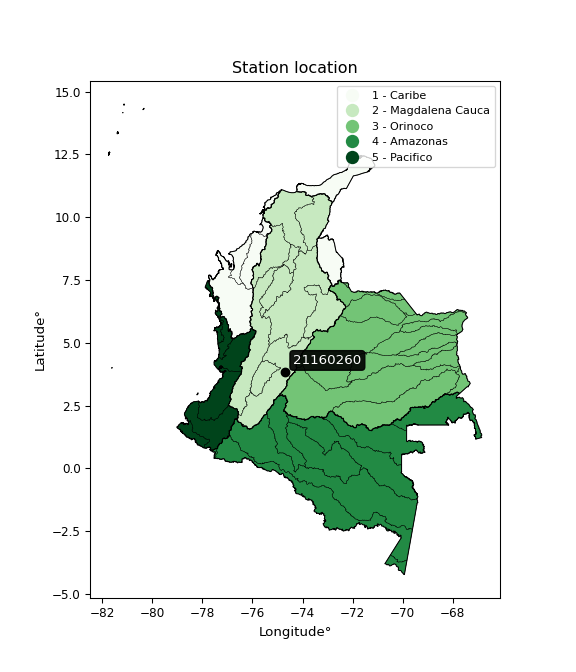

<div align="center">


</div>

# PMP Station (Rain, Pmax24h): 21160260

Probable Maximum Precipitation (PMP) is the greatest amount of rainfall for a specific duration that is meteorologically possible for a given location, acting as a "worst-case" scenario for extreme storms, crucial for designing safety-critical infrastructure like bridges, river deviations, dams, spillways, and nuclear plants to prevent catastrophic failure. PMP is calculated by hydrologists using meteorological data to determine the upper limit of extreme rainfall, often leading to the Probable Maximum Flood (PMF) for flood control design, and is increasingly being studied for climate change impacts. Probable Maximum Precipitation (PMP) is the theoretical upper limit of rainfall, a deterministic estimate for extreme events, while probability distributions (like GEV, Gumbel) describe the likelihood and frequency of various precipitation amounts, including rare ones, showing how often events occur, with PMP representing the extreme end of these distributions, used for critical infrastructure design to ensure safety against the worst conceivable weather, unlike standard statistical forecasts which cover typical probabilities.

The most common probability distributions in hydrology, used for analyzing floods, rainfall, and streamflow, include the Normal, Log-Normal, Gumbel, Gamma (including Log-Pearson Type III), and Generalized Extreme Value (GEV) distributions, often chosen based on the data´s skewness and whether modeling extremes or general conditions, with Gumbel and GEV popular for extreme events like floods, while the Normal distribution serves as a baseline, though often requiring transformations for skewed hydrological data. These distributions help in designing water infrastructure, managing water resources, and forecasting hydrologic events.

> Hydrological data often isn´t perfectly normal (it´s skewed), so different distributions are needed for different applications, such as: **Flood Frequency Analysis**: Using Gumbel, GEV, or Log-Pearson Type III for predicting extreme flood magnitudes and their return periods, **Rainfall Analysis**: Normal for annual totals, but Log-Normal, Weibull, or GEV for intensity or extreme daily rainfall, **Streamflow Modeling**: Gamma and Log-Normal for maximum flows, GEV for minimum flows, and Kappa for daily flows.

<div align="center">

</img>

</div>


## A. General information


### 1. General running parameters

• app_version: _v20260108_. • runtime: _2026-01-08 13:24:42.400241_. • Python version: _3.14.0_. • SciPy version: _1.16.3_. • Pandas version: _2.3.3_. • NumPy version: _2.3.5_. • Stations dataset (station_dataset_file): _dataset/pmax24h_in/automatic_colombia_2003_2024.csv_. • Stations catalog (station_catalog_file): _dataset/CNE.xls_. • Minimum year to eval til year_max (date_min): _1900_. • Maximum year to eval since year_min (date_max): _2024_. • Creates, save and include plots into reports (create_plot): _False_. • Plot only fit distributions with Δo > Δ (plot_only_fit): _True_. • Plot only simple graphs avoiding multiple CDFs and multiple Extreme values plots (plot_only_simple): _True_. • Eval low extreme values, if False, evaluates high extreme values (low_extreme): _False_. • Eval every SciPy distribution as logarithmic (pdist_logarithmic_on): _True_. • Standard deviation normalized (ddof): _1.0_. • Return periods to eval in years (Tr): _[2, 2.33, 5, 10, 15, 20, 25, 50, 75, 100, 200, 250, 500, 750, 1000]_. • Minimum data sample per station, 0 means any (minimum_sample): _5_. • Z-Score maximum threshold to adjust a value, 0 means disable (zscore_max): _3.5_. • Z-Score minimum threshold to adjust a value, 0 means disable (zscore_min): _-2.5_. • Avoid zeros, e.g. rain = 0 (avoid_zeros): _True_. • Avoid null values (avoid_nans): _True_. 

:file_folder:Table: [dataset.csv](../../dataset/pmax24h_in/automatic_colombia_2003_2024.csv)

> Delta Degrees of Freedom (DDOF): is a parameter used in the formulas for calculating variance and standard deviation. When ddof=0, the divisor is $N$ (the total number of observations) and this is used when your data set is the entire population. When ddof=1, the divisor is $N-1$ and this is used when your data set is a sample drawn from a larger population. Using $N-1$ provides an unbiased estimate of the population variance (known as Bessel´s correction).


### 2. Station info and location

|   id |   CODIGO | NOMBRE                                 | CATEGORIA     | TECNOLOGIA                | ESTADO           | FECHA_INSTALACION   |   FECHA_SUSPENSION |   ALTITUD |   LATITUD |   LONGITUD | DEPARTAMENTO   | MUNICIPIO   | AREA_OPERATIVA             | ENTIDAD                                                     | AREA_HIDROGRAFICA   | ZONA_HIDROGRAFICA   | SUBZONA_HIDROGRAFICA   |   CORRIENTE | Catalogo   |   Version |
|-----:|---------:|:---------------------------------------|:--------------|:--------------------------|:-----------------|:--------------------|-------------------:|----------:|----------:|-----------:|:---------------|:------------|:---------------------------|:------------------------------------------------------------|:--------------------|:--------------------|:-----------------------|------------:|:-----------|----------:|
|    0 | 21160260 | PUERTO LLERAS TOLIMA  - AUT [21160260] | Pluviográfica | Automática con Telemetría | En Mantenimiento | 16/05/1996          |                nan |      1183 |   3.83978 |   -74.6883 | Tolima         | Villarrica  | Area Operativa 10 - Tolima | INSTITUTO DE HIDROLOGIA METEOROLOGIA Y ESTUDIOS AMBIENTALES | Magdalena Cauca     | Alto Magdalena      | Río Prado              |         nan | CNE_IDEAM  |  20251226 |

<div align="center">

Dynamic map: [:earth_americas:Google](http://maps.google.com/maps?q=3.839777778,-74.68830556) [:earth_americas:OSM](https://www.openstreetmap.org/#map=18/3.839777778/-74.68830556&layers=P) [:earth_americas:Bing](https://www.bing.com/maps?cp=3.839777778~-74.68830556&lvl=18) [:earth_americas:Apple](https://maps.apple.com/frame?center=3.839777778%2C-74.68830556&span=0.003%2C0.006)

</div>


<div align="center">

```geojson
{
  "type": "Feature",
  "geometry": {
    "type": "Point", 
    "coordinates": [-74.68830556, 3.839777778]
  }, 
  "properties": {
    "Name": "21160260"
  }
}
```

</div>


### 3. Discrete values table and plot

<div align="center">

|               |           0 |          1 |          2 |           3 |           4 |            5 |           6 |           7 |            8 |          9 |         10 |
|:--------------|------------:|-----------:|-----------:|------------:|------------:|-------------:|------------:|------------:|-------------:|-----------:|-----------:|
| Date          | 2013        | 2014       | 2015       | 2016        | 2017        | 2018         | 2019        | 2020        | 2021         | 2022       | 2023       |
| Value         |   69.2      |  109.8     |    0.4     |   68.3      |   84.4      |   53.1       |   61        |   59.9      |   47.8       |    0.3     |    0.1     |
| Value_initial |   69.2      |  109.8     |    0.4     |   68.3      |   84.4      |   53.1       |   61        |   59.9      |   47.8       |    0.3     |    0.1     |
| count         |   11        |   11       |   11       |   11        |   11        |   11         |   11        |   11        |   11         |   11       |   11       |
| mean          |   50.3909   |   50.3909  |   50.3909  |   50.3909   |   50.3909   |   50.3909    |   50.3909   |   50.3909   |   50.3909    |   50.3909  |   50.3909  |
| std           |   36.2146   |   36.2146  |   36.2146  |   36.2146   |   36.2146   |   36.2146    |   36.2146   |   36.2146   |   36.2146    |   36.2146  |   36.2146  |
| zscore        |    0.519379 |    1.64047 |   -1.38041 |    0.494527 |    0.939099 |    0.0748066 |    0.292951 |    0.262576 |   -0.0715432 |   -1.38317 |   -1.38869 |


</div>


> The initial value (value_initial) correspond to the initial obtained or null completed value, and value (value) is adjusted only when the initial value is outside the valid range (outlier) definite through the Z-Score value. If Z-Score is active, values out of range or outliers are replaced with the station mean value. A Z-Score (or standard score) measures how many standard deviations a data point is from the mean of a dataset, indicating its relative position; positive scores mean above the mean, negative mean below, and a score of zero is exactly at the mean, allowing for comparison of values from different distributions. It´s calculated using the formula $z=(x–μ)/σ$, where $x$ is the data point, $μ$ is the mean, and $σ$ is the standard deviation, helping identify outliers and understand probability.
>
> <sub>**Note**: In this study, "completing" (filling gaps in) and "extending" (forecasting or lengthening the historical record) rainfall data series are avoided for certain critical analyses because they introduce artificial bias and uncertainty, which can distort the statistics of rare events (extremes), alter day-to-day variability, and compromise the integrity and homogeneity of the original data. Some reasons against Completing/Extending rainfall data are: **Distortion of Extremes and Variability**: The primary issue is that most gap-filling or extension methods rely on averaging or regression with nearby stations, which inherently smooths the data. Rainfall is highly variable in space and time, with a large percentage of zero values and occasional large storms. Infilling methods often underestimate the highest values and overestimate the lowest (zero) values, which severely distorts analyses focused on flood frequency, drought severity, and intensity-duration-frequency (IDF) curves, **Loss of Data Homogeneity**: Infilled or extended data are synthetic estimates, not actual measurements. Combining these estimates with observed data can violate the assumption of data homogeneity, which requires that the data properties do not change over time. Inhomogeneity can lead to incorrect conclusions about long-term trends or changes in climate patterns, **Propagation of Errors**: Errors and biases from the original data (e.g., wind-induced undercatch, instrument errors, site changes) or the data used for imputation can propagate through the analysis, leading to unreliable hydrological models and inaccurate predictions, **Compromised Statistical Integrity**: For statistical analyses, especially those involving the frequency of events, using artificial data can introduce time bias or autocorrelation that doesn´t exist in reality, making it difficult to assess the true probability of events, **Difficulty in Validation**: It is difficult to accurately validate the quality of filled or extended data, especially for past periods where ground-truth measurements are unavailable. The reliability of imputation techniques heavily depends on the density of the surrounding station network and the complexity of the local topography.</sub>


### 4. Active continuous probability distributions from SciPy (43 of 104 available)

A Probability Density Function (PDF) describes the relative likelihood of a continuous random variable falling within a specific range, where the total area under its curve equals 1, and the area over any interval gives the actual probability for that range. Unlike discrete probabilities (like rolling a die), a PDF shows density, not direct probability for a single point (which is zero), with higher points indicating higher likelihood, often visualized as a bell curve for normal distributions.

A log of a probability density function (log-PDF) is simply the logarithm of the PDF´s value, denoted as $log(f(x))$, useful for converting multiplication of probabilities into addition, improving numerical stability with tiny numbers, and connecting to information theory concepts like entropy. Instead of dealing with very small probabilities (e.g., 0.000001), log-PDFs use negative numbers (e.g., $log(0.00001) ≈ -11.51$ that are easier for computers to handle, preventing underflow errors and simplifying complex calculations. In this study, each active probability distribution from SciPy is also evaluated in the $log$ form.

[scipy.stats](https://docs.scipy.org/doc/scipy/reference/stats.html) is a Python´s powerful submodule within the SciPy library for comprehensive statistical analysis, offering over 130 probability distributions (like Normal, Poisson), functions for descriptive stats (mean, variance), hypothesis testing (t-tests, chi-square), random variable generation, and statistical tests, making it essential for data science, modeling, and research. It provides tools to explore, model, and draw conclusions from data efficiently, working seamlessly with NumPy.

<div align="center">

|   id | p_dist             |   n_parameter | fit_method   | label                                                                       | active   | ref                                                                                                        |
|-----:|:-------------------|--------------:|:-------------|:----------------------------------------------------------------------------|:---------|:-----------------------------------------------------------------------------------------------------------|
|    0 | alpha              |             3 | MLE          | Alpha                                                                       | True     | [:mortar_board:](https://docs.scipy.org/doc/scipy/reference/generated/scipy.stats.alpha.html)              |
|    1 | betaprime          |             4 | MLE          | Beta prime                                                                  | True     | [:mortar_board:](https://docs.scipy.org/doc/scipy/reference/generated/scipy.stats.betaprime.html)          |
|    2 | chi2               |             3 | MLE          | Chi²                                                                        | True     | [:mortar_board:](https://docs.scipy.org/doc/scipy/reference/generated/scipy.stats.chi2.html)               |
|    3 | crystalball        |             4 | MLE          | Crystalball                                                                 | True     | [:mortar_board:](https://docs.scipy.org/doc/scipy/reference/generated/scipy.stats.crystalball.html)        |
|    4 | erlang             |             3 | MLE          | Erlang                                                                      | True     | [:mortar_board:](https://docs.scipy.org/doc/scipy/reference/generated/scipy.stats.erlang.html)             |
|    5 | expon              |             2 | MLE          | Exponential                                                                 | True     | [:mortar_board:](https://docs.scipy.org/doc/scipy/reference/generated/scipy.stats.expon.html)              |
|    6 | exponnorm          |             3 | MLE          | Exponentially modified Normal                                               | True     | [:mortar_board:](https://docs.scipy.org/doc/scipy/reference/generated/scipy.stats.exponnorm.html)          |
|    7 | f                  |             4 | MLE          | F                                                                           | True     | [:mortar_board:](https://docs.scipy.org/doc/scipy/reference/generated/scipy.stats.f.html)                  |
|    8 | fatiguelife        |             3 | MLE          | Fatigue-life (Birnbaum-Saunders)                                            | True     | [:mortar_board:](https://docs.scipy.org/doc/scipy/reference/generated/scipy.stats.fatiguelife.html)        |
|    9 | fisk               |             3 | MLE          | Fisk                                                                        | True     | [:mortar_board:](https://docs.scipy.org/doc/scipy/reference/generated/scipy.stats.fisk.html)               |
|   10 | gamma              |             3 | MLE          | Gamma                                                                       | True     | [:mortar_board:](https://docs.scipy.org/doc/scipy/reference/generated/scipy.stats.gamma.html)              |
|   11 | genexpon           |             5 | MLE          | Generalized exponential                                                     | True     | [:mortar_board:](https://docs.scipy.org/doc/scipy/reference/generated/scipy.stats.genexpon.html)           |
|   12 | genlogistic        |             3 | MLE          | Generalized logistic                                                        | True     | [:mortar_board:](https://docs.scipy.org/doc/scipy/reference/generated/scipy.stats.genlogistic.html)        |
|   13 | gibrat             |             2 | MM           | Gibrat                                                                      | True     | [:mortar_board:](https://docs.scipy.org/doc/scipy/reference/generated/scipy.stats.gibrat.html)             |
|   14 | gompertz           |             3 | MLE          | Gompertz (or truncated Gumbel)                                              | True     | [:mortar_board:](https://docs.scipy.org/doc/scipy/reference/generated/scipy.stats.gompertz.html)           |
|   15 | gumbel_l           |             2 | MM           | Gumbel Left Skew                                                            | True     | [:mortar_board:](https://docs.scipy.org/doc/scipy/reference/generated/scipy.stats.gumbel_l.html)           |
|   16 | gumbel_r           |             2 | MM           | Gumbel Right Skew                                                           | True     | [:mortar_board:](https://docs.scipy.org/doc/scipy/reference/generated/scipy.stats.gumbel_r.html)           |
|   17 | halflogistic       |             2 | MM           | Half-logistic                                                               | True     | [:mortar_board:](https://docs.scipy.org/doc/scipy/reference/generated/scipy.stats.halflogistic.html)       |
|   18 | halfnorm           |             2 | MM           | Half Normal                                                                 | True     | [:mortar_board:](https://docs.scipy.org/doc/scipy/reference/generated/scipy.stats.halfnorm.html)           |
|   19 | hypsecant          |             2 | MM           | hyperbolic secant                                                           | True     | [:mortar_board:](https://docs.scipy.org/doc/scipy/reference/generated/scipy.stats.hypsecant.html)          |
|   20 | invgamma           |             3 | MLE          | Inverted gamma                                                              | True     | [:mortar_board:](https://docs.scipy.org/doc/scipy/reference/generated/scipy.stats.invgamma.html)           |
|   21 | invgauss           |             3 | MLE          | Inverse Gaussian                                                            | True     | [:mortar_board:](https://docs.scipy.org/doc/scipy/reference/generated/scipy.stats.invgauss.html)           |
|   22 | invweibull         |             3 | MLE          | Inverted Weibull                                                            | True     | [:mortar_board:](https://docs.scipy.org/doc/scipy/reference/generated/scipy.stats.invweibull.html)         |
|   23 | kstwobign          |             2 | MLE          | Limiting distribution of scaled Kolmogorov-Smirnov two-sided test statistic | True     | [:mortar_board:](https://docs.scipy.org/doc/scipy/reference/generated/scipy.stats.kstwobign.html)          |
|   24 | laplace            |             2 | MM           | Laplace                                                                     | True     | [:mortar_board:](https://docs.scipy.org/doc/scipy/reference/generated/scipy.stats.laplace.html)            |
|   25 | laplace_asymmetric |             3 | MLE          | Asymmetric Laplace                                                          | True     | [:mortar_board:](https://docs.scipy.org/doc/scipy/reference/generated/scipy.stats.laplace_asymmetric.html) |
|   26 | loggamma           |             3 | MLE          | Log gamma                                                                   | True     | [:mortar_board:](https://docs.scipy.org/doc/scipy/reference/generated/scipy.stats.loggamma.html)           |
|   27 | logistic           |             2 | MM           | Logistic (or Sech-squared)                                                  | True     | [:mortar_board:](https://docs.scipy.org/doc/scipy/reference/generated/scipy.stats.logistic.html)           |
|   28 | lognorm            |             3 | MLE          | Log Normal                                                                  | True     | [:mortar_board:](https://docs.scipy.org/doc/scipy/reference/generated/scipy.stats.lognorm.html)            |
|   29 | maxwell            |             2 | MM           | Maxwell                                                                     | True     | [:mortar_board:](https://docs.scipy.org/doc/scipy/reference/generated/scipy.stats.maxwell.html)            |
|   30 | mielke             |             4 | MLE          | Mielke Beta-Kappa / Dagum                                                   | True     | [:mortar_board:](https://docs.scipy.org/doc/scipy/reference/generated/scipy.stats.mielke.html)             |
|   31 | moyal              |             2 | MM           | Moyal                                                                       | True     | [:mortar_board:](https://docs.scipy.org/doc/scipy/reference/generated/scipy.stats.moyal.html)              |
|   32 | nakagami           |             3 | MLE          | Nakagami                                                                    | True     | [:mortar_board:](https://docs.scipy.org/doc/scipy/reference/generated/scipy.stats.nakagami.html)           |
|   33 | ncf                |             5 | MLE          | Non-central F distribution                                                  | True     | [:mortar_board:](https://docs.scipy.org/doc/scipy/reference/generated/scipy.stats.ncf.html)                |
|   34 | nct                |             4 | MLE          | Non-central Student’s t                                                     | True     | [:mortar_board:](https://docs.scipy.org/doc/scipy/reference/generated/scipy.stats.nct.html)                |
|   35 | norm               |             2 | MM           | Normal                                                                      | True     | [:mortar_board:](https://docs.scipy.org/doc/scipy/reference/generated/scipy.stats.norm.html)               |
|   36 | pearson3           |             3 | MM           | Pearson type III                                                            | True     | [:mortar_board:](https://docs.scipy.org/doc/scipy/reference/generated/scipy.stats.pearson3.html)           |
|   37 | rayleigh           |             2 | MM           | Rayleigh                                                                    | True     | [:mortar_board:](https://docs.scipy.org/doc/scipy/reference/generated/scipy.stats.rayleigh.html)           |
|   38 | rice               |             3 | MLE          | Rice                                                                        | True     | [:mortar_board:](https://docs.scipy.org/doc/scipy/reference/generated/scipy.stats.rice.html)               |
|   39 | t                  |             3 | MLE          | Student’s t                                                                 | True     | [:mortar_board:](https://docs.scipy.org/doc/scipy/reference/generated/scipy.stats.t.html)                  |
|   40 | truncnorm          |             4 | MLE          | Truncated normal                                                            | True     | [:mortar_board:](https://docs.scipy.org/doc/scipy/reference/generated/scipy.stats.truncnorm.html)          |
|   41 | wald               |             2 | MM           | Wald                                                                        | True     | [:mortar_board:](https://docs.scipy.org/doc/scipy/reference/generated/scipy.stats.wald.html)               |
|   42 | weibull_min        |             3 | MLE          | Weibull minimum                                                             | True     | [:mortar_board:](https://docs.scipy.org/doc/scipy/reference/generated/scipy.stats.weibull_min.html)        |

</div>

> **n_parameter:** # arguments & localization & scale.
>
> **Fit methods:** (MLE) maximum likelihood, (MM) L-moments.
>
>**Inactive** (With the only purpose of prevent loops, zero divisions, infinite values, over high estimated values or horizontal trending for recurrence intervals estimations, the follow distributions were disabled.)**:** foldnorm, gennorm, norminvgauss, powernorm, powerlognorm, skewnorm, genextreme, anglit, arcsine, argus, beta, bradford, burr, burr12, cauchy, cosine, halfcauchy, foldcauchy, skewcauchy, wrapcauchy, dgamma, gengamma, exponweib, exponpow, truncexpon, gausshyper, genhalflogistic, genhyperbolic, geninvgauss, halfgennorm, johnsonsb, johnsonsu, kappa4, kappa3, ksone, kstwo, loglaplace, levy, levy_l, levy_stable, ncx2, pareto, genpareto, truncpareto, lomax, powerlaw, rdist, rel_breitwigner, recipinvgauss, semicircular, studentized_range, trapezoid, triang, truncweibull_min, tukeylambda, uniform, loguniform, vonmises, vonmises_line, weibull_max, dweibull, 


## B. Probability (PDF) vs. Empirical (EDF) distributions functions

A continuous probability distribution (CPD) describes probabilities for variables that can take any value within a range (like rain any time), unlike discrete variables with specific outcomes (like temperature). It uses a Probability Density Function (PDF), a curve where the total area under it equals 1, and the probability of the variable falling within an interval (a to b) is found by calculating the area under the curve between those points. A key feature is that the probability of hitting any single exact value is zero, so probabilities are always expressed for ranges, e.g., $P(a ≤ X ≤ b)$.

<div align="center">

Distributions parameters from station values
|    |   station | p_dist                |   n |             loc |           scale | shape                  | shape1                 | shape2             | shape3   |
|---:|----------:|:----------------------|----:|----------------:|----------------:|:-----------------------|:-----------------------|:-------------------|:---------|
|  0 |  21160260 | alpha                 |  11 |     0.00737465  |     0.287829    | 2.0838783628421377e-07 |                        |                    |          |
|  1 |  21160260 | betaprime             |  11 |     0.1         |    53.6794      | 0.5285349070966896     | 0.8226125480635685     |                    |          |
|  2 |  21160260 | chi2                  |  11 |  -180.78        |     2.69476     | 85.60668908056772      |                        |                    |          |
|  3 |  21160260 | crystalball           |  11 |    50.3909      |    34.5293      | 68307.69964519452      | 960.8111711795373      |                    |          |
|  4 |  21160260 | erlang                |  11 |  -588.095       |     1.89528     | 336.8556604209682      |                        |                    |          |
|  5 |  21160260 | expon                 |  11 |     0.1         |    50.2909      |                        |                        |                    |          |
|  6 |  21160260 | exponnorm             |  11 |    50.3614      |    34.5292      | 0.0008566690913081838  |                        |                    |          |
|  7 |  21160260 | f                     |  11 |     0.1         |    48.3642      | 1.014962235831413      | 33.94969810179546      |                    |          |
|  8 |  21160260 | fatiguelife           |  11 |     0.1         |     0.000847843 | 258.79708656409866     |                        |                    |          |
|  9 |  21160260 | fisk                  |  11 |     0.1         |    17.2437      | 0.6687114598627757     |                        |                    |          |
| 10 |  21160260 | gamma                 |  11 |  -591.528       |     1.88435     | 340.60957920067494     |                        |                    |          |
| 11 |  21160260 | genexpon              |  11 |     0.0999956   |     2.82995     | 0.05627979078241588    | 1.6070924359114524e-06 | 2.9527606283891092 |          |
| 12 |  21160260 | genlogistic           |  11 |    73.4716      |    12.9739      | 0.42904581206562653    |                        |                    |          |
| 13 |  21160260 | gibrat                |  11 |    24.0494      |    15.9769      |                        |                        |                    |          |
| 14 |  21160260 | gompertz              |  11 |    47.7999      |     8.88078     | 0.006905819025674574   |                        |                    |          |
| 15 |  21160260 | gumbel_l              |  11 |    65.9309      |    26.9224      |                        |                        |                    |          |
| 16 |  21160260 | gumbel_r              |  11 |    34.8509      |    26.9224      |                        |                        |                    |          |
| 17 |  21160260 | halflogistic          |  11 |     9.46572     |    29.5213      |                        |                        |                    |          |
| 18 |  21160260 | halfnorm              |  11 |     4.68769     |    57.2805      |                        |                        |                    |          |
| 19 |  21160260 | hypsecant             |  11 |    50.3909      |    21.982       |                        |                        |                    |          |
| 20 |  21160260 | invgamma              |  11 |     0.0143649   |     0.141757    | 0.23058035457091575    |                        |                    |          |
| 21 |  21160260 | invgauss              |  11 |  -151.519       |  5875.7         | 0.034269142846388406   |                        |                    |          |
| 22 |  21160260 | invweibull            |  11 |     0.1         |     2.78322     | 0.06061147896452772    |                        |                    |          |
| 23 |  21160260 | kstwobign             |  11 |   -81.5265      |   150.335       |                        |                        |                    |          |
| 24 |  21160260 | laplace               |  11 |    50.3909      |    24.4159      |                        |                        |                    |          |
| 25 |  21160260 | laplace_asymmetric    |  11 |    68.3         |    23.7553      | 1.445635183588469      |                        |                    |          |
| 26 |  21160260 | loggamma              |  11 |   -68.5462      |    76.0593      | 5.267982364576448      |                        |                    |          |
| 27 |  21160260 | logistic              |  11 |    50.3909      |    19.037       |                        |                        |                    |          |
| 28 |  21160260 | lognorm               |  11 |     0.1         |     0.483047    | 12.235347431168856     |                        |                    |          |
| 29 |  21160260 | maxwell               |  11 |   -31.4289      |    51.273       |                        |                        |                    |          |
| 30 |  21160260 | mielke                |  11 |     0.1         |   127.806       | 0.37360523730946704    | 73.06640726372743      |                    |          |
| 31 |  21160260 | moyal                 |  11 |    30.6449      |    15.5436      |                        |                        |                    |          |
| 32 |  21160260 | nakagami              |  11 |     0.1         |    84.1427      | 0.2107586071971274     |                        |                    |          |
| 33 |  21160260 | ncf                   |  11 |     0.1         |     4.927       | 0.3958492057455002     | 27.8153937966382       | 4.672582046808658  |          |
| 34 |  21160260 | nct                   |  11 |    -0.0380745   |     0.0128591   | 0.22255940113139433    | 31.634206535984056     |                    |          |
| 35 |  21160260 | norm                  |  11 |    50.3909      |    34.5293      |                        |                        |                    |          |
| 36 |  21160260 | pearson3              |  11 |    50.3909      |    34.5293      | -0.25248909711581924   |                        |                    |          |
| 37 |  21160260 | rayleigh              |  11 |   -15.6656      |    52.7055      |                        |                        |                    |          |
| 38 |  21160260 | rice                  |  11 |   -22.2204      |    39.5825      | 1.458119104639385      |                        |                    |          |
| 39 |  21160260 | t                     |  11 |     0.312913    |     0.227254    | 0.1844731495675595     |                        |                    |          |
| 40 |  21160260 | truncnorm             |  11 |    55.7493      |    32.7423      | -1.7204316053921493    | 1.6507929649067403     |                    |          |
| 41 |  21160260 | wald                  |  11 |    15.8617      |    34.5293      |                        |                        |                    |          |
| 42 |  21160260 | weibull_min           |  11 |   -71.3876      |   134.528       | 4.114954245092555      |                        |                    |          |
| 43 |  21160260 | logalpha              |  11 |    -3.10469     |     1.72514     | 2.0445987535333613e-09 |                        |                    |          |
| 44 |  21160260 | logbetaprime          |  11 |    -2.30259     |     3.00888     | 0.21863446948384915    | 0.6525474922511584     |                    |          |
| 45 |  21160260 | logchi2               |  11 |    -2.30259     |     1.25371     | 1.0210033852960012     |                        |                    |          |
| 46 |  21160260 | logcrystalball        |  11 |     2.65591     |     2.55708     | 84.10816398053232      | 824.593359915672       |                    |          |
| 47 |  21160260 | logerlang             |  11 |   -37.1586      |     0.178473    | 223.0549295526357      |                        |                    |          |
| 48 |  21160260 | logexpon              |  11 |    -2.30259     |     4.9585      |                        |                        |                    |          |
| 49 |  21160260 | logexponnorm          |  11 |     2.65399     |     2.55708     | 0.0007489763282887984  |                        |                    |          |
| 50 |  21160260 | logf                  |  11 |    -2.30259     |     1.13002     | 1.0810556033464522     | 1.0513661326938664     |                    |          |
| 51 |  21160260 | logfatiguelife        |  11 |  -856.503       |   859.153       | 0.0029588851702037865  |                        |                    |          |
| 52 |  21160260 | logfisk               |  11 |    -2.30259     |     2.41741     | 0.7981672966415883     |                        |                    |          |
| 53 |  21160260 | loggamma              |  11 |   -36.1883      |     0.182318    | 213.05416065315342     |                        |                    |          |
| 54 |  21160260 | loggenexpon           |  11 |    -2.30259     |     3.01013     | 0.2197766621690111     | 0.9092696887974232     | 0.5221710167738057 |          |
| 55 |  21160260 | loggenlogistic        |  11 |     4.69868     |     1.79557e-06 | 8.789955798179527e-07  |                        |                    |          |
| 56 |  21160260 | loggibrat             |  11 |     0.705157    |     1.18319     |                        |                        |                    |          |
| 57 |  21160260 | loggompertz           |  11 |    -2.30259     |     1.73039     | 0.03217249672044037    |                        |                    |          |
| 58 |  21160260 | loggumbel_l           |  11 |     3.80673     |     1.99374     |                        |                        |                    |          |
| 59 |  21160260 | loggumbel_r           |  11 |     1.50509     |     1.99374     |                        |                        |                    |          |
| 60 |  21160260 | loghalflogistic       |  11 |    -0.37486     |     2.18623     |                        |                        |                    |          |
| 61 |  21160260 | loghalfnorm           |  11 |    -0.728615    |     4.2419      |                        |                        |                    |          |
| 62 |  21160260 | loghypsecant          |  11 |     2.65591     |     1.62789     |                        |                        |                    |          |
| 63 |  21160260 | loginvgamma           |  11 |   -52.6631      | 23811.6         | 431.87434032841225     |                        |                    |          |
| 64 |  21160260 | loginvgauss           |  11 |   -19.1149      |  1332.74        | 0.016288562318702002   |                        |                    |          |
| 65 |  21160260 | loginvweibull         |  11 |    -4.36019e+08 |     4.36019e+08 | 156269518.25389898     |                        |                    |          |
| 66 |  21160260 | logkstwobign          |  11 |    -8.39345     |    12.5727      |                        |                        |                    |          |
| 67 |  21160260 | loglaplace            |  11 |     2.65591     |     1.80813     |                        |                        |                    |          |
| 68 |  21160260 | loglaplace_asymmetric |  11 |     4.69866     |     0.0251243   | 81.15845421565535      |                        |                    |          |
| 69 |  21160260 | logloggamma           |  11 |     4.69874     |     9.1138e-06  | 4.46377640820869e-06   |                        |                    |          |
| 70 |  21160260 | loglogistic           |  11 |     2.65591     |     1.40979     |                        |                        |                    |          |
| 71 |  21160260 | loglognorm            |  11 |  -565.56        |   568.194       | 0.004483224653679292   |                        |                    |          |
| 72 |  21160260 | logmaxwell            |  11 |    -3.40328     |     3.79704     |                        |                        |                    |          |
| 73 |  21160260 | logmielke             |  11 |    -2.30259     |     1.84897     | 0.9176035480512592     | 0.8264732008815608     |                    |          |
| 74 |  21160260 | logmoyal              |  11 |     1.19361     |     1.15109     |                        |                        |                    |          |
| 75 |  21160260 | lognakagami           |  11 | -1277.21        |  1279.86        | 62182.882716423046     |                        |                    |          |
| 76 |  21160260 | logncf                |  11 |    -2.30259     |     1.08815     | 1.0395805995884904     | 1.091343564223732      | 1.0393028426764341 |          |
| 77 |  21160260 | lognct                |  11 |  -130.042       |     2.51805     | 40341.259696775        | 52.6969706001708       |                    |          |
| 78 |  21160260 | lognorm               |  11 |     2.65591     |     2.55708     |                        |                        |                    |          |
| 79 |  21160260 | logpearson3           |  11 |     2.65593     |     2.55705     | -1.0490008250854335    |                        |                    |          |
| 80 |  21160260 | lograyleigh           |  11 |    -2.23595     |     3.90314     |                        |                        |                    |          |
| 81 |  21160260 | logrice               |  11 |    -3.80575     |     2.78993     | 2.050412839996926      |                        |                    |          |
| 82 |  21160260 | logt                  |  11 |     2.65591     |     2.55708     | 119184166128.77545     |                        |                    |          |
| 83 |  21160260 | logtruncnorm          |  11 |     2.33793     |     2.84876     | -1.628960947572606     | 6.350200152550608      |                    |          |
| 84 |  21160260 | logwald               |  11 |     0.0988701   |     2.55706     |                        |                        |                    |          |
| 85 |  21160260 | logweibull_min        |  11 |    -2.94438e+08 |     2.94438e+08 | 192932529.25968406     |                        |                    |          |

</div>

> **loc** (Location parameter): This shifts the distribution along the x-axis. For many common distributions, like the normal (Gaussian) distribution, loc represents the mean $μ$. For others, like the uniform distribution, it might represent the minimum value, or for the beta distribution, the left end of the support interval.
>
> **scale** (Scale parameter): This determines the width or spread of the distribution. For the normal distribution, scale represents the standard deviation $σ$. For a uniform distribution, it defines the length of the interval (from $loc$ to $loc + scale$).
>
> **shape** (Shape parameters): Refers to parameters that define the specific form of a probability distribution, distinct from its location (loc) and scale (scale). These parameters are required arguments for most distribution functions. For example, a normal (Gaussian) distribution is fully defined by its location (mean) and scale (standard deviation), so it has no specific shape parameters beyond loc and scale. However, other distributions have intrinsic properties that need specification, as Gamma distribution that takes a shape parameter, often named $a$ or $alpha$.


### 0. Cumulative distribution values - CDF (86 evaluated)

Cumulative Distribution Function (CDF), denoted as $F$<sub>$X$</sub>$(x)$, is a function that gives the probability that a random variable $X$ will take a value less than or equal to a specific value, $x$ (i.e., $(P(X≥x)$. It essentially "accumulates" probabilities from a given point up to the far right (positive infinity), providing a complete picture of the distribution´s probabilities for both discrete (like rain) and continuous (like temperature) variables, helping to find probabilities over ranges or above certain values. Each station is evaluated separately ordering the $x$ values ascending, calculating the CDF and PDF values for the activated distributions and their logarithmic forms.

<div align="center">

CDF ordered by x ascending and calculating $log(f(x))$ separately
|   id |   Station |   date |     x |   count |    mean |     std |     zscore |   Value_initial |   station |   m |      alpha |   alpha_pdf |   betaprime |   betaprime_pdf |      chi2 |   chi2_pdf |   crystalball |   crystalball_pdf |    erlang |   erlang_pdf |      expon |   expon_pdf |   exponnorm |   exponnorm_pdf |           f |       f_pdf |   fatiguelife |   fatiguelife_pdf |       fisk |       fisk_pdf |     gamma |   gamma_pdf |    genexpon |   genexpon_pdf |   genlogistic |   genlogistic_pdf |   gibrat |   gibrat_pdf |   gompertz |   gompertz_pdf |   gumbel_l |   gumbel_l_pdf |   gumbel_r |   gumbel_r_pdf |   halflogistic |   halflogistic_pdf |   halfnorm |   halfnorm_pdf |   hypsecant |   hypsecant_pdf |   invgamma |   invgamma_pdf |   invgauss |   invgauss_pdf |   invweibull |   invweibull_pdf |   kstwobign |   kstwobign_pdf |   laplace |   laplace_pdf |   laplace_asymmetric |   laplace_asymmetric_pdf |   loggamma |   loggamma_pdf |   logistic |   logistic_pdf |   lognorm |   lognorm_pdf |   maxwell |   maxwell_pdf |      mielke |   mielke_pdf |      moyal |   moyal_pdf |    nakagami |   nakagami_pdf |         ncf |     ncf_pdf |      nct |     nct_pdf |      norm |   norm_pdf |   pearson3 |   pearson3_pdf |   rayleigh |   rayleigh_pdf |      rice |   rice_pdf |        t |       t_pdf |   truncnorm |   truncnorm_pdf |     wald |   wald_pdf |   weibull_min |   weibull_min_pdf |   logalpha |   logalpha_pdf |   logbetaprime |   logbetaprime_pdf |     logchi2 |   logchi2_pdf |   logcrystalball |   logcrystalball_pdf |   logerlang |   logerlang_pdf |   logexpon |   logexpon_pdf |   logexponnorm |   logexponnorm_pdf |        logf |    logf_pdf |   logfatiguelife |   logfatiguelife_pdf |     logfisk |   logfisk_pdf |   loggenexpon |   loggenexpon_pdf |   loggenlogistic |   loggenlogistic_pdf |   loggibrat |   loggibrat_pdf |   loggompertz |   loggompertz_pdf |   loggumbel_l |   loggumbel_l_pdf |   loggumbel_r |   loggumbel_r_pdf |   loghalflogistic |   loghalflogistic_pdf |   loghalfnorm |   loghalfnorm_pdf |   loghypsecant |   loghypsecant_pdf |   loginvgamma |   loginvgamma_pdf |   loginvgauss |   loginvgauss_pdf |   loginvweibull |   loginvweibull_pdf |   logkstwobign |   logkstwobign_pdf |   loglaplace |   loglaplace_pdf |   loglaplace_asymmetric |   loglaplace_asymmetric_pdf |   logloggamma |   logloggamma_pdf |   loglogistic |   loglogistic_pdf |   loglognorm |   loglognorm_pdf |   logmaxwell |   logmaxwell_pdf |   logmielke |   logmielke_pdf |    logmoyal |   logmoyal_pdf |   lognakagami |   lognakagami_pdf |      logncf |   logncf_pdf |    lognct |   lognct_pdf |   logpearson3 |   logpearson3_pdf |   lograyleigh |   lograyleigh_pdf |   logrice |   logrice_pdf |      logt |   logt_pdf |   logtruncnorm |   logtruncnorm_pdf |   logwald |   logwald_pdf |   logweibull_min |   logweibull_min_pdf |
|-----:|----------:|-------:|------:|--------:|--------:|--------:|-----------:|----------------:|----------:|----:|-----------:|------------:|------------:|----------------:|----------:|-----------:|--------------:|------------------:|----------:|-------------:|-----------:|------------:|------------:|----------------:|------------:|------------:|--------------:|------------------:|-----------:|---------------:|----------:|------------:|------------:|---------------:|--------------:|------------------:|---------:|-------------:|-----------:|---------------:|-----------:|---------------:|-----------:|---------------:|---------------:|-------------------:|-----------:|---------------:|------------:|----------------:|-----------:|---------------:|-----------:|---------------:|-------------:|-----------------:|------------:|----------------:|----------:|--------------:|---------------------:|-------------------------:|-----------:|---------------:|-----------:|---------------:|----------:|--------------:|----------:|--------------:|------------:|-------------:|-----------:|------------:|------------:|---------------:|------------:|------------:|---------:|------------:|----------:|-----------:|-----------:|---------------:|-----------:|---------------:|----------:|-----------:|---------:|------------:|------------:|----------------:|---------:|-----------:|--------------:|------------------:|-----------:|---------------:|---------------:|-------------------:|------------:|--------------:|-----------------:|---------------------:|------------:|----------------:|-----------:|---------------:|---------------:|-------------------:|------------:|------------:|-----------------:|---------------------:|------------:|--------------:|--------------:|------------------:|-----------------:|---------------------:|------------:|----------------:|--------------:|------------------:|--------------:|------------------:|--------------:|------------------:|------------------:|----------------------:|--------------:|------------------:|---------------:|-------------------:|--------------:|------------------:|--------------:|------------------:|----------------:|--------------------:|---------------:|-------------------:|-------------:|-----------------:|------------------------:|----------------------------:|--------------:|------------------:|--------------:|------------------:|-------------:|-----------------:|-------------:|-----------------:|------------:|----------------:|------------:|---------------:|--------------:|------------------:|------------:|-------------:|----------:|-------------:|--------------:|------------------:|--------------:|------------------:|----------:|--------------:|----------:|-----------:|---------------:|-------------------:|----------:|--------------:|-----------------:|---------------------:|
|    0 |  21160260 |   2023 |   0.1 |      11 | 50.3909 | 36.2146 | -1.38869   |             0.1 |  21160260 |   1 | 0.00188707 | 0.214182    | 1.04444e-07 |  13072.8        | 0.0697794 | 0.00447193 |     0.0726311 |        0.00400024 | 0.0713594 |   0.00413783 | 0          |  0.0198843  |   0.0726306 |      0.00400023 | 3.08899e-10 | 1.12958e+07 |     0.0339747 |       1.81141e+07 | 7.9456e-13 | 38286.5        | 0.0714949 |  0.00414341 | 8.71988e-08 |     0.0198872  |     0.0882228 |        0.00290735 | 0        |   0          | 0          |    0           |  0.0830548 |     0.00295316 |  0.0263673 |     0.00356068 |       0        |         0          |   0        |     0          |   0.0643884 |      0.00290921 |  0.0244855 |    0.634441    |  0.0731805 |     0.00502201 |  1.38532e-05 |      6.76857e+11 |   0.0702929 |      0.00634624 | 0.0637421 |    0.00261068 |            0.0928319 |               0.0027032  |  0.0270723 |      0.0257222 |  0.0664994 |     0.00326088 | 0.0262429 |     0.0238038 | 0.0552777 |    0.00487061 | 8.21986e-08 |  2.21288e+09 | 0.00755658 |  0.00193458 | 9.52025e-09 |    2.89163e+08 | 7.07582e-05 | 5.83325e+09 | 0.02876  | 0.645714    | 0.0726311 | 0.00400024 |  0.0782134 |     0.00378335 |  0.0437523 |     0.00542712 | 0.0550663 | 0.00493723 | 0.382019 | 0.298526    |  0.00211953 |      0.00316573 | 0        | 0          |     0.0714673 |        0.00396315 |  0.0314956 |      0.211753  |    0.000299838 |        1.47617e+11 | 1.02557e-08 |   1.17895e+07 |        0.0262429 |            0.0238038 |   0.0274953 |       0.0259505 |   0        |      0.201674  |      0.0262432 |          0.023804  | 3.07904e-09 | 3.74768e+06 |        0.0253532 |            0.0233974 | 2.75508e-13 |   495.174     |   1.19598e-10 |         0.0730123 |          0       |            0.0158964 |    0        |       0         |   1.47969e-07 |         0.0185927 |     0.045616  |         0.0223496 |    0.00116875 |        0.00395797 |          0        |             0         |      0        |         0         |      0.0302484 |          0.0185535 |     0.0269692 |         0.0264891 |     0.0256654 |         0.0281321 |       0.0275542 |           0.0354686 |      0.0269712 |          0.0421264 |    0.0322097 |        0.0178139 |               0.0322663 |                   0.0158242 |     0.0324154 |         0.0158765 |     0.0288271 |         0.0198583 |    0.0258147 |        0.0237747 |   0.00631783 |        0.0169315 | 4.65081e-15 |       9.60977   | 4.97006e-06 |    4.69985e-05 |     0.0267898 |         0.0241623 | 3.88654e-09 |  4.54906e+06 | 0.0263594 |    0.0239127 |     0.0465857 |         0.0240187 |     0         |         0         | 0.0190936 |     0.0271294 | 0.0262429 |  0.0238038 |    3.88504e-11 |          0.039182  |  0        |     0         |        0.0187211 |            0.0121516 |
|    1 |  21160260 |   2022 |   0.3 |      11 | 50.3909 | 36.2146 | -1.38317   |             0.3 |  21160260 |   2 | 0.325308   | 1.65335     | 0.0457585   |      0.120528   | 0.0706779 | 0.00451275 |     0.0734345 |        0.00403406 | 0.0721905 |   0.00417379 | 0.00396896 |  0.0198054  |   0.073434  |      0.00403405 | 0.0489487   | 0.124025    |     0.523562  |       0.0593372   | 0.0483205  |     0.153756   | 0.0723271 |  0.0041794  | 0.00396964  |     0.0198084  |     0.0888061 |        0.00292641 | 0        |   0          | 0          |    0           |  0.0836475 |     0.00297326 |  0.0270864 |     0.00363072 |       0        |         0          |   0        |     0          |   0.0649728 |      0.00293525 |  0.141893  |    0.459177    |  0.0741894 |     0.00506769 |  0.309427    |      0.11        |   0.0715686 |      0.00640987 | 0.0642664 |    0.00263216 |            0.0933742 |               0.00271899 |  0.0696797 |      0.0539187 |  0.0671546 |     0.00329069 | 0.0655866 |     0.0499324 | 0.0562569 |    0.00492074 | 0.0895041   |  0.167196    | 0.00795119 |  0.00201188 | 0.0616343   |    0.1299      | 0.0408593   | 0.0433648   | 0.151511 | 0.482851    | 0.0734345 | 0.00403406 |  0.078973  |     0.00381272 |  0.0448439 |     0.00548969 | 0.0560581 | 0.00498121 | 0.489166 | 0.833282    |  0.00275597 |      0.00319871 | 0        | 0          |     0.0722631 |        0.00399437 |  0.364078  |      0.252375  |    0.66201     |        0.105566    | 0.643594    |   0.221912    |        0.0655866 |            0.0499324 |   0.0703556 |       0.0541308 |   0.198733 |      0.161595  |      0.0655872 |          0.0499327 | 0.491722    | 0.151375    |        0.0643099 |            0.0496883 | 0.34763     |     0.164763  |   0.104092    |         0.112371  |          0       |            0.0272186 |    0        |       0         |   0.0281282   |         0.0340942 |     0.0778132 |         0.0374692 |    0.0204157  |        0.0398479  |          0        |             0         |      0        |         0         |      0.0592741 |          0.0362017 |     0.071227  |         0.0562351 |     0.073734  |         0.0615386 |       0.0886878 |           0.0770053 |      0.100758  |          0.0917366 |    0.0591375 |        0.0327065 |               0.055302  |                   0.0271214 |     0.0555184 |         0.0271919 |     0.0607728 |         0.0404879 |    0.0653207 |        0.0503053 |   0.0467794  |        0.0596111 | 0.355612    |       0.179975  | 0.00460701  |    0.0177388   |     0.0665968 |         0.0503973 | 0.366964    |  0.145985    | 0.0658641 |    0.0501131 |     0.0810571 |         0.0398774 |     0.0343489 |         0.0654127 | 0.0642508 |     0.0567308 | 0.0655866 |  0.0499324 |    0.058223    |          0.0681737 |  0        |     0         |        0.0380771 |            0.0244691 |
|    2 |  21160260 |   2015 |   0.4 |      11 | 50.3909 | 36.2146 | -1.38041   |             0.4 |  21160260 |   3 | 0.463505   | 1.13873     | 0.0566456   |      0.0993068  | 0.0711302 | 0.00453322 |     0.0738387 |        0.00405103 | 0.0726088 |   0.00419183 | 0.00594754 |  0.019766   |   0.0738383 |      0.00405101 | 0.0601099   | 0.101464    |     0.52889   |       0.0483378   | 0.0624308  |     0.130473   | 0.072746  |  0.00419745 | 0.00594851  |     0.0197691  |     0.0890993 |        0.00293599 | 0        |   0          | 0          |    0           |  0.0839453 |     0.00298335 |  0.0274513 |     0.00366598 |       0        |         0          |   0        |     0          |   0.065267  |      0.00294835 |  0.182589  |    0.360949    |  0.0746973 |     0.00509057 |  0.318365    |      0.0736201   |   0.0722111 |      0.00644162 | 0.0645301 |    0.00264296 |            0.0936465 |               0.00272692 |  0.0865098 |      0.0631927 |  0.0674844 |     0.00330568 | 0.0812087 |     0.0588014 | 0.0567502 |    0.00494582 | 0.104143    |  0.129695    | 0.00815434 |  0.00205123 | 0.073122    |    0.10274     | 0.0445909   | 0.0325934   | 0.194089 | 0.375453    | 0.0738387 | 0.00405103 |  0.079355  |     0.00382745 |  0.0453945 |     0.00552089 | 0.0565574 | 0.00500319 | 0.564779 | 0.595163    |  0.00307667 |      0.00321528 | 0        | 0          |     0.0726633 |        0.00401002 |  0.430516  |      0.210653  |    0.688897    |        0.0829824   | 0.700538    |   0.176566    |        0.0812087 |            0.0588014 |   0.0872433 |       0.0633798 |   0.243898 |      0.152486  |      0.0812094 |          0.0588017 | 0.530343    | 0.11931     |        0.0798754 |            0.0586555 | 0.390828    |     0.137077  |   0.137365    |         0.118681  |          0       |            0.0313349 |    0        |       0         |   0.0387406   |         0.0398212 |     0.0893363 |         0.0427444 |    0.0344386  |        0.0581866  |          0        |             0         |      0        |         0         |      0.0706454 |          0.0430417 |     0.0887866 |         0.0659438 |     0.0929367 |         0.0720315 |       0.112445  |           0.088068  |      0.128795  |          0.102943  |    0.0693364 |        0.0383471 |               0.0636815 |                   0.031231  |     0.063919  |         0.0313064 |     0.0735186 |         0.0483147 |    0.0810709 |        0.0593212 |   0.0658117  |        0.0727441 | 0.402704    |       0.149064  | 0.0124026   |    0.0380309   |     0.0823532 |         0.0592677 | 0.405175    |  0.121058    | 0.0815401 |    0.0589942 |     0.0932878 |         0.0452439 |     0.0555536 |         0.0818108 | 0.0818934 |     0.0660099 | 0.0812087 |  0.0588014 |    0.0790832   |          0.0769008 |  0        |     0         |        0.0457925 |            0.0293081 |
|    3 |  21160260 |   2021 |  47.8 |      11 | 50.3909 | 36.2146 | -0.0715432 |            47.8 |  21160260 |   4 | 0.995195   | 0.000100541 | 0.612302    |      0.00388382 | 0.496411  | 0.0113758  |     0.470093  |        0.0115213  | 0.478086  |   0.0114809  | 0.612671   |  0.00770176 |   0.470093  |      0.0115213  | 0.671012    | 0.00504496  |     0.820299  |       0.00251833  | 0.663828   |     0.00312851 | 0.478506  |  0.0114837  | 0.612735    |     0.00770184 |     0.404739  |        0.011759   | 0.654118 |   0.0155276  | 7.3426e-08 |    0.000777623 |  0.399472  |     0.0113748  |  0.538926  |     0.0123745  |       0.571175 |         0.0114114  |   0.548341 |     0.0104936  |   0.462569  |      0.0143805  |  0.713206  |    0.00138054  |  0.514667  |     0.0108508  |  0.430936    |      0.000460952 |   0.550125  |      0.00992913 | 0.44966   |    0.0184167  |            0.37233   |               0.010842   |  0.682065  |      0.131285  |  0.466028  |     0.0130717  | 0.682119  |     0.139462  | 0.504083  |    0.0112602  | 0.691967    |  0.00541976  | 0.564689   |  0.0125222  | 0.612236    |    0.00511513  | 0.47433     | 0.00752609  | 0.713744 | 0.00133175  | 0.470093  | 0.0115213  |  0.453484  |     0.0113982  |  0.515673  |     0.0110654  | 0.489413  | 0.0112906  | 0.857734 | 0.000552661 |  0.398057   |      0.0130301  | 0.636402 | 0.0129483  |     0.455353  |        0.0114256  |  0.804562  |      0.0274655 |    0.842151    |        0.0136065   | 0.972586    |   0.0126191   |        0.682119  |            0.139462  |   0.682252  |       0.131095  |   0.711843 |      0.0581138 |      0.68212   |          0.139461  | 0.748318    | 0.0191346   |        0.683776  |            0.139773  | 0.678706    |     0.0282111 |   0.68961     |         0.0842695 |          0       |            0.325816  |    0.837184 |       0.0778325 |   0.668884    |         0.217656  |     0.643244  |         0.184432  |    0.7365     |        0.112981   |          0.748764 |             0.100482  |      0.721366 |         0.104594  |      0.717578  |          0.151607  |     0.691768  |         0.128291  |     0.695399  |         0.119638  |       0.67467   |           0.0951568 |      0.702422  |          0.0913986 |    0.744099  |        0.141528  |               0.664975  |                   0.32612   |     0.665407  |         0.325905  |     0.702467  |         0.148254  |    0.685705  |        0.139019  |   0.700162   |        0.123199  | 0.705374    |       0.0282992 | 0.75421     |    0.103321    |     0.682638  |         0.138823  | 0.657637    |  0.0247455   | 0.68226   |    0.139135  |     0.63312   |         0.177257  |     0.705488  |         0.117983  | 0.685557  |     0.132881  | 0.682119  |  0.139461  |    0.688173    |          0.127858  |  0.80541  |     0.0808223 |        0.659324  |            0.24038   |
|    4 |  21160260 |   2018 |  53.1 |      11 | 50.3909 | 36.2146 |  0.0748066 |            53.1 |  21160260 |   5 | 0.995674   | 8.14704e-05 | 0.631699    |      0.00344972 | 0.556059  | 0.011093   |     0.531268  |        0.0115182  | 0.538786  |   0.0113808  | 0.651413   |  0.00693141 |   0.531268  |      0.0115183  | 0.696352    | 0.00453104  |     0.832998  |       0.00228016  | 0.679366   |     0.00274838 | 0.539217  |  0.011382   | 0.651477    |     0.00693134 |     0.470122  |        0.0128699  | 0.725044 |   0.011485   | 0.00562141 |    0.00140445  |  0.462538  |     0.0123952  |  0.601871  |     0.0113503  |       0.628559 |         0.0102454  |   0.60199  |     0.00974583 |   0.53913   |      0.0143712  |  0.720062  |    0.00121329  |  0.571085  |     0.0104084  |  0.433251    |      0.000414431 |   0.601039  |      0.00927236 | 0.552511  |    0.0183278  |            0.434464  |               0.0126513  |  0.695729  |      0.128582  |  0.535517  |     0.0130661  | 0.696637  |     0.136656  | 0.562806  |    0.0108668  | 0.719748    |  0.00507362  | 0.627236   |  0.0110776  | 0.63832     |    0.00473682  | 0.513164    | 0.00712592  | 0.72036  | 0.00117121  | 0.531268  | 0.0115182  |  0.514592  |     0.0116178  |  0.573072  |     0.0105685  | 0.548756  | 0.0110668  | 0.860484 | 0.000487562 |  0.468182   |      0.013376   | 0.697645 | 0.0102868  |     0.51652   |        0.0116145  |  0.807408  |      0.0266795 |    0.843566    |        0.0132954   | 0.97388     |   0.0120012   |        0.696637  |            0.136656  |   0.695896  |       0.128402  |   0.717889 |      0.0568944 |      0.696638  |          0.136656  | 0.750307    | 0.0186981   |        0.698324  |            0.136905  | 0.681641    |     0.0276039 |   0.698375    |         0.0824545 |          0       |            0.343026  |    0.845105 |       0.0729046 |   0.691659    |         0.215383  |     0.662612  |         0.183865  |    0.748163   |        0.108874   |          0.759141 |             0.096903  |      0.732217 |         0.101791  |      0.733193  |          0.145369  |     0.705109  |         0.125451  |     0.707834  |         0.116863  |       0.684562  |           0.0929809 |      0.711924  |          0.0893238 |    0.758556  |        0.133533  |               0.700166  |                   0.343378  |     0.700574  |         0.343129  |     0.717817  |         0.143678  |    0.700173  |        0.136136  |   0.712959   |        0.120194  | 0.708315    |       0.0276569 | 0.764853    |    0.0991313   |     0.69709   |         0.13603   | 0.660211    |  0.0242208   | 0.696744  |    0.136333  |     0.651778  |         0.177555  |     0.717738  |         0.115023  | 0.699388  |     0.130165  | 0.696637  |  0.136656  |    0.701482    |          0.125265  |  0.813688 |     0.0766783 |        0.684512  |            0.238486  |
|    5 |  21160260 |   2020 |  59.9 |      11 | 50.3909 | 36.2146 |  0.262576  |            59.9 |  21160260 |   6 | 0.996166   | 6.40211e-05 | 0.653563    |      0.00299783 | 0.629352  | 0.0104093  |     0.608493  |        0.0111238  | 0.614703  |   0.0108821  | 0.695499   |  0.00605479 |   0.608492  |      0.0111238  | 0.72522     | 0.00397684  |     0.847599  |       0.00202185  | 0.696689   |     0.00236301 | 0.615136  |  0.0108813  | 0.695562    |     0.00605459 |     0.561026  |        0.0137296  | 0.790516 |   0.00802733 | 0.019868   |    0.00297699  |  0.550359  |     0.0133495  |  0.674092  |     0.00987484 |       0.693258 |         0.00879692 |   0.664901 |     0.00875354 |   0.633592  |      0.0132238  |  0.72772   |    0.00104636  |  0.639268  |     0.00960837 |  0.435901    |      0.000366858 |   0.661014  |      0.00835862 | 0.66129   |    0.0138725  |            0.529601  |               0.0154216  |  0.711029  |      0.125329  |  0.622343  |     0.0123461  | 0.7129    |     0.133233  | 0.634254  |    0.0101049  | 0.752951    |  0.00470412  | 0.69638    |  0.00928099 | 0.669069    |    0.00431761  | 0.559838    | 0.00660086  | 0.727755 | 0.00101088  | 0.608493  | 0.0111238  |  0.59345   |     0.0114988  |  0.642205  |     0.009733   | 0.622199  | 0.010482   | 0.863568 | 0.000422375 |  0.55925    |      0.0133125  | 0.758608 | 0.00778654 |     0.595272  |        0.0114745  |  0.810571  |      0.0258191 |    0.845147    |        0.0129529   | 0.975286    |   0.0113321   |        0.7129    |            0.133233  |   0.711175  |       0.12516   |   0.724663 |      0.0555284 |      0.712901  |          0.133233  | 0.752531    | 0.0182178   |        0.714613  |            0.133412  | 0.684926    |     0.0269334 |   0.708186    |         0.0803865 |          0       |            0.36387   |    0.853574 |       0.0677273 |   0.717399    |         0.21164   |     0.684695  |         0.182536  |    0.761003   |        0.104248   |          0.770576 |             0.0929025 |      0.74429  |         0.0985966 |      0.750275  |          0.138145  |     0.720024  |         0.122063  |     0.72172   |         0.113598  |       0.695616  |           0.0904888 |      0.722544  |          0.0869547 |    0.774122  |        0.124924  |               0.74279   |                   0.364282  |     0.743166  |         0.363989  |     0.734804  |         0.138224  |    0.716368  |        0.13263   |   0.727231   |        0.116673  | 0.711605    |       0.0269488 | 0.776517    |    0.0944952   |     0.713279  |         0.132624  | 0.663095    |  0.0236417   | 0.712968  |    0.132916  |     0.673169  |         0.177392  |     0.731392  |         0.111584  | 0.714877  |     0.126885  | 0.7129    |  0.133233  |    0.71639     |          0.122152  |  0.822657 |     0.0722449 |        0.713041  |            0.234742  |
|    6 |  21160260 |   2019 |  61   |      11 | 50.3909 | 36.2146 |  0.292951  |            61   |  21160260 |   7 | 0.996235   | 6.17327e-05 | 0.656825    |      0.00293369 | 0.640726  | 0.0102699  |     0.620673  |        0.0110211  | 0.626611  |   0.0107659  | 0.702087   |  0.00592379 |   0.620673  |      0.0110211  | 0.72955     | 0.00389639  |     0.849802  |       0.00198419  | 0.699258   |     0.00230915 | 0.627042  |  0.0107647  | 0.70215     |     0.00592357 |     0.576161  |        0.0137829  | 0.799107 |   0.00759696 | 0.023348   |    0.00335757  |  0.565101  |     0.0134503  |  0.68482   |     0.00963037 |       0.70281  |         0.00857106 |   0.674441 |     0.00859142 |   0.647986  |      0.0129435  |  0.728858  |    0.00102323  |  0.649756  |     0.00945997 |  0.436301    |      0.000360164 |   0.670125  |      0.00820712 | 0.676211  |    0.0132614  |            0.54684   |               0.0159236  |  0.713305  |      0.124824  |  0.635825  |     0.0121633  | 0.71532   |     0.132698  | 0.64529   |    0.00995942 | 0.758096    |  0.00465072  | 0.706437   |  0.00900505 | 0.673784    |    0.00425547  | 0.567052    | 0.00651568  | 0.728855 | 0.000988656 | 0.620673  | 0.0110211  |  0.606065  |     0.0114362  |  0.652829  |     0.00958149 | 0.633663  | 0.0103593  | 0.864027 | 0.000413322 |  0.57386    |      0.0132484  | 0.76699  | 0.00745597 |     0.60786   |        0.0114103  |  0.811039  |      0.0256927 |    0.845382    |        0.0129025   | 0.975491    |   0.0112345   |        0.71532   |            0.132698  |   0.713448  |       0.124657  |   0.725671 |      0.055325  |      0.715321  |          0.132698  | 0.752862    | 0.018147    |        0.717036  |            0.132866  | 0.685415    |     0.0268345 |   0.709646    |         0.0800754 |          0       |            0.367125  |    0.854799 |       0.0669859 |   0.721245    |         0.210967  |     0.688014  |         0.18227   |    0.762894   |        0.103557   |          0.772261 |             0.0923079 |      0.74608  |         0.0981161 |      0.752779  |          0.137052  |     0.72224   |         0.12154   |     0.723783  |         0.113098  |       0.697259  |           0.0901129 |      0.724123  |          0.0865979 |    0.776384  |        0.123673  |               0.749449  |                   0.367548  |     0.749819  |         0.367248  |     0.737311  |         0.137385  |    0.718776  |        0.132083  |   0.729349   |        0.116135  | 0.712094    |       0.0268444 | 0.77823     |    0.0938105   |     0.715688  |         0.132092  | 0.663524    |  0.0235563   | 0.715382  |    0.132382  |     0.676397  |         0.177319  |     0.733418  |         0.111061  | 0.717181  |     0.126376  | 0.71532   |  0.132698  |    0.718609    |          0.12167   |  0.823966 |     0.071603  |        0.717306  |            0.234027  |
|    7 |  21160260 |   2016 |  68.3 |      11 | 50.3909 | 36.2146 |  0.494527  |            68.3 |  21160260 |   8 | 0.996637   | 4.92406e-05 | 0.676821    |      0.00255853 | 0.711904  | 0.00919092 |     0.698003  |        0.0100997  | 0.701825  |   0.00978449 | 0.742339   |  0.00512341 |   0.698002  |      0.0100997  | 0.756187    | 0.00341586  |     0.863438  |       0.00175827  | 0.714935   |     0.00199832 | 0.70224   |  0.0097812  | 0.7424      |     0.0051231  |     0.67613   |        0.013379   | 0.845833 |   0.00536583 | 0.0606366  |    0.00734699  |  0.66445   |     0.0136101  |  0.74925   |     0.00803404 |       0.760108 |         0.00715137 |   0.733234 |     0.0075184  |   0.734643  |      0.0107211  |  0.735823  |    0.000890545 |  0.714973  |     0.00838568 |  0.438782    |      0.00032123  |   0.726356  |      0.00719994 | 0.759888  |    0.00983426 |            0.676361  |               0.0196952  |  0.727235  |      0.121617  |  0.719252  |     0.0106072  | 0.730128  |     0.129275  | 0.71416   |    0.00887961 | 0.790849    |  0.00433233  | 0.765842   |  0.00731221 | 0.70343     |    0.00387544  | 0.612564    | 0.00595505  | 0.735587 | 0.000861122 | 0.698003  | 0.0100997  |  0.687263  |     0.0107265  |  0.718887  |     0.0084971  | 0.705875  | 0.0093811  | 0.866847 | 0.000361292 |  0.66809    |      0.0124693  | 0.814453 | 0.00565022 |     0.68886   |        0.010701   |  0.8139    |      0.0249281 |    0.846823    |        0.012596    | 0.976727    |   0.0106478   |        0.730128  |            0.129275  |   0.727359  |       0.12146   |   0.731854 |      0.054078  |      0.730128  |          0.129275  | 0.754889    | 0.0177175   |        0.731859  |            0.129379  | 0.688414    |     0.0262326 |   0.718589    |         0.0781518 |          0       |            0.388013  |    0.86212  |       0.0626008 |   0.74483     |         0.206154  |     0.708508  |         0.180231  |    0.774359   |        0.09932    |          0.782489 |             0.0886712 |      0.757002 |         0.0951443 |      0.767887  |          0.130281  |     0.735792  |         0.118231  |     0.73639   |         0.109958  |       0.707313  |           0.087783  |      0.733787  |          0.0843891 |    0.789936  |        0.116178  |               0.792168  |                   0.388498  |     0.792502  |         0.388153  |     0.752543  |         0.132092  |    0.733511  |        0.128589  |   0.742287   |        0.11276   | 0.715093    |       0.0262098 | 0.788597    |    0.0896476   |     0.730428  |         0.128689  | 0.666157    |  0.0230367   | 0.730155  |    0.128968  |     0.696402  |         0.176562  |     0.745787  |         0.107794  | 0.731284  |     0.123132  | 0.730128  |  0.129275  |    0.73219     |          0.118609  |  0.831841 |     0.0677679 |        0.743472  |            0.228692  |
|    8 |  21160260 |   2013 |  69.2 |      11 | 50.3909 | 36.2146 |  0.519379  |            69.2 |  21160260 |   9 | 0.996681   | 4.79679e-05 | 0.679106    |      0.00251762 | 0.72011   | 0.00904309 |     0.70703   |        0.00996067 | 0.710568  |   0.00964191 | 0.746909   |  0.00503254 |   0.70703   |      0.00996069 | 0.759237    | 0.00336236  |     0.865009  |       0.00173299  | 0.716718   |     0.00196484 | 0.710979  |  0.00963838 | 0.74697     |     0.00503221 |     0.688108  |        0.0132341  | 0.850565 |   0.00515105 | 0.0675698  |    0.00807057  |  0.676678  |     0.0135599  |  0.756395  |     0.007844   |       0.766471 |         0.00698687 |   0.739942 |     0.00738744 |   0.744159  |      0.0104254  |  0.736618  |    0.000876334 |  0.722457  |     0.00824559 |  0.43907     |      0.000317002 |   0.732781  |      0.00707698 | 0.768578  |    0.00947836 |            0.69361   |               0.0186455  |  0.728824  |      0.121238  |  0.728698  |     0.0103849  | 0.731817  |     0.128869  | 0.722087  |    0.00873581 | 0.794732    |  0.0042969   | 0.772337   |  0.0071213  | 0.706898    |    0.00383204  | 0.617893    | 0.00588688  | 0.736356 | 0.000847457 | 0.70703   | 0.00996067 |  0.696863  |     0.0106057  |  0.726471  |     0.00835647 | 0.714257  | 0.00924376 | 0.867169 | 0.000355708 |  0.679252   |      0.0123339  | 0.819455 | 0.00546679 |     0.698437  |        0.0105812  |  0.814226  |      0.0248417 |    0.846988    |        0.0125612   | 0.976866    |   0.010582    |        0.731817  |            0.128869  |   0.728946  |       0.121082  |   0.732561 |      0.0539355 |      0.731818  |          0.128868  | 0.755121    | 0.0176689   |        0.73355   |            0.128965  | 0.688757    |     0.0261643 |   0.71961     |         0.07793   |          0       |            0.390507  |    0.862936 |       0.0621164 |   0.747524    |         0.205526  |     0.710866  |         0.179951  |    0.775656   |        0.0988353  |          0.783647 |             0.0882564 |      0.758245 |         0.0948017 |      0.769588  |          0.1295    |     0.737338  |         0.117841  |     0.737827  |         0.109591  |       0.70846   |           0.0875138 |      0.73489   |          0.0841342 |    0.791451  |        0.11534   |               0.79727   |                   0.391001  |     0.797599  |         0.39065   |     0.754268  |         0.131472  |    0.735191  |        0.128174  |   0.74376    |        0.112365  | 0.715435    |       0.0261378 | 0.789768    |    0.0891755   |     0.73211   |         0.128285  | 0.666458    |  0.0229777   | 0.73184   |    0.128562  |     0.698713  |         0.17644   |     0.747196  |         0.107414  | 0.732893  |     0.122748  | 0.731817  |  0.128869  |    0.73374     |          0.118247  |  0.832725 |     0.0673402 |        0.746462  |            0.227974  |
|    9 |  21160260 |   2017 |  84.4 |      11 | 50.3909 | 36.2146 |  0.939099  |            84.4 |  21160260 |  10 | 0.997279   | 3.2245e-05  | 0.712837    |      0.0019579  | 0.837353  | 0.00635524 |     0.837672  |        0.00711326 | 0.836539  |   0.0068513  | 0.812925   |  0.00371985 |   0.837672  |      0.00711327 | 0.804276    | 0.00260619  |     0.888465  |       0.00137245  | 0.74292    |     0.00151503 | 0.836872  |  0.00684484 | 0.81298     |     0.00371941 |     0.857556  |        0.00853735 | 0.90808  |   0.00273325 | 0.342133   |    0.0315318   |  0.862727  |     0.0101252  |  0.853212  |     0.00503094 |       0.853569 |         0.00459702 |   0.835961 |     0.00528942 |   0.866483  |      0.00589735 |  0.74839   |    0.000686577 |  0.829474  |     0.00584711 |  0.44342     |      0.000259275 |   0.825159  |      0.00512418 | 0.875824  |    0.00508587 |            0.878507  |               0.00739351 |  0.752315  |      0.115316  |  0.856495  |     0.00645647 | 0.756777  |     0.122457  | 0.835617  |    0.0061905  | 0.856015    |  0.00379373  | 0.859169   |  0.00448283 | 0.760049    |    0.00318665  | 0.698894    | 0.00479072  | 0.747748 | 0.000664878 | 0.837672  | 0.00711326 |  0.838044  |     0.00776044 |  0.835082  |     0.00594077 | 0.835385  | 0.00663242 | 0.871966 | 0.000280885 |  0.844276   |      0.00915125 | 0.883806 | 0.00323576 |     0.839422  |        0.00775759 |  0.819032  |      0.0235844 |    0.849431    |        0.012053    | 0.978872    |   0.00963422  |        0.756777  |            0.122457  |   0.752408  |       0.11518   |   0.743059 |      0.0518183 |      0.756778  |          0.122457  | 0.758558    | 0.0169573   |        0.758518  |            0.122444  | 0.693852    |     0.0251623 |   0.734752    |         0.0745939 |          0       |            0.430373  |    0.874578 |       0.0553124 |   0.787268    |         0.19423   |     0.746099  |         0.174571  |    0.794563   |        0.0916468  |          0.800558 |             0.0821292 |      0.776557 |         0.0896483 |      0.794137  |          0.117827  |     0.76014   |         0.111794  |     0.75903   |         0.103946  |       0.725434  |           0.0834549 |      0.751214  |          0.0802945 |    0.813141  |        0.103344  |               0.878816  |                   0.430993  |     0.879067  |         0.430551  |     0.779431  |         0.121946  |    0.760002  |        0.121652  |   0.765474   |        0.106323  | 0.72052     |       0.0250835 | 0.806782    |    0.0822683   |     0.756957  |         0.121914  | 0.670934    |  0.0221132   | 0.756741  |    0.122169  |     0.733503  |         0.17368   |     0.76795   |         0.10162   | 0.756676  |     0.116737  | 0.756777  |  0.122457  |    0.756665    |          0.112605  |  0.845479 |     0.0612383 |        0.790477  |            0.214576  |
|   10 |  21160260 |   2014 | 109.8 |      11 | 50.3909 | 36.2146 |  1.64047   |           109.8 |  21160260 |  11 | 0.997908   | 1.90514e-05 | 0.754501    |      0.0013763  | 0.947425  | 0.00261218 |     0.957333  |        0.00262971 | 0.953229  |   0.00264911 | 0.887106   |  0.00224481 |   0.957333  |      0.00262971 | 0.858952    | 0.00176688  |     0.91772   |       0.000961999 | 0.775097   |     0.00106263 | 0.953391  |  0.00264308 | 0.887149    |     0.00224435 |     0.974993  |        0.0018481  | 0.95355  |   0.00113391 | 0.999405   |    0.000498226 |  0.99391   |     0.00115386 |  0.940074  |     0.00215783 |       0.935328 |         0.00211984 |   0.933501 |     0.0025865  |   0.957391  |      0.00193255 |  0.763185  |    0.000496856 |  0.934441  |     0.00267103 |  0.449168    |      0.000198629 |   0.921627  |      0.0026534  | 0.956123  |    0.00179707 |            0.974103  |               0.00157598 |  0.781578  |      0.107075  |  0.957739  |     0.00212611 | 0.787814  |     0.113393  | 0.944635  |    0.00265843 | 0.944526    |  0.00321673  | 0.937528   |  0.00200545 | 0.829998    |    0.002363    | 0.800425    | 0.00327576  | 0.762088 | 0.000482068 | 0.957333  | 0.00262971 |  0.965685  |     0.00259548 |  0.941188  |     0.00265634 | 0.950453  | 0.00269518 | 0.878051 | 0.00020547  |  1          |      0.00343555 | 0.940558 | 0.00149437 |     0.966797  |        0.00256773 |  0.825033  |      0.0220591 |    0.852519    |        0.0114293   | 0.981256    |   0.00851345  |        0.787814  |            0.113393  |   0.781639  |       0.106964  |   0.756337 |      0.0491405 |      0.787815  |          0.113393  | 0.762903    | 0.0160851   |        0.789534  |            0.113248  | 0.700308    |     0.0239267 |   0.753806    |         0.0702666 |          0.99999 |            0.489524  |    0.888094 |       0.0476683 |   0.83588     |         0.174452  |     0.790741  |         0.164173  |    0.817475   |        0.0826332  |          0.821149 |             0.0744922 |      0.79926  |         0.0829687 |      0.823179  |          0.103119  |     0.788465  |         0.103483  |     0.785378  |         0.0963318 |       0.746692  |           0.0781709 |      0.77168   |          0.0753011 |    0.838445  |        0.0893497 |               0.999848  |                   0.49035   |     0.999964  |         0.489681  |     0.80984   |         0.109235  |    0.790811  |        0.112472  |   0.79238    |        0.0982049 | 0.726946    |       0.0237867 | 0.827299    |    0.0738339   |     0.78786   |         0.112914  | 0.67661     |  0.0210477   | 0.787706  |    0.113135  |     0.77842   |         0.167224  |     0.793672  |         0.0939188 | 0.786292  |     0.108332  | 0.787814  |  0.113393  |    0.785265    |          0.104754  |  0.860635 |     0.0541547 |        0.843856  |            0.189996  |


</div>

An Empirical Distribution Function (EDF) is a step-function estimate of a true cumulative distribution function (CDF) based on observed sample data, representing the proportion of data points less than or equal to a given value. It is calculated by ordering your data and jumping up by $1/n$ (where $n$ is sample size) at each unique data point, allowing analysis without assuming an underlying population distribution, and it gets closer to the true CDF as the sample size grows. For the empirical probability calculations, the parameter $m$ correspond to the order number which means the position of the $x$ values in an ascending order list.

The Kolmogorov-Smirnov (K-S) test is a non-parametric statistical test used to determine if a sample data set comes from a specific theoretical distribution (one-sample) or if two different samples come from the same underlying distribution (two-sample), by comparing their cumulative distribution functions (CDFs). It calculates the maximum vertical difference (D statistic) between these functions, with a small p-value indicating a significant difference and rejection of the null hypothesis (that the data/samples match).


### 1. EDF California (1923)

California´s estimates the true probability distribution of water-related data (like rainfall, streamflow) using observed samples, crucial for risk assessment.

<div align="center">


$P=m/n$


</div>


**1.1. Empirical values**

<div align="center">

|                | 0                   | 1                   | 2                  | 3                   | 4                   | 5                  | 6                  | 7                  | 8                  | 9                  | 10             |
|:---------------|:--------------------|:--------------------|:-------------------|:--------------------|:--------------------|:-------------------|:-------------------|:-------------------|:-------------------|:-------------------|:---------------|
| date           | 2023                | 2022                | 2015               | 2021                | 2018                | 2020               | 2019               | 2016               | 2013               | 2017               | 2014           |
| x              | 0.1                 | 0.3                 | 0.4                | 47.8                | 53.1                | 59.9               | 61.0               | 68.3               | 69.2               | 84.4               | 109.8          |
| m              | 1                   | 2                   | 3                  | 4                   | 5                   | 6                  | 7                  | 8                  | 9                  | 10                 | 11             |
| empirical_dist | edf_california      | edf_california      | edf_california     | edf_california      | edf_california      | edf_california     | edf_california     | edf_california     | edf_california     | edf_california     | edf_california |
| empirical      | 0.09090909090909091 | 0.18181818181818182 | 0.2727272727272727 | 0.36363636363636365 | 0.45454545454545453 | 0.5454545454545454 | 0.6363636363636364 | 0.7272727272727273 | 0.8181818181818182 | 0.9090909090909091 | 1.0            |
| empirical_tr   | 1.1                 | 1.2222222222222223  | 1.375              | 1.5714285714285714  | 1.8333333333333335  | 2.1999999999999997 | 2.75               | 3.666666666666667  | 5.500000000000002  | 10.999999999999996 | inf            |

</div>


**1.2. Kolmogorov-Smirnov fit test (sorted by Δ)**


<div align="center">

|                | 0                   | 1                   | 2                   | 3                   | 4                   | 5                   | 6                   | 7                   | 8                   | 9                   | 10                  | 11                  | 12                  | 13                  | 14                  | 15                  | 16                  | 17                  | 18                  | 19                  | 20                  | 21                  | 22                  | 23                  | 24                  | 25                  | 26                  | 27                  | 28                  | 29                  | 30                  | 31                  | 32                  | 33                  | 34                  | 35                    | 36                  | 37                  | 38                  | 39                  | 40                  | 41                  | 42                  | 43                  | 44                  | 45                  | 46                  | 47                  | 48                  | 49                  | 50                  | 51                  | 52                  | 53                  | 54                  | 55                  | 56                  | 57                  | 58                  | 59                  | 60                  | 61                  | 62                  | 63                  | 64                  | 65                  | 66                  | 67                  | 68                  | 69                  | 70                  | 71                  | 72                  | 73                  | 74                  | 75                  | 76                  | 77                  | 78                  | 79                  | 80                  | 81                  | 82                  | 83                  | 84                  | 85                  |
|:---------------|:--------------------|:--------------------|:--------------------|:--------------------|:--------------------|:--------------------|:--------------------|:--------------------|:--------------------|:--------------------|:--------------------|:--------------------|:--------------------|:--------------------|:--------------------|:--------------------|:--------------------|:--------------------|:--------------------|:--------------------|:--------------------|:--------------------|:--------------------|:--------------------|:--------------------|:--------------------|:--------------------|:--------------------|:--------------------|:--------------------|:--------------------|:--------------------|:--------------------|:--------------------|:--------------------|:----------------------|:--------------------|:--------------------|:--------------------|:--------------------|:--------------------|:--------------------|:--------------------|:--------------------|:--------------------|:--------------------|:--------------------|:--------------------|:--------------------|:--------------------|:--------------------|:--------------------|:--------------------|:--------------------|:--------------------|:--------------------|:--------------------|:--------------------|:--------------------|:--------------------|:--------------------|:--------------------|:--------------------|:--------------------|:--------------------|:--------------------|:--------------------|:--------------------|:--------------------|:--------------------|:--------------------|:--------------------|:--------------------|:--------------------|:--------------------|:--------------------|:--------------------|:--------------------|:--------------------|:--------------------|:--------------------|:--------------------|:--------------------|:--------------------|:--------------------|:--------------------|
| station        | 21160260            | 21160260            | 21160260            | 21160260            | 21160260            | 21160260            | 21160260            | 21160260            | 21160260            | 21160260            | 21160260            | 21160260            | 21160260            | 21160260            | 21160260            | 21160260            | 21160260            | 21160260            | 21160260            | 21160260            | 21160260            | 21160260            | 21160260            | 21160260            | 21160260            | 21160260            | 21160260            | 21160260            | 21160260            | 21160260            | 21160260            | 21160260            | 21160260            | 21160260            | 21160260            | 21160260              | 21160260            | 21160260            | 21160260            | 21160260            | 21160260            | 21160260            | 21160260            | 21160260            | 21160260            | 21160260            | 21160260            | 21160260            | 21160260            | 21160260            | 21160260            | 21160260            | 21160260            | 21160260            | 21160260            | 21160260            | 21160260            | 21160260            | 21160260            | 21160260            | 21160260            | 21160260            | 21160260            | 21160260            | 21160260            | 21160260            | 21160260            | 21160260            | 21160260            | 21160260            | 21160260            | 21160260            | 21160260            | 21160260            | 21160260            | 21160260            | 21160260            | 21160260            | 21160260            | 21160260            | 21160260            | 21160260            | 21160260            | 21160260            | 21160260            | 21160260            |
| empirical_dist | edf_california      | edf_california      | edf_california      | edf_california      | edf_california      | edf_california      | edf_california      | edf_california      | edf_california      | edf_california      | edf_california      | edf_california      | edf_california      | edf_california      | edf_california      | edf_california      | edf_california      | edf_california      | edf_california      | edf_california      | edf_california      | edf_california      | edf_california      | edf_california      | edf_california      | edf_california      | edf_california      | edf_california      | edf_california      | edf_california      | edf_california      | edf_california      | edf_california      | edf_california      | edf_california      | edf_california        | edf_california      | edf_california      | edf_california      | edf_california      | edf_california      | edf_california      | edf_california      | edf_california      | edf_california      | edf_california      | edf_california      | edf_california      | edf_california      | edf_california      | edf_california      | edf_california      | edf_california      | edf_california      | edf_california      | edf_california      | edf_california      | edf_california      | edf_california      | edf_california      | edf_california      | edf_california      | edf_california      | edf_california      | edf_california      | edf_california      | edf_california      | edf_california      | edf_california      | edf_california      | edf_california      | edf_california      | edf_california      | edf_california      | edf_california      | edf_california      | edf_california      | edf_california      | edf_california      | edf_california      | edf_california      | edf_california      | edf_california      | edf_california      | edf_california      | edf_california      |
| p_dist         | laplace_asymmetric  | genlogistic         | gumbel_l            | pearson3            | invgauss            | norm                | crystalball         | exponnorm           | gamma               | weibull_min         | erlang              | kstwobign           | chi2                | logistic            | hypsecant           | laplace             | maxwell             | rice                | rayleigh            | ncf                 | gumbel_r            | nakagami            | betaprime           | moyal               | genexpon            | expon               | logpearson3         | truncnorm           | halflogistic        | halfnorm            | wald                | loggumbel_l         | gibrat              | logweibull_min      | fisk                | loglaplace_asymmetric | logloggamma         | loggompertz         | f                   | loginvweibull       | logfisk             | loggamma            | loggamma            | logt                | logcrystalball      | lognorm             | lognorm             | logexponnorm        | logerlang           | lognct              | lognakagami         | logfatiguelife      | logrice             | loglognorm          | logncf              | logtruncnorm        | loggenexpon         | loginvgamma         | mielke              | loginvgauss         | logmaxwell          | logkstwobign        | loglogistic         | logmielke           | lograyleigh         | logexpon            | invgamma            | nct                 | loghypsecant        | loghalfnorm         | loggumbel_r         | loglaplace          | logf                | loghalflogistic     | logmoyal            | logalpha            | logwald             | fatiguelife         | loggibrat           | logbetaprime        | t                   | invweibull          | logchi2             | alpha               | gompertz            | loggenlogistic      |
| delta          | 0.1790808150779939  | 0.18362800339041582 | 0.18878197862716684 | 0.19337228653660582 | 0.19802992782902917 | 0.1988885236752716  | 0.19888852518994904 | 0.19888897017504303 | 0.19998129776731294 | 0.20006396522234243 | 0.20011845129581926 | 0.20051614038873466 | 0.2015970741647899  | 0.20524287830125237 | 0.20746025635620577 | 0.2081971277835399  | 0.21597706748604725 | 0.21616991584278622 | 0.22733280419415794 | 0.22813634714069658 | 0.24527599978564968 | 0.24859952602465163 | 0.24866540689087635 | 0.2645729280453595  | 0.266778758468918   | 0.2667797369187879  | 0.26948389398943917 | 0.2696506019167181  | 0.2727272727272727  | 0.2727272727272727  | 0.27276589689264874 | 0.27960740283620267 | 0.290481234492431   | 0.2956875362377074  | 0.30019199977456945 | 0.3013383270168021    | 0.30177086221918326 | 0.3052473919253257  | 0.3073758665646864  | 0.3110337165605569  | 0.3150699107080327  | 0.31842902133785045 | 0.31842902133785045 | 0.3184823298389742  | 0.3184823621284656  | 0.3184823715233309  | 0.3184823715233309  | 0.31848335216059753 | 0.31861531319261716 | 0.31862316052889217 | 0.3190020453501914  | 0.3201400130456772  | 0.32192038148066293 | 0.3220683494724673  | 0.32338989296566334 | 0.3245365683393906  | 0.32597320275906516 | 0.32813142125657124 | 0.32833032377662086 | 0.33176302793736934 | 0.3365256475648878  | 0.3387857898539198  | 0.3388305709193129  | 0.34173727566947487 | 0.34185121632392024 | 0.348206662214979   | 0.3495694677093223  | 0.35010753275860995 | 0.35394178619506544 | 0.35772963534058333 | 0.3728633110415426  | 0.3804623800089627  | 0.38468206705261887 | 0.3851279138983832  | 0.3905734106390871  | 0.44092527906029455 | 0.4417731457449927  | 0.4566623202608723  | 0.4735473635697224  | 0.4801921899623754  | 0.49409718796892177 | 0.5508322143334131  | 0.6089497145177107  | 0.6315584414528663  | 0.7506119870588159  | 0.9090909090909091  |
| deltao         | 0.37613735880099997 | 0.37613735880099997 | 0.37613735880099997 | 0.37613735880099997 | 0.37613735880099997 | 0.37613735880099997 | 0.37613735880099997 | 0.37613735880099997 | 0.37613735880099997 | 0.37613735880099997 | 0.37613735880099997 | 0.37613735880099997 | 0.37613735880099997 | 0.37613735880099997 | 0.37613735880099997 | 0.37613735880099997 | 0.37613735880099997 | 0.37613735880099997 | 0.37613735880099997 | 0.37613735880099997 | 0.37613735880099997 | 0.37613735880099997 | 0.37613735880099997 | 0.37613735880099997 | 0.37613735880099997 | 0.37613735880099997 | 0.37613735880099997 | 0.37613735880099997 | 0.37613735880099997 | 0.37613735880099997 | 0.37613735880099997 | 0.37613735880099997 | 0.37613735880099997 | 0.37613735880099997 | 0.37613735880099997 | 0.37613735880099997   | 0.37613735880099997 | 0.37613735880099997 | 0.37613735880099997 | 0.37613735880099997 | 0.37613735880099997 | 0.37613735880099997 | 0.37613735880099997 | 0.37613735880099997 | 0.37613735880099997 | 0.37613735880099997 | 0.37613735880099997 | 0.37613735880099997 | 0.37613735880099997 | 0.37613735880099997 | 0.37613735880099997 | 0.37613735880099997 | 0.37613735880099997 | 0.37613735880099997 | 0.37613735880099997 | 0.37613735880099997 | 0.37613735880099997 | 0.37613735880099997 | 0.37613735880099997 | 0.37613735880099997 | 0.37613735880099997 | 0.37613735880099997 | 0.37613735880099997 | 0.37613735880099997 | 0.37613735880099997 | 0.37613735880099997 | 0.37613735880099997 | 0.37613735880099997 | 0.37613735880099997 | 0.37613735880099997 | 0.37613735880099997 | 0.37613735880099997 | 0.37613735880099997 | 0.37613735880099997 | 0.37613735880099997 | 0.37613735880099997 | 0.37613735880099997 | 0.37613735880099997 | 0.37613735880099997 | 0.37613735880099997 | 0.37613735880099997 | 0.37613735880099997 | 0.37613735880099997 | 0.37613735880099997 | 0.37613735880099997 | 0.37613735880099997 |
| eval           | Δo > Δ              | Δo > Δ              | Δo > Δ              | Δo > Δ              | Δo > Δ              | Δo > Δ              | Δo > Δ              | Δo > Δ              | Δo > Δ              | Δo > Δ              | Δo > Δ              | Δo > Δ              | Δo > Δ              | Δo > Δ              | Δo > Δ              | Δo > Δ              | Δo > Δ              | Δo > Δ              | Δo > Δ              | Δo > Δ              | Δo > Δ              | Δo > Δ              | Δo > Δ              | Δo > Δ              | Δo > Δ              | Δo > Δ              | Δo > Δ              | Δo > Δ              | Δo > Δ              | Δo > Δ              | Δo > Δ              | Δo > Δ              | Δo > Δ              | Δo > Δ              | Δo > Δ              | Δo > Δ                | Δo > Δ              | Δo > Δ              | Δo > Δ              | Δo > Δ              | Δo > Δ              | Δo > Δ              | Δo > Δ              | Δo > Δ              | Δo > Δ              | Δo > Δ              | Δo > Δ              | Δo > Δ              | Δo > Δ              | Δo > Δ              | Δo > Δ              | Δo > Δ              | Δo > Δ              | Δo > Δ              | Δo > Δ              | Δo > Δ              | Δo > Δ              | Δo > Δ              | Δo > Δ              | Δo > Δ              | Δo > Δ              | Δo > Δ              | Δo > Δ              | Δo > Δ              | Δo > Δ              | Δo > Δ              | Δo > Δ              | Δo > Δ              | Δo > Δ              | Δo > Δ              | Δo > Δ              | Δo <= Δ             | Δo <= Δ             | Δo <= Δ             | Δo <= Δ             | Δo <= Δ             | Δo <= Δ             | Δo <= Δ             | Δo <= Δ             | Δo <= Δ             | Δo <= Δ             | Δo <= Δ             | Δo <= Δ             | Δo <= Δ             | Δo <= Δ             | Δo <= Δ             |
| fit            | 1                   | 1                   | 1                   | 1                   | 1                   | 1                   | 1                   | 1                   | 1                   | 1                   | 1                   | 1                   | 1                   | 1                   | 1                   | 1                   | 1                   | 1                   | 1                   | 1                   | 1                   | 1                   | 1                   | 1                   | 1                   | 1                   | 1                   | 1                   | 1                   | 1                   | 1                   | 1                   | 1                   | 1                   | 1                   | 1                     | 1                   | 1                   | 1                   | 1                   | 1                   | 1                   | 1                   | 1                   | 1                   | 1                   | 1                   | 1                   | 1                   | 1                   | 1                   | 1                   | 1                   | 1                   | 1                   | 1                   | 1                   | 1                   | 1                   | 1                   | 1                   | 1                   | 1                   | 1                   | 1                   | 1                   | 1                   | 1                   | 1                   | 1                   | 1                   | 0                   | 0                   | 0                   | 0                   | 0                   | 0                   | 0                   | 0                   | 0                   | 0                   | 0                   | 0                   | 0                   | 0                   | 0                   |
| n              | 11                  | 11                  | 11                  | 11                  | 11                  | 11                  | 11                  | 11                  | 11                  | 11                  | 11                  | 11                  | 11                  | 11                  | 11                  | 11                  | 11                  | 11                  | 11                  | 11                  | 11                  | 11                  | 11                  | 11                  | 11                  | 11                  | 11                  | 11                  | 11                  | 11                  | 11                  | 11                  | 11                  | 11                  | 11                  | 11                    | 11                  | 11                  | 11                  | 11                  | 11                  | 11                  | 11                  | 11                  | 11                  | 11                  | 11                  | 11                  | 11                  | 11                  | 11                  | 11                  | 11                  | 11                  | 11                  | 11                  | 11                  | 11                  | 11                  | 11                  | 11                  | 11                  | 11                  | 11                  | 11                  | 11                  | 11                  | 11                  | 11                  | 11                  | 11                  | 11                  | 11                  | 11                  | 11                  | 11                  | 11                  | 11                  | 11                  | 11                  | 11                  | 11                  | 11                  | 11                  | 11                  | 11                  |
| best_fit       | 1                   | 0                   | 0                   | 0                   | 0                   | 0                   | 0                   | 0                   | 0                   | 0                   | 0                   | 0                   | 0                   | 0                   | 0                   | 0                   | 0                   | 0                   | 0                   | 0                   | 0                   | 0                   | 0                   | 0                   | 0                   | 0                   | 0                   | 0                   | 0                   | 0                   | 0                   | 0                   | 0                   | 0                   | 0                   | 0                     | 0                   | 0                   | 0                   | 0                   | 0                   | 0                   | 0                   | 0                   | 0                   | 0                   | 0                   | 0                   | 0                   | 0                   | 0                   | 0                   | 0                   | 0                   | 0                   | 0                   | 0                   | 0                   | 0                   | 0                   | 0                   | 0                   | 0                   | 0                   | 0                   | 0                   | 0                   | 0                   | 0                   | 0                   | 0                   | 0                   | 0                   | 0                   | 0                   | 0                   | 0                   | 0                   | 0                   | 0                   | 0                   | 0                   | 0                   | 0                   | 0                   | 0                   |
| best_fit_sort  | 1                   | 2                   | 3                   | 4                   | 5                   | 6                   | 7                   | 8                   | 9                   | 10                  | 11                  | 12                  | 13                  | 14                  | 15                  | 16                  | 17                  | 18                  | 19                  | 20                  | 21                  | 22                  | 23                  | 24                  | 25                  | 26                  | 27                  | 28                  | 29                  | 30                  | 31                  | 32                  | 33                  | 34                  | 35                  | 36                    | 37                  | 38                  | 39                  | 40                  | 41                  | 42                  | 43                  | 44                  | 45                  | 46                  | 47                  | 48                  | 49                  | 50                  | 51                  | 52                  | 53                  | 54                  | 55                  | 56                  | 57                  | 58                  | 59                  | 60                  | 61                  | 62                  | 63                  | 64                  | 65                  | 66                  | 67                  | 68                  | 69                  | 70                  | 71                  | 72                  | 73                  | 74                  | 75                  | 76                  | 77                  | 78                  | 79                  | 80                  | 81                  | 82                  | 83                  | 84                  | 85                  | 86                  |

</div>


<div align="center">

</img>

</div>


**1.3. Best fit**

<div align="center">

|   id |   station | empirical_dist   | p_dist             |    delta |   deltao | eval   |   fit |   n |   best_fit |   best_fit_sort |
|-----:|----------:|:-----------------|:-------------------|---------:|---------:|:-------|------:|----:|-----------:|----------------:|
|    0 |  21160260 | edf_california   | laplace_asymmetric | 0.179081 | 0.376137 | Δo > Δ |     1 |  11 |          1 |               1 |

</div>


### 2. EDF Hazen (1930)

Hazen method for plotting positions is a formula used to estimate the empirical cumulative probability distribution of flood events or other hydrological data. This formula often results in biased estimations, particularly when extrapolating to extreme events (high return periods).

<div align="center">


$P=(m-0.5)/n$


</div>


**2.1. Empirical values**

<div align="center">

|                | 0                    | 1                   | 2                   | 3                  | 4                  | 5         | 6                  | 7                  | 8                  | 9                  | 10                 |
|:---------------|:---------------------|:--------------------|:--------------------|:-------------------|:-------------------|:----------|:-------------------|:-------------------|:-------------------|:-------------------|:-------------------|
| date           | 2023                 | 2022                | 2015                | 2021               | 2018               | 2020      | 2019               | 2016               | 2013               | 2017               | 2014               |
| x              | 0.1                  | 0.3                 | 0.4                 | 47.8               | 53.1               | 59.9      | 61.0               | 68.3               | 69.2               | 84.4               | 109.8              |
| m              | 1                    | 2                   | 3                   | 4                  | 5                  | 6         | 7                  | 8                  | 9                  | 10                 | 11                 |
| empirical_dist | edf_hazen            | edf_hazen           | edf_hazen           | edf_hazen          | edf_hazen          | edf_hazen | edf_hazen          | edf_hazen          | edf_hazen          | edf_hazen          | edf_hazen          |
| empirical      | 0.045454545454545456 | 0.13636363636363635 | 0.22727272727272727 | 0.3181818181818182 | 0.4090909090909091 | 0.5       | 0.5909090909090909 | 0.6818181818181818 | 0.7727272727272727 | 0.8636363636363636 | 0.9545454545454546 |
| empirical_tr   | 1.0476190476190477   | 1.1578947368421053  | 1.2941176470588236  | 1.4666666666666666 | 1.6923076923076925 | 2.0       | 2.4444444444444446 | 3.1428571428571423 | 4.3999999999999995 | 7.333333333333334  | 22.00000000000002  |

</div>


**2.2. Kolmogorov-Smirnov fit test (sorted by Δ)**


<div align="center">

|                | 0                   | 1                   | 2                   | 3                   | 4                   | 5                   | 6                   | 7                   | 8                   | 9                   | 10                  | 11                  | 12                  | 13                  | 14                  | 15                  | 16                  | 17                  | 18                  | 19                  | 20                  | 21                  | 22                  | 23                  | 24                  | 25                  | 26                  | 27                  | 28                  | 29                  | 30                  | 31                  | 32                  | 33                  | 34                  | 35                  | 36                    | 37                  | 38                  | 39                  | 40                  | 41                  | 42                  | 43                  | 44                  | 45                  | 46                  | 47                  | 48                  | 49                  | 50                  | 51                  | 52                  | 53                  | 54                  | 55                  | 56                  | 57                  | 58                  | 59                  | 60                  | 61                  | 62                  | 63                  | 64                  | 65                  | 66                  | 67                  | 68                  | 69                  | 70                  | 71                  | 72                  | 73                  | 74                  | 75                  | 76                  | 77                  | 78                  | 79                  | 80                  | 81                  | 82                  | 83                  | 84                  | 85                  |
|:---------------|:--------------------|:--------------------|:--------------------|:--------------------|:--------------------|:--------------------|:--------------------|:--------------------|:--------------------|:--------------------|:--------------------|:--------------------|:--------------------|:--------------------|:--------------------|:--------------------|:--------------------|:--------------------|:--------------------|:--------------------|:--------------------|:--------------------|:--------------------|:--------------------|:--------------------|:--------------------|:--------------------|:--------------------|:--------------------|:--------------------|:--------------------|:--------------------|:--------------------|:--------------------|:--------------------|:--------------------|:----------------------|:--------------------|:--------------------|:--------------------|:--------------------|:--------------------|:--------------------|:--------------------|:--------------------|:--------------------|:--------------------|:--------------------|:--------------------|:--------------------|:--------------------|:--------------------|:--------------------|:--------------------|:--------------------|:--------------------|:--------------------|:--------------------|:--------------------|:--------------------|:--------------------|:--------------------|:--------------------|:--------------------|:--------------------|:--------------------|:--------------------|:--------------------|:--------------------|:--------------------|:--------------------|:--------------------|:--------------------|:--------------------|:--------------------|:--------------------|:--------------------|:--------------------|:--------------------|:--------------------|:--------------------|:--------------------|:--------------------|:--------------------|:--------------------|:--------------------|
| station        | 21160260            | 21160260            | 21160260            | 21160260            | 21160260            | 21160260            | 21160260            | 21160260            | 21160260            | 21160260            | 21160260            | 21160260            | 21160260            | 21160260            | 21160260            | 21160260            | 21160260            | 21160260            | 21160260            | 21160260            | 21160260            | 21160260            | 21160260            | 21160260            | 21160260            | 21160260            | 21160260            | 21160260            | 21160260            | 21160260            | 21160260            | 21160260            | 21160260            | 21160260            | 21160260            | 21160260            | 21160260              | 21160260            | 21160260            | 21160260            | 21160260            | 21160260            | 21160260            | 21160260            | 21160260            | 21160260            | 21160260            | 21160260            | 21160260            | 21160260            | 21160260            | 21160260            | 21160260            | 21160260            | 21160260            | 21160260            | 21160260            | 21160260            | 21160260            | 21160260            | 21160260            | 21160260            | 21160260            | 21160260            | 21160260            | 21160260            | 21160260            | 21160260            | 21160260            | 21160260            | 21160260            | 21160260            | 21160260            | 21160260            | 21160260            | 21160260            | 21160260            | 21160260            | 21160260            | 21160260            | 21160260            | 21160260            | 21160260            | 21160260            | 21160260            | 21160260            |
| empirical_dist | edf_hazen           | edf_hazen           | edf_hazen           | edf_hazen           | edf_hazen           | edf_hazen           | edf_hazen           | edf_hazen           | edf_hazen           | edf_hazen           | edf_hazen           | edf_hazen           | edf_hazen           | edf_hazen           | edf_hazen           | edf_hazen           | edf_hazen           | edf_hazen           | edf_hazen           | edf_hazen           | edf_hazen           | edf_hazen           | edf_hazen           | edf_hazen           | edf_hazen           | edf_hazen           | edf_hazen           | edf_hazen           | edf_hazen           | edf_hazen           | edf_hazen           | edf_hazen           | edf_hazen           | edf_hazen           | edf_hazen           | edf_hazen           | edf_hazen             | edf_hazen           | edf_hazen           | edf_hazen           | edf_hazen           | edf_hazen           | edf_hazen           | edf_hazen           | edf_hazen           | edf_hazen           | edf_hazen           | edf_hazen           | edf_hazen           | edf_hazen           | edf_hazen           | edf_hazen           | edf_hazen           | edf_hazen           | edf_hazen           | edf_hazen           | edf_hazen           | edf_hazen           | edf_hazen           | edf_hazen           | edf_hazen           | edf_hazen           | edf_hazen           | edf_hazen           | edf_hazen           | edf_hazen           | edf_hazen           | edf_hazen           | edf_hazen           | edf_hazen           | edf_hazen           | edf_hazen           | edf_hazen           | edf_hazen           | edf_hazen           | edf_hazen           | edf_hazen           | edf_hazen           | edf_hazen           | edf_hazen           | edf_hazen           | edf_hazen           | edf_hazen           | edf_hazen           | edf_hazen           | edf_hazen           |
| p_dist         | laplace_asymmetric  | genlogistic         | gumbel_l            | pearson3            | norm                | crystalball         | exponnorm           | weibull_min         | logistic            | erlang              | gamma               | hypsecant           | laplace             | rice                | chi2                | ncf                 | maxwell             | invgauss            | rayleigh            | gumbel_r            | truncnorm           | halfnorm            | kstwobign           | moyal               | halflogistic        | nakagami            | betaprime           | expon               | genexpon            | logpearson3         | wald                | loggumbel_l         | gibrat              | logncf              | logweibull_min      | fisk                | loglaplace_asymmetric | logloggamma         | loggompertz         | f                   | loginvweibull       | logfisk             | loggamma            | loggamma            | logt                | logcrystalball      | lognorm             | lognorm             | logexponnorm        | logerlang           | lognct              | lognakagami         | logfatiguelife      | logrice             | loglognorm          | logtruncnorm        | loggenexpon         | loginvgamma         | mielke              | loginvgauss         | logmaxwell          | logkstwobign        | loglogistic         | logmielke           | lograyleigh         | logexpon            | invgamma            | nct                 | loghypsecant        | loghalfnorm         | loggumbel_r         | loglaplace          | logf                | loghalflogistic     | logmoyal            | logalpha            | logwald             | fatiguelife         | invweibull          | loggibrat           | logbetaprime        | t                   | logchi2             | alpha               | gompertz            | loggenlogistic      |
| delta          | 0.13362626962344845 | 0.13817345793587038 | 0.14332743317262137 | 0.1479177410820604  | 0.15343397822072619 | 0.15343397973540357 | 0.1534344247204976  | 0.154609419767797   | 0.15978833284670696 | 0.15990414675735587 | 0.16032408910122037 | 0.16200571090166033 | 0.16274258232899447 | 0.17123140456079872 | 0.17822904728474925 | 0.1826818016861511  | 0.18590079992345315 | 0.19648507736177084 | 0.19749151842234042 | 0.22074380781500663 | 0.22419605646217267 | 0.23015955152259288 | 0.2319434001270197  | 0.24650759744966416 | 0.2529931066140843  | 0.2940540714791971  | 0.2941199523454218  | 0.29448946995737796 | 0.29455354474753576 | 0.31493843944398464 | 0.3182204423471942  | 0.32506194829074814 | 0.3359357799469765  | 0.33945513991120063 | 0.34114208169225285 | 0.3456465452291149  | 0.34679287247134755   | 0.3472254076737287  | 0.35070193737987115 | 0.3528304120192319  | 0.35648826201510236 | 0.36052445616257817 | 0.3638835667923959  | 0.3638835667923959  | 0.36393687529351965 | 0.36393690758301106 | 0.3639369169778764  | 0.3639369169778764  | 0.363937897615143   | 0.3640698586471626  | 0.36407770598343764 | 0.36445659080473686 | 0.36559455850022265 | 0.3673749269352084  | 0.3675228949270128  | 0.36999111379393607 | 0.37142774821361063 | 0.3735859667111167  | 0.37378486923116633 | 0.3772175733919148  | 0.38198019301943326 | 0.3842403353084653  | 0.38428511637385837 | 0.38719182112402034 | 0.3873057617784657  | 0.39366120766952445 | 0.39502401316386776 | 0.3955620782131554  | 0.3993963316496109  | 0.4031841807951288  | 0.41831785649608805 | 0.4259169254635082  | 0.43013661250716434 | 0.43058245935292866 | 0.4360279560936326  | 0.48637982451484    | 0.4872276911995382  | 0.5021168657154178  | 0.5053776688788677  | 0.5190019090242679  | 0.5256467354169209  | 0.5395517334234672  | 0.6544042599722562  | 0.6770129869074117  | 0.7051574416042703  | 0.8636363636363636  |
| deltao         | 0.37613735880099997 | 0.37613735880099997 | 0.37613735880099997 | 0.37613735880099997 | 0.37613735880099997 | 0.37613735880099997 | 0.37613735880099997 | 0.37613735880099997 | 0.37613735880099997 | 0.37613735880099997 | 0.37613735880099997 | 0.37613735880099997 | 0.37613735880099997 | 0.37613735880099997 | 0.37613735880099997 | 0.37613735880099997 | 0.37613735880099997 | 0.37613735880099997 | 0.37613735880099997 | 0.37613735880099997 | 0.37613735880099997 | 0.37613735880099997 | 0.37613735880099997 | 0.37613735880099997 | 0.37613735880099997 | 0.37613735880099997 | 0.37613735880099997 | 0.37613735880099997 | 0.37613735880099997 | 0.37613735880099997 | 0.37613735880099997 | 0.37613735880099997 | 0.37613735880099997 | 0.37613735880099997 | 0.37613735880099997 | 0.37613735880099997 | 0.37613735880099997   | 0.37613735880099997 | 0.37613735880099997 | 0.37613735880099997 | 0.37613735880099997 | 0.37613735880099997 | 0.37613735880099997 | 0.37613735880099997 | 0.37613735880099997 | 0.37613735880099997 | 0.37613735880099997 | 0.37613735880099997 | 0.37613735880099997 | 0.37613735880099997 | 0.37613735880099997 | 0.37613735880099997 | 0.37613735880099997 | 0.37613735880099997 | 0.37613735880099997 | 0.37613735880099997 | 0.37613735880099997 | 0.37613735880099997 | 0.37613735880099997 | 0.37613735880099997 | 0.37613735880099997 | 0.37613735880099997 | 0.37613735880099997 | 0.37613735880099997 | 0.37613735880099997 | 0.37613735880099997 | 0.37613735880099997 | 0.37613735880099997 | 0.37613735880099997 | 0.37613735880099997 | 0.37613735880099997 | 0.37613735880099997 | 0.37613735880099997 | 0.37613735880099997 | 0.37613735880099997 | 0.37613735880099997 | 0.37613735880099997 | 0.37613735880099997 | 0.37613735880099997 | 0.37613735880099997 | 0.37613735880099997 | 0.37613735880099997 | 0.37613735880099997 | 0.37613735880099997 | 0.37613735880099997 | 0.37613735880099997 |
| eval           | Δo > Δ              | Δo > Δ              | Δo > Δ              | Δo > Δ              | Δo > Δ              | Δo > Δ              | Δo > Δ              | Δo > Δ              | Δo > Δ              | Δo > Δ              | Δo > Δ              | Δo > Δ              | Δo > Δ              | Δo > Δ              | Δo > Δ              | Δo > Δ              | Δo > Δ              | Δo > Δ              | Δo > Δ              | Δo > Δ              | Δo > Δ              | Δo > Δ              | Δo > Δ              | Δo > Δ              | Δo > Δ              | Δo > Δ              | Δo > Δ              | Δo > Δ              | Δo > Δ              | Δo > Δ              | Δo > Δ              | Δo > Δ              | Δo > Δ              | Δo > Δ              | Δo > Δ              | Δo > Δ              | Δo > Δ                | Δo > Δ              | Δo > Δ              | Δo > Δ              | Δo > Δ              | Δo > Δ              | Δo > Δ              | Δo > Δ              | Δo > Δ              | Δo > Δ              | Δo > Δ              | Δo > Δ              | Δo > Δ              | Δo > Δ              | Δo > Δ              | Δo > Δ              | Δo > Δ              | Δo > Δ              | Δo > Δ              | Δo > Δ              | Δo > Δ              | Δo > Δ              | Δo > Δ              | Δo <= Δ             | Δo <= Δ             | Δo <= Δ             | Δo <= Δ             | Δo <= Δ             | Δo <= Δ             | Δo <= Δ             | Δo <= Δ             | Δo <= Δ             | Δo <= Δ             | Δo <= Δ             | Δo <= Δ             | Δo <= Δ             | Δo <= Δ             | Δo <= Δ             | Δo <= Δ             | Δo <= Δ             | Δo <= Δ             | Δo <= Δ             | Δo <= Δ             | Δo <= Δ             | Δo <= Δ             | Δo <= Δ             | Δo <= Δ             | Δo <= Δ             | Δo <= Δ             | Δo <= Δ             |
| fit            | 1                   | 1                   | 1                   | 1                   | 1                   | 1                   | 1                   | 1                   | 1                   | 1                   | 1                   | 1                   | 1                   | 1                   | 1                   | 1                   | 1                   | 1                   | 1                   | 1                   | 1                   | 1                   | 1                   | 1                   | 1                   | 1                   | 1                   | 1                   | 1                   | 1                   | 1                   | 1                   | 1                   | 1                   | 1                   | 1                   | 1                     | 1                   | 1                   | 1                   | 1                   | 1                   | 1                   | 1                   | 1                   | 1                   | 1                   | 1                   | 1                   | 1                   | 1                   | 1                   | 1                   | 1                   | 1                   | 1                   | 1                   | 1                   | 1                   | 0                   | 0                   | 0                   | 0                   | 0                   | 0                   | 0                   | 0                   | 0                   | 0                   | 0                   | 0                   | 0                   | 0                   | 0                   | 0                   | 0                   | 0                   | 0                   | 0                   | 0                   | 0                   | 0                   | 0                   | 0                   | 0                   | 0                   |
| n              | 11                  | 11                  | 11                  | 11                  | 11                  | 11                  | 11                  | 11                  | 11                  | 11                  | 11                  | 11                  | 11                  | 11                  | 11                  | 11                  | 11                  | 11                  | 11                  | 11                  | 11                  | 11                  | 11                  | 11                  | 11                  | 11                  | 11                  | 11                  | 11                  | 11                  | 11                  | 11                  | 11                  | 11                  | 11                  | 11                  | 11                    | 11                  | 11                  | 11                  | 11                  | 11                  | 11                  | 11                  | 11                  | 11                  | 11                  | 11                  | 11                  | 11                  | 11                  | 11                  | 11                  | 11                  | 11                  | 11                  | 11                  | 11                  | 11                  | 11                  | 11                  | 11                  | 11                  | 11                  | 11                  | 11                  | 11                  | 11                  | 11                  | 11                  | 11                  | 11                  | 11                  | 11                  | 11                  | 11                  | 11                  | 11                  | 11                  | 11                  | 11                  | 11                  | 11                  | 11                  | 11                  | 11                  |
| best_fit       | 1                   | 0                   | 0                   | 0                   | 0                   | 0                   | 0                   | 0                   | 0                   | 0                   | 0                   | 0                   | 0                   | 0                   | 0                   | 0                   | 0                   | 0                   | 0                   | 0                   | 0                   | 0                   | 0                   | 0                   | 0                   | 0                   | 0                   | 0                   | 0                   | 0                   | 0                   | 0                   | 0                   | 0                   | 0                   | 0                   | 0                     | 0                   | 0                   | 0                   | 0                   | 0                   | 0                   | 0                   | 0                   | 0                   | 0                   | 0                   | 0                   | 0                   | 0                   | 0                   | 0                   | 0                   | 0                   | 0                   | 0                   | 0                   | 0                   | 0                   | 0                   | 0                   | 0                   | 0                   | 0                   | 0                   | 0                   | 0                   | 0                   | 0                   | 0                   | 0                   | 0                   | 0                   | 0                   | 0                   | 0                   | 0                   | 0                   | 0                   | 0                   | 0                   | 0                   | 0                   | 0                   | 0                   |
| best_fit_sort  | 1                   | 2                   | 3                   | 4                   | 5                   | 6                   | 7                   | 8                   | 9                   | 10                  | 11                  | 12                  | 13                  | 14                  | 15                  | 16                  | 17                  | 18                  | 19                  | 20                  | 21                  | 22                  | 23                  | 24                  | 25                  | 26                  | 27                  | 28                  | 29                  | 30                  | 31                  | 32                  | 33                  | 34                  | 35                  | 36                  | 37                    | 38                  | 39                  | 40                  | 41                  | 42                  | 43                  | 44                  | 45                  | 46                  | 47                  | 48                  | 49                  | 50                  | 51                  | 52                  | 53                  | 54                  | 55                  | 56                  | 57                  | 58                  | 59                  | 60                  | 61                  | 62                  | 63                  | 64                  | 65                  | 66                  | 67                  | 68                  | 69                  | 70                  | 71                  | 72                  | 73                  | 74                  | 75                  | 76                  | 77                  | 78                  | 79                  | 80                  | 81                  | 82                  | 83                  | 84                  | 85                  | 86                  |

</div>


<div align="center">

</img>

</div>


**2.3. Best fit**

<div align="center">

|   id |   station | empirical_dist   | p_dist             |    delta |   deltao | eval   |   fit |   n |   best_fit |   best_fit_sort |
|-----:|----------:|:-----------------|:-------------------|---------:|---------:|:-------|------:|----:|-----------:|----------------:|
|    0 |  21160260 | edf_hazen        | laplace_asymmetric | 0.133626 | 0.376137 | Δo > Δ |     1 |  11 |          1 |               1 |

</div>


### 3. EDF Weibull (1939)

Weibull plotting position formula is an empirical method used to estimate the non-exceedance probability or plotting position for a set of observed data, is often recommended or widely used in practice, particularly in flood frequency analysis.

<div align="center">


$P=m/(n+1)$


</div>


**3.1. Empirical values**

<div align="center">

|                | 0                   | 1                   | 2                  | 3                  | 4                  | 5           | 6                  | 7                  | 8           | 9                  | 10                 |
|:---------------|:--------------------|:--------------------|:-------------------|:-------------------|:-------------------|:------------|:-------------------|:-------------------|:------------|:-------------------|:-------------------|
| date           | 2023                | 2022                | 2015               | 2021               | 2018               | 2020        | 2019               | 2016               | 2013        | 2017               | 2014               |
| x              | 0.1                 | 0.3                 | 0.4                | 47.8               | 53.1               | 59.9        | 61.0               | 68.3               | 69.2        | 84.4               | 109.8              |
| m              | 1                   | 2                   | 3                  | 4                  | 5                  | 6           | 7                  | 8                  | 9           | 10                 | 11                 |
| empirical_dist | edf_weibull         | edf_weibull         | edf_weibull        | edf_weibull        | edf_weibull        | edf_weibull | edf_weibull        | edf_weibull        | edf_weibull | edf_weibull        | edf_weibull        |
| empirical      | 0.08333333333333333 | 0.16666666666666666 | 0.25               | 0.3333333333333333 | 0.4166666666666667 | 0.5         | 0.5833333333333334 | 0.6666666666666666 | 0.75        | 0.8333333333333334 | 0.9166666666666666 |
| empirical_tr   | 1.090909090909091   | 1.2                 | 1.3333333333333333 | 1.4999999999999998 | 1.7142857142857144 | 2.0         | 2.4000000000000004 | 2.9999999999999996 | 4.0         | 6.000000000000002  | 11.999999999999995 |

</div>


**3.2. Kolmogorov-Smirnov fit test (sorted by Δ)**


<div align="center">

|                | 0                   | 1                   | 2                   | 3                   | 4                   | 5                   | 6                   | 7                   | 8                   | 9                   | 10                  | 11                  | 12                  | 13                  | 14                  | 15                  | 16                  | 17                  | 18                  | 19                  | 20                  | 21                  | 22                  | 23                  | 24                  | 25                  | 26                  | 27                  | 28                  | 29                  | 30                  | 31                  | 32                  | 33                  | 34                  | 35                  | 36                    | 37                  | 38                  | 39                  | 40                  | 41                  | 42                  | 43                  | 44                  | 45                  | 46                  | 47                  | 48                  | 49                  | 50                  | 51                  | 52                  | 53                  | 54                  | 55                  | 56                  | 57                  | 58                  | 59                  | 60                  | 61                  | 62                  | 63                  | 64                  | 65                  | 66                  | 67                  | 68                  | 69                  | 70                  | 71                  | 72                  | 73                  | 74                  | 75                  | 76                  | 77                  | 78                  | 79                  | 80                  | 81                  | 82                  | 83                  | 84                  | 85                  |
|:---------------|:--------------------|:--------------------|:--------------------|:--------------------|:--------------------|:--------------------|:--------------------|:--------------------|:--------------------|:--------------------|:--------------------|:--------------------|:--------------------|:--------------------|:--------------------|:--------------------|:--------------------|:--------------------|:--------------------|:--------------------|:--------------------|:--------------------|:--------------------|:--------------------|:--------------------|:--------------------|:--------------------|:--------------------|:--------------------|:--------------------|:--------------------|:--------------------|:--------------------|:--------------------|:--------------------|:--------------------|:----------------------|:--------------------|:--------------------|:--------------------|:--------------------|:--------------------|:--------------------|:--------------------|:--------------------|:--------------------|:--------------------|:--------------------|:--------------------|:--------------------|:--------------------|:--------------------|:--------------------|:--------------------|:--------------------|:--------------------|:--------------------|:--------------------|:--------------------|:--------------------|:--------------------|:--------------------|:--------------------|:--------------------|:--------------------|:--------------------|:--------------------|:--------------------|:--------------------|:--------------------|:--------------------|:--------------------|:--------------------|:--------------------|:--------------------|:--------------------|:--------------------|:--------------------|:--------------------|:--------------------|:--------------------|:--------------------|:--------------------|:--------------------|:--------------------|:--------------------|
| station        | 21160260            | 21160260            | 21160260            | 21160260            | 21160260            | 21160260            | 21160260            | 21160260            | 21160260            | 21160260            | 21160260            | 21160260            | 21160260            | 21160260            | 21160260            | 21160260            | 21160260            | 21160260            | 21160260            | 21160260            | 21160260            | 21160260            | 21160260            | 21160260            | 21160260            | 21160260            | 21160260            | 21160260            | 21160260            | 21160260            | 21160260            | 21160260            | 21160260            | 21160260            | 21160260            | 21160260            | 21160260              | 21160260            | 21160260            | 21160260            | 21160260            | 21160260            | 21160260            | 21160260            | 21160260            | 21160260            | 21160260            | 21160260            | 21160260            | 21160260            | 21160260            | 21160260            | 21160260            | 21160260            | 21160260            | 21160260            | 21160260            | 21160260            | 21160260            | 21160260            | 21160260            | 21160260            | 21160260            | 21160260            | 21160260            | 21160260            | 21160260            | 21160260            | 21160260            | 21160260            | 21160260            | 21160260            | 21160260            | 21160260            | 21160260            | 21160260            | 21160260            | 21160260            | 21160260            | 21160260            | 21160260            | 21160260            | 21160260            | 21160260            | 21160260            | 21160260            |
| empirical_dist | edf_weibull         | edf_weibull         | edf_weibull         | edf_weibull         | edf_weibull         | edf_weibull         | edf_weibull         | edf_weibull         | edf_weibull         | edf_weibull         | edf_weibull         | edf_weibull         | edf_weibull         | edf_weibull         | edf_weibull         | edf_weibull         | edf_weibull         | edf_weibull         | edf_weibull         | edf_weibull         | edf_weibull         | edf_weibull         | edf_weibull         | edf_weibull         | edf_weibull         | edf_weibull         | edf_weibull         | edf_weibull         | edf_weibull         | edf_weibull         | edf_weibull         | edf_weibull         | edf_weibull         | edf_weibull         | edf_weibull         | edf_weibull         | edf_weibull           | edf_weibull         | edf_weibull         | edf_weibull         | edf_weibull         | edf_weibull         | edf_weibull         | edf_weibull         | edf_weibull         | edf_weibull         | edf_weibull         | edf_weibull         | edf_weibull         | edf_weibull         | edf_weibull         | edf_weibull         | edf_weibull         | edf_weibull         | edf_weibull         | edf_weibull         | edf_weibull         | edf_weibull         | edf_weibull         | edf_weibull         | edf_weibull         | edf_weibull         | edf_weibull         | edf_weibull         | edf_weibull         | edf_weibull         | edf_weibull         | edf_weibull         | edf_weibull         | edf_weibull         | edf_weibull         | edf_weibull         | edf_weibull         | edf_weibull         | edf_weibull         | edf_weibull         | edf_weibull         | edf_weibull         | edf_weibull         | edf_weibull         | edf_weibull         | edf_weibull         | edf_weibull         | edf_weibull         | edf_weibull         | edf_weibull         |
| p_dist         | laplace_asymmetric  | genlogistic         | gumbel_l            | pearson3            | norm                | crystalball         | exponnorm           | gamma               | weibull_min         | erlang              | chi2                | invgauss            | logistic            | hypsecant           | laplace             | maxwell             | rice                | rayleigh            | ncf                 | kstwobign           | gumbel_r            | moyal               | truncnorm           | halflogistic        | halfnorm            | nakagami            | betaprime           | expon               | genexpon            | logpearson3         | wald                | loggumbel_l         | gibrat              | logncf              | logweibull_min      | fisk                | loglaplace_asymmetric | logloggamma         | loggompertz         | f                   | loginvweibull       | logfisk             | loggamma            | loggamma            | logt                | logcrystalball      | lognorm             | lognorm             | logexponnorm        | logerlang           | lognct              | lognakagami         | logfatiguelife      | logrice             | loglognorm          | logtruncnorm        | loggenexpon         | loginvgamma         | mielke              | loginvgauss         | logmaxwell          | logkstwobign        | loglogistic         | logmielke           | lograyleigh         | logexpon            | invgamma            | nct                 | loghypsecant        | loghalfnorm         | loggumbel_r         | loglaplace          | logf                | loghalflogistic     | logmoyal            | invweibull          | logalpha            | logwald             | fatiguelife         | loggibrat           | logbetaprime        | t                   | logchi2             | alpha               | gompertz            | loggenlogistic      |
| delta          | 0.1563535423507212  | 0.16090073066314312 | 0.16605470589989413 | 0.1706450138093331  | 0.1761612509479989  | 0.17616125246267633 | 0.17616169744777033 | 0.17725402504004023 | 0.17733669249506973 | 0.17739117856854655 | 0.17886980143751718 | 0.1813335622102557  | 0.18251560557397967 | 0.18473298362893306 | 0.1854698550562672  | 0.19324979475877455 | 0.1934426431155135  | 0.20460553146688523 | 0.20540907441342388 | 0.21679188497550456 | 0.22254872705837697 | 0.24184565531808674 | 0.2469233291894454  | 0.25                | 0.25                | 0.27890255632768196 | 0.2789684371939067  | 0.2793379548058628  | 0.2794020295960206  | 0.2997869242924695  | 0.30306892719567907 | 0.309910433139233   | 0.32078426479546135 | 0.3243036247596855  | 0.3259905665407377  | 0.3304950300775998  | 0.3316413573198324    | 0.3320738925222136  | 0.335550422228356   | 0.33767889686771674 | 0.3413367468635872  | 0.34537294101106303 | 0.3487320516408808  | 0.3487320516408808  | 0.3487853601420045  | 0.3487853924314959  | 0.34878540182636125 | 0.34878540182636125 | 0.34878638246362786 | 0.3489183434956475  | 0.3489261908319225  | 0.3493050756532217  | 0.3504430433487075  | 0.35222341178369326 | 0.35237137977549765 | 0.35483959864242093 | 0.3562762330620955  | 0.3584344515596016  | 0.3586333540796512  | 0.36206605824039967 | 0.3668286778679181  | 0.36908882015695016 | 0.36913360122234323 | 0.3720403059725052  | 0.37215424662695057 | 0.3785096925180093  | 0.3798724980123526  | 0.3804105630616403  | 0.3842448164980958  | 0.38803266564361366 | 0.4031663413445729  | 0.41076541031199304 | 0.4149850973556492  | 0.4154309442014135  | 0.42087644094211746 | 0.46749888100007975 | 0.4712283093633249  | 0.47207617604802304 | 0.4869653505639026  | 0.5038503938727528  | 0.5088181367019331  | 0.524400218271952   | 0.639252744820741   | 0.6618614717558966  | 0.6824301688769976  | 0.8333333333333334  |
| deltao         | 0.37613735880099997 | 0.37613735880099997 | 0.37613735880099997 | 0.37613735880099997 | 0.37613735880099997 | 0.37613735880099997 | 0.37613735880099997 | 0.37613735880099997 | 0.37613735880099997 | 0.37613735880099997 | 0.37613735880099997 | 0.37613735880099997 | 0.37613735880099997 | 0.37613735880099997 | 0.37613735880099997 | 0.37613735880099997 | 0.37613735880099997 | 0.37613735880099997 | 0.37613735880099997 | 0.37613735880099997 | 0.37613735880099997 | 0.37613735880099997 | 0.37613735880099997 | 0.37613735880099997 | 0.37613735880099997 | 0.37613735880099997 | 0.37613735880099997 | 0.37613735880099997 | 0.37613735880099997 | 0.37613735880099997 | 0.37613735880099997 | 0.37613735880099997 | 0.37613735880099997 | 0.37613735880099997 | 0.37613735880099997 | 0.37613735880099997 | 0.37613735880099997   | 0.37613735880099997 | 0.37613735880099997 | 0.37613735880099997 | 0.37613735880099997 | 0.37613735880099997 | 0.37613735880099997 | 0.37613735880099997 | 0.37613735880099997 | 0.37613735880099997 | 0.37613735880099997 | 0.37613735880099997 | 0.37613735880099997 | 0.37613735880099997 | 0.37613735880099997 | 0.37613735880099997 | 0.37613735880099997 | 0.37613735880099997 | 0.37613735880099997 | 0.37613735880099997 | 0.37613735880099997 | 0.37613735880099997 | 0.37613735880099997 | 0.37613735880099997 | 0.37613735880099997 | 0.37613735880099997 | 0.37613735880099997 | 0.37613735880099997 | 0.37613735880099997 | 0.37613735880099997 | 0.37613735880099997 | 0.37613735880099997 | 0.37613735880099997 | 0.37613735880099997 | 0.37613735880099997 | 0.37613735880099997 | 0.37613735880099997 | 0.37613735880099997 | 0.37613735880099997 | 0.37613735880099997 | 0.37613735880099997 | 0.37613735880099997 | 0.37613735880099997 | 0.37613735880099997 | 0.37613735880099997 | 0.37613735880099997 | 0.37613735880099997 | 0.37613735880099997 | 0.37613735880099997 | 0.37613735880099997 |
| eval           | Δo > Δ              | Δo > Δ              | Δo > Δ              | Δo > Δ              | Δo > Δ              | Δo > Δ              | Δo > Δ              | Δo > Δ              | Δo > Δ              | Δo > Δ              | Δo > Δ              | Δo > Δ              | Δo > Δ              | Δo > Δ              | Δo > Δ              | Δo > Δ              | Δo > Δ              | Δo > Δ              | Δo > Δ              | Δo > Δ              | Δo > Δ              | Δo > Δ              | Δo > Δ              | Δo > Δ              | Δo > Δ              | Δo > Δ              | Δo > Δ              | Δo > Δ              | Δo > Δ              | Δo > Δ              | Δo > Δ              | Δo > Δ              | Δo > Δ              | Δo > Δ              | Δo > Δ              | Δo > Δ              | Δo > Δ                | Δo > Δ              | Δo > Δ              | Δo > Δ              | Δo > Δ              | Δo > Δ              | Δo > Δ              | Δo > Δ              | Δo > Δ              | Δo > Δ              | Δo > Δ              | Δo > Δ              | Δo > Δ              | Δo > Δ              | Δo > Δ              | Δo > Δ              | Δo > Δ              | Δo > Δ              | Δo > Δ              | Δo > Δ              | Δo > Δ              | Δo > Δ              | Δo > Δ              | Δo > Δ              | Δo > Δ              | Δo > Δ              | Δo > Δ              | Δo > Δ              | Δo > Δ              | Δo <= Δ             | Δo <= Δ             | Δo <= Δ             | Δo <= Δ             | Δo <= Δ             | Δo <= Δ             | Δo <= Δ             | Δo <= Δ             | Δo <= Δ             | Δo <= Δ             | Δo <= Δ             | Δo <= Δ             | Δo <= Δ             | Δo <= Δ             | Δo <= Δ             | Δo <= Δ             | Δo <= Δ             | Δo <= Δ             | Δo <= Δ             | Δo <= Δ             | Δo <= Δ             |
| fit            | 1                   | 1                   | 1                   | 1                   | 1                   | 1                   | 1                   | 1                   | 1                   | 1                   | 1                   | 1                   | 1                   | 1                   | 1                   | 1                   | 1                   | 1                   | 1                   | 1                   | 1                   | 1                   | 1                   | 1                   | 1                   | 1                   | 1                   | 1                   | 1                   | 1                   | 1                   | 1                   | 1                   | 1                   | 1                   | 1                   | 1                     | 1                   | 1                   | 1                   | 1                   | 1                   | 1                   | 1                   | 1                   | 1                   | 1                   | 1                   | 1                   | 1                   | 1                   | 1                   | 1                   | 1                   | 1                   | 1                   | 1                   | 1                   | 1                   | 1                   | 1                   | 1                   | 1                   | 1                   | 1                   | 0                   | 0                   | 0                   | 0                   | 0                   | 0                   | 0                   | 0                   | 0                   | 0                   | 0                   | 0                   | 0                   | 0                   | 0                   | 0                   | 0                   | 0                   | 0                   | 0                   | 0                   |
| n              | 11                  | 11                  | 11                  | 11                  | 11                  | 11                  | 11                  | 11                  | 11                  | 11                  | 11                  | 11                  | 11                  | 11                  | 11                  | 11                  | 11                  | 11                  | 11                  | 11                  | 11                  | 11                  | 11                  | 11                  | 11                  | 11                  | 11                  | 11                  | 11                  | 11                  | 11                  | 11                  | 11                  | 11                  | 11                  | 11                  | 11                    | 11                  | 11                  | 11                  | 11                  | 11                  | 11                  | 11                  | 11                  | 11                  | 11                  | 11                  | 11                  | 11                  | 11                  | 11                  | 11                  | 11                  | 11                  | 11                  | 11                  | 11                  | 11                  | 11                  | 11                  | 11                  | 11                  | 11                  | 11                  | 11                  | 11                  | 11                  | 11                  | 11                  | 11                  | 11                  | 11                  | 11                  | 11                  | 11                  | 11                  | 11                  | 11                  | 11                  | 11                  | 11                  | 11                  | 11                  | 11                  | 11                  |
| best_fit       | 1                   | 0                   | 0                   | 0                   | 0                   | 0                   | 0                   | 0                   | 0                   | 0                   | 0                   | 0                   | 0                   | 0                   | 0                   | 0                   | 0                   | 0                   | 0                   | 0                   | 0                   | 0                   | 0                   | 0                   | 0                   | 0                   | 0                   | 0                   | 0                   | 0                   | 0                   | 0                   | 0                   | 0                   | 0                   | 0                   | 0                     | 0                   | 0                   | 0                   | 0                   | 0                   | 0                   | 0                   | 0                   | 0                   | 0                   | 0                   | 0                   | 0                   | 0                   | 0                   | 0                   | 0                   | 0                   | 0                   | 0                   | 0                   | 0                   | 0                   | 0                   | 0                   | 0                   | 0                   | 0                   | 0                   | 0                   | 0                   | 0                   | 0                   | 0                   | 0                   | 0                   | 0                   | 0                   | 0                   | 0                   | 0                   | 0                   | 0                   | 0                   | 0                   | 0                   | 0                   | 0                   | 0                   |
| best_fit_sort  | 1                   | 2                   | 3                   | 4                   | 5                   | 6                   | 7                   | 8                   | 9                   | 10                  | 11                  | 12                  | 13                  | 14                  | 15                  | 16                  | 17                  | 18                  | 19                  | 20                  | 21                  | 22                  | 23                  | 24                  | 25                  | 26                  | 27                  | 28                  | 29                  | 30                  | 31                  | 32                  | 33                  | 34                  | 35                  | 36                  | 37                    | 38                  | 39                  | 40                  | 41                  | 42                  | 43                  | 44                  | 45                  | 46                  | 47                  | 48                  | 49                  | 50                  | 51                  | 52                  | 53                  | 54                  | 55                  | 56                  | 57                  | 58                  | 59                  | 60                  | 61                  | 62                  | 63                  | 64                  | 65                  | 66                  | 67                  | 68                  | 69                  | 70                  | 71                  | 72                  | 73                  | 74                  | 75                  | 76                  | 77                  | 78                  | 79                  | 80                  | 81                  | 82                  | 83                  | 84                  | 85                  | 86                  |

</div>


<div align="center">

</img>

</div>


**3.3. Best fit**

<div align="center">

|   id |   station | empirical_dist   | p_dist             |    delta |   deltao | eval   |   fit |   n |   best_fit |   best_fit_sort |
|-----:|----------:|:-----------------|:-------------------|---------:|---------:|:-------|------:|----:|-----------:|----------------:|
|    0 |  21160260 | edf_weibull      | laplace_asymmetric | 0.156354 | 0.376137 | Δo > Δ |     1 |  11 |          1 |               1 |

</div>


### 4. EDF Beard (1943)

The Beard formula (or Beard´s plotting position formula) in hydrology is used to estimate the empirical non-exceedance probability _(P)_ of a flood event (or other extreme hydrological data point) within a given dataset.

<div align="center">


$P=(m-0.31)/(n+0.38)$


</div>


**4.1. Empirical values**

<div align="center">

|                | 0                    | 1                 | 2                   | 3                  | 4                  | 5         | 6                  | 7                  | 8                  | 9                  | 10                 |
|:---------------|:---------------------|:------------------|:--------------------|:-------------------|:-------------------|:----------|:-------------------|:-------------------|:-------------------|:-------------------|:-------------------|
| date           | 2023                 | 2022              | 2015                | 2021               | 2018               | 2020      | 2019               | 2016               | 2013               | 2017               | 2014               |
| x              | 0.1                  | 0.3               | 0.4                 | 47.8               | 53.1               | 59.9      | 61.0               | 68.3               | 69.2               | 84.4               | 109.8              |
| m              | 1                    | 2                 | 3                   | 4                  | 5                  | 6         | 7                  | 8                  | 9                  | 10                 | 11                 |
| empirical_dist | edf_beard            | edf_beard         | edf_beard           | edf_beard          | edf_beard          | edf_beard | edf_beard          | edf_beard          | edf_beard          | edf_beard          | edf_beard          |
| empirical      | 0.060632688927943754 | 0.148506151142355 | 0.23637961335676624 | 0.3242530755711775 | 0.4121265377855888 | 0.5       | 0.5878734622144113 | 0.6757469244288224 | 0.7636203866432336 | 0.8514938488576449 | 0.9393673110720562 |
| empirical_tr   | 1.0645463049579045   | 1.174406604747162 | 1.3095512082853855  | 1.4798439531859557 | 1.7010463378176381 | 2.0       | 2.4264392324093818 | 3.0840108401084008 | 4.230483271375462  | 6.733727810650883  | 16.49275362318839  |

</div>


**4.2. Kolmogorov-Smirnov fit test (sorted by Δ)**


<div align="center">

|                | 0                   | 1                   | 2                   | 3                   | 4                   | 5                   | 6                   | 7                   | 8                   | 9                   | 10                  | 11                  | 12                  | 13                  | 14                  | 15                  | 16                  | 17                  | 18                  | 19                  | 20                  | 21                  | 22                  | 23                  | 24                  | 25                  | 26                  | 27                  | 28                  | 29                  | 30                  | 31                  | 32                  | 33                  | 34                  | 35                  | 36                    | 37                  | 38                  | 39                  | 40                  | 41                  | 42                  | 43                  | 44                  | 45                  | 46                  | 47                  | 48                  | 49                  | 50                  | 51                  | 52                  | 53                  | 54                  | 55                  | 56                  | 57                  | 58                  | 59                  | 60                  | 61                  | 62                  | 63                  | 64                  | 65                  | 66                  | 67                  | 68                  | 69                  | 70                  | 71                  | 72                  | 73                  | 74                  | 75                  | 76                  | 77                  | 78                  | 79                  | 80                  | 81                  | 82                  | 83                  | 84                  | 85                  |
|:---------------|:--------------------|:--------------------|:--------------------|:--------------------|:--------------------|:--------------------|:--------------------|:--------------------|:--------------------|:--------------------|:--------------------|:--------------------|:--------------------|:--------------------|:--------------------|:--------------------|:--------------------|:--------------------|:--------------------|:--------------------|:--------------------|:--------------------|:--------------------|:--------------------|:--------------------|:--------------------|:--------------------|:--------------------|:--------------------|:--------------------|:--------------------|:--------------------|:--------------------|:--------------------|:--------------------|:--------------------|:----------------------|:--------------------|:--------------------|:--------------------|:--------------------|:--------------------|:--------------------|:--------------------|:--------------------|:--------------------|:--------------------|:--------------------|:--------------------|:--------------------|:--------------------|:--------------------|:--------------------|:--------------------|:--------------------|:--------------------|:--------------------|:--------------------|:--------------------|:--------------------|:--------------------|:--------------------|:--------------------|:--------------------|:--------------------|:--------------------|:--------------------|:--------------------|:--------------------|:--------------------|:--------------------|:--------------------|:--------------------|:--------------------|:--------------------|:--------------------|:--------------------|:--------------------|:--------------------|:--------------------|:--------------------|:--------------------|:--------------------|:--------------------|:--------------------|:--------------------|
| station        | 21160260            | 21160260            | 21160260            | 21160260            | 21160260            | 21160260            | 21160260            | 21160260            | 21160260            | 21160260            | 21160260            | 21160260            | 21160260            | 21160260            | 21160260            | 21160260            | 21160260            | 21160260            | 21160260            | 21160260            | 21160260            | 21160260            | 21160260            | 21160260            | 21160260            | 21160260            | 21160260            | 21160260            | 21160260            | 21160260            | 21160260            | 21160260            | 21160260            | 21160260            | 21160260            | 21160260            | 21160260              | 21160260            | 21160260            | 21160260            | 21160260            | 21160260            | 21160260            | 21160260            | 21160260            | 21160260            | 21160260            | 21160260            | 21160260            | 21160260            | 21160260            | 21160260            | 21160260            | 21160260            | 21160260            | 21160260            | 21160260            | 21160260            | 21160260            | 21160260            | 21160260            | 21160260            | 21160260            | 21160260            | 21160260            | 21160260            | 21160260            | 21160260            | 21160260            | 21160260            | 21160260            | 21160260            | 21160260            | 21160260            | 21160260            | 21160260            | 21160260            | 21160260            | 21160260            | 21160260            | 21160260            | 21160260            | 21160260            | 21160260            | 21160260            | 21160260            |
| empirical_dist | edf_beard           | edf_beard           | edf_beard           | edf_beard           | edf_beard           | edf_beard           | edf_beard           | edf_beard           | edf_beard           | edf_beard           | edf_beard           | edf_beard           | edf_beard           | edf_beard           | edf_beard           | edf_beard           | edf_beard           | edf_beard           | edf_beard           | edf_beard           | edf_beard           | edf_beard           | edf_beard           | edf_beard           | edf_beard           | edf_beard           | edf_beard           | edf_beard           | edf_beard           | edf_beard           | edf_beard           | edf_beard           | edf_beard           | edf_beard           | edf_beard           | edf_beard           | edf_beard             | edf_beard           | edf_beard           | edf_beard           | edf_beard           | edf_beard           | edf_beard           | edf_beard           | edf_beard           | edf_beard           | edf_beard           | edf_beard           | edf_beard           | edf_beard           | edf_beard           | edf_beard           | edf_beard           | edf_beard           | edf_beard           | edf_beard           | edf_beard           | edf_beard           | edf_beard           | edf_beard           | edf_beard           | edf_beard           | edf_beard           | edf_beard           | edf_beard           | edf_beard           | edf_beard           | edf_beard           | edf_beard           | edf_beard           | edf_beard           | edf_beard           | edf_beard           | edf_beard           | edf_beard           | edf_beard           | edf_beard           | edf_beard           | edf_beard           | edf_beard           | edf_beard           | edf_beard           | edf_beard           | edf_beard           | edf_beard           | edf_beard           |
| p_dist         | laplace_asymmetric  | genlogistic         | gumbel_l            | pearson3            | norm                | crystalball         | exponnorm           | gamma               | weibull_min         | erlang              | logistic            | hypsecant           | laplace             | chi2                | rice                | maxwell             | invgauss            | rayleigh            | ncf                 | gumbel_r            | kstwobign           | truncnorm           | halfnorm            | moyal               | halflogistic        | nakagami            | betaprime           | expon               | genexpon            | logpearson3         | wald                | loggumbel_l         | gibrat              | logncf              | logweibull_min      | fisk                | loglaplace_asymmetric | logloggamma         | loggompertz         | f                   | loginvweibull       | logfisk             | loggamma            | loggamma            | logt                | logcrystalball      | lognorm             | lognorm             | logexponnorm        | logerlang           | lognct              | lognakagami         | logfatiguelife      | logrice             | loglognorm          | logtruncnorm        | loggenexpon         | loginvgamma         | mielke              | loginvgauss         | logmaxwell          | logkstwobign        | loglogistic         | logmielke           | lograyleigh         | logexpon            | invgamma            | nct                 | loghypsecant        | loghalfnorm         | loggumbel_r         | loglaplace          | logf                | loghalflogistic     | logmoyal            | logalpha            | logwald             | invweibull          | fatiguelife         | loggibrat           | logbetaprime        | t                   | logchi2             | alpha               | gompertz            | loggenlogistic      |
| delta          | 0.14273315570748743 | 0.14728034401990936 | 0.15243431925666034 | 0.15702462716609938 | 0.16254086430476516 | 0.16254086581944255 | 0.16254131080453657 | 0.16363363839680645 | 0.16371630585183597 | 0.1637707919253128  | 0.16889521893074594 | 0.1711125969856993  | 0.17184946841303345 | 0.17215778989538993 | 0.17982225647227976 | 0.17982954253409383 | 0.19041381997241152 | 0.1914202610329811  | 0.1917886877701901  | 0.2146725504256473  | 0.22587214273766038 | 0.23330294254621164 | 0.23637961335676624 | 0.24043634006030484 | 0.246921849224725   | 0.2879828140898378  | 0.2880486949560625  | 0.28841821256801864 | 0.28848228735817644 | 0.3088671820546253  | 0.3121491849578349  | 0.3189906909013888  | 0.32986452255761717 | 0.3333838825218413  | 0.33507082430289353 | 0.3395752878397556  | 0.3407216150819882    | 0.3411541502843694  | 0.34463067999051183 | 0.34675915462987256 | 0.35041700462574304 | 0.35445319877321885 | 0.3578123094030366  | 0.3578123094030366  | 0.3578656179041603  | 0.35786565019365174 | 0.35786565958851707 | 0.35786565958851707 | 0.3578666402257837  | 0.3579986012578033  | 0.3580064485940783  | 0.35838533341537754 | 0.35952330111086334 | 0.3613036695458491  | 0.36145163753765347 | 0.36391985640457675 | 0.3653564908242513  | 0.3675147093217574  | 0.367713611841807   | 0.3711463160025555  | 0.37590893563007394 | 0.378169077919106   | 0.37821385898449905 | 0.381120563734661   | 0.3812345043891064  | 0.38758995028016513 | 0.38895275577450844 | 0.3894908208237961  | 0.3933250742602516  | 0.3971129234057695  | 0.41224659910672873 | 0.41984566807414886 | 0.424065355117805   | 0.42451120196356934 | 0.4299566987042733  | 0.4803085671254807  | 0.48115643381017886 | 0.4901995254054693  | 0.49604560832605843 | 0.5129306516349086  | 0.5178983944640889  | 0.5334804760341079  | 0.6483330025828968  | 0.6709417295180524  | 0.6960505555202312  | 0.8514938488576449  |
| deltao         | 0.37613735880099997 | 0.37613735880099997 | 0.37613735880099997 | 0.37613735880099997 | 0.37613735880099997 | 0.37613735880099997 | 0.37613735880099997 | 0.37613735880099997 | 0.37613735880099997 | 0.37613735880099997 | 0.37613735880099997 | 0.37613735880099997 | 0.37613735880099997 | 0.37613735880099997 | 0.37613735880099997 | 0.37613735880099997 | 0.37613735880099997 | 0.37613735880099997 | 0.37613735880099997 | 0.37613735880099997 | 0.37613735880099997 | 0.37613735880099997 | 0.37613735880099997 | 0.37613735880099997 | 0.37613735880099997 | 0.37613735880099997 | 0.37613735880099997 | 0.37613735880099997 | 0.37613735880099997 | 0.37613735880099997 | 0.37613735880099997 | 0.37613735880099997 | 0.37613735880099997 | 0.37613735880099997 | 0.37613735880099997 | 0.37613735880099997 | 0.37613735880099997   | 0.37613735880099997 | 0.37613735880099997 | 0.37613735880099997 | 0.37613735880099997 | 0.37613735880099997 | 0.37613735880099997 | 0.37613735880099997 | 0.37613735880099997 | 0.37613735880099997 | 0.37613735880099997 | 0.37613735880099997 | 0.37613735880099997 | 0.37613735880099997 | 0.37613735880099997 | 0.37613735880099997 | 0.37613735880099997 | 0.37613735880099997 | 0.37613735880099997 | 0.37613735880099997 | 0.37613735880099997 | 0.37613735880099997 | 0.37613735880099997 | 0.37613735880099997 | 0.37613735880099997 | 0.37613735880099997 | 0.37613735880099997 | 0.37613735880099997 | 0.37613735880099997 | 0.37613735880099997 | 0.37613735880099997 | 0.37613735880099997 | 0.37613735880099997 | 0.37613735880099997 | 0.37613735880099997 | 0.37613735880099997 | 0.37613735880099997 | 0.37613735880099997 | 0.37613735880099997 | 0.37613735880099997 | 0.37613735880099997 | 0.37613735880099997 | 0.37613735880099997 | 0.37613735880099997 | 0.37613735880099997 | 0.37613735880099997 | 0.37613735880099997 | 0.37613735880099997 | 0.37613735880099997 | 0.37613735880099997 |
| eval           | Δo > Δ              | Δo > Δ              | Δo > Δ              | Δo > Δ              | Δo > Δ              | Δo > Δ              | Δo > Δ              | Δo > Δ              | Δo > Δ              | Δo > Δ              | Δo > Δ              | Δo > Δ              | Δo > Δ              | Δo > Δ              | Δo > Δ              | Δo > Δ              | Δo > Δ              | Δo > Δ              | Δo > Δ              | Δo > Δ              | Δo > Δ              | Δo > Δ              | Δo > Δ              | Δo > Δ              | Δo > Δ              | Δo > Δ              | Δo > Δ              | Δo > Δ              | Δo > Δ              | Δo > Δ              | Δo > Δ              | Δo > Δ              | Δo > Δ              | Δo > Δ              | Δo > Δ              | Δo > Δ              | Δo > Δ                | Δo > Δ              | Δo > Δ              | Δo > Δ              | Δo > Δ              | Δo > Δ              | Δo > Δ              | Δo > Δ              | Δo > Δ              | Δo > Δ              | Δo > Δ              | Δo > Δ              | Δo > Δ              | Δo > Δ              | Δo > Δ              | Δo > Δ              | Δo > Δ              | Δo > Δ              | Δo > Δ              | Δo > Δ              | Δo > Δ              | Δo > Δ              | Δo > Δ              | Δo > Δ              | Δo > Δ              | Δo <= Δ             | Δo <= Δ             | Δo <= Δ             | Δo <= Δ             | Δo <= Δ             | Δo <= Δ             | Δo <= Δ             | Δo <= Δ             | Δo <= Δ             | Δo <= Δ             | Δo <= Δ             | Δo <= Δ             | Δo <= Δ             | Δo <= Δ             | Δo <= Δ             | Δo <= Δ             | Δo <= Δ             | Δo <= Δ             | Δo <= Δ             | Δo <= Δ             | Δo <= Δ             | Δo <= Δ             | Δo <= Δ             | Δo <= Δ             | Δo <= Δ             |
| fit            | 1                   | 1                   | 1                   | 1                   | 1                   | 1                   | 1                   | 1                   | 1                   | 1                   | 1                   | 1                   | 1                   | 1                   | 1                   | 1                   | 1                   | 1                   | 1                   | 1                   | 1                   | 1                   | 1                   | 1                   | 1                   | 1                   | 1                   | 1                   | 1                   | 1                   | 1                   | 1                   | 1                   | 1                   | 1                   | 1                   | 1                     | 1                   | 1                   | 1                   | 1                   | 1                   | 1                   | 1                   | 1                   | 1                   | 1                   | 1                   | 1                   | 1                   | 1                   | 1                   | 1                   | 1                   | 1                   | 1                   | 1                   | 1                   | 1                   | 1                   | 1                   | 0                   | 0                   | 0                   | 0                   | 0                   | 0                   | 0                   | 0                   | 0                   | 0                   | 0                   | 0                   | 0                   | 0                   | 0                   | 0                   | 0                   | 0                   | 0                   | 0                   | 0                   | 0                   | 0                   | 0                   | 0                   |
| n              | 11                  | 11                  | 11                  | 11                  | 11                  | 11                  | 11                  | 11                  | 11                  | 11                  | 11                  | 11                  | 11                  | 11                  | 11                  | 11                  | 11                  | 11                  | 11                  | 11                  | 11                  | 11                  | 11                  | 11                  | 11                  | 11                  | 11                  | 11                  | 11                  | 11                  | 11                  | 11                  | 11                  | 11                  | 11                  | 11                  | 11                    | 11                  | 11                  | 11                  | 11                  | 11                  | 11                  | 11                  | 11                  | 11                  | 11                  | 11                  | 11                  | 11                  | 11                  | 11                  | 11                  | 11                  | 11                  | 11                  | 11                  | 11                  | 11                  | 11                  | 11                  | 11                  | 11                  | 11                  | 11                  | 11                  | 11                  | 11                  | 11                  | 11                  | 11                  | 11                  | 11                  | 11                  | 11                  | 11                  | 11                  | 11                  | 11                  | 11                  | 11                  | 11                  | 11                  | 11                  | 11                  | 11                  |
| best_fit       | 1                   | 0                   | 0                   | 0                   | 0                   | 0                   | 0                   | 0                   | 0                   | 0                   | 0                   | 0                   | 0                   | 0                   | 0                   | 0                   | 0                   | 0                   | 0                   | 0                   | 0                   | 0                   | 0                   | 0                   | 0                   | 0                   | 0                   | 0                   | 0                   | 0                   | 0                   | 0                   | 0                   | 0                   | 0                   | 0                   | 0                     | 0                   | 0                   | 0                   | 0                   | 0                   | 0                   | 0                   | 0                   | 0                   | 0                   | 0                   | 0                   | 0                   | 0                   | 0                   | 0                   | 0                   | 0                   | 0                   | 0                   | 0                   | 0                   | 0                   | 0                   | 0                   | 0                   | 0                   | 0                   | 0                   | 0                   | 0                   | 0                   | 0                   | 0                   | 0                   | 0                   | 0                   | 0                   | 0                   | 0                   | 0                   | 0                   | 0                   | 0                   | 0                   | 0                   | 0                   | 0                   | 0                   |
| best_fit_sort  | 1                   | 2                   | 3                   | 4                   | 5                   | 6                   | 7                   | 8                   | 9                   | 10                  | 11                  | 12                  | 13                  | 14                  | 15                  | 16                  | 17                  | 18                  | 19                  | 20                  | 21                  | 22                  | 23                  | 24                  | 25                  | 26                  | 27                  | 28                  | 29                  | 30                  | 31                  | 32                  | 33                  | 34                  | 35                  | 36                  | 37                    | 38                  | 39                  | 40                  | 41                  | 42                  | 43                  | 44                  | 45                  | 46                  | 47                  | 48                  | 49                  | 50                  | 51                  | 52                  | 53                  | 54                  | 55                  | 56                  | 57                  | 58                  | 59                  | 60                  | 61                  | 62                  | 63                  | 64                  | 65                  | 66                  | 67                  | 68                  | 69                  | 70                  | 71                  | 72                  | 73                  | 74                  | 75                  | 76                  | 77                  | 78                  | 79                  | 80                  | 81                  | 82                  | 83                  | 84                  | 85                  | 86                  |

</div>


<div align="center">

</img>

</div>


**4.3. Best fit**

<div align="center">

|   id |   station | empirical_dist   | p_dist             |    delta |   deltao | eval   |   fit |   n |   best_fit |   best_fit_sort |
|-----:|----------:|:-----------------|:-------------------|---------:|---------:|:-------|------:|----:|-----------:|----------------:|
|    0 |  21160260 | edf_beard        | laplace_asymmetric | 0.142733 | 0.376137 | Δo > Δ |     1 |  11 |          1 |               1 |

</div>


### 5. EDF Chegodayev (1955)

The Chegodayev formula is an empirical plotting position formula used in hydrological frequency analysis to estimate the exceedance probability or return period of a specific event from a set of observed data. It is primarily used for plotting observed data points on probability paper to fit a theoretical distribution, particularly for analyzing extreme events like maximum flood flows or rainfall intensities. The constant _b_ value in the generalized plotting position formula is 0.3.

<div align="center">


$P=(m-b)/(n+1-2b)$


</div>


**5.1. Empirical values**

<div align="center">

|                | 0                   | 1                   | 2                  | 3                   | 4                   | 5              | 6                  | 7                  | 8                  | 9                 | 10                 |
|:---------------|:--------------------|:--------------------|:-------------------|:--------------------|:--------------------|:---------------|:-------------------|:-------------------|:-------------------|:------------------|:-------------------|
| date           | 2023                | 2022                | 2015               | 2021                | 2018                | 2020           | 2019               | 2016               | 2013               | 2017              | 2014               |
| x              | 0.1                 | 0.3                 | 0.4                | 47.8                | 53.1                | 59.9           | 61.0               | 68.3               | 69.2               | 84.4              | 109.8              |
| m              | 1                   | 2                   | 3                  | 4                   | 5                   | 6              | 7                  | 8                  | 9                  | 10                | 11                 |
| empirical_dist | edf_chegodayev      | edf_chegodayev      | edf_chegodayev     | edf_chegodayev      | edf_chegodayev      | edf_chegodayev | edf_chegodayev     | edf_chegodayev     | edf_chegodayev     | edf_chegodayev    | edf_chegodayev     |
| empirical      | 0.06140350877192982 | 0.14912280701754385 | 0.2368421052631579 | 0.32456140350877194 | 0.41228070175438597 | 0.5            | 0.5877192982456141 | 0.6754385964912281 | 0.763157894736842  | 0.850877192982456 | 0.9385964912280701 |
| empirical_tr   | 1.0654205607476634  | 1.175257731958763   | 1.310344827586207  | 1.4805194805194806  | 1.7014925373134326  | 2.0            | 2.425531914893617  | 3.081081081081081  | 4.2222222222222205 | 6.70588235294117  | 16.285714285714263 |

</div>


**5.2. Kolmogorov-Smirnov fit test (sorted by Δ)**


<div align="center">

|                | 0                   | 1                   | 2                   | 3                   | 4                   | 5                   | 6                   | 7                   | 8                   | 9                   | 10                  | 11                  | 12                  | 13                  | 14                  | 15                  | 16                  | 17                  | 18                  | 19                  | 20                  | 21                  | 22                  | 23                  | 24                  | 25                  | 26                  | 27                  | 28                  | 29                  | 30                  | 31                  | 32                  | 33                  | 34                  | 35                  | 36                    | 37                  | 38                  | 39                  | 40                  | 41                  | 42                  | 43                  | 44                  | 45                  | 46                  | 47                  | 48                  | 49                  | 50                  | 51                  | 52                  | 53                  | 54                  | 55                  | 56                  | 57                  | 58                  | 59                  | 60                  | 61                  | 62                  | 63                  | 64                  | 65                  | 66                  | 67                  | 68                  | 69                  | 70                  | 71                  | 72                  | 73                  | 74                  | 75                  | 76                  | 77                  | 78                  | 79                  | 80                  | 81                  | 82                  | 83                  | 84                  | 85                  |
|:---------------|:--------------------|:--------------------|:--------------------|:--------------------|:--------------------|:--------------------|:--------------------|:--------------------|:--------------------|:--------------------|:--------------------|:--------------------|:--------------------|:--------------------|:--------------------|:--------------------|:--------------------|:--------------------|:--------------------|:--------------------|:--------------------|:--------------------|:--------------------|:--------------------|:--------------------|:--------------------|:--------------------|:--------------------|:--------------------|:--------------------|:--------------------|:--------------------|:--------------------|:--------------------|:--------------------|:--------------------|:----------------------|:--------------------|:--------------------|:--------------------|:--------------------|:--------------------|:--------------------|:--------------------|:--------------------|:--------------------|:--------------------|:--------------------|:--------------------|:--------------------|:--------------------|:--------------------|:--------------------|:--------------------|:--------------------|:--------------------|:--------------------|:--------------------|:--------------------|:--------------------|:--------------------|:--------------------|:--------------------|:--------------------|:--------------------|:--------------------|:--------------------|:--------------------|:--------------------|:--------------------|:--------------------|:--------------------|:--------------------|:--------------------|:--------------------|:--------------------|:--------------------|:--------------------|:--------------------|:--------------------|:--------------------|:--------------------|:--------------------|:--------------------|:--------------------|:--------------------|
| station        | 21160260            | 21160260            | 21160260            | 21160260            | 21160260            | 21160260            | 21160260            | 21160260            | 21160260            | 21160260            | 21160260            | 21160260            | 21160260            | 21160260            | 21160260            | 21160260            | 21160260            | 21160260            | 21160260            | 21160260            | 21160260            | 21160260            | 21160260            | 21160260            | 21160260            | 21160260            | 21160260            | 21160260            | 21160260            | 21160260            | 21160260            | 21160260            | 21160260            | 21160260            | 21160260            | 21160260            | 21160260              | 21160260            | 21160260            | 21160260            | 21160260            | 21160260            | 21160260            | 21160260            | 21160260            | 21160260            | 21160260            | 21160260            | 21160260            | 21160260            | 21160260            | 21160260            | 21160260            | 21160260            | 21160260            | 21160260            | 21160260            | 21160260            | 21160260            | 21160260            | 21160260            | 21160260            | 21160260            | 21160260            | 21160260            | 21160260            | 21160260            | 21160260            | 21160260            | 21160260            | 21160260            | 21160260            | 21160260            | 21160260            | 21160260            | 21160260            | 21160260            | 21160260            | 21160260            | 21160260            | 21160260            | 21160260            | 21160260            | 21160260            | 21160260            | 21160260            |
| empirical_dist | edf_chegodayev      | edf_chegodayev      | edf_chegodayev      | edf_chegodayev      | edf_chegodayev      | edf_chegodayev      | edf_chegodayev      | edf_chegodayev      | edf_chegodayev      | edf_chegodayev      | edf_chegodayev      | edf_chegodayev      | edf_chegodayev      | edf_chegodayev      | edf_chegodayev      | edf_chegodayev      | edf_chegodayev      | edf_chegodayev      | edf_chegodayev      | edf_chegodayev      | edf_chegodayev      | edf_chegodayev      | edf_chegodayev      | edf_chegodayev      | edf_chegodayev      | edf_chegodayev      | edf_chegodayev      | edf_chegodayev      | edf_chegodayev      | edf_chegodayev      | edf_chegodayev      | edf_chegodayev      | edf_chegodayev      | edf_chegodayev      | edf_chegodayev      | edf_chegodayev      | edf_chegodayev        | edf_chegodayev      | edf_chegodayev      | edf_chegodayev      | edf_chegodayev      | edf_chegodayev      | edf_chegodayev      | edf_chegodayev      | edf_chegodayev      | edf_chegodayev      | edf_chegodayev      | edf_chegodayev      | edf_chegodayev      | edf_chegodayev      | edf_chegodayev      | edf_chegodayev      | edf_chegodayev      | edf_chegodayev      | edf_chegodayev      | edf_chegodayev      | edf_chegodayev      | edf_chegodayev      | edf_chegodayev      | edf_chegodayev      | edf_chegodayev      | edf_chegodayev      | edf_chegodayev      | edf_chegodayev      | edf_chegodayev      | edf_chegodayev      | edf_chegodayev      | edf_chegodayev      | edf_chegodayev      | edf_chegodayev      | edf_chegodayev      | edf_chegodayev      | edf_chegodayev      | edf_chegodayev      | edf_chegodayev      | edf_chegodayev      | edf_chegodayev      | edf_chegodayev      | edf_chegodayev      | edf_chegodayev      | edf_chegodayev      | edf_chegodayev      | edf_chegodayev      | edf_chegodayev      | edf_chegodayev      | edf_chegodayev      |
| p_dist         | laplace_asymmetric  | genlogistic         | gumbel_l            | pearson3            | norm                | crystalball         | exponnorm           | gamma               | weibull_min         | erlang              | logistic            | hypsecant           | chi2                | laplace             | maxwell             | rice                | invgauss            | rayleigh            | ncf                 | gumbel_r            | kstwobign           | truncnorm           | halfnorm            | moyal               | halflogistic        | nakagami            | betaprime           | expon               | genexpon            | logpearson3         | wald                | loggumbel_l         | gibrat              | logncf              | logweibull_min      | fisk                | loglaplace_asymmetric | logloggamma         | loggompertz         | f                   | loginvweibull       | logfisk             | loggamma            | loggamma            | logt                | logcrystalball      | lognorm             | lognorm             | logexponnorm        | logerlang           | lognct              | lognakagami         | logfatiguelife      | logrice             | loglognorm          | logtruncnorm        | loggenexpon         | loginvgamma         | mielke              | loginvgauss         | logmaxwell          | logkstwobign        | loglogistic         | logmielke           | lograyleigh         | logexpon            | invgamma            | nct                 | loghypsecant        | loghalfnorm         | loggumbel_r         | loglaplace          | logf                | loghalflogistic     | logmoyal            | logalpha            | logwald             | invweibull          | fatiguelife         | loggibrat           | logbetaprime        | t                   | logchi2             | alpha               | gompertz            | loggenlogistic      |
| delta          | 0.1431956476138791  | 0.14774283592630102 | 0.15289681116305204 | 0.15748711907249102 | 0.1630033562111568  | 0.16300335772583424 | 0.16300380271092824 | 0.16409613030319814 | 0.16417879775822763 | 0.16423328383170446 | 0.16935771083713758 | 0.17157508889209097 | 0.1718494619577955  | 0.1723119603194251  | 0.18009190002193246 | 0.18028474837867142 | 0.19010549203481708 | 0.19144763673004314 | 0.19225117967658178 | 0.21436422248805287 | 0.22556381480006593 | 0.2337654344526033  | 0.2368421052631579  | 0.2401280121227104  | 0.24661352128713054 | 0.28767448615224334 | 0.28774036701846806 | 0.2881098846304242  | 0.288173959420582   | 0.3085588541170309  | 0.31184085702024045 | 0.3186823629637944  | 0.3295561946200227  | 0.33307555458424687 | 0.3347624963652991  | 0.33926695990216116 | 0.3404132871443938    | 0.34084582234677496 | 0.3443223520529174  | 0.3464508266922781  | 0.3501086766881486  | 0.3541448708356244  | 0.35750398146544216 | 0.35750398146544216 | 0.3575572899665659  | 0.3575573222560573  | 0.3575573316509226  | 0.3575573316509226  | 0.35755831228818924 | 0.35769027332020886 | 0.3576981206564839  | 0.3580770054777831  | 0.3592149731732689  | 0.36099534160825464 | 0.361143309600059   | 0.3636115284669823  | 0.36504816288665687 | 0.36720638138416295 | 0.36740528390421257 | 0.37083798806496104 | 0.3756006076924795  | 0.37786074998151153 | 0.3779055310469046  | 0.3808122357970666  | 0.38092617645151194 | 0.3872816223425707  | 0.388644427836914   | 0.38918249288620166 | 0.39301674632265715 | 0.39680459546817504 | 0.4119382711691343  | 0.4195373401365544  | 0.4237570271802106  | 0.4242028740259749  | 0.42964837076667883 | 0.48000023918788626 | 0.4808481058725844  | 0.4894287055614832  | 0.495737280388464   | 0.5126223236973141  | 0.5175900665264945  | 0.5331721480965135  | 0.6480246746453024  | 0.670633401580458   | 0.6955880636138396  | 0.850877192982456   |
| deltao         | 0.37613735880099997 | 0.37613735880099997 | 0.37613735880099997 | 0.37613735880099997 | 0.37613735880099997 | 0.37613735880099997 | 0.37613735880099997 | 0.37613735880099997 | 0.37613735880099997 | 0.37613735880099997 | 0.37613735880099997 | 0.37613735880099997 | 0.37613735880099997 | 0.37613735880099997 | 0.37613735880099997 | 0.37613735880099997 | 0.37613735880099997 | 0.37613735880099997 | 0.37613735880099997 | 0.37613735880099997 | 0.37613735880099997 | 0.37613735880099997 | 0.37613735880099997 | 0.37613735880099997 | 0.37613735880099997 | 0.37613735880099997 | 0.37613735880099997 | 0.37613735880099997 | 0.37613735880099997 | 0.37613735880099997 | 0.37613735880099997 | 0.37613735880099997 | 0.37613735880099997 | 0.37613735880099997 | 0.37613735880099997 | 0.37613735880099997 | 0.37613735880099997   | 0.37613735880099997 | 0.37613735880099997 | 0.37613735880099997 | 0.37613735880099997 | 0.37613735880099997 | 0.37613735880099997 | 0.37613735880099997 | 0.37613735880099997 | 0.37613735880099997 | 0.37613735880099997 | 0.37613735880099997 | 0.37613735880099997 | 0.37613735880099997 | 0.37613735880099997 | 0.37613735880099997 | 0.37613735880099997 | 0.37613735880099997 | 0.37613735880099997 | 0.37613735880099997 | 0.37613735880099997 | 0.37613735880099997 | 0.37613735880099997 | 0.37613735880099997 | 0.37613735880099997 | 0.37613735880099997 | 0.37613735880099997 | 0.37613735880099997 | 0.37613735880099997 | 0.37613735880099997 | 0.37613735880099997 | 0.37613735880099997 | 0.37613735880099997 | 0.37613735880099997 | 0.37613735880099997 | 0.37613735880099997 | 0.37613735880099997 | 0.37613735880099997 | 0.37613735880099997 | 0.37613735880099997 | 0.37613735880099997 | 0.37613735880099997 | 0.37613735880099997 | 0.37613735880099997 | 0.37613735880099997 | 0.37613735880099997 | 0.37613735880099997 | 0.37613735880099997 | 0.37613735880099997 | 0.37613735880099997 |
| eval           | Δo > Δ              | Δo > Δ              | Δo > Δ              | Δo > Δ              | Δo > Δ              | Δo > Δ              | Δo > Δ              | Δo > Δ              | Δo > Δ              | Δo > Δ              | Δo > Δ              | Δo > Δ              | Δo > Δ              | Δo > Δ              | Δo > Δ              | Δo > Δ              | Δo > Δ              | Δo > Δ              | Δo > Δ              | Δo > Δ              | Δo > Δ              | Δo > Δ              | Δo > Δ              | Δo > Δ              | Δo > Δ              | Δo > Δ              | Δo > Δ              | Δo > Δ              | Δo > Δ              | Δo > Δ              | Δo > Δ              | Δo > Δ              | Δo > Δ              | Δo > Δ              | Δo > Δ              | Δo > Δ              | Δo > Δ                | Δo > Δ              | Δo > Δ              | Δo > Δ              | Δo > Δ              | Δo > Δ              | Δo > Δ              | Δo > Δ              | Δo > Δ              | Δo > Δ              | Δo > Δ              | Δo > Δ              | Δo > Δ              | Δo > Δ              | Δo > Δ              | Δo > Δ              | Δo > Δ              | Δo > Δ              | Δo > Δ              | Δo > Δ              | Δo > Δ              | Δo > Δ              | Δo > Δ              | Δo > Δ              | Δo > Δ              | Δo <= Δ             | Δo <= Δ             | Δo <= Δ             | Δo <= Δ             | Δo <= Δ             | Δo <= Δ             | Δo <= Δ             | Δo <= Δ             | Δo <= Δ             | Δo <= Δ             | Δo <= Δ             | Δo <= Δ             | Δo <= Δ             | Δo <= Δ             | Δo <= Δ             | Δo <= Δ             | Δo <= Δ             | Δo <= Δ             | Δo <= Δ             | Δo <= Δ             | Δo <= Δ             | Δo <= Δ             | Δo <= Δ             | Δo <= Δ             | Δo <= Δ             |
| fit            | 1                   | 1                   | 1                   | 1                   | 1                   | 1                   | 1                   | 1                   | 1                   | 1                   | 1                   | 1                   | 1                   | 1                   | 1                   | 1                   | 1                   | 1                   | 1                   | 1                   | 1                   | 1                   | 1                   | 1                   | 1                   | 1                   | 1                   | 1                   | 1                   | 1                   | 1                   | 1                   | 1                   | 1                   | 1                   | 1                   | 1                     | 1                   | 1                   | 1                   | 1                   | 1                   | 1                   | 1                   | 1                   | 1                   | 1                   | 1                   | 1                   | 1                   | 1                   | 1                   | 1                   | 1                   | 1                   | 1                   | 1                   | 1                   | 1                   | 1                   | 1                   | 0                   | 0                   | 0                   | 0                   | 0                   | 0                   | 0                   | 0                   | 0                   | 0                   | 0                   | 0                   | 0                   | 0                   | 0                   | 0                   | 0                   | 0                   | 0                   | 0                   | 0                   | 0                   | 0                   | 0                   | 0                   |
| n              | 11                  | 11                  | 11                  | 11                  | 11                  | 11                  | 11                  | 11                  | 11                  | 11                  | 11                  | 11                  | 11                  | 11                  | 11                  | 11                  | 11                  | 11                  | 11                  | 11                  | 11                  | 11                  | 11                  | 11                  | 11                  | 11                  | 11                  | 11                  | 11                  | 11                  | 11                  | 11                  | 11                  | 11                  | 11                  | 11                  | 11                    | 11                  | 11                  | 11                  | 11                  | 11                  | 11                  | 11                  | 11                  | 11                  | 11                  | 11                  | 11                  | 11                  | 11                  | 11                  | 11                  | 11                  | 11                  | 11                  | 11                  | 11                  | 11                  | 11                  | 11                  | 11                  | 11                  | 11                  | 11                  | 11                  | 11                  | 11                  | 11                  | 11                  | 11                  | 11                  | 11                  | 11                  | 11                  | 11                  | 11                  | 11                  | 11                  | 11                  | 11                  | 11                  | 11                  | 11                  | 11                  | 11                  |
| best_fit       | 1                   | 0                   | 0                   | 0                   | 0                   | 0                   | 0                   | 0                   | 0                   | 0                   | 0                   | 0                   | 0                   | 0                   | 0                   | 0                   | 0                   | 0                   | 0                   | 0                   | 0                   | 0                   | 0                   | 0                   | 0                   | 0                   | 0                   | 0                   | 0                   | 0                   | 0                   | 0                   | 0                   | 0                   | 0                   | 0                   | 0                     | 0                   | 0                   | 0                   | 0                   | 0                   | 0                   | 0                   | 0                   | 0                   | 0                   | 0                   | 0                   | 0                   | 0                   | 0                   | 0                   | 0                   | 0                   | 0                   | 0                   | 0                   | 0                   | 0                   | 0                   | 0                   | 0                   | 0                   | 0                   | 0                   | 0                   | 0                   | 0                   | 0                   | 0                   | 0                   | 0                   | 0                   | 0                   | 0                   | 0                   | 0                   | 0                   | 0                   | 0                   | 0                   | 0                   | 0                   | 0                   | 0                   |
| best_fit_sort  | 1                   | 2                   | 3                   | 4                   | 5                   | 6                   | 7                   | 8                   | 9                   | 10                  | 11                  | 12                  | 13                  | 14                  | 15                  | 16                  | 17                  | 18                  | 19                  | 20                  | 21                  | 22                  | 23                  | 24                  | 25                  | 26                  | 27                  | 28                  | 29                  | 30                  | 31                  | 32                  | 33                  | 34                  | 35                  | 36                  | 37                    | 38                  | 39                  | 40                  | 41                  | 42                  | 43                  | 44                  | 45                  | 46                  | 47                  | 48                  | 49                  | 50                  | 51                  | 52                  | 53                  | 54                  | 55                  | 56                  | 57                  | 58                  | 59                  | 60                  | 61                  | 62                  | 63                  | 64                  | 65                  | 66                  | 67                  | 68                  | 69                  | 70                  | 71                  | 72                  | 73                  | 74                  | 75                  | 76                  | 77                  | 78                  | 79                  | 80                  | 81                  | 82                  | 83                  | 84                  | 85                  | 86                  |

</div>


<div align="center">

</img>

</div>


**5.3. Best fit**

<div align="center">

|   id |   station | empirical_dist   | p_dist             |    delta |   deltao | eval   |   fit |   n |   best_fit |   best_fit_sort |
|-----:|----------:|:-----------------|:-------------------|---------:|---------:|:-------|------:|----:|-----------:|----------------:|
|    0 |  21160260 | edf_chegodayev   | laplace_asymmetric | 0.143196 | 0.376137 | Δo > Δ |     1 |  11 |          1 |               1 |

</div>


### 6. EDF Blom (1958)

The Blom formula is a specific "plotting position" formula used in hydrology and statistical analysis to estimate the empirical cumulative probability (or non-exceedance probability) of a data series. It is particularly recommended for data that are approximately normally distributed. The constant _a_ is set to 0.375 (or 3/8).

<div align="center">


$P=(m-a)/(n+1-2a)$


</div>


**6.1. Empirical values**

<div align="center">

|                | 0                   | 1                   | 2                   | 3                   | 4                  | 5        | 6                  | 7                  | 8                  | 9                  | 10                 |
|:---------------|:--------------------|:--------------------|:--------------------|:--------------------|:-------------------|:---------|:-------------------|:-------------------|:-------------------|:-------------------|:-------------------|
| date           | 2023                | 2022                | 2015                | 2021                | 2018               | 2020     | 2019               | 2016               | 2013               | 2017               | 2014               |
| x              | 0.1                 | 0.3                 | 0.4                 | 47.8                | 53.1               | 59.9     | 61.0               | 68.3               | 69.2               | 84.4               | 109.8              |
| m              | 1                   | 2                   | 3                   | 4                   | 5                  | 6        | 7                  | 8                  | 9                  | 10                 | 11                 |
| empirical_dist | edf_blom            | edf_blom            | edf_blom            | edf_blom            | edf_blom           | edf_blom | edf_blom           | edf_blom           | edf_blom           | edf_blom           | edf_blom           |
| empirical      | 0.05555555555555555 | 0.14444444444444443 | 0.23333333333333334 | 0.32222222222222224 | 0.4111111111111111 | 0.5      | 0.5888888888888889 | 0.6777777777777778 | 0.7666666666666667 | 0.8555555555555555 | 0.9444444444444444 |
| empirical_tr   | 1.0588235294117647  | 1.1688311688311688  | 1.3043478260869565  | 1.4754098360655736  | 1.6981132075471697 | 2.0      | 2.4324324324324325 | 3.1034482758620694 | 4.2857142857142865 | 6.923076923076921  | 17.999999999999993 |

</div>


**6.2. Kolmogorov-Smirnov fit test (sorted by Δ)**


<div align="center">

|                | 0                   | 1                   | 2                   | 3                   | 4                   | 5                   | 6                   | 7                   | 8                   | 9                   | 10                  | 11                  | 12                  | 13                  | 14                  | 15                  | 16                  | 17                  | 18                  | 19                  | 20                  | 21                  | 22                  | 23                  | 24                  | 25                  | 26                  | 27                  | 28                  | 29                  | 30                  | 31                  | 32                  | 33                  | 34                  | 35                  | 36                    | 37                  | 38                  | 39                  | 40                  | 41                  | 42                  | 43                  | 44                  | 45                  | 46                  | 47                  | 48                  | 49                  | 50                  | 51                  | 52                  | 53                  | 54                  | 55                  | 56                  | 57                  | 58                  | 59                  | 60                  | 61                  | 62                  | 63                  | 64                  | 65                  | 66                  | 67                  | 68                  | 69                  | 70                  | 71                  | 72                  | 73                  | 74                  | 75                  | 76                  | 77                  | 78                  | 79                  | 80                  | 81                  | 82                  | 83                  | 84                  | 85                  |
|:---------------|:--------------------|:--------------------|:--------------------|:--------------------|:--------------------|:--------------------|:--------------------|:--------------------|:--------------------|:--------------------|:--------------------|:--------------------|:--------------------|:--------------------|:--------------------|:--------------------|:--------------------|:--------------------|:--------------------|:--------------------|:--------------------|:--------------------|:--------------------|:--------------------|:--------------------|:--------------------|:--------------------|:--------------------|:--------------------|:--------------------|:--------------------|:--------------------|:--------------------|:--------------------|:--------------------|:--------------------|:----------------------|:--------------------|:--------------------|:--------------------|:--------------------|:--------------------|:--------------------|:--------------------|:--------------------|:--------------------|:--------------------|:--------------------|:--------------------|:--------------------|:--------------------|:--------------------|:--------------------|:--------------------|:--------------------|:--------------------|:--------------------|:--------------------|:--------------------|:--------------------|:--------------------|:--------------------|:--------------------|:--------------------|:--------------------|:--------------------|:--------------------|:--------------------|:--------------------|:--------------------|:--------------------|:--------------------|:--------------------|:--------------------|:--------------------|:--------------------|:--------------------|:--------------------|:--------------------|:--------------------|:--------------------|:--------------------|:--------------------|:--------------------|:--------------------|:--------------------|
| station        | 21160260            | 21160260            | 21160260            | 21160260            | 21160260            | 21160260            | 21160260            | 21160260            | 21160260            | 21160260            | 21160260            | 21160260            | 21160260            | 21160260            | 21160260            | 21160260            | 21160260            | 21160260            | 21160260            | 21160260            | 21160260            | 21160260            | 21160260            | 21160260            | 21160260            | 21160260            | 21160260            | 21160260            | 21160260            | 21160260            | 21160260            | 21160260            | 21160260            | 21160260            | 21160260            | 21160260            | 21160260              | 21160260            | 21160260            | 21160260            | 21160260            | 21160260            | 21160260            | 21160260            | 21160260            | 21160260            | 21160260            | 21160260            | 21160260            | 21160260            | 21160260            | 21160260            | 21160260            | 21160260            | 21160260            | 21160260            | 21160260            | 21160260            | 21160260            | 21160260            | 21160260            | 21160260            | 21160260            | 21160260            | 21160260            | 21160260            | 21160260            | 21160260            | 21160260            | 21160260            | 21160260            | 21160260            | 21160260            | 21160260            | 21160260            | 21160260            | 21160260            | 21160260            | 21160260            | 21160260            | 21160260            | 21160260            | 21160260            | 21160260            | 21160260            | 21160260            |
| empirical_dist | edf_blom            | edf_blom            | edf_blom            | edf_blom            | edf_blom            | edf_blom            | edf_blom            | edf_blom            | edf_blom            | edf_blom            | edf_blom            | edf_blom            | edf_blom            | edf_blom            | edf_blom            | edf_blom            | edf_blom            | edf_blom            | edf_blom            | edf_blom            | edf_blom            | edf_blom            | edf_blom            | edf_blom            | edf_blom            | edf_blom            | edf_blom            | edf_blom            | edf_blom            | edf_blom            | edf_blom            | edf_blom            | edf_blom            | edf_blom            | edf_blom            | edf_blom            | edf_blom              | edf_blom            | edf_blom            | edf_blom            | edf_blom            | edf_blom            | edf_blom            | edf_blom            | edf_blom            | edf_blom            | edf_blom            | edf_blom            | edf_blom            | edf_blom            | edf_blom            | edf_blom            | edf_blom            | edf_blom            | edf_blom            | edf_blom            | edf_blom            | edf_blom            | edf_blom            | edf_blom            | edf_blom            | edf_blom            | edf_blom            | edf_blom            | edf_blom            | edf_blom            | edf_blom            | edf_blom            | edf_blom            | edf_blom            | edf_blom            | edf_blom            | edf_blom            | edf_blom            | edf_blom            | edf_blom            | edf_blom            | edf_blom            | edf_blom            | edf_blom            | edf_blom            | edf_blom            | edf_blom            | edf_blom            | edf_blom            | edf_blom            |
| p_dist         | laplace_asymmetric  | genlogistic         | gumbel_l            | pearson3            | norm                | crystalball         | exponnorm           | gamma               | weibull_min         | erlang              | logistic            | hypsecant           | laplace             | chi2                | rice                | maxwell             | ncf                 | invgauss            | rayleigh            | gumbel_r            | kstwobign           | truncnorm           | halfnorm            | moyal               | halflogistic        | nakagami            | betaprime           | expon               | genexpon            | logpearson3         | wald                | loggumbel_l         | gibrat              | logncf              | logweibull_min      | fisk                | loglaplace_asymmetric | logloggamma         | loggompertz         | f                   | loginvweibull       | logfisk             | loggamma            | loggamma            | logt                | logcrystalball      | lognorm             | lognorm             | logexponnorm        | logerlang           | lognct              | lognakagami         | logfatiguelife      | logrice             | loglognorm          | logtruncnorm        | loggenexpon         | loginvgamma         | mielke              | loginvgauss         | logmaxwell          | logkstwobign        | loglogistic         | logmielke           | lograyleigh         | logexpon            | invgamma            | nct                 | loghypsecant        | loghalfnorm         | loggumbel_r         | loglaplace          | logf                | loghalflogistic     | logmoyal            | logalpha            | logwald             | invweibull          | fatiguelife         | loggibrat           | logbetaprime        | t                   | logchi2             | alpha               | gompertz            | loggenlogistic      |
| delta          | 0.13968687568405452 | 0.14423406399647645 | 0.14938803923322747 | 0.15397834714266645 | 0.15949458428133223 | 0.15949458579600967 | 0.15949503078110366 | 0.16058735837337357 | 0.16067002582840306 | 0.1607245119018799  | 0.165848938907313   | 0.1680663169622664  | 0.16880318838960054 | 0.1741886432443452  | 0.17677597644884685 | 0.1818603958830491  | 0.1887424077467572  | 0.19244467332136678 | 0.19345111438193635 | 0.21670340377460257 | 0.22790299608661563 | 0.23025666252277874 | 0.23333333333333334 | 0.2424671934092601  | 0.24895270257368024 | 0.29001366743879303 | 0.29007954830501775 | 0.2904490659169739  | 0.2905131407071317  | 0.3108980354035806  | 0.31418003830679014 | 0.32102154425034407 | 0.3318953759065724  | 0.33541473587079657 | 0.3371016776518488  | 0.34160614118871085 | 0.3427524684309435    | 0.34318500363332466 | 0.3466615333394671  | 0.3487900079788278  | 0.3524478579746983  | 0.3564840521221741  | 0.35984316275199185 | 0.35984316275199185 | 0.3598964712531156  | 0.359896503542607   | 0.3598965129374723  | 0.3598965129374723  | 0.35989749357473894 | 0.36002945460675856 | 0.36003730194303357 | 0.3604161867643328  | 0.3615541544598186  | 0.36333452289480433 | 0.3634824908866087  | 0.365950709753532   | 0.36738734417320656 | 0.36954556267071265 | 0.36974446519076226 | 0.37317716935151074 | 0.3779397889790292  | 0.38019993126806123 | 0.3802447123334543  | 0.3831514170836163  | 0.38326535773806164 | 0.3896208036291204  | 0.3909836091234637  | 0.39152167417275135 | 0.39535592760920685 | 0.39914377675472473 | 0.414277452455684   | 0.4218765214231041  | 0.4260962084667603  | 0.4265420553125246  | 0.43198755205322853 | 0.48233942047443595 | 0.4831872871591341  | 0.49527665877785754 | 0.4980764616750137  | 0.5149615049838638  | 0.5199292478130442  | 0.5355113293830631  | 0.6503638559318521  | 0.6729725828670077  | 0.6990968355436644  | 0.8555555555555555  |
| deltao         | 0.37613735880099997 | 0.37613735880099997 | 0.37613735880099997 | 0.37613735880099997 | 0.37613735880099997 | 0.37613735880099997 | 0.37613735880099997 | 0.37613735880099997 | 0.37613735880099997 | 0.37613735880099997 | 0.37613735880099997 | 0.37613735880099997 | 0.37613735880099997 | 0.37613735880099997 | 0.37613735880099997 | 0.37613735880099997 | 0.37613735880099997 | 0.37613735880099997 | 0.37613735880099997 | 0.37613735880099997 | 0.37613735880099997 | 0.37613735880099997 | 0.37613735880099997 | 0.37613735880099997 | 0.37613735880099997 | 0.37613735880099997 | 0.37613735880099997 | 0.37613735880099997 | 0.37613735880099997 | 0.37613735880099997 | 0.37613735880099997 | 0.37613735880099997 | 0.37613735880099997 | 0.37613735880099997 | 0.37613735880099997 | 0.37613735880099997 | 0.37613735880099997   | 0.37613735880099997 | 0.37613735880099997 | 0.37613735880099997 | 0.37613735880099997 | 0.37613735880099997 | 0.37613735880099997 | 0.37613735880099997 | 0.37613735880099997 | 0.37613735880099997 | 0.37613735880099997 | 0.37613735880099997 | 0.37613735880099997 | 0.37613735880099997 | 0.37613735880099997 | 0.37613735880099997 | 0.37613735880099997 | 0.37613735880099997 | 0.37613735880099997 | 0.37613735880099997 | 0.37613735880099997 | 0.37613735880099997 | 0.37613735880099997 | 0.37613735880099997 | 0.37613735880099997 | 0.37613735880099997 | 0.37613735880099997 | 0.37613735880099997 | 0.37613735880099997 | 0.37613735880099997 | 0.37613735880099997 | 0.37613735880099997 | 0.37613735880099997 | 0.37613735880099997 | 0.37613735880099997 | 0.37613735880099997 | 0.37613735880099997 | 0.37613735880099997 | 0.37613735880099997 | 0.37613735880099997 | 0.37613735880099997 | 0.37613735880099997 | 0.37613735880099997 | 0.37613735880099997 | 0.37613735880099997 | 0.37613735880099997 | 0.37613735880099997 | 0.37613735880099997 | 0.37613735880099997 | 0.37613735880099997 |
| eval           | Δo > Δ              | Δo > Δ              | Δo > Δ              | Δo > Δ              | Δo > Δ              | Δo > Δ              | Δo > Δ              | Δo > Δ              | Δo > Δ              | Δo > Δ              | Δo > Δ              | Δo > Δ              | Δo > Δ              | Δo > Δ              | Δo > Δ              | Δo > Δ              | Δo > Δ              | Δo > Δ              | Δo > Δ              | Δo > Δ              | Δo > Δ              | Δo > Δ              | Δo > Δ              | Δo > Δ              | Δo > Δ              | Δo > Δ              | Δo > Δ              | Δo > Δ              | Δo > Δ              | Δo > Δ              | Δo > Δ              | Δo > Δ              | Δo > Δ              | Δo > Δ              | Δo > Δ              | Δo > Δ              | Δo > Δ                | Δo > Δ              | Δo > Δ              | Δo > Δ              | Δo > Δ              | Δo > Δ              | Δo > Δ              | Δo > Δ              | Δo > Δ              | Δo > Δ              | Δo > Δ              | Δo > Δ              | Δo > Δ              | Δo > Δ              | Δo > Δ              | Δo > Δ              | Δo > Δ              | Δo > Δ              | Δo > Δ              | Δo > Δ              | Δo > Δ              | Δo > Δ              | Δo > Δ              | Δo > Δ              | Δo <= Δ             | Δo <= Δ             | Δo <= Δ             | Δo <= Δ             | Δo <= Δ             | Δo <= Δ             | Δo <= Δ             | Δo <= Δ             | Δo <= Δ             | Δo <= Δ             | Δo <= Δ             | Δo <= Δ             | Δo <= Δ             | Δo <= Δ             | Δo <= Δ             | Δo <= Δ             | Δo <= Δ             | Δo <= Δ             | Δo <= Δ             | Δo <= Δ             | Δo <= Δ             | Δo <= Δ             | Δo <= Δ             | Δo <= Δ             | Δo <= Δ             | Δo <= Δ             |
| fit            | 1                   | 1                   | 1                   | 1                   | 1                   | 1                   | 1                   | 1                   | 1                   | 1                   | 1                   | 1                   | 1                   | 1                   | 1                   | 1                   | 1                   | 1                   | 1                   | 1                   | 1                   | 1                   | 1                   | 1                   | 1                   | 1                   | 1                   | 1                   | 1                   | 1                   | 1                   | 1                   | 1                   | 1                   | 1                   | 1                   | 1                     | 1                   | 1                   | 1                   | 1                   | 1                   | 1                   | 1                   | 1                   | 1                   | 1                   | 1                   | 1                   | 1                   | 1                   | 1                   | 1                   | 1                   | 1                   | 1                   | 1                   | 1                   | 1                   | 1                   | 0                   | 0                   | 0                   | 0                   | 0                   | 0                   | 0                   | 0                   | 0                   | 0                   | 0                   | 0                   | 0                   | 0                   | 0                   | 0                   | 0                   | 0                   | 0                   | 0                   | 0                   | 0                   | 0                   | 0                   | 0                   | 0                   |
| n              | 11                  | 11                  | 11                  | 11                  | 11                  | 11                  | 11                  | 11                  | 11                  | 11                  | 11                  | 11                  | 11                  | 11                  | 11                  | 11                  | 11                  | 11                  | 11                  | 11                  | 11                  | 11                  | 11                  | 11                  | 11                  | 11                  | 11                  | 11                  | 11                  | 11                  | 11                  | 11                  | 11                  | 11                  | 11                  | 11                  | 11                    | 11                  | 11                  | 11                  | 11                  | 11                  | 11                  | 11                  | 11                  | 11                  | 11                  | 11                  | 11                  | 11                  | 11                  | 11                  | 11                  | 11                  | 11                  | 11                  | 11                  | 11                  | 11                  | 11                  | 11                  | 11                  | 11                  | 11                  | 11                  | 11                  | 11                  | 11                  | 11                  | 11                  | 11                  | 11                  | 11                  | 11                  | 11                  | 11                  | 11                  | 11                  | 11                  | 11                  | 11                  | 11                  | 11                  | 11                  | 11                  | 11                  |
| best_fit       | 1                   | 0                   | 0                   | 0                   | 0                   | 0                   | 0                   | 0                   | 0                   | 0                   | 0                   | 0                   | 0                   | 0                   | 0                   | 0                   | 0                   | 0                   | 0                   | 0                   | 0                   | 0                   | 0                   | 0                   | 0                   | 0                   | 0                   | 0                   | 0                   | 0                   | 0                   | 0                   | 0                   | 0                   | 0                   | 0                   | 0                     | 0                   | 0                   | 0                   | 0                   | 0                   | 0                   | 0                   | 0                   | 0                   | 0                   | 0                   | 0                   | 0                   | 0                   | 0                   | 0                   | 0                   | 0                   | 0                   | 0                   | 0                   | 0                   | 0                   | 0                   | 0                   | 0                   | 0                   | 0                   | 0                   | 0                   | 0                   | 0                   | 0                   | 0                   | 0                   | 0                   | 0                   | 0                   | 0                   | 0                   | 0                   | 0                   | 0                   | 0                   | 0                   | 0                   | 0                   | 0                   | 0                   |
| best_fit_sort  | 1                   | 2                   | 3                   | 4                   | 5                   | 6                   | 7                   | 8                   | 9                   | 10                  | 11                  | 12                  | 13                  | 14                  | 15                  | 16                  | 17                  | 18                  | 19                  | 20                  | 21                  | 22                  | 23                  | 24                  | 25                  | 26                  | 27                  | 28                  | 29                  | 30                  | 31                  | 32                  | 33                  | 34                  | 35                  | 36                  | 37                    | 38                  | 39                  | 40                  | 41                  | 42                  | 43                  | 44                  | 45                  | 46                  | 47                  | 48                  | 49                  | 50                  | 51                  | 52                  | 53                  | 54                  | 55                  | 56                  | 57                  | 58                  | 59                  | 60                  | 61                  | 62                  | 63                  | 64                  | 65                  | 66                  | 67                  | 68                  | 69                  | 70                  | 71                  | 72                  | 73                  | 74                  | 75                  | 76                  | 77                  | 78                  | 79                  | 80                  | 81                  | 82                  | 83                  | 84                  | 85                  | 86                  |

</div>


<div align="center">

</img>

</div>


**6.3. Best fit**

<div align="center">

|   id |   station | empirical_dist   | p_dist             |    delta |   deltao | eval   |   fit |   n |   best_fit |   best_fit_sort |
|-----:|----------:|:-----------------|:-------------------|---------:|---------:|:-------|------:|----:|-----------:|----------------:|
|    0 |  21160260 | edf_blom         | laplace_asymmetric | 0.139687 | 0.376137 | Δo > Δ |     1 |  11 |          1 |               1 |

</div>


### 7. EDF Tukey (1962)

In hydrology, the Tukey formula is used as a plotting position formula to estimate the empirical probability or frequency of a flood event (or other hydrological data). The formula parameter is given as _c=0.333_ (or 1/3).

<div align="center">


$P=(m-c)/(n+1-2c)$


</div>


**7.1. Empirical values**

<div align="center">

|                | 0                    | 1                   | 2                   | 3                  | 4                  | 5         | 6                  | 7                  | 8                  | 9                  | 10                 |
|:---------------|:---------------------|:--------------------|:--------------------|:-------------------|:-------------------|:----------|:-------------------|:-------------------|:-------------------|:-------------------|:-------------------|
| date           | 2023                 | 2022                | 2015                | 2021               | 2018               | 2020      | 2019               | 2016               | 2013               | 2017               | 2014               |
| x              | 0.1                  | 0.3                 | 0.4                 | 47.8               | 53.1               | 59.9      | 61.0               | 68.3               | 69.2               | 84.4               | 109.8              |
| m              | 1                    | 2                   | 3                   | 4                  | 5                  | 6         | 7                  | 8                  | 9                  | 10                 | 11                 |
| empirical_dist | edf_tukey            | edf_tukey           | edf_tukey           | edf_tukey          | edf_tukey          | edf_tukey | edf_tukey          | edf_tukey          | edf_tukey          | edf_tukey          | edf_tukey          |
| empirical      | 0.058823529411764705 | 0.14705882352941177 | 0.23529411764705882 | 0.3235294117647059 | 0.4117647058823529 | 0.5       | 0.5882352941176471 | 0.6764705882352942 | 0.7647058823529411 | 0.8529411764705882 | 0.9411764705882353 |
| empirical_tr   | 1.0625               | 1.1724137931034484  | 1.3076923076923077  | 1.4782608695652173 | 1.7                | 2.0       | 2.428571428571429  | 3.0909090909090913 | 4.249999999999999  | 6.799999999999999  | 16.999999999999996 |

</div>


**7.2. Kolmogorov-Smirnov fit test (sorted by Δ)**


<div align="center">

|                | 0                   | 1                   | 2                   | 3                   | 4                   | 5                   | 6                   | 7                   | 8                   | 9                   | 10                  | 11                  | 12                  | 13                  | 14                  | 15                  | 16                  | 17                  | 18                  | 19                  | 20                  | 21                  | 22                  | 23                  | 24                  | 25                  | 26                  | 27                  | 28                  | 29                  | 30                  | 31                  | 32                  | 33                  | 34                  | 35                  | 36                    | 37                  | 38                  | 39                  | 40                  | 41                  | 42                  | 43                  | 44                  | 45                  | 46                  | 47                  | 48                  | 49                  | 50                  | 51                  | 52                  | 53                  | 54                  | 55                  | 56                  | 57                  | 58                  | 59                  | 60                  | 61                  | 62                  | 63                  | 64                  | 65                  | 66                  | 67                  | 68                  | 69                  | 70                  | 71                  | 72                  | 73                  | 74                  | 75                  | 76                  | 77                  | 78                  | 79                  | 80                  | 81                  | 82                  | 83                  | 84                  | 85                  |
|:---------------|:--------------------|:--------------------|:--------------------|:--------------------|:--------------------|:--------------------|:--------------------|:--------------------|:--------------------|:--------------------|:--------------------|:--------------------|:--------------------|:--------------------|:--------------------|:--------------------|:--------------------|:--------------------|:--------------------|:--------------------|:--------------------|:--------------------|:--------------------|:--------------------|:--------------------|:--------------------|:--------------------|:--------------------|:--------------------|:--------------------|:--------------------|:--------------------|:--------------------|:--------------------|:--------------------|:--------------------|:----------------------|:--------------------|:--------------------|:--------------------|:--------------------|:--------------------|:--------------------|:--------------------|:--------------------|:--------------------|:--------------------|:--------------------|:--------------------|:--------------------|:--------------------|:--------------------|:--------------------|:--------------------|:--------------------|:--------------------|:--------------------|:--------------------|:--------------------|:--------------------|:--------------------|:--------------------|:--------------------|:--------------------|:--------------------|:--------------------|:--------------------|:--------------------|:--------------------|:--------------------|:--------------------|:--------------------|:--------------------|:--------------------|:--------------------|:--------------------|:--------------------|:--------------------|:--------------------|:--------------------|:--------------------|:--------------------|:--------------------|:--------------------|:--------------------|:--------------------|
| station        | 21160260            | 21160260            | 21160260            | 21160260            | 21160260            | 21160260            | 21160260            | 21160260            | 21160260            | 21160260            | 21160260            | 21160260            | 21160260            | 21160260            | 21160260            | 21160260            | 21160260            | 21160260            | 21160260            | 21160260            | 21160260            | 21160260            | 21160260            | 21160260            | 21160260            | 21160260            | 21160260            | 21160260            | 21160260            | 21160260            | 21160260            | 21160260            | 21160260            | 21160260            | 21160260            | 21160260            | 21160260              | 21160260            | 21160260            | 21160260            | 21160260            | 21160260            | 21160260            | 21160260            | 21160260            | 21160260            | 21160260            | 21160260            | 21160260            | 21160260            | 21160260            | 21160260            | 21160260            | 21160260            | 21160260            | 21160260            | 21160260            | 21160260            | 21160260            | 21160260            | 21160260            | 21160260            | 21160260            | 21160260            | 21160260            | 21160260            | 21160260            | 21160260            | 21160260            | 21160260            | 21160260            | 21160260            | 21160260            | 21160260            | 21160260            | 21160260            | 21160260            | 21160260            | 21160260            | 21160260            | 21160260            | 21160260            | 21160260            | 21160260            | 21160260            | 21160260            |
| empirical_dist | edf_tukey           | edf_tukey           | edf_tukey           | edf_tukey           | edf_tukey           | edf_tukey           | edf_tukey           | edf_tukey           | edf_tukey           | edf_tukey           | edf_tukey           | edf_tukey           | edf_tukey           | edf_tukey           | edf_tukey           | edf_tukey           | edf_tukey           | edf_tukey           | edf_tukey           | edf_tukey           | edf_tukey           | edf_tukey           | edf_tukey           | edf_tukey           | edf_tukey           | edf_tukey           | edf_tukey           | edf_tukey           | edf_tukey           | edf_tukey           | edf_tukey           | edf_tukey           | edf_tukey           | edf_tukey           | edf_tukey           | edf_tukey           | edf_tukey             | edf_tukey           | edf_tukey           | edf_tukey           | edf_tukey           | edf_tukey           | edf_tukey           | edf_tukey           | edf_tukey           | edf_tukey           | edf_tukey           | edf_tukey           | edf_tukey           | edf_tukey           | edf_tukey           | edf_tukey           | edf_tukey           | edf_tukey           | edf_tukey           | edf_tukey           | edf_tukey           | edf_tukey           | edf_tukey           | edf_tukey           | edf_tukey           | edf_tukey           | edf_tukey           | edf_tukey           | edf_tukey           | edf_tukey           | edf_tukey           | edf_tukey           | edf_tukey           | edf_tukey           | edf_tukey           | edf_tukey           | edf_tukey           | edf_tukey           | edf_tukey           | edf_tukey           | edf_tukey           | edf_tukey           | edf_tukey           | edf_tukey           | edf_tukey           | edf_tukey           | edf_tukey           | edf_tukey           | edf_tukey           | edf_tukey           |
| p_dist         | laplace_asymmetric  | genlogistic         | gumbel_l            | pearson3            | norm                | crystalball         | exponnorm           | gamma               | weibull_min         | erlang              | logistic            | hypsecant           | laplace             | chi2                | rice                | maxwell             | ncf                 | invgauss            | rayleigh            | gumbel_r            | kstwobign           | truncnorm           | halfnorm            | moyal               | halflogistic        | nakagami            | betaprime           | expon               | genexpon            | logpearson3         | wald                | loggumbel_l         | gibrat              | logncf              | logweibull_min      | fisk                | loglaplace_asymmetric | logloggamma         | loggompertz         | f                   | loginvweibull       | logfisk             | loggamma            | loggamma            | logt                | logcrystalball      | lognorm             | lognorm             | logexponnorm        | logerlang           | lognct              | lognakagami         | logfatiguelife      | logrice             | loglognorm          | logtruncnorm        | loggenexpon         | loginvgamma         | mielke              | loginvgauss         | logmaxwell          | logkstwobign        | loglogistic         | logmielke           | lograyleigh         | logexpon            | invgamma            | nct                 | loghypsecant        | loghalfnorm         | loggumbel_r         | loglaplace          | logf                | loghalflogistic     | logmoyal            | logalpha            | logwald             | invweibull          | fatiguelife         | loggibrat           | logbetaprime        | t                   | logchi2             | alpha               | gompertz            | loggenlogistic      |
| delta          | 0.14164765999778    | 0.14619484831020194 | 0.15134882354695295 | 0.15593913145639193 | 0.1614553685950577  | 0.16145537010973515 | 0.16145581509482915 | 0.16254814268709905 | 0.16263081014212855 | 0.16268529621560537 | 0.1678097232210385  | 0.17002710127599188 | 0.17076397270332602 | 0.17288145370186153 | 0.17873676076257233 | 0.18055320634056543 | 0.1907031920604827  | 0.19113748377888312 | 0.1921439248394527  | 0.2153962142321189  | 0.22659580654413197 | 0.23221744683650422 | 0.23529411764705882 | 0.24116000386677644 | 0.24764551303119658 | 0.2887064778963094  | 0.2887723587625341  | 0.28914187637449024 | 0.28920595116464803 | 0.3095908458610969  | 0.3128728487643065  | 0.3197143547078604  | 0.33058818636408877 | 0.3341075463283129  | 0.33579448810936513 | 0.3402989516462272  | 0.3414452788884598    | 0.341877814090841   | 0.34535434379698343 | 0.34748281843634415 | 0.35114066843221464 | 0.35517686257969044 | 0.3585359732095082  | 0.3585359732095082  | 0.3585892817106319  | 0.35858931400012334 | 0.35858932339498867 | 0.35858932339498867 | 0.3585903040322553  | 0.3587222650642749  | 0.3587301124005499  | 0.35910899722184914 | 0.36024696491733493 | 0.3620273333523207  | 0.36217530134412507 | 0.36464352021104834 | 0.3660801546307229  | 0.368238373128229   | 0.3684372756482786  | 0.3718699798090271  | 0.37663259943654553 | 0.3788927417255776  | 0.37893752279097065 | 0.3818442275411326  | 0.381958168195578   | 0.3883136140866367  | 0.38967641958098004 | 0.3902144846302677  | 0.3940487380667232  | 0.3978365872122411  | 0.4129702629132003  | 0.42056933188062046 | 0.4247890189242766  | 0.42523486577004094 | 0.4306803625107449  | 0.4810322309319523  | 0.48188009761665046 | 0.4920086849216484  | 0.49676927213253    | 0.5136543154413802  | 0.5186220582705605  | 0.5342041398405795  | 0.6490566663893684  | 0.671665393324524   | 0.6971360512299387  | 0.8529411764705882  |
| deltao         | 0.37613735880099997 | 0.37613735880099997 | 0.37613735880099997 | 0.37613735880099997 | 0.37613735880099997 | 0.37613735880099997 | 0.37613735880099997 | 0.37613735880099997 | 0.37613735880099997 | 0.37613735880099997 | 0.37613735880099997 | 0.37613735880099997 | 0.37613735880099997 | 0.37613735880099997 | 0.37613735880099997 | 0.37613735880099997 | 0.37613735880099997 | 0.37613735880099997 | 0.37613735880099997 | 0.37613735880099997 | 0.37613735880099997 | 0.37613735880099997 | 0.37613735880099997 | 0.37613735880099997 | 0.37613735880099997 | 0.37613735880099997 | 0.37613735880099997 | 0.37613735880099997 | 0.37613735880099997 | 0.37613735880099997 | 0.37613735880099997 | 0.37613735880099997 | 0.37613735880099997 | 0.37613735880099997 | 0.37613735880099997 | 0.37613735880099997 | 0.37613735880099997   | 0.37613735880099997 | 0.37613735880099997 | 0.37613735880099997 | 0.37613735880099997 | 0.37613735880099997 | 0.37613735880099997 | 0.37613735880099997 | 0.37613735880099997 | 0.37613735880099997 | 0.37613735880099997 | 0.37613735880099997 | 0.37613735880099997 | 0.37613735880099997 | 0.37613735880099997 | 0.37613735880099997 | 0.37613735880099997 | 0.37613735880099997 | 0.37613735880099997 | 0.37613735880099997 | 0.37613735880099997 | 0.37613735880099997 | 0.37613735880099997 | 0.37613735880099997 | 0.37613735880099997 | 0.37613735880099997 | 0.37613735880099997 | 0.37613735880099997 | 0.37613735880099997 | 0.37613735880099997 | 0.37613735880099997 | 0.37613735880099997 | 0.37613735880099997 | 0.37613735880099997 | 0.37613735880099997 | 0.37613735880099997 | 0.37613735880099997 | 0.37613735880099997 | 0.37613735880099997 | 0.37613735880099997 | 0.37613735880099997 | 0.37613735880099997 | 0.37613735880099997 | 0.37613735880099997 | 0.37613735880099997 | 0.37613735880099997 | 0.37613735880099997 | 0.37613735880099997 | 0.37613735880099997 | 0.37613735880099997 |
| eval           | Δo > Δ              | Δo > Δ              | Δo > Δ              | Δo > Δ              | Δo > Δ              | Δo > Δ              | Δo > Δ              | Δo > Δ              | Δo > Δ              | Δo > Δ              | Δo > Δ              | Δo > Δ              | Δo > Δ              | Δo > Δ              | Δo > Δ              | Δo > Δ              | Δo > Δ              | Δo > Δ              | Δo > Δ              | Δo > Δ              | Δo > Δ              | Δo > Δ              | Δo > Δ              | Δo > Δ              | Δo > Δ              | Δo > Δ              | Δo > Δ              | Δo > Δ              | Δo > Δ              | Δo > Δ              | Δo > Δ              | Δo > Δ              | Δo > Δ              | Δo > Δ              | Δo > Δ              | Δo > Δ              | Δo > Δ                | Δo > Δ              | Δo > Δ              | Δo > Δ              | Δo > Δ              | Δo > Δ              | Δo > Δ              | Δo > Δ              | Δo > Δ              | Δo > Δ              | Δo > Δ              | Δo > Δ              | Δo > Δ              | Δo > Δ              | Δo > Δ              | Δo > Δ              | Δo > Δ              | Δo > Δ              | Δo > Δ              | Δo > Δ              | Δo > Δ              | Δo > Δ              | Δo > Δ              | Δo > Δ              | Δo <= Δ             | Δo <= Δ             | Δo <= Δ             | Δo <= Δ             | Δo <= Δ             | Δo <= Δ             | Δo <= Δ             | Δo <= Δ             | Δo <= Δ             | Δo <= Δ             | Δo <= Δ             | Δo <= Δ             | Δo <= Δ             | Δo <= Δ             | Δo <= Δ             | Δo <= Δ             | Δo <= Δ             | Δo <= Δ             | Δo <= Δ             | Δo <= Δ             | Δo <= Δ             | Δo <= Δ             | Δo <= Δ             | Δo <= Δ             | Δo <= Δ             | Δo <= Δ             |
| fit            | 1                   | 1                   | 1                   | 1                   | 1                   | 1                   | 1                   | 1                   | 1                   | 1                   | 1                   | 1                   | 1                   | 1                   | 1                   | 1                   | 1                   | 1                   | 1                   | 1                   | 1                   | 1                   | 1                   | 1                   | 1                   | 1                   | 1                   | 1                   | 1                   | 1                   | 1                   | 1                   | 1                   | 1                   | 1                   | 1                   | 1                     | 1                   | 1                   | 1                   | 1                   | 1                   | 1                   | 1                   | 1                   | 1                   | 1                   | 1                   | 1                   | 1                   | 1                   | 1                   | 1                   | 1                   | 1                   | 1                   | 1                   | 1                   | 1                   | 1                   | 0                   | 0                   | 0                   | 0                   | 0                   | 0                   | 0                   | 0                   | 0                   | 0                   | 0                   | 0                   | 0                   | 0                   | 0                   | 0                   | 0                   | 0                   | 0                   | 0                   | 0                   | 0                   | 0                   | 0                   | 0                   | 0                   |
| n              | 11                  | 11                  | 11                  | 11                  | 11                  | 11                  | 11                  | 11                  | 11                  | 11                  | 11                  | 11                  | 11                  | 11                  | 11                  | 11                  | 11                  | 11                  | 11                  | 11                  | 11                  | 11                  | 11                  | 11                  | 11                  | 11                  | 11                  | 11                  | 11                  | 11                  | 11                  | 11                  | 11                  | 11                  | 11                  | 11                  | 11                    | 11                  | 11                  | 11                  | 11                  | 11                  | 11                  | 11                  | 11                  | 11                  | 11                  | 11                  | 11                  | 11                  | 11                  | 11                  | 11                  | 11                  | 11                  | 11                  | 11                  | 11                  | 11                  | 11                  | 11                  | 11                  | 11                  | 11                  | 11                  | 11                  | 11                  | 11                  | 11                  | 11                  | 11                  | 11                  | 11                  | 11                  | 11                  | 11                  | 11                  | 11                  | 11                  | 11                  | 11                  | 11                  | 11                  | 11                  | 11                  | 11                  |
| best_fit       | 1                   | 0                   | 0                   | 0                   | 0                   | 0                   | 0                   | 0                   | 0                   | 0                   | 0                   | 0                   | 0                   | 0                   | 0                   | 0                   | 0                   | 0                   | 0                   | 0                   | 0                   | 0                   | 0                   | 0                   | 0                   | 0                   | 0                   | 0                   | 0                   | 0                   | 0                   | 0                   | 0                   | 0                   | 0                   | 0                   | 0                     | 0                   | 0                   | 0                   | 0                   | 0                   | 0                   | 0                   | 0                   | 0                   | 0                   | 0                   | 0                   | 0                   | 0                   | 0                   | 0                   | 0                   | 0                   | 0                   | 0                   | 0                   | 0                   | 0                   | 0                   | 0                   | 0                   | 0                   | 0                   | 0                   | 0                   | 0                   | 0                   | 0                   | 0                   | 0                   | 0                   | 0                   | 0                   | 0                   | 0                   | 0                   | 0                   | 0                   | 0                   | 0                   | 0                   | 0                   | 0                   | 0                   |
| best_fit_sort  | 1                   | 2                   | 3                   | 4                   | 5                   | 6                   | 7                   | 8                   | 9                   | 10                  | 11                  | 12                  | 13                  | 14                  | 15                  | 16                  | 17                  | 18                  | 19                  | 20                  | 21                  | 22                  | 23                  | 24                  | 25                  | 26                  | 27                  | 28                  | 29                  | 30                  | 31                  | 32                  | 33                  | 34                  | 35                  | 36                  | 37                    | 38                  | 39                  | 40                  | 41                  | 42                  | 43                  | 44                  | 45                  | 46                  | 47                  | 48                  | 49                  | 50                  | 51                  | 52                  | 53                  | 54                  | 55                  | 56                  | 57                  | 58                  | 59                  | 60                  | 61                  | 62                  | 63                  | 64                  | 65                  | 66                  | 67                  | 68                  | 69                  | 70                  | 71                  | 72                  | 73                  | 74                  | 75                  | 76                  | 77                  | 78                  | 79                  | 80                  | 81                  | 82                  | 83                  | 84                  | 85                  | 86                  |

</div>


<div align="center">

</img>

</div>


**7.3. Best fit**

<div align="center">

|   id |   station | empirical_dist   | p_dist             |    delta |   deltao | eval   |   fit |   n |   best_fit |   best_fit_sort |
|-----:|----------:|:-----------------|:-------------------|---------:|---------:|:-------|------:|----:|-----------:|----------------:|
|    0 |  21160260 | edf_tukey        | laplace_asymmetric | 0.141648 | 0.376137 | Δo > Δ |     1 |  11 |          1 |               1 |

</div>


### 8. EDF Gringorten (1963)

Gringorten plotting position formula is essential for estimating the probability and return periods of extreme events like floods and heavy rainfall. The constant _a=0.44_.

<div align="center">


$P=(m-a)/(n+1-2a)$


</div>


**8.1. Empirical values**

<div align="center">

|                | 0                   | 1                   | 2                  | 3                   | 4                   | 5              | 6                  | 7                  | 8                  | 9                  | 10                 |
|:---------------|:--------------------|:--------------------|:-------------------|:--------------------|:--------------------|:---------------|:-------------------|:-------------------|:-------------------|:-------------------|:-------------------|
| date           | 2023                | 2022                | 2015               | 2021                | 2018                | 2020           | 2019               | 2016               | 2013               | 2017               | 2014               |
| x              | 0.1                 | 0.3                 | 0.4                | 47.8                | 53.1                | 59.9           | 61.0               | 68.3               | 69.2               | 84.4               | 109.8              |
| m              | 1                   | 2                   | 3                  | 4                   | 5                   | 6              | 7                  | 8                  | 9                  | 10                 | 11                 |
| empirical_dist | edf_gringorten      | edf_gringorten      | edf_gringorten     | edf_gringorten      | edf_gringorten      | edf_gringorten | edf_gringorten     | edf_gringorten     | edf_gringorten     | edf_gringorten     | edf_gringorten     |
| empirical      | 0.05035971223021583 | 0.14028776978417268 | 0.2302158273381295 | 0.32014388489208634 | 0.41007194244604317 | 0.5            | 0.5899280575539568 | 0.6798561151079137 | 0.7697841726618706 | 0.8597122302158274 | 0.9496402877697843 |
| empirical_tr   | 1.053030303030303   | 1.1631799163179917  | 1.2990654205607477 | 1.470899470899471   | 1.6951219512195121  | 2.0            | 2.43859649122807   | 3.1235955056179776 | 4.343750000000002  | 7.128205128205133  | 19.857142857142893 |

</div>


**8.2. Kolmogorov-Smirnov fit test (sorted by Δ)**


<div align="center">

|                | 0                   | 1                   | 2                   | 3                   | 4                   | 5                   | 6                   | 7                   | 8                   | 9                   | 10                  | 11                  | 12                  | 13                  | 14                  | 15                  | 16                  | 17                  | 18                  | 19                  | 20                  | 21                  | 22                  | 23                  | 24                  | 25                  | 26                  | 27                  | 28                  | 29                  | 30                  | 31                  | 32                  | 33                  | 34                  | 35                  | 36                    | 37                  | 38                  | 39                  | 40                  | 41                  | 42                  | 43                  | 44                  | 45                  | 46                  | 47                  | 48                  | 49                  | 50                  | 51                  | 52                  | 53                  | 54                  | 55                  | 56                  | 57                  | 58                  | 59                  | 60                  | 61                  | 62                  | 63                  | 64                  | 65                  | 66                  | 67                  | 68                  | 69                  | 70                  | 71                  | 72                  | 73                  | 74                  | 75                  | 76                  | 77                  | 78                  | 79                  | 80                  | 81                  | 82                  | 83                  | 84                  | 85                  |
|:---------------|:--------------------|:--------------------|:--------------------|:--------------------|:--------------------|:--------------------|:--------------------|:--------------------|:--------------------|:--------------------|:--------------------|:--------------------|:--------------------|:--------------------|:--------------------|:--------------------|:--------------------|:--------------------|:--------------------|:--------------------|:--------------------|:--------------------|:--------------------|:--------------------|:--------------------|:--------------------|:--------------------|:--------------------|:--------------------|:--------------------|:--------------------|:--------------------|:--------------------|:--------------------|:--------------------|:--------------------|:----------------------|:--------------------|:--------------------|:--------------------|:--------------------|:--------------------|:--------------------|:--------------------|:--------------------|:--------------------|:--------------------|:--------------------|:--------------------|:--------------------|:--------------------|:--------------------|:--------------------|:--------------------|:--------------------|:--------------------|:--------------------|:--------------------|:--------------------|:--------------------|:--------------------|:--------------------|:--------------------|:--------------------|:--------------------|:--------------------|:--------------------|:--------------------|:--------------------|:--------------------|:--------------------|:--------------------|:--------------------|:--------------------|:--------------------|:--------------------|:--------------------|:--------------------|:--------------------|:--------------------|:--------------------|:--------------------|:--------------------|:--------------------|:--------------------|:--------------------|
| station        | 21160260            | 21160260            | 21160260            | 21160260            | 21160260            | 21160260            | 21160260            | 21160260            | 21160260            | 21160260            | 21160260            | 21160260            | 21160260            | 21160260            | 21160260            | 21160260            | 21160260            | 21160260            | 21160260            | 21160260            | 21160260            | 21160260            | 21160260            | 21160260            | 21160260            | 21160260            | 21160260            | 21160260            | 21160260            | 21160260            | 21160260            | 21160260            | 21160260            | 21160260            | 21160260            | 21160260            | 21160260              | 21160260            | 21160260            | 21160260            | 21160260            | 21160260            | 21160260            | 21160260            | 21160260            | 21160260            | 21160260            | 21160260            | 21160260            | 21160260            | 21160260            | 21160260            | 21160260            | 21160260            | 21160260            | 21160260            | 21160260            | 21160260            | 21160260            | 21160260            | 21160260            | 21160260            | 21160260            | 21160260            | 21160260            | 21160260            | 21160260            | 21160260            | 21160260            | 21160260            | 21160260            | 21160260            | 21160260            | 21160260            | 21160260            | 21160260            | 21160260            | 21160260            | 21160260            | 21160260            | 21160260            | 21160260            | 21160260            | 21160260            | 21160260            | 21160260            |
| empirical_dist | edf_gringorten      | edf_gringorten      | edf_gringorten      | edf_gringorten      | edf_gringorten      | edf_gringorten      | edf_gringorten      | edf_gringorten      | edf_gringorten      | edf_gringorten      | edf_gringorten      | edf_gringorten      | edf_gringorten      | edf_gringorten      | edf_gringorten      | edf_gringorten      | edf_gringorten      | edf_gringorten      | edf_gringorten      | edf_gringorten      | edf_gringorten      | edf_gringorten      | edf_gringorten      | edf_gringorten      | edf_gringorten      | edf_gringorten      | edf_gringorten      | edf_gringorten      | edf_gringorten      | edf_gringorten      | edf_gringorten      | edf_gringorten      | edf_gringorten      | edf_gringorten      | edf_gringorten      | edf_gringorten      | edf_gringorten        | edf_gringorten      | edf_gringorten      | edf_gringorten      | edf_gringorten      | edf_gringorten      | edf_gringorten      | edf_gringorten      | edf_gringorten      | edf_gringorten      | edf_gringorten      | edf_gringorten      | edf_gringorten      | edf_gringorten      | edf_gringorten      | edf_gringorten      | edf_gringorten      | edf_gringorten      | edf_gringorten      | edf_gringorten      | edf_gringorten      | edf_gringorten      | edf_gringorten      | edf_gringorten      | edf_gringorten      | edf_gringorten      | edf_gringorten      | edf_gringorten      | edf_gringorten      | edf_gringorten      | edf_gringorten      | edf_gringorten      | edf_gringorten      | edf_gringorten      | edf_gringorten      | edf_gringorten      | edf_gringorten      | edf_gringorten      | edf_gringorten      | edf_gringorten      | edf_gringorten      | edf_gringorten      | edf_gringorten      | edf_gringorten      | edf_gringorten      | edf_gringorten      | edf_gringorten      | edf_gringorten      | edf_gringorten      | edf_gringorten      |
| p_dist         | laplace_asymmetric  | genlogistic         | gumbel_l            | pearson3            | norm                | crystalball         | exponnorm           | weibull_min         | erlang              | gamma               | logistic            | hypsecant           | laplace             | rice                | chi2                | maxwell             | ncf                 | invgauss            | rayleigh            | gumbel_r            | truncnorm           | kstwobign           | halfnorm            | moyal               | halflogistic        | nakagami            | betaprime           | expon               | genexpon            | logpearson3         | wald                | loggumbel_l         | gibrat              | logncf              | logweibull_min      | fisk                | loglaplace_asymmetric | logloggamma         | loggompertz         | f                   | loginvweibull       | logfisk             | loggamma            | loggamma            | logt                | logcrystalball      | lognorm             | lognorm             | logexponnorm        | logerlang           | lognct              | lognakagami         | logfatiguelife      | logrice             | loglognorm          | logtruncnorm        | loggenexpon         | loginvgamma         | mielke              | loginvgauss         | logmaxwell          | logkstwobign        | loglogistic         | logmielke           | lograyleigh         | logexpon            | invgamma            | nct                 | loghypsecant        | loghalfnorm         | loggumbel_r         | loglaplace          | logf                | loghalflogistic     | logmoyal            | logalpha            | logwald             | fatiguelife         | invweibull          | loggibrat           | logbetaprime        | t                   | logchi2             | alpha               | gompertz            | loggenlogistic      |
| delta          | 0.1365693696888507  | 0.14111655800127262 | 0.14627053323802364 | 0.15086084114746262 | 0.1563770782861284  | 0.15637707980080584 | 0.15637752478589984 | 0.15755251983319923 | 0.1579420800470877  | 0.1583620223909522  | 0.16273143291210918 | 0.16494881096706257 | 0.1656856823943967  | 0.17365847045364302 | 0.1762669805744811  | 0.183938733213185   | 0.18562490175155338 | 0.19452301065150268 | 0.19552945171207226 | 0.21878174110473847 | 0.2271391565275749  | 0.22998133341675153 | 0.2302158273381295  | 0.244545530739396   | 0.25103103990381614 | 0.29209200476892894 | 0.29215788563515366 | 0.2925274032471098  | 0.2925914780372676  | 0.3129763727337165  | 0.31625837563692605 | 0.32309988158048    | 0.3339737132367083  | 0.33749307320093247 | 0.3391800149819847  | 0.34368447851884676 | 0.3448308057610794    | 0.34526334096346056 | 0.348739870669603   | 0.3508683453089637  | 0.3545261953048342  | 0.35856238945231    | 0.36192150008212776 | 0.36192150008212776 | 0.3619748085832515  | 0.3619748408727429  | 0.36197485026760823 | 0.36197485026760823 | 0.36197583090487484 | 0.36210779193689446 | 0.3621156392731695  | 0.3624945240944687  | 0.3636324917899545  | 0.36541286022494024 | 0.3655608282167446  | 0.3680290470836679  | 0.36946568150334247 | 0.37162390000084855 | 0.37182280252089817 | 0.37525550668164664 | 0.3800181263091651  | 0.38227826859819714 | 0.3823230496635902  | 0.3852297544137522  | 0.38534369506819754 | 0.3916991409592563  | 0.3930619464535996  | 0.39360001150288726 | 0.39743426493934275 | 0.40122211408486064 | 0.4163557897858199  | 0.42395485875324    | 0.4281745457968962  | 0.4286203926426605  | 0.43406588938336443 | 0.48441775780457186 | 0.48526562448927    | 0.5001547990051496  | 0.5004725021031974  | 0.5170398423139997  | 0.5220075851431801  | 0.5375896667131991  | 0.652442193261988   | 0.6750509201971436  | 0.7022143415388682  | 0.8597122302158274  |
| deltao         | 0.37613735880099997 | 0.37613735880099997 | 0.37613735880099997 | 0.37613735880099997 | 0.37613735880099997 | 0.37613735880099997 | 0.37613735880099997 | 0.37613735880099997 | 0.37613735880099997 | 0.37613735880099997 | 0.37613735880099997 | 0.37613735880099997 | 0.37613735880099997 | 0.37613735880099997 | 0.37613735880099997 | 0.37613735880099997 | 0.37613735880099997 | 0.37613735880099997 | 0.37613735880099997 | 0.37613735880099997 | 0.37613735880099997 | 0.37613735880099997 | 0.37613735880099997 | 0.37613735880099997 | 0.37613735880099997 | 0.37613735880099997 | 0.37613735880099997 | 0.37613735880099997 | 0.37613735880099997 | 0.37613735880099997 | 0.37613735880099997 | 0.37613735880099997 | 0.37613735880099997 | 0.37613735880099997 | 0.37613735880099997 | 0.37613735880099997 | 0.37613735880099997   | 0.37613735880099997 | 0.37613735880099997 | 0.37613735880099997 | 0.37613735880099997 | 0.37613735880099997 | 0.37613735880099997 | 0.37613735880099997 | 0.37613735880099997 | 0.37613735880099997 | 0.37613735880099997 | 0.37613735880099997 | 0.37613735880099997 | 0.37613735880099997 | 0.37613735880099997 | 0.37613735880099997 | 0.37613735880099997 | 0.37613735880099997 | 0.37613735880099997 | 0.37613735880099997 | 0.37613735880099997 | 0.37613735880099997 | 0.37613735880099997 | 0.37613735880099997 | 0.37613735880099997 | 0.37613735880099997 | 0.37613735880099997 | 0.37613735880099997 | 0.37613735880099997 | 0.37613735880099997 | 0.37613735880099997 | 0.37613735880099997 | 0.37613735880099997 | 0.37613735880099997 | 0.37613735880099997 | 0.37613735880099997 | 0.37613735880099997 | 0.37613735880099997 | 0.37613735880099997 | 0.37613735880099997 | 0.37613735880099997 | 0.37613735880099997 | 0.37613735880099997 | 0.37613735880099997 | 0.37613735880099997 | 0.37613735880099997 | 0.37613735880099997 | 0.37613735880099997 | 0.37613735880099997 | 0.37613735880099997 |
| eval           | Δo > Δ              | Δo > Δ              | Δo > Δ              | Δo > Δ              | Δo > Δ              | Δo > Δ              | Δo > Δ              | Δo > Δ              | Δo > Δ              | Δo > Δ              | Δo > Δ              | Δo > Δ              | Δo > Δ              | Δo > Δ              | Δo > Δ              | Δo > Δ              | Δo > Δ              | Δo > Δ              | Δo > Δ              | Δo > Δ              | Δo > Δ              | Δo > Δ              | Δo > Δ              | Δo > Δ              | Δo > Δ              | Δo > Δ              | Δo > Δ              | Δo > Δ              | Δo > Δ              | Δo > Δ              | Δo > Δ              | Δo > Δ              | Δo > Δ              | Δo > Δ              | Δo > Δ              | Δo > Δ              | Δo > Δ                | Δo > Δ              | Δo > Δ              | Δo > Δ              | Δo > Δ              | Δo > Δ              | Δo > Δ              | Δo > Δ              | Δo > Δ              | Δo > Δ              | Δo > Δ              | Δo > Δ              | Δo > Δ              | Δo > Δ              | Δo > Δ              | Δo > Δ              | Δo > Δ              | Δo > Δ              | Δo > Δ              | Δo > Δ              | Δo > Δ              | Δo > Δ              | Δo > Δ              | Δo > Δ              | Δo <= Δ             | Δo <= Δ             | Δo <= Δ             | Δo <= Δ             | Δo <= Δ             | Δo <= Δ             | Δo <= Δ             | Δo <= Δ             | Δo <= Δ             | Δo <= Δ             | Δo <= Δ             | Δo <= Δ             | Δo <= Δ             | Δo <= Δ             | Δo <= Δ             | Δo <= Δ             | Δo <= Δ             | Δo <= Δ             | Δo <= Δ             | Δo <= Δ             | Δo <= Δ             | Δo <= Δ             | Δo <= Δ             | Δo <= Δ             | Δo <= Δ             | Δo <= Δ             |
| fit            | 1                   | 1                   | 1                   | 1                   | 1                   | 1                   | 1                   | 1                   | 1                   | 1                   | 1                   | 1                   | 1                   | 1                   | 1                   | 1                   | 1                   | 1                   | 1                   | 1                   | 1                   | 1                   | 1                   | 1                   | 1                   | 1                   | 1                   | 1                   | 1                   | 1                   | 1                   | 1                   | 1                   | 1                   | 1                   | 1                   | 1                     | 1                   | 1                   | 1                   | 1                   | 1                   | 1                   | 1                   | 1                   | 1                   | 1                   | 1                   | 1                   | 1                   | 1                   | 1                   | 1                   | 1                   | 1                   | 1                   | 1                   | 1                   | 1                   | 1                   | 0                   | 0                   | 0                   | 0                   | 0                   | 0                   | 0                   | 0                   | 0                   | 0                   | 0                   | 0                   | 0                   | 0                   | 0                   | 0                   | 0                   | 0                   | 0                   | 0                   | 0                   | 0                   | 0                   | 0                   | 0                   | 0                   |
| n              | 11                  | 11                  | 11                  | 11                  | 11                  | 11                  | 11                  | 11                  | 11                  | 11                  | 11                  | 11                  | 11                  | 11                  | 11                  | 11                  | 11                  | 11                  | 11                  | 11                  | 11                  | 11                  | 11                  | 11                  | 11                  | 11                  | 11                  | 11                  | 11                  | 11                  | 11                  | 11                  | 11                  | 11                  | 11                  | 11                  | 11                    | 11                  | 11                  | 11                  | 11                  | 11                  | 11                  | 11                  | 11                  | 11                  | 11                  | 11                  | 11                  | 11                  | 11                  | 11                  | 11                  | 11                  | 11                  | 11                  | 11                  | 11                  | 11                  | 11                  | 11                  | 11                  | 11                  | 11                  | 11                  | 11                  | 11                  | 11                  | 11                  | 11                  | 11                  | 11                  | 11                  | 11                  | 11                  | 11                  | 11                  | 11                  | 11                  | 11                  | 11                  | 11                  | 11                  | 11                  | 11                  | 11                  |
| best_fit       | 1                   | 0                   | 0                   | 0                   | 0                   | 0                   | 0                   | 0                   | 0                   | 0                   | 0                   | 0                   | 0                   | 0                   | 0                   | 0                   | 0                   | 0                   | 0                   | 0                   | 0                   | 0                   | 0                   | 0                   | 0                   | 0                   | 0                   | 0                   | 0                   | 0                   | 0                   | 0                   | 0                   | 0                   | 0                   | 0                   | 0                     | 0                   | 0                   | 0                   | 0                   | 0                   | 0                   | 0                   | 0                   | 0                   | 0                   | 0                   | 0                   | 0                   | 0                   | 0                   | 0                   | 0                   | 0                   | 0                   | 0                   | 0                   | 0                   | 0                   | 0                   | 0                   | 0                   | 0                   | 0                   | 0                   | 0                   | 0                   | 0                   | 0                   | 0                   | 0                   | 0                   | 0                   | 0                   | 0                   | 0                   | 0                   | 0                   | 0                   | 0                   | 0                   | 0                   | 0                   | 0                   | 0                   |
| best_fit_sort  | 1                   | 2                   | 3                   | 4                   | 5                   | 6                   | 7                   | 8                   | 9                   | 10                  | 11                  | 12                  | 13                  | 14                  | 15                  | 16                  | 17                  | 18                  | 19                  | 20                  | 21                  | 22                  | 23                  | 24                  | 25                  | 26                  | 27                  | 28                  | 29                  | 30                  | 31                  | 32                  | 33                  | 34                  | 35                  | 36                  | 37                    | 38                  | 39                  | 40                  | 41                  | 42                  | 43                  | 44                  | 45                  | 46                  | 47                  | 48                  | 49                  | 50                  | 51                  | 52                  | 53                  | 54                  | 55                  | 56                  | 57                  | 58                  | 59                  | 60                  | 61                  | 62                  | 63                  | 64                  | 65                  | 66                  | 67                  | 68                  | 69                  | 70                  | 71                  | 72                  | 73                  | 74                  | 75                  | 76                  | 77                  | 78                  | 79                  | 80                  | 81                  | 82                  | 83                  | 84                  | 85                  | 86                  |

</div>


<div align="center">

</img>

</div>


**8.3. Best fit**

<div align="center">

|   id |   station | empirical_dist   | p_dist             |    delta |   deltao | eval   |   fit |   n |   best_fit |   best_fit_sort |
|-----:|----------:|:-----------------|:-------------------|---------:|---------:|:-------|------:|----:|-----------:|----------------:|
|    0 |  21160260 | edf_gringorten   | laplace_asymmetric | 0.136569 | 0.376137 | Δo > Δ |     1 |  11 |          1 |               1 |

</div>


### 9. EDF Filliben (1975)

The specific values of the constants (0.3175) (often denoted as $alpha$) and (0.365) are derived from a method proposed by James J. Filliben in a 1975 paper. This particular formula is the mean value of the $i$-th order statistic of the normal distribution and is considered a robust and effective plotting position formula for the normal probability plot correlation coefficient test for normality.

<div align="center">


$P=(m-0.3175)/(n+0.365)$


</div>


**9.1. Empirical values**

<div align="center">

|                | 0                    | 1                   | 2                   | 3                  | 4                   | 5            | 6                  | 7                  | 8                  | 9                  | 10                 |
|:---------------|:---------------------|:--------------------|:--------------------|:-------------------|:--------------------|:-------------|:-------------------|:-------------------|:-------------------|:-------------------|:-------------------|
| date           | 2023                 | 2022                | 2015                | 2021               | 2018                | 2020         | 2019               | 2016               | 2013               | 2017               | 2014               |
| x              | 0.1                  | 0.3                 | 0.4                 | 47.8               | 53.1                | 59.9         | 61.0               | 68.3               | 69.2               | 84.4               | 109.8              |
| m              | 1                    | 2                   | 3                   | 4                  | 5                   | 6            | 7                  | 8                  | 9                  | 10                 | 11                 |
| empirical_dist | edf_filliben         | edf_filliben        | edf_filliben        | edf_filliben       | edf_filliben        | edf_filliben | edf_filliben       | edf_filliben       | edf_filliben       | edf_filliben       | edf_filliben       |
| empirical      | 0.060052793664760226 | 0.14804223493180818 | 0.23603167619885615 | 0.3240211174659041 | 0.41201055873295206 | 0.5          | 0.587989441267048  | 0.6759788825340959 | 0.7639683238011438 | 0.8519577650681918 | 0.9399472063352396 |
| empirical_tr   | 1.063889538965598    | 1.173767105602892   | 1.3089547941261157  | 1.4793361535958347 | 1.7007108118219232  | 2.0          | 2.4271222637479983 | 3.08621860149355   | 4.236719478098787  | 6.754829123328378  | 16.652014652014618 |

</div>


**9.2. Kolmogorov-Smirnov fit test (sorted by Δ)**


<div align="center">

|                | 0                   | 1                   | 2                   | 3                   | 4                   | 5                   | 6                   | 7                   | 8                   | 9                   | 10                  | 11                  | 12                  | 13                  | 14                  | 15                  | 16                  | 17                  | 18                  | 19                  | 20                  | 21                  | 22                  | 23                  | 24                  | 25                  | 26                  | 27                  | 28                  | 29                  | 30                  | 31                  | 32                  | 33                  | 34                  | 35                  | 36                    | 37                  | 38                  | 39                  | 40                  | 41                  | 42                  | 43                  | 44                  | 45                  | 46                  | 47                  | 48                  | 49                  | 50                  | 51                  | 52                  | 53                  | 54                  | 55                  | 56                  | 57                  | 58                  | 59                  | 60                  | 61                  | 62                  | 63                  | 64                  | 65                  | 66                  | 67                  | 68                  | 69                  | 70                  | 71                  | 72                  | 73                  | 74                  | 75                  | 76                  | 77                  | 78                  | 79                  | 80                  | 81                  | 82                  | 83                  | 84                  | 85                  |
|:---------------|:--------------------|:--------------------|:--------------------|:--------------------|:--------------------|:--------------------|:--------------------|:--------------------|:--------------------|:--------------------|:--------------------|:--------------------|:--------------------|:--------------------|:--------------------|:--------------------|:--------------------|:--------------------|:--------------------|:--------------------|:--------------------|:--------------------|:--------------------|:--------------------|:--------------------|:--------------------|:--------------------|:--------------------|:--------------------|:--------------------|:--------------------|:--------------------|:--------------------|:--------------------|:--------------------|:--------------------|:----------------------|:--------------------|:--------------------|:--------------------|:--------------------|:--------------------|:--------------------|:--------------------|:--------------------|:--------------------|:--------------------|:--------------------|:--------------------|:--------------------|:--------------------|:--------------------|:--------------------|:--------------------|:--------------------|:--------------------|:--------------------|:--------------------|:--------------------|:--------------------|:--------------------|:--------------------|:--------------------|:--------------------|:--------------------|:--------------------|:--------------------|:--------------------|:--------------------|:--------------------|:--------------------|:--------------------|:--------------------|:--------------------|:--------------------|:--------------------|:--------------------|:--------------------|:--------------------|:--------------------|:--------------------|:--------------------|:--------------------|:--------------------|:--------------------|:--------------------|
| station        | 21160260            | 21160260            | 21160260            | 21160260            | 21160260            | 21160260            | 21160260            | 21160260            | 21160260            | 21160260            | 21160260            | 21160260            | 21160260            | 21160260            | 21160260            | 21160260            | 21160260            | 21160260            | 21160260            | 21160260            | 21160260            | 21160260            | 21160260            | 21160260            | 21160260            | 21160260            | 21160260            | 21160260            | 21160260            | 21160260            | 21160260            | 21160260            | 21160260            | 21160260            | 21160260            | 21160260            | 21160260              | 21160260            | 21160260            | 21160260            | 21160260            | 21160260            | 21160260            | 21160260            | 21160260            | 21160260            | 21160260            | 21160260            | 21160260            | 21160260            | 21160260            | 21160260            | 21160260            | 21160260            | 21160260            | 21160260            | 21160260            | 21160260            | 21160260            | 21160260            | 21160260            | 21160260            | 21160260            | 21160260            | 21160260            | 21160260            | 21160260            | 21160260            | 21160260            | 21160260            | 21160260            | 21160260            | 21160260            | 21160260            | 21160260            | 21160260            | 21160260            | 21160260            | 21160260            | 21160260            | 21160260            | 21160260            | 21160260            | 21160260            | 21160260            | 21160260            |
| empirical_dist | edf_filliben        | edf_filliben        | edf_filliben        | edf_filliben        | edf_filliben        | edf_filliben        | edf_filliben        | edf_filliben        | edf_filliben        | edf_filliben        | edf_filliben        | edf_filliben        | edf_filliben        | edf_filliben        | edf_filliben        | edf_filliben        | edf_filliben        | edf_filliben        | edf_filliben        | edf_filliben        | edf_filliben        | edf_filliben        | edf_filliben        | edf_filliben        | edf_filliben        | edf_filliben        | edf_filliben        | edf_filliben        | edf_filliben        | edf_filliben        | edf_filliben        | edf_filliben        | edf_filliben        | edf_filliben        | edf_filliben        | edf_filliben        | edf_filliben          | edf_filliben        | edf_filliben        | edf_filliben        | edf_filliben        | edf_filliben        | edf_filliben        | edf_filliben        | edf_filliben        | edf_filliben        | edf_filliben        | edf_filliben        | edf_filliben        | edf_filliben        | edf_filliben        | edf_filliben        | edf_filliben        | edf_filliben        | edf_filliben        | edf_filliben        | edf_filliben        | edf_filliben        | edf_filliben        | edf_filliben        | edf_filliben        | edf_filliben        | edf_filliben        | edf_filliben        | edf_filliben        | edf_filliben        | edf_filliben        | edf_filliben        | edf_filliben        | edf_filliben        | edf_filliben        | edf_filliben        | edf_filliben        | edf_filliben        | edf_filliben        | edf_filliben        | edf_filliben        | edf_filliben        | edf_filliben        | edf_filliben        | edf_filliben        | edf_filliben        | edf_filliben        | edf_filliben        | edf_filliben        | edf_filliben        |
| p_dist         | laplace_asymmetric  | genlogistic         | gumbel_l            | pearson3            | norm                | crystalball         | exponnorm           | gamma               | weibull_min         | erlang              | logistic            | hypsecant           | laplace             | chi2                | rice                | maxwell             | invgauss            | ncf                 | rayleigh            | gumbel_r            | kstwobign           | truncnorm           | halfnorm            | moyal               | halflogistic        | nakagami            | betaprime           | expon               | genexpon            | logpearson3         | wald                | loggumbel_l         | gibrat              | logncf              | logweibull_min      | fisk                | loglaplace_asymmetric | logloggamma         | loggompertz         | f                   | loginvweibull       | logfisk             | loggamma            | loggamma            | logt                | logcrystalball      | lognorm             | lognorm             | logexponnorm        | logerlang           | lognct              | lognakagami         | logfatiguelife      | logrice             | loglognorm          | logtruncnorm        | loggenexpon         | loginvgamma         | mielke              | loginvgauss         | logmaxwell          | logkstwobign        | loglogistic         | logmielke           | lograyleigh         | logexpon            | invgamma            | nct                 | loghypsecant        | loghalfnorm         | loggumbel_r         | loglaplace          | logf                | loghalflogistic     | logmoyal            | logalpha            | logwald             | invweibull          | fatiguelife         | loggibrat           | logbetaprime        | t                   | logchi2             | alpha               | gompertz            | loggenlogistic      |
| delta          | 0.14238521854957734 | 0.14693240686199927 | 0.15208638209875025 | 0.1566766900081893  | 0.16219292714685507 | 0.16219292866153245 | 0.16219337364662648 | 0.16328570123889635 | 0.16336836869392588 | 0.1634228547674027  | 0.16854728177283584 | 0.1707646598277892  | 0.17150153125512335 | 0.1723897480006633  | 0.17947431931436966 | 0.1800615006393672  | 0.1906457780776849  | 0.19144075061228    | 0.19165221913825448 | 0.2149045085309207  | 0.22610410084293375 | 0.23295500538830155 | 0.23603167619885615 | 0.24066829816557822 | 0.24715380732999837 | 0.28821477219511116 | 0.2882806530613359  | 0.288650170673292   | 0.2887142454634498  | 0.3090991401598987  | 0.31238114306310827 | 0.3192226490066622  | 0.33009648066289055 | 0.3336158406271147  | 0.3353027824081669  | 0.339807245945029   | 0.3409535731872616    | 0.3413861083896428  | 0.3448626380957852  | 0.34699111273514593 | 0.3506489627310164  | 0.3546851568784922  | 0.35804426750831    | 0.35804426750831    | 0.3580975760094337  | 0.3580976082989251  | 0.35809761769379045 | 0.35809761769379045 | 0.35809859833105706 | 0.3582305593630767  | 0.3582384066993517  | 0.3586172915206509  | 0.3597552592161367  | 0.36153562765112246 | 0.36168359564292685 | 0.3641518145098501  | 0.3655884489295247  | 0.36774666742703077 | 0.3679455699470804  | 0.37137827410782887 | 0.3761408937353473  | 0.37840103602437936 | 0.37844581708977243 | 0.3813525218399344  | 0.38146646249437977 | 0.3878219083854385  | 0.3891847138797818  | 0.3897227789290695  | 0.393557032365525   | 0.39734488151104286 | 0.4124785572120021  | 0.42007762617942224 | 0.4242973132230784  | 0.4247431600688427  | 0.43018865680954665 | 0.4805405252307541  | 0.48138839191545224 | 0.49077942066865277 | 0.4962775664313318  | 0.5131626097401819  | 0.5181303525693624  | 0.5337124341393813  | 0.6485649606881703  | 0.6711736876233259  | 0.6963984926781415  | 0.8519577650681918  |
| deltao         | 0.37613735880099997 | 0.37613735880099997 | 0.37613735880099997 | 0.37613735880099997 | 0.37613735880099997 | 0.37613735880099997 | 0.37613735880099997 | 0.37613735880099997 | 0.37613735880099997 | 0.37613735880099997 | 0.37613735880099997 | 0.37613735880099997 | 0.37613735880099997 | 0.37613735880099997 | 0.37613735880099997 | 0.37613735880099997 | 0.37613735880099997 | 0.37613735880099997 | 0.37613735880099997 | 0.37613735880099997 | 0.37613735880099997 | 0.37613735880099997 | 0.37613735880099997 | 0.37613735880099997 | 0.37613735880099997 | 0.37613735880099997 | 0.37613735880099997 | 0.37613735880099997 | 0.37613735880099997 | 0.37613735880099997 | 0.37613735880099997 | 0.37613735880099997 | 0.37613735880099997 | 0.37613735880099997 | 0.37613735880099997 | 0.37613735880099997 | 0.37613735880099997   | 0.37613735880099997 | 0.37613735880099997 | 0.37613735880099997 | 0.37613735880099997 | 0.37613735880099997 | 0.37613735880099997 | 0.37613735880099997 | 0.37613735880099997 | 0.37613735880099997 | 0.37613735880099997 | 0.37613735880099997 | 0.37613735880099997 | 0.37613735880099997 | 0.37613735880099997 | 0.37613735880099997 | 0.37613735880099997 | 0.37613735880099997 | 0.37613735880099997 | 0.37613735880099997 | 0.37613735880099997 | 0.37613735880099997 | 0.37613735880099997 | 0.37613735880099997 | 0.37613735880099997 | 0.37613735880099997 | 0.37613735880099997 | 0.37613735880099997 | 0.37613735880099997 | 0.37613735880099997 | 0.37613735880099997 | 0.37613735880099997 | 0.37613735880099997 | 0.37613735880099997 | 0.37613735880099997 | 0.37613735880099997 | 0.37613735880099997 | 0.37613735880099997 | 0.37613735880099997 | 0.37613735880099997 | 0.37613735880099997 | 0.37613735880099997 | 0.37613735880099997 | 0.37613735880099997 | 0.37613735880099997 | 0.37613735880099997 | 0.37613735880099997 | 0.37613735880099997 | 0.37613735880099997 | 0.37613735880099997 |
| eval           | Δo > Δ              | Δo > Δ              | Δo > Δ              | Δo > Δ              | Δo > Δ              | Δo > Δ              | Δo > Δ              | Δo > Δ              | Δo > Δ              | Δo > Δ              | Δo > Δ              | Δo > Δ              | Δo > Δ              | Δo > Δ              | Δo > Δ              | Δo > Δ              | Δo > Δ              | Δo > Δ              | Δo > Δ              | Δo > Δ              | Δo > Δ              | Δo > Δ              | Δo > Δ              | Δo > Δ              | Δo > Δ              | Δo > Δ              | Δo > Δ              | Δo > Δ              | Δo > Δ              | Δo > Δ              | Δo > Δ              | Δo > Δ              | Δo > Δ              | Δo > Δ              | Δo > Δ              | Δo > Δ              | Δo > Δ                | Δo > Δ              | Δo > Δ              | Δo > Δ              | Δo > Δ              | Δo > Δ              | Δo > Δ              | Δo > Δ              | Δo > Δ              | Δo > Δ              | Δo > Δ              | Δo > Δ              | Δo > Δ              | Δo > Δ              | Δo > Δ              | Δo > Δ              | Δo > Δ              | Δo > Δ              | Δo > Δ              | Δo > Δ              | Δo > Δ              | Δo > Δ              | Δo > Δ              | Δo > Δ              | Δo <= Δ             | Δo <= Δ             | Δo <= Δ             | Δo <= Δ             | Δo <= Δ             | Δo <= Δ             | Δo <= Δ             | Δo <= Δ             | Δo <= Δ             | Δo <= Δ             | Δo <= Δ             | Δo <= Δ             | Δo <= Δ             | Δo <= Δ             | Δo <= Δ             | Δo <= Δ             | Δo <= Δ             | Δo <= Δ             | Δo <= Δ             | Δo <= Δ             | Δo <= Δ             | Δo <= Δ             | Δo <= Δ             | Δo <= Δ             | Δo <= Δ             | Δo <= Δ             |
| fit            | 1                   | 1                   | 1                   | 1                   | 1                   | 1                   | 1                   | 1                   | 1                   | 1                   | 1                   | 1                   | 1                   | 1                   | 1                   | 1                   | 1                   | 1                   | 1                   | 1                   | 1                   | 1                   | 1                   | 1                   | 1                   | 1                   | 1                   | 1                   | 1                   | 1                   | 1                   | 1                   | 1                   | 1                   | 1                   | 1                   | 1                     | 1                   | 1                   | 1                   | 1                   | 1                   | 1                   | 1                   | 1                   | 1                   | 1                   | 1                   | 1                   | 1                   | 1                   | 1                   | 1                   | 1                   | 1                   | 1                   | 1                   | 1                   | 1                   | 1                   | 0                   | 0                   | 0                   | 0                   | 0                   | 0                   | 0                   | 0                   | 0                   | 0                   | 0                   | 0                   | 0                   | 0                   | 0                   | 0                   | 0                   | 0                   | 0                   | 0                   | 0                   | 0                   | 0                   | 0                   | 0                   | 0                   |
| n              | 11                  | 11                  | 11                  | 11                  | 11                  | 11                  | 11                  | 11                  | 11                  | 11                  | 11                  | 11                  | 11                  | 11                  | 11                  | 11                  | 11                  | 11                  | 11                  | 11                  | 11                  | 11                  | 11                  | 11                  | 11                  | 11                  | 11                  | 11                  | 11                  | 11                  | 11                  | 11                  | 11                  | 11                  | 11                  | 11                  | 11                    | 11                  | 11                  | 11                  | 11                  | 11                  | 11                  | 11                  | 11                  | 11                  | 11                  | 11                  | 11                  | 11                  | 11                  | 11                  | 11                  | 11                  | 11                  | 11                  | 11                  | 11                  | 11                  | 11                  | 11                  | 11                  | 11                  | 11                  | 11                  | 11                  | 11                  | 11                  | 11                  | 11                  | 11                  | 11                  | 11                  | 11                  | 11                  | 11                  | 11                  | 11                  | 11                  | 11                  | 11                  | 11                  | 11                  | 11                  | 11                  | 11                  |
| best_fit       | 1                   | 0                   | 0                   | 0                   | 0                   | 0                   | 0                   | 0                   | 0                   | 0                   | 0                   | 0                   | 0                   | 0                   | 0                   | 0                   | 0                   | 0                   | 0                   | 0                   | 0                   | 0                   | 0                   | 0                   | 0                   | 0                   | 0                   | 0                   | 0                   | 0                   | 0                   | 0                   | 0                   | 0                   | 0                   | 0                   | 0                     | 0                   | 0                   | 0                   | 0                   | 0                   | 0                   | 0                   | 0                   | 0                   | 0                   | 0                   | 0                   | 0                   | 0                   | 0                   | 0                   | 0                   | 0                   | 0                   | 0                   | 0                   | 0                   | 0                   | 0                   | 0                   | 0                   | 0                   | 0                   | 0                   | 0                   | 0                   | 0                   | 0                   | 0                   | 0                   | 0                   | 0                   | 0                   | 0                   | 0                   | 0                   | 0                   | 0                   | 0                   | 0                   | 0                   | 0                   | 0                   | 0                   |
| best_fit_sort  | 1                   | 2                   | 3                   | 4                   | 5                   | 6                   | 7                   | 8                   | 9                   | 10                  | 11                  | 12                  | 13                  | 14                  | 15                  | 16                  | 17                  | 18                  | 19                  | 20                  | 21                  | 22                  | 23                  | 24                  | 25                  | 26                  | 27                  | 28                  | 29                  | 30                  | 31                  | 32                  | 33                  | 34                  | 35                  | 36                  | 37                    | 38                  | 39                  | 40                  | 41                  | 42                  | 43                  | 44                  | 45                  | 46                  | 47                  | 48                  | 49                  | 50                  | 51                  | 52                  | 53                  | 54                  | 55                  | 56                  | 57                  | 58                  | 59                  | 60                  | 61                  | 62                  | 63                  | 64                  | 65                  | 66                  | 67                  | 68                  | 69                  | 70                  | 71                  | 72                  | 73                  | 74                  | 75                  | 76                  | 77                  | 78                  | 79                  | 80                  | 81                  | 82                  | 83                  | 84                  | 85                  | 86                  |

</div>


<div align="center">

</img>

</div>


**9.3. Best fit**

<div align="center">

|   id |   station | empirical_dist   | p_dist             |    delta |   deltao | eval   |   fit |   n |   best_fit |   best_fit_sort |
|-----:|----------:|:-----------------|:-------------------|---------:|---------:|:-------|------:|----:|-----------:|----------------:|
|    0 |  21160260 | edf_filliben     | laplace_asymmetric | 0.142385 | 0.376137 | Δo > Δ |     1 |  11 |          1 |               1 |

</div>


### 10. EDF Jenkinson (1977)

The Jenkinson formula in hydrology is an empirical plotting position formula used to estimate the non-exceedance probability _(P)_ or return period _(T)_ of a given ordered observation within a sample. It is a widely used method in the frequency analysis of extreme events such as floods and rainfall, as it provides a distribution-free way to plot data. _a≈0.31_ and _b≈0.38_ are constants derived to approximate the median of the probability distribution for the given rank.

<div align="center">


$P=(m-a)/(n+b)$


</div>


**10.1. Empirical values**

<div align="center">

|                | 0                    | 1                 | 2                   | 3                  | 4                  | 5             | 6                  | 7                  | 8                  | 9                  | 10                 |
|:---------------|:---------------------|:------------------|:--------------------|:-------------------|:-------------------|:--------------|:-------------------|:-------------------|:-------------------|:-------------------|:-------------------|
| date           | 2023                 | 2022              | 2015                | 2021               | 2018               | 2020          | 2019               | 2016               | 2013               | 2017               | 2014               |
| x              | 0.1                  | 0.3               | 0.4                 | 47.8               | 53.1               | 59.9          | 61.0               | 68.3               | 69.2               | 84.4               | 109.8              |
| m              | 1                    | 2                 | 3                   | 4                  | 5                  | 6             | 7                  | 8                  | 9                  | 10                 | 11                 |
| empirical_dist | edf_jenkinson        | edf_jenkinson     | edf_jenkinson       | edf_jenkinson      | edf_jenkinson      | edf_jenkinson | edf_jenkinson      | edf_jenkinson      | edf_jenkinson      | edf_jenkinson      | edf_jenkinson      |
| empirical      | 0.060632688927943754 | 0.148506151142355 | 0.23637961335676624 | 0.3242530755711775 | 0.4121265377855888 | 0.5           | 0.5878734622144113 | 0.6757469244288224 | 0.7636203866432336 | 0.8514938488576449 | 0.9393673110720562 |
| empirical_tr   | 1.0645463049579045   | 1.174406604747162 | 1.3095512082853855  | 1.4798439531859557 | 1.7010463378176381 | 2.0           | 2.4264392324093818 | 3.0840108401084008 | 4.230483271375462  | 6.733727810650883  | 16.49275362318839  |

</div>


**10.2. Kolmogorov-Smirnov fit test (sorted by Δ)**


<div align="center">

|                | 0                   | 1                   | 2                   | 3                   | 4                   | 5                   | 6                   | 7                   | 8                   | 9                   | 10                  | 11                  | 12                  | 13                  | 14                  | 15                  | 16                  | 17                  | 18                  | 19                  | 20                  | 21                  | 22                  | 23                  | 24                  | 25                  | 26                  | 27                  | 28                  | 29                  | 30                  | 31                  | 32                  | 33                  | 34                  | 35                  | 36                    | 37                  | 38                  | 39                  | 40                  | 41                  | 42                  | 43                  | 44                  | 45                  | 46                  | 47                  | 48                  | 49                  | 50                  | 51                  | 52                  | 53                  | 54                  | 55                  | 56                  | 57                  | 58                  | 59                  | 60                  | 61                  | 62                  | 63                  | 64                  | 65                  | 66                  | 67                  | 68                  | 69                  | 70                  | 71                  | 72                  | 73                  | 74                  | 75                  | 76                  | 77                  | 78                  | 79                  | 80                  | 81                  | 82                  | 83                  | 84                  | 85                  |
|:---------------|:--------------------|:--------------------|:--------------------|:--------------------|:--------------------|:--------------------|:--------------------|:--------------------|:--------------------|:--------------------|:--------------------|:--------------------|:--------------------|:--------------------|:--------------------|:--------------------|:--------------------|:--------------------|:--------------------|:--------------------|:--------------------|:--------------------|:--------------------|:--------------------|:--------------------|:--------------------|:--------------------|:--------------------|:--------------------|:--------------------|:--------------------|:--------------------|:--------------------|:--------------------|:--------------------|:--------------------|:----------------------|:--------------------|:--------------------|:--------------------|:--------------------|:--------------------|:--------------------|:--------------------|:--------------------|:--------------------|:--------------------|:--------------------|:--------------------|:--------------------|:--------------------|:--------------------|:--------------------|:--------------------|:--------------------|:--------------------|:--------------------|:--------------------|:--------------------|:--------------------|:--------------------|:--------------------|:--------------------|:--------------------|:--------------------|:--------------------|:--------------------|:--------------------|:--------------------|:--------------------|:--------------------|:--------------------|:--------------------|:--------------------|:--------------------|:--------------------|:--------------------|:--------------------|:--------------------|:--------------------|:--------------------|:--------------------|:--------------------|:--------------------|:--------------------|:--------------------|
| station        | 21160260            | 21160260            | 21160260            | 21160260            | 21160260            | 21160260            | 21160260            | 21160260            | 21160260            | 21160260            | 21160260            | 21160260            | 21160260            | 21160260            | 21160260            | 21160260            | 21160260            | 21160260            | 21160260            | 21160260            | 21160260            | 21160260            | 21160260            | 21160260            | 21160260            | 21160260            | 21160260            | 21160260            | 21160260            | 21160260            | 21160260            | 21160260            | 21160260            | 21160260            | 21160260            | 21160260            | 21160260              | 21160260            | 21160260            | 21160260            | 21160260            | 21160260            | 21160260            | 21160260            | 21160260            | 21160260            | 21160260            | 21160260            | 21160260            | 21160260            | 21160260            | 21160260            | 21160260            | 21160260            | 21160260            | 21160260            | 21160260            | 21160260            | 21160260            | 21160260            | 21160260            | 21160260            | 21160260            | 21160260            | 21160260            | 21160260            | 21160260            | 21160260            | 21160260            | 21160260            | 21160260            | 21160260            | 21160260            | 21160260            | 21160260            | 21160260            | 21160260            | 21160260            | 21160260            | 21160260            | 21160260            | 21160260            | 21160260            | 21160260            | 21160260            | 21160260            |
| empirical_dist | edf_jenkinson       | edf_jenkinson       | edf_jenkinson       | edf_jenkinson       | edf_jenkinson       | edf_jenkinson       | edf_jenkinson       | edf_jenkinson       | edf_jenkinson       | edf_jenkinson       | edf_jenkinson       | edf_jenkinson       | edf_jenkinson       | edf_jenkinson       | edf_jenkinson       | edf_jenkinson       | edf_jenkinson       | edf_jenkinson       | edf_jenkinson       | edf_jenkinson       | edf_jenkinson       | edf_jenkinson       | edf_jenkinson       | edf_jenkinson       | edf_jenkinson       | edf_jenkinson       | edf_jenkinson       | edf_jenkinson       | edf_jenkinson       | edf_jenkinson       | edf_jenkinson       | edf_jenkinson       | edf_jenkinson       | edf_jenkinson       | edf_jenkinson       | edf_jenkinson       | edf_jenkinson         | edf_jenkinson       | edf_jenkinson       | edf_jenkinson       | edf_jenkinson       | edf_jenkinson       | edf_jenkinson       | edf_jenkinson       | edf_jenkinson       | edf_jenkinson       | edf_jenkinson       | edf_jenkinson       | edf_jenkinson       | edf_jenkinson       | edf_jenkinson       | edf_jenkinson       | edf_jenkinson       | edf_jenkinson       | edf_jenkinson       | edf_jenkinson       | edf_jenkinson       | edf_jenkinson       | edf_jenkinson       | edf_jenkinson       | edf_jenkinson       | edf_jenkinson       | edf_jenkinson       | edf_jenkinson       | edf_jenkinson       | edf_jenkinson       | edf_jenkinson       | edf_jenkinson       | edf_jenkinson       | edf_jenkinson       | edf_jenkinson       | edf_jenkinson       | edf_jenkinson       | edf_jenkinson       | edf_jenkinson       | edf_jenkinson       | edf_jenkinson       | edf_jenkinson       | edf_jenkinson       | edf_jenkinson       | edf_jenkinson       | edf_jenkinson       | edf_jenkinson       | edf_jenkinson       | edf_jenkinson       | edf_jenkinson       |
| p_dist         | laplace_asymmetric  | genlogistic         | gumbel_l            | pearson3            | norm                | crystalball         | exponnorm           | gamma               | weibull_min         | erlang              | logistic            | hypsecant           | laplace             | chi2                | rice                | maxwell             | invgauss            | rayleigh            | ncf                 | gumbel_r            | kstwobign           | truncnorm           | halfnorm            | moyal               | halflogistic        | nakagami            | betaprime           | expon               | genexpon            | logpearson3         | wald                | loggumbel_l         | gibrat              | logncf              | logweibull_min      | fisk                | loglaplace_asymmetric | logloggamma         | loggompertz         | f                   | loginvweibull       | logfisk             | loggamma            | loggamma            | logt                | logcrystalball      | lognorm             | lognorm             | logexponnorm        | logerlang           | lognct              | lognakagami         | logfatiguelife      | logrice             | loglognorm          | logtruncnorm        | loggenexpon         | loginvgamma         | mielke              | loginvgauss         | logmaxwell          | logkstwobign        | loglogistic         | logmielke           | lograyleigh         | logexpon            | invgamma            | nct                 | loghypsecant        | loghalfnorm         | loggumbel_r         | loglaplace          | logf                | loghalflogistic     | logmoyal            | logalpha            | logwald             | invweibull          | fatiguelife         | loggibrat           | logbetaprime        | t                   | logchi2             | alpha               | gompertz            | loggenlogistic      |
| delta          | 0.14273315570748743 | 0.14728034401990936 | 0.15243431925666034 | 0.15702462716609938 | 0.16254086430476516 | 0.16254086581944255 | 0.16254131080453657 | 0.16363363839680645 | 0.16371630585183597 | 0.1637707919253128  | 0.16889521893074594 | 0.1711125969856993  | 0.17184946841303345 | 0.17215778989538993 | 0.17982225647227976 | 0.17982954253409383 | 0.19041381997241152 | 0.1914202610329811  | 0.1917886877701901  | 0.2146725504256473  | 0.22587214273766038 | 0.23330294254621164 | 0.23637961335676624 | 0.24043634006030484 | 0.246921849224725   | 0.2879828140898378  | 0.2880486949560625  | 0.28841821256801864 | 0.28848228735817644 | 0.3088671820546253  | 0.3121491849578349  | 0.3189906909013888  | 0.32986452255761717 | 0.3333838825218413  | 0.33507082430289353 | 0.3395752878397556  | 0.3407216150819882    | 0.3411541502843694  | 0.34463067999051183 | 0.34675915462987256 | 0.35041700462574304 | 0.35445319877321885 | 0.3578123094030366  | 0.3578123094030366  | 0.3578656179041603  | 0.35786565019365174 | 0.35786565958851707 | 0.35786565958851707 | 0.3578666402257837  | 0.3579986012578033  | 0.3580064485940783  | 0.35838533341537754 | 0.35952330111086334 | 0.3613036695458491  | 0.36145163753765347 | 0.36391985640457675 | 0.3653564908242513  | 0.3675147093217574  | 0.367713611841807   | 0.3711463160025555  | 0.37590893563007394 | 0.378169077919106   | 0.37821385898449905 | 0.381120563734661   | 0.3812345043891064  | 0.38758995028016513 | 0.38895275577450844 | 0.3894908208237961  | 0.3933250742602516  | 0.3971129234057695  | 0.41224659910672873 | 0.41984566807414886 | 0.424065355117805   | 0.42451120196356934 | 0.4299566987042733  | 0.4803085671254807  | 0.48115643381017886 | 0.4901995254054693  | 0.49604560832605843 | 0.5129306516349086  | 0.5178983944640889  | 0.5334804760341079  | 0.6483330025828968  | 0.6709417295180524  | 0.6960505555202312  | 0.8514938488576449  |
| deltao         | 0.37613735880099997 | 0.37613735880099997 | 0.37613735880099997 | 0.37613735880099997 | 0.37613735880099997 | 0.37613735880099997 | 0.37613735880099997 | 0.37613735880099997 | 0.37613735880099997 | 0.37613735880099997 | 0.37613735880099997 | 0.37613735880099997 | 0.37613735880099997 | 0.37613735880099997 | 0.37613735880099997 | 0.37613735880099997 | 0.37613735880099997 | 0.37613735880099997 | 0.37613735880099997 | 0.37613735880099997 | 0.37613735880099997 | 0.37613735880099997 | 0.37613735880099997 | 0.37613735880099997 | 0.37613735880099997 | 0.37613735880099997 | 0.37613735880099997 | 0.37613735880099997 | 0.37613735880099997 | 0.37613735880099997 | 0.37613735880099997 | 0.37613735880099997 | 0.37613735880099997 | 0.37613735880099997 | 0.37613735880099997 | 0.37613735880099997 | 0.37613735880099997   | 0.37613735880099997 | 0.37613735880099997 | 0.37613735880099997 | 0.37613735880099997 | 0.37613735880099997 | 0.37613735880099997 | 0.37613735880099997 | 0.37613735880099997 | 0.37613735880099997 | 0.37613735880099997 | 0.37613735880099997 | 0.37613735880099997 | 0.37613735880099997 | 0.37613735880099997 | 0.37613735880099997 | 0.37613735880099997 | 0.37613735880099997 | 0.37613735880099997 | 0.37613735880099997 | 0.37613735880099997 | 0.37613735880099997 | 0.37613735880099997 | 0.37613735880099997 | 0.37613735880099997 | 0.37613735880099997 | 0.37613735880099997 | 0.37613735880099997 | 0.37613735880099997 | 0.37613735880099997 | 0.37613735880099997 | 0.37613735880099997 | 0.37613735880099997 | 0.37613735880099997 | 0.37613735880099997 | 0.37613735880099997 | 0.37613735880099997 | 0.37613735880099997 | 0.37613735880099997 | 0.37613735880099997 | 0.37613735880099997 | 0.37613735880099997 | 0.37613735880099997 | 0.37613735880099997 | 0.37613735880099997 | 0.37613735880099997 | 0.37613735880099997 | 0.37613735880099997 | 0.37613735880099997 | 0.37613735880099997 |
| eval           | Δo > Δ              | Δo > Δ              | Δo > Δ              | Δo > Δ              | Δo > Δ              | Δo > Δ              | Δo > Δ              | Δo > Δ              | Δo > Δ              | Δo > Δ              | Δo > Δ              | Δo > Δ              | Δo > Δ              | Δo > Δ              | Δo > Δ              | Δo > Δ              | Δo > Δ              | Δo > Δ              | Δo > Δ              | Δo > Δ              | Δo > Δ              | Δo > Δ              | Δo > Δ              | Δo > Δ              | Δo > Δ              | Δo > Δ              | Δo > Δ              | Δo > Δ              | Δo > Δ              | Δo > Δ              | Δo > Δ              | Δo > Δ              | Δo > Δ              | Δo > Δ              | Δo > Δ              | Δo > Δ              | Δo > Δ                | Δo > Δ              | Δo > Δ              | Δo > Δ              | Δo > Δ              | Δo > Δ              | Δo > Δ              | Δo > Δ              | Δo > Δ              | Δo > Δ              | Δo > Δ              | Δo > Δ              | Δo > Δ              | Δo > Δ              | Δo > Δ              | Δo > Δ              | Δo > Δ              | Δo > Δ              | Δo > Δ              | Δo > Δ              | Δo > Δ              | Δo > Δ              | Δo > Δ              | Δo > Δ              | Δo > Δ              | Δo <= Δ             | Δo <= Δ             | Δo <= Δ             | Δo <= Δ             | Δo <= Δ             | Δo <= Δ             | Δo <= Δ             | Δo <= Δ             | Δo <= Δ             | Δo <= Δ             | Δo <= Δ             | Δo <= Δ             | Δo <= Δ             | Δo <= Δ             | Δo <= Δ             | Δo <= Δ             | Δo <= Δ             | Δo <= Δ             | Δo <= Δ             | Δo <= Δ             | Δo <= Δ             | Δo <= Δ             | Δo <= Δ             | Δo <= Δ             | Δo <= Δ             |
| fit            | 1                   | 1                   | 1                   | 1                   | 1                   | 1                   | 1                   | 1                   | 1                   | 1                   | 1                   | 1                   | 1                   | 1                   | 1                   | 1                   | 1                   | 1                   | 1                   | 1                   | 1                   | 1                   | 1                   | 1                   | 1                   | 1                   | 1                   | 1                   | 1                   | 1                   | 1                   | 1                   | 1                   | 1                   | 1                   | 1                   | 1                     | 1                   | 1                   | 1                   | 1                   | 1                   | 1                   | 1                   | 1                   | 1                   | 1                   | 1                   | 1                   | 1                   | 1                   | 1                   | 1                   | 1                   | 1                   | 1                   | 1                   | 1                   | 1                   | 1                   | 1                   | 0                   | 0                   | 0                   | 0                   | 0                   | 0                   | 0                   | 0                   | 0                   | 0                   | 0                   | 0                   | 0                   | 0                   | 0                   | 0                   | 0                   | 0                   | 0                   | 0                   | 0                   | 0                   | 0                   | 0                   | 0                   |
| n              | 11                  | 11                  | 11                  | 11                  | 11                  | 11                  | 11                  | 11                  | 11                  | 11                  | 11                  | 11                  | 11                  | 11                  | 11                  | 11                  | 11                  | 11                  | 11                  | 11                  | 11                  | 11                  | 11                  | 11                  | 11                  | 11                  | 11                  | 11                  | 11                  | 11                  | 11                  | 11                  | 11                  | 11                  | 11                  | 11                  | 11                    | 11                  | 11                  | 11                  | 11                  | 11                  | 11                  | 11                  | 11                  | 11                  | 11                  | 11                  | 11                  | 11                  | 11                  | 11                  | 11                  | 11                  | 11                  | 11                  | 11                  | 11                  | 11                  | 11                  | 11                  | 11                  | 11                  | 11                  | 11                  | 11                  | 11                  | 11                  | 11                  | 11                  | 11                  | 11                  | 11                  | 11                  | 11                  | 11                  | 11                  | 11                  | 11                  | 11                  | 11                  | 11                  | 11                  | 11                  | 11                  | 11                  |
| best_fit       | 1                   | 0                   | 0                   | 0                   | 0                   | 0                   | 0                   | 0                   | 0                   | 0                   | 0                   | 0                   | 0                   | 0                   | 0                   | 0                   | 0                   | 0                   | 0                   | 0                   | 0                   | 0                   | 0                   | 0                   | 0                   | 0                   | 0                   | 0                   | 0                   | 0                   | 0                   | 0                   | 0                   | 0                   | 0                   | 0                   | 0                     | 0                   | 0                   | 0                   | 0                   | 0                   | 0                   | 0                   | 0                   | 0                   | 0                   | 0                   | 0                   | 0                   | 0                   | 0                   | 0                   | 0                   | 0                   | 0                   | 0                   | 0                   | 0                   | 0                   | 0                   | 0                   | 0                   | 0                   | 0                   | 0                   | 0                   | 0                   | 0                   | 0                   | 0                   | 0                   | 0                   | 0                   | 0                   | 0                   | 0                   | 0                   | 0                   | 0                   | 0                   | 0                   | 0                   | 0                   | 0                   | 0                   |
| best_fit_sort  | 1                   | 2                   | 3                   | 4                   | 5                   | 6                   | 7                   | 8                   | 9                   | 10                  | 11                  | 12                  | 13                  | 14                  | 15                  | 16                  | 17                  | 18                  | 19                  | 20                  | 21                  | 22                  | 23                  | 24                  | 25                  | 26                  | 27                  | 28                  | 29                  | 30                  | 31                  | 32                  | 33                  | 34                  | 35                  | 36                  | 37                    | 38                  | 39                  | 40                  | 41                  | 42                  | 43                  | 44                  | 45                  | 46                  | 47                  | 48                  | 49                  | 50                  | 51                  | 52                  | 53                  | 54                  | 55                  | 56                  | 57                  | 58                  | 59                  | 60                  | 61                  | 62                  | 63                  | 64                  | 65                  | 66                  | 67                  | 68                  | 69                  | 70                  | 71                  | 72                  | 73                  | 74                  | 75                  | 76                  | 77                  | 78                  | 79                  | 80                  | 81                  | 82                  | 83                  | 84                  | 85                  | 86                  |

</div>


<div align="center">

</img>

</div>


**10.3. Best fit**

<div align="center">

|   id |   station | empirical_dist   | p_dist             |    delta |   deltao | eval   |   fit |   n |   best_fit |   best_fit_sort |
|-----:|----------:|:-----------------|:-------------------|---------:|---------:|:-------|------:|----:|-----------:|----------------:|
|    0 |  21160260 | edf_jenkinson    | laplace_asymmetric | 0.142733 | 0.376137 | Δo > Δ |     1 |  11 |          1 |               1 |

</div>


### 11. EDF Cunnane (1978)

Cunnane´s work in statistical hydrology has focused on the performance and evaluation of different probability distributions (such as GEV, Gumbel, Lognormal) for flood frequency estimation. _b_ is a constant, typically set to 0.4.

<div align="center">


$P=(m-b)/(n+1-2b)$


</div>


**11.1. Empirical values**

<div align="center">

|                | 0                    | 1                   | 2                   | 3                   | 4                  | 5           | 6                  | 7                  | 8                  | 9                  | 10                 |
|:---------------|:---------------------|:--------------------|:--------------------|:--------------------|:-------------------|:------------|:-------------------|:-------------------|:-------------------|:-------------------|:-------------------|
| date           | 2023                 | 2022                | 2015                | 2021                | 2018               | 2020        | 2019               | 2016               | 2013               | 2017               | 2014               |
| x              | 0.1                  | 0.3                 | 0.4                 | 47.8                | 53.1               | 59.9        | 61.0               | 68.3               | 69.2               | 84.4               | 109.8              |
| m              | 1                    | 2                   | 3                   | 4                   | 5                  | 6           | 7                  | 8                  | 9                  | 10                 | 11                 |
| empirical_dist | edf_cunnane          | edf_cunnane         | edf_cunnane         | edf_cunnane         | edf_cunnane        | edf_cunnane | edf_cunnane        | edf_cunnane        | edf_cunnane        | edf_cunnane        | edf_cunnane        |
| empirical      | 0.053571428571428575 | 0.14285714285714288 | 0.23214285714285718 | 0.32142857142857145 | 0.4107142857142857 | 0.5         | 0.5892857142857143 | 0.6785714285714286 | 0.7678571428571429 | 0.8571428571428572 | 0.9464285714285715 |
| empirical_tr   | 1.0566037735849056   | 1.1666666666666667  | 1.302325581395349   | 1.4736842105263157  | 1.696969696969697  | 2.0         | 2.4347826086956523 | 3.1111111111111116 | 4.307692307692308  | 7.0000000000000036 | 18.666666666666693 |

</div>


**11.2. Kolmogorov-Smirnov fit test (sorted by Δ)**


<div align="center">

|                | 0                   | 1                   | 2                   | 3                   | 4                   | 5                   | 6                   | 7                   | 8                   | 9                   | 10                  | 11                  | 12                  | 13                  | 14                  | 15                  | 16                  | 17                  | 18                  | 19                  | 20                  | 21                  | 22                  | 23                  | 24                  | 25                  | 26                  | 27                  | 28                  | 29                  | 30                  | 31                  | 32                  | 33                  | 34                  | 35                  | 36                    | 37                  | 38                  | 39                  | 40                  | 41                  | 42                  | 43                  | 44                  | 45                  | 46                  | 47                  | 48                  | 49                  | 50                  | 51                  | 52                  | 53                  | 54                  | 55                  | 56                  | 57                  | 58                  | 59                  | 60                  | 61                  | 62                  | 63                  | 64                  | 65                  | 66                  | 67                  | 68                  | 69                  | 70                  | 71                  | 72                  | 73                  | 74                  | 75                  | 76                  | 77                  | 78                  | 79                  | 80                  | 81                  | 82                  | 83                  | 84                  | 85                  |
|:---------------|:--------------------|:--------------------|:--------------------|:--------------------|:--------------------|:--------------------|:--------------------|:--------------------|:--------------------|:--------------------|:--------------------|:--------------------|:--------------------|:--------------------|:--------------------|:--------------------|:--------------------|:--------------------|:--------------------|:--------------------|:--------------------|:--------------------|:--------------------|:--------------------|:--------------------|:--------------------|:--------------------|:--------------------|:--------------------|:--------------------|:--------------------|:--------------------|:--------------------|:--------------------|:--------------------|:--------------------|:----------------------|:--------------------|:--------------------|:--------------------|:--------------------|:--------------------|:--------------------|:--------------------|:--------------------|:--------------------|:--------------------|:--------------------|:--------------------|:--------------------|:--------------------|:--------------------|:--------------------|:--------------------|:--------------------|:--------------------|:--------------------|:--------------------|:--------------------|:--------------------|:--------------------|:--------------------|:--------------------|:--------------------|:--------------------|:--------------------|:--------------------|:--------------------|:--------------------|:--------------------|:--------------------|:--------------------|:--------------------|:--------------------|:--------------------|:--------------------|:--------------------|:--------------------|:--------------------|:--------------------|:--------------------|:--------------------|:--------------------|:--------------------|:--------------------|:--------------------|
| station        | 21160260            | 21160260            | 21160260            | 21160260            | 21160260            | 21160260            | 21160260            | 21160260            | 21160260            | 21160260            | 21160260            | 21160260            | 21160260            | 21160260            | 21160260            | 21160260            | 21160260            | 21160260            | 21160260            | 21160260            | 21160260            | 21160260            | 21160260            | 21160260            | 21160260            | 21160260            | 21160260            | 21160260            | 21160260            | 21160260            | 21160260            | 21160260            | 21160260            | 21160260            | 21160260            | 21160260            | 21160260              | 21160260            | 21160260            | 21160260            | 21160260            | 21160260            | 21160260            | 21160260            | 21160260            | 21160260            | 21160260            | 21160260            | 21160260            | 21160260            | 21160260            | 21160260            | 21160260            | 21160260            | 21160260            | 21160260            | 21160260            | 21160260            | 21160260            | 21160260            | 21160260            | 21160260            | 21160260            | 21160260            | 21160260            | 21160260            | 21160260            | 21160260            | 21160260            | 21160260            | 21160260            | 21160260            | 21160260            | 21160260            | 21160260            | 21160260            | 21160260            | 21160260            | 21160260            | 21160260            | 21160260            | 21160260            | 21160260            | 21160260            | 21160260            | 21160260            |
| empirical_dist | edf_cunnane         | edf_cunnane         | edf_cunnane         | edf_cunnane         | edf_cunnane         | edf_cunnane         | edf_cunnane         | edf_cunnane         | edf_cunnane         | edf_cunnane         | edf_cunnane         | edf_cunnane         | edf_cunnane         | edf_cunnane         | edf_cunnane         | edf_cunnane         | edf_cunnane         | edf_cunnane         | edf_cunnane         | edf_cunnane         | edf_cunnane         | edf_cunnane         | edf_cunnane         | edf_cunnane         | edf_cunnane         | edf_cunnane         | edf_cunnane         | edf_cunnane         | edf_cunnane         | edf_cunnane         | edf_cunnane         | edf_cunnane         | edf_cunnane         | edf_cunnane         | edf_cunnane         | edf_cunnane         | edf_cunnane           | edf_cunnane         | edf_cunnane         | edf_cunnane         | edf_cunnane         | edf_cunnane         | edf_cunnane         | edf_cunnane         | edf_cunnane         | edf_cunnane         | edf_cunnane         | edf_cunnane         | edf_cunnane         | edf_cunnane         | edf_cunnane         | edf_cunnane         | edf_cunnane         | edf_cunnane         | edf_cunnane         | edf_cunnane         | edf_cunnane         | edf_cunnane         | edf_cunnane         | edf_cunnane         | edf_cunnane         | edf_cunnane         | edf_cunnane         | edf_cunnane         | edf_cunnane         | edf_cunnane         | edf_cunnane         | edf_cunnane         | edf_cunnane         | edf_cunnane         | edf_cunnane         | edf_cunnane         | edf_cunnane         | edf_cunnane         | edf_cunnane         | edf_cunnane         | edf_cunnane         | edf_cunnane         | edf_cunnane         | edf_cunnane         | edf_cunnane         | edf_cunnane         | edf_cunnane         | edf_cunnane         | edf_cunnane         | edf_cunnane         |
| p_dist         | laplace_asymmetric  | genlogistic         | gumbel_l            | pearson3            | norm                | crystalball         | exponnorm           | gamma               | weibull_min         | erlang              | logistic            | hypsecant           | laplace             | chi2                | rice                | maxwell             | ncf                 | invgauss            | rayleigh            | gumbel_r            | kstwobign           | truncnorm           | halfnorm            | moyal               | halflogistic        | nakagami            | betaprime           | expon               | genexpon            | logpearson3         | wald                | loggumbel_l         | gibrat              | logncf              | logweibull_min      | fisk                | loglaplace_asymmetric | logloggamma         | loggompertz         | f                   | loginvweibull       | logfisk             | loggamma            | loggamma            | logt                | logcrystalball      | lognorm             | lognorm             | logexponnorm        | logerlang           | lognct              | lognakagami         | logfatiguelife      | logrice             | loglognorm          | logtruncnorm        | loggenexpon         | loginvgamma         | mielke              | loginvgauss         | logmaxwell          | logkstwobign        | loglogistic         | logmielke           | lograyleigh         | logexpon            | invgamma            | nct                 | loghypsecant        | loghalfnorm         | loggumbel_r         | loglaplace          | logf                | loghalflogistic     | logmoyal            | logalpha            | logwald             | invweibull          | fatiguelife         | loggibrat           | logbetaprime        | t                   | logchi2             | alpha               | gompertz            | loggenlogistic      |
| delta          | 0.13849639949357836 | 0.1430435878060003  | 0.14819756304275128 | 0.15278787095219032 | 0.1583041080908561  | 0.15830410960553348 | 0.1583045545906275  | 0.15939688218289738 | 0.1594795496379269  | 0.15953403571140373 | 0.16465846271683687 | 0.16687584077179024 | 0.16761271219912438 | 0.17498229403799598 | 0.1755855002583707  | 0.18265404667669988 | 0.18755193155628103 | 0.19323832411501757 | 0.19424476517558714 | 0.21749705456825336 | 0.22869664688026642 | 0.22906618633230258 | 0.23214285714285718 | 0.2432608442029109  | 0.24974635336733103 | 0.2908073182324438  | 0.29087319909866854 | 0.2912427167106247  | 0.2913067915007825  | 0.31169168619723137 | 0.31497368910044093 | 0.32181519504399486 | 0.3326890267002232  | 0.33620838666444736 | 0.3378953284454996  | 0.34239979198236165 | 0.34354611922459427   | 0.34397865442697545 | 0.3474551841331179  | 0.3495836587724786  | 0.3532415087683491  | 0.3572777029158249  | 0.36063681354564264 | 0.36063681354564264 | 0.36069012204676637 | 0.3606901543362578  | 0.3606901637311231  | 0.3606901637311231  | 0.3606911443683897  | 0.36082310540040935 | 0.36083095273668436 | 0.3612098375579836  | 0.3623478052534694  | 0.3641281736884551  | 0.3642761416802595  | 0.3667443605471828  | 0.36818099496685736 | 0.37033921346436344 | 0.37053811598441305 | 0.37397082014516153 | 0.37873343977268    | 0.380993582061712   | 0.3810383631271051  | 0.38394506787726707 | 0.38405900853171243 | 0.3904144544227712  | 0.3917772599171145  | 0.39231532496640215 | 0.39614957840285764 | 0.3999374275483755  | 0.41507110324933477 | 0.4226701722167549  | 0.42688985926041106 | 0.4273357061061754  | 0.4327812028468793  | 0.48313307126808674 | 0.4839809379527849  | 0.4972607857619846  | 0.4988701124686645  | 0.5157551557775146  | 0.520722898606695   | 0.5363049801767139  | 0.6511575067255029  | 0.6737662336606585  | 0.7002873117341406  | 0.8571428571428572  |
| deltao         | 0.37613735880099997 | 0.37613735880099997 | 0.37613735880099997 | 0.37613735880099997 | 0.37613735880099997 | 0.37613735880099997 | 0.37613735880099997 | 0.37613735880099997 | 0.37613735880099997 | 0.37613735880099997 | 0.37613735880099997 | 0.37613735880099997 | 0.37613735880099997 | 0.37613735880099997 | 0.37613735880099997 | 0.37613735880099997 | 0.37613735880099997 | 0.37613735880099997 | 0.37613735880099997 | 0.37613735880099997 | 0.37613735880099997 | 0.37613735880099997 | 0.37613735880099997 | 0.37613735880099997 | 0.37613735880099997 | 0.37613735880099997 | 0.37613735880099997 | 0.37613735880099997 | 0.37613735880099997 | 0.37613735880099997 | 0.37613735880099997 | 0.37613735880099997 | 0.37613735880099997 | 0.37613735880099997 | 0.37613735880099997 | 0.37613735880099997 | 0.37613735880099997   | 0.37613735880099997 | 0.37613735880099997 | 0.37613735880099997 | 0.37613735880099997 | 0.37613735880099997 | 0.37613735880099997 | 0.37613735880099997 | 0.37613735880099997 | 0.37613735880099997 | 0.37613735880099997 | 0.37613735880099997 | 0.37613735880099997 | 0.37613735880099997 | 0.37613735880099997 | 0.37613735880099997 | 0.37613735880099997 | 0.37613735880099997 | 0.37613735880099997 | 0.37613735880099997 | 0.37613735880099997 | 0.37613735880099997 | 0.37613735880099997 | 0.37613735880099997 | 0.37613735880099997 | 0.37613735880099997 | 0.37613735880099997 | 0.37613735880099997 | 0.37613735880099997 | 0.37613735880099997 | 0.37613735880099997 | 0.37613735880099997 | 0.37613735880099997 | 0.37613735880099997 | 0.37613735880099997 | 0.37613735880099997 | 0.37613735880099997 | 0.37613735880099997 | 0.37613735880099997 | 0.37613735880099997 | 0.37613735880099997 | 0.37613735880099997 | 0.37613735880099997 | 0.37613735880099997 | 0.37613735880099997 | 0.37613735880099997 | 0.37613735880099997 | 0.37613735880099997 | 0.37613735880099997 | 0.37613735880099997 |
| eval           | Δo > Δ              | Δo > Δ              | Δo > Δ              | Δo > Δ              | Δo > Δ              | Δo > Δ              | Δo > Δ              | Δo > Δ              | Δo > Δ              | Δo > Δ              | Δo > Δ              | Δo > Δ              | Δo > Δ              | Δo > Δ              | Δo > Δ              | Δo > Δ              | Δo > Δ              | Δo > Δ              | Δo > Δ              | Δo > Δ              | Δo > Δ              | Δo > Δ              | Δo > Δ              | Δo > Δ              | Δo > Δ              | Δo > Δ              | Δo > Δ              | Δo > Δ              | Δo > Δ              | Δo > Δ              | Δo > Δ              | Δo > Δ              | Δo > Δ              | Δo > Δ              | Δo > Δ              | Δo > Δ              | Δo > Δ                | Δo > Δ              | Δo > Δ              | Δo > Δ              | Δo > Δ              | Δo > Δ              | Δo > Δ              | Δo > Δ              | Δo > Δ              | Δo > Δ              | Δo > Δ              | Δo > Δ              | Δo > Δ              | Δo > Δ              | Δo > Δ              | Δo > Δ              | Δo > Δ              | Δo > Δ              | Δo > Δ              | Δo > Δ              | Δo > Δ              | Δo > Δ              | Δo > Δ              | Δo > Δ              | Δo <= Δ             | Δo <= Δ             | Δo <= Δ             | Δo <= Δ             | Δo <= Δ             | Δo <= Δ             | Δo <= Δ             | Δo <= Δ             | Δo <= Δ             | Δo <= Δ             | Δo <= Δ             | Δo <= Δ             | Δo <= Δ             | Δo <= Δ             | Δo <= Δ             | Δo <= Δ             | Δo <= Δ             | Δo <= Δ             | Δo <= Δ             | Δo <= Δ             | Δo <= Δ             | Δo <= Δ             | Δo <= Δ             | Δo <= Δ             | Δo <= Δ             | Δo <= Δ             |
| fit            | 1                   | 1                   | 1                   | 1                   | 1                   | 1                   | 1                   | 1                   | 1                   | 1                   | 1                   | 1                   | 1                   | 1                   | 1                   | 1                   | 1                   | 1                   | 1                   | 1                   | 1                   | 1                   | 1                   | 1                   | 1                   | 1                   | 1                   | 1                   | 1                   | 1                   | 1                   | 1                   | 1                   | 1                   | 1                   | 1                   | 1                     | 1                   | 1                   | 1                   | 1                   | 1                   | 1                   | 1                   | 1                   | 1                   | 1                   | 1                   | 1                   | 1                   | 1                   | 1                   | 1                   | 1                   | 1                   | 1                   | 1                   | 1                   | 1                   | 1                   | 0                   | 0                   | 0                   | 0                   | 0                   | 0                   | 0                   | 0                   | 0                   | 0                   | 0                   | 0                   | 0                   | 0                   | 0                   | 0                   | 0                   | 0                   | 0                   | 0                   | 0                   | 0                   | 0                   | 0                   | 0                   | 0                   |
| n              | 11                  | 11                  | 11                  | 11                  | 11                  | 11                  | 11                  | 11                  | 11                  | 11                  | 11                  | 11                  | 11                  | 11                  | 11                  | 11                  | 11                  | 11                  | 11                  | 11                  | 11                  | 11                  | 11                  | 11                  | 11                  | 11                  | 11                  | 11                  | 11                  | 11                  | 11                  | 11                  | 11                  | 11                  | 11                  | 11                  | 11                    | 11                  | 11                  | 11                  | 11                  | 11                  | 11                  | 11                  | 11                  | 11                  | 11                  | 11                  | 11                  | 11                  | 11                  | 11                  | 11                  | 11                  | 11                  | 11                  | 11                  | 11                  | 11                  | 11                  | 11                  | 11                  | 11                  | 11                  | 11                  | 11                  | 11                  | 11                  | 11                  | 11                  | 11                  | 11                  | 11                  | 11                  | 11                  | 11                  | 11                  | 11                  | 11                  | 11                  | 11                  | 11                  | 11                  | 11                  | 11                  | 11                  |
| best_fit       | 1                   | 0                   | 0                   | 0                   | 0                   | 0                   | 0                   | 0                   | 0                   | 0                   | 0                   | 0                   | 0                   | 0                   | 0                   | 0                   | 0                   | 0                   | 0                   | 0                   | 0                   | 0                   | 0                   | 0                   | 0                   | 0                   | 0                   | 0                   | 0                   | 0                   | 0                   | 0                   | 0                   | 0                   | 0                   | 0                   | 0                     | 0                   | 0                   | 0                   | 0                   | 0                   | 0                   | 0                   | 0                   | 0                   | 0                   | 0                   | 0                   | 0                   | 0                   | 0                   | 0                   | 0                   | 0                   | 0                   | 0                   | 0                   | 0                   | 0                   | 0                   | 0                   | 0                   | 0                   | 0                   | 0                   | 0                   | 0                   | 0                   | 0                   | 0                   | 0                   | 0                   | 0                   | 0                   | 0                   | 0                   | 0                   | 0                   | 0                   | 0                   | 0                   | 0                   | 0                   | 0                   | 0                   |
| best_fit_sort  | 1                   | 2                   | 3                   | 4                   | 5                   | 6                   | 7                   | 8                   | 9                   | 10                  | 11                  | 12                  | 13                  | 14                  | 15                  | 16                  | 17                  | 18                  | 19                  | 20                  | 21                  | 22                  | 23                  | 24                  | 25                  | 26                  | 27                  | 28                  | 29                  | 30                  | 31                  | 32                  | 33                  | 34                  | 35                  | 36                  | 37                    | 38                  | 39                  | 40                  | 41                  | 42                  | 43                  | 44                  | 45                  | 46                  | 47                  | 48                  | 49                  | 50                  | 51                  | 52                  | 53                  | 54                  | 55                  | 56                  | 57                  | 58                  | 59                  | 60                  | 61                  | 62                  | 63                  | 64                  | 65                  | 66                  | 67                  | 68                  | 69                  | 70                  | 71                  | 72                  | 73                  | 74                  | 75                  | 76                  | 77                  | 78                  | 79                  | 80                  | 81                  | 82                  | 83                  | 84                  | 85                  | 86                  |

</div>


<div align="center">

</img>

</div>


**11.3. Best fit**

<div align="center">

|   id |   station | empirical_dist   | p_dist             |    delta |   deltao | eval   |   fit |   n |   best_fit |   best_fit_sort |
|-----:|----------:|:-----------------|:-------------------|---------:|---------:|:-------|------:|----:|-----------:|----------------:|
|    0 |  21160260 | edf_cunnane      | laplace_asymmetric | 0.138496 | 0.376137 | Δo > Δ |     1 |  11 |          1 |               1 |

</div>


### 12. EDF Adamowski (1981)

The Adamowski formula in hydrology refers to a specific plotting position formula used for estimating the non-parametric empirical distribution of hydrological events (like flood peaks) to calculate their return periods. This formula provides an alternative to traditional parametric methods (like the Gumbel or Log Pearson Type III distributions). 

<div align="center">


$P=(m-0.25)/(n+0.5)$


</div>


**12.1. Empirical values**

<div align="center">

|                | 0                   | 1                   | 2                  | 3                   | 4                   | 5             | 6                  | 7                  | 8                  | 9                  | 10                 |
|:---------------|:--------------------|:--------------------|:-------------------|:--------------------|:--------------------|:--------------|:-------------------|:-------------------|:-------------------|:-------------------|:-------------------|
| date           | 2023                | 2022                | 2015               | 2021                | 2018                | 2020          | 2019               | 2016               | 2013               | 2017               | 2014               |
| x              | 0.1                 | 0.3                 | 0.4                | 47.8                | 53.1                | 59.9          | 61.0               | 68.3               | 69.2               | 84.4               | 109.8              |
| m              | 1                   | 2                   | 3                  | 4                   | 5                   | 6             | 7                  | 8                  | 9                  | 10                 | 11                 |
| empirical_dist | edf_adamowski       | edf_adamowski       | edf_adamowski      | edf_adamowski       | edf_adamowski       | edf_adamowski | edf_adamowski      | edf_adamowski      | edf_adamowski      | edf_adamowski      | edf_adamowski      |
| empirical      | 0.06521739130434782 | 0.15217391304347827 | 0.2391304347826087 | 0.32608695652173914 | 0.41304347826086957 | 0.5           | 0.5869565217391305 | 0.6739130434782609 | 0.7608695652173914 | 0.8478260869565217 | 0.9347826086956522 |
| empirical_tr   | 1.069767441860465   | 1.1794871794871795  | 1.3142857142857143 | 1.4838709677419355  | 1.703703703703704   | 2.0           | 2.421052631578948  | 3.0666666666666664 | 4.1818181818181825 | 6.571428571428571  | 15.333333333333343 |

</div>


**12.2. Kolmogorov-Smirnov fit test (sorted by Δ)**


<div align="center">

|                | 0                   | 1                   | 2                   | 3                   | 4                   | 5                   | 6                   | 7                   | 8                   | 9                   | 10                  | 11                  | 12                  | 13                  | 14                  | 15                  | 16                  | 17                  | 18                  | 19                  | 20                  | 21                  | 22                  | 23                  | 24                  | 25                  | 26                  | 27                  | 28                  | 29                  | 30                  | 31                  | 32                  | 33                  | 34                  | 35                  | 36                    | 37                  | 38                  | 39                  | 40                  | 41                  | 42                  | 43                  | 44                  | 45                  | 46                  | 47                  | 48                  | 49                  | 50                  | 51                  | 52                  | 53                  | 54                  | 55                  | 56                  | 57                  | 58                  | 59                  | 60                  | 61                  | 62                  | 63                  | 64                  | 65                  | 66                  | 67                  | 68                  | 69                  | 70                  | 71                  | 72                  | 73                  | 74                  | 75                  | 76                  | 77                  | 78                  | 79                  | 80                  | 81                  | 82                  | 83                  | 84                  | 85                  |
|:---------------|:--------------------|:--------------------|:--------------------|:--------------------|:--------------------|:--------------------|:--------------------|:--------------------|:--------------------|:--------------------|:--------------------|:--------------------|:--------------------|:--------------------|:--------------------|:--------------------|:--------------------|:--------------------|:--------------------|:--------------------|:--------------------|:--------------------|:--------------------|:--------------------|:--------------------|:--------------------|:--------------------|:--------------------|:--------------------|:--------------------|:--------------------|:--------------------|:--------------------|:--------------------|:--------------------|:--------------------|:----------------------|:--------------------|:--------------------|:--------------------|:--------------------|:--------------------|:--------------------|:--------------------|:--------------------|:--------------------|:--------------------|:--------------------|:--------------------|:--------------------|:--------------------|:--------------------|:--------------------|:--------------------|:--------------------|:--------------------|:--------------------|:--------------------|:--------------------|:--------------------|:--------------------|:--------------------|:--------------------|:--------------------|:--------------------|:--------------------|:--------------------|:--------------------|:--------------------|:--------------------|:--------------------|:--------------------|:--------------------|:--------------------|:--------------------|:--------------------|:--------------------|:--------------------|:--------------------|:--------------------|:--------------------|:--------------------|:--------------------|:--------------------|:--------------------|:--------------------|
| station        | 21160260            | 21160260            | 21160260            | 21160260            | 21160260            | 21160260            | 21160260            | 21160260            | 21160260            | 21160260            | 21160260            | 21160260            | 21160260            | 21160260            | 21160260            | 21160260            | 21160260            | 21160260            | 21160260            | 21160260            | 21160260            | 21160260            | 21160260            | 21160260            | 21160260            | 21160260            | 21160260            | 21160260            | 21160260            | 21160260            | 21160260            | 21160260            | 21160260            | 21160260            | 21160260            | 21160260            | 21160260              | 21160260            | 21160260            | 21160260            | 21160260            | 21160260            | 21160260            | 21160260            | 21160260            | 21160260            | 21160260            | 21160260            | 21160260            | 21160260            | 21160260            | 21160260            | 21160260            | 21160260            | 21160260            | 21160260            | 21160260            | 21160260            | 21160260            | 21160260            | 21160260            | 21160260            | 21160260            | 21160260            | 21160260            | 21160260            | 21160260            | 21160260            | 21160260            | 21160260            | 21160260            | 21160260            | 21160260            | 21160260            | 21160260            | 21160260            | 21160260            | 21160260            | 21160260            | 21160260            | 21160260            | 21160260            | 21160260            | 21160260            | 21160260            | 21160260            |
| empirical_dist | edf_adamowski       | edf_adamowski       | edf_adamowski       | edf_adamowski       | edf_adamowski       | edf_adamowski       | edf_adamowski       | edf_adamowski       | edf_adamowski       | edf_adamowski       | edf_adamowski       | edf_adamowski       | edf_adamowski       | edf_adamowski       | edf_adamowski       | edf_adamowski       | edf_adamowski       | edf_adamowski       | edf_adamowski       | edf_adamowski       | edf_adamowski       | edf_adamowski       | edf_adamowski       | edf_adamowski       | edf_adamowski       | edf_adamowski       | edf_adamowski       | edf_adamowski       | edf_adamowski       | edf_adamowski       | edf_adamowski       | edf_adamowski       | edf_adamowski       | edf_adamowski       | edf_adamowski       | edf_adamowski       | edf_adamowski         | edf_adamowski       | edf_adamowski       | edf_adamowski       | edf_adamowski       | edf_adamowski       | edf_adamowski       | edf_adamowski       | edf_adamowski       | edf_adamowski       | edf_adamowski       | edf_adamowski       | edf_adamowski       | edf_adamowski       | edf_adamowski       | edf_adamowski       | edf_adamowski       | edf_adamowski       | edf_adamowski       | edf_adamowski       | edf_adamowski       | edf_adamowski       | edf_adamowski       | edf_adamowski       | edf_adamowski       | edf_adamowski       | edf_adamowski       | edf_adamowski       | edf_adamowski       | edf_adamowski       | edf_adamowski       | edf_adamowski       | edf_adamowski       | edf_adamowski       | edf_adamowski       | edf_adamowski       | edf_adamowski       | edf_adamowski       | edf_adamowski       | edf_adamowski       | edf_adamowski       | edf_adamowski       | edf_adamowski       | edf_adamowski       | edf_adamowski       | edf_adamowski       | edf_adamowski       | edf_adamowski       | edf_adamowski       | edf_adamowski       |
| p_dist         | laplace_asymmetric  | genlogistic         | gumbel_l            | pearson3            | norm                | crystalball         | exponnorm           | gamma               | weibull_min         | erlang              | chi2                | logistic            | hypsecant           | laplace             | maxwell             | rice                | invgauss            | rayleigh            | ncf                 | gumbel_r            | kstwobign           | truncnorm           | moyal               | halfnorm            | halflogistic        | nakagami            | betaprime           | expon               | genexpon            | logpearson3         | wald                | loggumbel_l         | gibrat              | logncf              | logweibull_min      | fisk                | loglaplace_asymmetric | logloggamma         | loggompertz         | f                   | loginvweibull       | logfisk             | loggamma            | loggamma            | logt                | logcrystalball      | lognorm             | lognorm             | logexponnorm        | logerlang           | lognct              | lognakagami         | logfatiguelife      | logrice             | loglognorm          | logtruncnorm        | loggenexpon         | loginvgamma         | mielke              | loginvgauss         | logmaxwell          | logkstwobign        | loglogistic         | logmielke           | lograyleigh         | logexpon            | invgamma            | nct                 | loghypsecant        | loghalfnorm         | loggumbel_r         | loglaplace          | logf                | loghalflogistic     | logmoyal            | logalpha            | logwald             | invweibull          | fatiguelife         | loggibrat           | logbetaprime        | t                   | logchi2             | alpha               | gompertz            | loggenlogistic      |
| delta          | 0.1454839771333299  | 0.15003116544575182 | 0.15518514068250283 | 0.15977544859194182 | 0.1652916857306076  | 0.16529168724528503 | 0.16529213223037903 | 0.16638445982264893 | 0.16646712727767843 | 0.16652161335115526 | 0.1703239089448283  | 0.17164604035658837 | 0.17386341841154176 | 0.1746002898388759  | 0.18238022954138325 | 0.18257307789812222 | 0.18857993902184988 | 0.19373596624949393 | 0.19453950919603258 | 0.21283866947508567 | 0.22403826178709874 | 0.2360537639720541  | 0.2386024591097432  | 0.2391304347826087  | 0.24508796827416335 | 0.28614893313927614 | 0.28621481400550086 | 0.286584331617457   | 0.2866484064076148  | 0.3070333011040637  | 0.31031530400727325 | 0.3171568099508272  | 0.32803064160705553 | 0.3315500015712797  | 0.3332369433523319  | 0.33774140688919396 | 0.3388877341314266    | 0.33932026933380777 | 0.3427967990399502  | 0.3449252736793109  | 0.3485831236751814  | 0.3526193178226572  | 0.35597842845247496 | 0.35597842845247496 | 0.3560317369535987  | 0.3560317692430901  | 0.35603177863795543 | 0.35603177863795543 | 0.35603275927522204 | 0.35616472030724167 | 0.3561725676435167  | 0.3565514524648159  | 0.3576894201603017  | 0.35946978859528744 | 0.35961775658709183 | 0.3620859754540151  | 0.3635226098736897  | 0.36568082837119575 | 0.36587973089124537 | 0.36931243505199385 | 0.3740750546795123  | 0.37633519696854434 | 0.3763799780339374  | 0.3792866827840994  | 0.37940062343854475 | 0.3857560693296035  | 0.3871188748239468  | 0.38765693987323446 | 0.39149119330968996 | 0.39527904245520784 | 0.4104127181561671  | 0.4180117871235872  | 0.4222314741672434  | 0.4226773210130077  | 0.42812281775371164 | 0.47847468617491906 | 0.4793225528596172  | 0.48561482302906533 | 0.4942117273754968  | 0.5110967706843469  | 0.5160645135135273  | 0.5316465950835463  | 0.6464991216323352  | 0.6691078485674908  | 0.6932997340943889  | 0.8478260869565217  |
| deltao         | 0.37613735880099997 | 0.37613735880099997 | 0.37613735880099997 | 0.37613735880099997 | 0.37613735880099997 | 0.37613735880099997 | 0.37613735880099997 | 0.37613735880099997 | 0.37613735880099997 | 0.37613735880099997 | 0.37613735880099997 | 0.37613735880099997 | 0.37613735880099997 | 0.37613735880099997 | 0.37613735880099997 | 0.37613735880099997 | 0.37613735880099997 | 0.37613735880099997 | 0.37613735880099997 | 0.37613735880099997 | 0.37613735880099997 | 0.37613735880099997 | 0.37613735880099997 | 0.37613735880099997 | 0.37613735880099997 | 0.37613735880099997 | 0.37613735880099997 | 0.37613735880099997 | 0.37613735880099997 | 0.37613735880099997 | 0.37613735880099997 | 0.37613735880099997 | 0.37613735880099997 | 0.37613735880099997 | 0.37613735880099997 | 0.37613735880099997 | 0.37613735880099997   | 0.37613735880099997 | 0.37613735880099997 | 0.37613735880099997 | 0.37613735880099997 | 0.37613735880099997 | 0.37613735880099997 | 0.37613735880099997 | 0.37613735880099997 | 0.37613735880099997 | 0.37613735880099997 | 0.37613735880099997 | 0.37613735880099997 | 0.37613735880099997 | 0.37613735880099997 | 0.37613735880099997 | 0.37613735880099997 | 0.37613735880099997 | 0.37613735880099997 | 0.37613735880099997 | 0.37613735880099997 | 0.37613735880099997 | 0.37613735880099997 | 0.37613735880099997 | 0.37613735880099997 | 0.37613735880099997 | 0.37613735880099997 | 0.37613735880099997 | 0.37613735880099997 | 0.37613735880099997 | 0.37613735880099997 | 0.37613735880099997 | 0.37613735880099997 | 0.37613735880099997 | 0.37613735880099997 | 0.37613735880099997 | 0.37613735880099997 | 0.37613735880099997 | 0.37613735880099997 | 0.37613735880099997 | 0.37613735880099997 | 0.37613735880099997 | 0.37613735880099997 | 0.37613735880099997 | 0.37613735880099997 | 0.37613735880099997 | 0.37613735880099997 | 0.37613735880099997 | 0.37613735880099997 | 0.37613735880099997 |
| eval           | Δo > Δ              | Δo > Δ              | Δo > Δ              | Δo > Δ              | Δo > Δ              | Δo > Δ              | Δo > Δ              | Δo > Δ              | Δo > Δ              | Δo > Δ              | Δo > Δ              | Δo > Δ              | Δo > Δ              | Δo > Δ              | Δo > Δ              | Δo > Δ              | Δo > Δ              | Δo > Δ              | Δo > Δ              | Δo > Δ              | Δo > Δ              | Δo > Δ              | Δo > Δ              | Δo > Δ              | Δo > Δ              | Δo > Δ              | Δo > Δ              | Δo > Δ              | Δo > Δ              | Δo > Δ              | Δo > Δ              | Δo > Δ              | Δo > Δ              | Δo > Δ              | Δo > Δ              | Δo > Δ              | Δo > Δ                | Δo > Δ              | Δo > Δ              | Δo > Δ              | Δo > Δ              | Δo > Δ              | Δo > Δ              | Δo > Δ              | Δo > Δ              | Δo > Δ              | Δo > Δ              | Δo > Δ              | Δo > Δ              | Δo > Δ              | Δo > Δ              | Δo > Δ              | Δo > Δ              | Δo > Δ              | Δo > Δ              | Δo > Δ              | Δo > Δ              | Δo > Δ              | Δo > Δ              | Δo > Δ              | Δo > Δ              | Δo <= Δ             | Δo <= Δ             | Δo <= Δ             | Δo <= Δ             | Δo <= Δ             | Δo <= Δ             | Δo <= Δ             | Δo <= Δ             | Δo <= Δ             | Δo <= Δ             | Δo <= Δ             | Δo <= Δ             | Δo <= Δ             | Δo <= Δ             | Δo <= Δ             | Δo <= Δ             | Δo <= Δ             | Δo <= Δ             | Δo <= Δ             | Δo <= Δ             | Δo <= Δ             | Δo <= Δ             | Δo <= Δ             | Δo <= Δ             | Δo <= Δ             |
| fit            | 1                   | 1                   | 1                   | 1                   | 1                   | 1                   | 1                   | 1                   | 1                   | 1                   | 1                   | 1                   | 1                   | 1                   | 1                   | 1                   | 1                   | 1                   | 1                   | 1                   | 1                   | 1                   | 1                   | 1                   | 1                   | 1                   | 1                   | 1                   | 1                   | 1                   | 1                   | 1                   | 1                   | 1                   | 1                   | 1                   | 1                     | 1                   | 1                   | 1                   | 1                   | 1                   | 1                   | 1                   | 1                   | 1                   | 1                   | 1                   | 1                   | 1                   | 1                   | 1                   | 1                   | 1                   | 1                   | 1                   | 1                   | 1                   | 1                   | 1                   | 1                   | 0                   | 0                   | 0                   | 0                   | 0                   | 0                   | 0                   | 0                   | 0                   | 0                   | 0                   | 0                   | 0                   | 0                   | 0                   | 0                   | 0                   | 0                   | 0                   | 0                   | 0                   | 0                   | 0                   | 0                   | 0                   |
| n              | 11                  | 11                  | 11                  | 11                  | 11                  | 11                  | 11                  | 11                  | 11                  | 11                  | 11                  | 11                  | 11                  | 11                  | 11                  | 11                  | 11                  | 11                  | 11                  | 11                  | 11                  | 11                  | 11                  | 11                  | 11                  | 11                  | 11                  | 11                  | 11                  | 11                  | 11                  | 11                  | 11                  | 11                  | 11                  | 11                  | 11                    | 11                  | 11                  | 11                  | 11                  | 11                  | 11                  | 11                  | 11                  | 11                  | 11                  | 11                  | 11                  | 11                  | 11                  | 11                  | 11                  | 11                  | 11                  | 11                  | 11                  | 11                  | 11                  | 11                  | 11                  | 11                  | 11                  | 11                  | 11                  | 11                  | 11                  | 11                  | 11                  | 11                  | 11                  | 11                  | 11                  | 11                  | 11                  | 11                  | 11                  | 11                  | 11                  | 11                  | 11                  | 11                  | 11                  | 11                  | 11                  | 11                  |
| best_fit       | 1                   | 0                   | 0                   | 0                   | 0                   | 0                   | 0                   | 0                   | 0                   | 0                   | 0                   | 0                   | 0                   | 0                   | 0                   | 0                   | 0                   | 0                   | 0                   | 0                   | 0                   | 0                   | 0                   | 0                   | 0                   | 0                   | 0                   | 0                   | 0                   | 0                   | 0                   | 0                   | 0                   | 0                   | 0                   | 0                   | 0                     | 0                   | 0                   | 0                   | 0                   | 0                   | 0                   | 0                   | 0                   | 0                   | 0                   | 0                   | 0                   | 0                   | 0                   | 0                   | 0                   | 0                   | 0                   | 0                   | 0                   | 0                   | 0                   | 0                   | 0                   | 0                   | 0                   | 0                   | 0                   | 0                   | 0                   | 0                   | 0                   | 0                   | 0                   | 0                   | 0                   | 0                   | 0                   | 0                   | 0                   | 0                   | 0                   | 0                   | 0                   | 0                   | 0                   | 0                   | 0                   | 0                   |
| best_fit_sort  | 1                   | 2                   | 3                   | 4                   | 5                   | 6                   | 7                   | 8                   | 9                   | 10                  | 11                  | 12                  | 13                  | 14                  | 15                  | 16                  | 17                  | 18                  | 19                  | 20                  | 21                  | 22                  | 23                  | 24                  | 25                  | 26                  | 27                  | 28                  | 29                  | 30                  | 31                  | 32                  | 33                  | 34                  | 35                  | 36                  | 37                    | 38                  | 39                  | 40                  | 41                  | 42                  | 43                  | 44                  | 45                  | 46                  | 47                  | 48                  | 49                  | 50                  | 51                  | 52                  | 53                  | 54                  | 55                  | 56                  | 57                  | 58                  | 59                  | 60                  | 61                  | 62                  | 63                  | 64                  | 65                  | 66                  | 67                  | 68                  | 69                  | 70                  | 71                  | 72                  | 73                  | 74                  | 75                  | 76                  | 77                  | 78                  | 79                  | 80                  | 81                  | 82                  | 83                  | 84                  | 85                  | 86                  |

</div>


<div align="center">

</img>

</div>


**12.3. Best fit**

<div align="center">

|   id |   station | empirical_dist   | p_dist             |    delta |   deltao | eval   |   fit |   n |   best_fit |   best_fit_sort |
|-----:|----------:|:-----------------|:-------------------|---------:|---------:|:-------|------:|----:|-----------:|----------------:|
|    0 |  21160260 | edf_adamowski    | laplace_asymmetric | 0.145484 | 0.376137 | Δo > Δ |     1 |  11 |          1 |               1 |

</div>


## C. Best fit & Estimate extreme values for specific return periods - Tr

Best fit in probability distribution analysis means finding the theoretical distribution (like Normal, Poisson, Exponential) that most accurately mirrors your real-world data´s patterns (shape, center, spread) for better predictions, using methods like visual checks (Q-Q plots), goodness-of-fit tests (Kolmogorov-Smirnov, Chi-Squared), and information criteria (AIC) to score and select the simplest, most representative model.


### 1. Best fit (ordered by delta Δ)

:file_folder:Table: [bestfit_21160260.csv](table/bestfit_21160260.csv)

<div align="center">

|   id |   station | empirical_dist   | p_dist             |    delta |   deltao | eval   |   fit |   n |   best_fit |   best_fit_sort |
|-----:|----------:|:-----------------|:-------------------|---------:|---------:|:-------|------:|----:|-----------:|----------------:|
|    0 |  21160260 | edf_hazen        | laplace_asymmetric | 0.133626 | 0.376137 | Δo > Δ |     1 |  11 |          1 |               1 |
|    1 |  21160260 | edf_gringorten   | laplace_asymmetric | 0.136569 | 0.376137 | Δo > Δ |     1 |  11 |          1 |               2 |
|    2 |  21160260 | edf_cunnane      | laplace_asymmetric | 0.138496 | 0.376137 | Δo > Δ |     1 |  11 |          1 |               3 |
|    3 |  21160260 | edf_blom         | laplace_asymmetric | 0.139687 | 0.376137 | Δo > Δ |     1 |  11 |          1 |               4 |
|    4 |  21160260 | edf_tukey        | laplace_asymmetric | 0.141648 | 0.376137 | Δo > Δ |     1 |  11 |          1 |               5 |
|    5 |  21160260 | edf_filliben     | laplace_asymmetric | 0.142385 | 0.376137 | Δo > Δ |     1 |  11 |          1 |               6 |
|    6 |  21160260 | edf_beard        | laplace_asymmetric | 0.142733 | 0.376137 | Δo > Δ |     1 |  11 |          1 |               7 |
|    7 |  21160260 | edf_jenkinson    | laplace_asymmetric | 0.142733 | 0.376137 | Δo > Δ |     1 |  11 |          1 |               8 |
|    8 |  21160260 | edf_chegodayev   | laplace_asymmetric | 0.143196 | 0.376137 | Δo > Δ |     1 |  11 |          1 |               9 |
|    9 |  21160260 | edf_adamowski    | laplace_asymmetric | 0.145484 | 0.376137 | Δo > Δ |     1 |  11 |          1 |              10 |
|   10 |  21160260 | edf_weibull      | laplace_asymmetric | 0.156354 | 0.376137 | Δo > Δ |     1 |  11 |          1 |              11 |
|   11 |  21160260 | edf_california   | laplace_asymmetric | 0.179081 | 0.376137 | Δo > Δ |     1 |  11 |          1 |              12 |

</div>


### 2. Extreme values and % difference analysis

In hydrology, a return period (or recurrence interval $Tr$) is the statistical average time between extreme events like floods or droughts of a specific magnitude, indicating how rare an event is, with a 100-year flood, for example, having a 1% chance of occurring in any given year, not that it happens exactly every century. It is a key tool for infrastructure design (like bridges or dams) and risk assessment, calculated from historical data to determine the probability of future events, although it is important to remember it is statistical average, and events can cluster or be missed.

> risk_rate: assuming the return period as the project useful life.

:file_folder:Table: [extreme_21160260.csv](table/extreme_21160260.csv), all PDFs.  
:file_folder:Table: [extremepdiff_21160260.csv](table/extremepdiff_21160260.csv), % difference between bestfit and most used PDFs in Hydrology.

<div align="center">

Extreme values table for only best fit PDFs
|   id |      tr |   prob_l |     prob_g |      alpha |   betaprime |     chi2 |   crystalball |   erlang |    expon |   exponnorm |        f |   fatiguelife |        fisk |    gamma |   genexpon |   genlogistic |   gibrat |   gompertz |   gumbel_l |   gumbel_r |   halflogistic |   halfnorm |   hypsecant |         invgamma |   invgauss |      invweibull |   kstwobign |   laplace |   laplace_asymmetric |   loggamma |   logistic |   lognorm |   maxwell |   mielke |    moyal |   nakagami |      ncf |              nct |     norm |   pearson3 |   rayleigh |     rice |               t |   truncnorm |     wald |   weibull_min |         logalpha |      logbetaprime |      logchi2 |   logcrystalball |   logerlang |         logexpon |   logexponnorm |           logf |   logfatiguelife |          logfisk |      loggenexpon |   loggenlogistic |        loggibrat |   loggompertz |   loggumbel_l |      loggumbel_r |   loghalflogistic |   loghalfnorm |   loghypsecant |   loginvgamma |   loginvgauss |    loginvweibull |     logkstwobign |       loglaplace |   loglaplace_asymmetric |   logloggamma |   loglogistic |   loglognorm |   logmaxwell |       logmielke |         logmoyal |   lognakagami |         logncf |     lognct |   logpearson3 |   lograyleigh |    logrice |      logt |   logtruncnorm |          logwald |   logweibull_min |   station |   n |   risk_rate |
|-----:|--------:|---------:|-----------:|-----------:|------------:|---------:|--------------:|---------:|---------:|------------:|---------:|--------------:|------------:|---------:|-----------:|--------------:|---------:|-----------:|-----------:|-----------:|---------------:|-----------:|------------:|-----------------:|-----------:|----------------:|------------:|----------:|---------------------:|-----------:|-----------:|----------:|----------:|---------:|---------:|-----------:|---------:|-----------------:|---------:|-----------:|-----------:|---------:|----------------:|------------:|---------:|--------------:|-----------------:|------------------:|-------------:|-----------------:|------------:|-----------------:|---------------:|---------------:|-----------------:|-----------------:|-----------------:|-----------------:|-----------------:|--------------:|--------------:|-----------------:|------------------:|--------------:|---------------:|--------------:|--------------:|-----------------:|-----------------:|-----------------:|------------------------:|--------------:|--------------:|-------------:|-------------:|----------------:|-----------------:|--------------:|---------------:|-----------:|--------------:|--------------:|-----------:|----------:|---------------:|-----------------:|-----------------:|----------:|----:|------------:|
|    0 |    2    | 0.5      | 0.5        |   0.43411  |     26.3109 |  48.1156 |       50.3909 |  49.7087 |  34.959  |     50.391  |  22.8759 |      0.100848 |     17.3437 |  49.6717 |    34.9529 |       55.3868 |  40.0264 |    88.8184 |    56.0635 |    44.7183 |        41.8982 |    43.3228 |     50.3909 |      4.19783     |    46.4535 |  1176.87        |     42.8868 |   50.3909 |              57.9248 |    13.3899 |    50.3909 |    14.238 |   47.4377 |  20.0897 |  42.887  |    29.0963 |  51.2706 |      3.86333     |  50.3909 |    51.8426 |    46.3903 |  48.7386 |     0.312913    |     55.4738 |  39.198  |       51.6762 |     0.578683     |      0.129339     |     0.180948 |           14.238 |     13.3467 |      3.10926     |        14.2379 |    0.3173      |          14.1583 |     1.12168      |      7.23498     |              inf |      6.60843     |       21.9431 |       21.6716 |      9.3542      |       7.59098     |       8.43593 |        14.238  |       12.3673 |       11.2282 |      9.85088     |      7.47376     |     14.238       |                 26.7253 |       26.6695 |        14.238 |      13.9226 |      11.4411 |    0.900354     |      8.16786     |       14.1206 |   1.10256      |    14.1917 |       22.0863 |       10.5872 |    13.251  |    14.238 |        12.4599 |      6.21543     |          24.4035 |  21160260 |  11 |    0.75     |
|    1 |    2.33 | 0.570815 | 0.429185   |   0.515143 |     38.3076 |  54.4366 |       56.5527 |  55.9327 |  42.6395 |     56.5527 |  31.3647 |      1.90999  |     26.5144 |  55.8941 |    42.6321 |       60.612  |  43.1477 |    90.5709 |    61.4243 |    50.4279 |        47.7685 |    49.9729 |     55.3222 |      8.23687     |    53.0741 | 38927.8         |     49.9105 |   54.1197 |              62.4736 |    21.5611 |    55.8199 |    22.471 |   53.8394 |  28.5958 |  48.2918 |    40.1724 |  61.5796 |      7.7139      |  56.5527 |    57.9391 |    52.8867 |  55.1055 |     0.410467    |     60.7704 |  43.2383 |       57.7777 |     0.940519     |      0.164265     |     0.224987 |           22.471 |     21.5077 |      6.63031     |        22.4708 |    0.589843    |          22.2884 |     3.16767      |     13.7062      |              inf |      8.32697     |       30.5419 |       32.2332 |     14.277       |      11.7247      |      13.8042  |        20.5138 |       19.9205 |       18.4205 |     17.8016      |     13.4475      |     18.7661      |                 35.0122 |       34.9515 |        21.284 |      21.939  |      18.3805 |    2.16236      |     12.1881      |       22.3229 |   3.70456      |    22.415  |       33.5319 |       17.1284 |    21.2367 |    22.471 |        20.2482 |      8.38329     |          33.0695 |  21160260 |  11 |    0.729209 |
|    2 |    5    | 0.8      | 0.2        |   1.14348  |    151.418  |  78.9419 |       79.4515 |  79.417  |  81.0401 |     79.4515 |  82.7807 |     40.3241   |    137.176  |  79.3705 |    81.026  |       78.4335 |  61.1179 |    96.2495 |    78.7429 |    75.2328 |        74.3306 |    78.0956 |     75.1026 |    228.586       |    79.6562 |     1.55577e+11 |     79.7453 |   72.7629 |              76.2091 |   131.027  |    76.7818 |   122.487 |   79.0358 |  70.4329 |  73.3275 |    97.9683 | 109.67   |    239.555       |  79.4515 |    79.7935 |    78.8945 |  79.4019 |     7.80606     |     79.8356 |  65.8562 |       79.6334 |    40.6373       |      4.83838      |     0.819964 |          122.487 |    130.972  |    292.308       |       122.486  | 2124.66        |         120.6    | 91756.6          |    224.389       |              inf |     31.51        |       90.1861 |      116.225  |     89.621       |      83.8292      |     110.785   |        88.7608 |      122.993  |      128.265  |    232.763       |    163.028       |     74.6404      |                 69.684  |       69.6259 |       100.514 |     119.278  |     118.774  | 8812.63         |     77.8272      |      122.493  |   1.54057e+07  |   122.639  |      125.136  |      117.538  |   124.926  |   122.487 |       126.766  |     44.7549      |          88.2635 |  21160260 |  11 |    0.67232  |
|    3 |   10    | 0.9      | 0.1        |   2.29789  |    402.231  |  96.0942 |       94.6419 |  95.3056 | 115.899  |     94.6419 | 138.004  |     93.3641   |    461.013  |  95.252  |   115.879  |       90.0636 |  81.6019 |    99.4187 |    88.385  |    95.4361 |        96.3894 |    98.9057 |     90.8978 |   4621.29        |    99.1087 |     3.70613e+16 |    102.461  |   89.6867 |              87.5992 |   446.902  |    92.2194 |   377.261 |   96.7678 |  96.4994 |  95.125  |   146.418  | 151.469  |   5395.79        |  94.6419 |    93.6039 |    97.4385 |  95.8826 |   321.324       |     91.0944 |  89.859  |       93.3666 | 41100.2          | 107097            |     3.14452  |          377.261 |    447.042  |   9088.62        |       377.26   |    1.19644e+16 |         370.317  |     2.94703e+15  |   2107.72        |              inf |    143.635       |      165.898  |      237.361  |    400.114       |     429.389       |     517.331   |       285.907  |      429.943  |      509.146  |   1889.07        |   1089.68        |    261.381       |                 88.6003 |       88.5544 |       315.304 |     367.769  |     441.584  |    1.2414e+12   |    391           |      379.108  |   5.23292e+29  |   378.975  |      248.156  |      464.077  |   409.546  |   377.262 |       434.528  |    264.735       |         152.46   |  21160260 |  11 |    0.651322 |
|    4 |   15    | 0.933333 | 0.0666667  |   3.44818  |    683.332  | 104.925  |      102.222  | 103.327  | 136.29   |    102.222  | 173.006  |    128.053    |    892.515  | 103.27   |   136.267  |       96.1251 |  95.7308 |   100.855  |    92.7517 |   106.835  |       108.873  |   109.735  |     99.912  |  26820           |   109.388  |     4.00465e+19 |    114.52   |   99.5865 |              94.262  |   831.792  |   100.631  |   661.364 |  105.866  | 106.355  | 107.775  |   172.354  | 175.827  |  33363.2         | 102.222  |   100.294  |   106.993  | 104.179  |  2891.55        |     95.9227 | 105.273  |       99.9903 |     4.05543e+07  |      6.18339e+10  |     7.21015  |          661.364 |    832.196  |  67865.1         |       661.361  |    2.08446e+36 |         648.556  |     4.44004e+27  |   7289.77        |              inf |    408.956       |      218.867  |      327.982  |    930.638       |    1082.28        |    1153.62    |       557.364  |      813.841  |     1042.11   |   6155.85        |   2987.41        |    544.088       |                 95.4203 |       95.3801 |       587.826 |     645.601  |     866.208  |    1.98662e+21  |    997.777       |      666.288  |   1.78908e+64  |   665.624  |      331.779  |      941.65   |   742.546  |   661.365 |       805.621  |    828.964       |         195.28   |  21160260 |  11 |    0.644736 |
|    5 |   20    | 0.95     | 0.05       |   4.59745  |    985.859  | 110.807  |      107.186  | 108.614  | 150.758  |    107.186  | 198.877  |    153.736    |   1409.05   | 108.554  |   150.732  |      100.245  | 106.814  |   101.75   |    95.4698 |   114.816  |       117.619  |   116.955  |    106.271  |  93390.8         |   116.334  |     5.32899e+21 |    122.643  |  106.611  |              98.9893 |  1253.47   |   106.444  |   955.209 |  111.904  | 111.51   | 116.734  |   189.776  | 193.191  | 121518           | 107.186  |   104.603  |   113.344  | 109.632  | 13752           |     98.7019 | 116.759  |      104.247  |     3.97739e+10  |      4.96628e+17  |    13.1753   |          955.208 |   1254.13   | 282589           |       955.205  |    5.60293e+63 |         936.293  |     9.99629e+40  |  17212.2         |              inf |    929.251       |      260.138  |      401.115  |   1680.59        |    2068.4         |    1969.13    |       892.606  |     1242.21   |     1683.3    |  14076.8         |   5893.11        |    915.323       |                 98.9269 |       98.89   |       904.113 |     933.554  |    1354.62   |    1.70083e+31  |   1937.2         |      963.963  |   9.40563e+109 |   962.635  |      394.404  |     1507.1    |  1097.21   |   955.209 |      1207.85   |   1940.66        |         227.809  |  21160260 |  11 |    0.641514 |
|    6 |   25    | 0.96     | 0.04       |   5.74633  |   1305.34   | 115.187  |      110.841  | 112.523  | 161.98   |    110.841  | 219.495  |    174.142    |   1998.2    | 112.46   |   161.952  |      103.369  | 116.053  |   102.386  |    97.404  |   120.963  |       124.357  |   122.327  |    111.193  | 245806           |   121.556  |     2.30538e+23 |    128.728  |  112.059  |             102.656  |  1697.99   |   110.891  |  1252.07  |  116.386  | 114.677  | 123.679  |   202.778  | 206.739  | 331188           | 110.841  |   107.738  |   118.063  | 113.657  | 46099.3         |    100.53   | 125.959  |      107.34   |     3.89144e+13  |      3.93087e+25  |    21.171    |         1252.07  |   1698.88   | 854443           |      1252.06   |    1.45732e+98 |        1226.99   |     1.90932e+55  |  33190.9         |              inf |   1842.02        |      294.198  |      462.888  |   2649.57        |    3406.9         |    2931.22    |      1285.12   |     1700.22   |     2408.7    |  26619.3         |   9802.73        |   1370.25        |                101.062  |      101.027  |      1256.77  |    1224.94   |    1887.93   |    5.3933e+41   |   3239.78        |     1265.16   |   2.21919e+166 |  1263.09   |      444.206  |     2137.46   |  1463.07   |  1252.07  |      1627.85   |   3835.66        |         254.207  |  21160260 |  11 |    0.639603 |
|    7 |   50    | 0.98     | 0.02       |  11.4889   |   3083.81   | 127.966  |      121.305  | 123.797  | 196.839  |    121.305  | 286.419  |    239.615    |   5810.06   | 123.727  |   196.805  |      112.81   | 148.623  |   104.115  |   102.654  |   139.9    |       145.12   |   137.942  |    126.451  |      4.96734e+06 |   137.035  |     2.52807e+28 |    146.596  |  128.983  |             114.046  |  4081.2    |   124.479  |  2717.6   |  129.387  | 121.21   | 145.236  |   240.657  | 249.441  |      7.4586e+06  | 121.305  |   116.548  |   131.759  | 125.218  |     1.97482e+06 |    104.676  | 155.998  |      116.015  |     3.45118e+28  |      1.67283e+77  |    95.2027   |         2717.6   |   4082.6    |      2.65668e+07 |      2717.6    |  inf           |        2662.7    |     4.32385e+136 | 244726           |              inf |  20549.3         |      411.037  |      682.874  |  10770.4         |   15853.3         |    9316.21    |      3978.17   |     4228      |     6894.25   | 189475           |  43683.6         |   4798.44        |                105.402  |      105.371  |      3437.72  |    2668.48   |    4944.31   |    1.66997e+100 |  15990.2         |     2756.38   | inf            |  2750.14   |      601.653  |     5894.11   |  3340.35   |  2717.61  |      3830.47   |  35475.5         |         342.331  |  21160260 |  11 |    0.63583  |
|    8 |   75    | 0.986667 | 0.0133333  |  17.2306   |   5073.6    | 134.969  |      126.92   | 129.895  | 217.23   |    126.92   | 327.485  |    279.045    |  10762.4    | 129.821  |   217.192  |      118.217  | 170.62   |   104.989  |   105.31   |   150.907  |       157.189  |   146.442  |    135.368  |      2.88278e+07 |   145.668  |     2.1491e+31  |    156.427  |  138.882  |             120.709  |  6564.57   |   132.327  |  4118.82  |  136.455  | 123.522  | 157.843  |   261.283  | 274.964  |      4.61177e+07 | 126.92   |   121.173  |   139.211  | 131.443  |     1.77865e+07 |    106.249  | 174.482  |      120.56   |     3.04604e+43  |      1.58661e+145 |   233.331    |         4118.82  |   6565.5    |      1.98375e+08 |      4118.81   |  inf           |        4036.37   |     4.96581e+229 | 769997           |              inf | 104781           |      486.875  |      831.25   |  24335.6         |   38751.4         |   17482.8     |      7699.62   |     6945.51   |    12314.1    | 592889           |  99398.3         |   9988.39        |                106.869  |      106.84   |      6147.14  |    4054.09   |    8345.07   |    4.16515e+165 |  40673           |     4186.31   | inf            |  4175.7    |      693.079  |    10234.8    |  5206.18   |  4118.82  |      6066.24   | 139449           |         397.932  |  21160260 |  11 |    0.634587 |
|    9 |  100    | 0.99     | 0.01       |  22.9722   |   7214.35   | 139.764  |      130.718  | 134.039  | 231.698  |    130.718  | 357.449  |    307.417    |  16631.6    | 133.963  |   231.658  |      122.023  | 187.661  |   105.561  |   107.046  |   158.698  |       165.731  |   152.232  |    141.693  |      1.00382e+08 |   151.639  |     2.54461e+33 |    163.162  |  145.906  |             125.436  |  9070.66   |   137.868  |  5456.5   |  141.269  | 124.771  | 166.787  |   275.325  | 293.359  |      1.67973e+08 | 130.718  |   124.261  |   144.288  | 135.66   |     8.45987e+07 |    107.081  | 187.959  |      123.593  |     2.68523e+58  |      3.82542e+226 |   443.49     |         5456.5   |   9070.33   |      8.26031e+08 |      5456.49   |  inf           |        5348.55   |   inf            |      1.7234e+06  |              inf | 370121           |      543.934  |      945.335  |  43330.6         |   72949.9         |   26843.7     |     12299.9    |     9746.01   |    18346.2    |      1.32927e+06 | 174591           |  16803.5         |                107.606  |      107.578  |      9265.64  |    5380.41   |   11919.8    |    8.10451e+235 |  78878.2         |     5553.88   | inf            |  5538.93   |      756.676  |    14905.8    |  7030.68   |  5456.5   |      8280.42   | 378314           |         439.099  |  21160260 |  11 |    0.633968 |
|   10 |  200    | 0.995    | 0.005      |  45.9379   |  16807.3    | 150.813  |      139.332  | 143.497  | 266.557  |    139.332  | 432.413  |    376.865    |  47246.3    | 143.415  |   266.511  |      131.125  | 234.021  |   106.805  |   110.821  |   177.427  |       186.268  |   165.476  |    156.931  |      2.02856e+09 |   165.585  |     2.45582e+38 |    178.676  |  162.83   |             136.826  | 18995.2    |   151.159  | 10326.9   |  152.284  | 127.017  | 188.336  |   307.388  | 338.773  |      3.78288e+09 | 139.332  |   131.145  |   155.904  | 145.246  |     3.6241e+09  |    108.395  | 221.528  |      130.351  |     1.61682e+118 |    inf            |  2120.85     |        10326.9   |  18984.5    |      2.56834e+10 |     10326.9    |  inf           |       10131.5    |   inf            |      1.1768e+07  |              inf |      1.14659e+07 |      692.2    |     1250.23   | 173440           |  333832           |   71577.1     |     38017.8    |    21210.8    |    46200.5    |      9.25951e+06 | 638986           |  58843.8         |                108.717  |      108.69   |     24794.1   |   10229.8    |   26947.6    |  inf            | 389046           |    10546.3    | inf            | 10515      |      903.248  |    35232.6    | 13909.4    | 10326.9   |     16780.2    |      4.54461e+06 |         543.866  |  21160260 |  11 |    0.633042 |
|   11 |  250    | 0.996    | 0.004      |  57.4207   |  22057.1    | 154.238  |      141.965  | 146.404  | 277.779  |    141.965  | 457.371  |    399.498    |  66060.3    | 146.319  |   277.731  |      134.041  | 250.656  |   107.17   |   111.932  |   183.448  |       192.87   |   169.55   |    161.837  |      5.33918e+09 |   169.959  |     9.83254e+39 |    183.477  |  168.278  |             140.493  | 23846.5    |   155.427  | 12549.8   |  155.675  | 127.602  | 195.273  |   317.234  | 353.751  |      1.031e+10   | 141.965  |   133.216  |   159.479  | 148.181  |     1.21488e+10 |    108.668  | 232.634  |      132.384  |     1.25391e+148 |    inf            |  3525.91     |        12549.8   |  23828.4    |      7.76571e+10 |     12549.8    |  inf           |       12316.9    |   inf            |      2.17358e+07 |              inf |      3.93016e+07 |      743.105  |     1357.4    | 270893           |  544342           |   96785.1     |     54670.1    |    26970.4    |    61597.2    |      1.72819e+07 | 954712           |  88089.9         |                108.94   |      108.913  |     34008.4   |   12451      |   34639.1    |  inf            | 650291           |    12829.7    | inf            | 12790.9    |      947.992  |    45913.9    | 17137.5    | 12549.8   |     20825.3    |      1.03436e+07 |         579.207  |  21160260 |  11 |    0.632858 |
|   12 |  500    | 0.998    | 0.002      | 114.834    |  51278.8    | 164.53   |      149.772  | 155.068  | 312.638  |    149.772  | 537.454  |    470.499    | 186813      | 154.977  |   312.584  |      143.078  | 308.144  |   108.219  |   115.115  |   202.136  |       213.362  |   181.698  |    177.074  |      1.07896e+11 |   183.249  |     9.2555e+44  |    197.865  |  185.202  |             151.883  | 47015.4    |   168.66   | 22372.6   |  165.792  | 129.199  | 216.821  |   346.535  | 401.487  |      2.32188e+11 | 149.772  |   139.267  |   170.148  | 156.895  |     5.2044e+11  |    109.226  | 267.946  |      138.325  |     3.51417e+297 |    inf            | 17302.3      |        22372.6   |  46948.2    |      2.41456e+12 |     22372.6    |  inf           |       21986.8    |   inf            |      1.4453e+08  |              inf |      2.77556e+09 |      910.829  |     1718.33   |      1.08104e+06 |       2.48281e+06 |  237953       |    168966      |    55388.6    |   146731      |      1.19876e+08 |      3.1802e+06  | 308480           |                109.387  |      109.36   |     90615.8   |   22307.4    |   73277.1    |  inf            |      3.20727e+06 |    22943.7    | inf            | 22871.5    |     1078.26   |   101174      | 31839.3    | 22372.6   |     39524.6    |      1.41378e+08 |         693.768  |  21160260 |  11 |    0.632489 |
|   13 |  750    | 0.998667 | 0.00133333 | 172.248    |  83971.5    | 170.334  |      154.108  | 159.911  | 333.029  |    154.108  | 586.099  |    512.449    | 342902      | 159.815  |   332.971  |      148.353  | 346.163  |   108.78   |   116.817  |   213.061  |       225.342  |   188.484  |    185.987  |      6.26172e+11 |   190.838  |     7.48234e+47 |    205.948  |  195.102  |             158.546  | 68744      |   176.392  | 30845.7   |  171.451  | 130.04   | 229.426  |   362.865  | 430.316  |      1.43566e+12 | 154.108  |   142.571  |   176.114  | 161.743  |     4.68742e+12 |    109.416  | 289.119  |      141.571  |   inf            |    inf            | 44189.5      |        30845.7   |  68615.8    |      1.80296e+13 |     30845.7    |  inf           |       30341.5    |   inf            |      4.34981e+08 |              inf |      4.63581e+10 |     1015.54   |     1949.1    |      2.4278e+06  |       6.02888e+06 |  393323       |    326932      |    83001.8    |   239989      |      3.71931e+08 |      6.25212e+06 | 642128           |                109.536  |      109.509  |    160644     |   30848.9    |  111421      |  inf            |      8.15698e+06 |    31689.6    | inf            | 31589      |     1148.01   |   157377      | 44930.4    | 30845.8   |     56432.3    |      6.78146e+08 |         764.02   |  21160260 |  11 |    0.632366 |
|   14 | 1000    | 0.999    | 0.001      | 229.662    | 119144      | 174.366  |      157.094  | 163.257  | 347.497  |    157.094  | 621.426  |    542.373    | 527499      | 163.159  |   347.437  |      152.092  | 375.257  |   109.157  |   117.962  |   220.81   |       233.839  |   193.171  |    192.311  |      2.18041e+12 |   196.15   |     8.64048e+49 |    211.548  |  202.126  |             163.273  | 89400.6    |   181.875  | 38479.2   |  175.362  | 130.613  | 238.369  |   374.126  | 451.201  |      5.22905e+12 | 157.094  |   144.822  |   180.236  | 165.084  |     2.2295e+13  |    109.511  | 304.349  |      143.784  |   inf            |    inf            | 86189        |        38479.2   |  89204.8    |      7.50748e+13 |     38479.2    |  inf           |       37876.6    |   inf            |      9.48406e+08 |              inf |      3.99812e+11 |     1092.73   |     2121.62   |      4.30976e+06 |       1.1312e+07  |  556520       |    522208      |   109874      |   338133      |      8.30358e+08 |      9.98646e+06 |      1.08026e+06 |                109.61   |      109.584  |    241105     |   38567.5    |  148853      |  inf            |      1.58183e+07 |    39581.1    | inf            | 39455.3    |     1194.57   |   213567      | 56960.8    | 38479.3   |     72117.1    |      2.09481e+09 |         815.265  |  21160260 |  11 |    0.632305 |


</div>


<div align="center">

</img>

</div>


<sub>**APP DISCLAIMER**: NO WARRANTY - This software is provided by [github.com/rcfdtools](https://github.com/rcfdtools) "as is", without any express or implied warranty, including warranties of merchantability, fitness for a particular purpose, or non-infringement. There is no guarantee that the software will be error-free or operate without interruption. LIMITATION OF LIABILITY - Neither the authors nor copyright holders will be liable for claims or damages arising from the software or its use. You are responsible for determining if the software is appropriate for your use and assume all associated risks, including errors, legal compliance, and data loss. NO PROFESSIONAL ADVICE - The software provides general information and does not offer professional advice. It should not replace consultation with professional advisors.</sub>