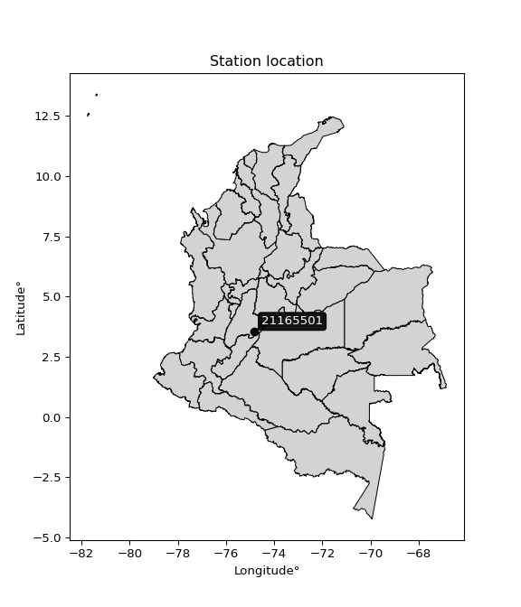

<div align="center">


</div>

# Station (rain, Pmax24h): 21165501

Probable Maximum Precipitation (PMP) is the greatest amount of rainfall for a specific duration that is meteorologically possible for a given location, acting as a "worst-case" scenario for extreme storms, crucial for designing safety-critical infrastructure like bridges, river deviations, dams, spillways, and nuclear plants to prevent catastrophic failure. PMP is calculated by hydrologists using meteorological data to determine the upper limit of extreme rainfall, often leading to the Probable Maximum Flood (PMF) for flood control design, and is increasingly being studied for climate change impacts.

<div align="center">

</img>

</div>


## A. General information


### 1. General running parameters

• app_version: _v20251226_. • runtime: _2025-12-26 15:38:16.554582_. • Python version: _3.14.0_. • SciPy version: _1.16.3_. • Pandas version: _2.3.3_. • NumPy version: _2.3.5_. • Stations dataset (station_dataset_file): _dataset/pmax24h_in/automatic_colombia_2003_2024.csv_. • Stations catalog (station_catalog_file): _dataset/CNE_IDEAM.xls_. • Minimum year to eval til year_max (date_min): _2003_. • Maximum year to eval since year_min (date_max): _2024_. • Creates, save and include plots into reports (create_plot): _False_. • Plot only fit distributions with Δo > Δ (plot_only_fit): _True_. • Eval low extreme values, if False, evaluates high extreme values (low_extreme): _False_. • Eval every SciPy distribution as logarithmic (pdist_logarithmic_on): _True_. • Standard deviation normalized (ddof): _1.0_. • Return periods to eval in years (Tr): _[2, 2.33, 5, 10, 15, 20, 25, 50, 75, 100, 200, 250, 500, 750, 1000]_. • Minimum data sample per station, 0 means any (minimum_sample): _5_. • Z-Score threshold to adjust a value, 0 means disable (zscore): _3.5_. • Avoid zeros, e.g. rain = 0 (avoid_zeros): _True_. • Avoid null values (avoid_nans): _True_. [:file_folder:Dataset file.](../../dataset/pmax24h_in/automatic_colombia_2003_2024.csv)


### 2. Station info and location

|   id |   CODIGO | NOMBRE                     | CATEGORIA               | TECNOLOGIA                | ESTADO   | FECHA_INSTALACION   |   FECHA_SUSPENSION |   ALTITUD |   LATITUD |   LONGITUD | DEPARTAMENTO   | MUNICIPIO   | AREA_OPERATIVA             | ENTIDAD                                    | AREA_HIDROGRAFICA   | ZONA_HIDROGRAFICA   | SUBZONA_HIDROGRAFICA   |   CORRIENTE | OBSERVACION                                                                                                                                                                                                                                                   |   SUBRED | Catalogo   |
|-----:|---------:|:---------------------------|:------------------------|:--------------------------|:---------|:--------------------|-------------------:|----------:|----------:|-----------:|:---------------|:------------|:---------------------------|:-------------------------------------------|:--------------------|:--------------------|:-----------------------|------------:|:--------------------------------------------------------------------------------------------------------------------------------------------------------------------------------------------------------------------------------------------------------------|---------:|:-----------|
|    0 | 21165501 | DOLORES  - AUT  [21165501] | Climatológica Principal | Automática con Telemetría | Activa   | 27/10/2013          |                nan |       999 |   3.53716 |   -74.8298 | Tolima         | Dolores     | Area Operativa 10 - Tolima | CENTRO NACIONAL DE INVESTIGACIONES DE CAFE | Magdalena Cauca     | Alto Magdalena      | Río Prado              |         nan | Mediante orfeo 20191040002573 se hace entrega del archivo Excel que contiene el catálogo de estaciones automáticas de Cenicafé, el cual comprende 103 estaciones, con el fin de que se actualice su metadata en el Catálogo Nacional de estaciones del IDEAM. |      nan | CNE_OE     |

<div align="center">

Map location in: [:earth_americas:Google](http://maps.google.com/maps?q=3.537155556,-74.82982778) [:earth_americas:OSM](https://www.openstreetmap.org/#map=18/3.537155556/-74.82982778&layers=P) [:earth_americas:Bing](https://www.bing.com/maps?cp=3.537155556~-74.82982778&lvl=18) [:earth_americas:Apple](https://maps.apple.com/frame?center=3.537155556%2C-74.82982778&span=0.003%2C0.006)

</div>


<div align="center">

```geojson
{
  "type": "Feature",
  "geometry": {
    "type": "Point", 
    "coordinates": [-74.82982778, 3.537155556]
  }, 
  "properties": {
    "Name": "21165501"
  }
}
```

</div>


### 3. Discrete values table and plot

|               |           0 |          1 |            2 |          3 |          4 |           5 |           6 |           7 |
|:--------------|------------:|-----------:|-------------:|-----------:|-----------:|------------:|------------:|------------:|
| Date          | 2016        | 2017       | 2018         | 2019       | 2020       | 2021        | 2022        | 2023        |
| Value         |   46.2      |  107.2     |   71.8       |   39.6     |  117.5     |   65.9      |   45.1      |   64        |
| Value_initial |   46.2      |  107.2     |   71.8       |   39.6     |  117.5     |   65.9      |   45.1      |   64        |
| count         |    8        |    8       |    8         |    8       |    8       |    8        |    8        |    8        |
| mean          |   69.6625   |   69.6625  |   69.6625    |   69.6625  |   69.6625  |   69.6625   |   69.6625   |   69.6625   |
| std           |   28.7994   |   28.7994  |   28.7994    |   28.7994  |   28.7994  |   28.7994   |   28.7994   |   28.7994   |
| zscore        |   -0.814687 |    1.30341 |    0.0742203 |   -1.04386 |    1.66106 |   -0.130645 |   -0.852882 |   -0.196619 |
> If Z-Score is active, values out of range or outliers are replaced with the station mean value.


### 4. Active continuous probability distributions from SciPy (45 of 104 available)

[scipy.stats](https://docs.scipy.org/doc/scipy/reference/stats.html) is a Python´s powerful submodule within the SciPy library for comprehensive statistical analysis, offering over 130 probability distributions (like Normal, Poisson), functions for descriptive stats (mean, variance), hypothesis testing (t-tests, chi-square), random variable generation, and statistical tests, making it essential for data science, modeling, and research. It provides tools to explore, model, and draw conclusions from data efficiently, working seamlessly with NumPy.

<div align="center">

|   id | p_dist             |   n_parameter | fit_method   | label                                                                       | active   | ref                                                                                                        |
|-----:|:-------------------|--------------:|:-------------|:----------------------------------------------------------------------------|:---------|:-----------------------------------------------------------------------------------------------------------|
|    0 | alpha              |             3 | MLE          | Alpha                                                                       | True     | [:mortar_board:](https://docs.scipy.org/doc/scipy/reference/generated/scipy.stats.alpha.html)              |
|    1 | betaprime          |             4 | MLE          | Beta prime                                                                  | True     | [:mortar_board:](https://docs.scipy.org/doc/scipy/reference/generated/scipy.stats.betaprime.html)          |
|    2 | chi2               |             3 | MLE          | Chi²                                                                        | True     | [:mortar_board:](https://docs.scipy.org/doc/scipy/reference/generated/scipy.stats.chi2.html)               |
|    3 | crystalball        |             4 | MLE          | Crystalball                                                                 | True     | [:mortar_board:](https://docs.scipy.org/doc/scipy/reference/generated/scipy.stats.crystalball.html)        |
|    4 | erlang             |             3 | MLE          | Erlang                                                                      | True     | [:mortar_board:](https://docs.scipy.org/doc/scipy/reference/generated/scipy.stats.erlang.html)             |
|    5 | expon              |             2 | MLE          | Exponential                                                                 | True     | [:mortar_board:](https://docs.scipy.org/doc/scipy/reference/generated/scipy.stats.expon.html)              |
|    6 | exponnorm          |             3 | MLE          | Exponentially modified Normal                                               | True     | [:mortar_board:](https://docs.scipy.org/doc/scipy/reference/generated/scipy.stats.exponnorm.html)          |
|    7 | f                  |             4 | MLE          | F                                                                           | True     | [:mortar_board:](https://docs.scipy.org/doc/scipy/reference/generated/scipy.stats.f.html)                  |
|    8 | fatiguelife        |             3 | MLE          | Fatigue-life (Birnbaum-Saunders)                                            | True     | [:mortar_board:](https://docs.scipy.org/doc/scipy/reference/generated/scipy.stats.fatiguelife.html)        |
|    9 | fisk               |             3 | MLE          | Fisk                                                                        | True     | [:mortar_board:](https://docs.scipy.org/doc/scipy/reference/generated/scipy.stats.fisk.html)               |
|   10 | gamma              |             3 | MLE          | Gamma                                                                       | True     | [:mortar_board:](https://docs.scipy.org/doc/scipy/reference/generated/scipy.stats.gamma.html)              |
|   11 | genexpon           |             5 | MLE          | Generalized exponential                                                     | True     | [:mortar_board:](https://docs.scipy.org/doc/scipy/reference/generated/scipy.stats.genexpon.html)           |
|   12 | genlogistic        |             3 | MLE          | Generalized logistic                                                        | True     | [:mortar_board:](https://docs.scipy.org/doc/scipy/reference/generated/scipy.stats.genlogistic.html)        |
|   13 | gibrat             |             2 | MM           | Gibrat                                                                      | True     | [:mortar_board:](https://docs.scipy.org/doc/scipy/reference/generated/scipy.stats.gibrat.html)             |
|   14 | gompertz           |             3 | MLE          | Gompertz (or truncated Gumbel)                                              | True     | [:mortar_board:](https://docs.scipy.org/doc/scipy/reference/generated/scipy.stats.gompertz.html)           |
|   15 | gumbel_l           |             2 | MM           | Gumbel Left Skew                                                            | True     | [:mortar_board:](https://docs.scipy.org/doc/scipy/reference/generated/scipy.stats.gumbel_l.html)           |
|   16 | gumbel_r           |             2 | MM           | Gumbel Right Skew                                                           | True     | [:mortar_board:](https://docs.scipy.org/doc/scipy/reference/generated/scipy.stats.gumbel_r.html)           |
|   17 | halflogistic       |             2 | MM           | Half-logistic                                                               | True     | [:mortar_board:](https://docs.scipy.org/doc/scipy/reference/generated/scipy.stats.halflogistic.html)       |
|   18 | halfnorm           |             2 | MM           | Half Normal                                                                 | True     | [:mortar_board:](https://docs.scipy.org/doc/scipy/reference/generated/scipy.stats.halfnorm.html)           |
|   19 | hypsecant          |             2 | MM           | hyperbolic secant                                                           | True     | [:mortar_board:](https://docs.scipy.org/doc/scipy/reference/generated/scipy.stats.hypsecant.html)          |
|   20 | invgamma           |             3 | MLE          | Inverted gamma                                                              | True     | [:mortar_board:](https://docs.scipy.org/doc/scipy/reference/generated/scipy.stats.invgamma.html)           |
|   21 | invgauss           |             3 | MLE          | Inverse Gaussian                                                            | True     | [:mortar_board:](https://docs.scipy.org/doc/scipy/reference/generated/scipy.stats.invgauss.html)           |
|   22 | invweibull         |             3 | MLE          | Inverted Weibull                                                            | True     | [:mortar_board:](https://docs.scipy.org/doc/scipy/reference/generated/scipy.stats.invweibull.html)         |
|   23 | johnsonsu          |             4 | MLE          | Johnson Su                                                                  | True     | [:mortar_board:](https://docs.scipy.org/doc/scipy/reference/generated/scipy.stats.johnsonsu.html)          |
|   24 | kstwobign          |             2 | MLE          | Limiting distribution of scaled Kolmogorov-Smirnov two-sided test statistic | True     | [:mortar_board:](https://docs.scipy.org/doc/scipy/reference/generated/scipy.stats.kstwobign.html)          |
|   25 | laplace            |             2 | MM           | Laplace                                                                     | True     | [:mortar_board:](https://docs.scipy.org/doc/scipy/reference/generated/scipy.stats.laplace.html)            |
|   26 | laplace_asymmetric |             3 | MLE          | Asymmetric Laplace                                                          | True     | [:mortar_board:](https://docs.scipy.org/doc/scipy/reference/generated/scipy.stats.laplace_asymmetric.html) |
|   27 | loggamma           |             3 | MLE          | Log gamma                                                                   | True     | [:mortar_board:](https://docs.scipy.org/doc/scipy/reference/generated/scipy.stats.loggamma.html)           |
|   28 | logistic           |             2 | MM           | Logistic (or Sech-squared)                                                  | True     | [:mortar_board:](https://docs.scipy.org/doc/scipy/reference/generated/scipy.stats.logistic.html)           |
|   29 | lognorm            |             3 | MLE          | Log Normal                                                                  | True     | [:mortar_board:](https://docs.scipy.org/doc/scipy/reference/generated/scipy.stats.lognorm.html)            |
|   30 | maxwell            |             2 | MM           | Maxwell                                                                     | True     | [:mortar_board:](https://docs.scipy.org/doc/scipy/reference/generated/scipy.stats.maxwell.html)            |
|   31 | mielke             |             4 | MLE          | Mielke Beta-Kappa / Dagum                                                   | True     | [:mortar_board:](https://docs.scipy.org/doc/scipy/reference/generated/scipy.stats.mielke.html)             |
|   32 | moyal              |             2 | MM           | Moyal                                                                       | True     | [:mortar_board:](https://docs.scipy.org/doc/scipy/reference/generated/scipy.stats.moyal.html)              |
|   33 | nakagami           |             3 | MLE          | Nakagami                                                                    | True     | [:mortar_board:](https://docs.scipy.org/doc/scipy/reference/generated/scipy.stats.nakagami.html)           |
|   34 | ncf                |             5 | MLE          | Non-central F distribution                                                  | True     | [:mortar_board:](https://docs.scipy.org/doc/scipy/reference/generated/scipy.stats.ncf.html)                |
|   35 | nct                |             4 | MLE          | Non-central Student’s t                                                     | True     | [:mortar_board:](https://docs.scipy.org/doc/scipy/reference/generated/scipy.stats.nct.html)                |
|   36 | norm               |             2 | MM           | Normal                                                                      | True     | [:mortar_board:](https://docs.scipy.org/doc/scipy/reference/generated/scipy.stats.norm.html)               |
|   37 | pareto             |             3 | MLE          | Pareto                                                                      | True     | [:mortar_board:](https://docs.scipy.org/doc/scipy/reference/generated/scipy.stats.pareto.html)             |
|   38 | pearson3           |             3 | MM           | Pearson type III                                                            | True     | [:mortar_board:](https://docs.scipy.org/doc/scipy/reference/generated/scipy.stats.pearson3.html)           |
|   39 | rayleigh           |             2 | MM           | Rayleigh                                                                    | True     | [:mortar_board:](https://docs.scipy.org/doc/scipy/reference/generated/scipy.stats.rayleigh.html)           |
|   40 | rice               |             3 | MLE          | Rice                                                                        | True     | [:mortar_board:](https://docs.scipy.org/doc/scipy/reference/generated/scipy.stats.rice.html)               |
|   41 | t                  |             3 | MLE          | Student’s t                                                                 | True     | [:mortar_board:](https://docs.scipy.org/doc/scipy/reference/generated/scipy.stats.t.html)                  |
|   42 | truncnorm          |             4 | MLE          | Truncated normal                                                            | True     | [:mortar_board:](https://docs.scipy.org/doc/scipy/reference/generated/scipy.stats.truncnorm.html)          |
|   43 | wald               |             2 | MM           | Wald                                                                        | True     | [:mortar_board:](https://docs.scipy.org/doc/scipy/reference/generated/scipy.stats.wald.html)               |
|   44 | weibull_min        |             3 | MLE          | Weibull minimum                                                             | True     | [:mortar_board:](https://docs.scipy.org/doc/scipy/reference/generated/scipy.stats.weibull_min.html)        |

</div>

> **n_parameter:** # arguments & localization & scale.
>
> **Fit methods:** (MLE) maximum likelihood, (MM) L-moments.
>
>**Inactive:** foldnorm, gennorm, norminvgauss, powernorm, powerlognorm, skewnorm, genextreme, anglit, arcsine, argus, beta, bradford, burr, burr12, cauchy, cosine, halfcauchy, foldcauchy, skewcauchy, wrapcauchy, dgamma, gengamma, exponweib, exponpow, truncexpon, gausshyper, genhalflogistic, genhyperbolic, geninvgauss, halfgennorm, johnsonsb, kappa4, kappa3, ksone, kstwo, loglaplace, levy, levy_l, levy_stable, ncx2, genpareto, truncpareto, lomax, powerlaw, rdist, rel_breitwigner, recipinvgauss, semicircular, studentized_range, trapezoid, triang, truncweibull_min, tukeylambda, uniform, loguniform, vonmises, vonmises_line, weibull_max, dweibull, 


## B. Probability distributions vs. Empirical distributions

A continuous probability distribution (CPD) describes probabilities for variables that can take any value within a range (like rain any time), unlike discrete variables with specific outcomes (like temperature). It uses a Probability Density Function (PDF), a curve where the total area under it equals 1, and the probability of the variable falling within an interval (a to b) is found by calculating the area under the curve between those points. A key feature is that the probability of hitting any single exact value is zero, so probabilities are always expressed for ranges, e.g., $P(a ≤ X ≤ b)$.

<div align="center">

Distributions parameters
|    |   station | p_dist                |   n |               loc |            scale | shape                 | shape1             | shape2                | shape3   |
|---:|----------:|:----------------------|----:|------------------:|-----------------:|:----------------------|:-------------------|:----------------------|:---------|
|  0 |  21165501 | alpha                 |   8 |      -4.93895     |    204.283       | 3.079387836039257     |                    |                       |          |
|  1 |  21165501 | betaprime             |   8 |      -0.717465    |      1.83734     | 274.02464462109424    | 8.15162456667603   |                       |          |
|  2 |  21165501 | chi2                  |   8 |      39.6         |     29.9762      | 0.37843186924854      |                    |                       |          |
|  3 |  21165501 | crystalball           |   8 |      69.6625      |     26.9394      | 4251.806157819561     | 6804.374360772169  |                       |          |
|  4 |  21165501 | erlang                |   8 |      39.6         |     24.9705      | 0.8474140547915816    |                    |                       |          |
|  5 |  21165501 | expon                 |   8 |      39.6         |     30.0625      |                       |                    |                       |          |
|  6 |  21165501 | exponnorm             |   8 |      39.559       |      0.012164    | 2457.9637193152666    |                    |                       |          |
|  7 |  21165501 | f                     |   8 |      25.8101      |     29.7662      | 742.7382186921229     | 5.500552785435763  |                       |          |
|  8 |  21165501 | fatiguelife           |   8 |      39.6         |      1.74209e-05 | 1243.1593398640694    |                    |                       |          |
|  9 |  21165501 | fisk                  |   8 |      39.6         |      4.98575     | 0.6804094595564878    |                    |                       |          |
| 10 |  21165501 | gamma                 |   8 |      39.6         |     35.8716      | 0.2066661435685997    |                    |                       |          |
| 11 |  21165501 | genexpon              |   8 |      39.5877      |    112.3         | 3.3095993850385845    | 19.363765837733375 | 0.0924202918439061    |          |
| 12 |  21165501 | genlogistic           |   8 |     -87.4216      |     19.9189      | 1430.7940256665174    |                    |                       |          |
| 13 |  21165501 | gibrat                |   8 |      49.1111      |     12.465       |                       |                    |                       |          |
| 14 |  21165501 | gompertz              |   8 |      39.6         |    155.357       | 4.299936126278441     |                    |                       |          |
| 15 |  21165501 | gumbel_l              |   8 |      81.7867      |     21.0045      |                       |                    |                       |          |
| 16 |  21165501 | gumbel_r              |   8 |      57.5383      |     21.0045      |                       |                    |                       |          |
| 17 |  21165501 | halflogistic          |   8 |      37.7331      |     23.0322      |                       |                    |                       |          |
| 18 |  21165501 | halfnorm              |   8 |      34.0053      |     44.6896      |                       |                    |                       |          |
| 19 |  21165501 | hypsecant             |   8 |      69.6625      |     17.1501      |                       |                    |                       |          |
| 20 |  21165501 | invgamma              |   8 |      25.7024      |     82.0383      | 2.749716603132393     |                    |                       |          |
| 21 |  21165501 | invgauss              |   8 |      33.1609      |     37.9508      | 0.9618129232473964    |                    |                       |          |
| 22 |  21165501 | invweibull            |   8 |      39.6         |      1.42031     | 0.05218277625796027   |                    |                       |          |
| 23 |  21165501 | johnsonsu             |   8 |      36.2568      |      0.143203    | -5.555792896387585    | 0.9725040310561419 |                       |          |
| 24 |  21165501 | kstwobign             |   8 |     -12.5416      |     94.3947      |                       |                    |                       |          |
| 25 |  21165501 | laplace               |   8 |      69.6625      |     19.049       |                       |                    |                       |          |
| 26 |  21165501 | laplace_asymmetric    |   8 |      64           |     20.3503      | 0.8704588539977747    |                    |                       |          |
| 27 |  21165501 | loggamma              |   8 |   -7759.89        |   1066.2         | 1546.9208440928178    |                    |                       |          |
| 28 |  21165501 | logistic              |   8 |      69.6625      |     14.8525      |                       |                    |                       |          |
| 29 |  21165501 | lognorm               |   8 |      39.6         |      0.269788    | 11.85185030182621     |                    |                       |          |
| 30 |  21165501 | maxwell               |   8 |       5.8275      |     40.0027      |                       |                    |                       |          |
| 31 |  21165501 | mielke                |   8 |       4.32275     |      4.94442     | 3060.856333327495     | 2.999395872053551  |                       |          |
| 32 |  21165501 | moyal                 |   8 |      54.2568      |     12.127       |                       |                    |                       |          |
| 33 |  21165501 | nakagami              |   8 |      39.6         |     48.2964      | 0.08259683649955185   |                    |                       |          |
| 34 |  21165501 | ncf                   |   8 |      -1.90933     |      0.000677897 | 0.00538259698047884   | 17.36893720496218  | 503.19852768170927    |          |
| 35 |  21165501 | nct                   |   8 |      -0.100094    |      1.11515     | 4.424702050907431     | 51.61180283880293  |                       |          |
| 36 |  21165501 | norm                  |   8 |      69.6625      |     26.9394      |                       |                    |                       |          |
| 37 |  21165501 | pareto                |   8 |      39.5918      |      0.00816626  | 0.14348483266412024   |                    |                       |          |
| 38 |  21165501 | pearson3              |   8 |      69.6625      |     26.9393      | 0.6856508940753239    |                    |                       |          |
| 39 |  21165501 | rayleigh              |   8 |      18.1259      |     41.1203      |                       |                    |                       |          |
| 40 |  21165501 | rice                  |   8 |      25.3204      |     36.6875      | 0.0009712677564855047 |                    |                       |          |
| 41 |  21165501 | t                     |   8 |      69.6615      |     26.9385      | 17041.898905138944    |                    |                       |          |
| 42 |  21165501 | truncnorm             |   8 |    -136.538       |     43.3908      | -1424.7987624817624   | 5.854664764444054  |                       |          |
| 43 |  21165501 | wald                  |   8 |      42.7231      |     26.9394      |                       |                    |                       |          |
| 44 |  21165501 | weibull_min           |   8 |      39.6         |     24.537       | 0.47239495684386323   |                    |                       |          |
| 45 |  21165501 | logalpha              |   8 |       1.59839     |     17.8497      | 7.076828340456791     |                    |                       |          |
| 46 |  21165501 | logbetaprime          |   8 |      -0.74755     |      7.80229     | 287.96659979877256    | 457.85206316831034 |                       |          |
| 47 |  21165501 | logchi2               |   8 |       3.67883     |      0.941568    | 1.0841148594872108    |                    |                       |          |
| 48 |  21165501 | logcrystalball        |   8 |       4.17284     |      0.371967    | 1632.2724774793523    | 1124.1080757403297 |                       |          |
| 49 |  21165501 | logerlang             |   8 |       3.67883     |      0.553117    | 0.8793058159052585    |                    |                       |          |
| 50 |  21165501 | logexpon              |   8 |       3.67883     |      0.494012    |                       |                    |                       |          |
| 51 |  21165501 | logexponnorm          |   8 |       4.06333     |      0.355696    | 0.3078814256677801    |                    |                       |          |
| 52 |  21165501 | logf                  |   8 |       3.39782     |      0.674879    | 12.25182864846159     | 19.075378221625535 |                       |          |
| 53 |  21165501 | logfatiguelife        |   8 |       3.45722     |      0.604697    | 0.6034269322629267    |                    |                       |          |
| 54 |  21165501 | logfisk               |   8 |       3.45861     |      0.629611    | 2.809784216376999     |                    |                       |          |
| 55 |  21165501 | loggamma              |   8 |       3.67883     |      0.5082      | 0.6716813516046525    |                    |                       |          |
| 56 |  21165501 | loggenexpon           |   8 |       3.67786     |      2.25007     | 3.3809965534110145    | 6.72796172948296   | 1.1479917133425945    |          |
| 57 |  21165501 | loggenlogistic        |   8 |       1.97397     |      0.308374    | 699.9143759234353     |                    |                       |          |
| 58 |  21165501 | loggibrat             |   8 |       3.88904     |      0.17213     |                       |                    |                       |          |
| 59 |  21165501 | loggompertz           |   8 |       3.67883     |      0.854578    | 1.0425752972621831    |                    |                       |          |
| 60 |  21165501 | loggumbel_l           |   8 |       4.34025     |      0.290021    |                       |                    |                       |          |
| 61 |  21165501 | loggumbel_r           |   8 |       4.00544     |      0.290021    |                       |                    |                       |          |
| 62 |  21165501 | loghalflogistic       |   8 |       3.73199     |      0.318006    |                       |                    |                       |          |
| 63 |  21165501 | loghalfnorm           |   8 |       3.68047     |      0.617092    |                       |                    |                       |          |
| 64 |  21165501 | loghypsecant          |   8 |       4.17284     |      0.236801    |                       |                    |                       |          |
| 65 |  21165501 | loginvgamma           |   8 |       2.81488     |     16.8926      | 13.415846715717565    |                    |                       |          |
| 66 |  21165501 | loginvgauss           |   8 |       3.36652     |      2.91466     | 0.27664329769331014   |                    |                       |          |
| 67 |  21165501 | loginvweibull         |   8 |      -5.14258e+06 |      5.14258e+06 | 16688201.142253768    |                    |                       |          |
| 68 |  21165501 | logjohnsonsu          |   8 |       1.45336e+07 | 515158           | 158308082.33040923    | 39251160.31337139  |                       |          |
| 69 |  21165501 | logkstwobign          |   8 |       2.9286      |      1.42272     |                       |                    |                       |          |
| 70 |  21165501 | loglaplace            |   8 |       4.17284     |      0.26302     |                       |                    |                       |          |
| 71 |  21165501 | loglaplace_asymmetric |   8 |       4.15888     |      0.302745    | 0.9776149356064181    |                    |                       |          |
| 72 |  21165501 | logloggamma           |   8 |     -92.6164      |     13.5299      | 1279.2240467734437    |                    |                       |          |
| 73 |  21165501 | loglogistic           |   8 |       4.17284     |      0.205076    |                       |                    |                       |          |
| 74 |  21165501 | loglognorm            |   8 |       3.67883     |      0.00586651  | 11.44198749013908     |                    |                       |          |
| 75 |  21165501 | logmaxwell            |   8 |       3.29144     |      0.552339    |                       |                    |                       |          |
| 76 |  21165501 | logmielke             |   8 | -405199           | 405201           | 72707491.72905338     | 1325403.3418366374 |                       |          |
| 77 |  21165501 | logmoyal              |   8 |       3.96013     |      0.167444    |                       |                    |                       |          |
| 78 |  21165501 | lognakagami           |   8 |       3.67883     |      0.70388     | 0.3633009483139351    |                    |                       |          |
| 79 |  21165501 | logncf                |   8 |      -3.83389     |      8.0004      | 1292.9545564568043    | 2237.769664236045  | 0.0011685071739798401 |          |
| 80 |  21165501 | lognct                |   8 |      -0.41658     |      0.0923518   | 83.6441537535656      | 49.22900207549563  |                       |          |
| 81 |  21165501 | lognorm               |   8 |       4.17284     |      0.371967    |                       |                    |                       |          |
| 82 |  21165501 | logpareto             |   8 |       3.67868     |      0.000151972 | 0.1433985340885715    |                    |                       |          |
| 83 |  21165501 | logpearson3           |   8 |       4.17284     |      0.371967    | 0.3122100784883003    |                    |                       |          |
| 84 |  21165501 | lograyleigh           |   8 |       3.46125     |      0.56777     |                       |                    |                       |          |
| 85 |  21165501 | logrice               |   8 |       3.50847     |      0.499888    | 0.5657525730500378    |                    |                       |          |
| 86 |  21165501 | logt                  |   8 |       4.17284     |      0.371963    | 600885184.4556983     |                    |                       |          |
| 87 |  21165501 | logtruncnorm          |   8 |      -0.10174     |      1.05479     | 4.528284856317485     | 4.6153025153604785 |                       |          |
| 88 |  21165501 | logwald               |   8 |       3.80084     |      0.371995    |                       |                    |                       |          |
| 89 |  21165501 | logweibull_min        |   8 |       3.67883     |      0.45633     | 0.7720033258838165    |                    |                       |          |

</div>

> **loc** (Location parameter): This shifts the distribution along the x-axis. For many common distributions, like the normal (Gaussian) distribution, loc represents the mean $μ$. For others, like the uniform distribution, it might represent the minimum value, or for the beta distribution, the left end of the support interval.
>
> **scale** (Scale parameter): This determines the width or spread of the distribution. For the normal distribution, scale represents the standard deviation $σ$. For a uniform distribution, it defines the length of the interval (from $loc$ to $loc + scale$).
>
> **shape** (Shape parameters): Refers to parameters that define the specific form of a probability distribution, distinct from its location (loc) and scale (scale). These parameters are required arguments for most distribution functions. For example, a normal (Gaussian) distribution is fully defined by its location (mean) and scale (standard deviation), so it has no specific shape parameters beyond loc and scale. However, other distributions have intrinsic properties that need specification, as Gamma distribution that takes a shape parameter, often named $a$ or $alpha$.


### 0. Cumulative distribution values - CDF (90 evaluated)

> Ordered by x ascending and calculating $log(f(x))$ separately. 

|   id |   Station |   date |     x |   count |    mean |     std |     zscore |   Value_initial |   station |   m |     alpha |   alpha_pdf |   betaprime |   betaprime_pdf |       chi2 |    chi2_pdf |   crystalball |   crystalball_pdf |      erlang |   erlang_pdf |    expon |   expon_pdf |   exponnorm |   exponnorm_pdf |         f |      f_pdf |   fatiguelife |   fatiguelife_pdf |        fisk |      fisk_pdf |       gamma |   gamma_pdf |    genexpon |   genexpon_pdf |   genlogistic |   genlogistic_pdf |   gibrat |   gibrat_pdf |   gompertz |   gompertz_pdf |   gumbel_l |   gumbel_l_pdf |   gumbel_r |   gumbel_r_pdf |   halflogistic |   halflogistic_pdf |   halfnorm |   halfnorm_pdf |   hypsecant |   hypsecant_pdf |   invgamma |   invgamma_pdf |   invgauss |   invgauss_pdf |   invweibull |   invweibull_pdf |   johnsonsu |   johnsonsu_pdf |   kstwobign |   kstwobign_pdf |   laplace |   laplace_pdf |   laplace_asymmetric |   laplace_asymmetric_pdf |    loggamma |   loggamma_pdf |   logistic |   logistic_pdf |   lognorm |   lognorm_pdf |   maxwell |   maxwell_pdf |   mielke |   mielke_pdf |     moyal |   moyal_pdf |   nakagami |   nakagami_pdf |       ncf |    ncf_pdf |       nct |    nct_pdf |     norm |   norm_pdf |   pareto |   pareto_pdf |   pearson3 |   pearson3_pdf |   rayleigh |   rayleigh_pdf |     rice |   rice_pdf |        t |      t_pdf |   truncnorm |   truncnorm_pdf |       wald |   wald_pdf |   weibull_min |   weibull_min_pdf |   logalpha |   logalpha_pdf |   logbetaprime |   logbetaprime_pdf |     logchi2 |   logchi2_pdf |   logcrystalball |   logcrystalball_pdf |   logerlang |   logerlang_pdf |   logexpon |   logexpon_pdf |   logexponnorm |   logexponnorm_pdf |      logf |   logf_pdf |   logfatiguelife |   logfatiguelife_pdf |   logfisk |   logfisk_pdf |   loggenexpon |   loggenexpon_pdf |   loggenlogistic |   loggenlogistic_pdf |   loggibrat |   loggibrat_pdf |   loggompertz |   loggompertz_pdf |   loggumbel_l |   loggumbel_l_pdf |   loggumbel_r |   loggumbel_r_pdf |   loghalflogistic |   loghalflogistic_pdf |   loghalfnorm |   loghalfnorm_pdf |   loghypsecant |   loghypsecant_pdf |   loginvgamma |   loginvgamma_pdf |   loginvgauss |   loginvgauss_pdf |   loginvweibull |   loginvweibull_pdf |   logjohnsonsu |   logjohnsonsu_pdf |   logkstwobign |   logkstwobign_pdf |   loglaplace |   loglaplace_pdf |   loglaplace_asymmetric |   loglaplace_asymmetric_pdf |   logloggamma |   logloggamma_pdf |   loglogistic |   loglogistic_pdf |   loglognorm |   loglognorm_pdf |   logmaxwell |   logmaxwell_pdf |   logmielke |   logmielke_pdf |   logmoyal |   logmoyal_pdf |   lognakagami |   lognakagami_pdf |   logncf |   logncf_pdf |    lognct |   lognct_pdf |   logpareto |   logpareto_pdf |   logpearson3 |   logpearson3_pdf |   lograyleigh |   lograyleigh_pdf |   logrice |   logrice_pdf |      logt |   logt_pdf |   logtruncnorm |   logtruncnorm_pdf |     logwald |   logwald_pdf |   logweibull_min |   logweibull_min_pdf |
|-----:|----------:|-------:|------:|--------:|--------:|--------:|-----------:|----------------:|----------:|----:|----------:|------------:|------------:|----------------:|-----------:|------------:|--------------:|------------------:|------------:|-------------:|---------:|------------:|------------:|----------------:|----------:|-----------:|--------------:|------------------:|------------:|--------------:|------------:|------------:|------------:|---------------:|--------------:|------------------:|---------:|-------------:|-----------:|---------------:|-----------:|---------------:|-----------:|---------------:|---------------:|-------------------:|-----------:|---------------:|------------:|----------------:|-----------:|---------------:|-----------:|---------------:|-------------:|-----------------:|------------:|----------------:|------------:|----------------:|----------:|--------------:|---------------------:|-------------------------:|------------:|---------------:|-----------:|---------------:|----------:|--------------:|----------:|--------------:|---------:|-------------:|----------:|------------:|-----------:|---------------:|----------:|-----------:|----------:|-----------:|---------:|-----------:|---------:|-------------:|-----------:|---------------:|-----------:|---------------:|---------:|-----------:|---------:|-----------:|------------:|----------------:|-----------:|-----------:|--------------:|------------------:|-----------:|---------------:|---------------:|-------------------:|------------:|--------------:|-----------------:|---------------------:|------------:|----------------:|-----------:|---------------:|---------------:|-------------------:|----------:|-----------:|-----------------:|---------------------:|----------:|--------------:|--------------:|------------------:|-----------------:|---------------------:|------------:|----------------:|--------------:|------------------:|--------------:|------------------:|--------------:|------------------:|------------------:|----------------------:|--------------:|------------------:|---------------:|-------------------:|--------------:|------------------:|--------------:|------------------:|----------------:|--------------------:|---------------:|-------------------:|---------------:|-------------------:|-------------:|-----------------:|------------------------:|----------------------------:|--------------:|------------------:|--------------:|------------------:|-------------:|-----------------:|-------------:|-----------------:|------------:|----------------:|-----------:|---------------:|--------------:|------------------:|---------:|-------------:|----------:|-------------:|------------:|----------------:|--------------:|------------------:|--------------:|------------------:|----------:|--------------:|----------:|-----------:|---------------:|-------------------:|------------:|--------------:|-----------------:|---------------------:|
|    0 |  21165501 |   2019 |  39.6 |       8 | 69.6625 | 28.7994 | -1.04386   |            39.6 |  21165501 |   1 | 0.0659442 |  0.0132072  |   0.0819118 |      0.0120615  | 0.00105244 | 2.80263e+10 |      0.132226 |        0.00794526 | 7.09392e-14 |   8.46041    | 0        |  0.033264   |   0.0013697 |      0.033388   | 0.0505924 | 0.0161221  |     0.0830212 |       1.80172e+10 | 1.38364e-09 | 1977.56       | 0.000620284 | 1.80414e+10 | 0.000363218 |     0.0294621  |      0.087972 |        0.0107263  | 0        |   0          | 2.5566e-15 |     0.0276777  |   0.125581 |     0.00558658 |  0.0954573 |     0.0106756  |      0.0405062 |         0.0216731  |  0.0996265 |     0.0177145  |    0.109223 |      0.00624439 |  0.0505765 |     0.0161196  |  0.0399402 |     0.0203783  |   0.00379098 |      1.55219e+11 |   0.0345726 |      0.0222313  |   0.0795926 |      0.0108175  |  0.103177 |    0.00541638 |             0.108728 |               0.00613792 | 9.43663e-10 |   39646.7      |   0.116698 |     0.00694025 | 0.0920711 |      0.444003 |  0.129804 |    0.00995461 |      nan |          nan | 0.0672524 |  0.0112827  | 0.00205829 |     4.7853e+10 | 0.0838481 | 0.0119018  | 0.0711908 | 0.0130385  | 0.132226 | 0.00794526 | 0        | 17.5704      |   0.118339 |     0.0101758  |   0.127472 |     0.0110811  | 0.072949 | 0.00983517 | 0.132233 | 0.0079453  |    0.999975 |     2.42821e-06 | 0          | 0          |   4.56897e-08 |       3.03762e+06 |  0.0664234 |       0.531759 |      0.0870017 |           0.471469 | 5.54185e-09 |   3.38221e+06 |        0.0920711 |             0.444003 | 5.58009e-14 |      110.487    |   0        |       2.02424  |      0.0908629 |           0.447336 | 0.0600122 |   0.728131 |         0.041437 |             0.748429 | 0.0496578 |      0.602133 |    0.00145078 |          1.50191  |        0.0623874 |             0.560179 |    0        |        0        |   2.26449e-10 |          1.21999  |     0.0971734 |          0.318222 |     0.0457867 |          0.486845 |          0        |              0        |      0        |          0        |      0.0786399 |           0.328724 |     0.0593604 |          0.568851 |     0.0461691 |          0.677054 |       0.0620577 |            0.559784 |      0.0912126 |           0.442671 |       0.056259 |           0.590414 |    0.0764303 |         0.290587 |               0.0965181 |                    0.32611  |     0.0969764 |          0.448092 |     0.0824948 |          0.36908  |   0.00413978 |      2.40432e+12 |    0.0793365 |         0.555659 |   0.0629627 |        0.555377 |  0.0205412 |       0.377378 |   1.16217e-11 |       9507.49     | 0.102962 |     0.480136 | 0.0814738 |     0.488794 |    0        |     943.587     |     0.0838137 |          0.48371  |     0.0707983 |          0.627174 | 0.0482969 |      0.553264 | 0.0920689 |   0.444    |    0           |            0       | 0           |   0           |      4.39774e-12 |          3822.51     |
|    1 |  21165501 |   2022 |  45.1 |       8 | 69.6625 | 28.7994 | -0.852882  |            45.1 |  21165501 |   2 | 0.158071  |  0.0197008  |   0.161122  |      0.0164438  | 0.681023   | 0.0216842   |      0.180945 |        0.00977244 | 0.265998    |   0.0363008  | 0.167192 |  0.0277026  |   0.169167  |      0.0277884  | 0.167544  | 0.0246204  |     0.674358  |       0.0148006   | 0.516692    |    0.0308932  | 0.721959    | 0.0238734   | 0.151773    |     0.0256602  |      0.158084 |        0.0146302  | 0        |   0          | 0.143545   |     0.0245589  |   0.16001  |     0.006973   |  0.163996  |     0.0141155  |      0.158577  |         0.0211628  |  0.196067  |     0.0173121  |    0.149219 |      0.00838556 |  0.167517  |     0.0246189  |  0.187035  |     0.0290075  |   0.393849   |      0.00348186  |   0.191639  |      0.0299964  |   0.150119  |      0.0146286  |  0.137713 |    0.0072294  |             0.148315 |               0.00837267 | 0.400929    |       1.77157  |   0.1606   |     0.00907648 | 0.16392   |      0.664519 |  0.189996 |    0.0118729  |      nan |          nan | 0.14465   |  0.0165607  | 0.592928   |     0.0177911  | 0.161667  | 0.0161233  | 0.159654  | 0.018619   | 0.180945 | 0.00977244 | 0.607279 |  0.0102302   |   0.181092 |     0.0125632  |   0.193584 |     0.0128645  | 0.135266 | 0.0127076  | 0.180953 | 0.00977253 |    0.999986 |     1.4399e-06  | 0.00199068 | 0.00508285 |   0.389453    |       0.0258738   |  0.159096  |       0.885536 |      0.164206  |           0.717568 | 0.258098    |   1.02841     |        0.16392   |             0.664519 | 0.263334    |        1.56731  |   0.231457 |       1.55572  |      0.163488  |           0.67304  | 0.188494  |   1.1888   |         0.181587 |             1.28932  | 0.161425  |      1.08589  |    0.189155   |          1.37516  |        0.161867  |             0.9546   |    0        |        0        |   0.157493    |          1.1968   |     0.147914  |          0.470282 |     0.139542  |          0.94756  |          0.120309 |              1.54954  |      0.16484  |          1.26528  |      0.134839  |           0.552539 |     0.160865  |          0.973011 |     0.171826  |          1.18312  |       0.161593  |            0.955785 |      0.162974  |           0.664636 |       0.161452 |           0.998689 |    0.125316  |         0.47645  |               0.149777  |                    0.506057 |     0.168824  |          0.65996  |     0.144952  |          0.604367 |   0.606734   |      0.258441    |    0.169181  |         0.817476 |   0.161575  |        0.947523 |  0.116213  |       1.08979  |   0.227302    |          1.25842  | 0.178987 |     0.689508 | 0.16261   |     0.758941 |    0.620308 |       0.418165  |     0.163419  |          0.740757 |     0.170925  |          0.894072 | 0.142764  |      0.880057 | 0.163918  |   0.664519 |    0           |            0       | 2.75226e-11 |   8.08574e-08 |      0.315751    |             1.54116  |
|    2 |  21165501 |   2016 |  46.2 |       8 | 69.6625 | 28.7994 | -0.814687  |            46.2 |  21165501 |   3 | 0.180209  |  0.02052    |   0.17957   |      0.0170818  | 0.70295    | 0.0183644   |      0.191894 |        0.0101347  | 0.304511    |   0.0337834  | 0.197114 |  0.0267072  |   0.199178  |      0.0267846  | 0.194932  | 0.025121   |     0.689742  |       0.0132378   | 0.547567    |    0.0255398  | 0.745994    | 0.0200345   | 0.179605    |     0.0249456  |      0.174543 |        0.0152867  | 0        |   0          | 0.170232   |     0.0239628  |   0.167848 |     0.00727935 |  0.179843  |     0.0146897  |      0.181764  |         0.0209915  |  0.21505   |     0.0172014  |    0.158711 |      0.0088755  |  0.194903  |     0.0251196  |  0.218756  |     0.0286103  |   0.397339   |      0.00289955  |   0.224265  |      0.0292759  |   0.166546  |      0.0152295  |  0.145899 |    0.00765916 |             0.157817 |               0.00890907 | 0.441458    |       1.59782  |   0.170837 |     0.00953727 | 0.18044   |      0.706522 |  0.203243 |    0.0122085  |      nan |          nan | 0.163314  |  0.0173559  | 0.611036   |     0.015272   | 0.179754  | 0.0167489  | 0.180542  | 0.0193347  | 0.191894 | 0.0101347  | 0.617406 |  0.00830736  |   0.19514  |     0.0129751  |   0.207895 |     0.0131516  | 0.149515 | 0.0131932  | 0.191902 | 0.0101348  |    0.999987 |     1.29451e-06 | 0.0138516  | 0.0169084  |   0.415956    |       0.0224807   |  0.181121  |       0.941654 |      0.182043  |           0.7626   | 0.281764    |   0.939293    |        0.18044   |             0.706522 | 0.299907    |        1.47002  |   0.268046 |       1.48165  |      0.180224  |           0.715859 | 0.217692  |   1.23227  |         0.21304  |             1.31823  | 0.188358  |      1.14742  |    0.221946   |          1.34614  |        0.185581  |             1.01238  |    0        |        0        |   0.186241    |          1.18902  |     0.15965   |          0.503989 |     0.163267  |          1.02027  |          0.157462 |              1.53331  |      0.195199 |          1.25409  |      0.148786  |           0.605686 |     0.185014  |          1.03002  |     0.200898  |          1.22723  |       0.185338  |            1.01377  |      0.179501  |           0.706988 |       0.186168 |           1.05112  |    0.13734   |         0.522164 |               0.162482  |                    0.548984 |     0.185212  |          0.700169 |     0.160132  |          0.655804 |   0.612436   |      0.217141    |    0.189383  |         0.858713 |   0.185124  |        1.00583  |  0.143795  |       1.1965   |   0.256842    |          1.19526  | 0.196061 |     0.727376 | 0.181478  |     0.806768 |    0.629442 |       0.344372  |     0.181825  |          0.786603 |     0.192919  |          0.930685 | 0.164544  |      0.926823 | 0.180438  |   0.706523 |    0           |            0       | 0.00174866  |   0.336928    |      0.351207    |             1.40575  |
|    3 |  21165501 |   2023 |  64   |       8 | 69.6625 | 28.7994 | -0.196619  |            64   |  21165501 |   4 | 0.546796  |  0.0170504  |   0.507176  |      0.0170219  | 0.862521   | 0.00472752  |      0.416758 |        0.0144853  | 0.6905      |   0.0135667  | 0.555872 |  0.0147735  |   0.55845   |      0.0147683  | 0.575887  | 0.015487   |     0.829449  |       0.00494682  | 0.746587    |    0.00527582 | 0.909092    | 0.004323    | 0.533016    |     0.0153641  |      0.489437 |        0.0175519  | 0.570515 |   0.026375   | 0.518697   |     0.0155868  |   0.3487   |     0.0132956  |  0.479416  |     0.0167802  |      0.515522  |         0.0159394  |  0.497892  |     0.0142532  |    0.396762 |      0.0175925  |  0.575846  |     0.0154869  |  0.594481  |     0.0141396  |   0.422278   |      0.000778555 |   0.594826  |      0.0135873  |   0.473435  |      0.0170261  |  0.371426 |    0.0194984  |             0.431074 |               0.024335   | 0.757366    |       0.57949  |   0.405825 |     0.0162351  | 0.485033  |      1.07177  |  0.451064 |    0.014652   |      nan |          nan | 0.503386  |  0.0175978  | 0.757228   |     0.00502771 | 0.503343  | 0.0169807  | 0.531794  | 0.0169781  | 0.416758 | 0.0144853  | 0.682812 |  0.00186461  |   0.460095 |     0.0154408  |   0.463287 |     0.0145612  | 0.426371 | 0.0164845  | 0.416771 | 0.0144857  |    0.999998 |     2.11473e-07 | 0.569135   | 0.0205161  |   0.631148    |       0.00712229  |  0.542056  |       1.08012  |      0.501382  |           1.0807   | 0.492043    |   0.469588    |        0.485033  |             1.07177  | 0.636099    |        0.711032 |   0.621578 |       0.766018 |      0.487998  |           1.07656  | 0.605348  |   0.968664 |         0.597428 |             0.916518 | 0.574163  |      0.981039 |    0.587569   |          0.8881   |        0.556646  |             1.05703  |    0.67349  |        1.33634  |   0.544254    |          0.975083 |     0.414376  |          1.08045  |     0.554803  |          1.12701  |          0.585768 |              1.0328   |      0.561818 |          0.957363 |      0.481248  |           1.34187  |     0.557503  |          1.05075  |     0.585504  |          0.965112 |       0.556891  |            1.05789  |      0.484983  |           1.07599  |       0.556798 |           1.04078  |    0.474157  |         1.80274  |               0.488681  |                    1.65113  |     0.484845  |          1.05335  |     0.48299   |          1.21765  |   0.649864   |      0.0674434   |    0.518618  |         1.03806  |   0.556135  |        1.06166  |  0.580681  |       1.12987  |   0.563755    |          0.752938 | 0.494055 |     1.00999  | 0.51215   |     1.08533  |    0.685114 |       0.0940309 |     0.505781  |          1.07589  |     0.529937  |          1.01728  | 0.51558   |      1.08463  | 0.485033  |   1.07178  |    0           |            0       | 0.652703    |   1.13493     |      0.646511    |             0.59115  |
|    4 |  21165501 |   2021 |  65.9 |       8 | 69.6625 | 28.7994 | -0.130645  |            65.9 |  21165501 |   5 | 0.578145  |  0.0159492  |   0.538853  |      0.0163129  | 0.871098   | 0.00430988  |      0.444462 |        0.0146652  | 0.715179    |   0.0124297  | 0.583073 |  0.0138687  |   0.585636  |      0.013859   | 0.604164  | 0.0142918  |     0.838512  |       0.00459958  | 0.756118    |    0.00477072 | 0.916858    | 0.00386319  | 0.561425    |     0.0145453  |      0.522302 |        0.0170272  | 0.617068 |   0.0227317  | 0.54759    |     0.0148314  |   0.37461  |     0.0139753  |  0.510889  |     0.0163353  |      0.54516   |         0.0152569  |  0.524583  |     0.0138397  |    0.430721 |      0.0181223  |  0.604123  |     0.0142917  |  0.620284  |     0.0130391  |   0.423702   |      0.000721915 |   0.619587  |      0.0124954  |   0.50537   |      0.0165774  |  0.410383 |    0.0215435  |             0.475482 |               0.0224356  | 0.773681    |       0.536549 |   0.437005 |     0.0165651  | 0.516402  |      1.07161  |  0.478831 |    0.0145656  |      nan |          nan | 0.53608   |  0.0168088  | 0.766469   |     0.00470654 | 0.534976  | 0.0163078  | 0.563159  | 0.0160353  | 0.444462 | 0.0146652  | 0.686205 |  0.00171144  |   0.489261 |     0.0152477  |   0.490796 |     0.0143871  | 0.457579 | 0.0163534  | 0.444475 | 0.0146655  |    0.999998 |     1.72563e-07 | 0.606012   | 0.0183484  |   0.644177    |       0.00660418  |  0.573137  |       1.04387  |      0.532874  |           1.07113  | 0.505491    |   0.449992    |        0.516402  |             1.07161  | 0.656288    |        0.669604 |   0.643337 |       0.721971 |      0.519481  |           1.07459  | 0.632894  |   0.914489 |         0.62348  |             0.864706 | 0.602012  |      0.922801 |    0.612946   |          0.84687  |        0.586945  |             1.01377  |    0.709699 |        1.14503  |   0.572369    |          0.946792 |     0.446707  |          1.12915  |     0.587069  |          1.07813  |          0.61517  |              0.977285 |      0.589307 |          0.921778 |      0.520548  |           1.34141  |     0.587609  |          1.00686  |     0.61299   |          0.913947 |       0.587213  |            1.01446  |      0.516476  |           1.07583  |       0.586665 |           1.00059  |    0.52825   |         1.79359  |               0.534774  |                    1.50229  |     0.515687  |          1.05406  |     0.518639  |          1.21737  |   0.651778   |      0.0634421   |    0.548724  |         1.01929  |   0.586572  |        1.01856  |  0.612729  |       1.06099  |   0.585376    |          0.7253   | 0.523542 |     1.00499  | 0.543672  |     1.06852  |    0.687773 |       0.0878828 |     0.537078  |          1.06262  |     0.55936   |          0.993592 | 0.546975  |      1.0608   | 0.516402  |   1.07163  |    0           |            0       | 0.684015    |   1.00871     |      0.663277    |             0.555567 |
|    5 |  21165501 |   2018 |  71.8 |       8 | 69.6625 | 28.7994 |  0.0742203 |            71.8 |  21165501 |   6 | 0.66247   |  0.0126982  |   0.628083  |      0.0139044  | 0.8934     | 0.00331481  |      0.531621 |        0.0147624  | 0.779501    |   0.00951555 | 0.657369 |  0.0113973  |   0.659842  |      0.0113771  | 0.678696  | 0.0111045  |     0.862939  |       0.00372548  | 0.78061     |    0.00361881 | 0.936265    | 0.00279114  | 0.640237    |     0.0122255  |      0.616913 |        0.0149574  | 0.725396 |   0.014696   | 0.628537   |     0.0126491  |   0.462918 |     0.0158943  |  0.602219  |     0.01454    |      0.628873  |         0.0131233  |  0.602288  |     0.012486   |    0.53957  |      0.018417   |  0.678654  |     0.0111045  |  0.688479  |     0.0102153  |   0.427542   |      0.000588731 |   0.684713  |      0.00972342 |   0.598232  |      0.0148297  |  0.553072 |    0.023462   |             0.59247  |               0.0174316  | 0.814956    |       0.430672 |   0.535917 |     0.0167454  | 0.607053  |      1.03367  |  0.563139 |    0.0139247  |      nan |          nan | 0.627575  |  0.0141879  | 0.7918     |     0.00392658 | 0.624441  | 0.0139819  | 0.649137  | 0.0131374  | 0.531621 | 0.0147624  | 0.695185 |  0.00135793  |   0.576506 |     0.0142322  |   0.573396 |     0.0135419  | 0.551803 | 0.0154773  | 0.531636 | 0.0147626  |    0.999999 |     9.06621e-08 | 0.69796    | 0.0131679  |   0.679219    |       0.00535078  |  0.657357  |       0.91637  |      0.622353  |           1.00763  | 0.541874    |   0.400391    |        0.607053  |             1.03367  | 0.708978    |        0.562777 |   0.700169 |       0.606931 |      0.610146  |           1.03103  | 0.704611  |   0.759997 |         0.691416 |             0.72255  | 0.673948  |      0.757328 |    0.68052    |          0.730535 |        0.667965  |             0.873807 |    0.789468 |        0.750001 |   0.649779    |          0.857242 |     0.548633  |          1.23802  |     0.672813  |          0.919338 |          0.692121 |              0.819117 |      0.663763 |          0.814308 |      0.631879  |           1.23048  |     0.668004  |          0.866439 |     0.685047  |          0.768382 |       0.668273  |            0.874077 |      0.607474  |           1.03744  |       0.667052 |           0.872667 |    0.65949   |         1.29461  |               0.647294  |                    1.13895  |     0.604995  |          1.02028  |     0.620745  |          1.14797  |   0.656792   |      0.054008    |    0.632946  |         0.93958  |   0.667999  |        0.878344 |  0.695177  |       0.864586 |   0.644232    |          0.648465 | 0.608105 |     0.960198 | 0.63209   |     0.986349 |    0.694661 |       0.0735629 |     0.625433  |          0.99061  |     0.640945  |          0.905134 | 0.634146  |      0.967144 | 0.607054  |   1.03368  |    0           |            0       | 0.757593    |   0.726496    |      0.706954    |             0.466652 |
|    6 |  21165501 |   2017 | 107.2 |       8 | 69.6625 | 28.7994 |  1.30341   |           107.2 |  21165501 |   7 | 0.896678  |  0.00294171 |   0.907487  |      0.00363509 | 0.959477   | 0.00100664  |      0.918252 |        0.00560936 | 0.950748    |   0.00205873 | 0.894458 |  0.00351074 |   0.895894  |      0.00348196 | 0.887496  | 0.0028395  |     0.943468  |       0.00133235  | 0.854935    |    0.0012483  | 0.984257    | 0.000577657 | 0.900841    |     0.00384773 |      0.921552 |        0.00377958 | 0.938104 |   0.0021012  | 0.90407    |     0.00410256 |   0.965026 |     0.00558326 |  0.910272  |     0.0040742  |      0.90659   |         0.00386619 |  0.898546  |     0.00466905 |    0.928959 |      0.00410797 |  0.887465  |     0.00283985 |  0.889798  |     0.00294182 |   0.441557   |      0.00027863  |   0.875554  |      0.00281313 |   0.919958  |      0.00430172 |  0.930312 |    0.00365837 |             0.910349 |               0.00383471 | 0.925223    |       0.165271 |   0.926038 |     0.00461148 | 0.911362  |      0.431647 |  0.907205 |    0.00516439 |      nan |          nan | 0.910254  |  0.00368461 | 0.886859   |     0.00186552 | 0.90748   | 0.0036936  | 0.902067  | 0.0032754  | 0.918252 | 0.00560936 | 0.72595  |  0.000581617 |   0.908054 |     0.00472521 |   0.904266 |     0.00504321 | 0.91713  | 0.0050412  | 0.918255 | 0.00560881 |    1        |     1.2932e-09  | 0.920583   | 0.0026659  |   0.800917    |       0.00224546  |  0.898757  |       0.334011 |      0.909369  |           0.402939 | 0.669884    |   0.255641    |        0.911362  |             0.431647 | 0.864724    |        0.256233 |   0.866796 |       0.269637 |      0.91079   |           0.423547 | 0.897559  |   0.271589 |         0.881701 |             0.286231 | 0.864085  |      0.271352 |    0.882595   |          0.316364 |        0.895815  |             0.319583 |    0.935526 |        0.160373 |   0.899837    |          0.391889 |     0.957924  |          0.459648 |     0.905292  |          0.310578 |          0.901881 |              0.293406 |      0.892852 |          0.353121 |      0.923897  |           0.318326 |     0.893913  |          0.317526 |     0.886091  |          0.295655 |       0.896038  |            0.319188 |      0.912218  |           0.430228 |       0.901677 |           0.339151 |    0.925815  |         0.282051 |               0.903326  |                    0.312177 |     0.908838  |          0.438743 |     0.920354  |          0.357441 |   0.673186   |      0.031658    |    0.900893  |         0.393744 |   0.896692  |        0.319511 |  0.905757  |       0.280103 |   0.841591    |          0.352918 | 0.895105 |     0.434499 | 0.906679  |     0.383678 |    0.716392 |       0.0408315 |     0.905887  |          0.397404 |     0.898109  |          0.383541 | 0.9048    |      0.388562 | 0.911365  |   0.431643 |    0.000571756 |           13.1947  | 0.917326    |   0.202199    |      0.839044    |             0.227916 |
|    7 |  21165501 |   2020 | 117.5 |       8 | 69.6625 | 28.7994 |  1.66106   |           117.5 |  21165501 |   8 | 0.921825  |  0.00201126 |   0.938022  |      0.00238274 | 0.968479   | 0.000755658 |      0.962113 |        0.00306054 | 0.967945    |   0.00133371 | 0.925075 |  0.00249231 |   0.926233  |      0.00246723 | 0.912313  | 0.00203456 |     0.955529  |       0.00102506  | 0.866497    |    0.00101039 | 0.989155    | 0.000387353 | 0.933981    |     0.00265268 |      0.952456 |        0.0023292  | 0.955649 |   0.00136988 | 0.939163   |     0.0027801  |   0.995812 |     0.00109185 |  0.944053  |     0.00258763 |      0.939249  |         0.00255752 |  0.938283  |     0.00311711 |    0.960921 |      0.00227291 |  0.912286  |     0.00203487 |  0.915805  |     0.00215601 |   0.444227   |      0.000241457 |   0.900584  |      0.0020918  |   0.955069  |      0.00262286 |  0.959418 |    0.0021304  |             0.942294 |               0.00246829 | 0.9389      |       0.134039 |   0.961611 |     0.00248545 | 0.944737  |      0.300193 |  0.949515 |    0.00315717 |      nan |          nan | 0.941237  |  0.00241845 | 0.904504   |     0.00157158 | 0.938465  | 0.00241311 | 0.929961  | 0.00221694 | 0.962113 | 0.00306054 | 0.73147  |  0.000494557 |   0.946933 |     0.00293227 |   0.946074 |     0.00316926 | 0.957424 | 0.0029158  | 0.962112 | 0.00306024 |    1        |     3.31387e-10 | 0.943331   | 0.00181456 |   0.821982    |       0.00186312  |  0.925423  |       0.250669 |      0.940805  |           0.286416 | 0.692317    |   0.233855    |        0.944737  |             0.300193 | 0.886272    |        0.214775 |   0.889372 |       0.223937 |      0.943583  |           0.295673 | 0.919609  |   0.211544 |         0.905271 |             0.229616 | 0.886351  |      0.216418 |    0.908657   |          0.253646 |        0.921538  |             0.24417  |    0.948312 |        0.120696 |   0.931428    |          0.298693 |     0.987056  |          0.194014 |     0.930051  |          0.232546 |          0.925555 |              0.225385 |      0.92156  |          0.274852 |      0.948208  |           0.217751 |     0.919493  |          0.243086 |     0.910277  |          0.233898 |       0.921726  |            0.243796 |      0.945439  |           0.298347 |       0.928945 |           0.258028 |    0.94766   |         0.198996 |               0.928113  |                    0.232135 |     0.942881  |          0.307409 |     0.947575  |          0.242236 |   0.67596    |      0.0288867   |    0.932174  |         0.291304 |   0.922383  |        0.243586 |  0.92827   |       0.213613 |   0.871475    |          0.29946  | 0.929549 |     0.319494 | 0.936825  |     0.277359 |    0.719953 |       0.0369184 |     0.937094  |          0.286703 |     0.928799  |          0.288281 | 0.935532  |      0.284747 | 0.944739  |   0.300188 |    1           |            8.86555 | 0.933702    |   0.157027    |      0.858466    |             0.196427 |

An Empirical Distribution Function (EDF) is a step-function estimate of a true cumulative distribution function (CDF) based on observed sample data, representing the proportion of data points less than or equal to a given value. It is calculated by ordering your data and jumping up by $1/n$ (where $n$ is sample size) at each unique data point, allowing analysis without assuming an underlying population distribution, and it gets closer to the true CDF as the sample size grows.


### 1. Empirical - EDF California (1923)

California´s estimates the true probability distribution of water-related data (like rainfall, streamflow) using observed samples, crucial for risk assessment.

<div align="center">


$P=m/n$


</div>


**1.1. Empirical values**

<div align="center">

|                | 0                  | 1                  | 2              | 3              | 4                  | 5              | 6              | 7              |
|:---------------|:-------------------|:-------------------|:---------------|:---------------|:-------------------|:---------------|:---------------|:---------------|
| date           | 2019               | 2022               | 2016           | 2023           | 2021               | 2018           | 2017           | 2020           |
| x              | 39.6               | 45.1               | 46.2           | 64.0           | 65.9               | 71.8           | 107.2          | 117.5          |
| m              | 1                  | 2                  | 3              | 4              | 5                  | 6              | 7              | 8              |
| empirical_dist | edf_california     | edf_california     | edf_california | edf_california | edf_california     | edf_california | edf_california | edf_california |
| empirical      | 0.125              | 0.25               | 0.375          | 0.5            | 0.625              | 0.75           | 0.875          | 1.0            |
| empirical_tr   | 1.1428571428571428 | 1.3333333333333333 | 1.6            | 2.0            | 2.6666666666666665 | 4.0            | 8.0            | inf            |

</div>


**1.2. Kolmogorov-Smirnov fit test (sorted by Δ)**


<div align="center">

|                | 0                  | 1                   | 2                   | 3                   | 4                   | 5                   | 6                   | 7                  | 8                   | 9                   | 10                  | 11                  | 12                  | 13                  | 14                 | 15                  | 16                  | 17                  | 18                  | 19                  | 20                  | 21                  | 22                  | 23                  | 24                  | 25                 | 26                  | 27                  | 28                  | 29                  | 30                  | 31                  | 32                  | 33                  | 34                  | 35                  | 36                 | 37                 | 38                  | 39                  | 40                  | 41                  | 42                  | 43                  | 44                  | 45                  | 46                 | 47                  | 48                  | 49                 | 50                  | 51                  | 52                  | 53                 | 54                  | 55                    | 56                  | 57                  | 58                  | 59                 | 60                  | 61                  | 62                  | 63                  | 64                 | 65                  | 66                  | 67                 | 68                  | 69                  | 70                  | 71                  | 72                 | 73                 | 74                  | 75                 | 76                 | 77                 | 78                 | 79                  | 80                 | 81                 | 82                 | 83                 | 84                  | 85                  | 86                 | 87                 | 88                 | 89                 |
|:---------------|:-------------------|:--------------------|:--------------------|:--------------------|:--------------------|:--------------------|:--------------------|:-------------------|:--------------------|:--------------------|:--------------------|:--------------------|:--------------------|:--------------------|:-------------------|:--------------------|:--------------------|:--------------------|:--------------------|:--------------------|:--------------------|:--------------------|:--------------------|:--------------------|:--------------------|:-------------------|:--------------------|:--------------------|:--------------------|:--------------------|:--------------------|:--------------------|:--------------------|:--------------------|:--------------------|:--------------------|:-------------------|:-------------------|:--------------------|:--------------------|:--------------------|:--------------------|:--------------------|:--------------------|:--------------------|:--------------------|:-------------------|:--------------------|:--------------------|:-------------------|:--------------------|:--------------------|:--------------------|:-------------------|:--------------------|:----------------------|:--------------------|:--------------------|:--------------------|:-------------------|:--------------------|:--------------------|:--------------------|:--------------------|:-------------------|:--------------------|:--------------------|:-------------------|:--------------------|:--------------------|:--------------------|:--------------------|:-------------------|:-------------------|:--------------------|:-------------------|:-------------------|:-------------------|:-------------------|:--------------------|:-------------------|:-------------------|:-------------------|:-------------------|:--------------------|:--------------------|:-------------------|:-------------------|:-------------------|:-------------------|
| station        | 21165501           | 21165501            | 21165501            | 21165501            | 21165501            | 21165501            | 21165501            | 21165501           | 21165501            | 21165501            | 21165501            | 21165501            | 21165501            | 21165501            | 21165501           | 21165501            | 21165501            | 21165501            | 21165501            | 21165501            | 21165501            | 21165501            | 21165501            | 21165501            | 21165501            | 21165501           | 21165501            | 21165501            | 21165501            | 21165501            | 21165501            | 21165501            | 21165501            | 21165501            | 21165501            | 21165501            | 21165501           | 21165501           | 21165501            | 21165501            | 21165501            | 21165501            | 21165501            | 21165501            | 21165501            | 21165501            | 21165501           | 21165501            | 21165501            | 21165501           | 21165501            | 21165501            | 21165501            | 21165501           | 21165501            | 21165501              | 21165501            | 21165501            | 21165501            | 21165501           | 21165501            | 21165501            | 21165501            | 21165501            | 21165501           | 21165501            | 21165501            | 21165501           | 21165501            | 21165501            | 21165501            | 21165501            | 21165501           | 21165501           | 21165501            | 21165501           | 21165501           | 21165501           | 21165501           | 21165501            | 21165501           | 21165501           | 21165501           | 21165501           | 21165501            | 21165501            | 21165501           | 21165501           | 21165501           | 21165501           |
| empirical_dist | edf_california     | edf_california      | edf_california      | edf_california      | edf_california      | edf_california      | edf_california      | edf_california     | edf_california      | edf_california      | edf_california      | edf_california      | edf_california      | edf_california      | edf_california     | edf_california      | edf_california      | edf_california      | edf_california      | edf_california      | edf_california      | edf_california      | edf_california      | edf_california      | edf_california      | edf_california     | edf_california      | edf_california      | edf_california      | edf_california      | edf_california      | edf_california      | edf_california      | edf_california      | edf_california      | edf_california      | edf_california     | edf_california     | edf_california      | edf_california      | edf_california      | edf_california      | edf_california      | edf_california      | edf_california      | edf_california      | edf_california     | edf_california      | edf_california      | edf_california     | edf_california      | edf_california      | edf_california      | edf_california     | edf_california      | edf_california        | edf_california      | edf_california      | edf_california      | edf_california     | edf_california      | edf_california      | edf_california      | edf_california      | edf_california     | edf_california      | edf_california      | edf_california     | edf_california      | edf_california      | edf_california      | edf_california      | edf_california     | edf_california     | edf_california      | edf_california     | edf_california     | edf_california     | edf_california     | edf_california      | edf_california     | edf_california     | edf_california     | edf_california     | edf_california      | edf_california      | edf_california     | edf_california     | edf_california     | edf_california     |
| p_dist         | logexpon           | lognakagami         | logerlang           | logweibull_min      | johnsonsu           | loggenexpon         | invgauss            | logf               | halfnorm            | logfatiguelife      | loginvgauss         | exponnorm           | rayleigh            | expon               | weibull_min        | logncf              | loghalfnorm         | pearson3            | f                   | invgamma            | lograyleigh         | logmaxwell          | logfisk             | maxwell             | loggompertz         | logkstwobign       | loggenlogistic      | loginvweibull       | logloggamma         | logmielke           | loginvgamma         | erlang              | logbetaprime        | logpearson3         | halflogistic        | lognct              | logalpha           | nct                | lognorm             | lognorm             | logcrystalball      | logt                | logexponnorm        | alpha               | gumbel_r            | ncf                 | genexpon           | betaprime           | logjohnsonsu        | genlogistic        | gompertz            | kstwobign           | logrice             | moyal              | loggumbel_r         | loglaplace_asymmetric | logistic            | loglogistic         | loggumbel_l         | hypsecant          | laplace_asymmetric  | loghalflogistic     | t                   | crystalball         | norm               | rice                | loghypsecant        | laplace            | logmoyal            | loglaplace          | loggamma            | loggamma            | fisk               | gumbel_l           | logchi2             | nakagami           | loglognorm         | pareto             | wald               | logpareto           | logwald            | gibrat             | loggibrat          | fatiguelife        | chi2                | gamma               | invweibull         | logtruncnorm       | truncnorm          | mielke             |
| delta          | 0.125              | 0.12852534316721254 | 0.13609922569444122 | 0.14651091891742274 | 0.15073526323185193 | 0.15305436869195058 | 0.15624446840834763 | 0.1573079399988829 | 0.15994951675561234 | 0.16195980343259958 | 0.17410236367001625 | 0.17582167327852816 | 0.17660421568826068 | 0.17788593833236166 | 0.1780180012317405 | 0.17893915021311846 | 0.17980109377018635 | 0.17986009842962256 | 0.18006828148295764 | 0.18009703589615927 | 0.18208069923836312 | 0.18561681376381314 | 0.18664235042986724 | 0.18686101941892386 | 0.18875884898360187 | 0.1888321294588215 | 0.18941895419154042 | 0.18966171955971511 | 0.18978793543791717 | 0.18987623667964637 | 0.18998550677255177 | 0.19049973822694666 | 0.19295747521418685 | 0.19317515985927478 | 0.19323629704683482 | 0.19352184831980784 | 0.1938791444683201 | 0.1944582545677682 | 0.19455963720851432 | 0.19455963720851432 | 0.19455969010924712 | 0.19456203093366287 | 0.19477618979639366 | 0.19479098358381486 | 0.19515709184201943 | 0.19524604873381524 | 0.1953952203077803 | 0.19543048247293973 | 0.19549914896700182 | 0.2004572011970719 | 0.20476847531145193 | 0.20845365973809507 | 0.21045605719301078 | 0.2116862545841971 | 0.21173313178981604 | 0.21251817625254815   | 0.21408306994258763 | 0.21486810055089758 | 0.21535044446445095 | 0.2162890366378388 | 0.21718349497302533 | 0.21753835542132036 | 0.21836415123370023 | 0.21837917039415633 | 0.2183791748855749 | 0.22548520415090356 | 0.22621361593340086 | 0.229100645667736  | 0.23120494225828708 | 0.23766023302116634 | 0.25736600985466696 | 0.25736600985466696 | 0.2666918929229738 | 0.2870822403785025 | 0.30768346779681155 | 0.3429278240319512 | 0.3567340421096543 | 0.3572793397762618 | 0.3611483802311252 | 0.37030802614844194 | 0.37325134019554   | 0.375              | 0.375              | 0.424357979343138  | 0.43102288068682293 | 0.47195927705703067 | 0.5557734524866114 | 0.8744282439456205 | 0.874975397915868  | nan                |
| deltao         | 0.4472608134160001 | 0.4472608134160001  | 0.4472608134160001  | 0.4472608134160001  | 0.4472608134160001  | 0.4472608134160001  | 0.4472608134160001  | 0.4472608134160001 | 0.4472608134160001  | 0.4472608134160001  | 0.4472608134160001  | 0.4472608134160001  | 0.4472608134160001  | 0.4472608134160001  | 0.4472608134160001 | 0.4472608134160001  | 0.4472608134160001  | 0.4472608134160001  | 0.4472608134160001  | 0.4472608134160001  | 0.4472608134160001  | 0.4472608134160001  | 0.4472608134160001  | 0.4472608134160001  | 0.4472608134160001  | 0.4472608134160001 | 0.4472608134160001  | 0.4472608134160001  | 0.4472608134160001  | 0.4472608134160001  | 0.4472608134160001  | 0.4472608134160001  | 0.4472608134160001  | 0.4472608134160001  | 0.4472608134160001  | 0.4472608134160001  | 0.4472608134160001 | 0.4472608134160001 | 0.4472608134160001  | 0.4472608134160001  | 0.4472608134160001  | 0.4472608134160001  | 0.4472608134160001  | 0.4472608134160001  | 0.4472608134160001  | 0.4472608134160001  | 0.4472608134160001 | 0.4472608134160001  | 0.4472608134160001  | 0.4472608134160001 | 0.4472608134160001  | 0.4472608134160001  | 0.4472608134160001  | 0.4472608134160001 | 0.4472608134160001  | 0.4472608134160001    | 0.4472608134160001  | 0.4472608134160001  | 0.4472608134160001  | 0.4472608134160001 | 0.4472608134160001  | 0.4472608134160001  | 0.4472608134160001  | 0.4472608134160001  | 0.4472608134160001 | 0.4472608134160001  | 0.4472608134160001  | 0.4472608134160001 | 0.4472608134160001  | 0.4472608134160001  | 0.4472608134160001  | 0.4472608134160001  | 0.4472608134160001 | 0.4472608134160001 | 0.4472608134160001  | 0.4472608134160001 | 0.4472608134160001 | 0.4472608134160001 | 0.4472608134160001 | 0.4472608134160001  | 0.4472608134160001 | 0.4472608134160001 | 0.4472608134160001 | 0.4472608134160001 | 0.4472608134160001  | 0.4472608134160001  | 0.4472608134160001 | 0.4472608134160001 | 0.4472608134160001 | 0.4472608134160001 |
| eval           | Δo > Δ             | Δo > Δ              | Δo > Δ              | Δo > Δ              | Δo > Δ              | Δo > Δ              | Δo > Δ              | Δo > Δ             | Δo > Δ              | Δo > Δ              | Δo > Δ              | Δo > Δ              | Δo > Δ              | Δo > Δ              | Δo > Δ             | Δo > Δ              | Δo > Δ              | Δo > Δ              | Δo > Δ              | Δo > Δ              | Δo > Δ              | Δo > Δ              | Δo > Δ              | Δo > Δ              | Δo > Δ              | Δo > Δ             | Δo > Δ              | Δo > Δ              | Δo > Δ              | Δo > Δ              | Δo > Δ              | Δo > Δ              | Δo > Δ              | Δo > Δ              | Δo > Δ              | Δo > Δ              | Δo > Δ             | Δo > Δ             | Δo > Δ              | Δo > Δ              | Δo > Δ              | Δo > Δ              | Δo > Δ              | Δo > Δ              | Δo > Δ              | Δo > Δ              | Δo > Δ             | Δo > Δ              | Δo > Δ              | Δo > Δ             | Δo > Δ              | Δo > Δ              | Δo > Δ              | Δo > Δ             | Δo > Δ              | Δo > Δ                | Δo > Δ              | Δo > Δ              | Δo > Δ              | Δo > Δ             | Δo > Δ              | Δo > Δ              | Δo > Δ              | Δo > Δ              | Δo > Δ             | Δo > Δ              | Δo > Δ              | Δo > Δ             | Δo > Δ              | Δo > Δ              | Δo > Δ              | Δo > Δ              | Δo > Δ             | Δo > Δ             | Δo > Δ              | Δo > Δ             | Δo > Δ             | Δo > Δ             | Δo > Δ             | Δo > Δ              | Δo > Δ             | Δo > Δ             | Δo > Δ             | Δo > Δ             | Δo > Δ              | Δo <= Δ             | Δo <= Δ            | Δo <= Δ            | Δo <= Δ            | Δo <= Δ            |
| fit            | 1                  | 1                   | 1                   | 1                   | 1                   | 1                   | 1                   | 1                  | 1                   | 1                   | 1                   | 1                   | 1                   | 1                   | 1                  | 1                   | 1                   | 1                   | 1                   | 1                   | 1                   | 1                   | 1                   | 1                   | 1                   | 1                  | 1                   | 1                   | 1                   | 1                   | 1                   | 1                   | 1                   | 1                   | 1                   | 1                   | 1                  | 1                  | 1                   | 1                   | 1                   | 1                   | 1                   | 1                   | 1                   | 1                   | 1                  | 1                   | 1                   | 1                  | 1                   | 1                   | 1                   | 1                  | 1                   | 1                     | 1                   | 1                   | 1                   | 1                  | 1                   | 1                   | 1                   | 1                   | 1                  | 1                   | 1                   | 1                  | 1                   | 1                   | 1                   | 1                   | 1                  | 1                  | 1                   | 1                  | 1                  | 1                  | 1                  | 1                   | 1                  | 1                  | 1                  | 1                  | 1                   | 0                   | 0                  | 0                  | 0                  | 0                  |
| n              | 8                  | 8                   | 8                   | 8                   | 8                   | 8                   | 8                   | 8                  | 8                   | 8                   | 8                   | 8                   | 8                   | 8                   | 8                  | 8                   | 8                   | 8                   | 8                   | 8                   | 8                   | 8                   | 8                   | 8                   | 8                   | 8                  | 8                   | 8                   | 8                   | 8                   | 8                   | 8                   | 8                   | 8                   | 8                   | 8                   | 8                  | 8                  | 8                   | 8                   | 8                   | 8                   | 8                   | 8                   | 8                   | 8                   | 8                  | 8                   | 8                   | 8                  | 8                   | 8                   | 8                   | 8                  | 8                   | 8                     | 8                   | 8                   | 8                   | 8                  | 8                   | 8                   | 8                   | 8                   | 8                  | 8                   | 8                   | 8                  | 8                   | 8                   | 8                   | 8                   | 8                  | 8                  | 8                   | 8                  | 8                  | 8                  | 8                  | 8                   | 8                  | 8                  | 8                  | 8                  | 8                   | 8                   | 8                  | 8                  | 8                  | 8                  |
| best_fit       | 1                  | 0                   | 0                   | 0                   | 0                   | 0                   | 0                   | 0                  | 0                   | 0                   | 0                   | 0                   | 0                   | 0                   | 0                  | 0                   | 0                   | 0                   | 0                   | 0                   | 0                   | 0                   | 0                   | 0                   | 0                   | 0                  | 0                   | 0                   | 0                   | 0                   | 0                   | 0                   | 0                   | 0                   | 0                   | 0                   | 0                  | 0                  | 0                   | 0                   | 0                   | 0                   | 0                   | 0                   | 0                   | 0                   | 0                  | 0                   | 0                   | 0                  | 0                   | 0                   | 0                   | 0                  | 0                   | 0                     | 0                   | 0                   | 0                   | 0                  | 0                   | 0                   | 0                   | 0                   | 0                  | 0                   | 0                   | 0                  | 0                   | 0                   | 0                   | 0                   | 0                  | 0                  | 0                   | 0                  | 0                  | 0                  | 0                  | 0                   | 0                  | 0                  | 0                  | 0                  | 0                   | 0                   | 0                  | 0                  | 0                  | 0                  |
| best_fit_sort  | 1                  | 2                   | 3                   | 4                   | 5                   | 6                   | 7                   | 8                  | 9                   | 10                  | 11                  | 12                  | 13                  | 14                  | 15                 | 16                  | 17                  | 18                  | 19                  | 20                  | 21                  | 22                  | 23                  | 24                  | 25                  | 26                 | 27                  | 28                  | 29                  | 30                  | 31                  | 32                  | 33                  | 34                  | 35                  | 36                  | 37                 | 38                 | 39                  | 40                  | 41                  | 42                  | 43                  | 44                  | 45                  | 46                  | 47                 | 48                  | 49                  | 50                 | 51                  | 52                  | 53                  | 54                 | 55                  | 56                    | 57                  | 58                  | 59                  | 60                 | 61                  | 62                  | 63                  | 64                  | 65                 | 66                  | 67                  | 68                 | 69                  | 70                  | 71                  | 72                  | 73                 | 74                 | 75                  | 76                 | 77                 | 78                 | 79                 | 80                  | 81                 | 82                 | 83                 | 84                 | 85                  | 86                  | 87                 | 88                 | 89                 | 90                 |

</div>


**1.3. Best fit**

<div align="center">

|   id |   station | empirical_dist   | p_dist   |   delta |   deltao | eval   |   fit |   n |   best_fit |   best_fit_sort |
|-----:|----------:|:-----------------|:---------|--------:|---------:|:-------|------:|----:|-----------:|----------------:|
|    0 |  21165501 | edf_california   | logexpon |   0.125 | 0.447261 | Δo > Δ |     1 |   8 |          1 |               1 |

</div>


### 2. Empirical - EDF Hazen (1930)

Hazen method for plotting positions is a formula used to estimate the empirical cumulative probability distribution of flood events or other hydrological data. This formula often results in biased estimations, particularly when extrapolating to extreme events (high return periods).

<div align="center">


$P=(m-0.5)/n$


</div>


**2.1. Empirical values**

<div align="center">

|                | 0                  | 1                  | 2                  | 3                  | 4                  | 5         | 6                 | 7         |
|:---------------|:-------------------|:-------------------|:-------------------|:-------------------|:-------------------|:----------|:------------------|:----------|
| date           | 2019               | 2022               | 2016               | 2023               | 2021               | 2018      | 2017              | 2020      |
| x              | 39.6               | 45.1               | 46.2               | 64.0               | 65.9               | 71.8      | 107.2             | 117.5     |
| m              | 1                  | 2                  | 3                  | 4                  | 5                  | 6         | 7                 | 8         |
| empirical_dist | edf_hazen          | edf_hazen          | edf_hazen          | edf_hazen          | edf_hazen          | edf_hazen | edf_hazen         | edf_hazen |
| empirical      | 0.0625             | 0.1875             | 0.3125             | 0.4375             | 0.5625             | 0.6875    | 0.8125            | 0.9375    |
| empirical_tr   | 1.0666666666666667 | 1.2307692307692308 | 1.4545454545454546 | 1.7777777777777777 | 2.2857142857142856 | 3.2       | 5.333333333333333 | 16.0      |

</div>


**2.2. Kolmogorov-Smirnov fit test (sorted by Δ)**


<div align="center">

|                | 0                   | 1                   | 2                   | 3                   | 4                   | 5                   | 6                   | 7                   | 8                   | 9                   | 10                  | 11                  | 12                 | 13                  | 14                  | 15                  | 16                  | 17                  | 18                  | 19                  | 20                  | 21                  | 22                 | 23                 | 24                  | 25                  | 26                  | 27                  | 28                  | 29                  | 30                  | 31                  | 32                 | 33                  | 34                  | 35                 | 36                 | 37                 | 38                  | 39                  | 40                  | 41                  | 42                 | 43                 | 44                  | 45                    | 46                  | 47                  | 48                  | 49                  | 50                 | 51                  | 52                  | 53                  | 54                  | 55                 | 56                  | 57                  | 58                  | 59                  | 60                  | 61                 | 62                  | 63                  | 64                  | 65                  | 66                  | 67                 | 68                  | 69                 | 70                  | 71                  | 72                 | 73                 | 74                 | 75                 | 76                  | 77                  | 78                 | 79                 | 80                 | 81                 | 82                  | 83                 | 84                 | 85                  | 86                 | 87                 | 88                 | 89                 |
|:---------------|:--------------------|:--------------------|:--------------------|:--------------------|:--------------------|:--------------------|:--------------------|:--------------------|:--------------------|:--------------------|:--------------------|:--------------------|:-------------------|:--------------------|:--------------------|:--------------------|:--------------------|:--------------------|:--------------------|:--------------------|:--------------------|:--------------------|:-------------------|:-------------------|:--------------------|:--------------------|:--------------------|:--------------------|:--------------------|:--------------------|:--------------------|:--------------------|:-------------------|:--------------------|:--------------------|:-------------------|:-------------------|:-------------------|:--------------------|:--------------------|:--------------------|:--------------------|:-------------------|:-------------------|:--------------------|:----------------------|:--------------------|:--------------------|:--------------------|:--------------------|:-------------------|:--------------------|:--------------------|:--------------------|:--------------------|:-------------------|:--------------------|:--------------------|:--------------------|:--------------------|:--------------------|:-------------------|:--------------------|:--------------------|:--------------------|:--------------------|:--------------------|:-------------------|:--------------------|:-------------------|:--------------------|:--------------------|:-------------------|:-------------------|:-------------------|:-------------------|:--------------------|:--------------------|:-------------------|:-------------------|:-------------------|:-------------------|:--------------------|:-------------------|:-------------------|:--------------------|:-------------------|:-------------------|:-------------------|:-------------------|
| station        | 21165501            | 21165501            | 21165501            | 21165501            | 21165501            | 21165501            | 21165501            | 21165501            | 21165501            | 21165501            | 21165501            | 21165501            | 21165501           | 21165501            | 21165501            | 21165501            | 21165501            | 21165501            | 21165501            | 21165501            | 21165501            | 21165501            | 21165501           | 21165501           | 21165501            | 21165501            | 21165501            | 21165501            | 21165501            | 21165501            | 21165501            | 21165501            | 21165501           | 21165501            | 21165501            | 21165501           | 21165501           | 21165501           | 21165501            | 21165501            | 21165501            | 21165501            | 21165501           | 21165501           | 21165501            | 21165501              | 21165501            | 21165501            | 21165501            | 21165501            | 21165501           | 21165501            | 21165501            | 21165501            | 21165501            | 21165501           | 21165501            | 21165501            | 21165501            | 21165501            | 21165501            | 21165501           | 21165501            | 21165501            | 21165501            | 21165501            | 21165501            | 21165501           | 21165501            | 21165501           | 21165501            | 21165501            | 21165501           | 21165501           | 21165501           | 21165501           | 21165501            | 21165501            | 21165501           | 21165501           | 21165501           | 21165501           | 21165501            | 21165501           | 21165501           | 21165501            | 21165501           | 21165501           | 21165501           | 21165501           |
| empirical_dist | edf_hazen           | edf_hazen           | edf_hazen           | edf_hazen           | edf_hazen           | edf_hazen           | edf_hazen           | edf_hazen           | edf_hazen           | edf_hazen           | edf_hazen           | edf_hazen           | edf_hazen          | edf_hazen           | edf_hazen           | edf_hazen           | edf_hazen           | edf_hazen           | edf_hazen           | edf_hazen           | edf_hazen           | edf_hazen           | edf_hazen          | edf_hazen          | edf_hazen           | edf_hazen           | edf_hazen           | edf_hazen           | edf_hazen           | edf_hazen           | edf_hazen           | edf_hazen           | edf_hazen          | edf_hazen           | edf_hazen           | edf_hazen          | edf_hazen          | edf_hazen          | edf_hazen           | edf_hazen           | edf_hazen           | edf_hazen           | edf_hazen          | edf_hazen          | edf_hazen           | edf_hazen             | edf_hazen           | edf_hazen           | edf_hazen           | edf_hazen           | edf_hazen          | edf_hazen           | edf_hazen           | edf_hazen           | edf_hazen           | edf_hazen          | edf_hazen           | edf_hazen           | edf_hazen           | edf_hazen           | edf_hazen           | edf_hazen          | edf_hazen           | edf_hazen           | edf_hazen           | edf_hazen           | edf_hazen           | edf_hazen          | edf_hazen           | edf_hazen          | edf_hazen           | edf_hazen           | edf_hazen          | edf_hazen          | edf_hazen          | edf_hazen          | edf_hazen           | edf_hazen           | edf_hazen          | edf_hazen          | edf_hazen          | edf_hazen          | edf_hazen           | edf_hazen          | edf_hazen          | edf_hazen           | edf_hazen          | edf_hazen          | edf_hazen          | edf_hazen          |
| p_dist         | halfnorm            | rayleigh            | logncf              | pearson3            | expon               | lograyleigh         | exponnorm           | logmaxwell          | loghalfnorm         | maxwell             | lognakagami         | loggompertz         | logkstwobign       | loggenlogistic      | loginvweibull       | logloggamma         | logmielke           | loginvgamma         | logbetaprime        | logpearson3         | halflogistic        | lognct              | logalpha           | nct                | lognorm             | lognorm             | logcrystalball      | logt                | logexponnorm        | alpha               | gumbel_r            | ncf                 | genexpon           | betaprime           | logjohnsonsu        | logfisk            | genlogistic        | invgamma           | f                   | gompertz            | kstwobign           | logrice             | loginvgauss        | moyal              | loggumbel_r         | loglaplace_asymmetric | loggenexpon         | logistic            | loglogistic         | loggumbel_l         | hypsecant          | laplace_asymmetric  | loghalflogistic     | t                   | crystalball         | norm               | invgauss            | johnsonsu           | logfatiguelife      | rice                | loghypsecant        | laplace            | logf                | logmoyal            | loglaplace          | logexpon            | logerlang           | weibull_min        | logweibull_min      | gumbel_l           | logchi2             | erlang              | wald               | logwald            | loggibrat          | gibrat             | loggamma            | loggamma            | fisk               | nakagami           | loglognorm         | pareto             | logpareto           | fatiguelife        | invweibull         | chi2                | gamma              | logtruncnorm       | truncnorm          | mielke             |
| delta          | 0.09744951675561234 | 0.11410421568826068 | 0.11643915021311846 | 0.11736009842962256 | 0.11837197416671852 | 0.11958069923836312 | 0.12094968194934552 | 0.12311681376381314 | 0.12431754654362193 | 0.12436101941892386 | 0.12625454056005436 | 0.12625884898360187 | 0.1263321294588215 | 0.12691895419154042 | 0.12716171955971511 | 0.12728793543791717 | 0.12737623667964637 | 0.12748550677255177 | 0.13045747521418685 | 0.13067515985927478 | 0.13073629704683482 | 0.13102184831980784 | 0.1313791444683201 | 0.1319582545677682 | 0.13205963720851432 | 0.13205963720851432 | 0.13205969010924712 | 0.13206203093366287 | 0.13227618979639366 | 0.13229098358381486 | 0.13265709184201943 | 0.13274604873381524 | 0.1328952203077803 | 0.13293048247293973 | 0.13299914896700182 | 0.1366628166569348 | 0.1379572011970719 | 0.1383457773709751 | 0.13838687031882224 | 0.14226847531145193 | 0.14595365973809507 | 0.14795605719301078 | 0.1480039074921078 | 0.1491862545841971 | 0.14923313178981604 | 0.15001817625254815   | 0.15006858316290606 | 0.15158306994258763 | 0.15236810055089758 | 0.15285044446445095 | 0.1537890366378388 | 0.15468349497302533 | 0.15503835542132036 | 0.15586415123370023 | 0.15587917039415633 | 0.1558791748855749 | 0.15698092349664694 | 0.15732592901728448 | 0.15992835066074695 | 0.16298520415090356 | 0.16371361593340086 | 0.166600645667736  | 0.16784830503096548 | 0.16870494225828708 | 0.17516023302116634 | 0.18407783446274606 | 0.19859922569444122 | 0.2019529509969435 | 0.20901091891742274 | 0.2245822403785025 | 0.24518346779681155 | 0.25299973822694666 | 0.2986483802311252 | 0.31075134019554   | 0.3125             | 0.3125             | 0.31986600985466696 | 0.31986600985466696 | 0.3291918929229738 | 0.4054278240319512 | 0.4192340421096543 | 0.4197793397762618 | 0.43280802614844194 | 0.486857979343138  | 0.4932734524866114 | 0.49352288068682293 | 0.5344592770570307 | 0.8119282439456205 | 0.937475397915868  | nan                |
| deltao         | 0.4472608134160001  | 0.4472608134160001  | 0.4472608134160001  | 0.4472608134160001  | 0.4472608134160001  | 0.4472608134160001  | 0.4472608134160001  | 0.4472608134160001  | 0.4472608134160001  | 0.4472608134160001  | 0.4472608134160001  | 0.4472608134160001  | 0.4472608134160001 | 0.4472608134160001  | 0.4472608134160001  | 0.4472608134160001  | 0.4472608134160001  | 0.4472608134160001  | 0.4472608134160001  | 0.4472608134160001  | 0.4472608134160001  | 0.4472608134160001  | 0.4472608134160001 | 0.4472608134160001 | 0.4472608134160001  | 0.4472608134160001  | 0.4472608134160001  | 0.4472608134160001  | 0.4472608134160001  | 0.4472608134160001  | 0.4472608134160001  | 0.4472608134160001  | 0.4472608134160001 | 0.4472608134160001  | 0.4472608134160001  | 0.4472608134160001 | 0.4472608134160001 | 0.4472608134160001 | 0.4472608134160001  | 0.4472608134160001  | 0.4472608134160001  | 0.4472608134160001  | 0.4472608134160001 | 0.4472608134160001 | 0.4472608134160001  | 0.4472608134160001    | 0.4472608134160001  | 0.4472608134160001  | 0.4472608134160001  | 0.4472608134160001  | 0.4472608134160001 | 0.4472608134160001  | 0.4472608134160001  | 0.4472608134160001  | 0.4472608134160001  | 0.4472608134160001 | 0.4472608134160001  | 0.4472608134160001  | 0.4472608134160001  | 0.4472608134160001  | 0.4472608134160001  | 0.4472608134160001 | 0.4472608134160001  | 0.4472608134160001  | 0.4472608134160001  | 0.4472608134160001  | 0.4472608134160001  | 0.4472608134160001 | 0.4472608134160001  | 0.4472608134160001 | 0.4472608134160001  | 0.4472608134160001  | 0.4472608134160001 | 0.4472608134160001 | 0.4472608134160001 | 0.4472608134160001 | 0.4472608134160001  | 0.4472608134160001  | 0.4472608134160001 | 0.4472608134160001 | 0.4472608134160001 | 0.4472608134160001 | 0.4472608134160001  | 0.4472608134160001 | 0.4472608134160001 | 0.4472608134160001  | 0.4472608134160001 | 0.4472608134160001 | 0.4472608134160001 | 0.4472608134160001 |
| eval           | Δo > Δ              | Δo > Δ              | Δo > Δ              | Δo > Δ              | Δo > Δ              | Δo > Δ              | Δo > Δ              | Δo > Δ              | Δo > Δ              | Δo > Δ              | Δo > Δ              | Δo > Δ              | Δo > Δ             | Δo > Δ              | Δo > Δ              | Δo > Δ              | Δo > Δ              | Δo > Δ              | Δo > Δ              | Δo > Δ              | Δo > Δ              | Δo > Δ              | Δo > Δ             | Δo > Δ             | Δo > Δ              | Δo > Δ              | Δo > Δ              | Δo > Δ              | Δo > Δ              | Δo > Δ              | Δo > Δ              | Δo > Δ              | Δo > Δ             | Δo > Δ              | Δo > Δ              | Δo > Δ             | Δo > Δ             | Δo > Δ             | Δo > Δ              | Δo > Δ              | Δo > Δ              | Δo > Δ              | Δo > Δ             | Δo > Δ             | Δo > Δ              | Δo > Δ                | Δo > Δ              | Δo > Δ              | Δo > Δ              | Δo > Δ              | Δo > Δ             | Δo > Δ              | Δo > Δ              | Δo > Δ              | Δo > Δ              | Δo > Δ             | Δo > Δ              | Δo > Δ              | Δo > Δ              | Δo > Δ              | Δo > Δ              | Δo > Δ             | Δo > Δ              | Δo > Δ              | Δo > Δ              | Δo > Δ              | Δo > Δ              | Δo > Δ             | Δo > Δ              | Δo > Δ             | Δo > Δ              | Δo > Δ              | Δo > Δ             | Δo > Δ             | Δo > Δ             | Δo > Δ             | Δo > Δ              | Δo > Δ              | Δo > Δ             | Δo > Δ             | Δo > Δ             | Δo > Δ             | Δo > Δ              | Δo <= Δ            | Δo <= Δ            | Δo <= Δ             | Δo <= Δ            | Δo <= Δ            | Δo <= Δ            | Δo <= Δ            |
| fit            | 1                   | 1                   | 1                   | 1                   | 1                   | 1                   | 1                   | 1                   | 1                   | 1                   | 1                   | 1                   | 1                  | 1                   | 1                   | 1                   | 1                   | 1                   | 1                   | 1                   | 1                   | 1                   | 1                  | 1                  | 1                   | 1                   | 1                   | 1                   | 1                   | 1                   | 1                   | 1                   | 1                  | 1                   | 1                   | 1                  | 1                  | 1                  | 1                   | 1                   | 1                   | 1                   | 1                  | 1                  | 1                   | 1                     | 1                   | 1                   | 1                   | 1                   | 1                  | 1                   | 1                   | 1                   | 1                   | 1                  | 1                   | 1                   | 1                   | 1                   | 1                   | 1                  | 1                   | 1                   | 1                   | 1                   | 1                   | 1                  | 1                   | 1                  | 1                   | 1                   | 1                  | 1                  | 1                  | 1                  | 1                   | 1                   | 1                  | 1                  | 1                  | 1                  | 1                   | 0                  | 0                  | 0                   | 0                  | 0                  | 0                  | 0                  |
| n              | 8                   | 8                   | 8                   | 8                   | 8                   | 8                   | 8                   | 8                   | 8                   | 8                   | 8                   | 8                   | 8                  | 8                   | 8                   | 8                   | 8                   | 8                   | 8                   | 8                   | 8                   | 8                   | 8                  | 8                  | 8                   | 8                   | 8                   | 8                   | 8                   | 8                   | 8                   | 8                   | 8                  | 8                   | 8                   | 8                  | 8                  | 8                  | 8                   | 8                   | 8                   | 8                   | 8                  | 8                  | 8                   | 8                     | 8                   | 8                   | 8                   | 8                   | 8                  | 8                   | 8                   | 8                   | 8                   | 8                  | 8                   | 8                   | 8                   | 8                   | 8                   | 8                  | 8                   | 8                   | 8                   | 8                   | 8                   | 8                  | 8                   | 8                  | 8                   | 8                   | 8                  | 8                  | 8                  | 8                  | 8                   | 8                   | 8                  | 8                  | 8                  | 8                  | 8                   | 8                  | 8                  | 8                   | 8                  | 8                  | 8                  | 8                  |
| best_fit       | 1                   | 0                   | 0                   | 0                   | 0                   | 0                   | 0                   | 0                   | 0                   | 0                   | 0                   | 0                   | 0                  | 0                   | 0                   | 0                   | 0                   | 0                   | 0                   | 0                   | 0                   | 0                   | 0                  | 0                  | 0                   | 0                   | 0                   | 0                   | 0                   | 0                   | 0                   | 0                   | 0                  | 0                   | 0                   | 0                  | 0                  | 0                  | 0                   | 0                   | 0                   | 0                   | 0                  | 0                  | 0                   | 0                     | 0                   | 0                   | 0                   | 0                   | 0                  | 0                   | 0                   | 0                   | 0                   | 0                  | 0                   | 0                   | 0                   | 0                   | 0                   | 0                  | 0                   | 0                   | 0                   | 0                   | 0                   | 0                  | 0                   | 0                  | 0                   | 0                   | 0                  | 0                  | 0                  | 0                  | 0                   | 0                   | 0                  | 0                  | 0                  | 0                  | 0                   | 0                  | 0                  | 0                   | 0                  | 0                  | 0                  | 0                  |
| best_fit_sort  | 1                   | 2                   | 3                   | 4                   | 5                   | 6                   | 7                   | 8                   | 9                   | 10                  | 11                  | 12                  | 13                 | 14                  | 15                  | 16                  | 17                  | 18                  | 19                  | 20                  | 21                  | 22                  | 23                 | 24                 | 25                  | 26                  | 27                  | 28                  | 29                  | 30                  | 31                  | 32                  | 33                 | 34                  | 35                  | 36                 | 37                 | 38                 | 39                  | 40                  | 41                  | 42                  | 43                 | 44                 | 45                  | 46                    | 47                  | 48                  | 49                  | 50                  | 51                 | 52                  | 53                  | 54                  | 55                  | 56                 | 57                  | 58                  | 59                  | 60                  | 61                  | 62                 | 63                  | 64                  | 65                  | 66                  | 67                  | 68                 | 69                  | 70                 | 71                  | 72                  | 73                 | 74                 | 75                 | 76                 | 77                  | 78                  | 79                 | 80                 | 81                 | 82                 | 83                  | 84                 | 85                 | 86                  | 87                 | 88                 | 89                 | 90                 |

</div>


**2.3. Best fit**

<div align="center">

|   id |   station | empirical_dist   | p_dist   |     delta |   deltao | eval   |   fit |   n |   best_fit |   best_fit_sort |
|-----:|----------:|:-----------------|:---------|----------:|---------:|:-------|------:|----:|-----------:|----------------:|
|    0 |  21165501 | edf_hazen        | halfnorm | 0.0974495 | 0.447261 | Δo > Δ |     1 |   8 |          1 |               1 |

</div>


### 3. Empirical - EDF Weibull (1939)

Weibull plotting position formula is an empirical method used to estimate the non-exceedance probability or plotting position for a set of observed data, is often recommended or widely used in practice, particularly in flood frequency analysis.

<div align="center">


$P=m/(n+1)$


</div>


**3.1. Empirical values**

<div align="center">

|                | 0                  | 1                  | 2                  | 3                  | 4                  | 5                  | 6                  | 7                  |
|:---------------|:-------------------|:-------------------|:-------------------|:-------------------|:-------------------|:-------------------|:-------------------|:-------------------|
| date           | 2019               | 2022               | 2016               | 2023               | 2021               | 2018               | 2017               | 2020               |
| x              | 39.6               | 45.1               | 46.2               | 64.0               | 65.9               | 71.8               | 107.2              | 117.5              |
| m              | 1                  | 2                  | 3                  | 4                  | 5                  | 6                  | 7                  | 8                  |
| empirical_dist | edf_weibull        | edf_weibull        | edf_weibull        | edf_weibull        | edf_weibull        | edf_weibull        | edf_weibull        | edf_weibull        |
| empirical      | 0.1111111111111111 | 0.2222222222222222 | 0.3333333333333333 | 0.4444444444444444 | 0.5555555555555556 | 0.6666666666666666 | 0.7777777777777778 | 0.8888888888888888 |
| empirical_tr   | 1.125              | 1.2857142857142856 | 1.4999999999999998 | 1.7999999999999998 | 2.25               | 2.9999999999999996 | 4.5                | 8.999999999999996  |

</div>


**3.2. Kolmogorov-Smirnov fit test (sorted by Δ)**


<div align="center">

|                | 0                   | 1                   | 2                  | 3                  | 4                   | 5                   | 6                   | 7                   | 8                   | 9                   | 10                 | 11                  | 12                  | 13                  | 14                  | 15                  | 16                  | 17                  | 18                  | 19                 | 20                 | 21                  | 22                  | 23                  | 24                  | 25                  | 26                  | 27                  | 28                  | 29                 | 30                  | 31                  | 32                  | 33                 | 34                  | 35                  | 36                  | 37                  | 38                  | 39                  | 40                  | 41                  | 42                  | 43                  | 44                  | 45                  | 46                 | 47                  | 48                 | 49                  | 50                  | 51                 | 52                 | 53                  | 54                    | 55                 | 56                  | 57                  | 58                  | 59                  | 60                  | 61                  | 62                  | 63                  | 64                 | 65                 | 66                 | 67                  | 68                 | 69                  | 70                  | 71                  | 72                 | 73                  | 74                  | 75                  | 76                  | 77                 | 78                 | 79                 | 80                 | 81                 | 82                  | 83                  | 84                 | 85                 | 86                  | 87                 | 88                 | 89                 |
|:---------------|:--------------------|:--------------------|:-------------------|:-------------------|:--------------------|:--------------------|:--------------------|:--------------------|:--------------------|:--------------------|:-------------------|:--------------------|:--------------------|:--------------------|:--------------------|:--------------------|:--------------------|:--------------------|:--------------------|:-------------------|:-------------------|:--------------------|:--------------------|:--------------------|:--------------------|:--------------------|:--------------------|:--------------------|:--------------------|:-------------------|:--------------------|:--------------------|:--------------------|:-------------------|:--------------------|:--------------------|:--------------------|:--------------------|:--------------------|:--------------------|:--------------------|:--------------------|:--------------------|:--------------------|:--------------------|:--------------------|:-------------------|:--------------------|:-------------------|:--------------------|:--------------------|:-------------------|:-------------------|:--------------------|:----------------------|:-------------------|:--------------------|:--------------------|:--------------------|:--------------------|:--------------------|:--------------------|:--------------------|:--------------------|:-------------------|:-------------------|:-------------------|:--------------------|:-------------------|:--------------------|:--------------------|:--------------------|:-------------------|:--------------------|:--------------------|:--------------------|:--------------------|:-------------------|:-------------------|:-------------------|:-------------------|:-------------------|:--------------------|:--------------------|:-------------------|:-------------------|:--------------------|:-------------------|:-------------------|:-------------------|
| station        | 21165501            | 21165501            | 21165501           | 21165501           | 21165501            | 21165501            | 21165501            | 21165501            | 21165501            | 21165501            | 21165501           | 21165501            | 21165501            | 21165501            | 21165501            | 21165501            | 21165501            | 21165501            | 21165501            | 21165501           | 21165501           | 21165501            | 21165501            | 21165501            | 21165501            | 21165501            | 21165501            | 21165501            | 21165501            | 21165501           | 21165501            | 21165501            | 21165501            | 21165501           | 21165501            | 21165501            | 21165501            | 21165501            | 21165501            | 21165501            | 21165501            | 21165501            | 21165501            | 21165501            | 21165501            | 21165501            | 21165501           | 21165501            | 21165501           | 21165501            | 21165501            | 21165501           | 21165501           | 21165501            | 21165501              | 21165501           | 21165501            | 21165501            | 21165501            | 21165501            | 21165501            | 21165501            | 21165501            | 21165501            | 21165501           | 21165501           | 21165501           | 21165501            | 21165501           | 21165501            | 21165501            | 21165501            | 21165501           | 21165501            | 21165501            | 21165501            | 21165501            | 21165501           | 21165501           | 21165501           | 21165501           | 21165501           | 21165501            | 21165501            | 21165501           | 21165501           | 21165501            | 21165501           | 21165501           | 21165501           |
| empirical_dist | edf_weibull         | edf_weibull         | edf_weibull        | edf_weibull        | edf_weibull         | edf_weibull         | edf_weibull         | edf_weibull         | edf_weibull         | edf_weibull         | edf_weibull        | edf_weibull         | edf_weibull         | edf_weibull         | edf_weibull         | edf_weibull         | edf_weibull         | edf_weibull         | edf_weibull         | edf_weibull        | edf_weibull        | edf_weibull         | edf_weibull         | edf_weibull         | edf_weibull         | edf_weibull         | edf_weibull         | edf_weibull         | edf_weibull         | edf_weibull        | edf_weibull         | edf_weibull         | edf_weibull         | edf_weibull        | edf_weibull         | edf_weibull         | edf_weibull         | edf_weibull         | edf_weibull         | edf_weibull         | edf_weibull         | edf_weibull         | edf_weibull         | edf_weibull         | edf_weibull         | edf_weibull         | edf_weibull        | edf_weibull         | edf_weibull        | edf_weibull         | edf_weibull         | edf_weibull        | edf_weibull        | edf_weibull         | edf_weibull           | edf_weibull        | edf_weibull         | edf_weibull         | edf_weibull         | edf_weibull         | edf_weibull         | edf_weibull         | edf_weibull         | edf_weibull         | edf_weibull        | edf_weibull        | edf_weibull        | edf_weibull         | edf_weibull        | edf_weibull         | edf_weibull         | edf_weibull         | edf_weibull        | edf_weibull         | edf_weibull         | edf_weibull         | edf_weibull         | edf_weibull        | edf_weibull        | edf_weibull        | edf_weibull        | edf_weibull        | edf_weibull         | edf_weibull         | edf_weibull        | edf_weibull        | edf_weibull         | edf_weibull        | edf_weibull        | edf_weibull        |
| p_dist         | lognakagami         | halfnorm            | rayleigh           | maxwell            | exponnorm           | expon               | logncf              | loghalfnorm         | pearson3            | f                   | invgamma           | lograyleigh         | loginvgauss         | t                   | crystalball         | norm                | loggenexpon         | logmaxwell          | logfisk             | loggompertz        | logkstwobign       | loggenlogistic      | loginvweibull       | logloggamma         | logmielke           | loginvgamma         | invgauss            | johnsonsu           | logbetaprime        | logpearson3        | halflogistic        | lognct              | logalpha            | nct                | lognorm             | lognorm             | logcrystalball      | logt                | logfatiguelife      | logexponnorm        | alpha               | gumbel_r            | ncf                 | genexpon            | betaprime           | logjohnsonsu        | genlogistic        | logf                | logistic           | gompertz            | kstwobign           | logrice            | moyal              | loggumbel_r         | loglaplace_asymmetric | loglogistic        | hypsecant           | laplace_asymmetric  | loghalflogistic     | logexpon            | loggumbel_l         | rice                | loghypsecant        | weibull_min         | laplace            | logmoyal           | logerlang          | loglaplace          | logchi2            | logweibull_min      | gumbel_l            | erlang              | fisk               | loggamma            | loggamma            | wald                | logwald             | gibrat             | loggibrat          | nakagami           | loglognorm         | pareto             | logpareto           | invweibull          | fatiguelife        | chi2               | gamma               | logtruncnorm       | truncnorm          | mielke             |
| delta          | 0.11931009611560994 | 0.12076805668647406 | 0.1264880286813701 | 0.1300904176853567 | 0.13415500661186147 | 0.13621927166569497 | 0.13727248354645177 | 0.13813442710351967 | 0.13819343176295587 | 0.13840161481629096 | 0.1384303692294926 | 0.14041403257169643 | 0.14105946304766337 | 0.14143097458879772 | 0.14143908248987314 | 0.14143908603619187 | 0.14312413871846164 | 0.14395014709714646 | 0.14497568376320055 | 0.1470921823169352 | 0.1471654627921548 | 0.14775228752487374 | 0.14799505289304843 | 0.14812126877125048 | 0.14820957001297969 | 0.14831884010588509 | 0.15003647905220252 | 0.15038148457284006 | 0.15129080854752017 | 0.1515084931926081 | 0.15156963038016813 | 0.15185518165314116 | 0.15221247780165342 | 0.1527915879011015 | 0.15289297054184764 | 0.15289297054184764 | 0.15289302344258043 | 0.15289536426699618 | 0.15298390621630253 | 0.15310952312972698 | 0.15312431691714817 | 0.15349042517535275 | 0.15357938206714855 | 0.15372855364111362 | 0.15376381580627305 | 0.15383248230033514 | 0.1587905345304052 | 0.16090386058652106 | 0.1624960922087042 | 0.16310180864478524 | 0.16678699307142839 | 0.1687893905263441 | 0.1700195879175304 | 0.17006646512314935 | 0.17085150958588147   | 0.1732014338842309 | 0.17462236997117211 | 0.17551682830635865 | 0.17587168875465367 | 0.17713339001830164 | 0.18014657281777746 | 0.18381853748423688 | 0.18454694926673418 | 0.18670319454333606 | 0.1874339790010693 | 0.1895382755916204 | 0.1916547812499968 | 0.19599356635449966 | 0.1965723566857004 | 0.20206647447297832 | 0.20374890704516913 | 0.24605529378250224 | 0.3021423022560168 | 0.31292156541022254 | 0.31292156541022254 | 0.31948171356445854 | 0.33158467352887333 | 0.3333333333333333 | 0.3333333333333333 | 0.370705601809729  | 0.3845118198874321 | 0.3850571175540396 | 0.39808580392621973 | 0.44466234137550026 | 0.4521357571209158 | 0.4588006584646007 | 0.49973705483480846 | 0.7772060217233983 | 0.8888642868047569 | nan                |
| deltao         | 0.4472608134160001  | 0.4472608134160001  | 0.4472608134160001 | 0.4472608134160001 | 0.4472608134160001  | 0.4472608134160001  | 0.4472608134160001  | 0.4472608134160001  | 0.4472608134160001  | 0.4472608134160001  | 0.4472608134160001 | 0.4472608134160001  | 0.4472608134160001  | 0.4472608134160001  | 0.4472608134160001  | 0.4472608134160001  | 0.4472608134160001  | 0.4472608134160001  | 0.4472608134160001  | 0.4472608134160001 | 0.4472608134160001 | 0.4472608134160001  | 0.4472608134160001  | 0.4472608134160001  | 0.4472608134160001  | 0.4472608134160001  | 0.4472608134160001  | 0.4472608134160001  | 0.4472608134160001  | 0.4472608134160001 | 0.4472608134160001  | 0.4472608134160001  | 0.4472608134160001  | 0.4472608134160001 | 0.4472608134160001  | 0.4472608134160001  | 0.4472608134160001  | 0.4472608134160001  | 0.4472608134160001  | 0.4472608134160001  | 0.4472608134160001  | 0.4472608134160001  | 0.4472608134160001  | 0.4472608134160001  | 0.4472608134160001  | 0.4472608134160001  | 0.4472608134160001 | 0.4472608134160001  | 0.4472608134160001 | 0.4472608134160001  | 0.4472608134160001  | 0.4472608134160001 | 0.4472608134160001 | 0.4472608134160001  | 0.4472608134160001    | 0.4472608134160001 | 0.4472608134160001  | 0.4472608134160001  | 0.4472608134160001  | 0.4472608134160001  | 0.4472608134160001  | 0.4472608134160001  | 0.4472608134160001  | 0.4472608134160001  | 0.4472608134160001 | 0.4472608134160001 | 0.4472608134160001 | 0.4472608134160001  | 0.4472608134160001 | 0.4472608134160001  | 0.4472608134160001  | 0.4472608134160001  | 0.4472608134160001 | 0.4472608134160001  | 0.4472608134160001  | 0.4472608134160001  | 0.4472608134160001  | 0.4472608134160001 | 0.4472608134160001 | 0.4472608134160001 | 0.4472608134160001 | 0.4472608134160001 | 0.4472608134160001  | 0.4472608134160001  | 0.4472608134160001 | 0.4472608134160001 | 0.4472608134160001  | 0.4472608134160001 | 0.4472608134160001 | 0.4472608134160001 |
| eval           | Δo > Δ              | Δo > Δ              | Δo > Δ             | Δo > Δ             | Δo > Δ              | Δo > Δ              | Δo > Δ              | Δo > Δ              | Δo > Δ              | Δo > Δ              | Δo > Δ             | Δo > Δ              | Δo > Δ              | Δo > Δ              | Δo > Δ              | Δo > Δ              | Δo > Δ              | Δo > Δ              | Δo > Δ              | Δo > Δ             | Δo > Δ             | Δo > Δ              | Δo > Δ              | Δo > Δ              | Δo > Δ              | Δo > Δ              | Δo > Δ              | Δo > Δ              | Δo > Δ              | Δo > Δ             | Δo > Δ              | Δo > Δ              | Δo > Δ              | Δo > Δ             | Δo > Δ              | Δo > Δ              | Δo > Δ              | Δo > Δ              | Δo > Δ              | Δo > Δ              | Δo > Δ              | Δo > Δ              | Δo > Δ              | Δo > Δ              | Δo > Δ              | Δo > Δ              | Δo > Δ             | Δo > Δ              | Δo > Δ             | Δo > Δ              | Δo > Δ              | Δo > Δ             | Δo > Δ             | Δo > Δ              | Δo > Δ                | Δo > Δ             | Δo > Δ              | Δo > Δ              | Δo > Δ              | Δo > Δ              | Δo > Δ              | Δo > Δ              | Δo > Δ              | Δo > Δ              | Δo > Δ             | Δo > Δ             | Δo > Δ             | Δo > Δ              | Δo > Δ             | Δo > Δ              | Δo > Δ              | Δo > Δ              | Δo > Δ             | Δo > Δ              | Δo > Δ              | Δo > Δ              | Δo > Δ              | Δo > Δ             | Δo > Δ             | Δo > Δ             | Δo > Δ             | Δo > Δ             | Δo > Δ              | Δo > Δ              | Δo <= Δ            | Δo <= Δ            | Δo <= Δ             | Δo <= Δ            | Δo <= Δ            | Δo <= Δ            |
| fit            | 1                   | 1                   | 1                  | 1                  | 1                   | 1                   | 1                   | 1                   | 1                   | 1                   | 1                  | 1                   | 1                   | 1                   | 1                   | 1                   | 1                   | 1                   | 1                   | 1                  | 1                  | 1                   | 1                   | 1                   | 1                   | 1                   | 1                   | 1                   | 1                   | 1                  | 1                   | 1                   | 1                   | 1                  | 1                   | 1                   | 1                   | 1                   | 1                   | 1                   | 1                   | 1                   | 1                   | 1                   | 1                   | 1                   | 1                  | 1                   | 1                  | 1                   | 1                   | 1                  | 1                  | 1                   | 1                     | 1                  | 1                   | 1                   | 1                   | 1                   | 1                   | 1                   | 1                   | 1                   | 1                  | 1                  | 1                  | 1                   | 1                  | 1                   | 1                   | 1                   | 1                  | 1                   | 1                   | 1                   | 1                   | 1                  | 1                  | 1                  | 1                  | 1                  | 1                   | 1                   | 0                  | 0                  | 0                   | 0                  | 0                  | 0                  |
| n              | 8                   | 8                   | 8                  | 8                  | 8                   | 8                   | 8                   | 8                   | 8                   | 8                   | 8                  | 8                   | 8                   | 8                   | 8                   | 8                   | 8                   | 8                   | 8                   | 8                  | 8                  | 8                   | 8                   | 8                   | 8                   | 8                   | 8                   | 8                   | 8                   | 8                  | 8                   | 8                   | 8                   | 8                  | 8                   | 8                   | 8                   | 8                   | 8                   | 8                   | 8                   | 8                   | 8                   | 8                   | 8                   | 8                   | 8                  | 8                   | 8                  | 8                   | 8                   | 8                  | 8                  | 8                   | 8                     | 8                  | 8                   | 8                   | 8                   | 8                   | 8                   | 8                   | 8                   | 8                   | 8                  | 8                  | 8                  | 8                   | 8                  | 8                   | 8                   | 8                   | 8                  | 8                   | 8                   | 8                   | 8                   | 8                  | 8                  | 8                  | 8                  | 8                  | 8                   | 8                   | 8                  | 8                  | 8                   | 8                  | 8                  | 8                  |
| best_fit       | 1                   | 0                   | 0                  | 0                  | 0                   | 0                   | 0                   | 0                   | 0                   | 0                   | 0                  | 0                   | 0                   | 0                   | 0                   | 0                   | 0                   | 0                   | 0                   | 0                  | 0                  | 0                   | 0                   | 0                   | 0                   | 0                   | 0                   | 0                   | 0                   | 0                  | 0                   | 0                   | 0                   | 0                  | 0                   | 0                   | 0                   | 0                   | 0                   | 0                   | 0                   | 0                   | 0                   | 0                   | 0                   | 0                   | 0                  | 0                   | 0                  | 0                   | 0                   | 0                  | 0                  | 0                   | 0                     | 0                  | 0                   | 0                   | 0                   | 0                   | 0                   | 0                   | 0                   | 0                   | 0                  | 0                  | 0                  | 0                   | 0                  | 0                   | 0                   | 0                   | 0                  | 0                   | 0                   | 0                   | 0                   | 0                  | 0                  | 0                  | 0                  | 0                  | 0                   | 0                   | 0                  | 0                  | 0                   | 0                  | 0                  | 0                  |
| best_fit_sort  | 1                   | 2                   | 3                  | 4                  | 5                   | 6                   | 7                   | 8                   | 9                   | 10                  | 11                 | 12                  | 13                  | 14                  | 15                  | 16                  | 17                  | 18                  | 19                  | 20                 | 21                 | 22                  | 23                  | 24                  | 25                  | 26                  | 27                  | 28                  | 29                  | 30                 | 31                  | 32                  | 33                  | 34                 | 35                  | 36                  | 37                  | 38                  | 39                  | 40                  | 41                  | 42                  | 43                  | 44                  | 45                  | 46                  | 47                 | 48                  | 49                 | 50                  | 51                  | 52                 | 53                 | 54                  | 55                    | 56                 | 57                  | 58                  | 59                  | 60                  | 61                  | 62                  | 63                  | 64                  | 65                 | 66                 | 67                 | 68                  | 69                 | 70                  | 71                  | 72                  | 73                 | 74                  | 75                  | 76                  | 77                  | 78                 | 79                 | 80                 | 81                 | 82                 | 83                  | 84                  | 85                 | 86                 | 87                  | 88                 | 89                 | 90                 |

</div>


**3.3. Best fit**

<div align="center">

|   id |   station | empirical_dist   | p_dist      |   delta |   deltao | eval   |   fit |   n |   best_fit |   best_fit_sort |
|-----:|----------:|:-----------------|:------------|--------:|---------:|:-------|------:|----:|-----------:|----------------:|
|    0 |  21165501 | edf_weibull      | lognakagami | 0.11931 | 0.447261 | Δo > Δ |     1 |   8 |          1 |               1 |

</div>


### 4. Empirical - EDF Beard (1943)

The Beard formula (or Beard´s plotting position formula) in hydrology is used to estimate the empirical non-exceedance probability _(P)_ of a flood event (or other extreme hydrological data point) within a given dataset.

<div align="center">


$P=(m-0.31)/(n+0.38)$


</div>


**4.1. Empirical values**

<div align="center">

|                | 0                   | 1                   | 2                  | 3                   | 4                  | 5                  | 6                  | 7                  |
|:---------------|:--------------------|:--------------------|:-------------------|:--------------------|:-------------------|:-------------------|:-------------------|:-------------------|
| date           | 2019                | 2022                | 2016               | 2023                | 2021               | 2018               | 2017               | 2020               |
| x              | 39.6                | 45.1                | 46.2               | 64.0                | 65.9               | 71.8               | 107.2              | 117.5              |
| m              | 1                   | 2                   | 3                  | 4                   | 5                  | 6                  | 7                  | 8                  |
| empirical_dist | edf_beard           | edf_beard           | edf_beard          | edf_beard           | edf_beard          | edf_beard          | edf_beard          | edf_beard          |
| empirical      | 0.08233890214797135 | 0.20167064439140808 | 0.3210023866348448 | 0.44033412887828155 | 0.5596658711217184 | 0.6789976133651551 | 0.7983293556085919 | 0.9176610978520287 |
| empirical_tr   | 1.0897269180754225  | 1.2526158445440956  | 1.4727592267135323 | 1.7867803837953091  | 2.2710027100271004 | 3.115241635687732  | 4.958579881656804  | 12.144927536231886 |

</div>


**4.2. Kolmogorov-Smirnov fit test (sorted by Δ)**


<div align="center">

|                | 0                   | 1                   | 2                  | 3                   | 4                   | 5                   | 6                   | 7                   | 8                   | 9                   | 10                  | 11                  | 12                 | 13                 | 14                  | 15                  | 16                 | 17                  | 18                  | 19                 | 20                 | 21                  | 22                 | 23                  | 24                  | 25                  | 26                 | 27                  | 28                  | 29                  | 30                  | 31                  | 32                  | 33                  | 34                  | 35                  | 36                  | 37                  | 38                  | 39                 | 40                 | 41                 | 42                 | 43                  | 44                 | 45                  | 46                 | 47                 | 48                  | 49                 | 50                 | 51                  | 52                  | 53                    | 54                 | 55                  | 56                  | 57                  | 58                  | 59                  | 60                  | 61                  | 62                 | 63                 | 64                 | 65                  | 66                  | 67                  | 68                 | 69                  | 70                 | 71                 | 72                  | 73                 | 74                 | 75                 | 76                  | 77                 | 78                 | 79                  | 80                  | 81                 | 82                  | 83                  | 84                  | 85                  | 86                 | 87                 | 88                 | 89                 |
|:---------------|:--------------------|:--------------------|:-------------------|:--------------------|:--------------------|:--------------------|:--------------------|:--------------------|:--------------------|:--------------------|:--------------------|:--------------------|:-------------------|:-------------------|:--------------------|:--------------------|:-------------------|:--------------------|:--------------------|:-------------------|:-------------------|:--------------------|:-------------------|:--------------------|:--------------------|:--------------------|:-------------------|:--------------------|:--------------------|:--------------------|:--------------------|:--------------------|:--------------------|:--------------------|:--------------------|:--------------------|:--------------------|:--------------------|:--------------------|:-------------------|:-------------------|:-------------------|:-------------------|:--------------------|:-------------------|:--------------------|:-------------------|:-------------------|:--------------------|:-------------------|:-------------------|:--------------------|:--------------------|:----------------------|:-------------------|:--------------------|:--------------------|:--------------------|:--------------------|:--------------------|:--------------------|:--------------------|:-------------------|:-------------------|:-------------------|:--------------------|:--------------------|:--------------------|:-------------------|:--------------------|:-------------------|:-------------------|:--------------------|:-------------------|:-------------------|:-------------------|:--------------------|:-------------------|:-------------------|:--------------------|:--------------------|:-------------------|:--------------------|:--------------------|:--------------------|:--------------------|:-------------------|:-------------------|:-------------------|:-------------------|
| station        | 21165501            | 21165501            | 21165501           | 21165501            | 21165501            | 21165501            | 21165501            | 21165501            | 21165501            | 21165501            | 21165501            | 21165501            | 21165501           | 21165501           | 21165501            | 21165501            | 21165501           | 21165501            | 21165501            | 21165501           | 21165501           | 21165501            | 21165501           | 21165501            | 21165501            | 21165501            | 21165501           | 21165501            | 21165501            | 21165501            | 21165501            | 21165501            | 21165501            | 21165501            | 21165501            | 21165501            | 21165501            | 21165501            | 21165501            | 21165501           | 21165501           | 21165501           | 21165501           | 21165501            | 21165501           | 21165501            | 21165501           | 21165501           | 21165501            | 21165501           | 21165501           | 21165501            | 21165501            | 21165501              | 21165501           | 21165501            | 21165501            | 21165501            | 21165501            | 21165501            | 21165501            | 21165501            | 21165501           | 21165501           | 21165501           | 21165501            | 21165501            | 21165501            | 21165501           | 21165501            | 21165501           | 21165501           | 21165501            | 21165501           | 21165501           | 21165501           | 21165501            | 21165501           | 21165501           | 21165501            | 21165501            | 21165501           | 21165501            | 21165501            | 21165501            | 21165501            | 21165501           | 21165501           | 21165501           | 21165501           |
| empirical_dist | edf_beard           | edf_beard           | edf_beard          | edf_beard           | edf_beard           | edf_beard           | edf_beard           | edf_beard           | edf_beard           | edf_beard           | edf_beard           | edf_beard           | edf_beard          | edf_beard          | edf_beard           | edf_beard           | edf_beard          | edf_beard           | edf_beard           | edf_beard          | edf_beard          | edf_beard           | edf_beard          | edf_beard           | edf_beard           | edf_beard           | edf_beard          | edf_beard           | edf_beard           | edf_beard           | edf_beard           | edf_beard           | edf_beard           | edf_beard           | edf_beard           | edf_beard           | edf_beard           | edf_beard           | edf_beard           | edf_beard          | edf_beard          | edf_beard          | edf_beard          | edf_beard           | edf_beard          | edf_beard           | edf_beard          | edf_beard          | edf_beard           | edf_beard          | edf_beard          | edf_beard           | edf_beard           | edf_beard             | edf_beard          | edf_beard           | edf_beard           | edf_beard           | edf_beard           | edf_beard           | edf_beard           | edf_beard           | edf_beard          | edf_beard          | edf_beard          | edf_beard           | edf_beard           | edf_beard           | edf_beard          | edf_beard           | edf_beard          | edf_beard          | edf_beard           | edf_beard          | edf_beard          | edf_beard          | edf_beard           | edf_beard          | edf_beard          | edf_beard           | edf_beard           | edf_beard          | edf_beard           | edf_beard           | edf_beard           | edf_beard           | edf_beard          | edf_beard          | edf_beard          | edf_beard          |
| p_dist         | halfnorm            | rayleigh            | maxwell            | exponnorm           | lognakagami         | expon               | logncf              | loghalfnorm         | pearson3            | lograyleigh         | logmaxwell          | logfisk             | loggompertz        | logkstwobign       | loggenlogistic      | invgamma            | f                  | loginvweibull       | logloggamma         | logmielke          | loginvgamma        | logbetaprime        | logpearson3        | halflogistic        | lognct              | logalpha            | nct                | lognorm             | lognorm             | logcrystalball      | logt                | logexponnorm        | alpha               | gumbel_r            | ncf                 | genexpon            | betaprime           | logjohnsonsu        | loginvgauss         | genlogistic        | loggenexpon        | t                  | crystalball        | norm                | logistic           | gompertz            | invgauss           | kstwobign          | johnsonsu           | logrice            | logfatiguelife     | moyal               | loggumbel_r         | loglaplace_asymmetric | loglogistic        | loggumbel_l         | hypsecant           | laplace_asymmetric  | loghalflogistic     | logf                | rice                | loghypsecant        | laplace            | logmoyal           | logexpon           | loglaplace          | weibull_min         | logerlang           | logweibull_min     | gumbel_l            | logchi2            | erlang             | wald                | fisk               | loggamma           | loggamma           | logwald             | gibrat             | loggibrat          | nakagami            | loglognorm          | pareto             | logpareto           | fatiguelife         | invweibull          | chi2                | gamma              | logtruncnorm       | truncnorm          | mielke             |
| delta          | 0.10595190339045715 | 0.11310749066394205 | 0.1177594709868682 | 0.12182405991337297 | 0.12342041168177281 | 0.12388832496720648 | 0.12494153684796327 | 0.12580348040503117 | 0.12586248506446737 | 0.12808308587320794 | 0.13161920039865796 | 0.13382868777865325 | 0.1347612356184467 | 0.1348345160936663 | 0.13542134082638524 | 0.13551164849269354 | 0.1355527414405407 | 0.13566410619455993 | 0.13579032207276198 | 0.1358786233144912 | 0.1359878934073966 | 0.13895986184903167 | 0.1391775464941196 | 0.13923868368167963 | 0.13952423495465266 | 0.13988153110316492 | 0.140460641202613  | 0.14056202384335914 | 0.14056202384335914 | 0.14056207674409193 | 0.14056441756850768 | 0.14077857643123848 | 0.14079337021865967 | 0.14115947847686425 | 0.14124843536866005 | 0.14139760694262513 | 0.14143286910778455 | 0.14150153560184664 | 0.14516977861382624 | 0.1464595878319167 | 0.1472344542846245 | 0.1473617645988553 | 0.1473767837593114 | 0.14737678825072997 | 0.1501651455102157 | 0.15077086194629674 | 0.1541467946183654 | 0.1544560463729399 | 0.15449180013900293 | 0.1564584438278556 | 0.1570942217824654 | 0.15768864121904191 | 0.15773551842466085 | 0.15852056288739297   | 0.1608704871857424 | 0.16135283109929577 | 0.16229142327268362 | 0.16318588160787015 | 0.16354074205616517 | 0.16501417615268393 | 0.17148759078574838 | 0.17221600256824568 | 0.1751030323025808 | 0.1772073288931319 | 0.1812437055844645 | 0.18366261965601116 | 0.19081351010949893 | 0.19576509681615967 | 0.2061767900391412 | 0.21607985374365757 | 0.2253445656488402 | 0.2501656093486651 | 0.30715076686597004 | 0.3150212485315657 | 0.3170318809763854 | 0.3170318809763854 | 0.31925372683038483 | 0.3210023866348448 | 0.3210023866348448 | 0.39125717964054313 | 0.40506339771824623 | 0.4056086953848537 | 0.41863738175703386 | 0.47268733495172993 | 0.47343455033864007 | 0.47935223629541485 | 0.5202886326656226 | 0.7977575995542123 | 0.9176364957678966 | nan                |
| deltao         | 0.4472608134160001  | 0.4472608134160001  | 0.4472608134160001 | 0.4472608134160001  | 0.4472608134160001  | 0.4472608134160001  | 0.4472608134160001  | 0.4472608134160001  | 0.4472608134160001  | 0.4472608134160001  | 0.4472608134160001  | 0.4472608134160001  | 0.4472608134160001 | 0.4472608134160001 | 0.4472608134160001  | 0.4472608134160001  | 0.4472608134160001 | 0.4472608134160001  | 0.4472608134160001  | 0.4472608134160001 | 0.4472608134160001 | 0.4472608134160001  | 0.4472608134160001 | 0.4472608134160001  | 0.4472608134160001  | 0.4472608134160001  | 0.4472608134160001 | 0.4472608134160001  | 0.4472608134160001  | 0.4472608134160001  | 0.4472608134160001  | 0.4472608134160001  | 0.4472608134160001  | 0.4472608134160001  | 0.4472608134160001  | 0.4472608134160001  | 0.4472608134160001  | 0.4472608134160001  | 0.4472608134160001  | 0.4472608134160001 | 0.4472608134160001 | 0.4472608134160001 | 0.4472608134160001 | 0.4472608134160001  | 0.4472608134160001 | 0.4472608134160001  | 0.4472608134160001 | 0.4472608134160001 | 0.4472608134160001  | 0.4472608134160001 | 0.4472608134160001 | 0.4472608134160001  | 0.4472608134160001  | 0.4472608134160001    | 0.4472608134160001 | 0.4472608134160001  | 0.4472608134160001  | 0.4472608134160001  | 0.4472608134160001  | 0.4472608134160001  | 0.4472608134160001  | 0.4472608134160001  | 0.4472608134160001 | 0.4472608134160001 | 0.4472608134160001 | 0.4472608134160001  | 0.4472608134160001  | 0.4472608134160001  | 0.4472608134160001 | 0.4472608134160001  | 0.4472608134160001 | 0.4472608134160001 | 0.4472608134160001  | 0.4472608134160001 | 0.4472608134160001 | 0.4472608134160001 | 0.4472608134160001  | 0.4472608134160001 | 0.4472608134160001 | 0.4472608134160001  | 0.4472608134160001  | 0.4472608134160001 | 0.4472608134160001  | 0.4472608134160001  | 0.4472608134160001  | 0.4472608134160001  | 0.4472608134160001 | 0.4472608134160001 | 0.4472608134160001 | 0.4472608134160001 |
| eval           | Δo > Δ              | Δo > Δ              | Δo > Δ             | Δo > Δ              | Δo > Δ              | Δo > Δ              | Δo > Δ              | Δo > Δ              | Δo > Δ              | Δo > Δ              | Δo > Δ              | Δo > Δ              | Δo > Δ             | Δo > Δ             | Δo > Δ              | Δo > Δ              | Δo > Δ             | Δo > Δ              | Δo > Δ              | Δo > Δ             | Δo > Δ             | Δo > Δ              | Δo > Δ             | Δo > Δ              | Δo > Δ              | Δo > Δ              | Δo > Δ             | Δo > Δ              | Δo > Δ              | Δo > Δ              | Δo > Δ              | Δo > Δ              | Δo > Δ              | Δo > Δ              | Δo > Δ              | Δo > Δ              | Δo > Δ              | Δo > Δ              | Δo > Δ              | Δo > Δ             | Δo > Δ             | Δo > Δ             | Δo > Δ             | Δo > Δ              | Δo > Δ             | Δo > Δ              | Δo > Δ             | Δo > Δ             | Δo > Δ              | Δo > Δ             | Δo > Δ             | Δo > Δ              | Δo > Δ              | Δo > Δ                | Δo > Δ             | Δo > Δ              | Δo > Δ              | Δo > Δ              | Δo > Δ              | Δo > Δ              | Δo > Δ              | Δo > Δ              | Δo > Δ             | Δo > Δ             | Δo > Δ             | Δo > Δ              | Δo > Δ              | Δo > Δ              | Δo > Δ             | Δo > Δ              | Δo > Δ             | Δo > Δ             | Δo > Δ              | Δo > Δ             | Δo > Δ             | Δo > Δ             | Δo > Δ              | Δo > Δ             | Δo > Δ             | Δo > Δ              | Δo > Δ              | Δo > Δ             | Δo > Δ              | Δo <= Δ             | Δo <= Δ             | Δo <= Δ             | Δo <= Δ            | Δo <= Δ            | Δo <= Δ            | Δo <= Δ            |
| fit            | 1                   | 1                   | 1                  | 1                   | 1                   | 1                   | 1                   | 1                   | 1                   | 1                   | 1                   | 1                   | 1                  | 1                  | 1                   | 1                   | 1                  | 1                   | 1                   | 1                  | 1                  | 1                   | 1                  | 1                   | 1                   | 1                   | 1                  | 1                   | 1                   | 1                   | 1                   | 1                   | 1                   | 1                   | 1                   | 1                   | 1                   | 1                   | 1                   | 1                  | 1                  | 1                  | 1                  | 1                   | 1                  | 1                   | 1                  | 1                  | 1                   | 1                  | 1                  | 1                   | 1                   | 1                     | 1                  | 1                   | 1                   | 1                   | 1                   | 1                   | 1                   | 1                   | 1                  | 1                  | 1                  | 1                   | 1                   | 1                   | 1                  | 1                   | 1                  | 1                  | 1                   | 1                  | 1                  | 1                  | 1                   | 1                  | 1                  | 1                   | 1                   | 1                  | 1                   | 0                   | 0                   | 0                   | 0                  | 0                  | 0                  | 0                  |
| n              | 8                   | 8                   | 8                  | 8                   | 8                   | 8                   | 8                   | 8                   | 8                   | 8                   | 8                   | 8                   | 8                  | 8                  | 8                   | 8                   | 8                  | 8                   | 8                   | 8                  | 8                  | 8                   | 8                  | 8                   | 8                   | 8                   | 8                  | 8                   | 8                   | 8                   | 8                   | 8                   | 8                   | 8                   | 8                   | 8                   | 8                   | 8                   | 8                   | 8                  | 8                  | 8                  | 8                  | 8                   | 8                  | 8                   | 8                  | 8                  | 8                   | 8                  | 8                  | 8                   | 8                   | 8                     | 8                  | 8                   | 8                   | 8                   | 8                   | 8                   | 8                   | 8                   | 8                  | 8                  | 8                  | 8                   | 8                   | 8                   | 8                  | 8                   | 8                  | 8                  | 8                   | 8                  | 8                  | 8                  | 8                   | 8                  | 8                  | 8                   | 8                   | 8                  | 8                   | 8                   | 8                   | 8                   | 8                  | 8                  | 8                  | 8                  |
| best_fit       | 1                   | 0                   | 0                  | 0                   | 0                   | 0                   | 0                   | 0                   | 0                   | 0                   | 0                   | 0                   | 0                  | 0                  | 0                   | 0                   | 0                  | 0                   | 0                   | 0                  | 0                  | 0                   | 0                  | 0                   | 0                   | 0                   | 0                  | 0                   | 0                   | 0                   | 0                   | 0                   | 0                   | 0                   | 0                   | 0                   | 0                   | 0                   | 0                   | 0                  | 0                  | 0                  | 0                  | 0                   | 0                  | 0                   | 0                  | 0                  | 0                   | 0                  | 0                  | 0                   | 0                   | 0                     | 0                  | 0                   | 0                   | 0                   | 0                   | 0                   | 0                   | 0                   | 0                  | 0                  | 0                  | 0                   | 0                   | 0                   | 0                  | 0                   | 0                  | 0                  | 0                   | 0                  | 0                  | 0                  | 0                   | 0                  | 0                  | 0                   | 0                   | 0                  | 0                   | 0                   | 0                   | 0                   | 0                  | 0                  | 0                  | 0                  |
| best_fit_sort  | 1                   | 2                   | 3                  | 4                   | 5                   | 6                   | 7                   | 8                   | 9                   | 10                  | 11                  | 12                  | 13                 | 14                 | 15                  | 16                  | 17                 | 18                  | 19                  | 20                 | 21                 | 22                  | 23                 | 24                  | 25                  | 26                  | 27                 | 28                  | 29                  | 30                  | 31                  | 32                  | 33                  | 34                  | 35                  | 36                  | 37                  | 38                  | 39                  | 40                 | 41                 | 42                 | 43                 | 44                  | 45                 | 46                  | 47                 | 48                 | 49                  | 50                 | 51                 | 52                  | 53                  | 54                    | 55                 | 56                  | 57                  | 58                  | 59                  | 60                  | 61                  | 62                  | 63                 | 64                 | 65                 | 66                  | 67                  | 68                  | 69                 | 70                  | 71                 | 72                 | 73                  | 74                 | 75                 | 76                 | 77                  | 78                 | 79                 | 80                  | 81                  | 82                 | 83                  | 84                  | 85                  | 86                  | 87                 | 88                 | 89                 | 90                 |

</div>


**4.3. Best fit**

<div align="center">

|   id |   station | empirical_dist   | p_dist   |    delta |   deltao | eval   |   fit |   n |   best_fit |   best_fit_sort |
|-----:|----------:|:-----------------|:---------|---------:|---------:|:-------|------:|----:|-----------:|----------------:|
|    0 |  21165501 | edf_beard        | halfnorm | 0.105952 | 0.447261 | Δo > Δ |     1 |   8 |          1 |               1 |

</div>


### 5. Empirical - EDF Chegodayev (1955)

The Chegodayev formula is an empirical plotting position formula used in hydrological frequency analysis to estimate the exceedance probability or return period of a specific event from a set of observed data. It is primarily used for plotting observed data points on probability paper to fit a theoretical distribution, particularly for analyzing extreme events like maximum flood flows or rainfall intensities. The constant _b_ value in the generalized plotting position formula is 0.3.

<div align="center">


$P=(m-b)/(n+1-2b)$


</div>


**5.1. Empirical values**

<div align="center">

|                | 0                   | 1                   | 2                   | 3                   | 4                  | 5                  | 6                  | 7                  |
|:---------------|:--------------------|:--------------------|:--------------------|:--------------------|:-------------------|:-------------------|:-------------------|:-------------------|
| date           | 2019                | 2022                | 2016                | 2023                | 2021               | 2018               | 2017               | 2020               |
| x              | 39.6                | 45.1                | 46.2                | 64.0                | 65.9               | 71.8               | 107.2              | 117.5              |
| m              | 1                   | 2                   | 3                   | 4                   | 5                  | 6                  | 7                  | 8                  |
| empirical_dist | edf_chegodayev      | edf_chegodayev      | edf_chegodayev      | edf_chegodayev      | edf_chegodayev     | edf_chegodayev     | edf_chegodayev     | edf_chegodayev     |
| empirical      | 0.08333333333333333 | 0.20238095238095236 | 0.32142857142857145 | 0.44047619047619047 | 0.5595238095238095 | 0.6785714285714286 | 0.7976190476190476 | 0.9166666666666666 |
| empirical_tr   | 1.090909090909091   | 1.253731343283582   | 1.4736842105263157  | 1.7872340425531914  | 2.27027027027027   | 3.1111111111111116 | 4.941176470588234  | 11.999999999999995 |

</div>


**5.2. Kolmogorov-Smirnov fit test (sorted by Δ)**


<div align="center">

|                | 0                   | 1                   | 2                   | 3                   | 4                  | 5                   | 6                  | 7                  | 8                  | 9                   | 10                 | 11                  | 12                  | 13                  | 14                  | 15                  | 16                  | 17                  | 18                  | 19                  | 20                  | 21                 | 22                  | 23                  | 24                 | 25                  | 26                  | 27                  | 28                  | 29                  | 30                  | 31                  | 32                 | 33                  | 34                 | 35                  | 36                  | 37                  | 38                  | 39                  | 40                  | 41                  | 42                 | 43                 | 44                  | 45                  | 46                  | 47                  | 48                  | 49                  | 50                 | 51                  | 52                 | 53                    | 54                  | 55                 | 56                  | 57                  | 58                 | 59                  | 60                  | 61                  | 62                  | 63                  | 64                 | 65                 | 66                 | 67                  | 68                  | 69                 | 70                  | 71                 | 72                 | 73                  | 74                 | 75                 | 76                  | 77                  | 78                  | 79                 | 80                 | 81                 | 82                 | 83                 | 84                  | 85                 | 86                 | 87                 | 88                 | 89                 |
|:---------------|:--------------------|:--------------------|:--------------------|:--------------------|:-------------------|:--------------------|:-------------------|:-------------------|:-------------------|:--------------------|:-------------------|:--------------------|:--------------------|:--------------------|:--------------------|:--------------------|:--------------------|:--------------------|:--------------------|:--------------------|:--------------------|:-------------------|:--------------------|:--------------------|:-------------------|:--------------------|:--------------------|:--------------------|:--------------------|:--------------------|:--------------------|:--------------------|:-------------------|:--------------------|:-------------------|:--------------------|:--------------------|:--------------------|:--------------------|:--------------------|:--------------------|:--------------------|:-------------------|:-------------------|:--------------------|:--------------------|:--------------------|:--------------------|:--------------------|:--------------------|:-------------------|:--------------------|:-------------------|:----------------------|:--------------------|:-------------------|:--------------------|:--------------------|:-------------------|:--------------------|:--------------------|:--------------------|:--------------------|:--------------------|:-------------------|:-------------------|:-------------------|:--------------------|:--------------------|:-------------------|:--------------------|:-------------------|:-------------------|:--------------------|:-------------------|:-------------------|:--------------------|:--------------------|:--------------------|:-------------------|:-------------------|:-------------------|:-------------------|:-------------------|:--------------------|:-------------------|:-------------------|:-------------------|:-------------------|:-------------------|
| station        | 21165501            | 21165501            | 21165501            | 21165501            | 21165501           | 21165501            | 21165501           | 21165501           | 21165501           | 21165501            | 21165501           | 21165501            | 21165501            | 21165501            | 21165501            | 21165501            | 21165501            | 21165501            | 21165501            | 21165501            | 21165501            | 21165501           | 21165501            | 21165501            | 21165501           | 21165501            | 21165501            | 21165501            | 21165501            | 21165501            | 21165501            | 21165501            | 21165501           | 21165501            | 21165501           | 21165501            | 21165501            | 21165501            | 21165501            | 21165501            | 21165501            | 21165501            | 21165501           | 21165501           | 21165501            | 21165501            | 21165501            | 21165501            | 21165501            | 21165501            | 21165501           | 21165501            | 21165501           | 21165501              | 21165501            | 21165501           | 21165501            | 21165501            | 21165501           | 21165501            | 21165501            | 21165501            | 21165501            | 21165501            | 21165501           | 21165501           | 21165501           | 21165501            | 21165501            | 21165501           | 21165501            | 21165501           | 21165501           | 21165501            | 21165501           | 21165501           | 21165501            | 21165501            | 21165501            | 21165501           | 21165501           | 21165501           | 21165501           | 21165501           | 21165501            | 21165501           | 21165501           | 21165501           | 21165501           | 21165501           |
| empirical_dist | edf_chegodayev      | edf_chegodayev      | edf_chegodayev      | edf_chegodayev      | edf_chegodayev     | edf_chegodayev      | edf_chegodayev     | edf_chegodayev     | edf_chegodayev     | edf_chegodayev      | edf_chegodayev     | edf_chegodayev      | edf_chegodayev      | edf_chegodayev      | edf_chegodayev      | edf_chegodayev      | edf_chegodayev      | edf_chegodayev      | edf_chegodayev      | edf_chegodayev      | edf_chegodayev      | edf_chegodayev     | edf_chegodayev      | edf_chegodayev      | edf_chegodayev     | edf_chegodayev      | edf_chegodayev      | edf_chegodayev      | edf_chegodayev      | edf_chegodayev      | edf_chegodayev      | edf_chegodayev      | edf_chegodayev     | edf_chegodayev      | edf_chegodayev     | edf_chegodayev      | edf_chegodayev      | edf_chegodayev      | edf_chegodayev      | edf_chegodayev      | edf_chegodayev      | edf_chegodayev      | edf_chegodayev     | edf_chegodayev     | edf_chegodayev      | edf_chegodayev      | edf_chegodayev      | edf_chegodayev      | edf_chegodayev      | edf_chegodayev      | edf_chegodayev     | edf_chegodayev      | edf_chegodayev     | edf_chegodayev        | edf_chegodayev      | edf_chegodayev     | edf_chegodayev      | edf_chegodayev      | edf_chegodayev     | edf_chegodayev      | edf_chegodayev      | edf_chegodayev      | edf_chegodayev      | edf_chegodayev      | edf_chegodayev     | edf_chegodayev     | edf_chegodayev     | edf_chegodayev      | edf_chegodayev      | edf_chegodayev     | edf_chegodayev      | edf_chegodayev     | edf_chegodayev     | edf_chegodayev      | edf_chegodayev     | edf_chegodayev     | edf_chegodayev      | edf_chegodayev      | edf_chegodayev      | edf_chegodayev     | edf_chegodayev     | edf_chegodayev     | edf_chegodayev     | edf_chegodayev     | edf_chegodayev      | edf_chegodayev     | edf_chegodayev     | edf_chegodayev     | edf_chegodayev     | edf_chegodayev     |
| p_dist         | halfnorm            | rayleigh            | maxwell             | exponnorm           | lognakagami        | expon               | logncf             | loghalfnorm        | pearson3           | lograyleigh         | logmaxwell         | logfisk             | loggompertz         | logkstwobign        | invgamma            | f                   | loggenlogistic      | loginvweibull       | logloggamma         | logmielke           | loginvgamma         | logbetaprime       | logpearson3         | halflogistic        | lognct             | logalpha            | nct                 | lognorm             | lognorm             | logcrystalball      | logt                | logexponnorm        | alpha              | gumbel_r            | ncf                | genexpon            | betaprime           | logjohnsonsu        | loginvgauss         | genlogistic         | t                   | crystalball         | norm               | loggenexpon        | logistic            | gompertz            | invgauss            | johnsonsu           | kstwobign           | logrice             | logfatiguelife     | moyal               | loggumbel_r        | loglaplace_asymmetric | loglogistic         | loggumbel_l        | hypsecant           | laplace_asymmetric  | loghalflogistic    | logf                | rice                | loghypsecant        | laplace             | logmoyal            | logexpon           | loglaplace         | weibull_min        | logerlang           | logweibull_min      | gumbel_l           | logchi2             | erlang             | wald               | fisk                | loggamma           | loggamma           | logwald             | gibrat              | loggibrat           | nakagami           | loglognorm         | pareto             | logpareto          | fatiguelife        | invweibull          | chi2               | gamma              | logtruncnorm       | truncnorm          | mielke             |
| delta          | 0.10637808818418379 | 0.11353367545766868 | 0.11818565578059484 | 0.12225024470709961 | 0.1232783500838639 | 0.12431450976093311 | 0.1253677216416899 | 0.1262296651987578 | 0.126288669858194  | 0.12850927066693457 | 0.1320453851923846 | 0.13368662618074434 | 0.13518742041217333 | 0.13526070088739295 | 0.13536958689478462 | 0.13541067984263178 | 0.13584752562011188 | 0.13609029098828657 | 0.13621650686648862 | 0.13630480810821782 | 0.13641407820112322 | 0.1393860466427583 | 0.13960373128784623 | 0.13966486847540627 | 0.1399504197483793 | 0.14030771589689156 | 0.14088682599633964 | 0.14098820863708578 | 0.14098820863708578 | 0.14098826153781857 | 0.14099060236223432 | 0.14120476122496511 | 0.1412195550123863 | 0.14158566327059088 | 0.1416746201623867 | 0.14182379173635176 | 0.14185905390151118 | 0.14192772039557328 | 0.14502771701591732 | 0.14688577262564334 | 0.14693557980512884 | 0.14695059896558493 | 0.1469506034570035 | 0.1470923926867156 | 0.15059133030394234 | 0.15119704674002338 | 0.15400473302045647 | 0.15434973854109402 | 0.15488223116666652 | 0.15688462862158223 | 0.1569521601845565 | 0.15811482601276855 | 0.1581617032183875 | 0.1589467476811196    | 0.16129667197946904 | 0.1617790158930224 | 0.16271760806641025 | 0.16361206640159678 | 0.1639669268498918 | 0.16487211455477502 | 0.17191377557947501 | 0.17264218736197232 | 0.17552921709630745 | 0.17763351368685854 | 0.1811016439865556 | 0.1840888044497378 | 0.19067144851159   | 0.19562303521825075 | 0.20603472844123227 | 0.2156536689499311 | 0.22435013446347818 | 0.2500235477507562 | 0.3075769516596967 | 0.31431094054202147 | 0.3168898193784765 | 0.3168898193784765 | 0.31967991162411147 | 0.32142857142857145 | 0.32142857142857145 | 0.3905468716509989 | 0.404353089728702  | 0.4048983873953095 | 0.4179270737674896 | 0.4719770269621857 | 0.47244011915327805 | 0.4786419283058706 | 0.5195783246760783 | 0.797047291564668  | 0.9166420645825346 | nan                |
| deltao         | 0.4472608134160001  | 0.4472608134160001  | 0.4472608134160001  | 0.4472608134160001  | 0.4472608134160001 | 0.4472608134160001  | 0.4472608134160001 | 0.4472608134160001 | 0.4472608134160001 | 0.4472608134160001  | 0.4472608134160001 | 0.4472608134160001  | 0.4472608134160001  | 0.4472608134160001  | 0.4472608134160001  | 0.4472608134160001  | 0.4472608134160001  | 0.4472608134160001  | 0.4472608134160001  | 0.4472608134160001  | 0.4472608134160001  | 0.4472608134160001 | 0.4472608134160001  | 0.4472608134160001  | 0.4472608134160001 | 0.4472608134160001  | 0.4472608134160001  | 0.4472608134160001  | 0.4472608134160001  | 0.4472608134160001  | 0.4472608134160001  | 0.4472608134160001  | 0.4472608134160001 | 0.4472608134160001  | 0.4472608134160001 | 0.4472608134160001  | 0.4472608134160001  | 0.4472608134160001  | 0.4472608134160001  | 0.4472608134160001  | 0.4472608134160001  | 0.4472608134160001  | 0.4472608134160001 | 0.4472608134160001 | 0.4472608134160001  | 0.4472608134160001  | 0.4472608134160001  | 0.4472608134160001  | 0.4472608134160001  | 0.4472608134160001  | 0.4472608134160001 | 0.4472608134160001  | 0.4472608134160001 | 0.4472608134160001    | 0.4472608134160001  | 0.4472608134160001 | 0.4472608134160001  | 0.4472608134160001  | 0.4472608134160001 | 0.4472608134160001  | 0.4472608134160001  | 0.4472608134160001  | 0.4472608134160001  | 0.4472608134160001  | 0.4472608134160001 | 0.4472608134160001 | 0.4472608134160001 | 0.4472608134160001  | 0.4472608134160001  | 0.4472608134160001 | 0.4472608134160001  | 0.4472608134160001 | 0.4472608134160001 | 0.4472608134160001  | 0.4472608134160001 | 0.4472608134160001 | 0.4472608134160001  | 0.4472608134160001  | 0.4472608134160001  | 0.4472608134160001 | 0.4472608134160001 | 0.4472608134160001 | 0.4472608134160001 | 0.4472608134160001 | 0.4472608134160001  | 0.4472608134160001 | 0.4472608134160001 | 0.4472608134160001 | 0.4472608134160001 | 0.4472608134160001 |
| eval           | Δo > Δ              | Δo > Δ              | Δo > Δ              | Δo > Δ              | Δo > Δ             | Δo > Δ              | Δo > Δ             | Δo > Δ             | Δo > Δ             | Δo > Δ              | Δo > Δ             | Δo > Δ              | Δo > Δ              | Δo > Δ              | Δo > Δ              | Δo > Δ              | Δo > Δ              | Δo > Δ              | Δo > Δ              | Δo > Δ              | Δo > Δ              | Δo > Δ             | Δo > Δ              | Δo > Δ              | Δo > Δ             | Δo > Δ              | Δo > Δ              | Δo > Δ              | Δo > Δ              | Δo > Δ              | Δo > Δ              | Δo > Δ              | Δo > Δ             | Δo > Δ              | Δo > Δ             | Δo > Δ              | Δo > Δ              | Δo > Δ              | Δo > Δ              | Δo > Δ              | Δo > Δ              | Δo > Δ              | Δo > Δ             | Δo > Δ             | Δo > Δ              | Δo > Δ              | Δo > Δ              | Δo > Δ              | Δo > Δ              | Δo > Δ              | Δo > Δ             | Δo > Δ              | Δo > Δ             | Δo > Δ                | Δo > Δ              | Δo > Δ             | Δo > Δ              | Δo > Δ              | Δo > Δ             | Δo > Δ              | Δo > Δ              | Δo > Δ              | Δo > Δ              | Δo > Δ              | Δo > Δ             | Δo > Δ             | Δo > Δ             | Δo > Δ              | Δo > Δ              | Δo > Δ             | Δo > Δ              | Δo > Δ             | Δo > Δ             | Δo > Δ              | Δo > Δ             | Δo > Δ             | Δo > Δ              | Δo > Δ              | Δo > Δ              | Δo > Δ             | Δo > Δ             | Δo > Δ             | Δo > Δ             | Δo <= Δ            | Δo <= Δ             | Δo <= Δ            | Δo <= Δ            | Δo <= Δ            | Δo <= Δ            | Δo <= Δ            |
| fit            | 1                   | 1                   | 1                   | 1                   | 1                  | 1                   | 1                  | 1                  | 1                  | 1                   | 1                  | 1                   | 1                   | 1                   | 1                   | 1                   | 1                   | 1                   | 1                   | 1                   | 1                   | 1                  | 1                   | 1                   | 1                  | 1                   | 1                   | 1                   | 1                   | 1                   | 1                   | 1                   | 1                  | 1                   | 1                  | 1                   | 1                   | 1                   | 1                   | 1                   | 1                   | 1                   | 1                  | 1                  | 1                   | 1                   | 1                   | 1                   | 1                   | 1                   | 1                  | 1                   | 1                  | 1                     | 1                   | 1                  | 1                   | 1                   | 1                  | 1                   | 1                   | 1                   | 1                   | 1                   | 1                  | 1                  | 1                  | 1                   | 1                   | 1                  | 1                   | 1                  | 1                  | 1                   | 1                  | 1                  | 1                   | 1                   | 1                   | 1                  | 1                  | 1                  | 1                  | 0                  | 0                   | 0                  | 0                  | 0                  | 0                  | 0                  |
| n              | 8                   | 8                   | 8                   | 8                   | 8                  | 8                   | 8                  | 8                  | 8                  | 8                   | 8                  | 8                   | 8                   | 8                   | 8                   | 8                   | 8                   | 8                   | 8                   | 8                   | 8                   | 8                  | 8                   | 8                   | 8                  | 8                   | 8                   | 8                   | 8                   | 8                   | 8                   | 8                   | 8                  | 8                   | 8                  | 8                   | 8                   | 8                   | 8                   | 8                   | 8                   | 8                   | 8                  | 8                  | 8                   | 8                   | 8                   | 8                   | 8                   | 8                   | 8                  | 8                   | 8                  | 8                     | 8                   | 8                  | 8                   | 8                   | 8                  | 8                   | 8                   | 8                   | 8                   | 8                   | 8                  | 8                  | 8                  | 8                   | 8                   | 8                  | 8                   | 8                  | 8                  | 8                   | 8                  | 8                  | 8                   | 8                   | 8                   | 8                  | 8                  | 8                  | 8                  | 8                  | 8                   | 8                  | 8                  | 8                  | 8                  | 8                  |
| best_fit       | 1                   | 0                   | 0                   | 0                   | 0                  | 0                   | 0                  | 0                  | 0                  | 0                   | 0                  | 0                   | 0                   | 0                   | 0                   | 0                   | 0                   | 0                   | 0                   | 0                   | 0                   | 0                  | 0                   | 0                   | 0                  | 0                   | 0                   | 0                   | 0                   | 0                   | 0                   | 0                   | 0                  | 0                   | 0                  | 0                   | 0                   | 0                   | 0                   | 0                   | 0                   | 0                   | 0                  | 0                  | 0                   | 0                   | 0                   | 0                   | 0                   | 0                   | 0                  | 0                   | 0                  | 0                     | 0                   | 0                  | 0                   | 0                   | 0                  | 0                   | 0                   | 0                   | 0                   | 0                   | 0                  | 0                  | 0                  | 0                   | 0                   | 0                  | 0                   | 0                  | 0                  | 0                   | 0                  | 0                  | 0                   | 0                   | 0                   | 0                  | 0                  | 0                  | 0                  | 0                  | 0                   | 0                  | 0                  | 0                  | 0                  | 0                  |
| best_fit_sort  | 1                   | 2                   | 3                   | 4                   | 5                  | 6                   | 7                  | 8                  | 9                  | 10                  | 11                 | 12                  | 13                  | 14                  | 15                  | 16                  | 17                  | 18                  | 19                  | 20                  | 21                  | 22                 | 23                  | 24                  | 25                 | 26                  | 27                  | 28                  | 29                  | 30                  | 31                  | 32                  | 33                 | 34                  | 35                 | 36                  | 37                  | 38                  | 39                  | 40                  | 41                  | 42                  | 43                 | 44                 | 45                  | 46                  | 47                  | 48                  | 49                  | 50                  | 51                 | 52                  | 53                 | 54                    | 55                  | 56                 | 57                  | 58                  | 59                 | 60                  | 61                  | 62                  | 63                  | 64                  | 65                 | 66                 | 67                 | 68                  | 69                  | 70                 | 71                  | 72                 | 73                 | 74                  | 75                 | 76                 | 77                  | 78                  | 79                  | 80                 | 81                 | 82                 | 83                 | 84                 | 85                  | 86                 | 87                 | 88                 | 89                 | 90                 |

</div>


**5.3. Best fit**

<div align="center">

|   id |   station | empirical_dist   | p_dist   |    delta |   deltao | eval   |   fit |   n |   best_fit |   best_fit_sort |
|-----:|----------:|:-----------------|:---------|---------:|---------:|:-------|------:|----:|-----------:|----------------:|
|    0 |  21165501 | edf_chegodayev   | halfnorm | 0.106378 | 0.447261 | Δo > Δ |     1 |   8 |          1 |               1 |

</div>


### 6. Empirical - EDF Blom (1958)

The Blom formula is a specific "plotting position" formula used in hydrology and statistical analysis to estimate the empirical cumulative probability (or non-exceedance probability) of a data series. It is particularly recommended for data that are approximately normally distributed. The constant _a_ is set to 0.375 (or 3/8).

<div align="center">


$P=(m-a)/(n+1-2a)$


</div>


**6.1. Empirical values**

<div align="center">

|                | 0                   | 1                   | 2                  | 3                  | 4                  | 5                  | 6                 | 7                  |
|:---------------|:--------------------|:--------------------|:-------------------|:-------------------|:-------------------|:-------------------|:------------------|:-------------------|
| date           | 2019                | 2022                | 2016               | 2023               | 2021               | 2018               | 2017              | 2020               |
| x              | 39.6                | 45.1                | 46.2               | 64.0               | 65.9               | 71.8               | 107.2             | 117.5              |
| m              | 1                   | 2                   | 3                  | 4                  | 5                  | 6                  | 7                 | 8                  |
| empirical_dist | edf_blom            | edf_blom            | edf_blom           | edf_blom           | edf_blom           | edf_blom           | edf_blom          | edf_blom           |
| empirical      | 0.07575757575757576 | 0.19696969696969696 | 0.3181818181818182 | 0.4393939393939394 | 0.5606060606060606 | 0.6818181818181818 | 0.803030303030303 | 0.9242424242424242 |
| empirical_tr   | 1.0819672131147542  | 1.2452830188679247  | 1.4666666666666666 | 1.783783783783784  | 2.275862068965517  | 3.1428571428571423 | 5.076923076923076 | 13.199999999999992 |

</div>


**6.2. Kolmogorov-Smirnov fit test (sorted by Δ)**


<div align="center">

|                | 0                   | 1                  | 2                   | 3                   | 4                   | 5                   | 6                   | 7                   | 8                   | 9                  | 10                  | 11                  | 12                  | 13                 | 14                 | 15                  | 16                  | 17                  | 18                 | 19                  | 20                  | 21                 | 22                 | 23                  | 24                  | 25                  | 26                  | 27                 | 28                 | 29                 | 30                  | 31                  | 32                  | 33                 | 34                 | 35                 | 36                 | 37                 | 38                  | 39                 | 40                  | 41                 | 42                  | 43                 | 44                 | 45                  | 46                  | 47                  | 48                  | 49                 | 50                  | 51                 | 52                    | 53                  | 54                  | 55                  | 56                  | 57                 | 58                  | 59                 | 60                  | 61                  | 62                  | 63                  | 64                  | 65                  | 66                  | 67                  | 68                  | 69                  | 70                  | 71                  | 72                 | 73                 | 74                  | 75                  | 76                 | 77                 | 78                  | 79                  | 80                  | 81                  | 82                 | 83                  | 84                 | 85                  | 86                 | 87                 | 88                 | 89                 |
|:---------------|:--------------------|:-------------------|:--------------------|:--------------------|:--------------------|:--------------------|:--------------------|:--------------------|:--------------------|:-------------------|:--------------------|:--------------------|:--------------------|:-------------------|:-------------------|:--------------------|:--------------------|:--------------------|:-------------------|:--------------------|:--------------------|:-------------------|:-------------------|:--------------------|:--------------------|:--------------------|:--------------------|:-------------------|:-------------------|:-------------------|:--------------------|:--------------------|:--------------------|:-------------------|:-------------------|:-------------------|:-------------------|:-------------------|:--------------------|:-------------------|:--------------------|:-------------------|:--------------------|:-------------------|:-------------------|:--------------------|:--------------------|:--------------------|:--------------------|:-------------------|:--------------------|:-------------------|:----------------------|:--------------------|:--------------------|:--------------------|:--------------------|:-------------------|:--------------------|:-------------------|:--------------------|:--------------------|:--------------------|:--------------------|:--------------------|:--------------------|:--------------------|:--------------------|:--------------------|:--------------------|:--------------------|:--------------------|:-------------------|:-------------------|:--------------------|:--------------------|:-------------------|:-------------------|:--------------------|:--------------------|:--------------------|:--------------------|:-------------------|:--------------------|:-------------------|:--------------------|:-------------------|:-------------------|:-------------------|:-------------------|
| station        | 21165501            | 21165501           | 21165501            | 21165501            | 21165501            | 21165501            | 21165501            | 21165501            | 21165501            | 21165501           | 21165501            | 21165501            | 21165501            | 21165501           | 21165501           | 21165501            | 21165501            | 21165501            | 21165501           | 21165501            | 21165501            | 21165501           | 21165501           | 21165501            | 21165501            | 21165501            | 21165501            | 21165501           | 21165501           | 21165501           | 21165501            | 21165501            | 21165501            | 21165501           | 21165501           | 21165501           | 21165501           | 21165501           | 21165501            | 21165501           | 21165501            | 21165501           | 21165501            | 21165501           | 21165501           | 21165501            | 21165501            | 21165501            | 21165501            | 21165501           | 21165501            | 21165501           | 21165501              | 21165501            | 21165501            | 21165501            | 21165501            | 21165501           | 21165501            | 21165501           | 21165501            | 21165501            | 21165501            | 21165501            | 21165501            | 21165501            | 21165501            | 21165501            | 21165501            | 21165501            | 21165501            | 21165501            | 21165501           | 21165501           | 21165501            | 21165501            | 21165501           | 21165501           | 21165501            | 21165501            | 21165501            | 21165501            | 21165501           | 21165501            | 21165501           | 21165501            | 21165501           | 21165501           | 21165501           | 21165501           |
| empirical_dist | edf_blom            | edf_blom           | edf_blom            | edf_blom            | edf_blom            | edf_blom            | edf_blom            | edf_blom            | edf_blom            | edf_blom           | edf_blom            | edf_blom            | edf_blom            | edf_blom           | edf_blom           | edf_blom            | edf_blom            | edf_blom            | edf_blom           | edf_blom            | edf_blom            | edf_blom           | edf_blom           | edf_blom            | edf_blom            | edf_blom            | edf_blom            | edf_blom           | edf_blom           | edf_blom           | edf_blom            | edf_blom            | edf_blom            | edf_blom           | edf_blom           | edf_blom           | edf_blom           | edf_blom           | edf_blom            | edf_blom           | edf_blom            | edf_blom           | edf_blom            | edf_blom           | edf_blom           | edf_blom            | edf_blom            | edf_blom            | edf_blom            | edf_blom           | edf_blom            | edf_blom           | edf_blom              | edf_blom            | edf_blom            | edf_blom            | edf_blom            | edf_blom           | edf_blom            | edf_blom           | edf_blom            | edf_blom            | edf_blom            | edf_blom            | edf_blom            | edf_blom            | edf_blom            | edf_blom            | edf_blom            | edf_blom            | edf_blom            | edf_blom            | edf_blom           | edf_blom           | edf_blom            | edf_blom            | edf_blom           | edf_blom           | edf_blom            | edf_blom            | edf_blom            | edf_blom            | edf_blom           | edf_blom            | edf_blom           | edf_blom            | edf_blom           | edf_blom           | edf_blom           | edf_blom           |
| p_dist         | halfnorm            | rayleigh           | maxwell             | exponnorm           | expon               | logncf              | loghalfnorm         | pearson3            | lognakagami         | lograyleigh        | logmaxwell          | loggompertz         | logkstwobign        | loggenlogistic     | loginvweibull      | logloggamma         | logmielke           | loginvgamma         | logfisk            | logbetaprime        | logpearson3         | halflogistic       | invgamma           | f                   | lognct              | logalpha            | nct                 | lognorm            | lognorm            | logcrystalball     | logt                | logexponnorm        | alpha               | gumbel_r           | ncf                | genexpon           | betaprime          | logjohnsonsu       | genlogistic         | loginvgauss        | logistic            | gompertz           | loggenexpon         | t                  | crystalball        | norm                | kstwobign           | logrice             | moyal               | loggumbel_r        | invgauss            | johnsonsu          | loglaplace_asymmetric | logfatiguelife      | loglogistic         | loggumbel_l         | hypsecant           | laplace_asymmetric | loghalflogistic     | logf               | rice                | loghypsecant        | laplace             | logmoyal            | loglaplace          | logexpon            | weibull_min         | logerlang           | logweibull_min      | gumbel_l            | logchi2             | erlang              | wald               | logwald            | loggamma            | loggamma            | gibrat             | loggibrat          | fisk                | nakagami            | loglognorm          | pareto              | logpareto          | fatiguelife         | invweibull         | chi2                | gamma              | logtruncnorm       | truncnorm          | mielke             |
| delta          | 0.10313133493743051 | 0.1102869222109154 | 0.11867920123710562 | 0.11905574255540613 | 0.12106775651417984 | 0.12212096839493664 | 0.12298291195200453 | 0.12304191661144073 | 0.12436060116611497 | 0.1252625174201813 | 0.12879863194563132 | 0.13194066716542005 | 0.13201394764063967 | 0.1326007723733586 | 0.1328435377415333 | 0.13296975361973534 | 0.13305805486146455 | 0.13316732495436995 | 0.1347688772629954 | 0.13613929339600503 | 0.13635697804109295 | 0.136418115228653  | 0.1364518379770357 | 0.13649293092488285 | 0.13670366650162602 | 0.13706096265013828 | 0.13764007274958637 | 0.1377414553903325 | 0.1377414553903325 | 0.1377415082910653 | 0.13774384911548104 | 0.13795800797821184 | 0.13797280176563304 | 0.1383389100238376 | 0.1384278669156334 | 0.1385770384895985 | 0.1386123006547579 | 0.13868096714882   | 0.14363901937889006 | 0.1461099680981684 | 0.14734457705718906 | 0.1479502934932701 | 0.14817464376896666 | 0.150182333051882  | 0.1501973522123381 | 0.15019735670375667 | 0.15163547791991325 | 0.15363787537482895 | 0.15486807276601527 | 0.1549149499716342 | 0.15508698410270755 | 0.1554319896233451 | 0.15569999443436633   | 0.15803441126680756 | 0.15804991873271576 | 0.15853226264626913 | 0.15947085481965698 | 0.1603653131548435 | 0.16072017360313853 | 0.1659543656370261 | 0.16866702233272174 | 0.16939543411521904 | 0.17228246384955417 | 0.17438676044010526 | 0.18084205120298452 | 0.18218389506880667 | 0.19248325402724653 | 0.19670528630050182 | 0.20711697952348335 | 0.21890042219668426 | 0.23192589203923575 | 0.25110579883300727 | 0.3043301984129434 | 0.3164331583773582 | 0.31797207046072756 | 0.31797207046072756 | 0.3181818181818182 | 0.3181818181818182 | 0.31972219595327683 | 0.39595812706225425 | 0.40976434513995735 | 0.41030964280656484 | 0.423338329178745  | 0.47738828237344105 | 0.4800158767290356 | 0.48405318371712597 | 0.5249895800873337 | 0.8024585469759234 | 0.9242178221582922 | nan                |
| deltao         | 0.4472608134160001  | 0.4472608134160001 | 0.4472608134160001  | 0.4472608134160001  | 0.4472608134160001  | 0.4472608134160001  | 0.4472608134160001  | 0.4472608134160001  | 0.4472608134160001  | 0.4472608134160001 | 0.4472608134160001  | 0.4472608134160001  | 0.4472608134160001  | 0.4472608134160001 | 0.4472608134160001 | 0.4472608134160001  | 0.4472608134160001  | 0.4472608134160001  | 0.4472608134160001 | 0.4472608134160001  | 0.4472608134160001  | 0.4472608134160001 | 0.4472608134160001 | 0.4472608134160001  | 0.4472608134160001  | 0.4472608134160001  | 0.4472608134160001  | 0.4472608134160001 | 0.4472608134160001 | 0.4472608134160001 | 0.4472608134160001  | 0.4472608134160001  | 0.4472608134160001  | 0.4472608134160001 | 0.4472608134160001 | 0.4472608134160001 | 0.4472608134160001 | 0.4472608134160001 | 0.4472608134160001  | 0.4472608134160001 | 0.4472608134160001  | 0.4472608134160001 | 0.4472608134160001  | 0.4472608134160001 | 0.4472608134160001 | 0.4472608134160001  | 0.4472608134160001  | 0.4472608134160001  | 0.4472608134160001  | 0.4472608134160001 | 0.4472608134160001  | 0.4472608134160001 | 0.4472608134160001    | 0.4472608134160001  | 0.4472608134160001  | 0.4472608134160001  | 0.4472608134160001  | 0.4472608134160001 | 0.4472608134160001  | 0.4472608134160001 | 0.4472608134160001  | 0.4472608134160001  | 0.4472608134160001  | 0.4472608134160001  | 0.4472608134160001  | 0.4472608134160001  | 0.4472608134160001  | 0.4472608134160001  | 0.4472608134160001  | 0.4472608134160001  | 0.4472608134160001  | 0.4472608134160001  | 0.4472608134160001 | 0.4472608134160001 | 0.4472608134160001  | 0.4472608134160001  | 0.4472608134160001 | 0.4472608134160001 | 0.4472608134160001  | 0.4472608134160001  | 0.4472608134160001  | 0.4472608134160001  | 0.4472608134160001 | 0.4472608134160001  | 0.4472608134160001 | 0.4472608134160001  | 0.4472608134160001 | 0.4472608134160001 | 0.4472608134160001 | 0.4472608134160001 |
| eval           | Δo > Δ              | Δo > Δ             | Δo > Δ              | Δo > Δ              | Δo > Δ              | Δo > Δ              | Δo > Δ              | Δo > Δ              | Δo > Δ              | Δo > Δ             | Δo > Δ              | Δo > Δ              | Δo > Δ              | Δo > Δ             | Δo > Δ             | Δo > Δ              | Δo > Δ              | Δo > Δ              | Δo > Δ             | Δo > Δ              | Δo > Δ              | Δo > Δ             | Δo > Δ             | Δo > Δ              | Δo > Δ              | Δo > Δ              | Δo > Δ              | Δo > Δ             | Δo > Δ             | Δo > Δ             | Δo > Δ              | Δo > Δ              | Δo > Δ              | Δo > Δ             | Δo > Δ             | Δo > Δ             | Δo > Δ             | Δo > Δ             | Δo > Δ              | Δo > Δ             | Δo > Δ              | Δo > Δ             | Δo > Δ              | Δo > Δ             | Δo > Δ             | Δo > Δ              | Δo > Δ              | Δo > Δ              | Δo > Δ              | Δo > Δ             | Δo > Δ              | Δo > Δ             | Δo > Δ                | Δo > Δ              | Δo > Δ              | Δo > Δ              | Δo > Δ              | Δo > Δ             | Δo > Δ              | Δo > Δ             | Δo > Δ              | Δo > Δ              | Δo > Δ              | Δo > Δ              | Δo > Δ              | Δo > Δ              | Δo > Δ              | Δo > Δ              | Δo > Δ              | Δo > Δ              | Δo > Δ              | Δo > Δ              | Δo > Δ             | Δo > Δ             | Δo > Δ              | Δo > Δ              | Δo > Δ             | Δo > Δ             | Δo > Δ              | Δo > Δ              | Δo > Δ              | Δo > Δ              | Δo > Δ             | Δo <= Δ             | Δo <= Δ            | Δo <= Δ             | Δo <= Δ            | Δo <= Δ            | Δo <= Δ            | Δo <= Δ            |
| fit            | 1                   | 1                  | 1                   | 1                   | 1                   | 1                   | 1                   | 1                   | 1                   | 1                  | 1                   | 1                   | 1                   | 1                  | 1                  | 1                   | 1                   | 1                   | 1                  | 1                   | 1                   | 1                  | 1                  | 1                   | 1                   | 1                   | 1                   | 1                  | 1                  | 1                  | 1                   | 1                   | 1                   | 1                  | 1                  | 1                  | 1                  | 1                  | 1                   | 1                  | 1                   | 1                  | 1                   | 1                  | 1                  | 1                   | 1                   | 1                   | 1                   | 1                  | 1                   | 1                  | 1                     | 1                   | 1                   | 1                   | 1                   | 1                  | 1                   | 1                  | 1                   | 1                   | 1                   | 1                   | 1                   | 1                   | 1                   | 1                   | 1                   | 1                   | 1                   | 1                   | 1                  | 1                  | 1                   | 1                   | 1                  | 1                  | 1                   | 1                   | 1                   | 1                   | 1                  | 0                   | 0                  | 0                   | 0                  | 0                  | 0                  | 0                  |
| n              | 8                   | 8                  | 8                   | 8                   | 8                   | 8                   | 8                   | 8                   | 8                   | 8                  | 8                   | 8                   | 8                   | 8                  | 8                  | 8                   | 8                   | 8                   | 8                  | 8                   | 8                   | 8                  | 8                  | 8                   | 8                   | 8                   | 8                   | 8                  | 8                  | 8                  | 8                   | 8                   | 8                   | 8                  | 8                  | 8                  | 8                  | 8                  | 8                   | 8                  | 8                   | 8                  | 8                   | 8                  | 8                  | 8                   | 8                   | 8                   | 8                   | 8                  | 8                   | 8                  | 8                     | 8                   | 8                   | 8                   | 8                   | 8                  | 8                   | 8                  | 8                   | 8                   | 8                   | 8                   | 8                   | 8                   | 8                   | 8                   | 8                   | 8                   | 8                   | 8                   | 8                  | 8                  | 8                   | 8                   | 8                  | 8                  | 8                   | 8                   | 8                   | 8                   | 8                  | 8                   | 8                  | 8                   | 8                  | 8                  | 8                  | 8                  |
| best_fit       | 1                   | 0                  | 0                   | 0                   | 0                   | 0                   | 0                   | 0                   | 0                   | 0                  | 0                   | 0                   | 0                   | 0                  | 0                  | 0                   | 0                   | 0                   | 0                  | 0                   | 0                   | 0                  | 0                  | 0                   | 0                   | 0                   | 0                   | 0                  | 0                  | 0                  | 0                   | 0                   | 0                   | 0                  | 0                  | 0                  | 0                  | 0                  | 0                   | 0                  | 0                   | 0                  | 0                   | 0                  | 0                  | 0                   | 0                   | 0                   | 0                   | 0                  | 0                   | 0                  | 0                     | 0                   | 0                   | 0                   | 0                   | 0                  | 0                   | 0                  | 0                   | 0                   | 0                   | 0                   | 0                   | 0                   | 0                   | 0                   | 0                   | 0                   | 0                   | 0                   | 0                  | 0                  | 0                   | 0                   | 0                  | 0                  | 0                   | 0                   | 0                   | 0                   | 0                  | 0                   | 0                  | 0                   | 0                  | 0                  | 0                  | 0                  |
| best_fit_sort  | 1                   | 2                  | 3                   | 4                   | 5                   | 6                   | 7                   | 8                   | 9                   | 10                 | 11                  | 12                  | 13                  | 14                 | 15                 | 16                  | 17                  | 18                  | 19                 | 20                  | 21                  | 22                 | 23                 | 24                  | 25                  | 26                  | 27                  | 28                 | 29                 | 30                 | 31                  | 32                  | 33                  | 34                 | 35                 | 36                 | 37                 | 38                 | 39                  | 40                 | 41                  | 42                 | 43                  | 44                 | 45                 | 46                  | 47                  | 48                  | 49                  | 50                 | 51                  | 52                 | 53                    | 54                  | 55                  | 56                  | 57                  | 58                 | 59                  | 60                 | 61                  | 62                  | 63                  | 64                  | 65                  | 66                  | 67                  | 68                  | 69                  | 70                  | 71                  | 72                  | 73                 | 74                 | 75                  | 76                  | 77                 | 78                 | 79                  | 80                  | 81                  | 82                  | 83                 | 84                  | 85                 | 86                  | 87                 | 88                 | 89                 | 90                 |

</div>


**6.3. Best fit**

<div align="center">

|   id |   station | empirical_dist   | p_dist   |    delta |   deltao | eval   |   fit |   n |   best_fit |   best_fit_sort |
|-----:|----------:|:-----------------|:---------|---------:|---------:|:-------|------:|----:|-----------:|----------------:|
|    0 |  21165501 | edf_blom         | halfnorm | 0.103131 | 0.447261 | Δo > Δ |     1 |   8 |          1 |               1 |

</div>


### 7. Empirical - EDF Tukey (1962)

In hydrology, the Tukey formula is used as a plotting position formula to estimate the empirical probability or frequency of a flood event (or other hydrological data). The formula parameter is given as _c=0.333_ (or 1/3).

<div align="center">


$P=(m-c)/(n+1-2c)$


</div>


**7.1. Empirical values**

<div align="center">

|                | 0                  | 1         | 2                  | 3                  | 4                 | 5                  | 6                 | 7                  |
|:---------------|:-------------------|:----------|:-------------------|:-------------------|:------------------|:-------------------|:------------------|:-------------------|
| date           | 2019               | 2022      | 2016               | 2023               | 2021              | 2018               | 2017              | 2020               |
| x              | 39.6               | 45.1      | 46.2               | 64.0               | 65.9              | 71.8               | 107.2             | 117.5              |
| m              | 1                  | 2         | 3                  | 4                  | 5                 | 6                  | 7                 | 8                  |
| empirical_dist | edf_tukey          | edf_tukey | edf_tukey          | edf_tukey          | edf_tukey         | edf_tukey          | edf_tukey         | edf_tukey          |
| empirical      | 0.08               | 0.2       | 0.32               | 0.44               | 0.56              | 0.68               | 0.8               | 0.92               |
| empirical_tr   | 1.0869565217391304 | 1.25      | 1.4705882352941178 | 1.7857142857142856 | 2.272727272727273 | 3.1250000000000004 | 5.000000000000001 | 12.500000000000007 |

</div>


**7.2. Kolmogorov-Smirnov fit test (sorted by Δ)**


<div align="center">

|                | 0                   | 1                   | 2                  | 3                   | 4                   | 5                   | 6                   | 7                   | 8                   | 9                   | 10                  | 11                  | 12                 | 13                 | 14                  | 15                  | 16                  | 17                  | 18                  | 19                  | 20                  | 21                  | 22                  | 23                  | 24                  | 25                  | 26                 | 27                  | 28                  | 29                  | 30                  | 31                  | 32                  | 33                  | 34                  | 35                  | 36                  | 37                  | 38                 | 39                 | 40                  | 41                  | 42                  | 43                  | 44                 | 45                  | 46                  | 47                  | 48                  | 49                  | 50                 | 51                  | 52                  | 53                    | 54                 | 55                  | 56                 | 57                  | 58                  | 59                  | 60                  | 61                  | 62                 | 63                 | 64                  | 65                  | 66                  | 67                  | 68                  | 69                  | 70                 | 71                  | 72                  | 73                 | 74                  | 75                  | 76                 | 77                 | 78                 | 79                 | 80                 | 81                 | 82                 | 83                 | 84                  | 85                 | 86                 | 87                 | 88                 | 89                 |
|:---------------|:--------------------|:--------------------|:-------------------|:--------------------|:--------------------|:--------------------|:--------------------|:--------------------|:--------------------|:--------------------|:--------------------|:--------------------|:-------------------|:-------------------|:--------------------|:--------------------|:--------------------|:--------------------|:--------------------|:--------------------|:--------------------|:--------------------|:--------------------|:--------------------|:--------------------|:--------------------|:-------------------|:--------------------|:--------------------|:--------------------|:--------------------|:--------------------|:--------------------|:--------------------|:--------------------|:--------------------|:--------------------|:--------------------|:-------------------|:-------------------|:--------------------|:--------------------|:--------------------|:--------------------|:-------------------|:--------------------|:--------------------|:--------------------|:--------------------|:--------------------|:-------------------|:--------------------|:--------------------|:----------------------|:-------------------|:--------------------|:-------------------|:--------------------|:--------------------|:--------------------|:--------------------|:--------------------|:-------------------|:-------------------|:--------------------|:--------------------|:--------------------|:--------------------|:--------------------|:--------------------|:-------------------|:--------------------|:--------------------|:-------------------|:--------------------|:--------------------|:-------------------|:-------------------|:-------------------|:-------------------|:-------------------|:-------------------|:-------------------|:-------------------|:--------------------|:-------------------|:-------------------|:-------------------|:-------------------|:-------------------|
| station        | 21165501            | 21165501            | 21165501           | 21165501            | 21165501            | 21165501            | 21165501            | 21165501            | 21165501            | 21165501            | 21165501            | 21165501            | 21165501           | 21165501           | 21165501            | 21165501            | 21165501            | 21165501            | 21165501            | 21165501            | 21165501            | 21165501            | 21165501            | 21165501            | 21165501            | 21165501            | 21165501           | 21165501            | 21165501            | 21165501            | 21165501            | 21165501            | 21165501            | 21165501            | 21165501            | 21165501            | 21165501            | 21165501            | 21165501           | 21165501           | 21165501            | 21165501            | 21165501            | 21165501            | 21165501           | 21165501            | 21165501            | 21165501            | 21165501            | 21165501            | 21165501           | 21165501            | 21165501            | 21165501              | 21165501           | 21165501            | 21165501           | 21165501            | 21165501            | 21165501            | 21165501            | 21165501            | 21165501           | 21165501           | 21165501            | 21165501            | 21165501            | 21165501            | 21165501            | 21165501            | 21165501           | 21165501            | 21165501            | 21165501           | 21165501            | 21165501            | 21165501           | 21165501           | 21165501           | 21165501           | 21165501           | 21165501           | 21165501           | 21165501           | 21165501            | 21165501           | 21165501           | 21165501           | 21165501           | 21165501           |
| empirical_dist | edf_tukey           | edf_tukey           | edf_tukey          | edf_tukey           | edf_tukey           | edf_tukey           | edf_tukey           | edf_tukey           | edf_tukey           | edf_tukey           | edf_tukey           | edf_tukey           | edf_tukey          | edf_tukey          | edf_tukey           | edf_tukey           | edf_tukey           | edf_tukey           | edf_tukey           | edf_tukey           | edf_tukey           | edf_tukey           | edf_tukey           | edf_tukey           | edf_tukey           | edf_tukey           | edf_tukey          | edf_tukey           | edf_tukey           | edf_tukey           | edf_tukey           | edf_tukey           | edf_tukey           | edf_tukey           | edf_tukey           | edf_tukey           | edf_tukey           | edf_tukey           | edf_tukey          | edf_tukey          | edf_tukey           | edf_tukey           | edf_tukey           | edf_tukey           | edf_tukey          | edf_tukey           | edf_tukey           | edf_tukey           | edf_tukey           | edf_tukey           | edf_tukey          | edf_tukey           | edf_tukey           | edf_tukey             | edf_tukey          | edf_tukey           | edf_tukey          | edf_tukey           | edf_tukey           | edf_tukey           | edf_tukey           | edf_tukey           | edf_tukey          | edf_tukey          | edf_tukey           | edf_tukey           | edf_tukey           | edf_tukey           | edf_tukey           | edf_tukey           | edf_tukey          | edf_tukey           | edf_tukey           | edf_tukey          | edf_tukey           | edf_tukey           | edf_tukey          | edf_tukey          | edf_tukey          | edf_tukey          | edf_tukey          | edf_tukey          | edf_tukey          | edf_tukey          | edf_tukey           | edf_tukey          | edf_tukey          | edf_tukey          | edf_tukey          | edf_tukey          |
| p_dist         | halfnorm            | rayleigh            | maxwell            | exponnorm           | expon               | lognakagami         | logncf              | loghalfnorm         | pearson3            | lograyleigh         | logmaxwell          | loggompertz         | logkstwobign       | logfisk            | loggenlogistic      | loginvweibull       | logloggamma         | logmielke           | loginvgamma         | invgamma            | f                   | logbetaprime        | logpearson3         | halflogistic        | lognct              | logalpha            | nct                | lognorm             | lognorm             | logcrystalball      | logt                | logexponnorm        | alpha               | gumbel_r            | ncf                 | genexpon            | betaprime           | logjohnsonsu        | genlogistic        | loginvgauss        | loggenexpon         | t                   | crystalball         | norm                | logistic           | gompertz            | kstwobign           | invgauss            | johnsonsu           | logrice             | moyal              | loggumbel_r         | logfatiguelife      | loglaplace_asymmetric | loglogistic        | loggumbel_l         | hypsecant          | laplace_asymmetric  | loghalflogistic     | logf                | rice                | loghypsecant        | laplace            | logmoyal           | logexpon            | loglaplace          | weibull_min         | logerlang           | logweibull_min      | gumbel_l            | logchi2            | erlang              | wald                | fisk               | loggamma            | loggamma            | logwald            | gibrat             | loggibrat          | nakagami           | loglognorm         | pareto             | logpareto          | fatiguelife        | invweibull          | chi2               | gamma              | logtruncnorm       | truncnorm          | mielke             |
| delta          | 0.10494951675561234 | 0.11210510402909724 | 0.1168610194189239 | 0.12082167327852816 | 0.12288593833236167 | 0.12375454056005436 | 0.12393915021311847 | 0.12480109377018636 | 0.12486009842962256 | 0.12708069923836313 | 0.13061681376381315 | 0.13375884898360188 | 0.1338321294588215 | 0.1341628166569348 | 0.13441895419154043 | 0.13466171955971512 | 0.13478793543791717 | 0.13487623667964638 | 0.13498550677255178 | 0.13584577737097508 | 0.13588687031882224 | 0.13795747521418686 | 0.13817515985927478 | 0.13823629704683482 | 0.13852184831980785 | 0.13887914446832011 | 0.1394582545677682 | 0.13955963720851433 | 0.13955963720851433 | 0.13955969010924713 | 0.13956203093366287 | 0.13977618979639367 | 0.13979098358381487 | 0.14015709184201944 | 0.14024604873381524 | 0.14039522030778032 | 0.14043048247293974 | 0.14049914896700183 | 0.1454572011970719 | 0.1455039074921078 | 0.14756858316290605 | 0.14836415123370028 | 0.14837917039415638 | 0.14837917488557495 | 0.1491627588753709 | 0.14976847531145193 | 0.15345365973809508 | 0.15448092349664694 | 0.15482592901728448 | 0.15545605719301078 | 0.1566862545841971 | 0.15673313178981604 | 0.15742835066074695 | 0.15751817625254816   | 0.1598681005508976 | 0.16035044446445096 | 0.1612890366378388 | 0.16218349497302534 | 0.16253835542132036 | 0.16534830503096548 | 0.17048520415090357 | 0.17121361593340087 | 0.174100645667736  | 0.1762049422582871 | 0.18157783446274606 | 0.18266023302116635 | 0.19114763898778048 | 0.19609922569444121 | 0.20651091891742274 | 0.21708224037850254 | 0.2276834677968116 | 0.25049973822694666 | 0.30614838023112523 | 0.3166918929229738 | 0.31736600985466695 | 0.31736600985466695 | 0.31825134019554   | 0.32               | 0.32               | 0.3929278240319512 | 0.4067340421096543 | 0.4072793397762618 | 0.4203080261484419 | 0.474357979343138  | 0.47577345248661146 | 0.4810228806868229 | 0.5219592770570307 | 0.7994282439456205 | 0.919975397915868  | nan                |
| deltao         | 0.4472608134160001  | 0.4472608134160001  | 0.4472608134160001 | 0.4472608134160001  | 0.4472608134160001  | 0.4472608134160001  | 0.4472608134160001  | 0.4472608134160001  | 0.4472608134160001  | 0.4472608134160001  | 0.4472608134160001  | 0.4472608134160001  | 0.4472608134160001 | 0.4472608134160001 | 0.4472608134160001  | 0.4472608134160001  | 0.4472608134160001  | 0.4472608134160001  | 0.4472608134160001  | 0.4472608134160001  | 0.4472608134160001  | 0.4472608134160001  | 0.4472608134160001  | 0.4472608134160001  | 0.4472608134160001  | 0.4472608134160001  | 0.4472608134160001 | 0.4472608134160001  | 0.4472608134160001  | 0.4472608134160001  | 0.4472608134160001  | 0.4472608134160001  | 0.4472608134160001  | 0.4472608134160001  | 0.4472608134160001  | 0.4472608134160001  | 0.4472608134160001  | 0.4472608134160001  | 0.4472608134160001 | 0.4472608134160001 | 0.4472608134160001  | 0.4472608134160001  | 0.4472608134160001  | 0.4472608134160001  | 0.4472608134160001 | 0.4472608134160001  | 0.4472608134160001  | 0.4472608134160001  | 0.4472608134160001  | 0.4472608134160001  | 0.4472608134160001 | 0.4472608134160001  | 0.4472608134160001  | 0.4472608134160001    | 0.4472608134160001 | 0.4472608134160001  | 0.4472608134160001 | 0.4472608134160001  | 0.4472608134160001  | 0.4472608134160001  | 0.4472608134160001  | 0.4472608134160001  | 0.4472608134160001 | 0.4472608134160001 | 0.4472608134160001  | 0.4472608134160001  | 0.4472608134160001  | 0.4472608134160001  | 0.4472608134160001  | 0.4472608134160001  | 0.4472608134160001 | 0.4472608134160001  | 0.4472608134160001  | 0.4472608134160001 | 0.4472608134160001  | 0.4472608134160001  | 0.4472608134160001 | 0.4472608134160001 | 0.4472608134160001 | 0.4472608134160001 | 0.4472608134160001 | 0.4472608134160001 | 0.4472608134160001 | 0.4472608134160001 | 0.4472608134160001  | 0.4472608134160001 | 0.4472608134160001 | 0.4472608134160001 | 0.4472608134160001 | 0.4472608134160001 |
| eval           | Δo > Δ              | Δo > Δ              | Δo > Δ             | Δo > Δ              | Δo > Δ              | Δo > Δ              | Δo > Δ              | Δo > Δ              | Δo > Δ              | Δo > Δ              | Δo > Δ              | Δo > Δ              | Δo > Δ             | Δo > Δ             | Δo > Δ              | Δo > Δ              | Δo > Δ              | Δo > Δ              | Δo > Δ              | Δo > Δ              | Δo > Δ              | Δo > Δ              | Δo > Δ              | Δo > Δ              | Δo > Δ              | Δo > Δ              | Δo > Δ             | Δo > Δ              | Δo > Δ              | Δo > Δ              | Δo > Δ              | Δo > Δ              | Δo > Δ              | Δo > Δ              | Δo > Δ              | Δo > Δ              | Δo > Δ              | Δo > Δ              | Δo > Δ             | Δo > Δ             | Δo > Δ              | Δo > Δ              | Δo > Δ              | Δo > Δ              | Δo > Δ             | Δo > Δ              | Δo > Δ              | Δo > Δ              | Δo > Δ              | Δo > Δ              | Δo > Δ             | Δo > Δ              | Δo > Δ              | Δo > Δ                | Δo > Δ             | Δo > Δ              | Δo > Δ             | Δo > Δ              | Δo > Δ              | Δo > Δ              | Δo > Δ              | Δo > Δ              | Δo > Δ             | Δo > Δ             | Δo > Δ              | Δo > Δ              | Δo > Δ              | Δo > Δ              | Δo > Δ              | Δo > Δ              | Δo > Δ             | Δo > Δ              | Δo > Δ              | Δo > Δ             | Δo > Δ              | Δo > Δ              | Δo > Δ             | Δo > Δ             | Δo > Δ             | Δo > Δ             | Δo > Δ             | Δo > Δ             | Δo > Δ             | Δo <= Δ            | Δo <= Δ             | Δo <= Δ            | Δo <= Δ            | Δo <= Δ            | Δo <= Δ            | Δo <= Δ            |
| fit            | 1                   | 1                   | 1                  | 1                   | 1                   | 1                   | 1                   | 1                   | 1                   | 1                   | 1                   | 1                   | 1                  | 1                  | 1                   | 1                   | 1                   | 1                   | 1                   | 1                   | 1                   | 1                   | 1                   | 1                   | 1                   | 1                   | 1                  | 1                   | 1                   | 1                   | 1                   | 1                   | 1                   | 1                   | 1                   | 1                   | 1                   | 1                   | 1                  | 1                  | 1                   | 1                   | 1                   | 1                   | 1                  | 1                   | 1                   | 1                   | 1                   | 1                   | 1                  | 1                   | 1                   | 1                     | 1                  | 1                   | 1                  | 1                   | 1                   | 1                   | 1                   | 1                   | 1                  | 1                  | 1                   | 1                   | 1                   | 1                   | 1                   | 1                   | 1                  | 1                   | 1                   | 1                  | 1                   | 1                   | 1                  | 1                  | 1                  | 1                  | 1                  | 1                  | 1                  | 0                  | 0                   | 0                  | 0                  | 0                  | 0                  | 0                  |
| n              | 8                   | 8                   | 8                  | 8                   | 8                   | 8                   | 8                   | 8                   | 8                   | 8                   | 8                   | 8                   | 8                  | 8                  | 8                   | 8                   | 8                   | 8                   | 8                   | 8                   | 8                   | 8                   | 8                   | 8                   | 8                   | 8                   | 8                  | 8                   | 8                   | 8                   | 8                   | 8                   | 8                   | 8                   | 8                   | 8                   | 8                   | 8                   | 8                  | 8                  | 8                   | 8                   | 8                   | 8                   | 8                  | 8                   | 8                   | 8                   | 8                   | 8                   | 8                  | 8                   | 8                   | 8                     | 8                  | 8                   | 8                  | 8                   | 8                   | 8                   | 8                   | 8                   | 8                  | 8                  | 8                   | 8                   | 8                   | 8                   | 8                   | 8                   | 8                  | 8                   | 8                   | 8                  | 8                   | 8                   | 8                  | 8                  | 8                  | 8                  | 8                  | 8                  | 8                  | 8                  | 8                   | 8                  | 8                  | 8                  | 8                  | 8                  |
| best_fit       | 1                   | 0                   | 0                  | 0                   | 0                   | 0                   | 0                   | 0                   | 0                   | 0                   | 0                   | 0                   | 0                  | 0                  | 0                   | 0                   | 0                   | 0                   | 0                   | 0                   | 0                   | 0                   | 0                   | 0                   | 0                   | 0                   | 0                  | 0                   | 0                   | 0                   | 0                   | 0                   | 0                   | 0                   | 0                   | 0                   | 0                   | 0                   | 0                  | 0                  | 0                   | 0                   | 0                   | 0                   | 0                  | 0                   | 0                   | 0                   | 0                   | 0                   | 0                  | 0                   | 0                   | 0                     | 0                  | 0                   | 0                  | 0                   | 0                   | 0                   | 0                   | 0                   | 0                  | 0                  | 0                   | 0                   | 0                   | 0                   | 0                   | 0                   | 0                  | 0                   | 0                   | 0                  | 0                   | 0                   | 0                  | 0                  | 0                  | 0                  | 0                  | 0                  | 0                  | 0                  | 0                   | 0                  | 0                  | 0                  | 0                  | 0                  |
| best_fit_sort  | 1                   | 2                   | 3                  | 4                   | 5                   | 6                   | 7                   | 8                   | 9                   | 10                  | 11                  | 12                  | 13                 | 14                 | 15                  | 16                  | 17                  | 18                  | 19                  | 20                  | 21                  | 22                  | 23                  | 24                  | 25                  | 26                  | 27                 | 28                  | 29                  | 30                  | 31                  | 32                  | 33                  | 34                  | 35                  | 36                  | 37                  | 38                  | 39                 | 40                 | 41                  | 42                  | 43                  | 44                  | 45                 | 46                  | 47                  | 48                  | 49                  | 50                  | 51                 | 52                  | 53                  | 54                    | 55                 | 56                  | 57                 | 58                  | 59                  | 60                  | 61                  | 62                  | 63                 | 64                 | 65                  | 66                  | 67                  | 68                  | 69                  | 70                  | 71                 | 72                  | 73                  | 74                 | 75                  | 76                  | 77                 | 78                 | 79                 | 80                 | 81                 | 82                 | 83                 | 84                 | 85                  | 86                 | 87                 | 88                 | 89                 | 90                 |

</div>


**7.3. Best fit**

<div align="center">

|   id |   station | empirical_dist   | p_dist   |   delta |   deltao | eval   |   fit |   n |   best_fit |   best_fit_sort |
|-----:|----------:|:-----------------|:---------|--------:|---------:|:-------|------:|----:|-----------:|----------------:|
|    0 |  21165501 | edf_tukey        | halfnorm | 0.10495 | 0.447261 | Δo > Δ |     1 |   8 |          1 |               1 |

</div>


### 8. Empirical - EDF Gringorten (1963)

Gringorten plotting position formula is essential for estimating the probability and return periods of extreme events like floods and heavy rainfall. The constant _a=0.44_.

<div align="center">


$P=(m-a)/(n+1-2a)$


</div>


**8.1. Empirical values**

<div align="center">

|                | 0                   | 1                   | 2                  | 3                  | 4                  | 5                  | 6                  | 7                  |
|:---------------|:--------------------|:--------------------|:-------------------|:-------------------|:-------------------|:-------------------|:-------------------|:-------------------|
| date           | 2019                | 2022                | 2016               | 2023               | 2021               | 2018               | 2017               | 2020               |
| x              | 39.6                | 45.1                | 46.2               | 64.0               | 65.9               | 71.8               | 107.2              | 117.5              |
| m              | 1                   | 2                   | 3                  | 4                  | 5                  | 6                  | 7                  | 8                  |
| empirical_dist | edf_gringorten      | edf_gringorten      | edf_gringorten     | edf_gringorten     | edf_gringorten     | edf_gringorten     | edf_gringorten     | edf_gringorten     |
| empirical      | 0.06896551724137932 | 0.19211822660098524 | 0.3152709359605912 | 0.4384236453201971 | 0.5615763546798029 | 0.6847290640394089 | 0.8078817733990148 | 0.9310344827586208 |
| empirical_tr   | 1.0740740740740742  | 1.2378048780487805  | 1.460431654676259  | 1.780701754385965  | 2.2808988764044944 | 3.1718750000000004 | 5.205128205128205  | 14.500000000000018 |

</div>


**8.2. Kolmogorov-Smirnov fit test (sorted by Δ)**


<div align="center">

|                | 0                   | 1                  | 2                   | 3                   | 4                  | 5                   | 6                   | 7                   | 8                  | 9                   | 10                  | 11                  | 12                 | 13                  | 14                 | 15                  | 16                  | 17                  | 18                  | 19                  | 20                 | 21                  | 22                 | 23                  | 24                  | 25                  | 26                 | 27                  | 28                  | 29                  | 30                  | 31                  | 32                 | 33                  | 34                  | 35                  | 36                  | 37                  | 38                  | 39                  | 40                  | 41                  | 42                  | 43                  | 44                  | 45                 | 46                  | 47                    | 48                  | 49                  | 50                  | 51                  | 52                  | 53                  | 54                  | 55                 | 56                  | 57                  | 58                  | 59                  | 60                  | 61                  | 62                 | 63                  | 64                  | 65                  | 66                  | 67                 | 68                  | 69                  | 70                  | 71                  | 72                 | 73                 | 74                 | 75                 | 76                  | 77                  | 78                 | 79                 | 80                 | 81                 | 82                  | 83                 | 84                 | 85                 | 86                 | 87                 | 88                 | 89                 |
|:---------------|:--------------------|:-------------------|:--------------------|:--------------------|:-------------------|:--------------------|:--------------------|:--------------------|:-------------------|:--------------------|:--------------------|:--------------------|:-------------------|:--------------------|:-------------------|:--------------------|:--------------------|:--------------------|:--------------------|:--------------------|:-------------------|:--------------------|:-------------------|:--------------------|:--------------------|:--------------------|:-------------------|:--------------------|:--------------------|:--------------------|:--------------------|:--------------------|:-------------------|:--------------------|:--------------------|:--------------------|:--------------------|:--------------------|:--------------------|:--------------------|:--------------------|:--------------------|:--------------------|:--------------------|:--------------------|:-------------------|:--------------------|:----------------------|:--------------------|:--------------------|:--------------------|:--------------------|:--------------------|:--------------------|:--------------------|:-------------------|:--------------------|:--------------------|:--------------------|:--------------------|:--------------------|:--------------------|:-------------------|:--------------------|:--------------------|:--------------------|:--------------------|:-------------------|:--------------------|:--------------------|:--------------------|:--------------------|:-------------------|:-------------------|:-------------------|:-------------------|:--------------------|:--------------------|:-------------------|:-------------------|:-------------------|:-------------------|:--------------------|:-------------------|:-------------------|:-------------------|:-------------------|:-------------------|:-------------------|:-------------------|
| station        | 21165501            | 21165501           | 21165501            | 21165501            | 21165501           | 21165501            | 21165501            | 21165501            | 21165501           | 21165501            | 21165501            | 21165501            | 21165501           | 21165501            | 21165501           | 21165501            | 21165501            | 21165501            | 21165501            | 21165501            | 21165501           | 21165501            | 21165501           | 21165501            | 21165501            | 21165501            | 21165501           | 21165501            | 21165501            | 21165501            | 21165501            | 21165501            | 21165501           | 21165501            | 21165501            | 21165501            | 21165501            | 21165501            | 21165501            | 21165501            | 21165501            | 21165501            | 21165501            | 21165501            | 21165501            | 21165501           | 21165501            | 21165501              | 21165501            | 21165501            | 21165501            | 21165501            | 21165501            | 21165501            | 21165501            | 21165501           | 21165501            | 21165501            | 21165501            | 21165501            | 21165501            | 21165501            | 21165501           | 21165501            | 21165501            | 21165501            | 21165501            | 21165501           | 21165501            | 21165501            | 21165501            | 21165501            | 21165501           | 21165501           | 21165501           | 21165501           | 21165501            | 21165501            | 21165501           | 21165501           | 21165501           | 21165501           | 21165501            | 21165501           | 21165501           | 21165501           | 21165501           | 21165501           | 21165501           | 21165501           |
| empirical_dist | edf_gringorten      | edf_gringorten     | edf_gringorten      | edf_gringorten      | edf_gringorten     | edf_gringorten      | edf_gringorten      | edf_gringorten      | edf_gringorten     | edf_gringorten      | edf_gringorten      | edf_gringorten      | edf_gringorten     | edf_gringorten      | edf_gringorten     | edf_gringorten      | edf_gringorten      | edf_gringorten      | edf_gringorten      | edf_gringorten      | edf_gringorten     | edf_gringorten      | edf_gringorten     | edf_gringorten      | edf_gringorten      | edf_gringorten      | edf_gringorten     | edf_gringorten      | edf_gringorten      | edf_gringorten      | edf_gringorten      | edf_gringorten      | edf_gringorten     | edf_gringorten      | edf_gringorten      | edf_gringorten      | edf_gringorten      | edf_gringorten      | edf_gringorten      | edf_gringorten      | edf_gringorten      | edf_gringorten      | edf_gringorten      | edf_gringorten      | edf_gringorten      | edf_gringorten     | edf_gringorten      | edf_gringorten        | edf_gringorten      | edf_gringorten      | edf_gringorten      | edf_gringorten      | edf_gringorten      | edf_gringorten      | edf_gringorten      | edf_gringorten     | edf_gringorten      | edf_gringorten      | edf_gringorten      | edf_gringorten      | edf_gringorten      | edf_gringorten      | edf_gringorten     | edf_gringorten      | edf_gringorten      | edf_gringorten      | edf_gringorten      | edf_gringorten     | edf_gringorten      | edf_gringorten      | edf_gringorten      | edf_gringorten      | edf_gringorten     | edf_gringorten     | edf_gringorten     | edf_gringorten     | edf_gringorten      | edf_gringorten      | edf_gringorten     | edf_gringorten     | edf_gringorten     | edf_gringorten     | edf_gringorten      | edf_gringorten     | edf_gringorten     | edf_gringorten     | edf_gringorten     | edf_gringorten     | edf_gringorten     | edf_gringorten     |
| p_dist         | halfnorm            | rayleigh           | expon               | logncf              | exponnorm          | pearson3            | maxwell             | lograyleigh         | loghalfnorm        | lognakagami         | logmaxwell          | loggompertz         | logkstwobign       | loggenlogistic      | loginvweibull      | logloggamma         | logmielke           | loginvgamma         | logbetaprime        | logpearson3         | halflogistic       | lognct              | logalpha           | nct                 | lognorm             | lognorm             | logcrystalball     | logt                | logexponnorm        | alpha               | gumbel_r            | ncf                 | genexpon           | betaprime           | logfisk             | logjohnsonsu        | invgamma            | f                   | genlogistic         | gompertz            | loginvgauss         | kstwobign           | logistic            | loggenexpon         | logrice             | moyal              | loggumbel_r         | loglaplace_asymmetric | t                   | crystalball         | norm                | loglogistic         | loggumbel_l         | invgauss            | johnsonsu           | hypsecant          | laplace_asymmetric  | loghalflogistic     | logfatiguelife      | rice                | loghypsecant        | logf                | laplace            | logmoyal            | loglaplace          | logexpon            | weibull_min         | logerlang          | logweibull_min      | gumbel_l            | logchi2             | erlang              | wald               | logwald            | loggibrat          | gibrat             | loggamma            | loggamma            | fisk               | nakagami           | loglognorm         | pareto             | logpareto           | fatiguelife        | invweibull         | chi2               | gamma              | logtruncnorm       | truncnorm          | mielke             |
| delta          | 0.10022045271620353 | 0.1113332797276696 | 0.11815687429295285 | 0.11921008617370965 | 0.1200260366291484 | 0.12013103439021375 | 0.12159008345833278 | 0.12235163519895431 | 0.1233939012234248 | 0.12533089523985724 | 0.12588774972440434 | 0.12902978494419307 | 0.1291030654194127 | 0.12968989015213161 | 0.1299326555203063 | 0.13005887139850836 | 0.13014717264023756 | 0.13025644273314296 | 0.13322841117477804 | 0.13344609581986597 | 0.133507233007426  | 0.13379278428039904 | 0.1341500804289113 | 0.13472919052835938 | 0.13483057316910552 | 0.13483057316910552 | 0.1348306260698383 | 0.13483296689425406 | 0.13504712575698485 | 0.13506191954440605 | 0.13542802780261062 | 0.13551698469440643 | 0.1356661562683715 | 0.13570141843353092 | 0.13573917133673769 | 0.13577008492759302 | 0.13742213205077797 | 0.13746322499862512 | 0.14072813715766308 | 0.14503941127204312 | 0.14708026217191067 | 0.14872459569868626 | 0.14881213398199655 | 0.14914493784270894 | 0.15072699315360197 | 0.1519571905447883 | 0.15200406775040723 | 0.15278911221313934   | 0.15309321527310915 | 0.15310823443356525 | 0.15310823892498382 | 0.15513903651148878 | 0.15562138042504214 | 0.15605727817644982 | 0.15640228369708736 | 0.15655997259843   | 0.15745443093361652 | 0.15780929138191155 | 0.15900470534054983 | 0.16575614011149475 | 0.16648455189399206 | 0.16692465971076836 | 0.1693715816283272 | 0.17147587821887827 | 0.17793116898175754 | 0.18315418914254894 | 0.19733472439595826 | 0.1976755803742441 | 0.20808727359722562 | 0.22181130441791141 | 0.23871795055543232 | 0.25207609290674954 | 0.3014193161917164 | 0.3135222761561312 | 0.3152709359605912 | 0.3152709359605912 | 0.31894236453446984 | 0.31894236453446984 | 0.3245736663219886 | 0.400809597430966  | 0.4146158155086691 | 0.4151611131752766 | 0.42818979954745673 | 0.4822397527421528 | 0.4868079352452322 | 0.4889046540858377 | 0.5298410504560455 | 0.8073100173446353 | 0.9310098806744886 | nan                |
| deltao         | 0.4472608134160001  | 0.4472608134160001 | 0.4472608134160001  | 0.4472608134160001  | 0.4472608134160001 | 0.4472608134160001  | 0.4472608134160001  | 0.4472608134160001  | 0.4472608134160001 | 0.4472608134160001  | 0.4472608134160001  | 0.4472608134160001  | 0.4472608134160001 | 0.4472608134160001  | 0.4472608134160001 | 0.4472608134160001  | 0.4472608134160001  | 0.4472608134160001  | 0.4472608134160001  | 0.4472608134160001  | 0.4472608134160001 | 0.4472608134160001  | 0.4472608134160001 | 0.4472608134160001  | 0.4472608134160001  | 0.4472608134160001  | 0.4472608134160001 | 0.4472608134160001  | 0.4472608134160001  | 0.4472608134160001  | 0.4472608134160001  | 0.4472608134160001  | 0.4472608134160001 | 0.4472608134160001  | 0.4472608134160001  | 0.4472608134160001  | 0.4472608134160001  | 0.4472608134160001  | 0.4472608134160001  | 0.4472608134160001  | 0.4472608134160001  | 0.4472608134160001  | 0.4472608134160001  | 0.4472608134160001  | 0.4472608134160001  | 0.4472608134160001 | 0.4472608134160001  | 0.4472608134160001    | 0.4472608134160001  | 0.4472608134160001  | 0.4472608134160001  | 0.4472608134160001  | 0.4472608134160001  | 0.4472608134160001  | 0.4472608134160001  | 0.4472608134160001 | 0.4472608134160001  | 0.4472608134160001  | 0.4472608134160001  | 0.4472608134160001  | 0.4472608134160001  | 0.4472608134160001  | 0.4472608134160001 | 0.4472608134160001  | 0.4472608134160001  | 0.4472608134160001  | 0.4472608134160001  | 0.4472608134160001 | 0.4472608134160001  | 0.4472608134160001  | 0.4472608134160001  | 0.4472608134160001  | 0.4472608134160001 | 0.4472608134160001 | 0.4472608134160001 | 0.4472608134160001 | 0.4472608134160001  | 0.4472608134160001  | 0.4472608134160001 | 0.4472608134160001 | 0.4472608134160001 | 0.4472608134160001 | 0.4472608134160001  | 0.4472608134160001 | 0.4472608134160001 | 0.4472608134160001 | 0.4472608134160001 | 0.4472608134160001 | 0.4472608134160001 | 0.4472608134160001 |
| eval           | Δo > Δ              | Δo > Δ             | Δo > Δ              | Δo > Δ              | Δo > Δ             | Δo > Δ              | Δo > Δ              | Δo > Δ              | Δo > Δ             | Δo > Δ              | Δo > Δ              | Δo > Δ              | Δo > Δ             | Δo > Δ              | Δo > Δ             | Δo > Δ              | Δo > Δ              | Δo > Δ              | Δo > Δ              | Δo > Δ              | Δo > Δ             | Δo > Δ              | Δo > Δ             | Δo > Δ              | Δo > Δ              | Δo > Δ              | Δo > Δ             | Δo > Δ              | Δo > Δ              | Δo > Δ              | Δo > Δ              | Δo > Δ              | Δo > Δ             | Δo > Δ              | Δo > Δ              | Δo > Δ              | Δo > Δ              | Δo > Δ              | Δo > Δ              | Δo > Δ              | Δo > Δ              | Δo > Δ              | Δo > Δ              | Δo > Δ              | Δo > Δ              | Δo > Δ             | Δo > Δ              | Δo > Δ                | Δo > Δ              | Δo > Δ              | Δo > Δ              | Δo > Δ              | Δo > Δ              | Δo > Δ              | Δo > Δ              | Δo > Δ             | Δo > Δ              | Δo > Δ              | Δo > Δ              | Δo > Δ              | Δo > Δ              | Δo > Δ              | Δo > Δ             | Δo > Δ              | Δo > Δ              | Δo > Δ              | Δo > Δ              | Δo > Δ             | Δo > Δ              | Δo > Δ              | Δo > Δ              | Δo > Δ              | Δo > Δ             | Δo > Δ             | Δo > Δ             | Δo > Δ             | Δo > Δ              | Δo > Δ              | Δo > Δ             | Δo > Δ             | Δo > Δ             | Δo > Δ             | Δo > Δ              | Δo <= Δ            | Δo <= Δ            | Δo <= Δ            | Δo <= Δ            | Δo <= Δ            | Δo <= Δ            | Δo <= Δ            |
| fit            | 1                   | 1                  | 1                   | 1                   | 1                  | 1                   | 1                   | 1                   | 1                  | 1                   | 1                   | 1                   | 1                  | 1                   | 1                  | 1                   | 1                   | 1                   | 1                   | 1                   | 1                  | 1                   | 1                  | 1                   | 1                   | 1                   | 1                  | 1                   | 1                   | 1                   | 1                   | 1                   | 1                  | 1                   | 1                   | 1                   | 1                   | 1                   | 1                   | 1                   | 1                   | 1                   | 1                   | 1                   | 1                   | 1                  | 1                   | 1                     | 1                   | 1                   | 1                   | 1                   | 1                   | 1                   | 1                   | 1                  | 1                   | 1                   | 1                   | 1                   | 1                   | 1                   | 1                  | 1                   | 1                   | 1                   | 1                   | 1                  | 1                   | 1                   | 1                   | 1                   | 1                  | 1                  | 1                  | 1                  | 1                   | 1                   | 1                  | 1                  | 1                  | 1                  | 1                   | 0                  | 0                  | 0                  | 0                  | 0                  | 0                  | 0                  |
| n              | 8                   | 8                  | 8                   | 8                   | 8                  | 8                   | 8                   | 8                   | 8                  | 8                   | 8                   | 8                   | 8                  | 8                   | 8                  | 8                   | 8                   | 8                   | 8                   | 8                   | 8                  | 8                   | 8                  | 8                   | 8                   | 8                   | 8                  | 8                   | 8                   | 8                   | 8                   | 8                   | 8                  | 8                   | 8                   | 8                   | 8                   | 8                   | 8                   | 8                   | 8                   | 8                   | 8                   | 8                   | 8                   | 8                  | 8                   | 8                     | 8                   | 8                   | 8                   | 8                   | 8                   | 8                   | 8                   | 8                  | 8                   | 8                   | 8                   | 8                   | 8                   | 8                   | 8                  | 8                   | 8                   | 8                   | 8                   | 8                  | 8                   | 8                   | 8                   | 8                   | 8                  | 8                  | 8                  | 8                  | 8                   | 8                   | 8                  | 8                  | 8                  | 8                  | 8                   | 8                  | 8                  | 8                  | 8                  | 8                  | 8                  | 8                  |
| best_fit       | 1                   | 0                  | 0                   | 0                   | 0                  | 0                   | 0                   | 0                   | 0                  | 0                   | 0                   | 0                   | 0                  | 0                   | 0                  | 0                   | 0                   | 0                   | 0                   | 0                   | 0                  | 0                   | 0                  | 0                   | 0                   | 0                   | 0                  | 0                   | 0                   | 0                   | 0                   | 0                   | 0                  | 0                   | 0                   | 0                   | 0                   | 0                   | 0                   | 0                   | 0                   | 0                   | 0                   | 0                   | 0                   | 0                  | 0                   | 0                     | 0                   | 0                   | 0                   | 0                   | 0                   | 0                   | 0                   | 0                  | 0                   | 0                   | 0                   | 0                   | 0                   | 0                   | 0                  | 0                   | 0                   | 0                   | 0                   | 0                  | 0                   | 0                   | 0                   | 0                   | 0                  | 0                  | 0                  | 0                  | 0                   | 0                   | 0                  | 0                  | 0                  | 0                  | 0                   | 0                  | 0                  | 0                  | 0                  | 0                  | 0                  | 0                  |
| best_fit_sort  | 1                   | 2                  | 3                   | 4                   | 5                  | 6                   | 7                   | 8                   | 9                  | 10                  | 11                  | 12                  | 13                 | 14                  | 15                 | 16                  | 17                  | 18                  | 19                  | 20                  | 21                 | 22                  | 23                 | 24                  | 25                  | 26                  | 27                 | 28                  | 29                  | 30                  | 31                  | 32                  | 33                 | 34                  | 35                  | 36                  | 37                  | 38                  | 39                  | 40                  | 41                  | 42                  | 43                  | 44                  | 45                  | 46                 | 47                  | 48                    | 49                  | 50                  | 51                  | 52                  | 53                  | 54                  | 55                  | 56                 | 57                  | 58                  | 59                  | 60                  | 61                  | 62                  | 63                 | 64                  | 65                  | 66                  | 67                  | 68                 | 69                  | 70                  | 71                  | 72                  | 73                 | 74                 | 75                 | 76                 | 77                  | 78                  | 79                 | 80                 | 81                 | 82                 | 83                  | 84                 | 85                 | 86                 | 87                 | 88                 | 89                 | 90                 |

</div>


**8.3. Best fit**

<div align="center">

|   id |   station | empirical_dist   | p_dist   |   delta |   deltao | eval   |   fit |   n |   best_fit |   best_fit_sort |
|-----:|----------:|:-----------------|:---------|--------:|---------:|:-------|------:|----:|-----------:|----------------:|
|    0 |  21165501 | edf_gringorten   | halfnorm | 0.10022 | 0.447261 | Δo > Δ |     1 |   8 |          1 |               1 |

</div>


### 9. Empirical - EDF Filliben (1975)

The specific values of the constants (0.3175) (often denoted as $alpha$) and (0.365) are derived from a method proposed by James J. Filliben in a 1975 paper. This particular formula is the mean value of the $i$-th order statistic of the normal distribution and is considered a robust and effective plotting position formula for the normal probability plot correlation coefficient test for normality.

<div align="center">


$P=(m-0.3175)/(n+0.365)$


</div>


**9.1. Empirical values**

<div align="center">

|                | 0                  | 1                   | 2                  | 3                   | 4                  | 5                  | 6                  | 7                  |
|:---------------|:-------------------|:--------------------|:-------------------|:--------------------|:-------------------|:-------------------|:-------------------|:-------------------|
| date           | 2019               | 2022                | 2016               | 2023                | 2021               | 2018               | 2017               | 2020               |
| x              | 39.6               | 45.1                | 46.2               | 64.0                | 65.9               | 71.8               | 107.2              | 117.5              |
| m              | 1                  | 2                   | 3                  | 4                   | 5                  | 6                  | 7                  | 8                  |
| empirical_dist | edf_filliben       | edf_filliben        | edf_filliben       | edf_filliben        | edf_filliben       | edf_filliben       | edf_filliben       | edf_filliben       |
| empirical      | 0.0815899581589958 | 0.20113568439928273 | 0.3206814106395696 | 0.44022713687985654 | 0.5597728631201434 | 0.6793185893604303 | 0.7988643156007172 | 0.9184100418410042 |
| empirical_tr   | 1.0888382687927107 | 1.2517770295548074  | 1.4720633523977125 | 1.7864388681260008  | 2.271554650373387  | 3.118359739049394  | 4.971768202080237  | 12.256410256410254 |

</div>


**9.2. Kolmogorov-Smirnov fit test (sorted by Δ)**


<div align="center">

|                | 0                   | 1                   | 2                  | 3                   | 4                   | 5                   | 6                   | 7                   | 8                   | 9                   | 10                  | 11                  | 12                 | 13                  | 14                  | 15                  | 16                  | 17                 | 18                  | 19                 | 20                 | 21                  | 22                 | 23                  | 24                  | 25                  | 26                 | 27                  | 28                  | 29                  | 30                  | 31                  | 32                  | 33                  | 34                  | 35                  | 36                  | 37                  | 38                  | 39                 | 40                  | 41                  | 42                  | 43                  | 44                 | 45                  | 46                 | 47                 | 48                  | 49                 | 50                  | 51                  | 52                  | 53                    | 54                 | 55                  | 56                  | 57                  | 58                  | 59                  | 60                  | 61                  | 62                  | 63                 | 64                  | 65                  | 66                  | 67                  | 68                 | 69                  | 70                  | 71                 | 72                  | 73                  | 74                 | 75                 | 76                  | 77                 | 78                 | 79                  | 80                  | 81                  | 82                 | 83                  | 84                 | 85                 | 86                 | 87                 | 88                 | 89                 |
|:---------------|:--------------------|:--------------------|:-------------------|:--------------------|:--------------------|:--------------------|:--------------------|:--------------------|:--------------------|:--------------------|:--------------------|:--------------------|:-------------------|:--------------------|:--------------------|:--------------------|:--------------------|:-------------------|:--------------------|:-------------------|:-------------------|:--------------------|:-------------------|:--------------------|:--------------------|:--------------------|:-------------------|:--------------------|:--------------------|:--------------------|:--------------------|:--------------------|:--------------------|:--------------------|:--------------------|:--------------------|:--------------------|:--------------------|:--------------------|:-------------------|:--------------------|:--------------------|:--------------------|:--------------------|:-------------------|:--------------------|:-------------------|:-------------------|:--------------------|:-------------------|:--------------------|:--------------------|:--------------------|:----------------------|:-------------------|:--------------------|:--------------------|:--------------------|:--------------------|:--------------------|:--------------------|:--------------------|:--------------------|:-------------------|:--------------------|:--------------------|:--------------------|:--------------------|:-------------------|:--------------------|:--------------------|:-------------------|:--------------------|:--------------------|:-------------------|:-------------------|:--------------------|:-------------------|:-------------------|:--------------------|:--------------------|:--------------------|:-------------------|:--------------------|:-------------------|:-------------------|:-------------------|:-------------------|:-------------------|:-------------------|
| station        | 21165501            | 21165501            | 21165501           | 21165501            | 21165501            | 21165501            | 21165501            | 21165501            | 21165501            | 21165501            | 21165501            | 21165501            | 21165501           | 21165501            | 21165501            | 21165501            | 21165501            | 21165501           | 21165501            | 21165501           | 21165501           | 21165501            | 21165501           | 21165501            | 21165501            | 21165501            | 21165501           | 21165501            | 21165501            | 21165501            | 21165501            | 21165501            | 21165501            | 21165501            | 21165501            | 21165501            | 21165501            | 21165501            | 21165501            | 21165501           | 21165501            | 21165501            | 21165501            | 21165501            | 21165501           | 21165501            | 21165501           | 21165501           | 21165501            | 21165501           | 21165501            | 21165501            | 21165501            | 21165501              | 21165501           | 21165501            | 21165501            | 21165501            | 21165501            | 21165501            | 21165501            | 21165501            | 21165501            | 21165501           | 21165501            | 21165501            | 21165501            | 21165501            | 21165501           | 21165501            | 21165501            | 21165501           | 21165501            | 21165501            | 21165501           | 21165501           | 21165501            | 21165501           | 21165501           | 21165501            | 21165501            | 21165501            | 21165501           | 21165501            | 21165501           | 21165501           | 21165501           | 21165501           | 21165501           | 21165501           |
| empirical_dist | edf_filliben        | edf_filliben        | edf_filliben       | edf_filliben        | edf_filliben        | edf_filliben        | edf_filliben        | edf_filliben        | edf_filliben        | edf_filliben        | edf_filliben        | edf_filliben        | edf_filliben       | edf_filliben        | edf_filliben        | edf_filliben        | edf_filliben        | edf_filliben       | edf_filliben        | edf_filliben       | edf_filliben       | edf_filliben        | edf_filliben       | edf_filliben        | edf_filliben        | edf_filliben        | edf_filliben       | edf_filliben        | edf_filliben        | edf_filliben        | edf_filliben        | edf_filliben        | edf_filliben        | edf_filliben        | edf_filliben        | edf_filliben        | edf_filliben        | edf_filliben        | edf_filliben        | edf_filliben       | edf_filliben        | edf_filliben        | edf_filliben        | edf_filliben        | edf_filliben       | edf_filliben        | edf_filliben       | edf_filliben       | edf_filliben        | edf_filliben       | edf_filliben        | edf_filliben        | edf_filliben        | edf_filliben          | edf_filliben       | edf_filliben        | edf_filliben        | edf_filliben        | edf_filliben        | edf_filliben        | edf_filliben        | edf_filliben        | edf_filliben        | edf_filliben       | edf_filliben        | edf_filliben        | edf_filliben        | edf_filliben        | edf_filliben       | edf_filliben        | edf_filliben        | edf_filliben       | edf_filliben        | edf_filliben        | edf_filliben       | edf_filliben       | edf_filliben        | edf_filliben       | edf_filliben       | edf_filliben        | edf_filliben        | edf_filliben        | edf_filliben       | edf_filliben        | edf_filliben       | edf_filliben       | edf_filliben       | edf_filliben       | edf_filliben       | edf_filliben       |
| p_dist         | halfnorm            | rayleigh            | maxwell            | exponnorm           | lognakagami         | expon               | logncf              | loghalfnorm         | pearson3            | lograyleigh         | logmaxwell          | logfisk             | loggompertz        | logkstwobign        | loggenlogistic      | loginvweibull       | logloggamma         | logmielke          | invgamma            | f                  | loginvgamma        | logbetaprime        | logpearson3        | halflogistic        | lognct              | logalpha            | nct                | lognorm             | lognorm             | logcrystalball      | logt                | logexponnorm        | alpha               | gumbel_r            | ncf                 | genexpon            | betaprime           | logjohnsonsu        | loginvgauss         | genlogistic        | loggenexpon         | t                   | crystalball         | norm                | logistic           | gompertz            | kstwobign          | invgauss           | johnsonsu           | logrice            | logfatiguelife      | moyal               | loggumbel_r         | loglaplace_asymmetric | loglogistic        | loggumbel_l         | hypsecant           | laplace_asymmetric  | loghalflogistic     | logf                | rice                | loghypsecant        | laplace             | logmoyal           | logexpon            | loglaplace          | weibull_min         | logerlang           | logweibull_min     | gumbel_l            | logchi2             | erlang             | wald                | fisk                | loggamma           | loggamma           | logwald             | gibrat             | loggibrat          | nakagami            | loglognorm          | pareto              | logpareto          | fatiguelife         | invweibull         | chi2               | gamma              | logtruncnorm       | truncnorm          | mielke             |
| delta          | 0.10563092739518196 | 0.11278651466866685 | 0.117438494991593  | 0.12150308391809778 | 0.12352740368019782 | 0.12356734897193128 | 0.12462056085268808 | 0.12548250440975597 | 0.12554150906919218 | 0.12776210987793274 | 0.13129822440338276 | 0.13393567977707826 | 0.1344402596231715 | 0.13451354009839112 | 0.13510036483111004 | 0.13534313019928473 | 0.13546934607748679 | 0.135557647319216  | 0.13561864049111855 | 0.1356597334389657 | 0.1356669174121214 | 0.13863888585375647 | 0.1388565704988444 | 0.13891770768640443 | 0.13920325895937746 | 0.13956055510788973 | 0.1401396652073378 | 0.14024104784808394 | 0.14024104784808394 | 0.14024110074881674 | 0.14024344157323249 | 0.14045760043596328 | 0.14047239422338448 | 0.14083850248158905 | 0.14092745937338486 | 0.14107663094734993 | 0.14111189311250935 | 0.14118055960657144 | 0.14527677061225125 | 0.1461386118366415 | 0.14734144628304952 | 0.14768274059413056 | 0.14769775975458665 | 0.14769776424600523 | 0.1498441695149405 | 0.15044988595102154 | 0.1541350703776647 | 0.1542537866167904 | 0.15459879213742794 | 0.1561374678325804 | 0.15720121378089041 | 0.15736766522376672 | 0.15741454242938566 | 0.15819958689211777   | 0.1605495111904672 | 0.16103185510402057 | 0.16197044727740842 | 0.16286490561259495 | 0.16321976606088998 | 0.16512116815110894 | 0.17116661479047318 | 0.17189502657297048 | 0.17478205630730562 | 0.1768863528978567 | 0.18135069758288952 | 0.18334164366073596 | 0.19092050210792394 | 0.19587208881458468 | 0.2062837820375662 | 0.21640082973893282 | 0.22609350963781571 | 0.2502726013470901 | 0.30682979087069484 | 0.31555620852369104 | 0.3171388729748104 | 0.3171388729748104 | 0.31893275083510964 | 0.3206814106395696 | 0.3206814106395696 | 0.39179213963266846 | 0.40559835771037156 | 0.40614365537697905 | 0.4191723417491592 | 0.47322229494385526 | 0.4741834943276156 | 0.4798871962875402 | 0.5208235926577479 | 0.7982925595463377 | 0.9183854397568721 | nan                |
| deltao         | 0.4472608134160001  | 0.4472608134160001  | 0.4472608134160001 | 0.4472608134160001  | 0.4472608134160001  | 0.4472608134160001  | 0.4472608134160001  | 0.4472608134160001  | 0.4472608134160001  | 0.4472608134160001  | 0.4472608134160001  | 0.4472608134160001  | 0.4472608134160001 | 0.4472608134160001  | 0.4472608134160001  | 0.4472608134160001  | 0.4472608134160001  | 0.4472608134160001 | 0.4472608134160001  | 0.4472608134160001 | 0.4472608134160001 | 0.4472608134160001  | 0.4472608134160001 | 0.4472608134160001  | 0.4472608134160001  | 0.4472608134160001  | 0.4472608134160001 | 0.4472608134160001  | 0.4472608134160001  | 0.4472608134160001  | 0.4472608134160001  | 0.4472608134160001  | 0.4472608134160001  | 0.4472608134160001  | 0.4472608134160001  | 0.4472608134160001  | 0.4472608134160001  | 0.4472608134160001  | 0.4472608134160001  | 0.4472608134160001 | 0.4472608134160001  | 0.4472608134160001  | 0.4472608134160001  | 0.4472608134160001  | 0.4472608134160001 | 0.4472608134160001  | 0.4472608134160001 | 0.4472608134160001 | 0.4472608134160001  | 0.4472608134160001 | 0.4472608134160001  | 0.4472608134160001  | 0.4472608134160001  | 0.4472608134160001    | 0.4472608134160001 | 0.4472608134160001  | 0.4472608134160001  | 0.4472608134160001  | 0.4472608134160001  | 0.4472608134160001  | 0.4472608134160001  | 0.4472608134160001  | 0.4472608134160001  | 0.4472608134160001 | 0.4472608134160001  | 0.4472608134160001  | 0.4472608134160001  | 0.4472608134160001  | 0.4472608134160001 | 0.4472608134160001  | 0.4472608134160001  | 0.4472608134160001 | 0.4472608134160001  | 0.4472608134160001  | 0.4472608134160001 | 0.4472608134160001 | 0.4472608134160001  | 0.4472608134160001 | 0.4472608134160001 | 0.4472608134160001  | 0.4472608134160001  | 0.4472608134160001  | 0.4472608134160001 | 0.4472608134160001  | 0.4472608134160001 | 0.4472608134160001 | 0.4472608134160001 | 0.4472608134160001 | 0.4472608134160001 | 0.4472608134160001 |
| eval           | Δo > Δ              | Δo > Δ              | Δo > Δ             | Δo > Δ              | Δo > Δ              | Δo > Δ              | Δo > Δ              | Δo > Δ              | Δo > Δ              | Δo > Δ              | Δo > Δ              | Δo > Δ              | Δo > Δ             | Δo > Δ              | Δo > Δ              | Δo > Δ              | Δo > Δ              | Δo > Δ             | Δo > Δ              | Δo > Δ             | Δo > Δ             | Δo > Δ              | Δo > Δ             | Δo > Δ              | Δo > Δ              | Δo > Δ              | Δo > Δ             | Δo > Δ              | Δo > Δ              | Δo > Δ              | Δo > Δ              | Δo > Δ              | Δo > Δ              | Δo > Δ              | Δo > Δ              | Δo > Δ              | Δo > Δ              | Δo > Δ              | Δo > Δ              | Δo > Δ             | Δo > Δ              | Δo > Δ              | Δo > Δ              | Δo > Δ              | Δo > Δ             | Δo > Δ              | Δo > Δ             | Δo > Δ             | Δo > Δ              | Δo > Δ             | Δo > Δ              | Δo > Δ              | Δo > Δ              | Δo > Δ                | Δo > Δ             | Δo > Δ              | Δo > Δ              | Δo > Δ              | Δo > Δ              | Δo > Δ              | Δo > Δ              | Δo > Δ              | Δo > Δ              | Δo > Δ             | Δo > Δ              | Δo > Δ              | Δo > Δ              | Δo > Δ              | Δo > Δ             | Δo > Δ              | Δo > Δ              | Δo > Δ             | Δo > Δ              | Δo > Δ              | Δo > Δ             | Δo > Δ             | Δo > Δ              | Δo > Δ             | Δo > Δ             | Δo > Δ              | Δo > Δ              | Δo > Δ              | Δo > Δ             | Δo <= Δ             | Δo <= Δ            | Δo <= Δ            | Δo <= Δ            | Δo <= Δ            | Δo <= Δ            | Δo <= Δ            |
| fit            | 1                   | 1                   | 1                  | 1                   | 1                   | 1                   | 1                   | 1                   | 1                   | 1                   | 1                   | 1                   | 1                  | 1                   | 1                   | 1                   | 1                   | 1                  | 1                   | 1                  | 1                  | 1                   | 1                  | 1                   | 1                   | 1                   | 1                  | 1                   | 1                   | 1                   | 1                   | 1                   | 1                   | 1                   | 1                   | 1                   | 1                   | 1                   | 1                   | 1                  | 1                   | 1                   | 1                   | 1                   | 1                  | 1                   | 1                  | 1                  | 1                   | 1                  | 1                   | 1                   | 1                   | 1                     | 1                  | 1                   | 1                   | 1                   | 1                   | 1                   | 1                   | 1                   | 1                   | 1                  | 1                   | 1                   | 1                   | 1                   | 1                  | 1                   | 1                   | 1                  | 1                   | 1                   | 1                  | 1                  | 1                   | 1                  | 1                  | 1                   | 1                   | 1                   | 1                  | 0                   | 0                  | 0                  | 0                  | 0                  | 0                  | 0                  |
| n              | 8                   | 8                   | 8                  | 8                   | 8                   | 8                   | 8                   | 8                   | 8                   | 8                   | 8                   | 8                   | 8                  | 8                   | 8                   | 8                   | 8                   | 8                  | 8                   | 8                  | 8                  | 8                   | 8                  | 8                   | 8                   | 8                   | 8                  | 8                   | 8                   | 8                   | 8                   | 8                   | 8                   | 8                   | 8                   | 8                   | 8                   | 8                   | 8                   | 8                  | 8                   | 8                   | 8                   | 8                   | 8                  | 8                   | 8                  | 8                  | 8                   | 8                  | 8                   | 8                   | 8                   | 8                     | 8                  | 8                   | 8                   | 8                   | 8                   | 8                   | 8                   | 8                   | 8                   | 8                  | 8                   | 8                   | 8                   | 8                   | 8                  | 8                   | 8                   | 8                  | 8                   | 8                   | 8                  | 8                  | 8                   | 8                  | 8                  | 8                   | 8                   | 8                   | 8                  | 8                   | 8                  | 8                  | 8                  | 8                  | 8                  | 8                  |
| best_fit       | 1                   | 0                   | 0                  | 0                   | 0                   | 0                   | 0                   | 0                   | 0                   | 0                   | 0                   | 0                   | 0                  | 0                   | 0                   | 0                   | 0                   | 0                  | 0                   | 0                  | 0                  | 0                   | 0                  | 0                   | 0                   | 0                   | 0                  | 0                   | 0                   | 0                   | 0                   | 0                   | 0                   | 0                   | 0                   | 0                   | 0                   | 0                   | 0                   | 0                  | 0                   | 0                   | 0                   | 0                   | 0                  | 0                   | 0                  | 0                  | 0                   | 0                  | 0                   | 0                   | 0                   | 0                     | 0                  | 0                   | 0                   | 0                   | 0                   | 0                   | 0                   | 0                   | 0                   | 0                  | 0                   | 0                   | 0                   | 0                   | 0                  | 0                   | 0                   | 0                  | 0                   | 0                   | 0                  | 0                  | 0                   | 0                  | 0                  | 0                   | 0                   | 0                   | 0                  | 0                   | 0                  | 0                  | 0                  | 0                  | 0                  | 0                  |
| best_fit_sort  | 1                   | 2                   | 3                  | 4                   | 5                   | 6                   | 7                   | 8                   | 9                   | 10                  | 11                  | 12                  | 13                 | 14                  | 15                  | 16                  | 17                  | 18                 | 19                  | 20                 | 21                 | 22                  | 23                 | 24                  | 25                  | 26                  | 27                 | 28                  | 29                  | 30                  | 31                  | 32                  | 33                  | 34                  | 35                  | 36                  | 37                  | 38                  | 39                  | 40                 | 41                  | 42                  | 43                  | 44                  | 45                 | 46                  | 47                 | 48                 | 49                  | 50                 | 51                  | 52                  | 53                  | 54                    | 55                 | 56                  | 57                  | 58                  | 59                  | 60                  | 61                  | 62                  | 63                  | 64                 | 65                  | 66                  | 67                  | 68                  | 69                 | 70                  | 71                  | 72                 | 73                  | 74                  | 75                 | 76                 | 77                  | 78                 | 79                 | 80                  | 81                  | 82                  | 83                 | 84                  | 85                 | 86                 | 87                 | 88                 | 89                 | 90                 |

</div>


**9.3. Best fit**

<div align="center">

|   id |   station | empirical_dist   | p_dist   |    delta |   deltao | eval   |   fit |   n |   best_fit |   best_fit_sort |
|-----:|----------:|:-----------------|:---------|---------:|---------:|:-------|------:|----:|-----------:|----------------:|
|    0 |  21165501 | edf_filliben     | halfnorm | 0.105631 | 0.447261 | Δo > Δ |     1 |   8 |          1 |               1 |

</div>


### 10. Empirical - EDF Jenkinson (1977)

The Jenkinson formula in hydrology is an empirical plotting position formula used to estimate the non-exceedance probability _(P)_ or return period _(T)_ of a given ordered observation within a sample. It is a widely used method in the frequency analysis of extreme events such as floods and rainfall, as it provides a distribution-free way to plot data. _a≈0.31_ and _b≈0.38_ are constants derived to approximate the median of the probability distribution for the given rank.

<div align="center">


$P=(m-a)/(n+b)$


</div>


**10.1. Empirical values**

<div align="center">

|                | 0                   | 1                   | 2                  | 3                   | 4                  | 5                  | 6                  | 7                  |
|:---------------|:--------------------|:--------------------|:-------------------|:--------------------|:-------------------|:-------------------|:-------------------|:-------------------|
| date           | 2019                | 2022                | 2016               | 2023                | 2021               | 2018               | 2017               | 2020               |
| x              | 39.6                | 45.1                | 46.2               | 64.0                | 65.9               | 71.8               | 107.2              | 117.5              |
| m              | 1                   | 2                   | 3                  | 4                   | 5                  | 6                  | 7                  | 8                  |
| empirical_dist | edf_jenkinson       | edf_jenkinson       | edf_jenkinson      | edf_jenkinson       | edf_jenkinson      | edf_jenkinson      | edf_jenkinson      | edf_jenkinson      |
| empirical      | 0.08233890214797135 | 0.20167064439140808 | 0.3210023866348448 | 0.44033412887828155 | 0.5596658711217184 | 0.6789976133651551 | 0.7983293556085919 | 0.9176610978520287 |
| empirical_tr   | 1.0897269180754225  | 1.2526158445440956  | 1.4727592267135323 | 1.7867803837953091  | 2.2710027100271004 | 3.115241635687732  | 4.958579881656804  | 12.144927536231886 |

</div>


**10.2. Kolmogorov-Smirnov fit test (sorted by Δ)**


<div align="center">

|                | 0                   | 1                   | 2                  | 3                   | 4                   | 5                   | 6                   | 7                   | 8                   | 9                   | 10                  | 11                  | 12                 | 13                 | 14                  | 15                  | 16                 | 17                  | 18                  | 19                 | 20                 | 21                  | 22                 | 23                  | 24                  | 25                  | 26                 | 27                  | 28                  | 29                  | 30                  | 31                  | 32                  | 33                  | 34                  | 35                  | 36                  | 37                  | 38                  | 39                 | 40                 | 41                 | 42                 | 43                  | 44                 | 45                  | 46                 | 47                 | 48                  | 49                 | 50                 | 51                  | 52                  | 53                    | 54                 | 55                  | 56                  | 57                  | 58                  | 59                  | 60                  | 61                  | 62                 | 63                 | 64                 | 65                  | 66                  | 67                  | 68                 | 69                  | 70                 | 71                 | 72                  | 73                 | 74                 | 75                 | 76                  | 77                 | 78                 | 79                  | 80                  | 81                 | 82                  | 83                  | 84                  | 85                  | 86                 | 87                 | 88                 | 89                 |
|:---------------|:--------------------|:--------------------|:-------------------|:--------------------|:--------------------|:--------------------|:--------------------|:--------------------|:--------------------|:--------------------|:--------------------|:--------------------|:-------------------|:-------------------|:--------------------|:--------------------|:-------------------|:--------------------|:--------------------|:-------------------|:-------------------|:--------------------|:-------------------|:--------------------|:--------------------|:--------------------|:-------------------|:--------------------|:--------------------|:--------------------|:--------------------|:--------------------|:--------------------|:--------------------|:--------------------|:--------------------|:--------------------|:--------------------|:--------------------|:-------------------|:-------------------|:-------------------|:-------------------|:--------------------|:-------------------|:--------------------|:-------------------|:-------------------|:--------------------|:-------------------|:-------------------|:--------------------|:--------------------|:----------------------|:-------------------|:--------------------|:--------------------|:--------------------|:--------------------|:--------------------|:--------------------|:--------------------|:-------------------|:-------------------|:-------------------|:--------------------|:--------------------|:--------------------|:-------------------|:--------------------|:-------------------|:-------------------|:--------------------|:-------------------|:-------------------|:-------------------|:--------------------|:-------------------|:-------------------|:--------------------|:--------------------|:-------------------|:--------------------|:--------------------|:--------------------|:--------------------|:-------------------|:-------------------|:-------------------|:-------------------|
| station        | 21165501            | 21165501            | 21165501           | 21165501            | 21165501            | 21165501            | 21165501            | 21165501            | 21165501            | 21165501            | 21165501            | 21165501            | 21165501           | 21165501           | 21165501            | 21165501            | 21165501           | 21165501            | 21165501            | 21165501           | 21165501           | 21165501            | 21165501           | 21165501            | 21165501            | 21165501            | 21165501           | 21165501            | 21165501            | 21165501            | 21165501            | 21165501            | 21165501            | 21165501            | 21165501            | 21165501            | 21165501            | 21165501            | 21165501            | 21165501           | 21165501           | 21165501           | 21165501           | 21165501            | 21165501           | 21165501            | 21165501           | 21165501           | 21165501            | 21165501           | 21165501           | 21165501            | 21165501            | 21165501              | 21165501           | 21165501            | 21165501            | 21165501            | 21165501            | 21165501            | 21165501            | 21165501            | 21165501           | 21165501           | 21165501           | 21165501            | 21165501            | 21165501            | 21165501           | 21165501            | 21165501           | 21165501           | 21165501            | 21165501           | 21165501           | 21165501           | 21165501            | 21165501           | 21165501           | 21165501            | 21165501            | 21165501           | 21165501            | 21165501            | 21165501            | 21165501            | 21165501           | 21165501           | 21165501           | 21165501           |
| empirical_dist | edf_jenkinson       | edf_jenkinson       | edf_jenkinson      | edf_jenkinson       | edf_jenkinson       | edf_jenkinson       | edf_jenkinson       | edf_jenkinson       | edf_jenkinson       | edf_jenkinson       | edf_jenkinson       | edf_jenkinson       | edf_jenkinson      | edf_jenkinson      | edf_jenkinson       | edf_jenkinson       | edf_jenkinson      | edf_jenkinson       | edf_jenkinson       | edf_jenkinson      | edf_jenkinson      | edf_jenkinson       | edf_jenkinson      | edf_jenkinson       | edf_jenkinson       | edf_jenkinson       | edf_jenkinson      | edf_jenkinson       | edf_jenkinson       | edf_jenkinson       | edf_jenkinson       | edf_jenkinson       | edf_jenkinson       | edf_jenkinson       | edf_jenkinson       | edf_jenkinson       | edf_jenkinson       | edf_jenkinson       | edf_jenkinson       | edf_jenkinson      | edf_jenkinson      | edf_jenkinson      | edf_jenkinson      | edf_jenkinson       | edf_jenkinson      | edf_jenkinson       | edf_jenkinson      | edf_jenkinson      | edf_jenkinson       | edf_jenkinson      | edf_jenkinson      | edf_jenkinson       | edf_jenkinson       | edf_jenkinson         | edf_jenkinson      | edf_jenkinson       | edf_jenkinson       | edf_jenkinson       | edf_jenkinson       | edf_jenkinson       | edf_jenkinson       | edf_jenkinson       | edf_jenkinson      | edf_jenkinson      | edf_jenkinson      | edf_jenkinson       | edf_jenkinson       | edf_jenkinson       | edf_jenkinson      | edf_jenkinson       | edf_jenkinson      | edf_jenkinson      | edf_jenkinson       | edf_jenkinson      | edf_jenkinson      | edf_jenkinson      | edf_jenkinson       | edf_jenkinson      | edf_jenkinson      | edf_jenkinson       | edf_jenkinson       | edf_jenkinson      | edf_jenkinson       | edf_jenkinson       | edf_jenkinson       | edf_jenkinson       | edf_jenkinson      | edf_jenkinson      | edf_jenkinson      | edf_jenkinson      |
| p_dist         | halfnorm            | rayleigh            | maxwell            | exponnorm           | lognakagami         | expon               | logncf              | loghalfnorm         | pearson3            | lograyleigh         | logmaxwell          | logfisk             | loggompertz        | logkstwobign       | loggenlogistic      | invgamma            | f                  | loginvweibull       | logloggamma         | logmielke          | loginvgamma        | logbetaprime        | logpearson3        | halflogistic        | lognct              | logalpha            | nct                | lognorm             | lognorm             | logcrystalball      | logt                | logexponnorm        | alpha               | gumbel_r            | ncf                 | genexpon            | betaprime           | logjohnsonsu        | loginvgauss         | genlogistic        | loggenexpon        | t                  | crystalball        | norm                | logistic           | gompertz            | invgauss           | kstwobign          | johnsonsu           | logrice            | logfatiguelife     | moyal               | loggumbel_r         | loglaplace_asymmetric | loglogistic        | loggumbel_l         | hypsecant           | laplace_asymmetric  | loghalflogistic     | logf                | rice                | loghypsecant        | laplace            | logmoyal           | logexpon           | loglaplace          | weibull_min         | logerlang           | logweibull_min     | gumbel_l            | logchi2            | erlang             | wald                | fisk               | loggamma           | loggamma           | logwald             | gibrat             | loggibrat          | nakagami            | loglognorm          | pareto             | logpareto           | fatiguelife         | invweibull          | chi2                | gamma              | logtruncnorm       | truncnorm          | mielke             |
| delta          | 0.10595190339045715 | 0.11310749066394205 | 0.1177594709868682 | 0.12182405991337297 | 0.12342041168177281 | 0.12388832496720648 | 0.12494153684796327 | 0.12580348040503117 | 0.12586248506446737 | 0.12808308587320794 | 0.13161920039865796 | 0.13382868777865325 | 0.1347612356184467 | 0.1348345160936663 | 0.13542134082638524 | 0.13551164849269354 | 0.1355527414405407 | 0.13566410619455993 | 0.13579032207276198 | 0.1358786233144912 | 0.1359878934073966 | 0.13895986184903167 | 0.1391775464941196 | 0.13923868368167963 | 0.13952423495465266 | 0.13988153110316492 | 0.140460641202613  | 0.14056202384335914 | 0.14056202384335914 | 0.14056207674409193 | 0.14056441756850768 | 0.14077857643123848 | 0.14079337021865967 | 0.14115947847686425 | 0.14124843536866005 | 0.14139760694262513 | 0.14143286910778455 | 0.14150153560184664 | 0.14516977861382624 | 0.1464595878319167 | 0.1472344542846245 | 0.1473617645988553 | 0.1473767837593114 | 0.14737678825072997 | 0.1501651455102157 | 0.15077086194629674 | 0.1541467946183654 | 0.1544560463729399 | 0.15449180013900293 | 0.1564584438278556 | 0.1570942217824654 | 0.15768864121904191 | 0.15773551842466085 | 0.15852056288739297   | 0.1608704871857424 | 0.16135283109929577 | 0.16229142327268362 | 0.16318588160787015 | 0.16354074205616517 | 0.16501417615268393 | 0.17148759078574838 | 0.17221600256824568 | 0.1751030323025808 | 0.1772073288931319 | 0.1812437055844645 | 0.18366261965601116 | 0.19081351010949893 | 0.19576509681615967 | 0.2061767900391412 | 0.21607985374365757 | 0.2253445656488402 | 0.2501656093486651 | 0.30715076686597004 | 0.3150212485315657 | 0.3170318809763854 | 0.3170318809763854 | 0.31925372683038483 | 0.3210023866348448 | 0.3210023866348448 | 0.39125717964054313 | 0.40506339771824623 | 0.4056086953848537 | 0.41863738175703386 | 0.47268733495172993 | 0.47343455033864007 | 0.47935223629541485 | 0.5202886326656226 | 0.7977575995542123 | 0.9176364957678966 | nan                |
| deltao         | 0.4472608134160001  | 0.4472608134160001  | 0.4472608134160001 | 0.4472608134160001  | 0.4472608134160001  | 0.4472608134160001  | 0.4472608134160001  | 0.4472608134160001  | 0.4472608134160001  | 0.4472608134160001  | 0.4472608134160001  | 0.4472608134160001  | 0.4472608134160001 | 0.4472608134160001 | 0.4472608134160001  | 0.4472608134160001  | 0.4472608134160001 | 0.4472608134160001  | 0.4472608134160001  | 0.4472608134160001 | 0.4472608134160001 | 0.4472608134160001  | 0.4472608134160001 | 0.4472608134160001  | 0.4472608134160001  | 0.4472608134160001  | 0.4472608134160001 | 0.4472608134160001  | 0.4472608134160001  | 0.4472608134160001  | 0.4472608134160001  | 0.4472608134160001  | 0.4472608134160001  | 0.4472608134160001  | 0.4472608134160001  | 0.4472608134160001  | 0.4472608134160001  | 0.4472608134160001  | 0.4472608134160001  | 0.4472608134160001 | 0.4472608134160001 | 0.4472608134160001 | 0.4472608134160001 | 0.4472608134160001  | 0.4472608134160001 | 0.4472608134160001  | 0.4472608134160001 | 0.4472608134160001 | 0.4472608134160001  | 0.4472608134160001 | 0.4472608134160001 | 0.4472608134160001  | 0.4472608134160001  | 0.4472608134160001    | 0.4472608134160001 | 0.4472608134160001  | 0.4472608134160001  | 0.4472608134160001  | 0.4472608134160001  | 0.4472608134160001  | 0.4472608134160001  | 0.4472608134160001  | 0.4472608134160001 | 0.4472608134160001 | 0.4472608134160001 | 0.4472608134160001  | 0.4472608134160001  | 0.4472608134160001  | 0.4472608134160001 | 0.4472608134160001  | 0.4472608134160001 | 0.4472608134160001 | 0.4472608134160001  | 0.4472608134160001 | 0.4472608134160001 | 0.4472608134160001 | 0.4472608134160001  | 0.4472608134160001 | 0.4472608134160001 | 0.4472608134160001  | 0.4472608134160001  | 0.4472608134160001 | 0.4472608134160001  | 0.4472608134160001  | 0.4472608134160001  | 0.4472608134160001  | 0.4472608134160001 | 0.4472608134160001 | 0.4472608134160001 | 0.4472608134160001 |
| eval           | Δo > Δ              | Δo > Δ              | Δo > Δ             | Δo > Δ              | Δo > Δ              | Δo > Δ              | Δo > Δ              | Δo > Δ              | Δo > Δ              | Δo > Δ              | Δo > Δ              | Δo > Δ              | Δo > Δ             | Δo > Δ             | Δo > Δ              | Δo > Δ              | Δo > Δ             | Δo > Δ              | Δo > Δ              | Δo > Δ             | Δo > Δ             | Δo > Δ              | Δo > Δ             | Δo > Δ              | Δo > Δ              | Δo > Δ              | Δo > Δ             | Δo > Δ              | Δo > Δ              | Δo > Δ              | Δo > Δ              | Δo > Δ              | Δo > Δ              | Δo > Δ              | Δo > Δ              | Δo > Δ              | Δo > Δ              | Δo > Δ              | Δo > Δ              | Δo > Δ             | Δo > Δ             | Δo > Δ             | Δo > Δ             | Δo > Δ              | Δo > Δ             | Δo > Δ              | Δo > Δ             | Δo > Δ             | Δo > Δ              | Δo > Δ             | Δo > Δ             | Δo > Δ              | Δo > Δ              | Δo > Δ                | Δo > Δ             | Δo > Δ              | Δo > Δ              | Δo > Δ              | Δo > Δ              | Δo > Δ              | Δo > Δ              | Δo > Δ              | Δo > Δ             | Δo > Δ             | Δo > Δ             | Δo > Δ              | Δo > Δ              | Δo > Δ              | Δo > Δ             | Δo > Δ              | Δo > Δ             | Δo > Δ             | Δo > Δ              | Δo > Δ             | Δo > Δ             | Δo > Δ             | Δo > Δ              | Δo > Δ             | Δo > Δ             | Δo > Δ              | Δo > Δ              | Δo > Δ             | Δo > Δ              | Δo <= Δ             | Δo <= Δ             | Δo <= Δ             | Δo <= Δ            | Δo <= Δ            | Δo <= Δ            | Δo <= Δ            |
| fit            | 1                   | 1                   | 1                  | 1                   | 1                   | 1                   | 1                   | 1                   | 1                   | 1                   | 1                   | 1                   | 1                  | 1                  | 1                   | 1                   | 1                  | 1                   | 1                   | 1                  | 1                  | 1                   | 1                  | 1                   | 1                   | 1                   | 1                  | 1                   | 1                   | 1                   | 1                   | 1                   | 1                   | 1                   | 1                   | 1                   | 1                   | 1                   | 1                   | 1                  | 1                  | 1                  | 1                  | 1                   | 1                  | 1                   | 1                  | 1                  | 1                   | 1                  | 1                  | 1                   | 1                   | 1                     | 1                  | 1                   | 1                   | 1                   | 1                   | 1                   | 1                   | 1                   | 1                  | 1                  | 1                  | 1                   | 1                   | 1                   | 1                  | 1                   | 1                  | 1                  | 1                   | 1                  | 1                  | 1                  | 1                   | 1                  | 1                  | 1                   | 1                   | 1                  | 1                   | 0                   | 0                   | 0                   | 0                  | 0                  | 0                  | 0                  |
| n              | 8                   | 8                   | 8                  | 8                   | 8                   | 8                   | 8                   | 8                   | 8                   | 8                   | 8                   | 8                   | 8                  | 8                  | 8                   | 8                   | 8                  | 8                   | 8                   | 8                  | 8                  | 8                   | 8                  | 8                   | 8                   | 8                   | 8                  | 8                   | 8                   | 8                   | 8                   | 8                   | 8                   | 8                   | 8                   | 8                   | 8                   | 8                   | 8                   | 8                  | 8                  | 8                  | 8                  | 8                   | 8                  | 8                   | 8                  | 8                  | 8                   | 8                  | 8                  | 8                   | 8                   | 8                     | 8                  | 8                   | 8                   | 8                   | 8                   | 8                   | 8                   | 8                   | 8                  | 8                  | 8                  | 8                   | 8                   | 8                   | 8                  | 8                   | 8                  | 8                  | 8                   | 8                  | 8                  | 8                  | 8                   | 8                  | 8                  | 8                   | 8                   | 8                  | 8                   | 8                   | 8                   | 8                   | 8                  | 8                  | 8                  | 8                  |
| best_fit       | 1                   | 0                   | 0                  | 0                   | 0                   | 0                   | 0                   | 0                   | 0                   | 0                   | 0                   | 0                   | 0                  | 0                  | 0                   | 0                   | 0                  | 0                   | 0                   | 0                  | 0                  | 0                   | 0                  | 0                   | 0                   | 0                   | 0                  | 0                   | 0                   | 0                   | 0                   | 0                   | 0                   | 0                   | 0                   | 0                   | 0                   | 0                   | 0                   | 0                  | 0                  | 0                  | 0                  | 0                   | 0                  | 0                   | 0                  | 0                  | 0                   | 0                  | 0                  | 0                   | 0                   | 0                     | 0                  | 0                   | 0                   | 0                   | 0                   | 0                   | 0                   | 0                   | 0                  | 0                  | 0                  | 0                   | 0                   | 0                   | 0                  | 0                   | 0                  | 0                  | 0                   | 0                  | 0                  | 0                  | 0                   | 0                  | 0                  | 0                   | 0                   | 0                  | 0                   | 0                   | 0                   | 0                   | 0                  | 0                  | 0                  | 0                  |
| best_fit_sort  | 1                   | 2                   | 3                  | 4                   | 5                   | 6                   | 7                   | 8                   | 9                   | 10                  | 11                  | 12                  | 13                 | 14                 | 15                  | 16                  | 17                 | 18                  | 19                  | 20                 | 21                 | 22                  | 23                 | 24                  | 25                  | 26                  | 27                 | 28                  | 29                  | 30                  | 31                  | 32                  | 33                  | 34                  | 35                  | 36                  | 37                  | 38                  | 39                  | 40                 | 41                 | 42                 | 43                 | 44                  | 45                 | 46                  | 47                 | 48                 | 49                  | 50                 | 51                 | 52                  | 53                  | 54                    | 55                 | 56                  | 57                  | 58                  | 59                  | 60                  | 61                  | 62                  | 63                 | 64                 | 65                 | 66                  | 67                  | 68                  | 69                 | 70                  | 71                 | 72                 | 73                  | 74                 | 75                 | 76                 | 77                  | 78                 | 79                 | 80                  | 81                  | 82                 | 83                  | 84                  | 85                  | 86                  | 87                 | 88                 | 89                 | 90                 |

</div>


**10.3. Best fit**

<div align="center">

|   id |   station | empirical_dist   | p_dist   |    delta |   deltao | eval   |   fit |   n |   best_fit |   best_fit_sort |
|-----:|----------:|:-----------------|:---------|---------:|---------:|:-------|------:|----:|-----------:|----------------:|
|    0 |  21165501 | edf_jenkinson    | halfnorm | 0.105952 | 0.447261 | Δo > Δ |     1 |   8 |          1 |               1 |

</div>


### 11. Empirical - EDF Cunnane (1978)

Cunnane´s work in statistical hydrology has focused on the performance and evaluation of different probability distributions (such as GEV, Gumbel, Lognormal) for flood frequency estimation. _b_ is a constant, typically set to 0.4.

<div align="center">


$P=(m-b)/(n+1-2b)$


</div>


**11.1. Empirical values**

<div align="center">

|                | 0                   | 1                   | 2                  | 3                  | 4                  | 5                  | 6                  | 7                  |
|:---------------|:--------------------|:--------------------|:-------------------|:-------------------|:-------------------|:-------------------|:-------------------|:-------------------|
| date           | 2019                | 2022                | 2016               | 2023               | 2021               | 2018               | 2017               | 2020               |
| x              | 39.6                | 45.1                | 46.2               | 64.0               | 65.9               | 71.8               | 107.2              | 117.5              |
| m              | 1                   | 2                   | 3                  | 4                  | 5                  | 6                  | 7                  | 8                  |
| empirical_dist | edf_cunnane         | edf_cunnane         | edf_cunnane        | edf_cunnane        | edf_cunnane        | edf_cunnane        | edf_cunnane        | edf_cunnane        |
| empirical      | 0.07317073170731708 | 0.19512195121951223 | 0.3170731707317074 | 0.4390243902439025 | 0.5609756097560976 | 0.6829268292682927 | 0.8048780487804879 | 0.926829268292683  |
| empirical_tr   | 1.0789473684210527  | 1.2424242424242424  | 1.4642857142857144 | 1.782608695652174  | 2.277777777777778  | 3.153846153846154  | 5.125000000000001  | 13.666666666666675 |

</div>


**11.2. Kolmogorov-Smirnov fit test (sorted by Δ)**


<div align="center">

|                | 0                   | 1                   | 2                   | 3                   | 4                   | 5                   | 6                   | 7                   | 8                  | 9                   | 10                  | 11                  | 12                  | 13                 | 14                 | 15                  | 16                  | 17                  | 18                  | 19                 | 20                  | 21                 | 22                  | 23                  | 24                  | 25                 | 26                 | 27                 | 28                  | 29                 | 30                  | 31                  | 32                  | 33                 | 34                 | 35                 | 36                 | 37                 | 38                  | 39                 | 40                 | 41                  | 42                  | 43                  | 44                  | 45                  | 46                  | 47                  | 48                  | 49                 | 50                    | 51                  | 52                 | 53                  | 54                  | 55                  | 56                  | 57                 | 58                  | 59                 | 60                  | 61                  | 62                  | 63                  | 64                  | 65                  | 66                  | 67                  | 68                  | 69                  | 70                  | 71                  | 72                 | 73                 | 74                 | 75                 | 76                  | 77                  | 78                  | 79                  | 80                  | 81                  | 82                 | 83                  | 84                 | 85                  | 86                 | 87                 | 88                 | 89                 |
|:---------------|:--------------------|:--------------------|:--------------------|:--------------------|:--------------------|:--------------------|:--------------------|:--------------------|:-------------------|:--------------------|:--------------------|:--------------------|:--------------------|:-------------------|:-------------------|:--------------------|:--------------------|:--------------------|:--------------------|:-------------------|:--------------------|:-------------------|:--------------------|:--------------------|:--------------------|:-------------------|:-------------------|:-------------------|:--------------------|:-------------------|:--------------------|:--------------------|:--------------------|:-------------------|:-------------------|:-------------------|:-------------------|:-------------------|:--------------------|:-------------------|:-------------------|:--------------------|:--------------------|:--------------------|:--------------------|:--------------------|:--------------------|:--------------------|:--------------------|:-------------------|:----------------------|:--------------------|:-------------------|:--------------------|:--------------------|:--------------------|:--------------------|:-------------------|:--------------------|:-------------------|:--------------------|:--------------------|:--------------------|:--------------------|:--------------------|:--------------------|:--------------------|:--------------------|:--------------------|:--------------------|:--------------------|:--------------------|:-------------------|:-------------------|:-------------------|:-------------------|:--------------------|:--------------------|:--------------------|:--------------------|:--------------------|:--------------------|:-------------------|:--------------------|:-------------------|:--------------------|:-------------------|:-------------------|:-------------------|:-------------------|
| station        | 21165501            | 21165501            | 21165501            | 21165501            | 21165501            | 21165501            | 21165501            | 21165501            | 21165501           | 21165501            | 21165501            | 21165501            | 21165501            | 21165501           | 21165501           | 21165501            | 21165501            | 21165501            | 21165501            | 21165501           | 21165501            | 21165501           | 21165501            | 21165501            | 21165501            | 21165501           | 21165501           | 21165501           | 21165501            | 21165501           | 21165501            | 21165501            | 21165501            | 21165501           | 21165501           | 21165501           | 21165501           | 21165501           | 21165501            | 21165501           | 21165501           | 21165501            | 21165501            | 21165501            | 21165501            | 21165501            | 21165501            | 21165501            | 21165501            | 21165501           | 21165501              | 21165501            | 21165501           | 21165501            | 21165501            | 21165501            | 21165501            | 21165501           | 21165501            | 21165501           | 21165501            | 21165501            | 21165501            | 21165501            | 21165501            | 21165501            | 21165501            | 21165501            | 21165501            | 21165501            | 21165501            | 21165501            | 21165501           | 21165501           | 21165501           | 21165501           | 21165501            | 21165501            | 21165501            | 21165501            | 21165501            | 21165501            | 21165501           | 21165501            | 21165501           | 21165501            | 21165501           | 21165501           | 21165501           | 21165501           |
| empirical_dist | edf_cunnane         | edf_cunnane         | edf_cunnane         | edf_cunnane         | edf_cunnane         | edf_cunnane         | edf_cunnane         | edf_cunnane         | edf_cunnane        | edf_cunnane         | edf_cunnane         | edf_cunnane         | edf_cunnane         | edf_cunnane        | edf_cunnane        | edf_cunnane         | edf_cunnane         | edf_cunnane         | edf_cunnane         | edf_cunnane        | edf_cunnane         | edf_cunnane        | edf_cunnane         | edf_cunnane         | edf_cunnane         | edf_cunnane        | edf_cunnane        | edf_cunnane        | edf_cunnane         | edf_cunnane        | edf_cunnane         | edf_cunnane         | edf_cunnane         | edf_cunnane        | edf_cunnane        | edf_cunnane        | edf_cunnane        | edf_cunnane        | edf_cunnane         | edf_cunnane        | edf_cunnane        | edf_cunnane         | edf_cunnane         | edf_cunnane         | edf_cunnane         | edf_cunnane         | edf_cunnane         | edf_cunnane         | edf_cunnane         | edf_cunnane        | edf_cunnane           | edf_cunnane         | edf_cunnane        | edf_cunnane         | edf_cunnane         | edf_cunnane         | edf_cunnane         | edf_cunnane        | edf_cunnane         | edf_cunnane        | edf_cunnane         | edf_cunnane         | edf_cunnane         | edf_cunnane         | edf_cunnane         | edf_cunnane         | edf_cunnane         | edf_cunnane         | edf_cunnane         | edf_cunnane         | edf_cunnane         | edf_cunnane         | edf_cunnane        | edf_cunnane        | edf_cunnane        | edf_cunnane        | edf_cunnane         | edf_cunnane         | edf_cunnane         | edf_cunnane         | edf_cunnane         | edf_cunnane         | edf_cunnane        | edf_cunnane         | edf_cunnane        | edf_cunnane         | edf_cunnane        | edf_cunnane        | edf_cunnane        | edf_cunnane        |
| p_dist         | halfnorm            | rayleigh            | exponnorm           | maxwell             | expon               | logncf              | pearson3            | loghalfnorm         | lograyleigh        | lognakagami         | logmaxwell          | loggompertz         | logkstwobign        | loggenlogistic     | loginvweibull      | logloggamma         | logmielke           | loginvgamma         | logbetaprime        | logfisk            | logpearson3         | halflogistic       | lognct              | logalpha            | nct                 | lognorm            | lognorm            | logcrystalball     | logt                | invgamma           | logexponnorm        | f                   | alpha               | gumbel_r           | ncf                | genexpon           | betaprime          | logjohnsonsu       | genlogistic         | loginvgauss        | gompertz           | logistic            | loggenexpon         | kstwobign           | t                   | crystalball         | norm                | logrice             | moyal               | loggumbel_r        | loglaplace_asymmetric | invgauss            | johnsonsu          | loglogistic         | loggumbel_l         | hypsecant           | logfatiguelife      | laplace_asymmetric | loghalflogistic     | logf               | rice                | loghypsecant        | laplace             | logmoyal            | loglaplace          | logexpon            | weibull_min         | logerlang           | logweibull_min      | gumbel_l            | logchi2             | erlang              | wald               | logwald            | loggibrat          | gibrat             | loggamma            | loggamma            | fisk                | nakagami            | loglognorm          | pareto              | logpareto          | fatiguelife         | invweibull         | chi2                | gamma              | logtruncnorm       | truncnorm          | mielke             |
| delta          | 0.10202268748731971 | 0.10953104495655341 | 0.11942529170544303 | 0.11978784868721659 | 0.11995910906406904 | 0.12101232094482584 | 0.12193326916132993 | 0.12279315629971943 | 0.1241538699700705 | 0.12473015031615187 | 0.12768998449552052 | 0.13083201971530925 | 0.13090530019052887 | 0.1314921249232478 | 0.1317348902914225 | 0.13186110616962454 | 0.13194940741135375 | 0.13205867750425915 | 0.13503064594589423 | 0.1351384264130323 | 0.13524833059098215 | 0.1353094677785422 | 0.13559501905151522 | 0.13595231520002748 | 0.13653142529947557 | 0.1366328079402217 | 0.1366328079402217 | 0.1366328608409545 | 0.13663520166537024 | 0.1368213871270726 | 0.13684936052810104 | 0.13686248007491975 | 0.13686415431552224 | 0.1372302625737268 | 0.1373192194655226 | 0.1374683910394877 | 0.1375036532046471 | 0.1375723196987092 | 0.14253037192877926 | 0.1464795172482053 | 0.1468416460431593 | 0.14700989921088037 | 0.14854419291900356 | 0.15052683046980245 | 0.15129098050199297 | 0.15130599966244906 | 0.15130600415386763 | 0.15252922792471815 | 0.15375942531590447 | 0.1538063025215234 | 0.15459134698425553   | 0.15545653325274444 | 0.155801538773382  | 0.15694127128260496 | 0.15742361519615833 | 0.15836220736954618 | 0.15840396041684446 | 0.1592566657047327 | 0.15961152615302773 | 0.166323914787063  | 0.16755837488261094 | 0.16828678666510824 | 0.17117381639944337 | 0.17327811298999446 | 0.17973340375287372 | 0.18255344421884356 | 0.19433099977743126 | 0.19707483545053872 | 0.20748652867352024 | 0.22000906964679523 | 0.23451273608949452 | 0.25147534798304416 | 0.3032215509628326 | 0.3153245109272474 | 0.3170731707317074 | 0.3170731707317074 | 0.31834161961076446 | 0.31834161961076446 | 0.32156994170346154 | 0.39780587281243895 | 0.41161209089014206 | 0.41215738855674955 | 0.4251860749289297 | 0.47923602812362576 | 0.4826027207792944 | 0.48590092946731067 | 0.5268373258375184 | 0.8043062927261083 | 0.926804666208551  | nan                |
| deltao         | 0.4472608134160001  | 0.4472608134160001  | 0.4472608134160001  | 0.4472608134160001  | 0.4472608134160001  | 0.4472608134160001  | 0.4472608134160001  | 0.4472608134160001  | 0.4472608134160001 | 0.4472608134160001  | 0.4472608134160001  | 0.4472608134160001  | 0.4472608134160001  | 0.4472608134160001 | 0.4472608134160001 | 0.4472608134160001  | 0.4472608134160001  | 0.4472608134160001  | 0.4472608134160001  | 0.4472608134160001 | 0.4472608134160001  | 0.4472608134160001 | 0.4472608134160001  | 0.4472608134160001  | 0.4472608134160001  | 0.4472608134160001 | 0.4472608134160001 | 0.4472608134160001 | 0.4472608134160001  | 0.4472608134160001 | 0.4472608134160001  | 0.4472608134160001  | 0.4472608134160001  | 0.4472608134160001 | 0.4472608134160001 | 0.4472608134160001 | 0.4472608134160001 | 0.4472608134160001 | 0.4472608134160001  | 0.4472608134160001 | 0.4472608134160001 | 0.4472608134160001  | 0.4472608134160001  | 0.4472608134160001  | 0.4472608134160001  | 0.4472608134160001  | 0.4472608134160001  | 0.4472608134160001  | 0.4472608134160001  | 0.4472608134160001 | 0.4472608134160001    | 0.4472608134160001  | 0.4472608134160001 | 0.4472608134160001  | 0.4472608134160001  | 0.4472608134160001  | 0.4472608134160001  | 0.4472608134160001 | 0.4472608134160001  | 0.4472608134160001 | 0.4472608134160001  | 0.4472608134160001  | 0.4472608134160001  | 0.4472608134160001  | 0.4472608134160001  | 0.4472608134160001  | 0.4472608134160001  | 0.4472608134160001  | 0.4472608134160001  | 0.4472608134160001  | 0.4472608134160001  | 0.4472608134160001  | 0.4472608134160001 | 0.4472608134160001 | 0.4472608134160001 | 0.4472608134160001 | 0.4472608134160001  | 0.4472608134160001  | 0.4472608134160001  | 0.4472608134160001  | 0.4472608134160001  | 0.4472608134160001  | 0.4472608134160001 | 0.4472608134160001  | 0.4472608134160001 | 0.4472608134160001  | 0.4472608134160001 | 0.4472608134160001 | 0.4472608134160001 | 0.4472608134160001 |
| eval           | Δo > Δ              | Δo > Δ              | Δo > Δ              | Δo > Δ              | Δo > Δ              | Δo > Δ              | Δo > Δ              | Δo > Δ              | Δo > Δ             | Δo > Δ              | Δo > Δ              | Δo > Δ              | Δo > Δ              | Δo > Δ             | Δo > Δ             | Δo > Δ              | Δo > Δ              | Δo > Δ              | Δo > Δ              | Δo > Δ             | Δo > Δ              | Δo > Δ             | Δo > Δ              | Δo > Δ              | Δo > Δ              | Δo > Δ             | Δo > Δ             | Δo > Δ             | Δo > Δ              | Δo > Δ             | Δo > Δ              | Δo > Δ              | Δo > Δ              | Δo > Δ             | Δo > Δ             | Δo > Δ             | Δo > Δ             | Δo > Δ             | Δo > Δ              | Δo > Δ             | Δo > Δ             | Δo > Δ              | Δo > Δ              | Δo > Δ              | Δo > Δ              | Δo > Δ              | Δo > Δ              | Δo > Δ              | Δo > Δ              | Δo > Δ             | Δo > Δ                | Δo > Δ              | Δo > Δ             | Δo > Δ              | Δo > Δ              | Δo > Δ              | Δo > Δ              | Δo > Δ             | Δo > Δ              | Δo > Δ             | Δo > Δ              | Δo > Δ              | Δo > Δ              | Δo > Δ              | Δo > Δ              | Δo > Δ              | Δo > Δ              | Δo > Δ              | Δo > Δ              | Δo > Δ              | Δo > Δ              | Δo > Δ              | Δo > Δ             | Δo > Δ             | Δo > Δ             | Δo > Δ             | Δo > Δ              | Δo > Δ              | Δo > Δ              | Δo > Δ              | Δo > Δ              | Δo > Δ              | Δo > Δ             | Δo <= Δ             | Δo <= Δ            | Δo <= Δ             | Δo <= Δ            | Δo <= Δ            | Δo <= Δ            | Δo <= Δ            |
| fit            | 1                   | 1                   | 1                   | 1                   | 1                   | 1                   | 1                   | 1                   | 1                  | 1                   | 1                   | 1                   | 1                   | 1                  | 1                  | 1                   | 1                   | 1                   | 1                   | 1                  | 1                   | 1                  | 1                   | 1                   | 1                   | 1                  | 1                  | 1                  | 1                   | 1                  | 1                   | 1                   | 1                   | 1                  | 1                  | 1                  | 1                  | 1                  | 1                   | 1                  | 1                  | 1                   | 1                   | 1                   | 1                   | 1                   | 1                   | 1                   | 1                   | 1                  | 1                     | 1                   | 1                  | 1                   | 1                   | 1                   | 1                   | 1                  | 1                   | 1                  | 1                   | 1                   | 1                   | 1                   | 1                   | 1                   | 1                   | 1                   | 1                   | 1                   | 1                   | 1                   | 1                  | 1                  | 1                  | 1                  | 1                   | 1                   | 1                   | 1                   | 1                   | 1                   | 1                  | 0                   | 0                  | 0                   | 0                  | 0                  | 0                  | 0                  |
| n              | 8                   | 8                   | 8                   | 8                   | 8                   | 8                   | 8                   | 8                   | 8                  | 8                   | 8                   | 8                   | 8                   | 8                  | 8                  | 8                   | 8                   | 8                   | 8                   | 8                  | 8                   | 8                  | 8                   | 8                   | 8                   | 8                  | 8                  | 8                  | 8                   | 8                  | 8                   | 8                   | 8                   | 8                  | 8                  | 8                  | 8                  | 8                  | 8                   | 8                  | 8                  | 8                   | 8                   | 8                   | 8                   | 8                   | 8                   | 8                   | 8                   | 8                  | 8                     | 8                   | 8                  | 8                   | 8                   | 8                   | 8                   | 8                  | 8                   | 8                  | 8                   | 8                   | 8                   | 8                   | 8                   | 8                   | 8                   | 8                   | 8                   | 8                   | 8                   | 8                   | 8                  | 8                  | 8                  | 8                  | 8                   | 8                   | 8                   | 8                   | 8                   | 8                   | 8                  | 8                   | 8                  | 8                   | 8                  | 8                  | 8                  | 8                  |
| best_fit       | 1                   | 0                   | 0                   | 0                   | 0                   | 0                   | 0                   | 0                   | 0                  | 0                   | 0                   | 0                   | 0                   | 0                  | 0                  | 0                   | 0                   | 0                   | 0                   | 0                  | 0                   | 0                  | 0                   | 0                   | 0                   | 0                  | 0                  | 0                  | 0                   | 0                  | 0                   | 0                   | 0                   | 0                  | 0                  | 0                  | 0                  | 0                  | 0                   | 0                  | 0                  | 0                   | 0                   | 0                   | 0                   | 0                   | 0                   | 0                   | 0                   | 0                  | 0                     | 0                   | 0                  | 0                   | 0                   | 0                   | 0                   | 0                  | 0                   | 0                  | 0                   | 0                   | 0                   | 0                   | 0                   | 0                   | 0                   | 0                   | 0                   | 0                   | 0                   | 0                   | 0                  | 0                  | 0                  | 0                  | 0                   | 0                   | 0                   | 0                   | 0                   | 0                   | 0                  | 0                   | 0                  | 0                   | 0                  | 0                  | 0                  | 0                  |
| best_fit_sort  | 1                   | 2                   | 3                   | 4                   | 5                   | 6                   | 7                   | 8                   | 9                  | 10                  | 11                  | 12                  | 13                  | 14                 | 15                 | 16                  | 17                  | 18                  | 19                  | 20                 | 21                  | 22                 | 23                  | 24                  | 25                  | 26                 | 27                 | 28                 | 29                  | 30                 | 31                  | 32                  | 33                  | 34                 | 35                 | 36                 | 37                 | 38                 | 39                  | 40                 | 41                 | 42                  | 43                  | 44                  | 45                  | 46                  | 47                  | 48                  | 49                  | 50                 | 51                    | 52                  | 53                 | 54                  | 55                  | 56                  | 57                  | 58                 | 59                  | 60                 | 61                  | 62                  | 63                  | 64                  | 65                  | 66                  | 67                  | 68                  | 69                  | 70                  | 71                  | 72                  | 73                 | 74                 | 75                 | 76                 | 77                  | 78                  | 79                  | 80                  | 81                  | 82                  | 83                 | 84                  | 85                 | 86                  | 87                 | 88                 | 89                 | 90                 |

</div>


**11.3. Best fit**

<div align="center">

|   id |   station | empirical_dist   | p_dist   |    delta |   deltao | eval   |   fit |   n |   best_fit |   best_fit_sort |
|-----:|----------:|:-----------------|:---------|---------:|---------:|:-------|------:|----:|-----------:|----------------:|
|    0 |  21165501 | edf_cunnane      | halfnorm | 0.102023 | 0.447261 | Δo > Δ |     1 |   8 |          1 |               1 |

</div>


### 12. Empirical - EDF Adamowski (1981)

The Adamowski formula in hydrology refers to a specific plotting position formula used for estimating the non-parametric empirical distribution of hydrological events (like flood peaks) to calculate their return periods. This formula provides an alternative to traditional parametric methods (like the Gumbel or Log Pearson Type III distributions). 

<div align="center">


$P=(m-0.25)/(n+0.5)$


</div>


**12.1. Empirical values**

<div align="center">

|                | 0                   | 1                   | 2                  | 3                  | 4                  | 5                  | 6                  | 7                  |
|:---------------|:--------------------|:--------------------|:-------------------|:-------------------|:-------------------|:-------------------|:-------------------|:-------------------|
| date           | 2019                | 2022                | 2016               | 2023               | 2021               | 2018               | 2017               | 2020               |
| x              | 39.6                | 45.1                | 46.2               | 64.0               | 65.9               | 71.8               | 107.2              | 117.5              |
| m              | 1                   | 2                   | 3                  | 4                  | 5                  | 6                  | 7                  | 8                  |
| empirical_dist | edf_adamowski       | edf_adamowski       | edf_adamowski      | edf_adamowski      | edf_adamowski      | edf_adamowski      | edf_adamowski      | edf_adamowski      |
| empirical      | 0.08823529411764706 | 0.20588235294117646 | 0.3235294117647059 | 0.4411764705882353 | 0.5588235294117647 | 0.6764705882352942 | 0.7941176470588235 | 0.9117647058823529 |
| empirical_tr   | 1.096774193548387   | 1.259259259259259   | 1.4782608695652173 | 1.7894736842105263 | 2.2666666666666666 | 3.0909090909090913 | 4.857142857142856  | 11.33333333333333  |

</div>


**12.2. Kolmogorov-Smirnov fit test (sorted by Δ)**


<div align="center">

|                | 0                   | 1                   | 2                   | 3                   | 4                   | 5                   | 6                   | 7                   | 8                   | 9                   | 10                  | 11                 | 12                  | 13                  | 14                  | 15                 | 16                  | 17                 | 18                  | 19                  | 20                  | 21                  | 22                  | 23                 | 24                  | 25                 | 26                 | 27                  | 28                  | 29                  | 30                  | 31                  | 32                  | 33                  | 34                  | 35                 | 36                  | 37                  | 38                 | 39                 | 40                 | 41                  | 42                  | 43                 | 44                  | 45                  | 46                  | 47                 | 48                  | 49                  | 50                  | 51                 | 52                  | 53                    | 54                  | 55                  | 56                 | 57                 | 58                  | 59                  | 60                  | 61                  | 62                 | 63                  | 64                  | 65                  | 66                 | 67                  | 68                  | 69                  | 70                  | 71                  | 72                 | 73                  | 74                 | 75                 | 76                 | 77                 | 78                 | 79                  | 80                  | 81                  | 82                 | 83                  | 84                  | 85                  | 86                 | 87                 | 88                 | 89                 |
|:---------------|:--------------------|:--------------------|:--------------------|:--------------------|:--------------------|:--------------------|:--------------------|:--------------------|:--------------------|:--------------------|:--------------------|:-------------------|:--------------------|:--------------------|:--------------------|:-------------------|:--------------------|:-------------------|:--------------------|:--------------------|:--------------------|:--------------------|:--------------------|:-------------------|:--------------------|:-------------------|:-------------------|:--------------------|:--------------------|:--------------------|:--------------------|:--------------------|:--------------------|:--------------------|:--------------------|:-------------------|:--------------------|:--------------------|:-------------------|:-------------------|:-------------------|:--------------------|:--------------------|:-------------------|:--------------------|:--------------------|:--------------------|:-------------------|:--------------------|:--------------------|:--------------------|:-------------------|:--------------------|:----------------------|:--------------------|:--------------------|:-------------------|:-------------------|:--------------------|:--------------------|:--------------------|:--------------------|:-------------------|:--------------------|:--------------------|:--------------------|:-------------------|:--------------------|:--------------------|:--------------------|:--------------------|:--------------------|:-------------------|:--------------------|:-------------------|:-------------------|:-------------------|:-------------------|:-------------------|:--------------------|:--------------------|:--------------------|:-------------------|:--------------------|:--------------------|:--------------------|:-------------------|:-------------------|:-------------------|:-------------------|
| station        | 21165501            | 21165501            | 21165501            | 21165501            | 21165501            | 21165501            | 21165501            | 21165501            | 21165501            | 21165501            | 21165501            | 21165501           | 21165501            | 21165501            | 21165501            | 21165501           | 21165501            | 21165501           | 21165501            | 21165501            | 21165501            | 21165501            | 21165501            | 21165501           | 21165501            | 21165501           | 21165501           | 21165501            | 21165501            | 21165501            | 21165501            | 21165501            | 21165501            | 21165501            | 21165501            | 21165501           | 21165501            | 21165501            | 21165501           | 21165501           | 21165501           | 21165501            | 21165501            | 21165501           | 21165501            | 21165501            | 21165501            | 21165501           | 21165501            | 21165501            | 21165501            | 21165501           | 21165501            | 21165501              | 21165501            | 21165501            | 21165501           | 21165501           | 21165501            | 21165501            | 21165501            | 21165501            | 21165501           | 21165501            | 21165501            | 21165501            | 21165501           | 21165501            | 21165501            | 21165501            | 21165501            | 21165501            | 21165501           | 21165501            | 21165501           | 21165501           | 21165501           | 21165501           | 21165501           | 21165501            | 21165501            | 21165501            | 21165501           | 21165501            | 21165501            | 21165501            | 21165501           | 21165501           | 21165501           | 21165501           |
| empirical_dist | edf_adamowski       | edf_adamowski       | edf_adamowski       | edf_adamowski       | edf_adamowski       | edf_adamowski       | edf_adamowski       | edf_adamowski       | edf_adamowski       | edf_adamowski       | edf_adamowski       | edf_adamowski      | edf_adamowski       | edf_adamowski       | edf_adamowski       | edf_adamowski      | edf_adamowski       | edf_adamowski      | edf_adamowski       | edf_adamowski       | edf_adamowski       | edf_adamowski       | edf_adamowski       | edf_adamowski      | edf_adamowski       | edf_adamowski      | edf_adamowski      | edf_adamowski       | edf_adamowski       | edf_adamowski       | edf_adamowski       | edf_adamowski       | edf_adamowski       | edf_adamowski       | edf_adamowski       | edf_adamowski      | edf_adamowski       | edf_adamowski       | edf_adamowski      | edf_adamowski      | edf_adamowski      | edf_adamowski       | edf_adamowski       | edf_adamowski      | edf_adamowski       | edf_adamowski       | edf_adamowski       | edf_adamowski      | edf_adamowski       | edf_adamowski       | edf_adamowski       | edf_adamowski      | edf_adamowski       | edf_adamowski         | edf_adamowski       | edf_adamowski       | edf_adamowski      | edf_adamowski      | edf_adamowski       | edf_adamowski       | edf_adamowski       | edf_adamowski       | edf_adamowski      | edf_adamowski       | edf_adamowski       | edf_adamowski       | edf_adamowski      | edf_adamowski       | edf_adamowski       | edf_adamowski       | edf_adamowski       | edf_adamowski       | edf_adamowski      | edf_adamowski       | edf_adamowski      | edf_adamowski      | edf_adamowski      | edf_adamowski      | edf_adamowski      | edf_adamowski       | edf_adamowski       | edf_adamowski       | edf_adamowski      | edf_adamowski       | edf_adamowski       | edf_adamowski       | edf_adamowski      | edf_adamowski      | edf_adamowski      | edf_adamowski      |
| p_dist         | halfnorm            | rayleigh            | maxwell             | lognakagami         | exponnorm           | expon               | logncf              | loghalfnorm         | pearson3            | lograyleigh         | logmaxwell          | invgamma           | f                   | logfisk             | loggompertz         | logkstwobign       | loggenlogistic      | loginvweibull      | logloggamma         | logmielke           | loginvgamma         | logbetaprime        | logpearson3         | halflogistic       | lognct              | logalpha           | nct                | lognorm             | lognorm             | logcrystalball      | logt                | logexponnorm        | alpha               | gumbel_r            | ncf                 | genexpon           | betaprime           | logjohnsonsu        | loginvgauss        | t                  | crystalball        | norm                | loggenexpon         | genlogistic        | logistic            | gompertz            | invgauss            | johnsonsu          | logfatiguelife      | kstwobign           | logrice             | moyal              | loggumbel_r         | loglaplace_asymmetric | loglogistic         | loggumbel_l         | logf               | hypsecant          | laplace_asymmetric  | loghalflogistic     | rice                | loghypsecant        | laplace            | logmoyal            | logexpon            | loglaplace          | weibull_min        | logerlang           | logweibull_min      | gumbel_l            | logchi2             | erlang              | wald               | fisk                | loggamma           | loggamma           | logwald            | gibrat             | loggibrat          | nakagami            | loglognorm          | pareto              | logpareto          | invweibull          | fatiguelife         | chi2                | gamma              | logtruncnorm       | truncnorm          | mielke             |
| delta          | 0.10847892852031824 | 0.11563451579380313 | 0.12028649611672929 | 0.12257806997181908 | 0.12435108504323406 | 0.12641535009706756 | 0.12746856197782436 | 0.12833050553489225 | 0.12838951019432845 | 0.13061011100306902 | 0.13414622552851904 | 0.1346693067827398 | 0.13471039973058696 | 0.13517176219457314 | 0.13728826074830777 | 0.1373615412235274 | 0.13794836595624632 | 0.138191131324421  | 0.13831734720262306 | 0.13840564844435227 | 0.13851491853725767 | 0.14148688697889275 | 0.14170457162398067 | 0.1417657088115407 | 0.14205126008451374 | 0.142408556233026  | 0.1429876663324741 | 0.14308904897322022 | 0.14308904897322022 | 0.14308910187395302 | 0.14309144269836876 | 0.14330560156109956 | 0.14332039534852076 | 0.14368650360672533 | 0.14377546049852113 | 0.1439246320724862 | 0.14395989423764563 | 0.14402856073170772 | 0.1443274369038725 | 0.1448347394689944 | 0.1448497586294505 | 0.14484976312086906 | 0.14639211257467077 | 0.1489866129617778 | 0.15269217064007679 | 0.15329788707615782 | 0.15330445290841166 | 0.1536494584290492 | 0.15625188007251167 | 0.15698307150280097 | 0.15898546895771667 | 0.160215666348903  | 0.16026254355452194 | 0.16104758801725405   | 0.16339751231560348 | 0.16387985622915685 | 0.1641718344427302 | 0.1648184484025447 | 0.16571290673773123 | 0.16606776718602625 | 0.17401461591560946 | 0.17474302769810676 | 0.1776300574324419 | 0.17973435402299298 | 0.18040136387451078 | 0.18618964478587224 | 0.1899711683995452 | 0.19492275510620594 | 0.20533444832918746 | 0.21355282861379665 | 0.21944817367916447 | 0.24932326763871138 | 0.3096777919958311 | 0.31080953998179733 | 0.3161895392664317 | 0.3161895392664317 | 0.3217807519602459 | 0.3235294117647059 | 0.3235294117647059 | 0.38704547109077475 | 0.40085168916847785 | 0.40139698683508535 | 0.4144256732072655 | 0.46753815836896434 | 0.46847562640196155 | 0.47514052774564647 | 0.5160769241158543 | 0.793545891004444  | 0.9117401037982209 | nan                |
| deltao         | 0.4472608134160001  | 0.4472608134160001  | 0.4472608134160001  | 0.4472608134160001  | 0.4472608134160001  | 0.4472608134160001  | 0.4472608134160001  | 0.4472608134160001  | 0.4472608134160001  | 0.4472608134160001  | 0.4472608134160001  | 0.4472608134160001 | 0.4472608134160001  | 0.4472608134160001  | 0.4472608134160001  | 0.4472608134160001 | 0.4472608134160001  | 0.4472608134160001 | 0.4472608134160001  | 0.4472608134160001  | 0.4472608134160001  | 0.4472608134160001  | 0.4472608134160001  | 0.4472608134160001 | 0.4472608134160001  | 0.4472608134160001 | 0.4472608134160001 | 0.4472608134160001  | 0.4472608134160001  | 0.4472608134160001  | 0.4472608134160001  | 0.4472608134160001  | 0.4472608134160001  | 0.4472608134160001  | 0.4472608134160001  | 0.4472608134160001 | 0.4472608134160001  | 0.4472608134160001  | 0.4472608134160001 | 0.4472608134160001 | 0.4472608134160001 | 0.4472608134160001  | 0.4472608134160001  | 0.4472608134160001 | 0.4472608134160001  | 0.4472608134160001  | 0.4472608134160001  | 0.4472608134160001 | 0.4472608134160001  | 0.4472608134160001  | 0.4472608134160001  | 0.4472608134160001 | 0.4472608134160001  | 0.4472608134160001    | 0.4472608134160001  | 0.4472608134160001  | 0.4472608134160001 | 0.4472608134160001 | 0.4472608134160001  | 0.4472608134160001  | 0.4472608134160001  | 0.4472608134160001  | 0.4472608134160001 | 0.4472608134160001  | 0.4472608134160001  | 0.4472608134160001  | 0.4472608134160001 | 0.4472608134160001  | 0.4472608134160001  | 0.4472608134160001  | 0.4472608134160001  | 0.4472608134160001  | 0.4472608134160001 | 0.4472608134160001  | 0.4472608134160001 | 0.4472608134160001 | 0.4472608134160001 | 0.4472608134160001 | 0.4472608134160001 | 0.4472608134160001  | 0.4472608134160001  | 0.4472608134160001  | 0.4472608134160001 | 0.4472608134160001  | 0.4472608134160001  | 0.4472608134160001  | 0.4472608134160001 | 0.4472608134160001 | 0.4472608134160001 | 0.4472608134160001 |
| eval           | Δo > Δ              | Δo > Δ              | Δo > Δ              | Δo > Δ              | Δo > Δ              | Δo > Δ              | Δo > Δ              | Δo > Δ              | Δo > Δ              | Δo > Δ              | Δo > Δ              | Δo > Δ             | Δo > Δ              | Δo > Δ              | Δo > Δ              | Δo > Δ             | Δo > Δ              | Δo > Δ             | Δo > Δ              | Δo > Δ              | Δo > Δ              | Δo > Δ              | Δo > Δ              | Δo > Δ             | Δo > Δ              | Δo > Δ             | Δo > Δ             | Δo > Δ              | Δo > Δ              | Δo > Δ              | Δo > Δ              | Δo > Δ              | Δo > Δ              | Δo > Δ              | Δo > Δ              | Δo > Δ             | Δo > Δ              | Δo > Δ              | Δo > Δ             | Δo > Δ             | Δo > Δ             | Δo > Δ              | Δo > Δ              | Δo > Δ             | Δo > Δ              | Δo > Δ              | Δo > Δ              | Δo > Δ             | Δo > Δ              | Δo > Δ              | Δo > Δ              | Δo > Δ             | Δo > Δ              | Δo > Δ                | Δo > Δ              | Δo > Δ              | Δo > Δ             | Δo > Δ             | Δo > Δ              | Δo > Δ              | Δo > Δ              | Δo > Δ              | Δo > Δ             | Δo > Δ              | Δo > Δ              | Δo > Δ              | Δo > Δ             | Δo > Δ              | Δo > Δ              | Δo > Δ              | Δo > Δ              | Δo > Δ              | Δo > Δ             | Δo > Δ              | Δo > Δ             | Δo > Δ             | Δo > Δ             | Δo > Δ             | Δo > Δ             | Δo > Δ              | Δo > Δ              | Δo > Δ              | Δo > Δ             | Δo <= Δ             | Δo <= Δ             | Δo <= Δ             | Δo <= Δ            | Δo <= Δ            | Δo <= Δ            | Δo <= Δ            |
| fit            | 1                   | 1                   | 1                   | 1                   | 1                   | 1                   | 1                   | 1                   | 1                   | 1                   | 1                   | 1                  | 1                   | 1                   | 1                   | 1                  | 1                   | 1                  | 1                   | 1                   | 1                   | 1                   | 1                   | 1                  | 1                   | 1                  | 1                  | 1                   | 1                   | 1                   | 1                   | 1                   | 1                   | 1                   | 1                   | 1                  | 1                   | 1                   | 1                  | 1                  | 1                  | 1                   | 1                   | 1                  | 1                   | 1                   | 1                   | 1                  | 1                   | 1                   | 1                   | 1                  | 1                   | 1                     | 1                   | 1                   | 1                  | 1                  | 1                   | 1                   | 1                   | 1                   | 1                  | 1                   | 1                   | 1                   | 1                  | 1                   | 1                   | 1                   | 1                   | 1                   | 1                  | 1                   | 1                  | 1                  | 1                  | 1                  | 1                  | 1                   | 1                   | 1                   | 1                  | 0                   | 0                   | 0                   | 0                  | 0                  | 0                  | 0                  |
| n              | 8                   | 8                   | 8                   | 8                   | 8                   | 8                   | 8                   | 8                   | 8                   | 8                   | 8                   | 8                  | 8                   | 8                   | 8                   | 8                  | 8                   | 8                  | 8                   | 8                   | 8                   | 8                   | 8                   | 8                  | 8                   | 8                  | 8                  | 8                   | 8                   | 8                   | 8                   | 8                   | 8                   | 8                   | 8                   | 8                  | 8                   | 8                   | 8                  | 8                  | 8                  | 8                   | 8                   | 8                  | 8                   | 8                   | 8                   | 8                  | 8                   | 8                   | 8                   | 8                  | 8                   | 8                     | 8                   | 8                   | 8                  | 8                  | 8                   | 8                   | 8                   | 8                   | 8                  | 8                   | 8                   | 8                   | 8                  | 8                   | 8                   | 8                   | 8                   | 8                   | 8                  | 8                   | 8                  | 8                  | 8                  | 8                  | 8                  | 8                   | 8                   | 8                   | 8                  | 8                   | 8                   | 8                   | 8                  | 8                  | 8                  | 8                  |
| best_fit       | 1                   | 0                   | 0                   | 0                   | 0                   | 0                   | 0                   | 0                   | 0                   | 0                   | 0                   | 0                  | 0                   | 0                   | 0                   | 0                  | 0                   | 0                  | 0                   | 0                   | 0                   | 0                   | 0                   | 0                  | 0                   | 0                  | 0                  | 0                   | 0                   | 0                   | 0                   | 0                   | 0                   | 0                   | 0                   | 0                  | 0                   | 0                   | 0                  | 0                  | 0                  | 0                   | 0                   | 0                  | 0                   | 0                   | 0                   | 0                  | 0                   | 0                   | 0                   | 0                  | 0                   | 0                     | 0                   | 0                   | 0                  | 0                  | 0                   | 0                   | 0                   | 0                   | 0                  | 0                   | 0                   | 0                   | 0                  | 0                   | 0                   | 0                   | 0                   | 0                   | 0                  | 0                   | 0                  | 0                  | 0                  | 0                  | 0                  | 0                   | 0                   | 0                   | 0                  | 0                   | 0                   | 0                   | 0                  | 0                  | 0                  | 0                  |
| best_fit_sort  | 1                   | 2                   | 3                   | 4                   | 5                   | 6                   | 7                   | 8                   | 9                   | 10                  | 11                  | 12                 | 13                  | 14                  | 15                  | 16                 | 17                  | 18                 | 19                  | 20                  | 21                  | 22                  | 23                  | 24                 | 25                  | 26                 | 27                 | 28                  | 29                  | 30                  | 31                  | 32                  | 33                  | 34                  | 35                  | 36                 | 37                  | 38                  | 39                 | 40                 | 41                 | 42                  | 43                  | 44                 | 45                  | 46                  | 47                  | 48                 | 49                  | 50                  | 51                  | 52                 | 53                  | 54                    | 55                  | 56                  | 57                 | 58                 | 59                  | 60                  | 61                  | 62                  | 63                 | 64                  | 65                  | 66                  | 67                 | 68                  | 69                  | 70                  | 71                  | 72                  | 73                 | 74                  | 75                 | 76                 | 77                 | 78                 | 79                 | 80                  | 81                  | 82                  | 83                 | 84                  | 85                  | 86                  | 87                 | 88                 | 89                 | 90                 |

</div>


**12.3. Best fit**

<div align="center">

|   id |   station | empirical_dist   | p_dist   |    delta |   deltao | eval   |   fit |   n |   best_fit |   best_fit_sort |
|-----:|----------:|:-----------------|:---------|---------:|---------:|:-------|------:|----:|-----------:|----------------:|
|    0 |  21165501 | edf_adamowski    | halfnorm | 0.108479 | 0.447261 | Δo > Δ |     1 |   8 |          1 |               1 |

</div>


## C. Best fit & Estimate extreme values for specific return periods - Tr


### 1. Best fit (ordered by delta Δ)

<div align="center">

|   id |   station | empirical_dist   | p_dist      |     delta |   deltao | eval   |   fit |   n |   best_fit |   best_fit_sort |
|-----:|----------:|:-----------------|:------------|----------:|---------:|:-------|------:|----:|-----------:|----------------:|
|    0 |  21165501 | edf_hazen        | halfnorm    | 0.0974495 | 0.447261 | Δo > Δ |     1 |   8 |          1 |               1 |
|    1 |  21165501 | edf_gringorten   | halfnorm    | 0.10022   | 0.447261 | Δo > Δ |     1 |   8 |          1 |               2 |
|    2 |  21165501 | edf_cunnane      | halfnorm    | 0.102023  | 0.447261 | Δo > Δ |     1 |   8 |          1 |               3 |
|    3 |  21165501 | edf_blom         | halfnorm    | 0.103131  | 0.447261 | Δo > Δ |     1 |   8 |          1 |               4 |
|    4 |  21165501 | edf_tukey        | halfnorm    | 0.10495   | 0.447261 | Δo > Δ |     1 |   8 |          1 |               5 |
|    5 |  21165501 | edf_filliben     | halfnorm    | 0.105631  | 0.447261 | Δo > Δ |     1 |   8 |          1 |               6 |
|    6 |  21165501 | edf_beard        | halfnorm    | 0.105952  | 0.447261 | Δo > Δ |     1 |   8 |          1 |               7 |
|    7 |  21165501 | edf_jenkinson    | halfnorm    | 0.105952  | 0.447261 | Δo > Δ |     1 |   8 |          1 |               8 |
|    8 |  21165501 | edf_chegodayev   | halfnorm    | 0.106378  | 0.447261 | Δo > Δ |     1 |   8 |          1 |               9 |
|    9 |  21165501 | edf_adamowski    | halfnorm    | 0.108479  | 0.447261 | Δo > Δ |     1 |   8 |          1 |              10 |
|   10 |  21165501 | edf_weibull      | lognakagami | 0.11931   | 0.447261 | Δo > Δ |     1 |   8 |          1 |              11 |
|   11 |  21165501 | edf_california   | logexpon    | 0.125     | 0.447261 | Δo > Δ |     1 |   8 |          1 |              12 |

</div>

:file_folder:Tables: [bestfit_21165501.csv](table/bestfit_21165501.csv) | [extreme_21165501.csv](table/extreme_21165501.csv)


### 2. Extreme values

In hydrology, a return period (or recurrence interval $Tr$) is the statistical average time between extreme events like floods or droughts of a specific magnitude, indicating how rare an event is, with a 100-year flood, for example, having a 1% chance of occurring in any given year, not that it happens exactly every century. It is a key tool for infrastructure design (like bridges or dams) and risk assessment, calculated from historical data to determine the probability of future events, although it is important to remember it is statistical average, and events can cluster or be missed.

> risk_rate: assuming the return period as the project useful life.

|   id |      tr |   prob_l |     prob_g |    alpha |   betaprime |     chi2 |   crystalball |   erlang |    expon |   exponnorm |        f |   fatiguelife |        fisk |    gamma |   genexpon |   genlogistic |   gibrat |   gompertz |   gumbel_l |   gumbel_r |   halflogistic |   halfnorm |   hypsecant |   invgamma |   invgauss |      invweibull |   johnsonsu |   kstwobign |   laplace |   laplace_asymmetric |   loggamma |   logistic |   lognorm |   maxwell |   mielke |    moyal |   nakagami |      ncf |      nct |     norm |          pareto |   pearson3 |   rayleigh |     rice |        t |   truncnorm |     wald |   weibull_min |   logalpha |   logbetaprime |         logchi2 |   logcrystalball |   logerlang |   logexpon |   logexponnorm |     logf |   logfatiguelife |    logfisk |   loggenexpon |   loggenlogistic |   loggibrat |   loggompertz |   loggumbel_l |   loggumbel_r |   loghalflogistic |   loghalfnorm |   loghypsecant |   loginvgamma |   loginvgauss |   loginvweibull |   logjohnsonsu |   logkstwobign |   loglaplace |   loglaplace_asymmetric |   logloggamma |   loglogistic |    loglognorm |   logmaxwell |   logmielke |   logmoyal |   lognakagami |   logncf |   lognct |     logpareto |   logpearson3 |   lograyleigh |   logrice |     logt |   logtruncnorm |   logwald |   logweibull_min |   station |   n |   risk_rate |
|-----:|--------:|---------:|-----------:|---------:|------------:|---------:|--------------:|---------:|---------:|------------:|---------:|--------------:|------------:|---------:|-----------:|--------------:|---------:|-----------:|-----------:|-----------:|---------------:|-----------:|------------:|-----------:|-----------:|----------------:|------------:|------------:|----------:|---------------------:|-----------:|-----------:|----------:|----------:|---------:|---------:|-----------:|---------:|---------:|---------:|----------------:|-----------:|-----------:|---------:|---------:|------------:|---------:|--------------:|-----------:|---------------:|----------------:|-----------------:|------------:|-----------:|---------------:|---------:|-----------------:|-----------:|--------------:|-----------------:|------------:|--------------:|--------------:|--------------:|------------------:|--------------:|---------------:|--------------:|--------------:|----------------:|---------------:|---------------:|-------------:|------------------------:|--------------:|--------------:|--------------:|-------------:|------------:|-----------:|--------------:|---------:|---------:|--------------:|--------------:|--------------:|----------:|---------:|---------------:|----------:|-----------------:|----------:|----:|------------:|
|    0 |    2    | 0.5      | 0.5        |  61.3719 |     63.5803 |  40.6101 |       69.6625 |  53.2447 |  60.4377 |     60.2831 |  59.5371 |       39.6    |     44.5857 |  40.4378 |    61.9144 |       64.6045 |  61.5762 |    62.8187 |    74.0882 |    65.2368 |        63.0365 |    64.148  |     69.6625 |    59.5393 |    58.1326 |  1634.41        |     57.9332 |     65.5769 |   69.6625 |              67.0192 |    48.0646 |    69.6625 |   64.8996 |   67.3585 |  60.5923 |  63.808  |    41.559  |  63.8035 |  62.175  |  69.6625 |    40.6152      |    66.6064 |    66.5413 |  68.5167 |  69.6615 |  -136.538   |  60.9299 |       50.8946 |    61.6005 |        63.9182 |     65.1077     |          64.8996 |     54.4851 |    55.7709 |        64.7174 |  57.9369 |          58.0855 |    59.6339 |       58.3872 |          60.7633 |     58.0425 |       61.2175 |       68.9892 |       61.0524 |           59.2258 |       60.1412 |        64.8996 |       60.7014 |       58.9317 |         60.7528 |        64.899  |        60.7035 |      64.8996 |                 64.4452 |       64.9269 |       64.8996 |  39.833       |      62.8674 |     60.8029 |    59.8598 |       59.0542 |  64.378  |  63.2891 |  40.3575      |       63.6573 |       62.1621 |   63.0914 |  64.8996 |        111.722 |   57.527  |          52.5983 |  21165501 |   8 |    0.75     |
|    1 |    2.33 | 0.570815 | 0.429185   |  65.4442 |     67.908  |  41.6642 |       74.4698 |  56.6216 |  65.0289 |     64.8493 |  63.6748 |       40.4574 |     47.1815 |  41.2189 |    66.5518 |       68.8297 |  64.0114 |    67.4993 |    78.2707 |    69.6913 |        67.6165 |    69.3364 |     73.5098 |    63.6774 |    62.3839 | 92876.4         |     62.2992 |     69.987  |   72.5717 |              70.5896 |    50.8835 |    73.8981 |   69.3537 |   72.353  |  64.7162 |  68.0248 |    43.9688 |  68.1567 |  66.3811 |  74.4698 |    42.5585      |    71.4014 |    71.6097 |  73.0387 |  74.4688 |  -128.795   |  64.0821 |       56.8159 |    65.7538 |        68.2976 |     77.4555     |          69.3537 |     58.8412 |    60.1414 |        69.1474 |  61.8286 |          62.2172 |    63.7827 |       62.8214 |          64.8718 |     60.0275 |       65.792  |       73.0906 |       64.9254 |           63.092  |       64.608  |        68.4404 |       64.8234 |       63.0462 |         64.8558 |        69.335  |        64.8755 |      67.5596 |                 67.5663 |       69.4577 |       68.8083 |  41.431       |      67.3559 |     64.8997 |    63.4485 |       64.6067 |  69.1019 |  67.6109 |  41.8496      |       68.0467 |       66.6682 |   67.4131 |  69.3536 |        112.451 |   60.0863 |          57.1801 |  21165501 |   8 |    0.729209 |
|    2 |    5    | 0.8      | 0.2        |  86.2293 |     87.7697 |  54.1002 |       92.3352 |  74.0651 |  87.9837 |     87.6789 |  86.4124 |       58.6703 |     77.8454 |  49.5337 |    88.5123 |       87.1843 |  78.0316 |    88.9943 |    91.7824 |    89.0439 |        88.34   |    91.2774 |     88.9423 |    86.4187 |    86.0037 |     4.32243e+12 |     87.7603 |     88.7202 |   87.1169 |              88.441  |    69.4495 |    90.2524 |   88.7565 |   92.011  |  86.4373 |  87.5574 |    73.9511 |  87.9923 |  86.8787 |  92.3352 |   646.9         |    90.9829 |    91.9007 |  91.1424 |  92.3341 |  -100.02    |  81.7283 |      106.793  |    86.5848 |        88.0137 |    212.667      |          88.7565 |     87.2787 |    87.6991 |        88.5895 |  83.3438 |          86.2063 |    89.1053 |       87.3214 |          86.1946 |     72.8504 |       87.9426 |       88.0816 |       84.8132 |           83.9921 |       87.471  |        84.6943 |       86.3658 |       86.1279 |         86.1497 |        88.6466 |        86.0404 |      82.5864 |                 85.5901 |       89.1595 |       86.2403 |   2.25918e+40 |      88.36   |     86.0958 |    83.0901 |       96.2778 |  90.3578 |  87.6167 |   3.46095e+06 |       88.1406 |       88.2255 |   87.8065 |  88.7562 |        114.999 |   76.6655 |          92.2119 |  21165501 |   8 |    0.67232  |
|    3 |   10    | 0.9      | 0.1        | 108.354  |    105.223  |  73.8777 |      104.187  |  90.3406 | 108.821  |    108.403  | 111.962  |       83.8177 |    165.546  |  62.0217 |   106.982  |      102.133  |  94.013  |   106.225  |    99.3051 |   104.806  |       105.55   |   107.513  |    101.266  |   111.974  |   110.868  |     7.60689e+18 |    117.222  |    102.983  |  100.321  |             104.646  |    94.0654 |   102.297  |  104.536  |  105.845  | 109.782  | 104.564  |   114.699  | 105.255  | 106.577  | 104.187  | 76142.5         |   105.556  |   106.369  | 104.051  | 104.186  |   -80.931   | 100.455  |      183.012  |   107.602  |       104.828  |    598.103      |         104.536  |    125.792  |   123.512  |       104.617  | 108.18   |         114.904  |   125.817  |      113.711  |         108.641  |     90.8397 |      107.245  |       97.7227 |      105.435  |          106.521  |      109.453  |       100.404  |      109.335  |      112.708  |        108.564  |       104.34   |       106.675  |      99.1027 |                106.083  |      105.133  |      101.844  | inf           |     106.958  |    108.333  |   105.082  |      130.511  | 108.437  | 105.401  | inf           |      105.661  |      107.734  |  105.909  | 104.536  |        116.213 |   99.2898 |         151.873  |  21165501 |   8 |    0.651322 |
|    4 |   15    | 0.933333 | 0.0666667  | 123.886  |    115.607  |  88.0072 |      110.101  |  99.9711 | 121.011  |    120.526  | 129.885  |      100.264  |    280.701  |  70.7778 |   117.257  |      110.566  | 105.036  |   115.484  |   102.712  |   113.699  |       115.289  |   115.962  |    108.298  |   129.902  |   126.768  |     2.54012e+22 |    137.727  |    110.555  |  108.044  |             114.125  |   112.928  |   108.859  |  113.431  |  112.943  | 125.771  | 114.433  |   139.183  | 115.462  | 119.066  | 110.101  |     1.28428e+06 |   113.314  |   113.823  | 110.702  | 110.1    |   -71.4052  | 112.481  |      241.762  |   121.475  |       114.618  |   1128.32       |         113.431  |    156.075  |   150.903  |       113.755  | 126.197  |         135.812  |   159.044  |      131.357  |         123.793  |    105.775  |      118.26   |      102.429  |      119.209  |          121.853  |      122.998  |       110.643  |      125.061  |      131.654  |        123.693  |       113.181  |       119.571  |     110.256  |                120.276  |      114.117  |      111.503  | inf           |     117.972  |    123.316  |   120.424  |      153.071  | 118.931  | 116.063  | inf           |      116.005  |      119.413  |  116.609  | 113.43   |        116.634 |  117.225  |         207.954  |  21165501 |   8 |    0.644736 |
|    5 |   20    | 0.95     | 0.05       | 136.53   |    123.126  |  98.8831 |      113.974  | 106.839  | 129.659  |    129.127  | 144.216  |      112.441  |    417.275  |  77.47   |   124.34   |      116.471  | 113.683  |   121.734  |   104.833  |   119.926  |       122.113  |   121.595  |    113.26   |   144.237  |   138.594  |     7.44768e+24 |    153.893  |    115.656  |  113.524  |             120.851  |   128.783  |   113.395  |  119.662  |  117.654  | 138.388  | 121.423  |   156.133  | 122.824  | 128.47   | 113.974  |     9.53662e+06 |   118.574  |   118.778  | 115.122  | 113.974  |   -65.167   | 121.442  |      289.933  |   132.216  |       121.609  |   1787.34       |         119.662  |    181.999  |   173.948  |       120.207  | 141.004  |         152.904  |   191.347  |      144.998  |         135.644  |    119.19   |      125.97   |      105.473  |      129.912  |          133.891  |      132.947  |       118.488  |      137.507  |      146.951  |        135.525  |       119.374  |       129.126  |     118.922  |                131.483  |      120.4    |      118.709  | inf           |     125.9    |    135.021  |   132.625  |      170.276  | 126.411  | 123.817  | inf           |      123.454  |      127.869  |  124.296  | 119.661  |        116.847 |  132.667  |         262.18   |  21165501 |   8 |    0.641514 |
|    6 |   25    | 0.96     | 0.04       | 147.495  |    129.063  | 107.724  |      116.825  | 112.184  | 136.367  |    135.799  | 156.372  |      122.116  |    571.992  |  82.8889 |   129.724  |      121.02   | 120.892  |   126.415  |   106.342  |   124.722  |       127.37   |   125.787  |    117.099  |   156.397  |   148.055  |     5.92089e+26 |    167.417  |    119.476  |  117.775  |             126.068  |   142.715  |   116.864  |  124.467  |  121.152  | 148.993  | 126.841  |   168.942  | 128.623  | 136.112  | 116.825  |     4.51643e+07 |   122.536  |   122.459  | 118.407  | 116.825  |   -60.5749  | 128.62   |      331.052  |   141.138  |       127.076  |   2565.38       |         124.467  |    205.096  |   194.22   |       125.212  | 153.861  |         167.635  |   223.577  |      156.27   |         145.54   |    131.666  |      131.895  |      107.694  |      138.806  |          143.971  |      140.868  |       124.939  |      148.008  |      160.021  |        145.405  |       124.148  |       136.78   |     126.111  |                140.89   |      125.241  |      124.535  | inf           |     132.129  |    144.787  |   142.927  |      184.331  | 132.25   | 129.961  | inf           |      129.311  |      134.536  |  130.325  | 124.466  |        116.976 |  146.49   |         315.254  |  21165501 |   8 |    0.639603 |
|    7 |   50    | 0.98     | 0.02       | 190.325  |    148.209  | 136.996  |      124.989  | 128.861  | 157.205  |    156.523  | 200.896  |      153.158  |   1559.51   | 100.742  |   145.896  |      135.031  | 146.302  |   140.115  |   110.438  |   139.497  |       143.569  |   137.969  |    129.004  |   200.936  |   178.887  |     4.2317e+32  |    215.376  |    130.695  |  130.979  |             142.273  |   197.073  |   127.466  |  139.319  |  131.294  | 187.229  | 143.66   |   206.651  | 147.238  | 162.056  | 124.989  |     5.65962e+09 |   134.316  |   133.145  | 127.941  | 124.991  |   -47.4247  | 152.056  |      480.012  |   172.766  |       144.39   |   8046.83       |         139.319  |    297.653  |   273.532  |       140.864  | 203.421  |         223.156  |   393.091  |      195.555  |         180.795  |    187.009  |      150.024  |      113.96   |      170.218  |          180.056  |      166.675  |       147.26   |      186.299  |      208.554  |        180.599  |       138.9    |       161.979  |     151.331  |                174.623  |      140.174  |      144.165  | inf           |     151.992  |    179.534  |   180.29   |      232.159  | 150.685  | 149.883  | inf           |      148.043  |      155.927  |  149.49   | 139.318  |        117.237 |  202.467  |         572.258  |  21165501 |   8 |    0.63583  |
|    8 |   75    | 0.986667 | 0.0133333  | 224.081  |    159.977  | 155.133  |      129.37   | 138.66   | 169.394  |    168.646  | 232.543  |      171.853  |   2825.38   | 111.756  |   155.007  |      143.175  | 163.464  |   147.602  |   112.509  |   148.084  |       152.985  |   144.601  |    135.961  |   232.596  |   197.827  |     1.06944e+36 |    247.976  |    136.868  |  138.703  |             151.752  |   238.516  |   133.588  |  148.006  |  136.809  | 213.941  | 153.496  |   227.275  | 158.62   | 178.99   | 129.37   |     9.55066e+10 |   140.903  |   138.959  | 133.128  | 129.372  |   -40.3688  | 166.477  |      582.256  |   194.576  |       154.807  |  15889.8        |         148.006  |    370.386  |   334.194  |       150.157  | 241.123  |         263.91   |   584.962  |      221.872  |         205.089  |    237.022  |      160.455  |      117.267  |      191.647  |          205.055  |      182.658  |       162.107  |      213.547  |      243.609  |        204.848  |       147.526  |       177.772  |     168.362  |                197.985  |      148.889  |      156.883  | inf           |     164.017  |    203.442  |   206.515  |      263.225  | 161.735  | 162.209  | inf           |      159.44   |      168.959  |  161.044  | 148.005  |        117.324 |  247.08   |         823.459  |  21165501 |   8 |    0.634587 |
|    9 |  100    | 0.99     | 0.01       | 253.666  |    168.613  | 168.364  |      132.333  | 145.628  | 178.043  |    177.247  | 257.967  |      185.304  |   4312.49   | 119.776  |   161.329  |      148.939  | 176.759  |   152.704  |   113.864  |   154.162  |       159.65   |   149.118  |    140.896  |   258.031  |   211.624  |     2.7379e+38  |    273.327  |    141.097  |  144.183  |             158.478  |   273.31   |   137.911  |  154.187  |  140.565  | 235.171  | 160.473  |   241.312  | 166.945  | 191.895  | 132.333  |     7.09217e+11 |   145.465  |   142.92   | 136.662  | 132.336  |   -35.5964  | 176.992  |      661.654  |   211.844  |       162.35   |  25859.2        |         154.187  |    432.65   |   385.23   |       156.837  | 272.961  |         297.321  |   803.895  |      242.215  |         224.231  |    284.787  |      167.786  |      119.481  |      208.425  |          224.819  |      194.415  |       173.538  |      235.541  |      272.071  |        223.953  |       153.662  |       189.473  |     181.596  |                216.433  |      155.081  |      166.533  | inf           |     172.748  |    222.261  |   227.402  |      286.731  | 169.714  | 171.291  | inf           |      167.746  |      178.457  |  169.41   | 154.186  |        117.368 |  285.689  |        1072.75   |  21165501 |   8 |    0.633968 |
|   10 |  200    | 0.995    | 0.005      | 354.008  |    190.496  | 201.255  |      139.054  | 162.462  | 198.881  |    197.971  | 331.248  |      218.231  |  11962      | 139.672  |   176.122  |      162.795  | 212.929  |   164.349  |   116.809  |   168.774  |       175.672  |   159.451  |    152.784  |   331.345  |   245.957  |     1.687e+44   |    342.657  |    150.838  |  157.386  |             174.683  |   380.26   |   148.281  |  169.18   |  149.159  | 295.431  | 177.286  |   273.295  | 187.948  | 226.401  | 139.054  |     8.88732e+13 |   156.135  |   151.982  | 144.747  | 139.058  |   -24.7712  | 203.182  |      876.607  |   260.895  |       181.097  |  84611.5        |         169.18   |    629.603  |   542.541  |       173.296  | 372.726  |         396.521  |  1999.85   |      297.589  |         277.884  |    469.288  |      185.234  |      124.44   |      255.018  |          280.485  |      224.23   |       204.496  |      299.752  |      355.433  |        277.497  |       168.543  |       219.436  |     217.913  |                268.254  |      170.07   |      192.168  | inf           |     194.511  |    274.938  |   286.819  |      348.657  | 189.472  | 194.438  | inf           |      188.582  |      202.245  |  190.184  | 169.179  |        117.434 |  410.165  |        2069.42   |  21165501 |   8 |    0.633042 |
|   11 |  250    | 0.996    | 0.004      | 398.916  |    197.889  | 212.103  |      141.108  | 167.893  | 205.589  |    204.643  | 359.026  |      228.962  |  16613.8    | 146.224  |   180.762  |      167.25   | 225.907  |   167.92   |   117.676  |   173.472  |       180.823  |   162.629  |    156.611  |   359.137  |   257.306  |     1.2258e+46  |    367.644  |    153.853  |  161.637  |             179.9    |   423.151  |   151.61   |  174.047  |  151.804  | 317.967  | 182.698  |   283.09   | 195.015  | 238.643  | 141.108  |     4.20894e+14 |   159.485  |   154.772  | 147.236  | 141.113  |   -21.4631  | 211.847  |      952.988  |   279.346  |       187.319  | 124313          |         174.047  |    710.57   |   605.769  |       178.722  | 413.739  |         435.122  |  2820.89   |      317.52   |         297.725  |    561.399  |      190.791  |      125.938  |      272.107  |          301.159  |      234.291  |       215.593  |      324.481  |      387.498  |        297.296  |       173.372  |       229.637  |     231.085  |                287.446  |      174.927  |      201.208  | inf           |     201.746  |    294.395  |   309.074  |      370.263  | 196.006  | 202.299  | inf           |      195.554  |      210.187  |  197.065  | 174.045  |        117.447 |  462.295  |        2571.33   |  21165501 |   8 |    0.632858 |
|   12 |  500    | 0.998    | 0.002      | 604.101  |    222.039  | 246.454  |      147.198  | 184.794  | 226.427  |    225.367  | 461.138  |      262.625  |  46079.8    | 166.947  |   194.831  |      181.077  | 270.759  |   178.514  |   120.16   |   188.052  |       196.811  |   172.107  |    168.499  |   461.303  |   293.371  |     7.3371e+51  |    454.378  |    162.887  |  174.841  |             196.105  |   590.609  |   161.935  |  189.317  |  159.697  | 399.641  | 199.509  |   312.144  | 218.008  | 280.677  | 147.198  |     5.2743e+16  |   169.668  |   163.096  | 154.663  | 147.205  |   -11.6528  | 239.397  |     1212.81   |   347.123  |       207.279  | 414036          |         189.317  |   1035.23   |   853.139  |       196.038  | 580.216  |         581.042  |  9937.48   |      386.847  |         368.79   |   1042.93   |      207.881  |      130.332  |      332.791  |          375.547  |      267.048  |       254.051  |      417.523  |      507.286  |        368.204  |       188.52   |       263.133  |     277.299  |                356.269  |      190.136  |      232.037  | inf           |     224.978  |    363.997  |   389.829  |      442.913  | 216.887  | 228.116  | inf           |      218.096  |      235.786  |  219.077  | 189.315  |        117.474 |  676.301  |        5130.92   |  21165501 |   8 |    0.632489 |
|   13 |  750    | 0.998667 | 0.00133333 | 795.946  |    237.055  | 266.944  |      150.582  | 194.699  | 238.616  |    237.49   | 533.914  |      282.514  |  83670.2    | 179.294  |   202.836  |      189.16   | 300.421  |   184.393  |   121.487  |   196.576  |       206.157  |   177.401  |    175.453  |   534.121  |   314.98   |     1.74909e+55 |    512.02   |    167.962  |  182.565  |             205.584  |   718.438  |   167.967  |  198.371  |  164.112  | 456.912  | 209.343  |   328.275  | 232.238  | 308.385  | 150.582  |     8.90044e+17 |   175.487  |   167.75   | 158.815  | 150.59   |    -6.20307 | 255.916  |     1380.77   |   395.745  |       219.425  | 841067          |         198.371  |   1290.56   |  1042.34   |       206.53   | 714.516  |         688.431  | 24283.4    |      433.171  |         417.952  |   1570.88   |      217.767  |      132.743  |      374.355  |          427.276  |      287.304  |       279.653  |      486.042  |      594.304  |        417.25   |       197.5    |       284.051  |     308.507  |                403.934  |      199.135  |      252.191  | inf           |     239.12   |    412.076  |   446.524  |      489.503  | 229.536  | 244.272  | inf           |      231.941  |      251.437  |  232.418  | 198.369  |        117.482 |  849.575  |        7770.03   |  21165501 |   8 |    0.632366 |
|   14 | 1000    | 0.999    | 0.001      | 982.542  |    248.136  | 281.634  |      152.911  | 201.734  | 247.264  |    246.091  | 592.446  |      296.702  | 127743      | 188.141  |   208.422  |      194.894  | 323.12   |   188.432  |   122.381  |   202.622  |       212.787  |   181.058  |    180.387  |   592.688  |   330.52   |     4.34963e+57 |    556.262  |    171.478  |  188.045  |             212.31   |   825.87   |   172.245  |  204.856  |  167.164  | 502.499  | 216.321  |   339.371  | 242.709  | 329.599  | 152.911  |     6.60932e+18 |   179.561  |   170.967  | 161.685  | 152.921  |    -2.45092 | 267.798  |     1507.14   |   435.21   |       228.266  |      1.3933e+06 |         204.856  |   1509.26   |  1201.52   |       214.153  | 832.375  |         776.599  | 49720.4    |      468.912  |         456.748  |   2149.18   |      224.735  |      134.391  |      406.949  |          468.233  |      302.182  |       299.368  |      542.545  |      665.174  |        455.952  |       203.93   |       299.51   |     332.756  |                441.571  |      205.57   |      267.535  | inf           |     249.41   |    449.983  |   491.683  |      524.493  | 238.717  | 256.243  | inf           |      242.075  |      262.855  |  242.098  | 204.853  |        117.487 | 1001.06   |       10478.5    |  21165501 |   8 |    0.632305 |

<sub>**APP DISCLAIMER**: NO WARRANTY - This software is provided by [github.com/rcfdtools](https://github.com/rcfdtools) "as is", without any express or implied warranty, including warranties of merchantability, fitness for a particular purpose, or non-infringement. There is no guarantee that the software will be error-free or operate without interruption. LIMITATION OF LIABILITY - Neither the authors nor copyright holders will be liable for claims or damages arising from the software or its use. You are responsible for determining if the software is appropriate for your use and assume all associated risks, including errors, legal compliance, and data loss. NO PROFESSIONAL ADVICE - The software provides general information and does not offer professional advice. It should not replace consultation with professional advisors.</sub>