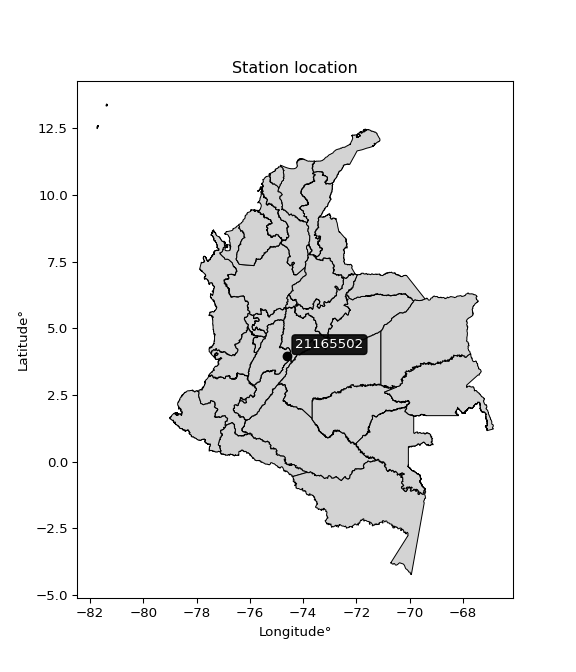

<div align="center">


</div>

# PMax24h Station (Rain, Pmax24h): 21165502

Maximum Precipitation in 24 hours (PMax24h) is the greatest amount of rainfall for a specific duration that is meteorologically possible for a given location, acting as a "worst-case" scenario for extreme storms, crucial for designing safety-critical infrastructure like bridges, river deviations, dams, spillways, and nuclear plants to prevent catastrophic failure. The PMax24h is related with the Probable Maximum Precipitation (PMP) and it is calculated by hydrologists using meteorological data to determine the upper limit of extreme rainfall, often leading to the Probable Maximum Flood (PMF) for flood control design, and is increasingly being studied for climate change impacts. Probable Maximum Precipitation (PMP) is the theoretical upper limit of rainfall, a deterministic estimate for extreme events, while probability distributions (like GEV, Gumbel) describe the likelihood and frequency of various precipitation amounts, including rare ones, showing how often events occur, with PMP representing the extreme end of these distributions, used for critical infrastructure design to ensure safety against the worst conceivable weather, unlike standard statistical forecasts which cover typical probabilities.

The most common probability distributions in hydrology, used for analyzing floods, rainfall, and streamflow, include the Normal, Log-Normal, Gumbel, Gamma (including Log-Pearson Type III), and Generalized Extreme Value (GEV) distributions, often chosen based on the data´s skewness and whether modeling extremes or general conditions, with Gumbel and GEV popular for extreme events like floods, while the Normal distribution serves as a baseline, though often requiring transformations for skewed hydrological data. These distributions help in designing water infrastructure, managing water resources, and forecasting hydrologic events.

> Hydrological data often isn´t perfectly normal (it´s skewed), so different distributions are needed for different applications, such as: **Flood Frequency Analysis**: Using Gumbel, GEV, or Log-Pearson Type III for predicting extreme flood magnitudes and their return periods, **Rainfall Analysis**: Normal for annual totals, but Log-Normal, Weibull, or GEV for intensity or extreme daily rainfall, **Streamflow Modeling**: Gamma and Log-Normal for maximum flows, GEV for minimum flows, and Kappa for daily flows.

<div align="center">

</img>

</div>


## A. General information


### 1. General running parameters

• app_version: _v20260225_. • runtime: _2026-02-27 14:50:08.749431_. • Python version: _3.14.0_. • SciPy version: _1.16.3_. • Pandas version: _2.3.3_. • NumPy version: _2.3.5_. • Stations dataset (station_dataset_file): _dataset/pmax24h_in/automatic_colombia_2003_2025.csv_. • Stations catalog (station_catalog_file): _dataset/CNE.xls_. • Minimum year to eval til year_max (date_min): _1900_. • Maximum year to eval since year_min (date_max): _2025_. • Creates, save and include plots into reports (create_plot): _False_. • Plot only fit distributions with Δo > Δ (plot_only_fit): _True_. • Plot only simple graphs avoiding multiple CDFs and multiple Extreme values plots (plot_only_simple): _False_. • Eval low extreme values, if False, evaluates high extreme values (low_extreme): _False_. • Eval every SciPy distribution as logarithmic (pdist_logarithmic_on): _True_. • Standard deviation normalized (ddof): _1.0_. • Return periods to eval in years (Tr): _[2, 2.33, 5, 10, 15, 20, 25, 50, 75, 100, 200, 250, 500, 750, 1000]_. • Minimum data sample per station, 0 means any (minimum_sample): _5_. • Z-Score maximum threshold to adjust a value, 0 means disable (zscore_max): _3.5_. • Z-Score minimum threshold to adjust a value, 0 means disable (zscore_min): _-2.5_. • Avoid zeros, e.g. rain = 0 (avoid_zeros): _True_. • Avoid null values (avoid_nans): _True_. 

:file_folder:Table: [dataset.csv](../../dataset/pmax24h_in/automatic_colombia_2003_2025.csv)

> Delta Degrees of Freedom (DDOF): is a parameter used in the formulas for calculating variance and standard deviation. When ddof=0, the divisor is $N$ (the total number of observations) and this is used when your data set is the entire population. When ddof=1, the divisor is $N-1$ and this is used when your data set is a sample drawn from a larger population. Using $N-1$ provides an unbiased estimate of the population variance (known as Bessel´s correction).


### 2. Station info and location

|   id |   CODIGO | NOMBRE                       | CATEGORIA               | TECNOLOGIA                | ESTADO   | FECHA_INSTALACION   |   FECHA_SUSPENSION |   ALTITUD |   LATITUD |   LONGITUD | DEPARTAMENTO   | MUNICIPIO   | AREA_OPERATIVA             | ENTIDAD                                    | AREA_HIDROGRAFICA   | ZONA_HIDROGRAFICA   | SUBZONA_HIDROGRAFICA   |   CORRIENTE | Catalogo   |   Version |
|-----:|---------:|:-----------------------------|:------------------------|:--------------------------|:---------|:--------------------|-------------------:|----------:|----------:|-----------:|:---------------|:------------|:---------------------------|:-------------------------------------------|:--------------------|:--------------------|:-----------------------|------------:|:-----------|----------:|
|    0 | 21165502 | VILLARICA  - AUT  [21165502] | Climatológica Principal | Automática con Telemetría | Activa   | 30/10/2013          |                nan |       999 |   3.95564 |   -74.5918 | Tolima         | Villarrica  | Area Operativa 10 - Tolima | CENTRO NACIONAL DE INVESTIGACIONES DE CAFE | Magdalena Cauca     | Alto Magdalena      | Río Prado              |         nan | CNE_OE     |  20251226 |

<div align="center">

Dynamic map: [:earth_americas:Google](http://maps.google.com/maps?q=3.955641667,-74.59178611) [:earth_americas:OSM](https://www.openstreetmap.org/#map=18/3.955641667/-74.59178611&layers=P) [:earth_americas:Bing](https://www.bing.com/maps?cp=3.955641667~-74.59178611&lvl=18) [:earth_americas:Apple](https://maps.apple.com/frame?center=3.955641667%2C-74.59178611&span=0.003%2C0.006)

</div>


<div align="center">

```geojson
{
  "type": "Feature",
  "geometry": {
    "type": "Point", 
    "coordinates": [-74.59178611, 3.955641667]
  }, 
  "properties": {
    "Name": "21165502"
  }
}
```

</div>


### 3. Discrete values table and plot

<div align="center">

|               |         0 |           1 |          2 |            3 |           4 |
|:--------------|----------:|------------:|-----------:|-------------:|------------:|
| Date          | 2016      | 2017        | 2018       | 2019         | 2020        |
| Value         |   24.1    |   86.1      |   94       |   60.7       |   35        |
| Value_initial |   24.1    |   86.1      |   94       |   60.7       |   35        |
| count         |    5      |    5        |    5       |    5         |    5        |
| mean          |   59.98   |   59.98     |   59.98    |   59.98      |   59.98     |
| std           |   30.6248 |   30.6248   |   30.6248  |   30.6248    |   30.6248   |
| zscore        |   -1.1716 |    0.852904 |    1.11087 |    0.0235104 |   -0.815679 |


</div>


> The initial value (value_initial) correspond to the initial obtained or null completed value, and value (value) is adjusted only when the initial value is outside the valid range (outlier) definite through the Z-Score value. If Z-Score is active, values out of range or outliers are replaced with the station mean value. A Z-Score (or standard score) measures how many standard deviations a data point is from the mean of a dataset, indicating its relative position; positive scores mean above the mean, negative mean below, and a score of zero is exactly at the mean, allowing for comparison of values from different distributions. It´s calculated using the formula $z=(x–μ)/σ$, where $x$ is the data point, $μ$ is the mean, and $σ$ is the standard deviation, helping identify outliers and understand probability.
>
> <sub>**Note**: In this study, "completing" (filling gaps in) and "extending" (forecasting or lengthening the historical record) rainfall data series are avoided for certain critical analyses because they introduce artificial bias and uncertainty, which can distort the statistics of rare events (extremes), alter day-to-day variability, and compromise the integrity and homogeneity of the original data. Some reasons against Completing/Extending rainfall data are: **Distortion of Extremes and Variability**: The primary issue is that most gap-filling or extension methods rely on averaging or regression with nearby stations, which inherently smooths the data. Rainfall is highly variable in space and time, with a large percentage of zero values and occasional large storms. Infilling methods often underestimate the highest values and overestimate the lowest (zero) values, which severely distorts analyses focused on flood frequency, drought severity, and intensity-duration-frequency (IDF) curves, **Loss of Data Homogeneity**: Infilled or extended data are synthetic estimates, not actual measurements. Combining these estimates with observed data can violate the assumption of data homogeneity, which requires that the data properties do not change over time. Inhomogeneity can lead to incorrect conclusions about long-term trends or changes in climate patterns, **Propagation of Errors**: Errors and biases from the original data (e.g., wind-induced undercatch, instrument errors, site changes) or the data used for imputation can propagate through the analysis, leading to unreliable hydrological models and inaccurate predictions, **Compromised Statistical Integrity**: For statistical analyses, especially those involving the frequency of events, using artificial data can introduce time bias or autocorrelation that doesn´t exist in reality, making it difficult to assess the true probability of events, **Difficulty in Validation**: It is difficult to accurately validate the quality of filled or extended data, especially for past periods where ground-truth measurements are unavailable. The reliability of imputation techniques heavily depends on the density of the surrounding station network and the complexity of the local topography.</sub>


### 4. Active continuous probability distributions from SciPy (80 of 104 available)

A Probability Density Function (PDF) describes the relative likelihood of a continuous random variable falling within a specific range, where the total area under its curve equals 1, and the area over any interval gives the actual probability for that range. Unlike discrete probabilities (like rolling a die), a PDF shows density, not direct probability for a single point (which is zero), with higher points indicating higher likelihood, often visualized as a bell curve for normal distributions.

A log of a probability density function (log-PDF) is simply the logarithm of the PDF´s value, denoted as $log(f(x))$, useful for converting multiplication of probabilities into addition, improving numerical stability with tiny numbers, and connecting to information theory concepts like entropy. Instead of dealing with very small probabilities (e.g., 0.000001), log-PDFs use negative numbers (e.g., $log(0.00001) ≈ -11.51$ that are easier for computers to handle, preventing underflow errors and simplifying complex calculations. In this study, each active probability distribution from SciPy is also evaluated in the $log$ form.

[scipy.stats](https://docs.scipy.org/doc/scipy/reference/stats.html) is a Python´s powerful submodule within the SciPy library for comprehensive statistical analysis, offering over 130 probability distributions (like Normal, Poisson, etc.), functions for descriptive stats (mean, variance), hypothesis testing (t-tests, chi-square), random variable generation, and statistical tests, making it essential for data science, modeling, and research. It provides tools to explore, model, and draw conclusions from data efficiently, working seamlessly with [NumPy](https://numpy.org/).

<div align="center">

|   id | p_dist           |   n_parameter | fit_method   | label                                                                       | active   | ref                                                                                                      |
|-----:|:-----------------|--------------:|:-------------|:----------------------------------------------------------------------------|:---------|:---------------------------------------------------------------------------------------------------------|
|    0 | alpha            |             3 | MLE          | Alpha                                                                       | True     | [:mortar_board:](https://docs.scipy.org/doc/scipy/reference/generated/scipy.stats.alpha.html)            |
|    1 | anglit           |             2 | MM           | Anglit                                                                      | True     | [:mortar_board:](https://docs.scipy.org/doc/scipy/reference/generated/scipy.stats.anglit.html)           |
|    2 | arcsine          |             2 | MM           | Arcsine                                                                     | True     | [:mortar_board:](https://docs.scipy.org/doc/scipy/reference/generated/scipy.stats.arcsine.html)          |
|    3 | argus            |             3 | MLE          | Argus                                                                       | True     | [:mortar_board:](https://docs.scipy.org/doc/scipy/reference/generated/scipy.stats.argus.html)            |
|    4 | beta             |             4 | MLE          | Beta                                                                        | True     | [:mortar_board:](https://docs.scipy.org/doc/scipy/reference/generated/scipy.stats.beta.html)             |
|    5 | betaprime        |             4 | MLE          | Beta prime                                                                  | True     | [:mortar_board:](https://docs.scipy.org/doc/scipy/reference/generated/scipy.stats.betaprime.html)        |
|    6 | bradford         |             3 | MLE          | Bradford                                                                    | True     | [:mortar_board:](https://docs.scipy.org/doc/scipy/reference/generated/scipy.stats.bradford.html)         |
|    7 | burr             |             4 | MLE          | Burr (Type III)                                                             | True     | [:mortar_board:](https://docs.scipy.org/doc/scipy/reference/generated/scipy.stats.burr.html)             |
|    8 | burr12           |             4 | MLE          | Burr (Type III) 12                                                          | True     | [:mortar_board:](https://docs.scipy.org/doc/scipy/reference/generated/scipy.stats.burr12.html)           |
|    9 | cosine           |             2 | MLE          | Cosine                                                                      | True     | [:mortar_board:](https://docs.scipy.org/doc/scipy/reference/generated/scipy.stats.cosine.html)           |
|   10 | crystalball      |             4 | MLE          | Crystalball                                                                 | True     | [:mortar_board:](https://docs.scipy.org/doc/scipy/reference/generated/scipy.stats.crystalball.html)      |
|   11 | dgamma           |             3 | MLE          | Double gamma                                                                | True     | [:mortar_board:](https://docs.scipy.org/doc/scipy/reference/generated/scipy.stats.dgamma.html)           |
|   12 | dweibull         |             3 | MLE          | Double Weibull                                                              | True     | [:mortar_board:](https://docs.scipy.org/doc/scipy/reference/generated/scipy.stats.dweibull.html)         |
|   13 | erlang           |             3 | MLE          | Erlang                                                                      | True     | [:mortar_board:](https://docs.scipy.org/doc/scipy/reference/generated/scipy.stats.erlang.html)           |
|   14 | exponnorm        |             3 | MLE          | Exponentially modified Normal                                               | True     | [:mortar_board:](https://docs.scipy.org/doc/scipy/reference/generated/scipy.stats.exponnorm.html)        |
|   15 | exponpow         |             3 | MLE          | Exponential power                                                           | True     | [:mortar_board:](https://docs.scipy.org/doc/scipy/reference/generated/scipy.stats.exponpow.html)         |
|   16 | exponweib        |             4 | MLE          | Exponentiated Weibull                                                       | True     | [:mortar_board:](https://docs.scipy.org/doc/scipy/reference/generated/scipy.stats.exponweib.html)        |
|   17 | f                |             4 | MLE          | F                                                                           | True     | [:mortar_board:](https://docs.scipy.org/doc/scipy/reference/generated/scipy.stats.f.html)                |
|   18 | fatiguelife      |             3 | MLE          | Fatigue-life (Birnbaum-Saunders)                                            | True     | [:mortar_board:](https://docs.scipy.org/doc/scipy/reference/generated/scipy.stats.fatiguelife.html)      |
|   19 | foldnorm         |             3 | MM           | Fold Normal                                                                 | True     | [:mortar_board:](https://docs.scipy.org/doc/scipy/reference/generated/scipy.stats.foldnorm.html)         |
|   20 | gamma            |             3 | MLE          | Gamma                                                                       | True     | [:mortar_board:](https://docs.scipy.org/doc/scipy/reference/generated/scipy.stats.gamma.html)            |
|   21 | gausshyper       |             6 | MLE          | Gauss hypergeometric                                                        | True     | [:mortar_board:](https://docs.scipy.org/doc/scipy/reference/generated/scipy.stats.gausshyper.html)       |
|   22 | genexpon         |             5 | MLE          | Generalized exponential                                                     | True     | [:mortar_board:](https://docs.scipy.org/doc/scipy/reference/generated/scipy.stats.genexpon.html)         |
|   23 | genextreme       |             3 | MLE          | Generalized exponential                                                     | True     | [:mortar_board:](https://docs.scipy.org/doc/scipy/reference/generated/scipy.stats.genextreme.html)       |
|   24 | gengamma         |             4 | MLE          | Generalized gamma                                                           | True     | [:mortar_board:](https://docs.scipy.org/doc/scipy/reference/generated/scipy.stats.gengamma.html)         |
|   25 | genhalflogistic  |             3 | MLE          | Generalized half-logistic                                                   | True     | [:mortar_board:](https://docs.scipy.org/doc/scipy/reference/generated/scipy.stats.genhalflogistic.html)  |
|   26 | genlogistic      |             3 | MLE          | Generalized logistic                                                        | True     | [:mortar_board:](https://docs.scipy.org/doc/scipy/reference/generated/scipy.stats.genlogistic.html)      |
|   27 | gennorm          |             3 | MLE          | Generalized Normal                                                          | True     | [:mortar_board:](https://docs.scipy.org/doc/scipy/reference/generated/scipy.stats.gennorm.html)          |
|   28 | genpareto        |             3 | MLE          | Generalized Pareto                                                          | True     | [:mortar_board:](https://docs.scipy.org/doc/scipy/reference/generated/scipy.stats.genpareto.html)        |
|   29 | gompertz         |             3 | MLE          | Gompertz (or truncated Gumbel)                                              | True     | [:mortar_board:](https://docs.scipy.org/doc/scipy/reference/generated/scipy.stats.gompertz.html)         |
|   30 | gumbel_l         |             2 | MM           | Gumbel Left Skew                                                            | True     | [:mortar_board:](https://docs.scipy.org/doc/scipy/reference/generated/scipy.stats.gumbel_l.html)         |
|   31 | gumbel_r         |             2 | MM           | Gumbel Right Skew                                                           | True     | [:mortar_board:](https://docs.scipy.org/doc/scipy/reference/generated/scipy.stats.gumbel_r.html)         |
|   32 | halfgennorm      |             3 | MLE          | Upper half of a generalized normal                                          | True     | [:mortar_board:](https://docs.scipy.org/doc/scipy/reference/generated/scipy.stats.halfgennorm.html)      |
|   33 | halflogistic     |             2 | MM           | Half-logistic                                                               | True     | [:mortar_board:](https://docs.scipy.org/doc/scipy/reference/generated/scipy.stats.halflogistic.html)     |
|   34 | halfnorm         |             2 | MM           | Half Normal                                                                 | True     | [:mortar_board:](https://docs.scipy.org/doc/scipy/reference/generated/scipy.stats.halfnorm.html)         |
|   35 | hypsecant        |             2 | MM           | hyperbolic secant                                                           | True     | [:mortar_board:](https://docs.scipy.org/doc/scipy/reference/generated/scipy.stats.hypsecant.html)        |
|   36 | invgamma         |             3 | MLE          | Inverted gamma                                                              | True     | [:mortar_board:](https://docs.scipy.org/doc/scipy/reference/generated/scipy.stats.invgamma.html)         |
|   37 | invgauss         |             3 | MLE          | Inverse Gaussian                                                            | True     | [:mortar_board:](https://docs.scipy.org/doc/scipy/reference/generated/scipy.stats.invgauss.html)         |
|   38 | invweibull       |             3 | MLE          | Inverted Weibull                                                            | True     | [:mortar_board:](https://docs.scipy.org/doc/scipy/reference/generated/scipy.stats.invweibull.html)       |
|   39 | johnsonsb        |             4 | MLE          | Johnson SB                                                                  | True     | [:mortar_board:](https://docs.scipy.org/doc/scipy/reference/generated/scipy.stats.johnsonsb.html)        |
|   40 | johnsonsu        |             4 | MLE          | Johnson Su                                                                  | True     | [:mortar_board:](https://docs.scipy.org/doc/scipy/reference/generated/scipy.stats.johnsonsu.html)        |
|   41 | kappa3           |             3 | MLE          | Kappa 3                                                                     | True     | [:mortar_board:](https://docs.scipy.org/doc/scipy/reference/generated/scipy.stats.kappa3.html)           |
|   42 | kappa4           |             4 | MLE          | Kappa 4                                                                     | True     | [:mortar_board:](https://docs.scipy.org/doc/scipy/reference/generated/scipy.stats.kappa4.html)           |
|   43 | ksone            |             3 | MLE          | Kolmogorov-Smirnov one-sided test statistic distribution                    | True     | [:mortar_board:](https://docs.scipy.org/doc/scipy/reference/generated/scipy.stats.ksone.html)            |
|   44 | kstwobign        |             2 | MLE          | Limiting distribution of scaled Kolmogorov-Smirnov two-sided test statistic | True     | [:mortar_board:](https://docs.scipy.org/doc/scipy/reference/generated/scipy.stats.kstwobign.html)        |
|   45 | laplace          |             2 | MM           | Laplace                                                                     | True     | [:mortar_board:](https://docs.scipy.org/doc/scipy/reference/generated/scipy.stats.laplace.html)          |
|   46 | levy_l           |             2 | MLE          | Left-skewed Levy                                                            | True     | [:mortar_board:](https://docs.scipy.org/doc/scipy/reference/generated/scipy.stats.levy_l.html)           |
|   47 | loggamma         |             3 | MLE          | Log gamma                                                                   | True     | [:mortar_board:](https://docs.scipy.org/doc/scipy/reference/generated/scipy.stats.loggamma.html)         |
|   48 | logistic         |             2 | MM           | Logistic (or Sech-squared)                                                  | True     | [:mortar_board:](https://docs.scipy.org/doc/scipy/reference/generated/scipy.stats.logistic.html)         |
|   49 | loglaplace       |             3 | MLE          | Log-Laplace                                                                 | True     | [:mortar_board:](https://docs.scipy.org/doc/scipy/reference/generated/scipy.stats.loglaplace.html)       |
|   50 | lomax            |             3 | MLE          | Lomax (Pareto of the second kind)                                           | True     | [:mortar_board:](https://docs.scipy.org/doc/scipy/reference/generated/scipy.stats.lomax.html)            |
|   51 | maxwell          |             2 | MM           | Maxwell                                                                     | True     | [:mortar_board:](https://docs.scipy.org/doc/scipy/reference/generated/scipy.stats.maxwell.html)          |
|   52 | mielke           |             4 | MLE          | Mielke Beta-Kappa / Dagum                                                   | True     | [:mortar_board:](https://docs.scipy.org/doc/scipy/reference/generated/scipy.stats.mielke.html)           |
|   53 | moyal            |             2 | MM           | Moyal                                                                       | True     | [:mortar_board:](https://docs.scipy.org/doc/scipy/reference/generated/scipy.stats.moyal.html)            |
|   54 | nakagami         |             3 | MLE          | Nakagami                                                                    | True     | [:mortar_board:](https://docs.scipy.org/doc/scipy/reference/generated/scipy.stats.nakagami.html)         |
|   55 | ncf              |             5 | MLE          | Non-central F distribution                                                  | True     | [:mortar_board:](https://docs.scipy.org/doc/scipy/reference/generated/scipy.stats.ncf.html)              |
|   56 | nct              |             4 | MLE          | Non-central Student’s t                                                     | True     | [:mortar_board:](https://docs.scipy.org/doc/scipy/reference/generated/scipy.stats.nct.html)              |
|   57 | norm             |             2 | MM           | Normal                                                                      | True     | [:mortar_board:](https://docs.scipy.org/doc/scipy/reference/generated/scipy.stats.norm.html)             |
|   58 | pearson3         |             3 | MM           | Pearson type III                                                            | True     | [:mortar_board:](https://docs.scipy.org/doc/scipy/reference/generated/scipy.stats.pearson3.html)         |
|   59 | powerlaw         |             3 | MLE          | Power-function                                                              | True     | [:mortar_board:](https://docs.scipy.org/doc/scipy/reference/generated/scipy.stats.powerlaw.html)         |
|   60 | rayleigh         |             2 | MM           | Rayleigh                                                                    | True     | [:mortar_board:](https://docs.scipy.org/doc/scipy/reference/generated/scipy.stats.rayleigh.html)         |
|   61 | rdist            |             3 | MLE          | R-distributed (symmetric beta)                                              | True     | [:mortar_board:](https://docs.scipy.org/doc/scipy/reference/generated/scipy.stats.rdist.html)            |
|   62 | rice             |             3 | MLE          | Rice                                                                        | True     | [:mortar_board:](https://docs.scipy.org/doc/scipy/reference/generated/scipy.stats.rice.html)             |
|   63 | semicircular     |             2 | MM           | Semicircular                                                                | True     | [:mortar_board:](https://docs.scipy.org/doc/scipy/reference/generated/scipy.stats.semicircular.html)     |
|   64 | skewnorm         |             3 | MLE          | Skew normal                                                                 | True     | [:mortar_board:](https://docs.scipy.org/doc/scipy/reference/generated/scipy.stats.skewnorm.html)         |
|   65 | t                |             3 | MLE          | Student’s t                                                                 | True     | [:mortar_board:](https://docs.scipy.org/doc/scipy/reference/generated/scipy.stats.t.html)                |
|   66 | trapezoid        |             4 | MLE          | Trapezoid                                                                   | True     | [:mortar_board:](https://docs.scipy.org/doc/scipy/reference/generated/scipy.stats.trapezoid.html)        |
|   67 | triang           |             3 | MLE          | Triangular                                                                  | True     | [:mortar_board:](https://docs.scipy.org/doc/scipy/reference/generated/scipy.stats.triang.html)           |
|   68 | truncexpon       |             3 | MLE          | Truncated exponential                                                       | True     | [:mortar_board:](https://docs.scipy.org/doc/scipy/reference/generated/scipy.stats.truncexpon.html)       |
|   69 | truncnorm        |             4 | MLE          | Truncated normal                                                            | True     | [:mortar_board:](https://docs.scipy.org/doc/scipy/reference/generated/scipy.stats.truncnorm.html)        |
|   70 | truncpareto      |             4 | MLE          | Upper truncated Pareto                                                      | True     | [:mortar_board:](https://docs.scipy.org/doc/scipy/reference/generated/scipy.stats.truncpareto.html)      |
|   71 | truncweibull_min |             5 | MLE          | Doubly truncated Weibull minimum                                            | True     | [:mortar_board:](https://docs.scipy.org/doc/scipy/reference/generated/scipy.stats.truncweibull_min.html) |
|   72 | tukeylambda      |             3 | MLE          | Tukey-Lamdba                                                                | True     | [:mortar_board:](https://docs.scipy.org/doc/scipy/reference/generated/scipy.stats.tukeylambda.html)      |
|   73 | uniform          |             2 | MLE          | Uniform                                                                     | True     | [:mortar_board:](https://docs.scipy.org/doc/scipy/reference/generated/scipy.stats.uniform.html)          |
|   74 | vonmises         |             3 | MLE          | Von Mises                                                                   | True     | [:mortar_board:](https://docs.scipy.org/doc/scipy/reference/generated/scipy.stats.vonmises.html)         |
|   75 | vonmises_line    |             3 | MLE          | Von Mises line                                                              | True     | [:mortar_board:](https://docs.scipy.org/doc/scipy/reference/generated/scipy.stats.vonmises_line.html)    |
|   76 | wald             |             2 | MM           | Wald                                                                        | True     | [:mortar_board:](https://docs.scipy.org/doc/scipy/reference/generated/scipy.stats.wald.html)             |
|   77 | weibull_max      |             3 | MLE          | Weibull maximum                                                             | True     | [:mortar_board:](https://docs.scipy.org/doc/scipy/reference/generated/scipy.stats.weibull_max.html)      |
|   78 | weibull_min      |             3 | MLE          | Weibull minimum                                                             | True     | [:mortar_board:](https://docs.scipy.org/doc/scipy/reference/generated/scipy.stats.weibull_min.html)      |
|   79 | wrapcauchy       |             3 | MLE          | Wrapped  Cauchy                                                             | True     | [:mortar_board:](https://docs.scipy.org/doc/scipy/reference/generated/scipy.stats.wrapcauchy.html)       |

</div>

> **n_parameter:** # arguments & localization & scale.
>
> **Fit methods:** (MLE) maximum likelihood, (MM) L-moments.
>
>**Inactive** (With the only purpose of prevent loops, zero divisions, infinite values, over high estimated values or horizontal trending for recurrence intervals estimations, the follow distributions were disabled.)**:** lognorm, norminvgauss, powernorm, powerlognorm, cauchy, halfcauchy, foldcauchy, skewcauchy, chi2, expon, fisk, genhyperbolic, geninvgauss, gibrat, kstwo, laplace_asymmetric, levy, levy_stable, ncx2, pareto, rel_breitwigner, recipinvgauss, studentized_range, loguniform, 


## B. Probability (PDF) vs. Empirical (EDF) distributions functions

A continuous probability distribution (CPD) describes probabilities for variables that can take any value within a range (like rain any time), unlike discrete variables with specific outcomes (like temperature). It uses a Probability Density Function (PDF), a curve where the total area under it equals 1, and the probability of the variable falling within an interval (a to b) is found by calculating the area under the curve between those points. A key feature is that the probability of hitting any single exact value is zero, so probabilities are always expressed for ranges, e.g., $P(a ≤ X ≤ b)$.

<div align="center">

Distributions parameters from station values
|     |   station | p_dist              |   n |             loc |          scale | shape                 | shape1                | shape2               | shape3             |
|----:|----------:|:--------------------|----:|----------------:|---------------:|:----------------------|:----------------------|:---------------------|:-------------------|
|   0 |  21165502 | alpha               |   5 |  -259.653       | 3687.74        | 11.630019130058962    |                       |                      |                    |
|   1 |  21165502 | anglit              |   5 |    59.98        |   80.1315      |                       |                       |                      |                    |
|   2 |  21165502 | arcsine             |   5 |    21.2424      |   77.4752      |                       |                       |                      |                    |
|   3 |  21165502 | argus               |   5 |     0.195085    |   99.0258      | 1.081734185242484     |                       |                      |                    |
|   4 |  21165502 | beta                |   5 |    24.1         |   69.9286      | 0.3399284888954237    | 0.3342828238958797    |                      |                    |
|   5 |  21165502 | betaprime           |   5 |    -3.0133      | 1068.94        | 4.753582382088007     | 81.46107273658603     |                      |                    |
|   6 |  21165502 | bradford            |   5 |    24.1         |   69.9001      | 1.0112423607982812    |                       |                      |                    |
|   7 |  21165502 | burr                |   5 |    -0.662269    |    2.43818     | 2.036152569191402     | 315.47295404289616    |                      |                    |
|   8 |  21165502 | burr12              |   5 |    -4.72659     |   28.6071      | 573.006756462223      | 0.002453235640735525  |                      |                    |
|   9 |  21165502 | cosine              |   5 |    59.7906      |   21.5822      |                       |                       |                      |                    |
|  10 |  21165502 | crystalball         |   5 |    59.98        |   27.3916      | 11354.950779387535    | 703.6798348083503     |                      |                    |
|  11 |  21165502 | dgamma              |   5 |    50.761       |    6.6113      | 3.9610606457480575    |                       |                      |                    |
|  12 |  21165502 | dweibull            |   5 |    52.7736      |   29.1045      | 2.392739580088076     |                       |                      |                    |
|  13 |  21165502 | erlang              |   5 | -1303.14        |    0.550974    | 2474.0019268369533    |                       |                      |                    |
|  14 |  21165502 | exponnorm           |   5 |    59.9491      |   27.3916      | 0.0011328921966121627 |                       |                      |                    |
|  15 |  21165502 | exponpow            |   5 |    24.1         |   66.0141      | 0.45071965608393283   |                       |                      |                    |
|  16 |  21165502 | exponweib           |   5 |    24.1         |    1.00526     | 1.3171232766901393    | 0.18254794182299117   |                      |                    |
|  17 |  21165502 | f                   |   5 |    24.1         |   33.3402      | 0.9277101563849239    | 121.74486571189186    |                      |                    |
|  18 |  21165502 | fatiguelife         |   5 |    24.1         |    0.000288861 | 284.3655465627022     |                       |                      |                    |
|  19 |  21165502 | foldnorm            |   5 |  -134.416       |   27.2723      | 7.1289804793953975    |                       |                      |                    |
|  20 |  21165502 | gamma               |   5 | -1293.13        |    0.555437    | 2436.106230310371     |                       |                      |                    |
|  21 |  21165502 | gausshyper          |   5 |    22.0482      |   71.9518      | 1.141403885605759     | 0.8023471219350871    | 0.9936430933777962   | 1.0039582671046121 |
|  22 |  21165502 | genexpon            |   5 |    24.0974      |    9.0438      | 0.1723320168933251    | 3.4725178218230894    | 0.006952962566635846 |                    |
|  23 |  21165502 | genextreme          |   5 |    59.4023      |   42.7284      | 1.2350080297068247    |                       |                      |                    |
|  24 |  21165502 | gengamma            |   5 |    24.1         |    1.13799     | 1.3504085443331784    | 0.2511001109439671    |                      |                    |
|  25 |  21165502 | genhalflogistic     |   5 |     0.221648    |  152.41        | 1.625214634017201     |                       |                      |                    |
|  26 |  21165502 | genlogistic         |   5 |  -110.041       |   24.0772      | 662.0123179182401     |                       |                      |                    |
|  27 |  21165502 | gennorm             |   5 |    59.05        |   34.9501      | 5346493.298264798     |                       |                      |                    |
|  28 |  21165502 | genpareto           |   5 |    -0.141649    |  164.506       | -1.7474337650794682   |                       |                      |                    |
|  29 |  21165502 | gompertz            |   5 |    24.1         |   50.5216      | 0.7457396076123479    |                       |                      |                    |
|  30 |  21165502 | gumbel_l            |   5 |    72.3077      |   21.3572      |                       |                       |                      |                    |
|  31 |  21165502 | gumbel_r            |   5 |    47.6523      |   21.3572      |                       |                       |                      |                    |
|  32 |  21165502 | halfgennorm         |   5 |    24.1         |    1.21888     | 0.35199987364890284   |                       |                      |                    |
|  33 |  21165502 | halflogistic        |   5 |    27.5146      |   23.4189      |                       |                       |                      |                    |
|  34 |  21165502 | halfnorm            |   5 |    23.7242      |   45.4399      |                       |                       |                      |                    |
|  35 |  21165502 | hypsecant           |   5 |    59.98        |   17.4381      |                       |                       |                      |                    |
|  36 |  21165502 | invgamma            |   5 |   -91.4124      | 4291.33        | 29.42727753368689     |                       |                      |                    |
|  37 |  21165502 | invgauss            |   5 |   -10.2624      |  355.276       | 0.19771195586931392   |                       |                      |                    |
|  38 |  21165502 | invweibull          |   5 |    24.1         |    1.3797      | 0.04881169699016569   |                       |                      |                    |
|  39 |  21165502 | johnsonsb           |   5 |    24.025       |   69.975       | -0.9622629947895921   | 0.15814105272575865   |                      |                    |
|  40 |  21165502 | johnsonsu           |   5 |    94           |    5.22082e-10 | 3.688482974736962     | 0.17021467659984058   |                      |                    |
|  41 |  21165502 | kappa3              |   5 |    24.1         |   69.8948      | 21532.431742875106    |                       |                      |                    |
|  42 |  21165502 | kappa4              |   5 |    11.693       |   88.5294      | 1.1640037564653172    | 1.0722353763827992    |                      |                    |
|  43 |  21165502 | ksone               |   5 |    12.5363      |   94.8874      | 1.0                   |                       |                      |                    |
|  44 |  21165502 | kstwobign           |   5 |   -35.3459      |  108.552       |                       |                       |                      |                    |
|  45 |  21165502 | laplace             |   5 |    59.98        |   19.3688      |                       |                       |                      |                    |
|  46 |  21165502 | levy_l              |   5 |    96.0088      |    7.60614     |                       |                       |                      |                    |
|  47 |  21165502 | loggamma            |   5 |  -229.262       |  106.71        | 15.534525204352994    |                       |                      |                    |
|  48 |  21165502 | logistic            |   5 |    59.98        |   15.1018      |                       |                       |                      |                    |
|  49 |  21165502 | loglaplace          |   5 |    -0.180984    |   60.881       | 2.219663969371558     |                       |                      |                    |
|  50 |  21165502 | lomax               |   5 |    24.1         |    2.89032e+10 | 465378717.68128395    |                       |                      |                    |
|  51 |  21165502 | maxwell             |   5 |    -4.92667     |   40.6742      |                       |                       |                      |                    |
|  52 |  21165502 | mielke              |   5 |    -4.83927     |   99.3114      | 1.8834862118650721    | 969.0099408416521     |                      |                    |
|  53 |  21165502 | moyal               |   5 |    44.3157      |   12.3306      |                       |                       |                      |                    |
|  54 |  21165502 | nakagami            |   5 |    35           |   57.4141      | 0.17602597406915726   |                       |                      |                    |
|  55 |  21165502 | ncf                 |   5 |     8.62662     |    9.80038e-06 | 2.523250608220217e-06 | 14335.093037143939    | 13.257464082350303   |                    |
|  56 |  21165502 | nct                 |   5 | -1514.47        |   27.2912      | 213137.45423545293    | 57.69067427827446     |                      |                    |
|  57 |  21165502 | norm                |   5 |    59.98        |   27.3916      |                       |                       |                      |                    |
|  58 |  21165502 | pearson3            |   5 |    59.98        |   27.3916      | -0.04461940932800885  |                       |                      |                    |
|  59 |  21165502 | powerlaw            |   5 |    24.1         |   69.9         | 0.12455353210621453   |                       |                      |                    |
|  60 |  21165502 | rayleigh            |   5 |     7.57821     |   41.8106      |                       |                       |                      |                    |
|  61 |  21165502 | rdist               |   5 |    59.0948      |   34.9948      | 1.1986595600990348    |                       |                      |                    |
|  62 |  21165502 | rice                |   5 |     8.75608     |   33.6848      | 0.9867787516821317    |                       |                      |                    |
|  63 |  21165502 | semicircular        |   5 |    59.98        |   54.7833      |                       |                       |                      |                    |
|  64 |  21165502 | skewnorm            |   5 |    63.4417      |   27.6095      | -0.15911867510157865  |                       |                      |                    |
|  65 |  21165502 | t                   |   5 |    59.9794      |   27.3871      | 2310761.9366294146    |                       |                      |                    |
|  66 |  21165502 | trapezoid           |   5 |   -18.37        |  116.213       | 1.0                   | 1.0                   |                      |                    |
|  67 |  21165502 | triang              |   5 |   -18.9319      |  112.932       | 0.9999994919360722    |                       |                      |                    |
|  68 |  21165502 | truncexpon          |   5 |    24.1         |   84.0899      | 0.8312561650489778    |                       |                      |                    |
|  69 |  21165502 | truncnorm           |   5 |    59.98        |   27.3916      | -377.49947947860153   | 924.1951711831952     |                      |                    |
|  70 |  21165502 | truncpareto         |   5 |    23.7702      |    0.329849    | 0.2652759703740603    | 212.9154400573227     |                      |                    |
|  71 |  21165502 | truncweibull_min    |   5 |    23.7992      |   73.0825      | 0.7007248334891948    | 0.004116184940827181  | 0.9605699358401013   |                    |
|  72 |  21165502 | tukeylambda         |   5 |    58.6723      |   41.1477      | 1.1647451521238406    |                       |                      |                    |
|  73 |  21165502 | uniform             |   5 |    24.1         |   69.9         |                       |                       |                      |                    |
|  74 |  21165502 | vonmises            |   5 |    -1.64364     |    1           | 1.8362863573618973    |                       |                      |                    |
|  75 |  21165502 | vonmises_line       |   5 |    59.0497      |   11.125       | 0.003195237508198165  |                       |                      |                    |
|  76 |  21165502 | wald                |   5 |    32.5884      |   27.3916      |                       |                       |                      |                    |
|  77 |  21165502 | weibull_max         |   5 |    94           |    1.47153     | 0.24081491025410756   |                       |                      |                    |
|  78 |  21165502 | weibull_min         |   5 |    24.1         |   42.0254      | 0.836242001473223     |                       |                      |                    |
|  79 |  21165502 | wrapcauchy          |   5 |    24.1         |   11.1249      | 0.5970489039541969    |                       |                      |                    |
|  80 |  21165502 | logalpha            |   5 |    -6.30641     |  193.897       | 18.94046404553611     |                       |                      |                    |
|  81 |  21165502 | loganglit           |   5 |     3.96846     |    1.53432     |                       |                       |                      |                    |
|  82 |  21165502 | logarcsine          |   5 |     3.22675     |    1.48342     |                       |                       |                      |                    |
|  83 |  21165502 | logargus            |   5 |     2.66476     |    1.95721     | 1.8002441353536895    |                       |                      |                    |
|  84 |  21165502 | logbeta             |   5 |     3.15548     |    1.38782     | 0.43659197933258087   | 0.3176760145687667    |                      |                    |
|  85 |  21165502 | logbetaprime        |   5 |   -16.3182      |    7.62871     | 5391.192205165544     | 2028.3054547348165    |                      |                    |
|  86 |  21165502 | logbradford         |   5 |     3.18071     |    1.3626      | 0.0033084947483536476 |                       |                      |                    |
|  87 |  21165502 | logburr             |   5 |     1.19209     |    3.36117     | 1354.3118824238677    | 0.0035108190641892894 |                      |                    |
|  88 |  21165502 | logburr12           |   5 |   -34.6827      |   43.0502      | 95.40325959096538     | 15708.85029998776     |                      |                    |
|  89 |  21165502 | logcosine           |   5 |     3.94172     |    0.417911    |                       |                       |                      |                    |
|  90 |  21165502 | logcrystalball      |   5 |     3.96846     |    0.524481    | 483.4743684916467     | 134.53801900024644    |                      |                    |
|  91 |  21165502 | logdgamma           |   5 |     3.85824     |    0.0834374   | 6.013962774685389     |                       |                      |                    |
|  92 |  21165502 | logdweibull         |   5 |     4.10594     |    0.702506    | 0.37246912293086043   |                       |                      |                    |
|  93 |  21165502 | logerlang           |   5 |    -4.8867      |    0.0319542   | 277.0104621248655     |                       |                      |                    |
|  94 |  21165502 | logexponnorm        |   5 |     3.96799     |    0.524475    | 0.0008994393224885602 |                       |                      |                    |
|  95 |  21165502 | logexponpow         |   5 |     3.18221     |    1.15701     | 0.9644862343358744    |                       |                      |                    |
|  96 |  21165502 | logexponweib        |   5 |     3.18221     |    1.09437     | 0.8813932022017685    | 1.0076973535584468    |                      |                    |
|  97 |  21165502 | logf                |   5 |  -344.524       |  348.492       | 4696981.993594941     | 1087170.4201924135    |                      |                    |
|  98 |  21165502 | logfatiguelife      |   5 |   -76.4798      |   80.4472      | 0.006490648635432023  |                       |                      |                    |
|  99 |  21165502 | logfoldnorm         |   5 |     3.19085     |    0.60769     | 1.160060746967833     |                       |                      |                    |
| 100 |  21165502 | loggamma            |   5 |    -3.86975     |    0.0356415   | 219.92296228030648    |                       |                      |                    |
| 101 |  21165502 | loggausshyper       |   5 |     3.16094     |    1.38235     | 1.2776497129059703    | 0.7573530249577143    | 1.1975848048528284   | 1.2220916666381    |
| 102 |  21165502 | loggenexpon         |   5 |     3.18221     |    1.0655      | 0.949531145103861     | 1.0133509211422456    | 0.9819439695917285   |                    |
| 103 |  21165502 | loggenextreme       |   5 |     4.12579     |    0.451316    | 1.0809921827421776    |                       |                      |                    |
| 104 |  21165502 | loggengamma         |   5 |     3.18221     |    1.76082     | 0.5319030577546677    | 0.49979741997407423   |                      |                    |
| 105 |  21165502 | loggenhalflogistic  |   5 |     3.17224     |    1.56051     | 1.1381831797619837    |                       |                      |                    |
| 106 |  21165502 | loggenlogistic      |   5 |     4.54335     |    3.29619e-06 | 5.750477591528571e-06 |                       |                      |                    |
| 107 |  21165502 | loggennorm          |   5 |     3.86275     |    0.680572    | 242432.62636476906    |                       |                      |                    |
| 108 |  21165502 | loggenpareto        |   5 |    -0.00574976  |   13.2815      | -2.9196162265554193   |                       |                      |                    |
| 109 |  21165502 | loggompertz         |   5 |     3.18221     |    0.644419    | 0.2864446533168544    |                       |                      |                    |
| 110 |  21165502 | loggumbel_l         |   5 |     4.20451     |    0.408936    |                       |                       |                      |                    |
| 111 |  21165502 | loggumbel_r         |   5 |     3.73242     |    0.408936    |                       |                       |                      |                    |
| 112 |  21165502 | loghalfgennorm      |   5 |     3.18221     |    0.970523    | 1.3711841462484702    |                       |                      |                    |
| 113 |  21165502 | loghalflogistic     |   5 |     3.34683     |    0.448416    |                       |                       |                      |                    |
| 114 |  21165502 | loghalfnorm         |   5 |     3.27428     |    0.870027    |                       |                       |                      |                    |
| 115 |  21165502 | loghypsecant        |   5 |     3.96846     |    0.333895    |                       |                       |                      |                    |
| 116 |  21165502 | loginvgamma         |   5 |    -6.32447     | 3884.45        | 378.4656770973876     |                       |                      |                    |
| 117 |  21165502 | loginvgauss         |   5 |     0.189286    |  170.986       | 0.022089612596133637  |                       |                      |                    |
| 118 |  21165502 | loginvweibull       |   5 |    -1.66135e+07 |    1.66135e+07 | 33304173.78732851     |                       |                      |                    |
| 119 |  21165502 | logjohnsonsb        |   5 |     0.501648    |    4.04165     | -0.9201040068947155   | 0.15719157894519886   |                      |                    |
| 120 |  21165502 | logjohnsonsu        |   5 |     4.54329     |    1.53931e-12 | 2.5224894864908975    | 0.13280373197575338   |                      |                    |
| 121 |  21165502 | logkappa3           |   5 |     3.18221     |    1.36104     | 61443.562277305755    |                       |                      |                    |
| 122 |  21165502 | logkappa4           |   5 |     3.02467     |    1.76667     | 1.0663911854129884    | 1.1633327719259627    |                      |                    |
| 123 |  21165502 | logksone            |   5 |     3.06003     |    1.81686     | 1.0                   |                       |                      |                    |
| 124 |  21165502 | logkstwobign        |   5 |     1.99236     |    2.24933     |                       |                       |                      |                    |
| 125 |  21165502 | loglaplace          |   5 |     3.96846     |    0.370864    |                       |                       |                      |                    |
| 126 |  21165502 | loglevy_l           |   5 |     4.56905     |    0.0970979   |                       |                       |                      |                    |
| 127 |  21165502 | logloggamma         |   5 |     4.54331     |    9.62893e-07 | 1.679108335916671e-06 |                       |                      |                    |
| 128 |  21165502 | loglogistic         |   5 |     3.96846     |    0.289162    |                       |                       |                      |                    |
| 129 |  21165502 | logloglaplace       |   5 |     0.00626003  |    4.09968     | 8.580419302157331     |                       |                      |                    |
| 130 |  21165502 | loglomax            |   5 |     3.18221     |    2.19979     | 3.1200652558885587    |                       |                      |                    |
| 131 |  21165502 | logmaxwell          |   5 |     2.72566     |    0.778809    |                       |                       |                      |                    |
| 132 |  21165502 | logmielke           |   5 |   -20.7116      |   25.2612      | 42.35702067623788     | 17460.711855939822    |                      |                    |
| 133 |  21165502 | logmoyal            |   5 |     3.66853     |    0.236099    |                       |                       |                      |                    |
| 134 |  21165502 | lognakagami         |   5 |     3.55535     |    0.38426     | 0.04712768594897513   |                       |                      |                    |
| 135 |  21165502 | logncf              |   5 |   -14.845       |   18.0422      | 3201.500488650755     | 12146.694533728943    | 136.98344557458256   |                    |
| 136 |  21165502 | lognct              |   5 |   -17.5808      |    0.422175    | 2307.572992914387     | 51.02456250869744     |                      |                    |
| 137 |  21165502 | lognorm             |   5 |     3.96846     |    0.524481    |                       |                       |                      |                    |
| 138 |  21165502 | logpearson3         |   5 |     3.96846     |    0.524481    | -0.34441899102873175  |                       |                      |                    |
| 139 |  21165502 | logpowerlaw         |   5 |     3.18221     |    1.36108     | 0.13366423613693423   |                       |                      |                    |
| 140 |  21165502 | lograyleigh         |   5 |     2.9651      |    0.800568    |                       |                       |                      |                    |
| 141 |  21165502 | logrdist            |   5 |     4.2877      |    0.732347    | 1.0796550376480576    |                       |                      |                    |
| 142 |  21165502 | logrice             |   5 |     2.87954     |    0.608437    | 1.3950350379819618    |                       |                      |                    |
| 143 |  21165502 | logsemicircular     |   5 |     3.96846     |    1.04896     |                       |                       |                      |                    |
| 144 |  21165502 | logskewnorm         |   5 |     4.54329     |    0.77815     | -19902979.458530027   |                       |                      |                    |
| 145 |  21165502 | logt                |   5 |     3.96846     |    0.524481    | 134940849669.96799    |                       |                      |                    |
| 146 |  21165502 | logtrapezoid        |   5 |     2.48501     |    2.22518     | 1.0                   | 1.0                   |                      |                    |
| 147 |  21165502 | logtriang           |   5 |     2.7729      |    1.77158     | 0.9999999777317086    |                       |                      |                    |
| 148 |  21165502 | logtruncexpon       |   5 |     3.18175     |    1.77199     | 0.7683733023309067    |                       |                      |                    |
| 149 |  21165502 | logtruncnorm        |   5 |    -0.153011    |    1.20935     | 3.5216899030133137    | 3.88333547628256      |                      |                    |
| 150 |  21165502 | logtruncpareto      |   5 |     3.17462     |    0.00758887  | 0.2624829839824383    | 180.35250190522493    |                      |                    |
| 151 |  21165502 | logtruncweibull_min |   5 |     3.18094     |    1.45421     | 0.6827429814176604    | 0.0008726213433168747 | 0.9368314969408386   |                    |
| 152 |  21165502 | logtukeylambda      |   5 |     3.86269     |    0.798302    | 1.17292240967482      |                       |                      |                    |
| 153 |  21165502 | loguniform          |   5 |     3.18221     |    1.36108     |                       |                       |                      |                    |
| 154 |  21165502 | logvonmises         |   5 |    -2.30559     |    1           | 4.099037131046776     |                       |                      |                    |
| 155 |  21165502 | logvonmises_line    |   5 |     3.86275     |    0.216626    | 0.15467951322026305   |                       |                      |                    |
| 156 |  21165502 | logwald             |   5 |     3.44395     |    0.524506    |                       |                       |                      |                    |
| 157 |  21165502 | logweibull_max      |   5 |     4.54329     |    0.42798     | 0.1459971755396023    |                       |                      |                    |
| 158 |  21165502 | logweibull_min      |   5 |    -1.54275e+07 |    1.54275e+07 | 37184812.695277825    |                       |                      |                    |
| 159 |  21165502 | logwrapcauchy       |   5 |     3.18221     |    0.21665     | 0.6830895203561105    |                       |                      |                    |

</div>

> **loc** (Location parameter): This shifts the distribution along the x-axis. For many common distributions, like the normal (Gaussian) distribution, loc represents the mean $μ$. For others, like the uniform distribution, it might represent the minimum value, or for the beta distribution, the left end of the support interval.
>
> **scale** (Scale parameter): This determines the width or spread of the distribution. For the normal distribution, scale represents the standard deviation $σ$. For a uniform distribution, it defines the length of the interval (from $loc$ to $loc + scale$).
>
> **shape** (Shape parameters): Refers to parameters that define the specific form of a probability distribution, distinct from its location (loc) and scale (scale). These parameters are required arguments for most distribution functions. For example, a normal (Gaussian) distribution is fully defined by its location (mean) and scale (standard deviation), so it has no specific shape parameters beyond loc and scale. However, other distributions have intrinsic properties that need specification, as Gamma distribution that takes a shape parameter, often named $a$ or $alpha$.


### 0. Cumulative distribution values - CDF (160 evaluated)

Cumulative Distribution Function (CDF), denoted as $F$<sub>$X$</sub>$(x)$, is a function that gives the probability that a random variable $X$ will take a value less than or equal to a specific value, $x$ (i.e., $(P(X≥x)$. It essentially "accumulates" probabilities from a given point up to the far right (positive infinity), providing a complete picture of the distribution´s probabilities for both discrete (like rain) and continuous (like temperature) variables, helping to find probabilities over ranges or above certain values. Each station is evaluated separately ordering the $x$ values ascending, calculating the CDF and PDF values for the activated distributions and their logarithmic forms.

<div align="center">

CDF ordered by x ascending and calculating $log(f(x))$ separately
|   id |   Station |   date |    x |   count |   mean |     std |     zscore |   Value_initial |   station |   m |     alpha |   alpha_pdf |   anglit |   anglit_pdf |   arcsine |   arcsine_pdf |     argus |   argus_pdf |        beta |    beta_pdf |   betaprime |   betaprime_pdf |    bradford |   bradford_pdf |      burr |   burr_pdf |    burr12 |   burr12_pdf |    cosine |   cosine_pdf |   crystalball |   crystalball_pdf |   dgamma |   dgamma_pdf |   dweibull |   dweibull_pdf |    erlang |   erlang_pdf |   exponnorm |   exponnorm_pdf |    exponpow |   exponpow_pdf |   exponweib |   exponweib_pdf |           f |         f_pdf |   fatiguelife |   fatiguelife_pdf |   foldnorm |   foldnorm_pdf |     gamma |   gamma_pdf |   gausshyper |   gausshyper_pdf |    genexpon |   genexpon_pdf |   genextreme |   genextreme_pdf |    gengamma |   gengamma_pdf |   genhalflogistic |   genhalflogistic_pdf |   genlogistic |   genlogistic_pdf |     gennorm |   gennorm_pdf |   genpareto |   genpareto_pdf |   gompertz |   gompertz_pdf |   gumbel_l |   gumbel_l_pdf |   gumbel_r |   gumbel_r_pdf |   halfgennorm |   halfgennorm_pdf |   halflogistic |   halflogistic_pdf |   halfnorm |   halfnorm_pdf |   hypsecant |   hypsecant_pdf |   invgamma |   invgamma_pdf |   invgauss |   invgauss_pdf |   invweibull |   invweibull_pdf |   johnsonsb |   johnsonsb_pdf |   johnsonsu |    johnsonsu_pdf |      kappa3 |   kappa3_pdf |      kappa4 |   kappa4_pdf |    ksone |   ksone_pdf |   kstwobign |   kstwobign_pdf |   laplace |   laplace_pdf |   levy_l |   levy_l_pdf |   loggamma |   loggamma_pdf |   logistic |   logistic_pdf |   loglaplace |   loglaplace_pdf |       lomax |   lomax_pdf |   maxwell |   maxwell_pdf |    mielke |   mielke_pdf |     moyal |   moyal_pdf |    nakagami |   nakagami_pdf |       ncf |    ncf_pdf |       nct |    nct_pdf |      norm |   norm_pdf |   pearson3 |   pearson3_pdf |   powerlaw |   powerlaw_pdf |   rayleigh |   rayleigh_pdf |       rdist |     rdist_pdf |      rice |   rice_pdf |   semicircular |   semicircular_pdf |   skewnorm |   skewnorm_pdf |         t |      t_pdf |   trapezoid |   trapezoid_pdf |   triang |   triang_pdf |   truncexpon |   truncexpon_pdf |   truncnorm |   truncnorm_pdf |   truncpareto |   truncpareto_pdf |   truncweibull_min |   truncweibull_min_pdf |   tukeylambda |   tukeylambda_pdf |   uniform |   uniform_pdf |   vonmises |   vonmises_pdf |   vonmises_line |   vonmises_line_pdf |       wald |   wald_pdf |   weibull_max |   weibull_max_pdf |   weibull_min |   weibull_min_pdf |   wrapcauchy |   wrapcauchy_pdf |   logalpha |   logalpha_pdf |   loganglit |   loganglit_pdf |   logarcsine |   logarcsine_pdf |   logargus |   logargus_pdf |   logbeta |   logbeta_pdf |   logbetaprime |   logbetaprime_pdf |   logbradford |   logbradford_pdf |   logburr |   logburr_pdf |   logburr12 |   logburr12_pdf |   logcosine |   logcosine_pdf |   logcrystalball |   logcrystalball_pdf |   logdgamma |   logdgamma_pdf |   logdweibull |   logdweibull_pdf |   logerlang |   logerlang_pdf |   logexponnorm |   logexponnorm_pdf |   logexponpow |   logexponpow_pdf |   logexponweib |   logexponweib_pdf |     logf |   logf_pdf |   logfatiguelife |   logfatiguelife_pdf |   logfoldnorm |   logfoldnorm_pdf |   loggausshyper |   loggausshyper_pdf |   loggenexpon |   loggenexpon_pdf |   loggenextreme |   loggenextreme_pdf |   loggengamma |   loggengamma_pdf |   loggenhalflogistic |   loggenhalflogistic_pdf |   loggenlogistic |   loggenlogistic_pdf |   loggennorm |   loggennorm_pdf |   loggenpareto |   loggenpareto_pdf |   loggompertz |   loggompertz_pdf |   loggumbel_l |   loggumbel_l_pdf |   loggumbel_r |   loggumbel_r_pdf |   loghalfgennorm |   loghalfgennorm_pdf |   loghalflogistic |   loghalflogistic_pdf |   loghalfnorm |   loghalfnorm_pdf |   loghypsecant |   loghypsecant_pdf |   loginvgamma |   loginvgamma_pdf |   loginvgauss |   loginvgauss_pdf |   loginvweibull |   loginvweibull_pdf |   logjohnsonsb |   logjohnsonsb_pdf |   logjohnsonsu |   logjohnsonsu_pdf |   logkappa3 |   logkappa3_pdf |   logkappa4 |   logkappa4_pdf |   logksone |   logksone_pdf |   logkstwobign |   logkstwobign_pdf |   loglevy_l |   loglevy_l_pdf |   logloggamma |   logloggamma_pdf |   loglogistic |   loglogistic_pdf |   logloglaplace |   logloglaplace_pdf |    loglomax |   loglomax_pdf |   logmaxwell |   logmaxwell_pdf |   logmielke |   logmielke_pdf |   logmoyal |   logmoyal_pdf |   lognakagami |   lognakagami_pdf |   logncf |   logncf_pdf |    lognct |   lognct_pdf |   lognorm |   lognorm_pdf |   logpearson3 |   logpearson3_pdf |   logpowerlaw |   logpowerlaw_pdf |   lograyleigh |   lograyleigh_pdf |    logrdist |   logrdist_pdf |   logrice |   logrice_pdf |   logsemicircular |   logsemicircular_pdf |   logskewnorm |   logskewnorm_pdf |      logt |   logt_pdf |   logtrapezoid |   logtrapezoid_pdf |   logtriang |   logtriang_pdf |   logtruncexpon |   logtruncexpon_pdf |   logtruncnorm |   logtruncnorm_pdf |   logtruncpareto |   logtruncpareto_pdf |   logtruncweibull_min |   logtruncweibull_min_pdf |   logtukeylambda |   logtukeylambda_pdf |   loguniform |   loguniform_pdf |   logvonmises |   logvonmises_pdf |   logvonmises_line |   logvonmises_line_pdf |   logwald |   logwald_pdf |   logweibull_max |   logweibull_max_pdf |   logweibull_min |   logweibull_min_pdf |   logwrapcauchy |   logwrapcauchy_pdf |
|-----:|----------:|-------:|-----:|--------:|-------:|--------:|-----------:|----------------:|----------:|----:|----------:|------------:|---------:|-------------:|----------:|--------------:|----------:|------------:|------------:|------------:|------------:|----------------:|------------:|---------------:|----------:|-----------:|----------:|-------------:|----------:|-------------:|--------------:|------------------:|---------:|-------------:|-----------:|---------------:|----------:|-------------:|------------:|----------------:|------------:|---------------:|------------:|----------------:|------------:|--------------:|--------------:|------------------:|-----------:|---------------:|----------:|------------:|-------------:|-----------------:|------------:|---------------:|-------------:|-----------------:|------------:|---------------:|------------------:|----------------------:|--------------:|------------------:|------------:|--------------:|------------:|----------------:|-----------:|---------------:|-----------:|---------------:|-----------:|---------------:|--------------:|------------------:|---------------:|-------------------:|-----------:|---------------:|------------:|----------------:|-----------:|---------------:|-----------:|---------------:|-------------:|-----------------:|------------:|----------------:|------------:|-----------------:|------------:|-------------:|------------:|-------------:|---------:|------------:|------------:|----------------:|----------:|--------------:|---------:|-------------:|-----------:|---------------:|-----------:|---------------:|-------------:|-----------------:|------------:|------------:|----------:|--------------:|----------:|-------------:|----------:|------------:|------------:|---------------:|----------:|-----------:|----------:|-----------:|----------:|-----------:|-----------:|---------------:|-----------:|---------------:|-----------:|---------------:|------------:|--------------:|----------:|-----------:|---------------:|-------------------:|-----------:|---------------:|----------:|-----------:|------------:|----------------:|---------:|-------------:|-------------:|-----------------:|------------:|----------------:|--------------:|------------------:|-------------------:|-----------------------:|--------------:|------------------:|----------:|--------------:|-----------:|---------------:|----------------:|--------------------:|-----------:|-----------:|--------------:|------------------:|--------------:|------------------:|-------------:|-----------------:|-----------:|---------------:|------------:|----------------:|-------------:|-----------------:|-----------:|---------------:|----------:|--------------:|---------------:|-------------------:|--------------:|------------------:|----------:|--------------:|------------:|----------------:|------------:|----------------:|-----------------:|---------------------:|------------:|----------------:|--------------:|------------------:|------------:|----------------:|---------------:|-------------------:|--------------:|------------------:|---------------:|-------------------:|---------:|-----------:|-----------------:|---------------------:|--------------:|------------------:|----------------:|--------------------:|--------------:|------------------:|----------------:|--------------------:|--------------:|------------------:|---------------------:|-------------------------:|-----------------:|---------------------:|-------------:|-----------------:|---------------:|-------------------:|--------------:|------------------:|--------------:|------------------:|--------------:|------------------:|-----------------:|---------------------:|------------------:|----------------------:|--------------:|------------------:|---------------:|-------------------:|--------------:|------------------:|--------------:|------------------:|----------------:|--------------------:|---------------:|-------------------:|---------------:|-------------------:|------------:|----------------:|------------:|----------------:|-----------:|---------------:|---------------:|-------------------:|------------:|----------------:|--------------:|------------------:|--------------:|------------------:|----------------:|--------------------:|------------:|---------------:|-------------:|-----------------:|------------:|----------------:|-----------:|---------------:|--------------:|------------------:|---------:|-------------:|----------:|-------------:|----------:|--------------:|--------------:|------------------:|--------------:|------------------:|--------------:|------------------:|------------:|---------------:|----------:|--------------:|------------------:|----------------------:|--------------:|------------------:|----------:|-----------:|---------------:|-------------------:|------------:|----------------:|----------------:|--------------------:|---------------:|-------------------:|-----------------:|---------------------:|----------------------:|--------------------------:|-----------------:|---------------------:|-------------:|-----------------:|--------------:|------------------:|-------------------:|-----------------------:|----------:|--------------:|-----------------:|---------------------:|-----------------:|---------------------:|----------------:|--------------------:|
|    0 |  21165502 |   2016 | 24.1 |       5 |  59.98 | 30.6248 | -1.1716    |            24.1 |  21165502 |   1 | 0.0859205 |  0.00718487 | 0.10973  |   0.00780101 |  0.123029 |    0.0217985  | 0.0685024 |  0.00574206 | 1.62705e-06 | 1.55678e+08 |   0.0782887 |      0.00895217 | 2.46372e-07 |      0.020704  | 0.0607981 | 0.0139371  | 0.0107162 |   0.047645   | 0.0781958 |   0.00676364 |     0.0951167 |        0.00617602 | 0.209611 |   0.0145719  |   0.190504 |     0.0153397  | 0.0944521 |   0.00625139 |   0.0951156 |      0.00617598 | 4.64737e-08 |    5.89595e+06 | 0.000334656 |     2.26226e+10 | 1.60958e-05 | 2896.85       |     0.0837034 |       5.66577e+07 |   0.093977 |     0.00614815 | 0.0945132 |  0.00625302 |    0.0205162 |        0.0112953 | 4.97154e-05 |     0.0190551  |     0.170794 |       0.00349651 | 1.00203e-05 |    9.56297e+08 |         0.0901636 |            0.00436553 |     0.0809022 |        0.00843303 | 1.39887e-06 |     0.0143061 |    0.156659 |      0.00690439 | 5.7115e-09 |     0.0147608  |  0.0993528 |     0.00441281 |  0.0491668 |     0.00693523 |   8.74783e-14 |        0.166369   |       0        |         0          | 0.00659844 |     0.0175585  |   0.0808989 |      0.00458943 |  0.0844784 |     0.00786601 |  0.0710302 |     0.00968893 |    0.0057776 |      4.09106e+11 |   0.0205043 |     0.104327    |    0.214634 |      0.000710813 | 2.35687e-09 |    0.0143006 | 1.96495e-14 |    2.02124   | 0.121868 |   0.0105388 |   0.0748203 |      0.00909677 | 0.0784252 |    0.00404905 | 0.254993 |   0.0017114  |  0.0644991 |       0.255912 |  0.0850309 |     0.00515175 |    0.0600129 |         0.161819 | 4.26327e-08 |  0.0161013  | 0.0831519 |    0.00774441 | 0.0980328 |   0.00638038 | 0.0232131 |  0.00558583 | 0           |    0           | 0.0723929 | 0.00849489 | 0.0951559 | 0.0061787  | 0.0951167 | 0.00617602 |  0.0959868 |     0.00609936 | 0.00934405 |     3.2759e+11 |  0.0751049 |     0.00874132 | 1.89045e-10 | 14581         | 0.0620773 | 0.00787469 |       0.115152 |         0.00878149 |  0.0951333 |     0.00617444 | 0.0950839 | 0.00617547 |    0.133554 |      0.00628932 | 0.145194 |   0.00674818 |  1.51079e-08 |       0.0210666  |   0.0951167 |      0.00617602 |   1.46314e-16 |        1.05988    |        4.25884e-09 |             0.0808659  |     0.0129411 |         0.0163494 |  0        |     0.0143062 |    4.76881 |       0.351419 |     8.18768e-06 |           0.0142604 | 0          | 0          |     0.079355  |       0.000692719 |   3.62345e-14 |        8.52892    |  7.46955e-08 |       0.0567007  |  0.0675672 |       0.281378 |   0.0726725 |        0.338389 |     0        |         0        |  0.0519562 |       0.208604 | 0.0874902 |   1.44216     |      0.0658672 |           0.253663 |    0.00110686 |          0.735103 |  0.082751 |    nan        |   0.0728037 |        0.176588 |   0.0564129 |        0.287872 |        0.0669237 |             0.247277 |    0.09176  |        0.530927 |      0.165217 |       0.0737706   |   0.0671478 |        0.260092 |      0.0669206 |           0.247271 |   1.35397e-15 |          2.9406   |    2.13522e-14 |          42.7044   | 0.066773 |   0.247498 |        0.0653896 |             0.246365 |      0        |          0        |      0.00647555 |            0.385812 |   3.15837e-09 |          0.891162 |       0.0505988 |            0.102614 |   8.03616e-05 |       4.81066e+10 |           0.00320589 |                 0.322752 |         0        |             0.162334 |  2.04006e-05 |         0.734657 |       0.338527 |        0.166457    |    2.9679e-09 |          0.444501 |     0.0788149 |          0.184929 |      0.021495 |          0.201839 |       4.6919e-09 |             1.12669  |          0        |              0        |      0        |          0        |      0.0602438 |           0.179352 |     0.0634026 |          0.261104 |     0.0668658 |          0.294185 |       0.0596421 |            0.33709  |       0.207946 |        0.0498952   |       0.110717 |        0.0184327   | 6.31752e-07 |        0.734601 |   0.0366503 |        0.715906 |   0.067247 |       0.550402 |      0.0576608 |           0.378857 |    0.208684 |       0.0734977 |     0.0931537 |          0.162443 |     0.0618576 |          0.200688 |       0.0559247 |            0.151091 | 5.75689e-10 |       1.41835  |    0.0483792 |         0.296484 |    0.094682 |        0.167845 | 0.00509781 |      0.0936922 |     0         |       0           | 0.06552  |     0.249948 | 0.0672024 |     0.252477 | 0.0669238 |      0.247278 |     0.0745233 |          0.230604 |    0.00851178 |       2.56192e+12 |     0.0361064 |          0.326527 | 0           |    0           | 0.0466289 |      0.306903 |         0.0723363 |              0.401739 |      0.080269 |          0.222089 | 0.0669239 |   0.247278 |      0.0981727 |           0.281617 |    0.05338  |        0.26083  |       0.0004903 |            1.05213  |    0           |            0       |      1.49172e-16 |           46.4731    |           7.18532e-06 |                  7.15966  |      0.000143302 |             1.0298   |     0        |         0.734709 |       1.06592 |          0.227825 |        8.46067e-06 |               0.625661 | 0         |      0        |         0.306047 |          0.0388692   |         0.078898 |             0.182459 |     1.30689e-08 |            3.90151  |
|    1 |  21165502 |   2020 | 35   |       5 |  59.98 | 30.6248 | -0.815679  |            35   |  21165502 |   2 | 0.187932  |  0.011449   | 0.20807  |   0.0101315  |  0.276919 |    0.010751   | 0.145464  |  0.00837931 | 0.307631    | 0.0104419   |   0.203531  |      0.01356    | 0.209555    |      0.0178839 | 0.263035  | 0.0200138  | 0.369719  |   0.0223024  | 0.172001  |   0.0103957  |     0.180896  |        0.00960944 | 0.387779 |   0.0159788  |   0.367729 |     0.015211   | 0.181396  |   0.00974065 |   0.180894  |      0.00960941 | 0.428234    |    0.0163679   | 0.729086    |     0.00673693  | 0.448052    |    0.0171624  |     0.752726  |       0.00989993  |   0.179576 |     0.00960721 | 0.181466  |  0.00974053 |    0.158665  |        0.0132158 | 0.201682    |     0.0177708  |     0.214249 |       0.00452993 | 0.728624    |    0.00953471  |         0.141607  |            0.00510987 |     0.201878  |        0.0134     | 0.5         |     0.0143061 |    0.234633 |      0.00742364 | 0.164369   |     0.0153047  |  0.159974  |     0.00685651 |  0.163924  |     0.0138798  |   0.406387    |        0.0191433  |       0.158469 |         0.0208142  | 0.19598    |     0.0170267  |   0.149177  |      0.00824494 |  0.196349  |     0.0124558  |  0.210062  |     0.0150323  |    0.404933  |      0.00163933  |   0.109678  |     0.00320668  |    0.223153 |      0.000861203 | 0.155877    |    0.0143006 | 0.191129    |    0.0151524 | 0.236741 |   0.0105388 |   0.204959  |      0.0142048  | 0.137676  |    0.00710815 | 0.275979 |   0.00216936 |  0.219615  |       0.580183 |  0.160555  |     0.00892455 |    0.164135  |         0.442573 | 0.160966    |  0.0135095  | 0.189936  |    0.0116753  | 0.178996  |   0.00846243 | 0.144566  |  0.0162835  | 1.99926e-06 |    9.90571e+07 | 0.191939  | 0.0130736  | 0.180965  | 0.009612   | 0.180896  | 0.00960944 |  0.18055   |     0.0094699  | 0.793376   |     0.00906585 |  0.193519  |     0.0126508  | 0.231939    |     0.0133138 | 0.17243   | 0.012102   |       0.220114 |         0.0103423  |  0.180888  |     0.00960666 | 0.180862  | 0.00960989 |    0.210905 |      0.00790349 | 0.228065 |   0.0084575  |  0.215366    |       0.0185054  |   0.180896  |      0.00960944 |   0.800917    |        0.0122118  |        0.357142    |             0.0213891  |     0.173933  |         0.0141405 |  0.155937 |     0.0143062 |    6.11126 |       0.193015 |     0.155522    |           0.0142805 | 0.00196502 | 0.00495504 |     0.0878202 |       0.000871911 |   0.276397    |        0.0179596  |  0.359325    |       0.0133213  |  0.235461  |       0.613331 |   0.243576  |        0.559519 |     0.311961 |         0.516728 |  0.165895  |       0.414006 | 0.303839  |   0.390862    |      0.218743  |           0.571793 |    0.275276   |          0.734438 |  0.187338 |      0.376914 |   0.175227  |        0.396426 |   0.225797  |        0.610176 |        0.215447  |             0.557776 |    0.420738 |        0.829778 |      0.20061  |       0.123936    |   0.222943  |        0.578967 |      0.215443  |           0.557775 |   0.32898     |          0.814618 |    0.332707    |           0.665578 | 0.215521 |   0.558635 |        0.214453  |             0.561637 |      0.248442 |          0.700676 |      0.231686   |            0.670433 |   0.320983    |          0.793026 |       0.108778  |            0.225962 |   0.641469    |       0.335259    |           0.142973   |                 0.435567 |         0        |             0.311258 |  0.5         |         0.734678 |       0.407277 |        0.205491    |    0.201212   |          0.633538 |     0.184905  |          0.407512 |      0.213979 |          0.8068   |       0.376431   |             0.860407 |          0.228408 |              1.05686  |      0.253347 |          0.870452 |      0.179796  |           0.5103   |     0.222622  |          0.594483 |     0.240827  |          0.625357 |       0.263304  |            0.704361 |       0.228827 |        0.0637607   |       0.118966 |        0.0267265   | 0.274107    |        0.734601 |   0.285896  |        0.653376 |   0.272622 |       0.550402 |      0.280237  |           0.73694  |    0.243053 |       0.116105  |     0.178561  |          0.311378 |     0.193308  |          0.539282 |       0.14506   |            0.350703 | 0.386674    |       0.743752 |    0.231349  |         0.659219 |    0.182523 |        0.318587 | 0.20378    |      0.95764   |     0.0347221 |       7.36956e+12 | 0.216231 |     0.564967 | 0.218555  |     0.565773 | 0.215447  |      0.557776 |     0.208554  |          0.502584 |    0.84116    |       0.301319    |     0.237991  |          0.701777 | 1.10217e-09 |    7.31776e+06 | 0.225523  |      0.631633 |         0.255921  |              0.557856 |      0.204223 |          0.457989 | 0.215448  |   0.557776 |      0.231374  |           0.432335 |    0.195067 |        0.49861  |       0.3545    |            0.852353 |    0           |            0       |      0.862849    |            0.331461  |           0.524767    |                  0.799805 |      0.281952    |             0.71674  |     0.274147 |         0.734709 |       1.20676 |          0.543606 |        0.249756    |               0.747602 | 0.0751932 |      1.80392  |         0.323064 |          0.0539438   |         0.182916 |             0.397846 |     0.448963    |            0.23424  |
|    2 |  21165502 |   2019 | 60.7 |       5 |  59.98 | 30.6248 |  0.0235104 |            60.7 |  21165502 |   3 | 0.547167  |  0.0142352  | 0.508985 |   0.0124775  |  0.505917 |    0.00821849 | 0.438528  |  0.0142555  | 0.506634    | 0.00686765  |   0.573548  |      0.0130259  | 0.608134    |      0.0135365 | 0.642147  | 0.00943151 | 0.687426  |   0.00671579 | 0.51341   |   0.0147422  |     0.510485  |        0.0145594  | 0.534564 |   0.00984161 |   0.521763 |     0.00642455 | 0.513295  |   0.0145438  |   0.510484  |      0.0145594  | 0.684106    |    0.00641838  | 0.812922    |     0.0017529   | 0.708406    |    0.00626485 |     0.894668  |       0.0031166   |   0.510117 |     0.0146234  | 0.513287  |  0.0145387  |    0.499911  |        0.0132705 | 0.590728    |     0.0121593  |     0.379265 |       0.00894099 | 0.843643    |    0.00228751  |         0.308182  |            0.00836132 |     0.57654   |        0.0131815  | 0.5         |     0.0143061 |    0.448286 |      0.00948133 | 0.547585   |     0.0137806  |  0.440499  |     0.0152131  |  0.581092  |     0.0147699  |   0.67797     |        0.00606344 |       0.609747 |         0.0134124  | 0.5842     |     0.0126101  |   0.513139  |      0.0182382  |  0.565748  |     0.0138253  |  0.593965  |     0.0125758  |    0.426505  |      0.000484701 |   0.17182   |     0.00230858  |    0.253272 |      0.00163553  | 0.523402    |    0.0143006 | 0.548749    |    0.0132433 | 0.507588 |   0.0105388 |   0.585935  |      0.0131276  | 0.518245  |    0.0248727  | 0.357446 |   0.00470859 |  0.610549  |       0.717173 |  0.511917  |     0.0165449  |    0.654877  |         0.930591 | 0.445288    |  0.00893156 | 0.543087  |    0.0138946  | 0.457126  |   0.013137   | 0.606837  |  0.0145844  | 0.596949    |    0.00793542  | 0.56321   | 0.0135771  | 0.510553  | 0.014556   | 0.510485  | 0.0145594  |  0.507521  |     0.0145673  | 0.922573   |     0.00313961 |  0.553863  |     0.0135572  | 0.516525    |     0.0103004 | 0.53615   | 0.0142927  |       0.508367 |         0.0116197  |  0.510427  |     0.0145596  | 0.510495  | 0.0145617  |    0.46293  |      0.0117094  | 0.497211 |   0.0124877  |  0.62515     |       0.0136323  |   0.510485  |      0.0145594  |   0.940905    |        0.00270787 |        0.73369     |             0.0105407  |     0.527621  |         0.0136241 |  0.523605 |     0.0143062 |   10.277   |       0.395272 |     0.523684    |           0.0143513 | 0.678385   | 0.0140037  |     0.120096  |       0.00184075  |   0.589689    |        0.00835148 |  0.505966    |       0.00362823 |  0.625022  |       0.678151 |   0.589126  |        0.641318 |     0.559344 |         0.436725 |  0.512528  |       0.876245 | 0.511164  |   0.418454    |      0.607828  |           0.721494 |    0.679385   |          0.733458 |  0.507109 |      0.827485 |   0.5293    |        0.872361 |   0.623487  |        0.732641 |        0.603389  |             0.734953 |    0.539915 |        0.58645  |      0.499998 |       3.83312e+08 |   0.611679  |        0.71292  |      0.603388  |           0.734963 |   0.709523    |          0.545836 |    0.608896    |           0.372961 | 0.603642 |   0.734408 |        0.604575  |             0.736361 |      0.631415 |          0.637179 |      0.612262   |            0.719978 |   0.670523    |          0.473212 |       0.352077  |            0.777403 |   0.754696    |       0.132357    |           0.463641   |                 0.788529 |         0        |             0.813366 |  0.5         |         0.734678 |       0.551631 |        0.35114     |    0.599338   |          0.746762 |     0.544256  |          0.875772 |      0.669547 |          0.656805 |       0.728744   |             0.442547 |          0.689207 |              0.585387 |      0.660879 |          0.580749 |      0.627511  |           0.877851 |     0.616191  |          0.708435 |     0.62511   |          0.653218 |       0.642405  |            0.569896 |       0.278077 |        0.135215    |       0.141871 |        0.0681978   | 0.678575    |        0.734601 |   0.652474  |        0.693521 |   0.57567  |       0.550402 |      0.659639  |           0.560161 |    0.352972 |       0.355196  |     0.466412  |          0.813338 |     0.616673  |          0.817493 |       0.5       |            1.04647  | 0.66509     |       0.33454  |    0.629613  |         0.669136 |    0.472095 |        0.805743 | 0.692103   |      0.618672  |     0.914928  |       0.142787    | 0.60394  |     0.725172 | 0.606387  |     0.725164 | 0.603389  |      0.734953 |     0.582588  |          0.766978 |    0.949509   |       0.137394    |     0.637734  |          0.644849 | 0.415915    |    0.471786    | 0.618733  |      0.689105 |         0.583199  |              0.601669 |      0.574089 |          0.875553 | 0.60339   |   0.734953 |      0.530641  |           0.654733 |    0.566192 |        0.849475 |       0.75789   |            0.624705 |    3.75334e-06 |            4.10533 |      0.96346     |            0.107145  |           0.84267     |                  0.428007 |      0.672264    |             0.712467 |     0.678674 |         0.734709 |       1.59889 |          0.753342 |        0.701164    |               0.780949 | 0.755007  |      0.52202  |         0.366716 |          0.122805    |         0.533083 |             0.857112 |     0.53749     |            0.190284 |
|    3 |  21165502 |   2017 | 86.1 |       5 |  59.98 | 30.6248 |  0.852904  |            86.1 |  21165502 |   4 | 0.832521  |  0.00773164 | 0.80336  |   0.00992014 |  0.735546 |    0.0111271  | 0.84148   |  0.0158777  | 0.718174    | 0.0126143   |   0.824383  |      0.00678219 | 0.916274    |      0.0109143 | 0.803421  | 0.00412545 | 0.802896  |   0.00305057 | 0.843424  |   0.00991525 |     0.829851  |        0.00924355 | 0.892893 |   0.00903286 |   0.874563 |     0.0124536  | 0.829992  |   0.00911791 |   0.82985   |      0.00924358 | 0.806706    |    0.0036111   | 0.845329    |     0.000946615 | 0.824746    |    0.00332094 |     0.948364  |       0.00139027  |   0.830643 |     0.00925624 | 0.829896  |  0.00911723 |    0.851526  |        0.0154164 | 0.824477    |     0.00648188 |     0.739015 |       0.0229082  | 0.884584    |    0.00115122  |         0.641755  |            0.0229045  |     0.825458  |        0.00657525 | 0.5         |     0.0143061 |    0.757813 |      0.0175438  | 0.834448   |     0.00833701 |  0.851549  |     0.0132588  |  0.847672  |     0.00655929 |   0.787833    |        0.00308667 |       0.848513 |         0.00597865 | 0.830157   |     0.00684424 |   0.859952  |      0.00777454 |  0.834041  |     0.00713243 |  0.82739   |     0.00616068 |    0.435837  |      0.000284963 |   0.262304  |     0.00735271  |    0.337483 |      0.00787218  | 0.886637    |    0.0143006 | 0.883363    |    0.013473  | 0.775274 |   0.0105388 |   0.836469  |      0.00673061 | 0.870193  |    0.00670185 | 0.619045 |   0.0240313  |  0.822548  |       0.472623 |  0.849361  |     0.00847231 |    0.865532  |         0.362581 | 0.631487    |  0.00593353 | 0.828817  |    0.00803082 | 0.847152  |   0.0175458  | 0.854232  |  0.00584462 | 0.748988    |    0.00458064  | 0.828896  | 0.00721251 | 0.829812  | 0.0092405  | 0.829851  | 0.00924355 |  0.829698  |     0.0093824  | 0.985173   |     0.00197914 |  0.828558  |     0.00770078 | 0.808787    |     0.0147906 | 0.830919  | 0.00827985 |       0.791604 |         0.0102148  |  0.829849  |     0.00924617 | 0.829896  | 0.00924349 |    0.808118 |      0.0154708  | 0.864985 |   0.0164709  |  0.924005    |       0.0100783  |   0.829851  |      0.00924355 |   0.989776    |        0.00139639 |        0.948901    |             0.00684702 |     0.879663  |         0.0144264 |  0.886981 |     0.0143062 |   14.3934  |       0.468464 |     0.887314    |           0.0142714 | 0.88024    | 0.00422643 |     0.223385  |       0.0102064   |   0.749496    |        0.00467713 |  0.690196    |       0.0204135  |  0.822144  |       0.435993 |   0.796538  |        0.52476  |     0.728028 |         0.569028 |  0.864504  |       1.04732  | 0.718067  |   1.04924     |      0.822149  |           0.479482 |    0.935668   |          0.732837 |  0.869079 |      1.26623  |   0.830251  |        0.733772 |   0.84564   |        0.508331 |        0.823459  |             0.494224 |    0.85857  |        0.733243 |      0.768742 |       0.19        |   0.822726  |        0.4714   |      0.82346   |           0.494228 |   0.863917    |          0.33854  |    0.719234    |           0.264979 | 0.823427 |   0.493402 |        0.824352  |             0.491852 |      0.82089  |          0.432992 |      0.889931   |            0.962855 |   0.804638    |          0.302432 |       0.789526  |            1.9662   |   0.793212    |       0.0921891   |           0.835892   |                 1.50769  |         0        |             1.49671  |  0.5         |         0.734678 |       0.741318 |        1.00929     |    0.831308   |          0.540858 |     0.842358  |          0.71217  |      0.843129 |          0.351809 |       0.850178   |             0.263998 |          0.844374 |              0.320051 |      0.825438 |          0.364867 |      0.854544  |           0.420629 |     0.823773  |          0.459676 |     0.814916  |          0.42298  |       0.802847  |            0.353415 |       0.373882 |        0.693421    |       0.195256 |        0.417431    | 0.935366    |        0.734601 |   0.913488  |        0.849716 |   0.768072 |       0.550402 |      0.818392  |           0.352857 |    0.644913 |       2.11882   |     0.858038  |          1.49626  |     0.843479  |          0.456569 |       0.752228  |            0.477831 | 0.759462    |       0.216088 |    0.823267  |         0.428914 |    0.853747 |        1.43688  | 0.850185   |      0.313517  |     0.951905  |       0.0778084   | 0.820323 |     0.486059 | 0.822589  |     0.484787 | 0.823459  |      0.494223 |     0.82254   |          0.556951 |    0.991128   |       0.104044    |     0.823238  |          0.411055 | 0.577524    |    0.469699    | 0.822     |      0.456226 |         0.784597  |              0.537517 |      0.910179 |          1.01886  | 0.823459  |   0.494223 |      0.784192  |           0.795931 |    0.902074 |        1.07223  |       0.956075  |            0.512862 |    0.890978    |            1.4227  |      0.993969    |            0.0716525 |           0.97253     |                  0.323045 |      0.928323    |             0.772678 |     0.935503 |         0.734709 |       1.82208 |          0.492237 |        0.944841    |               0.633549 | 0.877305  |      0.227098 |         0.452253 |          0.59684     |         0.829439 |             0.727099 |     0.735855    |            1.8529   |
|    4 |  21165502 |   2018 | 94   |       5 |  59.98 | 30.6248 |  1.11087   |            94   |  21165502 |   5 | 0.885402  |  0.00570894 | 0.875345 |   0.00824465 |  0.841266 |    0.017181   | 0.955453  |  0.0121551  | 0.957825    | 0.492464    |   0.87149   |      0.00519131 | 0.999999    |      0.0102941 | 0.832518  | 0.00328144 | 0.824701  |   0.00249599 | 0.911411  |   0.00726908 |     0.892879  |        0.00673499 | 0.947156 |   0.00496968 |   0.949894 |     0.00668996 | 0.892186  |   0.00665279 |   0.892879  |      0.00673501 | 0.833074    |    0.00308166  | 0.852288    |     0.000820451 | 0.848817    |    0.00279224 |     0.958174  |       0.00110564  |   0.893687 |     0.00672756 | 0.892091  |  0.00665389 |    1         |       11.8864    | 0.870035    |     0.00508758 |     1        |      25.425      | 0.892965    |    0.000978369 |         1         |        18017.5        |     0.870952  |        0.00499747 | 0.999999    |     0.0143061 |    1        |  40561.1        | 0.892374   |     0.00633727 |  0.936789  |     0.00817259 |  0.892112  |     0.00476873 |   0.810212    |        0.00259911 |       0.889491 |         0.00445805 | 0.878032   |     0.00531026 |   0.91011   |      0.00508659 |  0.88297   |     0.0053112  |  0.870232  |     0.00473627 |    0.437954  |      0.000252503 |   0.999999  |     5.42613e+07 |    0.999867 | 163286           | 0.999612    |    0.0142973 | 0.995386    |    0.016672  | 0.85853  |   0.0105388 |   0.883129  |      0.00512845 | 0.91367   |    0.00445716 | 0.948332 |   0.0581937  |  0.860841  |       0.400064 |  0.904884  |     0.00569924 |    0.893874  |         0.286158 | 0.675503    |  0.00522481 | 0.884203  |    0.00602676 | 0.991046  |   0.0187007  | 0.893906  |  0.00427662 | 0.782744    |    0.00398384  | 0.878739  | 0.00545374 | 0.892823  | 0.00673377 | 0.892879  | 0.00673499 |  0.893653  |     0.00682658 | 1          |     0.00178188 |  0.881899  |     0.00583857 | 0.987267    |     0.0852232 | 0.887841  | 0.0061653  |       0.868206 |         0.00910849 |  0.892894  |     0.00673667 | 0.892921  | 0.0067342  |    0.934959 |      0.0166407  | 0.999999 |   0.0177098  |  0.999998    |       0.00917455 |   0.892879  |      0.00673499 |   1           |        0.0012007  |        1           |             0.00611083 |     1         |         0.0241675 |  1        |     0.0143062 |   15.9388  |       0.107492 |     1           |           0.0142604 | 0.908797   | 0.00307569 |     0.999578  |       7.14206e+09 |   0.783532    |        0.00396304 |  1           |       0.0567007  |  0.857542  |       0.37097  |   0.840564  |        0.477193 |     0.782254 |         0.679098 |  0.950625  |       0.875651 | 0.999994  |   1.18315e+10 |      0.861     |           0.405828 |    0.999993   |          0.732682 |  0.985927 |      1.37415  |   0.888756  |        0.594121 |   0.886885  |        0.4307   |        0.863461  |             0.417194 |    0.912936 |        0.509246 |      0.783752 |       0.154366    |   0.860937  |        0.399393 |      0.863463  |           0.417196 |   0.891473    |          0.289701 |    0.741538    |           0.243498 | 0.863363 |   0.41653  |        0.864137  |             0.414667 |      0.856319 |          0.374268 |      1          |         3579.47     |   0.829636    |          0.267629 |       1         |           34.7456   |   0.800996    |       0.085292    |           1          |                93.684    |         0.999906 |             1.74442  |  0.999978    |         0.734667 |       0.999997 |        2.32662e+09 |    0.87522    |          0.458451 |     0.898713  |          0.567146 |      0.871386 |          0.293356 |       0.871821   |             0.229759 |          0.870249 |              0.270582 |      0.855322 |          0.316541 |      0.887375  |           0.330313 |     0.861006  |          0.389001 |     0.849399  |          0.363117 |       0.831805  |            0.307077 |       0.999999 |        8.99323e+08 |       0.99417  |        1.43004e+09 | 0.999853    |        0.734513 |   1         |       98.3741   |   0.816389 |       0.550402 |      0.847348  |           0.30745  |    0.947829 |       4.5662    |     0.999975  |          1.74377  |     0.879524  |          0.366444 |       0.790471  |            0.396261 | 0.777485    |       0.194969 |    0.858151  |         0.366334 |    0.989395 |        1.63892  | 0.875372   |      0.261775  |     0.958286  |       0.067834    | 0.859726 |     0.411794 | 0.861861  |     0.410076 | 0.863461  |      0.417194 |     0.867642  |          0.469683 |    1          |       0.0982043   |     0.856741  |          0.352765 | 0.619426    |    0.486407    | 0.859104  |      0.389343 |         0.830522  |              0.507662 |      1        |          1.02536  | 0.863462  |   0.417193 |      0.85562   |           0.831389 |    0.998656 |        1.12818  |       1         |            0.488073 |    0.999996    |            1.07606 |      1           |            0.0659001 |           1           |                  0.303123 |      1           |             1.2482   |     1        |         0.734709 |       1.86173 |          0.411438 |        0.999996    |               0.625661 | 0.895471  |      0.188212 |         0.992842 |          1.17236e+12 |         0.88757  |             0.592224 |     0.999351    |            3.9015   |


</div>

An Empirical Distribution Function (EDF) is a step-function estimate of a true cumulative distribution function (CDF) based on observed sample data, representing the proportion of data points less than or equal to a given value. It is calculated by ordering your data and jumping up by $1/n$ (where $n$ is sample size) at each unique data point, allowing analysis without assuming an underlying population distribution, and it gets closer to the true CDF as the sample size grows. For the empirical probability calculations, the parameter $m$ correspond to the order number which means the position of the $x$ values in an ascending order list.

The Kolmogorov-Smirnov (K-S) test is a non-parametric statistical test used to determine if a sample data set comes from a specific theoretical distribution (one-sample) or if two different samples come from the same underlying distribution (two-sample), by comparing their cumulative distribution functions (CDFs). It calculates the maximum vertical difference (D statistic) between these functions, with a small p-value indicating a significant difference and rejection of the null hypothesis (that the data/samples match).


### 1. EDF California (1923)

California´s estimates the true probability distribution of water-related data (like rainfall, streamflow) using observed samples, crucial for risk assessment.

<div align="center">


$P=m/n$


</div>


**1.1. Empirical values**

<div align="center">

|                | 0              | 1                  | 2              | 3                 | 4              |
|:---------------|:---------------|:-------------------|:---------------|:------------------|:---------------|
| date           | 2016           | 2020               | 2019           | 2017              | 2018           |
| x              | 24.1           | 35.0               | 60.7           | 86.1              | 94.0           |
| m              | 1              | 2                  | 3              | 4                 | 5              |
| empirical_dist | edf_california | edf_california     | edf_california | edf_california    | edf_california |
| empirical      | 0.2            | 0.4                | 0.6            | 0.8               | 1.0            |
| empirical_tr   | 1.25           | 1.6666666666666667 | 2.5            | 5.000000000000001 | inf            |

</div>


**1.2. Kolmogorov-Smirnov fit test (sorted by Δ)**


<div align="center">

|                | 0                  | 1                   | 2                   | 3                   | 4                  | 5                  | 6                  | 7                   | 8                   | 9                   | 10                  | 11                  | 12                  | 13                  | 14                  | 15                 | 16                  | 17                  | 18                  | 19                  | 20                  | 21                  | 22                  | 23                  | 24                  | 25                  | 26                  | 27                  | 28                 | 29                 | 30                  | 31                  | 32                  | 33                  | 34                 | 35                  | 36                  | 37                  | 38                  | 39                  | 40                  | 41                  | 42                  | 43                  | 44                 | 45                  | 46                  | 47                  | 48                 | 49                 | 50                  | 51                  | 52                  | 53                 | 54                  | 55                  | 56                  | 57                  | 58                 | 59                 | 60                 | 61                  | 62                 | 63                  | 64                  | 65                  | 66                  | 67                  | 68                  | 69                 | 70                 | 71                 | 72                 | 73                  | 74                  | 75                  | 76                  | 77                  | 78                  | 79                  | 80                 | 81                  | 82                  | 83                 | 84                  | 85                 | 86                  | 87                  | 88                 | 89                  | 90                  | 91                 | 92                  | 93                  | 94                  | 95                 | 96                  | 97                  | 98                 | 99                  | 100                | 101                 | 102                 | 103                 | 104                 | 105                 | 106                 | 107                 | 108                 | 109                | 110                 | 111                 | 112                 | 113                 | 114                 | 115                 | 116                 | 117                 | 118                | 119                | 120                 | 121                 | 122                 | 123                 | 124                 | 125                | 126                | 127                | 128                 | 129                | 130                 | 131                 | 132                | 133                 | 134                 | 135                 | 136                 | 137                | 138                | 139                | 140                | 141                 | 142                 | 143                | 144                | 145                 | 146                 | 147                 | 148                | 149                | 150                | 151                | 152                | 153                | 154                | 155                | 156                | 157                | 158                | 159                |
|:---------------|:-------------------|:--------------------|:--------------------|:--------------------|:-------------------|:-------------------|:-------------------|:--------------------|:--------------------|:--------------------|:--------------------|:--------------------|:--------------------|:--------------------|:--------------------|:-------------------|:--------------------|:--------------------|:--------------------|:--------------------|:--------------------|:--------------------|:--------------------|:--------------------|:--------------------|:--------------------|:--------------------|:--------------------|:-------------------|:-------------------|:--------------------|:--------------------|:--------------------|:--------------------|:-------------------|:--------------------|:--------------------|:--------------------|:--------------------|:--------------------|:--------------------|:--------------------|:--------------------|:--------------------|:-------------------|:--------------------|:--------------------|:--------------------|:-------------------|:-------------------|:--------------------|:--------------------|:--------------------|:-------------------|:--------------------|:--------------------|:--------------------|:--------------------|:-------------------|:-------------------|:-------------------|:--------------------|:-------------------|:--------------------|:--------------------|:--------------------|:--------------------|:--------------------|:--------------------|:-------------------|:-------------------|:-------------------|:-------------------|:--------------------|:--------------------|:--------------------|:--------------------|:--------------------|:--------------------|:--------------------|:-------------------|:--------------------|:--------------------|:-------------------|:--------------------|:-------------------|:--------------------|:--------------------|:-------------------|:--------------------|:--------------------|:-------------------|:--------------------|:--------------------|:--------------------|:-------------------|:--------------------|:--------------------|:-------------------|:--------------------|:-------------------|:--------------------|:--------------------|:--------------------|:--------------------|:--------------------|:--------------------|:--------------------|:--------------------|:-------------------|:--------------------|:--------------------|:--------------------|:--------------------|:--------------------|:--------------------|:--------------------|:--------------------|:-------------------|:-------------------|:--------------------|:--------------------|:--------------------|:--------------------|:--------------------|:-------------------|:-------------------|:-------------------|:--------------------|:-------------------|:--------------------|:--------------------|:-------------------|:--------------------|:--------------------|:--------------------|:--------------------|:-------------------|:-------------------|:-------------------|:-------------------|:--------------------|:--------------------|:-------------------|:-------------------|:--------------------|:--------------------|:--------------------|:-------------------|:-------------------|:-------------------|:-------------------|:-------------------|:-------------------|:-------------------|:-------------------|:-------------------|:-------------------|:-------------------|:-------------------|
| station        | 21165502           | 21165502            | 21165502            | 21165502            | 21165502           | 21165502           | 21165502           | 21165502            | 21165502            | 21165502            | 21165502            | 21165502            | 21165502            | 21165502            | 21165502            | 21165502           | 21165502            | 21165502            | 21165502            | 21165502            | 21165502            | 21165502            | 21165502            | 21165502            | 21165502            | 21165502            | 21165502            | 21165502            | 21165502           | 21165502           | 21165502            | 21165502            | 21165502            | 21165502            | 21165502           | 21165502            | 21165502            | 21165502            | 21165502            | 21165502            | 21165502            | 21165502            | 21165502            | 21165502            | 21165502           | 21165502            | 21165502            | 21165502            | 21165502           | 21165502           | 21165502            | 21165502            | 21165502            | 21165502           | 21165502            | 21165502            | 21165502            | 21165502            | 21165502           | 21165502           | 21165502           | 21165502            | 21165502           | 21165502            | 21165502            | 21165502            | 21165502            | 21165502            | 21165502            | 21165502           | 21165502           | 21165502           | 21165502           | 21165502            | 21165502            | 21165502            | 21165502            | 21165502            | 21165502            | 21165502            | 21165502           | 21165502            | 21165502            | 21165502           | 21165502            | 21165502           | 21165502            | 21165502            | 21165502           | 21165502            | 21165502            | 21165502           | 21165502            | 21165502            | 21165502            | 21165502           | 21165502            | 21165502            | 21165502           | 21165502            | 21165502           | 21165502            | 21165502            | 21165502            | 21165502            | 21165502            | 21165502            | 21165502            | 21165502            | 21165502           | 21165502            | 21165502            | 21165502            | 21165502            | 21165502            | 21165502            | 21165502            | 21165502            | 21165502           | 21165502           | 21165502            | 21165502            | 21165502            | 21165502            | 21165502            | 21165502           | 21165502           | 21165502           | 21165502            | 21165502           | 21165502            | 21165502            | 21165502           | 21165502            | 21165502            | 21165502            | 21165502            | 21165502           | 21165502           | 21165502           | 21165502           | 21165502            | 21165502            | 21165502           | 21165502           | 21165502            | 21165502            | 21165502            | 21165502           | 21165502           | 21165502           | 21165502           | 21165502           | 21165502           | 21165502           | 21165502           | 21165502           | 21165502           | 21165502           | 21165502           |
| empirical_dist | edf_california     | edf_california      | edf_california      | edf_california      | edf_california     | edf_california     | edf_california     | edf_california      | edf_california      | edf_california      | edf_california      | edf_california      | edf_california      | edf_california      | edf_california      | edf_california     | edf_california      | edf_california      | edf_california      | edf_california      | edf_california      | edf_california      | edf_california      | edf_california      | edf_california      | edf_california      | edf_california      | edf_california      | edf_california     | edf_california     | edf_california      | edf_california      | edf_california      | edf_california      | edf_california     | edf_california      | edf_california      | edf_california      | edf_california      | edf_california      | edf_california      | edf_california      | edf_california      | edf_california      | edf_california     | edf_california      | edf_california      | edf_california      | edf_california     | edf_california     | edf_california      | edf_california      | edf_california      | edf_california     | edf_california      | edf_california      | edf_california      | edf_california      | edf_california     | edf_california     | edf_california     | edf_california      | edf_california     | edf_california      | edf_california      | edf_california      | edf_california      | edf_california      | edf_california      | edf_california     | edf_california     | edf_california     | edf_california     | edf_california      | edf_california      | edf_california      | edf_california      | edf_california      | edf_california      | edf_california      | edf_california     | edf_california      | edf_california      | edf_california     | edf_california      | edf_california     | edf_california      | edf_california      | edf_california     | edf_california      | edf_california      | edf_california     | edf_california      | edf_california      | edf_california      | edf_california     | edf_california      | edf_california      | edf_california     | edf_california      | edf_california     | edf_california      | edf_california      | edf_california      | edf_california      | edf_california      | edf_california      | edf_california      | edf_california      | edf_california     | edf_california      | edf_california      | edf_california      | edf_california      | edf_california      | edf_california      | edf_california      | edf_california      | edf_california     | edf_california     | edf_california      | edf_california      | edf_california      | edf_california      | edf_california      | edf_california     | edf_california     | edf_california     | edf_california      | edf_california     | edf_california      | edf_california      | edf_california     | edf_california      | edf_california      | edf_california      | edf_california      | edf_california     | edf_california     | edf_california     | edf_california     | edf_california      | edf_california      | edf_california     | edf_california     | edf_california      | edf_california      | edf_california      | edf_california     | edf_california     | edf_california     | edf_california     | edf_california     | edf_california     | edf_california     | edf_california     | edf_california     | edf_california     | edf_california     | edf_california     |
| p_dist         | dweibull           | dgamma              | logdgamma           | logbeta             | loggenpareto       | logkstwobign       | arcsine            | loginvgauss         | loganglit           | ksone               | logkappa4           | lograyleigh         | logalpha            | genpareto           | burr                | loginvweibull      | logtrapezoid        | logmaxwell          | logsemicircular     | triang              | logcosine           | logrice             | logerlang           | loginvgamma         | semicircular        | loggamma            | loggamma            | logbetaprime        | lognct             | logksone           | logncf              | logf                | logt                | lognorm             | logcrystalball     | logexponnorm        | logfatiguelife      | loggumbel_r         | trapezoid           | burr12              | invgauss            | logpearson3         | anglit              | loggausshyper       | kstwobign          | logskewnorm         | logmoyal            | betaprime           | genlogistic        | logbradford        | logtruncexpon       | logtukeylambda      | genexpon            | f                  | logvonmises_line    | beta                | logkappa3           | bradford            | wrapcauchy         | exponpow           | truncexpon         | logwrapcauchy       | loghalfgennorm     | truncweibull_min    | loggenexpon         | loggompertz         | rdist               | halfgennorm         | logexponpow         | logfoldnorm        | loghalflogistic    | loghalfnorm        | loguniform         | invgamma            | halfnorm            | logtriang           | rayleigh            | loglogistic         | ncf                 | kappa4              | maxwell            | alpha               | logburr             | loggumbel_l        | logdweibull         | weibull_min        | logweibull_min      | logmielke           | logarcsine         | gamma               | erlang              | nct                | truncnorm           | norm                | crystalball         | exponnorm          | skewnorm            | t                   | pearson3           | loghypsecant        | foldnorm           | genextreme          | mielke              | logloggamma         | loglomax            | logburr12           | tukeylambda         | rice                | cosine              | logargus           | gompertz            | loglaplace          | loglaplace          | gumbel_r            | logistic            | gumbel_l            | gausshyper          | loggengamma         | halflogistic       | levy_l             | logtruncweibull_min | uniform             | kappa3              | vonmises_line       | loglevy_l           | hypsecant          | argus              | logloglaplace      | moyal               | loggenhalflogistic | logexponweib        | laplace             | loggenextreme      | genhalflogistic     | gennorm             | loggennorm          | lomax               | logwald            | gengamma           | exponweib          | logweibull_max     | fatiguelife         | lognakagami         | powerlaw           | wald               | nakagami            | logrdist            | truncpareto         | logjohnsonsb       | logpowerlaw        | johnsonsu          | logtruncpareto     | johnsonsb          | invweibull         | weibull_max        | logtruncnorm       | logjohnsonsu       | loggenlogistic     | logvonmises        | vonmises           |
| delta          | 0.0782367311357196 | 0.09289337602015924 | 0.10823999417477236 | 0.11250979411153822 | 0.138526935431811  | 0.1526520880277623 | 0.1587338277456295 | 0.15917328073477538 | 0.15943601222917525 | 0.16325939246860466 | 0.16334973594387558 | 0.16389355247671025 | 0.16453912385702352 | 0.16536716251679698 | 0.16748201281907782 | 0.1681952407956131 | 0.16862643049493767 | 0.16865142751159892 | 0.16947822329622797 | 0.17193533598302804 | 0.17420310360478686 | 0.17447680544500785 | 0.17705657735141958 | 0.17737846212382802 | 0.17988615084069193 | 0.18038489717865805 | 0.18038489717865805 | 0.18125734668097132 | 0.1814445008993652 | 0.1836109219109171 | 0.18376930415997825 | 0.18447887038309962 | 0.18455234569739015 | 0.18455264050272085 | 0.1845527651086581 | 0.18455742341466638 | 0.18554650728538807 | 0.18602057767809824 | 0.18909539665742947 | 0.18928382971672064 | 0.18993841243228243 | 0.19144568676625148 | 0.19193012308217997 | 0.19352445261546017 | 0.195041449172465  | 0.19577654840482622 | 0.19622005949196886 | 0.19646892913968766 | 0.1981218371336403 | 0.1988931365184922 | 0.19950969958953743 | 0.19985669833443326 | 0.19995028462789943 | 0.1999839041832785 | 0.19999153933277056 | 0.19999837294988618 | 0.19999936824816525 | 0.19999975362823097 | 0.1999999253045392 | 0.1999999535262854 | 0.1999999848921419 | 0.19999998693114224 | 0.1999999953081004 | 0.19999999574115995 | 0.19999999684163355 | 0.19999999703209723 | 0.19999999981095487 | 0.19999999999991253 | 0.19999999999999865 | 0.2                | 0.2                | 0.2                | 0.2                | 0.20365091336307825 | 0.20402041026902978 | 0.20493274499517425 | 0.20648120167437609 | 0.20669243696547768 | 0.20806086356475872 | 0.20887126954851096 | 0.2100636086128942 | 0.21206789413224886 | 0.21266169442582494 | 0.2150953260595887 | 0.21624797159195774 | 0.2164679877643758 | 0.21708428720986236 | 0.21747674474031994 | 0.2177455615518702 | 0.21853374104721268 | 0.21860429560904146 | 0.2190352026839485 | 0.21910437648901782 | 0.21910439850417757 | 0.21910441134684083 | 0.2191058682331374 | 0.21911246897931047 | 0.21913817543791692 | 0.2194498192578518 | 0.22020398205016312 | 0.2204244756372713 | 0.22073455459491642 | 0.22100366746911204 | 0.22143865618552824 | 0.22251503754639534 | 0.22477284528826738 | 0.22606707422066707 | 0.22757002181322766 | 0.22799921825040953 | 0.2341051213708245 | 0.23563132143472612 | 0.23586545407848653 | 0.23586545407848653 | 0.23607566163554553 | 0.23944542462133844 | 0.24002566459289312 | 0.24133523567808743 | 0.24146851937254687 | 0.2415307166668377 | 0.2425536204717179 | 0.24266968009837175 | 0.24406294706723897 | 0.24412349821861046 | 0.24447813363586382 | 0.24702824148731028 | 0.2508231845367683 | 0.2545359177754106 | 0.2549400050106697 | 0.25543375789118994 | 0.2570266385778637 | 0.25846201760375864 | 0.26232363698496775 | 0.2912217428029732 | 0.29181801639744925 | 0.30000000000000004 | 0.30000000000000004 | 0.32449709953048667 | 0.3248068449227567 | 0.3286237120130303 | 0.3290864966211249 | 0.347746557802437  | 0.35272608512659953 | 0.36527791528219883 | 0.3933758698717751 | 0.3980349823347288 | 0.39999800074098624 | 0.39999999889782584 | 0.40091673611558554 | 0.4261178566106676 | 0.4411595938485049 | 0.4625172192780993 | 0.4628485192615406 | 0.5376959230051117 | 0.5620456319589395 | 0.5766150535366215 | 0.5999962466607003 | 0.6047442658005233 | 0.8                | 1.0220785945562139 | 14.938775119774778 |
| deltao         | 0.5865427407550001 | 0.5865427407550001  | 0.5865427407550001  | 0.5865427407550001  | 0.5865427407550001 | 0.5865427407550001 | 0.5865427407550001 | 0.5865427407550001  | 0.5865427407550001  | 0.5865427407550001  | 0.5865427407550001  | 0.5865427407550001  | 0.5865427407550001  | 0.5865427407550001  | 0.5865427407550001  | 0.5865427407550001 | 0.5865427407550001  | 0.5865427407550001  | 0.5865427407550001  | 0.5865427407550001  | 0.5865427407550001  | 0.5865427407550001  | 0.5865427407550001  | 0.5865427407550001  | 0.5865427407550001  | 0.5865427407550001  | 0.5865427407550001  | 0.5865427407550001  | 0.5865427407550001 | 0.5865427407550001 | 0.5865427407550001  | 0.5865427407550001  | 0.5865427407550001  | 0.5865427407550001  | 0.5865427407550001 | 0.5865427407550001  | 0.5865427407550001  | 0.5865427407550001  | 0.5865427407550001  | 0.5865427407550001  | 0.5865427407550001  | 0.5865427407550001  | 0.5865427407550001  | 0.5865427407550001  | 0.5865427407550001 | 0.5865427407550001  | 0.5865427407550001  | 0.5865427407550001  | 0.5865427407550001 | 0.5865427407550001 | 0.5865427407550001  | 0.5865427407550001  | 0.5865427407550001  | 0.5865427407550001 | 0.5865427407550001  | 0.5865427407550001  | 0.5865427407550001  | 0.5865427407550001  | 0.5865427407550001 | 0.5865427407550001 | 0.5865427407550001 | 0.5865427407550001  | 0.5865427407550001 | 0.5865427407550001  | 0.5865427407550001  | 0.5865427407550001  | 0.5865427407550001  | 0.5865427407550001  | 0.5865427407550001  | 0.5865427407550001 | 0.5865427407550001 | 0.5865427407550001 | 0.5865427407550001 | 0.5865427407550001  | 0.5865427407550001  | 0.5865427407550001  | 0.5865427407550001  | 0.5865427407550001  | 0.5865427407550001  | 0.5865427407550001  | 0.5865427407550001 | 0.5865427407550001  | 0.5865427407550001  | 0.5865427407550001 | 0.5865427407550001  | 0.5865427407550001 | 0.5865427407550001  | 0.5865427407550001  | 0.5865427407550001 | 0.5865427407550001  | 0.5865427407550001  | 0.5865427407550001 | 0.5865427407550001  | 0.5865427407550001  | 0.5865427407550001  | 0.5865427407550001 | 0.5865427407550001  | 0.5865427407550001  | 0.5865427407550001 | 0.5865427407550001  | 0.5865427407550001 | 0.5865427407550001  | 0.5865427407550001  | 0.5865427407550001  | 0.5865427407550001  | 0.5865427407550001  | 0.5865427407550001  | 0.5865427407550001  | 0.5865427407550001  | 0.5865427407550001 | 0.5865427407550001  | 0.5865427407550001  | 0.5865427407550001  | 0.5865427407550001  | 0.5865427407550001  | 0.5865427407550001  | 0.5865427407550001  | 0.5865427407550001  | 0.5865427407550001 | 0.5865427407550001 | 0.5865427407550001  | 0.5865427407550001  | 0.5865427407550001  | 0.5865427407550001  | 0.5865427407550001  | 0.5865427407550001 | 0.5865427407550001 | 0.5865427407550001 | 0.5865427407550001  | 0.5865427407550001 | 0.5865427407550001  | 0.5865427407550001  | 0.5865427407550001 | 0.5865427407550001  | 0.5865427407550001  | 0.5865427407550001  | 0.5865427407550001  | 0.5865427407550001 | 0.5865427407550001 | 0.5865427407550001 | 0.5865427407550001 | 0.5865427407550001  | 0.5865427407550001  | 0.5865427407550001 | 0.5865427407550001 | 0.5865427407550001  | 0.5865427407550001  | 0.5865427407550001  | 0.5865427407550001 | 0.5865427407550001 | 0.5865427407550001 | 0.5865427407550001 | 0.5865427407550001 | 0.5865427407550001 | 0.5865427407550001 | 0.5865427407550001 | 0.5865427407550001 | 0.5865427407550001 | 0.5865427407550001 | 0.5865427407550001 |
| eval           | Δo > Δ             | Δo > Δ              | Δo > Δ              | Δo > Δ              | Δo > Δ             | Δo > Δ             | Δo > Δ             | Δo > Δ              | Δo > Δ              | Δo > Δ              | Δo > Δ              | Δo > Δ              | Δo > Δ              | Δo > Δ              | Δo > Δ              | Δo > Δ             | Δo > Δ              | Δo > Δ              | Δo > Δ              | Δo > Δ              | Δo > Δ              | Δo > Δ              | Δo > Δ              | Δo > Δ              | Δo > Δ              | Δo > Δ              | Δo > Δ              | Δo > Δ              | Δo > Δ             | Δo > Δ             | Δo > Δ              | Δo > Δ              | Δo > Δ              | Δo > Δ              | Δo > Δ             | Δo > Δ              | Δo > Δ              | Δo > Δ              | Δo > Δ              | Δo > Δ              | Δo > Δ              | Δo > Δ              | Δo > Δ              | Δo > Δ              | Δo > Δ             | Δo > Δ              | Δo > Δ              | Δo > Δ              | Δo > Δ             | Δo > Δ             | Δo > Δ              | Δo > Δ              | Δo > Δ              | Δo > Δ             | Δo > Δ              | Δo > Δ              | Δo > Δ              | Δo > Δ              | Δo > Δ             | Δo > Δ             | Δo > Δ             | Δo > Δ              | Δo > Δ             | Δo > Δ              | Δo > Δ              | Δo > Δ              | Δo > Δ              | Δo > Δ              | Δo > Δ              | Δo > Δ             | Δo > Δ             | Δo > Δ             | Δo > Δ             | Δo > Δ              | Δo > Δ              | Δo > Δ              | Δo > Δ              | Δo > Δ              | Δo > Δ              | Δo > Δ              | Δo > Δ             | Δo > Δ              | Δo > Δ              | Δo > Δ             | Δo > Δ              | Δo > Δ             | Δo > Δ              | Δo > Δ              | Δo > Δ             | Δo > Δ              | Δo > Δ              | Δo > Δ             | Δo > Δ              | Δo > Δ              | Δo > Δ              | Δo > Δ             | Δo > Δ              | Δo > Δ              | Δo > Δ             | Δo > Δ              | Δo > Δ             | Δo > Δ              | Δo > Δ              | Δo > Δ              | Δo > Δ              | Δo > Δ              | Δo > Δ              | Δo > Δ              | Δo > Δ              | Δo > Δ             | Δo > Δ              | Δo > Δ              | Δo > Δ              | Δo > Δ              | Δo > Δ              | Δo > Δ              | Δo > Δ              | Δo > Δ              | Δo > Δ             | Δo > Δ             | Δo > Δ              | Δo > Δ              | Δo > Δ              | Δo > Δ              | Δo > Δ              | Δo > Δ             | Δo > Δ             | Δo > Δ             | Δo > Δ              | Δo > Δ             | Δo > Δ              | Δo > Δ              | Δo > Δ             | Δo > Δ              | Δo > Δ              | Δo > Δ              | Δo > Δ              | Δo > Δ             | Δo > Δ             | Δo > Δ             | Δo > Δ             | Δo > Δ              | Δo > Δ              | Δo > Δ             | Δo > Δ             | Δo > Δ              | Δo > Δ              | Δo > Δ              | Δo > Δ             | Δo > Δ             | Δo > Δ             | Δo > Δ             | Δo > Δ             | Δo > Δ             | Δo > Δ             | Δo <= Δ            | Δo <= Δ            | Δo <= Δ            | Δo <= Δ            | Δo <= Δ            |
| fit            | 1                  | 1                   | 1                   | 1                   | 1                  | 1                  | 1                  | 1                   | 1                   | 1                   | 1                   | 1                   | 1                   | 1                   | 1                   | 1                  | 1                   | 1                   | 1                   | 1                   | 1                   | 1                   | 1                   | 1                   | 1                   | 1                   | 1                   | 1                   | 1                  | 1                  | 1                   | 1                   | 1                   | 1                   | 1                  | 1                   | 1                   | 1                   | 1                   | 1                   | 1                   | 1                   | 1                   | 1                   | 1                  | 1                   | 1                   | 1                   | 1                  | 1                  | 1                   | 1                   | 1                   | 1                  | 1                   | 1                   | 1                   | 1                   | 1                  | 1                  | 1                  | 1                   | 1                  | 1                   | 1                   | 1                   | 1                   | 1                   | 1                   | 1                  | 1                  | 1                  | 1                  | 1                   | 1                   | 1                   | 1                   | 1                   | 1                   | 1                   | 1                  | 1                   | 1                   | 1                  | 1                   | 1                  | 1                   | 1                   | 1                  | 1                   | 1                   | 1                  | 1                   | 1                   | 1                   | 1                  | 1                   | 1                   | 1                  | 1                   | 1                  | 1                   | 1                   | 1                   | 1                   | 1                   | 1                   | 1                   | 1                   | 1                  | 1                   | 1                   | 1                   | 1                   | 1                   | 1                   | 1                   | 1                   | 1                  | 1                  | 1                   | 1                   | 1                   | 1                   | 1                   | 1                  | 1                  | 1                  | 1                   | 1                  | 1                   | 1                   | 1                  | 1                   | 1                   | 1                   | 1                   | 1                  | 1                  | 1                  | 1                  | 1                   | 1                   | 1                  | 1                  | 1                   | 1                   | 1                   | 1                  | 1                  | 1                  | 1                  | 1                  | 1                  | 1                  | 0                  | 0                  | 0                  | 0                  | 0                  |
| n              | 5                  | 5                   | 5                   | 5                   | 5                  | 5                  | 5                  | 5                   | 5                   | 5                   | 5                   | 5                   | 5                   | 5                   | 5                   | 5                  | 5                   | 5                   | 5                   | 5                   | 5                   | 5                   | 5                   | 5                   | 5                   | 5                   | 5                   | 5                   | 5                  | 5                  | 5                   | 5                   | 5                   | 5                   | 5                  | 5                   | 5                   | 5                   | 5                   | 5                   | 5                   | 5                   | 5                   | 5                   | 5                  | 5                   | 5                   | 5                   | 5                  | 5                  | 5                   | 5                   | 5                   | 5                  | 5                   | 5                   | 5                   | 5                   | 5                  | 5                  | 5                  | 5                   | 5                  | 5                   | 5                   | 5                   | 5                   | 5                   | 5                   | 5                  | 5                  | 5                  | 5                  | 5                   | 5                   | 5                   | 5                   | 5                   | 5                   | 5                   | 5                  | 5                   | 5                   | 5                  | 5                   | 5                  | 5                   | 5                   | 5                  | 5                   | 5                   | 5                  | 5                   | 5                   | 5                   | 5                  | 5                   | 5                   | 5                  | 5                   | 5                  | 5                   | 5                   | 5                   | 5                   | 5                   | 5                   | 5                   | 5                   | 5                  | 5                   | 5                   | 5                   | 5                   | 5                   | 5                   | 5                   | 5                   | 5                  | 5                  | 5                   | 5                   | 5                   | 5                   | 5                   | 5                  | 5                  | 5                  | 5                   | 5                  | 5                   | 5                   | 5                  | 5                   | 5                   | 5                   | 5                   | 5                  | 5                  | 5                  | 5                  | 5                   | 5                   | 5                  | 5                  | 5                   | 5                   | 5                   | 5                  | 5                  | 5                  | 5                  | 5                  | 5                  | 5                  | 5                  | 5                  | 5                  | 5                  | 5                  |
| best_fit       | 1                  | 0                   | 0                   | 0                   | 0                  | 0                  | 0                  | 0                   | 0                   | 0                   | 0                   | 0                   | 0                   | 0                   | 0                   | 0                  | 0                   | 0                   | 0                   | 0                   | 0                   | 0                   | 0                   | 0                   | 0                   | 0                   | 0                   | 0                   | 0                  | 0                  | 0                   | 0                   | 0                   | 0                   | 0                  | 0                   | 0                   | 0                   | 0                   | 0                   | 0                   | 0                   | 0                   | 0                   | 0                  | 0                   | 0                   | 0                   | 0                  | 0                  | 0                   | 0                   | 0                   | 0                  | 0                   | 0                   | 0                   | 0                   | 0                  | 0                  | 0                  | 0                   | 0                  | 0                   | 0                   | 0                   | 0                   | 0                   | 0                   | 0                  | 0                  | 0                  | 0                  | 0                   | 0                   | 0                   | 0                   | 0                   | 0                   | 0                   | 0                  | 0                   | 0                   | 0                  | 0                   | 0                  | 0                   | 0                   | 0                  | 0                   | 0                   | 0                  | 0                   | 0                   | 0                   | 0                  | 0                   | 0                   | 0                  | 0                   | 0                  | 0                   | 0                   | 0                   | 0                   | 0                   | 0                   | 0                   | 0                   | 0                  | 0                   | 0                   | 0                   | 0                   | 0                   | 0                   | 0                   | 0                   | 0                  | 0                  | 0                   | 0                   | 0                   | 0                   | 0                   | 0                  | 0                  | 0                  | 0                   | 0                  | 0                   | 0                   | 0                  | 0                   | 0                   | 0                   | 0                   | 0                  | 0                  | 0                  | 0                  | 0                   | 0                   | 0                  | 0                  | 0                   | 0                   | 0                   | 0                  | 0                  | 0                  | 0                  | 0                  | 0                  | 0                  | 0                  | 0                  | 0                  | 0                  | 0                  |
| best_fit_sort  | 1                  | 2                   | 3                   | 4                   | 5                  | 6                  | 7                  | 8                   | 9                   | 10                  | 11                  | 12                  | 13                  | 14                  | 15                  | 16                 | 17                  | 18                  | 19                  | 20                  | 21                  | 22                  | 23                  | 24                  | 25                  | 26                  | 27                  | 28                  | 29                 | 30                 | 31                  | 32                  | 33                  | 34                  | 35                 | 36                  | 37                  | 38                  | 39                  | 40                  | 41                  | 42                  | 43                  | 44                  | 45                 | 46                  | 47                  | 48                  | 49                 | 50                 | 51                  | 52                  | 53                  | 54                 | 55                  | 56                  | 57                  | 58                  | 59                 | 60                 | 61                 | 62                  | 63                 | 64                  | 65                  | 66                  | 67                  | 68                  | 69                  | 70                 | 71                 | 72                 | 73                 | 74                  | 75                  | 76                  | 77                  | 78                  | 79                  | 80                  | 81                 | 82                  | 83                  | 84                 | 85                  | 86                 | 87                  | 88                  | 89                 | 90                  | 91                  | 92                 | 93                  | 94                  | 95                  | 96                 | 97                  | 98                  | 99                 | 100                 | 101                | 102                 | 103                 | 104                 | 105                 | 106                 | 107                 | 108                 | 109                 | 110                | 111                 | 112                 | 113                 | 114                 | 115                 | 116                 | 117                 | 118                 | 119                | 120                | 121                 | 122                 | 123                 | 124                 | 125                 | 126                | 127                | 128                | 129                 | 130                | 131                 | 132                 | 133                | 134                 | 135                 | 136                 | 137                 | 138                | 139                | 140                | 141                | 142                 | 143                 | 144                | 145                | 146                 | 147                 | 148                 | 149                | 150                | 151                | 152                | 153                | 154                | 155                | 156                | 157                | 158                | 159                | 160                |

</div>


**1.3. Best fit**

<div align="center">

|   id |   station | empirical_dist   | p_dist   |     delta |   deltao | eval   |   fit |   n |   best_fit |   best_fit_sort |
|-----:|----------:|:-----------------|:---------|----------:|---------:|:-------|------:|----:|-----------:|----------------:|
|    0 |  21165502 | edf_california   | dweibull | 0.0782367 | 0.586543 | Δo > Δ |     1 |   5 |          1 |               1 |

</div>


### 2. EDF Hazen (1930)

Hazen method for plotting positions is a formula used to estimate the empirical cumulative probability distribution of flood events or other hydrological data. This formula often results in biased estimations, particularly when extrapolating to extreme events (high return periods).

<div align="center">


$P=(m-0.5)/n$


</div>


**2.1. Empirical values**

<div align="center">

|                | 0                  | 1                  | 2         | 3                 | 4                  |
|:---------------|:-------------------|:-------------------|:----------|:------------------|:-------------------|
| date           | 2016               | 2020               | 2019      | 2017              | 2018               |
| x              | 24.1               | 35.0               | 60.7      | 86.1              | 94.0               |
| m              | 1                  | 2                  | 3         | 4                 | 5                  |
| empirical_dist | edf_hazen          | edf_hazen          | edf_hazen | edf_hazen         | edf_hazen          |
| empirical      | 0.1                | 0.3                | 0.5       | 0.7               | 0.9                |
| empirical_tr   | 1.1111111111111112 | 1.4285714285714286 | 2.0       | 3.333333333333333 | 10.000000000000002 |

</div>


**2.2. Kolmogorov-Smirnov fit test (sorted by Δ)**


<div align="center">

|                | 0                   | 1                   | 2                   | 3                   | 4                  | 5                   | 6                   | 7                   | 8                   | 9                   | 10                 | 11                  | 12                  | 13                  | 14                  | 15                  | 16                  | 17                  | 18                  | 19                  | 20                 | 21                  | 22                  | 23                  | 24                  | 25                  | 26                  | 27                  | 28                  | 29                  | 30                  | 31                  | 32                  | 33                  | 34                  | 35                  | 36                  | 37                  | 38                  | 39                  | 40                  | 41                  | 42                  | 43                  | 44                 | 45                  | 46                  | 47                  | 48                 | 49                  | 50                 | 51                 | 52                  | 53                 | 54                  | 55                 | 56                  | 57                  | 58                 | 59                 | 60                  | 61                  | 62                 | 63                  | 64                  | 65                  | 66                  | 67                  | 68                 | 69                  | 70                  | 71                 | 72                  | 73                  | 74                 | 75                  | 76                  | 77                  | 78                  | 79                  | 80                 | 81                  | 82                  | 83                  | 84                  | 85                  | 86                  | 87                  | 88                  | 89                  | 90                  | 91                  | 92                 | 93                  | 94                  | 95                  | 96                  | 97                  | 98                  | 99                 | 100                 | 101                 | 102                 | 103                | 104                 | 105                | 106                 | 107                 | 108                 | 109                 | 110                 | 111                 | 112                 | 113                 | 114                 | 115                 | 116                | 117                | 118                 | 119                 | 120                 | 121                 | 122                 | 123                 | 124                 | 125                | 126                | 127                 | 128                 | 129                 | 130                 | 131                | 132                 | 133                 | 134                 | 135                | 136                | 137                 | 138                | 139                | 140                | 141                | 142                 | 143                | 144                | 145                 | 146                | 147                | 148                 | 149                 | 150                | 151                | 152                 | 153                | 154                | 155                | 156                | 157                | 158                | 159                |
|:---------------|:--------------------|:--------------------|:--------------------|:--------------------|:-------------------|:--------------------|:--------------------|:--------------------|:--------------------|:--------------------|:-------------------|:--------------------|:--------------------|:--------------------|:--------------------|:--------------------|:--------------------|:--------------------|:--------------------|:--------------------|:-------------------|:--------------------|:--------------------|:--------------------|:--------------------|:--------------------|:--------------------|:--------------------|:--------------------|:--------------------|:--------------------|:--------------------|:--------------------|:--------------------|:--------------------|:--------------------|:--------------------|:--------------------|:--------------------|:--------------------|:--------------------|:--------------------|:--------------------|:--------------------|:-------------------|:--------------------|:--------------------|:--------------------|:-------------------|:--------------------|:-------------------|:-------------------|:--------------------|:-------------------|:--------------------|:-------------------|:--------------------|:--------------------|:-------------------|:-------------------|:--------------------|:--------------------|:-------------------|:--------------------|:--------------------|:--------------------|:--------------------|:--------------------|:-------------------|:--------------------|:--------------------|:-------------------|:--------------------|:--------------------|:-------------------|:--------------------|:--------------------|:--------------------|:--------------------|:--------------------|:-------------------|:--------------------|:--------------------|:--------------------|:--------------------|:--------------------|:--------------------|:--------------------|:--------------------|:--------------------|:--------------------|:--------------------|:-------------------|:--------------------|:--------------------|:--------------------|:--------------------|:--------------------|:--------------------|:-------------------|:--------------------|:--------------------|:--------------------|:-------------------|:--------------------|:-------------------|:--------------------|:--------------------|:--------------------|:--------------------|:--------------------|:--------------------|:--------------------|:--------------------|:--------------------|:--------------------|:-------------------|:-------------------|:--------------------|:--------------------|:--------------------|:--------------------|:--------------------|:--------------------|:--------------------|:-------------------|:-------------------|:--------------------|:--------------------|:--------------------|:--------------------|:-------------------|:--------------------|:--------------------|:--------------------|:-------------------|:-------------------|:--------------------|:-------------------|:-------------------|:-------------------|:-------------------|:--------------------|:-------------------|:-------------------|:--------------------|:-------------------|:-------------------|:--------------------|:--------------------|:-------------------|:-------------------|:--------------------|:-------------------|:-------------------|:-------------------|:-------------------|:-------------------|:-------------------|:-------------------|
| station        | 21165502            | 21165502            | 21165502            | 21165502            | 21165502           | 21165502            | 21165502            | 21165502            | 21165502            | 21165502            | 21165502           | 21165502            | 21165502            | 21165502            | 21165502            | 21165502            | 21165502            | 21165502            | 21165502            | 21165502            | 21165502           | 21165502            | 21165502            | 21165502            | 21165502            | 21165502            | 21165502            | 21165502            | 21165502            | 21165502            | 21165502            | 21165502            | 21165502            | 21165502            | 21165502            | 21165502            | 21165502            | 21165502            | 21165502            | 21165502            | 21165502            | 21165502            | 21165502            | 21165502            | 21165502           | 21165502            | 21165502            | 21165502            | 21165502           | 21165502            | 21165502           | 21165502           | 21165502            | 21165502           | 21165502            | 21165502           | 21165502            | 21165502            | 21165502           | 21165502           | 21165502            | 21165502            | 21165502           | 21165502            | 21165502            | 21165502            | 21165502            | 21165502            | 21165502           | 21165502            | 21165502            | 21165502           | 21165502            | 21165502            | 21165502           | 21165502            | 21165502            | 21165502            | 21165502            | 21165502            | 21165502           | 21165502            | 21165502            | 21165502            | 21165502            | 21165502            | 21165502            | 21165502            | 21165502            | 21165502            | 21165502            | 21165502            | 21165502           | 21165502            | 21165502            | 21165502            | 21165502            | 21165502            | 21165502            | 21165502           | 21165502            | 21165502            | 21165502            | 21165502           | 21165502            | 21165502           | 21165502            | 21165502            | 21165502            | 21165502            | 21165502            | 21165502            | 21165502            | 21165502            | 21165502            | 21165502            | 21165502           | 21165502           | 21165502            | 21165502            | 21165502            | 21165502            | 21165502            | 21165502            | 21165502            | 21165502           | 21165502           | 21165502            | 21165502            | 21165502            | 21165502            | 21165502           | 21165502            | 21165502            | 21165502            | 21165502           | 21165502           | 21165502            | 21165502           | 21165502           | 21165502           | 21165502           | 21165502            | 21165502           | 21165502           | 21165502            | 21165502           | 21165502           | 21165502            | 21165502            | 21165502           | 21165502           | 21165502            | 21165502           | 21165502           | 21165502           | 21165502           | 21165502           | 21165502           | 21165502           |
| empirical_dist | edf_hazen           | edf_hazen           | edf_hazen           | edf_hazen           | edf_hazen          | edf_hazen           | edf_hazen           | edf_hazen           | edf_hazen           | edf_hazen           | edf_hazen          | edf_hazen           | edf_hazen           | edf_hazen           | edf_hazen           | edf_hazen           | edf_hazen           | edf_hazen           | edf_hazen           | edf_hazen           | edf_hazen          | edf_hazen           | edf_hazen           | edf_hazen           | edf_hazen           | edf_hazen           | edf_hazen           | edf_hazen           | edf_hazen           | edf_hazen           | edf_hazen           | edf_hazen           | edf_hazen           | edf_hazen           | edf_hazen           | edf_hazen           | edf_hazen           | edf_hazen           | edf_hazen           | edf_hazen           | edf_hazen           | edf_hazen           | edf_hazen           | edf_hazen           | edf_hazen          | edf_hazen           | edf_hazen           | edf_hazen           | edf_hazen          | edf_hazen           | edf_hazen          | edf_hazen          | edf_hazen           | edf_hazen          | edf_hazen           | edf_hazen          | edf_hazen           | edf_hazen           | edf_hazen          | edf_hazen          | edf_hazen           | edf_hazen           | edf_hazen          | edf_hazen           | edf_hazen           | edf_hazen           | edf_hazen           | edf_hazen           | edf_hazen          | edf_hazen           | edf_hazen           | edf_hazen          | edf_hazen           | edf_hazen           | edf_hazen          | edf_hazen           | edf_hazen           | edf_hazen           | edf_hazen           | edf_hazen           | edf_hazen          | edf_hazen           | edf_hazen           | edf_hazen           | edf_hazen           | edf_hazen           | edf_hazen           | edf_hazen           | edf_hazen           | edf_hazen           | edf_hazen           | edf_hazen           | edf_hazen          | edf_hazen           | edf_hazen           | edf_hazen           | edf_hazen           | edf_hazen           | edf_hazen           | edf_hazen          | edf_hazen           | edf_hazen           | edf_hazen           | edf_hazen          | edf_hazen           | edf_hazen          | edf_hazen           | edf_hazen           | edf_hazen           | edf_hazen           | edf_hazen           | edf_hazen           | edf_hazen           | edf_hazen           | edf_hazen           | edf_hazen           | edf_hazen          | edf_hazen          | edf_hazen           | edf_hazen           | edf_hazen           | edf_hazen           | edf_hazen           | edf_hazen           | edf_hazen           | edf_hazen          | edf_hazen          | edf_hazen           | edf_hazen           | edf_hazen           | edf_hazen           | edf_hazen          | edf_hazen           | edf_hazen           | edf_hazen           | edf_hazen          | edf_hazen          | edf_hazen           | edf_hazen          | edf_hazen          | edf_hazen          | edf_hazen          | edf_hazen           | edf_hazen          | edf_hazen          | edf_hazen           | edf_hazen          | edf_hazen          | edf_hazen           | edf_hazen           | edf_hazen          | edf_hazen          | edf_hazen           | edf_hazen          | edf_hazen          | edf_hazen          | edf_hazen          | edf_hazen          | edf_hazen          | edf_hazen          |
| p_dist         | arcsine             | ksone               | logksone            | logtrapezoid        | logsemicircular    | semicircular        | loganglit           | logbeta             | beta                | wrapcauchy          | genpareto          | anglit              | trapezoid           | rdist               | logdweibull         | weibull_min         | logarcsine          | logncf              | genextreme          | logrice             | logbetaprime       | logpearson3         | loggamma            | loggamma            | lognct              | logerlang           | logf                | logcrystalball      | lognorm             | logt                | logexponnorm        | loginvgamma         | logfatiguelife      | betaprime           | genexpon            | logalpha            | loginvgauss         | genlogistic         | invgauss            | rayleigh            | maxwell             | ncf                 | logweibull_min      | logmaxwell          | pearson3           | nct                 | skewnorm            | exponnorm           | truncnorm          | crystalball         | norm               | gamma              | t                   | erlang             | halfnorm            | logburr12          | foldnorm            | rice                | loggompertz        | logfoldnorm        | alpha               | invgamma            | gompertz           | kstwobign           | lograyleigh         | burr                | loggumbel_l         | loginvweibull       | cosine             | loglogistic         | logcosine           | loglevy_l          | mielke              | gumbel_r            | halflogistic       | logwrapcauchy       | logistic            | gausshyper          | gumbel_l            | logmielke           | argus              | loghypsecant        | logloglaplace       | levy_l              | moyal               | loggenhalflogistic  | logloggamma         | logexponweib        | logdgamma           | logkstwobign        | hypsecant           | loghalfnorm         | logargus           | triang              | loglomax            | loglaplace          | loglaplace          | logburr             | loggumbel_r         | laplace            | loggenexpon         | dweibull            | halfgennorm         | tukeylambda        | kappa4              | exponpow           | kappa3              | uniform             | vonmises_line       | burr12              | loghalflogistic     | loggausshyper       | loggenextreme       | genhalflogistic     | logmoyal            | dgamma              | loggennorm         | gennorm            | logtriang           | f                   | logexponpow         | logskewnorm         | logkappa4           | bradford            | truncexpon          | lomax              | logtukeylambda     | loghalfgennorm      | logkappa3           | loguniform          | logbradford         | loggenpareto       | logvonmises_line    | logweibull_max      | truncweibull_min    | logwald            | logtruncexpon      | wald                | nakagami           | logrdist           | logjohnsonsb       | loggengamma        | logtruncweibull_min | johnsonsu          | lognakagami        | gengamma            | exponweib          | johnsonsb          | fatiguelife         | invweibull          | weibull_max        | powerlaw           | logtruncnorm        | truncpareto        | logjohnsonsu       | logpowerlaw        | logtruncpareto     | loggenlogistic     | logvonmises        | vonmises           |
| delta          | 0.05873382774562952 | 0.07527363215692373 | 0.08361092191091712 | 0.08419249304842724 | 0.0845974888821619 | 0.09160439947009147 | 0.09653756532944746 | 0.09999426152524449 | 0.09999837294988616 | 0.09999992530453919 | 0.099999999259197  | 0.10336034360144253 | 0.10811808799379752 | 0.10878658357244742 | 0.11624797159195777 | 0.11646798776437584 | 0.11774556155187021 | 0.12032252654394826 | 0.12073455459491644 | 0.12200005300746553 | 0.1221493477477762 | 0.12253953983379862 | 0.12254836298830052 | 0.12254836298830052 | 0.12258850618884654 | 0.12272561400321291 | 0.12342652165553025 | 0.12345897324754407 | 0.12345910447854647 | 0.12345926466995061 | 0.12346002851400917 | 0.12377307648743296 | 0.12435207408806004 | 0.12438348986412273 | 0.12447680274219897 | 0.12502238376493402 | 0.12510983247225527 | 0.12545816072441207 | 0.12739000282958524 | 0.12855800221730607 | 0.12881670827824632 | 0.12889620084184872 | 0.12943904654213678 | 0.12961329764037055 | 0.1296981465929583 | 0.12981200359296985 | 0.12984885656157275 | 0.12985014517311733 | 0.129850784915428  | 0.12985078948772666 | 0.1298508033968464 | 0.1298955084552199 | 0.12989596112116475 | 0.1299924239579211 | 0.13015744082944058 | 0.1302507791494545 | 0.13064283286587042 | 0.13091860248604792 | 0.1313077156383632 | 0.131415263500258  | 0.13252134176339303 | 0.13404074837886104 | 0.1356313214347261 | 0.13646925018628453 | 0.13773401217605086 | 0.14214735272827161 | 0.14235845291768556 | 0.14240451573424973 | 0.1434241552247698 | 0.14347906055400172 | 0.14563969182198888 | 0.1470282414873103 | 0.14715160049715537 | 0.14767172552987096 | 0.1485126833942707 | 0.14896317085522992 | 0.14936063982203707 | 0.15152556414082186 | 0.15154877219395513 | 0.15374695007920358 | 0.1545359177754106 | 0.15454446211035444 | 0.15494000501066968 | 0.15499338367229107 | 0.15543375789118993 | 0.15702663857786361 | 0.15803840375587885 | 0.15846201760375866 | 0.15857026479053538 | 0.15963856759284123 | 0.15995229090992102 | 0.16087931791477594 | 0.1645044626229195 | 0.16498546941494652 | 0.16508982748730117 | 0.16553156692713522 | 0.16553156692713522 | 0.16907857947787452 | 0.16954705319218444 | 0.1701930662495179 | 0.17052275672132922 | 0.17456267070670362 | 0.17797033132211915 | 0.1796634097041434 | 0.18336319297772785 | 0.1841055794669222 | 0.18663697156057069 | 0.18698140200286106 | 0.18731354983739756 | 0.18742626329115075 | 0.18920654720977137 | 0.18993076567403133 | 0.19122174280297316 | 0.19181801639744928 | 0.19210311367307276 | 0.19289337602015932 | 0.2                | 0.2                | 0.20207378151359912 | 0.20840579693473926 | 0.20952281510066229 | 0.21017863507059276 | 0.21348822450841354 | 0.21627373473845635 | 0.22400499880274694 | 0.2244970995304867 | 0.2283232485644746 | 0.22874402257593562 | 0.23536572816552104 | 0.23550329069443698 | 0.23566777731685717 | 0.238526935431811  | 0.24484078553956168 | 0.24774655780243693 | 0.24890148553536073 | 0.2550072135619792 | 0.2578904114239631 | 0.29803498233472875 | 0.2999980007409862 | 0.2999999988978258 | 0.3261178566106675 | 0.3414685193725469 | 0.34266968009837173 | 0.3625172192780992 | 0.4149279760690474 | 0.42862371201303034 | 0.4290864966211249 | 0.4376959230051117 | 0.45272608512659956 | 0.46204563195893955 | 0.4766150535366213 | 0.4933758698717751 | 0.49999624666070036 | 0.5009167361155855 | 0.5047442658005232 | 0.541159593848505  | 0.5628485192615407 | 0.7                | 1.122078594556214  | 15.038775119774778 |
| deltao         | 0.5865427407550001  | 0.5865427407550001  | 0.5865427407550001  | 0.5865427407550001  | 0.5865427407550001 | 0.5865427407550001  | 0.5865427407550001  | 0.5865427407550001  | 0.5865427407550001  | 0.5865427407550001  | 0.5865427407550001 | 0.5865427407550001  | 0.5865427407550001  | 0.5865427407550001  | 0.5865427407550001  | 0.5865427407550001  | 0.5865427407550001  | 0.5865427407550001  | 0.5865427407550001  | 0.5865427407550001  | 0.5865427407550001 | 0.5865427407550001  | 0.5865427407550001  | 0.5865427407550001  | 0.5865427407550001  | 0.5865427407550001  | 0.5865427407550001  | 0.5865427407550001  | 0.5865427407550001  | 0.5865427407550001  | 0.5865427407550001  | 0.5865427407550001  | 0.5865427407550001  | 0.5865427407550001  | 0.5865427407550001  | 0.5865427407550001  | 0.5865427407550001  | 0.5865427407550001  | 0.5865427407550001  | 0.5865427407550001  | 0.5865427407550001  | 0.5865427407550001  | 0.5865427407550001  | 0.5865427407550001  | 0.5865427407550001 | 0.5865427407550001  | 0.5865427407550001  | 0.5865427407550001  | 0.5865427407550001 | 0.5865427407550001  | 0.5865427407550001 | 0.5865427407550001 | 0.5865427407550001  | 0.5865427407550001 | 0.5865427407550001  | 0.5865427407550001 | 0.5865427407550001  | 0.5865427407550001  | 0.5865427407550001 | 0.5865427407550001 | 0.5865427407550001  | 0.5865427407550001  | 0.5865427407550001 | 0.5865427407550001  | 0.5865427407550001  | 0.5865427407550001  | 0.5865427407550001  | 0.5865427407550001  | 0.5865427407550001 | 0.5865427407550001  | 0.5865427407550001  | 0.5865427407550001 | 0.5865427407550001  | 0.5865427407550001  | 0.5865427407550001 | 0.5865427407550001  | 0.5865427407550001  | 0.5865427407550001  | 0.5865427407550001  | 0.5865427407550001  | 0.5865427407550001 | 0.5865427407550001  | 0.5865427407550001  | 0.5865427407550001  | 0.5865427407550001  | 0.5865427407550001  | 0.5865427407550001  | 0.5865427407550001  | 0.5865427407550001  | 0.5865427407550001  | 0.5865427407550001  | 0.5865427407550001  | 0.5865427407550001 | 0.5865427407550001  | 0.5865427407550001  | 0.5865427407550001  | 0.5865427407550001  | 0.5865427407550001  | 0.5865427407550001  | 0.5865427407550001 | 0.5865427407550001  | 0.5865427407550001  | 0.5865427407550001  | 0.5865427407550001 | 0.5865427407550001  | 0.5865427407550001 | 0.5865427407550001  | 0.5865427407550001  | 0.5865427407550001  | 0.5865427407550001  | 0.5865427407550001  | 0.5865427407550001  | 0.5865427407550001  | 0.5865427407550001  | 0.5865427407550001  | 0.5865427407550001  | 0.5865427407550001 | 0.5865427407550001 | 0.5865427407550001  | 0.5865427407550001  | 0.5865427407550001  | 0.5865427407550001  | 0.5865427407550001  | 0.5865427407550001  | 0.5865427407550001  | 0.5865427407550001 | 0.5865427407550001 | 0.5865427407550001  | 0.5865427407550001  | 0.5865427407550001  | 0.5865427407550001  | 0.5865427407550001 | 0.5865427407550001  | 0.5865427407550001  | 0.5865427407550001  | 0.5865427407550001 | 0.5865427407550001 | 0.5865427407550001  | 0.5865427407550001 | 0.5865427407550001 | 0.5865427407550001 | 0.5865427407550001 | 0.5865427407550001  | 0.5865427407550001 | 0.5865427407550001 | 0.5865427407550001  | 0.5865427407550001 | 0.5865427407550001 | 0.5865427407550001  | 0.5865427407550001  | 0.5865427407550001 | 0.5865427407550001 | 0.5865427407550001  | 0.5865427407550001 | 0.5865427407550001 | 0.5865427407550001 | 0.5865427407550001 | 0.5865427407550001 | 0.5865427407550001 | 0.5865427407550001 |
| eval           | Δo > Δ              | Δo > Δ              | Δo > Δ              | Δo > Δ              | Δo > Δ             | Δo > Δ              | Δo > Δ              | Δo > Δ              | Δo > Δ              | Δo > Δ              | Δo > Δ             | Δo > Δ              | Δo > Δ              | Δo > Δ              | Δo > Δ              | Δo > Δ              | Δo > Δ              | Δo > Δ              | Δo > Δ              | Δo > Δ              | Δo > Δ             | Δo > Δ              | Δo > Δ              | Δo > Δ              | Δo > Δ              | Δo > Δ              | Δo > Δ              | Δo > Δ              | Δo > Δ              | Δo > Δ              | Δo > Δ              | Δo > Δ              | Δo > Δ              | Δo > Δ              | Δo > Δ              | Δo > Δ              | Δo > Δ              | Δo > Δ              | Δo > Δ              | Δo > Δ              | Δo > Δ              | Δo > Δ              | Δo > Δ              | Δo > Δ              | Δo > Δ             | Δo > Δ              | Δo > Δ              | Δo > Δ              | Δo > Δ             | Δo > Δ              | Δo > Δ             | Δo > Δ             | Δo > Δ              | Δo > Δ             | Δo > Δ              | Δo > Δ             | Δo > Δ              | Δo > Δ              | Δo > Δ             | Δo > Δ             | Δo > Δ              | Δo > Δ              | Δo > Δ             | Δo > Δ              | Δo > Δ              | Δo > Δ              | Δo > Δ              | Δo > Δ              | Δo > Δ             | Δo > Δ              | Δo > Δ              | Δo > Δ             | Δo > Δ              | Δo > Δ              | Δo > Δ             | Δo > Δ              | Δo > Δ              | Δo > Δ              | Δo > Δ              | Δo > Δ              | Δo > Δ             | Δo > Δ              | Δo > Δ              | Δo > Δ              | Δo > Δ              | Δo > Δ              | Δo > Δ              | Δo > Δ              | Δo > Δ              | Δo > Δ              | Δo > Δ              | Δo > Δ              | Δo > Δ             | Δo > Δ              | Δo > Δ              | Δo > Δ              | Δo > Δ              | Δo > Δ              | Δo > Δ              | Δo > Δ             | Δo > Δ              | Δo > Δ              | Δo > Δ              | Δo > Δ             | Δo > Δ              | Δo > Δ             | Δo > Δ              | Δo > Δ              | Δo > Δ              | Δo > Δ              | Δo > Δ              | Δo > Δ              | Δo > Δ              | Δo > Δ              | Δo > Δ              | Δo > Δ              | Δo > Δ             | Δo > Δ             | Δo > Δ              | Δo > Δ              | Δo > Δ              | Δo > Δ              | Δo > Δ              | Δo > Δ              | Δo > Δ              | Δo > Δ             | Δo > Δ             | Δo > Δ              | Δo > Δ              | Δo > Δ              | Δo > Δ              | Δo > Δ             | Δo > Δ              | Δo > Δ              | Δo > Δ              | Δo > Δ             | Δo > Δ             | Δo > Δ              | Δo > Δ             | Δo > Δ             | Δo > Δ             | Δo > Δ             | Δo > Δ              | Δo > Δ             | Δo > Δ             | Δo > Δ              | Δo > Δ             | Δo > Δ             | Δo > Δ              | Δo > Δ              | Δo > Δ             | Δo > Δ             | Δo > Δ              | Δo > Δ             | Δo > Δ             | Δo > Δ             | Δo > Δ             | Δo <= Δ            | Δo <= Δ            | Δo <= Δ            |
| fit            | 1                   | 1                   | 1                   | 1                   | 1                  | 1                   | 1                   | 1                   | 1                   | 1                   | 1                  | 1                   | 1                   | 1                   | 1                   | 1                   | 1                   | 1                   | 1                   | 1                   | 1                  | 1                   | 1                   | 1                   | 1                   | 1                   | 1                   | 1                   | 1                   | 1                   | 1                   | 1                   | 1                   | 1                   | 1                   | 1                   | 1                   | 1                   | 1                   | 1                   | 1                   | 1                   | 1                   | 1                   | 1                  | 1                   | 1                   | 1                   | 1                  | 1                   | 1                  | 1                  | 1                   | 1                  | 1                   | 1                  | 1                   | 1                   | 1                  | 1                  | 1                   | 1                   | 1                  | 1                   | 1                   | 1                   | 1                   | 1                   | 1                  | 1                   | 1                   | 1                  | 1                   | 1                   | 1                  | 1                   | 1                   | 1                   | 1                   | 1                   | 1                  | 1                   | 1                   | 1                   | 1                   | 1                   | 1                   | 1                   | 1                   | 1                   | 1                   | 1                   | 1                  | 1                   | 1                   | 1                   | 1                   | 1                   | 1                   | 1                  | 1                   | 1                   | 1                   | 1                  | 1                   | 1                  | 1                   | 1                   | 1                   | 1                   | 1                   | 1                   | 1                   | 1                   | 1                   | 1                   | 1                  | 1                  | 1                   | 1                   | 1                   | 1                   | 1                   | 1                   | 1                   | 1                  | 1                  | 1                   | 1                   | 1                   | 1                   | 1                  | 1                   | 1                   | 1                   | 1                  | 1                  | 1                   | 1                  | 1                  | 1                  | 1                  | 1                   | 1                  | 1                  | 1                   | 1                  | 1                  | 1                   | 1                   | 1                  | 1                  | 1                   | 1                  | 1                  | 1                  | 1                  | 0                  | 0                  | 0                  |
| n              | 5                   | 5                   | 5                   | 5                   | 5                  | 5                   | 5                   | 5                   | 5                   | 5                   | 5                  | 5                   | 5                   | 5                   | 5                   | 5                   | 5                   | 5                   | 5                   | 5                   | 5                  | 5                   | 5                   | 5                   | 5                   | 5                   | 5                   | 5                   | 5                   | 5                   | 5                   | 5                   | 5                   | 5                   | 5                   | 5                   | 5                   | 5                   | 5                   | 5                   | 5                   | 5                   | 5                   | 5                   | 5                  | 5                   | 5                   | 5                   | 5                  | 5                   | 5                  | 5                  | 5                   | 5                  | 5                   | 5                  | 5                   | 5                   | 5                  | 5                  | 5                   | 5                   | 5                  | 5                   | 5                   | 5                   | 5                   | 5                   | 5                  | 5                   | 5                   | 5                  | 5                   | 5                   | 5                  | 5                   | 5                   | 5                   | 5                   | 5                   | 5                  | 5                   | 5                   | 5                   | 5                   | 5                   | 5                   | 5                   | 5                   | 5                   | 5                   | 5                   | 5                  | 5                   | 5                   | 5                   | 5                   | 5                   | 5                   | 5                  | 5                   | 5                   | 5                   | 5                  | 5                   | 5                  | 5                   | 5                   | 5                   | 5                   | 5                   | 5                   | 5                   | 5                   | 5                   | 5                   | 5                  | 5                  | 5                   | 5                   | 5                   | 5                   | 5                   | 5                   | 5                   | 5                  | 5                  | 5                   | 5                   | 5                   | 5                   | 5                  | 5                   | 5                   | 5                   | 5                  | 5                  | 5                   | 5                  | 5                  | 5                  | 5                  | 5                   | 5                  | 5                  | 5                   | 5                  | 5                  | 5                   | 5                   | 5                  | 5                  | 5                   | 5                  | 5                  | 5                  | 5                  | 5                  | 5                  | 5                  |
| best_fit       | 1                   | 0                   | 0                   | 0                   | 0                  | 0                   | 0                   | 0                   | 0                   | 0                   | 0                  | 0                   | 0                   | 0                   | 0                   | 0                   | 0                   | 0                   | 0                   | 0                   | 0                  | 0                   | 0                   | 0                   | 0                   | 0                   | 0                   | 0                   | 0                   | 0                   | 0                   | 0                   | 0                   | 0                   | 0                   | 0                   | 0                   | 0                   | 0                   | 0                   | 0                   | 0                   | 0                   | 0                   | 0                  | 0                   | 0                   | 0                   | 0                  | 0                   | 0                  | 0                  | 0                   | 0                  | 0                   | 0                  | 0                   | 0                   | 0                  | 0                  | 0                   | 0                   | 0                  | 0                   | 0                   | 0                   | 0                   | 0                   | 0                  | 0                   | 0                   | 0                  | 0                   | 0                   | 0                  | 0                   | 0                   | 0                   | 0                   | 0                   | 0                  | 0                   | 0                   | 0                   | 0                   | 0                   | 0                   | 0                   | 0                   | 0                   | 0                   | 0                   | 0                  | 0                   | 0                   | 0                   | 0                   | 0                   | 0                   | 0                  | 0                   | 0                   | 0                   | 0                  | 0                   | 0                  | 0                   | 0                   | 0                   | 0                   | 0                   | 0                   | 0                   | 0                   | 0                   | 0                   | 0                  | 0                  | 0                   | 0                   | 0                   | 0                   | 0                   | 0                   | 0                   | 0                  | 0                  | 0                   | 0                   | 0                   | 0                   | 0                  | 0                   | 0                   | 0                   | 0                  | 0                  | 0                   | 0                  | 0                  | 0                  | 0                  | 0                   | 0                  | 0                  | 0                   | 0                  | 0                  | 0                   | 0                   | 0                  | 0                  | 0                   | 0                  | 0                  | 0                  | 0                  | 0                  | 0                  | 0                  |
| best_fit_sort  | 1                   | 2                   | 3                   | 4                   | 5                  | 6                   | 7                   | 8                   | 9                   | 10                  | 11                 | 12                  | 13                  | 14                  | 15                  | 16                  | 17                  | 18                  | 19                  | 20                  | 21                 | 22                  | 23                  | 24                  | 25                  | 26                  | 27                  | 28                  | 29                  | 30                  | 31                  | 32                  | 33                  | 34                  | 35                  | 36                  | 37                  | 38                  | 39                  | 40                  | 41                  | 42                  | 43                  | 44                  | 45                 | 46                  | 47                  | 48                  | 49                 | 50                  | 51                 | 52                 | 53                  | 54                 | 55                  | 56                 | 57                  | 58                  | 59                 | 60                 | 61                  | 62                  | 63                 | 64                  | 65                  | 66                  | 67                  | 68                  | 69                 | 70                  | 71                  | 72                 | 73                  | 74                  | 75                 | 76                  | 77                  | 78                  | 79                  | 80                  | 81                 | 82                  | 83                  | 84                  | 85                  | 86                  | 87                  | 88                  | 89                  | 90                  | 91                  | 92                  | 93                 | 94                  | 95                  | 96                  | 97                  | 98                  | 99                  | 100                | 101                 | 102                 | 103                 | 104                | 105                 | 106                | 107                 | 108                 | 109                 | 110                 | 111                 | 112                 | 113                 | 114                 | 115                 | 116                 | 117                | 118                | 119                 | 120                 | 121                 | 122                 | 123                 | 124                 | 125                 | 126                | 127                | 128                 | 129                 | 130                 | 131                 | 132                | 133                 | 134                 | 135                 | 136                | 137                | 138                 | 139                | 140                | 141                | 142                | 143                 | 144                | 145                | 146                 | 147                | 148                | 149                 | 150                 | 151                | 152                | 153                 | 154                | 155                | 156                | 157                | 158                | 159                | 160                |

</div>


**2.3. Best fit**

<div align="center">

|   id |   station | empirical_dist   | p_dist   |     delta |   deltao | eval   |   fit |   n |   best_fit |   best_fit_sort |
|-----:|----------:|:-----------------|:---------|----------:|---------:|:-------|------:|----:|-----------:|----------------:|
|    0 |  21165502 | edf_hazen        | arcsine  | 0.0587338 | 0.586543 | Δo > Δ |     1 |   5 |          1 |               1 |

</div>


### 3. EDF Weibull (1939)

Weibull plotting position formula is an empirical method used to estimate the non-exceedance probability or plotting position for a set of observed data, is often recommended or widely used in practice, particularly in flood frequency analysis.

<div align="center">


$P=m/(n+1)$


</div>


**3.1. Empirical values**

<div align="center">

|                | 0                   | 1                  | 2           | 3                  | 4                  |
|:---------------|:--------------------|:-------------------|:------------|:-------------------|:-------------------|
| date           | 2016                | 2020               | 2019        | 2017               | 2018               |
| x              | 24.1                | 35.0               | 60.7        | 86.1               | 94.0               |
| m              | 1                   | 2                  | 3           | 4                  | 5                  |
| empirical_dist | edf_weibull         | edf_weibull        | edf_weibull | edf_weibull        | edf_weibull        |
| empirical      | 0.16666666666666666 | 0.3333333333333333 | 0.5         | 0.6666666666666666 | 0.8333333333333334 |
| empirical_tr   | 1.2                 | 1.4999999999999998 | 2.0         | 2.9999999999999996 | 6.000000000000002  |

</div>


**3.2. Kolmogorov-Smirnov fit test (sorted by Δ)**


<div align="center">

|                | 0                   | 1                  | 2                   | 3                   | 4                   | 5                  | 6                  | 7                  | 8                   | 9                   | 10                  | 11                  | 12                  | 13                 | 14                 | 15                 | 16                  | 17                  | 18                  | 19                  | 20                  | 21                  | 22                  | 23                  | 24                  | 25                  | 26                  | 27                 | 28                 | 29                  | 30                 | 31                 | 32                  | 33                  | 34                 | 35                  | 36                  | 37                 | 38                  | 39                  | 40                 | 41                  | 42                  | 43                  | 44                  | 45                  | 46                  | 47                  | 48                  | 49                  | 50                  | 51                 | 52                 | 53                  | 54                  | 55                  | 56                  | 57                  | 58                  | 59                  | 60                  | 61                  | 62                  | 63                  | 64                  | 65                  | 66                  | 67                 | 68                  | 69                  | 70                  | 71                  | 72                  | 73                  | 74                 | 75                  | 76                  | 77                  | 78                 | 79                 | 80                  | 81                  | 82                  | 83                  | 84                 | 85                 | 86                  | 87                  | 88                 | 89                 | 90                  | 91                  | 92                 | 93                  | 94                  | 95                  | 96                 | 97                  | 98                  | 99                  | 100                 | 101                 | 102                | 103                 | 104                 | 105                 | 106                 | 107                 | 108                 | 109                 | 110                 | 111                 | 112                 | 113                 | 114                 | 115                | 116                 | 117                | 118                | 119                | 120                 | 121                | 122                 | 123                 | 124                 | 125                 | 126                 | 127                 | 128                 | 129                | 130                 | 131                 | 132                | 133                | 134                | 135                 | 136                | 137                | 138                | 139                | 140                | 141                 | 142                 | 143                 | 144                | 145                | 146                | 147                 | 148                | 149                 | 150                | 151                | 152                 | 153                 | 154                 | 155                | 156                | 157                | 158                | 159                |
|:---------------|:--------------------|:-------------------|:--------------------|:--------------------|:--------------------|:-------------------|:-------------------|:-------------------|:--------------------|:--------------------|:--------------------|:--------------------|:--------------------|:-------------------|:-------------------|:-------------------|:--------------------|:--------------------|:--------------------|:--------------------|:--------------------|:--------------------|:--------------------|:--------------------|:--------------------|:--------------------|:--------------------|:-------------------|:-------------------|:--------------------|:-------------------|:-------------------|:--------------------|:--------------------|:-------------------|:--------------------|:--------------------|:-------------------|:--------------------|:--------------------|:-------------------|:--------------------|:--------------------|:--------------------|:--------------------|:--------------------|:--------------------|:--------------------|:--------------------|:--------------------|:--------------------|:-------------------|:-------------------|:--------------------|:--------------------|:--------------------|:--------------------|:--------------------|:--------------------|:--------------------|:--------------------|:--------------------|:--------------------|:--------------------|:--------------------|:--------------------|:--------------------|:-------------------|:--------------------|:--------------------|:--------------------|:--------------------|:--------------------|:--------------------|:-------------------|:--------------------|:--------------------|:--------------------|:-------------------|:-------------------|:--------------------|:--------------------|:--------------------|:--------------------|:-------------------|:-------------------|:--------------------|:--------------------|:-------------------|:-------------------|:--------------------|:--------------------|:-------------------|:--------------------|:--------------------|:--------------------|:-------------------|:--------------------|:--------------------|:--------------------|:--------------------|:--------------------|:-------------------|:--------------------|:--------------------|:--------------------|:--------------------|:--------------------|:--------------------|:--------------------|:--------------------|:--------------------|:--------------------|:--------------------|:--------------------|:-------------------|:--------------------|:-------------------|:-------------------|:-------------------|:--------------------|:-------------------|:--------------------|:--------------------|:--------------------|:--------------------|:--------------------|:--------------------|:--------------------|:-------------------|:--------------------|:--------------------|:-------------------|:-------------------|:-------------------|:--------------------|:-------------------|:-------------------|:-------------------|:-------------------|:-------------------|:--------------------|:--------------------|:--------------------|:-------------------|:-------------------|:-------------------|:--------------------|:-------------------|:--------------------|:-------------------|:-------------------|:--------------------|:--------------------|:--------------------|:-------------------|:-------------------|:-------------------|:-------------------|:-------------------|
| station        | 21165502            | 21165502           | 21165502            | 21165502            | 21165502            | 21165502           | 21165502           | 21165502           | 21165502            | 21165502            | 21165502            | 21165502            | 21165502            | 21165502           | 21165502           | 21165502           | 21165502            | 21165502            | 21165502            | 21165502            | 21165502            | 21165502            | 21165502            | 21165502            | 21165502            | 21165502            | 21165502            | 21165502           | 21165502           | 21165502            | 21165502           | 21165502           | 21165502            | 21165502            | 21165502           | 21165502            | 21165502            | 21165502           | 21165502            | 21165502            | 21165502           | 21165502            | 21165502            | 21165502            | 21165502            | 21165502            | 21165502            | 21165502            | 21165502            | 21165502            | 21165502            | 21165502           | 21165502           | 21165502            | 21165502            | 21165502            | 21165502            | 21165502            | 21165502            | 21165502            | 21165502            | 21165502            | 21165502            | 21165502            | 21165502            | 21165502            | 21165502            | 21165502           | 21165502            | 21165502            | 21165502            | 21165502            | 21165502            | 21165502            | 21165502           | 21165502            | 21165502            | 21165502            | 21165502           | 21165502           | 21165502            | 21165502            | 21165502            | 21165502            | 21165502           | 21165502           | 21165502            | 21165502            | 21165502           | 21165502           | 21165502            | 21165502            | 21165502           | 21165502            | 21165502            | 21165502            | 21165502           | 21165502            | 21165502            | 21165502            | 21165502            | 21165502            | 21165502           | 21165502            | 21165502            | 21165502            | 21165502            | 21165502            | 21165502            | 21165502            | 21165502            | 21165502            | 21165502            | 21165502            | 21165502            | 21165502           | 21165502            | 21165502           | 21165502           | 21165502           | 21165502            | 21165502           | 21165502            | 21165502            | 21165502            | 21165502            | 21165502            | 21165502            | 21165502            | 21165502           | 21165502            | 21165502            | 21165502           | 21165502           | 21165502           | 21165502            | 21165502           | 21165502           | 21165502           | 21165502           | 21165502           | 21165502            | 21165502            | 21165502            | 21165502           | 21165502           | 21165502           | 21165502            | 21165502           | 21165502            | 21165502           | 21165502           | 21165502            | 21165502            | 21165502            | 21165502           | 21165502           | 21165502           | 21165502           | 21165502           |
| empirical_dist | edf_weibull         | edf_weibull        | edf_weibull         | edf_weibull         | edf_weibull         | edf_weibull        | edf_weibull        | edf_weibull        | edf_weibull         | edf_weibull         | edf_weibull         | edf_weibull         | edf_weibull         | edf_weibull        | edf_weibull        | edf_weibull        | edf_weibull         | edf_weibull         | edf_weibull         | edf_weibull         | edf_weibull         | edf_weibull         | edf_weibull         | edf_weibull         | edf_weibull         | edf_weibull         | edf_weibull         | edf_weibull        | edf_weibull        | edf_weibull         | edf_weibull        | edf_weibull        | edf_weibull         | edf_weibull         | edf_weibull        | edf_weibull         | edf_weibull         | edf_weibull        | edf_weibull         | edf_weibull         | edf_weibull        | edf_weibull         | edf_weibull         | edf_weibull         | edf_weibull         | edf_weibull         | edf_weibull         | edf_weibull         | edf_weibull         | edf_weibull         | edf_weibull         | edf_weibull        | edf_weibull        | edf_weibull         | edf_weibull         | edf_weibull         | edf_weibull         | edf_weibull         | edf_weibull         | edf_weibull         | edf_weibull         | edf_weibull         | edf_weibull         | edf_weibull         | edf_weibull         | edf_weibull         | edf_weibull         | edf_weibull        | edf_weibull         | edf_weibull         | edf_weibull         | edf_weibull         | edf_weibull         | edf_weibull         | edf_weibull        | edf_weibull         | edf_weibull         | edf_weibull         | edf_weibull        | edf_weibull        | edf_weibull         | edf_weibull         | edf_weibull         | edf_weibull         | edf_weibull        | edf_weibull        | edf_weibull         | edf_weibull         | edf_weibull        | edf_weibull        | edf_weibull         | edf_weibull         | edf_weibull        | edf_weibull         | edf_weibull         | edf_weibull         | edf_weibull        | edf_weibull         | edf_weibull         | edf_weibull         | edf_weibull         | edf_weibull         | edf_weibull        | edf_weibull         | edf_weibull         | edf_weibull         | edf_weibull         | edf_weibull         | edf_weibull         | edf_weibull         | edf_weibull         | edf_weibull         | edf_weibull         | edf_weibull         | edf_weibull         | edf_weibull        | edf_weibull         | edf_weibull        | edf_weibull        | edf_weibull        | edf_weibull         | edf_weibull        | edf_weibull         | edf_weibull         | edf_weibull         | edf_weibull         | edf_weibull         | edf_weibull         | edf_weibull         | edf_weibull        | edf_weibull         | edf_weibull         | edf_weibull        | edf_weibull        | edf_weibull        | edf_weibull         | edf_weibull        | edf_weibull        | edf_weibull        | edf_weibull        | edf_weibull        | edf_weibull         | edf_weibull         | edf_weibull         | edf_weibull        | edf_weibull        | edf_weibull        | edf_weibull         | edf_weibull        | edf_weibull         | edf_weibull        | edf_weibull        | edf_weibull         | edf_weibull         | edf_weibull         | edf_weibull        | edf_weibull        | edf_weibull        | edf_weibull        | edf_weibull        |
| p_dist         | arcsine             | logksone           | ksone               | logtrapezoid        | logsemicircular     | semicircular       | loganglit          | logdweibull        | anglit              | trapezoid           | burr                | loginvweibull       | levy_l              | loglevy_l          | loginvgauss        | logncf             | logrice             | logalpha            | logbetaprime        | logpearson3         | loggamma            | loggamma            | lognct              | logerlang           | lograyleigh         | logmaxwell          | logf                | logcrystalball     | lognorm            | logt                | logexponnorm       | loginvgamma        | logfatiguelife      | betaprime           | genlogistic        | logkstwobign        | invgauss            | rayleigh           | maxwell             | ncf                 | logweibull_min     | pearson3            | nct                 | skewnorm            | exponnorm           | truncnorm           | crystalball         | norm                | gamma               | t                   | erlang              | halfnorm           | logburr12          | foldnorm            | rice                | alpha               | genexpon            | logbeta             | beta                | wrapcauchy          | logwrapcauchy       | loggompertz         | genpareto           | loglomax            | rdist               | genextreme          | weibull_min         | logexponweib       | logfoldnorm         | logarcsine          | loghalfnorm         | loggennorm          | gennorm             | invgamma            | gompertz           | kstwobign           | loggenexpon         | loggenpareto        | lomax              | loggumbel_l        | loggumbel_r         | cosine              | loglogistic         | halfgennorm         | logcosine          | mielke             | gumbel_r            | halflogistic        | logistic           | exponpow           | gausshyper          | gumbel_l            | logmielke          | burr12              | argus               | loghypsecant        | logloglaplace      | moyal               | loghalflogistic     | loggenhalflogistic  | logloggamma         | genhalflogistic     | logdgamma          | logmoyal            | hypsecant           | logargus            | triang              | loglaplace          | loglaplace          | logburr             | laplace             | dweibull            | f                   | logexponpow         | tukeylambda         | logweibull_max     | kappa4              | kappa3             | uniform            | vonmises_line      | loggausshyper       | loggenextreme      | dgamma              | loghalfgennorm      | logtriang           | logskewnorm         | logkappa4           | bradford            | truncexpon          | logwald            | logtukeylambda      | logkappa3           | loguniform         | logbradford        | logvonmises_line   | truncweibull_min    | logtruncexpon      | logjohnsonsb       | loggengamma        | johnsonsu          | wald               | nakagami            | logrdist            | logtruncweibull_min | gengamma           | invweibull         | exponweib          | johnsonsb           | lognakagami        | fatiguelife         | weibull_max        | powerlaw           | truncpareto         | logjohnsonsu        | logtruncnorm        | logpowerlaw        | logtruncpareto     | loggenlogistic     | logvonmises        | vonmises           |
| delta          | 0.06887921235337668 | 0.1014052101677907 | 0.10860696549025706 | 0.11752582638176057 | 0.11793082221549522 | 0.1249377328034248 | 0.1298708986627808 | 0.1327228636423255 | 0.13669367693477585 | 0.14145142132713084 | 0.14214735272827161 | 0.14240451573424973 | 0.14255362047171793 | 0.1470282414873103 | 0.1482496650140105 | 0.1536558598772816 | 0.15533338634079885 | 0.15547696463283744 | 0.15548268108110952 | 0.15587287316713194 | 0.15588169632163384 | 0.15588169632163384 | 0.15592183952217986 | 0.15605894733654624 | 0.15657097335602377 | 0.15660006083249356 | 0.15675985498886358 | 0.1567923065808774 | 0.1567924378118798 | 0.15679259800328393 | 0.1567933618473425 | 0.1571064098207663 | 0.15768540742139336 | 0.15771682319745606 | 0.1587914940577454 | 0.15963856759284123 | 0.16072333616291856 | 0.1618913355506394 | 0.16215004161157964 | 0.16222953417518204 | 0.1627723798754701 | 0.16303147992629163 | 0.16314533692630317 | 0.16318218989490607 | 0.16318347850645065 | 0.16318411824876133 | 0.16318412282105998 | 0.16318413673017973 | 0.16322884178855324 | 0.16322929445449808 | 0.16332575729125443 | 0.1634907741627739 | 0.1635841124827878 | 0.16397616619920374 | 0.16425193581938125 | 0.16585467509672636 | 0.16661695129456608 | 0.16666092819191114 | 0.16666503961655282 | 0.16666659197120584 | 0.16666665359780888 | 0.16666666369876387 | 0.16666666592586366 | 0.16666666609097744 | 0.16666666647762152 | 0.16666666666654606 | 0.16666666666663044 | 0.1666666666666453 | 0.16666666666666666 | 0.16666666666666666 | 0.16666666666666666 | 0.16666666666666669 | 0.16666666666666669 | 0.16737408171219437 | 0.1689646547680594 | 0.16980258351961786 | 0.17052275672132922 | 0.17186026876514435 | 0.172367487766836  | 0.1756917862510189 | 0.17646246708667124 | 0.17675748855810314 | 0.17681239388733505 | 0.17797033132211915 | 0.1789730251553222 | 0.1804849338304887 | 0.18100505886320428 | 0.18184601672760403 | 0.1826939731553704 | 0.1841055794669222 | 0.18485889747415518 | 0.18488210552728845 | 0.1870802834125369 | 0.18742626329115075 | 0.18786925110874392 | 0.18787779544368777 | 0.188273338344003  | 0.18876709122452326 | 0.18920654720977137 | 0.19035997191119694 | 0.19137173708921218 | 0.19181801639744928 | 0.1919035981238687 | 0.19210311367307276 | 0.19328562424325435 | 0.19783779595625284 | 0.19831880274827984 | 0.19886490026046855 | 0.19886490026046855 | 0.20241191281120785 | 0.20352639958285124 | 0.20789600404003694 | 0.20840579693473926 | 0.20952281510066229 | 0.21299674303747673 | 0.2144132244691036 | 0.21669652631106118 | 0.219970304893904  | 0.2203147353361944 | 0.2206468831707309 | 0.22326409900736466 | 0.2245550761363065 | 0.22622670935349265 | 0.22874402257593562 | 0.23540711484693244 | 0.24351196840392608 | 0.24682155784174686 | 0.24960706807178967 | 0.25733833213608026 | 0.2581401782560899 | 0.26165658189780794 | 0.26869906149885436 | 0.2688366240277703 | 0.2690011106501905 | 0.278174118872895  | 0.28223481886869406 | 0.2894085836031013 | 0.2927845232773342 | 0.3081351860392136 | 0.3291838859447659 | 0.3313683156680621 | 0.33333133407431953 | 0.33333333223115913 | 0.34266968009837173 | 0.395290378679697  | 0.3953789652922729 | 0.3957531632877916 | 0.40436258967177835 | 0.4149279760690474 | 0.41939275179326624 | 0.443281720203288  | 0.4600425365384418 | 0.46758340278225224 | 0.47141093246718996 | 0.49999624666070036 | 0.5078262605151715 | 0.5295151859282072 | 0.6666666666666666 | 1.1554119278895474 | 15.105441786441444 |
| deltao         | 0.5865427407550001  | 0.5865427407550001 | 0.5865427407550001  | 0.5865427407550001  | 0.5865427407550001  | 0.5865427407550001 | 0.5865427407550001 | 0.5865427407550001 | 0.5865427407550001  | 0.5865427407550001  | 0.5865427407550001  | 0.5865427407550001  | 0.5865427407550001  | 0.5865427407550001 | 0.5865427407550001 | 0.5865427407550001 | 0.5865427407550001  | 0.5865427407550001  | 0.5865427407550001  | 0.5865427407550001  | 0.5865427407550001  | 0.5865427407550001  | 0.5865427407550001  | 0.5865427407550001  | 0.5865427407550001  | 0.5865427407550001  | 0.5865427407550001  | 0.5865427407550001 | 0.5865427407550001 | 0.5865427407550001  | 0.5865427407550001 | 0.5865427407550001 | 0.5865427407550001  | 0.5865427407550001  | 0.5865427407550001 | 0.5865427407550001  | 0.5865427407550001  | 0.5865427407550001 | 0.5865427407550001  | 0.5865427407550001  | 0.5865427407550001 | 0.5865427407550001  | 0.5865427407550001  | 0.5865427407550001  | 0.5865427407550001  | 0.5865427407550001  | 0.5865427407550001  | 0.5865427407550001  | 0.5865427407550001  | 0.5865427407550001  | 0.5865427407550001  | 0.5865427407550001 | 0.5865427407550001 | 0.5865427407550001  | 0.5865427407550001  | 0.5865427407550001  | 0.5865427407550001  | 0.5865427407550001  | 0.5865427407550001  | 0.5865427407550001  | 0.5865427407550001  | 0.5865427407550001  | 0.5865427407550001  | 0.5865427407550001  | 0.5865427407550001  | 0.5865427407550001  | 0.5865427407550001  | 0.5865427407550001 | 0.5865427407550001  | 0.5865427407550001  | 0.5865427407550001  | 0.5865427407550001  | 0.5865427407550001  | 0.5865427407550001  | 0.5865427407550001 | 0.5865427407550001  | 0.5865427407550001  | 0.5865427407550001  | 0.5865427407550001 | 0.5865427407550001 | 0.5865427407550001  | 0.5865427407550001  | 0.5865427407550001  | 0.5865427407550001  | 0.5865427407550001 | 0.5865427407550001 | 0.5865427407550001  | 0.5865427407550001  | 0.5865427407550001 | 0.5865427407550001 | 0.5865427407550001  | 0.5865427407550001  | 0.5865427407550001 | 0.5865427407550001  | 0.5865427407550001  | 0.5865427407550001  | 0.5865427407550001 | 0.5865427407550001  | 0.5865427407550001  | 0.5865427407550001  | 0.5865427407550001  | 0.5865427407550001  | 0.5865427407550001 | 0.5865427407550001  | 0.5865427407550001  | 0.5865427407550001  | 0.5865427407550001  | 0.5865427407550001  | 0.5865427407550001  | 0.5865427407550001  | 0.5865427407550001  | 0.5865427407550001  | 0.5865427407550001  | 0.5865427407550001  | 0.5865427407550001  | 0.5865427407550001 | 0.5865427407550001  | 0.5865427407550001 | 0.5865427407550001 | 0.5865427407550001 | 0.5865427407550001  | 0.5865427407550001 | 0.5865427407550001  | 0.5865427407550001  | 0.5865427407550001  | 0.5865427407550001  | 0.5865427407550001  | 0.5865427407550001  | 0.5865427407550001  | 0.5865427407550001 | 0.5865427407550001  | 0.5865427407550001  | 0.5865427407550001 | 0.5865427407550001 | 0.5865427407550001 | 0.5865427407550001  | 0.5865427407550001 | 0.5865427407550001 | 0.5865427407550001 | 0.5865427407550001 | 0.5865427407550001 | 0.5865427407550001  | 0.5865427407550001  | 0.5865427407550001  | 0.5865427407550001 | 0.5865427407550001 | 0.5865427407550001 | 0.5865427407550001  | 0.5865427407550001 | 0.5865427407550001  | 0.5865427407550001 | 0.5865427407550001 | 0.5865427407550001  | 0.5865427407550001  | 0.5865427407550001  | 0.5865427407550001 | 0.5865427407550001 | 0.5865427407550001 | 0.5865427407550001 | 0.5865427407550001 |
| eval           | Δo > Δ              | Δo > Δ             | Δo > Δ              | Δo > Δ              | Δo > Δ              | Δo > Δ             | Δo > Δ             | Δo > Δ             | Δo > Δ              | Δo > Δ              | Δo > Δ              | Δo > Δ              | Δo > Δ              | Δo > Δ             | Δo > Δ             | Δo > Δ             | Δo > Δ              | Δo > Δ              | Δo > Δ              | Δo > Δ              | Δo > Δ              | Δo > Δ              | Δo > Δ              | Δo > Δ              | Δo > Δ              | Δo > Δ              | Δo > Δ              | Δo > Δ             | Δo > Δ             | Δo > Δ              | Δo > Δ             | Δo > Δ             | Δo > Δ              | Δo > Δ              | Δo > Δ             | Δo > Δ              | Δo > Δ              | Δo > Δ             | Δo > Δ              | Δo > Δ              | Δo > Δ             | Δo > Δ              | Δo > Δ              | Δo > Δ              | Δo > Δ              | Δo > Δ              | Δo > Δ              | Δo > Δ              | Δo > Δ              | Δo > Δ              | Δo > Δ              | Δo > Δ             | Δo > Δ             | Δo > Δ              | Δo > Δ              | Δo > Δ              | Δo > Δ              | Δo > Δ              | Δo > Δ              | Δo > Δ              | Δo > Δ              | Δo > Δ              | Δo > Δ              | Δo > Δ              | Δo > Δ              | Δo > Δ              | Δo > Δ              | Δo > Δ             | Δo > Δ              | Δo > Δ              | Δo > Δ              | Δo > Δ              | Δo > Δ              | Δo > Δ              | Δo > Δ             | Δo > Δ              | Δo > Δ              | Δo > Δ              | Δo > Δ             | Δo > Δ             | Δo > Δ              | Δo > Δ              | Δo > Δ              | Δo > Δ              | Δo > Δ             | Δo > Δ             | Δo > Δ              | Δo > Δ              | Δo > Δ             | Δo > Δ             | Δo > Δ              | Δo > Δ              | Δo > Δ             | Δo > Δ              | Δo > Δ              | Δo > Δ              | Δo > Δ             | Δo > Δ              | Δo > Δ              | Δo > Δ              | Δo > Δ              | Δo > Δ              | Δo > Δ             | Δo > Δ              | Δo > Δ              | Δo > Δ              | Δo > Δ              | Δo > Δ              | Δo > Δ              | Δo > Δ              | Δo > Δ              | Δo > Δ              | Δo > Δ              | Δo > Δ              | Δo > Δ              | Δo > Δ             | Δo > Δ              | Δo > Δ             | Δo > Δ             | Δo > Δ             | Δo > Δ              | Δo > Δ             | Δo > Δ              | Δo > Δ              | Δo > Δ              | Δo > Δ              | Δo > Δ              | Δo > Δ              | Δo > Δ              | Δo > Δ             | Δo > Δ              | Δo > Δ              | Δo > Δ             | Δo > Δ             | Δo > Δ             | Δo > Δ              | Δo > Δ             | Δo > Δ             | Δo > Δ             | Δo > Δ             | Δo > Δ             | Δo > Δ              | Δo > Δ              | Δo > Δ              | Δo > Δ             | Δo > Δ             | Δo > Δ             | Δo > Δ              | Δo > Δ             | Δo > Δ              | Δo > Δ             | Δo > Δ             | Δo > Δ              | Δo > Δ              | Δo > Δ              | Δo > Δ             | Δo > Δ             | Δo <= Δ            | Δo <= Δ            | Δo <= Δ            |
| fit            | 1                   | 1                  | 1                   | 1                   | 1                   | 1                  | 1                  | 1                  | 1                   | 1                   | 1                   | 1                   | 1                   | 1                  | 1                  | 1                  | 1                   | 1                   | 1                   | 1                   | 1                   | 1                   | 1                   | 1                   | 1                   | 1                   | 1                   | 1                  | 1                  | 1                   | 1                  | 1                  | 1                   | 1                   | 1                  | 1                   | 1                   | 1                  | 1                   | 1                   | 1                  | 1                   | 1                   | 1                   | 1                   | 1                   | 1                   | 1                   | 1                   | 1                   | 1                   | 1                  | 1                  | 1                   | 1                   | 1                   | 1                   | 1                   | 1                   | 1                   | 1                   | 1                   | 1                   | 1                   | 1                   | 1                   | 1                   | 1                  | 1                   | 1                   | 1                   | 1                   | 1                   | 1                   | 1                  | 1                   | 1                   | 1                   | 1                  | 1                  | 1                   | 1                   | 1                   | 1                   | 1                  | 1                  | 1                   | 1                   | 1                  | 1                  | 1                   | 1                   | 1                  | 1                   | 1                   | 1                   | 1                  | 1                   | 1                   | 1                   | 1                   | 1                   | 1                  | 1                   | 1                   | 1                   | 1                   | 1                   | 1                   | 1                   | 1                   | 1                   | 1                   | 1                   | 1                   | 1                  | 1                   | 1                  | 1                  | 1                  | 1                   | 1                  | 1                   | 1                   | 1                   | 1                   | 1                   | 1                   | 1                   | 1                  | 1                   | 1                   | 1                  | 1                  | 1                  | 1                   | 1                  | 1                  | 1                  | 1                  | 1                  | 1                   | 1                   | 1                   | 1                  | 1                  | 1                  | 1                   | 1                  | 1                   | 1                  | 1                  | 1                   | 1                   | 1                   | 1                  | 1                  | 0                  | 0                  | 0                  |
| n              | 5                   | 5                  | 5                   | 5                   | 5                   | 5                  | 5                  | 5                  | 5                   | 5                   | 5                   | 5                   | 5                   | 5                  | 5                  | 5                  | 5                   | 5                   | 5                   | 5                   | 5                   | 5                   | 5                   | 5                   | 5                   | 5                   | 5                   | 5                  | 5                  | 5                   | 5                  | 5                  | 5                   | 5                   | 5                  | 5                   | 5                   | 5                  | 5                   | 5                   | 5                  | 5                   | 5                   | 5                   | 5                   | 5                   | 5                   | 5                   | 5                   | 5                   | 5                   | 5                  | 5                  | 5                   | 5                   | 5                   | 5                   | 5                   | 5                   | 5                   | 5                   | 5                   | 5                   | 5                   | 5                   | 5                   | 5                   | 5                  | 5                   | 5                   | 5                   | 5                   | 5                   | 5                   | 5                  | 5                   | 5                   | 5                   | 5                  | 5                  | 5                   | 5                   | 5                   | 5                   | 5                  | 5                  | 5                   | 5                   | 5                  | 5                  | 5                   | 5                   | 5                  | 5                   | 5                   | 5                   | 5                  | 5                   | 5                   | 5                   | 5                   | 5                   | 5                  | 5                   | 5                   | 5                   | 5                   | 5                   | 5                   | 5                   | 5                   | 5                   | 5                   | 5                   | 5                   | 5                  | 5                   | 5                  | 5                  | 5                  | 5                   | 5                  | 5                   | 5                   | 5                   | 5                   | 5                   | 5                   | 5                   | 5                  | 5                   | 5                   | 5                  | 5                  | 5                  | 5                   | 5                  | 5                  | 5                  | 5                  | 5                  | 5                   | 5                   | 5                   | 5                  | 5                  | 5                  | 5                   | 5                  | 5                   | 5                  | 5                  | 5                   | 5                   | 5                   | 5                  | 5                  | 5                  | 5                  | 5                  |
| best_fit       | 1                   | 0                  | 0                   | 0                   | 0                   | 0                  | 0                  | 0                  | 0                   | 0                   | 0                   | 0                   | 0                   | 0                  | 0                  | 0                  | 0                   | 0                   | 0                   | 0                   | 0                   | 0                   | 0                   | 0                   | 0                   | 0                   | 0                   | 0                  | 0                  | 0                   | 0                  | 0                  | 0                   | 0                   | 0                  | 0                   | 0                   | 0                  | 0                   | 0                   | 0                  | 0                   | 0                   | 0                   | 0                   | 0                   | 0                   | 0                   | 0                   | 0                   | 0                   | 0                  | 0                  | 0                   | 0                   | 0                   | 0                   | 0                   | 0                   | 0                   | 0                   | 0                   | 0                   | 0                   | 0                   | 0                   | 0                   | 0                  | 0                   | 0                   | 0                   | 0                   | 0                   | 0                   | 0                  | 0                   | 0                   | 0                   | 0                  | 0                  | 0                   | 0                   | 0                   | 0                   | 0                  | 0                  | 0                   | 0                   | 0                  | 0                  | 0                   | 0                   | 0                  | 0                   | 0                   | 0                   | 0                  | 0                   | 0                   | 0                   | 0                   | 0                   | 0                  | 0                   | 0                   | 0                   | 0                   | 0                   | 0                   | 0                   | 0                   | 0                   | 0                   | 0                   | 0                   | 0                  | 0                   | 0                  | 0                  | 0                  | 0                   | 0                  | 0                   | 0                   | 0                   | 0                   | 0                   | 0                   | 0                   | 0                  | 0                   | 0                   | 0                  | 0                  | 0                  | 0                   | 0                  | 0                  | 0                  | 0                  | 0                  | 0                   | 0                   | 0                   | 0                  | 0                  | 0                  | 0                   | 0                  | 0                   | 0                  | 0                  | 0                   | 0                   | 0                   | 0                  | 0                  | 0                  | 0                  | 0                  |
| best_fit_sort  | 1                   | 2                  | 3                   | 4                   | 5                   | 6                  | 7                  | 8                  | 9                   | 10                  | 11                  | 12                  | 13                  | 14                 | 15                 | 16                 | 17                  | 18                  | 19                  | 20                  | 21                  | 22                  | 23                  | 24                  | 25                  | 26                  | 27                  | 28                 | 29                 | 30                  | 31                 | 32                 | 33                  | 34                  | 35                 | 36                  | 37                  | 38                 | 39                  | 40                  | 41                 | 42                  | 43                  | 44                  | 45                  | 46                  | 47                  | 48                  | 49                  | 50                  | 51                  | 52                 | 53                 | 54                  | 55                  | 56                  | 57                  | 58                  | 59                  | 60                  | 61                  | 62                  | 63                  | 64                  | 65                  | 66                  | 67                  | 68                 | 69                  | 70                  | 71                  | 72                  | 73                  | 74                  | 75                 | 76                  | 77                  | 78                  | 79                 | 80                 | 81                  | 82                  | 83                  | 84                  | 85                 | 86                 | 87                  | 88                  | 89                 | 90                 | 91                  | 92                  | 93                 | 94                  | 95                  | 96                  | 97                 | 98                  | 99                  | 100                 | 101                 | 102                 | 103                | 104                 | 105                 | 106                 | 107                 | 108                 | 109                 | 110                 | 111                 | 112                 | 113                 | 114                 | 115                 | 116                | 117                 | 118                | 119                | 120                | 121                 | 122                | 123                 | 124                 | 125                 | 126                 | 127                 | 128                 | 129                 | 130                | 131                 | 132                 | 133                | 134                | 135                | 136                 | 137                | 138                | 139                | 140                | 141                | 142                 | 143                 | 144                 | 145                | 146                | 147                | 148                 | 149                | 150                 | 151                | 152                | 153                 | 154                 | 155                 | 156                | 157                | 158                | 159                | 160                |

</div>


**3.3. Best fit**

<div align="center">

|   id |   station | empirical_dist   | p_dist   |     delta |   deltao | eval   |   fit |   n |   best_fit |   best_fit_sort |
|-----:|----------:|:-----------------|:---------|----------:|---------:|:-------|------:|----:|-----------:|----------------:|
|    0 |  21165502 | edf_weibull      | arcsine  | 0.0688792 | 0.586543 | Δo > Δ |     1 |   5 |          1 |               1 |

</div>


### 4. EDF Beard (1943)

The Beard formula (or Beard´s plotting position formula) in hydrology is used to estimate the empirical non-exceedance probability _(P)_ of a flood event (or other extreme hydrological data point) within a given dataset.

<div align="center">


$P=(m-0.31)/(n+0.38)$


</div>


**4.1. Empirical values**

<div align="center">

|                | 0                   | 1                  | 2         | 3                  | 4                  |
|:---------------|:--------------------|:-------------------|:----------|:-------------------|:-------------------|
| date           | 2016                | 2020               | 2019      | 2017               | 2018               |
| x              | 24.1                | 35.0               | 60.7      | 86.1               | 94.0               |
| m              | 1                   | 2                  | 3         | 4                  | 5                  |
| empirical_dist | edf_beard           | edf_beard          | edf_beard | edf_beard          | edf_beard          |
| empirical      | 0.12825278810408922 | 0.3141263940520446 | 0.5       | 0.6858736059479554 | 0.8717472118959109 |
| empirical_tr   | 1.1471215351812367  | 1.4579945799457996 | 2.0       | 3.183431952662722  | 7.797101449275368  |

</div>


**4.2. Kolmogorov-Smirnov fit test (sorted by Δ)**


<div align="center">

|                | 0                   | 1                   | 2                   | 3                   | 4                   | 5                   | 6                   | 7                  | 8                   | 9                   | 10                  | 11                  | 12                 | 13                  | 14                  | 15                  | 16                 | 17                  | 18                  | 19                 | 20                  | 21                 | 22                 | 23                  | 24                  | 25                  | 26                  | 27                  | 28                  | 29                  | 30                  | 31                  | 32                  | 33                 | 34                 | 35                  | 36                 | 37                  | 38                 | 39                  | 40                  | 41                 | 42                 | 43                  | 44                  | 45                  | 46                  | 47                 | 48                  | 49                  | 50                 | 51                  | 52                  | 53                  | 54                  | 55                  | 56                  | 57                  | 58                  | 59                  | 60                  | 61                 | 62                 | 63                  | 64                  | 65                 | 66                  | 67                 | 68                  | 69                  | 70                  | 71                  | 72                  | 73                  | 74                  | 75                 | 76                  | 77                 | 78                  | 79                  | 80                 | 81                  | 82                  | 83                  | 84                 | 85                  | 86                  | 87                 | 88                  | 89                  | 90                  | 91                  | 92                  | 93                 | 94                  | 95                  | 96                  | 97                  | 98                  | 99                  | 100                 | 101                | 102                 | 103                 | 104                 | 105                 | 106                 | 107                 | 108                 | 109                 | 110                 | 111                 | 112                 | 113                | 114                 | 115                 | 116                 | 117                | 118                 | 119                 | 120                 | 121                | 122                 | 123                 | 124                 | 125                 | 126                 | 127                | 128                 | 129                 | 130                 | 131                | 132                | 133                | 134                | 135                 | 136                | 137                | 138                | 139                 | 140                 | 141                | 142                 | 143                | 144                | 145                | 146                | 147                 | 148                | 149                 | 150                | 151                | 152                 | 153                 | 154                 | 155                | 156                | 157                | 158                | 159                |
|:---------------|:--------------------|:--------------------|:--------------------|:--------------------|:--------------------|:--------------------|:--------------------|:-------------------|:--------------------|:--------------------|:--------------------|:--------------------|:-------------------|:--------------------|:--------------------|:--------------------|:-------------------|:--------------------|:--------------------|:-------------------|:--------------------|:-------------------|:-------------------|:--------------------|:--------------------|:--------------------|:--------------------|:--------------------|:--------------------|:--------------------|:--------------------|:--------------------|:--------------------|:-------------------|:-------------------|:--------------------|:-------------------|:--------------------|:-------------------|:--------------------|:--------------------|:-------------------|:-------------------|:--------------------|:--------------------|:--------------------|:--------------------|:-------------------|:--------------------|:--------------------|:-------------------|:--------------------|:--------------------|:--------------------|:--------------------|:--------------------|:--------------------|:--------------------|:--------------------|:--------------------|:--------------------|:-------------------|:-------------------|:--------------------|:--------------------|:-------------------|:--------------------|:-------------------|:--------------------|:--------------------|:--------------------|:--------------------|:--------------------|:--------------------|:--------------------|:-------------------|:--------------------|:-------------------|:--------------------|:--------------------|:-------------------|:--------------------|:--------------------|:--------------------|:-------------------|:--------------------|:--------------------|:-------------------|:--------------------|:--------------------|:--------------------|:--------------------|:--------------------|:-------------------|:--------------------|:--------------------|:--------------------|:--------------------|:--------------------|:--------------------|:--------------------|:-------------------|:--------------------|:--------------------|:--------------------|:--------------------|:--------------------|:--------------------|:--------------------|:--------------------|:--------------------|:--------------------|:--------------------|:-------------------|:--------------------|:--------------------|:--------------------|:-------------------|:--------------------|:--------------------|:--------------------|:-------------------|:--------------------|:--------------------|:--------------------|:--------------------|:--------------------|:-------------------|:--------------------|:--------------------|:--------------------|:-------------------|:-------------------|:-------------------|:-------------------|:--------------------|:-------------------|:-------------------|:-------------------|:--------------------|:--------------------|:-------------------|:--------------------|:-------------------|:-------------------|:-------------------|:-------------------|:--------------------|:-------------------|:--------------------|:-------------------|:-------------------|:--------------------|:--------------------|:--------------------|:-------------------|:-------------------|:-------------------|:-------------------|:-------------------|
| station        | 21165502            | 21165502            | 21165502            | 21165502            | 21165502            | 21165502            | 21165502            | 21165502           | 21165502            | 21165502            | 21165502            | 21165502            | 21165502           | 21165502            | 21165502            | 21165502            | 21165502           | 21165502            | 21165502            | 21165502           | 21165502            | 21165502           | 21165502           | 21165502            | 21165502            | 21165502            | 21165502            | 21165502            | 21165502            | 21165502            | 21165502            | 21165502            | 21165502            | 21165502           | 21165502           | 21165502            | 21165502           | 21165502            | 21165502           | 21165502            | 21165502            | 21165502           | 21165502           | 21165502            | 21165502            | 21165502            | 21165502            | 21165502           | 21165502            | 21165502            | 21165502           | 21165502            | 21165502            | 21165502            | 21165502            | 21165502            | 21165502            | 21165502            | 21165502            | 21165502            | 21165502            | 21165502           | 21165502           | 21165502            | 21165502            | 21165502           | 21165502            | 21165502           | 21165502            | 21165502            | 21165502            | 21165502            | 21165502            | 21165502            | 21165502            | 21165502           | 21165502            | 21165502           | 21165502            | 21165502            | 21165502           | 21165502            | 21165502            | 21165502            | 21165502           | 21165502            | 21165502            | 21165502           | 21165502            | 21165502            | 21165502            | 21165502            | 21165502            | 21165502           | 21165502            | 21165502            | 21165502            | 21165502            | 21165502            | 21165502            | 21165502            | 21165502           | 21165502            | 21165502            | 21165502            | 21165502            | 21165502            | 21165502            | 21165502            | 21165502            | 21165502            | 21165502            | 21165502            | 21165502           | 21165502            | 21165502            | 21165502            | 21165502           | 21165502            | 21165502            | 21165502            | 21165502           | 21165502            | 21165502            | 21165502            | 21165502            | 21165502            | 21165502           | 21165502            | 21165502            | 21165502            | 21165502           | 21165502           | 21165502           | 21165502           | 21165502            | 21165502           | 21165502           | 21165502           | 21165502            | 21165502            | 21165502           | 21165502            | 21165502           | 21165502           | 21165502           | 21165502           | 21165502            | 21165502           | 21165502            | 21165502           | 21165502           | 21165502            | 21165502            | 21165502            | 21165502           | 21165502           | 21165502           | 21165502           | 21165502           |
| empirical_dist | edf_beard           | edf_beard           | edf_beard           | edf_beard           | edf_beard           | edf_beard           | edf_beard           | edf_beard          | edf_beard           | edf_beard           | edf_beard           | edf_beard           | edf_beard          | edf_beard           | edf_beard           | edf_beard           | edf_beard          | edf_beard           | edf_beard           | edf_beard          | edf_beard           | edf_beard          | edf_beard          | edf_beard           | edf_beard           | edf_beard           | edf_beard           | edf_beard           | edf_beard           | edf_beard           | edf_beard           | edf_beard           | edf_beard           | edf_beard          | edf_beard          | edf_beard           | edf_beard          | edf_beard           | edf_beard          | edf_beard           | edf_beard           | edf_beard          | edf_beard          | edf_beard           | edf_beard           | edf_beard           | edf_beard           | edf_beard          | edf_beard           | edf_beard           | edf_beard          | edf_beard           | edf_beard           | edf_beard           | edf_beard           | edf_beard           | edf_beard           | edf_beard           | edf_beard           | edf_beard           | edf_beard           | edf_beard          | edf_beard          | edf_beard           | edf_beard           | edf_beard          | edf_beard           | edf_beard          | edf_beard           | edf_beard           | edf_beard           | edf_beard           | edf_beard           | edf_beard           | edf_beard           | edf_beard          | edf_beard           | edf_beard          | edf_beard           | edf_beard           | edf_beard          | edf_beard           | edf_beard           | edf_beard           | edf_beard          | edf_beard           | edf_beard           | edf_beard          | edf_beard           | edf_beard           | edf_beard           | edf_beard           | edf_beard           | edf_beard          | edf_beard           | edf_beard           | edf_beard           | edf_beard           | edf_beard           | edf_beard           | edf_beard           | edf_beard          | edf_beard           | edf_beard           | edf_beard           | edf_beard           | edf_beard           | edf_beard           | edf_beard           | edf_beard           | edf_beard           | edf_beard           | edf_beard           | edf_beard          | edf_beard           | edf_beard           | edf_beard           | edf_beard          | edf_beard           | edf_beard           | edf_beard           | edf_beard          | edf_beard           | edf_beard           | edf_beard           | edf_beard           | edf_beard           | edf_beard          | edf_beard           | edf_beard           | edf_beard           | edf_beard          | edf_beard          | edf_beard          | edf_beard          | edf_beard           | edf_beard          | edf_beard          | edf_beard          | edf_beard           | edf_beard           | edf_beard          | edf_beard           | edf_beard          | edf_beard          | edf_beard          | edf_beard          | edf_beard           | edf_beard          | edf_beard           | edf_beard          | edf_beard          | edf_beard           | edf_beard           | edf_beard           | edf_beard          | edf_beard          | edf_beard          | edf_beard          | edf_beard          |
| p_dist         | arcsine             | logksone            | ksone               | logtrapezoid        | logsemicircular     | semicircular        | loganglit           | logdweibull        | anglit              | trapezoid           | logbeta             | beta                | wrapcauchy         | genpareto           | rdist               | genextreme          | weibull_min        | logarcsine          | loginvgauss         | logexponweib       | logncf              | logwrapcauchy      | logfoldnorm        | logrice             | logalpha            | logbetaprime        | logpearson3         | loggamma            | loggamma            | lognct              | logerlang           | logmaxwell          | logf                | logcrystalball     | lognorm            | logt                | logexponnorm       | lograyleigh         | loginvgamma        | logfatiguelife      | betaprime           | genexpon           | genlogistic        | invgauss            | burr                | loginvweibull       | levy_l              | rayleigh           | maxwell             | ncf                 | logweibull_min     | pearson3            | nct                 | skewnorm            | exponnorm           | truncnorm           | crystalball         | norm                | gamma               | t                   | erlang              | halfnorm           | logburr12          | foldnorm            | rice                | loggompertz        | alpha               | loglevy_l          | invgamma            | gompertz            | kstwobign           | loggumbel_l         | cosine              | loglogistic         | logkstwobign        | logcosine          | loghalfnorm         | mielke             | gumbel_r            | halflogistic        | logistic           | loglomax            | gausshyper          | gumbel_l            | logmielke          | argus               | loghypsecant        | logloglaplace      | loggumbel_r         | moyal               | loggenexpon         | loggenhalflogistic  | logloggamma         | logdgamma          | hypsecant           | halfgennorm         | logargus            | triang              | loglaplace          | loglaplace          | logburr             | exponpow           | laplace             | gennorm             | loggennorm          | burr12              | dweibull            | loghalflogistic     | genhalflogistic     | logmoyal            | tukeylambda         | lomax               | kappa4              | kappa3             | uniform             | vonmises_line       | loggausshyper       | loggenextreme      | dgamma              | f                   | logexponpow         | loggenpareto       | logtriang           | logskewnorm         | logkappa4           | loghalfgennorm      | bradford            | logweibull_max     | truncexpon          | logtukeylambda      | logkappa3           | loguniform         | logbradford        | logwald            | logvonmises_line   | truncweibull_min    | logtruncexpon      | logjohnsonsb       | wald               | nakagami            | logrdist            | loggengamma        | logtruncweibull_min | johnsonsu          | gengamma           | lognakagami        | exponweib          | johnsonsb           | invweibull         | fatiguelife         | weibull_max        | powerlaw           | truncpareto         | logjohnsonsu        | logtruncnorm        | logpowerlaw        | logtruncpareto     | loggenlogistic     | logvonmises        | vonmises           |
| delta          | 0.04967227307208788 | 0.08219827088650189 | 0.08940002620896825 | 0.09831888710047176 | 0.09872388293420642 | 0.10573079352213599 | 0.11066395938149198 | 0.1135159243610368 | 0.11748673765348705 | 0.12224448204584204 | 0.12824704962933364 | 0.12825116105397538 | 0.1282527134086284 | 0.12825278736328616 | 0.12825278791504408 | 0.12825278810396856 | 0.128252788104053  | 0.12825278810408922 | 0.12904272573272169 | 0.1302092294996695 | 0.13444892059599278 | 0.1348367768031853 | 0.1350160529053096 | 0.13612644705951005 | 0.13627002535154864 | 0.13627574179982072 | 0.13666593388584314 | 0.13667475704034504 | 0.13667475704034504 | 0.13671490024089106 | 0.13685200805525743 | 0.13739312155120476 | 0.13755291570757477 | 0.1375853672995886 | 0.137585498530591  | 0.13758565872199513 | 0.1375864225660537 | 0.13773401217605086 | 0.1378994705394775 | 0.13847846814010456 | 0.13850988391616725 | 0.1386031967942435 | 0.1395845547764566 | 0.14151639688162976 | 0.14214735272827161 | 0.14240451573424973 | 0.14255362047171793 | 0.1426843962693506 | 0.14294310233029084 | 0.14302259489389324 | 0.1435654405941813 | 0.14382454064500283 | 0.14393839764501437 | 0.14397525061361727 | 0.14397653922516185 | 0.14397717896747253 | 0.14397718353977118 | 0.14397719744889093 | 0.14402190250726443 | 0.14402235517320927 | 0.14411881800996562 | 0.1442838348814851 | 0.144377173201499  | 0.14476922691791494 | 0.14504499653809244 | 0.1454341096904077 | 0.14664773581543755 | 0.1470282414873103 | 0.14816714243090556 | 0.14975771548677072 | 0.15059564423832905 | 0.15648484696973008 | 0.15755054927681433 | 0.15760545460604625 | 0.15963856759284123 | 0.1597660858740334 | 0.16087931791477594 | 0.1612779945491999 | 0.16179811958191548 | 0.16263907744631523 | 0.1634870338740816 | 0.16508982748730117 | 0.16565195819286638 | 0.16567516624599965 | 0.1678733441312481 | 0.16866231182745522 | 0.16867085616239896 | 0.1690663990627143 | 0.16954705319218444 | 0.16956015194323457 | 0.17052275672132922 | 0.17115303262990825 | 0.17216479780792338 | 0.1726966588425799 | 0.17407868496196555 | 0.17797033132211915 | 0.17863085667496403 | 0.17911186346699104 | 0.17965796097917974 | 0.17965796097917974 | 0.18320497352991905 | 0.1841055794669222 | 0.18431946030156243 | 0.18587360594795543 | 0.18587360594795543 | 0.18742626329115075 | 0.18868906475874814 | 0.18920654720977137 | 0.19181801639744928 | 0.19210311367307276 | 0.19378980375618793 | 0.19624431142639753 | 0.19748958702977237 | 0.2007633656126152 | 0.20110779605490559 | 0.20143994388944209 | 0.20405715972607585 | 0.2053481368550178 | 0.20701977007220385 | 0.20840579693473926 | 0.20952281510066229 | 0.2102741473277218 | 0.21620017556564364 | 0.22430502912263728 | 0.22761461856045806 | 0.22874402257593562 | 0.23040012879050087 | 0.2336201637503924 | 0.23813139285479146 | 0.24244964261651913 | 0.24949212221756556 | 0.2496296847464815 | 0.2497941713689017 | 0.2550072135619792 | 0.2589671795916062 | 0.26302787958740526 | 0.2702016443218125 | 0.311991462558623  | 0.3121613763867734 | 0.31412439479303084 | 0.31412639294987044 | 0.3273421253205023 | 0.34266968009837173 | 0.3483908252260547 | 0.4144973179609857 | 0.4149279760690474 | 0.4149601025690803 | 0.42356952895306715 | 0.4337928438548504 | 0.43859969107455493 | 0.4624886594845768 | 0.4792494758197305 | 0.48679034206354094 | 0.49061787174847876 | 0.49999624666070036 | 0.5270331997964603 | 0.548722125209496  | 0.6858736059479554 | 1.1362049886082586 | 15.067027907878867 |
| deltao         | 0.5865427407550001  | 0.5865427407550001  | 0.5865427407550001  | 0.5865427407550001  | 0.5865427407550001  | 0.5865427407550001  | 0.5865427407550001  | 0.5865427407550001 | 0.5865427407550001  | 0.5865427407550001  | 0.5865427407550001  | 0.5865427407550001  | 0.5865427407550001 | 0.5865427407550001  | 0.5865427407550001  | 0.5865427407550001  | 0.5865427407550001 | 0.5865427407550001  | 0.5865427407550001  | 0.5865427407550001 | 0.5865427407550001  | 0.5865427407550001 | 0.5865427407550001 | 0.5865427407550001  | 0.5865427407550001  | 0.5865427407550001  | 0.5865427407550001  | 0.5865427407550001  | 0.5865427407550001  | 0.5865427407550001  | 0.5865427407550001  | 0.5865427407550001  | 0.5865427407550001  | 0.5865427407550001 | 0.5865427407550001 | 0.5865427407550001  | 0.5865427407550001 | 0.5865427407550001  | 0.5865427407550001 | 0.5865427407550001  | 0.5865427407550001  | 0.5865427407550001 | 0.5865427407550001 | 0.5865427407550001  | 0.5865427407550001  | 0.5865427407550001  | 0.5865427407550001  | 0.5865427407550001 | 0.5865427407550001  | 0.5865427407550001  | 0.5865427407550001 | 0.5865427407550001  | 0.5865427407550001  | 0.5865427407550001  | 0.5865427407550001  | 0.5865427407550001  | 0.5865427407550001  | 0.5865427407550001  | 0.5865427407550001  | 0.5865427407550001  | 0.5865427407550001  | 0.5865427407550001 | 0.5865427407550001 | 0.5865427407550001  | 0.5865427407550001  | 0.5865427407550001 | 0.5865427407550001  | 0.5865427407550001 | 0.5865427407550001  | 0.5865427407550001  | 0.5865427407550001  | 0.5865427407550001  | 0.5865427407550001  | 0.5865427407550001  | 0.5865427407550001  | 0.5865427407550001 | 0.5865427407550001  | 0.5865427407550001 | 0.5865427407550001  | 0.5865427407550001  | 0.5865427407550001 | 0.5865427407550001  | 0.5865427407550001  | 0.5865427407550001  | 0.5865427407550001 | 0.5865427407550001  | 0.5865427407550001  | 0.5865427407550001 | 0.5865427407550001  | 0.5865427407550001  | 0.5865427407550001  | 0.5865427407550001  | 0.5865427407550001  | 0.5865427407550001 | 0.5865427407550001  | 0.5865427407550001  | 0.5865427407550001  | 0.5865427407550001  | 0.5865427407550001  | 0.5865427407550001  | 0.5865427407550001  | 0.5865427407550001 | 0.5865427407550001  | 0.5865427407550001  | 0.5865427407550001  | 0.5865427407550001  | 0.5865427407550001  | 0.5865427407550001  | 0.5865427407550001  | 0.5865427407550001  | 0.5865427407550001  | 0.5865427407550001  | 0.5865427407550001  | 0.5865427407550001 | 0.5865427407550001  | 0.5865427407550001  | 0.5865427407550001  | 0.5865427407550001 | 0.5865427407550001  | 0.5865427407550001  | 0.5865427407550001  | 0.5865427407550001 | 0.5865427407550001  | 0.5865427407550001  | 0.5865427407550001  | 0.5865427407550001  | 0.5865427407550001  | 0.5865427407550001 | 0.5865427407550001  | 0.5865427407550001  | 0.5865427407550001  | 0.5865427407550001 | 0.5865427407550001 | 0.5865427407550001 | 0.5865427407550001 | 0.5865427407550001  | 0.5865427407550001 | 0.5865427407550001 | 0.5865427407550001 | 0.5865427407550001  | 0.5865427407550001  | 0.5865427407550001 | 0.5865427407550001  | 0.5865427407550001 | 0.5865427407550001 | 0.5865427407550001 | 0.5865427407550001 | 0.5865427407550001  | 0.5865427407550001 | 0.5865427407550001  | 0.5865427407550001 | 0.5865427407550001 | 0.5865427407550001  | 0.5865427407550001  | 0.5865427407550001  | 0.5865427407550001 | 0.5865427407550001 | 0.5865427407550001 | 0.5865427407550001 | 0.5865427407550001 |
| eval           | Δo > Δ              | Δo > Δ              | Δo > Δ              | Δo > Δ              | Δo > Δ              | Δo > Δ              | Δo > Δ              | Δo > Δ             | Δo > Δ              | Δo > Δ              | Δo > Δ              | Δo > Δ              | Δo > Δ             | Δo > Δ              | Δo > Δ              | Δo > Δ              | Δo > Δ             | Δo > Δ              | Δo > Δ              | Δo > Δ             | Δo > Δ              | Δo > Δ             | Δo > Δ             | Δo > Δ              | Δo > Δ              | Δo > Δ              | Δo > Δ              | Δo > Δ              | Δo > Δ              | Δo > Δ              | Δo > Δ              | Δo > Δ              | Δo > Δ              | Δo > Δ             | Δo > Δ             | Δo > Δ              | Δo > Δ             | Δo > Δ              | Δo > Δ             | Δo > Δ              | Δo > Δ              | Δo > Δ             | Δo > Δ             | Δo > Δ              | Δo > Δ              | Δo > Δ              | Δo > Δ              | Δo > Δ             | Δo > Δ              | Δo > Δ              | Δo > Δ             | Δo > Δ              | Δo > Δ              | Δo > Δ              | Δo > Δ              | Δo > Δ              | Δo > Δ              | Δo > Δ              | Δo > Δ              | Δo > Δ              | Δo > Δ              | Δo > Δ             | Δo > Δ             | Δo > Δ              | Δo > Δ              | Δo > Δ             | Δo > Δ              | Δo > Δ             | Δo > Δ              | Δo > Δ              | Δo > Δ              | Δo > Δ              | Δo > Δ              | Δo > Δ              | Δo > Δ              | Δo > Δ             | Δo > Δ              | Δo > Δ             | Δo > Δ              | Δo > Δ              | Δo > Δ             | Δo > Δ              | Δo > Δ              | Δo > Δ              | Δo > Δ             | Δo > Δ              | Δo > Δ              | Δo > Δ             | Δo > Δ              | Δo > Δ              | Δo > Δ              | Δo > Δ              | Δo > Δ              | Δo > Δ             | Δo > Δ              | Δo > Δ              | Δo > Δ              | Δo > Δ              | Δo > Δ              | Δo > Δ              | Δo > Δ              | Δo > Δ             | Δo > Δ              | Δo > Δ              | Δo > Δ              | Δo > Δ              | Δo > Δ              | Δo > Δ              | Δo > Δ              | Δo > Δ              | Δo > Δ              | Δo > Δ              | Δo > Δ              | Δo > Δ             | Δo > Δ              | Δo > Δ              | Δo > Δ              | Δo > Δ             | Δo > Δ              | Δo > Δ              | Δo > Δ              | Δo > Δ             | Δo > Δ              | Δo > Δ              | Δo > Δ              | Δo > Δ              | Δo > Δ              | Δo > Δ             | Δo > Δ              | Δo > Δ              | Δo > Δ              | Δo > Δ             | Δo > Δ             | Δo > Δ             | Δo > Δ             | Δo > Δ              | Δo > Δ             | Δo > Δ             | Δo > Δ             | Δo > Δ              | Δo > Δ              | Δo > Δ             | Δo > Δ              | Δo > Δ             | Δo > Δ             | Δo > Δ             | Δo > Δ             | Δo > Δ              | Δo > Δ             | Δo > Δ              | Δo > Δ             | Δo > Δ             | Δo > Δ              | Δo > Δ              | Δo > Δ              | Δo > Δ             | Δo > Δ             | Δo <= Δ            | Δo <= Δ            | Δo <= Δ            |
| fit            | 1                   | 1                   | 1                   | 1                   | 1                   | 1                   | 1                   | 1                  | 1                   | 1                   | 1                   | 1                   | 1                  | 1                   | 1                   | 1                   | 1                  | 1                   | 1                   | 1                  | 1                   | 1                  | 1                  | 1                   | 1                   | 1                   | 1                   | 1                   | 1                   | 1                   | 1                   | 1                   | 1                   | 1                  | 1                  | 1                   | 1                  | 1                   | 1                  | 1                   | 1                   | 1                  | 1                  | 1                   | 1                   | 1                   | 1                   | 1                  | 1                   | 1                   | 1                  | 1                   | 1                   | 1                   | 1                   | 1                   | 1                   | 1                   | 1                   | 1                   | 1                   | 1                  | 1                  | 1                   | 1                   | 1                  | 1                   | 1                  | 1                   | 1                   | 1                   | 1                   | 1                   | 1                   | 1                   | 1                  | 1                   | 1                  | 1                   | 1                   | 1                  | 1                   | 1                   | 1                   | 1                  | 1                   | 1                   | 1                  | 1                   | 1                   | 1                   | 1                   | 1                   | 1                  | 1                   | 1                   | 1                   | 1                   | 1                   | 1                   | 1                   | 1                  | 1                   | 1                   | 1                   | 1                   | 1                   | 1                   | 1                   | 1                   | 1                   | 1                   | 1                   | 1                  | 1                   | 1                   | 1                   | 1                  | 1                   | 1                   | 1                   | 1                  | 1                   | 1                   | 1                   | 1                   | 1                   | 1                  | 1                   | 1                   | 1                   | 1                  | 1                  | 1                  | 1                  | 1                   | 1                  | 1                  | 1                  | 1                   | 1                   | 1                  | 1                   | 1                  | 1                  | 1                  | 1                  | 1                   | 1                  | 1                   | 1                  | 1                  | 1                   | 1                   | 1                   | 1                  | 1                  | 0                  | 0                  | 0                  |
| n              | 5                   | 5                   | 5                   | 5                   | 5                   | 5                   | 5                   | 5                  | 5                   | 5                   | 5                   | 5                   | 5                  | 5                   | 5                   | 5                   | 5                  | 5                   | 5                   | 5                  | 5                   | 5                  | 5                  | 5                   | 5                   | 5                   | 5                   | 5                   | 5                   | 5                   | 5                   | 5                   | 5                   | 5                  | 5                  | 5                   | 5                  | 5                   | 5                  | 5                   | 5                   | 5                  | 5                  | 5                   | 5                   | 5                   | 5                   | 5                  | 5                   | 5                   | 5                  | 5                   | 5                   | 5                   | 5                   | 5                   | 5                   | 5                   | 5                   | 5                   | 5                   | 5                  | 5                  | 5                   | 5                   | 5                  | 5                   | 5                  | 5                   | 5                   | 5                   | 5                   | 5                   | 5                   | 5                   | 5                  | 5                   | 5                  | 5                   | 5                   | 5                  | 5                   | 5                   | 5                   | 5                  | 5                   | 5                   | 5                  | 5                   | 5                   | 5                   | 5                   | 5                   | 5                  | 5                   | 5                   | 5                   | 5                   | 5                   | 5                   | 5                   | 5                  | 5                   | 5                   | 5                   | 5                   | 5                   | 5                   | 5                   | 5                   | 5                   | 5                   | 5                   | 5                  | 5                   | 5                   | 5                   | 5                  | 5                   | 5                   | 5                   | 5                  | 5                   | 5                   | 5                   | 5                   | 5                   | 5                  | 5                   | 5                   | 5                   | 5                  | 5                  | 5                  | 5                  | 5                   | 5                  | 5                  | 5                  | 5                   | 5                   | 5                  | 5                   | 5                  | 5                  | 5                  | 5                  | 5                   | 5                  | 5                   | 5                  | 5                  | 5                   | 5                   | 5                   | 5                  | 5                  | 5                  | 5                  | 5                  |
| best_fit       | 1                   | 0                   | 0                   | 0                   | 0                   | 0                   | 0                   | 0                  | 0                   | 0                   | 0                   | 0                   | 0                  | 0                   | 0                   | 0                   | 0                  | 0                   | 0                   | 0                  | 0                   | 0                  | 0                  | 0                   | 0                   | 0                   | 0                   | 0                   | 0                   | 0                   | 0                   | 0                   | 0                   | 0                  | 0                  | 0                   | 0                  | 0                   | 0                  | 0                   | 0                   | 0                  | 0                  | 0                   | 0                   | 0                   | 0                   | 0                  | 0                   | 0                   | 0                  | 0                   | 0                   | 0                   | 0                   | 0                   | 0                   | 0                   | 0                   | 0                   | 0                   | 0                  | 0                  | 0                   | 0                   | 0                  | 0                   | 0                  | 0                   | 0                   | 0                   | 0                   | 0                   | 0                   | 0                   | 0                  | 0                   | 0                  | 0                   | 0                   | 0                  | 0                   | 0                   | 0                   | 0                  | 0                   | 0                   | 0                  | 0                   | 0                   | 0                   | 0                   | 0                   | 0                  | 0                   | 0                   | 0                   | 0                   | 0                   | 0                   | 0                   | 0                  | 0                   | 0                   | 0                   | 0                   | 0                   | 0                   | 0                   | 0                   | 0                   | 0                   | 0                   | 0                  | 0                   | 0                   | 0                   | 0                  | 0                   | 0                   | 0                   | 0                  | 0                   | 0                   | 0                   | 0                   | 0                   | 0                  | 0                   | 0                   | 0                   | 0                  | 0                  | 0                  | 0                  | 0                   | 0                  | 0                  | 0                  | 0                   | 0                   | 0                  | 0                   | 0                  | 0                  | 0                  | 0                  | 0                   | 0                  | 0                   | 0                  | 0                  | 0                   | 0                   | 0                   | 0                  | 0                  | 0                  | 0                  | 0                  |
| best_fit_sort  | 1                   | 2                   | 3                   | 4                   | 5                   | 6                   | 7                   | 8                  | 9                   | 10                  | 11                  | 12                  | 13                 | 14                  | 15                  | 16                  | 17                 | 18                  | 19                  | 20                 | 21                  | 22                 | 23                 | 24                  | 25                  | 26                  | 27                  | 28                  | 29                  | 30                  | 31                  | 32                  | 33                  | 34                 | 35                 | 36                  | 37                 | 38                  | 39                 | 40                  | 41                  | 42                 | 43                 | 44                  | 45                  | 46                  | 47                  | 48                 | 49                  | 50                  | 51                 | 52                  | 53                  | 54                  | 55                  | 56                  | 57                  | 58                  | 59                  | 60                  | 61                  | 62                 | 63                 | 64                  | 65                  | 66                 | 67                  | 68                 | 69                  | 70                  | 71                  | 72                  | 73                  | 74                  | 75                  | 76                 | 77                  | 78                 | 79                  | 80                  | 81                 | 82                  | 83                  | 84                  | 85                 | 86                  | 87                  | 88                 | 89                  | 90                  | 91                  | 92                  | 93                  | 94                 | 95                  | 96                  | 97                  | 98                  | 99                  | 100                 | 101                 | 102                | 103                 | 104                 | 105                 | 106                 | 107                 | 108                 | 109                 | 110                 | 111                 | 112                 | 113                 | 114                | 115                 | 116                 | 117                 | 118                | 119                 | 120                 | 121                 | 122                | 123                 | 124                 | 125                 | 126                 | 127                 | 128                | 129                 | 130                 | 131                 | 132                | 133                | 134                | 135                | 136                 | 137                | 138                | 139                | 140                 | 141                 | 142                | 143                 | 144                | 145                | 146                | 147                | 148                 | 149                | 150                 | 151                | 152                | 153                 | 154                 | 155                 | 156                | 157                | 158                | 159                | 160                |

</div>


**4.3. Best fit**

<div align="center">

|   id |   station | empirical_dist   | p_dist   |     delta |   deltao | eval   |   fit |   n |   best_fit |   best_fit_sort |
|-----:|----------:|:-----------------|:---------|----------:|---------:|:-------|------:|----:|-----------:|----------------:|
|    0 |  21165502 | edf_beard        | arcsine  | 0.0496723 | 0.586543 | Δo > Δ |     1 |   5 |          1 |               1 |

</div>


### 5. EDF Chegodayev (1955)

The Chegodayev formula is an empirical plotting position formula used in hydrological frequency analysis to estimate the exceedance probability or return period of a specific event from a set of observed data. It is primarily used for plotting observed data points on probability paper to fit a theoretical distribution, particularly for analyzing extreme events like maximum flood flows or rainfall intensities. The constant _b_ value in the generalized plotting position formula is 0.3.

<div align="center">


$P=(m-b)/(n+1-2b)$


</div>


**5.1. Empirical values**

<div align="center">

|                | 0                   | 1                   | 2              | 3                  | 4                  |
|:---------------|:--------------------|:--------------------|:---------------|:-------------------|:-------------------|
| date           | 2016                | 2020                | 2019           | 2017               | 2018               |
| x              | 24.1                | 35.0                | 60.7           | 86.1               | 94.0               |
| m              | 1                   | 2                   | 3              | 4                  | 5                  |
| empirical_dist | edf_chegodayev      | edf_chegodayev      | edf_chegodayev | edf_chegodayev     | edf_chegodayev     |
| empirical      | 0.12962962962962962 | 0.31481481481481477 | 0.5            | 0.6851851851851851 | 0.8703703703703703 |
| empirical_tr   | 1.148936170212766   | 1.4594594594594594  | 2.0            | 3.1764705882352935 | 7.714285714285713  |

</div>


**5.2. Kolmogorov-Smirnov fit test (sorted by Δ)**


<div align="center">

|                | 0                    | 1                  | 2                   | 3                   | 4                   | 5                  | 6                  | 7                   | 8                   | 9                   | 10                  | 11                 | 12                 | 13                  | 14                  | 15                  | 16                 | 17                  | 18                  | 19                 | 20                  | 21                 | 22                  | 23                  | 24                  | 25                  | 26                  | 27                  | 28                  | 29                  | 30                  | 31                  | 32                  | 33                 | 34                 | 35                 | 36                  | 37                 | 38                 | 39                  | 40                  | 41                 | 42                 | 43                  | 44                  | 45                  | 46                  | 47                 | 48                  | 49                  | 50                  | 51                  | 52                  | 53                  | 54                  | 55                  | 56                 | 57                  | 58                  | 59                  | 60                  | 61                  | 62                  | 63                  | 64                  | 65                  | 66                 | 67                  | 68                  | 69                  | 70                  | 71                 | 72                  | 73                  | 74                  | 75                  | 76                  | 77                 | 78                 | 79                  | 80                 | 81                  | 82                 | 83                  | 84                  | 85                  | 86                  | 87                  | 88                  | 89                 | 90                  | 91                 | 92                 | 93                 | 94                  | 95                  | 96                  | 97                  | 98                  | 99                  | 100                 | 101                | 102                 | 103                 | 104                 | 105                 | 106                 | 107                 | 108                 | 109                 | 110                 | 111                 | 112                | 113                 | 114                | 115                | 116                 | 117                 | 118                 | 119                 | 120                 | 121                 | 122                 | 123                | 124                 | 125                 | 126                 | 127                | 128                 | 129                 | 130                | 131                | 132                | 133                | 134                | 135                 | 136                | 137                 | 138                 | 139                | 140                | 141                | 142                 | 143                | 144                 | 145                 | 146                | 147                 | 148                | 149                | 150                | 151                 | 152                | 153                 | 154                 | 155                | 156                | 157                | 158                | 159                |
|:---------------|:---------------------|:-------------------|:--------------------|:--------------------|:--------------------|:-------------------|:-------------------|:--------------------|:--------------------|:--------------------|:--------------------|:-------------------|:-------------------|:--------------------|:--------------------|:--------------------|:-------------------|:--------------------|:--------------------|:-------------------|:--------------------|:-------------------|:--------------------|:--------------------|:--------------------|:--------------------|:--------------------|:--------------------|:--------------------|:--------------------|:--------------------|:--------------------|:--------------------|:-------------------|:-------------------|:-------------------|:--------------------|:-------------------|:-------------------|:--------------------|:--------------------|:-------------------|:-------------------|:--------------------|:--------------------|:--------------------|:--------------------|:-------------------|:--------------------|:--------------------|:--------------------|:--------------------|:--------------------|:--------------------|:--------------------|:--------------------|:-------------------|:--------------------|:--------------------|:--------------------|:--------------------|:--------------------|:--------------------|:--------------------|:--------------------|:--------------------|:-------------------|:--------------------|:--------------------|:--------------------|:--------------------|:-------------------|:--------------------|:--------------------|:--------------------|:--------------------|:--------------------|:-------------------|:-------------------|:--------------------|:-------------------|:--------------------|:-------------------|:--------------------|:--------------------|:--------------------|:--------------------|:--------------------|:--------------------|:-------------------|:--------------------|:-------------------|:-------------------|:-------------------|:--------------------|:--------------------|:--------------------|:--------------------|:--------------------|:--------------------|:--------------------|:-------------------|:--------------------|:--------------------|:--------------------|:--------------------|:--------------------|:--------------------|:--------------------|:--------------------|:--------------------|:--------------------|:-------------------|:--------------------|:-------------------|:-------------------|:--------------------|:--------------------|:--------------------|:--------------------|:--------------------|:--------------------|:--------------------|:-------------------|:--------------------|:--------------------|:--------------------|:-------------------|:--------------------|:--------------------|:-------------------|:-------------------|:-------------------|:-------------------|:-------------------|:--------------------|:-------------------|:--------------------|:--------------------|:-------------------|:-------------------|:-------------------|:--------------------|:-------------------|:--------------------|:--------------------|:-------------------|:--------------------|:-------------------|:-------------------|:-------------------|:--------------------|:-------------------|:--------------------|:--------------------|:-------------------|:-------------------|:-------------------|:-------------------|:-------------------|
| station        | 21165502             | 21165502           | 21165502            | 21165502            | 21165502            | 21165502           | 21165502           | 21165502            | 21165502            | 21165502            | 21165502            | 21165502           | 21165502           | 21165502            | 21165502            | 21165502            | 21165502           | 21165502            | 21165502            | 21165502           | 21165502            | 21165502           | 21165502            | 21165502            | 21165502            | 21165502            | 21165502            | 21165502            | 21165502            | 21165502            | 21165502            | 21165502            | 21165502            | 21165502           | 21165502           | 21165502           | 21165502            | 21165502           | 21165502           | 21165502            | 21165502            | 21165502           | 21165502           | 21165502            | 21165502            | 21165502            | 21165502            | 21165502           | 21165502            | 21165502            | 21165502            | 21165502            | 21165502            | 21165502            | 21165502            | 21165502            | 21165502           | 21165502            | 21165502            | 21165502            | 21165502            | 21165502            | 21165502            | 21165502            | 21165502            | 21165502            | 21165502           | 21165502            | 21165502            | 21165502            | 21165502            | 21165502           | 21165502            | 21165502            | 21165502            | 21165502            | 21165502            | 21165502           | 21165502           | 21165502            | 21165502           | 21165502            | 21165502           | 21165502            | 21165502            | 21165502            | 21165502            | 21165502            | 21165502            | 21165502           | 21165502            | 21165502           | 21165502           | 21165502           | 21165502            | 21165502            | 21165502            | 21165502            | 21165502            | 21165502            | 21165502            | 21165502           | 21165502            | 21165502            | 21165502            | 21165502            | 21165502            | 21165502            | 21165502            | 21165502            | 21165502            | 21165502            | 21165502           | 21165502            | 21165502           | 21165502           | 21165502            | 21165502            | 21165502            | 21165502            | 21165502            | 21165502            | 21165502            | 21165502           | 21165502            | 21165502            | 21165502            | 21165502           | 21165502            | 21165502            | 21165502           | 21165502           | 21165502           | 21165502           | 21165502           | 21165502            | 21165502           | 21165502            | 21165502            | 21165502           | 21165502           | 21165502           | 21165502            | 21165502           | 21165502            | 21165502            | 21165502           | 21165502            | 21165502           | 21165502           | 21165502           | 21165502            | 21165502           | 21165502            | 21165502            | 21165502           | 21165502           | 21165502           | 21165502           | 21165502           |
| empirical_dist | edf_chegodayev       | edf_chegodayev     | edf_chegodayev      | edf_chegodayev      | edf_chegodayev      | edf_chegodayev     | edf_chegodayev     | edf_chegodayev      | edf_chegodayev      | edf_chegodayev      | edf_chegodayev      | edf_chegodayev     | edf_chegodayev     | edf_chegodayev      | edf_chegodayev      | edf_chegodayev      | edf_chegodayev     | edf_chegodayev      | edf_chegodayev      | edf_chegodayev     | edf_chegodayev      | edf_chegodayev     | edf_chegodayev      | edf_chegodayev      | edf_chegodayev      | edf_chegodayev      | edf_chegodayev      | edf_chegodayev      | edf_chegodayev      | edf_chegodayev      | edf_chegodayev      | edf_chegodayev      | edf_chegodayev      | edf_chegodayev     | edf_chegodayev     | edf_chegodayev     | edf_chegodayev      | edf_chegodayev     | edf_chegodayev     | edf_chegodayev      | edf_chegodayev      | edf_chegodayev     | edf_chegodayev     | edf_chegodayev      | edf_chegodayev      | edf_chegodayev      | edf_chegodayev      | edf_chegodayev     | edf_chegodayev      | edf_chegodayev      | edf_chegodayev      | edf_chegodayev      | edf_chegodayev      | edf_chegodayev      | edf_chegodayev      | edf_chegodayev      | edf_chegodayev     | edf_chegodayev      | edf_chegodayev      | edf_chegodayev      | edf_chegodayev      | edf_chegodayev      | edf_chegodayev      | edf_chegodayev      | edf_chegodayev      | edf_chegodayev      | edf_chegodayev     | edf_chegodayev      | edf_chegodayev      | edf_chegodayev      | edf_chegodayev      | edf_chegodayev     | edf_chegodayev      | edf_chegodayev      | edf_chegodayev      | edf_chegodayev      | edf_chegodayev      | edf_chegodayev     | edf_chegodayev     | edf_chegodayev      | edf_chegodayev     | edf_chegodayev      | edf_chegodayev     | edf_chegodayev      | edf_chegodayev      | edf_chegodayev      | edf_chegodayev      | edf_chegodayev      | edf_chegodayev      | edf_chegodayev     | edf_chegodayev      | edf_chegodayev     | edf_chegodayev     | edf_chegodayev     | edf_chegodayev      | edf_chegodayev      | edf_chegodayev      | edf_chegodayev      | edf_chegodayev      | edf_chegodayev      | edf_chegodayev      | edf_chegodayev     | edf_chegodayev      | edf_chegodayev      | edf_chegodayev      | edf_chegodayev      | edf_chegodayev      | edf_chegodayev      | edf_chegodayev      | edf_chegodayev      | edf_chegodayev      | edf_chegodayev      | edf_chegodayev     | edf_chegodayev      | edf_chegodayev     | edf_chegodayev     | edf_chegodayev      | edf_chegodayev      | edf_chegodayev      | edf_chegodayev      | edf_chegodayev      | edf_chegodayev      | edf_chegodayev      | edf_chegodayev     | edf_chegodayev      | edf_chegodayev      | edf_chegodayev      | edf_chegodayev     | edf_chegodayev      | edf_chegodayev      | edf_chegodayev     | edf_chegodayev     | edf_chegodayev     | edf_chegodayev     | edf_chegodayev     | edf_chegodayev      | edf_chegodayev     | edf_chegodayev      | edf_chegodayev      | edf_chegodayev     | edf_chegodayev     | edf_chegodayev     | edf_chegodayev      | edf_chegodayev     | edf_chegodayev      | edf_chegodayev      | edf_chegodayev     | edf_chegodayev      | edf_chegodayev     | edf_chegodayev     | edf_chegodayev     | edf_chegodayev      | edf_chegodayev     | edf_chegodayev      | edf_chegodayev      | edf_chegodayev     | edf_chegodayev     | edf_chegodayev     | edf_chegodayev     | edf_chegodayev     |
| p_dist         | arcsine              | logksone           | ksone               | logtrapezoid        | logsemicircular     | semicircular       | loganglit          | logdweibull         | anglit              | trapezoid           | logbeta             | beta               | wrapcauchy         | genpareto           | rdist               | genextreme          | weibull_min        | logexponweib        | logarcsine          | loginvgauss        | logwrapcauchy       | logncf             | logfoldnorm         | logrice             | logalpha            | logbetaprime        | logpearson3         | loggamma            | loggamma            | lognct              | logerlang           | lograyleigh         | logmaxwell          | logf               | logcrystalball     | lognorm            | logt                | logexponnorm       | loginvgamma        | logfatiguelife      | betaprime           | genexpon           | genlogistic        | burr                | invgauss            | loginvweibull       | levy_l              | rayleigh           | maxwell             | ncf                 | logweibull_min      | pearson3            | nct                 | skewnorm            | exponnorm           | truncnorm           | crystalball        | norm                | gamma               | t                   | erlang              | halfnorm            | logburr12           | foldnorm            | rice                | loggompertz         | loglevy_l          | alpha               | invgamma            | gompertz            | kstwobign           | loggumbel_l        | cosine              | loglogistic         | logkstwobign        | logcosine           | loghalfnorm         | mielke             | gumbel_r           | halflogistic        | logistic           | loglomax            | gausshyper         | gumbel_l            | logmielke           | argus               | loghypsecant        | loggumbel_r         | logloglaplace       | moyal              | loggenexpon         | loggenhalflogistic | logloggamma        | logdgamma          | hypsecant           | halfgennorm         | logargus            | triang              | loglaplace          | loglaplace          | logburr             | exponpow           | laplace             | gennorm             | loggennorm          | burr12              | loghalflogistic     | dweibull            | genhalflogistic     | logmoyal            | tukeylambda         | lomax               | kappa4             | kappa3              | uniform            | vonmises_line      | loggausshyper       | loggenextreme       | dgamma              | f                   | loggenpareto        | logexponpow         | logtriang           | logskewnorm        | logkappa4           | loghalfgennorm      | bradford            | logweibull_max     | truncexpon          | logtukeylambda      | logkappa3          | loguniform         | logbradford        | logwald            | logvonmises_line   | truncweibull_min    | logtruncexpon      | logjohnsonsb        | wald                | nakagami           | logrdist           | loggengamma        | logtruncweibull_min | johnsonsu          | gengamma            | exponweib           | lognakagami        | johnsonsb           | invweibull         | fatiguelife        | weibull_max        | powerlaw            | truncpareto        | logjohnsonsu        | logtruncnorm        | logpowerlaw        | logtruncpareto     | loggenlogistic     | logvonmises        | vonmises           |
| delta          | 0.050360693834858195 | 0.0828866916492722 | 0.09008844697173857 | 0.09900730786324208 | 0.09941230369697673 | 0.1064192142849063 | 0.1113523801442623 | 0.11420434512380695 | 0.11817515841625736 | 0.12293290280861235 | 0.12962389115487416 | 0.1296280025795158 | 0.1296295549341688 | 0.12962962888882668 | 0.12962962944058448 | 0.12962962962950908 | 0.1296296296295934 | 0.12962962962960828 | 0.12962962962962962 | 0.129731146495492  | 0.13414835604041514 | 0.1351373413587631 | 0.13570447366807992 | 0.13681486782228036 | 0.13695844611431895 | 0.13696416256259103 | 0.13735435464861345 | 0.13736317780311535 | 0.13736317780311535 | 0.13740332100366137 | 0.13754042881802775 | 0.13805245483750528 | 0.13808154231397507 | 0.1382413364703451 | 0.1382737880623589 | 0.1382739192933613 | 0.13827407948476544 | 0.138274843328824  | 0.1385878913022478 | 0.13916688890287487 | 0.13919830467893757 | 0.1392916175570138 | 0.1402729755392269 | 0.14214735272827161 | 0.14220481764440007 | 0.14240451573424973 | 0.14255362047171793 | 0.1433728170321209 | 0.14363152309306115 | 0.14371101565666355 | 0.14425386135695162 | 0.14451296140777314 | 0.14462681840778469 | 0.14466367137638758 | 0.14466495998793216 | 0.14466559973024284 | 0.1446656043025415 | 0.14466561821166124 | 0.14471032327003475 | 0.14471077593597959 | 0.14480723877273594 | 0.14497225564425542 | 0.14506559396426932 | 0.14545764768068525 | 0.14573341730086276 | 0.14612253045317802 | 0.1470282414873103 | 0.14733615657820787 | 0.14885556319367588 | 0.15044613624954087 | 0.15128406500109937 | 0.1571732677325004 | 0.15823897003958465 | 0.15829387536881656 | 0.15963856759284123 | 0.16045450663680372 | 0.16087931791477594 | 0.1619664153119702 | 0.1624865403446858 | 0.16332749820908554 | 0.1641754546368519 | 0.16508982748730117 | 0.1663403789556367 | 0.16636358700876996 | 0.16856176489401842 | 0.16935073259022537 | 0.16935927692516928 | 0.16954705319218444 | 0.16975481982548446 | 0.1702485727060047 | 0.17052275672132922 | 0.1718414533926784 | 0.1728532185706937 | 0.1733850796053502 | 0.17476710572473586 | 0.17797033132211915 | 0.17931927743773435 | 0.17980028422976135 | 0.18034638174195006 | 0.18034638174195006 | 0.18389339429268936 | 0.1841055794669222 | 0.18500788106433275 | 0.18518518518518523 | 0.18518518518518523 | 0.18742626329115075 | 0.18920654720977137 | 0.18937748552151845 | 0.19181801639744928 | 0.19210311367307276 | 0.19447822451895824 | 0.19486746990085702 | 0.1981780077925427 | 0.20145178637538552 | 0.2017962168176759 | 0.2021283646522124 | 0.20474558048884617 | 0.20603655761778794 | 0.20770819083497416 | 0.20840579693473926 | 0.20889730580218138 | 0.20952281510066229 | 0.21688859632841395 | 0.2249934498854076 | 0.22830303932322837 | 0.22874402257593562 | 0.23108854955327118 | 0.2329317429876221 | 0.23881981361756177 | 0.24313806337928945 | 0.2501805429803359 | 0.2503181055092518 | 0.250482592131672  | 0.2550072135619792 | 0.2596556003543765 | 0.26371630035017557 | 0.2708900650845828 | 0.31130304179585266 | 0.31284979714954353 | 0.314812815555801  | 0.3148148137126406 | 0.3266537045577321 | 0.34266968009837173 | 0.3477024044632844 | 0.41380889719821556 | 0.41427168180631013 | 0.4149279760690474 | 0.42288110819029684 | 0.4324160023293099 | 0.4379112703117848 | 0.4618002387218065 | 0.47856105505696034 | 0.4861019213007708 | 0.48992945098570845 | 0.49999624666070036 | 0.5263447790336901 | 0.5480337044467258 | 0.6851851851851851 | 1.1368934093710288 | 15.068404749404408 |
| deltao         | 0.5865427407550001   | 0.5865427407550001 | 0.5865427407550001  | 0.5865427407550001  | 0.5865427407550001  | 0.5865427407550001 | 0.5865427407550001 | 0.5865427407550001  | 0.5865427407550001  | 0.5865427407550001  | 0.5865427407550001  | 0.5865427407550001 | 0.5865427407550001 | 0.5865427407550001  | 0.5865427407550001  | 0.5865427407550001  | 0.5865427407550001 | 0.5865427407550001  | 0.5865427407550001  | 0.5865427407550001 | 0.5865427407550001  | 0.5865427407550001 | 0.5865427407550001  | 0.5865427407550001  | 0.5865427407550001  | 0.5865427407550001  | 0.5865427407550001  | 0.5865427407550001  | 0.5865427407550001  | 0.5865427407550001  | 0.5865427407550001  | 0.5865427407550001  | 0.5865427407550001  | 0.5865427407550001 | 0.5865427407550001 | 0.5865427407550001 | 0.5865427407550001  | 0.5865427407550001 | 0.5865427407550001 | 0.5865427407550001  | 0.5865427407550001  | 0.5865427407550001 | 0.5865427407550001 | 0.5865427407550001  | 0.5865427407550001  | 0.5865427407550001  | 0.5865427407550001  | 0.5865427407550001 | 0.5865427407550001  | 0.5865427407550001  | 0.5865427407550001  | 0.5865427407550001  | 0.5865427407550001  | 0.5865427407550001  | 0.5865427407550001  | 0.5865427407550001  | 0.5865427407550001 | 0.5865427407550001  | 0.5865427407550001  | 0.5865427407550001  | 0.5865427407550001  | 0.5865427407550001  | 0.5865427407550001  | 0.5865427407550001  | 0.5865427407550001  | 0.5865427407550001  | 0.5865427407550001 | 0.5865427407550001  | 0.5865427407550001  | 0.5865427407550001  | 0.5865427407550001  | 0.5865427407550001 | 0.5865427407550001  | 0.5865427407550001  | 0.5865427407550001  | 0.5865427407550001  | 0.5865427407550001  | 0.5865427407550001 | 0.5865427407550001 | 0.5865427407550001  | 0.5865427407550001 | 0.5865427407550001  | 0.5865427407550001 | 0.5865427407550001  | 0.5865427407550001  | 0.5865427407550001  | 0.5865427407550001  | 0.5865427407550001  | 0.5865427407550001  | 0.5865427407550001 | 0.5865427407550001  | 0.5865427407550001 | 0.5865427407550001 | 0.5865427407550001 | 0.5865427407550001  | 0.5865427407550001  | 0.5865427407550001  | 0.5865427407550001  | 0.5865427407550001  | 0.5865427407550001  | 0.5865427407550001  | 0.5865427407550001 | 0.5865427407550001  | 0.5865427407550001  | 0.5865427407550001  | 0.5865427407550001  | 0.5865427407550001  | 0.5865427407550001  | 0.5865427407550001  | 0.5865427407550001  | 0.5865427407550001  | 0.5865427407550001  | 0.5865427407550001 | 0.5865427407550001  | 0.5865427407550001 | 0.5865427407550001 | 0.5865427407550001  | 0.5865427407550001  | 0.5865427407550001  | 0.5865427407550001  | 0.5865427407550001  | 0.5865427407550001  | 0.5865427407550001  | 0.5865427407550001 | 0.5865427407550001  | 0.5865427407550001  | 0.5865427407550001  | 0.5865427407550001 | 0.5865427407550001  | 0.5865427407550001  | 0.5865427407550001 | 0.5865427407550001 | 0.5865427407550001 | 0.5865427407550001 | 0.5865427407550001 | 0.5865427407550001  | 0.5865427407550001 | 0.5865427407550001  | 0.5865427407550001  | 0.5865427407550001 | 0.5865427407550001 | 0.5865427407550001 | 0.5865427407550001  | 0.5865427407550001 | 0.5865427407550001  | 0.5865427407550001  | 0.5865427407550001 | 0.5865427407550001  | 0.5865427407550001 | 0.5865427407550001 | 0.5865427407550001 | 0.5865427407550001  | 0.5865427407550001 | 0.5865427407550001  | 0.5865427407550001  | 0.5865427407550001 | 0.5865427407550001 | 0.5865427407550001 | 0.5865427407550001 | 0.5865427407550001 |
| eval           | Δo > Δ               | Δo > Δ             | Δo > Δ              | Δo > Δ              | Δo > Δ              | Δo > Δ             | Δo > Δ             | Δo > Δ              | Δo > Δ              | Δo > Δ              | Δo > Δ              | Δo > Δ             | Δo > Δ             | Δo > Δ              | Δo > Δ              | Δo > Δ              | Δo > Δ             | Δo > Δ              | Δo > Δ              | Δo > Δ             | Δo > Δ              | Δo > Δ             | Δo > Δ              | Δo > Δ              | Δo > Δ              | Δo > Δ              | Δo > Δ              | Δo > Δ              | Δo > Δ              | Δo > Δ              | Δo > Δ              | Δo > Δ              | Δo > Δ              | Δo > Δ             | Δo > Δ             | Δo > Δ             | Δo > Δ              | Δo > Δ             | Δo > Δ             | Δo > Δ              | Δo > Δ              | Δo > Δ             | Δo > Δ             | Δo > Δ              | Δo > Δ              | Δo > Δ              | Δo > Δ              | Δo > Δ             | Δo > Δ              | Δo > Δ              | Δo > Δ              | Δo > Δ              | Δo > Δ              | Δo > Δ              | Δo > Δ              | Δo > Δ              | Δo > Δ             | Δo > Δ              | Δo > Δ              | Δo > Δ              | Δo > Δ              | Δo > Δ              | Δo > Δ              | Δo > Δ              | Δo > Δ              | Δo > Δ              | Δo > Δ             | Δo > Δ              | Δo > Δ              | Δo > Δ              | Δo > Δ              | Δo > Δ             | Δo > Δ              | Δo > Δ              | Δo > Δ              | Δo > Δ              | Δo > Δ              | Δo > Δ             | Δo > Δ             | Δo > Δ              | Δo > Δ             | Δo > Δ              | Δo > Δ             | Δo > Δ              | Δo > Δ              | Δo > Δ              | Δo > Δ              | Δo > Δ              | Δo > Δ              | Δo > Δ             | Δo > Δ              | Δo > Δ             | Δo > Δ             | Δo > Δ             | Δo > Δ              | Δo > Δ              | Δo > Δ              | Δo > Δ              | Δo > Δ              | Δo > Δ              | Δo > Δ              | Δo > Δ             | Δo > Δ              | Δo > Δ              | Δo > Δ              | Δo > Δ              | Δo > Δ              | Δo > Δ              | Δo > Δ              | Δo > Δ              | Δo > Δ              | Δo > Δ              | Δo > Δ             | Δo > Δ              | Δo > Δ             | Δo > Δ             | Δo > Δ              | Δo > Δ              | Δo > Δ              | Δo > Δ              | Δo > Δ              | Δo > Δ              | Δo > Δ              | Δo > Δ             | Δo > Δ              | Δo > Δ              | Δo > Δ              | Δo > Δ             | Δo > Δ              | Δo > Δ              | Δo > Δ             | Δo > Δ             | Δo > Δ             | Δo > Δ             | Δo > Δ             | Δo > Δ              | Δo > Δ             | Δo > Δ              | Δo > Δ              | Δo > Δ             | Δo > Δ             | Δo > Δ             | Δo > Δ              | Δo > Δ             | Δo > Δ              | Δo > Δ              | Δo > Δ             | Δo > Δ              | Δo > Δ             | Δo > Δ             | Δo > Δ             | Δo > Δ              | Δo > Δ             | Δo > Δ              | Δo > Δ              | Δo > Δ             | Δo > Δ             | Δo <= Δ            | Δo <= Δ            | Δo <= Δ            |
| fit            | 1                    | 1                  | 1                   | 1                   | 1                   | 1                  | 1                  | 1                   | 1                   | 1                   | 1                   | 1                  | 1                  | 1                   | 1                   | 1                   | 1                  | 1                   | 1                   | 1                  | 1                   | 1                  | 1                   | 1                   | 1                   | 1                   | 1                   | 1                   | 1                   | 1                   | 1                   | 1                   | 1                   | 1                  | 1                  | 1                  | 1                   | 1                  | 1                  | 1                   | 1                   | 1                  | 1                  | 1                   | 1                   | 1                   | 1                   | 1                  | 1                   | 1                   | 1                   | 1                   | 1                   | 1                   | 1                   | 1                   | 1                  | 1                   | 1                   | 1                   | 1                   | 1                   | 1                   | 1                   | 1                   | 1                   | 1                  | 1                   | 1                   | 1                   | 1                   | 1                  | 1                   | 1                   | 1                   | 1                   | 1                   | 1                  | 1                  | 1                   | 1                  | 1                   | 1                  | 1                   | 1                   | 1                   | 1                   | 1                   | 1                   | 1                  | 1                   | 1                  | 1                  | 1                  | 1                   | 1                   | 1                   | 1                   | 1                   | 1                   | 1                   | 1                  | 1                   | 1                   | 1                   | 1                   | 1                   | 1                   | 1                   | 1                   | 1                   | 1                   | 1                  | 1                   | 1                  | 1                  | 1                   | 1                   | 1                   | 1                   | 1                   | 1                   | 1                   | 1                  | 1                   | 1                   | 1                   | 1                  | 1                   | 1                   | 1                  | 1                  | 1                  | 1                  | 1                  | 1                   | 1                  | 1                   | 1                   | 1                  | 1                  | 1                  | 1                   | 1                  | 1                   | 1                   | 1                  | 1                   | 1                  | 1                  | 1                  | 1                   | 1                  | 1                   | 1                   | 1                  | 1                  | 0                  | 0                  | 0                  |
| n              | 5                    | 5                  | 5                   | 5                   | 5                   | 5                  | 5                  | 5                   | 5                   | 5                   | 5                   | 5                  | 5                  | 5                   | 5                   | 5                   | 5                  | 5                   | 5                   | 5                  | 5                   | 5                  | 5                   | 5                   | 5                   | 5                   | 5                   | 5                   | 5                   | 5                   | 5                   | 5                   | 5                   | 5                  | 5                  | 5                  | 5                   | 5                  | 5                  | 5                   | 5                   | 5                  | 5                  | 5                   | 5                   | 5                   | 5                   | 5                  | 5                   | 5                   | 5                   | 5                   | 5                   | 5                   | 5                   | 5                   | 5                  | 5                   | 5                   | 5                   | 5                   | 5                   | 5                   | 5                   | 5                   | 5                   | 5                  | 5                   | 5                   | 5                   | 5                   | 5                  | 5                   | 5                   | 5                   | 5                   | 5                   | 5                  | 5                  | 5                   | 5                  | 5                   | 5                  | 5                   | 5                   | 5                   | 5                   | 5                   | 5                   | 5                  | 5                   | 5                  | 5                  | 5                  | 5                   | 5                   | 5                   | 5                   | 5                   | 5                   | 5                   | 5                  | 5                   | 5                   | 5                   | 5                   | 5                   | 5                   | 5                   | 5                   | 5                   | 5                   | 5                  | 5                   | 5                  | 5                  | 5                   | 5                   | 5                   | 5                   | 5                   | 5                   | 5                   | 5                  | 5                   | 5                   | 5                   | 5                  | 5                   | 5                   | 5                  | 5                  | 5                  | 5                  | 5                  | 5                   | 5                  | 5                   | 5                   | 5                  | 5                  | 5                  | 5                   | 5                  | 5                   | 5                   | 5                  | 5                   | 5                  | 5                  | 5                  | 5                   | 5                  | 5                   | 5                   | 5                  | 5                  | 5                  | 5                  | 5                  |
| best_fit       | 1                    | 0                  | 0                   | 0                   | 0                   | 0                  | 0                  | 0                   | 0                   | 0                   | 0                   | 0                  | 0                  | 0                   | 0                   | 0                   | 0                  | 0                   | 0                   | 0                  | 0                   | 0                  | 0                   | 0                   | 0                   | 0                   | 0                   | 0                   | 0                   | 0                   | 0                   | 0                   | 0                   | 0                  | 0                  | 0                  | 0                   | 0                  | 0                  | 0                   | 0                   | 0                  | 0                  | 0                   | 0                   | 0                   | 0                   | 0                  | 0                   | 0                   | 0                   | 0                   | 0                   | 0                   | 0                   | 0                   | 0                  | 0                   | 0                   | 0                   | 0                   | 0                   | 0                   | 0                   | 0                   | 0                   | 0                  | 0                   | 0                   | 0                   | 0                   | 0                  | 0                   | 0                   | 0                   | 0                   | 0                   | 0                  | 0                  | 0                   | 0                  | 0                   | 0                  | 0                   | 0                   | 0                   | 0                   | 0                   | 0                   | 0                  | 0                   | 0                  | 0                  | 0                  | 0                   | 0                   | 0                   | 0                   | 0                   | 0                   | 0                   | 0                  | 0                   | 0                   | 0                   | 0                   | 0                   | 0                   | 0                   | 0                   | 0                   | 0                   | 0                  | 0                   | 0                  | 0                  | 0                   | 0                   | 0                   | 0                   | 0                   | 0                   | 0                   | 0                  | 0                   | 0                   | 0                   | 0                  | 0                   | 0                   | 0                  | 0                  | 0                  | 0                  | 0                  | 0                   | 0                  | 0                   | 0                   | 0                  | 0                  | 0                  | 0                   | 0                  | 0                   | 0                   | 0                  | 0                   | 0                  | 0                  | 0                  | 0                   | 0                  | 0                   | 0                   | 0                  | 0                  | 0                  | 0                  | 0                  |
| best_fit_sort  | 1                    | 2                  | 3                   | 4                   | 5                   | 6                  | 7                  | 8                   | 9                   | 10                  | 11                  | 12                 | 13                 | 14                  | 15                  | 16                  | 17                 | 18                  | 19                  | 20                 | 21                  | 22                 | 23                  | 24                  | 25                  | 26                  | 27                  | 28                  | 29                  | 30                  | 31                  | 32                  | 33                  | 34                 | 35                 | 36                 | 37                  | 38                 | 39                 | 40                  | 41                  | 42                 | 43                 | 44                  | 45                  | 46                  | 47                  | 48                 | 49                  | 50                  | 51                  | 52                  | 53                  | 54                  | 55                  | 56                  | 57                 | 58                  | 59                  | 60                  | 61                  | 62                  | 63                  | 64                  | 65                  | 66                  | 67                 | 68                  | 69                  | 70                  | 71                  | 72                 | 73                  | 74                  | 75                  | 76                  | 77                  | 78                 | 79                 | 80                  | 81                 | 82                  | 83                 | 84                  | 85                  | 86                  | 87                  | 88                  | 89                  | 90                 | 91                  | 92                 | 93                 | 94                 | 95                  | 96                  | 97                  | 98                  | 99                  | 100                 | 101                 | 102                | 103                 | 104                 | 105                 | 106                 | 107                 | 108                 | 109                 | 110                 | 111                 | 112                 | 113                | 114                 | 115                | 116                | 117                 | 118                 | 119                 | 120                 | 121                 | 122                 | 123                 | 124                | 125                 | 126                 | 127                 | 128                | 129                 | 130                 | 131                | 132                | 133                | 134                | 135                | 136                 | 137                | 138                 | 139                 | 140                | 141                | 142                | 143                 | 144                | 145                 | 146                 | 147                | 148                 | 149                | 150                | 151                | 152                 | 153                | 154                 | 155                 | 156                | 157                | 158                | 159                | 160                |

</div>


**5.3. Best fit**

<div align="center">

|   id |   station | empirical_dist   | p_dist   |     delta |   deltao | eval   |   fit |   n |   best_fit |   best_fit_sort |
|-----:|----------:|:-----------------|:---------|----------:|---------:|:-------|------:|----:|-----------:|----------------:|
|    0 |  21165502 | edf_chegodayev   | arcsine  | 0.0503607 | 0.586543 | Δo > Δ |     1 |   5 |          1 |               1 |

</div>


### 6. EDF Blom (1958)

The Blom formula is a specific "plotting position" formula used in hydrology and statistical analysis to estimate the empirical cumulative probability (or non-exceedance probability) of a data series. It is particularly recommended for data that are approximately normally distributed. The constant _a_ is set to 0.375 (or 3/8).

<div align="center">


$P=(m-a)/(n+1-2a)$


</div>


**6.1. Empirical values**

<div align="center">

|                | 0                   | 1                   | 2        | 3                  | 4                  |
|:---------------|:--------------------|:--------------------|:---------|:-------------------|:-------------------|
| date           | 2016                | 2020                | 2019     | 2017               | 2018               |
| x              | 24.1                | 35.0                | 60.7     | 86.1               | 94.0               |
| m              | 1                   | 2                   | 3        | 4                  | 5                  |
| empirical_dist | edf_blom            | edf_blom            | edf_blom | edf_blom           | edf_blom           |
| empirical      | 0.11904761904761904 | 0.30952380952380953 | 0.5      | 0.6904761904761905 | 0.8809523809523809 |
| empirical_tr   | 1.135135135135135   | 1.4482758620689655  | 2.0      | 3.230769230769231  | 8.399999999999999  |

</div>


**6.2. Kolmogorov-Smirnov fit test (sorted by Δ)**


<div align="center">

|                | 0                   | 1                   | 2                   | 3                   | 4                   | 5                   | 6                   | 7                   | 8                   | 9                   | 10                  | 11                 | 12                  | 13                 | 14                 | 15                 | 16                  | 17                  | 18                  | 19                  | 20                 | 21                  | 22                 | 23                  | 24                 | 25                 | 26                 | 27                  | 28                 | 29                  | 30                  | 31                  | 32                  | 33                 | 34                  | 35                  | 36                  | 37                  | 38                  | 39                  | 40                  | 41                  | 42                  | 43                 | 44                 | 45                  | 46                 | 47                  | 48                  | 49                  | 50                 | 51                  | 52                 | 53                  | 54                 | 55                  | 56                  | 57                 | 58                  | 59                  | 60                 | 61                 | 62                  | 63                  | 64                  | 65                  | 66                  | 67                  | 68                  | 69                  | 70                 | 71                  | 72                 | 73                  | 74                  | 75                  | 76                  | 77                 | 78                  | 79                  | 80                  | 81                  | 82                  | 83                  | 84                  | 85                  | 86                  | 87                  | 88                  | 89                  | 90                  | 91                  | 92                  | 93                  | 94                  | 95                 | 96                 | 97                 | 98                 | 99                  | 100                 | 101                | 102                | 103                | 104                 | 105                | 106                 | 107                 | 108                 | 109                 | 110                 | 111                 | 112                 | 113                 | 114                 | 115                 | 116                | 117                 | 118                | 119                 | 120                 | 121                | 122                 | 123                 | 124                 | 125                 | 126                 | 127                 | 128                | 129                 | 130                 | 131                 | 132                 | 133                 | 134                | 135                | 136                 | 137                | 138                 | 139                 | 140                | 141                 | 142                 | 143                | 144                | 145                | 146                 | 147                | 148                 | 149                | 150                | 151                | 152                | 153                | 154                 | 155                | 156                | 157                | 158                | 159                |
|:---------------|:--------------------|:--------------------|:--------------------|:--------------------|:--------------------|:--------------------|:--------------------|:--------------------|:--------------------|:--------------------|:--------------------|:-------------------|:--------------------|:-------------------|:-------------------|:-------------------|:--------------------|:--------------------|:--------------------|:--------------------|:-------------------|:--------------------|:-------------------|:--------------------|:-------------------|:-------------------|:-------------------|:--------------------|:-------------------|:--------------------|:--------------------|:--------------------|:--------------------|:-------------------|:--------------------|:--------------------|:--------------------|:--------------------|:--------------------|:--------------------|:--------------------|:--------------------|:--------------------|:-------------------|:-------------------|:--------------------|:-------------------|:--------------------|:--------------------|:--------------------|:-------------------|:--------------------|:-------------------|:--------------------|:-------------------|:--------------------|:--------------------|:-------------------|:--------------------|:--------------------|:-------------------|:-------------------|:--------------------|:--------------------|:--------------------|:--------------------|:--------------------|:--------------------|:--------------------|:--------------------|:-------------------|:--------------------|:-------------------|:--------------------|:--------------------|:--------------------|:--------------------|:-------------------|:--------------------|:--------------------|:--------------------|:--------------------|:--------------------|:--------------------|:--------------------|:--------------------|:--------------------|:--------------------|:--------------------|:--------------------|:--------------------|:--------------------|:--------------------|:--------------------|:--------------------|:-------------------|:-------------------|:-------------------|:-------------------|:--------------------|:--------------------|:-------------------|:-------------------|:-------------------|:--------------------|:-------------------|:--------------------|:--------------------|:--------------------|:--------------------|:--------------------|:--------------------|:--------------------|:--------------------|:--------------------|:--------------------|:-------------------|:--------------------|:-------------------|:--------------------|:--------------------|:-------------------|:--------------------|:--------------------|:--------------------|:--------------------|:--------------------|:--------------------|:-------------------|:--------------------|:--------------------|:--------------------|:--------------------|:--------------------|:-------------------|:-------------------|:--------------------|:-------------------|:--------------------|:--------------------|:-------------------|:--------------------|:--------------------|:-------------------|:-------------------|:-------------------|:--------------------|:-------------------|:--------------------|:-------------------|:-------------------|:-------------------|:-------------------|:-------------------|:--------------------|:-------------------|:-------------------|:-------------------|:-------------------|:-------------------|
| station        | 21165502            | 21165502            | 21165502            | 21165502            | 21165502            | 21165502            | 21165502            | 21165502            | 21165502            | 21165502            | 21165502            | 21165502           | 21165502            | 21165502           | 21165502           | 21165502           | 21165502            | 21165502            | 21165502            | 21165502            | 21165502           | 21165502            | 21165502           | 21165502            | 21165502           | 21165502           | 21165502           | 21165502            | 21165502           | 21165502            | 21165502            | 21165502            | 21165502            | 21165502           | 21165502            | 21165502            | 21165502            | 21165502            | 21165502            | 21165502            | 21165502            | 21165502            | 21165502            | 21165502           | 21165502           | 21165502            | 21165502           | 21165502            | 21165502            | 21165502            | 21165502           | 21165502            | 21165502           | 21165502            | 21165502           | 21165502            | 21165502            | 21165502           | 21165502            | 21165502            | 21165502           | 21165502           | 21165502            | 21165502            | 21165502            | 21165502            | 21165502            | 21165502            | 21165502            | 21165502            | 21165502           | 21165502            | 21165502           | 21165502            | 21165502            | 21165502            | 21165502            | 21165502           | 21165502            | 21165502            | 21165502            | 21165502            | 21165502            | 21165502            | 21165502            | 21165502            | 21165502            | 21165502            | 21165502            | 21165502            | 21165502            | 21165502            | 21165502            | 21165502            | 21165502            | 21165502           | 21165502           | 21165502           | 21165502           | 21165502            | 21165502            | 21165502           | 21165502           | 21165502           | 21165502            | 21165502           | 21165502            | 21165502            | 21165502            | 21165502            | 21165502            | 21165502            | 21165502            | 21165502            | 21165502            | 21165502            | 21165502           | 21165502            | 21165502           | 21165502            | 21165502            | 21165502           | 21165502            | 21165502            | 21165502            | 21165502            | 21165502            | 21165502            | 21165502           | 21165502            | 21165502            | 21165502            | 21165502            | 21165502            | 21165502           | 21165502           | 21165502            | 21165502           | 21165502            | 21165502            | 21165502           | 21165502            | 21165502            | 21165502           | 21165502           | 21165502           | 21165502            | 21165502           | 21165502            | 21165502           | 21165502           | 21165502           | 21165502           | 21165502           | 21165502            | 21165502           | 21165502           | 21165502           | 21165502           | 21165502           |
| empirical_dist | edf_blom            | edf_blom            | edf_blom            | edf_blom            | edf_blom            | edf_blom            | edf_blom            | edf_blom            | edf_blom            | edf_blom            | edf_blom            | edf_blom           | edf_blom            | edf_blom           | edf_blom           | edf_blom           | edf_blom            | edf_blom            | edf_blom            | edf_blom            | edf_blom           | edf_blom            | edf_blom           | edf_blom            | edf_blom           | edf_blom           | edf_blom           | edf_blom            | edf_blom           | edf_blom            | edf_blom            | edf_blom            | edf_blom            | edf_blom           | edf_blom            | edf_blom            | edf_blom            | edf_blom            | edf_blom            | edf_blom            | edf_blom            | edf_blom            | edf_blom            | edf_blom           | edf_blom           | edf_blom            | edf_blom           | edf_blom            | edf_blom            | edf_blom            | edf_blom           | edf_blom            | edf_blom           | edf_blom            | edf_blom           | edf_blom            | edf_blom            | edf_blom           | edf_blom            | edf_blom            | edf_blom           | edf_blom           | edf_blom            | edf_blom            | edf_blom            | edf_blom            | edf_blom            | edf_blom            | edf_blom            | edf_blom            | edf_blom           | edf_blom            | edf_blom           | edf_blom            | edf_blom            | edf_blom            | edf_blom            | edf_blom           | edf_blom            | edf_blom            | edf_blom            | edf_blom            | edf_blom            | edf_blom            | edf_blom            | edf_blom            | edf_blom            | edf_blom            | edf_blom            | edf_blom            | edf_blom            | edf_blom            | edf_blom            | edf_blom            | edf_blom            | edf_blom           | edf_blom           | edf_blom           | edf_blom           | edf_blom            | edf_blom            | edf_blom           | edf_blom           | edf_blom           | edf_blom            | edf_blom           | edf_blom            | edf_blom            | edf_blom            | edf_blom            | edf_blom            | edf_blom            | edf_blom            | edf_blom            | edf_blom            | edf_blom            | edf_blom           | edf_blom            | edf_blom           | edf_blom            | edf_blom            | edf_blom           | edf_blom            | edf_blom            | edf_blom            | edf_blom            | edf_blom            | edf_blom            | edf_blom           | edf_blom            | edf_blom            | edf_blom            | edf_blom            | edf_blom            | edf_blom           | edf_blom           | edf_blom            | edf_blom           | edf_blom            | edf_blom            | edf_blom           | edf_blom            | edf_blom            | edf_blom           | edf_blom           | edf_blom           | edf_blom            | edf_blom           | edf_blom            | edf_blom           | edf_blom           | edf_blom           | edf_blom           | edf_blom           | edf_blom            | edf_blom           | edf_blom           | edf_blom           | edf_blom           | edf_blom           |
| p_dist         | arcsine             | logksone            | ksone               | logtrapezoid        | logsemicircular     | semicircular        | loganglit           | logdweibull         | anglit              | trapezoid           | logbeta             | beta               | wrapcauchy          | genpareto          | rdist              | weibull_min        | logarcsine          | genextreme          | loginvgauss         | logncf              | logfoldnorm        | logrice             | logalpha           | logbetaprime        | logpearson3        | loggamma           | loggamma           | lognct              | logerlang          | logmaxwell          | logf                | logcrystalball      | lognorm             | logt               | logexponnorm        | loginvgamma         | logfatiguelife      | betaprime           | genexpon            | genlogistic         | invgauss            | lograyleigh         | rayleigh            | maxwell            | ncf                | logweibull_min      | pearson3           | nct                 | skewnorm            | exponnorm           | truncnorm          | crystalball         | norm               | logexponweib        | gamma              | t                   | logwrapcauchy       | erlang             | halfnorm            | logburr12           | foldnorm           | rice               | loggompertz         | alpha               | burr                | loginvweibull       | levy_l              | invgamma            | gompertz            | kstwobign           | loglevy_l          | loggumbel_l         | cosine             | loglogistic         | logcosine           | mielke              | gumbel_r            | halflogistic       | logistic            | logkstwobign        | loghalfnorm         | gausshyper          | gumbel_l            | logmielke           | argus               | loghypsecant        | logloglaplace       | moyal               | loglomax            | loggenhalflogistic  | logloggamma         | logdgamma           | hypsecant           | loggumbel_r         | loggenexpon         | logargus           | triang             | loglaplace         | loglaplace         | halfgennorm         | logburr             | laplace            | dweibull           | exponpow           | burr12              | tukeylambda        | loghalflogistic     | loggennorm          | gennorm             | genhalflogistic     | logmoyal            | kappa4              | kappa3              | uniform             | vonmises_line       | loggausshyper       | loggenextreme      | dgamma              | lomax              | f                   | logexponpow         | logtriang          | loggenpareto        | logskewnorm         | logkappa4           | bradford            | loghalfgennorm      | truncexpon          | logtukeylambda     | logweibull_max      | logkappa3           | loguniform          | logbradford         | logvonmises_line    | logwald            | truncweibull_min   | logtruncexpon       | wald               | nakagami            | logrdist            | logjohnsonsb       | loggengamma         | logtruncweibull_min | johnsonsu          | lognakagami        | gengamma           | exponweib           | johnsonsb          | invweibull          | fatiguelife        | weibull_max        | powerlaw           | truncpareto        | logjohnsonsu       | logtruncnorm        | logpowerlaw        | logtruncpareto     | loggenlogistic     | logvonmises        | vonmises           |
| delta          | 0.04506968854385285 | 0.07759568635826686 | 0.08479744168073322 | 0.09371630257223673 | 0.09412129840597139 | 0.10112820899390096 | 0.10606137485325695 | 0.10891333983280171 | 0.11288415312525202 | 0.11764189751760701 | 0.11904188057286358 | 0.1190459919975052 | 0.11904754435215822 | 0.1190476183068161 | 0.1190476188585739 | 0.1190476190475828 | 0.11904761904761904 | 0.12073455459491644 | 0.12510983247225527 | 0.12984633606775775 | 0.131415263500258  | 0.13152386253127502 | 0.1316674408233136 | 0.13167315727158568 | 0.1320633493576081 | 0.13207217251211   | 0.13207217251211   | 0.13211231571265603 | 0.1322494235270224 | 0.13279053702296972 | 0.13295033117933974 | 0.13298278277135356 | 0.13298291400235596 | 0.1329830741937601 | 0.13298383803781866 | 0.13329688601124245 | 0.13387588361186953 | 0.13390729938793222 | 0.13400061226600846 | 0.13498197024822156 | 0.13691381235339473 | 0.13773401217605086 | 0.13808181174111556 | 0.1383405178020558 | 0.1384200103656582 | 0.13896285606594627 | 0.1392219561167678 | 0.13933581311677934 | 0.13937266608538224 | 0.13937395469692682 | 0.1393745944392375 | 0.13937459901153615 | 0.1393746129206559 | 0.13941439855613957 | 0.1394193179790294 | 0.13941977064497424 | 0.13943936133142038 | 0.1395162334817306 | 0.13968125035325007 | 0.13977458867326398 | 0.1401666423896799 | 0.1404424120098574 | 0.14083152516217268 | 0.14204515128720252 | 0.14214735272827161 | 0.14240451573424973 | 0.14255362047171793 | 0.14356455790267053 | 0.14515513095853563 | 0.14599305971009402 | 0.1470282414873103 | 0.15188226244149505 | 0.1529479647485793 | 0.15300287007781121 | 0.15516350134579837 | 0.15667541002096486 | 0.15719553505368045 | 0.1580364929180802 | 0.15888444934584656 | 0.15963856759284123 | 0.16087931791477594 | 0.16104937366463135 | 0.16107258171776462 | 0.16327075960301307 | 0.16405972729922014 | 0.16406827163416393 | 0.16446381453447922 | 0.16495756741499948 | 0.16508982748730117 | 0.16655044810167316 | 0.16756221327968834 | 0.16809407431434487 | 0.16947610043373051 | 0.16954705319218444 | 0.17052275672132922 | 0.174028272146729  | 0.174509278938756  | 0.1750553764509447 | 0.1750553764509447 | 0.17797033132211915 | 0.17860238900168401 | 0.1797168757733274 | 0.1840864802305131 | 0.1841055794669222 | 0.18742626329115075 | 0.1891872192279529 | 0.18920654720977137 | 0.19047619047619047 | 0.19047619047619047 | 0.19181801639744928 | 0.19210311367307276 | 0.19288700250153734 | 0.19616078108438018 | 0.19650521152667055 | 0.19683735936120705 | 0.19945457519784082 | 0.2007455523267827 | 0.20241718554396881 | 0.2054494804828676 | 0.20840579693473926 | 0.20952281510066229 | 0.2115975910374086 | 0.21947931638419196 | 0.21970244459440225 | 0.22301203403222303 | 0.22579754426226584 | 0.22874402257593562 | 0.23352880832655643 | 0.2378470580882841 | 0.23822274827862744 | 0.24488953768933053 | 0.24502710021824647 | 0.24519158684066666 | 0.25436459506337117 | 0.2550072135619792 | 0.2584252950591702 | 0.26559905979357745 | 0.3075587918585383 | 0.30952181026479575 | 0.30952380842163535 | 0.316594047086858  | 0.33194470984873736 | 0.34266968009837173 | 0.3529934097542897 | 0.4149279760690474 | 0.4190999024892208 | 0.41956268709731537 | 0.4281721134813022 | 0.44299801291132046 | 0.44320227560279   | 0.4670912440128118 | 0.4838520603479656 | 0.491392926591776  | 0.4952204562767138 | 0.49999624666070036 | 0.5316357843246954 | 0.5533247097377311 | 0.6904761904761905 | 1.1316024040800234 | 15.057822738822397 |
| deltao         | 0.5865427407550001  | 0.5865427407550001  | 0.5865427407550001  | 0.5865427407550001  | 0.5865427407550001  | 0.5865427407550001  | 0.5865427407550001  | 0.5865427407550001  | 0.5865427407550001  | 0.5865427407550001  | 0.5865427407550001  | 0.5865427407550001 | 0.5865427407550001  | 0.5865427407550001 | 0.5865427407550001 | 0.5865427407550001 | 0.5865427407550001  | 0.5865427407550001  | 0.5865427407550001  | 0.5865427407550001  | 0.5865427407550001 | 0.5865427407550001  | 0.5865427407550001 | 0.5865427407550001  | 0.5865427407550001 | 0.5865427407550001 | 0.5865427407550001 | 0.5865427407550001  | 0.5865427407550001 | 0.5865427407550001  | 0.5865427407550001  | 0.5865427407550001  | 0.5865427407550001  | 0.5865427407550001 | 0.5865427407550001  | 0.5865427407550001  | 0.5865427407550001  | 0.5865427407550001  | 0.5865427407550001  | 0.5865427407550001  | 0.5865427407550001  | 0.5865427407550001  | 0.5865427407550001  | 0.5865427407550001 | 0.5865427407550001 | 0.5865427407550001  | 0.5865427407550001 | 0.5865427407550001  | 0.5865427407550001  | 0.5865427407550001  | 0.5865427407550001 | 0.5865427407550001  | 0.5865427407550001 | 0.5865427407550001  | 0.5865427407550001 | 0.5865427407550001  | 0.5865427407550001  | 0.5865427407550001 | 0.5865427407550001  | 0.5865427407550001  | 0.5865427407550001 | 0.5865427407550001 | 0.5865427407550001  | 0.5865427407550001  | 0.5865427407550001  | 0.5865427407550001  | 0.5865427407550001  | 0.5865427407550001  | 0.5865427407550001  | 0.5865427407550001  | 0.5865427407550001 | 0.5865427407550001  | 0.5865427407550001 | 0.5865427407550001  | 0.5865427407550001  | 0.5865427407550001  | 0.5865427407550001  | 0.5865427407550001 | 0.5865427407550001  | 0.5865427407550001  | 0.5865427407550001  | 0.5865427407550001  | 0.5865427407550001  | 0.5865427407550001  | 0.5865427407550001  | 0.5865427407550001  | 0.5865427407550001  | 0.5865427407550001  | 0.5865427407550001  | 0.5865427407550001  | 0.5865427407550001  | 0.5865427407550001  | 0.5865427407550001  | 0.5865427407550001  | 0.5865427407550001  | 0.5865427407550001 | 0.5865427407550001 | 0.5865427407550001 | 0.5865427407550001 | 0.5865427407550001  | 0.5865427407550001  | 0.5865427407550001 | 0.5865427407550001 | 0.5865427407550001 | 0.5865427407550001  | 0.5865427407550001 | 0.5865427407550001  | 0.5865427407550001  | 0.5865427407550001  | 0.5865427407550001  | 0.5865427407550001  | 0.5865427407550001  | 0.5865427407550001  | 0.5865427407550001  | 0.5865427407550001  | 0.5865427407550001  | 0.5865427407550001 | 0.5865427407550001  | 0.5865427407550001 | 0.5865427407550001  | 0.5865427407550001  | 0.5865427407550001 | 0.5865427407550001  | 0.5865427407550001  | 0.5865427407550001  | 0.5865427407550001  | 0.5865427407550001  | 0.5865427407550001  | 0.5865427407550001 | 0.5865427407550001  | 0.5865427407550001  | 0.5865427407550001  | 0.5865427407550001  | 0.5865427407550001  | 0.5865427407550001 | 0.5865427407550001 | 0.5865427407550001  | 0.5865427407550001 | 0.5865427407550001  | 0.5865427407550001  | 0.5865427407550001 | 0.5865427407550001  | 0.5865427407550001  | 0.5865427407550001 | 0.5865427407550001 | 0.5865427407550001 | 0.5865427407550001  | 0.5865427407550001 | 0.5865427407550001  | 0.5865427407550001 | 0.5865427407550001 | 0.5865427407550001 | 0.5865427407550001 | 0.5865427407550001 | 0.5865427407550001  | 0.5865427407550001 | 0.5865427407550001 | 0.5865427407550001 | 0.5865427407550001 | 0.5865427407550001 |
| eval           | Δo > Δ              | Δo > Δ              | Δo > Δ              | Δo > Δ              | Δo > Δ              | Δo > Δ              | Δo > Δ              | Δo > Δ              | Δo > Δ              | Δo > Δ              | Δo > Δ              | Δo > Δ             | Δo > Δ              | Δo > Δ             | Δo > Δ             | Δo > Δ             | Δo > Δ              | Δo > Δ              | Δo > Δ              | Δo > Δ              | Δo > Δ             | Δo > Δ              | Δo > Δ             | Δo > Δ              | Δo > Δ             | Δo > Δ             | Δo > Δ             | Δo > Δ              | Δo > Δ             | Δo > Δ              | Δo > Δ              | Δo > Δ              | Δo > Δ              | Δo > Δ             | Δo > Δ              | Δo > Δ              | Δo > Δ              | Δo > Δ              | Δo > Δ              | Δo > Δ              | Δo > Δ              | Δo > Δ              | Δo > Δ              | Δo > Δ             | Δo > Δ             | Δo > Δ              | Δo > Δ             | Δo > Δ              | Δo > Δ              | Δo > Δ              | Δo > Δ             | Δo > Δ              | Δo > Δ             | Δo > Δ              | Δo > Δ             | Δo > Δ              | Δo > Δ              | Δo > Δ             | Δo > Δ              | Δo > Δ              | Δo > Δ             | Δo > Δ             | Δo > Δ              | Δo > Δ              | Δo > Δ              | Δo > Δ              | Δo > Δ              | Δo > Δ              | Δo > Δ              | Δo > Δ              | Δo > Δ             | Δo > Δ              | Δo > Δ             | Δo > Δ              | Δo > Δ              | Δo > Δ              | Δo > Δ              | Δo > Δ             | Δo > Δ              | Δo > Δ              | Δo > Δ              | Δo > Δ              | Δo > Δ              | Δo > Δ              | Δo > Δ              | Δo > Δ              | Δo > Δ              | Δo > Δ              | Δo > Δ              | Δo > Δ              | Δo > Δ              | Δo > Δ              | Δo > Δ              | Δo > Δ              | Δo > Δ              | Δo > Δ             | Δo > Δ             | Δo > Δ             | Δo > Δ             | Δo > Δ              | Δo > Δ              | Δo > Δ             | Δo > Δ             | Δo > Δ             | Δo > Δ              | Δo > Δ             | Δo > Δ              | Δo > Δ              | Δo > Δ              | Δo > Δ              | Δo > Δ              | Δo > Δ              | Δo > Δ              | Δo > Δ              | Δo > Δ              | Δo > Δ              | Δo > Δ             | Δo > Δ              | Δo > Δ             | Δo > Δ              | Δo > Δ              | Δo > Δ             | Δo > Δ              | Δo > Δ              | Δo > Δ              | Δo > Δ              | Δo > Δ              | Δo > Δ              | Δo > Δ             | Δo > Δ              | Δo > Δ              | Δo > Δ              | Δo > Δ              | Δo > Δ              | Δo > Δ             | Δo > Δ             | Δo > Δ              | Δo > Δ             | Δo > Δ              | Δo > Δ              | Δo > Δ             | Δo > Δ              | Δo > Δ              | Δo > Δ             | Δo > Δ             | Δo > Δ             | Δo > Δ              | Δo > Δ             | Δo > Δ              | Δo > Δ             | Δo > Δ             | Δo > Δ             | Δo > Δ             | Δo > Δ             | Δo > Δ              | Δo > Δ             | Δo > Δ             | Δo <= Δ            | Δo <= Δ            | Δo <= Δ            |
| fit            | 1                   | 1                   | 1                   | 1                   | 1                   | 1                   | 1                   | 1                   | 1                   | 1                   | 1                   | 1                  | 1                   | 1                  | 1                  | 1                  | 1                   | 1                   | 1                   | 1                   | 1                  | 1                   | 1                  | 1                   | 1                  | 1                  | 1                  | 1                   | 1                  | 1                   | 1                   | 1                   | 1                   | 1                  | 1                   | 1                   | 1                   | 1                   | 1                   | 1                   | 1                   | 1                   | 1                   | 1                  | 1                  | 1                   | 1                  | 1                   | 1                   | 1                   | 1                  | 1                   | 1                  | 1                   | 1                  | 1                   | 1                   | 1                  | 1                   | 1                   | 1                  | 1                  | 1                   | 1                   | 1                   | 1                   | 1                   | 1                   | 1                   | 1                   | 1                  | 1                   | 1                  | 1                   | 1                   | 1                   | 1                   | 1                  | 1                   | 1                   | 1                   | 1                   | 1                   | 1                   | 1                   | 1                   | 1                   | 1                   | 1                   | 1                   | 1                   | 1                   | 1                   | 1                   | 1                   | 1                  | 1                  | 1                  | 1                  | 1                   | 1                   | 1                  | 1                  | 1                  | 1                   | 1                  | 1                   | 1                   | 1                   | 1                   | 1                   | 1                   | 1                   | 1                   | 1                   | 1                   | 1                  | 1                   | 1                  | 1                   | 1                   | 1                  | 1                   | 1                   | 1                   | 1                   | 1                   | 1                   | 1                  | 1                   | 1                   | 1                   | 1                   | 1                   | 1                  | 1                  | 1                   | 1                  | 1                   | 1                   | 1                  | 1                   | 1                   | 1                  | 1                  | 1                  | 1                   | 1                  | 1                   | 1                  | 1                  | 1                  | 1                  | 1                  | 1                   | 1                  | 1                  | 0                  | 0                  | 0                  |
| n              | 5                   | 5                   | 5                   | 5                   | 5                   | 5                   | 5                   | 5                   | 5                   | 5                   | 5                   | 5                  | 5                   | 5                  | 5                  | 5                  | 5                   | 5                   | 5                   | 5                   | 5                  | 5                   | 5                  | 5                   | 5                  | 5                  | 5                  | 5                   | 5                  | 5                   | 5                   | 5                   | 5                   | 5                  | 5                   | 5                   | 5                   | 5                   | 5                   | 5                   | 5                   | 5                   | 5                   | 5                  | 5                  | 5                   | 5                  | 5                   | 5                   | 5                   | 5                  | 5                   | 5                  | 5                   | 5                  | 5                   | 5                   | 5                  | 5                   | 5                   | 5                  | 5                  | 5                   | 5                   | 5                   | 5                   | 5                   | 5                   | 5                   | 5                   | 5                  | 5                   | 5                  | 5                   | 5                   | 5                   | 5                   | 5                  | 5                   | 5                   | 5                   | 5                   | 5                   | 5                   | 5                   | 5                   | 5                   | 5                   | 5                   | 5                   | 5                   | 5                   | 5                   | 5                   | 5                   | 5                  | 5                  | 5                  | 5                  | 5                   | 5                   | 5                  | 5                  | 5                  | 5                   | 5                  | 5                   | 5                   | 5                   | 5                   | 5                   | 5                   | 5                   | 5                   | 5                   | 5                   | 5                  | 5                   | 5                  | 5                   | 5                   | 5                  | 5                   | 5                   | 5                   | 5                   | 5                   | 5                   | 5                  | 5                   | 5                   | 5                   | 5                   | 5                   | 5                  | 5                  | 5                   | 5                  | 5                   | 5                   | 5                  | 5                   | 5                   | 5                  | 5                  | 5                  | 5                   | 5                  | 5                   | 5                  | 5                  | 5                  | 5                  | 5                  | 5                   | 5                  | 5                  | 5                  | 5                  | 5                  |
| best_fit       | 1                   | 0                   | 0                   | 0                   | 0                   | 0                   | 0                   | 0                   | 0                   | 0                   | 0                   | 0                  | 0                   | 0                  | 0                  | 0                  | 0                   | 0                   | 0                   | 0                   | 0                  | 0                   | 0                  | 0                   | 0                  | 0                  | 0                  | 0                   | 0                  | 0                   | 0                   | 0                   | 0                   | 0                  | 0                   | 0                   | 0                   | 0                   | 0                   | 0                   | 0                   | 0                   | 0                   | 0                  | 0                  | 0                   | 0                  | 0                   | 0                   | 0                   | 0                  | 0                   | 0                  | 0                   | 0                  | 0                   | 0                   | 0                  | 0                   | 0                   | 0                  | 0                  | 0                   | 0                   | 0                   | 0                   | 0                   | 0                   | 0                   | 0                   | 0                  | 0                   | 0                  | 0                   | 0                   | 0                   | 0                   | 0                  | 0                   | 0                   | 0                   | 0                   | 0                   | 0                   | 0                   | 0                   | 0                   | 0                   | 0                   | 0                   | 0                   | 0                   | 0                   | 0                   | 0                   | 0                  | 0                  | 0                  | 0                  | 0                   | 0                   | 0                  | 0                  | 0                  | 0                   | 0                  | 0                   | 0                   | 0                   | 0                   | 0                   | 0                   | 0                   | 0                   | 0                   | 0                   | 0                  | 0                   | 0                  | 0                   | 0                   | 0                  | 0                   | 0                   | 0                   | 0                   | 0                   | 0                   | 0                  | 0                   | 0                   | 0                   | 0                   | 0                   | 0                  | 0                  | 0                   | 0                  | 0                   | 0                   | 0                  | 0                   | 0                   | 0                  | 0                  | 0                  | 0                   | 0                  | 0                   | 0                  | 0                  | 0                  | 0                  | 0                  | 0                   | 0                  | 0                  | 0                  | 0                  | 0                  |
| best_fit_sort  | 1                   | 2                   | 3                   | 4                   | 5                   | 6                   | 7                   | 8                   | 9                   | 10                  | 11                  | 12                 | 13                  | 14                 | 15                 | 16                 | 17                  | 18                  | 19                  | 20                  | 21                 | 22                  | 23                 | 24                  | 25                 | 26                 | 27                 | 28                  | 29                 | 30                  | 31                  | 32                  | 33                  | 34                 | 35                  | 36                  | 37                  | 38                  | 39                  | 40                  | 41                  | 42                  | 43                  | 44                 | 45                 | 46                  | 47                 | 48                  | 49                  | 50                  | 51                 | 52                  | 53                 | 54                  | 55                 | 56                  | 57                  | 58                 | 59                  | 60                  | 61                 | 62                 | 63                  | 64                  | 65                  | 66                  | 67                  | 68                  | 69                  | 70                  | 71                 | 72                  | 73                 | 74                  | 75                  | 76                  | 77                  | 78                 | 79                  | 80                  | 81                  | 82                  | 83                  | 84                  | 85                  | 86                  | 87                  | 88                  | 89                  | 90                  | 91                  | 92                  | 93                  | 94                  | 95                  | 96                 | 97                 | 98                 | 99                 | 100                 | 101                 | 102                | 103                | 104                | 105                 | 106                | 107                 | 108                 | 109                 | 110                 | 111                 | 112                 | 113                 | 114                 | 115                 | 116                 | 117                | 118                 | 119                | 120                 | 121                 | 122                | 123                 | 124                 | 125                 | 126                 | 127                 | 128                 | 129                | 130                 | 131                 | 132                 | 133                 | 134                 | 135                | 136                | 137                 | 138                | 139                 | 140                 | 141                | 142                 | 143                 | 144                | 145                | 146                | 147                 | 148                | 149                 | 150                | 151                | 152                | 153                | 154                | 155                 | 156                | 157                | 158                | 159                | 160                |

</div>


**6.3. Best fit**

<div align="center">

|   id |   station | empirical_dist   | p_dist   |     delta |   deltao | eval   |   fit |   n |   best_fit |   best_fit_sort |
|-----:|----------:|:-----------------|:---------|----------:|---------:|:-------|------:|----:|-----------:|----------------:|
|    0 |  21165502 | edf_blom         | arcsine  | 0.0450697 | 0.586543 | Δo > Δ |     1 |   5 |          1 |               1 |

</div>


### 7. EDF Tukey (1962)

In hydrology, the Tukey formula is used as a plotting position formula to estimate the empirical probability or frequency of a flood event (or other hydrological data). The formula parameter is given as _c=0.333_ (or 1/3).

<div align="center">


$P=(m-c)/(n+1-2c)$


</div>


**7.1. Empirical values**

<div align="center">

|                | 0                  | 1                  | 2         | 3         | 4         |
|:---------------|:-------------------|:-------------------|:----------|:----------|:----------|
| date           | 2016               | 2020               | 2019      | 2017      | 2018      |
| x              | 24.1               | 35.0               | 60.7      | 86.1      | 94.0      |
| m              | 1                  | 2                  | 3         | 4         | 5         |
| empirical_dist | edf_tukey          | edf_tukey          | edf_tukey | edf_tukey | edf_tukey |
| empirical      | 0.125              | 0.3125             | 0.5       | 0.6875    | 0.875     |
| empirical_tr   | 1.1428571428571428 | 1.4545454545454546 | 2.0       | 3.2       | 8.0       |

</div>


**7.2. Kolmogorov-Smirnov fit test (sorted by Δ)**


<div align="center">

|                | 0                    | 1                   | 2                   | 3                  | 4                   | 5                   | 6                   | 7                   | 8                   | 9                   | 10                  | 11                  | 12                  | 13                  | 14                  | 15                  | 16                  | 17                 | 18                  | 19                  | 20                  | 21                  | 22                  | 23                  | 24                  | 25                  | 26                  | 27                  | 28                 | 29                  | 30                 | 31                 | 32                  | 33                  | 34                  | 35                  | 36                  | 37                 | 38                 | 39                 | 40                  | 41                  | 42                  | 43                 | 44                  | 45                  | 46                  | 47                  | 48                  | 49                  | 50                 | 51                 | 52                  | 53                  | 54                  | 55                  | 56                  | 57                 | 58                  | 59                  | 60                  | 61                  | 62                  | 63                  | 64                  | 65                  | 66                  | 67                 | 68                 | 69                 | 70                  | 71                  | 72                  | 73                  | 74                  | 75                  | 76                  | 77                 | 78                  | 79                  | 80                  | 81                 | 82                  | 83                  | 84                  | 85                 | 86                 | 87                 | 88                  | 89                  | 90                  | 91                  | 92                 | 93                  | 94                  | 95                  | 96                  | 97                  | 98                  | 99                  | 100                 | 101                 | 102                | 103                 | 104                 | 105                | 106                | 107                 | 108                 | 109                 | 110                 | 111                | 112                 | 113                 | 114                 | 115                 | 116                | 117                 | 118                 | 119                 | 120                 | 121                | 122                 | 123                | 124                | 125                 | 126                | 127                 | 128                | 129                 | 130                | 131                 | 132                 | 133                | 134                 | 135                | 136                | 137                 | 138                | 139                | 140                 | 141                | 142                 | 143                 | 144                | 145                 | 146                | 147                | 148                 | 149                 | 150                 | 151                | 152                 | 153                 | 154                 | 155                | 156                | 157                | 158                | 159                |
|:---------------|:---------------------|:--------------------|:--------------------|:-------------------|:--------------------|:--------------------|:--------------------|:--------------------|:--------------------|:--------------------|:--------------------|:--------------------|:--------------------|:--------------------|:--------------------|:--------------------|:--------------------|:-------------------|:--------------------|:--------------------|:--------------------|:--------------------|:--------------------|:--------------------|:--------------------|:--------------------|:--------------------|:--------------------|:-------------------|:--------------------|:-------------------|:-------------------|:--------------------|:--------------------|:--------------------|:--------------------|:--------------------|:-------------------|:-------------------|:-------------------|:--------------------|:--------------------|:--------------------|:-------------------|:--------------------|:--------------------|:--------------------|:--------------------|:--------------------|:--------------------|:-------------------|:-------------------|:--------------------|:--------------------|:--------------------|:--------------------|:--------------------|:-------------------|:--------------------|:--------------------|:--------------------|:--------------------|:--------------------|:--------------------|:--------------------|:--------------------|:--------------------|:-------------------|:-------------------|:-------------------|:--------------------|:--------------------|:--------------------|:--------------------|:--------------------|:--------------------|:--------------------|:-------------------|:--------------------|:--------------------|:--------------------|:-------------------|:--------------------|:--------------------|:--------------------|:-------------------|:-------------------|:-------------------|:--------------------|:--------------------|:--------------------|:--------------------|:-------------------|:--------------------|:--------------------|:--------------------|:--------------------|:--------------------|:--------------------|:--------------------|:--------------------|:--------------------|:-------------------|:--------------------|:--------------------|:-------------------|:-------------------|:--------------------|:--------------------|:--------------------|:--------------------|:-------------------|:--------------------|:--------------------|:--------------------|:--------------------|:-------------------|:--------------------|:--------------------|:--------------------|:--------------------|:-------------------|:--------------------|:-------------------|:-------------------|:--------------------|:-------------------|:--------------------|:-------------------|:--------------------|:-------------------|:--------------------|:--------------------|:-------------------|:--------------------|:-------------------|:-------------------|:--------------------|:-------------------|:-------------------|:--------------------|:-------------------|:--------------------|:--------------------|:-------------------|:--------------------|:-------------------|:-------------------|:--------------------|:--------------------|:--------------------|:-------------------|:--------------------|:--------------------|:--------------------|:-------------------|:-------------------|:-------------------|:-------------------|:-------------------|
| station        | 21165502             | 21165502            | 21165502            | 21165502           | 21165502            | 21165502            | 21165502            | 21165502            | 21165502            | 21165502            | 21165502            | 21165502            | 21165502            | 21165502            | 21165502            | 21165502            | 21165502            | 21165502           | 21165502            | 21165502            | 21165502            | 21165502            | 21165502            | 21165502            | 21165502            | 21165502            | 21165502            | 21165502            | 21165502           | 21165502            | 21165502           | 21165502           | 21165502            | 21165502            | 21165502            | 21165502            | 21165502            | 21165502           | 21165502           | 21165502           | 21165502            | 21165502            | 21165502            | 21165502           | 21165502            | 21165502            | 21165502            | 21165502            | 21165502            | 21165502            | 21165502           | 21165502           | 21165502            | 21165502            | 21165502            | 21165502            | 21165502            | 21165502           | 21165502            | 21165502            | 21165502            | 21165502            | 21165502            | 21165502            | 21165502            | 21165502            | 21165502            | 21165502           | 21165502           | 21165502           | 21165502            | 21165502            | 21165502            | 21165502            | 21165502            | 21165502            | 21165502            | 21165502           | 21165502            | 21165502            | 21165502            | 21165502           | 21165502            | 21165502            | 21165502            | 21165502           | 21165502           | 21165502           | 21165502            | 21165502            | 21165502            | 21165502            | 21165502           | 21165502            | 21165502            | 21165502            | 21165502            | 21165502            | 21165502            | 21165502            | 21165502            | 21165502            | 21165502           | 21165502            | 21165502            | 21165502           | 21165502           | 21165502            | 21165502            | 21165502            | 21165502            | 21165502           | 21165502            | 21165502            | 21165502            | 21165502            | 21165502           | 21165502            | 21165502            | 21165502            | 21165502            | 21165502           | 21165502            | 21165502           | 21165502           | 21165502            | 21165502           | 21165502            | 21165502           | 21165502            | 21165502           | 21165502            | 21165502            | 21165502           | 21165502            | 21165502           | 21165502           | 21165502            | 21165502           | 21165502           | 21165502            | 21165502           | 21165502            | 21165502            | 21165502           | 21165502            | 21165502           | 21165502           | 21165502            | 21165502            | 21165502            | 21165502           | 21165502            | 21165502            | 21165502            | 21165502           | 21165502           | 21165502           | 21165502           | 21165502           |
| empirical_dist | edf_tukey            | edf_tukey           | edf_tukey           | edf_tukey          | edf_tukey           | edf_tukey           | edf_tukey           | edf_tukey           | edf_tukey           | edf_tukey           | edf_tukey           | edf_tukey           | edf_tukey           | edf_tukey           | edf_tukey           | edf_tukey           | edf_tukey           | edf_tukey          | edf_tukey           | edf_tukey           | edf_tukey           | edf_tukey           | edf_tukey           | edf_tukey           | edf_tukey           | edf_tukey           | edf_tukey           | edf_tukey           | edf_tukey          | edf_tukey           | edf_tukey          | edf_tukey          | edf_tukey           | edf_tukey           | edf_tukey           | edf_tukey           | edf_tukey           | edf_tukey          | edf_tukey          | edf_tukey          | edf_tukey           | edf_tukey           | edf_tukey           | edf_tukey          | edf_tukey           | edf_tukey           | edf_tukey           | edf_tukey           | edf_tukey           | edf_tukey           | edf_tukey          | edf_tukey          | edf_tukey           | edf_tukey           | edf_tukey           | edf_tukey           | edf_tukey           | edf_tukey          | edf_tukey           | edf_tukey           | edf_tukey           | edf_tukey           | edf_tukey           | edf_tukey           | edf_tukey           | edf_tukey           | edf_tukey           | edf_tukey          | edf_tukey          | edf_tukey          | edf_tukey           | edf_tukey           | edf_tukey           | edf_tukey           | edf_tukey           | edf_tukey           | edf_tukey           | edf_tukey          | edf_tukey           | edf_tukey           | edf_tukey           | edf_tukey          | edf_tukey           | edf_tukey           | edf_tukey           | edf_tukey          | edf_tukey          | edf_tukey          | edf_tukey           | edf_tukey           | edf_tukey           | edf_tukey           | edf_tukey          | edf_tukey           | edf_tukey           | edf_tukey           | edf_tukey           | edf_tukey           | edf_tukey           | edf_tukey           | edf_tukey           | edf_tukey           | edf_tukey          | edf_tukey           | edf_tukey           | edf_tukey          | edf_tukey          | edf_tukey           | edf_tukey           | edf_tukey           | edf_tukey           | edf_tukey          | edf_tukey           | edf_tukey           | edf_tukey           | edf_tukey           | edf_tukey          | edf_tukey           | edf_tukey           | edf_tukey           | edf_tukey           | edf_tukey          | edf_tukey           | edf_tukey          | edf_tukey          | edf_tukey           | edf_tukey          | edf_tukey           | edf_tukey          | edf_tukey           | edf_tukey          | edf_tukey           | edf_tukey           | edf_tukey          | edf_tukey           | edf_tukey          | edf_tukey          | edf_tukey           | edf_tukey          | edf_tukey          | edf_tukey           | edf_tukey          | edf_tukey           | edf_tukey           | edf_tukey          | edf_tukey           | edf_tukey          | edf_tukey          | edf_tukey           | edf_tukey           | edf_tukey           | edf_tukey          | edf_tukey           | edf_tukey           | edf_tukey           | edf_tukey          | edf_tukey          | edf_tukey          | edf_tukey          | edf_tukey          |
| p_dist         | arcsine              | logksone            | ksone               | logtrapezoid       | logsemicircular     | semicircular        | loganglit           | logdweibull         | anglit              | trapezoid           | logbeta             | beta                | wrapcauchy          | genpareto           | rdist               | genextreme          | weibull_min         | logarcsine         | loginvgauss         | logncf              | logfoldnorm         | logexponweib        | logrice             | logalpha            | logbetaprime        | logpearson3         | loggamma            | loggamma            | lognct             | logerlang           | logmaxwell         | logf               | logcrystalball      | lognorm             | logt                | logexponnorm        | loginvgamma         | logwrapcauchy      | logfatiguelife     | betaprime          | genexpon            | lograyleigh         | genlogistic         | invgauss           | rayleigh            | maxwell             | ncf                 | logweibull_min      | burr                | pearson3            | nct                | skewnorm           | exponnorm           | truncnorm           | crystalball         | norm                | gamma               | t                  | loginvweibull       | erlang              | levy_l              | halfnorm            | logburr12           | foldnorm            | rice                | loggompertz         | alpha               | invgamma           | loglevy_l          | gompertz           | kstwobign           | loggumbel_l         | cosine              | loglogistic         | logcosine           | logkstwobign        | mielke              | gumbel_r           | loghalfnorm         | halflogistic        | logistic            | gausshyper         | gumbel_l            | loglomax            | logmielke           | argus              | loghypsecant       | logloglaplace      | moyal               | loggenhalflogistic  | loggumbel_r         | loggenexpon         | logloggamma        | logdgamma           | hypsecant           | logargus            | triang              | halfgennorm         | loglaplace          | loglaplace          | logburr             | laplace             | exponpow           | dweibull            | burr12              | loggennorm         | gennorm            | loghalflogistic     | genhalflogistic     | logmoyal            | tukeylambda         | kappa4             | kappa3              | uniform             | lomax               | vonmises_line       | loggausshyper      | loggenextreme       | dgamma              | f                   | logexponpow         | loggenpareto       | logtriang           | logskewnorm        | logkappa4          | loghalfgennorm      | bradford           | logweibull_max      | truncexpon         | logtukeylambda      | logkappa3          | loguniform          | logbradford         | logwald            | logvonmises_line    | truncweibull_min   | logtruncexpon      | wald                | nakagami           | logrdist           | logjohnsonsb        | loggengamma        | logtruncweibull_min | johnsonsu           | lognakagami        | gengamma            | exponweib          | johnsonsb          | invweibull          | fatiguelife         | weibull_max         | powerlaw           | truncpareto         | logjohnsonsu        | logtruncnorm        | logpowerlaw        | logtruncpareto     | loggenlogistic     | logvonmises        | vonmises           |
| delta          | 0.048045879020043314 | 0.08057187683445732 | 0.08777363215692369 | 0.0966924930484272 | 0.09709748888216185 | 0.10410439947009142 | 0.10903756532944742 | 0.11188953030899218 | 0.11586034360144248 | 0.12061808799379747 | 0.12499426152524451 | 0.12499837294988615 | 0.12499992530453918 | 0.12499999925919703 | 0.12499999981095486 | 0.12499999999987943 | 0.12499999999996377 | 0.125              | 0.12741633168067712 | 0.13282252654394822 | 0.13338965885326504 | 0.13346201760375864 | 0.13450005300746548 | 0.13464363129950407 | 0.13464934774777615 | 0.13503953983379857 | 0.13504836298830047 | 0.13504836298830047 | 0.1350885061888465 | 0.13522561400321287 | 0.1357667274991602 | 0.1359265216555302 | 0.13595897324754402 | 0.13595910447854642 | 0.13595926466995056 | 0.13596002851400912 | 0.13627307648743292 | 0.1364631708552299 | 0.13685207408806   | 0.1368834898641227 | 0.13697680274219892 | 0.13773401217605086 | 0.13795816072441203 | 0.1398900028295852 | 0.14105800221730602 | 0.14131670827824627 | 0.14139620084184867 | 0.14193904654213674 | 0.14214735272827161 | 0.14219814659295826 | 0.1423120035929698 | 0.1423488565615727 | 0.14235014517311728 | 0.14235078491542796 | 0.14235078948772661 | 0.14235080339684636 | 0.14239550845521987 | 0.1423959611211647 | 0.14240451573424973 | 0.14249242395792105 | 0.14255362047171793 | 0.14265744082944054 | 0.14275077914945444 | 0.14314283286587037 | 0.14341860248604787 | 0.14380771563836314 | 0.14502134176339299 | 0.146540748378861  | 0.1470282414873103 | 0.1481313214347261 | 0.14896925018628449 | 0.15485845291768552 | 0.15592415522476977 | 0.15597906055400168 | 0.15813969182198884 | 0.15963856759284123 | 0.15965160049715532 | 0.1601717255298709 | 0.16087931791477594 | 0.16101268339427066 | 0.16186063982203702 | 0.1640255641408218 | 0.16404877219395508 | 0.16508982748730117 | 0.16624695007920354 | 0.1670359177754106 | 0.1670444621103544 | 0.1674400050106697 | 0.16793375789118994 | 0.16952663857786363 | 0.16954705319218444 | 0.17052275672132922 | 0.1705384037558788 | 0.17107026479053533 | 0.17245229090992098 | 0.17700446262291947 | 0.17748546941494647 | 0.17797033132211915 | 0.17803156692713518 | 0.17803156692713518 | 0.18157857947787448 | 0.18269306624951787 | 0.1841055794669222 | 0.18706267070670357 | 0.18742626329115075 | 0.1875             | 0.1875             | 0.18920654720977137 | 0.19181801639744928 | 0.19210311367307276 | 0.19216340970414336 | 0.1958631929777278 | 0.19913697156057064 | 0.19948140200286102 | 0.19949709953048667 | 0.19981354983739752 | 0.2024307656740313 | 0.20372174280297317 | 0.20539337602015928 | 0.20840579693473926 | 0.20952281510066229 | 0.213526935431811  | 0.21457378151359907 | 0.2226786350705927 | 0.2259882245084135 | 0.22874402257593562 | 0.2287737347384563 | 0.23524655780243697 | 0.2365049988027469 | 0.24082324856447457 | 0.247865728165521  | 0.24800329069443694 | 0.24816777731685713 | 0.2550072135619792 | 0.25734078553956163 | 0.2614014855353607 | 0.2685752502697679 | 0.31053498233472876 | 0.3124980007409862 | 0.3124999988978258 | 0.31361785661066754 | 0.3289685193725469 | 0.34266968009837173 | 0.35001721927809926 | 0.4149279760690474 | 0.41612371201303033 | 0.4165864966211249 | 0.4251959230051117 | 0.43704563195893953 | 0.44022608512659955 | 0.46411505353662136 | 0.4808758698717751 | 0.48841673611558556 | 0.49224426580052333 | 0.49999624666070036 | 0.5286595938485049 | 0.5503485192615406 | 0.6875             | 1.134578594556214  | 15.063775119774778 |
| deltao         | 0.5865427407550001   | 0.5865427407550001  | 0.5865427407550001  | 0.5865427407550001 | 0.5865427407550001  | 0.5865427407550001  | 0.5865427407550001  | 0.5865427407550001  | 0.5865427407550001  | 0.5865427407550001  | 0.5865427407550001  | 0.5865427407550001  | 0.5865427407550001  | 0.5865427407550001  | 0.5865427407550001  | 0.5865427407550001  | 0.5865427407550001  | 0.5865427407550001 | 0.5865427407550001  | 0.5865427407550001  | 0.5865427407550001  | 0.5865427407550001  | 0.5865427407550001  | 0.5865427407550001  | 0.5865427407550001  | 0.5865427407550001  | 0.5865427407550001  | 0.5865427407550001  | 0.5865427407550001 | 0.5865427407550001  | 0.5865427407550001 | 0.5865427407550001 | 0.5865427407550001  | 0.5865427407550001  | 0.5865427407550001  | 0.5865427407550001  | 0.5865427407550001  | 0.5865427407550001 | 0.5865427407550001 | 0.5865427407550001 | 0.5865427407550001  | 0.5865427407550001  | 0.5865427407550001  | 0.5865427407550001 | 0.5865427407550001  | 0.5865427407550001  | 0.5865427407550001  | 0.5865427407550001  | 0.5865427407550001  | 0.5865427407550001  | 0.5865427407550001 | 0.5865427407550001 | 0.5865427407550001  | 0.5865427407550001  | 0.5865427407550001  | 0.5865427407550001  | 0.5865427407550001  | 0.5865427407550001 | 0.5865427407550001  | 0.5865427407550001  | 0.5865427407550001  | 0.5865427407550001  | 0.5865427407550001  | 0.5865427407550001  | 0.5865427407550001  | 0.5865427407550001  | 0.5865427407550001  | 0.5865427407550001 | 0.5865427407550001 | 0.5865427407550001 | 0.5865427407550001  | 0.5865427407550001  | 0.5865427407550001  | 0.5865427407550001  | 0.5865427407550001  | 0.5865427407550001  | 0.5865427407550001  | 0.5865427407550001 | 0.5865427407550001  | 0.5865427407550001  | 0.5865427407550001  | 0.5865427407550001 | 0.5865427407550001  | 0.5865427407550001  | 0.5865427407550001  | 0.5865427407550001 | 0.5865427407550001 | 0.5865427407550001 | 0.5865427407550001  | 0.5865427407550001  | 0.5865427407550001  | 0.5865427407550001  | 0.5865427407550001 | 0.5865427407550001  | 0.5865427407550001  | 0.5865427407550001  | 0.5865427407550001  | 0.5865427407550001  | 0.5865427407550001  | 0.5865427407550001  | 0.5865427407550001  | 0.5865427407550001  | 0.5865427407550001 | 0.5865427407550001  | 0.5865427407550001  | 0.5865427407550001 | 0.5865427407550001 | 0.5865427407550001  | 0.5865427407550001  | 0.5865427407550001  | 0.5865427407550001  | 0.5865427407550001 | 0.5865427407550001  | 0.5865427407550001  | 0.5865427407550001  | 0.5865427407550001  | 0.5865427407550001 | 0.5865427407550001  | 0.5865427407550001  | 0.5865427407550001  | 0.5865427407550001  | 0.5865427407550001 | 0.5865427407550001  | 0.5865427407550001 | 0.5865427407550001 | 0.5865427407550001  | 0.5865427407550001 | 0.5865427407550001  | 0.5865427407550001 | 0.5865427407550001  | 0.5865427407550001 | 0.5865427407550001  | 0.5865427407550001  | 0.5865427407550001 | 0.5865427407550001  | 0.5865427407550001 | 0.5865427407550001 | 0.5865427407550001  | 0.5865427407550001 | 0.5865427407550001 | 0.5865427407550001  | 0.5865427407550001 | 0.5865427407550001  | 0.5865427407550001  | 0.5865427407550001 | 0.5865427407550001  | 0.5865427407550001 | 0.5865427407550001 | 0.5865427407550001  | 0.5865427407550001  | 0.5865427407550001  | 0.5865427407550001 | 0.5865427407550001  | 0.5865427407550001  | 0.5865427407550001  | 0.5865427407550001 | 0.5865427407550001 | 0.5865427407550001 | 0.5865427407550001 | 0.5865427407550001 |
| eval           | Δo > Δ               | Δo > Δ              | Δo > Δ              | Δo > Δ             | Δo > Δ              | Δo > Δ              | Δo > Δ              | Δo > Δ              | Δo > Δ              | Δo > Δ              | Δo > Δ              | Δo > Δ              | Δo > Δ              | Δo > Δ              | Δo > Δ              | Δo > Δ              | Δo > Δ              | Δo > Δ             | Δo > Δ              | Δo > Δ              | Δo > Δ              | Δo > Δ              | Δo > Δ              | Δo > Δ              | Δo > Δ              | Δo > Δ              | Δo > Δ              | Δo > Δ              | Δo > Δ             | Δo > Δ              | Δo > Δ             | Δo > Δ             | Δo > Δ              | Δo > Δ              | Δo > Δ              | Δo > Δ              | Δo > Δ              | Δo > Δ             | Δo > Δ             | Δo > Δ             | Δo > Δ              | Δo > Δ              | Δo > Δ              | Δo > Δ             | Δo > Δ              | Δo > Δ              | Δo > Δ              | Δo > Δ              | Δo > Δ              | Δo > Δ              | Δo > Δ             | Δo > Δ             | Δo > Δ              | Δo > Δ              | Δo > Δ              | Δo > Δ              | Δo > Δ              | Δo > Δ             | Δo > Δ              | Δo > Δ              | Δo > Δ              | Δo > Δ              | Δo > Δ              | Δo > Δ              | Δo > Δ              | Δo > Δ              | Δo > Δ              | Δo > Δ             | Δo > Δ             | Δo > Δ             | Δo > Δ              | Δo > Δ              | Δo > Δ              | Δo > Δ              | Δo > Δ              | Δo > Δ              | Δo > Δ              | Δo > Δ             | Δo > Δ              | Δo > Δ              | Δo > Δ              | Δo > Δ             | Δo > Δ              | Δo > Δ              | Δo > Δ              | Δo > Δ             | Δo > Δ             | Δo > Δ             | Δo > Δ              | Δo > Δ              | Δo > Δ              | Δo > Δ              | Δo > Δ             | Δo > Δ              | Δo > Δ              | Δo > Δ              | Δo > Δ              | Δo > Δ              | Δo > Δ              | Δo > Δ              | Δo > Δ              | Δo > Δ              | Δo > Δ             | Δo > Δ              | Δo > Δ              | Δo > Δ             | Δo > Δ             | Δo > Δ              | Δo > Δ              | Δo > Δ              | Δo > Δ              | Δo > Δ             | Δo > Δ              | Δo > Δ              | Δo > Δ              | Δo > Δ              | Δo > Δ             | Δo > Δ              | Δo > Δ              | Δo > Δ              | Δo > Δ              | Δo > Δ             | Δo > Δ              | Δo > Δ             | Δo > Δ             | Δo > Δ              | Δo > Δ             | Δo > Δ              | Δo > Δ             | Δo > Δ              | Δo > Δ             | Δo > Δ              | Δo > Δ              | Δo > Δ             | Δo > Δ              | Δo > Δ             | Δo > Δ             | Δo > Δ              | Δo > Δ             | Δo > Δ             | Δo > Δ              | Δo > Δ             | Δo > Δ              | Δo > Δ              | Δo > Δ             | Δo > Δ              | Δo > Δ             | Δo > Δ             | Δo > Δ              | Δo > Δ              | Δo > Δ              | Δo > Δ             | Δo > Δ              | Δo > Δ              | Δo > Δ              | Δo > Δ             | Δo > Δ             | Δo <= Δ            | Δo <= Δ            | Δo <= Δ            |
| fit            | 1                    | 1                   | 1                   | 1                  | 1                   | 1                   | 1                   | 1                   | 1                   | 1                   | 1                   | 1                   | 1                   | 1                   | 1                   | 1                   | 1                   | 1                  | 1                   | 1                   | 1                   | 1                   | 1                   | 1                   | 1                   | 1                   | 1                   | 1                   | 1                  | 1                   | 1                  | 1                  | 1                   | 1                   | 1                   | 1                   | 1                   | 1                  | 1                  | 1                  | 1                   | 1                   | 1                   | 1                  | 1                   | 1                   | 1                   | 1                   | 1                   | 1                   | 1                  | 1                  | 1                   | 1                   | 1                   | 1                   | 1                   | 1                  | 1                   | 1                   | 1                   | 1                   | 1                   | 1                   | 1                   | 1                   | 1                   | 1                  | 1                  | 1                  | 1                   | 1                   | 1                   | 1                   | 1                   | 1                   | 1                   | 1                  | 1                   | 1                   | 1                   | 1                  | 1                   | 1                   | 1                   | 1                  | 1                  | 1                  | 1                   | 1                   | 1                   | 1                   | 1                  | 1                   | 1                   | 1                   | 1                   | 1                   | 1                   | 1                   | 1                   | 1                   | 1                  | 1                   | 1                   | 1                  | 1                  | 1                   | 1                   | 1                   | 1                   | 1                  | 1                   | 1                   | 1                   | 1                   | 1                  | 1                   | 1                   | 1                   | 1                   | 1                  | 1                   | 1                  | 1                  | 1                   | 1                  | 1                   | 1                  | 1                   | 1                  | 1                   | 1                   | 1                  | 1                   | 1                  | 1                  | 1                   | 1                  | 1                  | 1                   | 1                  | 1                   | 1                   | 1                  | 1                   | 1                  | 1                  | 1                   | 1                   | 1                   | 1                  | 1                   | 1                   | 1                   | 1                  | 1                  | 0                  | 0                  | 0                  |
| n              | 5                    | 5                   | 5                   | 5                  | 5                   | 5                   | 5                   | 5                   | 5                   | 5                   | 5                   | 5                   | 5                   | 5                   | 5                   | 5                   | 5                   | 5                  | 5                   | 5                   | 5                   | 5                   | 5                   | 5                   | 5                   | 5                   | 5                   | 5                   | 5                  | 5                   | 5                  | 5                  | 5                   | 5                   | 5                   | 5                   | 5                   | 5                  | 5                  | 5                  | 5                   | 5                   | 5                   | 5                  | 5                   | 5                   | 5                   | 5                   | 5                   | 5                   | 5                  | 5                  | 5                   | 5                   | 5                   | 5                   | 5                   | 5                  | 5                   | 5                   | 5                   | 5                   | 5                   | 5                   | 5                   | 5                   | 5                   | 5                  | 5                  | 5                  | 5                   | 5                   | 5                   | 5                   | 5                   | 5                   | 5                   | 5                  | 5                   | 5                   | 5                   | 5                  | 5                   | 5                   | 5                   | 5                  | 5                  | 5                  | 5                   | 5                   | 5                   | 5                   | 5                  | 5                   | 5                   | 5                   | 5                   | 5                   | 5                   | 5                   | 5                   | 5                   | 5                  | 5                   | 5                   | 5                  | 5                  | 5                   | 5                   | 5                   | 5                   | 5                  | 5                   | 5                   | 5                   | 5                   | 5                  | 5                   | 5                   | 5                   | 5                   | 5                  | 5                   | 5                  | 5                  | 5                   | 5                  | 5                   | 5                  | 5                   | 5                  | 5                   | 5                   | 5                  | 5                   | 5                  | 5                  | 5                   | 5                  | 5                  | 5                   | 5                  | 5                   | 5                   | 5                  | 5                   | 5                  | 5                  | 5                   | 5                   | 5                   | 5                  | 5                   | 5                   | 5                   | 5                  | 5                  | 5                  | 5                  | 5                  |
| best_fit       | 1                    | 0                   | 0                   | 0                  | 0                   | 0                   | 0                   | 0                   | 0                   | 0                   | 0                   | 0                   | 0                   | 0                   | 0                   | 0                   | 0                   | 0                  | 0                   | 0                   | 0                   | 0                   | 0                   | 0                   | 0                   | 0                   | 0                   | 0                   | 0                  | 0                   | 0                  | 0                  | 0                   | 0                   | 0                   | 0                   | 0                   | 0                  | 0                  | 0                  | 0                   | 0                   | 0                   | 0                  | 0                   | 0                   | 0                   | 0                   | 0                   | 0                   | 0                  | 0                  | 0                   | 0                   | 0                   | 0                   | 0                   | 0                  | 0                   | 0                   | 0                   | 0                   | 0                   | 0                   | 0                   | 0                   | 0                   | 0                  | 0                  | 0                  | 0                   | 0                   | 0                   | 0                   | 0                   | 0                   | 0                   | 0                  | 0                   | 0                   | 0                   | 0                  | 0                   | 0                   | 0                   | 0                  | 0                  | 0                  | 0                   | 0                   | 0                   | 0                   | 0                  | 0                   | 0                   | 0                   | 0                   | 0                   | 0                   | 0                   | 0                   | 0                   | 0                  | 0                   | 0                   | 0                  | 0                  | 0                   | 0                   | 0                   | 0                   | 0                  | 0                   | 0                   | 0                   | 0                   | 0                  | 0                   | 0                   | 0                   | 0                   | 0                  | 0                   | 0                  | 0                  | 0                   | 0                  | 0                   | 0                  | 0                   | 0                  | 0                   | 0                   | 0                  | 0                   | 0                  | 0                  | 0                   | 0                  | 0                  | 0                   | 0                  | 0                   | 0                   | 0                  | 0                   | 0                  | 0                  | 0                   | 0                   | 0                   | 0                  | 0                   | 0                   | 0                   | 0                  | 0                  | 0                  | 0                  | 0                  |
| best_fit_sort  | 1                    | 2                   | 3                   | 4                  | 5                   | 6                   | 7                   | 8                   | 9                   | 10                  | 11                  | 12                  | 13                  | 14                  | 15                  | 16                  | 17                  | 18                 | 19                  | 20                  | 21                  | 22                  | 23                  | 24                  | 25                  | 26                  | 27                  | 28                  | 29                 | 30                  | 31                 | 32                 | 33                  | 34                  | 35                  | 36                  | 37                  | 38                 | 39                 | 40                 | 41                  | 42                  | 43                  | 44                 | 45                  | 46                  | 47                  | 48                  | 49                  | 50                  | 51                 | 52                 | 53                  | 54                  | 55                  | 56                  | 57                  | 58                 | 59                  | 60                  | 61                  | 62                  | 63                  | 64                  | 65                  | 66                  | 67                  | 68                 | 69                 | 70                 | 71                  | 72                  | 73                  | 74                  | 75                  | 76                  | 77                  | 78                 | 79                  | 80                  | 81                  | 82                 | 83                  | 84                  | 85                  | 86                 | 87                 | 88                 | 89                  | 90                  | 91                  | 92                  | 93                 | 94                  | 95                  | 96                  | 97                  | 98                  | 99                  | 100                 | 101                 | 102                 | 103                | 104                 | 105                 | 106                | 107                | 108                 | 109                 | 110                 | 111                 | 112                | 113                 | 114                 | 115                 | 116                 | 117                | 118                 | 119                 | 120                 | 121                 | 122                | 123                 | 124                | 125                | 126                 | 127                | 128                 | 129                | 130                 | 131                | 132                 | 133                 | 134                | 135                 | 136                | 137                | 138                 | 139                | 140                | 141                 | 142                | 143                 | 144                 | 145                | 146                 | 147                | 148                | 149                 | 150                 | 151                 | 152                | 153                 | 154                 | 155                 | 156                | 157                | 158                | 159                | 160                |

</div>


**7.3. Best fit**

<div align="center">

|   id |   station | empirical_dist   | p_dist   |     delta |   deltao | eval   |   fit |   n |   best_fit |   best_fit_sort |
|-----:|----------:|:-----------------|:---------|----------:|---------:|:-------|------:|----:|-----------:|----------------:|
|    0 |  21165502 | edf_tukey        | arcsine  | 0.0480459 | 0.586543 | Δo > Δ |     1 |   5 |          1 |               1 |

</div>


### 8. EDF Gringorten (1963)

Gringorten plotting position formula is essential for estimating the probability and return periods of extreme events like floods and heavy rainfall. The constant _a=0.44_.

<div align="center">


$P=(m-a)/(n+1-2a)$


</div>


**8.1. Empirical values**

<div align="center">

|                | 0                   | 1                  | 2              | 3                 | 4                  |
|:---------------|:--------------------|:-------------------|:---------------|:------------------|:-------------------|
| date           | 2016                | 2020               | 2019           | 2017              | 2018               |
| x              | 24.1                | 35.0               | 60.7           | 86.1              | 94.0               |
| m              | 1                   | 2                  | 3              | 4                 | 5                  |
| empirical_dist | edf_gringorten      | edf_gringorten     | edf_gringorten | edf_gringorten    | edf_gringorten     |
| empirical      | 0.10937500000000001 | 0.3046875          | 0.5            | 0.6953125         | 0.8906249999999999 |
| empirical_tr   | 1.1228070175438596  | 1.4382022471910112 | 2.0            | 3.282051282051282 | 9.142857142857133  |

</div>


**8.2. Kolmogorov-Smirnov fit test (sorted by Δ)**


<div align="center">

|                | 0                    | 1                   | 2                   | 3                  | 4                   | 5                   | 6                   | 7                   | 8                   | 9                   | 10                  | 11                 | 12                  | 13                  | 14                  | 15                  | 16                  | 17                  | 18                  | 19                  | 20                  | 21                  | 22                  | 23                  | 24                  | 25                  | 26                 | 27                  | 28                 | 29                  | 30                  | 31                  | 32                  | 33                  | 34                 | 35                 | 36                  | 37                  | 38                  | 39                 | 40                 | 41                  | 42                  | 43                  | 44                  | 45                  | 46                 | 47                 | 48                  | 49                  | 50                  | 51                  | 52                  | 53                 | 54                  | 55                  | 56                  | 57                  | 58                  | 59                  | 60                  | 61                  | 62                 | 63                 | 64                  | 65                  | 66                  | 67                 | 68                  | 69                 | 70                  | 71                  | 72                  | 73                  | 74                  | 75                  | 76                 | 77                  | 78                  | 79                 | 80                  | 81                  | 82                 | 83                 | 84                 | 85                  | 86                  | 87                  | 88                  | 89                 | 90                  | 91                  | 92                  | 93                  | 94                  | 95                  | 96                  | 97                  | 98                  | 99                  | 100                 | 101                 | 102                 | 103                | 104                 | 105                 | 106                | 107                 | 108                 | 109                 | 110                 | 111                 | 112                 | 113                | 114                | 115                | 116                 | 117                 | 118                 | 119                 | 120                 | 121                | 122                 | 123                | 124                | 125                | 126                 | 127                | 128                 | 129                | 130                 | 131                 | 132                 | 133                 | 134                | 135                | 136                | 137                 | 138                | 139                | 140                 | 141                | 142                 | 143                 | 144                | 145                 | 146                | 147                | 148                 | 149                | 150                 | 151                | 152                 | 153                 | 154                | 155                | 156                | 157                | 158                | 159                |
|:---------------|:---------------------|:--------------------|:--------------------|:-------------------|:--------------------|:--------------------|:--------------------|:--------------------|:--------------------|:--------------------|:--------------------|:-------------------|:--------------------|:--------------------|:--------------------|:--------------------|:--------------------|:--------------------|:--------------------|:--------------------|:--------------------|:--------------------|:--------------------|:--------------------|:--------------------|:--------------------|:-------------------|:--------------------|:-------------------|:--------------------|:--------------------|:--------------------|:--------------------|:--------------------|:-------------------|:-------------------|:--------------------|:--------------------|:--------------------|:-------------------|:-------------------|:--------------------|:--------------------|:--------------------|:--------------------|:--------------------|:-------------------|:-------------------|:--------------------|:--------------------|:--------------------|:--------------------|:--------------------|:-------------------|:--------------------|:--------------------|:--------------------|:--------------------|:--------------------|:--------------------|:--------------------|:--------------------|:-------------------|:-------------------|:--------------------|:--------------------|:--------------------|:-------------------|:--------------------|:-------------------|:--------------------|:--------------------|:--------------------|:--------------------|:--------------------|:--------------------|:-------------------|:--------------------|:--------------------|:-------------------|:--------------------|:--------------------|:-------------------|:-------------------|:-------------------|:--------------------|:--------------------|:--------------------|:--------------------|:-------------------|:--------------------|:--------------------|:--------------------|:--------------------|:--------------------|:--------------------|:--------------------|:--------------------|:--------------------|:--------------------|:--------------------|:--------------------|:--------------------|:-------------------|:--------------------|:--------------------|:-------------------|:--------------------|:--------------------|:--------------------|:--------------------|:--------------------|:--------------------|:-------------------|:-------------------|:-------------------|:--------------------|:--------------------|:--------------------|:--------------------|:--------------------|:-------------------|:--------------------|:-------------------|:-------------------|:-------------------|:--------------------|:-------------------|:--------------------|:-------------------|:--------------------|:--------------------|:--------------------|:--------------------|:-------------------|:-------------------|:-------------------|:--------------------|:-------------------|:-------------------|:--------------------|:-------------------|:--------------------|:--------------------|:-------------------|:--------------------|:-------------------|:-------------------|:--------------------|:-------------------|:--------------------|:-------------------|:--------------------|:--------------------|:-------------------|:-------------------|:-------------------|:-------------------|:-------------------|:-------------------|
| station        | 21165502             | 21165502            | 21165502            | 21165502           | 21165502            | 21165502            | 21165502            | 21165502            | 21165502            | 21165502            | 21165502            | 21165502           | 21165502            | 21165502            | 21165502            | 21165502            | 21165502            | 21165502            | 21165502            | 21165502            | 21165502            | 21165502            | 21165502            | 21165502            | 21165502            | 21165502            | 21165502           | 21165502            | 21165502           | 21165502            | 21165502            | 21165502            | 21165502            | 21165502            | 21165502           | 21165502           | 21165502            | 21165502            | 21165502            | 21165502           | 21165502           | 21165502            | 21165502            | 21165502            | 21165502            | 21165502            | 21165502           | 21165502           | 21165502            | 21165502            | 21165502            | 21165502            | 21165502            | 21165502           | 21165502            | 21165502            | 21165502            | 21165502            | 21165502            | 21165502            | 21165502            | 21165502            | 21165502           | 21165502           | 21165502            | 21165502            | 21165502            | 21165502           | 21165502            | 21165502           | 21165502            | 21165502            | 21165502            | 21165502            | 21165502            | 21165502            | 21165502           | 21165502            | 21165502            | 21165502           | 21165502            | 21165502            | 21165502           | 21165502           | 21165502           | 21165502            | 21165502            | 21165502            | 21165502            | 21165502           | 21165502            | 21165502            | 21165502            | 21165502            | 21165502            | 21165502            | 21165502            | 21165502            | 21165502            | 21165502            | 21165502            | 21165502            | 21165502            | 21165502           | 21165502            | 21165502            | 21165502           | 21165502            | 21165502            | 21165502            | 21165502            | 21165502            | 21165502            | 21165502           | 21165502           | 21165502           | 21165502            | 21165502            | 21165502            | 21165502            | 21165502            | 21165502           | 21165502            | 21165502           | 21165502           | 21165502           | 21165502            | 21165502           | 21165502            | 21165502           | 21165502            | 21165502            | 21165502            | 21165502            | 21165502           | 21165502           | 21165502           | 21165502            | 21165502           | 21165502           | 21165502            | 21165502           | 21165502            | 21165502            | 21165502           | 21165502            | 21165502           | 21165502           | 21165502            | 21165502           | 21165502            | 21165502           | 21165502            | 21165502            | 21165502           | 21165502           | 21165502           | 21165502           | 21165502           | 21165502           |
| empirical_dist | edf_gringorten       | edf_gringorten      | edf_gringorten      | edf_gringorten     | edf_gringorten      | edf_gringorten      | edf_gringorten      | edf_gringorten      | edf_gringorten      | edf_gringorten      | edf_gringorten      | edf_gringorten     | edf_gringorten      | edf_gringorten      | edf_gringorten      | edf_gringorten      | edf_gringorten      | edf_gringorten      | edf_gringorten      | edf_gringorten      | edf_gringorten      | edf_gringorten      | edf_gringorten      | edf_gringorten      | edf_gringorten      | edf_gringorten      | edf_gringorten     | edf_gringorten      | edf_gringorten     | edf_gringorten      | edf_gringorten      | edf_gringorten      | edf_gringorten      | edf_gringorten      | edf_gringorten     | edf_gringorten     | edf_gringorten      | edf_gringorten      | edf_gringorten      | edf_gringorten     | edf_gringorten     | edf_gringorten      | edf_gringorten      | edf_gringorten      | edf_gringorten      | edf_gringorten      | edf_gringorten     | edf_gringorten     | edf_gringorten      | edf_gringorten      | edf_gringorten      | edf_gringorten      | edf_gringorten      | edf_gringorten     | edf_gringorten      | edf_gringorten      | edf_gringorten      | edf_gringorten      | edf_gringorten      | edf_gringorten      | edf_gringorten      | edf_gringorten      | edf_gringorten     | edf_gringorten     | edf_gringorten      | edf_gringorten      | edf_gringorten      | edf_gringorten     | edf_gringorten      | edf_gringorten     | edf_gringorten      | edf_gringorten      | edf_gringorten      | edf_gringorten      | edf_gringorten      | edf_gringorten      | edf_gringorten     | edf_gringorten      | edf_gringorten      | edf_gringorten     | edf_gringorten      | edf_gringorten      | edf_gringorten     | edf_gringorten     | edf_gringorten     | edf_gringorten      | edf_gringorten      | edf_gringorten      | edf_gringorten      | edf_gringorten     | edf_gringorten      | edf_gringorten      | edf_gringorten      | edf_gringorten      | edf_gringorten      | edf_gringorten      | edf_gringorten      | edf_gringorten      | edf_gringorten      | edf_gringorten      | edf_gringorten      | edf_gringorten      | edf_gringorten      | edf_gringorten     | edf_gringorten      | edf_gringorten      | edf_gringorten     | edf_gringorten      | edf_gringorten      | edf_gringorten      | edf_gringorten      | edf_gringorten      | edf_gringorten      | edf_gringorten     | edf_gringorten     | edf_gringorten     | edf_gringorten      | edf_gringorten      | edf_gringorten      | edf_gringorten      | edf_gringorten      | edf_gringorten     | edf_gringorten      | edf_gringorten     | edf_gringorten     | edf_gringorten     | edf_gringorten      | edf_gringorten     | edf_gringorten      | edf_gringorten     | edf_gringorten      | edf_gringorten      | edf_gringorten      | edf_gringorten      | edf_gringorten     | edf_gringorten     | edf_gringorten     | edf_gringorten      | edf_gringorten     | edf_gringorten     | edf_gringorten      | edf_gringorten     | edf_gringorten      | edf_gringorten      | edf_gringorten     | edf_gringorten      | edf_gringorten     | edf_gringorten     | edf_gringorten      | edf_gringorten     | edf_gringorten      | edf_gringorten     | edf_gringorten      | edf_gringorten      | edf_gringorten     | edf_gringorten     | edf_gringorten     | edf_gringorten     | edf_gringorten     | edf_gringorten     |
| p_dist         | arcsine              | logksone            | ksone               | logtrapezoid       | logsemicircular     | semicircular        | loganglit           | logdweibull         | anglit              | logbeta             | beta                | wrapcauchy         | genpareto           | weibull_min         | logarcsine          | trapezoid           | rdist               | genextreme          | logncf              | loginvgauss         | logrice             | logalpha            | logbetaprime        | logpearson3         | loggamma            | loggamma            | lognct             | logerlang           | logf               | logcrystalball      | lognorm             | logt                | logexponnorm        | loginvgamma         | logfatiguelife     | betaprime          | genexpon            | logmaxwell          | genlogistic         | logfoldnorm        | invgauss           | rayleigh            | maxwell             | ncf                 | logweibull_min      | pearson3            | nct                | skewnorm           | exponnorm           | truncnorm           | crystalball         | norm                | gamma               | t                  | erlang              | halfnorm            | logburr12           | foldnorm            | rice                | loggompertz         | alpha               | lograyleigh         | invgamma           | gompertz           | kstwobign           | burr                | loginvweibull       | logwrapcauchy      | levy_l              | loglevy_l          | loggumbel_l         | cosine              | loglogistic         | logexponweib        | logcosine           | mielke              | gumbel_r           | halflogistic        | logistic            | gausshyper         | gumbel_l            | logmielke           | argus              | loghypsecant       | logloglaplace      | logkstwobign        | moyal               | loghalfnorm         | loggenhalflogistic  | logloggamma        | logdgamma           | hypsecant           | loglomax            | logargus            | loggumbel_r         | triang              | loglaplace          | loglaplace          | loggenexpon         | logburr             | laplace             | halfgennorm         | dweibull            | exponpow           | tukeylambda         | burr12              | kappa4             | loghalflogistic     | kappa3              | uniform             | genhalflogistic     | vonmises_line       | logmoyal            | loggausshyper      | loggennorm         | gennorm            | loggenextreme       | dgamma              | logtriang           | f                   | logexponpow         | logskewnorm        | lomax               | logkappa4          | bradford           | truncexpon         | loghalfgennorm      | loggenpareto       | logtukeylambda      | logkappa3          | loguniform          | logbradford         | logweibull_max      | logvonmises_line    | truncweibull_min   | logwald            | logtruncexpon      | wald                | nakagami           | logrdist           | logjohnsonsb        | loggengamma        | logtruncweibull_min | johnsonsu           | lognakagami        | gengamma            | exponweib          | johnsonsb          | fatiguelife         | invweibull         | weibull_max         | powerlaw           | truncpareto         | logtruncnorm        | logjohnsonsu       | logpowerlaw        | logtruncpareto     | loggenlogistic     | logvonmises        | vonmises           |
| delta          | 0.049358827745629386 | 0.07567037800133092 | 0.07996113215692369 | 0.0888799930484272 | 0.08928498888216185 | 0.09629189947009142 | 0.10122506532944742 | 0.10687297159195763 | 0.10804784360144248 | 0.10936926152524462 | 0.10937337294988617 | 0.1093749253045392 | 0.10937499925919714 | 0.10937499999996378 | 0.10937500000000001 | 0.11280558799379747 | 0.11347408357244737 | 0.12073455459491644 | 0.12501002654394822 | 0.12510983247225527 | 0.12668755300746548 | 0.12683113129950407 | 0.12683684774777615 | 0.12722703983379857 | 0.12723586298830047 | 0.12723586298830047 | 0.1272760061888465 | 0.12741311400321287 | 0.1281140216555302 | 0.12814647324754402 | 0.12814660447854642 | 0.12814676466995056 | 0.12814752851400912 | 0.12846057648743292 | 0.12903957408806   | 0.1290709898641227 | 0.12916430274219892 | 0.12961329764037055 | 0.13014566072441203 | 0.131415263500258  | 0.1320775028295852 | 0.13324550221730602 | 0.13350420827824627 | 0.13358370084184867 | 0.13412654654213674 | 0.13438564659295826 | 0.1344995035929698 | 0.1345363565615727 | 0.13453764517311728 | 0.13453828491542796 | 0.13453828948772661 | 0.13453830339684636 | 0.13458300845521987 | 0.1345834611211647 | 0.13467992395792105 | 0.13484494082944054 | 0.13493827914945444 | 0.13533033286587037 | 0.13560610248604787 | 0.13599521563836314 | 0.13720884176339299 | 0.13773401217605086 | 0.138728248378861  | 0.1403188214347261 | 0.14115675018628449 | 0.14214735272827161 | 0.14240451573424973 | 0.1442756708552299 | 0.14561838367229107 | 0.1470282414873103 | 0.14704595291768552 | 0.14811165522476977 | 0.14816656055400168 | 0.14908701760375853 | 0.15032719182198884 | 0.15183910049715532 | 0.1523592255298709 | 0.15320018339427066 | 0.15404813982203702 | 0.1562130641408218 | 0.15623627219395508 | 0.15843445007920354 | 0.1592234177754106 | 0.1592319621103544 | 0.1596275050106697 | 0.15963856759284123 | 0.16012125789118994 | 0.16087931791477594 | 0.16171413857786363 | 0.1627259037558788 | 0.16325776479053533 | 0.16463979090992098 | 0.16508982748730117 | 0.16919196262291947 | 0.16954705319218444 | 0.16967296941494647 | 0.17021906692713518 | 0.17021906692713518 | 0.17052275672132922 | 0.17376607947787448 | 0.17488056624951787 | 0.17797033132211915 | 0.17925017070670357 | 0.1841055794669222 | 0.18435090970414336 | 0.18742626329115075 | 0.1880506929777278 | 0.18920654720977137 | 0.19132447156057064 | 0.19166890200286102 | 0.19181801639744928 | 0.19200104983739752 | 0.19210311367307276 | 0.1946182656740313 | 0.1953125          | 0.1953125          | 0.19590924280297317 | 0.19758087602015928 | 0.20676128151359907 | 0.20840579693473926 | 0.20952281510066229 | 0.2148661350705927 | 0.21512209953048655 | 0.2181757245084135 | 0.2209612347384563 | 0.2286924988027469 | 0.22874402257593562 | 0.229151935431811  | 0.23301074856447457 | 0.240053228165521  | 0.24019079069443694 | 0.24035527731685713 | 0.24305905780243697 | 0.24952828553956163 | 0.2535889855353607 | 0.2550072135619792 | 0.2607627502697679 | 0.30272248233472876 | 0.3046855007409862 | 0.3046874988978258 | 0.32143035661066754 | 0.3367810193725469 | 0.34266968009837173 | 0.35782971927809926 | 0.4149279760690474 | 0.42393621201303033 | 0.4243989966211249 | 0.4330084230051117 | 0.44803858512659955 | 0.4526706319589394 | 0.47192755353662136 | 0.4886883698717751 | 0.49622923611558556 | 0.49999624666070036 | 0.5000567658005233 | 0.5364720938485049 | 0.5581610192615406 | 0.6953125          | 1.126766094556214  | 15.048150119774778 |
| deltao         | 0.5865427407550001   | 0.5865427407550001  | 0.5865427407550001  | 0.5865427407550001 | 0.5865427407550001  | 0.5865427407550001  | 0.5865427407550001  | 0.5865427407550001  | 0.5865427407550001  | 0.5865427407550001  | 0.5865427407550001  | 0.5865427407550001 | 0.5865427407550001  | 0.5865427407550001  | 0.5865427407550001  | 0.5865427407550001  | 0.5865427407550001  | 0.5865427407550001  | 0.5865427407550001  | 0.5865427407550001  | 0.5865427407550001  | 0.5865427407550001  | 0.5865427407550001  | 0.5865427407550001  | 0.5865427407550001  | 0.5865427407550001  | 0.5865427407550001 | 0.5865427407550001  | 0.5865427407550001 | 0.5865427407550001  | 0.5865427407550001  | 0.5865427407550001  | 0.5865427407550001  | 0.5865427407550001  | 0.5865427407550001 | 0.5865427407550001 | 0.5865427407550001  | 0.5865427407550001  | 0.5865427407550001  | 0.5865427407550001 | 0.5865427407550001 | 0.5865427407550001  | 0.5865427407550001  | 0.5865427407550001  | 0.5865427407550001  | 0.5865427407550001  | 0.5865427407550001 | 0.5865427407550001 | 0.5865427407550001  | 0.5865427407550001  | 0.5865427407550001  | 0.5865427407550001  | 0.5865427407550001  | 0.5865427407550001 | 0.5865427407550001  | 0.5865427407550001  | 0.5865427407550001  | 0.5865427407550001  | 0.5865427407550001  | 0.5865427407550001  | 0.5865427407550001  | 0.5865427407550001  | 0.5865427407550001 | 0.5865427407550001 | 0.5865427407550001  | 0.5865427407550001  | 0.5865427407550001  | 0.5865427407550001 | 0.5865427407550001  | 0.5865427407550001 | 0.5865427407550001  | 0.5865427407550001  | 0.5865427407550001  | 0.5865427407550001  | 0.5865427407550001  | 0.5865427407550001  | 0.5865427407550001 | 0.5865427407550001  | 0.5865427407550001  | 0.5865427407550001 | 0.5865427407550001  | 0.5865427407550001  | 0.5865427407550001 | 0.5865427407550001 | 0.5865427407550001 | 0.5865427407550001  | 0.5865427407550001  | 0.5865427407550001  | 0.5865427407550001  | 0.5865427407550001 | 0.5865427407550001  | 0.5865427407550001  | 0.5865427407550001  | 0.5865427407550001  | 0.5865427407550001  | 0.5865427407550001  | 0.5865427407550001  | 0.5865427407550001  | 0.5865427407550001  | 0.5865427407550001  | 0.5865427407550001  | 0.5865427407550001  | 0.5865427407550001  | 0.5865427407550001 | 0.5865427407550001  | 0.5865427407550001  | 0.5865427407550001 | 0.5865427407550001  | 0.5865427407550001  | 0.5865427407550001  | 0.5865427407550001  | 0.5865427407550001  | 0.5865427407550001  | 0.5865427407550001 | 0.5865427407550001 | 0.5865427407550001 | 0.5865427407550001  | 0.5865427407550001  | 0.5865427407550001  | 0.5865427407550001  | 0.5865427407550001  | 0.5865427407550001 | 0.5865427407550001  | 0.5865427407550001 | 0.5865427407550001 | 0.5865427407550001 | 0.5865427407550001  | 0.5865427407550001 | 0.5865427407550001  | 0.5865427407550001 | 0.5865427407550001  | 0.5865427407550001  | 0.5865427407550001  | 0.5865427407550001  | 0.5865427407550001 | 0.5865427407550001 | 0.5865427407550001 | 0.5865427407550001  | 0.5865427407550001 | 0.5865427407550001 | 0.5865427407550001  | 0.5865427407550001 | 0.5865427407550001  | 0.5865427407550001  | 0.5865427407550001 | 0.5865427407550001  | 0.5865427407550001 | 0.5865427407550001 | 0.5865427407550001  | 0.5865427407550001 | 0.5865427407550001  | 0.5865427407550001 | 0.5865427407550001  | 0.5865427407550001  | 0.5865427407550001 | 0.5865427407550001 | 0.5865427407550001 | 0.5865427407550001 | 0.5865427407550001 | 0.5865427407550001 |
| eval           | Δo > Δ               | Δo > Δ              | Δo > Δ              | Δo > Δ             | Δo > Δ              | Δo > Δ              | Δo > Δ              | Δo > Δ              | Δo > Δ              | Δo > Δ              | Δo > Δ              | Δo > Δ             | Δo > Δ              | Δo > Δ              | Δo > Δ              | Δo > Δ              | Δo > Δ              | Δo > Δ              | Δo > Δ              | Δo > Δ              | Δo > Δ              | Δo > Δ              | Δo > Δ              | Δo > Δ              | Δo > Δ              | Δo > Δ              | Δo > Δ             | Δo > Δ              | Δo > Δ             | Δo > Δ              | Δo > Δ              | Δo > Δ              | Δo > Δ              | Δo > Δ              | Δo > Δ             | Δo > Δ             | Δo > Δ              | Δo > Δ              | Δo > Δ              | Δo > Δ             | Δo > Δ             | Δo > Δ              | Δo > Δ              | Δo > Δ              | Δo > Δ              | Δo > Δ              | Δo > Δ             | Δo > Δ             | Δo > Δ              | Δo > Δ              | Δo > Δ              | Δo > Δ              | Δo > Δ              | Δo > Δ             | Δo > Δ              | Δo > Δ              | Δo > Δ              | Δo > Δ              | Δo > Δ              | Δo > Δ              | Δo > Δ              | Δo > Δ              | Δo > Δ             | Δo > Δ             | Δo > Δ              | Δo > Δ              | Δo > Δ              | Δo > Δ             | Δo > Δ              | Δo > Δ             | Δo > Δ              | Δo > Δ              | Δo > Δ              | Δo > Δ              | Δo > Δ              | Δo > Δ              | Δo > Δ             | Δo > Δ              | Δo > Δ              | Δo > Δ             | Δo > Δ              | Δo > Δ              | Δo > Δ             | Δo > Δ             | Δo > Δ             | Δo > Δ              | Δo > Δ              | Δo > Δ              | Δo > Δ              | Δo > Δ             | Δo > Δ              | Δo > Δ              | Δo > Δ              | Δo > Δ              | Δo > Δ              | Δo > Δ              | Δo > Δ              | Δo > Δ              | Δo > Δ              | Δo > Δ              | Δo > Δ              | Δo > Δ              | Δo > Δ              | Δo > Δ             | Δo > Δ              | Δo > Δ              | Δo > Δ             | Δo > Δ              | Δo > Δ              | Δo > Δ              | Δo > Δ              | Δo > Δ              | Δo > Δ              | Δo > Δ             | Δo > Δ             | Δo > Δ             | Δo > Δ              | Δo > Δ              | Δo > Δ              | Δo > Δ              | Δo > Δ              | Δo > Δ             | Δo > Δ              | Δo > Δ             | Δo > Δ             | Δo > Δ             | Δo > Δ              | Δo > Δ             | Δo > Δ              | Δo > Δ             | Δo > Δ              | Δo > Δ              | Δo > Δ              | Δo > Δ              | Δo > Δ             | Δo > Δ             | Δo > Δ             | Δo > Δ              | Δo > Δ             | Δo > Δ             | Δo > Δ              | Δo > Δ             | Δo > Δ              | Δo > Δ              | Δo > Δ             | Δo > Δ              | Δo > Δ             | Δo > Δ             | Δo > Δ              | Δo > Δ             | Δo > Δ              | Δo > Δ             | Δo > Δ              | Δo > Δ              | Δo > Δ             | Δo > Δ             | Δo > Δ             | Δo <= Δ            | Δo <= Δ            | Δo <= Δ            |
| fit            | 1                    | 1                   | 1                   | 1                  | 1                   | 1                   | 1                   | 1                   | 1                   | 1                   | 1                   | 1                  | 1                   | 1                   | 1                   | 1                   | 1                   | 1                   | 1                   | 1                   | 1                   | 1                   | 1                   | 1                   | 1                   | 1                   | 1                  | 1                   | 1                  | 1                   | 1                   | 1                   | 1                   | 1                   | 1                  | 1                  | 1                   | 1                   | 1                   | 1                  | 1                  | 1                   | 1                   | 1                   | 1                   | 1                   | 1                  | 1                  | 1                   | 1                   | 1                   | 1                   | 1                   | 1                  | 1                   | 1                   | 1                   | 1                   | 1                   | 1                   | 1                   | 1                   | 1                  | 1                  | 1                   | 1                   | 1                   | 1                  | 1                   | 1                  | 1                   | 1                   | 1                   | 1                   | 1                   | 1                   | 1                  | 1                   | 1                   | 1                  | 1                   | 1                   | 1                  | 1                  | 1                  | 1                   | 1                   | 1                   | 1                   | 1                  | 1                   | 1                   | 1                   | 1                   | 1                   | 1                   | 1                   | 1                   | 1                   | 1                   | 1                   | 1                   | 1                   | 1                  | 1                   | 1                   | 1                  | 1                   | 1                   | 1                   | 1                   | 1                   | 1                   | 1                  | 1                  | 1                  | 1                   | 1                   | 1                   | 1                   | 1                   | 1                  | 1                   | 1                  | 1                  | 1                  | 1                   | 1                  | 1                   | 1                  | 1                   | 1                   | 1                   | 1                   | 1                  | 1                  | 1                  | 1                   | 1                  | 1                  | 1                   | 1                  | 1                   | 1                   | 1                  | 1                   | 1                  | 1                  | 1                   | 1                  | 1                   | 1                  | 1                   | 1                   | 1                  | 1                  | 1                  | 0                  | 0                  | 0                  |
| n              | 5                    | 5                   | 5                   | 5                  | 5                   | 5                   | 5                   | 5                   | 5                   | 5                   | 5                   | 5                  | 5                   | 5                   | 5                   | 5                   | 5                   | 5                   | 5                   | 5                   | 5                   | 5                   | 5                   | 5                   | 5                   | 5                   | 5                  | 5                   | 5                  | 5                   | 5                   | 5                   | 5                   | 5                   | 5                  | 5                  | 5                   | 5                   | 5                   | 5                  | 5                  | 5                   | 5                   | 5                   | 5                   | 5                   | 5                  | 5                  | 5                   | 5                   | 5                   | 5                   | 5                   | 5                  | 5                   | 5                   | 5                   | 5                   | 5                   | 5                   | 5                   | 5                   | 5                  | 5                  | 5                   | 5                   | 5                   | 5                  | 5                   | 5                  | 5                   | 5                   | 5                   | 5                   | 5                   | 5                   | 5                  | 5                   | 5                   | 5                  | 5                   | 5                   | 5                  | 5                  | 5                  | 5                   | 5                   | 5                   | 5                   | 5                  | 5                   | 5                   | 5                   | 5                   | 5                   | 5                   | 5                   | 5                   | 5                   | 5                   | 5                   | 5                   | 5                   | 5                  | 5                   | 5                   | 5                  | 5                   | 5                   | 5                   | 5                   | 5                   | 5                   | 5                  | 5                  | 5                  | 5                   | 5                   | 5                   | 5                   | 5                   | 5                  | 5                   | 5                  | 5                  | 5                  | 5                   | 5                  | 5                   | 5                  | 5                   | 5                   | 5                   | 5                   | 5                  | 5                  | 5                  | 5                   | 5                  | 5                  | 5                   | 5                  | 5                   | 5                   | 5                  | 5                   | 5                  | 5                  | 5                   | 5                  | 5                   | 5                  | 5                   | 5                   | 5                  | 5                  | 5                  | 5                  | 5                  | 5                  |
| best_fit       | 1                    | 0                   | 0                   | 0                  | 0                   | 0                   | 0                   | 0                   | 0                   | 0                   | 0                   | 0                  | 0                   | 0                   | 0                   | 0                   | 0                   | 0                   | 0                   | 0                   | 0                   | 0                   | 0                   | 0                   | 0                   | 0                   | 0                  | 0                   | 0                  | 0                   | 0                   | 0                   | 0                   | 0                   | 0                  | 0                  | 0                   | 0                   | 0                   | 0                  | 0                  | 0                   | 0                   | 0                   | 0                   | 0                   | 0                  | 0                  | 0                   | 0                   | 0                   | 0                   | 0                   | 0                  | 0                   | 0                   | 0                   | 0                   | 0                   | 0                   | 0                   | 0                   | 0                  | 0                  | 0                   | 0                   | 0                   | 0                  | 0                   | 0                  | 0                   | 0                   | 0                   | 0                   | 0                   | 0                   | 0                  | 0                   | 0                   | 0                  | 0                   | 0                   | 0                  | 0                  | 0                  | 0                   | 0                   | 0                   | 0                   | 0                  | 0                   | 0                   | 0                   | 0                   | 0                   | 0                   | 0                   | 0                   | 0                   | 0                   | 0                   | 0                   | 0                   | 0                  | 0                   | 0                   | 0                  | 0                   | 0                   | 0                   | 0                   | 0                   | 0                   | 0                  | 0                  | 0                  | 0                   | 0                   | 0                   | 0                   | 0                   | 0                  | 0                   | 0                  | 0                  | 0                  | 0                   | 0                  | 0                   | 0                  | 0                   | 0                   | 0                   | 0                   | 0                  | 0                  | 0                  | 0                   | 0                  | 0                  | 0                   | 0                  | 0                   | 0                   | 0                  | 0                   | 0                  | 0                  | 0                   | 0                  | 0                   | 0                  | 0                   | 0                   | 0                  | 0                  | 0                  | 0                  | 0                  | 0                  |
| best_fit_sort  | 1                    | 2                   | 3                   | 4                  | 5                   | 6                   | 7                   | 8                   | 9                   | 10                  | 11                  | 12                 | 13                  | 14                  | 15                  | 16                  | 17                  | 18                  | 19                  | 20                  | 21                  | 22                  | 23                  | 24                  | 25                  | 26                  | 27                 | 28                  | 29                 | 30                  | 31                  | 32                  | 33                  | 34                  | 35                 | 36                 | 37                  | 38                  | 39                  | 40                 | 41                 | 42                  | 43                  | 44                  | 45                  | 46                  | 47                 | 48                 | 49                  | 50                  | 51                  | 52                  | 53                  | 54                 | 55                  | 56                  | 57                  | 58                  | 59                  | 60                  | 61                  | 62                  | 63                 | 64                 | 65                  | 66                  | 67                  | 68                 | 69                  | 70                 | 71                  | 72                  | 73                  | 74                  | 75                  | 76                  | 77                 | 78                  | 79                  | 80                 | 81                  | 82                  | 83                 | 84                 | 85                 | 86                  | 87                  | 88                  | 89                  | 90                 | 91                  | 92                  | 93                  | 94                  | 95                  | 96                  | 97                  | 98                  | 99                  | 100                 | 101                 | 102                 | 103                 | 104                | 105                 | 106                 | 107                | 108                 | 109                 | 110                 | 111                 | 112                 | 113                 | 114                | 115                | 116                | 117                 | 118                 | 119                 | 120                 | 121                 | 122                | 123                 | 124                | 125                | 126                | 127                 | 128                | 129                 | 130                | 131                 | 132                 | 133                 | 134                 | 135                | 136                | 137                | 138                 | 139                | 140                | 141                 | 142                | 143                 | 144                 | 145                | 146                 | 147                | 148                | 149                 | 150                | 151                 | 152                | 153                 | 154                 | 155                | 156                | 157                | 158                | 159                | 160                |

</div>


**8.3. Best fit**

<div align="center">

|   id |   station | empirical_dist   | p_dist   |     delta |   deltao | eval   |   fit |   n |   best_fit |   best_fit_sort |
|-----:|----------:|:-----------------|:---------|----------:|---------:|:-------|------:|----:|-----------:|----------------:|
|    0 |  21165502 | edf_gringorten   | arcsine  | 0.0493588 | 0.586543 | Δo > Δ |     1 |   5 |          1 |               1 |

</div>


### 9. EDF Filliben (1975)

The specific values of the constants (0.3175) (often denoted as $alpha$) and (0.365) are derived from a method proposed by James J. Filliben in a 1975 paper. This particular formula is the mean value of the $i$-th order statistic of the normal distribution and is considered a robust and effective plotting position formula for the normal probability plot correlation coefficient test for normality.

<div align="center">


$P=(m-0.3175)/(n+0.365)$


</div>


**9.1. Empirical values**

<div align="center">

|                | 0                   | 1                  | 2            | 3                  | 4                  |
|:---------------|:--------------------|:-------------------|:-------------|:-------------------|:-------------------|
| date           | 2016                | 2020               | 2019         | 2017               | 2018               |
| x              | 24.1                | 35.0               | 60.7         | 86.1               | 94.0               |
| m              | 1                   | 2                  | 3            | 4                  | 5                  |
| empirical_dist | edf_filliben        | edf_filliben       | edf_filliben | edf_filliben       | edf_filliben       |
| empirical      | 0.12721342031686858 | 0.3136067101584343 | 0.5          | 0.6863932898415657 | 0.8727865796831314 |
| empirical_tr   | 1.1457554725040042  | 1.456890699253225  | 2.0          | 3.188707280832095  | 7.860805860805863  |

</div>


**9.2. Kolmogorov-Smirnov fit test (sorted by Δ)**


<div align="center">

|                | 0                    | 1                   | 2                   | 3                   | 4                   | 5                   | 6                   | 7                   | 8                   | 9                  | 10                  | 11                  | 12                  | 13                  | 14                  | 15                  | 16                  | 17                  | 18                  | 19                 | 20                  | 21                  | 22                  | 23                 | 24                 | 25                  | 26                 | 27                 | 28                 | 29                  | 30                 | 31                  | 32                  | 33                  | 34                  | 35                 | 36                  | 37                  | 38                  | 39                  | 40                  | 41                  | 42                  | 43                  | 44                  | 45                  | 46                  | 47                 | 48                 | 49                  | 50                  | 51                 | 52                  | 53                  | 54                 | 55                 | 56                  | 57                 | 58                 | 59                  | 60                 | 61                  | 62                  | 63                 | 64                 | 65                  | 66                  | 67                 | 68                  | 69                  | 70                  | 71                  | 72                 | 73                 | 74                  | 75                  | 76                  | 77                  | 78                  | 79                 | 80                  | 81                  | 82                  | 83                  | 84                  | 85                  | 86                  | 87                  | 88                  | 89                  | 90                  | 91                 | 92                  | 93                  | 94                 | 95                  | 96                 | 97                 | 98                 | 99                 | 100                | 101                | 102                | 103                 | 104                 | 105                 | 106                | 107                 | 108                 | 109                 | 110                | 111                 | 112                | 113                 | 114                 | 115                 | 116                 | 117                 | 118                | 119                 | 120                 | 121                 | 122                | 123                 | 124                 | 125                 | 126                 | 127                 | 128                 | 129                | 130                 | 131                 | 132                 | 133                | 134                 | 135                | 136                 | 137                 | 138                | 139                | 140                | 141                | 142                 | 143                | 144                | 145                 | 146                | 147                | 148                | 149                | 150                | 151                 | 152                | 153                | 154                 | 155                | 156                | 157                | 158                | 159                |
|:---------------|:---------------------|:--------------------|:--------------------|:--------------------|:--------------------|:--------------------|:--------------------|:--------------------|:--------------------|:-------------------|:--------------------|:--------------------|:--------------------|:--------------------|:--------------------|:--------------------|:--------------------|:--------------------|:--------------------|:-------------------|:--------------------|:--------------------|:--------------------|:-------------------|:-------------------|:--------------------|:-------------------|:-------------------|:-------------------|:--------------------|:-------------------|:--------------------|:--------------------|:--------------------|:--------------------|:-------------------|:--------------------|:--------------------|:--------------------|:--------------------|:--------------------|:--------------------|:--------------------|:--------------------|:--------------------|:--------------------|:--------------------|:-------------------|:-------------------|:--------------------|:--------------------|:-------------------|:--------------------|:--------------------|:-------------------|:-------------------|:--------------------|:-------------------|:-------------------|:--------------------|:-------------------|:--------------------|:--------------------|:-------------------|:-------------------|:--------------------|:--------------------|:-------------------|:--------------------|:--------------------|:--------------------|:--------------------|:-------------------|:-------------------|:--------------------|:--------------------|:--------------------|:--------------------|:--------------------|:-------------------|:--------------------|:--------------------|:--------------------|:--------------------|:--------------------|:--------------------|:--------------------|:--------------------|:--------------------|:--------------------|:--------------------|:-------------------|:--------------------|:--------------------|:-------------------|:--------------------|:-------------------|:-------------------|:-------------------|:-------------------|:-------------------|:-------------------|:-------------------|:--------------------|:--------------------|:--------------------|:-------------------|:--------------------|:--------------------|:--------------------|:-------------------|:--------------------|:-------------------|:--------------------|:--------------------|:--------------------|:--------------------|:--------------------|:-------------------|:--------------------|:--------------------|:--------------------|:-------------------|:--------------------|:--------------------|:--------------------|:--------------------|:--------------------|:--------------------|:-------------------|:--------------------|:--------------------|:--------------------|:-------------------|:--------------------|:-------------------|:--------------------|:--------------------|:-------------------|:-------------------|:-------------------|:-------------------|:--------------------|:-------------------|:-------------------|:--------------------|:-------------------|:-------------------|:-------------------|:-------------------|:-------------------|:--------------------|:-------------------|:-------------------|:--------------------|:-------------------|:-------------------|:-------------------|:-------------------|:-------------------|
| station        | 21165502             | 21165502            | 21165502            | 21165502            | 21165502            | 21165502            | 21165502            | 21165502            | 21165502            | 21165502           | 21165502            | 21165502            | 21165502            | 21165502            | 21165502            | 21165502            | 21165502            | 21165502            | 21165502            | 21165502           | 21165502            | 21165502            | 21165502            | 21165502           | 21165502           | 21165502            | 21165502           | 21165502           | 21165502           | 21165502            | 21165502           | 21165502            | 21165502            | 21165502            | 21165502            | 21165502           | 21165502            | 21165502            | 21165502            | 21165502            | 21165502            | 21165502            | 21165502            | 21165502            | 21165502            | 21165502            | 21165502            | 21165502           | 21165502           | 21165502            | 21165502            | 21165502           | 21165502            | 21165502            | 21165502           | 21165502           | 21165502            | 21165502           | 21165502           | 21165502            | 21165502           | 21165502            | 21165502            | 21165502           | 21165502           | 21165502            | 21165502            | 21165502           | 21165502            | 21165502            | 21165502            | 21165502            | 21165502           | 21165502           | 21165502            | 21165502            | 21165502            | 21165502            | 21165502            | 21165502           | 21165502            | 21165502            | 21165502            | 21165502            | 21165502            | 21165502            | 21165502            | 21165502            | 21165502            | 21165502            | 21165502            | 21165502           | 21165502            | 21165502            | 21165502           | 21165502            | 21165502           | 21165502           | 21165502           | 21165502           | 21165502           | 21165502           | 21165502           | 21165502            | 21165502            | 21165502            | 21165502           | 21165502            | 21165502            | 21165502            | 21165502           | 21165502            | 21165502           | 21165502            | 21165502            | 21165502            | 21165502            | 21165502            | 21165502           | 21165502            | 21165502            | 21165502            | 21165502           | 21165502            | 21165502            | 21165502            | 21165502            | 21165502            | 21165502            | 21165502           | 21165502            | 21165502            | 21165502            | 21165502           | 21165502            | 21165502           | 21165502            | 21165502            | 21165502           | 21165502           | 21165502           | 21165502           | 21165502            | 21165502           | 21165502           | 21165502            | 21165502           | 21165502           | 21165502           | 21165502           | 21165502           | 21165502            | 21165502           | 21165502           | 21165502            | 21165502           | 21165502           | 21165502           | 21165502           | 21165502           |
| empirical_dist | edf_filliben         | edf_filliben        | edf_filliben        | edf_filliben        | edf_filliben        | edf_filliben        | edf_filliben        | edf_filliben        | edf_filliben        | edf_filliben       | edf_filliben        | edf_filliben        | edf_filliben        | edf_filliben        | edf_filliben        | edf_filliben        | edf_filliben        | edf_filliben        | edf_filliben        | edf_filliben       | edf_filliben        | edf_filliben        | edf_filliben        | edf_filliben       | edf_filliben       | edf_filliben        | edf_filliben       | edf_filliben       | edf_filliben       | edf_filliben        | edf_filliben       | edf_filliben        | edf_filliben        | edf_filliben        | edf_filliben        | edf_filliben       | edf_filliben        | edf_filliben        | edf_filliben        | edf_filliben        | edf_filliben        | edf_filliben        | edf_filliben        | edf_filliben        | edf_filliben        | edf_filliben        | edf_filliben        | edf_filliben       | edf_filliben       | edf_filliben        | edf_filliben        | edf_filliben       | edf_filliben        | edf_filliben        | edf_filliben       | edf_filliben       | edf_filliben        | edf_filliben       | edf_filliben       | edf_filliben        | edf_filliben       | edf_filliben        | edf_filliben        | edf_filliben       | edf_filliben       | edf_filliben        | edf_filliben        | edf_filliben       | edf_filliben        | edf_filliben        | edf_filliben        | edf_filliben        | edf_filliben       | edf_filliben       | edf_filliben        | edf_filliben        | edf_filliben        | edf_filliben        | edf_filliben        | edf_filliben       | edf_filliben        | edf_filliben        | edf_filliben        | edf_filliben        | edf_filliben        | edf_filliben        | edf_filliben        | edf_filliben        | edf_filliben        | edf_filliben        | edf_filliben        | edf_filliben       | edf_filliben        | edf_filliben        | edf_filliben       | edf_filliben        | edf_filliben       | edf_filliben       | edf_filliben       | edf_filliben       | edf_filliben       | edf_filliben       | edf_filliben       | edf_filliben        | edf_filliben        | edf_filliben        | edf_filliben       | edf_filliben        | edf_filliben        | edf_filliben        | edf_filliben       | edf_filliben        | edf_filliben       | edf_filliben        | edf_filliben        | edf_filliben        | edf_filliben        | edf_filliben        | edf_filliben       | edf_filliben        | edf_filliben        | edf_filliben        | edf_filliben       | edf_filliben        | edf_filliben        | edf_filliben        | edf_filliben        | edf_filliben        | edf_filliben        | edf_filliben       | edf_filliben        | edf_filliben        | edf_filliben        | edf_filliben       | edf_filliben        | edf_filliben       | edf_filliben        | edf_filliben        | edf_filliben       | edf_filliben       | edf_filliben       | edf_filliben       | edf_filliben        | edf_filliben       | edf_filliben       | edf_filliben        | edf_filliben       | edf_filliben       | edf_filliben       | edf_filliben       | edf_filliben       | edf_filliben        | edf_filliben       | edf_filliben       | edf_filliben        | edf_filliben       | edf_filliben       | edf_filliben       | edf_filliben       | edf_filliben       |
| p_dist         | arcsine              | logksone            | ksone               | logtrapezoid        | logsemicircular     | semicircular        | loganglit           | logdweibull         | anglit              | trapezoid          | logbeta             | beta                | wrapcauchy          | genpareto           | rdist               | genextreme          | weibull_min         | logarcsine          | loginvgauss         | logexponweib       | logncf              | logfoldnorm         | logwrapcauchy       | logrice            | logalpha           | logbetaprime        | logpearson3        | loggamma           | loggamma           | lognct              | logerlang          | logmaxwell          | logf                | logcrystalball      | lognorm             | logt               | logexponnorm        | loginvgamma         | lograyleigh         | logfatiguelife      | betaprime           | genexpon            | genlogistic         | invgauss            | burr                | rayleigh            | loginvweibull       | maxwell            | ncf                | levy_l              | logweibull_min      | pearson3           | nct                 | skewnorm            | exponnorm          | truncnorm          | crystalball         | norm               | gamma              | t                   | erlang             | halfnorm            | logburr12           | foldnorm           | rice               | loggompertz         | alpha               | loglevy_l          | invgamma            | gompertz            | kstwobign           | loggumbel_l         | cosine             | loglogistic        | logcosine           | logkstwobign        | mielke              | loghalfnorm         | gumbel_r            | halflogistic       | logistic            | loglomax            | gausshyper          | gumbel_l            | logmielke           | argus               | loghypsecant        | logloglaplace       | moyal               | loggumbel_r         | loggenexpon         | loggenhalflogistic | logloggamma         | logdgamma           | hypsecant          | halfgennorm         | logargus           | triang             | loglaplace         | loglaplace         | logburr            | laplace            | exponpow           | gennorm             | loggennorm          | burr12              | dweibull           | loghalflogistic     | genhalflogistic     | logmoyal            | tukeylambda        | kappa4              | lomax              | kappa3              | uniform             | vonmises_line       | loggausshyper       | loggenextreme       | dgamma             | f                   | logexponpow         | loggenpareto        | logtriang          | logskewnorm         | logkappa4           | loghalfgennorm      | bradford            | logweibull_max      | truncexpon          | logtukeylambda     | logkappa3           | loguniform          | logbradford         | logwald            | logvonmises_line    | truncweibull_min   | logtruncexpon       | wald                | logjohnsonsb       | nakagami           | logrdist           | loggengamma        | logtruncweibull_min | johnsonsu          | lognakagami        | gengamma            | exponweib          | johnsonsb          | invweibull         | fatiguelife        | weibull_max        | powerlaw            | truncpareto        | logjohnsonsu       | logtruncnorm        | logpowerlaw        | logtruncpareto     | loggenlogistic     | logvonmises        | vonmises           |
| delta          | 0.049152589178477646 | 0.08167858699289166 | 0.08888034231535802 | 0.09779920320686153 | 0.09820419904059619 | 0.10521110962852576 | 0.11014427548788175 | 0.11299624046742646 | 0.11696705375987682 | 0.1217247981522318 | 0.12720768184211306 | 0.12721179326675475 | 0.12721334562140776 | 0.12721341957606558 | 0.12721342012782344 | 0.12721342031674798 | 0.12721342031683236 | 0.12721342031686858 | 0.12852304183911145 | 0.1312485972868901 | 0.13392923670238255 | 0.13449636901169937 | 0.13535646069679563 | 0.1356067631658998 | 0.1357503414579384 | 0.13575605790621048 | 0.1361462499922329 | 0.1361550731467348 | 0.1361550731467348 | 0.13619521634728082 | 0.1363323241616472 | 0.13687343765759452 | 0.13703323181396454 | 0.13706568340597836 | 0.13706581463698075 | 0.1370659748283849 | 0.13706673867244346 | 0.13737978664586725 | 0.13773401217605086 | 0.13795878424649433 | 0.13799020002255702 | 0.13808351290063325 | 0.13906487088284636 | 0.14099671298801952 | 0.14214735272827161 | 0.14216471237574035 | 0.14240451573424973 | 0.1424234184366806 | 0.142502911000283  | 0.14255362047171793 | 0.14304575670057107 | 0.1433048567513926 | 0.14341871375140414 | 0.14345556672000703 | 0.1434568553315516 | 0.1434574950738623 | 0.14345749964616095 | 0.1434575135552807 | 0.1435022186136542 | 0.14350267127959904 | 0.1435991341163554 | 0.14376415098787487 | 0.14385748930788878 | 0.1442495430243047 | 0.1445253126444822 | 0.14491442579679747 | 0.14612805192182732 | 0.1470282414873103 | 0.14764745853729533 | 0.14923803159316038 | 0.15007596034471882 | 0.15596516307611985 | 0.1570308653832041 | 0.157085770712436  | 0.15924640198042317 | 0.15963856759284123 | 0.16075831065558965 | 0.16087931791477594 | 0.16127843568830524 | 0.162119393552705  | 0.16296734998047135 | 0.16508982748730117 | 0.16513227429925614 | 0.16515548235238942 | 0.16735366023763787 | 0.16814262793384488 | 0.16815117226878873 | 0.16854671516910397 | 0.16904046804962422 | 0.16954705319218444 | 0.17052275672132922 | 0.1706333487362979 | 0.17164511391431314 | 0.17217697494896966 | 0.1735590010683553 | 0.17797033132211915 | 0.1781111727813538 | 0.1785921795733808 | 0.1791382770855695 | 0.1791382770855695 | 0.1826852896363088 | 0.1837997764079522 | 0.1841055794669222 | 0.18639328984156572 | 0.18639328984156572 | 0.18742626329115075 | 0.1881693808651379 | 0.18920654720977137 | 0.19181801639744928 | 0.19210311367307276 | 0.1932701198625777 | 0.19696990313616214 | 0.1972836792136181 | 0.20024368171900497 | 0.20058811216129535 | 0.20092025999583185 | 0.20353747583246562 | 0.20482845296140745 | 0.2065000861785936 | 0.20840579693473926 | 0.20952281510066229 | 0.21131351511494242 | 0.2156804916720334 | 0.22378534522902704 | 0.22709493466684783 | 0.22874402257593562 | 0.22988044489689063 | 0.23413984764400264 | 0.23761170896118122 | 0.2419299587229089 | 0.24897243832395533 | 0.24911000085287127 | 0.24927448747529146 | 0.2550072135619792 | 0.25844749569799597 | 0.262508195693795  | 0.26968196042820225 | 0.31164169249316304 | 0.3125111464522332 | 0.3136047108994205 | 0.3136067090562601 | 0.3278618092141126 | 0.34266968009837173 | 0.3489105091196649 | 0.4149279760690474 | 0.41501700185459606 | 0.4154797864626906 | 0.4240892128466774 | 0.434832211642071  | 0.4391193749681653 | 0.463008343378187  | 0.47976915971334083 | 0.4873100259571513 | 0.491137555642089  | 0.49999624666070036 | 0.5275528836900707 | 0.5492418091031064 | 0.6863932898415657 | 1.1356853047146482 | 15.065988540091647 |
| deltao         | 0.5865427407550001   | 0.5865427407550001  | 0.5865427407550001  | 0.5865427407550001  | 0.5865427407550001  | 0.5865427407550001  | 0.5865427407550001  | 0.5865427407550001  | 0.5865427407550001  | 0.5865427407550001 | 0.5865427407550001  | 0.5865427407550001  | 0.5865427407550001  | 0.5865427407550001  | 0.5865427407550001  | 0.5865427407550001  | 0.5865427407550001  | 0.5865427407550001  | 0.5865427407550001  | 0.5865427407550001 | 0.5865427407550001  | 0.5865427407550001  | 0.5865427407550001  | 0.5865427407550001 | 0.5865427407550001 | 0.5865427407550001  | 0.5865427407550001 | 0.5865427407550001 | 0.5865427407550001 | 0.5865427407550001  | 0.5865427407550001 | 0.5865427407550001  | 0.5865427407550001  | 0.5865427407550001  | 0.5865427407550001  | 0.5865427407550001 | 0.5865427407550001  | 0.5865427407550001  | 0.5865427407550001  | 0.5865427407550001  | 0.5865427407550001  | 0.5865427407550001  | 0.5865427407550001  | 0.5865427407550001  | 0.5865427407550001  | 0.5865427407550001  | 0.5865427407550001  | 0.5865427407550001 | 0.5865427407550001 | 0.5865427407550001  | 0.5865427407550001  | 0.5865427407550001 | 0.5865427407550001  | 0.5865427407550001  | 0.5865427407550001 | 0.5865427407550001 | 0.5865427407550001  | 0.5865427407550001 | 0.5865427407550001 | 0.5865427407550001  | 0.5865427407550001 | 0.5865427407550001  | 0.5865427407550001  | 0.5865427407550001 | 0.5865427407550001 | 0.5865427407550001  | 0.5865427407550001  | 0.5865427407550001 | 0.5865427407550001  | 0.5865427407550001  | 0.5865427407550001  | 0.5865427407550001  | 0.5865427407550001 | 0.5865427407550001 | 0.5865427407550001  | 0.5865427407550001  | 0.5865427407550001  | 0.5865427407550001  | 0.5865427407550001  | 0.5865427407550001 | 0.5865427407550001  | 0.5865427407550001  | 0.5865427407550001  | 0.5865427407550001  | 0.5865427407550001  | 0.5865427407550001  | 0.5865427407550001  | 0.5865427407550001  | 0.5865427407550001  | 0.5865427407550001  | 0.5865427407550001  | 0.5865427407550001 | 0.5865427407550001  | 0.5865427407550001  | 0.5865427407550001 | 0.5865427407550001  | 0.5865427407550001 | 0.5865427407550001 | 0.5865427407550001 | 0.5865427407550001 | 0.5865427407550001 | 0.5865427407550001 | 0.5865427407550001 | 0.5865427407550001  | 0.5865427407550001  | 0.5865427407550001  | 0.5865427407550001 | 0.5865427407550001  | 0.5865427407550001  | 0.5865427407550001  | 0.5865427407550001 | 0.5865427407550001  | 0.5865427407550001 | 0.5865427407550001  | 0.5865427407550001  | 0.5865427407550001  | 0.5865427407550001  | 0.5865427407550001  | 0.5865427407550001 | 0.5865427407550001  | 0.5865427407550001  | 0.5865427407550001  | 0.5865427407550001 | 0.5865427407550001  | 0.5865427407550001  | 0.5865427407550001  | 0.5865427407550001  | 0.5865427407550001  | 0.5865427407550001  | 0.5865427407550001 | 0.5865427407550001  | 0.5865427407550001  | 0.5865427407550001  | 0.5865427407550001 | 0.5865427407550001  | 0.5865427407550001 | 0.5865427407550001  | 0.5865427407550001  | 0.5865427407550001 | 0.5865427407550001 | 0.5865427407550001 | 0.5865427407550001 | 0.5865427407550001  | 0.5865427407550001 | 0.5865427407550001 | 0.5865427407550001  | 0.5865427407550001 | 0.5865427407550001 | 0.5865427407550001 | 0.5865427407550001 | 0.5865427407550001 | 0.5865427407550001  | 0.5865427407550001 | 0.5865427407550001 | 0.5865427407550001  | 0.5865427407550001 | 0.5865427407550001 | 0.5865427407550001 | 0.5865427407550001 | 0.5865427407550001 |
| eval           | Δo > Δ               | Δo > Δ              | Δo > Δ              | Δo > Δ              | Δo > Δ              | Δo > Δ              | Δo > Δ              | Δo > Δ              | Δo > Δ              | Δo > Δ             | Δo > Δ              | Δo > Δ              | Δo > Δ              | Δo > Δ              | Δo > Δ              | Δo > Δ              | Δo > Δ              | Δo > Δ              | Δo > Δ              | Δo > Δ             | Δo > Δ              | Δo > Δ              | Δo > Δ              | Δo > Δ             | Δo > Δ             | Δo > Δ              | Δo > Δ             | Δo > Δ             | Δo > Δ             | Δo > Δ              | Δo > Δ             | Δo > Δ              | Δo > Δ              | Δo > Δ              | Δo > Δ              | Δo > Δ             | Δo > Δ              | Δo > Δ              | Δo > Δ              | Δo > Δ              | Δo > Δ              | Δo > Δ              | Δo > Δ              | Δo > Δ              | Δo > Δ              | Δo > Δ              | Δo > Δ              | Δo > Δ             | Δo > Δ             | Δo > Δ              | Δo > Δ              | Δo > Δ             | Δo > Δ              | Δo > Δ              | Δo > Δ             | Δo > Δ             | Δo > Δ              | Δo > Δ             | Δo > Δ             | Δo > Δ              | Δo > Δ             | Δo > Δ              | Δo > Δ              | Δo > Δ             | Δo > Δ             | Δo > Δ              | Δo > Δ              | Δo > Δ             | Δo > Δ              | Δo > Δ              | Δo > Δ              | Δo > Δ              | Δo > Δ             | Δo > Δ             | Δo > Δ              | Δo > Δ              | Δo > Δ              | Δo > Δ              | Δo > Δ              | Δo > Δ             | Δo > Δ              | Δo > Δ              | Δo > Δ              | Δo > Δ              | Δo > Δ              | Δo > Δ              | Δo > Δ              | Δo > Δ              | Δo > Δ              | Δo > Δ              | Δo > Δ              | Δo > Δ             | Δo > Δ              | Δo > Δ              | Δo > Δ             | Δo > Δ              | Δo > Δ             | Δo > Δ             | Δo > Δ             | Δo > Δ             | Δo > Δ             | Δo > Δ             | Δo > Δ             | Δo > Δ              | Δo > Δ              | Δo > Δ              | Δo > Δ             | Δo > Δ              | Δo > Δ              | Δo > Δ              | Δo > Δ             | Δo > Δ              | Δo > Δ             | Δo > Δ              | Δo > Δ              | Δo > Δ              | Δo > Δ              | Δo > Δ              | Δo > Δ             | Δo > Δ              | Δo > Δ              | Δo > Δ              | Δo > Δ             | Δo > Δ              | Δo > Δ              | Δo > Δ              | Δo > Δ              | Δo > Δ              | Δo > Δ              | Δo > Δ             | Δo > Δ              | Δo > Δ              | Δo > Δ              | Δo > Δ             | Δo > Δ              | Δo > Δ             | Δo > Δ              | Δo > Δ              | Δo > Δ             | Δo > Δ             | Δo > Δ             | Δo > Δ             | Δo > Δ              | Δo > Δ             | Δo > Δ             | Δo > Δ              | Δo > Δ             | Δo > Δ             | Δo > Δ             | Δo > Δ             | Δo > Δ             | Δo > Δ              | Δo > Δ             | Δo > Δ             | Δo > Δ              | Δo > Δ             | Δo > Δ             | Δo <= Δ            | Δo <= Δ            | Δo <= Δ            |
| fit            | 1                    | 1                   | 1                   | 1                   | 1                   | 1                   | 1                   | 1                   | 1                   | 1                  | 1                   | 1                   | 1                   | 1                   | 1                   | 1                   | 1                   | 1                   | 1                   | 1                  | 1                   | 1                   | 1                   | 1                  | 1                  | 1                   | 1                  | 1                  | 1                  | 1                   | 1                  | 1                   | 1                   | 1                   | 1                   | 1                  | 1                   | 1                   | 1                   | 1                   | 1                   | 1                   | 1                   | 1                   | 1                   | 1                   | 1                   | 1                  | 1                  | 1                   | 1                   | 1                  | 1                   | 1                   | 1                  | 1                  | 1                   | 1                  | 1                  | 1                   | 1                  | 1                   | 1                   | 1                  | 1                  | 1                   | 1                   | 1                  | 1                   | 1                   | 1                   | 1                   | 1                  | 1                  | 1                   | 1                   | 1                   | 1                   | 1                   | 1                  | 1                   | 1                   | 1                   | 1                   | 1                   | 1                   | 1                   | 1                   | 1                   | 1                   | 1                   | 1                  | 1                   | 1                   | 1                  | 1                   | 1                  | 1                  | 1                  | 1                  | 1                  | 1                  | 1                  | 1                   | 1                   | 1                   | 1                  | 1                   | 1                   | 1                   | 1                  | 1                   | 1                  | 1                   | 1                   | 1                   | 1                   | 1                   | 1                  | 1                   | 1                   | 1                   | 1                  | 1                   | 1                   | 1                   | 1                   | 1                   | 1                   | 1                  | 1                   | 1                   | 1                   | 1                  | 1                   | 1                  | 1                   | 1                   | 1                  | 1                  | 1                  | 1                  | 1                   | 1                  | 1                  | 1                   | 1                  | 1                  | 1                  | 1                  | 1                  | 1                   | 1                  | 1                  | 1                   | 1                  | 1                  | 0                  | 0                  | 0                  |
| n              | 5                    | 5                   | 5                   | 5                   | 5                   | 5                   | 5                   | 5                   | 5                   | 5                  | 5                   | 5                   | 5                   | 5                   | 5                   | 5                   | 5                   | 5                   | 5                   | 5                  | 5                   | 5                   | 5                   | 5                  | 5                  | 5                   | 5                  | 5                  | 5                  | 5                   | 5                  | 5                   | 5                   | 5                   | 5                   | 5                  | 5                   | 5                   | 5                   | 5                   | 5                   | 5                   | 5                   | 5                   | 5                   | 5                   | 5                   | 5                  | 5                  | 5                   | 5                   | 5                  | 5                   | 5                   | 5                  | 5                  | 5                   | 5                  | 5                  | 5                   | 5                  | 5                   | 5                   | 5                  | 5                  | 5                   | 5                   | 5                  | 5                   | 5                   | 5                   | 5                   | 5                  | 5                  | 5                   | 5                   | 5                   | 5                   | 5                   | 5                  | 5                   | 5                   | 5                   | 5                   | 5                   | 5                   | 5                   | 5                   | 5                   | 5                   | 5                   | 5                  | 5                   | 5                   | 5                  | 5                   | 5                  | 5                  | 5                  | 5                  | 5                  | 5                  | 5                  | 5                   | 5                   | 5                   | 5                  | 5                   | 5                   | 5                   | 5                  | 5                   | 5                  | 5                   | 5                   | 5                   | 5                   | 5                   | 5                  | 5                   | 5                   | 5                   | 5                  | 5                   | 5                   | 5                   | 5                   | 5                   | 5                   | 5                  | 5                   | 5                   | 5                   | 5                  | 5                   | 5                  | 5                   | 5                   | 5                  | 5                  | 5                  | 5                  | 5                   | 5                  | 5                  | 5                   | 5                  | 5                  | 5                  | 5                  | 5                  | 5                   | 5                  | 5                  | 5                   | 5                  | 5                  | 5                  | 5                  | 5                  |
| best_fit       | 1                    | 0                   | 0                   | 0                   | 0                   | 0                   | 0                   | 0                   | 0                   | 0                  | 0                   | 0                   | 0                   | 0                   | 0                   | 0                   | 0                   | 0                   | 0                   | 0                  | 0                   | 0                   | 0                   | 0                  | 0                  | 0                   | 0                  | 0                  | 0                  | 0                   | 0                  | 0                   | 0                   | 0                   | 0                   | 0                  | 0                   | 0                   | 0                   | 0                   | 0                   | 0                   | 0                   | 0                   | 0                   | 0                   | 0                   | 0                  | 0                  | 0                   | 0                   | 0                  | 0                   | 0                   | 0                  | 0                  | 0                   | 0                  | 0                  | 0                   | 0                  | 0                   | 0                   | 0                  | 0                  | 0                   | 0                   | 0                  | 0                   | 0                   | 0                   | 0                   | 0                  | 0                  | 0                   | 0                   | 0                   | 0                   | 0                   | 0                  | 0                   | 0                   | 0                   | 0                   | 0                   | 0                   | 0                   | 0                   | 0                   | 0                   | 0                   | 0                  | 0                   | 0                   | 0                  | 0                   | 0                  | 0                  | 0                  | 0                  | 0                  | 0                  | 0                  | 0                   | 0                   | 0                   | 0                  | 0                   | 0                   | 0                   | 0                  | 0                   | 0                  | 0                   | 0                   | 0                   | 0                   | 0                   | 0                  | 0                   | 0                   | 0                   | 0                  | 0                   | 0                   | 0                   | 0                   | 0                   | 0                   | 0                  | 0                   | 0                   | 0                   | 0                  | 0                   | 0                  | 0                   | 0                   | 0                  | 0                  | 0                  | 0                  | 0                   | 0                  | 0                  | 0                   | 0                  | 0                  | 0                  | 0                  | 0                  | 0                   | 0                  | 0                  | 0                   | 0                  | 0                  | 0                  | 0                  | 0                  |
| best_fit_sort  | 1                    | 2                   | 3                   | 4                   | 5                   | 6                   | 7                   | 8                   | 9                   | 10                 | 11                  | 12                  | 13                  | 14                  | 15                  | 16                  | 17                  | 18                  | 19                  | 20                 | 21                  | 22                  | 23                  | 24                 | 25                 | 26                  | 27                 | 28                 | 29                 | 30                  | 31                 | 32                  | 33                  | 34                  | 35                  | 36                 | 37                  | 38                  | 39                  | 40                  | 41                  | 42                  | 43                  | 44                  | 45                  | 46                  | 47                  | 48                 | 49                 | 50                  | 51                  | 52                 | 53                  | 54                  | 55                 | 56                 | 57                  | 58                 | 59                 | 60                  | 61                 | 62                  | 63                  | 64                 | 65                 | 66                  | 67                  | 68                 | 69                  | 70                  | 71                  | 72                  | 73                 | 74                 | 75                  | 76                  | 77                  | 78                  | 79                  | 80                 | 81                  | 82                  | 83                  | 84                  | 85                  | 86                  | 87                  | 88                  | 89                  | 90                  | 91                  | 92                 | 93                  | 94                  | 95                 | 96                  | 97                 | 98                 | 99                 | 100                | 101                | 102                | 103                | 104                 | 105                 | 106                 | 107                | 108                 | 109                 | 110                 | 111                | 112                 | 113                | 114                 | 115                 | 116                 | 117                 | 118                 | 119                | 120                 | 121                 | 122                 | 123                | 124                 | 125                 | 126                 | 127                 | 128                 | 129                 | 130                | 131                 | 132                 | 133                 | 134                | 135                 | 136                | 137                 | 138                 | 139                | 140                | 141                | 142                | 143                 | 144                | 145                | 146                 | 147                | 148                | 149                | 150                | 151                | 152                 | 153                | 154                | 155                 | 156                | 157                | 158                | 159                | 160                |

</div>


**9.3. Best fit**

<div align="center">

|   id |   station | empirical_dist   | p_dist   |     delta |   deltao | eval   |   fit |   n |   best_fit |   best_fit_sort |
|-----:|----------:|:-----------------|:---------|----------:|---------:|:-------|------:|----:|-----------:|----------------:|
|    0 |  21165502 | edf_filliben     | arcsine  | 0.0491526 | 0.586543 | Δo > Δ |     1 |   5 |          1 |               1 |

</div>


### 10. EDF Jenkinson (1977)

The Jenkinson formula in hydrology is an empirical plotting position formula used to estimate the non-exceedance probability _(P)_ or return period _(T)_ of a given ordered observation within a sample. It is a widely used method in the frequency analysis of extreme events such as floods and rainfall, as it provides a distribution-free way to plot data. _a≈0.31_ and _b≈0.38_ are constants derived to approximate the median of the probability distribution for the given rank.

<div align="center">


$P=(m-a)/(n+b)$


</div>


**10.1. Empirical values**

<div align="center">

|                | 0                   | 1                  | 2             | 3                  | 4                  |
|:---------------|:--------------------|:-------------------|:--------------|:-------------------|:-------------------|
| date           | 2016                | 2020               | 2019          | 2017               | 2018               |
| x              | 24.1                | 35.0               | 60.7          | 86.1               | 94.0               |
| m              | 1                   | 2                  | 3             | 4                  | 5                  |
| empirical_dist | edf_jenkinson       | edf_jenkinson      | edf_jenkinson | edf_jenkinson      | edf_jenkinson      |
| empirical      | 0.12825278810408922 | 0.3141263940520446 | 0.5           | 0.6858736059479554 | 0.8717472118959109 |
| empirical_tr   | 1.1471215351812367  | 1.4579945799457996 | 2.0           | 3.183431952662722  | 7.797101449275368  |

</div>


**10.2. Kolmogorov-Smirnov fit test (sorted by Δ)**


<div align="center">

|                | 0                   | 1                   | 2                   | 3                   | 4                   | 5                   | 6                   | 7                  | 8                   | 9                   | 10                  | 11                  | 12                 | 13                  | 14                  | 15                  | 16                 | 17                  | 18                  | 19                 | 20                  | 21                 | 22                 | 23                  | 24                  | 25                  | 26                  | 27                  | 28                  | 29                  | 30                  | 31                  | 32                  | 33                 | 34                 | 35                  | 36                 | 37                  | 38                 | 39                  | 40                  | 41                 | 42                 | 43                  | 44                  | 45                  | 46                  | 47                 | 48                  | 49                  | 50                 | 51                  | 52                  | 53                  | 54                  | 55                  | 56                  | 57                  | 58                  | 59                  | 60                  | 61                 | 62                 | 63                  | 64                  | 65                 | 66                  | 67                 | 68                  | 69                  | 70                  | 71                  | 72                  | 73                  | 74                  | 75                 | 76                  | 77                 | 78                  | 79                  | 80                 | 81                  | 82                  | 83                  | 84                 | 85                  | 86                  | 87                 | 88                  | 89                  | 90                  | 91                  | 92                  | 93                 | 94                  | 95                  | 96                  | 97                  | 98                  | 99                  | 100                 | 101                | 102                 | 103                 | 104                 | 105                 | 106                 | 107                 | 108                 | 109                 | 110                 | 111                 | 112                 | 113                | 114                 | 115                 | 116                 | 117                | 118                 | 119                 | 120                 | 121                | 122                 | 123                 | 124                 | 125                 | 126                 | 127                | 128                 | 129                 | 130                 | 131                | 132                | 133                | 134                | 135                 | 136                | 137                | 138                | 139                 | 140                 | 141                | 142                 | 143                | 144                | 145                | 146                | 147                 | 148                | 149                 | 150                | 151                | 152                 | 153                 | 154                 | 155                | 156                | 157                | 158                | 159                |
|:---------------|:--------------------|:--------------------|:--------------------|:--------------------|:--------------------|:--------------------|:--------------------|:-------------------|:--------------------|:--------------------|:--------------------|:--------------------|:-------------------|:--------------------|:--------------------|:--------------------|:-------------------|:--------------------|:--------------------|:-------------------|:--------------------|:-------------------|:-------------------|:--------------------|:--------------------|:--------------------|:--------------------|:--------------------|:--------------------|:--------------------|:--------------------|:--------------------|:--------------------|:-------------------|:-------------------|:--------------------|:-------------------|:--------------------|:-------------------|:--------------------|:--------------------|:-------------------|:-------------------|:--------------------|:--------------------|:--------------------|:--------------------|:-------------------|:--------------------|:--------------------|:-------------------|:--------------------|:--------------------|:--------------------|:--------------------|:--------------------|:--------------------|:--------------------|:--------------------|:--------------------|:--------------------|:-------------------|:-------------------|:--------------------|:--------------------|:-------------------|:--------------------|:-------------------|:--------------------|:--------------------|:--------------------|:--------------------|:--------------------|:--------------------|:--------------------|:-------------------|:--------------------|:-------------------|:--------------------|:--------------------|:-------------------|:--------------------|:--------------------|:--------------------|:-------------------|:--------------------|:--------------------|:-------------------|:--------------------|:--------------------|:--------------------|:--------------------|:--------------------|:-------------------|:--------------------|:--------------------|:--------------------|:--------------------|:--------------------|:--------------------|:--------------------|:-------------------|:--------------------|:--------------------|:--------------------|:--------------------|:--------------------|:--------------------|:--------------------|:--------------------|:--------------------|:--------------------|:--------------------|:-------------------|:--------------------|:--------------------|:--------------------|:-------------------|:--------------------|:--------------------|:--------------------|:-------------------|:--------------------|:--------------------|:--------------------|:--------------------|:--------------------|:-------------------|:--------------------|:--------------------|:--------------------|:-------------------|:-------------------|:-------------------|:-------------------|:--------------------|:-------------------|:-------------------|:-------------------|:--------------------|:--------------------|:-------------------|:--------------------|:-------------------|:-------------------|:-------------------|:-------------------|:--------------------|:-------------------|:--------------------|:-------------------|:-------------------|:--------------------|:--------------------|:--------------------|:-------------------|:-------------------|:-------------------|:-------------------|:-------------------|
| station        | 21165502            | 21165502            | 21165502            | 21165502            | 21165502            | 21165502            | 21165502            | 21165502           | 21165502            | 21165502            | 21165502            | 21165502            | 21165502           | 21165502            | 21165502            | 21165502            | 21165502           | 21165502            | 21165502            | 21165502           | 21165502            | 21165502           | 21165502           | 21165502            | 21165502            | 21165502            | 21165502            | 21165502            | 21165502            | 21165502            | 21165502            | 21165502            | 21165502            | 21165502           | 21165502           | 21165502            | 21165502           | 21165502            | 21165502           | 21165502            | 21165502            | 21165502           | 21165502           | 21165502            | 21165502            | 21165502            | 21165502            | 21165502           | 21165502            | 21165502            | 21165502           | 21165502            | 21165502            | 21165502            | 21165502            | 21165502            | 21165502            | 21165502            | 21165502            | 21165502            | 21165502            | 21165502           | 21165502           | 21165502            | 21165502            | 21165502           | 21165502            | 21165502           | 21165502            | 21165502            | 21165502            | 21165502            | 21165502            | 21165502            | 21165502            | 21165502           | 21165502            | 21165502           | 21165502            | 21165502            | 21165502           | 21165502            | 21165502            | 21165502            | 21165502           | 21165502            | 21165502            | 21165502           | 21165502            | 21165502            | 21165502            | 21165502            | 21165502            | 21165502           | 21165502            | 21165502            | 21165502            | 21165502            | 21165502            | 21165502            | 21165502            | 21165502           | 21165502            | 21165502            | 21165502            | 21165502            | 21165502            | 21165502            | 21165502            | 21165502            | 21165502            | 21165502            | 21165502            | 21165502           | 21165502            | 21165502            | 21165502            | 21165502           | 21165502            | 21165502            | 21165502            | 21165502           | 21165502            | 21165502            | 21165502            | 21165502            | 21165502            | 21165502           | 21165502            | 21165502            | 21165502            | 21165502           | 21165502           | 21165502           | 21165502           | 21165502            | 21165502           | 21165502           | 21165502           | 21165502            | 21165502            | 21165502           | 21165502            | 21165502           | 21165502           | 21165502           | 21165502           | 21165502            | 21165502           | 21165502            | 21165502           | 21165502           | 21165502            | 21165502            | 21165502            | 21165502           | 21165502           | 21165502           | 21165502           | 21165502           |
| empirical_dist | edf_jenkinson       | edf_jenkinson       | edf_jenkinson       | edf_jenkinson       | edf_jenkinson       | edf_jenkinson       | edf_jenkinson       | edf_jenkinson      | edf_jenkinson       | edf_jenkinson       | edf_jenkinson       | edf_jenkinson       | edf_jenkinson      | edf_jenkinson       | edf_jenkinson       | edf_jenkinson       | edf_jenkinson      | edf_jenkinson       | edf_jenkinson       | edf_jenkinson      | edf_jenkinson       | edf_jenkinson      | edf_jenkinson      | edf_jenkinson       | edf_jenkinson       | edf_jenkinson       | edf_jenkinson       | edf_jenkinson       | edf_jenkinson       | edf_jenkinson       | edf_jenkinson       | edf_jenkinson       | edf_jenkinson       | edf_jenkinson      | edf_jenkinson      | edf_jenkinson       | edf_jenkinson      | edf_jenkinson       | edf_jenkinson      | edf_jenkinson       | edf_jenkinson       | edf_jenkinson      | edf_jenkinson      | edf_jenkinson       | edf_jenkinson       | edf_jenkinson       | edf_jenkinson       | edf_jenkinson      | edf_jenkinson       | edf_jenkinson       | edf_jenkinson      | edf_jenkinson       | edf_jenkinson       | edf_jenkinson       | edf_jenkinson       | edf_jenkinson       | edf_jenkinson       | edf_jenkinson       | edf_jenkinson       | edf_jenkinson       | edf_jenkinson       | edf_jenkinson      | edf_jenkinson      | edf_jenkinson       | edf_jenkinson       | edf_jenkinson      | edf_jenkinson       | edf_jenkinson      | edf_jenkinson       | edf_jenkinson       | edf_jenkinson       | edf_jenkinson       | edf_jenkinson       | edf_jenkinson       | edf_jenkinson       | edf_jenkinson      | edf_jenkinson       | edf_jenkinson      | edf_jenkinson       | edf_jenkinson       | edf_jenkinson      | edf_jenkinson       | edf_jenkinson       | edf_jenkinson       | edf_jenkinson      | edf_jenkinson       | edf_jenkinson       | edf_jenkinson      | edf_jenkinson       | edf_jenkinson       | edf_jenkinson       | edf_jenkinson       | edf_jenkinson       | edf_jenkinson      | edf_jenkinson       | edf_jenkinson       | edf_jenkinson       | edf_jenkinson       | edf_jenkinson       | edf_jenkinson       | edf_jenkinson       | edf_jenkinson      | edf_jenkinson       | edf_jenkinson       | edf_jenkinson       | edf_jenkinson       | edf_jenkinson       | edf_jenkinson       | edf_jenkinson       | edf_jenkinson       | edf_jenkinson       | edf_jenkinson       | edf_jenkinson       | edf_jenkinson      | edf_jenkinson       | edf_jenkinson       | edf_jenkinson       | edf_jenkinson      | edf_jenkinson       | edf_jenkinson       | edf_jenkinson       | edf_jenkinson      | edf_jenkinson       | edf_jenkinson       | edf_jenkinson       | edf_jenkinson       | edf_jenkinson       | edf_jenkinson      | edf_jenkinson       | edf_jenkinson       | edf_jenkinson       | edf_jenkinson      | edf_jenkinson      | edf_jenkinson      | edf_jenkinson      | edf_jenkinson       | edf_jenkinson      | edf_jenkinson      | edf_jenkinson      | edf_jenkinson       | edf_jenkinson       | edf_jenkinson      | edf_jenkinson       | edf_jenkinson      | edf_jenkinson      | edf_jenkinson      | edf_jenkinson      | edf_jenkinson       | edf_jenkinson      | edf_jenkinson       | edf_jenkinson      | edf_jenkinson      | edf_jenkinson       | edf_jenkinson       | edf_jenkinson       | edf_jenkinson      | edf_jenkinson      | edf_jenkinson      | edf_jenkinson      | edf_jenkinson      |
| p_dist         | arcsine             | logksone            | ksone               | logtrapezoid        | logsemicircular     | semicircular        | loganglit           | logdweibull        | anglit              | trapezoid           | logbeta             | beta                | wrapcauchy         | genpareto           | rdist               | genextreme          | weibull_min        | logarcsine          | loginvgauss         | logexponweib       | logncf              | logwrapcauchy      | logfoldnorm        | logrice             | logalpha            | logbetaprime        | logpearson3         | loggamma            | loggamma            | lognct              | logerlang           | logmaxwell          | logf                | logcrystalball     | lognorm            | logt                | logexponnorm       | lograyleigh         | loginvgamma        | logfatiguelife      | betaprime           | genexpon           | genlogistic        | invgauss            | burr                | loginvweibull       | levy_l              | rayleigh           | maxwell             | ncf                 | logweibull_min     | pearson3            | nct                 | skewnorm            | exponnorm           | truncnorm           | crystalball         | norm                | gamma               | t                   | erlang              | halfnorm           | logburr12          | foldnorm            | rice                | loggompertz        | alpha               | loglevy_l          | invgamma            | gompertz            | kstwobign           | loggumbel_l         | cosine              | loglogistic         | logkstwobign        | logcosine          | loghalfnorm         | mielke             | gumbel_r            | halflogistic        | logistic           | loglomax            | gausshyper          | gumbel_l            | logmielke          | argus               | loghypsecant        | logloglaplace      | loggumbel_r         | moyal               | loggenexpon         | loggenhalflogistic  | logloggamma         | logdgamma          | hypsecant           | halfgennorm         | logargus            | triang              | loglaplace          | loglaplace          | logburr             | exponpow           | laplace             | gennorm             | loggennorm          | burr12              | dweibull            | loghalflogistic     | genhalflogistic     | logmoyal            | tukeylambda         | lomax               | kappa4              | kappa3             | uniform             | vonmises_line       | loggausshyper       | loggenextreme      | dgamma              | f                   | logexponpow         | loggenpareto       | logtriang           | logskewnorm         | logkappa4           | loghalfgennorm      | bradford            | logweibull_max     | truncexpon          | logtukeylambda      | logkappa3           | loguniform         | logbradford        | logwald            | logvonmises_line   | truncweibull_min    | logtruncexpon      | logjohnsonsb       | wald               | nakagami            | logrdist            | loggengamma        | logtruncweibull_min | johnsonsu          | gengamma           | lognakagami        | exponweib          | johnsonsb           | invweibull         | fatiguelife         | weibull_max        | powerlaw           | truncpareto         | logjohnsonsu        | logtruncnorm        | logpowerlaw        | logtruncpareto     | loggenlogistic     | logvonmises        | vonmises           |
| delta          | 0.04967227307208788 | 0.08219827088650189 | 0.08940002620896825 | 0.09831888710047176 | 0.09872388293420642 | 0.10573079352213599 | 0.11066395938149198 | 0.1135159243610368 | 0.11748673765348705 | 0.12224448204584204 | 0.12824704962933364 | 0.12825116105397538 | 0.1282527134086284 | 0.12825278736328616 | 0.12825278791504408 | 0.12825278810396856 | 0.128252788104053  | 0.12825278810408922 | 0.12904272573272169 | 0.1302092294996695 | 0.13444892059599278 | 0.1348367768031853 | 0.1350160529053096 | 0.13612644705951005 | 0.13627002535154864 | 0.13627574179982072 | 0.13666593388584314 | 0.13667475704034504 | 0.13667475704034504 | 0.13671490024089106 | 0.13685200805525743 | 0.13739312155120476 | 0.13755291570757477 | 0.1375853672995886 | 0.137585498530591  | 0.13758565872199513 | 0.1375864225660537 | 0.13773401217605086 | 0.1378994705394775 | 0.13847846814010456 | 0.13850988391616725 | 0.1386031967942435 | 0.1395845547764566 | 0.14151639688162976 | 0.14214735272827161 | 0.14240451573424973 | 0.14255362047171793 | 0.1426843962693506 | 0.14294310233029084 | 0.14302259489389324 | 0.1435654405941813 | 0.14382454064500283 | 0.14393839764501437 | 0.14397525061361727 | 0.14397653922516185 | 0.14397717896747253 | 0.14397718353977118 | 0.14397719744889093 | 0.14402190250726443 | 0.14402235517320927 | 0.14411881800996562 | 0.1442838348814851 | 0.144377173201499  | 0.14476922691791494 | 0.14504499653809244 | 0.1454341096904077 | 0.14664773581543755 | 0.1470282414873103 | 0.14816714243090556 | 0.14975771548677072 | 0.15059564423832905 | 0.15648484696973008 | 0.15755054927681433 | 0.15760545460604625 | 0.15963856759284123 | 0.1597660858740334 | 0.16087931791477594 | 0.1612779945491999 | 0.16179811958191548 | 0.16263907744631523 | 0.1634870338740816 | 0.16508982748730117 | 0.16565195819286638 | 0.16567516624599965 | 0.1678733441312481 | 0.16866231182745522 | 0.16867085616239896 | 0.1690663990627143 | 0.16954705319218444 | 0.16956015194323457 | 0.17052275672132922 | 0.17115303262990825 | 0.17216479780792338 | 0.1726966588425799 | 0.17407868496196555 | 0.17797033132211915 | 0.17863085667496403 | 0.17911186346699104 | 0.17965796097917974 | 0.17965796097917974 | 0.18320497352991905 | 0.1841055794669222 | 0.18431946030156243 | 0.18587360594795543 | 0.18587360594795543 | 0.18742626329115075 | 0.18868906475874814 | 0.18920654720977137 | 0.19181801639744928 | 0.19210311367307276 | 0.19378980375618793 | 0.19624431142639753 | 0.19748958702977237 | 0.2007633656126152 | 0.20110779605490559 | 0.20143994388944209 | 0.20405715972607585 | 0.2053481368550178 | 0.20701977007220385 | 0.20840579693473926 | 0.20952281510066229 | 0.2102741473277218 | 0.21620017556564364 | 0.22430502912263728 | 0.22761461856045806 | 0.22874402257593562 | 0.23040012879050087 | 0.2336201637503924 | 0.23813139285479146 | 0.24244964261651913 | 0.24949212221756556 | 0.2496296847464815 | 0.2497941713689017 | 0.2550072135619792 | 0.2589671795916062 | 0.26302787958740526 | 0.2702016443218125 | 0.311991462558623  | 0.3121613763867734 | 0.31412439479303084 | 0.31412639294987044 | 0.3273421253205023 | 0.34266968009837173 | 0.3483908252260547 | 0.4144973179609857 | 0.4149279760690474 | 0.4149601025690803 | 0.42356952895306715 | 0.4337928438548504 | 0.43859969107455493 | 0.4624886594845768 | 0.4792494758197305 | 0.48679034206354094 | 0.49061787174847876 | 0.49999624666070036 | 0.5270331997964603 | 0.548722125209496  | 0.6858736059479554 | 1.1362049886082586 | 15.067027907878867 |
| deltao         | 0.5865427407550001  | 0.5865427407550001  | 0.5865427407550001  | 0.5865427407550001  | 0.5865427407550001  | 0.5865427407550001  | 0.5865427407550001  | 0.5865427407550001 | 0.5865427407550001  | 0.5865427407550001  | 0.5865427407550001  | 0.5865427407550001  | 0.5865427407550001 | 0.5865427407550001  | 0.5865427407550001  | 0.5865427407550001  | 0.5865427407550001 | 0.5865427407550001  | 0.5865427407550001  | 0.5865427407550001 | 0.5865427407550001  | 0.5865427407550001 | 0.5865427407550001 | 0.5865427407550001  | 0.5865427407550001  | 0.5865427407550001  | 0.5865427407550001  | 0.5865427407550001  | 0.5865427407550001  | 0.5865427407550001  | 0.5865427407550001  | 0.5865427407550001  | 0.5865427407550001  | 0.5865427407550001 | 0.5865427407550001 | 0.5865427407550001  | 0.5865427407550001 | 0.5865427407550001  | 0.5865427407550001 | 0.5865427407550001  | 0.5865427407550001  | 0.5865427407550001 | 0.5865427407550001 | 0.5865427407550001  | 0.5865427407550001  | 0.5865427407550001  | 0.5865427407550001  | 0.5865427407550001 | 0.5865427407550001  | 0.5865427407550001  | 0.5865427407550001 | 0.5865427407550001  | 0.5865427407550001  | 0.5865427407550001  | 0.5865427407550001  | 0.5865427407550001  | 0.5865427407550001  | 0.5865427407550001  | 0.5865427407550001  | 0.5865427407550001  | 0.5865427407550001  | 0.5865427407550001 | 0.5865427407550001 | 0.5865427407550001  | 0.5865427407550001  | 0.5865427407550001 | 0.5865427407550001  | 0.5865427407550001 | 0.5865427407550001  | 0.5865427407550001  | 0.5865427407550001  | 0.5865427407550001  | 0.5865427407550001  | 0.5865427407550001  | 0.5865427407550001  | 0.5865427407550001 | 0.5865427407550001  | 0.5865427407550001 | 0.5865427407550001  | 0.5865427407550001  | 0.5865427407550001 | 0.5865427407550001  | 0.5865427407550001  | 0.5865427407550001  | 0.5865427407550001 | 0.5865427407550001  | 0.5865427407550001  | 0.5865427407550001 | 0.5865427407550001  | 0.5865427407550001  | 0.5865427407550001  | 0.5865427407550001  | 0.5865427407550001  | 0.5865427407550001 | 0.5865427407550001  | 0.5865427407550001  | 0.5865427407550001  | 0.5865427407550001  | 0.5865427407550001  | 0.5865427407550001  | 0.5865427407550001  | 0.5865427407550001 | 0.5865427407550001  | 0.5865427407550001  | 0.5865427407550001  | 0.5865427407550001  | 0.5865427407550001  | 0.5865427407550001  | 0.5865427407550001  | 0.5865427407550001  | 0.5865427407550001  | 0.5865427407550001  | 0.5865427407550001  | 0.5865427407550001 | 0.5865427407550001  | 0.5865427407550001  | 0.5865427407550001  | 0.5865427407550001 | 0.5865427407550001  | 0.5865427407550001  | 0.5865427407550001  | 0.5865427407550001 | 0.5865427407550001  | 0.5865427407550001  | 0.5865427407550001  | 0.5865427407550001  | 0.5865427407550001  | 0.5865427407550001 | 0.5865427407550001  | 0.5865427407550001  | 0.5865427407550001  | 0.5865427407550001 | 0.5865427407550001 | 0.5865427407550001 | 0.5865427407550001 | 0.5865427407550001  | 0.5865427407550001 | 0.5865427407550001 | 0.5865427407550001 | 0.5865427407550001  | 0.5865427407550001  | 0.5865427407550001 | 0.5865427407550001  | 0.5865427407550001 | 0.5865427407550001 | 0.5865427407550001 | 0.5865427407550001 | 0.5865427407550001  | 0.5865427407550001 | 0.5865427407550001  | 0.5865427407550001 | 0.5865427407550001 | 0.5865427407550001  | 0.5865427407550001  | 0.5865427407550001  | 0.5865427407550001 | 0.5865427407550001 | 0.5865427407550001 | 0.5865427407550001 | 0.5865427407550001 |
| eval           | Δo > Δ              | Δo > Δ              | Δo > Δ              | Δo > Δ              | Δo > Δ              | Δo > Δ              | Δo > Δ              | Δo > Δ             | Δo > Δ              | Δo > Δ              | Δo > Δ              | Δo > Δ              | Δo > Δ             | Δo > Δ              | Δo > Δ              | Δo > Δ              | Δo > Δ             | Δo > Δ              | Δo > Δ              | Δo > Δ             | Δo > Δ              | Δo > Δ             | Δo > Δ             | Δo > Δ              | Δo > Δ              | Δo > Δ              | Δo > Δ              | Δo > Δ              | Δo > Δ              | Δo > Δ              | Δo > Δ              | Δo > Δ              | Δo > Δ              | Δo > Δ             | Δo > Δ             | Δo > Δ              | Δo > Δ             | Δo > Δ              | Δo > Δ             | Δo > Δ              | Δo > Δ              | Δo > Δ             | Δo > Δ             | Δo > Δ              | Δo > Δ              | Δo > Δ              | Δo > Δ              | Δo > Δ             | Δo > Δ              | Δo > Δ              | Δo > Δ             | Δo > Δ              | Δo > Δ              | Δo > Δ              | Δo > Δ              | Δo > Δ              | Δo > Δ              | Δo > Δ              | Δo > Δ              | Δo > Δ              | Δo > Δ              | Δo > Δ             | Δo > Δ             | Δo > Δ              | Δo > Δ              | Δo > Δ             | Δo > Δ              | Δo > Δ             | Δo > Δ              | Δo > Δ              | Δo > Δ              | Δo > Δ              | Δo > Δ              | Δo > Δ              | Δo > Δ              | Δo > Δ             | Δo > Δ              | Δo > Δ             | Δo > Δ              | Δo > Δ              | Δo > Δ             | Δo > Δ              | Δo > Δ              | Δo > Δ              | Δo > Δ             | Δo > Δ              | Δo > Δ              | Δo > Δ             | Δo > Δ              | Δo > Δ              | Δo > Δ              | Δo > Δ              | Δo > Δ              | Δo > Δ             | Δo > Δ              | Δo > Δ              | Δo > Δ              | Δo > Δ              | Δo > Δ              | Δo > Δ              | Δo > Δ              | Δo > Δ             | Δo > Δ              | Δo > Δ              | Δo > Δ              | Δo > Δ              | Δo > Δ              | Δo > Δ              | Δo > Δ              | Δo > Δ              | Δo > Δ              | Δo > Δ              | Δo > Δ              | Δo > Δ             | Δo > Δ              | Δo > Δ              | Δo > Δ              | Δo > Δ             | Δo > Δ              | Δo > Δ              | Δo > Δ              | Δo > Δ             | Δo > Δ              | Δo > Δ              | Δo > Δ              | Δo > Δ              | Δo > Δ              | Δo > Δ             | Δo > Δ              | Δo > Δ              | Δo > Δ              | Δo > Δ             | Δo > Δ             | Δo > Δ             | Δo > Δ             | Δo > Δ              | Δo > Δ             | Δo > Δ             | Δo > Δ             | Δo > Δ              | Δo > Δ              | Δo > Δ             | Δo > Δ              | Δo > Δ             | Δo > Δ             | Δo > Δ             | Δo > Δ             | Δo > Δ              | Δo > Δ             | Δo > Δ              | Δo > Δ             | Δo > Δ             | Δo > Δ              | Δo > Δ              | Δo > Δ              | Δo > Δ             | Δo > Δ             | Δo <= Δ            | Δo <= Δ            | Δo <= Δ            |
| fit            | 1                   | 1                   | 1                   | 1                   | 1                   | 1                   | 1                   | 1                  | 1                   | 1                   | 1                   | 1                   | 1                  | 1                   | 1                   | 1                   | 1                  | 1                   | 1                   | 1                  | 1                   | 1                  | 1                  | 1                   | 1                   | 1                   | 1                   | 1                   | 1                   | 1                   | 1                   | 1                   | 1                   | 1                  | 1                  | 1                   | 1                  | 1                   | 1                  | 1                   | 1                   | 1                  | 1                  | 1                   | 1                   | 1                   | 1                   | 1                  | 1                   | 1                   | 1                  | 1                   | 1                   | 1                   | 1                   | 1                   | 1                   | 1                   | 1                   | 1                   | 1                   | 1                  | 1                  | 1                   | 1                   | 1                  | 1                   | 1                  | 1                   | 1                   | 1                   | 1                   | 1                   | 1                   | 1                   | 1                  | 1                   | 1                  | 1                   | 1                   | 1                  | 1                   | 1                   | 1                   | 1                  | 1                   | 1                   | 1                  | 1                   | 1                   | 1                   | 1                   | 1                   | 1                  | 1                   | 1                   | 1                   | 1                   | 1                   | 1                   | 1                   | 1                  | 1                   | 1                   | 1                   | 1                   | 1                   | 1                   | 1                   | 1                   | 1                   | 1                   | 1                   | 1                  | 1                   | 1                   | 1                   | 1                  | 1                   | 1                   | 1                   | 1                  | 1                   | 1                   | 1                   | 1                   | 1                   | 1                  | 1                   | 1                   | 1                   | 1                  | 1                  | 1                  | 1                  | 1                   | 1                  | 1                  | 1                  | 1                   | 1                   | 1                  | 1                   | 1                  | 1                  | 1                  | 1                  | 1                   | 1                  | 1                   | 1                  | 1                  | 1                   | 1                   | 1                   | 1                  | 1                  | 0                  | 0                  | 0                  |
| n              | 5                   | 5                   | 5                   | 5                   | 5                   | 5                   | 5                   | 5                  | 5                   | 5                   | 5                   | 5                   | 5                  | 5                   | 5                   | 5                   | 5                  | 5                   | 5                   | 5                  | 5                   | 5                  | 5                  | 5                   | 5                   | 5                   | 5                   | 5                   | 5                   | 5                   | 5                   | 5                   | 5                   | 5                  | 5                  | 5                   | 5                  | 5                   | 5                  | 5                   | 5                   | 5                  | 5                  | 5                   | 5                   | 5                   | 5                   | 5                  | 5                   | 5                   | 5                  | 5                   | 5                   | 5                   | 5                   | 5                   | 5                   | 5                   | 5                   | 5                   | 5                   | 5                  | 5                  | 5                   | 5                   | 5                  | 5                   | 5                  | 5                   | 5                   | 5                   | 5                   | 5                   | 5                   | 5                   | 5                  | 5                   | 5                  | 5                   | 5                   | 5                  | 5                   | 5                   | 5                   | 5                  | 5                   | 5                   | 5                  | 5                   | 5                   | 5                   | 5                   | 5                   | 5                  | 5                   | 5                   | 5                   | 5                   | 5                   | 5                   | 5                   | 5                  | 5                   | 5                   | 5                   | 5                   | 5                   | 5                   | 5                   | 5                   | 5                   | 5                   | 5                   | 5                  | 5                   | 5                   | 5                   | 5                  | 5                   | 5                   | 5                   | 5                  | 5                   | 5                   | 5                   | 5                   | 5                   | 5                  | 5                   | 5                   | 5                   | 5                  | 5                  | 5                  | 5                  | 5                   | 5                  | 5                  | 5                  | 5                   | 5                   | 5                  | 5                   | 5                  | 5                  | 5                  | 5                  | 5                   | 5                  | 5                   | 5                  | 5                  | 5                   | 5                   | 5                   | 5                  | 5                  | 5                  | 5                  | 5                  |
| best_fit       | 1                   | 0                   | 0                   | 0                   | 0                   | 0                   | 0                   | 0                  | 0                   | 0                   | 0                   | 0                   | 0                  | 0                   | 0                   | 0                   | 0                  | 0                   | 0                   | 0                  | 0                   | 0                  | 0                  | 0                   | 0                   | 0                   | 0                   | 0                   | 0                   | 0                   | 0                   | 0                   | 0                   | 0                  | 0                  | 0                   | 0                  | 0                   | 0                  | 0                   | 0                   | 0                  | 0                  | 0                   | 0                   | 0                   | 0                   | 0                  | 0                   | 0                   | 0                  | 0                   | 0                   | 0                   | 0                   | 0                   | 0                   | 0                   | 0                   | 0                   | 0                   | 0                  | 0                  | 0                   | 0                   | 0                  | 0                   | 0                  | 0                   | 0                   | 0                   | 0                   | 0                   | 0                   | 0                   | 0                  | 0                   | 0                  | 0                   | 0                   | 0                  | 0                   | 0                   | 0                   | 0                  | 0                   | 0                   | 0                  | 0                   | 0                   | 0                   | 0                   | 0                   | 0                  | 0                   | 0                   | 0                   | 0                   | 0                   | 0                   | 0                   | 0                  | 0                   | 0                   | 0                   | 0                   | 0                   | 0                   | 0                   | 0                   | 0                   | 0                   | 0                   | 0                  | 0                   | 0                   | 0                   | 0                  | 0                   | 0                   | 0                   | 0                  | 0                   | 0                   | 0                   | 0                   | 0                   | 0                  | 0                   | 0                   | 0                   | 0                  | 0                  | 0                  | 0                  | 0                   | 0                  | 0                  | 0                  | 0                   | 0                   | 0                  | 0                   | 0                  | 0                  | 0                  | 0                  | 0                   | 0                  | 0                   | 0                  | 0                  | 0                   | 0                   | 0                   | 0                  | 0                  | 0                  | 0                  | 0                  |
| best_fit_sort  | 1                   | 2                   | 3                   | 4                   | 5                   | 6                   | 7                   | 8                  | 9                   | 10                  | 11                  | 12                  | 13                 | 14                  | 15                  | 16                  | 17                 | 18                  | 19                  | 20                 | 21                  | 22                 | 23                 | 24                  | 25                  | 26                  | 27                  | 28                  | 29                  | 30                  | 31                  | 32                  | 33                  | 34                 | 35                 | 36                  | 37                 | 38                  | 39                 | 40                  | 41                  | 42                 | 43                 | 44                  | 45                  | 46                  | 47                  | 48                 | 49                  | 50                  | 51                 | 52                  | 53                  | 54                  | 55                  | 56                  | 57                  | 58                  | 59                  | 60                  | 61                  | 62                 | 63                 | 64                  | 65                  | 66                 | 67                  | 68                 | 69                  | 70                  | 71                  | 72                  | 73                  | 74                  | 75                  | 76                 | 77                  | 78                 | 79                  | 80                  | 81                 | 82                  | 83                  | 84                  | 85                 | 86                  | 87                  | 88                 | 89                  | 90                  | 91                  | 92                  | 93                  | 94                 | 95                  | 96                  | 97                  | 98                  | 99                  | 100                 | 101                 | 102                | 103                 | 104                 | 105                 | 106                 | 107                 | 108                 | 109                 | 110                 | 111                 | 112                 | 113                 | 114                | 115                 | 116                 | 117                 | 118                | 119                 | 120                 | 121                 | 122                | 123                 | 124                 | 125                 | 126                 | 127                 | 128                | 129                 | 130                 | 131                 | 132                | 133                | 134                | 135                | 136                 | 137                | 138                | 139                | 140                 | 141                 | 142                | 143                 | 144                | 145                | 146                | 147                | 148                 | 149                | 150                 | 151                | 152                | 153                 | 154                 | 155                 | 156                | 157                | 158                | 159                | 160                |

</div>


**10.3. Best fit**

<div align="center">

|   id |   station | empirical_dist   | p_dist   |     delta |   deltao | eval   |   fit |   n |   best_fit |   best_fit_sort |
|-----:|----------:|:-----------------|:---------|----------:|---------:|:-------|------:|----:|-----------:|----------------:|
|    0 |  21165502 | edf_jenkinson    | arcsine  | 0.0496723 | 0.586543 | Δo > Δ |     1 |   5 |          1 |               1 |

</div>


### 11. EDF Cunnane (1978)

Cunnane´s work in statistical hydrology has focused on the performance and evaluation of different probability distributions (such as GEV, Gumbel, Lognormal) for flood frequency estimation. _b_ is a constant, typically set to 0.4.

<div align="center">


$P=(m-b)/(n+1-2b)$


</div>


**11.1. Empirical values**

<div align="center">

|                | 0                   | 1                  | 2           | 3                  | 4                  |
|:---------------|:--------------------|:-------------------|:------------|:-------------------|:-------------------|
| date           | 2016                | 2020               | 2019        | 2017               | 2018               |
| x              | 24.1                | 35.0               | 60.7        | 86.1               | 94.0               |
| m              | 1                   | 2                  | 3           | 4                  | 5                  |
| empirical_dist | edf_cunnane         | edf_cunnane        | edf_cunnane | edf_cunnane        | edf_cunnane        |
| empirical      | 0.11538461538461538 | 0.3076923076923077 | 0.5         | 0.6923076923076923 | 0.8846153846153845 |
| empirical_tr   | 1.1304347826086958  | 1.4444444444444444 | 2.0         | 3.25               | 8.666666666666655  |

</div>


**11.2. Kolmogorov-Smirnov fit test (sorted by Δ)**


<div align="center">

|                | 0                   | 1                   | 2                  | 3                  | 4                   | 5                   | 6                   | 7                   | 8                  | 9                   | 10                  | 11                  | 12                  | 13                  | 14                  | 15                  | 16                  | 17                  | 18                  | 19                  | 20                 | 21                  | 22                  | 23                  | 24                  | 25                  | 26                 | 27                  | 28                 | 29                  | 30                  | 31                  | 32                  | 33                  | 34                 | 35                  | 36                 | 37                 | 38                  | 39                  | 40                 | 41                  | 42                  | 43                  | 44                  | 45                  | 46                  | 47                 | 48                 | 49                  | 50                  | 51                  | 52                  | 53                  | 54                  | 55                  | 56                  | 57                  | 58                  | 59                  | 60                  | 61                 | 62                 | 63                 | 64                  | 65                  | 66                  | 67                 | 68                 | 69                 | 70                 | 71                  | 72                  | 73                 | 74                  | 75                  | 76                  | 77                  | 78                  | 79                  | 80                 | 81                  | 82                  | 83                  | 84                 | 85                 | 86                 | 87                  | 88                  | 89                  | 90                  | 91                  | 92                 | 93                  | 94                  | 95                  | 96                  | 97                  | 98                  | 99                 | 100                 | 101                 | 102                 | 103                | 104                 | 105                 | 106                 | 107                 | 108                 | 109                 | 110                | 111                | 112                 | 113                 | 114                 | 115                | 116                 | 117                | 118                 | 119                 | 120                 | 121                 | 122                 | 123                | 124                 | 125                | 126                 | 127                | 128                 | 129                 | 130                | 131                 | 132                 | 133                 | 134                | 135                | 136                | 137                 | 138                | 139                | 140                 | 141                | 142                 | 143                 | 144                | 145                | 146                | 147                | 148                 | 149                | 150                 | 151                | 152                 | 153                | 154                 | 155                | 156                | 157                | 158                | 159                |
|:---------------|:--------------------|:--------------------|:-------------------|:-------------------|:--------------------|:--------------------|:--------------------|:--------------------|:-------------------|:--------------------|:--------------------|:--------------------|:--------------------|:--------------------|:--------------------|:--------------------|:--------------------|:--------------------|:--------------------|:--------------------|:-------------------|:--------------------|:--------------------|:--------------------|:--------------------|:--------------------|:-------------------|:--------------------|:-------------------|:--------------------|:--------------------|:--------------------|:--------------------|:--------------------|:-------------------|:--------------------|:-------------------|:-------------------|:--------------------|:--------------------|:-------------------|:--------------------|:--------------------|:--------------------|:--------------------|:--------------------|:--------------------|:-------------------|:-------------------|:--------------------|:--------------------|:--------------------|:--------------------|:--------------------|:--------------------|:--------------------|:--------------------|:--------------------|:--------------------|:--------------------|:--------------------|:-------------------|:-------------------|:-------------------|:--------------------|:--------------------|:--------------------|:-------------------|:-------------------|:-------------------|:-------------------|:--------------------|:--------------------|:-------------------|:--------------------|:--------------------|:--------------------|:--------------------|:--------------------|:--------------------|:-------------------|:--------------------|:--------------------|:--------------------|:-------------------|:-------------------|:-------------------|:--------------------|:--------------------|:--------------------|:--------------------|:--------------------|:-------------------|:--------------------|:--------------------|:--------------------|:--------------------|:--------------------|:--------------------|:-------------------|:--------------------|:--------------------|:--------------------|:-------------------|:--------------------|:--------------------|:--------------------|:--------------------|:--------------------|:--------------------|:-------------------|:-------------------|:--------------------|:--------------------|:--------------------|:-------------------|:--------------------|:-------------------|:--------------------|:--------------------|:--------------------|:--------------------|:--------------------|:-------------------|:--------------------|:-------------------|:--------------------|:-------------------|:--------------------|:--------------------|:-------------------|:--------------------|:--------------------|:--------------------|:-------------------|:-------------------|:-------------------|:--------------------|:-------------------|:-------------------|:--------------------|:-------------------|:--------------------|:--------------------|:-------------------|:-------------------|:-------------------|:-------------------|:--------------------|:-------------------|:--------------------|:-------------------|:--------------------|:-------------------|:--------------------|:-------------------|:-------------------|:-------------------|:-------------------|:-------------------|
| station        | 21165502            | 21165502            | 21165502           | 21165502           | 21165502            | 21165502            | 21165502            | 21165502            | 21165502           | 21165502            | 21165502            | 21165502            | 21165502            | 21165502            | 21165502            | 21165502            | 21165502            | 21165502            | 21165502            | 21165502            | 21165502           | 21165502            | 21165502            | 21165502            | 21165502            | 21165502            | 21165502           | 21165502            | 21165502           | 21165502            | 21165502            | 21165502            | 21165502            | 21165502            | 21165502           | 21165502            | 21165502           | 21165502           | 21165502            | 21165502            | 21165502           | 21165502            | 21165502            | 21165502            | 21165502            | 21165502            | 21165502            | 21165502           | 21165502           | 21165502            | 21165502            | 21165502            | 21165502            | 21165502            | 21165502            | 21165502            | 21165502            | 21165502            | 21165502            | 21165502            | 21165502            | 21165502           | 21165502           | 21165502           | 21165502            | 21165502            | 21165502            | 21165502           | 21165502           | 21165502           | 21165502           | 21165502            | 21165502            | 21165502           | 21165502            | 21165502            | 21165502            | 21165502            | 21165502            | 21165502            | 21165502           | 21165502            | 21165502            | 21165502            | 21165502           | 21165502           | 21165502           | 21165502            | 21165502            | 21165502            | 21165502            | 21165502            | 21165502           | 21165502            | 21165502            | 21165502            | 21165502            | 21165502            | 21165502            | 21165502           | 21165502            | 21165502            | 21165502            | 21165502           | 21165502            | 21165502            | 21165502            | 21165502            | 21165502            | 21165502            | 21165502           | 21165502           | 21165502            | 21165502            | 21165502            | 21165502           | 21165502            | 21165502           | 21165502            | 21165502            | 21165502            | 21165502            | 21165502            | 21165502           | 21165502            | 21165502           | 21165502            | 21165502           | 21165502            | 21165502            | 21165502           | 21165502            | 21165502            | 21165502            | 21165502           | 21165502           | 21165502           | 21165502            | 21165502           | 21165502           | 21165502            | 21165502           | 21165502            | 21165502            | 21165502           | 21165502           | 21165502           | 21165502           | 21165502            | 21165502           | 21165502            | 21165502           | 21165502            | 21165502           | 21165502            | 21165502           | 21165502           | 21165502           | 21165502           | 21165502           |
| empirical_dist | edf_cunnane         | edf_cunnane         | edf_cunnane        | edf_cunnane        | edf_cunnane         | edf_cunnane         | edf_cunnane         | edf_cunnane         | edf_cunnane        | edf_cunnane         | edf_cunnane         | edf_cunnane         | edf_cunnane         | edf_cunnane         | edf_cunnane         | edf_cunnane         | edf_cunnane         | edf_cunnane         | edf_cunnane         | edf_cunnane         | edf_cunnane        | edf_cunnane         | edf_cunnane         | edf_cunnane         | edf_cunnane         | edf_cunnane         | edf_cunnane        | edf_cunnane         | edf_cunnane        | edf_cunnane         | edf_cunnane         | edf_cunnane         | edf_cunnane         | edf_cunnane         | edf_cunnane        | edf_cunnane         | edf_cunnane        | edf_cunnane        | edf_cunnane         | edf_cunnane         | edf_cunnane        | edf_cunnane         | edf_cunnane         | edf_cunnane         | edf_cunnane         | edf_cunnane         | edf_cunnane         | edf_cunnane        | edf_cunnane        | edf_cunnane         | edf_cunnane         | edf_cunnane         | edf_cunnane         | edf_cunnane         | edf_cunnane         | edf_cunnane         | edf_cunnane         | edf_cunnane         | edf_cunnane         | edf_cunnane         | edf_cunnane         | edf_cunnane        | edf_cunnane        | edf_cunnane        | edf_cunnane         | edf_cunnane         | edf_cunnane         | edf_cunnane        | edf_cunnane        | edf_cunnane        | edf_cunnane        | edf_cunnane         | edf_cunnane         | edf_cunnane        | edf_cunnane         | edf_cunnane         | edf_cunnane         | edf_cunnane         | edf_cunnane         | edf_cunnane         | edf_cunnane        | edf_cunnane         | edf_cunnane         | edf_cunnane         | edf_cunnane        | edf_cunnane        | edf_cunnane        | edf_cunnane         | edf_cunnane         | edf_cunnane         | edf_cunnane         | edf_cunnane         | edf_cunnane        | edf_cunnane         | edf_cunnane         | edf_cunnane         | edf_cunnane         | edf_cunnane         | edf_cunnane         | edf_cunnane        | edf_cunnane         | edf_cunnane         | edf_cunnane         | edf_cunnane        | edf_cunnane         | edf_cunnane         | edf_cunnane         | edf_cunnane         | edf_cunnane         | edf_cunnane         | edf_cunnane        | edf_cunnane        | edf_cunnane         | edf_cunnane         | edf_cunnane         | edf_cunnane        | edf_cunnane         | edf_cunnane        | edf_cunnane         | edf_cunnane         | edf_cunnane         | edf_cunnane         | edf_cunnane         | edf_cunnane        | edf_cunnane         | edf_cunnane        | edf_cunnane         | edf_cunnane        | edf_cunnane         | edf_cunnane         | edf_cunnane        | edf_cunnane         | edf_cunnane         | edf_cunnane         | edf_cunnane        | edf_cunnane        | edf_cunnane        | edf_cunnane         | edf_cunnane        | edf_cunnane        | edf_cunnane         | edf_cunnane        | edf_cunnane         | edf_cunnane         | edf_cunnane        | edf_cunnane        | edf_cunnane        | edf_cunnane        | edf_cunnane         | edf_cunnane        | edf_cunnane         | edf_cunnane        | edf_cunnane         | edf_cunnane        | edf_cunnane         | edf_cunnane        | edf_cunnane        | edf_cunnane        | edf_cunnane        | edf_cunnane        |
| p_dist         | arcsine             | logksone            | ksone              | logtrapezoid       | logsemicircular     | semicircular        | loganglit           | logdweibull         | anglit             | logbeta             | beta                | wrapcauchy          | genpareto           | weibull_min         | logarcsine          | trapezoid           | rdist               | genextreme          | loginvgauss         | logncf              | logrice            | logalpha            | logbetaprime        | logpearson3         | loggamma            | loggamma            | lognct             | logerlang           | logmaxwell         | logf                | logcrystalball      | lognorm             | logt                | logexponnorm        | logfoldnorm        | loginvgamma         | logfatiguelife     | betaprime          | genexpon            | genlogistic         | invgauss           | rayleigh            | maxwell             | ncf                 | logweibull_min      | pearson3            | nct                 | skewnorm           | exponnorm          | truncnorm           | crystalball         | norm                | gamma               | t                   | erlang              | lograyleigh         | halfnorm            | logburr12           | foldnorm            | rice                | loggompertz         | alpha              | logwrapcauchy      | invgamma           | burr                | loginvweibull       | levy_l              | logexponweib       | gompertz           | kstwobign          | loglevy_l          | loggumbel_l         | cosine              | loglogistic        | logcosine           | mielke              | gumbel_r            | halflogistic        | logistic            | gausshyper          | gumbel_l           | logkstwobign        | loghalfnorm         | logmielke           | argus              | loghypsecant       | logloglaplace      | moyal               | loggenhalflogistic  | loglomax            | logloggamma         | logdgamma           | hypsecant          | loggumbel_r         | loggenexpon         | logargus            | triang              | loglaplace          | loglaplace          | logburr            | laplace             | halfgennorm         | dweibull            | exponpow           | tukeylambda         | burr12              | loghalflogistic     | kappa4              | genhalflogistic     | logmoyal            | loggennorm         | gennorm            | kappa3              | uniform             | vonmises_line       | loggausshyper      | loggenextreme       | dgamma             | f                   | lomax               | logexponpow         | logtriang           | logskewnorm         | logkappa4          | loggenpareto        | bradford           | loghalfgennorm      | truncexpon         | logtukeylambda      | logweibull_max      | logkappa3          | loguniform          | logbradford         | logvonmises_line    | logwald            | truncweibull_min   | logtruncexpon      | wald                | nakagami           | logrdist           | logjohnsonsb        | loggengamma        | logtruncweibull_min | johnsonsu           | lognakagami        | gengamma           | exponweib          | johnsonsb          | fatiguelife         | invweibull         | weibull_max         | powerlaw           | truncpareto         | logjohnsonsu       | logtruncnorm        | logpowerlaw        | logtruncpareto     | loggenlogistic     | logvonmises        | vonmises           |
| delta          | 0.04334921236101397 | 0.07576418452676503 | 0.0829659398492314 | 0.0918848007407349 | 0.09228979657446956 | 0.09929670716239913 | 0.10422987302175513 | 0.10708183800129989 | 0.1110526512937502 | 0.11537887690986004 | 0.11538298833450153 | 0.11538454068915456 | 0.11538461464381256 | 0.11538461538457914 | 0.11538461538461538 | 0.11581039568610518 | 0.11647889126475508 | 0.12073455459491644 | 0.12510983247225527 | 0.12801483423625593 | 0.1296923606997732 | 0.12983593899181178 | 0.12984165544008386 | 0.13023184752610628 | 0.13024067068060818 | 0.13024067068060818 | 0.1302808138811542 | 0.13041792169552058 | 0.1309590351914679 | 0.13111882934783792 | 0.13115128093985173 | 0.13115141217085413 | 0.13115157236225827 | 0.13115233620631683 | 0.131415263500258  | 0.13146538417974063 | 0.1320443817803677 | 0.1320757975564304 | 0.13216911043450663 | 0.13315046841671974 | 0.1350823105218929 | 0.13625030990961373 | 0.13650901597055398 | 0.13658850853415638 | 0.13713135423444445 | 0.13739045428526597 | 0.13750431128527751 | 0.1375411642538804 | 0.137542452865425  | 0.13754309260773567 | 0.13754309718003432 | 0.13754311108915407 | 0.13758781614752758 | 0.13758826881347241 | 0.13768473165022876 | 0.13773401217605086 | 0.13784974852174825 | 0.13794308684176215 | 0.13833514055817808 | 0.13861091017835558 | 0.13900002333067085 | 0.1402136494557007 | 0.1412708631629222 | 0.1417330560711687 | 0.14214735272827161 | 0.14240451573424973 | 0.14255362047171793 | 0.1430774022191431 | 0.1433236291270338 | 0.1441615578785922 | 0.1470282414873103 | 0.15005076060999323 | 0.15111646291707748 | 0.1511713682463094 | 0.15333199951429655 | 0.15484390818946303 | 0.15536403322217862 | 0.15620499108657837 | 0.15705294751434473 | 0.15921787183312952 | 0.1592410798862628 | 0.15963856759284123 | 0.16087931791477594 | 0.16143925777151125 | 0.1622282254677183 | 0.1622367698026621 | 0.1626323127029774 | 0.16312606558349765 | 0.16471894627017133 | 0.16508982748730117 | 0.16573071144818652 | 0.16626257248284304 | 0.1676445986022287 | 0.16954705319218444 | 0.17052275672132922 | 0.17219677031522718 | 0.17267777710725418 | 0.17322387461944289 | 0.17322387461944289 | 0.1767708871701822 | 0.17788537394182558 | 0.17797033132211915 | 0.18225497839901128 | 0.1841055794669222 | 0.18735571739645107 | 0.18742626329115075 | 0.18920654720977137 | 0.19105550067003552 | 0.19181801639744928 | 0.19210311367307276 | 0.1923076923076923 | 0.1923076923076923 | 0.19432927925287835 | 0.19467370969516873 | 0.19500585752970523 | 0.197623073366339  | 0.19891405049528088 | 0.200585683712467  | 0.20840579693473926 | 0.20911248414587114 | 0.20952281510066229 | 0.20976608920590678 | 0.21787094276290042 | 0.2211805322007212 | 0.22314232004719564 | 0.223966042430764  | 0.22874402257593562 | 0.2316973064950546 | 0.23601555625678228 | 0.24005425011012926 | 0.2430580358578287 | 0.24319559838674465 | 0.24336008500916484 | 0.25253309323186934 | 0.2550072135619792 | 0.2565937932276684 | 0.2637675579620756 | 0.30572729002703647 | 0.3076903084332939 | 0.3076923065901335 | 0.31842554891835984 | 0.3337762116802392 | 0.34266968009837173 | 0.35482491158579155 | 0.4149279760690474 | 0.4209314043207226 | 0.4213941889288172 | 0.430003615312804  | 0.44503377743429184 | 0.446661016574324  | 0.46892274584431365 | 0.4856835621794674 | 0.49322442842327785 | 0.4970519581082156 | 0.49999624666070036 | 0.5334672861561972 | 0.5551562115692329 | 0.6923076923076923 | 1.1297709022485216 | 15.054159735159393 |
| deltao         | 0.5865427407550001  | 0.5865427407550001  | 0.5865427407550001 | 0.5865427407550001 | 0.5865427407550001  | 0.5865427407550001  | 0.5865427407550001  | 0.5865427407550001  | 0.5865427407550001 | 0.5865427407550001  | 0.5865427407550001  | 0.5865427407550001  | 0.5865427407550001  | 0.5865427407550001  | 0.5865427407550001  | 0.5865427407550001  | 0.5865427407550001  | 0.5865427407550001  | 0.5865427407550001  | 0.5865427407550001  | 0.5865427407550001 | 0.5865427407550001  | 0.5865427407550001  | 0.5865427407550001  | 0.5865427407550001  | 0.5865427407550001  | 0.5865427407550001 | 0.5865427407550001  | 0.5865427407550001 | 0.5865427407550001  | 0.5865427407550001  | 0.5865427407550001  | 0.5865427407550001  | 0.5865427407550001  | 0.5865427407550001 | 0.5865427407550001  | 0.5865427407550001 | 0.5865427407550001 | 0.5865427407550001  | 0.5865427407550001  | 0.5865427407550001 | 0.5865427407550001  | 0.5865427407550001  | 0.5865427407550001  | 0.5865427407550001  | 0.5865427407550001  | 0.5865427407550001  | 0.5865427407550001 | 0.5865427407550001 | 0.5865427407550001  | 0.5865427407550001  | 0.5865427407550001  | 0.5865427407550001  | 0.5865427407550001  | 0.5865427407550001  | 0.5865427407550001  | 0.5865427407550001  | 0.5865427407550001  | 0.5865427407550001  | 0.5865427407550001  | 0.5865427407550001  | 0.5865427407550001 | 0.5865427407550001 | 0.5865427407550001 | 0.5865427407550001  | 0.5865427407550001  | 0.5865427407550001  | 0.5865427407550001 | 0.5865427407550001 | 0.5865427407550001 | 0.5865427407550001 | 0.5865427407550001  | 0.5865427407550001  | 0.5865427407550001 | 0.5865427407550001  | 0.5865427407550001  | 0.5865427407550001  | 0.5865427407550001  | 0.5865427407550001  | 0.5865427407550001  | 0.5865427407550001 | 0.5865427407550001  | 0.5865427407550001  | 0.5865427407550001  | 0.5865427407550001 | 0.5865427407550001 | 0.5865427407550001 | 0.5865427407550001  | 0.5865427407550001  | 0.5865427407550001  | 0.5865427407550001  | 0.5865427407550001  | 0.5865427407550001 | 0.5865427407550001  | 0.5865427407550001  | 0.5865427407550001  | 0.5865427407550001  | 0.5865427407550001  | 0.5865427407550001  | 0.5865427407550001 | 0.5865427407550001  | 0.5865427407550001  | 0.5865427407550001  | 0.5865427407550001 | 0.5865427407550001  | 0.5865427407550001  | 0.5865427407550001  | 0.5865427407550001  | 0.5865427407550001  | 0.5865427407550001  | 0.5865427407550001 | 0.5865427407550001 | 0.5865427407550001  | 0.5865427407550001  | 0.5865427407550001  | 0.5865427407550001 | 0.5865427407550001  | 0.5865427407550001 | 0.5865427407550001  | 0.5865427407550001  | 0.5865427407550001  | 0.5865427407550001  | 0.5865427407550001  | 0.5865427407550001 | 0.5865427407550001  | 0.5865427407550001 | 0.5865427407550001  | 0.5865427407550001 | 0.5865427407550001  | 0.5865427407550001  | 0.5865427407550001 | 0.5865427407550001  | 0.5865427407550001  | 0.5865427407550001  | 0.5865427407550001 | 0.5865427407550001 | 0.5865427407550001 | 0.5865427407550001  | 0.5865427407550001 | 0.5865427407550001 | 0.5865427407550001  | 0.5865427407550001 | 0.5865427407550001  | 0.5865427407550001  | 0.5865427407550001 | 0.5865427407550001 | 0.5865427407550001 | 0.5865427407550001 | 0.5865427407550001  | 0.5865427407550001 | 0.5865427407550001  | 0.5865427407550001 | 0.5865427407550001  | 0.5865427407550001 | 0.5865427407550001  | 0.5865427407550001 | 0.5865427407550001 | 0.5865427407550001 | 0.5865427407550001 | 0.5865427407550001 |
| eval           | Δo > Δ              | Δo > Δ              | Δo > Δ             | Δo > Δ             | Δo > Δ              | Δo > Δ              | Δo > Δ              | Δo > Δ              | Δo > Δ             | Δo > Δ              | Δo > Δ              | Δo > Δ              | Δo > Δ              | Δo > Δ              | Δo > Δ              | Δo > Δ              | Δo > Δ              | Δo > Δ              | Δo > Δ              | Δo > Δ              | Δo > Δ             | Δo > Δ              | Δo > Δ              | Δo > Δ              | Δo > Δ              | Δo > Δ              | Δo > Δ             | Δo > Δ              | Δo > Δ             | Δo > Δ              | Δo > Δ              | Δo > Δ              | Δo > Δ              | Δo > Δ              | Δo > Δ             | Δo > Δ              | Δo > Δ             | Δo > Δ             | Δo > Δ              | Δo > Δ              | Δo > Δ             | Δo > Δ              | Δo > Δ              | Δo > Δ              | Δo > Δ              | Δo > Δ              | Δo > Δ              | Δo > Δ             | Δo > Δ             | Δo > Δ              | Δo > Δ              | Δo > Δ              | Δo > Δ              | Δo > Δ              | Δo > Δ              | Δo > Δ              | Δo > Δ              | Δo > Δ              | Δo > Δ              | Δo > Δ              | Δo > Δ              | Δo > Δ             | Δo > Δ             | Δo > Δ             | Δo > Δ              | Δo > Δ              | Δo > Δ              | Δo > Δ             | Δo > Δ             | Δo > Δ             | Δo > Δ             | Δo > Δ              | Δo > Δ              | Δo > Δ             | Δo > Δ              | Δo > Δ              | Δo > Δ              | Δo > Δ              | Δo > Δ              | Δo > Δ              | Δo > Δ             | Δo > Δ              | Δo > Δ              | Δo > Δ              | Δo > Δ             | Δo > Δ             | Δo > Δ             | Δo > Δ              | Δo > Δ              | Δo > Δ              | Δo > Δ              | Δo > Δ              | Δo > Δ             | Δo > Δ              | Δo > Δ              | Δo > Δ              | Δo > Δ              | Δo > Δ              | Δo > Δ              | Δo > Δ             | Δo > Δ              | Δo > Δ              | Δo > Δ              | Δo > Δ             | Δo > Δ              | Δo > Δ              | Δo > Δ              | Δo > Δ              | Δo > Δ              | Δo > Δ              | Δo > Δ             | Δo > Δ             | Δo > Δ              | Δo > Δ              | Δo > Δ              | Δo > Δ             | Δo > Δ              | Δo > Δ             | Δo > Δ              | Δo > Δ              | Δo > Δ              | Δo > Δ              | Δo > Δ              | Δo > Δ             | Δo > Δ              | Δo > Δ             | Δo > Δ              | Δo > Δ             | Δo > Δ              | Δo > Δ              | Δo > Δ             | Δo > Δ              | Δo > Δ              | Δo > Δ              | Δo > Δ             | Δo > Δ             | Δo > Δ             | Δo > Δ              | Δo > Δ             | Δo > Δ             | Δo > Δ              | Δo > Δ             | Δo > Δ              | Δo > Δ              | Δo > Δ             | Δo > Δ             | Δo > Δ             | Δo > Δ             | Δo > Δ              | Δo > Δ             | Δo > Δ              | Δo > Δ             | Δo > Δ              | Δo > Δ             | Δo > Δ              | Δo > Δ             | Δo > Δ             | Δo <= Δ            | Δo <= Δ            | Δo <= Δ            |
| fit            | 1                   | 1                   | 1                  | 1                  | 1                   | 1                   | 1                   | 1                   | 1                  | 1                   | 1                   | 1                   | 1                   | 1                   | 1                   | 1                   | 1                   | 1                   | 1                   | 1                   | 1                  | 1                   | 1                   | 1                   | 1                   | 1                   | 1                  | 1                   | 1                  | 1                   | 1                   | 1                   | 1                   | 1                   | 1                  | 1                   | 1                  | 1                  | 1                   | 1                   | 1                  | 1                   | 1                   | 1                   | 1                   | 1                   | 1                   | 1                  | 1                  | 1                   | 1                   | 1                   | 1                   | 1                   | 1                   | 1                   | 1                   | 1                   | 1                   | 1                   | 1                   | 1                  | 1                  | 1                  | 1                   | 1                   | 1                   | 1                  | 1                  | 1                  | 1                  | 1                   | 1                   | 1                  | 1                   | 1                   | 1                   | 1                   | 1                   | 1                   | 1                  | 1                   | 1                   | 1                   | 1                  | 1                  | 1                  | 1                   | 1                   | 1                   | 1                   | 1                   | 1                  | 1                   | 1                   | 1                   | 1                   | 1                   | 1                   | 1                  | 1                   | 1                   | 1                   | 1                  | 1                   | 1                   | 1                   | 1                   | 1                   | 1                   | 1                  | 1                  | 1                   | 1                   | 1                   | 1                  | 1                   | 1                  | 1                   | 1                   | 1                   | 1                   | 1                   | 1                  | 1                   | 1                  | 1                   | 1                  | 1                   | 1                   | 1                  | 1                   | 1                   | 1                   | 1                  | 1                  | 1                  | 1                   | 1                  | 1                  | 1                   | 1                  | 1                   | 1                   | 1                  | 1                  | 1                  | 1                  | 1                   | 1                  | 1                   | 1                  | 1                   | 1                  | 1                   | 1                  | 1                  | 0                  | 0                  | 0                  |
| n              | 5                   | 5                   | 5                  | 5                  | 5                   | 5                   | 5                   | 5                   | 5                  | 5                   | 5                   | 5                   | 5                   | 5                   | 5                   | 5                   | 5                   | 5                   | 5                   | 5                   | 5                  | 5                   | 5                   | 5                   | 5                   | 5                   | 5                  | 5                   | 5                  | 5                   | 5                   | 5                   | 5                   | 5                   | 5                  | 5                   | 5                  | 5                  | 5                   | 5                   | 5                  | 5                   | 5                   | 5                   | 5                   | 5                   | 5                   | 5                  | 5                  | 5                   | 5                   | 5                   | 5                   | 5                   | 5                   | 5                   | 5                   | 5                   | 5                   | 5                   | 5                   | 5                  | 5                  | 5                  | 5                   | 5                   | 5                   | 5                  | 5                  | 5                  | 5                  | 5                   | 5                   | 5                  | 5                   | 5                   | 5                   | 5                   | 5                   | 5                   | 5                  | 5                   | 5                   | 5                   | 5                  | 5                  | 5                  | 5                   | 5                   | 5                   | 5                   | 5                   | 5                  | 5                   | 5                   | 5                   | 5                   | 5                   | 5                   | 5                  | 5                   | 5                   | 5                   | 5                  | 5                   | 5                   | 5                   | 5                   | 5                   | 5                   | 5                  | 5                  | 5                   | 5                   | 5                   | 5                  | 5                   | 5                  | 5                   | 5                   | 5                   | 5                   | 5                   | 5                  | 5                   | 5                  | 5                   | 5                  | 5                   | 5                   | 5                  | 5                   | 5                   | 5                   | 5                  | 5                  | 5                  | 5                   | 5                  | 5                  | 5                   | 5                  | 5                   | 5                   | 5                  | 5                  | 5                  | 5                  | 5                   | 5                  | 5                   | 5                  | 5                   | 5                  | 5                   | 5                  | 5                  | 5                  | 5                  | 5                  |
| best_fit       | 1                   | 0                   | 0                  | 0                  | 0                   | 0                   | 0                   | 0                   | 0                  | 0                   | 0                   | 0                   | 0                   | 0                   | 0                   | 0                   | 0                   | 0                   | 0                   | 0                   | 0                  | 0                   | 0                   | 0                   | 0                   | 0                   | 0                  | 0                   | 0                  | 0                   | 0                   | 0                   | 0                   | 0                   | 0                  | 0                   | 0                  | 0                  | 0                   | 0                   | 0                  | 0                   | 0                   | 0                   | 0                   | 0                   | 0                   | 0                  | 0                  | 0                   | 0                   | 0                   | 0                   | 0                   | 0                   | 0                   | 0                   | 0                   | 0                   | 0                   | 0                   | 0                  | 0                  | 0                  | 0                   | 0                   | 0                   | 0                  | 0                  | 0                  | 0                  | 0                   | 0                   | 0                  | 0                   | 0                   | 0                   | 0                   | 0                   | 0                   | 0                  | 0                   | 0                   | 0                   | 0                  | 0                  | 0                  | 0                   | 0                   | 0                   | 0                   | 0                   | 0                  | 0                   | 0                   | 0                   | 0                   | 0                   | 0                   | 0                  | 0                   | 0                   | 0                   | 0                  | 0                   | 0                   | 0                   | 0                   | 0                   | 0                   | 0                  | 0                  | 0                   | 0                   | 0                   | 0                  | 0                   | 0                  | 0                   | 0                   | 0                   | 0                   | 0                   | 0                  | 0                   | 0                  | 0                   | 0                  | 0                   | 0                   | 0                  | 0                   | 0                   | 0                   | 0                  | 0                  | 0                  | 0                   | 0                  | 0                  | 0                   | 0                  | 0                   | 0                   | 0                  | 0                  | 0                  | 0                  | 0                   | 0                  | 0                   | 0                  | 0                   | 0                  | 0                   | 0                  | 0                  | 0                  | 0                  | 0                  |
| best_fit_sort  | 1                   | 2                   | 3                  | 4                  | 5                   | 6                   | 7                   | 8                   | 9                  | 10                  | 11                  | 12                  | 13                  | 14                  | 15                  | 16                  | 17                  | 18                  | 19                  | 20                  | 21                 | 22                  | 23                  | 24                  | 25                  | 26                  | 27                 | 28                  | 29                 | 30                  | 31                  | 32                  | 33                  | 34                  | 35                 | 36                  | 37                 | 38                 | 39                  | 40                  | 41                 | 42                  | 43                  | 44                  | 45                  | 46                  | 47                  | 48                 | 49                 | 50                  | 51                  | 52                  | 53                  | 54                  | 55                  | 56                  | 57                  | 58                  | 59                  | 60                  | 61                  | 62                 | 63                 | 64                 | 65                  | 66                  | 67                  | 68                 | 69                 | 70                 | 71                 | 72                  | 73                  | 74                 | 75                  | 76                  | 77                  | 78                  | 79                  | 80                  | 81                 | 82                  | 83                  | 84                  | 85                 | 86                 | 87                 | 88                  | 89                  | 90                  | 91                  | 92                  | 93                 | 94                  | 95                  | 96                  | 97                  | 98                  | 99                  | 100                | 101                 | 102                 | 103                 | 104                | 105                 | 106                 | 107                 | 108                 | 109                 | 110                 | 111                | 112                | 113                 | 114                 | 115                 | 116                | 117                 | 118                | 119                 | 120                 | 121                 | 122                 | 123                 | 124                | 125                 | 126                | 127                 | 128                | 129                 | 130                 | 131                | 132                 | 133                 | 134                 | 135                | 136                | 137                | 138                 | 139                | 140                | 141                 | 142                | 143                 | 144                 | 145                | 146                | 147                | 148                | 149                 | 150                | 151                 | 152                | 153                 | 154                | 155                 | 156                | 157                | 158                | 159                | 160                |

</div>


**11.3. Best fit**

<div align="center">

|   id |   station | empirical_dist   | p_dist   |     delta |   deltao | eval   |   fit |   n |   best_fit |   best_fit_sort |
|-----:|----------:|:-----------------|:---------|----------:|---------:|:-------|------:|----:|-----------:|----------------:|
|    0 |  21165502 | edf_cunnane      | arcsine  | 0.0433492 | 0.586543 | Δo > Δ |     1 |   5 |          1 |               1 |

</div>


### 12. EDF Adamowski (1981)

The Adamowski formula in hydrology refers to a specific plotting position formula used for estimating the non-parametric empirical distribution of hydrological events (like flood peaks) to calculate their return periods. This formula provides an alternative to traditional parametric methods (like the Gumbel or Log Pearson Type III distributions). 

<div align="center">


$P=(m-0.25)/(n+0.5)$


</div>


**12.1. Empirical values**

<div align="center">

|                | 0                   | 1                  | 2             | 3                  | 4                  |
|:---------------|:--------------------|:-------------------|:--------------|:-------------------|:-------------------|
| date           | 2016                | 2020               | 2019          | 2017               | 2018               |
| x              | 24.1                | 35.0               | 60.7          | 86.1               | 94.0               |
| m              | 1                   | 2                  | 3             | 4                  | 5                  |
| empirical_dist | edf_adamowski       | edf_adamowski      | edf_adamowski | edf_adamowski      | edf_adamowski      |
| empirical      | 0.13636363636363635 | 0.3181818181818182 | 0.5           | 0.6818181818181818 | 0.8636363636363636 |
| empirical_tr   | 1.1578947368421053  | 1.4666666666666666 | 2.0           | 3.1428571428571423 | 7.333333333333334  |

</div>


**12.2. Kolmogorov-Smirnov fit test (sorted by Δ)**


<div align="center">

|                | 0                    | 1                   | 2                   | 3                   | 4                   | 5                   | 6                   | 7                   | 8                   | 9                  | 10                  | 11                  | 12                  | 13                  | 14                  | 15                  | 16                 | 17                  | 18                  | 19                 | 20                  | 21                  | 22                  | 23                 | 24                 | 25                  | 26                 | 27                 | 28                 | 29                  | 30                 | 31                  | 32                  | 33                  | 34                  | 35                  | 36                 | 37                  | 38                  | 39                  | 40                  | 41                  | 42                  | 43                  | 44                  | 45                  | 46                  | 47                  | 48                 | 49                 | 50                 | 51                  | 52                 | 53                  | 54                  | 55                  | 56                 | 57                  | 58                 | 59                 | 60                  | 61                 | 62                  | 63                  | 64                 | 65                 | 66                  | 67                  | 68                  | 69                  | 70                  | 71                  | 72                  | 73                  | 74                 | 75                 | 76                  | 77                  | 78                  | 79                  | 80                 | 81                  | 82                  | 83                  | 84                  | 85                  | 86                  | 87                  | 88                  | 89                  | 90                  | 91                 | 92                  | 93                  | 94                  | 95                 | 96                  | 97                  | 98                 | 99                 | 100                | 101                | 102                | 103                | 104                 | 105                | 106                | 107                 | 108                 | 109                 | 110                | 111                | 112                 | 113                 | 114                 | 115                 | 116                 | 117                 | 118                 | 119                 | 120                 | 121                | 122                | 123                 | 124                 | 125                 | 126                 | 127                 | 128                 | 129                | 130                | 131                 | 132                 | 133                | 134                 | 135                | 136                 | 137                | 138                 | 139                | 140                | 141                | 142                 | 143                | 144                 | 145                | 146                | 147                | 148                | 149                | 150                | 151                 | 152                | 153                | 154                 | 155                | 156                | 157                | 158                | 159                |
|:---------------|:---------------------|:--------------------|:--------------------|:--------------------|:--------------------|:--------------------|:--------------------|:--------------------|:--------------------|:-------------------|:--------------------|:--------------------|:--------------------|:--------------------|:--------------------|:--------------------|:-------------------|:--------------------|:--------------------|:-------------------|:--------------------|:--------------------|:--------------------|:-------------------|:-------------------|:--------------------|:-------------------|:-------------------|:-------------------|:--------------------|:-------------------|:--------------------|:--------------------|:--------------------|:--------------------|:--------------------|:-------------------|:--------------------|:--------------------|:--------------------|:--------------------|:--------------------|:--------------------|:--------------------|:--------------------|:--------------------|:--------------------|:--------------------|:-------------------|:-------------------|:-------------------|:--------------------|:-------------------|:--------------------|:--------------------|:--------------------|:-------------------|:--------------------|:-------------------|:-------------------|:--------------------|:-------------------|:--------------------|:--------------------|:-------------------|:-------------------|:--------------------|:--------------------|:--------------------|:--------------------|:--------------------|:--------------------|:--------------------|:--------------------|:-------------------|:-------------------|:--------------------|:--------------------|:--------------------|:--------------------|:-------------------|:--------------------|:--------------------|:--------------------|:--------------------|:--------------------|:--------------------|:--------------------|:--------------------|:--------------------|:--------------------|:-------------------|:--------------------|:--------------------|:--------------------|:-------------------|:--------------------|:--------------------|:-------------------|:-------------------|:-------------------|:-------------------|:-------------------|:-------------------|:--------------------|:-------------------|:-------------------|:--------------------|:--------------------|:--------------------|:-------------------|:-------------------|:--------------------|:--------------------|:--------------------|:--------------------|:--------------------|:--------------------|:--------------------|:--------------------|:--------------------|:-------------------|:-------------------|:--------------------|:--------------------|:--------------------|:--------------------|:--------------------|:--------------------|:-------------------|:-------------------|:--------------------|:--------------------|:-------------------|:--------------------|:-------------------|:--------------------|:-------------------|:--------------------|:-------------------|:-------------------|:-------------------|:--------------------|:-------------------|:--------------------|:-------------------|:-------------------|:-------------------|:-------------------|:-------------------|:-------------------|:--------------------|:-------------------|:-------------------|:--------------------|:-------------------|:-------------------|:-------------------|:-------------------|:-------------------|
| station        | 21165502             | 21165502            | 21165502            | 21165502            | 21165502            | 21165502            | 21165502            | 21165502            | 21165502            | 21165502           | 21165502            | 21165502            | 21165502            | 21165502            | 21165502            | 21165502            | 21165502           | 21165502            | 21165502            | 21165502           | 21165502            | 21165502            | 21165502            | 21165502           | 21165502           | 21165502            | 21165502           | 21165502           | 21165502           | 21165502            | 21165502           | 21165502            | 21165502            | 21165502            | 21165502            | 21165502            | 21165502           | 21165502            | 21165502            | 21165502            | 21165502            | 21165502            | 21165502            | 21165502            | 21165502            | 21165502            | 21165502            | 21165502            | 21165502           | 21165502           | 21165502           | 21165502            | 21165502           | 21165502            | 21165502            | 21165502            | 21165502           | 21165502            | 21165502           | 21165502           | 21165502            | 21165502           | 21165502            | 21165502            | 21165502           | 21165502           | 21165502            | 21165502            | 21165502            | 21165502            | 21165502            | 21165502            | 21165502            | 21165502            | 21165502           | 21165502           | 21165502            | 21165502            | 21165502            | 21165502            | 21165502           | 21165502            | 21165502            | 21165502            | 21165502            | 21165502            | 21165502            | 21165502            | 21165502            | 21165502            | 21165502            | 21165502           | 21165502            | 21165502            | 21165502            | 21165502           | 21165502            | 21165502            | 21165502           | 21165502           | 21165502           | 21165502           | 21165502           | 21165502           | 21165502            | 21165502           | 21165502           | 21165502            | 21165502            | 21165502            | 21165502           | 21165502           | 21165502            | 21165502            | 21165502            | 21165502            | 21165502            | 21165502            | 21165502            | 21165502            | 21165502            | 21165502           | 21165502           | 21165502            | 21165502            | 21165502            | 21165502            | 21165502            | 21165502            | 21165502           | 21165502           | 21165502            | 21165502            | 21165502           | 21165502            | 21165502           | 21165502            | 21165502           | 21165502            | 21165502           | 21165502           | 21165502           | 21165502            | 21165502           | 21165502            | 21165502           | 21165502           | 21165502           | 21165502           | 21165502           | 21165502           | 21165502            | 21165502           | 21165502           | 21165502            | 21165502           | 21165502           | 21165502           | 21165502           | 21165502           |
| empirical_dist | edf_adamowski        | edf_adamowski       | edf_adamowski       | edf_adamowski       | edf_adamowski       | edf_adamowski       | edf_adamowski       | edf_adamowski       | edf_adamowski       | edf_adamowski      | edf_adamowski       | edf_adamowski       | edf_adamowski       | edf_adamowski       | edf_adamowski       | edf_adamowski       | edf_adamowski      | edf_adamowski       | edf_adamowski       | edf_adamowski      | edf_adamowski       | edf_adamowski       | edf_adamowski       | edf_adamowski      | edf_adamowski      | edf_adamowski       | edf_adamowski      | edf_adamowski      | edf_adamowski      | edf_adamowski       | edf_adamowski      | edf_adamowski       | edf_adamowski       | edf_adamowski       | edf_adamowski       | edf_adamowski       | edf_adamowski      | edf_adamowski       | edf_adamowski       | edf_adamowski       | edf_adamowski       | edf_adamowski       | edf_adamowski       | edf_adamowski       | edf_adamowski       | edf_adamowski       | edf_adamowski       | edf_adamowski       | edf_adamowski      | edf_adamowski      | edf_adamowski      | edf_adamowski       | edf_adamowski      | edf_adamowski       | edf_adamowski       | edf_adamowski       | edf_adamowski      | edf_adamowski       | edf_adamowski      | edf_adamowski      | edf_adamowski       | edf_adamowski      | edf_adamowski       | edf_adamowski       | edf_adamowski      | edf_adamowski      | edf_adamowski       | edf_adamowski       | edf_adamowski       | edf_adamowski       | edf_adamowski       | edf_adamowski       | edf_adamowski       | edf_adamowski       | edf_adamowski      | edf_adamowski      | edf_adamowski       | edf_adamowski       | edf_adamowski       | edf_adamowski       | edf_adamowski      | edf_adamowski       | edf_adamowski       | edf_adamowski       | edf_adamowski       | edf_adamowski       | edf_adamowski       | edf_adamowski       | edf_adamowski       | edf_adamowski       | edf_adamowski       | edf_adamowski      | edf_adamowski       | edf_adamowski       | edf_adamowski       | edf_adamowski      | edf_adamowski       | edf_adamowski       | edf_adamowski      | edf_adamowski      | edf_adamowski      | edf_adamowski      | edf_adamowski      | edf_adamowski      | edf_adamowski       | edf_adamowski      | edf_adamowski      | edf_adamowski       | edf_adamowski       | edf_adamowski       | edf_adamowski      | edf_adamowski      | edf_adamowski       | edf_adamowski       | edf_adamowski       | edf_adamowski       | edf_adamowski       | edf_adamowski       | edf_adamowski       | edf_adamowski       | edf_adamowski       | edf_adamowski      | edf_adamowski      | edf_adamowski       | edf_adamowski       | edf_adamowski       | edf_adamowski       | edf_adamowski       | edf_adamowski       | edf_adamowski      | edf_adamowski      | edf_adamowski       | edf_adamowski       | edf_adamowski      | edf_adamowski       | edf_adamowski      | edf_adamowski       | edf_adamowski      | edf_adamowski       | edf_adamowski      | edf_adamowski      | edf_adamowski      | edf_adamowski       | edf_adamowski      | edf_adamowski       | edf_adamowski      | edf_adamowski      | edf_adamowski      | edf_adamowski      | edf_adamowski      | edf_adamowski      | edf_adamowski       | edf_adamowski      | edf_adamowski      | edf_adamowski       | edf_adamowski      | edf_adamowski      | edf_adamowski      | edf_adamowski      | edf_adamowski      |
| p_dist         | arcsine              | logksone            | ksone               | logtrapezoid        | logsemicircular     | semicircular        | loganglit           | logdweibull         | anglit              | trapezoid          | loginvgauss         | logbeta             | beta                | wrapcauchy          | logwrapcauchy       | genpareto           | rdist              | genextreme          | weibull_min         | logexponweib       | logarcsine          | logncf              | logfoldnorm         | logrice            | logalpha           | logbetaprime        | logpearson3        | loggamma           | loggamma           | lognct              | logerlang          | lograyleigh         | logmaxwell          | logf                | logcrystalball      | lognorm             | logt               | logexponnorm        | loginvgamma         | burr                | loginvweibull       | logfatiguelife      | levy_l              | betaprime           | genexpon            | genlogistic         | invgauss            | rayleigh            | maxwell            | loglevy_l          | ncf                | logweibull_min      | pearson3           | nct                 | skewnorm            | exponnorm           | truncnorm          | crystalball         | norm               | gamma              | t                   | erlang             | halfnorm            | logburr12           | foldnorm           | rice               | loggompertz         | alpha               | invgamma            | gompertz            | kstwobign           | logkstwobign        | loggumbel_l         | loghalfnorm         | cosine             | loglogistic        | logcosine           | loglomax            | mielke              | gumbel_r            | halflogistic       | logistic            | loggumbel_r         | gausshyper          | gumbel_l            | loggenexpon         | logmielke           | argus               | loghypsecant        | logloglaplace       | moyal               | loggenhalflogistic | logloggamma         | logdgamma           | halfgennorm         | hypsecant          | gennorm             | loggennorm          | logargus           | triang             | loglaplace         | loglaplace         | exponpow           | logburr            | burr12              | lomax              | laplace            | loghalflogistic     | genhalflogistic     | logmoyal            | dweibull           | tukeylambda        | kappa4              | loggenpareto        | kappa3              | uniform             | vonmises_line       | loggausshyper       | f                   | loggenextreme       | logexponpow         | dgamma             | logtriang          | logskewnorm         | loghalfgennorm      | logweibull_max      | logkappa4           | bradford            | truncexpon          | logtukeylambda     | logkappa3          | loguniform          | logbradford         | logwald            | logvonmises_line    | truncweibull_min   | logtruncexpon       | logjohnsonsb       | wald                | nakagami           | logrdist           | loggengamma        | logtruncweibull_min | johnsonsu          | gengamma            | exponweib          | lognakagami        | johnsonsb          | invweibull         | fatiguelife        | weibull_max        | powerlaw            | truncpareto        | logjohnsonsu       | logtruncnorm        | logpowerlaw        | logtruncpareto     | loggenlogistic     | logvonmises        | vonmises           |
| delta          | 0.053727697201861546 | 0.08625369501627556 | 0.09345545033874192 | 0.10237431123024543 | 0.10277930706398009 | 0.10978621765190966 | 0.11471938351126565 | 0.11757134849081036 | 0.12154216178326072 | 0.1262999061756157 | 0.13309814986249535 | 0.13635789788888086 | 0.13636200931352252 | 0.13636356166817554 | 0.13636362329477858 | 0.13636363562283338 | 0.1363636361745912 | 0.13636363636351578 | 0.13636363636360013 | 0.136363636363615  | 0.13636363636363635 | 0.13850434472576645 | 0.13907147703508327 | 0.1401818711892837 | 0.1403254494813223 | 0.14033116592959438 | 0.1407213580156168 | 0.1407301811701187 | 0.1407301811701187 | 0.14077032437066472 | 0.1409074321850311 | 0.14141945820450863 | 0.14144854568097842 | 0.14160833983734844 | 0.14164079142936226 | 0.14164092266036465 | 0.1416410828517688 | 0.14164184669582736 | 0.14195489466925115 | 0.14214735272827161 | 0.14240451573424973 | 0.14253389226987823 | 0.14255362047171793 | 0.14256530804594092 | 0.14265862092401715 | 0.14363997890623026 | 0.14557182101140342 | 0.14673982039912425 | 0.1469985264600645 | 0.1470282414873103 | 0.1470780190236669 | 0.14762086472395497 | 0.1478799647747765 | 0.14799382177478804 | 0.14803067474339093 | 0.14803196335493551 | 0.1480326030972462 | 0.14803260766954485 | 0.1480326215786646 | 0.1480773266370381 | 0.14807777930298294 | 0.1481742421397393 | 0.14833925901125877 | 0.14843259733127268 | 0.1488246510476886 | 0.1491004206678661 | 0.14948953382018138 | 0.15070315994521122 | 0.15222256656067923 | 0.15381313961654428 | 0.15465106836810272 | 0.15963856759284123 | 0.16054027109950375 | 0.16087931791477594 | 0.161605973406588  | 0.1616608787358199 | 0.16382151000380707 | 0.16508982748730117 | 0.16533341867897355 | 0.16585354371168914 | 0.1666945015760889 | 0.16754245800385525 | 0.16954705319218444 | 0.16970738232264004 | 0.16973059037577332 | 0.17052275672132922 | 0.17192876826102177 | 0.17271773595722878 | 0.17272628029217263 | 0.17312182319248787 | 0.17361557607300812 | 0.1752084567596818 | 0.17622022193769704 | 0.17675208297235356 | 0.17797033132211915 | 0.1781341090917392 | 0.18181818181818182 | 0.18181818181818182 | 0.1826862808047377 | 0.1831672875967647 | 0.1837133851089534 | 0.1837133851089534 | 0.1841055794669222 | 0.1872603976596927 | 0.18742626329115075 | 0.1881334631668503 | 0.1883748844313361 | 0.18920654720977137 | 0.19181801639744928 | 0.19210311367307276 | 0.1927444888885218 | 0.1978452278859616 | 0.20154501115954604 | 0.20216329906817465 | 0.20481878974238887 | 0.20516322018467925 | 0.20549536801921575 | 0.20811258385584952 | 0.20840579693473926 | 0.20940356098479135 | 0.20952281510066229 | 0.2110751942019775 | 0.2202555996954173 | 0.22836045325241094 | 0.22874402257593562 | 0.22956473962061874 | 0.23167004269023173 | 0.23445555292027453 | 0.24218681698456512 | 0.2465050667462928 | 0.2535475463473392 | 0.25368510887625517 | 0.25384959549867536 | 0.2550072135619792 | 0.26302260372137987 | 0.2670833037171789 | 0.27425706845158615 | 0.3079360384288493 | 0.31621680051654694 | 0.3181798189228044 | 0.318181817079644  | 0.3232867011907287 | 0.34266968009837173 | 0.344335401096281  | 0.41044189383121216 | 0.4109046784393067 | 0.4149279760690474 | 0.4195141048232935 | 0.4256819955953032 | 0.4345442669447814 | 0.4584332353548031 | 0.47519405168995693 | 0.4827349179337674 | 0.4865624476187051 | 0.49999624666070036 | 0.5229777756666867 | 0.5446667010797224 | 0.6818181818181818 | 1.1402604127380322 | 15.075138756138415 |
| deltao         | 0.5865427407550001   | 0.5865427407550001  | 0.5865427407550001  | 0.5865427407550001  | 0.5865427407550001  | 0.5865427407550001  | 0.5865427407550001  | 0.5865427407550001  | 0.5865427407550001  | 0.5865427407550001 | 0.5865427407550001  | 0.5865427407550001  | 0.5865427407550001  | 0.5865427407550001  | 0.5865427407550001  | 0.5865427407550001  | 0.5865427407550001 | 0.5865427407550001  | 0.5865427407550001  | 0.5865427407550001 | 0.5865427407550001  | 0.5865427407550001  | 0.5865427407550001  | 0.5865427407550001 | 0.5865427407550001 | 0.5865427407550001  | 0.5865427407550001 | 0.5865427407550001 | 0.5865427407550001 | 0.5865427407550001  | 0.5865427407550001 | 0.5865427407550001  | 0.5865427407550001  | 0.5865427407550001  | 0.5865427407550001  | 0.5865427407550001  | 0.5865427407550001 | 0.5865427407550001  | 0.5865427407550001  | 0.5865427407550001  | 0.5865427407550001  | 0.5865427407550001  | 0.5865427407550001  | 0.5865427407550001  | 0.5865427407550001  | 0.5865427407550001  | 0.5865427407550001  | 0.5865427407550001  | 0.5865427407550001 | 0.5865427407550001 | 0.5865427407550001 | 0.5865427407550001  | 0.5865427407550001 | 0.5865427407550001  | 0.5865427407550001  | 0.5865427407550001  | 0.5865427407550001 | 0.5865427407550001  | 0.5865427407550001 | 0.5865427407550001 | 0.5865427407550001  | 0.5865427407550001 | 0.5865427407550001  | 0.5865427407550001  | 0.5865427407550001 | 0.5865427407550001 | 0.5865427407550001  | 0.5865427407550001  | 0.5865427407550001  | 0.5865427407550001  | 0.5865427407550001  | 0.5865427407550001  | 0.5865427407550001  | 0.5865427407550001  | 0.5865427407550001 | 0.5865427407550001 | 0.5865427407550001  | 0.5865427407550001  | 0.5865427407550001  | 0.5865427407550001  | 0.5865427407550001 | 0.5865427407550001  | 0.5865427407550001  | 0.5865427407550001  | 0.5865427407550001  | 0.5865427407550001  | 0.5865427407550001  | 0.5865427407550001  | 0.5865427407550001  | 0.5865427407550001  | 0.5865427407550001  | 0.5865427407550001 | 0.5865427407550001  | 0.5865427407550001  | 0.5865427407550001  | 0.5865427407550001 | 0.5865427407550001  | 0.5865427407550001  | 0.5865427407550001 | 0.5865427407550001 | 0.5865427407550001 | 0.5865427407550001 | 0.5865427407550001 | 0.5865427407550001 | 0.5865427407550001  | 0.5865427407550001 | 0.5865427407550001 | 0.5865427407550001  | 0.5865427407550001  | 0.5865427407550001  | 0.5865427407550001 | 0.5865427407550001 | 0.5865427407550001  | 0.5865427407550001  | 0.5865427407550001  | 0.5865427407550001  | 0.5865427407550001  | 0.5865427407550001  | 0.5865427407550001  | 0.5865427407550001  | 0.5865427407550001  | 0.5865427407550001 | 0.5865427407550001 | 0.5865427407550001  | 0.5865427407550001  | 0.5865427407550001  | 0.5865427407550001  | 0.5865427407550001  | 0.5865427407550001  | 0.5865427407550001 | 0.5865427407550001 | 0.5865427407550001  | 0.5865427407550001  | 0.5865427407550001 | 0.5865427407550001  | 0.5865427407550001 | 0.5865427407550001  | 0.5865427407550001 | 0.5865427407550001  | 0.5865427407550001 | 0.5865427407550001 | 0.5865427407550001 | 0.5865427407550001  | 0.5865427407550001 | 0.5865427407550001  | 0.5865427407550001 | 0.5865427407550001 | 0.5865427407550001 | 0.5865427407550001 | 0.5865427407550001 | 0.5865427407550001 | 0.5865427407550001  | 0.5865427407550001 | 0.5865427407550001 | 0.5865427407550001  | 0.5865427407550001 | 0.5865427407550001 | 0.5865427407550001 | 0.5865427407550001 | 0.5865427407550001 |
| eval           | Δo > Δ               | Δo > Δ              | Δo > Δ              | Δo > Δ              | Δo > Δ              | Δo > Δ              | Δo > Δ              | Δo > Δ              | Δo > Δ              | Δo > Δ             | Δo > Δ              | Δo > Δ              | Δo > Δ              | Δo > Δ              | Δo > Δ              | Δo > Δ              | Δo > Δ             | Δo > Δ              | Δo > Δ              | Δo > Δ             | Δo > Δ              | Δo > Δ              | Δo > Δ              | Δo > Δ             | Δo > Δ             | Δo > Δ              | Δo > Δ             | Δo > Δ             | Δo > Δ             | Δo > Δ              | Δo > Δ             | Δo > Δ              | Δo > Δ              | Δo > Δ              | Δo > Δ              | Δo > Δ              | Δo > Δ             | Δo > Δ              | Δo > Δ              | Δo > Δ              | Δo > Δ              | Δo > Δ              | Δo > Δ              | Δo > Δ              | Δo > Δ              | Δo > Δ              | Δo > Δ              | Δo > Δ              | Δo > Δ             | Δo > Δ             | Δo > Δ             | Δo > Δ              | Δo > Δ             | Δo > Δ              | Δo > Δ              | Δo > Δ              | Δo > Δ             | Δo > Δ              | Δo > Δ             | Δo > Δ             | Δo > Δ              | Δo > Δ             | Δo > Δ              | Δo > Δ              | Δo > Δ             | Δo > Δ             | Δo > Δ              | Δo > Δ              | Δo > Δ              | Δo > Δ              | Δo > Δ              | Δo > Δ              | Δo > Δ              | Δo > Δ              | Δo > Δ             | Δo > Δ             | Δo > Δ              | Δo > Δ              | Δo > Δ              | Δo > Δ              | Δo > Δ             | Δo > Δ              | Δo > Δ              | Δo > Δ              | Δo > Δ              | Δo > Δ              | Δo > Δ              | Δo > Δ              | Δo > Δ              | Δo > Δ              | Δo > Δ              | Δo > Δ             | Δo > Δ              | Δo > Δ              | Δo > Δ              | Δo > Δ             | Δo > Δ              | Δo > Δ              | Δo > Δ             | Δo > Δ             | Δo > Δ             | Δo > Δ             | Δo > Δ             | Δo > Δ             | Δo > Δ              | Δo > Δ             | Δo > Δ             | Δo > Δ              | Δo > Δ              | Δo > Δ              | Δo > Δ             | Δo > Δ             | Δo > Δ              | Δo > Δ              | Δo > Δ              | Δo > Δ              | Δo > Δ              | Δo > Δ              | Δo > Δ              | Δo > Δ              | Δo > Δ              | Δo > Δ             | Δo > Δ             | Δo > Δ              | Δo > Δ              | Δo > Δ              | Δo > Δ              | Δo > Δ              | Δo > Δ              | Δo > Δ             | Δo > Δ             | Δo > Δ              | Δo > Δ              | Δo > Δ             | Δo > Δ              | Δo > Δ             | Δo > Δ              | Δo > Δ             | Δo > Δ              | Δo > Δ             | Δo > Δ             | Δo > Δ             | Δo > Δ              | Δo > Δ             | Δo > Δ              | Δo > Δ             | Δo > Δ             | Δo > Δ             | Δo > Δ             | Δo > Δ             | Δo > Δ             | Δo > Δ              | Δo > Δ             | Δo > Δ             | Δo > Δ              | Δo > Δ             | Δo > Δ             | Δo <= Δ            | Δo <= Δ            | Δo <= Δ            |
| fit            | 1                    | 1                   | 1                   | 1                   | 1                   | 1                   | 1                   | 1                   | 1                   | 1                  | 1                   | 1                   | 1                   | 1                   | 1                   | 1                   | 1                  | 1                   | 1                   | 1                  | 1                   | 1                   | 1                   | 1                  | 1                  | 1                   | 1                  | 1                  | 1                  | 1                   | 1                  | 1                   | 1                   | 1                   | 1                   | 1                   | 1                  | 1                   | 1                   | 1                   | 1                   | 1                   | 1                   | 1                   | 1                   | 1                   | 1                   | 1                   | 1                  | 1                  | 1                  | 1                   | 1                  | 1                   | 1                   | 1                   | 1                  | 1                   | 1                  | 1                  | 1                   | 1                  | 1                   | 1                   | 1                  | 1                  | 1                   | 1                   | 1                   | 1                   | 1                   | 1                   | 1                   | 1                   | 1                  | 1                  | 1                   | 1                   | 1                   | 1                   | 1                  | 1                   | 1                   | 1                   | 1                   | 1                   | 1                   | 1                   | 1                   | 1                   | 1                   | 1                  | 1                   | 1                   | 1                   | 1                  | 1                   | 1                   | 1                  | 1                  | 1                  | 1                  | 1                  | 1                  | 1                   | 1                  | 1                  | 1                   | 1                   | 1                   | 1                  | 1                  | 1                   | 1                   | 1                   | 1                   | 1                   | 1                   | 1                   | 1                   | 1                   | 1                  | 1                  | 1                   | 1                   | 1                   | 1                   | 1                   | 1                   | 1                  | 1                  | 1                   | 1                   | 1                  | 1                   | 1                  | 1                   | 1                  | 1                   | 1                  | 1                  | 1                  | 1                   | 1                  | 1                   | 1                  | 1                  | 1                  | 1                  | 1                  | 1                  | 1                   | 1                  | 1                  | 1                   | 1                  | 1                  | 0                  | 0                  | 0                  |
| n              | 5                    | 5                   | 5                   | 5                   | 5                   | 5                   | 5                   | 5                   | 5                   | 5                  | 5                   | 5                   | 5                   | 5                   | 5                   | 5                   | 5                  | 5                   | 5                   | 5                  | 5                   | 5                   | 5                   | 5                  | 5                  | 5                   | 5                  | 5                  | 5                  | 5                   | 5                  | 5                   | 5                   | 5                   | 5                   | 5                   | 5                  | 5                   | 5                   | 5                   | 5                   | 5                   | 5                   | 5                   | 5                   | 5                   | 5                   | 5                   | 5                  | 5                  | 5                  | 5                   | 5                  | 5                   | 5                   | 5                   | 5                  | 5                   | 5                  | 5                  | 5                   | 5                  | 5                   | 5                   | 5                  | 5                  | 5                   | 5                   | 5                   | 5                   | 5                   | 5                   | 5                   | 5                   | 5                  | 5                  | 5                   | 5                   | 5                   | 5                   | 5                  | 5                   | 5                   | 5                   | 5                   | 5                   | 5                   | 5                   | 5                   | 5                   | 5                   | 5                  | 5                   | 5                   | 5                   | 5                  | 5                   | 5                   | 5                  | 5                  | 5                  | 5                  | 5                  | 5                  | 5                   | 5                  | 5                  | 5                   | 5                   | 5                   | 5                  | 5                  | 5                   | 5                   | 5                   | 5                   | 5                   | 5                   | 5                   | 5                   | 5                   | 5                  | 5                  | 5                   | 5                   | 5                   | 5                   | 5                   | 5                   | 5                  | 5                  | 5                   | 5                   | 5                  | 5                   | 5                  | 5                   | 5                  | 5                   | 5                  | 5                  | 5                  | 5                   | 5                  | 5                   | 5                  | 5                  | 5                  | 5                  | 5                  | 5                  | 5                   | 5                  | 5                  | 5                   | 5                  | 5                  | 5                  | 5                  | 5                  |
| best_fit       | 1                    | 0                   | 0                   | 0                   | 0                   | 0                   | 0                   | 0                   | 0                   | 0                  | 0                   | 0                   | 0                   | 0                   | 0                   | 0                   | 0                  | 0                   | 0                   | 0                  | 0                   | 0                   | 0                   | 0                  | 0                  | 0                   | 0                  | 0                  | 0                  | 0                   | 0                  | 0                   | 0                   | 0                   | 0                   | 0                   | 0                  | 0                   | 0                   | 0                   | 0                   | 0                   | 0                   | 0                   | 0                   | 0                   | 0                   | 0                   | 0                  | 0                  | 0                  | 0                   | 0                  | 0                   | 0                   | 0                   | 0                  | 0                   | 0                  | 0                  | 0                   | 0                  | 0                   | 0                   | 0                  | 0                  | 0                   | 0                   | 0                   | 0                   | 0                   | 0                   | 0                   | 0                   | 0                  | 0                  | 0                   | 0                   | 0                   | 0                   | 0                  | 0                   | 0                   | 0                   | 0                   | 0                   | 0                   | 0                   | 0                   | 0                   | 0                   | 0                  | 0                   | 0                   | 0                   | 0                  | 0                   | 0                   | 0                  | 0                  | 0                  | 0                  | 0                  | 0                  | 0                   | 0                  | 0                  | 0                   | 0                   | 0                   | 0                  | 0                  | 0                   | 0                   | 0                   | 0                   | 0                   | 0                   | 0                   | 0                   | 0                   | 0                  | 0                  | 0                   | 0                   | 0                   | 0                   | 0                   | 0                   | 0                  | 0                  | 0                   | 0                   | 0                  | 0                   | 0                  | 0                   | 0                  | 0                   | 0                  | 0                  | 0                  | 0                   | 0                  | 0                   | 0                  | 0                  | 0                  | 0                  | 0                  | 0                  | 0                   | 0                  | 0                  | 0                   | 0                  | 0                  | 0                  | 0                  | 0                  |
| best_fit_sort  | 1                    | 2                   | 3                   | 4                   | 5                   | 6                   | 7                   | 8                   | 9                   | 10                 | 11                  | 12                  | 13                  | 14                  | 15                  | 16                  | 17                 | 18                  | 19                  | 20                 | 21                  | 22                  | 23                  | 24                 | 25                 | 26                  | 27                 | 28                 | 29                 | 30                  | 31                 | 32                  | 33                  | 34                  | 35                  | 36                  | 37                 | 38                  | 39                  | 40                  | 41                  | 42                  | 43                  | 44                  | 45                  | 46                  | 47                  | 48                  | 49                 | 50                 | 51                 | 52                  | 53                 | 54                  | 55                  | 56                  | 57                 | 58                  | 59                 | 60                 | 61                  | 62                 | 63                  | 64                  | 65                 | 66                 | 67                  | 68                  | 69                  | 70                  | 71                  | 72                  | 73                  | 74                  | 75                 | 76                 | 77                  | 78                  | 79                  | 80                  | 81                 | 82                  | 83                  | 84                  | 85                  | 86                  | 87                  | 88                  | 89                  | 90                  | 91                  | 92                 | 93                  | 94                  | 95                  | 96                 | 97                  | 98                  | 99                 | 100                | 101                | 102                | 103                | 104                | 105                 | 106                | 107                | 108                 | 109                 | 110                 | 111                | 112                | 113                 | 114                 | 115                 | 116                 | 117                 | 118                 | 119                 | 120                 | 121                 | 122                | 123                | 124                 | 125                 | 126                 | 127                 | 128                 | 129                 | 130                | 131                | 132                 | 133                 | 134                | 135                 | 136                | 137                 | 138                | 139                 | 140                | 141                | 142                | 143                 | 144                | 145                 | 146                | 147                | 148                | 149                | 150                | 151                | 152                 | 153                | 154                | 155                 | 156                | 157                | 158                | 159                | 160                |

</div>


**12.3. Best fit**

<div align="center">

|   id |   station | empirical_dist   | p_dist   |     delta |   deltao | eval   |   fit |   n |   best_fit |   best_fit_sort |
|-----:|----------:|:-----------------|:---------|----------:|---------:|:-------|------:|----:|-----------:|----------------:|
|    0 |  21165502 | edf_adamowski    | arcsine  | 0.0537277 | 0.586543 | Δo > Δ |     1 |   5 |          1 |               1 |

</div>


## C. Best fit & Estimate extreme values for specific return periods - Tr

Best fit in probability distribution analysis means finding the theoretical distribution (like Normal, Poisson, Exponential, etc.) that most accurately mirrors your real-world data´s patterns (shape, center, spread) for better predictions, using methods like visual checks (Q-Q plots), goodness-of-fit tests (Kolmogorov-Smirnov, Chi-Squared), and information criteria (AIC) to score and select the simplest, most representative model.


### 1. Best fit (ordered by delta Δ)

:file_folder:Table: [bestfit_21165502.csv](table/bestfit_21165502.csv)

<div align="center">

|   id |   station | empirical_dist   | p_dist   |     delta |   deltao | eval   |   fit |   n |   best_fit |   best_fit_sort |
|-----:|----------:|:-----------------|:---------|----------:|---------:|:-------|------:|----:|-----------:|----------------:|
|    0 |  21165502 | edf_cunnane      | arcsine  | 0.0433492 | 0.586543 | Δo > Δ |     1 |   5 |          1 |               1 |
|    1 |  21165502 | edf_blom         | arcsine  | 0.0450697 | 0.586543 | Δo > Δ |     1 |   5 |          1 |               2 |
|    2 |  21165502 | edf_tukey        | arcsine  | 0.0480459 | 0.586543 | Δo > Δ |     1 |   5 |          1 |               3 |
|    3 |  21165502 | edf_filliben     | arcsine  | 0.0491526 | 0.586543 | Δo > Δ |     1 |   5 |          1 |               4 |
|    4 |  21165502 | edf_gringorten   | arcsine  | 0.0493588 | 0.586543 | Δo > Δ |     1 |   5 |          1 |               5 |
|    5 |  21165502 | edf_jenkinson    | arcsine  | 0.0496723 | 0.586543 | Δo > Δ |     1 |   5 |          1 |               6 |
|    6 |  21165502 | edf_beard        | arcsine  | 0.0496723 | 0.586543 | Δo > Δ |     1 |   5 |          1 |               7 |
|    7 |  21165502 | edf_chegodayev   | arcsine  | 0.0503607 | 0.586543 | Δo > Δ |     1 |   5 |          1 |               8 |
|    8 |  21165502 | edf_adamowski    | arcsine  | 0.0537277 | 0.586543 | Δo > Δ |     1 |   5 |          1 |               9 |
|    9 |  21165502 | edf_hazen        | arcsine  | 0.0587338 | 0.586543 | Δo > Δ |     1 |   5 |          1 |              10 |
|   10 |  21165502 | edf_weibull      | arcsine  | 0.0688792 | 0.586543 | Δo > Δ |     1 |   5 |          1 |              11 |
|   11 |  21165502 | edf_california   | dweibull | 0.0782367 | 0.586543 | Δo > Δ |     1 |   5 |          1 |              12 |

</div>


### 2. Extreme values and % difference analysis

In hydrology, a return period (or recurrence interval $Tr$) is the statistical average time between extreme events like floods or droughts of a specific magnitude, indicating how rare an event is, with a 100-year flood, for example, having a 1% chance of occurring in any given year, not that it happens exactly every century. It is a key tool for infrastructure design (like bridges or dams) and risk assessment, calculated from historical data to determine the probability of future events, although it is important to remember it is statistical average, and events can cluster or be missed.

The extreme value porcentage difference is evaluated as $pdiff = 1 - (ETrBf / ETr) * 100$, where _ETrBf_ correspond to the bestfit extreme value for a specific recurrence interval and _ETr_ correspond to the extreme value for one of the most used PDFsused in hydrology.

> risk_rate: assuming the return period as the project useful life.

:file_folder:Table: [extreme_21165502.csv](table/extreme_21165502.csv), all PDFs.  
:file_folder:Table: [extremepdiff_21165502.csv](table/extremepdiff_21165502.csv), % difference between bestfit and most used PDFs in Hydrology.

<div align="center">

Extreme values table for only best fit PDFs
|   id |      tr |   prob_l |     prob_g |    alpha |   anglit |   arcsine |   argus |    beta |   betaprime |   bradford |      burr |   burr12 |   cosine |   crystalball |   dgamma |   dweibull |   erlang |   exponnorm |   exponpow |   exponweib |        f |   fatiguelife |   foldnorm |    gamma |   gausshyper |   genexpon |   genextreme |   gengamma |   genhalflogistic |   genlogistic |   gennorm |   genpareto |   gompertz |   gumbel_l |   gumbel_r |   halfgennorm |   halflogistic |   halfnorm |   hypsecant |   invgamma |   invgauss |       invweibull |   johnsonsb |   johnsonsu |   kappa3 |   kappa4 |    ksone |   kstwobign |   laplace |   levy_l |   loggamma |   logistic |   loglaplace |    lomax |   maxwell |   mielke |    moyal |   nakagami |      ncf |      nct |     norm |   pearson3 |   powerlaw |   rayleigh |   rdist |     rice |   semicircular |   skewnorm |        t |   trapezoid |   triang |   truncexpon |   truncnorm |   truncpareto |   truncweibull_min |   tukeylambda |   uniform |    vonmises |   vonmises_line |     wald |   weibull_max |   weibull_min |   wrapcauchy |   logalpha |   loganglit |   logarcsine |   logargus |   logbeta |   logbetaprime |   logbradford |   logburr |   logburr12 |   logcosine |   logcrystalball |   logdgamma |      logdweibull |   logerlang |   logexponnorm |   logexponpow |   logexponweib |     logf |   logfatiguelife |   logfoldnorm |   loggausshyper |   loggenexpon |   loggenextreme |      loggengamma |   loggenhalflogistic |   loggenlogistic |   loggennorm |   loggenpareto |   loggompertz |   loggumbel_l |   loggumbel_r |   loghalfgennorm |   loghalflogistic |   loghalfnorm |   loghypsecant |   loginvgamma |   loginvgauss |   loginvweibull |   logjohnsonsb |   logjohnsonsu |   logkappa3 |   logkappa4 |   logksone |   logkstwobign |   loglevy_l |   logloggamma |   loglogistic |   logloglaplace |         loglomax |   logmaxwell |   logmielke |   logmoyal |   lognakagami |   logncf |   lognct |   lognorm |   logpearson3 |   logpowerlaw |   lograyleigh |   logrdist |   logrice |   logsemicircular |   logskewnorm |     logt |   logtrapezoid |   logtriang |   logtruncexpon |   logtruncnorm |   logtruncpareto |   logtruncweibull_min |   logtukeylambda |   loguniform |   logvonmises |   logvonmises_line |   logwald |   logweibull_max |   logweibull_min |   logwrapcauchy |   station |   n |   risk_rate |
|-----:|--------:|---------:|-----------:|---------:|---------:|----------:|--------:|--------:|------------:|-----------:|----------:|---------:|---------:|--------------:|---------:|-----------:|---------:|------------:|-----------:|------------:|---------:|--------------:|-----------:|---------:|-------------:|-----------:|-------------:|-----------:|------------------:|--------------:|----------:|------------:|-----------:|-----------:|-----------:|--------------:|---------------:|-----------:|------------:|-----------:|-----------:|-----------------:|------------:|------------:|---------:|---------:|---------:|------------:|----------:|---------:|-----------:|-----------:|-------------:|---------:|----------:|---------:|---------:|-----------:|---------:|---------:|---------:|-----------:|-----------:|-----------:|--------:|---------:|---------------:|-----------:|---------:|------------:|---------:|-------------:|------------:|--------------:|-------------------:|--------------:|----------:|------------:|----------------:|---------:|--------------:|--------------:|-------------:|-----------:|------------:|-------------:|-----------:|----------:|---------------:|--------------:|----------:|------------:|------------:|-----------------:|------------:|-----------------:|------------:|---------------:|--------------:|---------------:|---------:|-----------------:|--------------:|----------------:|--------------:|----------------:|-----------------:|---------------------:|-----------------:|-------------:|---------------:|--------------:|--------------:|--------------:|-----------------:|------------------:|--------------:|---------------:|--------------:|--------------:|----------------:|---------------:|---------------:|------------:|------------:|-----------:|---------------:|------------:|--------------:|--------------:|----------------:|-----------------:|-------------:|------------:|-----------:|--------------:|---------:|---------:|----------:|--------------:|--------------:|--------------:|-----------:|----------:|------------------:|--------------:|---------:|---------------:|------------:|----------------:|---------------:|-----------------:|----------------------:|-----------------:|-------------:|--------------:|-------------------:|----------:|-----------------:|-----------------:|----------------:|----------:|----:|------------:|
|    0 |    2    | 0.5      | 0.5        |  57.4357 |  59.98   |   59.98   | 64.8942 | 59.7333 |     55.2882 |    53.006  |   48.5759 |  42.1138 |  59.7906 |       59.98   |  50.761  |    52.7736 |  59.7864 |     59.9801 |    40.0101 |     24.6427 |  38.3336 |       24.1003 |    60.0083 |  59.7866 |      60.7067 |    53.7251 |      71.9978 |    25.4079 |           78.2718 |       55.1588 |     59.05 |     65.9617 |    57.3052 |    64.48   |    55.48   |       40.8519 |        53.2428 |    54.373  |     59.98   |    56.0832 |    53.7382 |   2540.48        |     93.841  |     93.3275 |  24.1    |  57.0335 |  59.98   |     54.4886 |   59.98   |  79.2896 |    52.2869 |    59.98   |      52.9031 |  67.1492 |   57.6373 |  63.895  |  54.0272 |    50.3876 |  56.1832 |  59.9752 |  59.98   |    60.1837 |    24.3677 |    56.8064 | 59.0948 |  58.1961 |        59.98   |    59.984  |  59.9794 |     63.8049 |  60.923  |      51.987  |     59.98   |       25.7624 |            42.7065 |       58.6723 |   59.05   | -1.64364    |         59.0497 |  51.1008 |       93.6788 |       51.2124 |      59.05   |    50.9448 |     52.9031 |      52.9032 |    59.8315 |   59.0821 |        52.4984 |       47.5339 |   60.1779 |     58.6739 |     51.5071 |          52.9031 |     47.3818 |     60.7         |     52.1597 |        52.9033 |       43.6961 |        46.9903 |  52.8825 |          52.8441 |       49.9156 |         51.7961 |       44.8052 |         70.9779 |     27.0232      |              63.4751 |         inf      |      47.5963 |        51.5258 |       53.2279 |       57.6636 |       48.5356 |          40.8895 |           46.5004 |       47.5179 |        52.9031 |       51.845  |       50.6587 |         48.5262 |        92.919  |        93.9872 |     24.1    |     48.4762 |    52.9031 |        47.1743 |     77.9148 |       63.1694 |       52.9031 |         60.7    |     41.6562      |      50.5824 |     62.7786 |    47.2041 |       35.0303 |  52.7898 |  52.6195 |   52.9031 |       54.5171 |       24.2843 |       49.7841 |    72.7985 |   51.4611 |           52.9031 |       55.6143 |  52.9031 |        57.8844 |     56.014  |         41.8815 |        70.5827 |          25.011  |               33.958  |          47.593  |      47.5962 |     0.0996997 |            47.596  |   44.6314 |          90.7881 |          58.3739 |         47.6002 |  21165502 |   5 |    0.75     |
|    1 |    2.33 | 0.570815 | 0.429185   |  62.3769 |  65.6737 |   68.5272 | 69.4866 | 69.8168 |     60.4906 |    57.9788 |   53.9865 |  47.4894 |  64.6121 |       64.8681 |  63.7525 |    66.0441 |  64.6823 |     64.8682 |    46.3845 |     25.4786 |  44.0264 |       24.8444 |    64.8751 |  64.6843 |      66.03   |    59.0884 |      77.0676 |    26.6331 |           82.6152 |       60.2674 |     59.05 |     72.529  |    62.4016 |    68.7327 |    60.0093 |       46.949  |        57.8997 |    59.6484 |     63.8919 |    61.0675 |    58.8946 | 193971           |     93.9485 |     93.7643 |  24.1    |  62.3688 |  66.6995 |     59.5602 |   62.938  |  83.8395 |    57.4756 |    64.2867 |      55.9859 |  76.6343 |   62.7156 |  68.9028 |  58.3148 |    57.5544 |  61.2625 |  64.8644 |  64.8681 |    65.0648 |    24.8753 |    61.9599 | 65.9401 |  63.1545 |        66.0866 |    64.8719 |  64.8667 |     69.4315 |  66.3908 |      56.8058 |     64.8681 |       26.573  |            47.3671 |       63.8688 |   64      | -1.49814    |         63.9845 |  54.3059 |       93.8669 |       58.5016 |      75.313  |    56.1547 |     58.9967 |      62.3096 |    64.7305 |   69.2475 |        57.7027 |       52.3497 |   65.3251 |     63.6226 |     56.5475 |          58.0936 |     63.4781 |     60.9753      |     57.3682 |        58.0938 |       48.3628 |        55.0759 |  58.0723 |          58.0079 |       55.3403 |         57.2805 |       50.246  |         75.1828 |     29.7373      |              68.7293 |         inf      |      47.5963 |        63.9668 |       58.4369 |       62.5555 |       52.9328 |          45.3239 |           50.8373 |       52.5683 |        57.0179 |       57.003  |       55.9938 |         53.9413 |        93.6506 |        93.9967 |     24.1    |     53.8731 |    60.1669 |        52.4016 |     82.5743 |       68.1546 |       57.4505 |         65.3375 |     47.8111      |      55.748  |     67.8602 |    51.2429 |       35.1237 |  58.0187 |  57.8274 |   58.0936 |       59.7765 |       24.5996 |       54.9471 |    84.8765 |   56.7036 |           59.465  |       60.4732 |  58.0936 |        64.469  |     61.0306 |         46.0282 |        72.5968 |          25.4583 |               37.1733 |          52.6113 |      52.4122 |     0.109242  |            51.7349 |   47.4563 |          93.2385 |          63.4011 |         69.5945 |  21165502 |   5 |    0.729209 |
|    2 |    5    | 0.8      | 0.2        |  82.1723 |  85.7623 |   91.3194 | 83.5251 | 91.078  |     82.6961 |    75.868  |   85.2809 |  85.1624 |  81.9869 |       83.0334 |  78.0906 |    80.8339 |  82.9796 |     83.0335 |    84.2774 |     54.1102 |  79.2183 |       40.646  |    82.9613 |  82.9889 |      82.6597 |    82.5159 |      88.5732 |    46.4884 |           91.3621 |       82.4571 |     59.05 |     88.3457 |    82.1995 |    82.4712 |    79.6868 |       90.2259 |        78.9711 |    81.9578 |     79.5835 |    81.6804 |    81.944  |      3.0568e+13  |     93.9992 |     93.9952 |  24.1    |  79.8318 |  88.4462 |     81.1029 |   77.7275 |  91.3776 |    82.2406 |    80.9155 |      74.3126 | 124.057  |   82.7037 |  83.3766 |  78.1753 |    98.501  |  82.3343 |  83.0362 |  83.0334 |    83.0908 |    35.7525 |    82.5915 | 85.4983 |  82.5758 |        86.9258 |    83.0344 |  83.029  |     85.5739 |  82.0775 |      74.6168 |     83.0334 |       34.9252 |            67.4051 |       80.4944 |   80.02   | -0.939364   |         79.9861 |  72.2484 |       93.9971 |       98.3435 |      89.9661 |    82.0053 |     86.6718 |      96.4013 |    81.0318 |   91.1912 |        82.3555 |       71.552  |   81.3822 |     82.7415 |     79.164  |          82.2593 |     80.1938 |    105.793       |     82.2017 |        82.2591 |       72.9834 |       123.482  |  82.2583 |          82.1054 |       82.182  |         77.7335 |       84.8031 |         86.5558 |     92.9145      |              84.0025 |         inf      |      47.5963 |        90.1862 |       81.4587 |       81.3786 |       77.1535 |          72.8752 |           76.1037 |       80.5812 |        77.001  |       81.9387 |       83.1974 |         85.4136 |        93.9948 |        94      |     24.1    |     74.5676 |    91.2423 |        81.8862 |     90.9153 |       82.7105 |       78.9903 |         96.3487 |    106.394       |      81.7416 |     82.8395 |    74.9526 |       39.7393 |  82.6913 |  82.3249 |   82.2593 |       82.7923 |       31.1426 |       81.5662 |   129.478  |   82.1951 |           88.6243 |       77.181  |  82.2592 |        87.8184 |     78.0582 |         65.0181 |        81.2256 |          30.3574 |               55.1738 |          72.4945 |      71.5988 |     0.154003  |            69.2921 |   66.9121 |          93.9986 |          82.7951 |         88.6371 |  21165502 |   5 |    0.67232  |
|    3 |   10    | 0.9      | 0.1        |  96.7038 |  97.1328 |   96.8217 | 89.9126 | 93.6507 |    100.117  |    84.6174 |  123.592  | inf      |  92.4842 |       95.0838 |  86.9086 |    88.2824 |  95.207  |     95.0838 |   122.061  |    199.395  | 117.064  |       62.4638 |    94.9592 |  95.2218 |      89.1315 |   100.543  |      91.8519 |   101.73   |           93.2168 |      100.527  |     59.05 |     92.316  |    95.2329 |    90.1203 |    95.7138 |      148.9    |        96.47   |    98.4662 |     92.1136 |    97.4301 |   101.083  |      1.45237e+20 |     94      |     93.9996 |  24.1    |  87.3301 |  97.935  |     97.5049 |   91.1529 |  93.1974 |   104.917  |    93.162  |      96.0957 | 167.106  |   96.7702 |  89.0693 |  95.467  |   134.645  |  98.2198 |  95.0927 |  95.0838 |    94.9503 |    54.0989 |    97.3023 | 91.3264 |  96.0578 |        97.6188 |    95.0811 |  95.0774 |     91.8792 |  88.2048 |      83.7513 |     95.0838 |       48.8153 |            79.3188 |       87.5026 |   87.01   | -0.526913   |         86.989  |  91.2896 |       93.9999 |      138.036  |      92.18   |   107.091  |    107.753  |     107.112  |    89.1217 |   93.6761 |       104.688  |       82.01   |   88.1988 |     95.8498 |     97.0075 |         103.608  |     91.7681 |    754.966       |    104.9    |       103.607  |       96.8901 |       259.129  | 103.655  |         103.472  |      107.247  |         86.993  |      130.913  |         90.6165 |    842.223       |              89.591  |         inf      |      47.5963 |        93.4869 |       99.5735 |       94.2143 |      104.865  |         107.774  |          106.395  |      110.537  |        97.8798 |      105.221  |      110.565  |        124.195  |        93.9997 |        94      |     24.1    |     84.7284 |   109.421  |       115.031  |     93.0521 |       88.49   |       99.8645 |        141.426  |    266.079       |     107.008  |     88.8436 |   104.371  |       55.2213 | 104.912  | 104.291  |  103.608  |      101.323  |       44.7466 |      108.104  |   144.841  |  105.795  |          108.761  |       85.2435 | 103.608  |        99.0872 |     85.9335 |         77.4329 |        86.6533 |          40.1188 |               69.9835 |          82.9691 |      82.0383 |     0.194924  |            80.2859 |   96.35   |          94      |          96.0588 |         91.5592 |  21165502 |   5 |    0.651322 |
|    4 |   15    | 0.933333 | 0.0666667  | 104.427  | 101.988  |   97.8711 | 92.276  | 93.916  |    109.675  |    87.6724 |  152.315  | inf      |  97.2658 |      101.097  |  91.4927 |    91.7784 | 101.335  |    101.097  |   144.381  |    418.8    | 140.819  |       76.7331 |   100.946  | 101.353  |      91.0471 |   110.128  |      92.7266 |   161.421  |           93.6061 |      110.722  |     59.05 |     93.1708 |   101.542  |    93.5843 |   104.756  |      192.335  |       106.373  |   107.057  |     99.2645 |   106      |   111.922  |      8.49331e+23 |     94      |     93.9999 |  24.1    |  89.7589 | 101.098  |    106.212  |   99.0063 |  93.7472 |   118.681  |    99.8345 |     111.689  | 192.289  |  103.988  |  90.9001 | 105.502  |   154.217  | 106.716  | 101.11   | 101.097  |   100.839  |    64.271  |   104.882  | 92.6779 | 102.905  |       101.789  |   101.092  | 101.09   |     93.9023 |  90.1707 |      87.0307 |    101.097  |       58.0327 |            83.8641 |       89.7646 |   89.34   | -0.296226   |         89.3255 | 103.517  |       94      |      162.423  |      92.8079 |   122.965  |    118.251  |     109.286  |    92.2245 |   93.9094 |       118.146  |       85.8262 |   90.4534 |    102.47   |    106.418  |         116.251  |     98.2775 |   6086.87        |    118.659  |       116.25   |      111.458  |       400.292  | 116.339  |         116.16   |      122.524  |         89.8114 |      167.055  |         91.8447 |   5495.42        |              91.2504 |         inf      |      47.5963 |        93.8426 |      109.361  |      100.675  |      124.688  |         133.821  |          128.609  |      130.3    |       112.242  |      119.554  |      128.29   |        153.4    |        93.9999 |        94      |     24.1    |     88.0948 |   116.253  |       137.776  |     93.7075 |       90.3549 |      113.474  |        179.663  |    503.887       |     122.866  |     90.7875 |   126.482  |       70.372  | 118.247  | 117.433  |  116.251  |      111.608  |       54.2994 |      124.988  |   148.263  |  120.141  |          117.801  |       88.0761 | 116.251  |       103.001  |     88.6251 |         82.4104 |        88.8344 |          47.9959 |               76.6607 |          86.6589 |      85.8461 |     0.220147  |            84.5544 |  121.769  |          94      |         102.745  |         92.4002 |  21165502 |   5 |    0.644736 |
|    5 |   20    | 0.95     | 0.05       | 109.67   | 104.844  |   98.2407 | 93.5582 | 93.981  |    116.26   |    89.2268 |  176.293  | inf      | 100.206  |      105.035  |  94.5863 |    94.0158 | 105.359  |    105.035  |   160.127  |    680.811  | 158.225  |       87.2978 |   104.867  | 105.378  |      91.9318 |   116.589  |      93.117  |   220.395  |           93.7566 |      117.86   |     59.05 |     93.4984 |   105.584  |    95.7405 |   111.087  |      227.428  |       113.311  |   112.785  |    104.309  |   111.891  |   119.514  |      3.68667e+26 |     94      |     94      |  24.1    |  90.9481 | 102.679  |    112.078  |  104.578  |  94.0288 |   128.741  |   104.446  |     124.264  | 210.156  |  108.777  |  91.8041 | 112.609  |   167.402  | 112.484  | 105.05   | 105.035  |   104.685  |    70.4049 |   109.92   | 93.2144 | 107.424  |       104.102  |   105.028  | 105.027  |     94.9003 |  91.1405 |      88.7197 |    105.035  |       64.2613 |            86.2606 |       90.8729 |   90.505  | -0.131973   |         90.494  | 112.629  |       94      |      180.173  |      93.1113 |   134.871  |    124.899  |     110.062  |    93.9331 |   93.9634 |       127.939  |       87.8005 |   91.5779 |    106.825  |    112.654  |         125.356  |    102.881  |  44335           |    128.707  |       125.355  |      122.031  |       545.105  | 125.479  |         125.312  |      133.698  |         91.1081 |      197.969  |         92.4306 |  27442.3         |              92.0291 |         inf      |      47.5963 |        93.932  |      116.021  |      104.919  |      140.757  |         155.331  |          146.882  |      145.402  |       123.625  |      130.121  |      141.765  |        177.848  |        94      |        94      |     24.1    |     89.7328 |   119.827  |       155.583  |     94.0449 |       91.2766 |      123.95   |        214.405  |    835.867       |     134.668  |     91.7496 |   144.92   |       84.0569 | 127.927  | 126.956  |  125.356  |      118.729  |       60.9176 |      137.646  |   149.555  |  130.619  |          123.135  |       89.5234 | 125.356  |       104.988  |     89.9837 |         85.0894 |        90.0153 |          54.0724 |               80.4406 |          88.5248 |      87.8157 |     0.238884  |            86.8048 |  144.981  |          94      |         107.141  |         92.8089 |  21165502 |   5 |    0.641514 |
|    6 |   25    | 0.96     | 0.04       | 113.626  | 106.78   |   98.4122 | 94.3794 | 94.0042 |    121.276  |    90.1681 |  197.294  | inf      | 102.269  |      107.934  |  96.9147 |    95.6413 | 108.325  |    107.934  |   172.25   |    969.248  | 172      |       95.6918 |   107.754  | 108.346  |      92.4318 |   121.432  |      93.334  |   277.491  |           93.8321 |      123.358  |     59.05 |     93.6604 |   108.511  |    97.2749 |   115.964  |      257.167  |       118.657  |   117.046  |    108.213  |   116.376  |   125.361  |      3.96501e+28 |     94      |     94      |  24.1    |  91.6501 | 103.628  |    116.472  |  108.9    |  94.2055 |   136.732  |   107.974  |     134.985  | 224.014  |  112.333  |  92.3428 | 118.118  |   177.254  | 116.835  | 107.951  | 107.934  |   107.511  |    74.4661 |   113.663  | 93.4858 | 110.765  |       105.602  |   107.926  | 107.926  |     95.4949 |  91.7184 |      89.7496 |    107.934  |       68.6942 |            87.7407 |       91.5281 |   91.204  | -0.00293921 |         91.1951 | 119.927  |       94      |      194.174  |      93.291  |   144.509  |    129.614  |     110.424  |    95.0367 |   93.9819 |       135.693  |       89.0069 |   92.2517 |    110.04   |    117.243  |         132.511  |    106.464  | 284415           |    136.682  |       132.51   |      130.36   |       692.669  | 132.664  |         132.513  |      142.571  |         91.8349 |      225.503  |         92.7717 | 112430           |              92.4763 |         inf      |      47.5963 |        93.9646 |      121.044  |      108.047  |      154.534  |         173.968  |          162.712  |      157.764  |       133.221  |      138.569  |      152.777  |        199.305  |        94      |        94      |     24.1    |     90.6897 |   122.024  |       170.412  |     94.2573 |       91.8264 |      132.613  |        246.936  |   1279.82        |     144.156  |     92.3237 |   161.042  |       96.4547 | 135.577  | 134.473  |  132.511  |      124.169  |       65.6994 |      147.873  |   150.182  |  138.934  |          126.724  |       90.4021 | 132.511  |       106.19   |     90.803  |         86.7629 |        90.7562 |          58.8119 |               82.8697 |          89.6462 |      89.0191 |     0.253994  |            88.1915 |  166.726  |          94      |         110.382  |         93.0518 |  21165502 |   5 |    0.639603 |
|    7 |   50    | 0.98     | 0.02       | 125.439  | 111.545  |   98.6412 | 96.2249 | 94.0256 |    136.46   |    92.0707 |  278.982  | inf      | 107.668  |      116.236  | 103.842  |   100.214  | 116.842  |    116.236  |   209.237  |   2582.45   | 216.088  |      122.624  |   116.019  | 116.869  |      93.3373 |   135.671  |      93.7206 |   533.065  |           93.9464 |      140.294  |     59.05 |     93.8989 |   116.651  |   101.44   |   130.987  |      364.128  |       135.127  |   129.433  |    120.318  |   129.96   |   143.359  |      7.18912e+34 |     94      |     94      |  92.6286 |  93.0156 | 105.526  |    129.373  |  122.326  |  94.6033 |   162.711  |   118.753  |     174.553  | 267.064  |  122.647  |  93.4126 | 135.22   |   205.983  | 129.779  | 116.259  | 116.236  |   115.578  |    83.5339 |   124.529  | 93.8994 | 120.395  |       109.03   |   116.223  | 116.226  |     96.6749 |  92.865  |      91.8481 |    116.236  |       79.5692 |            90.8003 |       92.8075 |   92.602  |  0.408756   |         92.5975 | 143.756  |       94      |      238.844  |      93.6468 |   176.934  |    141.996  |     110.909  |    97.5438 |   93.998  |       160.765  |       91.4697 |   93.5982 |    119.276  |    130.166  |         155.34   |    117.763  |      6.64047e+08 |    162.581  |       155.338  |      156.897  |      1457.93   | 155.607  |         155.538  |      171.387  |         93.1251 |      335.796  |         93.4237 |      2.28132e+07 |              93.3126 |         inf      |      47.5963 |        93.9953 |      135.97   |      117.017  |      206.038  |         244.608  |          223.04   |      199.99   |       167.968  |      166.352  |      190.441  |        283.078  |        94      |        94      |     24.1    |     92.5062 |   126.539  |       222.641  |     94.7372 |       92.9186 |      163.012  |        392.333  |   5942.49        |     175.628  |     93.4652 |   223.434  |      145.914  | 160.234  | 158.644  |  155.34   |      140.683  |       77.662  |      182.073  |   151.074  |  165.896  |          135.32   |       92.1841 | 155.34   |       108.617  |     92.4512 |         90.2681 |        92.3185 |          72.0912 |               88.1316 |          91.8756 |      91.4757 |     0.304896  |            91.0449 |  263.129  |          94      |         119.685  |         93.5343 |  21165502 |   5 |    0.63583  |
|    8 |   75    | 0.986667 | 0.0133333  | 132.091  | 113.642  |   98.6836 | 96.9505 | 94.0277 |    145.123  |    92.7108 |  341.169  | inf      | 110.247  |      120.69   | 107.727  |   102.625  | 121.427  |    120.69   |   230.329  |   4274.03   | 242.662  |      138.843  |   120.454  | 121.455  |      93.5999 |   143.516  |      93.8314 |   750.047  |           93.9724 |      150.138  |     59.05 |     93.9502 |   120.868  |   103.546  |   139.718  |      437.342  |       144.701  |   136.176  |    127.391  |   137.73   |   153.809  |      3.12115e+38 |     94      |     94      |  93.0948 |  93.4533 | 106.159  |    136.472  |  130.179  |  94.7668 |   178.796  |   124.979  |     202.877  | 292.246  |  128.254  |  93.767  | 145.22   |   221.631  | 137.021  | 120.717  | 120.69   |   119.891  |    86.8587 |   130.44   | 93.9928 | 125.595  |       110.399  |   120.675  | 120.679  |     97.0655 |  93.2446 |      92.5594 |    120.69   |       83.9225 |            91.8509 |       93.2207 |   93.068  |  0.648097   |         93.065  | 158.42   |       94      |      265.723  |      93.7647 |   197.833  |    147.813  |     110.999  |    98.54   |   93.9994 |       176.19   |       92.3057 |   94.0507 |    124.246  |    136.831  |         169.17   |    124.549  |      2.90072e+11 |    178.593  |       169.168  |      172.857  |      2252.96   | 169.519  |         169.522  |      189.183  |         93.4865 |      422.43   |         93.6292 |      9.96493e+08 |              93.5678 |         inf      |      47.5963 |        93.9986 |      144.292  |      121.832  |      243.533  |         296.527  |          267.917  |      227.55   |       192.331  |      183.788  |      215.163  |        347.121  |        94      |        94      |     24.1    |     93.0649 |   128.081  |       257.92   |     94.9351 |       93.2805 |      183.65   |        523.634  |  17317.9         |     195.533  |     93.8442 |   270.589  |      183.472  | 175.346  | 173.42   |  169.17   |      150.122  |       82.5372 |      203.893  |   151.255  |  182.523  |          138.915  |       92.7855 | 169.17   |       109.432  |     93.0034 |         91.4859 |        92.8651 |          78.1412 |               90.016  |          92.6067 |      92.3095 |     0.338126  |            92.019  |  348.426  |          94      |         124.683  |         93.6947 |  21165502 |   5 |    0.634587 |
|    9 |  100    | 0.99     | 0.01       | 136.722  | 114.889  |   98.6985 | 97.3541 | 94.0282 |    151.193  |    93.032  |  393.371  | inf      | 111.863  |      123.702  | 110.425  |   104.242  | 124.533  |    123.702  |   245.034  |   5955.57   | 261.823  |      150.514  |   123.453  | 124.563  |      93.7204 |   148.898  |      93.882  |   940.64   |           93.9828 |      157.105  |     59.05 |     93.9699 |   123.66   |   104.924  |   145.898  |      494.248  |       151.478  |   140.77   |    132.409  |   143.189  |   161.2    |      1.17191e+41 |     94      |     94      |  93.3279 |  93.6667 | 106.475  |    141.335  |  135.751  |  94.8624 |   190.638  |   129.375  |     225.719  | 310.113  |  132.073  |  93.9442 | 152.316  |   232.281  | 142.037  | 123.732  | 123.702  |   122.802  |    88.5813 |   134.467  | 94.0297 | 129.123  |       111.166  |   123.685  | 123.691  |     97.2603 |  93.434  |      92.9173 |    123.702  |       86.2605 |            92.3821 |       93.4234 |   93.301  |  0.80705    |         93.2988 | 169.111  |       94      |      285.099  |      93.8236 |   213.614  |    151.384  |     111.031  |    99.0965 |   93.9998 |       187.502  |       92.7266 |   94.2832 |    127.611  |    141.181  |         179.215  |    129.464  |      4.63045e+13 |    190.371  |       179.213  |      184.365  |      3067.75   | 179.629  |         179.696  |      202.257  |         93.6484 |      496.569  |         93.7286 |      1.97211e+10 |              93.6889 |         inf      |      47.5963 |        93.9994 |      150.04   |      125.089  |      274.125  |         339.004  |          305.036  |      248.47   |       211.727  |      196.735  |      234.038  |        401.023  |        94      |        94      |     92.7476 |     93.3298 |   128.859  |       285.268  |     95.051  |       93.4611 |      199.775  |        648.102  |  40427.2         |     210.368  |     94.0348 |   309.964  |      214.496  | 186.402  | 184.213  |  179.215  |      156.736  |       85.1749 |      220.237  |   151.322  |  194.726  |          140.969  |       93.0877 | 179.215  |       109.841  |     93.28   |         92.1045 |        93.1435 |          81.5813 |               90.9844 |          92.9674 |      92.7292 |     0.36363   |            92.5103 |  427.58   |          94      |         128.065  |         93.7749 |  21165502 |   5 |    0.633968 |
|   10 |  200    | 0.995    | 0.005      | 147.644  | 117.244  |   98.7128 | 98.0529 | 94.0286 |    165.61   |    93.5152 |  553.853  | inf      | 115.15   |      130.536  | 116.761  |   107.874  | 131.595  |    130.536  |   279.564  |  12310.7    | 308.93   |      179.081  |   130.257  | 131.63   |      93.8821 |   161.31   |      93.95   |  1548.95   |           93.9944 |      173.855  |     59.05 |     93.991  |   129.814  |   107.918  |   160.756  |      648.931  |       167.769  |   151.276  |    144.497  |   156.216  |   178.958  |      1.81321e+47 |     94      |     94      |  93.6775 |  93.9768 | 106.949  |    152.537  |  149.177  |  95.0435 |   220.731  |   139.918  |     291.883  | 353.162  |  140.811  |  94.2162 | 169.41   |   256.591  | 153.768  | 130.572  | 130.536  |   129.388  |    91.2428 |   143.682  | 94.0707 | 137.156  |       112.503  |   130.515  | 130.524  |     97.552  |  93.7174 |      93.457  |    130.536  |       89.9874 |            93.1865 |       93.7206 |   93.6505 |  1.11416    |         93.6494 | 195.741  |       94      |      332.742  |      93.9118 |   255.212  |    158.369  |     111.061  |   100.064  |   94      |       216.092  |       93.3616 |   94.6696 |    135.252  |    150.457  |         204.269  |    141.698  |      1.56838e+20 |    220.263  |       204.266  |      212.68   |      6451.77   | 204.862  |         205.124  |      235.363  |         93.859  |      730.924  |         93.872  |      7.548e+13   |              93.8589 |         inf      |      47.5963 |        93.9999 |      163.416  |      132.471  |      364.332  |         464.229  |          416.703  |      303.833  |       266.868  |      230.04   |      284.542  |        567.389  |        94      |        94      |     93.3811 |     93.7001 |   130.035  |       359.8    |     95.271  |       93.7315 |      244.467  |       1116.79   | 443128           |     248.679  |     94.334  |   429.992  |      306.217  | 214.253  | 211.343  |  204.268  |      172.427  |       89.4069 |      262.735  |   151.391  |  225.59   |          144.624  |       93.5428 | 204.268  |       110.456  |     93.6956 |         93.0447 |        93.5678 |          87.3571 |               92.4711 |          93.4983 |      93.3625 |     0.433419  |            93.2524 |  711.992  |          94      |         135.736  |         93.8952 |  21165502 |   5 |    0.633042 |
|   11 |  250    | 0.996    | 0.004      | 151.103  | 117.844  |   98.7146 | 98.2159 | 94.0286 |    170.2    |    93.612  |  618.23   | inf      | 116.051  |      132.625  | 118.759  |   108.974  | 133.758  |    132.625  |   290.41   |  15260.4    | 324.355  |      188.391  |   132.336  | 133.794  |      93.9107 |   165.157  |      93.9621 |  1796.37   |           93.9961 |      179.24   |     59.05 |     93.9939 |   131.646  |   108.799  |   165.532  |      704.183  |       173.007  |   154.508  |    148.389  |   160.384  |   184.666  |      1.77133e+49 |     94      |     94      |  93.7474 |  94.0367 | 107.044  |    156.004  |  153.499  |  95.0906 |   230.913  |   143.303  |     317.066  | 367.021  |  143.5    |  94.2749 | 174.913  |   264.052  | 157.451  | 132.662  | 132.625  |   131.396  |    91.7865 |   146.519  | 94.0766 | 139.618  |       112.816  |   132.602  | 132.612  |     97.6102 |  93.774  |      93.5654 |    132.625  |       90.7662 |            93.3484 |       93.7786 |   93.7204 |  1.18609    |         93.7195 | 204.551  |       94      |      348.35   |      93.9295 |   269.765  |    160.197  |     111.065  |   100.291  |   94      |       225.719  |       93.4891 |   94.7628 |    137.588  |    153.105  |         212.602  |    145.768  |      4.89301e+22 |    230.366  |       212.599  |      221.964  |      8195.26   | 213.262  |         213.6    |      246.523  |         93.8949 |      827.193  |         93.8995 |      1.48217e+15 |              93.8906 |          93.7894 |      47.5963 |        94      |      167.594  |      134.724  |      399.224  |         512.519  |          460.66   |      323.229  |       287.512  |      241.435  |      302.445  |        634.355  |        94      |        94      |     93.5083 |     93.7686 |   130.272  |       386.597  |     95.3283 |       93.7855 |      260.837  |       1343.4    |      1.08024e+06 |     261.822  |     94.4011 |   477.773  |      341.442  | 223.603  | 220.432  |  212.602  |      177.412  |       90.2955 |      277.399  |   151.4    |  235.984  |          145.495  |       93.634  | 212.602  |       110.58   |     93.7788 |         93.2345 |        93.6536 |          88.6112 |               92.7735 |          93.6023 |      93.4896 |     0.458999  |            93.4015 |  842.829  |          94      |         138.079  |         93.9193 |  21165502 |   5 |    0.632858 |
|   12 |  500    | 0.998    | 0.002      | 161.714  | 119.33   |   98.7169 | 98.5901 | 94.0286 |    184.335  |    93.8059 |  869.644  | inf      | 118.448  |      138.818  | 124.856  |   112.215  | 140.185  |    138.818  |   323.288  |  28318.2    | 373.009  |      217.597  |   138.503  | 140.225  |      93.9624 |   176.701  |      93.9839 |  2755.45   |           93.9987 |      195.953  |     59.05 |     93.9982 |   136.945  |   111.325  |   180.357  |      893.453  |       189.263  |   164.144  |    160.476  |   173.295  |   202.38   |      2.65698e+55 |     94      |     94      |  93.8873 |  94.1528 | 107.234  |    166.393  |  166.924  |  95.2123 |   264.179  |   153.802  |     410.006  | 410.07   |  151.526  |  94.4118 | 192.007  |   286.243  | 168.639  | 138.861  | 138.818  |   137.335  |    92.8854 |   154.982  | 94.0855 | 146.938  |       113.538  |   138.79   | 138.804  |     97.7266 |  93.8871 |      93.7825 |    138.818  |       92.359  |            93.6735 |       93.8923 |   93.8602 |  1.33853    |         93.8598 | 232.564  |       94      |      397.606  |      93.9647 |   318.975  |    164.823  |     111.07   |   100.812  |   94      |       257.017  |       93.7446 |   95.0029 |    144.517  |    160.38   |         239.368  |    158.862  |      5.6684e+31  |    263.331  |       239.365  |      251.3    |     17222.1    | 240.257  |         240.879  |      282.829  |         93.9579 |     1212.81   |         93.9525 |      4.23217e+19 |              93.9503 |          93.8973 |      47.5963 |        94      |      180.224  |      141.4    |      530.27   |         692.659  |          628.872  |      388.723  |       362.384  |      279.093  |      363.763  |        896.843  |        94      |        94      |     93.7632 |     93.8966 |   130.746  |       479.459  |     95.4765 |       93.8935 |      318.91   |       2461.33   |      2.68122e+07 |     305.316  |     94.5638 |   662.779  |      471.307  | 253.906  | 249.832  |  239.368  |      192.715  |       92.1171 |      326.199  |   151.413  |  269.763  |          147.521  |       93.8168 | 239.368  |       110.826  |     93.9454 |         93.616  |        93.8263 |          91.2284 |               93.3833 |          93.8065 |      93.7445 |     0.551729  |            93.7006 | 1441.11   |          94      |         145.023  |         93.9675 |  21165502 |   5 |    0.632489 |
|   13 |  750    | 0.998667 | 0.00133333 | 167.849  | 119.988  |   98.7173 | 98.7402 | 94.0286 |    192.532  |    93.8706 | 1061.59   | inf      | 119.61   |      142.258  | 128.357  |   114.002  | 143.764  |    142.258  |   341.965  |  39461      | 401.957  |      234.853  |   141.928  | 143.806  |      93.9773 |   183.198  |      93.9903 |  3468.82   |           93.9994 |      205.724  |     59.05 |     93.9991 |   139.806  |   112.675  |   189.024  |     1016.94   |       198.766  |   169.528  |    167.546  |   180.84   |   212.738  |      1.08373e+59 |     94      |     94      |  93.9339 |  94.19   | 107.297  |    172.23   |  174.778  |  95.27   |   284.843  |   159.935  |     476.537  | 435.252  |  156.016  |  94.4735 | 202.006  |   298.603  | 175.028  | 142.305  | 142.258  |   140.626  |    93.2552 |   159.714  | 94.0875 | 151.015  |       113.829  |   142.228  | 142.244  |     97.7654 |  93.9247 |      93.855  |    142.258  |       92.9006 |            93.7822 |       93.9293 |   93.9068 |  1.39121    |         93.9065 | 249.36   |       94      |      426.93   |      93.9765 |   350.811  |    166.913  |     111.071  |   101.022  |   94      |       276.348  |       93.8299 |   95.1229 |    148.366  |    164.029  |         255.667  |    166.863  |      1.08114e+38 |    283.78   |       255.663  |      268.792  |     26584.9    | 256.709  |         257.53   |      305.26   |         93.9754 |     1515.65   |         93.9694 |      3.49496e+22 |              93.9687 |          93.9332 |      93.8323 |        94      |      187.389  |      145.102  |      625.988  |         822.822  |          754.378  |      430.929  |       414.921  |      302.802  |      404.008  |       1098.07   |        94      |        94      |     93.8483 |     93.9355 |   130.904  |       541.095  |     95.5469 |       93.9294 |      358.65   |       3590.32   |      2.51187e+08 |     332.72   |     94.6403 |   802.636  |      563.388  | 272.556  | 267.884  |  255.667  |      201.548  |       92.7378 |      357.139  |   151.415  |  290.609  |          148.344  |       93.8779 | 255.667  |       110.909  |     94.0009 |         93.7438 |        93.8842 |          92.1345 |               93.5881 |          93.8729 |      93.8296 |     0.618389  |            93.8005 | 1987.8    |          94      |         148.876  |         93.9835 |  21165502 |   5 |    0.632366 |
|   14 | 1000    | 0.999    | 0.001      | 172.178  | 120.381  |   98.7174 | 98.8244 | 94.0286 |    198.324  |    93.9029 | 1222.89   | inf      | 120.343  |      144.627  | 130.815  |   115.227  | 146.231  |    144.626  |   354.978  |  49359.6    | 422.702  |      247.163  |   144.286  | 146.275  |      93.9841 |   187.703  |      93.9932 |  4052.46   |           93.9996 |      212.654  |     59.05 |     93.9995 |   141.742  |   113.584  |   195.172  |     1110.46   |       205.507  |   173.245  |    172.563  |   186.198  |   220.088  |      3.94468e+61 |     94      |     94      |  93.9572 |  94.2081 | 107.329  |    176.273  |  180.35   |  95.3063 |   300.071  |   164.284  |     530.191  | 453.119  |  159.118  |  94.5127 | 209.101  |   307.124  | 179.499  | 144.676  | 144.627  |   142.888  |    93.4408 |   162.985  | 94.0883 | 153.826  |       113.992  |   144.594  | 144.612  |     97.7847 |  93.9436 |      93.8913 |    144.627  |       93.1734 |            93.8366 |       93.9475 |   93.9301 |  1.41777    |         93.9299 | 261.442  |       94      |      447.951  |      93.9824 |   374.887  |    168.171  |     111.071  |   101.139  |   94      |       290.544  |       93.8726 |   95.2028 |    151.016  |    166.373  |         267.53   |    172.703  |      8.9777e+42  |    298.835  |       267.525  |      281.346  |     36171.1    | 268.688  |         269.667  |      321.73   |         93.9831 |     1774.78   |         93.9776 |      5.66295e+24 |              93.9774 |          93.9512 |      93.8749 |        94      |      192.383  |      147.648  |      704.187  |         928.232  |          858.314  |      462.723  |       456.754  |      320.425  |      434.712  |       1267.63   |        94      |        94      |     93.8909 |     93.9538 |   130.984  |       588.383  |     95.5912 |       93.9474 |      389.798  |       4745.23   |      1.47955e+09 |     353.086  |     94.6899 |   919.422  |      636.841  | 286.22   | 281.092  |  267.529  |      207.767  |       93.0507 |      380.219  |   151.416  |  305.905  |          148.809  |       93.9084 | 267.529  |       110.95   |     94.0287 |         93.8077 |        93.9132 |          92.5941 |               93.6908 |          93.9056 |      93.8721 |     0.67329   |            93.8505 | 2505.21   |          94      |         151.527  |         93.9916 |  21165502 |   5 |    0.632305 |


</div>


<sub>**APP DISCLAIMER**: NO WARRANTY - This software is provided by [github.com/rcfdtools](https://github.com/rcfdtools) "as is", without any express or implied warranty, including warranties of merchantability, fitness for a particular purpose, or non-infringement. There is no guarantee that the software will be error-free or operate without interruption. LIMITATION OF LIABILITY - Neither the authors nor copyright holders will be liable for claims or damages arising from the software or its use. You are responsible for determining if the software is appropriate for your use and assume all associated risks, including errors, legal compliance, and data loss. NO PROFESSIONAL ADVICE - The software provides general information and does not offer professional advice. It should not replace consultation with professional advisors.</sub>