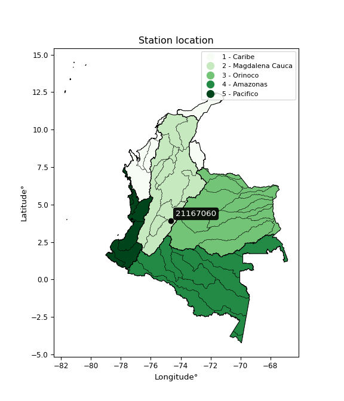

<div align="center">


</div>

# PMP Station (Rain, Pmax24h): 21167060

Probable Maximum Precipitation (PMP) is the greatest amount of rainfall for a specific duration that is meteorologically possible for a given location, acting as a "worst-case" scenario for extreme storms, crucial for designing safety-critical infrastructure like bridges, river deviations, dams, spillways, and nuclear plants to prevent catastrophic failure. PMP is calculated by hydrologists using meteorological data to determine the upper limit of extreme rainfall, often leading to the Probable Maximum Flood (PMF) for flood control design, and is increasingly being studied for climate change impacts.

<div align="center">

</img>

</div>


## A. General information


### 1. General running parameters

• app_version: _v20260103_. • runtime: _2026-01-03 07:24:50.581521_. • Python version: _3.14.0_. • SciPy version: _1.16.3_. • Pandas version: _2.3.3_. • NumPy version: _2.3.5_. • Stations dataset (station_dataset_file): _dataset/pmax24h_in/automatic_colombia_2003_2024.csv_. • Stations catalog (station_catalog_file): _dataset/CNE.xls_. • Minimum year to eval til year_max (date_min): _1900_. • Maximum year to eval since year_min (date_max): _2024_. • Creates, save and include plots into reports (create_plot): _False_. • Plot only fit distributions with Δo > Δ (plot_only_fit): _True_. • Eval low extreme values, if False, evaluates high extreme values (low_extreme): _False_. • Eval every SciPy distribution as logarithmic (pdist_logarithmic_on): _True_. • Standard deviation normalized (ddof): _1.0_. • Return periods to eval in years (Tr): _[2, 2.33, 5, 10, 15, 20, 25, 50, 75, 100, 200, 250, 500, 750, 1000]_. • Minimum data sample per station, 0 means any (minimum_sample): _5_. • Z-Score maximum threshold to adjust a value, 0 means disable (zscore_max): _3.5_. • Z-Score minimum threshold to adjust a value, 0 means disable (zscore_min): _-2.5_. • Avoid zeros, e.g. rain = 0 (avoid_zeros): _True_. • Avoid null values (avoid_nans): _True_. [:file_folder:Dataset file.](../../dataset/pmax24h_in/automatic_colombia_2003_2024.csv)

> Delta Degrees of Freedom (DDOF): is a parameter used in the formulas for calculating variance and standard deviation. When ddof=0, the divisor is $N$ (the total number of observations) and this is used when your data set is the entire population. When ddof=1, the divisor is $N-1$ and this is used when your data set is a sample drawn from a larger population. Using $N-1$ provides an unbiased estimate of the population variance (known as Bessel´s correction).


### 2. Station info and location

|   id |   CODIGO | NOMBRE                             | CATEGORIA    | TECNOLOGIA                              | ESTADO   | FECHA_INSTALACION   |   FECHA_SUSPENSION |   ALTITUD |   LATITUD |   LONGITUD | DEPARTAMENTO   | MUNICIPIO   | AREA_OPERATIVA             | ENTIDAD                                                     | AREA_HIDROGRAFICA   | ZONA_HIDROGRAFICA   | SUBZONA_HIDROGRAFICA   | CORRIENTE   | Catalogo   |   Version |
|-----:|---------:|:-----------------------------------|:-------------|:----------------------------------------|:---------|:--------------------|-------------------:|----------:|----------:|-----------:|:---------------|:------------|:---------------------------|:------------------------------------------------------------|:--------------------|:--------------------|:-----------------------|:------------|:-----------|----------:|
|    0 | 21167060 | SAN PABLO TOLIMA  - AUT [21167060] | Limnigráfica | Automática con Telemetría, Convencional | Activa   | 15/04/1971          |                nan |       702 |   3.92648 |   -74.6578 | Tolima         | Cunday      | Area Operativa 10 - Tolima | INSTITUTO DE HIDROLOGIA METEOROLOGIA Y ESTUDIOS AMBIENTALES | Magdalena Cauca     | Alto Magdalena      | Río Prado              | Cuinde      | CNE_IDEAM  |  20251226 |

<div align="center">

Dynamic map: [:earth_americas:Google](http://maps.google.com/maps?q=3.92648,-74.657784) [:earth_americas:OSM](https://www.openstreetmap.org/#map=18/3.92648/-74.657784&layers=P) [:earth_americas:Bing](https://www.bing.com/maps?cp=3.92648~-74.657784&lvl=18) [:earth_americas:Apple](https://maps.apple.com/frame?center=3.92648%2C-74.657784&span=0.003%2C0.006)

</div>


<div align="center">

```geojson
{
  "type": "Feature",
  "geometry": {
    "type": "Point", 
    "coordinates": [-74.657784, 3.92648]
  }, 
  "properties": {
    "Name": "21167060"
  }
}
```

</div>


### 3. Discrete values table and plot

<div align="center">

|               |           0 |          1 |             2 |           3 |           4 |           5 |           6 |           7 |
|:--------------|------------:|-----------:|--------------:|------------:|------------:|------------:|------------:|------------:|
| Date          | 2013        | 2014       | 2015          | 2016        | 2017        | 2018        | 2019        | 2020        |
| Value         |   38.3      |  218.2     |   87.5        |   44.4      |   90.4      |  113.4      |   54.7      |   49.9      |
| Value_initial |   38.3      |  218.2     |   87.5        |   44.4      |   90.4      |  113.4      |   54.7      |   49.9      |
| count         |    8        |    8       |    8          |    8        |    8        |    8        |    8        |    8        |
| mean          |   87.1      |   87.1     |   87.1        |   87.1      |   87.1      |   87.1      |   87.1      |   87.1      |
| std           |   59.1949   |   59.1949  |   59.1949     |   59.1949   |   59.1949   |   59.1949   |   59.1949   |   59.1949   |
| zscore        |   -0.824395 |    2.21472 |    0.00675734 |   -0.721346 |    0.055748 |    0.444295 |   -0.547344 |   -0.628432 |


</div>


> The initial value (value_initial) correspond to the initial obtained or null completed value, and value (value) is adjusted only when the initial value is outside the valid range definite through the Z-Score value. If Z-Score is active, values out of range or outliers are replaced with the station mean value


### 4. Active continuous probability distributions from SciPy (44 of 104 available)

A Probability Density Function (PDF) describes the relative likelihood of a continuous random variable falling within a specific range, where the total area under its curve equals 1, and the area over any interval gives the actual probability for that range. Unlike discrete probabilities (like rolling a die), a PDF shows density, not direct probability for a single point (which is zero), with higher points indicating higher likelihood, often visualized as a bell curve for normal distributions.

A log of a probability density function (log-PDF) is simply the logarithm of the PDF´s value, denoted as $log(f(x))$, useful for converting multiplication of probabilities into addition, improving numerical stability with tiny numbers, and connecting to information theory concepts like entropy. Instead of dealing with very small probabilities (e.g., 0.000001), log-PDFs use negative numbers (e.g., $log(0.00001) ≈ -11.51$ that are easier for computers to handle, preventing underflow errors and simplifying complex calculations. In this study, each active probability distribution from SciPy is also evaluated in the $log$ form.

[scipy.stats](https://docs.scipy.org/doc/scipy/reference/stats.html) is a Python´s powerful submodule within the SciPy library for comprehensive statistical analysis, offering over 130 probability distributions (like Normal, Poisson), functions for descriptive stats (mean, variance), hypothesis testing (t-tests, chi-square), random variable generation, and statistical tests, making it essential for data science, modeling, and research. It provides tools to explore, model, and draw conclusions from data efficiently, working seamlessly with NumPy.

<div align="center">

|   id | p_dist             |   n_parameter | fit_method   | label                                                                       | active   | ref                                                                                                        |
|-----:|:-------------------|--------------:|:-------------|:----------------------------------------------------------------------------|:---------|:-----------------------------------------------------------------------------------------------------------|
|    0 | alpha              |             3 | MLE          | Alpha                                                                       | True     | [:mortar_board:](https://docs.scipy.org/doc/scipy/reference/generated/scipy.stats.alpha.html)              |
|    1 | betaprime          |             4 | MLE          | Beta prime                                                                  | True     | [:mortar_board:](https://docs.scipy.org/doc/scipy/reference/generated/scipy.stats.betaprime.html)          |
|    2 | chi2               |             3 | MLE          | Chi²                                                                        | True     | [:mortar_board:](https://docs.scipy.org/doc/scipy/reference/generated/scipy.stats.chi2.html)               |
|    3 | crystalball        |             4 | MLE          | Crystalball                                                                 | True     | [:mortar_board:](https://docs.scipy.org/doc/scipy/reference/generated/scipy.stats.crystalball.html)        |
|    4 | erlang             |             3 | MLE          | Erlang                                                                      | True     | [:mortar_board:](https://docs.scipy.org/doc/scipy/reference/generated/scipy.stats.erlang.html)             |
|    5 | expon              |             2 | MLE          | Exponential                                                                 | True     | [:mortar_board:](https://docs.scipy.org/doc/scipy/reference/generated/scipy.stats.expon.html)              |
|    6 | exponnorm          |             3 | MLE          | Exponentially modified Normal                                               | True     | [:mortar_board:](https://docs.scipy.org/doc/scipy/reference/generated/scipy.stats.exponnorm.html)          |
|    7 | f                  |             4 | MLE          | F                                                                           | True     | [:mortar_board:](https://docs.scipy.org/doc/scipy/reference/generated/scipy.stats.f.html)                  |
|    8 | fatiguelife        |             3 | MLE          | Fatigue-life (Birnbaum-Saunders)                                            | True     | [:mortar_board:](https://docs.scipy.org/doc/scipy/reference/generated/scipy.stats.fatiguelife.html)        |
|    9 | fisk               |             3 | MLE          | Fisk                                                                        | True     | [:mortar_board:](https://docs.scipy.org/doc/scipy/reference/generated/scipy.stats.fisk.html)               |
|   10 | gamma              |             3 | MLE          | Gamma                                                                       | True     | [:mortar_board:](https://docs.scipy.org/doc/scipy/reference/generated/scipy.stats.gamma.html)              |
|   11 | genexpon           |             5 | MLE          | Generalized exponential                                                     | True     | [:mortar_board:](https://docs.scipy.org/doc/scipy/reference/generated/scipy.stats.genexpon.html)           |
|   12 | genlogistic        |             3 | MLE          | Generalized logistic                                                        | True     | [:mortar_board:](https://docs.scipy.org/doc/scipy/reference/generated/scipy.stats.genlogistic.html)        |
|   13 | gibrat             |             2 | MM           | Gibrat                                                                      | True     | [:mortar_board:](https://docs.scipy.org/doc/scipy/reference/generated/scipy.stats.gibrat.html)             |
|   14 | gompertz           |             3 | MLE          | Gompertz (or truncated Gumbel)                                              | True     | [:mortar_board:](https://docs.scipy.org/doc/scipy/reference/generated/scipy.stats.gompertz.html)           |
|   15 | gumbel_l           |             2 | MM           | Gumbel Left Skew                                                            | True     | [:mortar_board:](https://docs.scipy.org/doc/scipy/reference/generated/scipy.stats.gumbel_l.html)           |
|   16 | gumbel_r           |             2 | MM           | Gumbel Right Skew                                                           | True     | [:mortar_board:](https://docs.scipy.org/doc/scipy/reference/generated/scipy.stats.gumbel_r.html)           |
|   17 | halflogistic       |             2 | MM           | Half-logistic                                                               | True     | [:mortar_board:](https://docs.scipy.org/doc/scipy/reference/generated/scipy.stats.halflogistic.html)       |
|   18 | halfnorm           |             2 | MM           | Half Normal                                                                 | True     | [:mortar_board:](https://docs.scipy.org/doc/scipy/reference/generated/scipy.stats.halfnorm.html)           |
|   19 | hypsecant          |             2 | MM           | hyperbolic secant                                                           | True     | [:mortar_board:](https://docs.scipy.org/doc/scipy/reference/generated/scipy.stats.hypsecant.html)          |
|   20 | invgamma           |             3 | MLE          | Inverted gamma                                                              | True     | [:mortar_board:](https://docs.scipy.org/doc/scipy/reference/generated/scipy.stats.invgamma.html)           |
|   21 | invgauss           |             3 | MLE          | Inverse Gaussian                                                            | True     | [:mortar_board:](https://docs.scipy.org/doc/scipy/reference/generated/scipy.stats.invgauss.html)           |
|   22 | invweibull         |             3 | MLE          | Inverted Weibull                                                            | True     | [:mortar_board:](https://docs.scipy.org/doc/scipy/reference/generated/scipy.stats.invweibull.html)         |
|   23 | johnsonsu          |             4 | MLE          | Johnson Su                                                                  | True     | [:mortar_board:](https://docs.scipy.org/doc/scipy/reference/generated/scipy.stats.johnsonsu.html)          |
|   24 | kstwobign          |             2 | MLE          | Limiting distribution of scaled Kolmogorov-Smirnov two-sided test statistic | True     | [:mortar_board:](https://docs.scipy.org/doc/scipy/reference/generated/scipy.stats.kstwobign.html)          |
|   25 | laplace            |             2 | MM           | Laplace                                                                     | True     | [:mortar_board:](https://docs.scipy.org/doc/scipy/reference/generated/scipy.stats.laplace.html)            |
|   26 | laplace_asymmetric |             3 | MLE          | Asymmetric Laplace                                                          | True     | [:mortar_board:](https://docs.scipy.org/doc/scipy/reference/generated/scipy.stats.laplace_asymmetric.html) |
|   27 | loggamma           |             3 | MLE          | Log gamma                                                                   | True     | [:mortar_board:](https://docs.scipy.org/doc/scipy/reference/generated/scipy.stats.loggamma.html)           |
|   28 | logistic           |             2 | MM           | Logistic (or Sech-squared)                                                  | True     | [:mortar_board:](https://docs.scipy.org/doc/scipy/reference/generated/scipy.stats.logistic.html)           |
|   29 | lognorm            |             3 | MLE          | Log Normal                                                                  | True     | [:mortar_board:](https://docs.scipy.org/doc/scipy/reference/generated/scipy.stats.lognorm.html)            |
|   30 | maxwell            |             2 | MM           | Maxwell                                                                     | True     | [:mortar_board:](https://docs.scipy.org/doc/scipy/reference/generated/scipy.stats.maxwell.html)            |
|   31 | mielke             |             4 | MLE          | Mielke Beta-Kappa / Dagum                                                   | True     | [:mortar_board:](https://docs.scipy.org/doc/scipy/reference/generated/scipy.stats.mielke.html)             |
|   32 | moyal              |             2 | MM           | Moyal                                                                       | True     | [:mortar_board:](https://docs.scipy.org/doc/scipy/reference/generated/scipy.stats.moyal.html)              |
|   33 | nakagami           |             3 | MLE          | Nakagami                                                                    | True     | [:mortar_board:](https://docs.scipy.org/doc/scipy/reference/generated/scipy.stats.nakagami.html)           |
|   34 | ncf                |             5 | MLE          | Non-central F distribution                                                  | True     | [:mortar_board:](https://docs.scipy.org/doc/scipy/reference/generated/scipy.stats.ncf.html)                |
|   35 | nct                |             4 | MLE          | Non-central Student’s t                                                     | True     | [:mortar_board:](https://docs.scipy.org/doc/scipy/reference/generated/scipy.stats.nct.html)                |
|   36 | norm               |             2 | MM           | Normal                                                                      | True     | [:mortar_board:](https://docs.scipy.org/doc/scipy/reference/generated/scipy.stats.norm.html)               |
|   37 | pearson3           |             3 | MM           | Pearson type III                                                            | True     | [:mortar_board:](https://docs.scipy.org/doc/scipy/reference/generated/scipy.stats.pearson3.html)           |
|   38 | rayleigh           |             2 | MM           | Rayleigh                                                                    | True     | [:mortar_board:](https://docs.scipy.org/doc/scipy/reference/generated/scipy.stats.rayleigh.html)           |
|   39 | rice               |             3 | MLE          | Rice                                                                        | True     | [:mortar_board:](https://docs.scipy.org/doc/scipy/reference/generated/scipy.stats.rice.html)               |
|   40 | t                  |             3 | MLE          | Student’s t                                                                 | True     | [:mortar_board:](https://docs.scipy.org/doc/scipy/reference/generated/scipy.stats.t.html)                  |
|   41 | truncnorm          |             4 | MLE          | Truncated normal                                                            | True     | [:mortar_board:](https://docs.scipy.org/doc/scipy/reference/generated/scipy.stats.truncnorm.html)          |
|   42 | wald               |             2 | MM           | Wald                                                                        | True     | [:mortar_board:](https://docs.scipy.org/doc/scipy/reference/generated/scipy.stats.wald.html)               |
|   43 | weibull_min        |             3 | MLE          | Weibull minimum                                                             | True     | [:mortar_board:](https://docs.scipy.org/doc/scipy/reference/generated/scipy.stats.weibull_min.html)        |

</div>

> **n_parameter:** # arguments & localization & scale.
>
> **Fit methods:** (MLE) maximum likelihood, (MM) L-moments.
>
>**Inactive** (With the only purpose of prevent loops, zero divisions, infinite values, over high estimated values or horizontal trending for recurrence intervals estimations, the follow distributions were disabled.)**:** foldnorm, gennorm, norminvgauss, powernorm, powerlognorm, skewnorm, genextreme, anglit, arcsine, argus, beta, bradford, burr, burr12, cauchy, cosine, halfcauchy, foldcauchy, skewcauchy, wrapcauchy, dgamma, gengamma, exponweib, exponpow, truncexpon, gausshyper, genhalflogistic, genhyperbolic, geninvgauss, halfgennorm, johnsonsb, kappa4, kappa3, ksone, kstwo, loglaplace, levy, levy_l, levy_stable, ncx2, pareto, genpareto, truncpareto, lomax, powerlaw, rdist, rel_breitwigner, recipinvgauss, semicircular, studentized_range, trapezoid, triang, truncweibull_min, tukeylambda, uniform, loguniform, vonmises, vonmises_line, weibull_max, dweibull, 


## B. Probability distributions vs. Empirical distributions

A continuous probability distribution (CPD) describes probabilities for variables that can take any value within a range (like rain any time), unlike discrete variables with specific outcomes (like temperature). It uses a Probability Density Function (PDF), a curve where the total area under it equals 1, and the probability of the variable falling within an interval (a to b) is found by calculating the area under the curve between those points. A key feature is that the probability of hitting any single exact value is zero, so probabilities are always expressed for ranges, e.g., $P(a ≤ X ≤ b)$.

<div align="center">

Distributions parameters from station values
|    |   station | p_dist                |   n |            loc |          scale | shape                  | shape1                | shape2             | shape3   |
|---:|----------:|:----------------------|----:|---------------:|---------------:|:-----------------------|:----------------------|:-------------------|:---------|
|  0 |  21167060 | alpha                 |   8 |     27.2393    |   22.6954      | 2.148266334587592e-10  |                       |                    |          |
|  1 |  21167060 | betaprime             |   8 |      6.51012   |    0.52966     | 351.1804495745057      | 3.169122012508378     |                    |          |
|  2 |  21167060 | chi2                  |   8 |     38.3       |   20.7446      | 1.4361720893279406     |                       |                    |          |
|  3 |  21167060 | crystalball           |   8 |     87.1       |   55.3717      | 6926.366830461725      | 1851.0229382140724    |                    |          |
|  4 |  21167060 | erlang                |   8 |     38.3       |   49.8877      | 0.3987536718628675     |                       |                    |          |
|  5 |  21167060 | expon                 |   8 |     38.3       |   48.8         |                        |                       |                    |          |
|  6 |  21167060 | exponnorm             |   8 |     38.2576    |    0.0130368   | 3720.852297495132      |                       |                    |          |
|  7 |  21167060 | f                     |   8 |     29.2692    |   25.3833      | 3971.3472519947363     | 2.8180220196859658    |                    |          |
|  8 |  21167060 | fatiguelife           |   8 |     35.7281    |   23.8612      | 1.4802635746223056     |                       |                    |          |
|  9 |  21167060 | fisk                  |   8 |     38.3       |   41.7452      | 0.3662121162507759     |                       |                    |          |
| 10 |  21167060 | gamma                 |   8 |     38.3       |   45.9506      | 0.7131255844196744     |                       |                    |          |
| 11 |  21167060 | genexpon              |   8 |     38.3       |   64.8957      | 1.3298326244890473     | 3.193486548431612e-10 | 1.2726095633095236 |          |
| 12 |  21167060 | genlogistic           |   8 |   -192.914     |   33.9617      | 1939.549592308183      |                       |                    |          |
| 13 |  21167060 | gibrat                |   8 |     44.8583    |   25.6209      |                        |                       |                    |          |
| 14 |  21167060 | gompertz              |   8 |     38.3       |    1.1173e+14  | 2262453117933.9927     |                       |                    |          |
| 15 |  21167060 | gumbel_l              |   8 |    112.02      |   43.1732      |                        |                       |                    |          |
| 16 |  21167060 | gumbel_r              |   8 |     62.1797    |   43.1732      |                        |                       |                    |          |
| 17 |  21167060 | halflogistic          |   8 |     21.4716    |   47.3409      |                        |                       |                    |          |
| 18 |  21167060 | halfnorm              |   8 |     13.8095    |   91.8561      |                        |                       |                    |          |
| 19 |  21167060 | hypsecant             |   8 |     87.1       |   35.2508      |                        |                       |                    |          |
| 20 |  21167060 | invgamma              |   8 |     29.2601    |   35.7692      | 1.4090140877707706     |                       |                    |          |
| 21 |  21167060 | invgauss              |   8 |     32.9544    |   28.045       | 1.9306719146827644     |                       |                    |          |
| 22 |  21167060 | invweibull            |   8 |     38.3       |    0.708126    | 0.07173839883563243    |                       |                    |          |
| 23 |  21167060 | johnsonsu             |   8 |     36.7503    |    0.0452995   | -4.937587920930399     | 0.7094640622469821    |                    |          |
| 24 |  21167060 | kstwobign             |   8 |    -62.4005    |  173.77        |                        |                       |                    |          |
| 25 |  21167060 | laplace               |   8 |     87.1       |   39.1538      |                        |                       |                    |          |
| 26 |  21167060 | laplace_asymmetric    |   8 |     38.3       |    0.00107852  | 2.2100887688396255e-05 |                       |                    |          |
| 27 |  21167060 | loggamma              |   8 | -24337.1       | 3055.63        | 2960.9741600930583     |                       |                    |          |
| 28 |  21167060 | logistic              |   8 |     87.1       |   30.5281      |                        |                       |                    |          |
| 29 |  21167060 | lognorm               |   8 |     38.3       |    0.360547    | 11.971404465985822     |                       |                    |          |
| 30 |  21167060 | maxwell               |   8 |    -44.1079    |   82.2224      |                        |                       |                    |          |
| 31 |  21167060 | mielke                |   8 |     11.7613    |    0.809917    | 5568.521929696768      | 1.985102185165827     |                    |          |
| 32 |  21167060 | moyal                 |   8 |     55.4349    |   24.9261      |                        |                       |                    |          |
| 33 |  21167060 | nakagami              |   8 |     38.3       |   94.1163      | 0.18790629928687386    |                       |                    |          |
| 34 |  21167060 | ncf                   |   8 |     -0.174235  |    6.41418e-06 | 4.312976611575139e-05  | 8.345446041752448     | 442.63878528126475 |          |
| 35 |  21167060 | nct                   |   8 |     -0.321796  |    1.36005     | 2.542268340659639      | 43.89367751725757     |                    |          |
| 36 |  21167060 | norm                  |   8 |     87.1       |   55.3718      |                        |                       |                    |          |
| 37 |  21167060 | pearson3              |   8 |     87.1       |   55.3718      | 1.4666031729546842     |                       |                    |          |
| 38 |  21167060 | rayleigh              |   8 |    -18.8295    |   84.5195      |                        |                       |                    |          |
| 39 |  21167060 | rice                  |   8 |      4.2662    |   70.4538      | 0.0015418113935065053  |                       |                    |          |
| 40 |  21167060 | t                     |   8 |     68.9925    |   30.8925      | 2.25270477090287       |                       |                    |          |
| 41 |  21167060 | truncnorm             |   8 | -81353.8       | 2125.13        | 38.29973851120087      | 225.46128015308432    |                    |          |
| 42 |  21167060 | wald                  |   8 |     31.7282    |   55.3718      |                        |                       |                    |          |
| 43 |  21167060 | weibull_min           |   8 |     38.3       |   57.7192      | 0.8217017167115891     |                       |                    |          |
| 44 |  21167060 | logalpha              |   8 |      2.21476   |    8.15762     | 4.154829353483693      |                       |                    |          |
| 45 |  21167060 | logbetaprime          |   8 |      1.97601   |    1.12973     | 62.07240557258643      | 30.72108858828625     |                    |          |
| 46 |  21167060 | logchi2               |   8 |      3.64545   |    0.988882    | 1.0077546168427776     |                       |                    |          |
| 47 |  21167060 | logcrystalball        |   8 |      4.30535   |    0.543251    | 21.097682632655854     | 866.03562681371       |                    |          |
| 48 |  21167060 | logerlang             |   8 |      3.64545   |    0.945516    | 0.20635162093966455    |                       |                    |          |
| 49 |  21167060 | logexpon              |   8 |      3.64545   |    0.659899    |                        |                       |                    |          |
| 50 |  21167060 | logexponnorm          |   8 |      3.64479   |    0.000205223 | 3221.603164294347      |                       |                    |          |
| 51 |  21167060 | logf                  |   8 |      3.64545   |    0.602679    | 1.3464367698626605     | 36.95841927520513     |                    |          |
| 52 |  21167060 | logfatiguelife        |   8 |      3.47951   |    0.625616    | 0.794109397981072      |                       |                    |          |
| 53 |  21167060 | logfisk               |   8 |      3.54841   |    0.577792    | 1.8837686489089092     |                       |                    |          |
| 54 |  21167060 | loggamma              |   8 |      3.64545   |    1.34026     | 0.19553106038030016    |                       |                    |          |
| 55 |  21167060 | loggenexpon           |   8 |      3.64545   |    0.90656     | 1.1039286808927498     | 0.6530901723914804    | 0.991964408979577  |          |
| 56 |  21167060 | loggenlogistic        |   8 |      1.17938   |    0.417882    | 971.858759260062       |                       |                    |          |
| 57 |  21167060 | loggibrat             |   8 |      3.89088   |    0.251384    |                        |                       |                    |          |
| 58 |  21167060 | loggompertz           |   8 |      3.64545   |    1.94196     | 2.160821570437146      |                       |                    |          |
| 59 |  21167060 | loggumbel_l           |   8 |      4.54984   |    0.423571    |                        |                       |                    |          |
| 60 |  21167060 | loggumbel_r           |   8 |      4.06086   |    0.423571    |                        |                       |                    |          |
| 61 |  21167060 | loghalflogistic       |   8 |      3.6615    |    0.464441    |                        |                       |                    |          |
| 62 |  21167060 | loghalfnorm           |   8 |      3.5863    |    0.901197    |                        |                       |                    |          |
| 63 |  21167060 | loghypsecant          |   8 |      4.30535   |    0.345844    |                        |                       |                    |          |
| 64 |  21167060 | loginvgamma           |   8 |      3.11963   |    4.81831     | 5.001211598601754      |                       |                    |          |
| 65 |  21167060 | loginvgauss           |   8 |      3.40674   |    1.71974     | 0.5225261554384275     |                       |                    |          |
| 66 |  21167060 | loginvweibull         |   8 |      1.96295   |    2.05014     | 5.37796240840024       |                       |                    |          |
| 67 |  21167060 | logjohnsonsu          |   8 |      3.45394   |    0.00737039  | -7.251933390478616     | 1.3921413732816599    |                    |          |
| 68 |  21167060 | logkstwobign          |   8 |      2.59198   |    1.96525     |                        |                       |                    |          |
| 69 |  21167060 | loglaplace            |   8 |      4.30535   |    0.384136    |                        |                       |                    |          |
| 70 |  21167060 | loglaplace_asymmetric |   8 |      3.64545   |    0.000582893 | 0.0008831922632927917  |                       |                    |          |
| 71 |  21167060 | logloggamma           |   8 |   -166.499     |   22.9436      | 1711.0112685167805     |                       |                    |          |
| 72 |  21167060 | loglogistic           |   8 |      4.30535   |    0.29951     |                        |                       |                    |          |
| 73 |  21167060 | loglognorm            |   8 |      3.64545   |    0.00732558  | 11.527970181206873     |                       |                    |          |
| 74 |  21167060 | logmaxwell            |   8 |      3.01807   |    0.806681    |                        |                       |                    |          |
| 75 |  21167060 | logmielke             |   8 |      1.02488   |    1.66681     | 713.4147617051017      | 7.6874475024238365    |                    |          |
| 76 |  21167060 | logmoyal              |   8 |      3.99468   |    0.244549    |                        |                       |                    |          |
| 77 |  21167060 | lognakagami           |   8 |      3.64545   |    1.15802     | 0.0856572481178845     |                       |                    |          |
| 78 |  21167060 | logncf                |   8 |      3.05242   |    1.05724     | 3564.8211958135416     | 11.492948974031739    | 11.4869020841229   |          |
| 79 |  21167060 | lognct                |   8 |      0.0800838 |    0.0937337   | 35.152546663628954     | 44.08778933419586     |                    |          |
| 80 |  21167060 | lognorm               |   8 |      4.30535   |    0.543251    |                        |                       |                    |          |
| 81 |  21167060 | logpearson3           |   8 |      4.30535   |    0.543251    | 0.6534134150433277     |                       |                    |          |
| 82 |  21167060 | lograyleigh           |   8 |      3.26608   |    0.829218    |                        |                       |                    |          |
| 83 |  21167060 | logrice               |   8 |      3.38593   |    0.755131    | 0.0005269835875196685  |                       |                    |          |
| 84 |  21167060 | logt                  |   8 |      4.30535   |    0.543247    | 227762074.20997775     |                       |                    |          |
| 85 |  21167060 | logtruncnorm          |   8 |     -0.152154  |    1.01799     | 4.542097132139418      | 5.4397681340805155    |                    |          |
| 86 |  21167060 | logwald               |   8 |      3.76215   |    0.543205    |                        |                       |                    |          |
| 87 |  21167060 | logweibull_min        |   8 |      3.64545   |    0.181643    | 0.21883426468488876    |                       |                    |          |

</div>

> **loc** (Location parameter): This shifts the distribution along the x-axis. For many common distributions, like the normal (Gaussian) distribution, loc represents the mean $μ$. For others, like the uniform distribution, it might represent the minimum value, or for the beta distribution, the left end of the support interval.
>
> **scale** (Scale parameter): This determines the width or spread of the distribution. For the normal distribution, scale represents the standard deviation $σ$. For a uniform distribution, it defines the length of the interval (from $loc$ to $loc + scale$).
>
> **shape** (Shape parameters): Refers to parameters that define the specific form of a probability distribution, distinct from its location (loc) and scale (scale). These parameters are required arguments for most distribution functions. For example, a normal (Gaussian) distribution is fully defined by its location (mean) and scale (standard deviation), so it has no specific shape parameters beyond loc and scale. However, other distributions have intrinsic properties that need specification, as Gamma distribution that takes a shape parameter, often named $a$ or $alpha$.


### 0. Cumulative distribution values - CDF (88 evaluated)

Cumulative Distribution Function (CDF), denoted as $F$<sub>$X$</sub>$(x)$, is a function that gives the probability that a random variable $X$ will take a value less than or equal to a specific value, $x$ (i.e., $(P(X≥x)$. It essentially "accumulates" probabilities from a given point up to the far right (positive infinity), providing a complete picture of the distribution´s probabilities for both discrete (like rain) and continuous (like temperature) variables, helping to find probabilities over ranges or above certain values. Each station is evaluated separately ordering the $x$ values ascending, calculating the CDF and PDF values for the activated distributions and their logarithmic forms.

<div align="center">

CDF ordered by x ascending and calculating $log(f(x))$ separately
|   id |   Station |   date |     x |   count |   mean |     std |      zscore |   Value_initial |   station |   m |    alpha |   alpha_pdf |   betaprime |   betaprime_pdf |        chi2 |      chi2_pdf |   crystalball |   crystalball_pdf |      erlang |   erlang_pdf |    expon |   expon_pdf |   exponnorm |   exponnorm_pdf |         f |       f_pdf |   fatiguelife |   fatiguelife_pdf |        fisk |    fisk_pdf |       gamma |     gamma_pdf |    genexpon |   genexpon_pdf |   genlogistic |   genlogistic_pdf |   gibrat |   gibrat_pdf |    gompertz |   gompertz_pdf |   gumbel_l |   gumbel_l_pdf |   gumbel_r |   gumbel_r_pdf |   halflogistic |   halflogistic_pdf |   halfnorm |   halfnorm_pdf |   hypsecant |   hypsecant_pdf |   invgamma |   invgamma_pdf |   invgauss |   invgauss_pdf |   invweibull |   invweibull_pdf |   johnsonsu |   johnsonsu_pdf |   kstwobign |   kstwobign_pdf |   laplace |   laplace_pdf |   laplace_asymmetric |   laplace_asymmetric_pdf |   loggamma |   loggamma_pdf |   logistic |   logistic_pdf |   lognorm |   lognorm_pdf |   maxwell |   maxwell_pdf |   mielke |   mielke_pdf |    moyal |   moyal_pdf |    nakagami |   nakagami_pdf |       ncf |     ncf_pdf |       nct |     nct_pdf |     norm |    norm_pdf |   pearson3 |   pearson3_pdf |   rayleigh |   rayleigh_pdf |     rice |   rice_pdf |        t |       t_pdf |   truncnorm |   truncnorm_pdf |       wald |    wald_pdf |   weibull_min |   weibull_min_pdf |   logalpha |   logalpha_pdf |   logbetaprime |   logbetaprime_pdf |     logchi2 |   logchi2_pdf |   logcrystalball |   logcrystalball_pdf |   logerlang |   logerlang_pdf |   logexpon |   logexpon_pdf |   logexponnorm |   logexponnorm_pdf |        logf |      logf_pdf |   logfatiguelife |   logfatiguelife_pdf |   logfisk |   logfisk_pdf |   loggenexpon |   loggenexpon_pdf |   loggenlogistic |   loggenlogistic_pdf |   loggibrat |   loggibrat_pdf |   loggompertz |   loggompertz_pdf |   loggumbel_l |   loggumbel_l_pdf |   loggumbel_r |   loggumbel_r_pdf |   loghalflogistic |   loghalflogistic_pdf |   loghalfnorm |   loghalfnorm_pdf |   loghypsecant |   loghypsecant_pdf |   loginvgamma |   loginvgamma_pdf |   loginvgauss |   loginvgauss_pdf |   loginvweibull |   loginvweibull_pdf |   logjohnsonsu |   logjohnsonsu_pdf |   logkstwobign |   logkstwobign_pdf |   loglaplace |   loglaplace_pdf |   loglaplace_asymmetric |   loglaplace_asymmetric_pdf |   logloggamma |   logloggamma_pdf |   loglogistic |   loglogistic_pdf |   loglognorm |   loglognorm_pdf |   logmaxwell |   logmaxwell_pdf |   logmielke |   logmielke_pdf |   logmoyal |   logmoyal_pdf |   lognakagami |   lognakagami_pdf |    logncf |   logncf_pdf |    lognct |   lognct_pdf |   logpearson3 |   logpearson3_pdf |   lograyleigh |   lograyleigh_pdf |   logrice |   logrice_pdf |     logt |   logt_pdf |   logtruncnorm |   logtruncnorm_pdf |     logwald |   logwald_pdf |   logweibull_min |   logweibull_min_pdf |
|-----:|----------:|-------:|------:|--------:|-------:|--------:|------------:|----------------:|----------:|----:|---------:|------------:|------------:|----------------:|------------:|--------------:|--------------:|------------------:|------------:|-------------:|---------:|------------:|------------:|----------------:|----------:|------------:|--------------:|------------------:|------------:|------------:|------------:|--------------:|------------:|---------------:|--------------:|------------------:|---------:|-------------:|------------:|---------------:|-----------:|---------------:|-----------:|---------------:|---------------:|-------------------:|-----------:|---------------:|------------:|----------------:|-----------:|---------------:|-----------:|---------------:|-------------:|-----------------:|------------:|----------------:|------------:|----------------:|----------:|--------------:|---------------------:|-------------------------:|-----------:|---------------:|-----------:|---------------:|----------:|--------------:|----------:|--------------:|---------:|-------------:|---------:|------------:|------------:|---------------:|----------:|------------:|----------:|------------:|---------:|------------:|-----------:|---------------:|-----------:|---------------:|---------:|-----------:|---------:|------------:|------------:|----------------:|-----------:|------------:|--------------:|------------------:|-----------:|---------------:|---------------:|-------------------:|------------:|--------------:|-----------------:|---------------------:|------------:|----------------:|-----------:|---------------:|---------------:|-------------------:|------------:|--------------:|-----------------:|---------------------:|----------:|--------------:|--------------:|------------------:|-----------------:|---------------------:|------------:|----------------:|--------------:|------------------:|--------------:|------------------:|--------------:|------------------:|------------------:|----------------------:|--------------:|------------------:|---------------:|-------------------:|--------------:|------------------:|--------------:|------------------:|----------------:|--------------------:|---------------:|-------------------:|---------------:|-------------------:|-------------:|-----------------:|------------------------:|----------------------------:|--------------:|------------------:|--------------:|------------------:|-------------:|-----------------:|-------------:|-----------------:|------------:|----------------:|-----------:|---------------:|--------------:|------------------:|----------:|-------------:|----------:|-------------:|--------------:|------------------:|--------------:|------------------:|----------:|--------------:|---------:|-----------:|---------------:|-------------------:|------------:|--------------:|-----------------:|---------------------:|
|    0 |  21167060 |   2013 |  38.3 |       8 |   87.1 | 59.1949 | -0.824395   |            38.3 |  21167060 |   1 | 0.04018  | 0.0180329   |   0.0834439 |     0.0104545   | 5.22783e-12 | 528.333       |      0.189073 |       0.00488607  | 5.40882e-07 |  3.03541e+07 | 0        | 0.0204918   | 0.000874257 |     0.0205853   | 0.0413274 | 0.0165672   |     0.0331869 |       0.0327766   | 2.16489e-06 | 5.57887e+07 | 5.82606e-12 | 584.724       | 1.63425e-11 |    0.0204919   |      0.117459 |       0.00740302  | 0        |  0           | 8.92054e-15 |    0.0202493   |   0.165823 |    0.00350321  |   0.175756 |    0.00707799  |       0.175888 |        0.0102349   |   0.210237 |    0.00838294  |    0.156247 |      0.00425658 |  0.0413273 |    0.0165671   |  0.0361851 |    0.020298    |  4.11656e-05 |      4.19688e+09 |    0.026222 |     0.0278352   |    0.109796 |     0.0069206   |  0.143774 |   0.00367203  |          5.32487e-10 |              0.0204918   | 0.00102269 |    4.50289e+11 |   0.168187 |    0.00458268  |  0.112236 |      0.351154 |  0.199841 |   0.00589902  |      nan |          nan | 0.158488 | 0.00835049  | 6.92164e-07 |    3.66092e+07 | 0.0936733 | 0.010242    | 0.0777502 | 0.0113132   | 0.189074 | 0.00488607  |   0.17184  |    0.00938207  |   0.204228 |    0.00636407  | 0.110127 | 0.0061014  | 0.207464 | 0.00641989  |    0        |     0.0180345   | 0.00956655 | 0.00668249  |   8.45176e-14 |       9.77398     |  0.0609268 |      0.480484  |      0.0719148 |           0.382413 | 1.47016e-08 |   1.66809e+07 |         0.112236 |             0.351154 | 0.000749661 |      3.4834e+11 |   0        |       1.51538  |     0.00100248 |           1.51008  | 5.47129e-11 | 82942.1       |        0.0362043 |             0.740521 | 0.0335444 |     0.629314  |   1.62161e-10 |          1.21771  |        0.0702904 |            0.445999  |  0          |        0        |   1.93371e-11 |          1.1127   |      0.111505 |          0.247994 |     0.0695024 |         0.43752   |          0        |              0        |     0.0523333 |          0.883456 |      0.0937679 |          0.267223  |     0.0497456 |         0.537018  |     0.0400076 |          0.642988 |       0.0553247 |           0.511871  |      0.0399228 |          0.624969  |       0.063866 |           0.459952 |    0.0897233 |        0.233572  |              9.1016e-07 |                    1.51519  |      0.117483 |          0.351867 |     0.0994578 |         0.299042  |     0.004145 |      2.38907e+12 |     0.104681 |         0.442129 |   0.0595892 |       0.485583  |  0.0411299 |      0.414001  |    0.00193425 |       7.46167e+11 | 0.0473952 |     0.485383 | 0.0886433 |     0.406269 |     0.0943898 |          0.435679 |     0.0993652 |          0.496908 | 0.0573446 |      0.429015 | 0.112234 |   0.351153 |    0           |          0         | 0           |     0         |      0.000634324 |          3.12477e+11 |
|    1 |  21167060 |   2016 |  44.4 |       8 |   87.1 | 59.1949 | -0.721346   |            44.4 |  21167060 |   2 | 0.185995 | 0.0256451   |   0.155371  |     0.0128244   | 0.260473    |   0.0281207   |      0.220309 |       0.00535168  | 0.471108    |  0.0282005   | 0.117503 | 0.018084    | 0.118937    |     0.0181632   | 0.172846  | 0.0235558   |     0.237819  |       0.0272491   | 0.330852    | 0.013291    | 0.246235    |   0.0266189   | 0.117503    |    0.018084    |      0.167007 |       0.0087969   | 0        |  0           | 0.116196    |    0.0178964   |   0.188463 |    0.00392535  |   0.221005 |    0.00772754  |       0.237538 |        0.00996575  |   0.260886 |    0.00821768  |    0.184264 |      0.00494013 |  0.172846  |    0.0235558   |  0.190133  |    0.0254669   |  0.424494    |      0.00427762  |    0.209866 |     0.0267184   |    0.155629 |     0.00806116  |  0.168012 |   0.00429108  |          0.117503    |              0.018084    | 0.694402   |    0.83746     |   0.19802  |    0.00520204  |  0.172923 |      0.470917 |  0.237083 |   0.00629968  |      nan |          nan | 0.212118 | 0.00916873  | 0.283428    |    0.01745     | 0.163594  | 0.0124486   | 0.157903  | 0.0145369   | 0.220309 | 0.00535168  |   0.230014 |    0.00963495  |   0.244088 |    0.00669078  | 0.14977  | 0.00687445 | 0.250615 | 0.00774642  |    0.104179 |     0.0161569   | 0.0911884  | 0.0179487   |   0.145955    |       0.0181506   |  0.155486  |      0.781785  |      0.142765  |           0.57401  | 0.297846    |   0.966018    |         0.172923 |             0.470917 | 0.724872    |      0.888424   |   0.200651 |       1.21132  |     0.201115   |           1.20833  | 0.305797    |     1.25666   |        0.187673  |             1.14599  | 0.165552  |     1.0629    |   0.171491    |          1.098    |        0.154904  |            0.690654  |  0          |        0        |   0.157064    |          1.0121   |      0.154298 |          0.334607 |     0.152435  |         0.676942  |          0.140884 |              1.05519  |     0.181621  |          0.862324 |      0.142387  |          0.398115  |     0.159615  |         0.906899  |     0.173381  |          1.05711  |       0.158738  |           0.85845   |      0.169608  |          1.03649   |       0.150951 |           0.704202 |    0.131823  |        0.343168  |              0.200629   |                    1.2112   |      0.177873 |          0.466023 |     0.153186  |         0.433109  |     0.602807 |      0.226342    |     0.180221 |         0.57559  |   0.155759  |       0.796256  |  0.131136  |      0.788022  |    0.594735   |       0.688518    | 0.147411  |     0.837249 | 0.161715  |     0.580148 |     0.171186  |          0.598618 |     0.182969  |          0.62639  | 0.135382  |      0.61759  | 0.172921 |   0.470917 |    0           |          0         | 7.72471e-05 |     0.0227741 |      0.615522    |          0.544178    |
|    2 |  21167060 |   2020 |  49.9 |       8 |   87.1 | 59.1949 | -0.628432   |            49.9 |  21167060 |   3 | 0.316571 | 0.0213559   |   0.228417  |     0.0135451   | 0.391945    |   0.0205477   |      0.250848 |       0.00574928  | 0.590852    |  0.0171614   | 0.211565 | 0.0161565   | 0.21338     |     0.0162162   | 0.29674   | 0.0209556   |     0.360938  |       0.0184587   | 0.384861    | 0.00747398  | 0.371237    |   0.0196396   | 0.211565    |    0.0161565   |      0.218223 |       0.0097774   | 0.05201  |  0.0211085   | 0.209343    |    0.0160102   |   0.211165 |    0.00433394  |   0.264741 |    0.00814954  |       0.291544 |        0.00966397  |   0.305609 |    0.00804101  |    0.21325  |      0.00560702 |  0.296739  |    0.0209556   |  0.316879  |    0.0204936   |  0.441204    |      0.00223264  |    0.336311 |     0.0196857   |    0.202215 |     0.00883735  |  0.193351 |   0.00493825  |          0.211565    |              0.0161565   | 0.767754   |    0.480478    |   0.228192 |    0.00576912  |  0.233396 |      0.563531 |  0.272581 |   0.00659842  |      nan |          nan | 0.263813 | 0.00957936  | 0.360745    |    0.0116592   | 0.234832  | 0.0132905   | 0.240994  | 0.0153985   | 0.250848 | 0.00574928  |   0.283039 |    0.00961352  |   0.281529 |    0.00691255  | 0.189226 | 0.0074538  | 0.296637 | 0.00898591  |    0.18878  |     0.0146321   | 0.195907   | 0.019267    |   0.234739    |       0.0145028   |  0.255536  |      0.91248   |      0.217479  |           0.699393 | 0.3918      |   0.682139    |         0.233396 |             0.563531 | 0.801659    |      0.494616   |   0.330301 |       1.01485  |     0.330466   |           1.01269  | 0.43        |     0.909033  |        0.317961  |             1.06149  | 0.292597  |     1.07825   |   0.293392    |          0.988397 |        0.244     |            0.823041  |  0.00500853 |        0.756649 |   0.270491    |          0.930199 |      0.198116 |          0.417992 |     0.239846  |         0.808465  |          0.261343 |              1.00303  |     0.280566  |          0.830043 |      0.19649   |          0.532746  |     0.272577  |         0.999682  |     0.29831   |          1.05273  |       0.267218  |           0.974032  |      0.293216  |          1.05009   |       0.240661 |           0.81902  |    0.178658  |        0.46509   |              0.330267   |                    1.01477  |      0.237502 |          0.554018 |     0.210832  |         0.555514  |     0.62215  |      0.124622    |     0.252405 |         0.656199 |   0.257404  |       0.924003  |  0.234446  |      0.956629  |    0.656967   |       0.423649    | 0.25351   |     0.954993 | 0.236437  |     0.694159 |     0.247139  |          0.69616  |     0.260313  |          0.692721 | 0.214034  |      0.722375 | 0.233394 |   0.563532 |    0           |          0         | 0.136033    |     1.95461   |      0.662361    |          0.303226    |
|    3 |  21167060 |   2019 |  54.7 |       8 |   87.1 | 59.1949 | -0.547344   |            54.7 |  21167060 |   4 | 0.408539 | 0.017066    |   0.293292  |     0.0133899   | 0.480515    |   0.0166006   |      0.279228 |       0.0060712   | 0.661445    |  0.0126575   | 0.285424 | 0.014643    | 0.28749     |     0.0146884   | 0.389181  | 0.017561    |     0.438316  |       0.0141278   | 0.415286    | 0.00542225  | 0.456278    |   0.0160186   | 0.285424    |    0.014643    |      0.266689 |       0.0103751   | 0.169339 |  0.0256482   | 0.282576    |    0.0145273   |   0.232864 |    0.00471035  |   0.304476 |    0.00838649  |       0.337216 |        0.00936067  |   0.343795 |    0.00786685  |    0.241616 |      0.0062147  |  0.389181  |    0.017561    |  0.405402  |    0.0165387   |  0.450151    |      0.00157167  |    0.420042 |     0.0154504   |    0.24584  |     0.00930751  |  0.218569 |   0.00558232  |          0.285424    |              0.014643    | 0.805504   |    0.353024    |   0.257058 |    0.00625585  |  0.288201 |      0.628263 |  0.304774 |   0.00680717  |      nan |          nan | 0.310177 | 0.00970541  | 0.410697    |    0.00936619  | 0.29891   | 0.0133161   | 0.314356  | 0.0150376   | 0.279228 | 0.00607119  |   0.328845 |    0.00945396  |   0.31506  |    0.00705018  | 0.226024 | 0.00786394 | 0.342254 | 0.0100017   |    0.256061 |     0.0134193   | 0.285433   | 0.0178465   |   0.299246    |       0.0124852   |  0.340951  |      0.936912  |      0.285067  |           0.767283 | 0.448531    |   0.561695    |         0.288201 |             0.628263 | 0.840059    |      0.354303   |   0.417312 |       0.882996 |     0.417303   |           0.881344 | 0.505419    |     0.742955  |        0.410031  |             0.941005 | 0.387824  |     0.986287  |   0.380075    |          0.899113 |        0.322249  |            0.872764  |  0.206789   |        2.57333  |   0.352934    |          0.865035 |      0.23986  |          0.492173 |     0.316814  |         0.859735  |          0.35086  |              0.944035 |     0.355292  |          0.796062 |      0.250869  |          0.652584  |     0.363756  |         0.974914  |     0.391333  |          0.966398 |       0.35702   |           0.969914  |      0.386431  |          0.972168  |       0.317898 |           0.855502 |    0.226912  |        0.590707  |              0.417272   |                    0.882942 |      0.291284 |          0.615622 |     0.26634   |         0.652409  |     0.631935 |      0.0917369   |     0.314798 |         0.699318 |   0.343612  |       0.942424  |  0.324415  |      0.989247  |    0.691177   |       0.329748    | 0.341762  |     0.95569  | 0.303277  |     0.756849 |     0.313525  |          0.745127 |     0.325425  |          0.721845 | 0.282979  |      0.774495 | 0.2882   |   0.628265 |    0           |          0         | 0.311126    |     1.75894   |      0.686181    |          0.223306    |
|    4 |  21167060 |   2015 |  87.5 |       8 |   87.1 | 59.1949 |  0.00675734 |            87.5 |  21167060 |   5 | 0.706456 | 0.00464524  |   0.63735   |     0.00734191  | 0.801501    |   0.00552431  |      0.502882 |       0.00720462  | 0.878677    |  0.00338799  | 0.635124 | 0.00747697  | 0.637647    |     0.00746994  | 0.714994  | 0.00527126  |     0.70418   |       0.00485034  | 0.515038    | 0.00185915  | 0.775109    |   0.00572462  | 0.635125    |    0.00747697  |      0.604568 |       0.00895727  | 0.694773 |  0.00821719  | 0.630743    |    0.00747717  |   0.432597 |    0.00744765  |   0.573337 |    0.00738738  |       0.602697 |        0.00672522  |   0.577585 |    0.0062962   |    0.503612 |      0.00902929 |  0.714994  |    0.00527127  |  0.713494  |    0.00524435  |  0.478222    |      0.00051438  |    0.703876 |     0.00483191  |    0.55367  |     0.0085537   |  0.505082 |   0.0126404   |          0.635124    |              0.00747697  | 0.904396   |    0.126429    |   0.503276 |    0.00818883  |  0.620236 |      0.700751 |  0.535815 |   0.00690552  |      nan |          nan | 0.599163 | 0.00732701  | 0.61621     |    0.00450741  | 0.652036  | 0.00768815  | 0.676626  | 0.00712899  | 0.502882 | 0.00720461  |   0.600199 |    0.00685533  |   0.546763 |    0.00674629  | 0.502345 | 0.00834487 | 0.698068 | 0.00911525  |    0.588344 |     0.00742851  | 0.670968   | 0.00712724  |   0.58398     |       0.0060936   |  0.705507  |      0.552179  |      0.64665   |           0.666225 | 0.636601    |   0.291875    |         0.620236 |             0.700751 | 0.933937    |      0.110616   |   0.714066 |       0.4333   |     0.713677   |           0.433071 | 0.740827    |     0.333873  |        0.721006  |             0.437903 | 0.707414  |     0.422322  |   0.701645    |          0.49121  |        0.692053  |            0.609482  |  0.798802   |        0.483795 |   0.682032    |          0.541411 |      0.564568 |          0.854699 |     0.684439  |         0.61267   |          0.702473 |              0.545313 |     0.6741    |          0.546446 |      0.647473  |          0.823361  |     0.713543  |         0.501783  |     0.719101  |          0.463092 |       0.7134    |           0.516478  |      0.716773  |          0.463016  |       0.680361 |           0.614498 |    0.675685  |        0.84427   |              0.71402    |                    0.433314 |      0.616528 |          0.689928 |     0.635343  |         0.773538  |     0.659065 |      0.0385116   |     0.644895 |         0.633364 |   0.706329  |       0.546685  |  0.70608   |      0.572991  |    0.796046   |       0.158561    | 0.699457  |     0.531577 | 0.660246  |     0.660688 |     0.65717   |          0.633241 |     0.652449  |          0.609355 | 0.644273  |      0.677305 | 0.620237 |   0.700755 |    3.75475e-06 |          4.70602   | 0.766699    |     0.474671  |      0.75168     |          0.0916242   |
|    5 |  21167060 |   2017 |  90.4 |       8 |   87.1 | 59.1949 |  0.055748   |            90.4 |  21167060 |   6 | 0.71935  | 0.00425546  |   0.657944  |     0.00686561  | 0.816851    |   0.00506886  |      0.523762 |       0.00719202  | 0.88806     |  0.00308845  | 0.656175 | 0.00704559  | 0.658675    |     0.00703644  | 0.729625  | 0.00482754  |     0.717788  |       0.00453928  | 0.520275    | 0.00175437  | 0.791066    |   0.00528692  | 0.656176    |    0.00704559  |      0.629986 |       0.00857011  | 0.717429 |  0.00742424  | 0.651803    |    0.00705073  |   0.454503 |    0.00765759  |   0.594436 |    0.00716165  |       0.621841 |        0.00647763  |   0.595612 |    0.00613568  |    0.529755 |      0.00899045 |  0.729624  |    0.00482755  |  0.728117  |    0.00484795  |  0.47967     |      0.000485222 |    0.717357 |     0.00447174  |    0.578097 |     0.00829002  |  0.540414 |   0.011738    |          0.656176    |              0.00704559  | 0.908406   |    0.119608    |   0.526998 |    0.00816531  |  0.642863 |      0.686756 |  0.55571  |   0.00681303  |      nan |          nan | 0.619964 | 0.00701862  | 0.629009    |    0.0043221   | 0.673602  | 0.00718956  | 0.696513  | 0.00659368  | 0.523762 | 0.00719201  |   0.619696 |    0.00659186  |   0.566167 |    0.00663359  | 0.526367 | 0.00821876 | 0.723566 | 0.0084665   |    0.609333 |     0.00705     | 0.690853   | 0.00659451  |   0.601194    |       0.00578211  |  0.723002  |      0.521156  |      0.66797   |           0.64133  | 0.645949    |   0.281642    |         0.642863 |             0.686756 | 0.937428    |      0.103633   |   0.72785  |       0.412411 |     0.727455   |           0.412231 | 0.751452    |     0.318045  |        0.734905  |             0.414899 | 0.720761  |     0.396654  |   0.717287    |          0.468349 |        0.711437  |            0.579541  |  0.813796   |        0.436945 |   0.699345    |          0.5206   |      0.592594 |          0.863677 |     0.703938  |         0.58344   |          0.719818 |              0.518754 |     0.6916    |          0.527019 |      0.673731  |          0.786668  |     0.729431  |         0.472993  |     0.733786  |          0.437885 |       0.729748  |           0.486545  |      0.731443  |          0.437071  |       0.699967 |           0.588108 |    0.702077  |        0.775566  |              0.727805   |                    0.412427 |      0.63882  |          0.677126 |     0.660174  |         0.749038  |     0.660295 |      0.0369982   |     0.665252 |         0.615087 |   0.723655  |       0.51624   |  0.724235  |      0.540818  |    0.801124   |       0.153018    | 0.716308  |     0.50227  | 0.681391  |     0.636194 |     0.677456  |          0.610947 |     0.672014  |          0.590605 | 0.665997  |      0.655041 | 0.642863 |   0.68676  |    0.142783    |          4.06677   | 0.781566    |     0.437918  |      0.754605    |          0.0878482   |
|    6 |  21167060 |   2018 | 113.4 |       8 |   87.1 | 59.1949 |  0.444295   |           113.4 |  21167060 |   7 | 0.792236 | 0.00235609  |   0.780301  |     0.00403529  | 0.902025    |   0.00262655  |      0.682597 |       0.00643627  | 0.939237    |  0.00156328  | 0.78539  | 0.00439774  | 0.787554    |     0.00437959  | 0.811786  | 0.00262485  |     0.800779  |       0.00286468  | 0.553557    | 0.00120509  | 0.881992    |   0.00288579  | 0.785391    |    0.00439773  |      0.79077  |       0.0054656   | 0.837451 |  0.00358663  | 0.781445    |    0.00442557  |   0.643875 |    0.00851662  |   0.736886 |    0.00521127  |       0.749108 |        0.00463486  |   0.721725 |    0.00482588  |    0.718097 |      0.00699192 |  0.811786  |    0.00262485  |  0.81319   |    0.00281011  |  0.488881    |      0.0003342   |    0.796199 |     0.00262068  |    0.742313 |     0.00596213  |  0.744583 |   0.00652343  |          0.785391    |              0.00439774  | 0.931117   |    0.0836507   |   0.702974 |    0.00683965  |  0.783298 |      0.540318 |  0.700584 |   0.00568487  |      nan |          nan | 0.754563 | 0.00476498  | 0.714851    |    0.0032331   | 0.801025  | 0.00415423  | 0.810139  | 0.00361929  | 0.682596 | 0.00643626  |   0.748446 |    0.00466237  |   0.705892 |    0.00544405  | 0.698721 | 0.00662398 | 0.863084 | 0.004022    |    0.742057 |     0.00465616  | 0.805686   | 0.00372592  |   0.711041    |       0.00392506  |  0.819324  |      0.338922  |      0.792678  |           0.458688 | 0.70283     |   0.22359     |         0.783298 |             0.540318 | 0.95649     |      0.0677088  |   0.806969 |       0.292516 |     0.806564   |           0.292577 | 0.812912    |     0.22993   |        0.813437  |             0.286397 | 0.793986  |     0.260573  |   0.807207    |          0.331306 |        0.820421  |            0.388569  |  0.886181   |        0.229371 |   0.801729    |          0.385823 |      0.784207 |          0.781227 |     0.814179  |         0.395153  |          0.818184 |              0.355884 |     0.795956  |          0.395203 |      0.819055  |          0.495472  |     0.817044  |         0.31068   |     0.816003  |          0.296801 |       0.819559  |           0.316858  |      0.81306   |          0.292885  |       0.813029 |           0.413167 |    0.834869  |        0.429876  |              0.806928   |                    0.29254  |      0.7781   |          0.539726 |     0.805479  |         0.52313   |     0.667706 |      0.0290212   |     0.788469 |         0.468014 |   0.819356  |       0.338258  |  0.824352  |      0.353268  |    0.832125   |       0.122522    | 0.80983   |     0.332915 | 0.805011  |     0.453457 |     0.797316  |          0.445585 |     0.789932  |          0.447521 | 0.795301  |      0.482825 | 0.7833   |   0.54032  |    0.717413    |          1.43265   | 0.85848     |     0.259613  |      0.772084    |          0.0679477   |
|    7 |  21167060 |   2014 | 218.2 |       8 |   87.1 | 59.1949 |  2.21472    |           218.2 |  21167060 |   8 | 0.905395 | 0.000493086 |   0.953444  |     0.000555581 | 0.99354     |   0.000164219 |      0.991049 |       0.000436878 | 0.99504     |  0.000113135 | 0.97494  | 0.000513528 | 0.975511    |     0.000504845 | 0.931251  | 0.000473339 |     0.947798  |       0.000617827 | 0.630641    | 0.000474168 | 0.990055    |   0.000229576 | 0.97494     |    0.000513525 |      0.989331 |       0.000312479 | 0.972053 |  0.000370076 | 0.973822    |    0.000530082 |   0.999992 |    2.25243e-06 |   0.973411 |    0.000607602 |       0.96913  |        0.000642009 |   0.973927 |    0.000730641 |    0.984561 |      0.00043781 |  0.931251  |    0.000473339 |  0.947216  |    0.000537638 |  0.510603    |      0.000136861 |    0.924994 |     0.000553511 |    0.989131 |     0.000403997 |  0.982429 |   0.000448779 |          0.97494     |              0.000513526 | 0.967175   |    0.0351185   |   0.986539 |    0.000435002 |  0.976602 |      0.101762 |  0.982884 |   0.000608931 |      nan |          nan | 0.969529 | 0.000610922 | 0.918996    |    0.00106317  | 0.968261  | 0.000461714 | 0.958534  | 0.000462465 | 0.991049 | 0.000436881 |   0.969322 |    0.000648508 |   0.980404 |    0.000650214 | 0.99005  | 0.00042883 | 0.984164 | 0.000222869 |    0.961148 |     0.000702226 | 0.965462   | 0.000507197 |   0.921525    |       0.000912218 |  0.943188  |      0.0926274 |      0.959402  |           0.109688 | 0.813602    |   0.127077    |         0.976602 |             0.101762 | 0.983342    |      0.0233018  |   0.928404 |       0.108496 |     0.928119   |           0.108722 | 0.91336     |     0.0980419 |        0.93009   |             0.102732 | 0.89834   |     0.0936503 |   0.939913    |          0.110006 |        0.959503  |            0.0949184 |  0.962673   |        0.0545   |   0.956397    |          0.118855 |      0.999246 |          0.012801 |     0.957103  |         0.0990703 |          0.952298 |              0.100258 |     0.954105  |          0.120695 |      0.97199   |          0.0808848 |     0.935287  |         0.0952814 |     0.933891  |          0.10033  |       0.938429  |           0.0937097 |      0.928576  |          0.0982846 |       0.964834 |           0.101738 |    0.969948  |        0.0782336 |              0.928379   |                    0.108519 |      0.974923 |          0.107308 |     0.973561  |         0.0859417 |     0.682435 |      0.0177714   |     0.965084 |         0.114875 |   0.944486  |       0.0950711 |  0.95357   |      0.0948221 |    0.89429    |       0.073638    | 0.936067  |     0.100163 | 0.966245  |     0.100018 |     0.962084  |          0.109207 |     0.961846  |          0.1176   | 0.96997   |      0.105298 | 0.976603 |   0.10176  |    0.999998    |          0.0533361 | 0.952724    |     0.0733727 |      0.805949    |          0.0400165   |


</div>

An Empirical Distribution Function (EDF) is a step-function estimate of a true cumulative distribution function (CDF) based on observed sample data, representing the proportion of data points less than or equal to a given value. It is calculated by ordering your data and jumping up by $1/n$ (where $n$ is sample size) at each unique data point, allowing analysis without assuming an underlying population distribution, and it gets closer to the true CDF as the sample size grows. For the empirical probability calculations, the parameter $m$ correspond to the order number which means the position of the $x$ values in an ascending order list.


### 1. Empirical - EDF California (1923)

California´s estimates the true probability distribution of water-related data (like rainfall, streamflow) using observed samples, crucial for risk assessment.

<div align="center">


$P=m/n$


</div>


**1.1. Empirical values**

<div align="center">

|                | 0                  | 1                  | 2              | 3              | 4                  | 5              | 6              | 7              |
|:---------------|:-------------------|:-------------------|:---------------|:---------------|:-------------------|:---------------|:---------------|:---------------|
| date           | 2013               | 2016               | 2020           | 2019           | 2015               | 2017           | 2018           | 2014           |
| x              | 38.3               | 44.4               | 49.9           | 54.7           | 87.5               | 90.4           | 113.4          | 218.2          |
| m              | 1                  | 2                  | 3              | 4              | 5                  | 6              | 7              | 8              |
| empirical_dist | edf_california     | edf_california     | edf_california | edf_california | edf_california     | edf_california | edf_california | edf_california |
| empirical      | 0.125              | 0.25               | 0.375          | 0.5            | 0.625              | 0.75           | 0.875          | 1.0            |
| empirical_tr   | 1.1428571428571428 | 1.3333333333333333 | 1.6            | 2.0            | 2.6666666666666665 | 4.0            | 8.0            | inf            |

</div>


**1.2. Kolmogorov-Smirnov fit test (sorted by Δ)**


<div align="center">

|                | 0                   | 1                   | 2                   | 3                   | 4                   | 5                   | 6                   | 7                   | 8                   | 9                   | 10                  | 11                    | 12                  | 13                  | 14                 | 15                  | 16                  | 17                  | 18                 | 19                 | 20                  | 21                 | 22                 | 23                  | 24                  | 25                 | 26                  | 27                  | 28                  | 29                  | 30                  | 31                  | 32                  | 33                  | 34                  | 35                 | 36                 | 37                  | 38                  | 39                  | 40                 | 41                  | 42                  | 43                 | 44                  | 45                  | 46                  | 47                  | 48                  | 49                  | 50                 | 51                  | 52                  | 53                 | 54                 | 55                  | 56                  | 57                  | 58                  | 59                  | 60                  | 61                  | 62                  | 63                  | 64                  | 65                  | 66                  | 67                  | 68                 | 69                 | 70                 | 71                 | 72                 | 73                 | 74                 | 75                 | 76                 | 77                  | 78                 | 79                  | 80                  | 81                  | 82                  | 83                  | 84                 | 85                 | 86                 | 87                 |
|:---------------|:--------------------|:--------------------|:--------------------|:--------------------|:--------------------|:--------------------|:--------------------|:--------------------|:--------------------|:--------------------|:--------------------|:----------------------|:--------------------|:--------------------|:-------------------|:--------------------|:--------------------|:--------------------|:-------------------|:-------------------|:--------------------|:-------------------|:-------------------|:--------------------|:--------------------|:-------------------|:--------------------|:--------------------|:--------------------|:--------------------|:--------------------|:--------------------|:--------------------|:--------------------|:--------------------|:-------------------|:-------------------|:--------------------|:--------------------|:--------------------|:-------------------|:--------------------|:--------------------|:-------------------|:--------------------|:--------------------|:--------------------|:--------------------|:--------------------|:--------------------|:-------------------|:--------------------|:--------------------|:-------------------|:-------------------|:--------------------|:--------------------|:--------------------|:--------------------|:--------------------|:--------------------|:--------------------|:--------------------|:--------------------|:--------------------|:--------------------|:--------------------|:--------------------|:-------------------|:-------------------|:-------------------|:-------------------|:-------------------|:-------------------|:-------------------|:-------------------|:-------------------|:--------------------|:-------------------|:--------------------|:--------------------|:--------------------|:--------------------|:--------------------|:-------------------|:-------------------|:-------------------|:-------------------|
| station        | 21167060            | 21167060            | 21167060            | 21167060            | 21167060            | 21167060            | 21167060            | 21167060            | 21167060            | 21167060            | 21167060            | 21167060              | 21167060            | 21167060            | 21167060           | 21167060            | 21167060            | 21167060            | 21167060           | 21167060           | 21167060            | 21167060           | 21167060           | 21167060            | 21167060            | 21167060           | 21167060            | 21167060            | 21167060            | 21167060            | 21167060            | 21167060            | 21167060            | 21167060            | 21167060            | 21167060           | 21167060           | 21167060            | 21167060            | 21167060            | 21167060           | 21167060            | 21167060            | 21167060           | 21167060            | 21167060            | 21167060            | 21167060            | 21167060            | 21167060            | 21167060           | 21167060            | 21167060            | 21167060           | 21167060           | 21167060            | 21167060            | 21167060            | 21167060            | 21167060            | 21167060            | 21167060            | 21167060            | 21167060            | 21167060            | 21167060            | 21167060            | 21167060            | 21167060           | 21167060           | 21167060           | 21167060           | 21167060           | 21167060           | 21167060           | 21167060           | 21167060           | 21167060            | 21167060           | 21167060            | 21167060            | 21167060            | 21167060            | 21167060            | 21167060           | 21167060           | 21167060           | 21167060           |
| empirical_dist | edf_california      | edf_california      | edf_california      | edf_california      | edf_california      | edf_california      | edf_california      | edf_california      | edf_california      | edf_california      | edf_california      | edf_california        | edf_california      | edf_california      | edf_california     | edf_california      | edf_california      | edf_california      | edf_california     | edf_california     | edf_california      | edf_california     | edf_california     | edf_california      | edf_california      | edf_california     | edf_california      | edf_california      | edf_california      | edf_california      | edf_california      | edf_california      | edf_california      | edf_california      | edf_california      | edf_california     | edf_california     | edf_california      | edf_california      | edf_california      | edf_california     | edf_california      | edf_california      | edf_california     | edf_california      | edf_california      | edf_california      | edf_california      | edf_california      | edf_california      | edf_california     | edf_california      | edf_california      | edf_california     | edf_california     | edf_california      | edf_california      | edf_california      | edf_california      | edf_california      | edf_california      | edf_california      | edf_california      | edf_california      | edf_california      | edf_california      | edf_california      | edf_california      | edf_california     | edf_california     | edf_california     | edf_california     | edf_california     | edf_california     | edf_california     | edf_california     | edf_california     | edf_california      | edf_california     | edf_california      | edf_california      | edf_california      | edf_california      | edf_california      | edf_california     | edf_california     | edf_california     | edf_california     |
| p_dist         | fatiguelife         | invgauss            | alpha               | logfatiguelife      | johnsonsu           | loginvgauss         | f                   | invgamma            | logfisk             | logjohnsonsu        | logexponnorm        | loglaplace_asymmetric | loggenexpon         | logf                | logexpon           | loginvgamma         | loginvweibull       | loghalfnorm         | loggompertz        | loghalflogistic    | gamma               | halfnorm           | logmielke          | t                   | logncf              | logalpha           | nakagami            | halflogistic        | pearson3            | lograyleigh         | logmoyal            | chi2                | loggenlogistic      | logkstwobign        | loggumbel_r         | rayleigh           | logmaxwell         | nct                 | logchi2             | logpearson3         | moyal              | maxwell             | gumbel_r            | lognct             | weibull_min         | ncf                 | betaprime           | logloggamma         | lognorm             | lognorm             | logcrystalball     | logt                | exponnorm           | wald               | genexpon           | laplace_asymmetric  | expon               | logbetaprime        | logrice             | gompertz            | crystalball         | norm                | genlogistic         | loglogistic         | logistic            | truncnorm           | loghypsecant        | logwald             | erlang             | kstwobign          | hypsecant          | loggumbel_l        | loglaplace         | rice               | laplace            | gumbel_l           | gibrat             | lognakagami         | loglognorm         | logweibull_min      | fisk                | loggibrat           | loggamma            | loggamma            | logerlang          | invweibull         | logtruncnorm       | mielke             |
| delta          | 0.09181306996873409 | 0.09459836477698602 | 0.09460454636385673 | 0.09600558873864196 | 0.09877796877878844 | 0.10866742442913441 | 0.11081861812006455 | 0.11081906985303569 | 0.11217551386610453 | 0.11356891234968569 | 0.12399752366849792 | 0.12499908983958485   | 0.12499999983783909 | 0.12499999994528714 | 0.125              | 0.13624422426085792 | 0.14297989821142826 | 0.14470772630411177 | 0.1470661995643328 | 0.1491402702755385 | 0.15010896846232968 | 0.1562049534613476 | 0.156388250261897  | 0.15774631078770107 | 0.15823766931163202 | 0.1590493800892846 | 0.16014884298544985 | 0.16278360125649938 | 0.17115457013922875 | 0.17457505022303949 | 0.17558520480477047 | 0.17650114560328367 | 0.17775132930557952 | 0.18210221625540934 | 0.18318641850525463 | 0.184939748407408  | 0.1852015803407438 | 0.18564351427637715 | 0.18639826292445894 | 0.18647484622438498 | 0.1898226183214078 | 0.19522597974202582 | 0.19552402798356983 | 0.1967225241794831 | 0.20075430326405214 | 0.20108981358858796 | 0.20670798717868338 | 0.20871570311566623 | 0.21179852215928208 | 0.21179852215928208 | 0.2117986316305892 | 0.21180018963967712 | 0.21250957979859564 | 0.2145674346600766 | 0.2145756356598172 | 0.21457594826044446 | 0.21457624682090554 | 0.21493347360656506 | 0.21702092624071856 | 0.21742429746214947 | 0.22623799991144677 | 0.22623824994725628 | 0.23331109836777314 | 0.23366014887726616 | 0.24294241628013713 | 0.24393902433731607 | 0.24913144930065817 | 0.24992275292443356 | 0.2536774731607291 | 0.2541603694520487 | 0.2583844817114984 | 0.2601404605901745 | 0.2730879373576991 | 0.273975514942828  | 0.2814310507528991 | 0.2954969130242815 | 0.3306613451628531 | 0.34473485381468705 | 0.3528071197781659 | 0.36552171074457995 | 0.36935883920447166 | 0.36999146524250265 | 0.44440199535752667 | 0.44440199535752667 | 0.4748719035743407 | 0.489397241354938  | 0.6249962452490923 | nan                |
| deltao         | 0.4472608134160001  | 0.4472608134160001  | 0.4472608134160001  | 0.4472608134160001  | 0.4472608134160001  | 0.4472608134160001  | 0.4472608134160001  | 0.4472608134160001  | 0.4472608134160001  | 0.4472608134160001  | 0.4472608134160001  | 0.4472608134160001    | 0.4472608134160001  | 0.4472608134160001  | 0.4472608134160001 | 0.4472608134160001  | 0.4472608134160001  | 0.4472608134160001  | 0.4472608134160001 | 0.4472608134160001 | 0.4472608134160001  | 0.4472608134160001 | 0.4472608134160001 | 0.4472608134160001  | 0.4472608134160001  | 0.4472608134160001 | 0.4472608134160001  | 0.4472608134160001  | 0.4472608134160001  | 0.4472608134160001  | 0.4472608134160001  | 0.4472608134160001  | 0.4472608134160001  | 0.4472608134160001  | 0.4472608134160001  | 0.4472608134160001 | 0.4472608134160001 | 0.4472608134160001  | 0.4472608134160001  | 0.4472608134160001  | 0.4472608134160001 | 0.4472608134160001  | 0.4472608134160001  | 0.4472608134160001 | 0.4472608134160001  | 0.4472608134160001  | 0.4472608134160001  | 0.4472608134160001  | 0.4472608134160001  | 0.4472608134160001  | 0.4472608134160001 | 0.4472608134160001  | 0.4472608134160001  | 0.4472608134160001 | 0.4472608134160001 | 0.4472608134160001  | 0.4472608134160001  | 0.4472608134160001  | 0.4472608134160001  | 0.4472608134160001  | 0.4472608134160001  | 0.4472608134160001  | 0.4472608134160001  | 0.4472608134160001  | 0.4472608134160001  | 0.4472608134160001  | 0.4472608134160001  | 0.4472608134160001  | 0.4472608134160001 | 0.4472608134160001 | 0.4472608134160001 | 0.4472608134160001 | 0.4472608134160001 | 0.4472608134160001 | 0.4472608134160001 | 0.4472608134160001 | 0.4472608134160001 | 0.4472608134160001  | 0.4472608134160001 | 0.4472608134160001  | 0.4472608134160001  | 0.4472608134160001  | 0.4472608134160001  | 0.4472608134160001  | 0.4472608134160001 | 0.4472608134160001 | 0.4472608134160001 | 0.4472608134160001 |
| eval           | Δo > Δ              | Δo > Δ              | Δo > Δ              | Δo > Δ              | Δo > Δ              | Δo > Δ              | Δo > Δ              | Δo > Δ              | Δo > Δ              | Δo > Δ              | Δo > Δ              | Δo > Δ                | Δo > Δ              | Δo > Δ              | Δo > Δ             | Δo > Δ              | Δo > Δ              | Δo > Δ              | Δo > Δ             | Δo > Δ             | Δo > Δ              | Δo > Δ             | Δo > Δ             | Δo > Δ              | Δo > Δ              | Δo > Δ             | Δo > Δ              | Δo > Δ              | Δo > Δ              | Δo > Δ              | Δo > Δ              | Δo > Δ              | Δo > Δ              | Δo > Δ              | Δo > Δ              | Δo > Δ             | Δo > Δ             | Δo > Δ              | Δo > Δ              | Δo > Δ              | Δo > Δ             | Δo > Δ              | Δo > Δ              | Δo > Δ             | Δo > Δ              | Δo > Δ              | Δo > Δ              | Δo > Δ              | Δo > Δ              | Δo > Δ              | Δo > Δ             | Δo > Δ              | Δo > Δ              | Δo > Δ             | Δo > Δ             | Δo > Δ              | Δo > Δ              | Δo > Δ              | Δo > Δ              | Δo > Δ              | Δo > Δ              | Δo > Δ              | Δo > Δ              | Δo > Δ              | Δo > Δ              | Δo > Δ              | Δo > Δ              | Δo > Δ              | Δo > Δ             | Δo > Δ             | Δo > Δ             | Δo > Δ             | Δo > Δ             | Δo > Δ             | Δo > Δ             | Δo > Δ             | Δo > Δ             | Δo > Δ              | Δo > Δ             | Δo > Δ              | Δo > Δ              | Δo > Δ              | Δo > Δ              | Δo > Δ              | Δo <= Δ            | Δo <= Δ            | Δo <= Δ            | Δo <= Δ            |
| fit            | 1                   | 1                   | 1                   | 1                   | 1                   | 1                   | 1                   | 1                   | 1                   | 1                   | 1                   | 1                     | 1                   | 1                   | 1                  | 1                   | 1                   | 1                   | 1                  | 1                  | 1                   | 1                  | 1                  | 1                   | 1                   | 1                  | 1                   | 1                   | 1                   | 1                   | 1                   | 1                   | 1                   | 1                   | 1                   | 1                  | 1                  | 1                   | 1                   | 1                   | 1                  | 1                   | 1                   | 1                  | 1                   | 1                   | 1                   | 1                   | 1                   | 1                   | 1                  | 1                   | 1                   | 1                  | 1                  | 1                   | 1                   | 1                   | 1                   | 1                   | 1                   | 1                   | 1                   | 1                   | 1                   | 1                   | 1                   | 1                   | 1                  | 1                  | 1                  | 1                  | 1                  | 1                  | 1                  | 1                  | 1                  | 1                   | 1                  | 1                   | 1                   | 1                   | 1                   | 1                   | 0                  | 0                  | 0                  | 0                  |
| n              | 8                   | 8                   | 8                   | 8                   | 8                   | 8                   | 8                   | 8                   | 8                   | 8                   | 8                   | 8                     | 8                   | 8                   | 8                  | 8                   | 8                   | 8                   | 8                  | 8                  | 8                   | 8                  | 8                  | 8                   | 8                   | 8                  | 8                   | 8                   | 8                   | 8                   | 8                   | 8                   | 8                   | 8                   | 8                   | 8                  | 8                  | 8                   | 8                   | 8                   | 8                  | 8                   | 8                   | 8                  | 8                   | 8                   | 8                   | 8                   | 8                   | 8                   | 8                  | 8                   | 8                   | 8                  | 8                  | 8                   | 8                   | 8                   | 8                   | 8                   | 8                   | 8                   | 8                   | 8                   | 8                   | 8                   | 8                   | 8                   | 8                  | 8                  | 8                  | 8                  | 8                  | 8                  | 8                  | 8                  | 8                  | 8                   | 8                  | 8                   | 8                   | 8                   | 8                   | 8                   | 8                  | 8                  | 8                  | 8                  |
| best_fit       | 1                   | 0                   | 0                   | 0                   | 0                   | 0                   | 0                   | 0                   | 0                   | 0                   | 0                   | 0                     | 0                   | 0                   | 0                  | 0                   | 0                   | 0                   | 0                  | 0                  | 0                   | 0                  | 0                  | 0                   | 0                   | 0                  | 0                   | 0                   | 0                   | 0                   | 0                   | 0                   | 0                   | 0                   | 0                   | 0                  | 0                  | 0                   | 0                   | 0                   | 0                  | 0                   | 0                   | 0                  | 0                   | 0                   | 0                   | 0                   | 0                   | 0                   | 0                  | 0                   | 0                   | 0                  | 0                  | 0                   | 0                   | 0                   | 0                   | 0                   | 0                   | 0                   | 0                   | 0                   | 0                   | 0                   | 0                   | 0                   | 0                  | 0                  | 0                  | 0                  | 0                  | 0                  | 0                  | 0                  | 0                  | 0                   | 0                  | 0                   | 0                   | 0                   | 0                   | 0                   | 0                  | 0                  | 0                  | 0                  |
| best_fit_sort  | 1                   | 2                   | 3                   | 4                   | 5                   | 6                   | 7                   | 8                   | 9                   | 10                  | 11                  | 12                    | 13                  | 14                  | 15                 | 16                  | 17                  | 18                  | 19                 | 20                 | 21                  | 22                 | 23                 | 24                  | 25                  | 26                 | 27                  | 28                  | 29                  | 30                  | 31                  | 32                  | 33                  | 34                  | 35                  | 36                 | 37                 | 38                  | 39                  | 40                  | 41                 | 42                  | 43                  | 44                 | 45                  | 46                  | 47                  | 48                  | 49                  | 50                  | 51                 | 52                  | 53                  | 54                 | 55                 | 56                  | 57                  | 58                  | 59                  | 60                  | 61                  | 62                  | 63                  | 64                  | 65                  | 66                  | 67                  | 68                  | 69                 | 70                 | 71                 | 72                 | 73                 | 74                 | 75                 | 76                 | 77                 | 78                  | 79                 | 80                  | 81                  | 82                  | 83                  | 84                  | 85                 | 86                 | 87                 | 88                 |

</div>


**1.3. Best fit**

<div align="center">

|   id |   station | empirical_dist   | p_dist      |     delta |   deltao | eval   |   fit |   n |   best_fit |   best_fit_sort |
|-----:|----------:|:-----------------|:------------|----------:|---------:|:-------|------:|----:|-----------:|----------------:|
|    0 |  21167060 | edf_california   | fatiguelife | 0.0918131 | 0.447261 | Δo > Δ |     1 |   8 |          1 |               1 |

</div>


### 2. Empirical - EDF Hazen (1930)

Hazen method for plotting positions is a formula used to estimate the empirical cumulative probability distribution of flood events or other hydrological data. This formula often results in biased estimations, particularly when extrapolating to extreme events (high return periods).

<div align="center">


$P=(m-0.5)/n$


</div>


**2.1. Empirical values**

<div align="center">

|                | 0                  | 1                  | 2                  | 3                  | 4                  | 5         | 6                 | 7         |
|:---------------|:-------------------|:-------------------|:-------------------|:-------------------|:-------------------|:----------|:------------------|:----------|
| date           | 2013               | 2016               | 2020               | 2019               | 2015               | 2017      | 2018              | 2014      |
| x              | 38.3               | 44.4               | 49.9               | 54.7               | 87.5               | 90.4      | 113.4             | 218.2     |
| m              | 1                  | 2                  | 3                  | 4                  | 5                  | 6         | 7                 | 8         |
| empirical_dist | edf_hazen          | edf_hazen          | edf_hazen          | edf_hazen          | edf_hazen          | edf_hazen | edf_hazen         | edf_hazen |
| empirical      | 0.0625             | 0.1875             | 0.3125             | 0.4375             | 0.5625             | 0.6875    | 0.8125            | 0.9375    |
| empirical_tr   | 1.0666666666666667 | 1.2307692307692308 | 1.4545454545454546 | 1.7777777777777777 | 2.2857142857142856 | 3.2       | 5.333333333333333 | 16.0      |

</div>


**2.2. Kolmogorov-Smirnov fit test (sorted by Δ)**


<div align="center">

|                | 0                   | 1                   | 2                   | 3                   | 4                   | 5                  | 6                   | 7                   | 8                  | 9                   | 10                  | 11                  | 12                 | 13                  | 14                  | 15                 | 16                  | 17                 | 18                  | 19                  | 20                  | 21                  | 22                  | 23                  | 24                  | 25                  | 26                 | 27                 | 28                  | 29                  | 30                 | 31                  | 32                  | 33                  | 34                  | 35                  | 36                 | 37                  | 38                  | 39                  | 40                  | 41                 | 42                  | 43                    | 44                  | 45                 | 46                 | 47                  | 48                  | 49                  | 50                  | 51                  | 52                 | 53                  | 54                  | 55                 | 56                  | 57                  | 58                  | 59                  | 60                  | 61                  | 62                  | 63                  | 64                  | 65                  | 66                 | 67                 | 68                  | 69                  | 70                  | 71                  | 72                  | 73                 | 74                  | 75                 | 76                  | 77                  | 78                 | 79                  | 80                 | 81                 | 82                  | 83                 | 84                 | 85                 | 86                 | 87                 |
|:---------------|:--------------------|:--------------------|:--------------------|:--------------------|:--------------------|:-------------------|:--------------------|:--------------------|:-------------------|:--------------------|:--------------------|:--------------------|:-------------------|:--------------------|:--------------------|:-------------------|:--------------------|:-------------------|:--------------------|:--------------------|:--------------------|:--------------------|:--------------------|:--------------------|:--------------------|:--------------------|:-------------------|:-------------------|:--------------------|:--------------------|:-------------------|:--------------------|:--------------------|:--------------------|:--------------------|:--------------------|:-------------------|:--------------------|:--------------------|:--------------------|:--------------------|:-------------------|:--------------------|:----------------------|:--------------------|:-------------------|:-------------------|:--------------------|:--------------------|:--------------------|:--------------------|:--------------------|:-------------------|:--------------------|:--------------------|:-------------------|:--------------------|:--------------------|:--------------------|:--------------------|:--------------------|:--------------------|:--------------------|:--------------------|:--------------------|:--------------------|:-------------------|:-------------------|:--------------------|:--------------------|:--------------------|:--------------------|:--------------------|:-------------------|:--------------------|:-------------------|:--------------------|:--------------------|:-------------------|:--------------------|:-------------------|:-------------------|:--------------------|:-------------------|:-------------------|:-------------------|:-------------------|:-------------------|
| station        | 21167060            | 21167060            | 21167060            | 21167060            | 21167060            | 21167060           | 21167060            | 21167060            | 21167060           | 21167060            | 21167060            | 21167060            | 21167060           | 21167060            | 21167060            | 21167060           | 21167060            | 21167060           | 21167060            | 21167060            | 21167060            | 21167060            | 21167060            | 21167060            | 21167060            | 21167060            | 21167060           | 21167060           | 21167060            | 21167060            | 21167060           | 21167060            | 21167060            | 21167060            | 21167060            | 21167060            | 21167060           | 21167060            | 21167060            | 21167060            | 21167060            | 21167060           | 21167060            | 21167060              | 21167060            | 21167060           | 21167060           | 21167060            | 21167060            | 21167060            | 21167060            | 21167060            | 21167060           | 21167060            | 21167060            | 21167060           | 21167060            | 21167060            | 21167060            | 21167060            | 21167060            | 21167060            | 21167060            | 21167060            | 21167060            | 21167060            | 21167060           | 21167060           | 21167060            | 21167060            | 21167060            | 21167060            | 21167060            | 21167060           | 21167060            | 21167060           | 21167060            | 21167060            | 21167060           | 21167060            | 21167060           | 21167060           | 21167060            | 21167060           | 21167060           | 21167060           | 21167060           | 21167060           |
| empirical_dist | edf_hazen           | edf_hazen           | edf_hazen           | edf_hazen           | edf_hazen           | edf_hazen          | edf_hazen           | edf_hazen           | edf_hazen          | edf_hazen           | edf_hazen           | edf_hazen           | edf_hazen          | edf_hazen           | edf_hazen           | edf_hazen          | edf_hazen           | edf_hazen          | edf_hazen           | edf_hazen           | edf_hazen           | edf_hazen           | edf_hazen           | edf_hazen           | edf_hazen           | edf_hazen           | edf_hazen          | edf_hazen          | edf_hazen           | edf_hazen           | edf_hazen          | edf_hazen           | edf_hazen           | edf_hazen           | edf_hazen           | edf_hazen           | edf_hazen          | edf_hazen           | edf_hazen           | edf_hazen           | edf_hazen           | edf_hazen          | edf_hazen           | edf_hazen             | edf_hazen           | edf_hazen          | edf_hazen          | edf_hazen           | edf_hazen           | edf_hazen           | edf_hazen           | edf_hazen           | edf_hazen          | edf_hazen           | edf_hazen           | edf_hazen          | edf_hazen           | edf_hazen           | edf_hazen           | edf_hazen           | edf_hazen           | edf_hazen           | edf_hazen           | edf_hazen           | edf_hazen           | edf_hazen           | edf_hazen          | edf_hazen          | edf_hazen           | edf_hazen           | edf_hazen           | edf_hazen           | edf_hazen           | edf_hazen          | edf_hazen           | edf_hazen          | edf_hazen           | edf_hazen           | edf_hazen          | edf_hazen           | edf_hazen          | edf_hazen          | edf_hazen           | edf_hazen          | edf_hazen          | edf_hazen          | edf_hazen          | edf_hazen          |
| p_dist         | nakagami            | pearson3            | loghalfnorm         | lograyleigh         | halflogistic        | loggompertz        | logkstwobign        | loggumbel_r         | logmaxwell         | nct                 | logchi2             | logpearson3         | moyal              | loggenlogistic      | gumbel_r            | lognct             | logncf              | maxwell            | weibull_min         | ncf                 | loggenexpon         | loghalflogistic     | johnsonsu           | fatiguelife         | rayleigh            | logalpha            | logmoyal           | logmielke          | alpha               | betaprime           | logfisk            | t                   | logloggamma         | halfnorm            | lognorm             | lognorm             | logcrystalball     | logt                | exponnorm           | loginvweibull       | invgauss            | loginvgamma        | logexponnorm        | loglaplace_asymmetric | logexpon            | wald               | genexpon           | laplace_asymmetric  | expon               | logbetaprime        | invgamma            | f                   | logjohnsonsu       | logrice             | gompertz            | loginvgauss        | logfatiguelife      | crystalball         | norm                | genlogistic         | loglogistic         | logf                | logistic            | truncnorm           | loghypsecant        | kstwobign           | hypsecant          | loggumbel_l        | logwald             | loglaplace          | rice                | gamma               | laplace             | gumbel_l           | chi2                | gibrat             | fisk                | loggibrat           | erlang             | lognakagami         | loglognorm         | invweibull         | logweibull_min      | loggamma           | loggamma           | logerlang          | logtruncnorm       | mielke             |
| delta          | 0.09764884298544985 | 0.10933994951073134 | 0.11160004405935664 | 0.11207505022303949 | 0.11338849047811514 | 0.1195320877767665 | 0.11960221625540934 | 0.12193853017320788 | 0.1227015803407438 | 0.12314351427637715 | 0.12389826292445894 | 0.12397484622438498 | 0.1273226183214078 | 0.12955339135534116 | 0.13302402798356983 | 0.1342225241794831 | 0.13695655573239796 | 0.1373413091985136 | 0.13825430326405214 | 0.13858981358858796 | 0.13914539329896647 | 0.13997289401260693 | 0.14137616922888296 | 0.14168046691845648 | 0.14172783469999498 | 0.14300664574173527 | 0.1435796985475093 | 0.1438292491294988 | 0.14395613233205218 | 0.14420798717868338 | 0.1449139568141089 | 0.14496358801738338 | 0.14621570311566623 | 0.14773723891959328 | 0.14929852215928208 | 0.14929852215928208 | 0.1492986316305892 | 0.14930018963967712 | 0.15000957979859564 | 0.15090014310624478 | 0.15099444351902858 | 0.151043247448712  | 0.15117712547683426 | 0.15151974084370812   | 0.15156566330682386 | 0.1520674346600766 | 0.1520756356598172 | 0.15207594826044446 | 0.15207624682090554 | 0.15243347360656506 | 0.15249409439774708 | 0.15249416879094202 | 0.1542730195906532 | 0.15452092624071856 | 0.15492429746214947 | 0.1566009031701947 | 0.15850558873864196 | 0.16373799991144677 | 0.16373824994725628 | 0.17081109836777314 | 0.17116014887726616 | 0.17832689780301247 | 0.18044241628013713 | 0.18143902433731607 | 0.18663144930065817 | 0.19166036945204865 | 0.1958844817114984 | 0.1976404605901745 | 0.20419864609634986 | 0.21058793735769912 | 0.21147551494282804 | 0.21260896846232968 | 0.21893105075289912 | 0.2329969130242815 | 0.23900114560328367 | 0.2681613451628531 | 0.30685883920447166 | 0.30749146524250265 | 0.3161774731607291 | 0.40723485381468705 | 0.4153071197781659 | 0.426897241354938  | 0.42802171074457995 | 0.5069019953575267 | 0.5069019953575267 | 0.5373719035743407 | 0.5624962452490923 | nan                |
| deltao         | 0.4472608134160001  | 0.4472608134160001  | 0.4472608134160001  | 0.4472608134160001  | 0.4472608134160001  | 0.4472608134160001 | 0.4472608134160001  | 0.4472608134160001  | 0.4472608134160001 | 0.4472608134160001  | 0.4472608134160001  | 0.4472608134160001  | 0.4472608134160001 | 0.4472608134160001  | 0.4472608134160001  | 0.4472608134160001 | 0.4472608134160001  | 0.4472608134160001 | 0.4472608134160001  | 0.4472608134160001  | 0.4472608134160001  | 0.4472608134160001  | 0.4472608134160001  | 0.4472608134160001  | 0.4472608134160001  | 0.4472608134160001  | 0.4472608134160001 | 0.4472608134160001 | 0.4472608134160001  | 0.4472608134160001  | 0.4472608134160001 | 0.4472608134160001  | 0.4472608134160001  | 0.4472608134160001  | 0.4472608134160001  | 0.4472608134160001  | 0.4472608134160001 | 0.4472608134160001  | 0.4472608134160001  | 0.4472608134160001  | 0.4472608134160001  | 0.4472608134160001 | 0.4472608134160001  | 0.4472608134160001    | 0.4472608134160001  | 0.4472608134160001 | 0.4472608134160001 | 0.4472608134160001  | 0.4472608134160001  | 0.4472608134160001  | 0.4472608134160001  | 0.4472608134160001  | 0.4472608134160001 | 0.4472608134160001  | 0.4472608134160001  | 0.4472608134160001 | 0.4472608134160001  | 0.4472608134160001  | 0.4472608134160001  | 0.4472608134160001  | 0.4472608134160001  | 0.4472608134160001  | 0.4472608134160001  | 0.4472608134160001  | 0.4472608134160001  | 0.4472608134160001  | 0.4472608134160001 | 0.4472608134160001 | 0.4472608134160001  | 0.4472608134160001  | 0.4472608134160001  | 0.4472608134160001  | 0.4472608134160001  | 0.4472608134160001 | 0.4472608134160001  | 0.4472608134160001 | 0.4472608134160001  | 0.4472608134160001  | 0.4472608134160001 | 0.4472608134160001  | 0.4472608134160001 | 0.4472608134160001 | 0.4472608134160001  | 0.4472608134160001 | 0.4472608134160001 | 0.4472608134160001 | 0.4472608134160001 | 0.4472608134160001 |
| eval           | Δo > Δ              | Δo > Δ              | Δo > Δ              | Δo > Δ              | Δo > Δ              | Δo > Δ             | Δo > Δ              | Δo > Δ              | Δo > Δ             | Δo > Δ              | Δo > Δ              | Δo > Δ              | Δo > Δ             | Δo > Δ              | Δo > Δ              | Δo > Δ             | Δo > Δ              | Δo > Δ             | Δo > Δ              | Δo > Δ              | Δo > Δ              | Δo > Δ              | Δo > Δ              | Δo > Δ              | Δo > Δ              | Δo > Δ              | Δo > Δ             | Δo > Δ             | Δo > Δ              | Δo > Δ              | Δo > Δ             | Δo > Δ              | Δo > Δ              | Δo > Δ              | Δo > Δ              | Δo > Δ              | Δo > Δ             | Δo > Δ              | Δo > Δ              | Δo > Δ              | Δo > Δ              | Δo > Δ             | Δo > Δ              | Δo > Δ                | Δo > Δ              | Δo > Δ             | Δo > Δ             | Δo > Δ              | Δo > Δ              | Δo > Δ              | Δo > Δ              | Δo > Δ              | Δo > Δ             | Δo > Δ              | Δo > Δ              | Δo > Δ             | Δo > Δ              | Δo > Δ              | Δo > Δ              | Δo > Δ              | Δo > Δ              | Δo > Δ              | Δo > Δ              | Δo > Δ              | Δo > Δ              | Δo > Δ              | Δo > Δ             | Δo > Δ             | Δo > Δ              | Δo > Δ              | Δo > Δ              | Δo > Δ              | Δo > Δ              | Δo > Δ             | Δo > Δ              | Δo > Δ             | Δo > Δ              | Δo > Δ              | Δo > Δ             | Δo > Δ              | Δo > Δ             | Δo > Δ             | Δo > Δ              | Δo <= Δ            | Δo <= Δ            | Δo <= Δ            | Δo <= Δ            | Δo <= Δ            |
| fit            | 1                   | 1                   | 1                   | 1                   | 1                   | 1                  | 1                   | 1                   | 1                  | 1                   | 1                   | 1                   | 1                  | 1                   | 1                   | 1                  | 1                   | 1                  | 1                   | 1                   | 1                   | 1                   | 1                   | 1                   | 1                   | 1                   | 1                  | 1                  | 1                   | 1                   | 1                  | 1                   | 1                   | 1                   | 1                   | 1                   | 1                  | 1                   | 1                   | 1                   | 1                   | 1                  | 1                   | 1                     | 1                   | 1                  | 1                  | 1                   | 1                   | 1                   | 1                   | 1                   | 1                  | 1                   | 1                   | 1                  | 1                   | 1                   | 1                   | 1                   | 1                   | 1                   | 1                   | 1                   | 1                   | 1                   | 1                  | 1                  | 1                   | 1                   | 1                   | 1                   | 1                   | 1                  | 1                   | 1                  | 1                   | 1                   | 1                  | 1                   | 1                  | 1                  | 1                   | 0                  | 0                  | 0                  | 0                  | 0                  |
| n              | 8                   | 8                   | 8                   | 8                   | 8                   | 8                  | 8                   | 8                   | 8                  | 8                   | 8                   | 8                   | 8                  | 8                   | 8                   | 8                  | 8                   | 8                  | 8                   | 8                   | 8                   | 8                   | 8                   | 8                   | 8                   | 8                   | 8                  | 8                  | 8                   | 8                   | 8                  | 8                   | 8                   | 8                   | 8                   | 8                   | 8                  | 8                   | 8                   | 8                   | 8                   | 8                  | 8                   | 8                     | 8                   | 8                  | 8                  | 8                   | 8                   | 8                   | 8                   | 8                   | 8                  | 8                   | 8                   | 8                  | 8                   | 8                   | 8                   | 8                   | 8                   | 8                   | 8                   | 8                   | 8                   | 8                   | 8                  | 8                  | 8                   | 8                   | 8                   | 8                   | 8                   | 8                  | 8                   | 8                  | 8                   | 8                   | 8                  | 8                   | 8                  | 8                  | 8                   | 8                  | 8                  | 8                  | 8                  | 8                  |
| best_fit       | 1                   | 0                   | 0                   | 0                   | 0                   | 0                  | 0                   | 0                   | 0                  | 0                   | 0                   | 0                   | 0                  | 0                   | 0                   | 0                  | 0                   | 0                  | 0                   | 0                   | 0                   | 0                   | 0                   | 0                   | 0                   | 0                   | 0                  | 0                  | 0                   | 0                   | 0                  | 0                   | 0                   | 0                   | 0                   | 0                   | 0                  | 0                   | 0                   | 0                   | 0                   | 0                  | 0                   | 0                     | 0                   | 0                  | 0                  | 0                   | 0                   | 0                   | 0                   | 0                   | 0                  | 0                   | 0                   | 0                  | 0                   | 0                   | 0                   | 0                   | 0                   | 0                   | 0                   | 0                   | 0                   | 0                   | 0                  | 0                  | 0                   | 0                   | 0                   | 0                   | 0                   | 0                  | 0                   | 0                  | 0                   | 0                   | 0                  | 0                   | 0                  | 0                  | 0                   | 0                  | 0                  | 0                  | 0                  | 0                  |
| best_fit_sort  | 1                   | 2                   | 3                   | 4                   | 5                   | 6                  | 7                   | 8                   | 9                  | 10                  | 11                  | 12                  | 13                 | 14                  | 15                  | 16                 | 17                  | 18                 | 19                  | 20                  | 21                  | 22                  | 23                  | 24                  | 25                  | 26                  | 27                 | 28                 | 29                  | 30                  | 31                 | 32                  | 33                  | 34                  | 35                  | 36                  | 37                 | 38                  | 39                  | 40                  | 41                  | 42                 | 43                  | 44                    | 45                  | 46                 | 47                 | 48                  | 49                  | 50                  | 51                  | 52                  | 53                 | 54                  | 55                  | 56                 | 57                  | 58                  | 59                  | 60                  | 61                  | 62                  | 63                  | 64                  | 65                  | 66                  | 67                 | 68                 | 69                  | 70                  | 71                  | 72                  | 73                  | 74                 | 75                  | 76                 | 77                  | 78                  | 79                 | 80                  | 81                 | 82                 | 83                  | 84                 | 85                 | 86                 | 87                 | 88                 |

</div>


**2.3. Best fit**

<div align="center">

|   id |   station | empirical_dist   | p_dist   |     delta |   deltao | eval   |   fit |   n |   best_fit |   best_fit_sort |
|-----:|----------:|:-----------------|:---------|----------:|---------:|:-------|------:|----:|-----------:|----------------:|
|    0 |  21167060 | edf_hazen        | nakagami | 0.0976488 | 0.447261 | Δo > Δ |     1 |   8 |          1 |               1 |

</div>


### 3. Empirical - EDF Weibull (1939)

Weibull plotting position formula is an empirical method used to estimate the non-exceedance probability or plotting position for a set of observed data, is often recommended or widely used in practice, particularly in flood frequency analysis.

<div align="center">


$P=m/(n+1)$


</div>


**3.1. Empirical values**

<div align="center">

|                | 0                  | 1                  | 2                  | 3                  | 4                  | 5                  | 6                  | 7                  |
|:---------------|:-------------------|:-------------------|:-------------------|:-------------------|:-------------------|:-------------------|:-------------------|:-------------------|
| date           | 2013               | 2016               | 2020               | 2019               | 2015               | 2017               | 2018               | 2014               |
| x              | 38.3               | 44.4               | 49.9               | 54.7               | 87.5               | 90.4               | 113.4              | 218.2              |
| m              | 1                  | 2                  | 3                  | 4                  | 5                  | 6                  | 7                  | 8                  |
| empirical_dist | edf_weibull        | edf_weibull        | edf_weibull        | edf_weibull        | edf_weibull        | edf_weibull        | edf_weibull        | edf_weibull        |
| empirical      | 0.1111111111111111 | 0.2222222222222222 | 0.3333333333333333 | 0.4444444444444444 | 0.5555555555555556 | 0.6666666666666666 | 0.7777777777777778 | 0.8888888888888888 |
| empirical_tr   | 1.125              | 1.2857142857142856 | 1.4999999999999998 | 1.7999999999999998 | 2.25               | 2.9999999999999996 | 4.5                | 8.999999999999996  |

</div>


**3.2. Kolmogorov-Smirnov fit test (sorted by Δ)**


<div align="center">

|                | 0                   | 1                  | 2                   | 3                   | 4                   | 5                   | 6                  | 7                  | 8                   | 9                  | 10                  | 11                  | 12                  | 13                 | 14                 | 15                  | 16                  | 17                  | 18                  | 19                 | 20                  | 21                  | 22                  | 23                 | 24                  | 25                  | 26                 | 27                 | 28                 | 29                 | 30                 | 31                 | 32                  | 33                  | 34                 | 35                 | 36                  | 37                  | 38                  | 39                 | 40                 | 41                  | 42                  | 43                    | 44                  | 45                  | 46                 | 47                  | 48                  | 49                  | 50                 | 51                  | 52                  | 53                  | 54                 | 55                  | 56                  | 57                 | 58                  | 59                  | 60                  | 61                 | 62                  | 63                 | 64                 | 65                  | 66                 | 67                  | 68                  | 69                  | 70                  | 71                 | 72                  | 73                  | 74                 | 75                 | 76                  | 77                 | 78                  | 79                  | 80                  | 81                 | 82                  | 83                  | 84                  | 85                 | 86                 | 87                 |
|:---------------|:--------------------|:-------------------|:--------------------|:--------------------|:--------------------|:--------------------|:-------------------|:-------------------|:--------------------|:-------------------|:--------------------|:--------------------|:--------------------|:-------------------|:-------------------|:--------------------|:--------------------|:--------------------|:--------------------|:-------------------|:--------------------|:--------------------|:--------------------|:-------------------|:--------------------|:--------------------|:-------------------|:-------------------|:-------------------|:-------------------|:-------------------|:-------------------|:--------------------|:--------------------|:-------------------|:-------------------|:--------------------|:--------------------|:--------------------|:-------------------|:-------------------|:--------------------|:--------------------|:----------------------|:--------------------|:--------------------|:-------------------|:--------------------|:--------------------|:--------------------|:-------------------|:--------------------|:--------------------|:--------------------|:-------------------|:--------------------|:--------------------|:-------------------|:--------------------|:--------------------|:--------------------|:-------------------|:--------------------|:-------------------|:-------------------|:--------------------|:-------------------|:--------------------|:--------------------|:--------------------|:--------------------|:-------------------|:--------------------|:--------------------|:-------------------|:-------------------|:--------------------|:-------------------|:--------------------|:--------------------|:--------------------|:-------------------|:--------------------|:--------------------|:--------------------|:-------------------|:-------------------|:-------------------|
| station        | 21167060            | 21167060           | 21167060            | 21167060            | 21167060            | 21167060            | 21167060           | 21167060           | 21167060            | 21167060           | 21167060            | 21167060            | 21167060            | 21167060           | 21167060           | 21167060            | 21167060            | 21167060            | 21167060            | 21167060           | 21167060            | 21167060            | 21167060            | 21167060           | 21167060            | 21167060            | 21167060           | 21167060           | 21167060           | 21167060           | 21167060           | 21167060           | 21167060            | 21167060            | 21167060           | 21167060           | 21167060            | 21167060            | 21167060            | 21167060           | 21167060           | 21167060            | 21167060            | 21167060              | 21167060            | 21167060            | 21167060           | 21167060            | 21167060            | 21167060            | 21167060           | 21167060            | 21167060            | 21167060            | 21167060           | 21167060            | 21167060            | 21167060           | 21167060            | 21167060            | 21167060            | 21167060           | 21167060            | 21167060           | 21167060           | 21167060            | 21167060           | 21167060            | 21167060            | 21167060            | 21167060            | 21167060           | 21167060            | 21167060            | 21167060           | 21167060           | 21167060            | 21167060           | 21167060            | 21167060            | 21167060            | 21167060           | 21167060            | 21167060            | 21167060            | 21167060           | 21167060           | 21167060           |
| empirical_dist | edf_weibull         | edf_weibull        | edf_weibull         | edf_weibull         | edf_weibull         | edf_weibull         | edf_weibull        | edf_weibull        | edf_weibull         | edf_weibull        | edf_weibull         | edf_weibull         | edf_weibull         | edf_weibull        | edf_weibull        | edf_weibull         | edf_weibull         | edf_weibull         | edf_weibull         | edf_weibull        | edf_weibull         | edf_weibull         | edf_weibull         | edf_weibull        | edf_weibull         | edf_weibull         | edf_weibull        | edf_weibull        | edf_weibull        | edf_weibull        | edf_weibull        | edf_weibull        | edf_weibull         | edf_weibull         | edf_weibull        | edf_weibull        | edf_weibull         | edf_weibull         | edf_weibull         | edf_weibull        | edf_weibull        | edf_weibull         | edf_weibull         | edf_weibull           | edf_weibull         | edf_weibull         | edf_weibull        | edf_weibull         | edf_weibull         | edf_weibull         | edf_weibull        | edf_weibull         | edf_weibull         | edf_weibull         | edf_weibull        | edf_weibull         | edf_weibull         | edf_weibull        | edf_weibull         | edf_weibull         | edf_weibull         | edf_weibull        | edf_weibull         | edf_weibull        | edf_weibull        | edf_weibull         | edf_weibull        | edf_weibull         | edf_weibull         | edf_weibull         | edf_weibull         | edf_weibull        | edf_weibull         | edf_weibull         | edf_weibull        | edf_weibull        | edf_weibull         | edf_weibull        | edf_weibull         | edf_weibull         | edf_weibull         | edf_weibull        | edf_weibull         | edf_weibull         | edf_weibull         | edf_weibull        | edf_weibull        | edf_weibull        |
| p_dist         | halfnorm            | halflogistic       | nakagami            | logchi2             | pearson3            | loghalfnorm         | lograyleigh        | loggompertz        | logkstwobign        | loggumbel_r        | rayleigh            | logmaxwell          | nct                 | logpearson3        | moyal              | loggenlogistic      | maxwell             | gumbel_r            | lognct              | t                  | logncf              | weibull_min         | ncf                 | loggenexpon        | loghalflogistic     | johnsonsu           | fatiguelife        | logalpha           | logmoyal           | logmielke          | alpha              | betaprime          | logfisk             | logloggamma         | lognorm            | lognorm            | logcrystalball      | logt                | exponnorm           | loginvweibull      | invgauss           | loginvgamma         | logexponnorm        | loglaplace_asymmetric | logexpon            | wald                | genexpon           | laplace_asymmetric  | expon               | logbetaprime        | invgamma           | f                   | logjohnsonsu        | logrice             | gompertz           | loginvgauss         | norm                | crystalball        | logfatiguelife      | genlogistic         | loglogistic         | logf               | logistic            | truncnorm          | loghypsecant       | kstwobign           | hypsecant          | loggumbel_l         | gumbel_l            | loglaplace          | rice                | gamma              | logwald             | laplace             | chi2               | fisk               | gibrat              | erlang             | loggibrat           | lognakagami         | invweibull          | loglognorm         | logweibull_min      | loggamma            | loggamma            | logerlang          | logtruncnorm       | mielke             |
| delta          | 0.10064939790579203 | 0.1072280457009438 | 0.11111041894683632 | 0.11111109640954446 | 0.11559901458367317 | 0.11854448850380106 | 0.1190194946674839 | 0.1264765322212109 | 0.12654666069985376 | 0.1288829746176523 | 0.12938419285185243 | 0.12964602478518822 | 0.13008795872082157 | 0.1309192906688294 | 0.1342670627658522 | 0.13649783579978558 | 0.13967042418647024 | 0.13996847242801425 | 0.14116696862392752 | 0.1425129208520336 | 0.14390100017684238 | 0.14519874770849656 | 0.14553425803303238 | 0.1460898377434109 | 0.14691733845705135 | 0.14832061367332738 | 0.1486249113629009 | 0.1499510901861797 | 0.1505241429919537 | 0.1507736935739432 | 0.1509005767764966 | 0.1511524316231278 | 0.15185840125855332 | 0.15316014756011065 | 0.1562429666037265 | 0.1562429666037265 | 0.15624307607503363 | 0.15624463408412154 | 0.15695402424304006 | 0.1578445875506892 | 0.157938887963473  | 0.15798769189315642 | 0.15812156992127868 | 0.15846418528815254   | 0.15851010775126828 | 0.15901187910452103 | 0.1590200801042616 | 0.15902039270488888 | 0.15902069126534996 | 0.15937791805100948 | 0.1594385388421915 | 0.15943861323538644 | 0.16121746403509762 | 0.16146537068516298 | 0.1618687419065939 | 0.16354534761463912 | 0.16521614319938477 | 0.165216251303207  | 0.16545003318308638 | 0.17775554281221756 | 0.17810459332171058 | 0.1852713422474569 | 0.18738686072458155 | 0.1883834687817605 | 0.1935758937451026 | 0.19860481389649307 | 0.2028289261559428 | 0.20458490503461893 | 0.21216357969094812 | 0.21753238180214354 | 0.21841995938727246 | 0.2195534129067741 | 0.22214497514665577 | 0.22587549519734354 | 0.2459455900477281 | 0.2582477280933605 | 0.28132338318936284 | 0.3231219176051735 | 0.32832479857583596 | 0.37251263159246484 | 0.37828613024382685 | 0.3805848975559437 | 0.39329948852235774 | 0.47217977313530446 | 0.47217977313530446 | 0.5026496813521185 | 0.5555518008046478 | nan                |
| deltao         | 0.4472608134160001  | 0.4472608134160001 | 0.4472608134160001  | 0.4472608134160001  | 0.4472608134160001  | 0.4472608134160001  | 0.4472608134160001 | 0.4472608134160001 | 0.4472608134160001  | 0.4472608134160001 | 0.4472608134160001  | 0.4472608134160001  | 0.4472608134160001  | 0.4472608134160001 | 0.4472608134160001 | 0.4472608134160001  | 0.4472608134160001  | 0.4472608134160001  | 0.4472608134160001  | 0.4472608134160001 | 0.4472608134160001  | 0.4472608134160001  | 0.4472608134160001  | 0.4472608134160001 | 0.4472608134160001  | 0.4472608134160001  | 0.4472608134160001 | 0.4472608134160001 | 0.4472608134160001 | 0.4472608134160001 | 0.4472608134160001 | 0.4472608134160001 | 0.4472608134160001  | 0.4472608134160001  | 0.4472608134160001 | 0.4472608134160001 | 0.4472608134160001  | 0.4472608134160001  | 0.4472608134160001  | 0.4472608134160001 | 0.4472608134160001 | 0.4472608134160001  | 0.4472608134160001  | 0.4472608134160001    | 0.4472608134160001  | 0.4472608134160001  | 0.4472608134160001 | 0.4472608134160001  | 0.4472608134160001  | 0.4472608134160001  | 0.4472608134160001 | 0.4472608134160001  | 0.4472608134160001  | 0.4472608134160001  | 0.4472608134160001 | 0.4472608134160001  | 0.4472608134160001  | 0.4472608134160001 | 0.4472608134160001  | 0.4472608134160001  | 0.4472608134160001  | 0.4472608134160001 | 0.4472608134160001  | 0.4472608134160001 | 0.4472608134160001 | 0.4472608134160001  | 0.4472608134160001 | 0.4472608134160001  | 0.4472608134160001  | 0.4472608134160001  | 0.4472608134160001  | 0.4472608134160001 | 0.4472608134160001  | 0.4472608134160001  | 0.4472608134160001 | 0.4472608134160001 | 0.4472608134160001  | 0.4472608134160001 | 0.4472608134160001  | 0.4472608134160001  | 0.4472608134160001  | 0.4472608134160001 | 0.4472608134160001  | 0.4472608134160001  | 0.4472608134160001  | 0.4472608134160001 | 0.4472608134160001 | 0.4472608134160001 |
| eval           | Δo > Δ              | Δo > Δ             | Δo > Δ              | Δo > Δ              | Δo > Δ              | Δo > Δ              | Δo > Δ             | Δo > Δ             | Δo > Δ              | Δo > Δ             | Δo > Δ              | Δo > Δ              | Δo > Δ              | Δo > Δ             | Δo > Δ             | Δo > Δ              | Δo > Δ              | Δo > Δ              | Δo > Δ              | Δo > Δ             | Δo > Δ              | Δo > Δ              | Δo > Δ              | Δo > Δ             | Δo > Δ              | Δo > Δ              | Δo > Δ             | Δo > Δ             | Δo > Δ             | Δo > Δ             | Δo > Δ             | Δo > Δ             | Δo > Δ              | Δo > Δ              | Δo > Δ             | Δo > Δ             | Δo > Δ              | Δo > Δ              | Δo > Δ              | Δo > Δ             | Δo > Δ             | Δo > Δ              | Δo > Δ              | Δo > Δ                | Δo > Δ              | Δo > Δ              | Δo > Δ             | Δo > Δ              | Δo > Δ              | Δo > Δ              | Δo > Δ             | Δo > Δ              | Δo > Δ              | Δo > Δ              | Δo > Δ             | Δo > Δ              | Δo > Δ              | Δo > Δ             | Δo > Δ              | Δo > Δ              | Δo > Δ              | Δo > Δ             | Δo > Δ              | Δo > Δ             | Δo > Δ             | Δo > Δ              | Δo > Δ             | Δo > Δ              | Δo > Δ              | Δo > Δ              | Δo > Δ              | Δo > Δ             | Δo > Δ              | Δo > Δ              | Δo > Δ             | Δo > Δ             | Δo > Δ              | Δo > Δ             | Δo > Δ              | Δo > Δ              | Δo > Δ              | Δo > Δ             | Δo > Δ              | Δo <= Δ             | Δo <= Δ             | Δo <= Δ            | Δo <= Δ            | Δo <= Δ            |
| fit            | 1                   | 1                  | 1                   | 1                   | 1                   | 1                   | 1                  | 1                  | 1                   | 1                  | 1                   | 1                   | 1                   | 1                  | 1                  | 1                   | 1                   | 1                   | 1                   | 1                  | 1                   | 1                   | 1                   | 1                  | 1                   | 1                   | 1                  | 1                  | 1                  | 1                  | 1                  | 1                  | 1                   | 1                   | 1                  | 1                  | 1                   | 1                   | 1                   | 1                  | 1                  | 1                   | 1                   | 1                     | 1                   | 1                   | 1                  | 1                   | 1                   | 1                   | 1                  | 1                   | 1                   | 1                   | 1                  | 1                   | 1                   | 1                  | 1                   | 1                   | 1                   | 1                  | 1                   | 1                  | 1                  | 1                   | 1                  | 1                   | 1                   | 1                   | 1                   | 1                  | 1                   | 1                   | 1                  | 1                  | 1                   | 1                  | 1                   | 1                   | 1                   | 1                  | 1                   | 0                   | 0                   | 0                  | 0                  | 0                  |
| n              | 8                   | 8                  | 8                   | 8                   | 8                   | 8                   | 8                  | 8                  | 8                   | 8                  | 8                   | 8                   | 8                   | 8                  | 8                  | 8                   | 8                   | 8                   | 8                   | 8                  | 8                   | 8                   | 8                   | 8                  | 8                   | 8                   | 8                  | 8                  | 8                  | 8                  | 8                  | 8                  | 8                   | 8                   | 8                  | 8                  | 8                   | 8                   | 8                   | 8                  | 8                  | 8                   | 8                   | 8                     | 8                   | 8                   | 8                  | 8                   | 8                   | 8                   | 8                  | 8                   | 8                   | 8                   | 8                  | 8                   | 8                   | 8                  | 8                   | 8                   | 8                   | 8                  | 8                   | 8                  | 8                  | 8                   | 8                  | 8                   | 8                   | 8                   | 8                   | 8                  | 8                   | 8                   | 8                  | 8                  | 8                   | 8                  | 8                   | 8                   | 8                   | 8                  | 8                   | 8                   | 8                   | 8                  | 8                  | 8                  |
| best_fit       | 1                   | 0                  | 0                   | 0                   | 0                   | 0                   | 0                  | 0                  | 0                   | 0                  | 0                   | 0                   | 0                   | 0                  | 0                  | 0                   | 0                   | 0                   | 0                   | 0                  | 0                   | 0                   | 0                   | 0                  | 0                   | 0                   | 0                  | 0                  | 0                  | 0                  | 0                  | 0                  | 0                   | 0                   | 0                  | 0                  | 0                   | 0                   | 0                   | 0                  | 0                  | 0                   | 0                   | 0                     | 0                   | 0                   | 0                  | 0                   | 0                   | 0                   | 0                  | 0                   | 0                   | 0                   | 0                  | 0                   | 0                   | 0                  | 0                   | 0                   | 0                   | 0                  | 0                   | 0                  | 0                  | 0                   | 0                  | 0                   | 0                   | 0                   | 0                   | 0                  | 0                   | 0                   | 0                  | 0                  | 0                   | 0                  | 0                   | 0                   | 0                   | 0                  | 0                   | 0                   | 0                   | 0                  | 0                  | 0                  |
| best_fit_sort  | 1                   | 2                  | 3                   | 4                   | 5                   | 6                   | 7                  | 8                  | 9                   | 10                 | 11                  | 12                  | 13                  | 14                 | 15                 | 16                  | 17                  | 18                  | 19                  | 20                 | 21                  | 22                  | 23                  | 24                 | 25                  | 26                  | 27                 | 28                 | 29                 | 30                 | 31                 | 32                 | 33                  | 34                  | 35                 | 36                 | 37                  | 38                  | 39                  | 40                 | 41                 | 42                  | 43                  | 44                    | 45                  | 46                  | 47                 | 48                  | 49                  | 50                  | 51                 | 52                  | 53                  | 54                  | 55                 | 56                  | 57                  | 58                 | 59                  | 60                  | 61                  | 62                 | 63                  | 64                 | 65                 | 66                  | 67                 | 68                  | 69                  | 70                  | 71                  | 72                 | 73                  | 74                  | 75                 | 76                 | 77                  | 78                 | 79                  | 80                  | 81                  | 82                 | 83                  | 84                  | 85                  | 86                 | 87                 | 88                 |

</div>


**3.3. Best fit**

<div align="center">

|   id |   station | empirical_dist   | p_dist   |    delta |   deltao | eval   |   fit |   n |   best_fit |   best_fit_sort |
|-----:|----------:|:-----------------|:---------|---------:|---------:|:-------|------:|----:|-----------:|----------------:|
|    0 |  21167060 | edf_weibull      | halfnorm | 0.100649 | 0.447261 | Δo > Δ |     1 |   8 |          1 |               1 |

</div>


### 4. Empirical - EDF Beard (1943)

The Beard formula (or Beard´s plotting position formula) in hydrology is used to estimate the empirical non-exceedance probability _(P)_ of a flood event (or other extreme hydrological data point) within a given dataset.

<div align="center">


$P=(m-0.31)/(n+0.38)$


</div>


**4.1. Empirical values**

<div align="center">

|                | 0                   | 1                   | 2                  | 3                   | 4                  | 5                  | 6                  | 7                  |
|:---------------|:--------------------|:--------------------|:-------------------|:--------------------|:-------------------|:-------------------|:-------------------|:-------------------|
| date           | 2013                | 2016                | 2020               | 2019                | 2015               | 2017               | 2018               | 2014               |
| x              | 38.3                | 44.4                | 49.9               | 54.7                | 87.5               | 90.4               | 113.4              | 218.2              |
| m              | 1                   | 2                   | 3                  | 4                   | 5                  | 6                  | 7                  | 8                  |
| empirical_dist | edf_beard           | edf_beard           | edf_beard          | edf_beard           | edf_beard          | edf_beard          | edf_beard          | edf_beard          |
| empirical      | 0.08233890214797135 | 0.20167064439140808 | 0.3210023866348448 | 0.44033412887828155 | 0.5596658711217184 | 0.6789976133651551 | 0.7983293556085919 | 0.9176610978520287 |
| empirical_tr   | 1.0897269180754225  | 1.2526158445440956  | 1.4727592267135323 | 1.7867803837953091  | 2.2710027100271004 | 3.115241635687732  | 4.958579881656804  | 12.144927536231886 |

</div>


**4.2. Kolmogorov-Smirnov fit test (sorted by Δ)**


<div align="center">

|                | 0                   | 1                   | 2                   | 3                  | 4                   | 5                   | 6                  | 7                  | 8                   | 9                   | 10                  | 11                 | 12                  | 13                  | 14                  | 15                  | 16                  | 17                  | 18                  | 19                  | 20                  | 21                 | 22                 | 23                  | 24                  | 25                  | 26                 | 27                  | 28                 | 29                 | 30                  | 31                  | 32                 | 33                  | 34                  | 35                  | 36                  | 37                  | 38                 | 39                  | 40                  | 41                 | 42                  | 43                    | 44                  | 45                  | 46                  | 47                 | 48                 | 49                 | 50                 | 51                  | 52                 | 53                 | 54                  | 55                 | 56                 | 57                  | 58                  | 59                 | 60                 | 61                  | 62                  | 63                  | 64                  | 65                 | 66                  | 67                  | 68                  | 69                  | 70                 | 71                 | 72                  | 73                  | 74                  | 75                  | 76                 | 77                  | 78                 | 79                  | 80                  | 81                  | 82                  | 83                 | 84                 | 85                 | 86                 | 87                 |
|:---------------|:--------------------|:--------------------|:--------------------|:-------------------|:--------------------|:--------------------|:-------------------|:-------------------|:--------------------|:--------------------|:--------------------|:-------------------|:--------------------|:--------------------|:--------------------|:--------------------|:--------------------|:--------------------|:--------------------|:--------------------|:--------------------|:-------------------|:-------------------|:--------------------|:--------------------|:--------------------|:-------------------|:--------------------|:-------------------|:-------------------|:--------------------|:--------------------|:-------------------|:--------------------|:--------------------|:--------------------|:--------------------|:--------------------|:-------------------|:--------------------|:--------------------|:-------------------|:--------------------|:----------------------|:--------------------|:--------------------|:--------------------|:-------------------|:-------------------|:-------------------|:-------------------|:--------------------|:-------------------|:-------------------|:--------------------|:-------------------|:-------------------|:--------------------|:--------------------|:-------------------|:-------------------|:--------------------|:--------------------|:--------------------|:--------------------|:-------------------|:--------------------|:--------------------|:--------------------|:--------------------|:-------------------|:-------------------|:--------------------|:--------------------|:--------------------|:--------------------|:-------------------|:--------------------|:-------------------|:--------------------|:--------------------|:--------------------|:--------------------|:-------------------|:-------------------|:-------------------|:-------------------|:-------------------|
| station        | 21167060            | 21167060            | 21167060            | 21167060           | 21167060            | 21167060            | 21167060           | 21167060           | 21167060            | 21167060            | 21167060            | 21167060           | 21167060            | 21167060            | 21167060            | 21167060            | 21167060            | 21167060            | 21167060            | 21167060            | 21167060            | 21167060           | 21167060           | 21167060            | 21167060            | 21167060            | 21167060           | 21167060            | 21167060           | 21167060           | 21167060            | 21167060            | 21167060           | 21167060            | 21167060            | 21167060            | 21167060            | 21167060            | 21167060           | 21167060            | 21167060            | 21167060           | 21167060            | 21167060              | 21167060            | 21167060            | 21167060            | 21167060           | 21167060           | 21167060           | 21167060           | 21167060            | 21167060           | 21167060           | 21167060            | 21167060           | 21167060           | 21167060            | 21167060            | 21167060           | 21167060           | 21167060            | 21167060            | 21167060            | 21167060            | 21167060           | 21167060            | 21167060            | 21167060            | 21167060            | 21167060           | 21167060           | 21167060            | 21167060            | 21167060            | 21167060            | 21167060           | 21167060            | 21167060           | 21167060            | 21167060            | 21167060            | 21167060            | 21167060           | 21167060           | 21167060           | 21167060           | 21167060           |
| empirical_dist | edf_beard           | edf_beard           | edf_beard           | edf_beard          | edf_beard           | edf_beard           | edf_beard          | edf_beard          | edf_beard           | edf_beard           | edf_beard           | edf_beard          | edf_beard           | edf_beard           | edf_beard           | edf_beard           | edf_beard           | edf_beard           | edf_beard           | edf_beard           | edf_beard           | edf_beard          | edf_beard          | edf_beard           | edf_beard           | edf_beard           | edf_beard          | edf_beard           | edf_beard          | edf_beard          | edf_beard           | edf_beard           | edf_beard          | edf_beard           | edf_beard           | edf_beard           | edf_beard           | edf_beard           | edf_beard          | edf_beard           | edf_beard           | edf_beard          | edf_beard           | edf_beard             | edf_beard           | edf_beard           | edf_beard           | edf_beard          | edf_beard          | edf_beard          | edf_beard          | edf_beard           | edf_beard          | edf_beard          | edf_beard           | edf_beard          | edf_beard          | edf_beard           | edf_beard           | edf_beard          | edf_beard          | edf_beard           | edf_beard           | edf_beard           | edf_beard           | edf_beard          | edf_beard           | edf_beard           | edf_beard           | edf_beard           | edf_beard          | edf_beard          | edf_beard           | edf_beard           | edf_beard           | edf_beard           | edf_beard          | edf_beard           | edf_beard          | edf_beard           | edf_beard           | edf_beard           | edf_beard           | edf_beard          | edf_beard          | edf_beard          | edf_beard          | edf_beard          |
| p_dist         | nakagami            | halflogistic        | logchi2             | pearson3           | loghalfnorm         | lograyleigh         | loggompertz        | logkstwobign       | loggumbel_r         | rayleigh            | logmaxwell          | nct                | logpearson3         | halfnorm            | moyal               | loggenlogistic      | maxwell             | gumbel_r            | lognct              | t                   | logncf              | weibull_min        | ncf                | loggenexpon         | loghalflogistic     | johnsonsu           | fatiguelife        | logalpha            | logmoyal           | logmielke          | alpha               | betaprime           | logfisk            | logloggamma         | lognorm             | lognorm             | logcrystalball      | logt                | exponnorm          | loginvweibull       | invgauss            | loginvgamma        | logexponnorm        | loglaplace_asymmetric | logexpon            | wald                | genexpon            | laplace_asymmetric | expon              | logbetaprime       | invgamma           | f                   | logjohnsonsu       | logrice            | gompertz            | loginvgauss        | norm               | crystalball         | logfatiguelife      | genlogistic        | loglogistic        | logf                | logistic            | truncnorm           | loghypsecant        | kstwobign          | hypsecant           | loggumbel_l         | logwald             | loglaplace          | rice               | gamma              | laplace             | gumbel_l            | chi2                | gibrat              | fisk               | loggibrat           | erlang             | lognakagami         | loglognorm          | invweibull          | logweibull_min      | loggamma           | loggamma           | logerlang          | logtruncnorm       | mielke             |
| delta          | 0.08347819859404171 | 0.10311773013478093 | 0.10405936077648759 | 0.1114886990175103 | 0.11443417293763825 | 0.11490917910132104 | 0.1223662166550481 | 0.1224363451336909 | 0.12477265905148949 | 0.12527387728568956 | 0.12553570921902535 | 0.1259776431546587 | 0.12680897510266653 | 0.12789833677162193 | 0.13015674719968934 | 0.13238752023362277 | 0.13556010862030737 | 0.13585815686185138 | 0.13705665305776465 | 0.13840260528587078 | 0.13979068461067956 | 0.1410884321423337 | 0.1414239424668695 | 0.14197952217724807 | 0.14280702289088854 | 0.14421029810716457 | 0.1445145957967381 | 0.14584077462001688 | 0.1464138274257909 | 0.1466633780077804 | 0.14679026121033378 | 0.14704211605696493 | 0.1477480856923905 | 0.14904983199394778 | 0.15213265103756363 | 0.15213265103756363 | 0.15213276050887076 | 0.15213431851795867 | 0.1528437086768772 | 0.15373427198452638 | 0.15382857239731018 | 0.1538773763269936 | 0.15401125435511587 | 0.15435386972198972   | 0.15439979218510547 | 0.15490156353835816 | 0.15490976453809874 | 0.154910077138726  | 0.1549103756991871 | 0.1552676024848466 | 0.1553282232760287 | 0.15532829766922363 | 0.1571071484689348 | 0.1573550551190001 | 0.15775842634043102 | 0.1594350320484763 | 0.1611058276332219 | 0.16110593573704413 | 0.16133971761692356 | 0.1736452272460547 | 0.1739942777555477 | 0.18116102668129408 | 0.18327654515841868 | 0.18427315321559762 | 0.18946557817893972 | 0.1944944983303302 | 0.19871861058977994 | 0.20047458946845606 | 0.20703277497463146 | 0.21342206623598067 | 0.2143096438211096 | 0.2154430973406113 | 0.22176517963118067 | 0.22449452638943657 | 0.24183527448156528 | 0.27099547404113467 | 0.2870199370565003 | 0.31599385187734746 | 0.3190116020390107 | 0.39306420942327897 | 0.40113647538675784 | 0.40705833920696666 | 0.41385106635317187 | 0.4927313509661186 | 0.4927313509661186 | 0.5232012591829327 | 0.5596621163708106 | nan                |
| deltao         | 0.4472608134160001  | 0.4472608134160001  | 0.4472608134160001  | 0.4472608134160001 | 0.4472608134160001  | 0.4472608134160001  | 0.4472608134160001 | 0.4472608134160001 | 0.4472608134160001  | 0.4472608134160001  | 0.4472608134160001  | 0.4472608134160001 | 0.4472608134160001  | 0.4472608134160001  | 0.4472608134160001  | 0.4472608134160001  | 0.4472608134160001  | 0.4472608134160001  | 0.4472608134160001  | 0.4472608134160001  | 0.4472608134160001  | 0.4472608134160001 | 0.4472608134160001 | 0.4472608134160001  | 0.4472608134160001  | 0.4472608134160001  | 0.4472608134160001 | 0.4472608134160001  | 0.4472608134160001 | 0.4472608134160001 | 0.4472608134160001  | 0.4472608134160001  | 0.4472608134160001 | 0.4472608134160001  | 0.4472608134160001  | 0.4472608134160001  | 0.4472608134160001  | 0.4472608134160001  | 0.4472608134160001 | 0.4472608134160001  | 0.4472608134160001  | 0.4472608134160001 | 0.4472608134160001  | 0.4472608134160001    | 0.4472608134160001  | 0.4472608134160001  | 0.4472608134160001  | 0.4472608134160001 | 0.4472608134160001 | 0.4472608134160001 | 0.4472608134160001 | 0.4472608134160001  | 0.4472608134160001 | 0.4472608134160001 | 0.4472608134160001  | 0.4472608134160001 | 0.4472608134160001 | 0.4472608134160001  | 0.4472608134160001  | 0.4472608134160001 | 0.4472608134160001 | 0.4472608134160001  | 0.4472608134160001  | 0.4472608134160001  | 0.4472608134160001  | 0.4472608134160001 | 0.4472608134160001  | 0.4472608134160001  | 0.4472608134160001  | 0.4472608134160001  | 0.4472608134160001 | 0.4472608134160001 | 0.4472608134160001  | 0.4472608134160001  | 0.4472608134160001  | 0.4472608134160001  | 0.4472608134160001 | 0.4472608134160001  | 0.4472608134160001 | 0.4472608134160001  | 0.4472608134160001  | 0.4472608134160001  | 0.4472608134160001  | 0.4472608134160001 | 0.4472608134160001 | 0.4472608134160001 | 0.4472608134160001 | 0.4472608134160001 |
| eval           | Δo > Δ              | Δo > Δ              | Δo > Δ              | Δo > Δ             | Δo > Δ              | Δo > Δ              | Δo > Δ             | Δo > Δ             | Δo > Δ              | Δo > Δ              | Δo > Δ              | Δo > Δ             | Δo > Δ              | Δo > Δ              | Δo > Δ              | Δo > Δ              | Δo > Δ              | Δo > Δ              | Δo > Δ              | Δo > Δ              | Δo > Δ              | Δo > Δ             | Δo > Δ             | Δo > Δ              | Δo > Δ              | Δo > Δ              | Δo > Δ             | Δo > Δ              | Δo > Δ             | Δo > Δ             | Δo > Δ              | Δo > Δ              | Δo > Δ             | Δo > Δ              | Δo > Δ              | Δo > Δ              | Δo > Δ              | Δo > Δ              | Δo > Δ             | Δo > Δ              | Δo > Δ              | Δo > Δ             | Δo > Δ              | Δo > Δ                | Δo > Δ              | Δo > Δ              | Δo > Δ              | Δo > Δ             | Δo > Δ             | Δo > Δ             | Δo > Δ             | Δo > Δ              | Δo > Δ             | Δo > Δ             | Δo > Δ              | Δo > Δ             | Δo > Δ             | Δo > Δ              | Δo > Δ              | Δo > Δ             | Δo > Δ             | Δo > Δ              | Δo > Δ              | Δo > Δ              | Δo > Δ              | Δo > Δ             | Δo > Δ              | Δo > Δ              | Δo > Δ              | Δo > Δ              | Δo > Δ             | Δo > Δ             | Δo > Δ              | Δo > Δ              | Δo > Δ              | Δo > Δ              | Δo > Δ             | Δo > Δ              | Δo > Δ             | Δo > Δ              | Δo > Δ              | Δo > Δ              | Δo > Δ              | Δo <= Δ            | Δo <= Δ            | Δo <= Δ            | Δo <= Δ            | Δo <= Δ            |
| fit            | 1                   | 1                   | 1                   | 1                  | 1                   | 1                   | 1                  | 1                  | 1                   | 1                   | 1                   | 1                  | 1                   | 1                   | 1                   | 1                   | 1                   | 1                   | 1                   | 1                   | 1                   | 1                  | 1                  | 1                   | 1                   | 1                   | 1                  | 1                   | 1                  | 1                  | 1                   | 1                   | 1                  | 1                   | 1                   | 1                   | 1                   | 1                   | 1                  | 1                   | 1                   | 1                  | 1                   | 1                     | 1                   | 1                   | 1                   | 1                  | 1                  | 1                  | 1                  | 1                   | 1                  | 1                  | 1                   | 1                  | 1                  | 1                   | 1                   | 1                  | 1                  | 1                   | 1                   | 1                   | 1                   | 1                  | 1                   | 1                   | 1                   | 1                   | 1                  | 1                  | 1                   | 1                   | 1                   | 1                   | 1                  | 1                   | 1                  | 1                   | 1                   | 1                   | 1                   | 0                  | 0                  | 0                  | 0                  | 0                  |
| n              | 8                   | 8                   | 8                   | 8                  | 8                   | 8                   | 8                  | 8                  | 8                   | 8                   | 8                   | 8                  | 8                   | 8                   | 8                   | 8                   | 8                   | 8                   | 8                   | 8                   | 8                   | 8                  | 8                  | 8                   | 8                   | 8                   | 8                  | 8                   | 8                  | 8                  | 8                   | 8                   | 8                  | 8                   | 8                   | 8                   | 8                   | 8                   | 8                  | 8                   | 8                   | 8                  | 8                   | 8                     | 8                   | 8                   | 8                   | 8                  | 8                  | 8                  | 8                  | 8                   | 8                  | 8                  | 8                   | 8                  | 8                  | 8                   | 8                   | 8                  | 8                  | 8                   | 8                   | 8                   | 8                   | 8                  | 8                   | 8                   | 8                   | 8                   | 8                  | 8                  | 8                   | 8                   | 8                   | 8                   | 8                  | 8                   | 8                  | 8                   | 8                   | 8                   | 8                   | 8                  | 8                  | 8                  | 8                  | 8                  |
| best_fit       | 1                   | 0                   | 0                   | 0                  | 0                   | 0                   | 0                  | 0                  | 0                   | 0                   | 0                   | 0                  | 0                   | 0                   | 0                   | 0                   | 0                   | 0                   | 0                   | 0                   | 0                   | 0                  | 0                  | 0                   | 0                   | 0                   | 0                  | 0                   | 0                  | 0                  | 0                   | 0                   | 0                  | 0                   | 0                   | 0                   | 0                   | 0                   | 0                  | 0                   | 0                   | 0                  | 0                   | 0                     | 0                   | 0                   | 0                   | 0                  | 0                  | 0                  | 0                  | 0                   | 0                  | 0                  | 0                   | 0                  | 0                  | 0                   | 0                   | 0                  | 0                  | 0                   | 0                   | 0                   | 0                   | 0                  | 0                   | 0                   | 0                   | 0                   | 0                  | 0                  | 0                   | 0                   | 0                   | 0                   | 0                  | 0                   | 0                  | 0                   | 0                   | 0                   | 0                   | 0                  | 0                  | 0                  | 0                  | 0                  |
| best_fit_sort  | 1                   | 2                   | 3                   | 4                  | 5                   | 6                   | 7                  | 8                  | 9                   | 10                  | 11                  | 12                 | 13                  | 14                  | 15                  | 16                  | 17                  | 18                  | 19                  | 20                  | 21                  | 22                 | 23                 | 24                  | 25                  | 26                  | 27                 | 28                  | 29                 | 30                 | 31                  | 32                  | 33                 | 34                  | 35                  | 36                  | 37                  | 38                  | 39                 | 40                  | 41                  | 42                 | 43                  | 44                    | 45                  | 46                  | 47                  | 48                 | 49                 | 50                 | 51                 | 52                  | 53                 | 54                 | 55                  | 56                 | 57                 | 58                  | 59                  | 60                 | 61                 | 62                  | 63                  | 64                  | 65                  | 66                 | 67                  | 68                  | 69                  | 70                  | 71                 | 72                 | 73                  | 74                  | 75                  | 76                  | 77                 | 78                  | 79                 | 80                  | 81                  | 82                  | 83                  | 84                 | 85                 | 86                 | 87                 | 88                 |

</div>


**4.3. Best fit**

<div align="center">

|   id |   station | empirical_dist   | p_dist   |     delta |   deltao | eval   |   fit |   n |   best_fit |   best_fit_sort |
|-----:|----------:|:-----------------|:---------|----------:|---------:|:-------|------:|----:|-----------:|----------------:|
|    0 |  21167060 | edf_beard        | nakagami | 0.0834782 | 0.447261 | Δo > Δ |     1 |   8 |          1 |               1 |

</div>


### 5. Empirical - EDF Chegodayev (1955)

The Chegodayev formula is an empirical plotting position formula used in hydrological frequency analysis to estimate the exceedance probability or return period of a specific event from a set of observed data. It is primarily used for plotting observed data points on probability paper to fit a theoretical distribution, particularly for analyzing extreme events like maximum flood flows or rainfall intensities. The constant _b_ value in the generalized plotting position formula is 0.3.

<div align="center">


$P=(m-b)/(n+1-2b)$


</div>


**5.1. Empirical values**

<div align="center">

|                | 0                   | 1                   | 2                   | 3                   | 4                  | 5                  | 6                  | 7                  |
|:---------------|:--------------------|:--------------------|:--------------------|:--------------------|:-------------------|:-------------------|:-------------------|:-------------------|
| date           | 2013                | 2016                | 2020                | 2019                | 2015               | 2017               | 2018               | 2014               |
| x              | 38.3                | 44.4                | 49.9                | 54.7                | 87.5               | 90.4               | 113.4              | 218.2              |
| m              | 1                   | 2                   | 3                   | 4                   | 5                  | 6                  | 7                  | 8                  |
| empirical_dist | edf_chegodayev      | edf_chegodayev      | edf_chegodayev      | edf_chegodayev      | edf_chegodayev     | edf_chegodayev     | edf_chegodayev     | edf_chegodayev     |
| empirical      | 0.08333333333333333 | 0.20238095238095236 | 0.32142857142857145 | 0.44047619047619047 | 0.5595238095238095 | 0.6785714285714286 | 0.7976190476190476 | 0.9166666666666666 |
| empirical_tr   | 1.090909090909091   | 1.253731343283582   | 1.4736842105263157  | 1.7872340425531914  | 2.27027027027027   | 3.1111111111111116 | 4.941176470588234  | 11.999999999999995 |

</div>


**5.2. Kolmogorov-Smirnov fit test (sorted by Δ)**


<div align="center">

|                | 0                   | 1                   | 2                   | 3                   | 4                  | 5                   | 6                   | 7                   | 8                   | 9                   | 10                  | 11                  | 12                  | 13                  | 14                  | 15                  | 16                 | 17                 | 18                  | 19                  | 20                  | 21                 | 22                  | 23                  | 24                 | 25                  | 26                  | 27                  | 28                  | 29                  | 30                  | 31                  | 32                  | 33                 | 34                  | 35                  | 36                  | 37                  | 38                 | 39                  | 40                  | 41                  | 42                  | 43                    | 44                  | 45                  | 46                  | 47                  | 48                 | 49                  | 50                  | 51                  | 52                  | 53                  | 54                  | 55                  | 56                  | 57                  | 58                  | 59                 | 60                  | 61                  | 62                 | 63                  | 64                  | 65                 | 66                  | 67                  | 68                  | 69                 | 70                 | 71                  | 72                  | 73                 | 74                  | 75                 | 76                 | 77                 | 78                  | 79                 | 80                 | 81                  | 82                 | 83                  | 84                  | 85                 | 86                 | 87                 |
|:---------------|:--------------------|:--------------------|:--------------------|:--------------------|:-------------------|:--------------------|:--------------------|:--------------------|:--------------------|:--------------------|:--------------------|:--------------------|:--------------------|:--------------------|:--------------------|:--------------------|:-------------------|:-------------------|:--------------------|:--------------------|:--------------------|:-------------------|:--------------------|:--------------------|:-------------------|:--------------------|:--------------------|:--------------------|:--------------------|:--------------------|:--------------------|:--------------------|:--------------------|:-------------------|:--------------------|:--------------------|:--------------------|:--------------------|:-------------------|:--------------------|:--------------------|:--------------------|:--------------------|:----------------------|:--------------------|:--------------------|:--------------------|:--------------------|:-------------------|:--------------------|:--------------------|:--------------------|:--------------------|:--------------------|:--------------------|:--------------------|:--------------------|:--------------------|:--------------------|:-------------------|:--------------------|:--------------------|:-------------------|:--------------------|:--------------------|:-------------------|:--------------------|:--------------------|:--------------------|:-------------------|:-------------------|:--------------------|:--------------------|:-------------------|:--------------------|:-------------------|:-------------------|:-------------------|:--------------------|:-------------------|:-------------------|:--------------------|:-------------------|:--------------------|:--------------------|:-------------------|:-------------------|:-------------------|
| station        | 21167060            | 21167060            | 21167060            | 21167060            | 21167060           | 21167060            | 21167060            | 21167060            | 21167060            | 21167060            | 21167060            | 21167060            | 21167060            | 21167060            | 21167060            | 21167060            | 21167060           | 21167060           | 21167060            | 21167060            | 21167060            | 21167060           | 21167060            | 21167060            | 21167060           | 21167060            | 21167060            | 21167060            | 21167060            | 21167060            | 21167060            | 21167060            | 21167060            | 21167060           | 21167060            | 21167060            | 21167060            | 21167060            | 21167060           | 21167060            | 21167060            | 21167060            | 21167060            | 21167060              | 21167060            | 21167060            | 21167060            | 21167060            | 21167060           | 21167060            | 21167060            | 21167060            | 21167060            | 21167060            | 21167060            | 21167060            | 21167060            | 21167060            | 21167060            | 21167060           | 21167060            | 21167060            | 21167060           | 21167060            | 21167060            | 21167060           | 21167060            | 21167060            | 21167060            | 21167060           | 21167060           | 21167060            | 21167060            | 21167060           | 21167060            | 21167060           | 21167060           | 21167060           | 21167060            | 21167060           | 21167060           | 21167060            | 21167060           | 21167060            | 21167060            | 21167060           | 21167060           | 21167060           |
| empirical_dist | edf_chegodayev      | edf_chegodayev      | edf_chegodayev      | edf_chegodayev      | edf_chegodayev     | edf_chegodayev      | edf_chegodayev      | edf_chegodayev      | edf_chegodayev      | edf_chegodayev      | edf_chegodayev      | edf_chegodayev      | edf_chegodayev      | edf_chegodayev      | edf_chegodayev      | edf_chegodayev      | edf_chegodayev     | edf_chegodayev     | edf_chegodayev      | edf_chegodayev      | edf_chegodayev      | edf_chegodayev     | edf_chegodayev      | edf_chegodayev      | edf_chegodayev     | edf_chegodayev      | edf_chegodayev      | edf_chegodayev      | edf_chegodayev      | edf_chegodayev      | edf_chegodayev      | edf_chegodayev      | edf_chegodayev      | edf_chegodayev     | edf_chegodayev      | edf_chegodayev      | edf_chegodayev      | edf_chegodayev      | edf_chegodayev     | edf_chegodayev      | edf_chegodayev      | edf_chegodayev      | edf_chegodayev      | edf_chegodayev        | edf_chegodayev      | edf_chegodayev      | edf_chegodayev      | edf_chegodayev      | edf_chegodayev     | edf_chegodayev      | edf_chegodayev      | edf_chegodayev      | edf_chegodayev      | edf_chegodayev      | edf_chegodayev      | edf_chegodayev      | edf_chegodayev      | edf_chegodayev      | edf_chegodayev      | edf_chegodayev     | edf_chegodayev      | edf_chegodayev      | edf_chegodayev     | edf_chegodayev      | edf_chegodayev      | edf_chegodayev     | edf_chegodayev      | edf_chegodayev      | edf_chegodayev      | edf_chegodayev     | edf_chegodayev     | edf_chegodayev      | edf_chegodayev      | edf_chegodayev     | edf_chegodayev      | edf_chegodayev     | edf_chegodayev     | edf_chegodayev     | edf_chegodayev      | edf_chegodayev     | edf_chegodayev     | edf_chegodayev      | edf_chegodayev     | edf_chegodayev      | edf_chegodayev      | edf_chegodayev     | edf_chegodayev     | edf_chegodayev     |
| p_dist         | nakagami            | logchi2             | halflogistic        | pearson3            | loghalfnorm        | lograyleigh         | loggompertz         | logkstwobign        | loggumbel_r         | rayleigh            | logmaxwell          | nct                 | halfnorm            | logpearson3         | moyal               | loggenlogistic      | maxwell            | gumbel_r           | lognct              | t                   | logncf              | weibull_min        | ncf                 | loggenexpon         | loghalflogistic    | johnsonsu           | fatiguelife         | logalpha            | logmoyal            | logmielke           | alpha               | betaprime           | logfisk             | logloggamma        | lognorm             | lognorm             | logcrystalball      | logt                | exponnorm          | loginvweibull       | invgauss            | loginvgamma         | logexponnorm        | loglaplace_asymmetric | logexpon            | wald                | genexpon            | laplace_asymmetric  | expon              | logbetaprime        | invgamma            | f                   | logjohnsonsu        | logrice             | gompertz            | loginvgauss         | norm                | crystalball         | logfatiguelife      | genlogistic        | loglogistic         | logf                | logistic           | truncnorm           | loghypsecant        | kstwobign          | hypsecant           | loggumbel_l         | logwald             | loglaplace         | rice               | gamma               | laplace             | gumbel_l           | chi2                | gibrat             | fisk               | loggibrat          | erlang              | lognakagami        | loglognorm         | invweibull          | logweibull_min     | loggamma            | loggamma            | logerlang          | logtruncnorm       | mielke             |
| delta          | 0.08333264116905854 | 0.10306492959112556 | 0.10325979173268984 | 0.11163076061541921 | 0.1145762345355471 | 0.11505124069922995 | 0.12250827825295696 | 0.12257840673159981 | 0.12491472064939835 | 0.12541593888359848 | 0.12567777081693426 | 0.12611970475256762 | 0.12690390558625997 | 0.12695103670057545 | 0.13029880879759825 | 0.13252958183153163 | 0.1357021702182163 | 0.1360002184597603 | 0.13719871465567357 | 0.13854466688377964 | 0.13993274620858842 | 0.1412304937402426 | 0.14156600406477843 | 0.14212158377515693 | 0.1429490844887974 | 0.14435235970507343 | 0.14465665739464695 | 0.14598283621792574 | 0.14655588902369976 | 0.14680543960568926 | 0.14693232280824264 | 0.14718417765487385 | 0.14789014729029937 | 0.1491918935918567 | 0.15227471263547254 | 0.15227471263547254 | 0.15227482210677967 | 0.15227638011586758 | 0.1529857702747861 | 0.15387633358243524 | 0.15397063399521904 | 0.15401943792490247 | 0.15415331595302473 | 0.15449593131989858   | 0.15454185378301433 | 0.15504362513626707 | 0.15505182613600765 | 0.15505213873663493 | 0.155052437297096  | 0.15540966408275553 | 0.15547028487393755 | 0.15547035926713249 | 0.15724921006684367 | 0.15749711671690902 | 0.15790048793833994 | 0.15957709364638517 | 0.16124788923113081 | 0.16124799733495304 | 0.16148177921483242 | 0.1737872888439636 | 0.17413633935345663 | 0.18130308827920294 | 0.1834186067563276 | 0.18441521481350653 | 0.18960763977684864 | 0.1946365599282391 | 0.19886067218768885 | 0.20061665106636498 | 0.20717483657254032 | 0.2135641278338896 | 0.2144517054190185 | 0.21558515893852015 | 0.22190724122908959 | 0.2240683415957101 | 0.24197733607947414 | 0.2711375356390436 | 0.2860255058711383 | 0.3164200366710741 | 0.31915366363691955 | 0.3923539014337347 | 0.4004261673972136 | 0.40606390802160464 | 0.4131407583636276 | 0.49202104297657434 | 0.49202104297657434 | 0.5224909511933884 | 0.5595200547729018 | nan                |
| deltao         | 0.4472608134160001  | 0.4472608134160001  | 0.4472608134160001  | 0.4472608134160001  | 0.4472608134160001 | 0.4472608134160001  | 0.4472608134160001  | 0.4472608134160001  | 0.4472608134160001  | 0.4472608134160001  | 0.4472608134160001  | 0.4472608134160001  | 0.4472608134160001  | 0.4472608134160001  | 0.4472608134160001  | 0.4472608134160001  | 0.4472608134160001 | 0.4472608134160001 | 0.4472608134160001  | 0.4472608134160001  | 0.4472608134160001  | 0.4472608134160001 | 0.4472608134160001  | 0.4472608134160001  | 0.4472608134160001 | 0.4472608134160001  | 0.4472608134160001  | 0.4472608134160001  | 0.4472608134160001  | 0.4472608134160001  | 0.4472608134160001  | 0.4472608134160001  | 0.4472608134160001  | 0.4472608134160001 | 0.4472608134160001  | 0.4472608134160001  | 0.4472608134160001  | 0.4472608134160001  | 0.4472608134160001 | 0.4472608134160001  | 0.4472608134160001  | 0.4472608134160001  | 0.4472608134160001  | 0.4472608134160001    | 0.4472608134160001  | 0.4472608134160001  | 0.4472608134160001  | 0.4472608134160001  | 0.4472608134160001 | 0.4472608134160001  | 0.4472608134160001  | 0.4472608134160001  | 0.4472608134160001  | 0.4472608134160001  | 0.4472608134160001  | 0.4472608134160001  | 0.4472608134160001  | 0.4472608134160001  | 0.4472608134160001  | 0.4472608134160001 | 0.4472608134160001  | 0.4472608134160001  | 0.4472608134160001 | 0.4472608134160001  | 0.4472608134160001  | 0.4472608134160001 | 0.4472608134160001  | 0.4472608134160001  | 0.4472608134160001  | 0.4472608134160001 | 0.4472608134160001 | 0.4472608134160001  | 0.4472608134160001  | 0.4472608134160001 | 0.4472608134160001  | 0.4472608134160001 | 0.4472608134160001 | 0.4472608134160001 | 0.4472608134160001  | 0.4472608134160001 | 0.4472608134160001 | 0.4472608134160001  | 0.4472608134160001 | 0.4472608134160001  | 0.4472608134160001  | 0.4472608134160001 | 0.4472608134160001 | 0.4472608134160001 |
| eval           | Δo > Δ              | Δo > Δ              | Δo > Δ              | Δo > Δ              | Δo > Δ             | Δo > Δ              | Δo > Δ              | Δo > Δ              | Δo > Δ              | Δo > Δ              | Δo > Δ              | Δo > Δ              | Δo > Δ              | Δo > Δ              | Δo > Δ              | Δo > Δ              | Δo > Δ             | Δo > Δ             | Δo > Δ              | Δo > Δ              | Δo > Δ              | Δo > Δ             | Δo > Δ              | Δo > Δ              | Δo > Δ             | Δo > Δ              | Δo > Δ              | Δo > Δ              | Δo > Δ              | Δo > Δ              | Δo > Δ              | Δo > Δ              | Δo > Δ              | Δo > Δ             | Δo > Δ              | Δo > Δ              | Δo > Δ              | Δo > Δ              | Δo > Δ             | Δo > Δ              | Δo > Δ              | Δo > Δ              | Δo > Δ              | Δo > Δ                | Δo > Δ              | Δo > Δ              | Δo > Δ              | Δo > Δ              | Δo > Δ             | Δo > Δ              | Δo > Δ              | Δo > Δ              | Δo > Δ              | Δo > Δ              | Δo > Δ              | Δo > Δ              | Δo > Δ              | Δo > Δ              | Δo > Δ              | Δo > Δ             | Δo > Δ              | Δo > Δ              | Δo > Δ             | Δo > Δ              | Δo > Δ              | Δo > Δ             | Δo > Δ              | Δo > Δ              | Δo > Δ              | Δo > Δ             | Δo > Δ             | Δo > Δ              | Δo > Δ              | Δo > Δ             | Δo > Δ              | Δo > Δ             | Δo > Δ             | Δo > Δ             | Δo > Δ              | Δo > Δ             | Δo > Δ             | Δo > Δ              | Δo > Δ             | Δo <= Δ             | Δo <= Δ             | Δo <= Δ            | Δo <= Δ            | Δo <= Δ            |
| fit            | 1                   | 1                   | 1                   | 1                   | 1                  | 1                   | 1                   | 1                   | 1                   | 1                   | 1                   | 1                   | 1                   | 1                   | 1                   | 1                   | 1                  | 1                  | 1                   | 1                   | 1                   | 1                  | 1                   | 1                   | 1                  | 1                   | 1                   | 1                   | 1                   | 1                   | 1                   | 1                   | 1                   | 1                  | 1                   | 1                   | 1                   | 1                   | 1                  | 1                   | 1                   | 1                   | 1                   | 1                     | 1                   | 1                   | 1                   | 1                   | 1                  | 1                   | 1                   | 1                   | 1                   | 1                   | 1                   | 1                   | 1                   | 1                   | 1                   | 1                  | 1                   | 1                   | 1                  | 1                   | 1                   | 1                  | 1                   | 1                   | 1                   | 1                  | 1                  | 1                   | 1                   | 1                  | 1                   | 1                  | 1                  | 1                  | 1                   | 1                  | 1                  | 1                   | 1                  | 0                   | 0                   | 0                  | 0                  | 0                  |
| n              | 8                   | 8                   | 8                   | 8                   | 8                  | 8                   | 8                   | 8                   | 8                   | 8                   | 8                   | 8                   | 8                   | 8                   | 8                   | 8                   | 8                  | 8                  | 8                   | 8                   | 8                   | 8                  | 8                   | 8                   | 8                  | 8                   | 8                   | 8                   | 8                   | 8                   | 8                   | 8                   | 8                   | 8                  | 8                   | 8                   | 8                   | 8                   | 8                  | 8                   | 8                   | 8                   | 8                   | 8                     | 8                   | 8                   | 8                   | 8                   | 8                  | 8                   | 8                   | 8                   | 8                   | 8                   | 8                   | 8                   | 8                   | 8                   | 8                   | 8                  | 8                   | 8                   | 8                  | 8                   | 8                   | 8                  | 8                   | 8                   | 8                   | 8                  | 8                  | 8                   | 8                   | 8                  | 8                   | 8                  | 8                  | 8                  | 8                   | 8                  | 8                  | 8                   | 8                  | 8                   | 8                   | 8                  | 8                  | 8                  |
| best_fit       | 1                   | 0                   | 0                   | 0                   | 0                  | 0                   | 0                   | 0                   | 0                   | 0                   | 0                   | 0                   | 0                   | 0                   | 0                   | 0                   | 0                  | 0                  | 0                   | 0                   | 0                   | 0                  | 0                   | 0                   | 0                  | 0                   | 0                   | 0                   | 0                   | 0                   | 0                   | 0                   | 0                   | 0                  | 0                   | 0                   | 0                   | 0                   | 0                  | 0                   | 0                   | 0                   | 0                   | 0                     | 0                   | 0                   | 0                   | 0                   | 0                  | 0                   | 0                   | 0                   | 0                   | 0                   | 0                   | 0                   | 0                   | 0                   | 0                   | 0                  | 0                   | 0                   | 0                  | 0                   | 0                   | 0                  | 0                   | 0                   | 0                   | 0                  | 0                  | 0                   | 0                   | 0                  | 0                   | 0                  | 0                  | 0                  | 0                   | 0                  | 0                  | 0                   | 0                  | 0                   | 0                   | 0                  | 0                  | 0                  |
| best_fit_sort  | 1                   | 2                   | 3                   | 4                   | 5                  | 6                   | 7                   | 8                   | 9                   | 10                  | 11                  | 12                  | 13                  | 14                  | 15                  | 16                  | 17                 | 18                 | 19                  | 20                  | 21                  | 22                 | 23                  | 24                  | 25                 | 26                  | 27                  | 28                  | 29                  | 30                  | 31                  | 32                  | 33                  | 34                 | 35                  | 36                  | 37                  | 38                  | 39                 | 40                  | 41                  | 42                  | 43                  | 44                    | 45                  | 46                  | 47                  | 48                  | 49                 | 50                  | 51                  | 52                  | 53                  | 54                  | 55                  | 56                  | 57                  | 58                  | 59                  | 60                 | 61                  | 62                  | 63                 | 64                  | 65                  | 66                 | 67                  | 68                  | 69                  | 70                 | 71                 | 72                  | 73                  | 74                 | 75                  | 76                 | 77                 | 78                 | 79                  | 80                 | 81                 | 82                  | 83                 | 84                  | 85                  | 86                 | 87                 | 88                 |

</div>


**5.3. Best fit**

<div align="center">

|   id |   station | empirical_dist   | p_dist   |     delta |   deltao | eval   |   fit |   n |   best_fit |   best_fit_sort |
|-----:|----------:|:-----------------|:---------|----------:|---------:|:-------|------:|----:|-----------:|----------------:|
|    0 |  21167060 | edf_chegodayev   | nakagami | 0.0833326 | 0.447261 | Δo > Δ |     1 |   8 |          1 |               1 |

</div>


### 6. Empirical - EDF Blom (1958)

The Blom formula is a specific "plotting position" formula used in hydrology and statistical analysis to estimate the empirical cumulative probability (or non-exceedance probability) of a data series. It is particularly recommended for data that are approximately normally distributed. The constant _a_ is set to 0.375 (or 3/8).

<div align="center">


$P=(m-a)/(n+1-2a)$


</div>


**6.1. Empirical values**

<div align="center">

|                | 0                   | 1                   | 2                  | 3                  | 4                  | 5                  | 6                 | 7                  |
|:---------------|:--------------------|:--------------------|:-------------------|:-------------------|:-------------------|:-------------------|:------------------|:-------------------|
| date           | 2013                | 2016                | 2020               | 2019               | 2015               | 2017               | 2018              | 2014               |
| x              | 38.3                | 44.4                | 49.9               | 54.7               | 87.5               | 90.4               | 113.4             | 218.2              |
| m              | 1                   | 2                   | 3                  | 4                  | 5                  | 6                  | 7                 | 8                  |
| empirical_dist | edf_blom            | edf_blom            | edf_blom           | edf_blom           | edf_blom           | edf_blom           | edf_blom          | edf_blom           |
| empirical      | 0.07575757575757576 | 0.19696969696969696 | 0.3181818181818182 | 0.4393939393939394 | 0.5606060606060606 | 0.6818181818181818 | 0.803030303030303 | 0.9242424242424242 |
| empirical_tr   | 1.0819672131147542  | 1.2452830188679247  | 1.4666666666666666 | 1.783783783783784  | 2.275862068965517  | 3.1428571428571423 | 5.076923076923076 | 13.199999999999992 |

</div>


**6.2. Kolmogorov-Smirnov fit test (sorted by Δ)**


<div align="center">

|                | 0                   | 1                   | 2                   | 3                   | 4                   | 5                   | 6                   | 7                   | 8                   | 9                   | 10                  | 11                  | 12                 | 13                  | 14                 | 15                  | 16                  | 17                  | 18                 | 19                  | 20                 | 21                  | 22                  | 23                  | 24                  | 25                 | 26                  | 27                  | 28                  | 29                  | 30                  | 31                  | 32                  | 33                  | 34                  | 35                  | 36                 | 37                 | 38                  | 39                  | 40                  | 41                  | 42                 | 43                    | 44                 | 45                 | 46                  | 47                  | 48                  | 49                  | 50                  | 51                  | 52                  | 53                  | 54                  | 55                  | 56                  | 57                  | 58                 | 59                  | 60                  | 61                  | 62                  | 63                  | 64                  | 65                  | 66                  | 67                 | 68                 | 69                  | 70                  | 71                  | 72                 | 73                  | 74                  | 75                 | 76                  | 77                 | 78                  | 79                 | 80                  | 81                 | 82                 | 83                 | 84                 | 85                 | 86                 | 87                 |
|:---------------|:--------------------|:--------------------|:--------------------|:--------------------|:--------------------|:--------------------|:--------------------|:--------------------|:--------------------|:--------------------|:--------------------|:--------------------|:-------------------|:--------------------|:-------------------|:--------------------|:--------------------|:--------------------|:-------------------|:--------------------|:-------------------|:--------------------|:--------------------|:--------------------|:--------------------|:-------------------|:--------------------|:--------------------|:--------------------|:--------------------|:--------------------|:--------------------|:--------------------|:--------------------|:--------------------|:--------------------|:-------------------|:-------------------|:--------------------|:--------------------|:--------------------|:--------------------|:-------------------|:----------------------|:-------------------|:-------------------|:--------------------|:--------------------|:--------------------|:--------------------|:--------------------|:--------------------|:--------------------|:--------------------|:--------------------|:--------------------|:--------------------|:--------------------|:-------------------|:--------------------|:--------------------|:--------------------|:--------------------|:--------------------|:--------------------|:--------------------|:--------------------|:-------------------|:-------------------|:--------------------|:--------------------|:--------------------|:-------------------|:--------------------|:--------------------|:-------------------|:--------------------|:-------------------|:--------------------|:-------------------|:--------------------|:-------------------|:-------------------|:-------------------|:-------------------|:-------------------|:-------------------|:-------------------|
| station        | 21167060            | 21167060            | 21167060            | 21167060            | 21167060            | 21167060            | 21167060            | 21167060            | 21167060            | 21167060            | 21167060            | 21167060            | 21167060           | 21167060            | 21167060           | 21167060            | 21167060            | 21167060            | 21167060           | 21167060            | 21167060           | 21167060            | 21167060            | 21167060            | 21167060            | 21167060           | 21167060            | 21167060            | 21167060            | 21167060            | 21167060            | 21167060            | 21167060            | 21167060            | 21167060            | 21167060            | 21167060           | 21167060           | 21167060            | 21167060            | 21167060            | 21167060            | 21167060           | 21167060              | 21167060           | 21167060           | 21167060            | 21167060            | 21167060            | 21167060            | 21167060            | 21167060            | 21167060            | 21167060            | 21167060            | 21167060            | 21167060            | 21167060            | 21167060           | 21167060            | 21167060            | 21167060            | 21167060            | 21167060            | 21167060            | 21167060            | 21167060            | 21167060           | 21167060           | 21167060            | 21167060            | 21167060            | 21167060           | 21167060            | 21167060            | 21167060           | 21167060            | 21167060           | 21167060            | 21167060           | 21167060            | 21167060           | 21167060           | 21167060           | 21167060           | 21167060           | 21167060           | 21167060           |
| empirical_dist | edf_blom            | edf_blom            | edf_blom            | edf_blom            | edf_blom            | edf_blom            | edf_blom            | edf_blom            | edf_blom            | edf_blom            | edf_blom            | edf_blom            | edf_blom           | edf_blom            | edf_blom           | edf_blom            | edf_blom            | edf_blom            | edf_blom           | edf_blom            | edf_blom           | edf_blom            | edf_blom            | edf_blom            | edf_blom            | edf_blom           | edf_blom            | edf_blom            | edf_blom            | edf_blom            | edf_blom            | edf_blom            | edf_blom            | edf_blom            | edf_blom            | edf_blom            | edf_blom           | edf_blom           | edf_blom            | edf_blom            | edf_blom            | edf_blom            | edf_blom           | edf_blom              | edf_blom           | edf_blom           | edf_blom            | edf_blom            | edf_blom            | edf_blom            | edf_blom            | edf_blom            | edf_blom            | edf_blom            | edf_blom            | edf_blom            | edf_blom            | edf_blom            | edf_blom           | edf_blom            | edf_blom            | edf_blom            | edf_blom            | edf_blom            | edf_blom            | edf_blom            | edf_blom            | edf_blom           | edf_blom           | edf_blom            | edf_blom            | edf_blom            | edf_blom           | edf_blom            | edf_blom            | edf_blom           | edf_blom            | edf_blom           | edf_blom            | edf_blom           | edf_blom            | edf_blom           | edf_blom           | edf_blom           | edf_blom           | edf_blom           | edf_blom           | edf_blom           |
| p_dist         | nakagami            | halflogistic        | pearson3            | logchi2             | loghalfnorm         | lograyleigh         | loggompertz         | logkstwobign        | loggumbel_r         | logmaxwell          | nct                 | logpearson3         | rayleigh           | moyal               | loggenlogistic     | halfnorm            | maxwell             | gumbel_r            | lognct             | t                   | logncf             | weibull_min         | ncf                 | loggenexpon         | loghalflogistic     | johnsonsu          | fatiguelife         | logalpha            | logmoyal            | logmielke           | alpha               | betaprime           | logfisk             | logloggamma         | lognorm             | lognorm             | logcrystalball     | logt               | exponnorm           | loginvweibull       | invgauss            | loginvgamma         | logexponnorm       | loglaplace_asymmetric | logexpon           | wald               | genexpon            | laplace_asymmetric  | expon               | logbetaprime        | invgamma            | f                   | logjohnsonsu        | logrice             | gompertz            | loginvgauss         | norm                | crystalball         | logfatiguelife     | genlogistic         | loglogistic         | logf                | logistic            | truncnorm           | loghypsecant        | kstwobign           | hypsecant           | loggumbel_l        | logwald            | loglaplace          | rice                | gamma               | laplace            | gumbel_l            | chi2                | gibrat             | fisk                | loggibrat          | erlang              | lognakagami        | loglognorm          | invweibull         | logweibull_min     | loggamma           | loggamma           | logerlang          | logtruncnorm       | mielke             |
| delta          | 0.08817914601575283 | 0.10217754065043877 | 0.11054850953316814 | 0.11064068716688313 | 0.11349398345329609 | 0.11396898961697888 | 0.12142602717070594 | 0.12149615564934874 | 0.12383246956714733 | 0.12459551973468319 | 0.12503745367031655 | 0.12586878561832437 | 0.1284702589424192 | 0.12921655771534718 | 0.1314473307492806 | 0.13447966316201754 | 0.13461991913596522 | 0.13491796737750922 | 0.1361164635734225 | 0.13746241580152863 | 0.1388504951263374 | 0.14014824265799153 | 0.14048375298252735 | 0.14103933269290592 | 0.14186683340654638 | 0.1432701086228224 | 0.14357440631239593 | 0.14490058513567472 | 0.14547363794144874 | 0.14572318852343824 | 0.14585007172599163 | 0.14610192657262278 | 0.14680789620804835 | 0.14810964250960562 | 0.15119246155322147 | 0.15119246155322147 | 0.1511925710245286 | 0.1511941290336165 | 0.15190351919253503 | 0.15279408250018423 | 0.15288838291296802 | 0.15293718684265145 | 0.1530710648707737 | 0.15341368023764757   | 0.1534596027007633 | 0.153961374054016  | 0.15396957505375658 | 0.15396988765438385 | 0.15397018621484493 | 0.15432741300050445 | 0.15438803379168653 | 0.15438810818488147 | 0.15616695898459265 | 0.15641486563465795 | 0.15681823685608887 | 0.15849484256413415 | 0.16016563814887974 | 0.16016574625270197 | 0.1603995281325814 | 0.17270503776171253 | 0.17305408827120555 | 0.18022083719695192 | 0.18233635567407652 | 0.18333296373125546 | 0.18852538869459756 | 0.19355430884598804 | 0.19777842110543778 | 0.1995343999841139 | 0.2060925854902893 | 0.21248187675163852 | 0.21336945433676743 | 0.21450290785626913 | 0.2208249901468385 | 0.22731509484246326 | 0.24089508499722312 | 0.2700552845567925 | 0.29360126344689585 | 0.3131732834243208 | 0.31807141255466853 | 0.3977651568449901 | 0.40583742280846896 | 0.4136396655973622 | 0.418552013774883  | 0.4974322983878297 | 0.4974322983878297 | 0.5279022066046437 | 0.5606023058551528 | nan                |
| deltao         | 0.4472608134160001  | 0.4472608134160001  | 0.4472608134160001  | 0.4472608134160001  | 0.4472608134160001  | 0.4472608134160001  | 0.4472608134160001  | 0.4472608134160001  | 0.4472608134160001  | 0.4472608134160001  | 0.4472608134160001  | 0.4472608134160001  | 0.4472608134160001 | 0.4472608134160001  | 0.4472608134160001 | 0.4472608134160001  | 0.4472608134160001  | 0.4472608134160001  | 0.4472608134160001 | 0.4472608134160001  | 0.4472608134160001 | 0.4472608134160001  | 0.4472608134160001  | 0.4472608134160001  | 0.4472608134160001  | 0.4472608134160001 | 0.4472608134160001  | 0.4472608134160001  | 0.4472608134160001  | 0.4472608134160001  | 0.4472608134160001  | 0.4472608134160001  | 0.4472608134160001  | 0.4472608134160001  | 0.4472608134160001  | 0.4472608134160001  | 0.4472608134160001 | 0.4472608134160001 | 0.4472608134160001  | 0.4472608134160001  | 0.4472608134160001  | 0.4472608134160001  | 0.4472608134160001 | 0.4472608134160001    | 0.4472608134160001 | 0.4472608134160001 | 0.4472608134160001  | 0.4472608134160001  | 0.4472608134160001  | 0.4472608134160001  | 0.4472608134160001  | 0.4472608134160001  | 0.4472608134160001  | 0.4472608134160001  | 0.4472608134160001  | 0.4472608134160001  | 0.4472608134160001  | 0.4472608134160001  | 0.4472608134160001 | 0.4472608134160001  | 0.4472608134160001  | 0.4472608134160001  | 0.4472608134160001  | 0.4472608134160001  | 0.4472608134160001  | 0.4472608134160001  | 0.4472608134160001  | 0.4472608134160001 | 0.4472608134160001 | 0.4472608134160001  | 0.4472608134160001  | 0.4472608134160001  | 0.4472608134160001 | 0.4472608134160001  | 0.4472608134160001  | 0.4472608134160001 | 0.4472608134160001  | 0.4472608134160001 | 0.4472608134160001  | 0.4472608134160001 | 0.4472608134160001  | 0.4472608134160001 | 0.4472608134160001 | 0.4472608134160001 | 0.4472608134160001 | 0.4472608134160001 | 0.4472608134160001 | 0.4472608134160001 |
| eval           | Δo > Δ              | Δo > Δ              | Δo > Δ              | Δo > Δ              | Δo > Δ              | Δo > Δ              | Δo > Δ              | Δo > Δ              | Δo > Δ              | Δo > Δ              | Δo > Δ              | Δo > Δ              | Δo > Δ             | Δo > Δ              | Δo > Δ             | Δo > Δ              | Δo > Δ              | Δo > Δ              | Δo > Δ             | Δo > Δ              | Δo > Δ             | Δo > Δ              | Δo > Δ              | Δo > Δ              | Δo > Δ              | Δo > Δ             | Δo > Δ              | Δo > Δ              | Δo > Δ              | Δo > Δ              | Δo > Δ              | Δo > Δ              | Δo > Δ              | Δo > Δ              | Δo > Δ              | Δo > Δ              | Δo > Δ             | Δo > Δ             | Δo > Δ              | Δo > Δ              | Δo > Δ              | Δo > Δ              | Δo > Δ             | Δo > Δ                | Δo > Δ             | Δo > Δ             | Δo > Δ              | Δo > Δ              | Δo > Δ              | Δo > Δ              | Δo > Δ              | Δo > Δ              | Δo > Δ              | Δo > Δ              | Δo > Δ              | Δo > Δ              | Δo > Δ              | Δo > Δ              | Δo > Δ             | Δo > Δ              | Δo > Δ              | Δo > Δ              | Δo > Δ              | Δo > Δ              | Δo > Δ              | Δo > Δ              | Δo > Δ              | Δo > Δ             | Δo > Δ             | Δo > Δ              | Δo > Δ              | Δo > Δ              | Δo > Δ             | Δo > Δ              | Δo > Δ              | Δo > Δ             | Δo > Δ              | Δo > Δ             | Δo > Δ              | Δo > Δ             | Δo > Δ              | Δo > Δ             | Δo > Δ             | Δo <= Δ            | Δo <= Δ            | Δo <= Δ            | Δo <= Δ            | Δo <= Δ            |
| fit            | 1                   | 1                   | 1                   | 1                   | 1                   | 1                   | 1                   | 1                   | 1                   | 1                   | 1                   | 1                   | 1                  | 1                   | 1                  | 1                   | 1                   | 1                   | 1                  | 1                   | 1                  | 1                   | 1                   | 1                   | 1                   | 1                  | 1                   | 1                   | 1                   | 1                   | 1                   | 1                   | 1                   | 1                   | 1                   | 1                   | 1                  | 1                  | 1                   | 1                   | 1                   | 1                   | 1                  | 1                     | 1                  | 1                  | 1                   | 1                   | 1                   | 1                   | 1                   | 1                   | 1                   | 1                   | 1                   | 1                   | 1                   | 1                   | 1                  | 1                   | 1                   | 1                   | 1                   | 1                   | 1                   | 1                   | 1                   | 1                  | 1                  | 1                   | 1                   | 1                   | 1                  | 1                   | 1                   | 1                  | 1                   | 1                  | 1                   | 1                  | 1                   | 1                  | 1                  | 0                  | 0                  | 0                  | 0                  | 0                  |
| n              | 8                   | 8                   | 8                   | 8                   | 8                   | 8                   | 8                   | 8                   | 8                   | 8                   | 8                   | 8                   | 8                  | 8                   | 8                  | 8                   | 8                   | 8                   | 8                  | 8                   | 8                  | 8                   | 8                   | 8                   | 8                   | 8                  | 8                   | 8                   | 8                   | 8                   | 8                   | 8                   | 8                   | 8                   | 8                   | 8                   | 8                  | 8                  | 8                   | 8                   | 8                   | 8                   | 8                  | 8                     | 8                  | 8                  | 8                   | 8                   | 8                   | 8                   | 8                   | 8                   | 8                   | 8                   | 8                   | 8                   | 8                   | 8                   | 8                  | 8                   | 8                   | 8                   | 8                   | 8                   | 8                   | 8                   | 8                   | 8                  | 8                  | 8                   | 8                   | 8                   | 8                  | 8                   | 8                   | 8                  | 8                   | 8                  | 8                   | 8                  | 8                   | 8                  | 8                  | 8                  | 8                  | 8                  | 8                  | 8                  |
| best_fit       | 1                   | 0                   | 0                   | 0                   | 0                   | 0                   | 0                   | 0                   | 0                   | 0                   | 0                   | 0                   | 0                  | 0                   | 0                  | 0                   | 0                   | 0                   | 0                  | 0                   | 0                  | 0                   | 0                   | 0                   | 0                   | 0                  | 0                   | 0                   | 0                   | 0                   | 0                   | 0                   | 0                   | 0                   | 0                   | 0                   | 0                  | 0                  | 0                   | 0                   | 0                   | 0                   | 0                  | 0                     | 0                  | 0                  | 0                   | 0                   | 0                   | 0                   | 0                   | 0                   | 0                   | 0                   | 0                   | 0                   | 0                   | 0                   | 0                  | 0                   | 0                   | 0                   | 0                   | 0                   | 0                   | 0                   | 0                   | 0                  | 0                  | 0                   | 0                   | 0                   | 0                  | 0                   | 0                   | 0                  | 0                   | 0                  | 0                   | 0                  | 0                   | 0                  | 0                  | 0                  | 0                  | 0                  | 0                  | 0                  |
| best_fit_sort  | 1                   | 2                   | 3                   | 4                   | 5                   | 6                   | 7                   | 8                   | 9                   | 10                  | 11                  | 12                  | 13                 | 14                  | 15                 | 16                  | 17                  | 18                  | 19                 | 20                  | 21                 | 22                  | 23                  | 24                  | 25                  | 26                 | 27                  | 28                  | 29                  | 30                  | 31                  | 32                  | 33                  | 34                  | 35                  | 36                  | 37                 | 38                 | 39                  | 40                  | 41                  | 42                  | 43                 | 44                    | 45                 | 46                 | 47                  | 48                  | 49                  | 50                  | 51                  | 52                  | 53                  | 54                  | 55                  | 56                  | 57                  | 58                  | 59                 | 60                  | 61                  | 62                  | 63                  | 64                  | 65                  | 66                  | 67                  | 68                 | 69                 | 70                  | 71                  | 72                  | 73                 | 74                  | 75                  | 76                 | 77                  | 78                 | 79                  | 80                 | 81                  | 82                 | 83                 | 84                 | 85                 | 86                 | 87                 | 88                 |

</div>


**6.3. Best fit**

<div align="center">

|   id |   station | empirical_dist   | p_dist   |     delta |   deltao | eval   |   fit |   n |   best_fit |   best_fit_sort |
|-----:|----------:|:-----------------|:---------|----------:|---------:|:-------|------:|----:|-----------:|----------------:|
|    0 |  21167060 | edf_blom         | nakagami | 0.0881791 | 0.447261 | Δo > Δ |     1 |   8 |          1 |               1 |

</div>


### 7. Empirical - EDF Tukey (1962)

In hydrology, the Tukey formula is used as a plotting position formula to estimate the empirical probability or frequency of a flood event (or other hydrological data). The formula parameter is given as _c=0.333_ (or 1/3).

<div align="center">


$P=(m-c)/(n+1-2c)$


</div>


**7.1. Empirical values**

<div align="center">

|                | 0                  | 1         | 2                  | 3                  | 4                 | 5                  | 6                 | 7                  |
|:---------------|:-------------------|:----------|:-------------------|:-------------------|:------------------|:-------------------|:------------------|:-------------------|
| date           | 2013               | 2016      | 2020               | 2019               | 2015              | 2017               | 2018              | 2014               |
| x              | 38.3               | 44.4      | 49.9               | 54.7               | 87.5              | 90.4               | 113.4             | 218.2              |
| m              | 1                  | 2         | 3                  | 4                  | 5                 | 6                  | 7                 | 8                  |
| empirical_dist | edf_tukey          | edf_tukey | edf_tukey          | edf_tukey          | edf_tukey         | edf_tukey          | edf_tukey         | edf_tukey          |
| empirical      | 0.08               | 0.2       | 0.32               | 0.44               | 0.56              | 0.68               | 0.8               | 0.92               |
| empirical_tr   | 1.0869565217391304 | 1.25      | 1.4705882352941178 | 1.7857142857142856 | 2.272727272727273 | 3.1250000000000004 | 5.000000000000001 | 12.500000000000007 |

</div>


**7.2. Kolmogorov-Smirnov fit test (sorted by Δ)**


<div align="center">

|                | 0                   | 1                   | 2                   | 3                   | 4                   | 5                   | 6                   | 7                   | 8                   | 9                   | 10                 | 11                  | 12                  | 13                 | 14                  | 15                 | 16                  | 17                  | 18                 | 19                  | 20                 | 21                  | 22                  | 23                  | 24                  | 25                 | 26                  | 27                  | 28                  | 29                  | 30                  | 31                  | 32                  | 33                  | 34                  | 35                  | 36                 | 37                  | 38                  | 39                  | 40                  | 41                  | 42                 | 43                    | 44                 | 45                 | 46                 | 47                  | 48                  | 49                  | 50                  | 51                  | 52                  | 53                  | 54                  | 55                  | 56                  | 57                  | 58                 | 59                  | 60                  | 61                  | 62                  | 63                  | 64                  | 65                  | 66                 | 67                 | 68                 | 69                  | 70                  | 71                  | 72                  | 73                  | 74                  | 75                 | 76                 | 77                  | 78                  | 79                  | 80                 | 81                  | 82                  | 83                  | 84                  | 85                 | 86                 | 87                 |
|:---------------|:--------------------|:--------------------|:--------------------|:--------------------|:--------------------|:--------------------|:--------------------|:--------------------|:--------------------|:--------------------|:-------------------|:--------------------|:--------------------|:-------------------|:--------------------|:-------------------|:--------------------|:--------------------|:-------------------|:--------------------|:-------------------|:--------------------|:--------------------|:--------------------|:--------------------|:-------------------|:--------------------|:--------------------|:--------------------|:--------------------|:--------------------|:--------------------|:--------------------|:--------------------|:--------------------|:--------------------|:-------------------|:--------------------|:--------------------|:--------------------|:--------------------|:--------------------|:-------------------|:----------------------|:-------------------|:-------------------|:-------------------|:--------------------|:--------------------|:--------------------|:--------------------|:--------------------|:--------------------|:--------------------|:--------------------|:--------------------|:--------------------|:--------------------|:-------------------|:--------------------|:--------------------|:--------------------|:--------------------|:--------------------|:--------------------|:--------------------|:-------------------|:-------------------|:-------------------|:--------------------|:--------------------|:--------------------|:--------------------|:--------------------|:--------------------|:-------------------|:-------------------|:--------------------|:--------------------|:--------------------|:-------------------|:--------------------|:--------------------|:--------------------|:--------------------|:-------------------|:-------------------|:-------------------|
| station        | 21167060            | 21167060            | 21167060            | 21167060            | 21167060            | 21167060            | 21167060            | 21167060            | 21167060            | 21167060            | 21167060           | 21167060            | 21167060            | 21167060           | 21167060            | 21167060           | 21167060            | 21167060            | 21167060           | 21167060            | 21167060           | 21167060            | 21167060            | 21167060            | 21167060            | 21167060           | 21167060            | 21167060            | 21167060            | 21167060            | 21167060            | 21167060            | 21167060            | 21167060            | 21167060            | 21167060            | 21167060           | 21167060            | 21167060            | 21167060            | 21167060            | 21167060            | 21167060           | 21167060              | 21167060           | 21167060           | 21167060           | 21167060            | 21167060            | 21167060            | 21167060            | 21167060            | 21167060            | 21167060            | 21167060            | 21167060            | 21167060            | 21167060            | 21167060           | 21167060            | 21167060            | 21167060            | 21167060            | 21167060            | 21167060            | 21167060            | 21167060           | 21167060           | 21167060           | 21167060            | 21167060            | 21167060            | 21167060            | 21167060            | 21167060            | 21167060           | 21167060           | 21167060            | 21167060            | 21167060            | 21167060           | 21167060            | 21167060            | 21167060            | 21167060            | 21167060           | 21167060           | 21167060           |
| empirical_dist | edf_tukey           | edf_tukey           | edf_tukey           | edf_tukey           | edf_tukey           | edf_tukey           | edf_tukey           | edf_tukey           | edf_tukey           | edf_tukey           | edf_tukey          | edf_tukey           | edf_tukey           | edf_tukey          | edf_tukey           | edf_tukey          | edf_tukey           | edf_tukey           | edf_tukey          | edf_tukey           | edf_tukey          | edf_tukey           | edf_tukey           | edf_tukey           | edf_tukey           | edf_tukey          | edf_tukey           | edf_tukey           | edf_tukey           | edf_tukey           | edf_tukey           | edf_tukey           | edf_tukey           | edf_tukey           | edf_tukey           | edf_tukey           | edf_tukey          | edf_tukey           | edf_tukey           | edf_tukey           | edf_tukey           | edf_tukey           | edf_tukey          | edf_tukey             | edf_tukey          | edf_tukey          | edf_tukey          | edf_tukey           | edf_tukey           | edf_tukey           | edf_tukey           | edf_tukey           | edf_tukey           | edf_tukey           | edf_tukey           | edf_tukey           | edf_tukey           | edf_tukey           | edf_tukey          | edf_tukey           | edf_tukey           | edf_tukey           | edf_tukey           | edf_tukey           | edf_tukey           | edf_tukey           | edf_tukey          | edf_tukey          | edf_tukey          | edf_tukey           | edf_tukey           | edf_tukey           | edf_tukey           | edf_tukey           | edf_tukey           | edf_tukey          | edf_tukey          | edf_tukey           | edf_tukey           | edf_tukey           | edf_tukey          | edf_tukey           | edf_tukey           | edf_tukey           | edf_tukey           | edf_tukey          | edf_tukey          | edf_tukey          |
| p_dist         | nakagami            | halflogistic        | logchi2             | pearson3            | loghalfnorm         | lograyleigh         | loggompertz         | logkstwobign        | loggumbel_r         | rayleigh            | logmaxwell         | nct                 | logpearson3         | moyal              | halfnorm            | loggenlogistic     | maxwell             | gumbel_r            | lognct             | t                   | logncf             | weibull_min         | ncf                 | loggenexpon         | loghalflogistic     | johnsonsu          | fatiguelife         | logalpha            | logmoyal            | logmielke           | alpha               | betaprime           | logfisk             | logloggamma         | lognorm             | lognorm             | logcrystalball     | logt                | exponnorm           | loginvweibull       | invgauss            | loginvgamma         | logexponnorm       | loglaplace_asymmetric | logexpon           | wald               | genexpon           | laplace_asymmetric  | expon               | logbetaprime        | invgamma            | f                   | logjohnsonsu        | logrice             | gompertz            | loginvgauss         | norm                | crystalball         | logfatiguelife     | genlogistic         | loglogistic         | logf                | logistic            | truncnorm           | loghypsecant        | kstwobign           | hypsecant          | loggumbel_l        | logwald            | loglaplace          | rice                | gamma               | laplace             | gumbel_l            | chi2                | gibrat             | fisk               | loggibrat           | erlang              | lognakagami         | loglognorm         | invweibull          | logweibull_min      | loggamma            | loggamma            | logerlang          | logtruncnorm       | mielke             |
| delta          | 0.08514884298544989 | 0.10278360125649938 | 0.10639826292445898 | 0.11115457013922875 | 0.11410004405935659 | 0.11457505022303949 | 0.12203208777676644 | 0.12210221625540935 | 0.12443853017320783 | 0.12493974840740801 | 0.1252015803407438 | 0.12564351427637716 | 0.12647484622438498 | 0.1298226183214078 | 0.13023723891959327 | 0.1320533913553411 | 0.13522597974202583 | 0.13552402798356983 | 0.1367225241794831 | 0.13806847640758912 | 0.1394565557323979 | 0.14075430326405214 | 0.14108981358858796 | 0.14164539329896642 | 0.14247289401260688 | 0.1438761692288829 | 0.14418046691845643 | 0.14550664574173522 | 0.14607969854750924 | 0.14632924912949874 | 0.14645613233205212 | 0.14670798717868339 | 0.14741395681410885 | 0.14871570311566623 | 0.15179852215928208 | 0.15179852215928208 | 0.1517986316305892 | 0.15180018963967712 | 0.15250957979859564 | 0.15340014310624472 | 0.15349444351902852 | 0.15354324744871195 | 0.1536771254768342 | 0.15401974084370806   | 0.1540656633068238 | 0.1545674346600766 | 0.1545756356598172 | 0.15457594826044446 | 0.15457624682090554 | 0.15493347360656506 | 0.15499409439774703 | 0.15499416879094197 | 0.15677301959065315 | 0.15702092624071856 | 0.15742429746214948 | 0.15910090317019465 | 0.16077169875494035 | 0.16077180685876258 | 0.1610055887386419 | 0.17331109836777314 | 0.17366014887726616 | 0.18082689780301242 | 0.18294241628013713 | 0.18393902433731607 | 0.18913144930065817 | 0.19416036945204865 | 0.1983844817114984 | 0.2001404605901745 | 0.2066986460963498 | 0.21308793735769913 | 0.21397551494282804 | 0.21510896846232963 | 0.22143105075289912 | 0.22549691302428154 | 0.24150114560328362 | 0.2706613451628531 | 0.2893588392044717 | 0.31499146524250266 | 0.31867747316072903 | 0.39473485381468704 | 0.4028071197781659 | 0.40939724135493805 | 0.41552171074457994 | 0.49440199535752666 | 0.49440199535752666 | 0.5248719035743408 | 0.5599962452490923 | nan                |
| deltao         | 0.4472608134160001  | 0.4472608134160001  | 0.4472608134160001  | 0.4472608134160001  | 0.4472608134160001  | 0.4472608134160001  | 0.4472608134160001  | 0.4472608134160001  | 0.4472608134160001  | 0.4472608134160001  | 0.4472608134160001 | 0.4472608134160001  | 0.4472608134160001  | 0.4472608134160001 | 0.4472608134160001  | 0.4472608134160001 | 0.4472608134160001  | 0.4472608134160001  | 0.4472608134160001 | 0.4472608134160001  | 0.4472608134160001 | 0.4472608134160001  | 0.4472608134160001  | 0.4472608134160001  | 0.4472608134160001  | 0.4472608134160001 | 0.4472608134160001  | 0.4472608134160001  | 0.4472608134160001  | 0.4472608134160001  | 0.4472608134160001  | 0.4472608134160001  | 0.4472608134160001  | 0.4472608134160001  | 0.4472608134160001  | 0.4472608134160001  | 0.4472608134160001 | 0.4472608134160001  | 0.4472608134160001  | 0.4472608134160001  | 0.4472608134160001  | 0.4472608134160001  | 0.4472608134160001 | 0.4472608134160001    | 0.4472608134160001 | 0.4472608134160001 | 0.4472608134160001 | 0.4472608134160001  | 0.4472608134160001  | 0.4472608134160001  | 0.4472608134160001  | 0.4472608134160001  | 0.4472608134160001  | 0.4472608134160001  | 0.4472608134160001  | 0.4472608134160001  | 0.4472608134160001  | 0.4472608134160001  | 0.4472608134160001 | 0.4472608134160001  | 0.4472608134160001  | 0.4472608134160001  | 0.4472608134160001  | 0.4472608134160001  | 0.4472608134160001  | 0.4472608134160001  | 0.4472608134160001 | 0.4472608134160001 | 0.4472608134160001 | 0.4472608134160001  | 0.4472608134160001  | 0.4472608134160001  | 0.4472608134160001  | 0.4472608134160001  | 0.4472608134160001  | 0.4472608134160001 | 0.4472608134160001 | 0.4472608134160001  | 0.4472608134160001  | 0.4472608134160001  | 0.4472608134160001 | 0.4472608134160001  | 0.4472608134160001  | 0.4472608134160001  | 0.4472608134160001  | 0.4472608134160001 | 0.4472608134160001 | 0.4472608134160001 |
| eval           | Δo > Δ              | Δo > Δ              | Δo > Δ              | Δo > Δ              | Δo > Δ              | Δo > Δ              | Δo > Δ              | Δo > Δ              | Δo > Δ              | Δo > Δ              | Δo > Δ             | Δo > Δ              | Δo > Δ              | Δo > Δ             | Δo > Δ              | Δo > Δ             | Δo > Δ              | Δo > Δ              | Δo > Δ             | Δo > Δ              | Δo > Δ             | Δo > Δ              | Δo > Δ              | Δo > Δ              | Δo > Δ              | Δo > Δ             | Δo > Δ              | Δo > Δ              | Δo > Δ              | Δo > Δ              | Δo > Δ              | Δo > Δ              | Δo > Δ              | Δo > Δ              | Δo > Δ              | Δo > Δ              | Δo > Δ             | Δo > Δ              | Δo > Δ              | Δo > Δ              | Δo > Δ              | Δo > Δ              | Δo > Δ             | Δo > Δ                | Δo > Δ             | Δo > Δ             | Δo > Δ             | Δo > Δ              | Δo > Δ              | Δo > Δ              | Δo > Δ              | Δo > Δ              | Δo > Δ              | Δo > Δ              | Δo > Δ              | Δo > Δ              | Δo > Δ              | Δo > Δ              | Δo > Δ             | Δo > Δ              | Δo > Δ              | Δo > Δ              | Δo > Δ              | Δo > Δ              | Δo > Δ              | Δo > Δ              | Δo > Δ             | Δo > Δ             | Δo > Δ             | Δo > Δ              | Δo > Δ              | Δo > Δ              | Δo > Δ              | Δo > Δ              | Δo > Δ              | Δo > Δ             | Δo > Δ             | Δo > Δ              | Δo > Δ              | Δo > Δ              | Δo > Δ             | Δo > Δ              | Δo > Δ              | Δo <= Δ             | Δo <= Δ             | Δo <= Δ            | Δo <= Δ            | Δo <= Δ            |
| fit            | 1                   | 1                   | 1                   | 1                   | 1                   | 1                   | 1                   | 1                   | 1                   | 1                   | 1                  | 1                   | 1                   | 1                  | 1                   | 1                  | 1                   | 1                   | 1                  | 1                   | 1                  | 1                   | 1                   | 1                   | 1                   | 1                  | 1                   | 1                   | 1                   | 1                   | 1                   | 1                   | 1                   | 1                   | 1                   | 1                   | 1                  | 1                   | 1                   | 1                   | 1                   | 1                   | 1                  | 1                     | 1                  | 1                  | 1                  | 1                   | 1                   | 1                   | 1                   | 1                   | 1                   | 1                   | 1                   | 1                   | 1                   | 1                   | 1                  | 1                   | 1                   | 1                   | 1                   | 1                   | 1                   | 1                   | 1                  | 1                  | 1                  | 1                   | 1                   | 1                   | 1                   | 1                   | 1                   | 1                  | 1                  | 1                   | 1                   | 1                   | 1                  | 1                   | 1                   | 0                   | 0                   | 0                  | 0                  | 0                  |
| n              | 8                   | 8                   | 8                   | 8                   | 8                   | 8                   | 8                   | 8                   | 8                   | 8                   | 8                  | 8                   | 8                   | 8                  | 8                   | 8                  | 8                   | 8                   | 8                  | 8                   | 8                  | 8                   | 8                   | 8                   | 8                   | 8                  | 8                   | 8                   | 8                   | 8                   | 8                   | 8                   | 8                   | 8                   | 8                   | 8                   | 8                  | 8                   | 8                   | 8                   | 8                   | 8                   | 8                  | 8                     | 8                  | 8                  | 8                  | 8                   | 8                   | 8                   | 8                   | 8                   | 8                   | 8                   | 8                   | 8                   | 8                   | 8                   | 8                  | 8                   | 8                   | 8                   | 8                   | 8                   | 8                   | 8                   | 8                  | 8                  | 8                  | 8                   | 8                   | 8                   | 8                   | 8                   | 8                   | 8                  | 8                  | 8                   | 8                   | 8                   | 8                  | 8                   | 8                   | 8                   | 8                   | 8                  | 8                  | 8                  |
| best_fit       | 1                   | 0                   | 0                   | 0                   | 0                   | 0                   | 0                   | 0                   | 0                   | 0                   | 0                  | 0                   | 0                   | 0                  | 0                   | 0                  | 0                   | 0                   | 0                  | 0                   | 0                  | 0                   | 0                   | 0                   | 0                   | 0                  | 0                   | 0                   | 0                   | 0                   | 0                   | 0                   | 0                   | 0                   | 0                   | 0                   | 0                  | 0                   | 0                   | 0                   | 0                   | 0                   | 0                  | 0                     | 0                  | 0                  | 0                  | 0                   | 0                   | 0                   | 0                   | 0                   | 0                   | 0                   | 0                   | 0                   | 0                   | 0                   | 0                  | 0                   | 0                   | 0                   | 0                   | 0                   | 0                   | 0                   | 0                  | 0                  | 0                  | 0                   | 0                   | 0                   | 0                   | 0                   | 0                   | 0                  | 0                  | 0                   | 0                   | 0                   | 0                  | 0                   | 0                   | 0                   | 0                   | 0                  | 0                  | 0                  |
| best_fit_sort  | 1                   | 2                   | 3                   | 4                   | 5                   | 6                   | 7                   | 8                   | 9                   | 10                  | 11                 | 12                  | 13                  | 14                 | 15                  | 16                 | 17                  | 18                  | 19                 | 20                  | 21                 | 22                  | 23                  | 24                  | 25                  | 26                 | 27                  | 28                  | 29                  | 30                  | 31                  | 32                  | 33                  | 34                  | 35                  | 36                  | 37                 | 38                  | 39                  | 40                  | 41                  | 42                  | 43                 | 44                    | 45                 | 46                 | 47                 | 48                  | 49                  | 50                  | 51                  | 52                  | 53                  | 54                  | 55                  | 56                  | 57                  | 58                  | 59                 | 60                  | 61                  | 62                  | 63                  | 64                  | 65                  | 66                  | 67                 | 68                 | 69                 | 70                  | 71                  | 72                  | 73                  | 74                  | 75                  | 76                 | 77                 | 78                  | 79                  | 80                  | 81                 | 82                  | 83                  | 84                  | 85                  | 86                 | 87                 | 88                 |

</div>


**7.3. Best fit**

<div align="center">

|   id |   station | empirical_dist   | p_dist   |     delta |   deltao | eval   |   fit |   n |   best_fit |   best_fit_sort |
|-----:|----------:|:-----------------|:---------|----------:|---------:|:-------|------:|----:|-----------:|----------------:|
|    0 |  21167060 | edf_tukey        | nakagami | 0.0851488 | 0.447261 | Δo > Δ |     1 |   8 |          1 |               1 |

</div>


### 8. Empirical - EDF Gringorten (1963)

Gringorten plotting position formula is essential for estimating the probability and return periods of extreme events like floods and heavy rainfall. The constant _a=0.44_.

<div align="center">


$P=(m-a)/(n+1-2a)$


</div>


**8.1. Empirical values**

<div align="center">

|                | 0                   | 1                   | 2                  | 3                  | 4                  | 5                  | 6                  | 7                  |
|:---------------|:--------------------|:--------------------|:-------------------|:-------------------|:-------------------|:-------------------|:-------------------|:-------------------|
| date           | 2013                | 2016                | 2020               | 2019               | 2015               | 2017               | 2018               | 2014               |
| x              | 38.3                | 44.4                | 49.9               | 54.7               | 87.5               | 90.4               | 113.4              | 218.2              |
| m              | 1                   | 2                   | 3                  | 4                  | 5                  | 6                  | 7                  | 8                  |
| empirical_dist | edf_gringorten      | edf_gringorten      | edf_gringorten     | edf_gringorten     | edf_gringorten     | edf_gringorten     | edf_gringorten     | edf_gringorten     |
| empirical      | 0.06896551724137932 | 0.19211822660098524 | 0.3152709359605912 | 0.4384236453201971 | 0.5615763546798029 | 0.6847290640394089 | 0.8078817733990148 | 0.9310344827586208 |
| empirical_tr   | 1.0740740740740742  | 1.2378048780487805  | 1.460431654676259  | 1.780701754385965  | 2.2808988764044944 | 3.1718750000000004 | 5.205128205128205  | 14.500000000000018 |

</div>


**8.2. Kolmogorov-Smirnov fit test (sorted by Δ)**


<div align="center">

|                | 0                   | 1                   | 2                   | 3                  | 4                  | 5                   | 6                   | 7                   | 8                   | 9                   | 10                  | 11                 | 12                 | 13                  | 14                  | 15                  | 16                  | 17                  | 18                  | 19                  | 20                  | 21                  | 22                  | 23                 | 24                  | 25                  | 26                  | 27                  | 28                  | 29                  | 30                  | 31                 | 32                  | 33                  | 34                 | 35                 | 36                  | 37                  | 38                  | 39                  | 40                  | 41                  | 42                  | 43                    | 44                  | 45                  | 46                 | 47                  | 48                  | 49                  | 50                  | 51                  | 52                  | 53                  | 54                 | 55                  | 56                  | 57                 | 58                 | 59                  | 60                  | 61                  | 62                  | 63                 | 64                 | 65                  | 66                 | 67                  | 68                  | 69                  | 70                  | 71                  | 72                  | 73                 | 74                  | 75                  | 76                  | 77                  | 78                  | 79                  | 80                 | 81                 | 82                  | 83                 | 84                 | 85                 | 86                 | 87                 |
|:---------------|:--------------------|:--------------------|:--------------------|:-------------------|:-------------------|:--------------------|:--------------------|:--------------------|:--------------------|:--------------------|:--------------------|:-------------------|:-------------------|:--------------------|:--------------------|:--------------------|:--------------------|:--------------------|:--------------------|:--------------------|:--------------------|:--------------------|:--------------------|:-------------------|:--------------------|:--------------------|:--------------------|:--------------------|:--------------------|:--------------------|:--------------------|:-------------------|:--------------------|:--------------------|:-------------------|:-------------------|:--------------------|:--------------------|:--------------------|:--------------------|:--------------------|:--------------------|:--------------------|:----------------------|:--------------------|:--------------------|:-------------------|:--------------------|:--------------------|:--------------------|:--------------------|:--------------------|:--------------------|:--------------------|:-------------------|:--------------------|:--------------------|:-------------------|:-------------------|:--------------------|:--------------------|:--------------------|:--------------------|:-------------------|:-------------------|:--------------------|:-------------------|:--------------------|:--------------------|:--------------------|:--------------------|:--------------------|:--------------------|:-------------------|:--------------------|:--------------------|:--------------------|:--------------------|:--------------------|:--------------------|:-------------------|:-------------------|:--------------------|:-------------------|:-------------------|:-------------------|:-------------------|:-------------------|
| station        | 21167060            | 21167060            | 21167060            | 21167060           | 21167060           | 21167060            | 21167060            | 21167060            | 21167060            | 21167060            | 21167060            | 21167060           | 21167060           | 21167060            | 21167060            | 21167060            | 21167060            | 21167060            | 21167060            | 21167060            | 21167060            | 21167060            | 21167060            | 21167060           | 21167060            | 21167060            | 21167060            | 21167060            | 21167060            | 21167060            | 21167060            | 21167060           | 21167060            | 21167060            | 21167060           | 21167060           | 21167060            | 21167060            | 21167060            | 21167060            | 21167060            | 21167060            | 21167060            | 21167060              | 21167060            | 21167060            | 21167060           | 21167060            | 21167060            | 21167060            | 21167060            | 21167060            | 21167060            | 21167060            | 21167060           | 21167060            | 21167060            | 21167060           | 21167060           | 21167060            | 21167060            | 21167060            | 21167060            | 21167060           | 21167060           | 21167060            | 21167060           | 21167060            | 21167060            | 21167060            | 21167060            | 21167060            | 21167060            | 21167060           | 21167060            | 21167060            | 21167060            | 21167060            | 21167060            | 21167060            | 21167060           | 21167060           | 21167060            | 21167060           | 21167060           | 21167060           | 21167060           | 21167060           |
| empirical_dist | edf_gringorten      | edf_gringorten      | edf_gringorten      | edf_gringorten     | edf_gringorten     | edf_gringorten      | edf_gringorten      | edf_gringorten      | edf_gringorten      | edf_gringorten      | edf_gringorten      | edf_gringorten     | edf_gringorten     | edf_gringorten      | edf_gringorten      | edf_gringorten      | edf_gringorten      | edf_gringorten      | edf_gringorten      | edf_gringorten      | edf_gringorten      | edf_gringorten      | edf_gringorten      | edf_gringorten     | edf_gringorten      | edf_gringorten      | edf_gringorten      | edf_gringorten      | edf_gringorten      | edf_gringorten      | edf_gringorten      | edf_gringorten     | edf_gringorten      | edf_gringorten      | edf_gringorten     | edf_gringorten     | edf_gringorten      | edf_gringorten      | edf_gringorten      | edf_gringorten      | edf_gringorten      | edf_gringorten      | edf_gringorten      | edf_gringorten        | edf_gringorten      | edf_gringorten      | edf_gringorten     | edf_gringorten      | edf_gringorten      | edf_gringorten      | edf_gringorten      | edf_gringorten      | edf_gringorten      | edf_gringorten      | edf_gringorten     | edf_gringorten      | edf_gringorten      | edf_gringorten     | edf_gringorten     | edf_gringorten      | edf_gringorten      | edf_gringorten      | edf_gringorten      | edf_gringorten     | edf_gringorten     | edf_gringorten      | edf_gringorten     | edf_gringorten      | edf_gringorten      | edf_gringorten      | edf_gringorten      | edf_gringorten      | edf_gringorten      | edf_gringorten     | edf_gringorten      | edf_gringorten      | edf_gringorten      | edf_gringorten      | edf_gringorten      | edf_gringorten      | edf_gringorten     | edf_gringorten     | edf_gringorten      | edf_gringorten     | edf_gringorten     | edf_gringorten     | edf_gringorten     | edf_gringorten     |
| p_dist         | nakagami            | halflogistic        | pearson3            | loghalfnorm        | lograyleigh        | logchi2             | loggompertz         | logkstwobign        | loggumbel_r         | logmaxwell          | nct                 | logpearson3        | moyal              | loggenlogistic      | maxwell             | gumbel_r            | lognct              | rayleigh            | logncf              | t                   | weibull_min         | ncf                 | loggenexpon         | loghalflogistic    | halfnorm            | johnsonsu           | fatiguelife         | logalpha            | logmoyal            | logmielke           | alpha               | betaprime          | logfisk             | logloggamma         | lognorm            | lognorm            | logcrystalball      | logt                | exponnorm           | loginvweibull       | invgauss            | loginvgamma         | logexponnorm        | loglaplace_asymmetric | logexpon            | wald                | genexpon           | laplace_asymmetric  | expon               | logbetaprime        | invgamma            | f                   | logjohnsonsu        | logrice             | gompertz           | loginvgauss         | logfatiguelife      | crystalball        | norm               | genlogistic         | loglogistic         | logf                | logistic            | truncnorm          | loghypsecant       | kstwobign           | hypsecant          | loggumbel_l         | logwald             | loglaplace          | rice                | gamma               | laplace             | gumbel_l           | chi2                | gibrat              | fisk                | loggibrat           | erlang              | lognakagami         | loglognorm         | invweibull         | logweibull_min      | loggamma           | loggamma           | logerlang          | logtruncnorm       | mielke             |
| delta          | 0.09303061638446464 | 0.10692297323673582 | 0.10957821545942587 | 0.1125236893795537 | 0.1129986955432366 | 0.11743274568307971 | 0.12045573309696356 | 0.12052586157560646 | 0.12286217549340495 | 0.12362522566094092 | 0.12406715959657427 | 0.1248984915445821 | 0.1282462636416049 | 0.13047703667553823 | 0.13364962506222294 | 0.13394767330376695 | 0.13514616949968022 | 0.13526231745861567 | 0.13788020105259502 | 0.13849807077600407 | 0.13917794858424926 | 0.13951345890878508 | 0.14006903861916353 | 0.140896539332804  | 0.14127172167821395 | 0.14229981454908003 | 0.14260411223865355 | 0.14393029106193234 | 0.14450334386770636 | 0.14475289444969586 | 0.14487977765224924 | 0.1451316324988805 | 0.14583760213430597 | 0.14713934843586335 | 0.1502221674794792 | 0.1502221674794792 | 0.15022227695078633 | 0.15022383495987424 | 0.15093322511879276 | 0.15182378842644184 | 0.15191808883922564 | 0.15196689276890907 | 0.15210077079703133 | 0.15244338616390518   | 0.15248930862702093 | 0.15299107998027373 | 0.1529992809800143 | 0.15299959358064158 | 0.15299989214110266 | 0.15335711892676218 | 0.15341773971794415 | 0.15341781411113908 | 0.15519666491085027 | 0.15544457156091568 | 0.1558479427823466 | 0.15752454849039177 | 0.15942923405883902 | 0.1609670639508557 | 0.1609673139866652 | 0.17173474368797026 | 0.17208379419746328 | 0.17925054312320954 | 0.18136606160033425 | 0.1823626696575132 | 0.1875550946208553 | 0.19258401477224577 | 0.1968081270316955 | 0.19856410591037163 | 0.20512229141654692 | 0.21151158267789624 | 0.21239916026302516 | 0.21353261378252675 | 0.21985469607309624 | 0.2302259770636904 | 0.23992479092348074 | 0.26908499048305023 | 0.30039332196309243 | 0.31026240120309384 | 0.31710111848092615 | 0.40261662721370184 | 0.4106888931771807 | 0.4204317241135588 | 0.42340348414359474 | 0.5022837687565415 | 0.5022837687565415 | 0.5327536769733555 | 0.5615725999288952 | nan                |
| deltao         | 0.4472608134160001  | 0.4472608134160001  | 0.4472608134160001  | 0.4472608134160001 | 0.4472608134160001 | 0.4472608134160001  | 0.4472608134160001  | 0.4472608134160001  | 0.4472608134160001  | 0.4472608134160001  | 0.4472608134160001  | 0.4472608134160001 | 0.4472608134160001 | 0.4472608134160001  | 0.4472608134160001  | 0.4472608134160001  | 0.4472608134160001  | 0.4472608134160001  | 0.4472608134160001  | 0.4472608134160001  | 0.4472608134160001  | 0.4472608134160001  | 0.4472608134160001  | 0.4472608134160001 | 0.4472608134160001  | 0.4472608134160001  | 0.4472608134160001  | 0.4472608134160001  | 0.4472608134160001  | 0.4472608134160001  | 0.4472608134160001  | 0.4472608134160001 | 0.4472608134160001  | 0.4472608134160001  | 0.4472608134160001 | 0.4472608134160001 | 0.4472608134160001  | 0.4472608134160001  | 0.4472608134160001  | 0.4472608134160001  | 0.4472608134160001  | 0.4472608134160001  | 0.4472608134160001  | 0.4472608134160001    | 0.4472608134160001  | 0.4472608134160001  | 0.4472608134160001 | 0.4472608134160001  | 0.4472608134160001  | 0.4472608134160001  | 0.4472608134160001  | 0.4472608134160001  | 0.4472608134160001  | 0.4472608134160001  | 0.4472608134160001 | 0.4472608134160001  | 0.4472608134160001  | 0.4472608134160001 | 0.4472608134160001 | 0.4472608134160001  | 0.4472608134160001  | 0.4472608134160001  | 0.4472608134160001  | 0.4472608134160001 | 0.4472608134160001 | 0.4472608134160001  | 0.4472608134160001 | 0.4472608134160001  | 0.4472608134160001  | 0.4472608134160001  | 0.4472608134160001  | 0.4472608134160001  | 0.4472608134160001  | 0.4472608134160001 | 0.4472608134160001  | 0.4472608134160001  | 0.4472608134160001  | 0.4472608134160001  | 0.4472608134160001  | 0.4472608134160001  | 0.4472608134160001 | 0.4472608134160001 | 0.4472608134160001  | 0.4472608134160001 | 0.4472608134160001 | 0.4472608134160001 | 0.4472608134160001 | 0.4472608134160001 |
| eval           | Δo > Δ              | Δo > Δ              | Δo > Δ              | Δo > Δ             | Δo > Δ             | Δo > Δ              | Δo > Δ              | Δo > Δ              | Δo > Δ              | Δo > Δ              | Δo > Δ              | Δo > Δ             | Δo > Δ             | Δo > Δ              | Δo > Δ              | Δo > Δ              | Δo > Δ              | Δo > Δ              | Δo > Δ              | Δo > Δ              | Δo > Δ              | Δo > Δ              | Δo > Δ              | Δo > Δ             | Δo > Δ              | Δo > Δ              | Δo > Δ              | Δo > Δ              | Δo > Δ              | Δo > Δ              | Δo > Δ              | Δo > Δ             | Δo > Δ              | Δo > Δ              | Δo > Δ             | Δo > Δ             | Δo > Δ              | Δo > Δ              | Δo > Δ              | Δo > Δ              | Δo > Δ              | Δo > Δ              | Δo > Δ              | Δo > Δ                | Δo > Δ              | Δo > Δ              | Δo > Δ             | Δo > Δ              | Δo > Δ              | Δo > Δ              | Δo > Δ              | Δo > Δ              | Δo > Δ              | Δo > Δ              | Δo > Δ             | Δo > Δ              | Δo > Δ              | Δo > Δ             | Δo > Δ             | Δo > Δ              | Δo > Δ              | Δo > Δ              | Δo > Δ              | Δo > Δ             | Δo > Δ             | Δo > Δ              | Δo > Δ             | Δo > Δ              | Δo > Δ              | Δo > Δ              | Δo > Δ              | Δo > Δ              | Δo > Δ              | Δo > Δ             | Δo > Δ              | Δo > Δ              | Δo > Δ              | Δo > Δ              | Δo > Δ              | Δo > Δ              | Δo > Δ             | Δo > Δ             | Δo > Δ              | Δo <= Δ            | Δo <= Δ            | Δo <= Δ            | Δo <= Δ            | Δo <= Δ            |
| fit            | 1                   | 1                   | 1                   | 1                  | 1                  | 1                   | 1                   | 1                   | 1                   | 1                   | 1                   | 1                  | 1                  | 1                   | 1                   | 1                   | 1                   | 1                   | 1                   | 1                   | 1                   | 1                   | 1                   | 1                  | 1                   | 1                   | 1                   | 1                   | 1                   | 1                   | 1                   | 1                  | 1                   | 1                   | 1                  | 1                  | 1                   | 1                   | 1                   | 1                   | 1                   | 1                   | 1                   | 1                     | 1                   | 1                   | 1                  | 1                   | 1                   | 1                   | 1                   | 1                   | 1                   | 1                   | 1                  | 1                   | 1                   | 1                  | 1                  | 1                   | 1                   | 1                   | 1                   | 1                  | 1                  | 1                   | 1                  | 1                   | 1                   | 1                   | 1                   | 1                   | 1                   | 1                  | 1                   | 1                   | 1                   | 1                   | 1                   | 1                   | 1                  | 1                  | 1                   | 0                  | 0                  | 0                  | 0                  | 0                  |
| n              | 8                   | 8                   | 8                   | 8                  | 8                  | 8                   | 8                   | 8                   | 8                   | 8                   | 8                   | 8                  | 8                  | 8                   | 8                   | 8                   | 8                   | 8                   | 8                   | 8                   | 8                   | 8                   | 8                   | 8                  | 8                   | 8                   | 8                   | 8                   | 8                   | 8                   | 8                   | 8                  | 8                   | 8                   | 8                  | 8                  | 8                   | 8                   | 8                   | 8                   | 8                   | 8                   | 8                   | 8                     | 8                   | 8                   | 8                  | 8                   | 8                   | 8                   | 8                   | 8                   | 8                   | 8                   | 8                  | 8                   | 8                   | 8                  | 8                  | 8                   | 8                   | 8                   | 8                   | 8                  | 8                  | 8                   | 8                  | 8                   | 8                   | 8                   | 8                   | 8                   | 8                   | 8                  | 8                   | 8                   | 8                   | 8                   | 8                   | 8                   | 8                  | 8                  | 8                   | 8                  | 8                  | 8                  | 8                  | 8                  |
| best_fit       | 1                   | 0                   | 0                   | 0                  | 0                  | 0                   | 0                   | 0                   | 0                   | 0                   | 0                   | 0                  | 0                  | 0                   | 0                   | 0                   | 0                   | 0                   | 0                   | 0                   | 0                   | 0                   | 0                   | 0                  | 0                   | 0                   | 0                   | 0                   | 0                   | 0                   | 0                   | 0                  | 0                   | 0                   | 0                  | 0                  | 0                   | 0                   | 0                   | 0                   | 0                   | 0                   | 0                   | 0                     | 0                   | 0                   | 0                  | 0                   | 0                   | 0                   | 0                   | 0                   | 0                   | 0                   | 0                  | 0                   | 0                   | 0                  | 0                  | 0                   | 0                   | 0                   | 0                   | 0                  | 0                  | 0                   | 0                  | 0                   | 0                   | 0                   | 0                   | 0                   | 0                   | 0                  | 0                   | 0                   | 0                   | 0                   | 0                   | 0                   | 0                  | 0                  | 0                   | 0                  | 0                  | 0                  | 0                  | 0                  |
| best_fit_sort  | 1                   | 2                   | 3                   | 4                  | 5                  | 6                   | 7                   | 8                   | 9                   | 10                  | 11                  | 12                 | 13                 | 14                  | 15                  | 16                  | 17                  | 18                  | 19                  | 20                  | 21                  | 22                  | 23                  | 24                 | 25                  | 26                  | 27                  | 28                  | 29                  | 30                  | 31                  | 32                 | 33                  | 34                  | 35                 | 36                 | 37                  | 38                  | 39                  | 40                  | 41                  | 42                  | 43                  | 44                    | 45                  | 46                  | 47                 | 48                  | 49                  | 50                  | 51                  | 52                  | 53                  | 54                  | 55                 | 56                  | 57                  | 58                 | 59                 | 60                  | 61                  | 62                  | 63                  | 64                 | 65                 | 66                  | 67                 | 68                  | 69                  | 70                  | 71                  | 72                  | 73                  | 74                 | 75                  | 76                  | 77                  | 78                  | 79                  | 80                  | 81                 | 82                 | 83                  | 84                 | 85                 | 86                 | 87                 | 88                 |

</div>


**8.3. Best fit**

<div align="center">

|   id |   station | empirical_dist   | p_dist   |     delta |   deltao | eval   |   fit |   n |   best_fit |   best_fit_sort |
|-----:|----------:|:-----------------|:---------|----------:|---------:|:-------|------:|----:|-----------:|----------------:|
|    0 |  21167060 | edf_gringorten   | nakagami | 0.0930306 | 0.447261 | Δo > Δ |     1 |   8 |          1 |               1 |

</div>


### 9. Empirical - EDF Filliben (1975)

The specific values of the constants (0.3175) (often denoted as $alpha$) and (0.365) are derived from a method proposed by James J. Filliben in a 1975 paper. This particular formula is the mean value of the $i$-th order statistic of the normal distribution and is considered a robust and effective plotting position formula for the normal probability plot correlation coefficient test for normality.

<div align="center">


$P=(m-0.3175)/(n+0.365)$


</div>


**9.1. Empirical values**

<div align="center">

|                | 0                  | 1                   | 2                  | 3                   | 4                  | 5                  | 6                  | 7                  |
|:---------------|:-------------------|:--------------------|:-------------------|:--------------------|:-------------------|:-------------------|:-------------------|:-------------------|
| date           | 2013               | 2016                | 2020               | 2019                | 2015               | 2017               | 2018               | 2014               |
| x              | 38.3               | 44.4                | 49.9               | 54.7                | 87.5               | 90.4               | 113.4              | 218.2              |
| m              | 1                  | 2                   | 3                  | 4                   | 5                  | 6                  | 7                  | 8                  |
| empirical_dist | edf_filliben       | edf_filliben        | edf_filliben       | edf_filliben        | edf_filliben       | edf_filliben       | edf_filliben       | edf_filliben       |
| empirical      | 0.0815899581589958 | 0.20113568439928273 | 0.3206814106395696 | 0.44022713687985654 | 0.5597728631201434 | 0.6793185893604303 | 0.7988643156007172 | 0.9184100418410042 |
| empirical_tr   | 1.0888382687927107 | 1.2517770295548074  | 1.4720633523977125 | 1.7864388681260008  | 2.271554650373387  | 3.118359739049394  | 4.971768202080237  | 12.256410256410254 |

</div>


**9.2. Kolmogorov-Smirnov fit test (sorted by Δ)**


<div align="center">

|                | 0                   | 1                   | 2                  | 3                   | 4                   | 5                   | 6                   | 7                   | 8                   | 9                   | 10                  | 11                 | 12                  | 13                  | 14                  | 15                  | 16                  | 17                  | 18                  | 19                  | 20                  | 21                  | 22                 | 23                  | 24                  | 25                  | 26                  | 27                  | 28                 | 29                 | 30                  | 31                  | 32                 | 33                  | 34                  | 35                  | 36                  | 37                  | 38                  | 39                  | 40                  | 41                 | 42                  | 43                    | 44                  | 45                  | 46                  | 47                 | 48                  | 49                 | 50                  | 51                  | 52                 | 53                 | 54                 | 55                 | 56                 | 57                  | 58                  | 59                  | 60                 | 61                  | 62                  | 63                 | 64                 | 65                  | 66                  | 67                  | 68                  | 69                  | 70                  | 71                  | 72                  | 73                  | 74                  | 75                  | 76                 | 77                  | 78                 | 79                 | 80                  | 81                  | 82                 | 83                 | 84                 | 85                 | 86                 | 87                 |
|:---------------|:--------------------|:--------------------|:-------------------|:--------------------|:--------------------|:--------------------|:--------------------|:--------------------|:--------------------|:--------------------|:--------------------|:-------------------|:--------------------|:--------------------|:--------------------|:--------------------|:--------------------|:--------------------|:--------------------|:--------------------|:--------------------|:--------------------|:-------------------|:--------------------|:--------------------|:--------------------|:--------------------|:--------------------|:-------------------|:-------------------|:--------------------|:--------------------|:-------------------|:--------------------|:--------------------|:--------------------|:--------------------|:--------------------|:--------------------|:--------------------|:--------------------|:-------------------|:--------------------|:----------------------|:--------------------|:--------------------|:--------------------|:-------------------|:--------------------|:-------------------|:--------------------|:--------------------|:-------------------|:-------------------|:-------------------|:-------------------|:-------------------|:--------------------|:--------------------|:--------------------|:-------------------|:--------------------|:--------------------|:-------------------|:-------------------|:--------------------|:--------------------|:--------------------|:--------------------|:--------------------|:--------------------|:--------------------|:--------------------|:--------------------|:--------------------|:--------------------|:-------------------|:--------------------|:-------------------|:-------------------|:--------------------|:--------------------|:-------------------|:-------------------|:-------------------|:-------------------|:-------------------|:-------------------|
| station        | 21167060            | 21167060            | 21167060           | 21167060            | 21167060            | 21167060            | 21167060            | 21167060            | 21167060            | 21167060            | 21167060            | 21167060           | 21167060            | 21167060            | 21167060            | 21167060            | 21167060            | 21167060            | 21167060            | 21167060            | 21167060            | 21167060            | 21167060           | 21167060            | 21167060            | 21167060            | 21167060            | 21167060            | 21167060           | 21167060           | 21167060            | 21167060            | 21167060           | 21167060            | 21167060            | 21167060            | 21167060            | 21167060            | 21167060            | 21167060            | 21167060            | 21167060           | 21167060            | 21167060              | 21167060            | 21167060            | 21167060            | 21167060           | 21167060            | 21167060           | 21167060            | 21167060            | 21167060           | 21167060           | 21167060           | 21167060           | 21167060           | 21167060            | 21167060            | 21167060            | 21167060           | 21167060            | 21167060            | 21167060           | 21167060           | 21167060            | 21167060            | 21167060            | 21167060            | 21167060            | 21167060            | 21167060            | 21167060            | 21167060            | 21167060            | 21167060            | 21167060           | 21167060            | 21167060           | 21167060           | 21167060            | 21167060            | 21167060           | 21167060           | 21167060           | 21167060           | 21167060           | 21167060           |
| empirical_dist | edf_filliben        | edf_filliben        | edf_filliben       | edf_filliben        | edf_filliben        | edf_filliben        | edf_filliben        | edf_filliben        | edf_filliben        | edf_filliben        | edf_filliben        | edf_filliben       | edf_filliben        | edf_filliben        | edf_filliben        | edf_filliben        | edf_filliben        | edf_filliben        | edf_filliben        | edf_filliben        | edf_filliben        | edf_filliben        | edf_filliben       | edf_filliben        | edf_filliben        | edf_filliben        | edf_filliben        | edf_filliben        | edf_filliben       | edf_filliben       | edf_filliben        | edf_filliben        | edf_filliben       | edf_filliben        | edf_filliben        | edf_filliben        | edf_filliben        | edf_filliben        | edf_filliben        | edf_filliben        | edf_filliben        | edf_filliben       | edf_filliben        | edf_filliben          | edf_filliben        | edf_filliben        | edf_filliben        | edf_filliben       | edf_filliben        | edf_filliben       | edf_filliben        | edf_filliben        | edf_filliben       | edf_filliben       | edf_filliben       | edf_filliben       | edf_filliben       | edf_filliben        | edf_filliben        | edf_filliben        | edf_filliben       | edf_filliben        | edf_filliben        | edf_filliben       | edf_filliben       | edf_filliben        | edf_filliben        | edf_filliben        | edf_filliben        | edf_filliben        | edf_filliben        | edf_filliben        | edf_filliben        | edf_filliben        | edf_filliben        | edf_filliben        | edf_filliben       | edf_filliben        | edf_filliben       | edf_filliben       | edf_filliben        | edf_filliben        | edf_filliben       | edf_filliben       | edf_filliben       | edf_filliben       | edf_filliben       | edf_filliben       |
| p_dist         | nakagami            | halflogistic        | logchi2            | pearson3            | loghalfnorm         | lograyleigh         | loggompertz         | logkstwobign        | loggumbel_r         | rayleigh            | logmaxwell          | nct                | logpearson3         | halfnorm            | moyal               | loggenlogistic      | maxwell             | gumbel_r            | lognct              | t                   | logncf              | weibull_min         | ncf                | loggenexpon         | loghalflogistic     | johnsonsu           | fatiguelife         | logalpha            | logmoyal           | logmielke          | alpha               | betaprime           | logfisk            | logloggamma         | lognorm             | lognorm             | logcrystalball      | logt                | exponnorm           | loginvweibull       | invgauss            | loginvgamma        | logexponnorm        | loglaplace_asymmetric | logexpon            | wald                | genexpon            | laplace_asymmetric | expon               | logbetaprime       | invgamma            | f                   | logjohnsonsu       | logrice            | gompertz           | loginvgauss        | norm               | crystalball         | logfatiguelife      | genlogistic         | loglogistic        | logf                | logistic            | truncnorm          | loghypsecant       | kstwobign           | hypsecant           | loggumbel_l         | logwald             | loglaplace          | rice                | gamma               | laplace             | gumbel_l            | chi2                | gibrat              | fisk               | loggibrat           | erlang             | lognakagami        | loglognorm          | invweibull          | logweibull_min     | loggamma           | loggamma           | logerlang          | logtruncnorm       | mielke             |
| delta          | 0.08401315858616709 | 0.10301073813635592 | 0.1048083047654631 | 0.11138170701908529 | 0.11432718093921324 | 0.11480218710289603 | 0.12225922465662309 | 0.12232935313526588 | 0.12466566705306448 | 0.12516688528726455 | 0.12542871722060034 | 0.1258706511562337 | 0.12670198310424152 | 0.12864728076059748 | 0.13004975520126433 | 0.13228052823519776 | 0.13545311662188236 | 0.13575116486342637 | 0.13694966105933964 | 0.13829561328744577 | 0.13968369261225455 | 0.14098144014390868 | 0.1413169504684445 | 0.14187253017882306 | 0.14270003089246353 | 0.14410330610873956 | 0.14440760379831308 | 0.14573378262159187 | 0.1463068354273659 | 0.1465563860093554 | 0.14668326921190877 | 0.14693512405853992 | 0.1476410936939655 | 0.14894283999552277 | 0.15202565903913862 | 0.15202565903913862 | 0.15202576851044575 | 0.15202732651953366 | 0.15273671667845218 | 0.15362727998610137 | 0.15372158039888517 | 0.1537703843285686 | 0.15390426235669086 | 0.1542468777235647    | 0.15429280018668046 | 0.15479457153993315 | 0.15480277253967373 | 0.154803085140301  | 0.15480338370076208 | 0.1551606104864216 | 0.15522123127760368 | 0.15522130567079861 | 0.1570001564705098 | 0.1572480631205751 | 0.157651434342006  | 0.1593280400500513 | 0.1609988356347969 | 0.16099894373861912 | 0.16123272561849855 | 0.17353823524762968 | 0.1738872857571227 | 0.18105403468286907 | 0.18316955315999367 | 0.1841661612171726 | 0.1893585861805147 | 0.19438750633190519 | 0.19861161859135493 | 0.20036759747003105 | 0.20692578297620645 | 0.21331507423755566 | 0.21420265182268458 | 0.21533610534218628 | 0.22165818763275566 | 0.22481550238471182 | 0.24172828248314027 | 0.27088848204270966 | 0.2877688810454758 | 0.31567287588207227 | 0.3189046100405857 | 0.3935991694154043 | 0.40167143537888317 | 0.40780728319594217 | 0.4143860263452972 | 0.4932663109582439 | 0.4932663109582439 | 0.523736219175058  | 0.5597691083692357 | nan                |
| deltao         | 0.4472608134160001  | 0.4472608134160001  | 0.4472608134160001 | 0.4472608134160001  | 0.4472608134160001  | 0.4472608134160001  | 0.4472608134160001  | 0.4472608134160001  | 0.4472608134160001  | 0.4472608134160001  | 0.4472608134160001  | 0.4472608134160001 | 0.4472608134160001  | 0.4472608134160001  | 0.4472608134160001  | 0.4472608134160001  | 0.4472608134160001  | 0.4472608134160001  | 0.4472608134160001  | 0.4472608134160001  | 0.4472608134160001  | 0.4472608134160001  | 0.4472608134160001 | 0.4472608134160001  | 0.4472608134160001  | 0.4472608134160001  | 0.4472608134160001  | 0.4472608134160001  | 0.4472608134160001 | 0.4472608134160001 | 0.4472608134160001  | 0.4472608134160001  | 0.4472608134160001 | 0.4472608134160001  | 0.4472608134160001  | 0.4472608134160001  | 0.4472608134160001  | 0.4472608134160001  | 0.4472608134160001  | 0.4472608134160001  | 0.4472608134160001  | 0.4472608134160001 | 0.4472608134160001  | 0.4472608134160001    | 0.4472608134160001  | 0.4472608134160001  | 0.4472608134160001  | 0.4472608134160001 | 0.4472608134160001  | 0.4472608134160001 | 0.4472608134160001  | 0.4472608134160001  | 0.4472608134160001 | 0.4472608134160001 | 0.4472608134160001 | 0.4472608134160001 | 0.4472608134160001 | 0.4472608134160001  | 0.4472608134160001  | 0.4472608134160001  | 0.4472608134160001 | 0.4472608134160001  | 0.4472608134160001  | 0.4472608134160001 | 0.4472608134160001 | 0.4472608134160001  | 0.4472608134160001  | 0.4472608134160001  | 0.4472608134160001  | 0.4472608134160001  | 0.4472608134160001  | 0.4472608134160001  | 0.4472608134160001  | 0.4472608134160001  | 0.4472608134160001  | 0.4472608134160001  | 0.4472608134160001 | 0.4472608134160001  | 0.4472608134160001 | 0.4472608134160001 | 0.4472608134160001  | 0.4472608134160001  | 0.4472608134160001 | 0.4472608134160001 | 0.4472608134160001 | 0.4472608134160001 | 0.4472608134160001 | 0.4472608134160001 |
| eval           | Δo > Δ              | Δo > Δ              | Δo > Δ             | Δo > Δ              | Δo > Δ              | Δo > Δ              | Δo > Δ              | Δo > Δ              | Δo > Δ              | Δo > Δ              | Δo > Δ              | Δo > Δ             | Δo > Δ              | Δo > Δ              | Δo > Δ              | Δo > Δ              | Δo > Δ              | Δo > Δ              | Δo > Δ              | Δo > Δ              | Δo > Δ              | Δo > Δ              | Δo > Δ             | Δo > Δ              | Δo > Δ              | Δo > Δ              | Δo > Δ              | Δo > Δ              | Δo > Δ             | Δo > Δ             | Δo > Δ              | Δo > Δ              | Δo > Δ             | Δo > Δ              | Δo > Δ              | Δo > Δ              | Δo > Δ              | Δo > Δ              | Δo > Δ              | Δo > Δ              | Δo > Δ              | Δo > Δ             | Δo > Δ              | Δo > Δ                | Δo > Δ              | Δo > Δ              | Δo > Δ              | Δo > Δ             | Δo > Δ              | Δo > Δ             | Δo > Δ              | Δo > Δ              | Δo > Δ             | Δo > Δ             | Δo > Δ             | Δo > Δ             | Δo > Δ             | Δo > Δ              | Δo > Δ              | Δo > Δ              | Δo > Δ             | Δo > Δ              | Δo > Δ              | Δo > Δ             | Δo > Δ             | Δo > Δ              | Δo > Δ              | Δo > Δ              | Δo > Δ              | Δo > Δ              | Δo > Δ              | Δo > Δ              | Δo > Δ              | Δo > Δ              | Δo > Δ              | Δo > Δ              | Δo > Δ             | Δo > Δ              | Δo > Δ             | Δo > Δ             | Δo > Δ              | Δo > Δ              | Δo > Δ             | Δo <= Δ            | Δo <= Δ            | Δo <= Δ            | Δo <= Δ            | Δo <= Δ            |
| fit            | 1                   | 1                   | 1                  | 1                   | 1                   | 1                   | 1                   | 1                   | 1                   | 1                   | 1                   | 1                  | 1                   | 1                   | 1                   | 1                   | 1                   | 1                   | 1                   | 1                   | 1                   | 1                   | 1                  | 1                   | 1                   | 1                   | 1                   | 1                   | 1                  | 1                  | 1                   | 1                   | 1                  | 1                   | 1                   | 1                   | 1                   | 1                   | 1                   | 1                   | 1                   | 1                  | 1                   | 1                     | 1                   | 1                   | 1                   | 1                  | 1                   | 1                  | 1                   | 1                   | 1                  | 1                  | 1                  | 1                  | 1                  | 1                   | 1                   | 1                   | 1                  | 1                   | 1                   | 1                  | 1                  | 1                   | 1                   | 1                   | 1                   | 1                   | 1                   | 1                   | 1                   | 1                   | 1                   | 1                   | 1                  | 1                   | 1                  | 1                  | 1                   | 1                   | 1                  | 0                  | 0                  | 0                  | 0                  | 0                  |
| n              | 8                   | 8                   | 8                  | 8                   | 8                   | 8                   | 8                   | 8                   | 8                   | 8                   | 8                   | 8                  | 8                   | 8                   | 8                   | 8                   | 8                   | 8                   | 8                   | 8                   | 8                   | 8                   | 8                  | 8                   | 8                   | 8                   | 8                   | 8                   | 8                  | 8                  | 8                   | 8                   | 8                  | 8                   | 8                   | 8                   | 8                   | 8                   | 8                   | 8                   | 8                   | 8                  | 8                   | 8                     | 8                   | 8                   | 8                   | 8                  | 8                   | 8                  | 8                   | 8                   | 8                  | 8                  | 8                  | 8                  | 8                  | 8                   | 8                   | 8                   | 8                  | 8                   | 8                   | 8                  | 8                  | 8                   | 8                   | 8                   | 8                   | 8                   | 8                   | 8                   | 8                   | 8                   | 8                   | 8                   | 8                  | 8                   | 8                  | 8                  | 8                   | 8                   | 8                  | 8                  | 8                  | 8                  | 8                  | 8                  |
| best_fit       | 1                   | 0                   | 0                  | 0                   | 0                   | 0                   | 0                   | 0                   | 0                   | 0                   | 0                   | 0                  | 0                   | 0                   | 0                   | 0                   | 0                   | 0                   | 0                   | 0                   | 0                   | 0                   | 0                  | 0                   | 0                   | 0                   | 0                   | 0                   | 0                  | 0                  | 0                   | 0                   | 0                  | 0                   | 0                   | 0                   | 0                   | 0                   | 0                   | 0                   | 0                   | 0                  | 0                   | 0                     | 0                   | 0                   | 0                   | 0                  | 0                   | 0                  | 0                   | 0                   | 0                  | 0                  | 0                  | 0                  | 0                  | 0                   | 0                   | 0                   | 0                  | 0                   | 0                   | 0                  | 0                  | 0                   | 0                   | 0                   | 0                   | 0                   | 0                   | 0                   | 0                   | 0                   | 0                   | 0                   | 0                  | 0                   | 0                  | 0                  | 0                   | 0                   | 0                  | 0                  | 0                  | 0                  | 0                  | 0                  |
| best_fit_sort  | 1                   | 2                   | 3                  | 4                   | 5                   | 6                   | 7                   | 8                   | 9                   | 10                  | 11                  | 12                 | 13                  | 14                  | 15                  | 16                  | 17                  | 18                  | 19                  | 20                  | 21                  | 22                  | 23                 | 24                  | 25                  | 26                  | 27                  | 28                  | 29                 | 30                 | 31                  | 32                  | 33                 | 34                  | 35                  | 36                  | 37                  | 38                  | 39                  | 40                  | 41                  | 42                 | 43                  | 44                    | 45                  | 46                  | 47                  | 48                 | 49                  | 50                 | 51                  | 52                  | 53                 | 54                 | 55                 | 56                 | 57                 | 58                  | 59                  | 60                  | 61                 | 62                  | 63                  | 64                 | 65                 | 66                  | 67                  | 68                  | 69                  | 70                  | 71                  | 72                  | 73                  | 74                  | 75                  | 76                  | 77                 | 78                  | 79                 | 80                 | 81                  | 82                  | 83                 | 84                 | 85                 | 86                 | 87                 | 88                 |

</div>


**9.3. Best fit**

<div align="center">

|   id |   station | empirical_dist   | p_dist   |     delta |   deltao | eval   |   fit |   n |   best_fit |   best_fit_sort |
|-----:|----------:|:-----------------|:---------|----------:|---------:|:-------|------:|----:|-----------:|----------------:|
|    0 |  21167060 | edf_filliben     | nakagami | 0.0840132 | 0.447261 | Δo > Δ |     1 |   8 |          1 |               1 |

</div>


### 10. Empirical - EDF Jenkinson (1977)

The Jenkinson formula in hydrology is an empirical plotting position formula used to estimate the non-exceedance probability _(P)_ or return period _(T)_ of a given ordered observation within a sample. It is a widely used method in the frequency analysis of extreme events such as floods and rainfall, as it provides a distribution-free way to plot data. _a≈0.31_ and _b≈0.38_ are constants derived to approximate the median of the probability distribution for the given rank.

<div align="center">


$P=(m-a)/(n+b)$


</div>


**10.1. Empirical values**

<div align="center">

|                | 0                   | 1                   | 2                  | 3                   | 4                  | 5                  | 6                  | 7                  |
|:---------------|:--------------------|:--------------------|:-------------------|:--------------------|:-------------------|:-------------------|:-------------------|:-------------------|
| date           | 2013                | 2016                | 2020               | 2019                | 2015               | 2017               | 2018               | 2014               |
| x              | 38.3                | 44.4                | 49.9               | 54.7                | 87.5               | 90.4               | 113.4              | 218.2              |
| m              | 1                   | 2                   | 3                  | 4                   | 5                  | 6                  | 7                  | 8                  |
| empirical_dist | edf_jenkinson       | edf_jenkinson       | edf_jenkinson      | edf_jenkinson       | edf_jenkinson      | edf_jenkinson      | edf_jenkinson      | edf_jenkinson      |
| empirical      | 0.08233890214797135 | 0.20167064439140808 | 0.3210023866348448 | 0.44033412887828155 | 0.5596658711217184 | 0.6789976133651551 | 0.7983293556085919 | 0.9176610978520287 |
| empirical_tr   | 1.0897269180754225  | 1.2526158445440956  | 1.4727592267135323 | 1.7867803837953091  | 2.2710027100271004 | 3.115241635687732  | 4.958579881656804  | 12.144927536231886 |

</div>


**10.2. Kolmogorov-Smirnov fit test (sorted by Δ)**


<div align="center">

|                | 0                   | 1                   | 2                   | 3                  | 4                   | 5                   | 6                  | 7                  | 8                   | 9                   | 10                  | 11                 | 12                  | 13                  | 14                  | 15                  | 16                  | 17                  | 18                  | 19                  | 20                  | 21                 | 22                 | 23                  | 24                  | 25                  | 26                 | 27                  | 28                 | 29                 | 30                  | 31                  | 32                 | 33                  | 34                  | 35                  | 36                  | 37                  | 38                 | 39                  | 40                  | 41                 | 42                  | 43                    | 44                  | 45                  | 46                  | 47                 | 48                 | 49                 | 50                 | 51                  | 52                 | 53                 | 54                  | 55                 | 56                 | 57                  | 58                  | 59                 | 60                 | 61                  | 62                  | 63                  | 64                  | 65                 | 66                  | 67                  | 68                  | 69                  | 70                 | 71                 | 72                  | 73                  | 74                  | 75                  | 76                 | 77                  | 78                 | 79                  | 80                  | 81                  | 82                  | 83                 | 84                 | 85                 | 86                 | 87                 |
|:---------------|:--------------------|:--------------------|:--------------------|:-------------------|:--------------------|:--------------------|:-------------------|:-------------------|:--------------------|:--------------------|:--------------------|:-------------------|:--------------------|:--------------------|:--------------------|:--------------------|:--------------------|:--------------------|:--------------------|:--------------------|:--------------------|:-------------------|:-------------------|:--------------------|:--------------------|:--------------------|:-------------------|:--------------------|:-------------------|:-------------------|:--------------------|:--------------------|:-------------------|:--------------------|:--------------------|:--------------------|:--------------------|:--------------------|:-------------------|:--------------------|:--------------------|:-------------------|:--------------------|:----------------------|:--------------------|:--------------------|:--------------------|:-------------------|:-------------------|:-------------------|:-------------------|:--------------------|:-------------------|:-------------------|:--------------------|:-------------------|:-------------------|:--------------------|:--------------------|:-------------------|:-------------------|:--------------------|:--------------------|:--------------------|:--------------------|:-------------------|:--------------------|:--------------------|:--------------------|:--------------------|:-------------------|:-------------------|:--------------------|:--------------------|:--------------------|:--------------------|:-------------------|:--------------------|:-------------------|:--------------------|:--------------------|:--------------------|:--------------------|:-------------------|:-------------------|:-------------------|:-------------------|:-------------------|
| station        | 21167060            | 21167060            | 21167060            | 21167060           | 21167060            | 21167060            | 21167060           | 21167060           | 21167060            | 21167060            | 21167060            | 21167060           | 21167060            | 21167060            | 21167060            | 21167060            | 21167060            | 21167060            | 21167060            | 21167060            | 21167060            | 21167060           | 21167060           | 21167060            | 21167060            | 21167060            | 21167060           | 21167060            | 21167060           | 21167060           | 21167060            | 21167060            | 21167060           | 21167060            | 21167060            | 21167060            | 21167060            | 21167060            | 21167060           | 21167060            | 21167060            | 21167060           | 21167060            | 21167060              | 21167060            | 21167060            | 21167060            | 21167060           | 21167060           | 21167060           | 21167060           | 21167060            | 21167060           | 21167060           | 21167060            | 21167060           | 21167060           | 21167060            | 21167060            | 21167060           | 21167060           | 21167060            | 21167060            | 21167060            | 21167060            | 21167060           | 21167060            | 21167060            | 21167060            | 21167060            | 21167060           | 21167060           | 21167060            | 21167060            | 21167060            | 21167060            | 21167060           | 21167060            | 21167060           | 21167060            | 21167060            | 21167060            | 21167060            | 21167060           | 21167060           | 21167060           | 21167060           | 21167060           |
| empirical_dist | edf_jenkinson       | edf_jenkinson       | edf_jenkinson       | edf_jenkinson      | edf_jenkinson       | edf_jenkinson       | edf_jenkinson      | edf_jenkinson      | edf_jenkinson       | edf_jenkinson       | edf_jenkinson       | edf_jenkinson      | edf_jenkinson       | edf_jenkinson       | edf_jenkinson       | edf_jenkinson       | edf_jenkinson       | edf_jenkinson       | edf_jenkinson       | edf_jenkinson       | edf_jenkinson       | edf_jenkinson      | edf_jenkinson      | edf_jenkinson       | edf_jenkinson       | edf_jenkinson       | edf_jenkinson      | edf_jenkinson       | edf_jenkinson      | edf_jenkinson      | edf_jenkinson       | edf_jenkinson       | edf_jenkinson      | edf_jenkinson       | edf_jenkinson       | edf_jenkinson       | edf_jenkinson       | edf_jenkinson       | edf_jenkinson      | edf_jenkinson       | edf_jenkinson       | edf_jenkinson      | edf_jenkinson       | edf_jenkinson         | edf_jenkinson       | edf_jenkinson       | edf_jenkinson       | edf_jenkinson      | edf_jenkinson      | edf_jenkinson      | edf_jenkinson      | edf_jenkinson       | edf_jenkinson      | edf_jenkinson      | edf_jenkinson       | edf_jenkinson      | edf_jenkinson      | edf_jenkinson       | edf_jenkinson       | edf_jenkinson      | edf_jenkinson      | edf_jenkinson       | edf_jenkinson       | edf_jenkinson       | edf_jenkinson       | edf_jenkinson      | edf_jenkinson       | edf_jenkinson       | edf_jenkinson       | edf_jenkinson       | edf_jenkinson      | edf_jenkinson      | edf_jenkinson       | edf_jenkinson       | edf_jenkinson       | edf_jenkinson       | edf_jenkinson      | edf_jenkinson       | edf_jenkinson      | edf_jenkinson       | edf_jenkinson       | edf_jenkinson       | edf_jenkinson       | edf_jenkinson      | edf_jenkinson      | edf_jenkinson      | edf_jenkinson      | edf_jenkinson      |
| p_dist         | nakagami            | halflogistic        | logchi2             | pearson3           | loghalfnorm         | lograyleigh         | loggompertz        | logkstwobign       | loggumbel_r         | rayleigh            | logmaxwell          | nct                | logpearson3         | halfnorm            | moyal               | loggenlogistic      | maxwell             | gumbel_r            | lognct              | t                   | logncf              | weibull_min        | ncf                | loggenexpon         | loghalflogistic     | johnsonsu           | fatiguelife        | logalpha            | logmoyal           | logmielke          | alpha               | betaprime           | logfisk            | logloggamma         | lognorm             | lognorm             | logcrystalball      | logt                | exponnorm          | loginvweibull       | invgauss            | loginvgamma        | logexponnorm        | loglaplace_asymmetric | logexpon            | wald                | genexpon            | laplace_asymmetric | expon              | logbetaprime       | invgamma           | f                   | logjohnsonsu       | logrice            | gompertz            | loginvgauss        | norm               | crystalball         | logfatiguelife      | genlogistic        | loglogistic        | logf                | logistic            | truncnorm           | loghypsecant        | kstwobign          | hypsecant           | loggumbel_l         | logwald             | loglaplace          | rice               | gamma              | laplace             | gumbel_l            | chi2                | gibrat              | fisk               | loggibrat           | erlang             | lognakagami         | loglognorm          | invweibull          | logweibull_min      | loggamma           | loggamma           | logerlang          | logtruncnorm       | mielke             |
| delta          | 0.08347819859404171 | 0.10311773013478093 | 0.10405936077648759 | 0.1114886990175103 | 0.11443417293763825 | 0.11490917910132104 | 0.1223662166550481 | 0.1224363451336909 | 0.12477265905148949 | 0.12527387728568956 | 0.12553570921902535 | 0.1259776431546587 | 0.12680897510266653 | 0.12789833677162193 | 0.13015674719968934 | 0.13238752023362277 | 0.13556010862030737 | 0.13585815686185138 | 0.13705665305776465 | 0.13840260528587078 | 0.13979068461067956 | 0.1410884321423337 | 0.1414239424668695 | 0.14197952217724807 | 0.14280702289088854 | 0.14421029810716457 | 0.1445145957967381 | 0.14584077462001688 | 0.1464138274257909 | 0.1466633780077804 | 0.14679026121033378 | 0.14704211605696493 | 0.1477480856923905 | 0.14904983199394778 | 0.15213265103756363 | 0.15213265103756363 | 0.15213276050887076 | 0.15213431851795867 | 0.1528437086768772 | 0.15373427198452638 | 0.15382857239731018 | 0.1538773763269936 | 0.15401125435511587 | 0.15435386972198972   | 0.15439979218510547 | 0.15490156353835816 | 0.15490976453809874 | 0.154910077138726  | 0.1549103756991871 | 0.1552676024848466 | 0.1553282232760287 | 0.15532829766922363 | 0.1571071484689348 | 0.1573550551190001 | 0.15775842634043102 | 0.1594350320484763 | 0.1611058276332219 | 0.16110593573704413 | 0.16133971761692356 | 0.1736452272460547 | 0.1739942777555477 | 0.18116102668129408 | 0.18327654515841868 | 0.18427315321559762 | 0.18946557817893972 | 0.1944944983303302 | 0.19871861058977994 | 0.20047458946845606 | 0.20703277497463146 | 0.21342206623598067 | 0.2143096438211096 | 0.2154430973406113 | 0.22176517963118067 | 0.22449452638943657 | 0.24183527448156528 | 0.27099547404113467 | 0.2870199370565003 | 0.31599385187734746 | 0.3190116020390107 | 0.39306420942327897 | 0.40113647538675784 | 0.40705833920696666 | 0.41385106635317187 | 0.4927313509661186 | 0.4927313509661186 | 0.5232012591829327 | 0.5596621163708106 | nan                |
| deltao         | 0.4472608134160001  | 0.4472608134160001  | 0.4472608134160001  | 0.4472608134160001 | 0.4472608134160001  | 0.4472608134160001  | 0.4472608134160001 | 0.4472608134160001 | 0.4472608134160001  | 0.4472608134160001  | 0.4472608134160001  | 0.4472608134160001 | 0.4472608134160001  | 0.4472608134160001  | 0.4472608134160001  | 0.4472608134160001  | 0.4472608134160001  | 0.4472608134160001  | 0.4472608134160001  | 0.4472608134160001  | 0.4472608134160001  | 0.4472608134160001 | 0.4472608134160001 | 0.4472608134160001  | 0.4472608134160001  | 0.4472608134160001  | 0.4472608134160001 | 0.4472608134160001  | 0.4472608134160001 | 0.4472608134160001 | 0.4472608134160001  | 0.4472608134160001  | 0.4472608134160001 | 0.4472608134160001  | 0.4472608134160001  | 0.4472608134160001  | 0.4472608134160001  | 0.4472608134160001  | 0.4472608134160001 | 0.4472608134160001  | 0.4472608134160001  | 0.4472608134160001 | 0.4472608134160001  | 0.4472608134160001    | 0.4472608134160001  | 0.4472608134160001  | 0.4472608134160001  | 0.4472608134160001 | 0.4472608134160001 | 0.4472608134160001 | 0.4472608134160001 | 0.4472608134160001  | 0.4472608134160001 | 0.4472608134160001 | 0.4472608134160001  | 0.4472608134160001 | 0.4472608134160001 | 0.4472608134160001  | 0.4472608134160001  | 0.4472608134160001 | 0.4472608134160001 | 0.4472608134160001  | 0.4472608134160001  | 0.4472608134160001  | 0.4472608134160001  | 0.4472608134160001 | 0.4472608134160001  | 0.4472608134160001  | 0.4472608134160001  | 0.4472608134160001  | 0.4472608134160001 | 0.4472608134160001 | 0.4472608134160001  | 0.4472608134160001  | 0.4472608134160001  | 0.4472608134160001  | 0.4472608134160001 | 0.4472608134160001  | 0.4472608134160001 | 0.4472608134160001  | 0.4472608134160001  | 0.4472608134160001  | 0.4472608134160001  | 0.4472608134160001 | 0.4472608134160001 | 0.4472608134160001 | 0.4472608134160001 | 0.4472608134160001 |
| eval           | Δo > Δ              | Δo > Δ              | Δo > Δ              | Δo > Δ             | Δo > Δ              | Δo > Δ              | Δo > Δ             | Δo > Δ             | Δo > Δ              | Δo > Δ              | Δo > Δ              | Δo > Δ             | Δo > Δ              | Δo > Δ              | Δo > Δ              | Δo > Δ              | Δo > Δ              | Δo > Δ              | Δo > Δ              | Δo > Δ              | Δo > Δ              | Δo > Δ             | Δo > Δ             | Δo > Δ              | Δo > Δ              | Δo > Δ              | Δo > Δ             | Δo > Δ              | Δo > Δ             | Δo > Δ             | Δo > Δ              | Δo > Δ              | Δo > Δ             | Δo > Δ              | Δo > Δ              | Δo > Δ              | Δo > Δ              | Δo > Δ              | Δo > Δ             | Δo > Δ              | Δo > Δ              | Δo > Δ             | Δo > Δ              | Δo > Δ                | Δo > Δ              | Δo > Δ              | Δo > Δ              | Δo > Δ             | Δo > Δ             | Δo > Δ             | Δo > Δ             | Δo > Δ              | Δo > Δ             | Δo > Δ             | Δo > Δ              | Δo > Δ             | Δo > Δ             | Δo > Δ              | Δo > Δ              | Δo > Δ             | Δo > Δ             | Δo > Δ              | Δo > Δ              | Δo > Δ              | Δo > Δ              | Δo > Δ             | Δo > Δ              | Δo > Δ              | Δo > Δ              | Δo > Δ              | Δo > Δ             | Δo > Δ             | Δo > Δ              | Δo > Δ              | Δo > Δ              | Δo > Δ              | Δo > Δ             | Δo > Δ              | Δo > Δ             | Δo > Δ              | Δo > Δ              | Δo > Δ              | Δo > Δ              | Δo <= Δ            | Δo <= Δ            | Δo <= Δ            | Δo <= Δ            | Δo <= Δ            |
| fit            | 1                   | 1                   | 1                   | 1                  | 1                   | 1                   | 1                  | 1                  | 1                   | 1                   | 1                   | 1                  | 1                   | 1                   | 1                   | 1                   | 1                   | 1                   | 1                   | 1                   | 1                   | 1                  | 1                  | 1                   | 1                   | 1                   | 1                  | 1                   | 1                  | 1                  | 1                   | 1                   | 1                  | 1                   | 1                   | 1                   | 1                   | 1                   | 1                  | 1                   | 1                   | 1                  | 1                   | 1                     | 1                   | 1                   | 1                   | 1                  | 1                  | 1                  | 1                  | 1                   | 1                  | 1                  | 1                   | 1                  | 1                  | 1                   | 1                   | 1                  | 1                  | 1                   | 1                   | 1                   | 1                   | 1                  | 1                   | 1                   | 1                   | 1                   | 1                  | 1                  | 1                   | 1                   | 1                   | 1                   | 1                  | 1                   | 1                  | 1                   | 1                   | 1                   | 1                   | 0                  | 0                  | 0                  | 0                  | 0                  |
| n              | 8                   | 8                   | 8                   | 8                  | 8                   | 8                   | 8                  | 8                  | 8                   | 8                   | 8                   | 8                  | 8                   | 8                   | 8                   | 8                   | 8                   | 8                   | 8                   | 8                   | 8                   | 8                  | 8                  | 8                   | 8                   | 8                   | 8                  | 8                   | 8                  | 8                  | 8                   | 8                   | 8                  | 8                   | 8                   | 8                   | 8                   | 8                   | 8                  | 8                   | 8                   | 8                  | 8                   | 8                     | 8                   | 8                   | 8                   | 8                  | 8                  | 8                  | 8                  | 8                   | 8                  | 8                  | 8                   | 8                  | 8                  | 8                   | 8                   | 8                  | 8                  | 8                   | 8                   | 8                   | 8                   | 8                  | 8                   | 8                   | 8                   | 8                   | 8                  | 8                  | 8                   | 8                   | 8                   | 8                   | 8                  | 8                   | 8                  | 8                   | 8                   | 8                   | 8                   | 8                  | 8                  | 8                  | 8                  | 8                  |
| best_fit       | 1                   | 0                   | 0                   | 0                  | 0                   | 0                   | 0                  | 0                  | 0                   | 0                   | 0                   | 0                  | 0                   | 0                   | 0                   | 0                   | 0                   | 0                   | 0                   | 0                   | 0                   | 0                  | 0                  | 0                   | 0                   | 0                   | 0                  | 0                   | 0                  | 0                  | 0                   | 0                   | 0                  | 0                   | 0                   | 0                   | 0                   | 0                   | 0                  | 0                   | 0                   | 0                  | 0                   | 0                     | 0                   | 0                   | 0                   | 0                  | 0                  | 0                  | 0                  | 0                   | 0                  | 0                  | 0                   | 0                  | 0                  | 0                   | 0                   | 0                  | 0                  | 0                   | 0                   | 0                   | 0                   | 0                  | 0                   | 0                   | 0                   | 0                   | 0                  | 0                  | 0                   | 0                   | 0                   | 0                   | 0                  | 0                   | 0                  | 0                   | 0                   | 0                   | 0                   | 0                  | 0                  | 0                  | 0                  | 0                  |
| best_fit_sort  | 1                   | 2                   | 3                   | 4                  | 5                   | 6                   | 7                  | 8                  | 9                   | 10                  | 11                  | 12                 | 13                  | 14                  | 15                  | 16                  | 17                  | 18                  | 19                  | 20                  | 21                  | 22                 | 23                 | 24                  | 25                  | 26                  | 27                 | 28                  | 29                 | 30                 | 31                  | 32                  | 33                 | 34                  | 35                  | 36                  | 37                  | 38                  | 39                 | 40                  | 41                  | 42                 | 43                  | 44                    | 45                  | 46                  | 47                  | 48                 | 49                 | 50                 | 51                 | 52                  | 53                 | 54                 | 55                  | 56                 | 57                 | 58                  | 59                  | 60                 | 61                 | 62                  | 63                  | 64                  | 65                  | 66                 | 67                  | 68                  | 69                  | 70                  | 71                 | 72                 | 73                  | 74                  | 75                  | 76                  | 77                 | 78                  | 79                 | 80                  | 81                  | 82                  | 83                  | 84                 | 85                 | 86                 | 87                 | 88                 |

</div>


**10.3. Best fit**

<div align="center">

|   id |   station | empirical_dist   | p_dist   |     delta |   deltao | eval   |   fit |   n |   best_fit |   best_fit_sort |
|-----:|----------:|:-----------------|:---------|----------:|---------:|:-------|------:|----:|-----------:|----------------:|
|    0 |  21167060 | edf_jenkinson    | nakagami | 0.0834782 | 0.447261 | Δo > Δ |     1 |   8 |          1 |               1 |

</div>


### 11. Empirical - EDF Cunnane (1978)

Cunnane´s work in statistical hydrology has focused on the performance and evaluation of different probability distributions (such as GEV, Gumbel, Lognormal) for flood frequency estimation. _b_ is a constant, typically set to 0.4.

<div align="center">


$P=(m-b)/(n+1-2b)$


</div>


**11.1. Empirical values**

<div align="center">

|                | 0                   | 1                   | 2                  | 3                  | 4                  | 5                  | 6                  | 7                  |
|:---------------|:--------------------|:--------------------|:-------------------|:-------------------|:-------------------|:-------------------|:-------------------|:-------------------|
| date           | 2013                | 2016                | 2020               | 2019               | 2015               | 2017               | 2018               | 2014               |
| x              | 38.3                | 44.4                | 49.9               | 54.7               | 87.5               | 90.4               | 113.4              | 218.2              |
| m              | 1                   | 2                   | 3                  | 4                  | 5                  | 6                  | 7                  | 8                  |
| empirical_dist | edf_cunnane         | edf_cunnane         | edf_cunnane        | edf_cunnane        | edf_cunnane        | edf_cunnane        | edf_cunnane        | edf_cunnane        |
| empirical      | 0.07317073170731708 | 0.19512195121951223 | 0.3170731707317074 | 0.4390243902439025 | 0.5609756097560976 | 0.6829268292682927 | 0.8048780487804879 | 0.926829268292683  |
| empirical_tr   | 1.0789473684210527  | 1.2424242424242424  | 1.4642857142857144 | 1.782608695652174  | 2.277777777777778  | 3.153846153846154  | 5.125000000000001  | 13.666666666666675 |

</div>


**11.2. Kolmogorov-Smirnov fit test (sorted by Δ)**


<div align="center">

|                | 0                  | 1                   | 2                   | 3                   | 4                   | 5                   | 6                   | 7                   | 8                   | 9                  | 10                  | 11                  | 12                  | 13                 | 14                  | 15                  | 16                  | 17                 | 18                 | 19                  | 20                  | 21                  | 22                  | 23                  | 24                  | 25                  | 26                  | 27                  | 28                  | 29                  | 30                  | 31                  | 32                 | 33                  | 34                  | 35                  | 36                 | 37                 | 38                  | 39                  | 40                  | 41                 | 42                  | 43                    | 44                  | 45                 | 46                  | 47                  | 48                  | 49                  | 50                  | 51                 | 52                 | 53                  | 54                  | 55                 | 56                  | 57                  | 58                  | 59                  | 60                  | 61                  | 62                  | 63                  | 64                  | 65                  | 66                  | 67                 | 68                  | 69                  | 70                  | 71                  | 72                  | 73                  | 74                  | 75                 | 76                  | 77                 | 78                  | 79                 | 80                  | 81                 | 82                 | 83                 | 84                 | 85                 | 86                 | 87                 |
|:---------------|:-------------------|:--------------------|:--------------------|:--------------------|:--------------------|:--------------------|:--------------------|:--------------------|:--------------------|:-------------------|:--------------------|:--------------------|:--------------------|:-------------------|:--------------------|:--------------------|:--------------------|:-------------------|:-------------------|:--------------------|:--------------------|:--------------------|:--------------------|:--------------------|:--------------------|:--------------------|:--------------------|:--------------------|:--------------------|:--------------------|:--------------------|:--------------------|:-------------------|:--------------------|:--------------------|:--------------------|:-------------------|:-------------------|:--------------------|:--------------------|:--------------------|:-------------------|:--------------------|:----------------------|:--------------------|:-------------------|:--------------------|:--------------------|:--------------------|:--------------------|:--------------------|:-------------------|:-------------------|:--------------------|:--------------------|:-------------------|:--------------------|:--------------------|:--------------------|:--------------------|:--------------------|:--------------------|:--------------------|:--------------------|:--------------------|:--------------------|:--------------------|:-------------------|:--------------------|:--------------------|:--------------------|:--------------------|:--------------------|:--------------------|:--------------------|:-------------------|:--------------------|:-------------------|:--------------------|:-------------------|:--------------------|:-------------------|:-------------------|:-------------------|:-------------------|:-------------------|:-------------------|:-------------------|
| station        | 21167060           | 21167060            | 21167060            | 21167060            | 21167060            | 21167060            | 21167060            | 21167060            | 21167060            | 21167060           | 21167060            | 21167060            | 21167060            | 21167060           | 21167060            | 21167060            | 21167060            | 21167060           | 21167060           | 21167060            | 21167060            | 21167060            | 21167060            | 21167060            | 21167060            | 21167060            | 21167060            | 21167060            | 21167060            | 21167060            | 21167060            | 21167060            | 21167060           | 21167060            | 21167060            | 21167060            | 21167060           | 21167060           | 21167060            | 21167060            | 21167060            | 21167060           | 21167060            | 21167060              | 21167060            | 21167060           | 21167060            | 21167060            | 21167060            | 21167060            | 21167060            | 21167060           | 21167060           | 21167060            | 21167060            | 21167060           | 21167060            | 21167060            | 21167060            | 21167060            | 21167060            | 21167060            | 21167060            | 21167060            | 21167060            | 21167060            | 21167060            | 21167060           | 21167060            | 21167060            | 21167060            | 21167060            | 21167060            | 21167060            | 21167060            | 21167060           | 21167060            | 21167060           | 21167060            | 21167060           | 21167060            | 21167060           | 21167060           | 21167060           | 21167060           | 21167060           | 21167060           | 21167060           |
| empirical_dist | edf_cunnane        | edf_cunnane         | edf_cunnane         | edf_cunnane         | edf_cunnane         | edf_cunnane         | edf_cunnane         | edf_cunnane         | edf_cunnane         | edf_cunnane        | edf_cunnane         | edf_cunnane         | edf_cunnane         | edf_cunnane        | edf_cunnane         | edf_cunnane         | edf_cunnane         | edf_cunnane        | edf_cunnane        | edf_cunnane         | edf_cunnane         | edf_cunnane         | edf_cunnane         | edf_cunnane         | edf_cunnane         | edf_cunnane         | edf_cunnane         | edf_cunnane         | edf_cunnane         | edf_cunnane         | edf_cunnane         | edf_cunnane         | edf_cunnane        | edf_cunnane         | edf_cunnane         | edf_cunnane         | edf_cunnane        | edf_cunnane        | edf_cunnane         | edf_cunnane         | edf_cunnane         | edf_cunnane        | edf_cunnane         | edf_cunnane           | edf_cunnane         | edf_cunnane        | edf_cunnane         | edf_cunnane         | edf_cunnane         | edf_cunnane         | edf_cunnane         | edf_cunnane        | edf_cunnane        | edf_cunnane         | edf_cunnane         | edf_cunnane        | edf_cunnane         | edf_cunnane         | edf_cunnane         | edf_cunnane         | edf_cunnane         | edf_cunnane         | edf_cunnane         | edf_cunnane         | edf_cunnane         | edf_cunnane         | edf_cunnane         | edf_cunnane        | edf_cunnane         | edf_cunnane         | edf_cunnane         | edf_cunnane         | edf_cunnane         | edf_cunnane         | edf_cunnane         | edf_cunnane        | edf_cunnane         | edf_cunnane        | edf_cunnane         | edf_cunnane        | edf_cunnane         | edf_cunnane        | edf_cunnane        | edf_cunnane        | edf_cunnane        | edf_cunnane        | edf_cunnane        | edf_cunnane        |
| p_dist         | nakagami           | halflogistic        | pearson3            | loghalfnorm         | logchi2             | lograyleigh         | loggompertz         | logkstwobign        | loggumbel_r         | logmaxwell         | nct                 | logpearson3         | moyal               | rayleigh           | loggenlogistic      | maxwell             | gumbel_r            | lognct             | halfnorm           | t                   | logncf              | weibull_min         | ncf                 | loggenexpon         | loghalflogistic     | johnsonsu           | fatiguelife         | logalpha            | logmoyal            | logmielke           | alpha               | betaprime           | logfisk            | logloggamma         | lognorm             | lognorm             | logcrystalball     | logt               | exponnorm           | loginvweibull       | invgauss            | loginvgamma        | logexponnorm        | loglaplace_asymmetric | logexpon            | wald               | genexpon            | laplace_asymmetric  | expon               | logbetaprime        | invgamma            | f                  | logjohnsonsu       | logrice             | gompertz            | loginvgauss        | norm                | crystalball         | logfatiguelife      | genlogistic         | loglogistic         | logf                | logistic            | truncnorm           | loghypsecant        | kstwobign           | hypsecant           | loggumbel_l        | logwald             | loglaplace          | rice                | gamma               | laplace             | gumbel_l            | chi2                | gibrat             | fisk                | loggibrat          | erlang              | lognakagami        | loglognorm          | invweibull         | logweibull_min     | loggamma           | loggamma           | logerlang          | logtruncnorm       | mielke             |
| delta          | 0.0900268917659377 | 0.10271775877079806 | 0.11017896038313124 | 0.11312443430325902 | 0.11322753121714191 | 0.11359944046694198 | 0.12105647802066888 | 0.12112660649931184 | 0.12346292041711027 | 0.1242259705846463 | 0.12466790452027965 | 0.12549923646828748 | 0.12884700856531028 | 0.1310571029926779 | 0.13107778159924355 | 0.13425036998592832 | 0.13454841822747232 | 0.1357469144233856 | 0.1370665072122762 | 0.13709286665149156 | 0.13848094597630034 | 0.13977869350795463 | 0.14011420383249046 | 0.14066978354286885 | 0.14149728425650931 | 0.14290055947278535 | 0.14320485716235887 | 0.14453103598563766 | 0.14510408879141168 | 0.14535363937340118 | 0.14548052257595456 | 0.14573237742258588 | 0.1464383470580113 | 0.14774009335956872 | 0.15082291240318457 | 0.15082291240318457 | 0.1508230218744917 | 0.1508245798835796 | 0.15153397004249813 | 0.15242453335014716 | 0.15251883376293096 | 0.1525676376926144 | 0.15270151572073665 | 0.1530441310876105    | 0.15309005355072625 | 0.1535918249039791 | 0.15360002590371968 | 0.15360033850434696 | 0.15360063706480803 | 0.15395786385046756 | 0.15401848464164947 | 0.1540185590348444 | 0.1557974098345556 | 0.15604531648462105 | 0.15644868770605197 | 0.1581252934140971 | 0.15979608899884284 | 0.15979619710266507 | 0.16002997898254434 | 0.17233548861167564 | 0.17268453912116866 | 0.17985128804691486 | 0.18196680652403963 | 0.18296341458121856 | 0.18815583954456067 | 0.19318475969595114 | 0.19740887195540088 | 0.199164850834077  | 0.20572303634025224 | 0.21211232760160162 | 0.21299990518673054 | 0.21413335870623207 | 0.22045544099680162 | 0.22842374229257423 | 0.24052553584718606 | 0.2696857354067556 | 0.29618810749715463 | 0.31206463597421   | 0.31770186340463147 | 0.3996129025951748 | 0.40768516855865367 | 0.416226509647621  | 0.4203997595250677 | 0.4992800441380144 | 0.4992800441380144 | 0.5297499523548285 | 0.5609718550051899 | nan                |
| deltao         | 0.4472608134160001 | 0.4472608134160001  | 0.4472608134160001  | 0.4472608134160001  | 0.4472608134160001  | 0.4472608134160001  | 0.4472608134160001  | 0.4472608134160001  | 0.4472608134160001  | 0.4472608134160001 | 0.4472608134160001  | 0.4472608134160001  | 0.4472608134160001  | 0.4472608134160001 | 0.4472608134160001  | 0.4472608134160001  | 0.4472608134160001  | 0.4472608134160001 | 0.4472608134160001 | 0.4472608134160001  | 0.4472608134160001  | 0.4472608134160001  | 0.4472608134160001  | 0.4472608134160001  | 0.4472608134160001  | 0.4472608134160001  | 0.4472608134160001  | 0.4472608134160001  | 0.4472608134160001  | 0.4472608134160001  | 0.4472608134160001  | 0.4472608134160001  | 0.4472608134160001 | 0.4472608134160001  | 0.4472608134160001  | 0.4472608134160001  | 0.4472608134160001 | 0.4472608134160001 | 0.4472608134160001  | 0.4472608134160001  | 0.4472608134160001  | 0.4472608134160001 | 0.4472608134160001  | 0.4472608134160001    | 0.4472608134160001  | 0.4472608134160001 | 0.4472608134160001  | 0.4472608134160001  | 0.4472608134160001  | 0.4472608134160001  | 0.4472608134160001  | 0.4472608134160001 | 0.4472608134160001 | 0.4472608134160001  | 0.4472608134160001  | 0.4472608134160001 | 0.4472608134160001  | 0.4472608134160001  | 0.4472608134160001  | 0.4472608134160001  | 0.4472608134160001  | 0.4472608134160001  | 0.4472608134160001  | 0.4472608134160001  | 0.4472608134160001  | 0.4472608134160001  | 0.4472608134160001  | 0.4472608134160001 | 0.4472608134160001  | 0.4472608134160001  | 0.4472608134160001  | 0.4472608134160001  | 0.4472608134160001  | 0.4472608134160001  | 0.4472608134160001  | 0.4472608134160001 | 0.4472608134160001  | 0.4472608134160001 | 0.4472608134160001  | 0.4472608134160001 | 0.4472608134160001  | 0.4472608134160001 | 0.4472608134160001 | 0.4472608134160001 | 0.4472608134160001 | 0.4472608134160001 | 0.4472608134160001 | 0.4472608134160001 |
| eval           | Δo > Δ             | Δo > Δ              | Δo > Δ              | Δo > Δ              | Δo > Δ              | Δo > Δ              | Δo > Δ              | Δo > Δ              | Δo > Δ              | Δo > Δ             | Δo > Δ              | Δo > Δ              | Δo > Δ              | Δo > Δ             | Δo > Δ              | Δo > Δ              | Δo > Δ              | Δo > Δ             | Δo > Δ             | Δo > Δ              | Δo > Δ              | Δo > Δ              | Δo > Δ              | Δo > Δ              | Δo > Δ              | Δo > Δ              | Δo > Δ              | Δo > Δ              | Δo > Δ              | Δo > Δ              | Δo > Δ              | Δo > Δ              | Δo > Δ             | Δo > Δ              | Δo > Δ              | Δo > Δ              | Δo > Δ             | Δo > Δ             | Δo > Δ              | Δo > Δ              | Δo > Δ              | Δo > Δ             | Δo > Δ              | Δo > Δ                | Δo > Δ              | Δo > Δ             | Δo > Δ              | Δo > Δ              | Δo > Δ              | Δo > Δ              | Δo > Δ              | Δo > Δ             | Δo > Δ             | Δo > Δ              | Δo > Δ              | Δo > Δ             | Δo > Δ              | Δo > Δ              | Δo > Δ              | Δo > Δ              | Δo > Δ              | Δo > Δ              | Δo > Δ              | Δo > Δ              | Δo > Δ              | Δo > Δ              | Δo > Δ              | Δo > Δ             | Δo > Δ              | Δo > Δ              | Δo > Δ              | Δo > Δ              | Δo > Δ              | Δo > Δ              | Δo > Δ              | Δo > Δ             | Δo > Δ              | Δo > Δ             | Δo > Δ              | Δo > Δ             | Δo > Δ              | Δo > Δ             | Δo > Δ             | Δo <= Δ            | Δo <= Δ            | Δo <= Δ            | Δo <= Δ            | Δo <= Δ            |
| fit            | 1                  | 1                   | 1                   | 1                   | 1                   | 1                   | 1                   | 1                   | 1                   | 1                  | 1                   | 1                   | 1                   | 1                  | 1                   | 1                   | 1                   | 1                  | 1                  | 1                   | 1                   | 1                   | 1                   | 1                   | 1                   | 1                   | 1                   | 1                   | 1                   | 1                   | 1                   | 1                   | 1                  | 1                   | 1                   | 1                   | 1                  | 1                  | 1                   | 1                   | 1                   | 1                  | 1                   | 1                     | 1                   | 1                  | 1                   | 1                   | 1                   | 1                   | 1                   | 1                  | 1                  | 1                   | 1                   | 1                  | 1                   | 1                   | 1                   | 1                   | 1                   | 1                   | 1                   | 1                   | 1                   | 1                   | 1                   | 1                  | 1                   | 1                   | 1                   | 1                   | 1                   | 1                   | 1                   | 1                  | 1                   | 1                  | 1                   | 1                  | 1                   | 1                  | 1                  | 0                  | 0                  | 0                  | 0                  | 0                  |
| n              | 8                  | 8                   | 8                   | 8                   | 8                   | 8                   | 8                   | 8                   | 8                   | 8                  | 8                   | 8                   | 8                   | 8                  | 8                   | 8                   | 8                   | 8                  | 8                  | 8                   | 8                   | 8                   | 8                   | 8                   | 8                   | 8                   | 8                   | 8                   | 8                   | 8                   | 8                   | 8                   | 8                  | 8                   | 8                   | 8                   | 8                  | 8                  | 8                   | 8                   | 8                   | 8                  | 8                   | 8                     | 8                   | 8                  | 8                   | 8                   | 8                   | 8                   | 8                   | 8                  | 8                  | 8                   | 8                   | 8                  | 8                   | 8                   | 8                   | 8                   | 8                   | 8                   | 8                   | 8                   | 8                   | 8                   | 8                   | 8                  | 8                   | 8                   | 8                   | 8                   | 8                   | 8                   | 8                   | 8                  | 8                   | 8                  | 8                   | 8                  | 8                   | 8                  | 8                  | 8                  | 8                  | 8                  | 8                  | 8                  |
| best_fit       | 1                  | 0                   | 0                   | 0                   | 0                   | 0                   | 0                   | 0                   | 0                   | 0                  | 0                   | 0                   | 0                   | 0                  | 0                   | 0                   | 0                   | 0                  | 0                  | 0                   | 0                   | 0                   | 0                   | 0                   | 0                   | 0                   | 0                   | 0                   | 0                   | 0                   | 0                   | 0                   | 0                  | 0                   | 0                   | 0                   | 0                  | 0                  | 0                   | 0                   | 0                   | 0                  | 0                   | 0                     | 0                   | 0                  | 0                   | 0                   | 0                   | 0                   | 0                   | 0                  | 0                  | 0                   | 0                   | 0                  | 0                   | 0                   | 0                   | 0                   | 0                   | 0                   | 0                   | 0                   | 0                   | 0                   | 0                   | 0                  | 0                   | 0                   | 0                   | 0                   | 0                   | 0                   | 0                   | 0                  | 0                   | 0                  | 0                   | 0                  | 0                   | 0                  | 0                  | 0                  | 0                  | 0                  | 0                  | 0                  |
| best_fit_sort  | 1                  | 2                   | 3                   | 4                   | 5                   | 6                   | 7                   | 8                   | 9                   | 10                 | 11                  | 12                  | 13                  | 14                 | 15                  | 16                  | 17                  | 18                 | 19                 | 20                  | 21                  | 22                  | 23                  | 24                  | 25                  | 26                  | 27                  | 28                  | 29                  | 30                  | 31                  | 32                  | 33                 | 34                  | 35                  | 36                  | 37                 | 38                 | 39                  | 40                  | 41                  | 42                 | 43                  | 44                    | 45                  | 46                 | 47                  | 48                  | 49                  | 50                  | 51                  | 52                 | 53                 | 54                  | 55                  | 56                 | 57                  | 58                  | 59                  | 60                  | 61                  | 62                  | 63                  | 64                  | 65                  | 66                  | 67                  | 68                 | 69                  | 70                  | 71                  | 72                  | 73                  | 74                  | 75                  | 76                 | 77                  | 78                 | 79                  | 80                 | 81                  | 82                 | 83                 | 84                 | 85                 | 86                 | 87                 | 88                 |

</div>


**11.3. Best fit**

<div align="center">

|   id |   station | empirical_dist   | p_dist   |     delta |   deltao | eval   |   fit |   n |   best_fit |   best_fit_sort |
|-----:|----------:|:-----------------|:---------|----------:|---------:|:-------|------:|----:|-----------:|----------------:|
|    0 |  21167060 | edf_cunnane      | nakagami | 0.0900269 | 0.447261 | Δo > Δ |     1 |   8 |          1 |               1 |

</div>


### 12. Empirical - EDF Adamowski (1981)

The Adamowski formula in hydrology refers to a specific plotting position formula used for estimating the non-parametric empirical distribution of hydrological events (like flood peaks) to calculate their return periods. This formula provides an alternative to traditional parametric methods (like the Gumbel or Log Pearson Type III distributions). 

<div align="center">


$P=(m-0.25)/(n+0.5)$


</div>


**12.1. Empirical values**

<div align="center">

|                | 0                   | 1                   | 2                  | 3                  | 4                  | 5                  | 6                  | 7                  |
|:---------------|:--------------------|:--------------------|:-------------------|:-------------------|:-------------------|:-------------------|:-------------------|:-------------------|
| date           | 2013                | 2016                | 2020               | 2019               | 2015               | 2017               | 2018               | 2014               |
| x              | 38.3                | 44.4                | 49.9               | 54.7               | 87.5               | 90.4               | 113.4              | 218.2              |
| m              | 1                   | 2                   | 3                  | 4                  | 5                  | 6                  | 7                  | 8                  |
| empirical_dist | edf_adamowski       | edf_adamowski       | edf_adamowski      | edf_adamowski      | edf_adamowski      | edf_adamowski      | edf_adamowski      | edf_adamowski      |
| empirical      | 0.08823529411764706 | 0.20588235294117646 | 0.3235294117647059 | 0.4411764705882353 | 0.5588235294117647 | 0.6764705882352942 | 0.7941176470588235 | 0.9117647058823529 |
| empirical_tr   | 1.096774193548387   | 1.259259259259259   | 1.4782608695652173 | 1.7894736842105263 | 2.2666666666666666 | 3.0909090909090913 | 4.857142857142856  | 11.33333333333333  |

</div>


**12.2. Kolmogorov-Smirnov fit test (sorted by Δ)**


<div align="center">

|                | 0                   | 1                   | 2                   | 3                   | 4                   | 5                   | 6                   | 7                   | 8                   | 9                   | 10                 | 11                  | 12                  | 13                  | 14                  | 15                  | 16                 | 17                 | 18                  | 19                  | 20                  | 21                  | 22                  | 23                  | 24                 | 25                  | 26                  | 27                  | 28                  | 29                  | 30                  | 31                  | 32                  | 33                 | 34                  | 35                  | 36                 | 37                 | 38                  | 39                  | 40                  | 41                  | 42                  | 43                    | 44                  | 45                 | 46                  | 47                  | 48                  | 49                  | 50                  | 51                 | 52                  | 53                  | 54                  | 55                 | 56                  | 57                  | 58                  | 59                  | 60                  | 61                  | 62                 | 63                  | 64                  | 65                  | 66                  | 67                 | 68                  | 69                 | 70                  | 71                  | 72                  | 73                 | 74                  | 75                 | 76                 | 77                  | 78                  | 79                 | 80                  | 81                  | 82                 | 83                 | 84                 | 85                 | 86                 | 87                 |
|:---------------|:--------------------|:--------------------|:--------------------|:--------------------|:--------------------|:--------------------|:--------------------|:--------------------|:--------------------|:--------------------|:-------------------|:--------------------|:--------------------|:--------------------|:--------------------|:--------------------|:-------------------|:-------------------|:--------------------|:--------------------|:--------------------|:--------------------|:--------------------|:--------------------|:-------------------|:--------------------|:--------------------|:--------------------|:--------------------|:--------------------|:--------------------|:--------------------|:--------------------|:-------------------|:--------------------|:--------------------|:-------------------|:-------------------|:--------------------|:--------------------|:--------------------|:--------------------|:--------------------|:----------------------|:--------------------|:-------------------|:--------------------|:--------------------|:--------------------|:--------------------|:--------------------|:-------------------|:--------------------|:--------------------|:--------------------|:-------------------|:--------------------|:--------------------|:--------------------|:--------------------|:--------------------|:--------------------|:-------------------|:--------------------|:--------------------|:--------------------|:--------------------|:-------------------|:--------------------|:-------------------|:--------------------|:--------------------|:--------------------|:-------------------|:--------------------|:-------------------|:-------------------|:--------------------|:--------------------|:-------------------|:--------------------|:--------------------|:-------------------|:-------------------|:-------------------|:-------------------|:-------------------|:-------------------|
| station        | 21167060            | 21167060            | 21167060            | 21167060            | 21167060            | 21167060            | 21167060            | 21167060            | 21167060            | 21167060            | 21167060           | 21167060            | 21167060            | 21167060            | 21167060            | 21167060            | 21167060           | 21167060           | 21167060            | 21167060            | 21167060            | 21167060            | 21167060            | 21167060            | 21167060           | 21167060            | 21167060            | 21167060            | 21167060            | 21167060            | 21167060            | 21167060            | 21167060            | 21167060           | 21167060            | 21167060            | 21167060           | 21167060           | 21167060            | 21167060            | 21167060            | 21167060            | 21167060            | 21167060              | 21167060            | 21167060           | 21167060            | 21167060            | 21167060            | 21167060            | 21167060            | 21167060           | 21167060            | 21167060            | 21167060            | 21167060           | 21167060            | 21167060            | 21167060            | 21167060            | 21167060            | 21167060            | 21167060           | 21167060            | 21167060            | 21167060            | 21167060            | 21167060           | 21167060            | 21167060           | 21167060            | 21167060            | 21167060            | 21167060           | 21167060            | 21167060           | 21167060           | 21167060            | 21167060            | 21167060           | 21167060            | 21167060            | 21167060           | 21167060           | 21167060           | 21167060           | 21167060           | 21167060           |
| empirical_dist | edf_adamowski       | edf_adamowski       | edf_adamowski       | edf_adamowski       | edf_adamowski       | edf_adamowski       | edf_adamowski       | edf_adamowski       | edf_adamowski       | edf_adamowski       | edf_adamowski      | edf_adamowski       | edf_adamowski       | edf_adamowski       | edf_adamowski       | edf_adamowski       | edf_adamowski      | edf_adamowski      | edf_adamowski       | edf_adamowski       | edf_adamowski       | edf_adamowski       | edf_adamowski       | edf_adamowski       | edf_adamowski      | edf_adamowski       | edf_adamowski       | edf_adamowski       | edf_adamowski       | edf_adamowski       | edf_adamowski       | edf_adamowski       | edf_adamowski       | edf_adamowski      | edf_adamowski       | edf_adamowski       | edf_adamowski      | edf_adamowski      | edf_adamowski       | edf_adamowski       | edf_adamowski       | edf_adamowski       | edf_adamowski       | edf_adamowski         | edf_adamowski       | edf_adamowski      | edf_adamowski       | edf_adamowski       | edf_adamowski       | edf_adamowski       | edf_adamowski       | edf_adamowski      | edf_adamowski       | edf_adamowski       | edf_adamowski       | edf_adamowski      | edf_adamowski       | edf_adamowski       | edf_adamowski       | edf_adamowski       | edf_adamowski       | edf_adamowski       | edf_adamowski      | edf_adamowski       | edf_adamowski       | edf_adamowski       | edf_adamowski       | edf_adamowski      | edf_adamowski       | edf_adamowski      | edf_adamowski       | edf_adamowski       | edf_adamowski       | edf_adamowski      | edf_adamowski       | edf_adamowski      | edf_adamowski      | edf_adamowski       | edf_adamowski       | edf_adamowski      | edf_adamowski       | edf_adamowski       | edf_adamowski      | edf_adamowski      | edf_adamowski      | edf_adamowski      | edf_adamowski      | edf_adamowski      |
| p_dist         | nakagami            | logchi2             | halflogistic        | pearson3            | loghalfnorm         | lograyleigh         | halfnorm            | loggompertz         | logkstwobign        | loggumbel_r         | rayleigh           | logmaxwell          | nct                 | logpearson3         | moyal               | loggenlogistic      | maxwell            | gumbel_r           | lognct              | t                   | logncf              | weibull_min         | ncf                 | loggenexpon         | loghalflogistic    | johnsonsu           | fatiguelife         | logalpha            | logmoyal            | logmielke           | alpha               | betaprime           | logfisk             | logloggamma        | lognorm             | lognorm             | logcrystalball     | logt               | exponnorm           | loginvweibull       | invgauss            | loginvgamma         | logexponnorm        | loglaplace_asymmetric | logexpon            | wald               | genexpon            | laplace_asymmetric  | expon               | logbetaprime        | invgamma            | f                  | logjohnsonsu        | logrice             | gompertz            | loginvgauss        | norm                | crystalball         | logfatiguelife      | genlogistic         | loglogistic         | logf                | logistic           | truncnorm           | loghypsecant        | kstwobign           | hypsecant           | loggumbel_l        | logwald             | loglaplace         | rice                | gamma               | gumbel_l            | laplace            | chi2                | gibrat             | fisk               | loggibrat           | erlang              | lognakagami        | loglognorm          | invweibull          | logweibull_min     | loggamma           | loggamma           | logerlang          | logtruncnorm       | mielke             |
| delta          | 0.08823460195337228 | 0.09816296880681186 | 0.10396007184473466 | 0.11233104072746403 | 0.11527651464759192 | 0.11575152081127477 | 0.12200194480194622 | 0.12320855836500177 | 0.12327868684364462 | 0.12561500076144316 | 0.1261162189956433 | 0.12637805092897908 | 0.12681998486461243 | 0.12765131681262026 | 0.13099908890964307 | 0.13322986194357644 | 0.1364024503302611 | 0.1367004985718051 | 0.13789899476771839 | 0.13924494699582446 | 0.14063302632063324 | 0.14193077385228742 | 0.14226628417682324 | 0.14282186388720175 | 0.1436493646008422 | 0.14505263981711825 | 0.14535693750669176 | 0.14668311632997055 | 0.14725616913574457 | 0.14750571971773407 | 0.14763260292028746 | 0.14788445776691866 | 0.14859042740234418 | 0.1498921737039015 | 0.15297499274751736 | 0.15297499274751736 | 0.1529751022188245 | 0.1529766602279124 | 0.15368605038683092 | 0.15457661369448006 | 0.15467091410726386 | 0.15471971803694728 | 0.15485359606506954 | 0.1551962114319434    | 0.15524213389505914 | 0.1557439052483119 | 0.15575210624805247 | 0.15575241884867974 | 0.15575271740914082 | 0.15610994419480034 | 0.15617056498598236 | 0.1561706393791773 | 0.15794949017888849 | 0.15819739682895384 | 0.15860076805038476 | 0.16027737375843   | 0.16194816934317563 | 0.16194827744699786 | 0.16218205932687724 | 0.17448756895600842 | 0.17483661946550144 | 0.18200336839124776 | 0.1841188868683724 | 0.18511549492555135 | 0.19030791988889345 | 0.19533684004028393 | 0.19956095229973367 | 0.2013169311784098 | 0.20787511668458514 | 0.2142644079459344 | 0.21515198553106332 | 0.21628543905056496 | 0.22196750125957565 | 0.2226075213411344 | 0.24267761619151895 | 0.2718378157510884 | 0.2811235450868246 | 0.31852087700720855 | 0.31985394374896436 | 0.3888525008735106 | 0.39692476683698946 | 0.40116194723729093 | 0.4096393578034035 | 0.4885196424163502 | 0.4885196424163502 | 0.5189895506331643 | 0.558819774660857  | nan                |
| deltao         | 0.4472608134160001  | 0.4472608134160001  | 0.4472608134160001  | 0.4472608134160001  | 0.4472608134160001  | 0.4472608134160001  | 0.4472608134160001  | 0.4472608134160001  | 0.4472608134160001  | 0.4472608134160001  | 0.4472608134160001 | 0.4472608134160001  | 0.4472608134160001  | 0.4472608134160001  | 0.4472608134160001  | 0.4472608134160001  | 0.4472608134160001 | 0.4472608134160001 | 0.4472608134160001  | 0.4472608134160001  | 0.4472608134160001  | 0.4472608134160001  | 0.4472608134160001  | 0.4472608134160001  | 0.4472608134160001 | 0.4472608134160001  | 0.4472608134160001  | 0.4472608134160001  | 0.4472608134160001  | 0.4472608134160001  | 0.4472608134160001  | 0.4472608134160001  | 0.4472608134160001  | 0.4472608134160001 | 0.4472608134160001  | 0.4472608134160001  | 0.4472608134160001 | 0.4472608134160001 | 0.4472608134160001  | 0.4472608134160001  | 0.4472608134160001  | 0.4472608134160001  | 0.4472608134160001  | 0.4472608134160001    | 0.4472608134160001  | 0.4472608134160001 | 0.4472608134160001  | 0.4472608134160001  | 0.4472608134160001  | 0.4472608134160001  | 0.4472608134160001  | 0.4472608134160001 | 0.4472608134160001  | 0.4472608134160001  | 0.4472608134160001  | 0.4472608134160001 | 0.4472608134160001  | 0.4472608134160001  | 0.4472608134160001  | 0.4472608134160001  | 0.4472608134160001  | 0.4472608134160001  | 0.4472608134160001 | 0.4472608134160001  | 0.4472608134160001  | 0.4472608134160001  | 0.4472608134160001  | 0.4472608134160001 | 0.4472608134160001  | 0.4472608134160001 | 0.4472608134160001  | 0.4472608134160001  | 0.4472608134160001  | 0.4472608134160001 | 0.4472608134160001  | 0.4472608134160001 | 0.4472608134160001 | 0.4472608134160001  | 0.4472608134160001  | 0.4472608134160001 | 0.4472608134160001  | 0.4472608134160001  | 0.4472608134160001 | 0.4472608134160001 | 0.4472608134160001 | 0.4472608134160001 | 0.4472608134160001 | 0.4472608134160001 |
| eval           | Δo > Δ              | Δo > Δ              | Δo > Δ              | Δo > Δ              | Δo > Δ              | Δo > Δ              | Δo > Δ              | Δo > Δ              | Δo > Δ              | Δo > Δ              | Δo > Δ             | Δo > Δ              | Δo > Δ              | Δo > Δ              | Δo > Δ              | Δo > Δ              | Δo > Δ             | Δo > Δ             | Δo > Δ              | Δo > Δ              | Δo > Δ              | Δo > Δ              | Δo > Δ              | Δo > Δ              | Δo > Δ             | Δo > Δ              | Δo > Δ              | Δo > Δ              | Δo > Δ              | Δo > Δ              | Δo > Δ              | Δo > Δ              | Δo > Δ              | Δo > Δ             | Δo > Δ              | Δo > Δ              | Δo > Δ             | Δo > Δ             | Δo > Δ              | Δo > Δ              | Δo > Δ              | Δo > Δ              | Δo > Δ              | Δo > Δ                | Δo > Δ              | Δo > Δ             | Δo > Δ              | Δo > Δ              | Δo > Δ              | Δo > Δ              | Δo > Δ              | Δo > Δ             | Δo > Δ              | Δo > Δ              | Δo > Δ              | Δo > Δ             | Δo > Δ              | Δo > Δ              | Δo > Δ              | Δo > Δ              | Δo > Δ              | Δo > Δ              | Δo > Δ             | Δo > Δ              | Δo > Δ              | Δo > Δ              | Δo > Δ              | Δo > Δ             | Δo > Δ              | Δo > Δ             | Δo > Δ              | Δo > Δ              | Δo > Δ              | Δo > Δ             | Δo > Δ              | Δo > Δ             | Δo > Δ             | Δo > Δ              | Δo > Δ              | Δo > Δ             | Δo > Δ              | Δo > Δ              | Δo > Δ             | Δo <= Δ            | Δo <= Δ            | Δo <= Δ            | Δo <= Δ            | Δo <= Δ            |
| fit            | 1                   | 1                   | 1                   | 1                   | 1                   | 1                   | 1                   | 1                   | 1                   | 1                   | 1                  | 1                   | 1                   | 1                   | 1                   | 1                   | 1                  | 1                  | 1                   | 1                   | 1                   | 1                   | 1                   | 1                   | 1                  | 1                   | 1                   | 1                   | 1                   | 1                   | 1                   | 1                   | 1                   | 1                  | 1                   | 1                   | 1                  | 1                  | 1                   | 1                   | 1                   | 1                   | 1                   | 1                     | 1                   | 1                  | 1                   | 1                   | 1                   | 1                   | 1                   | 1                  | 1                   | 1                   | 1                   | 1                  | 1                   | 1                   | 1                   | 1                   | 1                   | 1                   | 1                  | 1                   | 1                   | 1                   | 1                   | 1                  | 1                   | 1                  | 1                   | 1                   | 1                   | 1                  | 1                   | 1                  | 1                  | 1                   | 1                   | 1                  | 1                   | 1                   | 1                  | 0                  | 0                  | 0                  | 0                  | 0                  |
| n              | 8                   | 8                   | 8                   | 8                   | 8                   | 8                   | 8                   | 8                   | 8                   | 8                   | 8                  | 8                   | 8                   | 8                   | 8                   | 8                   | 8                  | 8                  | 8                   | 8                   | 8                   | 8                   | 8                   | 8                   | 8                  | 8                   | 8                   | 8                   | 8                   | 8                   | 8                   | 8                   | 8                   | 8                  | 8                   | 8                   | 8                  | 8                  | 8                   | 8                   | 8                   | 8                   | 8                   | 8                     | 8                   | 8                  | 8                   | 8                   | 8                   | 8                   | 8                   | 8                  | 8                   | 8                   | 8                   | 8                  | 8                   | 8                   | 8                   | 8                   | 8                   | 8                   | 8                  | 8                   | 8                   | 8                   | 8                   | 8                  | 8                   | 8                  | 8                   | 8                   | 8                   | 8                  | 8                   | 8                  | 8                  | 8                   | 8                   | 8                  | 8                   | 8                   | 8                  | 8                  | 8                  | 8                  | 8                  | 8                  |
| best_fit       | 1                   | 0                   | 0                   | 0                   | 0                   | 0                   | 0                   | 0                   | 0                   | 0                   | 0                  | 0                   | 0                   | 0                   | 0                   | 0                   | 0                  | 0                  | 0                   | 0                   | 0                   | 0                   | 0                   | 0                   | 0                  | 0                   | 0                   | 0                   | 0                   | 0                   | 0                   | 0                   | 0                   | 0                  | 0                   | 0                   | 0                  | 0                  | 0                   | 0                   | 0                   | 0                   | 0                   | 0                     | 0                   | 0                  | 0                   | 0                   | 0                   | 0                   | 0                   | 0                  | 0                   | 0                   | 0                   | 0                  | 0                   | 0                   | 0                   | 0                   | 0                   | 0                   | 0                  | 0                   | 0                   | 0                   | 0                   | 0                  | 0                   | 0                  | 0                   | 0                   | 0                   | 0                  | 0                   | 0                  | 0                  | 0                   | 0                   | 0                  | 0                   | 0                   | 0                  | 0                  | 0                  | 0                  | 0                  | 0                  |
| best_fit_sort  | 1                   | 2                   | 3                   | 4                   | 5                   | 6                   | 7                   | 8                   | 9                   | 10                  | 11                 | 12                  | 13                  | 14                  | 15                  | 16                  | 17                 | 18                 | 19                  | 20                  | 21                  | 22                  | 23                  | 24                  | 25                 | 26                  | 27                  | 28                  | 29                  | 30                  | 31                  | 32                  | 33                  | 34                 | 35                  | 36                  | 37                 | 38                 | 39                  | 40                  | 41                  | 42                  | 43                  | 44                    | 45                  | 46                 | 47                  | 48                  | 49                  | 50                  | 51                  | 52                 | 53                  | 54                  | 55                  | 56                 | 57                  | 58                  | 59                  | 60                  | 61                  | 62                  | 63                 | 64                  | 65                  | 66                  | 67                  | 68                 | 69                  | 70                 | 71                  | 72                  | 73                  | 74                 | 75                  | 76                 | 77                 | 78                  | 79                  | 80                 | 81                  | 82                  | 83                 | 84                 | 85                 | 86                 | 87                 | 88                 |

</div>


**12.3. Best fit**

<div align="center">

|   id |   station | empirical_dist   | p_dist   |     delta |   deltao | eval   |   fit |   n |   best_fit |   best_fit_sort |
|-----:|----------:|:-----------------|:---------|----------:|---------:|:-------|------:|----:|-----------:|----------------:|
|    0 |  21167060 | edf_adamowski    | nakagami | 0.0882346 | 0.447261 | Δo > Δ |     1 |   8 |          1 |               1 |

</div>


## C. Best fit & Estimate extreme values for specific return periods - Tr

Best fit in probability distribution analysis means finding the theoretical distribution (like Normal, Poisson, Exponential) that most accurately mirrors your real-world data´s patterns (shape, center, spread) for better predictions, using methods like visual checks (Q-Q plots), goodness-of-fit tests (Kolmogorov-Smirnov, Chi-Squared), and information criteria (AIC) to score and select the simplest, most representative model.


### 1. Best fit (ordered by delta Δ)

<div align="center">

|   id |   station | empirical_dist   | p_dist      |     delta |   deltao | eval   |   fit |   n |   best_fit |   best_fit_sort |
|-----:|----------:|:-----------------|:------------|----------:|---------:|:-------|------:|----:|-----------:|----------------:|
|    0 |  21167060 | edf_chegodayev   | nakagami    | 0.0833326 | 0.447261 | Δo > Δ |     1 |   8 |          1 |               1 |
|    1 |  21167060 | edf_jenkinson    | nakagami    | 0.0834782 | 0.447261 | Δo > Δ |     1 |   8 |          1 |               2 |
|    2 |  21167060 | edf_beard        | nakagami    | 0.0834782 | 0.447261 | Δo > Δ |     1 |   8 |          1 |               3 |
|    3 |  21167060 | edf_filliben     | nakagami    | 0.0840132 | 0.447261 | Δo > Δ |     1 |   8 |          1 |               4 |
|    4 |  21167060 | edf_tukey        | nakagami    | 0.0851488 | 0.447261 | Δo > Δ |     1 |   8 |          1 |               5 |
|    5 |  21167060 | edf_blom         | nakagami    | 0.0881791 | 0.447261 | Δo > Δ |     1 |   8 |          1 |               6 |
|    6 |  21167060 | edf_adamowski    | nakagami    | 0.0882346 | 0.447261 | Δo > Δ |     1 |   8 |          1 |               7 |
|    7 |  21167060 | edf_cunnane      | nakagami    | 0.0900269 | 0.447261 | Δo > Δ |     1 |   8 |          1 |               8 |
|    8 |  21167060 | edf_california   | fatiguelife | 0.0918131 | 0.447261 | Δo > Δ |     1 |   8 |          1 |               9 |
|    9 |  21167060 | edf_gringorten   | nakagami    | 0.0930306 | 0.447261 | Δo > Δ |     1 |   8 |          1 |              10 |
|   10 |  21167060 | edf_hazen        | nakagami    | 0.0976488 | 0.447261 | Δo > Δ |     1 |   8 |          1 |              11 |
|   11 |  21167060 | edf_weibull      | halfnorm    | 0.100649  | 0.447261 | Δo > Δ |     1 |   8 |          1 |              12 |

</div>

:file_folder:Tables: [bestfit_21167060.csv](table/bestfit_21167060.csv) | [extreme_21167060.csv](table/extreme_21167060.csv)


### 2. Extreme values

In hydrology, a return period (or recurrence interval $Tr$) is the statistical average time between extreme events like floods or droughts of a specific magnitude, indicating how rare an event is, with a 100-year flood, for example, having a 1% chance of occurring in any given year, not that it happens exactly every century. It is a key tool for infrastructure design (like bridges or dams) and risk assessment, calculated from historical data to determine the probability of future events, although it is important to remember it is statistical average, and events can cluster or be missed.

> risk_rate: assuming the return period as the project useful life.

|   id |      tr |   prob_l |     prob_g |      alpha |   betaprime |     chi2 |   crystalball |   erlang |    expon |   exponnorm |         f |   fatiguelife |             fisk |    gamma |   genexpon |   genlogistic |   gibrat |   gompertz |   gumbel_l |   gumbel_r |   halflogistic |   halfnorm |   hypsecant |   invgamma |   invgauss |     invweibull |   johnsonsu |   kstwobign |   laplace |   laplace_asymmetric |   loggamma |   logistic |   lognorm |   maxwell |    mielke |    moyal |   nakagami |      ncf |      nct |     norm |   pearson3 |   rayleigh |     rice |        t |   truncnorm |     wald |   weibull_min |   logalpha |   logbetaprime |          logchi2 |   logcrystalball |   logerlang |   logexpon |   logexponnorm |       logf |   logfatiguelife |          logfisk |   loggenexpon |   loggenlogistic |   loggibrat |   loggompertz |   loggumbel_l |   loggumbel_r |   loghalflogistic |   loghalfnorm |   loghypsecant |   loginvgamma |   loginvgauss |   loginvweibull |   logjohnsonsu |   logkstwobign |   loglaplace |   loglaplace_asymmetric |   logloggamma |   loglogistic |    loglognorm |   logmaxwell |   logmielke |   logmoyal |   lognakagami |    logncf |   lognct |   logpearson3 |   lograyleigh |   logrice |     logt |   logtruncnorm |   logwald |    logweibull_min |   station |   n |   risk_rate |
|-----:|--------:|---------:|-----------:|-----------:|------------:|---------:|--------------:|---------:|---------:|------------:|----------:|--------------:|-----------------:|---------:|-----------:|--------------:|---------:|-----------:|-----------:|-----------:|---------------:|-----------:|------------:|-----------:|-----------:|---------------:|------------:|------------:|----------:|---------------------:|-----------:|-----------:|----------:|----------:|----------:|---------:|-----------:|---------:|---------:|---------:|-----------:|-----------:|---------:|---------:|------------:|---------:|--------------:|-----------:|---------------:|-----------------:|-----------------:|------------:|-----------:|---------------:|-----------:|-----------------:|-----------------:|--------------:|-----------------:|------------:|--------------:|--------------:|--------------:|------------------:|--------------:|---------------:|--------------:|--------------:|----------------:|---------------:|---------------:|-------------:|------------------------:|--------------:|--------------:|--------------:|-------------:|------------:|-----------:|--------------:|----------:|---------:|--------------:|--------------:|----------:|---------:|---------------:|----------:|------------------:|----------:|----:|------------:|
|    0 |    2    | 0.5      | 0.5        |    60.8875 |     71.8792 |  55.9029 |       87.1    |  45.489  |  72.1256 |     71.8809 |   61.9783 |       59.5893 |     80.0452      |  57.583  |    72.1255 |       76.6247 |  70.4792 |    72.5307 |    96.1967 |    78.0033 |        73.4809 |    75.7654 |     87.1    |    61.9784 |    61.2642 |  155.501       |     60.6053 |     81.4074 |   87.1    |              72.1255 |    39.2922 |     87.1   |   74.0951 |   82.3643 |   64.9126 |  75.0666 |    66.1074 |  71.0582 |  68.4493 |  87.1    |    74.0809 |    80.6846 |  87.2192 |  68.9925 |     76.7254 |  69.1508 |       75.2494 |    65.2455 |        71.6116 |     60.4562      |          74.0951 |     39.1505 |    60.5129 |        60.5251 |    54.3054 |          60.6503 |     61.9421      |       63.2089 |          67.1607 |     62.9453 |       65.7426 |       81.0119 |       67.7688 |           64.8282 |       66.2971 |        74.0951 |       63.4924 |       61.7644 |         63.9229 |        62.0605 |        67.9231 |      74.0951 |                 60.5165 |       74.2496 |       74.0951 |  38.5816      |      70.7312 |     65.0393 |    65.8441 |       40.4108 |   65.1971 |  70.2361 |       69.8658 |       69.5752 |   71.8825 |  74.0951 |        101.111 |   62.1325 |     39.6257       |  21167060 |   8 |    0.75     |
|    1 |    2.33 | 0.570815 | 0.429185   |    67.2769 |     79.2623 |  60.8243 |       96.9811 |  48.7799 |  79.5784 |     79.2891 |   68.065  |       66.7795 |    129.25        |  63.0025 |    79.5783 |       83.8283 |  75.4846 |    80.0728 |   104.793  |    87.1593 |        82.8946 |    86.4298 |     95.0079 |    68.065  |    67.6479 | 2291.53        |     67.4276 |     89.5259 |   93.0796 |              79.5783 |    40.3102 |     95.806 |   81.6378 |   92.6301 |   70.9061 |  83.7339 |    78.1435 |  78.0174 |  75.0021 |  96.9811 |    83.3297 |    91.1023 |  95.9032 |  75.1594 |     85.1892 |  75.6299 |       85.3813 |    71.2552 |        78.5669 |     71.6262      |          81.6378 |     39.962  |    66.9293 |        66.9555 |    60.2536 |          66.7052 |     68.0769      |       69.7831 |          73.3864 |     66.1138 |       72.7464 |       88.141  |       74.1381 |           71.1005 |       73.6094 |        80.0725 |       69.4338 |       67.7501 |         69.8223 |        68.0551 |        74.4548 |      78.5719 |                 66.9341 |       81.9697 |       80.7019 |  40.5593      |      78.2262 |     71.0516 |    71.688  |       43.0224 |   71.3714 |  77.0584 |       76.9675 |       77.0624 |   78.8942 |  81.6378 |        104.306 |   66.2099 |     41.6783       |  21167060 |   8 |    0.729209 |
|    2 |    5    | 0.8      | 0.2        |   116.821  |    118.572  |  87.2294 |      133.702  |  70.394  | 116.841  |    116.328  |  109.135  |      113.129  |   1877.49        |  92.1299 |   116.84   |      115.122  | 104.302  |   117.781  |   132.566  |   126.937  |       125.49   |   131.528  |    126.728  |   109.135  |   108.928  |    8.52202e+08 |    114.872  |    124.012  |  122.976  |             116.84   |    53.873  |    129.421 |  117.045  |  133.036  |  105.842  | 123.882  |   144.494  | 113.154  | 110.693  | 133.702  |   125.608  |   132.809  | 130.669  | 100.87   |    127.493  | 111.9    |      141.301  |   107.434  |       115.251  |    196.9         |         117.045  |     49.734  |   110.777  |       110.926  |   107.432  |         108.386  |    116.104       |      111      |         107.859  |     87.7178 |      112.895  |      115.748  |      109.529  |          107.984  |      114.575  |       109.305  |      107.63   |      107.699  |        106.973  |       108.635  |       109.97   |     105.354  |                110.792  |      118.24   |      112.231  |   4.07896e+53 |     116.282  |    107.408  |   106.294  |       89.7408 |  110.186  | 112.166  |      114.088  |      116.024  |  114.518  | 117.045  |        121.297 |   94.5046 |    189.374        |  21167060 |   8 |    0.67232  |
|    3 |   10    | 0.9      | 0.1        |   207.847  |    160.866  | 112.637  |      158.062  |  94.5206 | 150.666  |    149.952  |  170.377  |      164.913  |  16877.3         | 120.196  |   150.666  |      140.609  | 137.15   |   152.012  |   148.028  |   159.335  |       160.864  |   164.899  |    152.058  |   170.376  |   160.193  |    2.97528e+13 |    181.987  |    150.268  |  150.116  |             150.666  |    84.5949 |    154.177 |  148.644  |  161.471  |  149.065  | 158.836  |   201.885  | 148.308  | 150.824  | 158.062  |   160.995  |   162.546  | 155.458  | 124.472  |    165.877  | 150.392  |      197.569  |   156.618  |       154.402  |    565.289       |         148.644  |     69.1001 |   175.024  |       175.411  |   192.391  |         171.309  |    222.151       |      164.74   |         147.591  |    121.077  |      156.679  |      134.708  |      150.513  |          152.783  |      158.957  |       140.141  |      163.967  |      166.658  |        160.505  |       171.851  |       147.992  |     137.496  |                175.058  |      150.607  |      143.085  | inf           |     153.699  |    156.243  |   149.778  |      236.305  |  165.285  | 148.299  |      152.691  |      155.33   |  149.369  | 148.643  |        137.994 |  137.862  | 141066            |  21167060 |   8 |    0.651322 |
|    4 |   15    | 0.933333 | 0.0666667  |   298.547  |    189.669  | 127.861  |      170.218  | 109.811  | 170.453  |    169.62   |  222.717  |      197.746  |  56310.1         | 137.021  |   170.453  |      154.988  | 159.808  |   172.036  |   155.031  |   177.614  |       180.882  |   182.266  |    166.513  |   222.716  |   195.888  |    1.08803e+16 |    234.658  |    164.207  |  165.991  |             170.453  |   116.507  |    167.665 |  167.472  |  176.061  |  181.707  | 179.123  |   232.821  | 171.1    | 179.179  | 170.218  |   180.964  |   177.869  | 168.23   | 140.205  |    188.321  | 175.109  |      232.325  |   198.072  |       181.009  |   1084.92        |         167.472  |     87.0267 |   228.718  |       229.339  |   275.815  |         225.375  |    362.74        |      206.139  |         176.157  |    151.219  |      185.499  |      144.288  |      180.076  |          185.937  |      188.484  |       161.494  |      213.846  |      216.996  |        207.161  |       229.466  |       173.261  |     160.669  |                228.77   |      169.881  |      163.33   | inf           |     177.352  |    196.273  |   182.761  |      420.772  |  212.461  | 172.218  |      178.246  |      180.526  |  171.282  | 167.471  |        148.117 |  175.693  |      1.16582e+09  |  21167060 |   8 |    0.644736 |
|    5 |   20    | 0.95     | 0.05       |   389.168  |    212.284  | 138.779  |      178.178  | 121.042  | 184.492  |    183.575  |  270.071  |      221.848  | 129591           | 149.091  |   184.491  |      165.056  | 177.581  |   186.243  |   159.389  |   190.413  |       194.908  |   193.844  |    176.711  |   270.07   |   223.552  |    6.78059e+17 |    279.114  |    173.597  |  177.255  |             184.492  |   148.957  |    176.988 |  181.076  |  185.743  |  209.079  | 193.49   |   253.639  | 188.469  | 201.995  | 178.178  |   194.898  |   188.053  | 176.719  | 152.662  |    204.242  | 193.529  |      257.691  |   236.192  |       201.901  |   1742.6         |         181.076  |    103.806  |   276.533  |       277.384  |   358.899  |         274.468  |    548.089       |      241.165  |         199.389  |    180.029  |      207.375  |      150.593  |      204.168  |          213.366  |      211.159  |       178.487  |      260.955  |      262.661  |        250.762  |       284.679  |       192.673  |     179.443  |                276.603  |      183.8    |      178.973  | inf           |     195.026  |    232.022  |   210.426  |      626.807  |  255.927  | 190.689  |      197.932  |      199.496  |  187.598  | 181.075  |        155.34  |  210.489  |      2.84156e+13  |  21167060 |   8 |    0.641514 |
|    6 |   25    | 0.96     | 0.04       |   479.757  |    231.214  | 147.302  |      184.038  | 129.935  | 195.381  |    194.399  |  314.047  |      240.921  | 245222           | 158.515  |   195.381  |      172.811  | 192.397  |   197.263  |   162.491  |   200.271  |       205.714  |   202.459  |    184.603  |   314.046  |   246.256  |    1.63531e+19 |    318.104  |    180.63   |  185.992  |             195.381  |   181.834  |    184.12  |  191.792  |  192.932  |  233.132  | 204.626  |   269.187  | 202.698  | 221.45   | 184.039  |   205.593  |   195.619  | 183.027  | 163.228  |    216.589  | 208.282  |      277.736  |   272.504  |       219.402  |   2530.23        |         191.792  |    119.737  |   320.404  |       321.479  |   442.083  |         320.201  |    788.859       |      272.116  |         219.352  |    208.198  |      225.157  |      155.246  |      224.902  |          237.228  |      229.782  |       192.856  |      306.596  |      305.225  |        292.65   |       338.637  |       208.624  |     195.502  |                320.492  |      194.758  |      191.945  | inf           |     209.277  |    265.119  |   234.719  |      846.866  |  297.193  | 205.971  |      214.173  |      214.869  |  200.719  | 191.791  |        160.904 |  243.269  |      1.16535e+18  |  21167060 |   8 |    0.639603 |
|    7 |   50    | 0.98     | 0.02       |   932.559  |    298.911  | 174.029  |      200.82   | 158.371  | 229.207  |    228.023  |  504.744  |      301.839  |      1.72173e+06 | 188.072  |   229.206  |      196.7    | 244.626  |   231.493  |   170.911  |   230.639  |       239.009  |   227.499  |    209.072  |   504.742  |   323.065  |    2.96425e+23 |    468.042  |    201.284  |  213.131  |             229.206  |   351.495  |    205.91  |  226.116  |  213.78   |  327.269  | 239.196  |   314.508  | 251.647  | 293.498  | 200.82   |   238.31   |   217.584  | 201.336  | 202.381  |    254.93   | 256.453  |      341.874  |   444.404  |       282.158  |   8255.87        |         226.116  |    191.659  |   506.229  |       508.367  |   863.984  |         519.93   |   3323.99        |      394.307  |         294.306  |    347.562  |      284.905  |      168.614  |      302.961  |          328.87   |      293.769  |       245.184  |      527.679  |      491.869  |        491.877  |       602.794  |       263.516  |     255.146  |                506.398  |      229.827  |      237.695  | inf           |     256.774  |    410.234  |   329.494  |     2052.2    |  488.27   | 259.527  |      270.662  |      266.54   |  244.239  | 226.115  |        177.416 |  390.227  |      5.88548e+41  |  21167060 |   8 |    0.63583  |
|    8 |   75    | 0.986667 | 0.0133333  |  1385.3    |    345.74   | 189.805  |      209.824  | 175.465  | 248.993  |    247.691  |  668.339  |      338.403  |      5.30692e+06 | 205.522  |   248.993  |      210.585  | 279.902  |   251.517  |   175.169  |   248.29   |       258.363  |   241.129  |    223.371  |   668.337  |   371.921  |    8.85135e+25 |    579.144  |    212.647  |  229.007  |             248.993  |   528.432  |    218.495 |  247      |  225.114  |  399.426  | 259.412  |   339.19   | 284.044  | 345.407  | 209.824  |   257.158  |   229.534  | 211.297  | 230.867  |    277.351  | 286.095  |      380.585  |   615.249  |       325.783  |  16716.5         |         247      |    256.204  |   661.53   |       664.66   |  1298.35   |         692.893  |  10143.3         |      488.765  |         349.14   |    491.301  |      323.006  |      175.807  |      360.243  |          397.637  |      335.803  |       282.111  |      749.438  |      654.73   |        687.293  |       868.529  |       299.653  |     298.148  |                661.773  |      251.137  |      268.932  | inf           |     286.977  |    538.842  |   401.778  |     3329.47   |  669.5    | 295.767  |      308.454  |      299.694  |  271.758  | 246.998  |        186.073 |  521.922  |      4.46389e+64  |  21167060 |   8 |    0.634587 |
|    9 |  100    | 0.99     | 0.01       |  1838.02   |    382.721  | 201.05   |      215.914  | 187.759  | 263.032  |    261.646  |  816.511  |      364.676  |      1.17491e+07 | 217.961  |   263.032  |      220.412  | 307.228  |   265.724  |   177.953  |   260.783  |       272.061  |   250.415  |    233.514  |   816.508  |   408.135  |    4.99789e+27 |    670.097  |    220.432  |  240.27   |             263.032  |   711.324  |    227.38  |  262.208  |  232.835  |  460.262  | 273.755  |   355.991  | 308.931  | 387.491  | 215.914  |   270.425  |   237.675  | 218.083  | 254.199  |    293.254  | 307.706  |      408.538  |   792.113  |       360.383  |  27713           |         262.208  |    316.498  |   799.828  |       803.9    |  1745.12   |         850.665  |  26185.4         |      568.794  |         394.017  |    642.377  |      351.443  |      180.677  |      407.217  |          454.832  |      367.832  |       311.629  |      977.35   |      804.298  |        884.814  |      1140.42   |       327.235  |     332.985  |                800.141  |      266.642  |      293.428  | inf           |     309.558  |    659.431  |   462.485  |     4628.08   |  848.143  | 324.013  |      337.65   |      324.613  |  292.261  | 262.206  |        191.568 |  645.183  |      1.86228e+86  |  21167060 |   8 |    0.633968 |
|   10 |  200    | 0.995    | 0.005      |  3648.87   |    486.71   | 228.291  |      229.728  | 217.851  | 296.858  |    295.269  | 1326.33   |      428.902  |      7.90658e+07 | 248.098  |   296.857  |      244.038  | 381.573  |   299.955  |   184.007  |   290.817  |       304.994  |   271.653  |    257.95   |  1326.33   |   500.055  |    8.1327e+31  |    936.994  |    238.365  |  267.41   |             296.858  |  1488.33   |    248.694 |  300.266  |  250.498  |  648.495  | 308.311  |   394.344  | 376.196  | 510.48   | 229.728  |   302.085  |   256.302  | 233.611  | 323.666  |    331.56   | 361.539  |      477.423  |  1599.46   |       458.445  |  95007.1         |         300.266  |    534.663  |  1263.71   |      1271.24   |  3640.74   |        1400.21   | 511477           |      818.095  |         526.946  |   1332.25   |      424.728  |      191.732  |      546.759  |          628.302  |      453.043  |       396.056  |     1973.22   |     1332.06   |       1722.14   |      2304.95   |       400.808  |     434.572  |               1264.28   |      305.394  |      361.675  | inf           |     368.131  |   1106.72   |   649.134  |     9802      | 1571.98   | 402.027  |      417.088  |      389.704  |  345.182  | 300.264  |        202.225 | 1094.05   |      2.01615e+162 |  21167060 |   8 |    0.633042 |
|   11 |  250    | 0.996    | 0.004      |  4554.29   |    525.276  | 237.098  |      233.95   | 227.66   | 307.747  |    306.094  | 1551.48   |      449.815  |      1.45817e+08 | 257.843  |   307.747  |      251.634  | 408.249  |   310.975  |   185.788  |   300.472  |       315.582  |   278.186  |    265.817  |  1551.47   |   530.906  |    1.83719e+33 |   1039.12   |    243.914  |  276.147  |             307.747  |  1898.37   |    255.537 |  312.964  |  255.935  |  724.428  | 319.435  |   406.118  | 400.278  | 557.687  | 233.95   |   312.198  |   262.036  | 238.39   | 350.821  |    343.887  | 379.348  |      500.032  |  2076.12   |       495.117  | 141773           |         312.964  |    635.426  |  1464.19   |      1473.32   |  4644.99   |        1645.67   |      1.71972e+06 |      919.233  |         578.568  |   1730.83   |      449.75   |      195.112  |      601.086  |          697.073  |      483.034  |       427.833  |     2525.58   |     1570.81   |       2174.1    |      2934.36   |       426.77   |     473.466  |               1464.88   |      318.308  |      386.789  | inf           |     388.302  |   1320.56   |   723.991  |    12334.8    | 1947.13   | 430.524  |      445.671  |      412.255  |  363.326  | 312.961  |        204.862 | 1302.9    |      4.43288e+195 |  21167060 |   8 |    0.632858 |
|   12 |  500    | 0.998    | 0.002      |  9081.37   |    663.828  | 264.557  |      246.469  | 258.44   | 341.573  |    339.717  | 2528.31   |      515.376  |      9.73188e+08 | 288.226  |   341.572  |      275.208  | 500.437  |   345.205  |   190.893  |   330.441  |       348.444  |   297.666  |    290.251  |  2528.29   |   630.134  |    2.92713e+37 |   1415.33   |    260.545  |  303.286  |             341.572  |  4101.2    |    276.759 |  353.864  |  272.16   | 1022.76   | 353.99   |   441.143  | 483.692  | 733.581  | 246.469  |   343.402  |   279.145  | 252.652  | 454.174  |    382.169  | 435.976  |      571.505  |  5387.22   |       628.263  | 496210           |         353.864  |   1097.13   |  2313.38   |      2329.82   | 10114.4    |        2725.86   |      2.14123e+08 |     1318.97   |         773.271  |   4276.48   |      531.897  |      205.134  |      806.545  |          962.257  |      584.762  |       543.732  |     5841.1    |     2639.36   |       4782.08   |      6523.12   |       515.085  |     617.909  |               2314.6    |      359.85   |      476.318  | inf           |     455.304  |   2363.79   |  1016.17   |    24393.3    | 3991.31   | 531.412  |      545.059  |      487.599  |  423.331  | 353.86   |        210.875 | 2270.78   |    inf            |  21167060 |   8 |    0.632489 |
|   13 |  750    | 0.998667 | 0.00133333 | 13608.5    |    760.016  | 280.679  |      253.423  | 276.636  | 361.36   |    359.385  | 3366.57   |      554.089  |      2.95008e+09 | 306.067  |   361.359  |      288.99   | 561.405  |   365.229  |   193.622  |   347.961  |       367.655  |   308.549  |    304.544  |  3366.55   |   690.308  |    8.37708e+39 |   1682.31   |    269.888  |  319.161  |             361.359  |  6491.84   |    289.157 |  378.851  |  281.235  | 1252.07   | 374.203  |   460.656  | 539.216  | 860.92   | 253.423  |   361.527  |   288.712  | 260.627  | 530.904  |    404.555  | 469.929  |      614.137  | 10711.8    |       721.992  |      1.03853e+06 |         378.851  |   1519.09   |  3023.07   |      3046.11   | 16189.6    |        3668.5    |      9.20981e+09 |     1628.26   |         916.173  |   7778.23   |      583.041  |      210.7    |      957.805  |         1161.83   |      650.651  |       625.583  |    10080.7    |     3591.3    |       7965.15   |     10788.7    |       572.49   |     722.051  |               3024.78   |      385.189  |      537.929  | inf           |     497.699  |   3406.83   |  1239.06   |    35621.1    | 6323.92   | 600.351  |      611.44   |      535.582  |  461.106  | 378.847  |        213.147 | 3168.32   |    inf            |  21167060 |   8 |    0.632366 |
|   14 | 1000    | 0.999    | 0.001      | 18135.5    |    836.097  | 292.142  |      258.211  | 289.619  | 375.398  |    373.34   | 4125.88   |      581.697  |      6.4773e+09  | 318.753  |   375.398  |      298.765  | 608.061  |   379.436  |   195.459  |   360.388  |       381.282  |   316.064  |    314.685  |  4125.85   |   733.85   |    4.63117e+41 |   1895.62   |    276.361  |  330.425  |             375.398  |  9022.64   |    297.95  |  397.073  |  287.507  | 1445.61   | 388.545  |   474.109  | 581.98   | 964.369  | 258.212  |   374.336  |   295.323  | 266.137  | 594.28   |    420.433  | 494.352  |      644.732  | 18827      |       796.876  |      1.7578e+06  |         397.073  |   1917.99   |  3655.07   |      3684.24   | 22760.3    |        4532.29   |      2.26866e+11 |     1890.4    |        1033.28   |  12293.9    |      620.708  |      214.531  |     1082      |         1328.01   |      700.441  |       691.026  |    15256.4    |     4476.51   |      11717      |     15678.1    |       615.969  |     806.42   |               3657.22   |      403.649  |      586.393  | inf           |     529.287  |   4468.3    |  1426.27   |    46221.2    | 8939.97   | 654.372  |      662.64   |      571.472  |  489.163  | 397.068  |        214.344 | 4026.1    |    inf            |  21167060 |   8 |    0.632305 |

<sub>**APP DISCLAIMER**: NO WARRANTY - This software is provided by [github.com/rcfdtools](https://github.com/rcfdtools) "as is", without any express or implied warranty, including warranties of merchantability, fitness for a particular purpose, or non-infringement. There is no guarantee that the software will be error-free or operate without interruption. LIMITATION OF LIABILITY - Neither the authors nor copyright holders will be liable for claims or damages arising from the software or its use. You are responsible for determining if the software is appropriate for your use and assume all associated risks, including errors, legal compliance, and data loss. NO PROFESSIONAL ADVICE - The software provides general information and does not offer professional advice. It should not replace consultation with professional advisors.</sub>