<div align="center">


</div>

# Station (rain, Pmax24h): 21167080

Probable Maximum Precipitation (PMP) is the greatest amount of rainfall for a specific duration that is meteorologically possible for a given location, acting as a "worst-case" scenario for extreme storms, crucial for designing safety-critical infrastructure like bridges, river deviations, dams, spillways, and nuclear plants to prevent catastrophic failure. PMP is calculated by hydrologists using meteorological data to determine the upper limit of extreme rainfall, often leading to the Probable Maximum Flood (PMF) for flood control design, and is increasingly being studied for climate change impacts.

<div align="center">

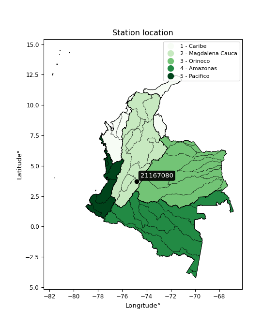</img>

</div>


## A. General information


### 1. General running parameters

• app_version: _v20251225_. • runtime: _2025-12-26 14:29:50.888910_. • Python version: _3.14.0_. • SciPy version: _1.16.3_. • Pandas version: _2.3.3_. • NumPy version: _2.3.5_. • Stations dataset (station_dataset_file): _dataset/pmax24h_in/automatic_colombia.csv_. • Stations catalog (station_catalog_file): _dataset/CNE_IDEAM.xls_. • Plot only fit distributions with Δo > Δ (plot_only_fit): _True_. • Eval low extreme values, if False, evaluates high extreme values (low_extreme): _False_. • Eval every SciPy distribution as logarithmic (pdist_logarithmic_on): _True_. • Standard deviation normalized (ddof): _1.0_. • Return periods to eval in years (Tr): _[2, 2.33, 5, 10, 15, 20, 25, 50, 75, 100, 200, 250, 500, 750, 1000]_. • Minimum data sample per station, 0 means any (minimum_sample): _5_. • Z-Score threshold to adjust a value, 0 means disable (zscore): _3.5_. • Avoid zeros, e.g. rain = 0 (avoid_zeros): _True_. • Avoid null values (avoid_nans): _True_. [:file_folder:Dataset file.](../../dataset/pmax24h_in/automatic_colombia.csv)


### 2. Station info and location

|   id |   CODIGO | NOMBRE                   | CATEGORIA    | TECNOLOGIA                              | ESTADO           | FECHA_INSTALACION   |   FECHA_SUSPENSION |   ALTITUD |   LATITUD |   LONGITUD | DEPARTAMENTO   | MUNICIPIO   | AREA_OPERATIVA             | ENTIDAD                                                     | AREA_HIDROGRAFICA   | ZONA_HIDROGRAFICA   | SUBZONA_HIDROGRAFICA   | CORRIENTE   | OBSERVACION                                                                                                                                                                                                                                                                    | SUBRED                                                       | Catalogo   |
|-----:|---------:|:-------------------------|:-------------|:----------------------------------------|:-----------------|:--------------------|-------------------:|----------:|----------:|-----------:|:---------------|:------------|:---------------------------|:------------------------------------------------------------|:--------------------|:--------------------|:-----------------------|:------------|:-------------------------------------------------------------------------------------------------------------------------------------------------------------------------------------------------------------------------------------------------------------------------------|:-------------------------------------------------------------|:-----------|
|    0 | 21167080 | LA MORA - AUT [21167080] | Limnigráfica | Automática con Telemetría, Convencional | En Mantenimiento | 15/10/1990          |                nan |       401 |   3.72519 |   -74.8264 | Tolima         | Prado       | Area Operativa 10 - Tolima | INSTITUTO DE HIDROLOGIA METEOROLOGIA Y ESTUDIOS AMBIENTALES | Magdalena Cauca     | Alto Magdalena      | Río Prado              | Negro       | 22/08/2022$Migracion$Se Cambia Estado por orden de la Coordinación de Planeacion Operativa Decisión tomada en la Reunión de la RED 19/08/2022|19/12/2024$mvelez$Se realiza el cambio de elevación a solicitud del coordinador mediante memorando 20243170190253 del 10/10/2024 | RED ALERTAS - AREA OPERATIVA 10,Alto Magdalena Huila -Tolima | CNE_IDEAM  |

<div align="center">

Map location in: [:earth_americas:Google](http://maps.google.com/maps?q=3.725194444,-74.82644444) [:earth_americas:OSM](https://www.openstreetmap.org/#map=18/3.725194444/-74.82644444&layers=P) [:earth_americas:Bing](https://www.bing.com/maps?cp=3.725194444~-74.82644444&lvl=18) [:earth_americas:Apple](https://maps.apple.com/frame?center=3.725194444%2C-74.82644444&span=0.003%2C0.006)

</div>


<div align="center">

```geojson
{
  "type": "Feature",
  "geometry": {
    "type": "Point", 
    "coordinates": [-74.82644444, 3.725194444]
  }, 
  "properties": {
    "Name": "21167080"
  }
}
```

</div>


### 3. Discrete values table and plot

|               |           0 |             1 |            2 |           3 |           4 |          5 |           6 |         7 |          8 |           9 |          10 |          11 |           12 |        13 |         14 |
|:--------------|------------:|--------------:|-------------:|------------:|------------:|-----------:|------------:|----------:|-----------:|------------:|------------:|------------:|-------------:|----------:|-----------:|
| Date          | 2005        | 2006          | 2007         | 2008        | 2009        | 2010       | 2011        | 2012      | 2013       | 2014        | 2015        | 2016        | 2017         | 2018      | 2019       |
| Value         |   84.7      |   64          |   65         |   75.9      |   71.2      |   93.9     |   50.2      |  112.2    |   55.7     |   47.9      |   81.2      |   68.4      |   62.8       |   24      |    0.1     |
| Value_initial |   84.7      |   64          |   65         |   75.9      |   71.2      |   93.9     |   50.2      |  112.2    |   55.7     |   47.9      |   81.2      |   68.4      |   62.8       |   24      |    0.1     |
| count         |   15        |   15          |   15         |   15        |   15        |   15       |   15        |   15      |   15       |   15        |   15        |   15        |   15         |   15      |   15       |
| mean          |   63.8133   |   63.8133     |   63.8133    |   63.8133   |   63.8133   |   63.8133  |   63.8133   |   63.8133 |   63.8133  |   63.8133   |   63.8133   |   63.8133   |   63.8133    |   63.8133 |   63.8133  |
| std           |   27.2004   |   27.2004     |   27.2004    |   27.2004   |   27.2004   |   27.2004  |   27.2004   |   27.2004 |   27.2004  |   27.2004   |   27.2004   |   27.2004   |   27.2004    |   27.2004 |   27.2004  |
| zscore        |    0.767881 |    0.00686265 |    0.0436268 |    0.444356 |    0.271565 |    1.10611 |   -0.500483 |    1.7789 |   -0.29828 |   -0.585041 |    0.639207 |    0.168625 |   -0.0372544 |   -1.4637 |   -2.34237 |

<div align="center">

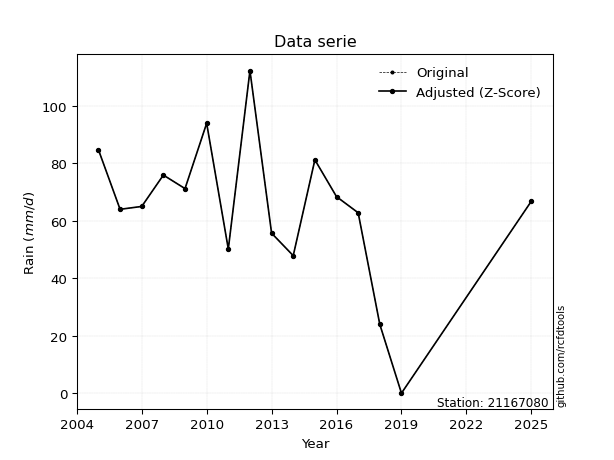</img>

</div>

> If Z-Score is active, values out of range or outliers are replaced with the station mean value.


### 4. Active continuous probability distributions from SciPy (45 of 104 available)

[scipy.stats](https://docs.scipy.org/doc/scipy/reference/stats.html) is a Python´s powerful submodule within the SciPy library for comprehensive statistical analysis, offering over 130 probability distributions (like Normal, Poisson), functions for descriptive stats (mean, variance), hypothesis testing (t-tests, chi-square), random variable generation, and statistical tests, making it essential for data science, modeling, and research. It provides tools to explore, model, and draw conclusions from data efficiently, working seamlessly with NumPy.

<div align="center">

|   id | p_dist             |   n_parameter | fit_method   | label                                                                       | active   | ref                                                                                                        |
|-----:|:-------------------|--------------:|:-------------|:----------------------------------------------------------------------------|:---------|:-----------------------------------------------------------------------------------------------------------|
|    0 | alpha              |             3 | MLE          | Alpha                                                                       | True     | [:mortar_board:](https://docs.scipy.org/doc/scipy/reference/generated/scipy.stats.alpha.html)              |
|    1 | betaprime          |             4 | MLE          | Beta prime                                                                  | True     | [:mortar_board:](https://docs.scipy.org/doc/scipy/reference/generated/scipy.stats.betaprime.html)          |
|    2 | chi2               |             3 | MLE          | Chi²                                                                        | True     | [:mortar_board:](https://docs.scipy.org/doc/scipy/reference/generated/scipy.stats.chi2.html)               |
|    3 | crystalball        |             4 | MLE          | Crystalball                                                                 | True     | [:mortar_board:](https://docs.scipy.org/doc/scipy/reference/generated/scipy.stats.crystalball.html)        |
|    4 | erlang             |             3 | MLE          | Erlang                                                                      | True     | [:mortar_board:](https://docs.scipy.org/doc/scipy/reference/generated/scipy.stats.erlang.html)             |
|    5 | expon              |             2 | MLE          | Exponential                                                                 | True     | [:mortar_board:](https://docs.scipy.org/doc/scipy/reference/generated/scipy.stats.expon.html)              |
|    6 | exponnorm          |             3 | MLE          | Exponentially modified Normal                                               | True     | [:mortar_board:](https://docs.scipy.org/doc/scipy/reference/generated/scipy.stats.exponnorm.html)          |
|    7 | f                  |             4 | MLE          | F                                                                           | True     | [:mortar_board:](https://docs.scipy.org/doc/scipy/reference/generated/scipy.stats.f.html)                  |
|    8 | fatiguelife        |             3 | MLE          | Fatigue-life (Birnbaum-Saunders)                                            | True     | [:mortar_board:](https://docs.scipy.org/doc/scipy/reference/generated/scipy.stats.fatiguelife.html)        |
|    9 | fisk               |             3 | MLE          | Fisk                                                                        | True     | [:mortar_board:](https://docs.scipy.org/doc/scipy/reference/generated/scipy.stats.fisk.html)               |
|   10 | gamma              |             3 | MLE          | Gamma                                                                       | True     | [:mortar_board:](https://docs.scipy.org/doc/scipy/reference/generated/scipy.stats.gamma.html)              |
|   11 | genexpon           |             5 | MLE          | Generalized exponential                                                     | True     | [:mortar_board:](https://docs.scipy.org/doc/scipy/reference/generated/scipy.stats.genexpon.html)           |
|   12 | genlogistic        |             3 | MLE          | Generalized logistic                                                        | True     | [:mortar_board:](https://docs.scipy.org/doc/scipy/reference/generated/scipy.stats.genlogistic.html)        |
|   13 | gibrat             |             2 | MM           | Gibrat                                                                      | True     | [:mortar_board:](https://docs.scipy.org/doc/scipy/reference/generated/scipy.stats.gibrat.html)             |
|   14 | gompertz           |             3 | MLE          | Gompertz (or truncated Gumbel)                                              | True     | [:mortar_board:](https://docs.scipy.org/doc/scipy/reference/generated/scipy.stats.gompertz.html)           |
|   15 | gumbel_l           |             2 | MM           | Gumbel Left Skew                                                            | True     | [:mortar_board:](https://docs.scipy.org/doc/scipy/reference/generated/scipy.stats.gumbel_l.html)           |
|   16 | gumbel_r           |             2 | MM           | Gumbel Right Skew                                                           | True     | [:mortar_board:](https://docs.scipy.org/doc/scipy/reference/generated/scipy.stats.gumbel_r.html)           |
|   17 | halflogistic       |             2 | MM           | Half-logistic                                                               | True     | [:mortar_board:](https://docs.scipy.org/doc/scipy/reference/generated/scipy.stats.halflogistic.html)       |
|   18 | halfnorm           |             2 | MM           | Half Normal                                                                 | True     | [:mortar_board:](https://docs.scipy.org/doc/scipy/reference/generated/scipy.stats.halfnorm.html)           |
|   19 | hypsecant          |             2 | MM           | hyperbolic secant                                                           | True     | [:mortar_board:](https://docs.scipy.org/doc/scipy/reference/generated/scipy.stats.hypsecant.html)          |
|   20 | invgamma           |             3 | MLE          | Inverted gamma                                                              | True     | [:mortar_board:](https://docs.scipy.org/doc/scipy/reference/generated/scipy.stats.invgamma.html)           |
|   21 | invgauss           |             3 | MLE          | Inverse Gaussian                                                            | True     | [:mortar_board:](https://docs.scipy.org/doc/scipy/reference/generated/scipy.stats.invgauss.html)           |
|   22 | invweibull         |             3 | MLE          | Inverted Weibull                                                            | True     | [:mortar_board:](https://docs.scipy.org/doc/scipy/reference/generated/scipy.stats.invweibull.html)         |
|   23 | johnsonsu          |             4 | MLE          | Johnson Su                                                                  | True     | [:mortar_board:](https://docs.scipy.org/doc/scipy/reference/generated/scipy.stats.johnsonsu.html)          |
|   24 | kstwobign          |             2 | MLE          | Limiting distribution of scaled Kolmogorov-Smirnov two-sided test statistic | True     | [:mortar_board:](https://docs.scipy.org/doc/scipy/reference/generated/scipy.stats.kstwobign.html)          |
|   25 | laplace            |             2 | MM           | Laplace                                                                     | True     | [:mortar_board:](https://docs.scipy.org/doc/scipy/reference/generated/scipy.stats.laplace.html)            |
|   26 | laplace_asymmetric |             3 | MLE          | Asymmetric Laplace                                                          | True     | [:mortar_board:](https://docs.scipy.org/doc/scipy/reference/generated/scipy.stats.laplace_asymmetric.html) |
|   27 | loggamma           |             3 | MLE          | Log gamma                                                                   | True     | [:mortar_board:](https://docs.scipy.org/doc/scipy/reference/generated/scipy.stats.loggamma.html)           |
|   28 | logistic           |             2 | MM           | Logistic (or Sech-squared)                                                  | True     | [:mortar_board:](https://docs.scipy.org/doc/scipy/reference/generated/scipy.stats.logistic.html)           |
|   29 | lognorm            |             3 | MLE          | Log Normal                                                                  | True     | [:mortar_board:](https://docs.scipy.org/doc/scipy/reference/generated/scipy.stats.lognorm.html)            |
|   30 | maxwell            |             2 | MM           | Maxwell                                                                     | True     | [:mortar_board:](https://docs.scipy.org/doc/scipy/reference/generated/scipy.stats.maxwell.html)            |
|   31 | mielke             |             4 | MLE          | Mielke Beta-Kappa / Dagum                                                   | True     | [:mortar_board:](https://docs.scipy.org/doc/scipy/reference/generated/scipy.stats.mielke.html)             |
|   32 | moyal              |             2 | MM           | Moyal                                                                       | True     | [:mortar_board:](https://docs.scipy.org/doc/scipy/reference/generated/scipy.stats.moyal.html)              |
|   33 | nakagami           |             3 | MLE          | Nakagami                                                                    | True     | [:mortar_board:](https://docs.scipy.org/doc/scipy/reference/generated/scipy.stats.nakagami.html)           |
|   34 | ncf                |             5 | MLE          | Non-central F distribution                                                  | True     | [:mortar_board:](https://docs.scipy.org/doc/scipy/reference/generated/scipy.stats.ncf.html)                |
|   35 | nct                |             4 | MLE          | Non-central Student’s t                                                     | True     | [:mortar_board:](https://docs.scipy.org/doc/scipy/reference/generated/scipy.stats.nct.html)                |
|   36 | norm               |             2 | MM           | Normal                                                                      | True     | [:mortar_board:](https://docs.scipy.org/doc/scipy/reference/generated/scipy.stats.norm.html)               |
|   37 | pareto             |             3 | MLE          | Pareto                                                                      | True     | [:mortar_board:](https://docs.scipy.org/doc/scipy/reference/generated/scipy.stats.pareto.html)             |
|   38 | pearson3           |             3 | MM           | Pearson type III                                                            | True     | [:mortar_board:](https://docs.scipy.org/doc/scipy/reference/generated/scipy.stats.pearson3.html)           |
|   39 | rayleigh           |             2 | MM           | Rayleigh                                                                    | True     | [:mortar_board:](https://docs.scipy.org/doc/scipy/reference/generated/scipy.stats.rayleigh.html)           |
|   40 | rice               |             3 | MLE          | Rice                                                                        | True     | [:mortar_board:](https://docs.scipy.org/doc/scipy/reference/generated/scipy.stats.rice.html)               |
|   41 | t                  |             3 | MLE          | Student’s t                                                                 | True     | [:mortar_board:](https://docs.scipy.org/doc/scipy/reference/generated/scipy.stats.t.html)                  |
|   42 | truncnorm          |             4 | MLE          | Truncated normal                                                            | True     | [:mortar_board:](https://docs.scipy.org/doc/scipy/reference/generated/scipy.stats.truncnorm.html)          |
|   43 | wald               |             2 | MM           | Wald                                                                        | True     | [:mortar_board:](https://docs.scipy.org/doc/scipy/reference/generated/scipy.stats.wald.html)               |
|   44 | weibull_min        |             3 | MLE          | Weibull minimum                                                             | True     | [:mortar_board:](https://docs.scipy.org/doc/scipy/reference/generated/scipy.stats.weibull_min.html)        |

</div>

> **n_parameter:** # arguments & localization & scale.
>
> **Fit methods:** (MLE) maximum likelihood, (MM) L-moments.
>
>**Inactive:** foldnorm, gennorm, norminvgauss, powernorm, powerlognorm, skewnorm, genextreme, anglit, arcsine, argus, beta, bradford, burr, burr12, cauchy, cosine, halfcauchy, foldcauchy, skewcauchy, wrapcauchy, dgamma, gengamma, exponweib, exponpow, truncexpon, gausshyper, genhalflogistic, genhyperbolic, geninvgauss, halfgennorm, johnsonsb, kappa4, kappa3, ksone, kstwo, loglaplace, levy, levy_l, levy_stable, ncx2, genpareto, truncpareto, lomax, powerlaw, rdist, rel_breitwigner, recipinvgauss, semicircular, studentized_range, trapezoid, triang, truncweibull_min, tukeylambda, uniform, loguniform, vonmises, vonmises_line, weibull_max, dweibull, 


## B. Probability distributions vs. Empirical distributions

A continuous probability distribution (CPD) describes probabilities for variables that can take any value within a range (like rain any time), unlike discrete variables with specific outcomes (like temperature). It uses a Probability Density Function (PDF), a curve where the total area under it equals 1, and the probability of the variable falling within an interval (a to b) is found by calculating the area under the curve between those points. A key feature is that the probability of hitting any single exact value is zero, so probabilities are always expressed for ranges, e.g., $P(a ≤ X ≤ b)$.

<div align="center">

Distributions parameters
|    |   station | p_dist                |   n |              loc |            scale | shape                  | shape1                | shape2              | shape3   |
|---:|----------:|:----------------------|----:|-----------------:|-----------------:|:-----------------------|:----------------------|:--------------------|:---------|
|  0 |  21167080 | alpha                 |  15 |      0.00513033  |      0.371188    | 1.1350420857115693e-07 |                       |                     |          |
|  1 |  21167080 | betaprime             |  15 |   -877.446       |  72763.5         | 1258.9335827906618     | 97337.94096103466     |                     |          |
|  2 |  21167080 | chi2                  |  15 |   -185.284       |      1.56274     | 159.05359206481336     |                       |                     |          |
|  3 |  21167080 | crystalball           |  15 |     63.8133      |     26.2781      | 5044.406238689445      | 62.813470086578874    |                     |          |
|  4 |  21167080 | erlang                |  15 |   -358.657       |      1.64412     | 256.8904870858731      |                       |                     |          |
|  5 |  21167080 | expon                 |  15 |      0.1         |     63.7133      |                        |                       |                     |          |
|  6 |  21167080 | exponnorm             |  15 |     63.7934      |     26.2782      | 0.0007555175667891849  |                       |                     |          |
|  7 |  21167080 | f                     |  15 |  -7254.59        |   7318.35        | 170117.39154886955     | 1601722.7208426343    |                     |          |
|  8 |  21167080 | fatiguelife           |  15 |  -3642.27        |   3706.13        | 0.007083417190600365   |                       |                     |          |
|  9 |  21167080 | fisk                  |  15 |     -3.91474e+09 |      3.91474e+09 | 277413365.2838953      |                       |                     |          |
| 10 |  21167080 | gamma                 |  15 |   -400.324       |      1.5813      | 293.3421915341704      |                       |                     |          |
| 11 |  21167080 | genexpon              |  15 |      0.0999744   |      2.44752     | 0.038506802844083754   | 6.072292699659268e-07 | 2.3001651957050377  |          |
| 12 |  21167080 | genlogistic           |  15 |     76.4828      |     10.6428      | 0.5401184401992133     |                       |                     |          |
| 13 |  21167080 | gibrat                |  15 |     43.7665      |     12.159       |                        |                       |                     |          |
| 14 |  21167080 | gompertz              |  15 |     47.9         |     27.4825      | 0.5020826751078435     |                       |                     |          |
| 15 |  21167080 | gumbel_l              |  15 |     75.6399      |     20.4889      |                        |                       |                     |          |
| 16 |  21167080 | gumbel_r              |  15 |     51.9868      |     20.4889      |                        |                       |                     |          |
| 17 |  21167080 | halflogistic          |  15 |     32.6677      |     22.4668      |                        |                       |                     |          |
| 18 |  21167080 | halfnorm              |  15 |     29.0315      |     43.5926      |                        |                       |                     |          |
| 19 |  21167080 | hypsecant             |  15 |     63.8133      |     16.7291      |                        |                       |                     |          |
| 20 |  21167080 | invgamma              |  15 |   -385.328       | 116899           | 261.5189396309489      |                       |                     |          |
| 21 |  21167080 | invgauss              |  15 |   -100.463       |   4738.35        | 0.03480821556017885    |                       |                     |          |
| 22 |  21167080 | invweibull            |  15 |     -3.08481e+09 |      3.08481e+09 | 103346720.60123473     |                       |                     |          |
| 23 |  21167080 | johnsonsu             |  15 |     73.5639      |     24.1868      | 0.37129585807187954    | 1.274475109152119     |                     |          |
| 24 |  21167080 | kstwobign             |  15 |    -59.3311      |    141.553       |                        |                       |                     |          |
| 25 |  21167080 | laplace               |  15 |     63.8133      |     18.5814      |                        |                       |                     |          |
| 26 |  21167080 | laplace_asymmetric    |  15 |     65           |     18.8254      | 1.0320467753928568     |                       |                     |          |
| 27 |  21167080 | loggamma              |  15 |     16.0228      |     44.7629      | 3.394351051535229      |                       |                     |          |
| 28 |  21167080 | logistic              |  15 |     63.8133      |     14.4879      |                        |                       |                     |          |
| 29 |  21167080 | lognorm               |  15 |     -2.09715e+06 |      2.09722e+06 | 1.253003081243742e-05  |                       |                     |          |
| 30 |  21167080 | maxwell               |  15 |      1.54533     |     39.0207      |                        |                       |                     |          |
| 31 |  21167080 | mielke                |  15 |   -630.558       |    708.327       | 33.637624820887        | 68.51438779926431     |                     |          |
| 32 |  21167080 | moyal                 |  15 |     48.7858      |     11.8293      |                        |                       |                     |          |
| 33 |  21167080 | nakagami              |  15 |      0.1         |     71.2303      | 0.4170867901830827     |                       |                     |          |
| 34 |  21167080 | ncf                   |  15 |     -0.0923934   |      3.34801     | 0.6177818561564952     | 134.92546835287368    | 11.10332290474991   |          |
| 35 |  21167080 | nct                   |  15 |  -1424.74        |     26.2037      | 239978.8063447054      | 56.80714202413668     |                     |          |
| 36 |  21167080 | norm                  |  15 |     63.8133      |     26.2781      |                        |                       |                     |          |
| 37 |  21167080 | pareto                |  15 |      0.0999802   |      1.97584e-05 | 0.07142892427542877    |                       |                     |          |
| 38 |  21167080 | pearson3              |  15 |     63.8133      |     26.2781      | -0.6307326736063066    |                       |                     |          |
| 39 |  21167080 | rayleigh              |  15 |     13.5417      |     40.1109      |                        |                       |                     |          |
| 40 |  21167080 | rice                  |  15 |   -370.177       |     26.2376      | 16.511083408780266     |                       |                     |          |
| 41 |  21167080 | t                     |  15 |     63.8702      |     25.9691      | 16.679801953209527     |                       |                     |          |
| 42 |  21167080 | truncnorm             |  15 |     54.111       |     37.746       | -1.4309477764437875    | 1.5403044042505876    |                     |          |
| 43 |  21167080 | wald                  |  15 |     37.5353      |     26.278       |                        |                       |                     |          |
| 44 |  21167080 | weibull_min           |  15 |   -104.982       |    179.563       | 7.62437062790063       |                       |                     |          |
| 45 |  21167080 | logalpha              |  15 |     -3.0485      |      1.73496     | 4.647720034911293e-09  |                       |                     |          |
| 46 |  21167080 | logbetaprime          |  15 |    -24.2656      |  92023.2         | 218.39852502864005     | 717219.4733061905     |                     |          |
| 47 |  21167080 | logchi2               |  15 |     -2.30259     |      5.21237     | 0.5582760690737536     |                       |                     |          |
| 48 |  21167080 | logcrystalball        |  15 |      3.73818     |      1.65051     | 1205.8803279314693     | 1536.7844115882406    |                     |          |
| 49 |  21167080 | logerlang             |  15 |     -2.30259     |     95.5421      | 0.18137764493875885    |                       |                     |          |
| 50 |  21167080 | logexpon              |  15 |     -2.30259     |      6.04076     |                        |                       |                     |          |
| 51 |  21167080 | logexponnorm          |  15 |      3.73716     |      1.6505      | 0.0006149374159344395  |                       |                     |          |
| 52 |  21167080 | logf                  |  15 |     -2.30259     |      1.13285     | 1.0777527447182742     | 1.0493905546181357    |                     |          |
| 53 |  21167080 | logfatiguelife        |  15 |  -1512.22        |   1515.98        | 0.0010901858947423584  |                       |                     |          |
| 54 |  21167080 | logfisk               |  15 |     -2.30259     |      1.2578      | 0.9216027457849685     |                       |                     |          |
| 55 |  21167080 | loggamma              |  15 |     -2.30259     |      1.2574      | 0.4230898382579521     |                       |                     |          |
| 56 |  21167080 | loggenexpon           |  15 |     -2.76936     |     16.6757      | 8.046834205240992e-12  | 33.727135790577734    | 0.37712403814768247 |          |
| 57 |  21167080 | loggenlogistic        |  15 |      4.63061     |      0.0752437   | 0.0834276317891395     |                       |                     |          |
| 58 |  21167080 | loggibrat             |  15 |      2.47902     |      0.763712    |                        |                       |                     |          |
| 59 |  21167080 | loggompertz           |  15 |    -12.2796      |      0.752759    | 3.1747360883482004e-10 |                       |                     |          |
| 60 |  21167080 | loggumbel_l           |  15 |      4.48099     |      1.2869      |                        |                       |                     |          |
| 61 |  21167080 | loggumbel_r           |  15 |      2.99536     |      1.2869      |                        |                       |                     |          |
| 62 |  21167080 | loghalflogistic       |  15 |      1.78189     |      1.41115     |                        |                       |                     |          |
| 63 |  21167080 | loghalfnorm           |  15 |      1.5535      |      2.73807     |                        |                       |                     |          |
| 64 |  21167080 | loghypsecant          |  15 |      3.73818     |      1.05075     |                        |                       |                     |          |
| 65 |  21167080 | loginvgamma           |  15 |    -45.0802      |  35501.2         | 729.3738660452076      |                       |                     |          |
| 66 |  21167080 | loginvgauss           |  15 |    -19.2781      |   3089.93        | 0.007422892220440652   |                       |                     |          |
| 67 |  21167080 | loginvweibull         |  15 | -21382.9         |  21385.6         | 8308.427503202445      |                       |                     |          |
| 68 |  21167080 | logjohnsonsu          |  15 |      4.32157     |      0.135849    | 0.5208563536083565     | 0.6319956005884666    |                     |          |
| 69 |  21167080 | logkstwobign          |  15 |     -7.38025     |     12.8585      |                        |                       |                     |          |
| 70 |  21167080 | loglaplace            |  15 |      3.73818     |      1.16709     |                        |                       |                     |          |
| 71 |  21167080 | loglaplace_asymmetric |  15 |      4.43912     |      0.373971    | 2.3076692965924686     |                       |                     |          |
| 72 |  21167080 | logloggamma           |  15 |      4.69963     |      0.0990885   | 0.10764377348239479    |                       |                     |          |
| 73 |  21167080 | loglogistic           |  15 |      3.73818     |      0.909973    |                        |                       |                     |          |
| 74 |  21167080 | loglognorm            |  15 |  -2002.03        |   2005.78        | 0.0008203914702501936  |                       |                     |          |
| 75 |  21167080 | logmaxwell            |  15 |     -0.17293     |      2.45091     |                        |                       |                     |          |
| 76 |  21167080 | logmielke             |  15 |     -3.99368e+08 |      3.99368e+08 | 474590275.4102011      | 218200607.7651177     |                     |          |
| 77 |  21167080 | logmoyal              |  15 |      2.79431     |      0.74299     |                        |                       |                     |          |
| 78 |  21167080 | lognakagami           |  15 |  -4001.73        |   4005.47        | 1472493.4718461195     |                       |                     |          |
| 79 |  21167080 | logncf                |  15 |     -2.30259     |      1.09909     | 1.0460606816637132     | 1.0517550668646969    | 1.0580018629974337  |          |
| 80 |  21167080 | lognct                |  15 |   -103.409       |      1.61039     | 34739.35144726062      | 66.53291223332826     |                     |          |
| 81 |  21167080 | lognorm               |  15 |      3.73818     |      1.65051     |                        |                       |                     |          |
| 82 |  21167080 | logpareto             |  15 |     -2.30259     |      1.97688e-06 | 0.07142889908891371    |                       |                     |          |
| 83 |  21167080 | logpearson3           |  15 |      3.73818     |      1.65049     | -3.229205527309123     |                       |                     |          |
| 84 |  21167080 | lograyleigh           |  15 |      0.580673    |      2.51932     |                        |                       |                     |          |
| 85 |  21167080 | logrice               |  15 |   -980.971       |      1.65019     | 596.7247861189787      |                       |                     |          |
| 86 |  21167080 | logt                  |  15 |      4.21983     |      0.179731    | 1.0247279532289075     |                       |                     |          |
| 87 |  21167080 | logtruncnorm          |  15 |      9.67356     |      2.92897     | -6.186686910907737     | -1.691121109954314    |                     |          |
| 88 |  21167080 | logwald               |  15 |      2.08761     |      1.65056     |                        |                       |                     |          |
| 89 |  21167080 | logweibull_min        |  15 |     -2.30259     |      1.74988     | 0.32594707026563463    |                       |                     |          |

</div>

> **loc** (Location parameter): This shifts the distribution along the x-axis. For many common distributions, like the normal (Gaussian) distribution, loc represents the mean $μ$. For others, like the uniform distribution, it might represent the minimum value, or for the beta distribution, the left end of the support interval.
>
> **scale** (Scale parameter): This determines the width or spread of the distribution. For the normal distribution, scale represents the standard deviation $σ$. For a uniform distribution, it defines the length of the interval (from $loc$ to $loc + scale$).
>
> **shape** (Shape parameters): Refers to parameters that define the specific form of a probability distribution, distinct from its location (loc) and scale (scale). These parameters are required arguments for most distribution functions. For example, a normal (Gaussian) distribution is fully defined by its location (mean) and scale (standard deviation), so it has no specific shape parameters beyond loc and scale. However, other distributions have intrinsic properties that need specification, as Gamma distribution that takes a shape parameter, often named $a$ or $alpha$.


### 0. Cumulative distribution values - CDF (90 evaluated)

> Ordered by x ascending and calculating $log(f(x))$ separately. 

|   id |   Station |   date |     x |   count |    mean |     std |      zscore |   Value_initial |   station |   m |       alpha |   alpha_pdf |   betaprime |   betaprime_pdf |       chi2 |    chi2_pdf |   crystalball |   crystalball_pdf |     erlang |   erlang_pdf |    expon |   expon_pdf |   exponnorm |   exponnorm_pdf |          f |      f_pdf |   fatiguelife |   fatiguelife_pdf |       fisk |    fisk_pdf |      gamma |   gamma_pdf |    genexpon |   genexpon_pdf |   genlogistic |   genlogistic_pdf |   gibrat |   gibrat_pdf |    gompertz |   gompertz_pdf |   gumbel_l |   gumbel_l_pdf |    gumbel_r |   gumbel_r_pdf |   halflogistic |   halflogistic_pdf |   halfnorm |   halfnorm_pdf |   hypsecant |   hypsecant_pdf |   invgamma |   invgamma_pdf |   invgauss |   invgauss_pdf |   invweibull |   invweibull_pdf |   johnsonsu |   johnsonsu_pdf |   kstwobign |   kstwobign_pdf |   laplace |   laplace_pdf |   laplace_asymmetric |   laplace_asymmetric_pdf |    loggamma |   loggamma_pdf |   logistic |   logistic_pdf |     lognorm |   lognorm_pdf |   maxwell |   maxwell_pdf |    mielke |   mielke_pdf |       moyal |   moyal_pdf |    nakagami |   nakagami_pdf |        ncf |    ncf_pdf |        nct |     nct_pdf |       norm |    norm_pdf |   pareto |     pareto_pdf |   pearson3 |   pearson3_pdf |   rayleigh |   rayleigh_pdf |       rice |    rice_pdf |         t |       t_pdf |   truncnorm |   truncnorm_pdf |     wald |   wald_pdf |   weibull_min |   weibull_min_pdf |   logalpha |   logalpha_pdf |   logbetaprime |   logbetaprime_pdf |     logchi2 |   logchi2_pdf |   logcrystalball |   logcrystalball_pdf |   logerlang |   logerlang_pdf |   logexpon |   logexpon_pdf |   logexponnorm |   logexponnorm_pdf |        logf |    logf_pdf |   logfatiguelife |   logfatiguelife_pdf |     logfisk |   logfisk_pdf |   loggenexpon |   loggenexpon_pdf |   loggenlogistic |   loggenlogistic_pdf |   loggibrat |   loggibrat_pdf |   loggompertz |   loggompertz_pdf |   loggumbel_l |   loggumbel_l_pdf |   loggumbel_r |   loggumbel_r_pdf |   loghalflogistic |   loghalflogistic_pdf |   loghalfnorm |   loghalfnorm_pdf |   loghypsecant |   loghypsecant_pdf |   loginvgamma |   loginvgamma_pdf |   loginvgauss |   loginvgauss_pdf |   loginvweibull |   loginvweibull_pdf |   logjohnsonsu |   logjohnsonsu_pdf |   logkstwobign |   logkstwobign_pdf |   loglaplace |   loglaplace_pdf |   loglaplace_asymmetric |   loglaplace_asymmetric_pdf |   logloggamma |   logloggamma_pdf |   loglogistic |   loglogistic_pdf |   loglognorm |   loglognorm_pdf |   logmaxwell |   logmaxwell_pdf |   logmielke |   logmielke_pdf |     logmoyal |   logmoyal_pdf |   lognakagami |   lognakagami_pdf |      logncf |   logncf_pdf |      lognct |   lognct_pdf |   logpareto |   logpareto_pdf |   logpearson3 |   logpearson3_pdf |   lograyleigh |   lograyleigh_pdf |     logrice |   logrice_pdf |       logt |   logt_pdf |   logtruncnorm |   logtruncnorm_pdf |   logwald |   logwald_pdf |   logweibull_min |   logweibull_min_pdf |
|-----:|----------:|-------:|------:|--------:|--------:|--------:|------------:|----------------:|----------:|----:|------------:|------------:|------------:|----------------:|-----------:|------------:|--------------:|------------------:|-----------:|-------------:|---------:|------------:|------------:|----------------:|-----------:|-----------:|--------------:|------------------:|-----------:|------------:|-----------:|------------:|------------:|---------------:|--------------:|------------------:|---------:|-------------:|------------:|---------------:|-----------:|---------------:|------------:|---------------:|---------------:|-------------------:|-----------:|---------------:|------------:|----------------:|-----------:|---------------:|-----------:|---------------:|-------------:|-----------------:|------------:|----------------:|------------:|----------------:|----------:|--------------:|---------------------:|-------------------------:|------------:|---------------:|-----------:|---------------:|------------:|--------------:|----------:|--------------:|----------:|-------------:|------------:|------------:|------------:|---------------:|-----------:|-----------:|-----------:|------------:|-----------:|------------:|---------:|---------------:|-----------:|---------------:|-----------:|---------------:|-----------:|------------:|----------:|------------:|------------:|----------------:|---------:|-----------:|--------------:|------------------:|-----------:|---------------:|---------------:|-------------------:|------------:|--------------:|-----------------:|---------------------:|------------:|----------------:|-----------:|---------------:|---------------:|-------------------:|------------:|------------:|-----------------:|---------------------:|------------:|--------------:|--------------:|------------------:|-----------------:|---------------------:|------------:|----------------:|--------------:|------------------:|--------------:|------------------:|--------------:|------------------:|------------------:|----------------------:|--------------:|------------------:|---------------:|-------------------:|--------------:|------------------:|--------------:|------------------:|----------------:|--------------------:|---------------:|-------------------:|---------------:|-------------------:|-------------:|-----------------:|------------------------:|----------------------------:|--------------:|------------------:|--------------:|------------------:|-------------:|-----------------:|-------------:|-----------------:|------------:|----------------:|-------------:|---------------:|--------------:|------------------:|------------:|-------------:|------------:|-------------:|------------:|----------------:|--------------:|------------------:|--------------:|------------------:|------------:|--------------:|-----------:|-----------:|---------------:|-------------------:|----------:|--------------:|-----------------:|---------------------:|
|    0 |  21167080 |   2019 |   0.1 |      15 | 63.8133 | 27.2004 | -2.34237    |             0.1 |  21167080 |   1 | 9.13056e-05 | 0.0155985   |  0.00759393 |     0.000822325 | 0.00704245 | 0.000856422 |    0.00766302 |       0.000803148 | 0.00577537 |   0.0006959  | 0        |  0.0156953  |  0.00766327 |     0.000803168 | 0.00778081 | 0.00081568 |    0.00714878 |       0.000769473 | 0.00958838 | 0.000672954 | 0.00736856 | 0.000830803 | 4.02473e-07 |     0.015733   |     0.0207171 |        0.00105058 | 0        |   0          | 0           |     0          |  0.0247393 |    0.00119239  | 3.42619e-06 |    2.10433e-06 |       0        |         0          |   0        |     0          |   0.0141185 |     0.000843669 | 0.00661146 |    0.000817176 | 0.00468231 |    0.000752683 |   0.00480695 |      0.000859592 |   0.0249256 |     0.000960666 |  0.00545091 |      0.00119211 | 0.0162117 |   0.000872468 |            0.0182695 |              0.000940337 | 3.27235e-07 |    3.11761e+08 |   0.012156 |    0.000828846 | 0.000126138 |   0.000298245 | 0         |    0          | 0.0201021 |   0.00107182 | 4.91251e-15 | 1.29288e-14 | 1.93315e-16 |    11.6199     | 0.00133472 | 0.00261654 | 0.00767586 | 0.000804362 | 0.00766302 | 0.000803148 | 0        | 3615.12        |  0.0183671 |     0.00118081 |  0         |     0          | 0.00752067 | 0.000792109 | 0.0126778 | 0.000988991 | 6.67848e-06 |      0.0044046  | 0        | 0          |     0.0166822 |        0.00120024 |  0.0200205 |      0.166367  |    0.000294721 |        0.000675919 | 2.99008e-05 |   1.87945e+10 |      0.000126138 |          0.000298245 | 0.000777813 |     3.17679e+11 |   0        |      0.165542  |    0.000126128 |        0.000298225 | 3.25672e-09 | 3.95185e+06 |      0.000119648 |          0.000284589 | 5.74465e-15 |    11.9217    |    0.00495297 |         0.0211325 |      0.000458623 |          0.000508505 |    0        |       0         |   0.000181033 |       0.000240471 |    0.00512392 |        0.00397139 |   2.23658e-27 |        1.0665e-25 |          0        |              0        |      0        |          0        |     0.00202821 |         0.00193024 |    0.00017438 |       0.000439604 |   0.000263584 |       0.000678676 |      0.00107069 |          0.00284566 |     0.00880306 |         0.00227402 |     0.00232623 |         0.00679095 |   0.00282547 |       0.00242096 |             0.000340868 |                  0.00039498 |   0.000524159 |       0.000569415 |    0.00130742 |        0.00143489 |  0.000114926 |      0.000274962 |     0        |         0        |   0.0033826 |      0.00372581 | 2.48872e-209 |   1.59833e-206 |   0.000124755 |        0.00029534 | 3.39685e-09 |  4.00068e+06 | 0.000132335 |  0.000312012 |    0        |  36132.2        |     0.0141296 |        0.00627561 |      0        |          0        | 0.000125694 |   0.000297318 | 0.00806383 | 0.00126624 |     0.00047733 |         0.00070247 |  0        |      0        |      8.25427e-06 |          6.05834e+09 |
|    1 |  21167080 |   2018 |  24   |      15 | 63.8133 | 27.2004 | -1.4637     |            24   |  21167080 |   2 | 0.987658    | 0.000514333 |  0.0671016  |     0.00501203  | 0.0730961  | 0.0055876   |    0.0648763  |       0.00481796  | 0.0623125  |   0.00497365 | 0.312792 |  0.0107859  |  0.0648773  |     0.004818    | 0.0656806  | 0.00486255 |    0.06346    |       0.0047923   | 0.0500245  | 0.0033676   | 0.0689216  | 0.00519909  | 0.313415    |     0.0108022  |     0.0694354 |        0.00349856 | 0        |   0          | 0           |     0          |  0.0772797 |    0.00362213  | 0.0198523   |    0.00379765  |       0        |         0          |   0        |     0          |   0.0587592 |     0.00349247  | 0.0714049  |    0.00554724  | 0.0766324  |    0.00628685  |   0.0910165  |      0.00730811  |   0.0672803 |     0.00300941  |  0.121107   |      0.00889396 | 0.0586721 |   0.00315757  |            0.0625129 |              0.00321756  | 0.997651    |    0.00207771  |   0.060197 |    0.00390488  | 0.367168    |   0.228183    | 0.0459324 |    0.005738   | 0.0701059 |   0.00358668 | 0.00435908  | 0.00165197  | 0.310712    |     0.0104902  | 0.126083   | 0.00890014 | 0.0649459  | 0.00482118  | 0.0648763  | 0.00481796  | 0.632275 |    0.001099    |  0.0768915 |     0.00423759 |  0.0334199 |     0.00628308 | 0.06432    | 0.00479821  | 0.071731  | 0.00470419  | 0.158105    |      0.00891927 | 0        | 0          |     0.0771194 |        0.00437818 |  0.780522  |      0.034346  |    0.388068    |        0.204834    | 0.835208    |   0.0279292   |      0.367168    |          0.228183    | 0.639301    |     0.0201525   |   0.596378 |      0.0668164 |    0.367167    |        0.228184    | 0.733529    | 0.0224643   |      0.363171    |          0.227134    | 0.795185    |     0.0273869 |    0.538773   |         0.117397  |      0.19978     |          0.221509    |    0.464744 |       0.568474  |   0.231176    |       0.268503    |    0.304638   |        0.196318   |   0.419937    |        0.28313    |          0.457932 |              0.280019 |      0.447033 |          0.244373 |     0.337827   |         0.264463   |    0.403566   |       0.217319    |   0.419676    |       0.202205    |      0.443436   |          0.140093   |     0.102797   |         0.0982717  |     0.489795   |         0.123378   |   0.309413   |       0.265116   |             0.195276    |                  0.226276   |   0.201921    |       0.219355    |    0.350797   |        0.25027    |  0.36408     |      0.228295    |     0.400038 |         0.238989 |   0.343402  |      0.158436   | 0.439874     |   0.307766     |   0.366509    |        0.228069   | 0.629566    |  0.0285612   | 0.368406    |  0.227146    |    0.653427 |      0.00451686 |     0.207103  |        0.123397   |      0.412256 |          0.240523 | 0.367071    |   0.228208    | 0.0523007  | 0.0504217  |     0.29265    |         0.25652    |  0.489786 |      0.412542 |      0.765621    |          0.0202231   |
|    2 |  21167080 |   2014 |  47.9 |      15 | 63.8133 | 27.2004 | -0.585041   |            47.9 |  21167080 |   3 | 0.993816    | 0.000129105 |  0.279561   |     0.0127448   | 0.299499   | 0.0130041   |    0.272399   |       0.0126382   | 0.278786   |   0.0130747  | 0.527745 |  0.00741219 |  0.2724     |     0.0126382   | 0.274035   | 0.012641   |    0.27125    |       0.0126787   | 0.222652   | 0.012265    | 0.286226   | 0.0128508   | 0.528601    |     0.00741665 |     0.226234  |        0.0107484  | 0.140307 |   0.0539269  | 5.84314e-12 |     0.0182691  |  0.227584  |    0.00973515  | 0.295009    |    0.0175769   |       0.32658  |         0.0198815  |   0.334868 |     0.0166665  |   0.234664  |     0.0127907   | 0.298311   |    0.0130802   | 0.316461   |    0.0129341   |   0.3409     |      0.0122907   |   0.210065  |     0.0104174   |  0.385498   |      0.0118625  | 0.212342  |   0.0114276   |            0.213901  |              0.0110095   | 0.998721    |    0.00111981  |   0.250042 |    0.0129433   | 0.531616    |   0.240949    | 0.297095  |    0.0142494  | 0.228955  |   0.0107879  | 0.299199    | 0.0204258   | 0.532194    |     0.00812246 | 0.383879   | 0.0115467  | 0.2725     | 0.0126358   | 0.272399   | 0.0126382   | 0.650038 |    0.000522958 |  0.249959  |     0.0107414  |  0.307097  |     0.0147971  | 0.271704   | 0.0126538   | 0.273437  | 0.0124129   | 0.415793    |      0.0120958  | 0.26499  | 0.0385013  |     0.254226  |        0.0109097  |  0.801966  |      0.0280323 |    0.532692    |        0.20907     | 0.853099    |   0.0239934   |      0.531616    |          0.240949    | 0.652512    |     0.0181538   |   0.640009 |      0.0595937 |    0.531616    |        0.24095     | 0.747848    | 0.0191252   |      0.527191    |          0.24081     | 0.812435    |     0.0227551 |    0.616823   |         0.108036  |      0.42985     |          0.476584    |    0.725393 |       0.239866  |   0.482312    |       0.452783    |    0.462913   |        0.259423   |   0.602214    |        0.237321   |          0.628872 |              0.214194 |      0.602286 |          0.203792 |     0.539564   |         0.3006     |    0.555687   |       0.217544    |   0.559385    |       0.198008    |      0.537014   |          0.129707   |     0.244667   |         0.420257   |     0.571634   |         0.113004   |   0.553065   |       0.38295    |             0.434929    |                  0.503972   |   0.427769    |       0.464606    |    0.535912   |        0.273316   |  0.528873    |      0.241791    |     0.563138 |         0.227273 |   0.455831  |      0.164221   | 0.62757      |   0.231576     |   0.530931    |        0.240991   | 0.647893    |  0.0246412   | 0.531919    |  0.23939     |    0.656355 |      0.00397722 |     0.322822  |        0.227817   |      0.573392 |          0.22103  | 0.531546    |   0.240999    | 0.148407   | 0.370154   |     0.523141   |         0.420992   |  0.697958 |      0.21492  |      0.778664    |          0.0176286   |
|    3 |  21167080 |   2011 |  50.2 |      15 | 63.8133 | 27.2004 | -0.500483   |            50.2 |  21167080 |   4 | 0.9941      | 0.000117545 |  0.309568   |     0.0133366   | 0.329955   | 0.0134654   |    0.302212   |       0.0132752   | 0.309559   |   0.0136715  | 0.544489 |  0.00714939 |  0.302213   |     0.0132751   | 0.303843   | 0.0132677  |    0.301157   |       0.0133165   | 0.252129   | 0.0133621   | 0.316428   | 0.0133989   | 0.545354    |     0.00715306 |     0.252154  |        0.0117982  | 0.262209 |   0.0506377  | 0.0428809   |     0.0190121  |  0.250921  |    0.0105626   | 0.335839    |    0.0178849   |       0.371517 |         0.0191833  |   0.372749 |     0.0162676  |   0.265584  |     0.0140966   | 0.328947   |    0.0135454   | 0.346532   |    0.0132005   |   0.369222   |      0.0123246   |   0.235434  |     0.0116582   |  0.412672   |      0.0117588  | 0.240321  |   0.0129334   |            0.240783  |              0.0123931   | 0.998773    |    0.00107411  |   0.280974 |    0.0139446   | 0.542902    |   0.24031     | 0.330306  |    0.0146115  | 0.254944  |   0.0118187  | 0.346204    | 0.0203851   | 0.550633    |     0.00791159 | 0.410358   | 0.011471   | 0.302307   | 0.0132718   | 0.302212   | 0.0132752   | 0.651211 |    0.000497278 |  0.275498  |     0.0114652  |  0.341392  |     0.0150063  | 0.301558   | 0.0132954   | 0.30277   | 0.0130826   | 0.443736    |      0.0121951  | 0.348899 | 0.0343475  |     0.280143  |        0.0116255  |  0.803272  |      0.0276677 |    0.542481    |        0.208353    | 0.854219    |   0.0237557   |      0.542902    |          0.24031     | 0.653361    |     0.0180328   |   0.642793 |      0.0591328 |    0.542902    |        0.240311    | 0.748741    | 0.0189287   |      0.538472    |          0.24024     | 0.813496    |     0.0224851 |    0.621873   |         0.10731   |      0.452793    |          0.502003    |    0.736346 |       0.227346  |   0.503765    |       0.46192     |    0.475162   |        0.262916   |   0.613244    |        0.233019   |          0.638813 |              0.209729 |      0.611774 |          0.200831 |     0.553619   |         0.298649   |    0.565864   |       0.21641     |   0.568645    |       0.196861    |      0.543076   |          0.128802   |     0.265838   |         0.484774   |     0.576915   |         0.112211   |   0.570669   |       0.367866   |             0.459219    |                  0.532118   |   0.450122    |       0.488823    |    0.548704   |        0.272127   |  0.5402      |      0.241189    |     0.573751 |         0.225312 |   0.463529  |      0.164028   | 0.6383       |   0.226002     |   0.54222     |        0.240362   | 0.649044    |  0.0244078   | 0.543132    |  0.238742    |    0.656541 |      0.00394509 |     0.333782  |        0.239717   |      0.583705 |          0.218763 | 0.542835    |   0.240361    | 0.167814   | 0.462011   |     0.543201   |         0.434509   |  0.707832 |      0.206224 |      0.779487    |          0.0174736   |
|    4 |  21167080 |   2013 |  55.7 |      15 | 63.8133 | 27.2004 | -0.29828    |            55.7 |  21167080 |   5 | 0.994682    | 9.54758e-05 |  0.38612    |     0.0144136   | 0.406288   | 0.014202    |    0.378756   |       0.0144749   | 0.387906   |   0.0147227  | 0.582161 |  0.00655811 |  0.378757   |     0.0144749   | 0.380275   | 0.0144417  |    0.37792    |       0.0145114   | 0.332358   | 0.0157244   | 0.393004   | 0.0143582   | 0.583042    |     0.00656011 |     0.324205  |        0.0144088  | 0.492532 |   0.0334245  | 0.151918    |     0.0205786  |  0.314681  |    0.0126391   | 0.434203    |    0.0176793   |       0.471956 |         0.0172979  |   0.459308 |     0.0151795  |   0.351344  |     0.0169897   | 0.405722   |    0.0142804   | 0.420135   |    0.0134811   |   0.436621   |      0.0121218   |   0.308387  |     0.0149193   |  0.476272   |      0.0113296  | 0.323103  |   0.0173885   |            0.319572  |              0.0164484   | 0.998879    |    0.000979459 |   0.363545 |    0.0159706   | 0.567785    |   0.238211    | 0.412117  |    0.0150341  | 0.326978  |   0.0143827  | 0.455315    | 0.0190544   | 0.592772    |     0.00741323 | 0.472578   | 0.0111167  | 0.378826   | 0.0144693   | 0.378756   | 0.0144749   | 0.653796 |    0.000444765 |  0.343178  |     0.0131195  |  0.424401  |     0.0150826  | 0.378242   | 0.0145048   | 0.378479  | 0.0143626   | 0.511078    |      0.0122498  | 0.51011  | 0.0246558  |     0.348629  |        0.0132493  |  0.806107  |      0.0268841 |    0.564042    |        0.206329    | 0.856662    |   0.0232405   |      0.567785    |          0.238211    | 0.655222    |     0.0177703   |   0.648888 |      0.0581238 |    0.567785    |        0.238212    | 0.750687    | 0.018505    |      0.563356    |          0.238297    | 0.815803    |     0.0219037 |    0.632945   |         0.105667  |      0.508105    |          0.563201    |    0.758652 |       0.202356  |   0.552681    |       0.478055    |    0.502872   |        0.269988   |   0.636964    |        0.223248   |          0.660107 |              0.199929 |      0.63231  |          0.194218 |     0.584364   |         0.292359   |    0.588213   |       0.213417    |   0.588965    |       0.19397     |      0.55636    |          0.126729   |     0.325961   |         0.68851    |     0.588489   |         0.110423   |   0.60726    |       0.336513   |             0.518011    |                  0.600244   |   0.503908    |       0.546897    |    0.576808   |        0.26825    |  0.565178    |      0.239166    |     0.596932 |         0.22053  |   0.48055   |      0.163347   | 0.66116      |   0.213793     |   0.567109    |        0.238287   | 0.651555    |  0.0239033   | 0.567851    |  0.236638    |    0.656947 |      0.00387562 |     0.360238  |        0.270281   |      0.606174 |          0.213406 | 0.567723    |   0.238264    | 0.231396   | 0.798547   |     0.589978   |         0.465616   |  0.72833  |      0.188444 |      0.781286    |          0.0171384   |
|    5 |  21167080 |   2017 |  62.8 |      15 | 63.8133 | 27.2004 | -0.0372544  |            62.8 |  21167080 |   6 | 0.995284    | 7.51065e-05 |  0.49097    |     0.0149496   | 0.508114   | 0.0143235   |    0.48462    |       0.0151703   | 0.494629   |   0.0151578  | 0.626223 |  0.00586655 |  0.484621   |     0.0151702   | 0.485794   | 0.0151079  |    0.483984   |       0.0151887   | 0.451551   | 0.0175496   | 0.496914   | 0.014744    | 0.627112    |     0.00586675 |     0.437692  |        0.0174015  | 0.67297  |   0.0189576  | 0.303272    |     0.0218897  |  0.41396   |    0.0152844   | 0.554368    |    0.0159616   |       0.585371 |         0.0146291  |   0.561447 |     0.0135589  |   0.480731  |     0.0189924   | 0.508038   |    0.0143801   | 0.515091   |    0.0131445   |   0.520344   |      0.011388    |   0.429103  |     0.0189014   |  0.553905   |      0.0104975  | 0.473463  |   0.0254805   |            0.460549  |              0.0237046   | 0.998991    |    0.00088072  |   0.482521 |    0.0172347   | 0.596163    |   0.234652    | 0.518217  |    0.0146968  | 0.440124  |   0.0173393  | 0.580245    | 0.0160061   | 0.643157    |     0.00678213 | 0.549034   | 0.0103757  | 0.484642   | 0.0151626   | 0.48462    | 0.0151703   | 0.656755 |    0.00039103  |  0.442883  |     0.0148644  |  0.529545  |     0.0144036  | 0.484347   | 0.0152072   | 0.483809  | 0.0151202   | 0.597201    |      0.0119401  | 0.652262 | 0.0160916  |     0.449029  |        0.014924   |  0.809281  |      0.0260202 |    0.588621    |        0.203276    | 0.859415    |   0.0226654   |      0.596163    |          0.234652    | 0.657336    |     0.017477    |   0.655793 |      0.0569808 |    0.596163    |        0.234653    | 0.752878    | 0.0180352   |      0.591755    |          0.234916    | 0.818392    |     0.021261  |    0.645506   |         0.103717  |      0.580341    |          0.642516    |    0.781405 |       0.177614  |   0.610731    |       0.487897    |    0.535689   |        0.276805   |   0.663058    |        0.211707   |          0.683425 |              0.188828 |      0.655151 |          0.186522 |     0.618852   |         0.282064   |    0.613571   |       0.20918     |   0.612008    |       0.190069    |      0.571415   |          0.12423    |     0.430619   |         1.09483    |     0.601611   |         0.108314   |   0.645627   |       0.303639   |             0.595271    |                  0.689769   |   0.573918    |       0.62149     |    0.608623   |        0.261767   |  0.593675    |      0.235681    |     0.623025 |         0.214329 |   0.500079  |      0.162143   | 0.685981     |   0.200055     |   0.595498    |        0.234754   | 0.654389    |  0.0233424   | 0.596041    |  0.233096    |    0.657407 |      0.00379835 |     0.395238  |        0.315277   |      0.631381 |          0.206715 | 0.596107    |   0.234706    | 0.366178   | 1.48859    |     0.648092   |         0.503502   |  0.749823 |      0.170216 |      0.78332     |          0.0167653   |
|    6 |  21167080 |   2006 |  64   |      15 | 63.8133 | 27.2004 |  0.00686265 |            64   |  21167080 |   7 | 0.995372    | 7.23162e-05 |  0.508904   |     0.0149369   | 0.525261   | 0.0142518   |    0.502834   |       0.0151812   | 0.5128     |   0.0151226  | 0.633197 |  0.00575709 |  0.502835   |     0.0151811   | 0.503931   | 0.0151149  |    0.502218   |       0.0151958   | 0.472685   | 0.0176631   | 0.514589   | 0.0147092   | 0.634086    |     0.00575703 |     0.458807  |        0.0177813  | 0.694718 |   0.0173189  | 0.32961     |     0.0220022  |  0.432547  |    0.0156923   | 0.573288    |    0.0155674   |       0.602652 |         0.0141723  |   0.577543 |     0.0132678  |   0.503552  |     0.0190261   | 0.525251   |    0.0143031   | 0.530791   |    0.0130187   |   0.533913   |      0.0112245   |   0.452096  |     0.0194076   |  0.566406   |      0.0103353  | 0.504998  |   0.0266397   |            0.489892  |              0.0252149   | 0.999007    |    0.000866095 |   0.503221 |    0.0172551   | 0.600598    |   0.233983    | 0.535769  |    0.0145514  | 0.461164  |   0.0177179  | 0.599114    | 0.0154406   | 0.651233    |     0.00667694 | 0.561396   | 0.0102266  | 0.502847   | 0.0151733   | 0.502834   | 0.0151812   | 0.65722  |    0.000383168 |  0.460858  |     0.0150897  |  0.546719  |     0.0142159  | 0.502606   | 0.0152186   | 0.501965  | 0.0151336   | 0.611475    |      0.0118471  | 0.670921 | 0.0150209  |     0.467066  |        0.0151333  |  0.809772  |      0.0258876 |    0.592463    |        0.202726    | 0.859844    |   0.0225764   |      0.600598    |          0.233983    | 0.657667    |     0.0174316   |   0.65687  |      0.0568025 |    0.600598    |        0.233984    | 0.753219    | 0.0179629   |      0.596195    |          0.234274    | 0.818794    |     0.0211622 |    0.647466   |         0.103404  |      0.592628    |          0.655844    |    0.784733 |       0.174062  |   0.619972    |       0.488444    |    0.540937   |        0.277731   |   0.667048    |        0.209872   |          0.686983 |              0.187101 |      0.65867  |          0.185304 |     0.624173   |         0.280177   |    0.617524   |       0.208438    |   0.6156      |       0.189402    |      0.573763   |          0.123827   |     0.452149   |         1.18103    |     0.603658   |         0.107977   |   0.651328   |       0.298754   |             0.608471    |                  0.705064   |   0.585799    |       0.633931    |    0.613567   |        0.26056    |  0.59813     |      0.235021    |     0.627072 |         0.21329  |   0.503146  |      0.161913   | 0.689748     |   0.197929     |   0.599935    |        0.234088   | 0.65483     |  0.0232558   | 0.600447    |  0.232431    |    0.657479 |      0.00378643 |     0.401285  |        0.323646   |      0.635283 |          0.205614 | 0.600543    |   0.234037    | 0.395409   | 1.59774    |     0.65768    |         0.509677   |  0.753019 |      0.167543 |      0.783637    |          0.0167077   |
|    7 |  21167080 |   2007 |  65   |      15 | 63.8133 | 27.2004 |  0.0436268  |            65   |  21167080 |   8 | 0.995443    | 7.01081e-05 |  0.523826   |     0.0149032   | 0.539475   | 0.0141726   |    0.518009   |       0.0151661   | 0.527898   |   0.0150697  | 0.638909 |  0.00566743 |  0.51801    |     0.015166    | 0.519039   | 0.0150969  |    0.517407   |       0.0151775   | 0.490375   | 0.0177094   | 0.529274   | 0.0146584   | 0.639798    |     0.00566716 |     0.476729  |        0.0180555  | 0.71141  |   0.016084   | 0.351648    |     0.0220675  |  0.448403  |    0.0160167   | 0.588684    |    0.015224    |       0.616634 |         0.0137928  |   0.590689 |     0.0130225  |   0.52256   |     0.0189795   | 0.539513   |    0.0142192   | 0.543752   |    0.0129005   |   0.545066   |      0.0110815   |   0.471688  |     0.0197661   |  0.576672   |      0.0101965  | 0.530933  |   0.0252439   |            0.515767  |              0.0265467   | 0.999021    |    0.000854299 |   0.520465 |    0.0172269   | 0.604221    |   0.233413    | 0.550252  |    0.0144127  | 0.479022  |   0.0179923  | 0.614318    | 0.0149683   | 0.657866    |     0.00658963 | 0.571559   | 0.0100982  | 0.518014   | 0.0151581   | 0.518009   | 0.0151661   | 0.6576   |    0.000376845 |  0.476033  |     0.0152581  |  0.56085   |     0.0140457  | 0.517819   | 0.0152037   | 0.517093  | 0.0151186   | 0.62328     |      0.011761   | 0.685524 | 0.0141945  |     0.482278  |        0.0152874  |  0.810172  |      0.0257798 |    0.595603    |        0.202262    | 0.860193    |   0.022504    |      0.604221    |          0.233413    | 0.657937    |     0.0173946   |   0.657749 |      0.0566569 |    0.604221    |        0.233414    | 0.753497    | 0.017904    |      0.599823    |          0.233727    | 0.819121    |     0.0210818 |    0.649067   |         0.103147  |      0.602882    |          0.666903    |    0.78741  |       0.171219  |   0.627547    |       0.48867     |    0.545249   |        0.278458   |   0.67029     |        0.208366   |          0.689873 |              0.185691 |      0.661535 |          0.184305 |     0.628505   |         0.278584   |    0.620751   |       0.207816    |   0.618532    |       0.188844    |      0.57568    |          0.123494   |     0.471033   |         1.25549    |     0.60533    |         0.107701   |   0.655929   |       0.294812   |             0.619501    |                  0.717845   |   0.595707    |       0.644233    |    0.617599   |        0.259536   |  0.601769    |      0.23446     |     0.630372 |         0.212427 |   0.505655  |      0.161717   | 0.692803     |   0.196198     |   0.60356     |        0.233521   | 0.65519     |  0.0231854   | 0.604046    |  0.231866    |    0.657538 |      0.00377672 |     0.406358  |        0.330817   |      0.638464 |          0.204704 | 0.604168    |   0.233467    | 0.420789   | 1.67362    |     0.665622   |         0.514774   |  0.7556   |      0.165391 |      0.783895    |          0.0166608   |
|    8 |  21167080 |   2016 |  68.4 |      15 | 63.8133 | 27.2004 |  0.168625   |            68.4 |  21167080 |   9 | 0.99567     | 6.33111e-05 |  0.574109   |     0.0146359   | 0.587044   | 0.0137777   |    0.569281   |       0.0149521   | 0.578631   |   0.0147335  | 0.657673 |  0.00537292 |  0.569281   |     0.014952    | 0.570061   | 0.0148754  |    0.568698   |       0.0149524   | 0.550436   | 0.0175357   | 0.578636   | 0.0143417   | 0.65856     |     0.00537197 |     0.539279  |        0.0186442  | 0.759917 |   0.0126223  | 0.426792    |     0.0220792  |  0.504569  |    0.0169826   | 0.638365    |    0.0139845   |       0.661358 |         0.0125208  |   0.633528 |     0.0121737  |   0.586198  |     0.0183339   | 0.587213   |    0.0138075   | 0.586823   |    0.0124154   |   0.581866   |      0.0105561   |   0.540313  |     0.0204531   |  0.610512   |      0.00970478 | 0.609368  |   0.0210227   |            0.598113  |              0.0220323   | 0.999063    |    0.000816649 |   0.578492 |    0.0168306   | 0.616072    |   0.231405    | 0.598314  |    0.0138323  | 0.541368  |   0.0185885  | 0.6625      | 0.0133824   | 0.679769    |     0.00629528 | 0.605119   | 0.00963748 | 0.569258   | 0.0149439   | 0.569281   | 0.0149521   | 0.658846 |    0.000356782 |  0.528701  |     0.0156833  |  0.607513  |     0.0133826  | 0.569217   | 0.0149891   | 0.568187  | 0.0148919   | 0.662699    |      0.0114129  | 0.72951  | 0.0117728  |     0.534954  |        0.015657   |  0.811478  |      0.0254299 |    0.605875    |        0.200654    | 0.861334    |   0.022268    |      0.616072    |          0.231405    | 0.65882     |     0.0172741   |   0.660626 |      0.0561807 |    0.616072    |        0.231406    | 0.754405    | 0.0177126   |      0.611691    |          0.231793    | 0.820189    |     0.0208207 |    0.654304   |         0.102297  |      0.637826    |          0.703973    |    0.795909 |       0.162267  |   0.652453    |       0.487947    |    0.559503   |        0.28063    |   0.680788    |        0.203409   |          0.699223 |              0.181089 |      0.670848 |          0.181018 |     0.642569   |         0.273055   |    0.631292   |       0.205683    |   0.628112    |       0.186949    |      0.581948   |          0.12239    |     0.541492   |         1.50647    |     0.610798   |         0.106787   |   0.670637   |       0.28221    |             0.657204    |                  0.761533   |   0.629428    |       0.678641    |    0.630741   |        0.255949   |  0.613674    |      0.232476    |     0.641129 |         0.209516 |   0.513883  |      0.161024   | 0.702662     |   0.190564     |   0.615416    |        0.231523   | 0.656366    |  0.0229561   | 0.615818    |  0.229875    |    0.65773  |      0.00374512 |     0.423868  |        0.356668   |      0.648824 |          0.20166  | 0.616021    |   0.231459    | 0.509866   | 1.77767    |     0.6923     |         0.531796   |  0.763857 |      0.158554 |      0.784741    |          0.0165081   |
|    9 |  21167080 |   2009 |  71.2 |      15 | 63.8133 | 27.2004 |  0.271565   |            71.2 |  21167080 |  10 | 0.99584     | 5.84292e-05 |  0.614579   |     0.0142466   | 0.625005   | 0.0133187   |    0.610682   |       0.0145935   | 0.619293   |   0.0142872  | 0.672391 |  0.00514191 |  0.610682   |     0.0145934   | 0.611242   | 0.0145137  |    0.610088   |       0.0145854   | 0.598892   | 0.0170229   | 0.61824    | 0.0139243   | 0.673275    |     0.00514046 |     0.591615  |        0.0186632  | 0.79209  |   0.0104437  | 0.488314    |     0.0218233  |  0.55299   |    0.0175666   | 0.676033    |    0.012918    |       0.694987 |         0.0115057  |   0.666622 |     0.011464   |   0.636192  |     0.0173121   | 0.625237   |    0.0133342   | 0.620926   |    0.0119324   |   0.610774   |      0.0100884   |   0.59752   |     0.0202935   |  0.637097   |      0.00928281 | 0.664011  |   0.018082    |            0.655302  |              0.0188971   | 0.999095    |    0.000788212 |   0.624772 |    0.0161813   | 0.625322    |   0.229682    | 0.636242  |    0.0132441  | 0.593563  |   0.0186183  | 0.698203    | 0.0121298   | 0.69706     |     0.00605601 | 0.631546   | 0.00923586 | 0.610636   | 0.0145855   | 0.610682   | 0.0145935   | 0.659824 |    0.00034175  |  0.572879  |     0.0158412  |  0.64412   |     0.0127538  | 0.61072    | 0.0146287   | 0.609389  | 0.0145096   | 0.694182    |      0.0110664  | 0.760136 | 0.010152   |     0.578985  |        0.0157616  |  0.812493  |      0.0251595 |    0.613898    |        0.1993      | 0.862224    |   0.0220847   |      0.625322    |          0.229682    | 0.659512    |     0.0171805   |   0.662872 |      0.0558088 |    0.625321    |        0.229683    | 0.755113    | 0.0175644   |      0.620958    |          0.230129    | 0.82102     |     0.0206188 |    0.658395   |         0.101621  |      0.666661    |          0.733442    |    0.802284 |       0.155631  |   0.67199     |       0.485728    |    0.570792   |        0.282097   |   0.68887     |        0.199506   |          0.706416 |              0.177506 |      0.678059 |          0.178429 |     0.653432   |         0.26842    |    0.639509   |       0.20391     |   0.635582    |       0.185391    |      0.586841   |          0.121511   |     0.60522    |         1.65553    |     0.615067   |         0.106063   |   0.681767   |       0.272673   |             0.688478    |                  0.797772   |   0.657203    |       0.705926    |    0.640949   |        0.252901   |  0.622967    |      0.230772    |     0.649488 |         0.207152 |   0.520331  |      0.160427   | 0.71022      |   0.186199     |   0.624671    |        0.229809   | 0.657283    |  0.0227784   | 0.625007    |  0.22817     |    0.657879 |      0.00372062 |     0.438634  |        0.379899   |      0.656866 |          0.199211 | 0.625273    |   0.229736    | 0.579592   | 1.67263    |     0.713909   |         0.545469   |  0.770114 |      0.153417 |      0.785401    |          0.0163897   |
|   10 |  21167080 |   2008 |  75.9 |      15 | 63.8133 | 27.2004 |  0.444356   |            75.9 |  21167080 |  11 | 0.996098    | 5.14166e-05 |  0.679426   |     0.0132896   | 0.68536    | 0.0123216   |    0.677225   |       0.0136577   | 0.684119   |   0.0132418  | 0.695689 |  0.00477626 |  0.677225   |     0.0136576   | 0.67741    | 0.0135791  |    0.676565   |       0.0136385   | 0.675663   | 0.0155293   | 0.681513   | 0.0129478   | 0.696563    |     0.00477405 |     0.677481  |        0.0176615  | 0.834432 |   0.00774225 | 0.588794    |     0.0208089  |  0.636791  |    0.0179536   | 0.732524    |    0.0111282   |       0.745228 |         0.00989537 |   0.717692 |     0.0102687  |   0.712239  |     0.0149521   | 0.68561    |    0.0123147   | 0.674853   |    0.0109924   |   0.656259   |      0.00926046  |   0.689418  |     0.0185187   |  0.679024   |      0.0085558  | 0.7391    |   0.0140409   |            0.733598  |              0.0146047   | 0.999144    |    0.000744968 |   0.697255 |    0.0145702   | 0.63991     |   0.226688    | 0.695835  |    0.012084   | 0.679257  |   0.0176311  | 0.750571    | 0.0101925   | 0.724593    |     0.00566145 | 0.673313   | 0.00853309 | 0.677143   | 0.0136506   | 0.677225   | 0.0136577   | 0.661376 |    0.000319097 |  0.64714   |     0.0156621  |  0.701344  |     0.0115755  | 0.677417   | 0.0136875   | 0.675409  | 0.0135167   | 0.744626    |      0.010379   | 0.802558 | 0.00800466 |     0.652639  |        0.0154819  |  0.814087  |      0.0247375 |    0.626565    |        0.196986    | 0.863627    |   0.0217969   |      0.63991     |          0.226688    | 0.660605    |     0.0170334   |   0.666421 |      0.0552214 |    0.63991     |        0.226689    | 0.756228    | 0.0173325   |      0.635577    |          0.227225    | 0.822328    |     0.0203031 |    0.664856   |         0.100534  |      0.71501     |          0.778559    |    0.811913 |       0.145741  |   0.702847    |       0.479034    |    0.588887   |        0.283965   |   0.701425    |        0.193298   |          0.717582 |              0.171872 |      0.689332 |          0.174303 |     0.670343   |         0.260584   |    0.652449   |       0.200923    |   0.64735     |       0.182793    |      0.594563   |          0.12009    |     0.711358   |         1.58631    |     0.62181    |         0.104902   |   0.698728   |       0.25814    |             0.741411    |                  0.859108   |   0.703694    |       0.748161    |    0.656951   |        0.247663   |  0.637625    |      0.227802    |     0.662606 |         0.203259 |   0.530554  |      0.159383   | 0.721904     |   0.179377     |   0.639267    |        0.226827   | 0.65873     |  0.0224998   | 0.639499    |  0.225208    |    0.658116 |      0.00368221 |     0.464269  |        0.423749   |      0.669473 |          0.19522  | 0.639864    |   0.226742    | 0.675291   | 1.30065    |     0.749487   |         0.567763   |  0.77967  |      0.14565  |      0.786443    |          0.016204    |
|   11 |  21167080 |   2015 |  81.2 |      15 | 63.8133 | 27.2004 |  0.639207   |            81.2 |  21167080 |  12 | 0.996352    | 4.49233e-05 |  0.746187   |     0.0118507   | 0.747115   | 0.0109478   |    0.7459     |       0.0121971   | 0.75041    |   0.0117261  | 0.719979 |  0.00439502 |  0.745899   |     0.012197    | 0.745691   | 0.0121285  |    0.745118   |       0.0121719   | 0.752034   | 0.0132146   | 0.746496   | 0.0115284   | 0.720839    |     0.00439211 |     0.765029  |        0.0151795  | 0.869598 |   0.0056633  | 0.694092    |     0.018773   |  0.730655  |    0.0172443   | 0.78638     |    0.00922347  |       0.793232 |         0.0082518  |   0.768588 |     0.00894412 |   0.78357   |     0.0119633   | 0.747274   |    0.0109212   | 0.730014   |    0.00980727  |   0.702805   |      0.00830384  |   0.778538  |     0.0149347   |  0.72218    |      0.00773059 | 0.803845  |   0.0105565   |            0.800772  |              0.0109221   | 0.999193    |    0.000701919 |   0.76854  |    0.0122783   | 0.655095    |   0.223204    | 0.756022  |    0.0106073  | 0.766642  |   0.0151442  | 0.799429    | 0.00829686  | 0.753445    |     0.00522844 | 0.716393   | 0.00772261 | 0.745785   | 0.0121918   | 0.7459     | 0.0121971   | 0.663007 |    0.000296807 |  0.728053  |     0.0147429  |  0.758916  |     0.0101383  | 0.746227   | 0.0122182   | 0.743155  | 0.0119893   | 0.797295    |      0.00947708 | 0.839989 | 0.00621301 |     0.732287  |        0.0144477  |  0.815742  |      0.0243031 |    0.639773    |        0.194343    | 0.865088    |   0.0214988   |      0.655095    |          0.223204    | 0.66175     |     0.0168809   |   0.670128 |      0.0546078 |    0.655095    |        0.223205    | 0.75739     | 0.0170931   |      0.650802    |          0.223835    | 0.823688    |     0.0199777 |    0.671603   |         0.099373  |      0.768923    |          0.816007    |    0.821421 |       0.136136  |   0.734821    |       0.467594    |    0.608103   |        0.285269   |   0.714252    |        0.186775   |          0.728986 |              0.166028 |      0.700951 |          0.169949 |     0.687638   |         0.25181    |    0.665899   |       0.197563    |   0.659592    |       0.179904    |      0.602618   |          0.118566   |     0.803871   |         1.12561    |     0.628849   |         0.103667   |   0.715658   |       0.243634   |             0.801727    |                  0.928999   |   0.755546    |       0.786558    |    0.673468   |        0.241665   |  0.652887    |      0.22434     |     0.676183 |         0.198993 |   0.541271  |      0.158163   | 0.733773     |   0.172357     |   0.654462    |        0.223356   | 0.660239    |  0.0222118   | 0.654586    |  0.221765    |    0.658363 |      0.00364247 |     0.494774  |        0.482732   |      0.682505 |          0.1909   | 0.655053    |   0.223258    | 0.749233   | 0.906208   |     0.788624   |         0.591988   |  0.789239 |      0.137968 |      0.78753     |          0.0160118   |
|   12 |  21167080 |   2005 |  84.7 |      15 | 63.8133 | 27.2004 |  0.767881   |            84.7 |  21167080 |  13 | 0.996503    | 4.12872e-05 |  0.78578    |     0.0107605   | 0.783706   | 0.00995394  |    0.786645   |       0.0110696   | 0.789505   |   0.0106028  | 0.734946 |  0.0041601  |  0.786644   |     0.0110696   | 0.786214   | 0.0110117  |    0.785775   |       0.0110448   | 0.795355   | 0.0115342   | 0.785015   | 0.0104716   | 0.735796    |     0.00415679 |     0.814518  |        0.0130635  | 0.887603 |   0.00466514 | 0.756719    |     0.0169575  |  0.789047  |    0.0160217   | 0.816622    |    0.00807412  |       0.820381 |         0.00727686 |   0.798404 |     0.00809858 |   0.822114  |     0.0100884   | 0.783756   |    0.0099188   | 0.762914   |    0.00899071  |   0.730771   |      0.00767895  |   0.826165  |     0.0122858   |  0.748294   |      0.00719357 | 0.837522  |   0.00874414  |            0.835556  |              0.00901518  | 0.999222    |    0.000676298 |   0.808713 |    0.0106777   | 0.664465    |   0.220866    | 0.791367  |    0.00958717 | 0.815985  |   0.0130143  | 0.826537    | 0.00721533  | 0.771256    |     0.00495022 | 0.742488   | 0.00718978 | 0.786514   | 0.0110657   | 0.786645   | 0.0110696   | 0.664022 |    0.000283671 |  0.777963  |     0.0137255  |  0.792703  |     0.00916838 | 0.787035   | 0.0110844   | 0.783113  | 0.0108306   | 0.82934     |      0.00882891 | 0.860076 | 0.00529478 |     0.78105   |        0.0133677  |  0.816762  |      0.0240373 |    0.647938    |        0.19259     | 0.865991    |   0.0213152   |      0.664465    |          0.220866    | 0.66246     |     0.0167869   |   0.672424 |      0.0542276 |    0.664465    |        0.220867    | 0.758108    | 0.0169461   |      0.660201    |          0.221554    | 0.824527    |     0.0197784 |    0.675781   |         0.0986407 |      0.803626    |          0.826195    |    0.827047 |       0.130531  |   0.75436     |       0.458116    |    0.620152   |        0.285716   |   0.722048    |        0.182722   |          0.735916 |              0.162431 |      0.708065 |          0.16723  |     0.698145   |         0.246115   |    0.67419    |       0.19536     |   0.667145    |       0.178027    |      0.607601   |          0.117602   |     0.845092   |         0.837966   |     0.633208   |         0.102891   |   0.725756   |       0.234982   |             0.841906    |                  0.975556   |   0.789117    |       0.803108    |    0.683583   |        0.237696   |  0.662305    |      0.222013    |     0.684523 |         0.196253 |   0.547929  |      0.157341   | 0.740956     |   0.168067     |   0.663839    |        0.221025   | 0.661173    |  0.0220348   | 0.663896    |  0.219456    |    0.658516 |      0.00361805 |     0.516094  |        0.5292     |      0.690503 |          0.188149 | 0.664426    |   0.220919    | 0.783326   | 0.717455   |     0.813932   |         0.607492   |  0.794965 |      0.133419 |      0.788203    |          0.0158937   |
|   13 |  21167080 |   2010 |  93.9 |      15 | 63.8133 | 27.2004 |  1.10611    |            93.9 |  21167080 |  14 | 0.996846    | 3.35928e-05 |  0.870826   |     0.00772299  | 0.862944   | 0.0072843   |    0.873882   |       0.0078825   | 0.87294    |   0.00754597 | 0.770584 |  0.00360075 |  0.873881   |     0.00788249  | 0.873077   | 0.00785968 |    0.872838   |       0.007872    | 0.881787   | 0.00738677  | 0.867985   | 0.00756777  | 0.7714      |     0.00359663 |     0.908405  |        0.00751171 | 0.921703 |   0.00291749 | 0.886414    |     0.0110653  |  0.912673  |    0.0103915   | 0.878714    |    0.00554515  |       0.877024 |         0.0051371  |   0.863266 |     0.00604911 |   0.895552  |     0.00613201  | 0.86263    |    0.00724457  | 0.835794   |    0.0068747   |   0.794169   |      0.00613163  |   0.910729  |     0.00650997  |  0.808208   |      0.00585118 | 0.90097   |   0.00532954  |            0.900694  |              0.00544418  | 0.999289    |    0.000617618 |   0.888616 |    0.00683176  | 0.686926    |   0.214664    | 0.867325  |    0.00695916 | 0.909264  |   0.00743598 | 0.881915    | 0.00495463  | 0.813547    |     0.00425202 | 0.802373   | 0.00584682 | 0.873735   | 0.00788269  | 0.873882   | 0.0078825   | 0.66649  |    0.000253968 |  0.88743   |     0.00983635 |  0.865583  |     0.00671366 | 0.874333   | 0.00788155  | 0.868088  | 0.00765398  | 0.90236     |      0.00703436 | 0.900178 | 0.0035603  |     0.886904  |        0.00944966 |  0.819208  |      0.0234056 |    0.667564    |        0.188003    | 0.868166    |   0.0208757   |      0.686926    |          0.214664    | 0.664179    |     0.0165617   |   0.677968 |      0.0533098 |    0.686926    |        0.214665    | 0.759837    | 0.0165958   |      0.682739    |          0.215487    | 0.826541    |     0.0193038 |    0.68586    |         0.0968317 |      0.886521    |          0.750933    |    0.839847 |       0.118002  |   0.80011     |       0.427521    |    0.64962    |        0.285537   |   0.740383    |        0.172935   |          0.752219 |              0.153834 |      0.724967 |          0.160609 |     0.722786   |         0.231718   |    0.694045   |       0.189673    |   0.685257    |       0.173224    |      0.619605   |          0.115216   |     0.9063     |         0.408055   |     0.643719   |         0.10098    |   0.748947   |       0.215111   |             0.916328    |                  0.516314   |   0.872032    |       0.787145    |    0.707568   |        0.227386   |  0.684885    |      0.21583     |     0.704405 |         0.189345 |   0.564042  |      0.155149   | 0.757759     |   0.157914     |   0.686317    |        0.214839   | 0.663423    |  0.0216121   | 0.686215    |  0.213336    |    0.658886 |      0.00355968 |     0.578496  |        0.698291   |      0.709552 |          0.181287 | 0.686892    |   0.214716    | 0.840399   | 0.422296   |     0.878572   |         0.646541   |  0.808179 |      0.123054 |      0.789827    |          0.0156113   |
|   14 |  21167080 |   2012 | 112.2 |      15 | 63.8133 | 27.2004 |  1.7789     |           112.2 |  21167080 |  15 | 0.99736     | 2.3528e-05  |  0.963843   |     0.00287365  | 0.954353   | 0.00305333  |    0.967214   |       0.00278662  | 0.963668   |   0.00281267 | 0.827859 |  0.0027018  |  0.967213   |     0.00278664  | 0.966505   | 0.00281031 |    0.966354   |       0.00281288  | 0.964643   | 0.00241693  | 0.96053    | 0.0029455   | 0.82859     |     0.00269683 |     0.981655  |        0.00167888 | 0.957987 |   0.00131039 | 0.990981    |     0.00170994 |  0.99741   |    0.000753023 | 0.948448    |    0.00245009  |       0.943609 |         0.00243921 |   0.94359  |     0.0029657  |   0.964739  |     0.00210348  | 0.953592   |    0.00304807  | 0.92843    |    0.00348339  |   0.882643   |      0.00369138  |   0.97508   |     0.00162971  |  0.893947   |      0.00362988 | 0.963013  |   0.00199055  |            0.963586  |              0.00199632  | 0.999391    |    0.000528187 |   0.965769 |    0.00228183  | 0.724089    |   0.202492    | 0.954843  |    0.00294954 | 0.981532  |   0.00165607 | 0.945358    | 0.00230597  | 0.879807    |     0.00302858 | 0.887974   | 0.00362295 | 0.967117   | 0.00279072  | 0.967214   | 0.00278662  | 0.670709 |    0.00020982  |  0.989187  |     0.00197499 |  0.951437  |     0.00297789 | 0.967493   | 0.00277352  | 0.959772  | 0.00285499  | 0.999808    |      0.00375174 | 0.946437 | 0.00174548 |     0.985935  |        0.00210539 |  0.823283  |      0.0223715 |    0.700268    |        0.179162    | 0.871818    |   0.0201458   |      0.724089    |          0.202492    | 0.667095    |     0.016187    |   0.687322 |      0.0517614 |    0.72409     |        0.202493    | 0.76274     | 0.0160185   |      0.720068    |          0.203527    | 0.829908    |     0.0185243 |    0.702818   |         0.0936515 |      0.978119    |          0.252619    |    0.859172 |       0.0997071 |   0.869921    |       0.352451    |    0.700115   |        0.280651   |   0.769705    |        0.156554   |          0.778336 |              0.139671 |      0.752554 |          0.149288 |     0.761771   |         0.206143   |    0.726879   |       0.178964    |   0.715316    |       0.164304    |      0.639746   |          0.11101    |     0.951239   |         0.151674   |     0.661403   |         0.0976498  |   0.784469   |       0.184674   |             0.972112    |                  0.172087   |   0.981739    |       0.341833    |    0.746356   |        0.208038   |  0.722257    |      0.203667    |     0.737016 |         0.17685  |   0.59129   |      0.150803   | 0.784394     |   0.141509     |   0.723514    |        0.202693   | 0.667209    |  0.020913    | 0.723157    |  0.201336    |    0.659511 |      0.00346307 |     0.775796  |        2.12006    |      0.74075  |          0.169087 | 0.724064    |   0.202541    | 0.892692   | 0.202272   |     0.999967   |         0.71787    |  0.828655 |      0.107381 |      0.792565    |          0.0151435   |

An Empirical Distribution Function (EDF) is a step-function estimate of a true cumulative distribution function (CDF) based on observed sample data, representing the proportion of data points less than or equal to a given value. It is calculated by ordering your data and jumping up by $1/n$ (where $n$ is sample size) at each unique data point, allowing analysis without assuming an underlying population distribution, and it gets closer to the true CDF as the sample size grows.


### 1. Empirical - EDF California (1923)

California´s estimates the true probability distribution of water-related data (like rainfall, streamflow) using observed samples, crucial for risk assessment.

<div align="center">


$P=m/n$


</div>


**1.1. Empirical values**

<div align="center">

|                | 0                   | 1                   | 2              | 3                   | 4                  | 5                  | 6                  | 7                  | 8              | 9                  | 10                 | 11                | 12                 | 13                 | 14             |
|:---------------|:--------------------|:--------------------|:---------------|:--------------------|:-------------------|:-------------------|:-------------------|:-------------------|:---------------|:-------------------|:-------------------|:------------------|:-------------------|:-------------------|:---------------|
| date           | 2019                | 2018                | 2014           | 2011                | 2013               | 2017               | 2006               | 2007               | 2016           | 2009               | 2008               | 2015              | 2005               | 2010               | 2012           |
| x              | 0.1                 | 24.0                | 47.9           | 50.2                | 55.7               | 62.8               | 64.0               | 65.0               | 68.4           | 71.2               | 75.9               | 81.2              | 84.7               | 93.9               | 112.2          |
| m              | 1                   | 2                   | 3              | 4                   | 5                  | 6                  | 7                  | 8                  | 9              | 10                 | 11                 | 12                | 13                 | 14                 | 15             |
| empirical_dist | edf_california      | edf_california      | edf_california | edf_california      | edf_california     | edf_california     | edf_california     | edf_california     | edf_california | edf_california     | edf_california     | edf_california    | edf_california     | edf_california     | edf_california |
| empirical      | 0.06666666666666667 | 0.13333333333333333 | 0.2            | 0.26666666666666666 | 0.3333333333333333 | 0.4                | 0.4666666666666667 | 0.5333333333333333 | 0.6            | 0.6666666666666666 | 0.7333333333333333 | 0.8               | 0.8666666666666667 | 0.9333333333333333 | 1.0            |
| empirical_tr   | 1.0714285714285714  | 1.1538461538461537  | 1.25           | 1.3636363636363635  | 1.4999999999999998 | 1.6666666666666667 | 1.875              | 2.142857142857143  | 2.5            | 2.9999999999999996 | 3.749999999999999  | 5.000000000000001 | 7.500000000000002  | 15.000000000000004 | inf            |

</div>


**1.2. Kolmogorov-Smirnov fit test (sorted by Δ)**


<div align="center">

|                | 0                  | 1                   | 2                   | 3                   | 4                  | 5                   | 6                   | 7                   | 8                   | 9                   | 10                  | 11                  | 12                  | 13                 | 14                  | 15                  | 16                  | 17                  | 18                 | 19                  | 20                 | 21                 | 22                  | 23                  | 24                  | 25                 | 26                  | 27                 | 28                  | 29                  | 30                  | 31                 | 32                  | 33                 | 34                 | 35                  | 36                  | 37                 | 38                  | 39                 | 40                    | 41                 | 42                 | 43                  | 44                  | 45                  | 46                 | 47                  | 48                 | 49                  | 50                 | 51                  | 52                 | 53                  | 54                  | 55                  | 56                 | 57                  | 58                  | 59                  | 60                 | 61                 | 62                  | 63                  | 64                 | 65                  | 66                  | 67                  | 68                 | 69                 | 70                 | 71                  | 72                 | 73                 | 74                 | 75                 | 76                  | 77                  | 78                 | 79                 | 80                 | 81                 | 82                 | 83                 | 84                 | 85                 | 86                 | 87                 | 88                 | 89                 |
|:---------------|:-------------------|:--------------------|:--------------------|:--------------------|:-------------------|:--------------------|:--------------------|:--------------------|:--------------------|:--------------------|:--------------------|:--------------------|:--------------------|:-------------------|:--------------------|:--------------------|:--------------------|:--------------------|:-------------------|:--------------------|:-------------------|:-------------------|:--------------------|:--------------------|:--------------------|:-------------------|:--------------------|:-------------------|:--------------------|:--------------------|:--------------------|:-------------------|:--------------------|:-------------------|:-------------------|:--------------------|:--------------------|:-------------------|:--------------------|:-------------------|:----------------------|:-------------------|:-------------------|:--------------------|:--------------------|:--------------------|:-------------------|:--------------------|:-------------------|:--------------------|:-------------------|:--------------------|:-------------------|:--------------------|:--------------------|:--------------------|:-------------------|:--------------------|:--------------------|:--------------------|:-------------------|:-------------------|:--------------------|:--------------------|:-------------------|:--------------------|:--------------------|:--------------------|:-------------------|:-------------------|:-------------------|:--------------------|:-------------------|:-------------------|:-------------------|:-------------------|:--------------------|:--------------------|:-------------------|:-------------------|:-------------------|:-------------------|:-------------------|:-------------------|:-------------------|:-------------------|:-------------------|:-------------------|:-------------------|:-------------------|
| station        | 21167080           | 21167080            | 21167080            | 21167080            | 21167080           | 21167080            | 21167080            | 21167080            | 21167080            | 21167080            | 21167080            | 21167080            | 21167080            | 21167080           | 21167080            | 21167080            | 21167080            | 21167080            | 21167080           | 21167080            | 21167080           | 21167080           | 21167080            | 21167080            | 21167080            | 21167080           | 21167080            | 21167080           | 21167080            | 21167080            | 21167080            | 21167080           | 21167080            | 21167080           | 21167080           | 21167080            | 21167080            | 21167080           | 21167080            | 21167080           | 21167080              | 21167080           | 21167080           | 21167080            | 21167080            | 21167080            | 21167080           | 21167080            | 21167080           | 21167080            | 21167080           | 21167080            | 21167080           | 21167080            | 21167080            | 21167080            | 21167080           | 21167080            | 21167080            | 21167080            | 21167080           | 21167080           | 21167080            | 21167080            | 21167080           | 21167080            | 21167080            | 21167080            | 21167080           | 21167080           | 21167080           | 21167080            | 21167080           | 21167080           | 21167080           | 21167080           | 21167080            | 21167080            | 21167080           | 21167080           | 21167080           | 21167080           | 21167080           | 21167080           | 21167080           | 21167080           | 21167080           | 21167080           | 21167080           | 21167080           |
| empirical_dist | edf_california     | edf_california      | edf_california      | edf_california      | edf_california     | edf_california      | edf_california      | edf_california      | edf_california      | edf_california      | edf_california      | edf_california      | edf_california      | edf_california     | edf_california      | edf_california      | edf_california      | edf_california      | edf_california     | edf_california      | edf_california     | edf_california     | edf_california      | edf_california      | edf_california      | edf_california     | edf_california      | edf_california     | edf_california      | edf_california      | edf_california      | edf_california     | edf_california      | edf_california     | edf_california     | edf_california      | edf_california      | edf_california     | edf_california      | edf_california     | edf_california        | edf_california     | edf_california     | edf_california      | edf_california      | edf_california      | edf_california     | edf_california      | edf_california     | edf_california      | edf_california     | edf_california      | edf_california     | edf_california      | edf_california      | edf_california      | edf_california     | edf_california      | edf_california      | edf_california      | edf_california     | edf_california     | edf_california      | edf_california      | edf_california     | edf_california      | edf_california      | edf_california      | edf_california     | edf_california     | edf_california     | edf_california      | edf_california     | edf_california     | edf_california     | edf_california     | edf_california      | edf_california      | edf_california     | edf_california     | edf_california     | edf_california     | edf_california     | edf_california     | edf_california     | edf_california     | edf_california     | edf_california     | edf_california     | edf_california     |
| p_dist         | logjohnsonsu       | johnsonsu           | laplace_asymmetric  | mielke              | laplace            | genlogistic         | hypsecant           | logistic            | fisk                | t                   | fatiguelife         | rice                | crystalball         | norm               | exponnorm           | nct                 | f                   | weibull_min         | betaprime          | pearson3            | erlang             | gamma              | invgamma            | chi2                | logt                | gumbel_l           | invgauss            | maxwell            | rayleigh            | invweibull          | gumbel_r            | halfnorm           | moyal               | ncf                | halflogistic       | kstwobign           | truncnorm           | gompertz           | logloggamma         | loggenlogistic     | loglaplace_asymmetric | wald               | gibrat             | loggompertz         | loggumbel_l         | logtruncnorm        | logfatiguelife     | expon               | genexpon           | loglognorm          | lognakagami        | logrice             | logexponnorm       | logcrystalball      | lognorm             | lognorm             | lognct             | nakagami            | logbetaprime        | loglogistic         | loghypsecant       | loglaplace         | logpearson3         | loginvgamma         | loginvgauss        | loginvweibull       | logmaxwell          | logkstwobign        | lograyleigh        | loggumbel_r        | loghalfnorm        | logmielke           | loggenexpon        | logmoyal           | loghalflogistic    | logexpon           | logncf              | logwald             | pareto             | logerlang          | logpareto          | loggibrat          | logf               | logweibull_min     | logalpha           | logfisk            | logchi2            | alpha              | loggamma           | loggamma           |
| delta          | 0.062300080657197  | 0.06914655130878711 | 0.07082039357125179 | 0.07310383046281865 | 0.0746612440572294 | 0.07505160079124884 | 0.08073081294063456 | 0.08252122240434584 | 0.08330882515635277 | 0.08380937588204285 | 0.08398417326543972 | 0.08434684025534644 | 0.08461982424753595 | 0.0846198261223235 | 0.08462067321518679 | 0.08464177364643921 | 0.08579407670543793 | 0.08768147619555478 | 0.0909695510869929 | 0.09378754698753344 | 0.0946289220210405 | 0.0969137419580311 | 0.10803817055123488 | 0.10811357307215319 | 0.11254453435430034 | 0.1136764124718962 | 0.11646068981321406 | 0.1182174154918717 | 0.12954494976793818 | 0.14090001314138978 | 0.15436827041908618 | 0.1614470415630428 | 0.18024546323750879 | 0.1838791218326794 | 0.1853712559992402 | 0.18549815747119108 | 0.21579280361953707 | 0.2237857974856637 | 0.22776874544351744 | 0.2298503447407491 | 0.23492859581110226   | 0.2522623013015517 | 0.2729701537984668 | 0.28231170329773997 | 0.29988541695047966 | 0.32314090947081936 | 0.32719094410845   | 0.32774464320366664 | 0.3286009307597339 | 0.32887329540081417 | 0.3309312774901086 | 0.33154618475414827 | 0.331615519386764  | 0.33161617233179036 | 0.33161618048737224 | 0.33161618048737224 | 0.3319187347262584 | 0.33219368957379564 | 0.33269188767031616 | 0.33591166151559987 | 0.3395643070372983 | 0.3530645929606528 | 0.35483714755229956 | 0.35568686232627184 | 0.3593846463792943 | 0.36025359596910833 | 0.36313752363952273 | 0.37163412662273004 | 0.3733915330953243 | 0.4022142951923429 | 0.4022858642851776 | 0.40871026521609943 | 0.4168233825290459 | 0.4275703735171476 | 0.4288723155934226 | 0.4630445976544514 | 0.49623226091519745 | 0.49795779822857883 | 0.4989417232193848 | 0.505967812212461  | 0.5200941106670396 | 0.5253931052081724 | 0.6001960678037982 | 0.6322875782532454 | 0.6471881945254928 | 0.6618515414875654 | 0.7018747499533702 | 0.8543243182032161 | 0.8643175962657332 | 0.8643175962657332 |
| deltao         | 0.3366456264050002 | 0.3366456264050002  | 0.3366456264050002  | 0.3366456264050002  | 0.3366456264050002 | 0.3366456264050002  | 0.3366456264050002  | 0.3366456264050002  | 0.3366456264050002  | 0.3366456264050002  | 0.3366456264050002  | 0.3366456264050002  | 0.3366456264050002  | 0.3366456264050002 | 0.3366456264050002  | 0.3366456264050002  | 0.3366456264050002  | 0.3366456264050002  | 0.3366456264050002 | 0.3366456264050002  | 0.3366456264050002 | 0.3366456264050002 | 0.3366456264050002  | 0.3366456264050002  | 0.3366456264050002  | 0.3366456264050002 | 0.3366456264050002  | 0.3366456264050002 | 0.3366456264050002  | 0.3366456264050002  | 0.3366456264050002  | 0.3366456264050002 | 0.3366456264050002  | 0.3366456264050002 | 0.3366456264050002 | 0.3366456264050002  | 0.3366456264050002  | 0.3366456264050002 | 0.3366456264050002  | 0.3366456264050002 | 0.3366456264050002    | 0.3366456264050002 | 0.3366456264050002 | 0.3366456264050002  | 0.3366456264050002  | 0.3366456264050002  | 0.3366456264050002 | 0.3366456264050002  | 0.3366456264050002 | 0.3366456264050002  | 0.3366456264050002 | 0.3366456264050002  | 0.3366456264050002 | 0.3366456264050002  | 0.3366456264050002  | 0.3366456264050002  | 0.3366456264050002 | 0.3366456264050002  | 0.3366456264050002  | 0.3366456264050002  | 0.3366456264050002 | 0.3366456264050002 | 0.3366456264050002  | 0.3366456264050002  | 0.3366456264050002 | 0.3366456264050002  | 0.3366456264050002  | 0.3366456264050002  | 0.3366456264050002 | 0.3366456264050002 | 0.3366456264050002 | 0.3366456264050002  | 0.3366456264050002 | 0.3366456264050002 | 0.3366456264050002 | 0.3366456264050002 | 0.3366456264050002  | 0.3366456264050002  | 0.3366456264050002 | 0.3366456264050002 | 0.3366456264050002 | 0.3366456264050002 | 0.3366456264050002 | 0.3366456264050002 | 0.3366456264050002 | 0.3366456264050002 | 0.3366456264050002 | 0.3366456264050002 | 0.3366456264050002 | 0.3366456264050002 |
| eval           | Δo > Δ             | Δo > Δ              | Δo > Δ              | Δo > Δ              | Δo > Δ             | Δo > Δ              | Δo > Δ              | Δo > Δ              | Δo > Δ              | Δo > Δ              | Δo > Δ              | Δo > Δ              | Δo > Δ              | Δo > Δ             | Δo > Δ              | Δo > Δ              | Δo > Δ              | Δo > Δ              | Δo > Δ             | Δo > Δ              | Δo > Δ             | Δo > Δ             | Δo > Δ              | Δo > Δ              | Δo > Δ              | Δo > Δ             | Δo > Δ              | Δo > Δ             | Δo > Δ              | Δo > Δ              | Δo > Δ              | Δo > Δ             | Δo > Δ              | Δo > Δ             | Δo > Δ             | Δo > Δ              | Δo > Δ              | Δo > Δ             | Δo > Δ              | Δo > Δ             | Δo > Δ                | Δo > Δ             | Δo > Δ             | Δo > Δ              | Δo > Δ              | Δo > Δ              | Δo > Δ             | Δo > Δ              | Δo > Δ             | Δo > Δ              | Δo > Δ             | Δo > Δ              | Δo > Δ             | Δo > Δ              | Δo > Δ              | Δo > Δ              | Δo > Δ             | Δo > Δ              | Δo > Δ              | Δo > Δ              | Δo <= Δ            | Δo <= Δ            | Δo <= Δ             | Δo <= Δ             | Δo <= Δ            | Δo <= Δ             | Δo <= Δ             | Δo <= Δ             | Δo <= Δ            | Δo <= Δ            | Δo <= Δ            | Δo <= Δ             | Δo <= Δ            | Δo <= Δ            | Δo <= Δ            | Δo <= Δ            | Δo <= Δ             | Δo <= Δ             | Δo <= Δ            | Δo <= Δ            | Δo <= Δ            | Δo <= Δ            | Δo <= Δ            | Δo <= Δ            | Δo <= Δ            | Δo <= Δ            | Δo <= Δ            | Δo <= Δ            | Δo <= Δ            | Δo <= Δ            |
| fit            | 1                  | 1                   | 1                   | 1                   | 1                  | 1                   | 1                   | 1                   | 1                   | 1                   | 1                   | 1                   | 1                   | 1                  | 1                   | 1                   | 1                   | 1                   | 1                  | 1                   | 1                  | 1                  | 1                   | 1                   | 1                   | 1                  | 1                   | 1                  | 1                   | 1                   | 1                   | 1                  | 1                   | 1                  | 1                  | 1                   | 1                   | 1                  | 1                   | 1                  | 1                     | 1                  | 1                  | 1                   | 1                   | 1                   | 1                  | 1                   | 1                  | 1                   | 1                  | 1                   | 1                  | 1                   | 1                   | 1                   | 1                  | 1                   | 1                   | 1                   | 0                  | 0                  | 0                   | 0                   | 0                  | 0                   | 0                   | 0                   | 0                  | 0                  | 0                  | 0                   | 0                  | 0                  | 0                  | 0                  | 0                   | 0                   | 0                  | 0                  | 0                  | 0                  | 0                  | 0                  | 0                  | 0                  | 0                  | 0                  | 0                  | 0                  |
| n              | 15                 | 15                  | 15                  | 15                  | 15                 | 15                  | 15                  | 15                  | 15                  | 15                  | 15                  | 15                  | 15                  | 15                 | 15                  | 15                  | 15                  | 15                  | 15                 | 15                  | 15                 | 15                 | 15                  | 15                  | 15                  | 15                 | 15                  | 15                 | 15                  | 15                  | 15                  | 15                 | 15                  | 15                 | 15                 | 15                  | 15                  | 15                 | 15                  | 15                 | 15                    | 15                 | 15                 | 15                  | 15                  | 15                  | 15                 | 15                  | 15                 | 15                  | 15                 | 15                  | 15                 | 15                  | 15                  | 15                  | 15                 | 15                  | 15                  | 15                  | 15                 | 15                 | 15                  | 15                  | 15                 | 15                  | 15                  | 15                  | 15                 | 15                 | 15                 | 15                  | 15                 | 15                 | 15                 | 15                 | 15                  | 15                  | 15                 | 15                 | 15                 | 15                 | 15                 | 15                 | 15                 | 15                 | 15                 | 15                 | 15                 | 15                 |
| best_fit       | 1                  | 0                   | 0                   | 0                   | 0                  | 0                   | 0                   | 0                   | 0                   | 0                   | 0                   | 0                   | 0                   | 0                  | 0                   | 0                   | 0                   | 0                   | 0                  | 0                   | 0                  | 0                  | 0                   | 0                   | 0                   | 0                  | 0                   | 0                  | 0                   | 0                   | 0                   | 0                  | 0                   | 0                  | 0                  | 0                   | 0                   | 0                  | 0                   | 0                  | 0                     | 0                  | 0                  | 0                   | 0                   | 0                   | 0                  | 0                   | 0                  | 0                   | 0                  | 0                   | 0                  | 0                   | 0                   | 0                   | 0                  | 0                   | 0                   | 0                   | 0                  | 0                  | 0                   | 0                   | 0                  | 0                   | 0                   | 0                   | 0                  | 0                  | 0                  | 0                   | 0                  | 0                  | 0                  | 0                  | 0                   | 0                   | 0                  | 0                  | 0                  | 0                  | 0                  | 0                  | 0                  | 0                  | 0                  | 0                  | 0                  | 0                  |
| best_fit_sort  | 1                  | 2                   | 3                   | 4                   | 5                  | 6                   | 7                   | 8                   | 9                   | 10                  | 11                  | 12                  | 13                  | 14                 | 15                  | 16                  | 17                  | 18                  | 19                 | 20                  | 21                 | 22                 | 23                  | 24                  | 25                  | 26                 | 27                  | 28                 | 29                  | 30                  | 31                  | 32                 | 33                  | 34                 | 35                 | 36                  | 37                  | 38                 | 39                  | 40                 | 41                    | 42                 | 43                 | 44                  | 45                  | 46                  | 47                 | 48                  | 49                 | 50                  | 51                 | 52                  | 53                 | 54                  | 55                  | 56                  | 57                 | 58                  | 59                  | 60                  | 61                 | 62                 | 63                  | 64                  | 65                 | 66                  | 67                  | 68                  | 69                 | 70                 | 71                 | 72                  | 73                 | 74                 | 75                 | 76                 | 77                  | 78                  | 79                 | 80                 | 81                 | 82                 | 83                 | 84                 | 85                 | 86                 | 87                 | 88                 | 89                 | 90                 |

</div>


<div align="center">

</img>

</div>


**1.3. Best fit**

<div align="center">

|   id |   station | empirical_dist   | p_dist       |     delta |   deltao | eval   |   fit |   n |   best_fit |   best_fit_sort |
|-----:|----------:|:-----------------|:-------------|----------:|---------:|:-------|------:|----:|-----------:|----------------:|
|    0 |  21167080 | edf_california   | logjohnsonsu | 0.0623001 | 0.336646 | Δo > Δ |     1 |  15 |          1 |               1 |

</div>


<div align="center">

</img>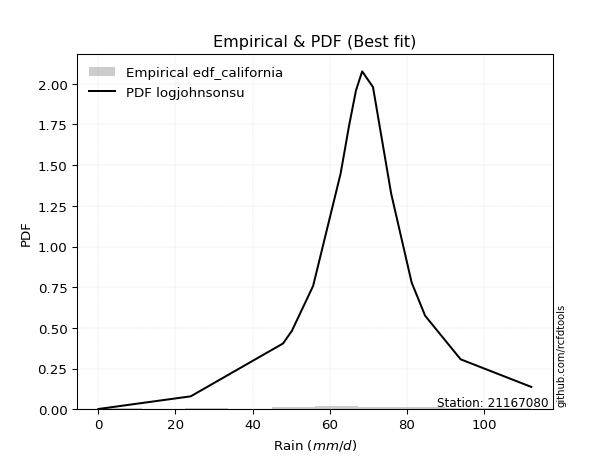</img>

</div>


### 2. Empirical - EDF Hazen (1930)

Hazen method for plotting positions is a formula used to estimate the empirical cumulative probability distribution of flood events or other hydrological data. This formula often results in biased estimations, particularly when extrapolating to extreme events (high return periods).

<div align="center">


$P=(m-0.5)/n$


</div>


**2.1. Empirical values**

<div align="center">

|                | 0                   | 1                  | 2                   | 3                   | 4                  | 5                   | 6                   | 7         | 8                  | 9                  | 10                | 11                 | 12                 | 13                 | 14                 |
|:---------------|:--------------------|:-------------------|:--------------------|:--------------------|:-------------------|:--------------------|:--------------------|:----------|:-------------------|:-------------------|:------------------|:-------------------|:-------------------|:-------------------|:-------------------|
| date           | 2019                | 2018               | 2014                | 2011                | 2013               | 2017                | 2006                | 2007      | 2016               | 2009               | 2008              | 2015               | 2005               | 2010               | 2012               |
| x              | 0.1                 | 24.0               | 47.9                | 50.2                | 55.7               | 62.8                | 64.0                | 65.0      | 68.4               | 71.2               | 75.9              | 81.2               | 84.7               | 93.9               | 112.2              |
| m              | 1                   | 2                  | 3                   | 4                   | 5                  | 6                   | 7                   | 8         | 9                  | 10                 | 11                | 12                 | 13                 | 14                 | 15                 |
| empirical_dist | edf_hazen           | edf_hazen          | edf_hazen           | edf_hazen           | edf_hazen          | edf_hazen           | edf_hazen           | edf_hazen | edf_hazen          | edf_hazen          | edf_hazen         | edf_hazen          | edf_hazen          | edf_hazen          | edf_hazen          |
| empirical      | 0.03333333333333333 | 0.1                | 0.16666666666666666 | 0.23333333333333334 | 0.3                | 0.36666666666666664 | 0.43333333333333335 | 0.5       | 0.5666666666666667 | 0.6333333333333333 | 0.7               | 0.7666666666666667 | 0.8333333333333334 | 0.9                | 0.9666666666666667 |
| empirical_tr   | 1.0344827586206897  | 1.1111111111111112 | 1.2                 | 1.3043478260869565  | 1.4285714285714286 | 1.5789473684210527  | 1.7647058823529411  | 2.0       | 2.3076923076923075 | 2.727272727272727  | 3.333333333333333 | 4.2857142857142865 | 6.000000000000002  | 10.000000000000002 | 30.000000000000007 |

</div>


**2.2. Kolmogorov-Smirnov fit test (sorted by Δ)**


<div align="center">

|                | 0                   | 1                   | 2                   | 3                   | 4                   | 5                   | 6                   | 7                   | 8                   | 9                   | 10                  | 11                  | 12                  | 13                  | 14                 | 15                  | 16                  | 17                  | 18                  | 19                  | 20                  | 21                  | 22                 | 23                  | 24                  | 25                  | 26                 | 27                  | 28                  | 29                  | 30                  | 31                 | 32                  | 33                  | 34                  | 35                  | 36                  | 37                  | 38                  | 39                 | 40                    | 41                 | 42                 | 43                  | 44                  | 45                  | 46                  | 47                 | 48                 | 49                 | 50                  | 51                  | 52                  | 53                  | 54                  | 55                 | 56                 | 57                  | 58                 | 59                  | 60                  | 61                 | 62                  | 63                 | 64                  | 65                 | 66                 | 67                 | 68                 | 69                 | 70                 | 71                 | 72                  | 73                 | 74                 | 75                 | 76                 | 77                 | 78                 | 79                 | 80                 | 81                 | 82                 | 83                 | 84                 | 85                 | 86                 | 87                 | 88                 | 89                 |
|:---------------|:--------------------|:--------------------|:--------------------|:--------------------|:--------------------|:--------------------|:--------------------|:--------------------|:--------------------|:--------------------|:--------------------|:--------------------|:--------------------|:--------------------|:-------------------|:--------------------|:--------------------|:--------------------|:--------------------|:--------------------|:--------------------|:--------------------|:-------------------|:--------------------|:--------------------|:--------------------|:-------------------|:--------------------|:--------------------|:--------------------|:--------------------|:-------------------|:--------------------|:--------------------|:--------------------|:--------------------|:--------------------|:--------------------|:--------------------|:-------------------|:----------------------|:-------------------|:-------------------|:--------------------|:--------------------|:--------------------|:--------------------|:-------------------|:-------------------|:-------------------|:--------------------|:--------------------|:--------------------|:--------------------|:--------------------|:-------------------|:-------------------|:--------------------|:-------------------|:--------------------|:--------------------|:-------------------|:--------------------|:-------------------|:--------------------|:-------------------|:-------------------|:-------------------|:-------------------|:-------------------|:-------------------|:-------------------|:--------------------|:-------------------|:-------------------|:-------------------|:-------------------|:-------------------|:-------------------|:-------------------|:-------------------|:-------------------|:-------------------|:-------------------|:-------------------|:-------------------|:-------------------|:-------------------|:-------------------|:-------------------|
| station        | 21167080            | 21167080            | 21167080            | 21167080            | 21167080            | 21167080            | 21167080            | 21167080            | 21167080            | 21167080            | 21167080            | 21167080            | 21167080            | 21167080            | 21167080           | 21167080            | 21167080            | 21167080            | 21167080            | 21167080            | 21167080            | 21167080            | 21167080           | 21167080            | 21167080            | 21167080            | 21167080           | 21167080            | 21167080            | 21167080            | 21167080            | 21167080           | 21167080            | 21167080            | 21167080            | 21167080            | 21167080            | 21167080            | 21167080            | 21167080           | 21167080              | 21167080           | 21167080           | 21167080            | 21167080            | 21167080            | 21167080            | 21167080           | 21167080           | 21167080           | 21167080            | 21167080            | 21167080            | 21167080            | 21167080            | 21167080           | 21167080           | 21167080            | 21167080           | 21167080            | 21167080            | 21167080           | 21167080            | 21167080           | 21167080            | 21167080           | 21167080           | 21167080           | 21167080           | 21167080           | 21167080           | 21167080           | 21167080            | 21167080           | 21167080           | 21167080           | 21167080           | 21167080           | 21167080           | 21167080           | 21167080           | 21167080           | 21167080           | 21167080           | 21167080           | 21167080           | 21167080           | 21167080           | 21167080           | 21167080           |
| empirical_dist | edf_hazen           | edf_hazen           | edf_hazen           | edf_hazen           | edf_hazen           | edf_hazen           | edf_hazen           | edf_hazen           | edf_hazen           | edf_hazen           | edf_hazen           | edf_hazen           | edf_hazen           | edf_hazen           | edf_hazen          | edf_hazen           | edf_hazen           | edf_hazen           | edf_hazen           | edf_hazen           | edf_hazen           | edf_hazen           | edf_hazen          | edf_hazen           | edf_hazen           | edf_hazen           | edf_hazen          | edf_hazen           | edf_hazen           | edf_hazen           | edf_hazen           | edf_hazen          | edf_hazen           | edf_hazen           | edf_hazen           | edf_hazen           | edf_hazen           | edf_hazen           | edf_hazen           | edf_hazen          | edf_hazen             | edf_hazen          | edf_hazen          | edf_hazen           | edf_hazen           | edf_hazen           | edf_hazen           | edf_hazen          | edf_hazen          | edf_hazen          | edf_hazen           | edf_hazen           | edf_hazen           | edf_hazen           | edf_hazen           | edf_hazen          | edf_hazen          | edf_hazen           | edf_hazen          | edf_hazen           | edf_hazen           | edf_hazen          | edf_hazen           | edf_hazen          | edf_hazen           | edf_hazen          | edf_hazen          | edf_hazen          | edf_hazen          | edf_hazen          | edf_hazen          | edf_hazen          | edf_hazen           | edf_hazen          | edf_hazen          | edf_hazen          | edf_hazen          | edf_hazen          | edf_hazen          | edf_hazen          | edf_hazen          | edf_hazen          | edf_hazen          | edf_hazen          | edf_hazen          | edf_hazen          | edf_hazen          | edf_hazen          | edf_hazen          | edf_hazen          |
| p_dist         | johnsonsu           | genlogistic         | mielke              | logjohnsonsu        | logt                | gumbel_l            | pearson3            | fisk                | weibull_min         | laplace_asymmetric  | laplace             | hypsecant           | logistic            | t                   | fatiguelife        | rice                | crystalball         | norm                | exponnorm           | nct                 | f                   | betaprime           | erlang             | gamma               | invgamma            | chi2                | invgauss           | maxwell             | rayleigh            | invweibull          | gumbel_r            | gompertz           | halfnorm            | moyal               | ncf                 | halflogistic        | kstwobign           | truncnorm           | logloggamma         | loggenlogistic     | loglaplace_asymmetric | wald               | loggumbel_l        | gibrat              | loggompertz         | logpearson3         | logtruncnorm        | logfatiguelife     | expon              | genexpon           | loglognorm          | lognakagami         | logrice             | logexponnorm        | logcrystalball      | lognorm            | lognorm            | lognct              | nakagami           | logbetaprime        | loglogistic         | loginvweibull      | loghypsecant        | logmielke          | loglaplace          | loginvgamma        | loginvgauss        | logmaxwell         | logkstwobign       | lograyleigh        | loggumbel_r        | loghalfnorm        | loggenexpon         | logmoyal           | loghalflogistic    | logexpon           | logncf             | logwald            | pareto             | logerlang          | logpareto          | loggibrat          | logf               | logweibull_min     | logalpha           | logfisk            | logchi2            | alpha              | loggamma           | loggamma           |
| delta          | 0.06243640842272391 | 0.07102508920110029 | 0.07345775411740052 | 0.07800003932628338 | 0.07921120102096701 | 0.08034307913856287 | 0.08329260818859174 | 0.08488428498042166 | 0.08755897365913759 | 0.09388270590781383 | 0.10679610643976617 | 0.11406414627396794 | 0.11585455573767922 | 0.11714270921537623 | 0.1173175065987731 | 0.11768017358867983 | 0.11795315758086933 | 0.11795315945565688 | 0.11795400654852017 | 0.11797510697977259 | 0.11912741003877131 | 0.12430288442032628 | 0.1279622553543739 | 0.13024707529136448 | 0.14137150388456826 | 0.14144690640548657 | 0.1497940231465474 | 0.15155074882520508 | 0.16287828310127156 | 0.17423334647472313 | 0.18770160375241957 | 0.1904524641523304 | 0.19478037489637617 | 0.21357879657084217 | 0.21721245516601276 | 0.21870458933257358 | 0.21883149080452444 | 0.24912613695287042 | 0.26110207877685077 | 0.2631836780740825 | 0.2682619291444356    | 0.2855956346348851 | 0.2962460922030784 | 0.30630348713180017 | 0.31564503663107335 | 0.32150381421896623 | 0.35647424280415274 | 0.3605242774417834 | 0.361077976537     | 0.3619342640930673 | 0.36220662873414755 | 0.36426461082344197 | 0.36487951808748165 | 0.36494885272009736 | 0.36494950566512374 | 0.3649495138207056 | 0.3649495138207056 | 0.36525206805959176 | 0.365527022907129  | 0.36602522100364954 | 0.36924499484893325 | 0.3703469976257755 | 0.37289764037063167 | 0.3753769318827661 | 0.38639792629398617 | 0.3890201956596052 | 0.3927179797126277 | 0.3964708569728561 | 0.4049674599560634 | 0.4067248664286577 | 0.4355476285256763 | 0.435619197618511  | 0.45015671586237926 | 0.460903706850481  | 0.462205648926756  | 0.4963779309877847 | 0.5295655942485308 | 0.5312911315619122 | 0.5322750565527181 | 0.5393011455457943 | 0.5534274440003729 | 0.5587264385415057 | 0.6335294011371315 | 0.6656209115865788 | 0.6805215278588261 | 0.6951848748208987 | 0.7352080832867035 | 0.8876576515365494 | 0.8976509295990666 | 0.8976509295990666 |
| deltao         | 0.3366456264050002  | 0.3366456264050002  | 0.3366456264050002  | 0.3366456264050002  | 0.3366456264050002  | 0.3366456264050002  | 0.3366456264050002  | 0.3366456264050002  | 0.3366456264050002  | 0.3366456264050002  | 0.3366456264050002  | 0.3366456264050002  | 0.3366456264050002  | 0.3366456264050002  | 0.3366456264050002 | 0.3366456264050002  | 0.3366456264050002  | 0.3366456264050002  | 0.3366456264050002  | 0.3366456264050002  | 0.3366456264050002  | 0.3366456264050002  | 0.3366456264050002 | 0.3366456264050002  | 0.3366456264050002  | 0.3366456264050002  | 0.3366456264050002 | 0.3366456264050002  | 0.3366456264050002  | 0.3366456264050002  | 0.3366456264050002  | 0.3366456264050002 | 0.3366456264050002  | 0.3366456264050002  | 0.3366456264050002  | 0.3366456264050002  | 0.3366456264050002  | 0.3366456264050002  | 0.3366456264050002  | 0.3366456264050002 | 0.3366456264050002    | 0.3366456264050002 | 0.3366456264050002 | 0.3366456264050002  | 0.3366456264050002  | 0.3366456264050002  | 0.3366456264050002  | 0.3366456264050002 | 0.3366456264050002 | 0.3366456264050002 | 0.3366456264050002  | 0.3366456264050002  | 0.3366456264050002  | 0.3366456264050002  | 0.3366456264050002  | 0.3366456264050002 | 0.3366456264050002 | 0.3366456264050002  | 0.3366456264050002 | 0.3366456264050002  | 0.3366456264050002  | 0.3366456264050002 | 0.3366456264050002  | 0.3366456264050002 | 0.3366456264050002  | 0.3366456264050002 | 0.3366456264050002 | 0.3366456264050002 | 0.3366456264050002 | 0.3366456264050002 | 0.3366456264050002 | 0.3366456264050002 | 0.3366456264050002  | 0.3366456264050002 | 0.3366456264050002 | 0.3366456264050002 | 0.3366456264050002 | 0.3366456264050002 | 0.3366456264050002 | 0.3366456264050002 | 0.3366456264050002 | 0.3366456264050002 | 0.3366456264050002 | 0.3366456264050002 | 0.3366456264050002 | 0.3366456264050002 | 0.3366456264050002 | 0.3366456264050002 | 0.3366456264050002 | 0.3366456264050002 |
| eval           | Δo > Δ              | Δo > Δ              | Δo > Δ              | Δo > Δ              | Δo > Δ              | Δo > Δ              | Δo > Δ              | Δo > Δ              | Δo > Δ              | Δo > Δ              | Δo > Δ              | Δo > Δ              | Δo > Δ              | Δo > Δ              | Δo > Δ             | Δo > Δ              | Δo > Δ              | Δo > Δ              | Δo > Δ              | Δo > Δ              | Δo > Δ              | Δo > Δ              | Δo > Δ             | Δo > Δ              | Δo > Δ              | Δo > Δ              | Δo > Δ             | Δo > Δ              | Δo > Δ              | Δo > Δ              | Δo > Δ              | Δo > Δ             | Δo > Δ              | Δo > Δ              | Δo > Δ              | Δo > Δ              | Δo > Δ              | Δo > Δ              | Δo > Δ              | Δo > Δ             | Δo > Δ                | Δo > Δ             | Δo > Δ             | Δo > Δ              | Δo > Δ              | Δo > Δ              | Δo <= Δ             | Δo <= Δ            | Δo <= Δ            | Δo <= Δ            | Δo <= Δ             | Δo <= Δ             | Δo <= Δ             | Δo <= Δ             | Δo <= Δ             | Δo <= Δ            | Δo <= Δ            | Δo <= Δ             | Δo <= Δ            | Δo <= Δ             | Δo <= Δ             | Δo <= Δ            | Δo <= Δ             | Δo <= Δ            | Δo <= Δ             | Δo <= Δ            | Δo <= Δ            | Δo <= Δ            | Δo <= Δ            | Δo <= Δ            | Δo <= Δ            | Δo <= Δ            | Δo <= Δ             | Δo <= Δ            | Δo <= Δ            | Δo <= Δ            | Δo <= Δ            | Δo <= Δ            | Δo <= Δ            | Δo <= Δ            | Δo <= Δ            | Δo <= Δ            | Δo <= Δ            | Δo <= Δ            | Δo <= Δ            | Δo <= Δ            | Δo <= Δ            | Δo <= Δ            | Δo <= Δ            | Δo <= Δ            |
| fit            | 1                   | 1                   | 1                   | 1                   | 1                   | 1                   | 1                   | 1                   | 1                   | 1                   | 1                   | 1                   | 1                   | 1                   | 1                  | 1                   | 1                   | 1                   | 1                   | 1                   | 1                   | 1                   | 1                  | 1                   | 1                   | 1                   | 1                  | 1                   | 1                   | 1                   | 1                   | 1                  | 1                   | 1                   | 1                   | 1                   | 1                   | 1                   | 1                   | 1                  | 1                     | 1                  | 1                  | 1                   | 1                   | 1                   | 0                   | 0                  | 0                  | 0                  | 0                   | 0                   | 0                   | 0                   | 0                   | 0                  | 0                  | 0                   | 0                  | 0                   | 0                   | 0                  | 0                   | 0                  | 0                   | 0                  | 0                  | 0                  | 0                  | 0                  | 0                  | 0                  | 0                   | 0                  | 0                  | 0                  | 0                  | 0                  | 0                  | 0                  | 0                  | 0                  | 0                  | 0                  | 0                  | 0                  | 0                  | 0                  | 0                  | 0                  |
| n              | 15                  | 15                  | 15                  | 15                  | 15                  | 15                  | 15                  | 15                  | 15                  | 15                  | 15                  | 15                  | 15                  | 15                  | 15                 | 15                  | 15                  | 15                  | 15                  | 15                  | 15                  | 15                  | 15                 | 15                  | 15                  | 15                  | 15                 | 15                  | 15                  | 15                  | 15                  | 15                 | 15                  | 15                  | 15                  | 15                  | 15                  | 15                  | 15                  | 15                 | 15                    | 15                 | 15                 | 15                  | 15                  | 15                  | 15                  | 15                 | 15                 | 15                 | 15                  | 15                  | 15                  | 15                  | 15                  | 15                 | 15                 | 15                  | 15                 | 15                  | 15                  | 15                 | 15                  | 15                 | 15                  | 15                 | 15                 | 15                 | 15                 | 15                 | 15                 | 15                 | 15                  | 15                 | 15                 | 15                 | 15                 | 15                 | 15                 | 15                 | 15                 | 15                 | 15                 | 15                 | 15                 | 15                 | 15                 | 15                 | 15                 | 15                 |
| best_fit       | 1                   | 0                   | 0                   | 0                   | 0                   | 0                   | 0                   | 0                   | 0                   | 0                   | 0                   | 0                   | 0                   | 0                   | 0                  | 0                   | 0                   | 0                   | 0                   | 0                   | 0                   | 0                   | 0                  | 0                   | 0                   | 0                   | 0                  | 0                   | 0                   | 0                   | 0                   | 0                  | 0                   | 0                   | 0                   | 0                   | 0                   | 0                   | 0                   | 0                  | 0                     | 0                  | 0                  | 0                   | 0                   | 0                   | 0                   | 0                  | 0                  | 0                  | 0                   | 0                   | 0                   | 0                   | 0                   | 0                  | 0                  | 0                   | 0                  | 0                   | 0                   | 0                  | 0                   | 0                  | 0                   | 0                  | 0                  | 0                  | 0                  | 0                  | 0                  | 0                  | 0                   | 0                  | 0                  | 0                  | 0                  | 0                  | 0                  | 0                  | 0                  | 0                  | 0                  | 0                  | 0                  | 0                  | 0                  | 0                  | 0                  | 0                  |
| best_fit_sort  | 1                   | 2                   | 3                   | 4                   | 5                   | 6                   | 7                   | 8                   | 9                   | 10                  | 11                  | 12                  | 13                  | 14                  | 15                 | 16                  | 17                  | 18                  | 19                  | 20                  | 21                  | 22                  | 23                 | 24                  | 25                  | 26                  | 27                 | 28                  | 29                  | 30                  | 31                  | 32                 | 33                  | 34                  | 35                  | 36                  | 37                  | 38                  | 39                  | 40                 | 41                    | 42                 | 43                 | 44                  | 45                  | 46                  | 47                  | 48                 | 49                 | 50                 | 51                  | 52                  | 53                  | 54                  | 55                  | 56                 | 57                 | 58                  | 59                 | 60                  | 61                  | 62                 | 63                  | 64                 | 65                  | 66                 | 67                 | 68                 | 69                 | 70                 | 71                 | 72                 | 73                  | 74                 | 75                 | 76                 | 77                 | 78                 | 79                 | 80                 | 81                 | 82                 | 83                 | 84                 | 85                 | 86                 | 87                 | 88                 | 89                 | 90                 |

</div>


<div align="center">

</img>

</div>


**2.3. Best fit**

<div align="center">

|   id |   station | empirical_dist   | p_dist    |     delta |   deltao | eval   |   fit |   n |   best_fit |   best_fit_sort |
|-----:|----------:|:-----------------|:----------|----------:|---------:|:-------|------:|----:|-----------:|----------------:|
|    0 |  21167080 | edf_hazen        | johnsonsu | 0.0624364 | 0.336646 | Δo > Δ |     1 |  15 |          1 |               1 |

</div>


<div align="center">

</img></img>

</div>


### 3. Empirical - EDF Weibull (1939)

Weibull plotting position formula is an empirical method used to estimate the non-exceedance probability or plotting position for a set of observed data, is often recommended or widely used in practice, particularly in flood frequency analysis.

<div align="center">


$P=m/(n+1)$


</div>


**3.1. Empirical values**

<div align="center">

|                | 0                  | 1                  | 2                  | 3                  | 4                  | 5           | 6                  | 7           | 8                  | 9                  | 10          | 11          | 12                | 13          | 14          |
|:---------------|:-------------------|:-------------------|:-------------------|:-------------------|:-------------------|:------------|:-------------------|:------------|:-------------------|:-------------------|:------------|:------------|:------------------|:------------|:------------|
| date           | 2019               | 2018               | 2014               | 2011               | 2013               | 2017        | 2006               | 2007        | 2016               | 2009               | 2008        | 2015        | 2005              | 2010        | 2012        |
| x              | 0.1                | 24.0               | 47.9               | 50.2               | 55.7               | 62.8        | 64.0               | 65.0        | 68.4               | 71.2               | 75.9        | 81.2        | 84.7              | 93.9        | 112.2       |
| m              | 1                  | 2                  | 3                  | 4                  | 5                  | 6           | 7                  | 8           | 9                  | 10                 | 11          | 12          | 13                | 14          | 15          |
| empirical_dist | edf_weibull        | edf_weibull        | edf_weibull        | edf_weibull        | edf_weibull        | edf_weibull | edf_weibull        | edf_weibull | edf_weibull        | edf_weibull        | edf_weibull | edf_weibull | edf_weibull       | edf_weibull | edf_weibull |
| empirical      | 0.0625             | 0.125              | 0.1875             | 0.25               | 0.3125             | 0.375       | 0.4375             | 0.5         | 0.5625             | 0.625              | 0.6875      | 0.75        | 0.8125            | 0.875       | 0.9375      |
| empirical_tr   | 1.0666666666666667 | 1.1428571428571428 | 1.2307692307692308 | 1.3333333333333333 | 1.4545454545454546 | 1.6         | 1.7777777777777777 | 2.0         | 2.2857142857142856 | 2.6666666666666665 | 3.2         | 4.0         | 5.333333333333333 | 8.0         | 16.0        |

</div>


**3.2. Kolmogorov-Smirnov fit test (sorted by Δ)**


<div align="center">

|                | 0                   | 1                    | 2                   | 3                   | 4                  | 5                   | 6                   | 7                  | 8                  | 9                   | 10                  | 11                  | 12                  | 13                  | 14                  | 15                  | 16                  | 17                  | 18                  | 19                  | 20                  | 21                  | 22                  | 23                  | 24                 | 25                 | 26                 | 27                  | 28                 | 29                 | 30                 | 31                  | 32                  | 33                 | 34                 | 35                  | 36                  | 37                  | 38                  | 39                  | 40                    | 41                  | 42                 | 43                 | 44                 | 45                 | 46                  | 47                 | 48                  | 49                 | 50                 | 51                 | 52                 | 53                 | 54                  | 55                  | 56                  | 57                 | 58                  | 59                  | 60                  | 61                 | 62                 | 63                 | 64                 | 65                  | 66                 | 67                  | 68                  | 69                 | 70                  | 71                 | 72                 | 73                 | 74                 | 75                 | 76                 | 77                 | 78                 | 79                 | 80                 | 81                 | 82                 | 83                 | 84                 | 85                 | 86                 | 87                 | 88                 | 89                 |
|:---------------|:--------------------|:---------------------|:--------------------|:--------------------|:-------------------|:--------------------|:--------------------|:-------------------|:-------------------|:--------------------|:--------------------|:--------------------|:--------------------|:--------------------|:--------------------|:--------------------|:--------------------|:--------------------|:--------------------|:--------------------|:--------------------|:--------------------|:--------------------|:--------------------|:-------------------|:-------------------|:-------------------|:--------------------|:-------------------|:-------------------|:-------------------|:--------------------|:--------------------|:-------------------|:-------------------|:--------------------|:--------------------|:--------------------|:--------------------|:--------------------|:----------------------|:--------------------|:-------------------|:-------------------|:-------------------|:-------------------|:--------------------|:-------------------|:--------------------|:-------------------|:-------------------|:-------------------|:-------------------|:-------------------|:--------------------|:--------------------|:--------------------|:-------------------|:--------------------|:--------------------|:--------------------|:-------------------|:-------------------|:-------------------|:-------------------|:--------------------|:-------------------|:--------------------|:--------------------|:-------------------|:--------------------|:-------------------|:-------------------|:-------------------|:-------------------|:-------------------|:-------------------|:-------------------|:-------------------|:-------------------|:-------------------|:-------------------|:-------------------|:-------------------|:-------------------|:-------------------|:-------------------|:-------------------|:-------------------|:-------------------|
| station        | 21167080            | 21167080             | 21167080            | 21167080            | 21167080           | 21167080            | 21167080            | 21167080           | 21167080           | 21167080            | 21167080            | 21167080            | 21167080            | 21167080            | 21167080            | 21167080            | 21167080            | 21167080            | 21167080            | 21167080            | 21167080            | 21167080            | 21167080            | 21167080            | 21167080           | 21167080           | 21167080           | 21167080            | 21167080           | 21167080           | 21167080           | 21167080            | 21167080            | 21167080           | 21167080           | 21167080            | 21167080            | 21167080            | 21167080            | 21167080            | 21167080              | 21167080            | 21167080           | 21167080           | 21167080           | 21167080           | 21167080            | 21167080           | 21167080            | 21167080           | 21167080           | 21167080           | 21167080           | 21167080           | 21167080            | 21167080            | 21167080            | 21167080           | 21167080            | 21167080            | 21167080            | 21167080           | 21167080           | 21167080           | 21167080           | 21167080            | 21167080           | 21167080            | 21167080            | 21167080           | 21167080            | 21167080           | 21167080           | 21167080           | 21167080           | 21167080           | 21167080           | 21167080           | 21167080           | 21167080           | 21167080           | 21167080           | 21167080           | 21167080           | 21167080           | 21167080           | 21167080           | 21167080           | 21167080           | 21167080           |
| empirical_dist | edf_weibull         | edf_weibull          | edf_weibull         | edf_weibull         | edf_weibull        | edf_weibull         | edf_weibull         | edf_weibull        | edf_weibull        | edf_weibull         | edf_weibull         | edf_weibull         | edf_weibull         | edf_weibull         | edf_weibull         | edf_weibull         | edf_weibull         | edf_weibull         | edf_weibull         | edf_weibull         | edf_weibull         | edf_weibull         | edf_weibull         | edf_weibull         | edf_weibull        | edf_weibull        | edf_weibull        | edf_weibull         | edf_weibull        | edf_weibull        | edf_weibull        | edf_weibull         | edf_weibull         | edf_weibull        | edf_weibull        | edf_weibull         | edf_weibull         | edf_weibull         | edf_weibull         | edf_weibull         | edf_weibull           | edf_weibull         | edf_weibull        | edf_weibull        | edf_weibull        | edf_weibull        | edf_weibull         | edf_weibull        | edf_weibull         | edf_weibull        | edf_weibull        | edf_weibull        | edf_weibull        | edf_weibull        | edf_weibull         | edf_weibull         | edf_weibull         | edf_weibull        | edf_weibull         | edf_weibull         | edf_weibull         | edf_weibull        | edf_weibull        | edf_weibull        | edf_weibull        | edf_weibull         | edf_weibull        | edf_weibull         | edf_weibull         | edf_weibull        | edf_weibull         | edf_weibull        | edf_weibull        | edf_weibull        | edf_weibull        | edf_weibull        | edf_weibull        | edf_weibull        | edf_weibull        | edf_weibull        | edf_weibull        | edf_weibull        | edf_weibull        | edf_weibull        | edf_weibull        | edf_weibull        | edf_weibull        | edf_weibull        | edf_weibull        | edf_weibull        |
| p_dist         | logjohnsonsu        | johnsonsu            | genlogistic         | mielke              | pearson3           | gumbel_l            | weibull_min         | fisk               | logt               | laplace_asymmetric  | laplace             | hypsecant           | logistic            | t                   | fatiguelife         | rice                | crystalball         | norm                | exponnorm           | nct                 | f                   | betaprime           | erlang              | gamma               | invgamma           | chi2               | invgauss           | maxwell             | invweibull         | rayleigh           | gumbel_r           | halfnorm            | ncf                 | kstwobign          | moyal              | gompertz            | halflogistic        | truncnorm           | logloggamma         | loggenlogistic      | loglaplace_asymmetric | loggumbel_l         | wald               | loggompertz        | logpearson3        | gibrat             | logtruncnorm        | logfatiguelife     | expon               | genexpon           | loglognorm         | lognakagami        | logrice            | logexponnorm       | logcrystalball      | lognorm             | lognorm             | lognct             | nakagami            | logbetaprime        | logmielke           | loglogistic        | loginvweibull      | loghypsecant       | loglaplace         | loginvgamma         | loginvgauss        | logmaxwell          | logkstwobign        | lograyleigh        | loggumbel_r         | loghalfnorm        | loggenexpon        | logmoyal           | loghalflogistic    | logexpon           | logncf             | pareto             | logwald            | logerlang          | logpareto          | loggibrat          | logf               | logweibull_min     | logalpha           | logfisk            | logchi2            | alpha              | loggamma           | loggamma           |
| delta          | 0.05716670599295004 | 0.057719687796659494 | 0.06269175586776693 | 0.06512442078406716 | 0.0678829202273239 | 0.07200974580522956 | 0.07402948142299914 | 0.0765509516470883 | 0.0821856843591443 | 0.08554937257448048 | 0.09846277310643281 | 0.10573081294063458 | 0.10752122240434586 | 0.10880937588204287 | 0.10898417326543974 | 0.10934684025534647 | 0.10961982424753597 | 0.10961982612232352 | 0.10962067321518681 | 0.10964177364643923 | 0.11079407670543795 | 0.11596955108699292 | 0.11962892202104053 | 0.12191374195803112 | 0.1330381705512349 | 0.1331135730721532 | 0.1400912156957288 | 0.14321741549187172 | 0.1534000131413898 | 0.1545449497679382 | 0.1793682704190862 | 0.18644704156304281 | 0.19637912183267942 | 0.1979981574711911 | 0.2052454632375088 | 0.20711913081899705 | 0.21037125599924023 | 0.22829280361953708 | 0.24026874544351745 | 0.24235034474074912 | 0.24742859581110227   | 0.27541275886974503 | 0.2772623013015517 | 0.29481170329774   | 0.2965038142189662 | 0.2979701537984668 | 0.33564090947081937 | 0.33969094410845   | 0.34024464320366665 | 0.3411009307597339 | 0.3413732954008142 | 0.3434312774901086 | 0.3440461847541483 | 0.344115519386764  | 0.34411617233179037 | 0.34411618048737225 | 0.34411618048737225 | 0.3444187347262584 | 0.34469368957379565 | 0.34519188767031617 | 0.34621026521609943 | 0.3484116615155999 | 0.3495136642924421 | 0.3520643070372983 | 0.3655645929606528 | 0.36818686232627185 | 0.3718846463792943 | 0.37563752363952274 | 0.38413412662273005 | 0.3858915330953243 | 0.41471429519234293 | 0.4147858642851776 | 0.4293233825290459 | 0.4400703735171476 | 0.4413723155934226 | 0.4713779309877847 | 0.5045655942485308 | 0.5072750565527181 | 0.5104577982285788 | 0.5143011455457943 | 0.5284274440003729 | 0.5378931052081724 | 0.6085294011371315 | 0.6406209115865787 | 0.6555215278588261 | 0.6701848748208987 | 0.7102080832867035 | 0.8626576515365494 | 0.8726509295990665 | 0.8726509295990665 |
| deltao         | 0.3366456264050002  | 0.3366456264050002   | 0.3366456264050002  | 0.3366456264050002  | 0.3366456264050002 | 0.3366456264050002  | 0.3366456264050002  | 0.3366456264050002 | 0.3366456264050002 | 0.3366456264050002  | 0.3366456264050002  | 0.3366456264050002  | 0.3366456264050002  | 0.3366456264050002  | 0.3366456264050002  | 0.3366456264050002  | 0.3366456264050002  | 0.3366456264050002  | 0.3366456264050002  | 0.3366456264050002  | 0.3366456264050002  | 0.3366456264050002  | 0.3366456264050002  | 0.3366456264050002  | 0.3366456264050002 | 0.3366456264050002 | 0.3366456264050002 | 0.3366456264050002  | 0.3366456264050002 | 0.3366456264050002 | 0.3366456264050002 | 0.3366456264050002  | 0.3366456264050002  | 0.3366456264050002 | 0.3366456264050002 | 0.3366456264050002  | 0.3366456264050002  | 0.3366456264050002  | 0.3366456264050002  | 0.3366456264050002  | 0.3366456264050002    | 0.3366456264050002  | 0.3366456264050002 | 0.3366456264050002 | 0.3366456264050002 | 0.3366456264050002 | 0.3366456264050002  | 0.3366456264050002 | 0.3366456264050002  | 0.3366456264050002 | 0.3366456264050002 | 0.3366456264050002 | 0.3366456264050002 | 0.3366456264050002 | 0.3366456264050002  | 0.3366456264050002  | 0.3366456264050002  | 0.3366456264050002 | 0.3366456264050002  | 0.3366456264050002  | 0.3366456264050002  | 0.3366456264050002 | 0.3366456264050002 | 0.3366456264050002 | 0.3366456264050002 | 0.3366456264050002  | 0.3366456264050002 | 0.3366456264050002  | 0.3366456264050002  | 0.3366456264050002 | 0.3366456264050002  | 0.3366456264050002 | 0.3366456264050002 | 0.3366456264050002 | 0.3366456264050002 | 0.3366456264050002 | 0.3366456264050002 | 0.3366456264050002 | 0.3366456264050002 | 0.3366456264050002 | 0.3366456264050002 | 0.3366456264050002 | 0.3366456264050002 | 0.3366456264050002 | 0.3366456264050002 | 0.3366456264050002 | 0.3366456264050002 | 0.3366456264050002 | 0.3366456264050002 | 0.3366456264050002 |
| eval           | Δo > Δ              | Δo > Δ               | Δo > Δ              | Δo > Δ              | Δo > Δ             | Δo > Δ              | Δo > Δ              | Δo > Δ             | Δo > Δ             | Δo > Δ              | Δo > Δ              | Δo > Δ              | Δo > Δ              | Δo > Δ              | Δo > Δ              | Δo > Δ              | Δo > Δ              | Δo > Δ              | Δo > Δ              | Δo > Δ              | Δo > Δ              | Δo > Δ              | Δo > Δ              | Δo > Δ              | Δo > Δ             | Δo > Δ             | Δo > Δ             | Δo > Δ              | Δo > Δ             | Δo > Δ             | Δo > Δ             | Δo > Δ              | Δo > Δ              | Δo > Δ             | Δo > Δ             | Δo > Δ              | Δo > Δ              | Δo > Δ              | Δo > Δ              | Δo > Δ              | Δo > Δ                | Δo > Δ              | Δo > Δ             | Δo > Δ             | Δo > Δ             | Δo > Δ             | Δo > Δ              | Δo <= Δ            | Δo <= Δ             | Δo <= Δ            | Δo <= Δ            | Δo <= Δ            | Δo <= Δ            | Δo <= Δ            | Δo <= Δ             | Δo <= Δ             | Δo <= Δ             | Δo <= Δ            | Δo <= Δ             | Δo <= Δ             | Δo <= Δ             | Δo <= Δ            | Δo <= Δ            | Δo <= Δ            | Δo <= Δ            | Δo <= Δ             | Δo <= Δ            | Δo <= Δ             | Δo <= Δ             | Δo <= Δ            | Δo <= Δ             | Δo <= Δ            | Δo <= Δ            | Δo <= Δ            | Δo <= Δ            | Δo <= Δ            | Δo <= Δ            | Δo <= Δ            | Δo <= Δ            | Δo <= Δ            | Δo <= Δ            | Δo <= Δ            | Δo <= Δ            | Δo <= Δ            | Δo <= Δ            | Δo <= Δ            | Δo <= Δ            | Δo <= Δ            | Δo <= Δ            | Δo <= Δ            |
| fit            | 1                   | 1                    | 1                   | 1                   | 1                  | 1                   | 1                   | 1                  | 1                  | 1                   | 1                   | 1                   | 1                   | 1                   | 1                   | 1                   | 1                   | 1                   | 1                   | 1                   | 1                   | 1                   | 1                   | 1                   | 1                  | 1                  | 1                  | 1                   | 1                  | 1                  | 1                  | 1                   | 1                   | 1                  | 1                  | 1                   | 1                   | 1                   | 1                   | 1                   | 1                     | 1                   | 1                  | 1                  | 1                  | 1                  | 1                   | 0                  | 0                   | 0                  | 0                  | 0                  | 0                  | 0                  | 0                   | 0                   | 0                   | 0                  | 0                   | 0                   | 0                   | 0                  | 0                  | 0                  | 0                  | 0                   | 0                  | 0                   | 0                   | 0                  | 0                   | 0                  | 0                  | 0                  | 0                  | 0                  | 0                  | 0                  | 0                  | 0                  | 0                  | 0                  | 0                  | 0                  | 0                  | 0                  | 0                  | 0                  | 0                  | 0                  |
| n              | 15                  | 15                   | 15                  | 15                  | 15                 | 15                  | 15                  | 15                 | 15                 | 15                  | 15                  | 15                  | 15                  | 15                  | 15                  | 15                  | 15                  | 15                  | 15                  | 15                  | 15                  | 15                  | 15                  | 15                  | 15                 | 15                 | 15                 | 15                  | 15                 | 15                 | 15                 | 15                  | 15                  | 15                 | 15                 | 15                  | 15                  | 15                  | 15                  | 15                  | 15                    | 15                  | 15                 | 15                 | 15                 | 15                 | 15                  | 15                 | 15                  | 15                 | 15                 | 15                 | 15                 | 15                 | 15                  | 15                  | 15                  | 15                 | 15                  | 15                  | 15                  | 15                 | 15                 | 15                 | 15                 | 15                  | 15                 | 15                  | 15                  | 15                 | 15                  | 15                 | 15                 | 15                 | 15                 | 15                 | 15                 | 15                 | 15                 | 15                 | 15                 | 15                 | 15                 | 15                 | 15                 | 15                 | 15                 | 15                 | 15                 | 15                 |
| best_fit       | 1                   | 0                    | 0                   | 0                   | 0                  | 0                   | 0                   | 0                  | 0                  | 0                   | 0                   | 0                   | 0                   | 0                   | 0                   | 0                   | 0                   | 0                   | 0                   | 0                   | 0                   | 0                   | 0                   | 0                   | 0                  | 0                  | 0                  | 0                   | 0                  | 0                  | 0                  | 0                   | 0                   | 0                  | 0                  | 0                   | 0                   | 0                   | 0                   | 0                   | 0                     | 0                   | 0                  | 0                  | 0                  | 0                  | 0                   | 0                  | 0                   | 0                  | 0                  | 0                  | 0                  | 0                  | 0                   | 0                   | 0                   | 0                  | 0                   | 0                   | 0                   | 0                  | 0                  | 0                  | 0                  | 0                   | 0                  | 0                   | 0                   | 0                  | 0                   | 0                  | 0                  | 0                  | 0                  | 0                  | 0                  | 0                  | 0                  | 0                  | 0                  | 0                  | 0                  | 0                  | 0                  | 0                  | 0                  | 0                  | 0                  | 0                  |
| best_fit_sort  | 1                   | 2                    | 3                   | 4                   | 5                  | 6                   | 7                   | 8                  | 9                  | 10                  | 11                  | 12                  | 13                  | 14                  | 15                  | 16                  | 17                  | 18                  | 19                  | 20                  | 21                  | 22                  | 23                  | 24                  | 25                 | 26                 | 27                 | 28                  | 29                 | 30                 | 31                 | 32                  | 33                  | 34                 | 35                 | 36                  | 37                  | 38                  | 39                  | 40                  | 41                    | 42                  | 43                 | 44                 | 45                 | 46                 | 47                  | 48                 | 49                  | 50                 | 51                 | 52                 | 53                 | 54                 | 55                  | 56                  | 57                  | 58                 | 59                  | 60                  | 61                  | 62                 | 63                 | 64                 | 65                 | 66                  | 67                 | 68                  | 69                  | 70                 | 71                  | 72                 | 73                 | 74                 | 75                 | 76                 | 77                 | 78                 | 79                 | 80                 | 81                 | 82                 | 83                 | 84                 | 85                 | 86                 | 87                 | 88                 | 89                 | 90                 |

</div>


<div align="center">

</img>

</div>


**3.3. Best fit**

<div align="center">

|   id |   station | empirical_dist   | p_dist       |     delta |   deltao | eval   |   fit |   n |   best_fit |   best_fit_sort |
|-----:|----------:|:-----------------|:-------------|----------:|---------:|:-------|------:|----:|-----------:|----------------:|
|    0 |  21167080 | edf_weibull      | logjohnsonsu | 0.0571667 | 0.336646 | Δo > Δ |     1 |  15 |          1 |               1 |

</div>


<div align="center">

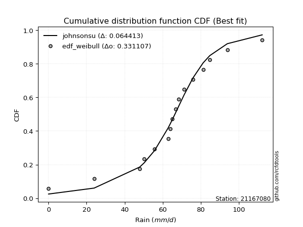</img>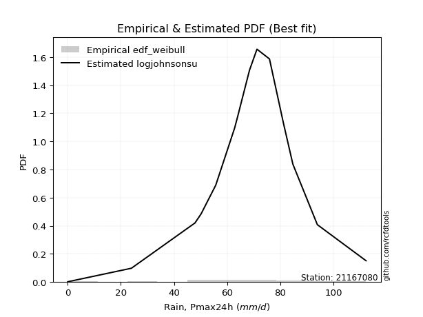</img>

</div>


### 4. Empirical - EDF Beard (1943)

The Beard formula (or Beard´s plotting position formula) in hydrology is used to estimate the empirical non-exceedance probability _(P)_ of a flood event (or other extreme hydrological data point) within a given dataset.

<div align="center">


$P=(m-0.31)/(n+0.38)$


</div>


**4.1. Empirical values**

<div align="center">

|                | 0                   | 1                   | 2                   | 3                   | 4                  | 5                   | 6                   | 7         | 8                  | 9                  | 10                 | 11                | 12                 | 13                 | 14                 |
|:---------------|:--------------------|:--------------------|:--------------------|:--------------------|:-------------------|:--------------------|:--------------------|:----------|:-------------------|:-------------------|:-------------------|:------------------|:-------------------|:-------------------|:-------------------|
| date           | 2019                | 2018                | 2014                | 2011                | 2013               | 2017                | 2006                | 2007      | 2016               | 2009               | 2008               | 2015              | 2005               | 2010               | 2012               |
| x              | 0.1                 | 24.0                | 47.9                | 50.2                | 55.7               | 62.8                | 64.0                | 65.0      | 68.4               | 71.2               | 75.9               | 81.2              | 84.7               | 93.9               | 112.2              |
| m              | 1                   | 2                   | 3                   | 4                   | 5                  | 6                   | 7                   | 8         | 9                  | 10                 | 11                 | 12                | 13                 | 14                 | 15                 |
| empirical_dist | edf_beard           | edf_beard           | edf_beard           | edf_beard           | edf_beard          | edf_beard           | edf_beard           | edf_beard | edf_beard          | edf_beard          | edf_beard          | edf_beard         | edf_beard          | edf_beard          | edf_beard          |
| empirical      | 0.04486345903771131 | 0.10988296488946683 | 0.17490247074122237 | 0.23992197659297787 | 0.3049414824447334 | 0.36996098829648894 | 0.43498049414824447 | 0.5       | 0.5650195058517554 | 0.630039011703511  | 0.6950585175552665 | 0.760078023407022 | 0.8250975292587776 | 0.8901170351105331 | 0.9551365409622886 |
| empirical_tr   | 1.0469707283866576  | 1.1234477720964207  | 1.2119779353821907  | 1.3156544054747648  | 1.4387277829747427 | 1.587203302373581   | 1.7698504027617952  | 2.0       | 2.298953662182361  | 2.7029876977152894 | 3.279317697228144  | 4.168021680216801 | 5.717472118959106  | 9.100591715976325  | 22.289855072463734 |

</div>


**4.2. Kolmogorov-Smirnov fit test (sorted by Δ)**


<div align="center">

|                | 0                    | 1                  | 2                   | 3                   | 4                   | 5                   | 6                   | 7                   | 8                   | 9                   | 10                  | 11                  | 12                  | 13                  | 14                  | 15                  | 16                  | 17                  | 18                  | 19                 | 20                  | 21                  | 22                 | 23                  | 24                  | 25                  | 26                  | 27                 | 28                  | 29                  | 30                  | 31                  | 32                  | 33                  | 34                  | 35                  | 36                 | 37                 | 38                  | 39                 | 40                    | 41                 | 42                 | 43                 | 44                  | 45                 | 46                  | 47                 | 48                 | 49                 | 50                  | 51                  | 52                  | 53                  | 54                  | 55                 | 56                 | 57                  | 58                 | 59                  | 60                  | 61                 | 62                  | 63                  | 64                  | 65                 | 66                  | 67                 | 68                 | 69                 | 70                 | 71                  | 72                  | 73                 | 74                  | 75                 | 76                 | 77                 | 78                 | 79                 | 80                 | 81                 | 82                 | 83                 | 84                 | 85                 | 86                 | 87                 | 88                 | 89                 |
|:---------------|:---------------------|:-------------------|:--------------------|:--------------------|:--------------------|:--------------------|:--------------------|:--------------------|:--------------------|:--------------------|:--------------------|:--------------------|:--------------------|:--------------------|:--------------------|:--------------------|:--------------------|:--------------------|:--------------------|:-------------------|:--------------------|:--------------------|:-------------------|:--------------------|:--------------------|:--------------------|:--------------------|:-------------------|:--------------------|:--------------------|:--------------------|:--------------------|:--------------------|:--------------------|:--------------------|:--------------------|:-------------------|:-------------------|:--------------------|:-------------------|:----------------------|:-------------------|:-------------------|:-------------------|:--------------------|:-------------------|:--------------------|:-------------------|:-------------------|:-------------------|:--------------------|:--------------------|:--------------------|:--------------------|:--------------------|:-------------------|:-------------------|:--------------------|:-------------------|:--------------------|:--------------------|:-------------------|:--------------------|:--------------------|:--------------------|:-------------------|:--------------------|:-------------------|:-------------------|:-------------------|:-------------------|:--------------------|:--------------------|:-------------------|:--------------------|:-------------------|:-------------------|:-------------------|:-------------------|:-------------------|:-------------------|:-------------------|:-------------------|:-------------------|:-------------------|:-------------------|:-------------------|:-------------------|:-------------------|:-------------------|
| station        | 21167080             | 21167080           | 21167080            | 21167080            | 21167080            | 21167080            | 21167080            | 21167080            | 21167080            | 21167080            | 21167080            | 21167080            | 21167080            | 21167080            | 21167080            | 21167080            | 21167080            | 21167080            | 21167080            | 21167080           | 21167080            | 21167080            | 21167080           | 21167080            | 21167080            | 21167080            | 21167080            | 21167080           | 21167080            | 21167080            | 21167080            | 21167080            | 21167080            | 21167080            | 21167080            | 21167080            | 21167080           | 21167080           | 21167080            | 21167080           | 21167080              | 21167080           | 21167080           | 21167080           | 21167080            | 21167080           | 21167080            | 21167080           | 21167080           | 21167080           | 21167080            | 21167080            | 21167080            | 21167080            | 21167080            | 21167080           | 21167080           | 21167080            | 21167080           | 21167080            | 21167080            | 21167080           | 21167080            | 21167080            | 21167080            | 21167080           | 21167080            | 21167080           | 21167080           | 21167080           | 21167080           | 21167080            | 21167080            | 21167080           | 21167080            | 21167080           | 21167080           | 21167080           | 21167080           | 21167080           | 21167080           | 21167080           | 21167080           | 21167080           | 21167080           | 21167080           | 21167080           | 21167080           | 21167080           | 21167080           |
| empirical_dist | edf_beard            | edf_beard          | edf_beard           | edf_beard           | edf_beard           | edf_beard           | edf_beard           | edf_beard           | edf_beard           | edf_beard           | edf_beard           | edf_beard           | edf_beard           | edf_beard           | edf_beard           | edf_beard           | edf_beard           | edf_beard           | edf_beard           | edf_beard          | edf_beard           | edf_beard           | edf_beard          | edf_beard           | edf_beard           | edf_beard           | edf_beard           | edf_beard          | edf_beard           | edf_beard           | edf_beard           | edf_beard           | edf_beard           | edf_beard           | edf_beard           | edf_beard           | edf_beard          | edf_beard          | edf_beard           | edf_beard          | edf_beard             | edf_beard          | edf_beard          | edf_beard          | edf_beard           | edf_beard          | edf_beard           | edf_beard          | edf_beard          | edf_beard          | edf_beard           | edf_beard           | edf_beard           | edf_beard           | edf_beard           | edf_beard          | edf_beard          | edf_beard           | edf_beard          | edf_beard           | edf_beard           | edf_beard          | edf_beard           | edf_beard           | edf_beard           | edf_beard          | edf_beard           | edf_beard          | edf_beard          | edf_beard          | edf_beard          | edf_beard           | edf_beard           | edf_beard          | edf_beard           | edf_beard          | edf_beard          | edf_beard          | edf_beard          | edf_beard          | edf_beard          | edf_beard          | edf_beard          | edf_beard          | edf_beard          | edf_beard          | edf_beard          | edf_beard          | edf_beard          | edf_beard          |
| p_dist         | johnsonsu            | genlogistic        | logjohnsonsu        | mielke              | pearson3            | gumbel_l            | logt                | weibull_min         | fisk                | laplace_asymmetric  | laplace             | hypsecant           | logistic            | t                   | fatiguelife         | rice                | crystalball         | norm                | exponnorm           | nct                | f                   | betaprime           | erlang             | gamma               | invgamma            | chi2                | invgauss            | maxwell            | rayleigh            | invweibull          | gumbel_r            | halfnorm            | gompertz            | ncf                 | moyal               | kstwobign           | halflogistic       | truncnorm          | logloggamma         | loggenlogistic     | loglaplace_asymmetric | wald               | loggumbel_l        | gibrat             | loggompertz         | logpearson3        | logtruncnorm        | logfatiguelife     | expon              | genexpon           | loglognorm          | lognakagami         | logrice             | logexponnorm        | logcrystalball      | lognorm            | lognorm            | lognct              | nakagami           | logbetaprime        | loglogistic         | loginvweibull      | logmielke           | loghypsecant        | loglaplace          | loginvgamma        | loginvgauss         | logmaxwell         | logkstwobign       | lograyleigh        | loggumbel_r        | loghalfnorm         | loggenexpon         | logmoyal           | loghalflogistic     | logexpon           | logncf             | pareto             | logwald            | logerlang          | logpareto          | loggibrat          | logf               | logweibull_min     | logalpha           | logfisk            | logchi2            | alpha              | loggamma           | loggamma           |
| delta          | 0.059142086792901616 | 0.067730767571278  | 0.06976423525172767 | 0.07016343248757823 | 0.07505680411403604 | 0.07704875750874052 | 0.07921120102096701 | 0.07932316958458188 | 0.08158996335059937 | 0.09058838427799154 | 0.10350178480994388 | 0.11076982464414564 | 0.11256023410785693 | 0.11384838758555393 | 0.11402318496895081 | 0.11438585195885753 | 0.11465883595104703 | 0.11465883782583458 | 0.11465968491869788 | 0.1146807853499503 | 0.11583308840894901 | 0.12100856279050398 | 0.1246679337245516 | 0.12695275366154218 | 0.13807718225474597 | 0.13815258477566428 | 0.14513022739923986 | 0.1482564271953828 | 0.15958396147144926 | 0.16599754240016742 | 0.18440728212259727 | 0.19148605326655388 | 0.19704110741197492 | 0.20897665109145705 | 0.21028447494101987 | 0.21059568672996873 | 0.2154102677027513 | 0.2408903328783147 | 0.25286627470229506 | 0.2549478739995268 | 0.2600261250698799    | 0.2823013130050628 | 0.2880102881285227 | 0.3030091655019779 | 0.30740923255651764 | 0.3116208493294993 | 0.34823843872959703 | 0.3522884733672277 | 0.3528421724624443 | 0.3536984600185116 | 0.35397082465959184 | 0.35602880674888626 | 0.35664371401292594 | 0.35671304864554165 | 0.35671370159056803 | 0.3567137097461499 | 0.3567137097461499 | 0.35701626398503605 | 0.3572912188325733 | 0.35778941692909383 | 0.36100919077437754 | 0.3621111935512198 | 0.36384680617838805 | 0.36466183629607596 | 0.37816212221943046 | 0.3807843915850495 | 0.38448217563807197 | 0.3882350528983004 | 0.3967316558815077 | 0.398489062354102  | 0.4273118244511206 | 0.42738339354395527 | 0.44192091178782356 | 0.4526679027759253 | 0.45396984485220027 | 0.4864949660983179 | 0.519682629359064  | 0.5223920916632513 | 0.5230553274873565 | 0.5294181806563275 | 0.5435444791109061 | 0.55049063446695   | 0.6236464362476647 | 0.6557379466971119 | 0.6706385629693593 | 0.6853019099314319 | 0.7253251183972367 | 0.8777746866470826 | 0.8877679647095997 | 0.8877679647095997 |
| deltao         | 0.3366456264050002   | 0.3366456264050002 | 0.3366456264050002  | 0.3366456264050002  | 0.3366456264050002  | 0.3366456264050002  | 0.3366456264050002  | 0.3366456264050002  | 0.3366456264050002  | 0.3366456264050002  | 0.3366456264050002  | 0.3366456264050002  | 0.3366456264050002  | 0.3366456264050002  | 0.3366456264050002  | 0.3366456264050002  | 0.3366456264050002  | 0.3366456264050002  | 0.3366456264050002  | 0.3366456264050002 | 0.3366456264050002  | 0.3366456264050002  | 0.3366456264050002 | 0.3366456264050002  | 0.3366456264050002  | 0.3366456264050002  | 0.3366456264050002  | 0.3366456264050002 | 0.3366456264050002  | 0.3366456264050002  | 0.3366456264050002  | 0.3366456264050002  | 0.3366456264050002  | 0.3366456264050002  | 0.3366456264050002  | 0.3366456264050002  | 0.3366456264050002 | 0.3366456264050002 | 0.3366456264050002  | 0.3366456264050002 | 0.3366456264050002    | 0.3366456264050002 | 0.3366456264050002 | 0.3366456264050002 | 0.3366456264050002  | 0.3366456264050002 | 0.3366456264050002  | 0.3366456264050002 | 0.3366456264050002 | 0.3366456264050002 | 0.3366456264050002  | 0.3366456264050002  | 0.3366456264050002  | 0.3366456264050002  | 0.3366456264050002  | 0.3366456264050002 | 0.3366456264050002 | 0.3366456264050002  | 0.3366456264050002 | 0.3366456264050002  | 0.3366456264050002  | 0.3366456264050002 | 0.3366456264050002  | 0.3366456264050002  | 0.3366456264050002  | 0.3366456264050002 | 0.3366456264050002  | 0.3366456264050002 | 0.3366456264050002 | 0.3366456264050002 | 0.3366456264050002 | 0.3366456264050002  | 0.3366456264050002  | 0.3366456264050002 | 0.3366456264050002  | 0.3366456264050002 | 0.3366456264050002 | 0.3366456264050002 | 0.3366456264050002 | 0.3366456264050002 | 0.3366456264050002 | 0.3366456264050002 | 0.3366456264050002 | 0.3366456264050002 | 0.3366456264050002 | 0.3366456264050002 | 0.3366456264050002 | 0.3366456264050002 | 0.3366456264050002 | 0.3366456264050002 |
| eval           | Δo > Δ               | Δo > Δ             | Δo > Δ              | Δo > Δ              | Δo > Δ              | Δo > Δ              | Δo > Δ              | Δo > Δ              | Δo > Δ              | Δo > Δ              | Δo > Δ              | Δo > Δ              | Δo > Δ              | Δo > Δ              | Δo > Δ              | Δo > Δ              | Δo > Δ              | Δo > Δ              | Δo > Δ              | Δo > Δ             | Δo > Δ              | Δo > Δ              | Δo > Δ             | Δo > Δ              | Δo > Δ              | Δo > Δ              | Δo > Δ              | Δo > Δ             | Δo > Δ              | Δo > Δ              | Δo > Δ              | Δo > Δ              | Δo > Δ              | Δo > Δ              | Δo > Δ              | Δo > Δ              | Δo > Δ             | Δo > Δ             | Δo > Δ              | Δo > Δ             | Δo > Δ                | Δo > Δ             | Δo > Δ             | Δo > Δ             | Δo > Δ              | Δo > Δ             | Δo <= Δ             | Δo <= Δ            | Δo <= Δ            | Δo <= Δ            | Δo <= Δ             | Δo <= Δ             | Δo <= Δ             | Δo <= Δ             | Δo <= Δ             | Δo <= Δ            | Δo <= Δ            | Δo <= Δ             | Δo <= Δ            | Δo <= Δ             | Δo <= Δ             | Δo <= Δ            | Δo <= Δ             | Δo <= Δ             | Δo <= Δ             | Δo <= Δ            | Δo <= Δ             | Δo <= Δ            | Δo <= Δ            | Δo <= Δ            | Δo <= Δ            | Δo <= Δ             | Δo <= Δ             | Δo <= Δ            | Δo <= Δ             | Δo <= Δ            | Δo <= Δ            | Δo <= Δ            | Δo <= Δ            | Δo <= Δ            | Δo <= Δ            | Δo <= Δ            | Δo <= Δ            | Δo <= Δ            | Δo <= Δ            | Δo <= Δ            | Δo <= Δ            | Δo <= Δ            | Δo <= Δ            | Δo <= Δ            |
| fit            | 1                    | 1                  | 1                   | 1                   | 1                   | 1                   | 1                   | 1                   | 1                   | 1                   | 1                   | 1                   | 1                   | 1                   | 1                   | 1                   | 1                   | 1                   | 1                   | 1                  | 1                   | 1                   | 1                  | 1                   | 1                   | 1                   | 1                   | 1                  | 1                   | 1                   | 1                   | 1                   | 1                   | 1                   | 1                   | 1                   | 1                  | 1                  | 1                   | 1                  | 1                     | 1                  | 1                  | 1                  | 1                   | 1                  | 0                   | 0                  | 0                  | 0                  | 0                   | 0                   | 0                   | 0                   | 0                   | 0                  | 0                  | 0                   | 0                  | 0                   | 0                   | 0                  | 0                   | 0                   | 0                   | 0                  | 0                   | 0                  | 0                  | 0                  | 0                  | 0                   | 0                   | 0                  | 0                   | 0                  | 0                  | 0                  | 0                  | 0                  | 0                  | 0                  | 0                  | 0                  | 0                  | 0                  | 0                  | 0                  | 0                  | 0                  |
| n              | 15                   | 15                 | 15                  | 15                  | 15                  | 15                  | 15                  | 15                  | 15                  | 15                  | 15                  | 15                  | 15                  | 15                  | 15                  | 15                  | 15                  | 15                  | 15                  | 15                 | 15                  | 15                  | 15                 | 15                  | 15                  | 15                  | 15                  | 15                 | 15                  | 15                  | 15                  | 15                  | 15                  | 15                  | 15                  | 15                  | 15                 | 15                 | 15                  | 15                 | 15                    | 15                 | 15                 | 15                 | 15                  | 15                 | 15                  | 15                 | 15                 | 15                 | 15                  | 15                  | 15                  | 15                  | 15                  | 15                 | 15                 | 15                  | 15                 | 15                  | 15                  | 15                 | 15                  | 15                  | 15                  | 15                 | 15                  | 15                 | 15                 | 15                 | 15                 | 15                  | 15                  | 15                 | 15                  | 15                 | 15                 | 15                 | 15                 | 15                 | 15                 | 15                 | 15                 | 15                 | 15                 | 15                 | 15                 | 15                 | 15                 | 15                 |
| best_fit       | 1                    | 0                  | 0                   | 0                   | 0                   | 0                   | 0                   | 0                   | 0                   | 0                   | 0                   | 0                   | 0                   | 0                   | 0                   | 0                   | 0                   | 0                   | 0                   | 0                  | 0                   | 0                   | 0                  | 0                   | 0                   | 0                   | 0                   | 0                  | 0                   | 0                   | 0                   | 0                   | 0                   | 0                   | 0                   | 0                   | 0                  | 0                  | 0                   | 0                  | 0                     | 0                  | 0                  | 0                  | 0                   | 0                  | 0                   | 0                  | 0                  | 0                  | 0                   | 0                   | 0                   | 0                   | 0                   | 0                  | 0                  | 0                   | 0                  | 0                   | 0                   | 0                  | 0                   | 0                   | 0                   | 0                  | 0                   | 0                  | 0                  | 0                  | 0                  | 0                   | 0                   | 0                  | 0                   | 0                  | 0                  | 0                  | 0                  | 0                  | 0                  | 0                  | 0                  | 0                  | 0                  | 0                  | 0                  | 0                  | 0                  | 0                  |
| best_fit_sort  | 1                    | 2                  | 3                   | 4                   | 5                   | 6                   | 7                   | 8                   | 9                   | 10                  | 11                  | 12                  | 13                  | 14                  | 15                  | 16                  | 17                  | 18                  | 19                  | 20                 | 21                  | 22                  | 23                 | 24                  | 25                  | 26                  | 27                  | 28                 | 29                  | 30                  | 31                  | 32                  | 33                  | 34                  | 35                  | 36                  | 37                 | 38                 | 39                  | 40                 | 41                    | 42                 | 43                 | 44                 | 45                  | 46                 | 47                  | 48                 | 49                 | 50                 | 51                  | 52                  | 53                  | 54                  | 55                  | 56                 | 57                 | 58                  | 59                 | 60                  | 61                  | 62                 | 63                  | 64                  | 65                  | 66                 | 67                  | 68                 | 69                 | 70                 | 71                 | 72                  | 73                  | 74                 | 75                  | 76                 | 77                 | 78                 | 79                 | 80                 | 81                 | 82                 | 83                 | 84                 | 85                 | 86                 | 87                 | 88                 | 89                 | 90                 |

</div>


<div align="center">

</img>

</div>


**4.3. Best fit**

<div align="center">

|   id |   station | empirical_dist   | p_dist    |     delta |   deltao | eval   |   fit |   n |   best_fit |   best_fit_sort |
|-----:|----------:|:-----------------|:----------|----------:|---------:|:-------|------:|----:|-----------:|----------------:|
|    0 |  21167080 | edf_beard        | johnsonsu | 0.0591421 | 0.336646 | Δo > Δ |     1 |  15 |          1 |               1 |

</div>


<div align="center">

</img></img>

</div>


### 5. Empirical - EDF Chegodayev (1955)

The Chegodayev formula is an empirical plotting position formula used in hydrological frequency analysis to estimate the exceedance probability or return period of a specific event from a set of observed data. It is primarily used for plotting observed data points on probability paper to fit a theoretical distribution, particularly for analyzing extreme events like maximum flood flows or rainfall intensities. The constant _b_ value in the generalized plotting position formula is 0.3.

<div align="center">


$P=(m-b)/(n+1-2b)$


</div>


**5.1. Empirical values**

<div align="center">

|                | 0                   | 1                   | 2                   | 3                   | 4                  | 5                   | 6                   | 7              | 8                  | 9                  | 10                 | 11                 | 12                 | 13                 | 14                 |
|:---------------|:--------------------|:--------------------|:--------------------|:--------------------|:-------------------|:--------------------|:--------------------|:---------------|:-------------------|:-------------------|:-------------------|:-------------------|:-------------------|:-------------------|:-------------------|
| date           | 2019                | 2018                | 2014                | 2011                | 2013               | 2017                | 2006                | 2007           | 2016               | 2009               | 2008               | 2015               | 2005               | 2010               | 2012               |
| x              | 0.1                 | 24.0                | 47.9                | 50.2                | 55.7               | 62.8                | 64.0                | 65.0           | 68.4               | 71.2               | 75.9               | 81.2               | 84.7               | 93.9               | 112.2              |
| m              | 1                   | 2                   | 3                   | 4                   | 5                  | 6                   | 7                   | 8              | 9                  | 10                 | 11                 | 12                 | 13                 | 14                 | 15                 |
| empirical_dist | edf_chegodayev      | edf_chegodayev      | edf_chegodayev      | edf_chegodayev      | edf_chegodayev     | edf_chegodayev      | edf_chegodayev      | edf_chegodayev | edf_chegodayev     | edf_chegodayev     | edf_chegodayev     | edf_chegodayev     | edf_chegodayev     | edf_chegodayev     | edf_chegodayev     |
| empirical      | 0.04545454545454545 | 0.11038961038961038 | 0.17532467532467533 | 0.24025974025974026 | 0.3051948051948052 | 0.37012987012987014 | 0.43506493506493504 | 0.5            | 0.5649350649350648 | 0.6298701298701298 | 0.6948051948051948 | 0.7597402597402597 | 0.8246753246753246 | 0.8896103896103895 | 0.9545454545454545 |
| empirical_tr   | 1.0476190476190477  | 1.1240875912408759  | 1.2125984251968505  | 1.3162393162393162  | 1.4392523364485983 | 1.5876288659793814  | 1.7701149425287355  | 2.0            | 2.2985074626865667 | 2.701754385964912  | 3.2765957446808507 | 4.162162162162161  | 5.7037037037037    | 9.058823529411757  | 21.999999999999964 |

</div>


**5.2. Kolmogorov-Smirnov fit test (sorted by Δ)**


<div align="center">

|                | 0                   | 1                   | 2                   | 3                   | 4                   | 5                   | 6                   | 7                   | 8                   | 9                   | 10                  | 11                  | 12                  | 13                  | 14                 | 15                  | 16                  | 17                  | 18                  | 19                  | 20                  | 21                  | 22                  | 23                  | 24                  | 25                  | 26                  | 27                  | 28                  | 29                  | 30                  | 31                  | 32                 | 33                 | 34                  | 35                  | 36                  | 37                  | 38                 | 39                 | 40                    | 41                 | 42                 | 43                  | 44                  | 45                  | 46                  | 47                 | 48                 | 49                 | 50                  | 51                  | 52                  | 53                  | 54                  | 55                 | 56                 | 57                  | 58                 | 59                  | 60                  | 61                 | 62                 | 63                  | 64                 | 65                 | 66                 | 67                 | 68                 | 69                 | 70                 | 71                 | 72                  | 73                 | 74                 | 75                 | 76                 | 77                 | 78                 | 79                 | 80                 | 81                 | 82                 | 83                 | 84                 | 85                 | 86                 | 87                 | 88                 | 89                 |
|:---------------|:--------------------|:--------------------|:--------------------|:--------------------|:--------------------|:--------------------|:--------------------|:--------------------|:--------------------|:--------------------|:--------------------|:--------------------|:--------------------|:--------------------|:-------------------|:--------------------|:--------------------|:--------------------|:--------------------|:--------------------|:--------------------|:--------------------|:--------------------|:--------------------|:--------------------|:--------------------|:--------------------|:--------------------|:--------------------|:--------------------|:--------------------|:--------------------|:-------------------|:-------------------|:--------------------|:--------------------|:--------------------|:--------------------|:-------------------|:-------------------|:----------------------|:-------------------|:-------------------|:--------------------|:--------------------|:--------------------|:--------------------|:-------------------|:-------------------|:-------------------|:--------------------|:--------------------|:--------------------|:--------------------|:--------------------|:-------------------|:-------------------|:--------------------|:-------------------|:--------------------|:--------------------|:-------------------|:-------------------|:--------------------|:-------------------|:-------------------|:-------------------|:-------------------|:-------------------|:-------------------|:-------------------|:-------------------|:--------------------|:-------------------|:-------------------|:-------------------|:-------------------|:-------------------|:-------------------|:-------------------|:-------------------|:-------------------|:-------------------|:-------------------|:-------------------|:-------------------|:-------------------|:-------------------|:-------------------|:-------------------|
| station        | 21167080            | 21167080            | 21167080            | 21167080            | 21167080            | 21167080            | 21167080            | 21167080            | 21167080            | 21167080            | 21167080            | 21167080            | 21167080            | 21167080            | 21167080           | 21167080            | 21167080            | 21167080            | 21167080            | 21167080            | 21167080            | 21167080            | 21167080            | 21167080            | 21167080            | 21167080            | 21167080            | 21167080            | 21167080            | 21167080            | 21167080            | 21167080            | 21167080           | 21167080           | 21167080            | 21167080            | 21167080            | 21167080            | 21167080           | 21167080           | 21167080              | 21167080           | 21167080           | 21167080            | 21167080            | 21167080            | 21167080            | 21167080           | 21167080           | 21167080           | 21167080            | 21167080            | 21167080            | 21167080            | 21167080            | 21167080           | 21167080           | 21167080            | 21167080           | 21167080            | 21167080            | 21167080           | 21167080           | 21167080            | 21167080           | 21167080           | 21167080           | 21167080           | 21167080           | 21167080           | 21167080           | 21167080           | 21167080            | 21167080           | 21167080           | 21167080           | 21167080           | 21167080           | 21167080           | 21167080           | 21167080           | 21167080           | 21167080           | 21167080           | 21167080           | 21167080           | 21167080           | 21167080           | 21167080           | 21167080           |
| empirical_dist | edf_chegodayev      | edf_chegodayev      | edf_chegodayev      | edf_chegodayev      | edf_chegodayev      | edf_chegodayev      | edf_chegodayev      | edf_chegodayev      | edf_chegodayev      | edf_chegodayev      | edf_chegodayev      | edf_chegodayev      | edf_chegodayev      | edf_chegodayev      | edf_chegodayev     | edf_chegodayev      | edf_chegodayev      | edf_chegodayev      | edf_chegodayev      | edf_chegodayev      | edf_chegodayev      | edf_chegodayev      | edf_chegodayev      | edf_chegodayev      | edf_chegodayev      | edf_chegodayev      | edf_chegodayev      | edf_chegodayev      | edf_chegodayev      | edf_chegodayev      | edf_chegodayev      | edf_chegodayev      | edf_chegodayev     | edf_chegodayev     | edf_chegodayev      | edf_chegodayev      | edf_chegodayev      | edf_chegodayev      | edf_chegodayev     | edf_chegodayev     | edf_chegodayev        | edf_chegodayev     | edf_chegodayev     | edf_chegodayev      | edf_chegodayev      | edf_chegodayev      | edf_chegodayev      | edf_chegodayev     | edf_chegodayev     | edf_chegodayev     | edf_chegodayev      | edf_chegodayev      | edf_chegodayev      | edf_chegodayev      | edf_chegodayev      | edf_chegodayev     | edf_chegodayev     | edf_chegodayev      | edf_chegodayev     | edf_chegodayev      | edf_chegodayev      | edf_chegodayev     | edf_chegodayev     | edf_chegodayev      | edf_chegodayev     | edf_chegodayev     | edf_chegodayev     | edf_chegodayev     | edf_chegodayev     | edf_chegodayev     | edf_chegodayev     | edf_chegodayev     | edf_chegodayev      | edf_chegodayev     | edf_chegodayev     | edf_chegodayev     | edf_chegodayev     | edf_chegodayev     | edf_chegodayev     | edf_chegodayev     | edf_chegodayev     | edf_chegodayev     | edf_chegodayev     | edf_chegodayev     | edf_chegodayev     | edf_chegodayev     | edf_chegodayev     | edf_chegodayev     | edf_chegodayev     | edf_chegodayev     |
| p_dist         | johnsonsu           | genlogistic         | logjohnsonsu        | mielke              | pearson3            | gumbel_l            | weibull_min         | logt                | fisk                | laplace_asymmetric  | laplace             | hypsecant           | logistic            | t                   | fatiguelife        | rice                | crystalball         | norm                | exponnorm           | nct                 | f                   | betaprime           | erlang              | gamma               | invgamma            | chi2                | invgauss            | maxwell             | rayleigh            | invweibull          | gumbel_r            | halfnorm            | gompertz           | ncf                | moyal               | kstwobign           | halflogistic        | truncnorm           | logloggamma        | loggenlogistic     | loglaplace_asymmetric | wald               | loggumbel_l        | gibrat              | loggompertz         | logpearson3         | logtruncnorm        | logfatiguelife     | expon              | genexpon           | loglognorm          | lognakagami         | logrice             | logexponnorm        | logcrystalball      | lognorm            | lognorm            | lognct              | nakagami           | logbetaprime        | loglogistic         | loginvweibull      | logmielke          | loghypsecant        | loglaplace         | loginvgamma        | loginvgauss        | logmaxwell         | logkstwobign       | lograyleigh        | loggumbel_r        | loghalfnorm        | loggenexpon         | logmoyal           | loghalflogistic    | logexpon           | logncf             | pareto             | logwald            | logerlang          | logpareto          | loggibrat          | logf               | logweibull_min     | logalpha           | logfisk            | logchi2            | alpha              | loggamma           | loggamma           |
| delta          | 0.05897320495952041 | 0.06756188573789679 | 0.06934203066827471 | 0.06999455065419702 | 0.07463459953058307 | 0.07687987567535937 | 0.07890096500112892 | 0.07921120102096701 | 0.08142108151721816 | 0.09041950244461033 | 0.10333290297656267 | 0.11060094281076444 | 0.11239135227447572 | 0.11367950575217273 | 0.1138543031355696 | 0.11421697012547632 | 0.11448995411766583 | 0.11448995599245337 | 0.11449080308531667 | 0.11451190351656909 | 0.11566420657556781 | 0.12083968095712277 | 0.12449905189117039 | 0.12678387182816098 | 0.13790830042136476 | 0.13798370294228307 | 0.14496134556585866 | 0.14808754536200158 | 0.15941507963806806 | 0.16557533781671446 | 0.18423840028921606 | 0.19131717143317267 | 0.1973788710787373 | 0.2085544465080041 | 0.21011559310763867 | 0.21017348214651577 | 0.21524138586937008 | 0.24046812829486175 | 0.2524440701188421 | 0.2545256694160738 | 0.25960392048642694   | 0.2821324311716816 | 0.2875880835450697 | 0.30284028366859667 | 0.30698702797306465 | 0.31111420382935573 | 0.34781623414614404 | 0.3518662687837747 | 0.3524199678789913 | 0.3532762554350586 | 0.35354862007613885 | 0.35560660216543327 | 0.35622150942947295 | 0.35629084406208866 | 0.35629149700711504 | 0.3562915051626969 | 0.3562915051626969 | 0.35659405940158306 | 0.3568690142491203 | 0.35736721234564084 | 0.36058698619092455 | 0.3616889889677668 | 0.3632557197615539 | 0.36423963171262297 | 0.3777399176359775 | 0.3803621870015965 | 0.384059971054619  | 0.3878128483148474 | 0.3963094512980547 | 0.398066857770649  | 0.4268896198676676 | 0.4269611889605023 | 0.44149870720437057 | 0.4522456981924723 | 0.4535476402687473 | 0.4859883205981743 | 0.5191759838589204 | 0.5218854461631077 | 0.5226331229039035 | 0.5289115351561839 | 0.5430378336107625 | 0.550068429883497  | 0.6231397907475211 | 0.6552313011969684 | 0.6701319174692157 | 0.6847952644312884 | 0.7248184728970931 | 0.877268041146939  | 0.8872613192094562 | 0.8872613192094562 |
| deltao         | 0.3366456264050002  | 0.3366456264050002  | 0.3366456264050002  | 0.3366456264050002  | 0.3366456264050002  | 0.3366456264050002  | 0.3366456264050002  | 0.3366456264050002  | 0.3366456264050002  | 0.3366456264050002  | 0.3366456264050002  | 0.3366456264050002  | 0.3366456264050002  | 0.3366456264050002  | 0.3366456264050002 | 0.3366456264050002  | 0.3366456264050002  | 0.3366456264050002  | 0.3366456264050002  | 0.3366456264050002  | 0.3366456264050002  | 0.3366456264050002  | 0.3366456264050002  | 0.3366456264050002  | 0.3366456264050002  | 0.3366456264050002  | 0.3366456264050002  | 0.3366456264050002  | 0.3366456264050002  | 0.3366456264050002  | 0.3366456264050002  | 0.3366456264050002  | 0.3366456264050002 | 0.3366456264050002 | 0.3366456264050002  | 0.3366456264050002  | 0.3366456264050002  | 0.3366456264050002  | 0.3366456264050002 | 0.3366456264050002 | 0.3366456264050002    | 0.3366456264050002 | 0.3366456264050002 | 0.3366456264050002  | 0.3366456264050002  | 0.3366456264050002  | 0.3366456264050002  | 0.3366456264050002 | 0.3366456264050002 | 0.3366456264050002 | 0.3366456264050002  | 0.3366456264050002  | 0.3366456264050002  | 0.3366456264050002  | 0.3366456264050002  | 0.3366456264050002 | 0.3366456264050002 | 0.3366456264050002  | 0.3366456264050002 | 0.3366456264050002  | 0.3366456264050002  | 0.3366456264050002 | 0.3366456264050002 | 0.3366456264050002  | 0.3366456264050002 | 0.3366456264050002 | 0.3366456264050002 | 0.3366456264050002 | 0.3366456264050002 | 0.3366456264050002 | 0.3366456264050002 | 0.3366456264050002 | 0.3366456264050002  | 0.3366456264050002 | 0.3366456264050002 | 0.3366456264050002 | 0.3366456264050002 | 0.3366456264050002 | 0.3366456264050002 | 0.3366456264050002 | 0.3366456264050002 | 0.3366456264050002 | 0.3366456264050002 | 0.3366456264050002 | 0.3366456264050002 | 0.3366456264050002 | 0.3366456264050002 | 0.3366456264050002 | 0.3366456264050002 | 0.3366456264050002 |
| eval           | Δo > Δ              | Δo > Δ              | Δo > Δ              | Δo > Δ              | Δo > Δ              | Δo > Δ              | Δo > Δ              | Δo > Δ              | Δo > Δ              | Δo > Δ              | Δo > Δ              | Δo > Δ              | Δo > Δ              | Δo > Δ              | Δo > Δ             | Δo > Δ              | Δo > Δ              | Δo > Δ              | Δo > Δ              | Δo > Δ              | Δo > Δ              | Δo > Δ              | Δo > Δ              | Δo > Δ              | Δo > Δ              | Δo > Δ              | Δo > Δ              | Δo > Δ              | Δo > Δ              | Δo > Δ              | Δo > Δ              | Δo > Δ              | Δo > Δ             | Δo > Δ             | Δo > Δ              | Δo > Δ              | Δo > Δ              | Δo > Δ              | Δo > Δ             | Δo > Δ             | Δo > Δ                | Δo > Δ             | Δo > Δ             | Δo > Δ              | Δo > Δ              | Δo > Δ              | Δo <= Δ             | Δo <= Δ            | Δo <= Δ            | Δo <= Δ            | Δo <= Δ             | Δo <= Δ             | Δo <= Δ             | Δo <= Δ             | Δo <= Δ             | Δo <= Δ            | Δo <= Δ            | Δo <= Δ             | Δo <= Δ            | Δo <= Δ             | Δo <= Δ             | Δo <= Δ            | Δo <= Δ            | Δo <= Δ             | Δo <= Δ            | Δo <= Δ            | Δo <= Δ            | Δo <= Δ            | Δo <= Δ            | Δo <= Δ            | Δo <= Δ            | Δo <= Δ            | Δo <= Δ             | Δo <= Δ            | Δo <= Δ            | Δo <= Δ            | Δo <= Δ            | Δo <= Δ            | Δo <= Δ            | Δo <= Δ            | Δo <= Δ            | Δo <= Δ            | Δo <= Δ            | Δo <= Δ            | Δo <= Δ            | Δo <= Δ            | Δo <= Δ            | Δo <= Δ            | Δo <= Δ            | Δo <= Δ            |
| fit            | 1                   | 1                   | 1                   | 1                   | 1                   | 1                   | 1                   | 1                   | 1                   | 1                   | 1                   | 1                   | 1                   | 1                   | 1                  | 1                   | 1                   | 1                   | 1                   | 1                   | 1                   | 1                   | 1                   | 1                   | 1                   | 1                   | 1                   | 1                   | 1                   | 1                   | 1                   | 1                   | 1                  | 1                  | 1                   | 1                   | 1                   | 1                   | 1                  | 1                  | 1                     | 1                  | 1                  | 1                   | 1                   | 1                   | 0                   | 0                  | 0                  | 0                  | 0                   | 0                   | 0                   | 0                   | 0                   | 0                  | 0                  | 0                   | 0                  | 0                   | 0                   | 0                  | 0                  | 0                   | 0                  | 0                  | 0                  | 0                  | 0                  | 0                  | 0                  | 0                  | 0                   | 0                  | 0                  | 0                  | 0                  | 0                  | 0                  | 0                  | 0                  | 0                  | 0                  | 0                  | 0                  | 0                  | 0                  | 0                  | 0                  | 0                  |
| n              | 15                  | 15                  | 15                  | 15                  | 15                  | 15                  | 15                  | 15                  | 15                  | 15                  | 15                  | 15                  | 15                  | 15                  | 15                 | 15                  | 15                  | 15                  | 15                  | 15                  | 15                  | 15                  | 15                  | 15                  | 15                  | 15                  | 15                  | 15                  | 15                  | 15                  | 15                  | 15                  | 15                 | 15                 | 15                  | 15                  | 15                  | 15                  | 15                 | 15                 | 15                    | 15                 | 15                 | 15                  | 15                  | 15                  | 15                  | 15                 | 15                 | 15                 | 15                  | 15                  | 15                  | 15                  | 15                  | 15                 | 15                 | 15                  | 15                 | 15                  | 15                  | 15                 | 15                 | 15                  | 15                 | 15                 | 15                 | 15                 | 15                 | 15                 | 15                 | 15                 | 15                  | 15                 | 15                 | 15                 | 15                 | 15                 | 15                 | 15                 | 15                 | 15                 | 15                 | 15                 | 15                 | 15                 | 15                 | 15                 | 15                 | 15                 |
| best_fit       | 1                   | 0                   | 0                   | 0                   | 0                   | 0                   | 0                   | 0                   | 0                   | 0                   | 0                   | 0                   | 0                   | 0                   | 0                  | 0                   | 0                   | 0                   | 0                   | 0                   | 0                   | 0                   | 0                   | 0                   | 0                   | 0                   | 0                   | 0                   | 0                   | 0                   | 0                   | 0                   | 0                  | 0                  | 0                   | 0                   | 0                   | 0                   | 0                  | 0                  | 0                     | 0                  | 0                  | 0                   | 0                   | 0                   | 0                   | 0                  | 0                  | 0                  | 0                   | 0                   | 0                   | 0                   | 0                   | 0                  | 0                  | 0                   | 0                  | 0                   | 0                   | 0                  | 0                  | 0                   | 0                  | 0                  | 0                  | 0                  | 0                  | 0                  | 0                  | 0                  | 0                   | 0                  | 0                  | 0                  | 0                  | 0                  | 0                  | 0                  | 0                  | 0                  | 0                  | 0                  | 0                  | 0                  | 0                  | 0                  | 0                  | 0                  |
| best_fit_sort  | 1                   | 2                   | 3                   | 4                   | 5                   | 6                   | 7                   | 8                   | 9                   | 10                  | 11                  | 12                  | 13                  | 14                  | 15                 | 16                  | 17                  | 18                  | 19                  | 20                  | 21                  | 22                  | 23                  | 24                  | 25                  | 26                  | 27                  | 28                  | 29                  | 30                  | 31                  | 32                  | 33                 | 34                 | 35                  | 36                  | 37                  | 38                  | 39                 | 40                 | 41                    | 42                 | 43                 | 44                  | 45                  | 46                  | 47                  | 48                 | 49                 | 50                 | 51                  | 52                  | 53                  | 54                  | 55                  | 56                 | 57                 | 58                  | 59                 | 60                  | 61                  | 62                 | 63                 | 64                  | 65                 | 66                 | 67                 | 68                 | 69                 | 70                 | 71                 | 72                 | 73                  | 74                 | 75                 | 76                 | 77                 | 78                 | 79                 | 80                 | 81                 | 82                 | 83                 | 84                 | 85                 | 86                 | 87                 | 88                 | 89                 | 90                 |

</div>


<div align="center">

</img>

</div>


**5.3. Best fit**

<div align="center">

|   id |   station | empirical_dist   | p_dist    |     delta |   deltao | eval   |   fit |   n |   best_fit |   best_fit_sort |
|-----:|----------:|:-----------------|:----------|----------:|---------:|:-------|------:|----:|-----------:|----------------:|
|    0 |  21167080 | edf_chegodayev   | johnsonsu | 0.0589732 | 0.336646 | Δo > Δ |     1 |  15 |          1 |               1 |

</div>


<div align="center">

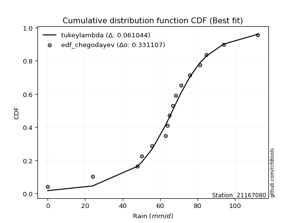</img></img>

</div>


### 6. Empirical - EDF Blom (1958)

The Blom formula is a specific "plotting position" formula used in hydrology and statistical analysis to estimate the empirical cumulative probability (or non-exceedance probability) of a data series. It is particularly recommended for data that are approximately normally distributed. The constant _a_ is set to 0.375 (or 3/8).

<div align="center">


$P=(m-a)/(n+1-2a)$


</div>


**6.1. Empirical values**

<div align="center">

|                | 0                    | 1                   | 2                  | 3                   | 4                   | 5                   | 6                  | 7        | 8                  | 9                  | 10                 | 11                 | 12                 | 13                 | 14                 |
|:---------------|:---------------------|:--------------------|:-------------------|:--------------------|:--------------------|:--------------------|:-------------------|:---------|:-------------------|:-------------------|:-------------------|:-------------------|:-------------------|:-------------------|:-------------------|
| date           | 2019                 | 2018                | 2014               | 2011                | 2013                | 2017                | 2006               | 2007     | 2016               | 2009               | 2008               | 2015               | 2005               | 2010               | 2012               |
| x              | 0.1                  | 24.0                | 47.9               | 50.2                | 55.7                | 62.8                | 64.0               | 65.0     | 68.4               | 71.2               | 75.9               | 81.2               | 84.7               | 93.9               | 112.2              |
| m              | 1                    | 2                   | 3                  | 4                   | 5                   | 6                   | 7                  | 8        | 9                  | 10                 | 11                 | 12                 | 13                 | 14                 | 15                 |
| empirical_dist | edf_blom             | edf_blom            | edf_blom           | edf_blom            | edf_blom            | edf_blom            | edf_blom           | edf_blom | edf_blom           | edf_blom           | edf_blom           | edf_blom           | edf_blom           | edf_blom           | edf_blom           |
| empirical      | 0.040983606557377046 | 0.10655737704918032 | 0.1721311475409836 | 0.23770491803278687 | 0.30327868852459017 | 0.36885245901639346 | 0.4344262295081967 | 0.5      | 0.5655737704918032 | 0.6311475409836066 | 0.6967213114754098 | 0.7622950819672131 | 0.8278688524590164 | 0.8934426229508197 | 0.9590163934426229 |
| empirical_tr   | 1.0427350427350428   | 1.1192660550458715  | 1.2079207920792079 | 1.3118279569892473  | 1.4352941176470588  | 1.5844155844155845  | 1.7681159420289854 | 2.0      | 2.30188679245283   | 2.7111111111111112 | 3.2972972972972974 | 4.206896551724137  | 5.80952380952381   | 9.384615384615383  | 24.399999999999974 |

</div>


**6.2. Kolmogorov-Smirnov fit test (sorted by Δ)**


<div align="center">

|                | 0                   | 1                   | 2                  | 3                   | 4                  | 5                   | 6                   | 7                   | 8                   | 9                   | 10                  | 11                  | 12                 | 13                 | 14                  | 15                 | 16                 | 17                  | 18                  | 19                  | 20                  | 21                  | 22                  | 23                  | 24                  | 25                  | 26                  | 27                  | 28                  | 29                 | 30                  | 31                  | 32                  | 33                  | 34                 | 35                 | 36                  | 37                  | 38                 | 39                  | 40                    | 41                  | 42                  | 43                  | 44                 | 45                 | 46                 | 47                  | 48                 | 49                  | 50                 | 51                 | 52                 | 53                 | 54                 | 55                  | 56                  | 57                 | 58                  | 59                 | 60                 | 61                  | 62                 | 63                  | 64                 | 65                  | 66                  | 67                  | 68                 | 69                  | 70                  | 71                  | 72                 | 73                  | 74                  | 75                  | 76                 | 77                 | 78                 | 79                 | 80                 | 81                 | 82                 | 83                 | 84                 | 85                 | 86                 | 87                 | 88                 | 89                 |
|:---------------|:--------------------|:--------------------|:-------------------|:--------------------|:-------------------|:--------------------|:--------------------|:--------------------|:--------------------|:--------------------|:--------------------|:--------------------|:-------------------|:-------------------|:--------------------|:-------------------|:-------------------|:--------------------|:--------------------|:--------------------|:--------------------|:--------------------|:--------------------|:--------------------|:--------------------|:--------------------|:--------------------|:--------------------|:--------------------|:-------------------|:--------------------|:--------------------|:--------------------|:--------------------|:-------------------|:-------------------|:--------------------|:--------------------|:-------------------|:--------------------|:----------------------|:--------------------|:--------------------|:--------------------|:-------------------|:-------------------|:-------------------|:--------------------|:-------------------|:--------------------|:-------------------|:-------------------|:-------------------|:-------------------|:-------------------|:--------------------|:--------------------|:-------------------|:--------------------|:-------------------|:-------------------|:--------------------|:-------------------|:--------------------|:-------------------|:--------------------|:--------------------|:--------------------|:-------------------|:--------------------|:--------------------|:--------------------|:-------------------|:--------------------|:--------------------|:--------------------|:-------------------|:-------------------|:-------------------|:-------------------|:-------------------|:-------------------|:-------------------|:-------------------|:-------------------|:-------------------|:-------------------|:-------------------|:-------------------|:-------------------|
| station        | 21167080            | 21167080            | 21167080           | 21167080            | 21167080           | 21167080            | 21167080            | 21167080            | 21167080            | 21167080            | 21167080            | 21167080            | 21167080           | 21167080           | 21167080            | 21167080           | 21167080           | 21167080            | 21167080            | 21167080            | 21167080            | 21167080            | 21167080            | 21167080            | 21167080            | 21167080            | 21167080            | 21167080            | 21167080            | 21167080           | 21167080            | 21167080            | 21167080            | 21167080            | 21167080           | 21167080           | 21167080            | 21167080            | 21167080           | 21167080            | 21167080              | 21167080            | 21167080            | 21167080            | 21167080           | 21167080           | 21167080           | 21167080            | 21167080           | 21167080            | 21167080           | 21167080           | 21167080           | 21167080           | 21167080           | 21167080            | 21167080            | 21167080           | 21167080            | 21167080           | 21167080           | 21167080            | 21167080           | 21167080            | 21167080           | 21167080            | 21167080            | 21167080            | 21167080           | 21167080            | 21167080            | 21167080            | 21167080           | 21167080            | 21167080            | 21167080            | 21167080           | 21167080           | 21167080           | 21167080           | 21167080           | 21167080           | 21167080           | 21167080           | 21167080           | 21167080           | 21167080           | 21167080           | 21167080           | 21167080           |
| empirical_dist | edf_blom            | edf_blom            | edf_blom           | edf_blom            | edf_blom           | edf_blom            | edf_blom            | edf_blom            | edf_blom            | edf_blom            | edf_blom            | edf_blom            | edf_blom           | edf_blom           | edf_blom            | edf_blom           | edf_blom           | edf_blom            | edf_blom            | edf_blom            | edf_blom            | edf_blom            | edf_blom            | edf_blom            | edf_blom            | edf_blom            | edf_blom            | edf_blom            | edf_blom            | edf_blom           | edf_blom            | edf_blom            | edf_blom            | edf_blom            | edf_blom           | edf_blom           | edf_blom            | edf_blom            | edf_blom           | edf_blom            | edf_blom              | edf_blom            | edf_blom            | edf_blom            | edf_blom           | edf_blom           | edf_blom           | edf_blom            | edf_blom           | edf_blom            | edf_blom           | edf_blom           | edf_blom           | edf_blom           | edf_blom           | edf_blom            | edf_blom            | edf_blom           | edf_blom            | edf_blom           | edf_blom           | edf_blom            | edf_blom           | edf_blom            | edf_blom           | edf_blom            | edf_blom            | edf_blom            | edf_blom           | edf_blom            | edf_blom            | edf_blom            | edf_blom           | edf_blom            | edf_blom            | edf_blom            | edf_blom           | edf_blom           | edf_blom           | edf_blom           | edf_blom           | edf_blom           | edf_blom           | edf_blom           | edf_blom           | edf_blom           | edf_blom           | edf_blom           | edf_blom           | edf_blom           |
| p_dist         | johnsonsu           | genlogistic         | mielke             | logjohnsonsu        | pearson3           | gumbel_l            | logt                | weibull_min         | fisk                | laplace_asymmetric  | laplace             | hypsecant           | logistic           | t                  | fatiguelife         | rice               | crystalball        | norm                | exponnorm           | nct                 | f                   | betaprime           | erlang              | gamma               | invgamma            | chi2                | invgauss            | maxwell             | rayleigh            | invweibull         | gumbel_r            | halfnorm            | gompertz            | moyal               | ncf                | kstwobign          | halflogistic        | truncnorm           | logloggamma        | loggenlogistic      | loglaplace_asymmetric | wald                | loggumbel_l         | gibrat              | loggompertz        | logpearson3        | logtruncnorm       | logfatiguelife      | expon              | genexpon            | loglognorm         | lognakagami        | logrice            | logexponnorm       | logcrystalball     | lognorm             | lognorm             | lognct             | nakagami            | logbetaprime       | loglogistic        | loginvweibull       | loghypsecant       | logmielke           | loglaplace         | loginvgamma         | loginvgauss         | logmaxwell          | logkstwobign       | lograyleigh         | loggumbel_r         | loghalfnorm         | loggenexpon        | logmoyal            | loghalflogistic     | logexpon            | logncf             | pareto             | logwald            | logerlang          | logpareto          | loggibrat          | logf               | logweibull_min     | logalpha           | logfisk            | logchi2            | alpha              | loggamma           | loggamma           |
| delta          | 0.06025061607299709 | 0.06883929685137347 | 0.0712719617676737 | 0.07253555845196644 | 0.0778281273142748 | 0.07815728678883616 | 0.07921120102096701 | 0.08209449278482064 | 0.08269849263069484 | 0.09169691355808701 | 0.10461031409003935 | 0.11187835392424111 | 0.1136687633879524 | 0.1149569168656494 | 0.11513171424904628 | 0.115494381238953  | 0.1157673652311425 | 0.11576736710593005 | 0.11576821419879335 | 0.11578931463004577 | 0.11694161768904449 | 0.12211709207059945 | 0.12577646300464707 | 0.12806128294163766 | 0.13918571153484144 | 0.13926111405575975 | 0.14623875667933534 | 0.14936495647547826 | 0.16069249075154474 | 0.1687688656004062 | 0.18551581140269274 | 0.19259458254664935 | 0.19482404885178392 | 0.21139300422111534 | 0.2117479742916958 | 0.2133670099302075 | 0.21651879698284676 | 0.24366165607855347 | 0.2556375979025338 | 0.25771919719976555 | 0.26279744827011864   | 0.28340984228515825 | 0.29078161132876146 | 0.30411769478207334 | 0.3101805557567564 | 0.3149464371697859 | 0.3510097619298358 | 0.35505979656746645 | 0.3556134956626831 | 0.35646978321875034 | 0.3567421478598306 | 0.358800129949125  | 0.3594150372131647 | 0.3594843718457804 | 0.3594850247908068 | 0.35948503294638867 | 0.35948503294638867 | 0.3597875871852748 | 0.36006254203281207 | 0.3605607401293326 | 0.3637805139746163 | 0.36488251675145855 | 0.3674331594963147 | 0.36772665865872234 | 0.3809334454196692 | 0.38355571478528827 | 0.38725349883831073 | 0.39100637609853917 | 0.3995029790817465 | 0.40126038555434074 | 0.43008314765135935 | 0.43015471674419403 | 0.4446922349880623 | 0.45543922597616404 | 0.45674116805243903 | 0.48982055393860435 | 0.5230082171993504 | 0.5257176795035378 | 0.5258266506875953 | 0.532743768496614  | 0.5468700669511926 | 0.5532619576671888 | 0.6269720240879512 | 0.6590635345373984 | 0.6739641508096458 | 0.6886274977717184 | 0.7286507062375231 | 0.881100274487369  | 0.8910935525498862 | 0.8910935525498862 |
| deltao         | 0.3366456264050002  | 0.3366456264050002  | 0.3366456264050002 | 0.3366456264050002  | 0.3366456264050002 | 0.3366456264050002  | 0.3366456264050002  | 0.3366456264050002  | 0.3366456264050002  | 0.3366456264050002  | 0.3366456264050002  | 0.3366456264050002  | 0.3366456264050002 | 0.3366456264050002 | 0.3366456264050002  | 0.3366456264050002 | 0.3366456264050002 | 0.3366456264050002  | 0.3366456264050002  | 0.3366456264050002  | 0.3366456264050002  | 0.3366456264050002  | 0.3366456264050002  | 0.3366456264050002  | 0.3366456264050002  | 0.3366456264050002  | 0.3366456264050002  | 0.3366456264050002  | 0.3366456264050002  | 0.3366456264050002 | 0.3366456264050002  | 0.3366456264050002  | 0.3366456264050002  | 0.3366456264050002  | 0.3366456264050002 | 0.3366456264050002 | 0.3366456264050002  | 0.3366456264050002  | 0.3366456264050002 | 0.3366456264050002  | 0.3366456264050002    | 0.3366456264050002  | 0.3366456264050002  | 0.3366456264050002  | 0.3366456264050002 | 0.3366456264050002 | 0.3366456264050002 | 0.3366456264050002  | 0.3366456264050002 | 0.3366456264050002  | 0.3366456264050002 | 0.3366456264050002 | 0.3366456264050002 | 0.3366456264050002 | 0.3366456264050002 | 0.3366456264050002  | 0.3366456264050002  | 0.3366456264050002 | 0.3366456264050002  | 0.3366456264050002 | 0.3366456264050002 | 0.3366456264050002  | 0.3366456264050002 | 0.3366456264050002  | 0.3366456264050002 | 0.3366456264050002  | 0.3366456264050002  | 0.3366456264050002  | 0.3366456264050002 | 0.3366456264050002  | 0.3366456264050002  | 0.3366456264050002  | 0.3366456264050002 | 0.3366456264050002  | 0.3366456264050002  | 0.3366456264050002  | 0.3366456264050002 | 0.3366456264050002 | 0.3366456264050002 | 0.3366456264050002 | 0.3366456264050002 | 0.3366456264050002 | 0.3366456264050002 | 0.3366456264050002 | 0.3366456264050002 | 0.3366456264050002 | 0.3366456264050002 | 0.3366456264050002 | 0.3366456264050002 | 0.3366456264050002 |
| eval           | Δo > Δ              | Δo > Δ              | Δo > Δ             | Δo > Δ              | Δo > Δ             | Δo > Δ              | Δo > Δ              | Δo > Δ              | Δo > Δ              | Δo > Δ              | Δo > Δ              | Δo > Δ              | Δo > Δ             | Δo > Δ             | Δo > Δ              | Δo > Δ             | Δo > Δ             | Δo > Δ              | Δo > Δ              | Δo > Δ              | Δo > Δ              | Δo > Δ              | Δo > Δ              | Δo > Δ              | Δo > Δ              | Δo > Δ              | Δo > Δ              | Δo > Δ              | Δo > Δ              | Δo > Δ             | Δo > Δ              | Δo > Δ              | Δo > Δ              | Δo > Δ              | Δo > Δ             | Δo > Δ             | Δo > Δ              | Δo > Δ              | Δo > Δ             | Δo > Δ              | Δo > Δ                | Δo > Δ              | Δo > Δ              | Δo > Δ              | Δo > Δ             | Δo > Δ             | Δo <= Δ            | Δo <= Δ             | Δo <= Δ            | Δo <= Δ             | Δo <= Δ            | Δo <= Δ            | Δo <= Δ            | Δo <= Δ            | Δo <= Δ            | Δo <= Δ             | Δo <= Δ             | Δo <= Δ            | Δo <= Δ             | Δo <= Δ            | Δo <= Δ            | Δo <= Δ             | Δo <= Δ            | Δo <= Δ             | Δo <= Δ            | Δo <= Δ             | Δo <= Δ             | Δo <= Δ             | Δo <= Δ            | Δo <= Δ             | Δo <= Δ             | Δo <= Δ             | Δo <= Δ            | Δo <= Δ             | Δo <= Δ             | Δo <= Δ             | Δo <= Δ            | Δo <= Δ            | Δo <= Δ            | Δo <= Δ            | Δo <= Δ            | Δo <= Δ            | Δo <= Δ            | Δo <= Δ            | Δo <= Δ            | Δo <= Δ            | Δo <= Δ            | Δo <= Δ            | Δo <= Δ            | Δo <= Δ            |
| fit            | 1                   | 1                   | 1                  | 1                   | 1                  | 1                   | 1                   | 1                   | 1                   | 1                   | 1                   | 1                   | 1                  | 1                  | 1                   | 1                  | 1                  | 1                   | 1                   | 1                   | 1                   | 1                   | 1                   | 1                   | 1                   | 1                   | 1                   | 1                   | 1                   | 1                  | 1                   | 1                   | 1                   | 1                   | 1                  | 1                  | 1                   | 1                   | 1                  | 1                   | 1                     | 1                   | 1                   | 1                   | 1                  | 1                  | 0                  | 0                   | 0                  | 0                   | 0                  | 0                  | 0                  | 0                  | 0                  | 0                   | 0                   | 0                  | 0                   | 0                  | 0                  | 0                   | 0                  | 0                   | 0                  | 0                   | 0                   | 0                   | 0                  | 0                   | 0                   | 0                   | 0                  | 0                   | 0                   | 0                   | 0                  | 0                  | 0                  | 0                  | 0                  | 0                  | 0                  | 0                  | 0                  | 0                  | 0                  | 0                  | 0                  | 0                  |
| n              | 15                  | 15                  | 15                 | 15                  | 15                 | 15                  | 15                  | 15                  | 15                  | 15                  | 15                  | 15                  | 15                 | 15                 | 15                  | 15                 | 15                 | 15                  | 15                  | 15                  | 15                  | 15                  | 15                  | 15                  | 15                  | 15                  | 15                  | 15                  | 15                  | 15                 | 15                  | 15                  | 15                  | 15                  | 15                 | 15                 | 15                  | 15                  | 15                 | 15                  | 15                    | 15                  | 15                  | 15                  | 15                 | 15                 | 15                 | 15                  | 15                 | 15                  | 15                 | 15                 | 15                 | 15                 | 15                 | 15                  | 15                  | 15                 | 15                  | 15                 | 15                 | 15                  | 15                 | 15                  | 15                 | 15                  | 15                  | 15                  | 15                 | 15                  | 15                  | 15                  | 15                 | 15                  | 15                  | 15                  | 15                 | 15                 | 15                 | 15                 | 15                 | 15                 | 15                 | 15                 | 15                 | 15                 | 15                 | 15                 | 15                 | 15                 |
| best_fit       | 1                   | 0                   | 0                  | 0                   | 0                  | 0                   | 0                   | 0                   | 0                   | 0                   | 0                   | 0                   | 0                  | 0                  | 0                   | 0                  | 0                  | 0                   | 0                   | 0                   | 0                   | 0                   | 0                   | 0                   | 0                   | 0                   | 0                   | 0                   | 0                   | 0                  | 0                   | 0                   | 0                   | 0                   | 0                  | 0                  | 0                   | 0                   | 0                  | 0                   | 0                     | 0                   | 0                   | 0                   | 0                  | 0                  | 0                  | 0                   | 0                  | 0                   | 0                  | 0                  | 0                  | 0                  | 0                  | 0                   | 0                   | 0                  | 0                   | 0                  | 0                  | 0                   | 0                  | 0                   | 0                  | 0                   | 0                   | 0                   | 0                  | 0                   | 0                   | 0                   | 0                  | 0                   | 0                   | 0                   | 0                  | 0                  | 0                  | 0                  | 0                  | 0                  | 0                  | 0                  | 0                  | 0                  | 0                  | 0                  | 0                  | 0                  |
| best_fit_sort  | 1                   | 2                   | 3                  | 4                   | 5                  | 6                   | 7                   | 8                   | 9                   | 10                  | 11                  | 12                  | 13                 | 14                 | 15                  | 16                 | 17                 | 18                  | 19                  | 20                  | 21                  | 22                  | 23                  | 24                  | 25                  | 26                  | 27                  | 28                  | 29                  | 30                 | 31                  | 32                  | 33                  | 34                  | 35                 | 36                 | 37                  | 38                  | 39                 | 40                  | 41                    | 42                  | 43                  | 44                  | 45                 | 46                 | 47                 | 48                  | 49                 | 50                  | 51                 | 52                 | 53                 | 54                 | 55                 | 56                  | 57                  | 58                 | 59                  | 60                 | 61                 | 62                  | 63                 | 64                  | 65                 | 66                  | 67                  | 68                  | 69                 | 70                  | 71                  | 72                  | 73                 | 74                  | 75                  | 76                  | 77                 | 78                 | 79                 | 80                 | 81                 | 82                 | 83                 | 84                 | 85                 | 86                 | 87                 | 88                 | 89                 | 90                 |

</div>


<div align="center">

</img>

</div>


**6.3. Best fit**

<div align="center">

|   id |   station | empirical_dist   | p_dist    |     delta |   deltao | eval   |   fit |   n |   best_fit |   best_fit_sort |
|-----:|----------:|:-----------------|:----------|----------:|---------:|:-------|------:|----:|-----------:|----------------:|
|    0 |  21167080 | edf_blom         | johnsonsu | 0.0602506 | 0.336646 | Δo > Δ |     1 |  15 |          1 |               1 |

</div>


<div align="center">

</img></img>

</div>


### 7. Empirical - EDF Tukey (1962)

In hydrology, the Tukey formula is used as a plotting position formula to estimate the empirical probability or frequency of a flood event (or other hydrological data). The formula parameter is given as _c=0.333_ (or 1/3).

<div align="center">


$P=(m-c)/(n+1-2c)$


</div>


**7.1. Empirical values**

<div align="center">

|                | 0                    | 1                   | 2                   | 3                  | 4                   | 5                  | 6                   | 7         | 8                  | 9                  | 10                 | 11                 | 12                 | 13                 | 14                 |
|:---------------|:---------------------|:--------------------|:--------------------|:-------------------|:--------------------|:-------------------|:--------------------|:----------|:-------------------|:-------------------|:-------------------|:-------------------|:-------------------|:-------------------|:-------------------|
| date           | 2019                 | 2018                | 2014                | 2011               | 2013                | 2017               | 2006                | 2007      | 2016               | 2009               | 2008               | 2015               | 2005               | 2010               | 2012               |
| x              | 0.1                  | 24.0                | 47.9                | 50.2               | 55.7                | 62.8               | 64.0                | 65.0      | 68.4               | 71.2               | 75.9               | 81.2               | 84.7               | 93.9               | 112.2              |
| m              | 1                    | 2                   | 3                   | 4                  | 5                   | 6                  | 7                   | 8         | 9                  | 10                 | 11                 | 12                 | 13                 | 14                 | 15                 |
| empirical_dist | edf_tukey            | edf_tukey           | edf_tukey           | edf_tukey          | edf_tukey           | edf_tukey          | edf_tukey           | edf_tukey | edf_tukey          | edf_tukey          | edf_tukey          | edf_tukey          | edf_tukey          | edf_tukey          | edf_tukey          |
| empirical      | 0.043478260869565216 | 0.10869565217391304 | 0.17391304347826086 | 0.2391304347826087 | 0.30434782608695654 | 0.3695652173913043 | 0.43478260869565216 | 0.5       | 0.5652173913043478 | 0.6304347826086957 | 0.6956521739130435 | 0.7608695652173914 | 0.8260869565217391 | 0.8913043478260869 | 0.9565217391304348 |
| empirical_tr   | 1.0454545454545454   | 1.1219512195121952  | 1.2105263157894737  | 1.3142857142857143 | 1.4375              | 1.586206896551724  | 1.769230769230769   | 2.0       | 2.3                | 2.7058823529411766 | 3.2857142857142856 | 4.1818181818181825 | 5.75               | 9.199999999999998  | 23.000000000000014 |

</div>


**7.2. Kolmogorov-Smirnov fit test (sorted by Δ)**


<div align="center">

|                | 0                   | 1                  | 2                   | 3                   | 4                   | 5                   | 6                   | 7                   | 8                   | 9                   | 10                  | 11                  | 12                  | 13                  | 14                  | 15                  | 16                  | 17                  | 18                  | 19                  | 20                  | 21                 | 22                 | 23                 | 24                  | 25                 | 26                  | 27                 | 28                  | 29                  | 30                  | 31                 | 32                  | 33                  | 34                  | 35                  | 36                 | 37                 | 38                 | 39                  | 40                    | 41                 | 42                  | 43                 | 44                 | 45                  | 46                 | 47                  | 48                 | 49                  | 50                 | 51                  | 52                 | 53                 | 54                 | 55                 | 56                 | 57                 | 58                 | 59                 | 60                 | 61                  | 62                  | 63                  | 64                  | 65                 | 66                  | 67                 | 68                 | 69                  | 70                  | 71                  | 72                  | 73                  | 74                  | 75                  | 76                 | 77                 | 78                 | 79                 | 80                 | 81                 | 82                 | 83                 | 84                 | 85                 | 86                 | 87                 | 88                 | 89                 |
|:---------------|:--------------------|:-------------------|:--------------------|:--------------------|:--------------------|:--------------------|:--------------------|:--------------------|:--------------------|:--------------------|:--------------------|:--------------------|:--------------------|:--------------------|:--------------------|:--------------------|:--------------------|:--------------------|:--------------------|:--------------------|:--------------------|:-------------------|:-------------------|:-------------------|:--------------------|:-------------------|:--------------------|:-------------------|:--------------------|:--------------------|:--------------------|:-------------------|:--------------------|:--------------------|:--------------------|:--------------------|:-------------------|:-------------------|:-------------------|:--------------------|:----------------------|:-------------------|:--------------------|:-------------------|:-------------------|:--------------------|:-------------------|:--------------------|:-------------------|:--------------------|:-------------------|:--------------------|:-------------------|:-------------------|:-------------------|:-------------------|:-------------------|:-------------------|:-------------------|:-------------------|:-------------------|:--------------------|:--------------------|:--------------------|:--------------------|:-------------------|:--------------------|:-------------------|:-------------------|:--------------------|:--------------------|:--------------------|:--------------------|:--------------------|:--------------------|:--------------------|:-------------------|:-------------------|:-------------------|:-------------------|:-------------------|:-------------------|:-------------------|:-------------------|:-------------------|:-------------------|:-------------------|:-------------------|:-------------------|:-------------------|
| station        | 21167080            | 21167080           | 21167080            | 21167080            | 21167080            | 21167080            | 21167080            | 21167080            | 21167080            | 21167080            | 21167080            | 21167080            | 21167080            | 21167080            | 21167080            | 21167080            | 21167080            | 21167080            | 21167080            | 21167080            | 21167080            | 21167080           | 21167080           | 21167080           | 21167080            | 21167080           | 21167080            | 21167080           | 21167080            | 21167080            | 21167080            | 21167080           | 21167080            | 21167080            | 21167080            | 21167080            | 21167080           | 21167080           | 21167080           | 21167080            | 21167080              | 21167080           | 21167080            | 21167080           | 21167080           | 21167080            | 21167080           | 21167080            | 21167080           | 21167080            | 21167080           | 21167080            | 21167080           | 21167080           | 21167080           | 21167080           | 21167080           | 21167080           | 21167080           | 21167080           | 21167080           | 21167080            | 21167080            | 21167080            | 21167080            | 21167080           | 21167080            | 21167080           | 21167080           | 21167080            | 21167080            | 21167080            | 21167080            | 21167080            | 21167080            | 21167080            | 21167080           | 21167080           | 21167080           | 21167080           | 21167080           | 21167080           | 21167080           | 21167080           | 21167080           | 21167080           | 21167080           | 21167080           | 21167080           | 21167080           |
| empirical_dist | edf_tukey           | edf_tukey          | edf_tukey           | edf_tukey           | edf_tukey           | edf_tukey           | edf_tukey           | edf_tukey           | edf_tukey           | edf_tukey           | edf_tukey           | edf_tukey           | edf_tukey           | edf_tukey           | edf_tukey           | edf_tukey           | edf_tukey           | edf_tukey           | edf_tukey           | edf_tukey           | edf_tukey           | edf_tukey          | edf_tukey          | edf_tukey          | edf_tukey           | edf_tukey          | edf_tukey           | edf_tukey          | edf_tukey           | edf_tukey           | edf_tukey           | edf_tukey          | edf_tukey           | edf_tukey           | edf_tukey           | edf_tukey           | edf_tukey          | edf_tukey          | edf_tukey          | edf_tukey           | edf_tukey             | edf_tukey          | edf_tukey           | edf_tukey          | edf_tukey          | edf_tukey           | edf_tukey          | edf_tukey           | edf_tukey          | edf_tukey           | edf_tukey          | edf_tukey           | edf_tukey          | edf_tukey          | edf_tukey          | edf_tukey          | edf_tukey          | edf_tukey          | edf_tukey          | edf_tukey          | edf_tukey          | edf_tukey           | edf_tukey           | edf_tukey           | edf_tukey           | edf_tukey          | edf_tukey           | edf_tukey          | edf_tukey          | edf_tukey           | edf_tukey           | edf_tukey           | edf_tukey           | edf_tukey           | edf_tukey           | edf_tukey           | edf_tukey          | edf_tukey          | edf_tukey          | edf_tukey          | edf_tukey          | edf_tukey          | edf_tukey          | edf_tukey          | edf_tukey          | edf_tukey          | edf_tukey          | edf_tukey          | edf_tukey          | edf_tukey          |
| p_dist         | johnsonsu           | genlogistic        | mielke              | logjohnsonsu        | pearson3            | gumbel_l            | logt                | weibull_min         | fisk                | laplace_asymmetric  | laplace             | hypsecant           | logistic            | t                   | fatiguelife         | rice                | crystalball         | norm                | exponnorm           | nct                 | f                   | betaprime          | erlang             | gamma              | invgamma            | chi2               | invgauss            | maxwell            | rayleigh            | invweibull          | gumbel_r            | halfnorm           | gompertz            | ncf                 | moyal               | kstwobign           | halflogistic       | truncnorm          | logloggamma        | loggenlogistic      | loglaplace_asymmetric | wald               | loggumbel_l         | gibrat             | loggompertz        | logpearson3         | logtruncnorm       | logfatiguelife      | expon              | genexpon            | loglognorm         | lognakagami         | logrice            | logexponnorm       | logcrystalball     | lognorm            | lognorm            | lognct             | nakagami           | logbetaprime       | loglogistic        | loginvweibull       | logmielke           | loghypsecant        | loglaplace          | loginvgamma        | loginvgauss         | logmaxwell         | logkstwobign       | lograyleigh         | loggumbel_r         | loghalfnorm         | loggenexpon         | logmoyal            | loghalflogistic     | logexpon            | logncf             | pareto             | logwald            | logerlang          | logpareto          | loggibrat          | logf               | logweibull_min     | logalpha           | logfisk            | logchi2            | alpha              | loggamma           | loggamma           |
| delta          | 0.05953785769808623 | 0.0681265384764626 | 0.07055920339276284 | 0.07075366251468918 | 0.07604623137699754 | 0.07744452841392524 | 0.07921120102096701 | 0.08031259684754338 | 0.08198573425578398 | 0.09098415518317615 | 0.10389755571512849 | 0.11116559554933025 | 0.11295600501304154 | 0.11424415849073855 | 0.11441895587413542 | 0.11478162286404214 | 0.11505460685623164 | 0.11505460873101919 | 0.11505545582388249 | 0.11507655625513491 | 0.11622885931413363 | 0.1214043336956886 | 0.1250637046297362 | 0.1273485245667268 | 0.13847295315993058 | 0.1385483556808489 | 0.14552599830442448 | 0.1486521981005674 | 0.15997973237663388 | 0.16698696966312893 | 0.18480305302778188 | 0.1918818241717385 | 0.19624956560160575 | 0.20996607835441855 | 0.21068024584620448 | 0.21158511399293023 | 0.2158060386079359 | 0.2418797601412762 | 0.2538557019652566 | 0.25593730126248826 | 0.2610155523328414    | 0.2826970839102474 | 0.28899971539148417 | 0.3034049364071625 | 0.3083986598194791 | 0.31280816204505313 | 0.3492278659925585 | 0.35327790063018916 | 0.3538315997254058 | 0.35468788728147305 | 0.3549602519225533 | 0.35701823401184773 | 0.3576331412758874 | 0.3577024759085031 | 0.3577031288535295 | 0.3577031370091114 | 0.3577031370091114 | 0.3580056912479975 | 0.3582806460955348 | 0.3587788441920553 | 0.361998618037339  | 0.36310062081418126 | 0.36523200434653424 | 0.36565126355903743 | 0.37915154948239194 | 0.381773818848011  | 0.38547160290103344 | 0.3892244801612619 | 0.3977210831444692 | 0.39947848961706345 | 0.42830125171408207 | 0.42837282080691674 | 0.44291033905078503 | 0.45365733003888675 | 0.45495927211516174 | 0.48768227881387166 | 0.5208699420746177 | 0.523579404378805  | 0.524044754750318  | 0.5306054933718812 | 0.5447317918264598 | 0.5514800617299115 | 0.6248337489632184 | 0.6569252594126657 | 0.671825875684913  | 0.6864892226469856 | 0.7265124311127904 | 0.8789619993626363 | 0.8889552774251535 | 0.8889552774251535 |
| deltao         | 0.3366456264050002  | 0.3366456264050002 | 0.3366456264050002  | 0.3366456264050002  | 0.3366456264050002  | 0.3366456264050002  | 0.3366456264050002  | 0.3366456264050002  | 0.3366456264050002  | 0.3366456264050002  | 0.3366456264050002  | 0.3366456264050002  | 0.3366456264050002  | 0.3366456264050002  | 0.3366456264050002  | 0.3366456264050002  | 0.3366456264050002  | 0.3366456264050002  | 0.3366456264050002  | 0.3366456264050002  | 0.3366456264050002  | 0.3366456264050002 | 0.3366456264050002 | 0.3366456264050002 | 0.3366456264050002  | 0.3366456264050002 | 0.3366456264050002  | 0.3366456264050002 | 0.3366456264050002  | 0.3366456264050002  | 0.3366456264050002  | 0.3366456264050002 | 0.3366456264050002  | 0.3366456264050002  | 0.3366456264050002  | 0.3366456264050002  | 0.3366456264050002 | 0.3366456264050002 | 0.3366456264050002 | 0.3366456264050002  | 0.3366456264050002    | 0.3366456264050002 | 0.3366456264050002  | 0.3366456264050002 | 0.3366456264050002 | 0.3366456264050002  | 0.3366456264050002 | 0.3366456264050002  | 0.3366456264050002 | 0.3366456264050002  | 0.3366456264050002 | 0.3366456264050002  | 0.3366456264050002 | 0.3366456264050002 | 0.3366456264050002 | 0.3366456264050002 | 0.3366456264050002 | 0.3366456264050002 | 0.3366456264050002 | 0.3366456264050002 | 0.3366456264050002 | 0.3366456264050002  | 0.3366456264050002  | 0.3366456264050002  | 0.3366456264050002  | 0.3366456264050002 | 0.3366456264050002  | 0.3366456264050002 | 0.3366456264050002 | 0.3366456264050002  | 0.3366456264050002  | 0.3366456264050002  | 0.3366456264050002  | 0.3366456264050002  | 0.3366456264050002  | 0.3366456264050002  | 0.3366456264050002 | 0.3366456264050002 | 0.3366456264050002 | 0.3366456264050002 | 0.3366456264050002 | 0.3366456264050002 | 0.3366456264050002 | 0.3366456264050002 | 0.3366456264050002 | 0.3366456264050002 | 0.3366456264050002 | 0.3366456264050002 | 0.3366456264050002 | 0.3366456264050002 |
| eval           | Δo > Δ              | Δo > Δ             | Δo > Δ              | Δo > Δ              | Δo > Δ              | Δo > Δ              | Δo > Δ              | Δo > Δ              | Δo > Δ              | Δo > Δ              | Δo > Δ              | Δo > Δ              | Δo > Δ              | Δo > Δ              | Δo > Δ              | Δo > Δ              | Δo > Δ              | Δo > Δ              | Δo > Δ              | Δo > Δ              | Δo > Δ              | Δo > Δ             | Δo > Δ             | Δo > Δ             | Δo > Δ              | Δo > Δ             | Δo > Δ              | Δo > Δ             | Δo > Δ              | Δo > Δ              | Δo > Δ              | Δo > Δ             | Δo > Δ              | Δo > Δ              | Δo > Δ              | Δo > Δ              | Δo > Δ             | Δo > Δ             | Δo > Δ             | Δo > Δ              | Δo > Δ                | Δo > Δ             | Δo > Δ              | Δo > Δ             | Δo > Δ             | Δo > Δ              | Δo <= Δ            | Δo <= Δ             | Δo <= Δ            | Δo <= Δ             | Δo <= Δ            | Δo <= Δ             | Δo <= Δ            | Δo <= Δ            | Δo <= Δ            | Δo <= Δ            | Δo <= Δ            | Δo <= Δ            | Δo <= Δ            | Δo <= Δ            | Δo <= Δ            | Δo <= Δ             | Δo <= Δ             | Δo <= Δ             | Δo <= Δ             | Δo <= Δ            | Δo <= Δ             | Δo <= Δ            | Δo <= Δ            | Δo <= Δ             | Δo <= Δ             | Δo <= Δ             | Δo <= Δ             | Δo <= Δ             | Δo <= Δ             | Δo <= Δ             | Δo <= Δ            | Δo <= Δ            | Δo <= Δ            | Δo <= Δ            | Δo <= Δ            | Δo <= Δ            | Δo <= Δ            | Δo <= Δ            | Δo <= Δ            | Δo <= Δ            | Δo <= Δ            | Δo <= Δ            | Δo <= Δ            | Δo <= Δ            |
| fit            | 1                   | 1                  | 1                   | 1                   | 1                   | 1                   | 1                   | 1                   | 1                   | 1                   | 1                   | 1                   | 1                   | 1                   | 1                   | 1                   | 1                   | 1                   | 1                   | 1                   | 1                   | 1                  | 1                  | 1                  | 1                   | 1                  | 1                   | 1                  | 1                   | 1                   | 1                   | 1                  | 1                   | 1                   | 1                   | 1                   | 1                  | 1                  | 1                  | 1                   | 1                     | 1                  | 1                   | 1                  | 1                  | 1                   | 0                  | 0                   | 0                  | 0                   | 0                  | 0                   | 0                  | 0                  | 0                  | 0                  | 0                  | 0                  | 0                  | 0                  | 0                  | 0                   | 0                   | 0                   | 0                   | 0                  | 0                   | 0                  | 0                  | 0                   | 0                   | 0                   | 0                   | 0                   | 0                   | 0                   | 0                  | 0                  | 0                  | 0                  | 0                  | 0                  | 0                  | 0                  | 0                  | 0                  | 0                  | 0                  | 0                  | 0                  |
| n              | 15                  | 15                 | 15                  | 15                  | 15                  | 15                  | 15                  | 15                  | 15                  | 15                  | 15                  | 15                  | 15                  | 15                  | 15                  | 15                  | 15                  | 15                  | 15                  | 15                  | 15                  | 15                 | 15                 | 15                 | 15                  | 15                 | 15                  | 15                 | 15                  | 15                  | 15                  | 15                 | 15                  | 15                  | 15                  | 15                  | 15                 | 15                 | 15                 | 15                  | 15                    | 15                 | 15                  | 15                 | 15                 | 15                  | 15                 | 15                  | 15                 | 15                  | 15                 | 15                  | 15                 | 15                 | 15                 | 15                 | 15                 | 15                 | 15                 | 15                 | 15                 | 15                  | 15                  | 15                  | 15                  | 15                 | 15                  | 15                 | 15                 | 15                  | 15                  | 15                  | 15                  | 15                  | 15                  | 15                  | 15                 | 15                 | 15                 | 15                 | 15                 | 15                 | 15                 | 15                 | 15                 | 15                 | 15                 | 15                 | 15                 | 15                 |
| best_fit       | 1                   | 0                  | 0                   | 0                   | 0                   | 0                   | 0                   | 0                   | 0                   | 0                   | 0                   | 0                   | 0                   | 0                   | 0                   | 0                   | 0                   | 0                   | 0                   | 0                   | 0                   | 0                  | 0                  | 0                  | 0                   | 0                  | 0                   | 0                  | 0                   | 0                   | 0                   | 0                  | 0                   | 0                   | 0                   | 0                   | 0                  | 0                  | 0                  | 0                   | 0                     | 0                  | 0                   | 0                  | 0                  | 0                   | 0                  | 0                   | 0                  | 0                   | 0                  | 0                   | 0                  | 0                  | 0                  | 0                  | 0                  | 0                  | 0                  | 0                  | 0                  | 0                   | 0                   | 0                   | 0                   | 0                  | 0                   | 0                  | 0                  | 0                   | 0                   | 0                   | 0                   | 0                   | 0                   | 0                   | 0                  | 0                  | 0                  | 0                  | 0                  | 0                  | 0                  | 0                  | 0                  | 0                  | 0                  | 0                  | 0                  | 0                  |
| best_fit_sort  | 1                   | 2                  | 3                   | 4                   | 5                   | 6                   | 7                   | 8                   | 9                   | 10                  | 11                  | 12                  | 13                  | 14                  | 15                  | 16                  | 17                  | 18                  | 19                  | 20                  | 21                  | 22                 | 23                 | 24                 | 25                  | 26                 | 27                  | 28                 | 29                  | 30                  | 31                  | 32                 | 33                  | 34                  | 35                  | 36                  | 37                 | 38                 | 39                 | 40                  | 41                    | 42                 | 43                  | 44                 | 45                 | 46                  | 47                 | 48                  | 49                 | 50                  | 51                 | 52                  | 53                 | 54                 | 55                 | 56                 | 57                 | 58                 | 59                 | 60                 | 61                 | 62                  | 63                  | 64                  | 65                  | 66                 | 67                  | 68                 | 69                 | 70                  | 71                  | 72                  | 73                  | 74                  | 75                  | 76                  | 77                 | 78                 | 79                 | 80                 | 81                 | 82                 | 83                 | 84                 | 85                 | 86                 | 87                 | 88                 | 89                 | 90                 |

</div>


<div align="center">

</img>

</div>


**7.3. Best fit**

<div align="center">

|   id |   station | empirical_dist   | p_dist    |     delta |   deltao | eval   |   fit |   n |   best_fit |   best_fit_sort |
|-----:|----------:|:-----------------|:----------|----------:|---------:|:-------|------:|----:|-----------:|----------------:|
|    0 |  21167080 | edf_tukey        | johnsonsu | 0.0595379 | 0.336646 | Δo > Δ |     1 |  15 |          1 |               1 |

</div>


<div align="center">

</img>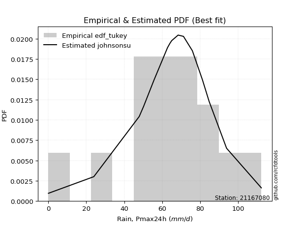</img>

</div>


### 8. Empirical - EDF Gringorten (1963)

Gringorten plotting position formula is essential for estimating the probability and return periods of extreme events like floods and heavy rainfall. The constant _a=0.44_.

<div align="center">


$P=(m-a)/(n+1-2a)$


</div>


**8.1. Empirical values**

<div align="center">

|                | 0                   | 1                   | 2                   | 3                   | 4                   | 5                   | 6                   | 7              | 8                  | 9                  | 10                 | 11                 | 12                 | 13                 | 14                 |
|:---------------|:--------------------|:--------------------|:--------------------|:--------------------|:--------------------|:--------------------|:--------------------|:---------------|:-------------------|:-------------------|:-------------------|:-------------------|:-------------------|:-------------------|:-------------------|
| date           | 2019                | 2018                | 2014                | 2011                | 2013                | 2017                | 2006                | 2007           | 2016               | 2009               | 2008               | 2015               | 2005               | 2010               | 2012               |
| x              | 0.1                 | 24.0                | 47.9                | 50.2                | 55.7                | 62.8                | 64.0                | 65.0           | 68.4               | 71.2               | 75.9               | 81.2               | 84.7               | 93.9               | 112.2              |
| m              | 1                   | 2                   | 3                   | 4                   | 5                   | 6                   | 7                   | 8              | 9                  | 10                 | 11                 | 12                 | 13                 | 14                 | 15                 |
| empirical_dist | edf_gringorten      | edf_gringorten      | edf_gringorten      | edf_gringorten      | edf_gringorten      | edf_gringorten      | edf_gringorten      | edf_gringorten | edf_gringorten     | edf_gringorten     | edf_gringorten     | edf_gringorten     | edf_gringorten     | edf_gringorten     | edf_gringorten     |
| empirical      | 0.03703703703703704 | 0.10317460317460318 | 0.16931216931216933 | 0.23544973544973546 | 0.30158730158730157 | 0.36772486772486773 | 0.43386243386243384 | 0.5            | 0.5661375661375662 | 0.6322751322751323 | 0.6984126984126985 | 0.7645502645502646 | 0.8306878306878308 | 0.8968253968253969 | 0.962962962962963  |
| empirical_tr   | 1.0384615384615385  | 1.1150442477876106  | 1.2038216560509554  | 1.3079584775086506  | 1.4318181818181819  | 1.5815899581589956  | 1.7663551401869158  | 2.0            | 2.304878048780488  | 2.719424460431655  | 3.3157894736842115 | 4.247191011235957  | 5.906250000000004  | 9.692307692307695  | 27.000000000000043 |

</div>


**8.2. Kolmogorov-Smirnov fit test (sorted by Δ)**


<div align="center">

|                | 0                   | 1                  | 2                   | 3                   | 4                   | 5                   | 6                   | 7                   | 8                   | 9                   | 10                  | 11                  | 12                  | 13                  | 14                  | 15                  | 16                  | 17                  | 18                  | 19                 | 20                  | 21                  | 22                 | 23                 | 24                  | 25                  | 26                  | 27                 | 28                  | 29                  | 30                  | 31                 | 32                  | 33                  | 34                  | 35                  | 36                 | 37                  | 38                 | 39                 | 40                    | 41                 | 42                  | 43                 | 44                 | 45                  | 46                  | 47                 | 48                  | 49                 | 50                 | 51                 | 52                 | 53                 | 54                  | 55                  | 56                  | 57                 | 58                  | 59                  | 60                 | 61                 | 62                 | 63                  | 64                 | 65                  | 66                 | 67                  | 68                  | 69                 | 70                 | 71                 | 72                 | 73                 | 74                 | 75                 | 76                 | 77                 | 78                 | 79                 | 80                 | 81                 | 82                 | 83                 | 84                 | 85                 | 86                 | 87                 | 88                 | 89                 |
|:---------------|:--------------------|:-------------------|:--------------------|:--------------------|:--------------------|:--------------------|:--------------------|:--------------------|:--------------------|:--------------------|:--------------------|:--------------------|:--------------------|:--------------------|:--------------------|:--------------------|:--------------------|:--------------------|:--------------------|:-------------------|:--------------------|:--------------------|:-------------------|:-------------------|:--------------------|:--------------------|:--------------------|:-------------------|:--------------------|:--------------------|:--------------------|:-------------------|:--------------------|:--------------------|:--------------------|:--------------------|:-------------------|:--------------------|:-------------------|:-------------------|:----------------------|:-------------------|:--------------------|:-------------------|:-------------------|:--------------------|:--------------------|:-------------------|:--------------------|:-------------------|:-------------------|:-------------------|:-------------------|:-------------------|:--------------------|:--------------------|:--------------------|:-------------------|:--------------------|:--------------------|:-------------------|:-------------------|:-------------------|:--------------------|:-------------------|:--------------------|:-------------------|:--------------------|:--------------------|:-------------------|:-------------------|:-------------------|:-------------------|:-------------------|:-------------------|:-------------------|:-------------------|:-------------------|:-------------------|:-------------------|:-------------------|:-------------------|:-------------------|:-------------------|:-------------------|:-------------------|:-------------------|:-------------------|:-------------------|:-------------------|
| station        | 21167080            | 21167080           | 21167080            | 21167080            | 21167080            | 21167080            | 21167080            | 21167080            | 21167080            | 21167080            | 21167080            | 21167080            | 21167080            | 21167080            | 21167080            | 21167080            | 21167080            | 21167080            | 21167080            | 21167080           | 21167080            | 21167080            | 21167080           | 21167080           | 21167080            | 21167080            | 21167080            | 21167080           | 21167080            | 21167080            | 21167080            | 21167080           | 21167080            | 21167080            | 21167080            | 21167080            | 21167080           | 21167080            | 21167080           | 21167080           | 21167080              | 21167080           | 21167080            | 21167080           | 21167080           | 21167080            | 21167080            | 21167080           | 21167080            | 21167080           | 21167080           | 21167080           | 21167080           | 21167080           | 21167080            | 21167080            | 21167080            | 21167080           | 21167080            | 21167080            | 21167080           | 21167080           | 21167080           | 21167080            | 21167080           | 21167080            | 21167080           | 21167080            | 21167080            | 21167080           | 21167080           | 21167080           | 21167080           | 21167080           | 21167080           | 21167080           | 21167080           | 21167080           | 21167080           | 21167080           | 21167080           | 21167080           | 21167080           | 21167080           | 21167080           | 21167080           | 21167080           | 21167080           | 21167080           | 21167080           |
| empirical_dist | edf_gringorten      | edf_gringorten     | edf_gringorten      | edf_gringorten      | edf_gringorten      | edf_gringorten      | edf_gringorten      | edf_gringorten      | edf_gringorten      | edf_gringorten      | edf_gringorten      | edf_gringorten      | edf_gringorten      | edf_gringorten      | edf_gringorten      | edf_gringorten      | edf_gringorten      | edf_gringorten      | edf_gringorten      | edf_gringorten     | edf_gringorten      | edf_gringorten      | edf_gringorten     | edf_gringorten     | edf_gringorten      | edf_gringorten      | edf_gringorten      | edf_gringorten     | edf_gringorten      | edf_gringorten      | edf_gringorten      | edf_gringorten     | edf_gringorten      | edf_gringorten      | edf_gringorten      | edf_gringorten      | edf_gringorten     | edf_gringorten      | edf_gringorten     | edf_gringorten     | edf_gringorten        | edf_gringorten     | edf_gringorten      | edf_gringorten     | edf_gringorten     | edf_gringorten      | edf_gringorten      | edf_gringorten     | edf_gringorten      | edf_gringorten     | edf_gringorten     | edf_gringorten     | edf_gringorten     | edf_gringorten     | edf_gringorten      | edf_gringorten      | edf_gringorten      | edf_gringorten     | edf_gringorten      | edf_gringorten      | edf_gringorten     | edf_gringorten     | edf_gringorten     | edf_gringorten      | edf_gringorten     | edf_gringorten      | edf_gringorten     | edf_gringorten      | edf_gringorten      | edf_gringorten     | edf_gringorten     | edf_gringorten     | edf_gringorten     | edf_gringorten     | edf_gringorten     | edf_gringorten     | edf_gringorten     | edf_gringorten     | edf_gringorten     | edf_gringorten     | edf_gringorten     | edf_gringorten     | edf_gringorten     | edf_gringorten     | edf_gringorten     | edf_gringorten     | edf_gringorten     | edf_gringorten     | edf_gringorten     | edf_gringorten     |
| p_dist         | johnsonsu           | genlogistic        | mielke              | logjohnsonsu        | logt                | gumbel_l            | pearson3            | fisk                | weibull_min         | laplace_asymmetric  | laplace             | hypsecant           | logistic            | t                   | fatiguelife         | rice                | crystalball         | norm                | exponnorm           | nct                | f                   | betaprime           | erlang             | gamma              | invgamma            | chi2                | invgauss            | maxwell            | rayleigh            | invweibull          | gumbel_r            | gompertz           | halfnorm            | moyal               | ncf                 | kstwobign           | halflogistic       | truncnorm           | logloggamma        | loggenlogistic     | loglaplace_asymmetric | wald               | loggumbel_l         | gibrat             | loggompertz        | logpearson3         | logtruncnorm        | logfatiguelife     | expon               | genexpon           | loglognorm         | lognakagami        | logrice            | logexponnorm       | logcrystalball      | lognorm             | lognorm             | lognct             | nakagami            | logbetaprime        | loglogistic        | loginvweibull      | loghypsecant       | logmielke           | loglaplace         | loginvgamma         | loginvgauss        | logmaxwell          | logkstwobign        | lograyleigh        | loggumbel_r        | loghalfnorm        | loggenexpon        | logmoyal           | loghalflogistic    | logexpon           | logncf             | logwald            | pareto             | logerlang          | logpareto          | loggibrat          | logf               | logweibull_min     | logalpha           | logfisk            | logchi2            | alpha              | loggamma           | loggamma           |
| delta          | 0.06137820736452282 | 0.0699668881428992 | 0.07239955305919943 | 0.07535453668078071 | 0.07921120102096701 | 0.07928487808036189 | 0.08064710554308907 | 0.08382608392222057 | 0.08491347101363492 | 0.09282450484961274 | 0.10573790538156508 | 0.11300594521576685 | 0.11479635467947813 | 0.11608450815717514 | 0.11625930554057201 | 0.11662197253047873 | 0.11689495652266824 | 0.11689495839745578 | 0.11689580549031908 | 0.1169169059215715 | 0.11806920898057022 | 0.12324468336212518 | 0.1269040542961728 | 0.1291888742331634 | 0.14031330282636717 | 0.14038870534728548 | 0.14736634797086107 | 0.150492547767004  | 0.16182008204307047 | 0.17158784382922046 | 0.18664340269421847 | 0.1925688662687325 | 0.19372217383817508 | 0.21252059551264108 | 0.21456695252051008 | 0.21618598815902176 | 0.2176463882743725 | 0.24648063430736775 | 0.2584565761313481 | 0.2605381754285798 | 0.2656164264989329    | 0.284537433576684  | 0.29360058955757573 | 0.3052452860735991 | 0.3129995339855707 | 0.31832921104436307 | 0.35382874015865007 | 0.3578787747962807 | 0.35843247389149735 | 0.3592887614475646 | 0.3595611260886449 | 0.3616191081779393 | 0.362234015441979  | 0.3623033500745947 | 0.36230400301962107 | 0.36230401117520294 | 0.36230401117520294 | 0.3626065654140891 | 0.36288152026162634 | 0.36337971835814686 | 0.3665994922034306 | 0.3677014949802728 | 0.370252137725129  | 0.37167322817906245 | 0.3837524236484835 | 0.38637469301410254 | 0.390072477067125  | 0.39382535432735344 | 0.40232195731056075 | 0.404079363783155  | 0.4329021258801736 | 0.4329736949730083 | 0.4475112132168766 | 0.4582582042049783 | 0.4595601462812533 | 0.4932033278131815 | 0.5263909910739276 | 0.5286456289164095 | 0.529100453378115  | 0.5361265423711912 | 0.5502528408257698 | 0.556080935896003  | 0.6303547979625284 | 0.6624463084119756 | 0.677346924684223  | 0.6920102716462956 | 0.7320334801121003 | 0.8844830483619462 | 0.8944763264244634 | 0.8944763264244634 |
| deltao         | 0.3366456264050002  | 0.3366456264050002 | 0.3366456264050002  | 0.3366456264050002  | 0.3366456264050002  | 0.3366456264050002  | 0.3366456264050002  | 0.3366456264050002  | 0.3366456264050002  | 0.3366456264050002  | 0.3366456264050002  | 0.3366456264050002  | 0.3366456264050002  | 0.3366456264050002  | 0.3366456264050002  | 0.3366456264050002  | 0.3366456264050002  | 0.3366456264050002  | 0.3366456264050002  | 0.3366456264050002 | 0.3366456264050002  | 0.3366456264050002  | 0.3366456264050002 | 0.3366456264050002 | 0.3366456264050002  | 0.3366456264050002  | 0.3366456264050002  | 0.3366456264050002 | 0.3366456264050002  | 0.3366456264050002  | 0.3366456264050002  | 0.3366456264050002 | 0.3366456264050002  | 0.3366456264050002  | 0.3366456264050002  | 0.3366456264050002  | 0.3366456264050002 | 0.3366456264050002  | 0.3366456264050002 | 0.3366456264050002 | 0.3366456264050002    | 0.3366456264050002 | 0.3366456264050002  | 0.3366456264050002 | 0.3366456264050002 | 0.3366456264050002  | 0.3366456264050002  | 0.3366456264050002 | 0.3366456264050002  | 0.3366456264050002 | 0.3366456264050002 | 0.3366456264050002 | 0.3366456264050002 | 0.3366456264050002 | 0.3366456264050002  | 0.3366456264050002  | 0.3366456264050002  | 0.3366456264050002 | 0.3366456264050002  | 0.3366456264050002  | 0.3366456264050002 | 0.3366456264050002 | 0.3366456264050002 | 0.3366456264050002  | 0.3366456264050002 | 0.3366456264050002  | 0.3366456264050002 | 0.3366456264050002  | 0.3366456264050002  | 0.3366456264050002 | 0.3366456264050002 | 0.3366456264050002 | 0.3366456264050002 | 0.3366456264050002 | 0.3366456264050002 | 0.3366456264050002 | 0.3366456264050002 | 0.3366456264050002 | 0.3366456264050002 | 0.3366456264050002 | 0.3366456264050002 | 0.3366456264050002 | 0.3366456264050002 | 0.3366456264050002 | 0.3366456264050002 | 0.3366456264050002 | 0.3366456264050002 | 0.3366456264050002 | 0.3366456264050002 | 0.3366456264050002 |
| eval           | Δo > Δ              | Δo > Δ             | Δo > Δ              | Δo > Δ              | Δo > Δ              | Δo > Δ              | Δo > Δ              | Δo > Δ              | Δo > Δ              | Δo > Δ              | Δo > Δ              | Δo > Δ              | Δo > Δ              | Δo > Δ              | Δo > Δ              | Δo > Δ              | Δo > Δ              | Δo > Δ              | Δo > Δ              | Δo > Δ             | Δo > Δ              | Δo > Δ              | Δo > Δ             | Δo > Δ             | Δo > Δ              | Δo > Δ              | Δo > Δ              | Δo > Δ             | Δo > Δ              | Δo > Δ              | Δo > Δ              | Δo > Δ             | Δo > Δ              | Δo > Δ              | Δo > Δ              | Δo > Δ              | Δo > Δ             | Δo > Δ              | Δo > Δ             | Δo > Δ             | Δo > Δ                | Δo > Δ             | Δo > Δ              | Δo > Δ             | Δo > Δ             | Δo > Δ              | Δo <= Δ             | Δo <= Δ            | Δo <= Δ             | Δo <= Δ            | Δo <= Δ            | Δo <= Δ            | Δo <= Δ            | Δo <= Δ            | Δo <= Δ             | Δo <= Δ             | Δo <= Δ             | Δo <= Δ            | Δo <= Δ             | Δo <= Δ             | Δo <= Δ            | Δo <= Δ            | Δo <= Δ            | Δo <= Δ             | Δo <= Δ            | Δo <= Δ             | Δo <= Δ            | Δo <= Δ             | Δo <= Δ             | Δo <= Δ            | Δo <= Δ            | Δo <= Δ            | Δo <= Δ            | Δo <= Δ            | Δo <= Δ            | Δo <= Δ            | Δo <= Δ            | Δo <= Δ            | Δo <= Δ            | Δo <= Δ            | Δo <= Δ            | Δo <= Δ            | Δo <= Δ            | Δo <= Δ            | Δo <= Δ            | Δo <= Δ            | Δo <= Δ            | Δo <= Δ            | Δo <= Δ            | Δo <= Δ            |
| fit            | 1                   | 1                  | 1                   | 1                   | 1                   | 1                   | 1                   | 1                   | 1                   | 1                   | 1                   | 1                   | 1                   | 1                   | 1                   | 1                   | 1                   | 1                   | 1                   | 1                  | 1                   | 1                   | 1                  | 1                  | 1                   | 1                   | 1                   | 1                  | 1                   | 1                   | 1                   | 1                  | 1                   | 1                   | 1                   | 1                   | 1                  | 1                   | 1                  | 1                  | 1                     | 1                  | 1                   | 1                  | 1                  | 1                   | 0                   | 0                  | 0                   | 0                  | 0                  | 0                  | 0                  | 0                  | 0                   | 0                   | 0                   | 0                  | 0                   | 0                   | 0                  | 0                  | 0                  | 0                   | 0                  | 0                   | 0                  | 0                   | 0                   | 0                  | 0                  | 0                  | 0                  | 0                  | 0                  | 0                  | 0                  | 0                  | 0                  | 0                  | 0                  | 0                  | 0                  | 0                  | 0                  | 0                  | 0                  | 0                  | 0                  | 0                  |
| n              | 15                  | 15                 | 15                  | 15                  | 15                  | 15                  | 15                  | 15                  | 15                  | 15                  | 15                  | 15                  | 15                  | 15                  | 15                  | 15                  | 15                  | 15                  | 15                  | 15                 | 15                  | 15                  | 15                 | 15                 | 15                  | 15                  | 15                  | 15                 | 15                  | 15                  | 15                  | 15                 | 15                  | 15                  | 15                  | 15                  | 15                 | 15                  | 15                 | 15                 | 15                    | 15                 | 15                  | 15                 | 15                 | 15                  | 15                  | 15                 | 15                  | 15                 | 15                 | 15                 | 15                 | 15                 | 15                  | 15                  | 15                  | 15                 | 15                  | 15                  | 15                 | 15                 | 15                 | 15                  | 15                 | 15                  | 15                 | 15                  | 15                  | 15                 | 15                 | 15                 | 15                 | 15                 | 15                 | 15                 | 15                 | 15                 | 15                 | 15                 | 15                 | 15                 | 15                 | 15                 | 15                 | 15                 | 15                 | 15                 | 15                 | 15                 |
| best_fit       | 1                   | 0                  | 0                   | 0                   | 0                   | 0                   | 0                   | 0                   | 0                   | 0                   | 0                   | 0                   | 0                   | 0                   | 0                   | 0                   | 0                   | 0                   | 0                   | 0                  | 0                   | 0                   | 0                  | 0                  | 0                   | 0                   | 0                   | 0                  | 0                   | 0                   | 0                   | 0                  | 0                   | 0                   | 0                   | 0                   | 0                  | 0                   | 0                  | 0                  | 0                     | 0                  | 0                   | 0                  | 0                  | 0                   | 0                   | 0                  | 0                   | 0                  | 0                  | 0                  | 0                  | 0                  | 0                   | 0                   | 0                   | 0                  | 0                   | 0                   | 0                  | 0                  | 0                  | 0                   | 0                  | 0                   | 0                  | 0                   | 0                   | 0                  | 0                  | 0                  | 0                  | 0                  | 0                  | 0                  | 0                  | 0                  | 0                  | 0                  | 0                  | 0                  | 0                  | 0                  | 0                  | 0                  | 0                  | 0                  | 0                  | 0                  |
| best_fit_sort  | 1                   | 2                  | 3                   | 4                   | 5                   | 6                   | 7                   | 8                   | 9                   | 10                  | 11                  | 12                  | 13                  | 14                  | 15                  | 16                  | 17                  | 18                  | 19                  | 20                 | 21                  | 22                  | 23                 | 24                 | 25                  | 26                  | 27                  | 28                 | 29                  | 30                  | 31                  | 32                 | 33                  | 34                  | 35                  | 36                  | 37                 | 38                  | 39                 | 40                 | 41                    | 42                 | 43                  | 44                 | 45                 | 46                  | 47                  | 48                 | 49                  | 50                 | 51                 | 52                 | 53                 | 54                 | 55                  | 56                  | 57                  | 58                 | 59                  | 60                  | 61                 | 62                 | 63                 | 64                  | 65                 | 66                  | 67                 | 68                  | 69                  | 70                 | 71                 | 72                 | 73                 | 74                 | 75                 | 76                 | 77                 | 78                 | 79                 | 80                 | 81                 | 82                 | 83                 | 84                 | 85                 | 86                 | 87                 | 88                 | 89                 | 90                 |

</div>


<div align="center">

</img>

</div>


**8.3. Best fit**

<div align="center">

|   id |   station | empirical_dist   | p_dist    |     delta |   deltao | eval   |   fit |   n |   best_fit |   best_fit_sort |
|-----:|----------:|:-----------------|:----------|----------:|---------:|:-------|------:|----:|-----------:|----------------:|
|    0 |  21167080 | edf_gringorten   | johnsonsu | 0.0613782 | 0.336646 | Δo > Δ |     1 |  15 |          1 |               1 |

</div>


<div align="center">

</img></img>

</div>


### 9. Empirical - EDF Filliben (1975)

The specific values of the constants (0.3175) (often denoted as $alpha$) and (0.365) are derived from a method proposed by James J. Filliben in a 1975 paper. This particular formula is the mean value of the $i$-th order statistic of the normal distribution and is considered a robust and effective plotting position formula for the normal probability plot correlation coefficient test for normality.

<div align="center">


$P=(m-0.3175)/(n+0.365)$


</div>


**9.1. Empirical values**

<div align="center">

|                | 0                   | 1                   | 2                  | 3                   | 4                  | 5                  | 6                   | 7            | 8                  | 9                  | 10                 | 11                 | 12                 | 13                | 14                 |
|:---------------|:--------------------|:--------------------|:-------------------|:--------------------|:-------------------|:-------------------|:--------------------|:-------------|:-------------------|:-------------------|:-------------------|:-------------------|:-------------------|:------------------|:-------------------|
| date           | 2019                | 2018                | 2014               | 2011                | 2013               | 2017               | 2006                | 2007         | 2016               | 2009               | 2008               | 2015               | 2005               | 2010              | 2012               |
| x              | 0.1                 | 24.0                | 47.9               | 50.2                | 55.7               | 62.8               | 64.0                | 65.0         | 68.4               | 71.2               | 75.9               | 81.2               | 84.7               | 93.9              | 112.2              |
| m              | 1                   | 2                   | 3                  | 4                   | 5                  | 6                  | 7                   | 8            | 9                  | 10                 | 11                 | 12                 | 13                 | 14                | 15                 |
| empirical_dist | edf_filliben        | edf_filliben        | edf_filliben       | edf_filliben        | edf_filliben       | edf_filliben       | edf_filliben        | edf_filliben | edf_filliben       | edf_filliben       | edf_filliben       | edf_filliben       | edf_filliben       | edf_filliben      | edf_filliben       |
| empirical      | 0.04441913439635535 | 0.10950211519687603 | 0.1745850959973967 | 0.23966807679791735 | 0.304751057598438  | 0.3698340383989587 | 0.43491701919947934 | 0.5          | 0.5650829808005206 | 0.6301659616010412 | 0.6952489424015619 | 0.7603319232020826 | 0.8254149040026033 | 0.890497884803124 | 0.9555808656036446 |
| empirical_tr   | 1.0464839094159715  | 1.1229672939886717  | 1.211511925882121  | 1.3152150652685641  | 1.4383337233793587 | 1.586883552801446  | 1.7696515980420386  | 2.0          | 2.2992891881780766 | 2.7039155301363826 | 3.2813667912439923 | 4.172437202987101  | 5.727865796831314  | 9.13224368499257  | 22.512820512820507 |

</div>


**9.2. Kolmogorov-Smirnov fit test (sorted by Δ)**


<div align="center">

|                | 0                    | 1                   | 2                   | 3                   | 4                   | 5                   | 6                   | 7                   | 8                   | 9                  | 10                  | 11                 | 12                  | 13                 | 14                  | 15                  | 16                  | 17                  | 18                  | 19                  | 20                  | 21                  | 22                  | 23                  | 24                  | 25                  | 26                  | 27                  | 28                  | 29                 | 30                  | 31                  | 32                 | 33                  | 34                  | 35                 | 36                  | 37                 | 38                  | 39                  | 40                    | 41                  | 42                  | 43                  | 44                 | 45                 | 46                 | 47                  | 48                  | 49                 | 50                 | 51                 | 52                 | 53                 | 54                 | 55                  | 56                  | 57                 | 58                  | 59                 | 60                 | 61                  | 62                  | 63                 | 64                 | 65                  | 66                 | 67                  | 68                  | 69                 | 70                  | 71                 | 72                 | 73                  | 74                 | 75                  | 76                 | 77                 | 78                 | 79                 | 80                 | 81                 | 82                 | 83                 | 84                 | 85                 | 86                 | 87                 | 88                 | 89                 |
|:---------------|:---------------------|:--------------------|:--------------------|:--------------------|:--------------------|:--------------------|:--------------------|:--------------------|:--------------------|:-------------------|:--------------------|:-------------------|:--------------------|:-------------------|:--------------------|:--------------------|:--------------------|:--------------------|:--------------------|:--------------------|:--------------------|:--------------------|:--------------------|:--------------------|:--------------------|:--------------------|:--------------------|:--------------------|:--------------------|:-------------------|:--------------------|:--------------------|:-------------------|:--------------------|:--------------------|:-------------------|:--------------------|:-------------------|:--------------------|:--------------------|:----------------------|:--------------------|:--------------------|:--------------------|:-------------------|:-------------------|:-------------------|:--------------------|:--------------------|:-------------------|:-------------------|:-------------------|:-------------------|:-------------------|:-------------------|:--------------------|:--------------------|:-------------------|:--------------------|:-------------------|:-------------------|:--------------------|:--------------------|:-------------------|:-------------------|:--------------------|:-------------------|:--------------------|:--------------------|:-------------------|:--------------------|:-------------------|:-------------------|:--------------------|:-------------------|:--------------------|:-------------------|:-------------------|:-------------------|:-------------------|:-------------------|:-------------------|:-------------------|:-------------------|:-------------------|:-------------------|:-------------------|:-------------------|:-------------------|:-------------------|
| station        | 21167080             | 21167080            | 21167080            | 21167080            | 21167080            | 21167080            | 21167080            | 21167080            | 21167080            | 21167080           | 21167080            | 21167080           | 21167080            | 21167080           | 21167080            | 21167080            | 21167080            | 21167080            | 21167080            | 21167080            | 21167080            | 21167080            | 21167080            | 21167080            | 21167080            | 21167080            | 21167080            | 21167080            | 21167080            | 21167080           | 21167080            | 21167080            | 21167080           | 21167080            | 21167080            | 21167080           | 21167080            | 21167080           | 21167080            | 21167080            | 21167080              | 21167080            | 21167080            | 21167080            | 21167080           | 21167080           | 21167080           | 21167080            | 21167080            | 21167080           | 21167080           | 21167080           | 21167080           | 21167080           | 21167080           | 21167080            | 21167080            | 21167080           | 21167080            | 21167080           | 21167080           | 21167080            | 21167080            | 21167080           | 21167080           | 21167080            | 21167080           | 21167080            | 21167080            | 21167080           | 21167080            | 21167080           | 21167080           | 21167080            | 21167080           | 21167080            | 21167080           | 21167080           | 21167080           | 21167080           | 21167080           | 21167080           | 21167080           | 21167080           | 21167080           | 21167080           | 21167080           | 21167080           | 21167080           | 21167080           |
| empirical_dist | edf_filliben         | edf_filliben        | edf_filliben        | edf_filliben        | edf_filliben        | edf_filliben        | edf_filliben        | edf_filliben        | edf_filliben        | edf_filliben       | edf_filliben        | edf_filliben       | edf_filliben        | edf_filliben       | edf_filliben        | edf_filliben        | edf_filliben        | edf_filliben        | edf_filliben        | edf_filliben        | edf_filliben        | edf_filliben        | edf_filliben        | edf_filliben        | edf_filliben        | edf_filliben        | edf_filliben        | edf_filliben        | edf_filliben        | edf_filliben       | edf_filliben        | edf_filliben        | edf_filliben       | edf_filliben        | edf_filliben        | edf_filliben       | edf_filliben        | edf_filliben       | edf_filliben        | edf_filliben        | edf_filliben          | edf_filliben        | edf_filliben        | edf_filliben        | edf_filliben       | edf_filliben       | edf_filliben       | edf_filliben        | edf_filliben        | edf_filliben       | edf_filliben       | edf_filliben       | edf_filliben       | edf_filliben       | edf_filliben       | edf_filliben        | edf_filliben        | edf_filliben       | edf_filliben        | edf_filliben       | edf_filliben       | edf_filliben        | edf_filliben        | edf_filliben       | edf_filliben       | edf_filliben        | edf_filliben       | edf_filliben        | edf_filliben        | edf_filliben       | edf_filliben        | edf_filliben       | edf_filliben       | edf_filliben        | edf_filliben       | edf_filliben        | edf_filliben       | edf_filliben       | edf_filliben       | edf_filliben       | edf_filliben       | edf_filliben       | edf_filliben       | edf_filliben       | edf_filliben       | edf_filliben       | edf_filliben       | edf_filliben       | edf_filliben       | edf_filliben       |
| p_dist         | johnsonsu            | genlogistic         | logjohnsonsu        | mielke              | pearson3            | gumbel_l            | logt                | weibull_min         | fisk                | laplace_asymmetric | laplace             | hypsecant          | logistic            | t                  | fatiguelife         | rice                | crystalball         | norm                | exponnorm           | nct                 | f                   | betaprime           | erlang              | gamma               | invgamma            | chi2                | invgauss            | maxwell             | rayleigh            | invweibull         | gumbel_r            | halfnorm            | gompertz           | ncf                 | moyal               | kstwobign          | halflogistic        | truncnorm          | logloggamma         | loggenlogistic      | loglaplace_asymmetric | wald                | loggumbel_l         | gibrat              | loggompertz        | logpearson3        | logtruncnorm       | logfatiguelife      | expon               | genexpon           | loglognorm         | lognakagami        | logrice            | logexponnorm       | logcrystalball     | lognorm             | lognorm             | lognct             | nakagami            | logbetaprime       | loglogistic        | loginvweibull       | logmielke           | loghypsecant       | loglaplace         | loginvgamma         | loginvgauss        | logmaxwell          | logkstwobign        | lograyleigh        | loggumbel_r         | loghalfnorm        | loggenexpon        | logmoyal            | loghalflogistic    | logexpon            | logncf             | pareto             | logwald            | logerlang          | logpareto          | loggibrat          | logf               | logweibull_min     | logalpha           | logfisk            | logchi2            | alpha              | loggamma           | loggamma           |
| delta          | 0.059269036690431876 | 0.06785771746880825 | 0.07008160999555335 | 0.07029038238510849 | 0.07537417885786171 | 0.07717570740627078 | 0.07921120102096701 | 0.07964054432840756 | 0.08171691324812963 | 0.0907153341755218 | 0.10362873470747413 | 0.1108967745416759 | 0.11268718400538719 | 0.1139753374830842 | 0.11415013486648107 | 0.11451280185638779 | 0.11478578584857729 | 0.11478578772336484 | 0.11478663481622814 | 0.11480773524748056 | 0.11596003830647927 | 0.12113551268803424 | 0.12479488362208185 | 0.12707970355907244 | 0.13820413215227623 | 0.13827953467319454 | 0.14525717729677012 | 0.14838337709291305 | 0.15971091136897952 | 0.1663149171439931 | 0.18453423202012753 | 0.19161300316408414 | 0.1967872076169144 | 0.20929402583528273 | 0.21041142483855013 | 0.2109130614737944 | 0.21553721760028155 | 0.2412077076221404 | 0.25318364944612076 | 0.25526524874335244 | 0.2603434998137056    | 0.28242826290259304 | 0.28832766287234834 | 0.30313611539950813 | 0.3077266073003433 | 0.3120016990220902 | 0.3485558134734227 | 0.35260584811105333 | 0.35315954720626996 | 0.3540158347623372 | 0.3542881994034175 | 0.3563461814927119 | 0.3569610887567516 | 0.3570304233893673 | 0.3570310763343937 | 0.35703108448997556 | 0.35703108448997556 | 0.3573336387288617 | 0.35760859357639896 | 0.3581067916729195 | 0.3613265655182032 | 0.36242856829504544 | 0.36429113081974407 | 0.3649792110399016 | 0.3784794969632561 | 0.38110176632887516 | 0.3847995503818976 | 0.38855242764212605 | 0.39704903062533337 | 0.3988064370979276 | 0.42762919919494624 | 0.4277007682877809 | 0.4422382865316492 | 0.45298527751975093 | 0.4542872195960259 | 0.48687581579090866 | 0.5200634790516547 | 0.5227729413558421 | 0.5233727022311822 | 0.5297990303489183 | 0.5439253288034969 | 0.5508080092107757 | 0.6240272859402555 | 0.6561187963897027 | 0.6710194126619501 | 0.6856827596240227 | 0.7257059680898275 | 0.8781555363396734 | 0.8881488144021905 | 0.8881488144021905 |
| deltao         | 0.3366456264050002   | 0.3366456264050002  | 0.3366456264050002  | 0.3366456264050002  | 0.3366456264050002  | 0.3366456264050002  | 0.3366456264050002  | 0.3366456264050002  | 0.3366456264050002  | 0.3366456264050002 | 0.3366456264050002  | 0.3366456264050002 | 0.3366456264050002  | 0.3366456264050002 | 0.3366456264050002  | 0.3366456264050002  | 0.3366456264050002  | 0.3366456264050002  | 0.3366456264050002  | 0.3366456264050002  | 0.3366456264050002  | 0.3366456264050002  | 0.3366456264050002  | 0.3366456264050002  | 0.3366456264050002  | 0.3366456264050002  | 0.3366456264050002  | 0.3366456264050002  | 0.3366456264050002  | 0.3366456264050002 | 0.3366456264050002  | 0.3366456264050002  | 0.3366456264050002 | 0.3366456264050002  | 0.3366456264050002  | 0.3366456264050002 | 0.3366456264050002  | 0.3366456264050002 | 0.3366456264050002  | 0.3366456264050002  | 0.3366456264050002    | 0.3366456264050002  | 0.3366456264050002  | 0.3366456264050002  | 0.3366456264050002 | 0.3366456264050002 | 0.3366456264050002 | 0.3366456264050002  | 0.3366456264050002  | 0.3366456264050002 | 0.3366456264050002 | 0.3366456264050002 | 0.3366456264050002 | 0.3366456264050002 | 0.3366456264050002 | 0.3366456264050002  | 0.3366456264050002  | 0.3366456264050002 | 0.3366456264050002  | 0.3366456264050002 | 0.3366456264050002 | 0.3366456264050002  | 0.3366456264050002  | 0.3366456264050002 | 0.3366456264050002 | 0.3366456264050002  | 0.3366456264050002 | 0.3366456264050002  | 0.3366456264050002  | 0.3366456264050002 | 0.3366456264050002  | 0.3366456264050002 | 0.3366456264050002 | 0.3366456264050002  | 0.3366456264050002 | 0.3366456264050002  | 0.3366456264050002 | 0.3366456264050002 | 0.3366456264050002 | 0.3366456264050002 | 0.3366456264050002 | 0.3366456264050002 | 0.3366456264050002 | 0.3366456264050002 | 0.3366456264050002 | 0.3366456264050002 | 0.3366456264050002 | 0.3366456264050002 | 0.3366456264050002 | 0.3366456264050002 |
| eval           | Δo > Δ               | Δo > Δ              | Δo > Δ              | Δo > Δ              | Δo > Δ              | Δo > Δ              | Δo > Δ              | Δo > Δ              | Δo > Δ              | Δo > Δ             | Δo > Δ              | Δo > Δ             | Δo > Δ              | Δo > Δ             | Δo > Δ              | Δo > Δ              | Δo > Δ              | Δo > Δ              | Δo > Δ              | Δo > Δ              | Δo > Δ              | Δo > Δ              | Δo > Δ              | Δo > Δ              | Δo > Δ              | Δo > Δ              | Δo > Δ              | Δo > Δ              | Δo > Δ              | Δo > Δ             | Δo > Δ              | Δo > Δ              | Δo > Δ             | Δo > Δ              | Δo > Δ              | Δo > Δ             | Δo > Δ              | Δo > Δ             | Δo > Δ              | Δo > Δ              | Δo > Δ                | Δo > Δ              | Δo > Δ              | Δo > Δ              | Δo > Δ             | Δo > Δ             | Δo <= Δ            | Δo <= Δ             | Δo <= Δ             | Δo <= Δ            | Δo <= Δ            | Δo <= Δ            | Δo <= Δ            | Δo <= Δ            | Δo <= Δ            | Δo <= Δ             | Δo <= Δ             | Δo <= Δ            | Δo <= Δ             | Δo <= Δ            | Δo <= Δ            | Δo <= Δ             | Δo <= Δ             | Δo <= Δ            | Δo <= Δ            | Δo <= Δ             | Δo <= Δ            | Δo <= Δ             | Δo <= Δ             | Δo <= Δ            | Δo <= Δ             | Δo <= Δ            | Δo <= Δ            | Δo <= Δ             | Δo <= Δ            | Δo <= Δ             | Δo <= Δ            | Δo <= Δ            | Δo <= Δ            | Δo <= Δ            | Δo <= Δ            | Δo <= Δ            | Δo <= Δ            | Δo <= Δ            | Δo <= Δ            | Δo <= Δ            | Δo <= Δ            | Δo <= Δ            | Δo <= Δ            | Δo <= Δ            |
| fit            | 1                    | 1                   | 1                   | 1                   | 1                   | 1                   | 1                   | 1                   | 1                   | 1                  | 1                   | 1                  | 1                   | 1                  | 1                   | 1                   | 1                   | 1                   | 1                   | 1                   | 1                   | 1                   | 1                   | 1                   | 1                   | 1                   | 1                   | 1                   | 1                   | 1                  | 1                   | 1                   | 1                  | 1                   | 1                   | 1                  | 1                   | 1                  | 1                   | 1                   | 1                     | 1                   | 1                   | 1                   | 1                  | 1                  | 0                  | 0                   | 0                   | 0                  | 0                  | 0                  | 0                  | 0                  | 0                  | 0                   | 0                   | 0                  | 0                   | 0                  | 0                  | 0                   | 0                   | 0                  | 0                  | 0                   | 0                  | 0                   | 0                   | 0                  | 0                   | 0                  | 0                  | 0                   | 0                  | 0                   | 0                  | 0                  | 0                  | 0                  | 0                  | 0                  | 0                  | 0                  | 0                  | 0                  | 0                  | 0                  | 0                  | 0                  |
| n              | 15                   | 15                  | 15                  | 15                  | 15                  | 15                  | 15                  | 15                  | 15                  | 15                 | 15                  | 15                 | 15                  | 15                 | 15                  | 15                  | 15                  | 15                  | 15                  | 15                  | 15                  | 15                  | 15                  | 15                  | 15                  | 15                  | 15                  | 15                  | 15                  | 15                 | 15                  | 15                  | 15                 | 15                  | 15                  | 15                 | 15                  | 15                 | 15                  | 15                  | 15                    | 15                  | 15                  | 15                  | 15                 | 15                 | 15                 | 15                  | 15                  | 15                 | 15                 | 15                 | 15                 | 15                 | 15                 | 15                  | 15                  | 15                 | 15                  | 15                 | 15                 | 15                  | 15                  | 15                 | 15                 | 15                  | 15                 | 15                  | 15                  | 15                 | 15                  | 15                 | 15                 | 15                  | 15                 | 15                  | 15                 | 15                 | 15                 | 15                 | 15                 | 15                 | 15                 | 15                 | 15                 | 15                 | 15                 | 15                 | 15                 | 15                 |
| best_fit       | 1                    | 0                   | 0                   | 0                   | 0                   | 0                   | 0                   | 0                   | 0                   | 0                  | 0                   | 0                  | 0                   | 0                  | 0                   | 0                   | 0                   | 0                   | 0                   | 0                   | 0                   | 0                   | 0                   | 0                   | 0                   | 0                   | 0                   | 0                   | 0                   | 0                  | 0                   | 0                   | 0                  | 0                   | 0                   | 0                  | 0                   | 0                  | 0                   | 0                   | 0                     | 0                   | 0                   | 0                   | 0                  | 0                  | 0                  | 0                   | 0                   | 0                  | 0                  | 0                  | 0                  | 0                  | 0                  | 0                   | 0                   | 0                  | 0                   | 0                  | 0                  | 0                   | 0                   | 0                  | 0                  | 0                   | 0                  | 0                   | 0                   | 0                  | 0                   | 0                  | 0                  | 0                   | 0                  | 0                   | 0                  | 0                  | 0                  | 0                  | 0                  | 0                  | 0                  | 0                  | 0                  | 0                  | 0                  | 0                  | 0                  | 0                  |
| best_fit_sort  | 1                    | 2                   | 3                   | 4                   | 5                   | 6                   | 7                   | 8                   | 9                   | 10                 | 11                  | 12                 | 13                  | 14                 | 15                  | 16                  | 17                  | 18                  | 19                  | 20                  | 21                  | 22                  | 23                  | 24                  | 25                  | 26                  | 27                  | 28                  | 29                  | 30                 | 31                  | 32                  | 33                 | 34                  | 35                  | 36                 | 37                  | 38                 | 39                  | 40                  | 41                    | 42                  | 43                  | 44                  | 45                 | 46                 | 47                 | 48                  | 49                  | 50                 | 51                 | 52                 | 53                 | 54                 | 55                 | 56                  | 57                  | 58                 | 59                  | 60                 | 61                 | 62                  | 63                  | 64                 | 65                 | 66                  | 67                 | 68                  | 69                  | 70                 | 71                  | 72                 | 73                 | 74                  | 75                 | 76                  | 77                 | 78                 | 79                 | 80                 | 81                 | 82                 | 83                 | 84                 | 85                 | 86                 | 87                 | 88                 | 89                 | 90                 |

</div>


<div align="center">

</img>

</div>


**9.3. Best fit**

<div align="center">

|   id |   station | empirical_dist   | p_dist    |    delta |   deltao | eval   |   fit |   n |   best_fit |   best_fit_sort |
|-----:|----------:|:-----------------|:----------|---------:|---------:|:-------|------:|----:|-----------:|----------------:|
|    0 |  21167080 | edf_filliben     | johnsonsu | 0.059269 | 0.336646 | Δo > Δ |     1 |  15 |          1 |               1 |

</div>


<div align="center">

</img></img>

</div>


### 10. Empirical - EDF Jenkinson (1977)

The Jenkinson formula in hydrology is an empirical plotting position formula used to estimate the non-exceedance probability _(P)_ or return period _(T)_ of a given ordered observation within a sample. It is a widely used method in the frequency analysis of extreme events such as floods and rainfall, as it provides a distribution-free way to plot data. _a≈0.31_ and _b≈0.38_ are constants derived to approximate the median of the probability distribution for the given rank.

<div align="center">


$P=(m-a)/(n+b)$


</div>


**10.1. Empirical values**

<div align="center">

|                | 0                   | 1                   | 2                   | 3                   | 4                  | 5                   | 6                   | 7             | 8                  | 9                  | 10                 | 11                | 12                 | 13                 | 14                 |
|:---------------|:--------------------|:--------------------|:--------------------|:--------------------|:-------------------|:--------------------|:--------------------|:--------------|:-------------------|:-------------------|:-------------------|:------------------|:-------------------|:-------------------|:-------------------|
| date           | 2019                | 2018                | 2014                | 2011                | 2013               | 2017                | 2006                | 2007          | 2016               | 2009               | 2008               | 2015              | 2005               | 2010               | 2012               |
| x              | 0.1                 | 24.0                | 47.9                | 50.2                | 55.7               | 62.8                | 64.0                | 65.0          | 68.4               | 71.2               | 75.9               | 81.2              | 84.7               | 93.9               | 112.2              |
| m              | 1                   | 2                   | 3                   | 4                   | 5                  | 6                   | 7                   | 8             | 9                  | 10                 | 11                 | 12                | 13                 | 14                 | 15                 |
| empirical_dist | edf_jenkinson       | edf_jenkinson       | edf_jenkinson       | edf_jenkinson       | edf_jenkinson      | edf_jenkinson       | edf_jenkinson       | edf_jenkinson | edf_jenkinson      | edf_jenkinson      | edf_jenkinson      | edf_jenkinson     | edf_jenkinson      | edf_jenkinson      | edf_jenkinson      |
| empirical      | 0.04486345903771131 | 0.10988296488946683 | 0.17490247074122237 | 0.23992197659297787 | 0.3049414824447334 | 0.36996098829648894 | 0.43498049414824447 | 0.5           | 0.5650195058517554 | 0.630039011703511  | 0.6950585175552665 | 0.760078023407022 | 0.8250975292587776 | 0.8901170351105331 | 0.9551365409622886 |
| empirical_tr   | 1.0469707283866576  | 1.1234477720964207  | 1.2119779353821907  | 1.3156544054747648  | 1.4387277829747427 | 1.587203302373581   | 1.7698504027617952  | 2.0           | 2.298953662182361  | 2.7029876977152894 | 3.279317697228144  | 4.168021680216801 | 5.717472118959106  | 9.100591715976325  | 22.289855072463734 |

</div>


**10.2. Kolmogorov-Smirnov fit test (sorted by Δ)**


<div align="center">

|                | 0                    | 1                  | 2                   | 3                   | 4                   | 5                   | 6                   | 7                   | 8                   | 9                   | 10                  | 11                  | 12                  | 13                  | 14                  | 15                  | 16                  | 17                  | 18                  | 19                 | 20                  | 21                  | 22                 | 23                  | 24                  | 25                  | 26                  | 27                 | 28                  | 29                  | 30                  | 31                  | 32                  | 33                  | 34                  | 35                  | 36                 | 37                 | 38                  | 39                 | 40                    | 41                 | 42                 | 43                 | 44                  | 45                 | 46                  | 47                 | 48                 | 49                 | 50                  | 51                  | 52                  | 53                  | 54                  | 55                 | 56                 | 57                  | 58                 | 59                  | 60                  | 61                 | 62                  | 63                  | 64                  | 65                 | 66                  | 67                 | 68                 | 69                 | 70                 | 71                  | 72                  | 73                 | 74                  | 75                 | 76                 | 77                 | 78                 | 79                 | 80                 | 81                 | 82                 | 83                 | 84                 | 85                 | 86                 | 87                 | 88                 | 89                 |
|:---------------|:---------------------|:-------------------|:--------------------|:--------------------|:--------------------|:--------------------|:--------------------|:--------------------|:--------------------|:--------------------|:--------------------|:--------------------|:--------------------|:--------------------|:--------------------|:--------------------|:--------------------|:--------------------|:--------------------|:-------------------|:--------------------|:--------------------|:-------------------|:--------------------|:--------------------|:--------------------|:--------------------|:-------------------|:--------------------|:--------------------|:--------------------|:--------------------|:--------------------|:--------------------|:--------------------|:--------------------|:-------------------|:-------------------|:--------------------|:-------------------|:----------------------|:-------------------|:-------------------|:-------------------|:--------------------|:-------------------|:--------------------|:-------------------|:-------------------|:-------------------|:--------------------|:--------------------|:--------------------|:--------------------|:--------------------|:-------------------|:-------------------|:--------------------|:-------------------|:--------------------|:--------------------|:-------------------|:--------------------|:--------------------|:--------------------|:-------------------|:--------------------|:-------------------|:-------------------|:-------------------|:-------------------|:--------------------|:--------------------|:-------------------|:--------------------|:-------------------|:-------------------|:-------------------|:-------------------|:-------------------|:-------------------|:-------------------|:-------------------|:-------------------|:-------------------|:-------------------|:-------------------|:-------------------|:-------------------|:-------------------|
| station        | 21167080             | 21167080           | 21167080            | 21167080            | 21167080            | 21167080            | 21167080            | 21167080            | 21167080            | 21167080            | 21167080            | 21167080            | 21167080            | 21167080            | 21167080            | 21167080            | 21167080            | 21167080            | 21167080            | 21167080           | 21167080            | 21167080            | 21167080           | 21167080            | 21167080            | 21167080            | 21167080            | 21167080           | 21167080            | 21167080            | 21167080            | 21167080            | 21167080            | 21167080            | 21167080            | 21167080            | 21167080           | 21167080           | 21167080            | 21167080           | 21167080              | 21167080           | 21167080           | 21167080           | 21167080            | 21167080           | 21167080            | 21167080           | 21167080           | 21167080           | 21167080            | 21167080            | 21167080            | 21167080            | 21167080            | 21167080           | 21167080           | 21167080            | 21167080           | 21167080            | 21167080            | 21167080           | 21167080            | 21167080            | 21167080            | 21167080           | 21167080            | 21167080           | 21167080           | 21167080           | 21167080           | 21167080            | 21167080            | 21167080           | 21167080            | 21167080           | 21167080           | 21167080           | 21167080           | 21167080           | 21167080           | 21167080           | 21167080           | 21167080           | 21167080           | 21167080           | 21167080           | 21167080           | 21167080           | 21167080           |
| empirical_dist | edf_jenkinson        | edf_jenkinson      | edf_jenkinson       | edf_jenkinson       | edf_jenkinson       | edf_jenkinson       | edf_jenkinson       | edf_jenkinson       | edf_jenkinson       | edf_jenkinson       | edf_jenkinson       | edf_jenkinson       | edf_jenkinson       | edf_jenkinson       | edf_jenkinson       | edf_jenkinson       | edf_jenkinson       | edf_jenkinson       | edf_jenkinson       | edf_jenkinson      | edf_jenkinson       | edf_jenkinson       | edf_jenkinson      | edf_jenkinson       | edf_jenkinson       | edf_jenkinson       | edf_jenkinson       | edf_jenkinson      | edf_jenkinson       | edf_jenkinson       | edf_jenkinson       | edf_jenkinson       | edf_jenkinson       | edf_jenkinson       | edf_jenkinson       | edf_jenkinson       | edf_jenkinson      | edf_jenkinson      | edf_jenkinson       | edf_jenkinson      | edf_jenkinson         | edf_jenkinson      | edf_jenkinson      | edf_jenkinson      | edf_jenkinson       | edf_jenkinson      | edf_jenkinson       | edf_jenkinson      | edf_jenkinson      | edf_jenkinson      | edf_jenkinson       | edf_jenkinson       | edf_jenkinson       | edf_jenkinson       | edf_jenkinson       | edf_jenkinson      | edf_jenkinson      | edf_jenkinson       | edf_jenkinson      | edf_jenkinson       | edf_jenkinson       | edf_jenkinson      | edf_jenkinson       | edf_jenkinson       | edf_jenkinson       | edf_jenkinson      | edf_jenkinson       | edf_jenkinson      | edf_jenkinson      | edf_jenkinson      | edf_jenkinson      | edf_jenkinson       | edf_jenkinson       | edf_jenkinson      | edf_jenkinson       | edf_jenkinson      | edf_jenkinson      | edf_jenkinson      | edf_jenkinson      | edf_jenkinson      | edf_jenkinson      | edf_jenkinson      | edf_jenkinson      | edf_jenkinson      | edf_jenkinson      | edf_jenkinson      | edf_jenkinson      | edf_jenkinson      | edf_jenkinson      | edf_jenkinson      |
| p_dist         | johnsonsu            | genlogistic        | logjohnsonsu        | mielke              | pearson3            | gumbel_l            | logt                | weibull_min         | fisk                | laplace_asymmetric  | laplace             | hypsecant           | logistic            | t                   | fatiguelife         | rice                | crystalball         | norm                | exponnorm           | nct                | f                   | betaprime           | erlang             | gamma               | invgamma            | chi2                | invgauss            | maxwell            | rayleigh            | invweibull          | gumbel_r            | halfnorm            | gompertz            | ncf                 | moyal               | kstwobign           | halflogistic       | truncnorm          | logloggamma         | loggenlogistic     | loglaplace_asymmetric | wald               | loggumbel_l        | gibrat             | loggompertz         | logpearson3        | logtruncnorm        | logfatiguelife     | expon              | genexpon           | loglognorm          | lognakagami         | logrice             | logexponnorm        | logcrystalball      | lognorm            | lognorm            | lognct              | nakagami           | logbetaprime        | loglogistic         | loginvweibull      | logmielke           | loghypsecant        | loglaplace          | loginvgamma        | loginvgauss         | logmaxwell         | logkstwobign       | lograyleigh        | loggumbel_r        | loghalfnorm         | loggenexpon         | logmoyal           | loghalflogistic     | logexpon           | logncf             | pareto             | logwald            | logerlang          | logpareto          | loggibrat          | logf               | logweibull_min     | logalpha           | logfisk            | logchi2            | alpha              | loggamma           | loggamma           |
| delta          | 0.059142086792901616 | 0.067730767571278  | 0.06976423525172767 | 0.07016343248757823 | 0.07505680411403604 | 0.07704875750874052 | 0.07921120102096701 | 0.07932316958458188 | 0.08158996335059937 | 0.09058838427799154 | 0.10350178480994388 | 0.11076982464414564 | 0.11256023410785693 | 0.11384838758555393 | 0.11402318496895081 | 0.11438585195885753 | 0.11465883595104703 | 0.11465883782583458 | 0.11465968491869788 | 0.1146807853499503 | 0.11583308840894901 | 0.12100856279050398 | 0.1246679337245516 | 0.12695275366154218 | 0.13807718225474597 | 0.13815258477566428 | 0.14513022739923986 | 0.1482564271953828 | 0.15958396147144926 | 0.16599754240016742 | 0.18440728212259727 | 0.19148605326655388 | 0.19704110741197492 | 0.20897665109145705 | 0.21028447494101987 | 0.21059568672996873 | 0.2154102677027513 | 0.2408903328783147 | 0.25286627470229506 | 0.2549478739995268 | 0.2600261250698799    | 0.2823013130050628 | 0.2880102881285227 | 0.3030091655019779 | 0.30740923255651764 | 0.3116208493294993 | 0.34823843872959703 | 0.3522884733672277 | 0.3528421724624443 | 0.3536984600185116 | 0.35397082465959184 | 0.35602880674888626 | 0.35664371401292594 | 0.35671304864554165 | 0.35671370159056803 | 0.3567137097461499 | 0.3567137097461499 | 0.35701626398503605 | 0.3572912188325733 | 0.35778941692909383 | 0.36100919077437754 | 0.3621111935512198 | 0.36384680617838805 | 0.36466183629607596 | 0.37816212221943046 | 0.3807843915850495 | 0.38448217563807197 | 0.3882350528983004 | 0.3967316558815077 | 0.398489062354102  | 0.4273118244511206 | 0.42738339354395527 | 0.44192091178782356 | 0.4526679027759253 | 0.45396984485220027 | 0.4864949660983179 | 0.519682629359064  | 0.5223920916632513 | 0.5230553274873565 | 0.5294181806563275 | 0.5435444791109061 | 0.55049063446695   | 0.6236464362476647 | 0.6557379466971119 | 0.6706385629693593 | 0.6853019099314319 | 0.7253251183972367 | 0.8777746866470826 | 0.8877679647095997 | 0.8877679647095997 |
| deltao         | 0.3366456264050002   | 0.3366456264050002 | 0.3366456264050002  | 0.3366456264050002  | 0.3366456264050002  | 0.3366456264050002  | 0.3366456264050002  | 0.3366456264050002  | 0.3366456264050002  | 0.3366456264050002  | 0.3366456264050002  | 0.3366456264050002  | 0.3366456264050002  | 0.3366456264050002  | 0.3366456264050002  | 0.3366456264050002  | 0.3366456264050002  | 0.3366456264050002  | 0.3366456264050002  | 0.3366456264050002 | 0.3366456264050002  | 0.3366456264050002  | 0.3366456264050002 | 0.3366456264050002  | 0.3366456264050002  | 0.3366456264050002  | 0.3366456264050002  | 0.3366456264050002 | 0.3366456264050002  | 0.3366456264050002  | 0.3366456264050002  | 0.3366456264050002  | 0.3366456264050002  | 0.3366456264050002  | 0.3366456264050002  | 0.3366456264050002  | 0.3366456264050002 | 0.3366456264050002 | 0.3366456264050002  | 0.3366456264050002 | 0.3366456264050002    | 0.3366456264050002 | 0.3366456264050002 | 0.3366456264050002 | 0.3366456264050002  | 0.3366456264050002 | 0.3366456264050002  | 0.3366456264050002 | 0.3366456264050002 | 0.3366456264050002 | 0.3366456264050002  | 0.3366456264050002  | 0.3366456264050002  | 0.3366456264050002  | 0.3366456264050002  | 0.3366456264050002 | 0.3366456264050002 | 0.3366456264050002  | 0.3366456264050002 | 0.3366456264050002  | 0.3366456264050002  | 0.3366456264050002 | 0.3366456264050002  | 0.3366456264050002  | 0.3366456264050002  | 0.3366456264050002 | 0.3366456264050002  | 0.3366456264050002 | 0.3366456264050002 | 0.3366456264050002 | 0.3366456264050002 | 0.3366456264050002  | 0.3366456264050002  | 0.3366456264050002 | 0.3366456264050002  | 0.3366456264050002 | 0.3366456264050002 | 0.3366456264050002 | 0.3366456264050002 | 0.3366456264050002 | 0.3366456264050002 | 0.3366456264050002 | 0.3366456264050002 | 0.3366456264050002 | 0.3366456264050002 | 0.3366456264050002 | 0.3366456264050002 | 0.3366456264050002 | 0.3366456264050002 | 0.3366456264050002 |
| eval           | Δo > Δ               | Δo > Δ             | Δo > Δ              | Δo > Δ              | Δo > Δ              | Δo > Δ              | Δo > Δ              | Δo > Δ              | Δo > Δ              | Δo > Δ              | Δo > Δ              | Δo > Δ              | Δo > Δ              | Δo > Δ              | Δo > Δ              | Δo > Δ              | Δo > Δ              | Δo > Δ              | Δo > Δ              | Δo > Δ             | Δo > Δ              | Δo > Δ              | Δo > Δ             | Δo > Δ              | Δo > Δ              | Δo > Δ              | Δo > Δ              | Δo > Δ             | Δo > Δ              | Δo > Δ              | Δo > Δ              | Δo > Δ              | Δo > Δ              | Δo > Δ              | Δo > Δ              | Δo > Δ              | Δo > Δ             | Δo > Δ             | Δo > Δ              | Δo > Δ             | Δo > Δ                | Δo > Δ             | Δo > Δ             | Δo > Δ             | Δo > Δ              | Δo > Δ             | Δo <= Δ             | Δo <= Δ            | Δo <= Δ            | Δo <= Δ            | Δo <= Δ             | Δo <= Δ             | Δo <= Δ             | Δo <= Δ             | Δo <= Δ             | Δo <= Δ            | Δo <= Δ            | Δo <= Δ             | Δo <= Δ            | Δo <= Δ             | Δo <= Δ             | Δo <= Δ            | Δo <= Δ             | Δo <= Δ             | Δo <= Δ             | Δo <= Δ            | Δo <= Δ             | Δo <= Δ            | Δo <= Δ            | Δo <= Δ            | Δo <= Δ            | Δo <= Δ             | Δo <= Δ             | Δo <= Δ            | Δo <= Δ             | Δo <= Δ            | Δo <= Δ            | Δo <= Δ            | Δo <= Δ            | Δo <= Δ            | Δo <= Δ            | Δo <= Δ            | Δo <= Δ            | Δo <= Δ            | Δo <= Δ            | Δo <= Δ            | Δo <= Δ            | Δo <= Δ            | Δo <= Δ            | Δo <= Δ            |
| fit            | 1                    | 1                  | 1                   | 1                   | 1                   | 1                   | 1                   | 1                   | 1                   | 1                   | 1                   | 1                   | 1                   | 1                   | 1                   | 1                   | 1                   | 1                   | 1                   | 1                  | 1                   | 1                   | 1                  | 1                   | 1                   | 1                   | 1                   | 1                  | 1                   | 1                   | 1                   | 1                   | 1                   | 1                   | 1                   | 1                   | 1                  | 1                  | 1                   | 1                  | 1                     | 1                  | 1                  | 1                  | 1                   | 1                  | 0                   | 0                  | 0                  | 0                  | 0                   | 0                   | 0                   | 0                   | 0                   | 0                  | 0                  | 0                   | 0                  | 0                   | 0                   | 0                  | 0                   | 0                   | 0                   | 0                  | 0                   | 0                  | 0                  | 0                  | 0                  | 0                   | 0                   | 0                  | 0                   | 0                  | 0                  | 0                  | 0                  | 0                  | 0                  | 0                  | 0                  | 0                  | 0                  | 0                  | 0                  | 0                  | 0                  | 0                  |
| n              | 15                   | 15                 | 15                  | 15                  | 15                  | 15                  | 15                  | 15                  | 15                  | 15                  | 15                  | 15                  | 15                  | 15                  | 15                  | 15                  | 15                  | 15                  | 15                  | 15                 | 15                  | 15                  | 15                 | 15                  | 15                  | 15                  | 15                  | 15                 | 15                  | 15                  | 15                  | 15                  | 15                  | 15                  | 15                  | 15                  | 15                 | 15                 | 15                  | 15                 | 15                    | 15                 | 15                 | 15                 | 15                  | 15                 | 15                  | 15                 | 15                 | 15                 | 15                  | 15                  | 15                  | 15                  | 15                  | 15                 | 15                 | 15                  | 15                 | 15                  | 15                  | 15                 | 15                  | 15                  | 15                  | 15                 | 15                  | 15                 | 15                 | 15                 | 15                 | 15                  | 15                  | 15                 | 15                  | 15                 | 15                 | 15                 | 15                 | 15                 | 15                 | 15                 | 15                 | 15                 | 15                 | 15                 | 15                 | 15                 | 15                 | 15                 |
| best_fit       | 1                    | 0                  | 0                   | 0                   | 0                   | 0                   | 0                   | 0                   | 0                   | 0                   | 0                   | 0                   | 0                   | 0                   | 0                   | 0                   | 0                   | 0                   | 0                   | 0                  | 0                   | 0                   | 0                  | 0                   | 0                   | 0                   | 0                   | 0                  | 0                   | 0                   | 0                   | 0                   | 0                   | 0                   | 0                   | 0                   | 0                  | 0                  | 0                   | 0                  | 0                     | 0                  | 0                  | 0                  | 0                   | 0                  | 0                   | 0                  | 0                  | 0                  | 0                   | 0                   | 0                   | 0                   | 0                   | 0                  | 0                  | 0                   | 0                  | 0                   | 0                   | 0                  | 0                   | 0                   | 0                   | 0                  | 0                   | 0                  | 0                  | 0                  | 0                  | 0                   | 0                   | 0                  | 0                   | 0                  | 0                  | 0                  | 0                  | 0                  | 0                  | 0                  | 0                  | 0                  | 0                  | 0                  | 0                  | 0                  | 0                  | 0                  |
| best_fit_sort  | 1                    | 2                  | 3                   | 4                   | 5                   | 6                   | 7                   | 8                   | 9                   | 10                  | 11                  | 12                  | 13                  | 14                  | 15                  | 16                  | 17                  | 18                  | 19                  | 20                 | 21                  | 22                  | 23                 | 24                  | 25                  | 26                  | 27                  | 28                 | 29                  | 30                  | 31                  | 32                  | 33                  | 34                  | 35                  | 36                  | 37                 | 38                 | 39                  | 40                 | 41                    | 42                 | 43                 | 44                 | 45                  | 46                 | 47                  | 48                 | 49                 | 50                 | 51                  | 52                  | 53                  | 54                  | 55                  | 56                 | 57                 | 58                  | 59                 | 60                  | 61                  | 62                 | 63                  | 64                  | 65                  | 66                 | 67                  | 68                 | 69                 | 70                 | 71                 | 72                  | 73                  | 74                 | 75                  | 76                 | 77                 | 78                 | 79                 | 80                 | 81                 | 82                 | 83                 | 84                 | 85                 | 86                 | 87                 | 88                 | 89                 | 90                 |

</div>


<div align="center">

</img>

</div>


**10.3. Best fit**

<div align="center">

|   id |   station | empirical_dist   | p_dist    |     delta |   deltao | eval   |   fit |   n |   best_fit |   best_fit_sort |
|-----:|----------:|:-----------------|:----------|----------:|---------:|:-------|------:|----:|-----------:|----------------:|
|    0 |  21167080 | edf_jenkinson    | johnsonsu | 0.0591421 | 0.336646 | Δo > Δ |     1 |  15 |          1 |               1 |

</div>


<div align="center">

</img></img>

</div>


### 11. Empirical - EDF Cunnane (1978)

Cunnane´s work in statistical hydrology has focused on the performance and evaluation of different probability distributions (such as GEV, Gumbel, Lognormal) for flood frequency estimation. _b_ is a constant, typically set to 0.4.

<div align="center">


$P=(m-b)/(n+1-2b)$


</div>


**11.1. Empirical values**

<div align="center">

|                | 0                    | 1                   | 2                   | 3                  | 4                  | 5                  | 6                  | 7           | 8                  | 9                 | 10                 | 11                 | 12                 | 13                 | 14                 |
|:---------------|:---------------------|:--------------------|:--------------------|:-------------------|:-------------------|:-------------------|:-------------------|:------------|:-------------------|:------------------|:-------------------|:-------------------|:-------------------|:-------------------|:-------------------|
| date           | 2019                 | 2018                | 2014                | 2011               | 2013               | 2017               | 2006               | 2007        | 2016               | 2009              | 2008               | 2015               | 2005               | 2010               | 2012               |
| x              | 0.1                  | 24.0                | 47.9                | 50.2               | 55.7               | 62.8               | 64.0               | 65.0        | 68.4               | 71.2              | 75.9               | 81.2               | 84.7               | 93.9               | 112.2              |
| m              | 1                    | 2                   | 3                   | 4                  | 5                  | 6                  | 7                  | 8           | 9                  | 10                | 11                 | 12                 | 13                 | 14                 | 15                 |
| empirical_dist | edf_cunnane          | edf_cunnane         | edf_cunnane         | edf_cunnane        | edf_cunnane        | edf_cunnane        | edf_cunnane        | edf_cunnane | edf_cunnane        | edf_cunnane       | edf_cunnane        | edf_cunnane        | edf_cunnane        | edf_cunnane        | edf_cunnane        |
| empirical      | 0.039473684210526314 | 0.10526315789473685 | 0.17105263157894737 | 0.2368421052631579 | 0.3026315789473684 | 0.3684210526315789 | 0.4342105263157895 | 0.5         | 0.5657894736842105 | 0.631578947368421 | 0.6973684210526316 | 0.7631578947368421 | 0.8289473684210527 | 0.8947368421052632 | 0.9605263157894737 |
| empirical_tr   | 1.0410958904109588   | 1.1176470588235294  | 1.2063492063492063  | 1.310344827586207  | 1.4339622641509433 | 1.5833333333333335 | 1.7674418604651163 | 2.0         | 2.3030303030303028 | 2.714285714285714 | 3.304347826086957  | 4.222222222222223  | 5.846153846153847  | 9.5                | 25.333333333333325 |

</div>


**11.2. Kolmogorov-Smirnov fit test (sorted by Δ)**


<div align="center">

|                | 0                    | 1                  | 2                   | 3                   | 4                   | 5                   | 6                   | 7                   | 8                   | 9                   | 10                  | 11                  | 12                  | 13                  | 14                  | 15                  | 16                  | 17                  | 18                  | 19                 | 20                  | 21                  | 22                 | 23                 | 24                  | 25                  | 26                  | 27                 | 28                  | 29                  | 30                  | 31                 | 32                  | 33                  | 34                  | 35                  | 36                 | 37                 | 38                  | 39                 | 40                    | 41                 | 42                 | 43                 | 44                  | 45                 | 46                 | 47                 | 48                 | 49                  | 50                  | 51                  | 52                  | 53                  | 54                 | 55                 | 56                 | 57                  | 58                 | 59                 | 60                  | 61                 | 62                  | 63                 | 64                  | 65                 | 66                  | 67                 | 68                 | 69                  | 70                 | 71                  | 72                  | 73                  | 74                  | 75                  | 76                 | 77                 | 78                 | 79                 | 80                 | 81                 | 82                 | 83                 | 84                 | 85                 | 86                 | 87                 | 88                 | 89                 |
|:---------------|:---------------------|:-------------------|:--------------------|:--------------------|:--------------------|:--------------------|:--------------------|:--------------------|:--------------------|:--------------------|:--------------------|:--------------------|:--------------------|:--------------------|:--------------------|:--------------------|:--------------------|:--------------------|:--------------------|:-------------------|:--------------------|:--------------------|:-------------------|:-------------------|:--------------------|:--------------------|:--------------------|:-------------------|:--------------------|:--------------------|:--------------------|:-------------------|:--------------------|:--------------------|:--------------------|:--------------------|:-------------------|:-------------------|:--------------------|:-------------------|:----------------------|:-------------------|:-------------------|:-------------------|:--------------------|:-------------------|:-------------------|:-------------------|:-------------------|:--------------------|:--------------------|:--------------------|:--------------------|:--------------------|:-------------------|:-------------------|:-------------------|:--------------------|:-------------------|:-------------------|:--------------------|:-------------------|:--------------------|:-------------------|:--------------------|:-------------------|:--------------------|:-------------------|:-------------------|:--------------------|:-------------------|:--------------------|:--------------------|:--------------------|:--------------------|:--------------------|:-------------------|:-------------------|:-------------------|:-------------------|:-------------------|:-------------------|:-------------------|:-------------------|:-------------------|:-------------------|:-------------------|:-------------------|:-------------------|:-------------------|
| station        | 21167080             | 21167080           | 21167080            | 21167080            | 21167080            | 21167080            | 21167080            | 21167080            | 21167080            | 21167080            | 21167080            | 21167080            | 21167080            | 21167080            | 21167080            | 21167080            | 21167080            | 21167080            | 21167080            | 21167080           | 21167080            | 21167080            | 21167080           | 21167080           | 21167080            | 21167080            | 21167080            | 21167080           | 21167080            | 21167080            | 21167080            | 21167080           | 21167080            | 21167080            | 21167080            | 21167080            | 21167080           | 21167080           | 21167080            | 21167080           | 21167080              | 21167080           | 21167080           | 21167080           | 21167080            | 21167080           | 21167080           | 21167080           | 21167080           | 21167080            | 21167080            | 21167080            | 21167080            | 21167080            | 21167080           | 21167080           | 21167080           | 21167080            | 21167080           | 21167080           | 21167080            | 21167080           | 21167080            | 21167080           | 21167080            | 21167080           | 21167080            | 21167080           | 21167080           | 21167080            | 21167080           | 21167080            | 21167080            | 21167080            | 21167080            | 21167080            | 21167080           | 21167080           | 21167080           | 21167080           | 21167080           | 21167080           | 21167080           | 21167080           | 21167080           | 21167080           | 21167080           | 21167080           | 21167080           | 21167080           |
| empirical_dist | edf_cunnane          | edf_cunnane        | edf_cunnane         | edf_cunnane         | edf_cunnane         | edf_cunnane         | edf_cunnane         | edf_cunnane         | edf_cunnane         | edf_cunnane         | edf_cunnane         | edf_cunnane         | edf_cunnane         | edf_cunnane         | edf_cunnane         | edf_cunnane         | edf_cunnane         | edf_cunnane         | edf_cunnane         | edf_cunnane        | edf_cunnane         | edf_cunnane         | edf_cunnane        | edf_cunnane        | edf_cunnane         | edf_cunnane         | edf_cunnane         | edf_cunnane        | edf_cunnane         | edf_cunnane         | edf_cunnane         | edf_cunnane        | edf_cunnane         | edf_cunnane         | edf_cunnane         | edf_cunnane         | edf_cunnane        | edf_cunnane        | edf_cunnane         | edf_cunnane        | edf_cunnane           | edf_cunnane        | edf_cunnane        | edf_cunnane        | edf_cunnane         | edf_cunnane        | edf_cunnane        | edf_cunnane        | edf_cunnane        | edf_cunnane         | edf_cunnane         | edf_cunnane         | edf_cunnane         | edf_cunnane         | edf_cunnane        | edf_cunnane        | edf_cunnane        | edf_cunnane         | edf_cunnane        | edf_cunnane        | edf_cunnane         | edf_cunnane        | edf_cunnane         | edf_cunnane        | edf_cunnane         | edf_cunnane        | edf_cunnane         | edf_cunnane        | edf_cunnane        | edf_cunnane         | edf_cunnane        | edf_cunnane         | edf_cunnane         | edf_cunnane         | edf_cunnane         | edf_cunnane         | edf_cunnane        | edf_cunnane        | edf_cunnane        | edf_cunnane        | edf_cunnane        | edf_cunnane        | edf_cunnane        | edf_cunnane        | edf_cunnane        | edf_cunnane        | edf_cunnane        | edf_cunnane        | edf_cunnane        | edf_cunnane        |
| p_dist         | johnsonsu            | genlogistic        | mielke              | logjohnsonsu        | gumbel_l            | pearson3            | logt                | fisk                | weibull_min         | laplace_asymmetric  | laplace             | hypsecant           | logistic            | t                   | fatiguelife         | rice                | crystalball         | norm                | exponnorm           | nct                | f                   | betaprime           | erlang             | gamma              | invgamma            | chi2                | invgauss            | maxwell            | rayleigh            | invweibull          | gumbel_r            | halfnorm           | gompertz            | moyal               | ncf                 | kstwobign           | halflogistic       | truncnorm          | logloggamma         | loggenlogistic     | loglaplace_asymmetric | wald               | loggumbel_l        | gibrat             | loggompertz         | logpearson3        | logtruncnorm       | logfatiguelife     | expon              | genexpon            | loglognorm          | lognakagami         | logrice             | logexponnorm        | logcrystalball     | lognorm            | lognorm            | lognct              | nakagami           | logbetaprime       | loglogistic         | loginvweibull      | loghypsecant        | logmielke          | loglaplace          | loginvgamma        | loginvgauss         | logmaxwell         | logkstwobign       | lograyleigh         | loggumbel_r        | loghalfnorm         | loggenexpon         | logmoyal            | loghalflogistic     | logexpon            | logncf             | logwald            | pareto             | logerlang          | logpareto          | loggibrat          | logf               | logweibull_min     | logalpha           | logfisk            | logchi2            | alpha              | loggamma           | loggamma           |
| delta          | 0.060682022457811624 | 0.069270703236188  | 0.07170336815248823 | 0.07361407441400267 | 0.07858869317365058 | 0.07890664327631103 | 0.07921120102096701 | 0.08312989901550938 | 0.08317300874685687 | 0.09212831994290155 | 0.10504172047485388 | 0.11230976030905565 | 0.11410016977276694 | 0.11538832325046394 | 0.11556312063386082 | 0.11592578762376754 | 0.11619877161595704 | 0.11619877349074459 | 0.11619962058360789 | 0.1162207210148603 | 0.11737302407385902 | 0.12254849845541399 | 0.1262078693894616 | 0.1284926893264522 | 0.13961711791965598 | 0.13969252044057429 | 0.14667016306414987 | 0.1497963628602928 | 0.16112389713635927 | 0.16984738156244242 | 0.18594721778750728 | 0.1930259889314639 | 0.19396123608215496 | 0.21182441060592988 | 0.21282649025373204 | 0.21444552589224372 | 0.2169502033676613 | 0.2447401720405897 | 0.25671611386457005 | 0.2587977131618018 | 0.26387596423215487   | 0.2838412486699728 | 0.2918601272907977 | 0.3045491011668879 | 0.31125907171879263 | 0.3162406563242294 | 0.352088277891872  | 0.3561383125295027 | 0.3566920116247193 | 0.35754829918078657 | 0.35782066382186684 | 0.35987864591116125 | 0.36049355317520093 | 0.36056288780781665 | 0.360563540752843  | 0.3605635489084249 | 0.3605635489084249 | 0.36086610314731105 | 0.3611410579948483 | 0.3616392560913688 | 0.36485902993665253 | 0.3659610327134948 | 0.36851167545835095 | 0.3692365810055731 | 0.38201196138170546 | 0.3846342307473245 | 0.38833201480034696 | 0.3920848920605754 | 0.4005814950437827 | 0.40233890151637697 | 0.4311616636133956 | 0.43123323270623026 | 0.44577075095009855 | 0.45651774193820027 | 0.45781968401447526 | 0.49111477309304785 | 0.5243024363537939 | 0.5269051666496315 | 0.5270118986579813 | 0.5340379876510575 | 0.5481642861056361 | 0.554340473629225  | 0.6282662432423947 | 0.6603577536918419 | 0.6752583699640893 | 0.6899217169261619 | 0.7299449253919666 | 0.8823944936418125 | 0.8923877717043297 | 0.8923877717043297 |
| deltao         | 0.3366456264050002   | 0.3366456264050002 | 0.3366456264050002  | 0.3366456264050002  | 0.3366456264050002  | 0.3366456264050002  | 0.3366456264050002  | 0.3366456264050002  | 0.3366456264050002  | 0.3366456264050002  | 0.3366456264050002  | 0.3366456264050002  | 0.3366456264050002  | 0.3366456264050002  | 0.3366456264050002  | 0.3366456264050002  | 0.3366456264050002  | 0.3366456264050002  | 0.3366456264050002  | 0.3366456264050002 | 0.3366456264050002  | 0.3366456264050002  | 0.3366456264050002 | 0.3366456264050002 | 0.3366456264050002  | 0.3366456264050002  | 0.3366456264050002  | 0.3366456264050002 | 0.3366456264050002  | 0.3366456264050002  | 0.3366456264050002  | 0.3366456264050002 | 0.3366456264050002  | 0.3366456264050002  | 0.3366456264050002  | 0.3366456264050002  | 0.3366456264050002 | 0.3366456264050002 | 0.3366456264050002  | 0.3366456264050002 | 0.3366456264050002    | 0.3366456264050002 | 0.3366456264050002 | 0.3366456264050002 | 0.3366456264050002  | 0.3366456264050002 | 0.3366456264050002 | 0.3366456264050002 | 0.3366456264050002 | 0.3366456264050002  | 0.3366456264050002  | 0.3366456264050002  | 0.3366456264050002  | 0.3366456264050002  | 0.3366456264050002 | 0.3366456264050002 | 0.3366456264050002 | 0.3366456264050002  | 0.3366456264050002 | 0.3366456264050002 | 0.3366456264050002  | 0.3366456264050002 | 0.3366456264050002  | 0.3366456264050002 | 0.3366456264050002  | 0.3366456264050002 | 0.3366456264050002  | 0.3366456264050002 | 0.3366456264050002 | 0.3366456264050002  | 0.3366456264050002 | 0.3366456264050002  | 0.3366456264050002  | 0.3366456264050002  | 0.3366456264050002  | 0.3366456264050002  | 0.3366456264050002 | 0.3366456264050002 | 0.3366456264050002 | 0.3366456264050002 | 0.3366456264050002 | 0.3366456264050002 | 0.3366456264050002 | 0.3366456264050002 | 0.3366456264050002 | 0.3366456264050002 | 0.3366456264050002 | 0.3366456264050002 | 0.3366456264050002 | 0.3366456264050002 |
| eval           | Δo > Δ               | Δo > Δ             | Δo > Δ              | Δo > Δ              | Δo > Δ              | Δo > Δ              | Δo > Δ              | Δo > Δ              | Δo > Δ              | Δo > Δ              | Δo > Δ              | Δo > Δ              | Δo > Δ              | Δo > Δ              | Δo > Δ              | Δo > Δ              | Δo > Δ              | Δo > Δ              | Δo > Δ              | Δo > Δ             | Δo > Δ              | Δo > Δ              | Δo > Δ             | Δo > Δ             | Δo > Δ              | Δo > Δ              | Δo > Δ              | Δo > Δ             | Δo > Δ              | Δo > Δ              | Δo > Δ              | Δo > Δ             | Δo > Δ              | Δo > Δ              | Δo > Δ              | Δo > Δ              | Δo > Δ             | Δo > Δ             | Δo > Δ              | Δo > Δ             | Δo > Δ                | Δo > Δ             | Δo > Δ             | Δo > Δ             | Δo > Δ              | Δo > Δ             | Δo <= Δ            | Δo <= Δ            | Δo <= Δ            | Δo <= Δ             | Δo <= Δ             | Δo <= Δ             | Δo <= Δ             | Δo <= Δ             | Δo <= Δ            | Δo <= Δ            | Δo <= Δ            | Δo <= Δ             | Δo <= Δ            | Δo <= Δ            | Δo <= Δ             | Δo <= Δ            | Δo <= Δ             | Δo <= Δ            | Δo <= Δ             | Δo <= Δ            | Δo <= Δ             | Δo <= Δ            | Δo <= Δ            | Δo <= Δ             | Δo <= Δ            | Δo <= Δ             | Δo <= Δ             | Δo <= Δ             | Δo <= Δ             | Δo <= Δ             | Δo <= Δ            | Δo <= Δ            | Δo <= Δ            | Δo <= Δ            | Δo <= Δ            | Δo <= Δ            | Δo <= Δ            | Δo <= Δ            | Δo <= Δ            | Δo <= Δ            | Δo <= Δ            | Δo <= Δ            | Δo <= Δ            | Δo <= Δ            |
| fit            | 1                    | 1                  | 1                   | 1                   | 1                   | 1                   | 1                   | 1                   | 1                   | 1                   | 1                   | 1                   | 1                   | 1                   | 1                   | 1                   | 1                   | 1                   | 1                   | 1                  | 1                   | 1                   | 1                  | 1                  | 1                   | 1                   | 1                   | 1                  | 1                   | 1                   | 1                   | 1                  | 1                   | 1                   | 1                   | 1                   | 1                  | 1                  | 1                   | 1                  | 1                     | 1                  | 1                  | 1                  | 1                   | 1                  | 0                  | 0                  | 0                  | 0                   | 0                   | 0                   | 0                   | 0                   | 0                  | 0                  | 0                  | 0                   | 0                  | 0                  | 0                   | 0                  | 0                   | 0                  | 0                   | 0                  | 0                   | 0                  | 0                  | 0                   | 0                  | 0                   | 0                   | 0                   | 0                   | 0                   | 0                  | 0                  | 0                  | 0                  | 0                  | 0                  | 0                  | 0                  | 0                  | 0                  | 0                  | 0                  | 0                  | 0                  |
| n              | 15                   | 15                 | 15                  | 15                  | 15                  | 15                  | 15                  | 15                  | 15                  | 15                  | 15                  | 15                  | 15                  | 15                  | 15                  | 15                  | 15                  | 15                  | 15                  | 15                 | 15                  | 15                  | 15                 | 15                 | 15                  | 15                  | 15                  | 15                 | 15                  | 15                  | 15                  | 15                 | 15                  | 15                  | 15                  | 15                  | 15                 | 15                 | 15                  | 15                 | 15                    | 15                 | 15                 | 15                 | 15                  | 15                 | 15                 | 15                 | 15                 | 15                  | 15                  | 15                  | 15                  | 15                  | 15                 | 15                 | 15                 | 15                  | 15                 | 15                 | 15                  | 15                 | 15                  | 15                 | 15                  | 15                 | 15                  | 15                 | 15                 | 15                  | 15                 | 15                  | 15                  | 15                  | 15                  | 15                  | 15                 | 15                 | 15                 | 15                 | 15                 | 15                 | 15                 | 15                 | 15                 | 15                 | 15                 | 15                 | 15                 | 15                 |
| best_fit       | 1                    | 0                  | 0                   | 0                   | 0                   | 0                   | 0                   | 0                   | 0                   | 0                   | 0                   | 0                   | 0                   | 0                   | 0                   | 0                   | 0                   | 0                   | 0                   | 0                  | 0                   | 0                   | 0                  | 0                  | 0                   | 0                   | 0                   | 0                  | 0                   | 0                   | 0                   | 0                  | 0                   | 0                   | 0                   | 0                   | 0                  | 0                  | 0                   | 0                  | 0                     | 0                  | 0                  | 0                  | 0                   | 0                  | 0                  | 0                  | 0                  | 0                   | 0                   | 0                   | 0                   | 0                   | 0                  | 0                  | 0                  | 0                   | 0                  | 0                  | 0                   | 0                  | 0                   | 0                  | 0                   | 0                  | 0                   | 0                  | 0                  | 0                   | 0                  | 0                   | 0                   | 0                   | 0                   | 0                   | 0                  | 0                  | 0                  | 0                  | 0                  | 0                  | 0                  | 0                  | 0                  | 0                  | 0                  | 0                  | 0                  | 0                  |
| best_fit_sort  | 1                    | 2                  | 3                   | 4                   | 5                   | 6                   | 7                   | 8                   | 9                   | 10                  | 11                  | 12                  | 13                  | 14                  | 15                  | 16                  | 17                  | 18                  | 19                  | 20                 | 21                  | 22                  | 23                 | 24                 | 25                  | 26                  | 27                  | 28                 | 29                  | 30                  | 31                  | 32                 | 33                  | 34                  | 35                  | 36                  | 37                 | 38                 | 39                  | 40                 | 41                    | 42                 | 43                 | 44                 | 45                  | 46                 | 47                 | 48                 | 49                 | 50                  | 51                  | 52                  | 53                  | 54                  | 55                 | 56                 | 57                 | 58                  | 59                 | 60                 | 61                  | 62                 | 63                  | 64                 | 65                  | 66                 | 67                  | 68                 | 69                 | 70                  | 71                 | 72                  | 73                  | 74                  | 75                  | 76                  | 77                 | 78                 | 79                 | 80                 | 81                 | 82                 | 83                 | 84                 | 85                 | 86                 | 87                 | 88                 | 89                 | 90                 |

</div>


<div align="center">

</img>

</div>


**11.3. Best fit**

<div align="center">

|   id |   station | empirical_dist   | p_dist    |    delta |   deltao | eval   |   fit |   n |   best_fit |   best_fit_sort |
|-----:|----------:|:-----------------|:----------|---------:|---------:|:-------|------:|----:|-----------:|----------------:|
|    0 |  21167080 | edf_cunnane      | johnsonsu | 0.060682 | 0.336646 | Δo > Δ |     1 |  15 |          1 |               1 |

</div>


<div align="center">

</img></img>

</div>


### 12. Empirical - EDF Adamowski (1981)

The Adamowski formula in hydrology refers to a specific plotting position formula used for estimating the non-parametric empirical distribution of hydrological events (like flood peaks) to calculate their return periods. This formula provides an alternative to traditional parametric methods (like the Gumbel or Log Pearson Type III distributions). 

<div align="center">


$P=(m-0.25)/(n+0.5)$


</div>


**12.1. Empirical values**

<div align="center">

|                | 0                   | 1                   | 2                  | 3                   | 4                  | 5                  | 6                   | 7             | 8                  | 9                  | 10                 | 11                 | 12                 | 13                 | 14                 |
|:---------------|:--------------------|:--------------------|:-------------------|:--------------------|:-------------------|:-------------------|:--------------------|:--------------|:-------------------|:-------------------|:-------------------|:-------------------|:-------------------|:-------------------|:-------------------|
| date           | 2019                | 2018                | 2014               | 2011                | 2013               | 2017               | 2006                | 2007          | 2016               | 2009               | 2008               | 2015               | 2005               | 2010               | 2012               |
| x              | 0.1                 | 24.0                | 47.9               | 50.2                | 55.7               | 62.8               | 64.0                | 65.0          | 68.4               | 71.2               | 75.9               | 81.2               | 84.7               | 93.9               | 112.2              |
| m              | 1                   | 2                   | 3                  | 4                   | 5                  | 6                  | 7                   | 8             | 9                  | 10                 | 11                 | 12                 | 13                 | 14                 | 15                 |
| empirical_dist | edf_adamowski       | edf_adamowski       | edf_adamowski      | edf_adamowski       | edf_adamowski      | edf_adamowski      | edf_adamowski       | edf_adamowski | edf_adamowski      | edf_adamowski      | edf_adamowski      | edf_adamowski      | edf_adamowski      | edf_adamowski      | edf_adamowski      |
| empirical      | 0.04838709677419355 | 0.11290322580645161 | 0.1774193548387097 | 0.24193548387096775 | 0.3064516129032258 | 0.3709677419354839 | 0.43548387096774194 | 0.5           | 0.5645161290322581 | 0.6290322580645161 | 0.6935483870967742 | 0.7580645161290323 | 0.8225806451612904 | 0.8870967741935484 | 0.9516129032258065 |
| empirical_tr   | 1.0508474576271185  | 1.1272727272727272  | 1.215686274509804  | 1.3191489361702127  | 1.441860465116279  | 1.5897435897435896 | 1.7714285714285716  | 2.0           | 2.2962962962962967 | 2.6956521739130435 | 3.2631578947368425 | 4.133333333333333  | 5.636363636363638  | 8.857142857142856  | 20.666666666666686 |

</div>


**12.2. Kolmogorov-Smirnov fit test (sorted by Δ)**


<div align="center">

|                | 0                    | 1                   | 2                   | 3                   | 4                   | 5                   | 6                   | 7                   | 8                   | 9                  | 10                  | 11                 | 12                  | 13                 | 14                  | 15                  | 16                 | 17                  | 18                  | 19                  | 20                  | 21                  | 22                  | 23                  | 24                  | 25                  | 26                  | 27                  | 28                  | 29                 | 30                  | 31                  | 32                 | 33                  | 34                 | 35                  | 36                  | 37                 | 38                  | 39                  | 40                    | 41                  | 42                  | 43                  | 44                 | 45                 | 46                 | 47                  | 48                  | 49                 | 50                 | 51                 | 52                 | 53                 | 54                 | 55                  | 56                  | 57                 | 58                  | 59                 | 60                 | 61                  | 62                 | 63                 | 64                 | 65                  | 66                 | 67                  | 68                  | 69                 | 70                  | 71                 | 72                 | 73                  | 74                 | 75                  | 76                 | 77                 | 78                 | 79                 | 80                 | 81                 | 82                 | 83                 | 84                 | 85                 | 86                 | 87                 | 88                 | 89                 |
|:---------------|:---------------------|:--------------------|:--------------------|:--------------------|:--------------------|:--------------------|:--------------------|:--------------------|:--------------------|:-------------------|:--------------------|:-------------------|:--------------------|:-------------------|:--------------------|:--------------------|:-------------------|:--------------------|:--------------------|:--------------------|:--------------------|:--------------------|:--------------------|:--------------------|:--------------------|:--------------------|:--------------------|:--------------------|:--------------------|:-------------------|:--------------------|:--------------------|:-------------------|:--------------------|:-------------------|:--------------------|:--------------------|:-------------------|:--------------------|:--------------------|:----------------------|:--------------------|:--------------------|:--------------------|:-------------------|:-------------------|:-------------------|:--------------------|:--------------------|:-------------------|:-------------------|:-------------------|:-------------------|:-------------------|:-------------------|:--------------------|:--------------------|:-------------------|:--------------------|:-------------------|:-------------------|:--------------------|:-------------------|:-------------------|:-------------------|:--------------------|:-------------------|:--------------------|:--------------------|:-------------------|:--------------------|:-------------------|:-------------------|:--------------------|:-------------------|:--------------------|:-------------------|:-------------------|:-------------------|:-------------------|:-------------------|:-------------------|:-------------------|:-------------------|:-------------------|:-------------------|:-------------------|:-------------------|:-------------------|:-------------------|
| station        | 21167080             | 21167080            | 21167080            | 21167080            | 21167080            | 21167080            | 21167080            | 21167080            | 21167080            | 21167080           | 21167080            | 21167080           | 21167080            | 21167080           | 21167080            | 21167080            | 21167080           | 21167080            | 21167080            | 21167080            | 21167080            | 21167080            | 21167080            | 21167080            | 21167080            | 21167080            | 21167080            | 21167080            | 21167080            | 21167080           | 21167080            | 21167080            | 21167080           | 21167080            | 21167080           | 21167080            | 21167080            | 21167080           | 21167080            | 21167080            | 21167080              | 21167080            | 21167080            | 21167080            | 21167080           | 21167080           | 21167080           | 21167080            | 21167080            | 21167080           | 21167080           | 21167080           | 21167080           | 21167080           | 21167080           | 21167080            | 21167080            | 21167080           | 21167080            | 21167080           | 21167080           | 21167080            | 21167080           | 21167080           | 21167080           | 21167080            | 21167080           | 21167080            | 21167080            | 21167080           | 21167080            | 21167080           | 21167080           | 21167080            | 21167080           | 21167080            | 21167080           | 21167080           | 21167080           | 21167080           | 21167080           | 21167080           | 21167080           | 21167080           | 21167080           | 21167080           | 21167080           | 21167080           | 21167080           | 21167080           |
| empirical_dist | edf_adamowski        | edf_adamowski       | edf_adamowski       | edf_adamowski       | edf_adamowski       | edf_adamowski       | edf_adamowski       | edf_adamowski       | edf_adamowski       | edf_adamowski      | edf_adamowski       | edf_adamowski      | edf_adamowski       | edf_adamowski      | edf_adamowski       | edf_adamowski       | edf_adamowski      | edf_adamowski       | edf_adamowski       | edf_adamowski       | edf_adamowski       | edf_adamowski       | edf_adamowski       | edf_adamowski       | edf_adamowski       | edf_adamowski       | edf_adamowski       | edf_adamowski       | edf_adamowski       | edf_adamowski      | edf_adamowski       | edf_adamowski       | edf_adamowski      | edf_adamowski       | edf_adamowski      | edf_adamowski       | edf_adamowski       | edf_adamowski      | edf_adamowski       | edf_adamowski       | edf_adamowski         | edf_adamowski       | edf_adamowski       | edf_adamowski       | edf_adamowski      | edf_adamowski      | edf_adamowski      | edf_adamowski       | edf_adamowski       | edf_adamowski      | edf_adamowski      | edf_adamowski      | edf_adamowski      | edf_adamowski      | edf_adamowski      | edf_adamowski       | edf_adamowski       | edf_adamowski      | edf_adamowski       | edf_adamowski      | edf_adamowski      | edf_adamowski       | edf_adamowski      | edf_adamowski      | edf_adamowski      | edf_adamowski       | edf_adamowski      | edf_adamowski       | edf_adamowski       | edf_adamowski      | edf_adamowski       | edf_adamowski      | edf_adamowski      | edf_adamowski       | edf_adamowski      | edf_adamowski       | edf_adamowski      | edf_adamowski      | edf_adamowski      | edf_adamowski      | edf_adamowski      | edf_adamowski      | edf_adamowski      | edf_adamowski      | edf_adamowski      | edf_adamowski      | edf_adamowski      | edf_adamowski      | edf_adamowski      | edf_adamowski      |
| p_dist         | johnsonsu            | genlogistic         | logjohnsonsu        | mielke              | pearson3            | gumbel_l            | weibull_min         | logt                | fisk                | laplace_asymmetric | laplace             | hypsecant          | logistic            | t                  | fatiguelife         | rice                | crystalball        | norm                | exponnorm           | nct                 | f                   | betaprime           | erlang              | gamma               | invgamma            | chi2                | invgauss            | maxwell             | rayleigh            | invweibull         | gumbel_r            | halfnorm            | gompertz           | ncf                 | kstwobign          | moyal               | halflogistic        | truncnorm          | logloggamma         | loggenlogistic      | loglaplace_asymmetric | wald                | loggumbel_l         | gibrat              | loggompertz        | logpearson3        | logtruncnorm       | logfatiguelife      | expon               | genexpon           | loglognorm         | lognakagami        | logrice            | logexponnorm       | logcrystalball     | lognorm             | lognorm             | lognct             | nakagami            | logbetaprime       | loglogistic        | loginvweibull       | logmielke          | loghypsecant       | loglaplace         | loginvgamma         | loginvgauss        | logmaxwell          | logkstwobign        | lograyleigh        | loggumbel_r         | loghalfnorm        | loggenexpon        | logmoyal            | loghalflogistic    | logexpon            | logncf             | pareto             | logwald            | logerlang          | logpareto          | loggibrat          | logf               | logweibull_min     | logalpha           | logfisk            | logchi2            | alpha              | loggamma           | loggamma           |
| delta          | 0.058135333153906676 | 0.06672401393228305 | 0.06724735115424035 | 0.06915667884858329 | 0.07253992001654871 | 0.07604200386974569 | 0.07806173948751527 | 0.07921120102096701 | 0.08058320971160443 | 0.0895816306389966 | 0.10249503117094894 | 0.1097630710051507 | 0.11155348046886199 | 0.112841633946559  | 0.11301643132995587 | 0.11337909831986259 | 0.1136520823120521 | 0.11365208418683964 | 0.11365293127970294 | 0.11367403171095536 | 0.11482633476995407 | 0.12000180915150904 | 0.12366118008555665 | 0.12594600002254724 | 0.13707042861575103 | 0.13714583113666934 | 0.14412347376024492 | 0.14724967355638785 | 0.15857720783245433 | 0.1634806583026801 | 0.18340052848360233 | 0.19047929962755894 | 0.1990546146899648 | 0.20645976699396973 | 0.2080788026324814 | 0.20927772130202493 | 0.21440351406375635 | 0.2383734487808274 | 0.25034939060480776 | 0.25243098990203944 | 0.2575092409723926    | 0.28129455936606784 | 0.28549340403103535 | 0.30200241186298293 | 0.3048923484590303 | 0.3086005884125146 | 0.3457215546321097 | 0.34977158926974034 | 0.35032528836495697 | 0.3511815759210242 | 0.3514539405621045 | 0.3535119226513989 | 0.3541268299154386 | 0.3541961645480543 | 0.3541968174930807 | 0.35419682564866256 | 0.35419682564866256 | 0.3544993798875487 | 0.35477433473508596 | 0.3552725328316065 | 0.3584923066768902 | 0.35959430945373244 | 0.3603231684419059 | 0.3621449521985886 | 0.3756452381219431 | 0.37826750748756216 | 0.3819652915405846 | 0.38571816880081305 | 0.39421477178402037 | 0.3959721782566146 | 0.42479494035363324 | 0.4248665094464679 | 0.4394040276903362 | 0.45015101867843793 | 0.4514529607547129 | 0.48347470518133306 | 0.5166623684420791 | 0.5193718307462665 | 0.5205384433898692 | 0.5263979197393427 | 0.5405242181939213 | 0.5479737503694626 | 0.6206261753306799 | 0.6527176857801271 | 0.6676183020523745 | 0.6822816490144471 | 0.7223048574802519 | 0.8747544257300978 | 0.8847477037926149 | 0.8847477037926149 |
| deltao         | 0.3366456264050002   | 0.3366456264050002  | 0.3366456264050002  | 0.3366456264050002  | 0.3366456264050002  | 0.3366456264050002  | 0.3366456264050002  | 0.3366456264050002  | 0.3366456264050002  | 0.3366456264050002 | 0.3366456264050002  | 0.3366456264050002 | 0.3366456264050002  | 0.3366456264050002 | 0.3366456264050002  | 0.3366456264050002  | 0.3366456264050002 | 0.3366456264050002  | 0.3366456264050002  | 0.3366456264050002  | 0.3366456264050002  | 0.3366456264050002  | 0.3366456264050002  | 0.3366456264050002  | 0.3366456264050002  | 0.3366456264050002  | 0.3366456264050002  | 0.3366456264050002  | 0.3366456264050002  | 0.3366456264050002 | 0.3366456264050002  | 0.3366456264050002  | 0.3366456264050002 | 0.3366456264050002  | 0.3366456264050002 | 0.3366456264050002  | 0.3366456264050002  | 0.3366456264050002 | 0.3366456264050002  | 0.3366456264050002  | 0.3366456264050002    | 0.3366456264050002  | 0.3366456264050002  | 0.3366456264050002  | 0.3366456264050002 | 0.3366456264050002 | 0.3366456264050002 | 0.3366456264050002  | 0.3366456264050002  | 0.3366456264050002 | 0.3366456264050002 | 0.3366456264050002 | 0.3366456264050002 | 0.3366456264050002 | 0.3366456264050002 | 0.3366456264050002  | 0.3366456264050002  | 0.3366456264050002 | 0.3366456264050002  | 0.3366456264050002 | 0.3366456264050002 | 0.3366456264050002  | 0.3366456264050002 | 0.3366456264050002 | 0.3366456264050002 | 0.3366456264050002  | 0.3366456264050002 | 0.3366456264050002  | 0.3366456264050002  | 0.3366456264050002 | 0.3366456264050002  | 0.3366456264050002 | 0.3366456264050002 | 0.3366456264050002  | 0.3366456264050002 | 0.3366456264050002  | 0.3366456264050002 | 0.3366456264050002 | 0.3366456264050002 | 0.3366456264050002 | 0.3366456264050002 | 0.3366456264050002 | 0.3366456264050002 | 0.3366456264050002 | 0.3366456264050002 | 0.3366456264050002 | 0.3366456264050002 | 0.3366456264050002 | 0.3366456264050002 | 0.3366456264050002 |
| eval           | Δo > Δ               | Δo > Δ              | Δo > Δ              | Δo > Δ              | Δo > Δ              | Δo > Δ              | Δo > Δ              | Δo > Δ              | Δo > Δ              | Δo > Δ             | Δo > Δ              | Δo > Δ             | Δo > Δ              | Δo > Δ             | Δo > Δ              | Δo > Δ              | Δo > Δ             | Δo > Δ              | Δo > Δ              | Δo > Δ              | Δo > Δ              | Δo > Δ              | Δo > Δ              | Δo > Δ              | Δo > Δ              | Δo > Δ              | Δo > Δ              | Δo > Δ              | Δo > Δ              | Δo > Δ             | Δo > Δ              | Δo > Δ              | Δo > Δ             | Δo > Δ              | Δo > Δ             | Δo > Δ              | Δo > Δ              | Δo > Δ             | Δo > Δ              | Δo > Δ              | Δo > Δ                | Δo > Δ              | Δo > Δ              | Δo > Δ              | Δo > Δ             | Δo > Δ             | Δo <= Δ            | Δo <= Δ             | Δo <= Δ             | Δo <= Δ            | Δo <= Δ            | Δo <= Δ            | Δo <= Δ            | Δo <= Δ            | Δo <= Δ            | Δo <= Δ             | Δo <= Δ             | Δo <= Δ            | Δo <= Δ             | Δo <= Δ            | Δo <= Δ            | Δo <= Δ             | Δo <= Δ            | Δo <= Δ            | Δo <= Δ            | Δo <= Δ             | Δo <= Δ            | Δo <= Δ             | Δo <= Δ             | Δo <= Δ            | Δo <= Δ             | Δo <= Δ            | Δo <= Δ            | Δo <= Δ             | Δo <= Δ            | Δo <= Δ             | Δo <= Δ            | Δo <= Δ            | Δo <= Δ            | Δo <= Δ            | Δo <= Δ            | Δo <= Δ            | Δo <= Δ            | Δo <= Δ            | Δo <= Δ            | Δo <= Δ            | Δo <= Δ            | Δo <= Δ            | Δo <= Δ            | Δo <= Δ            |
| fit            | 1                    | 1                   | 1                   | 1                   | 1                   | 1                   | 1                   | 1                   | 1                   | 1                  | 1                   | 1                  | 1                   | 1                  | 1                   | 1                   | 1                  | 1                   | 1                   | 1                   | 1                   | 1                   | 1                   | 1                   | 1                   | 1                   | 1                   | 1                   | 1                   | 1                  | 1                   | 1                   | 1                  | 1                   | 1                  | 1                   | 1                   | 1                  | 1                   | 1                   | 1                     | 1                   | 1                   | 1                   | 1                  | 1                  | 0                  | 0                   | 0                   | 0                  | 0                  | 0                  | 0                  | 0                  | 0                  | 0                   | 0                   | 0                  | 0                   | 0                  | 0                  | 0                   | 0                  | 0                  | 0                  | 0                   | 0                  | 0                   | 0                   | 0                  | 0                   | 0                  | 0                  | 0                   | 0                  | 0                   | 0                  | 0                  | 0                  | 0                  | 0                  | 0                  | 0                  | 0                  | 0                  | 0                  | 0                  | 0                  | 0                  | 0                  |
| n              | 15                   | 15                  | 15                  | 15                  | 15                  | 15                  | 15                  | 15                  | 15                  | 15                 | 15                  | 15                 | 15                  | 15                 | 15                  | 15                  | 15                 | 15                  | 15                  | 15                  | 15                  | 15                  | 15                  | 15                  | 15                  | 15                  | 15                  | 15                  | 15                  | 15                 | 15                  | 15                  | 15                 | 15                  | 15                 | 15                  | 15                  | 15                 | 15                  | 15                  | 15                    | 15                  | 15                  | 15                  | 15                 | 15                 | 15                 | 15                  | 15                  | 15                 | 15                 | 15                 | 15                 | 15                 | 15                 | 15                  | 15                  | 15                 | 15                  | 15                 | 15                 | 15                  | 15                 | 15                 | 15                 | 15                  | 15                 | 15                  | 15                  | 15                 | 15                  | 15                 | 15                 | 15                  | 15                 | 15                  | 15                 | 15                 | 15                 | 15                 | 15                 | 15                 | 15                 | 15                 | 15                 | 15                 | 15                 | 15                 | 15                 | 15                 |
| best_fit       | 1                    | 0                   | 0                   | 0                   | 0                   | 0                   | 0                   | 0                   | 0                   | 0                  | 0                   | 0                  | 0                   | 0                  | 0                   | 0                   | 0                  | 0                   | 0                   | 0                   | 0                   | 0                   | 0                   | 0                   | 0                   | 0                   | 0                   | 0                   | 0                   | 0                  | 0                   | 0                   | 0                  | 0                   | 0                  | 0                   | 0                   | 0                  | 0                   | 0                   | 0                     | 0                   | 0                   | 0                   | 0                  | 0                  | 0                  | 0                   | 0                   | 0                  | 0                  | 0                  | 0                  | 0                  | 0                  | 0                   | 0                   | 0                  | 0                   | 0                  | 0                  | 0                   | 0                  | 0                  | 0                  | 0                   | 0                  | 0                   | 0                   | 0                  | 0                   | 0                  | 0                  | 0                   | 0                  | 0                   | 0                  | 0                  | 0                  | 0                  | 0                  | 0                  | 0                  | 0                  | 0                  | 0                  | 0                  | 0                  | 0                  | 0                  |
| best_fit_sort  | 1                    | 2                   | 3                   | 4                   | 5                   | 6                   | 7                   | 8                   | 9                   | 10                 | 11                  | 12                 | 13                  | 14                 | 15                  | 16                  | 17                 | 18                  | 19                  | 20                  | 21                  | 22                  | 23                  | 24                  | 25                  | 26                  | 27                  | 28                  | 29                  | 30                 | 31                  | 32                  | 33                 | 34                  | 35                 | 36                  | 37                  | 38                 | 39                  | 40                  | 41                    | 42                  | 43                  | 44                  | 45                 | 46                 | 47                 | 48                  | 49                  | 50                 | 51                 | 52                 | 53                 | 54                 | 55                 | 56                  | 57                  | 58                 | 59                  | 60                 | 61                 | 62                  | 63                 | 64                 | 65                 | 66                  | 67                 | 68                  | 69                  | 70                 | 71                  | 72                 | 73                 | 74                  | 75                 | 76                  | 77                 | 78                 | 79                 | 80                 | 81                 | 82                 | 83                 | 84                 | 85                 | 86                 | 87                 | 88                 | 89                 | 90                 |

</div>


<div align="center">

</img>

</div>


**12.3. Best fit**

<div align="center">

|   id |   station | empirical_dist   | p_dist    |     delta |   deltao | eval   |   fit |   n |   best_fit |   best_fit_sort |
|-----:|----------:|:-----------------|:----------|----------:|---------:|:-------|------:|----:|-----------:|----------------:|
|    0 |  21167080 | edf_adamowski    | johnsonsu | 0.0581353 | 0.336646 | Δo > Δ |     1 |  15 |          1 |               1 |

</div>


<div align="center">

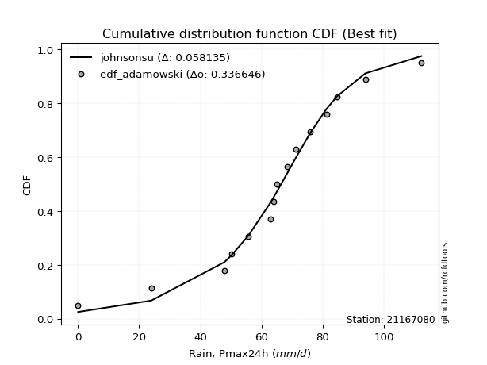</img>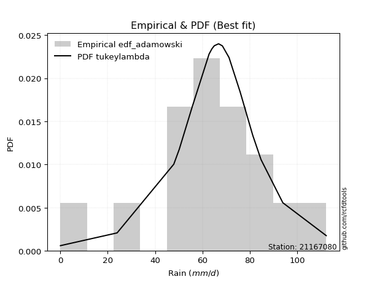</img>

</div>


## C. Best fit & Estimate extreme values for specific return periods - Tr


### 1. Best fit (ordered by delta Δ)

<div align="center">

|   id |   station | empirical_dist   | p_dist       |     delta |   deltao | eval   |   fit |   n |   best_fit |   best_fit_sort |
|-----:|----------:|:-----------------|:-------------|----------:|---------:|:-------|------:|----:|-----------:|----------------:|
|    0 |  21167080 | edf_weibull      | logjohnsonsu | 0.0571667 | 0.336646 | Δo > Δ |     1 |  15 |          1 |               1 |
|    1 |  21167080 | edf_adamowski    | johnsonsu    | 0.0581353 | 0.336646 | Δo > Δ |     1 |  15 |          1 |               2 |
|    2 |  21167080 | edf_chegodayev   | johnsonsu    | 0.0589732 | 0.336646 | Δo > Δ |     1 |  15 |          1 |               3 |
|    3 |  21167080 | edf_jenkinson    | johnsonsu    | 0.0591421 | 0.336646 | Δo > Δ |     1 |  15 |          1 |               4 |
|    4 |  21167080 | edf_beard        | johnsonsu    | 0.0591421 | 0.336646 | Δo > Δ |     1 |  15 |          1 |               5 |
|    5 |  21167080 | edf_filliben     | johnsonsu    | 0.059269  | 0.336646 | Δo > Δ |     1 |  15 |          1 |               6 |
|    6 |  21167080 | edf_tukey        | johnsonsu    | 0.0595379 | 0.336646 | Δo > Δ |     1 |  15 |          1 |               7 |
|    7 |  21167080 | edf_blom         | johnsonsu    | 0.0602506 | 0.336646 | Δo > Δ |     1 |  15 |          1 |               8 |
|    8 |  21167080 | edf_cunnane      | johnsonsu    | 0.060682  | 0.336646 | Δo > Δ |     1 |  15 |          1 |               9 |
|    9 |  21167080 | edf_gringorten   | johnsonsu    | 0.0613782 | 0.336646 | Δo > Δ |     1 |  15 |          1 |              10 |
|   10 |  21167080 | edf_california   | logjohnsonsu | 0.0623001 | 0.336646 | Δo > Δ |     1 |  15 |          1 |              11 |
|   11 |  21167080 | edf_hazen        | johnsonsu    | 0.0624364 | 0.336646 | Δo > Δ |     1 |  15 |          1 |              12 |

</div>

:file_folder:Tables: [bestfit_21167080.csv](table/bestfit_21167080.csv) | [extreme_21167080.csv](table/extreme_21167080.csv)


### 2. Extreme values

In hydrology, a return period (or recurrence interval $Tr$) is the statistical average time between extreme events like floods or droughts of a specific magnitude, indicating how rare an event is, with a 100-year flood, for example, having a 1% chance of occurring in any given year, not that it happens exactly every century. It is a key tool for infrastructure design (like bridges or dams) and risk assessment, calculated from historical data to determine the probability of future events, although it is important to remember it is statistical average, and events can cluster or be missed.

> risk_rate: assuming the return period as the project useful life.

|   id |      tr |   prob_l |     prob_g |      alpha |   betaprime |     chi2 |   crystalball |   erlang |    expon |   exponnorm |        f |   fatiguelife |     fisk |    gamma |   genexpon |   genlogistic |   gibrat |   gompertz |   gumbel_l |   gumbel_r |   halflogistic |   halfnorm |   hypsecant |   invgamma |   invgauss |   invweibull |   johnsonsu |   kstwobign |   laplace |   laplace_asymmetric |   loggamma |   logistic |   lognorm |   maxwell |   mielke |    moyal |   nakagami |      ncf |      nct |     norm |           pareto |   pearson3 |   rayleigh |     rice |        t |   truncnorm |     wald |   weibull_min |         logalpha |   logbetaprime |          logchi2 |   logcrystalball |    logerlang |         logexpon |   logexponnorm |           logf |   logfatiguelife |          logfisk |      loggenexpon |   loggenlogistic |        loggibrat |   loggompertz |   loggumbel_l |   loggumbel_r |   loghalflogistic |   loghalfnorm |   loghypsecant |   loginvgamma |   loginvgauss |    loginvweibull |   logjohnsonsu |     logkstwobign |   loglaplace |   loglaplace_asymmetric |   logloggamma |   loglogistic |   loglognorm |   logmaxwell |        logmielke |    logmoyal |   lognakagami |         logncf |    lognct |   logpareto |   logpearson3 |   lograyleigh |   logrice |            logt |   logtruncnorm |          logwald |   logweibull_min |   station |   n |   risk_rate |
|-----:|--------:|---------:|-----------:|-----------:|------------:|---------:|--------------:|---------:|---------:|------------:|---------:|--------------:|---------:|---------:|-----------:|--------------:|---------:|-----------:|-----------:|-----------:|---------------:|-----------:|------------:|-----------:|-----------:|-------------:|------------:|------------:|----------:|---------------------:|-----------:|-----------:|----------:|----------:|---------:|---------:|-----------:|---------:|---------:|---------:|-----------------:|-----------:|-----------:|---------:|---------:|------------:|---------:|--------------:|-----------------:|---------------:|-----------------:|-----------------:|-------------:|-----------------:|---------------:|---------------:|-----------------:|-----------------:|-----------------:|-----------------:|-----------------:|--------------:|--------------:|--------------:|------------------:|--------------:|---------------:|--------------:|--------------:|-----------------:|---------------:|-----------------:|-------------:|------------------------:|--------------:|--------------:|-------------:|-------------:|-----------------:|------------:|--------------:|---------------:|----------:|------------:|--------------:|--------------:|----------:|----------------:|---------------:|-----------------:|-----------------:|----------:|----:|------------:|
|    0 |    2    | 0.5      | 0.5        |   0.555454 |     63.4041 |  62.2341 |       63.8133 |  63.1544 |  44.2627 |     63.8133 |  63.7399 |       63.854  |  65.5434 |  63.0094 |    44.1561 |       66.2783 |  55.9255 |    71.7364 |    68.1304 |    59.4963 |        57.35   |    58.4342 |     63.8133 |    62.2416 |    61.6565 |      61.0311 |     66.4174 |     57.8146 |   63.8133 |              64.3968 |   0.122808 |    63.8133 |   42.0212 |   61.5659 |  66.1571 |  58.1026 |    44.022  |  58.1917 |  63.8124 |  63.8133 |      0.423686    |    66.5589 |    60.7687 |  63.8288 |  63.8702 |     54.796  |  55.2951 |       66.1533 |     0.621116     |        40.9924 |      0.187243    |          42.0213 | 0.391087     |      6.5834      |        42.0214 |    0.317903    |          42.7932 |     0.351768     |     17.3327      |          54.8978 |     25.6035      |       49.7918 |       55.1098 |       32.0412 |           27.9997 |       29.9731 |        42.0212 |       37.1767 |       35.6352 |     36.206       |        66.453  |     26.0789      |      42.0212 |                 54.0247 |       55.3019 |       42.0212 |      42.5174 |      36.4884 |     62.7693      |     29.3557 |       42.1411 |   1.2455       |   41.9331 |    0.103292 |       82.074  |       34.7073 |   42.0345 |    68.0217      |        45.2905 |     24.6092      |     0.176546     |  21167080 |  15 |    0.75     |
|    1 |    2.33 | 0.570815 | 0.429185   |   0.659954 |     68.1752 |  67.2289 |       68.5027 |  67.8708 |  53.9931 |     68.5026 |  68.4507 |       68.5417 |  69.5677 |  67.856  |    53.863  |       70.0873 |  58.3009 |    75.0411 |    72.2102 |    63.8415 |        61.8176 |    63.4952 |     67.5662 |    67.2196 |    67.1209 |      67.3614 |     69.8901 |     64.4279 |   66.6511 |              67.2013 |   0.134244 |    67.945  |   56.4136 |   66.4378 |  69.9801 |  62.2158 |    52.7897 |  64.9264 |  68.5043 |  68.5027 |      2.84603     |    71.0697 |    65.7127 |  68.5067 |  68.5766 |     60.6037 |  58.3699 |       70.6816 |     1.01228      |        57.5623 |      0.282602    |          56.4136 | 1.76086      |     16.5619      |        56.4137 |    0.592311    |          57.4741 |     0.555087     |     31.6562      |          61.8684 |     29.7233      |       57.8435 |       71.206  |       42.0955 |           37.0698 |       41.1896 |        53.1911 |       51.3636 |       50.757  |     62.4977      |        69.7078 |     47.5544      |      50.22   |                 60.5671 |       62.4864 |       54.4717 |      57.0301 |      49.551  |     98.1041      |     38.0096 |       56.5739 |   4.54506      |   56.4027 |    0.13162  |       92.8547 |       47.3457 |   56.4282 |    70.8298      |        53.4237 |     29.8521      |     0.284928     |  21167080 |  15 |    0.729209 |
|    2 |    5    | 0.8      | 0.2        |   1.47026  |     86.0489 |  86.3781 |       85.9295 |  85.7056 | 102.643  |     85.9296 |  85.9766 |       86.0143 |  85.1062 |  86.1629 |   102.395  |       83.6168 |  71.977  |    87.3759 |    85.3902 |    82.719  |        82.0324 |    84.8976 |     82.6199 |    86.3793 |    89.0742 |      94.8629 |     82.6936 |     92.5199 |   80.8393 |              81.1294 |   0.237199 |    83.8978 |  168.558  |   85.6132 |  83.5063 |  81.2689 |    90.7974 |  93.4961 |  85.9422 |  85.9295 | 120582           |    86.3395 |    85.5057 |  85.8914 |  86.2998 |     81.4862 |  75.583  |       86.1457 |    44.6863       |       208.198  |      7.96713     |         168.558  | 2.40599e+08  |   1668.44        |       168.557  | 2235.77        |         172.081  |    28.7413       |    362.639       |          84.329  |     70.1703      |       93.8759 |      162.944  |      137.776  |          131.96   |      157.981  |       136.921  |      175.137  |      198.325  |    669.779       |        80.9243 |    610.161       |     122.433  |                 81.049  |       85.853  |      148.364  |     169.915  |     165.244  |    613.172       |    125.782  |      169.041  |   9.7963e+07   |  169.869  |  inf        |      113.375  |      164.128  |  168.565  |    86.8305      |        82.7662 |     88.008       |   187.236        |  21167080 |  15 |    0.67232  |
|    3 |   10    | 0.9      | 0.1        |   2.959    |     98.0306 |  99.5972 |       97.49   |  97.8058 | 146.805  |     97.4901 |  97.6198 |       97.6504 |  96.5497 |  98.5659 |   146.451  |       92.8226 |  87.566  |    95.1775 |    92.7283 |    98.0944 |        98.8199 |   100.735  |     94.6406 |    99.6885 |   105.151  |     117.262  |     92.3452 |    113.908  |   93.7189 |              93.773  |   0.442582 |    95.6464 |  348.413  |   99.1079 |  92.7058 |  97.8576 |   119.363  | 115.687  |  97.5116 |  97.49   |      1.97552e+09 |    95.2213 |    99.6184 |  97.4244 |  98.5237 |     93.5661 |  93.85   |       95.338  | 47011.9          |       498.883  |    571.805       |         348.413  | 5.07325e+21  | 109840           |       348.41   |    1.60607e+16 |         356.338  | 84468.9          |   2119.58        |          95.6405 |    186.808       |      122.925  |      258.348  |      361.893  |          378.771  |      427.188  |       291.319  |      404.205  |      511.407  |   4623.72        |        92.5291 |   4258.31        |     274.933  |                 91.2261 |       97.3755 |      310.316  |     350.67   |     385.689  |   2546.1         |    356.551  |      349.436  |   1.61927e+34  |  353.242  |  inf        |      116.229  |      398.24   |  348.379  |   116.619       |        97.0328 |    277.219       |     6.5905e+08   |  21167080 |  15 |    0.651322 |
|    4 |   15    | 0.933333 | 0.0666667  |   4.44243  |    104.047  | 106.349  |      103.259  | 103.925  | 172.639  |    103.259  | 103.435  |      103.471  | 102.785  | 104.833  |   172.223  |       97.6966 |  98.3187 |    98.8884 |    96.0515 |   106.769  |       108.32   |   108.977  |    101.501  |   106.517  |   113.651  |     129.9    |     97.9255 |    125.263  |  101.253  |             101.169  |   0.655422 |   102.048  |  500.562  |  106.032  |  97.5942 | 107.485  |   134.285  | 127.783  | 103.285  | 103.259  |      5.76697e+11 |    99.2978 |   106.89   | 103.18   | 104.85   |     98.611  | 105.58   |       99.6452 |     4.82453e+07  |       776.485  |   9794.4         |         500.562  | 2.06966e+31  |      1.272e+06   |       500.557  |    4.48093e+36 |         512.476  |     3.73601e+08  |   5311.2         |         100.651  |    367.034       |      138.888  |      318.313  |      624.032  |          687.902  |      716.863  |       448.227  |      617.832  |      831.39   |  13753.6         |       102.259  |  11945.1         |     441.307  |                 97.4217 |      102.077  |      463.89   |     503.461  |     595.814  |   5611.84        |    652.73   |      502.057  |   6.45384e+75  |  509.144  |  inf        |      116.598  |      628.774  |  500.479  |   153.984       |       101.989  |    579.173       |     1.4129e+15   |  21167080 |  15 |    0.644736 |
|    5 |   20    | 0.95     | 0.05       |   5.92455  |    108.001  | 110.828  |      107.037  | 107.961  | 190.968  |    107.037  | 107.245  |      107.287  | 107.094  | 108.965  |   190.508  |      101.029  | 106.753  |   101.247  |    98.1201 |   112.843  |       114.976  |   114.471  |    106.34   |   111.058  |   119.394  |     138.749  |    101.961  |    132.912  |  106.599  |             106.417  |   0.873822 |   106.472  |  634.617  |  110.627  | 100.948  | 114.303  |   144.243  | 136.087  | 107.067  | 107.037  |      3.23654e+13 |   101.843  |   111.723  | 106.949  | 109.096  |    101.46   | 114.322  |      102.373  |     4.92102e+10  |      1039.8    |  82163           |         634.617  | 5.49785e+38  |      7.2312e+06  |       634.61   |    2.46067e+64 |         650.191  |     2.15291e+12  |   9813.59        |         103.844  |    623.43        |      149.855  |      362.477  |      913.874  |         1044.95   |     1012.34   |       607.449  |      817.802  |     1148.46   |  29505.9         |       111.305  |  23930.2         |     617.384  |                102.071  |      104.846  |      612.492  |     638.03   |     795.169  |   9727.28        |   1001.66   |      636.538  |   1.47951e+132 |  646.918  |  inf        |      116.701  |      851.788  |  634.482  |   202.205       |       104.505  |   1002.91        |     1.0323e+21   |  21167080 |  15 |    0.641514 |
|    6 |   25    | 0.96     | 0.04       |   7.40615  |    110.918  | 114.153  |      109.818  | 110.948  | 205.185  |    109.818  | 110.051  |      110.099  | 110.391  | 112.021  |   204.69   |      103.564  | 113.785  |   102.947  |    99.5921 |   117.521  |       120.105  |   118.56   |    110.086  |   114.437  |   123.714  |     145.564  |    105.16   |    138.641  |  110.745  |             110.487  |   1.09688  |   109.857  |  755.741  |  114.038  | 103.506  | 119.588  |   151.656  | 142.399  | 109.85   | 109.818  |      7.35894e+14 |   103.655  |   115.314  | 109.723  | 112.28   |    103.308  | 121.323  |      104.336  |     5.00727e+13  |      1290.65   | 450916           |         755.741  | 6.1234e+44   |      2.78369e+07 |       755.733  |    1.68529e+99 |         774.718  |     1.51271e+16  |  15513.1         |         106.19   |    969.608       |      158.182  |      397.588  |     1226.04   |         1442.06   |     1308.72   |       768.558  |     1006.6    |     1460.42   |  53119.4         |       119.983  |  40269.1         |     801.046  |                105.83   |      106.748  |      757.573  |     759.589  |     985.185  |  14839.3         |   1395.98   |      758.053  |   7.44027e+202 |  771.67   |  inf        |      116.742  |     1067.29   |  755.555  |   264.745       |       106.027  |   1556.89        |     2.76864e+26  |  21167080 |  15 |    0.639603 |
|    7 |   50    | 0.98     | 0.02       |  14.8118   |    119.304  | 123.812  |      117.782  | 119.569  | 249.348  |    117.782  | 118.089  |      118.163  | 120.463  | 120.84   |   248.747  |      111.255  | 138.571  |   107.641  |   103.588  |   131.933  |       135.905  |   130.443  |    121.698  |   124.282  |   136.52   |     166.56   |    115.61   |    155.465  |  123.625  |             123.131  |   2.26573  |   120.197  | 1246.27   |  123.932  | 111.311  | 135.994  |   173.21   | 161.428  | 117.822  | 117.782  |      1.20563e+19 |   108.56   |   125.738  | 117.669  | 121.713  |    107.406  | 144.184  |      109.759  |     5.40251e+28  |      2409.67   |      1.13185e+08 |        1246.27   | 7.23057e+64  |      1.83261e+09 |      1246.25   |  inf           |        1279.74   |     1.86638e+36  |  59117.3         |         113.071  |   4599.66        |      183.195  |      511.01   |     3031.31   |         3890.49   |     2760.59   |      1593.8    |     1835.92   |     2940.53   | 325008           |       161.358  | 185651           |    1798.81   |                118.411  |      111.646  |     1450.45   |    1251.69   |    1834.03   |  54239.1         |   3912.06   |     1250.21   | inf            | 1278.85   |  inf        |      116.785  |     2054.11   | 1245.84   |   996.714       |       109.097  |   6544.23        |     8.30636e+48  |  21167080 |  15 |    0.63583  |
|    8 |   75    | 0.986667 | 0.0133333  |  22.2165   |    123.823  | 129.077  |      122.055  | 124.237  | 275.182  |    122.055  | 122.405  |      122.497  | 126.28   | 125.612  |   274.518  |      115.674  | 155.312  |   110.057  |   105.608  |   140.31   |       145.09   |   136.912  |    128.484  |   129.67   |   143.665  |     178.764  |    122.158  |    164.722  |  131.159  |             130.527  |   3.50116  |   126.17   | 1629.95   |  129.311  | 115.827  | 145.588  |   184.943  | 172.24   | 122.1    | 122.055  |      3.51949e+21 |   111.023  |   131.409  | 121.932  | 126.993  |    108.922  | 158.251  |      112.555  |     5.80083e+43  |      3379.88   |      3.27599e+09 |        1629.95   | 2.09821e+77  |      2.12225e+10 |      1629.92   |  inf           |        1675.37   |     1.97564e+57  | 123072           |         116.973  |  13163.9         |      197.312  |      580.159  |     5130.16   |         6927.16   |     4144.38   |      2440.87   |     2544.21   |     4311.84   | 931432           |       202.425  | 430401           |    2887.35   |                126.453  |      113.99   |     2110.67   |    1636.49   |    2571.22   | 114957           |   7146.8    |     1635.21   | inf            | 1677.22   |  inf        |      116.791  |     2933.02   | 1629.3    |  3680.93        |       110.129  |  15834.1         |     3.60583e+66  |  21167080 |  15 |    0.634587 |
|    9 |  100    | 0.99     | 0.01       |  29.6208   |    126.887  | 132.671  |      124.945  | 127.412  | 293.511  |    124.945  | 125.325  |      125.431  | 130.388  | 128.857  |   292.803  |      118.787  | 168.281  |   111.65   |   106.93   |   146.239  |       151.591  |   141.319  |    133.298  |   133.358  |   148.607  |     187.401  |    127.029  |    171.064  |  136.504  |             135.774  |   4.7865   |   130.387  | 1954.39   |  132.975  | 119.023  | 152.395  |   192.936  | 179.799  | 124.993  | 124.945  |      1.97521e+23 |   112.624  |   135.273  | 124.815  | 130.663  |    109.714  | 168.508  |      114.403  |     6.22099e+58  |      4254.65   |      3.74224e+10 |        1954.39   | 2.64195e+86  |      1.20648e+11 |      1954.36   |  inf           |        2010.24   |     8.81575e+78  | 203267           |         119.734  |  29726.3         |      207.13   |      630.375  |     7444.83   |        10420.5    |     5465.98   |      3302.57   |     3177.26   |     5602.2    |      1.96243e+06 |       244.681  | 765732           |    4039.37   |                132.487  |      115.481  |     2750.7    |    1961.82   |    3236.56   | 195508           |  10959.3    |     1960.8    | inf            | 2014.95   |  inf        |      116.792  |     3738.54   | 1953.55   | 13440.8         |       110.647  |  30156           |     2.19506e+81  |  21167080 |  15 |    0.633968 |
|   10 |  200    | 0.995    | 0.005      |  59.2377   |    133.862  | 140.923  |      131.501  | 134.664  | 337.673  |    131.501  | 131.952  |      132.094  | 140.24   | 136.265  |   336.859  |      126.24   | 203.563  |   115.148  |   109.803  |   160.492  |       167.221  |   151.397  |    144.895  |   141.853  |   160.152  |     208.166  |    139.618  |    185.672  |  149.384  |             148.418  |  10.2815   |   140.502  | 2950.13   |  141.358  | 126.73   | 168.794  |   211.211  | 197.701  | 131.556  | 131.501  |      3.23603e+27 |   116.066  |   144.113  | 131.356  | 139.314  |    110.951  | 194.055  |      118.475  |     8.20399e+118 |      7200.18   |      1.51455e+13 |        2950.13   | 1.16737e+109 |      7.94275e+12 |      2950.08   |  inf           |        3039.45   |     3.39887e+169 | 645059           |         126.46   | 272632           |      230.186  |      755.024  |    18224.5    |        27811.6    |    10294.4    |      6842.06   |     5283.87   |    10234.4    |      1.17736e+07 |       434.187  |      2.8864e+06  |    9070.71   |                148.238  |      118.614  |     5192.35   |    2960.11   |    5479.56   | 699928           |  30698.6    |     2960.16   | inf            | 3055.32   |  inf        |      116.794  |     6513.89   | 2948.62   |     2.23547e+06 |       111.425  | 150064           |     3.98446e+125 |  21167080 |  15 |    0.633042 |
|   11 |  250    | 0.996    | 0.004      |  74.046    |    136      | 143.473  |      133.505  | 136.894  | 351.891  |    133.505  | 133.978  |      134.133  | 143.403  | 138.542  |   351.042  |      128.63   | 216.222  |   116.185  |   110.648  |   165.075  |       172.245  |   154.498  |    148.628  |   144.486  |   163.774  |     214.842  |    143.946  |    190.192  |  153.53   |             152.488  |  13.1885   |   143.749  | 3345.73   |  143.938  | 129.217  | 174.074  |   216.832  | 203.386  | 133.562  | 133.505  |      7.35776e+28 |   117.066  |   146.834  | 133.355  | 142.056  |    111.205  | 202.507  |      119.687  |     9.41612e+148 |      8465.37   |      1.083e+14   |        3345.73   | 3.47554e+116 |      3.0576e+13  |      3345.67   |  inf           |        3448.84   |     3.06209e+216 | 922172           |         128.664  | 603813           |      237.447  |      796.19   |    24302.4    |        38131.8    |    12507.8    |      8650.04   |     6180.42   |    12333.9    |      2.09447e+07 |       543.88   |      4.35212e+06 |   11769.1    |                153.696  |      119.51   |     6367.17   |    3356.68   |    6443.68   |      1.05441e+06 |  42768.7    |     3357.24   | inf            | 3469.95   |  inf        |      116.794  |     7728.02   | 3343.94   |     2.80823e+07 |       111.581  | 255170           |     4.8036e+142  |  21167080 |  15 |    0.632858 |
|   12 |  500    | 0.998    | 0.002      | 148.087    |    142.357  | 151.109  |      139.446  | 143.547  | 396.053  |    139.446  | 139.989  |      140.186  | 153.213  | 145.333  |   395.098  |      136.038  | 259.973  |   119.178  |   113.071  |   179.297  |       187.84   |   163.743  |    160.224  |   152.397  |   174.779  |     235.562  |    158.329  |    203.74   |  166.41   |             165.132  |  28.7949   |   153.821  | 4859.09   |  151.638  | 136.977  | 190.473  |   233.585  | 220.856  | 139.51   | 139.446  |      1.20544e+33 |   119.896  |   154.953  | 139.283  | 150.495  |    111.723  | 229.381  |      123.199  |     1.87341e+299 |     13723.2    |      5.33227e+16 |        4859.1    | 1.67023e+140 |      2.01294e+15 |      4859      |  inf           |        5016.98   |   inf            |      2.69315e+06 |         135.687  |      9.42616e+06 |      259.554  |      927.068  |    59375      |       101555      |    22354.2    |     17919.6    |     9872.46   |    21595.9    |      1.25194e+08 |      1275.13   |      1.48992e+07 |   26428.4    |                171.968  |      122.023  |    11985.8    |    4873.61   |   10451.4    |      3.7596e+06  | 119799      |     4876.41   | inf            | 5061.34   |  inf        |      116.794  |    12868.9    | 4856.14   |     7.55887e+12 |       111.893  |      1.38013e+06 |     3.34685e+205 |  21167080 |  15 |    0.632489 |
|   13 |  750    | 0.998667 | 0.00133333 | 222.129    |    145.901  | 155.401  |      142.746  | 147.268  | 421.887  |    142.747  | 143.329  |      143.552  | 158.944  | 149.13   |   420.869  |      140.363  | 288.907  |   120.789  |   114.366  |   187.611  |       196.957  |   168.907  |    167.007  |   156.859  |   181.065  |     247.674  |    167.441  |    211.351  |  173.944  |             172.528  |  45.6713   |   159.705  | 5978.39   |  155.945  | 141.544  | 200.065  |   242.941  | 230.965  | 142.815  | 142.746  |      3.51893e+35 |   121.381  |   159.493  | 142.576  | 155.396  |    111.898  | 245.494  |      125.098  |   inf            |     17983.1    |      2.11392e+18 |        5978.39   | 2.27117e+154 |      2.33108e+16 |      5978.26   |  inf           |        6178.46   |   inf            |      4.92125e+06 |         139.936  |      5.80226e+07 |      272.201  |     1005.62   |   100092      |       180051      |    30920      |     27438.3    |    12836.2    |    29609.7    |      3.56088e+08 |      2376.72   |      2.97446e+07 |   42421.4    |                183.647  |      123.334  |    17344.9    |    5995.49   |   13697.8    |      7.90359e+06 | 218837      |     6000.13   | inf            | 6242.64   |  inf        |      116.794  |    17115.4    | 5974.51   |     1.73857e+18 |       111.997  |      3.79718e+06 |     5.22084e+249 |  21167080 |  15 |    0.632366 |
|   14 | 1000    | 0.999    | 0.001      | 296.17     |    148.345  | 158.376  |      145.019  | 149.841  | 440.216  |    145.019  | 145.63   |      145.872  | 163.009  | 151.754  |   439.154  |      143.43   | 311.048  |   121.877  |   115.238  |   193.509  |       203.424  |   172.474  |    171.82   |   159.96   |   185.465  |     256.266  |    174.24   |    216.623  |  179.289  |             177.775  |  63.4655   |   163.877  | 6895.55   |  158.921  | 144.798  | 206.872  |   249.4    | 238.097  | 145.09   | 145.019  |      1.9749e+37  |   122.368  |   162.631  | 144.843  | 158.867  |    111.986  | 257.085  |      126.386  |   inf            |     21680      |      2.93775e+19 |        6895.55   | 3.10334e+164 |      1.3252e+17  |      6895.4    |  inf           |        7131.05   |   inf            |      7.47568e+06 |         143.021  |      2.33121e+08 |      281.058  |     1062.21   |   144970      |       270274      |    38684.3    |     37122.4    |    15394.3    |    36864.3    |      7.47469e+08 |      3944.17   |      4.80194e+07 |   59347.1    |                192.411  |      124.204  |    22542.1    |    6914.76   |   16513.7    |      1.33872e+07 | 335566      |     6920.99   | inf            | 7212.83   |  inf        |      116.794  |    20843.6    | 6890.88   |     3.61494e+23 |       112.049  |      7.86388e+06 |     4.66892e+284 |  21167080 |  15 |    0.632305 |

<div align="center">

</img>

</div>


<div align="center">

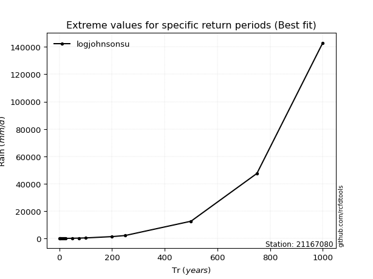</img>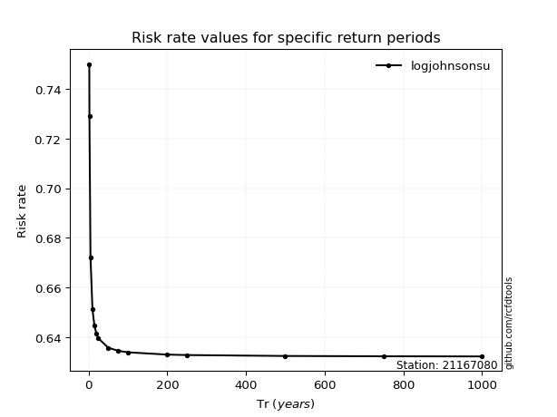</img>

</div>


<sub>**APP DISCLAIMER**: NO WARRANTY - This software is provided by [github.com/rcfdtools](https://github.com/rcfdtools) "as is", without any express or implied warranty, including warranties of merchantability, fitness for a particular purpose, or non-infringement. There is no guarantee that the software will be error-free or operate without interruption. LIMITATION OF LIABILITY - Neither the authors nor copyright holders will be liable for claims or damages arising from the software or its use. You are responsible for determining if the software is appropriate for your use and assume all associated risks, including errors, legal compliance, and data loss. NO PROFESSIONAL ADVICE - The software provides general information and does not offer professional advice. It should not replace consultation with professional advisors.</sub>