<div align="center">


</div>

# PMP Station (Rain, Pmax24h): 21185090

Probable Maximum Precipitation (PMP) is the greatest amount of rainfall for a specific duration that is meteorologically possible for a given location, acting as a "worst-case" scenario for extreme storms, crucial for designing safety-critical infrastructure like bridges, river deviations, dams, spillways, and nuclear plants to prevent catastrophic failure. PMP is calculated by hydrologists using meteorological data to determine the upper limit of extreme rainfall, often leading to the Probable Maximum Flood (PMF) for flood control design, and is increasingly being studied for climate change impacts. Probable Maximum Precipitation (PMP) is the theoretical upper limit of rainfall, a deterministic estimate for extreme events, while probability distributions (like GEV, Gumbel) describe the likelihood and frequency of various precipitation amounts, including rare ones, showing how often events occur, with PMP representing the extreme end of these distributions, used for critical infrastructure design to ensure safety against the worst conceivable weather, unlike standard statistical forecasts which cover typical probabilities.

The most common probability distributions in hydrology, used for analyzing floods, rainfall, and streamflow, include the Normal, Log-Normal, Gumbel, Gamma (including Log-Pearson Type III), and Generalized Extreme Value (GEV) distributions, often chosen based on the data´s skewness and whether modeling extremes or general conditions, with Gumbel and GEV popular for extreme events like floods, while the Normal distribution serves as a baseline, though often requiring transformations for skewed hydrological data. These distributions help in designing water infrastructure, managing water resources, and forecasting hydrologic events.

> Hydrological data often isn´t perfectly normal (it´s skewed), so different distributions are needed for different applications, such as: **Flood Frequency Analysis**: Using Gumbel, GEV, or Log-Pearson Type III for predicting extreme flood magnitudes and their return periods, **Rainfall Analysis**: Normal for annual totals, but Log-Normal, Weibull, or GEV for intensity or extreme daily rainfall, **Streamflow Modeling**: Gamma and Log-Normal for maximum flows, GEV for minimum flows, and Kappa for daily flows.

<div align="center">

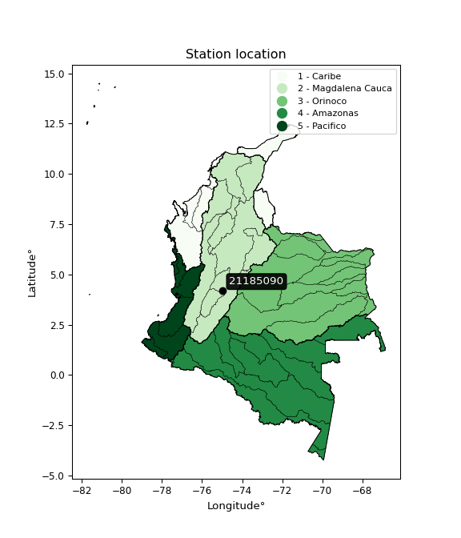</img>

</div>


## A. General information


### 1. General running parameters

• app_version: _v20260103_. • runtime: _2026-01-05 16:20:51.132608_. • Python version: _3.14.0_. • SciPy version: _1.16.3_. • Pandas version: _2.3.3_. • NumPy version: _2.3.5_. • Stations dataset (station_dataset_file): _dataset/pmax24h_in/automatic_colombia_2003_2024.csv_. • Stations catalog (station_catalog_file): _dataset/CNE.xls_. • Minimum year to eval til year_max (date_min): _1900_. • Maximum year to eval since year_min (date_max): _2024_. • Creates, save and include plots into reports (create_plot): _True_. • Plot only fit distributions with Δo > Δ (plot_only_fit): _True_. • Plot only simple graphs avoiding multiple CDFs and multiple Extreme values plots (plot_only_simple): _True_. • Eval low extreme values, if False, evaluates high extreme values (low_extreme): _False_. • Eval every SciPy distribution as logarithmic (pdist_logarithmic_on): _True_. • Standard deviation normalized (ddof): _1.0_. • Return periods to eval in years (Tr): _[2, 2.33, 5, 10, 15, 20, 25, 50, 75, 100, 200, 250, 500, 750, 1000]_. • Minimum data sample per station, 0 means any (minimum_sample): _5_. • Z-Score maximum threshold to adjust a value, 0 means disable (zscore_max): _3.5_. • Z-Score minimum threshold to adjust a value, 0 means disable (zscore_min): _-2.5_. • Avoid zeros, e.g. rain = 0 (avoid_zeros): _True_. • Avoid null values (avoid_nans): _True_. 

[:file_folder:Dataset file](../../dataset/pmax24h_in/automatic_colombia_2003_2024.csv)

> Delta Degrees of Freedom (DDOF): is a parameter used in the formulas for calculating variance and standard deviation. When ddof=0, the divisor is $N$ (the total number of observations) and this is used when your data set is the entire population. When ddof=1, the divisor is $N-1$ and this is used when your data set is a sample drawn from a larger population. Using $N-1$ provides an unbiased estimate of the population variance (known as Bessel´s correction).


### 2. Station info and location

|   id |   CODIGO | NOMBRE                   | CATEGORIA               | TECNOLOGIA                              | ESTADO   | FECHA_INSTALACION   |   FECHA_SUSPENSION |   ALTITUD |   LATITUD |   LONGITUD | DEPARTAMENTO   | MUNICIPIO   | AREA_OPERATIVA             | ENTIDAD                                                     | AREA_HIDROGRAFICA   | ZONA_HIDROGRAFICA   | SUBZONA_HIDROGRAFICA                    |   CORRIENTE | Catalogo   |   Version |
|-----:|---------:|:-------------------------|:------------------------|:----------------------------------------|:---------|:--------------------|-------------------:|----------:|----------:|-----------:|:---------------|:------------|:---------------------------|:------------------------------------------------------------|:--------------------|:--------------------|:----------------------------------------|------------:|:-----------|----------:|
|    0 | 21185090 | NATAIMA - AUT [21185090] | Climatológica Principal | Automática con Telemetría, Convencional | Activa   | 16/10/2005          |                nan |       371 |   4.18814 |   -74.9605 | Tolima         | Espinal     | Area Operativa 10 - Tolima | INSTITUTO DE HIDROLOGIA METEOROLOGIA Y ESTUDIOS AMBIENTALES | Magdalena Cauca     | Alto Magdalena      | Río Luisa y otros directos al Magdalena |         nan | CNE_IDEAM  |  20251226 |

<div align="center">

Dynamic map: [:earth_americas:Google](http://maps.google.com/maps?q=4.188138889,-74.96047222) [:earth_americas:OSM](https://www.openstreetmap.org/#map=18/4.188138889/-74.96047222&layers=P) [:earth_americas:Bing](https://www.bing.com/maps?cp=4.188138889~-74.96047222&lvl=18) [:earth_americas:Apple](https://maps.apple.com/frame?center=4.188138889%2C-74.96047222&span=0.003%2C0.006)

</div>


<div align="center">

```geojson
{
  "type": "Feature",
  "geometry": {
    "type": "Point", 
    "coordinates": [-74.96047222, 4.188138889]
  }, 
  "properties": {
    "Name": "21185090"
  }
}
```

</div>


### 3. Discrete values table and plot

<div align="center">

|               |           0 |          1 |           2 |           3 |           4 |           5 |           6 |           7 |           8 |           9 |         10 |         11 |         12 |         13 |          14 |         15 |        16 |         17 |          18 |         19 |
|:--------------|------------:|-----------:|------------:|------------:|------------:|------------:|------------:|------------:|------------:|------------:|-----------:|-----------:|-----------:|-----------:|------------:|-----------:|----------:|-----------:|------------:|-----------:|
| Date          | 2005        | 2006       | 2007        | 2008        | 2009        | 2010        | 2011        | 2012        | 2013        | 2014        | 2015       | 2016       | 2017       | 2018       | 2019        | 2020       | 2021      | 2022       | 2023        | 2024       |
| Value         |   66.6      |  118.2     |   62.7      |   79.2      |   73.6      |   59.9      |   65.6      |   65.1      |   38.7      |   65.6      |    2.8     |    1.3     |    2.2     |    2.4     |   18.1      |    0.4     |  101.9    |   89.9     |   17.6      |  117.8     |
| Value_initial |   66.6      |  118.2     |   62.7      |   79.2      |   73.6      |   59.9      |   65.6      |   65.1      |   38.7      |   65.6      |    2.8     |    1.3     |    2.2     |    2.4     |   18.1      |    0.4     |  101.9    |   89.9     |   17.6      |  117.8     |
| count         |   20        |   20       |   20        |   20        |   20        |   20        |   20        |   20        |   20        |   20        |   20       |   20       |   20       |   20       |   20        |   20       |   20      |   20       |   20        |   20       |
| mean          |   52.48     |   52.48    |   52.48     |   52.48     |   52.48     |   52.48     |   52.48     |   52.48     |   52.48     |   52.48     |   52.48    |   52.48    |   52.48    |   52.48    |   52.48     |   52.48    |   52.48   |   52.48    |   52.48     |   52.48    |
| std           |   39.6533   |   39.6533  |   39.6533   |   39.6533   |   39.6533   |   39.6533   |   39.6533   |   39.6533   |   39.6533   |   39.6533   |   39.6533  |   39.6533  |   39.6533  |   39.6533  |   39.6533   |   39.6533  |   39.6533 |   39.6533  |   39.6533   |   39.6533  |
| zscore        |    0.356087 |    1.65737 |    0.257734 |    0.673841 |    0.532617 |    0.187122 |    0.330868 |    0.318259 |   -0.347512 |    0.330868 |   -1.25286 |   -1.29069 |   -1.26799 |   -1.26295 |   -0.867016 |   -1.31339 |    1.2463 |    0.94368 |   -0.879625 |    1.64728 |


</div>


<div align="center">

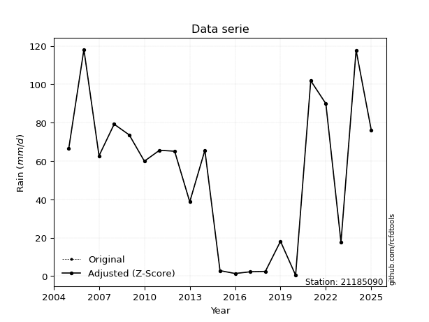</img>

</div>


> The initial value (value_initial) correspond to the initial obtained or null completed value, and value (value) is adjusted only when the initial value is outside the valid range (outlier) definite through the Z-Score value. If Z-Score is active, values out of range or outliers are replaced with the station mean value. A Z-Score (or standard score) measures how many standard deviations a data point is from the mean of a dataset, indicating its relative position; positive scores mean above the mean, negative mean below, and a score of zero is exactly at the mean, allowing for comparison of values from different distributions. It´s calculated using the formula $z=(x–μ)/σ$, where $x$ is the data point, $μ$ is the mean, and $σ$ is the standard deviation, helping identify outliers and understand probability.
>
> <sub>**Note**: In this study, "completing" (filling gaps in) and "extending" (forecasting or lengthening the historical record) rainfall data series are avoided for certain critical analyses because they introduce artificial bias and uncertainty, which can distort the statistics of rare events (extremes), alter day-to-day variability, and compromise the integrity and homogeneity of the original data. Some reasons against Completing/Extending rainfall data are: **Distortion of Extremes and Variability**: The primary issue is that most gap-filling or extension methods rely on averaging or regression with nearby stations, which inherently smooths the data. Rainfall is highly variable in space and time, with a large percentage of zero values and occasional large storms. Infilling methods often underestimate the highest values and overestimate the lowest (zero) values, which severely distorts analyses focused on flood frequency, drought severity, and intensity-duration-frequency (IDF) curves, **Loss of Data Homogeneity**: Infilled or extended data are synthetic estimates, not actual measurements. Combining these estimates with observed data can violate the assumption of data homogeneity, which requires that the data properties do not change over time. Inhomogeneity can lead to incorrect conclusions about long-term trends or changes in climate patterns, **Propagation of Errors**: Errors and biases from the original data (e.g., wind-induced undercatch, instrument errors, site changes) or the data used for imputation can propagate through the analysis, leading to unreliable hydrological models and inaccurate predictions, **Compromised Statistical Integrity**: For statistical analyses, especially those involving the frequency of events, using artificial data can introduce time bias or autocorrelation that doesn´t exist in reality, making it difficult to assess the true probability of events, **Difficulty in Validation**: It is difficult to accurately validate the quality of filled or extended data, especially for past periods where ground-truth measurements are unavailable. The reliability of imputation techniques heavily depends on the density of the surrounding station network and the complexity of the local topography.</sub>


### 4. Active continuous probability distributions from SciPy (44 of 104 available)

A Probability Density Function (PDF) describes the relative likelihood of a continuous random variable falling within a specific range, where the total area under its curve equals 1, and the area over any interval gives the actual probability for that range. Unlike discrete probabilities (like rolling a die), a PDF shows density, not direct probability for a single point (which is zero), with higher points indicating higher likelihood, often visualized as a bell curve for normal distributions.

A log of a probability density function (log-PDF) is simply the logarithm of the PDF´s value, denoted as $log(f(x))$, useful for converting multiplication of probabilities into addition, improving numerical stability with tiny numbers, and connecting to information theory concepts like entropy. Instead of dealing with very small probabilities (e.g., 0.000001), log-PDFs use negative numbers (e.g., $log(0.00001) ≈ -11.51$ that are easier for computers to handle, preventing underflow errors and simplifying complex calculations. In this study, each active probability distribution from SciPy is also evaluated in the $log$ form.

[scipy.stats](https://docs.scipy.org/doc/scipy/reference/stats.html) is a Python´s powerful submodule within the SciPy library for comprehensive statistical analysis, offering over 130 probability distributions (like Normal, Poisson), functions for descriptive stats (mean, variance), hypothesis testing (t-tests, chi-square), random variable generation, and statistical tests, making it essential for data science, modeling, and research. It provides tools to explore, model, and draw conclusions from data efficiently, working seamlessly with NumPy.

<div align="center">

|   id | p_dist             |   n_parameter | fit_method   | label                                                                       | active   | ref                                                                                                        |
|-----:|:-------------------|--------------:|:-------------|:----------------------------------------------------------------------------|:---------|:-----------------------------------------------------------------------------------------------------------|
|    0 | alpha              |             3 | MLE          | Alpha                                                                       | True     | [:mortar_board:](https://docs.scipy.org/doc/scipy/reference/generated/scipy.stats.alpha.html)              |
|    1 | betaprime          |             4 | MLE          | Beta prime                                                                  | True     | [:mortar_board:](https://docs.scipy.org/doc/scipy/reference/generated/scipy.stats.betaprime.html)          |
|    2 | chi2               |             3 | MLE          | Chi²                                                                        | True     | [:mortar_board:](https://docs.scipy.org/doc/scipy/reference/generated/scipy.stats.chi2.html)               |
|    3 | crystalball        |             4 | MLE          | Crystalball                                                                 | True     | [:mortar_board:](https://docs.scipy.org/doc/scipy/reference/generated/scipy.stats.crystalball.html)        |
|    4 | erlang             |             3 | MLE          | Erlang                                                                      | True     | [:mortar_board:](https://docs.scipy.org/doc/scipy/reference/generated/scipy.stats.erlang.html)             |
|    5 | expon              |             2 | MLE          | Exponential                                                                 | True     | [:mortar_board:](https://docs.scipy.org/doc/scipy/reference/generated/scipy.stats.expon.html)              |
|    6 | exponnorm          |             3 | MLE          | Exponentially modified Normal                                               | True     | [:mortar_board:](https://docs.scipy.org/doc/scipy/reference/generated/scipy.stats.exponnorm.html)          |
|    7 | f                  |             4 | MLE          | F                                                                           | True     | [:mortar_board:](https://docs.scipy.org/doc/scipy/reference/generated/scipy.stats.f.html)                  |
|    8 | fatiguelife        |             3 | MLE          | Fatigue-life (Birnbaum-Saunders)                                            | True     | [:mortar_board:](https://docs.scipy.org/doc/scipy/reference/generated/scipy.stats.fatiguelife.html)        |
|    9 | fisk               |             3 | MLE          | Fisk                                                                        | True     | [:mortar_board:](https://docs.scipy.org/doc/scipy/reference/generated/scipy.stats.fisk.html)               |
|   10 | gamma              |             3 | MLE          | Gamma                                                                       | True     | [:mortar_board:](https://docs.scipy.org/doc/scipy/reference/generated/scipy.stats.gamma.html)              |
|   11 | genexpon           |             5 | MLE          | Generalized exponential                                                     | True     | [:mortar_board:](https://docs.scipy.org/doc/scipy/reference/generated/scipy.stats.genexpon.html)           |
|   12 | genlogistic        |             3 | MLE          | Generalized logistic                                                        | True     | [:mortar_board:](https://docs.scipy.org/doc/scipy/reference/generated/scipy.stats.genlogistic.html)        |
|   13 | gibrat             |             2 | MM           | Gibrat                                                                      | True     | [:mortar_board:](https://docs.scipy.org/doc/scipy/reference/generated/scipy.stats.gibrat.html)             |
|   14 | gompertz           |             3 | MLE          | Gompertz (or truncated Gumbel)                                              | True     | [:mortar_board:](https://docs.scipy.org/doc/scipy/reference/generated/scipy.stats.gompertz.html)           |
|   15 | gumbel_l           |             2 | MM           | Gumbel Left Skew                                                            | True     | [:mortar_board:](https://docs.scipy.org/doc/scipy/reference/generated/scipy.stats.gumbel_l.html)           |
|   16 | gumbel_r           |             2 | MM           | Gumbel Right Skew                                                           | True     | [:mortar_board:](https://docs.scipy.org/doc/scipy/reference/generated/scipy.stats.gumbel_r.html)           |
|   17 | halflogistic       |             2 | MM           | Half-logistic                                                               | True     | [:mortar_board:](https://docs.scipy.org/doc/scipy/reference/generated/scipy.stats.halflogistic.html)       |
|   18 | halfnorm           |             2 | MM           | Half Normal                                                                 | True     | [:mortar_board:](https://docs.scipy.org/doc/scipy/reference/generated/scipy.stats.halfnorm.html)           |
|   19 | hypsecant          |             2 | MM           | hyperbolic secant                                                           | True     | [:mortar_board:](https://docs.scipy.org/doc/scipy/reference/generated/scipy.stats.hypsecant.html)          |
|   20 | invgamma           |             3 | MLE          | Inverted gamma                                                              | True     | [:mortar_board:](https://docs.scipy.org/doc/scipy/reference/generated/scipy.stats.invgamma.html)           |
|   21 | invgauss           |             3 | MLE          | Inverse Gaussian                                                            | True     | [:mortar_board:](https://docs.scipy.org/doc/scipy/reference/generated/scipy.stats.invgauss.html)           |
|   22 | invweibull         |             3 | MLE          | Inverted Weibull                                                            | True     | [:mortar_board:](https://docs.scipy.org/doc/scipy/reference/generated/scipy.stats.invweibull.html)         |
|   23 | johnsonsu          |             4 | MLE          | Johnson Su                                                                  | True     | [:mortar_board:](https://docs.scipy.org/doc/scipy/reference/generated/scipy.stats.johnsonsu.html)          |
|   24 | kstwobign          |             2 | MLE          | Limiting distribution of scaled Kolmogorov-Smirnov two-sided test statistic | True     | [:mortar_board:](https://docs.scipy.org/doc/scipy/reference/generated/scipy.stats.kstwobign.html)          |
|   25 | laplace            |             2 | MM           | Laplace                                                                     | True     | [:mortar_board:](https://docs.scipy.org/doc/scipy/reference/generated/scipy.stats.laplace.html)            |
|   26 | laplace_asymmetric |             3 | MLE          | Asymmetric Laplace                                                          | True     | [:mortar_board:](https://docs.scipy.org/doc/scipy/reference/generated/scipy.stats.laplace_asymmetric.html) |
|   27 | loggamma           |             3 | MLE          | Log gamma                                                                   | True     | [:mortar_board:](https://docs.scipy.org/doc/scipy/reference/generated/scipy.stats.loggamma.html)           |
|   28 | logistic           |             2 | MM           | Logistic (or Sech-squared)                                                  | True     | [:mortar_board:](https://docs.scipy.org/doc/scipy/reference/generated/scipy.stats.logistic.html)           |
|   29 | lognorm            |             3 | MLE          | Log Normal                                                                  | True     | [:mortar_board:](https://docs.scipy.org/doc/scipy/reference/generated/scipy.stats.lognorm.html)            |
|   30 | maxwell            |             2 | MM           | Maxwell                                                                     | True     | [:mortar_board:](https://docs.scipy.org/doc/scipy/reference/generated/scipy.stats.maxwell.html)            |
|   31 | mielke             |             4 | MLE          | Mielke Beta-Kappa / Dagum                                                   | True     | [:mortar_board:](https://docs.scipy.org/doc/scipy/reference/generated/scipy.stats.mielke.html)             |
|   32 | moyal              |             2 | MM           | Moyal                                                                       | True     | [:mortar_board:](https://docs.scipy.org/doc/scipy/reference/generated/scipy.stats.moyal.html)              |
|   33 | nakagami           |             3 | MLE          | Nakagami                                                                    | True     | [:mortar_board:](https://docs.scipy.org/doc/scipy/reference/generated/scipy.stats.nakagami.html)           |
|   34 | ncf                |             5 | MLE          | Non-central F distribution                                                  | True     | [:mortar_board:](https://docs.scipy.org/doc/scipy/reference/generated/scipy.stats.ncf.html)                |
|   35 | nct                |             4 | MLE          | Non-central Student’s t                                                     | True     | [:mortar_board:](https://docs.scipy.org/doc/scipy/reference/generated/scipy.stats.nct.html)                |
|   36 | norm               |             2 | MM           | Normal                                                                      | True     | [:mortar_board:](https://docs.scipy.org/doc/scipy/reference/generated/scipy.stats.norm.html)               |
|   37 | pearson3           |             3 | MM           | Pearson type III                                                            | True     | [:mortar_board:](https://docs.scipy.org/doc/scipy/reference/generated/scipy.stats.pearson3.html)           |
|   38 | rayleigh           |             2 | MM           | Rayleigh                                                                    | True     | [:mortar_board:](https://docs.scipy.org/doc/scipy/reference/generated/scipy.stats.rayleigh.html)           |
|   39 | rice               |             3 | MLE          | Rice                                                                        | True     | [:mortar_board:](https://docs.scipy.org/doc/scipy/reference/generated/scipy.stats.rice.html)               |
|   40 | t                  |             3 | MLE          | Student’s t                                                                 | True     | [:mortar_board:](https://docs.scipy.org/doc/scipy/reference/generated/scipy.stats.t.html)                  |
|   41 | truncnorm          |             4 | MLE          | Truncated normal                                                            | True     | [:mortar_board:](https://docs.scipy.org/doc/scipy/reference/generated/scipy.stats.truncnorm.html)          |
|   42 | wald               |             2 | MM           | Wald                                                                        | True     | [:mortar_board:](https://docs.scipy.org/doc/scipy/reference/generated/scipy.stats.wald.html)               |
|   43 | weibull_min        |             3 | MLE          | Weibull minimum                                                             | True     | [:mortar_board:](https://docs.scipy.org/doc/scipy/reference/generated/scipy.stats.weibull_min.html)        |

</div>

> **n_parameter:** # arguments & localization & scale.
>
> **Fit methods:** (MLE) maximum likelihood, (MM) L-moments.
>
>**Inactive** (With the only purpose of prevent loops, zero divisions, infinite values, over high estimated values or horizontal trending for recurrence intervals estimations, the follow distributions were disabled.)**:** foldnorm, gennorm, norminvgauss, powernorm, powerlognorm, skewnorm, genextreme, anglit, arcsine, argus, beta, bradford, burr, burr12, cauchy, cosine, halfcauchy, foldcauchy, skewcauchy, wrapcauchy, dgamma, gengamma, exponweib, exponpow, truncexpon, gausshyper, genhalflogistic, genhyperbolic, geninvgauss, halfgennorm, johnsonsb, kappa4, kappa3, ksone, kstwo, loglaplace, levy, levy_l, levy_stable, ncx2, pareto, genpareto, truncpareto, lomax, powerlaw, rdist, rel_breitwigner, recipinvgauss, semicircular, studentized_range, trapezoid, triang, truncweibull_min, tukeylambda, uniform, loguniform, vonmises, vonmises_line, weibull_max, dweibull, 


## B. Probability (PDF) vs. Empirical (EDF) distributions functions

A continuous probability distribution (CPD) describes probabilities for variables that can take any value within a range (like rain any time), unlike discrete variables with specific outcomes (like temperature). It uses a Probability Density Function (PDF), a curve where the total area under it equals 1, and the probability of the variable falling within an interval (a to b) is found by calculating the area under the curve between those points. A key feature is that the probability of hitting any single exact value is zero, so probabilities are always expressed for ranges, e.g., $P(a ≤ X ≤ b)$.

<div align="center">

Distributions parameters from station values
|    |   station | p_dist                |   n |               loc |            scale | shape                  | shape1                | shape2               | shape3   |
|---:|----------:|:----------------------|----:|------------------:|-----------------:|:-----------------------|:----------------------|:---------------------|:---------|
|  0 |  21185090 | alpha                 |  20 |       0.00109573  |      1.65345     | 1.9591494163063635e-08 |                       |                      |          |
|  1 |  21185090 | betaprime             |  20 |       0.4         |   3807.59        | 0.7817786556836746     | 88.85887625719732     |                      |          |
|  2 |  21185090 | chi2                  |  20 |       0.4         |     26.6703      | 1.2798710627725738     |                       |                      |          |
|  3 |  21185090 | crystalball           |  20 |      52.48        |     38.6492      | 59299.9207225461       | 386.64965525904677    |                      |          |
|  4 |  21185090 | erlang                |  20 |   -2076.21        |      0.701401    | 3034.916982984223      |                       |                      |          |
|  5 |  21185090 | expon                 |  20 |       0.4         |     52.08        |                        |                       |                      |          |
|  6 |  21185090 | exponnorm             |  20 |      51.3642      |     38.6331      | 0.0288815196271098     |                       |                      |          |
|  7 |  21185090 | f                     |  20 |       0.4         |     51.8484      | 1.658184592776962      | 229.60966732221038    |                      |          |
|  8 |  21185090 | fatiguelife           |  20 |      -0.549223    |     16.5671      | 1.8951855596752285     |                       |                      |          |
|  9 |  21185090 | fisk                  |  20 |       0.4         |     34.1322      | 0.6660562762865168     |                       |                      |          |
| 10 |  21185090 | gamma                 |  20 |   -2070.38        |      0.70344     | 3017.8036448286066     |                       |                      |          |
| 11 |  21185090 | genexpon              |  20 |       0.399994    |      2.51464     | 0.048314465017834055   | 6.640950470600619e-07 | 2.498080433570907    |          |
| 12 |  21185090 | genlogistic           |  20 |    -169.797       |     34.3742      | 368.47995590518394     |                       |                      |          |
| 13 |  21185090 | gibrat                |  20 |      22.9956      |     17.8832      |                        |                       |                      |          |
| 14 |  21185090 | gompertz              |  20 |       0.4         |     73.4829      | 0.7538372401539105     |                       |                      |          |
| 15 |  21185090 | gumbel_l              |  20 |      69.8742      |     30.1347      |                        |                       |                      |          |
| 16 |  21185090 | gumbel_r              |  20 |      35.0858      |     30.1347      |                        |                       |                      |          |
| 17 |  21185090 | halflogistic          |  20 |       6.67175     |     33.0437      |                        |                       |                      |          |
| 18 |  21185090 | halfnorm              |  20 |       1.32362     |     64.115       |                        |                       |                      |          |
| 19 |  21185090 | hypsecant             |  20 |      52.48        |     24.6049      |                        |                       |                      |          |
| 20 |  21185090 | invgamma              |  20 |    -274.995       |  22900.6         | 70.87797023856075      |                       |                      |          |
| 21 |  21185090 | invgauss              |  20 |    -102.299       |   2242.32        | 0.0689919118673029     |                       |                      |          |
| 22 |  21185090 | invweibull            |  20 |      -7.95453e+09 |      7.95453e+09 | 226456088.51645914     |                       |                      |          |
| 23 |  21185090 | johnsonsu             |  20 |    -923.274       |   1901.34        | -27.229911852604182    | 55.24437345286597     |                      |          |
| 24 |  21185090 | kstwobign             |  20 |     -84.2294      |    155.879       |                        |                       |                      |          |
| 25 |  21185090 | laplace               |  20 |      52.48        |     27.3291      |                        |                       |                      |          |
| 26 |  21185090 | laplace_asymmetric    |  20 |      65.6         |     29.6811      | 1.2450638016003674     |                       |                      |          |
| 27 |  21185090 | loggamma              |  20 |   -6964.16        |   1059.81        | 750.9104577360622      |                       |                      |          |
| 28 |  21185090 | logistic              |  20 |      52.48        |     21.3084      |                        |                       |                      |          |
| 29 |  21185090 | lognorm               |  20 |       0.4         |      3.71161     | 9.016597571330268      |                       |                      |          |
| 30 |  21185090 | maxwell               |  20 |     -39.1024      |     57.3908      |                        |                       |                      |          |
| 31 |  21185090 | mielke                |  20 |       0.399991    |    119.261       | 0.5682930062918548     | 59.65639450668834     |                      |          |
| 32 |  21185090 | moyal                 |  20 |      30.3779      |     17.3983      |                        |                       |                      |          |
| 33 |  21185090 | nakagami              |  20 |       0.4         |     84.7969      | 0.25060845281614863    |                       |                      |          |
| 34 |  21185090 | ncf                   |  20 |       0.4         |      8.56129     | 0.47071297619596464    | 24.303888943170655    | 2.2785412434521      |          |
| 35 |  21185090 | nct                   |  20 |     805.45        |     37.2732      | 2713.792972787014      | -20.196439038604943   |                      |          |
| 36 |  21185090 | norm                  |  20 |      52.48        |     38.6492      |                        |                       |                      |          |
| 37 |  21185090 | pearson3              |  20 |      52.48        |     38.6492      | 0.033461953740226605   |                       |                      |          |
| 38 |  21185090 | rayleigh              |  20 |     -21.4582      |     58.9941      |                        |                       |                      |          |
| 39 |  21185090 | rice                  |  20 |     -20.9818      |     47.2612      | 1.0415648487231106     |                       |                      |          |
| 40 |  21185090 | t                     |  20 |      52.4798      |     38.649       | 87859089.30262804      |                       |                      |          |
| 41 |  21185090 | truncnorm             |  20 |      63.1143      |     46.8531      | -8.587489457632062     | 1.1757111953436703    |                      |          |
| 42 |  21185090 | wald                  |  20 |      13.8308      |     38.6492      |                        |                       |                      |          |
| 43 |  21185090 | weibull_min           |  20 |       0.4         |     56.4102      | 0.7609319166360522     |                       |                      |          |
| 44 |  21185090 | logalpha              |  20 |      -1.50234     |      1.71406     | 4.290636769596532e-08  |                       |                      |          |
| 45 |  21185090 | logbetaprime          |  20 |   -2477.65        |    430.796       | 14121214.943738773     | 2452137.509891757     |                      |          |
| 46 |  21185090 | logchi2               |  20 |      -0.916291    |      1.46439     | 1.3935349343417132     |                       |                      |          |
| 47 |  21185090 | logcrystalball        |  20 |       4.77238     |      7.15247e-06 | 4.805249920851193e-06  | 35.088453424475425    |                      |          |
| 48 |  21185090 | logerlang             |  20 |     -26.532       |      0.104941    | 283.24560162673106     |                       |                      |          |
| 49 |  21185090 | logexpon              |  20 |      -0.916291    |      4.10463     |                        |                       |                      |          |
| 50 |  21185090 | logexponnorm          |  20 |       3.18719     |      1.71321     | 0.0006745168968794036  |                       |                      |          |
| 51 |  21185090 | logf                  |  20 |      -0.916291    |      1.09178     | 1.1581237997461602     | 1.1348372611522       |                      |          |
| 52 |  21185090 | logfatiguelife        |  20 |    -702.246       |    705.433       | 0.002428156745283178   |                       |                      |          |
| 53 |  21185090 | logfisk               |  20 |      -1.99371e+08 |      1.99371e+08 | 207684393.37367225     |                       |                      |          |
| 54 |  21185090 | loggamma              |  20 |     -25.9635      |      0.111507    | 261.37401098472935     |                       |                      |          |
| 55 |  21185090 | loggenexpon           |  20 |      -0.918038    |      0.25253     | 0.009355785580169387   | 6.325940810133112     | 0.000860078262545215 |          |
| 56 |  21185090 | loggenlogistic        |  20 |       4.77239     |      1.31895e-06 | 8.336808717816716e-07  |                       |                      |          |
| 57 |  21185090 | loggibrat             |  20 |       1.88137     |      0.792723    |                        |                       |                      |          |
| 58 |  21185090 | loggompertz           |  20 |      -0.916292    |      1.15822     | 0.01575906745218391    |                       |                      |          |
| 59 |  21185090 | loggumbel_l           |  20 |       3.95938     |      1.33579     |                        |                       |                      |          |
| 60 |  21185090 | loggumbel_r           |  20 |       2.4173      |      1.33579     |                        |                       |                      |          |
| 61 |  21185090 | loghalflogistic       |  20 |       1.15782     |      1.46472     |                        |                       |                      |          |
| 62 |  21185090 | loghalfnorm           |  20 |       0.920704    |      2.84205     |                        |                       |                      |          |
| 63 |  21185090 | loghypsecant          |  20 |       3.18834     |      1.09067     |                        |                       |                      |          |
| 64 |  21185090 | loginvgamma           |  20 |     -35.2151      |  18253.3         | 476.55067881874356     |                       |                      |          |
| 65 |  21185090 | loginvgauss           |  20 |     -14.9345      |   1681.25        | 0.010757295085680681   |                       |                      |          |
| 66 |  21185090 | loginvweibull         |  20 |      -2.37376e+08 |      2.37376e+08 | 122569132.86136465     |                       |                      |          |
| 67 |  21185090 | logjohnsonsu          |  20 |       4.85039     |      0.00219898  | 5.508176545060632      | 0.8220082043721015    |                      |          |
| 68 |  21185090 | logkstwobign          |  20 |      -4.71057     |      9.03311     |                        |                       |                      |          |
| 69 |  21185090 | loglaplace            |  20 |       3.18834     |      1.21142     |                        |                       |                      |          |
| 70 |  21185090 | loglaplace_asymmetric |  20 |       4.77247     |      0.0161847   | 97.78599272646113      |                       |                      |          |
| 71 |  21185090 | logloggamma           |  20 |       4.77238     |      5.59365e-07 | 3.5333464778307664e-07 |                       |                      |          |
| 72 |  21185090 | loglogistic           |  20 |       3.18834     |      0.944544    |                        |                       |                      |          |
| 73 |  21185090 | loglognorm            |  20 |    -656.618       |    659.821       | 0.002590690860645765   |                       |                      |          |
| 74 |  21185090 | logmaxwell            |  20 |      -0.871269    |      2.54398     |                        |                       |                      |          |
| 75 |  21185090 | logmielke             |  20 |   -1977.28        |   1982.08        | 1191.4407317253476     | 12498.754821314957    |                      |          |
| 76 |  21185090 | logmoyal              |  20 |       2.20861     |      0.771217    |                        |                       |                      |          |
| 77 |  21185090 | lognakagami           |  20 |   -1557.29        |   1560.48        | 206757.8544290606      |                       |                      |          |
| 78 |  21185090 | logncf                |  20 |      -0.916291    |      1.05519     | 0.9870903865956174     | 1.214773096501943     | 1.1465177471639727   |          |
| 79 |  21185090 | lognct                |  20 |     -83.4588      |      1.6916      | 45808.58824886178      | 51.220877162411284    |                      |          |
| 80 |  21185090 | lognorm               |  20 |       3.18834     |      1.71321     |                        |                       |                      |          |
| 81 |  21185090 | logpearson3           |  20 |       3.18834     |      1.7132      | -1.0807308752418143    |                       |                      |          |
| 82 |  21185090 | lograyleigh           |  20 |      -0.0891144   |      2.61503     |                        |                       |                      |          |
| 83 |  21185090 | logrice               |  20 |   -1360.34        |      1.71326     | 795.8667217673915      |                       |                      |          |
| 84 |  21185090 | logt                  |  20 |       3.18834     |      1.71321     | 8002244381.614861      |                       |                      |          |
| 85 |  21185090 | logtruncnorm          |  20 |       1.33927     |      5.85367     | -0.38685194819962376   | 0.5864882513998606    |                      |          |
| 86 |  21185090 | logwald               |  20 |       1.47509     |      1.71324     |                        |                       |                      |          |
| 87 |  21185090 | logweibull_min        |  20 | -504548           | 504552           | 461415.059018631       |                       |                      |          |

</div>

> **loc** (Location parameter): This shifts the distribution along the x-axis. For many common distributions, like the normal (Gaussian) distribution, loc represents the mean $μ$. For others, like the uniform distribution, it might represent the minimum value, or for the beta distribution, the left end of the support interval.
>
> **scale** (Scale parameter): This determines the width or spread of the distribution. For the normal distribution, scale represents the standard deviation $σ$. For a uniform distribution, it defines the length of the interval (from $loc$ to $loc + scale$).
>
> **shape** (Shape parameters): Refers to parameters that define the specific form of a probability distribution, distinct from its location (loc) and scale (scale). These parameters are required arguments for most distribution functions. For example, a normal (Gaussian) distribution is fully defined by its location (mean) and scale (standard deviation), so it has no specific shape parameters beyond loc and scale. However, other distributions have intrinsic properties that need specification, as Gamma distribution that takes a shape parameter, often named $a$ or $alpha$.


### 0. Cumulative distribution values - CDF (88 evaluated)

Cumulative Distribution Function (CDF), denoted as $F$<sub>$X$</sub>$(x)$, is a function that gives the probability that a random variable $X$ will take a value less than or equal to a specific value, $x$ (i.e., $(P(X≥x)$. It essentially "accumulates" probabilities from a given point up to the far right (positive infinity), providing a complete picture of the distribution´s probabilities for both discrete (like rain) and continuous (like temperature) variables, helping to find probabilities over ranges or above certain values. Each station is evaluated separately ordering the $x$ values ascending, calculating the CDF and PDF values for the activated distributions and their logarithmic forms.

<div align="center">

CDF ordered by x ascending and calculating $log(f(x))$ separately
|   id |   Station |   date |     x |   count |   mean |     std |    zscore |   Value_initial |   station |   m |       alpha |   alpha_pdf |   betaprime |   betaprime_pdf |        chi2 |       chi2_pdf |   crystalball |   crystalball_pdf |    erlang |   erlang_pdf |     expon |   expon_pdf |   exponnorm |   exponnorm_pdf |           f |       f_pdf |   fatiguelife |   fatiguelife_pdf |        fisk |       fisk_pdf |     gamma |   gamma_pdf |    genexpon |   genexpon_pdf |   genlogistic |   genlogistic_pdf |   gibrat |   gibrat_pdf |    gompertz |   gompertz_pdf |   gumbel_l |   gumbel_l_pdf |   gumbel_r |   gumbel_r_pdf |   halflogistic |   halflogistic_pdf |   halfnorm |   halfnorm_pdf |   hypsecant |   hypsecant_pdf |   invgamma |   invgamma_pdf |   invgauss |   invgauss_pdf |   invweibull |   invweibull_pdf |   johnsonsu |   johnsonsu_pdf |   kstwobign |   kstwobign_pdf |   laplace |   laplace_pdf |   laplace_asymmetric |   laplace_asymmetric_pdf |   loggamma |   loggamma_pdf |   logistic |   logistic_pdf |    lognorm |   lognorm_pdf |   maxwell |   maxwell_pdf |      mielke |   mielke_pdf |     moyal |   moyal_pdf |    nakagami |   nakagami_pdf |         ncf |     ncf_pdf |       nct |    nct_pdf |      norm |   norm_pdf |   pearson3 |   pearson3_pdf |   rayleigh |   rayleigh_pdf |      rice |   rice_pdf |         t |      t_pdf |   truncnorm |   truncnorm_pdf |       wald |   wald_pdf |   weibull_min |   weibull_min_pdf |   logalpha |   logalpha_pdf |   logbetaprime |   logbetaprime_pdf |     logchi2 |   logchi2_pdf |   logcrystalball |   logcrystalball_pdf |   logerlang |   logerlang_pdf |   logexpon |   logexpon_pdf |   logexponnorm |   logexponnorm_pdf |        logf |    logf_pdf |   logfatiguelife |   logfatiguelife_pdf |   logfisk |   logfisk_pdf |   loggenexpon |   loggenexpon_pdf |   loggenlogistic |   loggenlogistic_pdf |   loggibrat |   loggibrat_pdf |   loggompertz |   loggompertz_pdf |   loggumbel_l |   loggumbel_l_pdf |   loggumbel_r |   loggumbel_r_pdf |   loghalflogistic |   loghalflogistic_pdf |   loghalfnorm |   loghalfnorm_pdf |   loghypsecant |   loghypsecant_pdf |   loginvgamma |   loginvgamma_pdf |   loginvgauss |   loginvgauss_pdf |   loginvweibull |   loginvweibull_pdf |   logjohnsonsu |   logjohnsonsu_pdf |   logkstwobign |   logkstwobign_pdf |   loglaplace |   loglaplace_pdf |   loglaplace_asymmetric |   loglaplace_asymmetric_pdf |   logloggamma |   logloggamma_pdf |   loglogistic |   loglogistic_pdf |   loglognorm |   loglognorm_pdf |   logmaxwell |   logmaxwell_pdf |   logmielke |   logmielke_pdf |    logmoyal |   logmoyal_pdf |   lognakagami |   lognakagami_pdf |      logncf |   logncf_pdf |    lognct |   lognct_pdf |   logpearson3 |   logpearson3_pdf |   lograyleigh |   lograyleigh_pdf |    logrice |   logrice_pdf |       logt |   logt_pdf |   logtruncnorm |   logtruncnorm_pdf |   logwald |   logwald_pdf |   logweibull_min |   logweibull_min_pdf |
|-----:|----------:|-------:|------:|--------:|-------:|--------:|----------:|----------------:|----------:|----:|------------:|------------:|------------:|----------------:|------------:|---------------:|--------------:|------------------:|----------:|-------------:|----------:|------------:|------------:|----------------:|------------:|------------:|--------------:|------------------:|------------:|---------------:|----------:|------------:|------------:|---------------:|--------------:|------------------:|---------:|-------------:|------------:|---------------:|-----------:|---------------:|-----------:|---------------:|---------------:|-------------------:|-----------:|---------------:|------------:|----------------:|-----------:|---------------:|-----------:|---------------:|-------------:|-----------------:|------------:|----------------:|------------:|----------------:|----------:|--------------:|---------------------:|-------------------------:|-----------:|---------------:|-----------:|---------------:|-----------:|--------------:|----------:|--------------:|------------:|-------------:|----------:|------------:|------------:|---------------:|------------:|------------:|----------:|-----------:|----------:|-----------:|-----------:|---------------:|-----------:|---------------:|----------:|-----------:|----------:|-----------:|------------:|----------------:|-----------:|-----------:|--------------:|------------------:|-----------:|---------------:|---------------:|-------------------:|------------:|--------------:|-----------------:|---------------------:|------------:|----------------:|-----------:|---------------:|---------------:|-------------------:|------------:|------------:|-----------------:|---------------------:|----------:|--------------:|--------------:|------------------:|-----------------:|---------------------:|------------:|----------------:|--------------:|------------------:|--------------:|------------------:|--------------:|------------------:|------------------:|----------------------:|--------------:|------------------:|---------------:|-------------------:|--------------:|------------------:|--------------:|------------------:|----------------:|--------------------:|---------------:|-------------------:|---------------:|-------------------:|-------------:|-----------------:|------------------------:|----------------------------:|--------------:|------------------:|--------------:|------------------:|-------------:|-----------------:|-------------:|-----------------:|------------:|----------------:|------------:|---------------:|--------------:|------------------:|------------:|-------------:|----------:|-------------:|--------------:|------------------:|--------------:|------------------:|-----------:|--------------:|-----------:|-----------:|---------------:|-------------------:|----------:|--------------:|-----------------:|---------------------:|
|    0 |  21185090 |   2020 |   0.4 |      20 |  52.48 | 39.6533 | -1.31339  |             0.4 |  21185090 |   1 | 3.39849e-05 | 0.00154108  | 3.16636e-13 |     61.9343     | 3.17587e-11 | 11441.1        |     0.0889088 |        0.00416371 | 0.0880225 |   0.00420257 | 0         |  0.0192012  |   0.0889078 |      0.00416376 | 1.14895e-15 | 17.1602     |     0.0188508 |        0.0565275  | 1.41798e-12 | 17013.7        | 0.0881416 |  0.00420665 | 1.24576e-07 |     0.0192133  |     0.0744552 |        0.00560658 | 0        |   0          | 1.06365e-13 |     0.0102587  |  0.094903  |     0.00299489 |  0.0423649 |     0.00444451 |       0        |         0          |  0         |     0          |   0.076303  |      0.00307152 |  0.0776877 |     0.00468948 |  0.0728356 |     0.00528667 |    0.0761653 |       0.00558314 |   0.0886297 |      0.00419587 |   0.070247  |      0.0061183  | 0.0743623 |    0.00272099 |             0.104131 |               0.00281779 | 0.00893077 |      0.0148236 |  0.0798708 |     0.00344894 | 0.00829059 |     0.0132019 | 0.0753839 |    0.00519738 | 8.91479e-05 |   5.68324    | 0.0179448 |  0.00329762 | 5.99783e-10 |    5.41551e+06 | 6.42085e-05 | 3.09354e+09 | 0.0895223 | 0.00414314 | 0.0889088 | 0.00416371 |  0.0881585 |     0.00420092 |  0.0663378 |     0.0058639  | 0.0581084 | 0.00530637 | 0.0889085 | 0.00416372 |    0.102667 |      0.00394969 | 0          | 0          |   1.98571e-14 |      272.196      | 0.00344696 |      0.0552773 |     0.00832985 |          0.0132599 | 3.98188e-12 | 24990         |        0.0294729 |            0.017347  |  0.00769895 |       0.013257  |   0        |      0.243627  |     0.00829055 |          0.0132018 | 3.70787e-10 | 1.93392e+06 |        0.0081416 |            0.0130717 | 0.0101045 |     0.0104195 |   6.48568e-05 |         0.0371948 |         0        |            0.0173452 |    0        |       0         |    1.1011e-08 |         0.0136063 |     0.0256554 |         0.0189577 |   5.40048e-06 |       4.90367e-05 |          0        |             0         |     0         |          0        |      0.0147697 |          0.013537  |    0.00674165 |         0.0124509 |    0.00787504 |         0.0150109 |      0.00585123 |           0.0155327 |      0.0627207 |          0.0175789 |     0.00548325 |          0.0187648 |    0.0168836 |        0.013937  |               0.0274719 |                   0.0173583 |     0.0275054 |         0.0173744 |     0.0127976 |         0.0133756 |   0.00781527 |        0.0126412 |    0         |        0         |   0.0320386 |       0.0193143 | 3.36726e-14 |    1.27656e-12 |    0.00835653 |         0.0132847 | 4.82382e-09 |  2.14441e+07 | 0.0083177 |    0.0132545 |     0.0255847 |         0.0202123 |    0          |         0         | 0.00829223 |     0.0132038 | 0.00829065 |  0.013202  |      0.0015212 |           0.170192 |  0        |     0         |        0.0118261 |            0.0107509 |
|    1 |  21185090 |   2016 |   1.3 |      20 |  52.48 | 39.6533 | -1.29069  |             1.3 |  21185090 |   2 | 0.203033    | 0.347782    | 0.0521234   |      0.0447406  | 0.0811104   |     0.0570816  |     0.0927152 |        0.00429526 | 0.0918652 |   0.00433691 | 0.0171326 |  0.0188723  |   0.0927142 |      0.00429532 | 0.0313995   |  0.028697   |     0.0802996 |        0.0707707  | 0.0815467   |     0.0554284  | 0.0919879 |  0.00434103 | 0.0171435   |     0.018884   |     0.0796065 |        0.00584062 | 0        |   0          | 0.00924656  |     0.0102891  |  0.0976349 |     0.00307637 |  0.0464949 |     0.00473427 |       0        |         0          |  0         |     0          |   0.079117  |      0.0031825  |  0.0819863 |     0.00486309 |  0.0776896 |     0.00550017 |    0.0812914 |       0.00580816 |   0.0924658 |      0.00432915 |   0.075873  |      0.00638331 | 0.0768519 |    0.00281209 |             0.106698 |               0.00288725 | 0.048864   |      0.0602772 |  0.0830305 |     0.00357307 | 0.0438287  |     0.0541635 | 0.0801428 |    0.00537787 | 0.0622214   |   0.0392885  | 0.0210925 |  0.00370074 | 0.0799187   |    0.0445064   | 0.148908    | 0.0418897   | 0.0933095 | 0.00427313 | 0.0927153 | 0.00429526 |  0.0919996 |     0.004335   |  0.0717084 |     0.00607022 | 0.0629745 | 0.00550678 | 0.092715  | 0.00429528 |    0.106268 |      0.00405181 | 0          | 0          |   0.0419985   |        0.0347526  | 0.331398   |      0.274006  |     0.0439862  |          0.0543015 | 0.498663    |     0.230883  |        0.0594036 |            0.0356899 |  0.044875   |       0.0573957 |   0.249603 |      0.182817  |     0.0438286  |          0.0541634 | 0.510839    | 0.148138    |        0.0435448 |            0.0541144 | 0.0336726 |     0.0338955 |   0.0979546   |         0.12408   |         0        |            0.0365368 |    0        |       0         |    0.0274572  |         0.0366107 |     0.0608767 |         0.0441574 |   0.00661103  |       0.0248399   |          0        |             0         |     0         |          0        |      0.0434615 |          0.0397249 |    0.0436636  |         0.0584032 |    0.0514836  |         0.0673236 |      0.0609719  |           0.0880682 |      0.089413  |          0.0289533 |     0.0777092  |          0.111592  |    0.0446695 |        0.0368736 |               0.057853  |                   0.0365549 |     0.0579109 |         0.0365806 |     0.0431996 |         0.0437602 |   0.0423355  |        0.0530219 |    0.0221805 |        0.0563931 |   0.065188  |       0.0392748 | 0.000412765 |    0.00357388  |    0.0440459  |         0.054328  | 0.381565    |  0.140113    | 0.0439883 |    0.0543443 |     0.0632519 |         0.0470354 |    0.00899196 |         0.0509358 | 0.0438337  |     0.0541669 | 0.0438289  |  0.0541637 |      0.208678  |           0.180232 |  0        |     0         |        0.0343539 |            0.0308711 |
|    2 |  21185090 |   2017 |   2.2 |      20 |  52.48 | 39.6533 | -1.26799  |             2.2 |  21185090 |   3 | 0.452086    | 0.205655    | 0.0887894   |      0.0376541  | 0.125566    |     0.0437299  |     0.0966408 |        0.00442858 | 0.0958295 |   0.00447299 | 0.0339718 |  0.0185489  |   0.0966399 |      0.00442863 | 0.0554195   |  0.0251243  |     0.139995  |        0.0611326  | 0.123484    |     0.0400507  | 0.095956  |  0.00447716 | 0.0339931   |     0.0185604  |     0.0849681 |        0.00607397 | 0        |   0          | 0.01852     |     0.0103184  |  0.100441  |     0.00315978 |  0.0508881 |     0.00502913 |       0        |         0          |  0.0109058 |     0.0124434  |   0.0820326 |      0.00329722 |  0.0864417 |     0.00503811 |  0.0827358 |     0.00571359 |    0.0866197 |       0.0060323  |   0.0964227 |      0.00446416 |   0.0817358 |      0.00664437 | 0.0794249 |    0.00290624 |             0.109329 |               0.00295843 | 0.0893301  |      0.0948558 |  0.0863034 |     0.00370065 | 0.0806359  |     0.087297  | 0.0850639 |    0.00555775 | 0.0922596   |   0.0291279  | 0.0246121 |  0.00412369 | 0.113116    |    0.0314946   | 0.178393    | 0.0267399   | 0.0972145 | 0.00440488 | 0.0966409 | 0.00442858 |  0.0959621 |     0.00447084 |  0.077263  |     0.00627252 | 0.0680198 | 0.00570439 | 0.0966406 | 0.00442859 |    0.109961 |      0.00415504 | 0          | 0          |   0.0701275   |        0.028581   | 0.454317   |      0.19698   |     0.0808676  |          0.0874329 | 0.603663    |     0.172496  |        0.0816064 |            0.0494883 |  0.0838664  |       0.0922761 |   0.339873 |      0.160825  |     0.0806357  |          0.0872968 | 0.574605    | 0.0996599   |        0.0803598 |            0.0873841 | 0.0568511 |     0.0558548 |   0.17073     |         0.151109  |         0        |            0.0509504 |    0        |       0         |    0.051534   |         0.0562327 |     0.0889198 |         0.0635159 |   0.0338737   |       0.0858418   |          0        |             0         |     0         |          0        |      0.0702263 |          0.0638674 |    0.0836705  |         0.0951894 |    0.0966242  |         0.105349  |      0.11861    |           0.130567  |      0.106701  |          0.0372278 |     0.147529   |          0.151794  |    0.0689629 |        0.0569271 |               0.0806663 |                   0.0509696 |     0.0807391 |         0.0510006 |     0.0730482 |         0.0716877 |   0.0785073  |        0.0860538 |    0.0651044 |        0.107906  |   0.0894963 |       0.0539059 | 0.0120353   |    0.0555063   |    0.0809394  |         0.0874516 | 0.444822    |  0.103601    | 0.0809041 |    0.0875229 |     0.0929202 |         0.0667103 |    0.0547535  |         0.121304  | 0.0806426  |     0.0873    | 0.0806362  |  0.0872972 |      0.304156  |           0.182498 |  0        |     0         |        0.054988  |            0.0488784 |
|    3 |  21185090 |   2018 |   2.4 |      20 |  52.48 | 39.6533 | -1.26295  |             2.4 |  21185090 |   4 | 0.490665    | 0.180778    | 0.0962153   |      0.0366254  | 0.13413     |     0.0419444  |     0.0975295 |        0.00445843 | 0.0967271 |   0.00450346 | 0.0376744 |  0.0184778  |   0.0975286 |      0.00445849 | 0.0603906   |  0.0245966  |     0.151982  |        0.0587458  | 0.131283    |     0.0379811  | 0.0968545 |  0.00450763 | 0.037698    |     0.0184892  |     0.0861881 |        0.00612567 | 0        |   0          | 0.0205843   |     0.0103247  |  0.101075  |     0.00317858 |  0.0519005 |     0.00509526 |       0        |         0          |  0.0133944 |     0.0124428  |   0.0826947 |      0.00332323 |  0.0874532 |     0.00507717 |  0.0838833 |     0.00576096 |    0.0878311 |       0.00608194 |   0.0973185 |      0.00449439 |   0.0830704 |      0.00670178 | 0.0800083 |    0.00292758 |             0.109922 |               0.00297449 | 0.0978605  |      0.101244  |  0.0870464 |     0.00372948 | 0.0885051  |     0.0936132 | 0.0861794 |    0.00559761 | 0.0979525   |   0.0278327  | 0.0254464 |  0.00422013 | 0.119249    |    0.0298815   | 0.183571    | 0.0250894   | 0.0980984 | 0.00443439 | 0.0975296 | 0.00445843 |  0.0968593 |     0.00450125 |  0.0785219 |     0.00631691 | 0.069165  | 0.00574792 | 0.0975293 | 0.00445845 |    0.110794 |      0.00417813 | 0          | 0          |   0.075754    |        0.0277015  | 0.470998   |      0.186542  |     0.0887483  |          0.0937434 | 0.61834     |     0.164938  |        0.0860316 |            0.0522527 |  0.0921781  |       0.0988022 |   0.35372  |      0.157452  |     0.0885048  |          0.093613  | 0.583035    | 0.0941988   |        0.0882376 |            0.0937265 | 0.0619109 |     0.0604995 |   0.184036    |         0.154705  |         0        |            0.0538311 |    0        |       0         |    0.0566018  |         0.060296  |     0.0946125 |         0.0673674 |   0.0419346   |       0.099568    |          0        |             0         |     0         |          0        |      0.0760052 |          0.0690267 |    0.0922503  |         0.102048  |    0.106085   |         0.112127  |      0.130256   |           0.137088  |      0.110012  |          0.0388885 |     0.160972   |          0.157115  |    0.0740984 |        0.0611663 |               0.0852255 |                   0.0538503 |     0.0853009 |         0.0538822 |     0.0795364 |         0.0775087 |   0.0862683  |        0.0923726 |    0.074881  |        0.116811  |   0.0943117 |       0.0568038 | 0.0176265   |    0.0734398   |    0.0888216  |         0.0937606 | 0.45364     |  0.0991437   | 0.0887931 |    0.0938422 |     0.0988901 |         0.0705397 |    0.0657669  |         0.131778  | 0.088512   |     0.093616  | 0.0885054  |  0.0936134 |      0.320046  |           0.182733 |  0        |     0         |        0.0594044 |            0.0526794 |
|    4 |  21185090 |   2015 |   2.8 |      20 |  52.48 | 39.6533 | -1.25286  |             2.8 |  21185090 |   5 | 0.554689    | 0.141441    | 0.110502    |      0.0348671  | 0.150293    |     0.0389859  |     0.0993249 |        0.00451838 | 0.0985408 |   0.00456463 | 0.0450373 |  0.0183365  |   0.099324  |      0.00451844 | 0.070042    |  0.023689   |     0.174559  |        0.0542044  | 0.145763    |     0.0345561  | 0.0986698 |  0.00456883 | 0.0450653   |     0.0183476  |     0.088659  |        0.00622886 | 0        |   0          | 0.0247167   |     0.0103373  |  0.102354  |     0.00321647 |  0.0539651 |     0.00522809 |       0        |         0          |  0.0183713 |     0.0124413  |   0.0840345 |      0.00337583 |  0.0894998 |     0.00515546 |  0.0862066 |     0.00585561 |    0.0902837 |       0.00618098 |   0.0991284 |      0.00455509 |   0.085774  |      0.00681587 | 0.081188  |    0.00297075 |             0.111118 |               0.00300686 | 0.114359   |      0.112877  |  0.0885498 |     0.00378764 | 0.103827   |     0.105277  | 0.0884344 |    0.00567721 | 0.108646    |   0.025726   | 0.0271734 |  0.00441548 | 0.130658    |    0.0272823   | 0.19307     | 0.0225464   | 0.099884  | 0.00449365 | 0.0993249 | 0.00451838 |  0.098672  |     0.00456231 |  0.0810664 |     0.00640508 | 0.0714815 | 0.00583453 | 0.0993246 | 0.0045184  |    0.112475 |      0.00422445 | 0          | 0          |   0.0865261   |        0.0262109  | 0.498426   |      0.169643  |     0.10409    |          0.105393  | 0.642799    |     0.152614  |        0.0944877 |            0.0575467 |  0.108323   |       0.110743  |   0.377541 |      0.151648  |     0.103827   |          0.105277  | 0.596881    | 0.0856708   |        0.103581  |            0.105437  | 0.0719195 |     0.0695302 |   0.208337    |         0.160444  |         0        |            0.0593402 |    0        |       0         |    0.0664911  |         0.0681575 |     0.105553  |         0.0746943 |   0.0592515   |       0.125351    |          0        |             0         |     0.0305697 |          0.280537 |      0.0874086 |          0.079139  |    0.10894    |         0.114561  |    0.124303   |         0.124255  |      0.152239   |           0.147965  |      0.116248  |          0.0420811 |     0.185852   |          0.165458  |    0.0841534 |        0.0694665 |               0.0939442 |                   0.0593594 |     0.0940247 |         0.0593927 |     0.0923342 |         0.0887292 |   0.101401   |        0.104057  |    0.0940968 |        0.132457  |   0.103487  |       0.0623252 | 0.031742    |    0.110696    |    0.104165   |         0.105407  | 0.468361    |  0.0920084   | 0.104151  |    0.105507  |     0.110313  |         0.0777538 |    0.0874481  |         0.14929   | 0.103835   |     0.105279  | 0.103828   |  0.105277  |      0.34824   |           0.183051 |  0        |     0         |        0.068085  |            0.0600949 |
|    5 |  21185090 |   2023 |  17.6 |      20 |  52.48 | 39.6533 | -0.879625 |            17.6 |  21185090 |   6 | 0.925147    | 0.00424075  | 0.445452    |      0.0160263  | 0.477783    |     0.0145358  |     0.183402  |        0.00686928 | 0.1836    |   0.00695164 | 0.281264  |  0.0138006  |   0.183402  |      0.00686938 | 0.322873    |  0.0133347  |     0.519199  |        0.0115971  | 0.387824    |     0.00919376 | 0.183792  |  0.00695581 | 0.281416    |     0.0138065  |     0.206575  |        0.00945743 | 0        |   0          | 0.180294    |     0.0106268  |  0.161764  |     0.00490835 |  0.167547  |     0.00993278 |       0.16387  |         0.0147252  |  0.200398  |     0.01205    |   0.151332  |      0.00592141 |  0.187213  |     0.00799635 |  0.197162  |     0.00896413 |    0.206398  |       0.00927187 |   0.18392   |      0.00692597 |   0.21305   |      0.0100048  | 0.139535  |    0.00510572 |             0.16585  |               0.0044879  | 0.438813   |      0.22025   |  0.162886  |     0.00639907 | 0.425815   |     0.228824  | 0.192979  |    0.00833005 | 0.332723    |   0.0109933  | 0.14882   |  0.0116757  | 0.349911    |    0.0101128   | 0.380965    | 0.00952661  | 0.183427  | 0.00682406 | 0.183402  | 0.00686928 |  0.183667  |     0.00694556 |  0.196813  |     0.00901386 | 0.179222  | 0.00855651 | 0.183402  | 0.00686932 |    0.188229 |      0.00603536 | 0.00355476 | 0.00520717 |   0.333044    |        0.011951   | 0.694902   |      0.0663058 |     0.425884   |          0.228455  | 0.831357    |     0.0665912 |        0.294964  |            0.185745  |  0.434704   |       0.224464  |   0.60225  |      0.0969027 |     0.425814   |          0.228824  | 0.700197    | 0.0375196   |        0.426095  |            0.229     | 0.34465   |     0.235284  |   0.527199    |         0.169253  |         0        |            0.189658  |    0.586567 |       0.39483   |    0.328168   |         0.239857  |     0.357063  |         0.212602  |   0.489841    |       0.261709    |          0.525391 |             0.247134  |     0.506743  |          0.222012 |      0.407797  |          0.279691  |    0.443879   |         0.226838  |    0.459898   |         0.215267  |      0.482608   |           0.181551  |      0.256351  |          0.133511  |     0.517766   |          0.17118   |    0.383789  |        0.316808  |               0.300135  |                   0.189642  |     0.300289  |         0.189684  |     0.415991  |         0.257206  |   0.422241   |        0.229052  |    0.460199  |        0.230058  |   0.312949  |       0.188298  | 0.514284    |    0.272735    |    0.425996   |         0.228498  | 0.587758    |  0.0464217   | 0.426246  |    0.228591  |     0.359097  |         0.203061  |    0.472353   |         0.228162  | 0.425819   |     0.228818  | 0.425815   |  0.228824  |      0.682032  |           0.177163 |  0.581703 |     0.310914  |        0.315297  |            0.237172  |
|    6 |  21185090 |   2019 |  18.1 |      20 |  52.48 | 39.6533 | -0.867016 |            18.1 |  21185090 |   7 | 0.92721     | 0.00401064  | 0.453393    |      0.0157409  | 0.48498     |     0.0142523  |     0.186857  |        0.00694937 | 0.187096  |   0.00703241 | 0.288131  |  0.0136688  |   0.186857  |      0.00694947 | 0.329498    |  0.0131634  |     0.524919  |        0.0112852  | 0.392365    |     0.00897161 | 0.187291  |  0.00703655 | 0.288286    |     0.0136745  |     0.211323  |        0.00953569 | 0        |   0          | 0.185608    |     0.01063    |  0.164235  |     0.00497575 |  0.172545  |     0.0100608  |       0.171223 |         0.0146879  |  0.206417  |     0.0120258  |   0.15432   |      0.00602911 |  0.191233  |     0.00808313 |  0.201665  |     0.00904668 |    0.211052  |       0.00934698 |   0.187403  |      0.00700633 |   0.218068  |      0.0100703  | 0.142111  |    0.00519999 |             0.168109 |               0.00454903 | 0.444988   |      0.220611  |  0.166111  |     0.00650062 | 0.432234   |     0.229494  | 0.197162  |    0.00840463 | 0.338186    |   0.0108581  | 0.154703  |  0.011854   | 0.35493     |    0.00996325  | 0.385703    | 0.00942817  | 0.186859  | 0.00690376 | 0.186857  | 0.00694936 |  0.18716   |     0.00702624 |  0.201336  |     0.00907785 | 0.183519  | 0.00862967 | 0.186857  | 0.00694941 |    0.191262 |      0.0060979  | 0.0068021  | 0.00782393 |   0.338973    |        0.0117639  | 0.696749   |      0.0655279 |     0.432294   |          0.22912   | 0.833212    |     0.06581   |        0.300215  |            0.189149  |  0.440998   |       0.224883  |   0.604956 |      0.0962436 |     0.432234   |          0.229494  | 0.701243    | 0.0371574   |        0.43252   |            0.229659  | 0.35127   |     0.237381  |   0.531932    |         0.168663  |         0        |            0.193047  |    0.597438 |       0.381435  |    0.334934   |         0.243254  |     0.363054  |         0.215085  |   0.49715     |       0.260101    |          0.532279 |             0.244647  |     0.512941  |          0.220507 |      0.41566   |          0.281664  |    0.450238   |         0.227101  |    0.465928   |         0.215231  |      0.487683   |           0.180826  |      0.260132  |          0.136456  |     0.52255    |          0.170355  |    0.392767  |        0.324219  |               0.305495  |                   0.193029  |     0.30565   |         0.193071  |     0.423214  |         0.258436  |   0.428668   |        0.229749  |    0.466639  |        0.229755  |   0.318268  |       0.191496  | 0.521884    |    0.269866    |    0.432406   |         0.229163  | 0.589053    |  0.0460339   | 0.432659  |    0.229252  |     0.364816  |         0.205251  |    0.478736   |         0.227537  | 0.432238   |     0.229488  | 0.432235   |  0.229494  |      0.686992  |           0.176939 |  0.590301 |     0.302958  |        0.321993  |            0.240947  |
|    7 |  21185090 |   2013 |  38.7 |      20 |  52.48 | 39.6533 | -0.347512 |            38.7 |  21185090 |   8 | 0.96592     | 0.00088011  | 0.689225    |      0.00821846 | 0.695718    |     0.007336   |     0.360718  |        0.00968647 | 0.362619  |   0.00974819 | 0.52069   |  0.00920335 |   0.360721  |      0.00968655 | 0.544763    |  0.00828974 |     0.680589  |        0.00525757 | 0.519175    |     0.00434123 | 0.362878  |  0.00974985 | 0.520915    |     0.00920491 |     0.425507  |        0.010565   | 0.448315 |   0.0251897  | 0.402901    |     0.0103156  |  0.299111  |     0.00826622 |  0.411899  |     0.0121237  |       0.449948 |         0.0120681  |  0.440079  |     0.0104999  |   0.330379  |      0.0111431  |  0.386129  |     0.0103654  |  0.410328  |     0.0106008  |    0.420884  |       0.0103693  |   0.362319  |      0.00972076 |   0.437233  |      0.0105544  | 0.301987  |    0.01105    |             0.29355  |               0.00794348 | 0.611131   |      0.210358  |  0.343735  |     0.0105865  | 0.607527   |     0.224352  | 0.39326   |    0.0101935  | 0.524399    |   0.007781   | 0.431115  |  0.0132417  | 0.518445    |    0.00651231  | 0.548973    | 0.00671056  | 0.359802  | 0.00965228 | 0.360718  | 0.00968647 |  0.362542  |     0.00974191 |  0.405436  |     0.0102772  | 0.383587  | 0.0103681  | 0.360719  | 0.00968654 |    0.342165 |      0.0084461  | 0.477912   | 0.0181171  |   0.525173    |        0.00702627 | 0.739664   |      0.0486401 |     0.60727    |          0.223935  | 0.876084    |     0.0480472 |        0.48623   |            0.310712  |  0.610645   |       0.214889  |   0.671723 |      0.0799774 |     0.607527   |          0.224352  | 0.726239    | 0.0291596   |        0.607816  |            0.224197  | 0.544421  |     0.258369  |   0.652597    |         0.147387  |         0        |            0.312082  |    0.789817 |       0.162498  |    0.550985   |         0.316523  |     0.549201  |         0.26888   |   0.673235    |       0.199413    |          0.692493 |             0.177663  |     0.664142  |          0.176682 |      0.632444  |          0.266948  |    0.619902   |         0.212792  |    0.624547   |         0.197018  |      0.61568    |           0.154193  |      0.405856  |          0.266845  |     0.642405   |          0.144088  |    0.660084  |        0.280592  |               0.493784  |                   0.312001  |     0.493966  |         0.312024  |     0.621272  |         0.249108  |   0.604397   |        0.225191  |    0.633378  |        0.203887  |   0.50269   |       0.302122  | 0.695574    |    0.187498    |    0.607423   |         0.223992  | 0.620501    |  0.0372392   | 0.60769   |    0.223938  |     0.541472  |         0.255792  |    0.641361   |         0.196404  | 0.607526   |     0.224345  | 0.607528   |  0.224351  |      0.818791  |           0.169501 |  0.757932 |     0.157474  |        0.540954  |            0.326858  |
|    8 |  21185090 |   2010 |  59.9 |      20 |  52.48 | 39.6533 |  0.187122 |            59.9 |  21185090 |   9 | 0.977978    | 0.000367559 | 0.820407    |      0.00456069 | 0.814323    |     0.00420692 |     0.576122  |        0.0101337  | 0.578372  |   0.0101011  | 0.680971  |  0.00612575 |   0.576125  |      0.0101336  | 0.68823     |  0.00547717 |     0.767816  |        0.0032423  | 0.591496    |     0.00270484 | 0.578624  |  0.0100989  | 0.681204    |     0.00612519 |     0.630397  |        0.00845654 | 0.765611 |   0.00831497 | 0.609463    |     0.00900341 |  0.512378  |     0.0116217  |  0.644734  |     0.00939068 |       0.667057 |         0.0083985  |  0.63908   |     0.00819841 |   0.594569  |      0.0123701  |  0.602708  |     0.00957618 |  0.62219   |     0.00899775 |    0.622966  |       0.00839337 |   0.577745  |      0.0101002  |   0.640355  |      0.0083808  | 0.618884  |    0.0139454  |             0.520985 |               0.0140979  | 0.698748   |      0.189292  |  0.586186  |     0.0113839  | 0.701202   |     0.202578  | 0.604633  |    0.00934358 | 0.673576    |   0.00643342 | 0.668585  |  0.00895664 | 0.637525    |    0.00486324  | 0.671044    | 0.00490211  | 0.575015  | 0.0101518  | 0.576122  | 0.0101337  |  0.578224  |     0.0101014  |  0.613624  |     0.00903221 | 0.599148  | 0.00957249 | 0.576125  | 0.0101337  |    0.537017 |      0.00965152 | 0.734839   | 0.00780998 |   0.647044    |        0.0047008  | 0.759335   |      0.0416853 |     0.70078    |          0.202252  | 0.895318    |     0.0402601 |        0.643537  |            0.41463   |  0.700072   |       0.192951  |   0.704865 |      0.071903  |     0.701202   |          0.202579  | 0.73821     | 0.0257614   |        0.701392  |            0.202297  | 0.653216  |     0.23597   |   0.71367     |         0.131975  |         0        |            0.411324  |    0.847523 |       0.106594  |    0.691105   |         0.317508  |     0.66877   |         0.273988  |   0.751791    |       0.160567    |          0.76237  |             0.14296   |     0.735615  |          0.150598 |      0.738031  |          0.21398   |    0.707992   |         0.18907   |    0.705996   |         0.174852  |      0.679033   |           0.135719  |      0.554079  |          0.42881   |     0.701718   |          0.127425  |    0.762991  |        0.195645  |               0.650744  |                   0.411177  |     0.650931  |         0.411174  |     0.722608  |         0.212214  |   0.698481   |        0.203591  |    0.716972  |        0.177947  |   0.65305   |       0.388197  | 0.768153    |    0.146008    |    0.700955   |         0.202295  | 0.635895    |  0.0333567   | 0.701183  |    0.202177  |     0.656452  |         0.267418  |    0.721579   |         0.17026   | 0.701199   |     0.202574  | 0.701202   |  0.202578  |      0.891685  |           0.164111 |  0.816236 |     0.112556  |        0.686811  |            0.33251   |
|    9 |  21185090 |   2007 |  62.7 |      20 |  52.48 | 39.6533 |  0.257734 |            62.7 |  21185090 |  10 | 0.978961    | 0.000335475 | 0.83271     |      0.0042315  | 0.825704    |     0.00392623 |     0.604276  |        0.00996749 | 0.606417  |   0.00992319 | 0.69767   |  0.00580511 |   0.604279  |      0.00996743 | 0.703169    |  0.00519663 |     0.776652  |        0.00307171 | 0.598875    |     0.00256826 | 0.606663  |  0.00992056 | 0.697902    |     0.00580438 |     0.653552  |        0.00808213 | 0.787448 |   0.00731021 | 0.634331    |     0.00875751 |  0.545313  |     0.0118919  |  0.670339  |     0.00889729 |       0.689913 |         0.00792919 |  0.661577  |     0.00787023 |   0.628569  |      0.0118959  |  0.629113  |     0.00927946 |  0.646899  |     0.00864889 |    0.64597   |       0.00803647 |   0.605794  |      0.00992619 |   0.663323  |      0.00802459 | 0.655998  |    0.0125874  |             0.561993 |               0.0152075  | 0.707335   |      0.186615  |  0.617659  |     0.0110828  | 0.710391   |     0.199676  | 0.63042   |    0.0090713  | 0.691411    |   0.00630696 | 0.692849  |  0.00837749 | 0.650907    |    0.00469681  | 0.684489    | 0.00470267  | 0.603229  | 0.00999217 | 0.604276  | 0.00996749 |  0.606272  |     0.00992439 |  0.638511  |     0.00874124 | 0.625586  | 0.00930722 | 0.604279  | 0.00996753 |    0.564081 |      0.00967388 | 0.755638   | 0.00706186 |   0.659894    |        0.00448014 | 0.761225   |      0.0410439 |     0.709954   |          0.199362  | 0.897141    |     0.039528  |        0.66277   |            0.427391  |  0.708823   |       0.190153  |   0.708131 |      0.0711072 |     0.71039    |          0.199676  | 0.739379    | 0.0254437   |        0.710568  |            0.199386  | 0.663916  |     0.232435  |   0.719661    |         0.130288  |         0        |            0.423375  |    0.852292 |       0.102247  |    0.705551   |         0.314836  |     0.681262  |         0.272828  |   0.759037    |       0.156664    |          0.768824 |             0.139586  |     0.742433  |          0.147901 |      0.747668  |          0.207875  |    0.716563   |         0.186139  |    0.713924   |         0.172217  |      0.685189   |           0.133757  |      0.574206  |          0.45257   |     0.7075     |          0.125677  |    0.771762  |        0.188404  |               0.669803  |                   0.42322   |     0.669989  |         0.423213  |     0.732198  |         0.207597  |   0.707716   |        0.200699  |    0.725034  |        0.174968  |   0.670994  |       0.397336  | 0.774734    |    0.142102    |    0.710131   |         0.199404  | 0.63741     |  0.032989    | 0.710354  |    0.199281  |     0.66867   |         0.267409  |    0.729291   |         0.167352  | 0.710387   |     0.199671  | 0.710391   |  0.199676  |      0.899169  |           0.163504 |  0.821293 |     0.108829  |        0.701946  |            0.329943  |
|   10 |  21185090 |   2012 |  65.1 |      20 |  52.48 | 39.6533 |  0.318259 |            65.1 |  21185090 |  11 | 0.979737    | 0.000311203 | 0.842548    |      0.00396987 | 0.834856    |     0.00370275 |     0.627987  |        0.00978627 | 0.630011  |   0.00973281 | 0.711286  |  0.00554366 |   0.62799   |      0.0097862  | 0.715366    |  0.00496908 |     0.78386   |        0.00293634 | 0.604908    |     0.00246034 | 0.63025   |  0.00972984 | 0.711516    |     0.0055428  |     0.67256   |        0.00775689 | 0.804081 |   0.00656694 | 0.655084    |     0.00853474 |  0.574071  |     0.0120633  |  0.691181  |     0.00847164 |       0.70847  |         0.00753653 |  0.680127  |     0.00758789 |   0.656543  |      0.0114037  |  0.651054  |     0.00900095 |  0.667285  |     0.00833745 |    0.664885  |       0.0077255  |   0.629398  |      0.00973897 |   0.682213  |      0.0077165  | 0.684919  |    0.0115291  |             0.599702 |               0.016228   | 0.714302   |      0.18436   |  0.643882  |     0.0107609  | 0.717845   |     0.197216  | 0.651889  |    0.00881685 | 0.706424    |   0.00620488 | 0.712376  |  0.00789814 | 0.662015    |    0.00456038  | 0.695576    | 0.00453794  | 0.627005  | 0.00981601 | 0.627987  | 0.00978627 |  0.62987   |     0.00973477 |  0.659175  |     0.00847659 | 0.647628  | 0.0090574  | 0.62799   | 0.0097863  |    0.587293 |      0.00966557 | 0.771889   | 0.00648997 |   0.670431    |        0.00430228 | 0.762757   |      0.0405273 |     0.717397   |          0.196913  | 0.898614    |     0.0389367 |        0.679026  |            0.438185  |  0.715922   |       0.187795  |   0.71079  |      0.0704594 |     0.717845   |          0.197216  | 0.74033     | 0.0251874   |        0.718012  |            0.196919  | 0.67259   |     0.229395  |   0.724529    |         0.128894  |         0        |            0.433547  |    0.856069 |       0.0988379 |    0.717329   |         0.312205  |     0.691488  |         0.271607  |   0.764862    |       0.153489    |          0.774015 |             0.136852  |     0.747947  |          0.145692 |      0.755382  |          0.20285   |    0.723509   |         0.183679  |    0.720351   |         0.170017  |      0.690183   |           0.132144  |      0.591592  |          0.473339  |     0.712194   |          0.124242  |    0.778731  |        0.182652  |               0.68589   |                   0.433385  |     0.686076  |         0.433375  |     0.739923  |         0.203735  |   0.715209   |        0.198247  |    0.73156   |        0.172493  |   0.686057  |       0.404602  | 0.780013    |    0.138953    |    0.717576   |         0.196953  | 0.638644    |  0.0326916   | 0.717794  |    0.196826  |     0.678711  |         0.267197  |    0.735532   |         0.164947  | 0.717842   |     0.197211  | 0.717846   |  0.197215  |      0.905301  |           0.163    |  0.825325 |     0.105877  |        0.714292  |            0.327329  |
|   11 |  21185090 |   2011 |  65.6 |      20 |  52.48 | 39.6533 |  0.330868 |            65.6 |  21185090 |  12 | 0.979891    | 0.000306478 | 0.844519    |      0.0039176  | 0.836696    |     0.00365805 |     0.63287   |        0.0097442  | 0.634867  |   0.00968895 | 0.714045  |  0.00549069 |   0.632873  |      0.00974413 | 0.717839    |  0.0049231  |     0.785321  |        0.00290929 | 0.606133    |     0.00243883 | 0.635104  |  0.00968592 | 0.714274    |     0.0054898  |     0.676421  |        0.00768889 | 0.807329 |   0.00642415 | 0.65934     |     0.00848699 |  0.58011   |     0.0120912  |  0.695395  |     0.00838303 |       0.712219 |         0.00745596 |  0.683906  |     0.00752902 |   0.662217  |      0.011293   |  0.655539  |     0.00894044 |  0.671437  |     0.00827141 |    0.668731  |       0.00766037 |   0.634257  |      0.00969576 |   0.686055  |      0.00765218 | 0.690631  |    0.0113201  |             0.607871 |               0.016449   | 0.715711   |      0.183895  |  0.649244  |     0.0106871  | 0.719352   |     0.196706  | 0.656284  |    0.00876163 | 0.709521    |   0.00618429 | 0.716301  |  0.00780047 | 0.664288    |    0.00453263  | 0.697837    | 0.00450432  | 0.631903  | 0.00977493 | 0.63287   | 0.0097442  |  0.634726  |     0.00969107 |  0.6634    |     0.00841989 | 0.652143  | 0.00900296 | 0.632873  | 0.00974423 |    0.592125 |      0.00966065 | 0.775106   | 0.00637811 |   0.672573    |        0.00426646 | 0.763066   |      0.0404232 |     0.718902   |          0.196407  | 0.898912    |     0.0388175 |        0.682387  |            0.440418  |  0.717357   |       0.187308  |   0.711329 |      0.0703282 |     0.719352   |          0.196707  | 0.740523    | 0.0251357   |        0.719516  |            0.196409  | 0.674343  |     0.228761  |   0.725514    |         0.128609  |         0        |            0.435649  |    0.856822 |       0.098161  |    0.719716   |         0.311621  |     0.693565  |         0.271328  |   0.766034    |       0.152846    |          0.77506  |             0.1363    |     0.74906   |          0.145243 |      0.75693   |          0.201827  |    0.724912   |         0.183173  |    0.721651   |         0.169566  |      0.691193   |           0.131815  |      0.595231  |          0.477711  |     0.713143   |          0.12395   |    0.780124  |        0.181502  |               0.689214  |                   0.435485  |     0.6894    |         0.435474  |     0.741479  |         0.202942  |   0.716724   |        0.19774   |    0.732878  |        0.171987  |   0.689158  |       0.406044  | 0.781073    |    0.138319    |    0.719081   |         0.196446  | 0.638894    |  0.0326316   | 0.719298  |    0.196318  |     0.680755  |         0.267131  |    0.736792   |         0.164455  | 0.719349   |     0.196702  | 0.719353   |  0.196706  |      0.906548  |           0.162897 |  0.826133 |     0.105288  |        0.716794  |            0.326741  |
|   12 |  21185090 |   2014 |  65.6 |      20 |  52.48 | 39.6533 |  0.330868 |            65.6 |  21185090 |  13 | 0.979891    | 0.000306478 | 0.844519    |      0.0039176  | 0.836696    |     0.00365805 |     0.63287   |        0.0097442  | 0.634867  |   0.00968895 | 0.714045  |  0.00549069 |   0.632873  |      0.00974413 | 0.717839    |  0.0049231  |     0.785321  |        0.00290929 | 0.606133    |     0.00243883 | 0.635104  |  0.00968592 | 0.714274    |     0.0054898  |     0.676421  |        0.00768889 | 0.807329 |   0.00642415 | 0.65934     |     0.00848699 |  0.58011   |     0.0120912  |  0.695395  |     0.00838303 |       0.712219 |         0.00745596 |  0.683906  |     0.00752902 |   0.662217  |      0.011293   |  0.655539  |     0.00894044 |  0.671437  |     0.00827141 |    0.668731  |       0.00766037 |   0.634257  |      0.00969576 |   0.686055  |      0.00765218 | 0.690631  |    0.0113201  |             0.607871 |               0.016449   | 0.715711   |      0.183895  |  0.649244  |     0.0106871  | 0.719352   |     0.196706  | 0.656284  |    0.00876163 | 0.709521    |   0.00618429 | 0.716301  |  0.00780047 | 0.664288    |    0.00453263  | 0.697837    | 0.00450432  | 0.631903  | 0.00977493 | 0.63287   | 0.0097442  |  0.634726  |     0.00969107 |  0.6634    |     0.00841989 | 0.652143  | 0.00900296 | 0.632873  | 0.00974423 |    0.592125 |      0.00966065 | 0.775106   | 0.00637811 |   0.672573    |        0.00426646 | 0.763066   |      0.0404232 |     0.718902   |          0.196407  | 0.898912    |     0.0388175 |        0.682387  |            0.440418  |  0.717357   |       0.187308  |   0.711329 |      0.0703282 |     0.719352   |          0.196707  | 0.740523    | 0.0251357   |        0.719516  |            0.196409  | 0.674343  |     0.228761  |   0.725514    |         0.128609  |         0        |            0.435649  |    0.856822 |       0.098161  |    0.719716   |         0.311621  |     0.693565  |         0.271328  |   0.766034    |       0.152846    |          0.77506  |             0.1363    |     0.74906   |          0.145243 |      0.75693   |          0.201827  |    0.724912   |         0.183173  |    0.721651   |         0.169566  |      0.691193   |           0.131815  |      0.595231  |          0.477711  |     0.713143   |          0.12395   |    0.780124  |        0.181502  |               0.689214  |                   0.435485  |     0.6894    |         0.435474  |     0.741479  |         0.202942  |   0.716724   |        0.19774   |    0.732878  |        0.171987  |   0.689158  |       0.406044  | 0.781073    |    0.138319    |    0.719081   |         0.196446  | 0.638894    |  0.0326316   | 0.719298  |    0.196318  |     0.680755  |         0.267131  |    0.736792   |         0.164455  | 0.719349   |     0.196702  | 0.719353   |  0.196706  |      0.906548  |           0.162897 |  0.826133 |     0.105288  |        0.716794  |            0.326741  |
|   13 |  21185090 |   2005 |  66.6 |      20 |  52.48 | 39.6533 |  0.356087 |            66.6 |  21185090 |  14 | 0.980193    | 0.000297346 | 0.848386    |      0.00381528 | 0.84031     |     0.00357049 |     0.64257   |        0.00965576 | 0.64451   |   0.00959708 | 0.719483  |  0.00538627 |   0.642573  |      0.00965568 | 0.722717    |  0.00483256 |     0.788204  |        0.00285633 | 0.60855     |     0.00239676 | 0.644745  |  0.00959392 | 0.719711    |     0.00538533 |     0.684042  |        0.0075528  | 0.813615 |   0.00615001 | 0.667778    |     0.00839016 |  0.592226  |     0.0121385  |  0.70369   |     0.00820614 |       0.719594 |         0.00729616 |  0.691376  |     0.00741131 |   0.673396  |      0.0110644  |  0.664418  |     0.00881707 |  0.679642  |     0.00813835 |    0.676326  |       0.00752993 |   0.643908  |      0.00960512 |   0.693643  |      0.0075235  | 0.701747  |    0.0109134  |             0.62398  |               0.0157733  | 0.718486   |      0.18297   |  0.659855  |     0.0105332  | 0.722321   |     0.195692  | 0.66499   |    0.00864907 | 0.715685    |   0.00614379 | 0.724004  |  0.00760749 | 0.668793    |    0.00447779  | 0.702308    | 0.0044378   | 0.641635  | 0.00968837 | 0.64257   | 0.00965576 |  0.644372  |     0.00959949 |  0.671762  |     0.00830502 | 0.66109   | 0.00889176 | 0.642573  | 0.00965579 |    0.601779 |      0.00964752 | 0.781375   | 0.00616144 |   0.676804    |        0.00419603 | 0.763676   |      0.0402187 |     0.721866   |          0.195397  | 0.899497    |     0.0385828 |        0.689083  |            0.444867  |  0.720183   |       0.186341  |   0.712391 |      0.0700695 |     0.72232    |          0.195693  | 0.740902    | 0.025034    |        0.72248   |            0.195393  | 0.677794  |     0.227495  |   0.727455    |         0.128045  |         0        |            0.439835  |    0.858297 |       0.0968394 |    0.724421   |         0.310418  |     0.697665  |         0.270746  |   0.768337    |       0.151579    |          0.777114 |             0.135211  |     0.751251  |          0.144356 |      0.759968  |          0.199806  |    0.727676   |         0.182167  |    0.724209   |         0.16867   |      0.693182   |           0.131166  |      0.602524  |          0.486497  |     0.715014   |          0.123373  |    0.782853  |        0.17925   |               0.695834  |                   0.439668  |     0.69602   |         0.439656  |     0.744537  |         0.201369  |   0.719708   |        0.196728  |    0.735472  |        0.170982  |   0.695322  |       0.408848  | 0.783156    |    0.137072    |    0.722045   |         0.195436  | 0.639387    |  0.0325134   | 0.72226   |    0.195307  |     0.684795  |         0.266975  |    0.739272   |         0.163482  | 0.722317   |     0.195688  | 0.722321   |  0.195692  |      0.909011  |           0.162692 |  0.827717 |     0.104134  |        0.721728  |            0.325521  |
|   14 |  21185090 |   2009 |  73.6 |      20 |  52.48 | 39.6533 |  0.532617 |            73.6 |  21185090 |  15 | 0.982076    | 0.000243489 | 0.872777    |      0.0031748  | 0.863316    |     0.00302006 |     0.707623  |        0.00889051 | 0.709082  |   0.00881362 | 0.754763  |  0.00470885 |   0.707625  |      0.00889041 | 0.754451    |  0.00424838 |     0.806996  |        0.00252318 | 0.624378    |     0.00213402 | 0.709292  |  0.00880975 | 0.754984    |     0.00470763 |     0.733593  |        0.0066088  | 0.850871 |   0.00458961 | 0.724021    |     0.00766637 |  0.677485  |     0.012111   |  0.756862  |     0.00699667 |       0.766886 |         0.00623244 |  0.740381  |     0.00659223 |   0.74478   |      0.00929654 |  0.722934  |     0.00788417 |  0.733287  |     0.00718441 |    0.725845  |       0.00662112 |   0.708563  |      0.00882891 |   0.743169  |      0.00663019 | 0.769141  |    0.00844735 |             0.719659 |               0.0117597  | 0.736461   |      0.176683  |  0.729316  |     0.0092646  | 0.741535   |     0.188753  | 0.722607  |    0.00779603 | 0.757756    |   0.00588289 | 0.77276   |  0.00635102 | 0.698851    |    0.00411643  | 0.731806    | 0.00399775  | 0.706955  | 0.008933   | 0.707623  | 0.00889051 |  0.708967  |     0.00881774 |  0.726969  |     0.00745734 | 0.720419  | 0.00803962 | 0.707626  | 0.00889052 |    0.668689 |      0.00943499 | 0.81978    | 0.00487343 |   0.704556    |        0.00374466 | 0.76763    |      0.0389048 |     0.741052   |          0.18849   | 0.903277    |     0.0370703 |        0.735054  |            0.475446  |  0.73848    |       0.179763  |   0.719309 |      0.068384  |     0.741534   |          0.188753  | 0.743371    | 0.0243787   |        0.741664  |            0.188442  | 0.700097  |     0.218716  |   0.740065    |         0.124298  |         0        |            0.468516  |    0.867558 |       0.0886456 |    0.75499    |         0.300856  |     0.724496  |         0.265886  |   0.783072    |       0.14335     |          0.790273 |             0.128171  |     0.765387  |          0.138532 |      0.779272  |          0.186545  |    0.745544   |         0.17537   |    0.740766   |         0.162647  |      0.706077   |           0.126886  |      0.654217  |          0.549373  |     0.727154   |          0.119574  |    0.800048  |        0.165055  |               0.741192  |                   0.468327  |     0.741376  |         0.468306  |     0.764137  |         0.190813  |   0.739027   |        0.189805  |    0.752226  |        0.164274  |   0.737034  |       0.4251    | 0.796452    |    0.129065    |    0.741235   |         0.188523  | 0.642598    |  0.0317498   | 0.741437  |    0.188386  |     0.711397  |         0.265138  |    0.755288   |         0.157016  | 0.741531   |     0.188749  | 0.741535   |  0.188753  |      0.925202  |           0.161317 |  0.837757 |     0.0968915 |        0.753791  |            0.315577  |
|   15 |  21185090 |   2008 |  79.2 |      20 |  52.48 | 39.6533 |  0.673841 |            79.2 |  21185090 |  16 | 0.983344    | 0.00021028  | 0.889323    |      0.00274532 | 0.879161    |     0.00264785 |     0.755326  |        0.00812796 | 0.756333  |   0.00804459 | 0.779764  |  0.0042288  |   0.755328  |      0.00812785 | 0.777069    |  0.00383699 |     0.820476  |        0.00229639 | 0.635821    |     0.0019572  | 0.75652   |  0.0080404  | 0.779978    |     0.00422741 |     0.768555  |        0.00588362 | 0.873923 |   0.00368458 | 0.765212    |     0.0070386  |  0.744032  |     0.011575   |  0.793476  |     0.0060912  |       0.799585 |         0.00545738 |  0.775495  |     0.00595134 |   0.792739  |      0.00784083 |  0.76486   |     0.00708519 |  0.77137   |     0.00641875 |    0.760941  |       0.00591835 |   0.755911  |      0.00806355 |   0.778349  |      0.00593876 | 0.811915  |    0.00688224 |             0.778351 |               0.00929775 | 0.749242   |      0.171897  |  0.777985  |     0.00810591 | 0.755182   |     0.183421  | 0.764214  |    0.00705842 | 0.790176    |   0.00569862 | 0.805806  |  0.00546932 | 0.721153    |    0.00385184  | 0.753281    | 0.00367611  | 0.754907  | 0.00817374 | 0.755326  | 0.00812796 |  0.756244  |     0.00804954 |  0.766746  |     0.00674621 | 0.763364  | 0.00729106 | 0.755329  | 0.00812795 |    0.720702 |      0.00912058 | 0.844752   | 0.00407433 |   0.724626    |        0.0034293  | 0.770449   |      0.0379807 |     0.754681   |          0.183184  | 0.905956    |     0.0360009 |        0.770785  |            0.499251  |  0.751479   |       0.174755  |   0.724279 |      0.0671731 |     0.755181   |          0.183421  | 0.745142    | 0.0239156   |        0.755288  |            0.183104  | 0.715887  |     0.211874  |   0.749079    |         0.12153   |         0        |            0.490743  |    0.873856 |       0.083179  |    0.776739   |         0.292069  |     0.743827  |         0.261181  |   0.793368    |       0.137477    |          0.799488 |             0.12317   |     0.77539   |          0.134304 |      0.7926    |          0.176987  |    0.758217   |         0.170234  |    0.752528   |         0.158131  |      0.715267   |           0.123762  |      0.696359  |          0.600646  |     0.735821   |          0.116802  |    0.811792  |        0.15536   |               0.776343  |                   0.490538  |     0.776525  |         0.490509  |     0.777841  |         0.18295   |   0.752751   |        0.184481  |    0.76409   |        0.159288  |   0.768521  |       0.432876  | 0.805709    |    0.123444    |    0.754866   |         0.183212  | 0.644906    |  0.031208    | 0.755058  |    0.183069  |     0.730761  |         0.262849  |    0.766628   |         0.152243  | 0.755178   |     0.183417  | 0.755182   |  0.183421  |      0.936994  |           0.160286 |  0.84468  |     0.0919652 |        0.7766    |            0.306203  |
|   16 |  21185090 |   2022 |  89.9 |      20 |  52.48 | 39.6533 |  0.94368  |            89.9 |  21185090 |  17 | 0.985326    | 0.000163211 | 0.915005    |      0.00208685 | 0.90426     |     0.0020695  |     0.833527  |        0.00645974 | 0.833658  |   0.00638336 | 0.820667  |  0.00344342 |   0.833527  |      0.00645963 | 0.814413    |  0.00316638 |     0.84305   |        0.00193739 | 0.655223    |     0.00168118 | 0.833799  |  0.00637912 | 0.820864    |     0.00344183 |     0.824608  |        0.00462502 | 0.906483 |   0.00249713 | 0.833768    |     0.00576451 |  0.856813  |     0.00923517 |  0.850278  |     0.0045764  |       0.850889 |         0.00417609 |  0.832882  |     0.00479217 |   0.863034  |      0.00539645 |  0.832429  |     0.00555499 |  0.83251   |     0.00503261 |    0.817537  |       0.00468882 |   0.833453  |      0.00640373 |   0.835219  |      0.00471553 | 0.872849  |    0.00465257 |             0.858507 |               0.00593537 | 0.770487   |      0.163343  |  0.852722  |     0.00589378 | 0.777821   |     0.173807  | 0.832011  |    0.00561642 | 0.849471    |   0.00539383 | 0.856555  |  0.0040777  | 0.759871    |    0.00339492  | 0.789615    | 0.00312947  | 0.833584  | 0.00650077 | 0.833527  | 0.00645974 |  0.833624  |     0.00638849 |  0.831622  |     0.00538753 | 0.833424  | 0.00580154 | 0.83353   | 0.0064597  |    0.813771 |      0.00821573 | 0.881918   | 0.00294608 |   0.758485    |        0.00291747 | 0.775164   |      0.0364584 |     0.777293   |          0.173615  | 0.910405    |     0.0342297 |        0.836803  |            0.543321  |  0.773061   |       0.165805  |   0.732661 |      0.065131  |     0.777821   |          0.173807  | 0.748124    | 0.0231487   |        0.777886  |            0.173487  | 0.741955  |     0.199441  |   0.764175    |         0.116722  |         0        |            0.531668  |    0.883846 |       0.0746882 |    0.812617   |         0.273476  |     0.776295  |         0.250775  |   0.810164    |       0.127681    |          0.814565 |             0.114863  |     0.791951  |          0.127099 |      0.814007  |          0.160992  |    0.779215   |         0.161132  |    0.772065   |         0.150184  |      0.73061    |           0.11841   |      0.77843   |          0.69487   |     0.750321   |          0.112055  |    0.830485  |        0.13993   |               0.841061  |                   0.531431  |     0.841239  |         0.531387  |     0.80016   |         0.169292  |   0.775525   |        0.174874  |    0.783725  |        0.150591  |   0.823495  |       0.430529  | 0.820762    |    0.11423     |    0.777481   |         0.173635  | 0.648803    |  0.0303064   | 0.777654  |    0.173486  |     0.76372   |         0.256893  |    0.785396   |         0.143976  | 0.777816   |     0.173804  | 0.777821   |  0.173807  |      0.95719   |           0.158461 |  0.85583  |     0.0841498 |        0.814174  |            0.285997  |
|   17 |  21185090 |   2021 | 101.9 |      20 |  52.48 | 39.6533 |  1.2463   |           101.9 |  21185090 |  18 | 0.987054    | 0.000127038 | 0.936601    |      0.00154126 | 0.92601     |     0.00157938 |     0.899495  |        0.00455752 | 0.898868  |   0.0045098  | 0.857573  |  0.00273478 |   0.899494  |      0.00455745 | 0.848639    |  0.00256087 |     0.864323  |        0.00162078 | 0.673901    |     0.00144208 | 0.898962  |  0.00450619 | 0.857751    |     0.00273311 |     0.872817  |        0.00345338 | 0.931145 |   0.00168017 | 0.894222    |     0.00431884 |  0.944664  |     0.00531482 |  0.896807  |     0.00324131 |       0.893888 |         0.00304089 |  0.883279  |     0.00363604 |   0.915083  |      0.00341043 |  0.889529  |     0.00400341 |  0.884588  |     0.00369041 |    0.866616  |       0.00353197 |   0.898881  |      0.00452491 |   0.884514  |      0.00353652 | 0.918036  |    0.00299915 |             0.914469 |               0.00358785 | 0.790408   |      0.154618  |  0.91046   |     0.00382582 | 0.798981   |     0.163913  | 0.890141  |    0.00410305 | 0.912434    |   0.00510833 | 0.89812   |  0.00291192 | 0.797845    |    0.00294362  | 0.823962    | 0.00261028  | 0.899951  | 0.00458165 | 0.899495  | 0.00455752 |  0.898888  |     0.00451346 |  0.887656  |     0.00398198 | 0.893317  | 0.00420935 | 0.899498  | 0.00455747 |    0.904524 |      0.0068677  | 0.911829   | 0.00209621 |   0.790615    |        0.0024544  | 0.779642   |      0.0350402 |     0.798432   |          0.163768  | 0.914589    |     0.0325696 |        0.907811  |            0.590835  |  0.793266   |       0.156681  |   0.740699 |      0.0631729 |     0.798981   |          0.163913  | 0.750979    | 0.0224293   |        0.799007  |            0.163597  | 0.766146  |     0.186637  |   0.778501    |         0.111955  |         0        |            0.575486  |    0.892733 |       0.0673307 |    0.845524   |         0.251207  |     0.806926  |         0.237722  |   0.825579    |       0.118461    |          0.828464 |             0.107067  |     0.807437  |          0.12012  |      0.83323   |          0.146007  |    0.798829   |         0.151938  |    0.790384   |         0.142213  |      0.745119   |           0.113196  |      0.870541  |          0.76583   |     0.76407    |          0.107425  |    0.847141  |        0.126181  |               0.910353  |                   0.575213  |     0.910524  |         0.575152  |     0.82053   |         0.155906  |   0.796819   |        0.164979  |    0.802052  |        0.141957  |   0.875665  |       0.395669  | 0.834535    |    0.105724    |    0.798622   |         0.163779  | 0.652547    |  0.0294561   | 0.798776  |    0.163627  |     0.795401  |         0.248369  |    0.802925   |         0.135827  | 0.798976   |     0.16391   | 0.798982   |  0.163912  |      0.976929  |           0.156605 |  0.86593  |     0.0772001 |        0.848514  |            0.261451  |
|   18 |  21185090 |   2024 | 117.8 |      20 |  52.48 | 39.6533 |  1.64728  |           117.8 |  21185090 |  19 | 0.988801    | 9.50617e-05 | 0.95683     |      0.00103766 | 0.94718     |     0.00111243 |     0.954493  |        0.00247469 | 0.953462  |   0.00246999 | 0.895045  |  0.00201526 |   0.954492  |      0.00247469 | 0.88419     |  0.00194106 |     0.88741   |        0.00129864 | 0.694833    |     0.00120299 | 0.953509  |  0.00246767 | 0.895197    |     0.00201364 |     0.917906  |        0.00228714 | 0.952337 |   0.00104704 | 0.948757    |     0.00259762 |  0.992595  |     0.00120541 |  0.937761  |     0.00199971 |       0.933061 |         0.00195799 |  0.930734  |     0.0023896  |   0.955309  |      0.00181038 |  0.939715  |     0.00240278 |  0.931807  |     0.00232808 |    0.912981  |       0.00236628 |   0.953631  |      0.00247456 |   0.930501  |      0.0023111  | 0.954191  |    0.0016762  |             0.9561   |               0.0018415  | 0.812082   |      0.144313  |  0.955445  |     0.00199779 | 0.821898   |     0.152144  | 0.94178   |    0.00247532 | 0.98799     |   0.00343729 | 0.935382  |  0.00185295 | 0.840416    |    0.0024248   | 0.860842    | 0.00205102  | 0.955129  | 0.00247444 | 0.954493  | 0.00247469 |  0.953518  |     0.00247087 |  0.938338  |     0.00246731 | 0.945802  | 0.00247992 | 0.954495  | 0.00247464 |    0.998052 |      0.00489552 | 0.938962   | 0.0013758  |   0.825648    |        0.00197387 | 0.78461    |      0.0334985 |     0.821332   |          0.152054  | 0.919178    |     0.0307545 |        0.997783  |            0.651195  |  0.815206   |       0.145912  |   0.749699 |      0.0609803 |     0.821898   |          0.152145  | 0.754173    | 0.0216416   |        0.821879  |            0.151842  | 0.792114  |     0.171535  |   0.794334    |         0.106448  |         0        |            0.630721  |    0.901945 |       0.0599091 |    0.879836   |         0.221468  |     0.840108  |         0.219438  |   0.842018    |       0.108392    |          0.843365 |             0.0985631 |     0.824281  |          0.112248 |      0.853214  |          0.129864  |    0.820081   |         0.141185  |    0.810332   |         0.13294   |      0.761101   |           0.107283  |      0.975561  |          0.578848  |     0.779263   |          0.102161  |    0.864385  |        0.111947  |               0.997697  |                   0.630402  |     0.997857  |         0.630318  |     0.842036  |         0.140821  |   0.81989    |        0.1532    |    0.821913  |        0.132009  |   0.927082  |       0.305441  | 0.849194    |    0.0965988   |    0.821523   |         0.152054  | 0.656749    |  0.0285195   | 0.821655  |    0.151902  |     0.830495  |         0.235076  |    0.821941   |         0.126496  | 0.821893   |     0.152143  | 0.821898   |  0.152144  |      0.999477  |           0.154396 |  0.876592 |     0.0700026 |        0.884081  |            0.228433  |
|   19 |  21185090 |   2006 | 118.2 |      20 |  52.48 | 39.6533 |  1.65737  |           118.2 |  21185090 |  20 | 0.988839    | 9.44194e-05 | 0.957243    |      0.00102747 | 0.947623    |     0.00110277 |     0.955474  |        0.00243165 | 0.954442  |   0.00242784 | 0.895848  |  0.00199984 |   0.955473  |      0.00243165 | 0.884964    |  0.00192767 |     0.887928  |        0.00129165 | 0.695313    |     0.00119784 | 0.954487  |  0.00242556 | 0.895999    |     0.00199823 |     0.918816  |        0.00226293 | 0.952754 |   0.00103534 | 0.949789    |     0.00255923 |  0.993065  |     0.00114401 |  0.938556  |     0.00197501 |       0.933839 |         0.00193599 |  0.931684  |     0.00236262 |   0.956028  |      0.00178147 |  0.94067   |     0.00236973 |  0.932732  |     0.0022998  |    0.913922  |       0.0023419  |   0.954612  |      0.00243217 |   0.931421  |      0.00228506 | 0.954856  |    0.00165185 |             0.956831 |               0.00181086 | 0.812571   |      0.14407   |  0.956237  |     0.00196389 | 0.822413   |     0.151867  | 0.942763  |    0.00244094 | 0.989323    |   0.00322609 | 0.936119  |  0.00183191 | 0.841383    |    0.00241276  | 0.86166     | 0.00203861  | 0.95611   | 0.00243091 | 0.955474  | 0.00243165 |  0.954498  |     0.00242867 |  0.939318  |     0.00243505 | 0.946787  | 0.00244341 | 0.955476  | 0.0024316  |    1        |      0.00484681 | 0.939509   | 0.0013618  |   0.826435    |        0.00196336 | 0.784724   |      0.0334636 |     0.821847   |          0.151778  | 0.919283    |     0.0307134 |        0.999993  |            0.65268   |  0.8157     |       0.145659  |   0.749905 |      0.0609299 |     0.822413   |          0.151867  | 0.754246    | 0.0216238   |        0.822393  |            0.151565  | 0.792695  |     0.171182  |   0.794695    |         0.10632   |         0.999992 |            0.632036  |    0.902148 |       0.0597481 |    0.880586   |         0.220732  |     0.840851  |         0.218974  |   0.842385    |       0.108164    |          0.843699 |             0.0983708 |     0.824661  |          0.112067 |      0.853654  |          0.129503  |    0.820559   |         0.140933  |    0.810782   |         0.132723  |      0.761465   |           0.107147  |      0.977497  |          0.563456  |     0.779609   |          0.102039  |    0.864764  |        0.111634  |               0.999836  |                   0.631754  |     0.999996  |         0.631658  |     0.842512  |         0.140475  |   0.820409   |        0.152922  |    0.82236   |        0.131777  |   0.928113  |       0.302823  | 0.849521    |    0.0963944   |    0.822038   |         0.151778  | 0.656846    |  0.0284982   | 0.822169  |    0.151626  |     0.831291  |         0.23472   |    0.822369   |         0.12628   | 0.822408   |     0.151865  | 0.822414   |  0.151866  |      1         |           0.154344 |  0.876829 |     0.0698442 |        0.884854  |            0.227615  |


</div>

An Empirical Distribution Function (EDF) is a step-function estimate of a true cumulative distribution function (CDF) based on observed sample data, representing the proportion of data points less than or equal to a given value. It is calculated by ordering your data and jumping up by $1/n$ (where $n$ is sample size) at each unique data point, allowing analysis without assuming an underlying population distribution, and it gets closer to the true CDF as the sample size grows. For the empirical probability calculations, the parameter $m$ correspond to the order number which means the position of the $x$ values in an ascending order list.

The Kolmogorov-Smirnov (K-S) test is a non-parametric statistical test used to determine if a sample data set comes from a specific theoretical distribution (one-sample) or if two different samples come from the same underlying distribution (two-sample), by comparing their cumulative distribution functions (CDFs). It calculates the maximum vertical difference (D statistic) between these functions, with a small p-value indicating a significant difference and rejection of the null hypothesis (that the data/samples match).


### 1. EDF California (1923)

California´s estimates the true probability distribution of water-related data (like rainfall, streamflow) using observed samples, crucial for risk assessment.

<div align="center">


$P=m/n$


</div>


**1.1. Empirical values**

<div align="center">

|                | 0                  | 1                  | 2                  | 3              | 4                  | 5                  | 6                  | 7                  | 8                  | 9              | 10                 | 11             | 12                | 13                | 14             | 15                | 16                | 17                 | 18                 | 19             |
|:---------------|:-------------------|:-------------------|:-------------------|:---------------|:-------------------|:-------------------|:-------------------|:-------------------|:-------------------|:---------------|:-------------------|:---------------|:------------------|:------------------|:---------------|:------------------|:------------------|:-------------------|:-------------------|:---------------|
| date           | 2020               | 2016               | 2017               | 2018           | 2015               | 2023               | 2019               | 2013               | 2010               | 2007           | 2012               | 2011           | 2014              | 2005              | 2009           | 2008              | 2022              | 2021               | 2024               | 2006           |
| x              | 0.4                | 1.3                | 2.2                | 2.4            | 2.8                | 17.6               | 18.1               | 38.7               | 59.9               | 62.7           | 65.1               | 65.6           | 65.6              | 66.6              | 73.6           | 79.2              | 89.9              | 101.9              | 117.8              | 118.2          |
| m              | 1                  | 2                  | 3                  | 4              | 5                  | 6                  | 7                  | 8                  | 9                  | 10             | 11                 | 12             | 13                | 14                | 15             | 16                | 17                | 18                 | 19                 | 20             |
| empirical_dist | edf_california     | edf_california     | edf_california     | edf_california | edf_california     | edf_california     | edf_california     | edf_california     | edf_california     | edf_california | edf_california     | edf_california | edf_california    | edf_california    | edf_california | edf_california    | edf_california    | edf_california     | edf_california     | edf_california |
| empirical      | 0.05               | 0.1                | 0.15               | 0.2            | 0.25               | 0.3                | 0.35               | 0.4                | 0.45               | 0.5            | 0.55               | 0.6            | 0.65              | 0.7               | 0.75           | 0.8               | 0.85              | 0.9                | 0.95               | 1.0            |
| empirical_tr   | 1.0526315789473684 | 1.1111111111111112 | 1.1764705882352942 | 1.25           | 1.3333333333333333 | 1.4285714285714286 | 1.5384615384615383 | 1.6666666666666667 | 1.8181818181818181 | 2.0            | 2.2222222222222223 | 2.5            | 2.857142857142857 | 3.333333333333333 | 4.0            | 5.000000000000001 | 6.666666666666666 | 10.000000000000002 | 19.999999999999982 | inf            |

</div>


**1.2. Kolmogorov-Smirnov fit test (sorted by Δ)**


<div align="center">

|                | 0                  | 1                   | 2                   | 3                  | 4                   | 5                   | 6                  | 7                   | 8                   | 9                  | 10                  | 11                  | 12                 | 13                  | 14                 | 15                  | 16                  | 17                  | 18                 | 19                 | 20                 | 21                  | 22                  | 23                 | 24                  | 25                  | 26                  | 27                    | 28                 | 29                  | 30                  | 31                  | 32                  | 33                  | 34                  | 35                  | 36                  | 37                  | 38                  | 39                 | 40                  | 41                  | 42                  | 43                  | 44                  | 45                 | 46                  | 47                  | 48                 | 49                 | 50                  | 51                  | 52                  | 53                  | 54                 | 55                  | 56                  | 57                  | 58                 | 59                  | 60                 | 61                  | 62                  | 63                 | 64                  | 65                 | 66                 | 67                 | 68                 | 69                 | 70                 | 71                 | 72                  | 73                  | 74                  | 75                 | 76                 | 77                 | 78                  | 79                  | 80                 | 81                 | 82                 | 83                 | 84                 | 85                 | 86                 | 87                 |
|:---------------|:-------------------|:--------------------|:--------------------|:-------------------|:--------------------|:--------------------|:-------------------|:--------------------|:--------------------|:-------------------|:--------------------|:--------------------|:-------------------|:--------------------|:-------------------|:--------------------|:--------------------|:--------------------|:-------------------|:-------------------|:-------------------|:--------------------|:--------------------|:-------------------|:--------------------|:--------------------|:--------------------|:----------------------|:-------------------|:--------------------|:--------------------|:--------------------|:--------------------|:--------------------|:--------------------|:--------------------|:--------------------|:--------------------|:--------------------|:-------------------|:--------------------|:--------------------|:--------------------|:--------------------|:--------------------|:-------------------|:--------------------|:--------------------|:-------------------|:-------------------|:--------------------|:--------------------|:--------------------|:--------------------|:-------------------|:--------------------|:--------------------|:--------------------|:-------------------|:--------------------|:-------------------|:--------------------|:--------------------|:-------------------|:--------------------|:-------------------|:-------------------|:-------------------|:-------------------|:-------------------|:-------------------|:-------------------|:--------------------|:--------------------|:--------------------|:-------------------|:-------------------|:-------------------|:--------------------|:--------------------|:-------------------|:-------------------|:-------------------|:-------------------|:-------------------|:-------------------|:-------------------|:-------------------|
| station        | 21185090           | 21185090            | 21185090            | 21185090           | 21185090            | 21185090            | 21185090           | 21185090            | 21185090            | 21185090           | 21185090            | 21185090            | 21185090           | 21185090            | 21185090           | 21185090            | 21185090            | 21185090            | 21185090           | 21185090           | 21185090           | 21185090            | 21185090            | 21185090           | 21185090            | 21185090            | 21185090            | 21185090              | 21185090           | 21185090            | 21185090            | 21185090            | 21185090            | 21185090            | 21185090            | 21185090            | 21185090            | 21185090            | 21185090            | 21185090           | 21185090            | 21185090            | 21185090            | 21185090            | 21185090            | 21185090           | 21185090            | 21185090            | 21185090           | 21185090           | 21185090            | 21185090            | 21185090            | 21185090            | 21185090           | 21185090            | 21185090            | 21185090            | 21185090           | 21185090            | 21185090           | 21185090            | 21185090            | 21185090           | 21185090            | 21185090           | 21185090           | 21185090           | 21185090           | 21185090           | 21185090           | 21185090           | 21185090            | 21185090            | 21185090            | 21185090           | 21185090           | 21185090           | 21185090            | 21185090            | 21185090           | 21185090           | 21185090           | 21185090           | 21185090           | 21185090           | 21185090           | 21185090           |
| empirical_dist | edf_california     | edf_california      | edf_california      | edf_california     | edf_california      | edf_california      | edf_california     | edf_california      | edf_california      | edf_california     | edf_california      | edf_california      | edf_california     | edf_california      | edf_california     | edf_california      | edf_california      | edf_california      | edf_california     | edf_california     | edf_california     | edf_california      | edf_california      | edf_california     | edf_california      | edf_california      | edf_california      | edf_california        | edf_california     | edf_california      | edf_california      | edf_california      | edf_california      | edf_california      | edf_california      | edf_california      | edf_california      | edf_california      | edf_california      | edf_california     | edf_california      | edf_california      | edf_california      | edf_california      | edf_california      | edf_california     | edf_california      | edf_california      | edf_california     | edf_california     | edf_california      | edf_california      | edf_california      | edf_california      | edf_california     | edf_california      | edf_california      | edf_california      | edf_california     | edf_california      | edf_california     | edf_california      | edf_california      | edf_california     | edf_california      | edf_california     | edf_california     | edf_california     | edf_california     | edf_california     | edf_california     | edf_california     | edf_california      | edf_california      | edf_california      | edf_california     | edf_california     | edf_california     | edf_california      | edf_california      | edf_california     | edf_california     | edf_california     | edf_california     | edf_california     | edf_california     | edf_california     | edf_california     |
| p_dist         | logjohnsonsu       | truncnorm           | invgamma            | maxwell            | johnsonsu           | gamma               | pearson3           | erlang              | nct                 | exponnorm          | t                   | crystalball         | norm               | rayleigh            | invgauss           | invweibull          | rice                | genlogistic         | laplace_asymmetric | logistic           | gumbel_l           | nakagami            | kstwobign           | logcrystalball     | hypsecant           | gumbel_r            | weibull_min         | loglaplace_asymmetric | logloggamma        | logmielke           | logpearson3         | logfisk             | laplace             | loggumbel_l         | ncf                 | moyal               | mielke              | gompertz            | expon               | genexpon           | halfnorm            | logweibull_min      | f                   | loginvweibull       | loggompertz         | loglognorm         | loggamma            | loggamma            | halflogistic       | logerlang          | logbetaprime        | lognakagami         | lognct              | logrice             | logexponnorm       | lognorm             | lognorm             | logt                | logfatiguelife     | logkstwobign        | loginvgauss        | loginvgamma         | loggenexpon         | logmaxwell         | lograyleigh         | loglogistic        | loghalfnorm        | loghypsecant       | loggumbel_r        | logexpon           | fisk               | loghalflogistic    | loglaplace          | fatiguelife         | logmoyal            | logncf             | wald               | gibrat             | chi2                | logwald             | betaprime          | logalpha           | loggibrat          | logf               | logtruncnorm       | logchi2            | alpha              | loggenlogistic     |
| delta          | 0.1337518429587395 | 0.15873814270094722 | 0.16050024109385125 | 0.1615656208776426 | 0.16259655440484622 | 0.16270948220950088 | 0.1628397474374913 | 0.16290414795511116 | 0.16314142324583328 | 0.1631429854058665 | 0.16314317695843167 | 0.16314338904183512 | 0.1631433918540871 | 0.16893364220602183 | 0.1721896804913528 | 0.17296611605173756 | 0.17851847339918686 | 0.18039659624776144 | 0.1818911036903097 | 0.1838892879965016 | 0.1857650827726364 | 0.18752488893105618 | 0.19035467363629993 | 0.1935373336826502 | 0.19568014567565692 | 0.19603485906814677 | 0.19704400218041468 | 0.20074415994246003   | 0.2009309305002263 | 0.20304997465453828 | 0.20645173609292428 | 0.20730508691549654 | 0.20788887748579435 | 0.21876963337876315 | 0.22104367323902668 | 0.22282655509297133 | 0.22357597401003676 | 0.22528329447372256 | 0.23097095120170502 | 0.2312043168152373 | 0.23162873631221204 | 0.23681134203579196 | 0.23822992517083214 | 0.23853534208375182 | 0.24110454380906526 | 0.2484806837595745 | 0.24874768962623778 | 0.24874768962623778 | 0.25               | 0.2500717643188533 | 0.25077997230515064 | 0.25095507814301227 | 0.25118344450294233 | 0.25119882709849467 | 0.251201516090853  | 0.25120201839076967 | 0.25120201839076967 | 0.25120238579485193 | 0.2513923485928344 | 0.25171831833201935 | 0.2559955301444437 | 0.25799191151158757 | 0.26366989403630875 | 0.266972266172861  | 0.27157854187855474 | 0.2726076667974772 | 0.2856149388864864 | 0.2880313824256316 | 0.3017907014099325 | 0.3022502321783885 | 0.3046873042606033 | 0.3123696603455088 | 0.31299050232874354 | 0.31781573538645896 | 0.31815324817670526 | 0.3431542044904403 | 0.3431979000159131 | 0.35               | 0.36432283133925897 | 0.36623646536859317 | 0.3704068325560666 | 0.3949021104201484 | 0.3975227034708661 | 0.4246049226382099 | 0.4416854156539653 | 0.5313573558341114 | 0.6251474532549051 | 0.95               |
| deltao         | 0.3096406529800002 | 0.3096406529800002  | 0.3096406529800002  | 0.3096406529800002 | 0.3096406529800002  | 0.3096406529800002  | 0.3096406529800002 | 0.3096406529800002  | 0.3096406529800002  | 0.3096406529800002 | 0.3096406529800002  | 0.3096406529800002  | 0.3096406529800002 | 0.3096406529800002  | 0.3096406529800002 | 0.3096406529800002  | 0.3096406529800002  | 0.3096406529800002  | 0.3096406529800002 | 0.3096406529800002 | 0.3096406529800002 | 0.3096406529800002  | 0.3096406529800002  | 0.3096406529800002 | 0.3096406529800002  | 0.3096406529800002  | 0.3096406529800002  | 0.3096406529800002    | 0.3096406529800002 | 0.3096406529800002  | 0.3096406529800002  | 0.3096406529800002  | 0.3096406529800002  | 0.3096406529800002  | 0.3096406529800002  | 0.3096406529800002  | 0.3096406529800002  | 0.3096406529800002  | 0.3096406529800002  | 0.3096406529800002 | 0.3096406529800002  | 0.3096406529800002  | 0.3096406529800002  | 0.3096406529800002  | 0.3096406529800002  | 0.3096406529800002 | 0.3096406529800002  | 0.3096406529800002  | 0.3096406529800002 | 0.3096406529800002 | 0.3096406529800002  | 0.3096406529800002  | 0.3096406529800002  | 0.3096406529800002  | 0.3096406529800002 | 0.3096406529800002  | 0.3096406529800002  | 0.3096406529800002  | 0.3096406529800002 | 0.3096406529800002  | 0.3096406529800002 | 0.3096406529800002  | 0.3096406529800002  | 0.3096406529800002 | 0.3096406529800002  | 0.3096406529800002 | 0.3096406529800002 | 0.3096406529800002 | 0.3096406529800002 | 0.3096406529800002 | 0.3096406529800002 | 0.3096406529800002 | 0.3096406529800002  | 0.3096406529800002  | 0.3096406529800002  | 0.3096406529800002 | 0.3096406529800002 | 0.3096406529800002 | 0.3096406529800002  | 0.3096406529800002  | 0.3096406529800002 | 0.3096406529800002 | 0.3096406529800002 | 0.3096406529800002 | 0.3096406529800002 | 0.3096406529800002 | 0.3096406529800002 | 0.3096406529800002 |
| eval           | Δo > Δ             | Δo > Δ              | Δo > Δ              | Δo > Δ             | Δo > Δ              | Δo > Δ              | Δo > Δ             | Δo > Δ              | Δo > Δ              | Δo > Δ             | Δo > Δ              | Δo > Δ              | Δo > Δ             | Δo > Δ              | Δo > Δ             | Δo > Δ              | Δo > Δ              | Δo > Δ              | Δo > Δ             | Δo > Δ             | Δo > Δ             | Δo > Δ              | Δo > Δ              | Δo > Δ             | Δo > Δ              | Δo > Δ              | Δo > Δ              | Δo > Δ                | Δo > Δ             | Δo > Δ              | Δo > Δ              | Δo > Δ              | Δo > Δ              | Δo > Δ              | Δo > Δ              | Δo > Δ              | Δo > Δ              | Δo > Δ              | Δo > Δ              | Δo > Δ             | Δo > Δ              | Δo > Δ              | Δo > Δ              | Δo > Δ              | Δo > Δ              | Δo > Δ             | Δo > Δ              | Δo > Δ              | Δo > Δ             | Δo > Δ             | Δo > Δ              | Δo > Δ              | Δo > Δ              | Δo > Δ              | Δo > Δ             | Δo > Δ              | Δo > Δ              | Δo > Δ              | Δo > Δ             | Δo > Δ              | Δo > Δ             | Δo > Δ              | Δo > Δ              | Δo > Δ             | Δo > Δ              | Δo > Δ             | Δo > Δ             | Δo > Δ             | Δo > Δ             | Δo > Δ             | Δo > Δ             | Δo <= Δ            | Δo <= Δ             | Δo <= Δ             | Δo <= Δ             | Δo <= Δ            | Δo <= Δ            | Δo <= Δ            | Δo <= Δ             | Δo <= Δ             | Δo <= Δ            | Δo <= Δ            | Δo <= Δ            | Δo <= Δ            | Δo <= Δ            | Δo <= Δ            | Δo <= Δ            | Δo <= Δ            |
| fit            | 1                  | 1                   | 1                   | 1                  | 1                   | 1                   | 1                  | 1                   | 1                   | 1                  | 1                   | 1                   | 1                  | 1                   | 1                  | 1                   | 1                   | 1                   | 1                  | 1                  | 1                  | 1                   | 1                   | 1                  | 1                   | 1                   | 1                   | 1                     | 1                  | 1                   | 1                   | 1                   | 1                   | 1                   | 1                   | 1                   | 1                   | 1                   | 1                   | 1                  | 1                   | 1                   | 1                   | 1                   | 1                   | 1                  | 1                   | 1                   | 1                  | 1                  | 1                   | 1                   | 1                   | 1                   | 1                  | 1                   | 1                   | 1                   | 1                  | 1                   | 1                  | 1                   | 1                   | 1                  | 1                   | 1                  | 1                  | 1                  | 1                  | 1                  | 1                  | 0                  | 0                   | 0                   | 0                   | 0                  | 0                  | 0                  | 0                   | 0                   | 0                  | 0                  | 0                  | 0                  | 0                  | 0                  | 0                  | 0                  |
| n              | 20                 | 20                  | 20                  | 20                 | 20                  | 20                  | 20                 | 20                  | 20                  | 20                 | 20                  | 20                  | 20                 | 20                  | 20                 | 20                  | 20                  | 20                  | 20                 | 20                 | 20                 | 20                  | 20                  | 20                 | 20                  | 20                  | 20                  | 20                    | 20                 | 20                  | 20                  | 20                  | 20                  | 20                  | 20                  | 20                  | 20                  | 20                  | 20                  | 20                 | 20                  | 20                  | 20                  | 20                  | 20                  | 20                 | 20                  | 20                  | 20                 | 20                 | 20                  | 20                  | 20                  | 20                  | 20                 | 20                  | 20                  | 20                  | 20                 | 20                  | 20                 | 20                  | 20                  | 20                 | 20                  | 20                 | 20                 | 20                 | 20                 | 20                 | 20                 | 20                 | 20                  | 20                  | 20                  | 20                 | 20                 | 20                 | 20                  | 20                  | 20                 | 20                 | 20                 | 20                 | 20                 | 20                 | 20                 | 20                 |
| best_fit       | 1                  | 0                   | 0                   | 0                  | 0                   | 0                   | 0                  | 0                   | 0                   | 0                  | 0                   | 0                   | 0                  | 0                   | 0                  | 0                   | 0                   | 0                   | 0                  | 0                  | 0                  | 0                   | 0                   | 0                  | 0                   | 0                   | 0                   | 0                     | 0                  | 0                   | 0                   | 0                   | 0                   | 0                   | 0                   | 0                   | 0                   | 0                   | 0                   | 0                  | 0                   | 0                   | 0                   | 0                   | 0                   | 0                  | 0                   | 0                   | 0                  | 0                  | 0                   | 0                   | 0                   | 0                   | 0                  | 0                   | 0                   | 0                   | 0                  | 0                   | 0                  | 0                   | 0                   | 0                  | 0                   | 0                  | 0                  | 0                  | 0                  | 0                  | 0                  | 0                  | 0                   | 0                   | 0                   | 0                  | 0                  | 0                  | 0                   | 0                   | 0                  | 0                  | 0                  | 0                  | 0                  | 0                  | 0                  | 0                  |
| best_fit_sort  | 1                  | 2                   | 3                   | 4                  | 5                   | 6                   | 7                  | 8                   | 9                   | 10                 | 11                  | 12                  | 13                 | 14                  | 15                 | 16                  | 17                  | 18                  | 19                 | 20                 | 21                 | 22                  | 23                  | 24                 | 25                  | 26                  | 27                  | 28                    | 29                 | 30                  | 31                  | 32                  | 33                  | 34                  | 35                  | 36                  | 37                  | 38                  | 39                  | 40                 | 41                  | 42                  | 43                  | 44                  | 45                  | 46                 | 47                  | 48                  | 49                 | 50                 | 51                  | 52                  | 53                  | 54                  | 55                 | 56                  | 57                  | 58                  | 59                 | 60                  | 61                 | 62                  | 63                  | 64                 | 65                  | 66                 | 67                 | 68                 | 69                 | 70                 | 71                 | 72                 | 73                  | 74                  | 75                  | 76                 | 77                 | 78                 | 79                  | 80                  | 81                 | 82                 | 83                 | 84                 | 85                 | 86                 | 87                 | 88                 |

</div>


**1.3. Best fit**

<div align="center">

|   id |   station | empirical_dist   | p_dist       |    delta |   deltao | eval   |   fit |   n |   best_fit |   best_fit_sort |
|-----:|----------:|:-----------------|:-------------|---------:|---------:|:-------|------:|----:|-----------:|----------------:|
|    0 |  21185090 | edf_california   | logjohnsonsu | 0.133752 | 0.309641 | Δo > Δ |     1 |  20 |          1 |               1 |

</div>


<div align="center">

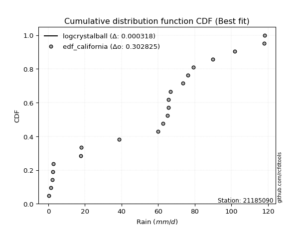</img></img>

</div>


### 2. EDF Hazen (1930)

Hazen method for plotting positions is a formula used to estimate the empirical cumulative probability distribution of flood events or other hydrological data. This formula often results in biased estimations, particularly when extrapolating to extreme events (high return periods).

<div align="center">


$P=(m-0.5)/n$


</div>


**2.1. Empirical values**

<div align="center">

|                | 0                  | 1                 | 2                  | 3                  | 4                  | 5                  | 6                  | 7         | 8                  | 9                  | 10                 | 11                | 12                 | 13                 | 14                 | 15                | 16                | 17        | 18                 | 19                 |
|:---------------|:-------------------|:------------------|:-------------------|:-------------------|:-------------------|:-------------------|:-------------------|:----------|:-------------------|:-------------------|:-------------------|:------------------|:-------------------|:-------------------|:-------------------|:------------------|:------------------|:----------|:-------------------|:-------------------|
| date           | 2020               | 2016              | 2017               | 2018               | 2015               | 2023               | 2019               | 2013      | 2010               | 2007               | 2012               | 2011              | 2014               | 2005               | 2009               | 2008              | 2022              | 2021      | 2024               | 2006               |
| x              | 0.4                | 1.3               | 2.2                | 2.4                | 2.8                | 17.6               | 18.1               | 38.7      | 59.9               | 62.7               | 65.1               | 65.6              | 65.6               | 66.6               | 73.6               | 79.2              | 89.9              | 101.9     | 117.8              | 118.2              |
| m              | 1                  | 2                 | 3                  | 4                  | 5                  | 6                  | 7                  | 8         | 9                  | 10                 | 11                 | 12                | 13                 | 14                 | 15                 | 16                | 17                | 18        | 19                 | 20                 |
| empirical_dist | edf_hazen          | edf_hazen         | edf_hazen          | edf_hazen          | edf_hazen          | edf_hazen          | edf_hazen          | edf_hazen | edf_hazen          | edf_hazen          | edf_hazen          | edf_hazen         | edf_hazen          | edf_hazen          | edf_hazen          | edf_hazen         | edf_hazen         | edf_hazen | edf_hazen          | edf_hazen          |
| empirical      | 0.025              | 0.075             | 0.125              | 0.175              | 0.225              | 0.275              | 0.325              | 0.375     | 0.425              | 0.475              | 0.525              | 0.575             | 0.625              | 0.675              | 0.725              | 0.775             | 0.825             | 0.875     | 0.925              | 0.975              |
| empirical_tr   | 1.0256410256410258 | 1.081081081081081 | 1.1428571428571428 | 1.2121212121212122 | 1.2903225806451613 | 1.3793103448275863 | 1.4814814814814814 | 1.6       | 1.7391304347826089 | 1.9047619047619047 | 2.1052631578947367 | 2.352941176470588 | 2.6666666666666665 | 3.0769230769230775 | 3.6363636363636362 | 4.444444444444445 | 5.714285714285713 | 8.0       | 13.333333333333341 | 39.999999999999964 |

</div>


**2.2. Kolmogorov-Smirnov fit test (sorted by Δ)**


<div align="center">

|                | 0                   | 1                   | 2                   | 3                   | 4                  | 5                   | 6                   | 7                   | 8                  | 9                   | 10                  | 11                  | 12                  | 13                  | 14                  | 15                  | 16                  | 17                  | 18                  | 19                  | 20                  | 21                  | 22                  | 23                  | 24                 | 25                  | 26                  | 27                  | 28                  | 29                 | 30                    | 31                  | 32                 | 33                  | 34                 | 35                 | 36                  | 37                  | 38                 | 39                  | 40                  | 41                  | 42                 | 43                 | 44                  | 45                 | 46                 | 47                 | 48                 | 49                  | 50                  | 51                 | 52                  | 53                 | 54                 | 55                 | 56                 | 57                  | 58                 | 59                 | 60                 | 61                  | 62                 | 63                  | 64                  | 65                  | 66                  | 67                  | 68                 | 69                  | 70                  | 71                  | 72                  | 73                 | 74                  | 75                 | 76                 | 77                 | 78                 | 79                 | 80                 | 81                  | 82                 | 83                  | 84                 | 85                 | 86                 | 87                 |
|:---------------|:--------------------|:--------------------|:--------------------|:--------------------|:-------------------|:--------------------|:--------------------|:--------------------|:-------------------|:--------------------|:--------------------|:--------------------|:--------------------|:--------------------|:--------------------|:--------------------|:--------------------|:--------------------|:--------------------|:--------------------|:--------------------|:--------------------|:--------------------|:--------------------|:-------------------|:--------------------|:--------------------|:--------------------|:--------------------|:-------------------|:----------------------|:--------------------|:-------------------|:--------------------|:-------------------|:-------------------|:--------------------|:--------------------|:-------------------|:--------------------|:--------------------|:--------------------|:-------------------|:-------------------|:--------------------|:-------------------|:-------------------|:-------------------|:-------------------|:--------------------|:--------------------|:-------------------|:--------------------|:-------------------|:-------------------|:-------------------|:-------------------|:--------------------|:-------------------|:-------------------|:-------------------|:--------------------|:-------------------|:--------------------|:--------------------|:--------------------|:--------------------|:--------------------|:-------------------|:--------------------|:--------------------|:--------------------|:--------------------|:-------------------|:--------------------|:-------------------|:-------------------|:-------------------|:-------------------|:-------------------|:-------------------|:--------------------|:-------------------|:--------------------|:-------------------|:-------------------|:-------------------|:-------------------|
| station        | 21185090            | 21185090            | 21185090            | 21185090            | 21185090           | 21185090            | 21185090            | 21185090            | 21185090           | 21185090            | 21185090            | 21185090            | 21185090            | 21185090            | 21185090            | 21185090            | 21185090            | 21185090            | 21185090            | 21185090            | 21185090            | 21185090            | 21185090            | 21185090            | 21185090           | 21185090            | 21185090            | 21185090            | 21185090            | 21185090           | 21185090              | 21185090            | 21185090           | 21185090            | 21185090           | 21185090           | 21185090            | 21185090            | 21185090           | 21185090            | 21185090            | 21185090            | 21185090           | 21185090           | 21185090            | 21185090           | 21185090           | 21185090           | 21185090           | 21185090            | 21185090            | 21185090           | 21185090            | 21185090           | 21185090           | 21185090           | 21185090           | 21185090            | 21185090           | 21185090           | 21185090           | 21185090            | 21185090           | 21185090            | 21185090            | 21185090            | 21185090            | 21185090            | 21185090           | 21185090            | 21185090            | 21185090            | 21185090            | 21185090           | 21185090            | 21185090           | 21185090           | 21185090           | 21185090           | 21185090           | 21185090           | 21185090            | 21185090           | 21185090            | 21185090           | 21185090           | 21185090           | 21185090           |
| empirical_dist | edf_hazen           | edf_hazen           | edf_hazen           | edf_hazen           | edf_hazen          | edf_hazen           | edf_hazen           | edf_hazen           | edf_hazen          | edf_hazen           | edf_hazen           | edf_hazen           | edf_hazen           | edf_hazen           | edf_hazen           | edf_hazen           | edf_hazen           | edf_hazen           | edf_hazen           | edf_hazen           | edf_hazen           | edf_hazen           | edf_hazen           | edf_hazen           | edf_hazen          | edf_hazen           | edf_hazen           | edf_hazen           | edf_hazen           | edf_hazen          | edf_hazen             | edf_hazen           | edf_hazen          | edf_hazen           | edf_hazen          | edf_hazen          | edf_hazen           | edf_hazen           | edf_hazen          | edf_hazen           | edf_hazen           | edf_hazen           | edf_hazen          | edf_hazen          | edf_hazen           | edf_hazen          | edf_hazen          | edf_hazen          | edf_hazen          | edf_hazen           | edf_hazen           | edf_hazen          | edf_hazen           | edf_hazen          | edf_hazen          | edf_hazen          | edf_hazen          | edf_hazen           | edf_hazen          | edf_hazen          | edf_hazen          | edf_hazen           | edf_hazen          | edf_hazen           | edf_hazen           | edf_hazen           | edf_hazen           | edf_hazen           | edf_hazen          | edf_hazen           | edf_hazen           | edf_hazen           | edf_hazen           | edf_hazen          | edf_hazen           | edf_hazen          | edf_hazen          | edf_hazen          | edf_hazen          | edf_hazen          | edf_hazen          | edf_hazen           | edf_hazen          | edf_hazen           | edf_hazen          | edf_hazen          | edf_hazen          | edf_hazen          |
| p_dist         | logjohnsonsu        | truncnorm           | nct                 | norm                | crystalball        | t                   | exponnorm           | johnsonsu           | pearson3           | erlang              | gamma               | laplace_asymmetric  | gumbel_l            | logistic            | hypsecant           | rice                | invgamma            | maxwell             | rayleigh            | laplace             | invgauss            | invweibull          | gompertz            | genlogistic         | nakagami           | halfnorm            | kstwobign           | logcrystalball      | gumbel_r            | weibull_min        | loglaplace_asymmetric | logloggamma         | logmielke          | logfisk             | logpearson3        | halflogistic       | moyal               | loggumbel_l         | ncf                | mielke              | loginvweibull       | expon               | genexpon           | logweibull_min     | f                   | loggompertz        | loglognorm         | loggamma           | loggamma           | logerlang           | logbetaprime        | lognakagami        | lognct              | logrice            | logexponnorm       | lognorm            | lognorm            | logt                | logfatiguelife     | logkstwobign       | fisk               | loginvgauss         | loginvgamma        | loggenexpon         | logmaxwell          | lograyleigh         | loglogistic         | loghalfnorm         | loghypsecant       | wald                | logncf              | loggumbel_r         | logexpon            | loghalflogistic    | loglaplace          | gibrat             | fatiguelife        | logmoyal           | chi2               | logwald            | betaprime          | logalpha            | loggibrat          | logf                | logtruncnorm       | logchi2            | alpha              | loggenlogistic     |
| delta          | 0.12907925861240305 | 0.13373814270094725 | 0.15001517280879667 | 0.15112232326224856 | 0.151122411663344  | 0.15112514249662828 | 0.15112545525802717 | 0.15274507566548973 | 0.1532243097555333 | 0.15337169055152572 | 0.15362437181360794 | 0.15689110369030973 | 0.16076508277263643 | 0.16118563254442692 | 0.17068014567565695 | 0.17414767426355066 | 0.17770753351997032 | 0.17963261203702235 | 0.18862376551537602 | 0.19388436529211633 | 0.19718968049135283 | 0.19796611605173758 | 0.20028329447372256 | 0.20539659624776146 | 0.2125248889310562 | 0.21408027998599438 | 0.21535467363629995 | 0.21853733368265021 | 0.21973393793860213 | 0.2220440021804147 | 0.22574415994246005   | 0.22593093050022633 | 0.2280499746545383 | 0.22821564949976086 | 0.2314517360929243 | 0.2420572844820275 | 0.24358538975398952 | 0.24376963337876317 | 0.2460436732390267 | 0.24857597401003678 | 0.25403330572404353 | 0.25597095120170504 | 0.2562043168152373 | 0.261811342035792  | 0.26322992517083216 | 0.2661045438090653 | 0.2734806837595745 | 0.2737476896262378 | 0.2737476896262378 | 0.27507176431885333 | 0.27577997230515067 | 0.2759550781430123 | 0.27618344450294235 | 0.2761988270984947 | 0.276201516090853  | 0.2762020183907697 | 0.2762020183907697 | 0.27620238579485196 | 0.2763923485928344 | 0.2767183183320194 | 0.2796873042606033 | 0.28099553014444373 | 0.2829919115115876 | 0.28866989403630877 | 0.29197226617286104 | 0.29657854187855476 | 0.29760766679747724 | 0.31061493888648645 | 0.3130313824256316 | 0.31819790001591314 | 0.31982176287242237 | 0.32679070140993255 | 0.32725023217838844 | 0.3373696603455088 | 0.33799050232874356 | 0.3406107989845389 | 0.342815735386459  | 0.3431532481767053 | 0.389322831339259  | 0.3912364653685932 | 0.3954068325560666 | 0.41990211042014836 | 0.4225227034708661 | 0.44960492263820995 | 0.4666854156539653 | 0.5563573558341114 | 0.650147453254905  | 0.925              |
| deltao         | 0.3096406529800002  | 0.3096406529800002  | 0.3096406529800002  | 0.3096406529800002  | 0.3096406529800002 | 0.3096406529800002  | 0.3096406529800002  | 0.3096406529800002  | 0.3096406529800002 | 0.3096406529800002  | 0.3096406529800002  | 0.3096406529800002  | 0.3096406529800002  | 0.3096406529800002  | 0.3096406529800002  | 0.3096406529800002  | 0.3096406529800002  | 0.3096406529800002  | 0.3096406529800002  | 0.3096406529800002  | 0.3096406529800002  | 0.3096406529800002  | 0.3096406529800002  | 0.3096406529800002  | 0.3096406529800002 | 0.3096406529800002  | 0.3096406529800002  | 0.3096406529800002  | 0.3096406529800002  | 0.3096406529800002 | 0.3096406529800002    | 0.3096406529800002  | 0.3096406529800002 | 0.3096406529800002  | 0.3096406529800002 | 0.3096406529800002 | 0.3096406529800002  | 0.3096406529800002  | 0.3096406529800002 | 0.3096406529800002  | 0.3096406529800002  | 0.3096406529800002  | 0.3096406529800002 | 0.3096406529800002 | 0.3096406529800002  | 0.3096406529800002 | 0.3096406529800002 | 0.3096406529800002 | 0.3096406529800002 | 0.3096406529800002  | 0.3096406529800002  | 0.3096406529800002 | 0.3096406529800002  | 0.3096406529800002 | 0.3096406529800002 | 0.3096406529800002 | 0.3096406529800002 | 0.3096406529800002  | 0.3096406529800002 | 0.3096406529800002 | 0.3096406529800002 | 0.3096406529800002  | 0.3096406529800002 | 0.3096406529800002  | 0.3096406529800002  | 0.3096406529800002  | 0.3096406529800002  | 0.3096406529800002  | 0.3096406529800002 | 0.3096406529800002  | 0.3096406529800002  | 0.3096406529800002  | 0.3096406529800002  | 0.3096406529800002 | 0.3096406529800002  | 0.3096406529800002 | 0.3096406529800002 | 0.3096406529800002 | 0.3096406529800002 | 0.3096406529800002 | 0.3096406529800002 | 0.3096406529800002  | 0.3096406529800002 | 0.3096406529800002  | 0.3096406529800002 | 0.3096406529800002 | 0.3096406529800002 | 0.3096406529800002 |
| eval           | Δo > Δ              | Δo > Δ              | Δo > Δ              | Δo > Δ              | Δo > Δ             | Δo > Δ              | Δo > Δ              | Δo > Δ              | Δo > Δ             | Δo > Δ              | Δo > Δ              | Δo > Δ              | Δo > Δ              | Δo > Δ              | Δo > Δ              | Δo > Δ              | Δo > Δ              | Δo > Δ              | Δo > Δ              | Δo > Δ              | Δo > Δ              | Δo > Δ              | Δo > Δ              | Δo > Δ              | Δo > Δ             | Δo > Δ              | Δo > Δ              | Δo > Δ              | Δo > Δ              | Δo > Δ             | Δo > Δ                | Δo > Δ              | Δo > Δ             | Δo > Δ              | Δo > Δ             | Δo > Δ             | Δo > Δ              | Δo > Δ              | Δo > Δ             | Δo > Δ              | Δo > Δ              | Δo > Δ              | Δo > Δ             | Δo > Δ             | Δo > Δ              | Δo > Δ             | Δo > Δ             | Δo > Δ             | Δo > Δ             | Δo > Δ              | Δo > Δ              | Δo > Δ             | Δo > Δ              | Δo > Δ             | Δo > Δ             | Δo > Δ             | Δo > Δ             | Δo > Δ              | Δo > Δ             | Δo > Δ             | Δo > Δ             | Δo > Δ              | Δo > Δ             | Δo > Δ              | Δo > Δ              | Δo > Δ              | Δo > Δ              | Δo <= Δ             | Δo <= Δ            | Δo <= Δ             | Δo <= Δ             | Δo <= Δ             | Δo <= Δ             | Δo <= Δ            | Δo <= Δ             | Δo <= Δ            | Δo <= Δ            | Δo <= Δ            | Δo <= Δ            | Δo <= Δ            | Δo <= Δ            | Δo <= Δ             | Δo <= Δ            | Δo <= Δ             | Δo <= Δ            | Δo <= Δ            | Δo <= Δ            | Δo <= Δ            |
| fit            | 1                   | 1                   | 1                   | 1                   | 1                  | 1                   | 1                   | 1                   | 1                  | 1                   | 1                   | 1                   | 1                   | 1                   | 1                   | 1                   | 1                   | 1                   | 1                   | 1                   | 1                   | 1                   | 1                   | 1                   | 1                  | 1                   | 1                   | 1                   | 1                   | 1                  | 1                     | 1                   | 1                  | 1                   | 1                  | 1                  | 1                   | 1                   | 1                  | 1                   | 1                   | 1                   | 1                  | 1                  | 1                   | 1                  | 1                  | 1                  | 1                  | 1                   | 1                   | 1                  | 1                   | 1                  | 1                  | 1                  | 1                  | 1                   | 1                  | 1                  | 1                  | 1                   | 1                  | 1                   | 1                   | 1                   | 1                   | 0                   | 0                  | 0                   | 0                   | 0                   | 0                   | 0                  | 0                   | 0                  | 0                  | 0                  | 0                  | 0                  | 0                  | 0                   | 0                  | 0                   | 0                  | 0                  | 0                  | 0                  |
| n              | 20                  | 20                  | 20                  | 20                  | 20                 | 20                  | 20                  | 20                  | 20                 | 20                  | 20                  | 20                  | 20                  | 20                  | 20                  | 20                  | 20                  | 20                  | 20                  | 20                  | 20                  | 20                  | 20                  | 20                  | 20                 | 20                  | 20                  | 20                  | 20                  | 20                 | 20                    | 20                  | 20                 | 20                  | 20                 | 20                 | 20                  | 20                  | 20                 | 20                  | 20                  | 20                  | 20                 | 20                 | 20                  | 20                 | 20                 | 20                 | 20                 | 20                  | 20                  | 20                 | 20                  | 20                 | 20                 | 20                 | 20                 | 20                  | 20                 | 20                 | 20                 | 20                  | 20                 | 20                  | 20                  | 20                  | 20                  | 20                  | 20                 | 20                  | 20                  | 20                  | 20                  | 20                 | 20                  | 20                 | 20                 | 20                 | 20                 | 20                 | 20                 | 20                  | 20                 | 20                  | 20                 | 20                 | 20                 | 20                 |
| best_fit       | 1                   | 0                   | 0                   | 0                   | 0                  | 0                   | 0                   | 0                   | 0                  | 0                   | 0                   | 0                   | 0                   | 0                   | 0                   | 0                   | 0                   | 0                   | 0                   | 0                   | 0                   | 0                   | 0                   | 0                   | 0                  | 0                   | 0                   | 0                   | 0                   | 0                  | 0                     | 0                   | 0                  | 0                   | 0                  | 0                  | 0                   | 0                   | 0                  | 0                   | 0                   | 0                   | 0                  | 0                  | 0                   | 0                  | 0                  | 0                  | 0                  | 0                   | 0                   | 0                  | 0                   | 0                  | 0                  | 0                  | 0                  | 0                   | 0                  | 0                  | 0                  | 0                   | 0                  | 0                   | 0                   | 0                   | 0                   | 0                   | 0                  | 0                   | 0                   | 0                   | 0                   | 0                  | 0                   | 0                  | 0                  | 0                  | 0                  | 0                  | 0                  | 0                   | 0                  | 0                   | 0                  | 0                  | 0                  | 0                  |
| best_fit_sort  | 1                   | 2                   | 3                   | 4                   | 5                  | 6                   | 7                   | 8                   | 9                  | 10                  | 11                  | 12                  | 13                  | 14                  | 15                  | 16                  | 17                  | 18                  | 19                  | 20                  | 21                  | 22                  | 23                  | 24                  | 25                 | 26                  | 27                  | 28                  | 29                  | 30                 | 31                    | 32                  | 33                 | 34                  | 35                 | 36                 | 37                  | 38                  | 39                 | 40                  | 41                  | 42                  | 43                 | 44                 | 45                  | 46                 | 47                 | 48                 | 49                 | 50                  | 51                  | 52                 | 53                  | 54                 | 55                 | 56                 | 57                 | 58                  | 59                 | 60                 | 61                 | 62                  | 63                 | 64                  | 65                  | 66                  | 67                  | 68                  | 69                 | 70                  | 71                  | 72                  | 73                  | 74                 | 75                  | 76                 | 77                 | 78                 | 79                 | 80                 | 81                 | 82                  | 83                 | 84                  | 85                 | 86                 | 87                 | 88                 |

</div>


**2.3. Best fit**

<div align="center">

|   id |   station | empirical_dist   | p_dist       |    delta |   deltao | eval   |   fit |   n |   best_fit |   best_fit_sort |
|-----:|----------:|:-----------------|:-------------|---------:|---------:|:-------|------:|----:|-----------:|----------------:|
|    0 |  21185090 | edf_hazen        | logjohnsonsu | 0.129079 | 0.309641 | Δo > Δ |     1 |  20 |          1 |               1 |

</div>


<div align="center">

</img></img>

</div>


### 3. EDF Weibull (1939)

Weibull plotting position formula is an empirical method used to estimate the non-exceedance probability or plotting position for a set of observed data, is often recommended or widely used in practice, particularly in flood frequency analysis.

<div align="center">


$P=m/(n+1)$


</div>


**3.1. Empirical values**

<div align="center">

|                | 0                    | 1                   | 2                   | 3                   | 4                   | 5                  | 6                  | 7                   | 8                   | 9                   | 10                 | 11                 | 12                 | 13                 | 14                 | 15                 | 16                 | 17                 | 18                 | 19                 |
|:---------------|:---------------------|:--------------------|:--------------------|:--------------------|:--------------------|:-------------------|:-------------------|:--------------------|:--------------------|:--------------------|:-------------------|:-------------------|:-------------------|:-------------------|:-------------------|:-------------------|:-------------------|:-------------------|:-------------------|:-------------------|
| date           | 2020                 | 2016                | 2017                | 2018                | 2015                | 2023               | 2019               | 2013                | 2010                | 2007                | 2012               | 2011               | 2014               | 2005               | 2009               | 2008               | 2022               | 2021               | 2024               | 2006               |
| x              | 0.4                  | 1.3                 | 2.2                 | 2.4                 | 2.8                 | 17.6               | 18.1               | 38.7                | 59.9                | 62.7                | 65.1               | 65.6               | 65.6               | 66.6               | 73.6               | 79.2               | 89.9               | 101.9              | 117.8              | 118.2              |
| m              | 1                    | 2                   | 3                   | 4                   | 5                   | 6                  | 7                  | 8                   | 9                   | 10                  | 11                 | 12                 | 13                 | 14                 | 15                 | 16                 | 17                 | 18                 | 19                 | 20                 |
| empirical_dist | edf_weibull          | edf_weibull         | edf_weibull         | edf_weibull         | edf_weibull         | edf_weibull        | edf_weibull        | edf_weibull         | edf_weibull         | edf_weibull         | edf_weibull        | edf_weibull        | edf_weibull        | edf_weibull        | edf_weibull        | edf_weibull        | edf_weibull        | edf_weibull        | edf_weibull        | edf_weibull        |
| empirical      | 0.047619047619047616 | 0.09523809523809523 | 0.14285714285714285 | 0.19047619047619047 | 0.23809523809523808 | 0.2857142857142857 | 0.3333333333333333 | 0.38095238095238093 | 0.42857142857142855 | 0.47619047619047616 | 0.5238095238095238 | 0.5714285714285714 | 0.6190476190476191 | 0.6666666666666666 | 0.7142857142857143 | 0.7619047619047619 | 0.8095238095238095 | 0.8571428571428571 | 0.9047619047619048 | 0.9523809523809523 |
| empirical_tr   | 1.05                 | 1.1052631578947367  | 1.1666666666666665  | 1.2352941176470589  | 1.3125              | 1.4                | 1.4999999999999998 | 1.6153846153846154  | 1.75                | 1.909090909090909   | 2.1                | 2.333333333333333  | 2.625              | 2.9999999999999996 | 3.5                | 4.199999999999999  | 5.25               | 6.999999999999997  | 10.5               | 20.999999999999975 |

</div>


**3.2. Kolmogorov-Smirnov fit test (sorted by Δ)**


<div align="center">

|                | 0                  | 1                   | 2                   | 3                  | 4                   | 5                   | 6                   | 7                   | 8                   | 9                   | 10                  | 11                  | 12                  | 13                  | 14                 | 15                  | 16                 | 17                  | 18                  | 19                  | 20                  | 21                  | 22                 | 23                  | 24                 | 25                  | 26                  | 27                  | 28                  | 29                  | 30                    | 31                  | 32                  | 33                 | 34                  | 35                  | 36                  | 37                  | 38                  | 39                  | 40                 | 41                 | 42                  | 43                  | 44                 | 45                 | 46                 | 47                  | 48                  | 49                  | 50                  | 51                 | 52                  | 53                 | 54                  | 55                  | 56                  | 57                  | 58                 | 59                  | 60                 | 61                  | 62                  | 63                 | 64                 | 65                 | 66                 | 67                 | 68                 | 69                  | 70                  | 71                 | 72                  | 73                  | 74                 | 75                  | 76                 | 77                 | 78                  | 79                  | 80                  | 81                 | 82                  | 83                 | 84                  | 85                 | 86                 | 87                 |
|:---------------|:-------------------|:--------------------|:--------------------|:-------------------|:--------------------|:--------------------|:--------------------|:--------------------|:--------------------|:--------------------|:--------------------|:--------------------|:--------------------|:--------------------|:-------------------|:--------------------|:-------------------|:--------------------|:--------------------|:--------------------|:--------------------|:--------------------|:-------------------|:--------------------|:-------------------|:--------------------|:--------------------|:--------------------|:--------------------|:--------------------|:----------------------|:--------------------|:--------------------|:-------------------|:--------------------|:--------------------|:--------------------|:--------------------|:--------------------|:--------------------|:-------------------|:-------------------|:--------------------|:--------------------|:-------------------|:-------------------|:-------------------|:--------------------|:--------------------|:--------------------|:--------------------|:-------------------|:--------------------|:-------------------|:--------------------|:--------------------|:--------------------|:--------------------|:-------------------|:--------------------|:-------------------|:--------------------|:--------------------|:-------------------|:-------------------|:-------------------|:-------------------|:-------------------|:-------------------|:--------------------|:--------------------|:-------------------|:--------------------|:--------------------|:-------------------|:--------------------|:-------------------|:-------------------|:--------------------|:--------------------|:--------------------|:-------------------|:--------------------|:-------------------|:--------------------|:-------------------|:-------------------|:-------------------|
| station        | 21185090           | 21185090            | 21185090            | 21185090           | 21185090            | 21185090            | 21185090            | 21185090            | 21185090            | 21185090            | 21185090            | 21185090            | 21185090            | 21185090            | 21185090           | 21185090            | 21185090           | 21185090            | 21185090            | 21185090            | 21185090            | 21185090            | 21185090           | 21185090            | 21185090           | 21185090            | 21185090            | 21185090            | 21185090            | 21185090            | 21185090              | 21185090            | 21185090            | 21185090           | 21185090            | 21185090            | 21185090            | 21185090            | 21185090            | 21185090            | 21185090           | 21185090           | 21185090            | 21185090            | 21185090           | 21185090           | 21185090           | 21185090            | 21185090            | 21185090            | 21185090            | 21185090           | 21185090            | 21185090           | 21185090            | 21185090            | 21185090            | 21185090            | 21185090           | 21185090            | 21185090           | 21185090            | 21185090            | 21185090           | 21185090           | 21185090           | 21185090           | 21185090           | 21185090           | 21185090            | 21185090            | 21185090           | 21185090            | 21185090            | 21185090           | 21185090            | 21185090           | 21185090           | 21185090            | 21185090            | 21185090            | 21185090           | 21185090            | 21185090           | 21185090            | 21185090           | 21185090           | 21185090           |
| empirical_dist | edf_weibull        | edf_weibull         | edf_weibull         | edf_weibull        | edf_weibull         | edf_weibull         | edf_weibull         | edf_weibull         | edf_weibull         | edf_weibull         | edf_weibull         | edf_weibull         | edf_weibull         | edf_weibull         | edf_weibull        | edf_weibull         | edf_weibull        | edf_weibull         | edf_weibull         | edf_weibull         | edf_weibull         | edf_weibull         | edf_weibull        | edf_weibull         | edf_weibull        | edf_weibull         | edf_weibull         | edf_weibull         | edf_weibull         | edf_weibull         | edf_weibull           | edf_weibull         | edf_weibull         | edf_weibull        | edf_weibull         | edf_weibull         | edf_weibull         | edf_weibull         | edf_weibull         | edf_weibull         | edf_weibull        | edf_weibull        | edf_weibull         | edf_weibull         | edf_weibull        | edf_weibull        | edf_weibull        | edf_weibull         | edf_weibull         | edf_weibull         | edf_weibull         | edf_weibull        | edf_weibull         | edf_weibull        | edf_weibull         | edf_weibull         | edf_weibull         | edf_weibull         | edf_weibull        | edf_weibull         | edf_weibull        | edf_weibull         | edf_weibull         | edf_weibull        | edf_weibull        | edf_weibull        | edf_weibull        | edf_weibull        | edf_weibull        | edf_weibull         | edf_weibull         | edf_weibull        | edf_weibull         | edf_weibull         | edf_weibull        | edf_weibull         | edf_weibull        | edf_weibull        | edf_weibull         | edf_weibull         | edf_weibull         | edf_weibull        | edf_weibull         | edf_weibull        | edf_weibull         | edf_weibull        | edf_weibull        | edf_weibull        |
| p_dist         | logjohnsonsu       | truncnorm           | nct                 | norm               | crystalball         | t                   | exponnorm           | johnsonsu           | pearson3            | erlang              | gamma               | laplace_asymmetric  | logistic            | gumbel_l            | rice               | invgamma            | maxwell            | hypsecant           | rayleigh            | laplace             | invgauss            | invweibull          | genlogistic        | nakagami            | kstwobign          | gompertz            | logcrystalball      | gumbel_r            | weibull_min         | halfnorm            | loglaplace_asymmetric | logloggamma         | logmielke           | logfisk            | logpearson3         | halflogistic        | moyal               | loggumbel_l         | ncf                 | mielke              | loginvweibull      | expon              | genexpon            | fisk                | logweibull_min     | f                  | loggompertz        | loglognorm          | loggamma            | loggamma            | logerlang           | logbetaprime       | lognakagami         | lognct             | logrice             | logexponnorm        | lognorm             | lognorm             | logt               | logfatiguelife      | logkstwobign       | loginvgauss         | loginvgamma         | loggenexpon        | logmaxwell         | lograyleigh        | loglogistic        | logncf             | loghalfnorm        | loghypsecant        | logexpon            | loggumbel_r        | wald                | loghalflogistic     | loglaplace         | gibrat              | fatiguelife        | logmoyal           | chi2                | logwald             | betaprime           | logalpha           | loggibrat           | logf               | logtruncnorm        | logchi2            | alpha              | loggenlogistic     |
| delta          | 0.1255078300409745 | 0.14207147603428055 | 0.14647475657916662 | 0.14755089469082   | 0.14755098309191544 | 0.14755371392519973 | 0.14755402668659862 | 0.14917364709406117 | 0.14965288118410475 | 0.14980026198009716 | 0.15005294324217938 | 0.16522443702364303 | 0.16722262132983493 | 0.16909841610596973 | 0.1705762456921221 | 0.17413610494854176 | 0.1760611834655938 | 0.17901347900899026 | 0.18505233694394746 | 0.19122221081912769 | 0.19361825191992427 | 0.19439468748030903 | 0.2018251676763329 | 0.20895346035962764 | 0.2117832450648714 | 0.21337853256896064 | 0.21496590511122166 | 0.21616250936717357 | 0.21847257360898614 | 0.21972397440745012 | 0.2221727313710315    | 0.22235950192879778 | 0.22447854608310974 | 0.2246442209283323 | 0.22788030752149574 | 0.23848585591059895 | 0.24001396118256096 | 0.24019820480733461 | 0.24247224466759815 | 0.24500454543860822 | 0.250461877152615  | 0.2523995226302765 | 0.25263288824380875 | 0.25706825664155564 | 0.2582399134643634 | 0.2596584965994036 | 0.2625331152376367 | 0.26990925518814596 | 0.27017626105480924 | 0.27017626105480924 | 0.27150033574742477 | 0.2722085437337221 | 0.27238364957158373 | 0.2726120159315138 | 0.27262739852706613 | 0.27263008751942447 | 0.27263058981934113 | 0.27263058981934113 | 0.2726309572234234 | 0.27282092002140584 | 0.2731468897605908 | 0.27742410157301517 | 0.27942048294015903 | 0.2850984654648802 | 0.2884008376014325 | 0.2930071133071262 | 0.2940362382260487 | 0.3020438437181153 | 0.3070435103150579 | 0.30945995385420305 | 0.31653594646410277 | 0.323219272838504  | 0.32653123334924644 | 0.33379823177408025 | 0.334419073757315  | 0.33703937041311033 | 0.3392443068150304 | 0.3395818196052767 | 0.38575140276783043 | 0.38766503679716463 | 0.39183540398463806 | 0.4091878247058627 | 0.41895127489943756 | 0.4317477797810671 | 0.46311398708253676 | 0.5456430701198257 | 0.6394331675406193 | 0.9047619047619048 |
| deltao         | 0.3096406529800002 | 0.3096406529800002  | 0.3096406529800002  | 0.3096406529800002 | 0.3096406529800002  | 0.3096406529800002  | 0.3096406529800002  | 0.3096406529800002  | 0.3096406529800002  | 0.3096406529800002  | 0.3096406529800002  | 0.3096406529800002  | 0.3096406529800002  | 0.3096406529800002  | 0.3096406529800002 | 0.3096406529800002  | 0.3096406529800002 | 0.3096406529800002  | 0.3096406529800002  | 0.3096406529800002  | 0.3096406529800002  | 0.3096406529800002  | 0.3096406529800002 | 0.3096406529800002  | 0.3096406529800002 | 0.3096406529800002  | 0.3096406529800002  | 0.3096406529800002  | 0.3096406529800002  | 0.3096406529800002  | 0.3096406529800002    | 0.3096406529800002  | 0.3096406529800002  | 0.3096406529800002 | 0.3096406529800002  | 0.3096406529800002  | 0.3096406529800002  | 0.3096406529800002  | 0.3096406529800002  | 0.3096406529800002  | 0.3096406529800002 | 0.3096406529800002 | 0.3096406529800002  | 0.3096406529800002  | 0.3096406529800002 | 0.3096406529800002 | 0.3096406529800002 | 0.3096406529800002  | 0.3096406529800002  | 0.3096406529800002  | 0.3096406529800002  | 0.3096406529800002 | 0.3096406529800002  | 0.3096406529800002 | 0.3096406529800002  | 0.3096406529800002  | 0.3096406529800002  | 0.3096406529800002  | 0.3096406529800002 | 0.3096406529800002  | 0.3096406529800002 | 0.3096406529800002  | 0.3096406529800002  | 0.3096406529800002 | 0.3096406529800002 | 0.3096406529800002 | 0.3096406529800002 | 0.3096406529800002 | 0.3096406529800002 | 0.3096406529800002  | 0.3096406529800002  | 0.3096406529800002 | 0.3096406529800002  | 0.3096406529800002  | 0.3096406529800002 | 0.3096406529800002  | 0.3096406529800002 | 0.3096406529800002 | 0.3096406529800002  | 0.3096406529800002  | 0.3096406529800002  | 0.3096406529800002 | 0.3096406529800002  | 0.3096406529800002 | 0.3096406529800002  | 0.3096406529800002 | 0.3096406529800002 | 0.3096406529800002 |
| eval           | Δo > Δ             | Δo > Δ              | Δo > Δ              | Δo > Δ             | Δo > Δ              | Δo > Δ              | Δo > Δ              | Δo > Δ              | Δo > Δ              | Δo > Δ              | Δo > Δ              | Δo > Δ              | Δo > Δ              | Δo > Δ              | Δo > Δ             | Δo > Δ              | Δo > Δ             | Δo > Δ              | Δo > Δ              | Δo > Δ              | Δo > Δ              | Δo > Δ              | Δo > Δ             | Δo > Δ              | Δo > Δ             | Δo > Δ              | Δo > Δ              | Δo > Δ              | Δo > Δ              | Δo > Δ              | Δo > Δ                | Δo > Δ              | Δo > Δ              | Δo > Δ             | Δo > Δ              | Δo > Δ              | Δo > Δ              | Δo > Δ              | Δo > Δ              | Δo > Δ              | Δo > Δ             | Δo > Δ             | Δo > Δ              | Δo > Δ              | Δo > Δ             | Δo > Δ             | Δo > Δ             | Δo > Δ              | Δo > Δ              | Δo > Δ              | Δo > Δ              | Δo > Δ             | Δo > Δ              | Δo > Δ             | Δo > Δ              | Δo > Δ              | Δo > Δ              | Δo > Δ              | Δo > Δ             | Δo > Δ              | Δo > Δ             | Δo > Δ              | Δo > Δ              | Δo > Δ             | Δo > Δ             | Δo > Δ             | Δo > Δ             | Δo > Δ             | Δo > Δ             | Δo > Δ              | Δo <= Δ             | Δo <= Δ            | Δo <= Δ             | Δo <= Δ             | Δo <= Δ            | Δo <= Δ             | Δo <= Δ            | Δo <= Δ            | Δo <= Δ             | Δo <= Δ             | Δo <= Δ             | Δo <= Δ            | Δo <= Δ             | Δo <= Δ            | Δo <= Δ             | Δo <= Δ            | Δo <= Δ            | Δo <= Δ            |
| fit            | 1                  | 1                   | 1                   | 1                  | 1                   | 1                   | 1                   | 1                   | 1                   | 1                   | 1                   | 1                   | 1                   | 1                   | 1                  | 1                   | 1                  | 1                   | 1                   | 1                   | 1                   | 1                   | 1                  | 1                   | 1                  | 1                   | 1                   | 1                   | 1                   | 1                   | 1                     | 1                   | 1                   | 1                  | 1                   | 1                   | 1                   | 1                   | 1                   | 1                   | 1                  | 1                  | 1                   | 1                   | 1                  | 1                  | 1                  | 1                   | 1                   | 1                   | 1                   | 1                  | 1                   | 1                  | 1                   | 1                   | 1                   | 1                   | 1                  | 1                   | 1                  | 1                   | 1                   | 1                  | 1                  | 1                  | 1                  | 1                  | 1                  | 1                   | 0                   | 0                  | 0                   | 0                   | 0                  | 0                   | 0                  | 0                  | 0                   | 0                   | 0                   | 0                  | 0                   | 0                  | 0                   | 0                  | 0                  | 0                  |
| n              | 20                 | 20                  | 20                  | 20                 | 20                  | 20                  | 20                  | 20                  | 20                  | 20                  | 20                  | 20                  | 20                  | 20                  | 20                 | 20                  | 20                 | 20                  | 20                  | 20                  | 20                  | 20                  | 20                 | 20                  | 20                 | 20                  | 20                  | 20                  | 20                  | 20                  | 20                    | 20                  | 20                  | 20                 | 20                  | 20                  | 20                  | 20                  | 20                  | 20                  | 20                 | 20                 | 20                  | 20                  | 20                 | 20                 | 20                 | 20                  | 20                  | 20                  | 20                  | 20                 | 20                  | 20                 | 20                  | 20                  | 20                  | 20                  | 20                 | 20                  | 20                 | 20                  | 20                  | 20                 | 20                 | 20                 | 20                 | 20                 | 20                 | 20                  | 20                  | 20                 | 20                  | 20                  | 20                 | 20                  | 20                 | 20                 | 20                  | 20                  | 20                  | 20                 | 20                  | 20                 | 20                  | 20                 | 20                 | 20                 |
| best_fit       | 1                  | 0                   | 0                   | 0                  | 0                   | 0                   | 0                   | 0                   | 0                   | 0                   | 0                   | 0                   | 0                   | 0                   | 0                  | 0                   | 0                  | 0                   | 0                   | 0                   | 0                   | 0                   | 0                  | 0                   | 0                  | 0                   | 0                   | 0                   | 0                   | 0                   | 0                     | 0                   | 0                   | 0                  | 0                   | 0                   | 0                   | 0                   | 0                   | 0                   | 0                  | 0                  | 0                   | 0                   | 0                  | 0                  | 0                  | 0                   | 0                   | 0                   | 0                   | 0                  | 0                   | 0                  | 0                   | 0                   | 0                   | 0                   | 0                  | 0                   | 0                  | 0                   | 0                   | 0                  | 0                  | 0                  | 0                  | 0                  | 0                  | 0                   | 0                   | 0                  | 0                   | 0                   | 0                  | 0                   | 0                  | 0                  | 0                   | 0                   | 0                   | 0                  | 0                   | 0                  | 0                   | 0                  | 0                  | 0                  |
| best_fit_sort  | 1                  | 2                   | 3                   | 4                  | 5                   | 6                   | 7                   | 8                   | 9                   | 10                  | 11                  | 12                  | 13                  | 14                  | 15                 | 16                  | 17                 | 18                  | 19                  | 20                  | 21                  | 22                  | 23                 | 24                  | 25                 | 26                  | 27                  | 28                  | 29                  | 30                  | 31                    | 32                  | 33                  | 34                 | 35                  | 36                  | 37                  | 38                  | 39                  | 40                  | 41                 | 42                 | 43                  | 44                  | 45                 | 46                 | 47                 | 48                  | 49                  | 50                  | 51                  | 52                 | 53                  | 54                 | 55                  | 56                  | 57                  | 58                  | 59                 | 60                  | 61                 | 62                  | 63                  | 64                 | 65                 | 66                 | 67                 | 68                 | 69                 | 70                  | 71                  | 72                 | 73                  | 74                  | 75                 | 76                  | 77                 | 78                 | 79                  | 80                  | 81                  | 82                 | 83                  | 84                 | 85                  | 86                 | 87                 | 88                 |

</div>


**3.3. Best fit**

<div align="center">

|   id |   station | empirical_dist   | p_dist       |    delta |   deltao | eval   |   fit |   n |   best_fit |   best_fit_sort |
|-----:|----------:|:-----------------|:-------------|---------:|---------:|:-------|------:|----:|-----------:|----------------:|
|    0 |  21185090 | edf_weibull      | logjohnsonsu | 0.125508 | 0.309641 | Δo > Δ |     1 |  20 |          1 |               1 |

</div>


<div align="center">

</img></img>

</div>


### 4. EDF Beard (1943)

The Beard formula (or Beard´s plotting position formula) in hydrology is used to estimate the empirical non-exceedance probability _(P)_ of a flood event (or other extreme hydrological data point) within a given dataset.

<div align="center">


$P=(m-0.31)/(n+0.38)$


</div>


**4.1. Empirical values**

<div align="center">

|                | 0                    | 1                   | 2                   | 3                   | 4                   | 5                   | 6                   | 7                  | 8                  | 9                   | 10                 | 11                 | 12                 | 13                 | 14                 | 15                 | 16                 | 17                 | 18                 | 19                 |
|:---------------|:---------------------|:--------------------|:--------------------|:--------------------|:--------------------|:--------------------|:--------------------|:-------------------|:-------------------|:--------------------|:-------------------|:-------------------|:-------------------|:-------------------|:-------------------|:-------------------|:-------------------|:-------------------|:-------------------|:-------------------|
| date           | 2020                 | 2016                | 2017                | 2018                | 2015                | 2023                | 2019                | 2013               | 2010               | 2007                | 2012               | 2011               | 2014               | 2005               | 2009               | 2008               | 2022               | 2021               | 2024               | 2006               |
| x              | 0.4                  | 1.3                 | 2.2                 | 2.4                 | 2.8                 | 17.6                | 18.1                | 38.7               | 59.9               | 62.7                | 65.1               | 65.6               | 65.6               | 66.6               | 73.6               | 79.2               | 89.9               | 101.9              | 117.8              | 118.2              |
| m              | 1                    | 2                   | 3                   | 4                   | 5                   | 6                   | 7                   | 8                  | 9                  | 10                  | 11                 | 12                 | 13                 | 14                 | 15                 | 16                 | 17                 | 18                 | 19                 | 20                 |
| empirical_dist | edf_beard            | edf_beard           | edf_beard           | edf_beard           | edf_beard           | edf_beard           | edf_beard           | edf_beard          | edf_beard          | edf_beard           | edf_beard          | edf_beard          | edf_beard          | edf_beard          | edf_beard          | edf_beard          | edf_beard          | edf_beard          | edf_beard          | edf_beard          |
| empirical      | 0.033856722276741906 | 0.08292443572129539 | 0.13199214916584887 | 0.18105986261040236 | 0.23012757605495587 | 0.27919528949950934 | 0.32826300294406285 | 0.3773307163886163 | 0.4263984298331698 | 0.47546614327772324 | 0.5245338567222767 | 0.5736015701668302 | 0.6226692836113837 | 0.6717369970559373 | 0.7208047105004907 | 0.7698724239450442 | 0.8189401373895977 | 0.8680078508341512 | 0.9170755642787047 | 0.9661432777232583 |
| empirical_tr   | 1.0350431691213813   | 1.090422685928304   | 1.152063312605992   | 1.2210904733373276  | 1.2989165073295095  | 1.3873383253914227  | 1.4886778670562455  | 1.6059889676910957 | 1.7433704020530367 | 1.9064546304957901  | 2.1031991744066048 | 2.3452243958573074 | 2.6501950585175553 | 3.0463378176382667 | 3.581722319859402  | 4.345415778251599  | 5.523035230352305  | 7.576208178438667  | 12.059171597633155 | 29.536231884058108 |

</div>


**4.2. Kolmogorov-Smirnov fit test (sorted by Δ)**


<div align="center">

|                | 0                   | 1                  | 2                   | 3                   | 4                  | 5                  | 6                   | 7                   | 8                   | 9                   | 10                  | 11                  | 12                  | 13                  | 14                  | 15                 | 16                  | 17                  | 18                  | 19                  | 20                  | 21                 | 22                  | 23                  | 24                 | 25                 | 26                  | 27                  | 28                  | 29                 | 30                    | 31                  | 32                 | 33                  | 34                 | 35                  | 36                  | 37                  | 38                  | 39                 | 40                  | 41                  | 42                 | 43                 | 44                  | 45                 | 46                  | 47                 | 48                 | 49                 | 50                  | 51                 | 52                 | 53                  | 54                 | 55                  | 56                 | 57                 | 58                  | 59                 | 60                 | 61                  | 62                 | 63                 | 64                  | 65                  | 66                  | 67                  | 68                 | 69                 | 70                 | 71                  | 72                  | 73                 | 74                  | 75                 | 76                 | 77                 | 78                 | 79                 | 80                  | 81                  | 82                  | 83                  | 84                  | 85                 | 86                 | 87                 |
|:---------------|:--------------------|:-------------------|:--------------------|:--------------------|:-------------------|:-------------------|:--------------------|:--------------------|:--------------------|:--------------------|:--------------------|:--------------------|:--------------------|:--------------------|:--------------------|:-------------------|:--------------------|:--------------------|:--------------------|:--------------------|:--------------------|:-------------------|:--------------------|:--------------------|:-------------------|:-------------------|:--------------------|:--------------------|:--------------------|:-------------------|:----------------------|:--------------------|:-------------------|:--------------------|:-------------------|:--------------------|:--------------------|:--------------------|:--------------------|:-------------------|:--------------------|:--------------------|:-------------------|:-------------------|:--------------------|:-------------------|:--------------------|:-------------------|:-------------------|:-------------------|:--------------------|:-------------------|:-------------------|:--------------------|:-------------------|:--------------------|:-------------------|:-------------------|:--------------------|:-------------------|:-------------------|:--------------------|:-------------------|:-------------------|:--------------------|:--------------------|:--------------------|:--------------------|:-------------------|:-------------------|:-------------------|:--------------------|:--------------------|:-------------------|:--------------------|:-------------------|:-------------------|:-------------------|:-------------------|:-------------------|:--------------------|:--------------------|:--------------------|:--------------------|:--------------------|:-------------------|:-------------------|:-------------------|
| station        | 21185090            | 21185090           | 21185090            | 21185090            | 21185090           | 21185090           | 21185090            | 21185090            | 21185090            | 21185090            | 21185090            | 21185090            | 21185090            | 21185090            | 21185090            | 21185090           | 21185090            | 21185090            | 21185090            | 21185090            | 21185090            | 21185090           | 21185090            | 21185090            | 21185090           | 21185090           | 21185090            | 21185090            | 21185090            | 21185090           | 21185090              | 21185090            | 21185090           | 21185090            | 21185090           | 21185090            | 21185090            | 21185090            | 21185090            | 21185090           | 21185090            | 21185090            | 21185090           | 21185090           | 21185090            | 21185090           | 21185090            | 21185090           | 21185090           | 21185090           | 21185090            | 21185090           | 21185090           | 21185090            | 21185090           | 21185090            | 21185090           | 21185090           | 21185090            | 21185090           | 21185090           | 21185090            | 21185090           | 21185090           | 21185090            | 21185090            | 21185090            | 21185090            | 21185090           | 21185090           | 21185090           | 21185090            | 21185090            | 21185090           | 21185090            | 21185090           | 21185090           | 21185090           | 21185090           | 21185090           | 21185090            | 21185090            | 21185090            | 21185090            | 21185090            | 21185090           | 21185090           | 21185090           |
| empirical_dist | edf_beard           | edf_beard          | edf_beard           | edf_beard           | edf_beard          | edf_beard          | edf_beard           | edf_beard           | edf_beard           | edf_beard           | edf_beard           | edf_beard           | edf_beard           | edf_beard           | edf_beard           | edf_beard          | edf_beard           | edf_beard           | edf_beard           | edf_beard           | edf_beard           | edf_beard          | edf_beard           | edf_beard           | edf_beard          | edf_beard          | edf_beard           | edf_beard           | edf_beard           | edf_beard          | edf_beard             | edf_beard           | edf_beard          | edf_beard           | edf_beard          | edf_beard           | edf_beard           | edf_beard           | edf_beard           | edf_beard          | edf_beard           | edf_beard           | edf_beard          | edf_beard          | edf_beard           | edf_beard          | edf_beard           | edf_beard          | edf_beard          | edf_beard          | edf_beard           | edf_beard          | edf_beard          | edf_beard           | edf_beard          | edf_beard           | edf_beard          | edf_beard          | edf_beard           | edf_beard          | edf_beard          | edf_beard           | edf_beard          | edf_beard          | edf_beard           | edf_beard           | edf_beard           | edf_beard           | edf_beard          | edf_beard          | edf_beard          | edf_beard           | edf_beard           | edf_beard          | edf_beard           | edf_beard          | edf_beard          | edf_beard          | edf_beard          | edf_beard          | edf_beard           | edf_beard           | edf_beard           | edf_beard           | edf_beard           | edf_beard          | edf_beard          | edf_beard          |
| p_dist         | logjohnsonsu        | truncnorm          | nct                 | norm                | crystalball        | t                  | exponnorm           | johnsonsu           | pearson3            | erlang              | gamma               | laplace_asymmetric  | logistic            | gumbel_l            | rice                | hypsecant          | invgamma            | maxwell             | rayleigh            | laplace             | invgauss            | invweibull         | genlogistic         | gompertz            | nakagami           | halfnorm           | kstwobign           | logcrystalball      | gumbel_r            | weibull_min        | loglaplace_asymmetric | logloggamma         | logmielke          | logfisk             | logpearson3        | halflogistic        | moyal               | loggumbel_l         | ncf                 | mielke             | loginvweibull       | expon               | genexpon           | logweibull_min     | f                   | loggompertz        | fisk                | loglognorm         | loggamma           | loggamma           | logerlang           | logbetaprime       | lognakagami        | lognct              | logrice            | logexponnorm        | lognorm            | lognorm            | logt                | logfatiguelife     | logkstwobign       | loginvgauss         | loginvgamma        | loggenexpon        | logmaxwell          | lograyleigh         | loglogistic         | loghalfnorm         | loghypsecant       | logncf             | wald               | logexpon            | loggumbel_r         | loghalflogistic    | loglaplace          | gibrat             | fatiguelife        | logmoyal           | chi2               | logwald            | betaprime           | logalpha            | loggibrat           | logf                | logtruncnorm        | logchi2            | alpha              | loggenlogistic     |
| delta          | 0.12768082877923326 | 0.1370011456450101 | 0.14861674297562688 | 0.14972389342907877 | 0.1497239818301742 | 0.1497267126634585 | 0.14972702542485739 | 0.15134664583231994 | 0.15182587992236352 | 0.15197326071835593 | 0.15222594198043815 | 0.16015410663437257 | 0.16215229094056446 | 0.16402808571669927 | 0.17274924443038087 | 0.1739431486197198 | 0.17630910368680053 | 0.17823418220385256 | 0.18722533568220623 | 0.19248593545894654 | 0.19579125065818304 | 0.1965676862185678 | 0.20399816641459168 | 0.20541087052867843 | 0.2111264590978864 | 0.2126818501528246 | 0.21395624380313016 | 0.21713890384948042 | 0.21833550810543234 | 0.2206455723472449 | 0.22434573010929026   | 0.22453250066705654 | 0.2266515448213685 | 0.22681721966659107 | 0.2300533062597545 | 0.24065885464885772 | 0.24218695992081973 | 0.24237120354559338 | 0.24464524340585692 | 0.247177544176867  | 0.25263487589087374 | 0.25457252136853525 | 0.2548058869820675 | 0.2604129122026222 | 0.26183149533766237 | 0.2647061139758955 | 0.27083058198386156 | 0.2720822539264047 | 0.272349259793068  | 0.272349259793068  | 0.27367333448568354 | 0.2743815424719809 | 0.2745566483098425 | 0.27478501466977256 | 0.2748003972653249 | 0.27480308625768324 | 0.2748035885575999 | 0.2748035885575999 | 0.27480395596168217 | 0.2749939187596646 | 0.2753198884988496 | 0.27959710031127394 | 0.2815934816784178 | 0.287271464203139  | 0.29057383633969125 | 0.29518011204538497 | 0.29620923696430745 | 0.30921650905331666 | 0.3116329525924618 | 0.3128296137065735 | 0.321460902959976  | 0.32305494267887913 | 0.32539227157676276 | 0.335971230512339  | 0.33659207249557377 | 0.3392123691513691 | 0.3414173055532892 | 0.3417548183435355 | 0.3879244015060892 | 0.3898380355354234 | 0.39400840272289683 | 0.41570682092063904 | 0.42112427363769633 | 0.44261277347236105 | 0.46528698582079553 | 0.5521620663346021 | 0.6459521637553957 | 0.9170755642787047 |
| deltao         | 0.3096406529800002  | 0.3096406529800002 | 0.3096406529800002  | 0.3096406529800002  | 0.3096406529800002 | 0.3096406529800002 | 0.3096406529800002  | 0.3096406529800002  | 0.3096406529800002  | 0.3096406529800002  | 0.3096406529800002  | 0.3096406529800002  | 0.3096406529800002  | 0.3096406529800002  | 0.3096406529800002  | 0.3096406529800002 | 0.3096406529800002  | 0.3096406529800002  | 0.3096406529800002  | 0.3096406529800002  | 0.3096406529800002  | 0.3096406529800002 | 0.3096406529800002  | 0.3096406529800002  | 0.3096406529800002 | 0.3096406529800002 | 0.3096406529800002  | 0.3096406529800002  | 0.3096406529800002  | 0.3096406529800002 | 0.3096406529800002    | 0.3096406529800002  | 0.3096406529800002 | 0.3096406529800002  | 0.3096406529800002 | 0.3096406529800002  | 0.3096406529800002  | 0.3096406529800002  | 0.3096406529800002  | 0.3096406529800002 | 0.3096406529800002  | 0.3096406529800002  | 0.3096406529800002 | 0.3096406529800002 | 0.3096406529800002  | 0.3096406529800002 | 0.3096406529800002  | 0.3096406529800002 | 0.3096406529800002 | 0.3096406529800002 | 0.3096406529800002  | 0.3096406529800002 | 0.3096406529800002 | 0.3096406529800002  | 0.3096406529800002 | 0.3096406529800002  | 0.3096406529800002 | 0.3096406529800002 | 0.3096406529800002  | 0.3096406529800002 | 0.3096406529800002 | 0.3096406529800002  | 0.3096406529800002 | 0.3096406529800002 | 0.3096406529800002  | 0.3096406529800002  | 0.3096406529800002  | 0.3096406529800002  | 0.3096406529800002 | 0.3096406529800002 | 0.3096406529800002 | 0.3096406529800002  | 0.3096406529800002  | 0.3096406529800002 | 0.3096406529800002  | 0.3096406529800002 | 0.3096406529800002 | 0.3096406529800002 | 0.3096406529800002 | 0.3096406529800002 | 0.3096406529800002  | 0.3096406529800002  | 0.3096406529800002  | 0.3096406529800002  | 0.3096406529800002  | 0.3096406529800002 | 0.3096406529800002 | 0.3096406529800002 |
| eval           | Δo > Δ              | Δo > Δ             | Δo > Δ              | Δo > Δ              | Δo > Δ             | Δo > Δ             | Δo > Δ              | Δo > Δ              | Δo > Δ              | Δo > Δ              | Δo > Δ              | Δo > Δ              | Δo > Δ              | Δo > Δ              | Δo > Δ              | Δo > Δ             | Δo > Δ              | Δo > Δ              | Δo > Δ              | Δo > Δ              | Δo > Δ              | Δo > Δ             | Δo > Δ              | Δo > Δ              | Δo > Δ             | Δo > Δ             | Δo > Δ              | Δo > Δ              | Δo > Δ              | Δo > Δ             | Δo > Δ                | Δo > Δ              | Δo > Δ             | Δo > Δ              | Δo > Δ             | Δo > Δ              | Δo > Δ              | Δo > Δ              | Δo > Δ              | Δo > Δ             | Δo > Δ              | Δo > Δ              | Δo > Δ             | Δo > Δ             | Δo > Δ              | Δo > Δ             | Δo > Δ              | Δo > Δ             | Δo > Δ             | Δo > Δ             | Δo > Δ              | Δo > Δ             | Δo > Δ             | Δo > Δ              | Δo > Δ             | Δo > Δ              | Δo > Δ             | Δo > Δ             | Δo > Δ              | Δo > Δ             | Δo > Δ             | Δo > Δ              | Δo > Δ             | Δo > Δ             | Δo > Δ              | Δo > Δ              | Δo > Δ              | Δo > Δ              | Δo <= Δ            | Δo <= Δ            | Δo <= Δ            | Δo <= Δ             | Δo <= Δ             | Δo <= Δ            | Δo <= Δ             | Δo <= Δ            | Δo <= Δ            | Δo <= Δ            | Δo <= Δ            | Δo <= Δ            | Δo <= Δ             | Δo <= Δ             | Δo <= Δ             | Δo <= Δ             | Δo <= Δ             | Δo <= Δ            | Δo <= Δ            | Δo <= Δ            |
| fit            | 1                   | 1                  | 1                   | 1                   | 1                  | 1                  | 1                   | 1                   | 1                   | 1                   | 1                   | 1                   | 1                   | 1                   | 1                   | 1                  | 1                   | 1                   | 1                   | 1                   | 1                   | 1                  | 1                   | 1                   | 1                  | 1                  | 1                   | 1                   | 1                   | 1                  | 1                     | 1                   | 1                  | 1                   | 1                  | 1                   | 1                   | 1                   | 1                   | 1                  | 1                   | 1                   | 1                  | 1                  | 1                   | 1                  | 1                   | 1                  | 1                  | 1                  | 1                   | 1                  | 1                  | 1                   | 1                  | 1                   | 1                  | 1                  | 1                   | 1                  | 1                  | 1                   | 1                  | 1                  | 1                   | 1                   | 1                   | 1                   | 0                  | 0                  | 0                  | 0                   | 0                   | 0                  | 0                   | 0                  | 0                  | 0                  | 0                  | 0                  | 0                   | 0                   | 0                   | 0                   | 0                   | 0                  | 0                  | 0                  |
| n              | 20                  | 20                 | 20                  | 20                  | 20                 | 20                 | 20                  | 20                  | 20                  | 20                  | 20                  | 20                  | 20                  | 20                  | 20                  | 20                 | 20                  | 20                  | 20                  | 20                  | 20                  | 20                 | 20                  | 20                  | 20                 | 20                 | 20                  | 20                  | 20                  | 20                 | 20                    | 20                  | 20                 | 20                  | 20                 | 20                  | 20                  | 20                  | 20                  | 20                 | 20                  | 20                  | 20                 | 20                 | 20                  | 20                 | 20                  | 20                 | 20                 | 20                 | 20                  | 20                 | 20                 | 20                  | 20                 | 20                  | 20                 | 20                 | 20                  | 20                 | 20                 | 20                  | 20                 | 20                 | 20                  | 20                  | 20                  | 20                  | 20                 | 20                 | 20                 | 20                  | 20                  | 20                 | 20                  | 20                 | 20                 | 20                 | 20                 | 20                 | 20                  | 20                  | 20                  | 20                  | 20                  | 20                 | 20                 | 20                 |
| best_fit       | 1                   | 0                  | 0                   | 0                   | 0                  | 0                  | 0                   | 0                   | 0                   | 0                   | 0                   | 0                   | 0                   | 0                   | 0                   | 0                  | 0                   | 0                   | 0                   | 0                   | 0                   | 0                  | 0                   | 0                   | 0                  | 0                  | 0                   | 0                   | 0                   | 0                  | 0                     | 0                   | 0                  | 0                   | 0                  | 0                   | 0                   | 0                   | 0                   | 0                  | 0                   | 0                   | 0                  | 0                  | 0                   | 0                  | 0                   | 0                  | 0                  | 0                  | 0                   | 0                  | 0                  | 0                   | 0                  | 0                   | 0                  | 0                  | 0                   | 0                  | 0                  | 0                   | 0                  | 0                  | 0                   | 0                   | 0                   | 0                   | 0                  | 0                  | 0                  | 0                   | 0                   | 0                  | 0                   | 0                  | 0                  | 0                  | 0                  | 0                  | 0                   | 0                   | 0                   | 0                   | 0                   | 0                  | 0                  | 0                  |
| best_fit_sort  | 1                   | 2                  | 3                   | 4                   | 5                  | 6                  | 7                   | 8                   | 9                   | 10                  | 11                  | 12                  | 13                  | 14                  | 15                  | 16                 | 17                  | 18                  | 19                  | 20                  | 21                  | 22                 | 23                  | 24                  | 25                 | 26                 | 27                  | 28                  | 29                  | 30                 | 31                    | 32                  | 33                 | 34                  | 35                 | 36                  | 37                  | 38                  | 39                  | 40                 | 41                  | 42                  | 43                 | 44                 | 45                  | 46                 | 47                  | 48                 | 49                 | 50                 | 51                  | 52                 | 53                 | 54                  | 55                 | 56                  | 57                 | 58                 | 59                  | 60                 | 61                 | 62                  | 63                 | 64                 | 65                  | 66                  | 67                  | 68                  | 69                 | 70                 | 71                 | 72                  | 73                  | 74                 | 75                  | 76                 | 77                 | 78                 | 79                 | 80                 | 81                  | 82                  | 83                  | 84                  | 85                  | 86                 | 87                 | 88                 |

</div>


**4.3. Best fit**

<div align="center">

|   id |   station | empirical_dist   | p_dist       |    delta |   deltao | eval   |   fit |   n |   best_fit |   best_fit_sort |
|-----:|----------:|:-----------------|:-------------|---------:|---------:|:-------|------:|----:|-----------:|----------------:|
|    0 |  21185090 | edf_beard        | logjohnsonsu | 0.127681 | 0.309641 | Δo > Δ |     1 |  20 |          1 |               1 |

</div>


<div align="center">

</img></img>

</div>


### 5. EDF Chegodayev (1955)

The Chegodayev formula is an empirical plotting position formula used in hydrological frequency analysis to estimate the exceedance probability or return period of a specific event from a set of observed data. It is primarily used for plotting observed data points on probability paper to fit a theoretical distribution, particularly for analyzing extreme events like maximum flood flows or rainfall intensities. The constant _b_ value in the generalized plotting position formula is 0.3.

<div align="center">


$P=(m-b)/(n+1-2b)$


</div>


**5.1. Empirical values**

<div align="center">

|                | 0                   | 1                   | 2                   | 3                   | 4                  | 5                   | 6                   | 7                  | 8                  | 9                   | 10                 | 11                 | 12                 | 13                 | 14                 | 15                 | 16                 | 17                 | 18                 | 19                 |
|:---------------|:--------------------|:--------------------|:--------------------|:--------------------|:-------------------|:--------------------|:--------------------|:-------------------|:-------------------|:--------------------|:-------------------|:-------------------|:-------------------|:-------------------|:-------------------|:-------------------|:-------------------|:-------------------|:-------------------|:-------------------|
| date           | 2020                | 2016                | 2017                | 2018                | 2015               | 2023                | 2019                | 2013               | 2010               | 2007                | 2012               | 2011               | 2014               | 2005               | 2009               | 2008               | 2022               | 2021               | 2024               | 2006               |
| x              | 0.4                 | 1.3                 | 2.2                 | 2.4                 | 2.8                | 17.6                | 18.1                | 38.7               | 59.9               | 62.7                | 65.1               | 65.6               | 65.6               | 66.6               | 73.6               | 79.2               | 89.9               | 101.9              | 117.8              | 118.2              |
| m              | 1                   | 2                   | 3                   | 4                   | 5                  | 6                   | 7                   | 8                  | 9                  | 10                  | 11                 | 12                 | 13                 | 14                 | 15                 | 16                 | 17                 | 18                 | 19                 | 20                 |
| empirical_dist | edf_chegodayev      | edf_chegodayev      | edf_chegodayev      | edf_chegodayev      | edf_chegodayev     | edf_chegodayev      | edf_chegodayev      | edf_chegodayev     | edf_chegodayev     | edf_chegodayev      | edf_chegodayev     | edf_chegodayev     | edf_chegodayev     | edf_chegodayev     | edf_chegodayev     | edf_chegodayev     | edf_chegodayev     | edf_chegodayev     | edf_chegodayev     | edf_chegodayev     |
| empirical      | 0.03431372549019608 | 0.08333333333333334 | 0.13235294117647062 | 0.18137254901960786 | 0.2303921568627451 | 0.27941176470588236 | 0.32843137254901966 | 0.3774509803921569 | 0.4264705882352941 | 0.47549019607843135 | 0.5245098039215687 | 0.5735294117647058 | 0.6225490196078431 | 0.6715686274509804 | 0.7205882352941176 | 0.7696078431372549 | 0.8186274509803921 | 0.8676470588235294 | 0.9166666666666667 | 0.9656862745098039 |
| empirical_tr   | 1.0355329949238579  | 1.090909090909091   | 1.152542372881356   | 1.221556886227545   | 1.299363057324841  | 1.3877551020408163  | 1.4890510948905111  | 1.6062992125984252 | 1.7435897435897436 | 1.9065420560747663  | 2.1030927835051547 | 2.3448275862068964 | 2.6493506493506493 | 3.0447761194029854 | 3.5789473684210527 | 4.340425531914894  | 5.513513513513513  | 7.555555555555557  | 12.00000000000001  | 29.142857142857153 |

</div>


**5.2. Kolmogorov-Smirnov fit test (sorted by Δ)**


<div align="center">

|                | 0                   | 1                  | 2                   | 3                   | 4                  | 5                   | 6                   | 7                   | 8                  | 9                  | 10                  | 11                  | 12                  | 13                  | 14                  | 15                 | 16                 | 17                  | 18                 | 19                  | 20                 | 21                  | 22                  | 23                  | 24                 | 25                  | 26                  | 27                 | 28                  | 29                 | 30                    | 31                  | 32                 | 33                  | 34                  | 35                 | 36                 | 37                  | 38                 | 39                  | 40                 | 41                  | 42                 | 43                  | 44                  | 45                 | 46                  | 47                 | 48                 | 49                 | 50                 | 51                  | 52                 | 53                  | 54                 | 55                 | 56                 | 57                 | 58                  | 59                 | 60                  | 61                 | 62                 | 63                  | 64                 | 65                  | 66                  | 67                  | 68                 | 69                  | 70                 | 71                 | 72                  | 73                 | 74                  | 75                 | 76                 | 77                  | 78                 | 79                 | 80                 | 81                 | 82                 | 83                  | 84                 | 85                 | 86                 | 87                 |
|:---------------|:--------------------|:-------------------|:--------------------|:--------------------|:-------------------|:--------------------|:--------------------|:--------------------|:-------------------|:-------------------|:--------------------|:--------------------|:--------------------|:--------------------|:--------------------|:-------------------|:-------------------|:--------------------|:-------------------|:--------------------|:-------------------|:--------------------|:--------------------|:--------------------|:-------------------|:--------------------|:--------------------|:-------------------|:--------------------|:-------------------|:----------------------|:--------------------|:-------------------|:--------------------|:--------------------|:-------------------|:-------------------|:--------------------|:-------------------|:--------------------|:-------------------|:--------------------|:-------------------|:--------------------|:--------------------|:-------------------|:--------------------|:-------------------|:-------------------|:-------------------|:-------------------|:--------------------|:-------------------|:--------------------|:-------------------|:-------------------|:-------------------|:-------------------|:--------------------|:-------------------|:--------------------|:-------------------|:-------------------|:--------------------|:-------------------|:--------------------|:--------------------|:--------------------|:-------------------|:--------------------|:-------------------|:-------------------|:--------------------|:-------------------|:--------------------|:-------------------|:-------------------|:--------------------|:-------------------|:-------------------|:-------------------|:-------------------|:-------------------|:--------------------|:-------------------|:-------------------|:-------------------|:-------------------|
| station        | 21185090            | 21185090           | 21185090            | 21185090            | 21185090           | 21185090            | 21185090            | 21185090            | 21185090           | 21185090           | 21185090            | 21185090            | 21185090            | 21185090            | 21185090            | 21185090           | 21185090           | 21185090            | 21185090           | 21185090            | 21185090           | 21185090            | 21185090            | 21185090            | 21185090           | 21185090            | 21185090            | 21185090           | 21185090            | 21185090           | 21185090              | 21185090            | 21185090           | 21185090            | 21185090            | 21185090           | 21185090           | 21185090            | 21185090           | 21185090            | 21185090           | 21185090            | 21185090           | 21185090            | 21185090            | 21185090           | 21185090            | 21185090           | 21185090           | 21185090           | 21185090           | 21185090            | 21185090           | 21185090            | 21185090           | 21185090           | 21185090           | 21185090           | 21185090            | 21185090           | 21185090            | 21185090           | 21185090           | 21185090            | 21185090           | 21185090            | 21185090            | 21185090            | 21185090           | 21185090            | 21185090           | 21185090           | 21185090            | 21185090           | 21185090            | 21185090           | 21185090           | 21185090            | 21185090           | 21185090           | 21185090           | 21185090           | 21185090           | 21185090            | 21185090           | 21185090           | 21185090           | 21185090           |
| empirical_dist | edf_chegodayev      | edf_chegodayev     | edf_chegodayev      | edf_chegodayev      | edf_chegodayev     | edf_chegodayev      | edf_chegodayev      | edf_chegodayev      | edf_chegodayev     | edf_chegodayev     | edf_chegodayev      | edf_chegodayev      | edf_chegodayev      | edf_chegodayev      | edf_chegodayev      | edf_chegodayev     | edf_chegodayev     | edf_chegodayev      | edf_chegodayev     | edf_chegodayev      | edf_chegodayev     | edf_chegodayev      | edf_chegodayev      | edf_chegodayev      | edf_chegodayev     | edf_chegodayev      | edf_chegodayev      | edf_chegodayev     | edf_chegodayev      | edf_chegodayev     | edf_chegodayev        | edf_chegodayev      | edf_chegodayev     | edf_chegodayev      | edf_chegodayev      | edf_chegodayev     | edf_chegodayev     | edf_chegodayev      | edf_chegodayev     | edf_chegodayev      | edf_chegodayev     | edf_chegodayev      | edf_chegodayev     | edf_chegodayev      | edf_chegodayev      | edf_chegodayev     | edf_chegodayev      | edf_chegodayev     | edf_chegodayev     | edf_chegodayev     | edf_chegodayev     | edf_chegodayev      | edf_chegodayev     | edf_chegodayev      | edf_chegodayev     | edf_chegodayev     | edf_chegodayev     | edf_chegodayev     | edf_chegodayev      | edf_chegodayev     | edf_chegodayev      | edf_chegodayev     | edf_chegodayev     | edf_chegodayev      | edf_chegodayev     | edf_chegodayev      | edf_chegodayev      | edf_chegodayev      | edf_chegodayev     | edf_chegodayev      | edf_chegodayev     | edf_chegodayev     | edf_chegodayev      | edf_chegodayev     | edf_chegodayev      | edf_chegodayev     | edf_chegodayev     | edf_chegodayev      | edf_chegodayev     | edf_chegodayev     | edf_chegodayev     | edf_chegodayev     | edf_chegodayev     | edf_chegodayev      | edf_chegodayev     | edf_chegodayev     | edf_chegodayev     | edf_chegodayev     |
| p_dist         | logjohnsonsu        | truncnorm          | nct                 | norm                | crystalball        | t                   | exponnorm           | johnsonsu           | pearson3           | erlang             | gamma               | laplace_asymmetric  | logistic            | gumbel_l            | rice                | hypsecant          | invgamma           | maxwell             | rayleigh           | laplace             | invgauss           | invweibull          | genlogistic         | gompertz            | nakagami           | halfnorm            | kstwobign           | logcrystalball     | gumbel_r            | weibull_min        | loglaplace_asymmetric | logloggamma         | logmielke          | logfisk             | logpearson3         | halflogistic       | moyal              | loggumbel_l         | ncf                | mielke              | loginvweibull      | expon               | genexpon           | logweibull_min      | f                   | loggompertz        | fisk                | loglognorm         | loggamma           | loggamma           | logerlang          | logbetaprime        | lognakagami        | lognct              | logrice            | logexponnorm       | lognorm            | lognorm            | logt                | logfatiguelife     | logkstwobign        | loginvgauss        | loginvgamma        | loggenexpon         | logmaxwell         | lograyleigh         | loglogistic         | loghalfnorm         | loghypsecant       | logncf              | wald               | logexpon           | loggumbel_r         | loghalflogistic    | loglaplace          | gibrat             | fatiguelife        | logmoyal            | chi2               | logwald            | betaprime          | logalpha           | loggibrat          | logf                | logtruncnorm       | logchi2            | alpha              | loggenlogistic     |
| delta          | 0.12760867037710893 | 0.1371695152499669 | 0.14854458457350256 | 0.14965173502695445 | 0.1496518234280499 | 0.14965455426133417 | 0.14965486702273306 | 0.15127448743019561 | 0.1517537215202392 | 0.1519011023162316 | 0.15215378357831383 | 0.16032247623932938 | 0.16232066054552127 | 0.16419645532165608 | 0.17267708602825654 | 0.1741115182246766 | 0.1762369452846762 | 0.17816202380172824 | 0.1871531772800819 | 0.19241377705682222 | 0.1957190922560587 | 0.19649552781644347 | 0.20392600801246735 | 0.20567545133646767 | 0.2110543006957621 | 0.21260969175070027 | 0.21388408540100584 | 0.2170667454473561 | 0.21826334970330802 | 0.2205734139451206 | 0.22427357170716594   | 0.22446034226493222 | 0.2265793864192442 | 0.22674506126446675 | 0.22998114785763019 | 0.2405866962467334 | 0.2421148015186954 | 0.24229904514346906 | 0.2445730850037326 | 0.24710538577474267 | 0.2525627174887494 | 0.25450036296641093 | 0.2547337285799432 | 0.26034075380049787 | 0.26175933693553805 | 0.2646339555737712 | 0.27037357877040724 | 0.2720100955242804 | 0.2722771013909437 | 0.2722771013909437 | 0.2736011760835592 | 0.27430938406985655 | 0.2744844899077182 | 0.27471285626764824 | 0.2747282388632006 | 0.2747309278555589 | 0.2747314301554756 | 0.2747314301554756 | 0.27473179755955784 | 0.2749217603575403 | 0.27524773009672526 | 0.2795249419091496 | 0.2815213232762935 | 0.28719930580101466 | 0.2905016779375669 | 0.29510795364326065 | 0.29613707856218313 | 0.30914435065119233 | 0.3115607941903375 | 0.31246882169595175 | 0.3216292725649328 | 0.3228384674725061 | 0.32532011317463844 | 0.3358990721102147 | 0.33651991409344945 | 0.3391402107492448 | 0.3413451471511649 | 0.34168265994141117 | 0.3878522431039649 | 0.3897658771332991 | 0.3939362443207725 | 0.415490345714266  | 0.421052115235572  | 0.44225198146173933 | 0.4652148274186712 | 0.551945591128229  | 0.6457356885490226 | 0.9166666666666667 |
| deltao         | 0.3096406529800002  | 0.3096406529800002 | 0.3096406529800002  | 0.3096406529800002  | 0.3096406529800002 | 0.3096406529800002  | 0.3096406529800002  | 0.3096406529800002  | 0.3096406529800002 | 0.3096406529800002 | 0.3096406529800002  | 0.3096406529800002  | 0.3096406529800002  | 0.3096406529800002  | 0.3096406529800002  | 0.3096406529800002 | 0.3096406529800002 | 0.3096406529800002  | 0.3096406529800002 | 0.3096406529800002  | 0.3096406529800002 | 0.3096406529800002  | 0.3096406529800002  | 0.3096406529800002  | 0.3096406529800002 | 0.3096406529800002  | 0.3096406529800002  | 0.3096406529800002 | 0.3096406529800002  | 0.3096406529800002 | 0.3096406529800002    | 0.3096406529800002  | 0.3096406529800002 | 0.3096406529800002  | 0.3096406529800002  | 0.3096406529800002 | 0.3096406529800002 | 0.3096406529800002  | 0.3096406529800002 | 0.3096406529800002  | 0.3096406529800002 | 0.3096406529800002  | 0.3096406529800002 | 0.3096406529800002  | 0.3096406529800002  | 0.3096406529800002 | 0.3096406529800002  | 0.3096406529800002 | 0.3096406529800002 | 0.3096406529800002 | 0.3096406529800002 | 0.3096406529800002  | 0.3096406529800002 | 0.3096406529800002  | 0.3096406529800002 | 0.3096406529800002 | 0.3096406529800002 | 0.3096406529800002 | 0.3096406529800002  | 0.3096406529800002 | 0.3096406529800002  | 0.3096406529800002 | 0.3096406529800002 | 0.3096406529800002  | 0.3096406529800002 | 0.3096406529800002  | 0.3096406529800002  | 0.3096406529800002  | 0.3096406529800002 | 0.3096406529800002  | 0.3096406529800002 | 0.3096406529800002 | 0.3096406529800002  | 0.3096406529800002 | 0.3096406529800002  | 0.3096406529800002 | 0.3096406529800002 | 0.3096406529800002  | 0.3096406529800002 | 0.3096406529800002 | 0.3096406529800002 | 0.3096406529800002 | 0.3096406529800002 | 0.3096406529800002  | 0.3096406529800002 | 0.3096406529800002 | 0.3096406529800002 | 0.3096406529800002 |
| eval           | Δo > Δ              | Δo > Δ             | Δo > Δ              | Δo > Δ              | Δo > Δ             | Δo > Δ              | Δo > Δ              | Δo > Δ              | Δo > Δ             | Δo > Δ             | Δo > Δ              | Δo > Δ              | Δo > Δ              | Δo > Δ              | Δo > Δ              | Δo > Δ             | Δo > Δ             | Δo > Δ              | Δo > Δ             | Δo > Δ              | Δo > Δ             | Δo > Δ              | Δo > Δ              | Δo > Δ              | Δo > Δ             | Δo > Δ              | Δo > Δ              | Δo > Δ             | Δo > Δ              | Δo > Δ             | Δo > Δ                | Δo > Δ              | Δo > Δ             | Δo > Δ              | Δo > Δ              | Δo > Δ             | Δo > Δ             | Δo > Δ              | Δo > Δ             | Δo > Δ              | Δo > Δ             | Δo > Δ              | Δo > Δ             | Δo > Δ              | Δo > Δ              | Δo > Δ             | Δo > Δ              | Δo > Δ             | Δo > Δ             | Δo > Δ             | Δo > Δ             | Δo > Δ              | Δo > Δ             | Δo > Δ              | Δo > Δ             | Δo > Δ             | Δo > Δ             | Δo > Δ             | Δo > Δ              | Δo > Δ             | Δo > Δ              | Δo > Δ             | Δo > Δ             | Δo > Δ              | Δo > Δ             | Δo > Δ              | Δo > Δ              | Δo > Δ              | Δo <= Δ            | Δo <= Δ             | Δo <= Δ            | Δo <= Δ            | Δo <= Δ             | Δo <= Δ            | Δo <= Δ             | Δo <= Δ            | Δo <= Δ            | Δo <= Δ             | Δo <= Δ            | Δo <= Δ            | Δo <= Δ            | Δo <= Δ            | Δo <= Δ            | Δo <= Δ             | Δo <= Δ            | Δo <= Δ            | Δo <= Δ            | Δo <= Δ            |
| fit            | 1                   | 1                  | 1                   | 1                   | 1                  | 1                   | 1                   | 1                   | 1                  | 1                  | 1                   | 1                   | 1                   | 1                   | 1                   | 1                  | 1                  | 1                   | 1                  | 1                   | 1                  | 1                   | 1                   | 1                   | 1                  | 1                   | 1                   | 1                  | 1                   | 1                  | 1                     | 1                   | 1                  | 1                   | 1                   | 1                  | 1                  | 1                   | 1                  | 1                   | 1                  | 1                   | 1                  | 1                   | 1                   | 1                  | 1                   | 1                  | 1                  | 1                  | 1                  | 1                   | 1                  | 1                   | 1                  | 1                  | 1                  | 1                  | 1                   | 1                  | 1                   | 1                  | 1                  | 1                   | 1                  | 1                   | 1                   | 1                   | 0                  | 0                   | 0                  | 0                  | 0                   | 0                  | 0                   | 0                  | 0                  | 0                   | 0                  | 0                  | 0                  | 0                  | 0                  | 0                   | 0                  | 0                  | 0                  | 0                  |
| n              | 20                  | 20                 | 20                  | 20                  | 20                 | 20                  | 20                  | 20                  | 20                 | 20                 | 20                  | 20                  | 20                  | 20                  | 20                  | 20                 | 20                 | 20                  | 20                 | 20                  | 20                 | 20                  | 20                  | 20                  | 20                 | 20                  | 20                  | 20                 | 20                  | 20                 | 20                    | 20                  | 20                 | 20                  | 20                  | 20                 | 20                 | 20                  | 20                 | 20                  | 20                 | 20                  | 20                 | 20                  | 20                  | 20                 | 20                  | 20                 | 20                 | 20                 | 20                 | 20                  | 20                 | 20                  | 20                 | 20                 | 20                 | 20                 | 20                  | 20                 | 20                  | 20                 | 20                 | 20                  | 20                 | 20                  | 20                  | 20                  | 20                 | 20                  | 20                 | 20                 | 20                  | 20                 | 20                  | 20                 | 20                 | 20                  | 20                 | 20                 | 20                 | 20                 | 20                 | 20                  | 20                 | 20                 | 20                 | 20                 |
| best_fit       | 1                   | 0                  | 0                   | 0                   | 0                  | 0                   | 0                   | 0                   | 0                  | 0                  | 0                   | 0                   | 0                   | 0                   | 0                   | 0                  | 0                  | 0                   | 0                  | 0                   | 0                  | 0                   | 0                   | 0                   | 0                  | 0                   | 0                   | 0                  | 0                   | 0                  | 0                     | 0                   | 0                  | 0                   | 0                   | 0                  | 0                  | 0                   | 0                  | 0                   | 0                  | 0                   | 0                  | 0                   | 0                   | 0                  | 0                   | 0                  | 0                  | 0                  | 0                  | 0                   | 0                  | 0                   | 0                  | 0                  | 0                  | 0                  | 0                   | 0                  | 0                   | 0                  | 0                  | 0                   | 0                  | 0                   | 0                   | 0                   | 0                  | 0                   | 0                  | 0                  | 0                   | 0                  | 0                   | 0                  | 0                  | 0                   | 0                  | 0                  | 0                  | 0                  | 0                  | 0                   | 0                  | 0                  | 0                  | 0                  |
| best_fit_sort  | 1                   | 2                  | 3                   | 4                   | 5                  | 6                   | 7                   | 8                   | 9                  | 10                 | 11                  | 12                  | 13                  | 14                  | 15                  | 16                 | 17                 | 18                  | 19                 | 20                  | 21                 | 22                  | 23                  | 24                  | 25                 | 26                  | 27                  | 28                 | 29                  | 30                 | 31                    | 32                  | 33                 | 34                  | 35                  | 36                 | 37                 | 38                  | 39                 | 40                  | 41                 | 42                  | 43                 | 44                  | 45                  | 46                 | 47                  | 48                 | 49                 | 50                 | 51                 | 52                  | 53                 | 54                  | 55                 | 56                 | 57                 | 58                 | 59                  | 60                 | 61                  | 62                 | 63                 | 64                  | 65                 | 66                  | 67                  | 68                  | 69                 | 70                  | 71                 | 72                 | 73                  | 74                 | 75                  | 76                 | 77                 | 78                  | 79                 | 80                 | 81                 | 82                 | 83                 | 84                  | 85                 | 86                 | 87                 | 88                 |

</div>


**5.3. Best fit**

<div align="center">

|   id |   station | empirical_dist   | p_dist       |    delta |   deltao | eval   |   fit |   n |   best_fit |   best_fit_sort |
|-----:|----------:|:-----------------|:-------------|---------:|---------:|:-------|------:|----:|-----------:|----------------:|
|    0 |  21185090 | edf_chegodayev   | logjohnsonsu | 0.127609 | 0.309641 | Δo > Δ |     1 |  20 |          1 |               1 |

</div>


<div align="center">

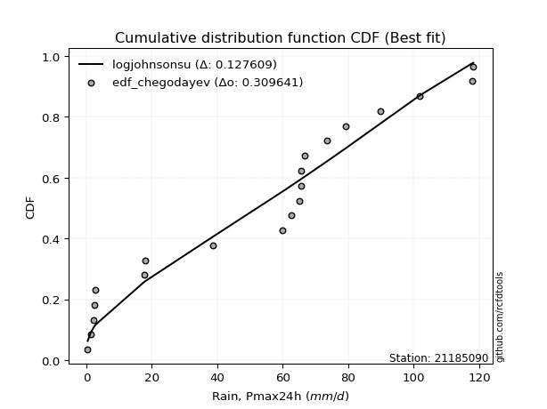</img></img>

</div>


### 6. EDF Blom (1958)

The Blom formula is a specific "plotting position" formula used in hydrology and statistical analysis to estimate the empirical cumulative probability (or non-exceedance probability) of a data series. It is particularly recommended for data that are approximately normally distributed. The constant _a_ is set to 0.375 (or 3/8).

<div align="center">


$P=(m-a)/(n+1-2a)$


</div>


**6.1. Empirical values**

<div align="center">

|                | 0                    | 1                   | 2                   | 3                   | 4                   | 5                  | 6                  | 7                  | 8                   | 9                   | 10                 | 11                 | 12                 | 13                 | 14                 | 15                 | 16                 | 17                 | 18                 | 19                 |
|:---------------|:---------------------|:--------------------|:--------------------|:--------------------|:--------------------|:-------------------|:-------------------|:-------------------|:--------------------|:--------------------|:-------------------|:-------------------|:-------------------|:-------------------|:-------------------|:-------------------|:-------------------|:-------------------|:-------------------|:-------------------|
| date           | 2020                 | 2016                | 2017                | 2018                | 2015                | 2023               | 2019               | 2013               | 2010                | 2007                | 2012               | 2011               | 2014               | 2005               | 2009               | 2008               | 2022               | 2021               | 2024               | 2006               |
| x              | 0.4                  | 1.3                 | 2.2                 | 2.4                 | 2.8                 | 17.6               | 18.1               | 38.7               | 59.9                | 62.7                | 65.1               | 65.6               | 65.6               | 66.6               | 73.6               | 79.2               | 89.9               | 101.9              | 117.8              | 118.2              |
| m              | 1                    | 2                   | 3                   | 4                   | 5                   | 6                  | 7                  | 8                  | 9                   | 10                  | 11                 | 12                 | 13                 | 14                 | 15                 | 16                 | 17                 | 18                 | 19                 | 20                 |
| empirical_dist | edf_blom             | edf_blom            | edf_blom            | edf_blom            | edf_blom            | edf_blom           | edf_blom           | edf_blom           | edf_blom            | edf_blom            | edf_blom           | edf_blom           | edf_blom           | edf_blom           | edf_blom           | edf_blom           | edf_blom           | edf_blom           | edf_blom           | edf_blom           |
| empirical      | 0.030864197530864196 | 0.08024691358024691 | 0.12962962962962962 | 0.17901234567901234 | 0.22839506172839505 | 0.2777777777777778 | 0.3271604938271605 | 0.3765432098765432 | 0.42592592592592593 | 0.47530864197530864 | 0.5246913580246914 | 0.5740740740740741 | 0.6234567901234568 | 0.6728395061728395 | 0.7222222222222222 | 0.7716049382716049 | 0.8209876543209876 | 0.8703703703703703 | 0.9197530864197531 | 0.9691358024691358 |
| empirical_tr   | 1.0318471337579618   | 1.087248322147651   | 1.148936170212766   | 1.218045112781955   | 1.296               | 1.3846153846153846 | 1.4862385321100917 | 1.603960396039604  | 1.7419354838709677  | 1.9058823529411766  | 2.103896103896104  | 2.3478260869565215 | 2.6557377049180326 | 3.0566037735849054 | 3.5999999999999996 | 4.378378378378378  | 5.586206896551723  | 7.714285714285713  | 12.461538461538458 | 32.39999999999997  |

</div>


**6.2. Kolmogorov-Smirnov fit test (sorted by Δ)**


<div align="center">

|                | 0                  | 1                   | 2                   | 3                   | 4                   | 5                   | 6                   | 7                   | 8                   | 9                   | 10                 | 11                  | 12                 | 13                  | 14                  | 15                  | 16                  | 17                 | 18                  | 19                 | 20                  | 21                  | 22                 | 23                  | 24                  | 25                  | 26                 | 27                  | 28                 | 29                  | 30                    | 31                 | 32                  | 33                  | 34                  | 35                  | 36                  | 37                  | 38                  | 39                  | 40                 | 41                 | 42                  | 43                  | 44                 | 45                  | 46                 | 47                  | 48                  | 49                 | 50                 | 51                 | 52                  | 53                 | 54                  | 55                 | 56                  | 57                  | 58                 | 59                  | 60                  | 61                 | 62                  | 63                  | 64                 | 65                 | 66                 | 67                 | 68                  | 69                 | 70                  | 71                 | 72                 | 73                  | 74                 | 75                  | 76                  | 77                  | 78                  | 79                  | 80                 | 81                 | 82                 | 83                 | 84                 | 85                 | 86                 | 87                 |
|:---------------|:-------------------|:--------------------|:--------------------|:--------------------|:--------------------|:--------------------|:--------------------|:--------------------|:--------------------|:--------------------|:-------------------|:--------------------|:-------------------|:--------------------|:--------------------|:--------------------|:--------------------|:-------------------|:--------------------|:-------------------|:--------------------|:--------------------|:-------------------|:--------------------|:--------------------|:--------------------|:-------------------|:--------------------|:-------------------|:--------------------|:----------------------|:-------------------|:--------------------|:--------------------|:--------------------|:--------------------|:--------------------|:--------------------|:--------------------|:--------------------|:-------------------|:-------------------|:--------------------|:--------------------|:-------------------|:--------------------|:-------------------|:--------------------|:--------------------|:-------------------|:-------------------|:-------------------|:--------------------|:-------------------|:--------------------|:-------------------|:--------------------|:--------------------|:-------------------|:--------------------|:--------------------|:-------------------|:--------------------|:--------------------|:-------------------|:-------------------|:-------------------|:-------------------|:--------------------|:-------------------|:--------------------|:-------------------|:-------------------|:--------------------|:-------------------|:--------------------|:--------------------|:--------------------|:--------------------|:--------------------|:-------------------|:-------------------|:-------------------|:-------------------|:-------------------|:-------------------|:-------------------|:-------------------|
| station        | 21185090           | 21185090            | 21185090            | 21185090            | 21185090            | 21185090            | 21185090            | 21185090            | 21185090            | 21185090            | 21185090           | 21185090            | 21185090           | 21185090            | 21185090            | 21185090            | 21185090            | 21185090           | 21185090            | 21185090           | 21185090            | 21185090            | 21185090           | 21185090            | 21185090            | 21185090            | 21185090           | 21185090            | 21185090           | 21185090            | 21185090              | 21185090           | 21185090            | 21185090            | 21185090            | 21185090            | 21185090            | 21185090            | 21185090            | 21185090            | 21185090           | 21185090           | 21185090            | 21185090            | 21185090           | 21185090            | 21185090           | 21185090            | 21185090            | 21185090           | 21185090           | 21185090           | 21185090            | 21185090           | 21185090            | 21185090           | 21185090            | 21185090            | 21185090           | 21185090            | 21185090            | 21185090           | 21185090            | 21185090            | 21185090           | 21185090           | 21185090           | 21185090           | 21185090            | 21185090           | 21185090            | 21185090           | 21185090           | 21185090            | 21185090           | 21185090            | 21185090            | 21185090            | 21185090            | 21185090            | 21185090           | 21185090           | 21185090           | 21185090           | 21185090           | 21185090           | 21185090           | 21185090           |
| empirical_dist | edf_blom           | edf_blom            | edf_blom            | edf_blom            | edf_blom            | edf_blom            | edf_blom            | edf_blom            | edf_blom            | edf_blom            | edf_blom           | edf_blom            | edf_blom           | edf_blom            | edf_blom            | edf_blom            | edf_blom            | edf_blom           | edf_blom            | edf_blom           | edf_blom            | edf_blom            | edf_blom           | edf_blom            | edf_blom            | edf_blom            | edf_blom           | edf_blom            | edf_blom           | edf_blom            | edf_blom              | edf_blom           | edf_blom            | edf_blom            | edf_blom            | edf_blom            | edf_blom            | edf_blom            | edf_blom            | edf_blom            | edf_blom           | edf_blom           | edf_blom            | edf_blom            | edf_blom           | edf_blom            | edf_blom           | edf_blom            | edf_blom            | edf_blom           | edf_blom           | edf_blom           | edf_blom            | edf_blom           | edf_blom            | edf_blom           | edf_blom            | edf_blom            | edf_blom           | edf_blom            | edf_blom            | edf_blom           | edf_blom            | edf_blom            | edf_blom           | edf_blom           | edf_blom           | edf_blom           | edf_blom            | edf_blom           | edf_blom            | edf_blom           | edf_blom           | edf_blom            | edf_blom           | edf_blom            | edf_blom            | edf_blom            | edf_blom            | edf_blom            | edf_blom           | edf_blom           | edf_blom           | edf_blom           | edf_blom           | edf_blom           | edf_blom           | edf_blom           |
| p_dist         | logjohnsonsu       | truncnorm           | nct                 | norm                | crystalball         | t                   | exponnorm           | johnsonsu           | pearson3            | erlang              | gamma              | laplace_asymmetric  | logistic           | gumbel_l            | hypsecant           | rice                | invgamma            | maxwell            | rayleigh            | laplace            | invgauss            | invweibull          | gompertz           | genlogistic         | nakagami            | halfnorm            | kstwobign          | logcrystalball      | gumbel_r           | weibull_min         | loglaplace_asymmetric | logloggamma        | logmielke           | logfisk             | logpearson3         | halflogistic        | moyal               | loggumbel_l         | ncf                 | mielke              | loginvweibull      | expon              | genexpon            | logweibull_min      | f                  | loggompertz         | loglognorm         | loggamma            | loggamma            | fisk               | logerlang          | logbetaprime       | lognakagami         | lognct             | logrice             | logexponnorm       | lognorm             | lognorm             | logt               | logfatiguelife      | logkstwobign        | loginvgauss        | loginvgamma         | loggenexpon         | logmaxwell         | lograyleigh        | loglogistic        | loghalfnorm        | loghypsecant        | logncf             | wald                | logexpon           | loggumbel_r        | loghalflogistic     | loglaplace         | gibrat              | fatiguelife         | logmoyal            | chi2                | logwald             | betaprime          | logalpha           | loggibrat          | logf               | logtruncnorm       | logchi2            | alpha              | loggenlogistic     |
| delta          | 0.1281533326864771 | 0.13589863652810774 | 0.14908924688287073 | 0.15019639733632262 | 0.15019648573741806 | 0.15019921657070234 | 0.15019952933210123 | 0.15181914973956379 | 0.15229838382960736 | 0.15244576462559978 | 0.152698445887682  | 0.15905159751747022 | 0.1610497818236621 | 0.16292557659979692 | 0.17284063950281744 | 0.17322174833762471 | 0.17678160759404438 | 0.1787066861110964 | 0.18769783958945008 | 0.1929584393661904 | 0.19626375456542688 | 0.19704019012581164 | 0.2036783562021176 | 0.20447067032183552 | 0.21159896300513026 | 0.21315435406006844 | 0.214428747710374  | 0.21761140775672427 | 0.2188080120126762 | 0.22111807625448876 | 0.2248182340165341    | 0.2250050045743004 | 0.22712404872861236 | 0.22728972357383492 | 0.23052581016699836 | 0.24113135855610157 | 0.24265946382806358 | 0.24284370745283723 | 0.24511774731310076 | 0.24765004808411084 | 0.2531073797981176 | 0.2550450252757791 | 0.25527839088931137 | 0.26088541610986604 | 0.2623039992449062 | 0.26517861788313934 | 0.2725547578336486 | 0.27282176370031186 | 0.27282176370031186 | 0.2738231067297391 | 0.2741458383929274 | 0.2748540463792247 | 0.27502915221708635 | 0.2752575185770164 | 0.27527290117256875 | 0.2752755901649271 | 0.27527609246484375 | 0.27527609246484375 | 0.275276459868926  | 0.27546642266690846 | 0.27579239240609343 | 0.2800696042185178 | 0.28206598558566165 | 0.28774396811038283 | 0.2910463402469351 | 0.2956526159526288 | 0.2966817408715513 | 0.3096890129605605 | 0.31210545649970567 | 0.3151921332427927 | 0.32035839384307363 | 0.3244724544006107 | 0.3258647754840066 | 0.33644373441958286 | 0.3370645764028176 | 0.33968487305861295 | 0.34188980946053305 | 0.34222732225077934 | 0.38839690541333305 | 0.39031053944266725 | 0.3944809066301407 | 0.4171243326423706 | 0.4215967775449402 | 0.4449752930085803 | 0.4657594897280394 | 0.5535795780563336 | 0.6473696754771272 | 0.9197530864197531 |
| deltao         | 0.3096406529800002 | 0.3096406529800002  | 0.3096406529800002  | 0.3096406529800002  | 0.3096406529800002  | 0.3096406529800002  | 0.3096406529800002  | 0.3096406529800002  | 0.3096406529800002  | 0.3096406529800002  | 0.3096406529800002 | 0.3096406529800002  | 0.3096406529800002 | 0.3096406529800002  | 0.3096406529800002  | 0.3096406529800002  | 0.3096406529800002  | 0.3096406529800002 | 0.3096406529800002  | 0.3096406529800002 | 0.3096406529800002  | 0.3096406529800002  | 0.3096406529800002 | 0.3096406529800002  | 0.3096406529800002  | 0.3096406529800002  | 0.3096406529800002 | 0.3096406529800002  | 0.3096406529800002 | 0.3096406529800002  | 0.3096406529800002    | 0.3096406529800002 | 0.3096406529800002  | 0.3096406529800002  | 0.3096406529800002  | 0.3096406529800002  | 0.3096406529800002  | 0.3096406529800002  | 0.3096406529800002  | 0.3096406529800002  | 0.3096406529800002 | 0.3096406529800002 | 0.3096406529800002  | 0.3096406529800002  | 0.3096406529800002 | 0.3096406529800002  | 0.3096406529800002 | 0.3096406529800002  | 0.3096406529800002  | 0.3096406529800002 | 0.3096406529800002 | 0.3096406529800002 | 0.3096406529800002  | 0.3096406529800002 | 0.3096406529800002  | 0.3096406529800002 | 0.3096406529800002  | 0.3096406529800002  | 0.3096406529800002 | 0.3096406529800002  | 0.3096406529800002  | 0.3096406529800002 | 0.3096406529800002  | 0.3096406529800002  | 0.3096406529800002 | 0.3096406529800002 | 0.3096406529800002 | 0.3096406529800002 | 0.3096406529800002  | 0.3096406529800002 | 0.3096406529800002  | 0.3096406529800002 | 0.3096406529800002 | 0.3096406529800002  | 0.3096406529800002 | 0.3096406529800002  | 0.3096406529800002  | 0.3096406529800002  | 0.3096406529800002  | 0.3096406529800002  | 0.3096406529800002 | 0.3096406529800002 | 0.3096406529800002 | 0.3096406529800002 | 0.3096406529800002 | 0.3096406529800002 | 0.3096406529800002 | 0.3096406529800002 |
| eval           | Δo > Δ             | Δo > Δ              | Δo > Δ              | Δo > Δ              | Δo > Δ              | Δo > Δ              | Δo > Δ              | Δo > Δ              | Δo > Δ              | Δo > Δ              | Δo > Δ             | Δo > Δ              | Δo > Δ             | Δo > Δ              | Δo > Δ              | Δo > Δ              | Δo > Δ              | Δo > Δ             | Δo > Δ              | Δo > Δ             | Δo > Δ              | Δo > Δ              | Δo > Δ             | Δo > Δ              | Δo > Δ              | Δo > Δ              | Δo > Δ             | Δo > Δ              | Δo > Δ             | Δo > Δ              | Δo > Δ                | Δo > Δ             | Δo > Δ              | Δo > Δ              | Δo > Δ              | Δo > Δ              | Δo > Δ              | Δo > Δ              | Δo > Δ              | Δo > Δ              | Δo > Δ             | Δo > Δ             | Δo > Δ              | Δo > Δ              | Δo > Δ             | Δo > Δ              | Δo > Δ             | Δo > Δ              | Δo > Δ              | Δo > Δ             | Δo > Δ             | Δo > Δ             | Δo > Δ              | Δo > Δ             | Δo > Δ              | Δo > Δ             | Δo > Δ              | Δo > Δ              | Δo > Δ             | Δo > Δ              | Δo > Δ              | Δo > Δ             | Δo > Δ              | Δo > Δ              | Δo > Δ             | Δo > Δ             | Δo > Δ             | Δo <= Δ            | Δo <= Δ             | Δo <= Δ            | Δo <= Δ             | Δo <= Δ            | Δo <= Δ            | Δo <= Δ             | Δo <= Δ            | Δo <= Δ             | Δo <= Δ             | Δo <= Δ             | Δo <= Δ             | Δo <= Δ             | Δo <= Δ            | Δo <= Δ            | Δo <= Δ            | Δo <= Δ            | Δo <= Δ            | Δo <= Δ            | Δo <= Δ            | Δo <= Δ            |
| fit            | 1                  | 1                   | 1                   | 1                   | 1                   | 1                   | 1                   | 1                   | 1                   | 1                   | 1                  | 1                   | 1                  | 1                   | 1                   | 1                   | 1                   | 1                  | 1                   | 1                  | 1                   | 1                   | 1                  | 1                   | 1                   | 1                   | 1                  | 1                   | 1                  | 1                   | 1                     | 1                  | 1                   | 1                   | 1                   | 1                   | 1                   | 1                   | 1                   | 1                   | 1                  | 1                  | 1                   | 1                   | 1                  | 1                   | 1                  | 1                   | 1                   | 1                  | 1                  | 1                  | 1                   | 1                  | 1                   | 1                  | 1                   | 1                   | 1                  | 1                   | 1                   | 1                  | 1                   | 1                   | 1                  | 1                  | 1                  | 0                  | 0                   | 0                  | 0                   | 0                  | 0                  | 0                   | 0                  | 0                   | 0                   | 0                   | 0                   | 0                   | 0                  | 0                  | 0                  | 0                  | 0                  | 0                  | 0                  | 0                  |
| n              | 20                 | 20                  | 20                  | 20                  | 20                  | 20                  | 20                  | 20                  | 20                  | 20                  | 20                 | 20                  | 20                 | 20                  | 20                  | 20                  | 20                  | 20                 | 20                  | 20                 | 20                  | 20                  | 20                 | 20                  | 20                  | 20                  | 20                 | 20                  | 20                 | 20                  | 20                    | 20                 | 20                  | 20                  | 20                  | 20                  | 20                  | 20                  | 20                  | 20                  | 20                 | 20                 | 20                  | 20                  | 20                 | 20                  | 20                 | 20                  | 20                  | 20                 | 20                 | 20                 | 20                  | 20                 | 20                  | 20                 | 20                  | 20                  | 20                 | 20                  | 20                  | 20                 | 20                  | 20                  | 20                 | 20                 | 20                 | 20                 | 20                  | 20                 | 20                  | 20                 | 20                 | 20                  | 20                 | 20                  | 20                  | 20                  | 20                  | 20                  | 20                 | 20                 | 20                 | 20                 | 20                 | 20                 | 20                 | 20                 |
| best_fit       | 1                  | 0                   | 0                   | 0                   | 0                   | 0                   | 0                   | 0                   | 0                   | 0                   | 0                  | 0                   | 0                  | 0                   | 0                   | 0                   | 0                   | 0                  | 0                   | 0                  | 0                   | 0                   | 0                  | 0                   | 0                   | 0                   | 0                  | 0                   | 0                  | 0                   | 0                     | 0                  | 0                   | 0                   | 0                   | 0                   | 0                   | 0                   | 0                   | 0                   | 0                  | 0                  | 0                   | 0                   | 0                  | 0                   | 0                  | 0                   | 0                   | 0                  | 0                  | 0                  | 0                   | 0                  | 0                   | 0                  | 0                   | 0                   | 0                  | 0                   | 0                   | 0                  | 0                   | 0                   | 0                  | 0                  | 0                  | 0                  | 0                   | 0                  | 0                   | 0                  | 0                  | 0                   | 0                  | 0                   | 0                   | 0                   | 0                   | 0                   | 0                  | 0                  | 0                  | 0                  | 0                  | 0                  | 0                  | 0                  |
| best_fit_sort  | 1                  | 2                   | 3                   | 4                   | 5                   | 6                   | 7                   | 8                   | 9                   | 10                  | 11                 | 12                  | 13                 | 14                  | 15                  | 16                  | 17                  | 18                 | 19                  | 20                 | 21                  | 22                  | 23                 | 24                  | 25                  | 26                  | 27                 | 28                  | 29                 | 30                  | 31                    | 32                 | 33                  | 34                  | 35                  | 36                  | 37                  | 38                  | 39                  | 40                  | 41                 | 42                 | 43                  | 44                  | 45                 | 46                  | 47                 | 48                  | 49                  | 50                 | 51                 | 52                 | 53                  | 54                 | 55                  | 56                 | 57                  | 58                  | 59                 | 60                  | 61                  | 62                 | 63                  | 64                  | 65                 | 66                 | 67                 | 68                 | 69                  | 70                 | 71                  | 72                 | 73                 | 74                  | 75                 | 76                  | 77                  | 78                  | 79                  | 80                  | 81                 | 82                 | 83                 | 84                 | 85                 | 86                 | 87                 | 88                 |

</div>


**6.3. Best fit**

<div align="center">

|   id |   station | empirical_dist   | p_dist       |    delta |   deltao | eval   |   fit |   n |   best_fit |   best_fit_sort |
|-----:|----------:|:-----------------|:-------------|---------:|---------:|:-------|------:|----:|-----------:|----------------:|
|    0 |  21185090 | edf_blom         | logjohnsonsu | 0.128153 | 0.309641 | Δo > Δ |     1 |  20 |          1 |               1 |

</div>


<div align="center">

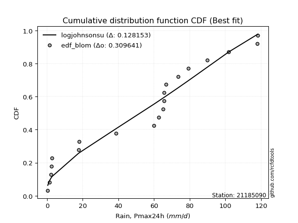</img></img>

</div>


### 7. EDF Tukey (1962)

In hydrology, the Tukey formula is used as a plotting position formula to estimate the empirical probability or frequency of a flood event (or other hydrological data). The formula parameter is given as _c=0.333_ (or 1/3).

<div align="center">


$P=(m-c)/(n+1-2c)$


</div>


**7.1. Empirical values**

<div align="center">

|                | 0                   | 1                   | 2                   | 3                   | 4                   | 5                  | 6                   | 7                  | 8                  | 9                   | 10                 | 11                 | 12                 | 13                 | 14                 | 15                 | 16                | 17                 | 18                 | 19                 |
|:---------------|:--------------------|:--------------------|:--------------------|:--------------------|:--------------------|:-------------------|:--------------------|:-------------------|:-------------------|:--------------------|:-------------------|:-------------------|:-------------------|:-------------------|:-------------------|:-------------------|:------------------|:-------------------|:-------------------|:-------------------|
| date           | 2020                | 2016                | 2017                | 2018                | 2015                | 2023               | 2019                | 2013               | 2010               | 2007                | 2012               | 2011               | 2014               | 2005               | 2009               | 2008               | 2022              | 2021               | 2024               | 2006               |
| x              | 0.4                 | 1.3                 | 2.2                 | 2.4                 | 2.8                 | 17.6               | 18.1                | 38.7               | 59.9               | 62.7                | 65.1               | 65.6               | 65.6               | 66.6               | 73.6               | 79.2               | 89.9              | 101.9              | 117.8              | 118.2              |
| m              | 1                   | 2                   | 3                   | 4                   | 5                   | 6                  | 7                   | 8                  | 9                  | 10                  | 11                 | 12                 | 13                 | 14                 | 15                 | 16                 | 17                | 18                 | 19                 | 20                 |
| empirical_dist | edf_tukey           | edf_tukey           | edf_tukey           | edf_tukey           | edf_tukey           | edf_tukey          | edf_tukey           | edf_tukey          | edf_tukey          | edf_tukey           | edf_tukey          | edf_tukey          | edf_tukey          | edf_tukey          | edf_tukey          | edf_tukey          | edf_tukey         | edf_tukey          | edf_tukey          | edf_tukey          |
| empirical      | 0.03278688524590164 | 0.08196721311475409 | 0.13114754098360656 | 0.18032786885245902 | 0.22950819672131148 | 0.2786885245901639 | 0.32786885245901637 | 0.3770491803278688 | 0.4262295081967213 | 0.47540983606557374 | 0.5245901639344263 | 0.5737704918032787 | 0.6229508196721312 | 0.6721311475409836 | 0.7213114754098361 | 0.7704918032786885 | 0.819672131147541 | 0.8688524590163934 | 0.9180327868852459 | 0.9672131147540983 |
| empirical_tr   | 1.033898305084746   | 1.0892857142857142  | 1.150943396226415   | 1.22                | 1.297872340425532   | 1.3863636363636362 | 1.4878048780487803  | 1.6052631578947367 | 1.7428571428571429 | 1.90625             | 2.103448275862069  | 2.346153846153846  | 2.6521739130434785 | 3.05               | 3.588235294117647  | 4.357142857142857  | 5.545454545454546 | 7.624999999999998  | 12.200000000000003 | 30.499999999999964 |

</div>


**7.2. Kolmogorov-Smirnov fit test (sorted by Δ)**


<div align="center">

|                | 0                   | 1                  | 2                   | 3                   | 4                  | 5                  | 6                   | 7                   | 8                  | 9                   | 10                  | 11                 | 12                  | 13                 | 14                  | 15                 | 16                  | 17                  | 18                  | 19                  | 20                  | 21                 | 22                  | 23                  | 24                 | 25                  | 26                  | 27                  | 28                  | 29                 | 30                    | 31                  | 32                 | 33                  | 34                 | 35                  | 36                  | 37                  | 38                 | 39                  | 40                  | 41                  | 42                 | 43                 | 44                  | 45                 | 46                  | 47                 | 48                 | 49                 | 50                  | 51                  | 52                 | 53                  | 54                 | 55                  | 56                 | 57                 | 58                  | 59                 | 60                 | 61                  | 62                 | 63                 | 64                  | 65                  | 66                  | 67                  | 68                 | 69                 | 70                 | 71                  | 72                  | 73                 | 74                  | 75                 | 76                 | 77                 | 78                 | 79                 | 80                 | 81                  | 82                 | 83                  | 84                 | 85                 | 86                 | 87                 |
|:---------------|:--------------------|:-------------------|:--------------------|:--------------------|:-------------------|:-------------------|:--------------------|:--------------------|:-------------------|:--------------------|:--------------------|:-------------------|:--------------------|:-------------------|:--------------------|:-------------------|:--------------------|:--------------------|:--------------------|:--------------------|:--------------------|:-------------------|:--------------------|:--------------------|:-------------------|:--------------------|:--------------------|:--------------------|:--------------------|:-------------------|:----------------------|:--------------------|:-------------------|:--------------------|:-------------------|:--------------------|:--------------------|:--------------------|:-------------------|:--------------------|:--------------------|:--------------------|:-------------------|:-------------------|:--------------------|:-------------------|:--------------------|:-------------------|:-------------------|:-------------------|:--------------------|:--------------------|:-------------------|:--------------------|:-------------------|:--------------------|:-------------------|:-------------------|:--------------------|:-------------------|:-------------------|:--------------------|:-------------------|:-------------------|:--------------------|:--------------------|:--------------------|:--------------------|:-------------------|:-------------------|:-------------------|:--------------------|:--------------------|:-------------------|:--------------------|:-------------------|:-------------------|:-------------------|:-------------------|:-------------------|:-------------------|:--------------------|:-------------------|:--------------------|:-------------------|:-------------------|:-------------------|:-------------------|
| station        | 21185090            | 21185090           | 21185090            | 21185090            | 21185090           | 21185090           | 21185090            | 21185090            | 21185090           | 21185090            | 21185090            | 21185090           | 21185090            | 21185090           | 21185090            | 21185090           | 21185090            | 21185090            | 21185090            | 21185090            | 21185090            | 21185090           | 21185090            | 21185090            | 21185090           | 21185090            | 21185090            | 21185090            | 21185090            | 21185090           | 21185090              | 21185090            | 21185090           | 21185090            | 21185090           | 21185090            | 21185090            | 21185090            | 21185090           | 21185090            | 21185090            | 21185090            | 21185090           | 21185090           | 21185090            | 21185090           | 21185090            | 21185090           | 21185090           | 21185090           | 21185090            | 21185090            | 21185090           | 21185090            | 21185090           | 21185090            | 21185090           | 21185090           | 21185090            | 21185090           | 21185090           | 21185090            | 21185090           | 21185090           | 21185090            | 21185090            | 21185090            | 21185090            | 21185090           | 21185090           | 21185090           | 21185090            | 21185090            | 21185090           | 21185090            | 21185090           | 21185090           | 21185090           | 21185090           | 21185090           | 21185090           | 21185090            | 21185090           | 21185090            | 21185090           | 21185090           | 21185090           | 21185090           |
| empirical_dist | edf_tukey           | edf_tukey          | edf_tukey           | edf_tukey           | edf_tukey          | edf_tukey          | edf_tukey           | edf_tukey           | edf_tukey          | edf_tukey           | edf_tukey           | edf_tukey          | edf_tukey           | edf_tukey          | edf_tukey           | edf_tukey          | edf_tukey           | edf_tukey           | edf_tukey           | edf_tukey           | edf_tukey           | edf_tukey          | edf_tukey           | edf_tukey           | edf_tukey          | edf_tukey           | edf_tukey           | edf_tukey           | edf_tukey           | edf_tukey          | edf_tukey             | edf_tukey           | edf_tukey          | edf_tukey           | edf_tukey          | edf_tukey           | edf_tukey           | edf_tukey           | edf_tukey          | edf_tukey           | edf_tukey           | edf_tukey           | edf_tukey          | edf_tukey          | edf_tukey           | edf_tukey          | edf_tukey           | edf_tukey          | edf_tukey          | edf_tukey          | edf_tukey           | edf_tukey           | edf_tukey          | edf_tukey           | edf_tukey          | edf_tukey           | edf_tukey          | edf_tukey          | edf_tukey           | edf_tukey          | edf_tukey          | edf_tukey           | edf_tukey          | edf_tukey          | edf_tukey           | edf_tukey           | edf_tukey           | edf_tukey           | edf_tukey          | edf_tukey          | edf_tukey          | edf_tukey           | edf_tukey           | edf_tukey          | edf_tukey           | edf_tukey          | edf_tukey          | edf_tukey          | edf_tukey          | edf_tukey          | edf_tukey          | edf_tukey           | edf_tukey          | edf_tukey           | edf_tukey          | edf_tukey          | edf_tukey          | edf_tukey          |
| p_dist         | logjohnsonsu        | truncnorm          | nct                 | norm                | crystalball        | t                  | exponnorm           | johnsonsu           | pearson3           | erlang              | gamma               | laplace_asymmetric | logistic            | gumbel_l           | rice                | hypsecant          | invgamma            | maxwell             | rayleigh            | laplace             | invgauss            | invweibull         | genlogistic         | gompertz            | nakagami           | halfnorm            | kstwobign           | logcrystalball      | gumbel_r            | weibull_min        | loglaplace_asymmetric | logloggamma         | logmielke          | logfisk             | logpearson3        | halflogistic        | moyal               | loggumbel_l         | ncf                | mielke              | loginvweibull       | expon               | genexpon           | logweibull_min     | f                   | loggompertz        | fisk                | loglognorm         | loggamma           | loggamma           | logerlang           | logbetaprime        | lognakagami        | lognct              | logrice            | logexponnorm        | lognorm            | lognorm            | logt                | logfatiguelife     | logkstwobign       | loginvgauss         | loginvgamma        | loggenexpon        | logmaxwell          | lograyleigh         | loglogistic         | loghalfnorm         | loghypsecant       | logncf             | wald               | logexpon            | loggumbel_r         | loghalflogistic    | loglaplace          | gibrat             | fatiguelife        | logmoyal           | chi2               | logwald            | betaprime          | logalpha            | loggibrat          | logf                | logtruncnorm       | logchi2            | alpha              | loggenlogistic     |
| delta          | 0.12784975041568175 | 0.1366069951599636 | 0.14878566461207537 | 0.14989281506552726 | 0.1498929034666227 | 0.149895634299907  | 0.14989594706130588 | 0.15151556746876843 | 0.151994801558812  | 0.15214218235480442 | 0.15239486361688664 | 0.1597599561493261 | 0.16175814045551798 | 0.1636339352316528 | 0.17291816606682936 | 0.1735489981346733 | 0.17647802532324902 | 0.17840310384030106 | 0.18739425731865472 | 0.19265485709539504 | 0.19596017229463153 | 0.1967366078550163 | 0.20416708805104017 | 0.20479149119503404 | 0.2112953807343349 | 0.21285077178927309 | 0.21412516543957866 | 0.21730782548592892 | 0.21850442974188083 | 0.2208144939836934 | 0.22451465174573876   | 0.22470142230350504 | 0.226820466457817  | 0.22698614130303957 | 0.230222227896203  | 0.24082777628530622 | 0.24235588155726823 | 0.24254012518204188 | 0.2448141650423054 | 0.24734646581331549 | 0.25280379752732224 | 0.25474144300498375 | 0.254974808618516  | 0.2605818338390707 | 0.26200041697411086 | 0.264875035612344  | 0.27190041901470163 | 0.2722511755628532 | 0.2725181814295165 | 0.2725181814295165 | 0.27384225612213203 | 0.27455046410842937 | 0.274725569946291  | 0.27495393630622106 | 0.2749693189017734 | 0.27497200789413173 | 0.2749725101940484 | 0.2749725101940484 | 0.27497287759813066 | 0.2751628403961131 | 0.2754888101352981 | 0.27976602194772243 | 0.2817624033148663 | 0.2874403858395875 | 0.29074275797613974 | 0.29534903368183346 | 0.29637815860075595 | 0.30938543068976515 | 0.3118018742289103 | 0.3136742218888158 | 0.3210667524749295 | 0.32356170758822456 | 0.32556119321321125 | 0.3361401521487875 | 0.33676099413202226 | 0.3393812907878176 | 0.3415862271897377 | 0.341923739979984  | 0.3880933231425377 | 0.3900069571718719 | 0.3941773243593453 | 0.41621358582998447 | 0.4212931952741448 | 0.44345738165460336 | 0.465455907457244  | 0.5526688312439475 | 0.6464589286647411 | 0.9180327868852459 |
| deltao         | 0.3096406529800002  | 0.3096406529800002 | 0.3096406529800002  | 0.3096406529800002  | 0.3096406529800002 | 0.3096406529800002 | 0.3096406529800002  | 0.3096406529800002  | 0.3096406529800002 | 0.3096406529800002  | 0.3096406529800002  | 0.3096406529800002 | 0.3096406529800002  | 0.3096406529800002 | 0.3096406529800002  | 0.3096406529800002 | 0.3096406529800002  | 0.3096406529800002  | 0.3096406529800002  | 0.3096406529800002  | 0.3096406529800002  | 0.3096406529800002 | 0.3096406529800002  | 0.3096406529800002  | 0.3096406529800002 | 0.3096406529800002  | 0.3096406529800002  | 0.3096406529800002  | 0.3096406529800002  | 0.3096406529800002 | 0.3096406529800002    | 0.3096406529800002  | 0.3096406529800002 | 0.3096406529800002  | 0.3096406529800002 | 0.3096406529800002  | 0.3096406529800002  | 0.3096406529800002  | 0.3096406529800002 | 0.3096406529800002  | 0.3096406529800002  | 0.3096406529800002  | 0.3096406529800002 | 0.3096406529800002 | 0.3096406529800002  | 0.3096406529800002 | 0.3096406529800002  | 0.3096406529800002 | 0.3096406529800002 | 0.3096406529800002 | 0.3096406529800002  | 0.3096406529800002  | 0.3096406529800002 | 0.3096406529800002  | 0.3096406529800002 | 0.3096406529800002  | 0.3096406529800002 | 0.3096406529800002 | 0.3096406529800002  | 0.3096406529800002 | 0.3096406529800002 | 0.3096406529800002  | 0.3096406529800002 | 0.3096406529800002 | 0.3096406529800002  | 0.3096406529800002  | 0.3096406529800002  | 0.3096406529800002  | 0.3096406529800002 | 0.3096406529800002 | 0.3096406529800002 | 0.3096406529800002  | 0.3096406529800002  | 0.3096406529800002 | 0.3096406529800002  | 0.3096406529800002 | 0.3096406529800002 | 0.3096406529800002 | 0.3096406529800002 | 0.3096406529800002 | 0.3096406529800002 | 0.3096406529800002  | 0.3096406529800002 | 0.3096406529800002  | 0.3096406529800002 | 0.3096406529800002 | 0.3096406529800002 | 0.3096406529800002 |
| eval           | Δo > Δ              | Δo > Δ             | Δo > Δ              | Δo > Δ              | Δo > Δ             | Δo > Δ             | Δo > Δ              | Δo > Δ              | Δo > Δ             | Δo > Δ              | Δo > Δ              | Δo > Δ             | Δo > Δ              | Δo > Δ             | Δo > Δ              | Δo > Δ             | Δo > Δ              | Δo > Δ              | Δo > Δ              | Δo > Δ              | Δo > Δ              | Δo > Δ             | Δo > Δ              | Δo > Δ              | Δo > Δ             | Δo > Δ              | Δo > Δ              | Δo > Δ              | Δo > Δ              | Δo > Δ             | Δo > Δ                | Δo > Δ              | Δo > Δ             | Δo > Δ              | Δo > Δ             | Δo > Δ              | Δo > Δ              | Δo > Δ              | Δo > Δ             | Δo > Δ              | Δo > Δ              | Δo > Δ              | Δo > Δ             | Δo > Δ             | Δo > Δ              | Δo > Δ             | Δo > Δ              | Δo > Δ             | Δo > Δ             | Δo > Δ             | Δo > Δ              | Δo > Δ              | Δo > Δ             | Δo > Δ              | Δo > Δ             | Δo > Δ              | Δo > Δ             | Δo > Δ             | Δo > Δ              | Δo > Δ             | Δo > Δ             | Δo > Δ              | Δo > Δ             | Δo > Δ             | Δo > Δ              | Δo > Δ              | Δo > Δ              | Δo > Δ              | Δo <= Δ            | Δo <= Δ            | Δo <= Δ            | Δo <= Δ             | Δo <= Δ             | Δo <= Δ            | Δo <= Δ             | Δo <= Δ            | Δo <= Δ            | Δo <= Δ            | Δo <= Δ            | Δo <= Δ            | Δo <= Δ            | Δo <= Δ             | Δo <= Δ            | Δo <= Δ             | Δo <= Δ            | Δo <= Δ            | Δo <= Δ            | Δo <= Δ            |
| fit            | 1                   | 1                  | 1                   | 1                   | 1                  | 1                  | 1                   | 1                   | 1                  | 1                   | 1                   | 1                  | 1                   | 1                  | 1                   | 1                  | 1                   | 1                   | 1                   | 1                   | 1                   | 1                  | 1                   | 1                   | 1                  | 1                   | 1                   | 1                   | 1                   | 1                  | 1                     | 1                   | 1                  | 1                   | 1                  | 1                   | 1                   | 1                   | 1                  | 1                   | 1                   | 1                   | 1                  | 1                  | 1                   | 1                  | 1                   | 1                  | 1                  | 1                  | 1                   | 1                   | 1                  | 1                   | 1                  | 1                   | 1                  | 1                  | 1                   | 1                  | 1                  | 1                   | 1                  | 1                  | 1                   | 1                   | 1                   | 1                   | 0                  | 0                  | 0                  | 0                   | 0                   | 0                  | 0                   | 0                  | 0                  | 0                  | 0                  | 0                  | 0                  | 0                   | 0                  | 0                   | 0                  | 0                  | 0                  | 0                  |
| n              | 20                  | 20                 | 20                  | 20                  | 20                 | 20                 | 20                  | 20                  | 20                 | 20                  | 20                  | 20                 | 20                  | 20                 | 20                  | 20                 | 20                  | 20                  | 20                  | 20                  | 20                  | 20                 | 20                  | 20                  | 20                 | 20                  | 20                  | 20                  | 20                  | 20                 | 20                    | 20                  | 20                 | 20                  | 20                 | 20                  | 20                  | 20                  | 20                 | 20                  | 20                  | 20                  | 20                 | 20                 | 20                  | 20                 | 20                  | 20                 | 20                 | 20                 | 20                  | 20                  | 20                 | 20                  | 20                 | 20                  | 20                 | 20                 | 20                  | 20                 | 20                 | 20                  | 20                 | 20                 | 20                  | 20                  | 20                  | 20                  | 20                 | 20                 | 20                 | 20                  | 20                  | 20                 | 20                  | 20                 | 20                 | 20                 | 20                 | 20                 | 20                 | 20                  | 20                 | 20                  | 20                 | 20                 | 20                 | 20                 |
| best_fit       | 1                   | 0                  | 0                   | 0                   | 0                  | 0                  | 0                   | 0                   | 0                  | 0                   | 0                   | 0                  | 0                   | 0                  | 0                   | 0                  | 0                   | 0                   | 0                   | 0                   | 0                   | 0                  | 0                   | 0                   | 0                  | 0                   | 0                   | 0                   | 0                   | 0                  | 0                     | 0                   | 0                  | 0                   | 0                  | 0                   | 0                   | 0                   | 0                  | 0                   | 0                   | 0                   | 0                  | 0                  | 0                   | 0                  | 0                   | 0                  | 0                  | 0                  | 0                   | 0                   | 0                  | 0                   | 0                  | 0                   | 0                  | 0                  | 0                   | 0                  | 0                  | 0                   | 0                  | 0                  | 0                   | 0                   | 0                   | 0                   | 0                  | 0                  | 0                  | 0                   | 0                   | 0                  | 0                   | 0                  | 0                  | 0                  | 0                  | 0                  | 0                  | 0                   | 0                  | 0                   | 0                  | 0                  | 0                  | 0                  |
| best_fit_sort  | 1                   | 2                  | 3                   | 4                   | 5                  | 6                  | 7                   | 8                   | 9                  | 10                  | 11                  | 12                 | 13                  | 14                 | 15                  | 16                 | 17                  | 18                  | 19                  | 20                  | 21                  | 22                 | 23                  | 24                  | 25                 | 26                  | 27                  | 28                  | 29                  | 30                 | 31                    | 32                  | 33                 | 34                  | 35                 | 36                  | 37                  | 38                  | 39                 | 40                  | 41                  | 42                  | 43                 | 44                 | 45                  | 46                 | 47                  | 48                 | 49                 | 50                 | 51                  | 52                  | 53                 | 54                  | 55                 | 56                  | 57                 | 58                 | 59                  | 60                 | 61                 | 62                  | 63                 | 64                 | 65                  | 66                  | 67                  | 68                  | 69                 | 70                 | 71                 | 72                  | 73                  | 74                 | 75                  | 76                 | 77                 | 78                 | 79                 | 80                 | 81                 | 82                  | 83                 | 84                  | 85                 | 86                 | 87                 | 88                 |

</div>


**7.3. Best fit**

<div align="center">

|   id |   station | empirical_dist   | p_dist       |   delta |   deltao | eval   |   fit |   n |   best_fit |   best_fit_sort |
|-----:|----------:|:-----------------|:-------------|--------:|---------:|:-------|------:|----:|-----------:|----------------:|
|    0 |  21185090 | edf_tukey        | logjohnsonsu | 0.12785 | 0.309641 | Δo > Δ |     1 |  20 |          1 |               1 |

</div>


<div align="center">

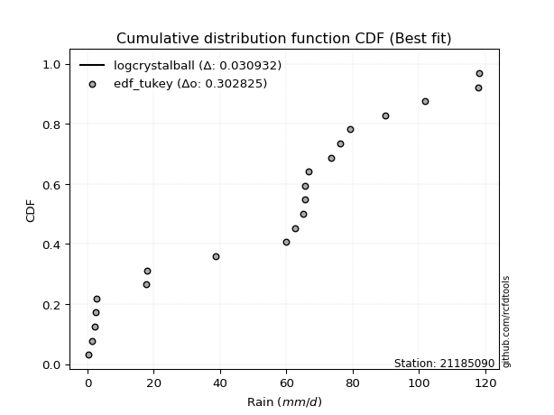</img>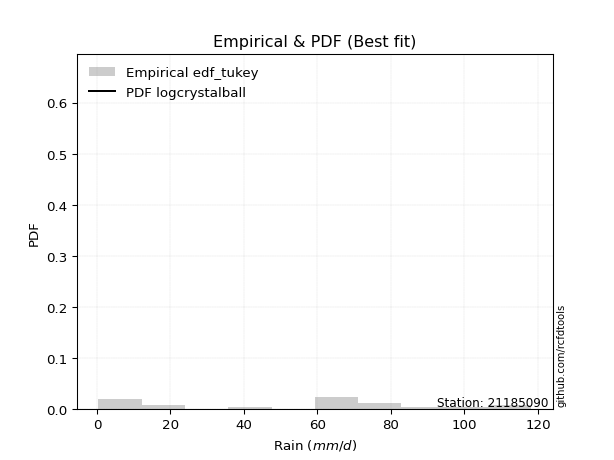</img>

</div>


### 8. EDF Gringorten (1963)

Gringorten plotting position formula is essential for estimating the probability and return periods of extreme events like floods and heavy rainfall. The constant _a=0.44_.

<div align="center">


$P=(m-a)/(n+1-2a)$


</div>


**8.1. Empirical values**

<div align="center">

|                | 0                    | 1                  | 2                  | 3                  | 4                   | 5                   | 6                   | 7                   | 8                  | 9                   | 10                 | 11                 | 12                 | 13                 | 14                 | 15                 | 16                 | 17                 | 18                 | 19                 |
|:---------------|:---------------------|:-------------------|:-------------------|:-------------------|:--------------------|:--------------------|:--------------------|:--------------------|:-------------------|:--------------------|:-------------------|:-------------------|:-------------------|:-------------------|:-------------------|:-------------------|:-------------------|:-------------------|:-------------------|:-------------------|
| date           | 2020                 | 2016               | 2017               | 2018               | 2015                | 2023                | 2019                | 2013                | 2010               | 2007                | 2012               | 2011               | 2014               | 2005               | 2009               | 2008               | 2022               | 2021               | 2024               | 2006               |
| x              | 0.4                  | 1.3                | 2.2                | 2.4                | 2.8                 | 17.6                | 18.1                | 38.7                | 59.9               | 62.7                | 65.1               | 65.6               | 65.6               | 66.6               | 73.6               | 79.2               | 89.9               | 101.9              | 117.8              | 118.2              |
| m              | 1                    | 2                  | 3                  | 4                  | 5                   | 6                   | 7                   | 8                   | 9                  | 10                  | 11                 | 12                 | 13                 | 14                 | 15                 | 16                 | 17                 | 18                 | 19                 | 20                 |
| empirical_dist | edf_gringorten       | edf_gringorten     | edf_gringorten     | edf_gringorten     | edf_gringorten      | edf_gringorten      | edf_gringorten      | edf_gringorten      | edf_gringorten     | edf_gringorten      | edf_gringorten     | edf_gringorten     | edf_gringorten     | edf_gringorten     | edf_gringorten     | edf_gringorten     | edf_gringorten     | edf_gringorten     | edf_gringorten     | edf_gringorten     |
| empirical      | 0.027833001988071572 | 0.0775347912524851 | 0.1272365805168986 | 0.1769383697813121 | 0.22664015904572563 | 0.27634194831013914 | 0.32604373757455263 | 0.37574552683896617 | 0.4254473161033797 | 0.47514910536779326 | 0.5248508946322068 | 0.5745526838966203 | 0.6242544731610338 | 0.6739562624254473 | 0.7236580516898609 | 0.7733598409542743 | 0.8230616302186877 | 0.8727634194831013 | 0.9224652087475148 | 0.9721669980119283 |
| empirical_tr   | 1.0286298568507157   | 1.084051724137931  | 1.1457858769931661 | 1.2149758454106279 | 1.2930591259640103  | 1.3818681318681318  | 1.4837758112094395  | 1.6019108280254777  | 1.740484429065744  | 1.90530303030303    | 2.1046025104602513 | 2.350467289719626  | 2.6613756613756614 | 3.0670731707317067 | 3.618705035971223  | 4.412280701754386  | 5.651685393258422  | 7.859374999999996  | 12.89743589743588  | 35.92857142857125  |

</div>


**8.2. Kolmogorov-Smirnov fit test (sorted by Δ)**


<div align="center">

|                | 0                   | 1                   | 2                   | 3                   | 4                   | 5                   | 6                   | 7                  | 8                   | 9                  | 10                  | 11                  | 12                 | 13                  | 14                  | 15                  | 16                 | 17                  | 18                 | 19                 | 20                 | 21                  | 22                  | 23                  | 24                  | 25                  | 26                  | 27                 | 28                 | 29                  | 30                    | 31                 | 32                  | 33                  | 34                  | 35                 | 36                 | 37                  | 38                  | 39                  | 40                 | 41                 | 42                 | 43                  | 44                  | 45                  | 46                 | 47                 | 48                 | 49                 | 50                  | 51                  | 52                  | 53                  | 54                 | 55                  | 56                  | 57                  | 58                 | 59                  | 60                 | 61                 | 62                  | 63                  | 64                 | 65                  | 66                 | 67                 | 68                 | 69                 | 70                  | 71                 | 72                 | 73                 | 74                  | 75                  | 76                  | 77                  | 78                  | 79                  | 80                 | 81                  | 82                 | 83                 | 84                 | 85                 | 86                 | 87                 |
|:---------------|:--------------------|:--------------------|:--------------------|:--------------------|:--------------------|:--------------------|:--------------------|:-------------------|:--------------------|:-------------------|:--------------------|:--------------------|:-------------------|:--------------------|:--------------------|:--------------------|:-------------------|:--------------------|:-------------------|:-------------------|:-------------------|:--------------------|:--------------------|:--------------------|:--------------------|:--------------------|:--------------------|:-------------------|:-------------------|:--------------------|:----------------------|:-------------------|:--------------------|:--------------------|:--------------------|:-------------------|:-------------------|:--------------------|:--------------------|:--------------------|:-------------------|:-------------------|:-------------------|:--------------------|:--------------------|:--------------------|:-------------------|:-------------------|:-------------------|:-------------------|:--------------------|:--------------------|:--------------------|:--------------------|:-------------------|:--------------------|:--------------------|:--------------------|:-------------------|:--------------------|:-------------------|:-------------------|:--------------------|:--------------------|:-------------------|:--------------------|:-------------------|:-------------------|:-------------------|:-------------------|:--------------------|:-------------------|:-------------------|:-------------------|:--------------------|:--------------------|:--------------------|:--------------------|:--------------------|:--------------------|:-------------------|:--------------------|:-------------------|:-------------------|:-------------------|:-------------------|:-------------------|:-------------------|
| station        | 21185090            | 21185090            | 21185090            | 21185090            | 21185090            | 21185090            | 21185090            | 21185090           | 21185090            | 21185090           | 21185090            | 21185090            | 21185090           | 21185090            | 21185090            | 21185090            | 21185090           | 21185090            | 21185090           | 21185090           | 21185090           | 21185090            | 21185090            | 21185090            | 21185090            | 21185090            | 21185090            | 21185090           | 21185090           | 21185090            | 21185090              | 21185090           | 21185090            | 21185090            | 21185090            | 21185090           | 21185090           | 21185090            | 21185090            | 21185090            | 21185090           | 21185090           | 21185090           | 21185090            | 21185090            | 21185090            | 21185090           | 21185090           | 21185090           | 21185090           | 21185090            | 21185090            | 21185090            | 21185090            | 21185090           | 21185090            | 21185090            | 21185090            | 21185090           | 21185090            | 21185090           | 21185090           | 21185090            | 21185090            | 21185090           | 21185090            | 21185090           | 21185090           | 21185090           | 21185090           | 21185090            | 21185090           | 21185090           | 21185090           | 21185090            | 21185090            | 21185090            | 21185090            | 21185090            | 21185090            | 21185090           | 21185090            | 21185090           | 21185090           | 21185090           | 21185090           | 21185090           | 21185090           |
| empirical_dist | edf_gringorten      | edf_gringorten      | edf_gringorten      | edf_gringorten      | edf_gringorten      | edf_gringorten      | edf_gringorten      | edf_gringorten     | edf_gringorten      | edf_gringorten     | edf_gringorten      | edf_gringorten      | edf_gringorten     | edf_gringorten      | edf_gringorten      | edf_gringorten      | edf_gringorten     | edf_gringorten      | edf_gringorten     | edf_gringorten     | edf_gringorten     | edf_gringorten      | edf_gringorten      | edf_gringorten      | edf_gringorten      | edf_gringorten      | edf_gringorten      | edf_gringorten     | edf_gringorten     | edf_gringorten      | edf_gringorten        | edf_gringorten     | edf_gringorten      | edf_gringorten      | edf_gringorten      | edf_gringorten     | edf_gringorten     | edf_gringorten      | edf_gringorten      | edf_gringorten      | edf_gringorten     | edf_gringorten     | edf_gringorten     | edf_gringorten      | edf_gringorten      | edf_gringorten      | edf_gringorten     | edf_gringorten     | edf_gringorten     | edf_gringorten     | edf_gringorten      | edf_gringorten      | edf_gringorten      | edf_gringorten      | edf_gringorten     | edf_gringorten      | edf_gringorten      | edf_gringorten      | edf_gringorten     | edf_gringorten      | edf_gringorten     | edf_gringorten     | edf_gringorten      | edf_gringorten      | edf_gringorten     | edf_gringorten      | edf_gringorten     | edf_gringorten     | edf_gringorten     | edf_gringorten     | edf_gringorten      | edf_gringorten     | edf_gringorten     | edf_gringorten     | edf_gringorten      | edf_gringorten      | edf_gringorten      | edf_gringorten      | edf_gringorten      | edf_gringorten      | edf_gringorten     | edf_gringorten      | edf_gringorten     | edf_gringorten     | edf_gringorten     | edf_gringorten     | edf_gringorten     | edf_gringorten     |
| p_dist         | logjohnsonsu        | truncnorm           | nct                 | norm                | crystalball         | t                   | exponnorm           | johnsonsu          | pearson3            | erlang             | gamma               | laplace_asymmetric  | logistic           | gumbel_l            | hypsecant           | rice                | invgamma           | maxwell             | rayleigh           | laplace            | invgauss           | invweibull          | gompertz            | genlogistic         | nakagami            | halfnorm            | kstwobign           | logcrystalball     | gumbel_r           | weibull_min         | loglaplace_asymmetric | logloggamma        | logmielke           | logfisk             | logpearson3         | halflogistic       | moyal              | loggumbel_l         | ncf                 | mielke              | loginvweibull      | expon              | genexpon           | logweibull_min      | f                   | loggompertz         | loglognorm         | loggamma           | loggamma           | logerlang          | logbetaprime        | lognakagami         | lognct              | logrice             | logexponnorm       | lognorm             | lognorm             | logt                | logfatiguelife     | logkstwobign        | fisk               | loginvgauss        | loginvgamma         | loggenexpon         | logmaxwell         | lograyleigh         | loglogistic        | loghalfnorm        | loghypsecant       | logncf             | wald                | logexpon           | loggumbel_r        | loghalflogistic    | loglaplace          | gibrat              | fatiguelife         | logmoyal            | chi2                | logwald             | betaprime          | logalpha            | loggibrat          | logf               | logtruncnorm       | logchi2            | alpha              | loggenlogistic     |
| delta          | 0.12863194250902332 | 0.13478188027549987 | 0.14956785670541695 | 0.15067500715886883 | 0.15067509555996428 | 0.15067782639324856 | 0.15067813915464745 | 0.15229775956211   | 0.15277699365215358 | 0.152924374448146  | 0.15317705571022822 | 0.15793484126486235 | 0.1607383164410472 | 0.16180882034718905 | 0.17172388325020957 | 0.17370035816017093 | 0.1772602174165906 | 0.17918529593364263 | 0.1881764494119963 | 0.1934370491887366 | 0.1967423643879731 | 0.19751879994835786 | 0.20192345351944818 | 0.20494928014438174 | 0.21207757282767647 | 0.21363296388261466 | 0.21490735753292023 | 0.2180900175792705 | 0.2192866218352224 | 0.22159668607703498 | 0.22529684383908033   | 0.2254836143968466 | 0.22760265855115858 | 0.22776833339638114 | 0.23100441998954457 | 0.2416099683786478 | 0.2431380736506098 | 0.24332231727538345 | 0.24559635713564698 | 0.24812865790665706 | 0.2535859896206638 | 0.2555236350983253 | 0.2557570007118576 | 0.26136402593241226 | 0.26278260906745243 | 0.26565722770568556 | 0.2730333676561948 | 0.2733003735228581 | 0.2733003735228581 | 0.2746244482154736 | 0.27533265620177094 | 0.27550776203963256 | 0.27573612839956263 | 0.27575151099511497 | 0.2757541999874733 | 0.27575470228738996 | 0.27575470228738996 | 0.27575506969147223 | 0.2759450324894547 | 0.27627100222863965 | 0.2768543022725316 | 0.280548214041064  | 0.28254459540820787 | 0.28822257793292905 | 0.2915249500694813 | 0.29613122577517503 | 0.2971603506940975 | 0.3101676227831067 | 0.3125840663222519 | 0.3175851823555238 | 0.31924163759046575 | 0.3259082838682493 | 0.3263433853065528 | 0.3369223442421291 | 0.33754318622536383 | 0.34016348288115916 | 0.34236841928307926 | 0.34270593207332556 | 0.38887551523587927 | 0.39078914926521346 | 0.3949595164526869 | 0.41856016211000924 | 0.4220753873674864 | 0.4473683421213114 | 0.4662380995505856 | 0.5550154075239723 | 0.6488055049447659 | 0.9224652087475148 |
| deltao         | 0.3096406529800002  | 0.3096406529800002  | 0.3096406529800002  | 0.3096406529800002  | 0.3096406529800002  | 0.3096406529800002  | 0.3096406529800002  | 0.3096406529800002 | 0.3096406529800002  | 0.3096406529800002 | 0.3096406529800002  | 0.3096406529800002  | 0.3096406529800002 | 0.3096406529800002  | 0.3096406529800002  | 0.3096406529800002  | 0.3096406529800002 | 0.3096406529800002  | 0.3096406529800002 | 0.3096406529800002 | 0.3096406529800002 | 0.3096406529800002  | 0.3096406529800002  | 0.3096406529800002  | 0.3096406529800002  | 0.3096406529800002  | 0.3096406529800002  | 0.3096406529800002 | 0.3096406529800002 | 0.3096406529800002  | 0.3096406529800002    | 0.3096406529800002 | 0.3096406529800002  | 0.3096406529800002  | 0.3096406529800002  | 0.3096406529800002 | 0.3096406529800002 | 0.3096406529800002  | 0.3096406529800002  | 0.3096406529800002  | 0.3096406529800002 | 0.3096406529800002 | 0.3096406529800002 | 0.3096406529800002  | 0.3096406529800002  | 0.3096406529800002  | 0.3096406529800002 | 0.3096406529800002 | 0.3096406529800002 | 0.3096406529800002 | 0.3096406529800002  | 0.3096406529800002  | 0.3096406529800002  | 0.3096406529800002  | 0.3096406529800002 | 0.3096406529800002  | 0.3096406529800002  | 0.3096406529800002  | 0.3096406529800002 | 0.3096406529800002  | 0.3096406529800002 | 0.3096406529800002 | 0.3096406529800002  | 0.3096406529800002  | 0.3096406529800002 | 0.3096406529800002  | 0.3096406529800002 | 0.3096406529800002 | 0.3096406529800002 | 0.3096406529800002 | 0.3096406529800002  | 0.3096406529800002 | 0.3096406529800002 | 0.3096406529800002 | 0.3096406529800002  | 0.3096406529800002  | 0.3096406529800002  | 0.3096406529800002  | 0.3096406529800002  | 0.3096406529800002  | 0.3096406529800002 | 0.3096406529800002  | 0.3096406529800002 | 0.3096406529800002 | 0.3096406529800002 | 0.3096406529800002 | 0.3096406529800002 | 0.3096406529800002 |
| eval           | Δo > Δ              | Δo > Δ              | Δo > Δ              | Δo > Δ              | Δo > Δ              | Δo > Δ              | Δo > Δ              | Δo > Δ             | Δo > Δ              | Δo > Δ             | Δo > Δ              | Δo > Δ              | Δo > Δ             | Δo > Δ              | Δo > Δ              | Δo > Δ              | Δo > Δ             | Δo > Δ              | Δo > Δ             | Δo > Δ             | Δo > Δ             | Δo > Δ              | Δo > Δ              | Δo > Δ              | Δo > Δ              | Δo > Δ              | Δo > Δ              | Δo > Δ             | Δo > Δ             | Δo > Δ              | Δo > Δ                | Δo > Δ             | Δo > Δ              | Δo > Δ              | Δo > Δ              | Δo > Δ             | Δo > Δ             | Δo > Δ              | Δo > Δ              | Δo > Δ              | Δo > Δ             | Δo > Δ             | Δo > Δ             | Δo > Δ              | Δo > Δ              | Δo > Δ              | Δo > Δ             | Δo > Δ             | Δo > Δ             | Δo > Δ             | Δo > Δ              | Δo > Δ              | Δo > Δ              | Δo > Δ              | Δo > Δ             | Δo > Δ              | Δo > Δ              | Δo > Δ              | Δo > Δ             | Δo > Δ              | Δo > Δ             | Δo > Δ             | Δo > Δ              | Δo > Δ              | Δo > Δ             | Δo > Δ              | Δo > Δ             | Δo <= Δ            | Δo <= Δ            | Δo <= Δ            | Δo <= Δ             | Δo <= Δ            | Δo <= Δ            | Δo <= Δ            | Δo <= Δ             | Δo <= Δ             | Δo <= Δ             | Δo <= Δ             | Δo <= Δ             | Δo <= Δ             | Δo <= Δ            | Δo <= Δ             | Δo <= Δ            | Δo <= Δ            | Δo <= Δ            | Δo <= Δ            | Δo <= Δ            | Δo <= Δ            |
| fit            | 1                   | 1                   | 1                   | 1                   | 1                   | 1                   | 1                   | 1                  | 1                   | 1                  | 1                   | 1                   | 1                  | 1                   | 1                   | 1                   | 1                  | 1                   | 1                  | 1                  | 1                  | 1                   | 1                   | 1                   | 1                   | 1                   | 1                   | 1                  | 1                  | 1                   | 1                     | 1                  | 1                   | 1                   | 1                   | 1                  | 1                  | 1                   | 1                   | 1                   | 1                  | 1                  | 1                  | 1                   | 1                   | 1                   | 1                  | 1                  | 1                  | 1                  | 1                   | 1                   | 1                   | 1                   | 1                  | 1                   | 1                   | 1                   | 1                  | 1                   | 1                  | 1                  | 1                   | 1                   | 1                  | 1                   | 1                  | 0                  | 0                  | 0                  | 0                   | 0                  | 0                  | 0                  | 0                   | 0                   | 0                   | 0                   | 0                   | 0                   | 0                  | 0                   | 0                  | 0                  | 0                  | 0                  | 0                  | 0                  |
| n              | 20                  | 20                  | 20                  | 20                  | 20                  | 20                  | 20                  | 20                 | 20                  | 20                 | 20                  | 20                  | 20                 | 20                  | 20                  | 20                  | 20                 | 20                  | 20                 | 20                 | 20                 | 20                  | 20                  | 20                  | 20                  | 20                  | 20                  | 20                 | 20                 | 20                  | 20                    | 20                 | 20                  | 20                  | 20                  | 20                 | 20                 | 20                  | 20                  | 20                  | 20                 | 20                 | 20                 | 20                  | 20                  | 20                  | 20                 | 20                 | 20                 | 20                 | 20                  | 20                  | 20                  | 20                  | 20                 | 20                  | 20                  | 20                  | 20                 | 20                  | 20                 | 20                 | 20                  | 20                  | 20                 | 20                  | 20                 | 20                 | 20                 | 20                 | 20                  | 20                 | 20                 | 20                 | 20                  | 20                  | 20                  | 20                  | 20                  | 20                  | 20                 | 20                  | 20                 | 20                 | 20                 | 20                 | 20                 | 20                 |
| best_fit       | 1                   | 0                   | 0                   | 0                   | 0                   | 0                   | 0                   | 0                  | 0                   | 0                  | 0                   | 0                   | 0                  | 0                   | 0                   | 0                   | 0                  | 0                   | 0                  | 0                  | 0                  | 0                   | 0                   | 0                   | 0                   | 0                   | 0                   | 0                  | 0                  | 0                   | 0                     | 0                  | 0                   | 0                   | 0                   | 0                  | 0                  | 0                   | 0                   | 0                   | 0                  | 0                  | 0                  | 0                   | 0                   | 0                   | 0                  | 0                  | 0                  | 0                  | 0                   | 0                   | 0                   | 0                   | 0                  | 0                   | 0                   | 0                   | 0                  | 0                   | 0                  | 0                  | 0                   | 0                   | 0                  | 0                   | 0                  | 0                  | 0                  | 0                  | 0                   | 0                  | 0                  | 0                  | 0                   | 0                   | 0                   | 0                   | 0                   | 0                   | 0                  | 0                   | 0                  | 0                  | 0                  | 0                  | 0                  | 0                  |
| best_fit_sort  | 1                   | 2                   | 3                   | 4                   | 5                   | 6                   | 7                   | 8                  | 9                   | 10                 | 11                  | 12                  | 13                 | 14                  | 15                  | 16                  | 17                 | 18                  | 19                 | 20                 | 21                 | 22                  | 23                  | 24                  | 25                  | 26                  | 27                  | 28                 | 29                 | 30                  | 31                    | 32                 | 33                  | 34                  | 35                  | 36                 | 37                 | 38                  | 39                  | 40                  | 41                 | 42                 | 43                 | 44                  | 45                  | 46                  | 47                 | 48                 | 49                 | 50                 | 51                  | 52                  | 53                  | 54                  | 55                 | 56                  | 57                  | 58                  | 59                 | 60                  | 61                 | 62                 | 63                  | 64                  | 65                 | 66                  | 67                 | 68                 | 69                 | 70                 | 71                  | 72                 | 73                 | 74                 | 75                  | 76                  | 77                  | 78                  | 79                  | 80                  | 81                 | 82                  | 83                 | 84                 | 85                 | 86                 | 87                 | 88                 |

</div>


**8.3. Best fit**

<div align="center">

|   id |   station | empirical_dist   | p_dist       |    delta |   deltao | eval   |   fit |   n |   best_fit |   best_fit_sort |
|-----:|----------:|:-----------------|:-------------|---------:|---------:|:-------|------:|----:|-----------:|----------------:|
|    0 |  21185090 | edf_gringorten   | logjohnsonsu | 0.128632 | 0.309641 | Δo > Δ |     1 |  20 |          1 |               1 |

</div>


<div align="center">

</img></img>

</div>


### 9. EDF Filliben (1975)

The specific values of the constants (0.3175) (often denoted as $alpha$) and (0.365) are derived from a method proposed by James J. Filliben in a 1975 paper. This particular formula is the mean value of the $i$-th order statistic of the normal distribution and is considered a robust and effective plotting position formula for the normal probability plot correlation coefficient test for normality.

<div align="center">


$P=(m-0.3175)/(n+0.365)$


</div>


**9.1. Empirical values**

<div align="center">

|                | 0                   | 1                   | 2                  | 3                   | 4                   | 5                  | 6                   | 7                   | 8                   | 9                   | 10                 | 11                 | 12                 | 13                 | 14                | 15                 | 16                 | 17                 | 18                 | 19                 |
|:---------------|:--------------------|:--------------------|:-------------------|:--------------------|:--------------------|:-------------------|:--------------------|:--------------------|:--------------------|:--------------------|:-------------------|:-------------------|:-------------------|:-------------------|:------------------|:-------------------|:-------------------|:-------------------|:-------------------|:-------------------|
| date           | 2020                | 2016                | 2017               | 2018                | 2015                | 2023               | 2019                | 2013                | 2010                | 2007                | 2012               | 2011               | 2014               | 2005               | 2009              | 2008               | 2022               | 2021               | 2024               | 2006               |
| x              | 0.4                 | 1.3                 | 2.2                | 2.4                 | 2.8                 | 17.6               | 18.1                | 38.7                | 59.9                | 62.7                | 65.1               | 65.6               | 65.6               | 66.6               | 73.6              | 79.2               | 89.9               | 101.9              | 117.8              | 118.2              |
| m              | 1                   | 2                   | 3                  | 4                   | 5                   | 6                  | 7                   | 8                   | 9                   | 10                  | 11                 | 12                 | 13                 | 14                 | 15                | 16                 | 17                 | 18                 | 19                 | 20                 |
| empirical_dist | edf_filliben        | edf_filliben        | edf_filliben       | edf_filliben        | edf_filliben        | edf_filliben       | edf_filliben        | edf_filliben        | edf_filliben        | edf_filliben        | edf_filliben       | edf_filliben       | edf_filliben       | edf_filliben       | edf_filliben      | edf_filliben       | edf_filliben       | edf_filliben       | edf_filliben       | edf_filliben       |
| empirical      | 0.03351338080039283 | 0.08261723545298306 | 0.1317210901055733 | 0.18082494475816355 | 0.22992879941075375 | 0.279032654063344  | 0.32813650871593425 | 0.37724036336852446 | 0.42634421802111466 | 0.47544807267370487 | 0.5245519273262951 | 0.5736557819788853 | 0.6227596366314756 | 0.6718634912840659 | 0.720967345936656 | 0.7700712005892463 | 0.8191750552418366 | 0.8682789098944268 | 0.9173827645470171 | 0.9664866191996073 |
| empirical_tr   | 1.0346754731360346  | 1.090057540479058   | 1.1517036618125265 | 1.2207402967181178  | 1.2985812211063288  | 1.3870253703388389 | 1.4883975881600586  | 1.6057559629410605  | 1.7432056494757115  | 1.90638895389656    | 2.1032791117996386 | 2.345522602936942  | 2.6508298080052066 | 3.0475121586232703 | 3.583809942806863 | 4.349172450613988  | 5.5302104548540445 | 7.591798695246976  | 12.104011887072826 | 29.838827838827974 |

</div>


**9.2. Kolmogorov-Smirnov fit test (sorted by Δ)**


<div align="center">

|                | 0                   | 1                  | 2                  | 3                   | 4                   | 5                  | 6                  | 7                   | 8                   | 9                   | 10                  | 11                  | 12                  | 13                  | 14                  | 15                 | 16                  | 17                  | 18                  | 19                  | 20                  | 21                 | 22                 | 23                 | 24                  | 25                 | 26                  | 27                  | 28                  | 29                  | 30                    | 31                  | 32                  | 33                 | 34                  | 35                  | 36                  | 37                 | 38                  | 39                 | 40                  | 41                  | 42                  | 43                 | 44                 | 45                 | 46                  | 47                  | 48                 | 49                 | 50                  | 51                 | 52                 | 53                 | 54                 | 55                  | 56                 | 57                 | 58                 | 59                  | 60                 | 61                  | 62                 | 63                 | 64                  | 65                 | 66                  | 67                 | 68                  | 69                  | 70                 | 71                 | 72                 | 73                  | 74                 | 75                 | 76                 | 77                 | 78                 | 79                 | 80                  | 81                 | 82                  | 83                  | 84                  | 85                 | 86                 | 87                 |
|:---------------|:--------------------|:-------------------|:-------------------|:--------------------|:--------------------|:-------------------|:-------------------|:--------------------|:--------------------|:--------------------|:--------------------|:--------------------|:--------------------|:--------------------|:--------------------|:-------------------|:--------------------|:--------------------|:--------------------|:--------------------|:--------------------|:-------------------|:-------------------|:-------------------|:--------------------|:-------------------|:--------------------|:--------------------|:--------------------|:--------------------|:----------------------|:--------------------|:--------------------|:-------------------|:--------------------|:--------------------|:--------------------|:-------------------|:--------------------|:-------------------|:--------------------|:--------------------|:--------------------|:-------------------|:-------------------|:-------------------|:--------------------|:--------------------|:-------------------|:-------------------|:--------------------|:-------------------|:-------------------|:-------------------|:-------------------|:--------------------|:-------------------|:-------------------|:-------------------|:--------------------|:-------------------|:--------------------|:-------------------|:-------------------|:--------------------|:-------------------|:--------------------|:-------------------|:--------------------|:--------------------|:-------------------|:-------------------|:-------------------|:--------------------|:-------------------|:-------------------|:-------------------|:-------------------|:-------------------|:-------------------|:--------------------|:-------------------|:--------------------|:--------------------|:--------------------|:-------------------|:-------------------|:-------------------|
| station        | 21185090            | 21185090           | 21185090           | 21185090            | 21185090            | 21185090           | 21185090           | 21185090            | 21185090            | 21185090            | 21185090            | 21185090            | 21185090            | 21185090            | 21185090            | 21185090           | 21185090            | 21185090            | 21185090            | 21185090            | 21185090            | 21185090           | 21185090           | 21185090           | 21185090            | 21185090           | 21185090            | 21185090            | 21185090            | 21185090            | 21185090              | 21185090            | 21185090            | 21185090           | 21185090            | 21185090            | 21185090            | 21185090           | 21185090            | 21185090           | 21185090            | 21185090            | 21185090            | 21185090           | 21185090           | 21185090           | 21185090            | 21185090            | 21185090           | 21185090           | 21185090            | 21185090           | 21185090           | 21185090           | 21185090           | 21185090            | 21185090           | 21185090           | 21185090           | 21185090            | 21185090           | 21185090            | 21185090           | 21185090           | 21185090            | 21185090           | 21185090            | 21185090           | 21185090            | 21185090            | 21185090           | 21185090           | 21185090           | 21185090            | 21185090           | 21185090           | 21185090           | 21185090           | 21185090           | 21185090           | 21185090            | 21185090           | 21185090            | 21185090            | 21185090            | 21185090           | 21185090           | 21185090           |
| empirical_dist | edf_filliben        | edf_filliben       | edf_filliben       | edf_filliben        | edf_filliben        | edf_filliben       | edf_filliben       | edf_filliben        | edf_filliben        | edf_filliben        | edf_filliben        | edf_filliben        | edf_filliben        | edf_filliben        | edf_filliben        | edf_filliben       | edf_filliben        | edf_filliben        | edf_filliben        | edf_filliben        | edf_filliben        | edf_filliben       | edf_filliben       | edf_filliben       | edf_filliben        | edf_filliben       | edf_filliben        | edf_filliben        | edf_filliben        | edf_filliben        | edf_filliben          | edf_filliben        | edf_filliben        | edf_filliben       | edf_filliben        | edf_filliben        | edf_filliben        | edf_filliben       | edf_filliben        | edf_filliben       | edf_filliben        | edf_filliben        | edf_filliben        | edf_filliben       | edf_filliben       | edf_filliben       | edf_filliben        | edf_filliben        | edf_filliben       | edf_filliben       | edf_filliben        | edf_filliben       | edf_filliben       | edf_filliben       | edf_filliben       | edf_filliben        | edf_filliben       | edf_filliben       | edf_filliben       | edf_filliben        | edf_filliben       | edf_filliben        | edf_filliben       | edf_filliben       | edf_filliben        | edf_filliben       | edf_filliben        | edf_filliben       | edf_filliben        | edf_filliben        | edf_filliben       | edf_filliben       | edf_filliben       | edf_filliben        | edf_filliben       | edf_filliben       | edf_filliben       | edf_filliben       | edf_filliben       | edf_filliben       | edf_filliben        | edf_filliben       | edf_filliben        | edf_filliben        | edf_filliben        | edf_filliben       | edf_filliben       | edf_filliben       |
| p_dist         | logjohnsonsu        | truncnorm          | nct                | norm                | crystalball         | t                  | exponnorm          | johnsonsu           | pearson3            | erlang              | gamma               | laplace_asymmetric  | logistic            | gumbel_l            | rice                | hypsecant          | invgamma            | maxwell             | rayleigh            | laplace             | invgauss            | invweibull         | genlogistic        | gompertz           | nakagami            | halfnorm           | kstwobign           | logcrystalball      | gumbel_r            | weibull_min         | loglaplace_asymmetric | logloggamma         | logmielke           | logfisk            | logpearson3         | halflogistic        | moyal               | loggumbel_l        | ncf                 | mielke             | loginvweibull       | expon               | genexpon            | logweibull_min     | f                  | loggompertz        | fisk                | loglognorm          | loggamma           | loggamma           | logerlang           | logbetaprime       | lognakagami        | lognct             | logrice            | logexponnorm        | lognorm            | lognorm            | logt               | logfatiguelife      | logkstwobign       | loginvgauss         | loginvgamma        | loggenexpon        | logmaxwell          | lograyleigh        | loglogistic         | loghalfnorm        | loghypsecant        | logncf              | wald               | logexpon           | loggumbel_r        | loghalflogistic     | loglaplace         | gibrat             | fatiguelife        | logmoyal           | chi2               | logwald            | betaprime           | logalpha           | loggibrat           | logf                | logtruncnorm        | logchi2            | alpha              | loggenlogistic     |
| delta          | 0.12773504059128837 | 0.1368746514168815 | 0.148670954787682  | 0.14977810524113389 | 0.14977819364222933 | 0.1497809244755136 | 0.1497812372369125 | 0.15140085764437505 | 0.15188009173441863 | 0.15202747253041105 | 0.15228015379249327 | 0.16002761240624397 | 0.16202579671243586 | 0.16390159148857067 | 0.17280345624243598 | 0.1738166543915912 | 0.17636331549885564 | 0.17828839401590768 | 0.18727954749426134 | 0.19254014727100166 | 0.19584546247023815 | 0.1966218980306229 | 0.2040523782266468 | 0.2052120938844763 | 0.21118067090994153 | 0.2127360619648797 | 0.21401045561518528 | 0.21719311566153554 | 0.21838971991748746 | 0.22069978415930003 | 0.22439994192134538   | 0.22458671247911166 | 0.22670575663342363 | 0.2268714314786462 | 0.23010751807180962 | 0.24071306646091284 | 0.24224117173287485 | 0.2424254153576485 | 0.24469945521791203 | 0.2472317559889221 | 0.25268908770292886 | 0.25462673318059037 | 0.25486009879412264 | 0.2604671240146773 | 0.2618857071497175 | 0.2647603257879506 | 0.27117392346021063 | 0.27213646573845984 | 0.2724034716051231 | 0.2724034716051231 | 0.27372754629773866 | 0.274435754284036  | 0.2746108601218976 | 0.2748392264818277 | 0.27485460907738   | 0.27485729806973835 | 0.274857800369655  | 0.274857800369655  | 0.2748581677737373 | 0.27504813057171973 | 0.2753741003109047 | 0.27965131212332905 | 0.2816476934904729 | 0.2873256760151941 | 0.29062804815174637 | 0.2952343238574401 | 0.29626344877636257 | 0.3092707208653718 | 0.31168716440451694 | 0.31310067276684905 | 0.3213344087318474 | 0.3232175781150445 | 0.3254464833888179 | 0.33602544232439413 | 0.3366462843076289 | 0.3392665809634242 | 0.3414715173653443 | 0.3418090301555906 | 0.3879786133181443 | 0.3898922473474785 | 0.39406261453495195 | 0.4158694563568044 | 0.42117848544975145 | 0.44288383253263663 | 0.46534119763285064 | 0.5523247017707674 | 0.646114799191561  | 0.9173827645470171 |
| deltao         | 0.3096406529800002  | 0.3096406529800002 | 0.3096406529800002 | 0.3096406529800002  | 0.3096406529800002  | 0.3096406529800002 | 0.3096406529800002 | 0.3096406529800002  | 0.3096406529800002  | 0.3096406529800002  | 0.3096406529800002  | 0.3096406529800002  | 0.3096406529800002  | 0.3096406529800002  | 0.3096406529800002  | 0.3096406529800002 | 0.3096406529800002  | 0.3096406529800002  | 0.3096406529800002  | 0.3096406529800002  | 0.3096406529800002  | 0.3096406529800002 | 0.3096406529800002 | 0.3096406529800002 | 0.3096406529800002  | 0.3096406529800002 | 0.3096406529800002  | 0.3096406529800002  | 0.3096406529800002  | 0.3096406529800002  | 0.3096406529800002    | 0.3096406529800002  | 0.3096406529800002  | 0.3096406529800002 | 0.3096406529800002  | 0.3096406529800002  | 0.3096406529800002  | 0.3096406529800002 | 0.3096406529800002  | 0.3096406529800002 | 0.3096406529800002  | 0.3096406529800002  | 0.3096406529800002  | 0.3096406529800002 | 0.3096406529800002 | 0.3096406529800002 | 0.3096406529800002  | 0.3096406529800002  | 0.3096406529800002 | 0.3096406529800002 | 0.3096406529800002  | 0.3096406529800002 | 0.3096406529800002 | 0.3096406529800002 | 0.3096406529800002 | 0.3096406529800002  | 0.3096406529800002 | 0.3096406529800002 | 0.3096406529800002 | 0.3096406529800002  | 0.3096406529800002 | 0.3096406529800002  | 0.3096406529800002 | 0.3096406529800002 | 0.3096406529800002  | 0.3096406529800002 | 0.3096406529800002  | 0.3096406529800002 | 0.3096406529800002  | 0.3096406529800002  | 0.3096406529800002 | 0.3096406529800002 | 0.3096406529800002 | 0.3096406529800002  | 0.3096406529800002 | 0.3096406529800002 | 0.3096406529800002 | 0.3096406529800002 | 0.3096406529800002 | 0.3096406529800002 | 0.3096406529800002  | 0.3096406529800002 | 0.3096406529800002  | 0.3096406529800002  | 0.3096406529800002  | 0.3096406529800002 | 0.3096406529800002 | 0.3096406529800002 |
| eval           | Δo > Δ              | Δo > Δ             | Δo > Δ             | Δo > Δ              | Δo > Δ              | Δo > Δ             | Δo > Δ             | Δo > Δ              | Δo > Δ              | Δo > Δ              | Δo > Δ              | Δo > Δ              | Δo > Δ              | Δo > Δ              | Δo > Δ              | Δo > Δ             | Δo > Δ              | Δo > Δ              | Δo > Δ              | Δo > Δ              | Δo > Δ              | Δo > Δ             | Δo > Δ             | Δo > Δ             | Δo > Δ              | Δo > Δ             | Δo > Δ              | Δo > Δ              | Δo > Δ              | Δo > Δ              | Δo > Δ                | Δo > Δ              | Δo > Δ              | Δo > Δ             | Δo > Δ              | Δo > Δ              | Δo > Δ              | Δo > Δ             | Δo > Δ              | Δo > Δ             | Δo > Δ              | Δo > Δ              | Δo > Δ              | Δo > Δ             | Δo > Δ             | Δo > Δ             | Δo > Δ              | Δo > Δ              | Δo > Δ             | Δo > Δ             | Δo > Δ              | Δo > Δ             | Δo > Δ             | Δo > Δ             | Δo > Δ             | Δo > Δ              | Δo > Δ             | Δo > Δ             | Δo > Δ             | Δo > Δ              | Δo > Δ             | Δo > Δ              | Δo > Δ             | Δo > Δ             | Δo > Δ              | Δo > Δ             | Δo > Δ              | Δo > Δ             | Δo <= Δ             | Δo <= Δ             | Δo <= Δ            | Δo <= Δ            | Δo <= Δ            | Δo <= Δ             | Δo <= Δ            | Δo <= Δ            | Δo <= Δ            | Δo <= Δ            | Δo <= Δ            | Δo <= Δ            | Δo <= Δ             | Δo <= Δ            | Δo <= Δ             | Δo <= Δ             | Δo <= Δ             | Δo <= Δ            | Δo <= Δ            | Δo <= Δ            |
| fit            | 1                   | 1                  | 1                  | 1                   | 1                   | 1                  | 1                  | 1                   | 1                   | 1                   | 1                   | 1                   | 1                   | 1                   | 1                   | 1                  | 1                   | 1                   | 1                   | 1                   | 1                   | 1                  | 1                  | 1                  | 1                   | 1                  | 1                   | 1                   | 1                   | 1                   | 1                     | 1                   | 1                   | 1                  | 1                   | 1                   | 1                   | 1                  | 1                   | 1                  | 1                   | 1                   | 1                   | 1                  | 1                  | 1                  | 1                   | 1                   | 1                  | 1                  | 1                   | 1                  | 1                  | 1                  | 1                  | 1                   | 1                  | 1                  | 1                  | 1                   | 1                  | 1                   | 1                  | 1                  | 1                   | 1                  | 1                   | 1                  | 0                   | 0                   | 0                  | 0                  | 0                  | 0                   | 0                  | 0                  | 0                  | 0                  | 0                  | 0                  | 0                   | 0                  | 0                   | 0                   | 0                   | 0                  | 0                  | 0                  |
| n              | 20                  | 20                 | 20                 | 20                  | 20                  | 20                 | 20                 | 20                  | 20                  | 20                  | 20                  | 20                  | 20                  | 20                  | 20                  | 20                 | 20                  | 20                  | 20                  | 20                  | 20                  | 20                 | 20                 | 20                 | 20                  | 20                 | 20                  | 20                  | 20                  | 20                  | 20                    | 20                  | 20                  | 20                 | 20                  | 20                  | 20                  | 20                 | 20                  | 20                 | 20                  | 20                  | 20                  | 20                 | 20                 | 20                 | 20                  | 20                  | 20                 | 20                 | 20                  | 20                 | 20                 | 20                 | 20                 | 20                  | 20                 | 20                 | 20                 | 20                  | 20                 | 20                  | 20                 | 20                 | 20                  | 20                 | 20                  | 20                 | 20                  | 20                  | 20                 | 20                 | 20                 | 20                  | 20                 | 20                 | 20                 | 20                 | 20                 | 20                 | 20                  | 20                 | 20                  | 20                  | 20                  | 20                 | 20                 | 20                 |
| best_fit       | 1                   | 0                  | 0                  | 0                   | 0                   | 0                  | 0                  | 0                   | 0                   | 0                   | 0                   | 0                   | 0                   | 0                   | 0                   | 0                  | 0                   | 0                   | 0                   | 0                   | 0                   | 0                  | 0                  | 0                  | 0                   | 0                  | 0                   | 0                   | 0                   | 0                   | 0                     | 0                   | 0                   | 0                  | 0                   | 0                   | 0                   | 0                  | 0                   | 0                  | 0                   | 0                   | 0                   | 0                  | 0                  | 0                  | 0                   | 0                   | 0                  | 0                  | 0                   | 0                  | 0                  | 0                  | 0                  | 0                   | 0                  | 0                  | 0                  | 0                   | 0                  | 0                   | 0                  | 0                  | 0                   | 0                  | 0                   | 0                  | 0                   | 0                   | 0                  | 0                  | 0                  | 0                   | 0                  | 0                  | 0                  | 0                  | 0                  | 0                  | 0                   | 0                  | 0                   | 0                   | 0                   | 0                  | 0                  | 0                  |
| best_fit_sort  | 1                   | 2                  | 3                  | 4                   | 5                   | 6                  | 7                  | 8                   | 9                   | 10                  | 11                  | 12                  | 13                  | 14                  | 15                  | 16                 | 17                  | 18                  | 19                  | 20                  | 21                  | 22                 | 23                 | 24                 | 25                  | 26                 | 27                  | 28                  | 29                  | 30                  | 31                    | 32                  | 33                  | 34                 | 35                  | 36                  | 37                  | 38                 | 39                  | 40                 | 41                  | 42                  | 43                  | 44                 | 45                 | 46                 | 47                  | 48                  | 49                 | 50                 | 51                  | 52                 | 53                 | 54                 | 55                 | 56                  | 57                 | 58                 | 59                 | 60                  | 61                 | 62                  | 63                 | 64                 | 65                  | 66                 | 67                  | 68                 | 69                  | 70                  | 71                 | 72                 | 73                 | 74                  | 75                 | 76                 | 77                 | 78                 | 79                 | 80                 | 81                  | 82                 | 83                  | 84                  | 85                  | 86                 | 87                 | 88                 |

</div>


**9.3. Best fit**

<div align="center">

|   id |   station | empirical_dist   | p_dist       |    delta |   deltao | eval   |   fit |   n |   best_fit |   best_fit_sort |
|-----:|----------:|:-----------------|:-------------|---------:|---------:|:-------|------:|----:|-----------:|----------------:|
|    0 |  21185090 | edf_filliben     | logjohnsonsu | 0.127735 | 0.309641 | Δo > Δ |     1 |  20 |          1 |               1 |

</div>


<div align="center">

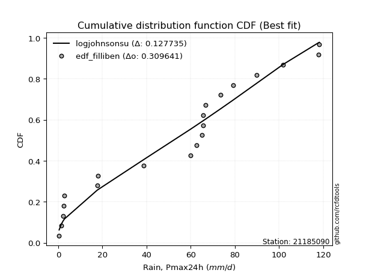</img></img>

</div>


### 10. EDF Jenkinson (1977)

The Jenkinson formula in hydrology is an empirical plotting position formula used to estimate the non-exceedance probability _(P)_ or return period _(T)_ of a given ordered observation within a sample. It is a widely used method in the frequency analysis of extreme events such as floods and rainfall, as it provides a distribution-free way to plot data. _a≈0.31_ and _b≈0.38_ are constants derived to approximate the median of the probability distribution for the given rank.

<div align="center">


$P=(m-a)/(n+b)$


</div>


**10.1. Empirical values**

<div align="center">

|                | 0                    | 1                   | 2                   | 3                   | 4                   | 5                   | 6                   | 7                  | 8                  | 9                   | 10                 | 11                 | 12                 | 13                 | 14                 | 15                 | 16                 | 17                 | 18                 | 19                 |
|:---------------|:---------------------|:--------------------|:--------------------|:--------------------|:--------------------|:--------------------|:--------------------|:-------------------|:-------------------|:--------------------|:-------------------|:-------------------|:-------------------|:-------------------|:-------------------|:-------------------|:-------------------|:-------------------|:-------------------|:-------------------|
| date           | 2020                 | 2016                | 2017                | 2018                | 2015                | 2023                | 2019                | 2013               | 2010               | 2007                | 2012               | 2011               | 2014               | 2005               | 2009               | 2008               | 2022               | 2021               | 2024               | 2006               |
| x              | 0.4                  | 1.3                 | 2.2                 | 2.4                 | 2.8                 | 17.6                | 18.1                | 38.7               | 59.9               | 62.7                | 65.1               | 65.6               | 65.6               | 66.6               | 73.6               | 79.2               | 89.9               | 101.9              | 117.8              | 118.2              |
| m              | 1                    | 2                   | 3                   | 4                   | 5                   | 6                   | 7                   | 8                  | 9                  | 10                  | 11                 | 12                 | 13                 | 14                 | 15                 | 16                 | 17                 | 18                 | 19                 | 20                 |
| empirical_dist | edf_jenkinson        | edf_jenkinson       | edf_jenkinson       | edf_jenkinson       | edf_jenkinson       | edf_jenkinson       | edf_jenkinson       | edf_jenkinson      | edf_jenkinson      | edf_jenkinson       | edf_jenkinson      | edf_jenkinson      | edf_jenkinson      | edf_jenkinson      | edf_jenkinson      | edf_jenkinson      | edf_jenkinson      | edf_jenkinson      | edf_jenkinson      | edf_jenkinson      |
| empirical      | 0.033856722276741906 | 0.08292443572129539 | 0.13199214916584887 | 0.18105986261040236 | 0.23012757605495587 | 0.27919528949950934 | 0.32826300294406285 | 0.3773307163886163 | 0.4263984298331698 | 0.47546614327772324 | 0.5245338567222767 | 0.5736015701668302 | 0.6226692836113837 | 0.6717369970559373 | 0.7208047105004907 | 0.7698724239450442 | 0.8189401373895977 | 0.8680078508341512 | 0.9170755642787047 | 0.9661432777232583 |
| empirical_tr   | 1.0350431691213813   | 1.090422685928304   | 1.152063312605992   | 1.2210904733373276  | 1.2989165073295095  | 1.3873383253914227  | 1.4886778670562455  | 1.6059889676910957 | 1.7433704020530367 | 1.9064546304957901  | 2.1031991744066048 | 2.3452243958573074 | 2.6501950585175553 | 3.0463378176382667 | 3.581722319859402  | 4.345415778251599  | 5.523035230352305  | 7.576208178438667  | 12.059171597633155 | 29.536231884058108 |

</div>


**10.2. Kolmogorov-Smirnov fit test (sorted by Δ)**


<div align="center">

|                | 0                   | 1                  | 2                   | 3                   | 4                  | 5                  | 6                   | 7                   | 8                   | 9                   | 10                  | 11                  | 12                  | 13                  | 14                  | 15                 | 16                  | 17                  | 18                  | 19                  | 20                  | 21                 | 22                  | 23                  | 24                 | 25                 | 26                  | 27                  | 28                  | 29                 | 30                    | 31                  | 32                 | 33                  | 34                 | 35                  | 36                  | 37                  | 38                  | 39                 | 40                  | 41                  | 42                 | 43                 | 44                  | 45                 | 46                  | 47                 | 48                 | 49                 | 50                  | 51                 | 52                 | 53                  | 54                 | 55                  | 56                 | 57                 | 58                  | 59                 | 60                 | 61                  | 62                 | 63                 | 64                  | 65                  | 66                  | 67                  | 68                 | 69                 | 70                 | 71                  | 72                  | 73                 | 74                  | 75                 | 76                 | 77                 | 78                 | 79                 | 80                  | 81                  | 82                  | 83                  | 84                  | 85                 | 86                 | 87                 |
|:---------------|:--------------------|:-------------------|:--------------------|:--------------------|:-------------------|:-------------------|:--------------------|:--------------------|:--------------------|:--------------------|:--------------------|:--------------------|:--------------------|:--------------------|:--------------------|:-------------------|:--------------------|:--------------------|:--------------------|:--------------------|:--------------------|:-------------------|:--------------------|:--------------------|:-------------------|:-------------------|:--------------------|:--------------------|:--------------------|:-------------------|:----------------------|:--------------------|:-------------------|:--------------------|:-------------------|:--------------------|:--------------------|:--------------------|:--------------------|:-------------------|:--------------------|:--------------------|:-------------------|:-------------------|:--------------------|:-------------------|:--------------------|:-------------------|:-------------------|:-------------------|:--------------------|:-------------------|:-------------------|:--------------------|:-------------------|:--------------------|:-------------------|:-------------------|:--------------------|:-------------------|:-------------------|:--------------------|:-------------------|:-------------------|:--------------------|:--------------------|:--------------------|:--------------------|:-------------------|:-------------------|:-------------------|:--------------------|:--------------------|:-------------------|:--------------------|:-------------------|:-------------------|:-------------------|:-------------------|:-------------------|:--------------------|:--------------------|:--------------------|:--------------------|:--------------------|:-------------------|:-------------------|:-------------------|
| station        | 21185090            | 21185090           | 21185090            | 21185090            | 21185090           | 21185090           | 21185090            | 21185090            | 21185090            | 21185090            | 21185090            | 21185090            | 21185090            | 21185090            | 21185090            | 21185090           | 21185090            | 21185090            | 21185090            | 21185090            | 21185090            | 21185090           | 21185090            | 21185090            | 21185090           | 21185090           | 21185090            | 21185090            | 21185090            | 21185090           | 21185090              | 21185090            | 21185090           | 21185090            | 21185090           | 21185090            | 21185090            | 21185090            | 21185090            | 21185090           | 21185090            | 21185090            | 21185090           | 21185090           | 21185090            | 21185090           | 21185090            | 21185090           | 21185090           | 21185090           | 21185090            | 21185090           | 21185090           | 21185090            | 21185090           | 21185090            | 21185090           | 21185090           | 21185090            | 21185090           | 21185090           | 21185090            | 21185090           | 21185090           | 21185090            | 21185090            | 21185090            | 21185090            | 21185090           | 21185090           | 21185090           | 21185090            | 21185090            | 21185090           | 21185090            | 21185090           | 21185090           | 21185090           | 21185090           | 21185090           | 21185090            | 21185090            | 21185090            | 21185090            | 21185090            | 21185090           | 21185090           | 21185090           |
| empirical_dist | edf_jenkinson       | edf_jenkinson      | edf_jenkinson       | edf_jenkinson       | edf_jenkinson      | edf_jenkinson      | edf_jenkinson       | edf_jenkinson       | edf_jenkinson       | edf_jenkinson       | edf_jenkinson       | edf_jenkinson       | edf_jenkinson       | edf_jenkinson       | edf_jenkinson       | edf_jenkinson      | edf_jenkinson       | edf_jenkinson       | edf_jenkinson       | edf_jenkinson       | edf_jenkinson       | edf_jenkinson      | edf_jenkinson       | edf_jenkinson       | edf_jenkinson      | edf_jenkinson      | edf_jenkinson       | edf_jenkinson       | edf_jenkinson       | edf_jenkinson      | edf_jenkinson         | edf_jenkinson       | edf_jenkinson      | edf_jenkinson       | edf_jenkinson      | edf_jenkinson       | edf_jenkinson       | edf_jenkinson       | edf_jenkinson       | edf_jenkinson      | edf_jenkinson       | edf_jenkinson       | edf_jenkinson      | edf_jenkinson      | edf_jenkinson       | edf_jenkinson      | edf_jenkinson       | edf_jenkinson      | edf_jenkinson      | edf_jenkinson      | edf_jenkinson       | edf_jenkinson      | edf_jenkinson      | edf_jenkinson       | edf_jenkinson      | edf_jenkinson       | edf_jenkinson      | edf_jenkinson      | edf_jenkinson       | edf_jenkinson      | edf_jenkinson      | edf_jenkinson       | edf_jenkinson      | edf_jenkinson      | edf_jenkinson       | edf_jenkinson       | edf_jenkinson       | edf_jenkinson       | edf_jenkinson      | edf_jenkinson      | edf_jenkinson      | edf_jenkinson       | edf_jenkinson       | edf_jenkinson      | edf_jenkinson       | edf_jenkinson      | edf_jenkinson      | edf_jenkinson      | edf_jenkinson      | edf_jenkinson      | edf_jenkinson       | edf_jenkinson       | edf_jenkinson       | edf_jenkinson       | edf_jenkinson       | edf_jenkinson      | edf_jenkinson      | edf_jenkinson      |
| p_dist         | logjohnsonsu        | truncnorm          | nct                 | norm                | crystalball        | t                  | exponnorm           | johnsonsu           | pearson3            | erlang              | gamma               | laplace_asymmetric  | logistic            | gumbel_l            | rice                | hypsecant          | invgamma            | maxwell             | rayleigh            | laplace             | invgauss            | invweibull         | genlogistic         | gompertz            | nakagami           | halfnorm           | kstwobign           | logcrystalball      | gumbel_r            | weibull_min        | loglaplace_asymmetric | logloggamma         | logmielke          | logfisk             | logpearson3        | halflogistic        | moyal               | loggumbel_l         | ncf                 | mielke             | loginvweibull       | expon               | genexpon           | logweibull_min     | f                   | loggompertz        | fisk                | loglognorm         | loggamma           | loggamma           | logerlang           | logbetaprime       | lognakagami        | lognct              | logrice            | logexponnorm        | lognorm            | lognorm            | logt                | logfatiguelife     | logkstwobign       | loginvgauss         | loginvgamma        | loggenexpon        | logmaxwell          | lograyleigh         | loglogistic         | loghalfnorm         | loghypsecant       | logncf             | wald               | logexpon            | loggumbel_r         | loghalflogistic    | loglaplace          | gibrat             | fatiguelife        | logmoyal           | chi2               | logwald            | betaprime           | logalpha            | loggibrat           | logf                | logtruncnorm        | logchi2            | alpha              | loggenlogistic     |
| delta          | 0.12768082877923326 | 0.1370011456450101 | 0.14861674297562688 | 0.14972389342907877 | 0.1497239818301742 | 0.1497267126634585 | 0.14972702542485739 | 0.15134664583231994 | 0.15182587992236352 | 0.15197326071835593 | 0.15222594198043815 | 0.16015410663437257 | 0.16215229094056446 | 0.16402808571669927 | 0.17274924443038087 | 0.1739431486197198 | 0.17630910368680053 | 0.17823418220385256 | 0.18722533568220623 | 0.19248593545894654 | 0.19579125065818304 | 0.1965676862185678 | 0.20399816641459168 | 0.20541087052867843 | 0.2111264590978864 | 0.2126818501528246 | 0.21395624380313016 | 0.21713890384948042 | 0.21833550810543234 | 0.2206455723472449 | 0.22434573010929026   | 0.22453250066705654 | 0.2266515448213685 | 0.22681721966659107 | 0.2300533062597545 | 0.24065885464885772 | 0.24218695992081973 | 0.24237120354559338 | 0.24464524340585692 | 0.247177544176867  | 0.25263487589087374 | 0.25457252136853525 | 0.2548058869820675 | 0.2604129122026222 | 0.26183149533766237 | 0.2647061139758955 | 0.27083058198386156 | 0.2720822539264047 | 0.272349259793068  | 0.272349259793068  | 0.27367333448568354 | 0.2743815424719809 | 0.2745566483098425 | 0.27478501466977256 | 0.2748003972653249 | 0.27480308625768324 | 0.2748035885575999 | 0.2748035885575999 | 0.27480395596168217 | 0.2749939187596646 | 0.2753198884988496 | 0.27959710031127394 | 0.2815934816784178 | 0.287271464203139  | 0.29057383633969125 | 0.29518011204538497 | 0.29620923696430745 | 0.30921650905331666 | 0.3116329525924618 | 0.3128296137065735 | 0.321460902959976  | 0.32305494267887913 | 0.32539227157676276 | 0.335971230512339  | 0.33659207249557377 | 0.3392123691513691 | 0.3414173055532892 | 0.3417548183435355 | 0.3879244015060892 | 0.3898380355354234 | 0.39400840272289683 | 0.41570682092063904 | 0.42112427363769633 | 0.44261277347236105 | 0.46528698582079553 | 0.5521620663346021 | 0.6459521637553957 | 0.9170755642787047 |
| deltao         | 0.3096406529800002  | 0.3096406529800002 | 0.3096406529800002  | 0.3096406529800002  | 0.3096406529800002 | 0.3096406529800002 | 0.3096406529800002  | 0.3096406529800002  | 0.3096406529800002  | 0.3096406529800002  | 0.3096406529800002  | 0.3096406529800002  | 0.3096406529800002  | 0.3096406529800002  | 0.3096406529800002  | 0.3096406529800002 | 0.3096406529800002  | 0.3096406529800002  | 0.3096406529800002  | 0.3096406529800002  | 0.3096406529800002  | 0.3096406529800002 | 0.3096406529800002  | 0.3096406529800002  | 0.3096406529800002 | 0.3096406529800002 | 0.3096406529800002  | 0.3096406529800002  | 0.3096406529800002  | 0.3096406529800002 | 0.3096406529800002    | 0.3096406529800002  | 0.3096406529800002 | 0.3096406529800002  | 0.3096406529800002 | 0.3096406529800002  | 0.3096406529800002  | 0.3096406529800002  | 0.3096406529800002  | 0.3096406529800002 | 0.3096406529800002  | 0.3096406529800002  | 0.3096406529800002 | 0.3096406529800002 | 0.3096406529800002  | 0.3096406529800002 | 0.3096406529800002  | 0.3096406529800002 | 0.3096406529800002 | 0.3096406529800002 | 0.3096406529800002  | 0.3096406529800002 | 0.3096406529800002 | 0.3096406529800002  | 0.3096406529800002 | 0.3096406529800002  | 0.3096406529800002 | 0.3096406529800002 | 0.3096406529800002  | 0.3096406529800002 | 0.3096406529800002 | 0.3096406529800002  | 0.3096406529800002 | 0.3096406529800002 | 0.3096406529800002  | 0.3096406529800002  | 0.3096406529800002  | 0.3096406529800002  | 0.3096406529800002 | 0.3096406529800002 | 0.3096406529800002 | 0.3096406529800002  | 0.3096406529800002  | 0.3096406529800002 | 0.3096406529800002  | 0.3096406529800002 | 0.3096406529800002 | 0.3096406529800002 | 0.3096406529800002 | 0.3096406529800002 | 0.3096406529800002  | 0.3096406529800002  | 0.3096406529800002  | 0.3096406529800002  | 0.3096406529800002  | 0.3096406529800002 | 0.3096406529800002 | 0.3096406529800002 |
| eval           | Δo > Δ              | Δo > Δ             | Δo > Δ              | Δo > Δ              | Δo > Δ             | Δo > Δ             | Δo > Δ              | Δo > Δ              | Δo > Δ              | Δo > Δ              | Δo > Δ              | Δo > Δ              | Δo > Δ              | Δo > Δ              | Δo > Δ              | Δo > Δ             | Δo > Δ              | Δo > Δ              | Δo > Δ              | Δo > Δ              | Δo > Δ              | Δo > Δ             | Δo > Δ              | Δo > Δ              | Δo > Δ             | Δo > Δ             | Δo > Δ              | Δo > Δ              | Δo > Δ              | Δo > Δ             | Δo > Δ                | Δo > Δ              | Δo > Δ             | Δo > Δ              | Δo > Δ             | Δo > Δ              | Δo > Δ              | Δo > Δ              | Δo > Δ              | Δo > Δ             | Δo > Δ              | Δo > Δ              | Δo > Δ             | Δo > Δ             | Δo > Δ              | Δo > Δ             | Δo > Δ              | Δo > Δ             | Δo > Δ             | Δo > Δ             | Δo > Δ              | Δo > Δ             | Δo > Δ             | Δo > Δ              | Δo > Δ             | Δo > Δ              | Δo > Δ             | Δo > Δ             | Δo > Δ              | Δo > Δ             | Δo > Δ             | Δo > Δ              | Δo > Δ             | Δo > Δ             | Δo > Δ              | Δo > Δ              | Δo > Δ              | Δo > Δ              | Δo <= Δ            | Δo <= Δ            | Δo <= Δ            | Δo <= Δ             | Δo <= Δ             | Δo <= Δ            | Δo <= Δ             | Δo <= Δ            | Δo <= Δ            | Δo <= Δ            | Δo <= Δ            | Δo <= Δ            | Δo <= Δ             | Δo <= Δ             | Δo <= Δ             | Δo <= Δ             | Δo <= Δ             | Δo <= Δ            | Δo <= Δ            | Δo <= Δ            |
| fit            | 1                   | 1                  | 1                   | 1                   | 1                  | 1                  | 1                   | 1                   | 1                   | 1                   | 1                   | 1                   | 1                   | 1                   | 1                   | 1                  | 1                   | 1                   | 1                   | 1                   | 1                   | 1                  | 1                   | 1                   | 1                  | 1                  | 1                   | 1                   | 1                   | 1                  | 1                     | 1                   | 1                  | 1                   | 1                  | 1                   | 1                   | 1                   | 1                   | 1                  | 1                   | 1                   | 1                  | 1                  | 1                   | 1                  | 1                   | 1                  | 1                  | 1                  | 1                   | 1                  | 1                  | 1                   | 1                  | 1                   | 1                  | 1                  | 1                   | 1                  | 1                  | 1                   | 1                  | 1                  | 1                   | 1                   | 1                   | 1                   | 0                  | 0                  | 0                  | 0                   | 0                   | 0                  | 0                   | 0                  | 0                  | 0                  | 0                  | 0                  | 0                   | 0                   | 0                   | 0                   | 0                   | 0                  | 0                  | 0                  |
| n              | 20                  | 20                 | 20                  | 20                  | 20                 | 20                 | 20                  | 20                  | 20                  | 20                  | 20                  | 20                  | 20                  | 20                  | 20                  | 20                 | 20                  | 20                  | 20                  | 20                  | 20                  | 20                 | 20                  | 20                  | 20                 | 20                 | 20                  | 20                  | 20                  | 20                 | 20                    | 20                  | 20                 | 20                  | 20                 | 20                  | 20                  | 20                  | 20                  | 20                 | 20                  | 20                  | 20                 | 20                 | 20                  | 20                 | 20                  | 20                 | 20                 | 20                 | 20                  | 20                 | 20                 | 20                  | 20                 | 20                  | 20                 | 20                 | 20                  | 20                 | 20                 | 20                  | 20                 | 20                 | 20                  | 20                  | 20                  | 20                  | 20                 | 20                 | 20                 | 20                  | 20                  | 20                 | 20                  | 20                 | 20                 | 20                 | 20                 | 20                 | 20                  | 20                  | 20                  | 20                  | 20                  | 20                 | 20                 | 20                 |
| best_fit       | 1                   | 0                  | 0                   | 0                   | 0                  | 0                  | 0                   | 0                   | 0                   | 0                   | 0                   | 0                   | 0                   | 0                   | 0                   | 0                  | 0                   | 0                   | 0                   | 0                   | 0                   | 0                  | 0                   | 0                   | 0                  | 0                  | 0                   | 0                   | 0                   | 0                  | 0                     | 0                   | 0                  | 0                   | 0                  | 0                   | 0                   | 0                   | 0                   | 0                  | 0                   | 0                   | 0                  | 0                  | 0                   | 0                  | 0                   | 0                  | 0                  | 0                  | 0                   | 0                  | 0                  | 0                   | 0                  | 0                   | 0                  | 0                  | 0                   | 0                  | 0                  | 0                   | 0                  | 0                  | 0                   | 0                   | 0                   | 0                   | 0                  | 0                  | 0                  | 0                   | 0                   | 0                  | 0                   | 0                  | 0                  | 0                  | 0                  | 0                  | 0                   | 0                   | 0                   | 0                   | 0                   | 0                  | 0                  | 0                  |
| best_fit_sort  | 1                   | 2                  | 3                   | 4                   | 5                  | 6                  | 7                   | 8                   | 9                   | 10                  | 11                  | 12                  | 13                  | 14                  | 15                  | 16                 | 17                  | 18                  | 19                  | 20                  | 21                  | 22                 | 23                  | 24                  | 25                 | 26                 | 27                  | 28                  | 29                  | 30                 | 31                    | 32                  | 33                 | 34                  | 35                 | 36                  | 37                  | 38                  | 39                  | 40                 | 41                  | 42                  | 43                 | 44                 | 45                  | 46                 | 47                  | 48                 | 49                 | 50                 | 51                  | 52                 | 53                 | 54                  | 55                 | 56                  | 57                 | 58                 | 59                  | 60                 | 61                 | 62                  | 63                 | 64                 | 65                  | 66                  | 67                  | 68                  | 69                 | 70                 | 71                 | 72                  | 73                  | 74                 | 75                  | 76                 | 77                 | 78                 | 79                 | 80                 | 81                  | 82                  | 83                  | 84                  | 85                  | 86                 | 87                 | 88                 |

</div>


**10.3. Best fit**

<div align="center">

|   id |   station | empirical_dist   | p_dist       |    delta |   deltao | eval   |   fit |   n |   best_fit |   best_fit_sort |
|-----:|----------:|:-----------------|:-------------|---------:|---------:|:-------|------:|----:|-----------:|----------------:|
|    0 |  21185090 | edf_jenkinson    | logjohnsonsu | 0.127681 | 0.309641 | Δo > Δ |     1 |  20 |          1 |               1 |

</div>


<div align="center">

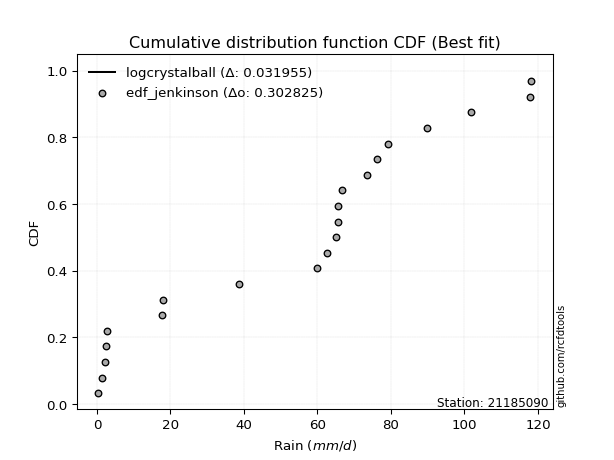</img>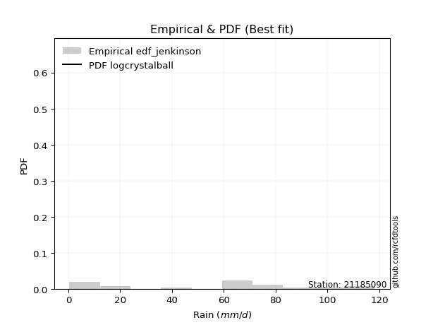</img>

</div>


### 11. EDF Cunnane (1978)

Cunnane´s work in statistical hydrology has focused on the performance and evaluation of different probability distributions (such as GEV, Gumbel, Lognormal) for flood frequency estimation. _b_ is a constant, typically set to 0.4.

<div align="center">


$P=(m-b)/(n+1-2b)$


</div>


**11.1. Empirical values**

<div align="center">

|                | 0                  | 1                   | 2                   | 3                   | 4                  | 5                  | 6                   | 7                   | 8                   | 9                  | 10                 | 11                 | 12                 | 13                 | 14                 | 15                 | 16                 | 17                 | 18                 | 19                 |
|:---------------|:-------------------|:--------------------|:--------------------|:--------------------|:-------------------|:-------------------|:--------------------|:--------------------|:--------------------|:-------------------|:-------------------|:-------------------|:-------------------|:-------------------|:-------------------|:-------------------|:-------------------|:-------------------|:-------------------|:-------------------|
| date           | 2020               | 2016                | 2017                | 2018                | 2015               | 2023               | 2019                | 2013                | 2010                | 2007               | 2012               | 2011               | 2014               | 2005               | 2009               | 2008               | 2022               | 2021               | 2024               | 2006               |
| x              | 0.4                | 1.3                 | 2.2                 | 2.4                 | 2.8                | 17.6               | 18.1                | 38.7                | 59.9                | 62.7               | 65.1               | 65.6               | 65.6               | 66.6               | 73.6               | 79.2               | 89.9               | 101.9              | 117.8              | 118.2              |
| m              | 1                  | 2                   | 3                   | 4                   | 5                  | 6                  | 7                   | 8                   | 9                   | 10                 | 11                 | 12                 | 13                 | 14                 | 15                 | 16                 | 17                 | 18                 | 19                 | 20                 |
| empirical_dist | edf_cunnane        | edf_cunnane         | edf_cunnane         | edf_cunnane         | edf_cunnane        | edf_cunnane        | edf_cunnane         | edf_cunnane         | edf_cunnane         | edf_cunnane        | edf_cunnane        | edf_cunnane        | edf_cunnane        | edf_cunnane        | edf_cunnane        | edf_cunnane        | edf_cunnane        | edf_cunnane        | edf_cunnane        | edf_cunnane        |
| empirical      | 0.0297029702970297 | 0.07920792079207921 | 0.12871287128712872 | 0.17821782178217824 | 0.2277227722772277 | 0.2772277227722772 | 0.32673267326732675 | 0.37623762376237624 | 0.42574257425742573 | 0.4752475247524752 | 0.5247524752475248 | 0.5742574257425742 | 0.6237623762376238 | 0.6732673267326733 | 0.7227722772277227 | 0.7722772277227723 | 0.8217821782178218 | 0.8712871287128714 | 0.9207920792079209 | 0.9702970297029704 |
| empirical_tr   | 1.030612244897959  | 1.086021505376344   | 1.1477272727272727  | 1.216867469879518   | 1.294871794871795  | 1.3835616438356164 | 1.4852941176470589  | 1.6031746031746033  | 1.7413793103448274  | 1.9056603773584906 | 2.104166666666667  | 2.3488372093023253 | 2.6578947368421053 | 3.060606060606061  | 3.6071428571428568 | 4.391304347826087  | 5.611111111111113  | 7.769230769230775  | 12.625000000000025 | 33.666666666666764 |

</div>


**11.2. Kolmogorov-Smirnov fit test (sorted by Δ)**


<div align="center">

|                | 0                  | 1                   | 2                   | 3                   | 4                   | 5                   | 6                   | 7                   | 8                   | 9                   | 10                 | 11                  | 12                  | 13                  | 14                 | 15                 | 16                  | 17                 | 18                  | 19                 | 20                  | 21                  | 22                  | 23                  | 24                  | 25                  | 26                 | 27                  | 28                 | 29                  | 30                    | 31                 | 32                  | 33                  | 34                  | 35                  | 36                  | 37                  | 38                  | 39                  | 40                 | 41                 | 42                  | 43                  | 44                 | 45                  | 46                 | 47                  | 48                  | 49                 | 50                 | 51                 | 52                  | 53                 | 54                  | 55                 | 56                  | 57                  | 58                 | 59                  | 60                  | 61                 | 62                  | 63                  | 64                 | 65                 | 66                 | 67                 | 68                  | 69                  | 70                  | 71                  | 72                 | 73                  | 74                 | 75                  | 76                  | 77                  | 78                  | 79                  | 80                 | 81                 | 82                 | 83                  | 84                 | 85                 | 86                 | 87                 |
|:---------------|:-------------------|:--------------------|:--------------------|:--------------------|:--------------------|:--------------------|:--------------------|:--------------------|:--------------------|:--------------------|:-------------------|:--------------------|:--------------------|:--------------------|:-------------------|:-------------------|:--------------------|:-------------------|:--------------------|:-------------------|:--------------------|:--------------------|:--------------------|:--------------------|:--------------------|:--------------------|:-------------------|:--------------------|:-------------------|:--------------------|:----------------------|:-------------------|:--------------------|:--------------------|:--------------------|:--------------------|:--------------------|:--------------------|:--------------------|:--------------------|:-------------------|:-------------------|:--------------------|:--------------------|:-------------------|:--------------------|:-------------------|:--------------------|:--------------------|:-------------------|:-------------------|:-------------------|:--------------------|:-------------------|:--------------------|:-------------------|:--------------------|:--------------------|:-------------------|:--------------------|:--------------------|:-------------------|:--------------------|:--------------------|:-------------------|:-------------------|:-------------------|:-------------------|:--------------------|:--------------------|:--------------------|:--------------------|:-------------------|:--------------------|:-------------------|:--------------------|:--------------------|:--------------------|:--------------------|:--------------------|:-------------------|:-------------------|:-------------------|:--------------------|:-------------------|:-------------------|:-------------------|:-------------------|
| station        | 21185090           | 21185090            | 21185090            | 21185090            | 21185090            | 21185090            | 21185090            | 21185090            | 21185090            | 21185090            | 21185090           | 21185090            | 21185090            | 21185090            | 21185090           | 21185090           | 21185090            | 21185090           | 21185090            | 21185090           | 21185090            | 21185090            | 21185090            | 21185090            | 21185090            | 21185090            | 21185090           | 21185090            | 21185090           | 21185090            | 21185090              | 21185090           | 21185090            | 21185090            | 21185090            | 21185090            | 21185090            | 21185090            | 21185090            | 21185090            | 21185090           | 21185090           | 21185090            | 21185090            | 21185090           | 21185090            | 21185090           | 21185090            | 21185090            | 21185090           | 21185090           | 21185090           | 21185090            | 21185090           | 21185090            | 21185090           | 21185090            | 21185090            | 21185090           | 21185090            | 21185090            | 21185090           | 21185090            | 21185090            | 21185090           | 21185090           | 21185090           | 21185090           | 21185090            | 21185090            | 21185090            | 21185090            | 21185090           | 21185090            | 21185090           | 21185090            | 21185090            | 21185090            | 21185090            | 21185090            | 21185090           | 21185090           | 21185090           | 21185090            | 21185090           | 21185090           | 21185090           | 21185090           |
| empirical_dist | edf_cunnane        | edf_cunnane         | edf_cunnane         | edf_cunnane         | edf_cunnane         | edf_cunnane         | edf_cunnane         | edf_cunnane         | edf_cunnane         | edf_cunnane         | edf_cunnane        | edf_cunnane         | edf_cunnane         | edf_cunnane         | edf_cunnane        | edf_cunnane        | edf_cunnane         | edf_cunnane        | edf_cunnane         | edf_cunnane        | edf_cunnane         | edf_cunnane         | edf_cunnane         | edf_cunnane         | edf_cunnane         | edf_cunnane         | edf_cunnane        | edf_cunnane         | edf_cunnane        | edf_cunnane         | edf_cunnane           | edf_cunnane        | edf_cunnane         | edf_cunnane         | edf_cunnane         | edf_cunnane         | edf_cunnane         | edf_cunnane         | edf_cunnane         | edf_cunnane         | edf_cunnane        | edf_cunnane        | edf_cunnane         | edf_cunnane         | edf_cunnane        | edf_cunnane         | edf_cunnane        | edf_cunnane         | edf_cunnane         | edf_cunnane        | edf_cunnane        | edf_cunnane        | edf_cunnane         | edf_cunnane        | edf_cunnane         | edf_cunnane        | edf_cunnane         | edf_cunnane         | edf_cunnane        | edf_cunnane         | edf_cunnane         | edf_cunnane        | edf_cunnane         | edf_cunnane         | edf_cunnane        | edf_cunnane        | edf_cunnane        | edf_cunnane        | edf_cunnane         | edf_cunnane         | edf_cunnane         | edf_cunnane         | edf_cunnane        | edf_cunnane         | edf_cunnane        | edf_cunnane         | edf_cunnane         | edf_cunnane         | edf_cunnane         | edf_cunnane         | edf_cunnane        | edf_cunnane        | edf_cunnane        | edf_cunnane         | edf_cunnane        | edf_cunnane        | edf_cunnane        | edf_cunnane        |
| p_dist         | logjohnsonsu       | truncnorm           | nct                 | norm                | crystalball         | t                   | exponnorm           | johnsonsu           | pearson3            | erlang              | gamma              | laplace_asymmetric  | logistic            | gumbel_l            | hypsecant          | rice               | invgamma            | maxwell            | rayleigh            | laplace            | invgauss            | invweibull          | gompertz            | genlogistic         | nakagami            | halfnorm            | kstwobign          | logcrystalball      | gumbel_r           | weibull_min         | loglaplace_asymmetric | logloggamma        | logmielke           | logfisk             | logpearson3         | halflogistic        | moyal               | loggumbel_l         | ncf                 | mielke              | loginvweibull      | expon              | genexpon            | logweibull_min      | f                  | loggompertz         | loglognorm         | loggamma            | loggamma            | logerlang          | fisk               | logbetaprime       | lognakagami         | lognct             | logrice             | logexponnorm       | lognorm             | lognorm             | logt               | logfatiguelife      | logkstwobign        | loginvgauss        | loginvgamma         | loggenexpon         | logmaxwell         | lograyleigh        | loglogistic        | loghalfnorm        | loghypsecant        | logncf              | wald                | logexpon            | loggumbel_r        | loghalflogistic     | loglaplace         | gibrat              | fatiguelife         | logmoyal            | chi2                | logwald             | betaprime          | logalpha           | loggibrat          | logf                | logtruncnorm       | logchi2            | alpha              | loggenlogistic     |
| delta          | 0.1283366843549773 | 0.13547081596827398 | 0.14927259855137093 | 0.15037974900482282 | 0.15037983740591826 | 0.15038256823920254 | 0.15038288100060143 | 0.15200250140806398 | 0.15248173549810756 | 0.15262911629409998 | 0.1528817975561822 | 0.15862377695763646 | 0.16062196126382836 | 0.16249775603996316 | 0.1724128189429837 | 0.1734051000061249 | 0.17696495926254457 | 0.1788900377795966 | 0.18788119125795028 | 0.1931417910346906 | 0.19644710623392708 | 0.19722354179431184 | 0.20300606675095026 | 0.20465402199033572 | 0.21178231467363046 | 0.21333770572856864 | 0.2146120993788742 | 0.21779475942522447 | 0.2189913636811764 | 0.22130142792298896 | 0.2250015856850343    | 0.2251883562428006 | 0.22730740039711256 | 0.22747307524233512 | 0.23070916183549856 | 0.24131471022460177 | 0.24284281549656378 | 0.24302705912133743 | 0.24530109898160096 | 0.24783339975261104 | 0.2532907314666178 | 0.2552283769442793 | 0.25546174255781157 | 0.26106876777836624 | 0.2624873509134064 | 0.26536196955163954 | 0.2727381095021488 | 0.27300511536881206 | 0.27300511536881206 | 0.2743291900614276 | 0.2749843339635737 | 0.2750373980477249 | 0.27521250388558655 | 0.2754408702455166 | 0.27545625284106895 | 0.2754589418334273 | 0.27545944413334394 | 0.27545944413334394 | 0.2754598115374262 | 0.27564977433540866 | 0.27597574407459363 | 0.280252955887018  | 0.28224933725416185 | 0.28792731977888303 | 0.2912296919154353 | 0.295835967621129  | 0.2968650925400515 | 0.3098723646290607 | 0.31228880816820587 | 0.31610889158529365 | 0.31993057328323987 | 0.32502250940611127 | 0.3260481271525068 | 0.33662708608808306 | 0.3372479280713178 | 0.33986822472711314 | 0.34207316112903324 | 0.34241067391927954 | 0.38858025708183325 | 0.39049389111116745 | 0.3946642582986409 | 0.4176743876478712 | 0.4217801292134404 | 0.44589205135108123 | 0.4659428413965396 | 0.5541296330618342 | 0.6479197304826279 | 0.9207920792079209 |
| deltao         | 0.3096406529800002 | 0.3096406529800002  | 0.3096406529800002  | 0.3096406529800002  | 0.3096406529800002  | 0.3096406529800002  | 0.3096406529800002  | 0.3096406529800002  | 0.3096406529800002  | 0.3096406529800002  | 0.3096406529800002 | 0.3096406529800002  | 0.3096406529800002  | 0.3096406529800002  | 0.3096406529800002 | 0.3096406529800002 | 0.3096406529800002  | 0.3096406529800002 | 0.3096406529800002  | 0.3096406529800002 | 0.3096406529800002  | 0.3096406529800002  | 0.3096406529800002  | 0.3096406529800002  | 0.3096406529800002  | 0.3096406529800002  | 0.3096406529800002 | 0.3096406529800002  | 0.3096406529800002 | 0.3096406529800002  | 0.3096406529800002    | 0.3096406529800002 | 0.3096406529800002  | 0.3096406529800002  | 0.3096406529800002  | 0.3096406529800002  | 0.3096406529800002  | 0.3096406529800002  | 0.3096406529800002  | 0.3096406529800002  | 0.3096406529800002 | 0.3096406529800002 | 0.3096406529800002  | 0.3096406529800002  | 0.3096406529800002 | 0.3096406529800002  | 0.3096406529800002 | 0.3096406529800002  | 0.3096406529800002  | 0.3096406529800002 | 0.3096406529800002 | 0.3096406529800002 | 0.3096406529800002  | 0.3096406529800002 | 0.3096406529800002  | 0.3096406529800002 | 0.3096406529800002  | 0.3096406529800002  | 0.3096406529800002 | 0.3096406529800002  | 0.3096406529800002  | 0.3096406529800002 | 0.3096406529800002  | 0.3096406529800002  | 0.3096406529800002 | 0.3096406529800002 | 0.3096406529800002 | 0.3096406529800002 | 0.3096406529800002  | 0.3096406529800002  | 0.3096406529800002  | 0.3096406529800002  | 0.3096406529800002 | 0.3096406529800002  | 0.3096406529800002 | 0.3096406529800002  | 0.3096406529800002  | 0.3096406529800002  | 0.3096406529800002  | 0.3096406529800002  | 0.3096406529800002 | 0.3096406529800002 | 0.3096406529800002 | 0.3096406529800002  | 0.3096406529800002 | 0.3096406529800002 | 0.3096406529800002 | 0.3096406529800002 |
| eval           | Δo > Δ             | Δo > Δ              | Δo > Δ              | Δo > Δ              | Δo > Δ              | Δo > Δ              | Δo > Δ              | Δo > Δ              | Δo > Δ              | Δo > Δ              | Δo > Δ             | Δo > Δ              | Δo > Δ              | Δo > Δ              | Δo > Δ             | Δo > Δ             | Δo > Δ              | Δo > Δ             | Δo > Δ              | Δo > Δ             | Δo > Δ              | Δo > Δ              | Δo > Δ              | Δo > Δ              | Δo > Δ              | Δo > Δ              | Δo > Δ             | Δo > Δ              | Δo > Δ             | Δo > Δ              | Δo > Δ                | Δo > Δ             | Δo > Δ              | Δo > Δ              | Δo > Δ              | Δo > Δ              | Δo > Δ              | Δo > Δ              | Δo > Δ              | Δo > Δ              | Δo > Δ             | Δo > Δ             | Δo > Δ              | Δo > Δ              | Δo > Δ             | Δo > Δ              | Δo > Δ             | Δo > Δ              | Δo > Δ              | Δo > Δ             | Δo > Δ             | Δo > Δ             | Δo > Δ              | Δo > Δ             | Δo > Δ              | Δo > Δ             | Δo > Δ              | Δo > Δ              | Δo > Δ             | Δo > Δ              | Δo > Δ              | Δo > Δ             | Δo > Δ              | Δo > Δ              | Δo > Δ             | Δo > Δ             | Δo > Δ             | Δo <= Δ            | Δo <= Δ             | Δo <= Δ             | Δo <= Δ             | Δo <= Δ             | Δo <= Δ            | Δo <= Δ             | Δo <= Δ            | Δo <= Δ             | Δo <= Δ             | Δo <= Δ             | Δo <= Δ             | Δo <= Δ             | Δo <= Δ            | Δo <= Δ            | Δo <= Δ            | Δo <= Δ             | Δo <= Δ            | Δo <= Δ            | Δo <= Δ            | Δo <= Δ            |
| fit            | 1                  | 1                   | 1                   | 1                   | 1                   | 1                   | 1                   | 1                   | 1                   | 1                   | 1                  | 1                   | 1                   | 1                   | 1                  | 1                  | 1                   | 1                  | 1                   | 1                  | 1                   | 1                   | 1                   | 1                   | 1                   | 1                   | 1                  | 1                   | 1                  | 1                   | 1                     | 1                  | 1                   | 1                   | 1                   | 1                   | 1                   | 1                   | 1                   | 1                   | 1                  | 1                  | 1                   | 1                   | 1                  | 1                   | 1                  | 1                   | 1                   | 1                  | 1                  | 1                  | 1                   | 1                  | 1                   | 1                  | 1                   | 1                   | 1                  | 1                   | 1                   | 1                  | 1                   | 1                   | 1                  | 1                  | 1                  | 0                  | 0                   | 0                   | 0                   | 0                   | 0                  | 0                   | 0                  | 0                   | 0                   | 0                   | 0                   | 0                   | 0                  | 0                  | 0                  | 0                   | 0                  | 0                  | 0                  | 0                  |
| n              | 20                 | 20                  | 20                  | 20                  | 20                  | 20                  | 20                  | 20                  | 20                  | 20                  | 20                 | 20                  | 20                  | 20                  | 20                 | 20                 | 20                  | 20                 | 20                  | 20                 | 20                  | 20                  | 20                  | 20                  | 20                  | 20                  | 20                 | 20                  | 20                 | 20                  | 20                    | 20                 | 20                  | 20                  | 20                  | 20                  | 20                  | 20                  | 20                  | 20                  | 20                 | 20                 | 20                  | 20                  | 20                 | 20                  | 20                 | 20                  | 20                  | 20                 | 20                 | 20                 | 20                  | 20                 | 20                  | 20                 | 20                  | 20                  | 20                 | 20                  | 20                  | 20                 | 20                  | 20                  | 20                 | 20                 | 20                 | 20                 | 20                  | 20                  | 20                  | 20                  | 20                 | 20                  | 20                 | 20                  | 20                  | 20                  | 20                  | 20                  | 20                 | 20                 | 20                 | 20                  | 20                 | 20                 | 20                 | 20                 |
| best_fit       | 1                  | 0                   | 0                   | 0                   | 0                   | 0                   | 0                   | 0                   | 0                   | 0                   | 0                  | 0                   | 0                   | 0                   | 0                  | 0                  | 0                   | 0                  | 0                   | 0                  | 0                   | 0                   | 0                   | 0                   | 0                   | 0                   | 0                  | 0                   | 0                  | 0                   | 0                     | 0                  | 0                   | 0                   | 0                   | 0                   | 0                   | 0                   | 0                   | 0                   | 0                  | 0                  | 0                   | 0                   | 0                  | 0                   | 0                  | 0                   | 0                   | 0                  | 0                  | 0                  | 0                   | 0                  | 0                   | 0                  | 0                   | 0                   | 0                  | 0                   | 0                   | 0                  | 0                   | 0                   | 0                  | 0                  | 0                  | 0                  | 0                   | 0                   | 0                   | 0                   | 0                  | 0                   | 0                  | 0                   | 0                   | 0                   | 0                   | 0                   | 0                  | 0                  | 0                  | 0                   | 0                  | 0                  | 0                  | 0                  |
| best_fit_sort  | 1                  | 2                   | 3                   | 4                   | 5                   | 6                   | 7                   | 8                   | 9                   | 10                  | 11                 | 12                  | 13                  | 14                  | 15                 | 16                 | 17                  | 18                 | 19                  | 20                 | 21                  | 22                  | 23                  | 24                  | 25                  | 26                  | 27                 | 28                  | 29                 | 30                  | 31                    | 32                 | 33                  | 34                  | 35                  | 36                  | 37                  | 38                  | 39                  | 40                  | 41                 | 42                 | 43                  | 44                  | 45                 | 46                  | 47                 | 48                  | 49                  | 50                 | 51                 | 52                 | 53                  | 54                 | 55                  | 56                 | 57                  | 58                  | 59                 | 60                  | 61                  | 62                 | 63                  | 64                  | 65                 | 66                 | 67                 | 68                 | 69                  | 70                  | 71                  | 72                  | 73                 | 74                  | 75                 | 76                  | 77                  | 78                  | 79                  | 80                  | 81                 | 82                 | 83                 | 84                  | 85                 | 86                 | 87                 | 88                 |

</div>


**11.3. Best fit**

<div align="center">

|   id |   station | empirical_dist   | p_dist       |    delta |   deltao | eval   |   fit |   n |   best_fit |   best_fit_sort |
|-----:|----------:|:-----------------|:-------------|---------:|---------:|:-------|------:|----:|-----------:|----------------:|
|    0 |  21185090 | edf_cunnane      | logjohnsonsu | 0.128337 | 0.309641 | Δo > Δ |     1 |  20 |          1 |               1 |

</div>


<div align="center">

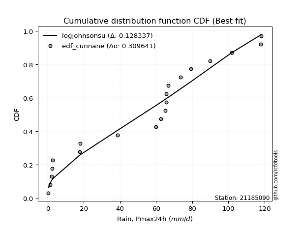</img></img>

</div>


### 12. EDF Adamowski (1981)

The Adamowski formula in hydrology refers to a specific plotting position formula used for estimating the non-parametric empirical distribution of hydrological events (like flood peaks) to calculate their return periods. This formula provides an alternative to traditional parametric methods (like the Gumbel or Log Pearson Type III distributions). 

<div align="center">


$P=(m-0.25)/(n+0.5)$


</div>


**12.1. Empirical values**

<div align="center">

|                | 0                    | 1                   | 2                   | 3                   | 4                   | 5                  | 6                   | 7                  | 8                  | 9                   | 10                 | 11                 | 12                 | 13                 | 14                 | 15                 | 16                 | 17                 | 18                 | 19                 |
|:---------------|:---------------------|:--------------------|:--------------------|:--------------------|:--------------------|:-------------------|:--------------------|:-------------------|:-------------------|:--------------------|:-------------------|:-------------------|:-------------------|:-------------------|:-------------------|:-------------------|:-------------------|:-------------------|:-------------------|:-------------------|
| date           | 2020                 | 2016                | 2017                | 2018                | 2015                | 2023               | 2019                | 2013               | 2010               | 2007                | 2012               | 2011               | 2014               | 2005               | 2009               | 2008               | 2022               | 2021               | 2024               | 2006               |
| x              | 0.4                  | 1.3                 | 2.2                 | 2.4                 | 2.8                 | 17.6               | 18.1                | 38.7               | 59.9               | 62.7                | 65.1               | 65.6               | 65.6               | 66.6               | 73.6               | 79.2               | 89.9               | 101.9              | 117.8              | 118.2              |
| m              | 1                    | 2                   | 3                   | 4                   | 5                   | 6                  | 7                   | 8                  | 9                  | 10                  | 11                 | 12                 | 13                 | 14                 | 15                 | 16                 | 17                 | 18                 | 19                 | 20                 |
| empirical_dist | edf_adamowski        | edf_adamowski       | edf_adamowski       | edf_adamowski       | edf_adamowski       | edf_adamowski      | edf_adamowski       | edf_adamowski      | edf_adamowski      | edf_adamowski       | edf_adamowski      | edf_adamowski      | edf_adamowski      | edf_adamowski      | edf_adamowski      | edf_adamowski      | edf_adamowski      | edf_adamowski      | edf_adamowski      | edf_adamowski      |
| empirical      | 0.036585365853658534 | 0.08536585365853659 | 0.13414634146341464 | 0.18292682926829268 | 0.23170731707317074 | 0.2804878048780488 | 0.32926829268292684 | 0.3780487804878049 | 0.4268292682926829 | 0.47560975609756095 | 0.524390243902439  | 0.573170731707317  | 0.6219512195121951 | 0.6707317073170732 | 0.7195121951219512 | 0.7682926829268293 | 0.8170731707317073 | 0.8658536585365854 | 0.9146341463414634 | 0.9634146341463414 |
| empirical_tr   | 1.0379746835443038   | 1.0933333333333333  | 1.1549295774647887  | 1.2238805970149254  | 1.3015873015873016  | 1.3898305084745763 | 1.490909090909091   | 1.607843137254902  | 1.7446808510638296 | 1.9069767441860463  | 2.1025641025641026 | 2.3428571428571425 | 2.6451612903225805 | 3.037037037037037  | 3.5652173913043477 | 4.315789473684211  | 5.466666666666665  | 7.454545454545454  | 11.714285714285719 | 27.33333333333331  |

</div>


**12.2. Kolmogorov-Smirnov fit test (sorted by Δ)**


<div align="center">

|                | 0                   | 1                   | 2                   | 3                   | 4                   | 5                   | 6                   | 7                  | 8                   | 9                  | 10                 | 11                  | 12                  | 13                  | 14                  | 15                  | 16                 | 17                  | 18                 | 19                 | 20                 | 21                  | 22                  | 23                 | 24                  | 25                 | 26                  | 27                  | 28                 | 29                  | 30                    | 31                 | 32                  | 33                  | 34                  | 35                  | 36                 | 37                  | 38                  | 39                  | 40                 | 41                 | 42                 | 43                  | 44                  | 45                  | 46                  | 47                 | 48                  | 49                  | 50                 | 51                  | 52                  | 53                 | 54                  | 55                 | 56                  | 57                  | 58                  | 59                 | 60                  | 61                 | 62                  | 63                  | 64                 | 65                  | 66                 | 67                 | 68                 | 69                 | 70                  | 71                  | 72                 | 73                 | 74                  | 75                  | 76                  | 77                  | 78                  | 79                  | 80                 | 81                  | 82                 | 83                 | 84                 | 85                 | 86                 | 87                 |
|:---------------|:--------------------|:--------------------|:--------------------|:--------------------|:--------------------|:--------------------|:--------------------|:-------------------|:--------------------|:-------------------|:-------------------|:--------------------|:--------------------|:--------------------|:--------------------|:--------------------|:-------------------|:--------------------|:-------------------|:-------------------|:-------------------|:--------------------|:--------------------|:-------------------|:--------------------|:-------------------|:--------------------|:--------------------|:-------------------|:--------------------|:----------------------|:-------------------|:--------------------|:--------------------|:--------------------|:--------------------|:-------------------|:--------------------|:--------------------|:--------------------|:-------------------|:-------------------|:-------------------|:--------------------|:--------------------|:--------------------|:--------------------|:-------------------|:--------------------|:--------------------|:-------------------|:--------------------|:--------------------|:-------------------|:--------------------|:-------------------|:--------------------|:--------------------|:--------------------|:-------------------|:--------------------|:-------------------|:--------------------|:--------------------|:-------------------|:--------------------|:-------------------|:-------------------|:-------------------|:-------------------|:--------------------|:--------------------|:-------------------|:-------------------|:--------------------|:--------------------|:--------------------|:--------------------|:--------------------|:--------------------|:-------------------|:--------------------|:-------------------|:-------------------|:-------------------|:-------------------|:-------------------|:-------------------|
| station        | 21185090            | 21185090            | 21185090            | 21185090            | 21185090            | 21185090            | 21185090            | 21185090           | 21185090            | 21185090           | 21185090           | 21185090            | 21185090            | 21185090            | 21185090            | 21185090            | 21185090           | 21185090            | 21185090           | 21185090           | 21185090           | 21185090            | 21185090            | 21185090           | 21185090            | 21185090           | 21185090            | 21185090            | 21185090           | 21185090            | 21185090              | 21185090           | 21185090            | 21185090            | 21185090            | 21185090            | 21185090           | 21185090            | 21185090            | 21185090            | 21185090           | 21185090           | 21185090           | 21185090            | 21185090            | 21185090            | 21185090            | 21185090           | 21185090            | 21185090            | 21185090           | 21185090            | 21185090            | 21185090           | 21185090            | 21185090           | 21185090            | 21185090            | 21185090            | 21185090           | 21185090            | 21185090           | 21185090            | 21185090            | 21185090           | 21185090            | 21185090           | 21185090           | 21185090           | 21185090           | 21185090            | 21185090            | 21185090           | 21185090           | 21185090            | 21185090            | 21185090            | 21185090            | 21185090            | 21185090            | 21185090           | 21185090            | 21185090           | 21185090           | 21185090           | 21185090           | 21185090           | 21185090           |
| empirical_dist | edf_adamowski       | edf_adamowski       | edf_adamowski       | edf_adamowski       | edf_adamowski       | edf_adamowski       | edf_adamowski       | edf_adamowski      | edf_adamowski       | edf_adamowski      | edf_adamowski      | edf_adamowski       | edf_adamowski       | edf_adamowski       | edf_adamowski       | edf_adamowski       | edf_adamowski      | edf_adamowski       | edf_adamowski      | edf_adamowski      | edf_adamowski      | edf_adamowski       | edf_adamowski       | edf_adamowski      | edf_adamowski       | edf_adamowski      | edf_adamowski       | edf_adamowski       | edf_adamowski      | edf_adamowski       | edf_adamowski         | edf_adamowski      | edf_adamowski       | edf_adamowski       | edf_adamowski       | edf_adamowski       | edf_adamowski      | edf_adamowski       | edf_adamowski       | edf_adamowski       | edf_adamowski      | edf_adamowski      | edf_adamowski      | edf_adamowski       | edf_adamowski       | edf_adamowski       | edf_adamowski       | edf_adamowski      | edf_adamowski       | edf_adamowski       | edf_adamowski      | edf_adamowski       | edf_adamowski       | edf_adamowski      | edf_adamowski       | edf_adamowski      | edf_adamowski       | edf_adamowski       | edf_adamowski       | edf_adamowski      | edf_adamowski       | edf_adamowski      | edf_adamowski       | edf_adamowski       | edf_adamowski      | edf_adamowski       | edf_adamowski      | edf_adamowski      | edf_adamowski      | edf_adamowski      | edf_adamowski       | edf_adamowski       | edf_adamowski      | edf_adamowski      | edf_adamowski       | edf_adamowski       | edf_adamowski       | edf_adamowski       | edf_adamowski       | edf_adamowski       | edf_adamowski      | edf_adamowski       | edf_adamowski      | edf_adamowski      | edf_adamowski      | edf_adamowski      | edf_adamowski      | edf_adamowski      |
| p_dist         | logjohnsonsu        | truncnorm           | nct                 | norm                | crystalball         | t                   | exponnorm           | johnsonsu          | pearson3            | erlang             | gamma              | laplace_asymmetric  | logistic            | gumbel_l            | rice                | hypsecant           | invgamma           | maxwell             | rayleigh           | laplace            | invgauss           | invweibull          | genlogistic         | gompertz           | nakagami            | halfnorm           | kstwobign           | logcrystalball      | gumbel_r           | weibull_min         | loglaplace_asymmetric | logloggamma        | logmielke           | logfisk             | logpearson3         | halflogistic        | moyal              | loggumbel_l         | ncf                 | mielke              | loginvweibull      | expon              | genexpon           | logweibull_min      | f                   | loggompertz         | fisk                | loglognorm         | loggamma            | loggamma            | logerlang          | logbetaprime        | lognakagami         | lognct             | logrice             | logexponnorm       | lognorm             | lognorm             | logt                | logfatiguelife     | logkstwobign        | loginvgauss        | loginvgamma         | loggenexpon         | logmaxwell         | lograyleigh         | loglogistic        | loghalfnorm        | logncf             | loghypsecant       | logexpon            | wald                | loggumbel_r        | loghalflogistic    | loglaplace          | gibrat              | fatiguelife         | logmoyal            | chi2                | logwald             | betaprime          | logalpha            | loggibrat          | logf               | logtruncnorm       | logchi2            | alpha              | loggenlogistic     |
| delta          | 0.12724999031972012 | 0.13800643538387408 | 0.14818590451611374 | 0.14929305496956563 | 0.14929314337066107 | 0.14929587420394536 | 0.14929618696534425 | 0.1509158073728068 | 0.15139504146285038 | 0.1515424222588428 | 0.151795103520925  | 0.16115939637323656 | 0.16315758067942845 | 0.16503337545556326 | 0.17231840597086773 | 0.17494843835858379 | 0.1758782652272874 | 0.17780334374433943 | 0.1867944972226931 | 0.1920550969994334 | 0.1953604121986699 | 0.19613684775905466 | 0.20356732795507854 | 0.2069906115468933 | 0.21069562063837327 | 0.2133360533853828 | 0.21352540534361703 | 0.21670806538996729 | 0.2179046696459192 | 0.22021473388773177 | 0.22391489164977713   | 0.2241016622075434 | 0.22622070636185537 | 0.22638638120707794 | 0.22962246780024137 | 0.24022801618934458 | 0.2417561214613066 | 0.24194036508608024 | 0.24421440494634378 | 0.24674670571735385 | 0.2522040374313606 | 0.2541416829090221 | 0.2543750485225544 | 0.25998207374310905 | 0.26140065687814923 | 0.26427527551638236 | 0.26810193840694474 | 0.2716514154668916 | 0.27191842133355487 | 0.27191842133355487 | 0.2732424960261704 | 0.27395070401246774 | 0.27412580985032936 | 0.2743541762102594 | 0.27436955880581176 | 0.2743722477981701 | 0.27437275009808676 | 0.27437275009808676 | 0.27437311750216903 | 0.2745630803001515 | 0.27488905003933645 | 0.2791662618517608 | 0.28116264321890466 | 0.28684062574362584 | 0.2901429978801781 | 0.29474927358587183 | 0.2957783985047943 | 0.3087856705938035 | 0.3106754214090077 | 0.3112021141329487 | 0.32176242730033966 | 0.32246619269883997 | 0.3249614331172496 | 0.3355403920528259 | 0.33616123403606063 | 0.33878153069185596 | 0.34098646709377606 | 0.34132397988402235 | 0.38749356304657606 | 0.38940719707591026 | 0.3935775642633837 | 0.41441430554209957 | 0.4206934351781832 | 0.4404585811747953 | 0.4648561473612824 | 0.5508695509560626 | 0.6446596483768562 | 0.9146341463414634 |
| deltao         | 0.3096406529800002  | 0.3096406529800002  | 0.3096406529800002  | 0.3096406529800002  | 0.3096406529800002  | 0.3096406529800002  | 0.3096406529800002  | 0.3096406529800002 | 0.3096406529800002  | 0.3096406529800002 | 0.3096406529800002 | 0.3096406529800002  | 0.3096406529800002  | 0.3096406529800002  | 0.3096406529800002  | 0.3096406529800002  | 0.3096406529800002 | 0.3096406529800002  | 0.3096406529800002 | 0.3096406529800002 | 0.3096406529800002 | 0.3096406529800002  | 0.3096406529800002  | 0.3096406529800002 | 0.3096406529800002  | 0.3096406529800002 | 0.3096406529800002  | 0.3096406529800002  | 0.3096406529800002 | 0.3096406529800002  | 0.3096406529800002    | 0.3096406529800002 | 0.3096406529800002  | 0.3096406529800002  | 0.3096406529800002  | 0.3096406529800002  | 0.3096406529800002 | 0.3096406529800002  | 0.3096406529800002  | 0.3096406529800002  | 0.3096406529800002 | 0.3096406529800002 | 0.3096406529800002 | 0.3096406529800002  | 0.3096406529800002  | 0.3096406529800002  | 0.3096406529800002  | 0.3096406529800002 | 0.3096406529800002  | 0.3096406529800002  | 0.3096406529800002 | 0.3096406529800002  | 0.3096406529800002  | 0.3096406529800002 | 0.3096406529800002  | 0.3096406529800002 | 0.3096406529800002  | 0.3096406529800002  | 0.3096406529800002  | 0.3096406529800002 | 0.3096406529800002  | 0.3096406529800002 | 0.3096406529800002  | 0.3096406529800002  | 0.3096406529800002 | 0.3096406529800002  | 0.3096406529800002 | 0.3096406529800002 | 0.3096406529800002 | 0.3096406529800002 | 0.3096406529800002  | 0.3096406529800002  | 0.3096406529800002 | 0.3096406529800002 | 0.3096406529800002  | 0.3096406529800002  | 0.3096406529800002  | 0.3096406529800002  | 0.3096406529800002  | 0.3096406529800002  | 0.3096406529800002 | 0.3096406529800002  | 0.3096406529800002 | 0.3096406529800002 | 0.3096406529800002 | 0.3096406529800002 | 0.3096406529800002 | 0.3096406529800002 |
| eval           | Δo > Δ              | Δo > Δ              | Δo > Δ              | Δo > Δ              | Δo > Δ              | Δo > Δ              | Δo > Δ              | Δo > Δ             | Δo > Δ              | Δo > Δ             | Δo > Δ             | Δo > Δ              | Δo > Δ              | Δo > Δ              | Δo > Δ              | Δo > Δ              | Δo > Δ             | Δo > Δ              | Δo > Δ             | Δo > Δ             | Δo > Δ             | Δo > Δ              | Δo > Δ              | Δo > Δ             | Δo > Δ              | Δo > Δ             | Δo > Δ              | Δo > Δ              | Δo > Δ             | Δo > Δ              | Δo > Δ                | Δo > Δ             | Δo > Δ              | Δo > Δ              | Δo > Δ              | Δo > Δ              | Δo > Δ             | Δo > Δ              | Δo > Δ              | Δo > Δ              | Δo > Δ             | Δo > Δ             | Δo > Δ             | Δo > Δ              | Δo > Δ              | Δo > Δ              | Δo > Δ              | Δo > Δ             | Δo > Δ              | Δo > Δ              | Δo > Δ             | Δo > Δ              | Δo > Δ              | Δo > Δ             | Δo > Δ              | Δo > Δ             | Δo > Δ              | Δo > Δ              | Δo > Δ              | Δo > Δ             | Δo > Δ              | Δo > Δ             | Δo > Δ              | Δo > Δ              | Δo > Δ             | Δo > Δ              | Δo > Δ             | Δo > Δ             | Δo <= Δ            | Δo <= Δ            | Δo <= Δ             | Δo <= Δ             | Δo <= Δ            | Δo <= Δ            | Δo <= Δ             | Δo <= Δ             | Δo <= Δ             | Δo <= Δ             | Δo <= Δ             | Δo <= Δ             | Δo <= Δ            | Δo <= Δ             | Δo <= Δ            | Δo <= Δ            | Δo <= Δ            | Δo <= Δ            | Δo <= Δ            | Δo <= Δ            |
| fit            | 1                   | 1                   | 1                   | 1                   | 1                   | 1                   | 1                   | 1                  | 1                   | 1                  | 1                  | 1                   | 1                   | 1                   | 1                   | 1                   | 1                  | 1                   | 1                  | 1                  | 1                  | 1                   | 1                   | 1                  | 1                   | 1                  | 1                   | 1                   | 1                  | 1                   | 1                     | 1                  | 1                   | 1                   | 1                   | 1                   | 1                  | 1                   | 1                   | 1                   | 1                  | 1                  | 1                  | 1                   | 1                   | 1                   | 1                   | 1                  | 1                   | 1                   | 1                  | 1                   | 1                   | 1                  | 1                   | 1                  | 1                   | 1                   | 1                   | 1                  | 1                   | 1                  | 1                   | 1                   | 1                  | 1                   | 1                  | 1                  | 0                  | 0                  | 0                   | 0                   | 0                  | 0                  | 0                   | 0                   | 0                   | 0                   | 0                   | 0                   | 0                  | 0                   | 0                  | 0                  | 0                  | 0                  | 0                  | 0                  |
| n              | 20                  | 20                  | 20                  | 20                  | 20                  | 20                  | 20                  | 20                 | 20                  | 20                 | 20                 | 20                  | 20                  | 20                  | 20                  | 20                  | 20                 | 20                  | 20                 | 20                 | 20                 | 20                  | 20                  | 20                 | 20                  | 20                 | 20                  | 20                  | 20                 | 20                  | 20                    | 20                 | 20                  | 20                  | 20                  | 20                  | 20                 | 20                  | 20                  | 20                  | 20                 | 20                 | 20                 | 20                  | 20                  | 20                  | 20                  | 20                 | 20                  | 20                  | 20                 | 20                  | 20                  | 20                 | 20                  | 20                 | 20                  | 20                  | 20                  | 20                 | 20                  | 20                 | 20                  | 20                  | 20                 | 20                  | 20                 | 20                 | 20                 | 20                 | 20                  | 20                  | 20                 | 20                 | 20                  | 20                  | 20                  | 20                  | 20                  | 20                  | 20                 | 20                  | 20                 | 20                 | 20                 | 20                 | 20                 | 20                 |
| best_fit       | 1                   | 0                   | 0                   | 0                   | 0                   | 0                   | 0                   | 0                  | 0                   | 0                  | 0                  | 0                   | 0                   | 0                   | 0                   | 0                   | 0                  | 0                   | 0                  | 0                  | 0                  | 0                   | 0                   | 0                  | 0                   | 0                  | 0                   | 0                   | 0                  | 0                   | 0                     | 0                  | 0                   | 0                   | 0                   | 0                   | 0                  | 0                   | 0                   | 0                   | 0                  | 0                  | 0                  | 0                   | 0                   | 0                   | 0                   | 0                  | 0                   | 0                   | 0                  | 0                   | 0                   | 0                  | 0                   | 0                  | 0                   | 0                   | 0                   | 0                  | 0                   | 0                  | 0                   | 0                   | 0                  | 0                   | 0                  | 0                  | 0                  | 0                  | 0                   | 0                   | 0                  | 0                  | 0                   | 0                   | 0                   | 0                   | 0                   | 0                   | 0                  | 0                   | 0                  | 0                  | 0                  | 0                  | 0                  | 0                  |
| best_fit_sort  | 1                   | 2                   | 3                   | 4                   | 5                   | 6                   | 7                   | 8                  | 9                   | 10                 | 11                 | 12                  | 13                  | 14                  | 15                  | 16                  | 17                 | 18                  | 19                 | 20                 | 21                 | 22                  | 23                  | 24                 | 25                  | 26                 | 27                  | 28                  | 29                 | 30                  | 31                    | 32                 | 33                  | 34                  | 35                  | 36                  | 37                 | 38                  | 39                  | 40                  | 41                 | 42                 | 43                 | 44                  | 45                  | 46                  | 47                  | 48                 | 49                  | 50                  | 51                 | 52                  | 53                  | 54                 | 55                  | 56                 | 57                  | 58                  | 59                  | 60                 | 61                  | 62                 | 63                  | 64                  | 65                 | 66                  | 67                 | 68                 | 69                 | 70                 | 71                  | 72                  | 73                 | 74                 | 75                  | 76                  | 77                  | 78                  | 79                  | 80                  | 81                 | 82                  | 83                 | 84                 | 85                 | 86                 | 87                 | 88                 |

</div>


**12.3. Best fit**

<div align="center">

|   id |   station | empirical_dist   | p_dist       |   delta |   deltao | eval   |   fit |   n |   best_fit |   best_fit_sort |
|-----:|----------:|:-----------------|:-------------|--------:|---------:|:-------|------:|----:|-----------:|----------------:|
|    0 |  21185090 | edf_adamowski    | logjohnsonsu | 0.12725 | 0.309641 | Δo > Δ |     1 |  20 |          1 |               1 |

</div>


<div align="center">

</img>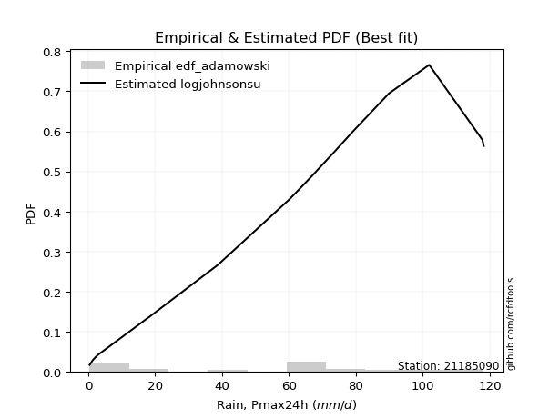</img>

</div>


## C. Best fit & Estimate extreme values for specific return periods - Tr

Best fit in probability distribution analysis means finding the theoretical distribution (like Normal, Poisson, Exponential) that most accurately mirrors your real-world data´s patterns (shape, center, spread) for better predictions, using methods like visual checks (Q-Q plots), goodness-of-fit tests (Kolmogorov-Smirnov, Chi-Squared), and information criteria (AIC) to score and select the simplest, most representative model.


### 1. Best fit (ordered by delta Δ)

<div align="center">

|   id |   station | empirical_dist   | p_dist       |    delta |   deltao | eval   |   fit |   n |   best_fit |   best_fit_sort |
|-----:|----------:|:-----------------|:-------------|---------:|---------:|:-------|------:|----:|-----------:|----------------:|
|    0 |  21185090 | edf_weibull      | logjohnsonsu | 0.125508 | 0.309641 | Δo > Δ |     1 |  20 |          1 |               1 |
|    1 |  21185090 | edf_adamowski    | logjohnsonsu | 0.12725  | 0.309641 | Δo > Δ |     1 |  20 |          1 |               2 |
|    2 |  21185090 | edf_chegodayev   | logjohnsonsu | 0.127609 | 0.309641 | Δo > Δ |     1 |  20 |          1 |               3 |
|    3 |  21185090 | edf_jenkinson    | logjohnsonsu | 0.127681 | 0.309641 | Δo > Δ |     1 |  20 |          1 |               4 |
|    4 |  21185090 | edf_beard        | logjohnsonsu | 0.127681 | 0.309641 | Δo > Δ |     1 |  20 |          1 |               5 |
|    5 |  21185090 | edf_filliben     | logjohnsonsu | 0.127735 | 0.309641 | Δo > Δ |     1 |  20 |          1 |               6 |
|    6 |  21185090 | edf_tukey        | logjohnsonsu | 0.12785  | 0.309641 | Δo > Δ |     1 |  20 |          1 |               7 |
|    7 |  21185090 | edf_blom         | logjohnsonsu | 0.128153 | 0.309641 | Δo > Δ |     1 |  20 |          1 |               8 |
|    8 |  21185090 | edf_cunnane      | logjohnsonsu | 0.128337 | 0.309641 | Δo > Δ |     1 |  20 |          1 |               9 |
|    9 |  21185090 | edf_gringorten   | logjohnsonsu | 0.128632 | 0.309641 | Δo > Δ |     1 |  20 |          1 |              10 |
|   10 |  21185090 | edf_hazen        | logjohnsonsu | 0.129079 | 0.309641 | Δo > Δ |     1 |  20 |          1 |              11 |
|   11 |  21185090 | edf_california   | logjohnsonsu | 0.133752 | 0.309641 | Δo > Δ |     1 |  20 |          1 |              12 |

</div>

:file_folder:Tables: [bestfit_21185090.csv](table/bestfit_21185090.csv) | [extreme_21185090.csv](table/extreme_21185090.csv)


### 2. Extreme values

In hydrology, a return period (or recurrence interval $Tr$) is the statistical average time between extreme events like floods or droughts of a specific magnitude, indicating how rare an event is, with a 100-year flood, for example, having a 1% chance of occurring in any given year, not that it happens exactly every century. It is a key tool for infrastructure design (like bridges or dams) and risk assessment, calculated from historical data to determine the probability of future events, although it is important to remember it is statistical average, and events can cluster or be missed.

> risk_rate: assuming the return period as the project useful life.

|   id |      tr |   prob_l |     prob_g |      alpha |   betaprime |     chi2 |   crystalball |   erlang |    expon |   exponnorm |        f |   fatiguelife |             fisk |    gamma |   genexpon |   genlogistic |   gibrat |   gompertz |   gumbel_l |   gumbel_r |   halflogistic |   halfnorm |   hypsecant |   invgamma |   invgauss |   invweibull |   johnsonsu |   kstwobign |   laplace |   laplace_asymmetric |   loggamma |   logistic |   lognorm |   maxwell |   mielke |    moyal |   nakagami |      ncf |      nct |    norm |   pearson3 |   rayleigh |     rice |        t |   truncnorm |     wald |   weibull_min |          logalpha |   logbetaprime |          logchi2 |   logcrystalball |   logerlang |         logexpon |   logexponnorm |            logf |   logfatiguelife |    logfisk |   loggenexpon |   loggenlogistic |        loggibrat |   loggompertz |   loggumbel_l |   loggumbel_r |   loghalflogistic |   loghalfnorm |   loghypsecant |   loginvgamma |   loginvgauss |    loginvweibull |   logjohnsonsu |   logkstwobign |   loglaplace |   loglaplace_asymmetric |   logloggamma |   loglogistic |   loglognorm |   logmaxwell |   logmielke |    logmoyal |   lognakagami |        logncf |    lognct |   logpearson3 |   lograyleigh |   logrice |      logt |   logtruncnorm |          logwald |   logweibull_min |   station |   n |   risk_rate |
|-----:|--------:|---------:|-----------:|-----------:|------------:|---------:|--------------:|---------:|---------:|------------:|---------:|--------------:|-----------------:|---------:|-----------:|--------------:|---------:|-----------:|-----------:|-----------:|---------------:|-----------:|------------:|-----------:|-----------:|-------------:|------------:|------------:|----------:|---------------------:|-----------:|-----------:|----------:|----------:|---------:|---------:|-----------:|---------:|---------:|--------:|-----------:|-----------:|---------:|---------:|------------:|---------:|--------------:|------------------:|---------------:|-----------------:|-----------------:|------------:|-----------------:|---------------:|----------------:|-----------------:|-----------:|--------------:|-----------------:|-----------------:|--------------:|--------------:|--------------:|------------------:|--------------:|---------------:|--------------:|--------------:|-----------------:|---------------:|---------------:|-------------:|------------------------:|--------------:|--------------:|-------------:|-------------:|------------:|------------:|--------------:|--------------:|----------:|--------------:|--------------:|----------:|----------:|---------------:|-----------------:|-----------------:|----------:|----:|------------:|
|    0 |    2    | 0.5      | 0.5        |    2.4525  |     21.2263 |  19.176  |        52.48  |  52.251  |  36.4991 |     52.4797 |  33.5813 |       16.0179 |     34.5322      |  52.2254 |    36.476  |       45.9001 |  40.8788 |    48.3153 |    58.8295 |    46.1305 |        42.974  |    44.5685 |     52.48   |    49.6297 |    47.2704 |      46.4962 |     52.307  |     44.7723 |   52.48   |              58.3807 |    23.2057 |    52.48   |   24.2481 |   49.1745 |  35.6199 |  44.0807 |    35.9299 |  31.7766 |  52.5935 |  52.48  |    52.2645 |    48.0021 |  49.9311 |  52.4798 |     56.0495 |  39.9515 |       35.2477 |      2.82618      |        24.2541 |      1.30757     |          40.428  |     23.503  |      6.88139     |        24.2482 |    1.21101      |          24.2152 |    32.6165 |       15.0093 |              inf |     14.4991      |       32.8594 |       32.1301 |       18.2997 |           15.9105 |       17.0754 |        24.2481 |       22.5272 |       21.2113 |     19.3826      |        52.2675 |        15.8789 |      24.2481 |                 39.4739 |       39.4511 |       24.2481 |      24.6095 |      20.9431 |     38.3561 |     16.7102 |       24.2409 |   4.06946     |   24.2127 |       32.8191 |       19.8827 |   24.2479 |   24.248  |        6.41309 |     13.915       |          34.0799 |  21185090 |  20 |    0.75     |
|    1 |    2.33 | 0.570815 | 0.429185   |    2.918   |     26.7105 |  24.9118 |        59.377 |  59.1534 |  44.4528 |     59.3767 |  41.9478 |       22.6478 |     52.7735      |  59.1283 |    44.4246 |       53.1962 |  44.3725 |    55.6884 |    64.8299 |    52.5214 |        49.5447 |    52.0122 |     57.9996 |    56.6228 |    54.3862 |      53.9456 |     59.2151 |     52.0549 |   56.6537 |              63.2756 |    32.0418 |    58.5567 |   32.9194 |   56.34   |  44.8645 |  50.1305 |    47.2706 |  42.0366 |  59.4867 |  59.377 |    59.168  |    55.2736 |  56.9783 |  59.3767 |     63.3962 |  44.474  |       45.6711 |      4.57902      |        32.9466 |      1.83488     |          49.7113 |     32.2396 |     12.8801      |        32.9195 |    2.11892      |          32.8751 |    42.8876 |       22.8781 |              inf |     16.9278      |       41.1905 |       41.9205 |       24.2926 |           21.29   |       23.7503 |        30.9697 |       30.8724 |       29.6697 |     29.2271      |        62.2299 |        24.2161 |      29.1761 |                 48.6801 |       48.6551 |       31.744  |      33.3896 |      28.7729 |     47.8221 |     21.8497 |       32.9259 |  12.4532      |   32.8866 |       43.3562 |       27.4446 |   32.9194 |   32.9193 |        9.46512 |     17.0038      |          42.3702 |  21185090 |  20 |    0.729209 |
|    2 |    5    | 0.8      | 0.2        |    6.52751 |     55.6754 |  56.6321 |        85.008 |  84.9352 |  84.2195 |     85.0079 |  85.5237 |       70.8918 |    273.978       |  84.9125 |    84.1659 |       84.8827 |  64.4869 |    84.3636 |    84.2148 |    80.286  |        79.2761 |    83.4903 |     80.1402 |    84.4399 |    83.8899 |      86.3091 |     84.978  |     82.9901 |   77.5214 |              81.6502 |   108.52   |    82.0198 |  102.536  |   84.5428 |  80.9321 |  78.1533 |   102.635  |  93.3043 |  85.0291 |  85.008 |    84.9435 |    84.3845 |  84.4903 |  85.0076 |     88.2404 |  69.7905 |      105.83   |    193.119        |       102.883  |     11.4574      |          83.8795 |    106.422  |    295.851       |       102.536  | 1991.75         |         102.521  |   123.424  |      124.304  |              inf |     41.2885      |       85.8986 |       98.9937 |       83.1712 |           79.5303 |       95.8645 |        82.6355 |      102.69   |      109.144  |    174.069       |        92.6897 |       145.429  |      73.5787 |                 83.0533 |       83.0236 |       89.8152 |     103.893  |     100.443  |     85.1526 |     75.6689 |      102.763  |   4.24661e+06 |  102.666  |      103.81   |       99.7403 |  102.539  |  102.536  |       34.653   |     52.2305      |          85.6151 |  21185090 |  20 |    0.67232  |
|    3 |   10    | 0.9      | 0.1        |   13.1591  |     83.2984 |  87.8886 |       102.011 | 102.152  | 120.319  |    102.011  | 126.578  |      128.182  |    924.757       | 102.131  |   120.242  |      110.684  |  87.415  |   103.263  |    95.0075 |   102.9    |       103.967  |   106.783  |     97.8201 |   104.623  |   106.337  |     112.669  |    102.148  |    106.543  |   96.4645 |              98.1741 |   248.246  |    99.2994 |  217.872  |  104.39   |  99.4787 | 102.552  |   147.298  | 140.342  | 101.911  | 102.011 |   102.147  |   105.141  | 103.526  | 102.01   |    101.245  |  96.6574 |      169.2    | 186827            |       219.057  |     67.4759      |         100.556  |    239.078  |   5089.66        |       217.873  |    8.86655e+12  |         218.235  |   268.834  |      417.032  |              inf |    114.084       |      129.618  |      159.727  |      226.629  |          237.603  |      269.201  |       180.935  |      234.291  |      272.181  |    744.553       |       105.885  |       569.399  |     170.383  |                100.072  |      100.042  |      193.198  |     220.842  |     242.108  |    108.645  |    223.157  |      218.678  |   1.31941e+23 |  218.579  |      162.736  |      250.298  |  217.884  |  217.872  |       63.0196  |    171.849       |         126.658  |  21185090 |  20 |    0.651322 |
|    4 |   15    | 0.933333 | 0.0666667  |   19.767   |     99.8346 | 106.794  |       110.496 | 110.778  | 141.435  |    110.496  | 151.018  |      165.006  |   1794.85        | 110.758  |   141.345  |      125.239  | 103.23   |   112.417  |    99.8952 |   115.658  |       117.94   |   118.905  |    107.91   |   115.258  |   118.462  |     127.541  |    110.741  |    119.047  |  107.546  |             107.84   |   377.223  |   108.714  |  317.354  |  114.574  | 106.028  | 116.711  |   171.005  | 168.407  | 110.317  | 110.496 |   110.764  |   115.836  | 113.181  | 110.495  |    106.265  | 113.91   |      209.304  |      1.7636e+08   |       319.44   |    195.728       |         106.333  |    359.905  |  26883           |       317.355  |    1.67779e+27  |         318.266  |   410.855  |      778.82   |              inf |    229.974       |      156.221  |      198.368  |      398.961  |          441.407  |      460.714  |       282.985  |      356.627  |      436.063  |   1690.44        |       110.656  |      1175.18   |     278.451  |                106.001  |      105.971  |      293.256  |     321.846  |     380.236  |    120.304  |    418.023  |      318.779  |   1.35111e+46 |  318.742  |      196.659  |      402.107  |  317.374  |  317.354  |       77.4136  |    369.219       |         151.238  |  21185090 |  20 |    0.644736 |
|    5 |   20    | 0.95     | 0.05       |   26.369   |    111.702  | 120.407  |       116.052 | 116.439  | 156.418  |    116.053  | 168.511  |      192.153  |   2838.66        | 116.42   |   156.318  |      135.43   | 115.635  |   118.283  |   102.938  |   124.592  |       127.729  |   126.987  |    115.028  |   122.437  |   126.75   |     137.954  |    116.377  |    127.47   |  115.408  |             114.698  |   497.119  |   115.221  |  405.988  |  121.333  | 109.376  | 126.739  |   186.895  | 188.644  | 115.816  | 116.052 |   116.418  |   122.945  | 119.549  | 116.052  |    108.97   | 126.767  |      238.944  |      1.6548e+11   |       408.974  |    420.429       |         109.261  |    471.342  |  87559.9         |       405.989  |    4.87576e+45  |         407.519  |   550.815  |     1180      |              inf |    398.566       |      175.487  |      227.008  |      592.796  |          681.239  |      659.193  |       387.963  |      471.043  |      597.092  |   3001.46        |       113.242  |      1914.64   |     394.551  |                109.012  |      108.982  |      391.306  |     411.921  |     513.053  |    128.162  |    652.006  |      408.027  |   5.66734e+74 |  408.084  |      220.019  |      551.045  |  406.016  |  405.988  |       85.9199  |    652.817       |         168.89   |  21185090 |  20 |    0.641514 |
|    6 |   25    | 0.96     | 0.04       |   32.9688  |    120.977  | 131.062  |       120.143 | 120.612  | 168.039  |    120.143  | 182.157  |      213.68   |   4031.08        | 120.594  |   167.932  |      143.279  | 125.977  |   122.531  |   105.103  |   131.473  |       135.272  |   133      |    120.536  |   127.834  |   133.03   |     145.974  |    120.53   |    133.779  |  121.506  |             120.018  |   609.723  |   120.199  |  486.695  |  126.35   | 111.42   | 134.512  |   198.743  | 204.551  | 119.86   | 120.143 |   120.586  |   128.226  | 124.255  | 120.142  |    110.669  | 137.065  |      262.563  |      1.54899e+14  |       490.564  |    763.995       |         111.031  |    575.418  | 218819           |       486.696  |    1.13765e+68  |         488.88   |   689.29   |     1607.02   |              inf |    630.369       |      190.634  |      249.873  |      804.211  |          951.699  |      860.538  |       495.265  |      579.05   |      754.688  |   4670.74        |       114.908  |      2759.75   |     517.013  |                110.834  |      110.804  |      487.919  |     494.001  |     640.847  |    134.144  |    920.21   |      489.335  |   2.7243e+108 |  489.504  |      237.618  |      696.404  |  486.731  |  486.694  |       91.5095  |   1030.48        |         182.694  |  21185090 |  20 |    0.639603 |
|    7 |   50    | 0.98     | 0.02       |   65.9572  |    150.126  | 164.589  |       131.856 | 132.592  | 204.138  |    131.857  | 224.93   |      282.599  |  11770.5         | 132.576  |   204.008  |      167.459  | 162.433  |   134.348  |   110.98   |   152.669  |       158.511  |   150.477  |    137.616  |   143.833  |   151.878  |     170.682  |    132.445  |    152.306  |  140.449  |             136.542  |  1099.28   |   135.409  |  817.989  |  140.902  | 115.742  | 158.642  |   233.236  | 255.278  | 131.428  | 131.856 |   132.548  |   143.557  | 137.814  | 131.855  |    114.269  | 170.687  |      339.15   |      1.10126e+29  |       825.964  |   4979.49        |         114.598  |   1023.38   |      3.76445e+06 |       817.991  |    4.44166e+232 |         823.56   |  1367.66   |     3942.09   |              inf |   3172.55        |      238.706  |      324.233  |     2057.94   |         2666.14   |     1867.39   |      1055.91   |     1053.82   |     1496.27   |  18239.4         |       118.737  |      8074.88   |    1197.23   |                114.51   |      114.48   |      957.508  |     831.433  |    1221.49   |    152.709  |   2681.74   |      823.399  | inf           |  824.239  |      288.846  |     1374.05   |  818.061  |  817.988  |      103.92    |   4574.27        |         226.12   |  21185090 |  20 |    0.63583  |
|    8 |   75    | 0.986667 | 0.0133333  |   98.9411  |    167.392  | 184.445  |       138.141 | 139.039  | 225.255  |    138.142  | 250.193  |      324.042  |  21856.9         | 139.023  |   225.111  |      181.513  | 187.055  |   140.472  |   113.951  |   164.99   |       172.021  |   159.992  |    147.596  |   152.764  |   162.533  |     185.043  |    138.851  |    162.5    |  151.53   |             146.207  |  1512.57   |   144.193  | 1080.78   |  148.813  | 117.425  | 172.753  |   252.016  | 285.971  | 137.626  | 138.141 |   138.982  |   151.898  | 145.131  | 138.14   |    115.538  | 191.377  |      386.025  |      7.79206e+43  |      1092.43   |  15070.5         |         115.795  |   1397.64   |      1.98834e+07 |      1080.79   |  inf            |        1089.66   |  2031.65   |     6426      |              inf |   9449.65        |      267.473  |      369.887  |     3553.15   |         4852.27   |     2847.04   |      1643.51   |     1459.99   |     2178.58   |  40260.9         |       120.314  |     14577.2    |    1956.58   |                115.746  |      115.715  |     1413.35   |    1099.56   |    1734.58   |    163.888  |   5012.62   |     1088.65   | inf           | 1090.21   |      316.17   |     1988.7    | 1080.89   | 1080.78   |      108.458   |  11445.4         |         251.868  |  21185090 |  20 |    0.634587 |
|    9 |  100    | 0.99     | 0.01       |  131.924   |    179.73   | 198.621  |       142.391 | 143.406  | 240.237  |    142.393  | 268.215  |      353.843  |  33834.9         | 143.39   |   240.084  |      191.46   | 206.128  |   144.526  |   115.895  |   173.71   |       181.582  |   166.473  |    154.676  |   158.947  |   169.959  |     195.208  |    143.189  |    169.484  |  159.392  |             153.066  |  1879.17   |   150.395  | 1304.88   |  154.202  | 118.414  | 182.764  |   264.804  | 308.247  | 141.815  | 142.392 |   143.341  |   157.58   | 150.095  | 142.391  |    116.188  | 206.462  |      420.14   |      5.50679e+58  |      1319.87   |  33196.1         |         116.395  |   1727.48   |      6.47617e+07 |      1304.89   |  inf            |        1316.93   |  2686.53   |     8965.94   |              inf |  22009.5         |      288.146  |      403.172  |     5229.76   |         7413.31   |     3794.61   |      2249.41   |     1823.64   |     2818.42   |  70512.3         |       121.226  |     21849.5    |    2772.38   |                116.365  |      116.335  |     1860.56   |    1328.47   |    2202.6    |    172.077  |   7812.46   |     1314.98   | inf           | 1317.26   |      334.328  |     2558.36   | 1305.02   | 1304.88   |      110.808   |  22337.5         |         270.275  |  21185090 |  20 |    0.633968 |
|   10 |  200    | 0.995    | 0.005      |  263.852   |    209.735  | 233.03   |       152.034 | 153.333  | 276.336  |    152.036  | 311.952  |      426.75   |  96517.4         | 153.319  |   276.16   |      215.373  | 258.021  |   153.464  |   120.12   |   194.673  |       204.569  |   181.297  |    171.733  |   173.415  |   187.475  |     219.643  |    153.045  |    185.57   |  178.335  |             169.589  |  3084.95   |   165.272  | 2000.76   |  166.531  | 120.398  | 206.884  |   294.014  | 363.746  | 151.306  | 152.034 |   153.248  |   170.582  | 161.393  | 152.033  |    117.181  | 244.037  |      505.066  |      1.36957e+118 |      2027.13   | 225070           |         117.297  |   2802.52   |      1.11413e+09 |      2000.77   |  inf            |        2024.23   |  5251.38   |    19222.7    |              inf | 219587           |      338.777  |      486.216  |    13245      |        20536.8    |     7320.47   |      4790.94   |     3037.6    |     5106.58   | 271255           |       122.913  |     55497.9    |    6419.89   |                117.297  |      117.266  |     3597.87   |    2040.52   |    3804.34   |    192.97   |  22757.3    |     2018.38   | inf           | 2023.39   |      373.923  |     4552.61   | 2000.99   | 2000.76   |      114.438   | 118141           |         315.059  |  21185090 |  20 |    0.633042 |
|   11 |  250    | 0.996    | 0.004      |  329.815   |    219.474  | 244.173  |       154.98  | 156.372  | 287.958  |    154.982  | 326.121  |      450.501  | 135132           | 156.359  |   287.774  |      223.061  | 276.64   |   156.125  |   121.364  |   201.413  |       211.959  |   185.857  |    177.223  |   177.963  |   193.016  |     227.499  |    156.061  |    190.548  |  184.434  |             174.909  |  3592.98   |   170.048  | 2279.93   |  170.326  | 120.963  | 214.649  |   302.988  | 382.193  | 154.204  | 154.98  |   156.281  |   174.585  | 164.855  | 154.98   |    117.383  | 256.468  |      533.181  |      6.82645e+147 |      2311.2    | 418010           |         117.478  |   3252.04   |      2.78429e+09 |      2279.94   |  inf            |        2308.54   |  6512.13   |    24312.9    |              inf | 501246           |      355.307  |      513.761  |    17856.5    |        28496.9    |     8960.48   |      6111.12   |     3555.89   |     6141.25   | 418294           |       123.338  |     74056.6    |    8412.53   |                117.483  |      117.453  |     4446.25   |    2326.61   |    4501.33   |    200.107  |  32106.9    |     2300.77   | inf           | 2307.04   |      385.454  |     5436.35   | 2280.2    | 2279.93   |      115.18    | 204978           |         329.597  |  21185090 |  20 |    0.632858 |
|   12 |  500    | 0.998    | 0.002      |  659.631   |    249.958  | 278.954  |       163.719 | 165.402  | 324.057  |    163.721  | 370.396  |      524.988  | 383729           | 165.39   |   323.85   |      246.922  | 340.987  |   163.824  |   124.927  |   222.331  |       234.896  |   199.454  |    194.278  |   191.811  |   209.981  |     251.882  |    165.018  |    205.466  |  203.377  |             191.433  |  5661.55   |   184.861  | 3358.48   |  181.651  | 122.601  | 238.768  |   329.707  | 441.428  | 162.79   | 163.719 |   165.29   |   186.526  | 175.147  | 163.718  |    117.789  | 295.994  |      622.764  |      2.09787e+296 |      3410.06   |      2.88185e+06 |         117.839  |   5067.91   |      4.78995e+10 |      3358.49   |  inf            |        3409.26   | 12692.3    |    49024.8    |              inf |      8.68599e+06 |      407.315  |      601.682  |    45132.5    |        78769.9    |    16371.4    |     13015.1    |     5698.95   |    10699      |      1.60443e+06 |       124.397  |    175802      |   19480.6    |                117.857  |      117.827  |     8573.39   |    3433.82   |    7436.29   |    223.774  |  93523.3    |     3392.58   | inf           | 3404.46   |      417.726  |     9229.86   | 3358.91   | 3358.48   |      116.679   |      1.18205e+06 |         375.098  |  21185090 |  20 |    0.632489 |
|   13 |  750    | 0.998667 | 0.00133333 |  989.446   |    267.948  | 299.403  |       168.573 | 170.429  | 345.173  |    168.576  | 396.472  |      568.987  | 706055           | 170.418  |   344.953  |      260.871  | 383.543  |   167.98   |   126.832  |   234.559  |       248.305  |   207.05   |    204.255  |   199.744  |   219.753  |     266.136  |    170.001  |    213.847  |  214.458  |             201.099  |  7300.99   |   193.515  | 4164.78   |  187.985  | 123.51   | 252.877  |   344.606  | 477.504  | 167.554  | 168.573 |   170.304  |   193.204  | 180.878  | 168.572  |    117.926  | 319.692  |      676.666  |    inf            |      4232.68   |      8.95721e+06 |         117.96   |   6494.7    |      2.53e+11    |      4164.79   |  inf            |        4234.1    | 18744      |    72585.4    |              inf |      5.7288e+07  |      438.172  |      654.686  |    77607.4    |       142724      |    22925.5    |     20253.8    |     7427.9    |    14639.6    |      3.52074e+06 |       124.874  |    285723      |   31836.3    |                117.981  |      117.951  |    12582.1    |    4263.15   |    9846.77   |    238.786  | 174795      |     4209.48   | inf           | 4226.17   |      434.274  |    12409.3    | 4165.34   | 4164.78   |      117.184   |      3.37963e+06 |         401.939  |  21185090 |  20 |    0.632366 |
|   14 | 1000    | 0.999    | 0.001      | 1319.26    |    280.779  | 313.952  |       171.915 | 173.894  | 360.156  |    171.918  | 415.049  |      600.37   |      1.08802e+06 | 173.884  |   359.926  |      270.765  | 416.108  |   170.792  |   128.114  |   243.234  |       257.817  |   212.296  |    211.333  |   205.309  |   226.627  |     276.247  |    173.436  |    219.654  |  222.32   |             207.957  |  8704.28   |   199.652  | 4829.83   |  192.363  | 124.142  | 262.887  |   354.885  | 503.771  | 170.833  | 171.915 |   173.76   |   197.818  | 184.829  | 171.914  |    117.994  | 336.74   |      715.548  |    inf            |      4911.78   |      2.00631e+07 |         118.02   |   7709.42   |      8.24038e+11 |      4829.84   |  inf            |        4915.49   | 24713.7    |    95208.4    |              inf |      2.42657e+08 |      460.248  |      692.964  |   113997      |       217572      |    28927.3    |     27718.7    |     8925.43   |    18207.1    |      6.14808e+06 |       125.163  |    400010      |   45110.4    |                118.044  |      118.014  |    16515.8    |    4948.07   |   11955.6    |    250.013  | 272420      |     4883.61   | inf           | 4904.6    |      445.052  |    15225.8    | 4830.5    | 4829.83   |      117.437   |      7.19533e+06 |         421.077  |  21185090 |  20 |    0.632305 |

<div align="center">

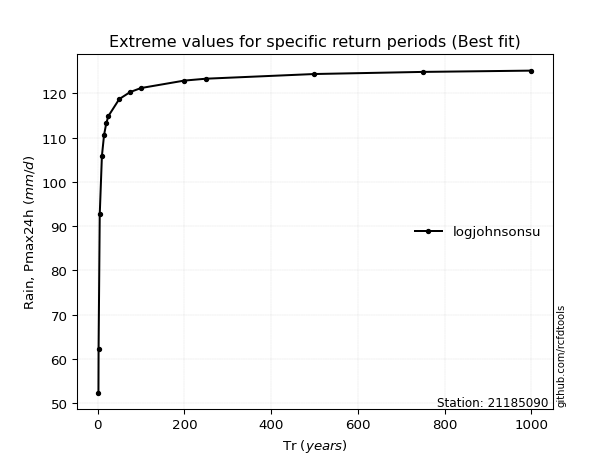</img>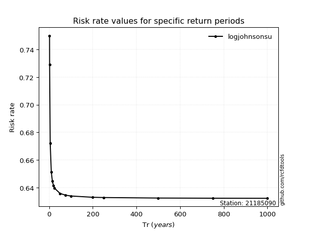</img>

</div>


<sub>**APP DISCLAIMER**: NO WARRANTY - This software is provided by [github.com/rcfdtools](https://github.com/rcfdtools) "as is", without any express or implied warranty, including warranties of merchantability, fitness for a particular purpose, or non-infringement. There is no guarantee that the software will be error-free or operate without interruption. LIMITATION OF LIABILITY - Neither the authors nor copyright holders will be liable for claims or damages arising from the software or its use. You are responsible for determining if the software is appropriate for your use and assume all associated risks, including errors, legal compliance, and data loss. NO PROFESSIONAL ADVICE - The software provides general information and does not offer professional advice. It should not replace consultation with professional advisors.</sub>