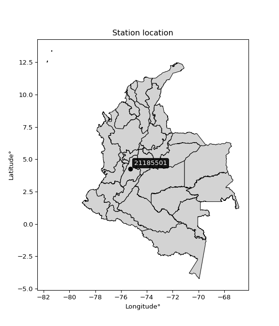

<div align="center">


</div>

# PMP Station (rain, Pmax24h): 21185501

Probable Maximum Precipitation (PMP) is the greatest amount of rainfall for a specific duration that is meteorologically possible for a given location, acting as a "worst-case" scenario for extreme storms, crucial for designing safety-critical infrastructure like bridges, river deviations, dams, spillways, and nuclear plants to prevent catastrophic failure. PMP is calculated by hydrologists using meteorological data to determine the upper limit of extreme rainfall, often leading to the Probable Maximum Flood (PMF) for flood control design, and is increasingly being studied for climate change impacts.

<div align="center">

</img>

</div>


## A. General information


### 1. General running parameters

• app_version: _v20251228_. • runtime: _2025-12-28 08:43:48.795225_. • Python version: _3.14.0_. • SciPy version: _1.16.3_. • Pandas version: _2.3.3_. • NumPy version: _2.3.5_. • Stations dataset (station_dataset_file): _dataset/pmax24h_in/automatic_colombia_2003_2024.csv_. • Stations catalog (station_catalog_file): _dataset/CNE_IDEAM.xls_. • Minimum year to eval til year_max (date_min): _1900_. • Maximum year to eval since year_min (date_max): _2024_. • Creates, save and include plots into reports (create_plot): _False_. • Plot only fit distributions with Δo > Δ (plot_only_fit): _True_. • Eval low extreme values, if False, evaluates high extreme values (low_extreme): _False_. • Eval every SciPy distribution as logarithmic (pdist_logarithmic_on): _True_. • Standard deviation normalized (ddof): _1.0_. • Return periods to eval in years (Tr): _[2, 2.33, 5, 10, 15, 20, 25, 50, 75, 100, 200, 250, 500, 750, 1000]_. • Minimum data sample per station, 0 means any (minimum_sample): _5_. • Z-Score maximum threshold to adjust a value, 0 means disable (zscore_max): _3.5_. • Z-Score minimum threshold to adjust a value, 0 means disable (zscore_min): _-2.5_. • Avoid zeros, e.g. rain = 0 (avoid_zeros): _True_. • Avoid null values (avoid_nans): _True_. [:file_folder:Dataset file.](../../dataset/pmax24h_in/automatic_colombia_2003_2024.csv)

> Delta Degrees of Freedom (DDOF): is a parameter used in the formulas for calculating variance and standard deviation. When ddof=0, the divisor is $N$ (the total number of observations) and this is used when your data set is the entire population. When ddof=1, the divisor is $N-1$ and this is used when your data set is a sample drawn from a larger population. Using $N-1$ provides an unbiased estimate of the population variance (known as Bessel´s correction).


### 2. Station info and location

|   id |   CODIGO | NOMBRE                    | CATEGORIA               | TECNOLOGIA                | ESTADO   | FECHA_INSTALACION   |   FECHA_SUSPENSION |   ALTITUD |   LATITUD |   LONGITUD | DEPARTAMENTO   | MUNICIPIO   | AREA_OPERATIVA             | ENTIDAD                                    | AREA_HIDROGRAFICA   | ZONA_HIDROGRAFICA   | SUBZONA_HIDROGRAFICA                    |   CORRIENTE | Catalogo   |
|-----:|---------:|:--------------------------|:------------------------|:--------------------------|:---------|:--------------------|-------------------:|----------:|----------:|-----------:|:---------------|:------------|:---------------------------|:-------------------------------------------|:--------------------|:--------------------|:----------------------------------------|------------:|:-----------|
|    0 | 21185501 | ROVIRA  - AUT  [21185501] | Climatológica Principal | Automática con Telemetría | Activa   | 24/10/2013          |                nan |      1285 |   4.26667 |   -75.2831 | Tolima         | Rovira      | Area Operativa 10 - Tolima | CENTRO NACIONAL DE INVESTIGACIONES DE CAFE | Magdalena Cauca     | Alto Magdalena      | Río Luisa y otros directos al Magdalena |         nan | CNE_OE     |

<div align="center">

Map location in: [:earth_americas:Google](http://maps.google.com/maps?q=4.266666667,-75.28305556) [:earth_americas:OSM](https://www.openstreetmap.org/#map=18/4.266666667/-75.28305556&layers=P) [:earth_americas:Bing](https://www.bing.com/maps?cp=4.266666667~-75.28305556&lvl=18) [:earth_americas:Apple](https://maps.apple.com/frame?center=4.266666667%2C-75.28305556&span=0.003%2C0.006)

</div>


<div align="center">

```geojson
{
  "type": "Feature",
  "geometry": {
    "type": "Point", 
    "coordinates": [-75.28305556, 4.266666667]
  }, 
  "properties": {
    "Name": "21185501"
  }
}
```

</div>


### 3. Discrete values table and plot

|               |          0 |           1 |           2 |           3 |           4 |           5 |           6 |           7 |
|:--------------|-----------:|------------:|------------:|------------:|------------:|------------:|------------:|------------:|
| Date          | 2016       | 2017        | 2018        | 2019        | 2020        | 2021        | 2022        | 2023        |
| Value         |   99.8     |   46.8      |   73.1      |   70.5      |   51.7      |   65.8      |   49.4      |   54.5      |
| Value_initial |   99.8     |   46.8      |   73.1      |   70.5      |   51.7      |   65.8      |   49.4      |   54.5      |
| count         |    8       |    8        |    8        |    8        |    8        |    8        |    8        |    8        |
| mean          |   63.95    |   63.95     |   63.95     |   63.95     |   63.95     |   63.95     |   63.95     |   63.95     |
| std           |   17.5681  |   17.5681   |   17.5681   |   17.5681   |   17.5681   |   17.5681   |   17.5681   |   17.5681   |
| zscore        |    2.04063 |   -0.976203 |    0.520831 |    0.372835 |   -0.697288 |    0.105305 |   -0.828207 |   -0.537908 |

> The initial value (value_initial) correspond to the initial obtained or null completed value, and value (value) is adjusted only when the initial value is outside the valid range definite through the Z-Score value. If Z-Score is active, values out of range or outliers are replaced with the station mean value


### 4. Active continuous probability distributions from SciPy (44 of 104 available)

[scipy.stats](https://docs.scipy.org/doc/scipy/reference/stats.html) is a Python´s powerful submodule within the SciPy library for comprehensive statistical analysis, offering over 130 probability distributions (like Normal, Poisson), functions for descriptive stats (mean, variance), hypothesis testing (t-tests, chi-square), random variable generation, and statistical tests, making it essential for data science, modeling, and research. It provides tools to explore, model, and draw conclusions from data efficiently, working seamlessly with NumPy.

<div align="center">

|   id | p_dist             |   n_parameter | fit_method   | label                                                                       | active   | ref                                                                                                        |
|-----:|:-------------------|--------------:|:-------------|:----------------------------------------------------------------------------|:---------|:-----------------------------------------------------------------------------------------------------------|
|    0 | alpha              |             3 | MLE          | Alpha                                                                       | True     | [:mortar_board:](https://docs.scipy.org/doc/scipy/reference/generated/scipy.stats.alpha.html)              |
|    1 | betaprime          |             4 | MLE          | Beta prime                                                                  | True     | [:mortar_board:](https://docs.scipy.org/doc/scipy/reference/generated/scipy.stats.betaprime.html)          |
|    2 | chi2               |             3 | MLE          | Chi²                                                                        | True     | [:mortar_board:](https://docs.scipy.org/doc/scipy/reference/generated/scipy.stats.chi2.html)               |
|    3 | crystalball        |             4 | MLE          | Crystalball                                                                 | True     | [:mortar_board:](https://docs.scipy.org/doc/scipy/reference/generated/scipy.stats.crystalball.html)        |
|    4 | erlang             |             3 | MLE          | Erlang                                                                      | True     | [:mortar_board:](https://docs.scipy.org/doc/scipy/reference/generated/scipy.stats.erlang.html)             |
|    5 | expon              |             2 | MLE          | Exponential                                                                 | True     | [:mortar_board:](https://docs.scipy.org/doc/scipy/reference/generated/scipy.stats.expon.html)              |
|    6 | exponnorm          |             3 | MLE          | Exponentially modified Normal                                               | True     | [:mortar_board:](https://docs.scipy.org/doc/scipy/reference/generated/scipy.stats.exponnorm.html)          |
|    7 | f                  |             4 | MLE          | F                                                                           | True     | [:mortar_board:](https://docs.scipy.org/doc/scipy/reference/generated/scipy.stats.f.html)                  |
|    8 | fatiguelife        |             3 | MLE          | Fatigue-life (Birnbaum-Saunders)                                            | True     | [:mortar_board:](https://docs.scipy.org/doc/scipy/reference/generated/scipy.stats.fatiguelife.html)        |
|    9 | fisk               |             3 | MLE          | Fisk                                                                        | True     | [:mortar_board:](https://docs.scipy.org/doc/scipy/reference/generated/scipy.stats.fisk.html)               |
|   10 | gamma              |             3 | MLE          | Gamma                                                                       | True     | [:mortar_board:](https://docs.scipy.org/doc/scipy/reference/generated/scipy.stats.gamma.html)              |
|   11 | genexpon           |             5 | MLE          | Generalized exponential                                                     | True     | [:mortar_board:](https://docs.scipy.org/doc/scipy/reference/generated/scipy.stats.genexpon.html)           |
|   12 | genlogistic        |             3 | MLE          | Generalized logistic                                                        | True     | [:mortar_board:](https://docs.scipy.org/doc/scipy/reference/generated/scipy.stats.genlogistic.html)        |
|   13 | gibrat             |             2 | MM           | Gibrat                                                                      | True     | [:mortar_board:](https://docs.scipy.org/doc/scipy/reference/generated/scipy.stats.gibrat.html)             |
|   14 | gompertz           |             3 | MLE          | Gompertz (or truncated Gumbel)                                              | True     | [:mortar_board:](https://docs.scipy.org/doc/scipy/reference/generated/scipy.stats.gompertz.html)           |
|   15 | gumbel_l           |             2 | MM           | Gumbel Left Skew                                                            | True     | [:mortar_board:](https://docs.scipy.org/doc/scipy/reference/generated/scipy.stats.gumbel_l.html)           |
|   16 | gumbel_r           |             2 | MM           | Gumbel Right Skew                                                           | True     | [:mortar_board:](https://docs.scipy.org/doc/scipy/reference/generated/scipy.stats.gumbel_r.html)           |
|   17 | halflogistic       |             2 | MM           | Half-logistic                                                               | True     | [:mortar_board:](https://docs.scipy.org/doc/scipy/reference/generated/scipy.stats.halflogistic.html)       |
|   18 | halfnorm           |             2 | MM           | Half Normal                                                                 | True     | [:mortar_board:](https://docs.scipy.org/doc/scipy/reference/generated/scipy.stats.halfnorm.html)           |
|   19 | hypsecant          |             2 | MM           | hyperbolic secant                                                           | True     | [:mortar_board:](https://docs.scipy.org/doc/scipy/reference/generated/scipy.stats.hypsecant.html)          |
|   20 | invgamma           |             3 | MLE          | Inverted gamma                                                              | True     | [:mortar_board:](https://docs.scipy.org/doc/scipy/reference/generated/scipy.stats.invgamma.html)           |
|   21 | invgauss           |             3 | MLE          | Inverse Gaussian                                                            | True     | [:mortar_board:](https://docs.scipy.org/doc/scipy/reference/generated/scipy.stats.invgauss.html)           |
|   22 | invweibull         |             3 | MLE          | Inverted Weibull                                                            | True     | [:mortar_board:](https://docs.scipy.org/doc/scipy/reference/generated/scipy.stats.invweibull.html)         |
|   23 | johnsonsu          |             4 | MLE          | Johnson Su                                                                  | True     | [:mortar_board:](https://docs.scipy.org/doc/scipy/reference/generated/scipy.stats.johnsonsu.html)          |
|   24 | kstwobign          |             2 | MLE          | Limiting distribution of scaled Kolmogorov-Smirnov two-sided test statistic | True     | [:mortar_board:](https://docs.scipy.org/doc/scipy/reference/generated/scipy.stats.kstwobign.html)          |
|   25 | laplace            |             2 | MM           | Laplace                                                                     | True     | [:mortar_board:](https://docs.scipy.org/doc/scipy/reference/generated/scipy.stats.laplace.html)            |
|   26 | laplace_asymmetric |             3 | MLE          | Asymmetric Laplace                                                          | True     | [:mortar_board:](https://docs.scipy.org/doc/scipy/reference/generated/scipy.stats.laplace_asymmetric.html) |
|   27 | loggamma           |             3 | MLE          | Log gamma                                                                   | True     | [:mortar_board:](https://docs.scipy.org/doc/scipy/reference/generated/scipy.stats.loggamma.html)           |
|   28 | logistic           |             2 | MM           | Logistic (or Sech-squared)                                                  | True     | [:mortar_board:](https://docs.scipy.org/doc/scipy/reference/generated/scipy.stats.logistic.html)           |
|   29 | lognorm            |             3 | MLE          | Log Normal                                                                  | True     | [:mortar_board:](https://docs.scipy.org/doc/scipy/reference/generated/scipy.stats.lognorm.html)            |
|   30 | maxwell            |             2 | MM           | Maxwell                                                                     | True     | [:mortar_board:](https://docs.scipy.org/doc/scipy/reference/generated/scipy.stats.maxwell.html)            |
|   31 | mielke             |             4 | MLE          | Mielke Beta-Kappa / Dagum                                                   | True     | [:mortar_board:](https://docs.scipy.org/doc/scipy/reference/generated/scipy.stats.mielke.html)             |
|   32 | moyal              |             2 | MM           | Moyal                                                                       | True     | [:mortar_board:](https://docs.scipy.org/doc/scipy/reference/generated/scipy.stats.moyal.html)              |
|   33 | nakagami           |             3 | MLE          | Nakagami                                                                    | True     | [:mortar_board:](https://docs.scipy.org/doc/scipy/reference/generated/scipy.stats.nakagami.html)           |
|   34 | ncf                |             5 | MLE          | Non-central F distribution                                                  | True     | [:mortar_board:](https://docs.scipy.org/doc/scipy/reference/generated/scipy.stats.ncf.html)                |
|   35 | nct                |             4 | MLE          | Non-central Student’s t                                                     | True     | [:mortar_board:](https://docs.scipy.org/doc/scipy/reference/generated/scipy.stats.nct.html)                |
|   36 | norm               |             2 | MM           | Normal                                                                      | True     | [:mortar_board:](https://docs.scipy.org/doc/scipy/reference/generated/scipy.stats.norm.html)               |
|   37 | pearson3           |             3 | MM           | Pearson type III                                                            | True     | [:mortar_board:](https://docs.scipy.org/doc/scipy/reference/generated/scipy.stats.pearson3.html)           |
|   38 | rayleigh           |             2 | MM           | Rayleigh                                                                    | True     | [:mortar_board:](https://docs.scipy.org/doc/scipy/reference/generated/scipy.stats.rayleigh.html)           |
|   39 | rice               |             3 | MLE          | Rice                                                                        | True     | [:mortar_board:](https://docs.scipy.org/doc/scipy/reference/generated/scipy.stats.rice.html)               |
|   40 | t                  |             3 | MLE          | Student’s t                                                                 | True     | [:mortar_board:](https://docs.scipy.org/doc/scipy/reference/generated/scipy.stats.t.html)                  |
|   41 | truncnorm          |             4 | MLE          | Truncated normal                                                            | True     | [:mortar_board:](https://docs.scipy.org/doc/scipy/reference/generated/scipy.stats.truncnorm.html)          |
|   42 | wald               |             2 | MM           | Wald                                                                        | True     | [:mortar_board:](https://docs.scipy.org/doc/scipy/reference/generated/scipy.stats.wald.html)               |
|   43 | weibull_min        |             3 | MLE          | Weibull minimum                                                             | True     | [:mortar_board:](https://docs.scipy.org/doc/scipy/reference/generated/scipy.stats.weibull_min.html)        |

</div>

> **n_parameter:** # arguments & localization & scale.
>
> **Fit methods:** (MLE) maximum likelihood, (MM) L-moments.
>
>**Inactive:** foldnorm, gennorm, norminvgauss, powernorm, powerlognorm, skewnorm, genextreme, anglit, arcsine, argus, beta, bradford, burr, burr12, cauchy, cosine, halfcauchy, foldcauchy, skewcauchy, wrapcauchy, dgamma, gengamma, exponweib, exponpow, truncexpon, gausshyper, genhalflogistic, genhyperbolic, geninvgauss, halfgennorm, johnsonsb, kappa4, kappa3, ksone, kstwo, loglaplace, levy, levy_l, levy_stable, ncx2, pareto, genpareto, truncpareto, lomax, powerlaw, rdist, rel_breitwigner, recipinvgauss, semicircular, studentized_range, trapezoid, triang, truncweibull_min, tukeylambda, uniform, loguniform, vonmises, vonmises_line, weibull_max, dweibull, 


## B. Probability distributions vs. Empirical distributions

A continuous probability distribution (CPD) describes probabilities for variables that can take any value within a range (like rain any time), unlike discrete variables with specific outcomes (like temperature). It uses a Probability Density Function (PDF), a curve where the total area under it equals 1, and the probability of the variable falling within an interval (a to b) is found by calculating the area under the curve between those points. A key feature is that the probability of hitting any single exact value is zero, so probabilities are always expressed for ranges, e.g., $P(a ≤ X ≤ b)$.

<div align="center">

Distributions parameters from station values
|    |   station | p_dist                |   n |          loc |         scale | shape                  | shape1             | shape2              | shape3   |
|---:|----------:|:----------------------|----:|-------------:|--------------:|:-----------------------|:-------------------|:--------------------|:---------|
|  0 |  21185501 | alpha                 |   8 |    29.5517   |  67.9073      | 2.3766212123694777     |                    |                     |          |
|  1 |  21185501 | betaprime             |   8 |    -1.54648  |   3.05823     | 415.52943692288886     | 20.43520195895916  |                     |          |
|  2 |  21185501 | chi2                  |   8 |    46.8      |  11.6186      | 1.3315193481320775     |                    |                     |          |
|  3 |  21185501 | crystalball           |   8 |    63.95     |  16.4334      | 12966.922040181442     | 2429.2963224246596 |                     |          |
|  4 |  21185501 | erlang                |   8 |    46.8      |  15.194       | 0.3975032294114649     |                    |                     |          |
|  5 |  21185501 | expon                 |   8 |    46.8      |  17.15        |                        |                    |                     |          |
|  6 |  21185501 | exponnorm             |   8 |    46.7808   |   0.00634516  | 2693.2820444867557     |                    |                     |          |
|  7 |  21185501 | f                     |   8 |    40.9083   |  13.9192      | 1157.2107631686977     | 4.321594811052039  |                     |          |
|  8 |  21185501 | fatiguelife           |   8 |    46.8      |   0.000391656 | 178.44507204992613     |                    |                     |          |
|  9 |  21185501 | fisk                  |   8 |    46.8      |  18.0291      | 0.9289962847421311     |                    |                     |          |
| 10 |  21185501 | gamma                 |   8 |    46.8      |  16.2345      | 0.8400180294641044     |                    |                     |          |
| 11 |  21185501 | genexpon              |   8 |    46.8      |  25.0383      | 1.4212919450666177     | 0.5890984367224575 | 0.10348060168714865 |          |
| 12 |  21185501 | genlogistic           |   8 |   -24.4709   |  11.4973      | 1158.8825984146497     |                    |                     |          |
| 13 |  21185501 | gibrat                |   8 |    51.4134   |   7.60385     |                        |                    |                     |          |
| 14 |  21185501 | gompertz              |   8 |    46.8      | 270.908       | 14.845465186080755     |                    |                     |          |
| 15 |  21185501 | gumbel_l              |   8 |    71.3459   |  12.8131      |                        |                    |                     |          |
| 16 |  21185501 | gumbel_r              |   8 |    56.5541   |  12.8131      |                        |                    |                     |          |
| 17 |  21185501 | halflogistic          |   8 |    44.4726   |  14.05        |                        |                    |                     |          |
| 18 |  21185501 | halfnorm              |   8 |    42.1986   |  27.2614      |                        |                    |                     |          |
| 19 |  21185501 | hypsecant             |   8 |    63.95     |  10.4618      |                        |                    |                     |          |
| 20 |  21185501 | invgamma              |   8 |    40.8826   |  30.1055      | 2.1607816675918023     |                    |                     |          |
| 21 |  21185501 | invgauss              |   8 |    43.7689   |  17.2004      | 1.1732922060969386     |                    |                     |          |
| 22 |  21185501 | invweibull            |   8 |    38.8698   |  14.8357      | 1.7754229510981352     |                    |                     |          |
| 23 |  21185501 | johnsonsu             |   8 |    45.4192   |   0.052237    | -5.371162865952142     | 0.8867625754509583 |                     |          |
| 24 |  21185501 | kstwobign             |   8 |    15.6322   |  55.6887      |                        |                    |                     |          |
| 25 |  21185501 | laplace               |   8 |    63.95     |  11.6202      |                        |                    |                     |          |
| 26 |  21185501 | laplace_asymmetric    |   8 |    46.8      |   0.117405    | 0.0068606673185751844  |                    |                     |          |
| 27 |  21185501 | loggamma              |   8 | -4277.57     | 603.434       | 1332.6852138732588     |                    |                     |          |
| 28 |  21185501 | logistic              |   8 |    63.95     |   9.06022     |                        |                    |                     |          |
| 29 |  21185501 | lognorm               |   8 |    46.8      |   0.16037     | 11.657991076708228     |                    |                     |          |
| 30 |  21185501 | maxwell               |   8 |    25.0097   |  24.4022      |                        |                    |                     |          |
| 31 |  21185501 | mielke                |   8 |     0.321232 |  17.4314      | 2884.828673039754      | 5.436219396910872  |                     |          |
| 32 |  21185501 | moyal                 |   8 |    54.5523   |   7.39764     |                        |                    |                     |          |
| 33 |  21185501 | nakagami              |   8 |    46.8      |  32.1626      | 0.24292682878822217    |                    |                     |          |
| 34 |  21185501 | ncf                   |   8 |     0.161597 |  11.3367      | 124.86410897739123     | 39.141314022922856 | 543.0874676811677   |          |
| 35 |  21185501 | nct                   |   8 |    -0.179868 |   0.9191      | 10.315339791045904     | 64.43307103584871  |                     |          |
| 36 |  21185501 | norm                  |   8 |    63.95     |  16.4334      |                        |                    |                     |          |
| 37 |  21185501 | pearson3              |   8 |    63.95     |  16.4334      | 1.023020203529919      |                    |                     |          |
| 38 |  21185501 | rayleigh              |   8 |    32.5119   |  25.084       |                        |                    |                     |          |
| 39 |  21185501 | rice                  |   8 |    37.7482   |  21.87        | 0.00037413734009726787 |                    |                     |          |
| 40 |  21185501 | t                     |   8 |    61.8503   |  14.0193      | 6.677896849043944      |                    |                     |          |
| 41 |  21185501 | truncnorm             |   8 |    63.9517   |  16.4672      | -384.14729109057237    | 2.4120742772247104 |                     |          |
| 42 |  21185501 | wald                  |   8 |    47.5166   |  16.4334      |                        |                    |                     |          |
| 43 |  21185501 | weibull_min           |   8 |    46.8      |  13.2218      | 0.6362739523030712     |                    |                     |          |
| 44 |  21185501 | logalpha              |   8 |     2.28116  |  14.8656      | 8.19731250351651       |                    |                     |          |
| 45 |  21185501 | logbetaprime          |   8 |    -4.51575  |   2.316       | 2073.5426933073095     | 555.8770899451656  |                     |          |
| 46 |  21185501 | logchi2               |   8 |     3.84588  |   0.993046    | 1.0204165486280121     |                    |                     |          |
| 47 |  21185501 | logcrystalball        |   8 |     4.12834  |   0.238252    | 7.606252004194257      | 324.33586489826024 |                     |          |
| 48 |  21185501 | logerlang             |   8 |     3.84588  |   0.23072     | 0.9318572394487351     |                    |                     |          |
| 49 |  21185501 | logexpon              |   8 |     3.84588  |   0.282457    |                        |                    |                     |          |
| 50 |  21185501 | logexponnorm          |   8 |     3.84554  |   0.000115189 | 2458.110895715168      |                    |                     |          |
| 51 |  21185501 | logf                  |   8 |     3.78278  |   0.339552    | 3.905032390862427      | 2202.45976340896   |                     |          |
| 52 |  21185501 | logfatiguelife        |   8 |     3.7934   |   0.234964    | 0.9114671048514358     |                    |                     |          |
| 53 |  21185501 | logfisk               |   8 |     3.82184  |   0.217849    | 1.600327092741236      |                    |                     |          |
| 54 |  21185501 | loggamma              |   8 |     3.84588  |   0.281075    | 0.5891983359193609     |                    |                     |          |
| 55 |  21185501 | loggenexpon           |   8 |     3.84588  |   0.506001    | 1.5101045995823146     | 0.6173156415541341 | 1.4491559351495034  |          |
| 56 |  21185501 | loggenlogistic        |   8 |     2.78037  |   0.182969    | 864.3271558510121      |                    |                     |          |
| 57 |  21185501 | loggibrat             |   8 |     3.94653  |   0.110272    |                        |                    |                     |          |
| 58 |  21185501 | loggompertz           |   8 |     3.84588  |   0.940638    | 2.5209691553868234     |                    |                     |          |
| 59 |  21185501 | loggumbel_l           |   8 |     4.23557  |   0.185764    |                        |                    |                     |          |
| 60 |  21185501 | loggumbel_r           |   8 |     4.02111  |   0.185764    |                        |                    |                     |          |
| 61 |  21185501 | loghalflogistic       |   8 |     3.846    |   0.203664    |                        |                    |                     |          |
| 62 |  21185501 | loghalfnorm           |   8 |     3.81299  |   0.395235    |                        |                    |                     |          |
| 63 |  21185501 | loghypsecant          |   8 |     4.12834  |   0.151676    |                        |                    |                     |          |
| 64 |  21185501 | loginvgamma           |   8 |     3.65389  |   1.50401     | 4.092151827359881      |                    |                     |          |
| 65 |  21185501 | loginvgauss           |   8 |     3.76118  |   0.558849    | 0.6569832948958191     |                    |                     |          |
| 66 |  21185501 | loginvweibull         |   8 |     3.34934  |   0.645295    | 4.011641415877262      |                    |                     |          |
| 67 |  21185501 | logjohnsonsu          |   8 |     3.78589  |   0.00291076  | -6.288527102383491     | 1.2172682939999389 |                     |          |
| 68 |  21185501 | logkstwobign          |   8 |     3.38065  |   0.85746     |                        |                    |                     |          |
| 69 |  21185501 | loglaplace            |   8 |     4.12834  |   0.168469    |                        |                    |                     |          |
| 70 |  21185501 | loglaplace_asymmetric |   8 |     3.84588  |   0.000162655 | 0.0005752563222426768  |                    |                     |          |
| 71 |  21185501 | logloggamma           |   8 |   -88.5643   |  11.9109      | 2397.755667804182      |                    |                     |          |
| 72 |  21185501 | loglogistic           |   8 |     4.12834  |   0.131355    |                        |                    |                     |          |
| 73 |  21185501 | loglognorm            |   8 |     3.84588  |   0.00338333  | 11.240604893183718     |                    |                     |          |
| 74 |  21185501 | logmaxwell            |   8 |     3.56378  |   0.353783    |                        |                    |                     |          |
| 75 |  21185501 | logmielke             |   8 |   -20.5477   |  23.9662      | 3989.2954742413312     | 136.05526687167344 |                     |          |
| 76 |  21185501 | logmoyal              |   8 |     3.99209  |   0.107251    |                        |                    |                     |          |
| 77 |  21185501 | lognakagami           |   8 |     3.84588  |   0.491543    | 0.2896539669132927     |                    |                     |          |
| 78 |  21185501 | logncf                |   8 |    -4.44995  |   8.55983     | 777.3219883113456      | 715.0414669117586  | 0.02736209140953392 |          |
| 79 |  21185501 | lognct                |   8 |    -0.605386 |   0.0601091   | 225.170184546364       | 78.43983202458196  |                     |          |
| 80 |  21185501 | lognorm               |   8 |     4.12834  |   0.238252    |                        |                    |                     |          |
| 81 |  21185501 | logpearson3           |   8 |     4.12834  |   0.238252    | 0.655412812015264      |                    |                     |          |
| 82 |  21185501 | lograyleigh           |   8 |     3.67255  |   0.363667    |                        |                    |                     |          |
| 83 |  21185501 | logrice               |   8 |     3.72735  |   0.329818    | 0.0005415130341884597  |                    |                     |          |
| 84 |  21185501 | logt                  |   8 |     4.12833  |   0.238253    | 15916352.84192639      |                    |                     |          |
| 85 |  21185501 | logtruncnorm          |   8 |    -1.40461  |   1.36523     | 3.8458715060706927     | 4.400567908007243  |                     |          |
| 86 |  21185501 | logwald               |   8 |     3.89005  |   0.238287    |                        |                    |                     |          |
| 87 |  21185501 | logweibull_min        |   8 |     3.84588  |   0.271158    | 0.7340610887955603     |                    |                     |          |

</div>

> **loc** (Location parameter): This shifts the distribution along the x-axis. For many common distributions, like the normal (Gaussian) distribution, loc represents the mean $μ$. For others, like the uniform distribution, it might represent the minimum value, or for the beta distribution, the left end of the support interval.
>
> **scale** (Scale parameter): This determines the width or spread of the distribution. For the normal distribution, scale represents the standard deviation $σ$. For a uniform distribution, it defines the length of the interval (from $loc$ to $loc + scale$).
>
> **shape** (Shape parameters): Refers to parameters that define the specific form of a probability distribution, distinct from its location (loc) and scale (scale). These parameters are required arguments for most distribution functions. For example, a normal (Gaussian) distribution is fully defined by its location (mean) and scale (standard deviation), so it has no specific shape parameters beyond loc and scale. However, other distributions have intrinsic properties that need specification, as Gamma distribution that takes a shape parameter, often named $a$ or $alpha$.


### 0. Cumulative distribution values - CDF (88 evaluated)

Cumulative Distribution Function (CDF), denoted as $F$<sub>$X$</sub>$(x)$, is a function that gives the probability that a random variable $X$ will take a value less than or equal to a specific value, $x$ (i.e., $(P(X≥x)$. It essentially "accumulates" probabilities from a given point up to the far right (positive infinity), providing a complete picture of the distribution´s probabilities for both discrete (like rain) and continuous (like temperature) variables, helping to find probabilities over ranges or above certain values.

<div align="center">

CDF ordered by x ascending and calculating $log(f(x))$ separately
|   id |   Station |   date |    x |   count |   mean |     std |    zscore |   Value_initial |   station |   m |     alpha |   alpha_pdf |   betaprime |   betaprime_pdf |        chi2 |      chi2_pdf |   crystalball |   crystalball_pdf |      erlang |   erlang_pdf |    expon |   expon_pdf |   exponnorm |   exponnorm_pdf |        f |      f_pdf |   fatiguelife |   fatiguelife_pdf |        fisk |   fisk_pdf |       gamma |   gamma_pdf |    genexpon |   genexpon_pdf |   genlogistic |   genlogistic_pdf |      gibrat |   gibrat_pdf |    gompertz |   gompertz_pdf |   gumbel_l |   gumbel_l_pdf |   gumbel_r |   gumbel_r_pdf |   halflogistic |   halflogistic_pdf |   halfnorm |   halfnorm_pdf |   hypsecant |   hypsecant_pdf |   invgamma |   invgamma_pdf |   invgauss |   invgauss_pdf |   invweibull |   invweibull_pdf |   johnsonsu |   johnsonsu_pdf |   kstwobign |   kstwobign_pdf |   laplace |   laplace_pdf |   laplace_asymmetric |   laplace_asymmetric_pdf |    loggamma |   loggamma_pdf |   logistic |   logistic_pdf |   lognorm |   lognorm_pdf |   maxwell |   maxwell_pdf |   mielke |   mielke_pdf |     moyal |   moyal_pdf |    nakagami |   nakagami_pdf |      ncf |    ncf_pdf |      nct |    nct_pdf |     norm |   norm_pdf |   pearson3 |   pearson3_pdf |   rayleigh |   rayleigh_pdf |      rice |   rice_pdf |        t |      t_pdf |   truncnorm |   truncnorm_pdf |       wald |   wald_pdf |   weibull_min |   weibull_min_pdf |   logalpha |   logalpha_pdf |   logbetaprime |   logbetaprime_pdf |     logchi2 |   logchi2_pdf |   logcrystalball |   logcrystalball_pdf |   logerlang |   logerlang_pdf |   logexpon |   logexpon_pdf |   logexponnorm |   logexponnorm_pdf |      logf |   logf_pdf |   logfatiguelife |   logfatiguelife_pdf |   logfisk |   logfisk_pdf |   loggenexpon |   loggenexpon_pdf |   loggenlogistic |   loggenlogistic_pdf |   loggibrat |   loggibrat_pdf |   loggompertz |   loggompertz_pdf |   loggumbel_l |   loggumbel_l_pdf |   loggumbel_r |   loggumbel_r_pdf |   loghalflogistic |   loghalflogistic_pdf |   loghalfnorm |   loghalfnorm_pdf |   loghypsecant |   loghypsecant_pdf |   loginvgamma |   loginvgamma_pdf |   loginvgauss |   loginvgauss_pdf |   loginvweibull |   loginvweibull_pdf |   logjohnsonsu |   logjohnsonsu_pdf |   logkstwobign |   logkstwobign_pdf |   loglaplace |   loglaplace_pdf |   loglaplace_asymmetric |   loglaplace_asymmetric_pdf |   logloggamma |   logloggamma_pdf |   loglogistic |   loglogistic_pdf |   loglognorm |   loglognorm_pdf |   logmaxwell |   logmaxwell_pdf |   logmielke |   logmielke_pdf |   logmoyal |   logmoyal_pdf |   lognakagami |   lognakagami_pdf |   logncf |   logncf_pdf |   lognct |   lognct_pdf |   logpearson3 |   logpearson3_pdf |   lograyleigh |   lograyleigh_pdf |   logrice |   logrice_pdf |     logt |   logt_pdf |   logtruncnorm |   logtruncnorm_pdf |     logwald |   logwald_pdf |   logweibull_min |   logweibull_min_pdf |
|-----:|----------:|-------:|-----:|--------:|-------:|--------:|----------:|----------------:|----------:|----:|----------:|------------:|------------:|----------------:|------------:|--------------:|--------------:|------------------:|------------:|-------------:|---------:|------------:|------------:|----------------:|---------:|-----------:|--------------:|------------------:|------------:|-----------:|------------:|------------:|------------:|---------------:|--------------:|------------------:|------------:|-------------:|------------:|---------------:|-----------:|---------------:|-----------:|---------------:|---------------:|-------------------:|-----------:|---------------:|------------:|----------------:|-----------:|---------------:|-----------:|---------------:|-------------:|-----------------:|------------:|----------------:|------------:|----------------:|----------:|--------------:|---------------------:|-------------------------:|------------:|---------------:|-----------:|---------------:|----------:|--------------:|----------:|--------------:|---------:|-------------:|----------:|------------:|------------:|---------------:|---------:|-----------:|---------:|-----------:|---------:|-----------:|-----------:|---------------:|-----------:|---------------:|----------:|-----------:|---------:|-----------:|------------:|----------------:|-----------:|-----------:|--------------:|------------------:|-----------:|---------------:|---------------:|-------------------:|------------:|--------------:|-----------------:|---------------------:|------------:|----------------:|-----------:|---------------:|---------------:|-------------------:|----------:|-----------:|-----------------:|---------------------:|----------:|--------------:|--------------:|------------------:|-----------------:|---------------------:|------------:|----------------:|--------------:|------------------:|--------------:|------------------:|--------------:|------------------:|------------------:|----------------------:|--------------:|------------------:|---------------:|-------------------:|--------------:|------------------:|--------------:|------------------:|----------------:|--------------------:|---------------:|-------------------:|---------------:|-------------------:|-------------:|-----------------:|------------------------:|----------------------------:|--------------:|------------------:|--------------:|------------------:|-------------:|-----------------:|-------------:|-----------------:|------------:|----------------:|-----------:|---------------:|--------------:|------------------:|---------:|-------------:|---------:|-------------:|--------------:|------------------:|--------------:|------------------:|----------:|--------------:|---------:|-----------:|---------------:|-------------------:|------------:|--------------:|-----------------:|---------------------:|
|    0 |  21185501 |   2017 | 46.8 |       8 |  63.95 | 17.5681 | -0.976203 |            46.8 |  21185501 |   1 | 0.0598535 |  0.0271901  |    0.111021 |       0.0186233 | 5.19416e-11 | 4866.79       |      0.148334 |        0.0140826  | 9.08075e-07 |  5.0801e+07  | 0        |  0.058309   |  0.00112415 |      0.0583786  | 0.046672 | 0.0325041  |     0.0358068 |       1.87142e+07 | 1.57685e-11 | 0.344872   | 1.33032e-13 | 15.7273     | 6.40499e-12 |     0.0567646  |     0.0951734 |        0.0194503  | 0           |   0          | 5.66883e-12 |      0.0547989 |   0.136913 |    0.00991806  |   0.117541 |     0.0196402  |      0.0826378 |          0.0353442 |   0.134037 |     0.028854   |    0.122061 |      0.0113834  |  0.0466687 |     0.032504   |  0.0383622 |     0.0404014  |    0.0478051 |       0.0325429  |    0.031987 |      0.0460454  |   0.0872333 |      0.0192475  |  0.114289 |    0.00983536 |          4.70669e-05 |               0.0584334  | 2.13077e-09 |    2.82701e+06 |   0.130915 |      0.0125578 |  0.117902 |      0.829225 |  0.149908 |    0.0174996  |      nan |          nan | 0.0912728 |  0.0218836  | 1.93319e-08 |    1.32187e+06 | 0.113955 | 0.0186054  | 0.100904 | 0.0198511  | 0.148334 | 0.0140827  |   0.126357 |      0.0212066 |   0.149753 |     0.0193075  | 0.0820877 | 0.0173716  | 0.160141 | 0.0148781  |    0.149996 |      0.0141962  | 0          | 0          |   1.92437e-10 |    17232.3        |   0.096257 |       1.0362   |       0.243538 |           0.789441 | 1.16746e-08 |   1.34128e+07 |         0.117902 |             0.829225 | 1.99067e-14 |       41.7713   |   0        |       3.54036  |     0.00122093 |           3.5227   | 0.0569894 |   1.55328  |        0.0356997 |             2.1249   | 0.0285526 |      1.84621  |   1.91254e-10 |          2.98439  |        0.0779026 |             1.08509  |    0        |        0        |   1.25517e-11 |          2.68006  |      0.115502 |         0.58439   |      0.076655 |          1.05986  |          0        |              0        |     0.0663303 |          2.01178  |      0.0980984 |           0.636575 |     0.0517178 |          1.39284  |     0.0405643 |          1.7171   |       0.0572011 |            1.32227  |      0.0391334 |           1.71558  |      0.0699169 |           1.10935  |    0.0935037 |         0.555019 |             3.65308e-07 |                    3.53666  |      0.124095 |          0.835345 |      0.1043   |          0.711215 |   0.00416011 |      2.45814e+12 |     0.111813 |         1.04344  |   0.0792682 |        1.07366  |  0.0480322 |       1.04168  |    1.4968e-09 |       1.95255e+06 | 0.333988 |     0.598591 | 0.109721 |     0.892543 |      0.101363 |           1.03673 |      0.107372 |          1.16988  | 0.0625432 |      1.02154  | 0.117908 |   0.829251 |    4.54045e-07 |           3.28275  | 0           |    0          |      1.40073e-11 |         23153.5      |
|    1 |  21185501 |   2022 | 49.4 |       8 |  63.95 | 17.5681 | -0.828207 |            49.4 |  21185501 |   2 | 0.149388  |  0.0401976  |    0.165044 |       0.0228116 | 0.246633    |    0.0590174  |      0.187973 |        0.0164042  | 0.53273     |  0.0719722   | 0.140671 |  0.0501066  |  0.142099   |      0.050201   | 0.156969 | 0.0485782  |     0.675994  |       0.0315679   | 0.141975    | 0.0435264  | 0.211929    |  0.0626933  | 0.137496    |     0.0491766  |     0.15314   |        0.0249728  | 0           |   0          | 0.133387    |      0.0479474 |   0.165035 |    0.0117535   |   0.174162 |     0.0237565  |      0.173578  |          0.034515  |   0.208345 |     0.0282644  |    0.155289 |      0.0142616  |  0.156968  |     0.0485798  |  0.173641  |     0.0559777  |    0.159156  |       0.0493179  |    0.180431 |      0.0585346  |   0.14426   |      0.0243967  |  0.142947 |    0.0123016  |          0.140995    |               0.0501969  | 0.395742    |    3.81465     |   0.167156 |      0.0153655 |  0.168878 |      1.05762  |  0.198512 |    0.0198222  |      nan |          nan | 0.156608  |  0.0280099  | 0.230045    |    0.0429328   | 0.167675 | 0.0225961  | 0.159294 | 0.0248751  | 0.187973 | 0.0164043  |   0.185972 |      0.0244524 |   0.202793 |     0.0213973  | 0.132314  | 0.0211378  | 0.202673 | 0.0178592  |    0.189942 |      0.0165265  | 0.00812682 | 0.020468   |   0.299034    |        0.0609477  |   0.1621   |       1.39207  |       0.287987 |           0.852991 | 0.177739    |   1.64723     |         0.168878 |             1.05762  | 0.237992    |        3.62479  |   0.174212 |       2.92359  |     0.174836   |           2.91426  | 0.156772  |   2.05146  |        0.186616  |             2.98231  | 0.162272  |      2.78513  |   0.153132    |          2.67559  |        0.149564  |             1.55143  |    0        |        0        |   0.138559    |          2.44531  |      0.151427 |         0.750063  |      0.146629 |          1.5154   |          0.131671 |              2.41246  |     0.174149  |          1.97048  |      0.13898   |           0.887461 |     0.151591  |          2.20161  |     0.165657  |          2.64694  |       0.151065  |            2.08026  |      0.163726  |           2.63503  |      0.143251  |           1.57987  |    0.128887  |         0.765045 |             0.174047    |                    2.92112  |      0.175134 |          1.05346  |      0.149475 |          0.967855 |   0.597372   |      0.636776    |     0.17527  |         1.29651  |   0.150107  |        1.53406  |  0.124395  |       1.75534  |    0.216094   |       2.30907     | 0.366824 |     0.6153   | 0.165192 |     1.15907  |      0.166013 |           1.34652 |      0.177575 |          1.41409  | 0.127976  |      1.38366  | 0.168886 |   1.05765  |    0.164593    |           2.81676  | 2.47727e-06 |    0.00312337 |      0.26373     |             3.06042  |
|    2 |  21185501 |   2020 | 51.7 |       8 |  63.95 | 17.5681 | -0.697288 |            51.7 |  21185501 |   3 | 0.247446  |  0.0439289  |    0.221055 |       0.0257517 | 0.362011    |    0.0432517  |      0.228005 |        0.0183874  | 0.658479    |  0.0422282   | 0.248523 |  0.0438179  |  0.250129   |      0.0438795  | 0.270144 | 0.0483824  |     0.734594  |       0.020968    | 0.229656    | 0.0335414  | 0.339256    |  0.0491657  | 0.243692    |     0.0432883  |     0.21515   |        0.028732   | 0.000522256 |   0.00645555 | 0.237351    |      0.0425551 |   0.194127 |    0.0135745   |   0.2321   |     0.0264575  |      0.251678  |          0.033333  |   0.272558 |     0.0275432  |    0.191419 |      0.0172138  |  0.270147  |     0.0483839  |  0.296293  |     0.0496779  |    0.274128  |       0.049092   |    0.305246 |      0.0494704  |   0.204386  |      0.0276655  |  0.174236 |    0.0149942  |          0.249026    |               0.043884   | 0.536168    |    2.52458     |   0.205533 |      0.0180227 |  0.221362 |      1.24718  |  0.246114 |    0.0215071  |      nan |          nan | 0.225274  |  0.03135    | 0.312742    |    0.0308692   | 0.222999 | 0.0253735  | 0.220522 | 0.0281558  | 0.228005 | 0.0183874  |   0.244536 |      0.0263149 |   0.253663 |     0.0227601  | 0.184118  | 0.0237991  | 0.246814 | 0.0205112  |    0.230263 |      0.018516   | 0.117438   | 0.0634584  |   0.412423    |        0.0405713  |   0.231241 |       1.63455  |       0.327846 |           0.897239 | 0.240863    |   1.19372     |         0.221362 |             1.24718  | 0.384416    |        2.85463  |   0.297093 |       2.48855  |     0.297347   |           2.48158  | 0.253351  |   2.15796  |        0.315176  |             2.6247   | 0.287664  |      2.65276  |   0.268717    |          2.40379  |        0.227182  |             1.83854  |    0        |        0        |   0.245351    |          2.24835  |      0.189236 |         0.915574  |      0.222526 |          1.80009  |          0.239423 |              2.31429  |     0.2625    |          1.9085   |      0.185237  |           1.1535   |     0.257978  |          2.40867  |     0.286377  |          2.58805  |       0.252987  |            2.33997  |      0.284111  |           2.5856   |      0.221579  |           1.83868  |    0.168858  |         1.0023   |             0.296834    |                    2.48686  |      0.227211 |          1.23343  |      0.199045 |          1.2137   |   0.618246   |      0.340655    |     0.238322 |         1.46683  |   0.226959  |        1.82313  |  0.213922  |       2.13553  |    0.307233   |       1.77102     | 0.395077 |     0.625844 | 0.222824 |     1.36976  |      0.232238 |           1.55361 |      0.245404 |          1.55711  | 0.196409  |      1.61126  | 0.221371 |   1.2472   |    0.284801    |           2.47321  | 0.0948561   |    4.20765    |      0.380798    |             2.18799  |
|    3 |  21185501 |   2023 | 54.5 |       8 |  63.95 | 17.5681 | -0.537908 |            54.5 |  21185501 |   4 | 0.368152  |  0.041368   |    0.296743 |       0.0280662 | 0.467463    |    0.0329657  |      0.282629 |        0.0205767  | 0.752436    |  0.0267487   | 0.361721 |  0.0372174  |  0.363454   |      0.0372482  | 0.396625 | 0.0414219  |     0.783984  |       0.0149501   | 0.312091    | 0.0259021  | 0.461034    |  0.0384906  | 0.355925    |     0.0370353  |     0.299842  |        0.0313962  | 0.183641    |   0.0860836  | 0.348192    |      0.0367481 |   0.235508 |    0.0160226   |   0.309166 |     0.0283244  |      0.342435  |          0.0314142 |   0.348183 |     0.0264349  |    0.245107 |      0.021181   |  0.396631  |     0.0414228  |  0.420922  |     0.0394818  |    0.401902  |       0.0416138  |    0.42761  |      0.0383139  |   0.285352  |      0.0298448  |  0.22171  |    0.0190797  |          0.362375    |               0.0372603  | 0.647182    |    1.75736     |   0.260568 |      0.0212657 |  0.292455 |      1.4424   |  0.308582 |    0.0230074  |      nan |          nan | 0.315599  |  0.0327088  | 0.388916    |    0.0242663   | 0.297406 | 0.0275416  | 0.302906 | 0.0303557  | 0.28263  | 0.0205767  |   0.319973 |      0.027356  |   0.319002 |     0.023798   | 0.254244  | 0.0261193  | 0.308508 | 0.0234817  |    0.285256 |      0.0207114  | 0.295339   | 0.0593879  |   0.50783     |        0.0288318  |   0.322616 |       1.80928  |       0.376254 |           0.935986 | 0.296567    |   0.94396     |         0.292455 |             1.4424   | 0.517015    |        2.20643  |   0.41682  |       2.06467  |     0.416766   |           2.05983  | 0.365843  |   2.08158  |        0.440039  |             2.11799  | 0.416271  |      2.20493  |   0.387253    |          2.09296  |        0.329197  |             1.9978   |    0.224211 |        5.79268  |   0.357977    |          2.02312  |      0.243199 |         1.13524   |      0.322621 |          1.96472  |          0.357177 |              2.14182  |     0.360654  |          1.80884  |      0.255302  |           1.50846  |     0.382758  |          2.27634  |     0.41396   |          2.22876  |       0.376001  |            2.27391  |      0.411734  |           2.23088  |      0.322614  |           1.96265  |    0.230933  |         1.37077  |             0.416491    |                    2.06367  |      0.297298 |          1.4183   |      0.270765 |          1.50319  |   0.632579   |      0.220019    |     0.319525 |         1.60004  |   0.328324  |        1.98887  |  0.331088  |       2.25432  |    0.39162    |       1.45763     | 0.428318 |     0.633876 | 0.300607 |     1.5695   |      0.31864  |           1.70574 |      0.3303   |          1.64901  | 0.286237  |      1.77722  | 0.292465 |   1.44241  |    0.405822    |           2.12416  | 0.323032    |    3.94202    |      0.480477    |             1.63955  |
|    4 |  21185501 |   2021 | 65.8 |       8 |  63.95 | 17.5681 |  0.105305 |            65.8 |  21185501 |   5 | 0.698702  |  0.0183261  |    0.609682 |       0.02451   | 0.719422    |    0.0149886  |      0.544816 |        0.0241229  | 0.91561     |  0.00737862  | 0.669739 |  0.0192572  |  0.671405   |      0.0192281  | 0.705886 | 0.0167205  |     0.891449  |       0.00604988  | 0.512179    | 0.0122164  | 0.752041    |  0.0166077  | 0.665671    |     0.0195721  |     0.637037  |        0.0249799  | 0.738147    |   0.0226288  | 0.659915    |      0.0199903 |   0.477259 |    0.026464    |   0.615098 |     0.0233294  |      0.640478  |          0.0209889 |   0.613371 |     0.0201204  |    0.555997 |      0.0299562  |  0.705895  |     0.0167204  |  0.709838  |     0.0159478  |    0.706827  |       0.0161684  |    0.703473 |      0.0150479  |   0.608458  |      0.0247478  |  0.57359  |    0.0366957  |          0.670551    |               0.0192517  | 0.851815    |    0.645782    |   0.550871 |      0.0273075 |  0.596622 |      1.6251   |  0.575542 |    0.0225952  |      nan |          nan | 0.640097  |  0.022604   | 0.595018    |    0.0142086   | 0.604221 | 0.0241128  | 0.626835 | 0.0241116  | 0.544816 | 0.0241229  |   0.6107   |      0.0223238 |   0.585446 |     0.0219319  | 0.560717  | 0.0257637  | 0.606662 | 0.026199   |    0.549038 |      0.0242668  | 0.709468   | 0.0205691  |   0.716198    |        0.0119701  |   0.653841 |       1.5104   |       0.556947 |           0.94858  | 0.433569    |   0.578745    |         0.596622 |             1.6251   | 0.793472    |        0.922984 |   0.700707 |       1.05961  |     0.700192   |           1.05884  | 0.68651   |   1.28157  |        0.716071  |             0.977064 | 0.695287  |      0.929464 |   0.688745    |          1.16552  |        0.672389  |             1.45829  |    0.781735 |        1.22766  |   0.6673      |          1.28091  |      0.536231 |         1.91827   |      0.663473 |          1.46531  |          0.683801 |              1.30709  |     0.655515  |          1.2913   |      0.619404  |           1.95269  |     0.704357  |          1.156    |     0.712363  |          1.0571   |       0.703451  |            1.18558  |      0.708883  |           1.04164  |      0.660016  |           1.46836  |    0.646221  |         2.09996  |             0.700329    |                    1.05983  |      0.595459 |          1.59544  |      0.609136 |          1.81256  |   0.659214   |      0.0957507   |     0.623443 |         1.48408  |   0.671423  |        1.46129  |  0.686373  |       1.38437  |    0.609355   |       0.92934     | 0.54786  |     0.625519 | 0.618158 |     1.61446  |      0.635767 |           1.49335 |      0.631785 |          1.43124  | 0.620741  |      1.60125  | 0.596631 |   1.62508  |    0.713363    |           1.21857  | 0.750148    |    1.17715    |      0.693501    |             0.780834 |
|    5 |  21185501 |   2019 | 70.5 |       8 |  63.95 | 17.5681 |  0.372835 |            70.5 |  21185501 |   6 | 0.770431  |  0.0125933  |    0.714215 |       0.0198895 | 0.780895    |    0.0113719  |      0.654897 |        0.0224226  | 0.943565    |  0.00474021  | 0.748905 |  0.0146411  |  0.750415   |      0.0146047  | 0.771901 | 0.0117307  |     0.915977  |       0.00448656  | 0.563177    | 0.00964308 | 0.818643    |  0.0120011  | 0.74634     |     0.0149558  |     0.741085  |        0.0193114  | 0.821301    |   0.0136853  | 0.742629    |      0.0153931 |   0.607851 |    0.0286501   |   0.714087 |     0.0187675  |      0.728838  |          0.0166831 |   0.7008   |     0.017075   |    0.687416 |      0.0253026  |  0.771908  |     0.0117305  |  0.773805  |     0.0115727  |    0.770459  |       0.0112773  |    0.763753 |      0.0108967  |   0.713863  |      0.0200697  |  0.715443 |    0.0244882  |          0.749672    |               0.0146282  | 0.889878    |    0.468368    |   0.673254 |      0.0242801 |  0.703396 |      1.45181  |  0.676006 |    0.0199922  |      nan |          nan | 0.733621  |  0.01732    | 0.65663     |    0.0120984   | 0.707392 | 0.0197074  | 0.727887 | 0.0188983  | 0.654898 | 0.0224225  |   0.706472 |      0.0183961 |   0.682336 |     0.0191789  | 0.674163  | 0.022312   | 0.721158 | 0.0221592  |    0.659791 |      0.0225637  | 0.789118   | 0.0138671  |   0.765352    |        0.00913232 |   0.748036 |       1.21678  |       0.621032 |           0.90534  | 0.471051    |   0.510715    |         0.703396 |             1.45181  | 0.848175    |        0.675879 |   0.765568 |       0.829973 |     0.765025   |           0.829868 | 0.765037  |   1.0018   |        0.775339  |             0.752373 | 0.750668  |      0.690515 |   0.760315    |          0.917281 |        0.761663  |             1.13315  |    0.84865  |        0.75887  |   0.747444    |          1.04635  |      0.671741 |         1.96844   |      0.753528 |          1.14791  |          0.763935 |              1.02228  |     0.737244  |          1.07831  |      0.740345  |           1.52827  |     0.773397  |          0.859448 |     0.776038  |          0.801505 |       0.774119  |            0.877329 |      0.771408  |           0.784173 |      0.751239  |           1.17725  |    0.765104  |         1.3943   |             0.765213    |                    0.830363 |      0.700546 |          1.43326  |      0.724904 |          1.51816  |   0.66521    |      0.0790828   |     0.718898 |         1.27452  |   0.760878  |        1.1353   |  0.769732  |       1.04319  |    0.669183   |       0.808219    | 0.59048  |     0.608844 | 0.722234 |     1.38812  |      0.730349 |           1.24269 |      0.723421 |          1.21934  | 0.722714  |      1.34658  | 0.703403 |   1.45178  |    0.789275    |           0.989487 | 0.81744     |    0.802855   |      0.741778    |             0.626363 |
|    6 |  21185501 |   2018 | 73.1 |       8 |  63.95 | 17.5681 |  0.520831 |            73.1 |  21185501 |   7 | 0.800102  |  0.0103195  |    0.762509 |       0.0172712 | 0.808387    |    0.00982042 |      0.711164 |        0.0207904  | 0.954549    |  0.00375184  | 0.784227 |  0.0125815  |  0.78564    |      0.0125435  | 0.79974  | 0.00975986 |     0.926772  |       0.00383741  | 0.586804    | 0.0085646  | 0.847239    |  0.0100562  | 0.782456    |     0.012876   |     0.787414  |        0.0163667  | 0.85269     |   0.010622   | 0.779859    |      0.0132933 |   0.68232  |    0.0284309   |   0.759644 |     0.0162982  |      0.769365  |          0.0145223 |   0.743006 |     0.0153952  |    0.748473 |      0.0216172  |  0.799747  |     0.00975966 |  0.801517  |     0.00980641 |    0.797204  |       0.00937145 |    0.789848 |      0.00923652 |   0.762685  |      0.0175017  |  0.772492 |    0.0195787  |          0.784957    |               0.0125663  | 0.905521    |    0.397666    |   0.733002 |      0.021601  |  0.753706 |      1.3232   |  0.725711 |    0.0182143  |      nan |          nan | 0.775285  |  0.0147802  | 0.686795    |    0.0111231   | 0.755358 | 0.0171987  | 0.773431 | 0.0161698  | 0.711165 | 0.0207904  |   0.751462 |      0.016223  |   0.729939 |     0.0174208  | 0.729223  | 0.0200136  | 0.775048 | 0.0192534  |    0.716421 |      0.0209281  | 0.821715   | 0.0113134  |   0.787526    |        0.0079621  |   0.789282 |       1.06186  |       0.65327  |           0.874106 | 0.489       |   0.481109    |         0.753706 |             1.3232   | 0.870763    |        0.574371 |   0.793779 |       0.730097 |     0.793237   |           0.730232 | 0.798944  |   0.872851 |        0.800846  |             0.658647 | 0.773906  |      0.595797 |   0.791479    |          0.80577  |        0.79982   |             0.976294 |    0.873161 |        0.602264 |   0.783267    |          0.933176 |      0.741727 |         1.88214   |      0.792261 |          0.993137 |          0.798518 |              0.889624 |     0.774309  |          0.969066 |      0.791175  |           1.28013  |     0.802218  |          0.735519 |     0.803087  |          0.695033 |       0.803492  |            0.74826  |      0.797831  |           0.677938 |      0.79121   |           1.03146  |    0.810541  |         1.12459  |             0.793439    |                    0.730538 |      0.750308 |          1.31149  |      0.776369 |          1.32176  |   0.66795    |      0.0724251   |     0.762807 |         1.14935  |   0.799103  |        0.977861 |  0.804715  |       0.89201  |    0.697413   |       0.751485    | 0.612329 |     0.59752  | 0.769907 |     1.24272  |      0.772835 |           1.10353 |      0.765402 |          1.0985   | 0.768831  |      1.19958  | 0.753712 |   1.32317  |    0.823206    |           0.886121 | 0.843925    |    0.665052   |      0.763259    |             0.561467 |
|    7 |  21185501 |   2016 | 99.8 |       8 |  63.95 | 17.5681 |  2.04063  |            99.8 |  21185501 |   8 | 0.928837  |  0.00204969 |    0.973455 |       0.002313  | 0.948499    |    0.00246264 |      0.985428 |        0.00224784 | 0.994355    |  0.000424346 | 0.954515 |  0.00265217 |  0.955062   |      0.00262958 | 0.928614 | 0.00221184 |     0.980371  |       0.000926794 | 0.7314      | 0.00344349 | 0.972888    |  0.00173576 | 0.956528    |     0.00266884 |     0.976836  |        0.00199117 | 0.967884    |   0.00148779 | 0.959559    |      0.002695  |   0.9999   |    7.16598e-05 |   0.966365 |     0.00258039 |      0.961767  |          0.0026692 |   0.965393 |     0.00314009 |    0.979322 |      0.00197515 |  0.928617  |     0.00221175 |  0.937606  |     0.00243041 |    0.921805  |       0.00218699 |    0.919945 |      0.0024255  |   0.979256  |      0.00225196 |  0.977138 |    0.00196741 |          0.954823    |               0.00263998 | 0.973471    |    0.105678    |   0.981236 |      0.0020322 |  0.976868 |      0.229817 |  0.975509 |    0.00280252 |      nan |          nan | 0.962537  |  0.00253021 | 0.887519    |    0.00471863  | 0.970383 | 0.00248189 | 0.969069 | 0.00229506 | 0.985428 | 0.00224783 |   0.96661  |      0.0027673 |   0.97262  |     0.00292806 | 0.982139  | 0.00231717 | 0.984133 | 0.00159641 |    0.993134 |      0.00228383 | 0.959768   | 0.00202493 |   0.911004    |        0.00258467 |   0.963693 |       0.219541 |       0.867845 |           0.486075 | 0.610138    |   0.317338    |         0.976868 |             0.229817 | 0.967387    |        0.143705 |   0.93151  |       0.24248  |     0.931145   |           0.243178 | 0.951747  |   0.23023  |        0.925878  |             0.227623 | 0.885333  |      0.207932 |   0.939591    |          0.245556 |        0.960074  |             0.213791 |    0.962803 |        0.123691 |   0.955759    |          0.265223 |      0.999279 |         0.0280887 |      0.957362 |          0.224564 |          0.952573 |              0.227347 |     0.95442   |          0.273611 |      0.972201  |           0.183044 |     0.930906  |          0.210585 |     0.930559  |          0.221585 |       0.932749  |            0.207769 |      0.921854  |           0.217528 |      0.965691  |           0.228188 |    0.970152  |         0.177173 |             0.931318    |                    0.242907 |      0.975401 |          0.24021  |      0.973785 |          0.194344 |   0.684873   |      0.0417392   |     0.965384 |         0.260022 |   0.959527  |        0.2143   |  0.953818  |       0.215059 |    0.869395   |       0.383822    | 0.777117 |     0.449065 | 0.974536 |     0.220437 |      0.962334 |           0.24732 |      0.962152 |          0.266318 | 0.970571  |      0.236946 | 0.976868 |   0.229811 |    0.999999    |           0.333389 | 0.952899    |    0.166571   |      0.880602    |             0.245974 |


</div>

An Empirical Distribution Function (EDF) is a step-function estimate of a true cumulative distribution function (CDF) based on observed sample data, representing the proportion of data points less than or equal to a given value. It is calculated by ordering your data and jumping up by $1/n$ (where $n$ is sample size) at each unique data point, allowing analysis without assuming an underlying population distribution, and it gets closer to the true CDF as the sample size grows.


### 1. Empirical - EDF California (1923)

California´s estimates the true probability distribution of water-related data (like rainfall, streamflow) using observed samples, crucial for risk assessment.

<div align="center">


$P=m/n$


</div>


**1.1. Empirical values**

<div align="center">

|                | 0                  | 1                  | 2              | 3              | 4                  | 5              | 6              | 7              |
|:---------------|:-------------------|:-------------------|:---------------|:---------------|:-------------------|:---------------|:---------------|:---------------|
| date           | 2017               | 2022               | 2020           | 2023           | 2021               | 2019           | 2018           | 2016           |
| x              | 46.8               | 49.4               | 51.7           | 54.5           | 65.8               | 70.5           | 73.1           | 99.8           |
| m              | 1                  | 2                  | 3              | 4              | 5                  | 6              | 7              | 8              |
| empirical_dist | edf_california     | edf_california     | edf_california | edf_california | edf_california     | edf_california | edf_california | edf_california |
| empirical      | 0.125              | 0.25               | 0.375          | 0.5            | 0.625              | 0.75           | 0.875          | 1.0            |
| empirical_tr   | 1.1428571428571428 | 1.3333333333333333 | 1.6            | 2.0            | 2.6666666666666665 | 4.0            | 8.0            | inf            |

</div>


**1.2. Kolmogorov-Smirnov fit test (sorted by Δ)**


<div align="center">

|                | 0                   | 1                   | 2                   | 3                   | 4                   | 5                   | 6                   | 7                   | 8                   | 9                  | 10                  | 11                  | 12                  | 13                    | 14                  | 15                  | 16                  | 17                 | 18                 | 19                  | 20                 | 21                  | 22                  | 23                  | 24                  | 25                  | 26                  | 27                 | 28                  | 29                  | 30                 | 31                 | 32                 | 33                  | 34                  | 35                 | 36                  | 37                 | 38                  | 39                  | 40                  | 41                  | 42                  | 43                  | 44                  | 45                 | 46                  | 47                  | 48                  | 49                  | 50                 | 51                  | 52                  | 53                  | 54                  | 55                  | 56                 | 57                  | 58                  | 59                 | 60                 | 61                  | 62                 | 63                 | 64                  | 65                  | 66                 | 67                 | 68                  | 69                 | 70                  | 71                 | 72                  | 73                 | 74                  | 75                 | 76                  | 77                 | 78                 | 79                  | 80                 | 81                 | 82                 | 83                  | 84                 | 85                 | 86                 | 87                 |
|:---------------|:--------------------|:--------------------|:--------------------|:--------------------|:--------------------|:--------------------|:--------------------|:--------------------|:--------------------|:-------------------|:--------------------|:--------------------|:--------------------|:----------------------|:--------------------|:--------------------|:--------------------|:-------------------|:-------------------|:--------------------|:-------------------|:--------------------|:--------------------|:--------------------|:--------------------|:--------------------|:--------------------|:-------------------|:--------------------|:--------------------|:-------------------|:-------------------|:-------------------|:--------------------|:--------------------|:-------------------|:--------------------|:-------------------|:--------------------|:--------------------|:--------------------|:--------------------|:--------------------|:--------------------|:--------------------|:-------------------|:--------------------|:--------------------|:--------------------|:--------------------|:-------------------|:--------------------|:--------------------|:--------------------|:--------------------|:--------------------|:-------------------|:--------------------|:--------------------|:-------------------|:-------------------|:--------------------|:-------------------|:-------------------|:--------------------|:--------------------|:-------------------|:-------------------|:--------------------|:-------------------|:--------------------|:-------------------|:--------------------|:-------------------|:--------------------|:-------------------|:--------------------|:-------------------|:-------------------|:--------------------|:-------------------|:-------------------|:-------------------|:--------------------|:-------------------|:-------------------|:-------------------|:-------------------|
| station        | 21185501            | 21185501            | 21185501            | 21185501            | 21185501            | 21185501            | 21185501            | 21185501            | 21185501            | 21185501           | 21185501            | 21185501            | 21185501            | 21185501              | 21185501            | 21185501            | 21185501            | 21185501           | 21185501           | 21185501            | 21185501           | 21185501            | 21185501            | 21185501            | 21185501            | 21185501            | 21185501            | 21185501           | 21185501            | 21185501            | 21185501           | 21185501           | 21185501           | 21185501            | 21185501            | 21185501           | 21185501            | 21185501           | 21185501            | 21185501            | 21185501            | 21185501            | 21185501            | 21185501            | 21185501            | 21185501           | 21185501            | 21185501            | 21185501            | 21185501            | 21185501           | 21185501            | 21185501            | 21185501            | 21185501            | 21185501            | 21185501           | 21185501            | 21185501            | 21185501           | 21185501           | 21185501            | 21185501           | 21185501           | 21185501            | 21185501            | 21185501           | 21185501           | 21185501            | 21185501           | 21185501            | 21185501           | 21185501            | 21185501           | 21185501            | 21185501           | 21185501            | 21185501           | 21185501           | 21185501            | 21185501           | 21185501           | 21185501           | 21185501            | 21185501           | 21185501           | 21185501           | 21185501           |
| empirical_dist | edf_california      | edf_california      | edf_california      | edf_california      | edf_california      | edf_california      | edf_california      | edf_california      | edf_california      | edf_california     | edf_california      | edf_california      | edf_california      | edf_california        | edf_california      | edf_california      | edf_california      | edf_california     | edf_california     | edf_california      | edf_california     | edf_california      | edf_california      | edf_california      | edf_california      | edf_california      | edf_california      | edf_california     | edf_california      | edf_california      | edf_california     | edf_california     | edf_california     | edf_california      | edf_california      | edf_california     | edf_california      | edf_california     | edf_california      | edf_california      | edf_california      | edf_california      | edf_california      | edf_california      | edf_california      | edf_california     | edf_california      | edf_california      | edf_california      | edf_california      | edf_california     | edf_california      | edf_california      | edf_california      | edf_california      | edf_california      | edf_california     | edf_california      | edf_california      | edf_california     | edf_california     | edf_california      | edf_california     | edf_california     | edf_california      | edf_california      | edf_california     | edf_california     | edf_california      | edf_california     | edf_california      | edf_california     | edf_california      | edf_california     | edf_california      | edf_california     | edf_california      | edf_california     | edf_california     | edf_california      | edf_california     | edf_california     | edf_california     | edf_california      | edf_california     | edf_california     | edf_california     | edf_california     |
| p_dist         | invgauss            | loginvgauss         | logjohnsonsu        | logfatiguelife      | johnsonsu           | invweibull          | invgamma            | f                   | logfisk             | loginvgamma        | logexponnorm        | loginvweibull       | logtruncnorm        | loglaplace_asymmetric | weibull_min         | loggenexpon         | chi2                | logweibull_min     | logexpon           | gamma               | alpha              | logf                | exponnorm           | laplace_asymmetric  | expon               | loghalfnorm         | loggompertz         | loghalflogistic    | genexpon            | gompertz            | halfnorm           | halflogistic       | logerlang          | logmoyal            | lograyleigh         | loggenlogistic     | logmielke           | loggumbel_r        | logalpha            | logkstwobign        | lognakagami         | pearson3            | logmaxwell          | rayleigh            | logpearson3         | moyal              | nakagami            | gumbel_r            | maxwell             | t                   | nct                | lognct              | genlogistic         | ncf                 | logloggamma         | betaprime           | logt               | lognorm             | lognorm             | logcrystalball     | logrice            | kstwobign           | truncnorm          | norm               | crystalball         | logbetaprime        | loggamma           | loggamma           | loglogistic         | logistic           | loghypsecant        | rice               | hypsecant           | loggumbel_l        | wald                | logncf             | gumbel_l            | loglaplace         | laplace            | logwald             | fisk               | erlang             | loglognorm         | gibrat              | loggibrat          | logchi2            | fatiguelife        | mielke             |
| delta          | 0.08663776835463093 | 0.08862253108693541 | 0.09088879062755734 | 0.09107119744059089 | 0.09301297196199762 | 0.10087215678880845 | 0.10485319058524084 | 0.10485593678656563 | 0.11466740839672673 | 0.1172418235806022 | 0.12377906943340666 | 0.12399920756125377 | 0.12499954595488086 | 0.12499963469167652   | 0.12499999980756321 | 0.12499999980874625 | 0.12499999994805837 | 0.1249999999859927 | 0.125              | 0.12704117476380006 | 0.1318484752791021 | 0.13415694504751757 | 0.13654606450635176 | 0.13762486349394876 | 0.13827912466543513 | 0.13934596462556054 | 0.14202328110165557 | 0.1428227205429738 | 0.14407503168826064 | 0.15180795364557137 | 0.1518165507187103 | 0.1575652338278672 | 0.1684721966623166 | 0.16891244052043075 | 0.16970008959853589 | 0.1708027727290644 | 0.17167617488146558 | 0.1773791086680493 | 0.17738386448920623 | 0.17738631964767948 | 0.17758670981357205 | 0.18002686229553339 | 0.18047506499573612 | 0.18099799059800348 | 0.18135966017676247 | 0.1844005620066137 | 0.18820540150028997 | 0.19083380664261568 | 0.19141762463686735 | 0.19149200947724399 | 0.1970941273901058 | 0.19939314423356996 | 0.20015780645067505 | 0.20259355923889572 | 0.20270245979366974 | 0.20325665597855236 | 0.2075352887612023 | 0.20754496976040493 | 0.20754496976040493 | 0.2075449766402132 | 0.2137630444219233 | 0.21464798701979082 | 0.2147440430068805 | 0.2173703990140674 | 0.21737092384009815 | 0.22173030186157228 | 0.226814717493093  | 0.226814717493093  | 0.22923520364252514 | 0.2394324337298649 | 0.24469814439740428 | 0.2457556721001563 | 0.25489302886294646 | 0.2568005129770876 | 0.25756150382502635 | 0.2626706781389607 | 0.26449223152922086 | 0.2690671953663953 | 0.2782904512912901 | 0.28014389751342944 | 0.2881956800005243 | 0.2906104282865096 | 0.3473715838155158 | 0.37447774443379855 | 0.375              | 0.3898616834993772 | 0.4259937067001288 | nan                |
| deltao         | 0.4472608134160001  | 0.4472608134160001  | 0.4472608134160001  | 0.4472608134160001  | 0.4472608134160001  | 0.4472608134160001  | 0.4472608134160001  | 0.4472608134160001  | 0.4472608134160001  | 0.4472608134160001 | 0.4472608134160001  | 0.4472608134160001  | 0.4472608134160001  | 0.4472608134160001    | 0.4472608134160001  | 0.4472608134160001  | 0.4472608134160001  | 0.4472608134160001 | 0.4472608134160001 | 0.4472608134160001  | 0.4472608134160001 | 0.4472608134160001  | 0.4472608134160001  | 0.4472608134160001  | 0.4472608134160001  | 0.4472608134160001  | 0.4472608134160001  | 0.4472608134160001 | 0.4472608134160001  | 0.4472608134160001  | 0.4472608134160001 | 0.4472608134160001 | 0.4472608134160001 | 0.4472608134160001  | 0.4472608134160001  | 0.4472608134160001 | 0.4472608134160001  | 0.4472608134160001 | 0.4472608134160001  | 0.4472608134160001  | 0.4472608134160001  | 0.4472608134160001  | 0.4472608134160001  | 0.4472608134160001  | 0.4472608134160001  | 0.4472608134160001 | 0.4472608134160001  | 0.4472608134160001  | 0.4472608134160001  | 0.4472608134160001  | 0.4472608134160001 | 0.4472608134160001  | 0.4472608134160001  | 0.4472608134160001  | 0.4472608134160001  | 0.4472608134160001  | 0.4472608134160001 | 0.4472608134160001  | 0.4472608134160001  | 0.4472608134160001 | 0.4472608134160001 | 0.4472608134160001  | 0.4472608134160001 | 0.4472608134160001 | 0.4472608134160001  | 0.4472608134160001  | 0.4472608134160001 | 0.4472608134160001 | 0.4472608134160001  | 0.4472608134160001 | 0.4472608134160001  | 0.4472608134160001 | 0.4472608134160001  | 0.4472608134160001 | 0.4472608134160001  | 0.4472608134160001 | 0.4472608134160001  | 0.4472608134160001 | 0.4472608134160001 | 0.4472608134160001  | 0.4472608134160001 | 0.4472608134160001 | 0.4472608134160001 | 0.4472608134160001  | 0.4472608134160001 | 0.4472608134160001 | 0.4472608134160001 | 0.4472608134160001 |
| eval           | Δo > Δ              | Δo > Δ              | Δo > Δ              | Δo > Δ              | Δo > Δ              | Δo > Δ              | Δo > Δ              | Δo > Δ              | Δo > Δ              | Δo > Δ             | Δo > Δ              | Δo > Δ              | Δo > Δ              | Δo > Δ                | Δo > Δ              | Δo > Δ              | Δo > Δ              | Δo > Δ             | Δo > Δ             | Δo > Δ              | Δo > Δ             | Δo > Δ              | Δo > Δ              | Δo > Δ              | Δo > Δ              | Δo > Δ              | Δo > Δ              | Δo > Δ             | Δo > Δ              | Δo > Δ              | Δo > Δ             | Δo > Δ             | Δo > Δ             | Δo > Δ              | Δo > Δ              | Δo > Δ             | Δo > Δ              | Δo > Δ             | Δo > Δ              | Δo > Δ              | Δo > Δ              | Δo > Δ              | Δo > Δ              | Δo > Δ              | Δo > Δ              | Δo > Δ             | Δo > Δ              | Δo > Δ              | Δo > Δ              | Δo > Δ              | Δo > Δ             | Δo > Δ              | Δo > Δ              | Δo > Δ              | Δo > Δ              | Δo > Δ              | Δo > Δ             | Δo > Δ              | Δo > Δ              | Δo > Δ             | Δo > Δ             | Δo > Δ              | Δo > Δ             | Δo > Δ             | Δo > Δ              | Δo > Δ              | Δo > Δ             | Δo > Δ             | Δo > Δ              | Δo > Δ             | Δo > Δ              | Δo > Δ             | Δo > Δ              | Δo > Δ             | Δo > Δ              | Δo > Δ             | Δo > Δ              | Δo > Δ             | Δo > Δ             | Δo > Δ              | Δo > Δ             | Δo > Δ             | Δo > Δ             | Δo > Δ              | Δo > Δ             | Δo > Δ             | Δo > Δ             | Δo <= Δ            |
| fit            | 1                   | 1                   | 1                   | 1                   | 1                   | 1                   | 1                   | 1                   | 1                   | 1                  | 1                   | 1                   | 1                   | 1                     | 1                   | 1                   | 1                   | 1                  | 1                  | 1                   | 1                  | 1                   | 1                   | 1                   | 1                   | 1                   | 1                   | 1                  | 1                   | 1                   | 1                  | 1                  | 1                  | 1                   | 1                   | 1                  | 1                   | 1                  | 1                   | 1                   | 1                   | 1                   | 1                   | 1                   | 1                   | 1                  | 1                   | 1                   | 1                   | 1                   | 1                  | 1                   | 1                   | 1                   | 1                   | 1                   | 1                  | 1                   | 1                   | 1                  | 1                  | 1                   | 1                  | 1                  | 1                   | 1                   | 1                  | 1                  | 1                   | 1                  | 1                   | 1                  | 1                   | 1                  | 1                   | 1                  | 1                   | 1                  | 1                  | 1                   | 1                  | 1                  | 1                  | 1                   | 1                  | 1                  | 1                  | 0                  |
| n              | 8                   | 8                   | 8                   | 8                   | 8                   | 8                   | 8                   | 8                   | 8                   | 8                  | 8                   | 8                   | 8                   | 8                     | 8                   | 8                   | 8                   | 8                  | 8                  | 8                   | 8                  | 8                   | 8                   | 8                   | 8                   | 8                   | 8                   | 8                  | 8                   | 8                   | 8                  | 8                  | 8                  | 8                   | 8                   | 8                  | 8                   | 8                  | 8                   | 8                   | 8                   | 8                   | 8                   | 8                   | 8                   | 8                  | 8                   | 8                   | 8                   | 8                   | 8                  | 8                   | 8                   | 8                   | 8                   | 8                   | 8                  | 8                   | 8                   | 8                  | 8                  | 8                   | 8                  | 8                  | 8                   | 8                   | 8                  | 8                  | 8                   | 8                  | 8                   | 8                  | 8                   | 8                  | 8                   | 8                  | 8                   | 8                  | 8                  | 8                   | 8                  | 8                  | 8                  | 8                   | 8                  | 8                  | 8                  | 8                  |
| best_fit       | 1                   | 0                   | 0                   | 0                   | 0                   | 0                   | 0                   | 0                   | 0                   | 0                  | 0                   | 0                   | 0                   | 0                     | 0                   | 0                   | 0                   | 0                  | 0                  | 0                   | 0                  | 0                   | 0                   | 0                   | 0                   | 0                   | 0                   | 0                  | 0                   | 0                   | 0                  | 0                  | 0                  | 0                   | 0                   | 0                  | 0                   | 0                  | 0                   | 0                   | 0                   | 0                   | 0                   | 0                   | 0                   | 0                  | 0                   | 0                   | 0                   | 0                   | 0                  | 0                   | 0                   | 0                   | 0                   | 0                   | 0                  | 0                   | 0                   | 0                  | 0                  | 0                   | 0                  | 0                  | 0                   | 0                   | 0                  | 0                  | 0                   | 0                  | 0                   | 0                  | 0                   | 0                  | 0                   | 0                  | 0                   | 0                  | 0                  | 0                   | 0                  | 0                  | 0                  | 0                   | 0                  | 0                  | 0                  | 0                  |
| best_fit_sort  | 1                   | 2                   | 3                   | 4                   | 5                   | 6                   | 7                   | 8                   | 9                   | 10                 | 11                  | 12                  | 13                  | 14                    | 15                  | 16                  | 17                  | 18                 | 19                 | 20                  | 21                 | 22                  | 23                  | 24                  | 25                  | 26                  | 27                  | 28                 | 29                  | 30                  | 31                 | 32                 | 33                 | 34                  | 35                  | 36                 | 37                  | 38                 | 39                  | 40                  | 41                  | 42                  | 43                  | 44                  | 45                  | 46                 | 47                  | 48                  | 49                  | 50                  | 51                 | 52                  | 53                  | 54                  | 55                  | 56                  | 57                 | 58                  | 59                  | 60                 | 61                 | 62                  | 63                 | 64                 | 65                  | 66                  | 67                 | 68                 | 69                  | 70                 | 71                  | 72                 | 73                  | 74                 | 75                  | 76                 | 77                  | 78                 | 79                 | 80                  | 81                 | 82                 | 83                 | 84                  | 85                 | 86                 | 87                 | 88                 |

</div>


**1.3. Best fit**

<div align="center">

|   id |   station | empirical_dist   | p_dist   |     delta |   deltao | eval   |   fit |   n |   best_fit |   best_fit_sort |
|-----:|----------:|:-----------------|:---------|----------:|---------:|:-------|------:|----:|-----------:|----------------:|
|    0 |  21185501 | edf_california   | invgauss | 0.0866378 | 0.447261 | Δo > Δ |     1 |   8 |          1 |               1 |

</div>


### 2. Empirical - EDF Hazen (1930)

Hazen method for plotting positions is a formula used to estimate the empirical cumulative probability distribution of flood events or other hydrological data. This formula often results in biased estimations, particularly when extrapolating to extreme events (high return periods).

<div align="center">


$P=(m-0.5)/n$


</div>


**2.1. Empirical values**

<div align="center">

|                | 0                  | 1                  | 2                  | 3                  | 4                  | 5         | 6                 | 7         |
|:---------------|:-------------------|:-------------------|:-------------------|:-------------------|:-------------------|:----------|:------------------|:----------|
| date           | 2017               | 2022               | 2020               | 2023               | 2021               | 2019      | 2018              | 2016      |
| x              | 46.8               | 49.4               | 51.7               | 54.5               | 65.8               | 70.5      | 73.1              | 99.8      |
| m              | 1                  | 2                  | 3                  | 4                  | 5                  | 6         | 7                 | 8         |
| empirical_dist | edf_hazen          | edf_hazen          | edf_hazen          | edf_hazen          | edf_hazen          | edf_hazen | edf_hazen         | edf_hazen |
| empirical      | 0.0625             | 0.1875             | 0.3125             | 0.4375             | 0.5625             | 0.6875    | 0.8125            | 0.9375    |
| empirical_tr   | 1.0666666666666667 | 1.2307692307692308 | 1.4545454545454546 | 1.7777777777777777 | 2.2857142857142856 | 3.2       | 5.333333333333333 | 16.0      |

</div>


**2.2. Kolmogorov-Smirnov fit test (sorted by Δ)**


<div align="center">

|                | 0                   | 1                   | 2                   | 3                   | 4                   | 5                   | 6                   | 7                   | 8                   | 9                   | 10                  | 11                  | 12                  | 13                  | 14                  | 15                  | 16                  | 17                  | 18                  | 19                  | 20                  | 21                 | 22                  | 23                  | 24                  | 25                  | 26                  | 27                  | 28                  | 29                 | 30                  | 31                 | 32                  | 33                  | 34                  | 35                 | 36                    | 37                 | 38                  | 39                  | 40                  | 41                  | 42                 | 43                  | 44                  | 45                  | 46                  | 47                 | 48                  | 49                  | 50                 | 51                  | 52                 | 53                  | 54                  | 55                 | 56                  | 57                 | 58                 | 59                 | 60                 | 61                  | 62                  | 63                  | 64                 | 65                  | 66                  | 67                 | 68                  | 69                  | 70                 | 71                  | 72                  | 73                  | 74                 | 75                  | 76                 | 77                 | 78                 | 79                 | 80                 | 81                  | 82                 | 83                 | 84                 | 85                 | 86                 | 87                 |
|:---------------|:--------------------|:--------------------|:--------------------|:--------------------|:--------------------|:--------------------|:--------------------|:--------------------|:--------------------|:--------------------|:--------------------|:--------------------|:--------------------|:--------------------|:--------------------|:--------------------|:--------------------|:--------------------|:--------------------|:--------------------|:--------------------|:-------------------|:--------------------|:--------------------|:--------------------|:--------------------|:--------------------|:--------------------|:--------------------|:-------------------|:--------------------|:-------------------|:--------------------|:--------------------|:--------------------|:-------------------|:----------------------|:-------------------|:--------------------|:--------------------|:--------------------|:--------------------|:-------------------|:--------------------|:--------------------|:--------------------|:--------------------|:-------------------|:--------------------|:--------------------|:-------------------|:--------------------|:-------------------|:--------------------|:--------------------|:-------------------|:--------------------|:-------------------|:-------------------|:-------------------|:-------------------|:--------------------|:--------------------|:--------------------|:-------------------|:--------------------|:--------------------|:-------------------|:--------------------|:--------------------|:-------------------|:--------------------|:--------------------|:--------------------|:-------------------|:--------------------|:-------------------|:-------------------|:-------------------|:-------------------|:-------------------|:--------------------|:-------------------|:-------------------|:-------------------|:-------------------|:-------------------|:-------------------|
| station        | 21185501            | 21185501            | 21185501            | 21185501            | 21185501            | 21185501            | 21185501            | 21185501            | 21185501            | 21185501            | 21185501            | 21185501            | 21185501            | 21185501            | 21185501            | 21185501            | 21185501            | 21185501            | 21185501            | 21185501            | 21185501            | 21185501           | 21185501            | 21185501            | 21185501            | 21185501            | 21185501            | 21185501            | 21185501            | 21185501           | 21185501            | 21185501           | 21185501            | 21185501            | 21185501            | 21185501           | 21185501              | 21185501           | 21185501            | 21185501            | 21185501            | 21185501            | 21185501           | 21185501            | 21185501            | 21185501            | 21185501            | 21185501           | 21185501            | 21185501            | 21185501           | 21185501            | 21185501           | 21185501            | 21185501            | 21185501           | 21185501            | 21185501           | 21185501           | 21185501           | 21185501           | 21185501            | 21185501            | 21185501            | 21185501           | 21185501            | 21185501            | 21185501           | 21185501            | 21185501            | 21185501           | 21185501            | 21185501            | 21185501            | 21185501           | 21185501            | 21185501           | 21185501           | 21185501           | 21185501           | 21185501           | 21185501            | 21185501           | 21185501           | 21185501           | 21185501           | 21185501           | 21185501           |
| empirical_dist | edf_hazen           | edf_hazen           | edf_hazen           | edf_hazen           | edf_hazen           | edf_hazen           | edf_hazen           | edf_hazen           | edf_hazen           | edf_hazen           | edf_hazen           | edf_hazen           | edf_hazen           | edf_hazen           | edf_hazen           | edf_hazen           | edf_hazen           | edf_hazen           | edf_hazen           | edf_hazen           | edf_hazen           | edf_hazen          | edf_hazen           | edf_hazen           | edf_hazen           | edf_hazen           | edf_hazen           | edf_hazen           | edf_hazen           | edf_hazen          | edf_hazen           | edf_hazen          | edf_hazen           | edf_hazen           | edf_hazen           | edf_hazen          | edf_hazen             | edf_hazen          | edf_hazen           | edf_hazen           | edf_hazen           | edf_hazen           | edf_hazen          | edf_hazen           | edf_hazen           | edf_hazen           | edf_hazen           | edf_hazen          | edf_hazen           | edf_hazen           | edf_hazen          | edf_hazen           | edf_hazen          | edf_hazen           | edf_hazen           | edf_hazen          | edf_hazen           | edf_hazen          | edf_hazen          | edf_hazen          | edf_hazen          | edf_hazen           | edf_hazen           | edf_hazen           | edf_hazen          | edf_hazen           | edf_hazen           | edf_hazen          | edf_hazen           | edf_hazen           | edf_hazen          | edf_hazen           | edf_hazen           | edf_hazen           | edf_hazen          | edf_hazen           | edf_hazen          | edf_hazen          | edf_hazen          | edf_hazen          | edf_hazen          | edf_hazen           | edf_hazen          | edf_hazen          | edf_hazen          | edf_hazen          | edf_hazen          | edf_hazen          |
| p_dist         | halfnorm            | loghalfnorm         | halflogistic        | gompertz            | genexpon            | loggompertz         | lograyleigh         | expon               | laplace_asymmetric  | exponnorm           | logmielke           | loggenlogistic      | loggumbel_r         | logalpha            | logkstwobign        | lognakagami         | pearson3            | logmaxwell          | rayleigh            | logpearson3         | loghalflogistic     | moyal              | logmoyal            | logf                | nakagami            | loggenexpon         | gumbel_r            | maxwell             | t                   | logweibull_min     | logfisk             | nct                | alpha               | lognct              | genlogistic         | logexponnorm       | loglaplace_asymmetric | logexpon           | ncf                 | logloggamma         | betaprime           | loginvweibull       | johnsonsu          | loginvgamma         | f                   | invgamma            | invweibull          | logt               | lognorm             | lognorm             | logcrystalball     | logjohnsonsu        | invgauss           | loginvgauss         | logtruncnorm        | logrice            | kstwobign           | truncnorm          | logfatiguelife     | weibull_min        | norm               | crystalball         | chi2                | loglogistic         | logistic           | logbetaprime        | loghypsecant        | rice               | gamma               | hypsecant           | loggumbel_l        | wald                | gumbel_l            | loglaplace          | laplace            | logwald             | fisk               | logerlang          | logncf             | loggamma           | loggamma           | gibrat              | loggibrat          | logchi2            | erlang             | loglognorm         | fatiguelife        | mielke             |
| delta          | 0.08931655071871031 | 0.09301486463843767 | 0.09506523382786719 | 0.09741481872322144 | 0.10317081454199317 | 0.10479958635877651 | 0.10720008959853589 | 0.10723889830672317 | 0.10805084982639457 | 0.10890530995377534 | 0.10917617488146558 | 0.10988938950131244 | 0.11487910866804929 | 0.11488386448920623 | 0.11488631964767948 | 0.11508670981357205 | 0.11752686229553339 | 0.11797506499573612 | 0.11849799059800348 | 0.11885966017676247 | 0.12130141835951447 | 0.1219005620066137 | 0.12387275719127022 | 0.12401030879942454 | 0.12570540150028997 | 0.12624522080082456 | 0.12833380664261568 | 0.12891762463686735 | 0.12899200947724399 | 0.1310008441804762 | 0.13278741801675253 | 0.1345941273901058 | 0.13620245810378628 | 0.13689314423356996 | 0.13765780645067505 | 0.1376921558627131 | 0.1378292870163691    | 0.1382066916305431 | 0.14009355923889572 | 0.14020245979366974 | 0.14075665597855236 | 0.14095052873275327 | 0.1409732482136712 | 0.14185663270192572 | 0.14338632386351835 | 0.14339461127925035 | 0.14432747465169238 | 0.1450352887612023 | 0.14504496976040493 | 0.14504496976040493 | 0.1450449766402132 | 0.14638346938246993 | 0.147338040955451  | 0.14986264993004894 | 0.15086278675564468 | 0.1512630444219233 | 0.15214798701979082 | 0.1522440430068805 | 0.1535711974405909 | 0.1536976653514196 | 0.1548703990140674 | 0.15487092384009815 | 0.15692205624405442 | 0.16673520364252514 | 0.1769324337298649 | 0.18103759146422796 | 0.18219814439740428 | 0.1832556721001563 | 0.18954117476380006 | 0.19239302886294646 | 0.1943005129770876 | 0.19506150382502635 | 0.20199223152922086 | 0.20656719536639528 | 0.2157904512912901 | 0.21764389751342944 | 0.2256956800005243 | 0.2309721966623166 | 0.2714880762818525 | 0.289314717493093  | 0.289314717493093  | 0.31197774443379855 | 0.3125             | 0.3273616834993772 | 0.3531104282865096 | 0.4098715838155158 | 0.4884937067001288 | nan                |
| deltao         | 0.4472608134160001  | 0.4472608134160001  | 0.4472608134160001  | 0.4472608134160001  | 0.4472608134160001  | 0.4472608134160001  | 0.4472608134160001  | 0.4472608134160001  | 0.4472608134160001  | 0.4472608134160001  | 0.4472608134160001  | 0.4472608134160001  | 0.4472608134160001  | 0.4472608134160001  | 0.4472608134160001  | 0.4472608134160001  | 0.4472608134160001  | 0.4472608134160001  | 0.4472608134160001  | 0.4472608134160001  | 0.4472608134160001  | 0.4472608134160001 | 0.4472608134160001  | 0.4472608134160001  | 0.4472608134160001  | 0.4472608134160001  | 0.4472608134160001  | 0.4472608134160001  | 0.4472608134160001  | 0.4472608134160001 | 0.4472608134160001  | 0.4472608134160001 | 0.4472608134160001  | 0.4472608134160001  | 0.4472608134160001  | 0.4472608134160001 | 0.4472608134160001    | 0.4472608134160001 | 0.4472608134160001  | 0.4472608134160001  | 0.4472608134160001  | 0.4472608134160001  | 0.4472608134160001 | 0.4472608134160001  | 0.4472608134160001  | 0.4472608134160001  | 0.4472608134160001  | 0.4472608134160001 | 0.4472608134160001  | 0.4472608134160001  | 0.4472608134160001 | 0.4472608134160001  | 0.4472608134160001 | 0.4472608134160001  | 0.4472608134160001  | 0.4472608134160001 | 0.4472608134160001  | 0.4472608134160001 | 0.4472608134160001 | 0.4472608134160001 | 0.4472608134160001 | 0.4472608134160001  | 0.4472608134160001  | 0.4472608134160001  | 0.4472608134160001 | 0.4472608134160001  | 0.4472608134160001  | 0.4472608134160001 | 0.4472608134160001  | 0.4472608134160001  | 0.4472608134160001 | 0.4472608134160001  | 0.4472608134160001  | 0.4472608134160001  | 0.4472608134160001 | 0.4472608134160001  | 0.4472608134160001 | 0.4472608134160001 | 0.4472608134160001 | 0.4472608134160001 | 0.4472608134160001 | 0.4472608134160001  | 0.4472608134160001 | 0.4472608134160001 | 0.4472608134160001 | 0.4472608134160001 | 0.4472608134160001 | 0.4472608134160001 |
| eval           | Δo > Δ              | Δo > Δ              | Δo > Δ              | Δo > Δ              | Δo > Δ              | Δo > Δ              | Δo > Δ              | Δo > Δ              | Δo > Δ              | Δo > Δ              | Δo > Δ              | Δo > Δ              | Δo > Δ              | Δo > Δ              | Δo > Δ              | Δo > Δ              | Δo > Δ              | Δo > Δ              | Δo > Δ              | Δo > Δ              | Δo > Δ              | Δo > Δ             | Δo > Δ              | Δo > Δ              | Δo > Δ              | Δo > Δ              | Δo > Δ              | Δo > Δ              | Δo > Δ              | Δo > Δ             | Δo > Δ              | Δo > Δ             | Δo > Δ              | Δo > Δ              | Δo > Δ              | Δo > Δ             | Δo > Δ                | Δo > Δ             | Δo > Δ              | Δo > Δ              | Δo > Δ              | Δo > Δ              | Δo > Δ             | Δo > Δ              | Δo > Δ              | Δo > Δ              | Δo > Δ              | Δo > Δ             | Δo > Δ              | Δo > Δ              | Δo > Δ             | Δo > Δ              | Δo > Δ             | Δo > Δ              | Δo > Δ              | Δo > Δ             | Δo > Δ              | Δo > Δ             | Δo > Δ             | Δo > Δ             | Δo > Δ             | Δo > Δ              | Δo > Δ              | Δo > Δ              | Δo > Δ             | Δo > Δ              | Δo > Δ              | Δo > Δ             | Δo > Δ              | Δo > Δ              | Δo > Δ             | Δo > Δ              | Δo > Δ              | Δo > Δ              | Δo > Δ             | Δo > Δ              | Δo > Δ             | Δo > Δ             | Δo > Δ             | Δo > Δ             | Δo > Δ             | Δo > Δ              | Δo > Δ             | Δo > Δ             | Δo > Δ             | Δo > Δ             | Δo <= Δ            | Δo <= Δ            |
| fit            | 1                   | 1                   | 1                   | 1                   | 1                   | 1                   | 1                   | 1                   | 1                   | 1                   | 1                   | 1                   | 1                   | 1                   | 1                   | 1                   | 1                   | 1                   | 1                   | 1                   | 1                   | 1                  | 1                   | 1                   | 1                   | 1                   | 1                   | 1                   | 1                   | 1                  | 1                   | 1                  | 1                   | 1                   | 1                   | 1                  | 1                     | 1                  | 1                   | 1                   | 1                   | 1                   | 1                  | 1                   | 1                   | 1                   | 1                   | 1                  | 1                   | 1                   | 1                  | 1                   | 1                  | 1                   | 1                   | 1                  | 1                   | 1                  | 1                  | 1                  | 1                  | 1                   | 1                   | 1                   | 1                  | 1                   | 1                   | 1                  | 1                   | 1                   | 1                  | 1                   | 1                   | 1                   | 1                  | 1                   | 1                  | 1                  | 1                  | 1                  | 1                  | 1                   | 1                  | 1                  | 1                  | 1                  | 0                  | 0                  |
| n              | 8                   | 8                   | 8                   | 8                   | 8                   | 8                   | 8                   | 8                   | 8                   | 8                   | 8                   | 8                   | 8                   | 8                   | 8                   | 8                   | 8                   | 8                   | 8                   | 8                   | 8                   | 8                  | 8                   | 8                   | 8                   | 8                   | 8                   | 8                   | 8                   | 8                  | 8                   | 8                  | 8                   | 8                   | 8                   | 8                  | 8                     | 8                  | 8                   | 8                   | 8                   | 8                   | 8                  | 8                   | 8                   | 8                   | 8                   | 8                  | 8                   | 8                   | 8                  | 8                   | 8                  | 8                   | 8                   | 8                  | 8                   | 8                  | 8                  | 8                  | 8                  | 8                   | 8                   | 8                   | 8                  | 8                   | 8                   | 8                  | 8                   | 8                   | 8                  | 8                   | 8                   | 8                   | 8                  | 8                   | 8                  | 8                  | 8                  | 8                  | 8                  | 8                   | 8                  | 8                  | 8                  | 8                  | 8                  | 8                  |
| best_fit       | 1                   | 0                   | 0                   | 0                   | 0                   | 0                   | 0                   | 0                   | 0                   | 0                   | 0                   | 0                   | 0                   | 0                   | 0                   | 0                   | 0                   | 0                   | 0                   | 0                   | 0                   | 0                  | 0                   | 0                   | 0                   | 0                   | 0                   | 0                   | 0                   | 0                  | 0                   | 0                  | 0                   | 0                   | 0                   | 0                  | 0                     | 0                  | 0                   | 0                   | 0                   | 0                   | 0                  | 0                   | 0                   | 0                   | 0                   | 0                  | 0                   | 0                   | 0                  | 0                   | 0                  | 0                   | 0                   | 0                  | 0                   | 0                  | 0                  | 0                  | 0                  | 0                   | 0                   | 0                   | 0                  | 0                   | 0                   | 0                  | 0                   | 0                   | 0                  | 0                   | 0                   | 0                   | 0                  | 0                   | 0                  | 0                  | 0                  | 0                  | 0                  | 0                   | 0                  | 0                  | 0                  | 0                  | 0                  | 0                  |
| best_fit_sort  | 1                   | 2                   | 3                   | 4                   | 5                   | 6                   | 7                   | 8                   | 9                   | 10                  | 11                  | 12                  | 13                  | 14                  | 15                  | 16                  | 17                  | 18                  | 19                  | 20                  | 21                  | 22                 | 23                  | 24                  | 25                  | 26                  | 27                  | 28                  | 29                  | 30                 | 31                  | 32                 | 33                  | 34                  | 35                  | 36                 | 37                    | 38                 | 39                  | 40                  | 41                  | 42                  | 43                 | 44                  | 45                  | 46                  | 47                  | 48                 | 49                  | 50                  | 51                 | 52                  | 53                 | 54                  | 55                  | 56                 | 57                  | 58                 | 59                 | 60                 | 61                 | 62                  | 63                  | 64                  | 65                 | 66                  | 67                  | 68                 | 69                  | 70                  | 71                 | 72                  | 73                  | 74                  | 75                 | 76                  | 77                 | 78                 | 79                 | 80                 | 81                 | 82                  | 83                 | 84                 | 85                 | 86                 | 87                 | 88                 |

</div>


**2.3. Best fit**

<div align="center">

|   id |   station | empirical_dist   | p_dist   |     delta |   deltao | eval   |   fit |   n |   best_fit |   best_fit_sort |
|-----:|----------:|:-----------------|:---------|----------:|---------:|:-------|------:|----:|-----------:|----------------:|
|    0 |  21185501 | edf_hazen        | halfnorm | 0.0893166 | 0.447261 | Δo > Δ |     1 |   8 |          1 |               1 |

</div>


### 3. Empirical - EDF Weibull (1939)

Weibull plotting position formula is an empirical method used to estimate the non-exceedance probability or plotting position for a set of observed data, is often recommended or widely used in practice, particularly in flood frequency analysis.

<div align="center">


$P=m/(n+1)$


</div>


**3.1. Empirical values**

<div align="center">

|                | 0                  | 1                  | 2                  | 3                  | 4                  | 5                  | 6                  | 7                  |
|:---------------|:-------------------|:-------------------|:-------------------|:-------------------|:-------------------|:-------------------|:-------------------|:-------------------|
| date           | 2017               | 2022               | 2020               | 2023               | 2021               | 2019               | 2018               | 2016               |
| x              | 46.8               | 49.4               | 51.7               | 54.5               | 65.8               | 70.5               | 73.1               | 99.8               |
| m              | 1                  | 2                  | 3                  | 4                  | 5                  | 6                  | 7                  | 8                  |
| empirical_dist | edf_weibull        | edf_weibull        | edf_weibull        | edf_weibull        | edf_weibull        | edf_weibull        | edf_weibull        | edf_weibull        |
| empirical      | 0.1111111111111111 | 0.2222222222222222 | 0.3333333333333333 | 0.4444444444444444 | 0.5555555555555556 | 0.6666666666666666 | 0.7777777777777778 | 0.8888888888888888 |
| empirical_tr   | 1.125              | 1.2857142857142856 | 1.4999999999999998 | 1.7999999999999998 | 2.25               | 2.9999999999999996 | 4.5                | 8.999999999999996  |

</div>


**3.2. Kolmogorov-Smirnov fit test (sorted by Δ)**


<div align="center">

|                | 0                   | 1                   | 2                   | 3                  | 4                   | 5                   | 6                   | 7                   | 8                  | 9                  | 10                  | 11                  | 12                 | 13                  | 14                  | 15                  | 16                 | 17                 | 18                  | 19                 | 20                 | 21                 | 22                  | 23                  | 24                  | 25                  | 26                  | 27                 | 28                  | 29                 | 30                  | 31                  | 32                 | 33                 | 34                  | 35                  | 36                  | 37                    | 38                  | 39                  | 40                  | 41                  | 42                  | 43                 | 44                  | 45                  | 46                  | 47                 | 48                  | 49                  | 50                  | 51                  | 52                  | 53                  | 54                  | 55                 | 56                 | 57                  | 58                 | 59                 | 60                  | 61                  | 62                  | 63                  | 64                  | 65                 | 66                 | 67                  | 68                 | 69                  | 70                  | 71                  | 72                  | 73                 | 74                  | 75                  | 76                 | 77                  | 78                  | 79                 | 80                  | 81                  | 82                  | 83                 | 84                  | 85                 | 86                 | 87                 |
|:---------------|:--------------------|:--------------------|:--------------------|:-------------------|:--------------------|:--------------------|:--------------------|:--------------------|:-------------------|:-------------------|:--------------------|:--------------------|:-------------------|:--------------------|:--------------------|:--------------------|:-------------------|:-------------------|:--------------------|:-------------------|:-------------------|:-------------------|:--------------------|:--------------------|:--------------------|:--------------------|:--------------------|:-------------------|:--------------------|:-------------------|:--------------------|:--------------------|:-------------------|:-------------------|:--------------------|:--------------------|:--------------------|:----------------------|:--------------------|:--------------------|:--------------------|:--------------------|:--------------------|:-------------------|:--------------------|:--------------------|:--------------------|:-------------------|:--------------------|:--------------------|:--------------------|:--------------------|:--------------------|:--------------------|:--------------------|:-------------------|:-------------------|:--------------------|:-------------------|:-------------------|:--------------------|:--------------------|:--------------------|:--------------------|:--------------------|:-------------------|:-------------------|:--------------------|:-------------------|:--------------------|:--------------------|:--------------------|:--------------------|:-------------------|:--------------------|:--------------------|:-------------------|:--------------------|:--------------------|:-------------------|:--------------------|:--------------------|:--------------------|:-------------------|:--------------------|:-------------------|:-------------------|:-------------------|
| station        | 21185501            | 21185501            | 21185501            | 21185501           | 21185501            | 21185501            | 21185501            | 21185501            | 21185501           | 21185501           | 21185501            | 21185501            | 21185501           | 21185501            | 21185501            | 21185501            | 21185501           | 21185501           | 21185501            | 21185501           | 21185501           | 21185501           | 21185501            | 21185501            | 21185501            | 21185501            | 21185501            | 21185501           | 21185501            | 21185501           | 21185501            | 21185501            | 21185501           | 21185501           | 21185501            | 21185501            | 21185501            | 21185501              | 21185501            | 21185501            | 21185501            | 21185501            | 21185501            | 21185501           | 21185501            | 21185501            | 21185501            | 21185501           | 21185501            | 21185501            | 21185501            | 21185501            | 21185501            | 21185501            | 21185501            | 21185501           | 21185501           | 21185501            | 21185501           | 21185501           | 21185501            | 21185501            | 21185501            | 21185501            | 21185501            | 21185501           | 21185501           | 21185501            | 21185501           | 21185501            | 21185501            | 21185501            | 21185501            | 21185501           | 21185501            | 21185501            | 21185501           | 21185501            | 21185501            | 21185501           | 21185501            | 21185501            | 21185501            | 21185501           | 21185501            | 21185501           | 21185501           | 21185501           |
| empirical_dist | edf_weibull         | edf_weibull         | edf_weibull         | edf_weibull        | edf_weibull         | edf_weibull         | edf_weibull         | edf_weibull         | edf_weibull        | edf_weibull        | edf_weibull         | edf_weibull         | edf_weibull        | edf_weibull         | edf_weibull         | edf_weibull         | edf_weibull        | edf_weibull        | edf_weibull         | edf_weibull        | edf_weibull        | edf_weibull        | edf_weibull         | edf_weibull         | edf_weibull         | edf_weibull         | edf_weibull         | edf_weibull        | edf_weibull         | edf_weibull        | edf_weibull         | edf_weibull         | edf_weibull        | edf_weibull        | edf_weibull         | edf_weibull         | edf_weibull         | edf_weibull           | edf_weibull         | edf_weibull         | edf_weibull         | edf_weibull         | edf_weibull         | edf_weibull        | edf_weibull         | edf_weibull         | edf_weibull         | edf_weibull        | edf_weibull         | edf_weibull         | edf_weibull         | edf_weibull         | edf_weibull         | edf_weibull         | edf_weibull         | edf_weibull        | edf_weibull        | edf_weibull         | edf_weibull        | edf_weibull        | edf_weibull         | edf_weibull         | edf_weibull         | edf_weibull         | edf_weibull         | edf_weibull        | edf_weibull        | edf_weibull         | edf_weibull        | edf_weibull         | edf_weibull         | edf_weibull         | edf_weibull         | edf_weibull        | edf_weibull         | edf_weibull         | edf_weibull        | edf_weibull         | edf_weibull         | edf_weibull        | edf_weibull         | edf_weibull         | edf_weibull         | edf_weibull        | edf_weibull         | edf_weibull        | edf_weibull        | edf_weibull        |
| p_dist         | halfnorm            | loghalfnorm         | halflogistic        | nakagami           | lognakagami         | genexpon            | gompertz            | loggompertz         | lograyleigh        | expon              | laplace_asymmetric  | exponnorm           | logmielke          | loggenlogistic      | loggumbel_r         | logalpha            | logkstwobign       | pearson3           | logmaxwell          | rayleigh           | logpearson3        | loghalflogistic    | moyal               | logmoyal            | logf                | logbetaprime        | loggenexpon         | gumbel_r           | maxwell             | t                  | logweibull_min      | logfisk             | nct                | alpha              | lognct              | genlogistic         | logexponnorm        | loglaplace_asymmetric | logexpon            | ncf                 | logloggamma         | betaprime           | loginvweibull       | johnsonsu          | loginvgamma         | f                   | invgamma            | invweibull         | logt                | lognorm             | lognorm             | logcrystalball      | logjohnsonsu        | invgauss            | loginvgauss         | logtruncnorm       | logrice            | kstwobign           | truncnorm          | logfatiguelife     | weibull_min         | norm                | crystalball         | chi2                | loglogistic         | logistic           | loghypsecant       | rice                | fisk               | gamma               | hypsecant           | loggumbel_l         | gumbel_l            | loglaplace         | wald                | laplace             | logncf             | logerlang           | logwald             | logchi2            | loggamma            | loggamma            | gibrat              | loggibrat          | erlang              | loglognorm         | fatiguelife        | mielke             |
| delta          | 0.09626099516315473 | 0.09995930908288209 | 0.10200967827231161 | 0.1111110917792413 | 0.11111110961431492 | 0.11111111110470612 | 0.11111111110544228 | 0.11174403080322093 | 0.1141445340429803 | 0.1141833427511676 | 0.11499529427083899 | 0.11584975439821976 | 0.11612061932591   | 0.11683383394575686 | 0.12182355311249371 | 0.12182830893365065 | 0.1218307640921239 | 0.1244713067399778 | 0.12491950944018054 | 0.1254424350424479 | 0.1258041046212069 | 0.1282458628039589 | 0.12884500645105812 | 0.13081720163571464 | 0.13095475324386896 | 0.13242648035311685 | 0.13318966524526898 | 0.1352782510870601 | 0.13586206908131176 | 0.1359364539216884 | 0.13794528862492061 | 0.13973186246119695 | 0.1415385718345502 | 0.1431469025482307 | 0.14383758867801438 | 0.14460225089511947 | 0.14463660030715753 | 0.14477373146081352   | 0.14515113607498753 | 0.14703800368334013 | 0.14714690423811416 | 0.14770110042299678 | 0.14789497317719769 | 0.1479176926581156 | 0.14880107714637014 | 0.15033076830796277 | 0.15033905572369477 | 0.1512719190961368 | 0.15197973320564673 | 0.15198941420484935 | 0.15198941420484935 | 0.15198942108465763 | 0.15332791382691435 | 0.15428248539989542 | 0.15680709437449336 | 0.1578072312000891 | 0.1582074888663677 | 0.15909243146423524 | 0.1591884874513249 | 0.1605156418850353 | 0.16064210979586402 | 0.16181484345851183 | 0.16181536828454257 | 0.16386650068849884 | 0.17367964808696956 | 0.1838768781743093 | 0.1891425888418487 | 0.19020011654460073 | 0.1909734577783021 | 0.19648561920824448 | 0.19933747330739088 | 0.20124495742153203 | 0.20893667597366528 | 0.2135116398108397 | 0.21589483715835966 | 0.22273489573573452 | 0.2228769651707414 | 0.23791664110676103 | 0.23847723084676276 | 0.2887779432613536 | 0.29625916193753743 | 0.29625916193753743 | 0.33281107776713187 | 0.3333333333333333 | 0.36005487273095405 | 0.3751493615932936 | 0.4537714844779066 | nan                |
| deltao         | 0.4472608134160001  | 0.4472608134160001  | 0.4472608134160001  | 0.4472608134160001 | 0.4472608134160001  | 0.4472608134160001  | 0.4472608134160001  | 0.4472608134160001  | 0.4472608134160001 | 0.4472608134160001 | 0.4472608134160001  | 0.4472608134160001  | 0.4472608134160001 | 0.4472608134160001  | 0.4472608134160001  | 0.4472608134160001  | 0.4472608134160001 | 0.4472608134160001 | 0.4472608134160001  | 0.4472608134160001 | 0.4472608134160001 | 0.4472608134160001 | 0.4472608134160001  | 0.4472608134160001  | 0.4472608134160001  | 0.4472608134160001  | 0.4472608134160001  | 0.4472608134160001 | 0.4472608134160001  | 0.4472608134160001 | 0.4472608134160001  | 0.4472608134160001  | 0.4472608134160001 | 0.4472608134160001 | 0.4472608134160001  | 0.4472608134160001  | 0.4472608134160001  | 0.4472608134160001    | 0.4472608134160001  | 0.4472608134160001  | 0.4472608134160001  | 0.4472608134160001  | 0.4472608134160001  | 0.4472608134160001 | 0.4472608134160001  | 0.4472608134160001  | 0.4472608134160001  | 0.4472608134160001 | 0.4472608134160001  | 0.4472608134160001  | 0.4472608134160001  | 0.4472608134160001  | 0.4472608134160001  | 0.4472608134160001  | 0.4472608134160001  | 0.4472608134160001 | 0.4472608134160001 | 0.4472608134160001  | 0.4472608134160001 | 0.4472608134160001 | 0.4472608134160001  | 0.4472608134160001  | 0.4472608134160001  | 0.4472608134160001  | 0.4472608134160001  | 0.4472608134160001 | 0.4472608134160001 | 0.4472608134160001  | 0.4472608134160001 | 0.4472608134160001  | 0.4472608134160001  | 0.4472608134160001  | 0.4472608134160001  | 0.4472608134160001 | 0.4472608134160001  | 0.4472608134160001  | 0.4472608134160001 | 0.4472608134160001  | 0.4472608134160001  | 0.4472608134160001 | 0.4472608134160001  | 0.4472608134160001  | 0.4472608134160001  | 0.4472608134160001 | 0.4472608134160001  | 0.4472608134160001 | 0.4472608134160001 | 0.4472608134160001 |
| eval           | Δo > Δ              | Δo > Δ              | Δo > Δ              | Δo > Δ             | Δo > Δ              | Δo > Δ              | Δo > Δ              | Δo > Δ              | Δo > Δ             | Δo > Δ             | Δo > Δ              | Δo > Δ              | Δo > Δ             | Δo > Δ              | Δo > Δ              | Δo > Δ              | Δo > Δ             | Δo > Δ             | Δo > Δ              | Δo > Δ             | Δo > Δ             | Δo > Δ             | Δo > Δ              | Δo > Δ              | Δo > Δ              | Δo > Δ              | Δo > Δ              | Δo > Δ             | Δo > Δ              | Δo > Δ             | Δo > Δ              | Δo > Δ              | Δo > Δ             | Δo > Δ             | Δo > Δ              | Δo > Δ              | Δo > Δ              | Δo > Δ                | Δo > Δ              | Δo > Δ              | Δo > Δ              | Δo > Δ              | Δo > Δ              | Δo > Δ             | Δo > Δ              | Δo > Δ              | Δo > Δ              | Δo > Δ             | Δo > Δ              | Δo > Δ              | Δo > Δ              | Δo > Δ              | Δo > Δ              | Δo > Δ              | Δo > Δ              | Δo > Δ             | Δo > Δ             | Δo > Δ              | Δo > Δ             | Δo > Δ             | Δo > Δ              | Δo > Δ              | Δo > Δ              | Δo > Δ              | Δo > Δ              | Δo > Δ             | Δo > Δ             | Δo > Δ              | Δo > Δ             | Δo > Δ              | Δo > Δ              | Δo > Δ              | Δo > Δ              | Δo > Δ             | Δo > Δ              | Δo > Δ              | Δo > Δ             | Δo > Δ              | Δo > Δ              | Δo > Δ             | Δo > Δ              | Δo > Δ              | Δo > Δ              | Δo > Δ             | Δo > Δ              | Δo > Δ             | Δo <= Δ            | Δo <= Δ            |
| fit            | 1                   | 1                   | 1                   | 1                  | 1                   | 1                   | 1                   | 1                   | 1                  | 1                  | 1                   | 1                   | 1                  | 1                   | 1                   | 1                   | 1                  | 1                  | 1                   | 1                  | 1                  | 1                  | 1                   | 1                   | 1                   | 1                   | 1                   | 1                  | 1                   | 1                  | 1                   | 1                   | 1                  | 1                  | 1                   | 1                   | 1                   | 1                     | 1                   | 1                   | 1                   | 1                   | 1                   | 1                  | 1                   | 1                   | 1                   | 1                  | 1                   | 1                   | 1                   | 1                   | 1                   | 1                   | 1                   | 1                  | 1                  | 1                   | 1                  | 1                  | 1                   | 1                   | 1                   | 1                   | 1                   | 1                  | 1                  | 1                   | 1                  | 1                   | 1                   | 1                   | 1                   | 1                  | 1                   | 1                   | 1                  | 1                   | 1                   | 1                  | 1                   | 1                   | 1                   | 1                  | 1                   | 1                  | 0                  | 0                  |
| n              | 8                   | 8                   | 8                   | 8                  | 8                   | 8                   | 8                   | 8                   | 8                  | 8                  | 8                   | 8                   | 8                  | 8                   | 8                   | 8                   | 8                  | 8                  | 8                   | 8                  | 8                  | 8                  | 8                   | 8                   | 8                   | 8                   | 8                   | 8                  | 8                   | 8                  | 8                   | 8                   | 8                  | 8                  | 8                   | 8                   | 8                   | 8                     | 8                   | 8                   | 8                   | 8                   | 8                   | 8                  | 8                   | 8                   | 8                   | 8                  | 8                   | 8                   | 8                   | 8                   | 8                   | 8                   | 8                   | 8                  | 8                  | 8                   | 8                  | 8                  | 8                   | 8                   | 8                   | 8                   | 8                   | 8                  | 8                  | 8                   | 8                  | 8                   | 8                   | 8                   | 8                   | 8                  | 8                   | 8                   | 8                  | 8                   | 8                   | 8                  | 8                   | 8                   | 8                   | 8                  | 8                   | 8                  | 8                  | 8                  |
| best_fit       | 1                   | 0                   | 0                   | 0                  | 0                   | 0                   | 0                   | 0                   | 0                  | 0                  | 0                   | 0                   | 0                  | 0                   | 0                   | 0                   | 0                  | 0                  | 0                   | 0                  | 0                  | 0                  | 0                   | 0                   | 0                   | 0                   | 0                   | 0                  | 0                   | 0                  | 0                   | 0                   | 0                  | 0                  | 0                   | 0                   | 0                   | 0                     | 0                   | 0                   | 0                   | 0                   | 0                   | 0                  | 0                   | 0                   | 0                   | 0                  | 0                   | 0                   | 0                   | 0                   | 0                   | 0                   | 0                   | 0                  | 0                  | 0                   | 0                  | 0                  | 0                   | 0                   | 0                   | 0                   | 0                   | 0                  | 0                  | 0                   | 0                  | 0                   | 0                   | 0                   | 0                   | 0                  | 0                   | 0                   | 0                  | 0                   | 0                   | 0                  | 0                   | 0                   | 0                   | 0                  | 0                   | 0                  | 0                  | 0                  |
| best_fit_sort  | 1                   | 2                   | 3                   | 4                  | 5                   | 6                   | 7                   | 8                   | 9                  | 10                 | 11                  | 12                  | 13                 | 14                  | 15                  | 16                  | 17                 | 18                 | 19                  | 20                 | 21                 | 22                 | 23                  | 24                  | 25                  | 26                  | 27                  | 28                 | 29                  | 30                 | 31                  | 32                  | 33                 | 34                 | 35                  | 36                  | 37                  | 38                    | 39                  | 40                  | 41                  | 42                  | 43                  | 44                 | 45                  | 46                  | 47                  | 48                 | 49                  | 50                  | 51                  | 52                  | 53                  | 54                  | 55                  | 56                 | 57                 | 58                  | 59                 | 60                 | 61                  | 62                  | 63                  | 64                  | 65                  | 66                 | 67                 | 68                  | 69                 | 70                  | 71                  | 72                  | 73                  | 74                 | 75                  | 76                  | 77                 | 78                  | 79                  | 80                 | 81                  | 82                  | 83                  | 84                 | 85                  | 86                 | 87                 | 88                 |

</div>


**3.3. Best fit**

<div align="center">

|   id |   station | empirical_dist   | p_dist   |    delta |   deltao | eval   |   fit |   n |   best_fit |   best_fit_sort |
|-----:|----------:|:-----------------|:---------|---------:|---------:|:-------|------:|----:|-----------:|----------------:|
|    0 |  21185501 | edf_weibull      | halfnorm | 0.096261 | 0.447261 | Δo > Δ |     1 |   8 |          1 |               1 |

</div>


### 4. Empirical - EDF Beard (1943)

The Beard formula (or Beard´s plotting position formula) in hydrology is used to estimate the empirical non-exceedance probability _(P)_ of a flood event (or other extreme hydrological data point) within a given dataset.

<div align="center">


$P=(m-0.31)/(n+0.38)$


</div>


**4.1. Empirical values**

<div align="center">

|                | 0                   | 1                   | 2                  | 3                   | 4                  | 5                  | 6                  | 7                  |
|:---------------|:--------------------|:--------------------|:-------------------|:--------------------|:-------------------|:-------------------|:-------------------|:-------------------|
| date           | 2017                | 2022                | 2020               | 2023                | 2021               | 2019               | 2018               | 2016               |
| x              | 46.8                | 49.4                | 51.7               | 54.5                | 65.8               | 70.5               | 73.1               | 99.8               |
| m              | 1                   | 2                   | 3                  | 4                   | 5                  | 6                  | 7                  | 8                  |
| empirical_dist | edf_beard           | edf_beard           | edf_beard          | edf_beard           | edf_beard          | edf_beard          | edf_beard          | edf_beard          |
| empirical      | 0.08233890214797135 | 0.20167064439140808 | 0.3210023866348448 | 0.44033412887828155 | 0.5596658711217184 | 0.6789976133651551 | 0.7983293556085919 | 0.9176610978520287 |
| empirical_tr   | 1.0897269180754225  | 1.2526158445440956  | 1.4727592267135323 | 1.7867803837953091  | 2.2710027100271004 | 3.115241635687732  | 4.958579881656804  | 12.144927536231886 |

</div>


**4.2. Kolmogorov-Smirnov fit test (sorted by Δ)**


<div align="center">

|                | 0                   | 1                   | 2                   | 3                   | 4                   | 5                   | 6                   | 7                   | 8                   | 9                   | 10                  | 11                  | 12                  | 13                  | 14                  | 15                  | 16                  | 17                  | 18                  | 19                  | 20                  | 21                  | 22                  | 23                  | 24                  | 25                  | 26                  | 27                 | 28                  | 29                 | 30                  | 31                  | 32                 | 33                 | 34                 | 35                 | 36                    | 37                  | 38                  | 39                 | 40                 | 41                  | 42                 | 43                  | 44                  | 45                  | 46                  | 47                  | 48                  | 49                  | 50                  | 51                  | 52                 | 53                  | 54                 | 55                  | 56                  | 57                  | 58                 | 59                 | 60                  | 61                 | 62                  | 63                 | 64                 | 65                  | 66                  | 67                  | 68                  | 69                 | 70                  | 71                  | 72                 | 73                  | 74                  | 75                  | 76                  | 77                  | 78                  | 79                 | 80                 | 81                  | 82                  | 83                 | 84                  | 85                 | 86                  | 87                 |
|:---------------|:--------------------|:--------------------|:--------------------|:--------------------|:--------------------|:--------------------|:--------------------|:--------------------|:--------------------|:--------------------|:--------------------|:--------------------|:--------------------|:--------------------|:--------------------|:--------------------|:--------------------|:--------------------|:--------------------|:--------------------|:--------------------|:--------------------|:--------------------|:--------------------|:--------------------|:--------------------|:--------------------|:-------------------|:--------------------|:-------------------|:--------------------|:--------------------|:-------------------|:-------------------|:-------------------|:-------------------|:----------------------|:--------------------|:--------------------|:-------------------|:-------------------|:--------------------|:-------------------|:--------------------|:--------------------|:--------------------|:--------------------|:--------------------|:--------------------|:--------------------|:--------------------|:--------------------|:-------------------|:--------------------|:-------------------|:--------------------|:--------------------|:--------------------|:-------------------|:-------------------|:--------------------|:-------------------|:--------------------|:-------------------|:-------------------|:--------------------|:--------------------|:--------------------|:--------------------|:-------------------|:--------------------|:--------------------|:-------------------|:--------------------|:--------------------|:--------------------|:--------------------|:--------------------|:--------------------|:-------------------|:-------------------|:--------------------|:--------------------|:-------------------|:--------------------|:-------------------|:--------------------|:-------------------|
| station        | 21185501            | 21185501            | 21185501            | 21185501            | 21185501            | 21185501            | 21185501            | 21185501            | 21185501            | 21185501            | 21185501            | 21185501            | 21185501            | 21185501            | 21185501            | 21185501            | 21185501            | 21185501            | 21185501            | 21185501            | 21185501            | 21185501            | 21185501            | 21185501            | 21185501            | 21185501            | 21185501            | 21185501           | 21185501            | 21185501           | 21185501            | 21185501            | 21185501           | 21185501           | 21185501           | 21185501           | 21185501              | 21185501            | 21185501            | 21185501           | 21185501           | 21185501            | 21185501           | 21185501            | 21185501            | 21185501            | 21185501            | 21185501            | 21185501            | 21185501            | 21185501            | 21185501            | 21185501           | 21185501            | 21185501           | 21185501            | 21185501            | 21185501            | 21185501           | 21185501           | 21185501            | 21185501           | 21185501            | 21185501           | 21185501           | 21185501            | 21185501            | 21185501            | 21185501            | 21185501           | 21185501            | 21185501            | 21185501           | 21185501            | 21185501            | 21185501            | 21185501            | 21185501            | 21185501            | 21185501           | 21185501           | 21185501            | 21185501            | 21185501           | 21185501            | 21185501           | 21185501            | 21185501           |
| empirical_dist | edf_beard           | edf_beard           | edf_beard           | edf_beard           | edf_beard           | edf_beard           | edf_beard           | edf_beard           | edf_beard           | edf_beard           | edf_beard           | edf_beard           | edf_beard           | edf_beard           | edf_beard           | edf_beard           | edf_beard           | edf_beard           | edf_beard           | edf_beard           | edf_beard           | edf_beard           | edf_beard           | edf_beard           | edf_beard           | edf_beard           | edf_beard           | edf_beard          | edf_beard           | edf_beard          | edf_beard           | edf_beard           | edf_beard          | edf_beard          | edf_beard          | edf_beard          | edf_beard             | edf_beard           | edf_beard           | edf_beard          | edf_beard          | edf_beard           | edf_beard          | edf_beard           | edf_beard           | edf_beard           | edf_beard           | edf_beard           | edf_beard           | edf_beard           | edf_beard           | edf_beard           | edf_beard          | edf_beard           | edf_beard          | edf_beard           | edf_beard           | edf_beard           | edf_beard          | edf_beard          | edf_beard           | edf_beard          | edf_beard           | edf_beard          | edf_beard          | edf_beard           | edf_beard           | edf_beard           | edf_beard           | edf_beard          | edf_beard           | edf_beard           | edf_beard          | edf_beard           | edf_beard           | edf_beard           | edf_beard           | edf_beard           | edf_beard           | edf_beard          | edf_beard          | edf_beard           | edf_beard           | edf_beard          | edf_beard           | edf_beard          | edf_beard           | edf_beard          |
| p_dist         | halfnorm            | loghalfnorm         | halflogistic        | gompertz            | lognakagami         | genexpon            | loggompertz         | lograyleigh         | expon               | laplace_asymmetric  | nakagami            | exponnorm           | logmielke           | loggenlogistic      | loggumbel_r         | logalpha            | logkstwobign        | pearson3            | logmaxwell          | rayleigh            | logpearson3         | loghalflogistic     | moyal               | logmoyal            | logf                | loggenexpon         | gumbel_r            | maxwell            | t                   | logweibull_min     | logfisk             | nct                 | alpha              | lognct             | genlogistic        | logexponnorm       | loglaplace_asymmetric | logexpon            | ncf                 | logloggamma        | betaprime          | loginvweibull       | johnsonsu          | loginvgamma         | f                   | invgamma            | invweibull          | logt                | lognorm             | lognorm             | logcrystalball      | logjohnsonsu        | invgauss           | loginvgauss         | logtruncnorm       | logrice             | kstwobign           | truncnorm           | logfatiguelife     | weibull_min        | norm                | crystalball        | chi2                | logbetaprime       | loglogistic        | logistic            | loghypsecant        | rice                | gamma               | hypsecant          | loggumbel_l         | wald                | gumbel_l           | loglaplace          | fisk                | laplace             | logwald             | logerlang           | logncf              | loggamma           | loggamma           | logchi2             | gibrat              | loggibrat          | erlang              | loglognorm         | fatiguelife         | mielke             |
| delta          | 0.09215067959699186 | 0.09584899351671927 | 0.09789936270614874 | 0.10024894760150305 | 0.10091606542216391 | 0.10600494342027478 | 0.10763371523705811 | 0.11003421847681744 | 0.11007302718500478 | 0.11088497870467617 | 0.11153475710888183 | 0.11173943883205695 | 0.11201030375974713 | 0.11272351837959405 | 0.11771323754633084 | 0.11771799336748778 | 0.11772044852596103 | 0.12036099117381494 | 0.12080919387401767 | 0.12133211947628503 | 0.12169378905504402 | 0.12413554723779607 | 0.12473469088489525 | 0.12670688606955183 | 0.12684443767770615 | 0.12907934967910617 | 0.13116793552089723 | 0.1317517535151489 | 0.13182613835552554 | 0.1338349730587578 | 0.13562154689503414 | 0.13742825626838734 | 0.1390365869820679 | 0.1397272731118515 | 0.1404919353289566 | 0.1405262847409947 | 0.1406634158946507    | 0.14104082050882472 | 0.14292768811717727 | 0.1430365886719513 | 0.1435907848568339 | 0.14378465761103487 | 0.1438073770919528 | 0.14469076158020733 | 0.14622045274179996 | 0.14622874015753196 | 0.14716160352997398 | 0.14786941763948386 | 0.14787909863868648 | 0.14787909863868648 | 0.14787910551849476 | 0.14921759826075154 | 0.1501721698337326 | 0.15269677880833055 | 0.1536969156339263 | 0.15409717330020484 | 0.15498211589807237 | 0.15507817188516204 | 0.1564053263188725 | 0.1565317942297012 | 0.15770452789234896 | 0.1577050527183797 | 0.15975618512233603 | 0.1611986893162566 | 0.1695693325208067 | 0.17976656260814644 | 0.18503227327568583 | 0.18608980097843786 | 0.19237530364208166 | 0.195227157741228  | 0.19713464185536916 | 0.20356389045987117 | 0.2048263604075024 | 0.20940132424467683 | 0.21152503560911617 | 0.21862458016957165 | 0.22614628414827426 | 0.23380632554059821 | 0.25164917413388116 | 0.2921488463713746 | 0.2921488463713746 | 0.30932952109216766 | 0.32048013106864337 | 0.3210023866348448 | 0.35594455716479123 | 0.3957009394241077 | 0.47432306230872073 | nan                |
| deltao         | 0.4472608134160001  | 0.4472608134160001  | 0.4472608134160001  | 0.4472608134160001  | 0.4472608134160001  | 0.4472608134160001  | 0.4472608134160001  | 0.4472608134160001  | 0.4472608134160001  | 0.4472608134160001  | 0.4472608134160001  | 0.4472608134160001  | 0.4472608134160001  | 0.4472608134160001  | 0.4472608134160001  | 0.4472608134160001  | 0.4472608134160001  | 0.4472608134160001  | 0.4472608134160001  | 0.4472608134160001  | 0.4472608134160001  | 0.4472608134160001  | 0.4472608134160001  | 0.4472608134160001  | 0.4472608134160001  | 0.4472608134160001  | 0.4472608134160001  | 0.4472608134160001 | 0.4472608134160001  | 0.4472608134160001 | 0.4472608134160001  | 0.4472608134160001  | 0.4472608134160001 | 0.4472608134160001 | 0.4472608134160001 | 0.4472608134160001 | 0.4472608134160001    | 0.4472608134160001  | 0.4472608134160001  | 0.4472608134160001 | 0.4472608134160001 | 0.4472608134160001  | 0.4472608134160001 | 0.4472608134160001  | 0.4472608134160001  | 0.4472608134160001  | 0.4472608134160001  | 0.4472608134160001  | 0.4472608134160001  | 0.4472608134160001  | 0.4472608134160001  | 0.4472608134160001  | 0.4472608134160001 | 0.4472608134160001  | 0.4472608134160001 | 0.4472608134160001  | 0.4472608134160001  | 0.4472608134160001  | 0.4472608134160001 | 0.4472608134160001 | 0.4472608134160001  | 0.4472608134160001 | 0.4472608134160001  | 0.4472608134160001 | 0.4472608134160001 | 0.4472608134160001  | 0.4472608134160001  | 0.4472608134160001  | 0.4472608134160001  | 0.4472608134160001 | 0.4472608134160001  | 0.4472608134160001  | 0.4472608134160001 | 0.4472608134160001  | 0.4472608134160001  | 0.4472608134160001  | 0.4472608134160001  | 0.4472608134160001  | 0.4472608134160001  | 0.4472608134160001 | 0.4472608134160001 | 0.4472608134160001  | 0.4472608134160001  | 0.4472608134160001 | 0.4472608134160001  | 0.4472608134160001 | 0.4472608134160001  | 0.4472608134160001 |
| eval           | Δo > Δ              | Δo > Δ              | Δo > Δ              | Δo > Δ              | Δo > Δ              | Δo > Δ              | Δo > Δ              | Δo > Δ              | Δo > Δ              | Δo > Δ              | Δo > Δ              | Δo > Δ              | Δo > Δ              | Δo > Δ              | Δo > Δ              | Δo > Δ              | Δo > Δ              | Δo > Δ              | Δo > Δ              | Δo > Δ              | Δo > Δ              | Δo > Δ              | Δo > Δ              | Δo > Δ              | Δo > Δ              | Δo > Δ              | Δo > Δ              | Δo > Δ             | Δo > Δ              | Δo > Δ             | Δo > Δ              | Δo > Δ              | Δo > Δ             | Δo > Δ             | Δo > Δ             | Δo > Δ             | Δo > Δ                | Δo > Δ              | Δo > Δ              | Δo > Δ             | Δo > Δ             | Δo > Δ              | Δo > Δ             | Δo > Δ              | Δo > Δ              | Δo > Δ              | Δo > Δ              | Δo > Δ              | Δo > Δ              | Δo > Δ              | Δo > Δ              | Δo > Δ              | Δo > Δ             | Δo > Δ              | Δo > Δ             | Δo > Δ              | Δo > Δ              | Δo > Δ              | Δo > Δ             | Δo > Δ             | Δo > Δ              | Δo > Δ             | Δo > Δ              | Δo > Δ             | Δo > Δ             | Δo > Δ              | Δo > Δ              | Δo > Δ              | Δo > Δ              | Δo > Δ             | Δo > Δ              | Δo > Δ              | Δo > Δ             | Δo > Δ              | Δo > Δ              | Δo > Δ              | Δo > Δ              | Δo > Δ              | Δo > Δ              | Δo > Δ             | Δo > Δ             | Δo > Δ              | Δo > Δ              | Δo > Δ             | Δo > Δ              | Δo > Δ             | Δo <= Δ             | Δo <= Δ            |
| fit            | 1                   | 1                   | 1                   | 1                   | 1                   | 1                   | 1                   | 1                   | 1                   | 1                   | 1                   | 1                   | 1                   | 1                   | 1                   | 1                   | 1                   | 1                   | 1                   | 1                   | 1                   | 1                   | 1                   | 1                   | 1                   | 1                   | 1                   | 1                  | 1                   | 1                  | 1                   | 1                   | 1                  | 1                  | 1                  | 1                  | 1                     | 1                   | 1                   | 1                  | 1                  | 1                   | 1                  | 1                   | 1                   | 1                   | 1                   | 1                   | 1                   | 1                   | 1                   | 1                   | 1                  | 1                   | 1                  | 1                   | 1                   | 1                   | 1                  | 1                  | 1                   | 1                  | 1                   | 1                  | 1                  | 1                   | 1                   | 1                   | 1                   | 1                  | 1                   | 1                   | 1                  | 1                   | 1                   | 1                   | 1                   | 1                   | 1                   | 1                  | 1                  | 1                   | 1                   | 1                  | 1                   | 1                  | 0                   | 0                  |
| n              | 8                   | 8                   | 8                   | 8                   | 8                   | 8                   | 8                   | 8                   | 8                   | 8                   | 8                   | 8                   | 8                   | 8                   | 8                   | 8                   | 8                   | 8                   | 8                   | 8                   | 8                   | 8                   | 8                   | 8                   | 8                   | 8                   | 8                   | 8                  | 8                   | 8                  | 8                   | 8                   | 8                  | 8                  | 8                  | 8                  | 8                     | 8                   | 8                   | 8                  | 8                  | 8                   | 8                  | 8                   | 8                   | 8                   | 8                   | 8                   | 8                   | 8                   | 8                   | 8                   | 8                  | 8                   | 8                  | 8                   | 8                   | 8                   | 8                  | 8                  | 8                   | 8                  | 8                   | 8                  | 8                  | 8                   | 8                   | 8                   | 8                   | 8                  | 8                   | 8                   | 8                  | 8                   | 8                   | 8                   | 8                   | 8                   | 8                   | 8                  | 8                  | 8                   | 8                   | 8                  | 8                   | 8                  | 8                   | 8                  |
| best_fit       | 1                   | 0                   | 0                   | 0                   | 0                   | 0                   | 0                   | 0                   | 0                   | 0                   | 0                   | 0                   | 0                   | 0                   | 0                   | 0                   | 0                   | 0                   | 0                   | 0                   | 0                   | 0                   | 0                   | 0                   | 0                   | 0                   | 0                   | 0                  | 0                   | 0                  | 0                   | 0                   | 0                  | 0                  | 0                  | 0                  | 0                     | 0                   | 0                   | 0                  | 0                  | 0                   | 0                  | 0                   | 0                   | 0                   | 0                   | 0                   | 0                   | 0                   | 0                   | 0                   | 0                  | 0                   | 0                  | 0                   | 0                   | 0                   | 0                  | 0                  | 0                   | 0                  | 0                   | 0                  | 0                  | 0                   | 0                   | 0                   | 0                   | 0                  | 0                   | 0                   | 0                  | 0                   | 0                   | 0                   | 0                   | 0                   | 0                   | 0                  | 0                  | 0                   | 0                   | 0                  | 0                   | 0                  | 0                   | 0                  |
| best_fit_sort  | 1                   | 2                   | 3                   | 4                   | 5                   | 6                   | 7                   | 8                   | 9                   | 10                  | 11                  | 12                  | 13                  | 14                  | 15                  | 16                  | 17                  | 18                  | 19                  | 20                  | 21                  | 22                  | 23                  | 24                  | 25                  | 26                  | 27                  | 28                 | 29                  | 30                 | 31                  | 32                  | 33                 | 34                 | 35                 | 36                 | 37                    | 38                  | 39                  | 40                 | 41                 | 42                  | 43                 | 44                  | 45                  | 46                  | 47                  | 48                  | 49                  | 50                  | 51                  | 52                  | 53                 | 54                  | 55                 | 56                  | 57                  | 58                  | 59                 | 60                 | 61                  | 62                 | 63                  | 64                 | 65                 | 66                  | 67                  | 68                  | 69                  | 70                 | 71                  | 72                  | 73                 | 74                  | 75                  | 76                  | 77                  | 78                  | 79                  | 80                 | 81                 | 82                  | 83                  | 84                 | 85                  | 86                 | 87                  | 88                 |

</div>


**4.3. Best fit**

<div align="center">

|   id |   station | empirical_dist   | p_dist   |     delta |   deltao | eval   |   fit |   n |   best_fit |   best_fit_sort |
|-----:|----------:|:-----------------|:---------|----------:|---------:|:-------|------:|----:|-----------:|----------------:|
|    0 |  21185501 | edf_beard        | halfnorm | 0.0921507 | 0.447261 | Δo > Δ |     1 |   8 |          1 |               1 |

</div>


### 5. Empirical - EDF Chegodayev (1955)

The Chegodayev formula is an empirical plotting position formula used in hydrological frequency analysis to estimate the exceedance probability or return period of a specific event from a set of observed data. It is primarily used for plotting observed data points on probability paper to fit a theoretical distribution, particularly for analyzing extreme events like maximum flood flows or rainfall intensities. The constant _b_ value in the generalized plotting position formula is 0.3.

<div align="center">


$P=(m-b)/(n+1-2b)$


</div>


**5.1. Empirical values**

<div align="center">

|                | 0                   | 1                   | 2                   | 3                   | 4                  | 5                  | 6                  | 7                  |
|:---------------|:--------------------|:--------------------|:--------------------|:--------------------|:-------------------|:-------------------|:-------------------|:-------------------|
| date           | 2017                | 2022                | 2020                | 2023                | 2021               | 2019               | 2018               | 2016               |
| x              | 46.8                | 49.4                | 51.7                | 54.5                | 65.8               | 70.5               | 73.1               | 99.8               |
| m              | 1                   | 2                   | 3                   | 4                   | 5                  | 6                  | 7                  | 8                  |
| empirical_dist | edf_chegodayev      | edf_chegodayev      | edf_chegodayev      | edf_chegodayev      | edf_chegodayev     | edf_chegodayev     | edf_chegodayev     | edf_chegodayev     |
| empirical      | 0.08333333333333333 | 0.20238095238095236 | 0.32142857142857145 | 0.44047619047619047 | 0.5595238095238095 | 0.6785714285714286 | 0.7976190476190476 | 0.9166666666666666 |
| empirical_tr   | 1.090909090909091   | 1.253731343283582   | 1.4736842105263157  | 1.7872340425531914  | 2.27027027027027   | 3.1111111111111116 | 4.941176470588234  | 11.999999999999995 |

</div>


**5.2. Kolmogorov-Smirnov fit test (sorted by Δ)**


<div align="center">

|                | 0                   | 1                   | 2                   | 3                   | 4                  | 5                   | 6                   | 7                   | 8                   | 9                   | 10                  | 11                  | 12                  | 13                 | 14                  | 15                 | 16                  | 17                  | 18                  | 19                  | 20                  | 21                  | 22                  | 23                 | 24                 | 25                  | 26                  | 27                 | 28                  | 29                  | 30                 | 31                  | 32                  | 33                  | 34                 | 35                  | 36                    | 37                  | 38                  | 39                 | 40                  | 41                  | 42                  | 43                 | 44                  | 45                  | 46                  | 47                  | 48                 | 49                 | 50                  | 51                 | 52                  | 53                 | 54                  | 55                  | 56                  | 57                  | 58                  | 59                  | 60                  | 61                  | 62                  | 63                  | 64                 | 65                  | 66                  | 67                  | 68                  | 69                  | 70                  | 71                 | 72                  | 73                  | 74                  | 75                  | 76                 | 77                  | 78                 | 79                 | 80                 | 81                  | 82                 | 83                  | 84                 | 85                 | 86                 | 87                 |
|:---------------|:--------------------|:--------------------|:--------------------|:--------------------|:-------------------|:--------------------|:--------------------|:--------------------|:--------------------|:--------------------|:--------------------|:--------------------|:--------------------|:-------------------|:--------------------|:-------------------|:--------------------|:--------------------|:--------------------|:--------------------|:--------------------|:--------------------|:--------------------|:-------------------|:-------------------|:--------------------|:--------------------|:-------------------|:--------------------|:--------------------|:-------------------|:--------------------|:--------------------|:--------------------|:-------------------|:--------------------|:----------------------|:--------------------|:--------------------|:-------------------|:--------------------|:--------------------|:--------------------|:-------------------|:--------------------|:--------------------|:--------------------|:--------------------|:-------------------|:-------------------|:--------------------|:-------------------|:--------------------|:-------------------|:--------------------|:--------------------|:--------------------|:--------------------|:--------------------|:--------------------|:--------------------|:--------------------|:--------------------|:--------------------|:-------------------|:--------------------|:--------------------|:--------------------|:--------------------|:--------------------|:--------------------|:-------------------|:--------------------|:--------------------|:--------------------|:--------------------|:-------------------|:--------------------|:-------------------|:-------------------|:-------------------|:--------------------|:-------------------|:--------------------|:-------------------|:-------------------|:-------------------|:-------------------|
| station        | 21185501            | 21185501            | 21185501            | 21185501            | 21185501           | 21185501            | 21185501            | 21185501            | 21185501            | 21185501            | 21185501            | 21185501            | 21185501            | 21185501           | 21185501            | 21185501           | 21185501            | 21185501            | 21185501            | 21185501            | 21185501            | 21185501            | 21185501            | 21185501           | 21185501           | 21185501            | 21185501            | 21185501           | 21185501            | 21185501            | 21185501           | 21185501            | 21185501            | 21185501            | 21185501           | 21185501            | 21185501              | 21185501            | 21185501            | 21185501           | 21185501            | 21185501            | 21185501            | 21185501           | 21185501            | 21185501            | 21185501            | 21185501            | 21185501           | 21185501           | 21185501            | 21185501           | 21185501            | 21185501           | 21185501            | 21185501            | 21185501            | 21185501            | 21185501            | 21185501            | 21185501            | 21185501            | 21185501            | 21185501            | 21185501           | 21185501            | 21185501            | 21185501            | 21185501            | 21185501            | 21185501            | 21185501           | 21185501            | 21185501            | 21185501            | 21185501            | 21185501           | 21185501            | 21185501           | 21185501           | 21185501           | 21185501            | 21185501           | 21185501            | 21185501           | 21185501           | 21185501           | 21185501           |
| empirical_dist | edf_chegodayev      | edf_chegodayev      | edf_chegodayev      | edf_chegodayev      | edf_chegodayev     | edf_chegodayev      | edf_chegodayev      | edf_chegodayev      | edf_chegodayev      | edf_chegodayev      | edf_chegodayev      | edf_chegodayev      | edf_chegodayev      | edf_chegodayev     | edf_chegodayev      | edf_chegodayev     | edf_chegodayev      | edf_chegodayev      | edf_chegodayev      | edf_chegodayev      | edf_chegodayev      | edf_chegodayev      | edf_chegodayev      | edf_chegodayev     | edf_chegodayev     | edf_chegodayev      | edf_chegodayev      | edf_chegodayev     | edf_chegodayev      | edf_chegodayev      | edf_chegodayev     | edf_chegodayev      | edf_chegodayev      | edf_chegodayev      | edf_chegodayev     | edf_chegodayev      | edf_chegodayev        | edf_chegodayev      | edf_chegodayev      | edf_chegodayev     | edf_chegodayev      | edf_chegodayev      | edf_chegodayev      | edf_chegodayev     | edf_chegodayev      | edf_chegodayev      | edf_chegodayev      | edf_chegodayev      | edf_chegodayev     | edf_chegodayev     | edf_chegodayev      | edf_chegodayev     | edf_chegodayev      | edf_chegodayev     | edf_chegodayev      | edf_chegodayev      | edf_chegodayev      | edf_chegodayev      | edf_chegodayev      | edf_chegodayev      | edf_chegodayev      | edf_chegodayev      | edf_chegodayev      | edf_chegodayev      | edf_chegodayev     | edf_chegodayev      | edf_chegodayev      | edf_chegodayev      | edf_chegodayev      | edf_chegodayev      | edf_chegodayev      | edf_chegodayev     | edf_chegodayev      | edf_chegodayev      | edf_chegodayev      | edf_chegodayev      | edf_chegodayev     | edf_chegodayev      | edf_chegodayev     | edf_chegodayev     | edf_chegodayev     | edf_chegodayev      | edf_chegodayev     | edf_chegodayev      | edf_chegodayev     | edf_chegodayev     | edf_chegodayev     | edf_chegodayev     |
| p_dist         | halfnorm            | loghalfnorm         | halflogistic        | lognakagami         | gompertz           | genexpon            | loggompertz         | lograyleigh         | expon               | nakagami            | laplace_asymmetric  | exponnorm           | logmielke           | loggenlogistic     | loggumbel_r         | logalpha           | logkstwobign        | pearson3            | logmaxwell          | rayleigh            | logpearson3         | loghalflogistic     | moyal               | logmoyal           | logf               | loggenexpon         | gumbel_r            | maxwell            | t                   | logweibull_min      | logfisk            | nct                 | alpha               | lognct              | genlogistic        | logexponnorm        | loglaplace_asymmetric | logexpon            | ncf                 | logloggamma        | betaprime           | loginvweibull       | johnsonsu           | loginvgamma        | f                   | invgamma            | invweibull          | logt                | lognorm            | lognorm            | logcrystalball      | logjohnsonsu       | invgauss            | loginvgauss        | logtruncnorm        | logrice             | kstwobign           | truncnorm           | logfatiguelife      | weibull_min         | norm                | crystalball         | chi2                | logbetaprime        | loglogistic        | logistic            | loghypsecant        | rice                | gamma               | hypsecant           | loggumbel_l         | wald               | gumbel_l            | loglaplace          | fisk                | laplace             | logwald            | logerlang           | logncf             | loggamma           | loggamma           | logchi2             | gibrat             | loggibrat           | erlang             | loglognorm         | fatiguelife        | mielke             |
| delta          | 0.09229274119490077 | 0.09599105511462813 | 0.09804142430405766 | 0.10020575743261961 | 0.1003910091994119 | 0.10614700501818364 | 0.10777577683496697 | 0.11017628007472635 | 0.11021508878291364 | 0.11082444911933753 | 0.11102704030258503 | 0.11188150042996581 | 0.11215236535765605 | 0.1128655799775029 | 0.11785529914423976 | 0.1178600549653967 | 0.11786251012386995 | 0.12050305277172385 | 0.12095125547192659 | 0.12147418107419394 | 0.12183585065295294 | 0.12427760883570493 | 0.12487675248280417 | 0.1268489476674607 | 0.126986499275615  | 0.12922141127701503 | 0.13130999711880614 | 0.1318938151130578 | 0.13196819995343445 | 0.13397703465666666 | 0.135763608492943  | 0.13757031786629625 | 0.13917864857997675 | 0.13986933470976043 | 0.1406339969268655 | 0.14066834633890357 | 0.14080547749255956   | 0.14118288210673358 | 0.14306974971508618 | 0.1431786502698602 | 0.14373284645474282 | 0.14392671920894373 | 0.14394943868986165 | 0.1448328231781162 | 0.14636251433970882 | 0.14637080175544082 | 0.14730366512788284 | 0.14801147923739277 | 0.1480211602365954 | 0.1480211602365954 | 0.14802116711640367 | 0.1493596598586604 | 0.15031423143164147 | 0.1528388404062394 | 0.15383897723183515 | 0.15423923489811375 | 0.15512417749598129 | 0.15522023348307096 | 0.15654738791678136 | 0.15667385582761006 | 0.15784658949025787 | 0.15784711431628862 | 0.15989824672024489 | 0.16020425813089462 | 0.1697113941187156 | 0.17990862420605536 | 0.18517433487359475 | 0.18623186257634677 | 0.19251736523999052 | 0.19536921933913692 | 0.19727670345327808 | 0.2039900752535978 | 0.20496842200541132 | 0.20954338584258575 | 0.21081472761957187 | 0.21876664176748056 | 0.2265724689420009 | 0.23394838713850707 | 0.2506547429485192 | 0.2922909079692835 | 0.2922909079692835 | 0.30861921310262336 | 0.32090631586237   | 0.32142857142857145 | 0.3560866187627001 | 0.3949906314345635 | 0.4736127543191765 | nan                |
| deltao         | 0.4472608134160001  | 0.4472608134160001  | 0.4472608134160001  | 0.4472608134160001  | 0.4472608134160001 | 0.4472608134160001  | 0.4472608134160001  | 0.4472608134160001  | 0.4472608134160001  | 0.4472608134160001  | 0.4472608134160001  | 0.4472608134160001  | 0.4472608134160001  | 0.4472608134160001 | 0.4472608134160001  | 0.4472608134160001 | 0.4472608134160001  | 0.4472608134160001  | 0.4472608134160001  | 0.4472608134160001  | 0.4472608134160001  | 0.4472608134160001  | 0.4472608134160001  | 0.4472608134160001 | 0.4472608134160001 | 0.4472608134160001  | 0.4472608134160001  | 0.4472608134160001 | 0.4472608134160001  | 0.4472608134160001  | 0.4472608134160001 | 0.4472608134160001  | 0.4472608134160001  | 0.4472608134160001  | 0.4472608134160001 | 0.4472608134160001  | 0.4472608134160001    | 0.4472608134160001  | 0.4472608134160001  | 0.4472608134160001 | 0.4472608134160001  | 0.4472608134160001  | 0.4472608134160001  | 0.4472608134160001 | 0.4472608134160001  | 0.4472608134160001  | 0.4472608134160001  | 0.4472608134160001  | 0.4472608134160001 | 0.4472608134160001 | 0.4472608134160001  | 0.4472608134160001 | 0.4472608134160001  | 0.4472608134160001 | 0.4472608134160001  | 0.4472608134160001  | 0.4472608134160001  | 0.4472608134160001  | 0.4472608134160001  | 0.4472608134160001  | 0.4472608134160001  | 0.4472608134160001  | 0.4472608134160001  | 0.4472608134160001  | 0.4472608134160001 | 0.4472608134160001  | 0.4472608134160001  | 0.4472608134160001  | 0.4472608134160001  | 0.4472608134160001  | 0.4472608134160001  | 0.4472608134160001 | 0.4472608134160001  | 0.4472608134160001  | 0.4472608134160001  | 0.4472608134160001  | 0.4472608134160001 | 0.4472608134160001  | 0.4472608134160001 | 0.4472608134160001 | 0.4472608134160001 | 0.4472608134160001  | 0.4472608134160001 | 0.4472608134160001  | 0.4472608134160001 | 0.4472608134160001 | 0.4472608134160001 | 0.4472608134160001 |
| eval           | Δo > Δ              | Δo > Δ              | Δo > Δ              | Δo > Δ              | Δo > Δ             | Δo > Δ              | Δo > Δ              | Δo > Δ              | Δo > Δ              | Δo > Δ              | Δo > Δ              | Δo > Δ              | Δo > Δ              | Δo > Δ             | Δo > Δ              | Δo > Δ             | Δo > Δ              | Δo > Δ              | Δo > Δ              | Δo > Δ              | Δo > Δ              | Δo > Δ              | Δo > Δ              | Δo > Δ             | Δo > Δ             | Δo > Δ              | Δo > Δ              | Δo > Δ             | Δo > Δ              | Δo > Δ              | Δo > Δ             | Δo > Δ              | Δo > Δ              | Δo > Δ              | Δo > Δ             | Δo > Δ              | Δo > Δ                | Δo > Δ              | Δo > Δ              | Δo > Δ             | Δo > Δ              | Δo > Δ              | Δo > Δ              | Δo > Δ             | Δo > Δ              | Δo > Δ              | Δo > Δ              | Δo > Δ              | Δo > Δ             | Δo > Δ             | Δo > Δ              | Δo > Δ             | Δo > Δ              | Δo > Δ             | Δo > Δ              | Δo > Δ              | Δo > Δ              | Δo > Δ              | Δo > Δ              | Δo > Δ              | Δo > Δ              | Δo > Δ              | Δo > Δ              | Δo > Δ              | Δo > Δ             | Δo > Δ              | Δo > Δ              | Δo > Δ              | Δo > Δ              | Δo > Δ              | Δo > Δ              | Δo > Δ             | Δo > Δ              | Δo > Δ              | Δo > Δ              | Δo > Δ              | Δo > Δ             | Δo > Δ              | Δo > Δ             | Δo > Δ             | Δo > Δ             | Δo > Δ              | Δo > Δ             | Δo > Δ              | Δo > Δ             | Δo > Δ             | Δo <= Δ            | Δo <= Δ            |
| fit            | 1                   | 1                   | 1                   | 1                   | 1                  | 1                   | 1                   | 1                   | 1                   | 1                   | 1                   | 1                   | 1                   | 1                  | 1                   | 1                  | 1                   | 1                   | 1                   | 1                   | 1                   | 1                   | 1                   | 1                  | 1                  | 1                   | 1                   | 1                  | 1                   | 1                   | 1                  | 1                   | 1                   | 1                   | 1                  | 1                   | 1                     | 1                   | 1                   | 1                  | 1                   | 1                   | 1                   | 1                  | 1                   | 1                   | 1                   | 1                   | 1                  | 1                  | 1                   | 1                  | 1                   | 1                  | 1                   | 1                   | 1                   | 1                   | 1                   | 1                   | 1                   | 1                   | 1                   | 1                   | 1                  | 1                   | 1                   | 1                   | 1                   | 1                   | 1                   | 1                  | 1                   | 1                   | 1                   | 1                   | 1                  | 1                   | 1                  | 1                  | 1                  | 1                   | 1                  | 1                   | 1                  | 1                  | 0                  | 0                  |
| n              | 8                   | 8                   | 8                   | 8                   | 8                  | 8                   | 8                   | 8                   | 8                   | 8                   | 8                   | 8                   | 8                   | 8                  | 8                   | 8                  | 8                   | 8                   | 8                   | 8                   | 8                   | 8                   | 8                   | 8                  | 8                  | 8                   | 8                   | 8                  | 8                   | 8                   | 8                  | 8                   | 8                   | 8                   | 8                  | 8                   | 8                     | 8                   | 8                   | 8                  | 8                   | 8                   | 8                   | 8                  | 8                   | 8                   | 8                   | 8                   | 8                  | 8                  | 8                   | 8                  | 8                   | 8                  | 8                   | 8                   | 8                   | 8                   | 8                   | 8                   | 8                   | 8                   | 8                   | 8                   | 8                  | 8                   | 8                   | 8                   | 8                   | 8                   | 8                   | 8                  | 8                   | 8                   | 8                   | 8                   | 8                  | 8                   | 8                  | 8                  | 8                  | 8                   | 8                  | 8                   | 8                  | 8                  | 8                  | 8                  |
| best_fit       | 1                   | 0                   | 0                   | 0                   | 0                  | 0                   | 0                   | 0                   | 0                   | 0                   | 0                   | 0                   | 0                   | 0                  | 0                   | 0                  | 0                   | 0                   | 0                   | 0                   | 0                   | 0                   | 0                   | 0                  | 0                  | 0                   | 0                   | 0                  | 0                   | 0                   | 0                  | 0                   | 0                   | 0                   | 0                  | 0                   | 0                     | 0                   | 0                   | 0                  | 0                   | 0                   | 0                   | 0                  | 0                   | 0                   | 0                   | 0                   | 0                  | 0                  | 0                   | 0                  | 0                   | 0                  | 0                   | 0                   | 0                   | 0                   | 0                   | 0                   | 0                   | 0                   | 0                   | 0                   | 0                  | 0                   | 0                   | 0                   | 0                   | 0                   | 0                   | 0                  | 0                   | 0                   | 0                   | 0                   | 0                  | 0                   | 0                  | 0                  | 0                  | 0                   | 0                  | 0                   | 0                  | 0                  | 0                  | 0                  |
| best_fit_sort  | 1                   | 2                   | 3                   | 4                   | 5                  | 6                   | 7                   | 8                   | 9                   | 10                  | 11                  | 12                  | 13                  | 14                 | 15                  | 16                 | 17                  | 18                  | 19                  | 20                  | 21                  | 22                  | 23                  | 24                 | 25                 | 26                  | 27                  | 28                 | 29                  | 30                  | 31                 | 32                  | 33                  | 34                  | 35                 | 36                  | 37                    | 38                  | 39                  | 40                 | 41                  | 42                  | 43                  | 44                 | 45                  | 46                  | 47                  | 48                  | 49                 | 50                 | 51                  | 52                 | 53                  | 54                 | 55                  | 56                  | 57                  | 58                  | 59                  | 60                  | 61                  | 62                  | 63                  | 64                  | 65                 | 66                  | 67                  | 68                  | 69                  | 70                  | 71                  | 72                 | 73                  | 74                  | 75                  | 76                  | 77                 | 78                  | 79                 | 80                 | 81                 | 82                  | 83                 | 84                  | 85                 | 86                 | 87                 | 88                 |

</div>


**5.3. Best fit**

<div align="center">

|   id |   station | empirical_dist   | p_dist   |     delta |   deltao | eval   |   fit |   n |   best_fit |   best_fit_sort |
|-----:|----------:|:-----------------|:---------|----------:|---------:|:-------|------:|----:|-----------:|----------------:|
|    0 |  21185501 | edf_chegodayev   | halfnorm | 0.0922927 | 0.447261 | Δo > Δ |     1 |   8 |          1 |               1 |

</div>


### 6. Empirical - EDF Blom (1958)

The Blom formula is a specific "plotting position" formula used in hydrology and statistical analysis to estimate the empirical cumulative probability (or non-exceedance probability) of a data series. It is particularly recommended for data that are approximately normally distributed. The constant _a_ is set to 0.375 (or 3/8).

<div align="center">


$P=(m-a)/(n+1-2a)$


</div>


**6.1. Empirical values**

<div align="center">

|                | 0                   | 1                   | 2                  | 3                  | 4                  | 5                  | 6                 | 7                  |
|:---------------|:--------------------|:--------------------|:-------------------|:-------------------|:-------------------|:-------------------|:------------------|:-------------------|
| date           | 2017                | 2022                | 2020               | 2023               | 2021               | 2019               | 2018              | 2016               |
| x              | 46.8                | 49.4                | 51.7               | 54.5               | 65.8               | 70.5               | 73.1              | 99.8               |
| m              | 1                   | 2                   | 3                  | 4                  | 5                  | 6                  | 7                 | 8                  |
| empirical_dist | edf_blom            | edf_blom            | edf_blom           | edf_blom           | edf_blom           | edf_blom           | edf_blom          | edf_blom           |
| empirical      | 0.07575757575757576 | 0.19696969696969696 | 0.3181818181818182 | 0.4393939393939394 | 0.5606060606060606 | 0.6818181818181818 | 0.803030303030303 | 0.9242424242424242 |
| empirical_tr   | 1.0819672131147542  | 1.2452830188679247  | 1.4666666666666666 | 1.783783783783784  | 2.275862068965517  | 3.1428571428571423 | 5.076923076923076 | 13.199999999999992 |

</div>


**6.2. Kolmogorov-Smirnov fit test (sorted by Δ)**


<div align="center">

|                | 0                  | 1                   | 2                   | 3                   | 4                   | 5                   | 6                   | 7                   | 8                   | 9                   | 10                  | 11                  | 12                  | 13                  | 14                  | 15                  | 16                  | 17                  | 18                  | 19                  | 20                  | 21                  | 22                  | 23                  | 24                 | 25                 | 26                  | 27                  | 28                  | 29                  | 30                  | 31                  | 32                  | 33                  | 34                  | 35                  | 36                    | 37                  | 38                 | 39                  | 40                  | 41                  | 42                  | 43                  | 44                 | 45                 | 46                  | 47                 | 48                  | 49                  | 50                 | 51                  | 52                  | 53                 | 54                  | 55                  | 56                 | 57                  | 58                  | 59                  | 60                 | 61                  | 62                  | 63                  | 64                  | 65                  | 66                  | 67                 | 68                 | 69                  | 70                 | 71                  | 72                  | 73                  | 74                 | 75                 | 76                  | 77                  | 78                  | 79                  | 80                  | 81                 | 82                  | 83                 | 84                 | 85                  | 86                  | 87                 |
|:---------------|:-------------------|:--------------------|:--------------------|:--------------------|:--------------------|:--------------------|:--------------------|:--------------------|:--------------------|:--------------------|:--------------------|:--------------------|:--------------------|:--------------------|:--------------------|:--------------------|:--------------------|:--------------------|:--------------------|:--------------------|:--------------------|:--------------------|:--------------------|:--------------------|:-------------------|:-------------------|:--------------------|:--------------------|:--------------------|:--------------------|:--------------------|:--------------------|:--------------------|:--------------------|:--------------------|:--------------------|:----------------------|:--------------------|:-------------------|:--------------------|:--------------------|:--------------------|:--------------------|:--------------------|:-------------------|:-------------------|:--------------------|:-------------------|:--------------------|:--------------------|:-------------------|:--------------------|:--------------------|:-------------------|:--------------------|:--------------------|:-------------------|:--------------------|:--------------------|:--------------------|:-------------------|:--------------------|:--------------------|:--------------------|:--------------------|:--------------------|:--------------------|:-------------------|:-------------------|:--------------------|:-------------------|:--------------------|:--------------------|:--------------------|:-------------------|:-------------------|:--------------------|:--------------------|:--------------------|:--------------------|:--------------------|:-------------------|:--------------------|:-------------------|:-------------------|:--------------------|:--------------------|:-------------------|
| station        | 21185501           | 21185501            | 21185501            | 21185501            | 21185501            | 21185501            | 21185501            | 21185501            | 21185501            | 21185501            | 21185501            | 21185501            | 21185501            | 21185501            | 21185501            | 21185501            | 21185501            | 21185501            | 21185501            | 21185501            | 21185501            | 21185501            | 21185501            | 21185501            | 21185501           | 21185501           | 21185501            | 21185501            | 21185501            | 21185501            | 21185501            | 21185501            | 21185501            | 21185501            | 21185501            | 21185501            | 21185501              | 21185501            | 21185501           | 21185501            | 21185501            | 21185501            | 21185501            | 21185501            | 21185501           | 21185501           | 21185501            | 21185501           | 21185501            | 21185501            | 21185501           | 21185501            | 21185501            | 21185501           | 21185501            | 21185501            | 21185501           | 21185501            | 21185501            | 21185501            | 21185501           | 21185501            | 21185501            | 21185501            | 21185501            | 21185501            | 21185501            | 21185501           | 21185501           | 21185501            | 21185501           | 21185501            | 21185501            | 21185501            | 21185501           | 21185501           | 21185501            | 21185501            | 21185501            | 21185501            | 21185501            | 21185501           | 21185501            | 21185501           | 21185501           | 21185501            | 21185501            | 21185501           |
| empirical_dist | edf_blom           | edf_blom            | edf_blom            | edf_blom            | edf_blom            | edf_blom            | edf_blom            | edf_blom            | edf_blom            | edf_blom            | edf_blom            | edf_blom            | edf_blom            | edf_blom            | edf_blom            | edf_blom            | edf_blom            | edf_blom            | edf_blom            | edf_blom            | edf_blom            | edf_blom            | edf_blom            | edf_blom            | edf_blom           | edf_blom           | edf_blom            | edf_blom            | edf_blom            | edf_blom            | edf_blom            | edf_blom            | edf_blom            | edf_blom            | edf_blom            | edf_blom            | edf_blom              | edf_blom            | edf_blom           | edf_blom            | edf_blom            | edf_blom            | edf_blom            | edf_blom            | edf_blom           | edf_blom           | edf_blom            | edf_blom           | edf_blom            | edf_blom            | edf_blom           | edf_blom            | edf_blom            | edf_blom           | edf_blom            | edf_blom            | edf_blom           | edf_blom            | edf_blom            | edf_blom            | edf_blom           | edf_blom            | edf_blom            | edf_blom            | edf_blom            | edf_blom            | edf_blom            | edf_blom           | edf_blom           | edf_blom            | edf_blom           | edf_blom            | edf_blom            | edf_blom            | edf_blom           | edf_blom           | edf_blom            | edf_blom            | edf_blom            | edf_blom            | edf_blom            | edf_blom           | edf_blom            | edf_blom           | edf_blom           | edf_blom            | edf_blom            | edf_blom           |
| p_dist         | halfnorm           | loghalfnorm         | halflogistic        | gompertz            | genexpon            | lognakagami         | loggompertz         | lograyleigh         | expon               | laplace_asymmetric  | exponnorm           | logmielke           | loggenlogistic      | nakagami            | loggumbel_r         | logalpha            | logkstwobign        | pearson3            | logmaxwell          | rayleigh            | logpearson3         | loghalflogistic     | moyal               | logmoyal            | logf               | loggenexpon        | gumbel_r            | maxwell             | t                   | logweibull_min      | logfisk             | nct                 | alpha               | lognct              | genlogistic         | logexponnorm        | loglaplace_asymmetric | logexpon            | ncf                | logloggamma         | betaprime           | loginvweibull       | johnsonsu           | loginvgamma         | f                  | invgamma           | invweibull          | logt               | lognorm             | lognorm             | logcrystalball     | logjohnsonsu        | invgauss            | loginvgauss        | logtruncnorm        | logrice             | kstwobign          | truncnorm           | logfatiguelife      | weibull_min         | norm               | crystalball         | chi2                | logbetaprime        | loglogistic         | logistic            | loghypsecant        | rice               | gamma              | hypsecant           | loggumbel_l        | wald                | gumbel_l            | loglaplace          | fisk               | laplace            | logwald             | logerlang           | logncf              | loggamma            | loggamma            | logchi2            | gibrat              | loggibrat          | erlang             | loglognorm          | fatiguelife         | mielke             |
| delta          | 0.0912104901126497 | 0.09490880403237711 | 0.09695917322180658 | 0.09930875811716089 | 0.10506475393593262 | 0.10561701284387504 | 0.10669352575271596 | 0.10909402899247528 | 0.10913283770066262 | 0.10994478922033402 | 0.11079924934771479 | 0.11107011427540497 | 0.11178332889525189 | 0.11623570453059295 | 0.11677304806198868 | 0.11677780388314563 | 0.11678025904161887 | 0.11942080168947278 | 0.11986900438967552 | 0.12039192999194287 | 0.12075359957070186 | 0.12319535775345392 | 0.12379450140055309 | 0.12576669658520967 | 0.125904248193364  | 0.128139160194764  | 0.13022774603655507 | 0.13081156403080674 | 0.13088594887118338 | 0.13289478357441564 | 0.13468135741069198 | 0.13648806678404518 | 0.13809639749772573 | 0.13878708362750936 | 0.13955174584461444 | 0.13958609525665255 | 0.13972322641030854   | 0.14010063102448256 | 0.1419874986328351 | 0.14209639918760913 | 0.14265059537249175 | 0.14284446812669271 | 0.14286718760761064 | 0.14375057209586517 | 0.1452802632574578 | 0.1452885506731898 | 0.14622141404563183 | 0.1469292281551417 | 0.14693890915434432 | 0.14693890915434432 | 0.1469389160341526 | 0.14827740877640938 | 0.14923198034939045 | 0.1517565893239884 | 0.15275672614958413 | 0.15315698381586268 | 0.1540419264137302 | 0.15413798240081988 | 0.15546513683453034 | 0.15559160474535905 | 0.1567643384080068 | 0.15676486323403754 | 0.15881599563799387 | 0.16778001570665219 | 0.16862914303646453 | 0.17882637312380428 | 0.18409208379134367 | 0.1851496114940957 | 0.1914351141577395 | 0.19428696825688585 | 0.196194452371027  | 0.20074332200684453 | 0.20388617092316025 | 0.20846113476033468 | 0.2162259830308273 | 0.2176843906852295 | 0.22332571569524762 | 0.23286613605625606 | 0.25823050052427676 | 0.29120865688703246 | 0.29120865688703246 | 0.3141041077418014 | 0.31765956261561673 | 0.3181818181818182 | 0.3550043676804491 | 0.40040188684581884 | 0.47902400973043185 | nan                |
| deltao         | 0.4472608134160001 | 0.4472608134160001  | 0.4472608134160001  | 0.4472608134160001  | 0.4472608134160001  | 0.4472608134160001  | 0.4472608134160001  | 0.4472608134160001  | 0.4472608134160001  | 0.4472608134160001  | 0.4472608134160001  | 0.4472608134160001  | 0.4472608134160001  | 0.4472608134160001  | 0.4472608134160001  | 0.4472608134160001  | 0.4472608134160001  | 0.4472608134160001  | 0.4472608134160001  | 0.4472608134160001  | 0.4472608134160001  | 0.4472608134160001  | 0.4472608134160001  | 0.4472608134160001  | 0.4472608134160001 | 0.4472608134160001 | 0.4472608134160001  | 0.4472608134160001  | 0.4472608134160001  | 0.4472608134160001  | 0.4472608134160001  | 0.4472608134160001  | 0.4472608134160001  | 0.4472608134160001  | 0.4472608134160001  | 0.4472608134160001  | 0.4472608134160001    | 0.4472608134160001  | 0.4472608134160001 | 0.4472608134160001  | 0.4472608134160001  | 0.4472608134160001  | 0.4472608134160001  | 0.4472608134160001  | 0.4472608134160001 | 0.4472608134160001 | 0.4472608134160001  | 0.4472608134160001 | 0.4472608134160001  | 0.4472608134160001  | 0.4472608134160001 | 0.4472608134160001  | 0.4472608134160001  | 0.4472608134160001 | 0.4472608134160001  | 0.4472608134160001  | 0.4472608134160001 | 0.4472608134160001  | 0.4472608134160001  | 0.4472608134160001  | 0.4472608134160001 | 0.4472608134160001  | 0.4472608134160001  | 0.4472608134160001  | 0.4472608134160001  | 0.4472608134160001  | 0.4472608134160001  | 0.4472608134160001 | 0.4472608134160001 | 0.4472608134160001  | 0.4472608134160001 | 0.4472608134160001  | 0.4472608134160001  | 0.4472608134160001  | 0.4472608134160001 | 0.4472608134160001 | 0.4472608134160001  | 0.4472608134160001  | 0.4472608134160001  | 0.4472608134160001  | 0.4472608134160001  | 0.4472608134160001 | 0.4472608134160001  | 0.4472608134160001 | 0.4472608134160001 | 0.4472608134160001  | 0.4472608134160001  | 0.4472608134160001 |
| eval           | Δo > Δ             | Δo > Δ              | Δo > Δ              | Δo > Δ              | Δo > Δ              | Δo > Δ              | Δo > Δ              | Δo > Δ              | Δo > Δ              | Δo > Δ              | Δo > Δ              | Δo > Δ              | Δo > Δ              | Δo > Δ              | Δo > Δ              | Δo > Δ              | Δo > Δ              | Δo > Δ              | Δo > Δ              | Δo > Δ              | Δo > Δ              | Δo > Δ              | Δo > Δ              | Δo > Δ              | Δo > Δ             | Δo > Δ             | Δo > Δ              | Δo > Δ              | Δo > Δ              | Δo > Δ              | Δo > Δ              | Δo > Δ              | Δo > Δ              | Δo > Δ              | Δo > Δ              | Δo > Δ              | Δo > Δ                | Δo > Δ              | Δo > Δ             | Δo > Δ              | Δo > Δ              | Δo > Δ              | Δo > Δ              | Δo > Δ              | Δo > Δ             | Δo > Δ             | Δo > Δ              | Δo > Δ             | Δo > Δ              | Δo > Δ              | Δo > Δ             | Δo > Δ              | Δo > Δ              | Δo > Δ             | Δo > Δ              | Δo > Δ              | Δo > Δ             | Δo > Δ              | Δo > Δ              | Δo > Δ              | Δo > Δ             | Δo > Δ              | Δo > Δ              | Δo > Δ              | Δo > Δ              | Δo > Δ              | Δo > Δ              | Δo > Δ             | Δo > Δ             | Δo > Δ              | Δo > Δ             | Δo > Δ              | Δo > Δ              | Δo > Δ              | Δo > Δ             | Δo > Δ             | Δo > Δ              | Δo > Δ              | Δo > Δ              | Δo > Δ              | Δo > Δ              | Δo > Δ             | Δo > Δ              | Δo > Δ             | Δo > Δ             | Δo > Δ              | Δo <= Δ             | Δo <= Δ            |
| fit            | 1                  | 1                   | 1                   | 1                   | 1                   | 1                   | 1                   | 1                   | 1                   | 1                   | 1                   | 1                   | 1                   | 1                   | 1                   | 1                   | 1                   | 1                   | 1                   | 1                   | 1                   | 1                   | 1                   | 1                   | 1                  | 1                  | 1                   | 1                   | 1                   | 1                   | 1                   | 1                   | 1                   | 1                   | 1                   | 1                   | 1                     | 1                   | 1                  | 1                   | 1                   | 1                   | 1                   | 1                   | 1                  | 1                  | 1                   | 1                  | 1                   | 1                   | 1                  | 1                   | 1                   | 1                  | 1                   | 1                   | 1                  | 1                   | 1                   | 1                   | 1                  | 1                   | 1                   | 1                   | 1                   | 1                   | 1                   | 1                  | 1                  | 1                   | 1                  | 1                   | 1                   | 1                   | 1                  | 1                  | 1                   | 1                   | 1                   | 1                   | 1                   | 1                  | 1                   | 1                  | 1                  | 1                   | 0                   | 0                  |
| n              | 8                  | 8                   | 8                   | 8                   | 8                   | 8                   | 8                   | 8                   | 8                   | 8                   | 8                   | 8                   | 8                   | 8                   | 8                   | 8                   | 8                   | 8                   | 8                   | 8                   | 8                   | 8                   | 8                   | 8                   | 8                  | 8                  | 8                   | 8                   | 8                   | 8                   | 8                   | 8                   | 8                   | 8                   | 8                   | 8                   | 8                     | 8                   | 8                  | 8                   | 8                   | 8                   | 8                   | 8                   | 8                  | 8                  | 8                   | 8                  | 8                   | 8                   | 8                  | 8                   | 8                   | 8                  | 8                   | 8                   | 8                  | 8                   | 8                   | 8                   | 8                  | 8                   | 8                   | 8                   | 8                   | 8                   | 8                   | 8                  | 8                  | 8                   | 8                  | 8                   | 8                   | 8                   | 8                  | 8                  | 8                   | 8                   | 8                   | 8                   | 8                   | 8                  | 8                   | 8                  | 8                  | 8                   | 8                   | 8                  |
| best_fit       | 1                  | 0                   | 0                   | 0                   | 0                   | 0                   | 0                   | 0                   | 0                   | 0                   | 0                   | 0                   | 0                   | 0                   | 0                   | 0                   | 0                   | 0                   | 0                   | 0                   | 0                   | 0                   | 0                   | 0                   | 0                  | 0                  | 0                   | 0                   | 0                   | 0                   | 0                   | 0                   | 0                   | 0                   | 0                   | 0                   | 0                     | 0                   | 0                  | 0                   | 0                   | 0                   | 0                   | 0                   | 0                  | 0                  | 0                   | 0                  | 0                   | 0                   | 0                  | 0                   | 0                   | 0                  | 0                   | 0                   | 0                  | 0                   | 0                   | 0                   | 0                  | 0                   | 0                   | 0                   | 0                   | 0                   | 0                   | 0                  | 0                  | 0                   | 0                  | 0                   | 0                   | 0                   | 0                  | 0                  | 0                   | 0                   | 0                   | 0                   | 0                   | 0                  | 0                   | 0                  | 0                  | 0                   | 0                   | 0                  |
| best_fit_sort  | 1                  | 2                   | 3                   | 4                   | 5                   | 6                   | 7                   | 8                   | 9                   | 10                  | 11                  | 12                  | 13                  | 14                  | 15                  | 16                  | 17                  | 18                  | 19                  | 20                  | 21                  | 22                  | 23                  | 24                  | 25                 | 26                 | 27                  | 28                  | 29                  | 30                  | 31                  | 32                  | 33                  | 34                  | 35                  | 36                  | 37                    | 38                  | 39                 | 40                  | 41                  | 42                  | 43                  | 44                  | 45                 | 46                 | 47                  | 48                 | 49                  | 50                  | 51                 | 52                  | 53                  | 54                 | 55                  | 56                  | 57                 | 58                  | 59                  | 60                  | 61                 | 62                  | 63                  | 64                  | 65                  | 66                  | 67                  | 68                 | 69                 | 70                  | 71                 | 72                  | 73                  | 74                  | 75                 | 76                 | 77                  | 78                  | 79                  | 80                  | 81                  | 82                 | 83                  | 84                 | 85                 | 86                  | 87                  | 88                 |

</div>


**6.3. Best fit**

<div align="center">

|   id |   station | empirical_dist   | p_dist   |     delta |   deltao | eval   |   fit |   n |   best_fit |   best_fit_sort |
|-----:|----------:|:-----------------|:---------|----------:|---------:|:-------|------:|----:|-----------:|----------------:|
|    0 |  21185501 | edf_blom         | halfnorm | 0.0912105 | 0.447261 | Δo > Δ |     1 |   8 |          1 |               1 |

</div>


### 7. Empirical - EDF Tukey (1962)

In hydrology, the Tukey formula is used as a plotting position formula to estimate the empirical probability or frequency of a flood event (or other hydrological data). The formula parameter is given as _c=0.333_ (or 1/3).

<div align="center">


$P=(m-c)/(n+1-2c)$


</div>


**7.1. Empirical values**

<div align="center">

|                | 0                  | 1         | 2                  | 3                  | 4                 | 5                  | 6                 | 7                  |
|:---------------|:-------------------|:----------|:-------------------|:-------------------|:------------------|:-------------------|:------------------|:-------------------|
| date           | 2017               | 2022      | 2020               | 2023               | 2021              | 2019               | 2018              | 2016               |
| x              | 46.8               | 49.4      | 51.7               | 54.5               | 65.8              | 70.5               | 73.1              | 99.8               |
| m              | 1                  | 2         | 3                  | 4                  | 5                 | 6                  | 7                 | 8                  |
| empirical_dist | edf_tukey          | edf_tukey | edf_tukey          | edf_tukey          | edf_tukey         | edf_tukey          | edf_tukey         | edf_tukey          |
| empirical      | 0.08               | 0.2       | 0.32               | 0.44               | 0.56              | 0.68               | 0.8               | 0.92               |
| empirical_tr   | 1.0869565217391304 | 1.25      | 1.4705882352941178 | 1.7857142857142856 | 2.272727272727273 | 3.1250000000000004 | 5.000000000000001 | 12.500000000000007 |

</div>


**7.2. Kolmogorov-Smirnov fit test (sorted by Δ)**


<div align="center">

|                | 0                   | 1                   | 2                   | 3                   | 4                  | 5                   | 6                   | 7                   | 8                   | 9                   | 10                  | 11                  | 12                  | 13                  | 14                  | 15                  | 16                  | 17                  | 18                  | 19                  | 20                  | 21                  | 22                 | 23                  | 24                 | 25                 | 26                  | 27                  | 28                 | 29                  | 30                  | 31                 | 32                  | 33                  | 34                  | 35                  | 36                    | 37                  | 38                  | 39                  | 40                  | 41                 | 42                  | 43                  | 44                 | 45                 | 46                  | 47                 | 48                  | 49                  | 50                 | 51                  | 52                  | 53                 | 54                  | 55                 | 56                  | 57                 | 58                  | 59                  | 60                 | 61                  | 62                  | 63                  | 64                  | 65                 | 66                  | 67                 | 68                 | 69                  | 70                  | 71                  | 72                  | 73                 | 74                  | 75                 | 76                  | 77                  | 78                 | 79                  | 80                  | 81                  | 82                  | 83                 | 84                 | 85                 | 86                 | 87                 |
|:---------------|:--------------------|:--------------------|:--------------------|:--------------------|:-------------------|:--------------------|:--------------------|:--------------------|:--------------------|:--------------------|:--------------------|:--------------------|:--------------------|:--------------------|:--------------------|:--------------------|:--------------------|:--------------------|:--------------------|:--------------------|:--------------------|:--------------------|:-------------------|:--------------------|:-------------------|:-------------------|:--------------------|:--------------------|:-------------------|:--------------------|:--------------------|:-------------------|:--------------------|:--------------------|:--------------------|:--------------------|:----------------------|:--------------------|:--------------------|:--------------------|:--------------------|:-------------------|:--------------------|:--------------------|:-------------------|:-------------------|:--------------------|:-------------------|:--------------------|:--------------------|:-------------------|:--------------------|:--------------------|:-------------------|:--------------------|:-------------------|:--------------------|:-------------------|:--------------------|:--------------------|:-------------------|:--------------------|:--------------------|:--------------------|:--------------------|:-------------------|:--------------------|:-------------------|:-------------------|:--------------------|:--------------------|:--------------------|:--------------------|:-------------------|:--------------------|:-------------------|:--------------------|:--------------------|:-------------------|:--------------------|:--------------------|:--------------------|:--------------------|:-------------------|:-------------------|:-------------------|:-------------------|:-------------------|
| station        | 21185501            | 21185501            | 21185501            | 21185501            | 21185501           | 21185501            | 21185501            | 21185501            | 21185501            | 21185501            | 21185501            | 21185501            | 21185501            | 21185501            | 21185501            | 21185501            | 21185501            | 21185501            | 21185501            | 21185501            | 21185501            | 21185501            | 21185501           | 21185501            | 21185501           | 21185501           | 21185501            | 21185501            | 21185501           | 21185501            | 21185501            | 21185501           | 21185501            | 21185501            | 21185501            | 21185501            | 21185501              | 21185501            | 21185501            | 21185501            | 21185501            | 21185501           | 21185501            | 21185501            | 21185501           | 21185501           | 21185501            | 21185501           | 21185501            | 21185501            | 21185501           | 21185501            | 21185501            | 21185501           | 21185501            | 21185501           | 21185501            | 21185501           | 21185501            | 21185501            | 21185501           | 21185501            | 21185501            | 21185501            | 21185501            | 21185501           | 21185501            | 21185501           | 21185501           | 21185501            | 21185501            | 21185501            | 21185501            | 21185501           | 21185501            | 21185501           | 21185501            | 21185501            | 21185501           | 21185501            | 21185501            | 21185501            | 21185501            | 21185501           | 21185501           | 21185501           | 21185501           | 21185501           |
| empirical_dist | edf_tukey           | edf_tukey           | edf_tukey           | edf_tukey           | edf_tukey          | edf_tukey           | edf_tukey           | edf_tukey           | edf_tukey           | edf_tukey           | edf_tukey           | edf_tukey           | edf_tukey           | edf_tukey           | edf_tukey           | edf_tukey           | edf_tukey           | edf_tukey           | edf_tukey           | edf_tukey           | edf_tukey           | edf_tukey           | edf_tukey          | edf_tukey           | edf_tukey          | edf_tukey          | edf_tukey           | edf_tukey           | edf_tukey          | edf_tukey           | edf_tukey           | edf_tukey          | edf_tukey           | edf_tukey           | edf_tukey           | edf_tukey           | edf_tukey             | edf_tukey           | edf_tukey           | edf_tukey           | edf_tukey           | edf_tukey          | edf_tukey           | edf_tukey           | edf_tukey          | edf_tukey          | edf_tukey           | edf_tukey          | edf_tukey           | edf_tukey           | edf_tukey          | edf_tukey           | edf_tukey           | edf_tukey          | edf_tukey           | edf_tukey          | edf_tukey           | edf_tukey          | edf_tukey           | edf_tukey           | edf_tukey          | edf_tukey           | edf_tukey           | edf_tukey           | edf_tukey           | edf_tukey          | edf_tukey           | edf_tukey          | edf_tukey          | edf_tukey           | edf_tukey           | edf_tukey           | edf_tukey           | edf_tukey          | edf_tukey           | edf_tukey          | edf_tukey           | edf_tukey           | edf_tukey          | edf_tukey           | edf_tukey           | edf_tukey           | edf_tukey           | edf_tukey          | edf_tukey          | edf_tukey          | edf_tukey          | edf_tukey          |
| p_dist         | halfnorm            | loghalfnorm         | halflogistic        | gompertz            | lognakagami        | genexpon            | loggompertz         | lograyleigh         | expon               | laplace_asymmetric  | exponnorm           | logmielke           | loggenlogistic      | nakagami            | loggumbel_r         | logalpha            | logkstwobign        | pearson3            | logmaxwell          | rayleigh            | logpearson3         | loghalflogistic     | moyal              | logmoyal            | logf               | loggenexpon        | gumbel_r            | maxwell             | t                  | logweibull_min      | logfisk             | nct                | alpha               | lognct              | genlogistic         | logexponnorm        | loglaplace_asymmetric | logexpon            | ncf                 | logloggamma         | betaprime           | loginvweibull      | johnsonsu           | loginvgamma         | f                  | invgamma           | invweibull          | logt               | lognorm             | lognorm             | logcrystalball     | logjohnsonsu        | invgauss            | loginvgauss        | logtruncnorm        | logrice            | kstwobign           | truncnorm          | logfatiguelife      | weibull_min         | norm               | crystalball         | chi2                | logbetaprime        | loglogistic         | logistic           | loghypsecant        | rice               | gamma              | hypsecant           | loggumbel_l         | wald                | gumbel_l            | loglaplace         | fisk                | laplace            | logwald             | logerlang           | logncf             | loggamma            | loggamma            | logchi2             | gibrat              | loggibrat          | erlang             | loglognorm         | fatiguelife        | mielke             |
| delta          | 0.09181655071871031 | 0.09551486463843761 | 0.09756523382786719 | 0.09991481872322139 | 0.1025867098135721 | 0.10567081454199312 | 0.10729958635877646 | 0.10970008959853589 | 0.10973889830672312 | 0.11055084982639451 | 0.11140530995377529 | 0.11167617488146558 | 0.11238938950131239 | 0.11320540150029001 | 0.11737910866804929 | 0.11738386448920624 | 0.11738631964767948 | 0.12002686229553339 | 0.12047506499573613 | 0.12099799059800348 | 0.12135966017676247 | 0.12380141835951441 | 0.1244005620066137 | 0.12637275719127017 | 0.1265103087994245 | 0.1287452208008245 | 0.13083380664261568 | 0.13141762463686735 | 0.131492009477244  | 0.13350084418047614 | 0.13528741801675248 | 0.1370941273901058 | 0.13870245810378623 | 0.13939314423356997 | 0.14015780645067505 | 0.14019215586271305 | 0.14032928701636904   | 0.14070669163054306 | 0.14259355923889572 | 0.14270245979366974 | 0.14325665597855236 | 0.1434505287327532 | 0.14347324821367113 | 0.14435663270192567 | 0.1458863238635183 | 0.1458946112792503 | 0.14682747465169232 | 0.1475352887612023 | 0.14754496976040493 | 0.14754496976040493 | 0.1475449766402132 | 0.14888346938246988 | 0.14983804095545095 | 0.1523626499300489 | 0.15336278675564463 | 0.1537630444219233 | 0.15464798701979082 | 0.1547440430068805 | 0.15607119744059084 | 0.15619766535141955 | 0.1573703990140674 | 0.15737092384009815 | 0.15942205624405437 | 0.16353759146422797 | 0.16923520364252514 | 0.1794324337298649 | 0.18469814439740428 | 0.1857556721001563 | 0.1920411747638    | 0.19489302886294646 | 0.19680051297708762 | 0.20256150382502636 | 0.20449223152922086 | 0.2090671953663953 | 0.21319568000052436 | 0.2182904512912901 | 0.22514389751342945 | 0.23347219666231656 | 0.2539880762818525 | 0.29181471749309296 | 0.29181471749309296 | 0.31100016548357584 | 0.31947774443379856 | 0.32               | 0.3556104282865096 | 0.3973715838155158 | 0.4759937067001288 | nan                |
| deltao         | 0.4472608134160001  | 0.4472608134160001  | 0.4472608134160001  | 0.4472608134160001  | 0.4472608134160001 | 0.4472608134160001  | 0.4472608134160001  | 0.4472608134160001  | 0.4472608134160001  | 0.4472608134160001  | 0.4472608134160001  | 0.4472608134160001  | 0.4472608134160001  | 0.4472608134160001  | 0.4472608134160001  | 0.4472608134160001  | 0.4472608134160001  | 0.4472608134160001  | 0.4472608134160001  | 0.4472608134160001  | 0.4472608134160001  | 0.4472608134160001  | 0.4472608134160001 | 0.4472608134160001  | 0.4472608134160001 | 0.4472608134160001 | 0.4472608134160001  | 0.4472608134160001  | 0.4472608134160001 | 0.4472608134160001  | 0.4472608134160001  | 0.4472608134160001 | 0.4472608134160001  | 0.4472608134160001  | 0.4472608134160001  | 0.4472608134160001  | 0.4472608134160001    | 0.4472608134160001  | 0.4472608134160001  | 0.4472608134160001  | 0.4472608134160001  | 0.4472608134160001 | 0.4472608134160001  | 0.4472608134160001  | 0.4472608134160001 | 0.4472608134160001 | 0.4472608134160001  | 0.4472608134160001 | 0.4472608134160001  | 0.4472608134160001  | 0.4472608134160001 | 0.4472608134160001  | 0.4472608134160001  | 0.4472608134160001 | 0.4472608134160001  | 0.4472608134160001 | 0.4472608134160001  | 0.4472608134160001 | 0.4472608134160001  | 0.4472608134160001  | 0.4472608134160001 | 0.4472608134160001  | 0.4472608134160001  | 0.4472608134160001  | 0.4472608134160001  | 0.4472608134160001 | 0.4472608134160001  | 0.4472608134160001 | 0.4472608134160001 | 0.4472608134160001  | 0.4472608134160001  | 0.4472608134160001  | 0.4472608134160001  | 0.4472608134160001 | 0.4472608134160001  | 0.4472608134160001 | 0.4472608134160001  | 0.4472608134160001  | 0.4472608134160001 | 0.4472608134160001  | 0.4472608134160001  | 0.4472608134160001  | 0.4472608134160001  | 0.4472608134160001 | 0.4472608134160001 | 0.4472608134160001 | 0.4472608134160001 | 0.4472608134160001 |
| eval           | Δo > Δ              | Δo > Δ              | Δo > Δ              | Δo > Δ              | Δo > Δ             | Δo > Δ              | Δo > Δ              | Δo > Δ              | Δo > Δ              | Δo > Δ              | Δo > Δ              | Δo > Δ              | Δo > Δ              | Δo > Δ              | Δo > Δ              | Δo > Δ              | Δo > Δ              | Δo > Δ              | Δo > Δ              | Δo > Δ              | Δo > Δ              | Δo > Δ              | Δo > Δ             | Δo > Δ              | Δo > Δ             | Δo > Δ             | Δo > Δ              | Δo > Δ              | Δo > Δ             | Δo > Δ              | Δo > Δ              | Δo > Δ             | Δo > Δ              | Δo > Δ              | Δo > Δ              | Δo > Δ              | Δo > Δ                | Δo > Δ              | Δo > Δ              | Δo > Δ              | Δo > Δ              | Δo > Δ             | Δo > Δ              | Δo > Δ              | Δo > Δ             | Δo > Δ             | Δo > Δ              | Δo > Δ             | Δo > Δ              | Δo > Δ              | Δo > Δ             | Δo > Δ              | Δo > Δ              | Δo > Δ             | Δo > Δ              | Δo > Δ             | Δo > Δ              | Δo > Δ             | Δo > Δ              | Δo > Δ              | Δo > Δ             | Δo > Δ              | Δo > Δ              | Δo > Δ              | Δo > Δ              | Δo > Δ             | Δo > Δ              | Δo > Δ             | Δo > Δ             | Δo > Δ              | Δo > Δ              | Δo > Δ              | Δo > Δ              | Δo > Δ             | Δo > Δ              | Δo > Δ             | Δo > Δ              | Δo > Δ              | Δo > Δ             | Δo > Δ              | Δo > Δ              | Δo > Δ              | Δo > Δ              | Δo > Δ             | Δo > Δ             | Δo > Δ             | Δo <= Δ            | Δo <= Δ            |
| fit            | 1                   | 1                   | 1                   | 1                   | 1                  | 1                   | 1                   | 1                   | 1                   | 1                   | 1                   | 1                   | 1                   | 1                   | 1                   | 1                   | 1                   | 1                   | 1                   | 1                   | 1                   | 1                   | 1                  | 1                   | 1                  | 1                  | 1                   | 1                   | 1                  | 1                   | 1                   | 1                  | 1                   | 1                   | 1                   | 1                   | 1                     | 1                   | 1                   | 1                   | 1                   | 1                  | 1                   | 1                   | 1                  | 1                  | 1                   | 1                  | 1                   | 1                   | 1                  | 1                   | 1                   | 1                  | 1                   | 1                  | 1                   | 1                  | 1                   | 1                   | 1                  | 1                   | 1                   | 1                   | 1                   | 1                  | 1                   | 1                  | 1                  | 1                   | 1                   | 1                   | 1                   | 1                  | 1                   | 1                  | 1                   | 1                   | 1                  | 1                   | 1                   | 1                   | 1                   | 1                  | 1                  | 1                  | 0                  | 0                  |
| n              | 8                   | 8                   | 8                   | 8                   | 8                  | 8                   | 8                   | 8                   | 8                   | 8                   | 8                   | 8                   | 8                   | 8                   | 8                   | 8                   | 8                   | 8                   | 8                   | 8                   | 8                   | 8                   | 8                  | 8                   | 8                  | 8                  | 8                   | 8                   | 8                  | 8                   | 8                   | 8                  | 8                   | 8                   | 8                   | 8                   | 8                     | 8                   | 8                   | 8                   | 8                   | 8                  | 8                   | 8                   | 8                  | 8                  | 8                   | 8                  | 8                   | 8                   | 8                  | 8                   | 8                   | 8                  | 8                   | 8                  | 8                   | 8                  | 8                   | 8                   | 8                  | 8                   | 8                   | 8                   | 8                   | 8                  | 8                   | 8                  | 8                  | 8                   | 8                   | 8                   | 8                   | 8                  | 8                   | 8                  | 8                   | 8                   | 8                  | 8                   | 8                   | 8                   | 8                   | 8                  | 8                  | 8                  | 8                  | 8                  |
| best_fit       | 1                   | 0                   | 0                   | 0                   | 0                  | 0                   | 0                   | 0                   | 0                   | 0                   | 0                   | 0                   | 0                   | 0                   | 0                   | 0                   | 0                   | 0                   | 0                   | 0                   | 0                   | 0                   | 0                  | 0                   | 0                  | 0                  | 0                   | 0                   | 0                  | 0                   | 0                   | 0                  | 0                   | 0                   | 0                   | 0                   | 0                     | 0                   | 0                   | 0                   | 0                   | 0                  | 0                   | 0                   | 0                  | 0                  | 0                   | 0                  | 0                   | 0                   | 0                  | 0                   | 0                   | 0                  | 0                   | 0                  | 0                   | 0                  | 0                   | 0                   | 0                  | 0                   | 0                   | 0                   | 0                   | 0                  | 0                   | 0                  | 0                  | 0                   | 0                   | 0                   | 0                   | 0                  | 0                   | 0                  | 0                   | 0                   | 0                  | 0                   | 0                   | 0                   | 0                   | 0                  | 0                  | 0                  | 0                  | 0                  |
| best_fit_sort  | 1                   | 2                   | 3                   | 4                   | 5                  | 6                   | 7                   | 8                   | 9                   | 10                  | 11                  | 12                  | 13                  | 14                  | 15                  | 16                  | 17                  | 18                  | 19                  | 20                  | 21                  | 22                  | 23                 | 24                  | 25                 | 26                 | 27                  | 28                  | 29                 | 30                  | 31                  | 32                 | 33                  | 34                  | 35                  | 36                  | 37                    | 38                  | 39                  | 40                  | 41                  | 42                 | 43                  | 44                  | 45                 | 46                 | 47                  | 48                 | 49                  | 50                  | 51                 | 52                  | 53                  | 54                 | 55                  | 56                 | 57                  | 58                 | 59                  | 60                  | 61                 | 62                  | 63                  | 64                  | 65                  | 66                 | 67                  | 68                 | 69                 | 70                  | 71                  | 72                  | 73                  | 74                 | 75                  | 76                 | 77                  | 78                  | 79                 | 80                  | 81                  | 82                  | 83                  | 84                 | 85                 | 86                 | 87                 | 88                 |

</div>


**7.3. Best fit**

<div align="center">

|   id |   station | empirical_dist   | p_dist   |     delta |   deltao | eval   |   fit |   n |   best_fit |   best_fit_sort |
|-----:|----------:|:-----------------|:---------|----------:|---------:|:-------|------:|----:|-----------:|----------------:|
|    0 |  21185501 | edf_tukey        | halfnorm | 0.0918166 | 0.447261 | Δo > Δ |     1 |   8 |          1 |               1 |

</div>


### 8. Empirical - EDF Gringorten (1963)

Gringorten plotting position formula is essential for estimating the probability and return periods of extreme events like floods and heavy rainfall. The constant _a=0.44_.

<div align="center">


$P=(m-a)/(n+1-2a)$


</div>


**8.1. Empirical values**

<div align="center">

|                | 0                   | 1                   | 2                  | 3                  | 4                  | 5                  | 6                  | 7                  |
|:---------------|:--------------------|:--------------------|:-------------------|:-------------------|:-------------------|:-------------------|:-------------------|:-------------------|
| date           | 2017                | 2022                | 2020               | 2023               | 2021               | 2019               | 2018               | 2016               |
| x              | 46.8                | 49.4                | 51.7               | 54.5               | 65.8               | 70.5               | 73.1               | 99.8               |
| m              | 1                   | 2                   | 3                  | 4                  | 5                  | 6                  | 7                  | 8                  |
| empirical_dist | edf_gringorten      | edf_gringorten      | edf_gringorten     | edf_gringorten     | edf_gringorten     | edf_gringorten     | edf_gringorten     | edf_gringorten     |
| empirical      | 0.06896551724137932 | 0.19211822660098524 | 0.3152709359605912 | 0.4384236453201971 | 0.5615763546798029 | 0.6847290640394089 | 0.8078817733990148 | 0.9310344827586208 |
| empirical_tr   | 1.0740740740740742  | 1.2378048780487805  | 1.460431654676259  | 1.780701754385965  | 2.2808988764044944 | 3.1718750000000004 | 5.205128205128205  | 14.500000000000018 |

</div>


**8.2. Kolmogorov-Smirnov fit test (sorted by Δ)**


<div align="center">

|                | 0                   | 1                   | 2                   | 3                  | 4                   | 5                   | 6                  | 7                   | 8                   | 9                  | 10                 | 11                  | 12                 | 13                  | 14                  | 15                 | 16                 | 17                  | 18                 | 19                  | 20                  | 21                  | 22                  | 23                  | 24                 | 25                  | 26                 | 27                  | 28                 | 29                  | 30                 | 31                 | 32                  | 33                  | 34                  | 35                  | 36                    | 37                  | 38                  | 39                  | 40                  | 41                  | 42                  | 43                 | 44                  | 45                  | 46                  | 47                  | 48                  | 49                  | 50                  | 51                 | 52                  | 53                 | 54                  | 55                 | 56                  | 57                 | 58                  | 59                  | 60                  | 61                  | 62                  | 63                  | 64                  | 65                 | 66                 | 67                  | 68                  | 69                  | 70                  | 71                  | 72                  | 73                 | 74                  | 75                  | 76                 | 77                  | 78                  | 79                 | 80                 | 81                  | 82                 | 83                 | 84                 | 85                 | 86                 | 87                 |
|:---------------|:--------------------|:--------------------|:--------------------|:-------------------|:--------------------|:--------------------|:-------------------|:--------------------|:--------------------|:-------------------|:-------------------|:--------------------|:-------------------|:--------------------|:--------------------|:-------------------|:-------------------|:--------------------|:-------------------|:--------------------|:--------------------|:--------------------|:--------------------|:--------------------|:-------------------|:--------------------|:-------------------|:--------------------|:-------------------|:--------------------|:-------------------|:-------------------|:--------------------|:--------------------|:--------------------|:--------------------|:----------------------|:--------------------|:--------------------|:--------------------|:--------------------|:--------------------|:--------------------|:-------------------|:--------------------|:--------------------|:--------------------|:--------------------|:--------------------|:--------------------|:--------------------|:-------------------|:--------------------|:-------------------|:--------------------|:-------------------|:--------------------|:-------------------|:--------------------|:--------------------|:--------------------|:--------------------|:--------------------|:--------------------|:--------------------|:-------------------|:-------------------|:--------------------|:--------------------|:--------------------|:--------------------|:--------------------|:--------------------|:-------------------|:--------------------|:--------------------|:-------------------|:--------------------|:--------------------|:-------------------|:-------------------|:--------------------|:-------------------|:-------------------|:-------------------|:-------------------|:-------------------|:-------------------|
| station        | 21185501            | 21185501            | 21185501            | 21185501           | 21185501            | 21185501            | 21185501           | 21185501            | 21185501            | 21185501           | 21185501           | 21185501            | 21185501           | 21185501            | 21185501            | 21185501           | 21185501           | 21185501            | 21185501           | 21185501            | 21185501            | 21185501            | 21185501            | 21185501            | 21185501           | 21185501            | 21185501           | 21185501            | 21185501           | 21185501            | 21185501           | 21185501           | 21185501            | 21185501            | 21185501            | 21185501            | 21185501              | 21185501            | 21185501            | 21185501            | 21185501            | 21185501            | 21185501            | 21185501           | 21185501            | 21185501            | 21185501            | 21185501            | 21185501            | 21185501            | 21185501            | 21185501           | 21185501            | 21185501           | 21185501            | 21185501           | 21185501            | 21185501           | 21185501            | 21185501            | 21185501            | 21185501            | 21185501            | 21185501            | 21185501            | 21185501           | 21185501           | 21185501            | 21185501            | 21185501            | 21185501            | 21185501            | 21185501            | 21185501           | 21185501            | 21185501            | 21185501           | 21185501            | 21185501            | 21185501           | 21185501           | 21185501            | 21185501           | 21185501           | 21185501           | 21185501           | 21185501           | 21185501           |
| empirical_dist | edf_gringorten      | edf_gringorten      | edf_gringorten      | edf_gringorten     | edf_gringorten      | edf_gringorten      | edf_gringorten     | edf_gringorten      | edf_gringorten      | edf_gringorten     | edf_gringorten     | edf_gringorten      | edf_gringorten     | edf_gringorten      | edf_gringorten      | edf_gringorten     | edf_gringorten     | edf_gringorten      | edf_gringorten     | edf_gringorten      | edf_gringorten      | edf_gringorten      | edf_gringorten      | edf_gringorten      | edf_gringorten     | edf_gringorten      | edf_gringorten     | edf_gringorten      | edf_gringorten     | edf_gringorten      | edf_gringorten     | edf_gringorten     | edf_gringorten      | edf_gringorten      | edf_gringorten      | edf_gringorten      | edf_gringorten        | edf_gringorten      | edf_gringorten      | edf_gringorten      | edf_gringorten      | edf_gringorten      | edf_gringorten      | edf_gringorten     | edf_gringorten      | edf_gringorten      | edf_gringorten      | edf_gringorten      | edf_gringorten      | edf_gringorten      | edf_gringorten      | edf_gringorten     | edf_gringorten      | edf_gringorten     | edf_gringorten      | edf_gringorten     | edf_gringorten      | edf_gringorten     | edf_gringorten      | edf_gringorten      | edf_gringorten      | edf_gringorten      | edf_gringorten      | edf_gringorten      | edf_gringorten      | edf_gringorten     | edf_gringorten     | edf_gringorten      | edf_gringorten      | edf_gringorten      | edf_gringorten      | edf_gringorten      | edf_gringorten      | edf_gringorten     | edf_gringorten      | edf_gringorten      | edf_gringorten     | edf_gringorten      | edf_gringorten      | edf_gringorten     | edf_gringorten     | edf_gringorten      | edf_gringorten     | edf_gringorten     | edf_gringorten     | edf_gringorten     | edf_gringorten     | edf_gringorten     |
| p_dist         | halfnorm            | loghalfnorm         | halflogistic        | gompertz           | genexpon            | loggompertz         | lograyleigh        | expon               | laplace_asymmetric  | exponnorm          | logmielke          | lognakagami         | loggenlogistic     | loggumbel_r         | logalpha            | logkstwobign       | pearson3           | logmaxwell          | rayleigh           | logpearson3         | nakagami            | loghalflogistic     | moyal               | logmoyal            | logf               | loggenexpon         | gumbel_r           | maxwell             | t                  | logweibull_min      | logfisk            | nct                | alpha               | lognct              | genlogistic         | logexponnorm        | loglaplace_asymmetric | logexpon            | ncf                 | logloggamma         | betaprime           | loginvweibull       | johnsonsu           | loginvgamma        | f                   | invgamma            | invweibull          | logt                | lognorm             | lognorm             | logcrystalball      | logjohnsonsu       | invgauss            | loginvgauss        | logtruncnorm        | logrice            | kstwobign           | truncnorm          | logfatiguelife      | weibull_min         | norm                | crystalball         | chi2                | loglogistic         | logbetaprime        | logistic           | loghypsecant       | rice                | gamma               | hypsecant           | loggumbel_l         | wald                | gumbel_l            | loglaplace         | laplace             | logwald             | fisk               | logerlang           | logncf              | loggamma           | loggamma           | gibrat              | loggibrat          | logchi2            | erlang             | loglognorm         | fatiguelife        | mielke             |
| delta          | 0.09024019603890743 | 0.09393850995863473 | 0.09598887914806431 | 0.0983384640434185 | 0.10409445986219024 | 0.10572323167897357 | 0.108123734918733  | 0.10816254362692024 | 0.10897449514659163 | 0.1098289552739724 | 0.1100998202016627 | 0.11046848321258684 | 0.1108130348215095 | 0.11580275398824641 | 0.11580750980940335 | 0.1158099649678766 | 0.1184505076157305 | 0.11889871031593324 | 0.1194216359182006 | 0.11978330549695959 | 0.12108717489930476 | 0.12222506367971153 | 0.12282420732681082 | 0.12479640251146729 | 0.1249339541196216 | 0.12716886612102163 | 0.1292574519628128 | 0.12984126995706446 | 0.1299156547974411 | 0.13192448950067326 | 0.1337110633369496 | 0.1355177727103029 | 0.13712610342398335 | 0.13781678955376708 | 0.13858145177087217 | 0.13861580118291017 | 0.13875293233656616   | 0.13913033695074017 | 0.14101720455909283 | 0.14112610511386686 | 0.14168030129874948 | 0.14187417405295033 | 0.14189689353386825 | 0.1427802780221228 | 0.14430996918371541 | 0.14431825659944741 | 0.14525111997188944 | 0.14595893408139943 | 0.14596861508060205 | 0.14596861508060205 | 0.14596862196041033 | 0.147307114702667  | 0.14826168627564806 | 0.150786295250246  | 0.15178643207584175 | 0.1521866897421204 | 0.15307163233998794 | 0.1531676883270776 | 0.15449484276078795 | 0.15462131067161666 | 0.15579404433426453 | 0.15579456916029527 | 0.15784570156425148 | 0.16765884896272226 | 0.17457207422284865 | 0.177856079050062  | 0.1831217897176014 | 0.18417931742035343 | 0.19046482008399712 | 0.19331667418314358 | 0.19522415829728473 | 0.19783243978561754 | 0.20291587684941798 | 0.2074908406865924 | 0.21671409661148722 | 0.22041483347402063 | 0.2210774533995391 | 0.23189584198251367 | 0.26502255904047317 | 0.2902383628132901 | 0.2902383628132901 | 0.31474868039438975 | 0.3152709359605912 | 0.320896166257998  | 0.3540340736067067 | 0.4052533572145306 | 0.4838754800991436 | nan                |
| deltao         | 0.4472608134160001  | 0.4472608134160001  | 0.4472608134160001  | 0.4472608134160001 | 0.4472608134160001  | 0.4472608134160001  | 0.4472608134160001 | 0.4472608134160001  | 0.4472608134160001  | 0.4472608134160001 | 0.4472608134160001 | 0.4472608134160001  | 0.4472608134160001 | 0.4472608134160001  | 0.4472608134160001  | 0.4472608134160001 | 0.4472608134160001 | 0.4472608134160001  | 0.4472608134160001 | 0.4472608134160001  | 0.4472608134160001  | 0.4472608134160001  | 0.4472608134160001  | 0.4472608134160001  | 0.4472608134160001 | 0.4472608134160001  | 0.4472608134160001 | 0.4472608134160001  | 0.4472608134160001 | 0.4472608134160001  | 0.4472608134160001 | 0.4472608134160001 | 0.4472608134160001  | 0.4472608134160001  | 0.4472608134160001  | 0.4472608134160001  | 0.4472608134160001    | 0.4472608134160001  | 0.4472608134160001  | 0.4472608134160001  | 0.4472608134160001  | 0.4472608134160001  | 0.4472608134160001  | 0.4472608134160001 | 0.4472608134160001  | 0.4472608134160001  | 0.4472608134160001  | 0.4472608134160001  | 0.4472608134160001  | 0.4472608134160001  | 0.4472608134160001  | 0.4472608134160001 | 0.4472608134160001  | 0.4472608134160001 | 0.4472608134160001  | 0.4472608134160001 | 0.4472608134160001  | 0.4472608134160001 | 0.4472608134160001  | 0.4472608134160001  | 0.4472608134160001  | 0.4472608134160001  | 0.4472608134160001  | 0.4472608134160001  | 0.4472608134160001  | 0.4472608134160001 | 0.4472608134160001 | 0.4472608134160001  | 0.4472608134160001  | 0.4472608134160001  | 0.4472608134160001  | 0.4472608134160001  | 0.4472608134160001  | 0.4472608134160001 | 0.4472608134160001  | 0.4472608134160001  | 0.4472608134160001 | 0.4472608134160001  | 0.4472608134160001  | 0.4472608134160001 | 0.4472608134160001 | 0.4472608134160001  | 0.4472608134160001 | 0.4472608134160001 | 0.4472608134160001 | 0.4472608134160001 | 0.4472608134160001 | 0.4472608134160001 |
| eval           | Δo > Δ              | Δo > Δ              | Δo > Δ              | Δo > Δ             | Δo > Δ              | Δo > Δ              | Δo > Δ             | Δo > Δ              | Δo > Δ              | Δo > Δ             | Δo > Δ             | Δo > Δ              | Δo > Δ             | Δo > Δ              | Δo > Δ              | Δo > Δ             | Δo > Δ             | Δo > Δ              | Δo > Δ             | Δo > Δ              | Δo > Δ              | Δo > Δ              | Δo > Δ              | Δo > Δ              | Δo > Δ             | Δo > Δ              | Δo > Δ             | Δo > Δ              | Δo > Δ             | Δo > Δ              | Δo > Δ             | Δo > Δ             | Δo > Δ              | Δo > Δ              | Δo > Δ              | Δo > Δ              | Δo > Δ                | Δo > Δ              | Δo > Δ              | Δo > Δ              | Δo > Δ              | Δo > Δ              | Δo > Δ              | Δo > Δ             | Δo > Δ              | Δo > Δ              | Δo > Δ              | Δo > Δ              | Δo > Δ              | Δo > Δ              | Δo > Δ              | Δo > Δ             | Δo > Δ              | Δo > Δ             | Δo > Δ              | Δo > Δ             | Δo > Δ              | Δo > Δ             | Δo > Δ              | Δo > Δ              | Δo > Δ              | Δo > Δ              | Δo > Δ              | Δo > Δ              | Δo > Δ              | Δo > Δ             | Δo > Δ             | Δo > Δ              | Δo > Δ              | Δo > Δ              | Δo > Δ              | Δo > Δ              | Δo > Δ              | Δo > Δ             | Δo > Δ              | Δo > Δ              | Δo > Δ             | Δo > Δ              | Δo > Δ              | Δo > Δ             | Δo > Δ             | Δo > Δ              | Δo > Δ             | Δo > Δ             | Δo > Δ             | Δo > Δ             | Δo <= Δ            | Δo <= Δ            |
| fit            | 1                   | 1                   | 1                   | 1                  | 1                   | 1                   | 1                  | 1                   | 1                   | 1                  | 1                  | 1                   | 1                  | 1                   | 1                   | 1                  | 1                  | 1                   | 1                  | 1                   | 1                   | 1                   | 1                   | 1                   | 1                  | 1                   | 1                  | 1                   | 1                  | 1                   | 1                  | 1                  | 1                   | 1                   | 1                   | 1                   | 1                     | 1                   | 1                   | 1                   | 1                   | 1                   | 1                   | 1                  | 1                   | 1                   | 1                   | 1                   | 1                   | 1                   | 1                   | 1                  | 1                   | 1                  | 1                   | 1                  | 1                   | 1                  | 1                   | 1                   | 1                   | 1                   | 1                   | 1                   | 1                   | 1                  | 1                  | 1                   | 1                   | 1                   | 1                   | 1                   | 1                   | 1                  | 1                   | 1                   | 1                  | 1                   | 1                   | 1                  | 1                  | 1                   | 1                  | 1                  | 1                  | 1                  | 0                  | 0                  |
| n              | 8                   | 8                   | 8                   | 8                  | 8                   | 8                   | 8                  | 8                   | 8                   | 8                  | 8                  | 8                   | 8                  | 8                   | 8                   | 8                  | 8                  | 8                   | 8                  | 8                   | 8                   | 8                   | 8                   | 8                   | 8                  | 8                   | 8                  | 8                   | 8                  | 8                   | 8                  | 8                  | 8                   | 8                   | 8                   | 8                   | 8                     | 8                   | 8                   | 8                   | 8                   | 8                   | 8                   | 8                  | 8                   | 8                   | 8                   | 8                   | 8                   | 8                   | 8                   | 8                  | 8                   | 8                  | 8                   | 8                  | 8                   | 8                  | 8                   | 8                   | 8                   | 8                   | 8                   | 8                   | 8                   | 8                  | 8                  | 8                   | 8                   | 8                   | 8                   | 8                   | 8                   | 8                  | 8                   | 8                   | 8                  | 8                   | 8                   | 8                  | 8                  | 8                   | 8                  | 8                  | 8                  | 8                  | 8                  | 8                  |
| best_fit       | 1                   | 0                   | 0                   | 0                  | 0                   | 0                   | 0                  | 0                   | 0                   | 0                  | 0                  | 0                   | 0                  | 0                   | 0                   | 0                  | 0                  | 0                   | 0                  | 0                   | 0                   | 0                   | 0                   | 0                   | 0                  | 0                   | 0                  | 0                   | 0                  | 0                   | 0                  | 0                  | 0                   | 0                   | 0                   | 0                   | 0                     | 0                   | 0                   | 0                   | 0                   | 0                   | 0                   | 0                  | 0                   | 0                   | 0                   | 0                   | 0                   | 0                   | 0                   | 0                  | 0                   | 0                  | 0                   | 0                  | 0                   | 0                  | 0                   | 0                   | 0                   | 0                   | 0                   | 0                   | 0                   | 0                  | 0                  | 0                   | 0                   | 0                   | 0                   | 0                   | 0                   | 0                  | 0                   | 0                   | 0                  | 0                   | 0                   | 0                  | 0                  | 0                   | 0                  | 0                  | 0                  | 0                  | 0                  | 0                  |
| best_fit_sort  | 1                   | 2                   | 3                   | 4                  | 5                   | 6                   | 7                  | 8                   | 9                   | 10                 | 11                 | 12                  | 13                 | 14                  | 15                  | 16                 | 17                 | 18                  | 19                 | 20                  | 21                  | 22                  | 23                  | 24                  | 25                 | 26                  | 27                 | 28                  | 29                 | 30                  | 31                 | 32                 | 33                  | 34                  | 35                  | 36                  | 37                    | 38                  | 39                  | 40                  | 41                  | 42                  | 43                  | 44                 | 45                  | 46                  | 47                  | 48                  | 49                  | 50                  | 51                  | 52                 | 53                  | 54                 | 55                  | 56                 | 57                  | 58                 | 59                  | 60                  | 61                  | 62                  | 63                  | 64                  | 65                  | 66                 | 67                 | 68                  | 69                  | 70                  | 71                  | 72                  | 73                  | 74                 | 75                  | 76                  | 77                 | 78                  | 79                  | 80                 | 81                 | 82                  | 83                 | 84                 | 85                 | 86                 | 87                 | 88                 |

</div>


**8.3. Best fit**

<div align="center">

|   id |   station | empirical_dist   | p_dist   |     delta |   deltao | eval   |   fit |   n |   best_fit |   best_fit_sort |
|-----:|----------:|:-----------------|:---------|----------:|---------:|:-------|------:|----:|-----------:|----------------:|
|    0 |  21185501 | edf_gringorten   | halfnorm | 0.0902402 | 0.447261 | Δo > Δ |     1 |   8 |          1 |               1 |

</div>


### 9. Empirical - EDF Filliben (1975)

The specific values of the constants (0.3175) (often denoted as $alpha$) and (0.365) are derived from a method proposed by James J. Filliben in a 1975 paper. This particular formula is the mean value of the $i$-th order statistic of the normal distribution and is considered a robust and effective plotting position formula for the normal probability plot correlation coefficient test for normality.

<div align="center">


$P=(m-0.3175)/(n+0.365)$


</div>


**9.1. Empirical values**

<div align="center">

|                | 0                  | 1                   | 2                  | 3                   | 4                  | 5                  | 6                  | 7                  |
|:---------------|:-------------------|:--------------------|:-------------------|:--------------------|:-------------------|:-------------------|:-------------------|:-------------------|
| date           | 2017               | 2022                | 2020               | 2023                | 2021               | 2019               | 2018               | 2016               |
| x              | 46.8               | 49.4                | 51.7               | 54.5                | 65.8               | 70.5               | 73.1               | 99.8               |
| m              | 1                  | 2                   | 3                  | 4                   | 5                  | 6                  | 7                  | 8                  |
| empirical_dist | edf_filliben       | edf_filliben        | edf_filliben       | edf_filliben        | edf_filliben       | edf_filliben       | edf_filliben       | edf_filliben       |
| empirical      | 0.0815899581589958 | 0.20113568439928273 | 0.3206814106395696 | 0.44022713687985654 | 0.5597728631201434 | 0.6793185893604303 | 0.7988643156007172 | 0.9184100418410042 |
| empirical_tr   | 1.0888382687927107 | 1.2517770295548074  | 1.4720633523977125 | 1.7864388681260008  | 2.271554650373387  | 3.118359739049394  | 4.971768202080237  | 12.256410256410254 |

</div>


**9.2. Kolmogorov-Smirnov fit test (sorted by Δ)**


<div align="center">

|                | 0                   | 1                   | 2                   | 3                   | 4                  | 5                   | 6                  | 7                   | 8                   | 9                   | 10                  | 11                  | 12                  | 13                  | 14                  | 15                  | 16                  | 17                  | 18                  | 19                  | 20                  | 21                  | 22                  | 23                  | 24                  | 25                  | 26                  | 27                  | 28                  | 29                 | 30                  | 31                  | 32                  | 33                 | 34                 | 35                 | 36                    | 37                 | 38                  | 39                  | 40                 | 41                  | 42                  | 43                  | 44                  | 45                  | 46                  | 47                  | 48                  | 49                  | 50                  | 51                  | 52                 | 53                  | 54                  | 55                  | 56                  | 57                  | 58                  | 59                 | 60                  | 61                 | 62                  | 63                  | 64                  | 65                  | 66                  | 67                  | 68                  | 69                 | 70                  | 71                  | 72                 | 73                  | 74                  | 75                  | 76                  | 77                 | 78                  | 79                 | 80                 | 81                  | 82                 | 83                 | 84                 | 85                  | 86                  | 87                 |
|:---------------|:--------------------|:--------------------|:--------------------|:--------------------|:-------------------|:--------------------|:-------------------|:--------------------|:--------------------|:--------------------|:--------------------|:--------------------|:--------------------|:--------------------|:--------------------|:--------------------|:--------------------|:--------------------|:--------------------|:--------------------|:--------------------|:--------------------|:--------------------|:--------------------|:--------------------|:--------------------|:--------------------|:--------------------|:--------------------|:-------------------|:--------------------|:--------------------|:--------------------|:-------------------|:-------------------|:-------------------|:----------------------|:-------------------|:--------------------|:--------------------|:-------------------|:--------------------|:--------------------|:--------------------|:--------------------|:--------------------|:--------------------|:--------------------|:--------------------|:--------------------|:--------------------|:--------------------|:-------------------|:--------------------|:--------------------|:--------------------|:--------------------|:--------------------|:--------------------|:-------------------|:--------------------|:-------------------|:--------------------|:--------------------|:--------------------|:--------------------|:--------------------|:--------------------|:--------------------|:-------------------|:--------------------|:--------------------|:-------------------|:--------------------|:--------------------|:--------------------|:--------------------|:-------------------|:--------------------|:-------------------|:-------------------|:--------------------|:-------------------|:-------------------|:-------------------|:--------------------|:--------------------|:-------------------|
| station        | 21185501            | 21185501            | 21185501            | 21185501            | 21185501           | 21185501            | 21185501           | 21185501            | 21185501            | 21185501            | 21185501            | 21185501            | 21185501            | 21185501            | 21185501            | 21185501            | 21185501            | 21185501            | 21185501            | 21185501            | 21185501            | 21185501            | 21185501            | 21185501            | 21185501            | 21185501            | 21185501            | 21185501            | 21185501            | 21185501           | 21185501            | 21185501            | 21185501            | 21185501           | 21185501           | 21185501           | 21185501              | 21185501           | 21185501            | 21185501            | 21185501           | 21185501            | 21185501            | 21185501            | 21185501            | 21185501            | 21185501            | 21185501            | 21185501            | 21185501            | 21185501            | 21185501            | 21185501           | 21185501            | 21185501            | 21185501            | 21185501            | 21185501            | 21185501            | 21185501           | 21185501            | 21185501           | 21185501            | 21185501            | 21185501            | 21185501            | 21185501            | 21185501            | 21185501            | 21185501           | 21185501            | 21185501            | 21185501           | 21185501            | 21185501            | 21185501            | 21185501            | 21185501           | 21185501            | 21185501           | 21185501           | 21185501            | 21185501           | 21185501           | 21185501           | 21185501            | 21185501            | 21185501           |
| empirical_dist | edf_filliben        | edf_filliben        | edf_filliben        | edf_filliben        | edf_filliben       | edf_filliben        | edf_filliben       | edf_filliben        | edf_filliben        | edf_filliben        | edf_filliben        | edf_filliben        | edf_filliben        | edf_filliben        | edf_filliben        | edf_filliben        | edf_filliben        | edf_filliben        | edf_filliben        | edf_filliben        | edf_filliben        | edf_filliben        | edf_filliben        | edf_filliben        | edf_filliben        | edf_filliben        | edf_filliben        | edf_filliben        | edf_filliben        | edf_filliben       | edf_filliben        | edf_filliben        | edf_filliben        | edf_filliben       | edf_filliben       | edf_filliben       | edf_filliben          | edf_filliben       | edf_filliben        | edf_filliben        | edf_filliben       | edf_filliben        | edf_filliben        | edf_filliben        | edf_filliben        | edf_filliben        | edf_filliben        | edf_filliben        | edf_filliben        | edf_filliben        | edf_filliben        | edf_filliben        | edf_filliben       | edf_filliben        | edf_filliben        | edf_filliben        | edf_filliben        | edf_filliben        | edf_filliben        | edf_filliben       | edf_filliben        | edf_filliben       | edf_filliben        | edf_filliben        | edf_filliben        | edf_filliben        | edf_filliben        | edf_filliben        | edf_filliben        | edf_filliben       | edf_filliben        | edf_filliben        | edf_filliben       | edf_filliben        | edf_filliben        | edf_filliben        | edf_filliben        | edf_filliben       | edf_filliben        | edf_filliben       | edf_filliben       | edf_filliben        | edf_filliben       | edf_filliben       | edf_filliben       | edf_filliben        | edf_filliben        | edf_filliben       |
| p_dist         | halfnorm            | loghalfnorm         | halflogistic        | gompertz            | lognakagami        | genexpon            | loggompertz        | lograyleigh         | expon               | laplace_asymmetric  | exponnorm           | logmielke           | nakagami            | loggenlogistic      | loggumbel_r         | logalpha            | logkstwobign        | pearson3            | logmaxwell          | rayleigh            | logpearson3         | loghalflogistic     | moyal               | logmoyal            | logf                | loggenexpon         | gumbel_r            | maxwell             | t                   | logweibull_min     | logfisk             | nct                 | alpha               | lognct             | genlogistic        | logexponnorm       | loglaplace_asymmetric | logexpon           | ncf                 | logloggamma         | betaprime          | loginvweibull       | johnsonsu           | loginvgamma         | f                   | invgamma            | invweibull          | logt                | lognorm             | lognorm             | logcrystalball      | logjohnsonsu        | invgauss           | loginvgauss         | logtruncnorm        | logrice             | kstwobign           | truncnorm           | logfatiguelife      | weibull_min        | norm                | crystalball        | chi2                | logbetaprime        | loglogistic         | logistic            | loghypsecant        | rice                | gamma               | hypsecant          | loggumbel_l         | wald                | gumbel_l           | loglaplace          | fisk                | laplace             | logwald             | logerlang          | logncf              | loggamma           | loggamma           | logchi2             | gibrat             | loggibrat          | erlang             | loglognorm          | fatiguelife         | mielke             |
| delta          | 0.09204368759856685 | 0.09574200151829426 | 0.09779237070772373 | 0.10014195560307804 | 0.1014510254142893 | 0.10589795142184977 | 0.1075267232386331 | 0.10992722647839243 | 0.10996603518657977 | 0.11077798670625116 | 0.11163244683363194 | 0.11190331176132212 | 0.11206971710100722 | 0.11261652638116904 | 0.11760624554790583 | 0.11761100136906277 | 0.11761345652753602 | 0.12025399917538993 | 0.12070220187559266 | 0.12122512747786002 | 0.12158679705661901 | 0.12402855523937106 | 0.12462769888647024 | 0.12659989407112682 | 0.12673744567928114 | 0.12897235768068116 | 0.13106094352247222 | 0.13164476151672388 | 0.13171914635710052 | 0.1337279810603328 | 0.13551455489660913 | 0.13732126426996233 | 0.13892959498364288 | 0.1396202811134265 | 0.1403849433305316 | 0.1404192927425697 | 0.1405564238962257    | 0.1409338285103997 | 0.14282069611875226 | 0.14292959667352628 | 0.1434837928584089 | 0.14367766561260986 | 0.14370038509352778 | 0.14458376958178232 | 0.14611346074337495 | 0.14612174815910695 | 0.14705461153154897 | 0.14776242564105885 | 0.14777210664026147 | 0.14777210664026147 | 0.14777211352006975 | 0.14911060626232653 | 0.1500651778353076 | 0.15258978680990554 | 0.15358992363550128 | 0.15399018130177983 | 0.15487512389964736 | 0.15497117988673703 | 0.15629833432044749 | 0.1564248022312762 | 0.15759753589392395 | 0.1575980607199547 | 0.15964919312391102 | 0.16194763330523215 | 0.16946234052238168 | 0.17965957060972143 | 0.18492528127726082 | 0.18598280898001285 | 0.19226831164365665 | 0.195120165742803  | 0.19702764985694415 | 0.20324291446459597 | 0.2047193684090774 | 0.20929433224625182 | 0.21205999560124156 | 0.21851758817114664 | 0.22582530815299906 | 0.2336993335421732 | 0.25239811812285673 | 0.2920418543729496 | 0.2920418543729496 | 0.30986448108429304 | 0.3201591550733682 | 0.3206814106395696 | 0.3558375651663662 | 0.39623589941623305 | 0.47485802230084606 | nan                |
| deltao         | 0.4472608134160001  | 0.4472608134160001  | 0.4472608134160001  | 0.4472608134160001  | 0.4472608134160001 | 0.4472608134160001  | 0.4472608134160001 | 0.4472608134160001  | 0.4472608134160001  | 0.4472608134160001  | 0.4472608134160001  | 0.4472608134160001  | 0.4472608134160001  | 0.4472608134160001  | 0.4472608134160001  | 0.4472608134160001  | 0.4472608134160001  | 0.4472608134160001  | 0.4472608134160001  | 0.4472608134160001  | 0.4472608134160001  | 0.4472608134160001  | 0.4472608134160001  | 0.4472608134160001  | 0.4472608134160001  | 0.4472608134160001  | 0.4472608134160001  | 0.4472608134160001  | 0.4472608134160001  | 0.4472608134160001 | 0.4472608134160001  | 0.4472608134160001  | 0.4472608134160001  | 0.4472608134160001 | 0.4472608134160001 | 0.4472608134160001 | 0.4472608134160001    | 0.4472608134160001 | 0.4472608134160001  | 0.4472608134160001  | 0.4472608134160001 | 0.4472608134160001  | 0.4472608134160001  | 0.4472608134160001  | 0.4472608134160001  | 0.4472608134160001  | 0.4472608134160001  | 0.4472608134160001  | 0.4472608134160001  | 0.4472608134160001  | 0.4472608134160001  | 0.4472608134160001  | 0.4472608134160001 | 0.4472608134160001  | 0.4472608134160001  | 0.4472608134160001  | 0.4472608134160001  | 0.4472608134160001  | 0.4472608134160001  | 0.4472608134160001 | 0.4472608134160001  | 0.4472608134160001 | 0.4472608134160001  | 0.4472608134160001  | 0.4472608134160001  | 0.4472608134160001  | 0.4472608134160001  | 0.4472608134160001  | 0.4472608134160001  | 0.4472608134160001 | 0.4472608134160001  | 0.4472608134160001  | 0.4472608134160001 | 0.4472608134160001  | 0.4472608134160001  | 0.4472608134160001  | 0.4472608134160001  | 0.4472608134160001 | 0.4472608134160001  | 0.4472608134160001 | 0.4472608134160001 | 0.4472608134160001  | 0.4472608134160001 | 0.4472608134160001 | 0.4472608134160001 | 0.4472608134160001  | 0.4472608134160001  | 0.4472608134160001 |
| eval           | Δo > Δ              | Δo > Δ              | Δo > Δ              | Δo > Δ              | Δo > Δ             | Δo > Δ              | Δo > Δ             | Δo > Δ              | Δo > Δ              | Δo > Δ              | Δo > Δ              | Δo > Δ              | Δo > Δ              | Δo > Δ              | Δo > Δ              | Δo > Δ              | Δo > Δ              | Δo > Δ              | Δo > Δ              | Δo > Δ              | Δo > Δ              | Δo > Δ              | Δo > Δ              | Δo > Δ              | Δo > Δ              | Δo > Δ              | Δo > Δ              | Δo > Δ              | Δo > Δ              | Δo > Δ             | Δo > Δ              | Δo > Δ              | Δo > Δ              | Δo > Δ             | Δo > Δ             | Δo > Δ             | Δo > Δ                | Δo > Δ             | Δo > Δ              | Δo > Δ              | Δo > Δ             | Δo > Δ              | Δo > Δ              | Δo > Δ              | Δo > Δ              | Δo > Δ              | Δo > Δ              | Δo > Δ              | Δo > Δ              | Δo > Δ              | Δo > Δ              | Δo > Δ              | Δo > Δ             | Δo > Δ              | Δo > Δ              | Δo > Δ              | Δo > Δ              | Δo > Δ              | Δo > Δ              | Δo > Δ             | Δo > Δ              | Δo > Δ             | Δo > Δ              | Δo > Δ              | Δo > Δ              | Δo > Δ              | Δo > Δ              | Δo > Δ              | Δo > Δ              | Δo > Δ             | Δo > Δ              | Δo > Δ              | Δo > Δ             | Δo > Δ              | Δo > Δ              | Δo > Δ              | Δo > Δ              | Δo > Δ             | Δo > Δ              | Δo > Δ             | Δo > Δ             | Δo > Δ              | Δo > Δ             | Δo > Δ             | Δo > Δ             | Δo > Δ              | Δo <= Δ             | Δo <= Δ            |
| fit            | 1                   | 1                   | 1                   | 1                   | 1                  | 1                   | 1                  | 1                   | 1                   | 1                   | 1                   | 1                   | 1                   | 1                   | 1                   | 1                   | 1                   | 1                   | 1                   | 1                   | 1                   | 1                   | 1                   | 1                   | 1                   | 1                   | 1                   | 1                   | 1                   | 1                  | 1                   | 1                   | 1                   | 1                  | 1                  | 1                  | 1                     | 1                  | 1                   | 1                   | 1                  | 1                   | 1                   | 1                   | 1                   | 1                   | 1                   | 1                   | 1                   | 1                   | 1                   | 1                   | 1                  | 1                   | 1                   | 1                   | 1                   | 1                   | 1                   | 1                  | 1                   | 1                  | 1                   | 1                   | 1                   | 1                   | 1                   | 1                   | 1                   | 1                  | 1                   | 1                   | 1                  | 1                   | 1                   | 1                   | 1                   | 1                  | 1                   | 1                  | 1                  | 1                   | 1                  | 1                  | 1                  | 1                   | 0                   | 0                  |
| n              | 8                   | 8                   | 8                   | 8                   | 8                  | 8                   | 8                  | 8                   | 8                   | 8                   | 8                   | 8                   | 8                   | 8                   | 8                   | 8                   | 8                   | 8                   | 8                   | 8                   | 8                   | 8                   | 8                   | 8                   | 8                   | 8                   | 8                   | 8                   | 8                   | 8                  | 8                   | 8                   | 8                   | 8                  | 8                  | 8                  | 8                     | 8                  | 8                   | 8                   | 8                  | 8                   | 8                   | 8                   | 8                   | 8                   | 8                   | 8                   | 8                   | 8                   | 8                   | 8                   | 8                  | 8                   | 8                   | 8                   | 8                   | 8                   | 8                   | 8                  | 8                   | 8                  | 8                   | 8                   | 8                   | 8                   | 8                   | 8                   | 8                   | 8                  | 8                   | 8                   | 8                  | 8                   | 8                   | 8                   | 8                   | 8                  | 8                   | 8                  | 8                  | 8                   | 8                  | 8                  | 8                  | 8                   | 8                   | 8                  |
| best_fit       | 1                   | 0                   | 0                   | 0                   | 0                  | 0                   | 0                  | 0                   | 0                   | 0                   | 0                   | 0                   | 0                   | 0                   | 0                   | 0                   | 0                   | 0                   | 0                   | 0                   | 0                   | 0                   | 0                   | 0                   | 0                   | 0                   | 0                   | 0                   | 0                   | 0                  | 0                   | 0                   | 0                   | 0                  | 0                  | 0                  | 0                     | 0                  | 0                   | 0                   | 0                  | 0                   | 0                   | 0                   | 0                   | 0                   | 0                   | 0                   | 0                   | 0                   | 0                   | 0                   | 0                  | 0                   | 0                   | 0                   | 0                   | 0                   | 0                   | 0                  | 0                   | 0                  | 0                   | 0                   | 0                   | 0                   | 0                   | 0                   | 0                   | 0                  | 0                   | 0                   | 0                  | 0                   | 0                   | 0                   | 0                   | 0                  | 0                   | 0                  | 0                  | 0                   | 0                  | 0                  | 0                  | 0                   | 0                   | 0                  |
| best_fit_sort  | 1                   | 2                   | 3                   | 4                   | 5                  | 6                   | 7                  | 8                   | 9                   | 10                  | 11                  | 12                  | 13                  | 14                  | 15                  | 16                  | 17                  | 18                  | 19                  | 20                  | 21                  | 22                  | 23                  | 24                  | 25                  | 26                  | 27                  | 28                  | 29                  | 30                 | 31                  | 32                  | 33                  | 34                 | 35                 | 36                 | 37                    | 38                 | 39                  | 40                  | 41                 | 42                  | 43                  | 44                  | 45                  | 46                  | 47                  | 48                  | 49                  | 50                  | 51                  | 52                  | 53                 | 54                  | 55                  | 56                  | 57                  | 58                  | 59                  | 60                 | 61                  | 62                 | 63                  | 64                  | 65                  | 66                  | 67                  | 68                  | 69                  | 70                 | 71                  | 72                  | 73                 | 74                  | 75                  | 76                  | 77                  | 78                 | 79                  | 80                 | 81                 | 82                  | 83                 | 84                 | 85                 | 86                  | 87                  | 88                 |

</div>


**9.3. Best fit**

<div align="center">

|   id |   station | empirical_dist   | p_dist   |     delta |   deltao | eval   |   fit |   n |   best_fit |   best_fit_sort |
|-----:|----------:|:-----------------|:---------|----------:|---------:|:-------|------:|----:|-----------:|----------------:|
|    0 |  21185501 | edf_filliben     | halfnorm | 0.0920437 | 0.447261 | Δo > Δ |     1 |   8 |          1 |               1 |

</div>


### 10. Empirical - EDF Jenkinson (1977)

The Jenkinson formula in hydrology is an empirical plotting position formula used to estimate the non-exceedance probability _(P)_ or return period _(T)_ of a given ordered observation within a sample. It is a widely used method in the frequency analysis of extreme events such as floods and rainfall, as it provides a distribution-free way to plot data. _a≈0.31_ and _b≈0.38_ are constants derived to approximate the median of the probability distribution for the given rank.

<div align="center">


$P=(m-a)/(n+b)$


</div>


**10.1. Empirical values**

<div align="center">

|                | 0                   | 1                   | 2                  | 3                   | 4                  | 5                  | 6                  | 7                  |
|:---------------|:--------------------|:--------------------|:-------------------|:--------------------|:-------------------|:-------------------|:-------------------|:-------------------|
| date           | 2017                | 2022                | 2020               | 2023                | 2021               | 2019               | 2018               | 2016               |
| x              | 46.8                | 49.4                | 51.7               | 54.5                | 65.8               | 70.5               | 73.1               | 99.8               |
| m              | 1                   | 2                   | 3                  | 4                   | 5                  | 6                  | 7                  | 8                  |
| empirical_dist | edf_jenkinson       | edf_jenkinson       | edf_jenkinson      | edf_jenkinson       | edf_jenkinson      | edf_jenkinson      | edf_jenkinson      | edf_jenkinson      |
| empirical      | 0.08233890214797135 | 0.20167064439140808 | 0.3210023866348448 | 0.44033412887828155 | 0.5596658711217184 | 0.6789976133651551 | 0.7983293556085919 | 0.9176610978520287 |
| empirical_tr   | 1.0897269180754225  | 1.2526158445440956  | 1.4727592267135323 | 1.7867803837953091  | 2.2710027100271004 | 3.115241635687732  | 4.958579881656804  | 12.144927536231886 |

</div>


**10.2. Kolmogorov-Smirnov fit test (sorted by Δ)**


<div align="center">

|                | 0                   | 1                   | 2                   | 3                   | 4                   | 5                   | 6                   | 7                   | 8                   | 9                   | 10                  | 11                  | 12                  | 13                  | 14                  | 15                  | 16                  | 17                  | 18                  | 19                  | 20                  | 21                  | 22                  | 23                  | 24                  | 25                  | 26                  | 27                 | 28                  | 29                 | 30                  | 31                  | 32                 | 33                 | 34                 | 35                 | 36                    | 37                  | 38                  | 39                 | 40                 | 41                  | 42                 | 43                  | 44                  | 45                  | 46                  | 47                  | 48                  | 49                  | 50                  | 51                  | 52                 | 53                  | 54                 | 55                  | 56                  | 57                  | 58                 | 59                 | 60                  | 61                 | 62                  | 63                 | 64                 | 65                  | 66                  | 67                  | 68                  | 69                 | 70                  | 71                  | 72                 | 73                  | 74                  | 75                  | 76                  | 77                  | 78                  | 79                 | 80                 | 81                  | 82                  | 83                 | 84                  | 85                 | 86                  | 87                 |
|:---------------|:--------------------|:--------------------|:--------------------|:--------------------|:--------------------|:--------------------|:--------------------|:--------------------|:--------------------|:--------------------|:--------------------|:--------------------|:--------------------|:--------------------|:--------------------|:--------------------|:--------------------|:--------------------|:--------------------|:--------------------|:--------------------|:--------------------|:--------------------|:--------------------|:--------------------|:--------------------|:--------------------|:-------------------|:--------------------|:-------------------|:--------------------|:--------------------|:-------------------|:-------------------|:-------------------|:-------------------|:----------------------|:--------------------|:--------------------|:-------------------|:-------------------|:--------------------|:-------------------|:--------------------|:--------------------|:--------------------|:--------------------|:--------------------|:--------------------|:--------------------|:--------------------|:--------------------|:-------------------|:--------------------|:-------------------|:--------------------|:--------------------|:--------------------|:-------------------|:-------------------|:--------------------|:-------------------|:--------------------|:-------------------|:-------------------|:--------------------|:--------------------|:--------------------|:--------------------|:-------------------|:--------------------|:--------------------|:-------------------|:--------------------|:--------------------|:--------------------|:--------------------|:--------------------|:--------------------|:-------------------|:-------------------|:--------------------|:--------------------|:-------------------|:--------------------|:-------------------|:--------------------|:-------------------|
| station        | 21185501            | 21185501            | 21185501            | 21185501            | 21185501            | 21185501            | 21185501            | 21185501            | 21185501            | 21185501            | 21185501            | 21185501            | 21185501            | 21185501            | 21185501            | 21185501            | 21185501            | 21185501            | 21185501            | 21185501            | 21185501            | 21185501            | 21185501            | 21185501            | 21185501            | 21185501            | 21185501            | 21185501           | 21185501            | 21185501           | 21185501            | 21185501            | 21185501           | 21185501           | 21185501           | 21185501           | 21185501              | 21185501            | 21185501            | 21185501           | 21185501           | 21185501            | 21185501           | 21185501            | 21185501            | 21185501            | 21185501            | 21185501            | 21185501            | 21185501            | 21185501            | 21185501            | 21185501           | 21185501            | 21185501           | 21185501            | 21185501            | 21185501            | 21185501           | 21185501           | 21185501            | 21185501           | 21185501            | 21185501           | 21185501           | 21185501            | 21185501            | 21185501            | 21185501            | 21185501           | 21185501            | 21185501            | 21185501           | 21185501            | 21185501            | 21185501            | 21185501            | 21185501            | 21185501            | 21185501           | 21185501           | 21185501            | 21185501            | 21185501           | 21185501            | 21185501           | 21185501            | 21185501           |
| empirical_dist | edf_jenkinson       | edf_jenkinson       | edf_jenkinson       | edf_jenkinson       | edf_jenkinson       | edf_jenkinson       | edf_jenkinson       | edf_jenkinson       | edf_jenkinson       | edf_jenkinson       | edf_jenkinson       | edf_jenkinson       | edf_jenkinson       | edf_jenkinson       | edf_jenkinson       | edf_jenkinson       | edf_jenkinson       | edf_jenkinson       | edf_jenkinson       | edf_jenkinson       | edf_jenkinson       | edf_jenkinson       | edf_jenkinson       | edf_jenkinson       | edf_jenkinson       | edf_jenkinson       | edf_jenkinson       | edf_jenkinson      | edf_jenkinson       | edf_jenkinson      | edf_jenkinson       | edf_jenkinson       | edf_jenkinson      | edf_jenkinson      | edf_jenkinson      | edf_jenkinson      | edf_jenkinson         | edf_jenkinson       | edf_jenkinson       | edf_jenkinson      | edf_jenkinson      | edf_jenkinson       | edf_jenkinson      | edf_jenkinson       | edf_jenkinson       | edf_jenkinson       | edf_jenkinson       | edf_jenkinson       | edf_jenkinson       | edf_jenkinson       | edf_jenkinson       | edf_jenkinson       | edf_jenkinson      | edf_jenkinson       | edf_jenkinson      | edf_jenkinson       | edf_jenkinson       | edf_jenkinson       | edf_jenkinson      | edf_jenkinson      | edf_jenkinson       | edf_jenkinson      | edf_jenkinson       | edf_jenkinson      | edf_jenkinson      | edf_jenkinson       | edf_jenkinson       | edf_jenkinson       | edf_jenkinson       | edf_jenkinson      | edf_jenkinson       | edf_jenkinson       | edf_jenkinson      | edf_jenkinson       | edf_jenkinson       | edf_jenkinson       | edf_jenkinson       | edf_jenkinson       | edf_jenkinson       | edf_jenkinson      | edf_jenkinson      | edf_jenkinson       | edf_jenkinson       | edf_jenkinson      | edf_jenkinson       | edf_jenkinson      | edf_jenkinson       | edf_jenkinson      |
| p_dist         | halfnorm            | loghalfnorm         | halflogistic        | gompertz            | lognakagami         | genexpon            | loggompertz         | lograyleigh         | expon               | laplace_asymmetric  | nakagami            | exponnorm           | logmielke           | loggenlogistic      | loggumbel_r         | logalpha            | logkstwobign        | pearson3            | logmaxwell          | rayleigh            | logpearson3         | loghalflogistic     | moyal               | logmoyal            | logf                | loggenexpon         | gumbel_r            | maxwell            | t                   | logweibull_min     | logfisk             | nct                 | alpha              | lognct             | genlogistic        | logexponnorm       | loglaplace_asymmetric | logexpon            | ncf                 | logloggamma        | betaprime          | loginvweibull       | johnsonsu          | loginvgamma         | f                   | invgamma            | invweibull          | logt                | lognorm             | lognorm             | logcrystalball      | logjohnsonsu        | invgauss           | loginvgauss         | logtruncnorm       | logrice             | kstwobign           | truncnorm           | logfatiguelife     | weibull_min        | norm                | crystalball        | chi2                | logbetaprime       | loglogistic        | logistic            | loghypsecant        | rice                | gamma               | hypsecant          | loggumbel_l         | wald                | gumbel_l           | loglaplace          | fisk                | laplace             | logwald             | logerlang           | logncf              | loggamma           | loggamma           | logchi2             | gibrat              | loggibrat          | erlang              | loglognorm         | fatiguelife         | mielke             |
| delta          | 0.09215067959699186 | 0.09584899351671927 | 0.09789936270614874 | 0.10024894760150305 | 0.10091606542216391 | 0.10600494342027478 | 0.10763371523705811 | 0.11003421847681744 | 0.11007302718500478 | 0.11088497870467617 | 0.11153475710888183 | 0.11173943883205695 | 0.11201030375974713 | 0.11272351837959405 | 0.11771323754633084 | 0.11771799336748778 | 0.11772044852596103 | 0.12036099117381494 | 0.12080919387401767 | 0.12133211947628503 | 0.12169378905504402 | 0.12413554723779607 | 0.12473469088489525 | 0.12670688606955183 | 0.12684443767770615 | 0.12907934967910617 | 0.13116793552089723 | 0.1317517535151489 | 0.13182613835552554 | 0.1338349730587578 | 0.13562154689503414 | 0.13742825626838734 | 0.1390365869820679 | 0.1397272731118515 | 0.1404919353289566 | 0.1405262847409947 | 0.1406634158946507    | 0.14104082050882472 | 0.14292768811717727 | 0.1430365886719513 | 0.1435907848568339 | 0.14378465761103487 | 0.1438073770919528 | 0.14469076158020733 | 0.14622045274179996 | 0.14622874015753196 | 0.14716160352997398 | 0.14786941763948386 | 0.14787909863868648 | 0.14787909863868648 | 0.14787910551849476 | 0.14921759826075154 | 0.1501721698337326 | 0.15269677880833055 | 0.1536969156339263 | 0.15409717330020484 | 0.15498211589807237 | 0.15507817188516204 | 0.1564053263188725 | 0.1565317942297012 | 0.15770452789234896 | 0.1577050527183797 | 0.15975618512233603 | 0.1611986893162566 | 0.1695693325208067 | 0.17976656260814644 | 0.18503227327568583 | 0.18608980097843786 | 0.19237530364208166 | 0.195227157741228  | 0.19713464185536916 | 0.20356389045987117 | 0.2048263604075024 | 0.20940132424467683 | 0.21152503560911617 | 0.21862458016957165 | 0.22614628414827426 | 0.23380632554059821 | 0.25164917413388116 | 0.2921488463713746 | 0.2921488463713746 | 0.30932952109216766 | 0.32048013106864337 | 0.3210023866348448 | 0.35594455716479123 | 0.3957009394241077 | 0.47432306230872073 | nan                |
| deltao         | 0.4472608134160001  | 0.4472608134160001  | 0.4472608134160001  | 0.4472608134160001  | 0.4472608134160001  | 0.4472608134160001  | 0.4472608134160001  | 0.4472608134160001  | 0.4472608134160001  | 0.4472608134160001  | 0.4472608134160001  | 0.4472608134160001  | 0.4472608134160001  | 0.4472608134160001  | 0.4472608134160001  | 0.4472608134160001  | 0.4472608134160001  | 0.4472608134160001  | 0.4472608134160001  | 0.4472608134160001  | 0.4472608134160001  | 0.4472608134160001  | 0.4472608134160001  | 0.4472608134160001  | 0.4472608134160001  | 0.4472608134160001  | 0.4472608134160001  | 0.4472608134160001 | 0.4472608134160001  | 0.4472608134160001 | 0.4472608134160001  | 0.4472608134160001  | 0.4472608134160001 | 0.4472608134160001 | 0.4472608134160001 | 0.4472608134160001 | 0.4472608134160001    | 0.4472608134160001  | 0.4472608134160001  | 0.4472608134160001 | 0.4472608134160001 | 0.4472608134160001  | 0.4472608134160001 | 0.4472608134160001  | 0.4472608134160001  | 0.4472608134160001  | 0.4472608134160001  | 0.4472608134160001  | 0.4472608134160001  | 0.4472608134160001  | 0.4472608134160001  | 0.4472608134160001  | 0.4472608134160001 | 0.4472608134160001  | 0.4472608134160001 | 0.4472608134160001  | 0.4472608134160001  | 0.4472608134160001  | 0.4472608134160001 | 0.4472608134160001 | 0.4472608134160001  | 0.4472608134160001 | 0.4472608134160001  | 0.4472608134160001 | 0.4472608134160001 | 0.4472608134160001  | 0.4472608134160001  | 0.4472608134160001  | 0.4472608134160001  | 0.4472608134160001 | 0.4472608134160001  | 0.4472608134160001  | 0.4472608134160001 | 0.4472608134160001  | 0.4472608134160001  | 0.4472608134160001  | 0.4472608134160001  | 0.4472608134160001  | 0.4472608134160001  | 0.4472608134160001 | 0.4472608134160001 | 0.4472608134160001  | 0.4472608134160001  | 0.4472608134160001 | 0.4472608134160001  | 0.4472608134160001 | 0.4472608134160001  | 0.4472608134160001 |
| eval           | Δo > Δ              | Δo > Δ              | Δo > Δ              | Δo > Δ              | Δo > Δ              | Δo > Δ              | Δo > Δ              | Δo > Δ              | Δo > Δ              | Δo > Δ              | Δo > Δ              | Δo > Δ              | Δo > Δ              | Δo > Δ              | Δo > Δ              | Δo > Δ              | Δo > Δ              | Δo > Δ              | Δo > Δ              | Δo > Δ              | Δo > Δ              | Δo > Δ              | Δo > Δ              | Δo > Δ              | Δo > Δ              | Δo > Δ              | Δo > Δ              | Δo > Δ             | Δo > Δ              | Δo > Δ             | Δo > Δ              | Δo > Δ              | Δo > Δ             | Δo > Δ             | Δo > Δ             | Δo > Δ             | Δo > Δ                | Δo > Δ              | Δo > Δ              | Δo > Δ             | Δo > Δ             | Δo > Δ              | Δo > Δ             | Δo > Δ              | Δo > Δ              | Δo > Δ              | Δo > Δ              | Δo > Δ              | Δo > Δ              | Δo > Δ              | Δo > Δ              | Δo > Δ              | Δo > Δ             | Δo > Δ              | Δo > Δ             | Δo > Δ              | Δo > Δ              | Δo > Δ              | Δo > Δ             | Δo > Δ             | Δo > Δ              | Δo > Δ             | Δo > Δ              | Δo > Δ             | Δo > Δ             | Δo > Δ              | Δo > Δ              | Δo > Δ              | Δo > Δ              | Δo > Δ             | Δo > Δ              | Δo > Δ              | Δo > Δ             | Δo > Δ              | Δo > Δ              | Δo > Δ              | Δo > Δ              | Δo > Δ              | Δo > Δ              | Δo > Δ             | Δo > Δ             | Δo > Δ              | Δo > Δ              | Δo > Δ             | Δo > Δ              | Δo > Δ             | Δo <= Δ             | Δo <= Δ            |
| fit            | 1                   | 1                   | 1                   | 1                   | 1                   | 1                   | 1                   | 1                   | 1                   | 1                   | 1                   | 1                   | 1                   | 1                   | 1                   | 1                   | 1                   | 1                   | 1                   | 1                   | 1                   | 1                   | 1                   | 1                   | 1                   | 1                   | 1                   | 1                  | 1                   | 1                  | 1                   | 1                   | 1                  | 1                  | 1                  | 1                  | 1                     | 1                   | 1                   | 1                  | 1                  | 1                   | 1                  | 1                   | 1                   | 1                   | 1                   | 1                   | 1                   | 1                   | 1                   | 1                   | 1                  | 1                   | 1                  | 1                   | 1                   | 1                   | 1                  | 1                  | 1                   | 1                  | 1                   | 1                  | 1                  | 1                   | 1                   | 1                   | 1                   | 1                  | 1                   | 1                   | 1                  | 1                   | 1                   | 1                   | 1                   | 1                   | 1                   | 1                  | 1                  | 1                   | 1                   | 1                  | 1                   | 1                  | 0                   | 0                  |
| n              | 8                   | 8                   | 8                   | 8                   | 8                   | 8                   | 8                   | 8                   | 8                   | 8                   | 8                   | 8                   | 8                   | 8                   | 8                   | 8                   | 8                   | 8                   | 8                   | 8                   | 8                   | 8                   | 8                   | 8                   | 8                   | 8                   | 8                   | 8                  | 8                   | 8                  | 8                   | 8                   | 8                  | 8                  | 8                  | 8                  | 8                     | 8                   | 8                   | 8                  | 8                  | 8                   | 8                  | 8                   | 8                   | 8                   | 8                   | 8                   | 8                   | 8                   | 8                   | 8                   | 8                  | 8                   | 8                  | 8                   | 8                   | 8                   | 8                  | 8                  | 8                   | 8                  | 8                   | 8                  | 8                  | 8                   | 8                   | 8                   | 8                   | 8                  | 8                   | 8                   | 8                  | 8                   | 8                   | 8                   | 8                   | 8                   | 8                   | 8                  | 8                  | 8                   | 8                   | 8                  | 8                   | 8                  | 8                   | 8                  |
| best_fit       | 1                   | 0                   | 0                   | 0                   | 0                   | 0                   | 0                   | 0                   | 0                   | 0                   | 0                   | 0                   | 0                   | 0                   | 0                   | 0                   | 0                   | 0                   | 0                   | 0                   | 0                   | 0                   | 0                   | 0                   | 0                   | 0                   | 0                   | 0                  | 0                   | 0                  | 0                   | 0                   | 0                  | 0                  | 0                  | 0                  | 0                     | 0                   | 0                   | 0                  | 0                  | 0                   | 0                  | 0                   | 0                   | 0                   | 0                   | 0                   | 0                   | 0                   | 0                   | 0                   | 0                  | 0                   | 0                  | 0                   | 0                   | 0                   | 0                  | 0                  | 0                   | 0                  | 0                   | 0                  | 0                  | 0                   | 0                   | 0                   | 0                   | 0                  | 0                   | 0                   | 0                  | 0                   | 0                   | 0                   | 0                   | 0                   | 0                   | 0                  | 0                  | 0                   | 0                   | 0                  | 0                   | 0                  | 0                   | 0                  |
| best_fit_sort  | 1                   | 2                   | 3                   | 4                   | 5                   | 6                   | 7                   | 8                   | 9                   | 10                  | 11                  | 12                  | 13                  | 14                  | 15                  | 16                  | 17                  | 18                  | 19                  | 20                  | 21                  | 22                  | 23                  | 24                  | 25                  | 26                  | 27                  | 28                 | 29                  | 30                 | 31                  | 32                  | 33                 | 34                 | 35                 | 36                 | 37                    | 38                  | 39                  | 40                 | 41                 | 42                  | 43                 | 44                  | 45                  | 46                  | 47                  | 48                  | 49                  | 50                  | 51                  | 52                  | 53                 | 54                  | 55                 | 56                  | 57                  | 58                  | 59                 | 60                 | 61                  | 62                 | 63                  | 64                 | 65                 | 66                  | 67                  | 68                  | 69                  | 70                 | 71                  | 72                  | 73                 | 74                  | 75                  | 76                  | 77                  | 78                  | 79                  | 80                 | 81                 | 82                  | 83                  | 84                 | 85                  | 86                 | 87                  | 88                 |

</div>


**10.3. Best fit**

<div align="center">

|   id |   station | empirical_dist   | p_dist   |     delta |   deltao | eval   |   fit |   n |   best_fit |   best_fit_sort |
|-----:|----------:|:-----------------|:---------|----------:|---------:|:-------|------:|----:|-----------:|----------------:|
|    0 |  21185501 | edf_jenkinson    | halfnorm | 0.0921507 | 0.447261 | Δo > Δ |     1 |   8 |          1 |               1 |

</div>


### 11. Empirical - EDF Cunnane (1978)

Cunnane´s work in statistical hydrology has focused on the performance and evaluation of different probability distributions (such as GEV, Gumbel, Lognormal) for flood frequency estimation. _b_ is a constant, typically set to 0.4.

<div align="center">


$P=(m-b)/(n+1-2b)$


</div>


**11.1. Empirical values**

<div align="center">

|                | 0                   | 1                   | 2                  | 3                  | 4                  | 5                  | 6                  | 7                  |
|:---------------|:--------------------|:--------------------|:-------------------|:-------------------|:-------------------|:-------------------|:-------------------|:-------------------|
| date           | 2017                | 2022                | 2020               | 2023               | 2021               | 2019               | 2018               | 2016               |
| x              | 46.8                | 49.4                | 51.7               | 54.5               | 65.8               | 70.5               | 73.1               | 99.8               |
| m              | 1                   | 2                   | 3                  | 4                  | 5                  | 6                  | 7                  | 8                  |
| empirical_dist | edf_cunnane         | edf_cunnane         | edf_cunnane        | edf_cunnane        | edf_cunnane        | edf_cunnane        | edf_cunnane        | edf_cunnane        |
| empirical      | 0.07317073170731708 | 0.19512195121951223 | 0.3170731707317074 | 0.4390243902439025 | 0.5609756097560976 | 0.6829268292682927 | 0.8048780487804879 | 0.926829268292683  |
| empirical_tr   | 1.0789473684210527  | 1.2424242424242424  | 1.4642857142857144 | 1.782608695652174  | 2.277777777777778  | 3.153846153846154  | 5.125000000000001  | 13.666666666666675 |

</div>


**11.2. Kolmogorov-Smirnov fit test (sorted by Δ)**


<div align="center">

|                | 0                  | 1                   | 2                   | 3                   | 4                   | 5                  | 6                  | 7                   | 8                   | 9                   | 10                  | 11                  | 12                  | 13                  | 14                  | 15                  | 16                  | 17                  | 18                  | 19                  | 20                  | 21                  | 22                 | 23                 | 24                  | 25                  | 26                  | 27                  | 28                  | 29                  | 30                  | 31                  | 32                  | 33                  | 34                  | 35                 | 36                    | 37                 | 38                 | 39                  | 40                  | 41                  | 42                  | 43                 | 44                  | 45                  | 46                  | 47                 | 48                  | 49                  | 50                 | 51                  | 52                  | 53                  | 54                  | 55                  | 56                  | 57                 | 58                  | 59                  | 60                 | 61                  | 62                 | 63                  | 64                  | 65                 | 66                  | 67                 | 68                  | 69                  | 70                 | 71                  | 72                  | 73                  | 74                 | 75                  | 76                  | 77                 | 78                 | 79                 | 80                 | 81                  | 82                 | 83                 | 84                 | 85                  | 86                  | 87                 |
|:---------------|:-------------------|:--------------------|:--------------------|:--------------------|:--------------------|:-------------------|:-------------------|:--------------------|:--------------------|:--------------------|:--------------------|:--------------------|:--------------------|:--------------------|:--------------------|:--------------------|:--------------------|:--------------------|:--------------------|:--------------------|:--------------------|:--------------------|:-------------------|:-------------------|:--------------------|:--------------------|:--------------------|:--------------------|:--------------------|:--------------------|:--------------------|:--------------------|:--------------------|:--------------------|:--------------------|:-------------------|:----------------------|:-------------------|:-------------------|:--------------------|:--------------------|:--------------------|:--------------------|:-------------------|:--------------------|:--------------------|:--------------------|:-------------------|:--------------------|:--------------------|:-------------------|:--------------------|:--------------------|:--------------------|:--------------------|:--------------------|:--------------------|:-------------------|:--------------------|:--------------------|:-------------------|:--------------------|:-------------------|:--------------------|:--------------------|:-------------------|:--------------------|:-------------------|:--------------------|:--------------------|:-------------------|:--------------------|:--------------------|:--------------------|:-------------------|:--------------------|:--------------------|:-------------------|:-------------------|:-------------------|:-------------------|:--------------------|:-------------------|:-------------------|:-------------------|:--------------------|:--------------------|:-------------------|
| station        | 21185501           | 21185501            | 21185501            | 21185501            | 21185501            | 21185501           | 21185501           | 21185501            | 21185501            | 21185501            | 21185501            | 21185501            | 21185501            | 21185501            | 21185501            | 21185501            | 21185501            | 21185501            | 21185501            | 21185501            | 21185501            | 21185501            | 21185501           | 21185501           | 21185501            | 21185501            | 21185501            | 21185501            | 21185501            | 21185501            | 21185501            | 21185501            | 21185501            | 21185501            | 21185501            | 21185501           | 21185501              | 21185501           | 21185501           | 21185501            | 21185501            | 21185501            | 21185501            | 21185501           | 21185501            | 21185501            | 21185501            | 21185501           | 21185501            | 21185501            | 21185501           | 21185501            | 21185501            | 21185501            | 21185501            | 21185501            | 21185501            | 21185501           | 21185501            | 21185501            | 21185501           | 21185501            | 21185501           | 21185501            | 21185501            | 21185501           | 21185501            | 21185501           | 21185501            | 21185501            | 21185501           | 21185501            | 21185501            | 21185501            | 21185501           | 21185501            | 21185501            | 21185501           | 21185501           | 21185501           | 21185501           | 21185501            | 21185501           | 21185501           | 21185501           | 21185501            | 21185501            | 21185501           |
| empirical_dist | edf_cunnane        | edf_cunnane         | edf_cunnane         | edf_cunnane         | edf_cunnane         | edf_cunnane        | edf_cunnane        | edf_cunnane         | edf_cunnane         | edf_cunnane         | edf_cunnane         | edf_cunnane         | edf_cunnane         | edf_cunnane         | edf_cunnane         | edf_cunnane         | edf_cunnane         | edf_cunnane         | edf_cunnane         | edf_cunnane         | edf_cunnane         | edf_cunnane         | edf_cunnane        | edf_cunnane        | edf_cunnane         | edf_cunnane         | edf_cunnane         | edf_cunnane         | edf_cunnane         | edf_cunnane         | edf_cunnane         | edf_cunnane         | edf_cunnane         | edf_cunnane         | edf_cunnane         | edf_cunnane        | edf_cunnane           | edf_cunnane        | edf_cunnane        | edf_cunnane         | edf_cunnane         | edf_cunnane         | edf_cunnane         | edf_cunnane        | edf_cunnane         | edf_cunnane         | edf_cunnane         | edf_cunnane        | edf_cunnane         | edf_cunnane         | edf_cunnane        | edf_cunnane         | edf_cunnane         | edf_cunnane         | edf_cunnane         | edf_cunnane         | edf_cunnane         | edf_cunnane        | edf_cunnane         | edf_cunnane         | edf_cunnane        | edf_cunnane         | edf_cunnane        | edf_cunnane         | edf_cunnane         | edf_cunnane        | edf_cunnane         | edf_cunnane        | edf_cunnane         | edf_cunnane         | edf_cunnane        | edf_cunnane         | edf_cunnane         | edf_cunnane         | edf_cunnane        | edf_cunnane         | edf_cunnane         | edf_cunnane        | edf_cunnane        | edf_cunnane        | edf_cunnane        | edf_cunnane         | edf_cunnane        | edf_cunnane        | edf_cunnane        | edf_cunnane         | edf_cunnane         | edf_cunnane        |
| p_dist         | halfnorm           | loghalfnorm         | halflogistic        | gompertz            | genexpon            | loggompertz        | lognakagami        | lograyleigh         | expon               | laplace_asymmetric  | exponnorm           | logmielke           | loggenlogistic      | loggumbel_r         | logalpha            | logkstwobign        | nakagami            | pearson3            | logmaxwell          | rayleigh            | logpearson3         | loghalflogistic     | moyal              | logmoyal           | logf                | loggenexpon         | gumbel_r            | maxwell             | t                   | logweibull_min      | logfisk             | nct                 | alpha               | lognct              | genlogistic         | logexponnorm       | loglaplace_asymmetric | logexpon           | ncf                | logloggamma         | betaprime           | loginvweibull       | johnsonsu           | loginvgamma        | f                   | invgamma            | invweibull          | logt               | lognorm             | lognorm             | logcrystalball     | logjohnsonsu        | invgauss            | loginvgauss         | logtruncnorm        | logrice             | kstwobign           | truncnorm          | logfatiguelife      | weibull_min         | norm               | crystalball         | chi2               | loglogistic         | logbetaprime        | logistic           | loghypsecant        | rice               | gamma               | hypsecant           | loggumbel_l        | wald                | gumbel_l            | loglaplace          | laplace            | fisk                | logwald             | logerlang          | logncf             | loggamma           | loggamma           | gibrat              | logchi2            | loggibrat          | erlang             | loglognorm          | fatiguelife         | mielke             |
| delta          | 0.0908409409626128 | 0.09453925488234005 | 0.09658962407176969 | 0.09893920896712383 | 0.10469520478589556 | 0.1063239766026789 | 0.1074647585940599 | 0.10872447984243838 | 0.10876328855062556 | 0.10957524007029695 | 0.11042970019767773 | 0.11070056512536808 | 0.11141377974521482 | 0.11640349891195179 | 0.11640825473310873 | 0.11641070989158198 | 0.11808345028077782 | 0.11905125253943588 | 0.11949945523963862 | 0.12002238084190597 | 0.12038405042066497 | 0.12282580860341685 | 0.1234249522505162 | 0.1253971474351726 | 0.12553469904332692 | 0.12776961104472695 | 0.12985819688651817 | 0.13044201488076984 | 0.13051639972114648 | 0.13252523442437858 | 0.13431180826065492 | 0.13611851763400828 | 0.13772684834768867 | 0.13841753447747246 | 0.13918219669457754 | 0.1392165461066155 | 0.13935367726027148   | 0.1397310818744455 | 0.1416179494827982 | 0.14172685003757224 | 0.14228104622245485 | 0.14247491897665565 | 0.14249763845757357 | 0.1433810229458281 | 0.14491071410742073 | 0.14491900152315274 | 0.14585186489559476 | 0.1465596790051048 | 0.14656936000430743 | 0.14656936000430743 | 0.1465693668841157 | 0.14790785962637232 | 0.14886243119935338 | 0.15138704017395133 | 0.15238717699954707 | 0.15278743466582578 | 0.15367237726369332 | 0.153768433250783  | 0.15509558768449327 | 0.15522205559532198 | 0.1563947892579699 | 0.15639531408400065 | 0.1584464464879568 | 0.16825959388642764 | 0.17036685975691088 | 0.1784568239737674 | 0.18372253464130678 | 0.1847800623440588 | 0.19106556500770244 | 0.19391741910684895 | 0.1958249032209901 | 0.19963467455673373 | 0.20351662177312335 | 0.20809158561029778 | 0.2173148415351926 | 0.21807372878101217 | 0.22221706824513682 | 0.232496586906219  | 0.2608173445745354 | 0.2908391077369954 | 0.2908391077369954 | 0.31655091516550593 | 0.3166909517920602 | 0.3170731707317074 | 0.354634818530412  | 0.40224963259600355 | 0.48087175548061656 | nan                |
| deltao         | 0.4472608134160001 | 0.4472608134160001  | 0.4472608134160001  | 0.4472608134160001  | 0.4472608134160001  | 0.4472608134160001 | 0.4472608134160001 | 0.4472608134160001  | 0.4472608134160001  | 0.4472608134160001  | 0.4472608134160001  | 0.4472608134160001  | 0.4472608134160001  | 0.4472608134160001  | 0.4472608134160001  | 0.4472608134160001  | 0.4472608134160001  | 0.4472608134160001  | 0.4472608134160001  | 0.4472608134160001  | 0.4472608134160001  | 0.4472608134160001  | 0.4472608134160001 | 0.4472608134160001 | 0.4472608134160001  | 0.4472608134160001  | 0.4472608134160001  | 0.4472608134160001  | 0.4472608134160001  | 0.4472608134160001  | 0.4472608134160001  | 0.4472608134160001  | 0.4472608134160001  | 0.4472608134160001  | 0.4472608134160001  | 0.4472608134160001 | 0.4472608134160001    | 0.4472608134160001 | 0.4472608134160001 | 0.4472608134160001  | 0.4472608134160001  | 0.4472608134160001  | 0.4472608134160001  | 0.4472608134160001 | 0.4472608134160001  | 0.4472608134160001  | 0.4472608134160001  | 0.4472608134160001 | 0.4472608134160001  | 0.4472608134160001  | 0.4472608134160001 | 0.4472608134160001  | 0.4472608134160001  | 0.4472608134160001  | 0.4472608134160001  | 0.4472608134160001  | 0.4472608134160001  | 0.4472608134160001 | 0.4472608134160001  | 0.4472608134160001  | 0.4472608134160001 | 0.4472608134160001  | 0.4472608134160001 | 0.4472608134160001  | 0.4472608134160001  | 0.4472608134160001 | 0.4472608134160001  | 0.4472608134160001 | 0.4472608134160001  | 0.4472608134160001  | 0.4472608134160001 | 0.4472608134160001  | 0.4472608134160001  | 0.4472608134160001  | 0.4472608134160001 | 0.4472608134160001  | 0.4472608134160001  | 0.4472608134160001 | 0.4472608134160001 | 0.4472608134160001 | 0.4472608134160001 | 0.4472608134160001  | 0.4472608134160001 | 0.4472608134160001 | 0.4472608134160001 | 0.4472608134160001  | 0.4472608134160001  | 0.4472608134160001 |
| eval           | Δo > Δ             | Δo > Δ              | Δo > Δ              | Δo > Δ              | Δo > Δ              | Δo > Δ             | Δo > Δ             | Δo > Δ              | Δo > Δ              | Δo > Δ              | Δo > Δ              | Δo > Δ              | Δo > Δ              | Δo > Δ              | Δo > Δ              | Δo > Δ              | Δo > Δ              | Δo > Δ              | Δo > Δ              | Δo > Δ              | Δo > Δ              | Δo > Δ              | Δo > Δ             | Δo > Δ             | Δo > Δ              | Δo > Δ              | Δo > Δ              | Δo > Δ              | Δo > Δ              | Δo > Δ              | Δo > Δ              | Δo > Δ              | Δo > Δ              | Δo > Δ              | Δo > Δ              | Δo > Δ             | Δo > Δ                | Δo > Δ             | Δo > Δ             | Δo > Δ              | Δo > Δ              | Δo > Δ              | Δo > Δ              | Δo > Δ             | Δo > Δ              | Δo > Δ              | Δo > Δ              | Δo > Δ             | Δo > Δ              | Δo > Δ              | Δo > Δ             | Δo > Δ              | Δo > Δ              | Δo > Δ              | Δo > Δ              | Δo > Δ              | Δo > Δ              | Δo > Δ             | Δo > Δ              | Δo > Δ              | Δo > Δ             | Δo > Δ              | Δo > Δ             | Δo > Δ              | Δo > Δ              | Δo > Δ             | Δo > Δ              | Δo > Δ             | Δo > Δ              | Δo > Δ              | Δo > Δ             | Δo > Δ              | Δo > Δ              | Δo > Δ              | Δo > Δ             | Δo > Δ              | Δo > Δ              | Δo > Δ             | Δo > Δ             | Δo > Δ             | Δo > Δ             | Δo > Δ              | Δo > Δ             | Δo > Δ             | Δo > Δ             | Δo > Δ              | Δo <= Δ             | Δo <= Δ            |
| fit            | 1                  | 1                   | 1                   | 1                   | 1                   | 1                  | 1                  | 1                   | 1                   | 1                   | 1                   | 1                   | 1                   | 1                   | 1                   | 1                   | 1                   | 1                   | 1                   | 1                   | 1                   | 1                   | 1                  | 1                  | 1                   | 1                   | 1                   | 1                   | 1                   | 1                   | 1                   | 1                   | 1                   | 1                   | 1                   | 1                  | 1                     | 1                  | 1                  | 1                   | 1                   | 1                   | 1                   | 1                  | 1                   | 1                   | 1                   | 1                  | 1                   | 1                   | 1                  | 1                   | 1                   | 1                   | 1                   | 1                   | 1                   | 1                  | 1                   | 1                   | 1                  | 1                   | 1                  | 1                   | 1                   | 1                  | 1                   | 1                  | 1                   | 1                   | 1                  | 1                   | 1                   | 1                   | 1                  | 1                   | 1                   | 1                  | 1                  | 1                  | 1                  | 1                   | 1                  | 1                  | 1                  | 1                   | 0                   | 0                  |
| n              | 8                  | 8                   | 8                   | 8                   | 8                   | 8                  | 8                  | 8                   | 8                   | 8                   | 8                   | 8                   | 8                   | 8                   | 8                   | 8                   | 8                   | 8                   | 8                   | 8                   | 8                   | 8                   | 8                  | 8                  | 8                   | 8                   | 8                   | 8                   | 8                   | 8                   | 8                   | 8                   | 8                   | 8                   | 8                   | 8                  | 8                     | 8                  | 8                  | 8                   | 8                   | 8                   | 8                   | 8                  | 8                   | 8                   | 8                   | 8                  | 8                   | 8                   | 8                  | 8                   | 8                   | 8                   | 8                   | 8                   | 8                   | 8                  | 8                   | 8                   | 8                  | 8                   | 8                  | 8                   | 8                   | 8                  | 8                   | 8                  | 8                   | 8                   | 8                  | 8                   | 8                   | 8                   | 8                  | 8                   | 8                   | 8                  | 8                  | 8                  | 8                  | 8                   | 8                  | 8                  | 8                  | 8                   | 8                   | 8                  |
| best_fit       | 1                  | 0                   | 0                   | 0                   | 0                   | 0                  | 0                  | 0                   | 0                   | 0                   | 0                   | 0                   | 0                   | 0                   | 0                   | 0                   | 0                   | 0                   | 0                   | 0                   | 0                   | 0                   | 0                  | 0                  | 0                   | 0                   | 0                   | 0                   | 0                   | 0                   | 0                   | 0                   | 0                   | 0                   | 0                   | 0                  | 0                     | 0                  | 0                  | 0                   | 0                   | 0                   | 0                   | 0                  | 0                   | 0                   | 0                   | 0                  | 0                   | 0                   | 0                  | 0                   | 0                   | 0                   | 0                   | 0                   | 0                   | 0                  | 0                   | 0                   | 0                  | 0                   | 0                  | 0                   | 0                   | 0                  | 0                   | 0                  | 0                   | 0                   | 0                  | 0                   | 0                   | 0                   | 0                  | 0                   | 0                   | 0                  | 0                  | 0                  | 0                  | 0                   | 0                  | 0                  | 0                  | 0                   | 0                   | 0                  |
| best_fit_sort  | 1                  | 2                   | 3                   | 4                   | 5                   | 6                  | 7                  | 8                   | 9                   | 10                  | 11                  | 12                  | 13                  | 14                  | 15                  | 16                  | 17                  | 18                  | 19                  | 20                  | 21                  | 22                  | 23                 | 24                 | 25                  | 26                  | 27                  | 28                  | 29                  | 30                  | 31                  | 32                  | 33                  | 34                  | 35                  | 36                 | 37                    | 38                 | 39                 | 40                  | 41                  | 42                  | 43                  | 44                 | 45                  | 46                  | 47                  | 48                 | 49                  | 50                  | 51                 | 52                  | 53                  | 54                  | 55                  | 56                  | 57                  | 58                 | 59                  | 60                  | 61                 | 62                  | 63                 | 64                  | 65                  | 66                 | 67                  | 68                 | 69                  | 70                  | 71                 | 72                  | 73                  | 74                  | 75                 | 76                  | 77                  | 78                 | 79                 | 80                 | 81                 | 82                  | 83                 | 84                 | 85                 | 86                  | 87                  | 88                 |

</div>


**11.3. Best fit**

<div align="center">

|   id |   station | empirical_dist   | p_dist   |     delta |   deltao | eval   |   fit |   n |   best_fit |   best_fit_sort |
|-----:|----------:|:-----------------|:---------|----------:|---------:|:-------|------:|----:|-----------:|----------------:|
|    0 |  21185501 | edf_cunnane      | halfnorm | 0.0908409 | 0.447261 | Δo > Δ |     1 |   8 |          1 |               1 |

</div>


### 12. Empirical - EDF Adamowski (1981)

The Adamowski formula in hydrology refers to a specific plotting position formula used for estimating the non-parametric empirical distribution of hydrological events (like flood peaks) to calculate their return periods. This formula provides an alternative to traditional parametric methods (like the Gumbel or Log Pearson Type III distributions). 

<div align="center">


$P=(m-0.25)/(n+0.5)$


</div>


**12.1. Empirical values**

<div align="center">

|                | 0                   | 1                   | 2                  | 3                  | 4                  | 5                  | 6                  | 7                  |
|:---------------|:--------------------|:--------------------|:-------------------|:-------------------|:-------------------|:-------------------|:-------------------|:-------------------|
| date           | 2017                | 2022                | 2020               | 2023               | 2021               | 2019               | 2018               | 2016               |
| x              | 46.8                | 49.4                | 51.7               | 54.5               | 65.8               | 70.5               | 73.1               | 99.8               |
| m              | 1                   | 2                   | 3                  | 4                  | 5                  | 6                  | 7                  | 8                  |
| empirical_dist | edf_adamowski       | edf_adamowski       | edf_adamowski      | edf_adamowski      | edf_adamowski      | edf_adamowski      | edf_adamowski      | edf_adamowski      |
| empirical      | 0.08823529411764706 | 0.20588235294117646 | 0.3235294117647059 | 0.4411764705882353 | 0.5588235294117647 | 0.6764705882352942 | 0.7941176470588235 | 0.9117647058823529 |
| empirical_tr   | 1.096774193548387   | 1.259259259259259   | 1.4782608695652173 | 1.7894736842105263 | 2.2666666666666666 | 3.0909090909090913 | 4.857142857142856  | 11.33333333333333  |

</div>


**12.2. Kolmogorov-Smirnov fit test (sorted by Δ)**


<div align="center">

|                | 0                   | 1                   | 2                   | 3                   | 4                   | 5                   | 6                   | 7                   | 8                   | 9                   | 10                  | 11                  | 12                  | 13                  | 14                  | 15                  | 16                  | 17                  | 18                 | 19                  | 20                  | 21                  | 22                  | 23                 | 24                  | 25                  | 26                  | 27                  | 28                  | 29                  | 30                  | 31                  | 32                  | 33                  | 34                  | 35                 | 36                    | 37                 | 38                 | 39                  | 40                  | 41                  | 42                  | 43                 | 44                  | 45                  | 46                  | 47                 | 48                 | 49                 | 50                 | 51                  | 52                  | 53                  | 54                  | 55                  | 56                 | 57                 | 58                  | 59                  | 60                  | 61                 | 62                  | 63                 | 64                  | 65                  | 66                  | 67                 | 68                  | 69                  | 70                 | 71                  | 72                  | 73                 | 74                  | 75                  | 76                  | 77                 | 78                  | 79                 | 80                 | 81                 | 82                  | 83                 | 84                 | 85                  | 86                  | 87                 |
|:---------------|:--------------------|:--------------------|:--------------------|:--------------------|:--------------------|:--------------------|:--------------------|:--------------------|:--------------------|:--------------------|:--------------------|:--------------------|:--------------------|:--------------------|:--------------------|:--------------------|:--------------------|:--------------------|:-------------------|:--------------------|:--------------------|:--------------------|:--------------------|:-------------------|:--------------------|:--------------------|:--------------------|:--------------------|:--------------------|:--------------------|:--------------------|:--------------------|:--------------------|:--------------------|:--------------------|:-------------------|:----------------------|:-------------------|:-------------------|:--------------------|:--------------------|:--------------------|:--------------------|:-------------------|:--------------------|:--------------------|:--------------------|:-------------------|:-------------------|:-------------------|:-------------------|:--------------------|:--------------------|:--------------------|:--------------------|:--------------------|:-------------------|:-------------------|:--------------------|:--------------------|:--------------------|:-------------------|:--------------------|:-------------------|:--------------------|:--------------------|:--------------------|:-------------------|:--------------------|:--------------------|:-------------------|:--------------------|:--------------------|:-------------------|:--------------------|:--------------------|:--------------------|:-------------------|:--------------------|:-------------------|:-------------------|:-------------------|:--------------------|:-------------------|:-------------------|:--------------------|:--------------------|:-------------------|
| station        | 21185501            | 21185501            | 21185501            | 21185501            | 21185501            | 21185501            | 21185501            | 21185501            | 21185501            | 21185501            | 21185501            | 21185501            | 21185501            | 21185501            | 21185501            | 21185501            | 21185501            | 21185501            | 21185501           | 21185501            | 21185501            | 21185501            | 21185501            | 21185501           | 21185501            | 21185501            | 21185501            | 21185501            | 21185501            | 21185501            | 21185501            | 21185501            | 21185501            | 21185501            | 21185501            | 21185501           | 21185501              | 21185501           | 21185501           | 21185501            | 21185501            | 21185501            | 21185501            | 21185501           | 21185501            | 21185501            | 21185501            | 21185501           | 21185501           | 21185501           | 21185501           | 21185501            | 21185501            | 21185501            | 21185501            | 21185501            | 21185501           | 21185501           | 21185501            | 21185501            | 21185501            | 21185501           | 21185501            | 21185501           | 21185501            | 21185501            | 21185501            | 21185501           | 21185501            | 21185501            | 21185501           | 21185501            | 21185501            | 21185501           | 21185501            | 21185501            | 21185501            | 21185501           | 21185501            | 21185501           | 21185501           | 21185501           | 21185501            | 21185501           | 21185501           | 21185501            | 21185501            | 21185501           |
| empirical_dist | edf_adamowski       | edf_adamowski       | edf_adamowski       | edf_adamowski       | edf_adamowski       | edf_adamowski       | edf_adamowski       | edf_adamowski       | edf_adamowski       | edf_adamowski       | edf_adamowski       | edf_adamowski       | edf_adamowski       | edf_adamowski       | edf_adamowski       | edf_adamowski       | edf_adamowski       | edf_adamowski       | edf_adamowski      | edf_adamowski       | edf_adamowski       | edf_adamowski       | edf_adamowski       | edf_adamowski      | edf_adamowski       | edf_adamowski       | edf_adamowski       | edf_adamowski       | edf_adamowski       | edf_adamowski       | edf_adamowski       | edf_adamowski       | edf_adamowski       | edf_adamowski       | edf_adamowski       | edf_adamowski      | edf_adamowski         | edf_adamowski      | edf_adamowski      | edf_adamowski       | edf_adamowski       | edf_adamowski       | edf_adamowski       | edf_adamowski      | edf_adamowski       | edf_adamowski       | edf_adamowski       | edf_adamowski      | edf_adamowski      | edf_adamowski      | edf_adamowski      | edf_adamowski       | edf_adamowski       | edf_adamowski       | edf_adamowski       | edf_adamowski       | edf_adamowski      | edf_adamowski      | edf_adamowski       | edf_adamowski       | edf_adamowski       | edf_adamowski      | edf_adamowski       | edf_adamowski      | edf_adamowski       | edf_adamowski       | edf_adamowski       | edf_adamowski      | edf_adamowski       | edf_adamowski       | edf_adamowski      | edf_adamowski       | edf_adamowski       | edf_adamowski      | edf_adamowski       | edf_adamowski       | edf_adamowski       | edf_adamowski      | edf_adamowski       | edf_adamowski      | edf_adamowski      | edf_adamowski      | edf_adamowski       | edf_adamowski      | edf_adamowski      | edf_adamowski       | edf_adamowski       | edf_adamowski      |
| p_dist         | halfnorm            | loghalfnorm         | lognakagami         | halflogistic        | gompertz            | genexpon            | nakagami            | loggompertz         | lograyleigh         | expon               | laplace_asymmetric  | exponnorm           | logmielke           | loggenlogistic      | loggumbel_r         | logalpha            | logkstwobign        | pearson3            | logmaxwell         | rayleigh            | logpearson3         | loghalflogistic     | moyal               | logmoyal           | logf                | loggenexpon         | gumbel_r            | maxwell             | t                   | logweibull_min      | logfisk             | nct                 | alpha               | lognct              | genlogistic         | logexponnorm       | loglaplace_asymmetric | logexpon           | ncf                | logloggamma         | betaprime           | loginvweibull       | johnsonsu           | loginvgamma        | f                   | invgamma            | invweibull          | logt               | lognorm            | lognorm            | logcrystalball     | logjohnsonsu        | invgauss            | loginvgauss         | logtruncnorm        | logrice             | logbetaprime       | kstwobign          | truncnorm           | logfatiguelife      | weibull_min         | norm               | crystalball         | chi2               | loglogistic         | logistic            | loghypsecant        | rice               | gamma               | hypsecant           | loggumbel_l        | gumbel_l            | wald                | fisk               | loglaplace          | laplace             | logwald             | logerlang          | logncf              | loggamma           | loggamma           | logchi2            | gibrat              | loggibrat          | erlang             | loglognorm          | fatiguelife         | mielke             |
| delta          | 0.09299302130694559 | 0.09669133522667295 | 0.09670435687239554 | 0.09874170441610247 | 0.10109128931145672 | 0.10684728513022845 | 0.10732304855911345 | 0.10847605694701179 | 0.11087656018677117 | 0.11091536889495845 | 0.11172732041462985 | 0.11258178054201062 | 0.11285264546970086 | 0.11356586008954772 | 0.11855557925628457 | 0.11856033507744151 | 0.11856279023591476 | 0.12120333288376867 | 0.1216515355839714 | 0.12217446118623876 | 0.12253613076499775 | 0.12497788894774975 | 0.12557703259484898 | 0.1275492277795055 | 0.12768677938765982 | 0.12992169138905985 | 0.13201027723085096 | 0.13259409522510263 | 0.13266848006547927 | 0.13467731476871148 | 0.13646388860498782 | 0.13827059797834107 | 0.13987892869202156 | 0.14056961482180524 | 0.14133427703891033 | 0.1413686264509484 | 0.14150575760460438   | 0.1418831622187784 | 0.143770029827131  | 0.14387893038190502 | 0.14443312656678764 | 0.14462699932098855 | 0.14464971880190647 | 0.145533103290161  | 0.14706279445175363 | 0.14707108186748563 | 0.14800394523992766 | 0.1487117593494376 | 0.1487214403486402 | 0.1487214403486402 | 0.1487214472284485 | 0.15005993997070521 | 0.15101451154368628 | 0.15353912051828422 | 0.15453925734387997 | 0.15493951501015857 | 0.1553022973465809 | 0.1558244576080261 | 0.15592051359511577 | 0.15724766802882617 | 0.15737413593965488 | 0.1585468696023027 | 0.15854739442833343 | 0.1605985268322897 | 0.17041167423076042 | 0.18060890431810017 | 0.18587461498563956 | 0.1869321426883916 | 0.19321764535203534 | 0.19606949945118174 | 0.1979769835653229 | 0.20566870211745614 | 0.20609091558973225 | 0.2073133270593478 | 0.21024366595463057 | 0.21946692187952538 | 0.22867330927813534 | 0.2346486672505519 | 0.24575278216420543 | 0.2929911880813283 | 0.2929911880813283 | 0.3051178125423993 | 0.32300715619850445 | 0.3235294117647059 | 0.3567868988747449 | 0.39148923087433934 | 0.47011135375895235 | nan                |
| deltao         | 0.4472608134160001  | 0.4472608134160001  | 0.4472608134160001  | 0.4472608134160001  | 0.4472608134160001  | 0.4472608134160001  | 0.4472608134160001  | 0.4472608134160001  | 0.4472608134160001  | 0.4472608134160001  | 0.4472608134160001  | 0.4472608134160001  | 0.4472608134160001  | 0.4472608134160001  | 0.4472608134160001  | 0.4472608134160001  | 0.4472608134160001  | 0.4472608134160001  | 0.4472608134160001 | 0.4472608134160001  | 0.4472608134160001  | 0.4472608134160001  | 0.4472608134160001  | 0.4472608134160001 | 0.4472608134160001  | 0.4472608134160001  | 0.4472608134160001  | 0.4472608134160001  | 0.4472608134160001  | 0.4472608134160001  | 0.4472608134160001  | 0.4472608134160001  | 0.4472608134160001  | 0.4472608134160001  | 0.4472608134160001  | 0.4472608134160001 | 0.4472608134160001    | 0.4472608134160001 | 0.4472608134160001 | 0.4472608134160001  | 0.4472608134160001  | 0.4472608134160001  | 0.4472608134160001  | 0.4472608134160001 | 0.4472608134160001  | 0.4472608134160001  | 0.4472608134160001  | 0.4472608134160001 | 0.4472608134160001 | 0.4472608134160001 | 0.4472608134160001 | 0.4472608134160001  | 0.4472608134160001  | 0.4472608134160001  | 0.4472608134160001  | 0.4472608134160001  | 0.4472608134160001 | 0.4472608134160001 | 0.4472608134160001  | 0.4472608134160001  | 0.4472608134160001  | 0.4472608134160001 | 0.4472608134160001  | 0.4472608134160001 | 0.4472608134160001  | 0.4472608134160001  | 0.4472608134160001  | 0.4472608134160001 | 0.4472608134160001  | 0.4472608134160001  | 0.4472608134160001 | 0.4472608134160001  | 0.4472608134160001  | 0.4472608134160001 | 0.4472608134160001  | 0.4472608134160001  | 0.4472608134160001  | 0.4472608134160001 | 0.4472608134160001  | 0.4472608134160001 | 0.4472608134160001 | 0.4472608134160001 | 0.4472608134160001  | 0.4472608134160001 | 0.4472608134160001 | 0.4472608134160001  | 0.4472608134160001  | 0.4472608134160001 |
| eval           | Δo > Δ              | Δo > Δ              | Δo > Δ              | Δo > Δ              | Δo > Δ              | Δo > Δ              | Δo > Δ              | Δo > Δ              | Δo > Δ              | Δo > Δ              | Δo > Δ              | Δo > Δ              | Δo > Δ              | Δo > Δ              | Δo > Δ              | Δo > Δ              | Δo > Δ              | Δo > Δ              | Δo > Δ             | Δo > Δ              | Δo > Δ              | Δo > Δ              | Δo > Δ              | Δo > Δ             | Δo > Δ              | Δo > Δ              | Δo > Δ              | Δo > Δ              | Δo > Δ              | Δo > Δ              | Δo > Δ              | Δo > Δ              | Δo > Δ              | Δo > Δ              | Δo > Δ              | Δo > Δ             | Δo > Δ                | Δo > Δ             | Δo > Δ             | Δo > Δ              | Δo > Δ              | Δo > Δ              | Δo > Δ              | Δo > Δ             | Δo > Δ              | Δo > Δ              | Δo > Δ              | Δo > Δ             | Δo > Δ             | Δo > Δ             | Δo > Δ             | Δo > Δ              | Δo > Δ              | Δo > Δ              | Δo > Δ              | Δo > Δ              | Δo > Δ             | Δo > Δ             | Δo > Δ              | Δo > Δ              | Δo > Δ              | Δo > Δ             | Δo > Δ              | Δo > Δ             | Δo > Δ              | Δo > Δ              | Δo > Δ              | Δo > Δ             | Δo > Δ              | Δo > Δ              | Δo > Δ             | Δo > Δ              | Δo > Δ              | Δo > Δ             | Δo > Δ              | Δo > Δ              | Δo > Δ              | Δo > Δ             | Δo > Δ              | Δo > Δ             | Δo > Δ             | Δo > Δ             | Δo > Δ              | Δo > Δ             | Δo > Δ             | Δo > Δ              | Δo <= Δ             | Δo <= Δ            |
| fit            | 1                   | 1                   | 1                   | 1                   | 1                   | 1                   | 1                   | 1                   | 1                   | 1                   | 1                   | 1                   | 1                   | 1                   | 1                   | 1                   | 1                   | 1                   | 1                  | 1                   | 1                   | 1                   | 1                   | 1                  | 1                   | 1                   | 1                   | 1                   | 1                   | 1                   | 1                   | 1                   | 1                   | 1                   | 1                   | 1                  | 1                     | 1                  | 1                  | 1                   | 1                   | 1                   | 1                   | 1                  | 1                   | 1                   | 1                   | 1                  | 1                  | 1                  | 1                  | 1                   | 1                   | 1                   | 1                   | 1                   | 1                  | 1                  | 1                   | 1                   | 1                   | 1                  | 1                   | 1                  | 1                   | 1                   | 1                   | 1                  | 1                   | 1                   | 1                  | 1                   | 1                   | 1                  | 1                   | 1                   | 1                   | 1                  | 1                   | 1                  | 1                  | 1                  | 1                   | 1                  | 1                  | 1                   | 0                   | 0                  |
| n              | 8                   | 8                   | 8                   | 8                   | 8                   | 8                   | 8                   | 8                   | 8                   | 8                   | 8                   | 8                   | 8                   | 8                   | 8                   | 8                   | 8                   | 8                   | 8                  | 8                   | 8                   | 8                   | 8                   | 8                  | 8                   | 8                   | 8                   | 8                   | 8                   | 8                   | 8                   | 8                   | 8                   | 8                   | 8                   | 8                  | 8                     | 8                  | 8                  | 8                   | 8                   | 8                   | 8                   | 8                  | 8                   | 8                   | 8                   | 8                  | 8                  | 8                  | 8                  | 8                   | 8                   | 8                   | 8                   | 8                   | 8                  | 8                  | 8                   | 8                   | 8                   | 8                  | 8                   | 8                  | 8                   | 8                   | 8                   | 8                  | 8                   | 8                   | 8                  | 8                   | 8                   | 8                  | 8                   | 8                   | 8                   | 8                  | 8                   | 8                  | 8                  | 8                  | 8                   | 8                  | 8                  | 8                   | 8                   | 8                  |
| best_fit       | 1                   | 0                   | 0                   | 0                   | 0                   | 0                   | 0                   | 0                   | 0                   | 0                   | 0                   | 0                   | 0                   | 0                   | 0                   | 0                   | 0                   | 0                   | 0                  | 0                   | 0                   | 0                   | 0                   | 0                  | 0                   | 0                   | 0                   | 0                   | 0                   | 0                   | 0                   | 0                   | 0                   | 0                   | 0                   | 0                  | 0                     | 0                  | 0                  | 0                   | 0                   | 0                   | 0                   | 0                  | 0                   | 0                   | 0                   | 0                  | 0                  | 0                  | 0                  | 0                   | 0                   | 0                   | 0                   | 0                   | 0                  | 0                  | 0                   | 0                   | 0                   | 0                  | 0                   | 0                  | 0                   | 0                   | 0                   | 0                  | 0                   | 0                   | 0                  | 0                   | 0                   | 0                  | 0                   | 0                   | 0                   | 0                  | 0                   | 0                  | 0                  | 0                  | 0                   | 0                  | 0                  | 0                   | 0                   | 0                  |
| best_fit_sort  | 1                   | 2                   | 3                   | 4                   | 5                   | 6                   | 7                   | 8                   | 9                   | 10                  | 11                  | 12                  | 13                  | 14                  | 15                  | 16                  | 17                  | 18                  | 19                 | 20                  | 21                  | 22                  | 23                  | 24                 | 25                  | 26                  | 27                  | 28                  | 29                  | 30                  | 31                  | 32                  | 33                  | 34                  | 35                  | 36                 | 37                    | 38                 | 39                 | 40                  | 41                  | 42                  | 43                  | 44                 | 45                  | 46                  | 47                  | 48                 | 49                 | 50                 | 51                 | 52                  | 53                  | 54                  | 55                  | 56                  | 57                 | 58                 | 59                  | 60                  | 61                  | 62                 | 63                  | 64                 | 65                  | 66                  | 67                  | 68                 | 69                  | 70                  | 71                 | 72                  | 73                  | 74                 | 75                  | 76                  | 77                  | 78                 | 79                  | 80                 | 81                 | 82                 | 83                  | 84                 | 85                 | 86                  | 87                  | 88                 |

</div>


**12.3. Best fit**

<div align="center">

|   id |   station | empirical_dist   | p_dist   |    delta |   deltao | eval   |   fit |   n |   best_fit |   best_fit_sort |
|-----:|----------:|:-----------------|:---------|---------:|---------:|:-------|------:|----:|-----------:|----------------:|
|    0 |  21185501 | edf_adamowski    | halfnorm | 0.092993 | 0.447261 | Δo > Δ |     1 |   8 |          1 |               1 |

</div>


## C. Best fit & Estimate extreme values for specific return periods - Tr


### 1. Best fit (ordered by delta Δ)

<div align="center">

|   id |   station | empirical_dist   | p_dist   |     delta |   deltao | eval   |   fit |   n |   best_fit |   best_fit_sort |
|-----:|----------:|:-----------------|:---------|----------:|---------:|:-------|------:|----:|-----------:|----------------:|
|    0 |  21185501 | edf_california   | invgauss | 0.0866378 | 0.447261 | Δo > Δ |     1 |   8 |          1 |               1 |
|    1 |  21185501 | edf_hazen        | halfnorm | 0.0893166 | 0.447261 | Δo > Δ |     1 |   8 |          1 |               2 |
|    2 |  21185501 | edf_gringorten   | halfnorm | 0.0902402 | 0.447261 | Δo > Δ |     1 |   8 |          1 |               3 |
|    3 |  21185501 | edf_cunnane      | halfnorm | 0.0908409 | 0.447261 | Δo > Δ |     1 |   8 |          1 |               4 |
|    4 |  21185501 | edf_blom         | halfnorm | 0.0912105 | 0.447261 | Δo > Δ |     1 |   8 |          1 |               5 |
|    5 |  21185501 | edf_tukey        | halfnorm | 0.0918166 | 0.447261 | Δo > Δ |     1 |   8 |          1 |               6 |
|    6 |  21185501 | edf_filliben     | halfnorm | 0.0920437 | 0.447261 | Δo > Δ |     1 |   8 |          1 |               7 |
|    7 |  21185501 | edf_jenkinson    | halfnorm | 0.0921507 | 0.447261 | Δo > Δ |     1 |   8 |          1 |               8 |
|    8 |  21185501 | edf_beard        | halfnorm | 0.0921507 | 0.447261 | Δo > Δ |     1 |   8 |          1 |               9 |
|    9 |  21185501 | edf_chegodayev   | halfnorm | 0.0922927 | 0.447261 | Δo > Δ |     1 |   8 |          1 |              10 |
|   10 |  21185501 | edf_adamowski    | halfnorm | 0.092993  | 0.447261 | Δo > Δ |     1 |   8 |          1 |              11 |
|   11 |  21185501 | edf_weibull      | halfnorm | 0.096261  | 0.447261 | Δo > Δ |     1 |   8 |          1 |              12 |

</div>

:file_folder:Tables: [bestfit_21185501.csv](table/bestfit_21185501.csv) | [extreme_21185501.csv](table/extreme_21185501.csv)


### 2. Extreme values

In hydrology, a return period (or recurrence interval $Tr$) is the statistical average time between extreme events like floods or droughts of a specific magnitude, indicating how rare an event is, with a 100-year flood, for example, having a 1% chance of occurring in any given year, not that it happens exactly every century. It is a key tool for infrastructure design (like bridges or dams) and risk assessment, calculated from historical data to determine the probability of future events, although it is important to remember it is statistical average, and events can cluster or be missed.

> risk_rate: assuming the return period as the project useful life.

|   id |      tr |   prob_l |     prob_g |     alpha |   betaprime |     chi2 |   crystalball |   erlang |    expon |   exponnorm |        f |   fatiguelife |       fisk |    gamma |   genexpon |   genlogistic |   gibrat |   gompertz |   gumbel_l |   gumbel_r |   halflogistic |   halfnorm |   hypsecant |   invgamma |   invgauss |   invweibull |   johnsonsu |   kstwobign |   laplace |   laplace_asymmetric |   loggamma |   logistic |   lognorm |   maxwell |   mielke |    moyal |   nakagami |      ncf |      nct |     norm |   pearson3 |   rayleigh |     rice |        t |   truncnorm |     wald |   weibull_min |   logalpha |   logbetaprime |          logchi2 |   logcrystalball |   logerlang |   logexpon |   logexponnorm |     logf |   logfatiguelife |         logfisk |   loggenexpon |   loggenlogistic |   loggibrat |   loggompertz |   loggumbel_l |   loggumbel_r |   loghalflogistic |   loghalfnorm |   loghypsecant |   loginvgamma |   loginvgauss |   loginvweibull |   logjohnsonsu |   logkstwobign |   loglaplace |   loglaplace_asymmetric |   logloggamma |   loglogistic |    loglognorm |   logmaxwell |   logmielke |   logmoyal |   lognakagami |   logncf |   lognct |   logpearson3 |   lograyleigh |   logrice |     logt |   logtruncnorm |   logwald |   logweibull_min |   station |   n |   risk_rate |
|-----:|--------:|---------:|-----------:|----------:|------------:|---------:|--------------:|---------:|---------:|------------:|---------:|--------------:|-----------:|---------:|-----------:|--------------:|---------:|-----------:|-----------:|-----------:|---------------:|-----------:|------------:|-----------:|-----------:|-------------:|------------:|------------:|----------:|---------------------:|-----------:|-----------:|----------:|----------:|---------:|---------:|-----------:|---------:|---------:|---------:|-----------:|-----------:|---------:|---------:|------------:|---------:|--------------:|-----------:|---------------:|-----------------:|-----------------:|------------:|-----------:|---------------:|---------:|-----------------:|----------------:|--------------:|-----------------:|------------:|--------------:|--------------:|--------------:|------------------:|--------------:|---------------:|--------------:|--------------:|----------------:|---------------:|---------------:|-------------:|------------------------:|--------------:|--------------:|--------------:|-------------:|------------:|-----------:|--------------:|---------:|---------:|--------------:|--------------:|----------:|---------:|---------------:|----------:|-----------------:|----------:|----:|------------:|
|    0 |    2    | 0.5      | 0.5        |   57.9937 |     61.6169 |  55.5307 |       63.95   |  48.9747 |  58.6875 |     58.6262 |  57.2611 |       46.8004 |    64.8291 |  55.5566 |    58.8878 |       60.8557 |  59.0172 |    59.1625 |    66.6498 |    61.2502 |        59.9081 |    60.5861 |     63.95   |    57.2609 |    56.6992 |      57.1073 |     56.5747 |     61.7187 |   63.95   |              58.6608 |    51.003  |    63.95   |   62.0748 |   62.5445 |  59.4496 |  60.3787 |    59.8491 |  61.7442 |  61.0238 |  63.95   |    61.1957 |    62.046  |  63.4981 |  61.8503 |     63.788  |  58.623  |       54.2323 |    60.0175 |        62.0065 |     74.8224      |          62.0748 |     54.0889 |    56.9212 |        56.9287 |  58.3548 |          56.1691 |    56.8087      |       57.7812 |          59.417  |     57.7892 |       58.8136 |       64.5526 |       59.6921 |           58.5424 |       59.1201 |        62.0748 |       57.5963 |       56.813  |         57.7644 |        56.8779 |        59.7556 |      62.0748 |                 56.9328 |       62.0472 |       62.0748 |  46.9586      |      60.8227 |     59.4547 |    58.9425 |       59.2383 |  60.9964 |  61.3399 |       60.4905 |       60.3847 |   61.2937 |  62.0744 |        57.1493 |   57.4603 |          55.1725 |  21185501 |   8 |    0.75     |
|    1 |    2.33 | 0.570815 | 0.429185   |   60.2671 |     64.257  |  58.1169 |       66.8826 |  49.9731 |  61.3066 |     61.2361 |  59.5784 |       47.1979 |    71.3071 |  57.7374 |    61.5195 |       63.2946 |  60.5027 |    61.8121 |    69.2011 |    63.9676 |        62.7019 |    63.7511 |     66.2969 |    59.5781 |    59.0952 |      59.4212 |     59.0614 |     64.3204 |   65.7246 |              61.2743 |    52.4542 |    66.5338 |   64.7709 |   65.5912 |  61.8033 |  62.951  |    64.1476 |  64.4466 |  63.5854 |  66.8826 |    64.0662 |    65.1378 |  66.1938 |  64.4504 |     66.7006 |  60.5459 |       56.9633 |    62.4892 |        66.7727 |     88.904       |          64.7709 |     55.931  |    59.4303 |        59.4444 |  60.786  |          58.5463 |    59.2748      |       60.302  |          61.7688 |     59.0476 |       61.4386 |       66.9851 |       62.0906 |           60.962  |       61.896  |        64.2233 |       59.8749 |       59.1313 |         60.0246 |        59.215  |        62.198  |      63.6926 |                 59.4452 |       64.7982 |       64.4442 |  47.9918      |      63.5696 |     61.8092 |    61.1822 |       63.2336 |  68.2752 |  63.9368 |       63.1138 |       63.153  |   63.8368 |  64.7705 |        59.5174 |   59.085  |          58.0759 |  21185501 |   8 |    0.729209 |
|    2 |    5    | 0.8      | 0.2        |   73.0902 |     75.4226 |  72.2657 |       77.7808 |  56.5404 |  74.4019 |     74.285  |  73.1266 |       55.6346 |   126.977  |  69.0237 |    74.5192 |       73.8894 |  69.0553 |    74.6843 |    77.4435 |    75.7729 |        75.3436 |    77.1354 |     75.711  |    73.1259 |    72.946  |      73.4014 |     74.238  |     75.3722 |   74.5975 |              74.341  |    61.4891 |    76.5101 |   75.8576 |   77.5829 |  73.1629 |  74.8662 |    85.3579 |  75.9095 |  74.8349 |  77.7807 |    76.3537 |    77.5156 |  76.9856 |  74.451  |     77.4412 |  71.3103 |       74.7324 |    73.857  |        88.5201 |    247.524       |          75.8576 |     66.2747 |    73.7352 |        73.7916 |  73.1887 |          73.0063 |    76.6986      |       73.8925 |          73.1135 |     66.8449 |       74.4633 |       75.4876 |       73.6813 |           73.2223 |       75.1512 |        73.6151 |       72.8813 |       72.7788 |         72.763  |        73.3358 |        73.736  |      72.4363 |                 73.7703 |       76.0994 |       74.473  |   3.44416e+20 |      75.6404 |     73.1672 |    72.719  |       85.7877 | 105.203  |  74.9726 |       75.0077 |       75.5666 |   75.1195 |  75.8573 |        71.2813 |   69.0661 |          78.6031 |  21185501 |   8 |    0.67232  |
|    3 |   10    | 0.9      | 0.1        |   89.1904 |     84.2131 |  86.0911 |       85.0103 |  63.8786 |  86.2893 |     86.1304 |  89.7059 |       67.2834 |   238.733  |  79.5706 |    86.1091 |       82.5179 |  78.8041 |    85.8622 |    82.0324 |    85.3882 |        85.8419 |    87.0395 |     83.2284 |    89.7047 |    88.1633 |      91.5664 |     92.7489 |     83.7867 |   82.652  |              86.2027 |    72.1221 |    83.8573 |   84.2402 |   86.022  |  83.9469 |  85.2402 |   102.575  |  84.9698 |  84.1821 |  85.0103 |    85.9807 |    86.3413 |  84.6804 |  81.7861 |     84.4022 |  82.7339 |       95.8417 |    83.9893 |       107.369  |    717.622       |          84.2402 |     77.4477 |    89.6815 |        89.793  |  85.4368 |          90.6046 |   107.955       |       88.0852 |          83.8752 |     76.9961 |       86.1623 |       80.6807 |       84.7031 |           85.2579 |       86.7553 |        82.0918 |       88.8037 |       89.1821 |         88.2461 |        91.5343 |        83.9358 |      81.4086 |                 89.7425 |       84.6299 |       82.8438 | inf           |      85.4849 |     83.9738 |    84.5214 |      109.045  | 141.851  |  83.7153 |       85.2402 |       85.8815 |   84.3626 |  84.2399 |        80.8509 |   81.5085 |         108.908  |  21185501 |   8 |    0.651322 |
|    4 |   15    | 0.933333 | 0.0666667  |  102.116  |     89.087  |  94.4255 |       88.618  |  68.531  |  93.2431 |     93.0595 | 102.042  |       74.902  |   355.618  |  85.8153 |    92.8036 |       87.3859 |  85.5285 |    92.1933 |    84.1107 |    90.8131 |        91.7831 |    92.1936 |     87.5185 |   102.04   |    98.1087 |     105.758  |    106.044  |     88.2537 |   87.3636 |              93.1413 |    79.4816 |    87.8604 |   88.7636 |   90.352  |  90.7208 |  91.2608 |   111.726  |  90.006  |  89.5573 |  88.618  |    91.2435 |    90.8886 |  88.6451 |  85.8042 |     87.7656 |  90.0697 |      110.081  |    90.1218 |       118.446  |   1384.54        |          88.7636 |     84.8745 |   100.564  |       100.717  |  93.2178 |         103.316  |   141.9         |       97.4061 |          90.6313 |     84.8828 |       92.9586 |       83.1486 |       91.6339 |           92.9258 |       93.4863 |        87.3598 |      100.983  |      101.086  |        100.083  |       105.758  |        89.9122 |      87.1638 |                100.644  |       89.2275 |       87.794  | inf           |      91.0234 |     90.7827 |    92.2306 |      123.763  | 165.284  |  88.5814 |       91.2305 |       91.7343 |   89.5606 |  88.7633 |        85.5022 |   90.6564 |         134.204  |  21185501 |   8 |    0.644736 |
|    5 |   20    | 0.95     | 0.05       |  113.657  |     92.4739 | 100.419  |       90.9806 |  71.9486 |  98.1768 |     97.9758 | 112.271  |       80.5426 |   475.807  |  90.2702 |    97.5176 |       90.7943 |  90.8032 |    96.5972 |    85.4043 |    94.6115 |        95.9456 |    95.6299 |     90.545  |   112.269  |   105.583  |     117.913  |    116.715  |     91.2629 |   90.7065 |              98.0643 |    85.2607 |    90.6273 |   91.8567 |   93.2257 |  95.7876 |  95.5247 |   117.862  |  93.5107 |  93.3748 |  90.9806 |    94.8592 |    93.9111 |  91.2804 |  88.6049 |     89.901  |  95.5363 |      120.963  |    94.6202 |       126.399  |   2231.79        |          91.8567 |     90.5847 |   109.076  |       109.264  |  99.0582 |         113.6    |   180.079       |      104.542  |          95.6831 |     91.6307 |       97.7615 |       84.7228 |       96.8216 |           98.7055 |       98.2617 |        91.2783 |      111.394  |      110.774  |        110.209  |       118.023  |        94.1762 |      91.4923 |                109.173  |       92.3689 |       91.3873 | inf           |      94.8958 |     95.8877 |    98.112  |      134.707  | 182.943  |  91.9702 |       95.5231 |       95.8435 |   93.1916 |  91.8564 |        88.2945 |   98.1349 |         156.755  |  21185501 |   8 |    0.641514 |
|    6 |   25    | 0.96     | 0.04       |  124.405  |     95.072  | 105.105  |       92.7198 |  74.6549 | 102.004  |    101.789  | 121.181  |       85.0243 |   598.466  |  93.7373 |   101.154  |       93.4196 |  95.2005 |    99.9645 |    86.3248 |    97.5372 |        99.1526 |    98.1866 |     92.8872 |   121.179  |   111.602  |     128.761  |    125.752  |     93.5169 |   93.2994 |             101.883  |    90.0844 |    92.7439 |   94.2022 |   95.3591 |  99.883  |  98.8296 |   122.438  |  96.2019 |  96.3495 |  92.7198 |    97.6074 |    96.1568 |  93.2383 |  90.7662 |     91.4264 |  99.9149 |      129.828  |    98.2107 |       132.638  |   3249.28        |          94.2022 |     95.2834 |   116.173  |       116.391  | 103.786  |         122.382  |   223.4         |      110.402  |          99.7654 |     97.6644 |      101.477  |       85.861  |      101.017  |          103.402  |      101.972  |        94.4312 |      120.732  |      119.092  |        119.298  |       129.069  |        97.502  |      94.9973 |                116.283  |       94.7498 |       94.2352 | inf           |      97.8768 |    100.022  |   102.928  |      143.487  | 197.276  |  94.5738 |       98.8875 |       99.0152 |   95.9843 |  94.202  |        90.1658 |  104.568  |         177.501  |  21185501 |   8 |    0.639603 |
|    7 |   50    | 0.98     | 0.02       |  172.741  |    103.042  | 119.834  |       97.7002 |  83.3101 | 113.891  |    113.635  | 155.447  |       99.4035 |  1236.27   | 104.559  |   112.348  |      101.507  | 110.701  |   110.165  |    88.8237 |   106.55   |       109.034  |   105.618  |    100.149  |   155.444  |   131.407  |     172.462  |    158.482  |    100.136  |  101.354  |             113.744  |   107.165  |    99.2108 |  101.256  |  101.546  | 113.637  | 109.09   |   135.761  | 104.472  | 105.728  |  97.7001 |   105.888  |   102.676  |  98.9218 |  97.5121 |     95.4797 | 114.211  |      159.607  |   110.043  |       152.513  |  10687.7         |         101.256  |    111.525  |   141.297  |       141.629  | 119.686  |         154.852  |   545.14        |      130.622  |         113.468  |    122.282  |      112.964  |       89.0287 |      115.118  |          119.327  |      113.573  |       104.915  |      159.361  |      150.206  |        156.98   |       174.881  |       107.963  |     106.764  |                141.46   |      101.902  |      103.498  | inf           |     107.062  |    113.958  |   119.435  |      172.431  | 245.669  | 102.581  |      109.589  |      108.83   |  104.574  | 101.256  |        94.4728 |  128.654  |         266.308  |  21185501 |   8 |    0.63583  |
|    8 |   75    | 0.986667 | 0.0133333  |  217.332  |    107.668  | 128.547  |      100.372  |  88.5135 | 120.845  |    120.564  | 181.178  |      108.063  |  1900.64   | 110.919  |   118.826  |      106.208  | 121.17   |   115.959  |    90.0873 |   111.789  |       114.778  |   109.663  |    104.393  |   181.174  |   143.683  |     207.056  |    181.238  |    103.777  |  106.066  |             120.683  |   118.8    |   102.946  |  105.256  |  104.91   | 122.488  | 115.089  |   143.015  | 109.281  | 111.348  | 100.372  |   110.586  |   106.222  | 102.014  | 101.537  |     97.3865 | 123.008  |      178.52   |   117.526  |       164.546  |  21738.4         |         105.256  |    122.301  |   158.442  |       158.86   | 129.923  |         178.122  |  1129.45        |      144.035  |         122.282  |    142.331  |      119.649  |       90.6747 |      124.201  |          129.688  |      120.433  |       111.573  |      191.601  |      172.838  |        188.527  |       212.955  |       114.189  |     114.312  |                158.644  |      105.954  |      109.257  | inf           |     112.413  |    122.971  |   130.29   |      190.574  | 276.939  | 107.243  |      116.061  |      114.572  |  109.566  | 105.255  |        96.1152 |  146.158  |         341.952  |  21185501 |   8 |    0.634587 |
|    9 |  100    | 0.99     | 0.01       |  260.43   |    110.947  | 134.764  |      102.18   |  92.2561 | 125.779  |    125.48   | 202.581  |      114.294  |  2582.73   | 115.442  |   123.393  |      109.535  | 129.28   |   119.995  |    90.9138 |   115.496  |       118.843  |   112.419  |    107.403  |   202.577  |   152.667  |     236.828  |    199.173  |    106.272  |  109.408  |             125.606  |   127.884  |   105.583  |  108.05   |  107.202  | 129.167  | 119.346  |   147.954  | 112.694  | 115.411  | 102.18   |   113.865  |   108.638  | 104.12   | 104.451  |     98.5376 | 129.422  |      192.574  |   123.127  |       173.29   |  36151.8         |         108.05   |    130.581  |   171.854  |       172.341  | 137.648  |         196.895  |  2141.55        |      154.348  |         128.931  |    160.095  |      124.378  |       91.7678 |      131.06   |          137.56   |      125.342  |       116.551  |      220.788  |      191.285  |        217.152  |       247.16   |       118.661  |     119.989  |                172.088  |      108.783  |      113.515  | inf           |     116.21   |    129.794  |   138.583  |      204.009  | 300.569  | 110.552  |      120.762  |      118.656  |  113.103  | 108.05   |        96.983  |  160.404  |         410.487  |  21185501 |   8 |    0.633968 |
|   10 |  200    | 0.995    | 0.005      |  427.53   |    118.866  | 149.844  |      106.28   | 101.417  | 137.666  |    137.325  | 267.481  |      129.547  |  5423.68   | 126.371  |   134.304  |      117.533  | 151.345  |   129.481  |    92.7103 |   124.41   |       128.617  |   118.722  |    114.656  |   267.477  |   175.14   |     331.786  |    249.128  |    112.019  |  117.463  |             137.468  |   152.967  |   111.909  |  114.667  |  112.444  | 146.756  | 129.602  |   159.236  | 120.951  | 125.499  | 106.28   |   121.611  |   114.166  | 108.94   | 111.727  |    100.665  | 145.399  |      228.511  |   137.771  |       195.128  | 124856           |         114.667  |    152.934  |   209.02   |       209.713  | 157.985  |         251.293  | 17563.7         |      182.241  |         146.432  |    220.467  |      135.726  |       94.1893 |      149.14   |          158.498  |      137.335  |       129.473  |      324.202  |      245.615  |        319.011  |       365.849  |       129.64   |     134.851  |                209.347  |      115.473  |      124.417  | inf           |     125.387  |    147.856  |   160.799  |      238.372  | 362.843  | 118.564  |      132.501  |      128.558  |  121.63   | 114.667  |        98.3491 |  202.22   |         648.306  |  21185501 |   8 |    0.633042 |
|   11 |  250    | 0.996    | 0.004      |  509.837  |    121.428  | 154.724  |      107.533  | 104.403  | 141.493  |    141.139  | 293.201  |      134.518  |  6890.91   | 129.897  |   137.79   |      120.104  | 159.262  |   132.466  |    93.2389 |   127.275  |       131.76   |   120.661  |    116.99   |   293.196  |   182.599  |     371.108  |    267.417  |    113.798  |  120.056  |             141.286  |   162.112  |   113.939  |  116.769  |  114.057  | 152.906  | 132.903  |   162.702  | 123.625  | 128.845  | 107.533  |   124.064  |   115.868  | 110.424  | 114.162  |    101.174  | 150.684  |      240.683  |   142.872  |       202.406  | 186748           |         116.769  |    160.922  |   222.618  |       223.391  | 165.093  |         272.004  | 42977.1         |      192.231  |         152.548  |    247.289  |      139.366  |       94.9139 |      155.467  |          165.884  |      141.251  |       133.93   |      372.118  |      266.613  |        366.403  |       419.478  |       133.239  |     140.017  |                222.982  |      117.596  |      128.135  | inf           |     128.355  |    154.202  |   168.683  |      250.054  | 384.61   | 121.162  |      136.414  |      131.769  |  124.382  | 116.769  |        98.6323 |  218.328  |         754.692  |  21185501 |   8 |    0.632858 |
|   12 |  500    | 0.998    | 0.002      |  918.106  |    129.446  | 169.953  |      111.248  | 113.775  | 153.381  |    152.984  | 392.323  |      150.111  | 14510.9    | 140.872  |   148.537  |      128.085  | 186.622  |   141.532  |    94.7542 |   136.17   |       141.512  |   126.443  |    124.242  |   392.317  |   206.378  |     530.059  |    331.889  |    119.127  |  128.11   |             153.148  |   194.355  |   120.238  |  123.232  |  118.873  | 173.688  | 143.159  |   173.02   | 132.009  | 139.587  | 111.248  |   131.577  |   120.946  | 114.851  | 122.068  |    102.313  | 167.491  |      280.285  |   160.116  |       225.842  | 658289           |         123.232  |    188.519  |   270.763  |       271.832  | 189.104  |         348.468  |     1.7816e+06  |      226.836  |         173.207  |    367.726  |      150.637  |       97.0221 |      176.864  |          191.074  |      153.601  |       148.777  |      600.505  |      345.478  |        593.64   |       664.402  |       144.634  |     157.36   |                271.26   |      124.119  |      140.386  | inf           |     137.636  |    175.765  |   195.724  |      288.347  | 458.067  | 129.308  |      149.022  |      141.835  |  132.97   | 123.232  |        99.209  |  278.576  |        1227.03   |  21185501 |   8 |    0.632489 |
|   13 |  750    | 0.998667 | 0.00133333 | 1324.69   |    134.189  | 178.902  |      113.312  | 119.315  | 160.334  |    159.913  | 466.866  |      159.324  | 22442      | 147.304  |   154.771  |      132.751  | 204.716  |   146.699  |    95.564  |   141.369  |       147.214  |   129.672  |    128.484  |   466.859  |   220.674  |     656.194  |    375.477  |    122.122  |  132.822  |             160.087  |   216.251  |   123.917  |  126.975  |  121.566  | 187.125  | 149.158  |   178.773  | 136.977  | 146.132  | 113.312  |   135.906  |   123.785  | 117.327  | 126.965  |    102.737  | 177.567  |      304.669  |   171.312  |       240.167  |      1.38339e+06 |         126.975  |    206.823  |   303.618  |       304.902  | 204.623  |         403.237  |     3.77663e+07 |      249.868  |         186.557  |    478.064  |      157.205  |       98.168  |      190.712  |          207.537  |      160.964  |       158.214  |      826.469  |      403.132  |        820.202  |       892.266  |       151.458  |     168.485  |                304.212  |      127.892  |      148.079  | inf           |     143.116  |    189.799  |   213.509  |      312.205  | 505.439  | 134.14   |      156.736  |      147.795  |  138.028  | 126.975  |        99.4044 |  322.403  |        1645.93   |  21185501 |   8 |    0.632366 |
|   14 | 1000    | 0.999    | 0.001      | 1730.78   |    137.583  | 185.268  |      114.733  | 123.268  | 165.268  |    164.83   | 528.907  |      165.896  | 30581.9    | 151.873  |   159.172  |      136.06   | 218.563  |   150.305  |    96.1091 |   145.057  |       151.258  |   131.903  |    131.493  |   528.899  |   230.971  |     764.851  |    409.284  |    124.196  |  136.165  |             165.01   |   233.325  |   126.527  |  129.618  |  123.427  | 197.283  | 153.414  |   182.741  | 140.536  | 150.903  | 114.733  |   138.951  |   125.747  | 119.037  | 130.576  |    102.959  | 184.815  |      322.498  |   179.819  |       250.621  |      2.34824e+06 |         129.618  |    220.883  |   329.319  |       330.778  | 216.353  |         447.429  |     5.54508e+08 |      267.604  |         196.646  |    584.379  |      161.854  |       98.9468 |      201.187  |          220.068  |      166.254  |       165.271  |     1057.39   |      450.287  |       1053.13   |      1113.44   |       156.374  |     176.852  |                329.992  |      130.555  |      153.788  | inf           |     147.031  |    200.456  |   227.099  |      329.809  | 541.172  | 137.602  |      162.37   |      152.06   |  141.635  | 129.618  |        99.5028 |  358.134  |        2035.43   |  21185501 |   8 |    0.632305 |

<sub>**APP DISCLAIMER**: NO WARRANTY - This software is provided by [github.com/rcfdtools](https://github.com/rcfdtools) "as is", without any express or implied warranty, including warranties of merchantability, fitness for a particular purpose, or non-infringement. There is no guarantee that the software will be error-free or operate without interruption. LIMITATION OF LIABILITY - Neither the authors nor copyright holders will be liable for claims or damages arising from the software or its use. You are responsible for determining if the software is appropriate for your use and assume all associated risks, including errors, legal compliance, and data loss. NO PROFESSIONAL ADVICE - The software provides general information and does not offer professional advice. It should not replace consultation with professional advisors.</sub>