<div align="center">


</div>

# PMax24h Station (Rain): 21187030

Maximum Precipitation in 24 hours (PMax24h) is the greatest amount of rainfall for a specific duration that is meteorologically possible for a given location, acting as a "worst-case" scenario for extreme storms, crucial for designing safety-critical infrastructure like bridges, river deviations, dams, spillways, and nuclear plants to prevent catastrophic failure. The PMax24h is related with the Probable Maximum Precipitation (PMP) and it is calculated by hydrologists using meteorological data to determine the upper limit of extreme rainfall, often leading to the Probable Maximum Flood (PMF) for flood control design, and is increasingly being studied for climate change impacts. Probable Maximum Precipitation (PMP) is the theoretical upper limit of rainfall, a deterministic estimate for extreme events, while probability distributions (like GEV, Gumbel) describe the likelihood and frequency of various precipitation amounts, including rare ones, showing how often events occur, with PMP representing the extreme end of these distributions, used for critical infrastructure design to ensure safety against the worst conceivable weather, unlike standard statistical forecasts which cover typical probabilities.

The most common probability distributions in hydrology, used for analyzing floods, rainfall, and streamflow, include the Normal, Log-Normal, Gumbel, Gamma (including Log-Pearson Type III), and Generalized Extreme Value (GEV) distributions, often chosen based on the data´s skewness and whether modeling extremes or general conditions, with Gumbel and GEV popular for extreme events like floods, while the Normal distribution serves as a baseline, though often requiring transformations for skewed hydrological data. These distributions help in designing water infrastructure, managing water resources, and forecasting hydrologic events.

> Hydrological data often isn´t perfectly normal (it´s skewed), so different distributions are needed for different applications, such as: **Flood Frequency Analysis**: Using Gumbel, GEV, or Log-Pearson Type III for predicting extreme flood magnitudes and their return periods, **Rainfall Analysis**: Normal for annual totals, but Log-Normal, Weibull, or GEV for intensity or extreme daily rainfall, **Streamflow Modeling**: Gamma and Log-Normal for maximum flows, GEV for minimum flows, and Kappa for daily flows.

<div align="center">

</img>

</div>


## A. General information


### 1. General running parameters

• app_version: _v20260312_. • runtime: _2026-03-12 07:15:23.203550_. • Python version: _3.14.0_. • SciPy version: _1.16.3_. • Pandas version: _2.3.3_. • NumPy version: _2.3.5_. • Stations dataset (station_dataset_file): _dataset/pmax24h_in/automatic_colombia_2003_2025.csv_. • Stations catalog (station_catalog_file): _dataset/CNE.xls_. • Minimum year to eval til year_max (date_min): _1900_. • Maximum year to eval since year_min (date_max): _2025_. • Creates, save and include plots into reports (create_plot): _True_. • Plot only fit distributions with Δo > Δ (plot_only_fit): _True_. • Plot only simple graphs avoiding multiple CDFs and multiple Extreme values plots (plot_only_simple): _True_. • Eval low extreme values, if False, evaluates high extreme values (low_extreme): _False_. • Eval every SciPy distribution as logarithmic (pdist_logarithmic_on): _True_. • Standard deviation normalized (ddof): _1.0_. • Return periods to eval in years (Tr): _[2, 2.33, 5, 10, 15, 20, 25, 50, 75, 100, 200, 250, 500, 750, 1000]_. • Minimum data sample per station, 0 means any (minimum_sample): _5_. • Z-Score maximum threshold to adjust a value, 0 means disable (zscore_max): _3.5_. • Z-Score minimum threshold to adjust a value, 0 means disable (zscore_min): _-2.5_. • Avoid zeros, e.g. rain = 0 (avoid_zeros): _True_. • Avoid null values (avoid_nans): _True_. 

:file_folder:Table: [dataset.csv](../../dataset/pmax24h_in/automatic_colombia_2003_2025.csv)

> Delta Degrees of Freedom (DDOF): is a parameter used in the formulas for calculating variance and standard deviation. When ddof=0, the divisor is $N$ (the total number of observations) and this is used when your data set is the entire population. When ddof=1, the divisor is $N-1$ and this is used when your data set is a sample drawn from a larger population. Using $N-1$ provides an unbiased estimate of the population variance (known as Bessel´s correction).


### 2. Station info and location

|   id |   CODIGO | NOMBRE                     | CATEGORIA    | TECNOLOGIA                              | ESTADO           | FECHA_INSTALACION   |   FECHA_SUSPENSION |   ALTITUD |   LATITUD |   LONGITUD | DEPARTAMENTO   | MUNICIPIO         | AREA_OPERATIVA             | ENTIDAD                                                     | AREA_HIDROGRAFICA   | ZONA_HIDROGRAFICA   | SUBZONA_HIDROGRAFICA                    | CORRIENTE   | Catalogo   |   Version |
|-----:|---------:|:---------------------------|:-------------|:----------------------------------------|:-----------------|:--------------------|-------------------:|----------:|----------:|-----------:|:---------------|:------------------|:---------------------------|:------------------------------------------------------------|:--------------------|:--------------------|:----------------------------------------|:------------|:-----------|----------:|
|    0 | 21187030 | CUCUNUBA  - AUT [21187030] | Limnigráfica | Automática con Telemetría, Convencional | En Mantenimiento | 15/01/1968          |                nan |       562 |   4.23195 |    -75.093 | Tolima         | Valle De San Juan | Area Operativa 10 - Tolima | INSTITUTO DE HIDROLOGIA METEOROLOGIA Y ESTUDIOS AMBIENTALES | Magdalena Cauca     | Alto Magdalena      | Río Luisa y otros directos al Magdalena | Luisa       | CNE_IDEAM  |  20251226 |

<div align="center">

Dynamic map: [:earth_americas:Google](http://maps.google.com/maps?q=4.231946,-75.092981) [:earth_americas:OSM](https://www.openstreetmap.org/#map=18/4.231946/-75.092981&layers=P) [:earth_americas:Bing](https://www.bing.com/maps?cp=4.231946~-75.092981&lvl=18) [:earth_americas:Apple](https://maps.apple.com/frame?center=4.231946%2C-75.092981&span=0.003%2C0.006)

</div>


<div align="center">

```geojson
{
  "type": "Feature",
  "geometry": {
    "type": "Point", 
    "coordinates": [-75.092981, 4.231946]
  }, 
  "properties": {
    "Name": "21187030"
  }
}
```

</div>


### 3. Discrete values table and plot

<div align="center">

|               |           0 |           1 |          2 |          3 |           4 |
|:--------------|------------:|------------:|-----------:|-----------:|------------:|
| Date          | 2019        | 2020        | 2021       | 2022       | 2025        |
| Value         |   97.6      |   84.2      |  126       |    0.4     |   60.3      |
| Value_initial |   97.6      |   84.2      |  126       |    0.4     |   60.3      |
| count         |    5        |    5        |    5       |    5       |    5        |
| mean          |   73.7      |   73.7      |   73.7     |   73.7     |   73.7      |
| std           |   47.3529   |   47.3529   |   47.3529  |   47.3529  |   47.3529   |
| zscore        |    0.504721 |    0.221739 |    1.10447 |   -1.54795 |   -0.282981 |


</div>


<div align="center">

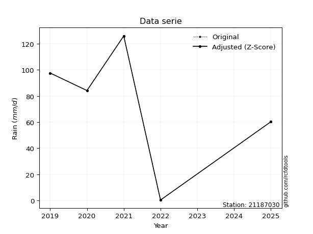</img>

</div>


> The initial value (value_initial) correspond to the initial obtained or null completed value, and value (value) is adjusted only when the initial value is outside the valid range (outlier) definite through the Z-Score value. If Z-Score is active, values out of range or outliers are replaced with the station mean value. A Z-Score (or standard score) measures how many standard deviations a data point is from the mean of a dataset, indicating its relative position; positive scores mean above the mean, negative mean below, and a score of zero is exactly at the mean, allowing for comparison of values from different distributions. It´s calculated using the formula $z=(x–μ)/σ$, where $x$ is the data point, $μ$ is the mean, and $σ$ is the standard deviation, helping identify outliers and understand probability.
>
> <sub>**Note**: In this study, "completing" (filling gaps in) and "extending" (forecasting or lengthening the historical record) rainfall data series are avoided for certain critical analyses because they introduce artificial bias and uncertainty, which can distort the statistics of rare events (extremes), alter day-to-day variability, and compromise the integrity and homogeneity of the original data. Some reasons against Completing/Extending rainfall data are: **Distortion of Extremes and Variability**: The primary issue is that most gap-filling or extension methods rely on averaging or regression with nearby stations, which inherently smooths the data. Rainfall is highly variable in space and time, with a large percentage of zero values and occasional large storms. Infilling methods often underestimate the highest values and overestimate the lowest (zero) values, which severely distorts analyses focused on flood frequency, drought severity, and intensity-duration-frequency (IDF) curves, **Loss of Data Homogeneity**: Infilled or extended data are synthetic estimates, not actual measurements. Combining these estimates with observed data can violate the assumption of data homogeneity, which requires that the data properties do not change over time. Inhomogeneity can lead to incorrect conclusions about long-term trends or changes in climate patterns, **Propagation of Errors**: Errors and biases from the original data (e.g., wind-induced undercatch, instrument errors, site changes) or the data used for imputation can propagate through the analysis, leading to unreliable hydrological models and inaccurate predictions, **Compromised Statistical Integrity**: For statistical analyses, especially those involving the frequency of events, using artificial data can introduce time bias or autocorrelation that doesn´t exist in reality, making it difficult to assess the true probability of events, **Difficulty in Validation**: It is difficult to accurately validate the quality of filled or extended data, especially for past periods where ground-truth measurements are unavailable. The reliability of imputation techniques heavily depends on the density of the surrounding station network and the complexity of the local topography.</sub>


### 4. Active continuous probability distributions from SciPy (80 of 104 available)

A Probability Density Function (PDF) describes the relative likelihood of a continuous random variable falling within a specific range, where the total area under its curve equals 1, and the area over any interval gives the actual probability for that range. Unlike discrete probabilities (like rolling a die), a PDF shows density, not direct probability for a single point (which is zero), with higher points indicating higher likelihood, often visualized as a bell curve for normal distributions.

A log of a probability density function (log-PDF) is simply the logarithm of the PDF´s value, denoted as $log(f(x))$, useful for converting multiplication of probabilities into addition, improving numerical stability with tiny numbers, and connecting to information theory concepts like entropy. Instead of dealing with very small probabilities (e.g., 0.000001), log-PDFs use negative numbers (e.g., $log(0.00001) ≈ -11.51$ that are easier for computers to handle, preventing underflow errors and simplifying complex calculations. In this study, each active probability distribution from SciPy is also evaluated in the $log$ form.

[scipy.stats](https://docs.scipy.org/doc/scipy/reference/stats.html) is a Python´s powerful submodule within the SciPy library for comprehensive statistical analysis, offering over 130 probability distributions (like Normal, Poisson, etc.), functions for descriptive stats (mean, variance), hypothesis testing (t-tests, chi-square), random variable generation, and statistical tests, making it essential for data science, modeling, and research. It provides tools to explore, model, and draw conclusions from data efficiently, working seamlessly with [NumPy](https://numpy.org/).

<div align="center">

|   id | p_dist           |   n_parameter | fit_method   | label                                                                       | active   | ref                                                                                                      |
|-----:|:-----------------|--------------:|:-------------|:----------------------------------------------------------------------------|:---------|:---------------------------------------------------------------------------------------------------------|
|    0 | alpha            |             3 | MLE          | Alpha                                                                       | True     | [:mortar_board:](https://docs.scipy.org/doc/scipy/reference/generated/scipy.stats.alpha.html)            |
|    1 | anglit           |             2 | MM           | Anglit                                                                      | True     | [:mortar_board:](https://docs.scipy.org/doc/scipy/reference/generated/scipy.stats.anglit.html)           |
|    2 | arcsine          |             2 | MM           | Arcsine                                                                     | True     | [:mortar_board:](https://docs.scipy.org/doc/scipy/reference/generated/scipy.stats.arcsine.html)          |
|    3 | argus            |             3 | MLE          | Argus                                                                       | True     | [:mortar_board:](https://docs.scipy.org/doc/scipy/reference/generated/scipy.stats.argus.html)            |
|    4 | beta             |             4 | MLE          | Beta                                                                        | True     | [:mortar_board:](https://docs.scipy.org/doc/scipy/reference/generated/scipy.stats.beta.html)             |
|    5 | betaprime        |             4 | MLE          | Beta prime                                                                  | True     | [:mortar_board:](https://docs.scipy.org/doc/scipy/reference/generated/scipy.stats.betaprime.html)        |
|    6 | bradford         |             3 | MLE          | Bradford                                                                    | True     | [:mortar_board:](https://docs.scipy.org/doc/scipy/reference/generated/scipy.stats.bradford.html)         |
|    7 | burr             |             4 | MLE          | Burr (Type III)                                                             | True     | [:mortar_board:](https://docs.scipy.org/doc/scipy/reference/generated/scipy.stats.burr.html)             |
|    8 | burr12           |             4 | MLE          | Burr (Type III) 12                                                          | True     | [:mortar_board:](https://docs.scipy.org/doc/scipy/reference/generated/scipy.stats.burr12.html)           |
|    9 | cosine           |             2 | MLE          | Cosine                                                                      | True     | [:mortar_board:](https://docs.scipy.org/doc/scipy/reference/generated/scipy.stats.cosine.html)           |
|   10 | crystalball      |             4 | MLE          | Crystalball                                                                 | True     | [:mortar_board:](https://docs.scipy.org/doc/scipy/reference/generated/scipy.stats.crystalball.html)      |
|   11 | dgamma           |             3 | MLE          | Double gamma                                                                | True     | [:mortar_board:](https://docs.scipy.org/doc/scipy/reference/generated/scipy.stats.dgamma.html)           |
|   12 | dweibull         |             3 | MLE          | Double Weibull                                                              | True     | [:mortar_board:](https://docs.scipy.org/doc/scipy/reference/generated/scipy.stats.dweibull.html)         |
|   13 | erlang           |             3 | MLE          | Erlang                                                                      | True     | [:mortar_board:](https://docs.scipy.org/doc/scipy/reference/generated/scipy.stats.erlang.html)           |
|   14 | exponnorm        |             3 | MLE          | Exponentially modified Normal                                               | True     | [:mortar_board:](https://docs.scipy.org/doc/scipy/reference/generated/scipy.stats.exponnorm.html)        |
|   15 | exponpow         |             3 | MLE          | Exponential power                                                           | True     | [:mortar_board:](https://docs.scipy.org/doc/scipy/reference/generated/scipy.stats.exponpow.html)         |
|   16 | exponweib        |             4 | MLE          | Exponentiated Weibull                                                       | True     | [:mortar_board:](https://docs.scipy.org/doc/scipy/reference/generated/scipy.stats.exponweib.html)        |
|   17 | f                |             4 | MLE          | F                                                                           | True     | [:mortar_board:](https://docs.scipy.org/doc/scipy/reference/generated/scipy.stats.f.html)                |
|   18 | fatiguelife      |             3 | MLE          | Fatigue-life (Birnbaum-Saunders)                                            | True     | [:mortar_board:](https://docs.scipy.org/doc/scipy/reference/generated/scipy.stats.fatiguelife.html)      |
|   19 | foldnorm         |             3 | MM           | Fold Normal                                                                 | True     | [:mortar_board:](https://docs.scipy.org/doc/scipy/reference/generated/scipy.stats.foldnorm.html)         |
|   20 | gamma            |             3 | MLE          | Gamma                                                                       | True     | [:mortar_board:](https://docs.scipy.org/doc/scipy/reference/generated/scipy.stats.gamma.html)            |
|   21 | gausshyper       |             6 | MLE          | Gauss hypergeometric                                                        | True     | [:mortar_board:](https://docs.scipy.org/doc/scipy/reference/generated/scipy.stats.gausshyper.html)       |
|   22 | genexpon         |             5 | MLE          | Generalized exponential                                                     | True     | [:mortar_board:](https://docs.scipy.org/doc/scipy/reference/generated/scipy.stats.genexpon.html)         |
|   23 | genextreme       |             3 | MLE          | Generalized exponential                                                     | True     | [:mortar_board:](https://docs.scipy.org/doc/scipy/reference/generated/scipy.stats.genextreme.html)       |
|   24 | gengamma         |             4 | MLE          | Generalized gamma                                                           | True     | [:mortar_board:](https://docs.scipy.org/doc/scipy/reference/generated/scipy.stats.gengamma.html)         |
|   25 | genhalflogistic  |             3 | MLE          | Generalized half-logistic                                                   | True     | [:mortar_board:](https://docs.scipy.org/doc/scipy/reference/generated/scipy.stats.genhalflogistic.html)  |
|   26 | genlogistic      |             3 | MLE          | Generalized logistic                                                        | True     | [:mortar_board:](https://docs.scipy.org/doc/scipy/reference/generated/scipy.stats.genlogistic.html)      |
|   27 | gennorm          |             3 | MLE          | Generalized Normal                                                          | True     | [:mortar_board:](https://docs.scipy.org/doc/scipy/reference/generated/scipy.stats.gennorm.html)          |
|   28 | genpareto        |             3 | MLE          | Generalized Pareto                                                          | True     | [:mortar_board:](https://docs.scipy.org/doc/scipy/reference/generated/scipy.stats.genpareto.html)        |
|   29 | gompertz         |             3 | MLE          | Gompertz (or truncated Gumbel)                                              | True     | [:mortar_board:](https://docs.scipy.org/doc/scipy/reference/generated/scipy.stats.gompertz.html)         |
|   30 | gumbel_l         |             2 | MM           | Gumbel Left Skew                                                            | True     | [:mortar_board:](https://docs.scipy.org/doc/scipy/reference/generated/scipy.stats.gumbel_l.html)         |
|   31 | gumbel_r         |             2 | MM           | Gumbel Right Skew                                                           | True     | [:mortar_board:](https://docs.scipy.org/doc/scipy/reference/generated/scipy.stats.gumbel_r.html)         |
|   32 | halfgennorm      |             3 | MLE          | Upper half of a generalized normal                                          | True     | [:mortar_board:](https://docs.scipy.org/doc/scipy/reference/generated/scipy.stats.halfgennorm.html)      |
|   33 | halflogistic     |             2 | MM           | Half-logistic                                                               | True     | [:mortar_board:](https://docs.scipy.org/doc/scipy/reference/generated/scipy.stats.halflogistic.html)     |
|   34 | halfnorm         |             2 | MM           | Half Normal                                                                 | True     | [:mortar_board:](https://docs.scipy.org/doc/scipy/reference/generated/scipy.stats.halfnorm.html)         |
|   35 | hypsecant        |             2 | MM           | hyperbolic secant                                                           | True     | [:mortar_board:](https://docs.scipy.org/doc/scipy/reference/generated/scipy.stats.hypsecant.html)        |
|   36 | invgamma         |             3 | MLE          | Inverted gamma                                                              | True     | [:mortar_board:](https://docs.scipy.org/doc/scipy/reference/generated/scipy.stats.invgamma.html)         |
|   37 | invgauss         |             3 | MLE          | Inverse Gaussian                                                            | True     | [:mortar_board:](https://docs.scipy.org/doc/scipy/reference/generated/scipy.stats.invgauss.html)         |
|   38 | invweibull       |             3 | MLE          | Inverted Weibull                                                            | True     | [:mortar_board:](https://docs.scipy.org/doc/scipy/reference/generated/scipy.stats.invweibull.html)       |
|   39 | johnsonsb        |             4 | MLE          | Johnson SB                                                                  | True     | [:mortar_board:](https://docs.scipy.org/doc/scipy/reference/generated/scipy.stats.johnsonsb.html)        |
|   40 | johnsonsu        |             4 | MLE          | Johnson Su                                                                  | True     | [:mortar_board:](https://docs.scipy.org/doc/scipy/reference/generated/scipy.stats.johnsonsu.html)        |
|   41 | kappa3           |             3 | MLE          | Kappa 3                                                                     | True     | [:mortar_board:](https://docs.scipy.org/doc/scipy/reference/generated/scipy.stats.kappa3.html)           |
|   42 | kappa4           |             4 | MLE          | Kappa 4                                                                     | True     | [:mortar_board:](https://docs.scipy.org/doc/scipy/reference/generated/scipy.stats.kappa4.html)           |
|   43 | ksone            |             3 | MLE          | Kolmogorov-Smirnov one-sided test statistic distribution                    | True     | [:mortar_board:](https://docs.scipy.org/doc/scipy/reference/generated/scipy.stats.ksone.html)            |
|   44 | kstwobign        |             2 | MLE          | Limiting distribution of scaled Kolmogorov-Smirnov two-sided test statistic | True     | [:mortar_board:](https://docs.scipy.org/doc/scipy/reference/generated/scipy.stats.kstwobign.html)        |
|   45 | laplace          |             2 | MM           | Laplace                                                                     | True     | [:mortar_board:](https://docs.scipy.org/doc/scipy/reference/generated/scipy.stats.laplace.html)          |
|   46 | levy_l           |             2 | MLE          | Left-skewed Levy                                                            | True     | [:mortar_board:](https://docs.scipy.org/doc/scipy/reference/generated/scipy.stats.levy_l.html)           |
|   47 | loggamma         |             3 | MLE          | Log gamma                                                                   | True     | [:mortar_board:](https://docs.scipy.org/doc/scipy/reference/generated/scipy.stats.loggamma.html)         |
|   48 | logistic         |             2 | MM           | Logistic (or Sech-squared)                                                  | True     | [:mortar_board:](https://docs.scipy.org/doc/scipy/reference/generated/scipy.stats.logistic.html)         |
|   49 | loglaplace       |             3 | MLE          | Log-Laplace                                                                 | True     | [:mortar_board:](https://docs.scipy.org/doc/scipy/reference/generated/scipy.stats.loglaplace.html)       |
|   50 | lomax            |             3 | MLE          | Lomax (Pareto of the second kind)                                           | True     | [:mortar_board:](https://docs.scipy.org/doc/scipy/reference/generated/scipy.stats.lomax.html)            |
|   51 | maxwell          |             2 | MM           | Maxwell                                                                     | True     | [:mortar_board:](https://docs.scipy.org/doc/scipy/reference/generated/scipy.stats.maxwell.html)          |
|   52 | mielke           |             4 | MLE          | Mielke Beta-Kappa / Dagum                                                   | True     | [:mortar_board:](https://docs.scipy.org/doc/scipy/reference/generated/scipy.stats.mielke.html)           |
|   53 | moyal            |             2 | MM           | Moyal                                                                       | True     | [:mortar_board:](https://docs.scipy.org/doc/scipy/reference/generated/scipy.stats.moyal.html)            |
|   54 | nakagami         |             3 | MLE          | Nakagami                                                                    | True     | [:mortar_board:](https://docs.scipy.org/doc/scipy/reference/generated/scipy.stats.nakagami.html)         |
|   55 | ncf              |             5 | MLE          | Non-central F distribution                                                  | True     | [:mortar_board:](https://docs.scipy.org/doc/scipy/reference/generated/scipy.stats.ncf.html)              |
|   56 | nct              |             4 | MLE          | Non-central Student’s t                                                     | True     | [:mortar_board:](https://docs.scipy.org/doc/scipy/reference/generated/scipy.stats.nct.html)              |
|   57 | norm             |             2 | MM           | Normal                                                                      | True     | [:mortar_board:](https://docs.scipy.org/doc/scipy/reference/generated/scipy.stats.norm.html)             |
|   58 | pearson3         |             3 | MM           | Pearson type III                                                            | True     | [:mortar_board:](https://docs.scipy.org/doc/scipy/reference/generated/scipy.stats.pearson3.html)         |
|   59 | powerlaw         |             3 | MLE          | Power-function                                                              | True     | [:mortar_board:](https://docs.scipy.org/doc/scipy/reference/generated/scipy.stats.powerlaw.html)         |
|   60 | rayleigh         |             2 | MM           | Rayleigh                                                                    | True     | [:mortar_board:](https://docs.scipy.org/doc/scipy/reference/generated/scipy.stats.rayleigh.html)         |
|   61 | rdist            |             3 | MLE          | R-distributed (symmetric beta)                                              | True     | [:mortar_board:](https://docs.scipy.org/doc/scipy/reference/generated/scipy.stats.rdist.html)            |
|   62 | rice             |             3 | MLE          | Rice                                                                        | True     | [:mortar_board:](https://docs.scipy.org/doc/scipy/reference/generated/scipy.stats.rice.html)             |
|   63 | semicircular     |             2 | MM           | Semicircular                                                                | True     | [:mortar_board:](https://docs.scipy.org/doc/scipy/reference/generated/scipy.stats.semicircular.html)     |
|   64 | skewnorm         |             3 | MLE          | Skew normal                                                                 | True     | [:mortar_board:](https://docs.scipy.org/doc/scipy/reference/generated/scipy.stats.skewnorm.html)         |
|   65 | t                |             3 | MLE          | Student’s t                                                                 | True     | [:mortar_board:](https://docs.scipy.org/doc/scipy/reference/generated/scipy.stats.t.html)                |
|   66 | trapezoid        |             4 | MLE          | Trapezoid                                                                   | True     | [:mortar_board:](https://docs.scipy.org/doc/scipy/reference/generated/scipy.stats.trapezoid.html)        |
|   67 | triang           |             3 | MLE          | Triangular                                                                  | True     | [:mortar_board:](https://docs.scipy.org/doc/scipy/reference/generated/scipy.stats.triang.html)           |
|   68 | truncexpon       |             3 | MLE          | Truncated exponential                                                       | True     | [:mortar_board:](https://docs.scipy.org/doc/scipy/reference/generated/scipy.stats.truncexpon.html)       |
|   69 | truncnorm        |             4 | MLE          | Truncated normal                                                            | True     | [:mortar_board:](https://docs.scipy.org/doc/scipy/reference/generated/scipy.stats.truncnorm.html)        |
|   70 | truncpareto      |             4 | MLE          | Upper truncated Pareto                                                      | True     | [:mortar_board:](https://docs.scipy.org/doc/scipy/reference/generated/scipy.stats.truncpareto.html)      |
|   71 | truncweibull_min |             5 | MLE          | Doubly truncated Weibull minimum                                            | True     | [:mortar_board:](https://docs.scipy.org/doc/scipy/reference/generated/scipy.stats.truncweibull_min.html) |
|   72 | tukeylambda      |             3 | MLE          | Tukey-Lamdba                                                                | True     | [:mortar_board:](https://docs.scipy.org/doc/scipy/reference/generated/scipy.stats.tukeylambda.html)      |
|   73 | uniform          |             2 | MLE          | Uniform                                                                     | True     | [:mortar_board:](https://docs.scipy.org/doc/scipy/reference/generated/scipy.stats.uniform.html)          |
|   74 | vonmises         |             3 | MLE          | Von Mises                                                                   | True     | [:mortar_board:](https://docs.scipy.org/doc/scipy/reference/generated/scipy.stats.vonmises.html)         |
|   75 | vonmises_line    |             3 | MLE          | Von Mises line                                                              | True     | [:mortar_board:](https://docs.scipy.org/doc/scipy/reference/generated/scipy.stats.vonmises_line.html)    |
|   76 | wald             |             2 | MM           | Wald                                                                        | True     | [:mortar_board:](https://docs.scipy.org/doc/scipy/reference/generated/scipy.stats.wald.html)             |
|   77 | weibull_max      |             3 | MLE          | Weibull maximum                                                             | True     | [:mortar_board:](https://docs.scipy.org/doc/scipy/reference/generated/scipy.stats.weibull_max.html)      |
|   78 | weibull_min      |             3 | MLE          | Weibull minimum                                                             | True     | [:mortar_board:](https://docs.scipy.org/doc/scipy/reference/generated/scipy.stats.weibull_min.html)      |
|   79 | wrapcauchy       |             3 | MLE          | Wrapped  Cauchy                                                             | True     | [:mortar_board:](https://docs.scipy.org/doc/scipy/reference/generated/scipy.stats.wrapcauchy.html)       |

</div>

> **n_parameter:** # arguments & localization & scale.
>
> **Fit methods:** (MLE) maximum likelihood, (MM) L-moments.
>
>**Inactive** (With the only purpose of prevent loops, zero divisions, infinite values, over high estimated values or horizontal trending for recurrence intervals estimations, the follow distributions were disabled.)**:** lognorm, norminvgauss, powernorm, powerlognorm, cauchy, halfcauchy, foldcauchy, skewcauchy, chi2, expon, fisk, genhyperbolic, geninvgauss, gibrat, kstwo, laplace_asymmetric, levy, levy_stable, ncx2, pareto, rel_breitwigner, recipinvgauss, studentized_range, loguniform, 


## B. Probability (PDF) vs. Empirical (EDF) distributions functions

A continuous probability distribution (CPD) describes probabilities for variables that can take any value within a range (like rain any time), unlike discrete variables with specific outcomes (like temperature). It uses a Probability Density Function (PDF), a curve where the total area under it equals 1, and the probability of the variable falling within an interval (a to b) is found by calculating the area under the curve between those points. A key feature is that the probability of hitting any single exact value is zero, so probabilities are always expressed for ranges, e.g., $P(a ≤ X ≤ b)$.

<div align="center">

Distributions parameters from station values
|     |   station | p_dist              |   n |             loc |            scale | shape                  | shape1                 | shape2               | shape3             |
|----:|----------:|:--------------------|----:|----------------:|-----------------:|:-----------------------|:-----------------------|:---------------------|:-------------------|
|   0 |  21187030 | alpha               |   5 |     0.000872605 |      0.891601    | 6.772291772288504e-08  |                        |                      |                    |
|   1 |  21187030 | anglit              |   5 |    73.7         |    123.902       |                        |                        |                      |                    |
|   2 |  21187030 | arcsine             |   5 |    13.8027      |    119.795       |                        |                        |                      |                    |
|   3 |  21187030 | argus               |   5 |   -39.3861      |    171.508       | 1.6404587977794103     |                        |                      |                    |
|   4 |  21187030 | beta                |   5 |   -12.57        |    138.57        | 1.4021720717135975     | 0.7229000831822413     |                      |                    |
|   5 |  21187030 | betaprime           |   5 | -1906.22        | 113684           | 2187.4765547628776     | 125627.31868669543     |                      |                    |
|   6 |  21187030 | bradford            |   5 |   -16.5141      |    142.514       | 1.908423456519601e-08  |                        |                      |                    |
|   7 |  21187030 | burr                |   5 |    -0.12794     |    129.566       | 128.98185050078473     | 0.005534438989009738   |                      |                    |
|   8 |  21187030 | burr12              |   5 |  -990.688       |   1568.07        | 32.399848166713        | 159131.48734910548     |                      |                    |
|   9 |  21187030 | cosine              |   5 |    69.8805      |     35.3665      |                        |                        |                      |                    |
|  10 |  21187030 | crystalball         |   5 |    73.7         |     42.3537      | 2640.09870834091       | 9191.723350779866      |                      |                    |
|  11 |  21187030 | dgamma              |   5 |    73.0338      |     17.2211      | 2.0215410117104557     |                        |                      |                    |
|  12 |  21187030 | dweibull            |   5 |    84.2         |     39.0327      | 0.1406260621681053     |                        |                      |                    |
|  13 |  21187030 | erlang              |   5 |  -607.524       |      2.7785      | 244.97685238385964     |                        |                      |                    |
|  14 |  21187030 | exponnorm           |   5 |    73.6705      |     42.3534      | 0.0006945222984078778  |                        |                      |                    |
|  15 |  21187030 | exponpow            |   5 |     0.4         |      3.46812     | 0.10571179325214095    |                        |                      |                    |
|  16 |  21187030 | exponweib           |   5 | -2119.19        |   1614.7         | 1792.729010029938      | 6.781876022058523      |                      |                    |
|  17 |  21187030 | f                   |   5 |     0.4         |     55.7244      | 1.467058023160294      | 12.44413693813246      |                      |                    |
|  18 |  21187030 | fatiguelife         |   5 |     0.4         |      0.000100118 | 920.6501337334196      |                        |                      |                    |
|  19 |  21187030 | foldnorm            |   5 |   -61.3977      |     39.1168      | 3.475587145479887      |                        |                      |                    |
|  20 |  21187030 | gamma               |   5 |  -625.66        |      2.67916     | 260.88448832165477     |                        |                      |                    |
|  21 |  21187030 | gausshyper          |   5 |   -12.4977      |    138.498       | 1.2190802937150194     | 0.5367341620577337     | 1.1885621238357538   | 1.03483036617622   |
|  22 |  21187030 | genexpon            |   5 |     0.399873    |      2.44882     | 0.0331462939045462     | 6.211817425060917e-08  | 2.21117333074673     |                    |
|  23 |  21187030 | genextreme          |   5 |    74.5734      |     54.4791      | 1.059355877241615      |                        |                      |                    |
|  24 |  21187030 | gengamma            |   5 |  -697.066       |      4.29298     | 272.55920450821145     | 1.0805094490045222     |                      |                    |
|  25 |  21187030 | genhalflogistic     |   5 |   -19.9023      |    147.212       | 1.0089782527671283     |                        |                      |                    |
|  26 |  21187030 | genlogistic         |   5 |   113.962       |     11.044       | 0.25143725603396516    |                        |                      |                    |
|  27 |  21187030 | gennorm             |   5 |    84.2         |      1.87157     | 0.4035775505881663     |                        |                      |                    |
|  28 |  21187030 | genpareto           |   5 |    -0.941367    |    258.544       | -2.0367159158826826    |                        |                      |                    |
|  29 |  21187030 | gompertz            |   5 |    60.3         |     25.7618      | 0.2410562660362603     |                        |                      |                    |
|  30 |  21187030 | gumbel_l            |   5 |    92.7614      |     33.0231      |                        |                        |                      |                    |
|  31 |  21187030 | gumbel_r            |   5 |    54.6386      |     33.0231      |                        |                        |                      |                    |
|  32 |  21187030 | halfgennorm         |   5 |     0.4         |      3.68401     | 0.3724033821156234     |                        |                      |                    |
|  33 |  21187030 | halflogistic        |   5 |    23.5009      |     36.211       |                        |                        |                      |                    |
|  34 |  21187030 | halfnorm            |   5 |    17.6402      |     70.2605      |                        |                        |                      |                    |
|  35 |  21187030 | hypsecant           |   5 |    73.7         |     26.9632      |                        |                        |                      |                    |
|  36 |  21187030 | invgamma            |   5 |    -5.57064e-05 |      0.507825    | 0.2586000370065621     |                        |                      |                    |
|  37 |  21187030 | invgauss            |   5 |  -105.748       |   2137.94        | 0.08332707822664612    |                        |                      |                    |
|  38 |  21187030 | invweibull          |   5 |     0.4         |      3.14779     | 0.04587981159434494    |                        |                      |                    |
|  39 |  21187030 | johnsonsb           |   5 |   -21.092       |    147.092       | -0.737449821972139     | 0.1599898228271911     |                      |                    |
|  40 |  21187030 | johnsonsu           |   5 |   159.78        |      2.37513     | 8.109934448803426      | 1.950435524263427      |                      |                    |
|  41 |  21187030 | kappa3              |   5 |     0.396296    |    125.603       | 230101.09491917753     |                        |                      |                    |
|  42 |  21187030 | kappa4              |   5 |     0.362861    |    137.412       | 0.9991881541877139     | 1.0937186846429954     |                      |                    |
|  43 |  21187030 | ksone               |   5 |     0.341156    |    146.718       | 1.0                    |                        |                      |                    |
|  44 |  21187030 | kstwobign           |   5 |  -102.68        |    201.172       |                        |                        |                      |                    |
|  45 |  21187030 | laplace             |   5 |    73.7         |     29.9486      |                        |                        |                      |                    |
|  46 |  21187030 | levy_l              |   5 |   130.156       |     15.8668      |                        |                        |                      |                    |
|  47 |  21187030 | loggamma            |   5 |   119.262       |     17.0434      | 0.38512691994641707    |                        |                      |                    |
|  48 |  21187030 | logistic            |   5 |    73.7         |     23.3508      |                        |                        |                      |                    |
|  49 |  21187030 | loglaplace          |   5 |    -0.237987    |     84.438       | 0.8667704787390724     |                        |                      |                    |
|  50 |  21187030 | lomax               |   5 |     0.4         |      2.88183e+11 | 3950053595.40283       |                        |                      |                    |
|  51 |  21187030 | maxwell             |   5 |   -26.6606      |     62.8917      |                        |                        |                      |                    |
|  52 |  21187030 | mielke              |   5 |     0.399974    |    126.897       | 0.8558769787300233     | 129.56545098595137     |                      |                    |
|  53 |  21187030 | moyal               |   5 |    49.4794      |     19.0659      |                        |                        |                      |                    |
|  54 |  21187030 | nakagami            |   5 |     0.4         |     82.8175      | 0.11014266863358504    |                        |                      |                    |
|  55 |  21187030 | ncf                 |   5 |     0.4         |      6.8772      | 0.2373654567790381     | 38.32089473778976      | 1.9101605826746506   |                    |
|  56 |  21187030 | nct                 |   5 |     0.393329    |      0.00330357  | 0.19423446959019214    | 4.875394224307064      |                      |                    |
|  57 |  21187030 | norm                |   5 |    73.7         |     42.3537      |                        |                        |                      |                    |
|  58 |  21187030 | pearson3            |   5 |    73.7         |     42.3538      | -0.6275043092054488    |                        |                      |                    |
|  59 |  21187030 | powerlaw            |   5 |     0.4         |    125.6         | 0.11450956008041273    |                        |                      |                    |
|  60 |  21187030 | rayleigh            |   5 |    -7.32519     |     64.6488      |                        |                        |                      |                    |
|  61 |  21187030 | rdist               |   5 |   -11.7956      |     72.0956      | 0.9819640267227777     |                        |                      |                    |
|  62 |  21187030 | rice                |   5 |   -27.8263      |     46.6035      | 1.8899323452162942     |                        |                      |                    |
|  63 |  21187030 | semicircular        |   5 |    73.7         |     84.7075      |                        |                        |                      |                    |
|  64 |  21187030 | skewnorm            |   5 |   126           |     67.305       | -55156632.094443515    |                        |                      |                    |
|  65 |  21187030 | t                   |   5 |    73.7006      |     42.3537      | 17897289.682382885     |                        |                      |                    |
|  66 |  21187030 | trapezoid           |   5 |   -48.3992      |    179.692       | 1.0                    | 1.0                    |                      |                    |
|  67 |  21187030 | triang              |   5 |   -34.687       |    160.687       | 0.9999994196039577     |                        |                      |                    |
|  68 |  21187030 | truncexpon          |   5 |    -5.87476     |    221.584       | 0.595145359466775      |                        |                      |                    |
|  69 |  21187030 | truncnorm           |   5 |    73.9479      |     42.1723      | -7.08541067118432      | 3.407922840199948      |                      |                    |
|  70 |  21187030 | truncpareto         |   5 |    -0.293869    |      0.690225    | 3.8052749721069876e-08 | 182.97495496668458     |                      |                    |
|  71 |  21187030 | truncweibull_min    |   5 |    -8.5032      |    228.311       | 1.3761976889970677     | 0.0009205784994747078  | 0.5891239630821741   |                    |
|  72 |  21187030 | tukeylambda         |   5 |    63.2002      |     67.5204      | 1.0751619456557182     |                        |                      |                    |
|  73 |  21187030 | uniform             |   5 |     0.4         |    125.6         |                        |                        |                      |                    |
|  74 |  21187030 | vonmises            |   5 |     2.53104     |      1           | 0.36978529778330005    |                        |                      |                    |
|  75 |  21187030 | vonmises_line       |   5 |    62.09        |     20.3433      | 1.8583517047202668e-06 |                        |                      |                    |
|  76 |  21187030 | wald                |   5 |    31.3463      |     42.3537      |                        |                        |                      |                    |
|  77 |  21187030 | weibull_max         |   5 |   126           |      1.5885      | 0.29122334914063913    |                        |                      |                    |
|  78 |  21187030 | weibull_min         |   5 |    -8.02073e+08 |      8.02073e+08 | 24254925.584042326     |                        |                      |                    |
|  79 |  21187030 | wrapcauchy          |   5 |     0.399979    |     19.9899      | 0.20520345262834486    |                        |                      |                    |
|  80 |  21187030 | logalpha            |   5 |   -44.6211      |    990.768       | 20.73931382920425      |                        |                      |                    |
|  81 |  21187030 | loganglit           |   5 |     3.40668     |      6.36153     |                        |                        |                      |                    |
|  82 |  21187030 | logarcsine          |   5 |     0.331327    |      6.1507      |                        |                        |                      |                    |
|  83 |  21187030 | logargus            |   5 |    -3.26098     |      8.24595     | 3.2060400361746826     |                        |                      |                    |
|  84 |  21187030 | logbeta             |   5 |    -1.61139     |      6.44768     | 0.05788471453828994    | 0.01525768010452527    |                      |                    |
|  85 |  21187030 | logbetaprime        |   5 |    -0.916291    |      3.14062     | 0.10992386531109753    | 0.5747497355160183     |                      |                    |
|  86 |  21187030 | logbradford         |   5 |    -0.916302    |      6.21554     | 0.00011636296556305801 |                        |                      |                    |
|  87 |  21187030 | logburr             |   5 |    -0.916291    |      1.39933     | 0.5351756144506992     | 0.2324854847574718     |                      |                    |
|  88 |  21187030 | logburr12           |   5 |    -0.916291    |      3.23309     | 0.14948860306134532    | 0.5088105227007691     |                      |                    |
|  89 |  21187030 | logcosine           |   5 |     2.98208     |      1.86973     |                        |                        |                      |                    |
|  90 |  21187030 | logcrystalball      |   5 |     3.40668     |      2.17458     | 9141.679738242841      | 86.15262560956776      |                      |                    |
|  91 |  21187030 | logdgamma           |   5 |     4.58088     |      1.47534     | 0.7031144972020824     |                        |                      |                    |
|  92 |  21187030 | logdweibull         |   5 |     4.58088     |      1.94227     | 0.6513080434181416     |                        |                      |                    |
|  93 |  21187030 | logerlang           |   5 |   -27.5437      |      0.168327    | 183.61524250262107     |                        |                      |                    |
|  94 |  21187030 | logexponnorm        |   5 |     3.40548     |      2.17458     | 0.0005500504601194043  |                        |                      |                    |
|  95 |  21187030 | logexponpow         |   5 |    -0.916291    |      2.5699      | 0.3909830932131364     |                        |                      |                    |
|  96 |  21187030 | logexponweib        |   5 |    -0.916291    |      1.71688     | 1.9290308169325265     | 0.39060641454345024    |                      |                    |
|  97 |  21187030 | logf                |   5 |    -0.916291    |      1.12161     | 1.118018596344033      | 1.136483074443551      |                      |                    |
|  98 |  21187030 | logfatiguelife      |   5 |    -0.916291    |      5.27931e-07 | 2764.594220018822      |                        |                      |                    |
|  99 |  21187030 | logfoldnorm         |   5 |    -9.80763     |      1.71459     | 7.774356383296518      |                        |                      |                    |
| 100 |  21187030 | loggamma            |   5 |   -33.7788      |      0.143089    | 259.5718429515646      |                        |                      |                    |
| 101 |  21187030 | loggausshyper       |   5 |    -1.33994     |      6.17622     | 1.3641109857035616     | 0.352435901563977      | 1.1394631156816049   | 1.0206031727054565 |
| 102 |  21187030 | loggenexpon         |   5 |    -0.916291    |      1.15451     | 0.11069493135797964    | 2.8563976827975157     | 0.023683615963507987 |                    |
| 103 |  21187030 | loggenextreme       |   5 |     2.73382     |      2.47683     | 1.1780643268566435     |                        |                      |                    |
| 104 |  21187030 | loggengamma         |   5 |    -0.916291    |      3.49827     | 0.17661228611757768    | 0.7937915568069981     |                      |                    |
| 105 |  21187030 | loggenhalflogistic  |   5 |    -1.53434     |      6.88899     | 1.0813692537772093     |                        |                      |                    |
| 106 |  21187030 | loggenlogistic      |   5 |     4.83643     |      1.50601e-05 | 1.0587701765365239e-05 |                        |                      |                    |
| 107 |  21187030 | loggennorm          |   5 |     4.58088     |      1.23332e-12 | 0.09407689271915193    |                        |                      |                    |
| 108 |  21187030 | loggenpareto        |   5 |    -1.17852     |      9.84753     | -1.6372169668056076    |                        |                      |                    |
| 109 |  21187030 | loggompertz         |   5 |    -0.916298    |      1.19739     | 0.013523327927298608   |                        |                      |                    |
| 110 |  21187030 | loggumbel_l         |   5 |     4.38536     |      1.69552     |                        |                        |                      |                    |
| 111 |  21187030 | loggumbel_r         |   5 |     2.428       |      1.69552     |                        |                        |                      |                    |
| 112 |  21187030 | loghalfgennorm      |   5 |    -0.916291    |      2.0027      | 0.6718260498312549     |                        |                      |                    |
| 113 |  21187030 | loghalflogistic     |   5 |     0.82926     |      1.85921     |                        |                        |                      |                    |
| 114 |  21187030 | loghalfnorm         |   5 |     0.528391    |      3.60741     |                        |                        |                      |                    |
| 115 |  21187030 | loghypsecant        |   5 |     3.40668     |      1.38438     |                        |                        |                      |                    |
| 116 |  21187030 | loginvgamma         |   5 |   -45.6152      |  22097.7         | 452.090573135833       |                        |                      |                    |
| 117 |  21187030 | loginvgauss         |   5 |   -19.7075      |   2132.92        | 0.010804339180306054   |                        |                      |                    |
| 118 |  21187030 | loginvweibull       |   5 |  -369.158       |    371.007       | 149.49708051654488     |                        |                      |                    |
| 119 |  21187030 | logjohnsonsb        |   5 |    -3.09218     |      7.92846     | -0.3896227615724963    | 0.07087301507716937    |                      |                    |
| 120 |  21187030 | logjohnsonsu        |   5 |     4.83628     |      4.54338e-17 | 2.4968332882591375     | 0.11467290217731188    |                      |                    |
| 121 |  21187030 | logkappa3           |   5 |    -0.924333    |      5.75843     | 4229.991611390294      |                        |                      |                    |
| 122 |  21187030 | logkappa4           |   5 |    -1.22039     |      7.17822     | 1.0444186601829606     | 1.1809027603058198     |                      |                    |
| 123 |  21187030 | logksone            |   5 |    -1.49155     |      6.90309     | 1.0                    |                        |                      |                    |
| 124 |  21187030 | logkstwobign        |   5 |    -6.79249     |     11.6224      |                        |                        |                      |                    |
| 125 |  21187030 | loglaplace          |   5 |     3.40668     |      1.53766     |                        |                        |                      |                    |
| 126 |  21187030 | loglevy_l           |   5 |     4.88099     |      0.170163    |                        |                        |                      |                    |
| 127 |  21187030 | logloggamma         |   5 |     4.83631     |      2.28088e-06 | 1.5912507886497388e-06 |                        |                      |                    |
| 128 |  21187030 | loglogistic         |   5 |     3.40668     |      1.19891     |                        |                        |                      |                    |
| 129 |  21187030 | logloglaplace       |   5 |    -0.916291    |      1.83776     | 0.11963594996876883    |                        |                      |                    |
| 130 |  21187030 | loglomax            |   5 |    -0.916291    |    193.341       | 43.446552936455916     |                        |                      |                    |
| 131 |  21187030 | logmaxwell          |   5 |    -1.74617     |      3.22907     |                        |                        |                      |                    |
| 132 |  21187030 | logmielke           |   5 |    -0.916291    |      2.65787     | 0.12446977139619747    | 0.8735151465776393     |                      |                    |
| 133 |  21187030 | logmoyal            |   5 |     2.16311     |      0.978907    |                        |                        |                      |                    |
| 134 |  21187030 | lognakagami         |   5 | -1517.32        |   1520.73        | 122140.85713301768     |                        |                      |                    |
| 135 |  21187030 | logncf              |   5 |    -0.916291    |      1.12357     | 1.0067938844111062     | 1.1750210741402944     | 1.0828321540682966   |                    |
| 136 |  21187030 | lognct              |   5 |  -135.569       |      2.11455     | 33947.85722205718      | 65.72136775043495      |                      |                    |
| 137 |  21187030 | lognorm             |   5 |     3.40668     |      2.17458     |                        |                        |                      |                    |
| 138 |  21187030 | logpearson3         |   5 |     3.40668     |      2.1746      | -1.4554780638257976    |                        |                      |                    |
| 139 |  21187030 | logpowerlaw         |   5 |    -0.916291    |      5.75257     | 0.12906024120902812    |                        |                      |                    |
| 140 |  21187030 | lograyleigh         |   5 |    -0.753394    |      3.31926     |                        |                        |                      |                    |
| 141 |  21187030 | logrdist            |   5 |    -0.916501    |      0.000210113 | 0.5228948847270231     |                        |                      |                    |
| 142 |  21187030 | logrice             |   5 | -2809.81        |      2.17384     | 1294.1249653840928     |                        |                      |                    |
| 143 |  21187030 | logsemicircular     |   5 |     3.40668     |      4.34917     |                        |                        |                      |                    |
| 144 |  21187030 | logskewnorm         |   5 |     4.83629     |      2.60288     | -3454061.55112952      |                        |                      |                    |
| 145 |  21187030 | logt                |   5 |     4.51092     |      0.204491    | 0.6911105199563775     |                        |                      |                    |
| 146 |  21187030 | logtrapezoid        |   5 |    -2.88117     |      9.22598     | 1.0                    | 1.0                    |                      |                    |
| 147 |  21187030 | logtriang           |   5 |    -2.1188      |      6.95518     | 0.9999860067792248     |                        |                      |                    |
| 148 |  21187030 | logtruncexpon       |   5 |    -0.916292    |      8.98483     | 0.6402545597273221     |                        |                      |                    |
| 149 |  21187030 | logtruncnorm        |   5 |     3.32018     |      8.85343     | -0.5908322689853306    | 0.17124497336268696    |                      |                    |
| 150 |  21187030 | logtruncpareto      |   5 |    -0.96114     |      0.0448494   | 0.0019310301680882944  | 129.2642419561906      |                      |                    |
| 151 |  21187030 | logtruncweibull_min |   5 |    -1.21709     |      8.52982     | 1.472282527420087      | 0.00039654958512876836 | 0.7096722181749174   |                    |
| 152 |  21187030 | logtukeylambda      |   5 |    -0.916291    |      5.40036e-14 | 2.927555431768245      |                        |                      |                    |
| 153 |  21187030 | loguniform          |   5 |    -0.916291    |      5.75257     |                        |                        |                      |                    |
| 154 |  21187030 | logvonmises         |   5 |    -1.62555     |      1           | 6.016297416123739      |                        |                      |                    |
| 155 |  21187030 | logvonmises_line    |   5 |     3.85342     |      1.51825     | 1.0051188234281514     |                        |                      |                    |
| 156 |  21187030 | logwald             |   5 |     1.23211     |      2.17457     |                        |                        |                      |                    |
| 157 |  21187030 | logweibull_max      |   5 |     4.83628     |      3.48278     | 0.3286215869841773     |                        |                      |                    |
| 158 |  21187030 | logweibull_min      |   5 |    -0.916291    |      2.68021     | 0.6621603895116963     |                        |                      |                    |
| 159 |  21187030 | logwrapcauchy       |   5 |    -0.921796    |      0.916427    | 0.8289722215436813     |                        |                      |                    |

</div>

> **loc** (Location parameter): This shifts the distribution along the x-axis. For many common distributions, like the normal (Gaussian) distribution, loc represents the mean $μ$. For others, like the uniform distribution, it might represent the minimum value, or for the beta distribution, the left end of the support interval.
>
> **scale** (Scale parameter): This determines the width or spread of the distribution. For the normal distribution, scale represents the standard deviation $σ$. For a uniform distribution, it defines the length of the interval (from $loc$ to $loc + scale$).
>
> **shape** (Shape parameters): Refers to parameters that define the specific form of a probability distribution, distinct from its location (loc) and scale (scale). These parameters are required arguments for most distribution functions. For example, a normal (Gaussian) distribution is fully defined by its location (mean) and scale (standard deviation), so it has no specific shape parameters beyond loc and scale. However, other distributions have intrinsic properties that need specification, as Gamma distribution that takes a shape parameter, often named $a$ or $alpha$.


### 0. Cumulative distribution values - CDF (160 evaluated)

Cumulative Distribution Function (CDF), denoted as $F$<sub>$X$</sub>$(x)$, is a function that gives the probability that a random variable $X$ will take a value less than or equal to a specific value, $x$ (i.e., $(P(X≥x)$. It essentially "accumulates" probabilities from a given point up to the far right (positive infinity), providing a complete picture of the distribution´s probabilities for both discrete (like rain) and continuous (like temperature) variables, helping to find probabilities over ranges or above certain values. Each station is evaluated separately ordering the $x$ values ascending, calculating the CDF and PDF values for the activated distributions and their logarithmic forms.

<div align="center">

CDF ordered by x ascending and calculating $log(f(x))$ separately
|   id |   Station |   date |     x |   count |   mean |     std |    zscore |   Value_initial |   station |   m |     alpha |   alpha_pdf |    anglit |   anglit_pdf |   arcsine |   arcsine_pdf |     argus |   argus_pdf |      beta |     beta_pdf |   betaprime |   betaprime_pdf |   bradford |   bradford_pdf |      burr |     burr_pdf |    burr12 |   burr12_pdf |    cosine |   cosine_pdf |   crystalball |   crystalball_pdf |    dgamma |   dgamma_pdf |   dweibull |   dweibull_pdf |    erlang |   erlang_pdf |   exponnorm |   exponnorm_pdf |   exponpow |   exponpow_pdf |   exponweib |   exponweib_pdf |           f |        f_pdf |   fatiguelife |   fatiguelife_pdf |   foldnorm |   foldnorm_pdf |     gamma |   gamma_pdf |   gausshyper |   gausshyper_pdf |    genexpon |   genexpon_pdf |   genextreme |   genextreme_pdf |   gengamma |   gengamma_pdf |   genhalflogistic |   genhalflogistic_pdf |   genlogistic |   genlogistic_pdf |   gennorm |   gennorm_pdf |   genpareto |   genpareto_pdf |    gompertz |   gompertz_pdf |   gumbel_l |   gumbel_l_pdf |   gumbel_r |   gumbel_r_pdf |   halfgennorm |   halfgennorm_pdf |   halflogistic |   halflogistic_pdf |   halfnorm |   halfnorm_pdf |   hypsecant |   hypsecant_pdf |   invgamma |   invgamma_pdf |   invgauss |   invgauss_pdf |   invweibull |   invweibull_pdf |   johnsonsb |   johnsonsb_pdf |   johnsonsu |   johnsonsu_pdf |      kappa3 |   kappa3_pdf |     kappa4 |   kappa4_pdf |      ksone |   ksone_pdf |   kstwobign |   kstwobign_pdf |   laplace |   laplace_pdf |   levy_l |   levy_l_pdf |   loggamma |   loggamma_pdf |   logistic |   logistic_pdf |   loglaplace |   loglaplace_pdf |       lomax |   lomax_pdf |   maxwell |   maxwell_pdf |      mielke |   mielke_pdf |       moyal |   moyal_pdf |    nakagami |   nakagami_pdf |        ncf |     ncf_pdf |       nct |      nct_pdf |      norm |   norm_pdf |   pearson3 |   pearson3_pdf |   powerlaw |   powerlaw_pdf |   rayleigh |   rayleigh_pdf |   rdist |       rdist_pdf |      rice |   rice_pdf |   semicircular |   semicircular_pdf |   skewnorm |   skewnorm_pdf |         t |      t_pdf |   trapezoid |   trapezoid_pdf |    triang |   triang_pdf |   truncexpon |   truncexpon_pdf |   truncnorm |   truncnorm_pdf |   truncpareto |   truncpareto_pdf |   truncweibull_min |   truncweibull_min_pdf |   tukeylambda |   tukeylambda_pdf |   uniform |   uniform_pdf |   vonmises |   vonmises_pdf |   vonmises_line |   vonmises_line_pdf |     wald |   wald_pdf |   weibull_max |   weibull_max_pdf |   weibull_min |   weibull_min_pdf |   wrapcauchy |   wrapcauchy_pdf |   logalpha |   logalpha_pdf |   loganglit |   loganglit_pdf |   logarcsine |   logarcsine_pdf |   logargus |   logargus_pdf |   logbeta |   logbeta_pdf |   logbetaprime |   logbetaprime_pdf |   logbradford |   logbradford_pdf |   logburr |   logburr_pdf |   logburr12 |   logburr12_pdf |   logcosine |   logcosine_pdf |   logcrystalball |   logcrystalball_pdf |   logdgamma |   logdgamma_pdf |   logdweibull |   logdweibull_pdf |   logerlang |   logerlang_pdf |   logexponnorm |   logexponnorm_pdf |   logexponpow |   logexponpow_pdf |   logexponweib |   logexponweib_pdf |        logf |   logf_pdf |   logfatiguelife |   logfatiguelife_pdf |   logfoldnorm |   logfoldnorm_pdf |   loggausshyper |   loggausshyper_pdf |   loggenexpon |   loggenexpon_pdf |   loggenextreme |   loggenextreme_pdf |   loggengamma |   loggengamma_pdf |   loggenhalflogistic |   loggenhalflogistic_pdf |   loggenlogistic |   loggenlogistic_pdf |   loggennorm |   loggennorm_pdf |   loggenpareto |   loggenpareto_pdf |   loggompertz |   loggompertz_pdf |   loggumbel_l |   loggumbel_l_pdf |   loggumbel_r |   loggumbel_r_pdf |   loghalfgennorm |   loghalfgennorm_pdf |   loghalflogistic |   loghalflogistic_pdf |   loghalfnorm |   loghalfnorm_pdf |   loghypsecant |   loghypsecant_pdf |   loginvgamma |   loginvgamma_pdf |   loginvgauss |   loginvgauss_pdf |   loginvweibull |   loginvweibull_pdf |   logjohnsonsb |   logjohnsonsb_pdf |   logjohnsonsu |   logjohnsonsu_pdf |   logkappa3 |   logkappa3_pdf |   logkappa4 |   logkappa4_pdf |   logksone |   logksone_pdf |   logkstwobign |   logkstwobign_pdf |   loglevy_l |   loglevy_l_pdf |   logloggamma |   logloggamma_pdf |   loglogistic |   loglogistic_pdf |   logloglaplace |   logloglaplace_pdf |    loglomax |   loglomax_pdf |   logmaxwell |   logmaxwell_pdf |   logmielke |   logmielke_pdf |    logmoyal |   logmoyal_pdf |   lognakagami |   lognakagami_pdf |      logncf |   logncf_pdf |    lognct |   lognct_pdf |   lognorm |   lognorm_pdf |   logpearson3 |   logpearson3_pdf |   logpowerlaw |   logpowerlaw_pdf |   lograyleigh |   lograyleigh_pdf |   logrdist |   logrdist_pdf |   logrice |   logrice_pdf |   logsemicircular |   logsemicircular_pdf |   logskewnorm |   logskewnorm_pdf |      logt |   logt_pdf |   logtrapezoid |   logtrapezoid_pdf |   logtriang |   logtriang_pdf |   logtruncexpon |   logtruncexpon_pdf |   logtruncnorm |   logtruncnorm_pdf |   logtruncpareto |   logtruncpareto_pdf |   logtruncweibull_min |   logtruncweibull_min_pdf |   logtukeylambda |   logtukeylambda_pdf |   loguniform |   loguniform_pdf |   logvonmises |   logvonmises_pdf |   logvonmises_line |   logvonmises_line_pdf |   logwald |   logwald_pdf |   logweibull_max |   logweibull_max_pdf |   logweibull_min |   logweibull_min_pdf |   logwrapcauchy |   logwrapcauchy_pdf |
|-----:|----------:|-------:|------:|--------:|-------:|--------:|----------:|----------------:|----------:|----:|----------:|------------:|----------:|-------------:|----------:|--------------:|----------:|------------:|----------:|-------------:|------------:|----------------:|-----------:|---------------:|----------:|-------------:|----------:|-------------:|----------:|-------------:|--------------:|------------------:|----------:|-------------:|-----------:|---------------:|----------:|-------------:|------------:|----------------:|-----------:|---------------:|------------:|----------------:|------------:|-------------:|--------------:|------------------:|-----------:|---------------:|----------:|------------:|-------------:|-----------------:|------------:|---------------:|-------------:|-----------------:|-----------:|---------------:|------------------:|----------------------:|--------------:|------------------:|----------:|--------------:|------------:|----------------:|------------:|---------------:|-----------:|---------------:|-----------:|---------------:|--------------:|------------------:|---------------:|-------------------:|-----------:|---------------:|------------:|----------------:|-----------:|---------------:|-----------:|---------------:|-------------:|-----------------:|------------:|----------------:|------------:|----------------:|------------:|-------------:|-----------:|-------------:|-----------:|------------:|------------:|----------------:|----------:|--------------:|---------:|-------------:|-----------:|---------------:|-----------:|---------------:|-------------:|-----------------:|------------:|------------:|----------:|--------------:|------------:|-------------:|------------:|------------:|------------:|---------------:|-----------:|------------:|----------:|-------------:|----------:|-----------:|-----------:|---------------:|-----------:|---------------:|-----------:|---------------:|--------:|----------------:|----------:|-----------:|---------------:|-------------------:|-----------:|---------------:|----------:|-----------:|------------:|----------------:|----------:|-------------:|-------------:|-----------------:|------------:|----------------:|--------------:|------------------:|-------------------:|-----------------------:|--------------:|------------------:|----------:|--------------:|-----------:|---------------:|----------------:|--------------------:|---------:|-----------:|--------------:|------------------:|--------------:|------------------:|-------------:|-----------------:|-----------:|---------------:|------------:|----------------:|-------------:|-----------------:|-----------:|---------------:|----------:|--------------:|---------------:|-------------------:|--------------:|------------------:|----------:|--------------:|------------:|----------------:|------------:|----------------:|-----------------:|---------------------:|------------:|----------------:|--------------:|------------------:|------------:|----------------:|---------------:|-------------------:|--------------:|------------------:|---------------:|-------------------:|------------:|-----------:|-----------------:|---------------------:|--------------:|------------------:|----------------:|--------------------:|--------------:|------------------:|----------------:|--------------------:|--------------:|------------------:|---------------------:|-------------------------:|-----------------:|---------------------:|-------------:|-----------------:|---------------:|-------------------:|--------------:|------------------:|--------------:|------------------:|--------------:|------------------:|-----------------:|---------------------:|------------------:|----------------------:|--------------:|------------------:|---------------:|-------------------:|--------------:|------------------:|--------------:|------------------:|----------------:|--------------------:|---------------:|-------------------:|---------------:|-------------------:|------------:|----------------:|------------:|----------------:|-----------:|---------------:|---------------:|-------------------:|------------:|----------------:|--------------:|------------------:|--------------:|------------------:|----------------:|--------------------:|------------:|---------------:|-------------:|-----------------:|------------:|----------------:|------------:|---------------:|--------------:|------------------:|------------:|-------------:|----------:|-------------:|----------:|--------------:|--------------:|------------------:|--------------:|------------------:|--------------:|------------------:|-----------:|---------------:|----------:|--------------:|------------------:|----------------------:|--------------:|------------------:|----------:|-----------:|---------------:|-------------------:|------------:|----------------:|----------------:|--------------------:|---------------:|-------------------:|-----------------:|---------------------:|----------------------:|--------------------------:|-----------------:|---------------------:|-------------:|-----------------:|--------------:|------------------:|-------------------:|-----------------------:|----------:|--------------:|-----------------:|---------------------:|-----------------:|---------------------:|----------------:|--------------------:|
|    0 |  21187030 |   2022 |   0.4 |       5 |   73.7 | 47.3529 | -1.54795  |             0.4 |  21187030 |   1 | 0.0254913 | 0.368366    | 0.0370905 |   0.00305054 |  0        |    0          | 0.0452174 |  0.00232397 | 0.0247279 |   0.00270433 |    0.042511 |      0.00217536 |   0.118684 |     0.00701685 | 0.0196781 | nan          | 0.0541868 |   0.00172255 | 0.0403531 |   0.0027735  |     0.0417561 |        0.00210679 | 0.0394744 |   0.00184374 |   0.164216 |    0.00030683  | 0.0431888 |   0.00227415 |   0.0417552 |      0.00210677 |  0.0167677 |    3.19284e+13 |   0.0407308 |      0.0026424  | 1.65867e-12 | 202.943      |      0.104983 |       1.5164e+09  |  0.0289956 |     0.00169101 | 0.0421771 |  0.00223772 |    0.0485841 |       0.00446625 | 1.71411e-06 |     0.0135356  |    0.0979666 |       0.00171049 |   0.042355 |     0.00222783 |         0.0741147 |            0.0039238  |     0.0753624 |        0.0017157  | 0.0481318 |   0.000797176 |   0.0052022 |      0.00388879 | 0           |     0          |  0.0591771 |     0.00173789 | 0.00569718 |    0.000891552 |   2.86892e-12 |        0.0662056  |       0        |         0          |   0        |     0          |   0.0419387 |      0.00155091 |  0.0479114 |    0.21356     |  0.0454061 |     0.00325565 |    0.0028223 |      1.3693e+13  |    0.153888 |     0.00206752  |   0.0740733 |      0.00171576 | 2.94884e-05 |   0.00796117 | 0.00107592 |   0.00723732 | 0.00040107 |  0.00681581 |   0.0445442 |      0.00362892 | 0.0432537 |    0.00144426 | 0.273428 |   0.00101137 |  0.0279475 |      0.0302023 |   0.041524 |     0.00170443 |    0.0300607 |        0.0195496 | 3.27942e-11 |  0.0137068  | 0.0200474 |    0.00214108 | 1.90503e-06 |   0.06197    | 0.000292032 | 0.000107271 | 8.21417e-05 |    3.25963e+11 | 0.00365479 | 1.30232e+12 | 0.0545197 | 16.2537      | 0.0417561 | 0.00210679 |  0.0558328 |     0.00199533 | 0.00791082 |    1.63186e+13 | 0.00711408 |     0.00183522 | 0.55343 |      0.00442457 | 0.0328004 | 0.00245814 |      0.0290558 |         0.00376678 |  0.0620228 |     0.00207821 | 0.0417547 | 0.00210674 |   0.0737513 |      0.00302264 | 0.0476794 |   0.00271778 |    0.0622508 |       0.00978101 |   0.0405941 |      0.00206812 |    0.00101072 |        0.276655   |          0.0297089 |             0.00459246 |   7.10543e-15 |        0.0136323  |  0        |    0.00796178 |   0.114192 |       0.126404 |        0.017371 |          0.00782345 | 0        | 0          |     0.0281385 |       0.00023296  |     0.0582933 |        0.0017104  |  2.58185e-07 |       0.012073   |  0.0267899 |       0.032121 |   0.0111622 |       0.0330298 |     0        |         0        | 0.00768059 |     0.00784816 |  0.184751 |   0.0171089   |      0.0140033 |        1.38648e+13 |   1.87261e-06 |          0.160896 | 0.0099258 |   1.11237e+13 |  0.00175474 |     2.35657e+12 |   0.0295883 |       0.0432556 |        0.0234085 |            0.0254318 |   0.0059147 |      0.00427208 |     0.0697874 |         0.0162819 |   0.0258342 |       0.0291031 |      0.0234083 |          0.0254317 |   3.99719e-07 |       1.40768e+09 |    6.33101e-13 |       4296.76      | 7.56408e-10 | 3.8086e+06 |        0.0140415 |          2.74311e+12 |    0.00481738 |        0.00815831 |       0.0144025 |         0.0458002   |   2.43898e-09 |         0.0958809 |       0.0953723 |           0.0330714 |    0.00526039 |       6.64255e+12 |            0.0471502 |                0.0801987 |         0        |            0.0123181 |    0.0397607 |       0.00468668 |      0.0268591 |           0.103325 |    7.6623e-08 |         0.0112941 |     0.0429074 |         0.0247555 |   0.000755492 |        0.00320291 |      8.14748e-10 |            0.378662  |          0        |              0        |      0        |          0        |      0.0280183 |          0.0202127 |     0.0258793 |         0.0294883 |      0.027598 |         0.0327159 |       0.0469128 |           0.0582688 |       0.323287 |        0.0161223   |      0.0179322 |        0.000879613 |  0.00139384 |        0.173316 | 5.29605e-16 |        0.669791 |  0.0833333 |       0.144863 |      0.0397453 |          0.0585232 |    0.136032 |        0.011618 |      0.018074 |         0.0126093 |     0.0264486 |         0.0214771 |        0.005736 |         6.18103e+12 | 7.48452e-17 |      0.224715  |   0.00442634 |        0.0157905 |  0.00914733 |     1.02553e+13 | 1.43195e-06 |    1.76747e-05 |     0.0234216 |         0.0254554 | 3.35064e-09 |  1.51925e+07 | 0.0236034 |    0.0256293 | 0.0234085 |     0.0254318 |     0.0476038 |         0.0253118 |    0.00696352 |       8.09489e+12 |      0        |          0        |   0.999937 |    4.41326e+13 | 0.0233708 |     0.0254061 |       0.000280353 |             0.0160423 |     0.0270995 |         0.0266587 | 0.0322523 | 0.00410454 |      0.0453573 |           0.046168 |   0.0298926 |       0.0497172 |     2.37851e-07 |            0.235382 |       0.133577 |           0.138255 |      8.41384e-07 |            4.60762   |             0.0159548 |                 0.0779135 |         0.814712 |          2.59901e+13 |     0        |         0.173835 |      0.951735 |          0.224133 |        6.89186e-10 |               0.030235 |  0        |     0         |         0.307499 |          0.0207155   |      1.41901e-11 |        84633         |       0.0102219 |            1.85532  |
|    1 |  21187030 |   2025 |  60.3 |       5 |   73.7 | 47.3529 | -0.282981 |            60.3 |  21187030 |   2 | 0.988203  | 0.000195632 | 0.392691  |   0.00788285 |  0.428181 |    0.00545246 | 0.317282  |  0.00713837 | 0.305309  |   0.00647908 |    0.382826 |      0.00897876 |   0.538993 |     0.00701685 | 0.580145  |   0.00685332 | 0.311307  |   0.00791831 | 0.414298  |   0.00883621 |     0.375856  |        0.00895947 | 0.417561  |   0.0100886  |   0.196618 |    0.00107978  | 0.39132   |   0.00894296 |   0.375856  |      0.00895953 |  0.942905  |    0.00052605  |   0.424298  |      0.00865624 | 0.650457    |   0.00482517 |      0.799591 |       0.0019658   |  0.357762  |     0.00954344 | 0.389209  |  0.0089719  |    0.363485  |       0.00586509 | 0.555492    |     0.0060167  |    0.283616  |       0.005135   |   0.38794  |     0.00896689 |         0.37598   |            0.0064764  |     0.294154  |        0.00664537 | 0.171368  |   0.00503235  |   0.276299  |      0.00540833 | 7.73587e-12 |     0.00935711 |  0.312154  |     0.00779409 | 0.430653   |    0.0109864   |   0.613296    |        0.00392686 |       0.468479 |         0.0107775  |   0.456259 |     0.00944447 |   0.347945  |      0.0104838  |  0.679176  |    0.00136669  |  0.458487  |     0.00836871 |    0.417456  |      0.000279323 |    0.240971 |     0.00137111  |   0.299108  |      0.00680586 | 0.476903    |   0.00796117 | 0.44735    |   0.00768809 | 0.408668   |  0.00681581 |   0.472288  |      0.0079959  | 0.319634  |    0.0106727  | 0.366345 |   0.00242957 |  0.632311  |      0.161304  |   0.360348 |     0.00987105 |    0.681332  |        0.207242  | 0.560024    |  0.00603065 | 0.409102  |    0.00932498 | 0.525974    |   0.00751534 | 0.451485    | 0.0118661   | 0.766526    |    0.00267618  | 0.636053   | 0.003843    | 0.831056  |  0.000547765 | 0.375856  | 0.00895947 |  0.34073   |     0.00810881 | 0.918709   |    0.00175628  | 0.421375   |     0.00936237 | 1       | 284555          | 0.390284  | 0.00893622 |      0.399714  |         0.00742088 |  0.328988  |     0.00736171 | 0.375851  | 0.00895944 |   0.365929  |      0.00673287 | 0.349435  |   0.00735753 |    0.575622  |       0.00746419 |   0.373235  |      0.00898014 |    0.859019   |        0.00316802 |          0.455916  |             0.00827526 |   0.477374    |        0.00780175 |  0.476911 |    0.00796178 |   9.75022  |       0.17468  |        0.485996 |          0.00782347 | 0.505133 | 0.0154883  |     0.0519978 |       0.000681447 |     0.307546  |        0.00769574 |  0.484758    |       0.00526619 |  0.656725  |       0.153496 |   0.608023  |       0.153483  |     0.572313 |         0.106233 | 0.546662   |     0.45894    |  0.231991 |   0.0177964   |      0.884168  |        0.0108141   |   0.80696     |          0.160881 | 0.909337  |   0.0075692   |  0.309027   |     0.00541116  |   0.684646  |       0.155494  |        0.624956  |            0.174383  |   0.280248  |      0.263657   |     0.334089  |         0.182193  |   0.634791  |       0.162238  |      0.624957  |          0.174383  |   0.930396    |       0.0258274   |    0.621218    |          0.0397087 | 0.737024    | 0.0257388  |        0.867557  |          0.0238163   |    0.631786   |        0.219861   |       0.531106  |         0.228328    |   0.66645     |         0.112669  |       0.663184  |           0.313729  |    0.972235   |       0.00839934  |            0.760464  |                0.264579  |         0        |            0.418717  |    0.138197  |       0.111668   |      0.722611  |           0.229903 |    0.584499   |         0.309459  |     0.570342  |         0.214071  |   0.688552    |        0.151543   |      0.708408    |            0.0593645 |          0.706131 |              0.134836 |      0.677772 |          0.135508 |      0.653004  |          0.203874  |     0.634456  |         0.159924  |      0.642555 |         0.151031  |       0.667076  |           0.108167  |       0.409759 |        0.0412114   |      0.0312436 |        0.0109499   |  0.870681   |        0.173316 | 0.827592    |        0.193224 |  0.80991   |       0.144863 |      0.656469  |          0.10908   |    0.359197 |        0.213571 |      0.59801  |         0.417199  |     0.640546  |         0.192047  |        0.556591 |         0.0105765   | 0.671335    |      0.0719886 |   0.649156   |        0.157304  |  0.937387   |     0.00848555  | 0.709923    |    0.141456    |     0.624961  |         0.174269  | 0.627235    |  0.0331068   | 0.625128  |    0.173758  | 0.624956  |     0.174383  |     0.538871  |         0.215226  |    0.982463   |       0.0252804   |      0.656547 |          0.151276 |   1        |    0           | 0.624997  |     0.174436  |       0.600958    |             0.144509  |     0.777077  |         0.294496  | 0.185241  | 0.28185    |      0.572465  |           0.164018 |   0.799299  |       0.257087  |     0.904701    |            0.13469  |       0.886742 |           0.154426 |      0.972164    |            0.0404651 |             0.866386  |                 0.185074  |         1        |          0           |     0.871892 |         0.173835 |      1.09348  |          0.383596 |        0.555261    |               0.222757 |  0.76987  |     0.116599  |         0.548662 |          0.146863    |      0.780037    |            0.0439742 |       0.568899  |            0.101154 |
|    2 |  21187030 |   2020 |  84.2 |       5 |   73.7 | 47.3529 |  0.221739 |            84.2 |  21187030 |   3 | 0.991551  | 0.000100339 | 0.584339  |   0.00795527 |  0.55609  |    0.00539785 | 0.517449  |  0.0096255  | 0.47991   |   0.00823146 |    0.603327 |      0.00899599 |   0.706696 |     0.00701685 | 0.735959  |   0.00622995 | 0.538276  |   0.0107553  | 0.627134  |   0.00863647 |     0.597899  |        0.00913424 | 0.566937  |   0.00966232 |   0.503361 |    3.31427e+10 | 0.608014  |   0.0087399  |   0.597901  |      0.00913429 |  0.95294   |    0.000337192 |   0.620868  |      0.00749967 | 0.745392    |   0.00325124 |      0.839824 |       0.00144369  |  0.597369  |     0.00989346 | 0.606974  |  0.00879348 |    0.512931  |       0.00675726 | 0.678349    |     0.00435375 |    0.439418  |       0.00816004 |   0.606097 |     0.00882825 |         0.550751  |            0.00825926 |     0.499564  |        0.0106538  | 0.5       |   0.0823643   |   0.420391  |      0.00680814 | 0.308241    |     0.0163683  |  0.537739  |     0.0108013  | 0.664623   |    0.0082222   |   0.690998    |        0.00269548 |       0.684818 |         0.00733237 |   0.656529 |     0.00725027 |   0.620937  |      0.0109635  |  0.705569  |    0.000899949 |  0.642971  |     0.00687437 |    0.423068  |      0.00019925  |    0.277714 |     0.00179276  |   0.503487  |      0.0102898  | 0.667175    |   0.00796117 | 0.634457   |   0.0079941  | 0.571566   |  0.00681581 |   0.645992  |      0.00642764 | 0.647867  |    0.0117579  | 0.443193 |   0.00429211 |  0.68456   |      0.15128   |   0.610559 |     0.0101828  |    0.743526  |        0.166795  | 0.682928    |  0.00434603 | 0.624608  |    0.00833675 | 0.701077    |   0.00716033 | 0.687459    | 0.00776362  | 0.821025    |    0.00194924  | 0.717178   | 0.00298422  | 0.841721  |  0.000366835 | 0.597899  | 0.00913424 |  0.559279  |     0.00980713 | 0.954719   |    0.00130459  | 0.632909   |     0.00803885 | 1       |      0          | 0.606512  | 0.00873291 |      0.57871   |         0.00745755 |  0.534564  |     0.00977547 | 0.597894  | 0.00913428 |   0.544535  |      0.00821324 | 0.547403  |   0.00920879 |    0.744732  |       0.006701   |   0.596232  |      0.00918739 |    0.922844   |        0.00227191 |          0.655903  |             0.00839869 |   0.664034    |        0.00783208 |  0.667197 |    0.00796178 |  13.4972   |       0.22268  |        0.672977 |          0.00782347 | 0.751078 | 0.00659247 |     0.0748891 |       0.00135226  |     0.530979  |        0.0107383  |  0.616208    |       0.00612019 |  0.706072  |       0.141824 |   0.658577  |       0.14908   |     0.608327 |         0.109801 | 0.717508   |     0.559573   |  0.239639 |   0.0305581   |      0.887628  |        0.0099346   |   0.860672    |          0.16088  | 0.911759  |   0.00695358  |  0.310778   |     0.00508417  |   0.735011  |       0.145869  |        0.681555  |            0.164114  |   0.395351  |      0.469582   |     0.414837  |         0.341612  |   0.687275  |       0.151761  |      0.681556  |          0.164114  |   0.938482    |       0.022688    |    0.63403     |          0.0370913 | 0.745247    | 0.0235716  |        0.875221  |          0.0221266   |    0.702396   |        0.202047   |       0.622036  |         0.333805    |   0.70278     |         0.104926  |       0.781851  |           0.405184  |    0.97487    |       0.00741039  |            0.855496  |                0.307566  |         0        |            0.529488  |    0.206339  |       0.408166   |      0.808116  |           0.290759 |    0.688093   |         0.307007  |     0.642499  |         0.216885  |   0.736043    |        0.133041   |      0.727434    |            0.0546917 |          0.748358 |              0.118319 |      0.720942 |          0.123117 |      0.716965  |          0.178553  |     0.68617   |         0.149488  |      0.691279 |         0.140565  |       0.701735  |           0.0994619 |       0.427718 |        0.0726851   |      0.0364359 |        0.0227187   |  0.928545   |        0.173316 | 0.894649    |        0.21044  |  0.858274  |       0.144863 |      0.691602  |          0.101372  |    0.462396 |        0.454153 |      0.754855 |         0.526622  |     0.701868  |         0.174533  |        0.559997 |         0.00984024  | 0.694492    |      0.0668038 |   0.699664   |        0.145003  |  0.940085   |     0.00769578  | 0.753792    |    0.121687    |     0.681523  |         0.164003  | 0.637862    |  0.0306074   | 0.681521  |    0.16351   | 0.681555  |     0.164114  |     0.613489  |         0.231147  |    0.990668   |       0.0239006   |      0.70501  |          0.138869 |   1        |    0           | 0.681613  |     0.164158  |       0.648852    |             0.142242  |     0.876929  |         0.302885  | 0.394266  | 1.22339    |      0.628534  |           0.171863 |   0.887435  |       0.27089   |     0.948844    |            0.129777 |       0.938202 |           0.153805 |      0.985246    |            0.037956  |             0.927638  |                 0.181772  |         1        |          0           |     0.929929 |         0.173835 |      1.2957   |          0.822402 |        0.627753    |               0.209943 |  0.805083 |     0.0952314 |         0.611214 |          0.245317    |      0.79409     |            0.0402785 |       0.626114  |            0.290415 |
|    3 |  21187030 |   2019 |  97.6 |       5 |   73.7 | 47.3529 |  0.504721 |            97.6 |  21187030 |   4 | 0.992711  | 7.46793e-05 | 0.688146  |   0.00747772 |  0.630648 |    0.00579563 | 0.655111  |  0.0108623  | 0.599136  |   0.00965254 |    0.717006 |      0.0078603  |   0.800721 |     0.00701685 | 0.817661  |   0.00597251 | 0.684783  |   0.0108343  | 0.7371    |   0.0076874  |     0.713723  |        0.0080329  | 0.705291  |   0.00993026 |   0.788505 |    0.0019097   | 0.718032  |   0.00758554 |   0.713726  |      0.00803293 |  0.957024  |    0.000275712 |   0.713654  |      0.00631888 | 0.78475     |   0.00264852 |      0.857745 |       0.00123872  |  0.722105  |     0.00857407 | 0.717686  |  0.00763338 |    0.609581  |       0.0077753  | 0.731704    |     0.00363155 |    0.565003  |       0.0107218  |   0.717342 |     0.0076755  |         0.670138  |            0.00961291 |     0.654421  |        0.0121398  | 0.758122  |   0.00900731  |   0.520577  |      0.00828839 | 0.543614    |     0.0181668  |  0.685823  |     0.0110151  | 0.761647   |    0.00627971  |   0.723978    |        0.00224737 |       0.77115  |         0.00559676 |   0.744899 |     0.00594279 |   0.751128  |      0.00831801 |  0.716553  |    0.000747918 |  0.727467  |     0.0057262  |    0.425544  |      0.000171615 |    0.305502 |     0.00244722  |   0.65142   |      0.0115929  | 0.773855    |   0.00796117 | 0.743263   |   0.00826436 | 0.662898   |  0.00681581 |   0.72522   |      0.00539663 | 0.774893  |    0.00751643 | 0.514898 |   0.00670471 |  0.706525  |      0.146121  |   0.735657 |     0.00832799 |    0.767013  |        0.15152   | 0.73613     |  0.00361681 | 0.727952  |    0.00703302 | 0.795982    |   0.00700888 | 0.7771      | 0.00569101  | 0.845203    |    0.00167001  | 0.754476   | 0.00259184  | 0.846216  |  0.000307285 | 0.713723  | 0.0080329  |  0.689732  |     0.00947351 | 0.971074   |    0.001144    | 0.732081   |     0.00672609 | 1       |      0          | 0.716699  | 0.00761817 |      0.677208  |         0.00721016 |  0.673054  |     0.010845   | 0.713719  | 0.00803297 |   0.660153  |      0.00904325 | 0.677755  |   0.0102467  |    0.831864  |       0.00630777 |   0.712782  |      0.00808578 |    0.951102   |        0.00196093 |          0.768073  |             0.00832948 |   0.76935     |        0.00789424 |  0.773885 |    0.00796178 |  15.6758   |       0.197935 |        0.777812 |          0.00782346 | 0.823103 | 0.00434848 |     0.0986833 |       0.00234347  |     0.678701  |        0.0110316  |  0.708205    |       0.00777624 |  0.726603  |       0.136167 |   0.680414  |       0.146605  |     0.624699 |         0.111988 | 0.802198   |     0.583164   |  0.245172 |   0.0468163   |      0.889069  |        0.00958287  |   0.884431    |          0.16088  | 0.912768  |   0.00670806  |  0.311519   |     0.00495194  |   0.756196  |       0.140975  |        0.705389  |            0.15857   |   0.5       |   7043.21       |     0.5       |     37438.2       |   0.709297  |       0.146408  |      0.705391  |          0.158571  |   0.941739    |       0.0214368   |    0.639428    |          0.0360246 | 0.748664    | 0.0227069  |        0.878437  |          0.0214315   |    0.731527   |        0.192294   |       0.678604  |         0.446348    |   0.718018    |         0.101437  |       0.846147  |           0.469815  |    0.975935   |       0.00702064  |            0.902824  |                0.334755  |         0        |            0.587417  |    0.499282  |     790.441      |      0.85479   |           0.347266 |    0.7328     |         0.297526  |     0.674446  |         0.215477  |   0.755102    |        0.125101   |      0.735369    |            0.0527722 |          0.765318 |              0.111415 |      0.738723 |          0.117682 |      0.74244   |          0.1664    |     0.707862  |         0.144204  |      0.711663 |         0.135445  |       0.716141  |           0.0956424 |       0.440986 |        0.113135    |      0.0408149 |        0.0393296   |  0.954141   |        0.173316 | 0.926666    |        0.224312 |  0.879668  |       0.144863 |      0.706321  |          0.0979565 |    0.548543 |        0.753856 |      0.836776 |         0.583773  |     0.726987  |         0.165548  |        0.561428 |         0.00954473  | 0.704197    |      0.0646337 |   0.720647   |        0.139132  |  0.941198   |     0.0073827   | 0.771162    |    0.113625    |     0.705341  |         0.158463  | 0.642307    |  0.0295988   | 0.705268  |    0.15799   | 0.705389  |     0.15857   |     0.64805   |         0.236714  |    0.994156   |       0.0233404   |      0.725095 |          0.133099 |   1        |    0           | 0.705453  |     0.158609  |       0.669765    |             0.140942  |     0.921833  |         0.305067  | 0.596093  | 1.25841    |      0.654171  |           0.175333 |   0.927892  |       0.276996  |     0.967853    |            0.127662 |       0.960891 |           0.153461 |      0.990776    |            0.0369426 |             0.954365  |                 0.180156  |         1        |          0           |     0.955602 |         0.173835 |      1.42703  |          0.939556 |        0.658156    |               0.201553 |  0.818554 |     0.0873286 |         0.654585 |          0.356901    |      0.799926    |            0.0387783 |       0.687176  |            0.582742 |
|    4 |  21187030 |   2021 | 126   |       5 |   73.7 | 47.3529 |  1.10447  |           126   |  21187030 |   5 | 0.994354  | 4.48089e-05 | 0.873726  |   0.00536164 |  0.837934 |    0.0109026  | 0.963087  |  0.00854816 | 1         | 148.443      |    0.890761 |      0.00430528 |   1        |     0.00701685 | 0.980817  |   0.00538344 | 0.930051  |   0.00539845 | 0.911681  |   0.00442815 |     0.891555  |        0.00439447 | 0.903881  |   0.00418407 |   0.817832 |    0.000618792 | 0.886182  |   0.00421529 |   0.891557  |      0.00439444 |  0.963569  |    0.000193244 |   0.85586   |      0.00376317 | 0.846381    |   0.00176371 |      0.88812  |       0.000921802 |  0.905768  |     0.00429508 | 0.886716  |  0.00422789 |    1         |   61472.2        | 0.817331    |     0.00247254 |    1         |       0.143783   |   0.887316 |     0.00424625 |         1         |            0.0188389  |     0.929716  |        0.00532588 | 0.891951  |   0.00248044  |   1         | 511173          | 0.941985    |     0.00695434 |  0.935176  |     0.00537091 | 0.891175   |    0.00310924  |   0.777868    |        0.00160143 |       0.888615 |         0.00290469 |   0.876989 |     0.00345726 |   0.909108  |      0.00332532 |  0.734606  |    0.000542948 |  0.856473  |     0.00344384 |    0.429816  |      0.000132575 |    1        |     6.29173e+06 |   0.942666  |      0.0066207  | 0.999952    |   0.00796104 | 1          |   0.169471   | 0.856467   |  0.00681581 |   0.849176  |      0.00340458 | 0.912793  |    0.00291189 | 0.949294 |   0.027804   |  0.742621  |      0.136374  |   0.903763 |     0.00372474 |    0.802669  |        0.128332  | 0.821215    |  0.00245057 | 0.883019  |    0.00392797 | 0.989714    |   0.00533437 | 0.893066    | 0.00278749  | 0.886063    |    0.00123535  | 0.818089   | 0.00192089  | 0.853685  |  0.000226257 | 0.891555  | 0.00439447 |  0.909159  |     0.00537496 | 1          |    0.0009117   | 0.880751   |     0.00380405 | 1       |      0          | 0.886444  | 0.00427495 |      0.866419  |         0.00591196 |  1         |     0.0118548  | 0.891552  | 0.00439454 |   0.941961  |      0.0108024  | 0.999999  |   0.0124465  |    1         |       0.00554898 |   0.891741  |      0.0044179  |    1          |        0.00151997 |          1         |             0.00796117 |   0.999995    |        0.0105747  |  1        |    0.00796178 |  20.1062   |       0.123957 |        0.999998 |          0.00782344 | 0.908192 | 0.00200443 |     0.999901  |       1.01622e+09 |     0.931432  |        0.00555685 |  1           |       0.012073   |  0.76008   |       0.125897 |   0.717236  |       0.141583  |     0.653895 |         0.116902 | 0.946021   |     0.500794   |  0.547557 |   9.64359e+12 |      0.891443  |        0.00902144  |   0.92552     |          0.160879 | 0.91443   |   0.00631696  |  0.312756   |     0.00473898  |   0.791039  |       0.131707  |        0.744543  |            0.147803  |   0.649382  |      0.370999   |     0.617077  |         0.260504  |   0.745425  |       0.136349  |      0.744544  |          0.147803  |   0.946955    |       0.0194484   |    0.648405    |          0.0342965 | 0.754284    | 0.0213292  |        0.883765  |          0.0202977   |    0.77828    |        0.173462   |       1         |         1.20677e+09 |   0.743151    |         0.0953631 |       1         |         104.145     |    0.977648   |       0.00640615  |            1         |                4.15048   |         0.999894 |            0.702921  |    0.82619   |       0.227889   |      1         |      164557        |    0.80539    |         0.268219  |     0.728738  |         0.208731  |   0.785353    |        0.111918   |      0.748443    |            0.0496467 |          0.792313 |              0.100107 |      0.767591 |          0.108413 |      0.782237  |          0.145313  |     0.743448  |         0.134329  |      0.745072 |         0.126077  |       0.739735  |           0.089141  |       0.986586 |        2.76921e+12 |      0.993735  |        4.45921e+13 |  0.998406   |        0.173112 | 0.991463    |        0.329912 |  0.916667  |       0.144863 |      0.730588  |          0.0920855 |    0.948924 |        2.59595  |      0.999983 |         0.697627  |     0.767173  |         0.148984  |        0.563804 |         0.00907154  | 0.720243    |      0.0610493 |   0.754842   |        0.128568  |  0.943019   |     0.00688644  | 0.798505    |    0.100702    |     0.744468  |         0.147706  | 0.649657    |  0.0279782   | 0.74428   |    0.147281  | 0.744543  |     0.147803  |     0.709424  |         0.243096  |    1          |       0.0224352   |      0.757789 |          0.122884 |   1        |    0           | 0.744615  |     0.147832  |       0.70543     |             0.138243  |     0.999999  |         0.306539  | 0.786135  | 0.390732   |      0.699718  |           0.181334 |   0.999986  |       0.287556  |     0.999999    |            0.124084 |       1        |           0.152768 |      1           |            0.035312  |             1         |                 0.177162  |         1        |          0           |     1        |         0.173835 |      1.66555  |          0.869019 |        0.707479    |               0.184173 |  0.839298 |     0.0754682 |         0.999992 |          2.77879e+09 |      0.809517    |            0.0363574 |       1         |            1.85722  |


</div>

An Empirical Distribution Function (EDF) is a step-function estimate of a true cumulative distribution function (CDF) based on observed sample data, representing the proportion of data points less than or equal to a given value. It is calculated by ordering your data and jumping up by $1/n$ (where $n$ is sample size) at each unique data point, allowing analysis without assuming an underlying population distribution, and it gets closer to the true CDF as the sample size grows. For the empirical probability calculations, the parameter $m$ correspond to the order number which means the position of the $x$ values in an ascending order list.

The Kolmogorov-Smirnov (K-S) test is a non-parametric statistical test used to determine if a sample data set comes from a specific theoretical distribution (one-sample) or if two different samples come from the same underlying distribution (two-sample), by comparing their cumulative distribution functions (CDFs). It calculates the maximum vertical difference (D statistic) between these functions, with a small p-value indicating a significant difference and rejection of the null hypothesis (that the data/samples match).


### 1. EDF California (1923)

California´s estimates the true probability distribution of water-related data (like rainfall, streamflow) using observed samples, crucial for risk assessment.

<div align="center">


$P=m/n$


</div>


**1.1. Empirical values**

<div align="center">

|                | 0              | 1                  | 2              | 3                 | 4              |
|:---------------|:---------------|:-------------------|:---------------|:------------------|:---------------|
| date           | 2022           | 2025               | 2020           | 2019              | 2021           |
| x              | 0.4            | 60.3               | 84.2           | 97.6              | 126.0          |
| m              | 1              | 2                  | 3              | 4                 | 5              |
| empirical_dist | edf_california | edf_california     | edf_california | edf_california    | edf_california |
| empirical      | 0.2            | 0.4                | 0.6            | 0.8               | 1.0            |
| empirical_tr   | 1.25           | 1.6666666666666667 | 2.5            | 5.000000000000001 | inf            |

</div>


**1.2. Kolmogorov-Smirnov fit test (sorted by Δ)**


<div align="center">

|                | 0                   | 1                   | 2                   | 3                  | 4                   | 5                   | 6                   | 7                  | 8                   | 9                   | 10                 | 11                  | 12                  | 13                  | 14                 | 15                  | 16                  | 17                 | 18                  | 19                 | 20                  | 21                  | 22                  | 23                 | 24                 | 25                  | 26                  | 27                 | 28                 | 29                  | 30                  | 31                  | 32                  | 33                  | 34                 | 35                 | 36                  | 37                 | 38                  | 39                  | 40                 | 41                  | 42                  | 43                  | 44                  | 45                 | 46                  | 47                  | 48                  | 49                 | 50                  | 51                 | 52                  | 53                 | 54                  | 55                 | 56                 | 57                 | 58                 | 59                 | 60                 | 61                 | 62                 | 63                 | 64                  | 65                  | 66                  | 67                  | 68                  | 69                  | 70                  | 71                  | 72                 | 73                  | 74                 | 75                  | 76                 | 77                 | 78                  | 79                  | 80                 | 81                 | 82                  | 83                 | 84                 | 85                  | 86                  | 87                  | 88                 | 89                  | 90                 | 91                  | 92                 | 93                  | 94                  | 95                  | 96                 | 97                 | 98                 | 99                 | 100                | 101                | 102                 | 103                | 104                 | 105                | 106                 | 107                | 108                 | 109                | 110                 | 111                | 112                 | 113                | 114                 | 115                 | 116                 | 117                 | 118                | 119                | 120                 | 121                | 122                 | 123                 | 124                 | 125                 | 126                 | 127                | 128                | 129                | 130                | 131                 | 132                 | 133                 | 134                | 135                | 136                | 137                | 138                 | 139                | 140                | 141                | 142                | 143                | 144                | 145                | 146                | 147                | 148                | 149                | 150                | 151                | 152                | 153                | 154                | 155                | 156                | 157                | 158                | 159                |
|:---------------|:--------------------|:--------------------|:--------------------|:-------------------|:--------------------|:--------------------|:--------------------|:-------------------|:--------------------|:--------------------|:-------------------|:--------------------|:--------------------|:--------------------|:-------------------|:--------------------|:--------------------|:-------------------|:--------------------|:-------------------|:--------------------|:--------------------|:--------------------|:-------------------|:-------------------|:--------------------|:--------------------|:-------------------|:-------------------|:--------------------|:--------------------|:--------------------|:--------------------|:--------------------|:-------------------|:-------------------|:--------------------|:-------------------|:--------------------|:--------------------|:-------------------|:--------------------|:--------------------|:--------------------|:--------------------|:-------------------|:--------------------|:--------------------|:--------------------|:-------------------|:--------------------|:-------------------|:--------------------|:-------------------|:--------------------|:-------------------|:-------------------|:-------------------|:-------------------|:-------------------|:-------------------|:-------------------|:-------------------|:-------------------|:--------------------|:--------------------|:--------------------|:--------------------|:--------------------|:--------------------|:--------------------|:--------------------|:-------------------|:--------------------|:-------------------|:--------------------|:-------------------|:-------------------|:--------------------|:--------------------|:-------------------|:-------------------|:--------------------|:-------------------|:-------------------|:--------------------|:--------------------|:--------------------|:-------------------|:--------------------|:-------------------|:--------------------|:-------------------|:--------------------|:--------------------|:--------------------|:-------------------|:-------------------|:-------------------|:-------------------|:-------------------|:-------------------|:--------------------|:-------------------|:--------------------|:-------------------|:--------------------|:-------------------|:--------------------|:-------------------|:--------------------|:-------------------|:--------------------|:-------------------|:--------------------|:--------------------|:--------------------|:--------------------|:-------------------|:-------------------|:--------------------|:-------------------|:--------------------|:--------------------|:--------------------|:--------------------|:--------------------|:-------------------|:-------------------|:-------------------|:-------------------|:--------------------|:--------------------|:--------------------|:-------------------|:-------------------|:-------------------|:-------------------|:--------------------|:-------------------|:-------------------|:-------------------|:-------------------|:-------------------|:-------------------|:-------------------|:-------------------|:-------------------|:-------------------|:-------------------|:-------------------|:-------------------|:-------------------|:-------------------|:-------------------|:-------------------|:-------------------|:-------------------|:-------------------|:-------------------|
| station        | 21187030            | 21187030            | 21187030            | 21187030           | 21187030            | 21187030            | 21187030            | 21187030           | 21187030            | 21187030            | 21187030           | 21187030            | 21187030            | 21187030            | 21187030           | 21187030            | 21187030            | 21187030           | 21187030            | 21187030           | 21187030            | 21187030            | 21187030            | 21187030           | 21187030           | 21187030            | 21187030            | 21187030           | 21187030           | 21187030            | 21187030            | 21187030            | 21187030            | 21187030            | 21187030           | 21187030           | 21187030            | 21187030           | 21187030            | 21187030            | 21187030           | 21187030            | 21187030            | 21187030            | 21187030            | 21187030           | 21187030            | 21187030            | 21187030            | 21187030           | 21187030            | 21187030           | 21187030            | 21187030           | 21187030            | 21187030           | 21187030           | 21187030           | 21187030           | 21187030           | 21187030           | 21187030           | 21187030           | 21187030           | 21187030            | 21187030            | 21187030            | 21187030            | 21187030            | 21187030            | 21187030            | 21187030            | 21187030           | 21187030            | 21187030           | 21187030            | 21187030           | 21187030           | 21187030            | 21187030            | 21187030           | 21187030           | 21187030            | 21187030           | 21187030           | 21187030            | 21187030            | 21187030            | 21187030           | 21187030            | 21187030           | 21187030            | 21187030           | 21187030            | 21187030            | 21187030            | 21187030           | 21187030           | 21187030           | 21187030           | 21187030           | 21187030           | 21187030            | 21187030           | 21187030            | 21187030           | 21187030            | 21187030           | 21187030            | 21187030           | 21187030            | 21187030           | 21187030            | 21187030           | 21187030            | 21187030            | 21187030            | 21187030            | 21187030           | 21187030           | 21187030            | 21187030           | 21187030            | 21187030            | 21187030            | 21187030            | 21187030            | 21187030           | 21187030           | 21187030           | 21187030           | 21187030            | 21187030            | 21187030            | 21187030           | 21187030           | 21187030           | 21187030           | 21187030            | 21187030           | 21187030           | 21187030           | 21187030           | 21187030           | 21187030           | 21187030           | 21187030           | 21187030           | 21187030           | 21187030           | 21187030           | 21187030           | 21187030           | 21187030           | 21187030           | 21187030           | 21187030           | 21187030           | 21187030           | 21187030           |
| empirical_dist | edf_california      | edf_california      | edf_california      | edf_california     | edf_california      | edf_california      | edf_california      | edf_california     | edf_california      | edf_california      | edf_california     | edf_california      | edf_california      | edf_california      | edf_california     | edf_california      | edf_california      | edf_california     | edf_california      | edf_california     | edf_california      | edf_california      | edf_california      | edf_california     | edf_california     | edf_california      | edf_california      | edf_california     | edf_california     | edf_california      | edf_california      | edf_california      | edf_california      | edf_california      | edf_california     | edf_california     | edf_california      | edf_california     | edf_california      | edf_california      | edf_california     | edf_california      | edf_california      | edf_california      | edf_california      | edf_california     | edf_california      | edf_california      | edf_california      | edf_california     | edf_california      | edf_california     | edf_california      | edf_california     | edf_california      | edf_california     | edf_california     | edf_california     | edf_california     | edf_california     | edf_california     | edf_california     | edf_california     | edf_california     | edf_california      | edf_california      | edf_california      | edf_california      | edf_california      | edf_california      | edf_california      | edf_california      | edf_california     | edf_california      | edf_california     | edf_california      | edf_california     | edf_california     | edf_california      | edf_california      | edf_california     | edf_california     | edf_california      | edf_california     | edf_california     | edf_california      | edf_california      | edf_california      | edf_california     | edf_california      | edf_california     | edf_california      | edf_california     | edf_california      | edf_california      | edf_california      | edf_california     | edf_california     | edf_california     | edf_california     | edf_california     | edf_california     | edf_california      | edf_california     | edf_california      | edf_california     | edf_california      | edf_california     | edf_california      | edf_california     | edf_california      | edf_california     | edf_california      | edf_california     | edf_california      | edf_california      | edf_california      | edf_california      | edf_california     | edf_california     | edf_california      | edf_california     | edf_california      | edf_california      | edf_california      | edf_california      | edf_california      | edf_california     | edf_california     | edf_california     | edf_california     | edf_california      | edf_california      | edf_california      | edf_california     | edf_california     | edf_california     | edf_california     | edf_california      | edf_california     | edf_california     | edf_california     | edf_california     | edf_california     | edf_california     | edf_california     | edf_california     | edf_california     | edf_california     | edf_california     | edf_california     | edf_california     | edf_california     | edf_california     | edf_california     | edf_california     | edf_california     | edf_california     | edf_california     | edf_california     |
| p_dist         | genhalflogistic     | skewnorm            | bradford            | trapezoid          | gumbel_l            | weibull_min         | pearson3            | genlogistic        | burr12              | johnsonsu           | logweibull_max     | triang              | invgauss            | argus               | kstwobign          | laplace             | erlang              | betaprime          | gengamma            | gamma              | hypsecant           | norm                | crystalball         | exponnorm          | t                  | logistic            | exponweib           | truncnorm          | cosine             | dgamma              | anglit              | rice                | truncweibull_min    | semicircular        | foldnorm           | truncexpon         | maxwell             | burr               | vonmises_line       | loggausshyper       | logwrapcauchy      | gausshyper          | logargus            | rayleigh            | gumbel_r            | logloggamma        | kappa4              | ksone               | moyal               | kappa3             | mielke              | genexpon           | wrapcauchy          | loggompertz        | lomax               | tukeylambda        | arcsine            | halflogistic       | wald               | halfnorm           | uniform            | beta               | dweibull           | logt               | halfgennorm         | gennorm             | logfoldnorm         | genextreme          | ncf                 | loglogistic         | logmaxwell          | f                   | loglevy_l          | loghypsecant        | logerlang          | loginvgauss         | logrice            | logexponnorm       | logcrystalball      | lognorm             | lognakagami        | lognct             | lograyleigh         | loginvgamma        | logalpha           | loggamma            | loggamma            | loggenextreme       | loggenexpon        | loginvweibull       | logkstwobign       | loggumbel_l         | loghalfnorm        | invgamma            | genpareto           | loglomax            | loglaplace         | loglaplace         | loganglit          | logcosine          | levy_l             | loggumbel_r        | logpearson3         | logvonmises_line   | logsemicircular     | logtrapezoid       | loghalflogistic     | loghalfgennorm     | logmoyal            | loggenpareto       | logf                | logarcsine         | logncf              | logdgamma          | logexponweib        | logjohnsonsb        | loggenhalflogistic  | nakagami            | logwald            | logskewnorm        | logweibull_min      | logdweibull        | loggennorm          | logtriang           | fatiguelife         | gompertz            | logbradford         | logksone           | logkappa4          | nct                | logloglaplace      | truncpareto         | logtruncweibull_min | logfatiguelife      | logkappa3          | loguniform         | logbetaprime       | logtruncnorm       | johnsonsb           | logtruncexpon      | logburr            | powerlaw           | logexponpow        | logmielke          | exponpow           | logbeta            | invweibull         | logtruncpareto     | loggengamma        | logpowerlaw        | alpha              | rdist              | logtukeylambda     | logburr12          | weibull_max        | logvonmises        | logjohnsonsu       | logrdist           | loggenlogistic     | vonmises           |
| delta          | 0.12986243039017487 | 0.13797715154313797 | 0.13899307278826722 | 0.1398466465922933 | 0.14082288467778267 | 0.14170667792686872 | 0.14416716482785885 | 0.1455794668333017 | 0.14581323348190767 | 0.14857995159997217 | 0.1486620585474283 | 0.15232063758387068 | 0.15459391598187955 | 0.15478259910941333 | 0.1554558243872738 | 0.15674628226728357 | 0.15681119061468432 | 0.1574889736434816 | 0.15764497416441636 | 0.1578229230368795 | 0.15806134961934054 | 0.15824391860564682 | 0.15824392237440732 | 0.1582447708889964 | 0.1582453014420814 | 0.15847598835489307 | 0.15926923214426802 | 0.1594058522425818 | 0.1596469265904481 | 0.16052561361940276 | 0.16290951389815816 | 0.16719960619178328 | 0.17029114408761897 | 0.17094416999578804 | 0.1710044137952294 | 0.1756218431219111 | 0.17995257869909845 | 0.1803219035922621 | 0.18262902377460885 | 0.18559754735566655 | 0.1897781107605983 | 0.19041888482405522 | 0.19231941038540418 | 0.19288591531508087 | 0.19430281807830083 | 0.1980100577616083 | 0.19892408042454685 | 0.19959893010608837 | 0.19970796783391603 | 0.1999705115550829 | 0.19999809496776075 | 0.1999982858902014 | 0.19999974181524066 | 0.1999999233769978 | 0.19999999996720585 | 0.1999999999999929 | 0.2                | 0.2                | 0.2                | 0.2                | 0.2                | 0.2008641868564267 | 0.2033820073096904 | 0.2147591615679155 | 0.22213150630079292 | 0.22863228433165625 | 0.23178553700019966 | 0.23499742665624646 | 0.23605311172003962 | 0.24054608889778895 | 0.24915648536061374 | 0.25045721496373163 | 0.251457443200783  | 0.25300411933564526 | 0.2545749809180853 | 0.25492802244684054 | 0.255385080335913  | 0.2554557608591641 | 0.25545725399781294 | 0.25545725416738896 | 0.2555317838097375 | 0.2557202320387062 | 0.25654703163615766 | 0.2565516253892115 | 0.2567252205020636 | 0.25737945986664434 | 0.25737945986664434 | 0.26318418219107487 | 0.2664496727545136 | 0.26707619791762693 | 0.2694117141142913 | 0.27126171815132905 | 0.2777717912453027 | 0.27917631858398007 | 0.27942307437311864 | 0.27975747888715796 | 0.2813319768928205 | 0.2813319768928205 | 0.2827636400588347 | 0.2846455622051456 | 0.2851015398874861 | 0.2885519930387571 | 0.29057585580839107 | 0.2925206364751438 | 0.29457046354938066 | 0.3002817566893631 | 0.30613142392755055 | 0.3084081596580507 | 0.30992305284582444 | 0.3226107575152978 | 0.33702438810158375 | 0.3461048554954361 | 0.35034306259455794 | 0.3506175867945689 | 0.35159502087635697 | 0.35901355927150197 | 0.36046428377333783 | 0.36652592892785385 | 0.3698703088576375 | 0.3770771553864153 | 0.38003746047495246 | 0.3829228638244544 | 0.39366102219864874 | 0.39929897757624144 | 0.39959096814296446 | 0.39999999999226415 | 0.40695971395443753 | 0.409910111891436  | 0.4275920083784376 | 0.4310559226187428 | 0.4361958531573378 | 0.45901922612144197 | 0.46638598830759825 | 0.46755688333074974 | 0.4706813403857628 | 0.4718921342697232 | 0.4841677386766128 | 0.4867423827888404 | 0.49449823738058507 | 0.5047006867189989 | 0.5093373558074274 | 0.5187090262024914 | 0.5303955357665923 | 0.5373867567691477 | 0.5429045297823117 | 0.5548284509140371 | 0.5701839316236397 | 0.5721641165327435 | 0.5722350439136406 | 0.5824627868522898 | 0.5882026752650937 | 0.5999999907220863 | 0.6147123464739892 | 0.6872439626088505 | 0.7013166902939094 | 0.7517352567675217 | 0.7591851156818774 | 0.7999369973362254 | 0.8                | 19.106217680537757 |
| deltao         | 0.5865427407550001  | 0.5865427407550001  | 0.5865427407550001  | 0.5865427407550001 | 0.5865427407550001  | 0.5865427407550001  | 0.5865427407550001  | 0.5865427407550001 | 0.5865427407550001  | 0.5865427407550001  | 0.5865427407550001 | 0.5865427407550001  | 0.5865427407550001  | 0.5865427407550001  | 0.5865427407550001 | 0.5865427407550001  | 0.5865427407550001  | 0.5865427407550001 | 0.5865427407550001  | 0.5865427407550001 | 0.5865427407550001  | 0.5865427407550001  | 0.5865427407550001  | 0.5865427407550001 | 0.5865427407550001 | 0.5865427407550001  | 0.5865427407550001  | 0.5865427407550001 | 0.5865427407550001 | 0.5865427407550001  | 0.5865427407550001  | 0.5865427407550001  | 0.5865427407550001  | 0.5865427407550001  | 0.5865427407550001 | 0.5865427407550001 | 0.5865427407550001  | 0.5865427407550001 | 0.5865427407550001  | 0.5865427407550001  | 0.5865427407550001 | 0.5865427407550001  | 0.5865427407550001  | 0.5865427407550001  | 0.5865427407550001  | 0.5865427407550001 | 0.5865427407550001  | 0.5865427407550001  | 0.5865427407550001  | 0.5865427407550001 | 0.5865427407550001  | 0.5865427407550001 | 0.5865427407550001  | 0.5865427407550001 | 0.5865427407550001  | 0.5865427407550001 | 0.5865427407550001 | 0.5865427407550001 | 0.5865427407550001 | 0.5865427407550001 | 0.5865427407550001 | 0.5865427407550001 | 0.5865427407550001 | 0.5865427407550001 | 0.5865427407550001  | 0.5865427407550001  | 0.5865427407550001  | 0.5865427407550001  | 0.5865427407550001  | 0.5865427407550001  | 0.5865427407550001  | 0.5865427407550001  | 0.5865427407550001 | 0.5865427407550001  | 0.5865427407550001 | 0.5865427407550001  | 0.5865427407550001 | 0.5865427407550001 | 0.5865427407550001  | 0.5865427407550001  | 0.5865427407550001 | 0.5865427407550001 | 0.5865427407550001  | 0.5865427407550001 | 0.5865427407550001 | 0.5865427407550001  | 0.5865427407550001  | 0.5865427407550001  | 0.5865427407550001 | 0.5865427407550001  | 0.5865427407550001 | 0.5865427407550001  | 0.5865427407550001 | 0.5865427407550001  | 0.5865427407550001  | 0.5865427407550001  | 0.5865427407550001 | 0.5865427407550001 | 0.5865427407550001 | 0.5865427407550001 | 0.5865427407550001 | 0.5865427407550001 | 0.5865427407550001  | 0.5865427407550001 | 0.5865427407550001  | 0.5865427407550001 | 0.5865427407550001  | 0.5865427407550001 | 0.5865427407550001  | 0.5865427407550001 | 0.5865427407550001  | 0.5865427407550001 | 0.5865427407550001  | 0.5865427407550001 | 0.5865427407550001  | 0.5865427407550001  | 0.5865427407550001  | 0.5865427407550001  | 0.5865427407550001 | 0.5865427407550001 | 0.5865427407550001  | 0.5865427407550001 | 0.5865427407550001  | 0.5865427407550001  | 0.5865427407550001  | 0.5865427407550001  | 0.5865427407550001  | 0.5865427407550001 | 0.5865427407550001 | 0.5865427407550001 | 0.5865427407550001 | 0.5865427407550001  | 0.5865427407550001  | 0.5865427407550001  | 0.5865427407550001 | 0.5865427407550001 | 0.5865427407550001 | 0.5865427407550001 | 0.5865427407550001  | 0.5865427407550001 | 0.5865427407550001 | 0.5865427407550001 | 0.5865427407550001 | 0.5865427407550001 | 0.5865427407550001 | 0.5865427407550001 | 0.5865427407550001 | 0.5865427407550001 | 0.5865427407550001 | 0.5865427407550001 | 0.5865427407550001 | 0.5865427407550001 | 0.5865427407550001 | 0.5865427407550001 | 0.5865427407550001 | 0.5865427407550001 | 0.5865427407550001 | 0.5865427407550001 | 0.5865427407550001 | 0.5865427407550001 |
| eval           | Δo > Δ              | Δo > Δ              | Δo > Δ              | Δo > Δ             | Δo > Δ              | Δo > Δ              | Δo > Δ              | Δo > Δ             | Δo > Δ              | Δo > Δ              | Δo > Δ             | Δo > Δ              | Δo > Δ              | Δo > Δ              | Δo > Δ             | Δo > Δ              | Δo > Δ              | Δo > Δ             | Δo > Δ              | Δo > Δ             | Δo > Δ              | Δo > Δ              | Δo > Δ              | Δo > Δ             | Δo > Δ             | Δo > Δ              | Δo > Δ              | Δo > Δ             | Δo > Δ             | Δo > Δ              | Δo > Δ              | Δo > Δ              | Δo > Δ              | Δo > Δ              | Δo > Δ             | Δo > Δ             | Δo > Δ              | Δo > Δ             | Δo > Δ              | Δo > Δ              | Δo > Δ             | Δo > Δ              | Δo > Δ              | Δo > Δ              | Δo > Δ              | Δo > Δ             | Δo > Δ              | Δo > Δ              | Δo > Δ              | Δo > Δ             | Δo > Δ              | Δo > Δ             | Δo > Δ              | Δo > Δ             | Δo > Δ              | Δo > Δ             | Δo > Δ             | Δo > Δ             | Δo > Δ             | Δo > Δ             | Δo > Δ             | Δo > Δ             | Δo > Δ             | Δo > Δ             | Δo > Δ              | Δo > Δ              | Δo > Δ              | Δo > Δ              | Δo > Δ              | Δo > Δ              | Δo > Δ              | Δo > Δ              | Δo > Δ             | Δo > Δ              | Δo > Δ             | Δo > Δ              | Δo > Δ             | Δo > Δ             | Δo > Δ              | Δo > Δ              | Δo > Δ             | Δo > Δ             | Δo > Δ              | Δo > Δ             | Δo > Δ             | Δo > Δ              | Δo > Δ              | Δo > Δ              | Δo > Δ             | Δo > Δ              | Δo > Δ             | Δo > Δ              | Δo > Δ             | Δo > Δ              | Δo > Δ              | Δo > Δ              | Δo > Δ             | Δo > Δ             | Δo > Δ             | Δo > Δ             | Δo > Δ             | Δo > Δ             | Δo > Δ              | Δo > Δ             | Δo > Δ              | Δo > Δ             | Δo > Δ              | Δo > Δ             | Δo > Δ              | Δo > Δ             | Δo > Δ              | Δo > Δ             | Δo > Δ              | Δo > Δ             | Δo > Δ              | Δo > Δ              | Δo > Δ              | Δo > Δ              | Δo > Δ             | Δo > Δ             | Δo > Δ              | Δo > Δ             | Δo > Δ              | Δo > Δ              | Δo > Δ              | Δo > Δ              | Δo > Δ              | Δo > Δ             | Δo > Δ             | Δo > Δ             | Δo > Δ             | Δo > Δ              | Δo > Δ              | Δo > Δ              | Δo > Δ             | Δo > Δ             | Δo > Δ             | Δo > Δ             | Δo > Δ              | Δo > Δ             | Δo > Δ             | Δo > Δ             | Δo > Δ             | Δo > Δ             | Δo > Δ             | Δo > Δ             | Δo > Δ             | Δo > Δ             | Δo > Δ             | Δo > Δ             | Δo <= Δ            | Δo <= Δ            | Δo <= Δ            | Δo <= Δ            | Δo <= Δ            | Δo <= Δ            | Δo <= Δ            | Δo <= Δ            | Δo <= Δ            | Δo <= Δ            |
| fit            | 1                   | 1                   | 1                   | 1                  | 1                   | 1                   | 1                   | 1                  | 1                   | 1                   | 1                  | 1                   | 1                   | 1                   | 1                  | 1                   | 1                   | 1                  | 1                   | 1                  | 1                   | 1                   | 1                   | 1                  | 1                  | 1                   | 1                   | 1                  | 1                  | 1                   | 1                   | 1                   | 1                   | 1                   | 1                  | 1                  | 1                   | 1                  | 1                   | 1                   | 1                  | 1                   | 1                   | 1                   | 1                   | 1                  | 1                   | 1                   | 1                   | 1                  | 1                   | 1                  | 1                   | 1                  | 1                   | 1                  | 1                  | 1                  | 1                  | 1                  | 1                  | 1                  | 1                  | 1                  | 1                   | 1                   | 1                   | 1                   | 1                   | 1                   | 1                   | 1                   | 1                  | 1                   | 1                  | 1                   | 1                  | 1                  | 1                   | 1                   | 1                  | 1                  | 1                   | 1                  | 1                  | 1                   | 1                   | 1                   | 1                  | 1                   | 1                  | 1                   | 1                  | 1                   | 1                   | 1                   | 1                  | 1                  | 1                  | 1                  | 1                  | 1                  | 1                   | 1                  | 1                   | 1                  | 1                   | 1                  | 1                   | 1                  | 1                   | 1                  | 1                   | 1                  | 1                   | 1                   | 1                   | 1                   | 1                  | 1                  | 1                   | 1                  | 1                   | 1                   | 1                   | 1                   | 1                   | 1                  | 1                  | 1                  | 1                  | 1                   | 1                   | 1                   | 1                  | 1                  | 1                  | 1                  | 1                   | 1                  | 1                  | 1                  | 1                  | 1                  | 1                  | 1                  | 1                  | 1                  | 1                  | 1                  | 0                  | 0                  | 0                  | 0                  | 0                  | 0                  | 0                  | 0                  | 0                  | 0                  |
| n              | 5                   | 5                   | 5                   | 5                  | 5                   | 5                   | 5                   | 5                  | 5                   | 5                   | 5                  | 5                   | 5                   | 5                   | 5                  | 5                   | 5                   | 5                  | 5                   | 5                  | 5                   | 5                   | 5                   | 5                  | 5                  | 5                   | 5                   | 5                  | 5                  | 5                   | 5                   | 5                   | 5                   | 5                   | 5                  | 5                  | 5                   | 5                  | 5                   | 5                   | 5                  | 5                   | 5                   | 5                   | 5                   | 5                  | 5                   | 5                   | 5                   | 5                  | 5                   | 5                  | 5                   | 5                  | 5                   | 5                  | 5                  | 5                  | 5                  | 5                  | 5                  | 5                  | 5                  | 5                  | 5                   | 5                   | 5                   | 5                   | 5                   | 5                   | 5                   | 5                   | 5                  | 5                   | 5                  | 5                   | 5                  | 5                  | 5                   | 5                   | 5                  | 5                  | 5                   | 5                  | 5                  | 5                   | 5                   | 5                   | 5                  | 5                   | 5                  | 5                   | 5                  | 5                   | 5                   | 5                   | 5                  | 5                  | 5                  | 5                  | 5                  | 5                  | 5                   | 5                  | 5                   | 5                  | 5                   | 5                  | 5                   | 5                  | 5                   | 5                  | 5                   | 5                  | 5                   | 5                   | 5                   | 5                   | 5                  | 5                  | 5                   | 5                  | 5                   | 5                   | 5                   | 5                   | 5                   | 5                  | 5                  | 5                  | 5                  | 5                   | 5                   | 5                   | 5                  | 5                  | 5                  | 5                  | 5                   | 5                  | 5                  | 5                  | 5                  | 5                  | 5                  | 5                  | 5                  | 5                  | 5                  | 5                  | 5                  | 5                  | 5                  | 5                  | 5                  | 5                  | 5                  | 5                  | 5                  | 5                  |
| best_fit       | 1                   | 0                   | 0                   | 0                  | 0                   | 0                   | 0                   | 0                  | 0                   | 0                   | 0                  | 0                   | 0                   | 0                   | 0                  | 0                   | 0                   | 0                  | 0                   | 0                  | 0                   | 0                   | 0                   | 0                  | 0                  | 0                   | 0                   | 0                  | 0                  | 0                   | 0                   | 0                   | 0                   | 0                   | 0                  | 0                  | 0                   | 0                  | 0                   | 0                   | 0                  | 0                   | 0                   | 0                   | 0                   | 0                  | 0                   | 0                   | 0                   | 0                  | 0                   | 0                  | 0                   | 0                  | 0                   | 0                  | 0                  | 0                  | 0                  | 0                  | 0                  | 0                  | 0                  | 0                  | 0                   | 0                   | 0                   | 0                   | 0                   | 0                   | 0                   | 0                   | 0                  | 0                   | 0                  | 0                   | 0                  | 0                  | 0                   | 0                   | 0                  | 0                  | 0                   | 0                  | 0                  | 0                   | 0                   | 0                   | 0                  | 0                   | 0                  | 0                   | 0                  | 0                   | 0                   | 0                   | 0                  | 0                  | 0                  | 0                  | 0                  | 0                  | 0                   | 0                  | 0                   | 0                  | 0                   | 0                  | 0                   | 0                  | 0                   | 0                  | 0                   | 0                  | 0                   | 0                   | 0                   | 0                   | 0                  | 0                  | 0                   | 0                  | 0                   | 0                   | 0                   | 0                   | 0                   | 0                  | 0                  | 0                  | 0                  | 0                   | 0                   | 0                   | 0                  | 0                  | 0                  | 0                  | 0                   | 0                  | 0                  | 0                  | 0                  | 0                  | 0                  | 0                  | 0                  | 0                  | 0                  | 0                  | 0                  | 0                  | 0                  | 0                  | 0                  | 0                  | 0                  | 0                  | 0                  | 0                  |
| best_fit_sort  | 1                   | 2                   | 3                   | 4                  | 5                   | 6                   | 7                   | 8                  | 9                   | 10                  | 11                 | 12                  | 13                  | 14                  | 15                 | 16                  | 17                  | 18                 | 19                  | 20                 | 21                  | 22                  | 23                  | 24                 | 25                 | 26                  | 27                  | 28                 | 29                 | 30                  | 31                  | 32                  | 33                  | 34                  | 35                 | 36                 | 37                  | 38                 | 39                  | 40                  | 41                 | 42                  | 43                  | 44                  | 45                  | 46                 | 47                  | 48                  | 49                  | 50                 | 51                  | 52                 | 53                  | 54                 | 55                  | 56                 | 57                 | 58                 | 59                 | 60                 | 61                 | 62                 | 63                 | 64                 | 65                  | 66                  | 67                  | 68                  | 69                  | 70                  | 71                  | 72                  | 73                 | 74                  | 75                 | 76                  | 77                 | 78                 | 79                  | 80                  | 81                 | 82                 | 83                  | 84                 | 85                 | 86                  | 87                  | 88                  | 89                 | 90                  | 91                 | 92                  | 93                 | 94                  | 95                  | 96                  | 97                 | 98                 | 99                 | 100                | 101                | 102                | 103                 | 104                | 105                 | 106                | 107                 | 108                | 109                 | 110                | 111                 | 112                | 113                 | 114                | 115                 | 116                 | 117                 | 118                 | 119                | 120                | 121                 | 122                | 123                 | 124                 | 125                 | 126                 | 127                 | 128                | 129                | 130                | 131                | 132                 | 133                 | 134                 | 135                | 136                | 137                | 138                | 139                 | 140                | 141                | 142                | 143                | 144                | 145                | 146                | 147                | 148                | 149                | 150                | 151                | 152                | 153                | 154                | 155                | 156                | 157                | 158                | 159                | 160                |

</div>


**1.3. Best fit**

<div align="center">

|   id |   station | empirical_dist   | p_dist          |    delta |   deltao | eval   |   fit |   n |   best_fit |   best_fit_sort |
|-----:|----------:|:-----------------|:----------------|---------:|---------:|:-------|------:|----:|-----------:|----------------:|
|    0 |  21187030 | edf_california   | genhalflogistic | 0.129862 | 0.586543 | Δo > Δ |     1 |   5 |          1 |               1 |

</div>


<div align="center">

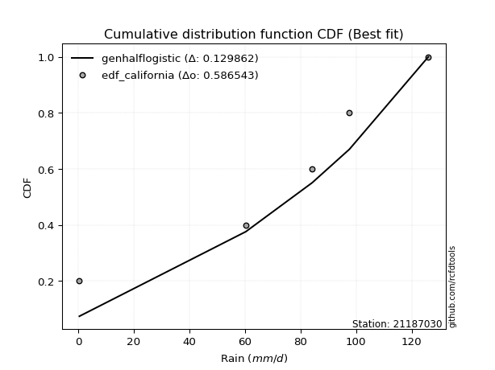</img>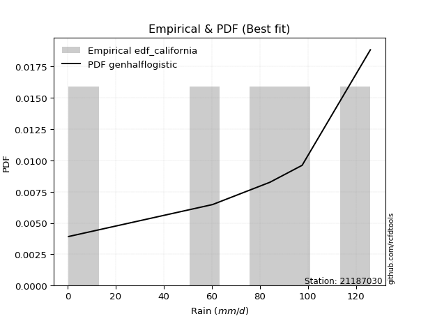</img>

</div>


### 2. EDF Hazen (1930)

Hazen method for plotting positions is a formula used to estimate the empirical cumulative probability distribution of flood events or other hydrological data. This formula often results in biased estimations, particularly when extrapolating to extreme events (high return periods).

<div align="center">


$P=(m-0.5)/n$


</div>


**2.1. Empirical values**

<div align="center">

|                | 0                  | 1                  | 2         | 3                 | 4                  |
|:---------------|:-------------------|:-------------------|:----------|:------------------|:-------------------|
| date           | 2022               | 2025               | 2020      | 2019              | 2021               |
| x              | 0.4                | 60.3               | 84.2      | 97.6              | 126.0              |
| m              | 1                  | 2                  | 3         | 4                 | 5                  |
| empirical_dist | edf_hazen          | edf_hazen          | edf_hazen | edf_hazen         | edf_hazen          |
| empirical      | 0.1                | 0.3                | 0.5       | 0.7               | 0.9                |
| empirical_tr   | 1.1111111111111112 | 1.4285714285714286 | 2.0       | 3.333333333333333 | 10.000000000000002 |

</div>


**2.2. Kolmogorov-Smirnov fit test (sorted by Δ)**


<div align="center">

|                | 0                    | 1                    | 2                   | 3                   | 4                   | 5                   | 6                   | 7                   | 8                   | 9                   | 10                  | 11                  | 12                  | 13                  | 14                  | 15                  | 16                  | 17                  | 18                  | 19                  | 20                  | 21                  | 22                  | 23                  | 24                  | 25                  | 26                  | 27                  | 28                  | 29                  | 30                  | 31                  | 32                  | 33                  | 34                  | 35                  | 36                  | 37                  | 38                  | 39                  | 40                  | 41                  | 42                  | 43                  | 44                  | 45                  | 46                  | 47                  | 48                  | 49                 | 50                  | 51                 | 52                  | 53                 | 54                  | 55                  | 56                 | 57                  | 58                  | 59                  | 60                  | 61                  | 62                 | 63                 | 64                  | 65                 | 66                 | 67                 | 68                 | 69                  | 70                  | 71                  | 72                 | 73                  | 74                 | 75                 | 76                  | 77                 | 78                 | 79                 | 80                  | 81                 | 82                 | 83                  | 84                 | 85                 | 86                 | 87                  | 88                 | 89                 | 90                 | 91                  | 92                  | 93                 | 94                 | 95                  | 96                 | 97                 | 98                 | 99                 | 100                 | 101                | 102                | 103                | 104                | 105                | 106                | 107                 | 108                | 109                 | 110                | 111                 | 112                 | 113                | 114                 | 115                | 116                | 117                | 118                | 119                | 120                | 121                 | 122                 | 123                | 124                 | 125                 | 126                | 127                | 128                | 129                | 130                | 131                | 132                | 133                | 134                | 135                 | 136                | 137                | 138                | 139                | 140                | 141                | 142                | 143                | 144                | 145                | 146                | 147                | 148                | 149                | 150                | 151                | 152                | 153                | 154                | 155                | 156                | 157                | 158                | 159                |
|:---------------|:---------------------|:---------------------|:--------------------|:--------------------|:--------------------|:--------------------|:--------------------|:--------------------|:--------------------|:--------------------|:--------------------|:--------------------|:--------------------|:--------------------|:--------------------|:--------------------|:--------------------|:--------------------|:--------------------|:--------------------|:--------------------|:--------------------|:--------------------|:--------------------|:--------------------|:--------------------|:--------------------|:--------------------|:--------------------|:--------------------|:--------------------|:--------------------|:--------------------|:--------------------|:--------------------|:--------------------|:--------------------|:--------------------|:--------------------|:--------------------|:--------------------|:--------------------|:--------------------|:--------------------|:--------------------|:--------------------|:--------------------|:--------------------|:--------------------|:-------------------|:--------------------|:-------------------|:--------------------|:-------------------|:--------------------|:--------------------|:-------------------|:--------------------|:--------------------|:--------------------|:--------------------|:--------------------|:-------------------|:-------------------|:--------------------|:-------------------|:-------------------|:-------------------|:-------------------|:--------------------|:--------------------|:--------------------|:-------------------|:--------------------|:-------------------|:-------------------|:--------------------|:-------------------|:-------------------|:-------------------|:--------------------|:-------------------|:-------------------|:--------------------|:-------------------|:-------------------|:-------------------|:--------------------|:-------------------|:-------------------|:-------------------|:--------------------|:--------------------|:-------------------|:-------------------|:--------------------|:-------------------|:-------------------|:-------------------|:-------------------|:--------------------|:-------------------|:-------------------|:-------------------|:-------------------|:-------------------|:-------------------|:--------------------|:-------------------|:--------------------|:-------------------|:--------------------|:--------------------|:-------------------|:--------------------|:-------------------|:-------------------|:-------------------|:-------------------|:-------------------|:-------------------|:--------------------|:--------------------|:-------------------|:--------------------|:--------------------|:-------------------|:-------------------|:-------------------|:-------------------|:-------------------|:-------------------|:-------------------|:-------------------|:-------------------|:--------------------|:-------------------|:-------------------|:-------------------|:-------------------|:-------------------|:-------------------|:-------------------|:-------------------|:-------------------|:-------------------|:-------------------|:-------------------|:-------------------|:-------------------|:-------------------|:-------------------|:-------------------|:-------------------|:-------------------|:-------------------|:-------------------|:-------------------|:-------------------|:-------------------|
| station        | 21187030             | 21187030             | 21187030            | 21187030            | 21187030            | 21187030            | 21187030            | 21187030            | 21187030            | 21187030            | 21187030            | 21187030            | 21187030            | 21187030            | 21187030            | 21187030            | 21187030            | 21187030            | 21187030            | 21187030            | 21187030            | 21187030            | 21187030            | 21187030            | 21187030            | 21187030            | 21187030            | 21187030            | 21187030            | 21187030            | 21187030            | 21187030            | 21187030            | 21187030            | 21187030            | 21187030            | 21187030            | 21187030            | 21187030            | 21187030            | 21187030            | 21187030            | 21187030            | 21187030            | 21187030            | 21187030            | 21187030            | 21187030            | 21187030            | 21187030           | 21187030            | 21187030           | 21187030            | 21187030           | 21187030            | 21187030            | 21187030           | 21187030            | 21187030            | 21187030            | 21187030            | 21187030            | 21187030           | 21187030           | 21187030            | 21187030           | 21187030           | 21187030           | 21187030           | 21187030            | 21187030            | 21187030            | 21187030           | 21187030            | 21187030           | 21187030           | 21187030            | 21187030           | 21187030           | 21187030           | 21187030            | 21187030           | 21187030           | 21187030            | 21187030           | 21187030           | 21187030           | 21187030            | 21187030           | 21187030           | 21187030           | 21187030            | 21187030            | 21187030           | 21187030           | 21187030            | 21187030           | 21187030           | 21187030           | 21187030           | 21187030            | 21187030           | 21187030           | 21187030           | 21187030           | 21187030           | 21187030           | 21187030            | 21187030           | 21187030            | 21187030           | 21187030            | 21187030            | 21187030           | 21187030            | 21187030           | 21187030           | 21187030           | 21187030           | 21187030           | 21187030           | 21187030            | 21187030            | 21187030           | 21187030            | 21187030            | 21187030           | 21187030           | 21187030           | 21187030           | 21187030           | 21187030           | 21187030           | 21187030           | 21187030           | 21187030            | 21187030           | 21187030           | 21187030           | 21187030           | 21187030           | 21187030           | 21187030           | 21187030           | 21187030           | 21187030           | 21187030           | 21187030           | 21187030           | 21187030           | 21187030           | 21187030           | 21187030           | 21187030           | 21187030           | 21187030           | 21187030           | 21187030           | 21187030           | 21187030           |
| empirical_dist | edf_hazen            | edf_hazen            | edf_hazen           | edf_hazen           | edf_hazen           | edf_hazen           | edf_hazen           | edf_hazen           | edf_hazen           | edf_hazen           | edf_hazen           | edf_hazen           | edf_hazen           | edf_hazen           | edf_hazen           | edf_hazen           | edf_hazen           | edf_hazen           | edf_hazen           | edf_hazen           | edf_hazen           | edf_hazen           | edf_hazen           | edf_hazen           | edf_hazen           | edf_hazen           | edf_hazen           | edf_hazen           | edf_hazen           | edf_hazen           | edf_hazen           | edf_hazen           | edf_hazen           | edf_hazen           | edf_hazen           | edf_hazen           | edf_hazen           | edf_hazen           | edf_hazen           | edf_hazen           | edf_hazen           | edf_hazen           | edf_hazen           | edf_hazen           | edf_hazen           | edf_hazen           | edf_hazen           | edf_hazen           | edf_hazen           | edf_hazen          | edf_hazen           | edf_hazen          | edf_hazen           | edf_hazen          | edf_hazen           | edf_hazen           | edf_hazen          | edf_hazen           | edf_hazen           | edf_hazen           | edf_hazen           | edf_hazen           | edf_hazen          | edf_hazen          | edf_hazen           | edf_hazen          | edf_hazen          | edf_hazen          | edf_hazen          | edf_hazen           | edf_hazen           | edf_hazen           | edf_hazen          | edf_hazen           | edf_hazen          | edf_hazen          | edf_hazen           | edf_hazen          | edf_hazen          | edf_hazen          | edf_hazen           | edf_hazen          | edf_hazen          | edf_hazen           | edf_hazen          | edf_hazen          | edf_hazen          | edf_hazen           | edf_hazen          | edf_hazen          | edf_hazen          | edf_hazen           | edf_hazen           | edf_hazen          | edf_hazen          | edf_hazen           | edf_hazen          | edf_hazen          | edf_hazen          | edf_hazen          | edf_hazen           | edf_hazen          | edf_hazen          | edf_hazen          | edf_hazen          | edf_hazen          | edf_hazen          | edf_hazen           | edf_hazen          | edf_hazen           | edf_hazen          | edf_hazen           | edf_hazen           | edf_hazen          | edf_hazen           | edf_hazen          | edf_hazen          | edf_hazen          | edf_hazen          | edf_hazen          | edf_hazen          | edf_hazen           | edf_hazen           | edf_hazen          | edf_hazen           | edf_hazen           | edf_hazen          | edf_hazen          | edf_hazen          | edf_hazen          | edf_hazen          | edf_hazen          | edf_hazen          | edf_hazen          | edf_hazen          | edf_hazen           | edf_hazen          | edf_hazen          | edf_hazen          | edf_hazen          | edf_hazen          | edf_hazen          | edf_hazen          | edf_hazen          | edf_hazen          | edf_hazen          | edf_hazen          | edf_hazen          | edf_hazen          | edf_hazen          | edf_hazen          | edf_hazen          | edf_hazen          | edf_hazen          | edf_hazen          | edf_hazen          | edf_hazen          | edf_hazen          | edf_hazen          | edf_hazen          |
| p_dist         | gumbel_l             | weibull_min          | genlogistic         | burr12              | johnsonsu           | pearson3            | argus               | trapezoid           | anglit              | truncnorm           | foldnorm            | t                   | crystalball         | norm                | exponnorm           | semicircular        | triang              | skewnorm            | gausshyper          | genhalflogistic     | beta                | betaprime           | dweibull            | gengamma            | rice                | gamma               | erlang              | ksone               | logistic            | logt                | dgamma              | hypsecant           | exponweib           | maxwell             | cosine              | arcsine             | gennorm             | rayleigh            | genextreme          | kappa4              | laplace             | loglevy_l           | truncweibull_min    | halfnorm            | invgauss            | gumbel_r            | kstwobign           | kappa3              | uniform             | tukeylambda        | genpareto           | wrapcauchy         | halflogistic        | levy_l             | vonmises_line       | moyal               | mielke             | loggausshyper       | logpearson3         | bradford            | logargus            | logweibull_max      | logdgamma          | wald               | logvonmises_line    | genexpon           | logjohnsonsb       | lomax              | logwrapcauchy      | loggumbel_l         | logarcsine          | logtrapezoid        | truncexpon         | burr                | logdweibull        | loggompertz        | loggennorm          | logloggamma        | gompertz           | logsemicircular    | loganglit           | halfgennorm        | logexponweib       | lognorm             | logcrystalball     | logexponnorm       | lognakagami        | logrice             | lognct             | logncf             | logfoldnorm        | loggamma            | loggamma            | loginvgamma        | logerlang          | ncf                 | logloglaplace      | loglogistic        | loginvgauss        | logmaxwell         | f                   | loghypsecant       | logkstwobign       | lograyleigh        | logalpha           | loggenextreme      | loggenexpon        | loginvweibull       | loglomax           | loghalfnorm         | invgamma           | loglaplace          | loglaplace          | logcosine          | loggumbel_r         | johnsonsb          | loghalflogistic    | loghalfgennorm     | logmoyal           | loggenpareto       | logf               | logbeta             | loggenhalflogistic  | nakagami           | logwald             | invweibull          | logskewnorm        | logweibull_min     | logtriang          | fatiguelife        | logbradford        | logksone           | logkappa4          | nct                | truncpareto        | logtruncweibull_min | logfatiguelife     | logkappa3          | loguniform         | logbetaprime       | logtruncnorm       | logburr12          | weibull_max        | logtruncexpon      | logburr            | powerlaw           | logexponpow        | logmielke          | exponpow           | logjohnsonsu       | logtruncpareto     | loggengamma        | logpowerlaw        | alpha              | rdist              | loggenlogistic     | logtukeylambda     | logvonmises        | logrdist           | vonmises           |
| delta          | 0.040822884677782674 | 0.041706677926868725 | 0.04557946683330161 | 0.04581323348190767 | 0.04857995159997208 | 0.05927903658481437 | 0.06308651472125637 | 0.06592881412470791 | 0.09269102722818695 | 0.09623174240020305 | 0.09736904328501772 | 0.09789367322211584 | 0.09789872599438121 | 0.09789872998579774 | 0.09790053507329322 | 0.09971382653629224 | 0.09999905136782472 | 0.09999991988653101 | 0.09999999999848841 | 0.09999999999999964 | 0.10086418685642662 | 0.10332705230762129 | 0.10338200730969035 | 0.10609729215250452 | 0.10651160304652385 | 0.10697360582445437 | 0.10801374112666395 | 0.10866813556041494 | 0.11055899265635238 | 0.11475916156791546 | 0.11756123646335381 | 0.12093682111844073 | 0.12429824961950353 | 0.12460824035426354 | 0.12713403273585777 | 0.12818106714054012 | 0.12863228433165622 | 0.13290921724826288 | 0.13499742665624637 | 0.14735017184811433 | 0.14786744972814103 | 0.15145744320078292 | 0.15591614411412952 | 0.15652858880950693 | 0.15848730513546583 | 0.16462250289585134 | 0.17228752956649335 | 0.17690334983674277 | 0.17691082802547775 | 0.1773741452411926 | 0.17942307437311855 | 0.1847583205350123 | 0.18481785126018724 | 0.185101539887486  | 0.18599620767193276 | 0.18745886050091665 | 0.2259740644046943 | 0.23110635483718328 | 0.23887064186235635 | 0.23899307278826726 | 0.24666183323236895 | 0.24866205854742834 | 0.2506175867945689 | 0.2510784121231595 | 0.25526066101696315 | 0.2554917798597623 | 0.2590135592715019 | 0.2600242840500638 | 0.268899032108424  | 0.27034224512475885 | 0.27231277745676546 | 0.27246465744362797 | 0.2756218431219111 | 0.28014498707827923 | 0.2829228638244544 | 0.2844988350217004 | 0.29366102219864876 | 0.2980100577616083 | 0.2999999999922641 | 0.3009584698953321 | 0.30802306920836603 | 0.313295836942261  | 0.3212175376952831 | 0.32495551813558093 | 0.3249555187007203 | 0.3249568656329583 | 0.3249610513992492 | 0.32499668233465767 | 0.3251278570544895 | 0.32723541993789   | 0.3317855370001997 | 0.33231113823134334 | 0.33231113823134334 | 0.3344559180689399 | 0.3347905687683351 | 0.33605311172003965 | 0.3361958531573378 | 0.340546088897789  | 0.3425545741711576 | 0.3491564853606138 | 0.35045721496373167 | 0.3530041193356453 | 0.3564694340231383 | 0.3565470316361577 | 0.3567252205020636 | 0.3631841821910749 | 0.3664496727545136 | 0.36707619791762697 | 0.3713345731262702 | 0.37777179124530275 | 0.3791763185839801 | 0.38133197689282056 | 0.38133197689282056 | 0.3846455622051456 | 0.38855199303875715 | 0.394498237380585  | 0.4061314239275506 | 0.4084081596580507 | 0.4099230528458245 | 0.4226107575152978 | 0.4370243881015838 | 0.45482845091403706 | 0.46046428377333787 | 0.4665259289278539 | 0.46987030885763753 | 0.47018393162363964 | 0.4770771553864153 | 0.4800374604749525 | 0.4992989775762415 | 0.4995909681429645 | 0.5069597139544375 | 0.509910111891436  | 0.5275920083784376 | 0.5310559226187428 | 0.559019226121442  | 0.5663859883075983  | 0.5675568833307498 | 0.5706813403857629 | 0.5718921342697232 | 0.5841677386766129 | 0.5867423827888405 | 0.5872439626088505 | 0.6013166902939093 | 0.604700686718999  | 0.6093373558074275 | 0.6187090262024915 | 0.6303955357665922 | 0.6373867567691478 | 0.6429045297823117 | 0.6591851156818773 | 0.6721641165327434 | 0.6722350439136406 | 0.6824627868522899 | 0.6882026752650938 | 0.6999999907220864 | 0.7                | 0.7147123464739892 | 0.8517352567675217 | 0.8999369973362253 | 19.20621768053776  |
| deltao         | 0.5865427407550001   | 0.5865427407550001   | 0.5865427407550001  | 0.5865427407550001  | 0.5865427407550001  | 0.5865427407550001  | 0.5865427407550001  | 0.5865427407550001  | 0.5865427407550001  | 0.5865427407550001  | 0.5865427407550001  | 0.5865427407550001  | 0.5865427407550001  | 0.5865427407550001  | 0.5865427407550001  | 0.5865427407550001  | 0.5865427407550001  | 0.5865427407550001  | 0.5865427407550001  | 0.5865427407550001  | 0.5865427407550001  | 0.5865427407550001  | 0.5865427407550001  | 0.5865427407550001  | 0.5865427407550001  | 0.5865427407550001  | 0.5865427407550001  | 0.5865427407550001  | 0.5865427407550001  | 0.5865427407550001  | 0.5865427407550001  | 0.5865427407550001  | 0.5865427407550001  | 0.5865427407550001  | 0.5865427407550001  | 0.5865427407550001  | 0.5865427407550001  | 0.5865427407550001  | 0.5865427407550001  | 0.5865427407550001  | 0.5865427407550001  | 0.5865427407550001  | 0.5865427407550001  | 0.5865427407550001  | 0.5865427407550001  | 0.5865427407550001  | 0.5865427407550001  | 0.5865427407550001  | 0.5865427407550001  | 0.5865427407550001 | 0.5865427407550001  | 0.5865427407550001 | 0.5865427407550001  | 0.5865427407550001 | 0.5865427407550001  | 0.5865427407550001  | 0.5865427407550001 | 0.5865427407550001  | 0.5865427407550001  | 0.5865427407550001  | 0.5865427407550001  | 0.5865427407550001  | 0.5865427407550001 | 0.5865427407550001 | 0.5865427407550001  | 0.5865427407550001 | 0.5865427407550001 | 0.5865427407550001 | 0.5865427407550001 | 0.5865427407550001  | 0.5865427407550001  | 0.5865427407550001  | 0.5865427407550001 | 0.5865427407550001  | 0.5865427407550001 | 0.5865427407550001 | 0.5865427407550001  | 0.5865427407550001 | 0.5865427407550001 | 0.5865427407550001 | 0.5865427407550001  | 0.5865427407550001 | 0.5865427407550001 | 0.5865427407550001  | 0.5865427407550001 | 0.5865427407550001 | 0.5865427407550001 | 0.5865427407550001  | 0.5865427407550001 | 0.5865427407550001 | 0.5865427407550001 | 0.5865427407550001  | 0.5865427407550001  | 0.5865427407550001 | 0.5865427407550001 | 0.5865427407550001  | 0.5865427407550001 | 0.5865427407550001 | 0.5865427407550001 | 0.5865427407550001 | 0.5865427407550001  | 0.5865427407550001 | 0.5865427407550001 | 0.5865427407550001 | 0.5865427407550001 | 0.5865427407550001 | 0.5865427407550001 | 0.5865427407550001  | 0.5865427407550001 | 0.5865427407550001  | 0.5865427407550001 | 0.5865427407550001  | 0.5865427407550001  | 0.5865427407550001 | 0.5865427407550001  | 0.5865427407550001 | 0.5865427407550001 | 0.5865427407550001 | 0.5865427407550001 | 0.5865427407550001 | 0.5865427407550001 | 0.5865427407550001  | 0.5865427407550001  | 0.5865427407550001 | 0.5865427407550001  | 0.5865427407550001  | 0.5865427407550001 | 0.5865427407550001 | 0.5865427407550001 | 0.5865427407550001 | 0.5865427407550001 | 0.5865427407550001 | 0.5865427407550001 | 0.5865427407550001 | 0.5865427407550001 | 0.5865427407550001  | 0.5865427407550001 | 0.5865427407550001 | 0.5865427407550001 | 0.5865427407550001 | 0.5865427407550001 | 0.5865427407550001 | 0.5865427407550001 | 0.5865427407550001 | 0.5865427407550001 | 0.5865427407550001 | 0.5865427407550001 | 0.5865427407550001 | 0.5865427407550001 | 0.5865427407550001 | 0.5865427407550001 | 0.5865427407550001 | 0.5865427407550001 | 0.5865427407550001 | 0.5865427407550001 | 0.5865427407550001 | 0.5865427407550001 | 0.5865427407550001 | 0.5865427407550001 | 0.5865427407550001 |
| eval           | Δo > Δ               | Δo > Δ               | Δo > Δ              | Δo > Δ              | Δo > Δ              | Δo > Δ              | Δo > Δ              | Δo > Δ              | Δo > Δ              | Δo > Δ              | Δo > Δ              | Δo > Δ              | Δo > Δ              | Δo > Δ              | Δo > Δ              | Δo > Δ              | Δo > Δ              | Δo > Δ              | Δo > Δ              | Δo > Δ              | Δo > Δ              | Δo > Δ              | Δo > Δ              | Δo > Δ              | Δo > Δ              | Δo > Δ              | Δo > Δ              | Δo > Δ              | Δo > Δ              | Δo > Δ              | Δo > Δ              | Δo > Δ              | Δo > Δ              | Δo > Δ              | Δo > Δ              | Δo > Δ              | Δo > Δ              | Δo > Δ              | Δo > Δ              | Δo > Δ              | Δo > Δ              | Δo > Δ              | Δo > Δ              | Δo > Δ              | Δo > Δ              | Δo > Δ              | Δo > Δ              | Δo > Δ              | Δo > Δ              | Δo > Δ             | Δo > Δ              | Δo > Δ             | Δo > Δ              | Δo > Δ             | Δo > Δ              | Δo > Δ              | Δo > Δ             | Δo > Δ              | Δo > Δ              | Δo > Δ              | Δo > Δ              | Δo > Δ              | Δo > Δ             | Δo > Δ             | Δo > Δ              | Δo > Δ             | Δo > Δ             | Δo > Δ             | Δo > Δ             | Δo > Δ              | Δo > Δ              | Δo > Δ              | Δo > Δ             | Δo > Δ              | Δo > Δ             | Δo > Δ             | Δo > Δ              | Δo > Δ             | Δo > Δ             | Δo > Δ             | Δo > Δ              | Δo > Δ             | Δo > Δ             | Δo > Δ              | Δo > Δ             | Δo > Δ             | Δo > Δ             | Δo > Δ              | Δo > Δ             | Δo > Δ             | Δo > Δ             | Δo > Δ              | Δo > Δ              | Δo > Δ             | Δo > Δ             | Δo > Δ              | Δo > Δ             | Δo > Δ             | Δo > Δ             | Δo > Δ             | Δo > Δ              | Δo > Δ             | Δo > Δ             | Δo > Δ             | Δo > Δ             | Δo > Δ             | Δo > Δ             | Δo > Δ              | Δo > Δ             | Δo > Δ              | Δo > Δ             | Δo > Δ              | Δo > Δ              | Δo > Δ             | Δo > Δ              | Δo > Δ             | Δo > Δ             | Δo > Δ             | Δo > Δ             | Δo > Δ             | Δo > Δ             | Δo > Δ              | Δo > Δ              | Δo > Δ             | Δo > Δ              | Δo > Δ              | Δo > Δ             | Δo > Δ             | Δo > Δ             | Δo > Δ             | Δo > Δ             | Δo > Δ             | Δo > Δ             | Δo > Δ             | Δo > Δ             | Δo > Δ              | Δo > Δ             | Δo > Δ             | Δo > Δ             | Δo > Δ             | Δo <= Δ            | Δo <= Δ            | Δo <= Δ            | Δo <= Δ            | Δo <= Δ            | Δo <= Δ            | Δo <= Δ            | Δo <= Δ            | Δo <= Δ            | Δo <= Δ            | Δo <= Δ            | Δo <= Δ            | Δo <= Δ            | Δo <= Δ            | Δo <= Δ            | Δo <= Δ            | Δo <= Δ            | Δo <= Δ            | Δo <= Δ            | Δo <= Δ            |
| fit            | 1                    | 1                    | 1                   | 1                   | 1                   | 1                   | 1                   | 1                   | 1                   | 1                   | 1                   | 1                   | 1                   | 1                   | 1                   | 1                   | 1                   | 1                   | 1                   | 1                   | 1                   | 1                   | 1                   | 1                   | 1                   | 1                   | 1                   | 1                   | 1                   | 1                   | 1                   | 1                   | 1                   | 1                   | 1                   | 1                   | 1                   | 1                   | 1                   | 1                   | 1                   | 1                   | 1                   | 1                   | 1                   | 1                   | 1                   | 1                   | 1                   | 1                  | 1                   | 1                  | 1                   | 1                  | 1                   | 1                   | 1                  | 1                   | 1                   | 1                   | 1                   | 1                   | 1                  | 1                  | 1                   | 1                  | 1                  | 1                  | 1                  | 1                   | 1                   | 1                   | 1                  | 1                   | 1                  | 1                  | 1                   | 1                  | 1                  | 1                  | 1                   | 1                  | 1                  | 1                   | 1                  | 1                  | 1                  | 1                   | 1                  | 1                  | 1                  | 1                   | 1                   | 1                  | 1                  | 1                   | 1                  | 1                  | 1                  | 1                  | 1                   | 1                  | 1                  | 1                  | 1                  | 1                  | 1                  | 1                   | 1                  | 1                   | 1                  | 1                   | 1                   | 1                  | 1                   | 1                  | 1                  | 1                  | 1                  | 1                  | 1                  | 1                   | 1                   | 1                  | 1                   | 1                   | 1                  | 1                  | 1                  | 1                  | 1                  | 1                  | 1                  | 1                  | 1                  | 1                   | 1                  | 1                  | 1                  | 1                  | 0                  | 0                  | 0                  | 0                  | 0                  | 0                  | 0                  | 0                  | 0                  | 0                  | 0                  | 0                  | 0                  | 0                  | 0                  | 0                  | 0                  | 0                  | 0                  | 0                  |
| n              | 5                    | 5                    | 5                   | 5                   | 5                   | 5                   | 5                   | 5                   | 5                   | 5                   | 5                   | 5                   | 5                   | 5                   | 5                   | 5                   | 5                   | 5                   | 5                   | 5                   | 5                   | 5                   | 5                   | 5                   | 5                   | 5                   | 5                   | 5                   | 5                   | 5                   | 5                   | 5                   | 5                   | 5                   | 5                   | 5                   | 5                   | 5                   | 5                   | 5                   | 5                   | 5                   | 5                   | 5                   | 5                   | 5                   | 5                   | 5                   | 5                   | 5                  | 5                   | 5                  | 5                   | 5                  | 5                   | 5                   | 5                  | 5                   | 5                   | 5                   | 5                   | 5                   | 5                  | 5                  | 5                   | 5                  | 5                  | 5                  | 5                  | 5                   | 5                   | 5                   | 5                  | 5                   | 5                  | 5                  | 5                   | 5                  | 5                  | 5                  | 5                   | 5                  | 5                  | 5                   | 5                  | 5                  | 5                  | 5                   | 5                  | 5                  | 5                  | 5                   | 5                   | 5                  | 5                  | 5                   | 5                  | 5                  | 5                  | 5                  | 5                   | 5                  | 5                  | 5                  | 5                  | 5                  | 5                  | 5                   | 5                  | 5                   | 5                  | 5                   | 5                   | 5                  | 5                   | 5                  | 5                  | 5                  | 5                  | 5                  | 5                  | 5                   | 5                   | 5                  | 5                   | 5                   | 5                  | 5                  | 5                  | 5                  | 5                  | 5                  | 5                  | 5                  | 5                  | 5                   | 5                  | 5                  | 5                  | 5                  | 5                  | 5                  | 5                  | 5                  | 5                  | 5                  | 5                  | 5                  | 5                  | 5                  | 5                  | 5                  | 5                  | 5                  | 5                  | 5                  | 5                  | 5                  | 5                  | 5                  |
| best_fit       | 1                    | 0                    | 0                   | 0                   | 0                   | 0                   | 0                   | 0                   | 0                   | 0                   | 0                   | 0                   | 0                   | 0                   | 0                   | 0                   | 0                   | 0                   | 0                   | 0                   | 0                   | 0                   | 0                   | 0                   | 0                   | 0                   | 0                   | 0                   | 0                   | 0                   | 0                   | 0                   | 0                   | 0                   | 0                   | 0                   | 0                   | 0                   | 0                   | 0                   | 0                   | 0                   | 0                   | 0                   | 0                   | 0                   | 0                   | 0                   | 0                   | 0                  | 0                   | 0                  | 0                   | 0                  | 0                   | 0                   | 0                  | 0                   | 0                   | 0                   | 0                   | 0                   | 0                  | 0                  | 0                   | 0                  | 0                  | 0                  | 0                  | 0                   | 0                   | 0                   | 0                  | 0                   | 0                  | 0                  | 0                   | 0                  | 0                  | 0                  | 0                   | 0                  | 0                  | 0                   | 0                  | 0                  | 0                  | 0                   | 0                  | 0                  | 0                  | 0                   | 0                   | 0                  | 0                  | 0                   | 0                  | 0                  | 0                  | 0                  | 0                   | 0                  | 0                  | 0                  | 0                  | 0                  | 0                  | 0                   | 0                  | 0                   | 0                  | 0                   | 0                   | 0                  | 0                   | 0                  | 0                  | 0                  | 0                  | 0                  | 0                  | 0                   | 0                   | 0                  | 0                   | 0                   | 0                  | 0                  | 0                  | 0                  | 0                  | 0                  | 0                  | 0                  | 0                  | 0                   | 0                  | 0                  | 0                  | 0                  | 0                  | 0                  | 0                  | 0                  | 0                  | 0                  | 0                  | 0                  | 0                  | 0                  | 0                  | 0                  | 0                  | 0                  | 0                  | 0                  | 0                  | 0                  | 0                  | 0                  |
| best_fit_sort  | 1                    | 2                    | 3                   | 4                   | 5                   | 6                   | 7                   | 8                   | 9                   | 10                  | 11                  | 12                  | 13                  | 14                  | 15                  | 16                  | 17                  | 18                  | 19                  | 20                  | 21                  | 22                  | 23                  | 24                  | 25                  | 26                  | 27                  | 28                  | 29                  | 30                  | 31                  | 32                  | 33                  | 34                  | 35                  | 36                  | 37                  | 38                  | 39                  | 40                  | 41                  | 42                  | 43                  | 44                  | 45                  | 46                  | 47                  | 48                  | 49                  | 50                 | 51                  | 52                 | 53                  | 54                 | 55                  | 56                  | 57                 | 58                  | 59                  | 60                  | 61                  | 62                  | 63                 | 64                 | 65                  | 66                 | 67                 | 68                 | 69                 | 70                  | 71                  | 72                  | 73                 | 74                  | 75                 | 76                 | 77                  | 78                 | 79                 | 80                 | 81                  | 82                 | 83                 | 84                  | 85                 | 86                 | 87                 | 88                  | 89                 | 90                 | 91                 | 92                  | 93                  | 94                 | 95                 | 96                  | 97                 | 98                 | 99                 | 100                | 101                 | 102                | 103                | 104                | 105                | 106                | 107                | 108                 | 109                | 110                 | 111                | 112                 | 113                 | 114                | 115                 | 116                | 117                | 118                | 119                | 120                | 121                | 122                 | 123                 | 124                | 125                 | 126                 | 127                | 128                | 129                | 130                | 131                | 132                | 133                | 134                | 135                | 136                 | 137                | 138                | 139                | 140                | 141                | 142                | 143                | 144                | 145                | 146                | 147                | 148                | 149                | 150                | 151                | 152                | 153                | 154                | 155                | 156                | 157                | 158                | 159                | 160                |

</div>


**2.3. Best fit**

<div align="center">

|   id |   station | empirical_dist   | p_dist   |     delta |   deltao | eval   |   fit |   n |   best_fit |   best_fit_sort |
|-----:|----------:|:-----------------|:---------|----------:|---------:|:-------|------:|----:|-----------:|----------------:|
|    0 |  21187030 | edf_hazen        | gumbel_l | 0.0408229 | 0.586543 | Δo > Δ |     1 |   5 |          1 |               1 |

</div>


<div align="center">

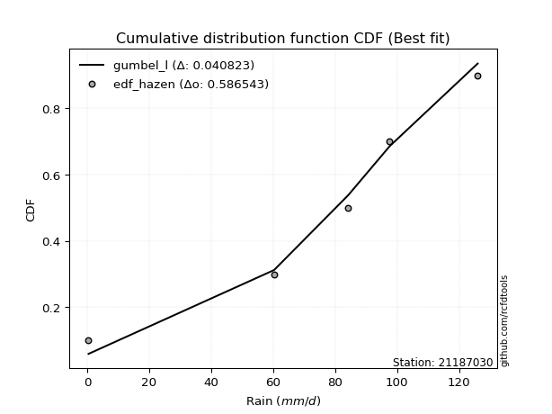</img>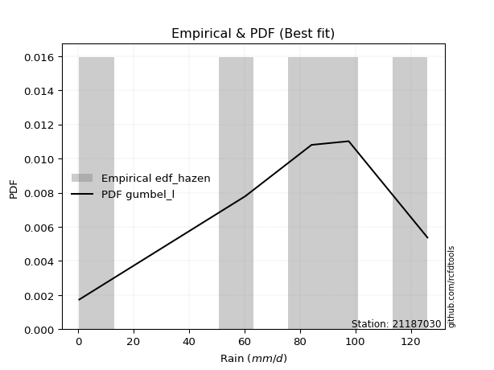</img>

</div>


### 3. EDF Weibull (1939)

Weibull plotting position formula is an empirical method used to estimate the non-exceedance probability or plotting position for a set of observed data, is often recommended or widely used in practice, particularly in flood frequency analysis.

<div align="center">


$P=m/(n+1)$


</div>


**3.1. Empirical values**

<div align="center">

|                | 0                   | 1                  | 2           | 3                  | 4                  |
|:---------------|:--------------------|:-------------------|:------------|:-------------------|:-------------------|
| date           | 2022                | 2025               | 2020        | 2019               | 2021               |
| x              | 0.4                 | 60.3               | 84.2        | 97.6               | 126.0              |
| m              | 1                   | 2                  | 3           | 4                  | 5                  |
| empirical_dist | edf_weibull         | edf_weibull        | edf_weibull | edf_weibull        | edf_weibull        |
| empirical      | 0.16666666666666666 | 0.3333333333333333 | 0.5         | 0.6666666666666666 | 0.8333333333333334 |
| empirical_tr   | 1.2                 | 1.4999999999999998 | 2.0         | 2.9999999999999996 | 6.000000000000002  |

</div>


**3.2. Kolmogorov-Smirnov fit test (sorted by Δ)**


<div align="center">

|                | 0                   | 1                   | 2                   | 3                   | 4                   | 5                  | 6                   | 7                   | 8                   | 9                   | 10                  | 11                  | 12                  | 13                  | 14                  | 15                  | 16                  | 17                 | 18                  | 19                  | 20                  | 21                  | 22                 | 23                  | 24                  | 25                  | 26                 | 27                  | 28                  | 29                  | 30                 | 31                  | 32                 | 33                  | 34                  | 35                  | 36                  | 37                  | 38                  | 39                  | 40                  | 41                 | 42                  | 43                  | 44                  | 45                  | 46                  | 47                  | 48                 | 49                  | 50                  | 51                  | 52                  | 53                 | 54                  | 55                  | 56                  | 57                  | 58                 | 59                  | 60                  | 61                  | 62                  | 63                  | 64                  | 65                  | 66                  | 67                  | 68                  | 69                  | 70                  | 71                  | 72                  | 73                 | 74                 | 75                 | 76                 | 77                  | 78                  | 79                 | 80                  | 81                 | 82                 | 83                 | 84                  | 85                  | 86                  | 87                  | 88                  | 89                 | 90                  | 91                 | 92                 | 93                  | 94                  | 95                  | 96                  | 97                  | 98                  | 99                  | 100                 | 101                | 102                 | 103                | 104                | 105                | 106                 | 107                 | 108                | 109                | 110                | 111                 | 112                 | 113                | 114                | 115                 | 116                 | 117                | 118                 | 119                | 120                | 121                 | 122                 | 123                 | 124                 | 125                | 126                | 127                 | 128                 | 129                 | 130                 | 131                | 132                | 133                | 134                | 135                | 136                 | 137                | 138                | 139                | 140                | 141                | 142                | 143                | 144                | 145                | 146                | 147                | 148                | 149                | 150                | 151                | 152                | 153                | 154                | 155                | 156                | 157                | 158                | 159                |
|:---------------|:--------------------|:--------------------|:--------------------|:--------------------|:--------------------|:-------------------|:--------------------|:--------------------|:--------------------|:--------------------|:--------------------|:--------------------|:--------------------|:--------------------|:--------------------|:--------------------|:--------------------|:-------------------|:--------------------|:--------------------|:--------------------|:--------------------|:-------------------|:--------------------|:--------------------|:--------------------|:-------------------|:--------------------|:--------------------|:--------------------|:-------------------|:--------------------|:-------------------|:--------------------|:--------------------|:--------------------|:--------------------|:--------------------|:--------------------|:--------------------|:--------------------|:-------------------|:--------------------|:--------------------|:--------------------|:--------------------|:--------------------|:--------------------|:-------------------|:--------------------|:--------------------|:--------------------|:--------------------|:-------------------|:--------------------|:--------------------|:--------------------|:--------------------|:-------------------|:--------------------|:--------------------|:--------------------|:--------------------|:--------------------|:--------------------|:--------------------|:--------------------|:--------------------|:--------------------|:--------------------|:--------------------|:--------------------|:--------------------|:-------------------|:-------------------|:-------------------|:-------------------|:--------------------|:--------------------|:-------------------|:--------------------|:-------------------|:-------------------|:-------------------|:--------------------|:--------------------|:--------------------|:--------------------|:--------------------|:-------------------|:--------------------|:-------------------|:-------------------|:--------------------|:--------------------|:--------------------|:--------------------|:--------------------|:--------------------|:--------------------|:--------------------|:-------------------|:--------------------|:-------------------|:-------------------|:-------------------|:--------------------|:--------------------|:-------------------|:-------------------|:-------------------|:--------------------|:--------------------|:-------------------|:-------------------|:--------------------|:--------------------|:-------------------|:--------------------|:-------------------|:-------------------|:--------------------|:--------------------|:--------------------|:--------------------|:-------------------|:-------------------|:--------------------|:--------------------|:--------------------|:--------------------|:-------------------|:-------------------|:-------------------|:-------------------|:-------------------|:--------------------|:-------------------|:-------------------|:-------------------|:-------------------|:-------------------|:-------------------|:-------------------|:-------------------|:-------------------|:-------------------|:-------------------|:-------------------|:-------------------|:-------------------|:-------------------|:-------------------|:-------------------|:-------------------|:-------------------|:-------------------|:-------------------|:-------------------|:-------------------|
| station        | 21187030            | 21187030            | 21187030            | 21187030            | 21187030            | 21187030           | 21187030            | 21187030            | 21187030            | 21187030            | 21187030            | 21187030            | 21187030            | 21187030            | 21187030            | 21187030            | 21187030            | 21187030           | 21187030            | 21187030            | 21187030            | 21187030            | 21187030           | 21187030            | 21187030            | 21187030            | 21187030           | 21187030            | 21187030            | 21187030            | 21187030           | 21187030            | 21187030           | 21187030            | 21187030            | 21187030            | 21187030            | 21187030            | 21187030            | 21187030            | 21187030            | 21187030           | 21187030            | 21187030            | 21187030            | 21187030            | 21187030            | 21187030            | 21187030           | 21187030            | 21187030            | 21187030            | 21187030            | 21187030           | 21187030            | 21187030            | 21187030            | 21187030            | 21187030           | 21187030            | 21187030            | 21187030            | 21187030            | 21187030            | 21187030            | 21187030            | 21187030            | 21187030            | 21187030            | 21187030            | 21187030            | 21187030            | 21187030            | 21187030           | 21187030           | 21187030           | 21187030           | 21187030            | 21187030            | 21187030           | 21187030            | 21187030           | 21187030           | 21187030           | 21187030            | 21187030            | 21187030            | 21187030            | 21187030            | 21187030           | 21187030            | 21187030           | 21187030           | 21187030            | 21187030            | 21187030            | 21187030            | 21187030            | 21187030            | 21187030            | 21187030            | 21187030           | 21187030            | 21187030           | 21187030           | 21187030           | 21187030            | 21187030            | 21187030           | 21187030           | 21187030           | 21187030            | 21187030            | 21187030           | 21187030           | 21187030            | 21187030            | 21187030           | 21187030            | 21187030           | 21187030           | 21187030            | 21187030            | 21187030            | 21187030            | 21187030           | 21187030           | 21187030            | 21187030            | 21187030            | 21187030            | 21187030           | 21187030           | 21187030           | 21187030           | 21187030           | 21187030            | 21187030           | 21187030           | 21187030           | 21187030           | 21187030           | 21187030           | 21187030           | 21187030           | 21187030           | 21187030           | 21187030           | 21187030           | 21187030           | 21187030           | 21187030           | 21187030           | 21187030           | 21187030           | 21187030           | 21187030           | 21187030           | 21187030           | 21187030           |
| empirical_dist | edf_weibull         | edf_weibull         | edf_weibull         | edf_weibull         | edf_weibull         | edf_weibull        | edf_weibull         | edf_weibull         | edf_weibull         | edf_weibull         | edf_weibull         | edf_weibull         | edf_weibull         | edf_weibull         | edf_weibull         | edf_weibull         | edf_weibull         | edf_weibull        | edf_weibull         | edf_weibull         | edf_weibull         | edf_weibull         | edf_weibull        | edf_weibull         | edf_weibull         | edf_weibull         | edf_weibull        | edf_weibull         | edf_weibull         | edf_weibull         | edf_weibull        | edf_weibull         | edf_weibull        | edf_weibull         | edf_weibull         | edf_weibull         | edf_weibull         | edf_weibull         | edf_weibull         | edf_weibull         | edf_weibull         | edf_weibull        | edf_weibull         | edf_weibull         | edf_weibull         | edf_weibull         | edf_weibull         | edf_weibull         | edf_weibull        | edf_weibull         | edf_weibull         | edf_weibull         | edf_weibull         | edf_weibull        | edf_weibull         | edf_weibull         | edf_weibull         | edf_weibull         | edf_weibull        | edf_weibull         | edf_weibull         | edf_weibull         | edf_weibull         | edf_weibull         | edf_weibull         | edf_weibull         | edf_weibull         | edf_weibull         | edf_weibull         | edf_weibull         | edf_weibull         | edf_weibull         | edf_weibull         | edf_weibull        | edf_weibull        | edf_weibull        | edf_weibull        | edf_weibull         | edf_weibull         | edf_weibull        | edf_weibull         | edf_weibull        | edf_weibull        | edf_weibull        | edf_weibull         | edf_weibull         | edf_weibull         | edf_weibull         | edf_weibull         | edf_weibull        | edf_weibull         | edf_weibull        | edf_weibull        | edf_weibull         | edf_weibull         | edf_weibull         | edf_weibull         | edf_weibull         | edf_weibull         | edf_weibull         | edf_weibull         | edf_weibull        | edf_weibull         | edf_weibull        | edf_weibull        | edf_weibull        | edf_weibull         | edf_weibull         | edf_weibull        | edf_weibull        | edf_weibull        | edf_weibull         | edf_weibull         | edf_weibull        | edf_weibull        | edf_weibull         | edf_weibull         | edf_weibull        | edf_weibull         | edf_weibull        | edf_weibull        | edf_weibull         | edf_weibull         | edf_weibull         | edf_weibull         | edf_weibull        | edf_weibull        | edf_weibull         | edf_weibull         | edf_weibull         | edf_weibull         | edf_weibull        | edf_weibull        | edf_weibull        | edf_weibull        | edf_weibull        | edf_weibull         | edf_weibull        | edf_weibull        | edf_weibull        | edf_weibull        | edf_weibull        | edf_weibull        | edf_weibull        | edf_weibull        | edf_weibull        | edf_weibull        | edf_weibull        | edf_weibull        | edf_weibull        | edf_weibull        | edf_weibull        | edf_weibull        | edf_weibull        | edf_weibull        | edf_weibull        | edf_weibull        | edf_weibull        | edf_weibull        | edf_weibull        |
| p_dist         | genlogistic         | gumbel_l            | weibull_min         | trapezoid           | johnsonsu           | pearson3           | burr12              | loglevy_l           | erlang              | betaprime           | gengamma            | gamma               | hypsecant           | norm                | crystalball         | exponnorm           | t                   | logistic           | exponweib           | truncnorm           | cosine              | dgamma              | anglit             | argus               | rice                | dweibull            | semicircular       | foldnorm            | invgauss            | kstwobign           | maxwell            | laplace             | logt               | levy_l              | rayleigh            | gennorm             | gumbel_r            | ksone               | triang              | skewnorm            | genpareto           | truncweibull_min   | wrapcauchy          | beta                | gausshyper          | tukeylambda         | kappa4              | genextreme          | genhalflogistic    | arcsine             | halfnorm            | kappa3              | uniform             | vonmises_line      | logdgamma           | halflogistic        | moyal               | loggausshyper       | mielke             | logpearson3         | bradford            | logweibull_max      | logdweibull         | logargus            | logvonmises_line    | genexpon            | logjohnsonsb        | lomax               | logwrapcauchy       | loggumbel_l         | logarcsine          | logtrapezoid        | truncexpon          | burr               | wald               | loggompertz        | logloggamma        | logsemicircular     | logloglaplace       | loganglit          | halfgennorm         | logexponweib       | lognorm            | logcrystalball     | logexponnorm        | lognakagami         | logrice             | lognct              | loggennorm          | logncf             | logfoldnorm         | loggamma           | loggamma           | loginvgamma         | logerlang           | ncf                 | loglogistic         | loginvgauss         | logmaxwell          | f                   | loghypsecant        | logkstwobign       | lograyleigh         | logalpha           | loggenextreme      | loggenexpon        | gompertz            | loginvweibull       | loglomax           | loghalfnorm        | invgamma           | loglaplace          | loglaplace          | logcosine          | loggumbel_r        | johnsonsb           | loghalflogistic     | loghalfgennorm     | logmoyal            | loggenpareto       | invweibull         | logf                | logbeta             | loggenhalflogistic  | nakagami            | logwald            | logskewnorm        | logweibull_min      | logtriang           | fatiguelife         | logbradford         | logksone           | logkappa4          | nct                | logburr12          | truncpareto        | logtruncweibull_min | logfatiguelife     | logkappa3          | loguniform         | logbetaprime       | logtruncnorm       | weibull_max        | logtruncexpon      | logburr            | powerlaw           | logexponpow        | logmielke          | exponpow           | logjohnsonsu       | logtruncpareto     | loggengamma        | logpowerlaw        | alpha              | rdist              | loggenlogistic     | logtukeylambda     | logvonmises        | logrdist           | vonmises           |
| delta          | 0.09638217586651798 | 0.10748955134444932 | 0.10837334459353537 | 0.10862749655041637 | 0.10933296458963426 | 0.1108338314945255 | 0.11247990014857431 | 0.11812410986744959 | 0.12347785728135097 | 0.12415564031014825 | 0.12431164083108301 | 0.12448958970354615 | 0.12472801628600719 | 0.12491058527231347 | 0.12491058904107397 | 0.12491143755566306 | 0.12491196810874805 | 0.1251426550215597 | 0.12593589881093464 | 0.12607251890924845 | 0.12713403273585777 | 0.12719228028606944 | 0.1295761805648248 | 0.12975318138792302 | 0.13386627285844993 | 0.13671534064302368 | 0.1376108366624547 | 0.13767108046189605 | 0.14297086053202857 | 0.14599239273181652 | 0.1466192453657651 | 0.14786744972814103 | 0.1480924949012488 | 0.15176820655415268 | 0.15955258198174752 | 0.16196561766498954 | 0.16462250289585134 | 0.16626559677275501 | 0.16666571803449137 | 0.16666658655319766 | 0.16666665199390174 | 0.1666666596815244 | 0.16666666545412423 | 0.16666666666034846 | 0.16666666666515506 | 0.16666666666665955 | 0.16666666666666408 | 0.16666666666666574 | 0.1666666666666663 | 0.16666666666666666 | 0.16666666666666666 | 0.16717522441545118 | 0.16719745222929938 | 0.1729771779802447 | 0.18395092012790226 | 0.18481785126018724 | 0.18745886050091665 | 0.19777302150384996 | 0.2010772340467606 | 0.20553730852902302 | 0.20669573038475553 | 0.21532872521409502 | 0.21625619715778777 | 0.21750767974633733 | 0.22192732768362983 | 0.22215844652642897 | 0.22568022593816855 | 0.22669095071673045 | 0.23556569877509065 | 0.23700891179142553 | 0.23897944412343214 | 0.23913132411029464 | 0.24473188415881109 | 0.2468116537449459 | 0.2510784121231595 | 0.2511655016883671 | 0.264676724428275  | 0.26762513656199877 | 0.26952918649067115 | 0.2746897358750327 | 0.27996250360892766 | 0.2878842043619498 | 0.2916221848022476 | 0.291622185367387  | 0.29162353229962495 | 0.29162771806591586 | 0.29166334900132435 | 0.29179452372115616 | 0.29366102219864876 | 0.2939020866045567 | 0.29845220366686637 | 0.29897780489801   | 0.29897780489801   | 0.30112258473560655 | 0.30145723543500175 | 0.30271977838670633 | 0.30721275556445565 | 0.30922124083782426 | 0.31582315202728045 | 0.31712388163039834 | 0.31967078600231197 | 0.323136100689805  | 0.32321369830282437 | 0.3233918871687303 | 0.3298508488577416 | 0.3331163394211803 | 0.33333333332559745 | 0.33374286458429364 | 0.3380012397929369 | 0.3444384579119694 | 0.3458429852506468 | 0.34799864355948723 | 0.34799864355948723 | 0.3513122288718123 | 0.3552186597054238 | 0.36116490404725166 | 0.37279809059421726 | 0.3750748263247174 | 0.37658971951249115 | 0.3892774241819645 | 0.403517264956973  | 0.40369105476825046 | 0.42149511758070374 | 0.42713095044000454 | 0.43319259559452056 | 0.4365369755243042 | 0.443743822053082  | 0.44670412714161917 | 0.46596564424290815 | 0.46625763480963117 | 0.47362638062110424 | 0.4765767785581027 | 0.4942586750451043 | 0.4977225892854095 | 0.5205772959421838 | 0.5256858927881087 | 0.5330526549742649  | 0.5342235499974164 | 0.5373480070524295 | 0.53855880093639   | 0.5508344053432794 | 0.5534090494555071 | 0.567983356960576  | 0.5713673533856656 | 0.5760040224740941 | 0.585375692869158  | 0.597062202433259  | 0.6040534234358144 | 0.6095711964489785 | 0.625851782348544  | 0.6388307831994102 | 0.6389017105803072 | 0.6491294535189565 | 0.6548693419317604 | 0.666666657388753  | 0.6666666666666666 | 0.6666666666666667 | 0.8322133463059557 | 0.8332703306695587 | 19.272884347204425 |
| deltao         | 0.5865427407550001  | 0.5865427407550001  | 0.5865427407550001  | 0.5865427407550001  | 0.5865427407550001  | 0.5865427407550001 | 0.5865427407550001  | 0.5865427407550001  | 0.5865427407550001  | 0.5865427407550001  | 0.5865427407550001  | 0.5865427407550001  | 0.5865427407550001  | 0.5865427407550001  | 0.5865427407550001  | 0.5865427407550001  | 0.5865427407550001  | 0.5865427407550001 | 0.5865427407550001  | 0.5865427407550001  | 0.5865427407550001  | 0.5865427407550001  | 0.5865427407550001 | 0.5865427407550001  | 0.5865427407550001  | 0.5865427407550001  | 0.5865427407550001 | 0.5865427407550001  | 0.5865427407550001  | 0.5865427407550001  | 0.5865427407550001 | 0.5865427407550001  | 0.5865427407550001 | 0.5865427407550001  | 0.5865427407550001  | 0.5865427407550001  | 0.5865427407550001  | 0.5865427407550001  | 0.5865427407550001  | 0.5865427407550001  | 0.5865427407550001  | 0.5865427407550001 | 0.5865427407550001  | 0.5865427407550001  | 0.5865427407550001  | 0.5865427407550001  | 0.5865427407550001  | 0.5865427407550001  | 0.5865427407550001 | 0.5865427407550001  | 0.5865427407550001  | 0.5865427407550001  | 0.5865427407550001  | 0.5865427407550001 | 0.5865427407550001  | 0.5865427407550001  | 0.5865427407550001  | 0.5865427407550001  | 0.5865427407550001 | 0.5865427407550001  | 0.5865427407550001  | 0.5865427407550001  | 0.5865427407550001  | 0.5865427407550001  | 0.5865427407550001  | 0.5865427407550001  | 0.5865427407550001  | 0.5865427407550001  | 0.5865427407550001  | 0.5865427407550001  | 0.5865427407550001  | 0.5865427407550001  | 0.5865427407550001  | 0.5865427407550001 | 0.5865427407550001 | 0.5865427407550001 | 0.5865427407550001 | 0.5865427407550001  | 0.5865427407550001  | 0.5865427407550001 | 0.5865427407550001  | 0.5865427407550001 | 0.5865427407550001 | 0.5865427407550001 | 0.5865427407550001  | 0.5865427407550001  | 0.5865427407550001  | 0.5865427407550001  | 0.5865427407550001  | 0.5865427407550001 | 0.5865427407550001  | 0.5865427407550001 | 0.5865427407550001 | 0.5865427407550001  | 0.5865427407550001  | 0.5865427407550001  | 0.5865427407550001  | 0.5865427407550001  | 0.5865427407550001  | 0.5865427407550001  | 0.5865427407550001  | 0.5865427407550001 | 0.5865427407550001  | 0.5865427407550001 | 0.5865427407550001 | 0.5865427407550001 | 0.5865427407550001  | 0.5865427407550001  | 0.5865427407550001 | 0.5865427407550001 | 0.5865427407550001 | 0.5865427407550001  | 0.5865427407550001  | 0.5865427407550001 | 0.5865427407550001 | 0.5865427407550001  | 0.5865427407550001  | 0.5865427407550001 | 0.5865427407550001  | 0.5865427407550001 | 0.5865427407550001 | 0.5865427407550001  | 0.5865427407550001  | 0.5865427407550001  | 0.5865427407550001  | 0.5865427407550001 | 0.5865427407550001 | 0.5865427407550001  | 0.5865427407550001  | 0.5865427407550001  | 0.5865427407550001  | 0.5865427407550001 | 0.5865427407550001 | 0.5865427407550001 | 0.5865427407550001 | 0.5865427407550001 | 0.5865427407550001  | 0.5865427407550001 | 0.5865427407550001 | 0.5865427407550001 | 0.5865427407550001 | 0.5865427407550001 | 0.5865427407550001 | 0.5865427407550001 | 0.5865427407550001 | 0.5865427407550001 | 0.5865427407550001 | 0.5865427407550001 | 0.5865427407550001 | 0.5865427407550001 | 0.5865427407550001 | 0.5865427407550001 | 0.5865427407550001 | 0.5865427407550001 | 0.5865427407550001 | 0.5865427407550001 | 0.5865427407550001 | 0.5865427407550001 | 0.5865427407550001 | 0.5865427407550001 |
| eval           | Δo > Δ              | Δo > Δ              | Δo > Δ              | Δo > Δ              | Δo > Δ              | Δo > Δ             | Δo > Δ              | Δo > Δ              | Δo > Δ              | Δo > Δ              | Δo > Δ              | Δo > Δ              | Δo > Δ              | Δo > Δ              | Δo > Δ              | Δo > Δ              | Δo > Δ              | Δo > Δ             | Δo > Δ              | Δo > Δ              | Δo > Δ              | Δo > Δ              | Δo > Δ             | Δo > Δ              | Δo > Δ              | Δo > Δ              | Δo > Δ             | Δo > Δ              | Δo > Δ              | Δo > Δ              | Δo > Δ             | Δo > Δ              | Δo > Δ             | Δo > Δ              | Δo > Δ              | Δo > Δ              | Δo > Δ              | Δo > Δ              | Δo > Δ              | Δo > Δ              | Δo > Δ              | Δo > Δ             | Δo > Δ              | Δo > Δ              | Δo > Δ              | Δo > Δ              | Δo > Δ              | Δo > Δ              | Δo > Δ             | Δo > Δ              | Δo > Δ              | Δo > Δ              | Δo > Δ              | Δo > Δ             | Δo > Δ              | Δo > Δ              | Δo > Δ              | Δo > Δ              | Δo > Δ             | Δo > Δ              | Δo > Δ              | Δo > Δ              | Δo > Δ              | Δo > Δ              | Δo > Δ              | Δo > Δ              | Δo > Δ              | Δo > Δ              | Δo > Δ              | Δo > Δ              | Δo > Δ              | Δo > Δ              | Δo > Δ              | Δo > Δ             | Δo > Δ             | Δo > Δ             | Δo > Δ             | Δo > Δ              | Δo > Δ              | Δo > Δ             | Δo > Δ              | Δo > Δ             | Δo > Δ             | Δo > Δ             | Δo > Δ              | Δo > Δ              | Δo > Δ              | Δo > Δ              | Δo > Δ              | Δo > Δ             | Δo > Δ              | Δo > Δ             | Δo > Δ             | Δo > Δ              | Δo > Δ              | Δo > Δ              | Δo > Δ              | Δo > Δ              | Δo > Δ              | Δo > Δ              | Δo > Δ              | Δo > Δ             | Δo > Δ              | Δo > Δ             | Δo > Δ             | Δo > Δ             | Δo > Δ              | Δo > Δ              | Δo > Δ             | Δo > Δ             | Δo > Δ             | Δo > Δ              | Δo > Δ              | Δo > Δ             | Δo > Δ             | Δo > Δ              | Δo > Δ              | Δo > Δ             | Δo > Δ              | Δo > Δ             | Δo > Δ             | Δo > Δ              | Δo > Δ              | Δo > Δ              | Δo > Δ              | Δo > Δ             | Δo > Δ             | Δo > Δ              | Δo > Δ              | Δo > Δ              | Δo > Δ              | Δo > Δ             | Δo > Δ             | Δo > Δ             | Δo > Δ             | Δo > Δ             | Δo > Δ              | Δo > Δ             | Δo > Δ             | Δo > Δ             | Δo > Δ             | Δo > Δ             | Δo > Δ             | Δo > Δ             | Δo > Δ             | Δo > Δ             | Δo <= Δ            | Δo <= Δ            | Δo <= Δ            | Δo <= Δ            | Δo <= Δ            | Δo <= Δ            | Δo <= Δ            | Δo <= Δ            | Δo <= Δ            | Δo <= Δ            | Δo <= Δ            | Δo <= Δ            | Δo <= Δ            | Δo <= Δ            |
| fit            | 1                   | 1                   | 1                   | 1                   | 1                   | 1                  | 1                   | 1                   | 1                   | 1                   | 1                   | 1                   | 1                   | 1                   | 1                   | 1                   | 1                   | 1                  | 1                   | 1                   | 1                   | 1                   | 1                  | 1                   | 1                   | 1                   | 1                  | 1                   | 1                   | 1                   | 1                  | 1                   | 1                  | 1                   | 1                   | 1                   | 1                   | 1                   | 1                   | 1                   | 1                   | 1                  | 1                   | 1                   | 1                   | 1                   | 1                   | 1                   | 1                  | 1                   | 1                   | 1                   | 1                   | 1                  | 1                   | 1                   | 1                   | 1                   | 1                  | 1                   | 1                   | 1                   | 1                   | 1                   | 1                   | 1                   | 1                   | 1                   | 1                   | 1                   | 1                   | 1                   | 1                   | 1                  | 1                  | 1                  | 1                  | 1                   | 1                   | 1                  | 1                   | 1                  | 1                  | 1                  | 1                   | 1                   | 1                   | 1                   | 1                   | 1                  | 1                   | 1                  | 1                  | 1                   | 1                   | 1                   | 1                   | 1                   | 1                   | 1                   | 1                   | 1                  | 1                   | 1                  | 1                  | 1                  | 1                   | 1                   | 1                  | 1                  | 1                  | 1                   | 1                   | 1                  | 1                  | 1                   | 1                   | 1                  | 1                   | 1                  | 1                  | 1                   | 1                   | 1                   | 1                   | 1                  | 1                  | 1                   | 1                   | 1                   | 1                   | 1                  | 1                  | 1                  | 1                  | 1                  | 1                   | 1                  | 1                  | 1                  | 1                  | 1                  | 1                  | 1                  | 1                  | 1                  | 0                  | 0                  | 0                  | 0                  | 0                  | 0                  | 0                  | 0                  | 0                  | 0                  | 0                  | 0                  | 0                  | 0                  |
| n              | 5                   | 5                   | 5                   | 5                   | 5                   | 5                  | 5                   | 5                   | 5                   | 5                   | 5                   | 5                   | 5                   | 5                   | 5                   | 5                   | 5                   | 5                  | 5                   | 5                   | 5                   | 5                   | 5                  | 5                   | 5                   | 5                   | 5                  | 5                   | 5                   | 5                   | 5                  | 5                   | 5                  | 5                   | 5                   | 5                   | 5                   | 5                   | 5                   | 5                   | 5                   | 5                  | 5                   | 5                   | 5                   | 5                   | 5                   | 5                   | 5                  | 5                   | 5                   | 5                   | 5                   | 5                  | 5                   | 5                   | 5                   | 5                   | 5                  | 5                   | 5                   | 5                   | 5                   | 5                   | 5                   | 5                   | 5                   | 5                   | 5                   | 5                   | 5                   | 5                   | 5                   | 5                  | 5                  | 5                  | 5                  | 5                   | 5                   | 5                  | 5                   | 5                  | 5                  | 5                  | 5                   | 5                   | 5                   | 5                   | 5                   | 5                  | 5                   | 5                  | 5                  | 5                   | 5                   | 5                   | 5                   | 5                   | 5                   | 5                   | 5                   | 5                  | 5                   | 5                  | 5                  | 5                  | 5                   | 5                   | 5                  | 5                  | 5                  | 5                   | 5                   | 5                  | 5                  | 5                   | 5                   | 5                  | 5                   | 5                  | 5                  | 5                   | 5                   | 5                   | 5                   | 5                  | 5                  | 5                   | 5                   | 5                   | 5                   | 5                  | 5                  | 5                  | 5                  | 5                  | 5                   | 5                  | 5                  | 5                  | 5                  | 5                  | 5                  | 5                  | 5                  | 5                  | 5                  | 5                  | 5                  | 5                  | 5                  | 5                  | 5                  | 5                  | 5                  | 5                  | 5                  | 5                  | 5                  | 5                  |
| best_fit       | 1                   | 0                   | 0                   | 0                   | 0                   | 0                  | 0                   | 0                   | 0                   | 0                   | 0                   | 0                   | 0                   | 0                   | 0                   | 0                   | 0                   | 0                  | 0                   | 0                   | 0                   | 0                   | 0                  | 0                   | 0                   | 0                   | 0                  | 0                   | 0                   | 0                   | 0                  | 0                   | 0                  | 0                   | 0                   | 0                   | 0                   | 0                   | 0                   | 0                   | 0                   | 0                  | 0                   | 0                   | 0                   | 0                   | 0                   | 0                   | 0                  | 0                   | 0                   | 0                   | 0                   | 0                  | 0                   | 0                   | 0                   | 0                   | 0                  | 0                   | 0                   | 0                   | 0                   | 0                   | 0                   | 0                   | 0                   | 0                   | 0                   | 0                   | 0                   | 0                   | 0                   | 0                  | 0                  | 0                  | 0                  | 0                   | 0                   | 0                  | 0                   | 0                  | 0                  | 0                  | 0                   | 0                   | 0                   | 0                   | 0                   | 0                  | 0                   | 0                  | 0                  | 0                   | 0                   | 0                   | 0                   | 0                   | 0                   | 0                   | 0                   | 0                  | 0                   | 0                  | 0                  | 0                  | 0                   | 0                   | 0                  | 0                  | 0                  | 0                   | 0                   | 0                  | 0                  | 0                   | 0                   | 0                  | 0                   | 0                  | 0                  | 0                   | 0                   | 0                   | 0                   | 0                  | 0                  | 0                   | 0                   | 0                   | 0                   | 0                  | 0                  | 0                  | 0                  | 0                  | 0                   | 0                  | 0                  | 0                  | 0                  | 0                  | 0                  | 0                  | 0                  | 0                  | 0                  | 0                  | 0                  | 0                  | 0                  | 0                  | 0                  | 0                  | 0                  | 0                  | 0                  | 0                  | 0                  | 0                  |
| best_fit_sort  | 1                   | 2                   | 3                   | 4                   | 5                   | 6                  | 7                   | 8                   | 9                   | 10                  | 11                  | 12                  | 13                  | 14                  | 15                  | 16                  | 17                  | 18                 | 19                  | 20                  | 21                  | 22                  | 23                 | 24                  | 25                  | 26                  | 27                 | 28                  | 29                  | 30                  | 31                 | 32                  | 33                 | 34                  | 35                  | 36                  | 37                  | 38                  | 39                  | 40                  | 41                  | 42                 | 43                  | 44                  | 45                  | 46                  | 47                  | 48                  | 49                 | 50                  | 51                  | 52                  | 53                  | 54                 | 55                  | 56                  | 57                  | 58                  | 59                 | 60                  | 61                  | 62                  | 63                  | 64                  | 65                  | 66                  | 67                  | 68                  | 69                  | 70                  | 71                  | 72                  | 73                  | 74                 | 75                 | 76                 | 77                 | 78                  | 79                  | 80                 | 81                  | 82                 | 83                 | 84                 | 85                  | 86                  | 87                  | 88                  | 89                  | 90                 | 91                  | 92                 | 93                 | 94                  | 95                  | 96                  | 97                  | 98                  | 99                  | 100                 | 101                 | 102                | 103                 | 104                | 105                | 106                | 107                 | 108                 | 109                | 110                | 111                | 112                 | 113                 | 114                | 115                | 116                 | 117                 | 118                | 119                 | 120                | 121                | 122                 | 123                 | 124                 | 125                 | 126                | 127                | 128                 | 129                 | 130                 | 131                 | 132                | 133                | 134                | 135                | 136                | 137                 | 138                | 139                | 140                | 141                | 142                | 143                | 144                | 145                | 146                | 147                | 148                | 149                | 150                | 151                | 152                | 153                | 154                | 155                | 156                | 157                | 158                | 159                | 160                |

</div>


**3.3. Best fit**

<div align="center">

|   id |   station | empirical_dist   | p_dist      |     delta |   deltao | eval   |   fit |   n |   best_fit |   best_fit_sort |
|-----:|----------:|:-----------------|:------------|----------:|---------:|:-------|------:|----:|-----------:|----------------:|
|    0 |  21187030 | edf_weibull      | genlogistic | 0.0963822 | 0.586543 | Δo > Δ |     1 |   5 |          1 |               1 |

</div>


<div align="center">

</img></img>

</div>


### 4. EDF Beard (1943)

The Beard formula (or Beard´s plotting position formula) in hydrology is used to estimate the empirical non-exceedance probability _(P)_ of a flood event (or other extreme hydrological data point) within a given dataset.

<div align="center">


$P=(m-0.31)/(n+0.38)$


</div>


**4.1. Empirical values**

<div align="center">

|                | 0                   | 1                  | 2         | 3                  | 4                  |
|:---------------|:--------------------|:-------------------|:----------|:-------------------|:-------------------|
| date           | 2022                | 2025               | 2020      | 2019               | 2021               |
| x              | 0.4                 | 60.3               | 84.2      | 97.6               | 126.0              |
| m              | 1                   | 2                  | 3         | 4                  | 5                  |
| empirical_dist | edf_beard           | edf_beard          | edf_beard | edf_beard          | edf_beard          |
| empirical      | 0.12825278810408922 | 0.3141263940520446 | 0.5       | 0.6858736059479554 | 0.8717472118959109 |
| empirical_tr   | 1.1471215351812367  | 1.4579945799457996 | 2.0       | 3.183431952662722  | 7.797101449275368  |

</div>


**4.2. Kolmogorov-Smirnov fit test (sorted by Δ)**


<div align="center">

|                | 0                    | 1                   | 2                   | 3                   | 4                   | 5                   | 6                   | 7                   | 8                   | 9                   | 10                  | 11                  | 12                  | 13                  | 14                  | 15                  | 16                  | 17                  | 18                  | 19                  | 20                  | 21                  | 22                  | 23                  | 24                  | 25                  | 26                  | 27                  | 28                  | 29                  | 30                  | 31                  | 32                  | 33                  | 34                 | 35                  | 36                 | 37                  | 38                 | 39                 | 40                  | 41                 | 42                  | 43                  | 44                  | 45                  | 46                  | 47                  | 48                  | 49                  | 50                  | 51                  | 52                 | 53                 | 54                  | 55                  | 56                  | 57                  | 58                  | 59                  | 60                  | 61                  | 62                 | 63                  | 64                  | 65                  | 66                  | 67                 | 68                  | 69                  | 70                 | 71                  | 72                  | 73                 | 74                 | 75                 | 76                 | 77                  | 78                  | 79                 | 80                  | 81                 | 82                  | 83                 | 84                 | 85                  | 86                  | 87                  | 88                  | 89                 | 90                  | 91                  | 92                 | 93                 | 94                  | 95                  | 96                 | 97                  | 98                  | 99                  | 100                 | 101                 | 102                 | 103                 | 104                | 105                 | 106                | 107                 | 108                | 109                | 110                 | 111                | 112                | 113                | 114                | 115                 | 116                 | 117                | 118                 | 119                | 120                 | 121                 | 122                | 123                 | 124                 | 125                | 126                | 127                 | 128                 | 129                 | 130                 | 131                | 132                | 133                | 134                | 135                 | 136                | 137                | 138                | 139                | 140                | 141                | 142                | 143                | 144                | 145                | 146                | 147                | 148                | 149                | 150                | 151                | 152                | 153                | 154                | 155                | 156                | 157                | 158                | 159                |
|:---------------|:---------------------|:--------------------|:--------------------|:--------------------|:--------------------|:--------------------|:--------------------|:--------------------|:--------------------|:--------------------|:--------------------|:--------------------|:--------------------|:--------------------|:--------------------|:--------------------|:--------------------|:--------------------|:--------------------|:--------------------|:--------------------|:--------------------|:--------------------|:--------------------|:--------------------|:--------------------|:--------------------|:--------------------|:--------------------|:--------------------|:--------------------|:--------------------|:--------------------|:--------------------|:-------------------|:--------------------|:-------------------|:--------------------|:-------------------|:-------------------|:--------------------|:-------------------|:--------------------|:--------------------|:--------------------|:--------------------|:--------------------|:--------------------|:--------------------|:--------------------|:--------------------|:--------------------|:-------------------|:-------------------|:--------------------|:--------------------|:--------------------|:--------------------|:--------------------|:--------------------|:--------------------|:--------------------|:-------------------|:--------------------|:--------------------|:--------------------|:--------------------|:-------------------|:--------------------|:--------------------|:-------------------|:--------------------|:--------------------|:-------------------|:-------------------|:-------------------|:-------------------|:--------------------|:--------------------|:-------------------|:--------------------|:-------------------|:--------------------|:-------------------|:-------------------|:--------------------|:--------------------|:--------------------|:--------------------|:-------------------|:--------------------|:--------------------|:-------------------|:-------------------|:--------------------|:--------------------|:-------------------|:--------------------|:--------------------|:--------------------|:--------------------|:--------------------|:--------------------|:--------------------|:-------------------|:--------------------|:-------------------|:--------------------|:-------------------|:-------------------|:--------------------|:-------------------|:-------------------|:-------------------|:-------------------|:--------------------|:--------------------|:-------------------|:--------------------|:-------------------|:--------------------|:--------------------|:-------------------|:--------------------|:--------------------|:-------------------|:-------------------|:--------------------|:--------------------|:--------------------|:--------------------|:-------------------|:-------------------|:-------------------|:-------------------|:--------------------|:-------------------|:-------------------|:-------------------|:-------------------|:-------------------|:-------------------|:-------------------|:-------------------|:-------------------|:-------------------|:-------------------|:-------------------|:-------------------|:-------------------|:-------------------|:-------------------|:-------------------|:-------------------|:-------------------|:-------------------|:-------------------|:-------------------|:-------------------|:-------------------|
| station        | 21187030             | 21187030            | 21187030            | 21187030            | 21187030            | 21187030            | 21187030            | 21187030            | 21187030            | 21187030            | 21187030            | 21187030            | 21187030            | 21187030            | 21187030            | 21187030            | 21187030            | 21187030            | 21187030            | 21187030            | 21187030            | 21187030            | 21187030            | 21187030            | 21187030            | 21187030            | 21187030            | 21187030            | 21187030            | 21187030            | 21187030            | 21187030            | 21187030            | 21187030            | 21187030           | 21187030            | 21187030           | 21187030            | 21187030           | 21187030           | 21187030            | 21187030           | 21187030            | 21187030            | 21187030            | 21187030            | 21187030            | 21187030            | 21187030            | 21187030            | 21187030            | 21187030            | 21187030           | 21187030           | 21187030            | 21187030            | 21187030            | 21187030            | 21187030            | 21187030            | 21187030            | 21187030            | 21187030           | 21187030            | 21187030            | 21187030            | 21187030            | 21187030           | 21187030            | 21187030            | 21187030           | 21187030            | 21187030            | 21187030           | 21187030           | 21187030           | 21187030           | 21187030            | 21187030            | 21187030           | 21187030            | 21187030           | 21187030            | 21187030           | 21187030           | 21187030            | 21187030            | 21187030            | 21187030            | 21187030           | 21187030            | 21187030            | 21187030           | 21187030           | 21187030            | 21187030            | 21187030           | 21187030            | 21187030            | 21187030            | 21187030            | 21187030            | 21187030            | 21187030            | 21187030           | 21187030            | 21187030           | 21187030            | 21187030           | 21187030           | 21187030            | 21187030           | 21187030           | 21187030           | 21187030           | 21187030            | 21187030            | 21187030           | 21187030            | 21187030           | 21187030            | 21187030            | 21187030           | 21187030            | 21187030            | 21187030           | 21187030           | 21187030            | 21187030            | 21187030            | 21187030            | 21187030           | 21187030           | 21187030           | 21187030           | 21187030            | 21187030           | 21187030           | 21187030           | 21187030           | 21187030           | 21187030           | 21187030           | 21187030           | 21187030           | 21187030           | 21187030           | 21187030           | 21187030           | 21187030           | 21187030           | 21187030           | 21187030           | 21187030           | 21187030           | 21187030           | 21187030           | 21187030           | 21187030           | 21187030           |
| empirical_dist | edf_beard            | edf_beard           | edf_beard           | edf_beard           | edf_beard           | edf_beard           | edf_beard           | edf_beard           | edf_beard           | edf_beard           | edf_beard           | edf_beard           | edf_beard           | edf_beard           | edf_beard           | edf_beard           | edf_beard           | edf_beard           | edf_beard           | edf_beard           | edf_beard           | edf_beard           | edf_beard           | edf_beard           | edf_beard           | edf_beard           | edf_beard           | edf_beard           | edf_beard           | edf_beard           | edf_beard           | edf_beard           | edf_beard           | edf_beard           | edf_beard          | edf_beard           | edf_beard          | edf_beard           | edf_beard          | edf_beard          | edf_beard           | edf_beard          | edf_beard           | edf_beard           | edf_beard           | edf_beard           | edf_beard           | edf_beard           | edf_beard           | edf_beard           | edf_beard           | edf_beard           | edf_beard          | edf_beard          | edf_beard           | edf_beard           | edf_beard           | edf_beard           | edf_beard           | edf_beard           | edf_beard           | edf_beard           | edf_beard          | edf_beard           | edf_beard           | edf_beard           | edf_beard           | edf_beard          | edf_beard           | edf_beard           | edf_beard          | edf_beard           | edf_beard           | edf_beard          | edf_beard          | edf_beard          | edf_beard          | edf_beard           | edf_beard           | edf_beard          | edf_beard           | edf_beard          | edf_beard           | edf_beard          | edf_beard          | edf_beard           | edf_beard           | edf_beard           | edf_beard           | edf_beard          | edf_beard           | edf_beard           | edf_beard          | edf_beard          | edf_beard           | edf_beard           | edf_beard          | edf_beard           | edf_beard           | edf_beard           | edf_beard           | edf_beard           | edf_beard           | edf_beard           | edf_beard          | edf_beard           | edf_beard          | edf_beard           | edf_beard          | edf_beard          | edf_beard           | edf_beard          | edf_beard          | edf_beard          | edf_beard          | edf_beard           | edf_beard           | edf_beard          | edf_beard           | edf_beard          | edf_beard           | edf_beard           | edf_beard          | edf_beard           | edf_beard           | edf_beard          | edf_beard          | edf_beard           | edf_beard           | edf_beard           | edf_beard           | edf_beard          | edf_beard          | edf_beard          | edf_beard          | edf_beard           | edf_beard          | edf_beard          | edf_beard          | edf_beard          | edf_beard          | edf_beard          | edf_beard          | edf_beard          | edf_beard          | edf_beard          | edf_beard          | edf_beard          | edf_beard          | edf_beard          | edf_beard          | edf_beard          | edf_beard          | edf_beard          | edf_beard          | edf_beard          | edf_beard          | edf_beard          | edf_beard          | edf_beard          |
| p_dist         | genlogistic          | gumbel_l            | weibull_min         | trapezoid           | johnsonsu           | pearson3            | burr12              | anglit              | argus               | truncnorm           | t                   | crystalball         | norm                | exponnorm           | semicircular        | foldnorm            | betaprime           | dgamma              | gengamma            | rice                | gamma               | erlang              | logistic            | dweibull            | exponweib           | hypsecant           | maxwell             | cosine              | ksone               | triang              | skewnorm            | beta                | gausshyper          | genextreme          | genhalflogistic    | arcsine             | logt               | rayleigh            | kappa4             | loglevy_l          | gennorm             | invgauss           | laplace             | truncweibull_min    | halfnorm            | kstwobign           | tukeylambda         | gumbel_r            | genpareto           | kappa3              | uniform             | wrapcauchy          | levy_l             | vonmises_line      | halflogistic        | moyal               | mielke              | loggausshyper       | logdgamma           | logpearson3         | bradford            | logargus            | logweibull_max     | logvonmises_line    | genexpon            | logjohnsonsb        | lomax               | wald               | logdweibull         | logwrapcauchy       | loggumbel_l        | logarcsine          | logtrapezoid        | truncexpon         | burr               | loggompertz        | logloggamma        | logsemicircular     | loggennorm          | loganglit          | halfgennorm         | logexponweib       | logloglaplace       | lognorm            | logcrystalball     | logexponnorm        | lognakagami         | logrice             | lognct              | logncf             | gompertz            | logfoldnorm         | loggamma           | loggamma           | loginvgamma         | logerlang           | ncf                | loglogistic         | loginvgauss         | logmaxwell          | f                   | loghypsecant        | logkstwobign        | lograyleigh         | logalpha           | loggenextreme       | loggenexpon        | loginvweibull       | loglomax           | loghalfnorm        | invgamma            | loglaplace         | loglaplace         | logcosine          | loggumbel_r        | johnsonsb           | loghalflogistic     | loghalfgennorm     | logmoyal            | loggenpareto       | logf                | logbeta             | invweibull         | loggenhalflogistic  | nakagami            | logwald            | logskewnorm        | logweibull_min      | logtriang           | fatiguelife         | logbradford         | logksone           | logkappa4          | nct                | truncpareto        | logtruncweibull_min | logfatiguelife     | logkappa3          | loguniform         | logburr12          | logbetaprime       | logtruncnorm       | weibull_max        | logtruncexpon      | logburr            | powerlaw           | logexponpow        | logmielke          | exponpow           | logjohnsonsu       | logtruncpareto     | loggengamma        | logpowerlaw        | alpha              | rdist              | loggenlogistic     | logtukeylambda     | logvonmises        | logrdist           | vonmises           |
| delta          | 0.057968297303940486 | 0.06907567278187188 | 0.06995946603095793 | 0.07021361798783887 | 0.07091908602705677 | 0.07241995293194806 | 0.07406602158599687 | 0.09116230200224737 | 0.09133930282534553 | 0.09623174240020305 | 0.09789367322211584 | 0.09789872599438121 | 0.09789872998579774 | 0.09790053507329322 | 0.09919695809987725 | 0.09925720189931861 | 0.10332705230762129 | 0.10343484241130918 | 0.10609729215250452 | 0.10651160304652385 | 0.10697360582445437 | 0.10801374112666395 | 0.11055899265635238 | 0.11750840136173499 | 0.12086768169149431 | 0.12093682111844073 | 0.12460824035426354 | 0.12713403273585777 | 0.12785171821017757 | 0.12825183947191388 | 0.12825270799062016 | 0.12825278809777096 | 0.12825278810257756 | 0.12825278810408824 | 0.1282527881040888 | 0.12825278810408922 | 0.1288855556199601 | 0.13290921724826288 | 0.1344573821507593 | 0.1373310491487384 | 0.14275867838370085 | 0.1443609110834212 | 0.14786744972814103 | 0.15590269844239713 | 0.15652858880950693 | 0.15816113551444871 | 0.16403417074997861 | 0.16462250289585134 | 0.16529668032107403 | 0.16717522441545118 | 0.16719745222929938 | 0.17063192648296766 | 0.1709751458354415 | 0.1729771779802447 | 0.18481785126018724 | 0.18745886050091665 | 0.21184767035264968 | 0.21697996078513865 | 0.22236479869047976 | 0.22474424781031171 | 0.22486667873622262 | 0.23253543918032432 | 0.2345356644953837 | 0.24113426696491852 | 0.24136538580771766 | 0.24488716521945736 | 0.24589788999801915 | 0.2510784121231595 | 0.25467007572036526 | 0.25477263805637934 | 0.2562158510727142 | 0.25818638340472083 | 0.25833826339158333 | 0.2614954490698665 | 0.2660185930262346 | 0.2703724409696558 | 0.2838836637095637 | 0.28683207584328746 | 0.29366102219864876 | 0.2938966751563214 | 0.29916944289021635 | 0.3070911436432385 | 0.30794306505324864 | 0.3108291240835363 | 0.3108291246486757 | 0.31083047158091365 | 0.31083465734720456 | 0.31087028828261304 | 0.31100146300244486 | 0.3131090258858454 | 0.31412639404430875 | 0.31765914294815506 | 0.3181847441792987 | 0.3181847441792987 | 0.32032952401689524 | 0.32066417471629044 | 0.321926717667995  | 0.32641969484574435 | 0.32842818011911296 | 0.33503009130856914 | 0.33633082091168703 | 0.33887772528360066 | 0.34234303997109367 | 0.34242063758411306 | 0.342598826450019  | 0.34905778813903027 | 0.352323278702469  | 0.35294980386558233 | 0.3572081790742256 | 0.3636453971932581 | 0.36504992453193547 | 0.3672055828407759 | 0.3672055828407759 | 0.370519168153101  | 0.3744255989867125 | 0.38037184332854046 | 0.39200502987550595 | 0.3942817656060061 | 0.39579665879377984 | 0.4084843634632532 | 0.42289799404953915 | 0.44070205686199254 | 0.4419311435195505 | 0.44633788972129324 | 0.45239953487580925 | 0.4557439148055929 | 0.4629507613343707 | 0.46591106642290786 | 0.48517258352419684 | 0.48546457409091986 | 0.49283331990239293 | 0.4957837178393914 | 0.5134656143263929 | 0.5169295285666982 | 0.5448928320693973 | 0.5522595942555537  | 0.5534304892787052 | 0.5565549463337183 | 0.5577657402176786 | 0.5589911745047613 | 0.5700413446245682 | 0.5726159887367959 | 0.5871902962418648 | 0.5905742926669544 | 0.5952109617553829 | 0.6045826321504468 | 0.6162691417145476 | 0.6232603627171032 | 0.6287781357302671 | 0.6450587216298328 | 0.6580377224806988 | 0.658108649861596  | 0.6683363928002453 | 0.6740762812130492 | 0.6858735966700418 | 0.6858736059479554 | 0.6864595583698999 | 0.8234824686634324 | 0.8716842092321361 | 19.234470468641845 |
| deltao         | 0.5865427407550001   | 0.5865427407550001  | 0.5865427407550001  | 0.5865427407550001  | 0.5865427407550001  | 0.5865427407550001  | 0.5865427407550001  | 0.5865427407550001  | 0.5865427407550001  | 0.5865427407550001  | 0.5865427407550001  | 0.5865427407550001  | 0.5865427407550001  | 0.5865427407550001  | 0.5865427407550001  | 0.5865427407550001  | 0.5865427407550001  | 0.5865427407550001  | 0.5865427407550001  | 0.5865427407550001  | 0.5865427407550001  | 0.5865427407550001  | 0.5865427407550001  | 0.5865427407550001  | 0.5865427407550001  | 0.5865427407550001  | 0.5865427407550001  | 0.5865427407550001  | 0.5865427407550001  | 0.5865427407550001  | 0.5865427407550001  | 0.5865427407550001  | 0.5865427407550001  | 0.5865427407550001  | 0.5865427407550001 | 0.5865427407550001  | 0.5865427407550001 | 0.5865427407550001  | 0.5865427407550001 | 0.5865427407550001 | 0.5865427407550001  | 0.5865427407550001 | 0.5865427407550001  | 0.5865427407550001  | 0.5865427407550001  | 0.5865427407550001  | 0.5865427407550001  | 0.5865427407550001  | 0.5865427407550001  | 0.5865427407550001  | 0.5865427407550001  | 0.5865427407550001  | 0.5865427407550001 | 0.5865427407550001 | 0.5865427407550001  | 0.5865427407550001  | 0.5865427407550001  | 0.5865427407550001  | 0.5865427407550001  | 0.5865427407550001  | 0.5865427407550001  | 0.5865427407550001  | 0.5865427407550001 | 0.5865427407550001  | 0.5865427407550001  | 0.5865427407550001  | 0.5865427407550001  | 0.5865427407550001 | 0.5865427407550001  | 0.5865427407550001  | 0.5865427407550001 | 0.5865427407550001  | 0.5865427407550001  | 0.5865427407550001 | 0.5865427407550001 | 0.5865427407550001 | 0.5865427407550001 | 0.5865427407550001  | 0.5865427407550001  | 0.5865427407550001 | 0.5865427407550001  | 0.5865427407550001 | 0.5865427407550001  | 0.5865427407550001 | 0.5865427407550001 | 0.5865427407550001  | 0.5865427407550001  | 0.5865427407550001  | 0.5865427407550001  | 0.5865427407550001 | 0.5865427407550001  | 0.5865427407550001  | 0.5865427407550001 | 0.5865427407550001 | 0.5865427407550001  | 0.5865427407550001  | 0.5865427407550001 | 0.5865427407550001  | 0.5865427407550001  | 0.5865427407550001  | 0.5865427407550001  | 0.5865427407550001  | 0.5865427407550001  | 0.5865427407550001  | 0.5865427407550001 | 0.5865427407550001  | 0.5865427407550001 | 0.5865427407550001  | 0.5865427407550001 | 0.5865427407550001 | 0.5865427407550001  | 0.5865427407550001 | 0.5865427407550001 | 0.5865427407550001 | 0.5865427407550001 | 0.5865427407550001  | 0.5865427407550001  | 0.5865427407550001 | 0.5865427407550001  | 0.5865427407550001 | 0.5865427407550001  | 0.5865427407550001  | 0.5865427407550001 | 0.5865427407550001  | 0.5865427407550001  | 0.5865427407550001 | 0.5865427407550001 | 0.5865427407550001  | 0.5865427407550001  | 0.5865427407550001  | 0.5865427407550001  | 0.5865427407550001 | 0.5865427407550001 | 0.5865427407550001 | 0.5865427407550001 | 0.5865427407550001  | 0.5865427407550001 | 0.5865427407550001 | 0.5865427407550001 | 0.5865427407550001 | 0.5865427407550001 | 0.5865427407550001 | 0.5865427407550001 | 0.5865427407550001 | 0.5865427407550001 | 0.5865427407550001 | 0.5865427407550001 | 0.5865427407550001 | 0.5865427407550001 | 0.5865427407550001 | 0.5865427407550001 | 0.5865427407550001 | 0.5865427407550001 | 0.5865427407550001 | 0.5865427407550001 | 0.5865427407550001 | 0.5865427407550001 | 0.5865427407550001 | 0.5865427407550001 | 0.5865427407550001 |
| eval           | Δo > Δ               | Δo > Δ              | Δo > Δ              | Δo > Δ              | Δo > Δ              | Δo > Δ              | Δo > Δ              | Δo > Δ              | Δo > Δ              | Δo > Δ              | Δo > Δ              | Δo > Δ              | Δo > Δ              | Δo > Δ              | Δo > Δ              | Δo > Δ              | Δo > Δ              | Δo > Δ              | Δo > Δ              | Δo > Δ              | Δo > Δ              | Δo > Δ              | Δo > Δ              | Δo > Δ              | Δo > Δ              | Δo > Δ              | Δo > Δ              | Δo > Δ              | Δo > Δ              | Δo > Δ              | Δo > Δ              | Δo > Δ              | Δo > Δ              | Δo > Δ              | Δo > Δ             | Δo > Δ              | Δo > Δ             | Δo > Δ              | Δo > Δ             | Δo > Δ             | Δo > Δ              | Δo > Δ             | Δo > Δ              | Δo > Δ              | Δo > Δ              | Δo > Δ              | Δo > Δ              | Δo > Δ              | Δo > Δ              | Δo > Δ              | Δo > Δ              | Δo > Δ              | Δo > Δ             | Δo > Δ             | Δo > Δ              | Δo > Δ              | Δo > Δ              | Δo > Δ              | Δo > Δ              | Δo > Δ              | Δo > Δ              | Δo > Δ              | Δo > Δ             | Δo > Δ              | Δo > Δ              | Δo > Δ              | Δo > Δ              | Δo > Δ             | Δo > Δ              | Δo > Δ              | Δo > Δ             | Δo > Δ              | Δo > Δ              | Δo > Δ             | Δo > Δ             | Δo > Δ             | Δo > Δ             | Δo > Δ              | Δo > Δ              | Δo > Δ             | Δo > Δ              | Δo > Δ             | Δo > Δ              | Δo > Δ             | Δo > Δ             | Δo > Δ              | Δo > Δ              | Δo > Δ              | Δo > Δ              | Δo > Δ             | Δo > Δ              | Δo > Δ              | Δo > Δ             | Δo > Δ             | Δo > Δ              | Δo > Δ              | Δo > Δ             | Δo > Δ              | Δo > Δ              | Δo > Δ              | Δo > Δ              | Δo > Δ              | Δo > Δ              | Δo > Δ              | Δo > Δ             | Δo > Δ              | Δo > Δ             | Δo > Δ              | Δo > Δ             | Δo > Δ             | Δo > Δ              | Δo > Δ             | Δo > Δ             | Δo > Δ             | Δo > Δ             | Δo > Δ              | Δo > Δ              | Δo > Δ             | Δo > Δ              | Δo > Δ             | Δo > Δ              | Δo > Δ              | Δo > Δ             | Δo > Δ              | Δo > Δ              | Δo > Δ             | Δo > Δ             | Δo > Δ              | Δo > Δ              | Δo > Δ              | Δo > Δ              | Δo > Δ             | Δo > Δ             | Δo > Δ             | Δo > Δ             | Δo > Δ              | Δo > Δ             | Δo > Δ             | Δo > Δ             | Δo > Δ             | Δo > Δ             | Δo > Δ             | Δo <= Δ            | Δo <= Δ            | Δo <= Δ            | Δo <= Δ            | Δo <= Δ            | Δo <= Δ            | Δo <= Δ            | Δo <= Δ            | Δo <= Δ            | Δo <= Δ            | Δo <= Δ            | Δo <= Δ            | Δo <= Δ            | Δo <= Δ            | Δo <= Δ            | Δo <= Δ            | Δo <= Δ            | Δo <= Δ            |
| fit            | 1                    | 1                   | 1                   | 1                   | 1                   | 1                   | 1                   | 1                   | 1                   | 1                   | 1                   | 1                   | 1                   | 1                   | 1                   | 1                   | 1                   | 1                   | 1                   | 1                   | 1                   | 1                   | 1                   | 1                   | 1                   | 1                   | 1                   | 1                   | 1                   | 1                   | 1                   | 1                   | 1                   | 1                   | 1                  | 1                   | 1                  | 1                   | 1                  | 1                  | 1                   | 1                  | 1                   | 1                   | 1                   | 1                   | 1                   | 1                   | 1                   | 1                   | 1                   | 1                   | 1                  | 1                  | 1                   | 1                   | 1                   | 1                   | 1                   | 1                   | 1                   | 1                   | 1                  | 1                   | 1                   | 1                   | 1                   | 1                  | 1                   | 1                   | 1                  | 1                   | 1                   | 1                  | 1                  | 1                  | 1                  | 1                   | 1                   | 1                  | 1                   | 1                  | 1                   | 1                  | 1                  | 1                   | 1                   | 1                   | 1                   | 1                  | 1                   | 1                   | 1                  | 1                  | 1                   | 1                   | 1                  | 1                   | 1                   | 1                   | 1                   | 1                   | 1                   | 1                   | 1                  | 1                   | 1                  | 1                   | 1                  | 1                  | 1                   | 1                  | 1                  | 1                  | 1                  | 1                   | 1                   | 1                  | 1                   | 1                  | 1                   | 1                   | 1                  | 1                   | 1                   | 1                  | 1                  | 1                   | 1                   | 1                   | 1                   | 1                  | 1                  | 1                  | 1                  | 1                   | 1                  | 1                  | 1                  | 1                  | 1                  | 1                  | 0                  | 0                  | 0                  | 0                  | 0                  | 0                  | 0                  | 0                  | 0                  | 0                  | 0                  | 0                  | 0                  | 0                  | 0                  | 0                  | 0                  | 0                  |
| n              | 5                    | 5                   | 5                   | 5                   | 5                   | 5                   | 5                   | 5                   | 5                   | 5                   | 5                   | 5                   | 5                   | 5                   | 5                   | 5                   | 5                   | 5                   | 5                   | 5                   | 5                   | 5                   | 5                   | 5                   | 5                   | 5                   | 5                   | 5                   | 5                   | 5                   | 5                   | 5                   | 5                   | 5                   | 5                  | 5                   | 5                  | 5                   | 5                  | 5                  | 5                   | 5                  | 5                   | 5                   | 5                   | 5                   | 5                   | 5                   | 5                   | 5                   | 5                   | 5                   | 5                  | 5                  | 5                   | 5                   | 5                   | 5                   | 5                   | 5                   | 5                   | 5                   | 5                  | 5                   | 5                   | 5                   | 5                   | 5                  | 5                   | 5                   | 5                  | 5                   | 5                   | 5                  | 5                  | 5                  | 5                  | 5                   | 5                   | 5                  | 5                   | 5                  | 5                   | 5                  | 5                  | 5                   | 5                   | 5                   | 5                   | 5                  | 5                   | 5                   | 5                  | 5                  | 5                   | 5                   | 5                  | 5                   | 5                   | 5                   | 5                   | 5                   | 5                   | 5                   | 5                  | 5                   | 5                  | 5                   | 5                  | 5                  | 5                   | 5                  | 5                  | 5                  | 5                  | 5                   | 5                   | 5                  | 5                   | 5                  | 5                   | 5                   | 5                  | 5                   | 5                   | 5                  | 5                  | 5                   | 5                   | 5                   | 5                   | 5                  | 5                  | 5                  | 5                  | 5                   | 5                  | 5                  | 5                  | 5                  | 5                  | 5                  | 5                  | 5                  | 5                  | 5                  | 5                  | 5                  | 5                  | 5                  | 5                  | 5                  | 5                  | 5                  | 5                  | 5                  | 5                  | 5                  | 5                  | 5                  |
| best_fit       | 1                    | 0                   | 0                   | 0                   | 0                   | 0                   | 0                   | 0                   | 0                   | 0                   | 0                   | 0                   | 0                   | 0                   | 0                   | 0                   | 0                   | 0                   | 0                   | 0                   | 0                   | 0                   | 0                   | 0                   | 0                   | 0                   | 0                   | 0                   | 0                   | 0                   | 0                   | 0                   | 0                   | 0                   | 0                  | 0                   | 0                  | 0                   | 0                  | 0                  | 0                   | 0                  | 0                   | 0                   | 0                   | 0                   | 0                   | 0                   | 0                   | 0                   | 0                   | 0                   | 0                  | 0                  | 0                   | 0                   | 0                   | 0                   | 0                   | 0                   | 0                   | 0                   | 0                  | 0                   | 0                   | 0                   | 0                   | 0                  | 0                   | 0                   | 0                  | 0                   | 0                   | 0                  | 0                  | 0                  | 0                  | 0                   | 0                   | 0                  | 0                   | 0                  | 0                   | 0                  | 0                  | 0                   | 0                   | 0                   | 0                   | 0                  | 0                   | 0                   | 0                  | 0                  | 0                   | 0                   | 0                  | 0                   | 0                   | 0                   | 0                   | 0                   | 0                   | 0                   | 0                  | 0                   | 0                  | 0                   | 0                  | 0                  | 0                   | 0                  | 0                  | 0                  | 0                  | 0                   | 0                   | 0                  | 0                   | 0                  | 0                   | 0                   | 0                  | 0                   | 0                   | 0                  | 0                  | 0                   | 0                   | 0                   | 0                   | 0                  | 0                  | 0                  | 0                  | 0                   | 0                  | 0                  | 0                  | 0                  | 0                  | 0                  | 0                  | 0                  | 0                  | 0                  | 0                  | 0                  | 0                  | 0                  | 0                  | 0                  | 0                  | 0                  | 0                  | 0                  | 0                  | 0                  | 0                  | 0                  |
| best_fit_sort  | 1                    | 2                   | 3                   | 4                   | 5                   | 6                   | 7                   | 8                   | 9                   | 10                  | 11                  | 12                  | 13                  | 14                  | 15                  | 16                  | 17                  | 18                  | 19                  | 20                  | 21                  | 22                  | 23                  | 24                  | 25                  | 26                  | 27                  | 28                  | 29                  | 30                  | 31                  | 32                  | 33                  | 34                  | 35                 | 36                  | 37                 | 38                  | 39                 | 40                 | 41                  | 42                 | 43                  | 44                  | 45                  | 46                  | 47                  | 48                  | 49                  | 50                  | 51                  | 52                  | 53                 | 54                 | 55                  | 56                  | 57                  | 58                  | 59                  | 60                  | 61                  | 62                  | 63                 | 64                  | 65                  | 66                  | 67                  | 68                 | 69                  | 70                  | 71                 | 72                  | 73                  | 74                 | 75                 | 76                 | 77                 | 78                  | 79                  | 80                 | 81                  | 82                 | 83                  | 84                 | 85                 | 86                  | 87                  | 88                  | 89                  | 90                 | 91                  | 92                  | 93                 | 94                 | 95                  | 96                  | 97                 | 98                  | 99                  | 100                 | 101                 | 102                 | 103                 | 104                 | 105                | 106                 | 107                | 108                 | 109                | 110                | 111                 | 112                | 113                | 114                | 115                | 116                 | 117                 | 118                | 119                 | 120                | 121                 | 122                 | 123                | 124                 | 125                 | 126                | 127                | 128                 | 129                 | 130                 | 131                 | 132                | 133                | 134                | 135                | 136                 | 137                | 138                | 139                | 140                | 141                | 142                | 143                | 144                | 145                | 146                | 147                | 148                | 149                | 150                | 151                | 152                | 153                | 154                | 155                | 156                | 157                | 158                | 159                | 160                |

</div>


**4.3. Best fit**

<div align="center">

|   id |   station | empirical_dist   | p_dist      |     delta |   deltao | eval   |   fit |   n |   best_fit |   best_fit_sort |
|-----:|----------:|:-----------------|:------------|----------:|---------:|:-------|------:|----:|-----------:|----------------:|
|    0 |  21187030 | edf_beard        | genlogistic | 0.0579683 | 0.586543 | Δo > Δ |     1 |   5 |          1 |               1 |

</div>


<div align="center">

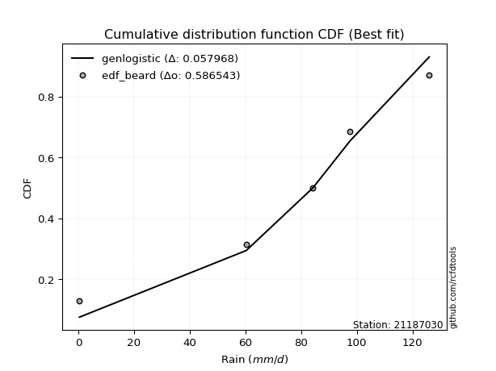</img></img>

</div>


### 5. EDF Chegodayev (1955)

The Chegodayev formula is an empirical plotting position formula used in hydrological frequency analysis to estimate the exceedance probability or return period of a specific event from a set of observed data. It is primarily used for plotting observed data points on probability paper to fit a theoretical distribution, particularly for analyzing extreme events like maximum flood flows or rainfall intensities. The constant _b_ value in the generalized plotting position formula is 0.3.

<div align="center">


$P=(m-b)/(n+1-2b)$


</div>


**5.1. Empirical values**

<div align="center">

|                | 0                   | 1                   | 2              | 3                  | 4                  |
|:---------------|:--------------------|:--------------------|:---------------|:-------------------|:-------------------|
| date           | 2022                | 2025                | 2020           | 2019               | 2021               |
| x              | 0.4                 | 60.3                | 84.2           | 97.6               | 126.0              |
| m              | 1                   | 2                   | 3              | 4                  | 5                  |
| empirical_dist | edf_chegodayev      | edf_chegodayev      | edf_chegodayev | edf_chegodayev     | edf_chegodayev     |
| empirical      | 0.12962962962962962 | 0.31481481481481477 | 0.5            | 0.6851851851851851 | 0.8703703703703703 |
| empirical_tr   | 1.148936170212766   | 1.4594594594594594  | 2.0            | 3.1764705882352935 | 7.714285714285713  |

</div>


**5.2. Kolmogorov-Smirnov fit test (sorted by Δ)**


<div align="center">

|                | 0                  | 1                   | 2                   | 3                   | 4                   | 5                   | 6                   | 7                   | 8                   | 9                   | 10                  | 11                  | 12                  | 13                  | 14                  | 15                  | 16                  | 17                  | 18                  | 19                  | 20                  | 21                  | 22                  | 23                  | 24                  | 25                  | 26                  | 27                  | 28                  | 29                  | 30                 | 31                  | 32                  | 33                  | 34                  | 35                  | 36                  | 37                  | 38                 | 39                  | 40                 | 41                  | 42                  | 43                  | 44                  | 45                  | 46                  | 47                  | 48                  | 49                  | 50                  | 51                 | 52                  | 53                 | 54                  | 55                  | 56                  | 57                 | 58                  | 59                  | 60                  | 61                  | 62                  | 63                  | 64                 | 65                  | 66                 | 67                 | 68                  | 69                 | 70                  | 71                 | 72                 | 73                  | 74                  | 75                  | 76                  | 77                 | 78                  | 79                  | 80                 | 81                 | 82                 | 83                  | 84                  | 85                 | 86                 | 87                 | 88                 | 89                  | 90                 | 91                 | 92                  | 93                  | 94                 | 95                 | 96                 | 97                 | 98                 | 99                 | 100                | 101                | 102                | 103                | 104                 | 105                | 106                 | 107                | 108                 | 109                 | 110                | 111                | 112                | 113                 | 114                 | 115                 | 116                | 117                 | 118                | 119                | 120                | 121                | 122                 | 123                | 124                | 125                 | 126                 | 127                | 128                | 129                | 130                | 131                 | 132                | 133                | 134                | 135                 | 136                | 137                | 138                | 139                | 140                | 141                | 142                | 143                | 144                | 145                | 146                | 147                | 148                | 149                | 150                | 151                | 152                | 153                | 154                | 155                | 156                | 157                | 158                | 159                |
|:---------------|:-------------------|:--------------------|:--------------------|:--------------------|:--------------------|:--------------------|:--------------------|:--------------------|:--------------------|:--------------------|:--------------------|:--------------------|:--------------------|:--------------------|:--------------------|:--------------------|:--------------------|:--------------------|:--------------------|:--------------------|:--------------------|:--------------------|:--------------------|:--------------------|:--------------------|:--------------------|:--------------------|:--------------------|:--------------------|:--------------------|:-------------------|:--------------------|:--------------------|:--------------------|:--------------------|:--------------------|:--------------------|:--------------------|:-------------------|:--------------------|:-------------------|:--------------------|:--------------------|:--------------------|:--------------------|:--------------------|:--------------------|:--------------------|:--------------------|:--------------------|:--------------------|:-------------------|:--------------------|:-------------------|:--------------------|:--------------------|:--------------------|:-------------------|:--------------------|:--------------------|:--------------------|:--------------------|:--------------------|:--------------------|:-------------------|:--------------------|:-------------------|:-------------------|:--------------------|:-------------------|:--------------------|:-------------------|:-------------------|:--------------------|:--------------------|:--------------------|:--------------------|:-------------------|:--------------------|:--------------------|:-------------------|:-------------------|:-------------------|:--------------------|:--------------------|:-------------------|:-------------------|:-------------------|:-------------------|:--------------------|:-------------------|:-------------------|:--------------------|:--------------------|:-------------------|:-------------------|:-------------------|:-------------------|:-------------------|:-------------------|:-------------------|:-------------------|:-------------------|:-------------------|:--------------------|:-------------------|:--------------------|:-------------------|:--------------------|:--------------------|:-------------------|:-------------------|:-------------------|:--------------------|:--------------------|:--------------------|:-------------------|:--------------------|:-------------------|:-------------------|:-------------------|:-------------------|:--------------------|:-------------------|:-------------------|:--------------------|:--------------------|:-------------------|:-------------------|:-------------------|:-------------------|:--------------------|:-------------------|:-------------------|:-------------------|:--------------------|:-------------------|:-------------------|:-------------------|:-------------------|:-------------------|:-------------------|:-------------------|:-------------------|:-------------------|:-------------------|:-------------------|:-------------------|:-------------------|:-------------------|:-------------------|:-------------------|:-------------------|:-------------------|:-------------------|:-------------------|:-------------------|:-------------------|:-------------------|:-------------------|
| station        | 21187030           | 21187030            | 21187030            | 21187030            | 21187030            | 21187030            | 21187030            | 21187030            | 21187030            | 21187030            | 21187030            | 21187030            | 21187030            | 21187030            | 21187030            | 21187030            | 21187030            | 21187030            | 21187030            | 21187030            | 21187030            | 21187030            | 21187030            | 21187030            | 21187030            | 21187030            | 21187030            | 21187030            | 21187030            | 21187030            | 21187030           | 21187030            | 21187030            | 21187030            | 21187030            | 21187030            | 21187030            | 21187030            | 21187030           | 21187030            | 21187030           | 21187030            | 21187030            | 21187030            | 21187030            | 21187030            | 21187030            | 21187030            | 21187030            | 21187030            | 21187030            | 21187030           | 21187030            | 21187030           | 21187030            | 21187030            | 21187030            | 21187030           | 21187030            | 21187030            | 21187030            | 21187030            | 21187030            | 21187030            | 21187030           | 21187030            | 21187030           | 21187030           | 21187030            | 21187030           | 21187030            | 21187030           | 21187030           | 21187030            | 21187030            | 21187030            | 21187030            | 21187030           | 21187030            | 21187030            | 21187030           | 21187030           | 21187030           | 21187030            | 21187030            | 21187030           | 21187030           | 21187030           | 21187030           | 21187030            | 21187030           | 21187030           | 21187030            | 21187030            | 21187030           | 21187030           | 21187030           | 21187030           | 21187030           | 21187030           | 21187030           | 21187030           | 21187030           | 21187030           | 21187030            | 21187030           | 21187030            | 21187030           | 21187030            | 21187030            | 21187030           | 21187030           | 21187030           | 21187030            | 21187030            | 21187030            | 21187030           | 21187030            | 21187030           | 21187030           | 21187030           | 21187030           | 21187030            | 21187030           | 21187030           | 21187030            | 21187030            | 21187030           | 21187030           | 21187030           | 21187030           | 21187030            | 21187030           | 21187030           | 21187030           | 21187030            | 21187030           | 21187030           | 21187030           | 21187030           | 21187030           | 21187030           | 21187030           | 21187030           | 21187030           | 21187030           | 21187030           | 21187030           | 21187030           | 21187030           | 21187030           | 21187030           | 21187030           | 21187030           | 21187030           | 21187030           | 21187030           | 21187030           | 21187030           | 21187030           |
| empirical_dist | edf_chegodayev     | edf_chegodayev      | edf_chegodayev      | edf_chegodayev      | edf_chegodayev      | edf_chegodayev      | edf_chegodayev      | edf_chegodayev      | edf_chegodayev      | edf_chegodayev      | edf_chegodayev      | edf_chegodayev      | edf_chegodayev      | edf_chegodayev      | edf_chegodayev      | edf_chegodayev      | edf_chegodayev      | edf_chegodayev      | edf_chegodayev      | edf_chegodayev      | edf_chegodayev      | edf_chegodayev      | edf_chegodayev      | edf_chegodayev      | edf_chegodayev      | edf_chegodayev      | edf_chegodayev      | edf_chegodayev      | edf_chegodayev      | edf_chegodayev      | edf_chegodayev     | edf_chegodayev      | edf_chegodayev      | edf_chegodayev      | edf_chegodayev      | edf_chegodayev      | edf_chegodayev      | edf_chegodayev      | edf_chegodayev     | edf_chegodayev      | edf_chegodayev     | edf_chegodayev      | edf_chegodayev      | edf_chegodayev      | edf_chegodayev      | edf_chegodayev      | edf_chegodayev      | edf_chegodayev      | edf_chegodayev      | edf_chegodayev      | edf_chegodayev      | edf_chegodayev     | edf_chegodayev      | edf_chegodayev     | edf_chegodayev      | edf_chegodayev      | edf_chegodayev      | edf_chegodayev     | edf_chegodayev      | edf_chegodayev      | edf_chegodayev      | edf_chegodayev      | edf_chegodayev      | edf_chegodayev      | edf_chegodayev     | edf_chegodayev      | edf_chegodayev     | edf_chegodayev     | edf_chegodayev      | edf_chegodayev     | edf_chegodayev      | edf_chegodayev     | edf_chegodayev     | edf_chegodayev      | edf_chegodayev      | edf_chegodayev      | edf_chegodayev      | edf_chegodayev     | edf_chegodayev      | edf_chegodayev      | edf_chegodayev     | edf_chegodayev     | edf_chegodayev     | edf_chegodayev      | edf_chegodayev      | edf_chegodayev     | edf_chegodayev     | edf_chegodayev     | edf_chegodayev     | edf_chegodayev      | edf_chegodayev     | edf_chegodayev     | edf_chegodayev      | edf_chegodayev      | edf_chegodayev     | edf_chegodayev     | edf_chegodayev     | edf_chegodayev     | edf_chegodayev     | edf_chegodayev     | edf_chegodayev     | edf_chegodayev     | edf_chegodayev     | edf_chegodayev     | edf_chegodayev      | edf_chegodayev     | edf_chegodayev      | edf_chegodayev     | edf_chegodayev      | edf_chegodayev      | edf_chegodayev     | edf_chegodayev     | edf_chegodayev     | edf_chegodayev      | edf_chegodayev      | edf_chegodayev      | edf_chegodayev     | edf_chegodayev      | edf_chegodayev     | edf_chegodayev     | edf_chegodayev     | edf_chegodayev     | edf_chegodayev      | edf_chegodayev     | edf_chegodayev     | edf_chegodayev      | edf_chegodayev      | edf_chegodayev     | edf_chegodayev     | edf_chegodayev     | edf_chegodayev     | edf_chegodayev      | edf_chegodayev     | edf_chegodayev     | edf_chegodayev     | edf_chegodayev      | edf_chegodayev     | edf_chegodayev     | edf_chegodayev     | edf_chegodayev     | edf_chegodayev     | edf_chegodayev     | edf_chegodayev     | edf_chegodayev     | edf_chegodayev     | edf_chegodayev     | edf_chegodayev     | edf_chegodayev     | edf_chegodayev     | edf_chegodayev     | edf_chegodayev     | edf_chegodayev     | edf_chegodayev     | edf_chegodayev     | edf_chegodayev     | edf_chegodayev     | edf_chegodayev     | edf_chegodayev     | edf_chegodayev     | edf_chegodayev     |
| p_dist         | genlogistic        | gumbel_l            | weibull_min         | trapezoid           | johnsonsu           | pearson3            | burr12              | anglit              | argus               | truncnorm           | t                   | crystalball         | norm                | exponnorm           | semicircular        | foldnorm            | dgamma              | betaprime           | gengamma            | rice                | gamma               | erlang              | logistic            | dweibull            | exponweib           | hypsecant           | maxwell             | cosine              | ksone               | logt                | triang             | skewnorm            | beta                | gausshyper          | genextreme          | genhalflogistic     | arcsine             | rayleigh            | kappa4             | loglevy_l           | gennorm            | invgauss            | laplace             | truncweibull_min    | halfnorm            | kstwobign           | tukeylambda         | genpareto           | gumbel_r            | kappa3              | uniform             | wrapcauchy         | levy_l              | vonmises_line      | halflogistic        | moyal               | mielke              | loggausshyper      | logdgamma           | logpearson3         | bradford            | logargus            | logweibull_max      | logvonmises_line    | genexpon           | logjohnsonsb        | lomax              | wald               | logdweibull         | logwrapcauchy      | loggumbel_l         | logarcsine         | logtrapezoid       | truncexpon          | burr                | loggompertz         | logloggamma         | logsemicircular    | loganglit           | loggennorm          | halfgennorm        | logexponweib       | logloglaplace      | lognorm             | logcrystalball      | logexponnorm       | lognakagami        | logrice            | lognct             | logncf              | gompertz           | logfoldnorm        | loggamma            | loggamma            | loginvgamma        | logerlang          | ncf                | loglogistic        | loginvgauss        | logmaxwell         | f                  | loghypsecant       | logkstwobign       | lograyleigh        | logalpha            | loggenextreme      | loggenexpon         | loginvweibull      | loglomax            | loghalfnorm         | invgamma           | loglaplace         | loglaplace         | logcosine           | loggumbel_r         | johnsonsb           | loghalflogistic    | loghalfgennorm      | logmoyal           | loggenpareto       | logf               | logbeta            | invweibull          | loggenhalflogistic | nakagami           | logwald             | logskewnorm         | logweibull_min     | logtriang          | fatiguelife        | logbradford        | logksone            | logkappa4          | nct                | truncpareto        | logtruncweibull_min | logfatiguelife     | logkappa3          | loguniform         | logburr12          | logbetaprime       | logtruncnorm       | weibull_max        | logtruncexpon      | logburr            | powerlaw           | logexponpow        | logmielke          | exponpow           | logjohnsonsu       | logtruncpareto     | loggengamma        | logpowerlaw        | alpha              | rdist              | loggenlogistic     | logtukeylambda     | logvonmises        | logrdist           | vonmises           |
| delta          | 0.059345138829481  | 0.07045251430741228 | 0.07133630755649834 | 0.07159045951337939 | 0.07229592755259728 | 0.07379679445748846 | 0.07544286311153728 | 0.09253914352778778 | 0.09271614435088604 | 0.09623174240020305 | 0.09789367322211584 | 0.09789872599438121 | 0.09789872998579774 | 0.09790053507329322 | 0.10057379962541765 | 0.10063404342485902 | 0.10274642164853903 | 0.10332705230762129 | 0.10609729215250452 | 0.10651160304652385 | 0.10697360582445437 | 0.10801374112666395 | 0.11055899265635238 | 0.11819682212450514 | 0.12086768169149431 | 0.12093682111844073 | 0.12460824035426354 | 0.12713403273585777 | 0.12922855973571798 | 0.12957397638273024 | 0.1296286809974544 | 0.12962954951616068 | 0.12962962962331148 | 0.12962962962811808 | 0.12962962962962876 | 0.12962962962962932 | 0.12962962962962962 | 0.13290921724826288 | 0.1344573821507593 | 0.13664262838596808 | 0.143447099146471  | 0.14367249032065105 | 0.14786744972814103 | 0.15590269844239713 | 0.15652858880950693 | 0.15747271475167857 | 0.16403417074997861 | 0.16460825955830372 | 0.16462250289585134 | 0.16717522441545118 | 0.16719745222929938 | 0.1699435057201975 | 0.17028672507267117 | 0.1729771779802447 | 0.18481785126018724 | 0.18745886050091665 | 0.21115924958987953 | 0.2162915400223685 | 0.22098795716493924 | 0.22405582704754157 | 0.22417825797345248 | 0.23184701841755417 | 0.23384724373261356 | 0.24044584620214837 | 0.2406769650449475 | 0.24419874445668704 | 0.245209469235249  | 0.2510784121231595 | 0.25329323419482475 | 0.2540842172936092 | 0.25552743030994407 | 0.2574979626419507 | 0.2576498426288132 | 0.26080702830709634 | 0.26533017226346445 | 0.26968402020688564 | 0.28319524294679355 | 0.2861436550805173 | 0.29320825439355125 | 0.29366102219864876 | 0.2984810221274462 | 0.3064027228804683 | 0.3065662235277081 | 0.31014070332076615 | 0.31014070388590553 | 0.3101420508181435 | 0.3101462365844344 | 0.3101818675198429 | 0.3103130422396747 | 0.31242060512307523 | 0.3148148148070789 | 0.3169707221853849 | 0.31749632341652856 | 0.31749632341652856 | 0.3196411032541251 | 0.3199757539535203 | 0.3212382969052249 | 0.3257312740829742 | 0.3277397593563428 | 0.334341670545799  | 0.3356424001489169 | 0.3381893045208305 | 0.3416546192083235 | 0.3417322168213429 | 0.34191040568724884 | 0.3483693673762601 | 0.35163485793969884 | 0.3522613831028122 | 0.35651975831145544 | 0.36295697643048797 | 0.3643615037691653 | 0.3665171620780058 | 0.3665171620780058 | 0.36983074739033084 | 0.37373717822394237 | 0.37968342256577015 | 0.3913166091127358 | 0.39359334484323594 | 0.3951082380310097 | 0.407795942700483  | 0.422209573286769  | 0.4400136360992222 | 0.44055430199400997 | 0.4456494689585231 | 0.4517111141130391 | 0.45505549404282275 | 0.46226234057160054 | 0.4652226456601377 | 0.4844841627614267 | 0.4847761533281497 | 0.4921448991396228 | 0.49509529707662125 | 0.5127771935636228 | 0.5162411078039281 | 0.5442044113066272 | 0.5515711734927835  | 0.552742068515935  | 0.5558665255709481 | 0.5570773194549085 | 0.5576143329792208 | 0.569352923861798  | 0.5719275679740257 | 0.5865018754790945 | 0.5898858719041842 | 0.5945225409926127 | 0.6038942113876766 | 0.6155807209517775 | 0.622571941954333  | 0.628089714967497  | 0.6443703008670625 | 0.6573493017179287 | 0.6574202290988258 | 0.6676479720374751 | 0.673387860450279  | 0.6851851759072716 | 0.6851851851851851 | 0.6851851851851852 | 0.822105627137892  | 0.8703073677065957 | 19.235847310167387 |
| deltao         | 0.5865427407550001 | 0.5865427407550001  | 0.5865427407550001  | 0.5865427407550001  | 0.5865427407550001  | 0.5865427407550001  | 0.5865427407550001  | 0.5865427407550001  | 0.5865427407550001  | 0.5865427407550001  | 0.5865427407550001  | 0.5865427407550001  | 0.5865427407550001  | 0.5865427407550001  | 0.5865427407550001  | 0.5865427407550001  | 0.5865427407550001  | 0.5865427407550001  | 0.5865427407550001  | 0.5865427407550001  | 0.5865427407550001  | 0.5865427407550001  | 0.5865427407550001  | 0.5865427407550001  | 0.5865427407550001  | 0.5865427407550001  | 0.5865427407550001  | 0.5865427407550001  | 0.5865427407550001  | 0.5865427407550001  | 0.5865427407550001 | 0.5865427407550001  | 0.5865427407550001  | 0.5865427407550001  | 0.5865427407550001  | 0.5865427407550001  | 0.5865427407550001  | 0.5865427407550001  | 0.5865427407550001 | 0.5865427407550001  | 0.5865427407550001 | 0.5865427407550001  | 0.5865427407550001  | 0.5865427407550001  | 0.5865427407550001  | 0.5865427407550001  | 0.5865427407550001  | 0.5865427407550001  | 0.5865427407550001  | 0.5865427407550001  | 0.5865427407550001  | 0.5865427407550001 | 0.5865427407550001  | 0.5865427407550001 | 0.5865427407550001  | 0.5865427407550001  | 0.5865427407550001  | 0.5865427407550001 | 0.5865427407550001  | 0.5865427407550001  | 0.5865427407550001  | 0.5865427407550001  | 0.5865427407550001  | 0.5865427407550001  | 0.5865427407550001 | 0.5865427407550001  | 0.5865427407550001 | 0.5865427407550001 | 0.5865427407550001  | 0.5865427407550001 | 0.5865427407550001  | 0.5865427407550001 | 0.5865427407550001 | 0.5865427407550001  | 0.5865427407550001  | 0.5865427407550001  | 0.5865427407550001  | 0.5865427407550001 | 0.5865427407550001  | 0.5865427407550001  | 0.5865427407550001 | 0.5865427407550001 | 0.5865427407550001 | 0.5865427407550001  | 0.5865427407550001  | 0.5865427407550001 | 0.5865427407550001 | 0.5865427407550001 | 0.5865427407550001 | 0.5865427407550001  | 0.5865427407550001 | 0.5865427407550001 | 0.5865427407550001  | 0.5865427407550001  | 0.5865427407550001 | 0.5865427407550001 | 0.5865427407550001 | 0.5865427407550001 | 0.5865427407550001 | 0.5865427407550001 | 0.5865427407550001 | 0.5865427407550001 | 0.5865427407550001 | 0.5865427407550001 | 0.5865427407550001  | 0.5865427407550001 | 0.5865427407550001  | 0.5865427407550001 | 0.5865427407550001  | 0.5865427407550001  | 0.5865427407550001 | 0.5865427407550001 | 0.5865427407550001 | 0.5865427407550001  | 0.5865427407550001  | 0.5865427407550001  | 0.5865427407550001 | 0.5865427407550001  | 0.5865427407550001 | 0.5865427407550001 | 0.5865427407550001 | 0.5865427407550001 | 0.5865427407550001  | 0.5865427407550001 | 0.5865427407550001 | 0.5865427407550001  | 0.5865427407550001  | 0.5865427407550001 | 0.5865427407550001 | 0.5865427407550001 | 0.5865427407550001 | 0.5865427407550001  | 0.5865427407550001 | 0.5865427407550001 | 0.5865427407550001 | 0.5865427407550001  | 0.5865427407550001 | 0.5865427407550001 | 0.5865427407550001 | 0.5865427407550001 | 0.5865427407550001 | 0.5865427407550001 | 0.5865427407550001 | 0.5865427407550001 | 0.5865427407550001 | 0.5865427407550001 | 0.5865427407550001 | 0.5865427407550001 | 0.5865427407550001 | 0.5865427407550001 | 0.5865427407550001 | 0.5865427407550001 | 0.5865427407550001 | 0.5865427407550001 | 0.5865427407550001 | 0.5865427407550001 | 0.5865427407550001 | 0.5865427407550001 | 0.5865427407550001 | 0.5865427407550001 |
| eval           | Δo > Δ             | Δo > Δ              | Δo > Δ              | Δo > Δ              | Δo > Δ              | Δo > Δ              | Δo > Δ              | Δo > Δ              | Δo > Δ              | Δo > Δ              | Δo > Δ              | Δo > Δ              | Δo > Δ              | Δo > Δ              | Δo > Δ              | Δo > Δ              | Δo > Δ              | Δo > Δ              | Δo > Δ              | Δo > Δ              | Δo > Δ              | Δo > Δ              | Δo > Δ              | Δo > Δ              | Δo > Δ              | Δo > Δ              | Δo > Δ              | Δo > Δ              | Δo > Δ              | Δo > Δ              | Δo > Δ             | Δo > Δ              | Δo > Δ              | Δo > Δ              | Δo > Δ              | Δo > Δ              | Δo > Δ              | Δo > Δ              | Δo > Δ             | Δo > Δ              | Δo > Δ             | Δo > Δ              | Δo > Δ              | Δo > Δ              | Δo > Δ              | Δo > Δ              | Δo > Δ              | Δo > Δ              | Δo > Δ              | Δo > Δ              | Δo > Δ              | Δo > Δ             | Δo > Δ              | Δo > Δ             | Δo > Δ              | Δo > Δ              | Δo > Δ              | Δo > Δ             | Δo > Δ              | Δo > Δ              | Δo > Δ              | Δo > Δ              | Δo > Δ              | Δo > Δ              | Δo > Δ             | Δo > Δ              | Δo > Δ             | Δo > Δ             | Δo > Δ              | Δo > Δ             | Δo > Δ              | Δo > Δ             | Δo > Δ             | Δo > Δ              | Δo > Δ              | Δo > Δ              | Δo > Δ              | Δo > Δ             | Δo > Δ              | Δo > Δ              | Δo > Δ             | Δo > Δ             | Δo > Δ             | Δo > Δ              | Δo > Δ              | Δo > Δ             | Δo > Δ             | Δo > Δ             | Δo > Δ             | Δo > Δ              | Δo > Δ             | Δo > Δ             | Δo > Δ              | Δo > Δ              | Δo > Δ             | Δo > Δ             | Δo > Δ             | Δo > Δ             | Δo > Δ             | Δo > Δ             | Δo > Δ             | Δo > Δ             | Δo > Δ             | Δo > Δ             | Δo > Δ              | Δo > Δ             | Δo > Δ              | Δo > Δ             | Δo > Δ              | Δo > Δ              | Δo > Δ             | Δo > Δ             | Δo > Δ             | Δo > Δ              | Δo > Δ              | Δo > Δ              | Δo > Δ             | Δo > Δ              | Δo > Δ             | Δo > Δ             | Δo > Δ             | Δo > Δ             | Δo > Δ              | Δo > Δ             | Δo > Δ             | Δo > Δ              | Δo > Δ              | Δo > Δ             | Δo > Δ             | Δo > Δ             | Δo > Δ             | Δo > Δ              | Δo > Δ             | Δo > Δ             | Δo > Δ             | Δo > Δ              | Δo > Δ             | Δo > Δ             | Δo > Δ             | Δo > Δ             | Δo > Δ             | Δo > Δ             | Δo > Δ             | Δo <= Δ            | Δo <= Δ            | Δo <= Δ            | Δo <= Δ            | Δo <= Δ            | Δo <= Δ            | Δo <= Δ            | Δo <= Δ            | Δo <= Δ            | Δo <= Δ            | Δo <= Δ            | Δo <= Δ            | Δo <= Δ            | Δo <= Δ            | Δo <= Δ            | Δo <= Δ            | Δo <= Δ            |
| fit            | 1                  | 1                   | 1                   | 1                   | 1                   | 1                   | 1                   | 1                   | 1                   | 1                   | 1                   | 1                   | 1                   | 1                   | 1                   | 1                   | 1                   | 1                   | 1                   | 1                   | 1                   | 1                   | 1                   | 1                   | 1                   | 1                   | 1                   | 1                   | 1                   | 1                   | 1                  | 1                   | 1                   | 1                   | 1                   | 1                   | 1                   | 1                   | 1                  | 1                   | 1                  | 1                   | 1                   | 1                   | 1                   | 1                   | 1                   | 1                   | 1                   | 1                   | 1                   | 1                  | 1                   | 1                  | 1                   | 1                   | 1                   | 1                  | 1                   | 1                   | 1                   | 1                   | 1                   | 1                   | 1                  | 1                   | 1                  | 1                  | 1                   | 1                  | 1                   | 1                  | 1                  | 1                   | 1                   | 1                   | 1                   | 1                  | 1                   | 1                   | 1                  | 1                  | 1                  | 1                   | 1                   | 1                  | 1                  | 1                  | 1                  | 1                   | 1                  | 1                  | 1                   | 1                   | 1                  | 1                  | 1                  | 1                  | 1                  | 1                  | 1                  | 1                  | 1                  | 1                  | 1                   | 1                  | 1                   | 1                  | 1                   | 1                   | 1                  | 1                  | 1                  | 1                   | 1                   | 1                   | 1                  | 1                   | 1                  | 1                  | 1                  | 1                  | 1                   | 1                  | 1                  | 1                   | 1                   | 1                  | 1                  | 1                  | 1                  | 1                   | 1                  | 1                  | 1                  | 1                   | 1                  | 1                  | 1                  | 1                  | 1                  | 1                  | 1                  | 0                  | 0                  | 0                  | 0                  | 0                  | 0                  | 0                  | 0                  | 0                  | 0                  | 0                  | 0                  | 0                  | 0                  | 0                  | 0                  | 0                  |
| n              | 5                  | 5                   | 5                   | 5                   | 5                   | 5                   | 5                   | 5                   | 5                   | 5                   | 5                   | 5                   | 5                   | 5                   | 5                   | 5                   | 5                   | 5                   | 5                   | 5                   | 5                   | 5                   | 5                   | 5                   | 5                   | 5                   | 5                   | 5                   | 5                   | 5                   | 5                  | 5                   | 5                   | 5                   | 5                   | 5                   | 5                   | 5                   | 5                  | 5                   | 5                  | 5                   | 5                   | 5                   | 5                   | 5                   | 5                   | 5                   | 5                   | 5                   | 5                   | 5                  | 5                   | 5                  | 5                   | 5                   | 5                   | 5                  | 5                   | 5                   | 5                   | 5                   | 5                   | 5                   | 5                  | 5                   | 5                  | 5                  | 5                   | 5                  | 5                   | 5                  | 5                  | 5                   | 5                   | 5                   | 5                   | 5                  | 5                   | 5                   | 5                  | 5                  | 5                  | 5                   | 5                   | 5                  | 5                  | 5                  | 5                  | 5                   | 5                  | 5                  | 5                   | 5                   | 5                  | 5                  | 5                  | 5                  | 5                  | 5                  | 5                  | 5                  | 5                  | 5                  | 5                   | 5                  | 5                   | 5                  | 5                   | 5                   | 5                  | 5                  | 5                  | 5                   | 5                   | 5                   | 5                  | 5                   | 5                  | 5                  | 5                  | 5                  | 5                   | 5                  | 5                  | 5                   | 5                   | 5                  | 5                  | 5                  | 5                  | 5                   | 5                  | 5                  | 5                  | 5                   | 5                  | 5                  | 5                  | 5                  | 5                  | 5                  | 5                  | 5                  | 5                  | 5                  | 5                  | 5                  | 5                  | 5                  | 5                  | 5                  | 5                  | 5                  | 5                  | 5                  | 5                  | 5                  | 5                  | 5                  |
| best_fit       | 1                  | 0                   | 0                   | 0                   | 0                   | 0                   | 0                   | 0                   | 0                   | 0                   | 0                   | 0                   | 0                   | 0                   | 0                   | 0                   | 0                   | 0                   | 0                   | 0                   | 0                   | 0                   | 0                   | 0                   | 0                   | 0                   | 0                   | 0                   | 0                   | 0                   | 0                  | 0                   | 0                   | 0                   | 0                   | 0                   | 0                   | 0                   | 0                  | 0                   | 0                  | 0                   | 0                   | 0                   | 0                   | 0                   | 0                   | 0                   | 0                   | 0                   | 0                   | 0                  | 0                   | 0                  | 0                   | 0                   | 0                   | 0                  | 0                   | 0                   | 0                   | 0                   | 0                   | 0                   | 0                  | 0                   | 0                  | 0                  | 0                   | 0                  | 0                   | 0                  | 0                  | 0                   | 0                   | 0                   | 0                   | 0                  | 0                   | 0                   | 0                  | 0                  | 0                  | 0                   | 0                   | 0                  | 0                  | 0                  | 0                  | 0                   | 0                  | 0                  | 0                   | 0                   | 0                  | 0                  | 0                  | 0                  | 0                  | 0                  | 0                  | 0                  | 0                  | 0                  | 0                   | 0                  | 0                   | 0                  | 0                   | 0                   | 0                  | 0                  | 0                  | 0                   | 0                   | 0                   | 0                  | 0                   | 0                  | 0                  | 0                  | 0                  | 0                   | 0                  | 0                  | 0                   | 0                   | 0                  | 0                  | 0                  | 0                  | 0                   | 0                  | 0                  | 0                  | 0                   | 0                  | 0                  | 0                  | 0                  | 0                  | 0                  | 0                  | 0                  | 0                  | 0                  | 0                  | 0                  | 0                  | 0                  | 0                  | 0                  | 0                  | 0                  | 0                  | 0                  | 0                  | 0                  | 0                  | 0                  |
| best_fit_sort  | 1                  | 2                   | 3                   | 4                   | 5                   | 6                   | 7                   | 8                   | 9                   | 10                  | 11                  | 12                  | 13                  | 14                  | 15                  | 16                  | 17                  | 18                  | 19                  | 20                  | 21                  | 22                  | 23                  | 24                  | 25                  | 26                  | 27                  | 28                  | 29                  | 30                  | 31                 | 32                  | 33                  | 34                  | 35                  | 36                  | 37                  | 38                  | 39                 | 40                  | 41                 | 42                  | 43                  | 44                  | 45                  | 46                  | 47                  | 48                  | 49                  | 50                  | 51                  | 52                 | 53                  | 54                 | 55                  | 56                  | 57                  | 58                 | 59                  | 60                  | 61                  | 62                  | 63                  | 64                  | 65                 | 66                  | 67                 | 68                 | 69                  | 70                 | 71                  | 72                 | 73                 | 74                  | 75                  | 76                  | 77                  | 78                 | 79                  | 80                  | 81                 | 82                 | 83                 | 84                  | 85                  | 86                 | 87                 | 88                 | 89                 | 90                  | 91                 | 92                 | 93                  | 94                  | 95                 | 96                 | 97                 | 98                 | 99                 | 100                | 101                | 102                | 103                | 104                | 105                 | 106                | 107                 | 108                | 109                 | 110                 | 111                | 112                | 113                | 114                 | 115                 | 116                 | 117                | 118                 | 119                | 120                | 121                | 122                | 123                 | 124                | 125                | 126                 | 127                 | 128                | 129                | 130                | 131                | 132                 | 133                | 134                | 135                | 136                 | 137                | 138                | 139                | 140                | 141                | 142                | 143                | 144                | 145                | 146                | 147                | 148                | 149                | 150                | 151                | 152                | 153                | 154                | 155                | 156                | 157                | 158                | 159                | 160                |

</div>


**5.3. Best fit**

<div align="center">

|   id |   station | empirical_dist   | p_dist      |     delta |   deltao | eval   |   fit |   n |   best_fit |   best_fit_sort |
|-----:|----------:|:-----------------|:------------|----------:|---------:|:-------|------:|----:|-----------:|----------------:|
|    0 |  21187030 | edf_chegodayev   | genlogistic | 0.0593451 | 0.586543 | Δo > Δ |     1 |   5 |          1 |               1 |

</div>


<div align="center">

</img></img>

</div>


### 6. EDF Blom (1958)

The Blom formula is a specific "plotting position" formula used in hydrology and statistical analysis to estimate the empirical cumulative probability (or non-exceedance probability) of a data series. It is particularly recommended for data that are approximately normally distributed. The constant _a_ is set to 0.375 (or 3/8).

<div align="center">


$P=(m-a)/(n+1-2a)$


</div>


**6.1. Empirical values**

<div align="center">

|                | 0                   | 1                   | 2        | 3                  | 4                  |
|:---------------|:--------------------|:--------------------|:---------|:-------------------|:-------------------|
| date           | 2022                | 2025                | 2020     | 2019               | 2021               |
| x              | 0.4                 | 60.3                | 84.2     | 97.6               | 126.0              |
| m              | 1                   | 2                   | 3        | 4                  | 5                  |
| empirical_dist | edf_blom            | edf_blom            | edf_blom | edf_blom           | edf_blom           |
| empirical      | 0.11904761904761904 | 0.30952380952380953 | 0.5      | 0.6904761904761905 | 0.8809523809523809 |
| empirical_tr   | 1.135135135135135   | 1.4482758620689655  | 2.0      | 3.230769230769231  | 8.399999999999999  |

</div>


**6.2. Kolmogorov-Smirnov fit test (sorted by Δ)**


<div align="center">

|                | 0                   | 1                   | 2                   | 3                   | 4                  | 5                   | 6                  | 7                   | 8                   | 9                   | 10                  | 11                  | 12                  | 13                  | 14                  | 15                  | 16                  | 17                  | 18                  | 19                  | 20                  | 21                  | 22                  | 23                 | 24                 | 25                  | 26                 | 27                 | 28                 | 29                  | 30                  | 31                  | 32                  | 33                  | 34                  | 35                  | 36                  | 37                  | 38                  | 39                  | 40                  | 41                  | 42                  | 43                  | 44                  | 45                 | 46                  | 47                  | 48                 | 49                  | 50                  | 51                  | 52                  | 53                 | 54                  | 55                  | 56                  | 57                  | 58                 | 59                 | 60                  | 61                 | 62                 | 63                 | 64                  | 65                 | 66                  | 67                 | 68                  | 69                 | 70                 | 71                 | 72                 | 73                 | 74                 | 75                 | 76                 | 77                  | 78                  | 79                 | 80                  | 81                  | 82                  | 83                 | 84                  | 85                  | 86                  | 87                 | 88                  | 89                 | 90                  | 91                  | 92                 | 93                 | 94                 | 95                 | 96                 | 97                  | 98                  | 99                  | 100                | 101                 | 102                 | 103                 | 104                | 105                 | 106                | 107                | 108                 | 109                | 110                 | 111                | 112                | 113                | 114                | 115                | 116                 | 117                | 118                 | 119                 | 120                 | 121                | 122                | 123                 | 124                 | 125                | 126                | 127                 | 128                 | 129                 | 130                | 131                | 132                | 133                | 134                | 135                 | 136                | 137                | 138                | 139                | 140                | 141                | 142                | 143                | 144                | 145                | 146                | 147                | 148                | 149                | 150                | 151                | 152                | 153                | 154                | 155                | 156                | 157                | 158                | 159                |
|:---------------|:--------------------|:--------------------|:--------------------|:--------------------|:-------------------|:--------------------|:-------------------|:--------------------|:--------------------|:--------------------|:--------------------|:--------------------|:--------------------|:--------------------|:--------------------|:--------------------|:--------------------|:--------------------|:--------------------|:--------------------|:--------------------|:--------------------|:--------------------|:-------------------|:-------------------|:--------------------|:-------------------|:-------------------|:-------------------|:--------------------|:--------------------|:--------------------|:--------------------|:--------------------|:--------------------|:--------------------|:--------------------|:--------------------|:--------------------|:--------------------|:--------------------|:--------------------|:--------------------|:--------------------|:--------------------|:-------------------|:--------------------|:--------------------|:-------------------|:--------------------|:--------------------|:--------------------|:--------------------|:-------------------|:--------------------|:--------------------|:--------------------|:--------------------|:-------------------|:-------------------|:--------------------|:-------------------|:-------------------|:-------------------|:--------------------|:-------------------|:--------------------|:-------------------|:--------------------|:-------------------|:-------------------|:-------------------|:-------------------|:-------------------|:-------------------|:-------------------|:-------------------|:--------------------|:--------------------|:-------------------|:--------------------|:--------------------|:--------------------|:-------------------|:--------------------|:--------------------|:--------------------|:-------------------|:--------------------|:-------------------|:--------------------|:--------------------|:-------------------|:-------------------|:-------------------|:-------------------|:-------------------|:--------------------|:--------------------|:--------------------|:-------------------|:--------------------|:--------------------|:--------------------|:-------------------|:--------------------|:-------------------|:-------------------|:--------------------|:-------------------|:--------------------|:-------------------|:-------------------|:-------------------|:-------------------|:-------------------|:--------------------|:-------------------|:--------------------|:--------------------|:--------------------|:-------------------|:-------------------|:--------------------|:--------------------|:-------------------|:-------------------|:--------------------|:--------------------|:--------------------|:-------------------|:-------------------|:-------------------|:-------------------|:-------------------|:--------------------|:-------------------|:-------------------|:-------------------|:-------------------|:-------------------|:-------------------|:-------------------|:-------------------|:-------------------|:-------------------|:-------------------|:-------------------|:-------------------|:-------------------|:-------------------|:-------------------|:-------------------|:-------------------|:-------------------|:-------------------|:-------------------|:-------------------|:-------------------|:-------------------|
| station        | 21187030            | 21187030            | 21187030            | 21187030            | 21187030           | 21187030            | 21187030           | 21187030            | 21187030            | 21187030            | 21187030            | 21187030            | 21187030            | 21187030            | 21187030            | 21187030            | 21187030            | 21187030            | 21187030            | 21187030            | 21187030            | 21187030            | 21187030            | 21187030           | 21187030           | 21187030            | 21187030           | 21187030           | 21187030           | 21187030            | 21187030            | 21187030            | 21187030            | 21187030            | 21187030            | 21187030            | 21187030            | 21187030            | 21187030            | 21187030            | 21187030            | 21187030            | 21187030            | 21187030            | 21187030            | 21187030           | 21187030            | 21187030            | 21187030           | 21187030            | 21187030            | 21187030            | 21187030            | 21187030           | 21187030            | 21187030            | 21187030            | 21187030            | 21187030           | 21187030           | 21187030            | 21187030           | 21187030           | 21187030           | 21187030            | 21187030           | 21187030            | 21187030           | 21187030            | 21187030           | 21187030           | 21187030           | 21187030           | 21187030           | 21187030           | 21187030           | 21187030           | 21187030            | 21187030            | 21187030           | 21187030            | 21187030            | 21187030            | 21187030           | 21187030            | 21187030            | 21187030            | 21187030           | 21187030            | 21187030           | 21187030            | 21187030            | 21187030           | 21187030           | 21187030           | 21187030           | 21187030           | 21187030            | 21187030            | 21187030            | 21187030           | 21187030            | 21187030            | 21187030            | 21187030           | 21187030            | 21187030           | 21187030           | 21187030            | 21187030           | 21187030            | 21187030           | 21187030           | 21187030           | 21187030           | 21187030           | 21187030            | 21187030           | 21187030            | 21187030            | 21187030            | 21187030           | 21187030           | 21187030            | 21187030            | 21187030           | 21187030           | 21187030            | 21187030            | 21187030            | 21187030           | 21187030           | 21187030           | 21187030           | 21187030           | 21187030            | 21187030           | 21187030           | 21187030           | 21187030           | 21187030           | 21187030           | 21187030           | 21187030           | 21187030           | 21187030           | 21187030           | 21187030           | 21187030           | 21187030           | 21187030           | 21187030           | 21187030           | 21187030           | 21187030           | 21187030           | 21187030           | 21187030           | 21187030           | 21187030           |
| empirical_dist | edf_blom            | edf_blom            | edf_blom            | edf_blom            | edf_blom           | edf_blom            | edf_blom           | edf_blom            | edf_blom            | edf_blom            | edf_blom            | edf_blom            | edf_blom            | edf_blom            | edf_blom            | edf_blom            | edf_blom            | edf_blom            | edf_blom            | edf_blom            | edf_blom            | edf_blom            | edf_blom            | edf_blom           | edf_blom           | edf_blom            | edf_blom           | edf_blom           | edf_blom           | edf_blom            | edf_blom            | edf_blom            | edf_blom            | edf_blom            | edf_blom            | edf_blom            | edf_blom            | edf_blom            | edf_blom            | edf_blom            | edf_blom            | edf_blom            | edf_blom            | edf_blom            | edf_blom            | edf_blom           | edf_blom            | edf_blom            | edf_blom           | edf_blom            | edf_blom            | edf_blom            | edf_blom            | edf_blom           | edf_blom            | edf_blom            | edf_blom            | edf_blom            | edf_blom           | edf_blom           | edf_blom            | edf_blom           | edf_blom           | edf_blom           | edf_blom            | edf_blom           | edf_blom            | edf_blom           | edf_blom            | edf_blom           | edf_blom           | edf_blom           | edf_blom           | edf_blom           | edf_blom           | edf_blom           | edf_blom           | edf_blom            | edf_blom            | edf_blom           | edf_blom            | edf_blom            | edf_blom            | edf_blom           | edf_blom            | edf_blom            | edf_blom            | edf_blom           | edf_blom            | edf_blom           | edf_blom            | edf_blom            | edf_blom           | edf_blom           | edf_blom           | edf_blom           | edf_blom           | edf_blom            | edf_blom            | edf_blom            | edf_blom           | edf_blom            | edf_blom            | edf_blom            | edf_blom           | edf_blom            | edf_blom           | edf_blom           | edf_blom            | edf_blom           | edf_blom            | edf_blom           | edf_blom           | edf_blom           | edf_blom           | edf_blom           | edf_blom            | edf_blom           | edf_blom            | edf_blom            | edf_blom            | edf_blom           | edf_blom           | edf_blom            | edf_blom            | edf_blom           | edf_blom           | edf_blom            | edf_blom            | edf_blom            | edf_blom           | edf_blom           | edf_blom           | edf_blom           | edf_blom           | edf_blom            | edf_blom           | edf_blom           | edf_blom           | edf_blom           | edf_blom           | edf_blom           | edf_blom           | edf_blom           | edf_blom           | edf_blom           | edf_blom           | edf_blom           | edf_blom           | edf_blom           | edf_blom           | edf_blom           | edf_blom           | edf_blom           | edf_blom           | edf_blom           | edf_blom           | edf_blom           | edf_blom           | edf_blom           |
| p_dist         | genlogistic         | gumbel_l            | weibull_min         | trapezoid           | johnsonsu          | pearson3            | burr12             | argus               | anglit              | semicircular        | truncnorm           | foldnorm            | t                   | crystalball         | norm                | exponnorm           | betaprime           | gengamma            | rice                | gamma               | erlang              | dgamma              | logistic            | dweibull           | ksone              | triang              | skewnorm           | beta               | gausshyper         | genhalflogistic     | arcsine             | exponweib           | hypsecant           | logt                | maxwell             | genextreme          | cosine              | rayleigh            | kappa4              | gennorm             | loglevy_l           | laplace             | invgauss            | truncweibull_min    | halfnorm            | kstwobign          | gumbel_r            | kappa3              | uniform            | tukeylambda         | genpareto           | wrapcauchy          | levy_l              | vonmises_line      | halflogistic        | moyal               | mielke              | loggausshyper       | logpearson3        | bradford           | logdgamma           | logargus           | logweibull_max     | logvonmises_line   | genexpon            | logjohnsonsb       | lomax               | wald               | logwrapcauchy       | loggumbel_l        | logarcsine         | logtrapezoid       | logdweibull        | truncexpon         | burr               | loggompertz        | logloggamma        | logsemicircular     | loggennorm          | loganglit          | halfgennorm         | gompertz            | logexponweib        | lognorm            | logcrystalball      | logexponnorm        | lognakagami         | logrice            | lognct              | logloglaplace      | logncf              | logfoldnorm         | loggamma           | loggamma           | loginvgamma        | logerlang          | ncf                | loglogistic         | loginvgauss         | logmaxwell          | f                  | loghypsecant        | logkstwobign        | lograyleigh         | logalpha           | loggenextreme       | loggenexpon        | loginvweibull      | loglomax            | loghalfnorm        | invgamma            | loglaplace         | loglaplace         | logcosine          | loggumbel_r        | johnsonsb          | loghalflogistic     | loghalfgennorm     | logmoyal            | loggenpareto        | logf                | logbeta            | loggenhalflogistic | invweibull          | nakagami            | logwald            | logskewnorm        | logweibull_min      | logtriang           | fatiguelife         | logbradford        | logksone           | logkappa4          | nct                | truncpareto        | logtruncweibull_min | logfatiguelife     | logkappa3          | loguniform         | logburr12          | logbetaprime       | logtruncnorm       | weibull_max        | logtruncexpon      | logburr            | powerlaw           | logexponpow        | logmielke          | exponpow           | logjohnsonsu       | logtruncpareto     | loggengamma        | logpowerlaw        | alpha              | rdist              | loggenlogistic     | logtukeylambda     | logvonmises        | logrdist           | vonmises           |
| delta          | 0.04876312824747042 | 0.05987050372540171 | 0.06075429697448776 | 0.06100844893136881 | 0.0617139169705867 | 0.06321478387547788 | 0.0648608525295267 | 0.08213413376887546 | 0.08433949949668107 | 0.09019001701248269 | 0.09623174240020305 | 0.09736904328501772 | 0.09789367322211584 | 0.09789872599438121 | 0.09789872998579774 | 0.09790053507329322 | 0.10332705230762129 | 0.10609729215250452 | 0.10651160304652385 | 0.10697360582445437 | 0.10801374112666395 | 0.10803742693954427 | 0.11055899265635238 | 0.1129058168334999 | 0.1186465491537074 | 0.11904667041544381 | 0.1190475389341501 | 0.1190476190413009 | 0.1190476190461075 | 0.11904761904761874 | 0.11904761904761904 | 0.12086768169149431 | 0.12093682111844073 | 0.12428297109172501 | 0.12460824035426354 | 0.12547361713243688 | 0.12713403273585777 | 0.13290921724826288 | 0.13782636232430479 | 0.13815609385546576 | 0.14193363367697343 | 0.14786744972814103 | 0.14896349561165628 | 0.15590269844239713 | 0.15652858880950693 | 0.1627637200426838 | 0.16462250289585134 | 0.16737954031293323 | 0.1673870185016682 | 0.16785033571738306 | 0.16989926484930906 | 0.17523451101120274 | 0.17557773036367652 | 0.1764723981481232 | 0.18481785126018724 | 0.18745886050091665 | 0.21645025488088476 | 0.22158254531337374 | 0.2293468323385468 | 0.2294692632644577 | 0.23156996774694982 | 0.2371380237085594 | 0.2391382490236188 | 0.2457368514931536 | 0.24596797033595275 | 0.2494897497476924 | 0.25050047452625424 | 0.2510784121231595 | 0.25937522258461443 | 0.2608184356009493 | 0.2627889679329559 | 0.2629408479198184 | 0.2638752447768353 | 0.2660980335981016 | 0.2706211775544697 | 0.2749750254978909 | 0.2884862482377988 | 0.29143466037152255 | 0.29366102219864876 | 0.2984992596845565 | 0.30377202741845144 | 0.30952380951607367 | 0.31169372817147356 | 0.3154317086117714 | 0.31543170917691077 | 0.31543305610914874 | 0.31543724187543964 | 0.3154728728108481 | 0.31560404753067994 | 0.3171482341097187 | 0.31771161041408047 | 0.32226172747639015 | 0.3227873287075338 | 0.3227873287075338 | 0.3249321085451303 | 0.3252667592445255 | 0.3265293021962301 | 0.33102227937397943 | 0.33303076464734804 | 0.33963267583680423 | 0.3409334054399221 | 0.34348030981183575 | 0.34694562449932875 | 0.34702322211234815 | 0.3472014109782541 | 0.35366037266726535 | 0.3569258632307041 | 0.3575523883938174 | 0.36181076360246067 | 0.3682479817214932 | 0.36965250906017055 | 0.371808167369011  | 0.371808167369011  | 0.3751217526813361 | 0.3790281835149476 | 0.3849744278567755 | 0.39660761440374104 | 0.3988843501342412 | 0.40039924332201493 | 0.41308694799148826 | 0.42750057857777424 | 0.4453046413902276 | 0.4509404742495283 | 0.45113631257602055 | 0.45700211940404434 | 0.460346499333828  | 0.4675533458626058 | 0.47051365095114295 | 0.48977516805243193 | 0.49006715861915495 | 0.497435904430628  | 0.5003863023676265 | 0.5180681988546281 | 0.5215321130949333 | 0.5494954165976325 | 0.5568621787837887  | 0.5580330738069402 | 0.5611575308619533 | 0.5623683247459137 | 0.5681963435612314 | 0.5746439291528033 | 0.5772185732650309 | 0.5917928807700998 | 0.5951768771951894 | 0.5998135462836179 | 0.6091852166786819 | 0.6208717262427828 | 0.6278629472453382 | 0.6333807202585022 | 0.6496613061580678 | 0.662640307008934  | 0.662711234389831  | 0.6729389773284803 | 0.6786788657412842 | 0.6904761811982768 | 0.6904761904761905 | 0.6956647274263701 | 0.8326876377199026 | 0.8808893782886063 | 19.225265299585377 |
| deltao         | 0.5865427407550001  | 0.5865427407550001  | 0.5865427407550001  | 0.5865427407550001  | 0.5865427407550001 | 0.5865427407550001  | 0.5865427407550001 | 0.5865427407550001  | 0.5865427407550001  | 0.5865427407550001  | 0.5865427407550001  | 0.5865427407550001  | 0.5865427407550001  | 0.5865427407550001  | 0.5865427407550001  | 0.5865427407550001  | 0.5865427407550001  | 0.5865427407550001  | 0.5865427407550001  | 0.5865427407550001  | 0.5865427407550001  | 0.5865427407550001  | 0.5865427407550001  | 0.5865427407550001 | 0.5865427407550001 | 0.5865427407550001  | 0.5865427407550001 | 0.5865427407550001 | 0.5865427407550001 | 0.5865427407550001  | 0.5865427407550001  | 0.5865427407550001  | 0.5865427407550001  | 0.5865427407550001  | 0.5865427407550001  | 0.5865427407550001  | 0.5865427407550001  | 0.5865427407550001  | 0.5865427407550001  | 0.5865427407550001  | 0.5865427407550001  | 0.5865427407550001  | 0.5865427407550001  | 0.5865427407550001  | 0.5865427407550001  | 0.5865427407550001 | 0.5865427407550001  | 0.5865427407550001  | 0.5865427407550001 | 0.5865427407550001  | 0.5865427407550001  | 0.5865427407550001  | 0.5865427407550001  | 0.5865427407550001 | 0.5865427407550001  | 0.5865427407550001  | 0.5865427407550001  | 0.5865427407550001  | 0.5865427407550001 | 0.5865427407550001 | 0.5865427407550001  | 0.5865427407550001 | 0.5865427407550001 | 0.5865427407550001 | 0.5865427407550001  | 0.5865427407550001 | 0.5865427407550001  | 0.5865427407550001 | 0.5865427407550001  | 0.5865427407550001 | 0.5865427407550001 | 0.5865427407550001 | 0.5865427407550001 | 0.5865427407550001 | 0.5865427407550001 | 0.5865427407550001 | 0.5865427407550001 | 0.5865427407550001  | 0.5865427407550001  | 0.5865427407550001 | 0.5865427407550001  | 0.5865427407550001  | 0.5865427407550001  | 0.5865427407550001 | 0.5865427407550001  | 0.5865427407550001  | 0.5865427407550001  | 0.5865427407550001 | 0.5865427407550001  | 0.5865427407550001 | 0.5865427407550001  | 0.5865427407550001  | 0.5865427407550001 | 0.5865427407550001 | 0.5865427407550001 | 0.5865427407550001 | 0.5865427407550001 | 0.5865427407550001  | 0.5865427407550001  | 0.5865427407550001  | 0.5865427407550001 | 0.5865427407550001  | 0.5865427407550001  | 0.5865427407550001  | 0.5865427407550001 | 0.5865427407550001  | 0.5865427407550001 | 0.5865427407550001 | 0.5865427407550001  | 0.5865427407550001 | 0.5865427407550001  | 0.5865427407550001 | 0.5865427407550001 | 0.5865427407550001 | 0.5865427407550001 | 0.5865427407550001 | 0.5865427407550001  | 0.5865427407550001 | 0.5865427407550001  | 0.5865427407550001  | 0.5865427407550001  | 0.5865427407550001 | 0.5865427407550001 | 0.5865427407550001  | 0.5865427407550001  | 0.5865427407550001 | 0.5865427407550001 | 0.5865427407550001  | 0.5865427407550001  | 0.5865427407550001  | 0.5865427407550001 | 0.5865427407550001 | 0.5865427407550001 | 0.5865427407550001 | 0.5865427407550001 | 0.5865427407550001  | 0.5865427407550001 | 0.5865427407550001 | 0.5865427407550001 | 0.5865427407550001 | 0.5865427407550001 | 0.5865427407550001 | 0.5865427407550001 | 0.5865427407550001 | 0.5865427407550001 | 0.5865427407550001 | 0.5865427407550001 | 0.5865427407550001 | 0.5865427407550001 | 0.5865427407550001 | 0.5865427407550001 | 0.5865427407550001 | 0.5865427407550001 | 0.5865427407550001 | 0.5865427407550001 | 0.5865427407550001 | 0.5865427407550001 | 0.5865427407550001 | 0.5865427407550001 | 0.5865427407550001 |
| eval           | Δo > Δ              | Δo > Δ              | Δo > Δ              | Δo > Δ              | Δo > Δ             | Δo > Δ              | Δo > Δ             | Δo > Δ              | Δo > Δ              | Δo > Δ              | Δo > Δ              | Δo > Δ              | Δo > Δ              | Δo > Δ              | Δo > Δ              | Δo > Δ              | Δo > Δ              | Δo > Δ              | Δo > Δ              | Δo > Δ              | Δo > Δ              | Δo > Δ              | Δo > Δ              | Δo > Δ             | Δo > Δ             | Δo > Δ              | Δo > Δ             | Δo > Δ             | Δo > Δ             | Δo > Δ              | Δo > Δ              | Δo > Δ              | Δo > Δ              | Δo > Δ              | Δo > Δ              | Δo > Δ              | Δo > Δ              | Δo > Δ              | Δo > Δ              | Δo > Δ              | Δo > Δ              | Δo > Δ              | Δo > Δ              | Δo > Δ              | Δo > Δ              | Δo > Δ             | Δo > Δ              | Δo > Δ              | Δo > Δ             | Δo > Δ              | Δo > Δ              | Δo > Δ              | Δo > Δ              | Δo > Δ             | Δo > Δ              | Δo > Δ              | Δo > Δ              | Δo > Δ              | Δo > Δ             | Δo > Δ             | Δo > Δ              | Δo > Δ             | Δo > Δ             | Δo > Δ             | Δo > Δ              | Δo > Δ             | Δo > Δ              | Δo > Δ             | Δo > Δ              | Δo > Δ             | Δo > Δ             | Δo > Δ             | Δo > Δ             | Δo > Δ             | Δo > Δ             | Δo > Δ             | Δo > Δ             | Δo > Δ              | Δo > Δ              | Δo > Δ             | Δo > Δ              | Δo > Δ              | Δo > Δ              | Δo > Δ             | Δo > Δ              | Δo > Δ              | Δo > Δ              | Δo > Δ             | Δo > Δ              | Δo > Δ             | Δo > Δ              | Δo > Δ              | Δo > Δ             | Δo > Δ             | Δo > Δ             | Δo > Δ             | Δo > Δ             | Δo > Δ              | Δo > Δ              | Δo > Δ              | Δo > Δ             | Δo > Δ              | Δo > Δ              | Δo > Δ              | Δo > Δ             | Δo > Δ              | Δo > Δ             | Δo > Δ             | Δo > Δ              | Δo > Δ             | Δo > Δ              | Δo > Δ             | Δo > Δ             | Δo > Δ             | Δo > Δ             | Δo > Δ             | Δo > Δ              | Δo > Δ             | Δo > Δ              | Δo > Δ              | Δo > Δ              | Δo > Δ             | Δo > Δ             | Δo > Δ              | Δo > Δ              | Δo > Δ             | Δo > Δ             | Δo > Δ              | Δo > Δ              | Δo > Δ              | Δo > Δ             | Δo > Δ             | Δo > Δ             | Δo > Δ             | Δo > Δ             | Δo > Δ              | Δo > Δ             | Δo > Δ             | Δo > Δ             | Δo > Δ             | Δo > Δ             | Δo > Δ             | Δo <= Δ            | Δo <= Δ            | Δo <= Δ            | Δo <= Δ            | Δo <= Δ            | Δo <= Δ            | Δo <= Δ            | Δo <= Δ            | Δo <= Δ            | Δo <= Δ            | Δo <= Δ            | Δo <= Δ            | Δo <= Δ            | Δo <= Δ            | Δo <= Δ            | Δo <= Δ            | Δo <= Δ            | Δo <= Δ            |
| fit            | 1                   | 1                   | 1                   | 1                   | 1                  | 1                   | 1                  | 1                   | 1                   | 1                   | 1                   | 1                   | 1                   | 1                   | 1                   | 1                   | 1                   | 1                   | 1                   | 1                   | 1                   | 1                   | 1                   | 1                  | 1                  | 1                   | 1                  | 1                  | 1                  | 1                   | 1                   | 1                   | 1                   | 1                   | 1                   | 1                   | 1                   | 1                   | 1                   | 1                   | 1                   | 1                   | 1                   | 1                   | 1                   | 1                  | 1                   | 1                   | 1                  | 1                   | 1                   | 1                   | 1                   | 1                  | 1                   | 1                   | 1                   | 1                   | 1                  | 1                  | 1                   | 1                  | 1                  | 1                  | 1                   | 1                  | 1                   | 1                  | 1                   | 1                  | 1                  | 1                  | 1                  | 1                  | 1                  | 1                  | 1                  | 1                   | 1                   | 1                  | 1                   | 1                   | 1                   | 1                  | 1                   | 1                   | 1                   | 1                  | 1                   | 1                  | 1                   | 1                   | 1                  | 1                  | 1                  | 1                  | 1                  | 1                   | 1                   | 1                   | 1                  | 1                   | 1                   | 1                   | 1                  | 1                   | 1                  | 1                  | 1                   | 1                  | 1                   | 1                  | 1                  | 1                  | 1                  | 1                  | 1                   | 1                  | 1                   | 1                   | 1                   | 1                  | 1                  | 1                   | 1                   | 1                  | 1                  | 1                   | 1                   | 1                   | 1                  | 1                  | 1                  | 1                  | 1                  | 1                   | 1                  | 1                  | 1                  | 1                  | 1                  | 1                  | 0                  | 0                  | 0                  | 0                  | 0                  | 0                  | 0                  | 0                  | 0                  | 0                  | 0                  | 0                  | 0                  | 0                  | 0                  | 0                  | 0                  | 0                  |
| n              | 5                   | 5                   | 5                   | 5                   | 5                  | 5                   | 5                  | 5                   | 5                   | 5                   | 5                   | 5                   | 5                   | 5                   | 5                   | 5                   | 5                   | 5                   | 5                   | 5                   | 5                   | 5                   | 5                   | 5                  | 5                  | 5                   | 5                  | 5                  | 5                  | 5                   | 5                   | 5                   | 5                   | 5                   | 5                   | 5                   | 5                   | 5                   | 5                   | 5                   | 5                   | 5                   | 5                   | 5                   | 5                   | 5                  | 5                   | 5                   | 5                  | 5                   | 5                   | 5                   | 5                   | 5                  | 5                   | 5                   | 5                   | 5                   | 5                  | 5                  | 5                   | 5                  | 5                  | 5                  | 5                   | 5                  | 5                   | 5                  | 5                   | 5                  | 5                  | 5                  | 5                  | 5                  | 5                  | 5                  | 5                  | 5                   | 5                   | 5                  | 5                   | 5                   | 5                   | 5                  | 5                   | 5                   | 5                   | 5                  | 5                   | 5                  | 5                   | 5                   | 5                  | 5                  | 5                  | 5                  | 5                  | 5                   | 5                   | 5                   | 5                  | 5                   | 5                   | 5                   | 5                  | 5                   | 5                  | 5                  | 5                   | 5                  | 5                   | 5                  | 5                  | 5                  | 5                  | 5                  | 5                   | 5                  | 5                   | 5                   | 5                   | 5                  | 5                  | 5                   | 5                   | 5                  | 5                  | 5                   | 5                   | 5                   | 5                  | 5                  | 5                  | 5                  | 5                  | 5                   | 5                  | 5                  | 5                  | 5                  | 5                  | 5                  | 5                  | 5                  | 5                  | 5                  | 5                  | 5                  | 5                  | 5                  | 5                  | 5                  | 5                  | 5                  | 5                  | 5                  | 5                  | 5                  | 5                  | 5                  |
| best_fit       | 1                   | 0                   | 0                   | 0                   | 0                  | 0                   | 0                  | 0                   | 0                   | 0                   | 0                   | 0                   | 0                   | 0                   | 0                   | 0                   | 0                   | 0                   | 0                   | 0                   | 0                   | 0                   | 0                   | 0                  | 0                  | 0                   | 0                  | 0                  | 0                  | 0                   | 0                   | 0                   | 0                   | 0                   | 0                   | 0                   | 0                   | 0                   | 0                   | 0                   | 0                   | 0                   | 0                   | 0                   | 0                   | 0                  | 0                   | 0                   | 0                  | 0                   | 0                   | 0                   | 0                   | 0                  | 0                   | 0                   | 0                   | 0                   | 0                  | 0                  | 0                   | 0                  | 0                  | 0                  | 0                   | 0                  | 0                   | 0                  | 0                   | 0                  | 0                  | 0                  | 0                  | 0                  | 0                  | 0                  | 0                  | 0                   | 0                   | 0                  | 0                   | 0                   | 0                   | 0                  | 0                   | 0                   | 0                   | 0                  | 0                   | 0                  | 0                   | 0                   | 0                  | 0                  | 0                  | 0                  | 0                  | 0                   | 0                   | 0                   | 0                  | 0                   | 0                   | 0                   | 0                  | 0                   | 0                  | 0                  | 0                   | 0                  | 0                   | 0                  | 0                  | 0                  | 0                  | 0                  | 0                   | 0                  | 0                   | 0                   | 0                   | 0                  | 0                  | 0                   | 0                   | 0                  | 0                  | 0                   | 0                   | 0                   | 0                  | 0                  | 0                  | 0                  | 0                  | 0                   | 0                  | 0                  | 0                  | 0                  | 0                  | 0                  | 0                  | 0                  | 0                  | 0                  | 0                  | 0                  | 0                  | 0                  | 0                  | 0                  | 0                  | 0                  | 0                  | 0                  | 0                  | 0                  | 0                  | 0                  |
| best_fit_sort  | 1                   | 2                   | 3                   | 4                   | 5                  | 6                   | 7                  | 8                   | 9                   | 10                  | 11                  | 12                  | 13                  | 14                  | 15                  | 16                  | 17                  | 18                  | 19                  | 20                  | 21                  | 22                  | 23                  | 24                 | 25                 | 26                  | 27                 | 28                 | 29                 | 30                  | 31                  | 32                  | 33                  | 34                  | 35                  | 36                  | 37                  | 38                  | 39                  | 40                  | 41                  | 42                  | 43                  | 44                  | 45                  | 46                 | 47                  | 48                  | 49                 | 50                  | 51                  | 52                  | 53                  | 54                 | 55                  | 56                  | 57                  | 58                  | 59                 | 60                 | 61                  | 62                 | 63                 | 64                 | 65                  | 66                 | 67                  | 68                 | 69                  | 70                 | 71                 | 72                 | 73                 | 74                 | 75                 | 76                 | 77                 | 78                  | 79                  | 80                 | 81                  | 82                  | 83                  | 84                 | 85                  | 86                  | 87                  | 88                 | 89                  | 90                 | 91                  | 92                  | 93                 | 94                 | 95                 | 96                 | 97                 | 98                  | 99                  | 100                 | 101                | 102                 | 103                 | 104                 | 105                | 106                 | 107                | 108                | 109                 | 110                | 111                 | 112                | 113                | 114                | 115                | 116                | 117                 | 118                | 119                 | 120                 | 121                 | 122                | 123                | 124                 | 125                 | 126                | 127                | 128                 | 129                 | 130                 | 131                | 132                | 133                | 134                | 135                | 136                 | 137                | 138                | 139                | 140                | 141                | 142                | 143                | 144                | 145                | 146                | 147                | 148                | 149                | 150                | 151                | 152                | 153                | 154                | 155                | 156                | 157                | 158                | 159                | 160                |

</div>


**6.3. Best fit**

<div align="center">

|   id |   station | empirical_dist   | p_dist      |     delta |   deltao | eval   |   fit |   n |   best_fit |   best_fit_sort |
|-----:|----------:|:-----------------|:------------|----------:|---------:|:-------|------:|----:|-----------:|----------------:|
|    0 |  21187030 | edf_blom         | genlogistic | 0.0487631 | 0.586543 | Δo > Δ |     1 |   5 |          1 |               1 |

</div>


<div align="center">

</img></img>

</div>


### 7. EDF Tukey (1962)

In hydrology, the Tukey formula is used as a plotting position formula to estimate the empirical probability or frequency of a flood event (or other hydrological data). The formula parameter is given as _c=0.333_ (or 1/3).

<div align="center">


$P=(m-c)/(n+1-2c)$


</div>


**7.1. Empirical values**

<div align="center">

|                | 0                  | 1                  | 2         | 3         | 4         |
|:---------------|:-------------------|:-------------------|:----------|:----------|:----------|
| date           | 2022               | 2025               | 2020      | 2019      | 2021      |
| x              | 0.4                | 60.3               | 84.2      | 97.6      | 126.0     |
| m              | 1                  | 2                  | 3         | 4         | 5         |
| empirical_dist | edf_tukey          | edf_tukey          | edf_tukey | edf_tukey | edf_tukey |
| empirical      | 0.125              | 0.3125             | 0.5       | 0.6875    | 0.875     |
| empirical_tr   | 1.1428571428571428 | 1.4545454545454546 | 2.0       | 3.2       | 8.0       |

</div>


**7.2. Kolmogorov-Smirnov fit test (sorted by Δ)**


<div align="center">

|                | 0                   | 1                   | 2                   | 3                   | 4                   | 5                   | 6                   | 7                   | 8                   | 9                   | 10                  | 11                  | 12                  | 13                  | 14                  | 15                  | 16                  | 17                 | 18                  | 19                  | 20                  | 21                  | 22                  | 23                  | 24                  | 25                  | 26                  | 27                  | 28                  | 29                  | 30                  | 31                  | 32                  | 33                  | 34                 | 35                  | 36                  | 37                  | 38                  | 39                  | 40                  | 41                  | 42                  | 43                  | 44                  | 45                  | 46                  | 47                 | 48                 | 49                  | 50                  | 51                  | 52                  | 53                  | 54                  | 55                  | 56                 | 57                  | 58                 | 59                  | 60                  | 61                  | 62                  | 63                  | 64                  | 65                  | 66                  | 67                 | 68                  | 69                  | 70                 | 71                  | 72                  | 73                 | 74                 | 75                 | 76                 | 77                 | 78                  | 79                 | 80                 | 81                 | 82                 | 83                 | 84                 | 85                  | 86                 | 87                  | 88                  | 89                 | 90                 | 91                 | 92                  | 93                  | 94                  | 95                  | 96                  | 97                  | 98                 | 99                  | 100                 | 101                | 102                | 103                | 104                | 105                | 106                | 107                 | 108                | 109                 | 110                | 111                 | 112                 | 113                | 114                 | 115                | 116                 | 117                | 118                 | 119                | 120                 | 121                | 122                | 123                 | 124                | 125                | 126                | 127                | 128                 | 129                | 130                 | 131                | 132                | 133                | 134                | 135                 | 136                | 137                | 138                | 139                | 140                | 141                | 142                | 143                | 144                | 145                | 146                | 147                | 148                | 149                | 150                | 151                | 152                | 153                | 154                | 155                | 156                | 157                | 158                | 159                |
|:---------------|:--------------------|:--------------------|:--------------------|:--------------------|:--------------------|:--------------------|:--------------------|:--------------------|:--------------------|:--------------------|:--------------------|:--------------------|:--------------------|:--------------------|:--------------------|:--------------------|:--------------------|:-------------------|:--------------------|:--------------------|:--------------------|:--------------------|:--------------------|:--------------------|:--------------------|:--------------------|:--------------------|:--------------------|:--------------------|:--------------------|:--------------------|:--------------------|:--------------------|:--------------------|:-------------------|:--------------------|:--------------------|:--------------------|:--------------------|:--------------------|:--------------------|:--------------------|:--------------------|:--------------------|:--------------------|:--------------------|:--------------------|:-------------------|:-------------------|:--------------------|:--------------------|:--------------------|:--------------------|:--------------------|:--------------------|:--------------------|:-------------------|:--------------------|:-------------------|:--------------------|:--------------------|:--------------------|:--------------------|:--------------------|:--------------------|:--------------------|:--------------------|:-------------------|:--------------------|:--------------------|:-------------------|:--------------------|:--------------------|:-------------------|:-------------------|:-------------------|:-------------------|:-------------------|:--------------------|:-------------------|:-------------------|:-------------------|:-------------------|:-------------------|:-------------------|:--------------------|:-------------------|:--------------------|:--------------------|:-------------------|:-------------------|:-------------------|:--------------------|:--------------------|:--------------------|:--------------------|:--------------------|:--------------------|:-------------------|:--------------------|:--------------------|:-------------------|:-------------------|:-------------------|:-------------------|:-------------------|:-------------------|:--------------------|:-------------------|:--------------------|:-------------------|:--------------------|:--------------------|:-------------------|:--------------------|:-------------------|:--------------------|:-------------------|:--------------------|:-------------------|:--------------------|:-------------------|:-------------------|:--------------------|:-------------------|:-------------------|:-------------------|:-------------------|:--------------------|:-------------------|:--------------------|:-------------------|:-------------------|:-------------------|:-------------------|:--------------------|:-------------------|:-------------------|:-------------------|:-------------------|:-------------------|:-------------------|:-------------------|:-------------------|:-------------------|:-------------------|:-------------------|:-------------------|:-------------------|:-------------------|:-------------------|:-------------------|:-------------------|:-------------------|:-------------------|:-------------------|:-------------------|:-------------------|:-------------------|:-------------------|
| station        | 21187030            | 21187030            | 21187030            | 21187030            | 21187030            | 21187030            | 21187030            | 21187030            | 21187030            | 21187030            | 21187030            | 21187030            | 21187030            | 21187030            | 21187030            | 21187030            | 21187030            | 21187030           | 21187030            | 21187030            | 21187030            | 21187030            | 21187030            | 21187030            | 21187030            | 21187030            | 21187030            | 21187030            | 21187030            | 21187030            | 21187030            | 21187030            | 21187030            | 21187030            | 21187030           | 21187030            | 21187030            | 21187030            | 21187030            | 21187030            | 21187030            | 21187030            | 21187030            | 21187030            | 21187030            | 21187030            | 21187030            | 21187030           | 21187030           | 21187030            | 21187030            | 21187030            | 21187030            | 21187030            | 21187030            | 21187030            | 21187030           | 21187030            | 21187030           | 21187030            | 21187030            | 21187030            | 21187030            | 21187030            | 21187030            | 21187030            | 21187030            | 21187030           | 21187030            | 21187030            | 21187030           | 21187030            | 21187030            | 21187030           | 21187030           | 21187030           | 21187030           | 21187030           | 21187030            | 21187030           | 21187030           | 21187030           | 21187030           | 21187030           | 21187030           | 21187030            | 21187030           | 21187030            | 21187030            | 21187030           | 21187030           | 21187030           | 21187030            | 21187030            | 21187030            | 21187030            | 21187030            | 21187030            | 21187030           | 21187030            | 21187030            | 21187030           | 21187030           | 21187030           | 21187030           | 21187030           | 21187030           | 21187030            | 21187030           | 21187030            | 21187030           | 21187030            | 21187030            | 21187030           | 21187030            | 21187030           | 21187030            | 21187030           | 21187030            | 21187030           | 21187030            | 21187030           | 21187030           | 21187030            | 21187030           | 21187030           | 21187030           | 21187030           | 21187030            | 21187030           | 21187030            | 21187030           | 21187030           | 21187030           | 21187030           | 21187030            | 21187030           | 21187030           | 21187030           | 21187030           | 21187030           | 21187030           | 21187030           | 21187030           | 21187030           | 21187030           | 21187030           | 21187030           | 21187030           | 21187030           | 21187030           | 21187030           | 21187030           | 21187030           | 21187030           | 21187030           | 21187030           | 21187030           | 21187030           | 21187030           |
| empirical_dist | edf_tukey           | edf_tukey           | edf_tukey           | edf_tukey           | edf_tukey           | edf_tukey           | edf_tukey           | edf_tukey           | edf_tukey           | edf_tukey           | edf_tukey           | edf_tukey           | edf_tukey           | edf_tukey           | edf_tukey           | edf_tukey           | edf_tukey           | edf_tukey          | edf_tukey           | edf_tukey           | edf_tukey           | edf_tukey           | edf_tukey           | edf_tukey           | edf_tukey           | edf_tukey           | edf_tukey           | edf_tukey           | edf_tukey           | edf_tukey           | edf_tukey           | edf_tukey           | edf_tukey           | edf_tukey           | edf_tukey          | edf_tukey           | edf_tukey           | edf_tukey           | edf_tukey           | edf_tukey           | edf_tukey           | edf_tukey           | edf_tukey           | edf_tukey           | edf_tukey           | edf_tukey           | edf_tukey           | edf_tukey          | edf_tukey          | edf_tukey           | edf_tukey           | edf_tukey           | edf_tukey           | edf_tukey           | edf_tukey           | edf_tukey           | edf_tukey          | edf_tukey           | edf_tukey          | edf_tukey           | edf_tukey           | edf_tukey           | edf_tukey           | edf_tukey           | edf_tukey           | edf_tukey           | edf_tukey           | edf_tukey          | edf_tukey           | edf_tukey           | edf_tukey          | edf_tukey           | edf_tukey           | edf_tukey          | edf_tukey          | edf_tukey          | edf_tukey          | edf_tukey          | edf_tukey           | edf_tukey          | edf_tukey          | edf_tukey          | edf_tukey          | edf_tukey          | edf_tukey          | edf_tukey           | edf_tukey          | edf_tukey           | edf_tukey           | edf_tukey          | edf_tukey          | edf_tukey          | edf_tukey           | edf_tukey           | edf_tukey           | edf_tukey           | edf_tukey           | edf_tukey           | edf_tukey          | edf_tukey           | edf_tukey           | edf_tukey          | edf_tukey          | edf_tukey          | edf_tukey          | edf_tukey          | edf_tukey          | edf_tukey           | edf_tukey          | edf_tukey           | edf_tukey          | edf_tukey           | edf_tukey           | edf_tukey          | edf_tukey           | edf_tukey          | edf_tukey           | edf_tukey          | edf_tukey           | edf_tukey          | edf_tukey           | edf_tukey          | edf_tukey          | edf_tukey           | edf_tukey          | edf_tukey          | edf_tukey          | edf_tukey          | edf_tukey           | edf_tukey          | edf_tukey           | edf_tukey          | edf_tukey          | edf_tukey          | edf_tukey          | edf_tukey           | edf_tukey          | edf_tukey          | edf_tukey          | edf_tukey          | edf_tukey          | edf_tukey          | edf_tukey          | edf_tukey          | edf_tukey          | edf_tukey          | edf_tukey          | edf_tukey          | edf_tukey          | edf_tukey          | edf_tukey          | edf_tukey          | edf_tukey          | edf_tukey          | edf_tukey          | edf_tukey          | edf_tukey          | edf_tukey          | edf_tukey          | edf_tukey          |
| p_dist         | genlogistic         | gumbel_l            | weibull_min         | trapezoid           | johnsonsu           | pearson3            | burr12              | anglit              | argus               | semicircular        | truncnorm           | foldnorm            | t                   | crystalball         | norm                | exponnorm           | betaprime           | dgamma             | gengamma            | rice                | gamma               | erlang              | logistic            | dweibull            | exponweib           | hypsecant           | ksone               | maxwell             | triang              | skewnorm            | beta                | gausshyper          | genextreme          | genhalflogistic     | arcsine            | cosine              | logt                | rayleigh            | kappa4              | loglevy_l           | gennorm             | invgauss            | laplace             | truncweibull_min    | halfnorm            | kstwobign           | gumbel_r            | tukeylambda        | genpareto          | kappa3              | uniform             | wrapcauchy          | levy_l              | vonmises_line       | halflogistic        | moyal               | mielke             | loggausshyper       | logdgamma          | logpearson3         | bradford            | logargus            | logweibull_max      | logvonmises_line    | genexpon            | logjohnsonsb        | lomax               | wald               | logwrapcauchy       | loggumbel_l         | logdweibull        | logarcsine          | logtrapezoid        | truncexpon         | burr               | loggompertz        | logloggamma        | logsemicircular    | loggennorm          | loganglit          | halfgennorm        | logexponweib       | logloglaplace      | lognorm            | logcrystalball     | logexponnorm        | lognakagami        | logrice             | gompertz            | lognct             | logncf             | logfoldnorm        | loggamma            | loggamma            | loginvgamma         | logerlang           | ncf                 | loglogistic         | loginvgauss        | logmaxwell          | f                   | loghypsecant       | logkstwobign       | lograyleigh        | logalpha           | loggenextreme      | loggenexpon        | loginvweibull       | loglomax           | loghalfnorm         | invgamma           | loglaplace          | loglaplace          | logcosine          | loggumbel_r         | johnsonsb          | loghalflogistic     | loghalfgennorm     | logmoyal            | loggenpareto       | logf                | logbeta            | invweibull         | loggenhalflogistic  | nakagami           | logwald            | logskewnorm        | logweibull_min     | logtriang           | fatiguelife        | logbradford         | logksone           | logkappa4          | nct                | truncpareto        | logtruncweibull_min | logfatiguelife     | logkappa3          | loguniform         | logburr12          | logbetaprime       | logtruncnorm       | weibull_max        | logtruncexpon      | logburr            | powerlaw           | logexponpow        | logmielke          | exponpow           | logjohnsonsu       | logtruncpareto     | loggengamma        | logpowerlaw        | alpha              | rdist              | loggenlogistic     | logtukeylambda     | logvonmises        | logrdist           | vonmises           |
| delta          | 0.05471550919985135 | 0.06582288467778266 | 0.06670667792686871 | 0.06696082988374974 | 0.06766629792296763 | 0.06916716482785884 | 0.07081323348190766 | 0.08790951389815815 | 0.08808651472125639 | 0.09594416999578803 | 0.09623174240020305 | 0.09736904328501772 | 0.09789367322211584 | 0.09789872599438121 | 0.09789872998579774 | 0.09790053507329322 | 0.10332705230762129 | 0.1050612364633538 | 0.10609729215250452 | 0.10651160304652385 | 0.10697360582445437 | 0.10801374112666395 | 0.11055899265635238 | 0.11588200730969037 | 0.12086768169149431 | 0.12093682111844073 | 0.12459893010608836 | 0.12460824035426354 | 0.12499905136782474 | 0.12499991988653103 | 0.12499999999368183 | 0.12499999999848843 | 0.12499999999999911 | 0.12499999999999967 | 0.125              | 0.12713403273585777 | 0.12725916156791547 | 0.13290921724826288 | 0.13485017184811432 | 0.13895744320078296 | 0.14113228433165623 | 0.14598730513546582 | 0.14786744972814103 | 0.15590269844239713 | 0.15652858880950693 | 0.15978752956649334 | 0.16462250289585134 | 0.1648741452411926 | 0.1669230743731186 | 0.16717522441545118 | 0.16719745222929938 | 0.17225832053501228 | 0.17260153988748606 | 0.17349620767193275 | 0.18481785126018724 | 0.18745886050091665 | 0.2134740644046943 | 0.21860635483718327 | 0.2256175867945689 | 0.22637064186235634 | 0.22649307278826725 | 0.23416183323236894 | 0.23616205854742833 | 0.24276066101696314 | 0.24299177985976228 | 0.24651355927150193 | 0.24752428405006377 | 0.2510784121231595 | 0.25639903210842396 | 0.25784224512475884 | 0.2579228638244544 | 0.25981277745676545 | 0.25996465744362796 | 0.2631218431219111 | 0.2676449870782792 | 0.2719988350217004 | 0.2855100577616083 | 0.2884584698953321 | 0.29366102219864876 | 0.295523069208366  | 0.300795836942261  | 0.3087175376952831 | 0.3111958531573378 | 0.3124555181355809 | 0.3124555187007203 | 0.31245686563295827 | 0.3124610513992492 | 0.31249668233465766 | 0.31249999999226413 | 0.3126278570544895 | 0.31473541993789   | 0.3192855370001997 | 0.31981113823134333 | 0.31981113823134333 | 0.32195591806893986 | 0.32229056876833506 | 0.32355311172003964 | 0.32804608889778897 | 0.3300545741711576 | 0.33665648536061377 | 0.33795721496373166 | 0.3405041193356453 | 0.3439694340231383 | 0.3440470316361577 | 0.3442252205020636 | 0.3506841821910749 | 0.3539496727545136 | 0.35457619791762696 | 0.3588345731262702 | 0.36527179124530273 | 0.3666763185839801 | 0.36883197689282055 | 0.36883197689282055 | 0.3721455622051456 | 0.37605199303875714 | 0.381998237380585  | 0.39363142392755057 | 0.3959081596580507 | 0.39742305284582446 | 0.4101107575152978 | 0.42452438810158377 | 0.4423284509140371 | 0.4451839316236396 | 0.44796428377333786 | 0.4540259289278539 | 0.4573703088576375 | 0.4645771553864153 | 0.4675374604749525 | 0.48679897757624147 | 0.4870909681429645 | 0.49445971395443755 | 0.497410111891436  | 0.5150920083784376 | 0.5185559226187428 | 0.546519226121442  | 0.5538859883075983  | 0.5550568833307498 | 0.5581813403857628 | 0.5593921342697232 | 0.5622439626088505 | 0.5716677386766128 | 0.5742423827888404 | 0.5888166902939094 | 0.592200686718999  | 0.5968373558074275 | 0.6062090262024914 | 0.6178955357665923 | 0.6248867567691477 | 0.6304045297823118 | 0.6466851156818774 | 0.6596641165327435 | 0.6597350439136406 | 0.6699627868522898 | 0.6757026752650938 | 0.6874999907220863 | 0.6875             | 0.6897123464739892 | 0.8267352567675217 | 0.8749369973362253 | 19.231217680537757 |
| deltao         | 0.5865427407550001  | 0.5865427407550001  | 0.5865427407550001  | 0.5865427407550001  | 0.5865427407550001  | 0.5865427407550001  | 0.5865427407550001  | 0.5865427407550001  | 0.5865427407550001  | 0.5865427407550001  | 0.5865427407550001  | 0.5865427407550001  | 0.5865427407550001  | 0.5865427407550001  | 0.5865427407550001  | 0.5865427407550001  | 0.5865427407550001  | 0.5865427407550001 | 0.5865427407550001  | 0.5865427407550001  | 0.5865427407550001  | 0.5865427407550001  | 0.5865427407550001  | 0.5865427407550001  | 0.5865427407550001  | 0.5865427407550001  | 0.5865427407550001  | 0.5865427407550001  | 0.5865427407550001  | 0.5865427407550001  | 0.5865427407550001  | 0.5865427407550001  | 0.5865427407550001  | 0.5865427407550001  | 0.5865427407550001 | 0.5865427407550001  | 0.5865427407550001  | 0.5865427407550001  | 0.5865427407550001  | 0.5865427407550001  | 0.5865427407550001  | 0.5865427407550001  | 0.5865427407550001  | 0.5865427407550001  | 0.5865427407550001  | 0.5865427407550001  | 0.5865427407550001  | 0.5865427407550001 | 0.5865427407550001 | 0.5865427407550001  | 0.5865427407550001  | 0.5865427407550001  | 0.5865427407550001  | 0.5865427407550001  | 0.5865427407550001  | 0.5865427407550001  | 0.5865427407550001 | 0.5865427407550001  | 0.5865427407550001 | 0.5865427407550001  | 0.5865427407550001  | 0.5865427407550001  | 0.5865427407550001  | 0.5865427407550001  | 0.5865427407550001  | 0.5865427407550001  | 0.5865427407550001  | 0.5865427407550001 | 0.5865427407550001  | 0.5865427407550001  | 0.5865427407550001 | 0.5865427407550001  | 0.5865427407550001  | 0.5865427407550001 | 0.5865427407550001 | 0.5865427407550001 | 0.5865427407550001 | 0.5865427407550001 | 0.5865427407550001  | 0.5865427407550001 | 0.5865427407550001 | 0.5865427407550001 | 0.5865427407550001 | 0.5865427407550001 | 0.5865427407550001 | 0.5865427407550001  | 0.5865427407550001 | 0.5865427407550001  | 0.5865427407550001  | 0.5865427407550001 | 0.5865427407550001 | 0.5865427407550001 | 0.5865427407550001  | 0.5865427407550001  | 0.5865427407550001  | 0.5865427407550001  | 0.5865427407550001  | 0.5865427407550001  | 0.5865427407550001 | 0.5865427407550001  | 0.5865427407550001  | 0.5865427407550001 | 0.5865427407550001 | 0.5865427407550001 | 0.5865427407550001 | 0.5865427407550001 | 0.5865427407550001 | 0.5865427407550001  | 0.5865427407550001 | 0.5865427407550001  | 0.5865427407550001 | 0.5865427407550001  | 0.5865427407550001  | 0.5865427407550001 | 0.5865427407550001  | 0.5865427407550001 | 0.5865427407550001  | 0.5865427407550001 | 0.5865427407550001  | 0.5865427407550001 | 0.5865427407550001  | 0.5865427407550001 | 0.5865427407550001 | 0.5865427407550001  | 0.5865427407550001 | 0.5865427407550001 | 0.5865427407550001 | 0.5865427407550001 | 0.5865427407550001  | 0.5865427407550001 | 0.5865427407550001  | 0.5865427407550001 | 0.5865427407550001 | 0.5865427407550001 | 0.5865427407550001 | 0.5865427407550001  | 0.5865427407550001 | 0.5865427407550001 | 0.5865427407550001 | 0.5865427407550001 | 0.5865427407550001 | 0.5865427407550001 | 0.5865427407550001 | 0.5865427407550001 | 0.5865427407550001 | 0.5865427407550001 | 0.5865427407550001 | 0.5865427407550001 | 0.5865427407550001 | 0.5865427407550001 | 0.5865427407550001 | 0.5865427407550001 | 0.5865427407550001 | 0.5865427407550001 | 0.5865427407550001 | 0.5865427407550001 | 0.5865427407550001 | 0.5865427407550001 | 0.5865427407550001 | 0.5865427407550001 |
| eval           | Δo > Δ              | Δo > Δ              | Δo > Δ              | Δo > Δ              | Δo > Δ              | Δo > Δ              | Δo > Δ              | Δo > Δ              | Δo > Δ              | Δo > Δ              | Δo > Δ              | Δo > Δ              | Δo > Δ              | Δo > Δ              | Δo > Δ              | Δo > Δ              | Δo > Δ              | Δo > Δ             | Δo > Δ              | Δo > Δ              | Δo > Δ              | Δo > Δ              | Δo > Δ              | Δo > Δ              | Δo > Δ              | Δo > Δ              | Δo > Δ              | Δo > Δ              | Δo > Δ              | Δo > Δ              | Δo > Δ              | Δo > Δ              | Δo > Δ              | Δo > Δ              | Δo > Δ             | Δo > Δ              | Δo > Δ              | Δo > Δ              | Δo > Δ              | Δo > Δ              | Δo > Δ              | Δo > Δ              | Δo > Δ              | Δo > Δ              | Δo > Δ              | Δo > Δ              | Δo > Δ              | Δo > Δ             | Δo > Δ             | Δo > Δ              | Δo > Δ              | Δo > Δ              | Δo > Δ              | Δo > Δ              | Δo > Δ              | Δo > Δ              | Δo > Δ             | Δo > Δ              | Δo > Δ             | Δo > Δ              | Δo > Δ              | Δo > Δ              | Δo > Δ              | Δo > Δ              | Δo > Δ              | Δo > Δ              | Δo > Δ              | Δo > Δ             | Δo > Δ              | Δo > Δ              | Δo > Δ             | Δo > Δ              | Δo > Δ              | Δo > Δ             | Δo > Δ             | Δo > Δ             | Δo > Δ             | Δo > Δ             | Δo > Δ              | Δo > Δ             | Δo > Δ             | Δo > Δ             | Δo > Δ             | Δo > Δ             | Δo > Δ             | Δo > Δ              | Δo > Δ             | Δo > Δ              | Δo > Δ              | Δo > Δ             | Δo > Δ             | Δo > Δ             | Δo > Δ              | Δo > Δ              | Δo > Δ              | Δo > Δ              | Δo > Δ              | Δo > Δ              | Δo > Δ             | Δo > Δ              | Δo > Δ              | Δo > Δ             | Δo > Δ             | Δo > Δ             | Δo > Δ             | Δo > Δ             | Δo > Δ             | Δo > Δ              | Δo > Δ             | Δo > Δ              | Δo > Δ             | Δo > Δ              | Δo > Δ              | Δo > Δ             | Δo > Δ              | Δo > Δ             | Δo > Δ              | Δo > Δ             | Δo > Δ              | Δo > Δ             | Δo > Δ              | Δo > Δ             | Δo > Δ             | Δo > Δ              | Δo > Δ             | Δo > Δ             | Δo > Δ             | Δo > Δ             | Δo > Δ              | Δo > Δ             | Δo > Δ              | Δo > Δ             | Δo > Δ             | Δo > Δ             | Δo > Δ             | Δo > Δ              | Δo > Δ             | Δo > Δ             | Δo > Δ             | Δo > Δ             | Δo > Δ             | Δo > Δ             | Δo <= Δ            | Δo <= Δ            | Δo <= Δ            | Δo <= Δ            | Δo <= Δ            | Δo <= Δ            | Δo <= Δ            | Δo <= Δ            | Δo <= Δ            | Δo <= Δ            | Δo <= Δ            | Δo <= Δ            | Δo <= Δ            | Δo <= Δ            | Δo <= Δ            | Δo <= Δ            | Δo <= Δ            | Δo <= Δ            |
| fit            | 1                   | 1                   | 1                   | 1                   | 1                   | 1                   | 1                   | 1                   | 1                   | 1                   | 1                   | 1                   | 1                   | 1                   | 1                   | 1                   | 1                   | 1                  | 1                   | 1                   | 1                   | 1                   | 1                   | 1                   | 1                   | 1                   | 1                   | 1                   | 1                   | 1                   | 1                   | 1                   | 1                   | 1                   | 1                  | 1                   | 1                   | 1                   | 1                   | 1                   | 1                   | 1                   | 1                   | 1                   | 1                   | 1                   | 1                   | 1                  | 1                  | 1                   | 1                   | 1                   | 1                   | 1                   | 1                   | 1                   | 1                  | 1                   | 1                  | 1                   | 1                   | 1                   | 1                   | 1                   | 1                   | 1                   | 1                   | 1                  | 1                   | 1                   | 1                  | 1                   | 1                   | 1                  | 1                  | 1                  | 1                  | 1                  | 1                   | 1                  | 1                  | 1                  | 1                  | 1                  | 1                  | 1                   | 1                  | 1                   | 1                   | 1                  | 1                  | 1                  | 1                   | 1                   | 1                   | 1                   | 1                   | 1                   | 1                  | 1                   | 1                   | 1                  | 1                  | 1                  | 1                  | 1                  | 1                  | 1                   | 1                  | 1                   | 1                  | 1                   | 1                   | 1                  | 1                   | 1                  | 1                   | 1                  | 1                   | 1                  | 1                   | 1                  | 1                  | 1                   | 1                  | 1                  | 1                  | 1                  | 1                   | 1                  | 1                   | 1                  | 1                  | 1                  | 1                  | 1                   | 1                  | 1                  | 1                  | 1                  | 1                  | 1                  | 0                  | 0                  | 0                  | 0                  | 0                  | 0                  | 0                  | 0                  | 0                  | 0                  | 0                  | 0                  | 0                  | 0                  | 0                  | 0                  | 0                  | 0                  |
| n              | 5                   | 5                   | 5                   | 5                   | 5                   | 5                   | 5                   | 5                   | 5                   | 5                   | 5                   | 5                   | 5                   | 5                   | 5                   | 5                   | 5                   | 5                  | 5                   | 5                   | 5                   | 5                   | 5                   | 5                   | 5                   | 5                   | 5                   | 5                   | 5                   | 5                   | 5                   | 5                   | 5                   | 5                   | 5                  | 5                   | 5                   | 5                   | 5                   | 5                   | 5                   | 5                   | 5                   | 5                   | 5                   | 5                   | 5                   | 5                  | 5                  | 5                   | 5                   | 5                   | 5                   | 5                   | 5                   | 5                   | 5                  | 5                   | 5                  | 5                   | 5                   | 5                   | 5                   | 5                   | 5                   | 5                   | 5                   | 5                  | 5                   | 5                   | 5                  | 5                   | 5                   | 5                  | 5                  | 5                  | 5                  | 5                  | 5                   | 5                  | 5                  | 5                  | 5                  | 5                  | 5                  | 5                   | 5                  | 5                   | 5                   | 5                  | 5                  | 5                  | 5                   | 5                   | 5                   | 5                   | 5                   | 5                   | 5                  | 5                   | 5                   | 5                  | 5                  | 5                  | 5                  | 5                  | 5                  | 5                   | 5                  | 5                   | 5                  | 5                   | 5                   | 5                  | 5                   | 5                  | 5                   | 5                  | 5                   | 5                  | 5                   | 5                  | 5                  | 5                   | 5                  | 5                  | 5                  | 5                  | 5                   | 5                  | 5                   | 5                  | 5                  | 5                  | 5                  | 5                   | 5                  | 5                  | 5                  | 5                  | 5                  | 5                  | 5                  | 5                  | 5                  | 5                  | 5                  | 5                  | 5                  | 5                  | 5                  | 5                  | 5                  | 5                  | 5                  | 5                  | 5                  | 5                  | 5                  | 5                  |
| best_fit       | 1                   | 0                   | 0                   | 0                   | 0                   | 0                   | 0                   | 0                   | 0                   | 0                   | 0                   | 0                   | 0                   | 0                   | 0                   | 0                   | 0                   | 0                  | 0                   | 0                   | 0                   | 0                   | 0                   | 0                   | 0                   | 0                   | 0                   | 0                   | 0                   | 0                   | 0                   | 0                   | 0                   | 0                   | 0                  | 0                   | 0                   | 0                   | 0                   | 0                   | 0                   | 0                   | 0                   | 0                   | 0                   | 0                   | 0                   | 0                  | 0                  | 0                   | 0                   | 0                   | 0                   | 0                   | 0                   | 0                   | 0                  | 0                   | 0                  | 0                   | 0                   | 0                   | 0                   | 0                   | 0                   | 0                   | 0                   | 0                  | 0                   | 0                   | 0                  | 0                   | 0                   | 0                  | 0                  | 0                  | 0                  | 0                  | 0                   | 0                  | 0                  | 0                  | 0                  | 0                  | 0                  | 0                   | 0                  | 0                   | 0                   | 0                  | 0                  | 0                  | 0                   | 0                   | 0                   | 0                   | 0                   | 0                   | 0                  | 0                   | 0                   | 0                  | 0                  | 0                  | 0                  | 0                  | 0                  | 0                   | 0                  | 0                   | 0                  | 0                   | 0                   | 0                  | 0                   | 0                  | 0                   | 0                  | 0                   | 0                  | 0                   | 0                  | 0                  | 0                   | 0                  | 0                  | 0                  | 0                  | 0                   | 0                  | 0                   | 0                  | 0                  | 0                  | 0                  | 0                   | 0                  | 0                  | 0                  | 0                  | 0                  | 0                  | 0                  | 0                  | 0                  | 0                  | 0                  | 0                  | 0                  | 0                  | 0                  | 0                  | 0                  | 0                  | 0                  | 0                  | 0                  | 0                  | 0                  | 0                  |
| best_fit_sort  | 1                   | 2                   | 3                   | 4                   | 5                   | 6                   | 7                   | 8                   | 9                   | 10                  | 11                  | 12                  | 13                  | 14                  | 15                  | 16                  | 17                  | 18                 | 19                  | 20                  | 21                  | 22                  | 23                  | 24                  | 25                  | 26                  | 27                  | 28                  | 29                  | 30                  | 31                  | 32                  | 33                  | 34                  | 35                 | 36                  | 37                  | 38                  | 39                  | 40                  | 41                  | 42                  | 43                  | 44                  | 45                  | 46                  | 47                  | 48                 | 49                 | 50                  | 51                  | 52                  | 53                  | 54                  | 55                  | 56                  | 57                 | 58                  | 59                 | 60                  | 61                  | 62                  | 63                  | 64                  | 65                  | 66                  | 67                  | 68                 | 69                  | 70                  | 71                 | 72                  | 73                  | 74                 | 75                 | 76                 | 77                 | 78                 | 79                  | 80                 | 81                 | 82                 | 83                 | 84                 | 85                 | 86                  | 87                 | 88                  | 89                  | 90                 | 91                 | 92                 | 93                  | 94                  | 95                  | 96                  | 97                  | 98                  | 99                 | 100                 | 101                 | 102                | 103                | 104                | 105                | 106                | 107                | 108                 | 109                | 110                 | 111                | 112                 | 113                 | 114                | 115                 | 116                | 117                 | 118                | 119                 | 120                | 121                 | 122                | 123                | 124                 | 125                | 126                | 127                | 128                | 129                 | 130                | 131                 | 132                | 133                | 134                | 135                | 136                 | 137                | 138                | 139                | 140                | 141                | 142                | 143                | 144                | 145                | 146                | 147                | 148                | 149                | 150                | 151                | 152                | 153                | 154                | 155                | 156                | 157                | 158                | 159                | 160                |

</div>


**7.3. Best fit**

<div align="center">

|   id |   station | empirical_dist   | p_dist      |     delta |   deltao | eval   |   fit |   n |   best_fit |   best_fit_sort |
|-----:|----------:|:-----------------|:------------|----------:|---------:|:-------|------:|----:|-----------:|----------------:|
|    0 |  21187030 | edf_tukey        | genlogistic | 0.0547155 | 0.586543 | Δo > Δ |     1 |   5 |          1 |               1 |

</div>


<div align="center">

</img></img>

</div>


### 8. EDF Gringorten (1963)

Gringorten plotting position formula is essential for estimating the probability and return periods of extreme events like floods and heavy rainfall. The constant _a=0.44_.

<div align="center">


$P=(m-a)/(n+1-2a)$


</div>


**8.1. Empirical values**

<div align="center">

|                | 0                   | 1                  | 2              | 3                 | 4                  |
|:---------------|:--------------------|:-------------------|:---------------|:------------------|:-------------------|
| date           | 2022                | 2025               | 2020           | 2019              | 2021               |
| x              | 0.4                 | 60.3               | 84.2           | 97.6              | 126.0              |
| m              | 1                   | 2                  | 3              | 4                 | 5                  |
| empirical_dist | edf_gringorten      | edf_gringorten     | edf_gringorten | edf_gringorten    | edf_gringorten     |
| empirical      | 0.10937500000000001 | 0.3046875          | 0.5            | 0.6953125         | 0.8906249999999999 |
| empirical_tr   | 1.1228070175438596  | 1.4382022471910112 | 2.0            | 3.282051282051282 | 9.142857142857133  |

</div>


**8.2. Kolmogorov-Smirnov fit test (sorted by Δ)**


<div align="center">

|                | 0                   | 1                   | 2                    | 3                    | 4                   | 5                   | 6                  | 7                  | 8                   | 9                   | 10                  | 11                  | 12                  | 13                  | 14                  | 15                  | 16                  | 17                  | 18                  | 19                  | 20                  | 21                  | 22                  | 23                  | 24                  | 25                  | 26                  | 27                  | 28                  | 29                 | 30                  | 31                  | 32                  | 33                 | 34                  | 35                  | 36                 | 37                  | 38                  | 39                  | 40                  | 41                  | 42                  | 43                  | 44                  | 45                  | 46                  | 47                  | 48                  | 49                 | 50                 | 51                  | 52                  | 53                  | 54                  | 55                  | 56                 | 57                  | 58                  | 59                  | 60                  | 61                  | 62                  | 63                  | 64                 | 65                 | 66                 | 67                  | 68                  | 69                  | 70                  | 71                  | 72                 | 73                 | 74                 | 75                 | 76                 | 77                  | 78                 | 79                 | 80                  | 81                 | 82                 | 83                 | 84                 | 85                  | 86                 | 87                  | 88                 | 89                 | 90                  | 91                 | 92                  | 93                  | 94                  | 95                  | 96                  | 97                  | 98                 | 99                  | 100                 | 101                | 102                | 103                | 104                | 105                | 106                | 107                 | 108                | 109                 | 110                | 111                 | 112                 | 113                | 114                 | 115                | 116                 | 117                | 118                 | 119                | 120                 | 121                | 122                 | 123                | 124                | 125                | 126                | 127                | 128                 | 129                | 130                | 131                | 132                | 133                | 134                | 135                 | 136                | 137                | 138                | 139                | 140                | 141                | 142                | 143                | 144                | 145                | 146                | 147                | 148                | 149                | 150                | 151                | 152                | 153                | 154                | 155                | 156                | 157                | 158                | 159                |
|:---------------|:--------------------|:--------------------|:---------------------|:---------------------|:--------------------|:--------------------|:-------------------|:-------------------|:--------------------|:--------------------|:--------------------|:--------------------|:--------------------|:--------------------|:--------------------|:--------------------|:--------------------|:--------------------|:--------------------|:--------------------|:--------------------|:--------------------|:--------------------|:--------------------|:--------------------|:--------------------|:--------------------|:--------------------|:--------------------|:-------------------|:--------------------|:--------------------|:--------------------|:-------------------|:--------------------|:--------------------|:-------------------|:--------------------|:--------------------|:--------------------|:--------------------|:--------------------|:--------------------|:--------------------|:--------------------|:--------------------|:--------------------|:--------------------|:--------------------|:-------------------|:-------------------|:--------------------|:--------------------|:--------------------|:--------------------|:--------------------|:-------------------|:--------------------|:--------------------|:--------------------|:--------------------|:--------------------|:--------------------|:--------------------|:-------------------|:-------------------|:-------------------|:--------------------|:--------------------|:--------------------|:--------------------|:--------------------|:-------------------|:-------------------|:-------------------|:-------------------|:-------------------|:--------------------|:-------------------|:-------------------|:--------------------|:-------------------|:-------------------|:-------------------|:-------------------|:--------------------|:-------------------|:--------------------|:-------------------|:-------------------|:--------------------|:-------------------|:--------------------|:--------------------|:--------------------|:--------------------|:--------------------|:--------------------|:-------------------|:--------------------|:--------------------|:-------------------|:-------------------|:-------------------|:-------------------|:-------------------|:-------------------|:--------------------|:-------------------|:--------------------|:-------------------|:--------------------|:--------------------|:-------------------|:--------------------|:-------------------|:--------------------|:-------------------|:--------------------|:-------------------|:--------------------|:-------------------|:--------------------|:-------------------|:-------------------|:-------------------|:-------------------|:-------------------|:--------------------|:-------------------|:-------------------|:-------------------|:-------------------|:-------------------|:-------------------|:--------------------|:-------------------|:-------------------|:-------------------|:-------------------|:-------------------|:-------------------|:-------------------|:-------------------|:-------------------|:-------------------|:-------------------|:-------------------|:-------------------|:-------------------|:-------------------|:-------------------|:-------------------|:-------------------|:-------------------|:-------------------|:-------------------|:-------------------|:-------------------|:-------------------|
| station        | 21187030            | 21187030            | 21187030             | 21187030             | 21187030            | 21187030            | 21187030           | 21187030           | 21187030            | 21187030            | 21187030            | 21187030            | 21187030            | 21187030            | 21187030            | 21187030            | 21187030            | 21187030            | 21187030            | 21187030            | 21187030            | 21187030            | 21187030            | 21187030            | 21187030            | 21187030            | 21187030            | 21187030            | 21187030            | 21187030           | 21187030            | 21187030            | 21187030            | 21187030           | 21187030            | 21187030            | 21187030           | 21187030            | 21187030            | 21187030            | 21187030            | 21187030            | 21187030            | 21187030            | 21187030            | 21187030            | 21187030            | 21187030            | 21187030            | 21187030           | 21187030           | 21187030            | 21187030            | 21187030            | 21187030            | 21187030            | 21187030           | 21187030            | 21187030            | 21187030            | 21187030            | 21187030            | 21187030            | 21187030            | 21187030           | 21187030           | 21187030           | 21187030            | 21187030            | 21187030            | 21187030            | 21187030            | 21187030           | 21187030           | 21187030           | 21187030           | 21187030           | 21187030            | 21187030           | 21187030           | 21187030            | 21187030           | 21187030           | 21187030           | 21187030           | 21187030            | 21187030           | 21187030            | 21187030           | 21187030           | 21187030            | 21187030           | 21187030            | 21187030            | 21187030            | 21187030            | 21187030            | 21187030            | 21187030           | 21187030            | 21187030            | 21187030           | 21187030           | 21187030           | 21187030           | 21187030           | 21187030           | 21187030            | 21187030           | 21187030            | 21187030           | 21187030            | 21187030            | 21187030           | 21187030            | 21187030           | 21187030            | 21187030           | 21187030            | 21187030           | 21187030            | 21187030           | 21187030            | 21187030           | 21187030           | 21187030           | 21187030           | 21187030           | 21187030            | 21187030           | 21187030           | 21187030           | 21187030           | 21187030           | 21187030           | 21187030            | 21187030           | 21187030           | 21187030           | 21187030           | 21187030           | 21187030           | 21187030           | 21187030           | 21187030           | 21187030           | 21187030           | 21187030           | 21187030           | 21187030           | 21187030           | 21187030           | 21187030           | 21187030           | 21187030           | 21187030           | 21187030           | 21187030           | 21187030           | 21187030           |
| empirical_dist | edf_gringorten      | edf_gringorten      | edf_gringorten       | edf_gringorten       | edf_gringorten      | edf_gringorten      | edf_gringorten     | edf_gringorten     | edf_gringorten      | edf_gringorten      | edf_gringorten      | edf_gringorten      | edf_gringorten      | edf_gringorten      | edf_gringorten      | edf_gringorten      | edf_gringorten      | edf_gringorten      | edf_gringorten      | edf_gringorten      | edf_gringorten      | edf_gringorten      | edf_gringorten      | edf_gringorten      | edf_gringorten      | edf_gringorten      | edf_gringorten      | edf_gringorten      | edf_gringorten      | edf_gringorten     | edf_gringorten      | edf_gringorten      | edf_gringorten      | edf_gringorten     | edf_gringorten      | edf_gringorten      | edf_gringorten     | edf_gringorten      | edf_gringorten      | edf_gringorten      | edf_gringorten      | edf_gringorten      | edf_gringorten      | edf_gringorten      | edf_gringorten      | edf_gringorten      | edf_gringorten      | edf_gringorten      | edf_gringorten      | edf_gringorten     | edf_gringorten     | edf_gringorten      | edf_gringorten      | edf_gringorten      | edf_gringorten      | edf_gringorten      | edf_gringorten     | edf_gringorten      | edf_gringorten      | edf_gringorten      | edf_gringorten      | edf_gringorten      | edf_gringorten      | edf_gringorten      | edf_gringorten     | edf_gringorten     | edf_gringorten     | edf_gringorten      | edf_gringorten      | edf_gringorten      | edf_gringorten      | edf_gringorten      | edf_gringorten     | edf_gringorten     | edf_gringorten     | edf_gringorten     | edf_gringorten     | edf_gringorten      | edf_gringorten     | edf_gringorten     | edf_gringorten      | edf_gringorten     | edf_gringorten     | edf_gringorten     | edf_gringorten     | edf_gringorten      | edf_gringorten     | edf_gringorten      | edf_gringorten     | edf_gringorten     | edf_gringorten      | edf_gringorten     | edf_gringorten      | edf_gringorten      | edf_gringorten      | edf_gringorten      | edf_gringorten      | edf_gringorten      | edf_gringorten     | edf_gringorten      | edf_gringorten      | edf_gringorten     | edf_gringorten     | edf_gringorten     | edf_gringorten     | edf_gringorten     | edf_gringorten     | edf_gringorten      | edf_gringorten     | edf_gringorten      | edf_gringorten     | edf_gringorten      | edf_gringorten      | edf_gringorten     | edf_gringorten      | edf_gringorten     | edf_gringorten      | edf_gringorten     | edf_gringorten      | edf_gringorten     | edf_gringorten      | edf_gringorten     | edf_gringorten      | edf_gringorten     | edf_gringorten     | edf_gringorten     | edf_gringorten     | edf_gringorten     | edf_gringorten      | edf_gringorten     | edf_gringorten     | edf_gringorten     | edf_gringorten     | edf_gringorten     | edf_gringorten     | edf_gringorten      | edf_gringorten     | edf_gringorten     | edf_gringorten     | edf_gringorten     | edf_gringorten     | edf_gringorten     | edf_gringorten     | edf_gringorten     | edf_gringorten     | edf_gringorten     | edf_gringorten     | edf_gringorten     | edf_gringorten     | edf_gringorten     | edf_gringorten     | edf_gringorten     | edf_gringorten     | edf_gringorten     | edf_gringorten     | edf_gringorten     | edf_gringorten     | edf_gringorten     | edf_gringorten     | edf_gringorten     |
| p_dist         | genlogistic         | gumbel_l            | weibull_min          | johnsonsu            | burr12              | pearson3            | trapezoid          | argus              | anglit              | semicircular        | truncnorm           | foldnorm            | t                   | crystalball         | norm                | exponnorm           | betaprime           | gengamma            | rice                | gamma               | erlang              | dweibull            | ksone               | triang              | skewnorm            | beta                | gausshyper          | genhalflogistic     | logistic            | dgamma             | logt                | exponweib           | hypsecant           | arcsine            | maxwell             | cosine              | genextreme         | rayleigh            | gennorm             | kappa4              | loglevy_l           | laplace             | invgauss            | truncweibull_min    | halfnorm            | gumbel_r            | kstwobign           | kappa3              | uniform             | tukeylambda        | genpareto          | wrapcauchy          | levy_l              | vonmises_line       | halflogistic        | moyal               | mielke             | loggausshyper       | logpearson3         | bradford            | logdgamma           | logargus            | logweibull_max      | logvonmises_line    | genexpon           | wald               | logjohnsonsb       | lomax               | logwrapcauchy       | loggumbel_l         | logarcsine          | logtrapezoid        | truncexpon         | logdweibull        | burr               | loggompertz        | logloggamma        | loggennorm          | logsemicircular    | loganglit          | gompertz            | halfgennorm        | logexponweib       | lognorm            | logcrystalball     | logexponnorm        | lognakagami        | logrice             | lognct             | logncf             | logloglaplace       | logfoldnorm        | loggamma            | loggamma            | loginvgamma         | logerlang           | ncf                 | loglogistic         | loginvgauss        | logmaxwell          | f                   | loghypsecant       | logkstwobign       | lograyleigh        | logalpha           | loggenextreme      | loggenexpon        | loginvweibull       | loglomax           | loghalfnorm         | invgamma           | loglaplace          | loglaplace          | logcosine          | loggumbel_r         | johnsonsb          | loghalflogistic     | loghalfgennorm     | logmoyal            | loggenpareto       | logf                | logbeta            | loggenhalflogistic  | invweibull         | nakagami           | logwald            | logskewnorm        | logweibull_min     | logtriang           | fatiguelife        | logbradford        | logksone           | logkappa4          | nct                | truncpareto        | logtruncweibull_min | logfatiguelife     | logkappa3          | loguniform         | logburr12          | logbetaprime       | logtruncnorm       | weibull_max        | logtruncexpon      | logburr            | powerlaw           | logexponpow        | logmielke          | exponpow           | logjohnsonsu       | logtruncpareto     | loggengamma        | logpowerlaw        | alpha              | rdist              | loggenlogistic     | logtukeylambda     | logvonmises        | logrdist           | vonmises           |
| delta          | 0.04089196683330165 | 0.05019788467778268 | 0.051081677926868733 | 0.052041297922967744 | 0.05518823348190768 | 0.05927903658481437 | 0.0612413141247079 | 0.0724615147212565 | 0.08800352722818694 | 0.09502632653629223 | 0.09623174240020305 | 0.09736904328501772 | 0.09789367322211584 | 0.09789872599438121 | 0.09789872998579774 | 0.09790053507329322 | 0.10332705230762129 | 0.10609729215250452 | 0.10651160304652385 | 0.10697360582445437 | 0.10801374112666395 | 0.10806950730969037 | 0.10897393010608837 | 0.10937405136782485 | 0.10937491988653114 | 0.10937499999368194 | 0.10937499999848854 | 0.10937499999999978 | 0.11055899265635238 | 0.1128737364633538 | 0.11944666156791547 | 0.12086768169149431 | 0.12093682111844073 | 0.1234935671405401 | 0.12460824035426354 | 0.12713403273585777 | 0.1303099266562464 | 0.13290921724826288 | 0.13331978433165623 | 0.14266267184811432 | 0.14676994320078296 | 0.14786744972814103 | 0.15379980513546582 | 0.15590269844239713 | 0.15652858880950693 | 0.16462250289585134 | 0.16760002956649334 | 0.17221584983674276 | 0.17222332802547774 | 0.1726866452411926 | 0.1747355743731186 | 0.18007082053501228 | 0.18041403988748606 | 0.18130870767193275 | 0.18481785126018724 | 0.18745886050091665 | 0.2212865644046943 | 0.22641885483718327 | 0.23418314186235634 | 0.23430557278826725 | 0.24124258679456878 | 0.24197433323236894 | 0.24397455854742833 | 0.25057316101696314 | 0.2508042798597623 | 0.2510784121231595 | 0.2543260592715019 | 0.25533678405006377 | 0.26421153210842396 | 0.26565474512475884 | 0.26762527745676545 | 0.26777715744362796 | 0.2709343431219111 | 0.2735478638244543 | 0.2754574870782792 | 0.2798113350217004 | 0.2933225577616083 | 0.29366102219864876 | 0.2962709698953321 | 0.303335569208366  | 0.30468749999226413 | 0.308608336942261  | 0.3165300376952831 | 0.3202680181355809 | 0.3202680187007203 | 0.32026936563295827 | 0.3202735513992492 | 0.32030918233465766 | 0.3204403570544895 | 0.32254791993789   | 0.32682085315733767 | 0.3270980370001997 | 0.32762363823134333 | 0.32762363823134333 | 0.32976841806893986 | 0.33010306876833506 | 0.33136561172003964 | 0.33585858889778897 | 0.3378670741711576 | 0.34446898536061377 | 0.34576971496373166 | 0.3483166193356453 | 0.3517819340231383 | 0.3518595316361577 | 0.3520377205020636 | 0.3584966821910749 | 0.3617621727545136 | 0.36238869791762696 | 0.3666470731262702 | 0.37308429124530273 | 0.3744888185839801 | 0.37664447689282055 | 0.37664447689282055 | 0.3799580622051456 | 0.38386449303875714 | 0.389810737380585  | 0.40144392392755057 | 0.4037206596580507 | 0.40523555284582446 | 0.4179232575152978 | 0.43233688810158377 | 0.4501409509140371 | 0.45577678377333786 | 0.4608089316236395 | 0.4618384289278539 | 0.4651828088576375 | 0.4723896553864153 | 0.4753499604749525 | 0.49461147757624147 | 0.4949034681429645 | 0.5022722139544376 | 0.505222611891436  | 0.5229045083784376 | 0.5263684226187428 | 0.554331726121442  | 0.5616984883075983  | 0.5628693833307498 | 0.5659938403857628 | 0.5672046342697232 | 0.5778689626088503 | 0.5794802386766128 | 0.5820548827888404 | 0.5966291902939094 | 0.600013186718999  | 0.6046498558074275 | 0.6140215262024914 | 0.6257080357665923 | 0.6326992567691477 | 0.6382170297823118 | 0.6544976156818774 | 0.6674766165327435 | 0.6675475439136406 | 0.6777752868522898 | 0.6835151752650938 | 0.6953124907220863 | 0.6953125          | 0.7053373464739892 | 0.8423602567675217 | 0.8905619973362253 | 19.215592680537757 |
| deltao         | 0.5865427407550001  | 0.5865427407550001  | 0.5865427407550001   | 0.5865427407550001   | 0.5865427407550001  | 0.5865427407550001  | 0.5865427407550001 | 0.5865427407550001 | 0.5865427407550001  | 0.5865427407550001  | 0.5865427407550001  | 0.5865427407550001  | 0.5865427407550001  | 0.5865427407550001  | 0.5865427407550001  | 0.5865427407550001  | 0.5865427407550001  | 0.5865427407550001  | 0.5865427407550001  | 0.5865427407550001  | 0.5865427407550001  | 0.5865427407550001  | 0.5865427407550001  | 0.5865427407550001  | 0.5865427407550001  | 0.5865427407550001  | 0.5865427407550001  | 0.5865427407550001  | 0.5865427407550001  | 0.5865427407550001 | 0.5865427407550001  | 0.5865427407550001  | 0.5865427407550001  | 0.5865427407550001 | 0.5865427407550001  | 0.5865427407550001  | 0.5865427407550001 | 0.5865427407550001  | 0.5865427407550001  | 0.5865427407550001  | 0.5865427407550001  | 0.5865427407550001  | 0.5865427407550001  | 0.5865427407550001  | 0.5865427407550001  | 0.5865427407550001  | 0.5865427407550001  | 0.5865427407550001  | 0.5865427407550001  | 0.5865427407550001 | 0.5865427407550001 | 0.5865427407550001  | 0.5865427407550001  | 0.5865427407550001  | 0.5865427407550001  | 0.5865427407550001  | 0.5865427407550001 | 0.5865427407550001  | 0.5865427407550001  | 0.5865427407550001  | 0.5865427407550001  | 0.5865427407550001  | 0.5865427407550001  | 0.5865427407550001  | 0.5865427407550001 | 0.5865427407550001 | 0.5865427407550001 | 0.5865427407550001  | 0.5865427407550001  | 0.5865427407550001  | 0.5865427407550001  | 0.5865427407550001  | 0.5865427407550001 | 0.5865427407550001 | 0.5865427407550001 | 0.5865427407550001 | 0.5865427407550001 | 0.5865427407550001  | 0.5865427407550001 | 0.5865427407550001 | 0.5865427407550001  | 0.5865427407550001 | 0.5865427407550001 | 0.5865427407550001 | 0.5865427407550001 | 0.5865427407550001  | 0.5865427407550001 | 0.5865427407550001  | 0.5865427407550001 | 0.5865427407550001 | 0.5865427407550001  | 0.5865427407550001 | 0.5865427407550001  | 0.5865427407550001  | 0.5865427407550001  | 0.5865427407550001  | 0.5865427407550001  | 0.5865427407550001  | 0.5865427407550001 | 0.5865427407550001  | 0.5865427407550001  | 0.5865427407550001 | 0.5865427407550001 | 0.5865427407550001 | 0.5865427407550001 | 0.5865427407550001 | 0.5865427407550001 | 0.5865427407550001  | 0.5865427407550001 | 0.5865427407550001  | 0.5865427407550001 | 0.5865427407550001  | 0.5865427407550001  | 0.5865427407550001 | 0.5865427407550001  | 0.5865427407550001 | 0.5865427407550001  | 0.5865427407550001 | 0.5865427407550001  | 0.5865427407550001 | 0.5865427407550001  | 0.5865427407550001 | 0.5865427407550001  | 0.5865427407550001 | 0.5865427407550001 | 0.5865427407550001 | 0.5865427407550001 | 0.5865427407550001 | 0.5865427407550001  | 0.5865427407550001 | 0.5865427407550001 | 0.5865427407550001 | 0.5865427407550001 | 0.5865427407550001 | 0.5865427407550001 | 0.5865427407550001  | 0.5865427407550001 | 0.5865427407550001 | 0.5865427407550001 | 0.5865427407550001 | 0.5865427407550001 | 0.5865427407550001 | 0.5865427407550001 | 0.5865427407550001 | 0.5865427407550001 | 0.5865427407550001 | 0.5865427407550001 | 0.5865427407550001 | 0.5865427407550001 | 0.5865427407550001 | 0.5865427407550001 | 0.5865427407550001 | 0.5865427407550001 | 0.5865427407550001 | 0.5865427407550001 | 0.5865427407550001 | 0.5865427407550001 | 0.5865427407550001 | 0.5865427407550001 | 0.5865427407550001 |
| eval           | Δo > Δ              | Δo > Δ              | Δo > Δ               | Δo > Δ               | Δo > Δ              | Δo > Δ              | Δo > Δ             | Δo > Δ             | Δo > Δ              | Δo > Δ              | Δo > Δ              | Δo > Δ              | Δo > Δ              | Δo > Δ              | Δo > Δ              | Δo > Δ              | Δo > Δ              | Δo > Δ              | Δo > Δ              | Δo > Δ              | Δo > Δ              | Δo > Δ              | Δo > Δ              | Δo > Δ              | Δo > Δ              | Δo > Δ              | Δo > Δ              | Δo > Δ              | Δo > Δ              | Δo > Δ             | Δo > Δ              | Δo > Δ              | Δo > Δ              | Δo > Δ             | Δo > Δ              | Δo > Δ              | Δo > Δ             | Δo > Δ              | Δo > Δ              | Δo > Δ              | Δo > Δ              | Δo > Δ              | Δo > Δ              | Δo > Δ              | Δo > Δ              | Δo > Δ              | Δo > Δ              | Δo > Δ              | Δo > Δ              | Δo > Δ             | Δo > Δ             | Δo > Δ              | Δo > Δ              | Δo > Δ              | Δo > Δ              | Δo > Δ              | Δo > Δ             | Δo > Δ              | Δo > Δ              | Δo > Δ              | Δo > Δ              | Δo > Δ              | Δo > Δ              | Δo > Δ              | Δo > Δ             | Δo > Δ             | Δo > Δ             | Δo > Δ              | Δo > Δ              | Δo > Δ              | Δo > Δ              | Δo > Δ              | Δo > Δ             | Δo > Δ             | Δo > Δ             | Δo > Δ             | Δo > Δ             | Δo > Δ              | Δo > Δ             | Δo > Δ             | Δo > Δ              | Δo > Δ             | Δo > Δ             | Δo > Δ             | Δo > Δ             | Δo > Δ              | Δo > Δ             | Δo > Δ              | Δo > Δ             | Δo > Δ             | Δo > Δ              | Δo > Δ             | Δo > Δ              | Δo > Δ              | Δo > Δ              | Δo > Δ              | Δo > Δ              | Δo > Δ              | Δo > Δ             | Δo > Δ              | Δo > Δ              | Δo > Δ             | Δo > Δ             | Δo > Δ             | Δo > Δ             | Δo > Δ             | Δo > Δ             | Δo > Δ              | Δo > Δ             | Δo > Δ              | Δo > Δ             | Δo > Δ              | Δo > Δ              | Δo > Δ             | Δo > Δ              | Δo > Δ             | Δo > Δ              | Δo > Δ             | Δo > Δ              | Δo > Δ             | Δo > Δ              | Δo > Δ             | Δo > Δ              | Δo > Δ             | Δo > Δ             | Δo > Δ             | Δo > Δ             | Δo > Δ             | Δo > Δ              | Δo > Δ             | Δo > Δ             | Δo > Δ             | Δo > Δ             | Δo > Δ             | Δo > Δ             | Δo > Δ              | Δo > Δ             | Δo > Δ             | Δo > Δ             | Δo > Δ             | Δo > Δ             | Δo > Δ             | Δo <= Δ            | Δo <= Δ            | Δo <= Δ            | Δo <= Δ            | Δo <= Δ            | Δo <= Δ            | Δo <= Δ            | Δo <= Δ            | Δo <= Δ            | Δo <= Δ            | Δo <= Δ            | Δo <= Δ            | Δo <= Δ            | Δo <= Δ            | Δo <= Δ            | Δo <= Δ            | Δo <= Δ            | Δo <= Δ            |
| fit            | 1                   | 1                   | 1                    | 1                    | 1                   | 1                   | 1                  | 1                  | 1                   | 1                   | 1                   | 1                   | 1                   | 1                   | 1                   | 1                   | 1                   | 1                   | 1                   | 1                   | 1                   | 1                   | 1                   | 1                   | 1                   | 1                   | 1                   | 1                   | 1                   | 1                  | 1                   | 1                   | 1                   | 1                  | 1                   | 1                   | 1                  | 1                   | 1                   | 1                   | 1                   | 1                   | 1                   | 1                   | 1                   | 1                   | 1                   | 1                   | 1                   | 1                  | 1                  | 1                   | 1                   | 1                   | 1                   | 1                   | 1                  | 1                   | 1                   | 1                   | 1                   | 1                   | 1                   | 1                   | 1                  | 1                  | 1                  | 1                   | 1                   | 1                   | 1                   | 1                   | 1                  | 1                  | 1                  | 1                  | 1                  | 1                   | 1                  | 1                  | 1                   | 1                  | 1                  | 1                  | 1                  | 1                   | 1                  | 1                   | 1                  | 1                  | 1                   | 1                  | 1                   | 1                   | 1                   | 1                   | 1                   | 1                   | 1                  | 1                   | 1                   | 1                  | 1                  | 1                  | 1                  | 1                  | 1                  | 1                   | 1                  | 1                   | 1                  | 1                   | 1                   | 1                  | 1                   | 1                  | 1                   | 1                  | 1                   | 1                  | 1                   | 1                  | 1                   | 1                  | 1                  | 1                  | 1                  | 1                  | 1                   | 1                  | 1                  | 1                  | 1                  | 1                  | 1                  | 1                   | 1                  | 1                  | 1                  | 1                  | 1                  | 1                  | 0                  | 0                  | 0                  | 0                  | 0                  | 0                  | 0                  | 0                  | 0                  | 0                  | 0                  | 0                  | 0                  | 0                  | 0                  | 0                  | 0                  | 0                  |
| n              | 5                   | 5                   | 5                    | 5                    | 5                   | 5                   | 5                  | 5                  | 5                   | 5                   | 5                   | 5                   | 5                   | 5                   | 5                   | 5                   | 5                   | 5                   | 5                   | 5                   | 5                   | 5                   | 5                   | 5                   | 5                   | 5                   | 5                   | 5                   | 5                   | 5                  | 5                   | 5                   | 5                   | 5                  | 5                   | 5                   | 5                  | 5                   | 5                   | 5                   | 5                   | 5                   | 5                   | 5                   | 5                   | 5                   | 5                   | 5                   | 5                   | 5                  | 5                  | 5                   | 5                   | 5                   | 5                   | 5                   | 5                  | 5                   | 5                   | 5                   | 5                   | 5                   | 5                   | 5                   | 5                  | 5                  | 5                  | 5                   | 5                   | 5                   | 5                   | 5                   | 5                  | 5                  | 5                  | 5                  | 5                  | 5                   | 5                  | 5                  | 5                   | 5                  | 5                  | 5                  | 5                  | 5                   | 5                  | 5                   | 5                  | 5                  | 5                   | 5                  | 5                   | 5                   | 5                   | 5                   | 5                   | 5                   | 5                  | 5                   | 5                   | 5                  | 5                  | 5                  | 5                  | 5                  | 5                  | 5                   | 5                  | 5                   | 5                  | 5                   | 5                   | 5                  | 5                   | 5                  | 5                   | 5                  | 5                   | 5                  | 5                   | 5                  | 5                   | 5                  | 5                  | 5                  | 5                  | 5                  | 5                   | 5                  | 5                  | 5                  | 5                  | 5                  | 5                  | 5                   | 5                  | 5                  | 5                  | 5                  | 5                  | 5                  | 5                  | 5                  | 5                  | 5                  | 5                  | 5                  | 5                  | 5                  | 5                  | 5                  | 5                  | 5                  | 5                  | 5                  | 5                  | 5                  | 5                  | 5                  |
| best_fit       | 1                   | 0                   | 0                    | 0                    | 0                   | 0                   | 0                  | 0                  | 0                   | 0                   | 0                   | 0                   | 0                   | 0                   | 0                   | 0                   | 0                   | 0                   | 0                   | 0                   | 0                   | 0                   | 0                   | 0                   | 0                   | 0                   | 0                   | 0                   | 0                   | 0                  | 0                   | 0                   | 0                   | 0                  | 0                   | 0                   | 0                  | 0                   | 0                   | 0                   | 0                   | 0                   | 0                   | 0                   | 0                   | 0                   | 0                   | 0                   | 0                   | 0                  | 0                  | 0                   | 0                   | 0                   | 0                   | 0                   | 0                  | 0                   | 0                   | 0                   | 0                   | 0                   | 0                   | 0                   | 0                  | 0                  | 0                  | 0                   | 0                   | 0                   | 0                   | 0                   | 0                  | 0                  | 0                  | 0                  | 0                  | 0                   | 0                  | 0                  | 0                   | 0                  | 0                  | 0                  | 0                  | 0                   | 0                  | 0                   | 0                  | 0                  | 0                   | 0                  | 0                   | 0                   | 0                   | 0                   | 0                   | 0                   | 0                  | 0                   | 0                   | 0                  | 0                  | 0                  | 0                  | 0                  | 0                  | 0                   | 0                  | 0                   | 0                  | 0                   | 0                   | 0                  | 0                   | 0                  | 0                   | 0                  | 0                   | 0                  | 0                   | 0                  | 0                   | 0                  | 0                  | 0                  | 0                  | 0                  | 0                   | 0                  | 0                  | 0                  | 0                  | 0                  | 0                  | 0                   | 0                  | 0                  | 0                  | 0                  | 0                  | 0                  | 0                  | 0                  | 0                  | 0                  | 0                  | 0                  | 0                  | 0                  | 0                  | 0                  | 0                  | 0                  | 0                  | 0                  | 0                  | 0                  | 0                  | 0                  |
| best_fit_sort  | 1                   | 2                   | 3                    | 4                    | 5                   | 6                   | 7                  | 8                  | 9                   | 10                  | 11                  | 12                  | 13                  | 14                  | 15                  | 16                  | 17                  | 18                  | 19                  | 20                  | 21                  | 22                  | 23                  | 24                  | 25                  | 26                  | 27                  | 28                  | 29                  | 30                 | 31                  | 32                  | 33                  | 34                 | 35                  | 36                  | 37                 | 38                  | 39                  | 40                  | 41                  | 42                  | 43                  | 44                  | 45                  | 46                  | 47                  | 48                  | 49                  | 50                 | 51                 | 52                  | 53                  | 54                  | 55                  | 56                  | 57                 | 58                  | 59                  | 60                  | 61                  | 62                  | 63                  | 64                  | 65                 | 66                 | 67                 | 68                  | 69                  | 70                  | 71                  | 72                  | 73                 | 74                 | 75                 | 76                 | 77                 | 78                  | 79                 | 80                 | 81                  | 82                 | 83                 | 84                 | 85                 | 86                  | 87                 | 88                  | 89                 | 90                 | 91                  | 92                 | 93                  | 94                  | 95                  | 96                  | 97                  | 98                  | 99                 | 100                 | 101                 | 102                | 103                | 104                | 105                | 106                | 107                | 108                 | 109                | 110                 | 111                | 112                 | 113                 | 114                | 115                 | 116                | 117                 | 118                | 119                 | 120                | 121                 | 122                | 123                 | 124                | 125                | 126                | 127                | 128                | 129                 | 130                | 131                | 132                | 133                | 134                | 135                | 136                 | 137                | 138                | 139                | 140                | 141                | 142                | 143                | 144                | 145                | 146                | 147                | 148                | 149                | 150                | 151                | 152                | 153                | 154                | 155                | 156                | 157                | 158                | 159                | 160                |

</div>


**8.3. Best fit**

<div align="center">

|   id |   station | empirical_dist   | p_dist      |    delta |   deltao | eval   |   fit |   n |   best_fit |   best_fit_sort |
|-----:|----------:|:-----------------|:------------|---------:|---------:|:-------|------:|----:|-----------:|----------------:|
|    0 |  21187030 | edf_gringorten   | genlogistic | 0.040892 | 0.586543 | Δo > Δ |     1 |   5 |          1 |               1 |

</div>


<div align="center">

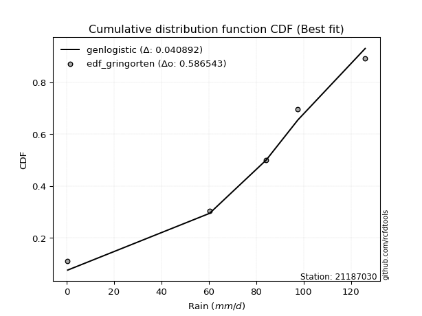</img></img>

</div>


### 9. EDF Filliben (1975)

The specific values of the constants (0.3175) (often denoted as $alpha$) and (0.365) are derived from a method proposed by James J. Filliben in a 1975 paper. This particular formula is the mean value of the $i$-th order statistic of the normal distribution and is considered a robust and effective plotting position formula for the normal probability plot correlation coefficient test for normality.

<div align="center">


$P=(m-0.3175)/(n+0.365)$


</div>


**9.1. Empirical values**

<div align="center">

|                | 0                   | 1                  | 2            | 3                  | 4                  |
|:---------------|:--------------------|:-------------------|:-------------|:-------------------|:-------------------|
| date           | 2022                | 2025               | 2020         | 2019               | 2021               |
| x              | 0.4                 | 60.3               | 84.2         | 97.6               | 126.0              |
| m              | 1                   | 2                  | 3            | 4                  | 5                  |
| empirical_dist | edf_filliben        | edf_filliben       | edf_filliben | edf_filliben       | edf_filliben       |
| empirical      | 0.12721342031686858 | 0.3136067101584343 | 0.5          | 0.6863932898415657 | 0.8727865796831314 |
| empirical_tr   | 1.1457554725040042  | 1.456890699253225  | 2.0          | 3.188707280832095  | 7.860805860805863  |

</div>


**9.2. Kolmogorov-Smirnov fit test (sorted by Δ)**


<div align="center">

|                | 0                    | 1                   | 2                  | 3                   | 4                   | 5                   | 6                   | 7                   | 8                   | 9                   | 10                  | 11                  | 12                  | 13                  | 14                  | 15                  | 16                  | 17                  | 18                  | 19                  | 20                  | 21                  | 22                  | 23                  | 24                  | 25                  | 26                  | 27                  | 28                  | 29                 | 30                  | 31                  | 32                  | 33                  | 34                  | 35                  | 36                  | 37                  | 38                 | 39                  | 40                 | 41                  | 42                  | 43                  | 44                  | 45                  | 46                  | 47                  | 48                  | 49                  | 50                  | 51                 | 52                  | 53                 | 54                  | 55                  | 56                  | 57                 | 58                  | 59                  | 60                  | 61                  | 62                  | 63                  | 64                 | 65                 | 66                 | 67                 | 68                 | 69                  | 70                  | 71                 | 72                 | 73                  | 74                  | 75                  | 76                  | 77                 | 78                  | 79                  | 80                 | 81                 | 82                 | 83                  | 84                 | 85                 | 86                 | 87                 | 88                 | 89                 | 90                 | 91                 | 92                  | 93                  | 94                 | 95                 | 96                  | 97                 | 98                 | 99                 | 100                | 101                | 102                | 103                | 104                 | 105                | 106                 | 107                | 108                 | 109                 | 110                | 111                 | 112                 | 113                 | 114                 | 115                | 116                | 117                 | 118                | 119                | 120                | 121                | 122                 | 123                | 124                | 125                 | 126                 | 127                | 128                | 129                | 130                | 131                 | 132                | 133                | 134                | 135                 | 136                | 137                | 138                | 139                | 140                | 141                | 142                | 143                | 144                | 145                | 146                | 147                | 148                | 149                | 150                | 151                | 152                | 153                | 154                | 155                | 156                | 157                | 158                | 159                |
|:---------------|:---------------------|:--------------------|:-------------------|:--------------------|:--------------------|:--------------------|:--------------------|:--------------------|:--------------------|:--------------------|:--------------------|:--------------------|:--------------------|:--------------------|:--------------------|:--------------------|:--------------------|:--------------------|:--------------------|:--------------------|:--------------------|:--------------------|:--------------------|:--------------------|:--------------------|:--------------------|:--------------------|:--------------------|:--------------------|:-------------------|:--------------------|:--------------------|:--------------------|:--------------------|:--------------------|:--------------------|:--------------------|:--------------------|:-------------------|:--------------------|:-------------------|:--------------------|:--------------------|:--------------------|:--------------------|:--------------------|:--------------------|:--------------------|:--------------------|:--------------------|:--------------------|:-------------------|:--------------------|:-------------------|:--------------------|:--------------------|:--------------------|:-------------------|:--------------------|:--------------------|:--------------------|:--------------------|:--------------------|:--------------------|:-------------------|:-------------------|:-------------------|:-------------------|:-------------------|:--------------------|:--------------------|:-------------------|:-------------------|:--------------------|:--------------------|:--------------------|:--------------------|:-------------------|:--------------------|:--------------------|:-------------------|:-------------------|:-------------------|:--------------------|:-------------------|:-------------------|:-------------------|:-------------------|:-------------------|:-------------------|:-------------------|:-------------------|:--------------------|:--------------------|:-------------------|:-------------------|:--------------------|:-------------------|:-------------------|:-------------------|:-------------------|:-------------------|:-------------------|:-------------------|:--------------------|:-------------------|:--------------------|:-------------------|:--------------------|:--------------------|:-------------------|:--------------------|:--------------------|:--------------------|:--------------------|:-------------------|:-------------------|:--------------------|:-------------------|:-------------------|:-------------------|:-------------------|:--------------------|:-------------------|:-------------------|:--------------------|:--------------------|:-------------------|:-------------------|:-------------------|:-------------------|:--------------------|:-------------------|:-------------------|:-------------------|:--------------------|:-------------------|:-------------------|:-------------------|:-------------------|:-------------------|:-------------------|:-------------------|:-------------------|:-------------------|:-------------------|:-------------------|:-------------------|:-------------------|:-------------------|:-------------------|:-------------------|:-------------------|:-------------------|:-------------------|:-------------------|:-------------------|:-------------------|:-------------------|:-------------------|
| station        | 21187030             | 21187030            | 21187030           | 21187030            | 21187030            | 21187030            | 21187030            | 21187030            | 21187030            | 21187030            | 21187030            | 21187030            | 21187030            | 21187030            | 21187030            | 21187030            | 21187030            | 21187030            | 21187030            | 21187030            | 21187030            | 21187030            | 21187030            | 21187030            | 21187030            | 21187030            | 21187030            | 21187030            | 21187030            | 21187030           | 21187030            | 21187030            | 21187030            | 21187030            | 21187030            | 21187030            | 21187030            | 21187030            | 21187030           | 21187030            | 21187030           | 21187030            | 21187030            | 21187030            | 21187030            | 21187030            | 21187030            | 21187030            | 21187030            | 21187030            | 21187030            | 21187030           | 21187030            | 21187030           | 21187030            | 21187030            | 21187030            | 21187030           | 21187030            | 21187030            | 21187030            | 21187030            | 21187030            | 21187030            | 21187030           | 21187030           | 21187030           | 21187030           | 21187030           | 21187030            | 21187030            | 21187030           | 21187030           | 21187030            | 21187030            | 21187030            | 21187030            | 21187030           | 21187030            | 21187030            | 21187030           | 21187030           | 21187030           | 21187030            | 21187030           | 21187030           | 21187030           | 21187030           | 21187030           | 21187030           | 21187030           | 21187030           | 21187030            | 21187030            | 21187030           | 21187030           | 21187030            | 21187030           | 21187030           | 21187030           | 21187030           | 21187030           | 21187030           | 21187030           | 21187030            | 21187030           | 21187030            | 21187030           | 21187030            | 21187030            | 21187030           | 21187030            | 21187030            | 21187030            | 21187030            | 21187030           | 21187030           | 21187030            | 21187030           | 21187030           | 21187030           | 21187030           | 21187030            | 21187030           | 21187030           | 21187030            | 21187030            | 21187030           | 21187030           | 21187030           | 21187030           | 21187030            | 21187030           | 21187030           | 21187030           | 21187030            | 21187030           | 21187030           | 21187030           | 21187030           | 21187030           | 21187030           | 21187030           | 21187030           | 21187030           | 21187030           | 21187030           | 21187030           | 21187030           | 21187030           | 21187030           | 21187030           | 21187030           | 21187030           | 21187030           | 21187030           | 21187030           | 21187030           | 21187030           | 21187030           |
| empirical_dist | edf_filliben         | edf_filliben        | edf_filliben       | edf_filliben        | edf_filliben        | edf_filliben        | edf_filliben        | edf_filliben        | edf_filliben        | edf_filliben        | edf_filliben        | edf_filliben        | edf_filliben        | edf_filliben        | edf_filliben        | edf_filliben        | edf_filliben        | edf_filliben        | edf_filliben        | edf_filliben        | edf_filliben        | edf_filliben        | edf_filliben        | edf_filliben        | edf_filliben        | edf_filliben        | edf_filliben        | edf_filliben        | edf_filliben        | edf_filliben       | edf_filliben        | edf_filliben        | edf_filliben        | edf_filliben        | edf_filliben        | edf_filliben        | edf_filliben        | edf_filliben        | edf_filliben       | edf_filliben        | edf_filliben       | edf_filliben        | edf_filliben        | edf_filliben        | edf_filliben        | edf_filliben        | edf_filliben        | edf_filliben        | edf_filliben        | edf_filliben        | edf_filliben        | edf_filliben       | edf_filliben        | edf_filliben       | edf_filliben        | edf_filliben        | edf_filliben        | edf_filliben       | edf_filliben        | edf_filliben        | edf_filliben        | edf_filliben        | edf_filliben        | edf_filliben        | edf_filliben       | edf_filliben       | edf_filliben       | edf_filliben       | edf_filliben       | edf_filliben        | edf_filliben        | edf_filliben       | edf_filliben       | edf_filliben        | edf_filliben        | edf_filliben        | edf_filliben        | edf_filliben       | edf_filliben        | edf_filliben        | edf_filliben       | edf_filliben       | edf_filliben       | edf_filliben        | edf_filliben       | edf_filliben       | edf_filliben       | edf_filliben       | edf_filliben       | edf_filliben       | edf_filliben       | edf_filliben       | edf_filliben        | edf_filliben        | edf_filliben       | edf_filliben       | edf_filliben        | edf_filliben       | edf_filliben       | edf_filliben       | edf_filliben       | edf_filliben       | edf_filliben       | edf_filliben       | edf_filliben        | edf_filliben       | edf_filliben        | edf_filliben       | edf_filliben        | edf_filliben        | edf_filliben       | edf_filliben        | edf_filliben        | edf_filliben        | edf_filliben        | edf_filliben       | edf_filliben       | edf_filliben        | edf_filliben       | edf_filliben       | edf_filliben       | edf_filliben       | edf_filliben        | edf_filliben       | edf_filliben       | edf_filliben        | edf_filliben        | edf_filliben       | edf_filliben       | edf_filliben       | edf_filliben       | edf_filliben        | edf_filliben       | edf_filliben       | edf_filliben       | edf_filliben        | edf_filliben       | edf_filliben       | edf_filliben       | edf_filliben       | edf_filliben       | edf_filliben       | edf_filliben       | edf_filliben       | edf_filliben       | edf_filliben       | edf_filliben       | edf_filliben       | edf_filliben       | edf_filliben       | edf_filliben       | edf_filliben       | edf_filliben       | edf_filliben       | edf_filliben       | edf_filliben       | edf_filliben       | edf_filliben       | edf_filliben       | edf_filliben       |
| p_dist         | genlogistic          | gumbel_l            | weibull_min        | trapezoid           | johnsonsu           | pearson3            | burr12              | anglit              | argus               | truncnorm           | t                   | crystalball         | norm                | exponnorm           | semicircular        | foldnorm            | betaprime           | dgamma              | gengamma            | rice                | gamma               | erlang              | logistic            | dweibull            | exponweib           | hypsecant           | maxwell             | ksone               | cosine              | triang             | skewnorm            | beta                | gausshyper          | genextreme          | genhalflogistic     | arcsine             | logt                | rayleigh            | kappa4             | loglevy_l           | gennorm            | invgauss            | laplace             | truncweibull_min    | halfnorm            | kstwobign           | tukeylambda         | gumbel_r            | genpareto           | kappa3              | uniform             | wrapcauchy         | levy_l              | vonmises_line      | halflogistic        | moyal               | mielke              | loggausshyper      | logdgamma           | logpearson3         | bradford            | logargus            | logweibull_max      | logvonmises_line    | genexpon           | logjohnsonsb       | lomax              | wald               | logwrapcauchy      | logdweibull         | loggumbel_l         | logarcsine         | logtrapezoid       | truncexpon          | burr                | loggompertz         | logloggamma         | logsemicircular    | loggennorm          | loganglit           | halfgennorm        | logexponweib       | logloglaplace      | lognorm             | logcrystalball     | logexponnorm       | lognakagami        | logrice            | lognct             | gompertz           | logncf             | logfoldnorm        | loggamma            | loggamma            | loginvgamma        | logerlang          | ncf                 | loglogistic        | loginvgauss        | logmaxwell         | f                  | loghypsecant       | logkstwobign       | lograyleigh        | logalpha            | loggenextreme      | loggenexpon         | loginvweibull      | loglomax            | loghalfnorm         | invgamma           | loglaplace          | loglaplace          | logcosine           | loggumbel_r         | johnsonsb          | loghalflogistic    | loghalfgennorm      | logmoyal           | loggenpareto       | logf               | logbeta            | invweibull          | loggenhalflogistic | nakagami           | logwald             | logskewnorm         | logweibull_min     | logtriang          | fatiguelife        | logbradford        | logksone            | logkappa4          | nct                | truncpareto        | logtruncweibull_min | logfatiguelife     | logkappa3          | loguniform         | logburr12          | logbetaprime       | logtruncnorm       | weibull_max        | logtruncexpon      | logburr            | powerlaw           | logexponpow        | logmielke          | exponpow           | logjohnsonsu       | logtruncpareto     | loggengamma        | logpowerlaw        | alpha              | rdist              | loggenlogistic     | logtukeylambda     | logvonmises        | logrdist           | vonmises           |
| delta          | 0.056928929516719906 | 0.06803630499465124 | 0.0689200982437373 | 0.06917425020061829 | 0.06987971823983619 | 0.07138058514472742 | 0.07302665379877624 | 0.09012293421502673 | 0.09029993503812495 | 0.09623174240020305 | 0.09789367322211584 | 0.09789872599438121 | 0.09789872998579774 | 0.09790053507329322 | 0.09815759031265661 | 0.09821783411209797 | 0.10332705230762129 | 0.10395452630491953 | 0.10609729215250452 | 0.10651160304652385 | 0.10697360582445437 | 0.10801374112666395 | 0.11055899265635238 | 0.11698871746812464 | 0.12086768169149431 | 0.12093682111844073 | 0.12460824035426354 | 0.12681235042295694 | 0.12713403273585777 | 0.1272124716846933 | 0.12721334020339958 | 0.12721342031055038 | 0.12721342031535698 | 0.12721342031686766 | 0.12721342031686822 | 0.12721342031686858 | 0.12836587172634975 | 0.13290921724826288 | 0.1344573821507593 | 0.13785073304234863 | 0.1422389944900905 | 0.14488059497703154 | 0.14786744972814103 | 0.15590269844239713 | 0.15652858880950693 | 0.15868081940805906 | 0.16403417074997861 | 0.16462250289585134 | 0.16581636421468426 | 0.16717522441545118 | 0.16719745222929938 | 0.171151610376578  | 0.17149482972905172 | 0.1729771779802447 | 0.18481785126018724 | 0.18745886050091665 | 0.21236735424626002 | 0.217499644678749  | 0.22340416647770034 | 0.22526393170392206 | 0.22538636262983297 | 0.23305512307393467 | 0.23505534838899406 | 0.24165395085852887 | 0.241885069701328  | 0.2454068491130676 | 0.2464175738916295 | 0.2510784121231595 | 0.2552923219499897 | 0.25570944350758584 | 0.25673553496632456 | 0.2587060672983312 | 0.2588579472851937 | 0.26201513296347684 | 0.26653827691984494 | 0.27089212486326614 | 0.28440334760317404 | 0.2873517597368978 | 0.29366102219864876 | 0.29441635904993174 | 0.2996891267838267 | 0.3076108275368488 | 0.3089824328404692 | 0.31134880797714665 | 0.311348808542286  | 0.311350155474524  | 0.3113543412408149 | 0.3113899721762234 | 0.3115211468960552 | 0.3136067101506984 | 0.3136287097794557 | 0.3181788268417654 | 0.31870442807290905 | 0.31870442807290905 | 0.3208492079105056 | 0.3211838586099008 | 0.32244640156160537 | 0.3269393787393547 | 0.3289478640127233 | 0.3355497752021795 | 0.3368505048052974 | 0.339397409177211  | 0.342862723864704  | 0.3429403214777234 | 0.34311851034362933 | 0.3495774720326406 | 0.35284296259607933 | 0.3534694877591927 | 0.35772786296783593 | 0.36416508108686846 | 0.3655696084255458 | 0.36772526673438627 | 0.36772526673438627 | 0.37103885204671133 | 0.37494528288032286 | 0.3808915272221507 | 0.3925247137691163 | 0.39480144949961643 | 0.3963163426873902 | 0.4090040473568635 | 0.4234176779431495 | 0.4412217407556028 | 0.44297051130677106 | 0.4468575736149036 | 0.4529192187694196 | 0.45626359869920324 | 0.46347044522798103 | 0.4664307503165182 | 0.4856922674178072 | 0.4859842579845302 | 0.4933530037960033 | 0.49630340173300175 | 0.5139852982200033 | 0.5174492124603085 | 0.5454125159630077 | 0.552779278149164   | 0.5539501731723155 | 0.5570746302273286 | 0.5582854241112889 | 0.5600305422919819 | 0.5705610285181786 | 0.5731356726304062 | 0.587709980135475  | 0.5910939765605647 | 0.5957306456489933 | 0.6051023160440572 | 0.616788825608158  | 0.6237800466107135 | 0.6292978196238774 | 0.645578405523443  | 0.6585574063743092 | 0.6586283337552064 | 0.6688560766938556 | 0.6745959651066595 | 0.6863932805636521 | 0.6863932898415657 | 0.6874989261571206 | 0.8245218364506531 | 0.8727235770193568 | 19.233431100854624 |
| deltao         | 0.5865427407550001   | 0.5865427407550001  | 0.5865427407550001 | 0.5865427407550001  | 0.5865427407550001  | 0.5865427407550001  | 0.5865427407550001  | 0.5865427407550001  | 0.5865427407550001  | 0.5865427407550001  | 0.5865427407550001  | 0.5865427407550001  | 0.5865427407550001  | 0.5865427407550001  | 0.5865427407550001  | 0.5865427407550001  | 0.5865427407550001  | 0.5865427407550001  | 0.5865427407550001  | 0.5865427407550001  | 0.5865427407550001  | 0.5865427407550001  | 0.5865427407550001  | 0.5865427407550001  | 0.5865427407550001  | 0.5865427407550001  | 0.5865427407550001  | 0.5865427407550001  | 0.5865427407550001  | 0.5865427407550001 | 0.5865427407550001  | 0.5865427407550001  | 0.5865427407550001  | 0.5865427407550001  | 0.5865427407550001  | 0.5865427407550001  | 0.5865427407550001  | 0.5865427407550001  | 0.5865427407550001 | 0.5865427407550001  | 0.5865427407550001 | 0.5865427407550001  | 0.5865427407550001  | 0.5865427407550001  | 0.5865427407550001  | 0.5865427407550001  | 0.5865427407550001  | 0.5865427407550001  | 0.5865427407550001  | 0.5865427407550001  | 0.5865427407550001  | 0.5865427407550001 | 0.5865427407550001  | 0.5865427407550001 | 0.5865427407550001  | 0.5865427407550001  | 0.5865427407550001  | 0.5865427407550001 | 0.5865427407550001  | 0.5865427407550001  | 0.5865427407550001  | 0.5865427407550001  | 0.5865427407550001  | 0.5865427407550001  | 0.5865427407550001 | 0.5865427407550001 | 0.5865427407550001 | 0.5865427407550001 | 0.5865427407550001 | 0.5865427407550001  | 0.5865427407550001  | 0.5865427407550001 | 0.5865427407550001 | 0.5865427407550001  | 0.5865427407550001  | 0.5865427407550001  | 0.5865427407550001  | 0.5865427407550001 | 0.5865427407550001  | 0.5865427407550001  | 0.5865427407550001 | 0.5865427407550001 | 0.5865427407550001 | 0.5865427407550001  | 0.5865427407550001 | 0.5865427407550001 | 0.5865427407550001 | 0.5865427407550001 | 0.5865427407550001 | 0.5865427407550001 | 0.5865427407550001 | 0.5865427407550001 | 0.5865427407550001  | 0.5865427407550001  | 0.5865427407550001 | 0.5865427407550001 | 0.5865427407550001  | 0.5865427407550001 | 0.5865427407550001 | 0.5865427407550001 | 0.5865427407550001 | 0.5865427407550001 | 0.5865427407550001 | 0.5865427407550001 | 0.5865427407550001  | 0.5865427407550001 | 0.5865427407550001  | 0.5865427407550001 | 0.5865427407550001  | 0.5865427407550001  | 0.5865427407550001 | 0.5865427407550001  | 0.5865427407550001  | 0.5865427407550001  | 0.5865427407550001  | 0.5865427407550001 | 0.5865427407550001 | 0.5865427407550001  | 0.5865427407550001 | 0.5865427407550001 | 0.5865427407550001 | 0.5865427407550001 | 0.5865427407550001  | 0.5865427407550001 | 0.5865427407550001 | 0.5865427407550001  | 0.5865427407550001  | 0.5865427407550001 | 0.5865427407550001 | 0.5865427407550001 | 0.5865427407550001 | 0.5865427407550001  | 0.5865427407550001 | 0.5865427407550001 | 0.5865427407550001 | 0.5865427407550001  | 0.5865427407550001 | 0.5865427407550001 | 0.5865427407550001 | 0.5865427407550001 | 0.5865427407550001 | 0.5865427407550001 | 0.5865427407550001 | 0.5865427407550001 | 0.5865427407550001 | 0.5865427407550001 | 0.5865427407550001 | 0.5865427407550001 | 0.5865427407550001 | 0.5865427407550001 | 0.5865427407550001 | 0.5865427407550001 | 0.5865427407550001 | 0.5865427407550001 | 0.5865427407550001 | 0.5865427407550001 | 0.5865427407550001 | 0.5865427407550001 | 0.5865427407550001 | 0.5865427407550001 |
| eval           | Δo > Δ               | Δo > Δ              | Δo > Δ             | Δo > Δ              | Δo > Δ              | Δo > Δ              | Δo > Δ              | Δo > Δ              | Δo > Δ              | Δo > Δ              | Δo > Δ              | Δo > Δ              | Δo > Δ              | Δo > Δ              | Δo > Δ              | Δo > Δ              | Δo > Δ              | Δo > Δ              | Δo > Δ              | Δo > Δ              | Δo > Δ              | Δo > Δ              | Δo > Δ              | Δo > Δ              | Δo > Δ              | Δo > Δ              | Δo > Δ              | Δo > Δ              | Δo > Δ              | Δo > Δ             | Δo > Δ              | Δo > Δ              | Δo > Δ              | Δo > Δ              | Δo > Δ              | Δo > Δ              | Δo > Δ              | Δo > Δ              | Δo > Δ             | Δo > Δ              | Δo > Δ             | Δo > Δ              | Δo > Δ              | Δo > Δ              | Δo > Δ              | Δo > Δ              | Δo > Δ              | Δo > Δ              | Δo > Δ              | Δo > Δ              | Δo > Δ              | Δo > Δ             | Δo > Δ              | Δo > Δ             | Δo > Δ              | Δo > Δ              | Δo > Δ              | Δo > Δ             | Δo > Δ              | Δo > Δ              | Δo > Δ              | Δo > Δ              | Δo > Δ              | Δo > Δ              | Δo > Δ             | Δo > Δ             | Δo > Δ             | Δo > Δ             | Δo > Δ             | Δo > Δ              | Δo > Δ              | Δo > Δ             | Δo > Δ             | Δo > Δ              | Δo > Δ              | Δo > Δ              | Δo > Δ              | Δo > Δ             | Δo > Δ              | Δo > Δ              | Δo > Δ             | Δo > Δ             | Δo > Δ             | Δo > Δ              | Δo > Δ             | Δo > Δ             | Δo > Δ             | Δo > Δ             | Δo > Δ             | Δo > Δ             | Δo > Δ             | Δo > Δ             | Δo > Δ              | Δo > Δ              | Δo > Δ             | Δo > Δ             | Δo > Δ              | Δo > Δ             | Δo > Δ             | Δo > Δ             | Δo > Δ             | Δo > Δ             | Δo > Δ             | Δo > Δ             | Δo > Δ              | Δo > Δ             | Δo > Δ              | Δo > Δ             | Δo > Δ              | Δo > Δ              | Δo > Δ             | Δo > Δ              | Δo > Δ              | Δo > Δ              | Δo > Δ              | Δo > Δ             | Δo > Δ             | Δo > Δ              | Δo > Δ             | Δo > Δ             | Δo > Δ             | Δo > Δ             | Δo > Δ              | Δo > Δ             | Δo > Δ             | Δo > Δ              | Δo > Δ              | Δo > Δ             | Δo > Δ             | Δo > Δ             | Δo > Δ             | Δo > Δ              | Δo > Δ             | Δo > Δ             | Δo > Δ             | Δo > Δ              | Δo > Δ             | Δo > Δ             | Δo > Δ             | Δo > Δ             | Δo > Δ             | Δo > Δ             | Δo <= Δ            | Δo <= Δ            | Δo <= Δ            | Δo <= Δ            | Δo <= Δ            | Δo <= Δ            | Δo <= Δ            | Δo <= Δ            | Δo <= Δ            | Δo <= Δ            | Δo <= Δ            | Δo <= Δ            | Δo <= Δ            | Δo <= Δ            | Δo <= Δ            | Δo <= Δ            | Δo <= Δ            | Δo <= Δ            |
| fit            | 1                    | 1                   | 1                  | 1                   | 1                   | 1                   | 1                   | 1                   | 1                   | 1                   | 1                   | 1                   | 1                   | 1                   | 1                   | 1                   | 1                   | 1                   | 1                   | 1                   | 1                   | 1                   | 1                   | 1                   | 1                   | 1                   | 1                   | 1                   | 1                   | 1                  | 1                   | 1                   | 1                   | 1                   | 1                   | 1                   | 1                   | 1                   | 1                  | 1                   | 1                  | 1                   | 1                   | 1                   | 1                   | 1                   | 1                   | 1                   | 1                   | 1                   | 1                   | 1                  | 1                   | 1                  | 1                   | 1                   | 1                   | 1                  | 1                   | 1                   | 1                   | 1                   | 1                   | 1                   | 1                  | 1                  | 1                  | 1                  | 1                  | 1                   | 1                   | 1                  | 1                  | 1                   | 1                   | 1                   | 1                   | 1                  | 1                   | 1                   | 1                  | 1                  | 1                  | 1                   | 1                  | 1                  | 1                  | 1                  | 1                  | 1                  | 1                  | 1                  | 1                   | 1                   | 1                  | 1                  | 1                   | 1                  | 1                  | 1                  | 1                  | 1                  | 1                  | 1                  | 1                   | 1                  | 1                   | 1                  | 1                   | 1                   | 1                  | 1                   | 1                   | 1                   | 1                   | 1                  | 1                  | 1                   | 1                  | 1                  | 1                  | 1                  | 1                   | 1                  | 1                  | 1                   | 1                   | 1                  | 1                  | 1                  | 1                  | 1                   | 1                  | 1                  | 1                  | 1                   | 1                  | 1                  | 1                  | 1                  | 1                  | 1                  | 0                  | 0                  | 0                  | 0                  | 0                  | 0                  | 0                  | 0                  | 0                  | 0                  | 0                  | 0                  | 0                  | 0                  | 0                  | 0                  | 0                  | 0                  |
| n              | 5                    | 5                   | 5                  | 5                   | 5                   | 5                   | 5                   | 5                   | 5                   | 5                   | 5                   | 5                   | 5                   | 5                   | 5                   | 5                   | 5                   | 5                   | 5                   | 5                   | 5                   | 5                   | 5                   | 5                   | 5                   | 5                   | 5                   | 5                   | 5                   | 5                  | 5                   | 5                   | 5                   | 5                   | 5                   | 5                   | 5                   | 5                   | 5                  | 5                   | 5                  | 5                   | 5                   | 5                   | 5                   | 5                   | 5                   | 5                   | 5                   | 5                   | 5                   | 5                  | 5                   | 5                  | 5                   | 5                   | 5                   | 5                  | 5                   | 5                   | 5                   | 5                   | 5                   | 5                   | 5                  | 5                  | 5                  | 5                  | 5                  | 5                   | 5                   | 5                  | 5                  | 5                   | 5                   | 5                   | 5                   | 5                  | 5                   | 5                   | 5                  | 5                  | 5                  | 5                   | 5                  | 5                  | 5                  | 5                  | 5                  | 5                  | 5                  | 5                  | 5                   | 5                   | 5                  | 5                  | 5                   | 5                  | 5                  | 5                  | 5                  | 5                  | 5                  | 5                  | 5                   | 5                  | 5                   | 5                  | 5                   | 5                   | 5                  | 5                   | 5                   | 5                   | 5                   | 5                  | 5                  | 5                   | 5                  | 5                  | 5                  | 5                  | 5                   | 5                  | 5                  | 5                   | 5                   | 5                  | 5                  | 5                  | 5                  | 5                   | 5                  | 5                  | 5                  | 5                   | 5                  | 5                  | 5                  | 5                  | 5                  | 5                  | 5                  | 5                  | 5                  | 5                  | 5                  | 5                  | 5                  | 5                  | 5                  | 5                  | 5                  | 5                  | 5                  | 5                  | 5                  | 5                  | 5                  | 5                  |
| best_fit       | 1                    | 0                   | 0                  | 0                   | 0                   | 0                   | 0                   | 0                   | 0                   | 0                   | 0                   | 0                   | 0                   | 0                   | 0                   | 0                   | 0                   | 0                   | 0                   | 0                   | 0                   | 0                   | 0                   | 0                   | 0                   | 0                   | 0                   | 0                   | 0                   | 0                  | 0                   | 0                   | 0                   | 0                   | 0                   | 0                   | 0                   | 0                   | 0                  | 0                   | 0                  | 0                   | 0                   | 0                   | 0                   | 0                   | 0                   | 0                   | 0                   | 0                   | 0                   | 0                  | 0                   | 0                  | 0                   | 0                   | 0                   | 0                  | 0                   | 0                   | 0                   | 0                   | 0                   | 0                   | 0                  | 0                  | 0                  | 0                  | 0                  | 0                   | 0                   | 0                  | 0                  | 0                   | 0                   | 0                   | 0                   | 0                  | 0                   | 0                   | 0                  | 0                  | 0                  | 0                   | 0                  | 0                  | 0                  | 0                  | 0                  | 0                  | 0                  | 0                  | 0                   | 0                   | 0                  | 0                  | 0                   | 0                  | 0                  | 0                  | 0                  | 0                  | 0                  | 0                  | 0                   | 0                  | 0                   | 0                  | 0                   | 0                   | 0                  | 0                   | 0                   | 0                   | 0                   | 0                  | 0                  | 0                   | 0                  | 0                  | 0                  | 0                  | 0                   | 0                  | 0                  | 0                   | 0                   | 0                  | 0                  | 0                  | 0                  | 0                   | 0                  | 0                  | 0                  | 0                   | 0                  | 0                  | 0                  | 0                  | 0                  | 0                  | 0                  | 0                  | 0                  | 0                  | 0                  | 0                  | 0                  | 0                  | 0                  | 0                  | 0                  | 0                  | 0                  | 0                  | 0                  | 0                  | 0                  | 0                  |
| best_fit_sort  | 1                    | 2                   | 3                  | 4                   | 5                   | 6                   | 7                   | 8                   | 9                   | 10                  | 11                  | 12                  | 13                  | 14                  | 15                  | 16                  | 17                  | 18                  | 19                  | 20                  | 21                  | 22                  | 23                  | 24                  | 25                  | 26                  | 27                  | 28                  | 29                  | 30                 | 31                  | 32                  | 33                  | 34                  | 35                  | 36                  | 37                  | 38                  | 39                 | 40                  | 41                 | 42                  | 43                  | 44                  | 45                  | 46                  | 47                  | 48                  | 49                  | 50                  | 51                  | 52                 | 53                  | 54                 | 55                  | 56                  | 57                  | 58                 | 59                  | 60                  | 61                  | 62                  | 63                  | 64                  | 65                 | 66                 | 67                 | 68                 | 69                 | 70                  | 71                  | 72                 | 73                 | 74                  | 75                  | 76                  | 77                  | 78                 | 79                  | 80                  | 81                 | 82                 | 83                 | 84                  | 85                 | 86                 | 87                 | 88                 | 89                 | 90                 | 91                 | 92                 | 93                  | 94                  | 95                 | 96                 | 97                  | 98                 | 99                 | 100                | 101                | 102                | 103                | 104                | 105                 | 106                | 107                 | 108                | 109                 | 110                 | 111                | 112                 | 113                 | 114                 | 115                 | 116                | 117                | 118                 | 119                | 120                | 121                | 122                | 123                 | 124                | 125                | 126                 | 127                 | 128                | 129                | 130                | 131                | 132                 | 133                | 134                | 135                | 136                 | 137                | 138                | 139                | 140                | 141                | 142                | 143                | 144                | 145                | 146                | 147                | 148                | 149                | 150                | 151                | 152                | 153                | 154                | 155                | 156                | 157                | 158                | 159                | 160                |

</div>


**9.3. Best fit**

<div align="center">

|   id |   station | empirical_dist   | p_dist      |     delta |   deltao | eval   |   fit |   n |   best_fit |   best_fit_sort |
|-----:|----------:|:-----------------|:------------|----------:|---------:|:-------|------:|----:|-----------:|----------------:|
|    0 |  21187030 | edf_filliben     | genlogistic | 0.0569289 | 0.586543 | Δo > Δ |     1 |   5 |          1 |               1 |

</div>


<div align="center">

</img></img>

</div>


### 10. EDF Jenkinson (1977)

The Jenkinson formula in hydrology is an empirical plotting position formula used to estimate the non-exceedance probability _(P)_ or return period _(T)_ of a given ordered observation within a sample. It is a widely used method in the frequency analysis of extreme events such as floods and rainfall, as it provides a distribution-free way to plot data. _a≈0.31_ and _b≈0.38_ are constants derived to approximate the median of the probability distribution for the given rank.

<div align="center">


$P=(m-a)/(n+b)$


</div>


**10.1. Empirical values**

<div align="center">

|                | 0                   | 1                  | 2             | 3                  | 4                  |
|:---------------|:--------------------|:-------------------|:--------------|:-------------------|:-------------------|
| date           | 2022                | 2025               | 2020          | 2019               | 2021               |
| x              | 0.4                 | 60.3               | 84.2          | 97.6               | 126.0              |
| m              | 1                   | 2                  | 3             | 4                  | 5                  |
| empirical_dist | edf_jenkinson       | edf_jenkinson      | edf_jenkinson | edf_jenkinson      | edf_jenkinson      |
| empirical      | 0.12825278810408922 | 0.3141263940520446 | 0.5           | 0.6858736059479554 | 0.8717472118959109 |
| empirical_tr   | 1.1471215351812367  | 1.4579945799457996 | 2.0           | 3.183431952662722  | 7.797101449275368  |

</div>


**10.2. Kolmogorov-Smirnov fit test (sorted by Δ)**


<div align="center">

|                | 0                    | 1                   | 2                   | 3                   | 4                   | 5                   | 6                   | 7                   | 8                   | 9                   | 10                  | 11                  | 12                  | 13                  | 14                  | 15                  | 16                  | 17                  | 18                  | 19                  | 20                  | 21                  | 22                  | 23                  | 24                  | 25                  | 26                  | 27                  | 28                  | 29                  | 30                  | 31                  | 32                  | 33                  | 34                 | 35                  | 36                 | 37                  | 38                 | 39                 | 40                  | 41                 | 42                  | 43                  | 44                  | 45                  | 46                  | 47                  | 48                  | 49                  | 50                  | 51                  | 52                 | 53                 | 54                  | 55                  | 56                  | 57                  | 58                  | 59                  | 60                  | 61                  | 62                 | 63                  | 64                  | 65                  | 66                  | 67                 | 68                  | 69                  | 70                 | 71                  | 72                  | 73                 | 74                 | 75                 | 76                 | 77                  | 78                  | 79                 | 80                  | 81                 | 82                  | 83                 | 84                 | 85                  | 86                  | 87                  | 88                  | 89                 | 90                  | 91                  | 92                 | 93                 | 94                  | 95                  | 96                 | 97                  | 98                  | 99                  | 100                 | 101                 | 102                 | 103                 | 104                | 105                 | 106                | 107                 | 108                | 109                | 110                 | 111                | 112                | 113                | 114                | 115                 | 116                 | 117                | 118                 | 119                | 120                 | 121                 | 122                | 123                 | 124                 | 125                | 126                | 127                 | 128                 | 129                 | 130                 | 131                | 132                | 133                | 134                | 135                 | 136                | 137                | 138                | 139                | 140                | 141                | 142                | 143                | 144                | 145                | 146                | 147                | 148                | 149                | 150                | 151                | 152                | 153                | 154                | 155                | 156                | 157                | 158                | 159                |
|:---------------|:---------------------|:--------------------|:--------------------|:--------------------|:--------------------|:--------------------|:--------------------|:--------------------|:--------------------|:--------------------|:--------------------|:--------------------|:--------------------|:--------------------|:--------------------|:--------------------|:--------------------|:--------------------|:--------------------|:--------------------|:--------------------|:--------------------|:--------------------|:--------------------|:--------------------|:--------------------|:--------------------|:--------------------|:--------------------|:--------------------|:--------------------|:--------------------|:--------------------|:--------------------|:-------------------|:--------------------|:-------------------|:--------------------|:-------------------|:-------------------|:--------------------|:-------------------|:--------------------|:--------------------|:--------------------|:--------------------|:--------------------|:--------------------|:--------------------|:--------------------|:--------------------|:--------------------|:-------------------|:-------------------|:--------------------|:--------------------|:--------------------|:--------------------|:--------------------|:--------------------|:--------------------|:--------------------|:-------------------|:--------------------|:--------------------|:--------------------|:--------------------|:-------------------|:--------------------|:--------------------|:-------------------|:--------------------|:--------------------|:-------------------|:-------------------|:-------------------|:-------------------|:--------------------|:--------------------|:-------------------|:--------------------|:-------------------|:--------------------|:-------------------|:-------------------|:--------------------|:--------------------|:--------------------|:--------------------|:-------------------|:--------------------|:--------------------|:-------------------|:-------------------|:--------------------|:--------------------|:-------------------|:--------------------|:--------------------|:--------------------|:--------------------|:--------------------|:--------------------|:--------------------|:-------------------|:--------------------|:-------------------|:--------------------|:-------------------|:-------------------|:--------------------|:-------------------|:-------------------|:-------------------|:-------------------|:--------------------|:--------------------|:-------------------|:--------------------|:-------------------|:--------------------|:--------------------|:-------------------|:--------------------|:--------------------|:-------------------|:-------------------|:--------------------|:--------------------|:--------------------|:--------------------|:-------------------|:-------------------|:-------------------|:-------------------|:--------------------|:-------------------|:-------------------|:-------------------|:-------------------|:-------------------|:-------------------|:-------------------|:-------------------|:-------------------|:-------------------|:-------------------|:-------------------|:-------------------|:-------------------|:-------------------|:-------------------|:-------------------|:-------------------|:-------------------|:-------------------|:-------------------|:-------------------|:-------------------|:-------------------|
| station        | 21187030             | 21187030            | 21187030            | 21187030            | 21187030            | 21187030            | 21187030            | 21187030            | 21187030            | 21187030            | 21187030            | 21187030            | 21187030            | 21187030            | 21187030            | 21187030            | 21187030            | 21187030            | 21187030            | 21187030            | 21187030            | 21187030            | 21187030            | 21187030            | 21187030            | 21187030            | 21187030            | 21187030            | 21187030            | 21187030            | 21187030            | 21187030            | 21187030            | 21187030            | 21187030           | 21187030            | 21187030           | 21187030            | 21187030           | 21187030           | 21187030            | 21187030           | 21187030            | 21187030            | 21187030            | 21187030            | 21187030            | 21187030            | 21187030            | 21187030            | 21187030            | 21187030            | 21187030           | 21187030           | 21187030            | 21187030            | 21187030            | 21187030            | 21187030            | 21187030            | 21187030            | 21187030            | 21187030           | 21187030            | 21187030            | 21187030            | 21187030            | 21187030           | 21187030            | 21187030            | 21187030           | 21187030            | 21187030            | 21187030           | 21187030           | 21187030           | 21187030           | 21187030            | 21187030            | 21187030           | 21187030            | 21187030           | 21187030            | 21187030           | 21187030           | 21187030            | 21187030            | 21187030            | 21187030            | 21187030           | 21187030            | 21187030            | 21187030           | 21187030           | 21187030            | 21187030            | 21187030           | 21187030            | 21187030            | 21187030            | 21187030            | 21187030            | 21187030            | 21187030            | 21187030           | 21187030            | 21187030           | 21187030            | 21187030           | 21187030           | 21187030            | 21187030           | 21187030           | 21187030           | 21187030           | 21187030            | 21187030            | 21187030           | 21187030            | 21187030           | 21187030            | 21187030            | 21187030           | 21187030            | 21187030            | 21187030           | 21187030           | 21187030            | 21187030            | 21187030            | 21187030            | 21187030           | 21187030           | 21187030           | 21187030           | 21187030            | 21187030           | 21187030           | 21187030           | 21187030           | 21187030           | 21187030           | 21187030           | 21187030           | 21187030           | 21187030           | 21187030           | 21187030           | 21187030           | 21187030           | 21187030           | 21187030           | 21187030           | 21187030           | 21187030           | 21187030           | 21187030           | 21187030           | 21187030           | 21187030           |
| empirical_dist | edf_jenkinson        | edf_jenkinson       | edf_jenkinson       | edf_jenkinson       | edf_jenkinson       | edf_jenkinson       | edf_jenkinson       | edf_jenkinson       | edf_jenkinson       | edf_jenkinson       | edf_jenkinson       | edf_jenkinson       | edf_jenkinson       | edf_jenkinson       | edf_jenkinson       | edf_jenkinson       | edf_jenkinson       | edf_jenkinson       | edf_jenkinson       | edf_jenkinson       | edf_jenkinson       | edf_jenkinson       | edf_jenkinson       | edf_jenkinson       | edf_jenkinson       | edf_jenkinson       | edf_jenkinson       | edf_jenkinson       | edf_jenkinson       | edf_jenkinson       | edf_jenkinson       | edf_jenkinson       | edf_jenkinson       | edf_jenkinson       | edf_jenkinson      | edf_jenkinson       | edf_jenkinson      | edf_jenkinson       | edf_jenkinson      | edf_jenkinson      | edf_jenkinson       | edf_jenkinson      | edf_jenkinson       | edf_jenkinson       | edf_jenkinson       | edf_jenkinson       | edf_jenkinson       | edf_jenkinson       | edf_jenkinson       | edf_jenkinson       | edf_jenkinson       | edf_jenkinson       | edf_jenkinson      | edf_jenkinson      | edf_jenkinson       | edf_jenkinson       | edf_jenkinson       | edf_jenkinson       | edf_jenkinson       | edf_jenkinson       | edf_jenkinson       | edf_jenkinson       | edf_jenkinson      | edf_jenkinson       | edf_jenkinson       | edf_jenkinson       | edf_jenkinson       | edf_jenkinson      | edf_jenkinson       | edf_jenkinson       | edf_jenkinson      | edf_jenkinson       | edf_jenkinson       | edf_jenkinson      | edf_jenkinson      | edf_jenkinson      | edf_jenkinson      | edf_jenkinson       | edf_jenkinson       | edf_jenkinson      | edf_jenkinson       | edf_jenkinson      | edf_jenkinson       | edf_jenkinson      | edf_jenkinson      | edf_jenkinson       | edf_jenkinson       | edf_jenkinson       | edf_jenkinson       | edf_jenkinson      | edf_jenkinson       | edf_jenkinson       | edf_jenkinson      | edf_jenkinson      | edf_jenkinson       | edf_jenkinson       | edf_jenkinson      | edf_jenkinson       | edf_jenkinson       | edf_jenkinson       | edf_jenkinson       | edf_jenkinson       | edf_jenkinson       | edf_jenkinson       | edf_jenkinson      | edf_jenkinson       | edf_jenkinson      | edf_jenkinson       | edf_jenkinson      | edf_jenkinson      | edf_jenkinson       | edf_jenkinson      | edf_jenkinson      | edf_jenkinson      | edf_jenkinson      | edf_jenkinson       | edf_jenkinson       | edf_jenkinson      | edf_jenkinson       | edf_jenkinson      | edf_jenkinson       | edf_jenkinson       | edf_jenkinson      | edf_jenkinson       | edf_jenkinson       | edf_jenkinson      | edf_jenkinson      | edf_jenkinson       | edf_jenkinson       | edf_jenkinson       | edf_jenkinson       | edf_jenkinson      | edf_jenkinson      | edf_jenkinson      | edf_jenkinson      | edf_jenkinson       | edf_jenkinson      | edf_jenkinson      | edf_jenkinson      | edf_jenkinson      | edf_jenkinson      | edf_jenkinson      | edf_jenkinson      | edf_jenkinson      | edf_jenkinson      | edf_jenkinson      | edf_jenkinson      | edf_jenkinson      | edf_jenkinson      | edf_jenkinson      | edf_jenkinson      | edf_jenkinson      | edf_jenkinson      | edf_jenkinson      | edf_jenkinson      | edf_jenkinson      | edf_jenkinson      | edf_jenkinson      | edf_jenkinson      | edf_jenkinson      |
| p_dist         | genlogistic          | gumbel_l            | weibull_min         | trapezoid           | johnsonsu           | pearson3            | burr12              | anglit              | argus               | truncnorm           | t                   | crystalball         | norm                | exponnorm           | semicircular        | foldnorm            | betaprime           | dgamma              | gengamma            | rice                | gamma               | erlang              | logistic            | dweibull            | exponweib           | hypsecant           | maxwell             | cosine              | ksone               | triang              | skewnorm            | beta                | gausshyper          | genextreme          | genhalflogistic    | arcsine             | logt               | rayleigh            | kappa4             | loglevy_l          | gennorm             | invgauss           | laplace             | truncweibull_min    | halfnorm            | kstwobign           | tukeylambda         | gumbel_r            | genpareto           | kappa3              | uniform             | wrapcauchy          | levy_l             | vonmises_line      | halflogistic        | moyal               | mielke              | loggausshyper       | logdgamma           | logpearson3         | bradford            | logargus            | logweibull_max     | logvonmises_line    | genexpon            | logjohnsonsb        | lomax               | wald               | logdweibull         | logwrapcauchy       | loggumbel_l        | logarcsine          | logtrapezoid        | truncexpon         | burr               | loggompertz        | logloggamma        | logsemicircular     | loggennorm          | loganglit          | halfgennorm         | logexponweib       | logloglaplace       | lognorm            | logcrystalball     | logexponnorm        | lognakagami         | logrice             | lognct              | logncf             | gompertz            | logfoldnorm         | loggamma           | loggamma           | loginvgamma         | logerlang           | ncf                | loglogistic         | loginvgauss         | logmaxwell          | f                   | loghypsecant        | logkstwobign        | lograyleigh         | logalpha           | loggenextreme       | loggenexpon        | loginvweibull       | loglomax           | loghalfnorm        | invgamma            | loglaplace         | loglaplace         | logcosine          | loggumbel_r        | johnsonsb           | loghalflogistic     | loghalfgennorm     | logmoyal            | loggenpareto       | logf                | logbeta             | invweibull         | loggenhalflogistic  | nakagami            | logwald            | logskewnorm        | logweibull_min      | logtriang           | fatiguelife         | logbradford         | logksone           | logkappa4          | nct                | truncpareto        | logtruncweibull_min | logfatiguelife     | logkappa3          | loguniform         | logburr12          | logbetaprime       | logtruncnorm       | weibull_max        | logtruncexpon      | logburr            | powerlaw           | logexponpow        | logmielke          | exponpow           | logjohnsonsu       | logtruncpareto     | loggengamma        | logpowerlaw        | alpha              | rdist              | loggenlogistic     | logtukeylambda     | logvonmises        | logrdist           | vonmises           |
| delta          | 0.057968297303940486 | 0.06907567278187188 | 0.06995946603095793 | 0.07021361798783887 | 0.07091908602705677 | 0.07241995293194806 | 0.07406602158599687 | 0.09116230200224737 | 0.09133930282534553 | 0.09623174240020305 | 0.09789367322211584 | 0.09789872599438121 | 0.09789872998579774 | 0.09790053507329322 | 0.09919695809987725 | 0.09925720189931861 | 0.10332705230762129 | 0.10343484241130918 | 0.10609729215250452 | 0.10651160304652385 | 0.10697360582445437 | 0.10801374112666395 | 0.11055899265635238 | 0.11750840136173499 | 0.12086768169149431 | 0.12093682111844073 | 0.12460824035426354 | 0.12713403273585777 | 0.12785171821017757 | 0.12825183947191388 | 0.12825270799062016 | 0.12825278809777096 | 0.12825278810257756 | 0.12825278810408824 | 0.1282527881040888 | 0.12825278810408922 | 0.1288855556199601 | 0.13290921724826288 | 0.1344573821507593 | 0.1373310491487384 | 0.14275867838370085 | 0.1443609110834212 | 0.14786744972814103 | 0.15590269844239713 | 0.15652858880950693 | 0.15816113551444871 | 0.16403417074997861 | 0.16462250289585134 | 0.16529668032107403 | 0.16717522441545118 | 0.16719745222929938 | 0.17063192648296766 | 0.1709751458354415 | 0.1729771779802447 | 0.18481785126018724 | 0.18745886050091665 | 0.21184767035264968 | 0.21697996078513865 | 0.22236479869047976 | 0.22474424781031171 | 0.22486667873622262 | 0.23253543918032432 | 0.2345356644953837 | 0.24113426696491852 | 0.24136538580771766 | 0.24488716521945736 | 0.24589788999801915 | 0.2510784121231595 | 0.25467007572036526 | 0.25477263805637934 | 0.2562158510727142 | 0.25818638340472083 | 0.25833826339158333 | 0.2614954490698665 | 0.2660185930262346 | 0.2703724409696558 | 0.2838836637095637 | 0.28683207584328746 | 0.29366102219864876 | 0.2938966751563214 | 0.29916944289021635 | 0.3070911436432385 | 0.30794306505324864 | 0.3108291240835363 | 0.3108291246486757 | 0.31083047158091365 | 0.31083465734720456 | 0.31087028828261304 | 0.31100146300244486 | 0.3131090258858454 | 0.31412639404430875 | 0.31765914294815506 | 0.3181847441792987 | 0.3181847441792987 | 0.32032952401689524 | 0.32066417471629044 | 0.321926717667995  | 0.32641969484574435 | 0.32842818011911296 | 0.33503009130856914 | 0.33633082091168703 | 0.33887772528360066 | 0.34234303997109367 | 0.34242063758411306 | 0.342598826450019  | 0.34905778813903027 | 0.352323278702469  | 0.35294980386558233 | 0.3572081790742256 | 0.3636453971932581 | 0.36504992453193547 | 0.3672055828407759 | 0.3672055828407759 | 0.370519168153101  | 0.3744255989867125 | 0.38037184332854046 | 0.39200502987550595 | 0.3942817656060061 | 0.39579665879377984 | 0.4084843634632532 | 0.42289799404953915 | 0.44070205686199254 | 0.4419311435195505 | 0.44633788972129324 | 0.45239953487580925 | 0.4557439148055929 | 0.4629507613343707 | 0.46591106642290786 | 0.48517258352419684 | 0.48546457409091986 | 0.49283331990239293 | 0.4957837178393914 | 0.5134656143263929 | 0.5169295285666982 | 0.5448928320693973 | 0.5522595942555537  | 0.5534304892787052 | 0.5565549463337183 | 0.5577657402176786 | 0.5589911745047613 | 0.5700413446245682 | 0.5726159887367959 | 0.5871902962418648 | 0.5905742926669544 | 0.5952109617553829 | 0.6045826321504468 | 0.6162691417145476 | 0.6232603627171032 | 0.6287781357302671 | 0.6450587216298328 | 0.6580377224806988 | 0.658108649861596  | 0.6683363928002453 | 0.6740762812130492 | 0.6858735966700418 | 0.6858736059479554 | 0.6864595583698999 | 0.8234824686634324 | 0.8716842092321361 | 19.234470468641845 |
| deltao         | 0.5865427407550001   | 0.5865427407550001  | 0.5865427407550001  | 0.5865427407550001  | 0.5865427407550001  | 0.5865427407550001  | 0.5865427407550001  | 0.5865427407550001  | 0.5865427407550001  | 0.5865427407550001  | 0.5865427407550001  | 0.5865427407550001  | 0.5865427407550001  | 0.5865427407550001  | 0.5865427407550001  | 0.5865427407550001  | 0.5865427407550001  | 0.5865427407550001  | 0.5865427407550001  | 0.5865427407550001  | 0.5865427407550001  | 0.5865427407550001  | 0.5865427407550001  | 0.5865427407550001  | 0.5865427407550001  | 0.5865427407550001  | 0.5865427407550001  | 0.5865427407550001  | 0.5865427407550001  | 0.5865427407550001  | 0.5865427407550001  | 0.5865427407550001  | 0.5865427407550001  | 0.5865427407550001  | 0.5865427407550001 | 0.5865427407550001  | 0.5865427407550001 | 0.5865427407550001  | 0.5865427407550001 | 0.5865427407550001 | 0.5865427407550001  | 0.5865427407550001 | 0.5865427407550001  | 0.5865427407550001  | 0.5865427407550001  | 0.5865427407550001  | 0.5865427407550001  | 0.5865427407550001  | 0.5865427407550001  | 0.5865427407550001  | 0.5865427407550001  | 0.5865427407550001  | 0.5865427407550001 | 0.5865427407550001 | 0.5865427407550001  | 0.5865427407550001  | 0.5865427407550001  | 0.5865427407550001  | 0.5865427407550001  | 0.5865427407550001  | 0.5865427407550001  | 0.5865427407550001  | 0.5865427407550001 | 0.5865427407550001  | 0.5865427407550001  | 0.5865427407550001  | 0.5865427407550001  | 0.5865427407550001 | 0.5865427407550001  | 0.5865427407550001  | 0.5865427407550001 | 0.5865427407550001  | 0.5865427407550001  | 0.5865427407550001 | 0.5865427407550001 | 0.5865427407550001 | 0.5865427407550001 | 0.5865427407550001  | 0.5865427407550001  | 0.5865427407550001 | 0.5865427407550001  | 0.5865427407550001 | 0.5865427407550001  | 0.5865427407550001 | 0.5865427407550001 | 0.5865427407550001  | 0.5865427407550001  | 0.5865427407550001  | 0.5865427407550001  | 0.5865427407550001 | 0.5865427407550001  | 0.5865427407550001  | 0.5865427407550001 | 0.5865427407550001 | 0.5865427407550001  | 0.5865427407550001  | 0.5865427407550001 | 0.5865427407550001  | 0.5865427407550001  | 0.5865427407550001  | 0.5865427407550001  | 0.5865427407550001  | 0.5865427407550001  | 0.5865427407550001  | 0.5865427407550001 | 0.5865427407550001  | 0.5865427407550001 | 0.5865427407550001  | 0.5865427407550001 | 0.5865427407550001 | 0.5865427407550001  | 0.5865427407550001 | 0.5865427407550001 | 0.5865427407550001 | 0.5865427407550001 | 0.5865427407550001  | 0.5865427407550001  | 0.5865427407550001 | 0.5865427407550001  | 0.5865427407550001 | 0.5865427407550001  | 0.5865427407550001  | 0.5865427407550001 | 0.5865427407550001  | 0.5865427407550001  | 0.5865427407550001 | 0.5865427407550001 | 0.5865427407550001  | 0.5865427407550001  | 0.5865427407550001  | 0.5865427407550001  | 0.5865427407550001 | 0.5865427407550001 | 0.5865427407550001 | 0.5865427407550001 | 0.5865427407550001  | 0.5865427407550001 | 0.5865427407550001 | 0.5865427407550001 | 0.5865427407550001 | 0.5865427407550001 | 0.5865427407550001 | 0.5865427407550001 | 0.5865427407550001 | 0.5865427407550001 | 0.5865427407550001 | 0.5865427407550001 | 0.5865427407550001 | 0.5865427407550001 | 0.5865427407550001 | 0.5865427407550001 | 0.5865427407550001 | 0.5865427407550001 | 0.5865427407550001 | 0.5865427407550001 | 0.5865427407550001 | 0.5865427407550001 | 0.5865427407550001 | 0.5865427407550001 | 0.5865427407550001 |
| eval           | Δo > Δ               | Δo > Δ              | Δo > Δ              | Δo > Δ              | Δo > Δ              | Δo > Δ              | Δo > Δ              | Δo > Δ              | Δo > Δ              | Δo > Δ              | Δo > Δ              | Δo > Δ              | Δo > Δ              | Δo > Δ              | Δo > Δ              | Δo > Δ              | Δo > Δ              | Δo > Δ              | Δo > Δ              | Δo > Δ              | Δo > Δ              | Δo > Δ              | Δo > Δ              | Δo > Δ              | Δo > Δ              | Δo > Δ              | Δo > Δ              | Δo > Δ              | Δo > Δ              | Δo > Δ              | Δo > Δ              | Δo > Δ              | Δo > Δ              | Δo > Δ              | Δo > Δ             | Δo > Δ              | Δo > Δ             | Δo > Δ              | Δo > Δ             | Δo > Δ             | Δo > Δ              | Δo > Δ             | Δo > Δ              | Δo > Δ              | Δo > Δ              | Δo > Δ              | Δo > Δ              | Δo > Δ              | Δo > Δ              | Δo > Δ              | Δo > Δ              | Δo > Δ              | Δo > Δ             | Δo > Δ             | Δo > Δ              | Δo > Δ              | Δo > Δ              | Δo > Δ              | Δo > Δ              | Δo > Δ              | Δo > Δ              | Δo > Δ              | Δo > Δ             | Δo > Δ              | Δo > Δ              | Δo > Δ              | Δo > Δ              | Δo > Δ             | Δo > Δ              | Δo > Δ              | Δo > Δ             | Δo > Δ              | Δo > Δ              | Δo > Δ             | Δo > Δ             | Δo > Δ             | Δo > Δ             | Δo > Δ              | Δo > Δ              | Δo > Δ             | Δo > Δ              | Δo > Δ             | Δo > Δ              | Δo > Δ             | Δo > Δ             | Δo > Δ              | Δo > Δ              | Δo > Δ              | Δo > Δ              | Δo > Δ             | Δo > Δ              | Δo > Δ              | Δo > Δ             | Δo > Δ             | Δo > Δ              | Δo > Δ              | Δo > Δ             | Δo > Δ              | Δo > Δ              | Δo > Δ              | Δo > Δ              | Δo > Δ              | Δo > Δ              | Δo > Δ              | Δo > Δ             | Δo > Δ              | Δo > Δ             | Δo > Δ              | Δo > Δ             | Δo > Δ             | Δo > Δ              | Δo > Δ             | Δo > Δ             | Δo > Δ             | Δo > Δ             | Δo > Δ              | Δo > Δ              | Δo > Δ             | Δo > Δ              | Δo > Δ             | Δo > Δ              | Δo > Δ              | Δo > Δ             | Δo > Δ              | Δo > Δ              | Δo > Δ             | Δo > Δ             | Δo > Δ              | Δo > Δ              | Δo > Δ              | Δo > Δ              | Δo > Δ             | Δo > Δ             | Δo > Δ             | Δo > Δ             | Δo > Δ              | Δo > Δ             | Δo > Δ             | Δo > Δ             | Δo > Δ             | Δo > Δ             | Δo > Δ             | Δo <= Δ            | Δo <= Δ            | Δo <= Δ            | Δo <= Δ            | Δo <= Δ            | Δo <= Δ            | Δo <= Δ            | Δo <= Δ            | Δo <= Δ            | Δo <= Δ            | Δo <= Δ            | Δo <= Δ            | Δo <= Δ            | Δo <= Δ            | Δo <= Δ            | Δo <= Δ            | Δo <= Δ            | Δo <= Δ            |
| fit            | 1                    | 1                   | 1                   | 1                   | 1                   | 1                   | 1                   | 1                   | 1                   | 1                   | 1                   | 1                   | 1                   | 1                   | 1                   | 1                   | 1                   | 1                   | 1                   | 1                   | 1                   | 1                   | 1                   | 1                   | 1                   | 1                   | 1                   | 1                   | 1                   | 1                   | 1                   | 1                   | 1                   | 1                   | 1                  | 1                   | 1                  | 1                   | 1                  | 1                  | 1                   | 1                  | 1                   | 1                   | 1                   | 1                   | 1                   | 1                   | 1                   | 1                   | 1                   | 1                   | 1                  | 1                  | 1                   | 1                   | 1                   | 1                   | 1                   | 1                   | 1                   | 1                   | 1                  | 1                   | 1                   | 1                   | 1                   | 1                  | 1                   | 1                   | 1                  | 1                   | 1                   | 1                  | 1                  | 1                  | 1                  | 1                   | 1                   | 1                  | 1                   | 1                  | 1                   | 1                  | 1                  | 1                   | 1                   | 1                   | 1                   | 1                  | 1                   | 1                   | 1                  | 1                  | 1                   | 1                   | 1                  | 1                   | 1                   | 1                   | 1                   | 1                   | 1                   | 1                   | 1                  | 1                   | 1                  | 1                   | 1                  | 1                  | 1                   | 1                  | 1                  | 1                  | 1                  | 1                   | 1                   | 1                  | 1                   | 1                  | 1                   | 1                   | 1                  | 1                   | 1                   | 1                  | 1                  | 1                   | 1                   | 1                   | 1                   | 1                  | 1                  | 1                  | 1                  | 1                   | 1                  | 1                  | 1                  | 1                  | 1                  | 1                  | 0                  | 0                  | 0                  | 0                  | 0                  | 0                  | 0                  | 0                  | 0                  | 0                  | 0                  | 0                  | 0                  | 0                  | 0                  | 0                  | 0                  | 0                  |
| n              | 5                    | 5                   | 5                   | 5                   | 5                   | 5                   | 5                   | 5                   | 5                   | 5                   | 5                   | 5                   | 5                   | 5                   | 5                   | 5                   | 5                   | 5                   | 5                   | 5                   | 5                   | 5                   | 5                   | 5                   | 5                   | 5                   | 5                   | 5                   | 5                   | 5                   | 5                   | 5                   | 5                   | 5                   | 5                  | 5                   | 5                  | 5                   | 5                  | 5                  | 5                   | 5                  | 5                   | 5                   | 5                   | 5                   | 5                   | 5                   | 5                   | 5                   | 5                   | 5                   | 5                  | 5                  | 5                   | 5                   | 5                   | 5                   | 5                   | 5                   | 5                   | 5                   | 5                  | 5                   | 5                   | 5                   | 5                   | 5                  | 5                   | 5                   | 5                  | 5                   | 5                   | 5                  | 5                  | 5                  | 5                  | 5                   | 5                   | 5                  | 5                   | 5                  | 5                   | 5                  | 5                  | 5                   | 5                   | 5                   | 5                   | 5                  | 5                   | 5                   | 5                  | 5                  | 5                   | 5                   | 5                  | 5                   | 5                   | 5                   | 5                   | 5                   | 5                   | 5                   | 5                  | 5                   | 5                  | 5                   | 5                  | 5                  | 5                   | 5                  | 5                  | 5                  | 5                  | 5                   | 5                   | 5                  | 5                   | 5                  | 5                   | 5                   | 5                  | 5                   | 5                   | 5                  | 5                  | 5                   | 5                   | 5                   | 5                   | 5                  | 5                  | 5                  | 5                  | 5                   | 5                  | 5                  | 5                  | 5                  | 5                  | 5                  | 5                  | 5                  | 5                  | 5                  | 5                  | 5                  | 5                  | 5                  | 5                  | 5                  | 5                  | 5                  | 5                  | 5                  | 5                  | 5                  | 5                  | 5                  |
| best_fit       | 1                    | 0                   | 0                   | 0                   | 0                   | 0                   | 0                   | 0                   | 0                   | 0                   | 0                   | 0                   | 0                   | 0                   | 0                   | 0                   | 0                   | 0                   | 0                   | 0                   | 0                   | 0                   | 0                   | 0                   | 0                   | 0                   | 0                   | 0                   | 0                   | 0                   | 0                   | 0                   | 0                   | 0                   | 0                  | 0                   | 0                  | 0                   | 0                  | 0                  | 0                   | 0                  | 0                   | 0                   | 0                   | 0                   | 0                   | 0                   | 0                   | 0                   | 0                   | 0                   | 0                  | 0                  | 0                   | 0                   | 0                   | 0                   | 0                   | 0                   | 0                   | 0                   | 0                  | 0                   | 0                   | 0                   | 0                   | 0                  | 0                   | 0                   | 0                  | 0                   | 0                   | 0                  | 0                  | 0                  | 0                  | 0                   | 0                   | 0                  | 0                   | 0                  | 0                   | 0                  | 0                  | 0                   | 0                   | 0                   | 0                   | 0                  | 0                   | 0                   | 0                  | 0                  | 0                   | 0                   | 0                  | 0                   | 0                   | 0                   | 0                   | 0                   | 0                   | 0                   | 0                  | 0                   | 0                  | 0                   | 0                  | 0                  | 0                   | 0                  | 0                  | 0                  | 0                  | 0                   | 0                   | 0                  | 0                   | 0                  | 0                   | 0                   | 0                  | 0                   | 0                   | 0                  | 0                  | 0                   | 0                   | 0                   | 0                   | 0                  | 0                  | 0                  | 0                  | 0                   | 0                  | 0                  | 0                  | 0                  | 0                  | 0                  | 0                  | 0                  | 0                  | 0                  | 0                  | 0                  | 0                  | 0                  | 0                  | 0                  | 0                  | 0                  | 0                  | 0                  | 0                  | 0                  | 0                  | 0                  |
| best_fit_sort  | 1                    | 2                   | 3                   | 4                   | 5                   | 6                   | 7                   | 8                   | 9                   | 10                  | 11                  | 12                  | 13                  | 14                  | 15                  | 16                  | 17                  | 18                  | 19                  | 20                  | 21                  | 22                  | 23                  | 24                  | 25                  | 26                  | 27                  | 28                  | 29                  | 30                  | 31                  | 32                  | 33                  | 34                  | 35                 | 36                  | 37                 | 38                  | 39                 | 40                 | 41                  | 42                 | 43                  | 44                  | 45                  | 46                  | 47                  | 48                  | 49                  | 50                  | 51                  | 52                  | 53                 | 54                 | 55                  | 56                  | 57                  | 58                  | 59                  | 60                  | 61                  | 62                  | 63                 | 64                  | 65                  | 66                  | 67                  | 68                 | 69                  | 70                  | 71                 | 72                  | 73                  | 74                 | 75                 | 76                 | 77                 | 78                  | 79                  | 80                 | 81                  | 82                 | 83                  | 84                 | 85                 | 86                  | 87                  | 88                  | 89                  | 90                 | 91                  | 92                  | 93                 | 94                 | 95                  | 96                  | 97                 | 98                  | 99                  | 100                 | 101                 | 102                 | 103                 | 104                 | 105                | 106                 | 107                | 108                 | 109                | 110                | 111                 | 112                | 113                | 114                | 115                | 116                 | 117                 | 118                | 119                 | 120                | 121                 | 122                 | 123                | 124                 | 125                 | 126                | 127                | 128                 | 129                 | 130                 | 131                 | 132                | 133                | 134                | 135                | 136                 | 137                | 138                | 139                | 140                | 141                | 142                | 143                | 144                | 145                | 146                | 147                | 148                | 149                | 150                | 151                | 152                | 153                | 154                | 155                | 156                | 157                | 158                | 159                | 160                |

</div>


**10.3. Best fit**

<div align="center">

|   id |   station | empirical_dist   | p_dist      |     delta |   deltao | eval   |   fit |   n |   best_fit |   best_fit_sort |
|-----:|----------:|:-----------------|:------------|----------:|---------:|:-------|------:|----:|-----------:|----------------:|
|    0 |  21187030 | edf_jenkinson    | genlogistic | 0.0579683 | 0.586543 | Δo > Δ |     1 |   5 |          1 |               1 |

</div>


<div align="center">

</img></img>

</div>


### 11. EDF Cunnane (1978)

Cunnane´s work in statistical hydrology has focused on the performance and evaluation of different probability distributions (such as GEV, Gumbel, Lognormal) for flood frequency estimation. _b_ is a constant, typically set to 0.4.

<div align="center">


$P=(m-b)/(n+1-2b)$


</div>


**11.1. Empirical values**

<div align="center">

|                | 0                   | 1                  | 2           | 3                  | 4                  |
|:---------------|:--------------------|:-------------------|:------------|:-------------------|:-------------------|
| date           | 2022                | 2025               | 2020        | 2019               | 2021               |
| x              | 0.4                 | 60.3               | 84.2        | 97.6               | 126.0              |
| m              | 1                   | 2                  | 3           | 4                  | 5                  |
| empirical_dist | edf_cunnane         | edf_cunnane        | edf_cunnane | edf_cunnane        | edf_cunnane        |
| empirical      | 0.11538461538461538 | 0.3076923076923077 | 0.5         | 0.6923076923076923 | 0.8846153846153845 |
| empirical_tr   | 1.1304347826086958  | 1.4444444444444444 | 2.0         | 3.25               | 8.666666666666655  |

</div>


**11.2. Kolmogorov-Smirnov fit test (sorted by Δ)**


<div align="center">

|                | 0                   | 1                    | 2                  | 3                   | 4                   | 5                   | 6                   | 7                   | 8                   | 9                   | 10                  | 11                  | 12                  | 13                  | 14                  | 15                  | 16                  | 17                  | 18                  | 19                  | 20                  | 21                  | 22                  | 23                  | 24                  | 25                  | 26                  | 27                  | 28                  | 29                 | 30                 | 31                  | 32                  | 33                  | 34                  | 35                  | 36                 | 37                  | 38                  | 39                 | 40                  | 41                  | 42                 | 43                  | 44                  | 45                  | 46                  | 47                  | 48                  | 49                  | 50                 | 51                  | 52                  | 53                  | 54                  | 55                  | 56                 | 57                  | 58                  | 59                  | 60                  | 61                  | 62                  | 63                  | 64                  | 65                 | 66                 | 67                  | 68                  | 69                  | 70                  | 71                  | 72                  | 73                 | 74                 | 75                 | 76                 | 77                  | 78                  | 79                 | 80                  | 81                  | 82                 | 83                 | 84                 | 85                  | 86                  | 87                  | 88                  | 89                 | 90                  | 91                 | 92                 | 93                 | 94                  | 95                  | 96                  | 97                  | 98                  | 99                  | 100                 | 101                | 102                | 103                | 104                | 105                | 106                | 107                 | 108                | 109                | 110                | 111                 | 112                 | 113                | 114                 | 115                | 116                 | 117                | 118                 | 119                | 120                 | 121                | 122                 | 123                | 124                 | 125                | 126                | 127                | 128                 | 129                | 130                 | 131                | 132                | 133                | 134                | 135                 | 136                | 137                | 138                | 139                | 140                | 141                | 142                | 143                | 144                | 145                | 146                | 147                | 148                | 149                | 150                | 151                | 152                | 153                | 154                | 155                | 156                | 157                | 158                | 159                |
|:---------------|:--------------------|:---------------------|:-------------------|:--------------------|:--------------------|:--------------------|:--------------------|:--------------------|:--------------------|:--------------------|:--------------------|:--------------------|:--------------------|:--------------------|:--------------------|:--------------------|:--------------------|:--------------------|:--------------------|:--------------------|:--------------------|:--------------------|:--------------------|:--------------------|:--------------------|:--------------------|:--------------------|:--------------------|:--------------------|:-------------------|:-------------------|:--------------------|:--------------------|:--------------------|:--------------------|:--------------------|:-------------------|:--------------------|:--------------------|:-------------------|:--------------------|:--------------------|:-------------------|:--------------------|:--------------------|:--------------------|:--------------------|:--------------------|:--------------------|:--------------------|:-------------------|:--------------------|:--------------------|:--------------------|:--------------------|:--------------------|:-------------------|:--------------------|:--------------------|:--------------------|:--------------------|:--------------------|:--------------------|:--------------------|:--------------------|:-------------------|:-------------------|:--------------------|:--------------------|:--------------------|:--------------------|:--------------------|:--------------------|:-------------------|:-------------------|:-------------------|:-------------------|:--------------------|:--------------------|:-------------------|:--------------------|:--------------------|:-------------------|:-------------------|:-------------------|:--------------------|:--------------------|:--------------------|:--------------------|:-------------------|:--------------------|:-------------------|:-------------------|:-------------------|:--------------------|:--------------------|:--------------------|:--------------------|:--------------------|:--------------------|:--------------------|:-------------------|:-------------------|:-------------------|:-------------------|:-------------------|:-------------------|:--------------------|:-------------------|:-------------------|:-------------------|:--------------------|:--------------------|:-------------------|:--------------------|:-------------------|:--------------------|:-------------------|:--------------------|:-------------------|:--------------------|:-------------------|:--------------------|:-------------------|:--------------------|:-------------------|:-------------------|:-------------------|:--------------------|:-------------------|:--------------------|:-------------------|:-------------------|:-------------------|:-------------------|:--------------------|:-------------------|:-------------------|:-------------------|:-------------------|:-------------------|:-------------------|:-------------------|:-------------------|:-------------------|:-------------------|:-------------------|:-------------------|:-------------------|:-------------------|:-------------------|:-------------------|:-------------------|:-------------------|:-------------------|:-------------------|:-------------------|:-------------------|:-------------------|:-------------------|
| station        | 21187030            | 21187030             | 21187030           | 21187030            | 21187030            | 21187030            | 21187030            | 21187030            | 21187030            | 21187030            | 21187030            | 21187030            | 21187030            | 21187030            | 21187030            | 21187030            | 21187030            | 21187030            | 21187030            | 21187030            | 21187030            | 21187030            | 21187030            | 21187030            | 21187030            | 21187030            | 21187030            | 21187030            | 21187030            | 21187030           | 21187030           | 21187030            | 21187030            | 21187030            | 21187030            | 21187030            | 21187030           | 21187030            | 21187030            | 21187030           | 21187030            | 21187030            | 21187030           | 21187030            | 21187030            | 21187030            | 21187030            | 21187030            | 21187030            | 21187030            | 21187030           | 21187030            | 21187030            | 21187030            | 21187030            | 21187030            | 21187030           | 21187030            | 21187030            | 21187030            | 21187030            | 21187030            | 21187030            | 21187030            | 21187030            | 21187030           | 21187030           | 21187030            | 21187030            | 21187030            | 21187030            | 21187030            | 21187030            | 21187030           | 21187030           | 21187030           | 21187030           | 21187030            | 21187030            | 21187030           | 21187030            | 21187030            | 21187030           | 21187030           | 21187030           | 21187030            | 21187030            | 21187030            | 21187030            | 21187030           | 21187030            | 21187030           | 21187030           | 21187030           | 21187030            | 21187030            | 21187030            | 21187030            | 21187030            | 21187030            | 21187030            | 21187030           | 21187030           | 21187030           | 21187030           | 21187030           | 21187030           | 21187030            | 21187030           | 21187030           | 21187030           | 21187030            | 21187030            | 21187030           | 21187030            | 21187030           | 21187030            | 21187030           | 21187030            | 21187030           | 21187030            | 21187030           | 21187030            | 21187030           | 21187030            | 21187030           | 21187030           | 21187030           | 21187030            | 21187030           | 21187030            | 21187030           | 21187030           | 21187030           | 21187030           | 21187030            | 21187030           | 21187030           | 21187030           | 21187030           | 21187030           | 21187030           | 21187030           | 21187030           | 21187030           | 21187030           | 21187030           | 21187030           | 21187030           | 21187030           | 21187030           | 21187030           | 21187030           | 21187030           | 21187030           | 21187030           | 21187030           | 21187030           | 21187030           | 21187030           |
| empirical_dist | edf_cunnane         | edf_cunnane          | edf_cunnane        | edf_cunnane         | edf_cunnane         | edf_cunnane         | edf_cunnane         | edf_cunnane         | edf_cunnane         | edf_cunnane         | edf_cunnane         | edf_cunnane         | edf_cunnane         | edf_cunnane         | edf_cunnane         | edf_cunnane         | edf_cunnane         | edf_cunnane         | edf_cunnane         | edf_cunnane         | edf_cunnane         | edf_cunnane         | edf_cunnane         | edf_cunnane         | edf_cunnane         | edf_cunnane         | edf_cunnane         | edf_cunnane         | edf_cunnane         | edf_cunnane        | edf_cunnane        | edf_cunnane         | edf_cunnane         | edf_cunnane         | edf_cunnane         | edf_cunnane         | edf_cunnane        | edf_cunnane         | edf_cunnane         | edf_cunnane        | edf_cunnane         | edf_cunnane         | edf_cunnane        | edf_cunnane         | edf_cunnane         | edf_cunnane         | edf_cunnane         | edf_cunnane         | edf_cunnane         | edf_cunnane         | edf_cunnane        | edf_cunnane         | edf_cunnane         | edf_cunnane         | edf_cunnane         | edf_cunnane         | edf_cunnane        | edf_cunnane         | edf_cunnane         | edf_cunnane         | edf_cunnane         | edf_cunnane         | edf_cunnane         | edf_cunnane         | edf_cunnane         | edf_cunnane        | edf_cunnane        | edf_cunnane         | edf_cunnane         | edf_cunnane         | edf_cunnane         | edf_cunnane         | edf_cunnane         | edf_cunnane        | edf_cunnane        | edf_cunnane        | edf_cunnane        | edf_cunnane         | edf_cunnane         | edf_cunnane        | edf_cunnane         | edf_cunnane         | edf_cunnane        | edf_cunnane        | edf_cunnane        | edf_cunnane         | edf_cunnane         | edf_cunnane         | edf_cunnane         | edf_cunnane        | edf_cunnane         | edf_cunnane        | edf_cunnane        | edf_cunnane        | edf_cunnane         | edf_cunnane         | edf_cunnane         | edf_cunnane         | edf_cunnane         | edf_cunnane         | edf_cunnane         | edf_cunnane        | edf_cunnane        | edf_cunnane        | edf_cunnane        | edf_cunnane        | edf_cunnane        | edf_cunnane         | edf_cunnane        | edf_cunnane        | edf_cunnane        | edf_cunnane         | edf_cunnane         | edf_cunnane        | edf_cunnane         | edf_cunnane        | edf_cunnane         | edf_cunnane        | edf_cunnane         | edf_cunnane        | edf_cunnane         | edf_cunnane        | edf_cunnane         | edf_cunnane        | edf_cunnane         | edf_cunnane        | edf_cunnane        | edf_cunnane        | edf_cunnane         | edf_cunnane        | edf_cunnane         | edf_cunnane        | edf_cunnane        | edf_cunnane        | edf_cunnane        | edf_cunnane         | edf_cunnane        | edf_cunnane        | edf_cunnane        | edf_cunnane        | edf_cunnane        | edf_cunnane        | edf_cunnane        | edf_cunnane        | edf_cunnane        | edf_cunnane        | edf_cunnane        | edf_cunnane        | edf_cunnane        | edf_cunnane        | edf_cunnane        | edf_cunnane        | edf_cunnane        | edf_cunnane        | edf_cunnane        | edf_cunnane        | edf_cunnane        | edf_cunnane        | edf_cunnane        | edf_cunnane        |
| p_dist         | genlogistic         | gumbel_l             | weibull_min        | johnsonsu           | trapezoid           | pearson3            | burr12              | argus               | anglit              | semicircular        | truncnorm           | foldnorm            | t                   | crystalball         | norm                | exponnorm           | betaprime           | gengamma            | rice                | gamma               | erlang              | dgamma              | logistic            | dweibull            | ksone               | triang              | skewnorm            | beta                | gausshyper          | genhalflogistic    | arcsine            | exponweib           | hypsecant           | logt                | maxwell             | cosine              | genextreme         | rayleigh            | gennorm             | kappa4             | loglevy_l           | laplace             | invgauss           | truncweibull_min    | halfnorm            | kstwobign           | gumbel_r            | kappa3              | uniform             | tukeylambda         | genpareto          | wrapcauchy          | levy_l              | vonmises_line       | halflogistic        | moyal               | mielke             | loggausshyper       | logpearson3         | bradford            | logdgamma           | logargus            | logweibull_max      | logvonmises_line    | genexpon            | wald               | logjohnsonsb       | lomax               | logwrapcauchy       | loggumbel_l         | logarcsine          | logtrapezoid        | logdweibull         | truncexpon         | burr               | loggompertz        | logloggamma        | logsemicircular     | loggennorm          | loganglit          | halfgennorm         | gompertz            | logexponweib       | lognorm            | logcrystalball     | logexponnorm        | lognakagami         | logrice             | lognct              | logncf             | logloglaplace       | logfoldnorm        | loggamma           | loggamma           | loginvgamma         | logerlang           | ncf                 | loglogistic         | loginvgauss         | logmaxwell          | f                   | loghypsecant       | logkstwobign       | lograyleigh        | logalpha           | loggenextreme      | loggenexpon        | loginvweibull       | loglomax           | loghalfnorm        | invgamma           | loglaplace          | loglaplace          | logcosine          | loggumbel_r         | johnsonsb          | loghalflogistic     | loghalfgennorm     | logmoyal            | loggenpareto       | logf                | logbeta            | loggenhalflogistic  | invweibull         | nakagami            | logwald            | logskewnorm        | logweibull_min     | logtriang           | fatiguelife        | logbradford         | logksone           | logkappa4          | nct                | truncpareto        | logtruncweibull_min | logfatiguelife     | logkappa3          | loguniform         | logburr12          | logbetaprime       | logtruncnorm       | weibull_max        | logtruncexpon      | logburr            | powerlaw           | logexponpow        | logmielke          | exponpow           | logjohnsonsu       | logtruncpareto     | loggengamma        | logpowerlaw        | alpha              | rdist              | loggenlogistic     | logtukeylambda     | logvonmises        | logrdist           | vonmises           |
| delta          | 0.04510012458446688 | 0.056207500062398046 | 0.0570912933114841 | 0.05805091330758316 | 0.05823650643240019 | 0.05955178021247422 | 0.06119784886652304 | 0.07847113010587192 | 0.08499871953587923 | 0.09202151884398452 | 0.09623174240020305 | 0.09736904328501772 | 0.09789367322211584 | 0.09789872599438121 | 0.09789872998579774 | 0.09790053507329322 | 0.10332705230762129 | 0.10609729215250452 | 0.10651160304652385 | 0.10697360582445437 | 0.10801374112666395 | 0.10986892877104609 | 0.11055899265635238 | 0.11107431500199808 | 0.11498354549070373 | 0.11538366675244027 | 0.11538453527114656 | 0.11538461537829736 | 0.11538461538310396 | 0.1153846153846152 | 0.1204887594482324 | 0.12086768169149431 | 0.12093682111844073 | 0.12245146926022318 | 0.12460824035426354 | 0.12713403273585777 | 0.1273051189639387 | 0.13290921724826288 | 0.13632459202396394 | 0.1396578641558066 | 0.14376513550847525 | 0.14786744972814103 | 0.1507949974431581 | 0.15590269844239713 | 0.15652858880950693 | 0.16459522187418563 | 0.16462250289585134 | 0.16921104214443505 | 0.16921852033317003 | 0.16968183754888488 | 0.1717307666808109 | 0.17706601284270457 | 0.17740923219517835 | 0.17830389997962504 | 0.18481785126018724 | 0.18745886050091665 | 0.2182817567123866 | 0.22341404714487556 | 0.23117833417004863 | 0.23130076509595954 | 0.23523297140995336 | 0.23896952554006123 | 0.24096975085512062 | 0.24756835332465543 | 0.24779947216745457 | 0.2510784121231595 | 0.2513212515791942 | 0.25233197635775606 | 0.26120672441611625 | 0.26264993743245113 | 0.26462046976445774 | 0.26477234975132025 | 0.26753824843983887 | 0.2679295354296034 | 0.2724526793859715 | 0.2768065273293927 | 0.2903177500693006 | 0.29326616220302437 | 0.29366102219864876 | 0.3003307615160583 | 0.30560352924995327 | 0.30769230768457184 | 0.3135252300029754 | 0.3172632104432732 | 0.3172632110084126 | 0.31726455794065056 | 0.31726874370694147 | 0.31730437464234995 | 0.31743554936218177 | 0.3195431122455823 | 0.32081123777272225 | 0.324093229307892  | 0.3246188305390356 | 0.3246188305390356 | 0.32676361037663215 | 0.32709826107602735 | 0.32836080402773193 | 0.33285378120548126 | 0.33486226647884987 | 0.34146417766830606 | 0.34276490727142395 | 0.3453118116433376 | 0.3487771263308306 | 0.34885472394385   | 0.3490329128097559 | 0.3554918744987672 | 0.3587573650622059 | 0.35938389022531925 | 0.3636422654339625 | 0.370079483552995  | 0.3714840108916724 | 0.37363966920051284 | 0.37363966920051284 | 0.3769532545128379 | 0.38085968534644943 | 0.3868059296882773 | 0.39843911623524286 | 0.400715851965743  | 0.40223074515351676 | 0.4149184498229901 | 0.42933208040927606 | 0.4471361432217294 | 0.45277197608103015 | 0.4547993162390241 | 0.45883362123554616 | 0.4621780011653298 | 0.4693848476941076 | 0.4723451527826448 | 0.49160666988393376 | 0.4918986604506568 | 0.49926740626212984 | 0.5022178041991283 | 0.5198997006861299 | 0.5233636149264351 | 0.5513269184291343 | 0.5586936806152906  | 0.559864575638442  | 0.5629890326934551 | 0.5641998265774155 | 0.5718593472242349 | 0.5764754309843051 | 0.5790500750965327 | 0.5936243826016017 | 0.5970083790266912 | 0.6016450481151198 | 0.6110167185101837 | 0.6227032280742846 | 0.62969444907684   | 0.635212222090004  | 0.6514928079895697 | 0.6644718088404358 | 0.6645427362213329 | 0.6747704791599821 | 0.680510367572786  | 0.6923076830297786 | 0.6923076923076923 | 0.6993277310893737 | 0.8363506413829063 | 0.8845523819516099 | 19.221602295922374 |
| deltao         | 0.5865427407550001  | 0.5865427407550001   | 0.5865427407550001 | 0.5865427407550001  | 0.5865427407550001  | 0.5865427407550001  | 0.5865427407550001  | 0.5865427407550001  | 0.5865427407550001  | 0.5865427407550001  | 0.5865427407550001  | 0.5865427407550001  | 0.5865427407550001  | 0.5865427407550001  | 0.5865427407550001  | 0.5865427407550001  | 0.5865427407550001  | 0.5865427407550001  | 0.5865427407550001  | 0.5865427407550001  | 0.5865427407550001  | 0.5865427407550001  | 0.5865427407550001  | 0.5865427407550001  | 0.5865427407550001  | 0.5865427407550001  | 0.5865427407550001  | 0.5865427407550001  | 0.5865427407550001  | 0.5865427407550001 | 0.5865427407550001 | 0.5865427407550001  | 0.5865427407550001  | 0.5865427407550001  | 0.5865427407550001  | 0.5865427407550001  | 0.5865427407550001 | 0.5865427407550001  | 0.5865427407550001  | 0.5865427407550001 | 0.5865427407550001  | 0.5865427407550001  | 0.5865427407550001 | 0.5865427407550001  | 0.5865427407550001  | 0.5865427407550001  | 0.5865427407550001  | 0.5865427407550001  | 0.5865427407550001  | 0.5865427407550001  | 0.5865427407550001 | 0.5865427407550001  | 0.5865427407550001  | 0.5865427407550001  | 0.5865427407550001  | 0.5865427407550001  | 0.5865427407550001 | 0.5865427407550001  | 0.5865427407550001  | 0.5865427407550001  | 0.5865427407550001  | 0.5865427407550001  | 0.5865427407550001  | 0.5865427407550001  | 0.5865427407550001  | 0.5865427407550001 | 0.5865427407550001 | 0.5865427407550001  | 0.5865427407550001  | 0.5865427407550001  | 0.5865427407550001  | 0.5865427407550001  | 0.5865427407550001  | 0.5865427407550001 | 0.5865427407550001 | 0.5865427407550001 | 0.5865427407550001 | 0.5865427407550001  | 0.5865427407550001  | 0.5865427407550001 | 0.5865427407550001  | 0.5865427407550001  | 0.5865427407550001 | 0.5865427407550001 | 0.5865427407550001 | 0.5865427407550001  | 0.5865427407550001  | 0.5865427407550001  | 0.5865427407550001  | 0.5865427407550001 | 0.5865427407550001  | 0.5865427407550001 | 0.5865427407550001 | 0.5865427407550001 | 0.5865427407550001  | 0.5865427407550001  | 0.5865427407550001  | 0.5865427407550001  | 0.5865427407550001  | 0.5865427407550001  | 0.5865427407550001  | 0.5865427407550001 | 0.5865427407550001 | 0.5865427407550001 | 0.5865427407550001 | 0.5865427407550001 | 0.5865427407550001 | 0.5865427407550001  | 0.5865427407550001 | 0.5865427407550001 | 0.5865427407550001 | 0.5865427407550001  | 0.5865427407550001  | 0.5865427407550001 | 0.5865427407550001  | 0.5865427407550001 | 0.5865427407550001  | 0.5865427407550001 | 0.5865427407550001  | 0.5865427407550001 | 0.5865427407550001  | 0.5865427407550001 | 0.5865427407550001  | 0.5865427407550001 | 0.5865427407550001  | 0.5865427407550001 | 0.5865427407550001 | 0.5865427407550001 | 0.5865427407550001  | 0.5865427407550001 | 0.5865427407550001  | 0.5865427407550001 | 0.5865427407550001 | 0.5865427407550001 | 0.5865427407550001 | 0.5865427407550001  | 0.5865427407550001 | 0.5865427407550001 | 0.5865427407550001 | 0.5865427407550001 | 0.5865427407550001 | 0.5865427407550001 | 0.5865427407550001 | 0.5865427407550001 | 0.5865427407550001 | 0.5865427407550001 | 0.5865427407550001 | 0.5865427407550001 | 0.5865427407550001 | 0.5865427407550001 | 0.5865427407550001 | 0.5865427407550001 | 0.5865427407550001 | 0.5865427407550001 | 0.5865427407550001 | 0.5865427407550001 | 0.5865427407550001 | 0.5865427407550001 | 0.5865427407550001 | 0.5865427407550001 |
| eval           | Δo > Δ              | Δo > Δ               | Δo > Δ             | Δo > Δ              | Δo > Δ              | Δo > Δ              | Δo > Δ              | Δo > Δ              | Δo > Δ              | Δo > Δ              | Δo > Δ              | Δo > Δ              | Δo > Δ              | Δo > Δ              | Δo > Δ              | Δo > Δ              | Δo > Δ              | Δo > Δ              | Δo > Δ              | Δo > Δ              | Δo > Δ              | Δo > Δ              | Δo > Δ              | Δo > Δ              | Δo > Δ              | Δo > Δ              | Δo > Δ              | Δo > Δ              | Δo > Δ              | Δo > Δ             | Δo > Δ             | Δo > Δ              | Δo > Δ              | Δo > Δ              | Δo > Δ              | Δo > Δ              | Δo > Δ             | Δo > Δ              | Δo > Δ              | Δo > Δ             | Δo > Δ              | Δo > Δ              | Δo > Δ             | Δo > Δ              | Δo > Δ              | Δo > Δ              | Δo > Δ              | Δo > Δ              | Δo > Δ              | Δo > Δ              | Δo > Δ             | Δo > Δ              | Δo > Δ              | Δo > Δ              | Δo > Δ              | Δo > Δ              | Δo > Δ             | Δo > Δ              | Δo > Δ              | Δo > Δ              | Δo > Δ              | Δo > Δ              | Δo > Δ              | Δo > Δ              | Δo > Δ              | Δo > Δ             | Δo > Δ             | Δo > Δ              | Δo > Δ              | Δo > Δ              | Δo > Δ              | Δo > Δ              | Δo > Δ              | Δo > Δ             | Δo > Δ             | Δo > Δ             | Δo > Δ             | Δo > Δ              | Δo > Δ              | Δo > Δ             | Δo > Δ              | Δo > Δ              | Δo > Δ             | Δo > Δ             | Δo > Δ             | Δo > Δ              | Δo > Δ              | Δo > Δ              | Δo > Δ              | Δo > Δ             | Δo > Δ              | Δo > Δ             | Δo > Δ             | Δo > Δ             | Δo > Δ              | Δo > Δ              | Δo > Δ              | Δo > Δ              | Δo > Δ              | Δo > Δ              | Δo > Δ              | Δo > Δ             | Δo > Δ             | Δo > Δ             | Δo > Δ             | Δo > Δ             | Δo > Δ             | Δo > Δ              | Δo > Δ             | Δo > Δ             | Δo > Δ             | Δo > Δ              | Δo > Δ              | Δo > Δ             | Δo > Δ              | Δo > Δ             | Δo > Δ              | Δo > Δ             | Δo > Δ              | Δo > Δ             | Δo > Δ              | Δo > Δ             | Δo > Δ              | Δo > Δ             | Δo > Δ              | Δo > Δ             | Δo > Δ             | Δo > Δ             | Δo > Δ              | Δo > Δ             | Δo > Δ              | Δo > Δ             | Δo > Δ             | Δo > Δ             | Δo > Δ             | Δo > Δ              | Δo > Δ             | Δo > Δ             | Δo > Δ             | Δo > Δ             | Δo > Δ             | Δo > Δ             | Δo <= Δ            | Δo <= Δ            | Δo <= Δ            | Δo <= Δ            | Δo <= Δ            | Δo <= Δ            | Δo <= Δ            | Δo <= Δ            | Δo <= Δ            | Δo <= Δ            | Δo <= Δ            | Δo <= Δ            | Δo <= Δ            | Δo <= Δ            | Δo <= Δ            | Δo <= Δ            | Δo <= Δ            | Δo <= Δ            |
| fit            | 1                   | 1                    | 1                  | 1                   | 1                   | 1                   | 1                   | 1                   | 1                   | 1                   | 1                   | 1                   | 1                   | 1                   | 1                   | 1                   | 1                   | 1                   | 1                   | 1                   | 1                   | 1                   | 1                   | 1                   | 1                   | 1                   | 1                   | 1                   | 1                   | 1                  | 1                  | 1                   | 1                   | 1                   | 1                   | 1                   | 1                  | 1                   | 1                   | 1                  | 1                   | 1                   | 1                  | 1                   | 1                   | 1                   | 1                   | 1                   | 1                   | 1                   | 1                  | 1                   | 1                   | 1                   | 1                   | 1                   | 1                  | 1                   | 1                   | 1                   | 1                   | 1                   | 1                   | 1                   | 1                   | 1                  | 1                  | 1                   | 1                   | 1                   | 1                   | 1                   | 1                   | 1                  | 1                  | 1                  | 1                  | 1                   | 1                   | 1                  | 1                   | 1                   | 1                  | 1                  | 1                  | 1                   | 1                   | 1                   | 1                   | 1                  | 1                   | 1                  | 1                  | 1                  | 1                   | 1                   | 1                   | 1                   | 1                   | 1                   | 1                   | 1                  | 1                  | 1                  | 1                  | 1                  | 1                  | 1                   | 1                  | 1                  | 1                  | 1                   | 1                   | 1                  | 1                   | 1                  | 1                   | 1                  | 1                   | 1                  | 1                   | 1                  | 1                   | 1                  | 1                   | 1                  | 1                  | 1                  | 1                   | 1                  | 1                   | 1                  | 1                  | 1                  | 1                  | 1                   | 1                  | 1                  | 1                  | 1                  | 1                  | 1                  | 0                  | 0                  | 0                  | 0                  | 0                  | 0                  | 0                  | 0                  | 0                  | 0                  | 0                  | 0                  | 0                  | 0                  | 0                  | 0                  | 0                  | 0                  |
| n              | 5                   | 5                    | 5                  | 5                   | 5                   | 5                   | 5                   | 5                   | 5                   | 5                   | 5                   | 5                   | 5                   | 5                   | 5                   | 5                   | 5                   | 5                   | 5                   | 5                   | 5                   | 5                   | 5                   | 5                   | 5                   | 5                   | 5                   | 5                   | 5                   | 5                  | 5                  | 5                   | 5                   | 5                   | 5                   | 5                   | 5                  | 5                   | 5                   | 5                  | 5                   | 5                   | 5                  | 5                   | 5                   | 5                   | 5                   | 5                   | 5                   | 5                   | 5                  | 5                   | 5                   | 5                   | 5                   | 5                   | 5                  | 5                   | 5                   | 5                   | 5                   | 5                   | 5                   | 5                   | 5                   | 5                  | 5                  | 5                   | 5                   | 5                   | 5                   | 5                   | 5                   | 5                  | 5                  | 5                  | 5                  | 5                   | 5                   | 5                  | 5                   | 5                   | 5                  | 5                  | 5                  | 5                   | 5                   | 5                   | 5                   | 5                  | 5                   | 5                  | 5                  | 5                  | 5                   | 5                   | 5                   | 5                   | 5                   | 5                   | 5                   | 5                  | 5                  | 5                  | 5                  | 5                  | 5                  | 5                   | 5                  | 5                  | 5                  | 5                   | 5                   | 5                  | 5                   | 5                  | 5                   | 5                  | 5                   | 5                  | 5                   | 5                  | 5                   | 5                  | 5                   | 5                  | 5                  | 5                  | 5                   | 5                  | 5                   | 5                  | 5                  | 5                  | 5                  | 5                   | 5                  | 5                  | 5                  | 5                  | 5                  | 5                  | 5                  | 5                  | 5                  | 5                  | 5                  | 5                  | 5                  | 5                  | 5                  | 5                  | 5                  | 5                  | 5                  | 5                  | 5                  | 5                  | 5                  | 5                  |
| best_fit       | 1                   | 0                    | 0                  | 0                   | 0                   | 0                   | 0                   | 0                   | 0                   | 0                   | 0                   | 0                   | 0                   | 0                   | 0                   | 0                   | 0                   | 0                   | 0                   | 0                   | 0                   | 0                   | 0                   | 0                   | 0                   | 0                   | 0                   | 0                   | 0                   | 0                  | 0                  | 0                   | 0                   | 0                   | 0                   | 0                   | 0                  | 0                   | 0                   | 0                  | 0                   | 0                   | 0                  | 0                   | 0                   | 0                   | 0                   | 0                   | 0                   | 0                   | 0                  | 0                   | 0                   | 0                   | 0                   | 0                   | 0                  | 0                   | 0                   | 0                   | 0                   | 0                   | 0                   | 0                   | 0                   | 0                  | 0                  | 0                   | 0                   | 0                   | 0                   | 0                   | 0                   | 0                  | 0                  | 0                  | 0                  | 0                   | 0                   | 0                  | 0                   | 0                   | 0                  | 0                  | 0                  | 0                   | 0                   | 0                   | 0                   | 0                  | 0                   | 0                  | 0                  | 0                  | 0                   | 0                   | 0                   | 0                   | 0                   | 0                   | 0                   | 0                  | 0                  | 0                  | 0                  | 0                  | 0                  | 0                   | 0                  | 0                  | 0                  | 0                   | 0                   | 0                  | 0                   | 0                  | 0                   | 0                  | 0                   | 0                  | 0                   | 0                  | 0                   | 0                  | 0                   | 0                  | 0                  | 0                  | 0                   | 0                  | 0                   | 0                  | 0                  | 0                  | 0                  | 0                   | 0                  | 0                  | 0                  | 0                  | 0                  | 0                  | 0                  | 0                  | 0                  | 0                  | 0                  | 0                  | 0                  | 0                  | 0                  | 0                  | 0                  | 0                  | 0                  | 0                  | 0                  | 0                  | 0                  | 0                  |
| best_fit_sort  | 1                   | 2                    | 3                  | 4                   | 5                   | 6                   | 7                   | 8                   | 9                   | 10                  | 11                  | 12                  | 13                  | 14                  | 15                  | 16                  | 17                  | 18                  | 19                  | 20                  | 21                  | 22                  | 23                  | 24                  | 25                  | 26                  | 27                  | 28                  | 29                  | 30                 | 31                 | 32                  | 33                  | 34                  | 35                  | 36                  | 37                 | 38                  | 39                  | 40                 | 41                  | 42                  | 43                 | 44                  | 45                  | 46                  | 47                  | 48                  | 49                  | 50                  | 51                 | 52                  | 53                  | 54                  | 55                  | 56                  | 57                 | 58                  | 59                  | 60                  | 61                  | 62                  | 63                  | 64                  | 65                  | 66                 | 67                 | 68                  | 69                  | 70                  | 71                  | 72                  | 73                  | 74                 | 75                 | 76                 | 77                 | 78                  | 79                  | 80                 | 81                  | 82                  | 83                 | 84                 | 85                 | 86                  | 87                  | 88                  | 89                  | 90                 | 91                  | 92                 | 93                 | 94                 | 95                  | 96                  | 97                  | 98                  | 99                  | 100                 | 101                 | 102                | 103                | 104                | 105                | 106                | 107                | 108                 | 109                | 110                | 111                | 112                 | 113                 | 114                | 115                 | 116                | 117                 | 118                | 119                 | 120                | 121                 | 122                | 123                 | 124                | 125                 | 126                | 127                | 128                | 129                 | 130                | 131                 | 132                | 133                | 134                | 135                | 136                 | 137                | 138                | 139                | 140                | 141                | 142                | 143                | 144                | 145                | 146                | 147                | 148                | 149                | 150                | 151                | 152                | 153                | 154                | 155                | 156                | 157                | 158                | 159                | 160                |

</div>


**11.3. Best fit**

<div align="center">

|   id |   station | empirical_dist   | p_dist      |     delta |   deltao | eval   |   fit |   n |   best_fit |   best_fit_sort |
|-----:|----------:|:-----------------|:------------|----------:|---------:|:-------|------:|----:|-----------:|----------------:|
|    0 |  21187030 | edf_cunnane      | genlogistic | 0.0451001 | 0.586543 | Δo > Δ |     1 |   5 |          1 |               1 |

</div>


<div align="center">

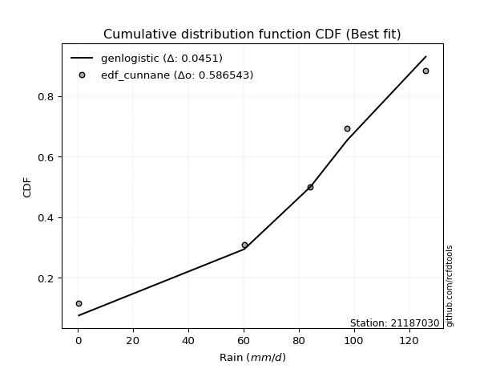</img>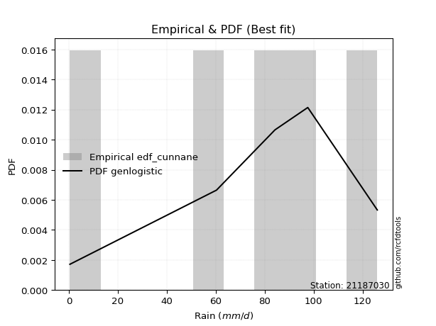</img>

</div>


### 12. EDF Adamowski (1981)

The Adamowski formula in hydrology refers to a specific plotting position formula used for estimating the non-parametric empirical distribution of hydrological events (like flood peaks) to calculate their return periods. This formula provides an alternative to traditional parametric methods (like the Gumbel or Log Pearson Type III distributions). 

<div align="center">


$P=(m-0.25)/(n+0.5)$


</div>


**12.1. Empirical values**

<div align="center">

|                | 0                   | 1                  | 2             | 3                  | 4                  |
|:---------------|:--------------------|:-------------------|:--------------|:-------------------|:-------------------|
| date           | 2022                | 2025               | 2020          | 2019               | 2021               |
| x              | 0.4                 | 60.3               | 84.2          | 97.6               | 126.0              |
| m              | 1                   | 2                  | 3             | 4                  | 5                  |
| empirical_dist | edf_adamowski       | edf_adamowski      | edf_adamowski | edf_adamowski      | edf_adamowski      |
| empirical      | 0.13636363636363635 | 0.3181818181818182 | 0.5           | 0.6818181818181818 | 0.8636363636363636 |
| empirical_tr   | 1.1578947368421053  | 1.4666666666666666 | 2.0           | 3.1428571428571423 | 7.333333333333334  |

</div>


**12.2. Kolmogorov-Smirnov fit test (sorted by Δ)**


<div align="center">

|                | 0                  | 1                   | 2                   | 3                  | 4                   | 5                  | 6                   | 7                   | 8                   | 9                   | 10                  | 11                  | 12                  | 13                  | 14                  | 15                  | 16                  | 17                  | 18                  | 19                  | 20                  | 21                  | 22                  | 23                  | 24                  | 25                  | 26                  | 27                  | 28                  | 29                  | 30                  | 31                 | 32                 | 33                  | 34                  | 35                  | 36                 | 37                  | 38                  | 39                  | 40                  | 41                 | 42                  | 43                  | 44                  | 45                  | 46                  | 47                  | 48                  | 49                 | 50                  | 51                  | 52                  | 53                 | 54                  | 55                  | 56                  | 57                 | 58                  | 59                  | 60                  | 61                  | 62                  | 63                  | 64                 | 65                 | 66                 | 67                  | 68                 | 69                 | 70                  | 71                 | 72                 | 73                  | 74                  | 75                  | 76                  | 77                 | 78                  | 79                  | 80                 | 81                 | 82                 | 83                  | 84                 | 85                 | 86                 | 87                 | 88                 | 89                 | 90                 | 91                  | 92                  | 93                 | 94                 | 95                  | 96                 | 97                 | 98                 | 99                 | 100                | 101                | 102                | 103                | 104                 | 105                | 106                 | 107                | 108                 | 109                 | 110                | 111                 | 112                 | 113                 | 114                 | 115                | 116                | 117                 | 118                | 119                | 120                | 121                 | 122                | 123                | 124                | 125                 | 126                 | 127                | 128                | 129                | 130                | 131                 | 132                | 133                | 134                | 135                 | 136                | 137                | 138                | 139                | 140                | 141                | 142                | 143                | 144                | 145                | 146                | 147                | 148                | 149                | 150                | 151                | 152                | 153                | 154                | 155                | 156                | 157                | 158                | 159                |
|:---------------|:-------------------|:--------------------|:--------------------|:-------------------|:--------------------|:-------------------|:--------------------|:--------------------|:--------------------|:--------------------|:--------------------|:--------------------|:--------------------|:--------------------|:--------------------|:--------------------|:--------------------|:--------------------|:--------------------|:--------------------|:--------------------|:--------------------|:--------------------|:--------------------|:--------------------|:--------------------|:--------------------|:--------------------|:--------------------|:--------------------|:--------------------|:-------------------|:-------------------|:--------------------|:--------------------|:--------------------|:-------------------|:--------------------|:--------------------|:--------------------|:--------------------|:-------------------|:--------------------|:--------------------|:--------------------|:--------------------|:--------------------|:--------------------|:--------------------|:-------------------|:--------------------|:--------------------|:--------------------|:-------------------|:--------------------|:--------------------|:--------------------|:-------------------|:--------------------|:--------------------|:--------------------|:--------------------|:--------------------|:--------------------|:-------------------|:-------------------|:-------------------|:--------------------|:-------------------|:-------------------|:--------------------|:-------------------|:-------------------|:--------------------|:--------------------|:--------------------|:--------------------|:-------------------|:--------------------|:--------------------|:-------------------|:-------------------|:-------------------|:--------------------|:-------------------|:-------------------|:-------------------|:-------------------|:-------------------|:-------------------|:-------------------|:--------------------|:--------------------|:-------------------|:-------------------|:--------------------|:-------------------|:-------------------|:-------------------|:-------------------|:-------------------|:-------------------|:-------------------|:-------------------|:--------------------|:-------------------|:--------------------|:-------------------|:--------------------|:--------------------|:-------------------|:--------------------|:--------------------|:--------------------|:--------------------|:-------------------|:-------------------|:--------------------|:-------------------|:-------------------|:-------------------|:--------------------|:-------------------|:-------------------|:-------------------|:--------------------|:--------------------|:-------------------|:-------------------|:-------------------|:-------------------|:--------------------|:-------------------|:-------------------|:-------------------|:--------------------|:-------------------|:-------------------|:-------------------|:-------------------|:-------------------|:-------------------|:-------------------|:-------------------|:-------------------|:-------------------|:-------------------|:-------------------|:-------------------|:-------------------|:-------------------|:-------------------|:-------------------|:-------------------|:-------------------|:-------------------|:-------------------|:-------------------|:-------------------|:-------------------|
| station        | 21187030           | 21187030            | 21187030            | 21187030           | 21187030            | 21187030           | 21187030            | 21187030            | 21187030            | 21187030            | 21187030            | 21187030            | 21187030            | 21187030            | 21187030            | 21187030            | 21187030            | 21187030            | 21187030            | 21187030            | 21187030            | 21187030            | 21187030            | 21187030            | 21187030            | 21187030            | 21187030            | 21187030            | 21187030            | 21187030            | 21187030            | 21187030           | 21187030           | 21187030            | 21187030            | 21187030            | 21187030           | 21187030            | 21187030            | 21187030            | 21187030            | 21187030           | 21187030            | 21187030            | 21187030            | 21187030            | 21187030            | 21187030            | 21187030            | 21187030           | 21187030            | 21187030            | 21187030            | 21187030           | 21187030            | 21187030            | 21187030            | 21187030           | 21187030            | 21187030            | 21187030            | 21187030            | 21187030            | 21187030            | 21187030           | 21187030           | 21187030           | 21187030            | 21187030           | 21187030           | 21187030            | 21187030           | 21187030           | 21187030            | 21187030            | 21187030            | 21187030            | 21187030           | 21187030            | 21187030            | 21187030           | 21187030           | 21187030           | 21187030            | 21187030           | 21187030           | 21187030           | 21187030           | 21187030           | 21187030           | 21187030           | 21187030            | 21187030            | 21187030           | 21187030           | 21187030            | 21187030           | 21187030           | 21187030           | 21187030           | 21187030           | 21187030           | 21187030           | 21187030           | 21187030            | 21187030           | 21187030            | 21187030           | 21187030            | 21187030            | 21187030           | 21187030            | 21187030            | 21187030            | 21187030            | 21187030           | 21187030           | 21187030            | 21187030           | 21187030           | 21187030           | 21187030            | 21187030           | 21187030           | 21187030           | 21187030            | 21187030            | 21187030           | 21187030           | 21187030           | 21187030           | 21187030            | 21187030           | 21187030           | 21187030           | 21187030            | 21187030           | 21187030           | 21187030           | 21187030           | 21187030           | 21187030           | 21187030           | 21187030           | 21187030           | 21187030           | 21187030           | 21187030           | 21187030           | 21187030           | 21187030           | 21187030           | 21187030           | 21187030           | 21187030           | 21187030           | 21187030           | 21187030           | 21187030           | 21187030           |
| empirical_dist | edf_adamowski      | edf_adamowski       | edf_adamowski       | edf_adamowski      | edf_adamowski       | edf_adamowski      | edf_adamowski       | edf_adamowski       | edf_adamowski       | edf_adamowski       | edf_adamowski       | edf_adamowski       | edf_adamowski       | edf_adamowski       | edf_adamowski       | edf_adamowski       | edf_adamowski       | edf_adamowski       | edf_adamowski       | edf_adamowski       | edf_adamowski       | edf_adamowski       | edf_adamowski       | edf_adamowski       | edf_adamowski       | edf_adamowski       | edf_adamowski       | edf_adamowski       | edf_adamowski       | edf_adamowski       | edf_adamowski       | edf_adamowski      | edf_adamowski      | edf_adamowski       | edf_adamowski       | edf_adamowski       | edf_adamowski      | edf_adamowski       | edf_adamowski       | edf_adamowski       | edf_adamowski       | edf_adamowski      | edf_adamowski       | edf_adamowski       | edf_adamowski       | edf_adamowski       | edf_adamowski       | edf_adamowski       | edf_adamowski       | edf_adamowski      | edf_adamowski       | edf_adamowski       | edf_adamowski       | edf_adamowski      | edf_adamowski       | edf_adamowski       | edf_adamowski       | edf_adamowski      | edf_adamowski       | edf_adamowski       | edf_adamowski       | edf_adamowski       | edf_adamowski       | edf_adamowski       | edf_adamowski      | edf_adamowski      | edf_adamowski      | edf_adamowski       | edf_adamowski      | edf_adamowski      | edf_adamowski       | edf_adamowski      | edf_adamowski      | edf_adamowski       | edf_adamowski       | edf_adamowski       | edf_adamowski       | edf_adamowski      | edf_adamowski       | edf_adamowski       | edf_adamowski      | edf_adamowski      | edf_adamowski      | edf_adamowski       | edf_adamowski      | edf_adamowski      | edf_adamowski      | edf_adamowski      | edf_adamowski      | edf_adamowski      | edf_adamowski      | edf_adamowski       | edf_adamowski       | edf_adamowski      | edf_adamowski      | edf_adamowski       | edf_adamowski      | edf_adamowski      | edf_adamowski      | edf_adamowski      | edf_adamowski      | edf_adamowski      | edf_adamowski      | edf_adamowski      | edf_adamowski       | edf_adamowski      | edf_adamowski       | edf_adamowski      | edf_adamowski       | edf_adamowski       | edf_adamowski      | edf_adamowski       | edf_adamowski       | edf_adamowski       | edf_adamowski       | edf_adamowski      | edf_adamowski      | edf_adamowski       | edf_adamowski      | edf_adamowski      | edf_adamowski      | edf_adamowski       | edf_adamowski      | edf_adamowski      | edf_adamowski      | edf_adamowski       | edf_adamowski       | edf_adamowski      | edf_adamowski      | edf_adamowski      | edf_adamowski      | edf_adamowski       | edf_adamowski      | edf_adamowski      | edf_adamowski      | edf_adamowski       | edf_adamowski      | edf_adamowski      | edf_adamowski      | edf_adamowski      | edf_adamowski      | edf_adamowski      | edf_adamowski      | edf_adamowski      | edf_adamowski      | edf_adamowski      | edf_adamowski      | edf_adamowski      | edf_adamowski      | edf_adamowski      | edf_adamowski      | edf_adamowski      | edf_adamowski      | edf_adamowski      | edf_adamowski      | edf_adamowski      | edf_adamowski      | edf_adamowski      | edf_adamowski      | edf_adamowski      |
| p_dist         | genlogistic        | gumbel_l            | weibull_min         | trapezoid          | johnsonsu           | pearson3           | burr12              | truncnorm           | t                   | crystalball         | norm                | exponnorm           | anglit              | dgamma              | argus               | betaprime           | gengamma            | rice                | gamma               | semicircular        | foldnorm            | erlang              | logistic            | exponweib           | hypsecant           | dweibull            | maxwell             | cosine              | rayleigh            | logt                | loglevy_l           | ksone              | triang             | skewnorm            | beta                | gausshyper          | kappa4             | genextreme          | genhalflogistic     | arcsine             | invgauss            | gennorm            | laplace             | kstwobign           | truncweibull_min    | halfnorm            | genpareto           | tukeylambda         | gumbel_r            | wrapcauchy         | levy_l              | kappa3              | uniform             | vonmises_line      | halflogistic        | moyal               | mielke              | loggausshyper      | logdgamma           | logpearson3         | bradford            | logargus            | logweibull_max      | logvonmises_line    | genexpon           | logjohnsonsb       | lomax              | logdweibull         | logwrapcauchy      | wald               | loggumbel_l         | logarcsine         | logtrapezoid       | truncexpon          | burr                | loggompertz         | logloggamma         | logsemicircular    | loganglit           | loggennorm          | halfgennorm        | logloglaplace      | logexponweib       | lognorm             | logcrystalball     | logexponnorm       | lognakagami        | logrice            | lognct             | logncf             | logfoldnorm        | loggamma            | loggamma            | loginvgamma        | logerlang          | ncf                 | gompertz           | loglogistic        | loginvgauss        | logmaxwell         | f                  | loghypsecant       | logkstwobign       | lograyleigh        | logalpha            | loggenextreme      | loggenexpon         | loginvweibull      | loglomax            | loghalfnorm         | invgamma           | loglaplace          | loglaplace          | logcosine           | loggumbel_r         | johnsonsb          | loghalflogistic    | loghalfgennorm      | logmoyal           | loggenpareto       | logf               | invweibull          | logbeta            | loggenhalflogistic | nakagami           | logwald             | logskewnorm         | logweibull_min     | logtriang          | fatiguelife        | logbradford        | logksone            | logkappa4          | nct                | truncpareto        | logtruncweibull_min | logfatiguelife     | logburr12          | logkappa3          | loguniform         | logbetaprime       | logtruncnorm       | weibull_max        | logtruncexpon      | logburr            | powerlaw           | logexponpow        | logmielke          | exponpow           | logjohnsonsu       | logtruncpareto     | loggengamma        | logpowerlaw        | alpha              | rdist              | loggenlogistic     | logtukeylambda     | logvonmises        | logrdist           | vonmises           |
| delta          | 0.0660791455634877 | 0.07718652104141902 | 0.07807031429050507 | 0.0783244662473861 | 0.07902993428660399 | 0.0805308011914952 | 0.08217686984554401 | 0.09623174240020305 | 0.09789367322211584 | 0.09789872599438121 | 0.09789872998579774 | 0.09790053507329322 | 0.09927315026179451 | 0.09937941828153563 | 0.09945015108489275 | 0.10332705230762129 | 0.10609729215250452 | 0.10651160304652385 | 0.10697360582445437 | 0.10730780635942438 | 0.10736805015886575 | 0.10801374112666395 | 0.11055899265635238 | 0.12086768169149431 | 0.12093682111844073 | 0.12156382549150854 | 0.12460824035426354 | 0.12713403273585777 | 0.13290921724826288 | 0.13294097974973365 | 0.13327562501896473 | 0.1359625664697247 | 0.1363626877314611 | 0.13636355625016738 | 0.13636363635731819 | 0.13636363636212478 | 0.1363636363636338 | 0.13636363636363547 | 0.13636363636363602 | 0.13636363636363635 | 0.14297086053202857 | 0.1468141025134744 | 0.14786744972814103 | 0.15410571138467516 | 0.15590269844239713 | 0.15652858880950693 | 0.16124125619130036 | 0.16403417074997861 | 0.16462250289585134 | 0.1665765023531941 | 0.16691972170566782 | 0.16717522441545118 | 0.16719745222929938 | 0.1729771779802447 | 0.18481785126018724 | 0.18745886050091665 | 0.20779224622287612 | 0.2129245366553651 | 0.21425395043093254 | 0.22068882368053816 | 0.22081125460644907 | 0.22848001505055077 | 0.23048024036561016 | 0.23707884283514497 | 0.2373099616779441 | 0.2408317410896837 | 0.2418424658682456 | 0.24655922746081804 | 0.2507172139266058 | 0.2510784121231595 | 0.25216042694294066 | 0.2541309592749473 | 0.2542828392618098 | 0.25744002494009294 | 0.26196316889646104 | 0.26631701683988224 | 0.27982823957979014 | 0.2827766517135139 | 0.28984125102654784 | 0.29366102219864876 | 0.2951140187604428 | 0.2998322167937014 | 0.3030357195134649 | 0.30677369995376275 | 0.3067737005189021 | 0.3067750474511401 | 0.306779233217431  | 0.3068148641528395 | 0.3069460388726713 | 0.3090536017560718 | 0.3136037188183815 | 0.31412932004952515 | 0.31412932004952515 | 0.3162740998871217 | 0.3166087505865169 | 0.31787129353822147 | 0.3181818181740823 | 0.3223642707159708 | 0.3243727559893394 | 0.3309746671787956 | 0.3322753967819135 | 0.3348223011538271 | 0.3382876158413201 | 0.3383652134543395 | 0.33854340232024543 | 0.3450023640092567 | 0.34826785457269543 | 0.3488943797358088 | 0.35315275494445203 | 0.35958997306348456 | 0.3609945004021619 | 0.36315015871100237 | 0.36315015871100237 | 0.36646374402332743 | 0.37037017485693896 | 0.3763164191987668 | 0.3879496057457324 | 0.39022634147623253 | 0.3917412346640063 | 0.4044289393334796 | 0.4188425699197656 | 0.43382029526000326 | 0.4366466327322189 | 0.4422824655915197 | 0.4483441107460357 | 0.45168849067581934 | 0.45889533720459713 | 0.4618556422931343 | 0.4811171593944233 | 0.4814091499611463 | 0.4887778957726194 | 0.49172829370961785 | 0.5094101901966195 | 0.5128741044369247 | 0.5408374079396239 | 0.54820417012578    | 0.5493750651489315 | 0.5508803262452141 | 0.5524995222039446 | 0.5537103160879051 | 0.5659859204947946 | 0.5685605646070222 | 0.5831348721120911 | 0.5865188685371807 | 0.5911555376256092 | 0.6005272080206732 | 0.6122137175847742 | 0.6192049385873295 | 0.6247227116004936 | 0.6410032975000591 | 0.6539822983509254 | 0.6540532257318223 | 0.6642809686704716 | 0.6700208570832755 | 0.6818181725402681 | 0.6818181818181818 | 0.6818181818181819 | 0.8153716204038853 | 0.863573360972589  | 19.242581316901394 |
| deltao         | 0.5865427407550001 | 0.5865427407550001  | 0.5865427407550001  | 0.5865427407550001 | 0.5865427407550001  | 0.5865427407550001 | 0.5865427407550001  | 0.5865427407550001  | 0.5865427407550001  | 0.5865427407550001  | 0.5865427407550001  | 0.5865427407550001  | 0.5865427407550001  | 0.5865427407550001  | 0.5865427407550001  | 0.5865427407550001  | 0.5865427407550001  | 0.5865427407550001  | 0.5865427407550001  | 0.5865427407550001  | 0.5865427407550001  | 0.5865427407550001  | 0.5865427407550001  | 0.5865427407550001  | 0.5865427407550001  | 0.5865427407550001  | 0.5865427407550001  | 0.5865427407550001  | 0.5865427407550001  | 0.5865427407550001  | 0.5865427407550001  | 0.5865427407550001 | 0.5865427407550001 | 0.5865427407550001  | 0.5865427407550001  | 0.5865427407550001  | 0.5865427407550001 | 0.5865427407550001  | 0.5865427407550001  | 0.5865427407550001  | 0.5865427407550001  | 0.5865427407550001 | 0.5865427407550001  | 0.5865427407550001  | 0.5865427407550001  | 0.5865427407550001  | 0.5865427407550001  | 0.5865427407550001  | 0.5865427407550001  | 0.5865427407550001 | 0.5865427407550001  | 0.5865427407550001  | 0.5865427407550001  | 0.5865427407550001 | 0.5865427407550001  | 0.5865427407550001  | 0.5865427407550001  | 0.5865427407550001 | 0.5865427407550001  | 0.5865427407550001  | 0.5865427407550001  | 0.5865427407550001  | 0.5865427407550001  | 0.5865427407550001  | 0.5865427407550001 | 0.5865427407550001 | 0.5865427407550001 | 0.5865427407550001  | 0.5865427407550001 | 0.5865427407550001 | 0.5865427407550001  | 0.5865427407550001 | 0.5865427407550001 | 0.5865427407550001  | 0.5865427407550001  | 0.5865427407550001  | 0.5865427407550001  | 0.5865427407550001 | 0.5865427407550001  | 0.5865427407550001  | 0.5865427407550001 | 0.5865427407550001 | 0.5865427407550001 | 0.5865427407550001  | 0.5865427407550001 | 0.5865427407550001 | 0.5865427407550001 | 0.5865427407550001 | 0.5865427407550001 | 0.5865427407550001 | 0.5865427407550001 | 0.5865427407550001  | 0.5865427407550001  | 0.5865427407550001 | 0.5865427407550001 | 0.5865427407550001  | 0.5865427407550001 | 0.5865427407550001 | 0.5865427407550001 | 0.5865427407550001 | 0.5865427407550001 | 0.5865427407550001 | 0.5865427407550001 | 0.5865427407550001 | 0.5865427407550001  | 0.5865427407550001 | 0.5865427407550001  | 0.5865427407550001 | 0.5865427407550001  | 0.5865427407550001  | 0.5865427407550001 | 0.5865427407550001  | 0.5865427407550001  | 0.5865427407550001  | 0.5865427407550001  | 0.5865427407550001 | 0.5865427407550001 | 0.5865427407550001  | 0.5865427407550001 | 0.5865427407550001 | 0.5865427407550001 | 0.5865427407550001  | 0.5865427407550001 | 0.5865427407550001 | 0.5865427407550001 | 0.5865427407550001  | 0.5865427407550001  | 0.5865427407550001 | 0.5865427407550001 | 0.5865427407550001 | 0.5865427407550001 | 0.5865427407550001  | 0.5865427407550001 | 0.5865427407550001 | 0.5865427407550001 | 0.5865427407550001  | 0.5865427407550001 | 0.5865427407550001 | 0.5865427407550001 | 0.5865427407550001 | 0.5865427407550001 | 0.5865427407550001 | 0.5865427407550001 | 0.5865427407550001 | 0.5865427407550001 | 0.5865427407550001 | 0.5865427407550001 | 0.5865427407550001 | 0.5865427407550001 | 0.5865427407550001 | 0.5865427407550001 | 0.5865427407550001 | 0.5865427407550001 | 0.5865427407550001 | 0.5865427407550001 | 0.5865427407550001 | 0.5865427407550001 | 0.5865427407550001 | 0.5865427407550001 | 0.5865427407550001 |
| eval           | Δo > Δ             | Δo > Δ              | Δo > Δ              | Δo > Δ             | Δo > Δ              | Δo > Δ             | Δo > Δ              | Δo > Δ              | Δo > Δ              | Δo > Δ              | Δo > Δ              | Δo > Δ              | Δo > Δ              | Δo > Δ              | Δo > Δ              | Δo > Δ              | Δo > Δ              | Δo > Δ              | Δo > Δ              | Δo > Δ              | Δo > Δ              | Δo > Δ              | Δo > Δ              | Δo > Δ              | Δo > Δ              | Δo > Δ              | Δo > Δ              | Δo > Δ              | Δo > Δ              | Δo > Δ              | Δo > Δ              | Δo > Δ             | Δo > Δ             | Δo > Δ              | Δo > Δ              | Δo > Δ              | Δo > Δ             | Δo > Δ              | Δo > Δ              | Δo > Δ              | Δo > Δ              | Δo > Δ             | Δo > Δ              | Δo > Δ              | Δo > Δ              | Δo > Δ              | Δo > Δ              | Δo > Δ              | Δo > Δ              | Δo > Δ             | Δo > Δ              | Δo > Δ              | Δo > Δ              | Δo > Δ             | Δo > Δ              | Δo > Δ              | Δo > Δ              | Δo > Δ             | Δo > Δ              | Δo > Δ              | Δo > Δ              | Δo > Δ              | Δo > Δ              | Δo > Δ              | Δo > Δ             | Δo > Δ             | Δo > Δ             | Δo > Δ              | Δo > Δ             | Δo > Δ             | Δo > Δ              | Δo > Δ             | Δo > Δ             | Δo > Δ              | Δo > Δ              | Δo > Δ              | Δo > Δ              | Δo > Δ             | Δo > Δ              | Δo > Δ              | Δo > Δ             | Δo > Δ             | Δo > Δ             | Δo > Δ              | Δo > Δ             | Δo > Δ             | Δo > Δ             | Δo > Δ             | Δo > Δ             | Δo > Δ             | Δo > Δ             | Δo > Δ              | Δo > Δ              | Δo > Δ             | Δo > Δ             | Δo > Δ              | Δo > Δ             | Δo > Δ             | Δo > Δ             | Δo > Δ             | Δo > Δ             | Δo > Δ             | Δo > Δ             | Δo > Δ             | Δo > Δ              | Δo > Δ             | Δo > Δ              | Δo > Δ             | Δo > Δ              | Δo > Δ              | Δo > Δ             | Δo > Δ              | Δo > Δ              | Δo > Δ              | Δo > Δ              | Δo > Δ             | Δo > Δ             | Δo > Δ              | Δo > Δ             | Δo > Δ             | Δo > Δ             | Δo > Δ              | Δo > Δ             | Δo > Δ             | Δo > Δ             | Δo > Δ              | Δo > Δ              | Δo > Δ             | Δo > Δ             | Δo > Δ             | Δo > Δ             | Δo > Δ              | Δo > Δ             | Δo > Δ             | Δo > Δ             | Δo > Δ              | Δo > Δ             | Δo > Δ             | Δo > Δ             | Δo > Δ             | Δo > Δ             | Δo > Δ             | Δo > Δ             | Δo > Δ             | Δo <= Δ            | Δo <= Δ            | Δo <= Δ            | Δo <= Δ            | Δo <= Δ            | Δo <= Δ            | Δo <= Δ            | Δo <= Δ            | Δo <= Δ            | Δo <= Δ            | Δo <= Δ            | Δo <= Δ            | Δo <= Δ            | Δo <= Δ            | Δo <= Δ            | Δo <= Δ            |
| fit            | 1                  | 1                   | 1                   | 1                  | 1                   | 1                  | 1                   | 1                   | 1                   | 1                   | 1                   | 1                   | 1                   | 1                   | 1                   | 1                   | 1                   | 1                   | 1                   | 1                   | 1                   | 1                   | 1                   | 1                   | 1                   | 1                   | 1                   | 1                   | 1                   | 1                   | 1                   | 1                  | 1                  | 1                   | 1                   | 1                   | 1                  | 1                   | 1                   | 1                   | 1                   | 1                  | 1                   | 1                   | 1                   | 1                   | 1                   | 1                   | 1                   | 1                  | 1                   | 1                   | 1                   | 1                  | 1                   | 1                   | 1                   | 1                  | 1                   | 1                   | 1                   | 1                   | 1                   | 1                   | 1                  | 1                  | 1                  | 1                   | 1                  | 1                  | 1                   | 1                  | 1                  | 1                   | 1                   | 1                   | 1                   | 1                  | 1                   | 1                   | 1                  | 1                  | 1                  | 1                   | 1                  | 1                  | 1                  | 1                  | 1                  | 1                  | 1                  | 1                   | 1                   | 1                  | 1                  | 1                   | 1                  | 1                  | 1                  | 1                  | 1                  | 1                  | 1                  | 1                  | 1                   | 1                  | 1                   | 1                  | 1                   | 1                   | 1                  | 1                   | 1                   | 1                   | 1                   | 1                  | 1                  | 1                   | 1                  | 1                  | 1                  | 1                   | 1                  | 1                  | 1                  | 1                   | 1                   | 1                  | 1                  | 1                  | 1                  | 1                   | 1                  | 1                  | 1                  | 1                   | 1                  | 1                  | 1                  | 1                  | 1                  | 1                  | 1                  | 1                  | 0                  | 0                  | 0                  | 0                  | 0                  | 0                  | 0                  | 0                  | 0                  | 0                  | 0                  | 0                  | 0                  | 0                  | 0                  | 0                  |
| n              | 5                  | 5                   | 5                   | 5                  | 5                   | 5                  | 5                   | 5                   | 5                   | 5                   | 5                   | 5                   | 5                   | 5                   | 5                   | 5                   | 5                   | 5                   | 5                   | 5                   | 5                   | 5                   | 5                   | 5                   | 5                   | 5                   | 5                   | 5                   | 5                   | 5                   | 5                   | 5                  | 5                  | 5                   | 5                   | 5                   | 5                  | 5                   | 5                   | 5                   | 5                   | 5                  | 5                   | 5                   | 5                   | 5                   | 5                   | 5                   | 5                   | 5                  | 5                   | 5                   | 5                   | 5                  | 5                   | 5                   | 5                   | 5                  | 5                   | 5                   | 5                   | 5                   | 5                   | 5                   | 5                  | 5                  | 5                  | 5                   | 5                  | 5                  | 5                   | 5                  | 5                  | 5                   | 5                   | 5                   | 5                   | 5                  | 5                   | 5                   | 5                  | 5                  | 5                  | 5                   | 5                  | 5                  | 5                  | 5                  | 5                  | 5                  | 5                  | 5                   | 5                   | 5                  | 5                  | 5                   | 5                  | 5                  | 5                  | 5                  | 5                  | 5                  | 5                  | 5                  | 5                   | 5                  | 5                   | 5                  | 5                   | 5                   | 5                  | 5                   | 5                   | 5                   | 5                   | 5                  | 5                  | 5                   | 5                  | 5                  | 5                  | 5                   | 5                  | 5                  | 5                  | 5                   | 5                   | 5                  | 5                  | 5                  | 5                  | 5                   | 5                  | 5                  | 5                  | 5                   | 5                  | 5                  | 5                  | 5                  | 5                  | 5                  | 5                  | 5                  | 5                  | 5                  | 5                  | 5                  | 5                  | 5                  | 5                  | 5                  | 5                  | 5                  | 5                  | 5                  | 5                  | 5                  | 5                  | 5                  |
| best_fit       | 1                  | 0                   | 0                   | 0                  | 0                   | 0                  | 0                   | 0                   | 0                   | 0                   | 0                   | 0                   | 0                   | 0                   | 0                   | 0                   | 0                   | 0                   | 0                   | 0                   | 0                   | 0                   | 0                   | 0                   | 0                   | 0                   | 0                   | 0                   | 0                   | 0                   | 0                   | 0                  | 0                  | 0                   | 0                   | 0                   | 0                  | 0                   | 0                   | 0                   | 0                   | 0                  | 0                   | 0                   | 0                   | 0                   | 0                   | 0                   | 0                   | 0                  | 0                   | 0                   | 0                   | 0                  | 0                   | 0                   | 0                   | 0                  | 0                   | 0                   | 0                   | 0                   | 0                   | 0                   | 0                  | 0                  | 0                  | 0                   | 0                  | 0                  | 0                   | 0                  | 0                  | 0                   | 0                   | 0                   | 0                   | 0                  | 0                   | 0                   | 0                  | 0                  | 0                  | 0                   | 0                  | 0                  | 0                  | 0                  | 0                  | 0                  | 0                  | 0                   | 0                   | 0                  | 0                  | 0                   | 0                  | 0                  | 0                  | 0                  | 0                  | 0                  | 0                  | 0                  | 0                   | 0                  | 0                   | 0                  | 0                   | 0                   | 0                  | 0                   | 0                   | 0                   | 0                   | 0                  | 0                  | 0                   | 0                  | 0                  | 0                  | 0                   | 0                  | 0                  | 0                  | 0                   | 0                   | 0                  | 0                  | 0                  | 0                  | 0                   | 0                  | 0                  | 0                  | 0                   | 0                  | 0                  | 0                  | 0                  | 0                  | 0                  | 0                  | 0                  | 0                  | 0                  | 0                  | 0                  | 0                  | 0                  | 0                  | 0                  | 0                  | 0                  | 0                  | 0                  | 0                  | 0                  | 0                  | 0                  |
| best_fit_sort  | 1                  | 2                   | 3                   | 4                  | 5                   | 6                  | 7                   | 8                   | 9                   | 10                  | 11                  | 12                  | 13                  | 14                  | 15                  | 16                  | 17                  | 18                  | 19                  | 20                  | 21                  | 22                  | 23                  | 24                  | 25                  | 26                  | 27                  | 28                  | 29                  | 30                  | 31                  | 32                 | 33                 | 34                  | 35                  | 36                  | 37                 | 38                  | 39                  | 40                  | 41                  | 42                 | 43                  | 44                  | 45                  | 46                  | 47                  | 48                  | 49                  | 50                 | 51                  | 52                  | 53                  | 54                 | 55                  | 56                  | 57                  | 58                 | 59                  | 60                  | 61                  | 62                  | 63                  | 64                  | 65                 | 66                 | 67                 | 68                  | 69                 | 70                 | 71                  | 72                 | 73                 | 74                  | 75                  | 76                  | 77                  | 78                 | 79                  | 80                  | 81                 | 82                 | 83                 | 84                  | 85                 | 86                 | 87                 | 88                 | 89                 | 90                 | 91                 | 92                  | 93                  | 94                 | 95                 | 96                  | 97                 | 98                 | 99                 | 100                | 101                | 102                | 103                | 104                | 105                 | 106                | 107                 | 108                | 109                 | 110                 | 111                | 112                 | 113                 | 114                 | 115                 | 116                | 117                | 118                 | 119                | 120                | 121                | 122                 | 123                | 124                | 125                | 126                 | 127                 | 128                | 129                | 130                | 131                | 132                 | 133                | 134                | 135                | 136                 | 137                | 138                | 139                | 140                | 141                | 142                | 143                | 144                | 145                | 146                | 147                | 148                | 149                | 150                | 151                | 152                | 153                | 154                | 155                | 156                | 157                | 158                | 159                | 160                |

</div>


**12.3. Best fit**

<div align="center">

|   id |   station | empirical_dist   | p_dist      |     delta |   deltao | eval   |   fit |   n |   best_fit |   best_fit_sort |
|-----:|----------:|:-----------------|:------------|----------:|---------:|:-------|------:|----:|-----------:|----------------:|
|    0 |  21187030 | edf_adamowski    | genlogistic | 0.0660791 | 0.586543 | Δo > Δ |     1 |   5 |          1 |               1 |

</div>


<div align="center">

</img></img>

</div>


## C. Best fit & Estimate extreme values for specific return periods - Tr

Best fit in probability distribution analysis means finding the theoretical distribution (like Normal, Poisson, Exponential, etc.) that most accurately mirrors your real-world data´s patterns (shape, center, spread) for better predictions, using methods like visual checks (Q-Q plots), goodness-of-fit tests (Kolmogorov-Smirnov, Chi-Squared), and information criteria (AIC) to score and select the simplest, most representative model.


### 1. Best fit (ordered by delta Δ)

:file_folder:Table: [bestfit_21187030.csv](table/bestfit_21187030.csv)

<div align="center">

|   id |   station | empirical_dist   | p_dist          |     delta |   deltao | eval   |   fit |   n |   best_fit |   best_fit_sort |
|-----:|----------:|:-----------------|:----------------|----------:|---------:|:-------|------:|----:|-----------:|----------------:|
|    0 |  21187030 | edf_hazen        | gumbel_l        | 0.0408229 | 0.586543 | Δo > Δ |     1 |   5 |          1 |               1 |
|    1 |  21187030 | edf_gringorten   | genlogistic     | 0.040892  | 0.586543 | Δo > Δ |     1 |   5 |          1 |               2 |
|    2 |  21187030 | edf_cunnane      | genlogistic     | 0.0451001 | 0.586543 | Δo > Δ |     1 |   5 |          1 |               3 |
|    3 |  21187030 | edf_blom         | genlogistic     | 0.0487631 | 0.586543 | Δo > Δ |     1 |   5 |          1 |               4 |
|    4 |  21187030 | edf_tukey        | genlogistic     | 0.0547155 | 0.586543 | Δo > Δ |     1 |   5 |          1 |               5 |
|    5 |  21187030 | edf_filliben     | genlogistic     | 0.0569289 | 0.586543 | Δo > Δ |     1 |   5 |          1 |               6 |
|    6 |  21187030 | edf_beard        | genlogistic     | 0.0579683 | 0.586543 | Δo > Δ |     1 |   5 |          1 |               7 |
|    7 |  21187030 | edf_jenkinson    | genlogistic     | 0.0579683 | 0.586543 | Δo > Δ |     1 |   5 |          1 |               8 |
|    8 |  21187030 | edf_chegodayev   | genlogistic     | 0.0593451 | 0.586543 | Δo > Δ |     1 |   5 |          1 |               9 |
|    9 |  21187030 | edf_adamowski    | genlogistic     | 0.0660791 | 0.586543 | Δo > Δ |     1 |   5 |          1 |              10 |
|   10 |  21187030 | edf_weibull      | genlogistic     | 0.0963822 | 0.586543 | Δo > Δ |     1 |   5 |          1 |              11 |
|   11 |  21187030 | edf_california   | genhalflogistic | 0.129862  | 0.586543 | Δo > Δ |     1 |   5 |          1 |              12 |

</div>


### 2. Extreme values and % difference analysis

In hydrology, a return period (or recurrence interval $Tr$) is the statistical average time between extreme events like floods or droughts of a specific magnitude, indicating how rare an event is, with a 100-year flood, for example, having a 1% chance of occurring in any given year, not that it happens exactly every century. It is a key tool for infrastructure design (like bridges or dams) and risk assessment, calculated from historical data to determine the probability of future events, although it is important to remember it is statistical average, and events can cluster or be missed.

The extreme value porcentage difference is evaluated as $pdiff = 1 - (ETrBf / ETr) * 100$, where _ETrBf_ correspond to the bestfit extreme value for a specific recurrence interval and _ETr_ correspond to the extreme value for one of the most used PDFsused in hydrology.

> risk_rate: assuming the return period as the project useful life.

:file_folder:Table: [extreme_21187030.csv](table/extreme_21187030.csv), all PDFs.  
:file_folder:Table: [extremepdiff_21187030.csv](table/extremepdiff_21187030.csv), % difference between bestfit and most used PDFs in Hydrology.

<div align="center">

Extreme values table for only best fit PDFs
|   id |      tr |   prob_l |     prob_g |     alpha |   anglit |   arcsine |    argus |     beta |   betaprime |   bradford |     burr |   burr12 |   cosine |   crystalball |   dgamma |         dweibull |   erlang |   exponnorm |    exponpow |   exponweib |        f |   fatiguelife |   foldnorm |    gamma |   gausshyper |   genexpon |   genextreme |   gengamma |   genhalflogistic |   genlogistic |   gennorm |   genpareto |   gompertz |   gumbel_l |   gumbel_r |   halfgennorm |   halflogistic |   halfnorm |   hypsecant |         invgamma |   invgauss |       invweibull |   johnsonsb |   johnsonsu |     kappa3 |   kappa4 |    ksone |   kstwobign |   laplace |   levy_l |   loggamma |   logistic |   loglaplace |    lomax |   maxwell |   mielke |    moyal |   nakagami |      ncf |             nct |     norm |   pearson3 |   powerlaw |   rayleigh |     rdist |     rice |   semicircular |   skewnorm |        t |   trapezoid |   triang |   truncexpon |   truncnorm |   truncpareto |   truncweibull_min |   tukeylambda |   uniform |   vonmises |   vonmises_line |     wald |   weibull_max |   weibull_min |   wrapcauchy |    logalpha |   loganglit |   logarcsine |   logargus |   logbeta |   logbetaprime |   logbradford |          logburr |   logburr12 |   logcosine |   logcrystalball |   logdgamma |      logdweibull |   logerlang |   logexponnorm |      logexponpow |      logexponweib |            logf |   logfatiguelife |   logfoldnorm |   loggausshyper |      loggenexpon |   loggenextreme |      loggengamma |   loggenhalflogistic |   loggenlogistic |       loggennorm |   loggenpareto |   loggompertz |   loggumbel_l |      loggumbel_r |   loghalfgennorm |   loghalflogistic |   loghalfnorm |   loghypsecant |   loginvgamma |   loginvgauss |    loginvweibull |   logjohnsonsb |   logjohnsonsu |   logkappa3 |   logkappa4 |   logksone |     logkstwobign |   loglevy_l |   logloggamma |   loglogistic |   logloglaplace |         loglomax |   logmaxwell |       logmielke |         logmoyal |   lognakagami |         logncf |     lognct |    lognorm |   logpearson3 |   logpowerlaw |   lograyleigh |   logrdist |    logrice |   logsemicircular |   logskewnorm |            logt |   logtrapezoid |   logtriang |   logtruncexpon |   logtruncnorm |   logtruncpareto |   logtruncweibull_min |   logtukeylambda |   loguniform |   logvonmises |   logvonmises_line |          logwald |   logweibull_max |   logweibull_min |   logwrapcauchy |   station |   n |   risk_rate |
|-----:|--------:|---------:|-----------:|----------:|---------:|----------:|---------:|---------:|------------:|-----------:|---------:|---------:|---------:|--------------:|---------:|-----------------:|---------:|------------:|------------:|------------:|---------:|--------------:|-----------:|---------:|-------------:|-----------:|-------------:|-----------:|------------------:|--------------:|----------:|------------:|-----------:|-----------:|-----------:|--------------:|---------------:|-----------:|------------:|-----------------:|-----------:|-----------------:|------------:|------------:|-----------:|---------:|---------:|------------:|----------:|---------:|-----------:|-----------:|-------------:|---------:|----------:|---------:|---------:|-----------:|---------:|----------------:|---------:|-----------:|-----------:|-----------:|----------:|---------:|---------------:|-----------:|---------:|------------:|---------:|-------------:|------------:|--------------:|-------------------:|--------------:|----------:|-----------:|----------------:|---------:|--------------:|--------------:|-------------:|------------:|------------:|-------------:|-----------:|----------:|---------------:|--------------:|-----------------:|------------:|------------:|-----------------:|------------:|-----------------:|------------:|---------------:|-----------------:|------------------:|----------------:|-----------------:|--------------:|----------------:|-----------------:|----------------:|-----------------:|---------------------:|-----------------:|-----------------:|---------------:|--------------:|--------------:|-----------------:|-----------------:|------------------:|--------------:|---------------:|--------------:|--------------:|-----------------:|---------------:|---------------:|------------:|------------:|-----------:|-----------------:|------------:|--------------:|--------------:|----------------:|-----------------:|-------------:|----------------:|-----------------:|--------------:|---------------:|-----------:|-----------:|--------------:|--------------:|--------------:|-----------:|-----------:|------------------:|--------------:|----------------:|---------------:|------------:|----------------:|---------------:|-----------------:|----------------------:|-----------------:|-------------:|--------------:|-------------------:|-----------------:|-----------------:|-----------------:|----------------:|----------:|----:|------------:|
|    0 |    2    | 0.5      | 0.5        |   1.32276 |  73.7    |   73.7    |  82.3692 |  86.6088 |     72.9959 |    54.7429 |  48.9389 |  80.5977 |  69.8805 |       73.7    |  73.0338 |     84.2         |  72.2176 |     73.6999 |    0.408041 |     69.1288 |  35.6907 |       0.4001  |    74.556  |  72.3967 |      82.2715 |    51.6089 |      91.1209 |    72.5257 |           77.8432 |       84.2409 |   84.2    |     95.0621 |    95.1986 |    80.6581 |    66.7419 |       37.3684 |        63.2827 |    65.0302 |     73.7    |     10.5075      |    65.3182 |   9276.95        |     124.55  |     83.8603 |   0.396296 |  67.1164 |  73.7    |     63.8042 |   73.7    |  95.2788 |    27.5306 |    73.7    |      30.1649 |  50.9697 |   70.0776 |  56.8584 |  64.4957 |    8.79784 |  30.4507 |     0.617871    |  73.7    |    78.1027 |   0.695207 |    68.7929 | -11.7956  |  72.3569 |        73.7    |    80.6035 |  73.7006 |     78.662  |  78.9359 |      50.3935 |     73.9306 |       9.04268 |            65.6066 |       63.2002 |   63.2    |    2.53104 |         62.09   |  59.9707 |       125.549 |       81.2813 |      63.2    |     23.3673 |     30.1649 |      30.1648 |    54.2539 |       126 |   0.405992     |       8.94753 |     0.402355     |         inf |     19.7289 |          30.1649 |      97.6   |     97.6         |     27.3184 |        30.1647 |      0.658403    |      6.10498      |    1.21168      |      0.4         |       33.8596 |          52.203 |     16.1555      |         32.1702 |      0.405825    |              18.0715 |          inf     |    97.6001       |        18.2227 |       45.6378 |       43.1175 |     21.1033      |      5.04725     |      17.669       |       19.328  |        30.1649 |       27.1084 |       24.8665 |     15.7869      |        121.989 |            126 |    0.396796 |     9.20523 |     7.0993 |     16.876       |     90.6456 |       46.6539 |       30.1649 |         2.51297 |      8.96211     |      25.0455 |    0.404113     |     18.8045      |       30.152  |   4.50272      |    30.0693 |    30.1649 |       50.1209 |      0.410846 |       23.447  |   0.399916 |    30.1649 |           30.1649 |       21.773  |   91.0055       |        38.1902 |     16.4318 |         4.51436 |        4.91709 |         0.635001 |               8.77473 |              0.4 |       7.0993 |      0.196802 |            47.1542 |     14.9062      |          40.2283 |      1.86756     |         7.07978 |  21187030 |   5 |    0.75     |
|    1 |    2.33 | 0.570815 | 0.429185   |   1.57377 |  82.5038 |   86.9159 |  89.592  |  94.6081 |     80.6234 |    64.8351 |  58.9431 |  87.2019 |  77.7814 |       81.2581 |  84.5988 |     84.2001      |  80.0015 |     81.2579 |    0.433822 |     77.737  |  45.853  |       3.10252 |    81.5364 |  80.1416 |      92.4518 |    62.8918 |      98.1391 |    80.2531 |           86.5977 |       90.5908 |   85.8579 |    103.333  |    99.0993 |    87.2337 |    73.7453 |       50.4262 |        70.4833 |    73.1873 |     79.7487 |     19.2966      |    74.2672 | 943788           |     125.521 |     90.5015 |   0.396296 |  76.1767 |  84.0899 |     73.2029 |   78.2738 | 104.77   |    41.5917 |    80.3592 |      38.1495 |  62.1117 |   77.9299 |  66.3085 |  71.1252 |   15.74    |  44.7191 |     0.886336    |  81.2581 |    85.3753 |   1.33863  |    76.7614 |   4.30822 |  80.1637 |        83.1422 |    87.8481 |  81.2586 |     87.3621 |  86.7158 |      59.657  |     81.4535 |      13.2082  |            74.07   |       72.2756 |   72.0944 |    2.85104 |         71.1416 |  64.9266 |       125.782 |       87.8659 |      76.4113 |     35.3735 |     47.4034 |      59.4556 |    63.4978 |       126 |   0.420488     |      13.8951  |     0.407432     |         inf |     29.9575 |          44.4665 |     106.005 |    108.782       |     41.0975 |        44.4662 |      0.8341      |     19.7077       |    2.13518      |      0.454845    |       45.9794 |          70.857 |     27.4025      |         43.5042 |      0.415399    |              26.3132 |          inf     |    97.7648       |        27.9506 |       57.6862 |       60.4334 |     30.2352      |      9.8279      |      25.5724      |       29.3816 |        41.1507 |       40.9688 |       38.1706 |     26.7666      |        125.671 |            126 |    0.396796 |    14.1416  |    11.5749 |     29.0463      |    100.358  |       56.4085 |       42.4609 |       290.233   |     17.8995      |      37.4819 |    0.412207     |     26.4295      |       44.4567 |  14.7312       |    44.3775 |    44.4665 |       69.7705 |      0.431009 |       35.2994 |   0.399945 |    44.4606 |           48.9829 |       28.8134 |   95.7193       |        59.6963 |     23.0108 |         6.75422 |        7.81571 |         0.78218  |              12.7068  |              0.4 |      10.6693 |      0.212016 |            64.6797 |     19.2253      |          69.233  |      3.20665     |        61.4271  |  21187030 |   5 |    0.729209 |
|    2 |    5    | 0.8      | 0.2        |   3.52016 | 113.565  |  122.158  | 110.524  | 115.495  |    109.144  |    97.4972 |  94.6558 | 108.817  | 106.253  |      109.346  | 108.265  |    105.163       | 109.448  |    109.345  |    2.73712  |    113.034  | 103.619  |      60.5084  |   107.478  | 109.425  |     117.523  |   119.304  |     115.502  |   109.404  |          110.105  |      110.02   |  103.086  |    121.214  |   112.807  |   108.477  |   104.171  |      140.964  |       103.065  |   107.683  |    104.011  |    377.05        |   111.773  |      4.9695e+14  |     125.992 |    110.484  |   0.396296 | 104.389  | 117.715  |    113.127  |  101.142  | 120.495  |   197.946  |   106.071  |     123.424  | 117.819  |  108.836  |  98.1735 | 101.834  |   74.0713  | 117.023  |    25.5216      | 109.346  |   110.007  |  18.2931   |   108.663  |  46.9142  | 109.572  |       115.364  |   108.948  | 109.346  |    112.322  | 109.036  |      92.6052 |    109.402  |      44.2619  |           101.441  |      101.476  |  100.88   |    4.05186 |        100.436  |  92.6697 |       125.991 |      109.138  |     108.136  |    176.265  |    233.575  |     363.103  |    97.2328 |       126 |   1.5221       |      57.747   |     0.710075     |         inf |    134.964  |         188.078  |     230.337 |    533.356       |    193.471  |       188.076  |      4.02887     | 203313            | 2199.74         |      6.97118     |      143.346  |         117.858 |    240.968       |         87.9789 |      0.665433    |              69.7084 |          inf     |   115.005        |        81.8515 |      123.507  |      179.869  |    144.196       |    413.539       |     136.232       |      172.687  |       143.018  |      198.118  |      201.449  |    267.635       |        126     |            126 |    0.396796 |    52.1785  |    56.3128 |    291.611       |    118.793  |       91.5106 |      158.971  |       inf       |    590.013       |     183.218  |    0.713478     |    127.891       |      188.237  |   1.61876e+07  |   188.736  |   188.078  |      182.757  |      1.11025  |      181.594  |   0.399996 |   187.96   |          256.177  |       65.1605 |  130.915        |       215.034  |     60.4646 |        28.6111  |       34.426   |         3.39856  |              42.2473  |              0.4 |      39.8757 |      0.280132 |           223.038  |     79.8895      |         121.511  |     97.7859      |       111.269   |  21187030 |   5 |    0.67232  |
|    3 |   10    | 0.9      | 0.1        |   7.09614 | 131.147  |  130.666  | 119.524  | 122.018  |    128.216  |   111.749  | 111.659  | 121.038  | 123.455  |      127.979  | 125.089  |   1235.27        | 129.437  |    127.978  |   19.062    |    139.574  | 164.982  |     139.771   |   124.686  | 129.289  |     123.644  |   170.513  |     121.259  |   129.12   |          118.521  |      121.173  |  129.434  |    124.833  |   121.003  |   120.304  |   128.953  |      260.576  |       130.122  |   133.208  |    123.386  |   5506.9         |   140.677  |      6.3066e+21  |     126     |    120.451  |   0.396296 | 115.874  | 132.387  |    143.523  |  121.9    | 124.291  |   570.397  |   125.007  |     358.329  | 168.389  |  130.586  | 112.599  | 128.571  |  137.984   | 182.762  |   891.626       | 127.979  |   124.345  |  50.4489   |   131.409  |  56.9556  | 129.319  |       131.898  |   117.542  | 127.979  |    122.071  | 117.754  |     108.674  |    127.923  |      74.7203  |           113.594  |      113.993  |  113.44   |    4.77632 |        113.218  | 122.112  |       125.999 |      120.982  |     117.561  |    543.368  |    576.045  |     562.003  |   115.596  |       126 | 365.125        |     107.517   |    20.9182       |         inf |    335.096  |         489.567  |     536.88  |   5507.75        |    555.806  |       489.56   |     22.9734      |      2.17448e+11  |    1.2778e+13   |    302.064       |      304.772  |         124.826 |   1184.07        |        108.625  |      1.94195     |              96.778  |          inf     |   273.865        |       109.684  |      189.072  |      330.126  |    514.675       |  20173.6         |     546.529       |      640.379  |       386.729  |      584.951  |      647.217  |   1764.23        |        126     |            126 |   71.4141   |    86.3587  |   112.306  |   1688.42        |    123.73   |      108.341  |      420.295  |       inf       |  14865.3         |     559.7    |    4.39322      |    504.688       |      490.451  |   8.86656e+25  |   493.569  |   489.567  |      282.423  |      5.08628  |      583.845  |   0.4      |   489.1    |          598.706  |       90.8495 |  259.359        |       354.731  |     88.1832 |        58.2358  |       65.708   |        13.4201   |              72.3708  |              0.4 |      70.8826 |      0.338301 |           574.788  |    362.233       |         125.535  |   5056.52        |       119.177   |  21187030 |   5 |    0.651322 |
|    4 |   15    | 0.933333 | 0.0666667  |  10.6594  | 138.654  |  132.288  | 122.779  | 123.734  |    137.778  |   116.499  | 117.502  | 126.617  | 131.291  |      137.277  | 134.255  |   5772.69        | 139.549  |    137.276  |   45.1745   |    153.787  | 204.757  |     191.611   |   133.274  | 139.333  |     124.89   |   200.468  |     122.973  |   139.073  |          121.119  |      126.694  |  149.444  |    125.489  |   124.813  |   125.66   |   142.934  |      347.772  |       145.434  |   146.492  |    134.443  |  26416.4         |   156.4    |      6.41979e+25 |     126     |    124.646  |   0.396296 | 119.501  | 137.278  |    159.66   |  134.044  | 125.438  |   974.085  |   135.324  |     668.423  | 197.97   |  141.746  | 117.469  | 144.088  |  174.358   | 221.462  |  7187.96        | 137.277  |   130.929  |  69.1581   |   143.129  |  58.829   | 139.223  |       138.346  |   120.37   | 137.277  |    125.199  | 120.551  |     114.3    |    137.153  |      88.9455  |           117.697  |      118.095  |  117.627  |    5.05965 |        117.479  | 141.018  |       126     |      126.345  |     120.432  |    971.499  |    846.957  |     610.832  |   122.917  |       126 |   1.39573e+06  |     132.27    | 10701            |         inf |    507.077  |         789.119  |     903.122 |  29008.6         |    948.927  |       789.106  |     67.7404      |      1.13436e+16  |    3.4378e+27   |   3552.97        |      444.067  |         125.627 |   2718.52        |        115.143  |      4.77851     |             106.618  |          inf     |   983.496        |       117.317  |      229.36   |      434.623  |   1055.1         | 236272           |    1199.63        |     1266.59   |       682.267  |     1015.64   |     1181.7    |   5133.94        |        126     |            126 |   86.5586   |   100.52    |   141.363  |   4289.14        |    125.261  |      114.139  |      713.851  |       inf       | 100533           |     992.649  |   38.6205       |   1119.49        |      790.981  |   6.9194e+52   |   797.658  |   789.119  |      333.426  |     11.6375   |     1065.68   |   0.4      |   788.238  |          833.648  |      101.347  |  604.665        |       416.535  |     99.5335 |        74.7739  |       81.5771  |        25.1627   |              86.8823  |              0.4 |      85.8651 |      0.372418 |           959.032  |    956.228       |         125.872  |  69556.3         |       121.493   |  21187030 |   5 |    0.644736 |
|    5 |   20    | 0.95     | 0.05       |  14.2194  | 143.071  |  132.86   | 124.528  | 124.48   |    144.057  |   118.874  | 120.455  | 130.104  | 136.109  |      143.366  | 140.57   |  14779           | 146.22   |    143.365  |   76.0549   |    163.441  | 234.773  |     229.991   |   138.897  | 145.958  |     125.35   |   221.722  |     123.789  |   145.631  |          122.38   |      130.372  |  165.716  |    125.716  |   127.211  |   128.994  |   152.724  |      417.618  |       156.162  |   155.348  |    142.243  |  80355           |   167.187  |      4.10797e+28 |     126     |    127.149  |   0.396296 | 121.256  | 139.723  |    170.531  |  142.659  | 126.025  |  1386.46   |   142.455  |    1040.32   | 218.959  |  149.152  | 119.915  | 155.077  |  199.182   | 249.103  | 31610           | 143.366  |   135.041  |  80.6513   |   150.919  |  59.48    | 145.725  |       141.922  |   121.78   | 143.366  |    126.743  | 121.931  |     117.168  |    143.188  |      97.0397  |           119.76   |      120.124  |  119.72   |    5.2084  |        119.609  | 155.107  |       126     |      129.684  |     121.839  |   1431.67   |   1062.52   |     629.02   |   127.014  |       126 |   5.75473e+10  |     146.708   |     7.92904e+07  |         inf |    654.202  |        1078.74   |    1315.62  | 105913           |   1351.05   |      1078.72   |    148.066       |      9.54686e+19  |    1.51832e+46  |  22037.3         |      568.203  |         125.835 |   4740.92        |        118.242  |     10.1062      |             111.613  |          inf     |  4412.52         |       120.506  |      258.684  |      515.769  |   1744.14        |      1.46183e+06 |    2080.97        |     1995.79   |      1018.32   |     1463.84   |     1765.47   |  10865.3         |        126     |            126 |   95.2958   |   107.949   |   158.6    |   8037.44        |    126.052  |      117.071  |     1029.47   |       inf       | 394475           |    1451.92   |  406.524        |   1968.17        |     1081.71   |   8.36036e+86  |  1092.41   |  1078.74   |      365.735  |     19.0997   |     1589.74   |   0.4      |  1077.42   |         1001.67   |      107.026  | 1614.02         |       450.879  |    105.66   |        84.954   |       90.917   |        35.8825   |              95.2657  |              0.4 |      94.5051 |      0.396961 |          1337.25   |   1971.14        |         125.948  | 507518           |       122.626   |  21187030 |   5 |    0.641514 |
|    6 |   25    | 0.96     | 0.04       |  17.7783  | 146.064  |  133.125  | 125.643  | 124.885  |    148.688  |   120.299  | 122.237  | 132.592  | 139.489  |      147.848  | 145.384  |  28451.8         | 151.156  |    147.847  |  109.274    |    170.72   | 259.116  |     260.486   |   143.037  | 150.86   |     125.571  |   238.207  |     124.264  |   150.48   |          123.125  |      133.131  |  179.535  |    125.82   |   128.929  |   131.366  |   160.264  |      476.46   |       164.428  |   161.938  |    148.28   | 190442           |   175.382  |      5.95751e+30 |     126     |    128.877  |   0.396296 | 122.283  | 141.19   |    178.673  |  149.342  | 126.394  |  1800.23   |   147.91   |    1466.16   | 235.238  |  154.65   | 121.388  | 163.595  |  217.83    | 270.672  | 99713.4         | 147.848  |   137.969  |  88.3359   |   156.706  |  59.7791  | 150.517  |       144.242  |   122.624  | 147.849  |    127.662  | 122.754  |     118.906  |    147.625  |     102.245   |           121.002  |      121.332  |  120.976  |    5.29952 |        120.887  | 166.392  |       126     |      132.059  |     122.677  |   1911.79   |   1239.01   |     637.642  |   129.684  |       126 |   2.11441e+16  |     156.117   |     7.57186e+12  |         inf |    782.165  |        1357.9    |    1767.13  | 307721           |   1755.04   |      1357.87   |    272.953       |      2.35205e+23  |    5.69016e+68  |  93947.6         |      681.256  |         125.912 |   7179.86        |        120.028  |     19.1488      |             114.613  |          inf     | 22636.7          |       122.162  |      281.818  |      582.582  |   2568.73        |      6.26525e+06 |    3181.06        |     2799.27   |      1388.32   |     1919.98   |     2381.26   |  19376.4         |        126     |            126 |  100.956    |   112.451   |   169.935  |  12865.2         |    126.552  |      118.842  |     1362.24   |       inf       |      1.14617e+06 |    1925.51   | 4835.47         |   3047.85        |     1362.04   |   3.91588e+127 |  1377.03   |  1357.9    |      388.566  |     26.4806   |     2139.84   |   0.4      |  1356.13   |         1128.39   |      110.58   | 4838.8          |       472.673  |    109.487  |        91.7965  |       97.0349  |        45.0375   |             100.704   |              0.4 |     100.101  |      0.416273 |          1687.47   |   3518.43        |         125.974  |      2.54051e+06 |       123.301   |  21187030 |   5 |    0.639603 |
|    7 |   50    | 0.98     | 0.02       |  35.5669  | 153.431  |  133.479  | 128.131  | 125.573  |    161.987  |   123.15   | 125.849  | 139.374  | 148.337  |      160.684  | 159.974  | 159211           | 165.409  |    160.683  |  281.98     |    192.338  | 340.936  |     358.328   |   154.892  | 165.009  |     125.882  |   289.416  |     125.176  |   164.463  |          124.586  |      141.361  |  229.229  |    125.956  |   133.633  |   137.807  |   183.493  |      685.994  |       189.895  |   181.091  |    166.996  |      2.77868e+06 |   200.072  |      2.71289e+37 |     126     |    133.338  |   0.396296 | 124.258  | 144.124  |    202.583  |  170.101  | 127.224  |  3826.06   |   164.577  |    4256.6    | 285.808  |  170.597  | 124.382  | 190.038  |  272.443   | 338.521  |     3.53655e+06 | 160.684  |   145.898  | 105.685    |   173.507  |  60.1729  | 164.27   |       149.542  |   124.313  | 160.684  |    129.487  | 124.385  |     122.425  |    160.282  |     113.504   |           123.494  |      123.715  |  123.488  |    5.48488 |        123.444  | 203.237  |       126     |      138.509  |     124.342  |   4456.21   |   1808.64   |     649.341  |   135.822  |       126 |   6.63964e+56  |     176.783   |     2.45806e+53  |         inf |   1248.71   |        2624.72   |    4480.95  |      1.1654e+07  |   3738.98   |      2624.67   |   1846.21        |      9.07623e+35  |    4.37423e+234 |      9.84763e+06 |     1145.47   |         125.988 |  24159.1         |        123.357  |    186.651       |             120.543  |          inf     |     1.8702e+08   |       124.753  |      355.629  |      810.892  |   8465.89        |      7.17327e+08 |   11761.1         |     7483.77   |      3629.31   |     4218.07   |     5708.54   | 115775           |        126     |            126 |  113.305    |   121.307   |   195.093  |  51207.5         |    127.683  |      122.407  |     3205.51   |       inf       |      3.26171e+07 |    4366.39   |    3.57699e+09  |  11847.4         |     2635.16   | inf            |  2673.08   |  2624.72   |      447.768  |     54.7476   |     5069.95   |   0.4      |  2620.71   |         1481.29   |      118.041  |    4.63564e+06  |       519.092  |    117.499  |       107.397   |      110.556   |        73.4598   |             112.598   |              0.4 |     112.306  |      0.478316 |          2925.5    |  23330.8         |         125.997  |      5.43022e+08 |       124.649   |  21187030 |   5 |    0.63583  |
|    8 |   75    | 0.986667 | 0.0133333  |  53.353   | 156.673  |  133.545  | 129.103  | 125.756  |    169.146  |   124.1    | 127.116  | 142.819  | 152.563  |      167.571  | 168.311  | 370030           | 173.129  |    167.57   |  446.45     |    204.386  | 393.416  |     417.252   |   161.253  | 172.671  |     125.945  |   319.372  |     125.466  |   172.025  |          125.064  |      146.027  |  263.128  |    125.981  |   136.033  |   141.063  |   196.994  |      827.914  |       204.699  |   191.517  |    177.933  |      1.33284e+07 |   214.089  |      2.01154e+41 |     126     |    135.462  |   0.396296 | 124.882  | 145.103  |    215.738  |  182.244  | 127.565  |  5755.1    |   174.204  |    7940.2    | 315.389  |  179.267  | 125.458  | 205.501  |  302.24    | 378.898  |     2.85214e+07 | 167.571  |   149.882  | 112.107    |   182.647  |  60.2444  | 171.665  |       151.659  |   124.875  | 167.572  |    130.091  | 124.925  |     123.61   |    167.023  |     117.526   |           124.328  |      124.495  |  124.325  |    5.54731 |        124.296  | 225.91   |       126     |      141.77   |     124.895  |   7097.85   |   2136.24   |     651.533  |   138.288  |       126 |   1.16006e+116 |     184.262   |     1.99422e+118 |         inf |   1561.3    |        3738.15   |    7781.24  |      1.20469e+08 |   5635.18   |      3738.07   |   5643.88        |      7.02481e+44  |  inf            |      1.62232e+08 |     1513.81   |         125.996 |  46992           |        124.36   |    849.277       |             122.465  |          inf     |     2.25028e+12  |       125.356  |      400.049  |      958.476  |  16932.7         |      1.32864e+10 |   25150.8         |    12782.1    |      6363.74   |     6475.8    |     9225.13   | 328499           |        126     |            126 |  117.748    |   124.101   |   204.281  | 109498           |    128.151  |      123.602  |     5254.66   |       inf       |      2.37089e+08 |    6814.65   |    8.72439e+15  |  26207.5         |     3755.03   | inf            |  3816.38   |  3738.15   |      475.036  |     71.3818   |     8106.12   |   0.4      |  3731.99   |         1651.39   |      120.637  |    2.64775e+10  |       535.443  |    120.278  |       113.236   |      115.478   |        87.4224   |             116.888   |              0.4 |     116.697  |      0.516417 |          3598.15   |  74729.4         |         125.999  |      1.59045e+10 |       125.098   |  21187030 |   5 |    0.634587 |
|    9 |  100    | 0.99     | 0.01       |  71.1384  | 158.601  |  133.568  | 129.642  | 125.836  |    173.999  |   124.575  | 127.803  | 145.078  | 155.212  |      172.23   | 174.156  | 636922           | 178.379  |    172.229  |  598.704    |    212.7    | 432.857  |     459.651   |   165.555  | 177.88   |     125.968  |   340.625  |     125.607  |   177.164  |          125.301  |      149.298  |  289.382  |    125.989  |   137.609  |   143.194  |   206.55   |      937.542  |       215.177  |   198.619  |    185.692  |      4.05429e+07 |   223.881  |      1.10315e+44 |     126     |    136.802  |   0.396296 | 125.184  | 145.592  |    224.752  |  190.86   | 127.764  |  7596.5    |   181      |   12357.9    | 336.378  |  185.172  | 126.054  | 216.472  |  322.515   | 407.89   |     1.25432e+08 | 172.23   |   152.472  | 115.446    |   188.874  |  60.269   | 176.672  |       152.845  |   125.156  | 172.23   |    130.392  | 125.195  |     124.205  |    171.55   |     119.589   |           124.746  |      124.881  |  124.744  |    5.5786  |        124.722  | 242.441  |       126     |      143.903  |     125.172  |   9769.77   |   2358.53   |     652.303  |   139.672  |       126 |   1.26699e+192 |     188.12    |     1.71426e+206 |         inf |   1795.96   |        4748.19   |   11541.4   |      6.8996e+08  |   7450.11   |      4748.08   |  12430.4         |      7.51807e+51  |  inf            |      1.21807e+09 |     1827.98   |         125.998 |  74089.9         |        124.832  |   2677.81        |             123.405  |          inf     |     2.56593e+16  |       125.598  |      432.072  |     1069.25   |  27656.8         |      1.12143e+11 |   43071.7         |    18406.8    |      9477.94   |     8676.25   |    12818.7    | 688404           |        126     |            126 |  120.034    |   125.434   |   209.036  | 184313           |    128.425  |      124.201  |     7448.88   |       inf       |      9.79548e+08 |    9228.29   |    4.6999e+22   |  46030.9         |     4771.42   | inf            |  4855.91   |  4748.19   |      491.548  |     81.8844   |    11160      |   0.4      |  4739.98   |         1755.05   |      121.956  |    6.20517e+14  |       543.789  |    121.689  |       116.287   |      118.021   |        95.5749   |             119.098   |              0.4 |     118.956  |      0.544428 |          4003.7    | 174620           |         126      |      1.93224e+11 |       125.323   |  21187030 |   5 |    0.633968 |
|   10 |  200    | 0.995    | 0.005      | 142.279   | 162.244  |  133.59   | 130.573  | 125.937  |    185.033  |   125.287  | 129.05   | 150.004  | 160.597  |      182.796  | 188.044  |      2.03154e+06 | 190.374  |    182.795  | 1111.67     |    232.013  | 535.947  |     563.434   |   175.314  | 189.781  |     125.991  |   391.834  |     125.812  |   188.891  |          125.653  |      157.092  |  360.286  |    125.997  |   141.053  |   147.824  |   229.523  |     1233.07   |       240.367  |   214.864  |    204.383  |      5.91548e+08 |   247.047  |      4.24349e+50 |     126     |    139.577  |   0.396296 | 125.618  | 146.325  |    245.512  |  211.619  | 128.142  | 14322.1    |   197.303  |   35878      | 386.947  |  198.683  | 127.172  | 242.904  |  368.74    | 479.023  |     4.44873e+09 | 182.796  |   158.043  | 120.621    |   203.122  |  60.2925  | 188.046  |       154.912  |   125.578  | 182.796  |    130.843  | 125.598  |     125.101  |    181.653  |     122.753   |           125.372  |      125.452  |  125.372  |    5.6256  |        125.361  | 283.618  |       126     |      148.539  |     125.586  |  20457.8    |   2843.54   |     653.046  |   142.092  |       126 | inf            |     194.058   |   inf            |         inf |   2387.49   |        8168.46   |   30058.4   |      6.14108e+10 |  14108.6    |      8168.27   |  81874           |      2.55071e+71  |  inf            |      1.69363e+11 |     2803.78   |         126     | 211276           |        125.484  |  53403.4         |             124.77   |          125.124 |     6.97162e+31  |       125.871  |      510.82   |     1356.2    |  89961.4         |      2.34109e+13 |  156999           |    42383.9    |     24745.2    |    16977.6    |    27392.1    |      4.10065e+06 |        126     |            126 |  123.548    |   127.3     |   216.377  | 611555           |    128.947  |      125.101  |    17203.7    |       inf       |      3.1072e+10  |   18466.4    |    6.54233e+51  | 178824           |     8215.85   | inf            |  8388.11   |  8168.46   |      523.224  |    101.204    |    23193.6    |   0.4      |  8152.83   |         1951.55   |      123.962  |    8.86981e+36  |       556.525  |    123.831  |       121.035   |      121.944   |       109.553    |             122.497   |              0.4 |     122.428  |      0.615854 |          4713.06   |      1.44625e+06 |         126      |      1.10037e+14 |       125.661   |  21187030 |   5 |    0.633042 |
|   11 |  250    | 0.996    | 0.004      | 177.849   | 163.171  |  133.593  | 130.79   | 125.954  |    188.413  |   125.43   | 129.377  | 151.457  | 162.073  |      186.025  | 192.465  |      2.84413e+06 | 194.064  |    186.024  | 1327.23     |    238.032  | 571.709  |     597.257   |   178.296  | 193.44   |     125.994  |   408.32   |     125.851  |   192.495  |          125.723  |      159.584  |  385.45   |    125.998  |   142.071  |   149.186  |   236.908  |     1337.88   |       248.465  |   219.861  |    210.4    |      1.40197e+09 |   254.395  |      5.55561e+52 |     126     |    140.357  |   0.396296 | 125.7    | 146.472  |    251.936  |  218.301  | 128.24   | 17406      |   202.537  |   50564.2    | 403.227  |  202.842  | 127.474  | 251.413  |  382.908   | 502.332  |     1.40336e+10 | 186.025  |   159.662  | 121.68     |   207.508  |  60.2952  | 191.525  |       155.397  |   125.663  | 186.026  |    130.933  | 125.678  |     125.28   |    184.672  |     123.396   |           125.498  |      125.565  |  125.498  |    5.635   |        125.489  | 297.24   |       126     |      149.904  |     125.669  |  25746.3    |   2982.16   |     653.135  |   142.66   |       126 | inf            |     195.268   |   inf            |         inf |   2581.3    |        9641.46   |   40983.2   |      2.82665e+11 |  17173.8    |      9641.23   | 149258           |      3.21169e+78  |  inf            |      8.45807e+11 |     3195.33   |         126     | 292194           |        125.603  | 148995           |             125.033  |          125.303 |     1.18408e+39  |       125.91   |      536.62   |     1454.46   | 131443           |      1.3854e+14  |  237945           |    54781.8    |     33702.1    |    20888.9    |    34673.6    |      7.29077e+06 |        126     |            126 |  124.263    |   127.644   |   217.876  | 886412           |    129.083  |      125.281  |    22507.7    |       inf       |      9.56781e+10 |   22862.2    |    2.11519e+67  | 276796           |     9700.18   | inf            |  9913.65   |  9641.46   |      531.359  |    105.676    |    29051.3    |   0.4      |  9622.46   |         2000.75   |      124.367  |    1.91438e+50  |       559.104  |    124.264  |       122.011   |      122.745   |       112.63     |             123.189   |              0.4 |     123.134  |      0.640201 |          4870.77   |      2.91068e+06 |         126      |      9.32711e+14 |       125.729   |  21187030 |   5 |    0.632858 |
|   12 |  500    | 0.998    | 0.002      | 355.698   | 165.469  |  133.596  | 131.287  | 125.982  |    198.458  |   125.715  | 130.275  | 155.634  | 166.002  |      195.601  | 206.071  |      7.38281e+06 | 205.071  |    195.6    | 2179.96     |    256.167  | 691.488  |     703.36    |   187.14   | 204.357  |     125.998  |   459.529  |     125.929  |   203.235  |          125.863  |      167.294  |  471.027  |    126      |   144.997  |   153.091  |   259.831  |     1694.48   |       273.601  |   234.761  |    229.09   |      2.04557e+10 |   276.942  |      2.06774e+59 |     126     |    142.499  | 125.755    | 125.86   | 146.765  |    271.19   |  239.06   | 128.494  | 31140.7    |   218.77   |  146800      | 453.797  |  215.252  | 128.318  | 277.844  |  424.981   | 576.102  |     4.97733e+11 | 195.601  |   164.245  | 123.823    |   220.595  |  60.2988  | 201.854  |       156.513  |   125.831  | 195.601  |    131.113  | 125.839  |     125.64   |    193.3    |     124.691   |           125.749  |      125.787  |  125.749  |    5.65382 |        125.745  | 340.554  |       126     |      153.814  |     125.834  |  51504.9    |   3355.71   |     653.254  |   143.971  |       126 | inf            |     197.711   |   inf            |         inf |   3177.17   |       15764      |  107867     |      4.12345e+13 |  30889.1    |     15763.6    | 942210           |      1.64559e+103 |  inf            |      1.31318e+14 |     4708.39   |         126     | 772445           |        125.825  |      4.30026e+06 |             125.543  |          125.661 |     3.74484e+71  |       125.971  |      618.049  |     1777.39   | 426459           |      4.12574e+16 |  864895           |   117729      |     87984      |    38866.6    |    70474.3    |      4.37384e+07 |        126     |            126 |  125.705    |   128.284   |   220.905  |      2.69599e+06 |    129.434  |      125.642  |    51794.6    |       inf       |      3.26705e+12 |   43236      |    5.46914e+150 |      1.07528e+06 |    15874.1    | inf            | 16274.3    | 15764      |      551.582  |    115.323    |    56880.3    |   0.4      | 15730.3    |         2118.79   |      125.181  |    5.0378e+133  |       564.294  |    125.132  |       123.988   |      124.361   |       119.095    |             124.586   |              0.4 |     124.559  |      0.720837 |          5203.1    |      2.69043e+07 |         126      |      9.43487e+17 |       125.864   |  21187030 |   5 |    0.632489 |
|   13 |  750    | 0.998667 | 0.00133333 | 533.546   | 166.487  |  133.597  | 131.486  | 125.99   |    204.052  |   125.81   | 130.751  | 157.872  | 167.906  |      200.92   | 213.953  |      1.22199e+07 | 211.228  |    200.919  | 2822.03     |    266.409  | 768.082  |     766.05    |   192.053  | 210.462  |     125.999  |   489.484  |     125.954  |   209.236  |          125.909  |      171.791  |  526.372  |    126      |   146.566  |   155.179  |   273.232  |     1925.4    |       288.296  |   243.086  |    240.022  |      9.81195e+10 |   289.963  |      1.43468e+63 |     126     |    143.587  | 125.839    | 125.91   | 146.863  |    282.006  |  251.203  | 128.615  | 43114.2    |   228.253  |  273839      | 483.378  |  222.193  | 128.771  | 293.305  |  448.369   | 620.261  |     4.0141e+12  | 200.92   |   166.651  | 124.545    |   227.912  |  60.2995  | 207.597  |       156.963  |   125.888  | 200.921  |    131.173  | 125.893  |     125.76   |    197.783  |     125.126   |           125.833  |      125.86   |  125.833  |    5.66009 |        125.83   | 366.525  |       126     |      155.904  |     125.89   |  76286.7    |   3535.71   |     653.276  |   144.499  |       126 | inf            |     198.532   |   inf            |         inf |   3513.59   |       20714.8    |  190537     |      8.9442e+14  |  42910      |     20714.3    |      2.72185e+06 |      4.02521e+119 |  inf            |      2.58754e+15 |     5839.78   |         126     |      1.33436e+06 |        125.891  |      3.44478e+07 |             125.705  |          125.78  |     7.55525e+99  |       125.985  |      666.531  |     1978.44   | 848572           |      1.29942e+18 |       1.83917e+06 |   180507      |    154235      |    55094      |   105206      |      1.25144e+08 |        126     |            126 |  126.19     |   128.477   |   221.924  |      5.03618e+06 |    129.602  |      125.762  |    84284.9    |       inf       |      2.64551e+13 |   61747.7    |    5.66985e+240 |      2.37836e+06 |    20870.4    | inf            | 21435.3    | 20714.8    |      560.526  |    118.762    |    82819.4    |   0.4      | 20668.6    |         2168.25   |      125.454  |    6.85509e+238 |       566.034  |    125.423  |       124.655   |      124.905   |       121.346    |             125.056   |              0.4 |     125.037  |      0.772069 |          5319.02   |      1.02072e+08 |         126      |      6.529e+19   |       125.91    |  21187030 |   5 |    0.632366 |
|   14 | 1000    | 0.999    | 0.001      | 711.395   | 167.093  |  133.597  | 131.597  | 125.993  |    207.909  |   125.857  | 131.075  | 159.381  | 169.107  |      204.583  | 219.515  |      1.71175e+07 | 215.485  |    204.582  | 3348.45     |    273.523  | 825.567  |     810.769   |   195.436  | 214.682  |     126      |   510.738  |     125.966  |   213.383  |          125.932  |      174.977  |  568.048  |    126      |   147.624  |   156.583  |   282.737  |     2099.48   |       298.719  |   248.834  |    247.779  |      2.98463e+11 |   299.136  |      7.61216e+65 |     126     |    144.297  | 125.88     | 125.934  | 146.912  |    289.499  |  259.819  | 128.69   | 53987.9    |   234.979  |  426195      | 504.367  |  226.99   | 129.083  | 304.275  |  464.472   | 652.064  |     1.76532e+13 | 204.583  |   168.251  | 124.907    |   232.969  |  60.2997  | 211.554  |       157.215  |   125.916  | 204.583  |    131.203  | 125.92   |     125.82   |    200.685  |     125.344   |           125.874  |      125.896  |  125.874  |    5.66322 |        125.872  | 385.206  |       126     |      157.311  |     125.917  | 100304      |   3647.54   |     653.284  |   144.796  |       126 | inf            |     198.944   |   inf            |         inf |   3743.91   |       25000.4    |  285605     |      8.51116e+15 |  53865.8    |     24999.8    |      5.73211e+06 |      1.35365e+132 |  inf            |      2.16934e+16 |     6773.11   |         126     |      1.9493e+06  |        125.923  |      1.58057e+08 |             125.784  |          125.84  |     2.55937e+125 |       125.991  |      701.289  |     2126.4    |      1.38244e+06 |      1.58082e+19 |       3.14083e+06 |   242482      |    229692      |    70170.9    |   139014      |      2.64245e+08 |        126     |            126 |  126.435    |   128.568   |   222.435  |      7.76448e+06 |    129.707  |      125.823  |   119046      |       inf       |      1.18075e+14 |   78994.1    |  inf            |      4.1772e+06  |    25197.4    | inf            | 25912.6    | 25000.4    |      565.841  |    120.525    |   107372      |   0.4      | 24943      |         2196.54   |      125.59   |  inf            |       566.905  |    125.569  |       124.99    |      125.178   |       122.49     |             125.291   |              0.4 |     125.277  |      0.81054  |          5377.97   |      2.66355e+08 |         126      |      1.43208e+21 |       125.932   |  21187030 |   5 |    0.632305 |


</div>


<div align="center">

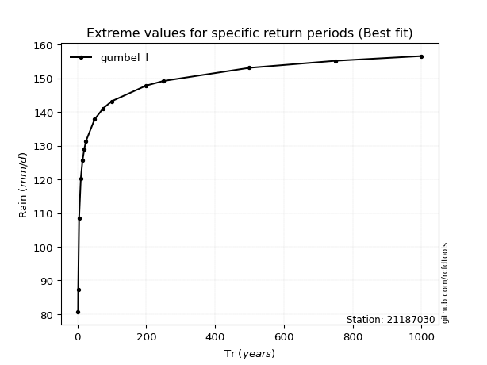</img>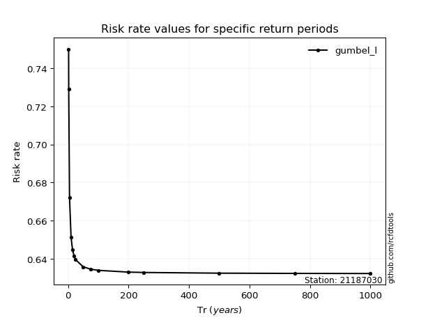</img>

</div>


<sub>**APP DISCLAIMER**: NO WARRANTY - This software is provided by [github.com/rcfdtools](https://github.com/rcfdtools) "as is", without any express or implied warranty, including warranties of merchantability, fitness for a particular purpose, or non-infringement. There is no guarantee that the software will be error-free or operate without interruption. LIMITATION OF LIABILITY - Neither the authors nor copyright holders will be liable for claims or damages arising from the software or its use. You are responsible for determining if the software is appropriate for your use and assume all associated risks, including errors, legal compliance, and data loss. NO PROFESSIONAL ADVICE - The software provides general information and does not offer professional advice. It should not replace consultation with professional advisors.</sub>