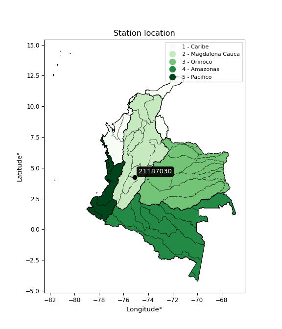

<div align="center">


</div>

# PMP Station (Rain, Pmax24h): 21187030

Probable Maximum Precipitation (PMP) is the greatest amount of rainfall for a specific duration that is meteorologically possible for a given location, acting as a "worst-case" scenario for extreme storms, crucial for designing safety-critical infrastructure like bridges, river deviations, dams, spillways, and nuclear plants to prevent catastrophic failure. PMP is calculated by hydrologists using meteorological data to determine the upper limit of extreme rainfall, often leading to the Probable Maximum Flood (PMF) for flood control design, and is increasingly being studied for climate change impacts. Probable Maximum Precipitation (PMP) is the theoretical upper limit of rainfall, a deterministic estimate for extreme events, while probability distributions (like GEV, Gumbel) describe the likelihood and frequency of various precipitation amounts, including rare ones, showing how often events occur, with PMP representing the extreme end of these distributions, used for critical infrastructure design to ensure safety against the worst conceivable weather, unlike standard statistical forecasts which cover typical probabilities.

The most common probability distributions in hydrology, used for analyzing floods, rainfall, and streamflow, include the Normal, Log-Normal, Gumbel, Gamma (including Log-Pearson Type III), and Generalized Extreme Value (GEV) distributions, often chosen based on the data´s skewness and whether modeling extremes or general conditions, with Gumbel and GEV popular for extreme events like floods, while the Normal distribution serves as a baseline, though often requiring transformations for skewed hydrological data. These distributions help in designing water infrastructure, managing water resources, and forecasting hydrologic events.

> Hydrological data often isn´t perfectly normal (it´s skewed), so different distributions are needed for different applications, such as: **Flood Frequency Analysis**: Using Gumbel, GEV, or Log-Pearson Type III for predicting extreme flood magnitudes and their return periods, **Rainfall Analysis**: Normal for annual totals, but Log-Normal, Weibull, or GEV for intensity or extreme daily rainfall, **Streamflow Modeling**: Gamma and Log-Normal for maximum flows, GEV for minimum flows, and Kappa for daily flows.

<div align="center">

</img>

</div>


## A. General information


### 1. General running parameters

• app_version: _v20260113_. • runtime: _2026-01-13 16:28:34.738620_. • Python version: _3.14.0_. • SciPy version: _1.16.3_. • Pandas version: _2.3.3_. • NumPy version: _2.3.5_. • Stations dataset (station_dataset_file): _dataset/pmax24h_in/automatic_colombia_2003_2025.csv_. • Stations catalog (station_catalog_file): _dataset/CNE.xls_. • Minimum year to eval til year_max (date_min): _1900_. • Maximum year to eval since year_min (date_max): _2025_. • Creates, save and include plots into reports (create_plot): _False_. • Plot only fit distributions with Δo > Δ (plot_only_fit): _True_. • Plot only simple graphs avoiding multiple CDFs and multiple Extreme values plots (plot_only_simple): _True_. • Eval low extreme values, if False, evaluates high extreme values (low_extreme): _False_. • Eval every SciPy distribution as logarithmic (pdist_logarithmic_on): _True_. • Standard deviation normalized (ddof): _1.0_. • Return periods to eval in years (Tr): _[2, 2.33, 5, 10, 15, 20, 25, 50, 75, 100, 200, 250, 500, 750, 1000]_. • Minimum data sample per station, 0 means any (minimum_sample): _5_. • Z-Score maximum threshold to adjust a value, 0 means disable (zscore_max): _3.5_. • Z-Score minimum threshold to adjust a value, 0 means disable (zscore_min): _-2.5_. • Avoid zeros, e.g. rain = 0 (avoid_zeros): _True_. • Avoid null values (avoid_nans): _True_. 

:file_folder:Table: [dataset.csv](../../dataset/pmax24h_in/automatic_colombia_2003_2025.csv)

> Delta Degrees of Freedom (DDOF): is a parameter used in the formulas for calculating variance and standard deviation. When ddof=0, the divisor is $N$ (the total number of observations) and this is used when your data set is the entire population. When ddof=1, the divisor is $N-1$ and this is used when your data set is a sample drawn from a larger population. Using $N-1$ provides an unbiased estimate of the population variance (known as Bessel´s correction).


### 2. Station info and location

|   id |   CODIGO | NOMBRE                     | CATEGORIA    | TECNOLOGIA                              | ESTADO           | FECHA_INSTALACION   |   FECHA_SUSPENSION |   ALTITUD |   LATITUD |   LONGITUD | DEPARTAMENTO   | MUNICIPIO         | AREA_OPERATIVA             | ENTIDAD                                                     | AREA_HIDROGRAFICA   | ZONA_HIDROGRAFICA   | SUBZONA_HIDROGRAFICA                    | CORRIENTE   | Catalogo   |   Version |
|-----:|---------:|:---------------------------|:-------------|:----------------------------------------|:-----------------|:--------------------|-------------------:|----------:|----------:|-----------:|:---------------|:------------------|:---------------------------|:------------------------------------------------------------|:--------------------|:--------------------|:----------------------------------------|:------------|:-----------|----------:|
|    0 | 21187030 | CUCUNUBA  - AUT [21187030] | Limnigráfica | Automática con Telemetría, Convencional | En Mantenimiento | 15/01/1968          |                nan |       562 |   4.23195 |    -75.093 | Tolima         | Valle De San Juan | Area Operativa 10 - Tolima | INSTITUTO DE HIDROLOGIA METEOROLOGIA Y ESTUDIOS AMBIENTALES | Magdalena Cauca     | Alto Magdalena      | Río Luisa y otros directos al Magdalena | Luisa       | CNE_IDEAM  |  20251226 |

<div align="center">

Dynamic map: [:earth_americas:Google](http://maps.google.com/maps?q=4.231946,-75.092981) [:earth_americas:OSM](https://www.openstreetmap.org/#map=18/4.231946/-75.092981&layers=P) [:earth_americas:Bing](https://www.bing.com/maps?cp=4.231946~-75.092981&lvl=18) [:earth_americas:Apple](https://maps.apple.com/frame?center=4.231946%2C-75.092981&span=0.003%2C0.006)

</div>


<div align="center">

```geojson
{
  "type": "Feature",
  "geometry": {
    "type": "Point", 
    "coordinates": [-75.092981, 4.231946]
  }, 
  "properties": {
    "Name": "21187030"
  }
}
```

</div>


### 3. Discrete values table and plot

<div align="center">

|               |           0 |           1 |          2 |          3 |           4 |
|:--------------|------------:|------------:|-----------:|-----------:|------------:|
| Date          | 2019        | 2020        | 2021       | 2022       | 2025        |
| Value         |   97.6      |   84.2      |  126       |    0.4     |   60.3      |
| Value_initial |   97.6      |   84.2      |  126       |    0.4     |   60.3      |
| count         |    5        |    5        |    5       |    5       |    5        |
| mean          |   73.7      |   73.7      |   73.7     |   73.7     |   73.7      |
| std           |   47.3529   |   47.3529   |   47.3529  |   47.3529  |   47.3529   |
| zscore        |    0.504721 |    0.221739 |    1.10447 |   -1.54795 |   -0.282981 |


</div>


> The initial value (value_initial) correspond to the initial obtained or null completed value, and value (value) is adjusted only when the initial value is outside the valid range (outlier) definite through the Z-Score value. If Z-Score is active, values out of range or outliers are replaced with the station mean value. A Z-Score (or standard score) measures how many standard deviations a data point is from the mean of a dataset, indicating its relative position; positive scores mean above the mean, negative mean below, and a score of zero is exactly at the mean, allowing for comparison of values from different distributions. It´s calculated using the formula $z=(x–μ)/σ$, where $x$ is the data point, $μ$ is the mean, and $σ$ is the standard deviation, helping identify outliers and understand probability.
>
> <sub>**Note**: In this study, "completing" (filling gaps in) and "extending" (forecasting or lengthening the historical record) rainfall data series are avoided for certain critical analyses because they introduce artificial bias and uncertainty, which can distort the statistics of rare events (extremes), alter day-to-day variability, and compromise the integrity and homogeneity of the original data. Some reasons against Completing/Extending rainfall data are: **Distortion of Extremes and Variability**: The primary issue is that most gap-filling or extension methods rely on averaging or regression with nearby stations, which inherently smooths the data. Rainfall is highly variable in space and time, with a large percentage of zero values and occasional large storms. Infilling methods often underestimate the highest values and overestimate the lowest (zero) values, which severely distorts analyses focused on flood frequency, drought severity, and intensity-duration-frequency (IDF) curves, **Loss of Data Homogeneity**: Infilled or extended data are synthetic estimates, not actual measurements. Combining these estimates with observed data can violate the assumption of data homogeneity, which requires that the data properties do not change over time. Inhomogeneity can lead to incorrect conclusions about long-term trends or changes in climate patterns, **Propagation of Errors**: Errors and biases from the original data (e.g., wind-induced undercatch, instrument errors, site changes) or the data used for imputation can propagate through the analysis, leading to unreliable hydrological models and inaccurate predictions, **Compromised Statistical Integrity**: For statistical analyses, especially those involving the frequency of events, using artificial data can introduce time bias or autocorrelation that doesn´t exist in reality, making it difficult to assess the true probability of events, **Difficulty in Validation**: It is difficult to accurately validate the quality of filled or extended data, especially for past periods where ground-truth measurements are unavailable. The reliability of imputation techniques heavily depends on the density of the surrounding station network and the complexity of the local topography.</sub>


### 4. Active continuous probability distributions from SciPy (45 of 104 available)

A Probability Density Function (PDF) describes the relative likelihood of a continuous random variable falling within a specific range, where the total area under its curve equals 1, and the area over any interval gives the actual probability for that range. Unlike discrete probabilities (like rolling a die), a PDF shows density, not direct probability for a single point (which is zero), with higher points indicating higher likelihood, often visualized as a bell curve for normal distributions.

A log of a probability density function (log-PDF) is simply the logarithm of the PDF´s value, denoted as $log(f(x))$, useful for converting multiplication of probabilities into addition, improving numerical stability with tiny numbers, and connecting to information theory concepts like entropy. Instead of dealing with very small probabilities (e.g., 0.000001), log-PDFs use negative numbers (e.g., $log(0.00001) ≈ -11.51$ that are easier for computers to handle, preventing underflow errors and simplifying complex calculations. In this study, each active probability distribution from SciPy is also evaluated in the $log$ form.

[scipy.stats](https://docs.scipy.org/doc/scipy/reference/stats.html) is a Python´s powerful submodule within the SciPy library for comprehensive statistical analysis, offering over 130 probability distributions (like Normal, Poisson), functions for descriptive stats (mean, variance), hypothesis testing (t-tests, chi-square), random variable generation, and statistical tests, making it essential for data science, modeling, and research. It provides tools to explore, model, and draw conclusions from data efficiently, working seamlessly with NumPy.

<div align="center">

|   id | p_dist             |   n_parameter | fit_method   | label                                                                       | active   | ref                                                                                                        |
|-----:|:-------------------|--------------:|:-------------|:----------------------------------------------------------------------------|:---------|:-----------------------------------------------------------------------------------------------------------|
|    0 | alpha              |             3 | MLE          | Alpha                                                                       | True     | [:mortar_board:](https://docs.scipy.org/doc/scipy/reference/generated/scipy.stats.alpha.html)              |
|    1 | betaprime          |             4 | MLE          | Beta prime                                                                  | True     | [:mortar_board:](https://docs.scipy.org/doc/scipy/reference/generated/scipy.stats.betaprime.html)          |
|    2 | chi2               |             3 | MLE          | Chi²                                                                        | True     | [:mortar_board:](https://docs.scipy.org/doc/scipy/reference/generated/scipy.stats.chi2.html)               |
|    3 | crystalball        |             4 | MLE          | Crystalball                                                                 | True     | [:mortar_board:](https://docs.scipy.org/doc/scipy/reference/generated/scipy.stats.crystalball.html)        |
|    4 | dweibull           |             3 | MLE          | Double Weibull                                                              | True     | [:mortar_board:](https://docs.scipy.org/doc/scipy/reference/generated/scipy.stats.dweibull.html)           |
|    5 | erlang             |             3 | MLE          | Erlang                                                                      | True     | [:mortar_board:](https://docs.scipy.org/doc/scipy/reference/generated/scipy.stats.erlang.html)             |
|    6 | expon              |             2 | MLE          | Exponential                                                                 | True     | [:mortar_board:](https://docs.scipy.org/doc/scipy/reference/generated/scipy.stats.expon.html)              |
|    7 | exponnorm          |             3 | MLE          | Exponentially modified Normal                                               | True     | [:mortar_board:](https://docs.scipy.org/doc/scipy/reference/generated/scipy.stats.exponnorm.html)          |
|    8 | f                  |             4 | MLE          | F                                                                           | True     | [:mortar_board:](https://docs.scipy.org/doc/scipy/reference/generated/scipy.stats.f.html)                  |
|    9 | fatiguelife        |             3 | MLE          | Fatigue-life (Birnbaum-Saunders)                                            | True     | [:mortar_board:](https://docs.scipy.org/doc/scipy/reference/generated/scipy.stats.fatiguelife.html)        |
|   10 | fisk               |             3 | MLE          | Fisk                                                                        | True     | [:mortar_board:](https://docs.scipy.org/doc/scipy/reference/generated/scipy.stats.fisk.html)               |
|   11 | gamma              |             3 | MLE          | Gamma                                                                       | True     | [:mortar_board:](https://docs.scipy.org/doc/scipy/reference/generated/scipy.stats.gamma.html)              |
|   12 | genexpon           |             5 | MLE          | Generalized exponential                                                     | True     | [:mortar_board:](https://docs.scipy.org/doc/scipy/reference/generated/scipy.stats.genexpon.html)           |
|   13 | genlogistic        |             3 | MLE          | Generalized logistic                                                        | True     | [:mortar_board:](https://docs.scipy.org/doc/scipy/reference/generated/scipy.stats.genlogistic.html)        |
|   14 | gibrat             |             2 | MM           | Gibrat                                                                      | True     | [:mortar_board:](https://docs.scipy.org/doc/scipy/reference/generated/scipy.stats.gibrat.html)             |
|   15 | gompertz           |             3 | MLE          | Gompertz (or truncated Gumbel)                                              | True     | [:mortar_board:](https://docs.scipy.org/doc/scipy/reference/generated/scipy.stats.gompertz.html)           |
|   16 | gumbel_l           |             2 | MM           | Gumbel Left Skew                                                            | True     | [:mortar_board:](https://docs.scipy.org/doc/scipy/reference/generated/scipy.stats.gumbel_l.html)           |
|   17 | gumbel_r           |             2 | MM           | Gumbel Right Skew                                                           | True     | [:mortar_board:](https://docs.scipy.org/doc/scipy/reference/generated/scipy.stats.gumbel_r.html)           |
|   18 | halflogistic       |             2 | MM           | Half-logistic                                                               | True     | [:mortar_board:](https://docs.scipy.org/doc/scipy/reference/generated/scipy.stats.halflogistic.html)       |
|   19 | halfnorm           |             2 | MM           | Half Normal                                                                 | True     | [:mortar_board:](https://docs.scipy.org/doc/scipy/reference/generated/scipy.stats.halfnorm.html)           |
|   20 | hypsecant          |             2 | MM           | hyperbolic secant                                                           | True     | [:mortar_board:](https://docs.scipy.org/doc/scipy/reference/generated/scipy.stats.hypsecant.html)          |
|   21 | invgamma           |             3 | MLE          | Inverted gamma                                                              | True     | [:mortar_board:](https://docs.scipy.org/doc/scipy/reference/generated/scipy.stats.invgamma.html)           |
|   22 | invgauss           |             3 | MLE          | Inverse Gaussian                                                            | True     | [:mortar_board:](https://docs.scipy.org/doc/scipy/reference/generated/scipy.stats.invgauss.html)           |
|   23 | invweibull         |             3 | MLE          | Inverted Weibull                                                            | True     | [:mortar_board:](https://docs.scipy.org/doc/scipy/reference/generated/scipy.stats.invweibull.html)         |
|   24 | kappa4             |             4 | MLE          | Kappa 4                                                                     | True     | [:mortar_board:](https://docs.scipy.org/doc/scipy/reference/generated/scipy.stats.kappa4.html)             |
|   25 | kstwobign          |             2 | MLE          | Limiting distribution of scaled Kolmogorov-Smirnov two-sided test statistic | True     | [:mortar_board:](https://docs.scipy.org/doc/scipy/reference/generated/scipy.stats.kstwobign.html)          |
|   26 | laplace            |             2 | MM           | Laplace                                                                     | True     | [:mortar_board:](https://docs.scipy.org/doc/scipy/reference/generated/scipy.stats.laplace.html)            |
|   27 | laplace_asymmetric |             3 | MLE          | Asymmetric Laplace                                                          | True     | [:mortar_board:](https://docs.scipy.org/doc/scipy/reference/generated/scipy.stats.laplace_asymmetric.html) |
|   28 | loggamma           |             3 | MLE          | Log gamma                                                                   | True     | [:mortar_board:](https://docs.scipy.org/doc/scipy/reference/generated/scipy.stats.loggamma.html)           |
|   29 | logistic           |             2 | MM           | Logistic (or Sech-squared)                                                  | True     | [:mortar_board:](https://docs.scipy.org/doc/scipy/reference/generated/scipy.stats.logistic.html)           |
|   30 | lognorm            |             3 | MLE          | Log Normal                                                                  | True     | [:mortar_board:](https://docs.scipy.org/doc/scipy/reference/generated/scipy.stats.lognorm.html)            |
|   31 | maxwell            |             2 | MM           | Maxwell                                                                     | True     | [:mortar_board:](https://docs.scipy.org/doc/scipy/reference/generated/scipy.stats.maxwell.html)            |
|   32 | mielke             |             4 | MLE          | Mielke Beta-Kappa / Dagum                                                   | True     | [:mortar_board:](https://docs.scipy.org/doc/scipy/reference/generated/scipy.stats.mielke.html)             |
|   33 | moyal              |             2 | MM           | Moyal                                                                       | True     | [:mortar_board:](https://docs.scipy.org/doc/scipy/reference/generated/scipy.stats.moyal.html)              |
|   34 | nakagami           |             3 | MLE          | Nakagami                                                                    | True     | [:mortar_board:](https://docs.scipy.org/doc/scipy/reference/generated/scipy.stats.nakagami.html)           |
|   35 | ncf                |             5 | MLE          | Non-central F distribution                                                  | True     | [:mortar_board:](https://docs.scipy.org/doc/scipy/reference/generated/scipy.stats.ncf.html)                |
|   36 | nct                |             4 | MLE          | Non-central Student’s t                                                     | True     | [:mortar_board:](https://docs.scipy.org/doc/scipy/reference/generated/scipy.stats.nct.html)                |
|   37 | norm               |             2 | MM           | Normal                                                                      | True     | [:mortar_board:](https://docs.scipy.org/doc/scipy/reference/generated/scipy.stats.norm.html)               |
|   38 | pearson3           |             3 | MM           | Pearson type III                                                            | True     | [:mortar_board:](https://docs.scipy.org/doc/scipy/reference/generated/scipy.stats.pearson3.html)           |
|   39 | rayleigh           |             2 | MM           | Rayleigh                                                                    | True     | [:mortar_board:](https://docs.scipy.org/doc/scipy/reference/generated/scipy.stats.rayleigh.html)           |
|   40 | rice               |             3 | MLE          | Rice                                                                        | True     | [:mortar_board:](https://docs.scipy.org/doc/scipy/reference/generated/scipy.stats.rice.html)               |
|   41 | t                  |             3 | MLE          | Student’s t                                                                 | True     | [:mortar_board:](https://docs.scipy.org/doc/scipy/reference/generated/scipy.stats.t.html)                  |
|   42 | truncnorm          |             4 | MLE          | Truncated normal                                                            | True     | [:mortar_board:](https://docs.scipy.org/doc/scipy/reference/generated/scipy.stats.truncnorm.html)          |
|   43 | wald               |             2 | MM           | Wald                                                                        | True     | [:mortar_board:](https://docs.scipy.org/doc/scipy/reference/generated/scipy.stats.wald.html)               |
|   44 | weibull_min        |             3 | MLE          | Weibull minimum                                                             | True     | [:mortar_board:](https://docs.scipy.org/doc/scipy/reference/generated/scipy.stats.weibull_min.html)        |

</div>

> **n_parameter:** # arguments & localization & scale.
>
> **Fit methods:** (MLE) maximum likelihood, (MM) L-moments.
>
>**Inactive** (With the only purpose of prevent loops, zero divisions, infinite values, over high estimated values or horizontal trending for recurrence intervals estimations, the follow distributions were disabled.)**:** foldnorm, gennorm, norminvgauss, powernorm, powerlognorm, skewnorm, genextreme, anglit, arcsine, argus, beta, bradford, burr, burr12, cauchy, cosine, halfcauchy, foldcauchy, skewcauchy, wrapcauchy, dgamma, gengamma, exponweib, exponpow, truncexpon, gausshyper, genhalflogistic, genhyperbolic, geninvgauss, halfgennorm, johnsonsb, johnsonsu, kappa3, ksone, kstwo, loglaplace, levy, levy_l, levy_stable, ncx2, pareto, genpareto, truncpareto, lomax, powerlaw, rdist, rel_breitwigner, recipinvgauss, semicircular, studentized_range, trapezoid, triang, truncweibull_min, tukeylambda, uniform, loguniform, vonmises, vonmises_line, weibull_max, 


## B. Probability (PDF) vs. Empirical (EDF) distributions functions

A continuous probability distribution (CPD) describes probabilities for variables that can take any value within a range (like rain any time), unlike discrete variables with specific outcomes (like temperature). It uses a Probability Density Function (PDF), a curve where the total area under it equals 1, and the probability of the variable falling within an interval (a to b) is found by calculating the area under the curve between those points. A key feature is that the probability of hitting any single exact value is zero, so probabilities are always expressed for ranges, e.g., $P(a ≤ X ≤ b)$.

<div align="center">

Distributions parameters from station values
|    |   station | p_dist                |   n |             loc |            scale | shape                  | shape1                | shape2               | shape3   |
|---:|----------:|:----------------------|----:|----------------:|-----------------:|:-----------------------|:----------------------|:---------------------|:---------|
|  0 |  21187030 | alpha                 |   5 |     0.000872605 |      0.891601    | 6.772291772288504e-08  |                       |                      |          |
|  1 |  21187030 | betaprime             |   5 | -1906.22        | 113684           | 2187.4765547628776     | 125627.31868669543    |                      |          |
|  2 |  21187030 | chi2                  |   5 |  -419.458       |      1.953       | 252.7492136942887      |                       |                      |          |
|  3 |  21187030 | crystalball           |   5 |    73.7         |     42.3537      | 2640.09870834091       | 9191.723350779866     |                      |          |
|  4 |  21187030 | dweibull              |   5 |    84.2         |     39.0327      | 0.1406260621681053     |                       |                      |          |
|  5 |  21187030 | erlang                |   5 |  -607.524       |      2.7785      | 244.97685238385964     |                       |                      |          |
|  6 |  21187030 | expon                 |   5 |     0.4         |     73.3         |                        |                       |                      |          |
|  7 |  21187030 | exponnorm             |   5 |    73.6705      |     42.3534      | 0.0006945222984078778  |                       |                      |          |
|  8 |  21187030 | f                     |   5 |     0.4         |     55.7244      | 1.467058023160294      | 12.44413693813246     |                      |          |
|  9 |  21187030 | fatiguelife           |   5 |     0.4         |      0.000100118 | 920.6501337334196      |                       |                      |          |
| 10 |  21187030 | fisk                  |   5 |     0.4         |     58.58        | 0.3879142906723744     |                       |                      |          |
| 11 |  21187030 | gamma                 |   5 |  -625.66        |      2.67916     | 260.88448832165477     |                       |                      |          |
| 12 |  21187030 | genexpon              |   5 |     0.399873    |      2.44882     | 0.0331462939045462     | 6.211817425060917e-08 | 2.21117333074673     |          |
| 13 |  21187030 | genlogistic           |   5 |   113.962       |     11.044       | 0.25143725603396516    |                       |                      |          |
| 14 |  21187030 | gibrat                |   5 |    41.3894      |     19.5974      |                        |                       |                      |          |
| 15 |  21187030 | gompertz              |   5 |    60.3         |     25.7618      | 0.2410562660362603     |                       |                      |          |
| 16 |  21187030 | gumbel_l              |   5 |    92.7614      |     33.0231      |                        |                       |                      |          |
| 17 |  21187030 | gumbel_r              |   5 |    54.6386      |     33.0231      |                        |                       |                      |          |
| 18 |  21187030 | halflogistic          |   5 |    23.5009      |     36.211       |                        |                       |                      |          |
| 19 |  21187030 | halfnorm              |   5 |    17.6402      |     70.2605      |                        |                       |                      |          |
| 20 |  21187030 | hypsecant             |   5 |    73.7         |     26.9632      |                        |                       |                      |          |
| 21 |  21187030 | invgamma              |   5 |    -5.57064e-05 |      0.507825    | 0.2586000370065621     |                       |                      |          |
| 22 |  21187030 | invgauss              |   5 |  -105.748       |   2137.94        | 0.08332707822664612    |                       |                      |          |
| 23 |  21187030 | invweibull            |   5 |     0.4         |      3.14779     | 0.04587981159434494    |                       |                      |          |
| 24 |  21187030 | kappa4                |   5 |     0.362861    |    137.412       | 0.9991881541877139     | 1.0937186846429954    |                      |          |
| 25 |  21187030 | kstwobign             |   5 |  -102.68        |    201.172       |                        |                       |                      |          |
| 26 |  21187030 | laplace               |   5 |    73.7         |     29.9486      |                        |                       |                      |          |
| 27 |  21187030 | laplace_asymmetric    |   5 |    97.6         |     28.1611      | 1.5106869807278644     |                       |                      |          |
| 28 |  21187030 | loggamma              |   5 |   119.262       |     17.0434      | 0.38512691994641707    |                       |                      |          |
| 29 |  21187030 | logistic              |   5 |    73.7         |     23.3508      |                        |                       |                      |          |
| 30 |  21187030 | lognorm               |   5 |     0.4         |      0.0202461   | 16.766787328939433     |                       |                      |          |
| 31 |  21187030 | maxwell               |   5 |   -26.6606      |     62.8917      |                        |                       |                      |          |
| 32 |  21187030 | mielke                |   5 |     0.399974    |    126.897       | 0.8558769787300233     | 129.56545098595137    |                      |          |
| 33 |  21187030 | moyal                 |   5 |    49.4794      |     19.0659      |                        |                       |                      |          |
| 34 |  21187030 | nakagami              |   5 |     0.4         |     82.8175      | 0.11014266863358504    |                       |                      |          |
| 35 |  21187030 | ncf                   |   5 |     0.4         |      6.8772      | 0.2373654567790381     | 38.32089473778976     | 1.9101605826746506   |          |
| 36 |  21187030 | nct                   |   5 |     0.393329    |      0.00330357  | 0.19423446959019214    | 4.875394224307064     |                      |          |
| 37 |  21187030 | norm                  |   5 |    73.7         |     42.3537      |                        |                       |                      |          |
| 38 |  21187030 | pearson3              |   5 |    73.7         |     42.3538      | -0.6275043092054488    |                       |                      |          |
| 39 |  21187030 | rayleigh              |   5 |    -7.32519     |     64.6488      |                        |                       |                      |          |
| 40 |  21187030 | rice                  |   5 |   -27.8263      |     46.6035      | 1.8899323452162942     |                       |                      |          |
| 41 |  21187030 | t                     |   5 |    73.7006      |     42.3537      | 17897289.682382885     |                       |                      |          |
| 42 |  21187030 | truncnorm             |   5 |    73.9479      |     42.1723      | -7.08541067118432      | 3.407922840199948     |                      |          |
| 43 |  21187030 | wald                  |   5 |    31.3463      |     42.3537      |                        |                       |                      |          |
| 44 |  21187030 | weibull_min           |   5 |    -8.02073e+08 |      8.02073e+08 | 24254925.584042326     |                       |                      |          |
| 45 |  21187030 | logalpha              |   5 |   -44.6211      |    990.768       | 20.73931382920425      |                       |                      |          |
| 46 |  21187030 | logbetaprime          |   5 |    -0.916291    |      3.14062     | 0.10992386531109753    | 0.5747497355160183    |                      |          |
| 47 |  21187030 | logchi2               |   5 |    -0.916291    |      1.47488     | 1.193855011496395      |                       |                      |          |
| 48 |  21187030 | logcrystalball        |   5 |     3.40668     |      2.17458     | 9141.679738242841      | 86.15262560956776     |                      |          |
| 49 |  21187030 | logdweibull           |   5 |     4.58088     |      1.94227     | 0.6513080434181416     |                       |                      |          |
| 50 |  21187030 | logerlang             |   5 |   -27.5437      |      0.168327    | 183.61524250262107     |                       |                      |          |
| 51 |  21187030 | logexpon              |   5 |    -0.916291    |      4.32297     |                        |                       |                      |          |
| 52 |  21187030 | logexponnorm          |   5 |     3.40548     |      2.17458     | 0.0005500504601194043  |                       |                      |          |
| 53 |  21187030 | logf                  |   5 |    -0.916291    |      1.12161     | 1.118018596344033      | 1.136483074443551     |                      |          |
| 54 |  21187030 | logfatiguelife        |   5 |    -0.916291    |      5.27931e-07 | 2764.594220018822      |                       |                      |          |
| 55 |  21187030 | logfisk               |   5 |    -0.916291    |      1.22656     | 0.6544714451612312     |                       |                      |          |
| 56 |  21187030 | loggamma              |   5 |   -33.7788      |      0.143089    | 259.5718429515646      |                       |                      |          |
| 57 |  21187030 | loggenexpon           |   5 |    -0.916291    |      1.15451     | 0.11069493135797964    | 2.8563976827975157    | 0.023683615963507987 |          |
| 58 |  21187030 | loggenlogistic        |   5 |     4.83643     |      1.50601e-05 | 1.0587701765365239e-05 |                       |                      |          |
| 59 |  21187030 | loggibrat             |   5 |     1.7478      |      1.00618     |                        |                       |                      |          |
| 60 |  21187030 | loggompertz           |   5 |    -0.916298    |      1.19739     | 0.013523327927298608   |                       |                      |          |
| 61 |  21187030 | loggumbel_l           |   5 |     4.38536     |      1.69552     |                        |                       |                      |          |
| 62 |  21187030 | loggumbel_r           |   5 |     2.428       |      1.69552     |                        |                       |                      |          |
| 63 |  21187030 | loghalflogistic       |   5 |     0.82926     |      1.85921     |                        |                       |                      |          |
| 64 |  21187030 | loghalfnorm           |   5 |     0.528391    |      3.60741     |                        |                       |                      |          |
| 65 |  21187030 | loghypsecant          |   5 |     3.40668     |      1.38438     |                        |                       |                      |          |
| 66 |  21187030 | loginvgamma           |   5 |   -45.6152      |  22097.7         | 452.090573135833       |                       |                      |          |
| 67 |  21187030 | loginvgauss           |   5 |   -19.7075      |   2132.92        | 0.010804339180306054   |                       |                      |          |
| 68 |  21187030 | loginvweibull         |   5 |  -369.158       |    371.007       | 149.49708051654488     |                       |                      |          |
| 69 |  21187030 | logkappa4             |   5 |    -1.22039     |      7.17822     | 1.0444186601829606     | 1.1809027603058198    |                      |          |
| 70 |  21187030 | logkstwobign          |   5 |    -6.79249     |     11.6224      |                        |                       |                      |          |
| 71 |  21187030 | loglaplace            |   5 |     3.40668     |      1.53766     |                        |                       |                      |          |
| 72 |  21187030 | loglaplace_asymmetric |   5 |     4.83629     |      0.0139236   | 102.48433817776322     |                       |                      |          |
| 73 |  21187030 | logloggamma           |   5 |     4.83631     |      2.28088e-06 | 1.5912507886497388e-06 |                       |                      |          |
| 74 |  21187030 | loglogistic           |   5 |     3.40668     |      1.19891     |                        |                       |                      |          |
| 75 |  21187030 | loglognorm            |   5 |    -0.916291    |      0.0220755   | 4.282286590784391      |                       |                      |          |
| 76 |  21187030 | logmaxwell            |   5 |    -1.74617     |      3.22907     |                        |                       |                      |          |
| 77 |  21187030 | logmielke             |   5 |    -0.916291    |      2.65787     | 0.12446977139619747    | 0.8735151465776393    |                      |          |
| 78 |  21187030 | logmoyal              |   5 |     2.16311     |      0.978907    |                        |                       |                      |          |
| 79 |  21187030 | lognakagami           |   5 | -1517.32        |   1520.73        | 122140.85713301768     |                       |                      |          |
| 80 |  21187030 | logncf                |   5 |    -0.916291    |      1.12357     | 1.0067938844111062     | 1.1750210741402944    | 1.0828321540682966   |          |
| 81 |  21187030 | lognct                |   5 |  -135.569       |      2.11455     | 33947.85722205718      | 65.72136775043495     |                      |          |
| 82 |  21187030 | lognorm               |   5 |     3.40668     |      2.17458     |                        |                       |                      |          |
| 83 |  21187030 | logpearson3           |   5 |     3.40668     |      2.1746      | -1.4554780638257976    |                       |                      |          |
| 84 |  21187030 | lograyleigh           |   5 |    -0.753394    |      3.31926     |                        |                       |                      |          |
| 85 |  21187030 | logrice               |   5 | -2809.81        |      2.17384     | 1294.1249653840928     |                       |                      |          |
| 86 |  21187030 | logt                  |   5 |     4.51092     |      0.204491    | 0.6911105199563775     |                       |                      |          |
| 87 |  21187030 | logtruncnorm          |   5 |     3.32018     |      8.85343     | -0.5908322689853306    | 0.17124497336268696   |                      |          |
| 88 |  21187030 | logwald               |   5 |     1.23211     |      2.17457     |                        |                       |                      |          |
| 89 |  21187030 | logweibull_min        |   5 |    -0.916291    |      2.68021     | 0.6621603895116963     |                       |                      |          |

</div>

> **loc** (Location parameter): This shifts the distribution along the x-axis. For many common distributions, like the normal (Gaussian) distribution, loc represents the mean $μ$. For others, like the uniform distribution, it might represent the minimum value, or for the beta distribution, the left end of the support interval.
>
> **scale** (Scale parameter): This determines the width or spread of the distribution. For the normal distribution, scale represents the standard deviation $σ$. For a uniform distribution, it defines the length of the interval (from $loc$ to $loc + scale$).
>
> **shape** (Shape parameters): Refers to parameters that define the specific form of a probability distribution, distinct from its location (loc) and scale (scale). These parameters are required arguments for most distribution functions. For example, a normal (Gaussian) distribution is fully defined by its location (mean) and scale (standard deviation), so it has no specific shape parameters beyond loc and scale. However, other distributions have intrinsic properties that need specification, as Gamma distribution that takes a shape parameter, often named $a$ or $alpha$.


### 0. Cumulative distribution values - CDF (90 evaluated)

Cumulative Distribution Function (CDF), denoted as $F$<sub>$X$</sub>$(x)$, is a function that gives the probability that a random variable $X$ will take a value less than or equal to a specific value, $x$ (i.e., $(P(X≥x)$. It essentially "accumulates" probabilities from a given point up to the far right (positive infinity), providing a complete picture of the distribution´s probabilities for both discrete (like rain) and continuous (like temperature) variables, helping to find probabilities over ranges or above certain values. Each station is evaluated separately ordering the $x$ values ascending, calculating the CDF and PDF values for the activated distributions and their logarithmic forms.

<div align="center">

CDF ordered by x ascending and calculating $log(f(x))$ separately
|   id |   Station |   date |     x |   count |   mean |     std |    zscore |   Value_initial |   station |   m |     alpha |   alpha_pdf |   betaprime |   betaprime_pdf |     chi2 |   chi2_pdf |   crystalball |   crystalball_pdf |   dweibull |   dweibull_pdf |    erlang |   erlang_pdf |    expon |   expon_pdf |   exponnorm |   exponnorm_pdf |           f |        f_pdf |   fatiguelife |   fatiguelife_pdf |        fisk |    fisk_pdf |     gamma |   gamma_pdf |    genexpon |   genexpon_pdf |   genlogistic |   genlogistic_pdf |   gibrat |   gibrat_pdf |    gompertz |   gompertz_pdf |   gumbel_l |   gumbel_l_pdf |   gumbel_r |   gumbel_r_pdf |   halflogistic |   halflogistic_pdf |   halfnorm |   halfnorm_pdf |   hypsecant |   hypsecant_pdf |   invgamma |   invgamma_pdf |   invgauss |   invgauss_pdf |   invweibull |   invweibull_pdf |     kappa4 |   kappa4_pdf |   kstwobign |   kstwobign_pdf |   laplace |   laplace_pdf |   laplace_asymmetric |   laplace_asymmetric_pdf |   loggamma |   loggamma_pdf |   logistic |   logistic_pdf |   lognorm |   lognorm_pdf |   maxwell |   maxwell_pdf |      mielke |   mielke_pdf |       moyal |   moyal_pdf |    nakagami |   nakagami_pdf |        ncf |     ncf_pdf |       nct |      nct_pdf |      norm |   norm_pdf |   pearson3 |   pearson3_pdf |   rayleigh |   rayleigh_pdf |      rice |   rice_pdf |         t |      t_pdf |   truncnorm |   truncnorm_pdf |     wald |   wald_pdf |   weibull_min |   weibull_min_pdf |   logalpha |   logalpha_pdf |   logbetaprime |   logbetaprime_pdf |     logchi2 |    logchi2_pdf |   logcrystalball |   logcrystalball_pdf |   logdweibull |   logdweibull_pdf |   logerlang |   logerlang_pdf |   logexpon |   logexpon_pdf |   logexponnorm |   logexponnorm_pdf |        logf |   logf_pdf |   logfatiguelife |   logfatiguelife_pdf |     logfisk |    logfisk_pdf |   loggenexpon |   loggenexpon_pdf |   loggenlogistic |   loggenlogistic_pdf |   loggibrat |   loggibrat_pdf |   loggompertz |   loggompertz_pdf |   loggumbel_l |   loggumbel_l_pdf |   loggumbel_r |   loggumbel_r_pdf |   loghalflogistic |   loghalflogistic_pdf |   loghalfnorm |   loghalfnorm_pdf |   loghypsecant |   loghypsecant_pdf |   loginvgamma |   loginvgamma_pdf |   loginvgauss |   loginvgauss_pdf |   loginvweibull |   loginvweibull_pdf |   logkappa4 |   logkappa4_pdf |   logkstwobign |   logkstwobign_pdf |   loglaplace |   loglaplace_pdf |   loglaplace_asymmetric |   loglaplace_asymmetric_pdf |   logloggamma |   logloggamma_pdf |   loglogistic |   loglogistic_pdf |   loglognorm |   loglognorm_pdf |   logmaxwell |   logmaxwell_pdf |   logmielke |   logmielke_pdf |    logmoyal |   logmoyal_pdf |   lognakagami |   lognakagami_pdf |      logncf |   logncf_pdf |    lognct |   lognct_pdf |   logpearson3 |   logpearson3_pdf |   lograyleigh |   lograyleigh_pdf |   logrice |   logrice_pdf |      logt |   logt_pdf |   logtruncnorm |   logtruncnorm_pdf |   logwald |   logwald_pdf |   logweibull_min |   logweibull_min_pdf |
|-----:|----------:|-------:|------:|--------:|-------:|--------:|----------:|----------------:|----------:|----:|----------:|------------:|------------:|----------------:|---------:|-----------:|--------------:|------------------:|-----------:|---------------:|----------:|-------------:|---------:|------------:|------------:|----------------:|------------:|-------------:|--------------:|------------------:|------------:|------------:|----------:|------------:|------------:|---------------:|--------------:|------------------:|---------:|-------------:|------------:|---------------:|-----------:|---------------:|-----------:|---------------:|---------------:|-------------------:|-----------:|---------------:|------------:|----------------:|-----------:|---------------:|-----------:|---------------:|-------------:|-----------------:|-----------:|-------------:|------------:|----------------:|----------:|--------------:|---------------------:|-------------------------:|-----------:|---------------:|-----------:|---------------:|----------:|--------------:|----------:|--------------:|------------:|-------------:|------------:|------------:|------------:|---------------:|-----------:|------------:|----------:|-------------:|----------:|-----------:|-----------:|---------------:|-----------:|---------------:|----------:|-----------:|----------:|-----------:|------------:|----------------:|---------:|-----------:|--------------:|------------------:|-----------:|---------------:|---------------:|-------------------:|------------:|---------------:|-----------------:|---------------------:|--------------:|------------------:|------------:|----------------:|-----------:|---------------:|---------------:|-------------------:|------------:|-----------:|-----------------:|---------------------:|------------:|---------------:|--------------:|------------------:|-----------------:|---------------------:|------------:|----------------:|--------------:|------------------:|--------------:|------------------:|--------------:|------------------:|------------------:|----------------------:|--------------:|------------------:|---------------:|-------------------:|--------------:|------------------:|--------------:|------------------:|----------------:|--------------------:|------------:|----------------:|---------------:|-------------------:|-------------:|-----------------:|------------------------:|----------------------------:|--------------:|------------------:|--------------:|------------------:|-------------:|-----------------:|-------------:|-----------------:|------------:|----------------:|------------:|---------------:|--------------:|------------------:|------------:|-------------:|----------:|-------------:|--------------:|------------------:|--------------:|------------------:|----------:|--------------:|----------:|-----------:|---------------:|-------------------:|----------:|--------------:|-----------------:|---------------------:|
|    0 |  21187030 |   2022 |   0.4 |       5 |   73.7 | 47.3529 | -1.54795  |             0.4 |  21187030 |   1 | 0.0254913 | 0.368366    |    0.042511 |      0.00217536 | 0.040788 | 0.00222216 |     0.0417561 |        0.00210679 |   0.164216 |    0.00030683  | 0.0431888 |   0.00227415 | 0        |  0.0136426  |   0.0417552 |      0.00210677 | 1.65867e-12 | 202.943      |      0.104983 |       1.5164e+09  | 1.01971e-07 | 7.12579e+08 | 0.0421771 |  0.00223772 | 1.71411e-06 |     0.0135356  |     0.0753624 |        0.0017157  | 0        |   0          | 0           |     0          |  0.0591771 |     0.00173789 | 0.00569718 |    0.000891552 |       0        |         0          |   0        |     0          |   0.0419387 |      0.00155091 |  0.0479114 |    0.21356     |  0.0454061 |     0.00325565 |    0.0028223 |      1.3693e+13  | 0.00107592 |   0.00723732 |   0.0445442 |      0.00362892 | 0.0432537 |    0.00144426 |            0.0707821 |               0.0016638  |  0.0279475 |      0.0302023 |   0.041524 |     0.00170443 | 0.0234085 |     0.0254318 | 0.0200474 |    0.00214108 | 1.90503e-06 |   0.06197    | 0.000292032 | 0.000107271 | 8.21417e-05 |    3.25963e+11 | 0.00365479 | 1.30232e+12 | 0.0545197 | 16.2537      | 0.0417561 | 0.00210679 |  0.0558328 |     0.00199533 | 0.00711408 |     0.00183522 | 0.0328004 | 0.00245814 | 0.0417547 | 0.00210674 |   0.0405941 |      0.00206812 | 0        | 0          |     0.0582933 |        0.0017104  |  0.0267899 |       0.032121 |      0.0140033 |        1.38648e+13 | 1.75753e-10 | 944959         |        0.0234085 |            0.0254318 |     0.0697874 |         0.0162819 |   0.0258342 |       0.0291031 |   0        |      0.231322  |      0.0234083 |          0.0254317 | 7.56408e-10 | 3.8086e+06 |        0.0140415 |          2.74311e+12 | 3.16324e-11 | 186471         |   2.43898e-09 |         0.0958809 |         0        |            0.0123181 |    0        |       0         |    7.6623e-08 |         0.0112941 |     0.0429074 |         0.0247555 |   0.000755492 |        0.00320291 |          0        |              0        |      0        |          0        |      0.0280183 |          0.0202127 |     0.0258793 |         0.0294883 |      0.027598 |         0.0327159 |       0.0469128 |           0.0582688 | 5.29605e-16 |        0.669791 |      0.0397453 |          0.0585232 |    0.0300607 |        0.0195496 |               0.0177481 |                   0.0124378 |      0.018074 |         0.0126093 |     0.0264486 |         0.0214771 |  9.26535e-06 |   40491.6        |   0.00442634 |        0.0157905 |  0.00914733 |     1.02553e+13 | 1.43195e-06 |    1.76747e-05 |     0.0234216 |         0.0254554 | 3.35064e-09 |  1.51925e+07 | 0.0236034 |    0.0256293 |     0.0476038 |         0.0253118 |      0        |          0        | 0.0233708 |     0.0254061 | 0.0322523 | 0.00410454 |       0.133577 |           0.138255 |  0        |     0         |      1.41901e-11 |        84633         |
|    1 |  21187030 |   2025 |  60.3 |       5 |   73.7 | 47.3529 | -0.282981 |            60.3 |  21187030 |   2 | 0.988203  | 0.000195632 |    0.382826 |      0.00897876 | 0.386307 | 0.00887928 |     0.375856  |        0.00895947 |   0.196618 |    0.00107978  | 0.39132   |   0.00894296 | 0.558329 |  0.00602553 |   0.375856  |      0.00895953 | 0.650457    |   0.00482517 |      0.799591 |       0.0019658   | 0.502161    | 0.00161898  | 0.389209  |  0.0089719  | 0.555492    |     0.0060167  |     0.294154  |        0.00664537 | 0.485772 |   0.0210828  | 7.73587e-12 |     0.00935711 |  0.312154  |     0.00779409 | 0.430653   |    0.0109864   |       0.468479 |         0.0107775  |   0.456259 |     0.00944447 |   0.347945  |      0.0104838  |  0.679176  |    0.00136669  |  0.458487  |     0.00836871 |    0.417456  |      0.000279323 | 0.44735    |   0.00768809 |   0.472288  |      0.0079959  | 0.319634  |    0.0106727  |            0.289342  |               0.00680123 |  0.632311  |      0.161304  |   0.360348 |     0.00987105 | 0.624956  |     0.174383  | 0.409102  |    0.00932498 | 0.525974    |   0.00751534 | 0.451485    | 0.0118661   | 0.766526    |    0.00267618  | 0.636053   | 0.003843    | 0.831056  |  0.000547765 | 0.375856  | 0.00895947 |  0.34073   |     0.00810881 | 0.421375   |     0.00936237 | 0.390284  | 0.00893622 | 0.375851  | 0.00895944 |   0.373235  |      0.00898014 | 0.505133 | 0.0154883  |     0.307546  |        0.00769574 |  0.656725  |       0.153496 |      0.884168  |        0.0108141   | 0.915781    |      0.033406  |        0.624956  |            0.174383  |     0.334089  |         0.182193  |   0.634791  |       0.162238  |   0.686585 |      0.0725    |      0.624957  |          0.174383  | 0.737024    | 0.0257388  |        0.867557  |          0.0238163   | 0.715392    |      0.0265679 |   0.66645     |         0.112669  |         0        |            0.418717  |    0.802034 |       0.118324  |    0.584499   |         0.309459  |     0.570342  |         0.214071  |   0.688552    |        0.151543   |          0.706131 |              0.134836 |      0.677772 |          0.135508 |      0.653004  |          0.203874  |     0.634456  |         0.159924  |      0.642555 |         0.151031  |       0.667076  |           0.108167  | 0.827592    |        0.193224 |      0.656469  |          0.10908   |    0.681332  |        0.207242  |               0.596574  |                   0.418076  |      0.59801  |         0.417199  |     0.640546  |         0.192047  |  0.89743     |       0.00832341 |   0.649156   |        0.157304  |  0.937387   |     0.00848555  | 0.709923    |    0.141456    |     0.624961  |         0.174269  | 0.627235    |  0.0331068   | 0.625128  |    0.173758  |     0.538871  |         0.215226  |      0.656547 |          0.151276 | 0.624997  |     0.174436  | 0.185241  | 0.28185    |       0.886742 |           0.154426 |  0.76987  |     0.116599  |      0.780037    |            0.0439742 |
|    2 |  21187030 |   2020 |  84.2 |       5 |   73.7 | 47.3529 |  0.221739 |            84.2 |  21187030 |   3 | 0.991551  | 0.000100339 |    0.603327 |      0.00899599 | 0.601291 | 0.00867201 |     0.597899  |        0.00913424 |   0.503361 |    3.31427e+10 | 0.608014  |   0.0087399  | 0.681218 |  0.00434901 |   0.597901  |      0.00913429 | 0.745392    |   0.00325124 |      0.839824 |       0.00144369  | 0.534666    | 0.0011517   | 0.606974  |  0.00879348 | 0.678349    |     0.00435375 |     0.499564  |        0.0106538  | 0.782714 |   0.00686712 | 0.308241    |     0.0163683  |  0.537739  |     0.0108013  | 0.664623   |    0.0082222   |       0.684818 |         0.00733237 |   0.656529 |     0.00725027 |   0.620937  |      0.0109635  |  0.705569  |    0.000899949 |  0.642971  |     0.00687437 |    0.423068  |      0.00019925  | 0.634457   |   0.0079941  |   0.645992  |      0.00642764 | 0.647867  |    0.0117579  |            0.507451  |               0.0119281  |  0.68456   |      0.15128   |   0.610559 |     0.0101828  | 0.681555  |     0.164114  | 0.624608  |    0.00833675 | 0.701077    |   0.00716033 | 0.687459    | 0.00776362  | 0.821025    |    0.00194924  | 0.717178   | 0.00298422  | 0.841721  |  0.000366835 | 0.597899  | 0.00913424 |  0.559279  |     0.00980713 | 0.632909   |     0.00803885 | 0.606512  | 0.00873291 | 0.597894  | 0.00913428 |   0.596232  |      0.00918739 | 0.751078 | 0.00659247 |     0.530979  |        0.0107383  |  0.706072  |       0.141824 |      0.887628  |        0.0099346   | 0.926192    |      0.0290663 |        0.681555  |            0.164114  |     0.414837  |         0.341612  |   0.687275  |       0.151761  |   0.709879 |      0.0671116 |      0.681556  |          0.164114  | 0.745247    | 0.0235716  |        0.875221  |          0.0221266   | 0.723901    |      0.0244525 |   0.70278     |         0.104926  |         0        |            0.529488  |    0.836869 |       0.0917575 |    0.688093   |         0.307007  |     0.642499  |         0.216885  |   0.736043    |        0.133041   |          0.748358 |              0.118319 |      0.720942 |          0.123117 |      0.716965  |          0.178553  |     0.68617   |         0.149488  |      0.691279 |         0.140565  |       0.701735  |           0.0994619 | 0.894649    |        0.21044  |      0.691602  |          0.101372  |    0.743526  |        0.166795  |               0.753835  |                   0.528283  |      0.754855 |         0.526622  |     0.701868  |         0.174533  |  0.900095    |       0.00765568 |   0.699664   |        0.145003  |  0.940085   |     0.00769578  | 0.753792    |    0.121687    |     0.681523  |         0.164003  | 0.637862    |  0.0306074   | 0.681521  |    0.16351   |     0.613489  |         0.231147  |      0.70501  |          0.138869 | 0.681613  |     0.164158  | 0.394266  | 1.22339    |       0.938202 |           0.153805 |  0.805083 |     0.0952314 |      0.79409     |            0.0402785 |
|    3 |  21187030 |   2019 |  97.6 |       5 |   73.7 | 47.3529 |  0.504721 |            97.6 |  21187030 |   4 | 0.992711  | 7.46793e-05 |    0.717006 |      0.0078603  | 0.710589 | 0.00754978 |     0.713723  |        0.0080329  |   0.788505 |    0.0019097   | 0.718032  |   0.00758554 | 0.734478 |  0.0036224  |   0.713726  |      0.00803293 | 0.78475     |   0.00264852 |      0.857745 |       0.00123872  | 0.54895     | 0.000988159 | 0.717686  |  0.00763338 | 0.731704    |     0.00363155 |     0.654421  |        0.0121398  | 0.853992 |   0.00407373 | 0.543614    |     0.0181668  |  0.685823  |     0.0110151  | 0.761647   |    0.00627971  |       0.77115  |         0.00559676 |   0.744899 |     0.00594279 |   0.751128  |      0.00831801 |  0.716553  |    0.000747918 |  0.727467  |     0.0057262  |    0.425544  |      0.000171615 | 0.743263   |   0.00826436 |   0.72522   |      0.00539663 | 0.774893  |    0.00751643 |            0.695324  |               0.0163442  |  0.706525  |      0.146121  |   0.735657 |     0.00832799 | 0.705389  |     0.15857   | 0.727952  |    0.00703302 | 0.795982    |   0.00700888 | 0.7771      | 0.00569101  | 0.845203    |    0.00167001  | 0.754476   | 0.00259184  | 0.846216  |  0.000307285 | 0.713723  | 0.0080329  |  0.689732  |     0.00947351 | 0.732081   |     0.00672609 | 0.716699  | 0.00761817 | 0.713719  | 0.00803297 |   0.712782  |      0.00808578 | 0.823103 | 0.00434848 |     0.678701  |        0.0110316  |  0.726603  |       0.136167 |      0.889069  |        0.00958287  | 0.930356    |      0.0273451 |        0.705389  |            0.15857   |     0.5       |     37438.2       |   0.709297  |       0.146408  |   0.719623 |      0.0648576 |      0.705391  |          0.158571  | 0.748664    | 0.0227069  |        0.878437  |          0.0214315   | 0.727449    |      0.0236049 |   0.718018    |         0.101437  |         0        |            0.587417  |    0.849714 |       0.0824034 |    0.7328     |         0.297526  |     0.674446  |         0.215477  |   0.755102    |        0.125101   |          0.765318 |              0.111415 |      0.738723 |          0.117682 |      0.74244   |          0.1664    |     0.707862  |         0.144204  |      0.711663 |         0.135445  |       0.716141  |           0.0956424 | 0.926666    |        0.224312 |      0.706321  |          0.0979565 |    0.767013  |        0.15152   |               0.836033  |                   0.585888  |      0.836776 |         0.583773  |     0.726987  |         0.165548  |  0.901206    |       0.00738937 |   0.720647   |        0.139132  |  0.941198   |     0.0073827   | 0.771162    |    0.113625    |     0.705341  |         0.158463  | 0.642307    |  0.0295988   | 0.705268  |    0.15799   |     0.64805   |         0.236714  |      0.725095 |          0.133099 | 0.705453  |     0.158609  | 0.596093  | 1.25841    |       0.960891 |           0.153461 |  0.818554 |     0.0873286 |      0.799926    |            0.0387783 |
|    4 |  21187030 |   2021 | 126   |       5 |   73.7 | 47.3529 |  1.10447  |           126   |  21187030 |   5 | 0.994354  | 4.48089e-05 |    0.890761 |      0.00430528 | 0.879201 | 0.00428249 |     0.891555  |        0.00439447 |   0.817832 |    0.000618792 | 0.886182  |   0.00421529 | 0.819767 |  0.00245884 |   0.891557  |      0.00439444 | 0.846381    |   0.00176371 |      0.88812  |       0.000921802 | 0.573432    | 0.000755469 | 0.886716  |  0.00422789 | 0.817331    |     0.00247254 |     0.929716  |        0.00532588 | 0.92822  |   0.00161779 | 0.941985    |     0.00695434 |  0.935176  |     0.00537091 | 0.891175   |    0.00310924  |       0.888615 |         0.00290469 |   0.876989 |     0.00345726 |   0.909108  |      0.00332532 |  0.734606  |    0.000542948 |  0.856473  |     0.00344384 |    0.429816  |      0.000132575 | 1          |   0.169471   |   0.849176  |      0.00340458 | 0.912793  |    0.00291189 |            0.933597  |               0.00356217 |  0.742621  |      0.136374  |   0.903763 |     0.00372474 | 0.744543  |     0.147803  | 0.883019  |    0.00392797 | 0.989714    |   0.00533437 | 0.893066    | 0.00278749  | 0.886063    |    0.00123535  | 0.818089   | 0.00192089  | 0.853685  |  0.000226257 | 0.891555  | 0.00439447 |  0.909159  |     0.00537496 | 0.880751   |     0.00380405 | 0.886444  | 0.00427495 | 0.891552  | 0.00439454 |   0.891741  |      0.0044179  | 0.908192 | 0.00200443 |     0.931432  |        0.00555685 |  0.76008   |       0.125897 |      0.891443  |        0.00902144  | 0.936986    |      0.0246221 |        0.744543  |            0.147803  |     0.617077  |         0.260504  |   0.745425  |       0.136349  |   0.735708 |      0.0611368 |      0.744544  |          0.147803  | 0.754284    | 0.0213292  |        0.883765  |          0.0202977   | 0.733302    |      0.0222501 |   0.743151    |         0.0953631 |         0.999894 |            0.702921  |    0.868967 |       0.0688707 |    0.80539    |         0.268219  |     0.728738  |         0.208731  |   0.785353    |        0.111918   |          0.792313 |              0.100107 |      0.767591 |          0.108413 |      0.782237  |          0.145313  |     0.743448  |         0.134329  |      0.745072 |         0.126077  |       0.739735  |           0.089141  | 0.991463    |        0.329912 |      0.730588  |          0.0920855 |    0.802669  |        0.128332  |               0.999899  |                   0.700724  |      0.999983 |         0.697627  |     0.767173  |         0.148984  |  0.903038    |       0.00696507 |   0.754842   |        0.128568  |  0.943019   |     0.00688644  | 0.798505    |    0.100702    |     0.744468  |         0.147706  | 0.649657    |  0.0279782   | 0.74428   |    0.147281  |     0.709424  |         0.243096  |      0.757789 |          0.122884 | 0.744615  |     0.147832  | 0.786135  | 0.390732   |       1        |           0.152768 |  0.839298 |     0.0754682 |      0.809517    |            0.0363574 |


</div>

An Empirical Distribution Function (EDF) is a step-function estimate of a true cumulative distribution function (CDF) based on observed sample data, representing the proportion of data points less than or equal to a given value. It is calculated by ordering your data and jumping up by $1/n$ (where $n$ is sample size) at each unique data point, allowing analysis without assuming an underlying population distribution, and it gets closer to the true CDF as the sample size grows. For the empirical probability calculations, the parameter $m$ correspond to the order number which means the position of the $x$ values in an ascending order list.

The Kolmogorov-Smirnov (K-S) test is a non-parametric statistical test used to determine if a sample data set comes from a specific theoretical distribution (one-sample) or if two different samples come from the same underlying distribution (two-sample), by comparing their cumulative distribution functions (CDFs). It calculates the maximum vertical difference (D statistic) between these functions, with a small p-value indicating a significant difference and rejection of the null hypothesis (that the data/samples match).


### 1. EDF California (1923)

California´s estimates the true probability distribution of water-related data (like rainfall, streamflow) using observed samples, crucial for risk assessment.

<div align="center">


$P=m/n$


</div>


**1.1. Empirical values**

<div align="center">

|                | 0              | 1                  | 2              | 3                 | 4              |
|:---------------|:---------------|:-------------------|:---------------|:------------------|:---------------|
| date           | 2022           | 2025               | 2020           | 2019              | 2021           |
| x              | 0.4            | 60.3               | 84.2           | 97.6              | 126.0          |
| m              | 1              | 2                  | 3              | 4                 | 5              |
| empirical_dist | edf_california | edf_california     | edf_california | edf_california    | edf_california |
| empirical      | 0.2            | 0.4                | 0.6            | 0.8               | 1.0            |
| empirical_tr   | 1.25           | 1.6666666666666667 | 2.5            | 5.000000000000001 | inf            |

</div>


**1.2. Kolmogorov-Smirnov fit test (sorted by Δ)**


<div align="center">

|                | 0                   | 1                   | 2                   | 3                   | 4                  | 5                   | 6                  | 7                   | 8                   | 9                  | 10                 | 11                  | 12                  | 13                  | 14                 | 15                 | 16                  | 17                  | 18                 | 19                  | 20                  | 21                  | 22                  | 23                    | 24                 | 25                  | 26                  | 27                  | 28                 | 29                 | 30                 | 31                 | 32                 | 33                 | 34                 | 35                 | 36                 | 37                  | 38                  | 39                  | 40                  | 41                  | 42                 | 43                  | 44                 | 45                 | 46                  | 47                  | 48                  | 49                 | 50                 | 51                  | 52                 | 53                 | 54                  | 55                  | 56                 | 57                  | 58                 | 59                  | 60                 | 61                  | 62                 | 63                  | 64                 | 65                  | 66                  | 67                  | 68                 | 69                  | 70                  | 71                  | 72                 | 73                  | 74                 | 75                  | 76                  | 77                  | 78                  | 79                 | 80                 | 81                  | 82                 | 83                 | 84                 | 85                 | 86                 | 87                 | 88                 | 89                 |
|:---------------|:--------------------|:--------------------|:--------------------|:--------------------|:-------------------|:--------------------|:-------------------|:--------------------|:--------------------|:-------------------|:-------------------|:--------------------|:--------------------|:--------------------|:-------------------|:-------------------|:--------------------|:--------------------|:-------------------|:--------------------|:--------------------|:--------------------|:--------------------|:----------------------|:-------------------|:--------------------|:--------------------|:--------------------|:-------------------|:-------------------|:-------------------|:-------------------|:-------------------|:-------------------|:-------------------|:-------------------|:-------------------|:--------------------|:--------------------|:--------------------|:--------------------|:--------------------|:-------------------|:--------------------|:-------------------|:-------------------|:--------------------|:--------------------|:--------------------|:-------------------|:-------------------|:--------------------|:-------------------|:-------------------|:--------------------|:--------------------|:-------------------|:--------------------|:-------------------|:--------------------|:-------------------|:--------------------|:-------------------|:--------------------|:-------------------|:--------------------|:--------------------|:--------------------|:-------------------|:--------------------|:--------------------|:--------------------|:-------------------|:--------------------|:-------------------|:--------------------|:--------------------|:--------------------|:--------------------|:-------------------|:-------------------|:--------------------|:-------------------|:-------------------|:-------------------|:-------------------|:-------------------|:-------------------|:-------------------|:-------------------|
| station        | 21187030            | 21187030            | 21187030            | 21187030            | 21187030           | 21187030            | 21187030           | 21187030            | 21187030            | 21187030           | 21187030           | 21187030            | 21187030            | 21187030            | 21187030           | 21187030           | 21187030            | 21187030            | 21187030           | 21187030            | 21187030            | 21187030            | 21187030            | 21187030              | 21187030           | 21187030            | 21187030            | 21187030            | 21187030           | 21187030           | 21187030           | 21187030           | 21187030           | 21187030           | 21187030           | 21187030           | 21187030           | 21187030            | 21187030            | 21187030            | 21187030            | 21187030            | 21187030           | 21187030            | 21187030           | 21187030           | 21187030            | 21187030            | 21187030            | 21187030           | 21187030           | 21187030            | 21187030           | 21187030           | 21187030            | 21187030            | 21187030           | 21187030            | 21187030           | 21187030            | 21187030           | 21187030            | 21187030           | 21187030            | 21187030           | 21187030            | 21187030            | 21187030            | 21187030           | 21187030            | 21187030            | 21187030            | 21187030           | 21187030            | 21187030           | 21187030            | 21187030            | 21187030            | 21187030            | 21187030           | 21187030           | 21187030            | 21187030           | 21187030           | 21187030           | 21187030           | 21187030           | 21187030           | 21187030           | 21187030           |
| empirical_dist | edf_california      | edf_california      | edf_california      | edf_california      | edf_california     | edf_california      | edf_california     | edf_california      | edf_california      | edf_california     | edf_california     | edf_california      | edf_california      | edf_california      | edf_california     | edf_california     | edf_california      | edf_california      | edf_california     | edf_california      | edf_california      | edf_california      | edf_california      | edf_california        | edf_california     | edf_california      | edf_california      | edf_california      | edf_california     | edf_california     | edf_california     | edf_california     | edf_california     | edf_california     | edf_california     | edf_california     | edf_california     | edf_california      | edf_california      | edf_california      | edf_california      | edf_california      | edf_california     | edf_california      | edf_california     | edf_california     | edf_california      | edf_california      | edf_california      | edf_california     | edf_california     | edf_california      | edf_california     | edf_california     | edf_california      | edf_california      | edf_california     | edf_california      | edf_california     | edf_california      | edf_california     | edf_california      | edf_california     | edf_california      | edf_california     | edf_california      | edf_california      | edf_california      | edf_california     | edf_california      | edf_california      | edf_california      | edf_california     | edf_california      | edf_california     | edf_california      | edf_california      | edf_california      | edf_california      | edf_california     | edf_california     | edf_california      | edf_california     | edf_california     | edf_california     | edf_california     | edf_california     | edf_california     | edf_california     | edf_california     |
| p_dist         | laplace_asymmetric  | gumbel_l            | weibull_min         | pearson3            | genlogistic        | invgauss            | kstwobign          | laplace             | erlang              | betaprime          | gamma              | hypsecant           | norm                | crystalball         | exponnorm          | t                  | logistic            | chi2                | truncnorm          | rice                | maxwell             | rayleigh            | gumbel_r            | loglaplace_asymmetric | logloggamma        | kappa4              | moyal               | mielke              | genexpon           | loggompertz        | gibrat             | expon              | wald               | halfnorm           | halflogistic       | dweibull           | logt               | ncf                 | loglogistic         | logmaxwell          | f                   | loghypsecant        | logerlang          | loginvgauss         | logrice            | logexponnorm       | logcrystalball      | lognorm             | lognorm             | lognakagami        | lognct             | lograyleigh         | loginvgamma        | logalpha           | loggamma            | loggamma            | loggenexpon        | loginvweibull       | logkstwobign       | loggumbel_l         | loghalfnorm        | invgamma            | loglaplace         | logexpon            | loggumbel_r        | logpearson3         | loghalflogistic     | logmoyal            | logfisk            | logf                | logncf              | nakagami            | logwald            | logweibull_min      | logdweibull        | fatiguelife         | gompertz            | loggibrat           | fisk                | logkappa4          | nct                | logfatiguelife      | logbetaprime       | logtruncnorm       | loglognorm         | logchi2            | logmielke          | invweibull         | alpha              | loggenlogistic     |
| delta          | 0.12921786138882307 | 0.14082288467778267 | 0.14170667792686872 | 0.14416716482785885 | 0.1455794668333017 | 0.15459391598187955 | 0.1554558243872738 | 0.15674628226728357 | 0.15681119061468432 | 0.1574889736434816 | 0.1578229230368795 | 0.15806134961934054 | 0.15824391860564682 | 0.15824392237440732 | 0.1582447708889964 | 0.1582453014420814 | 0.15847598835489307 | 0.15921201743584656 | 0.1594058522425818 | 0.16719960619178328 | 0.17995257869909845 | 0.19288591531508087 | 0.19430281807830083 | 0.19657411932506286   | 0.1980100577616083 | 0.19892408042454685 | 0.19970796783391603 | 0.19999809496776075 | 0.1999982858902014 | 0.1999999233769978 | 0.2                | 0.2                | 0.2                | 0.2                | 0.2                | 0.2033820073096904 | 0.2147591615679155 | 0.23605311172003962 | 0.24054608889778895 | 0.24915648536061374 | 0.25045721496373163 | 0.25300411933564526 | 0.2545749809180853 | 0.25492802244684054 | 0.255385080335913  | 0.2554557608591641 | 0.25545725399781294 | 0.25545725416738896 | 0.25545725416738896 | 0.2555317838097375 | 0.2557202320387062 | 0.25654703163615766 | 0.2565516253892115 | 0.2567252205020636 | 0.25737945986664434 | 0.25737945986664434 | 0.2664496727545136 | 0.26707619791762693 | 0.2694117141142913 | 0.27126171815132905 | 0.2777717912453027 | 0.27917631858398007 | 0.2813319768928205 | 0.28658471659435325 | 0.2885519930387571 | 0.29057585580839107 | 0.30613142392755055 | 0.30992305284582444 | 0.3153924375834539 | 0.33702438810158375 | 0.35034306259455794 | 0.36652592892785385 | 0.3698703088576375 | 0.38003746047495246 | 0.3829228638244544 | 0.39959096814296446 | 0.39999999999226415 | 0.40203414348785993 | 0.42656845568298696 | 0.4275920083784376 | 0.4310559226187428 | 0.46755688333074974 | 0.4841677386766128 | 0.4867423827888404 | 0.4974302057231056 | 0.5157813985501266 | 0.5373867567691477 | 0.5701839316236397 | 0.5882026752650937 | 0.8                |
| deltao         | 0.5865427407550001  | 0.5865427407550001  | 0.5865427407550001  | 0.5865427407550001  | 0.5865427407550001 | 0.5865427407550001  | 0.5865427407550001 | 0.5865427407550001  | 0.5865427407550001  | 0.5865427407550001 | 0.5865427407550001 | 0.5865427407550001  | 0.5865427407550001  | 0.5865427407550001  | 0.5865427407550001 | 0.5865427407550001 | 0.5865427407550001  | 0.5865427407550001  | 0.5865427407550001 | 0.5865427407550001  | 0.5865427407550001  | 0.5865427407550001  | 0.5865427407550001  | 0.5865427407550001    | 0.5865427407550001 | 0.5865427407550001  | 0.5865427407550001  | 0.5865427407550001  | 0.5865427407550001 | 0.5865427407550001 | 0.5865427407550001 | 0.5865427407550001 | 0.5865427407550001 | 0.5865427407550001 | 0.5865427407550001 | 0.5865427407550001 | 0.5865427407550001 | 0.5865427407550001  | 0.5865427407550001  | 0.5865427407550001  | 0.5865427407550001  | 0.5865427407550001  | 0.5865427407550001 | 0.5865427407550001  | 0.5865427407550001 | 0.5865427407550001 | 0.5865427407550001  | 0.5865427407550001  | 0.5865427407550001  | 0.5865427407550001 | 0.5865427407550001 | 0.5865427407550001  | 0.5865427407550001 | 0.5865427407550001 | 0.5865427407550001  | 0.5865427407550001  | 0.5865427407550001 | 0.5865427407550001  | 0.5865427407550001 | 0.5865427407550001  | 0.5865427407550001 | 0.5865427407550001  | 0.5865427407550001 | 0.5865427407550001  | 0.5865427407550001 | 0.5865427407550001  | 0.5865427407550001  | 0.5865427407550001  | 0.5865427407550001 | 0.5865427407550001  | 0.5865427407550001  | 0.5865427407550001  | 0.5865427407550001 | 0.5865427407550001  | 0.5865427407550001 | 0.5865427407550001  | 0.5865427407550001  | 0.5865427407550001  | 0.5865427407550001  | 0.5865427407550001 | 0.5865427407550001 | 0.5865427407550001  | 0.5865427407550001 | 0.5865427407550001 | 0.5865427407550001 | 0.5865427407550001 | 0.5865427407550001 | 0.5865427407550001 | 0.5865427407550001 | 0.5865427407550001 |
| eval           | Δo > Δ              | Δo > Δ              | Δo > Δ              | Δo > Δ              | Δo > Δ             | Δo > Δ              | Δo > Δ             | Δo > Δ              | Δo > Δ              | Δo > Δ             | Δo > Δ             | Δo > Δ              | Δo > Δ              | Δo > Δ              | Δo > Δ             | Δo > Δ             | Δo > Δ              | Δo > Δ              | Δo > Δ             | Δo > Δ              | Δo > Δ              | Δo > Δ              | Δo > Δ              | Δo > Δ                | Δo > Δ             | Δo > Δ              | Δo > Δ              | Δo > Δ              | Δo > Δ             | Δo > Δ             | Δo > Δ             | Δo > Δ             | Δo > Δ             | Δo > Δ             | Δo > Δ             | Δo > Δ             | Δo > Δ             | Δo > Δ              | Δo > Δ              | Δo > Δ              | Δo > Δ              | Δo > Δ              | Δo > Δ             | Δo > Δ              | Δo > Δ             | Δo > Δ             | Δo > Δ              | Δo > Δ              | Δo > Δ              | Δo > Δ             | Δo > Δ             | Δo > Δ              | Δo > Δ             | Δo > Δ             | Δo > Δ              | Δo > Δ              | Δo > Δ             | Δo > Δ              | Δo > Δ             | Δo > Δ              | Δo > Δ             | Δo > Δ              | Δo > Δ             | Δo > Δ              | Δo > Δ             | Δo > Δ              | Δo > Δ              | Δo > Δ              | Δo > Δ             | Δo > Δ              | Δo > Δ              | Δo > Δ              | Δo > Δ             | Δo > Δ              | Δo > Δ             | Δo > Δ              | Δo > Δ              | Δo > Δ              | Δo > Δ              | Δo > Δ             | Δo > Δ             | Δo > Δ              | Δo > Δ             | Δo > Δ             | Δo > Δ             | Δo > Δ             | Δo > Δ             | Δo > Δ             | Δo <= Δ            | Δo <= Δ            |
| fit            | 1                   | 1                   | 1                   | 1                   | 1                  | 1                   | 1                  | 1                   | 1                   | 1                  | 1                  | 1                   | 1                   | 1                   | 1                  | 1                  | 1                   | 1                   | 1                  | 1                   | 1                   | 1                   | 1                   | 1                     | 1                  | 1                   | 1                   | 1                   | 1                  | 1                  | 1                  | 1                  | 1                  | 1                  | 1                  | 1                  | 1                  | 1                   | 1                   | 1                   | 1                   | 1                   | 1                  | 1                   | 1                  | 1                  | 1                   | 1                   | 1                   | 1                  | 1                  | 1                   | 1                  | 1                  | 1                   | 1                   | 1                  | 1                   | 1                  | 1                   | 1                  | 1                   | 1                  | 1                   | 1                  | 1                   | 1                   | 1                   | 1                  | 1                   | 1                   | 1                   | 1                  | 1                   | 1                  | 1                   | 1                   | 1                   | 1                   | 1                  | 1                  | 1                   | 1                  | 1                  | 1                  | 1                  | 1                  | 1                  | 0                  | 0                  |
| n              | 5                   | 5                   | 5                   | 5                   | 5                  | 5                   | 5                  | 5                   | 5                   | 5                  | 5                  | 5                   | 5                   | 5                   | 5                  | 5                  | 5                   | 5                   | 5                  | 5                   | 5                   | 5                   | 5                   | 5                     | 5                  | 5                   | 5                   | 5                   | 5                  | 5                  | 5                  | 5                  | 5                  | 5                  | 5                  | 5                  | 5                  | 5                   | 5                   | 5                   | 5                   | 5                   | 5                  | 5                   | 5                  | 5                  | 5                   | 5                   | 5                   | 5                  | 5                  | 5                   | 5                  | 5                  | 5                   | 5                   | 5                  | 5                   | 5                  | 5                   | 5                  | 5                   | 5                  | 5                   | 5                  | 5                   | 5                   | 5                   | 5                  | 5                   | 5                   | 5                   | 5                  | 5                   | 5                  | 5                   | 5                   | 5                   | 5                   | 5                  | 5                  | 5                   | 5                  | 5                  | 5                  | 5                  | 5                  | 5                  | 5                  | 5                  |
| best_fit       | 1                   | 0                   | 0                   | 0                   | 0                  | 0                   | 0                  | 0                   | 0                   | 0                  | 0                  | 0                   | 0                   | 0                   | 0                  | 0                  | 0                   | 0                   | 0                  | 0                   | 0                   | 0                   | 0                   | 0                     | 0                  | 0                   | 0                   | 0                   | 0                  | 0                  | 0                  | 0                  | 0                  | 0                  | 0                  | 0                  | 0                  | 0                   | 0                   | 0                   | 0                   | 0                   | 0                  | 0                   | 0                  | 0                  | 0                   | 0                   | 0                   | 0                  | 0                  | 0                   | 0                  | 0                  | 0                   | 0                   | 0                  | 0                   | 0                  | 0                   | 0                  | 0                   | 0                  | 0                   | 0                  | 0                   | 0                   | 0                   | 0                  | 0                   | 0                   | 0                   | 0                  | 0                   | 0                  | 0                   | 0                   | 0                   | 0                   | 0                  | 0                  | 0                   | 0                  | 0                  | 0                  | 0                  | 0                  | 0                  | 0                  | 0                  |
| best_fit_sort  | 1                   | 2                   | 3                   | 4                   | 5                  | 6                   | 7                  | 8                   | 9                   | 10                 | 11                 | 12                  | 13                  | 14                  | 15                 | 16                 | 17                  | 18                  | 19                 | 20                  | 21                  | 22                  | 23                  | 24                    | 25                 | 26                  | 27                  | 28                  | 29                 | 30                 | 31                 | 32                 | 33                 | 34                 | 35                 | 36                 | 37                 | 38                  | 39                  | 40                  | 41                  | 42                  | 43                 | 44                  | 45                 | 46                 | 47                  | 48                  | 49                  | 50                 | 51                 | 52                  | 53                 | 54                 | 55                  | 56                  | 57                 | 58                  | 59                 | 60                  | 61                 | 62                  | 63                 | 64                  | 65                 | 66                  | 67                  | 68                  | 69                 | 70                  | 71                  | 72                  | 73                 | 74                  | 75                 | 76                  | 77                  | 78                  | 79                  | 80                 | 81                 | 82                  | 83                 | 84                 | 85                 | 86                 | 87                 | 88                 | 89                 | 90                 |

</div>


**1.3. Best fit**

<div align="center">

|   id |   station | empirical_dist   | p_dist             |    delta |   deltao | eval   |   fit |   n |   best_fit |   best_fit_sort |
|-----:|----------:|:-----------------|:-------------------|---------:|---------:|:-------|------:|----:|-----------:|----------------:|
|    0 |  21187030 | edf_california   | laplace_asymmetric | 0.129218 | 0.586543 | Δo > Δ |     1 |   5 |          1 |               1 |

</div>


### 2. EDF Hazen (1930)

Hazen method for plotting positions is a formula used to estimate the empirical cumulative probability distribution of flood events or other hydrological data. This formula often results in biased estimations, particularly when extrapolating to extreme events (high return periods).

<div align="center">


$P=(m-0.5)/n$


</div>


**2.1. Empirical values**

<div align="center">

|                | 0                  | 1                  | 2         | 3                 | 4                  |
|:---------------|:-------------------|:-------------------|:----------|:------------------|:-------------------|
| date           | 2022               | 2025               | 2020      | 2019              | 2021               |
| x              | 0.4                | 60.3               | 84.2      | 97.6              | 126.0              |
| m              | 1                  | 2                  | 3         | 4                 | 5                  |
| empirical_dist | edf_hazen          | edf_hazen          | edf_hazen | edf_hazen         | edf_hazen          |
| empirical      | 0.1                | 0.3                | 0.5       | 0.7               | 0.9                |
| empirical_tr   | 1.1111111111111112 | 1.4285714285714286 | 2.0       | 3.333333333333333 | 10.000000000000002 |

</div>


**2.2. Kolmogorov-Smirnov fit test (sorted by Δ)**


<div align="center">

|                | 0                   | 1                    | 2                    | 3                   | 4                   | 5                   | 6                   | 7                   | 8                   | 9                   | 10                  | 11                  | 12                  | 13                  | 14                  | 15                  | 16                  | 17                  | 18                  | 19                  | 20                  | 21                  | 22                  | 23                  | 24                  | 25                  | 26                  | 27                  | 28                  | 29                 | 30                  | 31                 | 32                 | 33                  | 34                  | 35                 | 36                 | 37                 | 38                    | 39                 | 40                 | 41                  | 42                  | 43                 | 44                 | 45                 | 46                  | 47                 | 48                 | 49                 | 50                  | 51                  | 52                 | 53                 | 54                  | 55                 | 56                 | 57                 | 58                  | 59                 | 60                 | 61                 | 62                 | 63                 | 64                  | 65                  | 66                 | 67                  | 68                 | 69                  | 70                 | 71                 | 72                  | 73                 | 74                 | 75                  | 76                  | 77                 | 78                 | 79                 | 80                 | 81                 | 82                 | 83                 | 84                 | 85                 | 86                 | 87                 | 88                 | 89                 |
|:---------------|:--------------------|:---------------------|:---------------------|:--------------------|:--------------------|:--------------------|:--------------------|:--------------------|:--------------------|:--------------------|:--------------------|:--------------------|:--------------------|:--------------------|:--------------------|:--------------------|:--------------------|:--------------------|:--------------------|:--------------------|:--------------------|:--------------------|:--------------------|:--------------------|:--------------------|:--------------------|:--------------------|:--------------------|:--------------------|:-------------------|:--------------------|:-------------------|:-------------------|:--------------------|:--------------------|:-------------------|:-------------------|:-------------------|:----------------------|:-------------------|:-------------------|:--------------------|:--------------------|:-------------------|:-------------------|:-------------------|:--------------------|:-------------------|:-------------------|:-------------------|:--------------------|:--------------------|:-------------------|:-------------------|:--------------------|:-------------------|:-------------------|:-------------------|:--------------------|:-------------------|:-------------------|:-------------------|:-------------------|:-------------------|:--------------------|:--------------------|:-------------------|:--------------------|:-------------------|:--------------------|:-------------------|:-------------------|:--------------------|:-------------------|:-------------------|:--------------------|:--------------------|:-------------------|:-------------------|:-------------------|:-------------------|:-------------------|:-------------------|:-------------------|:-------------------|:-------------------|:-------------------|:-------------------|:-------------------|:-------------------|
| station        | 21187030            | 21187030             | 21187030             | 21187030            | 21187030            | 21187030            | 21187030            | 21187030            | 21187030            | 21187030            | 21187030            | 21187030            | 21187030            | 21187030            | 21187030            | 21187030            | 21187030            | 21187030            | 21187030            | 21187030            | 21187030            | 21187030            | 21187030            | 21187030            | 21187030            | 21187030            | 21187030            | 21187030            | 21187030            | 21187030           | 21187030            | 21187030           | 21187030           | 21187030            | 21187030            | 21187030           | 21187030           | 21187030           | 21187030              | 21187030           | 21187030           | 21187030            | 21187030            | 21187030           | 21187030           | 21187030           | 21187030            | 21187030           | 21187030           | 21187030           | 21187030            | 21187030            | 21187030           | 21187030           | 21187030            | 21187030           | 21187030           | 21187030           | 21187030            | 21187030           | 21187030           | 21187030           | 21187030           | 21187030           | 21187030            | 21187030            | 21187030           | 21187030            | 21187030           | 21187030            | 21187030           | 21187030           | 21187030            | 21187030           | 21187030           | 21187030            | 21187030            | 21187030           | 21187030           | 21187030           | 21187030           | 21187030           | 21187030           | 21187030           | 21187030           | 21187030           | 21187030           | 21187030           | 21187030           | 21187030           |
| empirical_dist | edf_hazen           | edf_hazen            | edf_hazen            | edf_hazen           | edf_hazen           | edf_hazen           | edf_hazen           | edf_hazen           | edf_hazen           | edf_hazen           | edf_hazen           | edf_hazen           | edf_hazen           | edf_hazen           | edf_hazen           | edf_hazen           | edf_hazen           | edf_hazen           | edf_hazen           | edf_hazen           | edf_hazen           | edf_hazen           | edf_hazen           | edf_hazen           | edf_hazen           | edf_hazen           | edf_hazen           | edf_hazen           | edf_hazen           | edf_hazen          | edf_hazen           | edf_hazen          | edf_hazen          | edf_hazen           | edf_hazen           | edf_hazen          | edf_hazen          | edf_hazen          | edf_hazen             | edf_hazen          | edf_hazen          | edf_hazen           | edf_hazen           | edf_hazen          | edf_hazen          | edf_hazen          | edf_hazen           | edf_hazen          | edf_hazen          | edf_hazen          | edf_hazen           | edf_hazen           | edf_hazen          | edf_hazen          | edf_hazen           | edf_hazen          | edf_hazen          | edf_hazen          | edf_hazen           | edf_hazen          | edf_hazen          | edf_hazen          | edf_hazen          | edf_hazen          | edf_hazen           | edf_hazen           | edf_hazen          | edf_hazen           | edf_hazen          | edf_hazen           | edf_hazen          | edf_hazen          | edf_hazen           | edf_hazen          | edf_hazen          | edf_hazen           | edf_hazen           | edf_hazen          | edf_hazen          | edf_hazen          | edf_hazen          | edf_hazen          | edf_hazen          | edf_hazen          | edf_hazen          | edf_hazen          | edf_hazen          | edf_hazen          | edf_hazen          | edf_hazen          |
| p_dist         | laplace_asymmetric  | gumbel_l             | weibull_min          | genlogistic         | pearson3            | truncnorm           | t                   | crystalball         | norm                | exponnorm           | chi2                | betaprime           | dweibull            | rice                | gamma               | erlang              | logistic            | logt                | hypsecant           | maxwell             | rayleigh            | kappa4              | laplace             | halfnorm            | invgauss            | gumbel_r            | kstwobign           | halflogistic        | moyal               | mielke             | logpearson3         | wald               | genexpon           | expon               | loggumbel_l         | gibrat             | logdweibull        | loggompertz        | loglaplace_asymmetric | logloggamma        | gompertz           | lognorm             | lognorm             | logcrystalball     | logexponnorm       | lognakagami        | logrice             | lognct             | fisk               | logncf             | loggamma            | loggamma            | loginvgamma        | logerlang          | ncf                 | loglogistic        | loginvgauss        | logmaxwell         | f                   | loghypsecant       | logkstwobign       | lograyleigh        | logalpha           | loggenexpon        | loginvweibull       | loghalfnorm         | invgamma           | loglaplace          | logexpon           | loggumbel_r         | loghalflogistic    | logmoyal           | logfisk             | logf               | nakagami           | logwald             | invweibull          | logweibull_min     | fatiguelife        | loggibrat          | logkappa4          | nct                | logfatiguelife     | logbetaprime       | logtruncnorm       | loglognorm         | logchi2            | logmielke          | alpha              | loggenlogistic     |
| delta          | 0.03359686169756204 | 0.040822884677782674 | 0.041706677926868725 | 0.04557946683330161 | 0.05927903658481437 | 0.09623174240020305 | 0.09789367322211584 | 0.09789872599438121 | 0.09789872998579774 | 0.09790053507329322 | 0.10129125308371423 | 0.10332705230762129 | 0.10338200730969035 | 0.10651160304652385 | 0.10697360582445437 | 0.10801374112666395 | 0.11055899265635238 | 0.11475916156791546 | 0.12093682111844073 | 0.12460824035426354 | 0.13290921724826288 | 0.14735017184811433 | 0.14786744972814103 | 0.15652858880950693 | 0.15848730513546583 | 0.16462250289585134 | 0.17228752956649335 | 0.18481785126018724 | 0.18745886050091665 | 0.2259740644046943 | 0.23887064186235635 | 0.2510784121231595 | 0.2554917798597623 | 0.25832882937956697 | 0.27034224512475885 | 0.2827136965736653 | 0.2829228638244544 | 0.2844988350217004 | 0.2965741193250629    | 0.2980100577616083 | 0.2999999999922641 | 0.32495551813558093 | 0.32495551813558093 | 0.3249555187007203 | 0.3249568656329583 | 0.3249610513992492 | 0.32499668233465767 | 0.3251278570544895 | 0.326568455682987  | 0.32723541993789   | 0.33231113823134334 | 0.33231113823134334 | 0.3344559180689399 | 0.3347905687683351 | 0.33605311172003965 | 0.340546088897789  | 0.3425545741711576 | 0.3491564853606138 | 0.35045721496373167 | 0.3530041193356453 | 0.3564694340231383 | 0.3565470316361577 | 0.3567252205020636 | 0.3664496727545136 | 0.36707619791762697 | 0.37777179124530275 | 0.3791763185839801 | 0.38133197689282056 | 0.3865847165943533 | 0.38855199303875715 | 0.4061314239275506 | 0.4099230528458245 | 0.41539243758345396 | 0.4370243881015838 | 0.4665259289278539 | 0.46987030885763753 | 0.47018393162363964 | 0.4800374604749525 | 0.4995909681429645 | 0.5020341434878599 | 0.5275920083784376 | 0.5310559226187428 | 0.5675568833307498 | 0.5841677386766129 | 0.5867423827888405 | 0.5974302057231056 | 0.6157813985501266 | 0.6373867567691478 | 0.6882026752650938 | 0.7                |
| deltao         | 0.5865427407550001  | 0.5865427407550001   | 0.5865427407550001   | 0.5865427407550001  | 0.5865427407550001  | 0.5865427407550001  | 0.5865427407550001  | 0.5865427407550001  | 0.5865427407550001  | 0.5865427407550001  | 0.5865427407550001  | 0.5865427407550001  | 0.5865427407550001  | 0.5865427407550001  | 0.5865427407550001  | 0.5865427407550001  | 0.5865427407550001  | 0.5865427407550001  | 0.5865427407550001  | 0.5865427407550001  | 0.5865427407550001  | 0.5865427407550001  | 0.5865427407550001  | 0.5865427407550001  | 0.5865427407550001  | 0.5865427407550001  | 0.5865427407550001  | 0.5865427407550001  | 0.5865427407550001  | 0.5865427407550001 | 0.5865427407550001  | 0.5865427407550001 | 0.5865427407550001 | 0.5865427407550001  | 0.5865427407550001  | 0.5865427407550001 | 0.5865427407550001 | 0.5865427407550001 | 0.5865427407550001    | 0.5865427407550001 | 0.5865427407550001 | 0.5865427407550001  | 0.5865427407550001  | 0.5865427407550001 | 0.5865427407550001 | 0.5865427407550001 | 0.5865427407550001  | 0.5865427407550001 | 0.5865427407550001 | 0.5865427407550001 | 0.5865427407550001  | 0.5865427407550001  | 0.5865427407550001 | 0.5865427407550001 | 0.5865427407550001  | 0.5865427407550001 | 0.5865427407550001 | 0.5865427407550001 | 0.5865427407550001  | 0.5865427407550001 | 0.5865427407550001 | 0.5865427407550001 | 0.5865427407550001 | 0.5865427407550001 | 0.5865427407550001  | 0.5865427407550001  | 0.5865427407550001 | 0.5865427407550001  | 0.5865427407550001 | 0.5865427407550001  | 0.5865427407550001 | 0.5865427407550001 | 0.5865427407550001  | 0.5865427407550001 | 0.5865427407550001 | 0.5865427407550001  | 0.5865427407550001  | 0.5865427407550001 | 0.5865427407550001 | 0.5865427407550001 | 0.5865427407550001 | 0.5865427407550001 | 0.5865427407550001 | 0.5865427407550001 | 0.5865427407550001 | 0.5865427407550001 | 0.5865427407550001 | 0.5865427407550001 | 0.5865427407550001 | 0.5865427407550001 |
| eval           | Δo > Δ              | Δo > Δ               | Δo > Δ               | Δo > Δ              | Δo > Δ              | Δo > Δ              | Δo > Δ              | Δo > Δ              | Δo > Δ              | Δo > Δ              | Δo > Δ              | Δo > Δ              | Δo > Δ              | Δo > Δ              | Δo > Δ              | Δo > Δ              | Δo > Δ              | Δo > Δ              | Δo > Δ              | Δo > Δ              | Δo > Δ              | Δo > Δ              | Δo > Δ              | Δo > Δ              | Δo > Δ              | Δo > Δ              | Δo > Δ              | Δo > Δ              | Δo > Δ              | Δo > Δ             | Δo > Δ              | Δo > Δ             | Δo > Δ             | Δo > Δ              | Δo > Δ              | Δo > Δ             | Δo > Δ             | Δo > Δ             | Δo > Δ                | Δo > Δ             | Δo > Δ             | Δo > Δ              | Δo > Δ              | Δo > Δ             | Δo > Δ             | Δo > Δ             | Δo > Δ              | Δo > Δ             | Δo > Δ             | Δo > Δ             | Δo > Δ              | Δo > Δ              | Δo > Δ             | Δo > Δ             | Δo > Δ              | Δo > Δ             | Δo > Δ             | Δo > Δ             | Δo > Δ              | Δo > Δ             | Δo > Δ             | Δo > Δ             | Δo > Δ             | Δo > Δ             | Δo > Δ              | Δo > Δ              | Δo > Δ             | Δo > Δ              | Δo > Δ             | Δo > Δ              | Δo > Δ             | Δo > Δ             | Δo > Δ              | Δo > Δ             | Δo > Δ             | Δo > Δ              | Δo > Δ              | Δo > Δ             | Δo > Δ             | Δo > Δ             | Δo > Δ             | Δo > Δ             | Δo > Δ             | Δo > Δ             | Δo <= Δ            | Δo <= Δ            | Δo <= Δ            | Δo <= Δ            | Δo <= Δ            | Δo <= Δ            |
| fit            | 1                   | 1                    | 1                    | 1                   | 1                   | 1                   | 1                   | 1                   | 1                   | 1                   | 1                   | 1                   | 1                   | 1                   | 1                   | 1                   | 1                   | 1                   | 1                   | 1                   | 1                   | 1                   | 1                   | 1                   | 1                   | 1                   | 1                   | 1                   | 1                   | 1                  | 1                   | 1                  | 1                  | 1                   | 1                   | 1                  | 1                  | 1                  | 1                     | 1                  | 1                  | 1                   | 1                   | 1                  | 1                  | 1                  | 1                   | 1                  | 1                  | 1                  | 1                   | 1                   | 1                  | 1                  | 1                   | 1                  | 1                  | 1                  | 1                   | 1                  | 1                  | 1                  | 1                  | 1                  | 1                   | 1                   | 1                  | 1                   | 1                  | 1                   | 1                  | 1                  | 1                   | 1                  | 1                  | 1                   | 1                   | 1                  | 1                  | 1                  | 1                  | 1                  | 1                  | 1                  | 0                  | 0                  | 0                  | 0                  | 0                  | 0                  |
| n              | 5                   | 5                    | 5                    | 5                   | 5                   | 5                   | 5                   | 5                   | 5                   | 5                   | 5                   | 5                   | 5                   | 5                   | 5                   | 5                   | 5                   | 5                   | 5                   | 5                   | 5                   | 5                   | 5                   | 5                   | 5                   | 5                   | 5                   | 5                   | 5                   | 5                  | 5                   | 5                  | 5                  | 5                   | 5                   | 5                  | 5                  | 5                  | 5                     | 5                  | 5                  | 5                   | 5                   | 5                  | 5                  | 5                  | 5                   | 5                  | 5                  | 5                  | 5                   | 5                   | 5                  | 5                  | 5                   | 5                  | 5                  | 5                  | 5                   | 5                  | 5                  | 5                  | 5                  | 5                  | 5                   | 5                   | 5                  | 5                   | 5                  | 5                   | 5                  | 5                  | 5                   | 5                  | 5                  | 5                   | 5                   | 5                  | 5                  | 5                  | 5                  | 5                  | 5                  | 5                  | 5                  | 5                  | 5                  | 5                  | 5                  | 5                  |
| best_fit       | 1                   | 0                    | 0                    | 0                   | 0                   | 0                   | 0                   | 0                   | 0                   | 0                   | 0                   | 0                   | 0                   | 0                   | 0                   | 0                   | 0                   | 0                   | 0                   | 0                   | 0                   | 0                   | 0                   | 0                   | 0                   | 0                   | 0                   | 0                   | 0                   | 0                  | 0                   | 0                  | 0                  | 0                   | 0                   | 0                  | 0                  | 0                  | 0                     | 0                  | 0                  | 0                   | 0                   | 0                  | 0                  | 0                  | 0                   | 0                  | 0                  | 0                  | 0                   | 0                   | 0                  | 0                  | 0                   | 0                  | 0                  | 0                  | 0                   | 0                  | 0                  | 0                  | 0                  | 0                  | 0                   | 0                   | 0                  | 0                   | 0                  | 0                   | 0                  | 0                  | 0                   | 0                  | 0                  | 0                   | 0                   | 0                  | 0                  | 0                  | 0                  | 0                  | 0                  | 0                  | 0                  | 0                  | 0                  | 0                  | 0                  | 0                  |
| best_fit_sort  | 1                   | 2                    | 3                    | 4                   | 5                   | 6                   | 7                   | 8                   | 9                   | 10                  | 11                  | 12                  | 13                  | 14                  | 15                  | 16                  | 17                  | 18                  | 19                  | 20                  | 21                  | 22                  | 23                  | 24                  | 25                  | 26                  | 27                  | 28                  | 29                  | 30                 | 31                  | 32                 | 33                 | 34                  | 35                  | 36                 | 37                 | 38                 | 39                    | 40                 | 41                 | 42                  | 43                  | 44                 | 45                 | 46                 | 47                  | 48                 | 49                 | 50                 | 51                  | 52                  | 53                 | 54                 | 55                  | 56                 | 57                 | 58                 | 59                  | 60                 | 61                 | 62                 | 63                 | 64                 | 65                  | 66                  | 67                 | 68                  | 69                 | 70                  | 71                 | 72                 | 73                  | 74                 | 75                 | 76                  | 77                  | 78                 | 79                 | 80                 | 81                 | 82                 | 83                 | 84                 | 85                 | 86                 | 87                 | 88                 | 89                 | 90                 |

</div>


**2.3. Best fit**

<div align="center">

|   id |   station | empirical_dist   | p_dist             |     delta |   deltao | eval   |   fit |   n |   best_fit |   best_fit_sort |
|-----:|----------:|:-----------------|:-------------------|----------:|---------:|:-------|------:|----:|-----------:|----------------:|
|    0 |  21187030 | edf_hazen        | laplace_asymmetric | 0.0335969 | 0.586543 | Δo > Δ |     1 |   5 |          1 |               1 |

</div>


### 3. EDF Weibull (1939)

Weibull plotting position formula is an empirical method used to estimate the non-exceedance probability or plotting position for a set of observed data, is often recommended or widely used in practice, particularly in flood frequency analysis.

<div align="center">


$P=m/(n+1)$


</div>


**3.1. Empirical values**

<div align="center">

|                | 0                   | 1                  | 2           | 3                  | 4                  |
|:---------------|:--------------------|:-------------------|:------------|:-------------------|:-------------------|
| date           | 2022                | 2025               | 2020        | 2019               | 2021               |
| x              | 0.4                 | 60.3               | 84.2        | 97.6               | 126.0              |
| m              | 1                   | 2                  | 3           | 4                  | 5                  |
| empirical_dist | edf_weibull         | edf_weibull        | edf_weibull | edf_weibull        | edf_weibull        |
| empirical      | 0.16666666666666666 | 0.3333333333333333 | 0.5         | 0.6666666666666666 | 0.8333333333333334 |
| empirical_tr   | 1.2                 | 1.4999999999999998 | 2.0         | 2.9999999999999996 | 6.000000000000002  |

</div>


**3.2. Kolmogorov-Smirnov fit test (sorted by Δ)**


<div align="center">

|                | 0                   | 1                  | 2                   | 3                   | 4                  | 5                   | 6                   | 7                   | 8                   | 9                   | 10                  | 11                  | 12                  | 13                 | 14                  | 15                  | 16                  | 17                  | 18                  | 19                  | 20                 | 21                  | 22                 | 23                  | 24                  | 25                  | 26                  | 27                  | 28                  | 29                 | 30                  | 31                  | 32                  | 33                  | 34                  | 35                 | 36                 | 37                  | 38                    | 39                 | 40                 | 41                 | 42                 | 43                 | 44                  | 45                  | 46                  | 47                  | 48                 | 49                 | 50                 | 51                  | 52                  | 53                  | 54                  | 55                  | 56                  | 57                  | 58                  | 59                 | 60                  | 61                 | 62                 | 63                  | 64                  | 65                 | 66                 | 67                  | 68                  | 69                 | 70                  | 71                  | 72                  | 73                 | 74                  | 75                  | 76                 | 77                  | 78                  | 79                  | 80                 | 81                 | 82                 | 83                 | 84                 | 85                 | 86                 | 87                 | 88                 | 89                 |
|:---------------|:--------------------|:-------------------|:--------------------|:--------------------|:-------------------|:--------------------|:--------------------|:--------------------|:--------------------|:--------------------|:--------------------|:--------------------|:--------------------|:-------------------|:--------------------|:--------------------|:--------------------|:--------------------|:--------------------|:--------------------|:-------------------|:--------------------|:-------------------|:--------------------|:--------------------|:--------------------|:--------------------|:--------------------|:--------------------|:-------------------|:--------------------|:--------------------|:--------------------|:--------------------|:--------------------|:-------------------|:-------------------|:--------------------|:----------------------|:-------------------|:-------------------|:-------------------|:-------------------|:-------------------|:--------------------|:--------------------|:--------------------|:--------------------|:-------------------|:-------------------|:-------------------|:--------------------|:--------------------|:--------------------|:--------------------|:--------------------|:--------------------|:--------------------|:--------------------|:-------------------|:--------------------|:-------------------|:-------------------|:--------------------|:--------------------|:-------------------|:-------------------|:--------------------|:--------------------|:-------------------|:--------------------|:--------------------|:--------------------|:-------------------|:--------------------|:--------------------|:-------------------|:--------------------|:--------------------|:--------------------|:-------------------|:-------------------|:-------------------|:-------------------|:-------------------|:-------------------|:-------------------|:-------------------|:-------------------|:-------------------|
| station        | 21187030            | 21187030           | 21187030            | 21187030            | 21187030           | 21187030            | 21187030            | 21187030            | 21187030            | 21187030            | 21187030            | 21187030            | 21187030            | 21187030           | 21187030            | 21187030            | 21187030            | 21187030            | 21187030            | 21187030            | 21187030           | 21187030            | 21187030           | 21187030            | 21187030            | 21187030            | 21187030            | 21187030            | 21187030            | 21187030           | 21187030            | 21187030            | 21187030            | 21187030            | 21187030            | 21187030           | 21187030           | 21187030            | 21187030              | 21187030           | 21187030           | 21187030           | 21187030           | 21187030           | 21187030            | 21187030            | 21187030            | 21187030            | 21187030           | 21187030           | 21187030           | 21187030            | 21187030            | 21187030            | 21187030            | 21187030            | 21187030            | 21187030            | 21187030            | 21187030           | 21187030            | 21187030           | 21187030           | 21187030            | 21187030            | 21187030           | 21187030           | 21187030            | 21187030            | 21187030           | 21187030            | 21187030            | 21187030            | 21187030           | 21187030            | 21187030            | 21187030           | 21187030            | 21187030            | 21187030            | 21187030           | 21187030           | 21187030           | 21187030           | 21187030           | 21187030           | 21187030           | 21187030           | 21187030           | 21187030           |
| empirical_dist | edf_weibull         | edf_weibull        | edf_weibull         | edf_weibull         | edf_weibull        | edf_weibull         | edf_weibull         | edf_weibull         | edf_weibull         | edf_weibull         | edf_weibull         | edf_weibull         | edf_weibull         | edf_weibull        | edf_weibull         | edf_weibull         | edf_weibull         | edf_weibull         | edf_weibull         | edf_weibull         | edf_weibull        | edf_weibull         | edf_weibull        | edf_weibull         | edf_weibull         | edf_weibull         | edf_weibull         | edf_weibull         | edf_weibull         | edf_weibull        | edf_weibull         | edf_weibull         | edf_weibull         | edf_weibull         | edf_weibull         | edf_weibull        | edf_weibull        | edf_weibull         | edf_weibull           | edf_weibull        | edf_weibull        | edf_weibull        | edf_weibull        | edf_weibull        | edf_weibull         | edf_weibull         | edf_weibull         | edf_weibull         | edf_weibull        | edf_weibull        | edf_weibull        | edf_weibull         | edf_weibull         | edf_weibull         | edf_weibull         | edf_weibull         | edf_weibull         | edf_weibull         | edf_weibull         | edf_weibull        | edf_weibull         | edf_weibull        | edf_weibull        | edf_weibull         | edf_weibull         | edf_weibull        | edf_weibull        | edf_weibull         | edf_weibull         | edf_weibull        | edf_weibull         | edf_weibull         | edf_weibull         | edf_weibull        | edf_weibull         | edf_weibull         | edf_weibull        | edf_weibull         | edf_weibull         | edf_weibull         | edf_weibull        | edf_weibull        | edf_weibull        | edf_weibull        | edf_weibull        | edf_weibull        | edf_weibull        | edf_weibull        | edf_weibull        | edf_weibull        |
| p_dist         | genlogistic         | laplace_asymmetric | gumbel_l            | weibull_min         | pearson3           | erlang              | betaprime           | gamma               | hypsecant           | norm                | crystalball         | exponnorm           | t                   | logistic           | chi2                | truncnorm           | rice                | dweibull            | invgauss            | kstwobign           | maxwell            | laplace             | logt               | rayleigh            | gumbel_r            | kappa4              | halfnorm            | halflogistic        | moyal               | mielke             | logpearson3         | logdweibull         | genexpon            | expon               | loggumbel_l         | wald               | loggompertz        | fisk                | loglaplace_asymmetric | logloggamma        | gibrat             | lognorm            | lognorm            | logcrystalball     | logexponnorm        | lognakagami         | logrice             | lognct              | logncf             | loggamma           | loggamma           | loginvgamma         | logerlang           | ncf                 | loglogistic         | loginvgauss         | logmaxwell          | f                   | loghypsecant        | logkstwobign       | lograyleigh         | logalpha           | loggenexpon        | gompertz            | loginvweibull       | loghalfnorm        | invgamma           | loglaplace          | logexpon            | loggumbel_r        | loghalflogistic     | logmoyal            | logfisk             | invweibull         | logf                | nakagami            | logwald            | logweibull_min      | fatiguelife         | loggibrat           | logkappa4          | nct                | logfatiguelife     | logbetaprime       | logtruncnorm       | loglognorm         | logchi2            | logmielke          | alpha              | loggenlogistic     |
| delta          | 0.09638217586651798 | 0.1002635283642287 | 0.10748955134444932 | 0.10837334459353537 | 0.1108338314945255 | 0.12347785728135097 | 0.12415564031014825 | 0.12448958970354615 | 0.12472801628600719 | 0.12491058527231347 | 0.12491058904107397 | 0.12491143755566306 | 0.12491196810874805 | 0.1251426550215597 | 0.12587868410251318 | 0.12607251890924845 | 0.13386627285844993 | 0.13671534064302368 | 0.14297086053202857 | 0.14599239273181652 | 0.1466192453657651 | 0.14786744972814103 | 0.1480924949012488 | 0.15955258198174752 | 0.16462250289585134 | 0.16666666666666408 | 0.16666666666666666 | 0.18481785126018724 | 0.18745886050091665 | 0.2010772340467606 | 0.20553730852902302 | 0.21625619715778777 | 0.22215844652642897 | 0.22499549604623365 | 0.23700891179142553 | 0.2510784121231595 | 0.2511655016883671 | 0.25990178901632033 | 0.26324078599172956   | 0.264676724428275  | 0.2827136965736653 | 0.2916221848022476 | 0.2916221848022476 | 0.291622185367387  | 0.29162353229962495 | 0.29162771806591586 | 0.29166334900132435 | 0.29179452372115616 | 0.2939020866045567 | 0.29897780489801   | 0.29897780489801   | 0.30112258473560655 | 0.30145723543500175 | 0.30271977838670633 | 0.30721275556445565 | 0.30922124083782426 | 0.31582315202728045 | 0.31712388163039834 | 0.31967078600231197 | 0.323136100689805  | 0.32321369830282437 | 0.3233918871687303 | 0.3331163394211803 | 0.33333333332559745 | 0.33374286458429364 | 0.3444384579119694 | 0.3458429852506468 | 0.34799864355948723 | 0.35325138326101996 | 0.3552186597054238 | 0.37279809059421726 | 0.37658971951249115 | 0.38205910425012063 | 0.403517264956973  | 0.40369105476825046 | 0.43319259559452056 | 0.4365369755243042 | 0.44670412714161917 | 0.46625763480963117 | 0.46870081015452664 | 0.4942586750451043 | 0.4977225892854095 | 0.5342235499974164 | 0.5508344053432794 | 0.5534090494555071 | 0.5640968723897724 | 0.5824480652167934 | 0.6040534234358144 | 0.6548693419317604 | 0.6666666666666666 |
| deltao         | 0.5865427407550001  | 0.5865427407550001 | 0.5865427407550001  | 0.5865427407550001  | 0.5865427407550001 | 0.5865427407550001  | 0.5865427407550001  | 0.5865427407550001  | 0.5865427407550001  | 0.5865427407550001  | 0.5865427407550001  | 0.5865427407550001  | 0.5865427407550001  | 0.5865427407550001 | 0.5865427407550001  | 0.5865427407550001  | 0.5865427407550001  | 0.5865427407550001  | 0.5865427407550001  | 0.5865427407550001  | 0.5865427407550001 | 0.5865427407550001  | 0.5865427407550001 | 0.5865427407550001  | 0.5865427407550001  | 0.5865427407550001  | 0.5865427407550001  | 0.5865427407550001  | 0.5865427407550001  | 0.5865427407550001 | 0.5865427407550001  | 0.5865427407550001  | 0.5865427407550001  | 0.5865427407550001  | 0.5865427407550001  | 0.5865427407550001 | 0.5865427407550001 | 0.5865427407550001  | 0.5865427407550001    | 0.5865427407550001 | 0.5865427407550001 | 0.5865427407550001 | 0.5865427407550001 | 0.5865427407550001 | 0.5865427407550001  | 0.5865427407550001  | 0.5865427407550001  | 0.5865427407550001  | 0.5865427407550001 | 0.5865427407550001 | 0.5865427407550001 | 0.5865427407550001  | 0.5865427407550001  | 0.5865427407550001  | 0.5865427407550001  | 0.5865427407550001  | 0.5865427407550001  | 0.5865427407550001  | 0.5865427407550001  | 0.5865427407550001 | 0.5865427407550001  | 0.5865427407550001 | 0.5865427407550001 | 0.5865427407550001  | 0.5865427407550001  | 0.5865427407550001 | 0.5865427407550001 | 0.5865427407550001  | 0.5865427407550001  | 0.5865427407550001 | 0.5865427407550001  | 0.5865427407550001  | 0.5865427407550001  | 0.5865427407550001 | 0.5865427407550001  | 0.5865427407550001  | 0.5865427407550001 | 0.5865427407550001  | 0.5865427407550001  | 0.5865427407550001  | 0.5865427407550001 | 0.5865427407550001 | 0.5865427407550001 | 0.5865427407550001 | 0.5865427407550001 | 0.5865427407550001 | 0.5865427407550001 | 0.5865427407550001 | 0.5865427407550001 | 0.5865427407550001 |
| eval           | Δo > Δ              | Δo > Δ             | Δo > Δ              | Δo > Δ              | Δo > Δ             | Δo > Δ              | Δo > Δ              | Δo > Δ              | Δo > Δ              | Δo > Δ              | Δo > Δ              | Δo > Δ              | Δo > Δ              | Δo > Δ             | Δo > Δ              | Δo > Δ              | Δo > Δ              | Δo > Δ              | Δo > Δ              | Δo > Δ              | Δo > Δ             | Δo > Δ              | Δo > Δ             | Δo > Δ              | Δo > Δ              | Δo > Δ              | Δo > Δ              | Δo > Δ              | Δo > Δ              | Δo > Δ             | Δo > Δ              | Δo > Δ              | Δo > Δ              | Δo > Δ              | Δo > Δ              | Δo > Δ             | Δo > Δ             | Δo > Δ              | Δo > Δ                | Δo > Δ             | Δo > Δ             | Δo > Δ             | Δo > Δ             | Δo > Δ             | Δo > Δ              | Δo > Δ              | Δo > Δ              | Δo > Δ              | Δo > Δ             | Δo > Δ             | Δo > Δ             | Δo > Δ              | Δo > Δ              | Δo > Δ              | Δo > Δ              | Δo > Δ              | Δo > Δ              | Δo > Δ              | Δo > Δ              | Δo > Δ             | Δo > Δ              | Δo > Δ             | Δo > Δ             | Δo > Δ              | Δo > Δ              | Δo > Δ             | Δo > Δ             | Δo > Δ              | Δo > Δ              | Δo > Δ             | Δo > Δ              | Δo > Δ              | Δo > Δ              | Δo > Δ             | Δo > Δ              | Δo > Δ              | Δo > Δ             | Δo > Δ              | Δo > Δ              | Δo > Δ              | Δo > Δ             | Δo > Δ             | Δo > Δ             | Δo > Δ             | Δo > Δ             | Δo > Δ             | Δo > Δ             | Δo <= Δ            | Δo <= Δ            | Δo <= Δ            |
| fit            | 1                   | 1                  | 1                   | 1                   | 1                  | 1                   | 1                   | 1                   | 1                   | 1                   | 1                   | 1                   | 1                   | 1                  | 1                   | 1                   | 1                   | 1                   | 1                   | 1                   | 1                  | 1                   | 1                  | 1                   | 1                   | 1                   | 1                   | 1                   | 1                   | 1                  | 1                   | 1                   | 1                   | 1                   | 1                   | 1                  | 1                  | 1                   | 1                     | 1                  | 1                  | 1                  | 1                  | 1                  | 1                   | 1                   | 1                   | 1                   | 1                  | 1                  | 1                  | 1                   | 1                   | 1                   | 1                   | 1                   | 1                   | 1                   | 1                   | 1                  | 1                   | 1                  | 1                  | 1                   | 1                   | 1                  | 1                  | 1                   | 1                   | 1                  | 1                   | 1                   | 1                   | 1                  | 1                   | 1                   | 1                  | 1                   | 1                   | 1                   | 1                  | 1                  | 1                  | 1                  | 1                  | 1                  | 1                  | 0                  | 0                  | 0                  |
| n              | 5                   | 5                  | 5                   | 5                   | 5                  | 5                   | 5                   | 5                   | 5                   | 5                   | 5                   | 5                   | 5                   | 5                  | 5                   | 5                   | 5                   | 5                   | 5                   | 5                   | 5                  | 5                   | 5                  | 5                   | 5                   | 5                   | 5                   | 5                   | 5                   | 5                  | 5                   | 5                   | 5                   | 5                   | 5                   | 5                  | 5                  | 5                   | 5                     | 5                  | 5                  | 5                  | 5                  | 5                  | 5                   | 5                   | 5                   | 5                   | 5                  | 5                  | 5                  | 5                   | 5                   | 5                   | 5                   | 5                   | 5                   | 5                   | 5                   | 5                  | 5                   | 5                  | 5                  | 5                   | 5                   | 5                  | 5                  | 5                   | 5                   | 5                  | 5                   | 5                   | 5                   | 5                  | 5                   | 5                   | 5                  | 5                   | 5                   | 5                   | 5                  | 5                  | 5                  | 5                  | 5                  | 5                  | 5                  | 5                  | 5                  | 5                  |
| best_fit       | 1                   | 0                  | 0                   | 0                   | 0                  | 0                   | 0                   | 0                   | 0                   | 0                   | 0                   | 0                   | 0                   | 0                  | 0                   | 0                   | 0                   | 0                   | 0                   | 0                   | 0                  | 0                   | 0                  | 0                   | 0                   | 0                   | 0                   | 0                   | 0                   | 0                  | 0                   | 0                   | 0                   | 0                   | 0                   | 0                  | 0                  | 0                   | 0                     | 0                  | 0                  | 0                  | 0                  | 0                  | 0                   | 0                   | 0                   | 0                   | 0                  | 0                  | 0                  | 0                   | 0                   | 0                   | 0                   | 0                   | 0                   | 0                   | 0                   | 0                  | 0                   | 0                  | 0                  | 0                   | 0                   | 0                  | 0                  | 0                   | 0                   | 0                  | 0                   | 0                   | 0                   | 0                  | 0                   | 0                   | 0                  | 0                   | 0                   | 0                   | 0                  | 0                  | 0                  | 0                  | 0                  | 0                  | 0                  | 0                  | 0                  | 0                  |
| best_fit_sort  | 1                   | 2                  | 3                   | 4                   | 5                  | 6                   | 7                   | 8                   | 9                   | 10                  | 11                  | 12                  | 13                  | 14                 | 15                  | 16                  | 17                  | 18                  | 19                  | 20                  | 21                 | 22                  | 23                 | 24                  | 25                  | 26                  | 27                  | 28                  | 29                  | 30                 | 31                  | 32                  | 33                  | 34                  | 35                  | 36                 | 37                 | 38                  | 39                    | 40                 | 41                 | 42                 | 43                 | 44                 | 45                  | 46                  | 47                  | 48                  | 49                 | 50                 | 51                 | 52                  | 53                  | 54                  | 55                  | 56                  | 57                  | 58                  | 59                  | 60                 | 61                  | 62                 | 63                 | 64                  | 65                  | 66                 | 67                 | 68                  | 69                  | 70                 | 71                  | 72                  | 73                  | 74                 | 75                  | 76                  | 77                 | 78                  | 79                  | 80                  | 81                 | 82                 | 83                 | 84                 | 85                 | 86                 | 87                 | 88                 | 89                 | 90                 |

</div>


**3.3. Best fit**

<div align="center">

|   id |   station | empirical_dist   | p_dist      |     delta |   deltao | eval   |   fit |   n |   best_fit |   best_fit_sort |
|-----:|----------:|:-----------------|:------------|----------:|---------:|:-------|------:|----:|-----------:|----------------:|
|    0 |  21187030 | edf_weibull      | genlogistic | 0.0963822 | 0.586543 | Δo > Δ |     1 |   5 |          1 |               1 |

</div>


### 4. EDF Beard (1943)

The Beard formula (or Beard´s plotting position formula) in hydrology is used to estimate the empirical non-exceedance probability _(P)_ of a flood event (or other extreme hydrological data point) within a given dataset.

<div align="center">


$P=(m-0.31)/(n+0.38)$


</div>


**4.1. Empirical values**

<div align="center">

|                | 0                   | 1                  | 2         | 3                  | 4                  |
|:---------------|:--------------------|:-------------------|:----------|:-------------------|:-------------------|
| date           | 2022                | 2025               | 2020      | 2019               | 2021               |
| x              | 0.4                 | 60.3               | 84.2      | 97.6               | 126.0              |
| m              | 1                   | 2                  | 3         | 4                  | 5                  |
| empirical_dist | edf_beard           | edf_beard          | edf_beard | edf_beard          | edf_beard          |
| empirical      | 0.12825278810408922 | 0.3141263940520446 | 0.5       | 0.6858736059479554 | 0.8717472118959109 |
| empirical_tr   | 1.1471215351812367  | 1.4579945799457996 | 2.0       | 3.183431952662722  | 7.797101449275368  |

</div>


**4.2. Kolmogorov-Smirnov fit test (sorted by Δ)**


<div align="center">

|                | 0                    | 1                    | 2                   | 3                   | 4                   | 5                   | 6                   | 7                   | 8                   | 9                   | 10                  | 11                  | 12                  | 13                  | 14                  | 15                  | 16                  | 17                  | 18                  | 19                 | 20                  | 21                 | 22                 | 23                  | 24                  | 25                  | 26                  | 27                  | 28                  | 29                  | 30                  | 31                  | 32                  | 33                 | 34                  | 35                 | 36                 | 37                    | 38                 | 39                 | 40                 | 41                 | 42                 | 43                 | 44                  | 45                  | 46                  | 47                  | 48                 | 49                  | 50                 | 51                 | 52                  | 53                  | 54                 | 55                  | 56                  | 57                  | 58                  | 59                  | 60                  | 61                  | 62                 | 63                 | 64                  | 65                 | 66                  | 67                 | 68                  | 69                 | 70                  | 71                  | 72                 | 73                  | 74                 | 75                  | 76                 | 77                  | 78                  | 79                  | 80                 | 81                 | 82                 | 83                 | 84                 | 85                 | 86                 | 87                 | 88                 | 89                 |
|:---------------|:---------------------|:---------------------|:--------------------|:--------------------|:--------------------|:--------------------|:--------------------|:--------------------|:--------------------|:--------------------|:--------------------|:--------------------|:--------------------|:--------------------|:--------------------|:--------------------|:--------------------|:--------------------|:--------------------|:-------------------|:--------------------|:-------------------|:-------------------|:--------------------|:--------------------|:--------------------|:--------------------|:--------------------|:--------------------|:--------------------|:--------------------|:--------------------|:--------------------|:-------------------|:--------------------|:-------------------|:-------------------|:----------------------|:-------------------|:-------------------|:-------------------|:-------------------|:-------------------|:-------------------|:--------------------|:--------------------|:--------------------|:--------------------|:-------------------|:--------------------|:-------------------|:-------------------|:--------------------|:--------------------|:-------------------|:--------------------|:--------------------|:--------------------|:--------------------|:--------------------|:--------------------|:--------------------|:-------------------|:-------------------|:--------------------|:-------------------|:--------------------|:-------------------|:--------------------|:-------------------|:--------------------|:--------------------|:-------------------|:--------------------|:-------------------|:--------------------|:-------------------|:--------------------|:--------------------|:--------------------|:-------------------|:-------------------|:-------------------|:-------------------|:-------------------|:-------------------|:-------------------|:-------------------|:-------------------|:-------------------|
| station        | 21187030             | 21187030             | 21187030            | 21187030            | 21187030            | 21187030            | 21187030            | 21187030            | 21187030            | 21187030            | 21187030            | 21187030            | 21187030            | 21187030            | 21187030            | 21187030            | 21187030            | 21187030            | 21187030            | 21187030           | 21187030            | 21187030           | 21187030           | 21187030            | 21187030            | 21187030            | 21187030            | 21187030            | 21187030            | 21187030            | 21187030            | 21187030            | 21187030            | 21187030           | 21187030            | 21187030           | 21187030           | 21187030              | 21187030           | 21187030           | 21187030           | 21187030           | 21187030           | 21187030           | 21187030            | 21187030            | 21187030            | 21187030            | 21187030           | 21187030            | 21187030           | 21187030           | 21187030            | 21187030            | 21187030           | 21187030            | 21187030            | 21187030            | 21187030            | 21187030            | 21187030            | 21187030            | 21187030           | 21187030           | 21187030            | 21187030           | 21187030            | 21187030           | 21187030            | 21187030           | 21187030            | 21187030            | 21187030           | 21187030            | 21187030           | 21187030            | 21187030           | 21187030            | 21187030            | 21187030            | 21187030           | 21187030           | 21187030           | 21187030           | 21187030           | 21187030           | 21187030           | 21187030           | 21187030           | 21187030           |
| empirical_dist | edf_beard            | edf_beard            | edf_beard           | edf_beard           | edf_beard           | edf_beard           | edf_beard           | edf_beard           | edf_beard           | edf_beard           | edf_beard           | edf_beard           | edf_beard           | edf_beard           | edf_beard           | edf_beard           | edf_beard           | edf_beard           | edf_beard           | edf_beard          | edf_beard           | edf_beard          | edf_beard          | edf_beard           | edf_beard           | edf_beard           | edf_beard           | edf_beard           | edf_beard           | edf_beard           | edf_beard           | edf_beard           | edf_beard           | edf_beard          | edf_beard           | edf_beard          | edf_beard          | edf_beard             | edf_beard          | edf_beard          | edf_beard          | edf_beard          | edf_beard          | edf_beard          | edf_beard           | edf_beard           | edf_beard           | edf_beard           | edf_beard          | edf_beard           | edf_beard          | edf_beard          | edf_beard           | edf_beard           | edf_beard          | edf_beard           | edf_beard           | edf_beard           | edf_beard           | edf_beard           | edf_beard           | edf_beard           | edf_beard          | edf_beard          | edf_beard           | edf_beard          | edf_beard           | edf_beard          | edf_beard           | edf_beard          | edf_beard           | edf_beard           | edf_beard          | edf_beard           | edf_beard          | edf_beard           | edf_beard          | edf_beard           | edf_beard           | edf_beard           | edf_beard          | edf_beard          | edf_beard          | edf_beard          | edf_beard          | edf_beard          | edf_beard          | edf_beard          | edf_beard          | edf_beard          |
| p_dist         | genlogistic          | laplace_asymmetric   | gumbel_l            | weibull_min         | pearson3            | truncnorm           | t                   | crystalball         | norm                | exponnorm           | chi2                | betaprime           | rice                | gamma               | erlang              | logistic            | dweibull            | hypsecant           | maxwell             | logt               | rayleigh            | kappa4             | invgauss           | laplace             | halfnorm            | kstwobign           | gumbel_r            | halflogistic        | moyal               | mielke              | logpearson3         | genexpon            | expon               | wald               | logdweibull         | loggumbel_l        | loggompertz        | loglaplace_asymmetric | gibrat             | logloggamma        | fisk               | lognorm            | lognorm            | logcrystalball     | logexponnorm        | lognakagami         | logrice             | lognct              | logncf             | gompertz            | loggamma           | loggamma           | loginvgamma         | logerlang           | ncf                | loglogistic         | loginvgauss         | logmaxwell          | f                   | loghypsecant        | logkstwobign        | lograyleigh         | logalpha           | loggenexpon        | loginvweibull       | loghalfnorm        | invgamma            | loglaplace         | logexpon            | loggumbel_r        | loghalflogistic     | logmoyal            | logfisk            | logf                | invweibull         | nakagami            | logwald            | logweibull_min      | fatiguelife         | loggibrat           | logkappa4          | nct                | logfatiguelife     | logbetaprime       | logtruncnorm       | loglognorm         | logchi2            | logmielke          | alpha              | loggenlogistic     |
| delta          | 0.057968297303940486 | 0.061849649801651196 | 0.06907567278187188 | 0.06995946603095793 | 0.07241995293194806 | 0.09623174240020305 | 0.09789367322211584 | 0.09789872599438121 | 0.09789872998579774 | 0.09790053507329322 | 0.10129125308371423 | 0.10332705230762129 | 0.10651160304652385 | 0.10697360582445437 | 0.10801374112666395 | 0.11055899265635238 | 0.11750840136173499 | 0.12093682111844073 | 0.12460824035426354 | 0.1288855556199601 | 0.13290921724826288 | 0.1344573821507593 | 0.1443609110834212 | 0.14786744972814103 | 0.15652858880950693 | 0.15816113551444871 | 0.16462250289585134 | 0.18481785126018724 | 0.18745886050091665 | 0.21184767035264968 | 0.22474424781031171 | 0.24136538580771766 | 0.24420243532752234 | 0.2510784121231595 | 0.25467007572036526 | 0.2562158510727142 | 0.2703724409696558 | 0.28244772527301826   | 0.2827136965736653 | 0.2838836637095637 | 0.2983156675788978 | 0.3108291240835363 | 0.3108291240835363 | 0.3108291246486757 | 0.31083047158091365 | 0.31083465734720456 | 0.31087028828261304 | 0.31100146300244486 | 0.3131090258858454 | 0.31412639404430875 | 0.3181847441792987 | 0.3181847441792987 | 0.32032952401689524 | 0.32066417471629044 | 0.321926717667995  | 0.32641969484574435 | 0.32842818011911296 | 0.33503009130856914 | 0.33633082091168703 | 0.33887772528360066 | 0.34234303997109367 | 0.34242063758411306 | 0.342598826450019  | 0.352323278702469  | 0.35294980386558233 | 0.3636453971932581 | 0.36504992453193547 | 0.3672055828407759 | 0.37245832254230865 | 0.3744255989867125 | 0.39200502987550595 | 0.39579665879377984 | 0.4012660435314093 | 0.42289799404953915 | 0.4419311435195505 | 0.45239953487580925 | 0.4557439148055929 | 0.46591106642290786 | 0.48546457409091986 | 0.48790774943581533 | 0.5134656143263929 | 0.5169295285666982 | 0.5534304892787052 | 0.5700413446245682 | 0.5726159887367959 | 0.5833038116710609 | 0.601655004498082  | 0.6232603627171032 | 0.6740762812130492 | 0.6858736059479554 |
| deltao         | 0.5865427407550001   | 0.5865427407550001   | 0.5865427407550001  | 0.5865427407550001  | 0.5865427407550001  | 0.5865427407550001  | 0.5865427407550001  | 0.5865427407550001  | 0.5865427407550001  | 0.5865427407550001  | 0.5865427407550001  | 0.5865427407550001  | 0.5865427407550001  | 0.5865427407550001  | 0.5865427407550001  | 0.5865427407550001  | 0.5865427407550001  | 0.5865427407550001  | 0.5865427407550001  | 0.5865427407550001 | 0.5865427407550001  | 0.5865427407550001 | 0.5865427407550001 | 0.5865427407550001  | 0.5865427407550001  | 0.5865427407550001  | 0.5865427407550001  | 0.5865427407550001  | 0.5865427407550001  | 0.5865427407550001  | 0.5865427407550001  | 0.5865427407550001  | 0.5865427407550001  | 0.5865427407550001 | 0.5865427407550001  | 0.5865427407550001 | 0.5865427407550001 | 0.5865427407550001    | 0.5865427407550001 | 0.5865427407550001 | 0.5865427407550001 | 0.5865427407550001 | 0.5865427407550001 | 0.5865427407550001 | 0.5865427407550001  | 0.5865427407550001  | 0.5865427407550001  | 0.5865427407550001  | 0.5865427407550001 | 0.5865427407550001  | 0.5865427407550001 | 0.5865427407550001 | 0.5865427407550001  | 0.5865427407550001  | 0.5865427407550001 | 0.5865427407550001  | 0.5865427407550001  | 0.5865427407550001  | 0.5865427407550001  | 0.5865427407550001  | 0.5865427407550001  | 0.5865427407550001  | 0.5865427407550001 | 0.5865427407550001 | 0.5865427407550001  | 0.5865427407550001 | 0.5865427407550001  | 0.5865427407550001 | 0.5865427407550001  | 0.5865427407550001 | 0.5865427407550001  | 0.5865427407550001  | 0.5865427407550001 | 0.5865427407550001  | 0.5865427407550001 | 0.5865427407550001  | 0.5865427407550001 | 0.5865427407550001  | 0.5865427407550001  | 0.5865427407550001  | 0.5865427407550001 | 0.5865427407550001 | 0.5865427407550001 | 0.5865427407550001 | 0.5865427407550001 | 0.5865427407550001 | 0.5865427407550001 | 0.5865427407550001 | 0.5865427407550001 | 0.5865427407550001 |
| eval           | Δo > Δ               | Δo > Δ               | Δo > Δ              | Δo > Δ              | Δo > Δ              | Δo > Δ              | Δo > Δ              | Δo > Δ              | Δo > Δ              | Δo > Δ              | Δo > Δ              | Δo > Δ              | Δo > Δ              | Δo > Δ              | Δo > Δ              | Δo > Δ              | Δo > Δ              | Δo > Δ              | Δo > Δ              | Δo > Δ             | Δo > Δ              | Δo > Δ             | Δo > Δ             | Δo > Δ              | Δo > Δ              | Δo > Δ              | Δo > Δ              | Δo > Δ              | Δo > Δ              | Δo > Δ              | Δo > Δ              | Δo > Δ              | Δo > Δ              | Δo > Δ             | Δo > Δ              | Δo > Δ             | Δo > Δ             | Δo > Δ                | Δo > Δ             | Δo > Δ             | Δo > Δ             | Δo > Δ             | Δo > Δ             | Δo > Δ             | Δo > Δ              | Δo > Δ              | Δo > Δ              | Δo > Δ              | Δo > Δ             | Δo > Δ              | Δo > Δ             | Δo > Δ             | Δo > Δ              | Δo > Δ              | Δo > Δ             | Δo > Δ              | Δo > Δ              | Δo > Δ              | Δo > Δ              | Δo > Δ              | Δo > Δ              | Δo > Δ              | Δo > Δ             | Δo > Δ             | Δo > Δ              | Δo > Δ             | Δo > Δ              | Δo > Δ             | Δo > Δ              | Δo > Δ             | Δo > Δ              | Δo > Δ              | Δo > Δ             | Δo > Δ              | Δo > Δ             | Δo > Δ              | Δo > Δ             | Δo > Δ              | Δo > Δ              | Δo > Δ              | Δo > Δ             | Δo > Δ             | Δo > Δ             | Δo > Δ             | Δo > Δ             | Δo > Δ             | Δo <= Δ            | Δo <= Δ            | Δo <= Δ            | Δo <= Δ            |
| fit            | 1                    | 1                    | 1                   | 1                   | 1                   | 1                   | 1                   | 1                   | 1                   | 1                   | 1                   | 1                   | 1                   | 1                   | 1                   | 1                   | 1                   | 1                   | 1                   | 1                  | 1                   | 1                  | 1                  | 1                   | 1                   | 1                   | 1                   | 1                   | 1                   | 1                   | 1                   | 1                   | 1                   | 1                  | 1                   | 1                  | 1                  | 1                     | 1                  | 1                  | 1                  | 1                  | 1                  | 1                  | 1                   | 1                   | 1                   | 1                   | 1                  | 1                   | 1                  | 1                  | 1                   | 1                   | 1                  | 1                   | 1                   | 1                   | 1                   | 1                   | 1                   | 1                   | 1                  | 1                  | 1                   | 1                  | 1                   | 1                  | 1                   | 1                  | 1                   | 1                   | 1                  | 1                   | 1                  | 1                   | 1                  | 1                   | 1                   | 1                   | 1                  | 1                  | 1                  | 1                  | 1                  | 1                  | 0                  | 0                  | 0                  | 0                  |
| n              | 5                    | 5                    | 5                   | 5                   | 5                   | 5                   | 5                   | 5                   | 5                   | 5                   | 5                   | 5                   | 5                   | 5                   | 5                   | 5                   | 5                   | 5                   | 5                   | 5                  | 5                   | 5                  | 5                  | 5                   | 5                   | 5                   | 5                   | 5                   | 5                   | 5                   | 5                   | 5                   | 5                   | 5                  | 5                   | 5                  | 5                  | 5                     | 5                  | 5                  | 5                  | 5                  | 5                  | 5                  | 5                   | 5                   | 5                   | 5                   | 5                  | 5                   | 5                  | 5                  | 5                   | 5                   | 5                  | 5                   | 5                   | 5                   | 5                   | 5                   | 5                   | 5                   | 5                  | 5                  | 5                   | 5                  | 5                   | 5                  | 5                   | 5                  | 5                   | 5                   | 5                  | 5                   | 5                  | 5                   | 5                  | 5                   | 5                   | 5                   | 5                  | 5                  | 5                  | 5                  | 5                  | 5                  | 5                  | 5                  | 5                  | 5                  |
| best_fit       | 1                    | 0                    | 0                   | 0                   | 0                   | 0                   | 0                   | 0                   | 0                   | 0                   | 0                   | 0                   | 0                   | 0                   | 0                   | 0                   | 0                   | 0                   | 0                   | 0                  | 0                   | 0                  | 0                  | 0                   | 0                   | 0                   | 0                   | 0                   | 0                   | 0                   | 0                   | 0                   | 0                   | 0                  | 0                   | 0                  | 0                  | 0                     | 0                  | 0                  | 0                  | 0                  | 0                  | 0                  | 0                   | 0                   | 0                   | 0                   | 0                  | 0                   | 0                  | 0                  | 0                   | 0                   | 0                  | 0                   | 0                   | 0                   | 0                   | 0                   | 0                   | 0                   | 0                  | 0                  | 0                   | 0                  | 0                   | 0                  | 0                   | 0                  | 0                   | 0                   | 0                  | 0                   | 0                  | 0                   | 0                  | 0                   | 0                   | 0                   | 0                  | 0                  | 0                  | 0                  | 0                  | 0                  | 0                  | 0                  | 0                  | 0                  |
| best_fit_sort  | 1                    | 2                    | 3                   | 4                   | 5                   | 6                   | 7                   | 8                   | 9                   | 10                  | 11                  | 12                  | 13                  | 14                  | 15                  | 16                  | 17                  | 18                  | 19                  | 20                 | 21                  | 22                 | 23                 | 24                  | 25                  | 26                  | 27                  | 28                  | 29                  | 30                  | 31                  | 32                  | 33                  | 34                 | 35                  | 36                 | 37                 | 38                    | 39                 | 40                 | 41                 | 42                 | 43                 | 44                 | 45                  | 46                  | 47                  | 48                  | 49                 | 50                  | 51                 | 52                 | 53                  | 54                  | 55                 | 56                  | 57                  | 58                  | 59                  | 60                  | 61                  | 62                  | 63                 | 64                 | 65                  | 66                 | 67                  | 68                 | 69                  | 70                 | 71                  | 72                  | 73                 | 74                  | 75                 | 76                  | 77                 | 78                  | 79                  | 80                  | 81                 | 82                 | 83                 | 84                 | 85                 | 86                 | 87                 | 88                 | 89                 | 90                 |

</div>


**4.3. Best fit**

<div align="center">

|   id |   station | empirical_dist   | p_dist      |     delta |   deltao | eval   |   fit |   n |   best_fit |   best_fit_sort |
|-----:|----------:|:-----------------|:------------|----------:|---------:|:-------|------:|----:|-----------:|----------------:|
|    0 |  21187030 | edf_beard        | genlogistic | 0.0579683 | 0.586543 | Δo > Δ |     1 |   5 |          1 |               1 |

</div>


### 5. EDF Chegodayev (1955)

The Chegodayev formula is an empirical plotting position formula used in hydrological frequency analysis to estimate the exceedance probability or return period of a specific event from a set of observed data. It is primarily used for plotting observed data points on probability paper to fit a theoretical distribution, particularly for analyzing extreme events like maximum flood flows or rainfall intensities. The constant _b_ value in the generalized plotting position formula is 0.3.

<div align="center">


$P=(m-b)/(n+1-2b)$


</div>


**5.1. Empirical values**

<div align="center">

|                | 0                   | 1                   | 2              | 3                  | 4                  |
|:---------------|:--------------------|:--------------------|:---------------|:-------------------|:-------------------|
| date           | 2022                | 2025                | 2020           | 2019               | 2021               |
| x              | 0.4                 | 60.3                | 84.2           | 97.6               | 126.0              |
| m              | 1                   | 2                   | 3              | 4                  | 5                  |
| empirical_dist | edf_chegodayev      | edf_chegodayev      | edf_chegodayev | edf_chegodayev     | edf_chegodayev     |
| empirical      | 0.12962962962962962 | 0.31481481481481477 | 0.5            | 0.6851851851851851 | 0.8703703703703703 |
| empirical_tr   | 1.148936170212766   | 1.4594594594594594  | 2.0            | 3.1764705882352935 | 7.714285714285713  |

</div>


**5.2. Kolmogorov-Smirnov fit test (sorted by Δ)**


<div align="center">

|                | 0                  | 1                   | 2                   | 3                   | 4                   | 5                   | 6                   | 7                   | 8                   | 9                   | 10                  | 11                  | 12                  | 13                  | 14                  | 15                  | 16                  | 17                  | 18                  | 19                  | 20                  | 21                 | 22                  | 23                  | 24                  | 25                  | 26                  | 27                  | 28                  | 29                  | 30                  | 31                 | 32                 | 33                 | 34                  | 35                  | 36                  | 37                    | 38                 | 39                  | 40                 | 41                  | 42                  | 43                  | 44                 | 45                 | 46                 | 47                 | 48                  | 49                 | 50                  | 51                  | 52                 | 53                 | 54                 | 55                 | 56                 | 57                 | 58                 | 59                 | 60                 | 61                 | 62                  | 63                  | 64                 | 65                  | 66                 | 67                 | 68                 | 69                  | 70                 | 71                 | 72                 | 73                 | 74                  | 75                 | 76                  | 77                 | 78                 | 79                 | 80                 | 81                 | 82                 | 83                 | 84                 | 85                 | 86                 | 87                 | 88                 | 89                 |
|:---------------|:-------------------|:--------------------|:--------------------|:--------------------|:--------------------|:--------------------|:--------------------|:--------------------|:--------------------|:--------------------|:--------------------|:--------------------|:--------------------|:--------------------|:--------------------|:--------------------|:--------------------|:--------------------|:--------------------|:--------------------|:--------------------|:-------------------|:--------------------|:--------------------|:--------------------|:--------------------|:--------------------|:--------------------|:--------------------|:--------------------|:--------------------|:-------------------|:-------------------|:-------------------|:--------------------|:--------------------|:--------------------|:----------------------|:-------------------|:--------------------|:-------------------|:--------------------|:--------------------|:--------------------|:-------------------|:-------------------|:-------------------|:-------------------|:--------------------|:-------------------|:--------------------|:--------------------|:-------------------|:-------------------|:-------------------|:-------------------|:-------------------|:-------------------|:-------------------|:-------------------|:-------------------|:-------------------|:--------------------|:--------------------|:-------------------|:--------------------|:-------------------|:-------------------|:-------------------|:--------------------|:-------------------|:-------------------|:-------------------|:-------------------|:--------------------|:-------------------|:--------------------|:-------------------|:-------------------|:-------------------|:-------------------|:-------------------|:-------------------|:-------------------|:-------------------|:-------------------|:-------------------|:-------------------|:-------------------|:-------------------|
| station        | 21187030           | 21187030            | 21187030            | 21187030            | 21187030            | 21187030            | 21187030            | 21187030            | 21187030            | 21187030            | 21187030            | 21187030            | 21187030            | 21187030            | 21187030            | 21187030            | 21187030            | 21187030            | 21187030            | 21187030            | 21187030            | 21187030           | 21187030            | 21187030            | 21187030            | 21187030            | 21187030            | 21187030            | 21187030            | 21187030            | 21187030            | 21187030           | 21187030           | 21187030           | 21187030            | 21187030            | 21187030            | 21187030              | 21187030           | 21187030            | 21187030           | 21187030            | 21187030            | 21187030            | 21187030           | 21187030           | 21187030           | 21187030           | 21187030            | 21187030           | 21187030            | 21187030            | 21187030           | 21187030           | 21187030           | 21187030           | 21187030           | 21187030           | 21187030           | 21187030           | 21187030           | 21187030           | 21187030            | 21187030            | 21187030           | 21187030            | 21187030           | 21187030           | 21187030           | 21187030            | 21187030           | 21187030           | 21187030           | 21187030           | 21187030            | 21187030           | 21187030            | 21187030           | 21187030           | 21187030           | 21187030           | 21187030           | 21187030           | 21187030           | 21187030           | 21187030           | 21187030           | 21187030           | 21187030           | 21187030           |
| empirical_dist | edf_chegodayev     | edf_chegodayev      | edf_chegodayev      | edf_chegodayev      | edf_chegodayev      | edf_chegodayev      | edf_chegodayev      | edf_chegodayev      | edf_chegodayev      | edf_chegodayev      | edf_chegodayev      | edf_chegodayev      | edf_chegodayev      | edf_chegodayev      | edf_chegodayev      | edf_chegodayev      | edf_chegodayev      | edf_chegodayev      | edf_chegodayev      | edf_chegodayev      | edf_chegodayev      | edf_chegodayev     | edf_chegodayev      | edf_chegodayev      | edf_chegodayev      | edf_chegodayev      | edf_chegodayev      | edf_chegodayev      | edf_chegodayev      | edf_chegodayev      | edf_chegodayev      | edf_chegodayev     | edf_chegodayev     | edf_chegodayev     | edf_chegodayev      | edf_chegodayev      | edf_chegodayev      | edf_chegodayev        | edf_chegodayev     | edf_chegodayev      | edf_chegodayev     | edf_chegodayev      | edf_chegodayev      | edf_chegodayev      | edf_chegodayev     | edf_chegodayev     | edf_chegodayev     | edf_chegodayev     | edf_chegodayev      | edf_chegodayev     | edf_chegodayev      | edf_chegodayev      | edf_chegodayev     | edf_chegodayev     | edf_chegodayev     | edf_chegodayev     | edf_chegodayev     | edf_chegodayev     | edf_chegodayev     | edf_chegodayev     | edf_chegodayev     | edf_chegodayev     | edf_chegodayev      | edf_chegodayev      | edf_chegodayev     | edf_chegodayev      | edf_chegodayev     | edf_chegodayev     | edf_chegodayev     | edf_chegodayev      | edf_chegodayev     | edf_chegodayev     | edf_chegodayev     | edf_chegodayev     | edf_chegodayev      | edf_chegodayev     | edf_chegodayev      | edf_chegodayev     | edf_chegodayev     | edf_chegodayev     | edf_chegodayev     | edf_chegodayev     | edf_chegodayev     | edf_chegodayev     | edf_chegodayev     | edf_chegodayev     | edf_chegodayev     | edf_chegodayev     | edf_chegodayev     | edf_chegodayev     |
| p_dist         | genlogistic        | laplace_asymmetric  | gumbel_l            | weibull_min         | pearson3            | truncnorm           | t                   | crystalball         | norm                | exponnorm           | chi2                | betaprime           | rice                | gamma               | erlang              | logistic            | dweibull            | hypsecant           | maxwell             | logt                | rayleigh            | kappa4             | invgauss            | laplace             | halfnorm            | kstwobign           | gumbel_r            | halflogistic        | moyal               | mielke              | logpearson3         | genexpon           | expon              | wald               | logdweibull         | loggumbel_l         | loggompertz         | loglaplace_asymmetric | gibrat             | logloggamma         | fisk               | lognorm             | lognorm             | logcrystalball      | logexponnorm       | lognakagami        | logrice            | lognct             | logncf              | gompertz           | loggamma            | loggamma            | loginvgamma        | logerlang          | ncf                | loglogistic        | loginvgauss        | logmaxwell         | f                  | loghypsecant       | logkstwobign       | lograyleigh        | logalpha            | loggenexpon         | loginvweibull      | loghalfnorm         | invgamma           | loglaplace         | logexpon           | loggumbel_r         | loghalflogistic    | logmoyal           | logfisk            | logf               | invweibull          | nakagami           | logwald             | logweibull_min     | fatiguelife        | loggibrat          | logkappa4          | nct                | logfatiguelife     | logbetaprime       | logtruncnorm       | loglognorm         | logchi2            | logmielke          | alpha              | loggenlogistic     |
| delta          | 0.059345138829481  | 0.06322649132719171 | 0.07045251430741228 | 0.07133630755649834 | 0.07379679445748846 | 0.09623174240020305 | 0.09789367322211584 | 0.09789872599438121 | 0.09789872998579774 | 0.09790053507329322 | 0.10129125308371423 | 0.10332705230762129 | 0.10651160304652385 | 0.10697360582445437 | 0.10801374112666395 | 0.11055899265635238 | 0.11819682212450514 | 0.12093682111844073 | 0.12460824035426354 | 0.12957397638273024 | 0.13290921724826288 | 0.1344573821507593 | 0.14367249032065105 | 0.14786744972814103 | 0.15652858880950693 | 0.15747271475167857 | 0.16462250289585134 | 0.18481785126018724 | 0.18745886050091665 | 0.21115924958987953 | 0.22405582704754157 | 0.2406769650449475 | 0.2435140145647522 | 0.2510784121231595 | 0.25329323419482475 | 0.25552743030994407 | 0.26968402020688564 | 0.2817593045102481    | 0.2827136965736653 | 0.28319524294679355 | 0.2969388260533573 | 0.31014070332076615 | 0.31014070332076615 | 0.31014070388590553 | 0.3101420508181435 | 0.3101462365844344 | 0.3101818675198429 | 0.3103130422396747 | 0.31242060512307523 | 0.3148148148070789 | 0.31749632341652856 | 0.31749632341652856 | 0.3196411032541251 | 0.3199757539535203 | 0.3212382969052249 | 0.3257312740829742 | 0.3277397593563428 | 0.334341670545799  | 0.3356424001489169 | 0.3381893045208305 | 0.3416546192083235 | 0.3417322168213429 | 0.34191040568724884 | 0.35163485793969884 | 0.3522613831028122 | 0.36295697643048797 | 0.3643615037691653 | 0.3665171620780058 | 0.3717699017795385 | 0.37373717822394237 | 0.3913166091127358 | 0.3951082380310097 | 0.4005776227686392 | 0.422209573286769  | 0.44055430199400997 | 0.4517111141130391 | 0.45505549404282275 | 0.4652226456601377 | 0.4847761533281497 | 0.4872193286730452 | 0.5127771935636228 | 0.5162411078039281 | 0.552742068515935  | 0.569352923861798  | 0.5719275679740257 | 0.5826153909082908 | 0.6009665837353119 | 0.622571941954333  | 0.673387860450279  | 0.6851851851851851 |
| deltao         | 0.5865427407550001 | 0.5865427407550001  | 0.5865427407550001  | 0.5865427407550001  | 0.5865427407550001  | 0.5865427407550001  | 0.5865427407550001  | 0.5865427407550001  | 0.5865427407550001  | 0.5865427407550001  | 0.5865427407550001  | 0.5865427407550001  | 0.5865427407550001  | 0.5865427407550001  | 0.5865427407550001  | 0.5865427407550001  | 0.5865427407550001  | 0.5865427407550001  | 0.5865427407550001  | 0.5865427407550001  | 0.5865427407550001  | 0.5865427407550001 | 0.5865427407550001  | 0.5865427407550001  | 0.5865427407550001  | 0.5865427407550001  | 0.5865427407550001  | 0.5865427407550001  | 0.5865427407550001  | 0.5865427407550001  | 0.5865427407550001  | 0.5865427407550001 | 0.5865427407550001 | 0.5865427407550001 | 0.5865427407550001  | 0.5865427407550001  | 0.5865427407550001  | 0.5865427407550001    | 0.5865427407550001 | 0.5865427407550001  | 0.5865427407550001 | 0.5865427407550001  | 0.5865427407550001  | 0.5865427407550001  | 0.5865427407550001 | 0.5865427407550001 | 0.5865427407550001 | 0.5865427407550001 | 0.5865427407550001  | 0.5865427407550001 | 0.5865427407550001  | 0.5865427407550001  | 0.5865427407550001 | 0.5865427407550001 | 0.5865427407550001 | 0.5865427407550001 | 0.5865427407550001 | 0.5865427407550001 | 0.5865427407550001 | 0.5865427407550001 | 0.5865427407550001 | 0.5865427407550001 | 0.5865427407550001  | 0.5865427407550001  | 0.5865427407550001 | 0.5865427407550001  | 0.5865427407550001 | 0.5865427407550001 | 0.5865427407550001 | 0.5865427407550001  | 0.5865427407550001 | 0.5865427407550001 | 0.5865427407550001 | 0.5865427407550001 | 0.5865427407550001  | 0.5865427407550001 | 0.5865427407550001  | 0.5865427407550001 | 0.5865427407550001 | 0.5865427407550001 | 0.5865427407550001 | 0.5865427407550001 | 0.5865427407550001 | 0.5865427407550001 | 0.5865427407550001 | 0.5865427407550001 | 0.5865427407550001 | 0.5865427407550001 | 0.5865427407550001 | 0.5865427407550001 |
| eval           | Δo > Δ             | Δo > Δ              | Δo > Δ              | Δo > Δ              | Δo > Δ              | Δo > Δ              | Δo > Δ              | Δo > Δ              | Δo > Δ              | Δo > Δ              | Δo > Δ              | Δo > Δ              | Δo > Δ              | Δo > Δ              | Δo > Δ              | Δo > Δ              | Δo > Δ              | Δo > Δ              | Δo > Δ              | Δo > Δ              | Δo > Δ              | Δo > Δ             | Δo > Δ              | Δo > Δ              | Δo > Δ              | Δo > Δ              | Δo > Δ              | Δo > Δ              | Δo > Δ              | Δo > Δ              | Δo > Δ              | Δo > Δ             | Δo > Δ             | Δo > Δ             | Δo > Δ              | Δo > Δ              | Δo > Δ              | Δo > Δ                | Δo > Δ             | Δo > Δ              | Δo > Δ             | Δo > Δ              | Δo > Δ              | Δo > Δ              | Δo > Δ             | Δo > Δ             | Δo > Δ             | Δo > Δ             | Δo > Δ              | Δo > Δ             | Δo > Δ              | Δo > Δ              | Δo > Δ             | Δo > Δ             | Δo > Δ             | Δo > Δ             | Δo > Δ             | Δo > Δ             | Δo > Δ             | Δo > Δ             | Δo > Δ             | Δo > Δ             | Δo > Δ              | Δo > Δ              | Δo > Δ             | Δo > Δ              | Δo > Δ             | Δo > Δ             | Δo > Δ             | Δo > Δ              | Δo > Δ             | Δo > Δ             | Δo > Δ             | Δo > Δ             | Δo > Δ              | Δo > Δ             | Δo > Δ              | Δo > Δ             | Δo > Δ             | Δo > Δ             | Δo > Δ             | Δo > Δ             | Δo > Δ             | Δo > Δ             | Δo > Δ             | Δo > Δ             | Δo <= Δ            | Δo <= Δ            | Δo <= Δ            | Δo <= Δ            |
| fit            | 1                  | 1                   | 1                   | 1                   | 1                   | 1                   | 1                   | 1                   | 1                   | 1                   | 1                   | 1                   | 1                   | 1                   | 1                   | 1                   | 1                   | 1                   | 1                   | 1                   | 1                   | 1                  | 1                   | 1                   | 1                   | 1                   | 1                   | 1                   | 1                   | 1                   | 1                   | 1                  | 1                  | 1                  | 1                   | 1                   | 1                   | 1                     | 1                  | 1                   | 1                  | 1                   | 1                   | 1                   | 1                  | 1                  | 1                  | 1                  | 1                   | 1                  | 1                   | 1                   | 1                  | 1                  | 1                  | 1                  | 1                  | 1                  | 1                  | 1                  | 1                  | 1                  | 1                   | 1                   | 1                  | 1                   | 1                  | 1                  | 1                  | 1                   | 1                  | 1                  | 1                  | 1                  | 1                   | 1                  | 1                   | 1                  | 1                  | 1                  | 1                  | 1                  | 1                  | 1                  | 1                  | 1                  | 0                  | 0                  | 0                  | 0                  |
| n              | 5                  | 5                   | 5                   | 5                   | 5                   | 5                   | 5                   | 5                   | 5                   | 5                   | 5                   | 5                   | 5                   | 5                   | 5                   | 5                   | 5                   | 5                   | 5                   | 5                   | 5                   | 5                  | 5                   | 5                   | 5                   | 5                   | 5                   | 5                   | 5                   | 5                   | 5                   | 5                  | 5                  | 5                  | 5                   | 5                   | 5                   | 5                     | 5                  | 5                   | 5                  | 5                   | 5                   | 5                   | 5                  | 5                  | 5                  | 5                  | 5                   | 5                  | 5                   | 5                   | 5                  | 5                  | 5                  | 5                  | 5                  | 5                  | 5                  | 5                  | 5                  | 5                  | 5                   | 5                   | 5                  | 5                   | 5                  | 5                  | 5                  | 5                   | 5                  | 5                  | 5                  | 5                  | 5                   | 5                  | 5                   | 5                  | 5                  | 5                  | 5                  | 5                  | 5                  | 5                  | 5                  | 5                  | 5                  | 5                  | 5                  | 5                  |
| best_fit       | 1                  | 0                   | 0                   | 0                   | 0                   | 0                   | 0                   | 0                   | 0                   | 0                   | 0                   | 0                   | 0                   | 0                   | 0                   | 0                   | 0                   | 0                   | 0                   | 0                   | 0                   | 0                  | 0                   | 0                   | 0                   | 0                   | 0                   | 0                   | 0                   | 0                   | 0                   | 0                  | 0                  | 0                  | 0                   | 0                   | 0                   | 0                     | 0                  | 0                   | 0                  | 0                   | 0                   | 0                   | 0                  | 0                  | 0                  | 0                  | 0                   | 0                  | 0                   | 0                   | 0                  | 0                  | 0                  | 0                  | 0                  | 0                  | 0                  | 0                  | 0                  | 0                  | 0                   | 0                   | 0                  | 0                   | 0                  | 0                  | 0                  | 0                   | 0                  | 0                  | 0                  | 0                  | 0                   | 0                  | 0                   | 0                  | 0                  | 0                  | 0                  | 0                  | 0                  | 0                  | 0                  | 0                  | 0                  | 0                  | 0                  | 0                  |
| best_fit_sort  | 1                  | 2                   | 3                   | 4                   | 5                   | 6                   | 7                   | 8                   | 9                   | 10                  | 11                  | 12                  | 13                  | 14                  | 15                  | 16                  | 17                  | 18                  | 19                  | 20                  | 21                  | 22                 | 23                  | 24                  | 25                  | 26                  | 27                  | 28                  | 29                  | 30                  | 31                  | 32                 | 33                 | 34                 | 35                  | 36                  | 37                  | 38                    | 39                 | 40                  | 41                 | 42                  | 43                  | 44                  | 45                 | 46                 | 47                 | 48                 | 49                  | 50                 | 51                  | 52                  | 53                 | 54                 | 55                 | 56                 | 57                 | 58                 | 59                 | 60                 | 61                 | 62                 | 63                  | 64                  | 65                 | 66                  | 67                 | 68                 | 69                 | 70                  | 71                 | 72                 | 73                 | 74                 | 75                  | 76                 | 77                  | 78                 | 79                 | 80                 | 81                 | 82                 | 83                 | 84                 | 85                 | 86                 | 87                 | 88                 | 89                 | 90                 |

</div>


**5.3. Best fit**

<div align="center">

|   id |   station | empirical_dist   | p_dist      |     delta |   deltao | eval   |   fit |   n |   best_fit |   best_fit_sort |
|-----:|----------:|:-----------------|:------------|----------:|---------:|:-------|------:|----:|-----------:|----------------:|
|    0 |  21187030 | edf_chegodayev   | genlogistic | 0.0593451 | 0.586543 | Δo > Δ |     1 |   5 |          1 |               1 |

</div>


### 6. EDF Blom (1958)

The Blom formula is a specific "plotting position" formula used in hydrology and statistical analysis to estimate the empirical cumulative probability (or non-exceedance probability) of a data series. It is particularly recommended for data that are approximately normally distributed. The constant _a_ is set to 0.375 (or 3/8).

<div align="center">


$P=(m-a)/(n+1-2a)$


</div>


**6.1. Empirical values**

<div align="center">

|                | 0                   | 1                   | 2        | 3                  | 4                  |
|:---------------|:--------------------|:--------------------|:---------|:-------------------|:-------------------|
| date           | 2022                | 2025                | 2020     | 2019               | 2021               |
| x              | 0.4                 | 60.3                | 84.2     | 97.6               | 126.0              |
| m              | 1                   | 2                   | 3        | 4                  | 5                  |
| empirical_dist | edf_blom            | edf_blom            | edf_blom | edf_blom           | edf_blom           |
| empirical      | 0.11904761904761904 | 0.30952380952380953 | 0.5      | 0.6904761904761905 | 0.8809523809523809 |
| empirical_tr   | 1.135135135135135   | 1.4482758620689655  | 2.0      | 3.230769230769231  | 8.399999999999999  |

</div>


**6.2. Kolmogorov-Smirnov fit test (sorted by Δ)**


<div align="center">

|                | 0                   | 1                   | 2                   | 3                   | 4                   | 5                   | 6                   | 7                   | 8                   | 9                   | 10                  | 11                  | 12                  | 13                  | 14                  | 15                  | 16                 | 17                  | 18                  | 19                  | 20                  | 21                  | 22                  | 23                  | 24                  | 25                 | 26                  | 27                  | 28                  | 29                  | 30                 | 31                  | 32                  | 33                 | 34                 | 35                 | 36                 | 37                 | 38                    | 39                 | 40                 | 41                  | 42                 | 43                 | 44                  | 45                  | 46                  | 47                 | 48                  | 49                  | 50                 | 51                 | 52                 | 53                 | 54                 | 55                  | 56                  | 57                  | 58                 | 59                  | 60                  | 61                  | 62                 | 63                 | 64                 | 65                 | 66                  | 67                 | 68                  | 69                 | 70                  | 71                  | 72                 | 73                  | 74                  | 75                  | 76                 | 77                  | 78                  | 79                 | 80                 | 81                 | 82                 | 83                 | 84                 | 85                 | 86                 | 87                 | 88                 | 89                 |
|:---------------|:--------------------|:--------------------|:--------------------|:--------------------|:--------------------|:--------------------|:--------------------|:--------------------|:--------------------|:--------------------|:--------------------|:--------------------|:--------------------|:--------------------|:--------------------|:--------------------|:-------------------|:--------------------|:--------------------|:--------------------|:--------------------|:--------------------|:--------------------|:--------------------|:--------------------|:-------------------|:--------------------|:--------------------|:--------------------|:--------------------|:-------------------|:--------------------|:--------------------|:-------------------|:-------------------|:-------------------|:-------------------|:-------------------|:----------------------|:-------------------|:-------------------|:--------------------|:-------------------|:-------------------|:--------------------|:--------------------|:--------------------|:-------------------|:--------------------|:--------------------|:-------------------|:-------------------|:-------------------|:-------------------|:-------------------|:--------------------|:--------------------|:--------------------|:-------------------|:--------------------|:--------------------|:--------------------|:-------------------|:-------------------|:-------------------|:-------------------|:--------------------|:-------------------|:--------------------|:-------------------|:--------------------|:--------------------|:-------------------|:--------------------|:--------------------|:--------------------|:-------------------|:--------------------|:--------------------|:-------------------|:-------------------|:-------------------|:-------------------|:-------------------|:-------------------|:-------------------|:-------------------|:-------------------|:-------------------|:-------------------|
| station        | 21187030            | 21187030            | 21187030            | 21187030            | 21187030            | 21187030            | 21187030            | 21187030            | 21187030            | 21187030            | 21187030            | 21187030            | 21187030            | 21187030            | 21187030            | 21187030            | 21187030           | 21187030            | 21187030            | 21187030            | 21187030            | 21187030            | 21187030            | 21187030            | 21187030            | 21187030           | 21187030            | 21187030            | 21187030            | 21187030            | 21187030           | 21187030            | 21187030            | 21187030           | 21187030           | 21187030           | 21187030           | 21187030           | 21187030              | 21187030           | 21187030           | 21187030            | 21187030           | 21187030           | 21187030            | 21187030            | 21187030            | 21187030           | 21187030            | 21187030            | 21187030           | 21187030           | 21187030           | 21187030           | 21187030           | 21187030            | 21187030            | 21187030            | 21187030           | 21187030            | 21187030            | 21187030            | 21187030           | 21187030           | 21187030           | 21187030           | 21187030            | 21187030           | 21187030            | 21187030           | 21187030            | 21187030            | 21187030           | 21187030            | 21187030            | 21187030            | 21187030           | 21187030            | 21187030            | 21187030           | 21187030           | 21187030           | 21187030           | 21187030           | 21187030           | 21187030           | 21187030           | 21187030           | 21187030           | 21187030           |
| empirical_dist | edf_blom            | edf_blom            | edf_blom            | edf_blom            | edf_blom            | edf_blom            | edf_blom            | edf_blom            | edf_blom            | edf_blom            | edf_blom            | edf_blom            | edf_blom            | edf_blom            | edf_blom            | edf_blom            | edf_blom           | edf_blom            | edf_blom            | edf_blom            | edf_blom            | edf_blom            | edf_blom            | edf_blom            | edf_blom            | edf_blom           | edf_blom            | edf_blom            | edf_blom            | edf_blom            | edf_blom           | edf_blom            | edf_blom            | edf_blom           | edf_blom           | edf_blom           | edf_blom           | edf_blom           | edf_blom              | edf_blom           | edf_blom           | edf_blom            | edf_blom           | edf_blom           | edf_blom            | edf_blom            | edf_blom            | edf_blom           | edf_blom            | edf_blom            | edf_blom           | edf_blom           | edf_blom           | edf_blom           | edf_blom           | edf_blom            | edf_blom            | edf_blom            | edf_blom           | edf_blom            | edf_blom            | edf_blom            | edf_blom           | edf_blom           | edf_blom           | edf_blom           | edf_blom            | edf_blom           | edf_blom            | edf_blom           | edf_blom            | edf_blom            | edf_blom           | edf_blom            | edf_blom            | edf_blom            | edf_blom           | edf_blom            | edf_blom            | edf_blom           | edf_blom           | edf_blom           | edf_blom           | edf_blom           | edf_blom           | edf_blom           | edf_blom           | edf_blom           | edf_blom           | edf_blom           |
| p_dist         | genlogistic         | laplace_asymmetric  | gumbel_l            | weibull_min         | pearson3            | truncnorm           | t                   | crystalball         | norm                | exponnorm           | chi2                | betaprime           | rice                | gamma               | erlang              | logistic            | dweibull           | hypsecant           | logt                | maxwell             | rayleigh            | kappa4              | laplace             | invgauss            | halfnorm            | kstwobign          | gumbel_r            | halflogistic        | moyal               | mielke              | logpearson3        | genexpon            | expon               | wald               | loggumbel_l        | logdweibull        | loggompertz        | gibrat             | loglaplace_asymmetric | logloggamma        | fisk               | gompertz            | lognorm            | lognorm            | logcrystalball      | logexponnorm        | lognakagami         | logrice            | lognct              | logncf              | loggamma           | loggamma           | loginvgamma        | logerlang          | ncf                | loglogistic         | loginvgauss         | logmaxwell          | f                  | loghypsecant        | logkstwobign        | lograyleigh         | logalpha           | loggenexpon        | loginvweibull      | loghalfnorm        | invgamma            | loglaplace         | logexpon            | loggumbel_r        | loghalflogistic     | logmoyal            | logfisk            | logf                | invweibull          | nakagami            | logwald            | logweibull_min      | fatiguelife         | loggibrat          | logkappa4          | nct                | logfatiguelife     | logbetaprime       | logtruncnorm       | loglognorm         | logchi2            | logmielke          | alpha              | loggenlogistic     |
| delta          | 0.04876312824747042 | 0.05264448074518113 | 0.05987050372540171 | 0.06075429697448776 | 0.06321478387547788 | 0.09623174240020305 | 0.09789367322211584 | 0.09789872599438121 | 0.09789872998579774 | 0.09790053507329322 | 0.10129125308371423 | 0.10332705230762129 | 0.10651160304652385 | 0.10697360582445437 | 0.10801374112666395 | 0.11055899265635238 | 0.1129058168334999 | 0.12093682111844073 | 0.12428297109172501 | 0.12460824035426354 | 0.13290921724826288 | 0.13782636232430479 | 0.14786744972814103 | 0.14896349561165628 | 0.15652858880950693 | 0.1627637200426838 | 0.16462250289585134 | 0.18481785126018724 | 0.18745886050091665 | 0.21645025488088476 | 0.2293468323385468 | 0.24596797033595275 | 0.24880501985575743 | 0.2510784121231595 | 0.2608184356009493 | 0.2638752447768353 | 0.2749750254978909 | 0.2827136965736653 | 0.28705030980125334   | 0.2884862482377988 | 0.3075208366353679 | 0.30952380951607367 | 0.3154317086117714 | 0.3154317086117714 | 0.31543170917691077 | 0.31543305610914874 | 0.31543724187543964 | 0.3154728728108481 | 0.31560404753067994 | 0.31771161041408047 | 0.3227873287075338 | 0.3227873287075338 | 0.3249321085451303 | 0.3252667592445255 | 0.3265293021962301 | 0.33102227937397943 | 0.33303076464734804 | 0.33963267583680423 | 0.3409334054399221 | 0.34348030981183575 | 0.34694562449932875 | 0.34702322211234815 | 0.3472014109782541 | 0.3569258632307041 | 0.3575523883938174 | 0.3682479817214932 | 0.36965250906017055 | 0.371808167369011  | 0.37706090707054374 | 0.3790281835149476 | 0.39660761440374104 | 0.40039924332201493 | 0.4058686280596444 | 0.42750057857777424 | 0.45113631257602055 | 0.45700211940404434 | 0.460346499333828  | 0.47051365095114295 | 0.49006715861915495 | 0.4925103339640504 | 0.5180681988546281 | 0.5215321130949333 | 0.5580330738069402 | 0.5746439291528033 | 0.5772185732650309 | 0.5879063961992961 | 0.6062575890263171 | 0.6278629472453382 | 0.6786788657412842 | 0.6904761904761905 |
| deltao         | 0.5865427407550001  | 0.5865427407550001  | 0.5865427407550001  | 0.5865427407550001  | 0.5865427407550001  | 0.5865427407550001  | 0.5865427407550001  | 0.5865427407550001  | 0.5865427407550001  | 0.5865427407550001  | 0.5865427407550001  | 0.5865427407550001  | 0.5865427407550001  | 0.5865427407550001  | 0.5865427407550001  | 0.5865427407550001  | 0.5865427407550001 | 0.5865427407550001  | 0.5865427407550001  | 0.5865427407550001  | 0.5865427407550001  | 0.5865427407550001  | 0.5865427407550001  | 0.5865427407550001  | 0.5865427407550001  | 0.5865427407550001 | 0.5865427407550001  | 0.5865427407550001  | 0.5865427407550001  | 0.5865427407550001  | 0.5865427407550001 | 0.5865427407550001  | 0.5865427407550001  | 0.5865427407550001 | 0.5865427407550001 | 0.5865427407550001 | 0.5865427407550001 | 0.5865427407550001 | 0.5865427407550001    | 0.5865427407550001 | 0.5865427407550001 | 0.5865427407550001  | 0.5865427407550001 | 0.5865427407550001 | 0.5865427407550001  | 0.5865427407550001  | 0.5865427407550001  | 0.5865427407550001 | 0.5865427407550001  | 0.5865427407550001  | 0.5865427407550001 | 0.5865427407550001 | 0.5865427407550001 | 0.5865427407550001 | 0.5865427407550001 | 0.5865427407550001  | 0.5865427407550001  | 0.5865427407550001  | 0.5865427407550001 | 0.5865427407550001  | 0.5865427407550001  | 0.5865427407550001  | 0.5865427407550001 | 0.5865427407550001 | 0.5865427407550001 | 0.5865427407550001 | 0.5865427407550001  | 0.5865427407550001 | 0.5865427407550001  | 0.5865427407550001 | 0.5865427407550001  | 0.5865427407550001  | 0.5865427407550001 | 0.5865427407550001  | 0.5865427407550001  | 0.5865427407550001  | 0.5865427407550001 | 0.5865427407550001  | 0.5865427407550001  | 0.5865427407550001 | 0.5865427407550001 | 0.5865427407550001 | 0.5865427407550001 | 0.5865427407550001 | 0.5865427407550001 | 0.5865427407550001 | 0.5865427407550001 | 0.5865427407550001 | 0.5865427407550001 | 0.5865427407550001 |
| eval           | Δo > Δ              | Δo > Δ              | Δo > Δ              | Δo > Δ              | Δo > Δ              | Δo > Δ              | Δo > Δ              | Δo > Δ              | Δo > Δ              | Δo > Δ              | Δo > Δ              | Δo > Δ              | Δo > Δ              | Δo > Δ              | Δo > Δ              | Δo > Δ              | Δo > Δ             | Δo > Δ              | Δo > Δ              | Δo > Δ              | Δo > Δ              | Δo > Δ              | Δo > Δ              | Δo > Δ              | Δo > Δ              | Δo > Δ             | Δo > Δ              | Δo > Δ              | Δo > Δ              | Δo > Δ              | Δo > Δ             | Δo > Δ              | Δo > Δ              | Δo > Δ             | Δo > Δ             | Δo > Δ             | Δo > Δ             | Δo > Δ             | Δo > Δ                | Δo > Δ             | Δo > Δ             | Δo > Δ              | Δo > Δ             | Δo > Δ             | Δo > Δ              | Δo > Δ              | Δo > Δ              | Δo > Δ             | Δo > Δ              | Δo > Δ              | Δo > Δ             | Δo > Δ             | Δo > Δ             | Δo > Δ             | Δo > Δ             | Δo > Δ              | Δo > Δ              | Δo > Δ              | Δo > Δ             | Δo > Δ              | Δo > Δ              | Δo > Δ              | Δo > Δ             | Δo > Δ             | Δo > Δ             | Δo > Δ             | Δo > Δ              | Δo > Δ             | Δo > Δ              | Δo > Δ             | Δo > Δ              | Δo > Δ              | Δo > Δ             | Δo > Δ              | Δo > Δ              | Δo > Δ              | Δo > Δ             | Δo > Δ              | Δo > Δ              | Δo > Δ             | Δo > Δ             | Δo > Δ             | Δo > Δ             | Δo > Δ             | Δo > Δ             | Δo <= Δ            | Δo <= Δ            | Δo <= Δ            | Δo <= Δ            | Δo <= Δ            |
| fit            | 1                   | 1                   | 1                   | 1                   | 1                   | 1                   | 1                   | 1                   | 1                   | 1                   | 1                   | 1                   | 1                   | 1                   | 1                   | 1                   | 1                  | 1                   | 1                   | 1                   | 1                   | 1                   | 1                   | 1                   | 1                   | 1                  | 1                   | 1                   | 1                   | 1                   | 1                  | 1                   | 1                   | 1                  | 1                  | 1                  | 1                  | 1                  | 1                     | 1                  | 1                  | 1                   | 1                  | 1                  | 1                   | 1                   | 1                   | 1                  | 1                   | 1                   | 1                  | 1                  | 1                  | 1                  | 1                  | 1                   | 1                   | 1                   | 1                  | 1                   | 1                   | 1                   | 1                  | 1                  | 1                  | 1                  | 1                   | 1                  | 1                   | 1                  | 1                   | 1                   | 1                  | 1                   | 1                   | 1                   | 1                  | 1                   | 1                   | 1                  | 1                  | 1                  | 1                  | 1                  | 1                  | 0                  | 0                  | 0                  | 0                  | 0                  |
| n              | 5                   | 5                   | 5                   | 5                   | 5                   | 5                   | 5                   | 5                   | 5                   | 5                   | 5                   | 5                   | 5                   | 5                   | 5                   | 5                   | 5                  | 5                   | 5                   | 5                   | 5                   | 5                   | 5                   | 5                   | 5                   | 5                  | 5                   | 5                   | 5                   | 5                   | 5                  | 5                   | 5                   | 5                  | 5                  | 5                  | 5                  | 5                  | 5                     | 5                  | 5                  | 5                   | 5                  | 5                  | 5                   | 5                   | 5                   | 5                  | 5                   | 5                   | 5                  | 5                  | 5                  | 5                  | 5                  | 5                   | 5                   | 5                   | 5                  | 5                   | 5                   | 5                   | 5                  | 5                  | 5                  | 5                  | 5                   | 5                  | 5                   | 5                  | 5                   | 5                   | 5                  | 5                   | 5                   | 5                   | 5                  | 5                   | 5                   | 5                  | 5                  | 5                  | 5                  | 5                  | 5                  | 5                  | 5                  | 5                  | 5                  | 5                  |
| best_fit       | 1                   | 0                   | 0                   | 0                   | 0                   | 0                   | 0                   | 0                   | 0                   | 0                   | 0                   | 0                   | 0                   | 0                   | 0                   | 0                   | 0                  | 0                   | 0                   | 0                   | 0                   | 0                   | 0                   | 0                   | 0                   | 0                  | 0                   | 0                   | 0                   | 0                   | 0                  | 0                   | 0                   | 0                  | 0                  | 0                  | 0                  | 0                  | 0                     | 0                  | 0                  | 0                   | 0                  | 0                  | 0                   | 0                   | 0                   | 0                  | 0                   | 0                   | 0                  | 0                  | 0                  | 0                  | 0                  | 0                   | 0                   | 0                   | 0                  | 0                   | 0                   | 0                   | 0                  | 0                  | 0                  | 0                  | 0                   | 0                  | 0                   | 0                  | 0                   | 0                   | 0                  | 0                   | 0                   | 0                   | 0                  | 0                   | 0                   | 0                  | 0                  | 0                  | 0                  | 0                  | 0                  | 0                  | 0                  | 0                  | 0                  | 0                  |
| best_fit_sort  | 1                   | 2                   | 3                   | 4                   | 5                   | 6                   | 7                   | 8                   | 9                   | 10                  | 11                  | 12                  | 13                  | 14                  | 15                  | 16                  | 17                 | 18                  | 19                  | 20                  | 21                  | 22                  | 23                  | 24                  | 25                  | 26                 | 27                  | 28                  | 29                  | 30                  | 31                 | 32                  | 33                  | 34                 | 35                 | 36                 | 37                 | 38                 | 39                    | 40                 | 41                 | 42                  | 43                 | 44                 | 45                  | 46                  | 47                  | 48                 | 49                  | 50                  | 51                 | 52                 | 53                 | 54                 | 55                 | 56                  | 57                  | 58                  | 59                 | 60                  | 61                  | 62                  | 63                 | 64                 | 65                 | 66                 | 67                  | 68                 | 69                  | 70                 | 71                  | 72                  | 73                 | 74                  | 75                  | 76                  | 77                 | 78                  | 79                  | 80                 | 81                 | 82                 | 83                 | 84                 | 85                 | 86                 | 87                 | 88                 | 89                 | 90                 |

</div>


**6.3. Best fit**

<div align="center">

|   id |   station | empirical_dist   | p_dist      |     delta |   deltao | eval   |   fit |   n |   best_fit |   best_fit_sort |
|-----:|----------:|:-----------------|:------------|----------:|---------:|:-------|------:|----:|-----------:|----------------:|
|    0 |  21187030 | edf_blom         | genlogistic | 0.0487631 | 0.586543 | Δo > Δ |     1 |   5 |          1 |               1 |

</div>


### 7. EDF Tukey (1962)

In hydrology, the Tukey formula is used as a plotting position formula to estimate the empirical probability or frequency of a flood event (or other hydrological data). The formula parameter is given as _c=0.333_ (or 1/3).

<div align="center">


$P=(m-c)/(n+1-2c)$


</div>


**7.1. Empirical values**

<div align="center">

|                | 0                  | 1                  | 2         | 3         | 4         |
|:---------------|:-------------------|:-------------------|:----------|:----------|:----------|
| date           | 2022               | 2025               | 2020      | 2019      | 2021      |
| x              | 0.4                | 60.3               | 84.2      | 97.6      | 126.0     |
| m              | 1                  | 2                  | 3         | 4         | 5         |
| empirical_dist | edf_tukey          | edf_tukey          | edf_tukey | edf_tukey | edf_tukey |
| empirical      | 0.125              | 0.3125             | 0.5       | 0.6875    | 0.875     |
| empirical_tr   | 1.1428571428571428 | 1.4545454545454546 | 2.0       | 3.2       | 8.0       |

</div>


**7.2. Kolmogorov-Smirnov fit test (sorted by Δ)**


<div align="center">

|                | 0                   | 1                    | 2                   | 3                   | 4                   | 5                   | 6                   | 7                   | 8                   | 9                   | 10                  | 11                  | 12                  | 13                  | 14                  | 15                  | 16                  | 17                  | 18                  | 19                  | 20                  | 21                  | 22                  | 23                  | 24                  | 25                  | 26                  | 27                  | 28                  | 29                 | 30                  | 31                  | 32                  | 33                 | 34                  | 35                 | 36                 | 37                 | 38                    | 39                 | 40                  | 41                 | 42                 | 43                 | 44                  | 45                 | 46                  | 47                  | 48                 | 49                 | 50                  | 51                  | 52                  | 53                  | 54                  | 55                  | 56                 | 57                  | 58                  | 59                 | 60                 | 61                 | 62                 | 63                 | 64                  | 65                  | 66                 | 67                  | 68                 | 69                  | 70                  | 71                  | 72                  | 73                  | 74                 | 75                 | 76                 | 77                 | 78                 | 79                  | 80                 | 81                 | 82                 | 83                 | 84                 | 85                 | 86                 | 87                 | 88                 | 89                 |
|:---------------|:--------------------|:---------------------|:--------------------|:--------------------|:--------------------|:--------------------|:--------------------|:--------------------|:--------------------|:--------------------|:--------------------|:--------------------|:--------------------|:--------------------|:--------------------|:--------------------|:--------------------|:--------------------|:--------------------|:--------------------|:--------------------|:--------------------|:--------------------|:--------------------|:--------------------|:--------------------|:--------------------|:--------------------|:--------------------|:-------------------|:--------------------|:--------------------|:--------------------|:-------------------|:--------------------|:-------------------|:-------------------|:-------------------|:----------------------|:-------------------|:--------------------|:-------------------|:-------------------|:-------------------|:--------------------|:-------------------|:--------------------|:--------------------|:-------------------|:-------------------|:--------------------|:--------------------|:--------------------|:--------------------|:--------------------|:--------------------|:-------------------|:--------------------|:--------------------|:-------------------|:-------------------|:-------------------|:-------------------|:-------------------|:--------------------|:--------------------|:-------------------|:--------------------|:-------------------|:--------------------|:--------------------|:--------------------|:--------------------|:--------------------|:-------------------|:-------------------|:-------------------|:-------------------|:-------------------|:--------------------|:-------------------|:-------------------|:-------------------|:-------------------|:-------------------|:-------------------|:-------------------|:-------------------|:-------------------|:-------------------|
| station        | 21187030            | 21187030             | 21187030            | 21187030            | 21187030            | 21187030            | 21187030            | 21187030            | 21187030            | 21187030            | 21187030            | 21187030            | 21187030            | 21187030            | 21187030            | 21187030            | 21187030            | 21187030            | 21187030            | 21187030            | 21187030            | 21187030            | 21187030            | 21187030            | 21187030            | 21187030            | 21187030            | 21187030            | 21187030            | 21187030           | 21187030            | 21187030            | 21187030            | 21187030           | 21187030            | 21187030           | 21187030           | 21187030           | 21187030              | 21187030           | 21187030            | 21187030           | 21187030           | 21187030           | 21187030            | 21187030           | 21187030            | 21187030            | 21187030           | 21187030           | 21187030            | 21187030            | 21187030            | 21187030            | 21187030            | 21187030            | 21187030           | 21187030            | 21187030            | 21187030           | 21187030           | 21187030           | 21187030           | 21187030           | 21187030            | 21187030            | 21187030           | 21187030            | 21187030           | 21187030            | 21187030            | 21187030            | 21187030            | 21187030            | 21187030           | 21187030           | 21187030           | 21187030           | 21187030           | 21187030            | 21187030           | 21187030           | 21187030           | 21187030           | 21187030           | 21187030           | 21187030           | 21187030           | 21187030           | 21187030           |
| empirical_dist | edf_tukey           | edf_tukey            | edf_tukey           | edf_tukey           | edf_tukey           | edf_tukey           | edf_tukey           | edf_tukey           | edf_tukey           | edf_tukey           | edf_tukey           | edf_tukey           | edf_tukey           | edf_tukey           | edf_tukey           | edf_tukey           | edf_tukey           | edf_tukey           | edf_tukey           | edf_tukey           | edf_tukey           | edf_tukey           | edf_tukey           | edf_tukey           | edf_tukey           | edf_tukey           | edf_tukey           | edf_tukey           | edf_tukey           | edf_tukey          | edf_tukey           | edf_tukey           | edf_tukey           | edf_tukey          | edf_tukey           | edf_tukey          | edf_tukey          | edf_tukey          | edf_tukey             | edf_tukey          | edf_tukey           | edf_tukey          | edf_tukey          | edf_tukey          | edf_tukey           | edf_tukey          | edf_tukey           | edf_tukey           | edf_tukey          | edf_tukey          | edf_tukey           | edf_tukey           | edf_tukey           | edf_tukey           | edf_tukey           | edf_tukey           | edf_tukey          | edf_tukey           | edf_tukey           | edf_tukey          | edf_tukey          | edf_tukey          | edf_tukey          | edf_tukey          | edf_tukey           | edf_tukey           | edf_tukey          | edf_tukey           | edf_tukey          | edf_tukey           | edf_tukey           | edf_tukey           | edf_tukey           | edf_tukey           | edf_tukey          | edf_tukey          | edf_tukey          | edf_tukey          | edf_tukey          | edf_tukey           | edf_tukey          | edf_tukey          | edf_tukey          | edf_tukey          | edf_tukey          | edf_tukey          | edf_tukey          | edf_tukey          | edf_tukey          | edf_tukey          |
| p_dist         | genlogistic         | laplace_asymmetric   | gumbel_l            | weibull_min         | pearson3            | truncnorm           | t                   | crystalball         | norm                | exponnorm           | chi2                | betaprime           | rice                | gamma               | erlang              | logistic            | dweibull            | hypsecant           | maxwell             | logt                | rayleigh            | kappa4              | invgauss            | laplace             | halfnorm            | kstwobign           | gumbel_r            | halflogistic        | moyal               | mielke             | logpearson3         | genexpon            | expon               | wald               | loggumbel_l         | logdweibull        | loggompertz        | gibrat             | loglaplace_asymmetric | logloggamma        | fisk                | lognorm            | lognorm            | logcrystalball     | logexponnorm        | lognakagami        | logrice             | gompertz            | lognct             | logncf             | loggamma            | loggamma            | loginvgamma         | logerlang           | ncf                 | loglogistic         | loginvgauss        | logmaxwell          | f                   | loghypsecant       | logkstwobign       | lograyleigh        | logalpha           | loggenexpon        | loginvweibull       | loghalfnorm         | invgamma           | loglaplace          | logexpon           | loggumbel_r         | loghalflogistic     | logmoyal            | logfisk             | logf                | invweibull         | nakagami           | logwald            | logweibull_min     | fatiguelife        | loggibrat           | logkappa4          | nct                | logfatiguelife     | logbetaprime       | logtruncnorm       | loglognorm         | logchi2            | logmielke          | alpha              | loggenlogistic     |
| delta          | 0.05471550919985135 | 0.058596861697562064 | 0.06582288467778266 | 0.06670667792686871 | 0.06916716482785884 | 0.09623174240020305 | 0.09789367322211584 | 0.09789872599438121 | 0.09789872998579774 | 0.09790053507329322 | 0.10129125308371423 | 0.10332705230762129 | 0.10651160304652385 | 0.10697360582445437 | 0.10801374112666395 | 0.11055899265635238 | 0.11588200730969037 | 0.12093682111844073 | 0.12460824035426354 | 0.12725916156791547 | 0.13290921724826288 | 0.13485017184811432 | 0.14598730513546582 | 0.14786744972814103 | 0.15652858880950693 | 0.15978752956649334 | 0.16462250289585134 | 0.18481785126018724 | 0.18745886050091665 | 0.2134740644046943 | 0.22637064186235634 | 0.24299177985976228 | 0.24582882937956696 | 0.2510784121231595 | 0.25784224512475884 | 0.2579228638244544 | 0.2719988350217004 | 0.2827136965736653 | 0.2840741193250629    | 0.2855100577616083 | 0.30156845568298696 | 0.3124555181355809 | 0.3124555181355809 | 0.3124555187007203 | 0.31245686563295827 | 0.3124610513992492 | 0.31249668233465766 | 0.31249999999226413 | 0.3126278570544895 | 0.31473541993789   | 0.31981113823134333 | 0.31981113823134333 | 0.32195591806893986 | 0.32229056876833506 | 0.32355311172003964 | 0.32804608889778897 | 0.3300545741711576 | 0.33665648536061377 | 0.33795721496373166 | 0.3405041193356453 | 0.3439694340231383 | 0.3440470316361577 | 0.3442252205020636 | 0.3539496727545136 | 0.35457619791762696 | 0.36527179124530273 | 0.3666763185839801 | 0.36883197689282055 | 0.3740847165943533 | 0.37605199303875714 | 0.39363142392755057 | 0.39742305284582446 | 0.40289243758345394 | 0.42452438810158377 | 0.4451839316236396 | 0.4540259289278539 | 0.4573703088576375 | 0.4675374604749525 | 0.4870909681429645 | 0.48953414348785995 | 0.5150920083784376 | 0.5185559226187428 | 0.5550568833307498 | 0.5716677386766128 | 0.5742423827888404 | 0.5849302057231056 | 0.6032813985501266 | 0.6248867567691477 | 0.6757026752650938 | 0.6875             |
| deltao         | 0.5865427407550001  | 0.5865427407550001   | 0.5865427407550001  | 0.5865427407550001  | 0.5865427407550001  | 0.5865427407550001  | 0.5865427407550001  | 0.5865427407550001  | 0.5865427407550001  | 0.5865427407550001  | 0.5865427407550001  | 0.5865427407550001  | 0.5865427407550001  | 0.5865427407550001  | 0.5865427407550001  | 0.5865427407550001  | 0.5865427407550001  | 0.5865427407550001  | 0.5865427407550001  | 0.5865427407550001  | 0.5865427407550001  | 0.5865427407550001  | 0.5865427407550001  | 0.5865427407550001  | 0.5865427407550001  | 0.5865427407550001  | 0.5865427407550001  | 0.5865427407550001  | 0.5865427407550001  | 0.5865427407550001 | 0.5865427407550001  | 0.5865427407550001  | 0.5865427407550001  | 0.5865427407550001 | 0.5865427407550001  | 0.5865427407550001 | 0.5865427407550001 | 0.5865427407550001 | 0.5865427407550001    | 0.5865427407550001 | 0.5865427407550001  | 0.5865427407550001 | 0.5865427407550001 | 0.5865427407550001 | 0.5865427407550001  | 0.5865427407550001 | 0.5865427407550001  | 0.5865427407550001  | 0.5865427407550001 | 0.5865427407550001 | 0.5865427407550001  | 0.5865427407550001  | 0.5865427407550001  | 0.5865427407550001  | 0.5865427407550001  | 0.5865427407550001  | 0.5865427407550001 | 0.5865427407550001  | 0.5865427407550001  | 0.5865427407550001 | 0.5865427407550001 | 0.5865427407550001 | 0.5865427407550001 | 0.5865427407550001 | 0.5865427407550001  | 0.5865427407550001  | 0.5865427407550001 | 0.5865427407550001  | 0.5865427407550001 | 0.5865427407550001  | 0.5865427407550001  | 0.5865427407550001  | 0.5865427407550001  | 0.5865427407550001  | 0.5865427407550001 | 0.5865427407550001 | 0.5865427407550001 | 0.5865427407550001 | 0.5865427407550001 | 0.5865427407550001  | 0.5865427407550001 | 0.5865427407550001 | 0.5865427407550001 | 0.5865427407550001 | 0.5865427407550001 | 0.5865427407550001 | 0.5865427407550001 | 0.5865427407550001 | 0.5865427407550001 | 0.5865427407550001 |
| eval           | Δo > Δ              | Δo > Δ               | Δo > Δ              | Δo > Δ              | Δo > Δ              | Δo > Δ              | Δo > Δ              | Δo > Δ              | Δo > Δ              | Δo > Δ              | Δo > Δ              | Δo > Δ              | Δo > Δ              | Δo > Δ              | Δo > Δ              | Δo > Δ              | Δo > Δ              | Δo > Δ              | Δo > Δ              | Δo > Δ              | Δo > Δ              | Δo > Δ              | Δo > Δ              | Δo > Δ              | Δo > Δ              | Δo > Δ              | Δo > Δ              | Δo > Δ              | Δo > Δ              | Δo > Δ             | Δo > Δ              | Δo > Δ              | Δo > Δ              | Δo > Δ             | Δo > Δ              | Δo > Δ             | Δo > Δ             | Δo > Δ             | Δo > Δ                | Δo > Δ             | Δo > Δ              | Δo > Δ             | Δo > Δ             | Δo > Δ             | Δo > Δ              | Δo > Δ             | Δo > Δ              | Δo > Δ              | Δo > Δ             | Δo > Δ             | Δo > Δ              | Δo > Δ              | Δo > Δ              | Δo > Δ              | Δo > Δ              | Δo > Δ              | Δo > Δ             | Δo > Δ              | Δo > Δ              | Δo > Δ             | Δo > Δ             | Δo > Δ             | Δo > Δ             | Δo > Δ             | Δo > Δ              | Δo > Δ              | Δo > Δ             | Δo > Δ              | Δo > Δ             | Δo > Δ              | Δo > Δ              | Δo > Δ              | Δo > Δ              | Δo > Δ              | Δo > Δ             | Δo > Δ             | Δo > Δ             | Δo > Δ             | Δo > Δ             | Δo > Δ              | Δo > Δ             | Δo > Δ             | Δo > Δ             | Δo > Δ             | Δo > Δ             | Δo > Δ             | Δo <= Δ            | Δo <= Δ            | Δo <= Δ            | Δo <= Δ            |
| fit            | 1                   | 1                    | 1                   | 1                   | 1                   | 1                   | 1                   | 1                   | 1                   | 1                   | 1                   | 1                   | 1                   | 1                   | 1                   | 1                   | 1                   | 1                   | 1                   | 1                   | 1                   | 1                   | 1                   | 1                   | 1                   | 1                   | 1                   | 1                   | 1                   | 1                  | 1                   | 1                   | 1                   | 1                  | 1                   | 1                  | 1                  | 1                  | 1                     | 1                  | 1                   | 1                  | 1                  | 1                  | 1                   | 1                  | 1                   | 1                   | 1                  | 1                  | 1                   | 1                   | 1                   | 1                   | 1                   | 1                   | 1                  | 1                   | 1                   | 1                  | 1                  | 1                  | 1                  | 1                  | 1                   | 1                   | 1                  | 1                   | 1                  | 1                   | 1                   | 1                   | 1                   | 1                   | 1                  | 1                  | 1                  | 1                  | 1                  | 1                   | 1                  | 1                  | 1                  | 1                  | 1                  | 1                  | 0                  | 0                  | 0                  | 0                  |
| n              | 5                   | 5                    | 5                   | 5                   | 5                   | 5                   | 5                   | 5                   | 5                   | 5                   | 5                   | 5                   | 5                   | 5                   | 5                   | 5                   | 5                   | 5                   | 5                   | 5                   | 5                   | 5                   | 5                   | 5                   | 5                   | 5                   | 5                   | 5                   | 5                   | 5                  | 5                   | 5                   | 5                   | 5                  | 5                   | 5                  | 5                  | 5                  | 5                     | 5                  | 5                   | 5                  | 5                  | 5                  | 5                   | 5                  | 5                   | 5                   | 5                  | 5                  | 5                   | 5                   | 5                   | 5                   | 5                   | 5                   | 5                  | 5                   | 5                   | 5                  | 5                  | 5                  | 5                  | 5                  | 5                   | 5                   | 5                  | 5                   | 5                  | 5                   | 5                   | 5                   | 5                   | 5                   | 5                  | 5                  | 5                  | 5                  | 5                  | 5                   | 5                  | 5                  | 5                  | 5                  | 5                  | 5                  | 5                  | 5                  | 5                  | 5                  |
| best_fit       | 1                   | 0                    | 0                   | 0                   | 0                   | 0                   | 0                   | 0                   | 0                   | 0                   | 0                   | 0                   | 0                   | 0                   | 0                   | 0                   | 0                   | 0                   | 0                   | 0                   | 0                   | 0                   | 0                   | 0                   | 0                   | 0                   | 0                   | 0                   | 0                   | 0                  | 0                   | 0                   | 0                   | 0                  | 0                   | 0                  | 0                  | 0                  | 0                     | 0                  | 0                   | 0                  | 0                  | 0                  | 0                   | 0                  | 0                   | 0                   | 0                  | 0                  | 0                   | 0                   | 0                   | 0                   | 0                   | 0                   | 0                  | 0                   | 0                   | 0                  | 0                  | 0                  | 0                  | 0                  | 0                   | 0                   | 0                  | 0                   | 0                  | 0                   | 0                   | 0                   | 0                   | 0                   | 0                  | 0                  | 0                  | 0                  | 0                  | 0                   | 0                  | 0                  | 0                  | 0                  | 0                  | 0                  | 0                  | 0                  | 0                  | 0                  |
| best_fit_sort  | 1                   | 2                    | 3                   | 4                   | 5                   | 6                   | 7                   | 8                   | 9                   | 10                  | 11                  | 12                  | 13                  | 14                  | 15                  | 16                  | 17                  | 18                  | 19                  | 20                  | 21                  | 22                  | 23                  | 24                  | 25                  | 26                  | 27                  | 28                  | 29                  | 30                 | 31                  | 32                  | 33                  | 34                 | 35                  | 36                 | 37                 | 38                 | 39                    | 40                 | 41                  | 42                 | 43                 | 44                 | 45                  | 46                 | 47                  | 48                  | 49                 | 50                 | 51                  | 52                  | 53                  | 54                  | 55                  | 56                  | 57                 | 58                  | 59                  | 60                 | 61                 | 62                 | 63                 | 64                 | 65                  | 66                  | 67                 | 68                  | 69                 | 70                  | 71                  | 72                  | 73                  | 74                  | 75                 | 76                 | 77                 | 78                 | 79                 | 80                  | 81                 | 82                 | 83                 | 84                 | 85                 | 86                 | 87                 | 88                 | 89                 | 90                 |

</div>


**7.3. Best fit**

<div align="center">

|   id |   station | empirical_dist   | p_dist      |     delta |   deltao | eval   |   fit |   n |   best_fit |   best_fit_sort |
|-----:|----------:|:-----------------|:------------|----------:|---------:|:-------|------:|----:|-----------:|----------------:|
|    0 |  21187030 | edf_tukey        | genlogistic | 0.0547155 | 0.586543 | Δo > Δ |     1 |   5 |          1 |               1 |

</div>


### 8. EDF Gringorten (1963)

Gringorten plotting position formula is essential for estimating the probability and return periods of extreme events like floods and heavy rainfall. The constant _a=0.44_.

<div align="center">


$P=(m-a)/(n+1-2a)$


</div>


**8.1. Empirical values**

<div align="center">

|                | 0                   | 1                  | 2              | 3                 | 4                  |
|:---------------|:--------------------|:-------------------|:---------------|:------------------|:-------------------|
| date           | 2022                | 2025               | 2020           | 2019              | 2021               |
| x              | 0.4                 | 60.3               | 84.2           | 97.6              | 126.0              |
| m              | 1                   | 2                  | 3              | 4                 | 5                  |
| empirical_dist | edf_gringorten      | edf_gringorten     | edf_gringorten | edf_gringorten    | edf_gringorten     |
| empirical      | 0.10937500000000001 | 0.3046875          | 0.5            | 0.6953125         | 0.8906249999999999 |
| empirical_tr   | 1.1228070175438596  | 1.4382022471910112 | 2.0            | 3.282051282051282 | 9.142857142857133  |

</div>


**8.2. Kolmogorov-Smirnov fit test (sorted by Δ)**


<div align="center">

|                | 0                   | 1                    | 2                   | 3                    | 4                   | 5                   | 6                   | 7                   | 8                   | 9                   | 10                  | 11                  | 12                  | 13                  | 14                  | 15                  | 16                  | 17                  | 18                  | 19                  | 20                  | 21                  | 22                  | 23                  | 24                  | 25                  | 26                  | 27                  | 28                  | 29                 | 30                  | 31                 | 32                 | 33                  | 34                  | 35                 | 36                 | 37                 | 38                    | 39                 | 40                  | 41                  | 42                 | 43                 | 44                 | 45                  | 46                 | 47                  | 48                 | 49                 | 50                  | 51                  | 52                  | 53                  | 54                  | 55                  | 56                 | 57                  | 58                  | 59                 | 60                 | 61                 | 62                 | 63                 | 64                  | 65                  | 66                 | 67                  | 68                 | 69                  | 70                  | 71                  | 72                  | 73                  | 74                 | 75                 | 76                 | 77                 | 78                 | 79                  | 80                 | 81                 | 82                 | 83                 | 84                 | 85                 | 86                 | 87                 | 88                 | 89                 |
|:---------------|:--------------------|:---------------------|:--------------------|:---------------------|:--------------------|:--------------------|:--------------------|:--------------------|:--------------------|:--------------------|:--------------------|:--------------------|:--------------------|:--------------------|:--------------------|:--------------------|:--------------------|:--------------------|:--------------------|:--------------------|:--------------------|:--------------------|:--------------------|:--------------------|:--------------------|:--------------------|:--------------------|:--------------------|:--------------------|:-------------------|:--------------------|:-------------------|:-------------------|:--------------------|:--------------------|:-------------------|:-------------------|:-------------------|:----------------------|:-------------------|:--------------------|:--------------------|:-------------------|:-------------------|:-------------------|:--------------------|:-------------------|:--------------------|:-------------------|:-------------------|:--------------------|:--------------------|:--------------------|:--------------------|:--------------------|:--------------------|:-------------------|:--------------------|:--------------------|:-------------------|:-------------------|:-------------------|:-------------------|:-------------------|:--------------------|:--------------------|:-------------------|:--------------------|:-------------------|:--------------------|:--------------------|:--------------------|:--------------------|:--------------------|:-------------------|:-------------------|:-------------------|:-------------------|:-------------------|:--------------------|:-------------------|:-------------------|:-------------------|:-------------------|:-------------------|:-------------------|:-------------------|:-------------------|:-------------------|:-------------------|
| station        | 21187030            | 21187030             | 21187030            | 21187030             | 21187030            | 21187030            | 21187030            | 21187030            | 21187030            | 21187030            | 21187030            | 21187030            | 21187030            | 21187030            | 21187030            | 21187030            | 21187030            | 21187030            | 21187030            | 21187030            | 21187030            | 21187030            | 21187030            | 21187030            | 21187030            | 21187030            | 21187030            | 21187030            | 21187030            | 21187030           | 21187030            | 21187030           | 21187030           | 21187030            | 21187030            | 21187030           | 21187030           | 21187030           | 21187030              | 21187030           | 21187030            | 21187030            | 21187030           | 21187030           | 21187030           | 21187030            | 21187030           | 21187030            | 21187030           | 21187030           | 21187030            | 21187030            | 21187030            | 21187030            | 21187030            | 21187030            | 21187030           | 21187030            | 21187030            | 21187030           | 21187030           | 21187030           | 21187030           | 21187030           | 21187030            | 21187030            | 21187030           | 21187030            | 21187030           | 21187030            | 21187030            | 21187030            | 21187030            | 21187030            | 21187030           | 21187030           | 21187030           | 21187030           | 21187030           | 21187030            | 21187030           | 21187030           | 21187030           | 21187030           | 21187030           | 21187030           | 21187030           | 21187030           | 21187030           | 21187030           |
| empirical_dist | edf_gringorten      | edf_gringorten       | edf_gringorten      | edf_gringorten       | edf_gringorten      | edf_gringorten      | edf_gringorten      | edf_gringorten      | edf_gringorten      | edf_gringorten      | edf_gringorten      | edf_gringorten      | edf_gringorten      | edf_gringorten      | edf_gringorten      | edf_gringorten      | edf_gringorten      | edf_gringorten      | edf_gringorten      | edf_gringorten      | edf_gringorten      | edf_gringorten      | edf_gringorten      | edf_gringorten      | edf_gringorten      | edf_gringorten      | edf_gringorten      | edf_gringorten      | edf_gringorten      | edf_gringorten     | edf_gringorten      | edf_gringorten     | edf_gringorten     | edf_gringorten      | edf_gringorten      | edf_gringorten     | edf_gringorten     | edf_gringorten     | edf_gringorten        | edf_gringorten     | edf_gringorten      | edf_gringorten      | edf_gringorten     | edf_gringorten     | edf_gringorten     | edf_gringorten      | edf_gringorten     | edf_gringorten      | edf_gringorten     | edf_gringorten     | edf_gringorten      | edf_gringorten      | edf_gringorten      | edf_gringorten      | edf_gringorten      | edf_gringorten      | edf_gringorten     | edf_gringorten      | edf_gringorten      | edf_gringorten     | edf_gringorten     | edf_gringorten     | edf_gringorten     | edf_gringorten     | edf_gringorten      | edf_gringorten      | edf_gringorten     | edf_gringorten      | edf_gringorten     | edf_gringorten      | edf_gringorten      | edf_gringorten      | edf_gringorten      | edf_gringorten      | edf_gringorten     | edf_gringorten     | edf_gringorten     | edf_gringorten     | edf_gringorten     | edf_gringorten      | edf_gringorten     | edf_gringorten     | edf_gringorten     | edf_gringorten     | edf_gringorten     | edf_gringorten     | edf_gringorten     | edf_gringorten     | edf_gringorten     | edf_gringorten     |
| p_dist         | genlogistic         | laplace_asymmetric   | gumbel_l            | weibull_min          | pearson3            | truncnorm           | t                   | crystalball         | norm                | exponnorm           | chi2                | betaprime           | rice                | gamma               | erlang              | dweibull            | logistic            | logt                | hypsecant           | maxwell             | rayleigh            | kappa4              | laplace             | invgauss            | halfnorm            | gumbel_r            | kstwobign           | halflogistic        | moyal               | mielke             | logpearson3         | genexpon           | wald               | expon               | loggumbel_l         | logdweibull        | loggompertz        | gibrat             | loglaplace_asymmetric | logloggamma        | gompertz            | fisk                | lognorm            | lognorm            | logcrystalball     | logexponnorm        | lognakagami        | logrice             | lognct             | logncf             | loggamma            | loggamma            | loginvgamma         | logerlang           | ncf                 | loglogistic         | loginvgauss        | logmaxwell          | f                   | loghypsecant       | logkstwobign       | lograyleigh        | logalpha           | loggenexpon        | loginvweibull       | loghalfnorm         | invgamma           | loglaplace          | logexpon           | loggumbel_r         | loghalflogistic     | logmoyal            | logfisk             | logf                | invweibull         | nakagami           | logwald            | logweibull_min     | fatiguelife        | loggibrat           | logkappa4          | nct                | logfatiguelife     | logbetaprime       | logtruncnorm       | loglognorm         | logchi2            | logmielke          | alpha              | loggenlogistic     |
| delta          | 0.04089196683330165 | 0.042971861697562175 | 0.05019788467778268 | 0.051081677926868733 | 0.05927903658481437 | 0.09623174240020305 | 0.09789367322211584 | 0.09789872599438121 | 0.09789872998579774 | 0.09790053507329322 | 0.10129125308371423 | 0.10332705230762129 | 0.10651160304652385 | 0.10697360582445437 | 0.10801374112666395 | 0.10806950730969037 | 0.11055899265635238 | 0.11944666156791547 | 0.12093682111844073 | 0.12460824035426354 | 0.13290921724826288 | 0.14266267184811432 | 0.14786744972814103 | 0.15379980513546582 | 0.15652858880950693 | 0.16462250289585134 | 0.16760002956649334 | 0.18481785126018724 | 0.18745886050091665 | 0.2212865644046943 | 0.23418314186235634 | 0.2508042798597623 | 0.2510784121231595 | 0.25364132937956696 | 0.26565474512475884 | 0.2735478638244543 | 0.2798113350217004 | 0.2827136965736653 | 0.2918866193250629    | 0.2933225577616083 | 0.30468749999226413 | 0.31719345568298685 | 0.3202680181355809 | 0.3202680181355809 | 0.3202680187007203 | 0.32026936563295827 | 0.3202735513992492 | 0.32030918233465766 | 0.3204403570544895 | 0.32254791993789   | 0.32762363823134333 | 0.32762363823134333 | 0.32976841806893986 | 0.33010306876833506 | 0.33136561172003964 | 0.33585858889778897 | 0.3378670741711576 | 0.34446898536061377 | 0.34576971496373166 | 0.3483166193356453 | 0.3517819340231383 | 0.3518595316361577 | 0.3520377205020636 | 0.3617621727545136 | 0.36238869791762696 | 0.37308429124530273 | 0.3744888185839801 | 0.37664447689282055 | 0.3818972165943533 | 0.38386449303875714 | 0.40144392392755057 | 0.40523555284582446 | 0.41070493758345394 | 0.43233688810158377 | 0.4608089316236395 | 0.4618384289278539 | 0.4651828088576375 | 0.4753499604749525 | 0.4949034681429645 | 0.49734664348785995 | 0.5229045083784376 | 0.5263684226187428 | 0.5628693833307498 | 0.5794802386766128 | 0.5820548827888404 | 0.5927427057231056 | 0.6110938985501266 | 0.6326992567691477 | 0.6835151752650938 | 0.6953125          |
| deltao         | 0.5865427407550001  | 0.5865427407550001   | 0.5865427407550001  | 0.5865427407550001   | 0.5865427407550001  | 0.5865427407550001  | 0.5865427407550001  | 0.5865427407550001  | 0.5865427407550001  | 0.5865427407550001  | 0.5865427407550001  | 0.5865427407550001  | 0.5865427407550001  | 0.5865427407550001  | 0.5865427407550001  | 0.5865427407550001  | 0.5865427407550001  | 0.5865427407550001  | 0.5865427407550001  | 0.5865427407550001  | 0.5865427407550001  | 0.5865427407550001  | 0.5865427407550001  | 0.5865427407550001  | 0.5865427407550001  | 0.5865427407550001  | 0.5865427407550001  | 0.5865427407550001  | 0.5865427407550001  | 0.5865427407550001 | 0.5865427407550001  | 0.5865427407550001 | 0.5865427407550001 | 0.5865427407550001  | 0.5865427407550001  | 0.5865427407550001 | 0.5865427407550001 | 0.5865427407550001 | 0.5865427407550001    | 0.5865427407550001 | 0.5865427407550001  | 0.5865427407550001  | 0.5865427407550001 | 0.5865427407550001 | 0.5865427407550001 | 0.5865427407550001  | 0.5865427407550001 | 0.5865427407550001  | 0.5865427407550001 | 0.5865427407550001 | 0.5865427407550001  | 0.5865427407550001  | 0.5865427407550001  | 0.5865427407550001  | 0.5865427407550001  | 0.5865427407550001  | 0.5865427407550001 | 0.5865427407550001  | 0.5865427407550001  | 0.5865427407550001 | 0.5865427407550001 | 0.5865427407550001 | 0.5865427407550001 | 0.5865427407550001 | 0.5865427407550001  | 0.5865427407550001  | 0.5865427407550001 | 0.5865427407550001  | 0.5865427407550001 | 0.5865427407550001  | 0.5865427407550001  | 0.5865427407550001  | 0.5865427407550001  | 0.5865427407550001  | 0.5865427407550001 | 0.5865427407550001 | 0.5865427407550001 | 0.5865427407550001 | 0.5865427407550001 | 0.5865427407550001  | 0.5865427407550001 | 0.5865427407550001 | 0.5865427407550001 | 0.5865427407550001 | 0.5865427407550001 | 0.5865427407550001 | 0.5865427407550001 | 0.5865427407550001 | 0.5865427407550001 | 0.5865427407550001 |
| eval           | Δo > Δ              | Δo > Δ               | Δo > Δ              | Δo > Δ               | Δo > Δ              | Δo > Δ              | Δo > Δ              | Δo > Δ              | Δo > Δ              | Δo > Δ              | Δo > Δ              | Δo > Δ              | Δo > Δ              | Δo > Δ              | Δo > Δ              | Δo > Δ              | Δo > Δ              | Δo > Δ              | Δo > Δ              | Δo > Δ              | Δo > Δ              | Δo > Δ              | Δo > Δ              | Δo > Δ              | Δo > Δ              | Δo > Δ              | Δo > Δ              | Δo > Δ              | Δo > Δ              | Δo > Δ             | Δo > Δ              | Δo > Δ             | Δo > Δ             | Δo > Δ              | Δo > Δ              | Δo > Δ             | Δo > Δ             | Δo > Δ             | Δo > Δ                | Δo > Δ             | Δo > Δ              | Δo > Δ              | Δo > Δ             | Δo > Δ             | Δo > Δ             | Δo > Δ              | Δo > Δ             | Δo > Δ              | Δo > Δ             | Δo > Δ             | Δo > Δ              | Δo > Δ              | Δo > Δ              | Δo > Δ              | Δo > Δ              | Δo > Δ              | Δo > Δ             | Δo > Δ              | Δo > Δ              | Δo > Δ             | Δo > Δ             | Δo > Δ             | Δo > Δ             | Δo > Δ             | Δo > Δ              | Δo > Δ              | Δo > Δ             | Δo > Δ              | Δo > Δ             | Δo > Δ              | Δo > Δ              | Δo > Δ              | Δo > Δ              | Δo > Δ              | Δo > Δ             | Δo > Δ             | Δo > Δ             | Δo > Δ             | Δo > Δ             | Δo > Δ              | Δo > Δ             | Δo > Δ             | Δo > Δ             | Δo > Δ             | Δo > Δ             | Δo <= Δ            | Δo <= Δ            | Δo <= Δ            | Δo <= Δ            | Δo <= Δ            |
| fit            | 1                   | 1                    | 1                   | 1                    | 1                   | 1                   | 1                   | 1                   | 1                   | 1                   | 1                   | 1                   | 1                   | 1                   | 1                   | 1                   | 1                   | 1                   | 1                   | 1                   | 1                   | 1                   | 1                   | 1                   | 1                   | 1                   | 1                   | 1                   | 1                   | 1                  | 1                   | 1                  | 1                  | 1                   | 1                   | 1                  | 1                  | 1                  | 1                     | 1                  | 1                   | 1                   | 1                  | 1                  | 1                  | 1                   | 1                  | 1                   | 1                  | 1                  | 1                   | 1                   | 1                   | 1                   | 1                   | 1                   | 1                  | 1                   | 1                   | 1                  | 1                  | 1                  | 1                  | 1                  | 1                   | 1                   | 1                  | 1                   | 1                  | 1                   | 1                   | 1                   | 1                   | 1                   | 1                  | 1                  | 1                  | 1                  | 1                  | 1                   | 1                  | 1                  | 1                  | 1                  | 1                  | 0                  | 0                  | 0                  | 0                  | 0                  |
| n              | 5                   | 5                    | 5                   | 5                    | 5                   | 5                   | 5                   | 5                   | 5                   | 5                   | 5                   | 5                   | 5                   | 5                   | 5                   | 5                   | 5                   | 5                   | 5                   | 5                   | 5                   | 5                   | 5                   | 5                   | 5                   | 5                   | 5                   | 5                   | 5                   | 5                  | 5                   | 5                  | 5                  | 5                   | 5                   | 5                  | 5                  | 5                  | 5                     | 5                  | 5                   | 5                   | 5                  | 5                  | 5                  | 5                   | 5                  | 5                   | 5                  | 5                  | 5                   | 5                   | 5                   | 5                   | 5                   | 5                   | 5                  | 5                   | 5                   | 5                  | 5                  | 5                  | 5                  | 5                  | 5                   | 5                   | 5                  | 5                   | 5                  | 5                   | 5                   | 5                   | 5                   | 5                   | 5                  | 5                  | 5                  | 5                  | 5                  | 5                   | 5                  | 5                  | 5                  | 5                  | 5                  | 5                  | 5                  | 5                  | 5                  | 5                  |
| best_fit       | 1                   | 0                    | 0                   | 0                    | 0                   | 0                   | 0                   | 0                   | 0                   | 0                   | 0                   | 0                   | 0                   | 0                   | 0                   | 0                   | 0                   | 0                   | 0                   | 0                   | 0                   | 0                   | 0                   | 0                   | 0                   | 0                   | 0                   | 0                   | 0                   | 0                  | 0                   | 0                  | 0                  | 0                   | 0                   | 0                  | 0                  | 0                  | 0                     | 0                  | 0                   | 0                   | 0                  | 0                  | 0                  | 0                   | 0                  | 0                   | 0                  | 0                  | 0                   | 0                   | 0                   | 0                   | 0                   | 0                   | 0                  | 0                   | 0                   | 0                  | 0                  | 0                  | 0                  | 0                  | 0                   | 0                   | 0                  | 0                   | 0                  | 0                   | 0                   | 0                   | 0                   | 0                   | 0                  | 0                  | 0                  | 0                  | 0                  | 0                   | 0                  | 0                  | 0                  | 0                  | 0                  | 0                  | 0                  | 0                  | 0                  | 0                  |
| best_fit_sort  | 1                   | 2                    | 3                   | 4                    | 5                   | 6                   | 7                   | 8                   | 9                   | 10                  | 11                  | 12                  | 13                  | 14                  | 15                  | 16                  | 17                  | 18                  | 19                  | 20                  | 21                  | 22                  | 23                  | 24                  | 25                  | 26                  | 27                  | 28                  | 29                  | 30                 | 31                  | 32                 | 33                 | 34                  | 35                  | 36                 | 37                 | 38                 | 39                    | 40                 | 41                  | 42                  | 43                 | 44                 | 45                 | 46                  | 47                 | 48                  | 49                 | 50                 | 51                  | 52                  | 53                  | 54                  | 55                  | 56                  | 57                 | 58                  | 59                  | 60                 | 61                 | 62                 | 63                 | 64                 | 65                  | 66                  | 67                 | 68                  | 69                 | 70                  | 71                  | 72                  | 73                  | 74                  | 75                 | 76                 | 77                 | 78                 | 79                 | 80                  | 81                 | 82                 | 83                 | 84                 | 85                 | 86                 | 87                 | 88                 | 89                 | 90                 |

</div>


**8.3. Best fit**

<div align="center">

|   id |   station | empirical_dist   | p_dist      |    delta |   deltao | eval   |   fit |   n |   best_fit |   best_fit_sort |
|-----:|----------:|:-----------------|:------------|---------:|---------:|:-------|------:|----:|-----------:|----------------:|
|    0 |  21187030 | edf_gringorten   | genlogistic | 0.040892 | 0.586543 | Δo > Δ |     1 |   5 |          1 |               1 |

</div>


### 9. EDF Filliben (1975)

The specific values of the constants (0.3175) (often denoted as $alpha$) and (0.365) are derived from a method proposed by James J. Filliben in a 1975 paper. This particular formula is the mean value of the $i$-th order statistic of the normal distribution and is considered a robust and effective plotting position formula for the normal probability plot correlation coefficient test for normality.

<div align="center">


$P=(m-0.3175)/(n+0.365)$


</div>


**9.1. Empirical values**

<div align="center">

|                | 0                   | 1                  | 2            | 3                  | 4                  |
|:---------------|:--------------------|:-------------------|:-------------|:-------------------|:-------------------|
| date           | 2022                | 2025               | 2020         | 2019               | 2021               |
| x              | 0.4                 | 60.3               | 84.2         | 97.6               | 126.0              |
| m              | 1                   | 2                  | 3            | 4                  | 5                  |
| empirical_dist | edf_filliben        | edf_filliben       | edf_filliben | edf_filliben       | edf_filliben       |
| empirical      | 0.12721342031686858 | 0.3136067101584343 | 0.5          | 0.6863932898415657 | 0.8727865796831314 |
| empirical_tr   | 1.1457554725040042  | 1.456890699253225  | 2.0          | 3.188707280832095  | 7.860805860805863  |

</div>


**9.2. Kolmogorov-Smirnov fit test (sorted by Δ)**


<div align="center">

|                | 0                    | 1                   | 2                   | 3                  | 4                   | 5                   | 6                   | 7                   | 8                   | 9                   | 10                  | 11                  | 12                  | 13                  | 14                  | 15                  | 16                  | 17                  | 18                  | 19                  | 20                  | 21                 | 22                  | 23                  | 24                  | 25                  | 26                  | 27                  | 28                  | 29                  | 30                  | 31                 | 32                  | 33                 | 34                  | 35                  | 36                  | 37                 | 38                    | 39                  | 40                 | 41                  | 42                  | 43                 | 44                 | 45                 | 46                 | 47                 | 48                 | 49                 | 50                  | 51                  | 52                 | 53                 | 54                  | 55                 | 56                 | 57                 | 58                 | 59                 | 60                 | 61                 | 62                  | 63                  | 64                 | 65                  | 66                 | 67                  | 68                 | 69                  | 70                 | 71                 | 72                  | 73                 | 74                  | 75                 | 76                  | 77                 | 78                 | 79                 | 80                 | 81                 | 82                 | 83                 | 84                 | 85                 | 86                 | 87                 | 88                 | 89                 |
|:---------------|:---------------------|:--------------------|:--------------------|:-------------------|:--------------------|:--------------------|:--------------------|:--------------------|:--------------------|:--------------------|:--------------------|:--------------------|:--------------------|:--------------------|:--------------------|:--------------------|:--------------------|:--------------------|:--------------------|:--------------------|:--------------------|:-------------------|:--------------------|:--------------------|:--------------------|:--------------------|:--------------------|:--------------------|:--------------------|:--------------------|:--------------------|:-------------------|:--------------------|:-------------------|:--------------------|:--------------------|:--------------------|:-------------------|:----------------------|:--------------------|:-------------------|:--------------------|:--------------------|:-------------------|:-------------------|:-------------------|:-------------------|:-------------------|:-------------------|:-------------------|:--------------------|:--------------------|:-------------------|:-------------------|:--------------------|:-------------------|:-------------------|:-------------------|:-------------------|:-------------------|:-------------------|:-------------------|:--------------------|:--------------------|:-------------------|:--------------------|:-------------------|:--------------------|:-------------------|:--------------------|:-------------------|:-------------------|:--------------------|:-------------------|:--------------------|:-------------------|:--------------------|:-------------------|:-------------------|:-------------------|:-------------------|:-------------------|:-------------------|:-------------------|:-------------------|:-------------------|:-------------------|:-------------------|:-------------------|:-------------------|
| station        | 21187030             | 21187030            | 21187030            | 21187030           | 21187030            | 21187030            | 21187030            | 21187030            | 21187030            | 21187030            | 21187030            | 21187030            | 21187030            | 21187030            | 21187030            | 21187030            | 21187030            | 21187030            | 21187030            | 21187030            | 21187030            | 21187030           | 21187030            | 21187030            | 21187030            | 21187030            | 21187030            | 21187030            | 21187030            | 21187030            | 21187030            | 21187030           | 21187030            | 21187030           | 21187030            | 21187030            | 21187030            | 21187030           | 21187030              | 21187030            | 21187030           | 21187030            | 21187030            | 21187030           | 21187030           | 21187030           | 21187030           | 21187030           | 21187030           | 21187030           | 21187030            | 21187030            | 21187030           | 21187030           | 21187030            | 21187030           | 21187030           | 21187030           | 21187030           | 21187030           | 21187030           | 21187030           | 21187030            | 21187030            | 21187030           | 21187030            | 21187030           | 21187030            | 21187030           | 21187030            | 21187030           | 21187030           | 21187030            | 21187030           | 21187030            | 21187030           | 21187030            | 21187030           | 21187030           | 21187030           | 21187030           | 21187030           | 21187030           | 21187030           | 21187030           | 21187030           | 21187030           | 21187030           | 21187030           | 21187030           |
| empirical_dist | edf_filliben         | edf_filliben        | edf_filliben        | edf_filliben       | edf_filliben        | edf_filliben        | edf_filliben        | edf_filliben        | edf_filliben        | edf_filliben        | edf_filliben        | edf_filliben        | edf_filliben        | edf_filliben        | edf_filliben        | edf_filliben        | edf_filliben        | edf_filliben        | edf_filliben        | edf_filliben        | edf_filliben        | edf_filliben       | edf_filliben        | edf_filliben        | edf_filliben        | edf_filliben        | edf_filliben        | edf_filliben        | edf_filliben        | edf_filliben        | edf_filliben        | edf_filliben       | edf_filliben        | edf_filliben       | edf_filliben        | edf_filliben        | edf_filliben        | edf_filliben       | edf_filliben          | edf_filliben        | edf_filliben       | edf_filliben        | edf_filliben        | edf_filliben       | edf_filliben       | edf_filliben       | edf_filliben       | edf_filliben       | edf_filliben       | edf_filliben       | edf_filliben        | edf_filliben        | edf_filliben       | edf_filliben       | edf_filliben        | edf_filliben       | edf_filliben       | edf_filliben       | edf_filliben       | edf_filliben       | edf_filliben       | edf_filliben       | edf_filliben        | edf_filliben        | edf_filliben       | edf_filliben        | edf_filliben       | edf_filliben        | edf_filliben       | edf_filliben        | edf_filliben       | edf_filliben       | edf_filliben        | edf_filliben       | edf_filliben        | edf_filliben       | edf_filliben        | edf_filliben       | edf_filliben       | edf_filliben       | edf_filliben       | edf_filliben       | edf_filliben       | edf_filliben       | edf_filliben       | edf_filliben       | edf_filliben       | edf_filliben       | edf_filliben       | edf_filliben       |
| p_dist         | genlogistic          | laplace_asymmetric  | gumbel_l            | weibull_min        | pearson3            | truncnorm           | t                   | crystalball         | norm                | exponnorm           | chi2                | betaprime           | rice                | gamma               | erlang              | logistic            | dweibull            | hypsecant           | maxwell             | logt                | rayleigh            | kappa4             | invgauss            | laplace             | halfnorm            | kstwobign           | gumbel_r            | halflogistic        | moyal               | mielke              | logpearson3         | genexpon           | expon               | wald               | logdweibull         | loggumbel_l         | loggompertz         | gibrat             | loglaplace_asymmetric | logloggamma         | fisk               | lognorm             | lognorm             | logcrystalball     | logexponnorm       | lognakagami        | logrice            | lognct             | gompertz           | logncf             | loggamma            | loggamma            | loginvgamma        | logerlang          | ncf                 | loglogistic        | loginvgauss        | logmaxwell         | f                  | loghypsecant       | logkstwobign       | lograyleigh        | logalpha            | loggenexpon         | loginvweibull      | loghalfnorm         | invgamma           | loglaplace          | logexpon           | loggumbel_r         | loghalflogistic    | logmoyal           | logfisk             | logf               | invweibull          | nakagami           | logwald             | logweibull_min     | fatiguelife        | loggibrat          | logkappa4          | nct                | logfatiguelife     | logbetaprime       | logtruncnorm       | loglognorm         | logchi2            | logmielke          | alpha              | loggenlogistic     |
| delta          | 0.056928929516719906 | 0.06081028201443062 | 0.06803630499465124 | 0.0689200982437373 | 0.07138058514472742 | 0.09623174240020305 | 0.09789367322211584 | 0.09789872599438121 | 0.09789872998579774 | 0.09790053507329322 | 0.10129125308371423 | 0.10332705230762129 | 0.10651160304652385 | 0.10697360582445437 | 0.10801374112666395 | 0.11055899265635238 | 0.11698871746812464 | 0.12093682111844073 | 0.12460824035426354 | 0.12836587172634975 | 0.13290921724826288 | 0.1344573821507593 | 0.14488059497703154 | 0.14786744972814103 | 0.15652858880950693 | 0.15868081940805906 | 0.16462250289585134 | 0.18481785126018724 | 0.18745886050091665 | 0.21236735424626002 | 0.22526393170392206 | 0.241885069701328  | 0.24472211922113268 | 0.2510784121231595 | 0.25570944350758584 | 0.25673553496632456 | 0.27089212486326614 | 0.2827136965736653 | 0.2829674091666286    | 0.28440334760317404 | 0.2993550353661184 | 0.31134880797714665 | 0.31134880797714665 | 0.311348808542286  | 0.311350155474524  | 0.3113543412408149 | 0.3113899721762234 | 0.3115211468960552 | 0.3136067101506984 | 0.3136287097794557 | 0.31870442807290905 | 0.31870442807290905 | 0.3208492079105056 | 0.3211838586099008 | 0.32244640156160537 | 0.3269393787393547 | 0.3289478640127233 | 0.3355497752021795 | 0.3368505048052974 | 0.339397409177211  | 0.342862723864704  | 0.3429403214777234 | 0.34311851034362933 | 0.35284296259607933 | 0.3534694877591927 | 0.36416508108686846 | 0.3655696084255458 | 0.36772526673438627 | 0.372978006435919  | 0.37494528288032286 | 0.3925247137691163 | 0.3963163426873902 | 0.40178572742501967 | 0.4234176779431495 | 0.44297051130677106 | 0.4529192187694196 | 0.45626359869920324 | 0.4664307503165182 | 0.4859842579845302 | 0.4884274333294257 | 0.5139852982200033 | 0.5174492124603085 | 0.5539501731723155 | 0.5705610285181786 | 0.5731356726304062 | 0.5838234955646713 | 0.6021746883916923 | 0.6237800466107135 | 0.6745959651066595 | 0.6863932898415657 |
| deltao         | 0.5865427407550001   | 0.5865427407550001  | 0.5865427407550001  | 0.5865427407550001 | 0.5865427407550001  | 0.5865427407550001  | 0.5865427407550001  | 0.5865427407550001  | 0.5865427407550001  | 0.5865427407550001  | 0.5865427407550001  | 0.5865427407550001  | 0.5865427407550001  | 0.5865427407550001  | 0.5865427407550001  | 0.5865427407550001  | 0.5865427407550001  | 0.5865427407550001  | 0.5865427407550001  | 0.5865427407550001  | 0.5865427407550001  | 0.5865427407550001 | 0.5865427407550001  | 0.5865427407550001  | 0.5865427407550001  | 0.5865427407550001  | 0.5865427407550001  | 0.5865427407550001  | 0.5865427407550001  | 0.5865427407550001  | 0.5865427407550001  | 0.5865427407550001 | 0.5865427407550001  | 0.5865427407550001 | 0.5865427407550001  | 0.5865427407550001  | 0.5865427407550001  | 0.5865427407550001 | 0.5865427407550001    | 0.5865427407550001  | 0.5865427407550001 | 0.5865427407550001  | 0.5865427407550001  | 0.5865427407550001 | 0.5865427407550001 | 0.5865427407550001 | 0.5865427407550001 | 0.5865427407550001 | 0.5865427407550001 | 0.5865427407550001 | 0.5865427407550001  | 0.5865427407550001  | 0.5865427407550001 | 0.5865427407550001 | 0.5865427407550001  | 0.5865427407550001 | 0.5865427407550001 | 0.5865427407550001 | 0.5865427407550001 | 0.5865427407550001 | 0.5865427407550001 | 0.5865427407550001 | 0.5865427407550001  | 0.5865427407550001  | 0.5865427407550001 | 0.5865427407550001  | 0.5865427407550001 | 0.5865427407550001  | 0.5865427407550001 | 0.5865427407550001  | 0.5865427407550001 | 0.5865427407550001 | 0.5865427407550001  | 0.5865427407550001 | 0.5865427407550001  | 0.5865427407550001 | 0.5865427407550001  | 0.5865427407550001 | 0.5865427407550001 | 0.5865427407550001 | 0.5865427407550001 | 0.5865427407550001 | 0.5865427407550001 | 0.5865427407550001 | 0.5865427407550001 | 0.5865427407550001 | 0.5865427407550001 | 0.5865427407550001 | 0.5865427407550001 | 0.5865427407550001 |
| eval           | Δo > Δ               | Δo > Δ              | Δo > Δ              | Δo > Δ             | Δo > Δ              | Δo > Δ              | Δo > Δ              | Δo > Δ              | Δo > Δ              | Δo > Δ              | Δo > Δ              | Δo > Δ              | Δo > Δ              | Δo > Δ              | Δo > Δ              | Δo > Δ              | Δo > Δ              | Δo > Δ              | Δo > Δ              | Δo > Δ              | Δo > Δ              | Δo > Δ             | Δo > Δ              | Δo > Δ              | Δo > Δ              | Δo > Δ              | Δo > Δ              | Δo > Δ              | Δo > Δ              | Δo > Δ              | Δo > Δ              | Δo > Δ             | Δo > Δ              | Δo > Δ             | Δo > Δ              | Δo > Δ              | Δo > Δ              | Δo > Δ             | Δo > Δ                | Δo > Δ              | Δo > Δ             | Δo > Δ              | Δo > Δ              | Δo > Δ             | Δo > Δ             | Δo > Δ             | Δo > Δ             | Δo > Δ             | Δo > Δ             | Δo > Δ             | Δo > Δ              | Δo > Δ              | Δo > Δ             | Δo > Δ             | Δo > Δ              | Δo > Δ             | Δo > Δ             | Δo > Δ             | Δo > Δ             | Δo > Δ             | Δo > Δ             | Δo > Δ             | Δo > Δ              | Δo > Δ              | Δo > Δ             | Δo > Δ              | Δo > Δ             | Δo > Δ              | Δo > Δ             | Δo > Δ              | Δo > Δ             | Δo > Δ             | Δo > Δ              | Δo > Δ             | Δo > Δ              | Δo > Δ             | Δo > Δ              | Δo > Δ             | Δo > Δ             | Δo > Δ             | Δo > Δ             | Δo > Δ             | Δo > Δ             | Δo > Δ             | Δo > Δ             | Δo > Δ             | Δo <= Δ            | Δo <= Δ            | Δo <= Δ            | Δo <= Δ            |
| fit            | 1                    | 1                   | 1                   | 1                  | 1                   | 1                   | 1                   | 1                   | 1                   | 1                   | 1                   | 1                   | 1                   | 1                   | 1                   | 1                   | 1                   | 1                   | 1                   | 1                   | 1                   | 1                  | 1                   | 1                   | 1                   | 1                   | 1                   | 1                   | 1                   | 1                   | 1                   | 1                  | 1                   | 1                  | 1                   | 1                   | 1                   | 1                  | 1                     | 1                   | 1                  | 1                   | 1                   | 1                  | 1                  | 1                  | 1                  | 1                  | 1                  | 1                  | 1                   | 1                   | 1                  | 1                  | 1                   | 1                  | 1                  | 1                  | 1                  | 1                  | 1                  | 1                  | 1                   | 1                   | 1                  | 1                   | 1                  | 1                   | 1                  | 1                   | 1                  | 1                  | 1                   | 1                  | 1                   | 1                  | 1                   | 1                  | 1                  | 1                  | 1                  | 1                  | 1                  | 1                  | 1                  | 1                  | 0                  | 0                  | 0                  | 0                  |
| n              | 5                    | 5                   | 5                   | 5                  | 5                   | 5                   | 5                   | 5                   | 5                   | 5                   | 5                   | 5                   | 5                   | 5                   | 5                   | 5                   | 5                   | 5                   | 5                   | 5                   | 5                   | 5                  | 5                   | 5                   | 5                   | 5                   | 5                   | 5                   | 5                   | 5                   | 5                   | 5                  | 5                   | 5                  | 5                   | 5                   | 5                   | 5                  | 5                     | 5                   | 5                  | 5                   | 5                   | 5                  | 5                  | 5                  | 5                  | 5                  | 5                  | 5                  | 5                   | 5                   | 5                  | 5                  | 5                   | 5                  | 5                  | 5                  | 5                  | 5                  | 5                  | 5                  | 5                   | 5                   | 5                  | 5                   | 5                  | 5                   | 5                  | 5                   | 5                  | 5                  | 5                   | 5                  | 5                   | 5                  | 5                   | 5                  | 5                  | 5                  | 5                  | 5                  | 5                  | 5                  | 5                  | 5                  | 5                  | 5                  | 5                  | 5                  |
| best_fit       | 1                    | 0                   | 0                   | 0                  | 0                   | 0                   | 0                   | 0                   | 0                   | 0                   | 0                   | 0                   | 0                   | 0                   | 0                   | 0                   | 0                   | 0                   | 0                   | 0                   | 0                   | 0                  | 0                   | 0                   | 0                   | 0                   | 0                   | 0                   | 0                   | 0                   | 0                   | 0                  | 0                   | 0                  | 0                   | 0                   | 0                   | 0                  | 0                     | 0                   | 0                  | 0                   | 0                   | 0                  | 0                  | 0                  | 0                  | 0                  | 0                  | 0                  | 0                   | 0                   | 0                  | 0                  | 0                   | 0                  | 0                  | 0                  | 0                  | 0                  | 0                  | 0                  | 0                   | 0                   | 0                  | 0                   | 0                  | 0                   | 0                  | 0                   | 0                  | 0                  | 0                   | 0                  | 0                   | 0                  | 0                   | 0                  | 0                  | 0                  | 0                  | 0                  | 0                  | 0                  | 0                  | 0                  | 0                  | 0                  | 0                  | 0                  |
| best_fit_sort  | 1                    | 2                   | 3                   | 4                  | 5                   | 6                   | 7                   | 8                   | 9                   | 10                  | 11                  | 12                  | 13                  | 14                  | 15                  | 16                  | 17                  | 18                  | 19                  | 20                  | 21                  | 22                 | 23                  | 24                  | 25                  | 26                  | 27                  | 28                  | 29                  | 30                  | 31                  | 32                 | 33                  | 34                 | 35                  | 36                  | 37                  | 38                 | 39                    | 40                  | 41                 | 42                  | 43                  | 44                 | 45                 | 46                 | 47                 | 48                 | 49                 | 50                 | 51                  | 52                  | 53                 | 54                 | 55                  | 56                 | 57                 | 58                 | 59                 | 60                 | 61                 | 62                 | 63                  | 64                  | 65                 | 66                  | 67                 | 68                  | 69                 | 70                  | 71                 | 72                 | 73                  | 74                 | 75                  | 76                 | 77                  | 78                 | 79                 | 80                 | 81                 | 82                 | 83                 | 84                 | 85                 | 86                 | 87                 | 88                 | 89                 | 90                 |

</div>


**9.3. Best fit**

<div align="center">

|   id |   station | empirical_dist   | p_dist      |     delta |   deltao | eval   |   fit |   n |   best_fit |   best_fit_sort |
|-----:|----------:|:-----------------|:------------|----------:|---------:|:-------|------:|----:|-----------:|----------------:|
|    0 |  21187030 | edf_filliben     | genlogistic | 0.0569289 | 0.586543 | Δo > Δ |     1 |   5 |          1 |               1 |

</div>


### 10. EDF Jenkinson (1977)

The Jenkinson formula in hydrology is an empirical plotting position formula used to estimate the non-exceedance probability _(P)_ or return period _(T)_ of a given ordered observation within a sample. It is a widely used method in the frequency analysis of extreme events such as floods and rainfall, as it provides a distribution-free way to plot data. _a≈0.31_ and _b≈0.38_ are constants derived to approximate the median of the probability distribution for the given rank.

<div align="center">


$P=(m-a)/(n+b)$


</div>


**10.1. Empirical values**

<div align="center">

|                | 0                   | 1                  | 2             | 3                  | 4                  |
|:---------------|:--------------------|:-------------------|:--------------|:-------------------|:-------------------|
| date           | 2022                | 2025               | 2020          | 2019               | 2021               |
| x              | 0.4                 | 60.3               | 84.2          | 97.6               | 126.0              |
| m              | 1                   | 2                  | 3             | 4                  | 5                  |
| empirical_dist | edf_jenkinson       | edf_jenkinson      | edf_jenkinson | edf_jenkinson      | edf_jenkinson      |
| empirical      | 0.12825278810408922 | 0.3141263940520446 | 0.5           | 0.6858736059479554 | 0.8717472118959109 |
| empirical_tr   | 1.1471215351812367  | 1.4579945799457996 | 2.0           | 3.183431952662722  | 7.797101449275368  |

</div>


**10.2. Kolmogorov-Smirnov fit test (sorted by Δ)**


<div align="center">

|                | 0                    | 1                    | 2                   | 3                   | 4                   | 5                   | 6                   | 7                   | 8                   | 9                   | 10                  | 11                  | 12                  | 13                  | 14                  | 15                  | 16                  | 17                  | 18                  | 19                 | 20                  | 21                 | 22                 | 23                  | 24                  | 25                  | 26                  | 27                  | 28                  | 29                  | 30                  | 31                  | 32                  | 33                 | 34                  | 35                 | 36                 | 37                    | 38                 | 39                 | 40                 | 41                 | 42                 | 43                 | 44                  | 45                  | 46                  | 47                  | 48                 | 49                  | 50                 | 51                 | 52                  | 53                  | 54                 | 55                  | 56                  | 57                  | 58                  | 59                  | 60                  | 61                  | 62                 | 63                 | 64                  | 65                 | 66                  | 67                 | 68                  | 69                 | 70                  | 71                  | 72                 | 73                  | 74                 | 75                  | 76                 | 77                  | 78                  | 79                  | 80                 | 81                 | 82                 | 83                 | 84                 | 85                 | 86                 | 87                 | 88                 | 89                 |
|:---------------|:---------------------|:---------------------|:--------------------|:--------------------|:--------------------|:--------------------|:--------------------|:--------------------|:--------------------|:--------------------|:--------------------|:--------------------|:--------------------|:--------------------|:--------------------|:--------------------|:--------------------|:--------------------|:--------------------|:-------------------|:--------------------|:-------------------|:-------------------|:--------------------|:--------------------|:--------------------|:--------------------|:--------------------|:--------------------|:--------------------|:--------------------|:--------------------|:--------------------|:-------------------|:--------------------|:-------------------|:-------------------|:----------------------|:-------------------|:-------------------|:-------------------|:-------------------|:-------------------|:-------------------|:--------------------|:--------------------|:--------------------|:--------------------|:-------------------|:--------------------|:-------------------|:-------------------|:--------------------|:--------------------|:-------------------|:--------------------|:--------------------|:--------------------|:--------------------|:--------------------|:--------------------|:--------------------|:-------------------|:-------------------|:--------------------|:-------------------|:--------------------|:-------------------|:--------------------|:-------------------|:--------------------|:--------------------|:-------------------|:--------------------|:-------------------|:--------------------|:-------------------|:--------------------|:--------------------|:--------------------|:-------------------|:-------------------|:-------------------|:-------------------|:-------------------|:-------------------|:-------------------|:-------------------|:-------------------|:-------------------|
| station        | 21187030             | 21187030             | 21187030            | 21187030            | 21187030            | 21187030            | 21187030            | 21187030            | 21187030            | 21187030            | 21187030            | 21187030            | 21187030            | 21187030            | 21187030            | 21187030            | 21187030            | 21187030            | 21187030            | 21187030           | 21187030            | 21187030           | 21187030           | 21187030            | 21187030            | 21187030            | 21187030            | 21187030            | 21187030            | 21187030            | 21187030            | 21187030            | 21187030            | 21187030           | 21187030            | 21187030           | 21187030           | 21187030              | 21187030           | 21187030           | 21187030           | 21187030           | 21187030           | 21187030           | 21187030            | 21187030            | 21187030            | 21187030            | 21187030           | 21187030            | 21187030           | 21187030           | 21187030            | 21187030            | 21187030           | 21187030            | 21187030            | 21187030            | 21187030            | 21187030            | 21187030            | 21187030            | 21187030           | 21187030           | 21187030            | 21187030           | 21187030            | 21187030           | 21187030            | 21187030           | 21187030            | 21187030            | 21187030           | 21187030            | 21187030           | 21187030            | 21187030           | 21187030            | 21187030            | 21187030            | 21187030           | 21187030           | 21187030           | 21187030           | 21187030           | 21187030           | 21187030           | 21187030           | 21187030           | 21187030           |
| empirical_dist | edf_jenkinson        | edf_jenkinson        | edf_jenkinson       | edf_jenkinson       | edf_jenkinson       | edf_jenkinson       | edf_jenkinson       | edf_jenkinson       | edf_jenkinson       | edf_jenkinson       | edf_jenkinson       | edf_jenkinson       | edf_jenkinson       | edf_jenkinson       | edf_jenkinson       | edf_jenkinson       | edf_jenkinson       | edf_jenkinson       | edf_jenkinson       | edf_jenkinson      | edf_jenkinson       | edf_jenkinson      | edf_jenkinson      | edf_jenkinson       | edf_jenkinson       | edf_jenkinson       | edf_jenkinson       | edf_jenkinson       | edf_jenkinson       | edf_jenkinson       | edf_jenkinson       | edf_jenkinson       | edf_jenkinson       | edf_jenkinson      | edf_jenkinson       | edf_jenkinson      | edf_jenkinson      | edf_jenkinson         | edf_jenkinson      | edf_jenkinson      | edf_jenkinson      | edf_jenkinson      | edf_jenkinson      | edf_jenkinson      | edf_jenkinson       | edf_jenkinson       | edf_jenkinson       | edf_jenkinson       | edf_jenkinson      | edf_jenkinson       | edf_jenkinson      | edf_jenkinson      | edf_jenkinson       | edf_jenkinson       | edf_jenkinson      | edf_jenkinson       | edf_jenkinson       | edf_jenkinson       | edf_jenkinson       | edf_jenkinson       | edf_jenkinson       | edf_jenkinson       | edf_jenkinson      | edf_jenkinson      | edf_jenkinson       | edf_jenkinson      | edf_jenkinson       | edf_jenkinson      | edf_jenkinson       | edf_jenkinson      | edf_jenkinson       | edf_jenkinson       | edf_jenkinson      | edf_jenkinson       | edf_jenkinson      | edf_jenkinson       | edf_jenkinson      | edf_jenkinson       | edf_jenkinson       | edf_jenkinson       | edf_jenkinson      | edf_jenkinson      | edf_jenkinson      | edf_jenkinson      | edf_jenkinson      | edf_jenkinson      | edf_jenkinson      | edf_jenkinson      | edf_jenkinson      | edf_jenkinson      |
| p_dist         | genlogistic          | laplace_asymmetric   | gumbel_l            | weibull_min         | pearson3            | truncnorm           | t                   | crystalball         | norm                | exponnorm           | chi2                | betaprime           | rice                | gamma               | erlang              | logistic            | dweibull            | hypsecant           | maxwell             | logt               | rayleigh            | kappa4             | invgauss           | laplace             | halfnorm            | kstwobign           | gumbel_r            | halflogistic        | moyal               | mielke              | logpearson3         | genexpon            | expon               | wald               | logdweibull         | loggumbel_l        | loggompertz        | loglaplace_asymmetric | gibrat             | logloggamma        | fisk               | lognorm            | lognorm            | logcrystalball     | logexponnorm        | lognakagami         | logrice             | lognct              | logncf             | gompertz            | loggamma           | loggamma           | loginvgamma         | logerlang           | ncf                | loglogistic         | loginvgauss         | logmaxwell          | f                   | loghypsecant        | logkstwobign        | lograyleigh         | logalpha           | loggenexpon        | loginvweibull       | loghalfnorm        | invgamma            | loglaplace         | logexpon            | loggumbel_r        | loghalflogistic     | logmoyal            | logfisk            | logf                | invweibull         | nakagami            | logwald            | logweibull_min      | fatiguelife         | loggibrat           | logkappa4          | nct                | logfatiguelife     | logbetaprime       | logtruncnorm       | loglognorm         | logchi2            | logmielke          | alpha              | loggenlogistic     |
| delta          | 0.057968297303940486 | 0.061849649801651196 | 0.06907567278187188 | 0.06995946603095793 | 0.07241995293194806 | 0.09623174240020305 | 0.09789367322211584 | 0.09789872599438121 | 0.09789872998579774 | 0.09790053507329322 | 0.10129125308371423 | 0.10332705230762129 | 0.10651160304652385 | 0.10697360582445437 | 0.10801374112666395 | 0.11055899265635238 | 0.11750840136173499 | 0.12093682111844073 | 0.12460824035426354 | 0.1288855556199601 | 0.13290921724826288 | 0.1344573821507593 | 0.1443609110834212 | 0.14786744972814103 | 0.15652858880950693 | 0.15816113551444871 | 0.16462250289585134 | 0.18481785126018724 | 0.18745886050091665 | 0.21184767035264968 | 0.22474424781031171 | 0.24136538580771766 | 0.24420243532752234 | 0.2510784121231595 | 0.25467007572036526 | 0.2562158510727142 | 0.2703724409696558 | 0.28244772527301826   | 0.2827136965736653 | 0.2838836637095637 | 0.2983156675788978 | 0.3108291240835363 | 0.3108291240835363 | 0.3108291246486757 | 0.31083047158091365 | 0.31083465734720456 | 0.31087028828261304 | 0.31100146300244486 | 0.3131090258858454 | 0.31412639404430875 | 0.3181847441792987 | 0.3181847441792987 | 0.32032952401689524 | 0.32066417471629044 | 0.321926717667995  | 0.32641969484574435 | 0.32842818011911296 | 0.33503009130856914 | 0.33633082091168703 | 0.33887772528360066 | 0.34234303997109367 | 0.34242063758411306 | 0.342598826450019  | 0.352323278702469  | 0.35294980386558233 | 0.3636453971932581 | 0.36504992453193547 | 0.3672055828407759 | 0.37245832254230865 | 0.3744255989867125 | 0.39200502987550595 | 0.39579665879377984 | 0.4012660435314093 | 0.42289799404953915 | 0.4419311435195505 | 0.45239953487580925 | 0.4557439148055929 | 0.46591106642290786 | 0.48546457409091986 | 0.48790774943581533 | 0.5134656143263929 | 0.5169295285666982 | 0.5534304892787052 | 0.5700413446245682 | 0.5726159887367959 | 0.5833038116710609 | 0.601655004498082  | 0.6232603627171032 | 0.6740762812130492 | 0.6858736059479554 |
| deltao         | 0.5865427407550001   | 0.5865427407550001   | 0.5865427407550001  | 0.5865427407550001  | 0.5865427407550001  | 0.5865427407550001  | 0.5865427407550001  | 0.5865427407550001  | 0.5865427407550001  | 0.5865427407550001  | 0.5865427407550001  | 0.5865427407550001  | 0.5865427407550001  | 0.5865427407550001  | 0.5865427407550001  | 0.5865427407550001  | 0.5865427407550001  | 0.5865427407550001  | 0.5865427407550001  | 0.5865427407550001 | 0.5865427407550001  | 0.5865427407550001 | 0.5865427407550001 | 0.5865427407550001  | 0.5865427407550001  | 0.5865427407550001  | 0.5865427407550001  | 0.5865427407550001  | 0.5865427407550001  | 0.5865427407550001  | 0.5865427407550001  | 0.5865427407550001  | 0.5865427407550001  | 0.5865427407550001 | 0.5865427407550001  | 0.5865427407550001 | 0.5865427407550001 | 0.5865427407550001    | 0.5865427407550001 | 0.5865427407550001 | 0.5865427407550001 | 0.5865427407550001 | 0.5865427407550001 | 0.5865427407550001 | 0.5865427407550001  | 0.5865427407550001  | 0.5865427407550001  | 0.5865427407550001  | 0.5865427407550001 | 0.5865427407550001  | 0.5865427407550001 | 0.5865427407550001 | 0.5865427407550001  | 0.5865427407550001  | 0.5865427407550001 | 0.5865427407550001  | 0.5865427407550001  | 0.5865427407550001  | 0.5865427407550001  | 0.5865427407550001  | 0.5865427407550001  | 0.5865427407550001  | 0.5865427407550001 | 0.5865427407550001 | 0.5865427407550001  | 0.5865427407550001 | 0.5865427407550001  | 0.5865427407550001 | 0.5865427407550001  | 0.5865427407550001 | 0.5865427407550001  | 0.5865427407550001  | 0.5865427407550001 | 0.5865427407550001  | 0.5865427407550001 | 0.5865427407550001  | 0.5865427407550001 | 0.5865427407550001  | 0.5865427407550001  | 0.5865427407550001  | 0.5865427407550001 | 0.5865427407550001 | 0.5865427407550001 | 0.5865427407550001 | 0.5865427407550001 | 0.5865427407550001 | 0.5865427407550001 | 0.5865427407550001 | 0.5865427407550001 | 0.5865427407550001 |
| eval           | Δo > Δ               | Δo > Δ               | Δo > Δ              | Δo > Δ              | Δo > Δ              | Δo > Δ              | Δo > Δ              | Δo > Δ              | Δo > Δ              | Δo > Δ              | Δo > Δ              | Δo > Δ              | Δo > Δ              | Δo > Δ              | Δo > Δ              | Δo > Δ              | Δo > Δ              | Δo > Δ              | Δo > Δ              | Δo > Δ             | Δo > Δ              | Δo > Δ             | Δo > Δ             | Δo > Δ              | Δo > Δ              | Δo > Δ              | Δo > Δ              | Δo > Δ              | Δo > Δ              | Δo > Δ              | Δo > Δ              | Δo > Δ              | Δo > Δ              | Δo > Δ             | Δo > Δ              | Δo > Δ             | Δo > Δ             | Δo > Δ                | Δo > Δ             | Δo > Δ             | Δo > Δ             | Δo > Δ             | Δo > Δ             | Δo > Δ             | Δo > Δ              | Δo > Δ              | Δo > Δ              | Δo > Δ              | Δo > Δ             | Δo > Δ              | Δo > Δ             | Δo > Δ             | Δo > Δ              | Δo > Δ              | Δo > Δ             | Δo > Δ              | Δo > Δ              | Δo > Δ              | Δo > Δ              | Δo > Δ              | Δo > Δ              | Δo > Δ              | Δo > Δ             | Δo > Δ             | Δo > Δ              | Δo > Δ             | Δo > Δ              | Δo > Δ             | Δo > Δ              | Δo > Δ             | Δo > Δ              | Δo > Δ              | Δo > Δ             | Δo > Δ              | Δo > Δ             | Δo > Δ              | Δo > Δ             | Δo > Δ              | Δo > Δ              | Δo > Δ              | Δo > Δ             | Δo > Δ             | Δo > Δ             | Δo > Δ             | Δo > Δ             | Δo > Δ             | Δo <= Δ            | Δo <= Δ            | Δo <= Δ            | Δo <= Δ            |
| fit            | 1                    | 1                    | 1                   | 1                   | 1                   | 1                   | 1                   | 1                   | 1                   | 1                   | 1                   | 1                   | 1                   | 1                   | 1                   | 1                   | 1                   | 1                   | 1                   | 1                  | 1                   | 1                  | 1                  | 1                   | 1                   | 1                   | 1                   | 1                   | 1                   | 1                   | 1                   | 1                   | 1                   | 1                  | 1                   | 1                  | 1                  | 1                     | 1                  | 1                  | 1                  | 1                  | 1                  | 1                  | 1                   | 1                   | 1                   | 1                   | 1                  | 1                   | 1                  | 1                  | 1                   | 1                   | 1                  | 1                   | 1                   | 1                   | 1                   | 1                   | 1                   | 1                   | 1                  | 1                  | 1                   | 1                  | 1                   | 1                  | 1                   | 1                  | 1                   | 1                   | 1                  | 1                   | 1                  | 1                   | 1                  | 1                   | 1                   | 1                   | 1                  | 1                  | 1                  | 1                  | 1                  | 1                  | 0                  | 0                  | 0                  | 0                  |
| n              | 5                    | 5                    | 5                   | 5                   | 5                   | 5                   | 5                   | 5                   | 5                   | 5                   | 5                   | 5                   | 5                   | 5                   | 5                   | 5                   | 5                   | 5                   | 5                   | 5                  | 5                   | 5                  | 5                  | 5                   | 5                   | 5                   | 5                   | 5                   | 5                   | 5                   | 5                   | 5                   | 5                   | 5                  | 5                   | 5                  | 5                  | 5                     | 5                  | 5                  | 5                  | 5                  | 5                  | 5                  | 5                   | 5                   | 5                   | 5                   | 5                  | 5                   | 5                  | 5                  | 5                   | 5                   | 5                  | 5                   | 5                   | 5                   | 5                   | 5                   | 5                   | 5                   | 5                  | 5                  | 5                   | 5                  | 5                   | 5                  | 5                   | 5                  | 5                   | 5                   | 5                  | 5                   | 5                  | 5                   | 5                  | 5                   | 5                   | 5                   | 5                  | 5                  | 5                  | 5                  | 5                  | 5                  | 5                  | 5                  | 5                  | 5                  |
| best_fit       | 1                    | 0                    | 0                   | 0                   | 0                   | 0                   | 0                   | 0                   | 0                   | 0                   | 0                   | 0                   | 0                   | 0                   | 0                   | 0                   | 0                   | 0                   | 0                   | 0                  | 0                   | 0                  | 0                  | 0                   | 0                   | 0                   | 0                   | 0                   | 0                   | 0                   | 0                   | 0                   | 0                   | 0                  | 0                   | 0                  | 0                  | 0                     | 0                  | 0                  | 0                  | 0                  | 0                  | 0                  | 0                   | 0                   | 0                   | 0                   | 0                  | 0                   | 0                  | 0                  | 0                   | 0                   | 0                  | 0                   | 0                   | 0                   | 0                   | 0                   | 0                   | 0                   | 0                  | 0                  | 0                   | 0                  | 0                   | 0                  | 0                   | 0                  | 0                   | 0                   | 0                  | 0                   | 0                  | 0                   | 0                  | 0                   | 0                   | 0                   | 0                  | 0                  | 0                  | 0                  | 0                  | 0                  | 0                  | 0                  | 0                  | 0                  |
| best_fit_sort  | 1                    | 2                    | 3                   | 4                   | 5                   | 6                   | 7                   | 8                   | 9                   | 10                  | 11                  | 12                  | 13                  | 14                  | 15                  | 16                  | 17                  | 18                  | 19                  | 20                 | 21                  | 22                 | 23                 | 24                  | 25                  | 26                  | 27                  | 28                  | 29                  | 30                  | 31                  | 32                  | 33                  | 34                 | 35                  | 36                 | 37                 | 38                    | 39                 | 40                 | 41                 | 42                 | 43                 | 44                 | 45                  | 46                  | 47                  | 48                  | 49                 | 50                  | 51                 | 52                 | 53                  | 54                  | 55                 | 56                  | 57                  | 58                  | 59                  | 60                  | 61                  | 62                  | 63                 | 64                 | 65                  | 66                 | 67                  | 68                 | 69                  | 70                 | 71                  | 72                  | 73                 | 74                  | 75                 | 76                  | 77                 | 78                  | 79                  | 80                  | 81                 | 82                 | 83                 | 84                 | 85                 | 86                 | 87                 | 88                 | 89                 | 90                 |

</div>


**10.3. Best fit**

<div align="center">

|   id |   station | empirical_dist   | p_dist      |     delta |   deltao | eval   |   fit |   n |   best_fit |   best_fit_sort |
|-----:|----------:|:-----------------|:------------|----------:|---------:|:-------|------:|----:|-----------:|----------------:|
|    0 |  21187030 | edf_jenkinson    | genlogistic | 0.0579683 | 0.586543 | Δo > Δ |     1 |   5 |          1 |               1 |

</div>


### 11. EDF Cunnane (1978)

Cunnane´s work in statistical hydrology has focused on the performance and evaluation of different probability distributions (such as GEV, Gumbel, Lognormal) for flood frequency estimation. _b_ is a constant, typically set to 0.4.

<div align="center">


$P=(m-b)/(n+1-2b)$


</div>


**11.1. Empirical values**

<div align="center">

|                | 0                   | 1                  | 2           | 3                  | 4                  |
|:---------------|:--------------------|:-------------------|:------------|:-------------------|:-------------------|
| date           | 2022                | 2025               | 2020        | 2019               | 2021               |
| x              | 0.4                 | 60.3               | 84.2        | 97.6               | 126.0              |
| m              | 1                   | 2                  | 3           | 4                  | 5                  |
| empirical_dist | edf_cunnane         | edf_cunnane        | edf_cunnane | edf_cunnane        | edf_cunnane        |
| empirical      | 0.11538461538461538 | 0.3076923076923077 | 0.5         | 0.6923076923076923 | 0.8846153846153845 |
| empirical_tr   | 1.1304347826086958  | 1.4444444444444444 | 2.0         | 3.25               | 8.666666666666655  |

</div>


**11.2. Kolmogorov-Smirnov fit test (sorted by Δ)**


<div align="center">

|                | 0                   | 1                    | 2                    | 3                  | 4                   | 5                   | 6                   | 7                   | 8                   | 9                   | 10                  | 11                  | 12                  | 13                  | 14                  | 15                  | 16                  | 17                  | 18                  | 19                  | 20                  | 21                 | 22                  | 23                 | 24                  | 25                  | 26                  | 27                  | 28                  | 29                 | 30                  | 31                  | 32                  | 33                 | 34                  | 35                  | 36                 | 37                 | 38                    | 39                 | 40                  | 41                  | 42                 | 43                 | 44                 | 45                  | 46                  | 47                  | 48                  | 49                 | 50                 | 51                 | 52                  | 53                  | 54                  | 55                  | 56                  | 57                  | 58                  | 59                 | 60                 | 61                 | 62                 | 63                 | 64                  | 65                 | 66                 | 67                  | 68                  | 69                  | 70                  | 71                  | 72                  | 73                  | 74                 | 75                  | 76                 | 77                 | 78                 | 79                  | 80                 | 81                 | 82                 | 83                 | 84                 | 85                 | 86                 | 87                 | 88                 | 89                 |
|:---------------|:--------------------|:---------------------|:---------------------|:-------------------|:--------------------|:--------------------|:--------------------|:--------------------|:--------------------|:--------------------|:--------------------|:--------------------|:--------------------|:--------------------|:--------------------|:--------------------|:--------------------|:--------------------|:--------------------|:--------------------|:--------------------|:-------------------|:--------------------|:-------------------|:--------------------|:--------------------|:--------------------|:--------------------|:--------------------|:-------------------|:--------------------|:--------------------|:--------------------|:-------------------|:--------------------|:--------------------|:-------------------|:-------------------|:----------------------|:-------------------|:--------------------|:--------------------|:-------------------|:-------------------|:-------------------|:--------------------|:--------------------|:--------------------|:--------------------|:-------------------|:-------------------|:-------------------|:--------------------|:--------------------|:--------------------|:--------------------|:--------------------|:--------------------|:--------------------|:-------------------|:-------------------|:-------------------|:-------------------|:-------------------|:--------------------|:-------------------|:-------------------|:--------------------|:--------------------|:--------------------|:--------------------|:--------------------|:--------------------|:--------------------|:-------------------|:--------------------|:-------------------|:-------------------|:-------------------|:--------------------|:-------------------|:-------------------|:-------------------|:-------------------|:-------------------|:-------------------|:-------------------|:-------------------|:-------------------|:-------------------|
| station        | 21187030            | 21187030             | 21187030             | 21187030           | 21187030            | 21187030            | 21187030            | 21187030            | 21187030            | 21187030            | 21187030            | 21187030            | 21187030            | 21187030            | 21187030            | 21187030            | 21187030            | 21187030            | 21187030            | 21187030            | 21187030            | 21187030           | 21187030            | 21187030           | 21187030            | 21187030            | 21187030            | 21187030            | 21187030            | 21187030           | 21187030            | 21187030            | 21187030            | 21187030           | 21187030            | 21187030            | 21187030           | 21187030           | 21187030              | 21187030           | 21187030            | 21187030            | 21187030           | 21187030           | 21187030           | 21187030            | 21187030            | 21187030            | 21187030            | 21187030           | 21187030           | 21187030           | 21187030            | 21187030            | 21187030            | 21187030            | 21187030            | 21187030            | 21187030            | 21187030           | 21187030           | 21187030           | 21187030           | 21187030           | 21187030            | 21187030           | 21187030           | 21187030            | 21187030            | 21187030            | 21187030            | 21187030            | 21187030            | 21187030            | 21187030           | 21187030            | 21187030           | 21187030           | 21187030           | 21187030            | 21187030           | 21187030           | 21187030           | 21187030           | 21187030           | 21187030           | 21187030           | 21187030           | 21187030           | 21187030           |
| empirical_dist | edf_cunnane         | edf_cunnane          | edf_cunnane          | edf_cunnane        | edf_cunnane         | edf_cunnane         | edf_cunnane         | edf_cunnane         | edf_cunnane         | edf_cunnane         | edf_cunnane         | edf_cunnane         | edf_cunnane         | edf_cunnane         | edf_cunnane         | edf_cunnane         | edf_cunnane         | edf_cunnane         | edf_cunnane         | edf_cunnane         | edf_cunnane         | edf_cunnane        | edf_cunnane         | edf_cunnane        | edf_cunnane         | edf_cunnane         | edf_cunnane         | edf_cunnane         | edf_cunnane         | edf_cunnane        | edf_cunnane         | edf_cunnane         | edf_cunnane         | edf_cunnane        | edf_cunnane         | edf_cunnane         | edf_cunnane        | edf_cunnane        | edf_cunnane           | edf_cunnane        | edf_cunnane         | edf_cunnane         | edf_cunnane        | edf_cunnane        | edf_cunnane        | edf_cunnane         | edf_cunnane         | edf_cunnane         | edf_cunnane         | edf_cunnane        | edf_cunnane        | edf_cunnane        | edf_cunnane         | edf_cunnane         | edf_cunnane         | edf_cunnane         | edf_cunnane         | edf_cunnane         | edf_cunnane         | edf_cunnane        | edf_cunnane        | edf_cunnane        | edf_cunnane        | edf_cunnane        | edf_cunnane         | edf_cunnane        | edf_cunnane        | edf_cunnane         | edf_cunnane         | edf_cunnane         | edf_cunnane         | edf_cunnane         | edf_cunnane         | edf_cunnane         | edf_cunnane        | edf_cunnane         | edf_cunnane        | edf_cunnane        | edf_cunnane        | edf_cunnane         | edf_cunnane        | edf_cunnane        | edf_cunnane        | edf_cunnane        | edf_cunnane        | edf_cunnane        | edf_cunnane        | edf_cunnane        | edf_cunnane        | edf_cunnane        |
| p_dist         | genlogistic         | laplace_asymmetric   | gumbel_l             | weibull_min        | pearson3            | truncnorm           | t                   | crystalball         | norm                | exponnorm           | chi2                | betaprime           | rice                | gamma               | erlang              | logistic            | dweibull            | hypsecant           | logt                | maxwell             | rayleigh            | kappa4             | laplace             | invgauss           | halfnorm            | kstwobign           | gumbel_r            | halflogistic        | moyal               | mielke             | logpearson3         | genexpon            | expon               | wald               | loggumbel_l         | logdweibull         | loggompertz        | gibrat             | loglaplace_asymmetric | logloggamma        | gompertz            | fisk                | lognorm            | lognorm            | logcrystalball     | logexponnorm        | lognakagami         | logrice             | lognct              | logncf             | loggamma           | loggamma           | loginvgamma         | logerlang           | ncf                 | loglogistic         | loginvgauss         | logmaxwell          | f                   | loghypsecant       | logkstwobign       | lograyleigh        | logalpha           | loggenexpon        | loginvweibull       | loghalfnorm        | invgamma           | loglaplace          | logexpon            | loggumbel_r         | loghalflogistic     | logmoyal            | logfisk             | logf                | invweibull         | nakagami            | logwald            | logweibull_min     | fatiguelife        | loggibrat           | logkappa4          | nct                | logfatiguelife     | logbetaprime       | logtruncnorm       | loglognorm         | logchi2            | logmielke          | alpha              | loggenlogistic     |
| delta          | 0.04510012458446688 | 0.048981477082177594 | 0.056207500062398046 | 0.0570912933114841 | 0.05955178021247422 | 0.09623174240020305 | 0.09789367322211584 | 0.09789872599438121 | 0.09789872998579774 | 0.09790053507329322 | 0.10129125308371423 | 0.10332705230762129 | 0.10651160304652385 | 0.10697360582445437 | 0.10801374112666395 | 0.11055899265635238 | 0.11107431500199808 | 0.12093682111844073 | 0.12245146926022318 | 0.12460824035426354 | 0.13290921724826288 | 0.1396578641558066 | 0.14786744972814103 | 0.1507949974431581 | 0.15652858880950693 | 0.16459522187418563 | 0.16462250289585134 | 0.18481785126018724 | 0.18745886050091665 | 0.2182817567123866 | 0.23117833417004863 | 0.24779947216745457 | 0.25063652168725925 | 0.2510784121231595 | 0.26264993743245113 | 0.26753824843983887 | 0.2768065273293927 | 0.2827136965736653 | 0.28888181163275517   | 0.2903177500693006 | 0.30769230768457184 | 0.31118384029837143 | 0.3172632104432732 | 0.3172632104432732 | 0.3172632110084126 | 0.31726455794065056 | 0.31726874370694147 | 0.31730437464234995 | 0.31743554936218177 | 0.3195431122455823 | 0.3246188305390356 | 0.3246188305390356 | 0.32676361037663215 | 0.32709826107602735 | 0.32836080402773193 | 0.33285378120548126 | 0.33486226647884987 | 0.34146417766830606 | 0.34276490727142395 | 0.3453118116433376 | 0.3487771263308306 | 0.34885472394385   | 0.3490329128097559 | 0.3587573650622059 | 0.35938389022531925 | 0.370079483552995  | 0.3714840108916724 | 0.37363966920051284 | 0.37889240890204556 | 0.38085968534644943 | 0.39843911623524286 | 0.40223074515351676 | 0.40770012989114623 | 0.42933208040927606 | 0.4547993162390241 | 0.45883362123554616 | 0.4621780011653298 | 0.4723451527826448 | 0.4918986604506568 | 0.49434183579555224 | 0.5198997006861299 | 0.5233636149264351 | 0.559864575638442  | 0.5764754309843051 | 0.5790500750965327 | 0.5897378980307979 | 0.6080890908578189 | 0.62969444907684   | 0.680510367572786  | 0.6923076923076923 |
| deltao         | 0.5865427407550001  | 0.5865427407550001   | 0.5865427407550001   | 0.5865427407550001 | 0.5865427407550001  | 0.5865427407550001  | 0.5865427407550001  | 0.5865427407550001  | 0.5865427407550001  | 0.5865427407550001  | 0.5865427407550001  | 0.5865427407550001  | 0.5865427407550001  | 0.5865427407550001  | 0.5865427407550001  | 0.5865427407550001  | 0.5865427407550001  | 0.5865427407550001  | 0.5865427407550001  | 0.5865427407550001  | 0.5865427407550001  | 0.5865427407550001 | 0.5865427407550001  | 0.5865427407550001 | 0.5865427407550001  | 0.5865427407550001  | 0.5865427407550001  | 0.5865427407550001  | 0.5865427407550001  | 0.5865427407550001 | 0.5865427407550001  | 0.5865427407550001  | 0.5865427407550001  | 0.5865427407550001 | 0.5865427407550001  | 0.5865427407550001  | 0.5865427407550001 | 0.5865427407550001 | 0.5865427407550001    | 0.5865427407550001 | 0.5865427407550001  | 0.5865427407550001  | 0.5865427407550001 | 0.5865427407550001 | 0.5865427407550001 | 0.5865427407550001  | 0.5865427407550001  | 0.5865427407550001  | 0.5865427407550001  | 0.5865427407550001 | 0.5865427407550001 | 0.5865427407550001 | 0.5865427407550001  | 0.5865427407550001  | 0.5865427407550001  | 0.5865427407550001  | 0.5865427407550001  | 0.5865427407550001  | 0.5865427407550001  | 0.5865427407550001 | 0.5865427407550001 | 0.5865427407550001 | 0.5865427407550001 | 0.5865427407550001 | 0.5865427407550001  | 0.5865427407550001 | 0.5865427407550001 | 0.5865427407550001  | 0.5865427407550001  | 0.5865427407550001  | 0.5865427407550001  | 0.5865427407550001  | 0.5865427407550001  | 0.5865427407550001  | 0.5865427407550001 | 0.5865427407550001  | 0.5865427407550001 | 0.5865427407550001 | 0.5865427407550001 | 0.5865427407550001  | 0.5865427407550001 | 0.5865427407550001 | 0.5865427407550001 | 0.5865427407550001 | 0.5865427407550001 | 0.5865427407550001 | 0.5865427407550001 | 0.5865427407550001 | 0.5865427407550001 | 0.5865427407550001 |
| eval           | Δo > Δ              | Δo > Δ               | Δo > Δ               | Δo > Δ             | Δo > Δ              | Δo > Δ              | Δo > Δ              | Δo > Δ              | Δo > Δ              | Δo > Δ              | Δo > Δ              | Δo > Δ              | Δo > Δ              | Δo > Δ              | Δo > Δ              | Δo > Δ              | Δo > Δ              | Δo > Δ              | Δo > Δ              | Δo > Δ              | Δo > Δ              | Δo > Δ             | Δo > Δ              | Δo > Δ             | Δo > Δ              | Δo > Δ              | Δo > Δ              | Δo > Δ              | Δo > Δ              | Δo > Δ             | Δo > Δ              | Δo > Δ              | Δo > Δ              | Δo > Δ             | Δo > Δ              | Δo > Δ              | Δo > Δ             | Δo > Δ             | Δo > Δ                | Δo > Δ             | Δo > Δ              | Δo > Δ              | Δo > Δ             | Δo > Δ             | Δo > Δ             | Δo > Δ              | Δo > Δ              | Δo > Δ              | Δo > Δ              | Δo > Δ             | Δo > Δ             | Δo > Δ             | Δo > Δ              | Δo > Δ              | Δo > Δ              | Δo > Δ              | Δo > Δ              | Δo > Δ              | Δo > Δ              | Δo > Δ             | Δo > Δ             | Δo > Δ             | Δo > Δ             | Δo > Δ             | Δo > Δ              | Δo > Δ             | Δo > Δ             | Δo > Δ              | Δo > Δ              | Δo > Δ              | Δo > Δ              | Δo > Δ              | Δo > Δ              | Δo > Δ              | Δo > Δ             | Δo > Δ              | Δo > Δ             | Δo > Δ             | Δo > Δ             | Δo > Δ              | Δo > Δ             | Δo > Δ             | Δo > Δ             | Δo > Δ             | Δo > Δ             | Δo <= Δ            | Δo <= Δ            | Δo <= Δ            | Δo <= Δ            | Δo <= Δ            |
| fit            | 1                   | 1                    | 1                    | 1                  | 1                   | 1                   | 1                   | 1                   | 1                   | 1                   | 1                   | 1                   | 1                   | 1                   | 1                   | 1                   | 1                   | 1                   | 1                   | 1                   | 1                   | 1                  | 1                   | 1                  | 1                   | 1                   | 1                   | 1                   | 1                   | 1                  | 1                   | 1                   | 1                   | 1                  | 1                   | 1                   | 1                  | 1                  | 1                     | 1                  | 1                   | 1                   | 1                  | 1                  | 1                  | 1                   | 1                   | 1                   | 1                   | 1                  | 1                  | 1                  | 1                   | 1                   | 1                   | 1                   | 1                   | 1                   | 1                   | 1                  | 1                  | 1                  | 1                  | 1                  | 1                   | 1                  | 1                  | 1                   | 1                   | 1                   | 1                   | 1                   | 1                   | 1                   | 1                  | 1                   | 1                  | 1                  | 1                  | 1                   | 1                  | 1                  | 1                  | 1                  | 1                  | 0                  | 0                  | 0                  | 0                  | 0                  |
| n              | 5                   | 5                    | 5                    | 5                  | 5                   | 5                   | 5                   | 5                   | 5                   | 5                   | 5                   | 5                   | 5                   | 5                   | 5                   | 5                   | 5                   | 5                   | 5                   | 5                   | 5                   | 5                  | 5                   | 5                  | 5                   | 5                   | 5                   | 5                   | 5                   | 5                  | 5                   | 5                   | 5                   | 5                  | 5                   | 5                   | 5                  | 5                  | 5                     | 5                  | 5                   | 5                   | 5                  | 5                  | 5                  | 5                   | 5                   | 5                   | 5                   | 5                  | 5                  | 5                  | 5                   | 5                   | 5                   | 5                   | 5                   | 5                   | 5                   | 5                  | 5                  | 5                  | 5                  | 5                  | 5                   | 5                  | 5                  | 5                   | 5                   | 5                   | 5                   | 5                   | 5                   | 5                   | 5                  | 5                   | 5                  | 5                  | 5                  | 5                   | 5                  | 5                  | 5                  | 5                  | 5                  | 5                  | 5                  | 5                  | 5                  | 5                  |
| best_fit       | 1                   | 0                    | 0                    | 0                  | 0                   | 0                   | 0                   | 0                   | 0                   | 0                   | 0                   | 0                   | 0                   | 0                   | 0                   | 0                   | 0                   | 0                   | 0                   | 0                   | 0                   | 0                  | 0                   | 0                  | 0                   | 0                   | 0                   | 0                   | 0                   | 0                  | 0                   | 0                   | 0                   | 0                  | 0                   | 0                   | 0                  | 0                  | 0                     | 0                  | 0                   | 0                   | 0                  | 0                  | 0                  | 0                   | 0                   | 0                   | 0                   | 0                  | 0                  | 0                  | 0                   | 0                   | 0                   | 0                   | 0                   | 0                   | 0                   | 0                  | 0                  | 0                  | 0                  | 0                  | 0                   | 0                  | 0                  | 0                   | 0                   | 0                   | 0                   | 0                   | 0                   | 0                   | 0                  | 0                   | 0                  | 0                  | 0                  | 0                   | 0                  | 0                  | 0                  | 0                  | 0                  | 0                  | 0                  | 0                  | 0                  | 0                  |
| best_fit_sort  | 1                   | 2                    | 3                    | 4                  | 5                   | 6                   | 7                   | 8                   | 9                   | 10                  | 11                  | 12                  | 13                  | 14                  | 15                  | 16                  | 17                  | 18                  | 19                  | 20                  | 21                  | 22                 | 23                  | 24                 | 25                  | 26                  | 27                  | 28                  | 29                  | 30                 | 31                  | 32                  | 33                  | 34                 | 35                  | 36                  | 37                 | 38                 | 39                    | 40                 | 41                  | 42                  | 43                 | 44                 | 45                 | 46                  | 47                  | 48                  | 49                  | 50                 | 51                 | 52                 | 53                  | 54                  | 55                  | 56                  | 57                  | 58                  | 59                  | 60                 | 61                 | 62                 | 63                 | 64                 | 65                  | 66                 | 67                 | 68                  | 69                  | 70                  | 71                  | 72                  | 73                  | 74                  | 75                 | 76                  | 77                 | 78                 | 79                 | 80                  | 81                 | 82                 | 83                 | 84                 | 85                 | 86                 | 87                 | 88                 | 89                 | 90                 |

</div>


**11.3. Best fit**

<div align="center">

|   id |   station | empirical_dist   | p_dist      |     delta |   deltao | eval   |   fit |   n |   best_fit |   best_fit_sort |
|-----:|----------:|:-----------------|:------------|----------:|---------:|:-------|------:|----:|-----------:|----------------:|
|    0 |  21187030 | edf_cunnane      | genlogistic | 0.0451001 | 0.586543 | Δo > Δ |     1 |   5 |          1 |               1 |

</div>


### 12. EDF Adamowski (1981)

The Adamowski formula in hydrology refers to a specific plotting position formula used for estimating the non-parametric empirical distribution of hydrological events (like flood peaks) to calculate their return periods. This formula provides an alternative to traditional parametric methods (like the Gumbel or Log Pearson Type III distributions). 

<div align="center">


$P=(m-0.25)/(n+0.5)$


</div>


**12.1. Empirical values**

<div align="center">

|                | 0                   | 1                  | 2             | 3                  | 4                  |
|:---------------|:--------------------|:-------------------|:--------------|:-------------------|:-------------------|
| date           | 2022                | 2025               | 2020          | 2019               | 2021               |
| x              | 0.4                 | 60.3               | 84.2          | 97.6               | 126.0              |
| m              | 1                   | 2                  | 3             | 4                  | 5                  |
| empirical_dist | edf_adamowski       | edf_adamowski      | edf_adamowski | edf_adamowski      | edf_adamowski      |
| empirical      | 0.13636363636363635 | 0.3181818181818182 | 0.5           | 0.6818181818181818 | 0.8636363636363636 |
| empirical_tr   | 1.1578947368421053  | 1.4666666666666666 | 2.0           | 3.1428571428571423 | 7.333333333333334  |

</div>


**12.2. Kolmogorov-Smirnov fit test (sorted by Δ)**


<div align="center">

|                | 0                  | 1                   | 2                   | 3                   | 4                  | 5                   | 6                   | 7                   | 8                   | 9                   | 10                  | 11                  | 12                  | 13                  | 14                  | 15                  | 16                  | 17                  | 18                  | 19                  | 20                  | 21                 | 22                  | 23                  | 24                  | 25                  | 26                  | 27                  | 28                  | 29                  | 30                  | 31                 | 32                  | 33                  | 34                 | 35                  | 36                  | 37                    | 38                  | 39                 | 40                 | 41                  | 42                  | 43                 | 44                 | 45                 | 46                 | 47                 | 48                 | 49                  | 50                  | 51                 | 52                 | 53                  | 54                 | 55                 | 56                 | 57                 | 58                 | 59                 | 60                 | 61                 | 62                  | 63                  | 64                 | 65                  | 66                 | 67                  | 68                 | 69                  | 70                 | 71                 | 72                  | 73                 | 74                  | 75                 | 76                  | 77                 | 78                 | 79                 | 80                 | 81                 | 82                 | 83                 | 84                 | 85                 | 86                 | 87                 | 88                 | 89                 |
|:---------------|:-------------------|:--------------------|:--------------------|:--------------------|:-------------------|:--------------------|:--------------------|:--------------------|:--------------------|:--------------------|:--------------------|:--------------------|:--------------------|:--------------------|:--------------------|:--------------------|:--------------------|:--------------------|:--------------------|:--------------------|:--------------------|:-------------------|:--------------------|:--------------------|:--------------------|:--------------------|:--------------------|:--------------------|:--------------------|:--------------------|:--------------------|:-------------------|:--------------------|:--------------------|:-------------------|:--------------------|:--------------------|:----------------------|:--------------------|:-------------------|:-------------------|:--------------------|:--------------------|:-------------------|:-------------------|:-------------------|:-------------------|:-------------------|:-------------------|:--------------------|:--------------------|:-------------------|:-------------------|:--------------------|:-------------------|:-------------------|:-------------------|:-------------------|:-------------------|:-------------------|:-------------------|:-------------------|:--------------------|:--------------------|:-------------------|:--------------------|:-------------------|:--------------------|:-------------------|:--------------------|:-------------------|:-------------------|:--------------------|:-------------------|:--------------------|:-------------------|:--------------------|:-------------------|:-------------------|:-------------------|:-------------------|:-------------------|:-------------------|:-------------------|:-------------------|:-------------------|:-------------------|:-------------------|:-------------------|:-------------------|
| station        | 21187030           | 21187030            | 21187030            | 21187030            | 21187030           | 21187030            | 21187030            | 21187030            | 21187030            | 21187030            | 21187030            | 21187030            | 21187030            | 21187030            | 21187030            | 21187030            | 21187030            | 21187030            | 21187030            | 21187030            | 21187030            | 21187030           | 21187030            | 21187030            | 21187030            | 21187030            | 21187030            | 21187030            | 21187030            | 21187030            | 21187030            | 21187030           | 21187030            | 21187030            | 21187030           | 21187030            | 21187030            | 21187030              | 21187030            | 21187030           | 21187030           | 21187030            | 21187030            | 21187030           | 21187030           | 21187030           | 21187030           | 21187030           | 21187030           | 21187030            | 21187030            | 21187030           | 21187030           | 21187030            | 21187030           | 21187030           | 21187030           | 21187030           | 21187030           | 21187030           | 21187030           | 21187030           | 21187030            | 21187030            | 21187030           | 21187030            | 21187030           | 21187030            | 21187030           | 21187030            | 21187030           | 21187030           | 21187030            | 21187030           | 21187030            | 21187030           | 21187030            | 21187030           | 21187030           | 21187030           | 21187030           | 21187030           | 21187030           | 21187030           | 21187030           | 21187030           | 21187030           | 21187030           | 21187030           | 21187030           |
| empirical_dist | edf_adamowski      | edf_adamowski       | edf_adamowski       | edf_adamowski       | edf_adamowski      | edf_adamowski       | edf_adamowski       | edf_adamowski       | edf_adamowski       | edf_adamowski       | edf_adamowski       | edf_adamowski       | edf_adamowski       | edf_adamowski       | edf_adamowski       | edf_adamowski       | edf_adamowski       | edf_adamowski       | edf_adamowski       | edf_adamowski       | edf_adamowski       | edf_adamowski      | edf_adamowski       | edf_adamowski       | edf_adamowski       | edf_adamowski       | edf_adamowski       | edf_adamowski       | edf_adamowski       | edf_adamowski       | edf_adamowski       | edf_adamowski      | edf_adamowski       | edf_adamowski       | edf_adamowski      | edf_adamowski       | edf_adamowski       | edf_adamowski         | edf_adamowski       | edf_adamowski      | edf_adamowski      | edf_adamowski       | edf_adamowski       | edf_adamowski      | edf_adamowski      | edf_adamowski      | edf_adamowski      | edf_adamowski      | edf_adamowski      | edf_adamowski       | edf_adamowski       | edf_adamowski      | edf_adamowski      | edf_adamowski       | edf_adamowski      | edf_adamowski      | edf_adamowski      | edf_adamowski      | edf_adamowski      | edf_adamowski      | edf_adamowski      | edf_adamowski      | edf_adamowski       | edf_adamowski       | edf_adamowski      | edf_adamowski       | edf_adamowski      | edf_adamowski       | edf_adamowski      | edf_adamowski       | edf_adamowski      | edf_adamowski      | edf_adamowski       | edf_adamowski      | edf_adamowski       | edf_adamowski      | edf_adamowski       | edf_adamowski      | edf_adamowski      | edf_adamowski      | edf_adamowski      | edf_adamowski      | edf_adamowski      | edf_adamowski      | edf_adamowski      | edf_adamowski      | edf_adamowski      | edf_adamowski      | edf_adamowski      | edf_adamowski      |
| p_dist         | genlogistic        | laplace_asymmetric  | gumbel_l            | weibull_min         | pearson3           | truncnorm           | t                   | crystalball         | norm                | exponnorm           | chi2                | betaprime           | rice                | gamma               | erlang              | logistic            | hypsecant           | dweibull            | maxwell             | rayleigh            | logt                | kappa4             | invgauss            | laplace             | kstwobign           | halfnorm            | gumbel_r            | halflogistic        | moyal               | mielke              | logpearson3         | genexpon           | expon               | logdweibull         | wald               | loggumbel_l         | loggompertz         | loglaplace_asymmetric | logloggamma         | gibrat             | fisk               | lognorm             | lognorm             | logcrystalball     | logexponnorm       | lognakagami        | logrice            | lognct             | logncf             | loggamma            | loggamma            | loginvgamma        | logerlang          | ncf                 | gompertz           | loglogistic        | loginvgauss        | logmaxwell         | f                  | loghypsecant       | logkstwobign       | lograyleigh        | logalpha            | loggenexpon         | loginvweibull      | loghalfnorm         | invgamma           | loglaplace          | logexpon           | loggumbel_r         | loghalflogistic    | logmoyal           | logfisk             | logf               | invweibull          | nakagami           | logwald             | logweibull_min     | fatiguelife        | loggibrat          | logkappa4          | nct                | logfatiguelife     | logbetaprime       | logtruncnorm       | loglognorm         | logchi2            | logmielke          | alpha              | loggenlogistic     |
| delta          | 0.0660791455634877 | 0.06996049806119842 | 0.07718652104141902 | 0.07807031429050507 | 0.0805308011914952 | 0.09623174240020305 | 0.09789367322211584 | 0.09789872599438121 | 0.09789872998579774 | 0.09790053507329322 | 0.10129125308371423 | 0.10332705230762129 | 0.10651160304652385 | 0.10697360582445437 | 0.10801374112666395 | 0.11055899265635238 | 0.12093682111844073 | 0.12156382549150854 | 0.12460824035426354 | 0.13290921724826288 | 0.13294097974973365 | 0.1363636363636338 | 0.14297086053202857 | 0.14786744972814103 | 0.15410571138467516 | 0.15652858880950693 | 0.16462250289585134 | 0.18481785126018724 | 0.18745886050091665 | 0.20779224622287612 | 0.22068882368053816 | 0.2373099616779441 | 0.24014701119774878 | 0.24655922746081804 | 0.2510784121231595 | 0.25216042694294066 | 0.26631701683988224 | 0.2783923011432447    | 0.27982823957979014 | 0.2827136965736653 | 0.2902048193193506 | 0.30677369995376275 | 0.30677369995376275 | 0.3067737005189021 | 0.3067750474511401 | 0.306779233217431  | 0.3068148641528395 | 0.3069460388726713 | 0.3090536017560718 | 0.31412932004952515 | 0.31412932004952515 | 0.3162740998871217 | 0.3166087505865169 | 0.31787129353822147 | 0.3181818181740823 | 0.3223642707159708 | 0.3243727559893394 | 0.3309746671787956 | 0.3322753967819135 | 0.3348223011538271 | 0.3382876158413201 | 0.3383652134543395 | 0.33854340232024543 | 0.34826785457269543 | 0.3488943797358088 | 0.35958997306348456 | 0.3609945004021619 | 0.36315015871100237 | 0.3684028984125351 | 0.37037017485693896 | 0.3879496057457324 | 0.3917412346640063 | 0.39721061940163577 | 0.4188425699197656 | 0.43382029526000326 | 0.4483441107460357 | 0.45168849067581934 | 0.4618556422931343 | 0.4814091499611463 | 0.4838523253060418 | 0.5094101901966195 | 0.5128741044369247 | 0.5493750651489315 | 0.5659859204947946 | 0.5685605646070222 | 0.5792483875412875 | 0.5975995803683085 | 0.6192049385873295 | 0.6700208570832755 | 0.6818181818181818 |
| deltao         | 0.5865427407550001 | 0.5865427407550001  | 0.5865427407550001  | 0.5865427407550001  | 0.5865427407550001 | 0.5865427407550001  | 0.5865427407550001  | 0.5865427407550001  | 0.5865427407550001  | 0.5865427407550001  | 0.5865427407550001  | 0.5865427407550001  | 0.5865427407550001  | 0.5865427407550001  | 0.5865427407550001  | 0.5865427407550001  | 0.5865427407550001  | 0.5865427407550001  | 0.5865427407550001  | 0.5865427407550001  | 0.5865427407550001  | 0.5865427407550001 | 0.5865427407550001  | 0.5865427407550001  | 0.5865427407550001  | 0.5865427407550001  | 0.5865427407550001  | 0.5865427407550001  | 0.5865427407550001  | 0.5865427407550001  | 0.5865427407550001  | 0.5865427407550001 | 0.5865427407550001  | 0.5865427407550001  | 0.5865427407550001 | 0.5865427407550001  | 0.5865427407550001  | 0.5865427407550001    | 0.5865427407550001  | 0.5865427407550001 | 0.5865427407550001 | 0.5865427407550001  | 0.5865427407550001  | 0.5865427407550001 | 0.5865427407550001 | 0.5865427407550001 | 0.5865427407550001 | 0.5865427407550001 | 0.5865427407550001 | 0.5865427407550001  | 0.5865427407550001  | 0.5865427407550001 | 0.5865427407550001 | 0.5865427407550001  | 0.5865427407550001 | 0.5865427407550001 | 0.5865427407550001 | 0.5865427407550001 | 0.5865427407550001 | 0.5865427407550001 | 0.5865427407550001 | 0.5865427407550001 | 0.5865427407550001  | 0.5865427407550001  | 0.5865427407550001 | 0.5865427407550001  | 0.5865427407550001 | 0.5865427407550001  | 0.5865427407550001 | 0.5865427407550001  | 0.5865427407550001 | 0.5865427407550001 | 0.5865427407550001  | 0.5865427407550001 | 0.5865427407550001  | 0.5865427407550001 | 0.5865427407550001  | 0.5865427407550001 | 0.5865427407550001 | 0.5865427407550001 | 0.5865427407550001 | 0.5865427407550001 | 0.5865427407550001 | 0.5865427407550001 | 0.5865427407550001 | 0.5865427407550001 | 0.5865427407550001 | 0.5865427407550001 | 0.5865427407550001 | 0.5865427407550001 |
| eval           | Δo > Δ             | Δo > Δ              | Δo > Δ              | Δo > Δ              | Δo > Δ             | Δo > Δ              | Δo > Δ              | Δo > Δ              | Δo > Δ              | Δo > Δ              | Δo > Δ              | Δo > Δ              | Δo > Δ              | Δo > Δ              | Δo > Δ              | Δo > Δ              | Δo > Δ              | Δo > Δ              | Δo > Δ              | Δo > Δ              | Δo > Δ              | Δo > Δ             | Δo > Δ              | Δo > Δ              | Δo > Δ              | Δo > Δ              | Δo > Δ              | Δo > Δ              | Δo > Δ              | Δo > Δ              | Δo > Δ              | Δo > Δ             | Δo > Δ              | Δo > Δ              | Δo > Δ             | Δo > Δ              | Δo > Δ              | Δo > Δ                | Δo > Δ              | Δo > Δ             | Δo > Δ             | Δo > Δ              | Δo > Δ              | Δo > Δ             | Δo > Δ             | Δo > Δ             | Δo > Δ             | Δo > Δ             | Δo > Δ             | Δo > Δ              | Δo > Δ              | Δo > Δ             | Δo > Δ             | Δo > Δ              | Δo > Δ             | Δo > Δ             | Δo > Δ             | Δo > Δ             | Δo > Δ             | Δo > Δ             | Δo > Δ             | Δo > Δ             | Δo > Δ              | Δo > Δ              | Δo > Δ             | Δo > Δ              | Δo > Δ             | Δo > Δ              | Δo > Δ             | Δo > Δ              | Δo > Δ             | Δo > Δ             | Δo > Δ              | Δo > Δ             | Δo > Δ              | Δo > Δ             | Δo > Δ              | Δo > Δ             | Δo > Δ             | Δo > Δ             | Δo > Δ             | Δo > Δ             | Δo > Δ             | Δo > Δ             | Δo > Δ             | Δo > Δ             | Δo <= Δ            | Δo <= Δ            | Δo <= Δ            | Δo <= Δ            |
| fit            | 1                  | 1                   | 1                   | 1                   | 1                  | 1                   | 1                   | 1                   | 1                   | 1                   | 1                   | 1                   | 1                   | 1                   | 1                   | 1                   | 1                   | 1                   | 1                   | 1                   | 1                   | 1                  | 1                   | 1                   | 1                   | 1                   | 1                   | 1                   | 1                   | 1                   | 1                   | 1                  | 1                   | 1                   | 1                  | 1                   | 1                   | 1                     | 1                   | 1                  | 1                  | 1                   | 1                   | 1                  | 1                  | 1                  | 1                  | 1                  | 1                  | 1                   | 1                   | 1                  | 1                  | 1                   | 1                  | 1                  | 1                  | 1                  | 1                  | 1                  | 1                  | 1                  | 1                   | 1                   | 1                  | 1                   | 1                  | 1                   | 1                  | 1                   | 1                  | 1                  | 1                   | 1                  | 1                   | 1                  | 1                   | 1                  | 1                  | 1                  | 1                  | 1                  | 1                  | 1                  | 1                  | 1                  | 0                  | 0                  | 0                  | 0                  |
| n              | 5                  | 5                   | 5                   | 5                   | 5                  | 5                   | 5                   | 5                   | 5                   | 5                   | 5                   | 5                   | 5                   | 5                   | 5                   | 5                   | 5                   | 5                   | 5                   | 5                   | 5                   | 5                  | 5                   | 5                   | 5                   | 5                   | 5                   | 5                   | 5                   | 5                   | 5                   | 5                  | 5                   | 5                   | 5                  | 5                   | 5                   | 5                     | 5                   | 5                  | 5                  | 5                   | 5                   | 5                  | 5                  | 5                  | 5                  | 5                  | 5                  | 5                   | 5                   | 5                  | 5                  | 5                   | 5                  | 5                  | 5                  | 5                  | 5                  | 5                  | 5                  | 5                  | 5                   | 5                   | 5                  | 5                   | 5                  | 5                   | 5                  | 5                   | 5                  | 5                  | 5                   | 5                  | 5                   | 5                  | 5                   | 5                  | 5                  | 5                  | 5                  | 5                  | 5                  | 5                  | 5                  | 5                  | 5                  | 5                  | 5                  | 5                  |
| best_fit       | 1                  | 0                   | 0                   | 0                   | 0                  | 0                   | 0                   | 0                   | 0                   | 0                   | 0                   | 0                   | 0                   | 0                   | 0                   | 0                   | 0                   | 0                   | 0                   | 0                   | 0                   | 0                  | 0                   | 0                   | 0                   | 0                   | 0                   | 0                   | 0                   | 0                   | 0                   | 0                  | 0                   | 0                   | 0                  | 0                   | 0                   | 0                     | 0                   | 0                  | 0                  | 0                   | 0                   | 0                  | 0                  | 0                  | 0                  | 0                  | 0                  | 0                   | 0                   | 0                  | 0                  | 0                   | 0                  | 0                  | 0                  | 0                  | 0                  | 0                  | 0                  | 0                  | 0                   | 0                   | 0                  | 0                   | 0                  | 0                   | 0                  | 0                   | 0                  | 0                  | 0                   | 0                  | 0                   | 0                  | 0                   | 0                  | 0                  | 0                  | 0                  | 0                  | 0                  | 0                  | 0                  | 0                  | 0                  | 0                  | 0                  | 0                  |
| best_fit_sort  | 1                  | 2                   | 3                   | 4                   | 5                  | 6                   | 7                   | 8                   | 9                   | 10                  | 11                  | 12                  | 13                  | 14                  | 15                  | 16                  | 17                  | 18                  | 19                  | 20                  | 21                  | 22                 | 23                  | 24                  | 25                  | 26                  | 27                  | 28                  | 29                  | 30                  | 31                  | 32                 | 33                  | 34                  | 35                 | 36                  | 37                  | 38                    | 39                  | 40                 | 41                 | 42                  | 43                  | 44                 | 45                 | 46                 | 47                 | 48                 | 49                 | 50                  | 51                  | 52                 | 53                 | 54                  | 55                 | 56                 | 57                 | 58                 | 59                 | 60                 | 61                 | 62                 | 63                  | 64                  | 65                 | 66                  | 67                 | 68                  | 69                 | 70                  | 71                 | 72                 | 73                  | 74                 | 75                  | 76                 | 77                  | 78                 | 79                 | 80                 | 81                 | 82                 | 83                 | 84                 | 85                 | 86                 | 87                 | 88                 | 89                 | 90                 |

</div>


**12.3. Best fit**

<div align="center">

|   id |   station | empirical_dist   | p_dist      |     delta |   deltao | eval   |   fit |   n |   best_fit |   best_fit_sort |
|-----:|----------:|:-----------------|:------------|----------:|---------:|:-------|------:|----:|-----------:|----------------:|
|    0 |  21187030 | edf_adamowski    | genlogistic | 0.0660791 | 0.586543 | Δo > Δ |     1 |   5 |          1 |               1 |

</div>


## C. Best fit & Estimate extreme values for specific return periods - Tr

Best fit in probability distribution analysis means finding the theoretical distribution (like Normal, Poisson, Exponential) that most accurately mirrors your real-world data´s patterns (shape, center, spread) for better predictions, using methods like visual checks (Q-Q plots), goodness-of-fit tests (Kolmogorov-Smirnov, Chi-Squared), and information criteria (AIC) to score and select the simplest, most representative model.


### 1. Best fit (ordered by delta Δ)

:file_folder:Table: [bestfit_21187030.csv](table/bestfit_21187030.csv)

<div align="center">

|   id |   station | empirical_dist   | p_dist             |     delta |   deltao | eval   |   fit |   n |   best_fit |   best_fit_sort |
|-----:|----------:|:-----------------|:-------------------|----------:|---------:|:-------|------:|----:|-----------:|----------------:|
|    0 |  21187030 | edf_hazen        | laplace_asymmetric | 0.0335969 | 0.586543 | Δo > Δ |     1 |   5 |          1 |               1 |
|    1 |  21187030 | edf_gringorten   | genlogistic        | 0.040892  | 0.586543 | Δo > Δ |     1 |   5 |          1 |               2 |
|    2 |  21187030 | edf_cunnane      | genlogistic        | 0.0451001 | 0.586543 | Δo > Δ |     1 |   5 |          1 |               3 |
|    3 |  21187030 | edf_blom         | genlogistic        | 0.0487631 | 0.586543 | Δo > Δ |     1 |   5 |          1 |               4 |
|    4 |  21187030 | edf_tukey        | genlogistic        | 0.0547155 | 0.586543 | Δo > Δ |     1 |   5 |          1 |               5 |
|    5 |  21187030 | edf_filliben     | genlogistic        | 0.0569289 | 0.586543 | Δo > Δ |     1 |   5 |          1 |               6 |
|    6 |  21187030 | edf_beard        | genlogistic        | 0.0579683 | 0.586543 | Δo > Δ |     1 |   5 |          1 |               7 |
|    7 |  21187030 | edf_jenkinson    | genlogistic        | 0.0579683 | 0.586543 | Δo > Δ |     1 |   5 |          1 |               8 |
|    8 |  21187030 | edf_chegodayev   | genlogistic        | 0.0593451 | 0.586543 | Δo > Δ |     1 |   5 |          1 |               9 |
|    9 |  21187030 | edf_adamowski    | genlogistic        | 0.0660791 | 0.586543 | Δo > Δ |     1 |   5 |          1 |              10 |
|   10 |  21187030 | edf_weibull      | genlogistic        | 0.0963822 | 0.586543 | Δo > Δ |     1 |   5 |          1 |              11 |
|   11 |  21187030 | edf_california   | laplace_asymmetric | 0.129218  | 0.586543 | Δo > Δ |     1 |   5 |          1 |              12 |

</div>


### 2. Extreme values and % difference analysis

In hydrology, a return period (or recurrence interval $Tr$) is the statistical average time between extreme events like floods or droughts of a specific magnitude, indicating how rare an event is, with a 100-year flood, for example, having a 1% chance of occurring in any given year, not that it happens exactly every century. It is a key tool for infrastructure design (like bridges or dams) and risk assessment, calculated from historical data to determine the probability of future events, although it is important to remember it is statistical average, and events can cluster or be missed.

The extreme value porcentage difference is evaluated as $pdiff = 1 - (ETrBf / ETr) * 100$, where _ETrBf_ correspond to the bestfit extreme value for a specific recurrence interval and _ETr_ correspond to the extreme value for one of the most used PDFsused in hydrology.

> risk_rate: assuming the return period as the project useful life.

:file_folder:Table: [extreme_21187030.csv](table/extreme_21187030.csv), all PDFs.  
:file_folder:Table: [extremepdiff_21187030.csv](table/extremepdiff_21187030.csv), % difference between bestfit and most used PDFs in Hydrology.

<div align="center">

Extreme values table for only best fit PDFs
|   id |      tr |   prob_l |     prob_g |     alpha |   betaprime |     chi2 |   crystalball |         dweibull |   erlang |    expon |   exponnorm |        f |   fatiguelife |             fisk |    gamma |   genexpon |   genlogistic |   gibrat |   gompertz |   gumbel_l |   gumbel_r |   halflogistic |   halfnorm |   hypsecant |         invgamma |   invgauss |       invweibull |   kappa4 |   kstwobign |   laplace |   laplace_asymmetric |   loggamma |   logistic |    lognorm |   maxwell |   mielke |    moyal |   nakagami |      ncf |             nct |     norm |   pearson3 |   rayleigh |     rice |        t |   truncnorm |     wald |   weibull_min |    logalpha |   logbetaprime |          logchi2 |   logcrystalball |      logdweibull |   logerlang |         logexpon |   logexponnorm |            logf |   logfatiguelife |          logfisk |      loggenexpon |   loggenlogistic |        loggibrat |   loggompertz |   loggumbel_l |      loggumbel_r |   loghalflogistic |   loghalfnorm |   loghypsecant |   loginvgamma |   loginvgauss |    loginvweibull |   logkappa4 |     logkstwobign |   loglaplace |   loglaplace_asymmetric |   logloggamma |   loglogistic |        loglognorm |   logmaxwell |       logmielke |         logmoyal |   lognakagami |         logncf |     lognct |   logpearson3 |   lograyleigh |    logrice |            logt |   logtruncnorm |          logwald |   logweibull_min |   station |   n |   risk_rate |
|-----:|--------:|---------:|-----------:|----------:|------------:|---------:|--------------:|-----------------:|---------:|---------:|------------:|---------:|--------------:|-----------------:|---------:|-----------:|--------------:|---------:|-----------:|-----------:|-----------:|---------------:|-----------:|------------:|-----------------:|-----------:|-----------------:|---------:|------------:|----------:|---------------------:|-----------:|-----------:|-----------:|----------:|---------:|---------:|-----------:|---------:|----------------:|---------:|-----------:|-----------:|---------:|---------:|------------:|---------:|--------------:|------------:|---------------:|-----------------:|-----------------:|-----------------:|------------:|-----------------:|---------------:|----------------:|-----------------:|-----------------:|-----------------:|-----------------:|-----------------:|--------------:|--------------:|-----------------:|------------------:|--------------:|---------------:|--------------:|--------------:|-----------------:|------------:|-----------------:|-------------:|------------------------:|--------------:|--------------:|------------------:|-------------:|----------------:|-----------------:|--------------:|---------------:|-----------:|--------------:|--------------:|-----------:|----------------:|---------------:|-----------------:|-----------------:|----------:|----:|------------:|
|    0 |    2    | 0.5      | 0.5        |   1.32276 |     72.9959 |  72.8601 |       73.7    |     84.2         |  72.2176 |  51.2077 |     73.6999 |  35.6907 |       0.4001  |     58.98        |  72.3967 |    51.6089 |       84.2409 |  60.9868 |    95.1986 |    80.6581 |    66.7419 |        63.2827 |    65.0302 |     73.7    |     10.5075      |    65.3182 |   9276.95        |  67.1164 |     63.8042 |   73.7    |              83.5707 |    27.5306 |    73.7    |    30.1649 |   70.0776 |  56.8584 |  64.4957 |    8.79784 |  30.4507 |     0.617871    |  73.7    |    78.1027 |    68.7929 |  72.3569 |  73.7006 |     73.9306 |  59.9707 |       81.2813 |     23.3673 |   0.405992     |      1.00681     |          30.1649 |     97.6         |     27.3184 |      8.00578     |        30.1647 |    1.21168      |      0.4         |     1.36379      |     16.1555      |          inf     |     15.7049      |       45.6378 |       43.1175 |     21.1033      |      17.669       |       19.328  |        30.1649 |       27.1084 |       24.8665 |     15.7869      |     9.20523 |     16.876       |      30.1649 |                 46.8682 |       46.6539 |       30.1649 |      0.408928     |      25.0455 |    0.404113     |     18.8045      |       30.152  |   4.50272      |    30.0693 |       50.1209 |       23.447  |    30.1649 |   91.0055       |        4.91709 |     14.9062      |      1.86756     |  21187030 |   5 |    0.75     |
|    1 |    2.33 | 0.570815 | 0.429185   |   1.57377 |     80.6234 |  80.7253 |       81.2581 |     84.2001      |  80.0015 |  62.4021 |     81.2579 |  45.853  |       3.10252 |    122.587       |  80.1416 |    62.8918 |       90.5908 |  64.8154 |    99.0993 |    87.2337 |    73.7453 |        70.4833 |    73.1873 |     79.7487 |     19.2966      |    74.2672 | 943788           |  76.1767 |     73.2029 |   78.2738 |              89.2058 |    41.5917 |    80.3592 |    44.4665 |   77.9299 |  66.3085 |  71.1252 |   15.74    |  44.7191 |     0.886336    |  81.2581 |    85.3753 |    76.7614 |  80.1637 |  81.2586 |     81.4535 |  64.9266 |       87.8659 |     35.3735 |   0.420488     |      1.35632     |          44.4665 |    108.782       |     41.0975 |     15.4928      |        44.4662 |    2.13518      |      0.454845    |     2.66473      |     27.4025      |          inf     |     19.1164      |       57.6862 |       60.4334 |     30.2352      |      25.5724      |       29.3816 |        41.1507 |       40.9688 |       38.1706 |     26.7666      |    14.1416  |     29.0463      |      38.1495 |                 56.6193 |       56.4085 |       42.4609 |      0.419417     |      37.4819 |    0.412207     |     26.4295      |       44.4567 |  14.7312       |    44.3775 |       69.7705 |       35.2994 |    44.4606 |   95.7193       |        7.81571 |     19.2253      |      3.20665     |  21187030 |   5 |    0.729209 |
|    2 |    5    | 0.8      | 0.2        |   3.52016 |    109.144  | 110.687  |      109.346  |    105.163       | 109.448  | 118.372  |    109.345  | 103.619  |      60.5084  |   2088.7         | 109.425  |   119.304  |      110.02   |  86.8577 |   112.807  |   108.477  |   104.171  |       103.065  |   107.683  |    104.011  |    377.05        |   111.773  |      4.9695e+14  | 104.389  |    113.127  |  101.142  |             105.447  |   197.946  |   106.071  |   188.078  |  108.836  |  98.1735 | 101.834  |   74.0713  | 117.023  |    25.5216      | 109.346  |   110.007  |   108.663  | 109.572  | 109.346  |    109.402  |  92.6697 |      109.138  |    176.265  |   1.5221       |      7.28699     |         188.078  |    533.356       |    193.471  |    420.423       |       188.076  | 2199.74         |      6.97118     | 10763.1          |    240.968       |          inf     |     59.2791      |      123.507  |      179.869  |    144.196       |     136.232       |      172.687  |       143.018  |      198.118  |      201.449  |    267.635       |    52.1785  |    291.611       |     123.424  |                 91.6531 |       91.5106 |      158.971  |      0.900255     |     183.218  |    0.713478     |    127.891       |      188.237  |   1.61876e+07  |   188.736  |      182.757  |      181.594  |   187.96   |  130.915        |       34.426   |     79.8895      |     97.7859      |  21187030 |   5 |    0.67232  |
|    3 |   10    | 0.9      | 0.1        |   7.09614 |    128.216  | 131.204  |      127.979  |   1235.27        | 129.437  | 169.179  |    127.978  | 164.982  |     139.771   |  16892.4         | 129.289  |   170.513  |      121.173  | 111.983  |   121.003  |   120.304  |   128.953  |       130.122  |   133.208  |    123.386  |   5506.9         |   140.677  |      6.3066e+21  | 115.874  |    143.523  |  121.9    |             118.368  |   570.397  |   125.007  |   489.567  |  130.586  | 112.599  | 128.571  |  137.984   | 182.762  |   891.626       | 127.979  |   124.345  |   131.409  | 129.319  | 127.979  |    127.923  | 122.112  |      120.982  |    543.368  | 365.125        |     39.1948      |         489.567  |   5507.75        |    555.806  |   8414.53        |       489.56   |    1.2778e+13   |    302.064       |     7.86392e+14  |   1184.07        |          inf     |    215.353       |      189.072  |      330.126  |    514.675       |     546.529       |      640.379  |       386.729  |      584.951  |      647.217  |   1764.23        |    86.3587  |   1688.42        |     358.329  |                108.428  |      108.341  |      420.295  |     83.164        |     559.7    |    4.39322      |    504.688       |      490.451  |   8.86656e+25  |   493.569  |      282.423  |      583.845  |   489.1    |  259.359        |       65.708   |    362.233       |   5056.52        |  21187030 |   5 |    0.651322 |
|    4 |   15    | 0.933333 | 0.0666667  |  10.6594  |    137.778  | 141.637  |      137.277  |   5772.69        | 139.549  | 198.9    |    137.276  | 204.757  |     191.611   |  52764.7         | 139.333  |   200.468  |      126.694  | 129.314  |   124.813  |   125.66   |   142.934  |       145.434  |   146.492  |    134.443  |  26416.4         |   156.4    |      6.41979e+25 | 119.501  |    159.66   |  134.044  |             125.926  |   974.085  |   135.324  |   789.119  |  141.746  | 117.469  | 144.088  |  174.358   | 221.462  |  7187.96        | 137.277  |   130.929  |   143.129  | 139.223  | 137.277  |    137.153  | 141.018  |      126.345  |    971.499  |   1.39573e+06  |    109.102       |         789.119  |  29008.6         |    948.927  |  48558.7         |       789.106  |    3.4378e+27   |   3552.97        |     4.38647e+29  |   2718.52        |          inf     |    524.305       |      229.36   |      434.623  |   1055.1         |    1199.63        |     1266.59   |       682.267  |     1015.64   |     1181.7    |   5133.94        |   100.52    |   4289.14        |     668.423  |                114.203  |      114.139  |      713.851  | 343895            |     992.649  |   38.6205       |   1119.49        |      790.981  |   6.9194e+52   |   797.658  |      333.426  |     1065.68   |   788.238  |  604.665        |       81.5771  |    956.228       |  69556.3         |  21187030 |   5 |    0.644736 |
|    5 |   20    | 0.95     | 0.05       |  14.2194  |    144.057  | 148.538  |      143.366  |  14779           | 146.22   | 219.987  |    143.365  | 234.773  |     229.991   | 115941           | 145.958  |   221.722  |      130.372  | 142.909  |   127.211  |   128.994  |   152.724  |       156.162  |   155.348  |    142.243  |  80355           |   167.187  |      4.10797e+28 | 121.256  |    170.531  |  142.659  |             131.289  |  1386.46   |   142.455  |  1078.74   |  149.152  | 119.915  | 155.077  |  199.182   | 249.103  | 31610           | 143.366  |   135.041  |   150.919  | 145.725  | 143.366  |    143.188  | 155.107  |      129.684  |   1431.67   |   5.75473e+10  |    228.472       |        1078.74   | 105913           |   1351.05   | 168412           |      1078.72   |    1.51832e+46  |  22037.3         |     3.18581e+47  |   4740.92        |          inf     |   1053.69        |      258.684  |      515.769  |   1744.14        |    2080.97        |     1995.79   |      1018.32   |     1463.84   |     1765.47   |  10865.3         |   107.949   |   8037.44        |    1040.32   |                117.124  |      117.071  |     1029.47   |      3.85288e+10  |    1451.92   |  406.524        |   1968.17        |     1081.71   |   8.36036e+86  |  1092.41   |      365.735  |     1589.74   |  1077.42   | 1614.02         |       90.917   |   1971.14        | 507518           |  21187030 |   5 |    0.641514 |
|    6 |   25    | 0.96     | 0.04       |  17.7783  |    148.688  | 153.655  |      147.848  |  28451.8         | 151.156  | 236.344  |    147.847  | 259.116  |     260.486   | 211730           | 150.86   |   238.207  |      133.131  | 154.242  |   128.929  |   131.366  |   160.264  |       164.428  |   161.938  |    148.28   | 190442           |   175.382  |      5.95751e+30 | 122.283  |    178.673  |  149.342  |             135.449  |  1800.23   |   147.91   |  1357.9    |  154.65   | 121.388  | 163.595  |  217.83    | 270.672  | 99713.4         | 147.848  |   137.969  |   156.706  | 150.517  | 147.849  |    147.625  | 166.392  |      132.059  |   1911.79   |   2.11441e+16  |    407.807       |        1357.9    | 307721           |   1755.04   | 441888           |      1357.87   |    5.69016e+68  |  93947.6         |     1.12524e+68  |   7179.86        |          inf     |   1885.46        |      281.818  |      582.582  |   2568.73        |    3181.06        |     2799.27   |      1388.32   |     1919.98   |     2381.26   |  19376.4         |   112.451   |  12865.2         |    1466.16   |                118.887  |      118.842  |     1362.24   |      7.64302e+16  |    1925.51   | 4835.47         |   3047.85        |     1362.04   |   3.91588e+127 |  1377.03   |      388.566  |     2139.84   |  1356.13   | 4838.8          |       97.0349  |   3518.43        |      2.54051e+06 |  21187030 |   5 |    0.639603 |
|    7 |   50    | 0.98     | 0.02       |  35.5669  |    161.987  | 168.474  |      160.684  | 159211           | 165.409  | 287.151  |    160.683  | 340.936  |     358.328   |      1.33318e+06 | 165.009  |   289.416  |      141.361  | 194.191  |   133.633  |   137.807  |   183.493  |       189.895  |   181.091  |    166.996  |      2.77868e+06 |   200.072  |      2.71289e+37 | 124.258  |    202.583  |  170.101  |             148.37   |  3826.06   |   164.577  |  2624.72   |  170.597  | 124.382  | 190.038  |  272.443   | 338.521  |     3.53655e+06 | 160.684  |   145.898  |   173.507  | 164.27   | 160.684  |    160.282  | 203.237  |      138.509  |   4456.21   |   6.63964e+56  |   2534.8         |        2624.72   |      1.1654e+07  |   3738.98   |      8.84415e+06 |      2624.67   |    4.37423e+234 |      9.84763e+06 |     2.04579e+203 |  24159.1         |          inf     |  14662.5         |      355.629  |      810.892  |   8465.89        |   11761.1         |     7483.77   |      3629.31   |     4218.07   |     5708.54   | 115775           |   121.307   |  51207.5         |    4256.6    |                122.437  |      122.407  |     3205.51   |      7.45936e+62  |    4366.39   |    3.57699e+09  |  11847.4         |     2635.16   | inf            |  2673.08   |      447.768  |     5069.95   |  2620.71   |    4.63564e+06  |      110.556   |  23330.8         |      5.43022e+08 |  21187030 |   5 |    0.63583  |
|    8 |   75    | 0.986667 | 0.0133333  |  53.353   |    169.146  | 176.528  |      167.571  | 370030           | 173.129  | 316.872  |    167.57   | 393.416  |     417.252   |      3.85853e+06 | 172.671  |   319.372  |      146.027  | 221.174  |   136.033  |   141.063  |   196.994  |       204.699  |   191.517  |    177.933  |      1.33284e+07 |   214.089  |      2.01154e+41 | 124.882  |    215.738  |  182.244  |             155.928  |  5755.1    |   174.204  |  3738.15   |  179.267  | 125.458  | 205.501  |  302.24    | 378.898  |     2.85214e+07 | 167.571  |   149.882  |   182.647  | 171.665  | 167.572  |    167.023  | 225.91   |      141.77   |   7097.85   |   1.16006e+116 |   7496.13        |        3738.15   |      1.20469e+08 |   5635.18   |      5.1038e+07  |      3738.07   |  inf            |      1.62232e+08 |   inf            |  46992           |          inf     |  58593.5         |      400.049  |      958.476  |  16932.7         |   25150.8         |    12782.1    |      6363.74   |     6475.8    |     9225.13   | 328499           |   124.101   | 109498           |    7940.2    |                123.627  |      123.602  |     5254.66   |      3.5518e+126  |    6814.65   |    8.72439e+15  |  26207.5         |     3755.03   | inf            |  3816.38   |      475.036  |     8106.12   |  3731.99   |    2.64775e+10  |      115.478   |  74729.4         |      1.59045e+10 |  21187030 |   5 |    0.634587 |
|    9 |  100    | 0.99     | 0.01       |  71.1384  |    173.999  | 182.016  |      172.23   | 636922           | 178.379  | 337.959  |    172.229  | 432.857  |     459.651   |      8.171e+06   | 177.88   |   340.625  |      149.298  | 242.076  |   137.609  |   143.194  |   206.55   |       215.177  |   198.619  |    185.692  |      4.05429e+07 |   223.881  |      1.10315e+44 | 125.184  |    224.752  |  190.86   |             161.291  |  7596.5    |   181      |  4748.19   |  185.172  | 126.054  | 216.472  |  322.515   | 407.89   |     1.25432e+08 | 172.23   |   152.472  |   188.874  | 176.672  | 172.23   |    171.55   | 242.441  |      143.903  |   9769.77   |   1.26699e+192 |  16270           |        4748.19   |      6.8996e+08  |   7450.11   |      1.77011e+08 |      4748.08   |  inf            |      1.21807e+09 |   inf            |  74089.9         |          inf     | 171363           |      432.072  |     1069.25   |  27656.8         |   43071.7         |    18406.8    |      9477.94   |     8676.25   |    12818.7    | 688404           |   125.434   | 184313           |   12357.9    |                124.224  |      124.201  |     7448.88   |      8.30733e+202 |    9228.29   |    4.6999e+22   |  46030.9         |     4771.42   | inf            |  4855.91   |      491.548  |    11160      |  4739.98   |    6.20517e+14  |      118.021   | 174620           |      1.93224e+11 |  21187030 |   5 |    0.633968 |
|   10 |  200    | 0.995    | 0.005      | 142.279   |    185.033  | 194.588  |      182.796  |      2.03154e+06 | 190.374  | 388.767  |    182.795  | 535.947  |     563.434   |      4.9424e+07  | 189.781  |   391.834  |      157.092  | 298.942  |   141.053  |   147.824  |   229.523  |       240.367  |   214.864  |    204.383  |      5.91548e+08 |   247.047  |      4.24349e+50 | 125.618  |    245.512  |  211.619  |             174.212  | 14322.1    |   197.303  |  8168.46   |  198.683  | 127.172  | 242.904  |  368.74    | 479.023  |     4.44873e+09 | 182.796  |   158.043  |   203.122  | 188.046  | 182.796  |    181.653  | 283.618  |      148.539  |  20457.8    | inf            | 106964           |        8168.46   |      6.14108e+10 |  14108.6    |      3.54277e+09 |      8168.27   |  inf            |      1.69363e+11 |   inf            | 211276           |          125.124 |      3.17623e+06 |      510.82   |     1356.2    |  89961.4         |  156999           |    42383.9    |     24745.2    |    16977.6    |    27392.1    |      4.10065e+06 |   127.3     | 611555           |   35878      |                125.12   |      125.101  |    17203.7    |    inf            |   18466.4    |    6.54233e+51  | 178824           |     8215.85   | inf            |  8388.11   |      523.224  |    23193.6    |  8152.83   |    8.86981e+36  |      121.944   |      1.44625e+06 |      1.10037e+14 |  21187030 |   5 |    0.633042 |
|   11 |  250    | 0.996    | 0.004      | 177.849   |    188.413  | 198.464  |      186.025  |      2.84413e+06 | 194.064  | 405.123  |    186.024  | 571.709  |     597.257   |      8.80816e+07 | 193.44   |   408.32   |      159.584  | 319.346  |   142.071  |   149.186  |   236.908  |       248.465  |   219.861  |    210.4    |      1.40197e+09 |   254.395  |      5.55561e+52 | 125.7    |    251.936  |  218.301  |             178.372  | 17406      |   202.537  |  9641.46   |  202.842  | 127.474  | 251.413  |  382.908   | 502.332  |     1.40336e+10 | 186.025  |   159.662  |   207.508  | 191.525  | 186.026  |    184.672  | 297.24   |      149.904  |  25746.3    | inf            | 196937           |        9641.46   |      2.82665e+11 |  17173.8    |      9.29571e+09 |      9641.23   |  inf            |      8.45807e+11 |   inf            | 292194           |          125.303 |      9.05467e+06 |      536.62   |     1454.46   | 131443           |  237945           |    54781.8    |     33702.1    |    20888.9    |    34673.6    |      7.29077e+06 |   127.644   | 886412           |   50564.2    |                125.299  |      125.281  |    22507.7    |    inf            |   22862.2    |    2.11519e+67  | 276796           |     9700.18   | inf            |  9913.65   |      531.359  |    29051.3    |  9622.46   |    1.91438e+50  |      122.745   |      2.91068e+06 |      9.32711e+14 |  21187030 |   5 |    0.632858 |
|   12 |  500    | 0.998    | 0.002      | 355.698   |    198.458  | 210.052  |      195.601  |      7.38281e+06 | 205.071  | 455.931  |    195.6    | 691.488  |     703.36    |      5.28632e+08 | 204.357  |   459.529  |      167.294  | 389.861  |   144.997  |   153.091  |   259.831  |       273.601  |   234.761  |    229.09   |      2.04557e+10 |   276.942  |      2.06774e+59 | 125.86   |    271.19   |  239.06   |             191.293  | 31140.7    |   218.77   | 15764      |  215.252  | 128.318  | 277.844  |  424.981   | 576.102  |     4.97733e+11 | 195.601  |   164.245  |   220.595  | 201.854  | 195.601  |    193.3    | 340.554  |      153.814  |  51504.9    | inf            |      1.32568e+06 |       15764      |      4.12345e+13 |  30889.1    |      1.86048e+11 |     15763.6    |  inf            |      1.31318e+14 |   inf            | 772445           |          125.661 |      3.38222e+08 |      618.049  |     1777.39   | 426459           |  864895           |   117729      |     87984      |    38866.6    |    70474.3    |      4.37384e+07 |   128.284   |      2.69599e+06 |  146800      |                125.659  |      125.642  |    51794.6    |    inf            |   43236      |    5.46914e+150 |      1.07528e+06 |    15874.1    | inf            | 16274.3    |      551.582  |    56880.3    | 15730.3    |    5.0378e+133  |      124.361   |      2.69043e+07 |      9.43487e+17 |  21187030 |   5 |    0.632489 |
|   13 |  750    | 0.998667 | 0.00133333 | 533.546   |    204.052  | 216.55   |      200.92   |      1.22199e+07 | 211.228  | 485.651  |    200.919  | 768.082  |     766.05    |      1.50607e+09 | 210.462  |   489.484  |      171.791  | 436.495  |   146.566  |   155.179  |   273.232  |       288.296  |   243.086  |    240.022  |      9.81195e+10 |   289.963  |      1.43468e+63 | 125.91   |    282.006  |  251.203  |             198.851  | 43114.2    |   228.253  | 20714.8    |  222.193  | 128.771  | 293.305  |  448.369   | 620.261  |     4.0141e+12  | 200.92   |   166.651  |   227.912  | 207.597  | 200.921  |    197.783  | 366.525  |      155.904  |  76286.7    | inf            |      4.07103e+06 |       20714.8    |      8.9442e+14  |  42910      |      1.07365e+12 |     20714.3    |  inf            |      2.58754e+15 |   inf            |      1.33436e+06 |          125.78  |      3.70717e+09 |      666.531  |     1978.44   | 848572           |       1.83917e+06 |   180507      |    154235      |    55094      |   105206      |      1.25144e+08 |   128.477   |      5.03618e+06 |  273839      |                125.778  |      125.762  |    84284.9    |    inf            |   61747.7    |    5.66985e+240 |      2.37836e+06 |    20870.4    | inf            | 21435.3    |      560.526  |    82819.4    | 20668.6    |    6.85509e+238 |      124.905   |      1.02072e+08 |      6.529e+19   |  21187030 |   5 |    0.632366 |
|   14 | 1000    | 0.999    | 0.001      | 711.395   |    207.909  | 221.049  |      204.583  |      1.71175e+07 | 215.485  | 506.738  |    204.582  | 825.567  |     810.769   |      3.16444e+09 | 214.682  |   510.738  |      174.977  | 472.182  |   147.624  |   156.583  |   282.737  |       298.719  |   248.834  |    247.779  |      2.98463e+11 |   299.136  |      7.61216e+65 | 125.934  |    289.499  |  259.819  |             204.214  | 53987.9    |   234.979  | 25000.4    |  226.99   | 129.083  | 304.275  |  464.472   | 652.064  |     1.76532e+13 | 204.583  |   168.251  |   232.969  | 211.554  | 204.583  |    200.685  | 385.206  |      157.311  | 100304      | inf            |      9.04769e+06 |       25000.4    |      8.51116e+15 |  53865.8    |      3.72366e+12 |     24999.8    |  inf            |      2.16934e+16 |   inf            |      1.9493e+06  |          125.84  |      2.31623e+10 |      701.289  |     2126.4    |      1.38244e+06 |       3.14083e+06 |   242482      |    229692      |    70170.9    |   139014      |      2.64245e+08 |   128.568   |      7.76448e+06 |  426195      |                125.838  |      125.823  |   119046      |    inf            |   78994.1    |  inf            |      4.1772e+06  |    25197.4    | inf            | 25912.6    |      565.841  |   107372      | 24943      |  inf            |      125.178   |      2.66355e+08 |      1.43208e+21 |  21187030 |   5 |    0.632305 |


</div>


<sub>**APP DISCLAIMER**: NO WARRANTY - This software is provided by [github.com/rcfdtools](https://github.com/rcfdtools) "as is", without any express or implied warranty, including warranties of merchantability, fitness for a particular purpose, or non-infringement. There is no guarantee that the software will be error-free or operate without interruption. LIMITATION OF LIABILITY - Neither the authors nor copyright holders will be liable for claims or damages arising from the software or its use. You are responsible for determining if the software is appropriate for your use and assume all associated risks, including errors, legal compliance, and data loss. NO PROFESSIONAL ADVICE - The software provides general information and does not offer professional advice. It should not replace consultation with professional advisors.</sub>