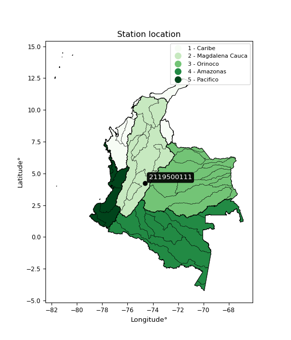

<div align="center">


</div>

# PMP Station (Rain, Pmax24h): 2119500111

Probable Maximum Precipitation (PMP) is the greatest amount of rainfall for a specific duration that is meteorologically possible for a given location, acting as a "worst-case" scenario for extreme storms, crucial for designing safety-critical infrastructure like bridges, river deviations, dams, spillways, and nuclear plants to prevent catastrophic failure. PMP is calculated by hydrologists using meteorological data to determine the upper limit of extreme rainfall, often leading to the Probable Maximum Flood (PMF) for flood control design, and is increasingly being studied for climate change impacts. Probable Maximum Precipitation (PMP) is the theoretical upper limit of rainfall, a deterministic estimate for extreme events, while probability distributions (like GEV, Gumbel) describe the likelihood and frequency of various precipitation amounts, including rare ones, showing how often events occur, with PMP representing the extreme end of these distributions, used for critical infrastructure design to ensure safety against the worst conceivable weather, unlike standard statistical forecasts which cover typical probabilities.

The most common probability distributions in hydrology, used for analyzing floods, rainfall, and streamflow, include the Normal, Log-Normal, Gumbel, Gamma (including Log-Pearson Type III), and Generalized Extreme Value (GEV) distributions, often chosen based on the data´s skewness and whether modeling extremes or general conditions, with Gumbel and GEV popular for extreme events like floods, while the Normal distribution serves as a baseline, though often requiring transformations for skewed hydrological data. These distributions help in designing water infrastructure, managing water resources, and forecasting hydrologic events.

> Hydrological data often isn´t perfectly normal (it´s skewed), so different distributions are needed for different applications, such as: **Flood Frequency Analysis**: Using Gumbel, GEV, or Log-Pearson Type III for predicting extreme flood magnitudes and their return periods, **Rainfall Analysis**: Normal for annual totals, but Log-Normal, Weibull, or GEV for intensity or extreme daily rainfall, **Streamflow Modeling**: Gamma and Log-Normal for maximum flows, GEV for minimum flows, and Kappa for daily flows.

<div align="center">

</img>

</div>


## A. General information


### 1. General running parameters

• app_version: _v20260113_. • runtime: _2026-01-17 18:24:04.630693_. • Python version: _3.14.0_. • SciPy version: _1.16.3_. • Pandas version: _2.3.3_. • NumPy version: _2.3.5_. • Stations dataset (station_dataset_file): _dataset/pmax24h_in/automatic_colombia_2003_2025.csv_. • Stations catalog (station_catalog_file): _dataset/CNE.xls_. • Minimum year to eval til year_max (date_min): _1900_. • Maximum year to eval since year_min (date_max): _2025_. • Creates, save and include plots into reports (create_plot): _False_. • Plot only fit distributions with Δo > Δ (plot_only_fit): _True_. • Plot only simple graphs avoiding multiple CDFs and multiple Extreme values plots (plot_only_simple): _True_. • Eval low extreme values, if False, evaluates high extreme values (low_extreme): _False_. • Eval every SciPy distribution as logarithmic (pdist_logarithmic_on): _True_. • Standard deviation normalized (ddof): _1.0_. • Return periods to eval in years (Tr): _[2, 2.33, 5, 10, 15, 20, 25, 50, 75, 100, 200, 250, 500, 750, 1000]_. • Minimum data sample per station, 0 means any (minimum_sample): _5_. • Z-Score maximum threshold to adjust a value, 0 means disable (zscore_max): _3.5_. • Z-Score minimum threshold to adjust a value, 0 means disable (zscore_min): _-2.5_. • Avoid zeros, e.g. rain = 0 (avoid_zeros): _True_. • Avoid null values (avoid_nans): _True_. 

:file_folder:Table: [dataset.csv](../../dataset/pmax24h_in/automatic_colombia_2003_2025.csv)

> Delta Degrees of Freedom (DDOF): is a parameter used in the formulas for calculating variance and standard deviation. When ddof=0, the divisor is $N$ (the total number of observations) and this is used when your data set is the entire population. When ddof=1, the divisor is $N-1$ and this is used when your data set is a sample drawn from a larger population. Using $N-1$ provides an unbiased estimate of the population variance (known as Bessel´s correction).


### 2. Station info and location

|   id |     CODIGO | NOMBRE                         | CATEGORIA               | TECNOLOGIA                | ESTADO   | FECHA_INSTALACION   |   FECHA_SUSPENSION |   ALTITUD |   LATITUD |   LONGITUD | DEPARTAMENTO   | MUNICIPIO   | AREA_OPERATIVA                            | ENTIDAD                                                     | AREA_HIDROGRAFICA   | ZONA_HIDROGRAFICA   | SUBZONA_HIDROGRAFICA   |   CORRIENTE | Catalogo   |   Version |
|-----:|-----------:|:-------------------------------|:------------------------|:--------------------------|:---------|:--------------------|-------------------:|----------:|----------:|-----------:|:---------------|:------------|:------------------------------------------|:------------------------------------------------------------|:--------------------|:--------------------|:-----------------------|------------:|:-----------|----------:|
|    0 | 2119500111 | BASE AEREA MELGAR [2119500111] | Climatológica Principal | Automática con Telemetría | Activa   | 24/09/2018          |                nan |       328 |   4.21966 |   -74.6294 | Tolima         | Melgar      | Area Operativa 11 - Cundinamarca-Amazonas | INSTITUTO DE HIDROLOGIA METEOROLOGIA Y ESTUDIOS AMBIENTALES | Magdalena Cauca     | Alto Magdalena      | Río Sumapaz            |         nan | CNE_IDEAM  |  20251226 |

<div align="center">

Dynamic map: [:earth_americas:Google](http://maps.google.com/maps?q=4.219663,-74.629444) [:earth_americas:OSM](https://www.openstreetmap.org/#map=18/4.219663/-74.629444&layers=P) [:earth_americas:Bing](https://www.bing.com/maps?cp=4.219663~-74.629444&lvl=18) [:earth_americas:Apple](https://maps.apple.com/frame?center=4.219663%2C-74.629444&span=0.003%2C0.006)

</div>


<div align="center">

```geojson
{
  "type": "Feature",
  "geometry": {
    "type": "Point", 
    "coordinates": [-74.629444, 4.219663]
  }, 
  "properties": {
    "Name": "2119500111"
  }
}
```

</div>


### 3. Discrete values table and plot

<div align="center">

|               |           0 |             1 |           2 |           3 |           4 |          5 |          6 |
|:--------------|------------:|--------------:|------------:|------------:|------------:|-----------:|-----------:|
| Date          | 2019        | 2020          | 2021        | 2022        | 2023        | 2024       | 2025       |
| Value         |   75        |   57.6        |   82.8      |   32        |   34.5      |   30.2     |   89.6     |
| Value_initial |   75        |   57.6        |   82.8      |   32        |   34.5      |   30.2     |   89.6     |
| count         |    7        |    7          |    7        |    7        |    7        |    7       |    7       |
| mean          |   57.3857   |   57.3857     |   57.3857   |   57.3857   |   57.3857   |   57.3857  |   57.3857  |
| std           |   25.499    |   25.499      |   25.499    |   25.499    |   25.499    |   25.499   |   25.499   |
| zscore        |    0.690782 |    0.00840368 |    0.996676 |   -0.995555 |   -0.897513 |   -1.06615 |    1.26335 |


</div>


> The initial value (value_initial) correspond to the initial obtained or null completed value, and value (value) is adjusted only when the initial value is outside the valid range (outlier) definite through the Z-Score value. If Z-Score is active, values out of range or outliers are replaced with the station mean value. A Z-Score (or standard score) measures how many standard deviations a data point is from the mean of a dataset, indicating its relative position; positive scores mean above the mean, negative mean below, and a score of zero is exactly at the mean, allowing for comparison of values from different distributions. It´s calculated using the formula $z=(x–μ)/σ$, where $x$ is the data point, $μ$ is the mean, and $σ$ is the standard deviation, helping identify outliers and understand probability.
>
> <sub>**Note**: In this study, "completing" (filling gaps in) and "extending" (forecasting or lengthening the historical record) rainfall data series are avoided for certain critical analyses because they introduce artificial bias and uncertainty, which can distort the statistics of rare events (extremes), alter day-to-day variability, and compromise the integrity and homogeneity of the original data. Some reasons against Completing/Extending rainfall data are: **Distortion of Extremes and Variability**: The primary issue is that most gap-filling or extension methods rely on averaging or regression with nearby stations, which inherently smooths the data. Rainfall is highly variable in space and time, with a large percentage of zero values and occasional large storms. Infilling methods often underestimate the highest values and overestimate the lowest (zero) values, which severely distorts analyses focused on flood frequency, drought severity, and intensity-duration-frequency (IDF) curves, **Loss of Data Homogeneity**: Infilled or extended data are synthetic estimates, not actual measurements. Combining these estimates with observed data can violate the assumption of data homogeneity, which requires that the data properties do not change over time. Inhomogeneity can lead to incorrect conclusions about long-term trends or changes in climate patterns, **Propagation of Errors**: Errors and biases from the original data (e.g., wind-induced undercatch, instrument errors, site changes) or the data used for imputation can propagate through the analysis, leading to unreliable hydrological models and inaccurate predictions, **Compromised Statistical Integrity**: For statistical analyses, especially those involving the frequency of events, using artificial data can introduce time bias or autocorrelation that doesn´t exist in reality, making it difficult to assess the true probability of events, **Difficulty in Validation**: It is difficult to accurately validate the quality of filled or extended data, especially for past periods where ground-truth measurements are unavailable. The reliability of imputation techniques heavily depends on the density of the surrounding station network and the complexity of the local topography.</sub>


### 4. Active continuous probability distributions from SciPy (80 of 104 available)

A Probability Density Function (PDF) describes the relative likelihood of a continuous random variable falling within a specific range, where the total area under its curve equals 1, and the area over any interval gives the actual probability for that range. Unlike discrete probabilities (like rolling a die), a PDF shows density, not direct probability for a single point (which is zero), with higher points indicating higher likelihood, often visualized as a bell curve for normal distributions.

A log of a probability density function (log-PDF) is simply the logarithm of the PDF´s value, denoted as $log(f(x))$, useful for converting multiplication of probabilities into addition, improving numerical stability with tiny numbers, and connecting to information theory concepts like entropy. Instead of dealing with very small probabilities (e.g., 0.000001), log-PDFs use negative numbers (e.g., $log(0.00001) ≈ -11.51$ that are easier for computers to handle, preventing underflow errors and simplifying complex calculations. In this study, each active probability distribution from SciPy is also evaluated in the $log$ form.

[scipy.stats](https://docs.scipy.org/doc/scipy/reference/stats.html) is a Python´s powerful submodule within the SciPy library for comprehensive statistical analysis, offering over 130 probability distributions (like Normal, Poisson), functions for descriptive stats (mean, variance), hypothesis testing (t-tests, chi-square), random variable generation, and statistical tests, making it essential for data science, modeling, and research. It provides tools to explore, model, and draw conclusions from data efficiently, working seamlessly with NumPy.

<div align="center">

|   id | p_dist           |   n_parameter | fit_method   | label                                                                       | active   | ref                                                                                                      |
|-----:|:-----------------|--------------:|:-------------|:----------------------------------------------------------------------------|:---------|:---------------------------------------------------------------------------------------------------------|
|    0 | alpha            |             3 | MLE          | Alpha                                                                       | True     | [:mortar_board:](https://docs.scipy.org/doc/scipy/reference/generated/scipy.stats.alpha.html)            |
|    1 | anglit           |             2 | MM           | Anglit                                                                      | True     | [:mortar_board:](https://docs.scipy.org/doc/scipy/reference/generated/scipy.stats.anglit.html)           |
|    2 | arcsine          |             2 | MM           | Arcsine                                                                     | True     | [:mortar_board:](https://docs.scipy.org/doc/scipy/reference/generated/scipy.stats.arcsine.html)          |
|    3 | argus            |             3 | MLE          | Argus                                                                       | True     | [:mortar_board:](https://docs.scipy.org/doc/scipy/reference/generated/scipy.stats.argus.html)            |
|    4 | beta             |             4 | MLE          | Beta                                                                        | True     | [:mortar_board:](https://docs.scipy.org/doc/scipy/reference/generated/scipy.stats.beta.html)             |
|    5 | betaprime        |             4 | MLE          | Beta prime                                                                  | True     | [:mortar_board:](https://docs.scipy.org/doc/scipy/reference/generated/scipy.stats.betaprime.html)        |
|    6 | bradford         |             3 | MLE          | Bradford                                                                    | True     | [:mortar_board:](https://docs.scipy.org/doc/scipy/reference/generated/scipy.stats.bradford.html)         |
|    7 | burr             |             4 | MLE          | Burr (Type III)                                                             | True     | [:mortar_board:](https://docs.scipy.org/doc/scipy/reference/generated/scipy.stats.burr.html)             |
|    8 | burr12           |             4 | MLE          | Burr (Type III) 12                                                          | True     | [:mortar_board:](https://docs.scipy.org/doc/scipy/reference/generated/scipy.stats.burr12.html)           |
|    9 | cosine           |             2 | MLE          | Cosine                                                                      | True     | [:mortar_board:](https://docs.scipy.org/doc/scipy/reference/generated/scipy.stats.cosine.html)           |
|   10 | crystalball      |             4 | MLE          | Crystalball                                                                 | True     | [:mortar_board:](https://docs.scipy.org/doc/scipy/reference/generated/scipy.stats.crystalball.html)      |
|   11 | dgamma           |             3 | MLE          | Double gamma                                                                | True     | [:mortar_board:](https://docs.scipy.org/doc/scipy/reference/generated/scipy.stats.dgamma.html)           |
|   12 | dweibull         |             3 | MLE          | Double Weibull                                                              | True     | [:mortar_board:](https://docs.scipy.org/doc/scipy/reference/generated/scipy.stats.dweibull.html)         |
|   13 | erlang           |             3 | MLE          | Erlang                                                                      | True     | [:mortar_board:](https://docs.scipy.org/doc/scipy/reference/generated/scipy.stats.erlang.html)           |
|   14 | exponnorm        |             3 | MLE          | Exponentially modified Normal                                               | True     | [:mortar_board:](https://docs.scipy.org/doc/scipy/reference/generated/scipy.stats.exponnorm.html)        |
|   15 | exponpow         |             3 | MLE          | Exponential power                                                           | True     | [:mortar_board:](https://docs.scipy.org/doc/scipy/reference/generated/scipy.stats.exponpow.html)         |
|   16 | exponweib        |             4 | MLE          | Exponentiated Weibull                                                       | True     | [:mortar_board:](https://docs.scipy.org/doc/scipy/reference/generated/scipy.stats.exponweib.html)        |
|   17 | f                |             4 | MLE          | F                                                                           | True     | [:mortar_board:](https://docs.scipy.org/doc/scipy/reference/generated/scipy.stats.f.html)                |
|   18 | fatiguelife      |             3 | MLE          | Fatigue-life (Birnbaum-Saunders)                                            | True     | [:mortar_board:](https://docs.scipy.org/doc/scipy/reference/generated/scipy.stats.fatiguelife.html)      |
|   19 | foldnorm         |             3 | MM           | Fold Normal                                                                 | True     | [:mortar_board:](https://docs.scipy.org/doc/scipy/reference/generated/scipy.stats.foldnorm.html)         |
|   20 | gamma            |             3 | MLE          | Gamma                                                                       | True     | [:mortar_board:](https://docs.scipy.org/doc/scipy/reference/generated/scipy.stats.gamma.html)            |
|   21 | gausshyper       |             6 | MLE          | Gauss hypergeometric                                                        | True     | [:mortar_board:](https://docs.scipy.org/doc/scipy/reference/generated/scipy.stats.gausshyper.html)       |
|   22 | genexpon         |             5 | MLE          | Generalized exponential                                                     | True     | [:mortar_board:](https://docs.scipy.org/doc/scipy/reference/generated/scipy.stats.genexpon.html)         |
|   23 | genextreme       |             3 | MLE          | Generalized exponential                                                     | True     | [:mortar_board:](https://docs.scipy.org/doc/scipy/reference/generated/scipy.stats.genextreme.html)       |
|   24 | gengamma         |             4 | MLE          | Generalized gamma                                                           | True     | [:mortar_board:](https://docs.scipy.org/doc/scipy/reference/generated/scipy.stats.gengamma.html)         |
|   25 | genhalflogistic  |             3 | MLE          | Generalized half-logistic                                                   | True     | [:mortar_board:](https://docs.scipy.org/doc/scipy/reference/generated/scipy.stats.genhalflogistic.html)  |
|   26 | genlogistic      |             3 | MLE          | Generalized logistic                                                        | True     | [:mortar_board:](https://docs.scipy.org/doc/scipy/reference/generated/scipy.stats.genlogistic.html)      |
|   27 | gennorm          |             3 | MLE          | Generalized Normal                                                          | True     | [:mortar_board:](https://docs.scipy.org/doc/scipy/reference/generated/scipy.stats.gennorm.html)          |
|   28 | genpareto        |             3 | MLE          | Generalized Pareto                                                          | True     | [:mortar_board:](https://docs.scipy.org/doc/scipy/reference/generated/scipy.stats.genpareto.html)        |
|   29 | gompertz         |             3 | MLE          | Gompertz (or truncated Gumbel)                                              | True     | [:mortar_board:](https://docs.scipy.org/doc/scipy/reference/generated/scipy.stats.gompertz.html)         |
|   30 | gumbel_l         |             2 | MM           | Gumbel Left Skew                                                            | True     | [:mortar_board:](https://docs.scipy.org/doc/scipy/reference/generated/scipy.stats.gumbel_l.html)         |
|   31 | gumbel_r         |             2 | MM           | Gumbel Right Skew                                                           | True     | [:mortar_board:](https://docs.scipy.org/doc/scipy/reference/generated/scipy.stats.gumbel_r.html)         |
|   32 | halfgennorm      |             3 | MLE          | Upper half of a generalized normal                                          | True     | [:mortar_board:](https://docs.scipy.org/doc/scipy/reference/generated/scipy.stats.halfgennorm.html)      |
|   33 | halflogistic     |             2 | MM           | Half-logistic                                                               | True     | [:mortar_board:](https://docs.scipy.org/doc/scipy/reference/generated/scipy.stats.halflogistic.html)     |
|   34 | halfnorm         |             2 | MM           | Half Normal                                                                 | True     | [:mortar_board:](https://docs.scipy.org/doc/scipy/reference/generated/scipy.stats.halfnorm.html)         |
|   35 | hypsecant        |             2 | MM           | hyperbolic secant                                                           | True     | [:mortar_board:](https://docs.scipy.org/doc/scipy/reference/generated/scipy.stats.hypsecant.html)        |
|   36 | invgamma         |             3 | MLE          | Inverted gamma                                                              | True     | [:mortar_board:](https://docs.scipy.org/doc/scipy/reference/generated/scipy.stats.invgamma.html)         |
|   37 | invgauss         |             3 | MLE          | Inverse Gaussian                                                            | True     | [:mortar_board:](https://docs.scipy.org/doc/scipy/reference/generated/scipy.stats.invgauss.html)         |
|   38 | invweibull       |             3 | MLE          | Inverted Weibull                                                            | True     | [:mortar_board:](https://docs.scipy.org/doc/scipy/reference/generated/scipy.stats.invweibull.html)       |
|   39 | johnsonsb        |             4 | MLE          | Johnson SB                                                                  | True     | [:mortar_board:](https://docs.scipy.org/doc/scipy/reference/generated/scipy.stats.johnsonsb.html)        |
|   40 | johnsonsu        |             4 | MLE          | Johnson Su                                                                  | True     | [:mortar_board:](https://docs.scipy.org/doc/scipy/reference/generated/scipy.stats.johnsonsu.html)        |
|   41 | kappa3           |             3 | MLE          | Kappa 3                                                                     | True     | [:mortar_board:](https://docs.scipy.org/doc/scipy/reference/generated/scipy.stats.kappa3.html)           |
|   42 | kappa4           |             4 | MLE          | Kappa 4                                                                     | True     | [:mortar_board:](https://docs.scipy.org/doc/scipy/reference/generated/scipy.stats.kappa4.html)           |
|   43 | ksone            |             3 | MLE          | Kolmogorov-Smirnov one-sided test statistic distribution                    | True     | [:mortar_board:](https://docs.scipy.org/doc/scipy/reference/generated/scipy.stats.ksone.html)            |
|   44 | kstwobign        |             2 | MLE          | Limiting distribution of scaled Kolmogorov-Smirnov two-sided test statistic | True     | [:mortar_board:](https://docs.scipy.org/doc/scipy/reference/generated/scipy.stats.kstwobign.html)        |
|   45 | laplace          |             2 | MM           | Laplace                                                                     | True     | [:mortar_board:](https://docs.scipy.org/doc/scipy/reference/generated/scipy.stats.laplace.html)          |
|   46 | levy_l           |             2 | MLE          | Left-skewed Levy                                                            | True     | [:mortar_board:](https://docs.scipy.org/doc/scipy/reference/generated/scipy.stats.levy_l.html)           |
|   47 | loggamma         |             3 | MLE          | Log gamma                                                                   | True     | [:mortar_board:](https://docs.scipy.org/doc/scipy/reference/generated/scipy.stats.loggamma.html)         |
|   48 | logistic         |             2 | MM           | Logistic (or Sech-squared)                                                  | True     | [:mortar_board:](https://docs.scipy.org/doc/scipy/reference/generated/scipy.stats.logistic.html)         |
|   49 | loglaplace       |             3 | MLE          | Log-Laplace                                                                 | True     | [:mortar_board:](https://docs.scipy.org/doc/scipy/reference/generated/scipy.stats.loglaplace.html)       |
|   50 | lomax            |             3 | MLE          | Lomax (Pareto of the second kind)                                           | True     | [:mortar_board:](https://docs.scipy.org/doc/scipy/reference/generated/scipy.stats.lomax.html)            |
|   51 | maxwell          |             2 | MM           | Maxwell                                                                     | True     | [:mortar_board:](https://docs.scipy.org/doc/scipy/reference/generated/scipy.stats.maxwell.html)          |
|   52 | mielke           |             4 | MLE          | Mielke Beta-Kappa / Dagum                                                   | True     | [:mortar_board:](https://docs.scipy.org/doc/scipy/reference/generated/scipy.stats.mielke.html)           |
|   53 | moyal            |             2 | MM           | Moyal                                                                       | True     | [:mortar_board:](https://docs.scipy.org/doc/scipy/reference/generated/scipy.stats.moyal.html)            |
|   54 | nakagami         |             3 | MLE          | Nakagami                                                                    | True     | [:mortar_board:](https://docs.scipy.org/doc/scipy/reference/generated/scipy.stats.nakagami.html)         |
|   55 | ncf              |             5 | MLE          | Non-central F distribution                                                  | True     | [:mortar_board:](https://docs.scipy.org/doc/scipy/reference/generated/scipy.stats.ncf.html)              |
|   56 | nct              |             4 | MLE          | Non-central Student’s t                                                     | True     | [:mortar_board:](https://docs.scipy.org/doc/scipy/reference/generated/scipy.stats.nct.html)              |
|   57 | norm             |             2 | MM           | Normal                                                                      | True     | [:mortar_board:](https://docs.scipy.org/doc/scipy/reference/generated/scipy.stats.norm.html)             |
|   58 | pearson3         |             3 | MM           | Pearson type III                                                            | True     | [:mortar_board:](https://docs.scipy.org/doc/scipy/reference/generated/scipy.stats.pearson3.html)         |
|   59 | powerlaw         |             3 | MLE          | Power-function                                                              | True     | [:mortar_board:](https://docs.scipy.org/doc/scipy/reference/generated/scipy.stats.powerlaw.html)         |
|   60 | rayleigh         |             2 | MM           | Rayleigh                                                                    | True     | [:mortar_board:](https://docs.scipy.org/doc/scipy/reference/generated/scipy.stats.rayleigh.html)         |
|   61 | rdist            |             3 | MLE          | R-distributed (symmetric beta)                                              | True     | [:mortar_board:](https://docs.scipy.org/doc/scipy/reference/generated/scipy.stats.rdist.html)            |
|   62 | rice             |             3 | MLE          | Rice                                                                        | True     | [:mortar_board:](https://docs.scipy.org/doc/scipy/reference/generated/scipy.stats.rice.html)             |
|   63 | semicircular     |             2 | MM           | Semicircular                                                                | True     | [:mortar_board:](https://docs.scipy.org/doc/scipy/reference/generated/scipy.stats.semicircular.html)     |
|   64 | skewnorm         |             3 | MLE          | Skew normal                                                                 | True     | [:mortar_board:](https://docs.scipy.org/doc/scipy/reference/generated/scipy.stats.skewnorm.html)         |
|   65 | t                |             3 | MLE          | Student’s t                                                                 | True     | [:mortar_board:](https://docs.scipy.org/doc/scipy/reference/generated/scipy.stats.t.html)                |
|   66 | trapezoid        |             4 | MLE          | Trapezoid                                                                   | True     | [:mortar_board:](https://docs.scipy.org/doc/scipy/reference/generated/scipy.stats.trapezoid.html)        |
|   67 | triang           |             3 | MLE          | Triangular                                                                  | True     | [:mortar_board:](https://docs.scipy.org/doc/scipy/reference/generated/scipy.stats.triang.html)           |
|   68 | truncexpon       |             3 | MLE          | Truncated exponential                                                       | True     | [:mortar_board:](https://docs.scipy.org/doc/scipy/reference/generated/scipy.stats.truncexpon.html)       |
|   69 | truncnorm        |             4 | MLE          | Truncated normal                                                            | True     | [:mortar_board:](https://docs.scipy.org/doc/scipy/reference/generated/scipy.stats.truncnorm.html)        |
|   70 | truncpareto      |             4 | MLE          | Upper truncated Pareto                                                      | True     | [:mortar_board:](https://docs.scipy.org/doc/scipy/reference/generated/scipy.stats.truncpareto.html)      |
|   71 | truncweibull_min |             5 | MLE          | Doubly truncated Weibull minimum                                            | True     | [:mortar_board:](https://docs.scipy.org/doc/scipy/reference/generated/scipy.stats.truncweibull_min.html) |
|   72 | tukeylambda      |             3 | MLE          | Tukey-Lamdba                                                                | True     | [:mortar_board:](https://docs.scipy.org/doc/scipy/reference/generated/scipy.stats.tukeylambda.html)      |
|   73 | uniform          |             2 | MLE          | Uniform                                                                     | True     | [:mortar_board:](https://docs.scipy.org/doc/scipy/reference/generated/scipy.stats.uniform.html)          |
|   74 | vonmises         |             3 | MLE          | Von Mises                                                                   | True     | [:mortar_board:](https://docs.scipy.org/doc/scipy/reference/generated/scipy.stats.vonmises.html)         |
|   75 | vonmises_line    |             3 | MLE          | Von Mises line                                                              | True     | [:mortar_board:](https://docs.scipy.org/doc/scipy/reference/generated/scipy.stats.vonmises_line.html)    |
|   76 | wald             |             2 | MM           | Wald                                                                        | True     | [:mortar_board:](https://docs.scipy.org/doc/scipy/reference/generated/scipy.stats.wald.html)             |
|   77 | weibull_max      |             3 | MLE          | Weibull maximum                                                             | True     | [:mortar_board:](https://docs.scipy.org/doc/scipy/reference/generated/scipy.stats.weibull_max.html)      |
|   78 | weibull_min      |             3 | MLE          | Weibull minimum                                                             | True     | [:mortar_board:](https://docs.scipy.org/doc/scipy/reference/generated/scipy.stats.weibull_min.html)      |
|   79 | wrapcauchy       |             3 | MLE          | Wrapped  Cauchy                                                             | True     | [:mortar_board:](https://docs.scipy.org/doc/scipy/reference/generated/scipy.stats.wrapcauchy.html)       |

</div>

> **n_parameter:** # arguments & localization & scale.
>
> **Fit methods:** (MLE) maximum likelihood, (MM) L-moments.
>
>**Inactive** (With the only purpose of prevent loops, zero divisions, infinite values, over high estimated values or horizontal trending for recurrence intervals estimations, the follow distributions were disabled.)**:** lognorm, norminvgauss, powernorm, powerlognorm, cauchy, halfcauchy, foldcauchy, skewcauchy, chi2, expon, fisk, genhyperbolic, geninvgauss, gibrat, kstwo, laplace_asymmetric, levy, levy_stable, ncx2, pareto, rel_breitwigner, recipinvgauss, studentized_range, loguniform, 


## B. Probability (PDF) vs. Empirical (EDF) distributions functions

A continuous probability distribution (CPD) describes probabilities for variables that can take any value within a range (like rain any time), unlike discrete variables with specific outcomes (like temperature). It uses a Probability Density Function (PDF), a curve where the total area under it equals 1, and the probability of the variable falling within an interval (a to b) is found by calculating the area under the curve between those points. A key feature is that the probability of hitting any single exact value is zero, so probabilities are always expressed for ranges, e.g., $P(a ≤ X ≤ b)$.

<div align="center">

Distributions parameters from station values
|     |    station | p_dist              |   n |              loc |           scale | shape                  | shape1                | shape2                | shape3             |
|----:|-----------:|:--------------------|----:|-----------------:|----------------:|:-----------------------|:----------------------|:----------------------|:-------------------|
|   0 | 2119500111 | alpha               |   7 |   -141.779       |  1658.51        | 8.4534011376556        |                       |                       |                    |
|   1 | 2119500111 | anglit              |   7 |     57.3857      |    69.0615      |                        |                       |                       |                    |
|   2 | 2119500111 | arcsine             |   7 |     23.9996      |    66.7722      |                        |                       |                       |                    |
|   3 | 2119500111 | argus               |   7 |      9.25001     |    84.8208      | 5.0569673289650523e-05 |                       |                       |                    |
|   4 | 2119500111 | beta                |   7 |     30.2         |    61.3702      | 0.666430752183407      | 0.9944685788478964    |                       |                    |
|   5 | 2119500111 | betaprime           |   7 |     -0.387923    |     1.63161     | 166.92527284293135     | 5.641291635028924     |                       |                    |
|   6 | 2119500111 | bradford            |   7 |     30.2         |    59.4         | 0.9552784936864482     |                       |                       |                    |
|   7 | 2119500111 | burr                |   7 |     -0.726728    |     4.01622     | 2.6379515291211413     | 512.2878486691249     |                       |                    |
|   8 | 2119500111 | burr12              |   7 |     -3.6208      |    33.6314      | 696.1985103134899      | 0.0027930252295160682 |                       |                    |
|   9 | 2119500111 | cosine              |   7 |     57.6934      |    18.5102      |                        |                       |                       |                    |
|  10 | 2119500111 | crystalball         |   7 |     57.3857      |    23.6075      | 42775.5040451307       | 1178.7672091093707    |                       |                    |
|  11 | 2119500111 | dgamma              |   7 |     49.9975      |     4.96776     | 4.5522883054187675     |                       |                       |                    |
|  12 | 2119500111 | dweibull            |   7 |     52.2006      |    25.0264      | 2.573851567403203      |                       |                       |                    |
|  13 | 2119500111 | erlang              |   7 |   -419.645       |     1.16547     | 409.2683754027503      |                       |                       |                    |
|  14 | 2119500111 | exponnorm           |   7 |     56.3434      |    23.5845      | 0.04419623094131048    |                       |                       |                    |
|  15 | 2119500111 | exponpow            |   7 |     30.2         |    43.9814      | 0.47997884097442683    |                       |                       |                    |
|  16 | 2119500111 | exponweib           |   7 |     30.2         |     1.2461      | 1.233370236156258      | 0.21429475680496402   |                       |                    |
|  17 | 2119500111 | f                   |   7 |     -1.55166     |    58.5924      | 12.225673768667761     | 199.53998172210095    |                       |                    |
|  18 | 2119500111 | fatiguelife         |   7 |     30.2         |     5.03698e-05 | 642.6228080268804      |                       |                       |                    |
|  19 | 2119500111 | foldnorm            |   7 |     -1.34922     |    23.8792      | 2.455068008660465      |                       |                       |                    |
|  20 | 2119500111 | gamma               |   7 |   -409.843       |     1.18684     | 393.615352945086       |                       |                       |                    |
|  21 | 2119500111 | gausshyper          |   7 |     28.6251      |    60.9749      | 1.173612980087444      | 0.8145409564338106    | 1.0533646427138033    | 0.9104063700179866 |
|  22 | 2119500111 | genexpon            |   7 |     30.199       |     1.28377     | 0.040349129281132406   | 6.774169030914708     | 5.488835506689682e-05 |                    |
|  23 | 2119500111 | genextreme          |   7 |     31.8887      |    13.2516      | -7.84729869628546      |                       |                       |                    |
|  24 | 2119500111 | gengamma            |   7 |     30.2         |     1.38247     | 1.1608988343931423     | 0.2705712749113247    |                       |                    |
|  25 | 2119500111 | genhalflogistic     |   7 |      5.70641     |    84.1633      | 1.0032149852050387     |                       |                       |                    |
|  26 | 2119500111 | genlogistic         |   7 |    -94.6463      |    19.8339      | 1186.1149694287528     |                       |                       |                    |
|  27 | 2119500111 | gennorm             |   7 |     59.9         |    29.7         | 28599760.463939972     |                       |                       |                    |
|  28 | 2119500111 | genpareto           |   7 |     -0.188672    |   111.49        | -1.2416947720075857    |                       |                       |                    |
|  29 | 2119500111 | gompertz            |   7 |     30.2         |    75.7925      | 1.9913677418597313     |                       |                       |                    |
|  30 | 2119500111 | gumbel_l            |   7 |     68.0104      |    18.4067      |                        |                       |                       |                    |
|  31 | 2119500111 | gumbel_r            |   7 |     46.7611      |    18.4067      |                        |                       |                       |                    |
|  32 | 2119500111 | halfgennorm         |   7 |     30.2         |     1.24953     | 0.3778035967401107     |                       |                       |                    |
|  33 | 2119500111 | halflogistic        |   7 |     29.4053      |    20.1836      |                        |                       |                       |                    |
|  34 | 2119500111 | halfnorm            |   7 |     26.1386      |    39.1625      |                        |                       |                       |                    |
|  35 | 2119500111 | hypsecant           |   7 |     57.3857      |    15.029       |                        |                       |                       |                    |
|  36 | 2119500111 | invgamma            |   7 |     27.9838      |     5.7423      | 0.7737177274073814     |                       |                       |                    |
|  37 | 2119500111 | invgauss            |   7 |     28.0683      |     9.5909      | 3.0568139999698576     |                       |                       |                    |
|  38 | 2119500111 | invweibull          |   7 |     30.2         |     1.43478     | 0.060892313405125936   |                       |                       |                    |
|  39 | 2119500111 | johnsonsb           |   7 |     30.2         |   128.26        | 1.5093838293576385     | 0.16401762207146678   |                       |                    |
|  40 | 2119500111 | johnsonsu           |   7 |      1.94582e+08 |     6.12915e+06 | 34082228.24424486      | 8210224.882581476     |                       |                    |
|  41 | 2119500111 | kappa3              |   7 |     30.2         |    65.4465      | 265.70710085743553     |                       |                       |                    |
|  42 | 2119500111 | kappa4              |   7 |     16.9912      |    72.6566      | 1.222129154310411      | 0.9976566096081507    |                       |                    |
|  43 | 2119500111 | ksone               |   7 |     16.4963      |    81.7789      | 1.0                    |                       |                       |                    |
|  44 | 2119500111 | kstwobign           |   7 |    -21.1076      |    89.3626      |                        |                       |                       |                    |
|  45 | 2119500111 | laplace             |   7 |     57.3857      |    16.693       |                        |                       |                       |                    |
|  46 | 2119500111 | levy_l              |   7 |     92.0505      |    10.7025      |                        |                       |                       |                    |
|  47 | 2119500111 | loggamma            |   7 |  -4449.81        |   673.611       | 805.7302617333185      |                       |                       |                    |
|  48 | 2119500111 | logistic            |   7 |     57.3857      |    13.0155      |                        |                       |                       |                    |
|  49 | 2119500111 | loglaplace          |   7 |     -0.171584    |    57.7716      | 2.4896695274867007     |                       |                       |                    |
|  50 | 2119500111 | lomax               |   7 |     30.1918      |  1246.42        | 46.514753329799674     |                       |                       |                    |
|  51 | 2119500111 | maxwell             |   7 |      1.44578     |    35.0552      |                        |                       |                       |                    |
|  52 | 2119500111 | mielke              |   7 |      0.512061    |     3.74006     | 1234.2496388954296     | 2.5668323629398113    |                       |                    |
|  53 | 2119500111 | moyal               |   7 |     43.8854      |    10.6271      |                        |                       |                       |                    |
|  54 | 2119500111 | nakagami            |   7 |     30.2         |    41.6264      | 0.18374011420967656    |                       |                       |                    |
|  55 | 2119500111 | ncf                 |   7 |     -0.0167224   |     7.63647e-09 | 9.44305568987269e-10   | 8.237681508600057     | 5.980360039940548     |                    |
|  56 | 2119500111 | nct                 |   7 |     -0.468057    |     0.810527    | 3.1350895026698673     | 54.6149867493628      |                       |                    |
|  57 | 2119500111 | norm                |   7 |     57.3857      |    23.6075      |                        |                       |                       |                    |
|  58 | 2119500111 | pearson3            |   7 |     57.3857      |    23.6076      | 0.07459691721625639    |                       |                       |                    |
|  59 | 2119500111 | powerlaw            |   7 |     30.2         |    59.4         | 0.1567574986757225     |                       |                       |                    |
|  60 | 2119500111 | rayleigh            |   7 |     12.2231      |    36.0345      |                        |                       |                       |                    |
|  61 | 2119500111 | rdist               |   7 |     60.8606      |    30.6606      | 1.049731865746443      |                       |                       |                    |
|  62 | 2119500111 | rice                |   7 |     15.5151      |    29.8269      | 0.7727062257680499     |                       |                       |                    |
|  63 | 2119500111 | semicircular        |   7 |     57.3857      |    47.2151      |                        |                       |                       |                    |
|  64 | 2119500111 | skewnorm            |   7 |     52.4484      |    24.1183      | 0.26544492875420045    |                       |                       |                    |
|  65 | 2119500111 | t                   |   7 |     57.3858      |    23.6077      | 682799971.341557       |                       |                       |                    |
|  66 | 2119500111 | trapezoid           |   7 |     -9.85579     |   100.158       | 1.0                    | 1.0                   |                       |                    |
|  67 | 2119500111 | triang              |   7 |      3.89744     |    85.7095      | 0.999919153152931      |                       |                       |                    |
|  68 | 2119500111 | truncexpon          |   7 |     30.2         |    59.1902      | 1.003544964499897      |                       |                       |                    |
|  69 | 2119500111 | truncnorm           |   7 |     74.1022      |    32.2142      | -1061.7310418299614    | 0.4810884211306774    |                       |                    |
|  70 | 2119500111 | truncpareto         |   7 |     30.1817      |     0.0183022   | 0.169793051488412      | 3246.508432113862     |                       |                    |
|  71 | 2119500111 | truncweibull_min    |   7 |     30.1996      |    93.8883      | 0.9693583979937187     | 3.710446492873179e-06 | 0.6326713264600905    |                    |
|  72 | 2119500111 | tukeylambda         |   7 |     59.8988      |    32.7738      | 1.1034487047390278     |                       |                       |                    |
|  73 | 2119500111 | uniform             |   7 |     30.2         |    59.4         |                        |                       |                       |                    |
|  74 | 2119500111 | vonmises            |   7 |      0.804047    |     1           | 0.8909968888101555     |                       |                       |                    |
|  75 | 2119500111 | vonmises_line       |   7 |     59.8999      |     9.45383     | 0.03055098904048799    |                       |                       |                    |
|  76 | 2119500111 | wald                |   7 |     33.7782      |    23.6075      |                        |                       |                       |                    |
|  77 | 2119500111 | weibull_max         |   7 |     89.6         |     1.49946     | 0.2850279772408351     |                       |                       |                    |
|  78 | 2119500111 | weibull_min         |   7 |     30.2         |    32.2968      | 0.833926047694004      |                       |                       |                    |
|  79 | 2119500111 | wrapcauchy          |   7 |     30.1911      |     9.45522     | 0.6674531910699977     |                       |                       |                    |
|  80 | 2119500111 | logalpha            |   7 |     -4.63395     |   166.286       | 19.414150638755526     |                       |                       |                    |
|  81 | 2119500111 | loganglit           |   7 |      3.95676     |     1.28764     |                        |                       |                       |                    |
|  82 | 2119500111 | logarcsine          |   7 |      3.33428     |     1.24495     |                        |                       |                       |                    |
|  83 | 2119500111 | logargus            |   7 |      2.99284     |     1.57072     | 1.2509349024186003     |                       |                       |                    |
|  84 | 2119500111 | logbeta             |   7 |      3.40784     |     1.19508     | 0.20199954652108482    | 0.1980930689831092    |                       |                    |
|  85 | 2119500111 | logbetaprime        |   7 |    -10.4595      |    10.4667      | 2523.50708931573       | 1833.187461943412     |                       |                    |
|  86 | 2119500111 | logbradford         |   7 |      3.40784     |     1.08751     | 1.2293497601400956     |                       |                       |                    |
|  87 | 2119500111 | logburr             |   7 |     -9.29844     |    10.2004      | 34.67928016763365      | 4831.424449139615     |                       |                    |
|  88 | 2119500111 | logburr12           |   7 |      1.45848     |     5.43107     | 6.802460105697815      | 119.67990657059363    |                       |                    |
|  89 | 2119500111 | logcosine           |   7 |      3.95198     |     0.343271    |                        |                       |                       |                    |
|  90 | 2119500111 | logcrystalball      |   7 |      3.95676     |     0.440158    | 43.71984188669227      | 2.944539430774533     |                       |                    |
|  91 | 2119500111 | logdgamma           |   7 |      4.13944     |     0.171925    | 2.410229634468404      |                       |                       |                    |
|  92 | 2119500111 | logdweibull         |   7 |      4.11518     |     0.459923    | 1.8341568016994785     |                       |                       |                    |
|  93 | 2119500111 | logerlang           |   7 |     -8.3916      |     0.0157707   | 782.9751355796436      |                       |                       |                    |
|  94 | 2119500111 | logexponnorm        |   7 |      3.95621     |     0.440158    | 0.0012598991503576097  |                       |                       |                    |
|  95 | 2119500111 | logexponpow         |   7 |      3.40784     |     0.938433    | 0.4744104186685324     |                       |                       |                    |
|  96 | 2119500111 | logexponweib        |   7 |      3.40784     |     0.812692    | 0.39983293281967114    | 1.2937869800449686    |                       |                    |
|  97 | 2119500111 | logf                |   7 |   -138.491       |   142.446       | 709051.7911168286      | 296493.28259669384    |                       |                    |
|  98 | 2119500111 | logfatiguelife      |   7 |      3.40784     |     1.41961e-06 | 544.5085240855833      |                       |                       |                    |
|  99 | 2119500111 | logfoldnorm         |   7 |      2.91868     |     0.445354    | 2.324337298484222      |                       |                       |                    |
| 100 | 2119500111 | loggamma            |   7 |     -8.41699     |     0.0157131   | 787.4268103832783      |                       |                       |                    |
| 101 | 2119500111 | loggausshyper       |   7 |      3.40784     |     1.14531     | 0.8573712099966708     | 1.1116044648010517    | 0.8168171708614463    | 1.0376132372864022 |
| 102 | 2119500111 | loggenexpon         |   7 |      3.40784     |     0.840026    | 1.3642478808524272     | 0.7148850671986045    | 0.5014015401351188    |                    |
| 103 | 2119500111 | loggenextreme       |   7 |      4.104       |     0.430459    | 1.0999175447743048     |                       |                       |                    |
| 104 | 2119500111 | loggengamma         |   7 |      3.40784     |     0.88383     | 0.43139090009054093    | 1.193447710384889     |                       |                    |
| 105 | 2119500111 | loggenhalflogistic  |   7 |      3.40172     |     1.15768     | 1.058553943744971      |                       |                       |                    |
| 106 | 2119500111 | loggenlogistic      |   7 |      1.27596     |     0.384954    | 597.8514116631352      |                       |                       |                    |
| 107 | 2119500111 | loggennorm          |   7 |      3.9516      |     0.543758    | 7022046.812647403      |                       |                       |                    |
| 108 | 2119500111 | loggenpareto        |   7 |     -0.00802004  |    14.7927      | -3.2847925822674546    |                       |                       |                    |
| 109 | 2119500111 | loggompertz         |   7 |      3.40784     |     0.896118    | 0.9333730111813179     |                       |                       |                    |
| 110 | 2119500111 | loggumbel_l         |   7 |      4.15486     |     0.34319     |                        |                       |                       |                    |
| 111 | 2119500111 | loggumbel_r         |   7 |      3.75867     |     0.34319     |                        |                       |                       |                    |
| 112 | 2119500111 | loghalfgennorm      |   7 |      3.40781     |     1.08813     | 14724.435174353832     |                       |                       |                    |
| 113 | 2119500111 | loghalflogistic     |   7 |      3.43509     |     0.376305    |                        |                       |                       |                    |
| 114 | 2119500111 | loghalfnorm         |   7 |      3.37416     |     0.730177    |                        |                       |                       |                    |
| 115 | 2119500111 | loghypsecant        |   7 |      3.95676     |     0.280213    |                        |                       |                       |                    |
| 116 | 2119500111 | loginvgamma         |   7 |     -2.23091     |  1198.96        | 194.78096451576005     |                       |                       |                    |
| 117 | 2119500111 | loginvgauss         |   7 |      3.31549     |     0.463184    | 1.384469002026809      |                       |                       |                    |
| 118 | 2119500111 | loginvweibull       |   7 |     -4.93314e+06 |     4.93314e+06 | 12810625.32855515      |                       |                       |                    |
| 119 | 2119500111 | logjohnsonsb        |   7 |      3.40784     |     1.09623     | 1.2475909382219132     | 0.16597692016903992   |                       |                    |
| 120 | 2119500111 | logjohnsonsu        |   7 |      4.54175     |     0.00108529  | 5.676516965053416      | 0.873835506720106     |                       |                    |
| 121 | 2119500111 | logkappa3           |   7 |      3.40784     |     1.08751     | 4246101.772769266      |                       |                       |                    |
| 122 | 2119500111 | logkappa4           |   7 |      3.32354     |     1.30472     | 1.0685015659881794     | 1.1134106679481193    |                       |                    |
| 123 | 2119500111 | logksone            |   7 |      3.19439     |     1.52475     | 1.0                    |                       |                       |                    |
| 124 | 2119500111 | logkstwobign        |   7 |      2.44359     |     1.72044     |                        |                       |                       |                    |
| 125 | 2119500111 | loglaplace          |   7 |      3.95676     |     0.311239    |                        |                       |                       |                    |
| 126 | 2119500111 | loglevy_l           |   7 |      4.52848     |     0.14344     |                        |                       |                       |                    |
| 127 | 2119500111 | logloggamma         |   7 |      4.49539     |     6.90049e-07 | 1.2854213052548876e-06 |                       |                       |                    |
| 128 | 2119500111 | loglogistic         |   7 |      3.95676     |     0.242672    |                        |                       |                       |                    |
| 129 | 2119500111 | logloglaplace       |   7 |      0.00400528  |     4.04952     | 9.744111220629858      |                       |                       |                    |
| 130 | 2119500111 | loglomax            |   7 |      3.40784     |    56.779       | 104.08860737164929     |                       |                       |                    |
| 131 | 2119500111 | logmaxwell          |   7 |      2.91377     |     0.653597    |                        |                       |                       |                    |
| 132 | 2119500111 | logmielke           |   7 | -15496.2         | 15497.9         | 8043714.917982256      | 40694.813035650426    |                       |                    |
| 133 | 2119500111 | logmoyal            |   7 |      3.70505     |     0.198141    |                        |                       |                       |                    |
| 134 | 2119500111 | lognakagami         |   7 |      3.40784     |     1.02485     | 0.25827099323960034    |                       |                       |                    |
| 135 | 2119500111 | logncf              |   7 |    -21.6298      |    16.3809      | 12688.306408982065     | 12323.930766165828    | 7127.910720962034     |                    |
| 136 | 2119500111 | lognct              |   7 |     -0.357951    |     0.307414    | 89.57838621752965      | 13.921166574328014    |                       |                    |
| 137 | 2119500111 | lognorm             |   7 |      3.95676     |     0.440158    |                        |                       |                       |                    |
| 138 | 2119500111 | logpearson3         |   7 |      3.95676     |     0.440158    | -0.09122371905991108   |                       |                       |                    |
| 139 | 2119500111 | logpowerlaw         |   7 |      3.40784     |     1.08751     | 0.1697252157409755     |                       |                       |                    |
| 140 | 2119500111 | lograyleigh         |   7 |      3.11471     |     0.671857    |                        |                       |                       |                    |
| 141 | 2119500111 | logrdist            |   7 |      3.8609      |     0.634457    | 1.0306290481114342     |                       |                       |                    |
| 142 | 2119500111 | logrice             |   7 |      3.14657     |     0.53868     | 0.9642692054445046     |                       |                       |                    |
| 143 | 2119500111 | logsemicircular     |   7 |      3.95676     |     0.880316    |                        |                       |                       |                    |
| 144 | 2119500111 | logskewnorm         |   7 |      4.06815     |     0.454034    | -0.323107661402352     |                       |                       |                    |
| 145 | 2119500111 | logt                |   7 |      3.95676     |     0.440159    | 1506452978.9107084     |                       |                       |                    |
| 146 | 2119500111 | logtrapezoid        |   7 |      2.71181     |     1.86743     | 1.0                    | 1.0                   |                       |                    |
| 147 | 2119500111 | logtriang           |   7 |      2.98276     |     1.51259     | 0.9999999359519259     |                       |                       |                    |
| 148 | 2119500111 | logtruncexpon       |   7 |      3.40784     |     1.33083     | 0.8171737755042674     |                       |                       |                    |
| 149 | 2119500111 | logtruncnorm        |   7 |     -0.129496    |     1.1384      | 3.6744629295059608     | 4.062579761408414     |                       |                    |
| 150 | 2119500111 | logtruncpareto      |   7 |      3.40743     |     0.000416286 | 0.000411989979582036   | 2613.4164698901363    |                       |                    |
| 151 | 2119500111 | logtruncweibull_min |   7 |      3.40536     |     1.12673     | 0.6300660631752366     | 0.0022012926681516465 | 0.9673923420497068    |                    |
| 152 | 2119500111 | logtukeylambda      |   7 |      3.96987     |     0.676166    | 1.2030889751286709     |                       |                       |                    |
| 153 | 2119500111 | loguniform          |   7 |      3.40784     |     1.08751     |                        |                       |                       |                    |
| 154 | 2119500111 | logvonmises         |   7 |     -2.32502     |     1           | 5.566344832877233      |                       |                       |                    |
| 155 | 2119500111 | logvonmises_line    |   7 |      3.9516      |     0.173084    | 0.24774402839449305    |                       |                       |                    |
| 156 | 2119500111 | logwald             |   7 |      3.51656     |     0.440196    |                        |                       |                       |                    |
| 157 | 2119500111 | logweibull_max      |   7 |      4.49536     |     0.186222    | 0.5211597752811075     |                       |                       |                    |
| 158 | 2119500111 | logweibull_min      |   7 |      3.40784     |     0.532163    | 0.6249332030355481     |                       |                       |                    |
| 159 | 2119500111 | logwrapcauchy       |   7 |      3.40784     |     0.173084    | 0.6285074176351317     |                       |                       |                    |

</div>

> **loc** (Location parameter): This shifts the distribution along the x-axis. For many common distributions, like the normal (Gaussian) distribution, loc represents the mean $μ$. For others, like the uniform distribution, it might represent the minimum value, or for the beta distribution, the left end of the support interval.
>
> **scale** (Scale parameter): This determines the width or spread of the distribution. For the normal distribution, scale represents the standard deviation $σ$. For a uniform distribution, it defines the length of the interval (from $loc$ to $loc + scale$).
>
> **shape** (Shape parameters): Refers to parameters that define the specific form of a probability distribution, distinct from its location (loc) and scale (scale). These parameters are required arguments for most distribution functions. For example, a normal (Gaussian) distribution is fully defined by its location (mean) and scale (standard deviation), so it has no specific shape parameters beyond loc and scale. However, other distributions have intrinsic properties that need specification, as Gamma distribution that takes a shape parameter, often named $a$ or $alpha$.


### 0. Cumulative distribution values - CDF (160 evaluated)

Cumulative Distribution Function (CDF), denoted as $F$<sub>$X$</sub>$(x)$, is a function that gives the probability that a random variable $X$ will take a value less than or equal to a specific value, $x$ (i.e., $(P(X≥x)$. It essentially "accumulates" probabilities from a given point up to the far right (positive infinity), providing a complete picture of the distribution´s probabilities for both discrete (like rain) and continuous (like temperature) variables, helping to find probabilities over ranges or above certain values. Each station is evaluated separately ordering the $x$ values ascending, calculating the CDF and PDF values for the activated distributions and their logarithmic forms.

<div align="center">

CDF ordered by x ascending and calculating $log(f(x))$ separately
|   id |    Station |   date |    x |   count |    mean |    std |      zscore |   Value_initial |    station |   m |    alpha |   alpha_pdf |   anglit |   anglit_pdf |   arcsine |   arcsine_pdf |     argus |   argus_pdf |        beta |     beta_pdf |   betaprime |   betaprime_pdf |    bradford |   bradford_pdf |      burr |   burr_pdf |    burr12 |   burr12_pdf |   cosine |   cosine_pdf |   crystalball |   crystalball_pdf |   dgamma |   dgamma_pdf |   dweibull |   dweibull_pdf |   erlang |   erlang_pdf |   exponnorm |   exponnorm_pdf |   exponpow |   exponpow_pdf |   exponweib |   exponweib_pdf |        f |      f_pdf |   fatiguelife |   fatiguelife_pdf |   foldnorm |   foldnorm_pdf |    gamma |   gamma_pdf |   gausshyper |   gausshyper_pdf |    genexpon |   genexpon_pdf |   genextreme |   genextreme_pdf |    gengamma |   gengamma_pdf |   genhalflogistic |   genhalflogistic_pdf |   genlogistic |   genlogistic_pdf |     gennorm |   gennorm_pdf |   genpareto |   genpareto_pdf |    gompertz |   gompertz_pdf |   gumbel_l |   gumbel_l_pdf |   gumbel_r |   gumbel_r_pdf |   halfgennorm |   halfgennorm_pdf |   halflogistic |   halflogistic_pdf |   halfnorm |   halfnorm_pdf |   hypsecant |   hypsecant_pdf |   invgamma |   invgamma_pdf |   invgauss |   invgauss_pdf |   invweibull |   invweibull_pdf |   johnsonsb |   johnsonsb_pdf |   johnsonsu |   johnsonsu_pdf |      kappa3 |   kappa3_pdf |      kappa4 |   kappa4_pdf |    ksone |   ksone_pdf |   kstwobign |   kstwobign_pdf |   laplace |   laplace_pdf |   levy_l |   levy_l_pdf |   loggamma |   loggamma_pdf |   logistic |   logistic_pdf |   loglaplace |   loglaplace_pdf |       lomax |   lomax_pdf |   maxwell |   maxwell_pdf |   mielke |   mielke_pdf |     moyal |   moyal_pdf |    nakagami |   nakagami_pdf |      ncf |    ncf_pdf |       nct |    nct_pdf |     norm |   norm_pdf |   pearson3 |   pearson3_pdf |   powerlaw |   powerlaw_pdf |   rayleigh |   rayleigh_pdf |       rdist |      rdist_pdf |      rice |   rice_pdf |   semicircular |   semicircular_pdf |   skewnorm |   skewnorm_pdf |        t |      t_pdf |   trapezoid |   trapezoid_pdf |    triang |   triang_pdf |   truncexpon |   truncexpon_pdf |   truncnorm |   truncnorm_pdf |   truncpareto |   truncpareto_pdf |   truncweibull_min |   truncweibull_min_pdf |   tukeylambda |   tukeylambda_pdf |   uniform |   uniform_pdf |   vonmises |   vonmises_pdf |   vonmises_line |   vonmises_line_pdf |        wald |   wald_pdf |   weibull_max |   weibull_max_pdf |   weibull_min |   weibull_min_pdf |   wrapcauchy |   wrapcauchy_pdf |   logalpha |   logalpha_pdf |   loganglit |   loganglit_pdf |   logarcsine |   logarcsine_pdf |   logargus |   logargus_pdf |     logbeta |   logbeta_pdf |   logbetaprime |   logbetaprime_pdf |   logbradford |   logbradford_pdf |   logburr |   logburr_pdf |   logburr12 |   logburr12_pdf |   logcosine |   logcosine_pdf |   logcrystalball |   logcrystalball_pdf |   logdgamma |   logdgamma_pdf |   logdweibull |   logdweibull_pdf |   logerlang |   logerlang_pdf |   logexponnorm |   logexponnorm_pdf |   logexponpow |   logexponpow_pdf |   logexponweib |   logexponweib_pdf |     logf |   logf_pdf |   logfatiguelife |   logfatiguelife_pdf |   logfoldnorm |   logfoldnorm_pdf |   loggausshyper |   loggausshyper_pdf |   loggenexpon |   loggenexpon_pdf |   loggenextreme |   loggenextreme_pdf |   loggengamma |   loggengamma_pdf |   loggenhalflogistic |   loggenhalflogistic_pdf |   loggenlogistic |   loggenlogistic_pdf |   loggennorm |   loggennorm_pdf |   loggenpareto |   loggenpareto_pdf |   loggompertz |   loggompertz_pdf |   loggumbel_l |   loggumbel_l_pdf |   loggumbel_r |   loggumbel_r_pdf |   loghalfgennorm |   loghalfgennorm_pdf |   loghalflogistic |   loghalflogistic_pdf |   loghalfnorm |   loghalfnorm_pdf |   loghypsecant |   loghypsecant_pdf |   loginvgamma |   loginvgamma_pdf |   loginvgauss |   loginvgauss_pdf |   loginvweibull |   loginvweibull_pdf |   logjohnsonsb |   logjohnsonsb_pdf |   logjohnsonsu |   logjohnsonsu_pdf |   logkappa3 |   logkappa3_pdf |   logkappa4 |   logkappa4_pdf |   logksone |   logksone_pdf |   logkstwobign |   logkstwobign_pdf |   loglevy_l |   loglevy_l_pdf |   logloggamma |   logloggamma_pdf |   loglogistic |   loglogistic_pdf |   logloglaplace |   logloglaplace_pdf |   loglomax |   loglomax_pdf |   logmaxwell |   logmaxwell_pdf |   logmielke |   logmielke_pdf |   logmoyal |   logmoyal_pdf |   lognakagami |   lognakagami_pdf |   logncf |   logncf_pdf |   lognct |   lognct_pdf |   lognorm |   lognorm_pdf |   logpearson3 |   logpearson3_pdf |   logpowerlaw |   logpowerlaw_pdf |   lograyleigh |   lograyleigh_pdf |   logrdist |   logrdist_pdf |   logrice |   logrice_pdf |   logsemicircular |   logsemicircular_pdf |   logskewnorm |   logskewnorm_pdf |     logt |   logt_pdf |   logtrapezoid |   logtrapezoid_pdf |   logtriang |   logtriang_pdf |   logtruncexpon |   logtruncexpon_pdf |   logtruncnorm |   logtruncnorm_pdf |   logtruncpareto |   logtruncpareto_pdf |   logtruncweibull_min |   logtruncweibull_min_pdf |   logtukeylambda |   logtukeylambda_pdf |   loguniform |   loguniform_pdf |   logvonmises |   logvonmises_pdf |   logvonmises_line |   logvonmises_line_pdf |     logwald |   logwald_pdf |   logweibull_max |   logweibull_max_pdf |   logweibull_min |   logweibull_min_pdf |   logwrapcauchy |   logwrapcauchy_pdf |
|-----:|-----------:|-------:|-----:|--------:|--------:|-------:|------------:|----------------:|-----------:|----:|---------:|------------:|---------:|-------------:|----------:|--------------:|----------:|------------:|------------:|-------------:|------------:|----------------:|------------:|---------------:|----------:|-----------:|----------:|-------------:|---------:|-------------:|--------------:|------------------:|---------:|-------------:|-----------:|---------------:|---------:|-------------:|------------:|----------------:|-----------:|---------------:|------------:|----------------:|---------:|-----------:|--------------:|------------------:|-----------:|---------------:|---------:|------------:|-------------:|-----------------:|------------:|---------------:|-------------:|-----------------:|------------:|---------------:|------------------:|----------------------:|--------------:|------------------:|------------:|--------------:|------------:|----------------:|------------:|---------------:|-----------:|---------------:|-----------:|---------------:|--------------:|------------------:|---------------:|-------------------:|-----------:|---------------:|------------:|----------------:|-----------:|---------------:|-----------:|---------------:|-------------:|-----------------:|------------:|----------------:|------------:|----------------:|------------:|-------------:|------------:|-------------:|---------:|------------:|------------:|----------------:|----------:|--------------:|---------:|-------------:|-----------:|---------------:|-----------:|---------------:|-------------:|-----------------:|------------:|------------:|----------:|--------------:|---------:|-------------:|----------:|------------:|------------:|---------------:|---------:|-----------:|----------:|-----------:|---------:|-----------:|-----------:|---------------:|-----------:|---------------:|-----------:|---------------:|------------:|---------------:|----------:|-----------:|---------------:|-------------------:|-----------:|---------------:|---------:|-----------:|------------:|----------------:|----------:|-------------:|-------------:|-----------------:|------------:|----------------:|--------------:|------------------:|-------------------:|-----------------------:|--------------:|------------------:|----------:|--------------:|-----------:|---------------:|----------------:|--------------------:|------------:|-----------:|--------------:|------------------:|--------------:|------------------:|-------------:|-----------------:|-----------:|---------------:|------------:|----------------:|-------------:|-----------------:|-----------:|---------------:|------------:|--------------:|---------------:|-------------------:|--------------:|------------------:|----------:|--------------:|------------:|----------------:|------------:|----------------:|-----------------:|---------------------:|------------:|----------------:|--------------:|------------------:|------------:|----------------:|---------------:|-------------------:|--------------:|------------------:|---------------:|-------------------:|---------:|-----------:|-----------------:|---------------------:|--------------:|------------------:|----------------:|--------------------:|--------------:|------------------:|----------------:|--------------------:|--------------:|------------------:|---------------------:|-------------------------:|-----------------:|---------------------:|-------------:|-----------------:|---------------:|-------------------:|--------------:|------------------:|--------------:|------------------:|--------------:|------------------:|-----------------:|---------------------:|------------------:|----------------------:|--------------:|------------------:|---------------:|-------------------:|--------------:|------------------:|--------------:|------------------:|----------------:|--------------------:|---------------:|-------------------:|---------------:|-------------------:|------------:|----------------:|------------:|----------------:|-----------:|---------------:|---------------:|-------------------:|------------:|----------------:|--------------:|------------------:|--------------:|------------------:|----------------:|--------------------:|-----------:|---------------:|-------------:|-----------------:|------------:|----------------:|-----------:|---------------:|--------------:|------------------:|---------:|-------------:|---------:|-------------:|----------:|--------------:|--------------:|------------------:|--------------:|------------------:|--------------:|------------------:|-----------:|---------------:|----------:|--------------:|------------------:|----------------------:|--------------:|------------------:|---------:|-----------:|---------------:|-------------------:|------------:|----------------:|----------------:|--------------------:|---------------:|-------------------:|-----------------:|---------------------:|----------------------:|--------------------------:|-----------------:|---------------------:|-------------:|-----------------:|--------------:|------------------:|-------------------:|-----------------------:|------------:|--------------:|-----------------:|---------------------:|-----------------:|---------------------:|----------------:|--------------------:|
|    0 | 2119500111 |   2024 | 30.2 |       7 | 57.3857 | 25.499 | -1.06615    |            30.2 | 2119500111 |   1 | 0.116973 |  0.0110165  | 0.145778 |   0.0102194  |  0.197131 |     0.016425  | 0.0900969 |  0.0084651  | 1.50339e-11 | 2820.11      |    0.101314 |      0.0155525  | 6.37781e-08 |      0.0239841 | 0.0959556 | 0.0191401  | 0.0109179 |   0.05575    | 0.105031 |   0.00933233 |      0.124749 |        0.00870759 | 0.2737   |   0.0203096  |   0.24393  |     0.020482   | 0.123562 |   0.00900566 |    0.124747 |      0.00870804 | 1.8873e-08 |    2.54978e+06 | 0.000143049 |     1.06381e+10 | 0.112045 | 0.0120073  |      0.105039 |       1.46801e+09 |   0.128346 |     0.00879783 | 0.123486 |  0.00902099 |    0.0164322 |        0.0121353 | 3.28862e-05 |     0.0314293  |  0.000131538 |   2581.81        | 2.42151e-05 |    2.14082e+09 |          0.170396 |            0.00814692 |      0.112156 |        0.0123605  | 2.42926e-07 |      0.016835 |    0.283045 |      0.00972054 | 1.58096e-12 |     0.0262739  |   0.120323 |     0.00612683 |  0.0855257 |     0.0114253  |   5.47369e-13 |        0.204065   |      0.0196841 |         0.024763   |  0.0825978 |     0.0202644  |    0.103384 |      0.00675863 |  0.0473581 |     0.0591047  |  0.0466098 |     0.0573689  |  0.000429935 |      5.71232e+10 | 1.04869e-06 |     2.39122e+08 |    0.125792 |      0.00871986 | 9.54649e-12 |     0.014962 | 8.81558e-14 |   10.9235    | 0.16757  |   0.0122281 |    0.10345  |      0.0130754  | 0.0981054 |    0.00587702 | 0.322574 |   0.00246072 |   0.105661 |       0.426985 |   0.110198 |     0.00753368 |     0.085708 |         0.275377 | 0.000307204 |  0.0373069  |  0.120423 |    0.0109392  |      nan |          nan | 0.0569266 |  0.0116689  | 9.88095e-07 |    1.02205e+08 | 0.382713 | 0.0103678  | 0.0974844 | 0.0178776  | 0.124749 | 0.00870759 |   0.12384  |     0.00892059 | 0.00286344 |    1.26344e+11 |   0.117009 |     0.0122245  | 1.90676e-09 | 294004         | 0.0861924 | 0.0112445  |       0.154848 |         0.011024   |   0.124698 |     0.00871805 | 0.12475  | 0.00870757 |    0.15994  |      0.00798586 | 0.0941832 |   0.00716152 |  5.87263e-08 |       0.0266721  |    0.126275 |      0.00714518 |      0        |      12.4257      |        3.19266e-06 |              0.0317352 |   5.66226e-05 |         0.0223759 | 0         |      0.016835 |    5.07308 |      0.0894407 |     2.00876e-06 |           0.0163246 | 0           | 0          |     0.0576215 |       0.000789075 |   4.91709e-14 |       11.5419     |  0.000748781 |       0.0844009  |   0.103186 |       0.461682 |    0.123503 |        0.511035 |     0.156311 |         1.08439  |  0.0756642 |       0.367934 | 0.000398185 |   1.81119e+11 |       0.10576  |           0.430321 |   6.89403e-07 |          1.41001  | 0.0930609 |      0.602955 |    0.106314 |        0.350367 |   0.0885758 |        0.456984 |         0.106181 |             0.41647  |   0.0594685 |        0.254337 |     0.0552744 |          0.315655 |    0.105614 |        0.426534 |       0.106181 |           0.416469 |   7.45596e-08 |       3.98252e+07 |    1.27278e-08 |         1.4826e+07 | 0.106332 |   0.41833  |        0.0249454 |          4.59335e+10 |      0.109794 |          0.425064 |     8.84152e-14 |          170.73     |   1.57293e-10 |          1.62405  |       0.0794634 |            0.168234 |   1.49984e-08 |       1.73879e+07 |           0.00265346 |                 0.43433  |        0.0956087 |             0.58189  |  9.17638e-07 |         0.919526 |       0.351167 |        0.181631    |   2.68298e-11 |          1.04157  |      0.107222 |          0.295046 |     0.0620735 |          0.502723 |         0        |             0.919044 |         0         |              0        |     0.0367868 |          1.09157  |      0.0891808 |           0.314113 |      0.102853 |          0.456545 |     0.0496747 |          1.54034  |       0.0955804 |            0.582739 |    1.78446e-06 |        3.22412e+09 |       0.157757 |           0.185778 | 1.50551e-06 |        0.919525 |  0.00126588 |        1.21977  |   0.139994 |       0.655844 |      0.0880776 |           0.626152 |    0.279484 |        0.119468 |      0.131876 |          0.245659 |     0.0943208 |          0.352016 |       0.0920296 |            0.263452 | 3.2239e-13 |       1.83322  |    0.0970577 |         0.524209 |         nan |             nan |  0.0342607 |       0.453397 |    1.2924e-08 |       7.51624e+06 | 0.106321 |     0.42359  | 0.104449 |     0.457097 |  0.106181 |      0.416469 |      0.10761  |          0.405289 |    0.00244402 |       9.34073e+11 |     0.0907879 |          0.590431 |   0.2424   |    0.723815    | 0.0715959 |      0.53073  |          0.13052  |              0.565365 |      0.10628  |          0.415513 | 0.106181 |   0.416469 |       0.138923 |           0.399182 |   0.0789759 |        0.371583 |     2.75763e-06 |            1.34583  |    0           |           0        |      9.89506e-07 |           305.788    |           1.49825e-09 |                  8.72438  |      7.10543e-15 |             1.47695  |    0         |         0.919529 |       1.10584 |          0.403546 |        1.93961e-06 |               0.706857 | 0           |     0         |        0.0813879 |          0.0978397   |      5.82133e-10 |        409596        |     1.17539e-05 |             4.03092 |
|    1 | 2119500111 |   2022 | 32   |       7 | 57.3857 | 25.499 | -0.995555   |            32   | 2119500111 |   2 | 0.137776 |  0.0120911  | 0.164646 |   0.01074    |  0.225019 |     0.0146795 | 0.105942  |  0.00913874 | 0.094792    |    0.0350992 |    0.130935 |      0.0173021  | 0.0425584   |      0.0233094 | 0.132712  | 0.0215614  | 0.105734  |   0.048817   | 0.122576 |   0.0101606  |      0.141115 |        0.00947912 | 0.310794 |   0.0207971  |   0.281025 |     0.0206305  | 0.140499 |   0.00981381 |    0.141114 |      0.00947964 | 0.213918   |    0.0560885   | 0.600218    |     0.0488884   | 0.13468  | 0.0131277  |      0.615682 |       0.0312194   |   0.144858 |     0.00955117 | 0.140453 |  0.00983199 |    0.039722  |        0.0135562 | 0.0553805   |     0.0300733  |  0.370872    |      0.0260434   | 0.591757    |    0.0600223   |          0.185247 |            0.00835581 |      0.135578 |        0.0136476  | 0.5         |      0.016835 |    0.300594 |      0.00977894 | 0.046732    |     0.0256481  |   0.131832 |     0.00666786 |  0.107543  |     0.0130282  |   0.164524    |        0.064755   |      0.0641889 |         0.0246705  |  0.118974  |     0.0201468  |    0.116263 |      0.00756504 |  0.166803  |     0.0657609  |  0.161718  |     0.0635057  |  0.372959    |      0.0124438   | 0.791592    |     0.0265159   |    0.142175 |      0.00948541 | 0.0269316   |     0.014962 | 0.057148    |    0.0259774 | 0.189581 |   0.0122281 |    0.128252 |      0.0144563  | 0.109275  |    0.00654617 | 0.327097 |   0.00256553 |   0.132462 |       0.499312 |   0.124508 |     0.00837504 |     0.10323  |         0.331674 | 0.0652085   |  0.0348346  |  0.140919 |    0.0118266  |      nan |          nan | 0.0802434 |  0.0142197  | 0.250303    |    0.051086    | 0.401168 | 0.0101355  | 0.131731  | 0.0200692  | 0.141115 | 0.00947912 |   0.140613 |     0.00971791 | 0.578045   |    0.0503405   |   0.139815 |     0.0131012  | 0.102365    |      0.0301279 | 0.107435  | 0.0123444  |       0.175007 |         0.0113687  |   0.141084 |     0.00949097 | 0.141116 | 0.00947909 |    0.174637 |      0.00834472 | 0.107515  |   0.00765162 |  0.0472871   |       0.0258732  |    0.139631 |      0.0076985  |      0.725903 |       0.0572868   |        0.0452085   |              0.0240838 |   0.033612    |         0.0179435 | 0.030303  |      0.016835 |    5.42989 |      0.314189  |     0.0293917   |           0.0163336 | 0           | 0          |     0.0590756 |       0.000826982 |   0.0860894   |        0.0381162  |  0.142734    |       0.0691688  |   0.132253 |       0.542596 |    0.15457  |        0.561485 |     0.21069  |         0.831996 |  0.0985084 |       0.421352 | 0.284601    |   1.02648     |       0.132768 |           0.503121 |   0.0790718   |          1.3234   | 0.131566  |      0.724854 |    0.128157 |        0.404983 |   0.117292  |        0.534895 |         0.132304 |             0.486479 |   0.0759556 |        0.317075 |     0.0760648 |          0.404517 |    0.132385 |        0.498743 |       0.132304 |           0.486479 |   0.263384    |       2.1022      |    0.253319    |         2.22658    | 0.132571 |   0.488602 |        0.644631  |          1.19294     |      0.136353 |          0.492958 |     0.109394    |            1.57919  |   0.0905039   |          1.50336  |       0.0898524 |            0.191177 |   0.274219    |       2.37345     |           0.028485   |                 0.458382 |        0.13262   |             0.694826 |  0.5         |         0.919527 |       0.361883 |        0.188676    |   0.0603909   |          1.04399  |      0.125636 |          0.342059 |     0.0955622 |          0.653801 |         0        |             0.919044 |         0.0406929 |              1.32651  |     0.0998005 |          1.08417  |      0.109284  |           0.382387 |      0.131588 |          0.536321 |     0.153469  |          1.8884   |       0.132646  |            0.695838 |    0.778892    |        0.898789    |       0.16905  |           0.204768 | 0.0532364   |        0.919525 |  0.0591205  |        0.942637 |   0.177964 |       0.655844 |      0.128023  |           0.750289 |    0.286668 |        0.128912 |      0.146894 |          0.273633 |     0.116766  |          0.424985 |       0.108467  |            0.305315 | 0.100646   |       1.64704  |    0.129901  |         0.609489 |         nan |             nan |  0.0673633 |       0.691202 |    0.176564   |       1.57431     | 0.132889 |     0.49467  | 0.133188 |     0.535857 |  0.132304 |      0.486479 |      0.132998 |          0.472351 |    0.60786    |       1.78204     |     0.127581  |          0.678432 |   0.281998 |    0.649887    | 0.105189  |      0.628002 |          0.16429  |              0.600223 |      0.13234  |          0.485296 | 0.132304 |   0.486478 |       0.162994 |           0.432385 |   0.101953  |        0.422191 |     0.076248    |            1.28854  |    0           |           0        |      0.62848     |             2.17865  |           0.207747    |                  2.33542  |      0.0585994   |             0.954234 |    0.0532352 |         0.919529 |       1.13122 |          0.473797 |        0.0411135   |               0.71663  | 0           |     0         |        0.0873335 |          0.107774    |      0.221196    |             2.10165  |     0.202804    |             2.67863 |
|    2 | 2119500111 |   2023 | 34.5 |       7 | 57.3857 | 25.499 | -0.897513   |            34.5 | 2119500111 |   3 | 0.169785 |  0.0134951  | 0.192351 |   0.0114144  |  0.25959  |     0.0130949 | 0.129936  |  0.0100514  | 0.169377    |    0.026257  |    0.176622 |      0.0191271  | 0.0997221   |      0.0224328 | 0.189436  | 0.0235628  | 0.216237  |   0.0399789  | 0.149391 |   0.0112849  |      0.166167 |        0.010563   | 0.362406 |   0.0202226  |   0.331799 |     0.0197851  | 0.166442 |   0.0109397  |    0.166167 |      0.0105636  | 0.32132    |    0.0344351   | 0.676648    |     0.0202068   | 0.169276 | 0.0145136  |      0.675323 |       0.0190205   |   0.170056 |     0.0106077  | 0.166446 |  0.0109617  |    0.0749362 |        0.0145055 | 0.128264    |     0.0282446  |  0.411596    |      0.0108282   | 0.685813    |    0.0248301   |          0.206513 |            0.00865957 |      0.171745 |        0.0152439  | 0.5         |      0.016835 |    0.325147 |      0.00986377 | 0.109742    |     0.024756   |   0.149505 |     0.00748239 |  0.142749  |     0.0150969  |   0.292471    |        0.0414059  |      0.125543  |         0.0243821  |  0.169067  |     0.0199146  |    0.13671  |      0.00881934 |  0.309533  |     0.0482393  |  0.301506  |     0.0480876  |  0.392449    |      0.00519817  | 0.830985    |     0.00995005  |    0.167231 |      0.01056    | 0.0643365   |     0.014962 | 0.116531    |    0.0221725 | 0.220151 |   0.0122281 |    0.166504 |      0.0160856  | 0.12693   |    0.00760376 | 0.333705 |   0.00272393 |   0.173626 |       0.595079 |   0.146998 |     0.00963387 |     0.131453 |         0.422354 | 0.148282    |  0.0316754  |  0.171942 |    0.012974   |      nan |          nan | 0.119908  |  0.0174218  | 0.344617    |    0.0294024   | 0.42609  | 0.00979998 | 0.184643  | 0.022059   | 0.166167 | 0.010563   |   0.166301 |     0.0108312  | 0.662593   |    0.024155    |   0.173943 |     0.0141719  | 0.162802    |      0.0203296 | 0.140057  | 0.0137228  |       0.203972 |         0.0117936  |   0.166168 |     0.0105765  | 0.166168 | 0.010563   |    0.196122 |      0.00884314 | 0.127495  |   0.0083323  |  0.110623    |       0.0248031  |    0.159867 |      0.00849468 |      0.809698 |       0.0208269   |        0.103666    |              0.0227864 |   0.077607    |         0.0173431 | 0.0723906 |      0.016835 |    5.94801 |      0.073715  |     0.0702711   |           0.0163754 | 2.87337e-08 | 6.6924e-07 |     0.0612137 |       0.000884535 |   0.169807    |        0.0299624  |  0.273903    |       0.0378162  |   0.176991 |       0.646014 |    0.199066 |        0.620202 |     0.267159 |         0.687146 |  0.132846  |       0.491778 | 0.339809    |   0.557992    |       0.174231 |           0.599134 |   0.17485     |          1.22559  | 0.191208  |      0.854272 |    0.161481 |        0.482039 |   0.161247  |        0.632784 |         0.172415 |             0.580124 |   0.103391  |        0.415595 |     0.111294  |          0.534106 |    0.1735   |        0.594361 |       0.172415 |           0.580123 |   0.384775    |       1.28981     |    0.384833    |         1.42464    | 0.17285  |   0.582431 |        0.713069  |          0.719454    |      0.176846 |          0.583755 |     0.217304    |            1.32168  |   0.197941    |          1.35472  |       0.105506  |            0.226034 |   0.412888    |       1.48383     |           0.0642388  |                 0.49287  |        0.189728  |             0.818075 |  0.5         |         0.919527 |       0.376452 |        0.198899    |   0.138844    |          1.04061  |      0.153937 |          0.412101 |     0.151704  |          0.833611 |         0        |             0.919044 |         0.139745  |              1.30276  |     0.180688  |          1.06459  |      0.141957  |           0.489977 |      0.17581  |          0.638662 |     0.288113  |          1.6467   |       0.189833  |            0.81912  |    0.820987    |        0.371108    |       0.185502 |           0.233459 | 0.122406    |        0.919525 |  0.128196   |        0.900896 |   0.227298 |       0.655844 |      0.189418  |           0.874246 |    0.296886 |        0.14318  |      0.168989 |          0.314793 |     0.152719  |          0.533213 |       0.133743  |            0.368455 | 0.216315   |       1.43331  |    0.179599  |         0.709335 |         nan |             nan |  0.130286  |       0.969834 |    0.27125    |       1.0489      | 0.173647 |     0.588983 | 0.177321 |     0.636749 |  0.172415 |      0.580124 |      0.171926 |          0.563011 |    0.700127   |       0.892664    |     0.182292  |          0.772155 |   0.328467 |    0.590566    | 0.156662  |      0.737014 |          0.210892 |              0.637418 |      0.172354 |          0.578729 | 0.172415 |   0.580123 |       0.197142 |           0.475527 |   0.136185  |        0.487947 |     0.170488    |            1.21773  |    0           |           0        |      0.733722    |             0.951028 |           0.348997    |                  1.55841  |      0.128315    |             0.906472 |    0.122405  |         0.919529 |       1.17044 |          0.569455 |        0.0963761   |               0.757907 | 5.72209e-05 |     0.0221751 |        0.0959904 |          0.122839    |      0.343373    |             1.29666  |     0.336619    |             1.13109 |
|    3 | 2119500111 |   2020 | 57.6 |       7 | 57.3857 | 25.499 |  0.00840368 |            57.6 | 2119500111 |   4 | 0.55371  |  0.0164933  | 0.503103 |   0.0144796  |  0.502043 |     0.0095344 | 0.445343  |  0.0165649  | 0.582492    |    0.0141974 |    0.610182 |      0.014522   | 0.544485    |      0.0166481 | 0.643747  | 0.0128181  | 0.688018  |   0.00990919 | 0.498393 |   0.0171964  |      0.503621 |        0.0168982  | 0.517874 |   0.00789399 |   0.50956  |     0.00451335 | 0.510872 |   0.0169067  |    0.503633 |      0.0168983  | 0.704314   |    0.00915607  | 0.825714    |     0.0025945   | 0.55807  | 0.0159626  |      0.874456 |       0.00432442  |   0.505416 |     0.0167052  | 0.511526 |  0.0169275  |    0.433682  |        0.0158351 | 0.611663    |     0.0146048  |  0.496039    |      0.00161743  | 0.862819    |    0.00287932  |          0.446534 |            0.0124694  |      0.576957 |        0.0159951  | 0.5         |      0.016835 |    0.564343 |      0.0109643  | 0.579891    |     0.0158449  |   0.433362 |     0.0174865  |  0.574095  |     0.0173089  |   0.701214    |        0.00822772 |      0.603387  |         0.0157535  |  0.578231  |     0.0147546  |    0.504538 |      0.0211775  |  0.720249  |     0.00654079 |  0.744682  |     0.00769845 |  0.433614    |      0.000805219 | 0.90245     |     0.0013119   |    0.503604 |      0.016824   | 0.409958    |     0.014962 | 0.530077    |    0.015817  | 0.50262  |   0.0122281 |    0.580173 |      0.0160748  | 0.506377  |    0.0295706  | 0.422726 |   0.00552586 |   0.591981 |       0.875994 |   0.504116 |     0.0192065  |     0.633603 |         1.17722  | 0.636419    |  0.0132764  |  0.536523 |    0.0161899  |      nan |          nan | 0.599914  |  0.01716    | 0.672577    |    0.00843211  | 0.615634 | 0.00667656 | 0.634746  | 0.0134346  | 0.503621 | 0.0168982  |   0.50858  |     0.0168905  | 0.885776   |    0.00506759  |   0.547455 |     0.0158146  | 0.464933    |      0.0107935 | 0.528562  | 0.0171207  |       0.502889 |         0.0134833  |   0.503885 |     0.016899   | 0.503619 | 0.0168981  |    0.453591 |      0.0134486  | 0.392615  |   0.0146218  |  0.585002    |       0.0167886  |    0.444283 |      0.0158611  |      0.952375 |       0.00239663  |        0.552092    |              0.0167216 |   0.462319    |         0.0163945 | 0.461279  |      0.016835 |    9.57867 |      0.312424  |     0.460101    |           0.0173376 | 0.671699    | 0.0166707  |     0.091395  |       0.00194771  |   0.58183     |        0.0110964  |  0.492257    |       0.00340492 |   0.607663 |       0.846775 |    0.574864 |        0.767861 |     0.549681 |         0.517652 |  0.510458  |       0.972845 | 0.507787    |   0.268469    |       0.592765 |           0.871022 |   0.683612    |          0.815087 | 0.653294  |      0.722348 |    0.543795 |        0.935459 |   0.593474  |        0.907147 |         0.587    |             0.884724 |   0.477974  |        0.530475 |     0.487618  |          0.363777 |    0.591438 |        0.875572 |       0.586999 |           0.884723 |   0.730311    |       0.383412    |    0.772355    |         0.417215   | 0.587805 |   0.88279  |        0.892247  |          0.177693    |      0.588559 |          0.873631 |     0.713182    |            0.734694 |   0.680858    |          0.605166 |       0.327389  |            0.752222 |   0.795765    |       0.384988    |           0.403733   |                 0.894797 |        0.644425  |             0.735295 |  0.5         |         0.919527 |       0.506774 |        0.339844    |   0.626634    |          0.799368 |      0.524948 |          1.03032  |     0.65474   |          0.807989 |         0        |             0.919044 |         0.676002  |              0.721519 |     0.647837  |          0.708825 |      0.607795  |           1.07144  |      0.604309 |          0.849502 |     0.734966  |          0.425181 |       0.644682  |            0.734944 |    0.904447    |        0.106165    |       0.394584 |           0.688949 | 0.593721    |        0.919525 |  0.57639    |        0.879068 |   0.56346  |       0.655844 |      0.654721  |           0.739365 |    0.417371 |        0.396898 |      0.439061 |          0.817881 |     0.598383  |          0.990312 |       0.5       |            1.20312  | 0.691797   |       0.558652 |    0.614635  |         0.811541 |         nan |             nan |  0.678105  |       0.766709 |    0.601198   |       0.443159    | 0.589033 |     0.875002 | 0.602957 |     0.84288  |  0.586999 |      0.884724 |      0.581352 |          0.893384 |    0.915317   |       0.240602    |     0.623287  |          0.783491 |   0.60021  |    0.536859    | 0.609093  |      0.844997 |          0.569834 |              0.71879  |      0.58657  |          0.885502 | 0.586998 |   0.884723 |       0.516216 |           0.769486 |   0.501118  |        0.936005 |     0.688507    |            0.828485 |    2.10022e-06 |           4.31973  |      0.933876    |             0.196428 |           0.804242    |                  0.561299 |      0.571251    |             0.852655 |    0.593722  |         0.919529 |       1.5868  |          0.895032 |        0.616606    |               1.11275  | 0.74308     |     0.659507  |        0.208306  |          0.385449    |      0.676462    |             0.353361 |     0.521985    |             0.22796 |
|    4 | 2119500111 |   2019 | 75   |       7 | 57.3857 | 25.499 |  0.690782   |            75   | 2119500111 |   5 | 0.788932 |  0.0102017  | 0.744134 |   0.0126365  |  0.676906 |     0.0112234 | 0.747851  |  0.0173207  | 0.809195    |    0.0120978 |    0.797761 |      0.00758659 | 0.809212    |      0.0139404 | 0.801512  | 0.00617629 | 0.808185  |   0.00474408 | 0.77686  |   0.0137042  |      0.772205 |        0.012793   | 0.822802 |   0.016322   |   0.772333 |     0.0202201  | 0.775218 |   0.0124083  |    0.77221  |      0.0127923  | 0.824928   |    0.00518992  | 0.858998    |     0.00143204  | 0.784375 | 0.00987205 |      0.928889 |       0.00222598  |   0.771031 |     0.0126841  | 0.775934 |  0.0123956  |    0.714009  |        0.0166743 | 0.804926    |     0.00810106 |  0.517616    |      0.000969571 | 0.898707    |    0.00149345  |          0.702116 |            0.0173085  |      0.795506 |        0.00917498 | 0.5         |      0.016835 |    0.768429 |      0.0127737  | 0.7991      |     0.00953262 |   0.768203 |     0.0184097  |  0.806029  |     0.00944268 |   0.804496    |        0.00427195 |      0.810848  |         0.00848526 |  0.787844  |     0.00935507 |    0.808779 |      0.0119719  |  0.798334  |     0.00309582 |  0.837603  |     0.00370358 |  0.444433    |      0.000489878 | 0.920336    |     0.000833783 |    0.771213 |      0.0127679  | 0.670297    |     0.014962 | 0.792204    |    0.0144402 | 0.715389 |   0.0122281 |    0.802325 |      0.00948841 | 0.825936  |    0.0104273  | 0.571798 |   0.0135439  |   0.795033 |       0.632058 |   0.794674 |     0.0125364  |     0.843101 |         0.504113 | 0.806567    |  0.00696814 |  0.778858 |    0.0110887  |      nan |          nan | 0.817061  |  0.00845474 | 0.790169    |    0.00540781  | 0.714884 | 0.0048209  | 0.802124  | 0.00659454 | 0.772206 | 0.012793   |   0.773891 |     0.0125083  | 0.956744   |    0.0033477   |   0.780743 |     0.0106002  | 0.657454    |      0.0120269 | 0.782302  | 0.0114602  |       0.73187  |         0.01251    |   0.772307 |     0.0127776  | 0.772202 | 0.012793   |    0.717777 |      0.0169176  | 0.688252  |   0.0193594  |  0.838103    |       0.0125126  |    0.746404 |      0.0180779  |      0.983355 |       0.0013488   |        0.815561    |              0.0136889 |   0.748534    |         0.0166061 | 0.754209  |      0.016835 |   12.1793  |      0.181534  |     0.759068    |           0.0168175 | 0.8531      | 0.00624471 |     0.147629  |       0.00551358  |   0.731193    |        0.00657365 |  0.564309    |       0.00662018 |   0.798892 |       0.582921 |    0.765717 |        0.657871 |     0.696753 |         0.627457 |  0.787519  |       1.08085  | 0.585499    |   0.345266    |       0.794309 |           0.6269   |   0.882102    |          0.695175 | 0.8058    |      0.443133 |    0.779592 |        0.788076 |   0.808674  |        0.688369 |         0.793761 |             0.647822 |   0.589141  |        0.86738  |     0.599435  |          0.805218 |    0.794497 |        0.632512 |       0.79376  |           0.647823 |   0.813382    |       0.256885    |    0.859898    |         0.259491   | 0.793875 |   0.64513  |        0.929232  |          0.10941     |      0.792908 |          0.641832 |     0.885394    |            0.57359  |   0.808734    |          0.378824 |       0.613704  |            1.53158  |   0.875009    |       0.230319    |           0.695165   |                 1.37226  |        0.801412  |             0.460792 |  0.5         |         0.919527 |       0.626109 |        0.639944    |   0.806483    |          0.556237 |      0.799355 |          0.939071 |     0.821799  |          0.469962 |         0        |             0.919044 |         0.825055  |              0.424236 |     0.803612  |          0.474336 |      0.828557  |           0.582676 |      0.796971 |          0.589759 |     0.821648  |          0.251609 |       0.801565  |            0.460414 |    0.934546    |        0.136664    |       0.659981 |           1.42771  | 0.836444    |        0.919525 |  0.814829   |        0.941834 |   0.73658  |       0.655844 |      0.813691  |           0.470653 |    0.590354 |        1.10972  |      0.717915 |          1.33733  |     0.815549  |          0.619885 |       0.729766  |            0.610455 | 0.808787   |       0.345009 |    0.79753   |         0.561012 |         nan |             nan |  0.83116   |       0.419643 |    0.703686   |       0.339431    | 0.792686 |     0.636753 | 0.794353 |     0.587266 |  0.79376  |      0.647822 |      0.792386 |          0.667093 |    0.970143   |       0.181013    |     0.798598  |          0.536655 |   0.760167 |    0.729599    | 0.799486  |      0.582416 |          0.753371 |              0.65967  |      0.793669 |          0.649254 | 0.79376  |   0.647823 |       0.739314 |           0.920873 |   0.778645  |        1.16675  |     0.886876    |            0.679429 |    0.762021    |           1.79373  |      0.977348    |             0.139434 |           0.931807    |                  0.417525 |      0.799107    |             0.881723 |    0.836446  |         0.919529 |       1.79445 |          0.643332 |        0.868878    |               0.79674  | 0.863455    |     0.307044  |        0.376679  |          1.0776      |      0.752905    |             0.237316 |     0.622267    |             0.74636 |
|    5 | 2119500111 |   2021 | 82.8 |       7 | 57.3857 | 25.499 |  0.996676   |            82.8 | 2119500111 |   6 | 0.857339 |  0.00741311 | 0.835661 |   0.010732   |  0.775401 |     0.0147022 | 0.876423  |  0.0152761  | 0.901153    |    0.0115075 |    0.848635 |      0.00556016 | 0.914166    |      0.012993  | 0.842953  | 0.00454751 | 0.840412  |   0.00359079 | 0.871382 |   0.0104279  |      0.859155 |        0.00946679 | 0.920405 |   0.00890788 |   0.906605 |     0.0131803  | 0.859339 |   0.00914774 |    0.859155 |      0.00946622 | 0.861009   |    0.00410932  | 0.869101    |     0.00117327  | 0.851118 | 0.00730964 |      0.944105 |       0.0017031   |   0.85744  |     0.00943615 | 0.859921 |  0.0091273  |    0.849474  |        0.0184022 | 0.859864    |     0.00606567 |  0.524563    |      0.000819935 | 0.909117    |    0.00119392  |          0.848924 |            0.020473   |      0.856934 |        0.00667026 | 0.5         |      0.016835 |    0.874849 |      0.0148221  | 0.863955    |     0.007155   |   0.892829 |     0.0130033  |  0.868358  |     0.00665897 |   0.834037    |        0.00335467 |      0.86746   |         0.00613154 |  0.852055  |     0.0071534  |    0.883953 |      0.00755162 |  0.819585  |     0.0023993  |  0.86298   |     0.00285685 |  0.447953    |      0.000416448 | 0.926437    |     0.000737293 |    0.858095 |      0.00947322 | 0.787       |     0.014962 | 0.903086    |    0.0140014 | 0.810768 |   0.0122281 |    0.866171 |      0.00695914 | 0.890911  |    0.00653497 | 0.717904 |   0.0260119  |   0.851656 |       0.512253 |   0.875731 |     0.00836124 |     0.885827 |         0.366834 | 0.853827    |  0.00523406 |  0.854374 |    0.00829691 |      nan |          nan | 0.87267   |  0.00593968 | 0.828722    |    0.00450757  | 0.749838 | 0.00415792 | 0.846305  | 0.00483564 | 0.859156 | 0.00946678 |   0.858777 |     0.00923836 | 0.981122   |    0.00292392  |   0.853105 |     0.0079842  | 0.760995    |      0.0150961 | 0.859811  | 0.00844415 |       0.825318 |         0.0113635  |   0.859143 |     0.0094539  | 0.859153 | 0.00946684 |    0.855798 |      0.0184726  | 0.847539  |   0.0214832  |  0.929544    |       0.0109677  |    0.885578 |      0.0174376  |      0.992924 |       0.00111799  |        0.917807    |              0.0125472 |   0.879484    |         0.0170439 | 0.885522  |      0.016835 |   13.5995  |      0.307277  |     0.888707    |           0.0164486 | 0.893533    | 0.00427228 |     0.214669  |       0.0138449   |   0.777298    |        0.00530289 |  0.655256    |       0.0211562  |   0.851005 |       0.471223 |    0.827419 |        0.586942 |     0.76444  |         0.758343 |  0.891316  |       0.995673 | 0.623994    |   0.447295    |       0.850497 |           0.508686 |   0.949053    |          0.658845 | 0.845373  |      0.359062 |    0.850872 |        0.647462 |   0.870733  |        0.563823 |         0.851832 |             0.525386 |   0.679077  |        0.909781 |     0.684428  |          0.884241 |    0.851177 |        0.512926 |       0.851831 |           0.525387 |   0.837085    |       0.223183    |    0.883445    |         0.217708   | 0.851706 |   0.523262 |        0.939187  |          0.0923835   |      0.850531 |          0.5223   |     0.939143    |            0.511446 |   0.842993    |          0.315421 |       0.791956  |            2.12782  |   0.895801    |       0.191264    |           0.84593    |                 1.70201  |        0.842643  |             0.374721 |  0.5         |         0.919527 |       0.708042 |        1.12612     |   0.856737    |          0.45986  |      0.882691 |          0.732502 |     0.863204  |          0.370003 |         0        |             0.919044 |         0.862726  |              0.339756 |     0.846539  |          0.394524 |      0.878073  |           0.42456  |      0.849748 |          0.477686 |     0.844455  |          0.210961 |       0.842761  |            0.374395 |    0.950843    |        0.209432    |       0.821448 |           1.82025  | 0.927421    |        0.919525 |  0.911065   |        1.0153   |   0.80147  |       0.655844 |      0.855876  |           0.383813 |    0.742117 |        2.12388  |      0.863209 |          1.60798  |     0.869233  |          0.4684   |       0.783345  |            0.478448 | 0.840025   |       0.288152 |    0.847964  |         0.459159 |         nan |             nan |  0.868074  |       0.32986  |    0.735697   |       0.30818     | 0.849809 |     0.517494 | 0.846978 |     0.47708  |  0.851832 |      0.525387 |      0.852246 |          0.541751 |    0.987294   |       0.166142    |     0.84694   |          0.44139  |   0.84439  |    1.03715     | 0.851706  |      0.47377  |          0.816625 |              0.616755 |      0.851871 |          0.526561 | 0.851831 |   0.525388 |       0.833232 |           0.977616 |   0.898362  |        1.25324  |     0.951661    |            0.630749 |    0.912332    |           1.27254  |      0.990444    |             0.125756 |           0.971161    |                  0.379012 |      0.887755    |             0.914348 |    0.927424  |         0.919529 |       1.85185 |          0.516892 |        0.943732    |               0.72498  | 0.890216    |     0.237486  |        0.527658  |          2.22744     |      0.774889    |             0.20799  |     0.747289    |             2.08779 |
|    6 | 2119500111 |   2025 | 89.6 |       7 | 57.3857 | 25.499 |  1.26335    |            89.6 | 2119500111 |   7 | 0.900687 |  0.00540945 | 0.90168  |   0.00862266 |  0.915416 |     0.0363052 | 0.967117  |  0.010734   | 0.978047    |    0.0111418 |    0.881752 |      0.00424111 | 1           |      0.0122663 | 0.870246  | 0.00353169 | 0.862267  |   0.00287298 | 0.931638 |   0.00728838 |      0.913807 |        0.00666065 | 0.964434 |   0.00442521 |   0.969964 |     0.00581308 | 0.912243 |   0.00647103 |    0.913803 |      0.00666032 | 0.886342   |    0.00336794  | 0.876489    |     0.00100703  | 0.894293 | 0.00545195 |      0.954473 |       0.00136098  |   0.912077 |     0.00668334 | 0.91268  |  0.00644957 |    1         |       10.7411    | 0.896137    |     0.0046546  |  0.529792    |      0.000722034 | 0.916561    |    0.00100434  |          1        |            0.0267323  |      0.896208 |        0.00495135 | 1           |      0.016835 |    1        |     11.4369     | 0.906419    |     0.00538365 |   0.960499 |     0.00693472 |  0.907054  |     0.00480729 |   0.854756    |        0.0027656  |      0.903541  |         0.00454857 |  0.894868  |     0.00548102 |    0.925697 |      0.00489916 |  0.834376  |     0.00197254 |  0.880527  |     0.00232984 |  0.450614    |      0.000368229 | 0.931247    |     0.000681061 |    0.91286  |      0.00668576 | 0.888742    |     0.014962 | 0.99704     |    0.0135858 | 0.893919 |   0.0122281 |    0.907124 |      0.00514871 | 0.927412  |    0.00434842 | 0.963368 |   0.0383166  |   0.88837  |       0.418892 |   0.922375 |     0.00550105 |     0.911401 |         0.284667 | 0.885344    |  0.00408415 |  0.903126 |    0.00609483 |      nan |          nan | 0.907347  |  0.00433963 | 0.85708     |    0.0038501   | 0.776367 | 0.00365606 | 0.875234  | 0.00372809 | 0.913807 | 0.00666064 |   0.912207 |     0.00653316 | 1          |    0.00263902  |   0.900286 |     0.00594199 | 0.894037    |      0.0292373 | 0.909029  | 0.00609282 |       0.897791 |         0.00985749 |   0.913725 |     0.00665313 | 0.913805 | 0.00666073 |    0.986022 |      0.0198283  | 0.999919  |   0.0233346  |  1           |       0.00977739 |    1        |      0.0161086  |      1        |       0.000969819 |        1           |              0.01164   |   1           |         0.0294979 | 1         |      0.016835 |   14.7426  |      0.240059  |     1           |           0.0163246 | 0.918481    | 0.00313494 |     0.999899  |       2.01923e+09 |   0.810276    |        0.00442734 |  1           |       0.0844014  |   0.884852 |       0.387621 |    0.871172 |        0.520348 |     0.832835 |         1.01996  |  0.962751  |       0.779933 | 0.666094    |   0.654819    |       0.886987 |           0.416838 |   0.999999    |          0.632477 | 0.87139   |      0.301591 |    0.896971 |        0.519556 |   0.911075  |        0.458016 |         0.889456 |             0.428715 |   0.747731  |        0.818681 |     0.753     |          0.840366 |    0.887948 |        0.419666 |       0.889455 |           0.428716 |   0.853764    |       0.199945    |    0.899478    |         0.189218   | 0.889186 |   0.427217 |        0.946018  |          0.0810054   |      0.887995 |          0.427714 |     0.977122    |            0.446053 |   0.86613     |          0.271813 |       1         |           65.373    |   0.90984     |       0.165167    |           1          |                13.1817   |        0.869813  |             0.315115 |  0.999999    |         0.919527 |       1        |        8.46129e+09 |   0.89007     |          0.385352 |      0.932596 |          0.529712 |     0.88969   |          0.303006 |         0.999501 |             0.918713 |         0.887235  |              0.282768 |     0.87534   |          0.336145 |      0.907518  |           0.325419 |      0.884077 |          0.393272 |     0.860029  |          0.184461 |       0.869907  |            0.314836 |    0.979755    |        0.93926     |       0.963199 |           1.5159   | 0.999997    |        0.919523 |  1          |       32.3295   |   0.853234 |       0.655844 |      0.883695  |           0.322293 |    0.962551 |        2.87562  |      0.999927 |          1.86266  |     0.901981  |          0.364324 |       0.817719  |            0.395464 | 0.861212   |       0.249649 |    0.881144  |         0.38255  |         nan |             nan |  0.891735  |       0.271519 |    0.759107   |       0.28531     | 0.886932 |     0.423967 | 0.881313 |     0.394023 |  0.889455 |      0.428716 |      0.891006 |          0.440969 |    1          |       0.156067    |     0.878936  |          0.37029  |   1        |    1.41466e+07 | 0.885821  |      0.391662 |          0.863607 |              0.572028 |      0.889575 |          0.429571 | 0.889455 |   0.428717 |       0.912179 |           1.02288  |   1         |        1.32223  |     0.999996    |            0.594429 |    1           |           0.962478 |      1           |             0.116629 |           1           |                  0.352293 |      0.96205     |             0.981532 |    1         |         0.919529 |       1.88875 |          0.419112 |        1           |               0.706857 | 0.907227    |     0.195208  |        1         |          2.01681e+07 |      0.790504    |             0.188169 |     1           |             4.03092 |


</div>

An Empirical Distribution Function (EDF) is a step-function estimate of a true cumulative distribution function (CDF) based on observed sample data, representing the proportion of data points less than or equal to a given value. It is calculated by ordering your data and jumping up by $1/n$ (where $n$ is sample size) at each unique data point, allowing analysis without assuming an underlying population distribution, and it gets closer to the true CDF as the sample size grows. For the empirical probability calculations, the parameter $m$ correspond to the order number which means the position of the $x$ values in an ascending order list.

The Kolmogorov-Smirnov (K-S) test is a non-parametric statistical test used to determine if a sample data set comes from a specific theoretical distribution (one-sample) or if two different samples come from the same underlying distribution (two-sample), by comparing their cumulative distribution functions (CDFs). It calculates the maximum vertical difference (D statistic) between these functions, with a small p-value indicating a significant difference and rejection of the null hypothesis (that the data/samples match).


### 1. EDF California (1923)

California´s estimates the true probability distribution of water-related data (like rainfall, streamflow) using observed samples, crucial for risk assessment.

<div align="center">


$P=m/n$


</div>


**1.1. Empirical values**

<div align="center">

|                | 0                   | 1                  | 2                   | 3                  | 4                  | 5                  | 6              |
|:---------------|:--------------------|:-------------------|:--------------------|:-------------------|:-------------------|:-------------------|:---------------|
| date           | 2024                | 2022               | 2023                | 2020               | 2019               | 2021               | 2025           |
| x              | 30.2                | 32.0               | 34.5                | 57.6               | 75.0               | 82.8               | 89.6           |
| m              | 1                   | 2                  | 3                   | 4                  | 5                  | 6                  | 7              |
| empirical_dist | edf_california      | edf_california     | edf_california      | edf_california     | edf_california     | edf_california     | edf_california |
| empirical      | 0.14285714285714285 | 0.2857142857142857 | 0.42857142857142855 | 0.5714285714285714 | 0.7142857142857143 | 0.8571428571428571 | 1.0            |
| empirical_tr   | 1.1666666666666665  | 1.4                | 1.75                | 2.333333333333333  | 3.5                | 6.999999999999997  | inf            |

</div>


**1.2. Kolmogorov-Smirnov fit test (sorted by Δ)**


<div align="center">

|                | 0                   | 1                   | 2                   | 3                   | 4                   | 5                   | 6                   | 7                   | 8                   | 9                   | 10                  | 11                  | 12                  | 13                  | 14                  | 15                  | 16                  | 17                  | 18                  | 19                  | 20                  | 21                  | 22                  | 23                  | 24                  | 25                  | 26                  | 27                  | 28                  | 29                  | 30                  | 31                  | 32                  | 33                  | 34                  | 35                  | 36                  | 37                  | 38                  | 39                  | 40                  | 41                  | 42                  | 43                  | 44                  | 45                  | 46                  | 47                  | 48                  | 49                  | 50                  | 51                  | 52                  | 53                  | 54                  | 55                  | 56                  | 57                  | 58                  | 59                  | 60                  | 61                  | 62                  | 63                  | 64                  | 65                  | 66                  | 67                  | 68                  | 69                  | 70                  | 71                  | 72                  | 73                  | 74                  | 75                  | 76                  | 77                  | 78                  | 79                  | 80                  | 81                  | 82                  | 83                  | 84                  | 85                  | 86                  | 87                  | 88                  | 89                  | 90                  | 91                  | 92                  | 93                  | 94                  | 95                  | 96                  | 97                  | 98                  | 99                  | 100                 | 101                 | 102                 | 103                 | 104                 | 105                 | 106                 | 107                 | 108                 | 109                 | 110                 | 111                 | 112                 | 113                 | 114                 | 115                 | 116                 | 117                 | 118                 | 119                 | 120                 | 121                 | 122                 | 123                 | 124                 | 125                 | 126                 | 127                 | 128                 | 129                 | 130                 | 131                 | 132                 | 133                 | 134                 | 135                 | 136                 | 137                 | 138                 | 139                 | 140                 | 141                 | 142                 | 143                 | 144                 | 145                 | 146                 | 147                 | 148                 | 149                 | 150                 | 151                 | 152                 | 153                 | 154                 | 155                 | 156                 | 157                 | 158                 | 159                 |
|:---------------|:--------------------|:--------------------|:--------------------|:--------------------|:--------------------|:--------------------|:--------------------|:--------------------|:--------------------|:--------------------|:--------------------|:--------------------|:--------------------|:--------------------|:--------------------|:--------------------|:--------------------|:--------------------|:--------------------|:--------------------|:--------------------|:--------------------|:--------------------|:--------------------|:--------------------|:--------------------|:--------------------|:--------------------|:--------------------|:--------------------|:--------------------|:--------------------|:--------------------|:--------------------|:--------------------|:--------------------|:--------------------|:--------------------|:--------------------|:--------------------|:--------------------|:--------------------|:--------------------|:--------------------|:--------------------|:--------------------|:--------------------|:--------------------|:--------------------|:--------------------|:--------------------|:--------------------|:--------------------|:--------------------|:--------------------|:--------------------|:--------------------|:--------------------|:--------------------|:--------------------|:--------------------|:--------------------|:--------------------|:--------------------|:--------------------|:--------------------|:--------------------|:--------------------|:--------------------|:--------------------|:--------------------|:--------------------|:--------------------|:--------------------|:--------------------|:--------------------|:--------------------|:--------------------|:--------------------|:--------------------|:--------------------|:--------------------|:--------------------|:--------------------|:--------------------|:--------------------|:--------------------|:--------------------|:--------------------|:--------------------|:--------------------|:--------------------|:--------------------|:--------------------|:--------------------|:--------------------|:--------------------|:--------------------|:--------------------|:--------------------|:--------------------|:--------------------|:--------------------|:--------------------|:--------------------|:--------------------|:--------------------|:--------------------|:--------------------|:--------------------|:--------------------|:--------------------|:--------------------|:--------------------|:--------------------|:--------------------|:--------------------|:--------------------|:--------------------|:--------------------|:--------------------|:--------------------|:--------------------|:--------------------|:--------------------|:--------------------|:--------------------|:--------------------|:--------------------|:--------------------|:--------------------|:--------------------|:--------------------|:--------------------|:--------------------|:--------------------|:--------------------|:--------------------|:--------------------|:--------------------|:--------------------|:--------------------|:--------------------|:--------------------|:--------------------|:--------------------|:--------------------|:--------------------|:--------------------|:--------------------|:--------------------|:--------------------|:--------------------|:--------------------|:--------------------|:--------------------|:--------------------|:--------------------|:--------------------|:--------------------|
| station        | 2119500111          | 2119500111          | 2119500111          | 2119500111          | 2119500111          | 2119500111          | 2119500111          | 2119500111          | 2119500111          | 2119500111          | 2119500111          | 2119500111          | 2119500111          | 2119500111          | 2119500111          | 2119500111          | 2119500111          | 2119500111          | 2119500111          | 2119500111          | 2119500111          | 2119500111          | 2119500111          | 2119500111          | 2119500111          | 2119500111          | 2119500111          | 2119500111          | 2119500111          | 2119500111          | 2119500111          | 2119500111          | 2119500111          | 2119500111          | 2119500111          | 2119500111          | 2119500111          | 2119500111          | 2119500111          | 2119500111          | 2119500111          | 2119500111          | 2119500111          | 2119500111          | 2119500111          | 2119500111          | 2119500111          | 2119500111          | 2119500111          | 2119500111          | 2119500111          | 2119500111          | 2119500111          | 2119500111          | 2119500111          | 2119500111          | 2119500111          | 2119500111          | 2119500111          | 2119500111          | 2119500111          | 2119500111          | 2119500111          | 2119500111          | 2119500111          | 2119500111          | 2119500111          | 2119500111          | 2119500111          | 2119500111          | 2119500111          | 2119500111          | 2119500111          | 2119500111          | 2119500111          | 2119500111          | 2119500111          | 2119500111          | 2119500111          | 2119500111          | 2119500111          | 2119500111          | 2119500111          | 2119500111          | 2119500111          | 2119500111          | 2119500111          | 2119500111          | 2119500111          | 2119500111          | 2119500111          | 2119500111          | 2119500111          | 2119500111          | 2119500111          | 2119500111          | 2119500111          | 2119500111          | 2119500111          | 2119500111          | 2119500111          | 2119500111          | 2119500111          | 2119500111          | 2119500111          | 2119500111          | 2119500111          | 2119500111          | 2119500111          | 2119500111          | 2119500111          | 2119500111          | 2119500111          | 2119500111          | 2119500111          | 2119500111          | 2119500111          | 2119500111          | 2119500111          | 2119500111          | 2119500111          | 2119500111          | 2119500111          | 2119500111          | 2119500111          | 2119500111          | 2119500111          | 2119500111          | 2119500111          | 2119500111          | 2119500111          | 2119500111          | 2119500111          | 2119500111          | 2119500111          | 2119500111          | 2119500111          | 2119500111          | 2119500111          | 2119500111          | 2119500111          | 2119500111          | 2119500111          | 2119500111          | 2119500111          | 2119500111          | 2119500111          | 2119500111          | 2119500111          | 2119500111          | 2119500111          | 2119500111          | 2119500111          | 2119500111          | 2119500111          | 2119500111          | 2119500111          | 2119500111          | 2119500111          | 2119500111          |
| empirical_dist | edf_california      | edf_california      | edf_california      | edf_california      | edf_california      | edf_california      | edf_california      | edf_california      | edf_california      | edf_california      | edf_california      | edf_california      | edf_california      | edf_california      | edf_california      | edf_california      | edf_california      | edf_california      | edf_california      | edf_california      | edf_california      | edf_california      | edf_california      | edf_california      | edf_california      | edf_california      | edf_california      | edf_california      | edf_california      | edf_california      | edf_california      | edf_california      | edf_california      | edf_california      | edf_california      | edf_california      | edf_california      | edf_california      | edf_california      | edf_california      | edf_california      | edf_california      | edf_california      | edf_california      | edf_california      | edf_california      | edf_california      | edf_california      | edf_california      | edf_california      | edf_california      | edf_california      | edf_california      | edf_california      | edf_california      | edf_california      | edf_california      | edf_california      | edf_california      | edf_california      | edf_california      | edf_california      | edf_california      | edf_california      | edf_california      | edf_california      | edf_california      | edf_california      | edf_california      | edf_california      | edf_california      | edf_california      | edf_california      | edf_california      | edf_california      | edf_california      | edf_california      | edf_california      | edf_california      | edf_california      | edf_california      | edf_california      | edf_california      | edf_california      | edf_california      | edf_california      | edf_california      | edf_california      | edf_california      | edf_california      | edf_california      | edf_california      | edf_california      | edf_california      | edf_california      | edf_california      | edf_california      | edf_california      | edf_california      | edf_california      | edf_california      | edf_california      | edf_california      | edf_california      | edf_california      | edf_california      | edf_california      | edf_california      | edf_california      | edf_california      | edf_california      | edf_california      | edf_california      | edf_california      | edf_california      | edf_california      | edf_california      | edf_california      | edf_california      | edf_california      | edf_california      | edf_california      | edf_california      | edf_california      | edf_california      | edf_california      | edf_california      | edf_california      | edf_california      | edf_california      | edf_california      | edf_california      | edf_california      | edf_california      | edf_california      | edf_california      | edf_california      | edf_california      | edf_california      | edf_california      | edf_california      | edf_california      | edf_california      | edf_california      | edf_california      | edf_california      | edf_california      | edf_california      | edf_california      | edf_california      | edf_california      | edf_california      | edf_california      | edf_california      | edf_california      | edf_california      | edf_california      | edf_california      | edf_california      | edf_california      |
| p_dist         | logrdist            | dweibull            | dgamma              | genpareto           | logwrapcauchy       | exponpow            | nakagami            | halfgennorm         | loglevy_l           | logexponpow         | loginvgauss         | invgamma            | logarcsine          | arcsine             | invgauss            | levy_l              | logexponweib        | logksone            | wrapcauchy          | loggenpareto        | ksone               | logweibull_min      | loggausshyper       | loglomax            | burr12              | logsemicircular     | genhalflogistic     | loggengamma         | semicircular        | loganglit           | loggenexpon         | logtrapezoid        | trapezoid           | logtruncweibull_min | anglit              | logburr             | loginvweibull       | loggenlogistic      | burr                | logkstwobign        | ncf                 | lognakagami         | logjohnsonsu        | nct                 | lograyleigh         | loghalfnorm         | logmaxwell          | lognct              | logalpha            | logfoldnorm         | betaprime           | loginvgamma         | logbradford         | logbetaprime        | rayleigh            | logncf              | loggamma            | loggamma            | logerlang           | logf                | logcrystalball      | lognorm             | logt                | logexponnorm        | logskewnorm         | maxwell             | logpearson3         | genlogistic         | logtruncexpon       | foldnorm            | weibull_min         | alpha               | beta                | f                   | halfnorm            | logloggamma         | johnsonsu           | kstwobign           | gamma               | erlang              | pearson3            | skewnorm            | t                   | crystalball         | norm                | exponnorm           | rdist               | logburr12           | logcosine           | truncnorm           | logrice             | loggumbel_l         | loglogistic         | loggumbel_r         | gumbel_l            | cosine              | lomax               | logistic            | gumbel_r            | loghypsecant        | rice                | loghalflogistic     | loggompertz         | hypsecant           | logtriang           | logloglaplace       | logargus            | loglaplace          | loglaplace          | logmoyal            | argus               | logtukeylambda      | genexpon            | logkappa4           | triang              | laplace             | halflogistic        | gengamma            | logkappa3           | loguniform          | moyal               | kappa4              | powerlaw            | exponweib           | logdweibull         | truncexpon          | gompertz            | loggenextreme       | truncweibull_min    | logdgamma           | bradford            | fatiguelife         | logvonmises_line    | logbeta             | logpowerlaw         | tukeylambda         | gausshyper          | uniform             | gennorm             | loggennorm          | vonmises_line       | logfatiguelife      | logtruncpareto      | logweibull_max      | kappa3              | loggenhalflogistic  | logwald             | wald                | truncpareto         | genextreme          | logjohnsonsb        | johnsonsb           | invweibull          | logtruncnorm        | weibull_max         | loghalfgennorm      | logvonmises         | vonmises            | mielke              | logmielke           |
| delta          | 0.10010429453440683 | 0.1010727588297379  | 0.1308432160249013  | 0.1401880516687452  | 0.14284538895154913 | 0.1428571239841622  | 0.14292000018794515 | 0.14524413396194713 | 0.15405711776395958 | 0.1588819838732518  | 0.1635377393209395  | 0.16562435819143106 | 0.16716457900303539 | 0.16898187295364325 | 0.17325319770684433 | 0.17971722323935974 | 0.20092616702334465 | 0.2012730129929851  | 0.20188717948442914 | 0.20830948199342236 | 0.20842012216375505 | 0.20949588811748354 | 0.2112678991456521  | 0.21225611663107638 | 0.21233471231365567 | 0.21767944143054524 | 0.22205857629909143 | 0.2243361256447215  | 0.2245993162295436  | 0.22950510073892785 | 0.23062993085031988 | 0.23142942975466546 | 0.23244912208444704 | 0.23281293515043733 | 0.23622036822577863 | 0.23736335460734684 | 0.23873853013466884 | 0.2388432653148558  | 0.23913582898186256 | 0.23915305817775037 | 0.23985618758016408 | 0.24089256333913223 | 0.24306971821468254 | 0.24392796863697952 | 0.24627930398944264 | 0.24788325003074016 | 0.24897222785279668 | 0.2512507215802169  | 0.2515807390997289  | 0.2517258089077658  | 0.25194929562335966 | 0.25276146337591565 | 0.2537218852388512  | 0.2543404572522595  | 0.2546286873651306  | 0.25492463272756705 | 0.2549455272460177  | 0.2549455272460177  | 0.2550709398162986  | 0.2557218278461929  | 0.256156522915092   | 0.2561567181772489  | 0.2561567504718623  | 0.25615683305543013 | 0.2562177601339681  | 0.2566291048223664  | 0.2566450178910938  | 0.2568261180921071  | 0.2580833808256566  | 0.25851525037142176 | 0.25876480002007557 | 0.2587867034214618  | 0.25919482762506046 | 0.2592949770850973  | 0.2595040307026388  | 0.2595820535459641  | 0.26134064835835824 | 0.26206734416173993 | 0.2621253243875711  | 0.26212952666344    | 0.2622708278685931  | 0.2624036819468218  | 0.2624037874826359  | 0.2624046325235414  | 0.2624046649466196  | 0.26240467026885594 | 0.2657694913569648  | 0.26709088593317326 | 0.26732453688365054 | 0.26870490703175953 | 0.27190969581071456 | 0.2746346744781819  | 0.27585266422260524 | 0.276867622463399   | 0.2790665903310853  | 0.2791804393800323  | 0.28028932380959093 | 0.28157321401741275 | 0.28582254469664764 | 0.28661425117776934 | 0.2885146419764255  | 0.28882638296298946 | 0.28972770336697495 | 0.29186098365060276 | 0.29238635549197567 | 0.29482839550656015 | 0.2957258605081137  | 0.2971185261912609  | 0.2971185261912609  | 0.2982857184756416  | 0.2986356116523318  | 0.3002561179253768  | 0.3003069659782841  | 0.3003756099838916  | 0.3010765346981556  | 0.30164151284647844 | 0.3030285017381412  | 0.30604309226762727 | 0.3061651868890066  | 0.3061661320527223  | 0.3086633961370515  | 0.3120408868631859  | 0.3143473198593236  | 0.31450339104378633 | 0.3172775604281861  | 0.3179483101877896  | 0.31882914329888523 | 0.32306574755034234 | 0.3249058404825447  | 0.3251805729266201  | 0.3288493177089253  | 0.3299676816925615  | 0.3321953633846917  | 0.33390593494108833 | 0.34388805574041303 | 0.3509643803762878  | 0.35363521412902593 | 0.35618085618085615 | 0.3571428571428571  | 0.3571428571428571  | 0.3583003006699449  | 0.3589170309475017  | 0.3624470501963878  | 0.3631230262842364  | 0.3642348884261668  | 0.36433259684837394 | 0.42851420766242104 | 0.4285713998377374  | 0.44018892264550946 | 0.4702080986795718  | 0.4931774290678116  | 0.5058778142195471  | 0.5493861248177001  | 0.5714264712132664  | 0.6424738498520917  | 0.8571428571428571  | 1.0801599358476839  | 13.742589762229287  | nan                 | nan                 |
| deltao         | 0.48442053926100004 | 0.48442053926100004 | 0.48442053926100004 | 0.48442053926100004 | 0.48442053926100004 | 0.48442053926100004 | 0.48442053926100004 | 0.48442053926100004 | 0.48442053926100004 | 0.48442053926100004 | 0.48442053926100004 | 0.48442053926100004 | 0.48442053926100004 | 0.48442053926100004 | 0.48442053926100004 | 0.48442053926100004 | 0.48442053926100004 | 0.48442053926100004 | 0.48442053926100004 | 0.48442053926100004 | 0.48442053926100004 | 0.48442053926100004 | 0.48442053926100004 | 0.48442053926100004 | 0.48442053926100004 | 0.48442053926100004 | 0.48442053926100004 | 0.48442053926100004 | 0.48442053926100004 | 0.48442053926100004 | 0.48442053926100004 | 0.48442053926100004 | 0.48442053926100004 | 0.48442053926100004 | 0.48442053926100004 | 0.48442053926100004 | 0.48442053926100004 | 0.48442053926100004 | 0.48442053926100004 | 0.48442053926100004 | 0.48442053926100004 | 0.48442053926100004 | 0.48442053926100004 | 0.48442053926100004 | 0.48442053926100004 | 0.48442053926100004 | 0.48442053926100004 | 0.48442053926100004 | 0.48442053926100004 | 0.48442053926100004 | 0.48442053926100004 | 0.48442053926100004 | 0.48442053926100004 | 0.48442053926100004 | 0.48442053926100004 | 0.48442053926100004 | 0.48442053926100004 | 0.48442053926100004 | 0.48442053926100004 | 0.48442053926100004 | 0.48442053926100004 | 0.48442053926100004 | 0.48442053926100004 | 0.48442053926100004 | 0.48442053926100004 | 0.48442053926100004 | 0.48442053926100004 | 0.48442053926100004 | 0.48442053926100004 | 0.48442053926100004 | 0.48442053926100004 | 0.48442053926100004 | 0.48442053926100004 | 0.48442053926100004 | 0.48442053926100004 | 0.48442053926100004 | 0.48442053926100004 | 0.48442053926100004 | 0.48442053926100004 | 0.48442053926100004 | 0.48442053926100004 | 0.48442053926100004 | 0.48442053926100004 | 0.48442053926100004 | 0.48442053926100004 | 0.48442053926100004 | 0.48442053926100004 | 0.48442053926100004 | 0.48442053926100004 | 0.48442053926100004 | 0.48442053926100004 | 0.48442053926100004 | 0.48442053926100004 | 0.48442053926100004 | 0.48442053926100004 | 0.48442053926100004 | 0.48442053926100004 | 0.48442053926100004 | 0.48442053926100004 | 0.48442053926100004 | 0.48442053926100004 | 0.48442053926100004 | 0.48442053926100004 | 0.48442053926100004 | 0.48442053926100004 | 0.48442053926100004 | 0.48442053926100004 | 0.48442053926100004 | 0.48442053926100004 | 0.48442053926100004 | 0.48442053926100004 | 0.48442053926100004 | 0.48442053926100004 | 0.48442053926100004 | 0.48442053926100004 | 0.48442053926100004 | 0.48442053926100004 | 0.48442053926100004 | 0.48442053926100004 | 0.48442053926100004 | 0.48442053926100004 | 0.48442053926100004 | 0.48442053926100004 | 0.48442053926100004 | 0.48442053926100004 | 0.48442053926100004 | 0.48442053926100004 | 0.48442053926100004 | 0.48442053926100004 | 0.48442053926100004 | 0.48442053926100004 | 0.48442053926100004 | 0.48442053926100004 | 0.48442053926100004 | 0.48442053926100004 | 0.48442053926100004 | 0.48442053926100004 | 0.48442053926100004 | 0.48442053926100004 | 0.48442053926100004 | 0.48442053926100004 | 0.48442053926100004 | 0.48442053926100004 | 0.48442053926100004 | 0.48442053926100004 | 0.48442053926100004 | 0.48442053926100004 | 0.48442053926100004 | 0.48442053926100004 | 0.48442053926100004 | 0.48442053926100004 | 0.48442053926100004 | 0.48442053926100004 | 0.48442053926100004 | 0.48442053926100004 | 0.48442053926100004 | 0.48442053926100004 | 0.48442053926100004 | 0.48442053926100004 | 0.48442053926100004 |
| eval           | Δo > Δ              | Δo > Δ              | Δo > Δ              | Δo > Δ              | Δo > Δ              | Δo > Δ              | Δo > Δ              | Δo > Δ              | Δo > Δ              | Δo > Δ              | Δo > Δ              | Δo > Δ              | Δo > Δ              | Δo > Δ              | Δo > Δ              | Δo > Δ              | Δo > Δ              | Δo > Δ              | Δo > Δ              | Δo > Δ              | Δo > Δ              | Δo > Δ              | Δo > Δ              | Δo > Δ              | Δo > Δ              | Δo > Δ              | Δo > Δ              | Δo > Δ              | Δo > Δ              | Δo > Δ              | Δo > Δ              | Δo > Δ              | Δo > Δ              | Δo > Δ              | Δo > Δ              | Δo > Δ              | Δo > Δ              | Δo > Δ              | Δo > Δ              | Δo > Δ              | Δo > Δ              | Δo > Δ              | Δo > Δ              | Δo > Δ              | Δo > Δ              | Δo > Δ              | Δo > Δ              | Δo > Δ              | Δo > Δ              | Δo > Δ              | Δo > Δ              | Δo > Δ              | Δo > Δ              | Δo > Δ              | Δo > Δ              | Δo > Δ              | Δo > Δ              | Δo > Δ              | Δo > Δ              | Δo > Δ              | Δo > Δ              | Δo > Δ              | Δo > Δ              | Δo > Δ              | Δo > Δ              | Δo > Δ              | Δo > Δ              | Δo > Δ              | Δo > Δ              | Δo > Δ              | Δo > Δ              | Δo > Δ              | Δo > Δ              | Δo > Δ              | Δo > Δ              | Δo > Δ              | Δo > Δ              | Δo > Δ              | Δo > Δ              | Δo > Δ              | Δo > Δ              | Δo > Δ              | Δo > Δ              | Δo > Δ              | Δo > Δ              | Δo > Δ              | Δo > Δ              | Δo > Δ              | Δo > Δ              | Δo > Δ              | Δo > Δ              | Δo > Δ              | Δo > Δ              | Δo > Δ              | Δo > Δ              | Δo > Δ              | Δo > Δ              | Δo > Δ              | Δo > Δ              | Δo > Δ              | Δo > Δ              | Δo > Δ              | Δo > Δ              | Δo > Δ              | Δo > Δ              | Δo > Δ              | Δo > Δ              | Δo > Δ              | Δo > Δ              | Δo > Δ              | Δo > Δ              | Δo > Δ              | Δo > Δ              | Δo > Δ              | Δo > Δ              | Δo > Δ              | Δo > Δ              | Δo > Δ              | Δo > Δ              | Δo > Δ              | Δo > Δ              | Δo > Δ              | Δo > Δ              | Δo > Δ              | Δo > Δ              | Δo > Δ              | Δo > Δ              | Δo > Δ              | Δo > Δ              | Δo > Δ              | Δo > Δ              | Δo > Δ              | Δo > Δ              | Δo > Δ              | Δo > Δ              | Δo > Δ              | Δo > Δ              | Δo > Δ              | Δo > Δ              | Δo > Δ              | Δo > Δ              | Δo > Δ              | Δo > Δ              | Δo > Δ              | Δo > Δ              | Δo > Δ              | Δo > Δ              | Δo > Δ              | Δo > Δ              | Δo > Δ              | Δo <= Δ             | Δo <= Δ             | Δo <= Δ             | Δo <= Δ             | Δo <= Δ             | Δo <= Δ             | Δo <= Δ             | Δo <= Δ             | Δo <= Δ             | Δo <= Δ             |
| fit            | 1                   | 1                   | 1                   | 1                   | 1                   | 1                   | 1                   | 1                   | 1                   | 1                   | 1                   | 1                   | 1                   | 1                   | 1                   | 1                   | 1                   | 1                   | 1                   | 1                   | 1                   | 1                   | 1                   | 1                   | 1                   | 1                   | 1                   | 1                   | 1                   | 1                   | 1                   | 1                   | 1                   | 1                   | 1                   | 1                   | 1                   | 1                   | 1                   | 1                   | 1                   | 1                   | 1                   | 1                   | 1                   | 1                   | 1                   | 1                   | 1                   | 1                   | 1                   | 1                   | 1                   | 1                   | 1                   | 1                   | 1                   | 1                   | 1                   | 1                   | 1                   | 1                   | 1                   | 1                   | 1                   | 1                   | 1                   | 1                   | 1                   | 1                   | 1                   | 1                   | 1                   | 1                   | 1                   | 1                   | 1                   | 1                   | 1                   | 1                   | 1                   | 1                   | 1                   | 1                   | 1                   | 1                   | 1                   | 1                   | 1                   | 1                   | 1                   | 1                   | 1                   | 1                   | 1                   | 1                   | 1                   | 1                   | 1                   | 1                   | 1                   | 1                   | 1                   | 1                   | 1                   | 1                   | 1                   | 1                   | 1                   | 1                   | 1                   | 1                   | 1                   | 1                   | 1                   | 1                   | 1                   | 1                   | 1                   | 1                   | 1                   | 1                   | 1                   | 1                   | 1                   | 1                   | 1                   | 1                   | 1                   | 1                   | 1                   | 1                   | 1                   | 1                   | 1                   | 1                   | 1                   | 1                   | 1                   | 1                   | 1                   | 1                   | 1                   | 1                   | 1                   | 1                   | 1                   | 1                   | 1                   | 1                   | 0                   | 0                   | 0                   | 0                   | 0                   | 0                   | 0                   | 0                   | 0                   | 0                   |
| n              | 7                   | 7                   | 7                   | 7                   | 7                   | 7                   | 7                   | 7                   | 7                   | 7                   | 7                   | 7                   | 7                   | 7                   | 7                   | 7                   | 7                   | 7                   | 7                   | 7                   | 7                   | 7                   | 7                   | 7                   | 7                   | 7                   | 7                   | 7                   | 7                   | 7                   | 7                   | 7                   | 7                   | 7                   | 7                   | 7                   | 7                   | 7                   | 7                   | 7                   | 7                   | 7                   | 7                   | 7                   | 7                   | 7                   | 7                   | 7                   | 7                   | 7                   | 7                   | 7                   | 7                   | 7                   | 7                   | 7                   | 7                   | 7                   | 7                   | 7                   | 7                   | 7                   | 7                   | 7                   | 7                   | 7                   | 7                   | 7                   | 7                   | 7                   | 7                   | 7                   | 7                   | 7                   | 7                   | 7                   | 7                   | 7                   | 7                   | 7                   | 7                   | 7                   | 7                   | 7                   | 7                   | 7                   | 7                   | 7                   | 7                   | 7                   | 7                   | 7                   | 7                   | 7                   | 7                   | 7                   | 7                   | 7                   | 7                   | 7                   | 7                   | 7                   | 7                   | 7                   | 7                   | 7                   | 7                   | 7                   | 7                   | 7                   | 7                   | 7                   | 7                   | 7                   | 7                   | 7                   | 7                   | 7                   | 7                   | 7                   | 7                   | 7                   | 7                   | 7                   | 7                   | 7                   | 7                   | 7                   | 7                   | 7                   | 7                   | 7                   | 7                   | 7                   | 7                   | 7                   | 7                   | 7                   | 7                   | 7                   | 7                   | 7                   | 7                   | 7                   | 7                   | 7                   | 7                   | 7                   | 7                   | 7                   | 7                   | 7                   | 7                   | 7                   | 7                   | 7                   | 7                   | 7                   | 7                   | 7                   |
| best_fit       | 1                   | 0                   | 0                   | 0                   | 0                   | 0                   | 0                   | 0                   | 0                   | 0                   | 0                   | 0                   | 0                   | 0                   | 0                   | 0                   | 0                   | 0                   | 0                   | 0                   | 0                   | 0                   | 0                   | 0                   | 0                   | 0                   | 0                   | 0                   | 0                   | 0                   | 0                   | 0                   | 0                   | 0                   | 0                   | 0                   | 0                   | 0                   | 0                   | 0                   | 0                   | 0                   | 0                   | 0                   | 0                   | 0                   | 0                   | 0                   | 0                   | 0                   | 0                   | 0                   | 0                   | 0                   | 0                   | 0                   | 0                   | 0                   | 0                   | 0                   | 0                   | 0                   | 0                   | 0                   | 0                   | 0                   | 0                   | 0                   | 0                   | 0                   | 0                   | 0                   | 0                   | 0                   | 0                   | 0                   | 0                   | 0                   | 0                   | 0                   | 0                   | 0                   | 0                   | 0                   | 0                   | 0                   | 0                   | 0                   | 0                   | 0                   | 0                   | 0                   | 0                   | 0                   | 0                   | 0                   | 0                   | 0                   | 0                   | 0                   | 0                   | 0                   | 0                   | 0                   | 0                   | 0                   | 0                   | 0                   | 0                   | 0                   | 0                   | 0                   | 0                   | 0                   | 0                   | 0                   | 0                   | 0                   | 0                   | 0                   | 0                   | 0                   | 0                   | 0                   | 0                   | 0                   | 0                   | 0                   | 0                   | 0                   | 0                   | 0                   | 0                   | 0                   | 0                   | 0                   | 0                   | 0                   | 0                   | 0                   | 0                   | 0                   | 0                   | 0                   | 0                   | 0                   | 0                   | 0                   | 0                   | 0                   | 0                   | 0                   | 0                   | 0                   | 0                   | 0                   | 0                   | 0                   | 0                   | 0                   |
| best_fit_sort  | 1                   | 2                   | 3                   | 4                   | 5                   | 6                   | 7                   | 8                   | 9                   | 10                  | 11                  | 12                  | 13                  | 14                  | 15                  | 16                  | 17                  | 18                  | 19                  | 20                  | 21                  | 22                  | 23                  | 24                  | 25                  | 26                  | 27                  | 28                  | 29                  | 30                  | 31                  | 32                  | 33                  | 34                  | 35                  | 36                  | 37                  | 38                  | 39                  | 40                  | 41                  | 42                  | 43                  | 44                  | 45                  | 46                  | 47                  | 48                  | 49                  | 50                  | 51                  | 52                  | 53                  | 54                  | 55                  | 56                  | 57                  | 58                  | 59                  | 60                  | 61                  | 62                  | 63                  | 64                  | 65                  | 66                  | 67                  | 68                  | 69                  | 70                  | 71                  | 72                  | 73                  | 74                  | 75                  | 76                  | 77                  | 78                  | 79                  | 80                  | 81                  | 82                  | 83                  | 84                  | 85                  | 86                  | 87                  | 88                  | 89                  | 90                  | 91                  | 92                  | 93                  | 94                  | 95                  | 96                  | 97                  | 98                  | 99                  | 100                 | 101                 | 102                 | 103                 | 104                 | 105                 | 106                 | 107                 | 108                 | 109                 | 110                 | 111                 | 112                 | 113                 | 114                 | 115                 | 116                 | 117                 | 118                 | 119                 | 120                 | 121                 | 122                 | 123                 | 124                 | 125                 | 126                 | 127                 | 128                 | 129                 | 130                 | 131                 | 132                 | 133                 | 134                 | 135                 | 136                 | 137                 | 138                 | 139                 | 140                 | 141                 | 142                 | 143                 | 144                 | 145                 | 146                 | 147                 | 148                 | 149                 | 150                 | 151                 | 152                 | 153                 | 154                 | 155                 | 156                 | 157                 | 158                 | 159                 | 160                 |

</div>


**1.3. Best fit**

<div align="center">

|   id |    station | empirical_dist   | p_dist   |    delta |   deltao | eval   |   fit |   n |   best_fit |   best_fit_sort |
|-----:|-----------:|:-----------------|:---------|---------:|---------:|:-------|------:|----:|-----------:|----------------:|
|    0 | 2119500111 | edf_california   | logrdist | 0.100104 | 0.484421 | Δo > Δ |     1 |   7 |          1 |               1 |

</div>


### 2. EDF Hazen (1930)

Hazen method for plotting positions is a formula used to estimate the empirical cumulative probability distribution of flood events or other hydrological data. This formula often results in biased estimations, particularly when extrapolating to extreme events (high return periods).

<div align="center">


$P=(m-0.5)/n$


</div>


**2.1. Empirical values**

<div align="center">

|                | 0                   | 1                   | 2                   | 3         | 4                  | 5                  | 6                  |
|:---------------|:--------------------|:--------------------|:--------------------|:----------|:-------------------|:-------------------|:-------------------|
| date           | 2024                | 2022                | 2023                | 2020      | 2019               | 2021               | 2025               |
| x              | 30.2                | 32.0                | 34.5                | 57.6      | 75.0               | 82.8               | 89.6               |
| m              | 1                   | 2                   | 3                   | 4         | 5                  | 6                  | 7                  |
| empirical_dist | edf_hazen           | edf_hazen           | edf_hazen           | edf_hazen | edf_hazen          | edf_hazen          | edf_hazen          |
| empirical      | 0.07142857142857142 | 0.21428571428571427 | 0.35714285714285715 | 0.5       | 0.6428571428571429 | 0.7857142857142857 | 0.9285714285714286 |
| empirical_tr   | 1.0769230769230769  | 1.2727272727272727  | 1.5555555555555558  | 2.0       | 2.8000000000000003 | 4.666666666666666  | 14.000000000000007 |

</div>


**2.2. Kolmogorov-Smirnov fit test (sorted by Δ)**


<div align="center">

|                | 0                   | 1                   | 2                   | 3                   | 4                   | 5                   | 6                   | 7                   | 8                   | 9                   | 10                  | 11                  | 12                  | 13                  | 14                  | 15                  | 16                  | 17                  | 18                  | 19                  | 20                  | 21                  | 22                  | 23                  | 24                  | 25                  | 26                  | 27                  | 28                  | 29                  | 30                  | 31                  | 32                  | 33                  | 34                  | 35                  | 36                  | 37                  | 38                  | 39                  | 40                  | 41                  | 42                  | 43                  | 44                  | 45                  | 46                  | 47                  | 48                  | 49                  | 50                  | 51                  | 52                  | 53                  | 54                  | 55                  | 56                  | 57                  | 58                  | 59                  | 60                  | 61                  | 62                  | 63                  | 64                  | 65                  | 66                  | 67                  | 68                  | 69                  | 70                  | 71                  | 72                  | 73                  | 74                  | 75                  | 76                  | 77                  | 78                  | 79                  | 80                  | 81                  | 82                  | 83                  | 84                  | 85                  | 86                  | 87                  | 88                  | 89                  | 90                  | 91                  | 92                  | 93                  | 94                  | 95                  | 96                  | 97                  | 98                  | 99                  | 100                 | 101                 | 102                 | 103                 | 104                 | 105                 | 106                 | 107                 | 108                 | 109                 | 110                 | 111                 | 112                 | 113                 | 114                 | 115                 | 116                 | 117                 | 118                 | 119                 | 120                 | 121                 | 122                 | 123                 | 124                 | 125                 | 126                 | 127                 | 128                 | 129                 | 130                 | 131                 | 132                 | 133                 | 134                 | 135                 | 136                 | 137                 | 138                 | 139                 | 140                 | 141                 | 142                 | 143                 | 144                 | 145                 | 146                 | 147                 | 148                 | 149                 | 150                 | 151                 | 152                 | 153                 | 154                 | 155                 | 156                 | 157                 | 158                 | 159                 |
|:---------------|:--------------------|:--------------------|:--------------------|:--------------------|:--------------------|:--------------------|:--------------------|:--------------------|:--------------------|:--------------------|:--------------------|:--------------------|:--------------------|:--------------------|:--------------------|:--------------------|:--------------------|:--------------------|:--------------------|:--------------------|:--------------------|:--------------------|:--------------------|:--------------------|:--------------------|:--------------------|:--------------------|:--------------------|:--------------------|:--------------------|:--------------------|:--------------------|:--------------------|:--------------------|:--------------------|:--------------------|:--------------------|:--------------------|:--------------------|:--------------------|:--------------------|:--------------------|:--------------------|:--------------------|:--------------------|:--------------------|:--------------------|:--------------------|:--------------------|:--------------------|:--------------------|:--------------------|:--------------------|:--------------------|:--------------------|:--------------------|:--------------------|:--------------------|:--------------------|:--------------------|:--------------------|:--------------------|:--------------------|:--------------------|:--------------------|:--------------------|:--------------------|:--------------------|:--------------------|:--------------------|:--------------------|:--------------------|:--------------------|:--------------------|:--------------------|:--------------------|:--------------------|:--------------------|:--------------------|:--------------------|:--------------------|:--------------------|:--------------------|:--------------------|:--------------------|:--------------------|:--------------------|:--------------------|:--------------------|:--------------------|:--------------------|:--------------------|:--------------------|:--------------------|:--------------------|:--------------------|:--------------------|:--------------------|:--------------------|:--------------------|:--------------------|:--------------------|:--------------------|:--------------------|:--------------------|:--------------------|:--------------------|:--------------------|:--------------------|:--------------------|:--------------------|:--------------------|:--------------------|:--------------------|:--------------------|:--------------------|:--------------------|:--------------------|:--------------------|:--------------------|:--------------------|:--------------------|:--------------------|:--------------------|:--------------------|:--------------------|:--------------------|:--------------------|:--------------------|:--------------------|:--------------------|:--------------------|:--------------------|:--------------------|:--------------------|:--------------------|:--------------------|:--------------------|:--------------------|:--------------------|:--------------------|:--------------------|:--------------------|:--------------------|:--------------------|:--------------------|:--------------------|:--------------------|:--------------------|:--------------------|:--------------------|:--------------------|:--------------------|:--------------------|:--------------------|:--------------------|:--------------------|:--------------------|:--------------------|:--------------------|
| station        | 2119500111          | 2119500111          | 2119500111          | 2119500111          | 2119500111          | 2119500111          | 2119500111          | 2119500111          | 2119500111          | 2119500111          | 2119500111          | 2119500111          | 2119500111          | 2119500111          | 2119500111          | 2119500111          | 2119500111          | 2119500111          | 2119500111          | 2119500111          | 2119500111          | 2119500111          | 2119500111          | 2119500111          | 2119500111          | 2119500111          | 2119500111          | 2119500111          | 2119500111          | 2119500111          | 2119500111          | 2119500111          | 2119500111          | 2119500111          | 2119500111          | 2119500111          | 2119500111          | 2119500111          | 2119500111          | 2119500111          | 2119500111          | 2119500111          | 2119500111          | 2119500111          | 2119500111          | 2119500111          | 2119500111          | 2119500111          | 2119500111          | 2119500111          | 2119500111          | 2119500111          | 2119500111          | 2119500111          | 2119500111          | 2119500111          | 2119500111          | 2119500111          | 2119500111          | 2119500111          | 2119500111          | 2119500111          | 2119500111          | 2119500111          | 2119500111          | 2119500111          | 2119500111          | 2119500111          | 2119500111          | 2119500111          | 2119500111          | 2119500111          | 2119500111          | 2119500111          | 2119500111          | 2119500111          | 2119500111          | 2119500111          | 2119500111          | 2119500111          | 2119500111          | 2119500111          | 2119500111          | 2119500111          | 2119500111          | 2119500111          | 2119500111          | 2119500111          | 2119500111          | 2119500111          | 2119500111          | 2119500111          | 2119500111          | 2119500111          | 2119500111          | 2119500111          | 2119500111          | 2119500111          | 2119500111          | 2119500111          | 2119500111          | 2119500111          | 2119500111          | 2119500111          | 2119500111          | 2119500111          | 2119500111          | 2119500111          | 2119500111          | 2119500111          | 2119500111          | 2119500111          | 2119500111          | 2119500111          | 2119500111          | 2119500111          | 2119500111          | 2119500111          | 2119500111          | 2119500111          | 2119500111          | 2119500111          | 2119500111          | 2119500111          | 2119500111          | 2119500111          | 2119500111          | 2119500111          | 2119500111          | 2119500111          | 2119500111          | 2119500111          | 2119500111          | 2119500111          | 2119500111          | 2119500111          | 2119500111          | 2119500111          | 2119500111          | 2119500111          | 2119500111          | 2119500111          | 2119500111          | 2119500111          | 2119500111          | 2119500111          | 2119500111          | 2119500111          | 2119500111          | 2119500111          | 2119500111          | 2119500111          | 2119500111          | 2119500111          | 2119500111          | 2119500111          | 2119500111          | 2119500111          | 2119500111          | 2119500111          |
| empirical_dist | edf_hazen           | edf_hazen           | edf_hazen           | edf_hazen           | edf_hazen           | edf_hazen           | edf_hazen           | edf_hazen           | edf_hazen           | edf_hazen           | edf_hazen           | edf_hazen           | edf_hazen           | edf_hazen           | edf_hazen           | edf_hazen           | edf_hazen           | edf_hazen           | edf_hazen           | edf_hazen           | edf_hazen           | edf_hazen           | edf_hazen           | edf_hazen           | edf_hazen           | edf_hazen           | edf_hazen           | edf_hazen           | edf_hazen           | edf_hazen           | edf_hazen           | edf_hazen           | edf_hazen           | edf_hazen           | edf_hazen           | edf_hazen           | edf_hazen           | edf_hazen           | edf_hazen           | edf_hazen           | edf_hazen           | edf_hazen           | edf_hazen           | edf_hazen           | edf_hazen           | edf_hazen           | edf_hazen           | edf_hazen           | edf_hazen           | edf_hazen           | edf_hazen           | edf_hazen           | edf_hazen           | edf_hazen           | edf_hazen           | edf_hazen           | edf_hazen           | edf_hazen           | edf_hazen           | edf_hazen           | edf_hazen           | edf_hazen           | edf_hazen           | edf_hazen           | edf_hazen           | edf_hazen           | edf_hazen           | edf_hazen           | edf_hazen           | edf_hazen           | edf_hazen           | edf_hazen           | edf_hazen           | edf_hazen           | edf_hazen           | edf_hazen           | edf_hazen           | edf_hazen           | edf_hazen           | edf_hazen           | edf_hazen           | edf_hazen           | edf_hazen           | edf_hazen           | edf_hazen           | edf_hazen           | edf_hazen           | edf_hazen           | edf_hazen           | edf_hazen           | edf_hazen           | edf_hazen           | edf_hazen           | edf_hazen           | edf_hazen           | edf_hazen           | edf_hazen           | edf_hazen           | edf_hazen           | edf_hazen           | edf_hazen           | edf_hazen           | edf_hazen           | edf_hazen           | edf_hazen           | edf_hazen           | edf_hazen           | edf_hazen           | edf_hazen           | edf_hazen           | edf_hazen           | edf_hazen           | edf_hazen           | edf_hazen           | edf_hazen           | edf_hazen           | edf_hazen           | edf_hazen           | edf_hazen           | edf_hazen           | edf_hazen           | edf_hazen           | edf_hazen           | edf_hazen           | edf_hazen           | edf_hazen           | edf_hazen           | edf_hazen           | edf_hazen           | edf_hazen           | edf_hazen           | edf_hazen           | edf_hazen           | edf_hazen           | edf_hazen           | edf_hazen           | edf_hazen           | edf_hazen           | edf_hazen           | edf_hazen           | edf_hazen           | edf_hazen           | edf_hazen           | edf_hazen           | edf_hazen           | edf_hazen           | edf_hazen           | edf_hazen           | edf_hazen           | edf_hazen           | edf_hazen           | edf_hazen           | edf_hazen           | edf_hazen           | edf_hazen           | edf_hazen           | edf_hazen           | edf_hazen           | edf_hazen           | edf_hazen           |
| p_dist         | logwrapcauchy       | logarcsine          | arcsine             | logksone            | wrapcauchy          | ksone               | logsemicircular     | genhalflogistic     | semicircular        | loganglit           | logtrapezoid        | trapezoid           | anglit              | logburr             | loginvweibull       | loggenlogistic      | burr                | lognakagami         | logkstwobign        | logrdist            | logjohnsonsu        | nct                 | dweibull            | nakagami            | lograyleigh         | loghalfnorm         | logweibull_min      | logmaxwell          | lognct              | logalpha            | logfoldnorm         | betaprime           | loggenexpon         | loginvgamma         | logbetaprime        | rayleigh            | logncf              | loggamma            | loggamma            | logerlang           | logf                | logcrystalball      | lognorm             | logt                | logexponnorm        | logskewnorm         | maxwell             | logpearson3         | genlogistic         | foldnorm            | weibull_min         | alpha               | beta                | f                   | burr12              | halfnorm            | logloggamma         | johnsonsu           | kstwobign           | gamma               | erlang              | pearson3            | skewnorm            | t                   | crystalball         | norm                | exponnorm           | loglomax            | rdist               | logburr12           | logcosine           | truncnorm           | logrice             | halfgennorm         | dgamma              | loggumbel_l         | exponpow            | loglogistic         | loggumbel_r         | gumbel_l            | cosine              | loglevy_l           | lomax               | logistic            | genpareto           | gumbel_r            | loghypsecant        | rice                | loghalflogistic     | loggompertz         | invgamma            | hypsecant           | logtriang           | logloglaplace       | logargus            | loglaplace          | loglaplace          | logmoyal            | argus               | logtukeylambda      | genexpon            | logkappa4           | triang              | laplace             | logexponpow         | halflogistic        | logkappa3           | loguniform          | loginvgauss         | moyal               | logbradford         | kappa4              | loggausshyper       | logtruncexpon       | invgauss            | logdweibull         | truncexpon          | gompertz            | levy_l              | loggenextreme       | truncweibull_min    | logdgamma           | bradford            | logvonmises_line    | logbeta             | logexponweib        | tukeylambda         | loggenpareto        | gausshyper          | uniform             | gennorm             | loggennorm          | vonmises_line       | logweibull_max      | kappa3              | loggenhalflogistic  | loggengamma         | logtruncweibull_min | ncf                 | logwald             | wald                | gengamma            | powerlaw            | exponweib           | genextreme          | fatiguelife         | logpowerlaw         | logfatiguelife      | logtruncpareto      | invweibull          | logtruncnorm        | truncpareto         | logjohnsonsb        | weibull_max         | johnsonsb           | loghalfgennorm      | logvonmises         | vonmises            | mielke              | logmielke           |
| delta          | 0.07142857110760936 | 0.09573600757446399 | 0.12570201543423756 | 0.12984444156441372 | 0.13045860805585774 | 0.13699155073518365 | 0.14625087000197384 | 0.15063000487052003 | 0.1531707448009722  | 0.15807652931035646 | 0.16000085832609406 | 0.16102055065587564 | 0.16479179679720724 | 0.16593478317877544 | 0.16730995870609744 | 0.1674146938862844  | 0.16770725755329116 | 0.16946399191056083 | 0.17083388976732927 | 0.1709712466814331  | 0.17164114678611114 | 0.17249939720840812 | 0.17250133025830933 | 0.17257697655380533 | 0.17485073256087125 | 0.17645467860216876 | 0.17646184393619702 | 0.1775436564242253  | 0.17982215015164552 | 0.1801521676711575  | 0.1802972374791944  | 0.18052072419478826 | 0.1808584105614559  | 0.18133289194734425 | 0.18291188582368814 | 0.18320011593655922 | 0.18349606129899565 | 0.1835169558174463  | 0.1835169558174463  | 0.18364236838772718 | 0.1842932564176215  | 0.1847279514865206  | 0.1847281467486775  | 0.18472817904329092 | 0.18472826162685876 | 0.18478918870539668 | 0.185200533393795   | 0.1852164464625224  | 0.18539754666353567 | 0.18708667894285036 | 0.18733622859150417 | 0.18735813199289042 | 0.18776625619648907 | 0.1878664056565259  | 0.18801812345607583 | 0.18807545927406738 | 0.18815348211739272 | 0.18991207692978684 | 0.19063877273316854 | 0.19069675295899968 | 0.1907009552348686  | 0.19084225644002173 | 0.1909751105182504  | 0.19097521605406448 | 0.19097606109497    | 0.19097609351804823 | 0.19097609884028457 | 0.1917974842179493  | 0.19434091992839342 | 0.19566231450460186 | 0.19589596545507915 | 0.19727633560318816 | 0.2004811243821432  | 0.2012139221617011  | 0.2022717874534727  | 0.20320610304961048 | 0.20431381016163352 | 0.2044240927940338  | 0.20543905103482765 | 0.20763801890251385 | 0.2077518679514609  | 0.20805493504979441 | 0.20886075238101953 | 0.21014464258884133 | 0.21161662309731663 | 0.21439397326807624 | 0.21518567974919794 | 0.21708607054785414 | 0.2173978115344181  | 0.21829913193840358 | 0.22024894882173307 | 0.22043241222203133 | 0.2209577840634043  | 0.22339982407798875 | 0.22429728907954233 | 0.22568995476268947 | 0.22568995476268947 | 0.22685714704707022 | 0.22720704022376043 | 0.22882754649680542 | 0.22887839454971273 | 0.22894703855532023 | 0.2296479632695842  | 0.23021294141790702 | 0.2303105553018232  | 0.23159993030956985 | 0.23473661546043523 | 0.2347375606241509  | 0.2349663107495109  | 0.23723482470848012 | 0.23924496918908544 | 0.24061231543461448 | 0.24253651526025466 | 0.24401894309235705 | 0.24468176913541573 | 0.24584898899961474 | 0.24651973875921818 | 0.24740057187031383 | 0.2511457946679312  | 0.25163717612177094 | 0.25347726905397333 | 0.2537520014980487  | 0.2574207462803539  | 0.2607667919561203  | 0.26247736351251694 | 0.27235473845191605 | 0.2795358089477164  | 0.27973805342199376 | 0.28220664270045454 | 0.28475228475228476 | 0.2857142857142857  | 0.2857142857142857  | 0.2868717292413735  | 0.29169445485566503 | 0.2928063169975954  | 0.29290402541980254 | 0.2957646970732929  | 0.3042415065790087  | 0.31128475900873553 | 0.35708563623384965 | 0.357142828409166   | 0.37747166369619867 | 0.385775891287895   | 0.3859319624723577  | 0.3987795272510004  | 0.4013962531211329  | 0.41531662716898443 | 0.4303456023760731  | 0.4338756216249592  | 0.47795755338912876 | 0.49999789978469494 | 0.5116174940740809  | 0.564606000496383   | 0.5710452784235203  | 0.5773063856481185  | 0.7857142857142857  | 1.1515885072762555  | 13.814018333657858  | nan                 | nan                 |
| deltao         | 0.48442053926100004 | 0.48442053926100004 | 0.48442053926100004 | 0.48442053926100004 | 0.48442053926100004 | 0.48442053926100004 | 0.48442053926100004 | 0.48442053926100004 | 0.48442053926100004 | 0.48442053926100004 | 0.48442053926100004 | 0.48442053926100004 | 0.48442053926100004 | 0.48442053926100004 | 0.48442053926100004 | 0.48442053926100004 | 0.48442053926100004 | 0.48442053926100004 | 0.48442053926100004 | 0.48442053926100004 | 0.48442053926100004 | 0.48442053926100004 | 0.48442053926100004 | 0.48442053926100004 | 0.48442053926100004 | 0.48442053926100004 | 0.48442053926100004 | 0.48442053926100004 | 0.48442053926100004 | 0.48442053926100004 | 0.48442053926100004 | 0.48442053926100004 | 0.48442053926100004 | 0.48442053926100004 | 0.48442053926100004 | 0.48442053926100004 | 0.48442053926100004 | 0.48442053926100004 | 0.48442053926100004 | 0.48442053926100004 | 0.48442053926100004 | 0.48442053926100004 | 0.48442053926100004 | 0.48442053926100004 | 0.48442053926100004 | 0.48442053926100004 | 0.48442053926100004 | 0.48442053926100004 | 0.48442053926100004 | 0.48442053926100004 | 0.48442053926100004 | 0.48442053926100004 | 0.48442053926100004 | 0.48442053926100004 | 0.48442053926100004 | 0.48442053926100004 | 0.48442053926100004 | 0.48442053926100004 | 0.48442053926100004 | 0.48442053926100004 | 0.48442053926100004 | 0.48442053926100004 | 0.48442053926100004 | 0.48442053926100004 | 0.48442053926100004 | 0.48442053926100004 | 0.48442053926100004 | 0.48442053926100004 | 0.48442053926100004 | 0.48442053926100004 | 0.48442053926100004 | 0.48442053926100004 | 0.48442053926100004 | 0.48442053926100004 | 0.48442053926100004 | 0.48442053926100004 | 0.48442053926100004 | 0.48442053926100004 | 0.48442053926100004 | 0.48442053926100004 | 0.48442053926100004 | 0.48442053926100004 | 0.48442053926100004 | 0.48442053926100004 | 0.48442053926100004 | 0.48442053926100004 | 0.48442053926100004 | 0.48442053926100004 | 0.48442053926100004 | 0.48442053926100004 | 0.48442053926100004 | 0.48442053926100004 | 0.48442053926100004 | 0.48442053926100004 | 0.48442053926100004 | 0.48442053926100004 | 0.48442053926100004 | 0.48442053926100004 | 0.48442053926100004 | 0.48442053926100004 | 0.48442053926100004 | 0.48442053926100004 | 0.48442053926100004 | 0.48442053926100004 | 0.48442053926100004 | 0.48442053926100004 | 0.48442053926100004 | 0.48442053926100004 | 0.48442053926100004 | 0.48442053926100004 | 0.48442053926100004 | 0.48442053926100004 | 0.48442053926100004 | 0.48442053926100004 | 0.48442053926100004 | 0.48442053926100004 | 0.48442053926100004 | 0.48442053926100004 | 0.48442053926100004 | 0.48442053926100004 | 0.48442053926100004 | 0.48442053926100004 | 0.48442053926100004 | 0.48442053926100004 | 0.48442053926100004 | 0.48442053926100004 | 0.48442053926100004 | 0.48442053926100004 | 0.48442053926100004 | 0.48442053926100004 | 0.48442053926100004 | 0.48442053926100004 | 0.48442053926100004 | 0.48442053926100004 | 0.48442053926100004 | 0.48442053926100004 | 0.48442053926100004 | 0.48442053926100004 | 0.48442053926100004 | 0.48442053926100004 | 0.48442053926100004 | 0.48442053926100004 | 0.48442053926100004 | 0.48442053926100004 | 0.48442053926100004 | 0.48442053926100004 | 0.48442053926100004 | 0.48442053926100004 | 0.48442053926100004 | 0.48442053926100004 | 0.48442053926100004 | 0.48442053926100004 | 0.48442053926100004 | 0.48442053926100004 | 0.48442053926100004 | 0.48442053926100004 | 0.48442053926100004 | 0.48442053926100004 | 0.48442053926100004 | 0.48442053926100004 |
| eval           | Δo > Δ              | Δo > Δ              | Δo > Δ              | Δo > Δ              | Δo > Δ              | Δo > Δ              | Δo > Δ              | Δo > Δ              | Δo > Δ              | Δo > Δ              | Δo > Δ              | Δo > Δ              | Δo > Δ              | Δo > Δ              | Δo > Δ              | Δo > Δ              | Δo > Δ              | Δo > Δ              | Δo > Δ              | Δo > Δ              | Δo > Δ              | Δo > Δ              | Δo > Δ              | Δo > Δ              | Δo > Δ              | Δo > Δ              | Δo > Δ              | Δo > Δ              | Δo > Δ              | Δo > Δ              | Δo > Δ              | Δo > Δ              | Δo > Δ              | Δo > Δ              | Δo > Δ              | Δo > Δ              | Δo > Δ              | Δo > Δ              | Δo > Δ              | Δo > Δ              | Δo > Δ              | Δo > Δ              | Δo > Δ              | Δo > Δ              | Δo > Δ              | Δo > Δ              | Δo > Δ              | Δo > Δ              | Δo > Δ              | Δo > Δ              | Δo > Δ              | Δo > Δ              | Δo > Δ              | Δo > Δ              | Δo > Δ              | Δo > Δ              | Δo > Δ              | Δo > Δ              | Δo > Δ              | Δo > Δ              | Δo > Δ              | Δo > Δ              | Δo > Δ              | Δo > Δ              | Δo > Δ              | Δo > Δ              | Δo > Δ              | Δo > Δ              | Δo > Δ              | Δo > Δ              | Δo > Δ              | Δo > Δ              | Δo > Δ              | Δo > Δ              | Δo > Δ              | Δo > Δ              | Δo > Δ              | Δo > Δ              | Δo > Δ              | Δo > Δ              | Δo > Δ              | Δo > Δ              | Δo > Δ              | Δo > Δ              | Δo > Δ              | Δo > Δ              | Δo > Δ              | Δo > Δ              | Δo > Δ              | Δo > Δ              | Δo > Δ              | Δo > Δ              | Δo > Δ              | Δo > Δ              | Δo > Δ              | Δo > Δ              | Δo > Δ              | Δo > Δ              | Δo > Δ              | Δo > Δ              | Δo > Δ              | Δo > Δ              | Δo > Δ              | Δo > Δ              | Δo > Δ              | Δo > Δ              | Δo > Δ              | Δo > Δ              | Δo > Δ              | Δo > Δ              | Δo > Δ              | Δo > Δ              | Δo > Δ              | Δo > Δ              | Δo > Δ              | Δo > Δ              | Δo > Δ              | Δo > Δ              | Δo > Δ              | Δo > Δ              | Δo > Δ              | Δo > Δ              | Δo > Δ              | Δo > Δ              | Δo > Δ              | Δo > Δ              | Δo > Δ              | Δo > Δ              | Δo > Δ              | Δo > Δ              | Δo > Δ              | Δo > Δ              | Δo > Δ              | Δo > Δ              | Δo > Δ              | Δo > Δ              | Δo > Δ              | Δo > Δ              | Δo > Δ              | Δo > Δ              | Δo > Δ              | Δo > Δ              | Δo > Δ              | Δo > Δ              | Δo > Δ              | Δo > Δ              | Δo > Δ              | Δo > Δ              | Δo > Δ              | Δo > Δ              | Δo <= Δ             | Δo <= Δ             | Δo <= Δ             | Δo <= Δ             | Δo <= Δ             | Δo <= Δ             | Δo <= Δ             | Δo <= Δ             | Δo <= Δ             | Δo <= Δ             |
| fit            | 1                   | 1                   | 1                   | 1                   | 1                   | 1                   | 1                   | 1                   | 1                   | 1                   | 1                   | 1                   | 1                   | 1                   | 1                   | 1                   | 1                   | 1                   | 1                   | 1                   | 1                   | 1                   | 1                   | 1                   | 1                   | 1                   | 1                   | 1                   | 1                   | 1                   | 1                   | 1                   | 1                   | 1                   | 1                   | 1                   | 1                   | 1                   | 1                   | 1                   | 1                   | 1                   | 1                   | 1                   | 1                   | 1                   | 1                   | 1                   | 1                   | 1                   | 1                   | 1                   | 1                   | 1                   | 1                   | 1                   | 1                   | 1                   | 1                   | 1                   | 1                   | 1                   | 1                   | 1                   | 1                   | 1                   | 1                   | 1                   | 1                   | 1                   | 1                   | 1                   | 1                   | 1                   | 1                   | 1                   | 1                   | 1                   | 1                   | 1                   | 1                   | 1                   | 1                   | 1                   | 1                   | 1                   | 1                   | 1                   | 1                   | 1                   | 1                   | 1                   | 1                   | 1                   | 1                   | 1                   | 1                   | 1                   | 1                   | 1                   | 1                   | 1                   | 1                   | 1                   | 1                   | 1                   | 1                   | 1                   | 1                   | 1                   | 1                   | 1                   | 1                   | 1                   | 1                   | 1                   | 1                   | 1                   | 1                   | 1                   | 1                   | 1                   | 1                   | 1                   | 1                   | 1                   | 1                   | 1                   | 1                   | 1                   | 1                   | 1                   | 1                   | 1                   | 1                   | 1                   | 1                   | 1                   | 1                   | 1                   | 1                   | 1                   | 1                   | 1                   | 1                   | 1                   | 1                   | 1                   | 1                   | 1                   | 0                   | 0                   | 0                   | 0                   | 0                   | 0                   | 0                   | 0                   | 0                   | 0                   |
| n              | 7                   | 7                   | 7                   | 7                   | 7                   | 7                   | 7                   | 7                   | 7                   | 7                   | 7                   | 7                   | 7                   | 7                   | 7                   | 7                   | 7                   | 7                   | 7                   | 7                   | 7                   | 7                   | 7                   | 7                   | 7                   | 7                   | 7                   | 7                   | 7                   | 7                   | 7                   | 7                   | 7                   | 7                   | 7                   | 7                   | 7                   | 7                   | 7                   | 7                   | 7                   | 7                   | 7                   | 7                   | 7                   | 7                   | 7                   | 7                   | 7                   | 7                   | 7                   | 7                   | 7                   | 7                   | 7                   | 7                   | 7                   | 7                   | 7                   | 7                   | 7                   | 7                   | 7                   | 7                   | 7                   | 7                   | 7                   | 7                   | 7                   | 7                   | 7                   | 7                   | 7                   | 7                   | 7                   | 7                   | 7                   | 7                   | 7                   | 7                   | 7                   | 7                   | 7                   | 7                   | 7                   | 7                   | 7                   | 7                   | 7                   | 7                   | 7                   | 7                   | 7                   | 7                   | 7                   | 7                   | 7                   | 7                   | 7                   | 7                   | 7                   | 7                   | 7                   | 7                   | 7                   | 7                   | 7                   | 7                   | 7                   | 7                   | 7                   | 7                   | 7                   | 7                   | 7                   | 7                   | 7                   | 7                   | 7                   | 7                   | 7                   | 7                   | 7                   | 7                   | 7                   | 7                   | 7                   | 7                   | 7                   | 7                   | 7                   | 7                   | 7                   | 7                   | 7                   | 7                   | 7                   | 7                   | 7                   | 7                   | 7                   | 7                   | 7                   | 7                   | 7                   | 7                   | 7                   | 7                   | 7                   | 7                   | 7                   | 7                   | 7                   | 7                   | 7                   | 7                   | 7                   | 7                   | 7                   | 7                   |
| best_fit       | 1                   | 0                   | 0                   | 0                   | 0                   | 0                   | 0                   | 0                   | 0                   | 0                   | 0                   | 0                   | 0                   | 0                   | 0                   | 0                   | 0                   | 0                   | 0                   | 0                   | 0                   | 0                   | 0                   | 0                   | 0                   | 0                   | 0                   | 0                   | 0                   | 0                   | 0                   | 0                   | 0                   | 0                   | 0                   | 0                   | 0                   | 0                   | 0                   | 0                   | 0                   | 0                   | 0                   | 0                   | 0                   | 0                   | 0                   | 0                   | 0                   | 0                   | 0                   | 0                   | 0                   | 0                   | 0                   | 0                   | 0                   | 0                   | 0                   | 0                   | 0                   | 0                   | 0                   | 0                   | 0                   | 0                   | 0                   | 0                   | 0                   | 0                   | 0                   | 0                   | 0                   | 0                   | 0                   | 0                   | 0                   | 0                   | 0                   | 0                   | 0                   | 0                   | 0                   | 0                   | 0                   | 0                   | 0                   | 0                   | 0                   | 0                   | 0                   | 0                   | 0                   | 0                   | 0                   | 0                   | 0                   | 0                   | 0                   | 0                   | 0                   | 0                   | 0                   | 0                   | 0                   | 0                   | 0                   | 0                   | 0                   | 0                   | 0                   | 0                   | 0                   | 0                   | 0                   | 0                   | 0                   | 0                   | 0                   | 0                   | 0                   | 0                   | 0                   | 0                   | 0                   | 0                   | 0                   | 0                   | 0                   | 0                   | 0                   | 0                   | 0                   | 0                   | 0                   | 0                   | 0                   | 0                   | 0                   | 0                   | 0                   | 0                   | 0                   | 0                   | 0                   | 0                   | 0                   | 0                   | 0                   | 0                   | 0                   | 0                   | 0                   | 0                   | 0                   | 0                   | 0                   | 0                   | 0                   | 0                   |
| best_fit_sort  | 1                   | 2                   | 3                   | 4                   | 5                   | 6                   | 7                   | 8                   | 9                   | 10                  | 11                  | 12                  | 13                  | 14                  | 15                  | 16                  | 17                  | 18                  | 19                  | 20                  | 21                  | 22                  | 23                  | 24                  | 25                  | 26                  | 27                  | 28                  | 29                  | 30                  | 31                  | 32                  | 33                  | 34                  | 35                  | 36                  | 37                  | 38                  | 39                  | 40                  | 41                  | 42                  | 43                  | 44                  | 45                  | 46                  | 47                  | 48                  | 49                  | 50                  | 51                  | 52                  | 53                  | 54                  | 55                  | 56                  | 57                  | 58                  | 59                  | 60                  | 61                  | 62                  | 63                  | 64                  | 65                  | 66                  | 67                  | 68                  | 69                  | 70                  | 71                  | 72                  | 73                  | 74                  | 75                  | 76                  | 77                  | 78                  | 79                  | 80                  | 81                  | 82                  | 83                  | 84                  | 85                  | 86                  | 87                  | 88                  | 89                  | 90                  | 91                  | 92                  | 93                  | 94                  | 95                  | 96                  | 97                  | 98                  | 99                  | 100                 | 101                 | 102                 | 103                 | 104                 | 105                 | 106                 | 107                 | 108                 | 109                 | 110                 | 111                 | 112                 | 113                 | 114                 | 115                 | 116                 | 117                 | 118                 | 119                 | 120                 | 121                 | 122                 | 123                 | 124                 | 125                 | 126                 | 127                 | 128                 | 129                 | 130                 | 131                 | 132                 | 133                 | 134                 | 135                 | 136                 | 137                 | 138                 | 139                 | 140                 | 141                 | 142                 | 143                 | 144                 | 145                 | 146                 | 147                 | 148                 | 149                 | 150                 | 151                 | 152                 | 153                 | 154                 | 155                 | 156                 | 157                 | 158                 | 159                 | 160                 |

</div>


**2.3. Best fit**

<div align="center">

|   id |    station | empirical_dist   | p_dist        |     delta |   deltao | eval   |   fit |   n |   best_fit |   best_fit_sort |
|-----:|-----------:|:-----------------|:--------------|----------:|---------:|:-------|------:|----:|-----------:|----------------:|
|    0 | 2119500111 | edf_hazen        | logwrapcauchy | 0.0714286 | 0.484421 | Δo > Δ |     1 |   7 |          1 |               1 |

</div>


### 3. EDF Weibull (1939)

Weibull plotting position formula is an empirical method used to estimate the non-exceedance probability or plotting position for a set of observed data, is often recommended or widely used in practice, particularly in flood frequency analysis.

<div align="center">


$P=m/(n+1)$


</div>


**3.1. Empirical values**

<div align="center">

|                | 0                  | 1                  | 2           | 3           | 4                  | 5           | 6           |
|:---------------|:-------------------|:-------------------|:------------|:------------|:-------------------|:------------|:------------|
| date           | 2024               | 2022               | 2023        | 2020        | 2019               | 2021        | 2025        |
| x              | 30.2               | 32.0               | 34.5        | 57.6        | 75.0               | 82.8        | 89.6        |
| m              | 1                  | 2                  | 3           | 4           | 5                  | 6           | 7           |
| empirical_dist | edf_weibull        | edf_weibull        | edf_weibull | edf_weibull | edf_weibull        | edf_weibull | edf_weibull |
| empirical      | 0.125              | 0.25               | 0.375       | 0.5         | 0.625              | 0.75        | 0.875       |
| empirical_tr   | 1.1428571428571428 | 1.3333333333333333 | 1.6         | 2.0         | 2.6666666666666665 | 4.0         | 8.0         |

</div>


**3.2. Kolmogorov-Smirnov fit test (sorted by Δ)**


<div align="center">

|                | 0                   | 1                   | 2                   | 3                   | 4                   | 5                   | 6                   | 7                   | 8                   | 9                   | 10                  | 11                  | 12                  | 13                  | 14                  | 15                  | 16                  | 17                  | 18                  | 19                  | 20                  | 21                  | 22                  | 23                  | 24                  | 25                  | 26                  | 27                  | 28                  | 29                  | 30                  | 31                  | 32                  | 33                  | 34                  | 35                  | 36                  | 37                  | 38                  | 39                  | 40                  | 41                  | 42                  | 43                  | 44                  | 45                  | 46                  | 47                  | 48                  | 49                  | 50                  | 51                  | 52                  | 53                  | 54                  | 55                  | 56                  | 57                  | 58                  | 59                  | 60                  | 61                  | 62                  | 63                  | 64                  | 65                  | 66                  | 67                  | 68                  | 69                  | 70                  | 71                  | 72                  | 73                  | 74                  | 75                  | 76                  | 77                  | 78                  | 79                  | 80                  | 81                  | 82                  | 83                  | 84                  | 85                  | 86                  | 87                  | 88                  | 89                  | 90                  | 91                  | 92                  | 93                  | 94                  | 95                  | 96                  | 97                  | 98                  | 99                  | 100                 | 101                 | 102                 | 103                 | 104                 | 105                 | 106                 | 107                 | 108                 | 109                 | 110                 | 111                 | 112                 | 113                 | 114                 | 115                 | 116                 | 117                 | 118                 | 119                 | 120                 | 121                 | 122                 | 123                 | 124                 | 125                 | 126                 | 127                 | 128                 | 129                 | 130                 | 131                 | 132                 | 133                 | 134                 | 135                 | 136                 | 137                 | 138                 | 139                 | 140                 | 141                 | 142                 | 143                 | 144                 | 145                 | 146                 | 147                 | 148                 | 149                 | 150                 | 151                 | 152                 | 153                 | 154                 | 155                 | 156                 | 157                 | 158                 | 159                 |
|:---------------|:--------------------|:--------------------|:--------------------|:--------------------|:--------------------|:--------------------|:--------------------|:--------------------|:--------------------|:--------------------|:--------------------|:--------------------|:--------------------|:--------------------|:--------------------|:--------------------|:--------------------|:--------------------|:--------------------|:--------------------|:--------------------|:--------------------|:--------------------|:--------------------|:--------------------|:--------------------|:--------------------|:--------------------|:--------------------|:--------------------|:--------------------|:--------------------|:--------------------|:--------------------|:--------------------|:--------------------|:--------------------|:--------------------|:--------------------|:--------------------|:--------------------|:--------------------|:--------------------|:--------------------|:--------------------|:--------------------|:--------------------|:--------------------|:--------------------|:--------------------|:--------------------|:--------------------|:--------------------|:--------------------|:--------------------|:--------------------|:--------------------|:--------------------|:--------------------|:--------------------|:--------------------|:--------------------|:--------------------|:--------------------|:--------------------|:--------------------|:--------------------|:--------------------|:--------------------|:--------------------|:--------------------|:--------------------|:--------------------|:--------------------|:--------------------|:--------------------|:--------------------|:--------------------|:--------------------|:--------------------|:--------------------|:--------------------|:--------------------|:--------------------|:--------------------|:--------------------|:--------------------|:--------------------|:--------------------|:--------------------|:--------------------|:--------------------|:--------------------|:--------------------|:--------------------|:--------------------|:--------------------|:--------------------|:--------------------|:--------------------|:--------------------|:--------------------|:--------------------|:--------------------|:--------------------|:--------------------|:--------------------|:--------------------|:--------------------|:--------------------|:--------------------|:--------------------|:--------------------|:--------------------|:--------------------|:--------------------|:--------------------|:--------------------|:--------------------|:--------------------|:--------------------|:--------------------|:--------------------|:--------------------|:--------------------|:--------------------|:--------------------|:--------------------|:--------------------|:--------------------|:--------------------|:--------------------|:--------------------|:--------------------|:--------------------|:--------------------|:--------------------|:--------------------|:--------------------|:--------------------|:--------------------|:--------------------|:--------------------|:--------------------|:--------------------|:--------------------|:--------------------|:--------------------|:--------------------|:--------------------|:--------------------|:--------------------|:--------------------|:--------------------|:--------------------|:--------------------|:--------------------|:--------------------|:--------------------|:--------------------|
| station        | 2119500111          | 2119500111          | 2119500111          | 2119500111          | 2119500111          | 2119500111          | 2119500111          | 2119500111          | 2119500111          | 2119500111          | 2119500111          | 2119500111          | 2119500111          | 2119500111          | 2119500111          | 2119500111          | 2119500111          | 2119500111          | 2119500111          | 2119500111          | 2119500111          | 2119500111          | 2119500111          | 2119500111          | 2119500111          | 2119500111          | 2119500111          | 2119500111          | 2119500111          | 2119500111          | 2119500111          | 2119500111          | 2119500111          | 2119500111          | 2119500111          | 2119500111          | 2119500111          | 2119500111          | 2119500111          | 2119500111          | 2119500111          | 2119500111          | 2119500111          | 2119500111          | 2119500111          | 2119500111          | 2119500111          | 2119500111          | 2119500111          | 2119500111          | 2119500111          | 2119500111          | 2119500111          | 2119500111          | 2119500111          | 2119500111          | 2119500111          | 2119500111          | 2119500111          | 2119500111          | 2119500111          | 2119500111          | 2119500111          | 2119500111          | 2119500111          | 2119500111          | 2119500111          | 2119500111          | 2119500111          | 2119500111          | 2119500111          | 2119500111          | 2119500111          | 2119500111          | 2119500111          | 2119500111          | 2119500111          | 2119500111          | 2119500111          | 2119500111          | 2119500111          | 2119500111          | 2119500111          | 2119500111          | 2119500111          | 2119500111          | 2119500111          | 2119500111          | 2119500111          | 2119500111          | 2119500111          | 2119500111          | 2119500111          | 2119500111          | 2119500111          | 2119500111          | 2119500111          | 2119500111          | 2119500111          | 2119500111          | 2119500111          | 2119500111          | 2119500111          | 2119500111          | 2119500111          | 2119500111          | 2119500111          | 2119500111          | 2119500111          | 2119500111          | 2119500111          | 2119500111          | 2119500111          | 2119500111          | 2119500111          | 2119500111          | 2119500111          | 2119500111          | 2119500111          | 2119500111          | 2119500111          | 2119500111          | 2119500111          | 2119500111          | 2119500111          | 2119500111          | 2119500111          | 2119500111          | 2119500111          | 2119500111          | 2119500111          | 2119500111          | 2119500111          | 2119500111          | 2119500111          | 2119500111          | 2119500111          | 2119500111          | 2119500111          | 2119500111          | 2119500111          | 2119500111          | 2119500111          | 2119500111          | 2119500111          | 2119500111          | 2119500111          | 2119500111          | 2119500111          | 2119500111          | 2119500111          | 2119500111          | 2119500111          | 2119500111          | 2119500111          | 2119500111          | 2119500111          | 2119500111          | 2119500111          | 2119500111          |
| empirical_dist | edf_weibull         | edf_weibull         | edf_weibull         | edf_weibull         | edf_weibull         | edf_weibull         | edf_weibull         | edf_weibull         | edf_weibull         | edf_weibull         | edf_weibull         | edf_weibull         | edf_weibull         | edf_weibull         | edf_weibull         | edf_weibull         | edf_weibull         | edf_weibull         | edf_weibull         | edf_weibull         | edf_weibull         | edf_weibull         | edf_weibull         | edf_weibull         | edf_weibull         | edf_weibull         | edf_weibull         | edf_weibull         | edf_weibull         | edf_weibull         | edf_weibull         | edf_weibull         | edf_weibull         | edf_weibull         | edf_weibull         | edf_weibull         | edf_weibull         | edf_weibull         | edf_weibull         | edf_weibull         | edf_weibull         | edf_weibull         | edf_weibull         | edf_weibull         | edf_weibull         | edf_weibull         | edf_weibull         | edf_weibull         | edf_weibull         | edf_weibull         | edf_weibull         | edf_weibull         | edf_weibull         | edf_weibull         | edf_weibull         | edf_weibull         | edf_weibull         | edf_weibull         | edf_weibull         | edf_weibull         | edf_weibull         | edf_weibull         | edf_weibull         | edf_weibull         | edf_weibull         | edf_weibull         | edf_weibull         | edf_weibull         | edf_weibull         | edf_weibull         | edf_weibull         | edf_weibull         | edf_weibull         | edf_weibull         | edf_weibull         | edf_weibull         | edf_weibull         | edf_weibull         | edf_weibull         | edf_weibull         | edf_weibull         | edf_weibull         | edf_weibull         | edf_weibull         | edf_weibull         | edf_weibull         | edf_weibull         | edf_weibull         | edf_weibull         | edf_weibull         | edf_weibull         | edf_weibull         | edf_weibull         | edf_weibull         | edf_weibull         | edf_weibull         | edf_weibull         | edf_weibull         | edf_weibull         | edf_weibull         | edf_weibull         | edf_weibull         | edf_weibull         | edf_weibull         | edf_weibull         | edf_weibull         | edf_weibull         | edf_weibull         | edf_weibull         | edf_weibull         | edf_weibull         | edf_weibull         | edf_weibull         | edf_weibull         | edf_weibull         | edf_weibull         | edf_weibull         | edf_weibull         | edf_weibull         | edf_weibull         | edf_weibull         | edf_weibull         | edf_weibull         | edf_weibull         | edf_weibull         | edf_weibull         | edf_weibull         | edf_weibull         | edf_weibull         | edf_weibull         | edf_weibull         | edf_weibull         | edf_weibull         | edf_weibull         | edf_weibull         | edf_weibull         | edf_weibull         | edf_weibull         | edf_weibull         | edf_weibull         | edf_weibull         | edf_weibull         | edf_weibull         | edf_weibull         | edf_weibull         | edf_weibull         | edf_weibull         | edf_weibull         | edf_weibull         | edf_weibull         | edf_weibull         | edf_weibull         | edf_weibull         | edf_weibull         | edf_weibull         | edf_weibull         | edf_weibull         | edf_weibull         | edf_weibull         | edf_weibull         |
| p_dist         | logarcsine          | arcsine             | lognakagami         | wrapcauchy          | logwrapcauchy       | logrdist            | logksone            | loglevy_l           | ksone               | dweibull            | genpareto           | logsemicircular     | genhalflogistic     | semicircular        | nakagami            | loganglit           | logweibull_min      | logtrapezoid        | trapezoid           | anglit              | loggenexpon         | logburr             | loginvweibull       | loggenlogistic      | burr                | burr12              | logkstwobign        | logjohnsonsu        | nct                 | loglomax            | lograyleigh         | loghalfnorm         | logmaxwell          | levy_l              | lognct              | dgamma              | logalpha            | logfoldnorm         | betaprime           | loginvgamma         | logbetaprime        | rayleigh            | halfgennorm         | logncf              | loggamma            | loggamma            | logerlang           | logf                | logcrystalball      | lognorm             | logt                | logexponnorm        | logskewnorm         | maxwell             | logpearson3         | genlogistic         | exponpow            | foldnorm            | weibull_min         | alpha               | beta                | f                   | halfnorm            | logloggamma         | johnsonsu           | kstwobign           | gamma               | erlang              | pearson3            | skewnorm            | t                   | crystalball         | norm                | exponnorm           | logbeta             | rdist               | logburr12           | logcosine           | truncnorm           | logrice             | invgamma            | loggumbel_l         | loglogistic         | loggumbel_r         | gumbel_l            | cosine              | loggenpareto        | lomax               | logistic            | logexponpow         | gumbel_r            | loghypsecant        | rice                | loginvgauss         | loghalflogistic     | loggompertz         | hypsecant           | logtriang           | logloglaplace       | logargus            | loglaplace          | loglaplace          | invgauss            | logmoyal            | argus               | logtukeylambda      | genexpon            | logkappa4           | triang              | laplace             | halflogistic        | loggennorm          | gennorm             | logkappa3           | loguniform          | moyal               | logbradford         | ncf                 | kappa4              | loggausshyper       | logtruncexpon       | logdweibull         | truncexpon          | gompertz            | loggenextreme       | truncweibull_min    | logdgamma           | logexponweib        | bradford            | logvonmises_line    | logweibull_max      | loggengamma         | tukeylambda         | gausshyper          | uniform             | vonmises_line       | logtruncweibull_min | kappa3              | loggenhalflogistic  | genextreme          | exponweib           | gengamma            | fatiguelife         | logwald             | wald                | powerlaw            | logfatiguelife      | logpowerlaw         | invweibull          | logtruncpareto      | truncpareto         | logtruncnorm        | logjohnsonsb        | weibull_max         | johnsonsb           | loghalfgennorm      | logvonmises         | vonmises            | mielke              | logmielke           |
| delta          | 0.10784072520915505 | 0.1154104443822147  | 0.12499998707604926 | 0.12499999695995934 | 0.12499999967903797 | 0.1351671498885536  | 0.14770158442155656 | 0.15448350647836584 | 0.1548486935923265  | 0.1566054674285957  | 0.15804519452588806 | 0.1641080128591167  | 0.16848714772766288 | 0.17102788765811505 | 0.17257697655380533 | 0.1759336721674993  | 0.17646184393619702 | 0.1778580011832369  | 0.1788776935130185  | 0.18264893965435008 | 0.18373382277498496 | 0.1837919260359183  | 0.1851671015632403  | 0.18527183674342726 | 0.185564400410434   | 0.18801812345607583 | 0.18869103262447218 | 0.189498289643254   | 0.19035654006555097 | 0.1917974842179493  | 0.1927078754180141  | 0.1943118214593116  | 0.19540079928136814 | 0.19757436609650258 | 0.19767929300878836 | 0.19780174390314686 | 0.19800931052830034 | 0.19815438033633725 | 0.1983778670519311  | 0.1991900348044871  | 0.200769028680831   | 0.20105725879370206 | 0.2012139221617011  | 0.2013532041561385  | 0.20137409867458914 | 0.20137409867458914 | 0.20149951124487003 | 0.20215039927476436 | 0.20258509434366345 | 0.20258528960582034 | 0.20258532190043377 | 0.2025854044840016  | 0.20264633156253953 | 0.20305767625093785 | 0.20307358931966524 | 0.20325468952067852 | 0.20431381016163352 | 0.2049438217999932  | 0.20519337144864702 | 0.20521527485003327 | 0.20562339905363192 | 0.20572354851366875 | 0.20593260213121023 | 0.20601062497453557 | 0.2077692197869297  | 0.2084959155903114  | 0.20855389581614253 | 0.20855809809201145 | 0.20869939929716458 | 0.20883225337539324 | 0.20883235891120733 | 0.20883320395211286 | 0.20883323637519108 | 0.20883324169742742 | 0.20890593494108833 | 0.21219806278553627 | 0.2135194573617447  | 0.213753108312222   | 0.215133478460331   | 0.21833826723928604 | 0.22024894882173307 | 0.22106324590675333 | 0.22228123565117666 | 0.2232961938919705  | 0.2254951617596567  | 0.22560901080860374 | 0.2261666248505652  | 0.22671789523816238 | 0.22800178544598418 | 0.2303105553018232  | 0.2322511161252191  | 0.2330428226063408  | 0.234943213404997   | 0.2349663107495109  | 0.23525495439156094 | 0.23615627479554643 | 0.23828955507917418 | 0.23881492692054715 | 0.2412569669351316  | 0.24215443193668518 | 0.24354709761983231 | 0.24354709761983231 | 0.24468176913541573 | 0.24471428990421307 | 0.24506418308090328 | 0.24668468935394827 | 0.24673553740685558 | 0.24680418141246308 | 0.24750510612672705 | 0.24807008427504987 | 0.2494570731667127  | 0.25                | 0.25                | 0.2525937583175781  | 0.25259470348129376 | 0.25509196756562297 | 0.25710211204622835 | 0.25771333043730693 | 0.2584694582917573  | 0.26039365811739756 | 0.26187608594949996 | 0.2637061318567576  | 0.264376881616361   | 0.2652577147274567  | 0.2694943189789138  | 0.2713344119111162  | 0.27160914435519157 | 0.27235473845191605 | 0.27527788913749673 | 0.27862393481326314 | 0.29169445485566503 | 0.2957646970732929  | 0.29739295180485925 | 0.3000637855575974  | 0.3026094276094276  | 0.30472887209851635 | 0.3068071873507642  | 0.31066345985473826 | 0.3107611682769454  | 0.3452080986795718  | 0.350217676758072   | 0.36281856004249446 | 0.3744564068149896  | 0.3749427790909925  | 0.37499997126630885 | 0.385775891287895   | 0.3946313166617874  | 0.41531662716898443 | 0.42438612481770016 | 0.4338756216249592  | 0.47590320835979516 | 0.49999789978469494 | 0.5288917147820973  | 0.5353309927092346  | 0.5415920999338328  | 0.75                | 1.1694456501333983  | 13.867589762229287  | nan                 | nan                 |
| deltao         | 0.48442053926100004 | 0.48442053926100004 | 0.48442053926100004 | 0.48442053926100004 | 0.48442053926100004 | 0.48442053926100004 | 0.48442053926100004 | 0.48442053926100004 | 0.48442053926100004 | 0.48442053926100004 | 0.48442053926100004 | 0.48442053926100004 | 0.48442053926100004 | 0.48442053926100004 | 0.48442053926100004 | 0.48442053926100004 | 0.48442053926100004 | 0.48442053926100004 | 0.48442053926100004 | 0.48442053926100004 | 0.48442053926100004 | 0.48442053926100004 | 0.48442053926100004 | 0.48442053926100004 | 0.48442053926100004 | 0.48442053926100004 | 0.48442053926100004 | 0.48442053926100004 | 0.48442053926100004 | 0.48442053926100004 | 0.48442053926100004 | 0.48442053926100004 | 0.48442053926100004 | 0.48442053926100004 | 0.48442053926100004 | 0.48442053926100004 | 0.48442053926100004 | 0.48442053926100004 | 0.48442053926100004 | 0.48442053926100004 | 0.48442053926100004 | 0.48442053926100004 | 0.48442053926100004 | 0.48442053926100004 | 0.48442053926100004 | 0.48442053926100004 | 0.48442053926100004 | 0.48442053926100004 | 0.48442053926100004 | 0.48442053926100004 | 0.48442053926100004 | 0.48442053926100004 | 0.48442053926100004 | 0.48442053926100004 | 0.48442053926100004 | 0.48442053926100004 | 0.48442053926100004 | 0.48442053926100004 | 0.48442053926100004 | 0.48442053926100004 | 0.48442053926100004 | 0.48442053926100004 | 0.48442053926100004 | 0.48442053926100004 | 0.48442053926100004 | 0.48442053926100004 | 0.48442053926100004 | 0.48442053926100004 | 0.48442053926100004 | 0.48442053926100004 | 0.48442053926100004 | 0.48442053926100004 | 0.48442053926100004 | 0.48442053926100004 | 0.48442053926100004 | 0.48442053926100004 | 0.48442053926100004 | 0.48442053926100004 | 0.48442053926100004 | 0.48442053926100004 | 0.48442053926100004 | 0.48442053926100004 | 0.48442053926100004 | 0.48442053926100004 | 0.48442053926100004 | 0.48442053926100004 | 0.48442053926100004 | 0.48442053926100004 | 0.48442053926100004 | 0.48442053926100004 | 0.48442053926100004 | 0.48442053926100004 | 0.48442053926100004 | 0.48442053926100004 | 0.48442053926100004 | 0.48442053926100004 | 0.48442053926100004 | 0.48442053926100004 | 0.48442053926100004 | 0.48442053926100004 | 0.48442053926100004 | 0.48442053926100004 | 0.48442053926100004 | 0.48442053926100004 | 0.48442053926100004 | 0.48442053926100004 | 0.48442053926100004 | 0.48442053926100004 | 0.48442053926100004 | 0.48442053926100004 | 0.48442053926100004 | 0.48442053926100004 | 0.48442053926100004 | 0.48442053926100004 | 0.48442053926100004 | 0.48442053926100004 | 0.48442053926100004 | 0.48442053926100004 | 0.48442053926100004 | 0.48442053926100004 | 0.48442053926100004 | 0.48442053926100004 | 0.48442053926100004 | 0.48442053926100004 | 0.48442053926100004 | 0.48442053926100004 | 0.48442053926100004 | 0.48442053926100004 | 0.48442053926100004 | 0.48442053926100004 | 0.48442053926100004 | 0.48442053926100004 | 0.48442053926100004 | 0.48442053926100004 | 0.48442053926100004 | 0.48442053926100004 | 0.48442053926100004 | 0.48442053926100004 | 0.48442053926100004 | 0.48442053926100004 | 0.48442053926100004 | 0.48442053926100004 | 0.48442053926100004 | 0.48442053926100004 | 0.48442053926100004 | 0.48442053926100004 | 0.48442053926100004 | 0.48442053926100004 | 0.48442053926100004 | 0.48442053926100004 | 0.48442053926100004 | 0.48442053926100004 | 0.48442053926100004 | 0.48442053926100004 | 0.48442053926100004 | 0.48442053926100004 | 0.48442053926100004 | 0.48442053926100004 | 0.48442053926100004 | 0.48442053926100004 |
| eval           | Δo > Δ              | Δo > Δ              | Δo > Δ              | Δo > Δ              | Δo > Δ              | Δo > Δ              | Δo > Δ              | Δo > Δ              | Δo > Δ              | Δo > Δ              | Δo > Δ              | Δo > Δ              | Δo > Δ              | Δo > Δ              | Δo > Δ              | Δo > Δ              | Δo > Δ              | Δo > Δ              | Δo > Δ              | Δo > Δ              | Δo > Δ              | Δo > Δ              | Δo > Δ              | Δo > Δ              | Δo > Δ              | Δo > Δ              | Δo > Δ              | Δo > Δ              | Δo > Δ              | Δo > Δ              | Δo > Δ              | Δo > Δ              | Δo > Δ              | Δo > Δ              | Δo > Δ              | Δo > Δ              | Δo > Δ              | Δo > Δ              | Δo > Δ              | Δo > Δ              | Δo > Δ              | Δo > Δ              | Δo > Δ              | Δo > Δ              | Δo > Δ              | Δo > Δ              | Δo > Δ              | Δo > Δ              | Δo > Δ              | Δo > Δ              | Δo > Δ              | Δo > Δ              | Δo > Δ              | Δo > Δ              | Δo > Δ              | Δo > Δ              | Δo > Δ              | Δo > Δ              | Δo > Δ              | Δo > Δ              | Δo > Δ              | Δo > Δ              | Δo > Δ              | Δo > Δ              | Δo > Δ              | Δo > Δ              | Δo > Δ              | Δo > Δ              | Δo > Δ              | Δo > Δ              | Δo > Δ              | Δo > Δ              | Δo > Δ              | Δo > Δ              | Δo > Δ              | Δo > Δ              | Δo > Δ              | Δo > Δ              | Δo > Δ              | Δo > Δ              | Δo > Δ              | Δo > Δ              | Δo > Δ              | Δo > Δ              | Δo > Δ              | Δo > Δ              | Δo > Δ              | Δo > Δ              | Δo > Δ              | Δo > Δ              | Δo > Δ              | Δo > Δ              | Δo > Δ              | Δo > Δ              | Δo > Δ              | Δo > Δ              | Δo > Δ              | Δo > Δ              | Δo > Δ              | Δo > Δ              | Δo > Δ              | Δo > Δ              | Δo > Δ              | Δo > Δ              | Δo > Δ              | Δo > Δ              | Δo > Δ              | Δo > Δ              | Δo > Δ              | Δo > Δ              | Δo > Δ              | Δo > Δ              | Δo > Δ              | Δo > Δ              | Δo > Δ              | Δo > Δ              | Δo > Δ              | Δo > Δ              | Δo > Δ              | Δo > Δ              | Δo > Δ              | Δo > Δ              | Δo > Δ              | Δo > Δ              | Δo > Δ              | Δo > Δ              | Δo > Δ              | Δo > Δ              | Δo > Δ              | Δo > Δ              | Δo > Δ              | Δo > Δ              | Δo > Δ              | Δo > Δ              | Δo > Δ              | Δo > Δ              | Δo > Δ              | Δo > Δ              | Δo > Δ              | Δo > Δ              | Δo > Δ              | Δo > Δ              | Δo > Δ              | Δo > Δ              | Δo > Δ              | Δo > Δ              | Δo > Δ              | Δo > Δ              | Δo > Δ              | Δo > Δ              | Δo > Δ              | Δo <= Δ             | Δo <= Δ             | Δo <= Δ             | Δo <= Δ             | Δo <= Δ             | Δo <= Δ             | Δo <= Δ             | Δo <= Δ             | Δo <= Δ             |
| fit            | 1                   | 1                   | 1                   | 1                   | 1                   | 1                   | 1                   | 1                   | 1                   | 1                   | 1                   | 1                   | 1                   | 1                   | 1                   | 1                   | 1                   | 1                   | 1                   | 1                   | 1                   | 1                   | 1                   | 1                   | 1                   | 1                   | 1                   | 1                   | 1                   | 1                   | 1                   | 1                   | 1                   | 1                   | 1                   | 1                   | 1                   | 1                   | 1                   | 1                   | 1                   | 1                   | 1                   | 1                   | 1                   | 1                   | 1                   | 1                   | 1                   | 1                   | 1                   | 1                   | 1                   | 1                   | 1                   | 1                   | 1                   | 1                   | 1                   | 1                   | 1                   | 1                   | 1                   | 1                   | 1                   | 1                   | 1                   | 1                   | 1                   | 1                   | 1                   | 1                   | 1                   | 1                   | 1                   | 1                   | 1                   | 1                   | 1                   | 1                   | 1                   | 1                   | 1                   | 1                   | 1                   | 1                   | 1                   | 1                   | 1                   | 1                   | 1                   | 1                   | 1                   | 1                   | 1                   | 1                   | 1                   | 1                   | 1                   | 1                   | 1                   | 1                   | 1                   | 1                   | 1                   | 1                   | 1                   | 1                   | 1                   | 1                   | 1                   | 1                   | 1                   | 1                   | 1                   | 1                   | 1                   | 1                   | 1                   | 1                   | 1                   | 1                   | 1                   | 1                   | 1                   | 1                   | 1                   | 1                   | 1                   | 1                   | 1                   | 1                   | 1                   | 1                   | 1                   | 1                   | 1                   | 1                   | 1                   | 1                   | 1                   | 1                   | 1                   | 1                   | 1                   | 1                   | 1                   | 1                   | 1                   | 1                   | 1                   | 0                   | 0                   | 0                   | 0                   | 0                   | 0                   | 0                   | 0                   | 0                   |
| n              | 7                   | 7                   | 7                   | 7                   | 7                   | 7                   | 7                   | 7                   | 7                   | 7                   | 7                   | 7                   | 7                   | 7                   | 7                   | 7                   | 7                   | 7                   | 7                   | 7                   | 7                   | 7                   | 7                   | 7                   | 7                   | 7                   | 7                   | 7                   | 7                   | 7                   | 7                   | 7                   | 7                   | 7                   | 7                   | 7                   | 7                   | 7                   | 7                   | 7                   | 7                   | 7                   | 7                   | 7                   | 7                   | 7                   | 7                   | 7                   | 7                   | 7                   | 7                   | 7                   | 7                   | 7                   | 7                   | 7                   | 7                   | 7                   | 7                   | 7                   | 7                   | 7                   | 7                   | 7                   | 7                   | 7                   | 7                   | 7                   | 7                   | 7                   | 7                   | 7                   | 7                   | 7                   | 7                   | 7                   | 7                   | 7                   | 7                   | 7                   | 7                   | 7                   | 7                   | 7                   | 7                   | 7                   | 7                   | 7                   | 7                   | 7                   | 7                   | 7                   | 7                   | 7                   | 7                   | 7                   | 7                   | 7                   | 7                   | 7                   | 7                   | 7                   | 7                   | 7                   | 7                   | 7                   | 7                   | 7                   | 7                   | 7                   | 7                   | 7                   | 7                   | 7                   | 7                   | 7                   | 7                   | 7                   | 7                   | 7                   | 7                   | 7                   | 7                   | 7                   | 7                   | 7                   | 7                   | 7                   | 7                   | 7                   | 7                   | 7                   | 7                   | 7                   | 7                   | 7                   | 7                   | 7                   | 7                   | 7                   | 7                   | 7                   | 7                   | 7                   | 7                   | 7                   | 7                   | 7                   | 7                   | 7                   | 7                   | 7                   | 7                   | 7                   | 7                   | 7                   | 7                   | 7                   | 7                   | 7                   |
| best_fit       | 1                   | 0                   | 0                   | 0                   | 0                   | 0                   | 0                   | 0                   | 0                   | 0                   | 0                   | 0                   | 0                   | 0                   | 0                   | 0                   | 0                   | 0                   | 0                   | 0                   | 0                   | 0                   | 0                   | 0                   | 0                   | 0                   | 0                   | 0                   | 0                   | 0                   | 0                   | 0                   | 0                   | 0                   | 0                   | 0                   | 0                   | 0                   | 0                   | 0                   | 0                   | 0                   | 0                   | 0                   | 0                   | 0                   | 0                   | 0                   | 0                   | 0                   | 0                   | 0                   | 0                   | 0                   | 0                   | 0                   | 0                   | 0                   | 0                   | 0                   | 0                   | 0                   | 0                   | 0                   | 0                   | 0                   | 0                   | 0                   | 0                   | 0                   | 0                   | 0                   | 0                   | 0                   | 0                   | 0                   | 0                   | 0                   | 0                   | 0                   | 0                   | 0                   | 0                   | 0                   | 0                   | 0                   | 0                   | 0                   | 0                   | 0                   | 0                   | 0                   | 0                   | 0                   | 0                   | 0                   | 0                   | 0                   | 0                   | 0                   | 0                   | 0                   | 0                   | 0                   | 0                   | 0                   | 0                   | 0                   | 0                   | 0                   | 0                   | 0                   | 0                   | 0                   | 0                   | 0                   | 0                   | 0                   | 0                   | 0                   | 0                   | 0                   | 0                   | 0                   | 0                   | 0                   | 0                   | 0                   | 0                   | 0                   | 0                   | 0                   | 0                   | 0                   | 0                   | 0                   | 0                   | 0                   | 0                   | 0                   | 0                   | 0                   | 0                   | 0                   | 0                   | 0                   | 0                   | 0                   | 0                   | 0                   | 0                   | 0                   | 0                   | 0                   | 0                   | 0                   | 0                   | 0                   | 0                   | 0                   |
| best_fit_sort  | 1                   | 2                   | 3                   | 4                   | 5                   | 6                   | 7                   | 8                   | 9                   | 10                  | 11                  | 12                  | 13                  | 14                  | 15                  | 16                  | 17                  | 18                  | 19                  | 20                  | 21                  | 22                  | 23                  | 24                  | 25                  | 26                  | 27                  | 28                  | 29                  | 30                  | 31                  | 32                  | 33                  | 34                  | 35                  | 36                  | 37                  | 38                  | 39                  | 40                  | 41                  | 42                  | 43                  | 44                  | 45                  | 46                  | 47                  | 48                  | 49                  | 50                  | 51                  | 52                  | 53                  | 54                  | 55                  | 56                  | 57                  | 58                  | 59                  | 60                  | 61                  | 62                  | 63                  | 64                  | 65                  | 66                  | 67                  | 68                  | 69                  | 70                  | 71                  | 72                  | 73                  | 74                  | 75                  | 76                  | 77                  | 78                  | 79                  | 80                  | 81                  | 82                  | 83                  | 84                  | 85                  | 86                  | 87                  | 88                  | 89                  | 90                  | 91                  | 92                  | 93                  | 94                  | 95                  | 96                  | 97                  | 98                  | 99                  | 100                 | 101                 | 102                 | 103                 | 104                 | 105                 | 106                 | 107                 | 108                 | 109                 | 110                 | 111                 | 112                 | 113                 | 114                 | 115                 | 116                 | 117                 | 118                 | 119                 | 120                 | 121                 | 122                 | 123                 | 124                 | 125                 | 126                 | 127                 | 128                 | 129                 | 130                 | 131                 | 132                 | 133                 | 134                 | 135                 | 136                 | 137                 | 138                 | 139                 | 140                 | 141                 | 142                 | 143                 | 144                 | 145                 | 146                 | 147                 | 148                 | 149                 | 150                 | 151                 | 152                 | 153                 | 154                 | 155                 | 156                 | 157                 | 158                 | 159                 | 160                 |

</div>


**3.3. Best fit**

<div align="center">

|   id |    station | empirical_dist   | p_dist     |    delta |   deltao | eval   |   fit |   n |   best_fit |   best_fit_sort |
|-----:|-----------:|:-----------------|:-----------|---------:|---------:|:-------|------:|----:|-----------:|----------------:|
|    0 | 2119500111 | edf_weibull      | logarcsine | 0.107841 | 0.484421 | Δo > Δ |     1 |   7 |          1 |               1 |

</div>


### 4. EDF Beard (1943)

The Beard formula (or Beard´s plotting position formula) in hydrology is used to estimate the empirical non-exceedance probability _(P)_ of a flood event (or other extreme hydrological data point) within a given dataset.

<div align="center">


$P=(m-0.31)/(n+0.38)$


</div>


**4.1. Empirical values**

<div align="center">

|                | 0                   | 1                   | 2                   | 3         | 4                  | 5                  | 6                  |
|:---------------|:--------------------|:--------------------|:--------------------|:----------|:-------------------|:-------------------|:-------------------|
| date           | 2024                | 2022                | 2023                | 2020      | 2019               | 2021               | 2025               |
| x              | 30.2                | 32.0                | 34.5                | 57.6      | 75.0               | 82.8               | 89.6               |
| m              | 1                   | 2                   | 3                   | 4         | 5                  | 6                  | 7                  |
| empirical_dist | edf_beard           | edf_beard           | edf_beard           | edf_beard | edf_beard          | edf_beard          | edf_beard          |
| empirical      | 0.09349593495934959 | 0.22899728997289973 | 0.36449864498644985 | 0.5       | 0.6355013550135502 | 0.7710027100271003 | 0.9065040650406505 |
| empirical_tr   | 1.1031390134529149  | 1.29701230228471    | 1.5735607675906182  | 2.0       | 2.743494423791822  | 4.366863905325444  | 10.695652173913055 |

</div>


**4.2. Kolmogorov-Smirnov fit test (sorted by Δ)**


<div align="center">

|                | 0                   | 1                   | 2                   | 3                   | 4                   | 5                   | 6                   | 7                   | 8                   | 9                   | 10                  | 11                  | 12                  | 13                  | 14                  | 15                  | 16                  | 17                  | 18                  | 19                  | 20                  | 21                  | 22                  | 23                  | 24                  | 25                  | 26                  | 27                  | 28                  | 29                  | 30                  | 31                  | 32                  | 33                  | 34                  | 35                  | 36                  | 37                  | 38                  | 39                  | 40                  | 41                  | 42                  | 43                  | 44                  | 45                  | 46                  | 47                  | 48                  | 49                  | 50                  | 51                  | 52                  | 53                  | 54                  | 55                  | 56                  | 57                  | 58                  | 59                  | 60                  | 61                  | 62                  | 63                  | 64                  | 65                  | 66                  | 67                  | 68                  | 69                  | 70                  | 71                  | 72                  | 73                  | 74                  | 75                  | 76                  | 77                  | 78                  | 79                  | 80                  | 81                  | 82                  | 83                  | 84                  | 85                  | 86                  | 87                  | 88                  | 89                  | 90                  | 91                  | 92                  | 93                  | 94                  | 95                  | 96                  | 97                  | 98                  | 99                  | 100                 | 101                 | 102                 | 103                 | 104                 | 105                 | 106                 | 107                 | 108                 | 109                 | 110                 | 111                 | 112                 | 113                 | 114                 | 115                 | 116                 | 117                 | 118                 | 119                 | 120                 | 121                 | 122                 | 123                 | 124                 | 125                 | 126                 | 127                 | 128                 | 129                 | 130                 | 131                 | 132                 | 133                 | 134                 | 135                 | 136                 | 137                 | 138                 | 139                 | 140                 | 141                 | 142                 | 143                 | 144                 | 145                 | 146                 | 147                 | 148                 | 149                 | 150                 | 151                 | 152                 | 153                 | 154                 | 155                 | 156                 | 157                 | 158                 | 159                 |
|:---------------|:--------------------|:--------------------|:--------------------|:--------------------|:--------------------|:--------------------|:--------------------|:--------------------|:--------------------|:--------------------|:--------------------|:--------------------|:--------------------|:--------------------|:--------------------|:--------------------|:--------------------|:--------------------|:--------------------|:--------------------|:--------------------|:--------------------|:--------------------|:--------------------|:--------------------|:--------------------|:--------------------|:--------------------|:--------------------|:--------------------|:--------------------|:--------------------|:--------------------|:--------------------|:--------------------|:--------------------|:--------------------|:--------------------|:--------------------|:--------------------|:--------------------|:--------------------|:--------------------|:--------------------|:--------------------|:--------------------|:--------------------|:--------------------|:--------------------|:--------------------|:--------------------|:--------------------|:--------------------|:--------------------|:--------------------|:--------------------|:--------------------|:--------------------|:--------------------|:--------------------|:--------------------|:--------------------|:--------------------|:--------------------|:--------------------|:--------------------|:--------------------|:--------------------|:--------------------|:--------------------|:--------------------|:--------------------|:--------------------|:--------------------|:--------------------|:--------------------|:--------------------|:--------------------|:--------------------|:--------------------|:--------------------|:--------------------|:--------------------|:--------------------|:--------------------|:--------------------|:--------------------|:--------------------|:--------------------|:--------------------|:--------------------|:--------------------|:--------------------|:--------------------|:--------------------|:--------------------|:--------------------|:--------------------|:--------------------|:--------------------|:--------------------|:--------------------|:--------------------|:--------------------|:--------------------|:--------------------|:--------------------|:--------------------|:--------------------|:--------------------|:--------------------|:--------------------|:--------------------|:--------------------|:--------------------|:--------------------|:--------------------|:--------------------|:--------------------|:--------------------|:--------------------|:--------------------|:--------------------|:--------------------|:--------------------|:--------------------|:--------------------|:--------------------|:--------------------|:--------------------|:--------------------|:--------------------|:--------------------|:--------------------|:--------------------|:--------------------|:--------------------|:--------------------|:--------------------|:--------------------|:--------------------|:--------------------|:--------------------|:--------------------|:--------------------|:--------------------|:--------------------|:--------------------|:--------------------|:--------------------|:--------------------|:--------------------|:--------------------|:--------------------|:--------------------|:--------------------|:--------------------|:--------------------|:--------------------|:--------------------|
| station        | 2119500111          | 2119500111          | 2119500111          | 2119500111          | 2119500111          | 2119500111          | 2119500111          | 2119500111          | 2119500111          | 2119500111          | 2119500111          | 2119500111          | 2119500111          | 2119500111          | 2119500111          | 2119500111          | 2119500111          | 2119500111          | 2119500111          | 2119500111          | 2119500111          | 2119500111          | 2119500111          | 2119500111          | 2119500111          | 2119500111          | 2119500111          | 2119500111          | 2119500111          | 2119500111          | 2119500111          | 2119500111          | 2119500111          | 2119500111          | 2119500111          | 2119500111          | 2119500111          | 2119500111          | 2119500111          | 2119500111          | 2119500111          | 2119500111          | 2119500111          | 2119500111          | 2119500111          | 2119500111          | 2119500111          | 2119500111          | 2119500111          | 2119500111          | 2119500111          | 2119500111          | 2119500111          | 2119500111          | 2119500111          | 2119500111          | 2119500111          | 2119500111          | 2119500111          | 2119500111          | 2119500111          | 2119500111          | 2119500111          | 2119500111          | 2119500111          | 2119500111          | 2119500111          | 2119500111          | 2119500111          | 2119500111          | 2119500111          | 2119500111          | 2119500111          | 2119500111          | 2119500111          | 2119500111          | 2119500111          | 2119500111          | 2119500111          | 2119500111          | 2119500111          | 2119500111          | 2119500111          | 2119500111          | 2119500111          | 2119500111          | 2119500111          | 2119500111          | 2119500111          | 2119500111          | 2119500111          | 2119500111          | 2119500111          | 2119500111          | 2119500111          | 2119500111          | 2119500111          | 2119500111          | 2119500111          | 2119500111          | 2119500111          | 2119500111          | 2119500111          | 2119500111          | 2119500111          | 2119500111          | 2119500111          | 2119500111          | 2119500111          | 2119500111          | 2119500111          | 2119500111          | 2119500111          | 2119500111          | 2119500111          | 2119500111          | 2119500111          | 2119500111          | 2119500111          | 2119500111          | 2119500111          | 2119500111          | 2119500111          | 2119500111          | 2119500111          | 2119500111          | 2119500111          | 2119500111          | 2119500111          | 2119500111          | 2119500111          | 2119500111          | 2119500111          | 2119500111          | 2119500111          | 2119500111          | 2119500111          | 2119500111          | 2119500111          | 2119500111          | 2119500111          | 2119500111          | 2119500111          | 2119500111          | 2119500111          | 2119500111          | 2119500111          | 2119500111          | 2119500111          | 2119500111          | 2119500111          | 2119500111          | 2119500111          | 2119500111          | 2119500111          | 2119500111          | 2119500111          | 2119500111          | 2119500111          | 2119500111          |
| empirical_dist | edf_beard           | edf_beard           | edf_beard           | edf_beard           | edf_beard           | edf_beard           | edf_beard           | edf_beard           | edf_beard           | edf_beard           | edf_beard           | edf_beard           | edf_beard           | edf_beard           | edf_beard           | edf_beard           | edf_beard           | edf_beard           | edf_beard           | edf_beard           | edf_beard           | edf_beard           | edf_beard           | edf_beard           | edf_beard           | edf_beard           | edf_beard           | edf_beard           | edf_beard           | edf_beard           | edf_beard           | edf_beard           | edf_beard           | edf_beard           | edf_beard           | edf_beard           | edf_beard           | edf_beard           | edf_beard           | edf_beard           | edf_beard           | edf_beard           | edf_beard           | edf_beard           | edf_beard           | edf_beard           | edf_beard           | edf_beard           | edf_beard           | edf_beard           | edf_beard           | edf_beard           | edf_beard           | edf_beard           | edf_beard           | edf_beard           | edf_beard           | edf_beard           | edf_beard           | edf_beard           | edf_beard           | edf_beard           | edf_beard           | edf_beard           | edf_beard           | edf_beard           | edf_beard           | edf_beard           | edf_beard           | edf_beard           | edf_beard           | edf_beard           | edf_beard           | edf_beard           | edf_beard           | edf_beard           | edf_beard           | edf_beard           | edf_beard           | edf_beard           | edf_beard           | edf_beard           | edf_beard           | edf_beard           | edf_beard           | edf_beard           | edf_beard           | edf_beard           | edf_beard           | edf_beard           | edf_beard           | edf_beard           | edf_beard           | edf_beard           | edf_beard           | edf_beard           | edf_beard           | edf_beard           | edf_beard           | edf_beard           | edf_beard           | edf_beard           | edf_beard           | edf_beard           | edf_beard           | edf_beard           | edf_beard           | edf_beard           | edf_beard           | edf_beard           | edf_beard           | edf_beard           | edf_beard           | edf_beard           | edf_beard           | edf_beard           | edf_beard           | edf_beard           | edf_beard           | edf_beard           | edf_beard           | edf_beard           | edf_beard           | edf_beard           | edf_beard           | edf_beard           | edf_beard           | edf_beard           | edf_beard           | edf_beard           | edf_beard           | edf_beard           | edf_beard           | edf_beard           | edf_beard           | edf_beard           | edf_beard           | edf_beard           | edf_beard           | edf_beard           | edf_beard           | edf_beard           | edf_beard           | edf_beard           | edf_beard           | edf_beard           | edf_beard           | edf_beard           | edf_beard           | edf_beard           | edf_beard           | edf_beard           | edf_beard           | edf_beard           | edf_beard           | edf_beard           | edf_beard           | edf_beard           | edf_beard           | edf_beard           |
| p_dist         | logwrapcauchy       | logarcsine          | arcsine             | wrapcauchy          | logksone            | ksone               | lognakagami         | logrdist            | dweibull            | logsemicircular     | genhalflogistic     | semicircular        | loganglit           | logtrapezoid        | trapezoid           | anglit              | nakagami            | logburr             | loginvweibull       | loggenlogistic      | burr                | logweibull_min      | logkstwobign        | logjohnsonsu        | nct                 | loggenexpon         | lograyleigh         | loghalfnorm         | logmaxwell          | loglevy_l           | lognct              | dgamma              | logalpha            | logfoldnorm         | betaprime           | burr12              | loginvgamma         | genpareto           | logbetaprime        | rayleigh            | logncf              | loggamma            | loggamma            | logerlang           | logf                | loglomax            | logcrystalball      | lognorm             | logt                | logexponnorm        | logskewnorm         | maxwell             | logpearson3         | genlogistic         | foldnorm            | weibull_min         | alpha               | beta                | f                   | halfnorm            | logloggamma         | johnsonsu           | kstwobign           | gamma               | erlang              | pearson3            | skewnorm            | t                   | crystalball         | norm                | exponnorm           | halfgennorm         | rdist               | logburr12           | logcosine           | exponpow            | truncnorm           | logrice             | loggumbel_l         | loglogistic         | loggumbel_r         | gumbel_l            | cosine              | lomax               | logistic            | invgamma            | gumbel_r            | loghypsecant        | rice                | loghalflogistic     | loggompertz         | hypsecant           | logtriang           | levy_l              | logexponpow         | logloglaplace       | logargus            | loglaplace          | loglaplace          | logmoyal            | argus               | loginvgauss         | logtukeylambda      | genexpon            | logkappa4           | triang              | laplace             | halflogistic        | logbeta             | logkappa3           | loguniform          | moyal               | invgauss            | logbradford         | kappa4              | loggausshyper       | logtruncexpon       | logdweibull         | truncexpon          | gompertz            | loggenpareto        | loggenextreme       | truncweibull_min    | logdgamma           | bradford            | logvonmises_line    | gennorm             | loggennorm          | logexponweib        | tukeylambda         | ncf                 | gausshyper          | logweibull_max      | uniform             | vonmises_line       | loggengamma         | kappa3              | loggenhalflogistic  | logtruncweibull_min | gengamma            | logwald             | wald                | exponweib           | genextreme          | powerlaw            | fatiguelife         | logpowerlaw         | logfatiguelife      | logtruncpareto      | invweibull          | truncpareto         | logtruncnorm        | logjohnsonsb        | weibull_max         | johnsonsb           | loghalfgennorm      | logvonmises         | vonmises            | mielke              | logmielke           |
| delta          | 0.09349593463838746 | 0.0973393701956049  | 0.10490908936866455 | 0.11574703236867234 | 0.1372002294080064  | 0.14434733857877635 | 0.14739662837978273 | 0.14890388315065495 | 0.15043396672753118 | 0.15360665784556654 | 0.15798579271411273 | 0.1605265326445649  | 0.16543231715394915 | 0.16735664616968676 | 0.16837633849946834 | 0.17214758464079993 | 0.17257697655380533 | 0.17329057102236814 | 0.17466574654969014 | 0.1747704817298771  | 0.17506304539688386 | 0.17646184393619702 | 0.17818967761092197 | 0.17899693462970384 | 0.17985518505200082 | 0.1808584105614559  | 0.18220652040446395 | 0.18381046644576146 | 0.184899444267818   | 0.18598757151901624 | 0.1871779379952382  | 0.18730038888959666 | 0.1875079555147502  | 0.1876530253227871  | 0.18787651203838096 | 0.18801812345607583 | 0.18868867979093695 | 0.18954925956653845 | 0.19026767366728084 | 0.19055590378015191 | 0.19085184914258835 | 0.19087274366103898 | 0.19087274366103898 | 0.19099815623131988 | 0.1916490442612142  | 0.1917974842179493  | 0.1920837393301133  | 0.1920839345922702  | 0.19208396688688362 | 0.19208404947045146 | 0.19214497654898938 | 0.1925563212373877  | 0.1925722343061151  | 0.19275333450712837 | 0.19444246678644306 | 0.19469201643509687 | 0.19471391983648312 | 0.19512204404008177 | 0.1952221935001186  | 0.19543124711766008 | 0.19550926996098542 | 0.19726786477337954 | 0.19799456057676124 | 0.19805254080259238 | 0.1980567430784613  | 0.19819804428361443 | 0.1983308983618431  | 0.19833100389765718 | 0.1983318489385627  | 0.19833188136164093 | 0.19833188668387727 | 0.2012139221617011  | 0.20169670777198612 | 0.20301810234819456 | 0.20325175329867184 | 0.20431381016163352 | 0.20463212344678086 | 0.2078369122257359  | 0.21056189089320318 | 0.2117798806376265  | 0.21279483887842035 | 0.21499380674610655 | 0.2151076557950536  | 0.21621654022461223 | 0.21750043043243403 | 0.22024894882173307 | 0.22174976111166894 | 0.22254146759279064 | 0.22444185839144684 | 0.2247535993780108  | 0.22565491978199628 | 0.22778820006562403 | 0.228313571906997   | 0.22907843113715298 | 0.2303105553018232  | 0.23075561192158145 | 0.23165307692313503 | 0.23304574260628216 | 0.23304574260628216 | 0.23421293489066292 | 0.23456282806735312 | 0.2349663107495109  | 0.23618333434039812 | 0.23623418239330543 | 0.23630282639891292 | 0.2370037511131769  | 0.23756872926149972 | 0.23895571815316255 | 0.24040999998173884 | 0.24209240330402793 | 0.2420933484677436  | 0.24459061255207282 | 0.24468176913541573 | 0.24660075703267814 | 0.24796810327820717 | 0.24989230310384736 | 0.25137473093594975 | 0.2532047768432074  | 0.2538755266028109  | 0.25475635971390653 | 0.2576706898912156  | 0.25899296396536364 | 0.26083305689756603 | 0.2611077893416414  | 0.2647765341239466  | 0.268122579799713   | 0.2710027100271003  | 0.2710027100271003  | 0.27235473845191605 | 0.2868915967913091  | 0.28921739547795733 | 0.28956243054404723 | 0.29169445485566503 | 0.29210807259587745 | 0.2942275170849662  | 0.2957646970732929  | 0.3001621048411881  | 0.30025981326339524 | 0.3042415065790087  | 0.36281856004249446 | 0.36444142407744234 | 0.3644986162527587  | 0.37122038678517233 | 0.3767121637202223  | 0.385775891287895   | 0.3866846774339475  | 0.41531662716898443 | 0.4156340266888877  | 0.4338756216249592  | 0.45589018985835067 | 0.49690591838689546 | 0.49999789978469494 | 0.5498944248091976  | 0.5563337027363349  | 0.5625948099609331  | 0.7710027100271003  | 1.158944295119848   | 13.836085697188636  | nan                 | nan                 |
| deltao         | 0.48442053926100004 | 0.48442053926100004 | 0.48442053926100004 | 0.48442053926100004 | 0.48442053926100004 | 0.48442053926100004 | 0.48442053926100004 | 0.48442053926100004 | 0.48442053926100004 | 0.48442053926100004 | 0.48442053926100004 | 0.48442053926100004 | 0.48442053926100004 | 0.48442053926100004 | 0.48442053926100004 | 0.48442053926100004 | 0.48442053926100004 | 0.48442053926100004 | 0.48442053926100004 | 0.48442053926100004 | 0.48442053926100004 | 0.48442053926100004 | 0.48442053926100004 | 0.48442053926100004 | 0.48442053926100004 | 0.48442053926100004 | 0.48442053926100004 | 0.48442053926100004 | 0.48442053926100004 | 0.48442053926100004 | 0.48442053926100004 | 0.48442053926100004 | 0.48442053926100004 | 0.48442053926100004 | 0.48442053926100004 | 0.48442053926100004 | 0.48442053926100004 | 0.48442053926100004 | 0.48442053926100004 | 0.48442053926100004 | 0.48442053926100004 | 0.48442053926100004 | 0.48442053926100004 | 0.48442053926100004 | 0.48442053926100004 | 0.48442053926100004 | 0.48442053926100004 | 0.48442053926100004 | 0.48442053926100004 | 0.48442053926100004 | 0.48442053926100004 | 0.48442053926100004 | 0.48442053926100004 | 0.48442053926100004 | 0.48442053926100004 | 0.48442053926100004 | 0.48442053926100004 | 0.48442053926100004 | 0.48442053926100004 | 0.48442053926100004 | 0.48442053926100004 | 0.48442053926100004 | 0.48442053926100004 | 0.48442053926100004 | 0.48442053926100004 | 0.48442053926100004 | 0.48442053926100004 | 0.48442053926100004 | 0.48442053926100004 | 0.48442053926100004 | 0.48442053926100004 | 0.48442053926100004 | 0.48442053926100004 | 0.48442053926100004 | 0.48442053926100004 | 0.48442053926100004 | 0.48442053926100004 | 0.48442053926100004 | 0.48442053926100004 | 0.48442053926100004 | 0.48442053926100004 | 0.48442053926100004 | 0.48442053926100004 | 0.48442053926100004 | 0.48442053926100004 | 0.48442053926100004 | 0.48442053926100004 | 0.48442053926100004 | 0.48442053926100004 | 0.48442053926100004 | 0.48442053926100004 | 0.48442053926100004 | 0.48442053926100004 | 0.48442053926100004 | 0.48442053926100004 | 0.48442053926100004 | 0.48442053926100004 | 0.48442053926100004 | 0.48442053926100004 | 0.48442053926100004 | 0.48442053926100004 | 0.48442053926100004 | 0.48442053926100004 | 0.48442053926100004 | 0.48442053926100004 | 0.48442053926100004 | 0.48442053926100004 | 0.48442053926100004 | 0.48442053926100004 | 0.48442053926100004 | 0.48442053926100004 | 0.48442053926100004 | 0.48442053926100004 | 0.48442053926100004 | 0.48442053926100004 | 0.48442053926100004 | 0.48442053926100004 | 0.48442053926100004 | 0.48442053926100004 | 0.48442053926100004 | 0.48442053926100004 | 0.48442053926100004 | 0.48442053926100004 | 0.48442053926100004 | 0.48442053926100004 | 0.48442053926100004 | 0.48442053926100004 | 0.48442053926100004 | 0.48442053926100004 | 0.48442053926100004 | 0.48442053926100004 | 0.48442053926100004 | 0.48442053926100004 | 0.48442053926100004 | 0.48442053926100004 | 0.48442053926100004 | 0.48442053926100004 | 0.48442053926100004 | 0.48442053926100004 | 0.48442053926100004 | 0.48442053926100004 | 0.48442053926100004 | 0.48442053926100004 | 0.48442053926100004 | 0.48442053926100004 | 0.48442053926100004 | 0.48442053926100004 | 0.48442053926100004 | 0.48442053926100004 | 0.48442053926100004 | 0.48442053926100004 | 0.48442053926100004 | 0.48442053926100004 | 0.48442053926100004 | 0.48442053926100004 | 0.48442053926100004 | 0.48442053926100004 | 0.48442053926100004 | 0.48442053926100004 | 0.48442053926100004 |
| eval           | Δo > Δ              | Δo > Δ              | Δo > Δ              | Δo > Δ              | Δo > Δ              | Δo > Δ              | Δo > Δ              | Δo > Δ              | Δo > Δ              | Δo > Δ              | Δo > Δ              | Δo > Δ              | Δo > Δ              | Δo > Δ              | Δo > Δ              | Δo > Δ              | Δo > Δ              | Δo > Δ              | Δo > Δ              | Δo > Δ              | Δo > Δ              | Δo > Δ              | Δo > Δ              | Δo > Δ              | Δo > Δ              | Δo > Δ              | Δo > Δ              | Δo > Δ              | Δo > Δ              | Δo > Δ              | Δo > Δ              | Δo > Δ              | Δo > Δ              | Δo > Δ              | Δo > Δ              | Δo > Δ              | Δo > Δ              | Δo > Δ              | Δo > Δ              | Δo > Δ              | Δo > Δ              | Δo > Δ              | Δo > Δ              | Δo > Δ              | Δo > Δ              | Δo > Δ              | Δo > Δ              | Δo > Δ              | Δo > Δ              | Δo > Δ              | Δo > Δ              | Δo > Δ              | Δo > Δ              | Δo > Δ              | Δo > Δ              | Δo > Δ              | Δo > Δ              | Δo > Δ              | Δo > Δ              | Δo > Δ              | Δo > Δ              | Δo > Δ              | Δo > Δ              | Δo > Δ              | Δo > Δ              | Δo > Δ              | Δo > Δ              | Δo > Δ              | Δo > Δ              | Δo > Δ              | Δo > Δ              | Δo > Δ              | Δo > Δ              | Δo > Δ              | Δo > Δ              | Δo > Δ              | Δo > Δ              | Δo > Δ              | Δo > Δ              | Δo > Δ              | Δo > Δ              | Δo > Δ              | Δo > Δ              | Δo > Δ              | Δo > Δ              | Δo > Δ              | Δo > Δ              | Δo > Δ              | Δo > Δ              | Δo > Δ              | Δo > Δ              | Δo > Δ              | Δo > Δ              | Δo > Δ              | Δo > Δ              | Δo > Δ              | Δo > Δ              | Δo > Δ              | Δo > Δ              | Δo > Δ              | Δo > Δ              | Δo > Δ              | Δo > Δ              | Δo > Δ              | Δo > Δ              | Δo > Δ              | Δo > Δ              | Δo > Δ              | Δo > Δ              | Δo > Δ              | Δo > Δ              | Δo > Δ              | Δo > Δ              | Δo > Δ              | Δo > Δ              | Δo > Δ              | Δo > Δ              | Δo > Δ              | Δo > Δ              | Δo > Δ              | Δo > Δ              | Δo > Δ              | Δo > Δ              | Δo > Δ              | Δo > Δ              | Δo > Δ              | Δo > Δ              | Δo > Δ              | Δo > Δ              | Δo > Δ              | Δo > Δ              | Δo > Δ              | Δo > Δ              | Δo > Δ              | Δo > Δ              | Δo > Δ              | Δo > Δ              | Δo > Δ              | Δo > Δ              | Δo > Δ              | Δo > Δ              | Δo > Δ              | Δo > Δ              | Δo > Δ              | Δo > Δ              | Δo > Δ              | Δo > Δ              | Δo > Δ              | Δo > Δ              | Δo > Δ              | Δo <= Δ             | Δo <= Δ             | Δo <= Δ             | Δo <= Δ             | Δo <= Δ             | Δo <= Δ             | Δo <= Δ             | Δo <= Δ             | Δo <= Δ             | Δo <= Δ             |
| fit            | 1                   | 1                   | 1                   | 1                   | 1                   | 1                   | 1                   | 1                   | 1                   | 1                   | 1                   | 1                   | 1                   | 1                   | 1                   | 1                   | 1                   | 1                   | 1                   | 1                   | 1                   | 1                   | 1                   | 1                   | 1                   | 1                   | 1                   | 1                   | 1                   | 1                   | 1                   | 1                   | 1                   | 1                   | 1                   | 1                   | 1                   | 1                   | 1                   | 1                   | 1                   | 1                   | 1                   | 1                   | 1                   | 1                   | 1                   | 1                   | 1                   | 1                   | 1                   | 1                   | 1                   | 1                   | 1                   | 1                   | 1                   | 1                   | 1                   | 1                   | 1                   | 1                   | 1                   | 1                   | 1                   | 1                   | 1                   | 1                   | 1                   | 1                   | 1                   | 1                   | 1                   | 1                   | 1                   | 1                   | 1                   | 1                   | 1                   | 1                   | 1                   | 1                   | 1                   | 1                   | 1                   | 1                   | 1                   | 1                   | 1                   | 1                   | 1                   | 1                   | 1                   | 1                   | 1                   | 1                   | 1                   | 1                   | 1                   | 1                   | 1                   | 1                   | 1                   | 1                   | 1                   | 1                   | 1                   | 1                   | 1                   | 1                   | 1                   | 1                   | 1                   | 1                   | 1                   | 1                   | 1                   | 1                   | 1                   | 1                   | 1                   | 1                   | 1                   | 1                   | 1                   | 1                   | 1                   | 1                   | 1                   | 1                   | 1                   | 1                   | 1                   | 1                   | 1                   | 1                   | 1                   | 1                   | 1                   | 1                   | 1                   | 1                   | 1                   | 1                   | 1                   | 1                   | 1                   | 1                   | 1                   | 1                   | 0                   | 0                   | 0                   | 0                   | 0                   | 0                   | 0                   | 0                   | 0                   | 0                   |
| n              | 7                   | 7                   | 7                   | 7                   | 7                   | 7                   | 7                   | 7                   | 7                   | 7                   | 7                   | 7                   | 7                   | 7                   | 7                   | 7                   | 7                   | 7                   | 7                   | 7                   | 7                   | 7                   | 7                   | 7                   | 7                   | 7                   | 7                   | 7                   | 7                   | 7                   | 7                   | 7                   | 7                   | 7                   | 7                   | 7                   | 7                   | 7                   | 7                   | 7                   | 7                   | 7                   | 7                   | 7                   | 7                   | 7                   | 7                   | 7                   | 7                   | 7                   | 7                   | 7                   | 7                   | 7                   | 7                   | 7                   | 7                   | 7                   | 7                   | 7                   | 7                   | 7                   | 7                   | 7                   | 7                   | 7                   | 7                   | 7                   | 7                   | 7                   | 7                   | 7                   | 7                   | 7                   | 7                   | 7                   | 7                   | 7                   | 7                   | 7                   | 7                   | 7                   | 7                   | 7                   | 7                   | 7                   | 7                   | 7                   | 7                   | 7                   | 7                   | 7                   | 7                   | 7                   | 7                   | 7                   | 7                   | 7                   | 7                   | 7                   | 7                   | 7                   | 7                   | 7                   | 7                   | 7                   | 7                   | 7                   | 7                   | 7                   | 7                   | 7                   | 7                   | 7                   | 7                   | 7                   | 7                   | 7                   | 7                   | 7                   | 7                   | 7                   | 7                   | 7                   | 7                   | 7                   | 7                   | 7                   | 7                   | 7                   | 7                   | 7                   | 7                   | 7                   | 7                   | 7                   | 7                   | 7                   | 7                   | 7                   | 7                   | 7                   | 7                   | 7                   | 7                   | 7                   | 7                   | 7                   | 7                   | 7                   | 7                   | 7                   | 7                   | 7                   | 7                   | 7                   | 7                   | 7                   | 7                   | 7                   |
| best_fit       | 1                   | 0                   | 0                   | 0                   | 0                   | 0                   | 0                   | 0                   | 0                   | 0                   | 0                   | 0                   | 0                   | 0                   | 0                   | 0                   | 0                   | 0                   | 0                   | 0                   | 0                   | 0                   | 0                   | 0                   | 0                   | 0                   | 0                   | 0                   | 0                   | 0                   | 0                   | 0                   | 0                   | 0                   | 0                   | 0                   | 0                   | 0                   | 0                   | 0                   | 0                   | 0                   | 0                   | 0                   | 0                   | 0                   | 0                   | 0                   | 0                   | 0                   | 0                   | 0                   | 0                   | 0                   | 0                   | 0                   | 0                   | 0                   | 0                   | 0                   | 0                   | 0                   | 0                   | 0                   | 0                   | 0                   | 0                   | 0                   | 0                   | 0                   | 0                   | 0                   | 0                   | 0                   | 0                   | 0                   | 0                   | 0                   | 0                   | 0                   | 0                   | 0                   | 0                   | 0                   | 0                   | 0                   | 0                   | 0                   | 0                   | 0                   | 0                   | 0                   | 0                   | 0                   | 0                   | 0                   | 0                   | 0                   | 0                   | 0                   | 0                   | 0                   | 0                   | 0                   | 0                   | 0                   | 0                   | 0                   | 0                   | 0                   | 0                   | 0                   | 0                   | 0                   | 0                   | 0                   | 0                   | 0                   | 0                   | 0                   | 0                   | 0                   | 0                   | 0                   | 0                   | 0                   | 0                   | 0                   | 0                   | 0                   | 0                   | 0                   | 0                   | 0                   | 0                   | 0                   | 0                   | 0                   | 0                   | 0                   | 0                   | 0                   | 0                   | 0                   | 0                   | 0                   | 0                   | 0                   | 0                   | 0                   | 0                   | 0                   | 0                   | 0                   | 0                   | 0                   | 0                   | 0                   | 0                   | 0                   |
| best_fit_sort  | 1                   | 2                   | 3                   | 4                   | 5                   | 6                   | 7                   | 8                   | 9                   | 10                  | 11                  | 12                  | 13                  | 14                  | 15                  | 16                  | 17                  | 18                  | 19                  | 20                  | 21                  | 22                  | 23                  | 24                  | 25                  | 26                  | 27                  | 28                  | 29                  | 30                  | 31                  | 32                  | 33                  | 34                  | 35                  | 36                  | 37                  | 38                  | 39                  | 40                  | 41                  | 42                  | 43                  | 44                  | 45                  | 46                  | 47                  | 48                  | 49                  | 50                  | 51                  | 52                  | 53                  | 54                  | 55                  | 56                  | 57                  | 58                  | 59                  | 60                  | 61                  | 62                  | 63                  | 64                  | 65                  | 66                  | 67                  | 68                  | 69                  | 70                  | 71                  | 72                  | 73                  | 74                  | 75                  | 76                  | 77                  | 78                  | 79                  | 80                  | 81                  | 82                  | 83                  | 84                  | 85                  | 86                  | 87                  | 88                  | 89                  | 90                  | 91                  | 92                  | 93                  | 94                  | 95                  | 96                  | 97                  | 98                  | 99                  | 100                 | 101                 | 102                 | 103                 | 104                 | 105                 | 106                 | 107                 | 108                 | 109                 | 110                 | 111                 | 112                 | 113                 | 114                 | 115                 | 116                 | 117                 | 118                 | 119                 | 120                 | 121                 | 122                 | 123                 | 124                 | 125                 | 126                 | 127                 | 128                 | 129                 | 130                 | 131                 | 132                 | 133                 | 134                 | 135                 | 136                 | 137                 | 138                 | 139                 | 140                 | 141                 | 142                 | 143                 | 144                 | 145                 | 146                 | 147                 | 148                 | 149                 | 150                 | 151                 | 152                 | 153                 | 154                 | 155                 | 156                 | 157                 | 158                 | 159                 | 160                 |

</div>


**4.3. Best fit**

<div align="center">

|   id |    station | empirical_dist   | p_dist        |     delta |   deltao | eval   |   fit |   n |   best_fit |   best_fit_sort |
|-----:|-----------:|:-----------------|:--------------|----------:|---------:|:-------|------:|----:|-----------:|----------------:|
|    0 | 2119500111 | edf_beard        | logwrapcauchy | 0.0934959 | 0.484421 | Δo > Δ |     1 |   7 |          1 |               1 |

</div>


### 5. EDF Chegodayev (1955)

The Chegodayev formula is an empirical plotting position formula used in hydrological frequency analysis to estimate the exceedance probability or return period of a specific event from a set of observed data. It is primarily used for plotting observed data points on probability paper to fit a theoretical distribution, particularly for analyzing extreme events like maximum flood flows or rainfall intensities. The constant _b_ value in the generalized plotting position formula is 0.3.

<div align="center">


$P=(m-b)/(n+1-2b)$


</div>


**5.1. Empirical values**

<div align="center">

|                | 0                   | 1                   | 2                   | 3              | 4                  | 5                  | 6                  |
|:---------------|:--------------------|:--------------------|:--------------------|:---------------|:-------------------|:-------------------|:-------------------|
| date           | 2024                | 2022                | 2023                | 2020           | 2019               | 2021               | 2025               |
| x              | 30.2                | 32.0                | 34.5                | 57.6           | 75.0               | 82.8               | 89.6               |
| m              | 1                   | 2                   | 3                   | 4              | 5                  | 6                  | 7                  |
| empirical_dist | edf_chegodayev      | edf_chegodayev      | edf_chegodayev      | edf_chegodayev | edf_chegodayev     | edf_chegodayev     | edf_chegodayev     |
| empirical      | 0.09459459459459459 | 0.22972972972972971 | 0.36486486486486486 | 0.5            | 0.6351351351351351 | 0.7702702702702703 | 0.9054054054054054 |
| empirical_tr   | 1.1044776119402986  | 1.2982456140350878  | 1.574468085106383   | 2.0            | 2.7407407407407405 | 4.352941176470589  | 10.571428571428568 |

</div>


**5.2. Kolmogorov-Smirnov fit test (sorted by Δ)**


<div align="center">

|                | 0                   | 1                   | 2                   | 3                   | 4                   | 5                   | 6                   | 7                   | 8                   | 9                   | 10                  | 11                  | 12                  | 13                  | 14                  | 15                  | 16                  | 17                  | 18                  | 19                  | 20                  | 21                  | 22                  | 23                  | 24                  | 25                  | 26                  | 27                  | 28                  | 29                  | 30                  | 31                  | 32                  | 33                  | 34                  | 35                  | 36                  | 37                  | 38                  | 39                  | 40                  | 41                  | 42                  | 43                  | 44                  | 45                  | 46                  | 47                  | 48                  | 49                  | 50                  | 51                  | 52                  | 53                  | 54                  | 55                  | 56                  | 57                  | 58                  | 59                  | 60                  | 61                  | 62                  | 63                  | 64                  | 65                  | 66                  | 67                  | 68                  | 69                  | 70                  | 71                  | 72                  | 73                  | 74                  | 75                  | 76                  | 77                  | 78                  | 79                  | 80                  | 81                  | 82                  | 83                  | 84                  | 85                  | 86                  | 87                  | 88                  | 89                  | 90                  | 91                  | 92                  | 93                  | 94                  | 95                  | 96                  | 97                  | 98                  | 99                  | 100                 | 101                 | 102                 | 103                 | 104                 | 105                 | 106                 | 107                 | 108                 | 109                 | 110                 | 111                 | 112                 | 113                 | 114                 | 115                 | 116                 | 117                 | 118                 | 119                 | 120                 | 121                 | 122                 | 123                 | 124                 | 125                 | 126                 | 127                 | 128                 | 129                 | 130                 | 131                 | 132                 | 133                 | 134                 | 135                 | 136                 | 137                 | 138                 | 139                 | 140                 | 141                 | 142                 | 143                 | 144                 | 145                 | 146                 | 147                 | 148                 | 149                 | 150                 | 151                 | 152                 | 153                 | 154                 | 155                 | 156                 | 157                 | 158                 | 159                 |
|:---------------|:--------------------|:--------------------|:--------------------|:--------------------|:--------------------|:--------------------|:--------------------|:--------------------|:--------------------|:--------------------|:--------------------|:--------------------|:--------------------|:--------------------|:--------------------|:--------------------|:--------------------|:--------------------|:--------------------|:--------------------|:--------------------|:--------------------|:--------------------|:--------------------|:--------------------|:--------------------|:--------------------|:--------------------|:--------------------|:--------------------|:--------------------|:--------------------|:--------------------|:--------------------|:--------------------|:--------------------|:--------------------|:--------------------|:--------------------|:--------------------|:--------------------|:--------------------|:--------------------|:--------------------|:--------------------|:--------------------|:--------------------|:--------------------|:--------------------|:--------------------|:--------------------|:--------------------|:--------------------|:--------------------|:--------------------|:--------------------|:--------------------|:--------------------|:--------------------|:--------------------|:--------------------|:--------------------|:--------------------|:--------------------|:--------------------|:--------------------|:--------------------|:--------------------|:--------------------|:--------------------|:--------------------|:--------------------|:--------------------|:--------------------|:--------------------|:--------------------|:--------------------|:--------------------|:--------------------|:--------------------|:--------------------|:--------------------|:--------------------|:--------------------|:--------------------|:--------------------|:--------------------|:--------------------|:--------------------|:--------------------|:--------------------|:--------------------|:--------------------|:--------------------|:--------------------|:--------------------|:--------------------|:--------------------|:--------------------|:--------------------|:--------------------|:--------------------|:--------------------|:--------------------|:--------------------|:--------------------|:--------------------|:--------------------|:--------------------|:--------------------|:--------------------|:--------------------|:--------------------|:--------------------|:--------------------|:--------------------|:--------------------|:--------------------|:--------------------|:--------------------|:--------------------|:--------------------|:--------------------|:--------------------|:--------------------|:--------------------|:--------------------|:--------------------|:--------------------|:--------------------|:--------------------|:--------------------|:--------------------|:--------------------|:--------------------|:--------------------|:--------------------|:--------------------|:--------------------|:--------------------|:--------------------|:--------------------|:--------------------|:--------------------|:--------------------|:--------------------|:--------------------|:--------------------|:--------------------|:--------------------|:--------------------|:--------------------|:--------------------|:--------------------|:--------------------|:--------------------|:--------------------|:--------------------|:--------------------|:--------------------|
| station        | 2119500111          | 2119500111          | 2119500111          | 2119500111          | 2119500111          | 2119500111          | 2119500111          | 2119500111          | 2119500111          | 2119500111          | 2119500111          | 2119500111          | 2119500111          | 2119500111          | 2119500111          | 2119500111          | 2119500111          | 2119500111          | 2119500111          | 2119500111          | 2119500111          | 2119500111          | 2119500111          | 2119500111          | 2119500111          | 2119500111          | 2119500111          | 2119500111          | 2119500111          | 2119500111          | 2119500111          | 2119500111          | 2119500111          | 2119500111          | 2119500111          | 2119500111          | 2119500111          | 2119500111          | 2119500111          | 2119500111          | 2119500111          | 2119500111          | 2119500111          | 2119500111          | 2119500111          | 2119500111          | 2119500111          | 2119500111          | 2119500111          | 2119500111          | 2119500111          | 2119500111          | 2119500111          | 2119500111          | 2119500111          | 2119500111          | 2119500111          | 2119500111          | 2119500111          | 2119500111          | 2119500111          | 2119500111          | 2119500111          | 2119500111          | 2119500111          | 2119500111          | 2119500111          | 2119500111          | 2119500111          | 2119500111          | 2119500111          | 2119500111          | 2119500111          | 2119500111          | 2119500111          | 2119500111          | 2119500111          | 2119500111          | 2119500111          | 2119500111          | 2119500111          | 2119500111          | 2119500111          | 2119500111          | 2119500111          | 2119500111          | 2119500111          | 2119500111          | 2119500111          | 2119500111          | 2119500111          | 2119500111          | 2119500111          | 2119500111          | 2119500111          | 2119500111          | 2119500111          | 2119500111          | 2119500111          | 2119500111          | 2119500111          | 2119500111          | 2119500111          | 2119500111          | 2119500111          | 2119500111          | 2119500111          | 2119500111          | 2119500111          | 2119500111          | 2119500111          | 2119500111          | 2119500111          | 2119500111          | 2119500111          | 2119500111          | 2119500111          | 2119500111          | 2119500111          | 2119500111          | 2119500111          | 2119500111          | 2119500111          | 2119500111          | 2119500111          | 2119500111          | 2119500111          | 2119500111          | 2119500111          | 2119500111          | 2119500111          | 2119500111          | 2119500111          | 2119500111          | 2119500111          | 2119500111          | 2119500111          | 2119500111          | 2119500111          | 2119500111          | 2119500111          | 2119500111          | 2119500111          | 2119500111          | 2119500111          | 2119500111          | 2119500111          | 2119500111          | 2119500111          | 2119500111          | 2119500111          | 2119500111          | 2119500111          | 2119500111          | 2119500111          | 2119500111          | 2119500111          | 2119500111          | 2119500111          | 2119500111          |
| empirical_dist | edf_chegodayev      | edf_chegodayev      | edf_chegodayev      | edf_chegodayev      | edf_chegodayev      | edf_chegodayev      | edf_chegodayev      | edf_chegodayev      | edf_chegodayev      | edf_chegodayev      | edf_chegodayev      | edf_chegodayev      | edf_chegodayev      | edf_chegodayev      | edf_chegodayev      | edf_chegodayev      | edf_chegodayev      | edf_chegodayev      | edf_chegodayev      | edf_chegodayev      | edf_chegodayev      | edf_chegodayev      | edf_chegodayev      | edf_chegodayev      | edf_chegodayev      | edf_chegodayev      | edf_chegodayev      | edf_chegodayev      | edf_chegodayev      | edf_chegodayev      | edf_chegodayev      | edf_chegodayev      | edf_chegodayev      | edf_chegodayev      | edf_chegodayev      | edf_chegodayev      | edf_chegodayev      | edf_chegodayev      | edf_chegodayev      | edf_chegodayev      | edf_chegodayev      | edf_chegodayev      | edf_chegodayev      | edf_chegodayev      | edf_chegodayev      | edf_chegodayev      | edf_chegodayev      | edf_chegodayev      | edf_chegodayev      | edf_chegodayev      | edf_chegodayev      | edf_chegodayev      | edf_chegodayev      | edf_chegodayev      | edf_chegodayev      | edf_chegodayev      | edf_chegodayev      | edf_chegodayev      | edf_chegodayev      | edf_chegodayev      | edf_chegodayev      | edf_chegodayev      | edf_chegodayev      | edf_chegodayev      | edf_chegodayev      | edf_chegodayev      | edf_chegodayev      | edf_chegodayev      | edf_chegodayev      | edf_chegodayev      | edf_chegodayev      | edf_chegodayev      | edf_chegodayev      | edf_chegodayev      | edf_chegodayev      | edf_chegodayev      | edf_chegodayev      | edf_chegodayev      | edf_chegodayev      | edf_chegodayev      | edf_chegodayev      | edf_chegodayev      | edf_chegodayev      | edf_chegodayev      | edf_chegodayev      | edf_chegodayev      | edf_chegodayev      | edf_chegodayev      | edf_chegodayev      | edf_chegodayev      | edf_chegodayev      | edf_chegodayev      | edf_chegodayev      | edf_chegodayev      | edf_chegodayev      | edf_chegodayev      | edf_chegodayev      | edf_chegodayev      | edf_chegodayev      | edf_chegodayev      | edf_chegodayev      | edf_chegodayev      | edf_chegodayev      | edf_chegodayev      | edf_chegodayev      | edf_chegodayev      | edf_chegodayev      | edf_chegodayev      | edf_chegodayev      | edf_chegodayev      | edf_chegodayev      | edf_chegodayev      | edf_chegodayev      | edf_chegodayev      | edf_chegodayev      | edf_chegodayev      | edf_chegodayev      | edf_chegodayev      | edf_chegodayev      | edf_chegodayev      | edf_chegodayev      | edf_chegodayev      | edf_chegodayev      | edf_chegodayev      | edf_chegodayev      | edf_chegodayev      | edf_chegodayev      | edf_chegodayev      | edf_chegodayev      | edf_chegodayev      | edf_chegodayev      | edf_chegodayev      | edf_chegodayev      | edf_chegodayev      | edf_chegodayev      | edf_chegodayev      | edf_chegodayev      | edf_chegodayev      | edf_chegodayev      | edf_chegodayev      | edf_chegodayev      | edf_chegodayev      | edf_chegodayev      | edf_chegodayev      | edf_chegodayev      | edf_chegodayev      | edf_chegodayev      | edf_chegodayev      | edf_chegodayev      | edf_chegodayev      | edf_chegodayev      | edf_chegodayev      | edf_chegodayev      | edf_chegodayev      | edf_chegodayev      | edf_chegodayev      | edf_chegodayev      | edf_chegodayev      | edf_chegodayev      | edf_chegodayev      |
| p_dist         | logwrapcauchy       | logarcsine          | arcsine             | wrapcauchy          | logksone            | ksone               | lognakagami         | logrdist            | dweibull            | logsemicircular     | genhalflogistic     | semicircular        | loganglit           | logtrapezoid        | trapezoid           | anglit              | nakagami            | logburr             | loginvweibull       | loggenlogistic      | burr                | logweibull_min      | logkstwobign        | logjohnsonsu        | nct                 | loggenexpon         | lograyleigh         | loghalfnorm         | loglevy_l           | logmaxwell          | lognct              | dgamma              | logalpha            | burr12              | logfoldnorm         | betaprime           | genpareto           | loginvgamma         | logbetaprime        | rayleigh            | logncf              | loggamma            | loggamma            | logerlang           | loglomax            | logf                | logcrystalball      | lognorm             | logt                | logexponnorm        | logskewnorm         | maxwell             | logpearson3         | genlogistic         | foldnorm            | weibull_min         | alpha               | beta                | f                   | halfnorm            | logloggamma         | johnsonsu           | kstwobign           | gamma               | erlang              | pearson3            | skewnorm            | t                   | crystalball         | norm                | exponnorm           | halfgennorm         | rdist               | logburr12           | logcosine           | exponpow            | truncnorm           | logrice             | loggumbel_l         | loglogistic         | loggumbel_r         | gumbel_l            | cosine              | lomax               | logistic            | invgamma            | gumbel_r            | loghypsecant        | rice                | loghalflogistic     | loggompertz         | levy_l              | hypsecant           | logtriang           | logexponpow         | logloglaplace       | logargus            | loglaplace          | loglaplace          | logmoyal            | argus               | loginvgauss         | logtukeylambda      | genexpon            | logkappa4           | triang              | laplace             | logbeta             | halflogistic        | logkappa3           | loguniform          | invgauss            | moyal               | logbradford         | kappa4              | loggausshyper       | logtruncexpon       | logdweibull         | truncexpon          | gompertz            | loggenpareto        | loggenextreme       | truncweibull_min    | logdgamma           | bradford            | logvonmises_line    | gennorm             | loggennorm          | logexponweib        | tukeylambda         | ncf                 | gausshyper          | logweibull_max      | uniform             | vonmises_line       | loggengamma         | kappa3              | loggenhalflogistic  | logtruncweibull_min | gengamma            | logwald             | wald                | exponweib           | genextreme          | powerlaw            | fatiguelife         | logfatiguelife      | logpowerlaw         | logtruncpareto      | invweibull          | truncpareto         | logtruncnorm        | logjohnsonsb        | weibull_max         | johnsonsb           | loghalfgennorm      | logvonmises         | vonmises            | mielke              | logmielke           |
| delta          | 0.09459459427363259 | 0.09770559007401991 | 0.10527530924707956 | 0.11501459261184233 | 0.13756644928642142 | 0.14471355845719136 | 0.1462979687445376  | 0.14780522351540992 | 0.14933530709228615 | 0.15397287772398155 | 0.15835201259252774 | 0.1608927525229799  | 0.16579853703236416 | 0.16772286604810177 | 0.16874255837788335 | 0.17251380451921494 | 0.17257697655380533 | 0.17365679090078315 | 0.17503196642810515 | 0.17513670160829212 | 0.17542926527529887 | 0.17646184393619702 | 0.1785558974893371  | 0.17936315450811885 | 0.18022140493041583 | 0.1808584105614559  | 0.18257274028287895 | 0.18417668632417647 | 0.18488891188377127 | 0.185265664146233   | 0.18754415787365322 | 0.18766660876801178 | 0.1878741753931652  | 0.18801812345607583 | 0.1880192452012021  | 0.18824273191679597 | 0.18845059993129348 | 0.18905489966935196 | 0.19063389354569585 | 0.19092212365856692 | 0.19121806902100336 | 0.191238963539454   | 0.191238963539454   | 0.1913643761097349  | 0.1917974842179493  | 0.19201526413962922 | 0.1924499592085283  | 0.1924501544706852  | 0.19245018676529863 | 0.19245026934886647 | 0.19251119642740439 | 0.1929225411158027  | 0.1929384541845301  | 0.19311955438554337 | 0.19480868666485807 | 0.19505823631351188 | 0.19508013971489813 | 0.19548826391849677 | 0.1955884133785336  | 0.1957974669960751  | 0.19587548983940042 | 0.19763408465179455 | 0.19836078045517624 | 0.1984187606810074  | 0.1984229629568763  | 0.19856426416202944 | 0.1986971182402581  | 0.19869722377607218 | 0.1986980688169777  | 0.19869810124005594 | 0.19869810656229228 | 0.2012139221617011  | 0.20206292765040113 | 0.20338432222660957 | 0.20361797317708685 | 0.20431381016163352 | 0.20499834332519587 | 0.2082031321041509  | 0.2109281107716182  | 0.21214610051604152 | 0.21316105875683536 | 0.21536002662452156 | 0.2154738756734686  | 0.21658276010302724 | 0.21786665031084904 | 0.22024894882173307 | 0.22211598099008395 | 0.22290768747120565 | 0.22480807826986185 | 0.2251198192564258  | 0.2260211396604113  | 0.227979771501908   | 0.22815441994403904 | 0.228679791785412   | 0.2303105553018232  | 0.23112183179999646 | 0.23201929680155003 | 0.23341196248469717 | 0.23341196248469717 | 0.23457915476907792 | 0.23492904794576813 | 0.2349663107495109  | 0.23654955421881313 | 0.23660040227172044 | 0.23666904627732793 | 0.2373699709915919  | 0.23793494913991473 | 0.2393113403464937  | 0.23932193803157756 | 0.24245862318244293 | 0.24245956834615862 | 0.24468176913541573 | 0.24495683243048783 | 0.24696697691109326 | 0.24833432315662218 | 0.2502585229822625  | 0.25174095081436487 | 0.2535709967216224  | 0.2542417464812259  | 0.25512257959232154 | 0.25657203025597064 | 0.25935918384377865 | 0.26119927677598104 | 0.2614740092200564  | 0.2651427540023616  | 0.268488799678128   | 0.2702702702702703  | 0.2702702702702703  | 0.27235473845191605 | 0.2872578166697241  | 0.28811873584271236 | 0.28992865042246224 | 0.29169445485566503 | 0.29247429247429246 | 0.2945937369633812  | 0.2957646970732929  | 0.3005283247196031  | 0.30062603314181024 | 0.3042415065790087  | 0.36281856004249446 | 0.36480764395585735 | 0.3648648361311737  | 0.3704879470283423  | 0.3756135040849772  | 0.385775891287895   | 0.3859522376771175  | 0.4149015869320577  | 0.41531662716898443 | 0.4338756216249592  | 0.45479153022310553 | 0.49617347863006545 | 0.49999789978469494 | 0.5491619850523676  | 0.5556012629795049  | 0.5618623702041031  | 0.7702702702702703  | 1.1593105149982632  | 13.837184356823881  | nan                 | nan                 |
| deltao         | 0.48442053926100004 | 0.48442053926100004 | 0.48442053926100004 | 0.48442053926100004 | 0.48442053926100004 | 0.48442053926100004 | 0.48442053926100004 | 0.48442053926100004 | 0.48442053926100004 | 0.48442053926100004 | 0.48442053926100004 | 0.48442053926100004 | 0.48442053926100004 | 0.48442053926100004 | 0.48442053926100004 | 0.48442053926100004 | 0.48442053926100004 | 0.48442053926100004 | 0.48442053926100004 | 0.48442053926100004 | 0.48442053926100004 | 0.48442053926100004 | 0.48442053926100004 | 0.48442053926100004 | 0.48442053926100004 | 0.48442053926100004 | 0.48442053926100004 | 0.48442053926100004 | 0.48442053926100004 | 0.48442053926100004 | 0.48442053926100004 | 0.48442053926100004 | 0.48442053926100004 | 0.48442053926100004 | 0.48442053926100004 | 0.48442053926100004 | 0.48442053926100004 | 0.48442053926100004 | 0.48442053926100004 | 0.48442053926100004 | 0.48442053926100004 | 0.48442053926100004 | 0.48442053926100004 | 0.48442053926100004 | 0.48442053926100004 | 0.48442053926100004 | 0.48442053926100004 | 0.48442053926100004 | 0.48442053926100004 | 0.48442053926100004 | 0.48442053926100004 | 0.48442053926100004 | 0.48442053926100004 | 0.48442053926100004 | 0.48442053926100004 | 0.48442053926100004 | 0.48442053926100004 | 0.48442053926100004 | 0.48442053926100004 | 0.48442053926100004 | 0.48442053926100004 | 0.48442053926100004 | 0.48442053926100004 | 0.48442053926100004 | 0.48442053926100004 | 0.48442053926100004 | 0.48442053926100004 | 0.48442053926100004 | 0.48442053926100004 | 0.48442053926100004 | 0.48442053926100004 | 0.48442053926100004 | 0.48442053926100004 | 0.48442053926100004 | 0.48442053926100004 | 0.48442053926100004 | 0.48442053926100004 | 0.48442053926100004 | 0.48442053926100004 | 0.48442053926100004 | 0.48442053926100004 | 0.48442053926100004 | 0.48442053926100004 | 0.48442053926100004 | 0.48442053926100004 | 0.48442053926100004 | 0.48442053926100004 | 0.48442053926100004 | 0.48442053926100004 | 0.48442053926100004 | 0.48442053926100004 | 0.48442053926100004 | 0.48442053926100004 | 0.48442053926100004 | 0.48442053926100004 | 0.48442053926100004 | 0.48442053926100004 | 0.48442053926100004 | 0.48442053926100004 | 0.48442053926100004 | 0.48442053926100004 | 0.48442053926100004 | 0.48442053926100004 | 0.48442053926100004 | 0.48442053926100004 | 0.48442053926100004 | 0.48442053926100004 | 0.48442053926100004 | 0.48442053926100004 | 0.48442053926100004 | 0.48442053926100004 | 0.48442053926100004 | 0.48442053926100004 | 0.48442053926100004 | 0.48442053926100004 | 0.48442053926100004 | 0.48442053926100004 | 0.48442053926100004 | 0.48442053926100004 | 0.48442053926100004 | 0.48442053926100004 | 0.48442053926100004 | 0.48442053926100004 | 0.48442053926100004 | 0.48442053926100004 | 0.48442053926100004 | 0.48442053926100004 | 0.48442053926100004 | 0.48442053926100004 | 0.48442053926100004 | 0.48442053926100004 | 0.48442053926100004 | 0.48442053926100004 | 0.48442053926100004 | 0.48442053926100004 | 0.48442053926100004 | 0.48442053926100004 | 0.48442053926100004 | 0.48442053926100004 | 0.48442053926100004 | 0.48442053926100004 | 0.48442053926100004 | 0.48442053926100004 | 0.48442053926100004 | 0.48442053926100004 | 0.48442053926100004 | 0.48442053926100004 | 0.48442053926100004 | 0.48442053926100004 | 0.48442053926100004 | 0.48442053926100004 | 0.48442053926100004 | 0.48442053926100004 | 0.48442053926100004 | 0.48442053926100004 | 0.48442053926100004 | 0.48442053926100004 | 0.48442053926100004 | 0.48442053926100004 | 0.48442053926100004 |
| eval           | Δo > Δ              | Δo > Δ              | Δo > Δ              | Δo > Δ              | Δo > Δ              | Δo > Δ              | Δo > Δ              | Δo > Δ              | Δo > Δ              | Δo > Δ              | Δo > Δ              | Δo > Δ              | Δo > Δ              | Δo > Δ              | Δo > Δ              | Δo > Δ              | Δo > Δ              | Δo > Δ              | Δo > Δ              | Δo > Δ              | Δo > Δ              | Δo > Δ              | Δo > Δ              | Δo > Δ              | Δo > Δ              | Δo > Δ              | Δo > Δ              | Δo > Δ              | Δo > Δ              | Δo > Δ              | Δo > Δ              | Δo > Δ              | Δo > Δ              | Δo > Δ              | Δo > Δ              | Δo > Δ              | Δo > Δ              | Δo > Δ              | Δo > Δ              | Δo > Δ              | Δo > Δ              | Δo > Δ              | Δo > Δ              | Δo > Δ              | Δo > Δ              | Δo > Δ              | Δo > Δ              | Δo > Δ              | Δo > Δ              | Δo > Δ              | Δo > Δ              | Δo > Δ              | Δo > Δ              | Δo > Δ              | Δo > Δ              | Δo > Δ              | Δo > Δ              | Δo > Δ              | Δo > Δ              | Δo > Δ              | Δo > Δ              | Δo > Δ              | Δo > Δ              | Δo > Δ              | Δo > Δ              | Δo > Δ              | Δo > Δ              | Δo > Δ              | Δo > Δ              | Δo > Δ              | Δo > Δ              | Δo > Δ              | Δo > Δ              | Δo > Δ              | Δo > Δ              | Δo > Δ              | Δo > Δ              | Δo > Δ              | Δo > Δ              | Δo > Δ              | Δo > Δ              | Δo > Δ              | Δo > Δ              | Δo > Δ              | Δo > Δ              | Δo > Δ              | Δo > Δ              | Δo > Δ              | Δo > Δ              | Δo > Δ              | Δo > Δ              | Δo > Δ              | Δo > Δ              | Δo > Δ              | Δo > Δ              | Δo > Δ              | Δo > Δ              | Δo > Δ              | Δo > Δ              | Δo > Δ              | Δo > Δ              | Δo > Δ              | Δo > Δ              | Δo > Δ              | Δo > Δ              | Δo > Δ              | Δo > Δ              | Δo > Δ              | Δo > Δ              | Δo > Δ              | Δo > Δ              | Δo > Δ              | Δo > Δ              | Δo > Δ              | Δo > Δ              | Δo > Δ              | Δo > Δ              | Δo > Δ              | Δo > Δ              | Δo > Δ              | Δo > Δ              | Δo > Δ              | Δo > Δ              | Δo > Δ              | Δo > Δ              | Δo > Δ              | Δo > Δ              | Δo > Δ              | Δo > Δ              | Δo > Δ              | Δo > Δ              | Δo > Δ              | Δo > Δ              | Δo > Δ              | Δo > Δ              | Δo > Δ              | Δo > Δ              | Δo > Δ              | Δo > Δ              | Δo > Δ              | Δo > Δ              | Δo > Δ              | Δo > Δ              | Δo > Δ              | Δo > Δ              | Δo > Δ              | Δo > Δ              | Δo > Δ              | Δo > Δ              | Δo > Δ              | Δo <= Δ             | Δo <= Δ             | Δo <= Δ             | Δo <= Δ             | Δo <= Δ             | Δo <= Δ             | Δo <= Δ             | Δo <= Δ             | Δo <= Δ             | Δo <= Δ             |
| fit            | 1                   | 1                   | 1                   | 1                   | 1                   | 1                   | 1                   | 1                   | 1                   | 1                   | 1                   | 1                   | 1                   | 1                   | 1                   | 1                   | 1                   | 1                   | 1                   | 1                   | 1                   | 1                   | 1                   | 1                   | 1                   | 1                   | 1                   | 1                   | 1                   | 1                   | 1                   | 1                   | 1                   | 1                   | 1                   | 1                   | 1                   | 1                   | 1                   | 1                   | 1                   | 1                   | 1                   | 1                   | 1                   | 1                   | 1                   | 1                   | 1                   | 1                   | 1                   | 1                   | 1                   | 1                   | 1                   | 1                   | 1                   | 1                   | 1                   | 1                   | 1                   | 1                   | 1                   | 1                   | 1                   | 1                   | 1                   | 1                   | 1                   | 1                   | 1                   | 1                   | 1                   | 1                   | 1                   | 1                   | 1                   | 1                   | 1                   | 1                   | 1                   | 1                   | 1                   | 1                   | 1                   | 1                   | 1                   | 1                   | 1                   | 1                   | 1                   | 1                   | 1                   | 1                   | 1                   | 1                   | 1                   | 1                   | 1                   | 1                   | 1                   | 1                   | 1                   | 1                   | 1                   | 1                   | 1                   | 1                   | 1                   | 1                   | 1                   | 1                   | 1                   | 1                   | 1                   | 1                   | 1                   | 1                   | 1                   | 1                   | 1                   | 1                   | 1                   | 1                   | 1                   | 1                   | 1                   | 1                   | 1                   | 1                   | 1                   | 1                   | 1                   | 1                   | 1                   | 1                   | 1                   | 1                   | 1                   | 1                   | 1                   | 1                   | 1                   | 1                   | 1                   | 1                   | 1                   | 1                   | 1                   | 1                   | 0                   | 0                   | 0                   | 0                   | 0                   | 0                   | 0                   | 0                   | 0                   | 0                   |
| n              | 7                   | 7                   | 7                   | 7                   | 7                   | 7                   | 7                   | 7                   | 7                   | 7                   | 7                   | 7                   | 7                   | 7                   | 7                   | 7                   | 7                   | 7                   | 7                   | 7                   | 7                   | 7                   | 7                   | 7                   | 7                   | 7                   | 7                   | 7                   | 7                   | 7                   | 7                   | 7                   | 7                   | 7                   | 7                   | 7                   | 7                   | 7                   | 7                   | 7                   | 7                   | 7                   | 7                   | 7                   | 7                   | 7                   | 7                   | 7                   | 7                   | 7                   | 7                   | 7                   | 7                   | 7                   | 7                   | 7                   | 7                   | 7                   | 7                   | 7                   | 7                   | 7                   | 7                   | 7                   | 7                   | 7                   | 7                   | 7                   | 7                   | 7                   | 7                   | 7                   | 7                   | 7                   | 7                   | 7                   | 7                   | 7                   | 7                   | 7                   | 7                   | 7                   | 7                   | 7                   | 7                   | 7                   | 7                   | 7                   | 7                   | 7                   | 7                   | 7                   | 7                   | 7                   | 7                   | 7                   | 7                   | 7                   | 7                   | 7                   | 7                   | 7                   | 7                   | 7                   | 7                   | 7                   | 7                   | 7                   | 7                   | 7                   | 7                   | 7                   | 7                   | 7                   | 7                   | 7                   | 7                   | 7                   | 7                   | 7                   | 7                   | 7                   | 7                   | 7                   | 7                   | 7                   | 7                   | 7                   | 7                   | 7                   | 7                   | 7                   | 7                   | 7                   | 7                   | 7                   | 7                   | 7                   | 7                   | 7                   | 7                   | 7                   | 7                   | 7                   | 7                   | 7                   | 7                   | 7                   | 7                   | 7                   | 7                   | 7                   | 7                   | 7                   | 7                   | 7                   | 7                   | 7                   | 7                   | 7                   |
| best_fit       | 1                   | 0                   | 0                   | 0                   | 0                   | 0                   | 0                   | 0                   | 0                   | 0                   | 0                   | 0                   | 0                   | 0                   | 0                   | 0                   | 0                   | 0                   | 0                   | 0                   | 0                   | 0                   | 0                   | 0                   | 0                   | 0                   | 0                   | 0                   | 0                   | 0                   | 0                   | 0                   | 0                   | 0                   | 0                   | 0                   | 0                   | 0                   | 0                   | 0                   | 0                   | 0                   | 0                   | 0                   | 0                   | 0                   | 0                   | 0                   | 0                   | 0                   | 0                   | 0                   | 0                   | 0                   | 0                   | 0                   | 0                   | 0                   | 0                   | 0                   | 0                   | 0                   | 0                   | 0                   | 0                   | 0                   | 0                   | 0                   | 0                   | 0                   | 0                   | 0                   | 0                   | 0                   | 0                   | 0                   | 0                   | 0                   | 0                   | 0                   | 0                   | 0                   | 0                   | 0                   | 0                   | 0                   | 0                   | 0                   | 0                   | 0                   | 0                   | 0                   | 0                   | 0                   | 0                   | 0                   | 0                   | 0                   | 0                   | 0                   | 0                   | 0                   | 0                   | 0                   | 0                   | 0                   | 0                   | 0                   | 0                   | 0                   | 0                   | 0                   | 0                   | 0                   | 0                   | 0                   | 0                   | 0                   | 0                   | 0                   | 0                   | 0                   | 0                   | 0                   | 0                   | 0                   | 0                   | 0                   | 0                   | 0                   | 0                   | 0                   | 0                   | 0                   | 0                   | 0                   | 0                   | 0                   | 0                   | 0                   | 0                   | 0                   | 0                   | 0                   | 0                   | 0                   | 0                   | 0                   | 0                   | 0                   | 0                   | 0                   | 0                   | 0                   | 0                   | 0                   | 0                   | 0                   | 0                   | 0                   |
| best_fit_sort  | 1                   | 2                   | 3                   | 4                   | 5                   | 6                   | 7                   | 8                   | 9                   | 10                  | 11                  | 12                  | 13                  | 14                  | 15                  | 16                  | 17                  | 18                  | 19                  | 20                  | 21                  | 22                  | 23                  | 24                  | 25                  | 26                  | 27                  | 28                  | 29                  | 30                  | 31                  | 32                  | 33                  | 34                  | 35                  | 36                  | 37                  | 38                  | 39                  | 40                  | 41                  | 42                  | 43                  | 44                  | 45                  | 46                  | 47                  | 48                  | 49                  | 50                  | 51                  | 52                  | 53                  | 54                  | 55                  | 56                  | 57                  | 58                  | 59                  | 60                  | 61                  | 62                  | 63                  | 64                  | 65                  | 66                  | 67                  | 68                  | 69                  | 70                  | 71                  | 72                  | 73                  | 74                  | 75                  | 76                  | 77                  | 78                  | 79                  | 80                  | 81                  | 82                  | 83                  | 84                  | 85                  | 86                  | 87                  | 88                  | 89                  | 90                  | 91                  | 92                  | 93                  | 94                  | 95                  | 96                  | 97                  | 98                  | 99                  | 100                 | 101                 | 102                 | 103                 | 104                 | 105                 | 106                 | 107                 | 108                 | 109                 | 110                 | 111                 | 112                 | 113                 | 114                 | 115                 | 116                 | 117                 | 118                 | 119                 | 120                 | 121                 | 122                 | 123                 | 124                 | 125                 | 126                 | 127                 | 128                 | 129                 | 130                 | 131                 | 132                 | 133                 | 134                 | 135                 | 136                 | 137                 | 138                 | 139                 | 140                 | 141                 | 142                 | 143                 | 144                 | 145                 | 146                 | 147                 | 148                 | 149                 | 150                 | 151                 | 152                 | 153                 | 154                 | 155                 | 156                 | 157                 | 158                 | 159                 | 160                 |

</div>


**5.3. Best fit**

<div align="center">

|   id |    station | empirical_dist   | p_dist        |     delta |   deltao | eval   |   fit |   n |   best_fit |   best_fit_sort |
|-----:|-----------:|:-----------------|:--------------|----------:|---------:|:-------|------:|----:|-----------:|----------------:|
|    0 | 2119500111 | edf_chegodayev   | logwrapcauchy | 0.0945946 | 0.484421 | Δo > Δ |     1 |   7 |          1 |               1 |

</div>


### 6. EDF Blom (1958)

The Blom formula is a specific "plotting position" formula used in hydrology and statistical analysis to estimate the empirical cumulative probability (or non-exceedance probability) of a data series. It is particularly recommended for data that are approximately normally distributed. The constant _a_ is set to 0.375 (or 3/8).

<div align="center">


$P=(m-a)/(n+1-2a)$


</div>


**6.1. Empirical values**

<div align="center">

|                | 0                   | 1                   | 2                  | 3        | 4                  | 5                  | 6                  |
|:---------------|:--------------------|:--------------------|:-------------------|:---------|:-------------------|:-------------------|:-------------------|
| date           | 2024                | 2022                | 2023               | 2020     | 2019               | 2021               | 2025               |
| x              | 30.2                | 32.0                | 34.5               | 57.6     | 75.0               | 82.8               | 89.6               |
| m              | 1                   | 2                   | 3                  | 4        | 5                  | 6                  | 7                  |
| empirical_dist | edf_blom            | edf_blom            | edf_blom           | edf_blom | edf_blom           | edf_blom           | edf_blom           |
| empirical      | 0.08620689655172414 | 0.22413793103448276 | 0.3620689655172414 | 0.5      | 0.6379310344827587 | 0.7758620689655172 | 0.9137931034482759 |
| empirical_tr   | 1.0943396226415094  | 1.288888888888889   | 1.5675675675675675 | 2.0      | 2.7619047619047623 | 4.461538461538462  | 11.600000000000007 |

</div>


**6.2. Kolmogorov-Smirnov fit test (sorted by Δ)**


<div align="center">

|                | 0                   | 1                   | 2                   | 3                   | 4                   | 5                   | 6                   | 7                   | 8                   | 9                   | 10                  | 11                  | 12                  | 13                  | 14                  | 15                  | 16                  | 17                  | 18                  | 19                  | 20                  | 21                  | 22                  | 23                  | 24                  | 25                  | 26                  | 27                  | 28                  | 29                  | 30                  | 31                  | 32                  | 33                  | 34                  | 35                  | 36                  | 37                  | 38                  | 39                  | 40                  | 41                  | 42                  | 43                  | 44                  | 45                  | 46                  | 47                  | 48                  | 49                  | 50                  | 51                  | 52                  | 53                  | 54                  | 55                  | 56                  | 57                  | 58                  | 59                  | 60                  | 61                  | 62                  | 63                  | 64                  | 65                  | 66                  | 67                  | 68                  | 69                  | 70                  | 71                  | 72                  | 73                  | 74                  | 75                  | 76                  | 77                  | 78                  | 79                  | 80                  | 81                  | 82                  | 83                  | 84                  | 85                  | 86                  | 87                  | 88                  | 89                  | 90                  | 91                  | 92                  | 93                  | 94                  | 95                  | 96                  | 97                  | 98                  | 99                  | 100                 | 101                 | 102                 | 103                 | 104                 | 105                 | 106                 | 107                 | 108                 | 109                 | 110                 | 111                 | 112                 | 113                 | 114                 | 115                 | 116                 | 117                 | 118                 | 119                 | 120                 | 121                 | 122                 | 123                 | 124                 | 125                 | 126                 | 127                 | 128                 | 129                 | 130                 | 131                 | 132                 | 133                 | 134                 | 135                 | 136                 | 137                 | 138                 | 139                 | 140                 | 141                 | 142                 | 143                 | 144                 | 145                 | 146                 | 147                 | 148                 | 149                 | 150                 | 151                 | 152                 | 153                 | 154                 | 155                 | 156                 | 157                 | 158                 | 159                 |
|:---------------|:--------------------|:--------------------|:--------------------|:--------------------|:--------------------|:--------------------|:--------------------|:--------------------|:--------------------|:--------------------|:--------------------|:--------------------|:--------------------|:--------------------|:--------------------|:--------------------|:--------------------|:--------------------|:--------------------|:--------------------|:--------------------|:--------------------|:--------------------|:--------------------|:--------------------|:--------------------|:--------------------|:--------------------|:--------------------|:--------------------|:--------------------|:--------------------|:--------------------|:--------------------|:--------------------|:--------------------|:--------------------|:--------------------|:--------------------|:--------------------|:--------------------|:--------------------|:--------------------|:--------------------|:--------------------|:--------------------|:--------------------|:--------------------|:--------------------|:--------------------|:--------------------|:--------------------|:--------------------|:--------------------|:--------------------|:--------------------|:--------------------|:--------------------|:--------------------|:--------------------|:--------------------|:--------------------|:--------------------|:--------------------|:--------------------|:--------------------|:--------------------|:--------------------|:--------------------|:--------------------|:--------------------|:--------------------|:--------------------|:--------------------|:--------------------|:--------------------|:--------------------|:--------------------|:--------------------|:--------------------|:--------------------|:--------------------|:--------------------|:--------------------|:--------------------|:--------------------|:--------------------|:--------------------|:--------------------|:--------------------|:--------------------|:--------------------|:--------------------|:--------------------|:--------------------|:--------------------|:--------------------|:--------------------|:--------------------|:--------------------|:--------------------|:--------------------|:--------------------|:--------------------|:--------------------|:--------------------|:--------------------|:--------------------|:--------------------|:--------------------|:--------------------|:--------------------|:--------------------|:--------------------|:--------------------|:--------------------|:--------------------|:--------------------|:--------------------|:--------------------|:--------------------|:--------------------|:--------------------|:--------------------|:--------------------|:--------------------|:--------------------|:--------------------|:--------------------|:--------------------|:--------------------|:--------------------|:--------------------|:--------------------|:--------------------|:--------------------|:--------------------|:--------------------|:--------------------|:--------------------|:--------------------|:--------------------|:--------------------|:--------------------|:--------------------|:--------------------|:--------------------|:--------------------|:--------------------|:--------------------|:--------------------|:--------------------|:--------------------|:--------------------|:--------------------|:--------------------|:--------------------|:--------------------|:--------------------|:--------------------|
| station        | 2119500111          | 2119500111          | 2119500111          | 2119500111          | 2119500111          | 2119500111          | 2119500111          | 2119500111          | 2119500111          | 2119500111          | 2119500111          | 2119500111          | 2119500111          | 2119500111          | 2119500111          | 2119500111          | 2119500111          | 2119500111          | 2119500111          | 2119500111          | 2119500111          | 2119500111          | 2119500111          | 2119500111          | 2119500111          | 2119500111          | 2119500111          | 2119500111          | 2119500111          | 2119500111          | 2119500111          | 2119500111          | 2119500111          | 2119500111          | 2119500111          | 2119500111          | 2119500111          | 2119500111          | 2119500111          | 2119500111          | 2119500111          | 2119500111          | 2119500111          | 2119500111          | 2119500111          | 2119500111          | 2119500111          | 2119500111          | 2119500111          | 2119500111          | 2119500111          | 2119500111          | 2119500111          | 2119500111          | 2119500111          | 2119500111          | 2119500111          | 2119500111          | 2119500111          | 2119500111          | 2119500111          | 2119500111          | 2119500111          | 2119500111          | 2119500111          | 2119500111          | 2119500111          | 2119500111          | 2119500111          | 2119500111          | 2119500111          | 2119500111          | 2119500111          | 2119500111          | 2119500111          | 2119500111          | 2119500111          | 2119500111          | 2119500111          | 2119500111          | 2119500111          | 2119500111          | 2119500111          | 2119500111          | 2119500111          | 2119500111          | 2119500111          | 2119500111          | 2119500111          | 2119500111          | 2119500111          | 2119500111          | 2119500111          | 2119500111          | 2119500111          | 2119500111          | 2119500111          | 2119500111          | 2119500111          | 2119500111          | 2119500111          | 2119500111          | 2119500111          | 2119500111          | 2119500111          | 2119500111          | 2119500111          | 2119500111          | 2119500111          | 2119500111          | 2119500111          | 2119500111          | 2119500111          | 2119500111          | 2119500111          | 2119500111          | 2119500111          | 2119500111          | 2119500111          | 2119500111          | 2119500111          | 2119500111          | 2119500111          | 2119500111          | 2119500111          | 2119500111          | 2119500111          | 2119500111          | 2119500111          | 2119500111          | 2119500111          | 2119500111          | 2119500111          | 2119500111          | 2119500111          | 2119500111          | 2119500111          | 2119500111          | 2119500111          | 2119500111          | 2119500111          | 2119500111          | 2119500111          | 2119500111          | 2119500111          | 2119500111          | 2119500111          | 2119500111          | 2119500111          | 2119500111          | 2119500111          | 2119500111          | 2119500111          | 2119500111          | 2119500111          | 2119500111          | 2119500111          | 2119500111          | 2119500111          | 2119500111          |
| empirical_dist | edf_blom            | edf_blom            | edf_blom            | edf_blom            | edf_blom            | edf_blom            | edf_blom            | edf_blom            | edf_blom            | edf_blom            | edf_blom            | edf_blom            | edf_blom            | edf_blom            | edf_blom            | edf_blom            | edf_blom            | edf_blom            | edf_blom            | edf_blom            | edf_blom            | edf_blom            | edf_blom            | edf_blom            | edf_blom            | edf_blom            | edf_blom            | edf_blom            | edf_blom            | edf_blom            | edf_blom            | edf_blom            | edf_blom            | edf_blom            | edf_blom            | edf_blom            | edf_blom            | edf_blom            | edf_blom            | edf_blom            | edf_blom            | edf_blom            | edf_blom            | edf_blom            | edf_blom            | edf_blom            | edf_blom            | edf_blom            | edf_blom            | edf_blom            | edf_blom            | edf_blom            | edf_blom            | edf_blom            | edf_blom            | edf_blom            | edf_blom            | edf_blom            | edf_blom            | edf_blom            | edf_blom            | edf_blom            | edf_blom            | edf_blom            | edf_blom            | edf_blom            | edf_blom            | edf_blom            | edf_blom            | edf_blom            | edf_blom            | edf_blom            | edf_blom            | edf_blom            | edf_blom            | edf_blom            | edf_blom            | edf_blom            | edf_blom            | edf_blom            | edf_blom            | edf_blom            | edf_blom            | edf_blom            | edf_blom            | edf_blom            | edf_blom            | edf_blom            | edf_blom            | edf_blom            | edf_blom            | edf_blom            | edf_blom            | edf_blom            | edf_blom            | edf_blom            | edf_blom            | edf_blom            | edf_blom            | edf_blom            | edf_blom            | edf_blom            | edf_blom            | edf_blom            | edf_blom            | edf_blom            | edf_blom            | edf_blom            | edf_blom            | edf_blom            | edf_blom            | edf_blom            | edf_blom            | edf_blom            | edf_blom            | edf_blom            | edf_blom            | edf_blom            | edf_blom            | edf_blom            | edf_blom            | edf_blom            | edf_blom            | edf_blom            | edf_blom            | edf_blom            | edf_blom            | edf_blom            | edf_blom            | edf_blom            | edf_blom            | edf_blom            | edf_blom            | edf_blom            | edf_blom            | edf_blom            | edf_blom            | edf_blom            | edf_blom            | edf_blom            | edf_blom            | edf_blom            | edf_blom            | edf_blom            | edf_blom            | edf_blom            | edf_blom            | edf_blom            | edf_blom            | edf_blom            | edf_blom            | edf_blom            | edf_blom            | edf_blom            | edf_blom            | edf_blom            | edf_blom            | edf_blom            | edf_blom            | edf_blom            |
| p_dist         | logwrapcauchy       | logarcsine          | arcsine             | wrapcauchy          | logksone            | ksone               | logsemicircular     | lognakagami         | genhalflogistic     | logrdist            | dweibull            | semicircular        | loganglit           | logtrapezoid        | trapezoid           | anglit              | logburr             | loginvweibull       | loggenlogistic      | nakagami            | burr                | logkstwobign        | logweibull_min      | logjohnsonsu        | nct                 | lograyleigh         | loggenexpon         | loghalfnorm         | logmaxwell          | lognct              | logalpha            | logfoldnorm         | betaprime           | loginvgamma         | dgamma              | logbetaprime        | burr12              | rayleigh            | logncf              | loggamma            | loggamma            | logerlang           | logf                | logcrystalball      | lognorm             | logt                | logexponnorm        | logskewnorm         | maxwell             | logpearson3         | genlogistic         | loglomax            | foldnorm            | weibull_min         | alpha               | beta                | f                   | halfnorm            | logloggamma         | loglevy_l           | johnsonsu           | kstwobign           | gamma               | erlang              | pearson3            | skewnorm            | t                   | crystalball         | norm                | exponnorm           | genpareto           | rdist               | logburr12           | logcosine           | halfgennorm         | truncnorm           | exponpow            | logrice             | loggumbel_l         | loglogistic         | loggumbel_r         | gumbel_l            | cosine              | lomax               | logistic            | gumbel_r            | loghypsecant        | invgamma            | rice                | loghalflogistic     | loggompertz         | hypsecant           | logtriang           | logloglaplace       | logargus            | logexponpow         | loglaplace          | loglaplace          | logmoyal            | argus               | logtukeylambda      | genexpon            | logkappa4           | triang              | loginvgauss         | laplace             | levy_l              | halflogistic        | logkappa3           | loguniform          | moyal               | logbradford         | invgauss            | kappa4              | loggausshyper       | logbeta             | logtruncexpon       | logdweibull         | truncexpon          | gompertz            | loggenextreme       | truncweibull_min    | logdgamma           | bradford            | loggenpareto        | logvonmises_line    | logexponweib        | gennorm             | loggennorm          | tukeylambda         | gausshyper          | uniform             | logweibull_max      | vonmises_line       | loggengamma         | ncf                 | kappa3              | loggenhalflogistic  | logtruncweibull_min | logwald             | wald                | gengamma            | exponweib           | genextreme          | powerlaw            | fatiguelife         | logpowerlaw         | logfatiguelife      | logtruncpareto      | invweibull          | logtruncnorm        | truncpareto         | logjohnsonsb        | weibull_max         | johnsonsb           | loghalfgennorm      | logvonmises         | vonmises            | mielke              | logmielke           |
| delta          | 0.08620689623076205 | 0.09490969072639643 | 0.11092369031108484 | 0.12060639130708928 | 0.13477054993879795 | 0.14191765910956788 | 0.15117697837635807 | 0.15468566678740814 | 0.15555611324490426 | 0.15619292155828038 | 0.1577230051351566  | 0.15809685317535643 | 0.1630026376847407  | 0.1649269667004783  | 0.16594665903025987 | 0.16971790517159147 | 0.17086089155315967 | 0.17223606708048167 | 0.17234080226066864 | 0.17257697655380533 | 0.1726333659276754  | 0.1757599981417135  | 0.17646184393619702 | 0.17656725516049537 | 0.17742550558279235 | 0.17977684093525548 | 0.1808584105614559  | 0.181380786976553   | 0.18246976479860952 | 0.18474825852602975 | 0.18507827604554172 | 0.18522334585357864 | 0.1854468325691725  | 0.18625900032172849 | 0.18749346233032    | 0.18783799419807237 | 0.18801812345607583 | 0.18812622431094345 | 0.18842216967337988 | 0.18844306419183052 | 0.18844306419183052 | 0.18856847676211141 | 0.18921936479200574 | 0.18965405986090483 | 0.18965425512306172 | 0.18965428741767515 | 0.189654370001243   | 0.1897152970797809  | 0.19012664176817923 | 0.19014255483690662 | 0.1903236550379199  | 0.1917974842179493  | 0.1920127873172346  | 0.1922623369658884  | 0.19228424036727465 | 0.1926923645708733  | 0.19279251403091013 | 0.1930015676484516  | 0.19307959049177695 | 0.1932766099266417  | 0.19483818530417107 | 0.19556488110755277 | 0.1956228613333839  | 0.19562706360925283 | 0.19576836481440596 | 0.19590121889263462 | 0.1959013244284487  | 0.19590216946935424 | 0.19590220189243246 | 0.1959022072146688  | 0.1968382979741639  | 0.19926702830277765 | 0.2005884228789861  | 0.20082207382946338 | 0.2012139221617011  | 0.2022024439775724  | 0.20431381016163352 | 0.20540723275652742 | 0.2081322114239947  | 0.20935020116841804 | 0.21036515940921188 | 0.21256412727689808 | 0.21267797632584512 | 0.21378686075540376 | 0.21507075096322556 | 0.21932008164246047 | 0.22011178812358217 | 0.22024894882173307 | 0.22201217892223837 | 0.22232391990880232 | 0.22322524031278781 | 0.22535852059641556 | 0.22588389243778853 | 0.22832593245237298 | 0.22922339745392656 | 0.2303105553018232  | 0.2306160631370737  | 0.2306160631370737  | 0.23178325542145445 | 0.23213314859814466 | 0.23375365487118965 | 0.23380450292409696 | 0.23387314692970446 | 0.23457407164396843 | 0.2349663107495109  | 0.23513904979229125 | 0.23636746954477844 | 0.23652603868395408 | 0.23966272383481946 | 0.23966366899853514 | 0.24216093308286435 | 0.24417107756346967 | 0.24468176913541573 | 0.2455384238089987  | 0.2474626236346389  | 0.24769903838936425 | 0.24894505146674129 | 0.25077509737399895 | 0.2514458471336024  | 0.25232668024469807 | 0.2565632844961552  | 0.25840337742835756 | 0.25867810987243295 | 0.2623468546547381  | 0.26495972829884107 | 0.2656929003305045  | 0.27235473845191605 | 0.27586206896551724 | 0.27586206896551724 | 0.28446191732210063 | 0.28713275107483877 | 0.289678393126669   | 0.29169445485566503 | 0.2917978376157577  | 0.2957646970732929  | 0.2965064338855828  | 0.29773242537197964 | 0.29783013379418677 | 0.3042415065790087  | 0.3620117446082339  | 0.36206893678355023 | 0.3676194469474302  | 0.37607974572358926 | 0.3840012021278477  | 0.385775891287895   | 0.39154403637236446 | 0.41531662716898443 | 0.42049338562730465 | 0.4338756216249592  | 0.4631792282659761  | 0.49999789978469494 | 0.5017652773253124  | 0.5547537837476145  | 0.5611930616747518  | 0.5674541688993501  | 0.7758620689655172  | 1.1565146156506396  | 13.82879665878101   | nan                 | nan                 |
| deltao         | 0.48442053926100004 | 0.48442053926100004 | 0.48442053926100004 | 0.48442053926100004 | 0.48442053926100004 | 0.48442053926100004 | 0.48442053926100004 | 0.48442053926100004 | 0.48442053926100004 | 0.48442053926100004 | 0.48442053926100004 | 0.48442053926100004 | 0.48442053926100004 | 0.48442053926100004 | 0.48442053926100004 | 0.48442053926100004 | 0.48442053926100004 | 0.48442053926100004 | 0.48442053926100004 | 0.48442053926100004 | 0.48442053926100004 | 0.48442053926100004 | 0.48442053926100004 | 0.48442053926100004 | 0.48442053926100004 | 0.48442053926100004 | 0.48442053926100004 | 0.48442053926100004 | 0.48442053926100004 | 0.48442053926100004 | 0.48442053926100004 | 0.48442053926100004 | 0.48442053926100004 | 0.48442053926100004 | 0.48442053926100004 | 0.48442053926100004 | 0.48442053926100004 | 0.48442053926100004 | 0.48442053926100004 | 0.48442053926100004 | 0.48442053926100004 | 0.48442053926100004 | 0.48442053926100004 | 0.48442053926100004 | 0.48442053926100004 | 0.48442053926100004 | 0.48442053926100004 | 0.48442053926100004 | 0.48442053926100004 | 0.48442053926100004 | 0.48442053926100004 | 0.48442053926100004 | 0.48442053926100004 | 0.48442053926100004 | 0.48442053926100004 | 0.48442053926100004 | 0.48442053926100004 | 0.48442053926100004 | 0.48442053926100004 | 0.48442053926100004 | 0.48442053926100004 | 0.48442053926100004 | 0.48442053926100004 | 0.48442053926100004 | 0.48442053926100004 | 0.48442053926100004 | 0.48442053926100004 | 0.48442053926100004 | 0.48442053926100004 | 0.48442053926100004 | 0.48442053926100004 | 0.48442053926100004 | 0.48442053926100004 | 0.48442053926100004 | 0.48442053926100004 | 0.48442053926100004 | 0.48442053926100004 | 0.48442053926100004 | 0.48442053926100004 | 0.48442053926100004 | 0.48442053926100004 | 0.48442053926100004 | 0.48442053926100004 | 0.48442053926100004 | 0.48442053926100004 | 0.48442053926100004 | 0.48442053926100004 | 0.48442053926100004 | 0.48442053926100004 | 0.48442053926100004 | 0.48442053926100004 | 0.48442053926100004 | 0.48442053926100004 | 0.48442053926100004 | 0.48442053926100004 | 0.48442053926100004 | 0.48442053926100004 | 0.48442053926100004 | 0.48442053926100004 | 0.48442053926100004 | 0.48442053926100004 | 0.48442053926100004 | 0.48442053926100004 | 0.48442053926100004 | 0.48442053926100004 | 0.48442053926100004 | 0.48442053926100004 | 0.48442053926100004 | 0.48442053926100004 | 0.48442053926100004 | 0.48442053926100004 | 0.48442053926100004 | 0.48442053926100004 | 0.48442053926100004 | 0.48442053926100004 | 0.48442053926100004 | 0.48442053926100004 | 0.48442053926100004 | 0.48442053926100004 | 0.48442053926100004 | 0.48442053926100004 | 0.48442053926100004 | 0.48442053926100004 | 0.48442053926100004 | 0.48442053926100004 | 0.48442053926100004 | 0.48442053926100004 | 0.48442053926100004 | 0.48442053926100004 | 0.48442053926100004 | 0.48442053926100004 | 0.48442053926100004 | 0.48442053926100004 | 0.48442053926100004 | 0.48442053926100004 | 0.48442053926100004 | 0.48442053926100004 | 0.48442053926100004 | 0.48442053926100004 | 0.48442053926100004 | 0.48442053926100004 | 0.48442053926100004 | 0.48442053926100004 | 0.48442053926100004 | 0.48442053926100004 | 0.48442053926100004 | 0.48442053926100004 | 0.48442053926100004 | 0.48442053926100004 | 0.48442053926100004 | 0.48442053926100004 | 0.48442053926100004 | 0.48442053926100004 | 0.48442053926100004 | 0.48442053926100004 | 0.48442053926100004 | 0.48442053926100004 | 0.48442053926100004 | 0.48442053926100004 | 0.48442053926100004 |
| eval           | Δo > Δ              | Δo > Δ              | Δo > Δ              | Δo > Δ              | Δo > Δ              | Δo > Δ              | Δo > Δ              | Δo > Δ              | Δo > Δ              | Δo > Δ              | Δo > Δ              | Δo > Δ              | Δo > Δ              | Δo > Δ              | Δo > Δ              | Δo > Δ              | Δo > Δ              | Δo > Δ              | Δo > Δ              | Δo > Δ              | Δo > Δ              | Δo > Δ              | Δo > Δ              | Δo > Δ              | Δo > Δ              | Δo > Δ              | Δo > Δ              | Δo > Δ              | Δo > Δ              | Δo > Δ              | Δo > Δ              | Δo > Δ              | Δo > Δ              | Δo > Δ              | Δo > Δ              | Δo > Δ              | Δo > Δ              | Δo > Δ              | Δo > Δ              | Δo > Δ              | Δo > Δ              | Δo > Δ              | Δo > Δ              | Δo > Δ              | Δo > Δ              | Δo > Δ              | Δo > Δ              | Δo > Δ              | Δo > Δ              | Δo > Δ              | Δo > Δ              | Δo > Δ              | Δo > Δ              | Δo > Δ              | Δo > Δ              | Δo > Δ              | Δo > Δ              | Δo > Δ              | Δo > Δ              | Δo > Δ              | Δo > Δ              | Δo > Δ              | Δo > Δ              | Δo > Δ              | Δo > Δ              | Δo > Δ              | Δo > Δ              | Δo > Δ              | Δo > Δ              | Δo > Δ              | Δo > Δ              | Δo > Δ              | Δo > Δ              | Δo > Δ              | Δo > Δ              | Δo > Δ              | Δo > Δ              | Δo > Δ              | Δo > Δ              | Δo > Δ              | Δo > Δ              | Δo > Δ              | Δo > Δ              | Δo > Δ              | Δo > Δ              | Δo > Δ              | Δo > Δ              | Δo > Δ              | Δo > Δ              | Δo > Δ              | Δo > Δ              | Δo > Δ              | Δo > Δ              | Δo > Δ              | Δo > Δ              | Δo > Δ              | Δo > Δ              | Δo > Δ              | Δo > Δ              | Δo > Δ              | Δo > Δ              | Δo > Δ              | Δo > Δ              | Δo > Δ              | Δo > Δ              | Δo > Δ              | Δo > Δ              | Δo > Δ              | Δo > Δ              | Δo > Δ              | Δo > Δ              | Δo > Δ              | Δo > Δ              | Δo > Δ              | Δo > Δ              | Δo > Δ              | Δo > Δ              | Δo > Δ              | Δo > Δ              | Δo > Δ              | Δo > Δ              | Δo > Δ              | Δo > Δ              | Δo > Δ              | Δo > Δ              | Δo > Δ              | Δo > Δ              | Δo > Δ              | Δo > Δ              | Δo > Δ              | Δo > Δ              | Δo > Δ              | Δo > Δ              | Δo > Δ              | Δo > Δ              | Δo > Δ              | Δo > Δ              | Δo > Δ              | Δo > Δ              | Δo > Δ              | Δo > Δ              | Δo > Δ              | Δo > Δ              | Δo > Δ              | Δo > Δ              | Δo > Δ              | Δo > Δ              | Δo > Δ              | Δo > Δ              | Δo > Δ              | Δo <= Δ             | Δo <= Δ             | Δo <= Δ             | Δo <= Δ             | Δo <= Δ             | Δo <= Δ             | Δo <= Δ             | Δo <= Δ             | Δo <= Δ             | Δo <= Δ             |
| fit            | 1                   | 1                   | 1                   | 1                   | 1                   | 1                   | 1                   | 1                   | 1                   | 1                   | 1                   | 1                   | 1                   | 1                   | 1                   | 1                   | 1                   | 1                   | 1                   | 1                   | 1                   | 1                   | 1                   | 1                   | 1                   | 1                   | 1                   | 1                   | 1                   | 1                   | 1                   | 1                   | 1                   | 1                   | 1                   | 1                   | 1                   | 1                   | 1                   | 1                   | 1                   | 1                   | 1                   | 1                   | 1                   | 1                   | 1                   | 1                   | 1                   | 1                   | 1                   | 1                   | 1                   | 1                   | 1                   | 1                   | 1                   | 1                   | 1                   | 1                   | 1                   | 1                   | 1                   | 1                   | 1                   | 1                   | 1                   | 1                   | 1                   | 1                   | 1                   | 1                   | 1                   | 1                   | 1                   | 1                   | 1                   | 1                   | 1                   | 1                   | 1                   | 1                   | 1                   | 1                   | 1                   | 1                   | 1                   | 1                   | 1                   | 1                   | 1                   | 1                   | 1                   | 1                   | 1                   | 1                   | 1                   | 1                   | 1                   | 1                   | 1                   | 1                   | 1                   | 1                   | 1                   | 1                   | 1                   | 1                   | 1                   | 1                   | 1                   | 1                   | 1                   | 1                   | 1                   | 1                   | 1                   | 1                   | 1                   | 1                   | 1                   | 1                   | 1                   | 1                   | 1                   | 1                   | 1                   | 1                   | 1                   | 1                   | 1                   | 1                   | 1                   | 1                   | 1                   | 1                   | 1                   | 1                   | 1                   | 1                   | 1                   | 1                   | 1                   | 1                   | 1                   | 1                   | 1                   | 1                   | 1                   | 1                   | 0                   | 0                   | 0                   | 0                   | 0                   | 0                   | 0                   | 0                   | 0                   | 0                   |
| n              | 7                   | 7                   | 7                   | 7                   | 7                   | 7                   | 7                   | 7                   | 7                   | 7                   | 7                   | 7                   | 7                   | 7                   | 7                   | 7                   | 7                   | 7                   | 7                   | 7                   | 7                   | 7                   | 7                   | 7                   | 7                   | 7                   | 7                   | 7                   | 7                   | 7                   | 7                   | 7                   | 7                   | 7                   | 7                   | 7                   | 7                   | 7                   | 7                   | 7                   | 7                   | 7                   | 7                   | 7                   | 7                   | 7                   | 7                   | 7                   | 7                   | 7                   | 7                   | 7                   | 7                   | 7                   | 7                   | 7                   | 7                   | 7                   | 7                   | 7                   | 7                   | 7                   | 7                   | 7                   | 7                   | 7                   | 7                   | 7                   | 7                   | 7                   | 7                   | 7                   | 7                   | 7                   | 7                   | 7                   | 7                   | 7                   | 7                   | 7                   | 7                   | 7                   | 7                   | 7                   | 7                   | 7                   | 7                   | 7                   | 7                   | 7                   | 7                   | 7                   | 7                   | 7                   | 7                   | 7                   | 7                   | 7                   | 7                   | 7                   | 7                   | 7                   | 7                   | 7                   | 7                   | 7                   | 7                   | 7                   | 7                   | 7                   | 7                   | 7                   | 7                   | 7                   | 7                   | 7                   | 7                   | 7                   | 7                   | 7                   | 7                   | 7                   | 7                   | 7                   | 7                   | 7                   | 7                   | 7                   | 7                   | 7                   | 7                   | 7                   | 7                   | 7                   | 7                   | 7                   | 7                   | 7                   | 7                   | 7                   | 7                   | 7                   | 7                   | 7                   | 7                   | 7                   | 7                   | 7                   | 7                   | 7                   | 7                   | 7                   | 7                   | 7                   | 7                   | 7                   | 7                   | 7                   | 7                   | 7                   |
| best_fit       | 1                   | 0                   | 0                   | 0                   | 0                   | 0                   | 0                   | 0                   | 0                   | 0                   | 0                   | 0                   | 0                   | 0                   | 0                   | 0                   | 0                   | 0                   | 0                   | 0                   | 0                   | 0                   | 0                   | 0                   | 0                   | 0                   | 0                   | 0                   | 0                   | 0                   | 0                   | 0                   | 0                   | 0                   | 0                   | 0                   | 0                   | 0                   | 0                   | 0                   | 0                   | 0                   | 0                   | 0                   | 0                   | 0                   | 0                   | 0                   | 0                   | 0                   | 0                   | 0                   | 0                   | 0                   | 0                   | 0                   | 0                   | 0                   | 0                   | 0                   | 0                   | 0                   | 0                   | 0                   | 0                   | 0                   | 0                   | 0                   | 0                   | 0                   | 0                   | 0                   | 0                   | 0                   | 0                   | 0                   | 0                   | 0                   | 0                   | 0                   | 0                   | 0                   | 0                   | 0                   | 0                   | 0                   | 0                   | 0                   | 0                   | 0                   | 0                   | 0                   | 0                   | 0                   | 0                   | 0                   | 0                   | 0                   | 0                   | 0                   | 0                   | 0                   | 0                   | 0                   | 0                   | 0                   | 0                   | 0                   | 0                   | 0                   | 0                   | 0                   | 0                   | 0                   | 0                   | 0                   | 0                   | 0                   | 0                   | 0                   | 0                   | 0                   | 0                   | 0                   | 0                   | 0                   | 0                   | 0                   | 0                   | 0                   | 0                   | 0                   | 0                   | 0                   | 0                   | 0                   | 0                   | 0                   | 0                   | 0                   | 0                   | 0                   | 0                   | 0                   | 0                   | 0                   | 0                   | 0                   | 0                   | 0                   | 0                   | 0                   | 0                   | 0                   | 0                   | 0                   | 0                   | 0                   | 0                   | 0                   |
| best_fit_sort  | 1                   | 2                   | 3                   | 4                   | 5                   | 6                   | 7                   | 8                   | 9                   | 10                  | 11                  | 12                  | 13                  | 14                  | 15                  | 16                  | 17                  | 18                  | 19                  | 20                  | 21                  | 22                  | 23                  | 24                  | 25                  | 26                  | 27                  | 28                  | 29                  | 30                  | 31                  | 32                  | 33                  | 34                  | 35                  | 36                  | 37                  | 38                  | 39                  | 40                  | 41                  | 42                  | 43                  | 44                  | 45                  | 46                  | 47                  | 48                  | 49                  | 50                  | 51                  | 52                  | 53                  | 54                  | 55                  | 56                  | 57                  | 58                  | 59                  | 60                  | 61                  | 62                  | 63                  | 64                  | 65                  | 66                  | 67                  | 68                  | 69                  | 70                  | 71                  | 72                  | 73                  | 74                  | 75                  | 76                  | 77                  | 78                  | 79                  | 80                  | 81                  | 82                  | 83                  | 84                  | 85                  | 86                  | 87                  | 88                  | 89                  | 90                  | 91                  | 92                  | 93                  | 94                  | 95                  | 96                  | 97                  | 98                  | 99                  | 100                 | 101                 | 102                 | 103                 | 104                 | 105                 | 106                 | 107                 | 108                 | 109                 | 110                 | 111                 | 112                 | 113                 | 114                 | 115                 | 116                 | 117                 | 118                 | 119                 | 120                 | 121                 | 122                 | 123                 | 124                 | 125                 | 126                 | 127                 | 128                 | 129                 | 130                 | 131                 | 132                 | 133                 | 134                 | 135                 | 136                 | 137                 | 138                 | 139                 | 140                 | 141                 | 142                 | 143                 | 144                 | 145                 | 146                 | 147                 | 148                 | 149                 | 150                 | 151                 | 152                 | 153                 | 154                 | 155                 | 156                 | 157                 | 158                 | 159                 | 160                 |

</div>


**6.3. Best fit**

<div align="center">

|   id |    station | empirical_dist   | p_dist        |     delta |   deltao | eval   |   fit |   n |   best_fit |   best_fit_sort |
|-----:|-----------:|:-----------------|:--------------|----------:|---------:|:-------|------:|----:|-----------:|----------------:|
|    0 | 2119500111 | edf_blom         | logwrapcauchy | 0.0862069 | 0.484421 | Δo > Δ |     1 |   7 |          1 |               1 |

</div>


### 7. EDF Tukey (1962)

In hydrology, the Tukey formula is used as a plotting position formula to estimate the empirical probability or frequency of a flood event (or other hydrological data). The formula parameter is given as _c=0.333_ (or 1/3).

<div align="center">


$P=(m-c)/(n+1-2c)$


</div>


**7.1. Empirical values**

<div align="center">

|                | 0                   | 1                   | 2                   | 3         | 4                  | 5                  | 6                  |
|:---------------|:--------------------|:--------------------|:--------------------|:----------|:-------------------|:-------------------|:-------------------|
| date           | 2024                | 2022                | 2023                | 2020      | 2019               | 2021               | 2025               |
| x              | 30.2                | 32.0                | 34.5                | 57.6      | 75.0               | 82.8               | 89.6               |
| m              | 1                   | 2                   | 3                   | 4         | 5                  | 6                  | 7                  |
| empirical_dist | edf_tukey           | edf_tukey           | edf_tukey           | edf_tukey | edf_tukey          | edf_tukey          | edf_tukey          |
| empirical      | 0.09090909090909091 | 0.22727272727272727 | 0.36363636363636365 | 0.5       | 0.6363636363636364 | 0.7727272727272727 | 0.9090909090909091 |
| empirical_tr   | 1.1                 | 1.2941176470588236  | 1.5714285714285714  | 2.0       | 2.75               | 4.3999999999999995 | 10.999999999999996 |

</div>


**7.2. Kolmogorov-Smirnov fit test (sorted by Δ)**


<div align="center">

|                | 0                   | 1                   | 2                   | 3                   | 4                   | 5                   | 6                   | 7                   | 8                   | 9                   | 10                  | 11                  | 12                  | 13                  | 14                  | 15                  | 16                  | 17                  | 18                  | 19                  | 20                  | 21                  | 22                  | 23                  | 24                  | 25                  | 26                  | 27                  | 28                  | 29                  | 30                  | 31                  | 32                  | 33                  | 34                  | 35                  | 36                  | 37                  | 38                  | 39                  | 40                  | 41                  | 42                  | 43                  | 44                  | 45                  | 46                  | 47                  | 48                  | 49                  | 50                  | 51                  | 52                  | 53                  | 54                  | 55                  | 56                  | 57                  | 58                  | 59                  | 60                  | 61                  | 62                  | 63                  | 64                  | 65                  | 66                  | 67                  | 68                  | 69                  | 70                  | 71                  | 72                  | 73                  | 74                  | 75                  | 76                  | 77                  | 78                  | 79                  | 80                  | 81                  | 82                  | 83                  | 84                  | 85                  | 86                  | 87                  | 88                  | 89                  | 90                  | 91                  | 92                  | 93                  | 94                  | 95                  | 96                  | 97                  | 98                  | 99                  | 100                 | 101                 | 102                 | 103                 | 104                 | 105                 | 106                 | 107                 | 108                 | 109                 | 110                 | 111                 | 112                 | 113                 | 114                 | 115                 | 116                 | 117                 | 118                 | 119                 | 120                 | 121                 | 122                 | 123                 | 124                 | 125                 | 126                 | 127                 | 128                 | 129                 | 130                 | 131                 | 132                 | 133                 | 134                 | 135                 | 136                 | 137                 | 138                 | 139                 | 140                 | 141                 | 142                 | 143                 | 144                 | 145                 | 146                 | 147                 | 148                 | 149                 | 150                 | 151                 | 152                 | 153                 | 154                 | 155                 | 156                 | 157                 | 158                 | 159                 |
|:---------------|:--------------------|:--------------------|:--------------------|:--------------------|:--------------------|:--------------------|:--------------------|:--------------------|:--------------------|:--------------------|:--------------------|:--------------------|:--------------------|:--------------------|:--------------------|:--------------------|:--------------------|:--------------------|:--------------------|:--------------------|:--------------------|:--------------------|:--------------------|:--------------------|:--------------------|:--------------------|:--------------------|:--------------------|:--------------------|:--------------------|:--------------------|:--------------------|:--------------------|:--------------------|:--------------------|:--------------------|:--------------------|:--------------------|:--------------------|:--------------------|:--------------------|:--------------------|:--------------------|:--------------------|:--------------------|:--------------------|:--------------------|:--------------------|:--------------------|:--------------------|:--------------------|:--------------------|:--------------------|:--------------------|:--------------------|:--------------------|:--------------------|:--------------------|:--------------------|:--------------------|:--------------------|:--------------------|:--------------------|:--------------------|:--------------------|:--------------------|:--------------------|:--------------------|:--------------------|:--------------------|:--------------------|:--------------------|:--------------------|:--------------------|:--------------------|:--------------------|:--------------------|:--------------------|:--------------------|:--------------------|:--------------------|:--------------------|:--------------------|:--------------------|:--------------------|:--------------------|:--------------------|:--------------------|:--------------------|:--------------------|:--------------------|:--------------------|:--------------------|:--------------------|:--------------------|:--------------------|:--------------------|:--------------------|:--------------------|:--------------------|:--------------------|:--------------------|:--------------------|:--------------------|:--------------------|:--------------------|:--------------------|:--------------------|:--------------------|:--------------------|:--------------------|:--------------------|:--------------------|:--------------------|:--------------------|:--------------------|:--------------------|:--------------------|:--------------------|:--------------------|:--------------------|:--------------------|:--------------------|:--------------------|:--------------------|:--------------------|:--------------------|:--------------------|:--------------------|:--------------------|:--------------------|:--------------------|:--------------------|:--------------------|:--------------------|:--------------------|:--------------------|:--------------------|:--------------------|:--------------------|:--------------------|:--------------------|:--------------------|:--------------------|:--------------------|:--------------------|:--------------------|:--------------------|:--------------------|:--------------------|:--------------------|:--------------------|:--------------------|:--------------------|:--------------------|:--------------------|:--------------------|:--------------------|:--------------------|:--------------------|
| station        | 2119500111          | 2119500111          | 2119500111          | 2119500111          | 2119500111          | 2119500111          | 2119500111          | 2119500111          | 2119500111          | 2119500111          | 2119500111          | 2119500111          | 2119500111          | 2119500111          | 2119500111          | 2119500111          | 2119500111          | 2119500111          | 2119500111          | 2119500111          | 2119500111          | 2119500111          | 2119500111          | 2119500111          | 2119500111          | 2119500111          | 2119500111          | 2119500111          | 2119500111          | 2119500111          | 2119500111          | 2119500111          | 2119500111          | 2119500111          | 2119500111          | 2119500111          | 2119500111          | 2119500111          | 2119500111          | 2119500111          | 2119500111          | 2119500111          | 2119500111          | 2119500111          | 2119500111          | 2119500111          | 2119500111          | 2119500111          | 2119500111          | 2119500111          | 2119500111          | 2119500111          | 2119500111          | 2119500111          | 2119500111          | 2119500111          | 2119500111          | 2119500111          | 2119500111          | 2119500111          | 2119500111          | 2119500111          | 2119500111          | 2119500111          | 2119500111          | 2119500111          | 2119500111          | 2119500111          | 2119500111          | 2119500111          | 2119500111          | 2119500111          | 2119500111          | 2119500111          | 2119500111          | 2119500111          | 2119500111          | 2119500111          | 2119500111          | 2119500111          | 2119500111          | 2119500111          | 2119500111          | 2119500111          | 2119500111          | 2119500111          | 2119500111          | 2119500111          | 2119500111          | 2119500111          | 2119500111          | 2119500111          | 2119500111          | 2119500111          | 2119500111          | 2119500111          | 2119500111          | 2119500111          | 2119500111          | 2119500111          | 2119500111          | 2119500111          | 2119500111          | 2119500111          | 2119500111          | 2119500111          | 2119500111          | 2119500111          | 2119500111          | 2119500111          | 2119500111          | 2119500111          | 2119500111          | 2119500111          | 2119500111          | 2119500111          | 2119500111          | 2119500111          | 2119500111          | 2119500111          | 2119500111          | 2119500111          | 2119500111          | 2119500111          | 2119500111          | 2119500111          | 2119500111          | 2119500111          | 2119500111          | 2119500111          | 2119500111          | 2119500111          | 2119500111          | 2119500111          | 2119500111          | 2119500111          | 2119500111          | 2119500111          | 2119500111          | 2119500111          | 2119500111          | 2119500111          | 2119500111          | 2119500111          | 2119500111          | 2119500111          | 2119500111          | 2119500111          | 2119500111          | 2119500111          | 2119500111          | 2119500111          | 2119500111          | 2119500111          | 2119500111          | 2119500111          | 2119500111          | 2119500111          | 2119500111          | 2119500111          |
| empirical_dist | edf_tukey           | edf_tukey           | edf_tukey           | edf_tukey           | edf_tukey           | edf_tukey           | edf_tukey           | edf_tukey           | edf_tukey           | edf_tukey           | edf_tukey           | edf_tukey           | edf_tukey           | edf_tukey           | edf_tukey           | edf_tukey           | edf_tukey           | edf_tukey           | edf_tukey           | edf_tukey           | edf_tukey           | edf_tukey           | edf_tukey           | edf_tukey           | edf_tukey           | edf_tukey           | edf_tukey           | edf_tukey           | edf_tukey           | edf_tukey           | edf_tukey           | edf_tukey           | edf_tukey           | edf_tukey           | edf_tukey           | edf_tukey           | edf_tukey           | edf_tukey           | edf_tukey           | edf_tukey           | edf_tukey           | edf_tukey           | edf_tukey           | edf_tukey           | edf_tukey           | edf_tukey           | edf_tukey           | edf_tukey           | edf_tukey           | edf_tukey           | edf_tukey           | edf_tukey           | edf_tukey           | edf_tukey           | edf_tukey           | edf_tukey           | edf_tukey           | edf_tukey           | edf_tukey           | edf_tukey           | edf_tukey           | edf_tukey           | edf_tukey           | edf_tukey           | edf_tukey           | edf_tukey           | edf_tukey           | edf_tukey           | edf_tukey           | edf_tukey           | edf_tukey           | edf_tukey           | edf_tukey           | edf_tukey           | edf_tukey           | edf_tukey           | edf_tukey           | edf_tukey           | edf_tukey           | edf_tukey           | edf_tukey           | edf_tukey           | edf_tukey           | edf_tukey           | edf_tukey           | edf_tukey           | edf_tukey           | edf_tukey           | edf_tukey           | edf_tukey           | edf_tukey           | edf_tukey           | edf_tukey           | edf_tukey           | edf_tukey           | edf_tukey           | edf_tukey           | edf_tukey           | edf_tukey           | edf_tukey           | edf_tukey           | edf_tukey           | edf_tukey           | edf_tukey           | edf_tukey           | edf_tukey           | edf_tukey           | edf_tukey           | edf_tukey           | edf_tukey           | edf_tukey           | edf_tukey           | edf_tukey           | edf_tukey           | edf_tukey           | edf_tukey           | edf_tukey           | edf_tukey           | edf_tukey           | edf_tukey           | edf_tukey           | edf_tukey           | edf_tukey           | edf_tukey           | edf_tukey           | edf_tukey           | edf_tukey           | edf_tukey           | edf_tukey           | edf_tukey           | edf_tukey           | edf_tukey           | edf_tukey           | edf_tukey           | edf_tukey           | edf_tukey           | edf_tukey           | edf_tukey           | edf_tukey           | edf_tukey           | edf_tukey           | edf_tukey           | edf_tukey           | edf_tukey           | edf_tukey           | edf_tukey           | edf_tukey           | edf_tukey           | edf_tukey           | edf_tukey           | edf_tukey           | edf_tukey           | edf_tukey           | edf_tukey           | edf_tukey           | edf_tukey           | edf_tukey           | edf_tukey           | edf_tukey           | edf_tukey           |
| p_dist         | logwrapcauchy       | logarcsine          | arcsine             | wrapcauchy          | logksone            | ksone               | lognakagami         | logrdist            | logsemicircular     | dweibull            | genhalflogistic     | semicircular        | loganglit           | logtrapezoid        | trapezoid           | anglit              | logburr             | nakagami            | loginvweibull       | loggenlogistic      | burr                | logweibull_min      | logkstwobign        | logjohnsonsu        | nct                 | loggenexpon         | lograyleigh         | loghalfnorm         | logmaxwell          | lognct              | dgamma              | logalpha            | logfoldnorm         | betaprime           | loginvgamma         | burr12              | loglevy_l           | logbetaprime        | rayleigh            | logncf              | loggamma            | loggamma            | logerlang           | logf                | logcrystalball      | lognorm             | logt                | logexponnorm        | logskewnorm         | maxwell             | logpearson3         | loglomax            | genlogistic         | genpareto           | foldnorm            | weibull_min         | alpha               | beta                | f                   | halfnorm            | logloggamma         | johnsonsu           | kstwobign           | gamma               | erlang              | pearson3            | skewnorm            | t                   | crystalball         | norm                | exponnorm           | rdist               | halfgennorm         | logburr12           | logcosine           | truncnorm           | exponpow            | logrice             | loggumbel_l         | loglogistic         | loggumbel_r         | gumbel_l            | cosine              | lomax               | logistic            | invgamma            | gumbel_r            | loghypsecant        | rice                | loghalflogistic     | loggompertz         | hypsecant           | logtriang           | logloglaplace       | logexponpow         | logargus            | levy_l              | loglaplace          | loglaplace          | logmoyal            | argus               | loginvgauss         | logtukeylambda      | genexpon            | logkappa4           | triang              | laplace             | halflogistic        | logkappa3           | loguniform          | logbeta             | moyal               | invgauss            | logbradford         | kappa4              | loggausshyper       | logtruncexpon       | logdweibull         | truncexpon          | gompertz            | loggenextreme       | truncweibull_min    | logdgamma           | loggenpareto        | bradford            | logvonmises_line    | logexponweib        | gennorm             | loggennorm          | tukeylambda         | gausshyper          | uniform             | logweibull_max      | ncf                 | vonmises_line       | loggengamma         | kappa3              | loggenhalflogistic  | logtruncweibull_min | logwald             | wald                | gengamma            | exponweib           | genextreme          | powerlaw            | fatiguelife         | logpowerlaw         | logfatiguelife      | logtruncpareto      | invweibull          | truncpareto         | logtruncnorm        | logjohnsonsb        | weibull_max         | johnsonsb           | loghalfgennorm      | logvonmises         | vonmises            | mielke              | logmielke           |
| delta          | 0.0909090905881289  | 0.0964770888455187  | 0.10622149595371808 | 0.11747159506884475 | 0.1363379480579202  | 0.14348505722869015 | 0.1499834724300413  | 0.1514907272009136  | 0.15274437649548034 | 0.15302081077778984 | 0.15712351136402652 | 0.1596642512944787  | 0.16457003580386295 | 0.16649436481960056 | 0.16751405714938214 | 0.17128530329071373 | 0.17242828967228194 | 0.17257697655380533 | 0.17380346519960393 | 0.1739082003797909  | 0.17420076404679766 | 0.17646184393619702 | 0.17732739626083582 | 0.17813465327961764 | 0.17899290370191462 | 0.1808584105614559  | 0.18134423905437774 | 0.18294818509567526 | 0.18403716291773178 | 0.186315656645152   | 0.1864381075395105  | 0.186645674164664   | 0.1867907439727009  | 0.18701423068829476 | 0.18782639844085075 | 0.18801812345607583 | 0.18857441556927493 | 0.18940539231719464 | 0.1896936224300657  | 0.18998956779250215 | 0.19001046231095278 | 0.19001046231095278 | 0.19013587488123368 | 0.190786762911128   | 0.1912214579800271  | 0.191221653242184   | 0.19122168553679741 | 0.19122176812036526 | 0.19128269519890317 | 0.1916940398873015  | 0.19170995295602888 | 0.1917974842179493  | 0.19189105315704216 | 0.19213610361679714 | 0.19358018543635686 | 0.19382973508501067 | 0.19385163848639692 | 0.19425976268999556 | 0.1943599121500324  | 0.19456896576757388 | 0.1946469886108992  | 0.19640558342329334 | 0.19713227922667503 | 0.19719025945250618 | 0.1971944617283751  | 0.19733576293352822 | 0.1974686170117569  | 0.19746872254757097 | 0.1974695675884765  | 0.19746960001155472 | 0.19746960533379107 | 0.20083442642189991 | 0.2012139221617011  | 0.20215582099810836 | 0.20238947194858564 | 0.20376984209669466 | 0.20431381016163352 | 0.20697463087564968 | 0.20969960954311698 | 0.2109175992875403  | 0.21193255752833415 | 0.21413152539602034 | 0.21424537444496738 | 0.21535425887452603 | 0.21663814908234783 | 0.22024894882173307 | 0.22088747976158274 | 0.22167918624270444 | 0.22357957704136064 | 0.22389131802792459 | 0.22479263843191008 | 0.22692591871553783 | 0.2274512905569108  | 0.22989333057149525 | 0.2303105553018232  | 0.23079079557304882 | 0.23166527518741167 | 0.23218346125619596 | 0.23218346125619596 | 0.2333506535405767  | 0.23370054671726692 | 0.2349663107495109  | 0.23532105299031192 | 0.23537190104321923 | 0.23544054504882672 | 0.2361414697630907  | 0.23670644791141351 | 0.23809343680307635 | 0.24123012195394172 | 0.2412310671176574  | 0.2429968440319974  | 0.24372833120198661 | 0.24468176913541573 | 0.245738475682592   | 0.24710582192812097 | 0.2490300217537612  | 0.2505124495858636  | 0.25234249549312127 | 0.2530132452527247  | 0.25389407836382033 | 0.25813068261527744 | 0.2599707755474798  | 0.2602455079915552  | 0.26025753394147433 | 0.2639142527738604  | 0.2672602984496268  | 0.27235473845191605 | 0.2727272727272727  | 0.2727272727272727  | 0.2860293154412229  | 0.28870014919396103 | 0.29124579124579125 | 0.29169445485566503 | 0.291804239528216   | 0.29336523573488    | 0.2957646970732929  | 0.2992998234911019  | 0.29939753191330903 | 0.3042415065790087  | 0.36357914272735614 | 0.3636363349026725  | 0.3644846507091857  | 0.37294494948534473 | 0.37929900777048087 | 0.385775891287895   | 0.3884092401341199  | 0.41531662716898443 | 0.4173585893890601  | 0.4338756216249592  | 0.4584770339086092  | 0.49863048108706787 | 0.49999789978469494 | 0.55161898750937    | 0.5580582654365073  | 0.5643193726611055  | 0.7727272727272727  | 1.158082013769762   | 13.833498853138378  | nan                 | nan                 |
| deltao         | 0.48442053926100004 | 0.48442053926100004 | 0.48442053926100004 | 0.48442053926100004 | 0.48442053926100004 | 0.48442053926100004 | 0.48442053926100004 | 0.48442053926100004 | 0.48442053926100004 | 0.48442053926100004 | 0.48442053926100004 | 0.48442053926100004 | 0.48442053926100004 | 0.48442053926100004 | 0.48442053926100004 | 0.48442053926100004 | 0.48442053926100004 | 0.48442053926100004 | 0.48442053926100004 | 0.48442053926100004 | 0.48442053926100004 | 0.48442053926100004 | 0.48442053926100004 | 0.48442053926100004 | 0.48442053926100004 | 0.48442053926100004 | 0.48442053926100004 | 0.48442053926100004 | 0.48442053926100004 | 0.48442053926100004 | 0.48442053926100004 | 0.48442053926100004 | 0.48442053926100004 | 0.48442053926100004 | 0.48442053926100004 | 0.48442053926100004 | 0.48442053926100004 | 0.48442053926100004 | 0.48442053926100004 | 0.48442053926100004 | 0.48442053926100004 | 0.48442053926100004 | 0.48442053926100004 | 0.48442053926100004 | 0.48442053926100004 | 0.48442053926100004 | 0.48442053926100004 | 0.48442053926100004 | 0.48442053926100004 | 0.48442053926100004 | 0.48442053926100004 | 0.48442053926100004 | 0.48442053926100004 | 0.48442053926100004 | 0.48442053926100004 | 0.48442053926100004 | 0.48442053926100004 | 0.48442053926100004 | 0.48442053926100004 | 0.48442053926100004 | 0.48442053926100004 | 0.48442053926100004 | 0.48442053926100004 | 0.48442053926100004 | 0.48442053926100004 | 0.48442053926100004 | 0.48442053926100004 | 0.48442053926100004 | 0.48442053926100004 | 0.48442053926100004 | 0.48442053926100004 | 0.48442053926100004 | 0.48442053926100004 | 0.48442053926100004 | 0.48442053926100004 | 0.48442053926100004 | 0.48442053926100004 | 0.48442053926100004 | 0.48442053926100004 | 0.48442053926100004 | 0.48442053926100004 | 0.48442053926100004 | 0.48442053926100004 | 0.48442053926100004 | 0.48442053926100004 | 0.48442053926100004 | 0.48442053926100004 | 0.48442053926100004 | 0.48442053926100004 | 0.48442053926100004 | 0.48442053926100004 | 0.48442053926100004 | 0.48442053926100004 | 0.48442053926100004 | 0.48442053926100004 | 0.48442053926100004 | 0.48442053926100004 | 0.48442053926100004 | 0.48442053926100004 | 0.48442053926100004 | 0.48442053926100004 | 0.48442053926100004 | 0.48442053926100004 | 0.48442053926100004 | 0.48442053926100004 | 0.48442053926100004 | 0.48442053926100004 | 0.48442053926100004 | 0.48442053926100004 | 0.48442053926100004 | 0.48442053926100004 | 0.48442053926100004 | 0.48442053926100004 | 0.48442053926100004 | 0.48442053926100004 | 0.48442053926100004 | 0.48442053926100004 | 0.48442053926100004 | 0.48442053926100004 | 0.48442053926100004 | 0.48442053926100004 | 0.48442053926100004 | 0.48442053926100004 | 0.48442053926100004 | 0.48442053926100004 | 0.48442053926100004 | 0.48442053926100004 | 0.48442053926100004 | 0.48442053926100004 | 0.48442053926100004 | 0.48442053926100004 | 0.48442053926100004 | 0.48442053926100004 | 0.48442053926100004 | 0.48442053926100004 | 0.48442053926100004 | 0.48442053926100004 | 0.48442053926100004 | 0.48442053926100004 | 0.48442053926100004 | 0.48442053926100004 | 0.48442053926100004 | 0.48442053926100004 | 0.48442053926100004 | 0.48442053926100004 | 0.48442053926100004 | 0.48442053926100004 | 0.48442053926100004 | 0.48442053926100004 | 0.48442053926100004 | 0.48442053926100004 | 0.48442053926100004 | 0.48442053926100004 | 0.48442053926100004 | 0.48442053926100004 | 0.48442053926100004 | 0.48442053926100004 | 0.48442053926100004 | 0.48442053926100004 | 0.48442053926100004 |
| eval           | Δo > Δ              | Δo > Δ              | Δo > Δ              | Δo > Δ              | Δo > Δ              | Δo > Δ              | Δo > Δ              | Δo > Δ              | Δo > Δ              | Δo > Δ              | Δo > Δ              | Δo > Δ              | Δo > Δ              | Δo > Δ              | Δo > Δ              | Δo > Δ              | Δo > Δ              | Δo > Δ              | Δo > Δ              | Δo > Δ              | Δo > Δ              | Δo > Δ              | Δo > Δ              | Δo > Δ              | Δo > Δ              | Δo > Δ              | Δo > Δ              | Δo > Δ              | Δo > Δ              | Δo > Δ              | Δo > Δ              | Δo > Δ              | Δo > Δ              | Δo > Δ              | Δo > Δ              | Δo > Δ              | Δo > Δ              | Δo > Δ              | Δo > Δ              | Δo > Δ              | Δo > Δ              | Δo > Δ              | Δo > Δ              | Δo > Δ              | Δo > Δ              | Δo > Δ              | Δo > Δ              | Δo > Δ              | Δo > Δ              | Δo > Δ              | Δo > Δ              | Δo > Δ              | Δo > Δ              | Δo > Δ              | Δo > Δ              | Δo > Δ              | Δo > Δ              | Δo > Δ              | Δo > Δ              | Δo > Δ              | Δo > Δ              | Δo > Δ              | Δo > Δ              | Δo > Δ              | Δo > Δ              | Δo > Δ              | Δo > Δ              | Δo > Δ              | Δo > Δ              | Δo > Δ              | Δo > Δ              | Δo > Δ              | Δo > Δ              | Δo > Δ              | Δo > Δ              | Δo > Δ              | Δo > Δ              | Δo > Δ              | Δo > Δ              | Δo > Δ              | Δo > Δ              | Δo > Δ              | Δo > Δ              | Δo > Δ              | Δo > Δ              | Δo > Δ              | Δo > Δ              | Δo > Δ              | Δo > Δ              | Δo > Δ              | Δo > Δ              | Δo > Δ              | Δo > Δ              | Δo > Δ              | Δo > Δ              | Δo > Δ              | Δo > Δ              | Δo > Δ              | Δo > Δ              | Δo > Δ              | Δo > Δ              | Δo > Δ              | Δo > Δ              | Δo > Δ              | Δo > Δ              | Δo > Δ              | Δo > Δ              | Δo > Δ              | Δo > Δ              | Δo > Δ              | Δo > Δ              | Δo > Δ              | Δo > Δ              | Δo > Δ              | Δo > Δ              | Δo > Δ              | Δo > Δ              | Δo > Δ              | Δo > Δ              | Δo > Δ              | Δo > Δ              | Δo > Δ              | Δo > Δ              | Δo > Δ              | Δo > Δ              | Δo > Δ              | Δo > Δ              | Δo > Δ              | Δo > Δ              | Δo > Δ              | Δo > Δ              | Δo > Δ              | Δo > Δ              | Δo > Δ              | Δo > Δ              | Δo > Δ              | Δo > Δ              | Δo > Δ              | Δo > Δ              | Δo > Δ              | Δo > Δ              | Δo > Δ              | Δo > Δ              | Δo > Δ              | Δo > Δ              | Δo > Δ              | Δo > Δ              | Δo > Δ              | Δo > Δ              | Δo > Δ              | Δo <= Δ             | Δo <= Δ             | Δo <= Δ             | Δo <= Δ             | Δo <= Δ             | Δo <= Δ             | Δo <= Δ             | Δo <= Δ             | Δo <= Δ             | Δo <= Δ             |
| fit            | 1                   | 1                   | 1                   | 1                   | 1                   | 1                   | 1                   | 1                   | 1                   | 1                   | 1                   | 1                   | 1                   | 1                   | 1                   | 1                   | 1                   | 1                   | 1                   | 1                   | 1                   | 1                   | 1                   | 1                   | 1                   | 1                   | 1                   | 1                   | 1                   | 1                   | 1                   | 1                   | 1                   | 1                   | 1                   | 1                   | 1                   | 1                   | 1                   | 1                   | 1                   | 1                   | 1                   | 1                   | 1                   | 1                   | 1                   | 1                   | 1                   | 1                   | 1                   | 1                   | 1                   | 1                   | 1                   | 1                   | 1                   | 1                   | 1                   | 1                   | 1                   | 1                   | 1                   | 1                   | 1                   | 1                   | 1                   | 1                   | 1                   | 1                   | 1                   | 1                   | 1                   | 1                   | 1                   | 1                   | 1                   | 1                   | 1                   | 1                   | 1                   | 1                   | 1                   | 1                   | 1                   | 1                   | 1                   | 1                   | 1                   | 1                   | 1                   | 1                   | 1                   | 1                   | 1                   | 1                   | 1                   | 1                   | 1                   | 1                   | 1                   | 1                   | 1                   | 1                   | 1                   | 1                   | 1                   | 1                   | 1                   | 1                   | 1                   | 1                   | 1                   | 1                   | 1                   | 1                   | 1                   | 1                   | 1                   | 1                   | 1                   | 1                   | 1                   | 1                   | 1                   | 1                   | 1                   | 1                   | 1                   | 1                   | 1                   | 1                   | 1                   | 1                   | 1                   | 1                   | 1                   | 1                   | 1                   | 1                   | 1                   | 1                   | 1                   | 1                   | 1                   | 1                   | 1                   | 1                   | 1                   | 1                   | 0                   | 0                   | 0                   | 0                   | 0                   | 0                   | 0                   | 0                   | 0                   | 0                   |
| n              | 7                   | 7                   | 7                   | 7                   | 7                   | 7                   | 7                   | 7                   | 7                   | 7                   | 7                   | 7                   | 7                   | 7                   | 7                   | 7                   | 7                   | 7                   | 7                   | 7                   | 7                   | 7                   | 7                   | 7                   | 7                   | 7                   | 7                   | 7                   | 7                   | 7                   | 7                   | 7                   | 7                   | 7                   | 7                   | 7                   | 7                   | 7                   | 7                   | 7                   | 7                   | 7                   | 7                   | 7                   | 7                   | 7                   | 7                   | 7                   | 7                   | 7                   | 7                   | 7                   | 7                   | 7                   | 7                   | 7                   | 7                   | 7                   | 7                   | 7                   | 7                   | 7                   | 7                   | 7                   | 7                   | 7                   | 7                   | 7                   | 7                   | 7                   | 7                   | 7                   | 7                   | 7                   | 7                   | 7                   | 7                   | 7                   | 7                   | 7                   | 7                   | 7                   | 7                   | 7                   | 7                   | 7                   | 7                   | 7                   | 7                   | 7                   | 7                   | 7                   | 7                   | 7                   | 7                   | 7                   | 7                   | 7                   | 7                   | 7                   | 7                   | 7                   | 7                   | 7                   | 7                   | 7                   | 7                   | 7                   | 7                   | 7                   | 7                   | 7                   | 7                   | 7                   | 7                   | 7                   | 7                   | 7                   | 7                   | 7                   | 7                   | 7                   | 7                   | 7                   | 7                   | 7                   | 7                   | 7                   | 7                   | 7                   | 7                   | 7                   | 7                   | 7                   | 7                   | 7                   | 7                   | 7                   | 7                   | 7                   | 7                   | 7                   | 7                   | 7                   | 7                   | 7                   | 7                   | 7                   | 7                   | 7                   | 7                   | 7                   | 7                   | 7                   | 7                   | 7                   | 7                   | 7                   | 7                   | 7                   |
| best_fit       | 1                   | 0                   | 0                   | 0                   | 0                   | 0                   | 0                   | 0                   | 0                   | 0                   | 0                   | 0                   | 0                   | 0                   | 0                   | 0                   | 0                   | 0                   | 0                   | 0                   | 0                   | 0                   | 0                   | 0                   | 0                   | 0                   | 0                   | 0                   | 0                   | 0                   | 0                   | 0                   | 0                   | 0                   | 0                   | 0                   | 0                   | 0                   | 0                   | 0                   | 0                   | 0                   | 0                   | 0                   | 0                   | 0                   | 0                   | 0                   | 0                   | 0                   | 0                   | 0                   | 0                   | 0                   | 0                   | 0                   | 0                   | 0                   | 0                   | 0                   | 0                   | 0                   | 0                   | 0                   | 0                   | 0                   | 0                   | 0                   | 0                   | 0                   | 0                   | 0                   | 0                   | 0                   | 0                   | 0                   | 0                   | 0                   | 0                   | 0                   | 0                   | 0                   | 0                   | 0                   | 0                   | 0                   | 0                   | 0                   | 0                   | 0                   | 0                   | 0                   | 0                   | 0                   | 0                   | 0                   | 0                   | 0                   | 0                   | 0                   | 0                   | 0                   | 0                   | 0                   | 0                   | 0                   | 0                   | 0                   | 0                   | 0                   | 0                   | 0                   | 0                   | 0                   | 0                   | 0                   | 0                   | 0                   | 0                   | 0                   | 0                   | 0                   | 0                   | 0                   | 0                   | 0                   | 0                   | 0                   | 0                   | 0                   | 0                   | 0                   | 0                   | 0                   | 0                   | 0                   | 0                   | 0                   | 0                   | 0                   | 0                   | 0                   | 0                   | 0                   | 0                   | 0                   | 0                   | 0                   | 0                   | 0                   | 0                   | 0                   | 0                   | 0                   | 0                   | 0                   | 0                   | 0                   | 0                   | 0                   |
| best_fit_sort  | 1                   | 2                   | 3                   | 4                   | 5                   | 6                   | 7                   | 8                   | 9                   | 10                  | 11                  | 12                  | 13                  | 14                  | 15                  | 16                  | 17                  | 18                  | 19                  | 20                  | 21                  | 22                  | 23                  | 24                  | 25                  | 26                  | 27                  | 28                  | 29                  | 30                  | 31                  | 32                  | 33                  | 34                  | 35                  | 36                  | 37                  | 38                  | 39                  | 40                  | 41                  | 42                  | 43                  | 44                  | 45                  | 46                  | 47                  | 48                  | 49                  | 50                  | 51                  | 52                  | 53                  | 54                  | 55                  | 56                  | 57                  | 58                  | 59                  | 60                  | 61                  | 62                  | 63                  | 64                  | 65                  | 66                  | 67                  | 68                  | 69                  | 70                  | 71                  | 72                  | 73                  | 74                  | 75                  | 76                  | 77                  | 78                  | 79                  | 80                  | 81                  | 82                  | 83                  | 84                  | 85                  | 86                  | 87                  | 88                  | 89                  | 90                  | 91                  | 92                  | 93                  | 94                  | 95                  | 96                  | 97                  | 98                  | 99                  | 100                 | 101                 | 102                 | 103                 | 104                 | 105                 | 106                 | 107                 | 108                 | 109                 | 110                 | 111                 | 112                 | 113                 | 114                 | 115                 | 116                 | 117                 | 118                 | 119                 | 120                 | 121                 | 122                 | 123                 | 124                 | 125                 | 126                 | 127                 | 128                 | 129                 | 130                 | 131                 | 132                 | 133                 | 134                 | 135                 | 136                 | 137                 | 138                 | 139                 | 140                 | 141                 | 142                 | 143                 | 144                 | 145                 | 146                 | 147                 | 148                 | 149                 | 150                 | 151                 | 152                 | 153                 | 154                 | 155                 | 156                 | 157                 | 158                 | 159                 | 160                 |

</div>


**7.3. Best fit**

<div align="center">

|   id |    station | empirical_dist   | p_dist        |     delta |   deltao | eval   |   fit |   n |   best_fit |   best_fit_sort |
|-----:|-----------:|:-----------------|:--------------|----------:|---------:|:-------|------:|----:|-----------:|----------------:|
|    0 | 2119500111 | edf_tukey        | logwrapcauchy | 0.0909091 | 0.484421 | Δo > Δ |     1 |   7 |          1 |               1 |

</div>


### 8. EDF Gringorten (1963)

Gringorten plotting position formula is essential for estimating the probability and return periods of extreme events like floods and heavy rainfall. The constant _a=0.44_.

<div align="center">


$P=(m-a)/(n+1-2a)$


</div>


**8.1. Empirical values**

<div align="center">

|                | 0                   | 1                   | 2                  | 3              | 4                  | 5                  | 6                  |
|:---------------|:--------------------|:--------------------|:-------------------|:---------------|:-------------------|:-------------------|:-------------------|
| date           | 2024                | 2022                | 2023               | 2020           | 2019               | 2021               | 2025               |
| x              | 30.2                | 32.0                | 34.5               | 57.6           | 75.0               | 82.8               | 89.6               |
| m              | 1                   | 2                   | 3                  | 4              | 5                  | 6                  | 7                  |
| empirical_dist | edf_gringorten      | edf_gringorten      | edf_gringorten     | edf_gringorten | edf_gringorten     | edf_gringorten     | edf_gringorten     |
| empirical      | 0.07865168539325844 | 0.21910112359550563 | 0.3595505617977528 | 0.5            | 0.6404494382022471 | 0.7808988764044943 | 0.9213483146067415 |
| empirical_tr   | 1.0853658536585364  | 1.2805755395683454  | 1.5614035087719298 | 2.0            | 2.781249999999999  | 4.564102564102562  | 12.714285714285701 |

</div>


**8.2. Kolmogorov-Smirnov fit test (sorted by Δ)**


<div align="center">

|                | 0                   | 1                   | 2                   | 3                   | 4                   | 5                   | 6                   | 7                   | 8                   | 9                   | 10                  | 11                  | 12                  | 13                  | 14                  | 15                  | 16                  | 17                  | 18                  | 19                  | 20                  | 21                  | 22                  | 23                  | 24                  | 25                  | 26                  | 27                  | 28                  | 29                  | 30                  | 31                  | 32                  | 33                  | 34                  | 35                  | 36                  | 37                  | 38                  | 39                  | 40                  | 41                  | 42                  | 43                  | 44                  | 45                  | 46                  | 47                  | 48                  | 49                  | 50                  | 51                  | 52                  | 53                  | 54                  | 55                  | 56                  | 57                  | 58                  | 59                  | 60                  | 61                  | 62                  | 63                  | 64                  | 65                  | 66                  | 67                  | 68                  | 69                  | 70                  | 71                  | 72                  | 73                  | 74                  | 75                  | 76                  | 77                  | 78                  | 79                  | 80                  | 81                  | 82                  | 83                  | 84                  | 85                  | 86                  | 87                  | 88                  | 89                  | 90                  | 91                  | 92                  | 93                  | 94                  | 95                  | 96                  | 97                  | 98                  | 99                  | 100                 | 101                 | 102                 | 103                 | 104                 | 105                 | 106                 | 107                 | 108                 | 109                 | 110                 | 111                 | 112                 | 113                 | 114                 | 115                 | 116                 | 117                 | 118                 | 119                 | 120                 | 121                 | 122                 | 123                 | 124                 | 125                 | 126                 | 127                 | 128                 | 129                 | 130                 | 131                 | 132                 | 133                 | 134                 | 135                 | 136                 | 137                 | 138                 | 139                 | 140                 | 141                 | 142                 | 143                 | 144                 | 145                 | 146                 | 147                 | 148                 | 149                 | 150                 | 151                 | 152                 | 153                 | 154                 | 155                 | 156                 | 157                 | 158                 | 159                 |
|:---------------|:--------------------|:--------------------|:--------------------|:--------------------|:--------------------|:--------------------|:--------------------|:--------------------|:--------------------|:--------------------|:--------------------|:--------------------|:--------------------|:--------------------|:--------------------|:--------------------|:--------------------|:--------------------|:--------------------|:--------------------|:--------------------|:--------------------|:--------------------|:--------------------|:--------------------|:--------------------|:--------------------|:--------------------|:--------------------|:--------------------|:--------------------|:--------------------|:--------------------|:--------------------|:--------------------|:--------------------|:--------------------|:--------------------|:--------------------|:--------------------|:--------------------|:--------------------|:--------------------|:--------------------|:--------------------|:--------------------|:--------------------|:--------------------|:--------------------|:--------------------|:--------------------|:--------------------|:--------------------|:--------------------|:--------------------|:--------------------|:--------------------|:--------------------|:--------------------|:--------------------|:--------------------|:--------------------|:--------------------|:--------------------|:--------------------|:--------------------|:--------------------|:--------------------|:--------------------|:--------------------|:--------------------|:--------------------|:--------------------|:--------------------|:--------------------|:--------------------|:--------------------|:--------------------|:--------------------|:--------------------|:--------------------|:--------------------|:--------------------|:--------------------|:--------------------|:--------------------|:--------------------|:--------------------|:--------------------|:--------------------|:--------------------|:--------------------|:--------------------|:--------------------|:--------------------|:--------------------|:--------------------|:--------------------|:--------------------|:--------------------|:--------------------|:--------------------|:--------------------|:--------------------|:--------------------|:--------------------|:--------------------|:--------------------|:--------------------|:--------------------|:--------------------|:--------------------|:--------------------|:--------------------|:--------------------|:--------------------|:--------------------|:--------------------|:--------------------|:--------------------|:--------------------|:--------------------|:--------------------|:--------------------|:--------------------|:--------------------|:--------------------|:--------------------|:--------------------|:--------------------|:--------------------|:--------------------|:--------------------|:--------------------|:--------------------|:--------------------|:--------------------|:--------------------|:--------------------|:--------------------|:--------------------|:--------------------|:--------------------|:--------------------|:--------------------|:--------------------|:--------------------|:--------------------|:--------------------|:--------------------|:--------------------|:--------------------|:--------------------|:--------------------|:--------------------|:--------------------|:--------------------|:--------------------|:--------------------|:--------------------|
| station        | 2119500111          | 2119500111          | 2119500111          | 2119500111          | 2119500111          | 2119500111          | 2119500111          | 2119500111          | 2119500111          | 2119500111          | 2119500111          | 2119500111          | 2119500111          | 2119500111          | 2119500111          | 2119500111          | 2119500111          | 2119500111          | 2119500111          | 2119500111          | 2119500111          | 2119500111          | 2119500111          | 2119500111          | 2119500111          | 2119500111          | 2119500111          | 2119500111          | 2119500111          | 2119500111          | 2119500111          | 2119500111          | 2119500111          | 2119500111          | 2119500111          | 2119500111          | 2119500111          | 2119500111          | 2119500111          | 2119500111          | 2119500111          | 2119500111          | 2119500111          | 2119500111          | 2119500111          | 2119500111          | 2119500111          | 2119500111          | 2119500111          | 2119500111          | 2119500111          | 2119500111          | 2119500111          | 2119500111          | 2119500111          | 2119500111          | 2119500111          | 2119500111          | 2119500111          | 2119500111          | 2119500111          | 2119500111          | 2119500111          | 2119500111          | 2119500111          | 2119500111          | 2119500111          | 2119500111          | 2119500111          | 2119500111          | 2119500111          | 2119500111          | 2119500111          | 2119500111          | 2119500111          | 2119500111          | 2119500111          | 2119500111          | 2119500111          | 2119500111          | 2119500111          | 2119500111          | 2119500111          | 2119500111          | 2119500111          | 2119500111          | 2119500111          | 2119500111          | 2119500111          | 2119500111          | 2119500111          | 2119500111          | 2119500111          | 2119500111          | 2119500111          | 2119500111          | 2119500111          | 2119500111          | 2119500111          | 2119500111          | 2119500111          | 2119500111          | 2119500111          | 2119500111          | 2119500111          | 2119500111          | 2119500111          | 2119500111          | 2119500111          | 2119500111          | 2119500111          | 2119500111          | 2119500111          | 2119500111          | 2119500111          | 2119500111          | 2119500111          | 2119500111          | 2119500111          | 2119500111          | 2119500111          | 2119500111          | 2119500111          | 2119500111          | 2119500111          | 2119500111          | 2119500111          | 2119500111          | 2119500111          | 2119500111          | 2119500111          | 2119500111          | 2119500111          | 2119500111          | 2119500111          | 2119500111          | 2119500111          | 2119500111          | 2119500111          | 2119500111          | 2119500111          | 2119500111          | 2119500111          | 2119500111          | 2119500111          | 2119500111          | 2119500111          | 2119500111          | 2119500111          | 2119500111          | 2119500111          | 2119500111          | 2119500111          | 2119500111          | 2119500111          | 2119500111          | 2119500111          | 2119500111          | 2119500111          | 2119500111          |
| empirical_dist | edf_gringorten      | edf_gringorten      | edf_gringorten      | edf_gringorten      | edf_gringorten      | edf_gringorten      | edf_gringorten      | edf_gringorten      | edf_gringorten      | edf_gringorten      | edf_gringorten      | edf_gringorten      | edf_gringorten      | edf_gringorten      | edf_gringorten      | edf_gringorten      | edf_gringorten      | edf_gringorten      | edf_gringorten      | edf_gringorten      | edf_gringorten      | edf_gringorten      | edf_gringorten      | edf_gringorten      | edf_gringorten      | edf_gringorten      | edf_gringorten      | edf_gringorten      | edf_gringorten      | edf_gringorten      | edf_gringorten      | edf_gringorten      | edf_gringorten      | edf_gringorten      | edf_gringorten      | edf_gringorten      | edf_gringorten      | edf_gringorten      | edf_gringorten      | edf_gringorten      | edf_gringorten      | edf_gringorten      | edf_gringorten      | edf_gringorten      | edf_gringorten      | edf_gringorten      | edf_gringorten      | edf_gringorten      | edf_gringorten      | edf_gringorten      | edf_gringorten      | edf_gringorten      | edf_gringorten      | edf_gringorten      | edf_gringorten      | edf_gringorten      | edf_gringorten      | edf_gringorten      | edf_gringorten      | edf_gringorten      | edf_gringorten      | edf_gringorten      | edf_gringorten      | edf_gringorten      | edf_gringorten      | edf_gringorten      | edf_gringorten      | edf_gringorten      | edf_gringorten      | edf_gringorten      | edf_gringorten      | edf_gringorten      | edf_gringorten      | edf_gringorten      | edf_gringorten      | edf_gringorten      | edf_gringorten      | edf_gringorten      | edf_gringorten      | edf_gringorten      | edf_gringorten      | edf_gringorten      | edf_gringorten      | edf_gringorten      | edf_gringorten      | edf_gringorten      | edf_gringorten      | edf_gringorten      | edf_gringorten      | edf_gringorten      | edf_gringorten      | edf_gringorten      | edf_gringorten      | edf_gringorten      | edf_gringorten      | edf_gringorten      | edf_gringorten      | edf_gringorten      | edf_gringorten      | edf_gringorten      | edf_gringorten      | edf_gringorten      | edf_gringorten      | edf_gringorten      | edf_gringorten      | edf_gringorten      | edf_gringorten      | edf_gringorten      | edf_gringorten      | edf_gringorten      | edf_gringorten      | edf_gringorten      | edf_gringorten      | edf_gringorten      | edf_gringorten      | edf_gringorten      | edf_gringorten      | edf_gringorten      | edf_gringorten      | edf_gringorten      | edf_gringorten      | edf_gringorten      | edf_gringorten      | edf_gringorten      | edf_gringorten      | edf_gringorten      | edf_gringorten      | edf_gringorten      | edf_gringorten      | edf_gringorten      | edf_gringorten      | edf_gringorten      | edf_gringorten      | edf_gringorten      | edf_gringorten      | edf_gringorten      | edf_gringorten      | edf_gringorten      | edf_gringorten      | edf_gringorten      | edf_gringorten      | edf_gringorten      | edf_gringorten      | edf_gringorten      | edf_gringorten      | edf_gringorten      | edf_gringorten      | edf_gringorten      | edf_gringorten      | edf_gringorten      | edf_gringorten      | edf_gringorten      | edf_gringorten      | edf_gringorten      | edf_gringorten      | edf_gringorten      | edf_gringorten      | edf_gringorten      | edf_gringorten      | edf_gringorten      |
| p_dist         | logwrapcauchy       | logarcsine          | arcsine             | wrapcauchy          | logksone            | ksone               | logsemicircular     | genhalflogistic     | semicircular        | loganglit           | lognakagami         | logtrapezoid        | trapezoid           | logrdist            | dweibull            | anglit              | logburr             | loginvweibull       | loggenlogistic      | burr                | nakagami            | logkstwobign        | logjohnsonsu        | nct                 | logweibull_min      | lograyleigh         | loghalfnorm         | logmaxwell          | loggenexpon         | lognct              | logalpha            | logfoldnorm         | betaprime           | loginvgamma         | logbetaprime        | rayleigh            | logncf              | loggamma            | loggamma            | logerlang           | logf                | logcrystalball      | lognorm             | logt                | logexponnorm        | logskewnorm         | maxwell             | logpearson3         | genlogistic         | burr12              | foldnorm            | weibull_min         | alpha               | beta                | f                   | halfnorm            | logloggamma         | loglomax            | johnsonsu           | kstwobign           | gamma               | erlang              | pearson3            | skewnorm            | t                   | crystalball         | norm                | exponnorm           | dgamma              | rdist               | logburr12           | logcosine           | truncnorm           | loglevy_l           | halfgennorm         | logrice             | exponpow            | genpareto           | loggumbel_l         | loglogistic         | loggumbel_r         | gumbel_l            | cosine              | lomax               | logistic            | gumbel_r            | loghypsecant        | rice                | loghalflogistic     | invgamma            | loggompertz         | hypsecant           | logtriang           | logloglaplace       | logargus            | loglaplace          | loglaplace          | logmoyal            | argus               | logexponpow         | logtukeylambda      | genexpon            | logkappa4           | triang              | laplace             | halflogistic        | loginvgauss         | logkappa3           | loguniform          | moyal               | logbradford         | kappa4              | levy_l              | invgauss            | loggausshyper       | logtruncexpon       | logdweibull         | truncexpon          | gompertz            | loggenextreme       | logbeta             | truncweibull_min    | logdgamma           | bradford            | logvonmises_line    | logexponweib        | loggenpareto        | gennorm             | loggennorm          | tukeylambda         | gausshyper          | uniform             | vonmises_line       | logweibull_max      | kappa3              | loggenhalflogistic  | loggengamma         | ncf                 | logtruncweibull_min | logwald             | wald                | gengamma            | exponweib           | powerlaw            | genextreme          | fatiguelife         | logpowerlaw         | logfatiguelife      | logtruncpareto      | invweibull          | logtruncnorm        | truncpareto         | logjohnsonsb        | weibull_max         | johnsonsb           | loghalfgennorm      | logvonmises         | vonmises            | mielke              | logmielke           |
| delta          | 0.07865168507229647 | 0.09239128700690785 | 0.11847890146955055 | 0.12564319874606633 | 0.13225214621930936 | 0.1393992553900793  | 0.1486585746568695  | 0.15303770952541568 | 0.15557844945586785 | 0.1604842339652521  | 0.16224087794587372 | 0.1624085629809897  | 0.1634282553107713  | 0.1637481327167461  | 0.16527821629362233 | 0.16719950145210288 | 0.1683424878336711  | 0.1697176633609931  | 0.16982239854118006 | 0.1701149622081868  | 0.17257697655380533 | 0.1732415944222251  | 0.1740488514410068  | 0.17490710186330377 | 0.17646184393619702 | 0.1772584372157669  | 0.1788623832570644  | 0.17995136107912094 | 0.1808584105614559  | 0.18222985480654116 | 0.18255987232605314 | 0.18270494213409005 | 0.1829284288496839  | 0.1837405966022399  | 0.1853195904785838  | 0.18560782059145486 | 0.1859037659538913  | 0.18592466047234193 | 0.18592466047234193 | 0.18605007304262283 | 0.18670096107251716 | 0.18713565614141625 | 0.18713585140357314 | 0.18713588369818657 | 0.1871359662817544  | 0.18719689336029233 | 0.18760823804869065 | 0.18762415111741804 | 0.18780525131843132 | 0.18801812345607583 | 0.189494383597746   | 0.18974393324639982 | 0.18976583664778607 | 0.19017396085138472 | 0.19027411031142155 | 0.19048316392896303 | 0.19056118677228837 | 0.1917974842179493  | 0.1923197815846825  | 0.19304647738806419 | 0.19310445761389533 | 0.19310865988976425 | 0.19324996109491738 | 0.19338281517314604 | 0.19338292070896013 | 0.19338376574986565 | 0.19338379817294388 | 0.19338380349518022 | 0.19504867348878568 | 0.19674862458328907 | 0.1980700191594975  | 0.1983036701099748  | 0.1996840402580838  | 0.2008318210851074  | 0.2012139221617011  | 0.20288882903703884 | 0.20431381016163352 | 0.2043935091326296  | 0.20561380770450613 | 0.20683179744892946 | 0.2078467556897233  | 0.2100457235574095  | 0.21015957260635654 | 0.21126845703591518 | 0.21255234724373698 | 0.2168016779229719  | 0.2175933844040936  | 0.2194937752027498  | 0.21980551618931374 | 0.22024894882173307 | 0.22070683659329923 | 0.22284011687692698 | 0.22336548871829995 | 0.2258075287328844  | 0.22670499373443798 | 0.2280976594175851  | 0.2280976594175851  | 0.22926485170196587 | 0.22961474487865607 | 0.2303105553018232  | 0.23123525115170107 | 0.23128609920460838 | 0.23135474321021587 | 0.23205566792447985 | 0.23262064607280267 | 0.2340076349644655  | 0.2349663107495109  | 0.23714432011533088 | 0.23714526527904656 | 0.23964252936337577 | 0.24165267384398126 | 0.24302002008951012 | 0.24392268070324413 | 0.24468176913541573 | 0.24494421991515047 | 0.24642664774725287 | 0.2482566936545104  | 0.24892744341411382 | 0.24980827652520948 | 0.2540448807766666  | 0.2552542495478298  | 0.255884973708869   | 0.25615970615294437 | 0.25982845093524953 | 0.26317449661101594 | 0.27235473845191605 | 0.27251493945730676 | 0.2808988764044944  | 0.2808988764044944  | 0.28194351360261205 | 0.2846143473553502  | 0.2871599894071804  | 0.28927943389626914 | 0.29169445485566503 | 0.29521402165249105 | 0.2953117300746982  | 0.2957646970732929  | 0.3040616450440485  | 0.3042415065790087  | 0.3594933408887453  | 0.35955053306406165 | 0.37265625438640737 | 0.38111655316256643 | 0.385775891287895   | 0.3915564132863133  | 0.3965808438113416  | 0.41531662716898443 | 0.4255301930662818  | 0.4338756216249592  | 0.47073443942444165 | 0.49999789978469494 | 0.5068020847642896  | 0.5597905911865917  | 0.5662298691137289  | 0.5724909763383272  | 0.7808988764044943  | 1.153996211931151   | 13.821241447622546  | nan                 | nan                 |
| deltao         | 0.48442053926100004 | 0.48442053926100004 | 0.48442053926100004 | 0.48442053926100004 | 0.48442053926100004 | 0.48442053926100004 | 0.48442053926100004 | 0.48442053926100004 | 0.48442053926100004 | 0.48442053926100004 | 0.48442053926100004 | 0.48442053926100004 | 0.48442053926100004 | 0.48442053926100004 | 0.48442053926100004 | 0.48442053926100004 | 0.48442053926100004 | 0.48442053926100004 | 0.48442053926100004 | 0.48442053926100004 | 0.48442053926100004 | 0.48442053926100004 | 0.48442053926100004 | 0.48442053926100004 | 0.48442053926100004 | 0.48442053926100004 | 0.48442053926100004 | 0.48442053926100004 | 0.48442053926100004 | 0.48442053926100004 | 0.48442053926100004 | 0.48442053926100004 | 0.48442053926100004 | 0.48442053926100004 | 0.48442053926100004 | 0.48442053926100004 | 0.48442053926100004 | 0.48442053926100004 | 0.48442053926100004 | 0.48442053926100004 | 0.48442053926100004 | 0.48442053926100004 | 0.48442053926100004 | 0.48442053926100004 | 0.48442053926100004 | 0.48442053926100004 | 0.48442053926100004 | 0.48442053926100004 | 0.48442053926100004 | 0.48442053926100004 | 0.48442053926100004 | 0.48442053926100004 | 0.48442053926100004 | 0.48442053926100004 | 0.48442053926100004 | 0.48442053926100004 | 0.48442053926100004 | 0.48442053926100004 | 0.48442053926100004 | 0.48442053926100004 | 0.48442053926100004 | 0.48442053926100004 | 0.48442053926100004 | 0.48442053926100004 | 0.48442053926100004 | 0.48442053926100004 | 0.48442053926100004 | 0.48442053926100004 | 0.48442053926100004 | 0.48442053926100004 | 0.48442053926100004 | 0.48442053926100004 | 0.48442053926100004 | 0.48442053926100004 | 0.48442053926100004 | 0.48442053926100004 | 0.48442053926100004 | 0.48442053926100004 | 0.48442053926100004 | 0.48442053926100004 | 0.48442053926100004 | 0.48442053926100004 | 0.48442053926100004 | 0.48442053926100004 | 0.48442053926100004 | 0.48442053926100004 | 0.48442053926100004 | 0.48442053926100004 | 0.48442053926100004 | 0.48442053926100004 | 0.48442053926100004 | 0.48442053926100004 | 0.48442053926100004 | 0.48442053926100004 | 0.48442053926100004 | 0.48442053926100004 | 0.48442053926100004 | 0.48442053926100004 | 0.48442053926100004 | 0.48442053926100004 | 0.48442053926100004 | 0.48442053926100004 | 0.48442053926100004 | 0.48442053926100004 | 0.48442053926100004 | 0.48442053926100004 | 0.48442053926100004 | 0.48442053926100004 | 0.48442053926100004 | 0.48442053926100004 | 0.48442053926100004 | 0.48442053926100004 | 0.48442053926100004 | 0.48442053926100004 | 0.48442053926100004 | 0.48442053926100004 | 0.48442053926100004 | 0.48442053926100004 | 0.48442053926100004 | 0.48442053926100004 | 0.48442053926100004 | 0.48442053926100004 | 0.48442053926100004 | 0.48442053926100004 | 0.48442053926100004 | 0.48442053926100004 | 0.48442053926100004 | 0.48442053926100004 | 0.48442053926100004 | 0.48442053926100004 | 0.48442053926100004 | 0.48442053926100004 | 0.48442053926100004 | 0.48442053926100004 | 0.48442053926100004 | 0.48442053926100004 | 0.48442053926100004 | 0.48442053926100004 | 0.48442053926100004 | 0.48442053926100004 | 0.48442053926100004 | 0.48442053926100004 | 0.48442053926100004 | 0.48442053926100004 | 0.48442053926100004 | 0.48442053926100004 | 0.48442053926100004 | 0.48442053926100004 | 0.48442053926100004 | 0.48442053926100004 | 0.48442053926100004 | 0.48442053926100004 | 0.48442053926100004 | 0.48442053926100004 | 0.48442053926100004 | 0.48442053926100004 | 0.48442053926100004 | 0.48442053926100004 | 0.48442053926100004 | 0.48442053926100004 |
| eval           | Δo > Δ              | Δo > Δ              | Δo > Δ              | Δo > Δ              | Δo > Δ              | Δo > Δ              | Δo > Δ              | Δo > Δ              | Δo > Δ              | Δo > Δ              | Δo > Δ              | Δo > Δ              | Δo > Δ              | Δo > Δ              | Δo > Δ              | Δo > Δ              | Δo > Δ              | Δo > Δ              | Δo > Δ              | Δo > Δ              | Δo > Δ              | Δo > Δ              | Δo > Δ              | Δo > Δ              | Δo > Δ              | Δo > Δ              | Δo > Δ              | Δo > Δ              | Δo > Δ              | Δo > Δ              | Δo > Δ              | Δo > Δ              | Δo > Δ              | Δo > Δ              | Δo > Δ              | Δo > Δ              | Δo > Δ              | Δo > Δ              | Δo > Δ              | Δo > Δ              | Δo > Δ              | Δo > Δ              | Δo > Δ              | Δo > Δ              | Δo > Δ              | Δo > Δ              | Δo > Δ              | Δo > Δ              | Δo > Δ              | Δo > Δ              | Δo > Δ              | Δo > Δ              | Δo > Δ              | Δo > Δ              | Δo > Δ              | Δo > Δ              | Δo > Δ              | Δo > Δ              | Δo > Δ              | Δo > Δ              | Δo > Δ              | Δo > Δ              | Δo > Δ              | Δo > Δ              | Δo > Δ              | Δo > Δ              | Δo > Δ              | Δo > Δ              | Δo > Δ              | Δo > Δ              | Δo > Δ              | Δo > Δ              | Δo > Δ              | Δo > Δ              | Δo > Δ              | Δo > Δ              | Δo > Δ              | Δo > Δ              | Δo > Δ              | Δo > Δ              | Δo > Δ              | Δo > Δ              | Δo > Δ              | Δo > Δ              | Δo > Δ              | Δo > Δ              | Δo > Δ              | Δo > Δ              | Δo > Δ              | Δo > Δ              | Δo > Δ              | Δo > Δ              | Δo > Δ              | Δo > Δ              | Δo > Δ              | Δo > Δ              | Δo > Δ              | Δo > Δ              | Δo > Δ              | Δo > Δ              | Δo > Δ              | Δo > Δ              | Δo > Δ              | Δo > Δ              | Δo > Δ              | Δo > Δ              | Δo > Δ              | Δo > Δ              | Δo > Δ              | Δo > Δ              | Δo > Δ              | Δo > Δ              | Δo > Δ              | Δo > Δ              | Δo > Δ              | Δo > Δ              | Δo > Δ              | Δo > Δ              | Δo > Δ              | Δo > Δ              | Δo > Δ              | Δo > Δ              | Δo > Δ              | Δo > Δ              | Δo > Δ              | Δo > Δ              | Δo > Δ              | Δo > Δ              | Δo > Δ              | Δo > Δ              | Δo > Δ              | Δo > Δ              | Δo > Δ              | Δo > Δ              | Δo > Δ              | Δo > Δ              | Δo > Δ              | Δo > Δ              | Δo > Δ              | Δo > Δ              | Δo > Δ              | Δo > Δ              | Δo > Δ              | Δo > Δ              | Δo > Δ              | Δo > Δ              | Δo > Δ              | Δo > Δ              | Δo > Δ              | Δo > Δ              | Δo <= Δ             | Δo <= Δ             | Δo <= Δ             | Δo <= Δ             | Δo <= Δ             | Δo <= Δ             | Δo <= Δ             | Δo <= Δ             | Δo <= Δ             | Δo <= Δ             |
| fit            | 1                   | 1                   | 1                   | 1                   | 1                   | 1                   | 1                   | 1                   | 1                   | 1                   | 1                   | 1                   | 1                   | 1                   | 1                   | 1                   | 1                   | 1                   | 1                   | 1                   | 1                   | 1                   | 1                   | 1                   | 1                   | 1                   | 1                   | 1                   | 1                   | 1                   | 1                   | 1                   | 1                   | 1                   | 1                   | 1                   | 1                   | 1                   | 1                   | 1                   | 1                   | 1                   | 1                   | 1                   | 1                   | 1                   | 1                   | 1                   | 1                   | 1                   | 1                   | 1                   | 1                   | 1                   | 1                   | 1                   | 1                   | 1                   | 1                   | 1                   | 1                   | 1                   | 1                   | 1                   | 1                   | 1                   | 1                   | 1                   | 1                   | 1                   | 1                   | 1                   | 1                   | 1                   | 1                   | 1                   | 1                   | 1                   | 1                   | 1                   | 1                   | 1                   | 1                   | 1                   | 1                   | 1                   | 1                   | 1                   | 1                   | 1                   | 1                   | 1                   | 1                   | 1                   | 1                   | 1                   | 1                   | 1                   | 1                   | 1                   | 1                   | 1                   | 1                   | 1                   | 1                   | 1                   | 1                   | 1                   | 1                   | 1                   | 1                   | 1                   | 1                   | 1                   | 1                   | 1                   | 1                   | 1                   | 1                   | 1                   | 1                   | 1                   | 1                   | 1                   | 1                   | 1                   | 1                   | 1                   | 1                   | 1                   | 1                   | 1                   | 1                   | 1                   | 1                   | 1                   | 1                   | 1                   | 1                   | 1                   | 1                   | 1                   | 1                   | 1                   | 1                   | 1                   | 1                   | 1                   | 1                   | 1                   | 0                   | 0                   | 0                   | 0                   | 0                   | 0                   | 0                   | 0                   | 0                   | 0                   |
| n              | 7                   | 7                   | 7                   | 7                   | 7                   | 7                   | 7                   | 7                   | 7                   | 7                   | 7                   | 7                   | 7                   | 7                   | 7                   | 7                   | 7                   | 7                   | 7                   | 7                   | 7                   | 7                   | 7                   | 7                   | 7                   | 7                   | 7                   | 7                   | 7                   | 7                   | 7                   | 7                   | 7                   | 7                   | 7                   | 7                   | 7                   | 7                   | 7                   | 7                   | 7                   | 7                   | 7                   | 7                   | 7                   | 7                   | 7                   | 7                   | 7                   | 7                   | 7                   | 7                   | 7                   | 7                   | 7                   | 7                   | 7                   | 7                   | 7                   | 7                   | 7                   | 7                   | 7                   | 7                   | 7                   | 7                   | 7                   | 7                   | 7                   | 7                   | 7                   | 7                   | 7                   | 7                   | 7                   | 7                   | 7                   | 7                   | 7                   | 7                   | 7                   | 7                   | 7                   | 7                   | 7                   | 7                   | 7                   | 7                   | 7                   | 7                   | 7                   | 7                   | 7                   | 7                   | 7                   | 7                   | 7                   | 7                   | 7                   | 7                   | 7                   | 7                   | 7                   | 7                   | 7                   | 7                   | 7                   | 7                   | 7                   | 7                   | 7                   | 7                   | 7                   | 7                   | 7                   | 7                   | 7                   | 7                   | 7                   | 7                   | 7                   | 7                   | 7                   | 7                   | 7                   | 7                   | 7                   | 7                   | 7                   | 7                   | 7                   | 7                   | 7                   | 7                   | 7                   | 7                   | 7                   | 7                   | 7                   | 7                   | 7                   | 7                   | 7                   | 7                   | 7                   | 7                   | 7                   | 7                   | 7                   | 7                   | 7                   | 7                   | 7                   | 7                   | 7                   | 7                   | 7                   | 7                   | 7                   | 7                   |
| best_fit       | 1                   | 0                   | 0                   | 0                   | 0                   | 0                   | 0                   | 0                   | 0                   | 0                   | 0                   | 0                   | 0                   | 0                   | 0                   | 0                   | 0                   | 0                   | 0                   | 0                   | 0                   | 0                   | 0                   | 0                   | 0                   | 0                   | 0                   | 0                   | 0                   | 0                   | 0                   | 0                   | 0                   | 0                   | 0                   | 0                   | 0                   | 0                   | 0                   | 0                   | 0                   | 0                   | 0                   | 0                   | 0                   | 0                   | 0                   | 0                   | 0                   | 0                   | 0                   | 0                   | 0                   | 0                   | 0                   | 0                   | 0                   | 0                   | 0                   | 0                   | 0                   | 0                   | 0                   | 0                   | 0                   | 0                   | 0                   | 0                   | 0                   | 0                   | 0                   | 0                   | 0                   | 0                   | 0                   | 0                   | 0                   | 0                   | 0                   | 0                   | 0                   | 0                   | 0                   | 0                   | 0                   | 0                   | 0                   | 0                   | 0                   | 0                   | 0                   | 0                   | 0                   | 0                   | 0                   | 0                   | 0                   | 0                   | 0                   | 0                   | 0                   | 0                   | 0                   | 0                   | 0                   | 0                   | 0                   | 0                   | 0                   | 0                   | 0                   | 0                   | 0                   | 0                   | 0                   | 0                   | 0                   | 0                   | 0                   | 0                   | 0                   | 0                   | 0                   | 0                   | 0                   | 0                   | 0                   | 0                   | 0                   | 0                   | 0                   | 0                   | 0                   | 0                   | 0                   | 0                   | 0                   | 0                   | 0                   | 0                   | 0                   | 0                   | 0                   | 0                   | 0                   | 0                   | 0                   | 0                   | 0                   | 0                   | 0                   | 0                   | 0                   | 0                   | 0                   | 0                   | 0                   | 0                   | 0                   | 0                   |
| best_fit_sort  | 1                   | 2                   | 3                   | 4                   | 5                   | 6                   | 7                   | 8                   | 9                   | 10                  | 11                  | 12                  | 13                  | 14                  | 15                  | 16                  | 17                  | 18                  | 19                  | 20                  | 21                  | 22                  | 23                  | 24                  | 25                  | 26                  | 27                  | 28                  | 29                  | 30                  | 31                  | 32                  | 33                  | 34                  | 35                  | 36                  | 37                  | 38                  | 39                  | 40                  | 41                  | 42                  | 43                  | 44                  | 45                  | 46                  | 47                  | 48                  | 49                  | 50                  | 51                  | 52                  | 53                  | 54                  | 55                  | 56                  | 57                  | 58                  | 59                  | 60                  | 61                  | 62                  | 63                  | 64                  | 65                  | 66                  | 67                  | 68                  | 69                  | 70                  | 71                  | 72                  | 73                  | 74                  | 75                  | 76                  | 77                  | 78                  | 79                  | 80                  | 81                  | 82                  | 83                  | 84                  | 85                  | 86                  | 87                  | 88                  | 89                  | 90                  | 91                  | 92                  | 93                  | 94                  | 95                  | 96                  | 97                  | 98                  | 99                  | 100                 | 101                 | 102                 | 103                 | 104                 | 105                 | 106                 | 107                 | 108                 | 109                 | 110                 | 111                 | 112                 | 113                 | 114                 | 115                 | 116                 | 117                 | 118                 | 119                 | 120                 | 121                 | 122                 | 123                 | 124                 | 125                 | 126                 | 127                 | 128                 | 129                 | 130                 | 131                 | 132                 | 133                 | 134                 | 135                 | 136                 | 137                 | 138                 | 139                 | 140                 | 141                 | 142                 | 143                 | 144                 | 145                 | 146                 | 147                 | 148                 | 149                 | 150                 | 151                 | 152                 | 153                 | 154                 | 155                 | 156                 | 157                 | 158                 | 159                 | 160                 |

</div>


**8.3. Best fit**

<div align="center">

|   id |    station | empirical_dist   | p_dist        |     delta |   deltao | eval   |   fit |   n |   best_fit |   best_fit_sort |
|-----:|-----------:|:-----------------|:--------------|----------:|---------:|:-------|------:|----:|-----------:|----------------:|
|    0 | 2119500111 | edf_gringorten   | logwrapcauchy | 0.0786517 | 0.484421 | Δo > Δ |     1 |   7 |          1 |               1 |

</div>


### 9. EDF Filliben (1975)

The specific values of the constants (0.3175) (often denoted as $alpha$) and (0.365) are derived from a method proposed by James J. Filliben in a 1975 paper. This particular formula is the mean value of the $i$-th order statistic of the normal distribution and is considered a robust and effective plotting position formula for the normal probability plot correlation coefficient test for normality.

<div align="center">


$P=(m-0.3175)/(n+0.365)$


</div>


**9.1. Empirical values**

<div align="center">

|                | 0                   | 1                   | 2                   | 3            | 4                  | 5                  | 6                  |
|:---------------|:--------------------|:--------------------|:--------------------|:-------------|:-------------------|:-------------------|:-------------------|
| date           | 2024                | 2022                | 2023                | 2020         | 2019               | 2021               | 2025               |
| x              | 30.2                | 32.0                | 34.5                | 57.6         | 75.0               | 82.8               | 89.6               |
| m              | 1                   | 2                   | 3                   | 4            | 5                  | 6                  | 7                  |
| empirical_dist | edf_filliben        | edf_filliben        | edf_filliben        | edf_filliben | edf_filliben       | edf_filliben       | edf_filliben       |
| empirical      | 0.09266802443991853 | 0.22844534962661237 | 0.36422267481330617 | 0.5          | 0.6357773251866938 | 0.7715546503733877 | 0.9073319755600815 |
| empirical_tr   | 1.1021324354657687  | 1.2960844698636163  | 1.5728777362520021  | 2.0          | 2.7455731593662627 | 4.377414561664191  | 10.791208791208794 |

</div>


**9.2. Kolmogorov-Smirnov fit test (sorted by Δ)**


<div align="center">

|                | 0                   | 1                   | 2                   | 3                   | 4                   | 5                   | 6                   | 7                   | 8                   | 9                   | 10                  | 11                  | 12                  | 13                  | 14                  | 15                  | 16                  | 17                  | 18                  | 19                  | 20                  | 21                  | 22                  | 23                  | 24                  | 25                  | 26                  | 27                  | 28                  | 29                  | 30                  | 31                  | 32                  | 33                  | 34                  | 35                  | 36                  | 37                  | 38                  | 39                  | 40                  | 41                  | 42                  | 43                  | 44                  | 45                  | 46                  | 47                  | 48                  | 49                  | 50                  | 51                  | 52                  | 53                  | 54                  | 55                  | 56                  | 57                  | 58                  | 59                  | 60                  | 61                  | 62                  | 63                  | 64                  | 65                  | 66                  | 67                  | 68                  | 69                  | 70                  | 71                  | 72                  | 73                  | 74                  | 75                  | 76                  | 77                  | 78                  | 79                  | 80                  | 81                  | 82                  | 83                  | 84                  | 85                  | 86                  | 87                  | 88                  | 89                  | 90                  | 91                  | 92                  | 93                  | 94                  | 95                  | 96                  | 97                  | 98                  | 99                  | 100                 | 101                 | 102                 | 103                 | 104                 | 105                 | 106                 | 107                 | 108                 | 109                 | 110                 | 111                 | 112                 | 113                 | 114                 | 115                 | 116                 | 117                 | 118                 | 119                 | 120                 | 121                 | 122                 | 123                 | 124                 | 125                 | 126                 | 127                 | 128                 | 129                 | 130                 | 131                 | 132                 | 133                 | 134                 | 135                 | 136                 | 137                 | 138                 | 139                 | 140                 | 141                 | 142                 | 143                 | 144                 | 145                 | 146                 | 147                 | 148                 | 149                 | 150                 | 151                 | 152                 | 153                 | 154                 | 155                 | 156                 | 157                 | 158                 | 159                 |
|:---------------|:--------------------|:--------------------|:--------------------|:--------------------|:--------------------|:--------------------|:--------------------|:--------------------|:--------------------|:--------------------|:--------------------|:--------------------|:--------------------|:--------------------|:--------------------|:--------------------|:--------------------|:--------------------|:--------------------|:--------------------|:--------------------|:--------------------|:--------------------|:--------------------|:--------------------|:--------------------|:--------------------|:--------------------|:--------------------|:--------------------|:--------------------|:--------------------|:--------------------|:--------------------|:--------------------|:--------------------|:--------------------|:--------------------|:--------------------|:--------------------|:--------------------|:--------------------|:--------------------|:--------------------|:--------------------|:--------------------|:--------------------|:--------------------|:--------------------|:--------------------|:--------------------|:--------------------|:--------------------|:--------------------|:--------------------|:--------------------|:--------------------|:--------------------|:--------------------|:--------------------|:--------------------|:--------------------|:--------------------|:--------------------|:--------------------|:--------------------|:--------------------|:--------------------|:--------------------|:--------------------|:--------------------|:--------------------|:--------------------|:--------------------|:--------------------|:--------------------|:--------------------|:--------------------|:--------------------|:--------------------|:--------------------|:--------------------|:--------------------|:--------------------|:--------------------|:--------------------|:--------------------|:--------------------|:--------------------|:--------------------|:--------------------|:--------------------|:--------------------|:--------------------|:--------------------|:--------------------|:--------------------|:--------------------|:--------------------|:--------------------|:--------------------|:--------------------|:--------------------|:--------------------|:--------------------|:--------------------|:--------------------|:--------------------|:--------------------|:--------------------|:--------------------|:--------------------|:--------------------|:--------------------|:--------------------|:--------------------|:--------------------|:--------------------|:--------------------|:--------------------|:--------------------|:--------------------|:--------------------|:--------------------|:--------------------|:--------------------|:--------------------|:--------------------|:--------------------|:--------------------|:--------------------|:--------------------|:--------------------|:--------------------|:--------------------|:--------------------|:--------------------|:--------------------|:--------------------|:--------------------|:--------------------|:--------------------|:--------------------|:--------------------|:--------------------|:--------------------|:--------------------|:--------------------|:--------------------|:--------------------|:--------------------|:--------------------|:--------------------|:--------------------|:--------------------|:--------------------|:--------------------|:--------------------|:--------------------|:--------------------|
| station        | 2119500111          | 2119500111          | 2119500111          | 2119500111          | 2119500111          | 2119500111          | 2119500111          | 2119500111          | 2119500111          | 2119500111          | 2119500111          | 2119500111          | 2119500111          | 2119500111          | 2119500111          | 2119500111          | 2119500111          | 2119500111          | 2119500111          | 2119500111          | 2119500111          | 2119500111          | 2119500111          | 2119500111          | 2119500111          | 2119500111          | 2119500111          | 2119500111          | 2119500111          | 2119500111          | 2119500111          | 2119500111          | 2119500111          | 2119500111          | 2119500111          | 2119500111          | 2119500111          | 2119500111          | 2119500111          | 2119500111          | 2119500111          | 2119500111          | 2119500111          | 2119500111          | 2119500111          | 2119500111          | 2119500111          | 2119500111          | 2119500111          | 2119500111          | 2119500111          | 2119500111          | 2119500111          | 2119500111          | 2119500111          | 2119500111          | 2119500111          | 2119500111          | 2119500111          | 2119500111          | 2119500111          | 2119500111          | 2119500111          | 2119500111          | 2119500111          | 2119500111          | 2119500111          | 2119500111          | 2119500111          | 2119500111          | 2119500111          | 2119500111          | 2119500111          | 2119500111          | 2119500111          | 2119500111          | 2119500111          | 2119500111          | 2119500111          | 2119500111          | 2119500111          | 2119500111          | 2119500111          | 2119500111          | 2119500111          | 2119500111          | 2119500111          | 2119500111          | 2119500111          | 2119500111          | 2119500111          | 2119500111          | 2119500111          | 2119500111          | 2119500111          | 2119500111          | 2119500111          | 2119500111          | 2119500111          | 2119500111          | 2119500111          | 2119500111          | 2119500111          | 2119500111          | 2119500111          | 2119500111          | 2119500111          | 2119500111          | 2119500111          | 2119500111          | 2119500111          | 2119500111          | 2119500111          | 2119500111          | 2119500111          | 2119500111          | 2119500111          | 2119500111          | 2119500111          | 2119500111          | 2119500111          | 2119500111          | 2119500111          | 2119500111          | 2119500111          | 2119500111          | 2119500111          | 2119500111          | 2119500111          | 2119500111          | 2119500111          | 2119500111          | 2119500111          | 2119500111          | 2119500111          | 2119500111          | 2119500111          | 2119500111          | 2119500111          | 2119500111          | 2119500111          | 2119500111          | 2119500111          | 2119500111          | 2119500111          | 2119500111          | 2119500111          | 2119500111          | 2119500111          | 2119500111          | 2119500111          | 2119500111          | 2119500111          | 2119500111          | 2119500111          | 2119500111          | 2119500111          | 2119500111          | 2119500111          | 2119500111          |
| empirical_dist | edf_filliben        | edf_filliben        | edf_filliben        | edf_filliben        | edf_filliben        | edf_filliben        | edf_filliben        | edf_filliben        | edf_filliben        | edf_filliben        | edf_filliben        | edf_filliben        | edf_filliben        | edf_filliben        | edf_filliben        | edf_filliben        | edf_filliben        | edf_filliben        | edf_filliben        | edf_filliben        | edf_filliben        | edf_filliben        | edf_filliben        | edf_filliben        | edf_filliben        | edf_filliben        | edf_filliben        | edf_filliben        | edf_filliben        | edf_filliben        | edf_filliben        | edf_filliben        | edf_filliben        | edf_filliben        | edf_filliben        | edf_filliben        | edf_filliben        | edf_filliben        | edf_filliben        | edf_filliben        | edf_filliben        | edf_filliben        | edf_filliben        | edf_filliben        | edf_filliben        | edf_filliben        | edf_filliben        | edf_filliben        | edf_filliben        | edf_filliben        | edf_filliben        | edf_filliben        | edf_filliben        | edf_filliben        | edf_filliben        | edf_filliben        | edf_filliben        | edf_filliben        | edf_filliben        | edf_filliben        | edf_filliben        | edf_filliben        | edf_filliben        | edf_filliben        | edf_filliben        | edf_filliben        | edf_filliben        | edf_filliben        | edf_filliben        | edf_filliben        | edf_filliben        | edf_filliben        | edf_filliben        | edf_filliben        | edf_filliben        | edf_filliben        | edf_filliben        | edf_filliben        | edf_filliben        | edf_filliben        | edf_filliben        | edf_filliben        | edf_filliben        | edf_filliben        | edf_filliben        | edf_filliben        | edf_filliben        | edf_filliben        | edf_filliben        | edf_filliben        | edf_filliben        | edf_filliben        | edf_filliben        | edf_filliben        | edf_filliben        | edf_filliben        | edf_filliben        | edf_filliben        | edf_filliben        | edf_filliben        | edf_filliben        | edf_filliben        | edf_filliben        | edf_filliben        | edf_filliben        | edf_filliben        | edf_filliben        | edf_filliben        | edf_filliben        | edf_filliben        | edf_filliben        | edf_filliben        | edf_filliben        | edf_filliben        | edf_filliben        | edf_filliben        | edf_filliben        | edf_filliben        | edf_filliben        | edf_filliben        | edf_filliben        | edf_filliben        | edf_filliben        | edf_filliben        | edf_filliben        | edf_filliben        | edf_filliben        | edf_filliben        | edf_filliben        | edf_filliben        | edf_filliben        | edf_filliben        | edf_filliben        | edf_filliben        | edf_filliben        | edf_filliben        | edf_filliben        | edf_filliben        | edf_filliben        | edf_filliben        | edf_filliben        | edf_filliben        | edf_filliben        | edf_filliben        | edf_filliben        | edf_filliben        | edf_filliben        | edf_filliben        | edf_filliben        | edf_filliben        | edf_filliben        | edf_filliben        | edf_filliben        | edf_filliben        | edf_filliben        | edf_filliben        | edf_filliben        | edf_filliben        | edf_filliben        | edf_filliben        |
| p_dist         | logwrapcauchy       | logarcsine          | arcsine             | wrapcauchy          | logksone            | ksone               | lognakagami         | logrdist            | dweibull            | logsemicircular     | genhalflogistic     | semicircular        | loganglit           | logtrapezoid        | trapezoid           | anglit              | nakagami            | logburr             | loginvweibull       | loggenlogistic      | burr                | logweibull_min      | logkstwobign        | logjohnsonsu        | nct                 | loggenexpon         | lograyleigh         | loghalfnorm         | logmaxwell          | loglevy_l           | lognct              | dgamma              | logalpha            | logfoldnorm         | betaprime           | burr12              | loginvgamma         | logbetaprime        | rayleigh            | genpareto           | logncf              | loggamma            | loggamma            | logerlang           | logf                | loglomax            | logcrystalball      | lognorm             | logt                | logexponnorm        | logskewnorm         | maxwell             | logpearson3         | genlogistic         | foldnorm            | weibull_min         | alpha               | beta                | f                   | halfnorm            | logloggamma         | johnsonsu           | kstwobign           | gamma               | erlang              | pearson3            | skewnorm            | t                   | crystalball         | norm                | exponnorm           | halfgennorm         | rdist               | logburr12           | logcosine           | exponpow            | truncnorm           | logrice             | loggumbel_l         | loglogistic         | loggumbel_r         | gumbel_l            | cosine              | lomax               | logistic            | invgamma            | gumbel_r            | loghypsecant        | rice                | loghalflogistic     | loggompertz         | hypsecant           | logtriang           | levy_l              | logexponpow         | logloglaplace       | logargus            | loglaplace          | loglaplace          | logmoyal            | argus               | loginvgauss         | logtukeylambda      | genexpon            | logkappa4           | triang              | laplace             | halflogistic        | logbeta             | logkappa3           | loguniform          | moyal               | invgauss            | logbradford         | kappa4              | loggausshyper       | logtruncexpon       | logdweibull         | truncexpon          | gompertz            | loggenpareto        | loggenextreme       | truncweibull_min    | logdgamma           | bradford            | logvonmises_line    | gennorm             | loggennorm          | logexponweib        | tukeylambda         | gausshyper          | ncf                 | logweibull_max      | uniform             | vonmises_line       | loggengamma         | kappa3              | loggenhalflogistic  | logtruncweibull_min | gengamma            | logwald             | wald                | exponweib           | genextreme          | powerlaw            | fatiguelife         | logpowerlaw         | logfatiguelife      | logtruncpareto      | invweibull          | truncpareto         | logtruncnorm        | logjohnsonsb        | weibull_max         | johnsonsb           | loghalfgennorm      | logvonmises         | vonmises            | mielke              | logmielke           |
| delta          | 0.09266802411895647 | 0.09706340002246122 | 0.10463311919552087 | 0.1162989727149597  | 0.13692425923486273 | 0.14407136840563267 | 0.14822453889921372 | 0.149731793670086   | 0.15126187724696222 | 0.15333068767242286 | 0.15770982254096905 | 0.16025056247142122 | 0.16515634698080547 | 0.16708067599654308 | 0.16810036832632466 | 0.17187161446765625 | 0.17257697655380533 | 0.17301460084922446 | 0.17438977637654646 | 0.17449451155673343 | 0.17478707522374018 | 0.17646184393619702 | 0.17791370743777835 | 0.17872096445656016 | 0.17957921487885714 | 0.1808584105614559  | 0.18193055023132026 | 0.18353449627261778 | 0.1846234740946743  | 0.1868154820384473  | 0.18690196782209453 | 0.18702441871645303 | 0.1872319853416065  | 0.18737705514964342 | 0.18760054186523728 | 0.18801812345607583 | 0.18841270961779327 | 0.18999170349413716 | 0.19027993360700823 | 0.19037717008596952 | 0.19057587896944467 | 0.1905967734878953  | 0.1905967734878953  | 0.1907221860581762  | 0.19137307408807053 | 0.1917974842179493  | 0.19180776915696962 | 0.1918079644191265  | 0.19180799671373994 | 0.19180807929730778 | 0.1918690063758457  | 0.19228035106424402 | 0.1922962641329714  | 0.19247736433398469 | 0.19416649661329938 | 0.1944160462619532  | 0.19443794966333944 | 0.19484607386693809 | 0.19494622332697492 | 0.1951552769445164  | 0.19523329978784174 | 0.19699189460023586 | 0.19771859040361756 | 0.1977765706294487  | 0.19778077290531762 | 0.19792207411047075 | 0.1980549281886994  | 0.1980550337245135  | 0.19805587876541902 | 0.19805591118849725 | 0.1980559165107336  | 0.2012139221617011  | 0.20142073759884244 | 0.20274213217505088 | 0.20297578312552816 | 0.20431381016163352 | 0.20435615327363718 | 0.2075609420525922  | 0.2102859207200595  | 0.21150391046448283 | 0.21251886870527667 | 0.21471783657296287 | 0.2148316856219099  | 0.21594057005146855 | 0.21722446025929035 | 0.22024894882173307 | 0.22147379093852526 | 0.22226549741964696 | 0.22416588821830316 | 0.2244776292048671  | 0.2253789496088526  | 0.22751222989248035 | 0.22803760173385332 | 0.22990634165658405 | 0.2303105553018232  | 0.23047964174843777 | 0.23137710674999135 | 0.23276977243313848 | 0.23276977243313848 | 0.23393696471751924 | 0.23428685789420944 | 0.2349663107495109  | 0.23590736416725444 | 0.23595821222016175 | 0.23602685622576924 | 0.23672778094003322 | 0.23729275908835604 | 0.23867974798001887 | 0.24123791050116983 | 0.24181643313088425 | 0.24181737829459993 | 0.24431464237892914 | 0.24468176913541573 | 0.24632478685953452 | 0.2476921331050635  | 0.24961633293070373 | 0.25109876076280613 | 0.2529288066700638  | 0.2535995564296672  | 0.25448038954076285 | 0.25849860041064665 | 0.25871699379221996 | 0.26055708672442235 | 0.26083181916849774 | 0.2645005639508029  | 0.2678466096265693  | 0.27155465037338766 | 0.27155465037338766 | 0.27235473845191605 | 0.2866156266181654  | 0.28928646037090355 | 0.2900453059973884  | 0.29169445485566503 | 0.2918321024227338  | 0.2939515469118225  | 0.2957646970732929  | 0.2998861346680444  | 0.29998384309025156 | 0.3042415065790087  | 0.36331202835530063 | 0.36416545390429866 | 0.364222646079615   | 0.3717723271314597  | 0.3775400742396533  | 0.385775891287895   | 0.3872366177802349  | 0.41531662716898443 | 0.4161859670351751  | 0.4338756216249592  | 0.45671810037778166 | 0.4974578587331828  | 0.49999789978469494 | 0.550446365155485   | 0.5568856430826222  | 0.5631467503072205  | 0.7715546503733877  | 1.1586683249467045  | 13.835257786669205  | nan                 | nan                 |
| deltao         | 0.48442053926100004 | 0.48442053926100004 | 0.48442053926100004 | 0.48442053926100004 | 0.48442053926100004 | 0.48442053926100004 | 0.48442053926100004 | 0.48442053926100004 | 0.48442053926100004 | 0.48442053926100004 | 0.48442053926100004 | 0.48442053926100004 | 0.48442053926100004 | 0.48442053926100004 | 0.48442053926100004 | 0.48442053926100004 | 0.48442053926100004 | 0.48442053926100004 | 0.48442053926100004 | 0.48442053926100004 | 0.48442053926100004 | 0.48442053926100004 | 0.48442053926100004 | 0.48442053926100004 | 0.48442053926100004 | 0.48442053926100004 | 0.48442053926100004 | 0.48442053926100004 | 0.48442053926100004 | 0.48442053926100004 | 0.48442053926100004 | 0.48442053926100004 | 0.48442053926100004 | 0.48442053926100004 | 0.48442053926100004 | 0.48442053926100004 | 0.48442053926100004 | 0.48442053926100004 | 0.48442053926100004 | 0.48442053926100004 | 0.48442053926100004 | 0.48442053926100004 | 0.48442053926100004 | 0.48442053926100004 | 0.48442053926100004 | 0.48442053926100004 | 0.48442053926100004 | 0.48442053926100004 | 0.48442053926100004 | 0.48442053926100004 | 0.48442053926100004 | 0.48442053926100004 | 0.48442053926100004 | 0.48442053926100004 | 0.48442053926100004 | 0.48442053926100004 | 0.48442053926100004 | 0.48442053926100004 | 0.48442053926100004 | 0.48442053926100004 | 0.48442053926100004 | 0.48442053926100004 | 0.48442053926100004 | 0.48442053926100004 | 0.48442053926100004 | 0.48442053926100004 | 0.48442053926100004 | 0.48442053926100004 | 0.48442053926100004 | 0.48442053926100004 | 0.48442053926100004 | 0.48442053926100004 | 0.48442053926100004 | 0.48442053926100004 | 0.48442053926100004 | 0.48442053926100004 | 0.48442053926100004 | 0.48442053926100004 | 0.48442053926100004 | 0.48442053926100004 | 0.48442053926100004 | 0.48442053926100004 | 0.48442053926100004 | 0.48442053926100004 | 0.48442053926100004 | 0.48442053926100004 | 0.48442053926100004 | 0.48442053926100004 | 0.48442053926100004 | 0.48442053926100004 | 0.48442053926100004 | 0.48442053926100004 | 0.48442053926100004 | 0.48442053926100004 | 0.48442053926100004 | 0.48442053926100004 | 0.48442053926100004 | 0.48442053926100004 | 0.48442053926100004 | 0.48442053926100004 | 0.48442053926100004 | 0.48442053926100004 | 0.48442053926100004 | 0.48442053926100004 | 0.48442053926100004 | 0.48442053926100004 | 0.48442053926100004 | 0.48442053926100004 | 0.48442053926100004 | 0.48442053926100004 | 0.48442053926100004 | 0.48442053926100004 | 0.48442053926100004 | 0.48442053926100004 | 0.48442053926100004 | 0.48442053926100004 | 0.48442053926100004 | 0.48442053926100004 | 0.48442053926100004 | 0.48442053926100004 | 0.48442053926100004 | 0.48442053926100004 | 0.48442053926100004 | 0.48442053926100004 | 0.48442053926100004 | 0.48442053926100004 | 0.48442053926100004 | 0.48442053926100004 | 0.48442053926100004 | 0.48442053926100004 | 0.48442053926100004 | 0.48442053926100004 | 0.48442053926100004 | 0.48442053926100004 | 0.48442053926100004 | 0.48442053926100004 | 0.48442053926100004 | 0.48442053926100004 | 0.48442053926100004 | 0.48442053926100004 | 0.48442053926100004 | 0.48442053926100004 | 0.48442053926100004 | 0.48442053926100004 | 0.48442053926100004 | 0.48442053926100004 | 0.48442053926100004 | 0.48442053926100004 | 0.48442053926100004 | 0.48442053926100004 | 0.48442053926100004 | 0.48442053926100004 | 0.48442053926100004 | 0.48442053926100004 | 0.48442053926100004 | 0.48442053926100004 | 0.48442053926100004 | 0.48442053926100004 | 0.48442053926100004 | 0.48442053926100004 |
| eval           | Δo > Δ              | Δo > Δ              | Δo > Δ              | Δo > Δ              | Δo > Δ              | Δo > Δ              | Δo > Δ              | Δo > Δ              | Δo > Δ              | Δo > Δ              | Δo > Δ              | Δo > Δ              | Δo > Δ              | Δo > Δ              | Δo > Δ              | Δo > Δ              | Δo > Δ              | Δo > Δ              | Δo > Δ              | Δo > Δ              | Δo > Δ              | Δo > Δ              | Δo > Δ              | Δo > Δ              | Δo > Δ              | Δo > Δ              | Δo > Δ              | Δo > Δ              | Δo > Δ              | Δo > Δ              | Δo > Δ              | Δo > Δ              | Δo > Δ              | Δo > Δ              | Δo > Δ              | Δo > Δ              | Δo > Δ              | Δo > Δ              | Δo > Δ              | Δo > Δ              | Δo > Δ              | Δo > Δ              | Δo > Δ              | Δo > Δ              | Δo > Δ              | Δo > Δ              | Δo > Δ              | Δo > Δ              | Δo > Δ              | Δo > Δ              | Δo > Δ              | Δo > Δ              | Δo > Δ              | Δo > Δ              | Δo > Δ              | Δo > Δ              | Δo > Δ              | Δo > Δ              | Δo > Δ              | Δo > Δ              | Δo > Δ              | Δo > Δ              | Δo > Δ              | Δo > Δ              | Δo > Δ              | Δo > Δ              | Δo > Δ              | Δo > Δ              | Δo > Δ              | Δo > Δ              | Δo > Δ              | Δo > Δ              | Δo > Δ              | Δo > Δ              | Δo > Δ              | Δo > Δ              | Δo > Δ              | Δo > Δ              | Δo > Δ              | Δo > Δ              | Δo > Δ              | Δo > Δ              | Δo > Δ              | Δo > Δ              | Δo > Δ              | Δo > Δ              | Δo > Δ              | Δo > Δ              | Δo > Δ              | Δo > Δ              | Δo > Δ              | Δo > Δ              | Δo > Δ              | Δo > Δ              | Δo > Δ              | Δo > Δ              | Δo > Δ              | Δo > Δ              | Δo > Δ              | Δo > Δ              | Δo > Δ              | Δo > Δ              | Δo > Δ              | Δo > Δ              | Δo > Δ              | Δo > Δ              | Δo > Δ              | Δo > Δ              | Δo > Δ              | Δo > Δ              | Δo > Δ              | Δo > Δ              | Δo > Δ              | Δo > Δ              | Δo > Δ              | Δo > Δ              | Δo > Δ              | Δo > Δ              | Δo > Δ              | Δo > Δ              | Δo > Δ              | Δo > Δ              | Δo > Δ              | Δo > Δ              | Δo > Δ              | Δo > Δ              | Δo > Δ              | Δo > Δ              | Δo > Δ              | Δo > Δ              | Δo > Δ              | Δo > Δ              | Δo > Δ              | Δo > Δ              | Δo > Δ              | Δo > Δ              | Δo > Δ              | Δo > Δ              | Δo > Δ              | Δo > Δ              | Δo > Δ              | Δo > Δ              | Δo > Δ              | Δo > Δ              | Δo > Δ              | Δo > Δ              | Δo > Δ              | Δo > Δ              | Δo > Δ              | Δo > Δ              | Δo <= Δ             | Δo <= Δ             | Δo <= Δ             | Δo <= Δ             | Δo <= Δ             | Δo <= Δ             | Δo <= Δ             | Δo <= Δ             | Δo <= Δ             | Δo <= Δ             |
| fit            | 1                   | 1                   | 1                   | 1                   | 1                   | 1                   | 1                   | 1                   | 1                   | 1                   | 1                   | 1                   | 1                   | 1                   | 1                   | 1                   | 1                   | 1                   | 1                   | 1                   | 1                   | 1                   | 1                   | 1                   | 1                   | 1                   | 1                   | 1                   | 1                   | 1                   | 1                   | 1                   | 1                   | 1                   | 1                   | 1                   | 1                   | 1                   | 1                   | 1                   | 1                   | 1                   | 1                   | 1                   | 1                   | 1                   | 1                   | 1                   | 1                   | 1                   | 1                   | 1                   | 1                   | 1                   | 1                   | 1                   | 1                   | 1                   | 1                   | 1                   | 1                   | 1                   | 1                   | 1                   | 1                   | 1                   | 1                   | 1                   | 1                   | 1                   | 1                   | 1                   | 1                   | 1                   | 1                   | 1                   | 1                   | 1                   | 1                   | 1                   | 1                   | 1                   | 1                   | 1                   | 1                   | 1                   | 1                   | 1                   | 1                   | 1                   | 1                   | 1                   | 1                   | 1                   | 1                   | 1                   | 1                   | 1                   | 1                   | 1                   | 1                   | 1                   | 1                   | 1                   | 1                   | 1                   | 1                   | 1                   | 1                   | 1                   | 1                   | 1                   | 1                   | 1                   | 1                   | 1                   | 1                   | 1                   | 1                   | 1                   | 1                   | 1                   | 1                   | 1                   | 1                   | 1                   | 1                   | 1                   | 1                   | 1                   | 1                   | 1                   | 1                   | 1                   | 1                   | 1                   | 1                   | 1                   | 1                   | 1                   | 1                   | 1                   | 1                   | 1                   | 1                   | 1                   | 1                   | 1                   | 1                   | 1                   | 0                   | 0                   | 0                   | 0                   | 0                   | 0                   | 0                   | 0                   | 0                   | 0                   |
| n              | 7                   | 7                   | 7                   | 7                   | 7                   | 7                   | 7                   | 7                   | 7                   | 7                   | 7                   | 7                   | 7                   | 7                   | 7                   | 7                   | 7                   | 7                   | 7                   | 7                   | 7                   | 7                   | 7                   | 7                   | 7                   | 7                   | 7                   | 7                   | 7                   | 7                   | 7                   | 7                   | 7                   | 7                   | 7                   | 7                   | 7                   | 7                   | 7                   | 7                   | 7                   | 7                   | 7                   | 7                   | 7                   | 7                   | 7                   | 7                   | 7                   | 7                   | 7                   | 7                   | 7                   | 7                   | 7                   | 7                   | 7                   | 7                   | 7                   | 7                   | 7                   | 7                   | 7                   | 7                   | 7                   | 7                   | 7                   | 7                   | 7                   | 7                   | 7                   | 7                   | 7                   | 7                   | 7                   | 7                   | 7                   | 7                   | 7                   | 7                   | 7                   | 7                   | 7                   | 7                   | 7                   | 7                   | 7                   | 7                   | 7                   | 7                   | 7                   | 7                   | 7                   | 7                   | 7                   | 7                   | 7                   | 7                   | 7                   | 7                   | 7                   | 7                   | 7                   | 7                   | 7                   | 7                   | 7                   | 7                   | 7                   | 7                   | 7                   | 7                   | 7                   | 7                   | 7                   | 7                   | 7                   | 7                   | 7                   | 7                   | 7                   | 7                   | 7                   | 7                   | 7                   | 7                   | 7                   | 7                   | 7                   | 7                   | 7                   | 7                   | 7                   | 7                   | 7                   | 7                   | 7                   | 7                   | 7                   | 7                   | 7                   | 7                   | 7                   | 7                   | 7                   | 7                   | 7                   | 7                   | 7                   | 7                   | 7                   | 7                   | 7                   | 7                   | 7                   | 7                   | 7                   | 7                   | 7                   | 7                   |
| best_fit       | 1                   | 0                   | 0                   | 0                   | 0                   | 0                   | 0                   | 0                   | 0                   | 0                   | 0                   | 0                   | 0                   | 0                   | 0                   | 0                   | 0                   | 0                   | 0                   | 0                   | 0                   | 0                   | 0                   | 0                   | 0                   | 0                   | 0                   | 0                   | 0                   | 0                   | 0                   | 0                   | 0                   | 0                   | 0                   | 0                   | 0                   | 0                   | 0                   | 0                   | 0                   | 0                   | 0                   | 0                   | 0                   | 0                   | 0                   | 0                   | 0                   | 0                   | 0                   | 0                   | 0                   | 0                   | 0                   | 0                   | 0                   | 0                   | 0                   | 0                   | 0                   | 0                   | 0                   | 0                   | 0                   | 0                   | 0                   | 0                   | 0                   | 0                   | 0                   | 0                   | 0                   | 0                   | 0                   | 0                   | 0                   | 0                   | 0                   | 0                   | 0                   | 0                   | 0                   | 0                   | 0                   | 0                   | 0                   | 0                   | 0                   | 0                   | 0                   | 0                   | 0                   | 0                   | 0                   | 0                   | 0                   | 0                   | 0                   | 0                   | 0                   | 0                   | 0                   | 0                   | 0                   | 0                   | 0                   | 0                   | 0                   | 0                   | 0                   | 0                   | 0                   | 0                   | 0                   | 0                   | 0                   | 0                   | 0                   | 0                   | 0                   | 0                   | 0                   | 0                   | 0                   | 0                   | 0                   | 0                   | 0                   | 0                   | 0                   | 0                   | 0                   | 0                   | 0                   | 0                   | 0                   | 0                   | 0                   | 0                   | 0                   | 0                   | 0                   | 0                   | 0                   | 0                   | 0                   | 0                   | 0                   | 0                   | 0                   | 0                   | 0                   | 0                   | 0                   | 0                   | 0                   | 0                   | 0                   | 0                   |
| best_fit_sort  | 1                   | 2                   | 3                   | 4                   | 5                   | 6                   | 7                   | 8                   | 9                   | 10                  | 11                  | 12                  | 13                  | 14                  | 15                  | 16                  | 17                  | 18                  | 19                  | 20                  | 21                  | 22                  | 23                  | 24                  | 25                  | 26                  | 27                  | 28                  | 29                  | 30                  | 31                  | 32                  | 33                  | 34                  | 35                  | 36                  | 37                  | 38                  | 39                  | 40                  | 41                  | 42                  | 43                  | 44                  | 45                  | 46                  | 47                  | 48                  | 49                  | 50                  | 51                  | 52                  | 53                  | 54                  | 55                  | 56                  | 57                  | 58                  | 59                  | 60                  | 61                  | 62                  | 63                  | 64                  | 65                  | 66                  | 67                  | 68                  | 69                  | 70                  | 71                  | 72                  | 73                  | 74                  | 75                  | 76                  | 77                  | 78                  | 79                  | 80                  | 81                  | 82                  | 83                  | 84                  | 85                  | 86                  | 87                  | 88                  | 89                  | 90                  | 91                  | 92                  | 93                  | 94                  | 95                  | 96                  | 97                  | 98                  | 99                  | 100                 | 101                 | 102                 | 103                 | 104                 | 105                 | 106                 | 107                 | 108                 | 109                 | 110                 | 111                 | 112                 | 113                 | 114                 | 115                 | 116                 | 117                 | 118                 | 119                 | 120                 | 121                 | 122                 | 123                 | 124                 | 125                 | 126                 | 127                 | 128                 | 129                 | 130                 | 131                 | 132                 | 133                 | 134                 | 135                 | 136                 | 137                 | 138                 | 139                 | 140                 | 141                 | 142                 | 143                 | 144                 | 145                 | 146                 | 147                 | 148                 | 149                 | 150                 | 151                 | 152                 | 153                 | 154                 | 155                 | 156                 | 157                 | 158                 | 159                 | 160                 |

</div>


**9.3. Best fit**

<div align="center">

|   id |    station | empirical_dist   | p_dist        |    delta |   deltao | eval   |   fit |   n |   best_fit |   best_fit_sort |
|-----:|-----------:|:-----------------|:--------------|---------:|---------:|:-------|------:|----:|-----------:|----------------:|
|    0 | 2119500111 | edf_filliben     | logwrapcauchy | 0.092668 | 0.484421 | Δo > Δ |     1 |   7 |          1 |               1 |

</div>


### 10. EDF Jenkinson (1977)

The Jenkinson formula in hydrology is an empirical plotting position formula used to estimate the non-exceedance probability _(P)_ or return period _(T)_ of a given ordered observation within a sample. It is a widely used method in the frequency analysis of extreme events such as floods and rainfall, as it provides a distribution-free way to plot data. _a≈0.31_ and _b≈0.38_ are constants derived to approximate the median of the probability distribution for the given rank.

<div align="center">


$P=(m-a)/(n+b)$


</div>


**10.1. Empirical values**

<div align="center">

|                | 0                   | 1                   | 2                   | 3             | 4                  | 5                  | 6                  |
|:---------------|:--------------------|:--------------------|:--------------------|:--------------|:-------------------|:-------------------|:-------------------|
| date           | 2024                | 2022                | 2023                | 2020          | 2019               | 2021               | 2025               |
| x              | 30.2                | 32.0                | 34.5                | 57.6          | 75.0               | 82.8               | 89.6               |
| m              | 1                   | 2                   | 3                   | 4             | 5                  | 6                  | 7                  |
| empirical_dist | edf_jenkinson       | edf_jenkinson       | edf_jenkinson       | edf_jenkinson | edf_jenkinson      | edf_jenkinson      | edf_jenkinson      |
| empirical      | 0.09349593495934959 | 0.22899728997289973 | 0.36449864498644985 | 0.5           | 0.6355013550135502 | 0.7710027100271003 | 0.9065040650406505 |
| empirical_tr   | 1.1031390134529149  | 1.29701230228471    | 1.5735607675906182  | 2.0           | 2.743494423791822  | 4.366863905325444  | 10.695652173913055 |

</div>


**10.2. Kolmogorov-Smirnov fit test (sorted by Δ)**


<div align="center">

|                | 0                   | 1                   | 2                   | 3                   | 4                   | 5                   | 6                   | 7                   | 8                   | 9                   | 10                  | 11                  | 12                  | 13                  | 14                  | 15                  | 16                  | 17                  | 18                  | 19                  | 20                  | 21                  | 22                  | 23                  | 24                  | 25                  | 26                  | 27                  | 28                  | 29                  | 30                  | 31                  | 32                  | 33                  | 34                  | 35                  | 36                  | 37                  | 38                  | 39                  | 40                  | 41                  | 42                  | 43                  | 44                  | 45                  | 46                  | 47                  | 48                  | 49                  | 50                  | 51                  | 52                  | 53                  | 54                  | 55                  | 56                  | 57                  | 58                  | 59                  | 60                  | 61                  | 62                  | 63                  | 64                  | 65                  | 66                  | 67                  | 68                  | 69                  | 70                  | 71                  | 72                  | 73                  | 74                  | 75                  | 76                  | 77                  | 78                  | 79                  | 80                  | 81                  | 82                  | 83                  | 84                  | 85                  | 86                  | 87                  | 88                  | 89                  | 90                  | 91                  | 92                  | 93                  | 94                  | 95                  | 96                  | 97                  | 98                  | 99                  | 100                 | 101                 | 102                 | 103                 | 104                 | 105                 | 106                 | 107                 | 108                 | 109                 | 110                 | 111                 | 112                 | 113                 | 114                 | 115                 | 116                 | 117                 | 118                 | 119                 | 120                 | 121                 | 122                 | 123                 | 124                 | 125                 | 126                 | 127                 | 128                 | 129                 | 130                 | 131                 | 132                 | 133                 | 134                 | 135                 | 136                 | 137                 | 138                 | 139                 | 140                 | 141                 | 142                 | 143                 | 144                 | 145                 | 146                 | 147                 | 148                 | 149                 | 150                 | 151                 | 152                 | 153                 | 154                 | 155                 | 156                 | 157                 | 158                 | 159                 |
|:---------------|:--------------------|:--------------------|:--------------------|:--------------------|:--------------------|:--------------------|:--------------------|:--------------------|:--------------------|:--------------------|:--------------------|:--------------------|:--------------------|:--------------------|:--------------------|:--------------------|:--------------------|:--------------------|:--------------------|:--------------------|:--------------------|:--------------------|:--------------------|:--------------------|:--------------------|:--------------------|:--------------------|:--------------------|:--------------------|:--------------------|:--------------------|:--------------------|:--------------------|:--------------------|:--------------------|:--------------------|:--------------------|:--------------------|:--------------------|:--------------------|:--------------------|:--------------------|:--------------------|:--------------------|:--------------------|:--------------------|:--------------------|:--------------------|:--------------------|:--------------------|:--------------------|:--------------------|:--------------------|:--------------------|:--------------------|:--------------------|:--------------------|:--------------------|:--------------------|:--------------------|:--------------------|:--------------------|:--------------------|:--------------------|:--------------------|:--------------------|:--------------------|:--------------------|:--------------------|:--------------------|:--------------------|:--------------------|:--------------------|:--------------------|:--------------------|:--------------------|:--------------------|:--------------------|:--------------------|:--------------------|:--------------------|:--------------------|:--------------------|:--------------------|:--------------------|:--------------------|:--------------------|:--------------------|:--------------------|:--------------------|:--------------------|:--------------------|:--------------------|:--------------------|:--------------------|:--------------------|:--------------------|:--------------------|:--------------------|:--------------------|:--------------------|:--------------------|:--------------------|:--------------------|:--------------------|:--------------------|:--------------------|:--------------------|:--------------------|:--------------------|:--------------------|:--------------------|:--------------------|:--------------------|:--------------------|:--------------------|:--------------------|:--------------------|:--------------------|:--------------------|:--------------------|:--------------------|:--------------------|:--------------------|:--------------------|:--------------------|:--------------------|:--------------------|:--------------------|:--------------------|:--------------------|:--------------------|:--------------------|:--------------------|:--------------------|:--------------------|:--------------------|:--------------------|:--------------------|:--------------------|:--------------------|:--------------------|:--------------------|:--------------------|:--------------------|:--------------------|:--------------------|:--------------------|:--------------------|:--------------------|:--------------------|:--------------------|:--------------------|:--------------------|:--------------------|:--------------------|:--------------------|:--------------------|:--------------------|:--------------------|
| station        | 2119500111          | 2119500111          | 2119500111          | 2119500111          | 2119500111          | 2119500111          | 2119500111          | 2119500111          | 2119500111          | 2119500111          | 2119500111          | 2119500111          | 2119500111          | 2119500111          | 2119500111          | 2119500111          | 2119500111          | 2119500111          | 2119500111          | 2119500111          | 2119500111          | 2119500111          | 2119500111          | 2119500111          | 2119500111          | 2119500111          | 2119500111          | 2119500111          | 2119500111          | 2119500111          | 2119500111          | 2119500111          | 2119500111          | 2119500111          | 2119500111          | 2119500111          | 2119500111          | 2119500111          | 2119500111          | 2119500111          | 2119500111          | 2119500111          | 2119500111          | 2119500111          | 2119500111          | 2119500111          | 2119500111          | 2119500111          | 2119500111          | 2119500111          | 2119500111          | 2119500111          | 2119500111          | 2119500111          | 2119500111          | 2119500111          | 2119500111          | 2119500111          | 2119500111          | 2119500111          | 2119500111          | 2119500111          | 2119500111          | 2119500111          | 2119500111          | 2119500111          | 2119500111          | 2119500111          | 2119500111          | 2119500111          | 2119500111          | 2119500111          | 2119500111          | 2119500111          | 2119500111          | 2119500111          | 2119500111          | 2119500111          | 2119500111          | 2119500111          | 2119500111          | 2119500111          | 2119500111          | 2119500111          | 2119500111          | 2119500111          | 2119500111          | 2119500111          | 2119500111          | 2119500111          | 2119500111          | 2119500111          | 2119500111          | 2119500111          | 2119500111          | 2119500111          | 2119500111          | 2119500111          | 2119500111          | 2119500111          | 2119500111          | 2119500111          | 2119500111          | 2119500111          | 2119500111          | 2119500111          | 2119500111          | 2119500111          | 2119500111          | 2119500111          | 2119500111          | 2119500111          | 2119500111          | 2119500111          | 2119500111          | 2119500111          | 2119500111          | 2119500111          | 2119500111          | 2119500111          | 2119500111          | 2119500111          | 2119500111          | 2119500111          | 2119500111          | 2119500111          | 2119500111          | 2119500111          | 2119500111          | 2119500111          | 2119500111          | 2119500111          | 2119500111          | 2119500111          | 2119500111          | 2119500111          | 2119500111          | 2119500111          | 2119500111          | 2119500111          | 2119500111          | 2119500111          | 2119500111          | 2119500111          | 2119500111          | 2119500111          | 2119500111          | 2119500111          | 2119500111          | 2119500111          | 2119500111          | 2119500111          | 2119500111          | 2119500111          | 2119500111          | 2119500111          | 2119500111          | 2119500111          | 2119500111          | 2119500111          |
| empirical_dist | edf_jenkinson       | edf_jenkinson       | edf_jenkinson       | edf_jenkinson       | edf_jenkinson       | edf_jenkinson       | edf_jenkinson       | edf_jenkinson       | edf_jenkinson       | edf_jenkinson       | edf_jenkinson       | edf_jenkinson       | edf_jenkinson       | edf_jenkinson       | edf_jenkinson       | edf_jenkinson       | edf_jenkinson       | edf_jenkinson       | edf_jenkinson       | edf_jenkinson       | edf_jenkinson       | edf_jenkinson       | edf_jenkinson       | edf_jenkinson       | edf_jenkinson       | edf_jenkinson       | edf_jenkinson       | edf_jenkinson       | edf_jenkinson       | edf_jenkinson       | edf_jenkinson       | edf_jenkinson       | edf_jenkinson       | edf_jenkinson       | edf_jenkinson       | edf_jenkinson       | edf_jenkinson       | edf_jenkinson       | edf_jenkinson       | edf_jenkinson       | edf_jenkinson       | edf_jenkinson       | edf_jenkinson       | edf_jenkinson       | edf_jenkinson       | edf_jenkinson       | edf_jenkinson       | edf_jenkinson       | edf_jenkinson       | edf_jenkinson       | edf_jenkinson       | edf_jenkinson       | edf_jenkinson       | edf_jenkinson       | edf_jenkinson       | edf_jenkinson       | edf_jenkinson       | edf_jenkinson       | edf_jenkinson       | edf_jenkinson       | edf_jenkinson       | edf_jenkinson       | edf_jenkinson       | edf_jenkinson       | edf_jenkinson       | edf_jenkinson       | edf_jenkinson       | edf_jenkinson       | edf_jenkinson       | edf_jenkinson       | edf_jenkinson       | edf_jenkinson       | edf_jenkinson       | edf_jenkinson       | edf_jenkinson       | edf_jenkinson       | edf_jenkinson       | edf_jenkinson       | edf_jenkinson       | edf_jenkinson       | edf_jenkinson       | edf_jenkinson       | edf_jenkinson       | edf_jenkinson       | edf_jenkinson       | edf_jenkinson       | edf_jenkinson       | edf_jenkinson       | edf_jenkinson       | edf_jenkinson       | edf_jenkinson       | edf_jenkinson       | edf_jenkinson       | edf_jenkinson       | edf_jenkinson       | edf_jenkinson       | edf_jenkinson       | edf_jenkinson       | edf_jenkinson       | edf_jenkinson       | edf_jenkinson       | edf_jenkinson       | edf_jenkinson       | edf_jenkinson       | edf_jenkinson       | edf_jenkinson       | edf_jenkinson       | edf_jenkinson       | edf_jenkinson       | edf_jenkinson       | edf_jenkinson       | edf_jenkinson       | edf_jenkinson       | edf_jenkinson       | edf_jenkinson       | edf_jenkinson       | edf_jenkinson       | edf_jenkinson       | edf_jenkinson       | edf_jenkinson       | edf_jenkinson       | edf_jenkinson       | edf_jenkinson       | edf_jenkinson       | edf_jenkinson       | edf_jenkinson       | edf_jenkinson       | edf_jenkinson       | edf_jenkinson       | edf_jenkinson       | edf_jenkinson       | edf_jenkinson       | edf_jenkinson       | edf_jenkinson       | edf_jenkinson       | edf_jenkinson       | edf_jenkinson       | edf_jenkinson       | edf_jenkinson       | edf_jenkinson       | edf_jenkinson       | edf_jenkinson       | edf_jenkinson       | edf_jenkinson       | edf_jenkinson       | edf_jenkinson       | edf_jenkinson       | edf_jenkinson       | edf_jenkinson       | edf_jenkinson       | edf_jenkinson       | edf_jenkinson       | edf_jenkinson       | edf_jenkinson       | edf_jenkinson       | edf_jenkinson       | edf_jenkinson       | edf_jenkinson       | edf_jenkinson       | edf_jenkinson       |
| p_dist         | logwrapcauchy       | logarcsine          | arcsine             | wrapcauchy          | logksone            | ksone               | lognakagami         | logrdist            | dweibull            | logsemicircular     | genhalflogistic     | semicircular        | loganglit           | logtrapezoid        | trapezoid           | anglit              | nakagami            | logburr             | loginvweibull       | loggenlogistic      | burr                | logweibull_min      | logkstwobign        | logjohnsonsu        | nct                 | loggenexpon         | lograyleigh         | loghalfnorm         | logmaxwell          | loglevy_l           | lognct              | dgamma              | logalpha            | logfoldnorm         | betaprime           | burr12              | loginvgamma         | genpareto           | logbetaprime        | rayleigh            | logncf              | loggamma            | loggamma            | logerlang           | logf                | loglomax            | logcrystalball      | lognorm             | logt                | logexponnorm        | logskewnorm         | maxwell             | logpearson3         | genlogistic         | foldnorm            | weibull_min         | alpha               | beta                | f                   | halfnorm            | logloggamma         | johnsonsu           | kstwobign           | gamma               | erlang              | pearson3            | skewnorm            | t                   | crystalball         | norm                | exponnorm           | halfgennorm         | rdist               | logburr12           | logcosine           | exponpow            | truncnorm           | logrice             | loggumbel_l         | loglogistic         | loggumbel_r         | gumbel_l            | cosine              | lomax               | logistic            | invgamma            | gumbel_r            | loghypsecant        | rice                | loghalflogistic     | loggompertz         | hypsecant           | logtriang           | levy_l              | logexponpow         | logloglaplace       | logargus            | loglaplace          | loglaplace          | logmoyal            | argus               | loginvgauss         | logtukeylambda      | genexpon            | logkappa4           | triang              | laplace             | halflogistic        | logbeta             | logkappa3           | loguniform          | moyal               | invgauss            | logbradford         | kappa4              | loggausshyper       | logtruncexpon       | logdweibull         | truncexpon          | gompertz            | loggenpareto        | loggenextreme       | truncweibull_min    | logdgamma           | bradford            | logvonmises_line    | gennorm             | loggennorm          | logexponweib        | tukeylambda         | ncf                 | gausshyper          | logweibull_max      | uniform             | vonmises_line       | loggengamma         | kappa3              | loggenhalflogistic  | logtruncweibull_min | gengamma            | logwald             | wald                | exponweib           | genextreme          | powerlaw            | fatiguelife         | logpowerlaw         | logfatiguelife      | logtruncpareto      | invweibull          | truncpareto         | logtruncnorm        | logjohnsonsb        | weibull_max         | johnsonsb           | loghalfgennorm      | logvonmises         | vonmises            | mielke              | logmielke           |
| delta          | 0.09349593463838746 | 0.0973393701956049  | 0.10490908936866455 | 0.11574703236867234 | 0.1372002294080064  | 0.14434733857877635 | 0.14739662837978273 | 0.14890388315065495 | 0.15043396672753118 | 0.15360665784556654 | 0.15798579271411273 | 0.1605265326445649  | 0.16543231715394915 | 0.16735664616968676 | 0.16837633849946834 | 0.17214758464079993 | 0.17257697655380533 | 0.17329057102236814 | 0.17466574654969014 | 0.1747704817298771  | 0.17506304539688386 | 0.17646184393619702 | 0.17818967761092197 | 0.17899693462970384 | 0.17985518505200082 | 0.1808584105614559  | 0.18220652040446395 | 0.18381046644576146 | 0.184899444267818   | 0.18598757151901624 | 0.1871779379952382  | 0.18730038888959666 | 0.1875079555147502  | 0.1876530253227871  | 0.18787651203838096 | 0.18801812345607583 | 0.18868867979093695 | 0.18954925956653845 | 0.19026767366728084 | 0.19055590378015191 | 0.19085184914258835 | 0.19087274366103898 | 0.19087274366103898 | 0.19099815623131988 | 0.1916490442612142  | 0.1917974842179493  | 0.1920837393301133  | 0.1920839345922702  | 0.19208396688688362 | 0.19208404947045146 | 0.19214497654898938 | 0.1925563212373877  | 0.1925722343061151  | 0.19275333450712837 | 0.19444246678644306 | 0.19469201643509687 | 0.19471391983648312 | 0.19512204404008177 | 0.1952221935001186  | 0.19543124711766008 | 0.19550926996098542 | 0.19726786477337954 | 0.19799456057676124 | 0.19805254080259238 | 0.1980567430784613  | 0.19819804428361443 | 0.1983308983618431  | 0.19833100389765718 | 0.1983318489385627  | 0.19833188136164093 | 0.19833188668387727 | 0.2012139221617011  | 0.20169670777198612 | 0.20301810234819456 | 0.20325175329867184 | 0.20431381016163352 | 0.20463212344678086 | 0.2078369122257359  | 0.21056189089320318 | 0.2117798806376265  | 0.21279483887842035 | 0.21499380674610655 | 0.2151076557950536  | 0.21621654022461223 | 0.21750043043243403 | 0.22024894882173307 | 0.22174976111166894 | 0.22254146759279064 | 0.22444185839144684 | 0.2247535993780108  | 0.22565491978199628 | 0.22778820006562403 | 0.228313571906997   | 0.22907843113715298 | 0.2303105553018232  | 0.23075561192158145 | 0.23165307692313503 | 0.23304574260628216 | 0.23304574260628216 | 0.23421293489066292 | 0.23456282806735312 | 0.2349663107495109  | 0.23618333434039812 | 0.23623418239330543 | 0.23630282639891292 | 0.2370037511131769  | 0.23756872926149972 | 0.23895571815316255 | 0.24040999998173884 | 0.24209240330402793 | 0.2420933484677436  | 0.24459061255207282 | 0.24468176913541573 | 0.24660075703267814 | 0.24796810327820717 | 0.24989230310384736 | 0.25137473093594975 | 0.2532047768432074  | 0.2538755266028109  | 0.25475635971390653 | 0.2576706898912156  | 0.25899296396536364 | 0.26083305689756603 | 0.2611077893416414  | 0.2647765341239466  | 0.268122579799713   | 0.2710027100271003  | 0.2710027100271003  | 0.27235473845191605 | 0.2868915967913091  | 0.28921739547795733 | 0.28956243054404723 | 0.29169445485566503 | 0.29210807259587745 | 0.2942275170849662  | 0.2957646970732929  | 0.3001621048411881  | 0.30025981326339524 | 0.3042415065790087  | 0.36281856004249446 | 0.36444142407744234 | 0.3644986162527587  | 0.37122038678517233 | 0.3767121637202223  | 0.385775891287895   | 0.3866846774339475  | 0.41531662716898443 | 0.4156340266888877  | 0.4338756216249592  | 0.45589018985835067 | 0.49690591838689546 | 0.49999789978469494 | 0.5498944248091976  | 0.5563337027363349  | 0.5625948099609331  | 0.7710027100271003  | 1.158944295119848   | 13.836085697188636  | nan                 | nan                 |
| deltao         | 0.48442053926100004 | 0.48442053926100004 | 0.48442053926100004 | 0.48442053926100004 | 0.48442053926100004 | 0.48442053926100004 | 0.48442053926100004 | 0.48442053926100004 | 0.48442053926100004 | 0.48442053926100004 | 0.48442053926100004 | 0.48442053926100004 | 0.48442053926100004 | 0.48442053926100004 | 0.48442053926100004 | 0.48442053926100004 | 0.48442053926100004 | 0.48442053926100004 | 0.48442053926100004 | 0.48442053926100004 | 0.48442053926100004 | 0.48442053926100004 | 0.48442053926100004 | 0.48442053926100004 | 0.48442053926100004 | 0.48442053926100004 | 0.48442053926100004 | 0.48442053926100004 | 0.48442053926100004 | 0.48442053926100004 | 0.48442053926100004 | 0.48442053926100004 | 0.48442053926100004 | 0.48442053926100004 | 0.48442053926100004 | 0.48442053926100004 | 0.48442053926100004 | 0.48442053926100004 | 0.48442053926100004 | 0.48442053926100004 | 0.48442053926100004 | 0.48442053926100004 | 0.48442053926100004 | 0.48442053926100004 | 0.48442053926100004 | 0.48442053926100004 | 0.48442053926100004 | 0.48442053926100004 | 0.48442053926100004 | 0.48442053926100004 | 0.48442053926100004 | 0.48442053926100004 | 0.48442053926100004 | 0.48442053926100004 | 0.48442053926100004 | 0.48442053926100004 | 0.48442053926100004 | 0.48442053926100004 | 0.48442053926100004 | 0.48442053926100004 | 0.48442053926100004 | 0.48442053926100004 | 0.48442053926100004 | 0.48442053926100004 | 0.48442053926100004 | 0.48442053926100004 | 0.48442053926100004 | 0.48442053926100004 | 0.48442053926100004 | 0.48442053926100004 | 0.48442053926100004 | 0.48442053926100004 | 0.48442053926100004 | 0.48442053926100004 | 0.48442053926100004 | 0.48442053926100004 | 0.48442053926100004 | 0.48442053926100004 | 0.48442053926100004 | 0.48442053926100004 | 0.48442053926100004 | 0.48442053926100004 | 0.48442053926100004 | 0.48442053926100004 | 0.48442053926100004 | 0.48442053926100004 | 0.48442053926100004 | 0.48442053926100004 | 0.48442053926100004 | 0.48442053926100004 | 0.48442053926100004 | 0.48442053926100004 | 0.48442053926100004 | 0.48442053926100004 | 0.48442053926100004 | 0.48442053926100004 | 0.48442053926100004 | 0.48442053926100004 | 0.48442053926100004 | 0.48442053926100004 | 0.48442053926100004 | 0.48442053926100004 | 0.48442053926100004 | 0.48442053926100004 | 0.48442053926100004 | 0.48442053926100004 | 0.48442053926100004 | 0.48442053926100004 | 0.48442053926100004 | 0.48442053926100004 | 0.48442053926100004 | 0.48442053926100004 | 0.48442053926100004 | 0.48442053926100004 | 0.48442053926100004 | 0.48442053926100004 | 0.48442053926100004 | 0.48442053926100004 | 0.48442053926100004 | 0.48442053926100004 | 0.48442053926100004 | 0.48442053926100004 | 0.48442053926100004 | 0.48442053926100004 | 0.48442053926100004 | 0.48442053926100004 | 0.48442053926100004 | 0.48442053926100004 | 0.48442053926100004 | 0.48442053926100004 | 0.48442053926100004 | 0.48442053926100004 | 0.48442053926100004 | 0.48442053926100004 | 0.48442053926100004 | 0.48442053926100004 | 0.48442053926100004 | 0.48442053926100004 | 0.48442053926100004 | 0.48442053926100004 | 0.48442053926100004 | 0.48442053926100004 | 0.48442053926100004 | 0.48442053926100004 | 0.48442053926100004 | 0.48442053926100004 | 0.48442053926100004 | 0.48442053926100004 | 0.48442053926100004 | 0.48442053926100004 | 0.48442053926100004 | 0.48442053926100004 | 0.48442053926100004 | 0.48442053926100004 | 0.48442053926100004 | 0.48442053926100004 | 0.48442053926100004 | 0.48442053926100004 | 0.48442053926100004 | 0.48442053926100004 |
| eval           | Δo > Δ              | Δo > Δ              | Δo > Δ              | Δo > Δ              | Δo > Δ              | Δo > Δ              | Δo > Δ              | Δo > Δ              | Δo > Δ              | Δo > Δ              | Δo > Δ              | Δo > Δ              | Δo > Δ              | Δo > Δ              | Δo > Δ              | Δo > Δ              | Δo > Δ              | Δo > Δ              | Δo > Δ              | Δo > Δ              | Δo > Δ              | Δo > Δ              | Δo > Δ              | Δo > Δ              | Δo > Δ              | Δo > Δ              | Δo > Δ              | Δo > Δ              | Δo > Δ              | Δo > Δ              | Δo > Δ              | Δo > Δ              | Δo > Δ              | Δo > Δ              | Δo > Δ              | Δo > Δ              | Δo > Δ              | Δo > Δ              | Δo > Δ              | Δo > Δ              | Δo > Δ              | Δo > Δ              | Δo > Δ              | Δo > Δ              | Δo > Δ              | Δo > Δ              | Δo > Δ              | Δo > Δ              | Δo > Δ              | Δo > Δ              | Δo > Δ              | Δo > Δ              | Δo > Δ              | Δo > Δ              | Δo > Δ              | Δo > Δ              | Δo > Δ              | Δo > Δ              | Δo > Δ              | Δo > Δ              | Δo > Δ              | Δo > Δ              | Δo > Δ              | Δo > Δ              | Δo > Δ              | Δo > Δ              | Δo > Δ              | Δo > Δ              | Δo > Δ              | Δo > Δ              | Δo > Δ              | Δo > Δ              | Δo > Δ              | Δo > Δ              | Δo > Δ              | Δo > Δ              | Δo > Δ              | Δo > Δ              | Δo > Δ              | Δo > Δ              | Δo > Δ              | Δo > Δ              | Δo > Δ              | Δo > Δ              | Δo > Δ              | Δo > Δ              | Δo > Δ              | Δo > Δ              | Δo > Δ              | Δo > Δ              | Δo > Δ              | Δo > Δ              | Δo > Δ              | Δo > Δ              | Δo > Δ              | Δo > Δ              | Δo > Δ              | Δo > Δ              | Δo > Δ              | Δo > Δ              | Δo > Δ              | Δo > Δ              | Δo > Δ              | Δo > Δ              | Δo > Δ              | Δo > Δ              | Δo > Δ              | Δo > Δ              | Δo > Δ              | Δo > Δ              | Δo > Δ              | Δo > Δ              | Δo > Δ              | Δo > Δ              | Δo > Δ              | Δo > Δ              | Δo > Δ              | Δo > Δ              | Δo > Δ              | Δo > Δ              | Δo > Δ              | Δo > Δ              | Δo > Δ              | Δo > Δ              | Δo > Δ              | Δo > Δ              | Δo > Δ              | Δo > Δ              | Δo > Δ              | Δo > Δ              | Δo > Δ              | Δo > Δ              | Δo > Δ              | Δo > Δ              | Δo > Δ              | Δo > Δ              | Δo > Δ              | Δo > Δ              | Δo > Δ              | Δo > Δ              | Δo > Δ              | Δo > Δ              | Δo > Δ              | Δo > Δ              | Δo > Δ              | Δo > Δ              | Δo > Δ              | Δo > Δ              | Δo > Δ              | Δo > Δ              | Δo <= Δ             | Δo <= Δ             | Δo <= Δ             | Δo <= Δ             | Δo <= Δ             | Δo <= Δ             | Δo <= Δ             | Δo <= Δ             | Δo <= Δ             | Δo <= Δ             |
| fit            | 1                   | 1                   | 1                   | 1                   | 1                   | 1                   | 1                   | 1                   | 1                   | 1                   | 1                   | 1                   | 1                   | 1                   | 1                   | 1                   | 1                   | 1                   | 1                   | 1                   | 1                   | 1                   | 1                   | 1                   | 1                   | 1                   | 1                   | 1                   | 1                   | 1                   | 1                   | 1                   | 1                   | 1                   | 1                   | 1                   | 1                   | 1                   | 1                   | 1                   | 1                   | 1                   | 1                   | 1                   | 1                   | 1                   | 1                   | 1                   | 1                   | 1                   | 1                   | 1                   | 1                   | 1                   | 1                   | 1                   | 1                   | 1                   | 1                   | 1                   | 1                   | 1                   | 1                   | 1                   | 1                   | 1                   | 1                   | 1                   | 1                   | 1                   | 1                   | 1                   | 1                   | 1                   | 1                   | 1                   | 1                   | 1                   | 1                   | 1                   | 1                   | 1                   | 1                   | 1                   | 1                   | 1                   | 1                   | 1                   | 1                   | 1                   | 1                   | 1                   | 1                   | 1                   | 1                   | 1                   | 1                   | 1                   | 1                   | 1                   | 1                   | 1                   | 1                   | 1                   | 1                   | 1                   | 1                   | 1                   | 1                   | 1                   | 1                   | 1                   | 1                   | 1                   | 1                   | 1                   | 1                   | 1                   | 1                   | 1                   | 1                   | 1                   | 1                   | 1                   | 1                   | 1                   | 1                   | 1                   | 1                   | 1                   | 1                   | 1                   | 1                   | 1                   | 1                   | 1                   | 1                   | 1                   | 1                   | 1                   | 1                   | 1                   | 1                   | 1                   | 1                   | 1                   | 1                   | 1                   | 1                   | 1                   | 0                   | 0                   | 0                   | 0                   | 0                   | 0                   | 0                   | 0                   | 0                   | 0                   |
| n              | 7                   | 7                   | 7                   | 7                   | 7                   | 7                   | 7                   | 7                   | 7                   | 7                   | 7                   | 7                   | 7                   | 7                   | 7                   | 7                   | 7                   | 7                   | 7                   | 7                   | 7                   | 7                   | 7                   | 7                   | 7                   | 7                   | 7                   | 7                   | 7                   | 7                   | 7                   | 7                   | 7                   | 7                   | 7                   | 7                   | 7                   | 7                   | 7                   | 7                   | 7                   | 7                   | 7                   | 7                   | 7                   | 7                   | 7                   | 7                   | 7                   | 7                   | 7                   | 7                   | 7                   | 7                   | 7                   | 7                   | 7                   | 7                   | 7                   | 7                   | 7                   | 7                   | 7                   | 7                   | 7                   | 7                   | 7                   | 7                   | 7                   | 7                   | 7                   | 7                   | 7                   | 7                   | 7                   | 7                   | 7                   | 7                   | 7                   | 7                   | 7                   | 7                   | 7                   | 7                   | 7                   | 7                   | 7                   | 7                   | 7                   | 7                   | 7                   | 7                   | 7                   | 7                   | 7                   | 7                   | 7                   | 7                   | 7                   | 7                   | 7                   | 7                   | 7                   | 7                   | 7                   | 7                   | 7                   | 7                   | 7                   | 7                   | 7                   | 7                   | 7                   | 7                   | 7                   | 7                   | 7                   | 7                   | 7                   | 7                   | 7                   | 7                   | 7                   | 7                   | 7                   | 7                   | 7                   | 7                   | 7                   | 7                   | 7                   | 7                   | 7                   | 7                   | 7                   | 7                   | 7                   | 7                   | 7                   | 7                   | 7                   | 7                   | 7                   | 7                   | 7                   | 7                   | 7                   | 7                   | 7                   | 7                   | 7                   | 7                   | 7                   | 7                   | 7                   | 7                   | 7                   | 7                   | 7                   | 7                   |
| best_fit       | 1                   | 0                   | 0                   | 0                   | 0                   | 0                   | 0                   | 0                   | 0                   | 0                   | 0                   | 0                   | 0                   | 0                   | 0                   | 0                   | 0                   | 0                   | 0                   | 0                   | 0                   | 0                   | 0                   | 0                   | 0                   | 0                   | 0                   | 0                   | 0                   | 0                   | 0                   | 0                   | 0                   | 0                   | 0                   | 0                   | 0                   | 0                   | 0                   | 0                   | 0                   | 0                   | 0                   | 0                   | 0                   | 0                   | 0                   | 0                   | 0                   | 0                   | 0                   | 0                   | 0                   | 0                   | 0                   | 0                   | 0                   | 0                   | 0                   | 0                   | 0                   | 0                   | 0                   | 0                   | 0                   | 0                   | 0                   | 0                   | 0                   | 0                   | 0                   | 0                   | 0                   | 0                   | 0                   | 0                   | 0                   | 0                   | 0                   | 0                   | 0                   | 0                   | 0                   | 0                   | 0                   | 0                   | 0                   | 0                   | 0                   | 0                   | 0                   | 0                   | 0                   | 0                   | 0                   | 0                   | 0                   | 0                   | 0                   | 0                   | 0                   | 0                   | 0                   | 0                   | 0                   | 0                   | 0                   | 0                   | 0                   | 0                   | 0                   | 0                   | 0                   | 0                   | 0                   | 0                   | 0                   | 0                   | 0                   | 0                   | 0                   | 0                   | 0                   | 0                   | 0                   | 0                   | 0                   | 0                   | 0                   | 0                   | 0                   | 0                   | 0                   | 0                   | 0                   | 0                   | 0                   | 0                   | 0                   | 0                   | 0                   | 0                   | 0                   | 0                   | 0                   | 0                   | 0                   | 0                   | 0                   | 0                   | 0                   | 0                   | 0                   | 0                   | 0                   | 0                   | 0                   | 0                   | 0                   | 0                   |
| best_fit_sort  | 1                   | 2                   | 3                   | 4                   | 5                   | 6                   | 7                   | 8                   | 9                   | 10                  | 11                  | 12                  | 13                  | 14                  | 15                  | 16                  | 17                  | 18                  | 19                  | 20                  | 21                  | 22                  | 23                  | 24                  | 25                  | 26                  | 27                  | 28                  | 29                  | 30                  | 31                  | 32                  | 33                  | 34                  | 35                  | 36                  | 37                  | 38                  | 39                  | 40                  | 41                  | 42                  | 43                  | 44                  | 45                  | 46                  | 47                  | 48                  | 49                  | 50                  | 51                  | 52                  | 53                  | 54                  | 55                  | 56                  | 57                  | 58                  | 59                  | 60                  | 61                  | 62                  | 63                  | 64                  | 65                  | 66                  | 67                  | 68                  | 69                  | 70                  | 71                  | 72                  | 73                  | 74                  | 75                  | 76                  | 77                  | 78                  | 79                  | 80                  | 81                  | 82                  | 83                  | 84                  | 85                  | 86                  | 87                  | 88                  | 89                  | 90                  | 91                  | 92                  | 93                  | 94                  | 95                  | 96                  | 97                  | 98                  | 99                  | 100                 | 101                 | 102                 | 103                 | 104                 | 105                 | 106                 | 107                 | 108                 | 109                 | 110                 | 111                 | 112                 | 113                 | 114                 | 115                 | 116                 | 117                 | 118                 | 119                 | 120                 | 121                 | 122                 | 123                 | 124                 | 125                 | 126                 | 127                 | 128                 | 129                 | 130                 | 131                 | 132                 | 133                 | 134                 | 135                 | 136                 | 137                 | 138                 | 139                 | 140                 | 141                 | 142                 | 143                 | 144                 | 145                 | 146                 | 147                 | 148                 | 149                 | 150                 | 151                 | 152                 | 153                 | 154                 | 155                 | 156                 | 157                 | 158                 | 159                 | 160                 |

</div>


**10.3. Best fit**

<div align="center">

|   id |    station | empirical_dist   | p_dist        |     delta |   deltao | eval   |   fit |   n |   best_fit |   best_fit_sort |
|-----:|-----------:|:-----------------|:--------------|----------:|---------:|:-------|------:|----:|-----------:|----------------:|
|    0 | 2119500111 | edf_jenkinson    | logwrapcauchy | 0.0934959 | 0.484421 | Δo > Δ |     1 |   7 |          1 |               1 |

</div>


### 11. EDF Cunnane (1978)

Cunnane´s work in statistical hydrology has focused on the performance and evaluation of different probability distributions (such as GEV, Gumbel, Lognormal) for flood frequency estimation. _b_ is a constant, typically set to 0.4.

<div align="center">


$P=(m-b)/(n+1-2b)$


</div>


**11.1. Empirical values**

<div align="center">

|                | 0                   | 1                   | 2                  | 3           | 4                  | 5                  | 6                  |
|:---------------|:--------------------|:--------------------|:-------------------|:------------|:-------------------|:-------------------|:-------------------|
| date           | 2024                | 2022                | 2023               | 2020        | 2019               | 2021               | 2025               |
| x              | 30.2                | 32.0                | 34.5               | 57.6        | 75.0               | 82.8               | 89.6               |
| m              | 1                   | 2                   | 3                  | 4           | 5                  | 6                  | 7                  |
| empirical_dist | edf_cunnane         | edf_cunnane         | edf_cunnane        | edf_cunnane | edf_cunnane        | edf_cunnane        | edf_cunnane        |
| empirical      | 0.08333333333333333 | 0.22222222222222224 | 0.3611111111111111 | 0.5         | 0.6388888888888888 | 0.7777777777777777 | 0.9166666666666666 |
| empirical_tr   | 1.090909090909091   | 1.2857142857142856  | 1.565217391304348  | 2.0         | 2.7692307692307687 | 4.499999999999998  | 11.999999999999995 |

</div>


**11.2. Kolmogorov-Smirnov fit test (sorted by Δ)**


<div align="center">

|                | 0                   | 1                   | 2                   | 3                   | 4                   | 5                   | 6                   | 7                   | 8                   | 9                   | 10                  | 11                  | 12                  | 13                  | 14                  | 15                  | 16                  | 17                  | 18                  | 19                  | 20                  | 21                  | 22                  | 23                  | 24                  | 25                  | 26                  | 27                  | 28                  | 29                  | 30                  | 31                  | 32                  | 33                  | 34                  | 35                  | 36                  | 37                  | 38                  | 39                  | 40                  | 41                  | 42                  | 43                  | 44                  | 45                  | 46                  | 47                  | 48                  | 49                  | 50                  | 51                  | 52                  | 53                  | 54                  | 55                  | 56                  | 57                  | 58                  | 59                  | 60                  | 61                  | 62                  | 63                  | 64                  | 65                  | 66                  | 67                  | 68                  | 69                  | 70                  | 71                  | 72                  | 73                  | 74                  | 75                  | 76                  | 77                  | 78                  | 79                  | 80                  | 81                  | 82                  | 83                  | 84                  | 85                  | 86                  | 87                  | 88                  | 89                  | 90                  | 91                  | 92                  | 93                  | 94                  | 95                  | 96                  | 97                  | 98                  | 99                  | 100                 | 101                 | 102                 | 103                 | 104                 | 105                 | 106                 | 107                 | 108                 | 109                 | 110                 | 111                 | 112                 | 113                 | 114                 | 115                 | 116                 | 117                 | 118                 | 119                 | 120                 | 121                 | 122                 | 123                 | 124                 | 125                 | 126                 | 127                 | 128                 | 129                 | 130                 | 131                 | 132                 | 133                 | 134                 | 135                 | 136                 | 137                 | 138                 | 139                 | 140                 | 141                 | 142                 | 143                 | 144                 | 145                 | 146                 | 147                 | 148                 | 149                 | 150                 | 151                 | 152                 | 153                 | 154                 | 155                 | 156                 | 157                 | 158                 | 159                 |
|:---------------|:--------------------|:--------------------|:--------------------|:--------------------|:--------------------|:--------------------|:--------------------|:--------------------|:--------------------|:--------------------|:--------------------|:--------------------|:--------------------|:--------------------|:--------------------|:--------------------|:--------------------|:--------------------|:--------------------|:--------------------|:--------------------|:--------------------|:--------------------|:--------------------|:--------------------|:--------------------|:--------------------|:--------------------|:--------------------|:--------------------|:--------------------|:--------------------|:--------------------|:--------------------|:--------------------|:--------------------|:--------------------|:--------------------|:--------------------|:--------------------|:--------------------|:--------------------|:--------------------|:--------------------|:--------------------|:--------------------|:--------------------|:--------------------|:--------------------|:--------------------|:--------------------|:--------------------|:--------------------|:--------------------|:--------------------|:--------------------|:--------------------|:--------------------|:--------------------|:--------------------|:--------------------|:--------------------|:--------------------|:--------------------|:--------------------|:--------------------|:--------------------|:--------------------|:--------------------|:--------------------|:--------------------|:--------------------|:--------------------|:--------------------|:--------------------|:--------------------|:--------------------|:--------------------|:--------------------|:--------------------|:--------------------|:--------------------|:--------------------|:--------------------|:--------------------|:--------------------|:--------------------|:--------------------|:--------------------|:--------------------|:--------------------|:--------------------|:--------------------|:--------------------|:--------------------|:--------------------|:--------------------|:--------------------|:--------------------|:--------------------|:--------------------|:--------------------|:--------------------|:--------------------|:--------------------|:--------------------|:--------------------|:--------------------|:--------------------|:--------------------|:--------------------|:--------------------|:--------------------|:--------------------|:--------------------|:--------------------|:--------------------|:--------------------|:--------------------|:--------------------|:--------------------|:--------------------|:--------------------|:--------------------|:--------------------|:--------------------|:--------------------|:--------------------|:--------------------|:--------------------|:--------------------|:--------------------|:--------------------|:--------------------|:--------------------|:--------------------|:--------------------|:--------------------|:--------------------|:--------------------|:--------------------|:--------------------|:--------------------|:--------------------|:--------------------|:--------------------|:--------------------|:--------------------|:--------------------|:--------------------|:--------------------|:--------------------|:--------------------|:--------------------|:--------------------|:--------------------|:--------------------|:--------------------|:--------------------|:--------------------|
| station        | 2119500111          | 2119500111          | 2119500111          | 2119500111          | 2119500111          | 2119500111          | 2119500111          | 2119500111          | 2119500111          | 2119500111          | 2119500111          | 2119500111          | 2119500111          | 2119500111          | 2119500111          | 2119500111          | 2119500111          | 2119500111          | 2119500111          | 2119500111          | 2119500111          | 2119500111          | 2119500111          | 2119500111          | 2119500111          | 2119500111          | 2119500111          | 2119500111          | 2119500111          | 2119500111          | 2119500111          | 2119500111          | 2119500111          | 2119500111          | 2119500111          | 2119500111          | 2119500111          | 2119500111          | 2119500111          | 2119500111          | 2119500111          | 2119500111          | 2119500111          | 2119500111          | 2119500111          | 2119500111          | 2119500111          | 2119500111          | 2119500111          | 2119500111          | 2119500111          | 2119500111          | 2119500111          | 2119500111          | 2119500111          | 2119500111          | 2119500111          | 2119500111          | 2119500111          | 2119500111          | 2119500111          | 2119500111          | 2119500111          | 2119500111          | 2119500111          | 2119500111          | 2119500111          | 2119500111          | 2119500111          | 2119500111          | 2119500111          | 2119500111          | 2119500111          | 2119500111          | 2119500111          | 2119500111          | 2119500111          | 2119500111          | 2119500111          | 2119500111          | 2119500111          | 2119500111          | 2119500111          | 2119500111          | 2119500111          | 2119500111          | 2119500111          | 2119500111          | 2119500111          | 2119500111          | 2119500111          | 2119500111          | 2119500111          | 2119500111          | 2119500111          | 2119500111          | 2119500111          | 2119500111          | 2119500111          | 2119500111          | 2119500111          | 2119500111          | 2119500111          | 2119500111          | 2119500111          | 2119500111          | 2119500111          | 2119500111          | 2119500111          | 2119500111          | 2119500111          | 2119500111          | 2119500111          | 2119500111          | 2119500111          | 2119500111          | 2119500111          | 2119500111          | 2119500111          | 2119500111          | 2119500111          | 2119500111          | 2119500111          | 2119500111          | 2119500111          | 2119500111          | 2119500111          | 2119500111          | 2119500111          | 2119500111          | 2119500111          | 2119500111          | 2119500111          | 2119500111          | 2119500111          | 2119500111          | 2119500111          | 2119500111          | 2119500111          | 2119500111          | 2119500111          | 2119500111          | 2119500111          | 2119500111          | 2119500111          | 2119500111          | 2119500111          | 2119500111          | 2119500111          | 2119500111          | 2119500111          | 2119500111          | 2119500111          | 2119500111          | 2119500111          | 2119500111          | 2119500111          | 2119500111          | 2119500111          | 2119500111          |
| empirical_dist | edf_cunnane         | edf_cunnane         | edf_cunnane         | edf_cunnane         | edf_cunnane         | edf_cunnane         | edf_cunnane         | edf_cunnane         | edf_cunnane         | edf_cunnane         | edf_cunnane         | edf_cunnane         | edf_cunnane         | edf_cunnane         | edf_cunnane         | edf_cunnane         | edf_cunnane         | edf_cunnane         | edf_cunnane         | edf_cunnane         | edf_cunnane         | edf_cunnane         | edf_cunnane         | edf_cunnane         | edf_cunnane         | edf_cunnane         | edf_cunnane         | edf_cunnane         | edf_cunnane         | edf_cunnane         | edf_cunnane         | edf_cunnane         | edf_cunnane         | edf_cunnane         | edf_cunnane         | edf_cunnane         | edf_cunnane         | edf_cunnane         | edf_cunnane         | edf_cunnane         | edf_cunnane         | edf_cunnane         | edf_cunnane         | edf_cunnane         | edf_cunnane         | edf_cunnane         | edf_cunnane         | edf_cunnane         | edf_cunnane         | edf_cunnane         | edf_cunnane         | edf_cunnane         | edf_cunnane         | edf_cunnane         | edf_cunnane         | edf_cunnane         | edf_cunnane         | edf_cunnane         | edf_cunnane         | edf_cunnane         | edf_cunnane         | edf_cunnane         | edf_cunnane         | edf_cunnane         | edf_cunnane         | edf_cunnane         | edf_cunnane         | edf_cunnane         | edf_cunnane         | edf_cunnane         | edf_cunnane         | edf_cunnane         | edf_cunnane         | edf_cunnane         | edf_cunnane         | edf_cunnane         | edf_cunnane         | edf_cunnane         | edf_cunnane         | edf_cunnane         | edf_cunnane         | edf_cunnane         | edf_cunnane         | edf_cunnane         | edf_cunnane         | edf_cunnane         | edf_cunnane         | edf_cunnane         | edf_cunnane         | edf_cunnane         | edf_cunnane         | edf_cunnane         | edf_cunnane         | edf_cunnane         | edf_cunnane         | edf_cunnane         | edf_cunnane         | edf_cunnane         | edf_cunnane         | edf_cunnane         | edf_cunnane         | edf_cunnane         | edf_cunnane         | edf_cunnane         | edf_cunnane         | edf_cunnane         | edf_cunnane         | edf_cunnane         | edf_cunnane         | edf_cunnane         | edf_cunnane         | edf_cunnane         | edf_cunnane         | edf_cunnane         | edf_cunnane         | edf_cunnane         | edf_cunnane         | edf_cunnane         | edf_cunnane         | edf_cunnane         | edf_cunnane         | edf_cunnane         | edf_cunnane         | edf_cunnane         | edf_cunnane         | edf_cunnane         | edf_cunnane         | edf_cunnane         | edf_cunnane         | edf_cunnane         | edf_cunnane         | edf_cunnane         | edf_cunnane         | edf_cunnane         | edf_cunnane         | edf_cunnane         | edf_cunnane         | edf_cunnane         | edf_cunnane         | edf_cunnane         | edf_cunnane         | edf_cunnane         | edf_cunnane         | edf_cunnane         | edf_cunnane         | edf_cunnane         | edf_cunnane         | edf_cunnane         | edf_cunnane         | edf_cunnane         | edf_cunnane         | edf_cunnane         | edf_cunnane         | edf_cunnane         | edf_cunnane         | edf_cunnane         | edf_cunnane         | edf_cunnane         | edf_cunnane         | edf_cunnane         |
| p_dist         | logwrapcauchy       | logarcsine          | arcsine             | wrapcauchy          | logksone            | ksone               | logsemicircular     | genhalflogistic     | semicircular        | lognakagami         | logrdist            | dweibull            | loganglit           | logtrapezoid        | trapezoid           | anglit              | logburr             | loginvweibull       | loggenlogistic      | burr                | nakagami            | logkstwobign        | logjohnsonsu        | logweibull_min      | nct                 | lograyleigh         | loghalfnorm         | loggenexpon         | logmaxwell          | lognct              | logalpha            | logfoldnorm         | betaprime           | loginvgamma         | logbetaprime        | rayleigh            | logncf              | loggamma            | loggamma            | logerlang           | burr12              | logf                | logcrystalball      | lognorm             | logt                | logexponnorm        | logskewnorm         | maxwell             | logpearson3         | genlogistic         | dgamma              | foldnorm            | weibull_min         | alpha               | beta                | loglomax            | f                   | halfnorm            | logloggamma         | johnsonsu           | kstwobign           | gamma               | erlang              | pearson3            | skewnorm            | t                   | crystalball         | norm                | exponnorm           | loglevy_l           | rdist               | logburr12           | genpareto           | logcosine           | halfgennorm         | truncnorm           | exponpow            | logrice             | loggumbel_l         | loglogistic         | loggumbel_r         | gumbel_l            | cosine              | lomax               | logistic            | gumbel_r            | loghypsecant        | invgamma            | rice                | loghalflogistic     | loggompertz         | hypsecant           | logtriang           | logloglaplace       | logargus            | loglaplace          | loglaplace          | logexponpow         | logmoyal            | argus               | logtukeylambda      | genexpon            | logkappa4           | triang              | laplace             | loginvgauss         | halflogistic        | logkappa3           | loguniform          | levy_l              | moyal               | logbradford         | kappa4              | invgauss            | loggausshyper       | logtruncexpon       | logdweibull         | truncexpon          | logbeta             | gompertz            | loggenextreme       | truncweibull_min    | logdgamma           | bradford            | logvonmises_line    | loggenpareto        | logexponweib        | gennorm             | loggennorm          | tukeylambda         | gausshyper          | uniform             | vonmises_line       | logweibull_max      | loggengamma         | kappa3              | loggenhalflogistic  | ncf                 | logtruncweibull_min | logwald             | wald                | gengamma            | exponweib           | powerlaw            | genextreme          | fatiguelife         | logpowerlaw         | logfatiguelife      | logtruncpareto      | invweibull          | logtruncnorm        | truncpareto         | logjohnsonsb        | weibull_max         | johnsonsb           | loghalfgennorm      | logvonmises         | vonmises            | mielke              | logmielke           |
| delta          | 0.08333333301237134 | 0.09395183632026616 | 0.11379725352947566 | 0.12252210011934972 | 0.13381269553266767 | 0.1409598047034376  | 0.1502191239702278  | 0.15459825883877398 | 0.15713899876922616 | 0.15755923000579886 | 0.15906648477667118 | 0.1605965683535474  | 0.1620447832786104  | 0.16396911229434802 | 0.1649888046241296  | 0.1687600507654612  | 0.1699030371470294  | 0.1712782126743514  | 0.17138294785453836 | 0.17167551152154512 | 0.17257697655380533 | 0.17480214373558334 | 0.1756094007543651  | 0.17646184393619702 | 0.17646765117666208 | 0.1788189865291252  | 0.18042293257042272 | 0.1808584105614559  | 0.18151191039247924 | 0.18379040411989947 | 0.18412042163941145 | 0.18426549144744836 | 0.18448897816304222 | 0.1853011459155982  | 0.1868801397919421  | 0.18716836990481317 | 0.1874643152672496  | 0.18748520978570024 | 0.18748520978570024 | 0.18761062235598114 | 0.18801812345607583 | 0.18826151038587546 | 0.18869620545477456 | 0.18869640071693145 | 0.18869643301154487 | 0.18869651559511272 | 0.18875744267365063 | 0.18916878736204895 | 0.18918470043077634 | 0.18936580063178962 | 0.19036702554871082 | 0.1910549329111043  | 0.19130448255975813 | 0.19132638596114437 | 0.19173451016474302 | 0.1917974842179493  | 0.19183465962477986 | 0.19204371324232133 | 0.19212173608564667 | 0.1938803308980408  | 0.1946070267014225  | 0.19466500692725364 | 0.19466920920312256 | 0.19481051040827568 | 0.19494336448650434 | 0.19494347002231843 | 0.19494431506322396 | 0.19494434748630218 | 0.19494435280853853 | 0.19615017314503252 | 0.19830917389664737 | 0.19963056847285582 | 0.19971186119255474 | 0.1998642194233331  | 0.2012139221617011  | 0.20124458957144212 | 0.20431381016163352 | 0.20444937835039714 | 0.20717435701786444 | 0.20839234676228777 | 0.2094073050030816  | 0.2116062728707678  | 0.21172012191971484 | 0.2128290063492735  | 0.21411289655709528 | 0.2183622272363302  | 0.2191539337174519  | 0.22024894882173307 | 0.2210543245161081  | 0.22136606550267204 | 0.22226738590665754 | 0.2244006661902853  | 0.22492603803165825 | 0.2273680780462427  | 0.22826554304779628 | 0.22965820873094342 | 0.22965820873094342 | 0.2303105553018232  | 0.23082540101532417 | 0.23117529419201438 | 0.23279580046505938 | 0.2328466485179667  | 0.23291529252357418 | 0.23361621723783815 | 0.23418119538616097 | 0.2349663107495109  | 0.2355681842778238  | 0.23870486942868918 | 0.23870581459240486 | 0.23924103276316927 | 0.24120307867673407 | 0.2432132231573395  | 0.24458056940286843 | 0.24468176913541573 | 0.24650476922850872 | 0.24798719706061112 | 0.2498172429678687  | 0.25048799272747213 | 0.25057260160775496 | 0.2513688258385678  | 0.2556054300900249  | 0.2574455230222273  | 0.2577202554663027  | 0.26138900024860784 | 0.26473504592437425 | 0.2678332915172319  | 0.27235473845191605 | 0.2777777777777778  | 0.2777777777777778  | 0.28350406291597036 | 0.2861748966687085  | 0.2887205387205387  | 0.29083998320962745 | 0.29169445485566503 | 0.2957646970732929  | 0.29677457096584936 | 0.2968722793880565  | 0.2993799971039736  | 0.3042415065790087  | 0.3610538902021036  | 0.36111108237741996 | 0.36953515575969076 | 0.3779954545358498  | 0.385775891287895   | 0.38687476534623844 | 0.393459745184625   | 0.41531662716898443 | 0.4224090944395652  | 0.4338756216249592  | 0.4660527914843668  | 0.49999789978469494 | 0.503680986137573   | 0.5566694925598751  | 0.5631087704870122  | 0.5693698777116106  | 0.7777777777777777  | 1.1555567612445095  | 13.82592309556262   | nan                 | nan                 |
| deltao         | 0.48442053926100004 | 0.48442053926100004 | 0.48442053926100004 | 0.48442053926100004 | 0.48442053926100004 | 0.48442053926100004 | 0.48442053926100004 | 0.48442053926100004 | 0.48442053926100004 | 0.48442053926100004 | 0.48442053926100004 | 0.48442053926100004 | 0.48442053926100004 | 0.48442053926100004 | 0.48442053926100004 | 0.48442053926100004 | 0.48442053926100004 | 0.48442053926100004 | 0.48442053926100004 | 0.48442053926100004 | 0.48442053926100004 | 0.48442053926100004 | 0.48442053926100004 | 0.48442053926100004 | 0.48442053926100004 | 0.48442053926100004 | 0.48442053926100004 | 0.48442053926100004 | 0.48442053926100004 | 0.48442053926100004 | 0.48442053926100004 | 0.48442053926100004 | 0.48442053926100004 | 0.48442053926100004 | 0.48442053926100004 | 0.48442053926100004 | 0.48442053926100004 | 0.48442053926100004 | 0.48442053926100004 | 0.48442053926100004 | 0.48442053926100004 | 0.48442053926100004 | 0.48442053926100004 | 0.48442053926100004 | 0.48442053926100004 | 0.48442053926100004 | 0.48442053926100004 | 0.48442053926100004 | 0.48442053926100004 | 0.48442053926100004 | 0.48442053926100004 | 0.48442053926100004 | 0.48442053926100004 | 0.48442053926100004 | 0.48442053926100004 | 0.48442053926100004 | 0.48442053926100004 | 0.48442053926100004 | 0.48442053926100004 | 0.48442053926100004 | 0.48442053926100004 | 0.48442053926100004 | 0.48442053926100004 | 0.48442053926100004 | 0.48442053926100004 | 0.48442053926100004 | 0.48442053926100004 | 0.48442053926100004 | 0.48442053926100004 | 0.48442053926100004 | 0.48442053926100004 | 0.48442053926100004 | 0.48442053926100004 | 0.48442053926100004 | 0.48442053926100004 | 0.48442053926100004 | 0.48442053926100004 | 0.48442053926100004 | 0.48442053926100004 | 0.48442053926100004 | 0.48442053926100004 | 0.48442053926100004 | 0.48442053926100004 | 0.48442053926100004 | 0.48442053926100004 | 0.48442053926100004 | 0.48442053926100004 | 0.48442053926100004 | 0.48442053926100004 | 0.48442053926100004 | 0.48442053926100004 | 0.48442053926100004 | 0.48442053926100004 | 0.48442053926100004 | 0.48442053926100004 | 0.48442053926100004 | 0.48442053926100004 | 0.48442053926100004 | 0.48442053926100004 | 0.48442053926100004 | 0.48442053926100004 | 0.48442053926100004 | 0.48442053926100004 | 0.48442053926100004 | 0.48442053926100004 | 0.48442053926100004 | 0.48442053926100004 | 0.48442053926100004 | 0.48442053926100004 | 0.48442053926100004 | 0.48442053926100004 | 0.48442053926100004 | 0.48442053926100004 | 0.48442053926100004 | 0.48442053926100004 | 0.48442053926100004 | 0.48442053926100004 | 0.48442053926100004 | 0.48442053926100004 | 0.48442053926100004 | 0.48442053926100004 | 0.48442053926100004 | 0.48442053926100004 | 0.48442053926100004 | 0.48442053926100004 | 0.48442053926100004 | 0.48442053926100004 | 0.48442053926100004 | 0.48442053926100004 | 0.48442053926100004 | 0.48442053926100004 | 0.48442053926100004 | 0.48442053926100004 | 0.48442053926100004 | 0.48442053926100004 | 0.48442053926100004 | 0.48442053926100004 | 0.48442053926100004 | 0.48442053926100004 | 0.48442053926100004 | 0.48442053926100004 | 0.48442053926100004 | 0.48442053926100004 | 0.48442053926100004 | 0.48442053926100004 | 0.48442053926100004 | 0.48442053926100004 | 0.48442053926100004 | 0.48442053926100004 | 0.48442053926100004 | 0.48442053926100004 | 0.48442053926100004 | 0.48442053926100004 | 0.48442053926100004 | 0.48442053926100004 | 0.48442053926100004 | 0.48442053926100004 | 0.48442053926100004 | 0.48442053926100004 | 0.48442053926100004 |
| eval           | Δo > Δ              | Δo > Δ              | Δo > Δ              | Δo > Δ              | Δo > Δ              | Δo > Δ              | Δo > Δ              | Δo > Δ              | Δo > Δ              | Δo > Δ              | Δo > Δ              | Δo > Δ              | Δo > Δ              | Δo > Δ              | Δo > Δ              | Δo > Δ              | Δo > Δ              | Δo > Δ              | Δo > Δ              | Δo > Δ              | Δo > Δ              | Δo > Δ              | Δo > Δ              | Δo > Δ              | Δo > Δ              | Δo > Δ              | Δo > Δ              | Δo > Δ              | Δo > Δ              | Δo > Δ              | Δo > Δ              | Δo > Δ              | Δo > Δ              | Δo > Δ              | Δo > Δ              | Δo > Δ              | Δo > Δ              | Δo > Δ              | Δo > Δ              | Δo > Δ              | Δo > Δ              | Δo > Δ              | Δo > Δ              | Δo > Δ              | Δo > Δ              | Δo > Δ              | Δo > Δ              | Δo > Δ              | Δo > Δ              | Δo > Δ              | Δo > Δ              | Δo > Δ              | Δo > Δ              | Δo > Δ              | Δo > Δ              | Δo > Δ              | Δo > Δ              | Δo > Δ              | Δo > Δ              | Δo > Δ              | Δo > Δ              | Δo > Δ              | Δo > Δ              | Δo > Δ              | Δo > Δ              | Δo > Δ              | Δo > Δ              | Δo > Δ              | Δo > Δ              | Δo > Δ              | Δo > Δ              | Δo > Δ              | Δo > Δ              | Δo > Δ              | Δo > Δ              | Δo > Δ              | Δo > Δ              | Δo > Δ              | Δo > Δ              | Δo > Δ              | Δo > Δ              | Δo > Δ              | Δo > Δ              | Δo > Δ              | Δo > Δ              | Δo > Δ              | Δo > Δ              | Δo > Δ              | Δo > Δ              | Δo > Δ              | Δo > Δ              | Δo > Δ              | Δo > Δ              | Δo > Δ              | Δo > Δ              | Δo > Δ              | Δo > Δ              | Δo > Δ              | Δo > Δ              | Δo > Δ              | Δo > Δ              | Δo > Δ              | Δo > Δ              | Δo > Δ              | Δo > Δ              | Δo > Δ              | Δo > Δ              | Δo > Δ              | Δo > Δ              | Δo > Δ              | Δo > Δ              | Δo > Δ              | Δo > Δ              | Δo > Δ              | Δo > Δ              | Δo > Δ              | Δo > Δ              | Δo > Δ              | Δo > Δ              | Δo > Δ              | Δo > Δ              | Δo > Δ              | Δo > Δ              | Δo > Δ              | Δo > Δ              | Δo > Δ              | Δo > Δ              | Δo > Δ              | Δo > Δ              | Δo > Δ              | Δo > Δ              | Δo > Δ              | Δo > Δ              | Δo > Δ              | Δo > Δ              | Δo > Δ              | Δo > Δ              | Δo > Δ              | Δo > Δ              | Δo > Δ              | Δo > Δ              | Δo > Δ              | Δo > Δ              | Δo > Δ              | Δo > Δ              | Δo > Δ              | Δo > Δ              | Δo > Δ              | Δo > Δ              | Δo > Δ              | Δo <= Δ             | Δo <= Δ             | Δo <= Δ             | Δo <= Δ             | Δo <= Δ             | Δo <= Δ             | Δo <= Δ             | Δo <= Δ             | Δo <= Δ             | Δo <= Δ             |
| fit            | 1                   | 1                   | 1                   | 1                   | 1                   | 1                   | 1                   | 1                   | 1                   | 1                   | 1                   | 1                   | 1                   | 1                   | 1                   | 1                   | 1                   | 1                   | 1                   | 1                   | 1                   | 1                   | 1                   | 1                   | 1                   | 1                   | 1                   | 1                   | 1                   | 1                   | 1                   | 1                   | 1                   | 1                   | 1                   | 1                   | 1                   | 1                   | 1                   | 1                   | 1                   | 1                   | 1                   | 1                   | 1                   | 1                   | 1                   | 1                   | 1                   | 1                   | 1                   | 1                   | 1                   | 1                   | 1                   | 1                   | 1                   | 1                   | 1                   | 1                   | 1                   | 1                   | 1                   | 1                   | 1                   | 1                   | 1                   | 1                   | 1                   | 1                   | 1                   | 1                   | 1                   | 1                   | 1                   | 1                   | 1                   | 1                   | 1                   | 1                   | 1                   | 1                   | 1                   | 1                   | 1                   | 1                   | 1                   | 1                   | 1                   | 1                   | 1                   | 1                   | 1                   | 1                   | 1                   | 1                   | 1                   | 1                   | 1                   | 1                   | 1                   | 1                   | 1                   | 1                   | 1                   | 1                   | 1                   | 1                   | 1                   | 1                   | 1                   | 1                   | 1                   | 1                   | 1                   | 1                   | 1                   | 1                   | 1                   | 1                   | 1                   | 1                   | 1                   | 1                   | 1                   | 1                   | 1                   | 1                   | 1                   | 1                   | 1                   | 1                   | 1                   | 1                   | 1                   | 1                   | 1                   | 1                   | 1                   | 1                   | 1                   | 1                   | 1                   | 1                   | 1                   | 1                   | 1                   | 1                   | 1                   | 1                   | 0                   | 0                   | 0                   | 0                   | 0                   | 0                   | 0                   | 0                   | 0                   | 0                   |
| n              | 7                   | 7                   | 7                   | 7                   | 7                   | 7                   | 7                   | 7                   | 7                   | 7                   | 7                   | 7                   | 7                   | 7                   | 7                   | 7                   | 7                   | 7                   | 7                   | 7                   | 7                   | 7                   | 7                   | 7                   | 7                   | 7                   | 7                   | 7                   | 7                   | 7                   | 7                   | 7                   | 7                   | 7                   | 7                   | 7                   | 7                   | 7                   | 7                   | 7                   | 7                   | 7                   | 7                   | 7                   | 7                   | 7                   | 7                   | 7                   | 7                   | 7                   | 7                   | 7                   | 7                   | 7                   | 7                   | 7                   | 7                   | 7                   | 7                   | 7                   | 7                   | 7                   | 7                   | 7                   | 7                   | 7                   | 7                   | 7                   | 7                   | 7                   | 7                   | 7                   | 7                   | 7                   | 7                   | 7                   | 7                   | 7                   | 7                   | 7                   | 7                   | 7                   | 7                   | 7                   | 7                   | 7                   | 7                   | 7                   | 7                   | 7                   | 7                   | 7                   | 7                   | 7                   | 7                   | 7                   | 7                   | 7                   | 7                   | 7                   | 7                   | 7                   | 7                   | 7                   | 7                   | 7                   | 7                   | 7                   | 7                   | 7                   | 7                   | 7                   | 7                   | 7                   | 7                   | 7                   | 7                   | 7                   | 7                   | 7                   | 7                   | 7                   | 7                   | 7                   | 7                   | 7                   | 7                   | 7                   | 7                   | 7                   | 7                   | 7                   | 7                   | 7                   | 7                   | 7                   | 7                   | 7                   | 7                   | 7                   | 7                   | 7                   | 7                   | 7                   | 7                   | 7                   | 7                   | 7                   | 7                   | 7                   | 7                   | 7                   | 7                   | 7                   | 7                   | 7                   | 7                   | 7                   | 7                   | 7                   |
| best_fit       | 1                   | 0                   | 0                   | 0                   | 0                   | 0                   | 0                   | 0                   | 0                   | 0                   | 0                   | 0                   | 0                   | 0                   | 0                   | 0                   | 0                   | 0                   | 0                   | 0                   | 0                   | 0                   | 0                   | 0                   | 0                   | 0                   | 0                   | 0                   | 0                   | 0                   | 0                   | 0                   | 0                   | 0                   | 0                   | 0                   | 0                   | 0                   | 0                   | 0                   | 0                   | 0                   | 0                   | 0                   | 0                   | 0                   | 0                   | 0                   | 0                   | 0                   | 0                   | 0                   | 0                   | 0                   | 0                   | 0                   | 0                   | 0                   | 0                   | 0                   | 0                   | 0                   | 0                   | 0                   | 0                   | 0                   | 0                   | 0                   | 0                   | 0                   | 0                   | 0                   | 0                   | 0                   | 0                   | 0                   | 0                   | 0                   | 0                   | 0                   | 0                   | 0                   | 0                   | 0                   | 0                   | 0                   | 0                   | 0                   | 0                   | 0                   | 0                   | 0                   | 0                   | 0                   | 0                   | 0                   | 0                   | 0                   | 0                   | 0                   | 0                   | 0                   | 0                   | 0                   | 0                   | 0                   | 0                   | 0                   | 0                   | 0                   | 0                   | 0                   | 0                   | 0                   | 0                   | 0                   | 0                   | 0                   | 0                   | 0                   | 0                   | 0                   | 0                   | 0                   | 0                   | 0                   | 0                   | 0                   | 0                   | 0                   | 0                   | 0                   | 0                   | 0                   | 0                   | 0                   | 0                   | 0                   | 0                   | 0                   | 0                   | 0                   | 0                   | 0                   | 0                   | 0                   | 0                   | 0                   | 0                   | 0                   | 0                   | 0                   | 0                   | 0                   | 0                   | 0                   | 0                   | 0                   | 0                   | 0                   |
| best_fit_sort  | 1                   | 2                   | 3                   | 4                   | 5                   | 6                   | 7                   | 8                   | 9                   | 10                  | 11                  | 12                  | 13                  | 14                  | 15                  | 16                  | 17                  | 18                  | 19                  | 20                  | 21                  | 22                  | 23                  | 24                  | 25                  | 26                  | 27                  | 28                  | 29                  | 30                  | 31                  | 32                  | 33                  | 34                  | 35                  | 36                  | 37                  | 38                  | 39                  | 40                  | 41                  | 42                  | 43                  | 44                  | 45                  | 46                  | 47                  | 48                  | 49                  | 50                  | 51                  | 52                  | 53                  | 54                  | 55                  | 56                  | 57                  | 58                  | 59                  | 60                  | 61                  | 62                  | 63                  | 64                  | 65                  | 66                  | 67                  | 68                  | 69                  | 70                  | 71                  | 72                  | 73                  | 74                  | 75                  | 76                  | 77                  | 78                  | 79                  | 80                  | 81                  | 82                  | 83                  | 84                  | 85                  | 86                  | 87                  | 88                  | 89                  | 90                  | 91                  | 92                  | 93                  | 94                  | 95                  | 96                  | 97                  | 98                  | 99                  | 100                 | 101                 | 102                 | 103                 | 104                 | 105                 | 106                 | 107                 | 108                 | 109                 | 110                 | 111                 | 112                 | 113                 | 114                 | 115                 | 116                 | 117                 | 118                 | 119                 | 120                 | 121                 | 122                 | 123                 | 124                 | 125                 | 126                 | 127                 | 128                 | 129                 | 130                 | 131                 | 132                 | 133                 | 134                 | 135                 | 136                 | 137                 | 138                 | 139                 | 140                 | 141                 | 142                 | 143                 | 144                 | 145                 | 146                 | 147                 | 148                 | 149                 | 150                 | 151                 | 152                 | 153                 | 154                 | 155                 | 156                 | 157                 | 158                 | 159                 | 160                 |

</div>


**11.3. Best fit**

<div align="center">

|   id |    station | empirical_dist   | p_dist        |     delta |   deltao | eval   |   fit |   n |   best_fit |   best_fit_sort |
|-----:|-----------:|:-----------------|:--------------|----------:|---------:|:-------|------:|----:|-----------:|----------------:|
|    0 | 2119500111 | edf_cunnane      | logwrapcauchy | 0.0833333 | 0.484421 | Δo > Δ |     1 |   7 |          1 |               1 |

</div>


### 12. EDF Adamowski (1981)

The Adamowski formula in hydrology refers to a specific plotting position formula used for estimating the non-parametric empirical distribution of hydrological events (like flood peaks) to calculate their return periods. This formula provides an alternative to traditional parametric methods (like the Gumbel or Log Pearson Type III distributions). 

<div align="center">


$P=(m-0.25)/(n+0.5)$


</div>


**12.1. Empirical values**

<div align="center">

|                | 0                  | 1                   | 2                   | 3             | 4                  | 5                  | 6                  |
|:---------------|:-------------------|:--------------------|:--------------------|:--------------|:-------------------|:-------------------|:-------------------|
| date           | 2024               | 2022                | 2023                | 2020          | 2019               | 2021               | 2025               |
| x              | 30.2               | 32.0                | 34.5                | 57.6          | 75.0               | 82.8               | 89.6               |
| m              | 1                  | 2                   | 3                   | 4             | 5                  | 6                  | 7                  |
| empirical_dist | edf_adamowski      | edf_adamowski       | edf_adamowski       | edf_adamowski | edf_adamowski      | edf_adamowski      | edf_adamowski      |
| empirical      | 0.1                | 0.23333333333333334 | 0.36666666666666664 | 0.5           | 0.6333333333333333 | 0.7666666666666667 | 0.9                |
| empirical_tr   | 1.1111111111111112 | 1.3043478260869565  | 1.5789473684210527  | 2.0           | 2.727272727272727  | 4.2857142857142865 | 10.000000000000002 |

</div>


**12.2. Kolmogorov-Smirnov fit test (sorted by Δ)**


<div align="center">

|                | 0                   | 1                   | 2                   | 3                   | 4                   | 5                   | 6                   | 7                   | 8                   | 9                   | 10                  | 11                  | 12                  | 13                  | 14                  | 15                  | 16                  | 17                  | 18                  | 19                  | 20                  | 21                  | 22                  | 23                  | 24                  | 25                  | 26                  | 27                  | 28                  | 29                  | 30                  | 31                  | 32                  | 33                  | 34                  | 35                  | 36                  | 37                  | 38                  | 39                  | 40                  | 41                  | 42                  | 43                  | 44                  | 45                  | 46                  | 47                  | 48                  | 49                  | 50                  | 51                  | 52                  | 53                  | 54                  | 55                  | 56                  | 57                  | 58                  | 59                  | 60                  | 61                  | 62                  | 63                  | 64                  | 65                  | 66                  | 67                  | 68                  | 69                  | 70                  | 71                  | 72                  | 73                  | 74                  | 75                  | 76                  | 77                  | 78                  | 79                  | 80                  | 81                  | 82                  | 83                  | 84                  | 85                  | 86                  | 87                  | 88                  | 89                  | 90                  | 91                  | 92                  | 93                  | 94                  | 95                  | 96                  | 97                  | 98                  | 99                  | 100                 | 101                 | 102                 | 103                 | 104                 | 105                 | 106                 | 107                 | 108                 | 109                 | 110                 | 111                 | 112                 | 113                 | 114                 | 115                 | 116                 | 117                 | 118                 | 119                 | 120                 | 121                 | 122                 | 123                 | 124                 | 125                 | 126                 | 127                 | 128                 | 129                 | 130                 | 131                 | 132                 | 133                 | 134                 | 135                 | 136                 | 137                 | 138                 | 139                 | 140                 | 141                 | 142                 | 143                 | 144                 | 145                 | 146                 | 147                 | 148                 | 149                 | 150                 | 151                 | 152                 | 153                 | 154                 | 155                 | 156                 | 157                 | 158                 | 159                 |
|:---------------|:--------------------|:--------------------|:--------------------|:--------------------|:--------------------|:--------------------|:--------------------|:--------------------|:--------------------|:--------------------|:--------------------|:--------------------|:--------------------|:--------------------|:--------------------|:--------------------|:--------------------|:--------------------|:--------------------|:--------------------|:--------------------|:--------------------|:--------------------|:--------------------|:--------------------|:--------------------|:--------------------|:--------------------|:--------------------|:--------------------|:--------------------|:--------------------|:--------------------|:--------------------|:--------------------|:--------------------|:--------------------|:--------------------|:--------------------|:--------------------|:--------------------|:--------------------|:--------------------|:--------------------|:--------------------|:--------------------|:--------------------|:--------------------|:--------------------|:--------------------|:--------------------|:--------------------|:--------------------|:--------------------|:--------------------|:--------------------|:--------------------|:--------------------|:--------------------|:--------------------|:--------------------|:--------------------|:--------------------|:--------------------|:--------------------|:--------------------|:--------------------|:--------------------|:--------------------|:--------------------|:--------------------|:--------------------|:--------------------|:--------------------|:--------------------|:--------------------|:--------------------|:--------------------|:--------------------|:--------------------|:--------------------|:--------------------|:--------------------|:--------------------|:--------------------|:--------------------|:--------------------|:--------------------|:--------------------|:--------------------|:--------------------|:--------------------|:--------------------|:--------------------|:--------------------|:--------------------|:--------------------|:--------------------|:--------------------|:--------------------|:--------------------|:--------------------|:--------------------|:--------------------|:--------------------|:--------------------|:--------------------|:--------------------|:--------------------|:--------------------|:--------------------|:--------------------|:--------------------|:--------------------|:--------------------|:--------------------|:--------------------|:--------------------|:--------------------|:--------------------|:--------------------|:--------------------|:--------------------|:--------------------|:--------------------|:--------------------|:--------------------|:--------------------|:--------------------|:--------------------|:--------------------|:--------------------|:--------------------|:--------------------|:--------------------|:--------------------|:--------------------|:--------------------|:--------------------|:--------------------|:--------------------|:--------------------|:--------------------|:--------------------|:--------------------|:--------------------|:--------------------|:--------------------|:--------------------|:--------------------|:--------------------|:--------------------|:--------------------|:--------------------|:--------------------|:--------------------|:--------------------|:--------------------|:--------------------|:--------------------|
| station        | 2119500111          | 2119500111          | 2119500111          | 2119500111          | 2119500111          | 2119500111          | 2119500111          | 2119500111          | 2119500111          | 2119500111          | 2119500111          | 2119500111          | 2119500111          | 2119500111          | 2119500111          | 2119500111          | 2119500111          | 2119500111          | 2119500111          | 2119500111          | 2119500111          | 2119500111          | 2119500111          | 2119500111          | 2119500111          | 2119500111          | 2119500111          | 2119500111          | 2119500111          | 2119500111          | 2119500111          | 2119500111          | 2119500111          | 2119500111          | 2119500111          | 2119500111          | 2119500111          | 2119500111          | 2119500111          | 2119500111          | 2119500111          | 2119500111          | 2119500111          | 2119500111          | 2119500111          | 2119500111          | 2119500111          | 2119500111          | 2119500111          | 2119500111          | 2119500111          | 2119500111          | 2119500111          | 2119500111          | 2119500111          | 2119500111          | 2119500111          | 2119500111          | 2119500111          | 2119500111          | 2119500111          | 2119500111          | 2119500111          | 2119500111          | 2119500111          | 2119500111          | 2119500111          | 2119500111          | 2119500111          | 2119500111          | 2119500111          | 2119500111          | 2119500111          | 2119500111          | 2119500111          | 2119500111          | 2119500111          | 2119500111          | 2119500111          | 2119500111          | 2119500111          | 2119500111          | 2119500111          | 2119500111          | 2119500111          | 2119500111          | 2119500111          | 2119500111          | 2119500111          | 2119500111          | 2119500111          | 2119500111          | 2119500111          | 2119500111          | 2119500111          | 2119500111          | 2119500111          | 2119500111          | 2119500111          | 2119500111          | 2119500111          | 2119500111          | 2119500111          | 2119500111          | 2119500111          | 2119500111          | 2119500111          | 2119500111          | 2119500111          | 2119500111          | 2119500111          | 2119500111          | 2119500111          | 2119500111          | 2119500111          | 2119500111          | 2119500111          | 2119500111          | 2119500111          | 2119500111          | 2119500111          | 2119500111          | 2119500111          | 2119500111          | 2119500111          | 2119500111          | 2119500111          | 2119500111          | 2119500111          | 2119500111          | 2119500111          | 2119500111          | 2119500111          | 2119500111          | 2119500111          | 2119500111          | 2119500111          | 2119500111          | 2119500111          | 2119500111          | 2119500111          | 2119500111          | 2119500111          | 2119500111          | 2119500111          | 2119500111          | 2119500111          | 2119500111          | 2119500111          | 2119500111          | 2119500111          | 2119500111          | 2119500111          | 2119500111          | 2119500111          | 2119500111          | 2119500111          | 2119500111          | 2119500111          | 2119500111          |
| empirical_dist | edf_adamowski       | edf_adamowski       | edf_adamowski       | edf_adamowski       | edf_adamowski       | edf_adamowski       | edf_adamowski       | edf_adamowski       | edf_adamowski       | edf_adamowski       | edf_adamowski       | edf_adamowski       | edf_adamowski       | edf_adamowski       | edf_adamowski       | edf_adamowski       | edf_adamowski       | edf_adamowski       | edf_adamowski       | edf_adamowski       | edf_adamowski       | edf_adamowski       | edf_adamowski       | edf_adamowski       | edf_adamowski       | edf_adamowski       | edf_adamowski       | edf_adamowski       | edf_adamowski       | edf_adamowski       | edf_adamowski       | edf_adamowski       | edf_adamowski       | edf_adamowski       | edf_adamowski       | edf_adamowski       | edf_adamowski       | edf_adamowski       | edf_adamowski       | edf_adamowski       | edf_adamowski       | edf_adamowski       | edf_adamowski       | edf_adamowski       | edf_adamowski       | edf_adamowski       | edf_adamowski       | edf_adamowski       | edf_adamowski       | edf_adamowski       | edf_adamowski       | edf_adamowski       | edf_adamowski       | edf_adamowski       | edf_adamowski       | edf_adamowski       | edf_adamowski       | edf_adamowski       | edf_adamowski       | edf_adamowski       | edf_adamowski       | edf_adamowski       | edf_adamowski       | edf_adamowski       | edf_adamowski       | edf_adamowski       | edf_adamowski       | edf_adamowski       | edf_adamowski       | edf_adamowski       | edf_adamowski       | edf_adamowski       | edf_adamowski       | edf_adamowski       | edf_adamowski       | edf_adamowski       | edf_adamowski       | edf_adamowski       | edf_adamowski       | edf_adamowski       | edf_adamowski       | edf_adamowski       | edf_adamowski       | edf_adamowski       | edf_adamowski       | edf_adamowski       | edf_adamowski       | edf_adamowski       | edf_adamowski       | edf_adamowski       | edf_adamowski       | edf_adamowski       | edf_adamowski       | edf_adamowski       | edf_adamowski       | edf_adamowski       | edf_adamowski       | edf_adamowski       | edf_adamowski       | edf_adamowski       | edf_adamowski       | edf_adamowski       | edf_adamowski       | edf_adamowski       | edf_adamowski       | edf_adamowski       | edf_adamowski       | edf_adamowski       | edf_adamowski       | edf_adamowski       | edf_adamowski       | edf_adamowski       | edf_adamowski       | edf_adamowski       | edf_adamowski       | edf_adamowski       | edf_adamowski       | edf_adamowski       | edf_adamowski       | edf_adamowski       | edf_adamowski       | edf_adamowski       | edf_adamowski       | edf_adamowski       | edf_adamowski       | edf_adamowski       | edf_adamowski       | edf_adamowski       | edf_adamowski       | edf_adamowski       | edf_adamowski       | edf_adamowski       | edf_adamowski       | edf_adamowski       | edf_adamowski       | edf_adamowski       | edf_adamowski       | edf_adamowski       | edf_adamowski       | edf_adamowski       | edf_adamowski       | edf_adamowski       | edf_adamowski       | edf_adamowski       | edf_adamowski       | edf_adamowski       | edf_adamowski       | edf_adamowski       | edf_adamowski       | edf_adamowski       | edf_adamowski       | edf_adamowski       | edf_adamowski       | edf_adamowski       | edf_adamowski       | edf_adamowski       | edf_adamowski       | edf_adamowski       | edf_adamowski       | edf_adamowski       |
| p_dist         | logarcsine          | logwrapcauchy       | arcsine             | wrapcauchy          | logksone            | lognakagami         | logrdist            | dweibull            | ksone               | logsemicircular     | genhalflogistic     | semicircular        | loganglit           | logtrapezoid        | trapezoid           | nakagami            | anglit              | logburr             | logweibull_min      | loginvweibull       | loggenlogistic      | burr                | loglevy_l           | logkstwobign        | loggenexpon         | logjohnsonsu        | nct                 | genpareto           | lograyleigh         | loghalfnorm         | logmaxwell          | burr12              | lognct              | dgamma              | logalpha            | logfoldnorm         | betaprime           | loginvgamma         | loglomax            | logbetaprime        | rayleigh            | logncf              | loggamma            | loggamma            | logerlang           | logf                | logcrystalball      | lognorm             | logt                | logexponnorm        | logskewnorm         | maxwell             | logpearson3         | genlogistic         | foldnorm            | weibull_min         | alpha               | beta                | f                   | halfnorm            | logloggamma         | johnsonsu           | kstwobign           | gamma               | erlang              | pearson3            | skewnorm            | t                   | crystalball         | norm                | exponnorm           | halfgennorm         | rdist               | exponpow            | logburr12           | logcosine           | truncnorm           | logrice             | loggumbel_l         | loglogistic         | loggumbel_r         | gumbel_l            | cosine              | lomax               | logistic            | invgamma            | levy_l              | gumbel_r            | loghypsecant        | rice                | loghalflogistic     | loggompertz         | hypsecant           | logexponpow         | logtriang           | logloglaplace       | logargus            | logbeta             | loginvgauss         | loglaplace          | loglaplace          | logmoyal            | argus               | logtukeylambda      | genexpon            | logkappa4           | triang              | laplace             | halflogistic        | logkappa3           | loguniform          | invgauss            | moyal               | logbradford         | kappa4              | loggenpareto        | loggausshyper       | logtruncexpon       | logdweibull         | truncexpon          | gompertz            | loggenextreme       | truncweibull_min    | logdgamma           | loggennorm          | gennorm             | bradford            | logvonmises_line    | logexponweib        | ncf                 | tukeylambda         | logweibull_max      | gausshyper          | uniform             | loggengamma         | vonmises_line       | kappa3              | loggenhalflogistic  | logtruncweibull_min | gengamma            | logwald             | wald                | exponweib           | genextreme          | fatiguelife         | powerlaw            | logfatiguelife      | logpowerlaw         | logtruncpareto      | invweibull          | truncpareto         | logtruncnorm        | logjohnsonsb        | weibull_max         | johnsonsb           | loghalfgennorm      | logvonmises         | vonmises            | mielke              | logmielke           |
| delta          | 0.0995073918758217  | 0.09999999967903794 | 0.10707711104888135 | 0.11141098900823876 | 0.1393682510882232  | 0.14089256333913225 | 0.14239981811000452 | 0.14392990168688075 | 0.14651536025899314 | 0.15577467952578333 | 0.16015381439432952 | 0.1626945543247817  | 0.16760033883416595 | 0.16952466784990355 | 0.17054436017968513 | 0.17257697655380533 | 0.17431560632101673 | 0.17545859270258493 | 0.17646184393619702 | 0.17683376822990693 | 0.1769385034100939  | 0.17723106707710065 | 0.17948350647836583 | 0.18035769929113887 | 0.1808584105614559  | 0.18116495630992063 | 0.1820232067322176  | 0.18304519452588805 | 0.18437454208468074 | 0.18597848812597825 | 0.18706746594803478 | 0.18801812345607583 | 0.189345959675455   | 0.18946841056981356 | 0.18967597719496698 | 0.1898210470030039  | 0.19004453371859775 | 0.19085670147115374 | 0.1917974842179493  | 0.19243569534749763 | 0.1927239254603687  | 0.19301987082280514 | 0.19304076534125578 | 0.19304076534125578 | 0.19316617791153667 | 0.193817065941431   | 0.1942517610103301  | 0.19425195627248698 | 0.1942519885671004  | 0.19425207115066825 | 0.19431299822920617 | 0.1947243429176045  | 0.19474025598633188 | 0.19492135618734516 | 0.19661048846665985 | 0.19686003811531366 | 0.1968819415166999  | 0.19729006572029856 | 0.1973902151803354  | 0.19759926879787687 | 0.1976772916412022  | 0.19943588645359633 | 0.20016258225697803 | 0.20022056248280917 | 0.2002247647586781  | 0.20036606596383122 | 0.20049892004205988 | 0.20049902557787397 | 0.2004998706187795  | 0.20049990304185772 | 0.20049990836409406 | 0.2012139221617011  | 0.2038647294522029  | 0.20431381016163352 | 0.20518612402841135 | 0.20541977497888864 | 0.20680014512699765 | 0.21000493390595268 | 0.21272991257341997 | 0.2139479023178433  | 0.21496286055863714 | 0.21716182842632334 | 0.21727567747527038 | 0.21838456190482902 | 0.21966845211265082 | 0.22024894882173307 | 0.22257436609650258 | 0.22391778279188573 | 0.22470948927300743 | 0.22660988007166363 | 0.22692162105822758 | 0.22782294146221307 | 0.22995622174584082 | 0.2303105553018232  | 0.2304815935872138  | 0.23292363360179824 | 0.23382109860335182 | 0.23390593494108836 | 0.2349663107495109  | 0.23521376428649896 | 0.23521376428649896 | 0.2363809565708797  | 0.23673084974756992 | 0.2383513560206149  | 0.23840220407352222 | 0.23847084807912972 | 0.2391717727933937  | 0.2397367509417165  | 0.24112373983337934 | 0.24426042498424472 | 0.2442613701479604  | 0.24468176913541573 | 0.2467586342322896  | 0.24876877871289504 | 0.25013612495842397 | 0.2511666248505652  | 0.25206032478406426 | 0.25354275261616666 | 0.2553727985234242  | 0.25604354828302767 | 0.2569243813941233  | 0.26116098564558043 | 0.2630010785777828  | 0.2632758110218582  | 0.2666666666666667  | 0.2666666666666667  | 0.2669445558041634  | 0.2702906014799298  | 0.27235473845191605 | 0.28271333043730695 | 0.2890596184715259  | 0.29169445485566503 | 0.291730452224264   | 0.29427609427609425 | 0.2957646970732929  | 0.296395538765183   | 0.3023301265214049  | 0.30242783494361203 | 0.3042415065790087  | 0.36281856004249446 | 0.36660944575765914 | 0.3666666379329755  | 0.3668843434247387  | 0.37020809867957183 | 0.3823486340735139  | 0.385775891287895   | 0.4112979833284541  | 0.41531662716898443 | 0.4338756216249592  | 0.4493861248177002  | 0.4925698750264618  | 0.49999789978469494 | 0.5455583814487639  | 0.5519976593759013  | 0.5582587666004994  | 0.7666666666666667  | 1.161112316800065   | 13.842589762229286  | nan                 | nan                 |
| deltao         | 0.48442053926100004 | 0.48442053926100004 | 0.48442053926100004 | 0.48442053926100004 | 0.48442053926100004 | 0.48442053926100004 | 0.48442053926100004 | 0.48442053926100004 | 0.48442053926100004 | 0.48442053926100004 | 0.48442053926100004 | 0.48442053926100004 | 0.48442053926100004 | 0.48442053926100004 | 0.48442053926100004 | 0.48442053926100004 | 0.48442053926100004 | 0.48442053926100004 | 0.48442053926100004 | 0.48442053926100004 | 0.48442053926100004 | 0.48442053926100004 | 0.48442053926100004 | 0.48442053926100004 | 0.48442053926100004 | 0.48442053926100004 | 0.48442053926100004 | 0.48442053926100004 | 0.48442053926100004 | 0.48442053926100004 | 0.48442053926100004 | 0.48442053926100004 | 0.48442053926100004 | 0.48442053926100004 | 0.48442053926100004 | 0.48442053926100004 | 0.48442053926100004 | 0.48442053926100004 | 0.48442053926100004 | 0.48442053926100004 | 0.48442053926100004 | 0.48442053926100004 | 0.48442053926100004 | 0.48442053926100004 | 0.48442053926100004 | 0.48442053926100004 | 0.48442053926100004 | 0.48442053926100004 | 0.48442053926100004 | 0.48442053926100004 | 0.48442053926100004 | 0.48442053926100004 | 0.48442053926100004 | 0.48442053926100004 | 0.48442053926100004 | 0.48442053926100004 | 0.48442053926100004 | 0.48442053926100004 | 0.48442053926100004 | 0.48442053926100004 | 0.48442053926100004 | 0.48442053926100004 | 0.48442053926100004 | 0.48442053926100004 | 0.48442053926100004 | 0.48442053926100004 | 0.48442053926100004 | 0.48442053926100004 | 0.48442053926100004 | 0.48442053926100004 | 0.48442053926100004 | 0.48442053926100004 | 0.48442053926100004 | 0.48442053926100004 | 0.48442053926100004 | 0.48442053926100004 | 0.48442053926100004 | 0.48442053926100004 | 0.48442053926100004 | 0.48442053926100004 | 0.48442053926100004 | 0.48442053926100004 | 0.48442053926100004 | 0.48442053926100004 | 0.48442053926100004 | 0.48442053926100004 | 0.48442053926100004 | 0.48442053926100004 | 0.48442053926100004 | 0.48442053926100004 | 0.48442053926100004 | 0.48442053926100004 | 0.48442053926100004 | 0.48442053926100004 | 0.48442053926100004 | 0.48442053926100004 | 0.48442053926100004 | 0.48442053926100004 | 0.48442053926100004 | 0.48442053926100004 | 0.48442053926100004 | 0.48442053926100004 | 0.48442053926100004 | 0.48442053926100004 | 0.48442053926100004 | 0.48442053926100004 | 0.48442053926100004 | 0.48442053926100004 | 0.48442053926100004 | 0.48442053926100004 | 0.48442053926100004 | 0.48442053926100004 | 0.48442053926100004 | 0.48442053926100004 | 0.48442053926100004 | 0.48442053926100004 | 0.48442053926100004 | 0.48442053926100004 | 0.48442053926100004 | 0.48442053926100004 | 0.48442053926100004 | 0.48442053926100004 | 0.48442053926100004 | 0.48442053926100004 | 0.48442053926100004 | 0.48442053926100004 | 0.48442053926100004 | 0.48442053926100004 | 0.48442053926100004 | 0.48442053926100004 | 0.48442053926100004 | 0.48442053926100004 | 0.48442053926100004 | 0.48442053926100004 | 0.48442053926100004 | 0.48442053926100004 | 0.48442053926100004 | 0.48442053926100004 | 0.48442053926100004 | 0.48442053926100004 | 0.48442053926100004 | 0.48442053926100004 | 0.48442053926100004 | 0.48442053926100004 | 0.48442053926100004 | 0.48442053926100004 | 0.48442053926100004 | 0.48442053926100004 | 0.48442053926100004 | 0.48442053926100004 | 0.48442053926100004 | 0.48442053926100004 | 0.48442053926100004 | 0.48442053926100004 | 0.48442053926100004 | 0.48442053926100004 | 0.48442053926100004 | 0.48442053926100004 | 0.48442053926100004 | 0.48442053926100004 |
| eval           | Δo > Δ              | Δo > Δ              | Δo > Δ              | Δo > Δ              | Δo > Δ              | Δo > Δ              | Δo > Δ              | Δo > Δ              | Δo > Δ              | Δo > Δ              | Δo > Δ              | Δo > Δ              | Δo > Δ              | Δo > Δ              | Δo > Δ              | Δo > Δ              | Δo > Δ              | Δo > Δ              | Δo > Δ              | Δo > Δ              | Δo > Δ              | Δo > Δ              | Δo > Δ              | Δo > Δ              | Δo > Δ              | Δo > Δ              | Δo > Δ              | Δo > Δ              | Δo > Δ              | Δo > Δ              | Δo > Δ              | Δo > Δ              | Δo > Δ              | Δo > Δ              | Δo > Δ              | Δo > Δ              | Δo > Δ              | Δo > Δ              | Δo > Δ              | Δo > Δ              | Δo > Δ              | Δo > Δ              | Δo > Δ              | Δo > Δ              | Δo > Δ              | Δo > Δ              | Δo > Δ              | Δo > Δ              | Δo > Δ              | Δo > Δ              | Δo > Δ              | Δo > Δ              | Δo > Δ              | Δo > Δ              | Δo > Δ              | Δo > Δ              | Δo > Δ              | Δo > Δ              | Δo > Δ              | Δo > Δ              | Δo > Δ              | Δo > Δ              | Δo > Δ              | Δo > Δ              | Δo > Δ              | Δo > Δ              | Δo > Δ              | Δo > Δ              | Δo > Δ              | Δo > Δ              | Δo > Δ              | Δo > Δ              | Δo > Δ              | Δo > Δ              | Δo > Δ              | Δo > Δ              | Δo > Δ              | Δo > Δ              | Δo > Δ              | Δo > Δ              | Δo > Δ              | Δo > Δ              | Δo > Δ              | Δo > Δ              | Δo > Δ              | Δo > Δ              | Δo > Δ              | Δo > Δ              | Δo > Δ              | Δo > Δ              | Δo > Δ              | Δo > Δ              | Δo > Δ              | Δo > Δ              | Δo > Δ              | Δo > Δ              | Δo > Δ              | Δo > Δ              | Δo > Δ              | Δo > Δ              | Δo > Δ              | Δo > Δ              | Δo > Δ              | Δo > Δ              | Δo > Δ              | Δo > Δ              | Δo > Δ              | Δo > Δ              | Δo > Δ              | Δo > Δ              | Δo > Δ              | Δo > Δ              | Δo > Δ              | Δo > Δ              | Δo > Δ              | Δo > Δ              | Δo > Δ              | Δo > Δ              | Δo > Δ              | Δo > Δ              | Δo > Δ              | Δo > Δ              | Δo > Δ              | Δo > Δ              | Δo > Δ              | Δo > Δ              | Δo > Δ              | Δo > Δ              | Δo > Δ              | Δo > Δ              | Δo > Δ              | Δo > Δ              | Δo > Δ              | Δo > Δ              | Δo > Δ              | Δo > Δ              | Δo > Δ              | Δo > Δ              | Δo > Δ              | Δo > Δ              | Δo > Δ              | Δo > Δ              | Δo > Δ              | Δo > Δ              | Δo > Δ              | Δo > Δ              | Δo > Δ              | Δo > Δ              | Δo > Δ              | Δo > Δ              | Δo <= Δ             | Δo <= Δ             | Δo <= Δ             | Δo <= Δ             | Δo <= Δ             | Δo <= Δ             | Δo <= Δ             | Δo <= Δ             | Δo <= Δ             | Δo <= Δ             |
| fit            | 1                   | 1                   | 1                   | 1                   | 1                   | 1                   | 1                   | 1                   | 1                   | 1                   | 1                   | 1                   | 1                   | 1                   | 1                   | 1                   | 1                   | 1                   | 1                   | 1                   | 1                   | 1                   | 1                   | 1                   | 1                   | 1                   | 1                   | 1                   | 1                   | 1                   | 1                   | 1                   | 1                   | 1                   | 1                   | 1                   | 1                   | 1                   | 1                   | 1                   | 1                   | 1                   | 1                   | 1                   | 1                   | 1                   | 1                   | 1                   | 1                   | 1                   | 1                   | 1                   | 1                   | 1                   | 1                   | 1                   | 1                   | 1                   | 1                   | 1                   | 1                   | 1                   | 1                   | 1                   | 1                   | 1                   | 1                   | 1                   | 1                   | 1                   | 1                   | 1                   | 1                   | 1                   | 1                   | 1                   | 1                   | 1                   | 1                   | 1                   | 1                   | 1                   | 1                   | 1                   | 1                   | 1                   | 1                   | 1                   | 1                   | 1                   | 1                   | 1                   | 1                   | 1                   | 1                   | 1                   | 1                   | 1                   | 1                   | 1                   | 1                   | 1                   | 1                   | 1                   | 1                   | 1                   | 1                   | 1                   | 1                   | 1                   | 1                   | 1                   | 1                   | 1                   | 1                   | 1                   | 1                   | 1                   | 1                   | 1                   | 1                   | 1                   | 1                   | 1                   | 1                   | 1                   | 1                   | 1                   | 1                   | 1                   | 1                   | 1                   | 1                   | 1                   | 1                   | 1                   | 1                   | 1                   | 1                   | 1                   | 1                   | 1                   | 1                   | 1                   | 1                   | 1                   | 1                   | 1                   | 1                   | 1                   | 0                   | 0                   | 0                   | 0                   | 0                   | 0                   | 0                   | 0                   | 0                   | 0                   |
| n              | 7                   | 7                   | 7                   | 7                   | 7                   | 7                   | 7                   | 7                   | 7                   | 7                   | 7                   | 7                   | 7                   | 7                   | 7                   | 7                   | 7                   | 7                   | 7                   | 7                   | 7                   | 7                   | 7                   | 7                   | 7                   | 7                   | 7                   | 7                   | 7                   | 7                   | 7                   | 7                   | 7                   | 7                   | 7                   | 7                   | 7                   | 7                   | 7                   | 7                   | 7                   | 7                   | 7                   | 7                   | 7                   | 7                   | 7                   | 7                   | 7                   | 7                   | 7                   | 7                   | 7                   | 7                   | 7                   | 7                   | 7                   | 7                   | 7                   | 7                   | 7                   | 7                   | 7                   | 7                   | 7                   | 7                   | 7                   | 7                   | 7                   | 7                   | 7                   | 7                   | 7                   | 7                   | 7                   | 7                   | 7                   | 7                   | 7                   | 7                   | 7                   | 7                   | 7                   | 7                   | 7                   | 7                   | 7                   | 7                   | 7                   | 7                   | 7                   | 7                   | 7                   | 7                   | 7                   | 7                   | 7                   | 7                   | 7                   | 7                   | 7                   | 7                   | 7                   | 7                   | 7                   | 7                   | 7                   | 7                   | 7                   | 7                   | 7                   | 7                   | 7                   | 7                   | 7                   | 7                   | 7                   | 7                   | 7                   | 7                   | 7                   | 7                   | 7                   | 7                   | 7                   | 7                   | 7                   | 7                   | 7                   | 7                   | 7                   | 7                   | 7                   | 7                   | 7                   | 7                   | 7                   | 7                   | 7                   | 7                   | 7                   | 7                   | 7                   | 7                   | 7                   | 7                   | 7                   | 7                   | 7                   | 7                   | 7                   | 7                   | 7                   | 7                   | 7                   | 7                   | 7                   | 7                   | 7                   | 7                   |
| best_fit       | 1                   | 0                   | 0                   | 0                   | 0                   | 0                   | 0                   | 0                   | 0                   | 0                   | 0                   | 0                   | 0                   | 0                   | 0                   | 0                   | 0                   | 0                   | 0                   | 0                   | 0                   | 0                   | 0                   | 0                   | 0                   | 0                   | 0                   | 0                   | 0                   | 0                   | 0                   | 0                   | 0                   | 0                   | 0                   | 0                   | 0                   | 0                   | 0                   | 0                   | 0                   | 0                   | 0                   | 0                   | 0                   | 0                   | 0                   | 0                   | 0                   | 0                   | 0                   | 0                   | 0                   | 0                   | 0                   | 0                   | 0                   | 0                   | 0                   | 0                   | 0                   | 0                   | 0                   | 0                   | 0                   | 0                   | 0                   | 0                   | 0                   | 0                   | 0                   | 0                   | 0                   | 0                   | 0                   | 0                   | 0                   | 0                   | 0                   | 0                   | 0                   | 0                   | 0                   | 0                   | 0                   | 0                   | 0                   | 0                   | 0                   | 0                   | 0                   | 0                   | 0                   | 0                   | 0                   | 0                   | 0                   | 0                   | 0                   | 0                   | 0                   | 0                   | 0                   | 0                   | 0                   | 0                   | 0                   | 0                   | 0                   | 0                   | 0                   | 0                   | 0                   | 0                   | 0                   | 0                   | 0                   | 0                   | 0                   | 0                   | 0                   | 0                   | 0                   | 0                   | 0                   | 0                   | 0                   | 0                   | 0                   | 0                   | 0                   | 0                   | 0                   | 0                   | 0                   | 0                   | 0                   | 0                   | 0                   | 0                   | 0                   | 0                   | 0                   | 0                   | 0                   | 0                   | 0                   | 0                   | 0                   | 0                   | 0                   | 0                   | 0                   | 0                   | 0                   | 0                   | 0                   | 0                   | 0                   | 0                   |
| best_fit_sort  | 1                   | 2                   | 3                   | 4                   | 5                   | 6                   | 7                   | 8                   | 9                   | 10                  | 11                  | 12                  | 13                  | 14                  | 15                  | 16                  | 17                  | 18                  | 19                  | 20                  | 21                  | 22                  | 23                  | 24                  | 25                  | 26                  | 27                  | 28                  | 29                  | 30                  | 31                  | 32                  | 33                  | 34                  | 35                  | 36                  | 37                  | 38                  | 39                  | 40                  | 41                  | 42                  | 43                  | 44                  | 45                  | 46                  | 47                  | 48                  | 49                  | 50                  | 51                  | 52                  | 53                  | 54                  | 55                  | 56                  | 57                  | 58                  | 59                  | 60                  | 61                  | 62                  | 63                  | 64                  | 65                  | 66                  | 67                  | 68                  | 69                  | 70                  | 71                  | 72                  | 73                  | 74                  | 75                  | 76                  | 77                  | 78                  | 79                  | 80                  | 81                  | 82                  | 83                  | 84                  | 85                  | 86                  | 87                  | 88                  | 89                  | 90                  | 91                  | 92                  | 93                  | 94                  | 95                  | 96                  | 97                  | 98                  | 99                  | 100                 | 101                 | 102                 | 103                 | 104                 | 105                 | 106                 | 107                 | 108                 | 109                 | 110                 | 111                 | 112                 | 113                 | 114                 | 115                 | 116                 | 117                 | 118                 | 119                 | 120                 | 121                 | 122                 | 123                 | 124                 | 125                 | 126                 | 127                 | 128                 | 129                 | 130                 | 131                 | 132                 | 133                 | 134                 | 135                 | 136                 | 137                 | 138                 | 139                 | 140                 | 141                 | 142                 | 143                 | 144                 | 145                 | 146                 | 147                 | 148                 | 149                 | 150                 | 151                 | 152                 | 153                 | 154                 | 155                 | 156                 | 157                 | 158                 | 159                 | 160                 |

</div>


**12.3. Best fit**

<div align="center">

|   id |    station | empirical_dist   | p_dist     |     delta |   deltao | eval   |   fit |   n |   best_fit |   best_fit_sort |
|-----:|-----------:|:-----------------|:-----------|----------:|---------:|:-------|------:|----:|-----------:|----------------:|
|    0 | 2119500111 | edf_adamowski    | logarcsine | 0.0995074 | 0.484421 | Δo > Δ |     1 |   7 |          1 |               1 |

</div>


## C. Best fit & Estimate extreme values for specific return periods - Tr

Best fit in probability distribution analysis means finding the theoretical distribution (like Normal, Poisson, Exponential) that most accurately mirrors your real-world data´s patterns (shape, center, spread) for better predictions, using methods like visual checks (Q-Q plots), goodness-of-fit tests (Kolmogorov-Smirnov, Chi-Squared), and information criteria (AIC) to score and select the simplest, most representative model.


### 1. Best fit (ordered by delta Δ)

:file_folder:Table: [bestfit_2119500111.csv](table/bestfit_2119500111.csv)

<div align="center">

|   id |    station | empirical_dist   | p_dist        |     delta |   deltao | eval   |   fit |   n |   best_fit |   best_fit_sort |
|-----:|-----------:|:-----------------|:--------------|----------:|---------:|:-------|------:|----:|-----------:|----------------:|
|    0 | 2119500111 | edf_hazen        | logwrapcauchy | 0.0714286 | 0.484421 | Δo > Δ |     1 |   7 |          1 |               1 |
|    1 | 2119500111 | edf_gringorten   | logwrapcauchy | 0.0786517 | 0.484421 | Δo > Δ |     1 |   7 |          1 |               2 |
|    2 | 2119500111 | edf_cunnane      | logwrapcauchy | 0.0833333 | 0.484421 | Δo > Δ |     1 |   7 |          1 |               3 |
|    3 | 2119500111 | edf_blom         | logwrapcauchy | 0.0862069 | 0.484421 | Δo > Δ |     1 |   7 |          1 |               4 |
|    4 | 2119500111 | edf_tukey        | logwrapcauchy | 0.0909091 | 0.484421 | Δo > Δ |     1 |   7 |          1 |               5 |
|    5 | 2119500111 | edf_filliben     | logwrapcauchy | 0.092668  | 0.484421 | Δo > Δ |     1 |   7 |          1 |               6 |
|    6 | 2119500111 | edf_beard        | logwrapcauchy | 0.0934959 | 0.484421 | Δo > Δ |     1 |   7 |          1 |               7 |
|    7 | 2119500111 | edf_jenkinson    | logwrapcauchy | 0.0934959 | 0.484421 | Δo > Δ |     1 |   7 |          1 |               8 |
|    8 | 2119500111 | edf_chegodayev   | logwrapcauchy | 0.0945946 | 0.484421 | Δo > Δ |     1 |   7 |          1 |               9 |
|    9 | 2119500111 | edf_adamowski    | logarcsine    | 0.0995074 | 0.484421 | Δo > Δ |     1 |   7 |          1 |              10 |
|   10 | 2119500111 | edf_california   | logrdist      | 0.100104  | 0.484421 | Δo > Δ |     1 |   7 |          1 |              11 |
|   11 | 2119500111 | edf_weibull      | logarcsine    | 0.107841  | 0.484421 | Δo > Δ |     1 |   7 |          1 |              12 |

</div>


### 2. Extreme values and % difference analysis

In hydrology, a return period (or recurrence interval $Tr$) is the statistical average time between extreme events like floods or droughts of a specific magnitude, indicating how rare an event is, with a 100-year flood, for example, having a 1% chance of occurring in any given year, not that it happens exactly every century. It is a key tool for infrastructure design (like bridges or dams) and risk assessment, calculated from historical data to determine the probability of future events, although it is important to remember it is statistical average, and events can cluster or be missed.

The extreme value porcentage difference is evaluated as $pdiff = 1 - (ETrBf / ETr) * 100$, where _ETrBf_ correspond to the bestfit extreme value for a specific recurrence interval and _ETr_ correspond to the extreme value for one of the most used PDFsused in hydrology.

> risk_rate: assuming the return period as the project useful life.

:file_folder:Table: [extreme_2119500111.csv](table/extreme_2119500111.csv), all PDFs.  
:file_folder:Table: [extremepdiff_2119500111.csv](table/extremepdiff_2119500111.csv), % difference between bestfit and most used PDFs in Hydrology.

<div align="center">

Extreme values table for only best fit PDFs
|   id |      tr |   prob_l |     prob_g |    alpha |   anglit |   arcsine |   argus |    beta |   betaprime |   bradford |     burr |   burr12 |   cosine |   crystalball |   dgamma |   dweibull |   erlang |   exponnorm |   exponpow |   exponweib |        f |   fatiguelife |   foldnorm |    gamma |   gausshyper |   genexpon |       genextreme |   gengamma |   genhalflogistic |   genlogistic |   gennorm |   genpareto |   gompertz |   gumbel_l |   gumbel_r |   halfgennorm |   halflogistic |   halfnorm |   hypsecant |   invgamma |   invgauss |      invweibull |   johnsonsb |   johnsonsu |   kappa3 |   kappa4 |   ksone |   kstwobign |   laplace |   levy_l |   loggamma |   logistic |   loglaplace |    lomax |   maxwell |   mielke |    moyal |   nakagami |      ncf |      nct |     norm |   pearson3 |   powerlaw |   rayleigh |   rdist |     rice |   semicircular |   skewnorm |        t |   trapezoid |   triang |   truncexpon |   truncnorm |   truncpareto |   truncweibull_min |   tukeylambda |   uniform |   vonmises |   vonmises_line |     wald |   weibull_max |   weibull_min |   wrapcauchy |   logalpha |   loganglit |   logarcsine |   logargus |   logbeta |   logbetaprime |   logbradford |   logburr |   logburr12 |   logcosine |   logcrystalball |   logdgamma |   logdweibull |   logerlang |   logexponnorm |   logexponpow |   logexponweib |     logf |   logfatiguelife |   logfoldnorm |   loggausshyper |   loggenexpon |   loggenextreme |   loggengamma |   loggenhalflogistic |   loggenlogistic |   loggennorm |   loggenpareto |   loggompertz |   loggumbel_l |   loggumbel_r |   loghalfgennorm |   loghalflogistic |   loghalfnorm |   loghypsecant |   loginvgamma |   loginvgauss |   loginvweibull |   logjohnsonsb |   logjohnsonsu |   logkappa3 |   logkappa4 |   logksone |   logkstwobign |   loglevy_l |   logloggamma |   loglogistic |   logloglaplace |   loglomax |   logmaxwell |   logmielke |   logmoyal |   lognakagami |   logncf |   lognct |   lognorm |   logpearson3 |   logpowerlaw |   lograyleigh |   logrdist |   logrice |   logsemicircular |   logskewnorm |     logt |   logtrapezoid |   logtriang |   logtruncexpon |   logtruncnorm |   logtruncpareto |   logtruncweibull_min |   logtukeylambda |   loguniform |   logvonmises |   logvonmises_line |   logwald |   logweibull_max |   logweibull_min |   logwrapcauchy |    station |   n |   risk_rate |
|-----:|--------:|---------:|-----------:|---------:|---------:|----------:|--------:|--------:|------------:|-----------:|---------:|---------:|---------:|--------------:|---------:|-----------:|---------:|------------:|-----------:|------------:|---------:|--------------:|-----------:|---------:|-------------:|-----------:|-----------------:|-----------:|------------------:|--------------:|----------:|------------:|-----------:|-----------:|-----------:|--------------:|---------------:|-----------:|------------:|-----------:|-----------:|----------------:|------------:|------------:|---------:|---------:|--------:|------------:|----------:|---------:|-----------:|-----------:|-------------:|---------:|----------:|---------:|---------:|-----------:|---------:|---------:|---------:|-----------:|-----------:|-----------:|--------:|---------:|---------------:|-----------:|---------:|------------:|---------:|-------------:|------------:|--------------:|-------------------:|--------------:|----------:|-----------:|----------------:|---------:|--------------:|--------------:|-------------:|-----------:|------------:|-------------:|-----------:|----------:|---------------:|--------------:|----------:|------------:|------------:|-----------------:|------------:|--------------:|------------:|---------------:|--------------:|---------------:|---------:|-----------------:|--------------:|----------------:|--------------:|----------------:|--------------:|---------------------:|-----------------:|-------------:|---------------:|--------------:|--------------:|--------------:|-----------------:|------------------:|--------------:|---------------:|--------------:|--------------:|----------------:|---------------:|---------------:|------------:|------------:|-----------:|---------------:|------------:|--------------:|--------------:|----------------:|-----------:|-------------:|------------:|-----------:|--------------:|---------:|---------:|----------:|--------------:|--------------:|--------------:|-----------:|----------:|------------------:|--------------:|---------:|---------------:|------------:|----------------:|---------------:|-----------------:|----------------------:|-----------------:|-------------:|--------------:|-------------------:|----------:|-----------------:|-----------------:|----------------:|-----------:|----:|------------:|
|    0 |    2    | 0.5      | 0.5        |  54.415  |  57.3857 |   57.3857 | 60.8472 | 51.9979 |     50.7842 |    54.9674 |  48.3838 |  44.4139 |  57.6934 |       57.3857 |  49.9975 |    52.2006 |  56.9574 |     57.385  |    41.7605 |     30.7651 |  54.0651 |       30.2001 |    57.2758 |  56.9196 |      61.7796 |    50.7388 |     60.1666      |    30.9572 |           61.7341 |       53.0103 |      59.9 |     51.6306 |    52.8376 |    61.2641 |    53.5074 |       41.8188 |        51.5793 |    52.5533 |     57.3857 |    40.0348 |    40.1265 |   620.154       |     30.2129 |     57.3858 |  63.618  |  55.7107 | 57.3857 |     52.8466 |   57.3857 |  68.5252 |    51.9709 |    57.3857 |      52.2877 |  48.9046 |   55.3666 |  48.3353 |  52.2553 |    42.1042 |  42.4957 |  49.1065 |  57.3857 |    57.0922 |    30.9136 |    54.6505 | 60.8606 |  55.946  |        57.3857 |    57.3701 |  57.3858 |     60.9668 |  64.5008 |      52.7419 |     61.0245 |       30.4686 |            54.5411 |       59.8988 |   59.9    |   0.804047 |         59.8999 |  49.7331 |       89.1855 |       51.0107 |      59.8956 |    50.971  |     52.2877 |      52.2877 |    56.9814 |   55.9491 |        51.902  |       46.7143 |   47.8061 |     54.9502 |     52.0383 |          52.2877 |     62.7677 |       61.263  |     51.9988 |        52.2877 |       38.5005 |        37.9769 |  52.2333 |          30.2    |       52.135  |         44.5688 |       45.2015 |         68.9818 |       36.8988 |              63.6577 |          48.3257 |      52.0185 |        56.4455 |       49.6769 |       56.2088 |       48.6402 |          30.1991 |           46.9229 |       47.7826 |        52.2877 |       51.1663 |       40.5272 |         48.3099 |        30.218  |        65.5116 |        30.2 |     52.7843 |    52.2877 |        47.8172 |     67.5715 |       61.7624 |       52.2877 |          57.6   |    44.1329 |      50.3559 |     48.1889 |    47.5179 |       47.0091 |  52.1266 |  51.1964 |   52.2877 |       52.6388 |       30.7582 |       49.6881 |    47.508  |   50.9174 |           52.2877 |       52.315  |  52.2878 |        56.3894 |     57.5312 |         46.6874 |        66.6123 |          30.8347 |               38.7754 |          52.9775 |      52.0185 |     0.0977819 |            52.0184 |   45.3344 |          81.7104 |     40.6043      |         52.0184 | 2119500111 |   7 |    0.75     |
|    1 |    2.33 | 0.570815 | 0.429185   |  58.646  |  62.2928 |   64.7521 | 64.9367 | 56.7817 |     55.0015 |    59.1957 |  52.4977 |  48.3387 |  61.8286 |       61.5985 |  61.9021 |    64.26   |  61.1753 |     61.5978 |    46.063  |     31.4876 |  58.4043 |       30.8625 |    61.5371 |  61.132  |      66.215  |    54.9191 |    188.47        |    31.682  |           66.7737 |       57.2177 |      59.9 |     58.1893 |    57.0312 |    64.9292 |    57.411  |       45.8916 |        55.5928 |    57.1    |     60.7572 |    43.4918 |    43.3048 | 19233.5         |     30.2384 |     61.6171 |  68.351  |  60.1974 | 63.1769 |     57.0216 |   59.9351 |  74.9273 |    56.2337 |    61.0975 |      54.8331 |  53.0653 |   59.7434 |  52.4571 |  55.9506 |    47.3871 |  51.2643 |  53.2357 |  61.5985 |    61.3132 |    31.8611 |    59.0921 | 67.4089 |  60.1064 |        62.6487 |    61.5831 |  61.5986 |     65.8161 |  68.6503 |      56.7609 |     65.1779 |       30.6639 |            58.7272 |       64.218  |   64.1064 |   1.02627  |         63.9846 |  52.4955 |       89.4031 |       56.6232 |      75.9361 |    55.1864 |     57.2973 |      59.9857 |    61.198  |   71.7552 |        56.1765 |       50.4614 |   51.8273 |     59.2851 |     56.186  |          56.5603 |     73.3906 |       72.2601 |     56.2675 |        56.5604 |       42.1942 |        41.0043 |  56.5071 |          30.6076 |       56.4474 |         48.1994 |       49.1524 |         72.8391 |       39.5482 |              67.9252 |          52.4388 |      52.0185 |        67.7317 |       53.837  |       60.1841 |       52.3124 |          30.1991 |           50.5688 |       52.0099 |        55.6801 |       55.4042 |       43.7558 |         52.4208 |        30.2527 |        70.0099 |        30.2 |     57.2357 |    58.2496 |        51.8194 |     73.6254 |       66.314  |       56.0344 |          61.405 |    47.9967 |      54.6375 |     52.2496 |    50.9072 |       53.9139 |  56.4193 |  55.4739 |   56.5603 |       56.9261 |       31.4316 |       53.978  |    54.4933 |   55.0955 |           57.6787 |       56.5884 |  56.5604 |        61.7254 |     61.9026 |         50.3273 |        68.4809 |          31.3264 |               41.5967 |          57.5706 |      56.1828 |     0.105669  |            55.3099 |   47.7307 |          84.2675 |     45.3748      |         68.1716 | 2119500111 |   7 |    0.729209 |
|    2 |    5    | 0.8      | 0.2        |  76.1079 |  79.6063 |   84.3956 | 78.0545 | 74.242  |     75.2969 |    74.3412 |  74.7564 |  73.3285 |  76.7303 |       77.2543 |  73.6555 |    76.3913 |  77.0678 |     77.2541 |    70.5196 |     49.4935 |  76.6298 |       44.9339 |    77.373  |  77.0083 |      80.0416 |    74.3985 | 218504           |    43.4703 |           80.3441 |       75.4945 |      59.9 |     77.4293 |    75.0946 |    76.7698 |    74.37   |       73.9653 |        73.7532 |    76.3273 |     74.281  |    75.5432 |    66.3889 |     7.1551e+10  |     32.3508 |     77.3421 |  83.6688 |  75.5405 | 81.9194 |     74.7561 |   72.6814 |  85.534  |    75.5962 |    75.429  |      69.5431 |  74.0735 |   76.9701 |  74.8981 |  73.0674 |    76.858  |  96.4922 |  74.68   |  77.2543 |    77.1639 |    44.5077 |    76.8735 | 85.2256 |  76.5876 |        80.609  |    77.2487 |  77.2546 |     79.7285 |  80.5552 |      72.0306 |     77.9727 |       34.0624 |            73.8705 |       78.0884 |   77.72   |   1.89735  |         77.4434 |  67.9592 |       89.5922 |       87.3468 |      86.8789 |    75.1429 |     79.1274 |      86.5183 |    75.8725 |   98.9244 |        75.6899 |       66.8993 |   74.0377 |     77.0113 |     74.0706 |          75.7325 |     95.9538 |       94.9823 |     75.6609 |        75.7326 |       71.3264 |        61.8161 |  75.7219 |          40.6899 |       75.8421 |         65.2699 |       73.3253 |         83.1114 |       58.2444 |              80.5203 |          74.7712 |      52.0185 |        87.5819 |       74.1396 |       75.0515 |       71.7675 |          30.1991 |           70.946  |       74.4348 |        71.6484 |       75.3881 |       69.2465 |         74.7463 |        32.9585 |        81.8204 |        30.2 |     73.824  |    82.6147 |        72.9079 |     84.8722 |       79.4879 |       73.1986 |          85.867 |    73.1558 |      75.3323 |     74.2393 |    70.0454 |      104.571  |  75.8759 |  75.7315 |   75.7325 |       75.8702 |       40.4428 |       75.1967 |    78.9286 |   75.0663 |           80.6207 |       75.7418 |  75.7326 |        80.005  |     76.3759 |         66.3801 |        76.667  |          37.8062 |               57.1684 |          75.076  |      72.0855 |     0.141283  |            69.1046 |   63.683  |          88.6665 |     94.3921      |         84.6478 | 2119500111 |   7 |    0.67232  |
|    3 |   10    | 0.9      | 0.1        |  89.4733 |  89.4059 |   89.1378 | 84.3802 | 82.6998 |     94.3163 |    81.7149 |  99.5994 | inf      |  85.7334 |       87.64   |  80.7185 |    82.3096 |  87.8007 |     87.6404 |    93.9141 |    120.269  |  90.6723 |       64.363  |    87.8782 |  87.734  |      85.4511 |    90.444  |      7.88653e+07 |    75.8777 |           85.2261 |       90.3794 |      59.9 |     84.4533 |    88.4379 |    83.3622 |    88.1829 |      110.813  |        88.8347 |    90.5551 |     85.0801 |   149.316  |    99.1048 |     1.60988e+16 |     55.7951 |     87.7736 |  90.3524 |  82.5797 | 90.0973 |     88.2587 |   84.2521 |  88.0947 |    92.2268 |    85.9837 |      86.2872 |  93.4452 |   89.0934 | 100.163  |  87.9702 |   102.522  | 142.486  |  97.2213 |  87.64   |    87.8223 |    60.531  |    89.552  | 89.799  |  88.1719 |        89.8248 |    87.6489 |  87.6403 |     85.1627 |  85.2053 |      80.1658 |     83.63   |       43.1652 |            81.3919 |       83.9995 |   83.66   |   2.55549  |         83.4871 |  84.3699 |       89.5994 |      118.003  |      88.3763 |    93.3743 |     94.99   |      94.5163 |    83.5308 |   99.7499 |        92.5728 |       76.9703 |   99.6978 |     90.1289 |     87.53   |          91.9133 |    115.146  |      111.201  |     92.3221 |        91.9134 |      118.302  |        89.8482 |  91.9841 |          60.2871 |       92.257  |         76.9611 |      103.31   |         86.6975 |       84.6772 |              85.3628 |          99.8182 |      52.0185 |        89.3908 |       92.0161 |       84.8672 |       92.8486 |          30.1991 |           93.9816 |       97.0473 |        87.6296 |       93.5216 |      116.941  |         99.7908 |        55.2482 |        86.3846 |        30.2 |     81.8968 |    96.2224 |        94.5523 |     87.8355 |       84.6762 |       89.1184 |         119.199 |   107.54   |      94.4382 |     98.8145 |    92.4811 |      177.9    |  92.5336 |  94.254  |   91.9134 |       91.5031 |       54.1855 |       95.2491 |    86.6171 |   93.0723 |           95.7348 |       91.8813 |  91.9135 |        88.5359 |     82.9082 |         76.4736 |        82.0147 |          49.5098 |               69.696  |          83.9121 |      80.367  |     0.172064  |            78.0591 |   86.4804 |          89.3779 |    227.975       |         87.3344 | 2119500111 |   7 |    0.651322 |
|    4 |   15    | 0.933333 | 0.0666667  |  96.7756 |  93.5905 |   90.0422 | 86.785  | 85.6182 |    106.121  |    84.2848 | 117.067  | inf      |  89.8344 |       92.8227 |  84.3612 |    85.0561 |  93.2138 |     92.8235 |   107.458  |    212.686  |  98.3025 |       77.07   |    93.1205 |  93.1445 |      87.0658 |    99.2592 |      2.18674e+09 |   110.446  |           86.7383 |       98.7771 |      59.9 |     86.4892 |    95.2767 |    86.3477 |    95.9761 |      137.571  |        97.3695 |    97.9592 |     91.2431 |   235.156  |   123.571  |     1.6844e+19  |     92.7082 |     92.9791 |  92.5803 |  84.9692 | 92.8232 |     95.4269 |   91.0206 |  88.8683 |   101.926  |    91.7344 |      97.8932 | 104.911  |   95.3137 | 118.035  |  96.6192 |   116.377  | 172.501  | 112.421  |  92.8226 |    93.184  |    68.451  |    96.0845 | 90.722  |  94.0902 |        93.4186 |    92.8413 |  92.823  |     86.9063 |  86.6973 |      83.1465 |     85.574  |       50.8446 |            84.046  |       85.9265 |   85.64   |   2.8979   |         85.52   |  94.9081 |       89.5999 |      136.854  |      88.7988 |   104.481  |    102.698  |      96.1237 |    86.5342 |   99.7725 |       102.469  |       80.8599 |  118.261  |     97.0709 |     94.4466 |         101.238  |    126.999  |      120.185  |    102.04   |       101.238  |      158.736  |       111.161  | 101.374  |          77.9634 |      101.733  |         81.8716 |      125.435  |         87.7669 |      105.671  |              86.8682 |         117.489  |      52.0185 |        89.5447 |      102.284  |       89.7252 |      107.369  |          30.1991 |          110.192  |      111.413  |        98.3003 |      104.51   |      165.818  |        117.462  |        74.3299 |        87.9913 |        30.2 |     84.6091 |   101.239  |       108.544  |     88.7509 |       86.3455 |       99.2048 |         146.021 |   134.886  |     106.051  |    116.111  |   108.664  |      235.782  | 102.227  | 105.547  |  101.238  |      100.375  |       62.3088 |      107.586  |    88.223  |  103.818  |          102.369  |      101.173  | 101.238  |        91.4615 |     85.1204 |         80.4539 |        84.2197 |          57.4415 |               75.2752 |          86.9651 |      83.3338 |     0.190272  |            81.6264 |  105.258  |          89.5014 |    414.988       |         88.1098 | 2119500111 |   7 |    0.644736 |
|    5 |   20    | 0.95     | 0.05       | 101.813  |  96.0522 |   90.3608 | 88.105  | 87.0942 |    114.885  |    85.5914 | 131.078  | inf      |  92.3564 |       96.2167 |  86.8106 |    86.8047 |  96.7793 |     96.2178 |   116.92   |    314.151  | 103.533  |       86.4779 |    96.5536 |  96.7087 |      87.8158 |   105.294  |      2.23917e+10 |   144.292  |           87.4741 |      104.657  |      59.9 |     87.4236 |    99.78   |    88.206  |   101.433  |      158.959  |       103.349  |   102.896  |     95.5908 |   329.93   |   143.212  |     2.19144e+21 |    119.405  |     96.3881 |  93.6942 |  86.172  | 94.1862 |    100.256  |   95.8229 |  89.2645 |   108.854  |    95.7091 |     107.063  | 113.108  |   99.4419 | 132.423  | 102.744  |   125.704  | 195.441  | 124.305  |  96.2166 |    96.7108 |    73.0232 |   100.427  | 91.0585 |  98.0061 |        95.412  |    96.2426 |  96.2171 |     87.7664 |  87.4333 |      84.6951 |     86.5614 |       56.6297 |            85.4029 |       86.8763 |   86.63   |   3.11137  |         86.5388 | 102.761  |       89.6    |      150.581  |      89.0029 |   112.631  |    107.521  |      96.6963 |    88.2034 |   99.7751 |       109.559  |       82.9191 |  133.445  |    101.759  |     98.9689 |         107.852  |    135.814  |      126.456  |    108.983  |       107.852  |      194.997  |       128.878  | 108.04   |          94.3118 |      108.459  |         84.6034 |      143.614  |         88.2732 |      123.673  |              87.5953 |         131.692  |      52.0185 |        89.5785 |      109.496  |       92.8885 |      118.867  |          30.1991 |          123.188  |      122.154  |       106.601  |      112.544  |      216.125  |        131.666  |        82.4628 |        88.8569 |        30.2 |     85.9463 |   103.845  |       119.119  |     89.2234 |       87.1699 |      106.836  |         169.519 |   158.494  |     114.536  |    129.993  |   121.811  |      284.758  | 109.141  | 113.838  |  107.852  |      106.609  |       67.4718 |      116.658  |    88.8081 |  111.582  |          106.246  |      107.758  | 107.852  |        92.94   |     86.2332 |         82.5825 |        85.429  |          62.8691 |               78.4169 |          88.4966 |      84.858  |     0.203439  |            83.5209 |  121.857  |          89.5441 |    657.01        |         88.4868 | 2119500111 |   7 |    0.641514 |
|    6 |   25    | 0.96     | 0.04       | 105.659  |  97.7204 |   90.5085 | 88.9563 | 87.9847 |    121.931  |    86.3824 | 142.996  | inf      |  94.125  |       98.7151 |  88.6499 |    88.0709 |  99.4144 |     98.7165 |   124.158  |    419.609  | 107.505  |       93.9529 |    99.0808 |  99.3432 |      88.2416 |   109.862  |      1.34362e+11 |   176.835  |           87.9092 |      109.186  |      59.9 |     87.9503 |   103.098  |    89.5284 |   105.636  |      176.95   |       107.956  |   106.568  |     98.9556 |   431.958  |   159.688  |     9.31715e+22 |    134.506  |     98.8976 |  94.3626 |  86.8965 | 95.004  |    103.873  |   99.5478 |  89.5131 |   114.269  |    98.7497 |     114.763  | 119.5    |  102.507  | 144.696  | 107.492  |   132.671  | 214.269  | 134.229  |  98.7151 |    99.3149 |    75.9815 |   103.653  | 91.2185 | 100.907  |        96.7051 |    98.7469 |  98.7155 |     88.2789 |  87.8719 |      85.6441 |     87.1595 |       61.0093 |            86.2269 |       87.4402 |   87.224  |   3.25591  |         87.1506 | 109.051  |       89.6    |      161.411  |      89.1237 |   119.126  |    110.918  |      96.9631 |    89.2875 |   99.7756 |       115.113  |       84.1934 |  146.562  |    105.282  |    102.269  |         112.995  |    142.915  |      131.286  |    114.41   |       112.995  |      228.28   |       144.282  | 113.229  |         109.712  |      113.694  |         86.3538 |      159.323  |         88.5661 |      139.708  |              88.0218 |         143.793  |      52.0185 |        89.5897 |      115.052  |       95.2072 |      128.557  |          85.8306 |          134.236  |      130.812  |       113.502  |      118.931  |      267.862  |        143.768  |        85.9357 |        89.4134 |        30.2 |     86.7359 |   105.441  |       127.709  |     89.5212 |       87.6613 |      113.068  |         190.905 |   179.671  |     121.272  |    141.808  |   133.085  |      327.783  | 114.54   | 120.449  |  112.995  |      111.425  |       71.0133 |      123.89   |    89.0852 |  117.696  |          108.838  |      112.878  | 112.995  |        93.8323 |     86.9032 |         83.9075 |        86.1936 |          66.7667 |               80.4299 |          89.4127 |      85.7859 |     0.213842  |            84.6914 |  137.021  |          89.564  |    956.155       |         88.7109 | 2119500111 |   7 |    0.639603 |
|    7 |   50    | 0.98     | 0.02       | 117.377  | 101.827  |   90.7059 | 90.8862 | 89.7753 |    145.373  |    87.9804 | 186.916  | inf      |  98.7562 |      105.87   |  94.104  |    91.6148 | 107.01   |    105.872  |   146.031  |    952.534  | 119.462  |      117.936  |   106.318  | 106.937  |      89.0186 |   123.479  |      3.35355e+13 |   320.629  |           88.765  |      123.137  |      59.9 |     88.9024 |   112.564  |    93.1181 |   118.583  |      240.856  |       122.151  |   117.244  |    109.388  |  1022.21   |   217.228  |     9.68466e+27 |    153.98   |    106.084  |  95.7005 |  88.3518 | 96.6396 |    114.494  |  111.119  |  90.0729 |   131.399  |   108.04   |     142.394  | 139.554  |  111.395  | 190.153  | 122.231  |   152.982  | 279.225  | 169.609  | 105.87   |   106.809  |    82.4174 |   113.017  | 91.4403 | 109.287  |        99.6593 |   105.921  | 105.87   |     89.2958 |  88.7421 |      87.589  |     88.3695 |       72.5912 |            87.8978 |       88.5489 |   88.412  |   3.58263  |         88.375  | 129.589  |       89.6    |      195.981  |      89.3627 |   140.404  |    119.744  |      97.3206 |    91.7673 |   99.7759 |       132.75   |       86.833  |  196.403  |    115.708  |    111.441  |         129.119  |    166.651  |      146.221  |    131.578  |       129.119  |      367.815  |       202.899  | 129.519  |         178.243  |      130.123  |         90.1848 |      218.714  |         89.1216 |      203.725  |              88.8469 |         188.511  |      52.0185 |        89.5989 |      132.123  |      101.798  |      163.657  |          87.7188 |          174.908  |      159.622  |       137.873  |      139.75   |      546.06   |        188.494  |        89.6232 |        90.6933 |        30.2 |     88.2636 |   108.706  |       156.685  |     90.1954 |       88.637  |      134.451  |         281.09  |   265.71   |     143.13   |    185.384  |   175.177  |      493.719  | 131.591  | 142.122  |  129.119  |      126.35   |       79.306  |      147.525  |    89.4655 |  137.259  |          115.001  |      128.916  | 129.119  |        95.6284 |     88.2482 |         86.6722 |        87.8217 |          76.4555 |               84.7758 |          91.2239 |      87.6722 |     0.247512  |            87.1031 |  200.956  |          89.5907 |   3389.17        |         89.156  | 2119500111 |   7 |    0.63583  |
|    8 |   75    | 0.986667 | 0.0133333  | 124.134  | 103.634  |   90.7425 | 91.6516 | 90.3743 |    160.307  |    88.5179 | 218.373  | inf      | 100.968  |      109.709  |  97.1527 |    93.4741 | 111.115  |    109.711  |   158.381  |   1460.45   | 126.245  |      132.38   |   110.201  | 111.043  |      89.2464 |   131.088  |      8.29594e+14 |   441.019  |           89.0459 |      131.246  |      59.9 |     89.1783 |   117.599  |    94.9334 |   126.108  |      284.025  |       130.403  |   123.055  |    115.484  |  1709.32   |   254.905  |     7.98069e+30 |    156.761  |    109.94   |  96.152  |  88.839  | 97.1848 |    120.337  |  117.887  |  90.303  |   141.683  |   113.405  |     161.547  | 151.424  |  116.227  | 222.899  | 130.85   |   164.043  | 322.341  | 194.028  | 109.709  |   110.853  |    84.7253 |   118.112  | 91.4839 | 113.823  |       100.839  |   109.771  | 109.709  |     89.6325 |  89.0302 |      88.2518 |     88.7773 |       77.5357 |            88.4617 |       88.91   |   88.808  |   3.70103  |         88.7833 | 142.226  |       89.6    |      216.793  |      89.4419 |   153.714  |    123.848  |      97.387  |    92.7591 |   99.7759 |       143.386  |       87.7408 |  233.471  |    121.509  |    116.106  |         138.7    |    181.86   |      154.972  |    141.887  |       138.7    |      481.741  |       246.101  | 139.214  |         238.749  |      139.896  |         91.5977 |      262.375  |         89.2946 |      253.658  |              89.1107 |         220.643  |      52.0185 |        89.5997 |      141.988  |      105.302  |      188.309  |          88.3575 |          203.996  |      177.889  |       154.47   |      152.694  |      852.185  |        220.634  |        90.0964 |        91.2229 |        30.2 |     88.7466 |   109.816  |       175.343  |     90.474  |       88.9602 |      148.597  |         357.125 |   334.455  |     156.625  |    216.626  |   205.716  |      617.074  | 141.807  | 155.692  |  138.7    |      135.1    |       82.4886 |      162.226  |    89.5387 |  149.144  |          117.56   |      138.437  | 138.7    |        96.2306 |     88.698  |         87.6295 |        88.3966 |          80.3857 |               86.3273 |          91.8145 |      88.3102 |     0.268382  |            87.9266 |  254.355  |          89.5957 |   7595.16        |         89.3039 | 2119500111 |   7 |    0.634587 |
|    9 |  100    | 0.99     | 0.01       | 128.907  | 104.709  |   90.7553 | 92.0789 | 90.674  |    171.512  |    88.7875 | 243.775  | inf      | 102.354  |      112.305  |  99.2659 |    94.7173 | 113.904  |    112.308  |   166.946  |   1937.57   | 130.982  |      142.772  |   112.827  | 113.832  |      89.3515 |   136.344  |      8.03587e+15 |   545.843  |           89.1855 |      136.986  |      59.9 |     89.305  |   120.978  |    96.1207 |   131.435  |      317.321  |       136.243  |   127.014  |    119.809  |  2468      |   283.234  |     9.24363e+32 |    157.585  |    112.547  |  96.3856 |  89.0831 | 97.4574 |    124.341  |  122.689  |  90.4375 |   149.115  |   117.194  |     176.679  | 159.909  |  119.519  | 249.437  | 136.965  |   171.573  | 355.516  | 213.298  | 112.305  |   113.597  |    85.9112 |   121.583  | 91.4996 | 116.904  |       101.5    |   112.376  | 112.306  |     89.8004 |  89.1739 |      88.586  |     88.9821 |       80.2593 |            88.7449 |       89.088  |   89.006  |   3.76147  |         88.9875 | 151.44   |       89.6    |      231.799  |      89.4815 |   163.585  |    126.354  |      97.4103 |    93.3148 |   99.7759 |       151.095  |       88.2001 |  264.188  |    125.515  |    119.13   |         145.579  |    193.313  |      161.211  |    149.337  |       145.58   |      580.971  |       281.482  | 146.183  |         294.626  |      146.919  |         92.3425 |      298.167  |         89.3777 |      296.121  |              89.2395 |         246.642  |      52.0185 |        89.5999 |      148.94   |      107.659  |      207.969  |          88.6785 |          227.463  |      191.517  |       167.441  |      162.256  |     1181.82   |        246.641  |        90.2355 |        91.5306 |        30.2 |     88.9796 |   110.376  |       189.393  |     90.6372 |       89.1214 |      159.472  |         425.854 |   393.98   |     166.538  |    241.871  |   230.559  |      718.267  | 149.181  | 165.762  |  145.579  |      141.332  |       84.1691 |      173.071  |    89.5649 |  157.791  |          119.017  |      145.271  | 145.58   |        96.5324 |     88.9232 |         88.1151 |        88.6905 |          82.5089 |               87.1238 |          92.1051 |      88.6309 |     0.283822  |            88.3417 |  302.035  |          89.5976 |  13853.5         |         89.3779 | 2119500111 |   7 |    0.633968 |
|   10 |  200    | 0.995    | 0.005      | 140.397  | 106.739  |   90.7677 | 92.8215 | 91.1233 |    200.795  |    89.1931 | 317.555  | inf      | 105.173  |      118.195  | 104.218  |    97.4992 | 120.266  |    118.199  |   186.924  |   3604.82   | 142.186  |      168.212  |   118.784  | 120.194  |      89.4938 |   148.569  |      1.88746e+18 |   876.216  |           89.3938 |      150.783  |      59.9 |     89.4752 |   128.551  |    98.7015 |   144.24   |      406.887  |       150.284  |   136.069  |    130.227  |  6009.39   |   356.3    |     8.46117e+37 |    158.268  |    118.463  |  96.7786 |  89.45   | 97.8663 |    133.563  |  134.26   |  90.6922 |   167.531  |   126.281  |     219.218  | 180.569  |  127.05   | 326.928  | 151.698  |   188.76   | 445.374  | 267.459  | 118.195  |   119.848  |    87.7306 |   129.524  | 91.5155 | 123.929  |       102.652  |   118.286  | 118.195  |     90.0518 |  89.3889 |      89.0908 |     89.2903 |       84.6962 |            89.1715 |       89.3503 |   89.303  |   3.85321  |         89.2937 | 174.392  |       89.6    |      268.71   |      89.5408 |   188.956  |    131.229  |      97.4327 |    94.2839 |   99.7759 |       170.27   |       88.896  |  357.118  |    134.85   |    125.522  |         162.476  |    223.4    |      176.391  |    167.8    |       162.477  |      899.757  |       385.886  | 163.323  |         492.98   |      164.184  |         93.5305 |      404.279  |         89.4965 |      428.79   |              89.4272 |         322.382  |      52.0185 |        89.6    |      165.54   |      112.966  |      264.049  |          89.1623 |          295.529  |      226.738  |       203.339  |      186.693  |     2688.1    |        322.41   |        90.3511 |        92.1031 |        30.2 |     89.3127 |   111.22   |       226.188  |     90.9472 |       89.3627 |      188.915  |         665.239 |   585.71   |     191.643  |    315.263  |   303.444  |     1016.12   | 167.422  | 191.669  |  162.477  |      156.461  |       86.8087 |      200.693  |    89.5909 |  179.395  |          121.602  |      162.044  | 162.477  |        96.9858 |     89.2614 |         88.8524 |        89.14   |          85.9116 |               88.3453 |          92.532  |      89.1141 |     0.323578  |            88.9685 |  463.358  |          89.5994 |  64713.7         |         89.4889 | 2119500111 |   7 |    0.633042 |
|   11 |  250    | 0.996    | 0.004      | 144.105  | 107.256  |   90.7692 | 92.9953 | 91.213  |    210.968  |    89.2743 | 345.716  | inf      | 105.945  |      119.995  | 105.776  |    98.3397 | 122.22   |    119.999  |   193.165  |   4333.03   | 145.74   |      176.503  |   120.605  | 122.149  |      89.5193 |   152.384  |      1.09162e+19 |  1009.18   |           89.4352 |      155.219  |      59.9 |     89.5054 |   130.837  |    99.4609 |   148.356  |      438.597  |       154.798  |   138.854  |    133.581  |  8010.03   |   381.119  |     3.33049e+39 |    158.339  |    120.271  |  96.8747 |  89.5235 | 97.948  |    136.417  |  137.985  |  90.7585 |   173.624  |   129.198  |     234.985  | 187.286  |  129.368  | 356.644  | 156.441  |   194.036  | 477.602  | 287.546  | 119.995  |   121.765  |    88.1005 |   131.969  | 91.5175 | 126.085  |       102.923  |   120.093  | 119.995  |     90.102  |  89.4319 |      89.1923 |     89.3522 |       85.6379 |            89.257  |       89.4018 |   89.3624 |   3.87166  |         89.355  | 181.985  |       89.6    |      280.806  |      89.5526 |   197.637  |    132.499  |      97.4354 |    94.5114 |   99.7759 |       176.636  |       89.0361 |  393.962  |    137.773  |    127.334  |         168.021  |    233.9    |      181.334  |    173.908  |       168.021  |     1031.64   |       426.17   | 168.954  |         583.024  |      169.855  |         93.7829 |      445.48   |         89.5191 |      482.656  |              89.4636 |         351.367  |      52.0185 |        89.6    |      170.842  |      114.577  |      285.114  |          89.2594 |          321.477  |      238.825  |       216.46   |      195.009  |     3534.45   |        351.407  |        90.3633 |        92.2485 |        30.2 |     89.3758 |   111.39   |       238.964  |     91.0281 |       89.4109 |      199.476  |         773.269 |   665.835  |     200.108  |    343.299  |   331.499  |     1130.41   | 173.447  | 200.541  |  168.021  |      161.374  |       87.3545 |      210.052  |    89.5941 |  186.592  |          122.216  |      167.544  | 168.022  |        97.0766 |     89.3291 |         89.0011 |        89.2311 |          86.6255 |               88.5936 |          92.6154 |      89.2111 |     0.337261  |            89.0945 |  533.832  |          89.5996 | 109220           |         89.5111 | 2119500111 |   7 |    0.632858 |
|   12 |  500    | 0.998    | 0.002      | 155.698  | 108.537  |   90.7711 | 93.3949 | 91.3922 |    245.142  |    89.4371 | 449.998  | inf      | 108.002  |      125.332  | 110.524  |   100.808  | 128.042  |    125.337  |   211.989  |   7361.95   | 156.647  |      202.511  |   126.004  | 127.973  |      89.5655 |   163.895  |      2.53373e+21 |  1518.94   |           89.5179 |      168.987  |      59.9 |     89.56   |   137.525  |   101.638  |   161.133  |      546.301  |       168.808  |   147.16   |    143.998  | 19584.3    |   461.699  |     2.97374e+44 |    158.43   |    125.632  |  97.125  |  89.6707 | 98.1116 |    144.969  |  149.556  |  90.9298 |   193.095  |   138.246  |     291.562  | 208.357  |  136.285  | 467.234  | 171.173  |   209.73   | 589.434  | 359.748  | 125.332  |   127.473  |    88.8462 |   139.263  | 91.5202 | 132.499  |       103.545  |   125.452  | 125.333  |     90.2023 |  89.5177 |      89.3958 |     89.476  |       87.579  |            89.4283 |       89.5032 |   89.4812 |   3.90863  |         89.4775 | 206.128  |       89.6    |      318.988  |      89.5763 |   226.347  |    135.703  |      97.439  |    95.0352 |   99.7759 |       197.055  |       89.3174 |  536.506  |    146.631  |    132.283  |         185.602  |    269.326  |      196.897  |    193.432  |       185.603  |     1559.06   |       576.517  | 186.832  |         986.828  |      187.848  |         94.3131 |      600.695  |         89.5623 |      695.257  |              89.5346 |         458.999  |      52.0185 |        89.6    |      187.193  |      119.323  |      361.808  |          89.4538 |          417.438  |      278.824  |       262.864  |      222.357  |     8479.68   |        459.091  |        90.3788 |        92.6132 |        30.2 |     89.4963 |   111.73   |       281.735  |     91.2372 |       89.5073 |      236.131  |        1262.26  |   993.339  |     227.654  |    447.211  |   436.29   |     1552.62   | 192.674  | 229.91   |  185.603  |      176.791  |       88.4646 |      240.652  |    89.5985 |  209.742  |          123.642  |      184.974  | 185.603  |        97.2583 |     89.4645 |         89.2999 |        89.4147 |          88.0885 |               89.0941 |          92.7791 |      89.4053 |     0.383097  |            89.3469 |  837.368  |          89.5999 | 601991           |         89.5556 | 2119500111 |   7 |    0.632489 |
|   13 |  750    | 0.998667 | 0.00133333 | 162.554  | 109.104  |   90.7715 | 93.5555 | 91.4518 |    267.095  |    89.4914 | 524.951  | inf      | 108.998  |      128.297  | 113.246  |   102.165  | 131.294  |    128.303  |   222.626  |   9786.01   | 162.949  |      217.878  |   129.003  | 131.226  |      89.579  |   170.41   |      6.11981e+22 |  1893.58   |           89.5453 |      177.035  |      59.9 |     89.5758 |   141.181  |   102.801  |   168.603  |      615.911  |       176.999  |   151.799  |    150.092  | 33058      |   511.009  |     2.33094e+47 |    158.446  |    128.61   |  97.2513 |  89.7199 | 98.1661 |    149.774  |  156.324  |  91.011  |   204.889  |   143.532  |     330.779  | 220.83   |  140.154  | 547.172  | 179.791  |   218.472  | 664.02   | 409.916  | 128.297  |   130.657  |    89.0966 |   143.342  | 91.5208 | 136.075  |       103.796  |   128.43   | 128.298  |     90.2357 |  89.5463 |      89.4638 |     89.5173 |       88.2436 |            89.4855 |       89.5363 |   89.5208 |   3.92096  |         89.5183 | 220.603  |       89.6    |      341.726  |      89.5842 |   244.455  |    137.145  |      97.4397 |    95.246  |   99.7759 |       209.475  |       89.4115 |  644.515  |    151.678  |    134.75   |         196.152  |    292.196  |      206.164  |    205.259  |       196.152  |     1969.23   |       685.213  | 197.576  |        1346.73   |      198.655  |         94.5013 |      714.375  |         89.5759 |      859.174  |              89.5574 |         536.604  |      52.0185 |        89.6    |      196.681  |      121.939  |      415.873  |          89.5187 |          486.307  |      304.018  |       294.493  |      239.486  |    14371.2    |        536.741  |        90.3817 |        92.7791 |        30.2 |     89.534  |   111.844  |       309.039  |     91.3366 |       89.5394 |      260.589  |        1709.38  |  1256.79   |     244.683  |    521.974  |   512.339  |     1853.24   | 204.298  | 248.454  |  196.152  |      185.93   |       88.8402 |      259.667  |    89.5993 |  223.861  |          124.221  |      195.426  | 196.153  |        97.3189 |     89.5097 |         89.3999 |        89.4763 |          88.5868 |               89.2621 |          92.8323 |      89.4702 |     0.412661  |            89.4312 | 1096.83   |          89.5999 |      1.72658e+06 |         89.5704 | 2119500111 |   7 |    0.632366 |
|   14 | 1000    | 0.999    | 0.001      | 167.461  | 109.442  |   90.7716 | 93.6456 | 91.4815 |    283.628  |    89.5185 | 585.559  | inf      | 109.627  |      130.338  | 115.155  |   103.094  | 133.54   |    130.345  |   230.014  |  11857.6    | 167.391  |      228.839  |   131.068  | 133.474  |      89.5853 |   174.942  |      5.85785e+23 |  2197.81   |           89.559  |      182.745  |      59.9 |     89.5831 |   143.671  |   103.584  |   173.901  |      668.328  |       182.809  |   155.004  |    154.416  | 47935.1    |   546.858  |     2.63342e+49 |    158.452  |    130.661  |  97.3358 |  89.7445 | 98.1934 |    153.103  |  161.126  |  91.0621 |   213.446  |   147.281  |     361.763  | 229.745  |  142.828  | 612.045  | 185.906  |   224.499  | 721.535  | 449.625  | 130.338  |   132.855  |    89.2221 |   146.161  | 91.521  | 138.543  |       103.936  |   130.481  | 130.339  |     90.2524 |  89.5606 |      89.4978 |     89.538  |       88.5793 |            89.5141 |       89.5527 |   89.5406 |   3.92713  |         89.5388 | 231.016  |       89.6    |      358.029  |      89.5882 |   257.936  |    138.013  |      97.4399 |    95.3645 |   99.7759 |       218.511  |       89.4586 |  735.032  |    155.206  |    136.33   |         203.762  |    309.471  |      212.819  |    213.84   |       203.762  |     2316.27   |       773.274  | 205.333  |        1681.16   |      206.454  |         94.5991 |      807.368  |         89.5824 |      997.624  |              89.5686 |         599.484  |      52.0185 |        89.6    |      203.381  |      123.732  |      459.053  |          89.5512 |          541.942  |      322.735  |       319.216  |      252.181  |    21026.7    |        599.659  |        90.3827 |        92.8805 |        30.2 |     89.552  |   111.901  |       329.492  |     91.3991 |       89.5554 |      279.454  |        2136.26  |  1485.9    |     257.191  |    582.467  |   574.206  |     2093.93   | 212.722  | 262.269  |  203.762  |      192.473  |       89.0291 |      273.678  |    89.5996 |  234.146  |          124.548  |      202.962  | 203.762  |        97.3493 |     89.5323 |         89.45   |        89.5071 |          88.838  |               89.3464 |          92.8585 |      89.5026 |     0.435106  |            89.4734 | 1331.87   |          89.6    |      3.73487e+06 |         89.5778 | 2119500111 |   7 |    0.632305 |


</div>


<sub>**APP DISCLAIMER**: NO WARRANTY - This software is provided by [github.com/rcfdtools](https://github.com/rcfdtools) "as is", without any express or implied warranty, including warranties of merchantability, fitness for a particular purpose, or non-infringement. There is no guarantee that the software will be error-free or operate without interruption. LIMITATION OF LIABILITY - Neither the authors nor copyright holders will be liable for claims or damages arising from the software or its use. You are responsible for determining if the software is appropriate for your use and assume all associated risks, including errors, legal compliance, and data loss. NO PROFESSIONAL ADVICE - The software provides general information and does not offer professional advice. It should not replace consultation with professional advisors.</sub>