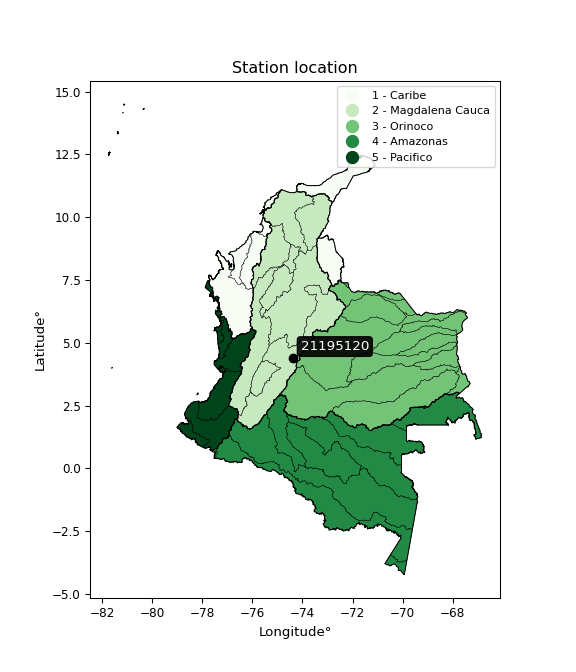

<div align="center">


</div>

# PMP Station (Rain, Pmax24h): 21195120

Probable Maximum Precipitation (PMP) is the greatest amount of rainfall for a specific duration that is meteorologically possible for a given location, acting as a "worst-case" scenario for extreme storms, crucial for designing safety-critical infrastructure like bridges, river deviations, dams, spillways, and nuclear plants to prevent catastrophic failure. PMP is calculated by hydrologists using meteorological data to determine the upper limit of extreme rainfall, often leading to the Probable Maximum Flood (PMF) for flood control design, and is increasingly being studied for climate change impacts. Probable Maximum Precipitation (PMP) is the theoretical upper limit of rainfall, a deterministic estimate for extreme events, while probability distributions (like GEV, Gumbel) describe the likelihood and frequency of various precipitation amounts, including rare ones, showing how often events occur, with PMP representing the extreme end of these distributions, used for critical infrastructure design to ensure safety against the worst conceivable weather, unlike standard statistical forecasts which cover typical probabilities.

The most common probability distributions in hydrology, used for analyzing floods, rainfall, and streamflow, include the Normal, Log-Normal, Gumbel, Gamma (including Log-Pearson Type III), and Generalized Extreme Value (GEV) distributions, often chosen based on the data´s skewness and whether modeling extremes or general conditions, with Gumbel and GEV popular for extreme events like floods, while the Normal distribution serves as a baseline, though often requiring transformations for skewed hydrological data. These distributions help in designing water infrastructure, managing water resources, and forecasting hydrologic events.

> Hydrological data often isn´t perfectly normal (it´s skewed), so different distributions are needed for different applications, such as: **Flood Frequency Analysis**: Using Gumbel, GEV, or Log-Pearson Type III for predicting extreme flood magnitudes and their return periods, **Rainfall Analysis**: Normal for annual totals, but Log-Normal, Weibull, or GEV for intensity or extreme daily rainfall, **Streamflow Modeling**: Gamma and Log-Normal for maximum flows, GEV for minimum flows, and Kappa for daily flows.

<div align="center">

</img>

</div>


## A. General information


### 1. General running parameters

• app_version: _v20260108_. • runtime: _2026-01-08 13:24:42.400241_. • Python version: _3.14.0_. • SciPy version: _1.16.3_. • Pandas version: _2.3.3_. • NumPy version: _2.3.5_. • Stations dataset (station_dataset_file): _dataset/pmax24h_in/automatic_colombia_2003_2024.csv_. • Stations catalog (station_catalog_file): _dataset/CNE.xls_. • Minimum year to eval til year_max (date_min): _1900_. • Maximum year to eval since year_min (date_max): _2024_. • Creates, save and include plots into reports (create_plot): _False_. • Plot only fit distributions with Δo > Δ (plot_only_fit): _True_. • Plot only simple graphs avoiding multiple CDFs and multiple Extreme values plots (plot_only_simple): _True_. • Eval low extreme values, if False, evaluates high extreme values (low_extreme): _False_. • Eval every SciPy distribution as logarithmic (pdist_logarithmic_on): _True_. • Standard deviation normalized (ddof): _1.0_. • Return periods to eval in years (Tr): _[2, 2.33, 5, 10, 15, 20, 25, 50, 75, 100, 200, 250, 500, 750, 1000]_. • Minimum data sample per station, 0 means any (minimum_sample): _5_. • Z-Score maximum threshold to adjust a value, 0 means disable (zscore_max): _3.5_. • Z-Score minimum threshold to adjust a value, 0 means disable (zscore_min): _-2.5_. • Avoid zeros, e.g. rain = 0 (avoid_zeros): _True_. • Avoid null values (avoid_nans): _True_. 

:file_folder:Table: [dataset.csv](../../dataset/pmax24h_in/automatic_colombia_2003_2024.csv)

> Delta Degrees of Freedom (DDOF): is a parameter used in the formulas for calculating variance and standard deviation. When ddof=0, the divisor is $N$ (the total number of observations) and this is used when your data set is the entire population. When ddof=1, the divisor is $N-1$ and this is used when your data set is a sample drawn from a larger population. Using $N-1$ provides an unbiased estimate of the population variance (known as Bessel´s correction).


### 2. Station info and location

|   id |   CODIGO | NOMBRE                   | CATEGORIA               | TECNOLOGIA                              | ESTADO   | FECHA_INSTALACION   |   FECHA_SUSPENSION |   ALTITUD |   LATITUD |   LONGITUD | DEPARTAMENTO   | MUNICIPIO   | AREA_OPERATIVA                            | ENTIDAD                                                     | AREA_HIDROGRAFICA   | ZONA_HIDROGRAFICA   | SUBZONA_HIDROGRAFICA   |   CORRIENTE | Catalogo   |   Version |
|-----:|---------:|:-------------------------|:------------------------|:----------------------------------------|:---------|:--------------------|-------------------:|----------:|----------:|-----------:|:---------------|:------------|:------------------------------------------|:------------------------------------------------------------|:--------------------|:--------------------|:-----------------------|------------:|:-----------|----------:|
|    0 | 21195120 | ITA VALSALICE [21195120] | Climatológica Principal | Automática con Telemetría, Convencional | Activa   | 15/02/1989          |                nan |      1421 |   4.39292 |   -74.3927 | Cundinamarca   | Silvania    | Area Operativa 11 - Cundinamarca-Amazonas | INSTITUTO DE HIDROLOGIA METEOROLOGIA Y ESTUDIOS AMBIENTALES | Magdalena Cauca     | Alto Magdalena      | Río Sumapaz            |         nan | CNE_IDEAM  |  20251226 |

<div align="center">

Dynamic map: [:earth_americas:Google](http://maps.google.com/maps?q=4.39292,-74.39272) [:earth_americas:OSM](https://www.openstreetmap.org/#map=18/4.39292/-74.39272&layers=P) [:earth_americas:Bing](https://www.bing.com/maps?cp=4.39292~-74.39272&lvl=18) [:earth_americas:Apple](https://maps.apple.com/frame?center=4.39292%2C-74.39272&span=0.003%2C0.006)

</div>


<div align="center">

```geojson
{
  "type": "Feature",
  "geometry": {
    "type": "Point", 
    "coordinates": [-74.39272, 4.39292]
  }, 
  "properties": {
    "Name": "21195120"
  }
}
```

</div>


### 3. Discrete values table and plot

<div align="center">

|               |          0 |            1 |          2 |           3 |          4 |          5 |
|:--------------|-----------:|-------------:|-----------:|------------:|-----------:|-----------:|
| Date          | 2019       | 2020         | 2021       | 2022        | 2023       | 2024       |
| Value         |   65       |   75.8       |   57.2     |   94.6      |   52.4     |  102.8     |
| Value_initial |   65       |   75.8       |   57.2     |   94.6      |   52.4     |  102.8     |
| count         |    6       |    6         |    6       |    6        |    6       |    6       |
| mean          |   74.6333  |   74.6333    |   74.6333  |   74.6333   |   74.6333  |   74.6333  |
| std           |   20.4178  |   20.4178    |   20.4178  |   20.4178   |   20.4178  |   20.4178  |
| zscore        |   -0.47181 |    0.0571397 |   -0.85383 |    0.977905 |   -1.08892 |    1.37952 |


</div>


> The initial value (value_initial) correspond to the initial obtained or null completed value, and value (value) is adjusted only when the initial value is outside the valid range (outlier) definite through the Z-Score value. If Z-Score is active, values out of range or outliers are replaced with the station mean value. A Z-Score (or standard score) measures how many standard deviations a data point is from the mean of a dataset, indicating its relative position; positive scores mean above the mean, negative mean below, and a score of zero is exactly at the mean, allowing for comparison of values from different distributions. It´s calculated using the formula $z=(x–μ)/σ$, where $x$ is the data point, $μ$ is the mean, and $σ$ is the standard deviation, helping identify outliers and understand probability.
>
> <sub>**Note**: In this study, "completing" (filling gaps in) and "extending" (forecasting or lengthening the historical record) rainfall data series are avoided for certain critical analyses because they introduce artificial bias and uncertainty, which can distort the statistics of rare events (extremes), alter day-to-day variability, and compromise the integrity and homogeneity of the original data. Some reasons against Completing/Extending rainfall data are: **Distortion of Extremes and Variability**: The primary issue is that most gap-filling or extension methods rely on averaging or regression with nearby stations, which inherently smooths the data. Rainfall is highly variable in space and time, with a large percentage of zero values and occasional large storms. Infilling methods often underestimate the highest values and overestimate the lowest (zero) values, which severely distorts analyses focused on flood frequency, drought severity, and intensity-duration-frequency (IDF) curves, **Loss of Data Homogeneity**: Infilled or extended data are synthetic estimates, not actual measurements. Combining these estimates with observed data can violate the assumption of data homogeneity, which requires that the data properties do not change over time. Inhomogeneity can lead to incorrect conclusions about long-term trends or changes in climate patterns, **Propagation of Errors**: Errors and biases from the original data (e.g., wind-induced undercatch, instrument errors, site changes) or the data used for imputation can propagate through the analysis, leading to unreliable hydrological models and inaccurate predictions, **Compromised Statistical Integrity**: For statistical analyses, especially those involving the frequency of events, using artificial data can introduce time bias or autocorrelation that doesn´t exist in reality, making it difficult to assess the true probability of events, **Difficulty in Validation**: It is difficult to accurately validate the quality of filled or extended data, especially for past periods where ground-truth measurements are unavailable. The reliability of imputation techniques heavily depends on the density of the surrounding station network and the complexity of the local topography.</sub>


### 4. Active continuous probability distributions from SciPy (43 of 104 available)

A Probability Density Function (PDF) describes the relative likelihood of a continuous random variable falling within a specific range, where the total area under its curve equals 1, and the area over any interval gives the actual probability for that range. Unlike discrete probabilities (like rolling a die), a PDF shows density, not direct probability for a single point (which is zero), with higher points indicating higher likelihood, often visualized as a bell curve for normal distributions.

A log of a probability density function (log-PDF) is simply the logarithm of the PDF´s value, denoted as $log(f(x))$, useful for converting multiplication of probabilities into addition, improving numerical stability with tiny numbers, and connecting to information theory concepts like entropy. Instead of dealing with very small probabilities (e.g., 0.000001), log-PDFs use negative numbers (e.g., $log(0.00001) ≈ -11.51$ that are easier for computers to handle, preventing underflow errors and simplifying complex calculations. In this study, each active probability distribution from SciPy is also evaluated in the $log$ form.

[scipy.stats](https://docs.scipy.org/doc/scipy/reference/stats.html) is a Python´s powerful submodule within the SciPy library for comprehensive statistical analysis, offering over 130 probability distributions (like Normal, Poisson), functions for descriptive stats (mean, variance), hypothesis testing (t-tests, chi-square), random variable generation, and statistical tests, making it essential for data science, modeling, and research. It provides tools to explore, model, and draw conclusions from data efficiently, working seamlessly with NumPy.

<div align="center">

|   id | p_dist             |   n_parameter | fit_method   | label                                                                       | active   | ref                                                                                                        |
|-----:|:-------------------|--------------:|:-------------|:----------------------------------------------------------------------------|:---------|:-----------------------------------------------------------------------------------------------------------|
|    0 | alpha              |             3 | MLE          | Alpha                                                                       | True     | [:mortar_board:](https://docs.scipy.org/doc/scipy/reference/generated/scipy.stats.alpha.html)              |
|    1 | betaprime          |             4 | MLE          | Beta prime                                                                  | True     | [:mortar_board:](https://docs.scipy.org/doc/scipy/reference/generated/scipy.stats.betaprime.html)          |
|    2 | chi2               |             3 | MLE          | Chi²                                                                        | True     | [:mortar_board:](https://docs.scipy.org/doc/scipy/reference/generated/scipy.stats.chi2.html)               |
|    3 | crystalball        |             4 | MLE          | Crystalball                                                                 | True     | [:mortar_board:](https://docs.scipy.org/doc/scipy/reference/generated/scipy.stats.crystalball.html)        |
|    4 | erlang             |             3 | MLE          | Erlang                                                                      | True     | [:mortar_board:](https://docs.scipy.org/doc/scipy/reference/generated/scipy.stats.erlang.html)             |
|    5 | expon              |             2 | MLE          | Exponential                                                                 | True     | [:mortar_board:](https://docs.scipy.org/doc/scipy/reference/generated/scipy.stats.expon.html)              |
|    6 | exponnorm          |             3 | MLE          | Exponentially modified Normal                                               | True     | [:mortar_board:](https://docs.scipy.org/doc/scipy/reference/generated/scipy.stats.exponnorm.html)          |
|    7 | f                  |             4 | MLE          | F                                                                           | True     | [:mortar_board:](https://docs.scipy.org/doc/scipy/reference/generated/scipy.stats.f.html)                  |
|    8 | fatiguelife        |             3 | MLE          | Fatigue-life (Birnbaum-Saunders)                                            | True     | [:mortar_board:](https://docs.scipy.org/doc/scipy/reference/generated/scipy.stats.fatiguelife.html)        |
|    9 | fisk               |             3 | MLE          | Fisk                                                                        | True     | [:mortar_board:](https://docs.scipy.org/doc/scipy/reference/generated/scipy.stats.fisk.html)               |
|   10 | gamma              |             3 | MLE          | Gamma                                                                       | True     | [:mortar_board:](https://docs.scipy.org/doc/scipy/reference/generated/scipy.stats.gamma.html)              |
|   11 | genexpon           |             5 | MLE          | Generalized exponential                                                     | True     | [:mortar_board:](https://docs.scipy.org/doc/scipy/reference/generated/scipy.stats.genexpon.html)           |
|   12 | genlogistic        |             3 | MLE          | Generalized logistic                                                        | True     | [:mortar_board:](https://docs.scipy.org/doc/scipy/reference/generated/scipy.stats.genlogistic.html)        |
|   13 | gibrat             |             2 | MM           | Gibrat                                                                      | True     | [:mortar_board:](https://docs.scipy.org/doc/scipy/reference/generated/scipy.stats.gibrat.html)             |
|   14 | gompertz           |             3 | MLE          | Gompertz (or truncated Gumbel)                                              | True     | [:mortar_board:](https://docs.scipy.org/doc/scipy/reference/generated/scipy.stats.gompertz.html)           |
|   15 | gumbel_l           |             2 | MM           | Gumbel Left Skew                                                            | True     | [:mortar_board:](https://docs.scipy.org/doc/scipy/reference/generated/scipy.stats.gumbel_l.html)           |
|   16 | gumbel_r           |             2 | MM           | Gumbel Right Skew                                                           | True     | [:mortar_board:](https://docs.scipy.org/doc/scipy/reference/generated/scipy.stats.gumbel_r.html)           |
|   17 | halflogistic       |             2 | MM           | Half-logistic                                                               | True     | [:mortar_board:](https://docs.scipy.org/doc/scipy/reference/generated/scipy.stats.halflogistic.html)       |
|   18 | halfnorm           |             2 | MM           | Half Normal                                                                 | True     | [:mortar_board:](https://docs.scipy.org/doc/scipy/reference/generated/scipy.stats.halfnorm.html)           |
|   19 | hypsecant          |             2 | MM           | hyperbolic secant                                                           | True     | [:mortar_board:](https://docs.scipy.org/doc/scipy/reference/generated/scipy.stats.hypsecant.html)          |
|   20 | invgamma           |             3 | MLE          | Inverted gamma                                                              | True     | [:mortar_board:](https://docs.scipy.org/doc/scipy/reference/generated/scipy.stats.invgamma.html)           |
|   21 | invgauss           |             3 | MLE          | Inverse Gaussian                                                            | True     | [:mortar_board:](https://docs.scipy.org/doc/scipy/reference/generated/scipy.stats.invgauss.html)           |
|   22 | invweibull         |             3 | MLE          | Inverted Weibull                                                            | True     | [:mortar_board:](https://docs.scipy.org/doc/scipy/reference/generated/scipy.stats.invweibull.html)         |
|   23 | kstwobign          |             2 | MLE          | Limiting distribution of scaled Kolmogorov-Smirnov two-sided test statistic | True     | [:mortar_board:](https://docs.scipy.org/doc/scipy/reference/generated/scipy.stats.kstwobign.html)          |
|   24 | laplace            |             2 | MM           | Laplace                                                                     | True     | [:mortar_board:](https://docs.scipy.org/doc/scipy/reference/generated/scipy.stats.laplace.html)            |
|   25 | laplace_asymmetric |             3 | MLE          | Asymmetric Laplace                                                          | True     | [:mortar_board:](https://docs.scipy.org/doc/scipy/reference/generated/scipy.stats.laplace_asymmetric.html) |
|   26 | loggamma           |             3 | MLE          | Log gamma                                                                   | True     | [:mortar_board:](https://docs.scipy.org/doc/scipy/reference/generated/scipy.stats.loggamma.html)           |
|   27 | logistic           |             2 | MM           | Logistic (or Sech-squared)                                                  | True     | [:mortar_board:](https://docs.scipy.org/doc/scipy/reference/generated/scipy.stats.logistic.html)           |
|   28 | lognorm            |             3 | MLE          | Log Normal                                                                  | True     | [:mortar_board:](https://docs.scipy.org/doc/scipy/reference/generated/scipy.stats.lognorm.html)            |
|   29 | maxwell            |             2 | MM           | Maxwell                                                                     | True     | [:mortar_board:](https://docs.scipy.org/doc/scipy/reference/generated/scipy.stats.maxwell.html)            |
|   30 | mielke             |             4 | MLE          | Mielke Beta-Kappa / Dagum                                                   | True     | [:mortar_board:](https://docs.scipy.org/doc/scipy/reference/generated/scipy.stats.mielke.html)             |
|   31 | moyal              |             2 | MM           | Moyal                                                                       | True     | [:mortar_board:](https://docs.scipy.org/doc/scipy/reference/generated/scipy.stats.moyal.html)              |
|   32 | nakagami           |             3 | MLE          | Nakagami                                                                    | True     | [:mortar_board:](https://docs.scipy.org/doc/scipy/reference/generated/scipy.stats.nakagami.html)           |
|   33 | ncf                |             5 | MLE          | Non-central F distribution                                                  | True     | [:mortar_board:](https://docs.scipy.org/doc/scipy/reference/generated/scipy.stats.ncf.html)                |
|   34 | nct                |             4 | MLE          | Non-central Student’s t                                                     | True     | [:mortar_board:](https://docs.scipy.org/doc/scipy/reference/generated/scipy.stats.nct.html)                |
|   35 | norm               |             2 | MM           | Normal                                                                      | True     | [:mortar_board:](https://docs.scipy.org/doc/scipy/reference/generated/scipy.stats.norm.html)               |
|   36 | pearson3           |             3 | MM           | Pearson type III                                                            | True     | [:mortar_board:](https://docs.scipy.org/doc/scipy/reference/generated/scipy.stats.pearson3.html)           |
|   37 | rayleigh           |             2 | MM           | Rayleigh                                                                    | True     | [:mortar_board:](https://docs.scipy.org/doc/scipy/reference/generated/scipy.stats.rayleigh.html)           |
|   38 | rice               |             3 | MLE          | Rice                                                                        | True     | [:mortar_board:](https://docs.scipy.org/doc/scipy/reference/generated/scipy.stats.rice.html)               |
|   39 | t                  |             3 | MLE          | Student’s t                                                                 | True     | [:mortar_board:](https://docs.scipy.org/doc/scipy/reference/generated/scipy.stats.t.html)                  |
|   40 | truncnorm          |             4 | MLE          | Truncated normal                                                            | True     | [:mortar_board:](https://docs.scipy.org/doc/scipy/reference/generated/scipy.stats.truncnorm.html)          |
|   41 | wald               |             2 | MM           | Wald                                                                        | True     | [:mortar_board:](https://docs.scipy.org/doc/scipy/reference/generated/scipy.stats.wald.html)               |
|   42 | weibull_min        |             3 | MLE          | Weibull minimum                                                             | True     | [:mortar_board:](https://docs.scipy.org/doc/scipy/reference/generated/scipy.stats.weibull_min.html)        |

</div>

> **n_parameter:** # arguments & localization & scale.
>
> **Fit methods:** (MLE) maximum likelihood, (MM) L-moments.
>
>**Inactive** (With the only purpose of prevent loops, zero divisions, infinite values, over high estimated values or horizontal trending for recurrence intervals estimations, the follow distributions were disabled.)**:** foldnorm, gennorm, norminvgauss, powernorm, powerlognorm, skewnorm, genextreme, anglit, arcsine, argus, beta, bradford, burr, burr12, cauchy, cosine, halfcauchy, foldcauchy, skewcauchy, wrapcauchy, dgamma, gengamma, exponweib, exponpow, truncexpon, gausshyper, genhalflogistic, genhyperbolic, geninvgauss, halfgennorm, johnsonsb, johnsonsu, kappa4, kappa3, ksone, kstwo, loglaplace, levy, levy_l, levy_stable, ncx2, pareto, genpareto, truncpareto, lomax, powerlaw, rdist, rel_breitwigner, recipinvgauss, semicircular, studentized_range, trapezoid, triang, truncweibull_min, tukeylambda, uniform, loguniform, vonmises, vonmises_line, weibull_max, dweibull, 


## B. Probability (PDF) vs. Empirical (EDF) distributions functions

A continuous probability distribution (CPD) describes probabilities for variables that can take any value within a range (like rain any time), unlike discrete variables with specific outcomes (like temperature). It uses a Probability Density Function (PDF), a curve where the total area under it equals 1, and the probability of the variable falling within an interval (a to b) is found by calculating the area under the curve between those points. A key feature is that the probability of hitting any single exact value is zero, so probabilities are always expressed for ranges, e.g., $P(a ≤ X ≤ b)$.

<div align="center">

Distributions parameters from station values
|    |   station | p_dist                |   n |              loc |           scale | shape                 | shape1                | shape2              | shape3   |
|---:|----------:|:----------------------|----:|-----------------:|----------------:|:----------------------|:----------------------|:--------------------|:---------|
|  0 |  21195120 | alpha                 |   6 |     -5.50451     |   339.926       | 4.471327346308547     |                       |                     |          |
|  1 |  21195120 | betaprime             |   6 |     -0.15563     |    39.547       | 47.295272467278956    | 26.062485092616893    |                     |          |
|  2 |  21195120 | chi2                  |   6 |     52.4         |     2.08485     | 0.3873419057559052    |                       |                     |          |
|  3 |  21195120 | crystalball           |   6 |     74.6333      |    18.6388      | 5219.860228357384     | 3697.999424814444     |                     |          |
|  4 |  21195120 | erlang                |   6 |     52.4         |    22.09        | 0.5886308191391731    |                       |                     |          |
|  5 |  21195120 | expon                 |   6 |     52.4         |    22.2333      |                       |                       |                     |          |
|  6 |  21195120 | exponnorm             |   6 |     52.3712      |     0.00900491  | 2471.185458384385     |                       |                     |          |
|  7 |  21195120 | f                     |   6 |      0.912488    |    69.0841      | 1056.0569602186965    | 34.51931927736311     |                     |          |
|  8 |  21195120 | fatiguelife           |   6 |     52.4         |     7.69179e-06 | 1626.6758934970344    |                       |                     |          |
|  9 |  21195120 | fisk                  |   6 |     52.4         |     6.61094     | 0.766436370700955     |                       |                     |          |
| 10 |  21195120 | gamma                 |   6 |     52.4         |    21.3574      | 0.4877182720701819    |                       |                     |          |
| 11 |  21195120 | genexpon              |   6 |     52.3999      |     2.14951     | 0.09591333507013997   | 4.285659420953216e-07 | 1.2717262394312336  |          |
| 12 |  21195120 | genlogistic           |   6 |    -43.1619      |    14.9072      | 1485.566115987132     |                       |                     |          |
| 13 |  21195120 | gibrat                |   6 |     60.4143      |     8.62429     |                       |                       |                     |          |
| 14 |  21195120 | gompertz              |   6 |     52.4         |    59.2115      | 1.88196680628265      |                       |                     |          |
| 15 |  21195120 | gumbel_l              |   6 |     83.0218      |    14.5326      |                       |                       |                     |          |
| 16 |  21195120 | gumbel_r              |   6 |     66.2449      |    14.5326      |                       |                       |                     |          |
| 17 |  21195120 | halflogistic          |   6 |     52.542       |    15.9355      |                       |                       |                     |          |
| 18 |  21195120 | halfnorm              |   6 |     49.9628      |    30.9199      |                       |                       |                     |          |
| 19 |  21195120 | hypsecant             |   6 |     74.6333      |    11.8658      |                       |                       |                     |          |
| 20 |  21195120 | invgamma              |   6 |     35.5145      |   129.372       | 4.223157062597173     |                       |                     |          |
| 21 |  21195120 | invgauss              |   6 |     45.9168      |    37.9939      | 0.7558193084554008    |                       |                     |          |
| 22 |  21195120 | invweibull            |   6 |     52.4         |     1.30423     | 0.06014273096558627   |                       |                     |          |
| 23 |  21195120 | kstwobign             |   6 |     14.5125      |    68.7097      |                       |                       |                     |          |
| 24 |  21195120 | laplace               |   6 |     74.6333      |    13.1796      |                       |                       |                     |          |
| 25 |  21195120 | laplace_asymmetric    |   6 |     52.4         |     0.00713361  | 0.0003208871178714105 |                       |                     |          |
| 26 |  21195120 | loggamma              |   6 |  -5029.25        |   704.716       | 1397.9137651867518    |                       |                     |          |
| 27 |  21195120 | logistic              |   6 |     74.6333      |    10.2761      |                       |                       |                     |          |
| 28 |  21195120 | lognorm               |   6 |     52.4         |     0.0526858   | 13.276110805080549    |                       |                     |          |
| 29 |  21195120 | maxwell               |   6 |     30.4672      |    27.677       |                       |                       |                     |          |
| 30 |  21195120 | mielke                |   6 |     -8.88946     |    24.1205      | 2153.732758255388     | 5.394128257695112     |                     |          |
| 31 |  21195120 | moyal                 |   6 |     63.9745      |     8.39042     |                       |                       |                     |          |
| 32 |  21195120 | nakagami              |   6 |     52.4         |    35.6615      | 0.23730653888601044   |                       |                     |          |
| 33 |  21195120 | ncf                   |   6 |     -0.905612    |    72.5182      | 104.91668621879589    | 49.243450290452586    | 0.00629637056503117 |          |
| 34 |  21195120 | nct                   |   6 |     -0.163376    |     1.84281     | 9.03937159452336      | 37.15203120580189     |                     |          |
| 35 |  21195120 | norm                  |   6 |     74.6333      |    18.6388      |                       |                       |                     |          |
| 36 |  21195120 | pearson3              |   6 |     74.6333      |    18.6389      | 0.33779043386790597   |                       |                     |          |
| 37 |  21195120 | rayleigh              |   6 |     38.9762      |    28.4503      |                       |                       |                     |          |
| 38 |  21195120 | rice                  |   6 |     42.4846      |    25.2705      | 0.40306724430501595   |                       |                     |          |
| 39 |  21195120 | t                     |   6 |     74.6302      |    18.6373      | 1949298.6788191665    |                       |                     |          |
| 40 |  21195120 | truncnorm             |   6 |    -11.7292      |     4.40712     | 3.389485200828827     | 25.98728364520035     |                     |          |
| 41 |  21195120 | wald                  |   6 |     55.9946      |    18.6388      |                       |                       |                     |          |
| 42 |  21195120 | weibull_min           |   6 |     52.4         |    20.5499      | 0.7312222720101313    |                       |                     |          |
| 43 |  21195120 | logalpha              |   6 |      0.605037    |    54.779       | 14.971924436498895    |                       |                     |          |
| 44 |  21195120 | logbetaprime          |   6 |      2.83841     |     7.52976     | 39.94201478188296     | 210.02777274003358    |                     |          |
| 45 |  21195120 | logchi2               |   6 |      3.95891     |     0.975243    | 0.9819417392490495    |                       |                     |          |
| 46 |  21195120 | logcrystalball        |   6 |      4.28173     |     0.24773     | 3592.798683526211     | 16.27129383685711     |                     |          |
| 47 |  21195120 | logerlang             |   6 |      3.30721     |     0.0617151   | 15.776093096227235    |                       |                     |          |
| 48 |  21195120 | logexpon              |   6 |      3.95891     |     0.322825    |                       |                       |                     |          |
| 49 |  21195120 | logexponnorm          |   6 |      4.25433     |     0.24621     | 0.1112787498750557    |                       |                     |          |
| 50 |  21195120 | logf                  |   6 |      3.95891     |     0.343116    | 1.461874527520915     | 590.0419752315604     |                     |          |
| 51 |  21195120 | logfatiguelife        |   6 |      3.83773     |     0.357714    | 0.6900379927485751    |                       |                     |          |
| 52 |  21195120 | logfisk               |   6 |      3.84349     |     0.374226    | 2.423359466697037     |                       |                     |          |
| 53 |  21195120 | loggamma              |   6 |      3.36968     |     0.0667699   | 13.63009236768211     |                       |                     |          |
| 54 |  21195120 | loggenexpon           |   6 |      3.95891     |     0.539199    | 1.2791273571616424    | 0.9932168021727761    | 1.0976182693183785  |          |
| 55 |  21195120 | loggenlogistic        |   6 |      2.72325     |     0.209154    | 964.9698230730901     |                       |                     |          |
| 56 |  21195120 | loggibrat             |   6 |      4.09279     |     0.114599    |                       |                       |                     |          |
| 57 |  21195120 | loggompertz           |   6 |      3.95891     |     0.554399    | 1.0299534412228373    |                       |                     |          |
| 58 |  21195120 | loggumbel_l           |   6 |      4.39322     |     0.193154    |                       |                       |                     |          |
| 59 |  21195120 | loggumbel_r           |   6 |      4.17024     |     0.193154    |                       |                       |                     |          |
| 60 |  21195120 | loghalflogistic       |   6 |      3.98804     |     0.211851    |                       |                       |                     |          |
| 61 |  21195120 | loghalfnorm           |   6 |      3.95383     |     0.410958    |                       |                       |                     |          |
| 62 |  21195120 | loghypsecant          |   6 |      4.28173     |     0.15771     |                       |                       |                     |          |
| 63 |  21195120 | loginvgamma           |   6 |      2.78905     |    53.4338      | 36.80569477823511     |                       |                     |          |
| 64 |  21195120 | loginvgauss           |   6 |      3.75155     |     1.77372     | 0.29890931491170214   |                       |                     |          |
| 65 |  21195120 | loginvweibull         |   6 |     -3.42047e+06 |     3.42047e+06 | 16352075.6392991      |                       |                     |          |
| 66 |  21195120 | logkstwobign          |   6 |      3.44369     |     0.956493    |                       |                       |                     |          |
| 67 |  21195120 | loglaplace            |   6 |      4.28173     |     0.175171    |                       |                       |                     |          |
| 68 |  21195120 | loglaplace_asymmetric |   6 |      4.04655     |     0.152524    | 0.49172365078027935   |                       |                     |          |
| 69 |  21195120 | logloggamma           |   6 |    -49.342       |     7.79045     | 976.3149933887123     |                       |                     |          |
| 70 |  21195120 | loglogistic           |   6 |      4.28173     |     0.136581    |                       |                       |                     |          |
| 71 |  21195120 | loglognorm            |   6 |      3.95891     |     0.00103548  | 12.75373674866422     |                       |                     |          |
| 72 |  21195120 | logmaxwell            |   6 |      3.69472     |     0.367857    |                       |                       |                     |          |
| 73 |  21195120 | logmielke             |   6 | -19601.5         | 19604.9         | 4640694.261424126     | 94478.60764618884     |                     |          |
| 74 |  21195120 | logmoyal              |   6 |      4.14006     |     0.111518    |                       |                       |                     |          |
| 75 |  21195120 | lognakagami           |   6 |      3.95891     |     0.557671    | 0.11515593091075926   |                       |                     |          |
| 76 |  21195120 | logncf                |   6 |     -1.42015     |     4.79542e-05 | 0.009047344213855571  | 440.5659720344527     | 1074.6104194409468  |          |
| 77 |  21195120 | lognct                |   6 |      0.143218    |     0.0941354   | 165.70767984184167    | 43.751816132648095    |                     |          |
| 78 |  21195120 | lognorm               |   6 |      4.28173     |     0.24773     |                       |                       |                     |          |
| 79 |  21195120 | logpearson3           |   6 |      4.28173     |     0.24773     | 0.16122446590513953   |                       |                     |          |
| 80 |  21195120 | lograyleigh           |   6 |      3.80781     |     0.378135    |                       |                       |                     |          |
| 81 |  21195120 | logrice               |   6 |      3.83298     |     0.318944    | 0.7635182653582127    |                       |                     |          |
| 82 |  21195120 | logt                  |   6 |      4.28173     |     0.247732    | 988218153.5105438     |                       |                     |          |
| 83 |  21195120 | logtruncnorm          |   6 |     -0.0573187   |     1.21044     | 3.317981715935265     | 5.363698062627024     |                     |          |
| 84 |  21195120 | logwald               |   6 |      4.03403     |     0.247705    |                       |                       |                     |          |
| 85 |  21195120 | logweibull_min        |   6 |      3.95891     |     0.309011    | 0.7036900401084534    |                       |                     |          |

</div>

> **loc** (Location parameter): This shifts the distribution along the x-axis. For many common distributions, like the normal (Gaussian) distribution, loc represents the mean $μ$. For others, like the uniform distribution, it might represent the minimum value, or for the beta distribution, the left end of the support interval.
>
> **scale** (Scale parameter): This determines the width or spread of the distribution. For the normal distribution, scale represents the standard deviation $σ$. For a uniform distribution, it defines the length of the interval (from $loc$ to $loc + scale$).
>
> **shape** (Shape parameters): Refers to parameters that define the specific form of a probability distribution, distinct from its location (loc) and scale (scale). These parameters are required arguments for most distribution functions. For example, a normal (Gaussian) distribution is fully defined by its location (mean) and scale (standard deviation), so it has no specific shape parameters beyond loc and scale. However, other distributions have intrinsic properties that need specification, as Gamma distribution that takes a shape parameter, often named $a$ or $alpha$.


### 0. Cumulative distribution values - CDF (86 evaluated)

Cumulative Distribution Function (CDF), denoted as $F$<sub>$X$</sub>$(x)$, is a function that gives the probability that a random variable $X$ will take a value less than or equal to a specific value, $x$ (i.e., $(P(X≥x)$. It essentially "accumulates" probabilities from a given point up to the far right (positive infinity), providing a complete picture of the distribution´s probabilities for both discrete (like rain) and continuous (like temperature) variables, helping to find probabilities over ranges or above certain values. Each station is evaluated separately ordering the $x$ values ascending, calculating the CDF and PDF values for the activated distributions and their logarithmic forms.

<div align="center">

CDF ordered by x ascending and calculating $log(f(x))$ separately
|   id |   Station |   date |     x |   count |    mean |     std |     zscore |   Value_initial |   station |   m |    alpha |   alpha_pdf |   betaprime |   betaprime_pdf |       chi2 |    chi2_pdf |   crystalball |   crystalball_pdf |      erlang |     erlang_pdf |    expon |   expon_pdf |   exponnorm |   exponnorm_pdf |         f |      f_pdf |   fatiguelife |   fatiguelife_pdf |        fisk |    fisk_pdf |      gamma |   gamma_pdf |    genexpon |   genexpon_pdf |   genlogistic |   genlogistic_pdf |   gibrat |   gibrat_pdf |    gompertz |   gompertz_pdf |   gumbel_l |   gumbel_l_pdf |   gumbel_r |   gumbel_r_pdf |   halflogistic |   halflogistic_pdf |   halfnorm |   halfnorm_pdf |   hypsecant |   hypsecant_pdf |   invgamma |   invgamma_pdf |   invgauss |   invgauss_pdf |   invweibull |   invweibull_pdf |   kstwobign |   kstwobign_pdf |   laplace |   laplace_pdf |   laplace_asymmetric |   laplace_asymmetric_pdf |   loggamma |   loggamma_pdf |   logistic |   logistic_pdf |   lognorm |   lognorm_pdf |   maxwell |   maxwell_pdf |   mielke |   mielke_pdf |     moyal |   moyal_pdf |    nakagami |   nakagami_pdf |       ncf |    ncf_pdf |      nct |    nct_pdf |     norm |   norm_pdf |   pearson3 |   pearson3_pdf |   rayleigh |   rayleigh_pdf |      rice |   rice_pdf |        t |      t_pdf |   truncnorm |   truncnorm_pdf |        wald |   wald_pdf |   weibull_min |   weibull_min_pdf |   logalpha |   logalpha_pdf |   logbetaprime |   logbetaprime_pdf |     logchi2 |   logchi2_pdf |   logcrystalball |   logcrystalball_pdf |   logerlang |   logerlang_pdf |   logexpon |   logexpon_pdf |   logexponnorm |   logexponnorm_pdf |        logf |     logf_pdf |   logfatiguelife |   logfatiguelife_pdf |   logfisk |   logfisk_pdf |   loggenexpon |   loggenexpon_pdf |   loggenlogistic |   loggenlogistic_pdf |   loggibrat |   loggibrat_pdf |   loggompertz |   loggompertz_pdf |   loggumbel_l |   loggumbel_l_pdf |   loggumbel_r |   loggumbel_r_pdf |   loghalflogistic |   loghalflogistic_pdf |   loghalfnorm |   loghalfnorm_pdf |   loghypsecant |   loghypsecant_pdf |   loginvgamma |   loginvgamma_pdf |   loginvgauss |   loginvgauss_pdf |   loginvweibull |   loginvweibull_pdf |   logkstwobign |   logkstwobign_pdf |   loglaplace |   loglaplace_pdf |   loglaplace_asymmetric |   loglaplace_asymmetric_pdf |   logloggamma |   logloggamma_pdf |   loglogistic |   loglogistic_pdf |   loglognorm |   loglognorm_pdf |   logmaxwell |   logmaxwell_pdf |   logmielke |   logmielke_pdf |   logmoyal |   logmoyal_pdf |   lognakagami |   lognakagami_pdf |   logncf |   logncf_pdf |    lognct |   lognct_pdf |   logpearson3 |   logpearson3_pdf |   lograyleigh |   lograyleigh_pdf |   logrice |   logrice_pdf |     logt |   logt_pdf |   logtruncnorm |   logtruncnorm_pdf |     logwald |   logwald_pdf |   logweibull_min |   logweibull_min_pdf |
|-----:|----------:|-------:|------:|--------:|--------:|--------:|-----------:|----------------:|----------:|----:|---------:|------------:|------------:|----------------:|-----------:|------------:|--------------:|------------------:|------------:|---------------:|---------:|------------:|------------:|----------------:|----------:|-----------:|--------------:|------------------:|------------:|------------:|-----------:|------------:|------------:|---------------:|--------------:|------------------:|---------:|-------------:|------------:|---------------:|-----------:|---------------:|-----------:|---------------:|---------------:|-------------------:|-----------:|---------------:|------------:|----------------:|-----------:|---------------:|-----------:|---------------:|-------------:|-----------------:|------------:|----------------:|----------:|--------------:|---------------------:|-------------------------:|-----------:|---------------:|-----------:|---------------:|----------:|--------------:|----------:|--------------:|---------:|-------------:|----------:|------------:|------------:|---------------:|----------:|-----------:|---------:|-----------:|---------:|-----------:|-----------:|---------------:|-----------:|---------------:|----------:|-----------:|---------:|-----------:|------------:|----------------:|------------:|-----------:|--------------:|------------------:|-----------:|---------------:|---------------:|-------------------:|------------:|--------------:|-----------------:|---------------------:|------------:|----------------:|-----------:|---------------:|---------------:|-------------------:|------------:|-------------:|-----------------:|---------------------:|----------:|--------------:|--------------:|------------------:|-----------------:|---------------------:|------------:|----------------:|--------------:|------------------:|--------------:|------------------:|--------------:|------------------:|------------------:|----------------------:|--------------:|------------------:|---------------:|-------------------:|--------------:|------------------:|--------------:|------------------:|----------------:|--------------------:|---------------:|-------------------:|-------------:|-----------------:|------------------------:|----------------------------:|--------------:|------------------:|--------------:|------------------:|-------------:|-----------------:|-------------:|-----------------:|------------:|----------------:|-----------:|---------------:|--------------:|------------------:|---------:|-------------:|----------:|-------------:|--------------:|------------------:|--------------:|------------------:|----------:|--------------:|---------:|-----------:|---------------:|-------------------:|------------:|--------------:|-----------------:|---------------------:|
|    0 |  21195120 |   2023 |  52.4 |       6 | 74.6333 | 20.4178 | -1.08892   |            52.4 |  21195120 |   1 | 0.080888 |  0.0151983  |   0.0945934 |      0.0134192  | 0.00149982 | 4.08803e+10 |      0.116464 |        0.0105079  | 8.51278e-10 | 70522          | 0        |  0.0449775  |  0.00129519 |      0.0448494  | 0.0911988 | 0.0142646  |      0.030747 |       7.80991e+10 | 1.77707e-09 | 53.7992     | 3.1896e-08 | 2.18935e+06 | 2.79475e-06 |     0.0446208  |      0.087103 |        0.0142492  | 0        |   0          | 6.54929e-15 |     0.0317838  |   0.114488 |     0.00740876 |  0.0748225 |      0.0133484 |       0        |         0          |  0.0628256 |     0.0257249  |   0.0969957 |      0.00804844 |  0.0651447 |     0.0189146  |  0.0516211 |     0.0257193  |   0.00074006 |      4.51566e+10 |   0.0786108 |      0.0147623  | 0.0925419 |    0.00702159 |          1.03178e-07 |               0.0449824  |  0.0802769 |       0.81066  |   0.103068 |     0.00899609 | 0.0962646 |      0.688941 |  0.110003 |     0.0132253 |      nan |          nan | 0.0462392 |  0.0130012  | 2.76328e-08 |    1.84576e+06 | 0.0956559 | 0.0134224  | 0.085505 | 0.01491    | 0.116464 | 0.0105079  |   0.10999  |     0.0117275  |   0.105342 |     0.0148375  | 0.0685197 | 0.0133378  | 0.116478 | 0.0105096  |           1 |    2.71637e-44  | 0           | 0          |    4.9478e-12 |      509.18       |  0.0867313 |       0.769325 |      0.0900356 |           0.792453 | 2.35768e-08 |   2.60658e+07 |        0.0962647 |             0.688941 |   0.0795697 |        0.791602 |   0        |       3.09765  |      0.0962027 |           0.689361 | 1.13981e-11 | 18760.4      |        0.0498328 |             1.41479  | 0.0546519 |      1.08477  |   1.01301e-10 |          2.37227  |        0.0728657 |             0.911226 |    0        |        0        |   2.13436e-09 |          1.85778  |      0.100173 |          0.491726 |     0.0504614 |          0.780234 |          0        |              0        |    0.00984761 |          1.94138  |      0.0817526 |           0.512694 |     0.0788751 |          0.8201   |      0.056508 |          1.15241  |       0.0723892 |            0.908669 |      0.0662441 |           0.964842 |    0.0791781 |         0.452003 |               0.0605146 |                    0.806867 |      0.098321 |          0.685587 |     0.0859891 |          0.575448 |    0.0127783 |      5.82312e+12 |    0.0845918 |         0.864437 |   0.0733627 |        0.899421 |   0.024263 |       0.636993 |   0.000274676 |       1.42452e+11 | 0.263157 |     0.666854 | 0.0903538 |     0.742398 |     0.0926414 |          0.721275 |     0.0767302 |          0.975642 | 0.0566554 |      0.875116 | 0.096267 |   0.688947 |    4.17647e-07 |           2.95798  | 0           |     0         |      3.59317e-11 |         56936.3      |
|    1 |  21195120 |   2021 |  57.2 |       6 | 74.6333 | 20.4178 | -0.85383   |            57.2 |  21195120 |   2 | 0.171122 |  0.0219699  |   0.171522  |      0.0184678  | 0.959795   | 0.0142558   |      0.174811 |        0.0138205  | 0.421899    |     0.0450291  | 0.194178 |  0.0362439  |  0.195069   |      0.0361721  | 0.173644  | 0.0198355  |      0.686385 |       0.0179364   | 0.43897     |  0.0393238  | 0.507442   | 0.0442333   | 0.1928      |     0.0360182  |      0.170477 |        0.0202198  | 0        |   0          | 0.146932    |     0.0294033  |   0.15564  |     0.0098293  |  0.15515   |      0.0198932 |       0.145118 |         0.0307157  |  0.185063  |     0.0251076  |   0.143985  |      0.0117248  |  0.181029  |     0.0279118  |  0.207275  |     0.0348847  |   0.39668    |      0.00459566  |   0.165076  |      0.0208534  | 0.133201  |    0.0101066  |          0.194197    |               0.036247   |  0.171289  |       1.2572   |   0.154924 |     0.0127405  | 0.171226  |      1.0262   |  0.182526 |     0.0168689 |      nan |          nan | 0.1343    |  0.0232055  | 0.301588    |    0.0297169   | 0.172338  | 0.0183582  | 0.172652 | 0.0210373  | 0.174811 | 0.0138205  |   0.175523 |     0.0155397  |   0.185476 |     0.0183387  | 0.144749  | 0.01818    | 0.174834 | 0.0138228  |           1 |    1.96568e-51  | 0.000222254 | 0.00150346 |    0.291985   |        0.0372421  |  0.172279  |       1.18039  |      0.177431  |           1.19745  | 0.24247     |   1.31779     |        0.171226  |             1.0262   |   0.168649  |        1.23444  |   0.237766 |       2.36114  |      0.171221  |           1.02705  | 0.296572    |     2.21642  |        0.214915  |             2.10115  | 0.185207  |      1.80087  |   0.198689    |          2.14212  |        0.178473  |             1.46921  |    0        |        0        |   0.161723    |          1.82407  |      0.153093 |          0.728566 |     0.149997  |          1.47325  |          0.13723  |              2.3157   |    0.178501   |          1.89273  |      0.140954  |           0.864834 |     0.171763  |          1.28897  |      0.192875 |          1.83534  |       0.177832  |            1.46814  |      0.178169  |           1.54008  |    0.130588  |         0.74549  |               0.194712  |                    2.59618  |      0.172618 |          1.01448  |     0.151627  |          0.941835 |    0.636084  |      0.335919    |    0.178145  |         1.25586  |   0.177645  |        1.45354  |   0.128301 |       1.71159  |   0.538349    |       1.41102     | 0.324199 |     0.722973 | 0.172183  |     1.12532  |     0.171657  |          1.08387  |     0.180709  |          1.36797  | 0.154836  |      1.33689  | 0.171229 |   1.0262   |    0.230277    |           2.32015  | 2.31119e-05 |     0.0190544 |      0.337688    |             2.1909   |
|    2 |  21195120 |   2019 |  65   |       6 | 74.6333 | 20.4178 | -0.47181   |            65   |  21195120 |   3 | 0.363169 |  0.0256602  |   0.33723   |      0.0231004  | 0.996544   | 0.00100838  |      0.302633 |        0.0187278  | 0.661246    |     0.021268   | 0.432615 |  0.0255196  |  0.433069   |      0.0254769  | 0.349582  | 0.0241339  |      0.784304 |       0.0091401   | 0.621126    |  0.0143146  | 0.729915   | 0.0187252   | 0.430062    |     0.0254312  |      0.350409 |        0.024641   | 0.263812 |   0.0712639  | 0.359993    |     0.0251656  |   0.251256 |     0.0149082  |  0.336406  |      0.0252186 |       0.372124 |         0.0270316  |  0.373264  |     0.0229268  |   0.266032  |      0.0198996  |  0.404568  |     0.0271775  |  0.4508    |     0.0263717  |   0.417911   |      0.00174042  |   0.3472    |      0.0245501  | 0.240732  |    0.0182654  |          0.43265     |               0.0255208  |  0.361731  |       1.64753  |   0.281416 |     0.0196787  | 0.332394  |      1.46609  |  0.330769 |     0.0206061 |      nan |          nan | 0.34685   |  0.0287357  | 0.474506    |    0.0174501   | 0.336531  | 0.0228408  | 0.356869 | 0.024817   | 0.302633 | 0.0187278  |   0.317059 |     0.0203005  |   0.341867 |     0.0211598  | 0.306623  | 0.0225676  | 0.302677 | 0.0187305  |           1 |    3.90359e-64  | 0.349987    | 0.0483398  |    0.503064   |        0.0201669  |  0.353779  |       1.59878  |      0.35977   |           1.59422  | 0.369221    |   0.780767    |        0.332394  |             1.46609  |   0.357059  |        1.64175  |   0.487003 |       1.58909  |      0.33251   |           1.46697  | 0.514069    |     1.32467  |        0.464961  |             1.71148  | 0.426003  |      1.79078  |   0.443888    |          1.68299  |        0.392337  |             1.75424  |    0.367055 |        4.61519  |   0.386915    |          1.68002  |      0.275359 |          1.20832  |     0.375778  |          1.90415  |          0.413485 |              1.95664  |    0.408511   |          1.68112  |      0.298363  |           1.62674  |     0.366482  |          1.67307  |      0.432503 |          1.77319  |       0.391698  |            1.75509  |      0.396229  |           1.7504   |    0.270917  |         1.54658  |               0.466705  |                    1.7193   |      0.331784 |          1.44869  |     0.313041  |          1.5745   |    0.662225  |      0.132992    |    0.363135  |         1.57605  |   0.390317  |        1.75271  |   0.391244 |       2.1238   |   0.661301    |       0.695999    | 0.420004 |     0.768163 | 0.346497  |     1.55318  |     0.34035   |          1.51493  |     0.374937  |          1.60249  | 0.351134  |      1.66015  | 0.332396 |   1.46608  |    0.479158    |           1.61284  | 0.420636    |     3.19926   |      0.539728    |             1.16631  |
|    3 |  21195120 |   2020 |  75.8 |       6 | 74.6333 | 20.4178 |  0.0571397 |            75.8 |  21195120 |   4 | 0.614259 |  0.0196675  |   0.582213  |      0.0208785  | 0.99983    | 4.5917e-05  |      0.524955 |        0.021362   | 0.821184    |     0.0101112  | 0.650927 |  0.0157004  |  0.651058   |      0.0156808  | 0.598147  | 0.0205544  |      0.858194 |       0.00514402  | 0.724877    |  0.00653208 | 0.86552    | 0.0082241   | 0.648004    |     0.0157064  |      0.601551 |        0.0205057  | 0.718657 |   0.0219297  | 0.598334    |     0.018954   |   0.455774 |     0.0227834  |  0.595623  |      0.0212364 |       0.622914 |         0.0192017  |  0.596629  |     0.0182003  |   0.531246  |      0.0266966  |  0.645002  |     0.0172627  |  0.669094  |     0.0150373  |   0.431452   |      0.000932156 |   0.596098  |      0.0204379  | 0.542358  |    0.0347234  |          0.650967    |               0.0157003  |  0.611325  |       1.49929  |   0.528353 |     0.02425    | 0.574235  |      1.58243  |  0.55684  |     0.0202231 |      nan |          nan | 0.621127  |  0.0207984  | 0.627968    |    0.0117231   | 0.578678  | 0.0206597  | 0.604914 | 0.0199142  | 0.524955 | 0.021362   |   0.547228 |     0.0210885  |   0.567267 |     0.0196868  | 0.551707  | 0.0216202  | 0.525023 | 0.0213634  |           1 |    5.73012e-84  | 0.691944    | 0.0195048  |    0.667005   |        0.0114424  |  0.601983  |       1.52481  |      0.605964  |           1.50768  | 0.46911     |   0.548609    |        0.574235  |             1.58243  |   0.607766  |        1.51641  |   0.681339 |       0.987101 |      0.57441   |           1.5822   | 0.675289    |     0.825897 |        0.676883  |             1.07435  | 0.651674  |      1.13512  |   0.659648    |          1.13865  |        0.638399  |             1.36952  |    0.764068 |        1.30882  |   0.622674    |          1.36434  |      0.510216 |          1.80997  |     0.642983  |          1.47015  |          0.665481 |              1.31492  |    0.637552   |          1.28245  |      0.592264  |           1.93413  |     0.616196  |          1.47542  |      0.661952 |          1.19948  |       0.63795   |            1.37088  |      0.640372  |           1.36577  |    0.61628   |         2.19054  |               0.675098  |                    1.04746  |      0.571655 |          1.57701  |     0.584065  |          1.77868  |    0.677516  |      0.0761938   |    0.602892  |         1.46039  |   0.637123  |        1.3777   |   0.666914 |       1.40347  |   0.746079    |       0.444805    | 0.538286 |     0.759537 | 0.592766  |     1.54649  |     0.584366  |          1.55834  |     0.611941  |          1.41205  | 0.601052  |      1.50768  | 0.574235 |   1.58242  |    0.678876    |           1.02633  | 0.733384    |     1.22686   |      0.678061    |             0.695479 |
|    4 |  21195120 |   2022 |  94.6 |       6 | 74.6333 | 20.4178 |  0.977905  |            94.6 |  21195120 |   5 | 0.858955 |  0.00758854 |   0.863233  |      0.00915665 | 0.999999   | 3.14312e-07 |      0.857969 |        0.0120588  | 0.935408    |     0.00338718 | 0.85014  |  0.00674035 |  0.850085   |      0.0067369  | 0.866488  | 0.00854768 |      0.925056 |       0.00241366  | 0.805454    |  0.00284594 | 0.954873   | 0.00252118  | 0.847869    |     0.00678825 |      0.865871 |        0.00836484 | 0.915779 |   0.00452055 | 0.858617    |     0.00916482 |   0.891197 |     0.0166073  |  0.867524  |      0.0084834 |       0.866692 |         0.00780788 |  0.85116   |     0.00910221 |   0.883006  |      0.00963924 |  0.852329  |     0.00648776 |  0.852163  |     0.00599473 |   0.444276   |      0.000513701 |   0.867921  |      0.00895463 | 0.890092  |    0.00833924 |          0.850171    |               0.00673968 |  0.862281  |       0.750793 |   0.874683 |     0.0106667  | 0.860268  |      0.897295 |  0.853335 |     0.0105634 |      nan |          nan | 0.871926  |  0.00756627 | 0.797542    |    0.00683203  | 0.858548  | 0.00922881 | 0.85959  | 0.00808689 | 0.857969 | 0.0120588  |   0.857292 |     0.0108278  |   0.852105 |     0.0101634  | 0.860107  | 0.0105907  | 0.858026 | 0.0120565  |           1 |    1.02815e-124 | 0.892997    | 0.00544298 |    0.815927   |        0.00539803 |  0.861017  |       0.779705 |      0.862314  |           0.774061 | 0.570574    |   0.385488    |        0.860268  |             0.897295 |   0.862515  |        0.762224 |   0.839577 |       0.496935 |      0.860269  |           0.896425 | 0.812325    |     0.454168 |        0.84547   |             0.513033 | 0.823294  |      0.499247 |   0.843791    |          0.571865 |        0.855887  |             0.636755 |    0.91666  |        0.335596 |   0.859068    |          0.759934 |      0.894355 |          1.22936  |     0.869141  |          0.631088 |          0.868146 |              0.58136  |    0.852897   |          0.678722 |      0.88484   |           0.714379 |     0.859448  |          0.721341 |      0.849978 |          0.561073 |       0.855683  |            0.637561 |      0.862084  |           0.666232 |    0.891679  |         0.618372 |               0.840947  |                    0.512773 |      0.858824 |          0.907994 |     0.876714  |          0.791378 |    0.690624  |      0.0467839   |    0.855349  |         0.786783 |   0.856026  |        0.640244 |   0.873368 |       0.562975 |   0.824903    |       0.286308    | 0.695641 |     0.644399 | 0.860958  |     0.818322 |     0.859547  |          0.851643 |     0.854044  |          0.757259 | 0.859089  |      0.79379  | 0.860266 |   0.897295 |    0.844329    |           0.520006 | 0.894045    |     0.404884  |      0.793562    |             0.387977 |
|    5 |  21195120 |   2024 | 102.8 |       6 | 74.6333 | 20.4178 |  1.37952   |           102.8 |  21195120 |   6 | 0.908691 |  0.00475686 |   0.922481  |      0.00552515 | 1          | 3.81159e-08 |      0.934629 |        0.00683279 | 0.95781     |     0.0021722  | 0.896364 |  0.00466131 |  0.896292   |      0.00466043 | 0.921888  | 0.00519368 |      0.942213 |       0.00180564  | 0.825899    |  0.00218662 | 0.971309   | 0.00156802  | 0.894486    |     0.00470818 |      0.92027  |        0.00512914 | 0.944333 |   0.0026496  | 0.920053    |     0.00595212 |   0.979756 |     0.00543254 |  0.922349  |      0.0051302 |       0.918119 |         0.0049279  |  0.91252   |     0.00599242 |   0.940882  |      0.00495359 |  0.895864  |     0.00429718 |  0.893261  |     0.00415675 |   0.448121   |      0.000429237 |   0.926393  |      0.00550523 | 0.941004  |    0.00447631 |          0.896389    |               0.00466066 |  0.914332  |       0.510796 |   0.939402 |     0.00553962 | 0.921771  |      0.590028 |  0.922488 |     0.0064729 |      nan |          nan | 0.921221  |  0.00467932 | 0.847504    |    0.0054013   | 0.918608  | 0.00564149 | 0.912599 | 0.00505595 | 0.934629 | 0.00683279 |   0.927045 |     0.00639428 |   0.919242 |     0.00636788 | 0.928433  | 0.00628194 | 0.934665 | 0.00683038 |           1 |    5.81509e-145 | 0.928548    | 0.0034135  |    0.854428   |        0.00407004 |  0.914892  |       0.52594  |      0.915863  |           0.523364 | 0.600902    |   0.345459    |        0.921771  |             0.590028 |   0.915254  |        0.516063 |   0.875996 |       0.384121 |      0.921714  |           0.589546 | 0.84633     |     0.367354 |        0.882671  |             0.387871 | 0.859182  |      0.371466 |   0.885201    |          0.43016  |        0.900701  |             0.45035  |    0.939443 |        0.222201 |   0.913106    |          0.544344 |      0.968461 |          0.564397 |     0.912835  |          0.431007 |          0.908993 |              0.410034 |    0.901489   |          0.495953 |      0.931533  |           0.430795 |     0.909624  |          0.495376 |      0.890177 |          0.413136 |       0.900555  |            0.45095  |      0.909095  |           0.472473 |    0.932606  |         0.384729 |               0.878339  |                    0.392225 |      0.92115  |          0.598609 |     0.928926  |          0.483397 |    0.694254  |      0.0408005   |    0.910454  |         0.5461   |   0.901047  |        0.451947 |   0.912574 |       0.39041  |   0.847094    |       0.24884     | 0.746626 |     0.581141 | 0.917353  |     0.547495 |     0.918203  |          0.567887 |     0.90744   |          0.534035 | 0.914379  |      0.544144 | 0.921769 |   0.590032 |    0.88234     |           0.399455 | 0.922272    |     0.282859  |      0.822877    |             0.320147 |


</div>

An Empirical Distribution Function (EDF) is a step-function estimate of a true cumulative distribution function (CDF) based on observed sample data, representing the proportion of data points less than or equal to a given value. It is calculated by ordering your data and jumping up by $1/n$ (where $n$ is sample size) at each unique data point, allowing analysis without assuming an underlying population distribution, and it gets closer to the true CDF as the sample size grows. For the empirical probability calculations, the parameter $m$ correspond to the order number which means the position of the $x$ values in an ascending order list.

The Kolmogorov-Smirnov (K-S) test is a non-parametric statistical test used to determine if a sample data set comes from a specific theoretical distribution (one-sample) or if two different samples come from the same underlying distribution (two-sample), by comparing their cumulative distribution functions (CDFs). It calculates the maximum vertical difference (D statistic) between these functions, with a small p-value indicating a significant difference and rejection of the null hypothesis (that the data/samples match).


### 1. EDF California (1923)

California´s estimates the true probability distribution of water-related data (like rainfall, streamflow) using observed samples, crucial for risk assessment.

<div align="center">


$P=m/n$


</div>


**1.1. Empirical values**

<div align="center">

|                | 0                   | 1                  | 2              | 3                  | 4                  | 5              |
|:---------------|:--------------------|:-------------------|:---------------|:-------------------|:-------------------|:---------------|
| date           | 2023                | 2021               | 2019           | 2020               | 2022               | 2024           |
| x              | 52.4                | 57.2               | 65.0           | 75.8               | 94.6               | 102.8          |
| m              | 1                   | 2                  | 3              | 4                  | 5                  | 6              |
| empirical_dist | edf_california      | edf_california     | edf_california | edf_california     | edf_california     | edf_california |
| empirical      | 0.16666666666666666 | 0.3333333333333333 | 0.5            | 0.6666666666666666 | 0.8333333333333334 | 1.0            |
| empirical_tr   | 1.2                 | 1.4999999999999998 | 2.0            | 2.9999999999999996 | 6.000000000000002  | inf            |

</div>


**1.2. Kolmogorov-Smirnov fit test (sorted by Δ)**


<div align="center">

|                | 0                   | 1                  | 2                     | 3                   | 4                   | 5                   | 6                  | 7                   | 8                   | 9                   | 10                  | 11                  | 12                  | 13                  | 14                  | 15                 | 16                  | 17                  | 18                  | 19                | 20                 | 21                  | 22                  | 23                  | 24                  | 25                  | 26                  | 27                  | 28                  | 29                  | 30                  | 31                  | 32                  | 33                  | 34                 | 35                  | 36                  | 37                  | 38                  | 39                  | 40                  | 41                  | 42                  | 43                  | 44                  | 45                  | 46                 | 47                  | 48                  | 49                 | 50                  | 51                  | 52                 | 53                  | 54                  | 55                  | 56                  | 57                 | 58                  | 59                  | 60                  | 61                  | 62                  | 63                  | 64                  | 65                  | 66                  | 67                  | 68                  | 69                 | 70                 | 71                  | 72                 | 73                  | 74                 | 75                  | 76                 | 77                 | 78                 | 79                 | 80                 | 81                  | 82                 | 83                 | 84                 | 85             |
|:---------------|:--------------------|:-------------------|:----------------------|:--------------------|:--------------------|:--------------------|:-------------------|:--------------------|:--------------------|:--------------------|:--------------------|:--------------------|:--------------------|:--------------------|:--------------------|:-------------------|:--------------------|:--------------------|:--------------------|:------------------|:-------------------|:--------------------|:--------------------|:--------------------|:--------------------|:--------------------|:--------------------|:--------------------|:--------------------|:--------------------|:--------------------|:--------------------|:--------------------|:--------------------|:-------------------|:--------------------|:--------------------|:--------------------|:--------------------|:--------------------|:--------------------|:--------------------|:--------------------|:--------------------|:--------------------|:--------------------|:-------------------|:--------------------|:--------------------|:-------------------|:--------------------|:--------------------|:-------------------|:--------------------|:--------------------|:--------------------|:--------------------|:-------------------|:--------------------|:--------------------|:--------------------|:--------------------|:--------------------|:--------------------|:--------------------|:--------------------|:--------------------|:--------------------|:--------------------|:-------------------|:-------------------|:--------------------|:-------------------|:--------------------|:-------------------|:--------------------|:-------------------|:-------------------|:-------------------|:-------------------|:-------------------|:--------------------|:-------------------|:-------------------|:-------------------|:---------------|
| station        | 21195120            | 21195120           | 21195120              | 21195120            | 21195120            | 21195120            | 21195120           | 21195120            | 21195120            | 21195120            | 21195120            | 21195120            | 21195120            | 21195120            | 21195120            | 21195120           | 21195120            | 21195120            | 21195120            | 21195120          | 21195120           | 21195120            | 21195120            | 21195120            | 21195120            | 21195120            | 21195120            | 21195120            | 21195120            | 21195120            | 21195120            | 21195120            | 21195120            | 21195120            | 21195120           | 21195120            | 21195120            | 21195120            | 21195120            | 21195120            | 21195120            | 21195120            | 21195120            | 21195120            | 21195120            | 21195120            | 21195120           | 21195120            | 21195120            | 21195120           | 21195120            | 21195120            | 21195120           | 21195120            | 21195120            | 21195120            | 21195120            | 21195120           | 21195120            | 21195120            | 21195120            | 21195120            | 21195120            | 21195120            | 21195120            | 21195120            | 21195120            | 21195120            | 21195120            | 21195120           | 21195120           | 21195120            | 21195120           | 21195120            | 21195120           | 21195120            | 21195120           | 21195120           | 21195120           | 21195120           | 21195120           | 21195120            | 21195120           | 21195120           | 21195120           | 21195120       |
| empirical_dist | edf_california      | edf_california     | edf_california        | edf_california      | edf_california      | edf_california      | edf_california     | edf_california      | edf_california      | edf_california      | edf_california      | edf_california      | edf_california      | edf_california      | edf_california      | edf_california     | edf_california      | edf_california      | edf_california      | edf_california    | edf_california     | edf_california      | edf_california      | edf_california      | edf_california      | edf_california      | edf_california      | edf_california      | edf_california      | edf_california      | edf_california      | edf_california      | edf_california      | edf_california      | edf_california     | edf_california      | edf_california      | edf_california      | edf_california      | edf_california      | edf_california      | edf_california      | edf_california      | edf_california      | edf_california      | edf_california      | edf_california     | edf_california      | edf_california      | edf_california     | edf_california      | edf_california      | edf_california     | edf_california      | edf_california      | edf_california      | edf_california      | edf_california     | edf_california      | edf_california      | edf_california      | edf_california      | edf_california      | edf_california      | edf_california      | edf_california      | edf_california      | edf_california      | edf_california      | edf_california     | edf_california     | edf_california      | edf_california     | edf_california      | edf_california     | edf_california      | edf_california     | edf_california     | edf_california     | edf_california     | edf_california     | edf_california      | edf_california     | edf_california     | edf_california     | edf_california |
| p_dist         | logfatiguelife      | invgauss           | loglaplace_asymmetric | loginvgauss         | logfisk             | halfnorm            | invgamma           | lograyleigh         | loggenlogistic      | logkstwobign        | logmaxwell          | loginvweibull       | logmielke           | logbetaprime        | loghalfnorm         | rayleigh           | f                   | nct                 | logalpha            | lognct            | loginvgamma        | logpearson3         | loggamma            | loggamma            | alpha               | betaprime           | genlogistic         | ncf                 | logerlang           | exponnorm           | genexpon            | logtruncnorm        | laplace_asymmetric  | nakagami            | erlang             | loggenexpon         | logf                | weibull_min         | logexpon            | expon               | logexponnorm        | logt                | logcrystalball      | lognorm             | lognorm             | logloggamma         | kstwobign          | maxwell             | loggompertz         | fisk               | logweibull_min      | gumbel_r            | logrice            | pearson3            | loggumbel_r         | gompertz            | loglogistic         | halflogistic       | rice                | loghalflogistic     | t                   | norm                | crystalball         | moyal               | loghypsecant        | lognakagami         | logmoyal            | logistic            | loggumbel_l         | loglaplace         | gamma              | hypsecant           | gumbel_l           | logncf              | laplace            | loglognorm          | wald               | logwald            | loggibrat          | gibrat             | fatiguelife        | logchi2             | invweibull         | chi2               | truncnorm          | mielke         |
| delta          | 0.11841795049144288 | 0.1260579122945457 | 0.13862105759805893   | 0.14045831706090967 | 0.14812671391283921 | 0.14827043257630343 | 0.1523046864401882 | 0.15262446168385643 | 0.15486078776790912 | 0.15516391861597012 | 0.15518810186252294 | 0.15550093102174573 | 0.15568795584321307 | 0.15590199913792574 | 0.15681905275484467 | 0.1581325931427659 | 0.15968942049784732 | 0.16068146104063827 | 0.16105411252532909 | 0.161150000140395 | 0.1615700668468968 | 0.16167669342086535 | 0.16204463228652652 | 0.16204463228652652 | 0.16221179805728805 | 0.16276987157273076 | 0.16285682143239189 | 0.16346856871033727 | 0.16468388763400013 | 0.16537147401950972 | 0.16666387191621443 | 0.16666624902005867 | 0.16666656348868839 | 0.16666663903385026 | 0.1666666658153882 | 0.16666666656536522 | 0.16666666665526858 | 0.16666666666171887 | 0.16666666666666666 | 0.16666666666666666 | 0.16749031763815914 | 0.16760385097920488 | 0.16760577488133493 | 0.16760583578708055 | 0.16760583578708055 | 0.16821569415584553 | 0.1682578069237688 | 0.16923057521152668 | 0.17161020980599473 | 0.1741011471079391 | 0.17712263861787825 | 0.17818363609111787 | 0.1784975684350295 | 0.18294074807738053 | 0.18333671568189927 | 0.18640089092482884 | 0.18695901613240118 | 0.1882149628163155 | 0.19337737208276778 | 0.19610350864654574 | 0.19732340220398925 | 0.19736694114211684 | 0.19736694175027214 | 0.19903322570534024 | 0.20163705243925711 | 0.20501555343796757 | 0.20503240130639974 | 0.21858399369748954 | 0.22464120039663188 | 0.2290829205334583 | 0.2299151796094373 | 0.23396838500766004 | 0.2487443901769048 | 0.25337429028153213 | 0.2592684427606394 | 0.30574633074577584 | 0.3331110796620124 | 0.3333102214631876 | 0.3333333333333333 | 0.3333333333333333 | 0.3530517932684177 | 0.39909754403391673 | 0.5518789930375638 | 0.6264619381049541 | 0.8333333333333334 | nan            |
| deltao         | 0.530385761606      | 0.530385761606     | 0.530385761606        | 0.530385761606      | 0.530385761606      | 0.530385761606      | 0.530385761606     | 0.530385761606      | 0.530385761606      | 0.530385761606      | 0.530385761606      | 0.530385761606      | 0.530385761606      | 0.530385761606      | 0.530385761606      | 0.530385761606     | 0.530385761606      | 0.530385761606      | 0.530385761606      | 0.530385761606    | 0.530385761606     | 0.530385761606      | 0.530385761606      | 0.530385761606      | 0.530385761606      | 0.530385761606      | 0.530385761606      | 0.530385761606      | 0.530385761606      | 0.530385761606      | 0.530385761606      | 0.530385761606      | 0.530385761606      | 0.530385761606      | 0.530385761606     | 0.530385761606      | 0.530385761606      | 0.530385761606      | 0.530385761606      | 0.530385761606      | 0.530385761606      | 0.530385761606      | 0.530385761606      | 0.530385761606      | 0.530385761606      | 0.530385761606      | 0.530385761606     | 0.530385761606      | 0.530385761606      | 0.530385761606     | 0.530385761606      | 0.530385761606      | 0.530385761606     | 0.530385761606      | 0.530385761606      | 0.530385761606      | 0.530385761606      | 0.530385761606     | 0.530385761606      | 0.530385761606      | 0.530385761606      | 0.530385761606      | 0.530385761606      | 0.530385761606      | 0.530385761606      | 0.530385761606      | 0.530385761606      | 0.530385761606      | 0.530385761606      | 0.530385761606     | 0.530385761606     | 0.530385761606      | 0.530385761606     | 0.530385761606      | 0.530385761606     | 0.530385761606      | 0.530385761606     | 0.530385761606     | 0.530385761606     | 0.530385761606     | 0.530385761606     | 0.530385761606      | 0.530385761606     | 0.530385761606     | 0.530385761606     | 0.530385761606 |
| eval           | Δo > Δ              | Δo > Δ             | Δo > Δ                | Δo > Δ              | Δo > Δ              | Δo > Δ              | Δo > Δ             | Δo > Δ              | Δo > Δ              | Δo > Δ              | Δo > Δ              | Δo > Δ              | Δo > Δ              | Δo > Δ              | Δo > Δ              | Δo > Δ             | Δo > Δ              | Δo > Δ              | Δo > Δ              | Δo > Δ            | Δo > Δ             | Δo > Δ              | Δo > Δ              | Δo > Δ              | Δo > Δ              | Δo > Δ              | Δo > Δ              | Δo > Δ              | Δo > Δ              | Δo > Δ              | Δo > Δ              | Δo > Δ              | Δo > Δ              | Δo > Δ              | Δo > Δ             | Δo > Δ              | Δo > Δ              | Δo > Δ              | Δo > Δ              | Δo > Δ              | Δo > Δ              | Δo > Δ              | Δo > Δ              | Δo > Δ              | Δo > Δ              | Δo > Δ              | Δo > Δ             | Δo > Δ              | Δo > Δ              | Δo > Δ             | Δo > Δ              | Δo > Δ              | Δo > Δ             | Δo > Δ              | Δo > Δ              | Δo > Δ              | Δo > Δ              | Δo > Δ             | Δo > Δ              | Δo > Δ              | Δo > Δ              | Δo > Δ              | Δo > Δ              | Δo > Δ              | Δo > Δ              | Δo > Δ              | Δo > Δ              | Δo > Δ              | Δo > Δ              | Δo > Δ             | Δo > Δ             | Δo > Δ              | Δo > Δ             | Δo > Δ              | Δo > Δ             | Δo > Δ              | Δo > Δ             | Δo > Δ             | Δo > Δ             | Δo > Δ             | Δo > Δ             | Δo > Δ              | Δo <= Δ            | Δo <= Δ            | Δo <= Δ            | Δo <= Δ        |
| fit            | 1                   | 1                  | 1                     | 1                   | 1                   | 1                   | 1                  | 1                   | 1                   | 1                   | 1                   | 1                   | 1                   | 1                   | 1                   | 1                  | 1                   | 1                   | 1                   | 1                 | 1                  | 1                   | 1                   | 1                   | 1                   | 1                   | 1                   | 1                   | 1                   | 1                   | 1                   | 1                   | 1                   | 1                   | 1                  | 1                   | 1                   | 1                   | 1                   | 1                   | 1                   | 1                   | 1                   | 1                   | 1                   | 1                   | 1                  | 1                   | 1                   | 1                  | 1                   | 1                   | 1                  | 1                   | 1                   | 1                   | 1                   | 1                  | 1                   | 1                   | 1                   | 1                   | 1                   | 1                   | 1                   | 1                   | 1                   | 1                   | 1                   | 1                  | 1                  | 1                   | 1                  | 1                   | 1                  | 1                   | 1                  | 1                  | 1                  | 1                  | 1                  | 1                   | 0                  | 0                  | 0                  | 0              |
| n              | 6                   | 6                  | 6                     | 6                   | 6                   | 6                   | 6                  | 6                   | 6                   | 6                   | 6                   | 6                   | 6                   | 6                   | 6                   | 6                  | 6                   | 6                   | 6                   | 6                 | 6                  | 6                   | 6                   | 6                   | 6                   | 6                   | 6                   | 6                   | 6                   | 6                   | 6                   | 6                   | 6                   | 6                   | 6                  | 6                   | 6                   | 6                   | 6                   | 6                   | 6                   | 6                   | 6                   | 6                   | 6                   | 6                   | 6                  | 6                   | 6                   | 6                  | 6                   | 6                   | 6                  | 6                   | 6                   | 6                   | 6                   | 6                  | 6                   | 6                   | 6                   | 6                   | 6                   | 6                   | 6                   | 6                   | 6                   | 6                   | 6                   | 6                  | 6                  | 6                   | 6                  | 6                   | 6                  | 6                   | 6                  | 6                  | 6                  | 6                  | 6                  | 6                   | 6                  | 6                  | 6                  | 6              |
| best_fit       | 1                   | 0                  | 0                     | 0                   | 0                   | 0                   | 0                  | 0                   | 0                   | 0                   | 0                   | 0                   | 0                   | 0                   | 0                   | 0                  | 0                   | 0                   | 0                   | 0                 | 0                  | 0                   | 0                   | 0                   | 0                   | 0                   | 0                   | 0                   | 0                   | 0                   | 0                   | 0                   | 0                   | 0                   | 0                  | 0                   | 0                   | 0                   | 0                   | 0                   | 0                   | 0                   | 0                   | 0                   | 0                   | 0                   | 0                  | 0                   | 0                   | 0                  | 0                   | 0                   | 0                  | 0                   | 0                   | 0                   | 0                   | 0                  | 0                   | 0                   | 0                   | 0                   | 0                   | 0                   | 0                   | 0                   | 0                   | 0                   | 0                   | 0                  | 0                  | 0                   | 0                  | 0                   | 0                  | 0                   | 0                  | 0                  | 0                  | 0                  | 0                  | 0                   | 0                  | 0                  | 0                  | 0              |
| best_fit_sort  | 1                   | 2                  | 3                     | 4                   | 5                   | 6                   | 7                  | 8                   | 9                   | 10                  | 11                  | 12                  | 13                  | 14                  | 15                  | 16                 | 17                  | 18                  | 19                  | 20                | 21                 | 22                  | 23                  | 24                  | 25                  | 26                  | 27                  | 28                  | 29                  | 30                  | 31                  | 32                  | 33                  | 34                  | 35                 | 36                  | 37                  | 38                  | 39                  | 40                  | 41                  | 42                  | 43                  | 44                  | 45                  | 46                  | 47                 | 48                  | 49                  | 50                 | 51                  | 52                  | 53                 | 54                  | 55                  | 56                  | 57                  | 58                 | 59                  | 60                  | 61                  | 62                  | 63                  | 64                  | 65                  | 66                  | 67                  | 68                  | 69                  | 70                 | 71                 | 72                  | 73                 | 74                  | 75                 | 76                  | 77                 | 78                 | 79                 | 80                 | 81                 | 82                  | 83                 | 84                 | 85                 | 86             |

</div>


<div align="center">

</img>

</div>


**1.3. Best fit**

<div align="center">

|   id |   station | empirical_dist   | p_dist         |    delta |   deltao | eval   |   fit |   n |   best_fit |   best_fit_sort |
|-----:|----------:|:-----------------|:---------------|---------:|---------:|:-------|------:|----:|-----------:|----------------:|
|    0 |  21195120 | edf_california   | logfatiguelife | 0.118418 | 0.530386 | Δo > Δ |     1 |   6 |          1 |               1 |

</div>


### 2. EDF Hazen (1930)

Hazen method for plotting positions is a formula used to estimate the empirical cumulative probability distribution of flood events or other hydrological data. This formula often results in biased estimations, particularly when extrapolating to extreme events (high return periods).

<div align="center">


$P=(m-0.5)/n$


</div>


**2.1. Empirical values**

<div align="center">

|                | 0                   | 1                  | 2                  | 3                  | 4         | 5                  |
|:---------------|:--------------------|:-------------------|:-------------------|:-------------------|:----------|:-------------------|
| date           | 2023                | 2021               | 2019               | 2020               | 2022      | 2024               |
| x              | 52.4                | 57.2               | 65.0               | 75.8               | 94.6      | 102.8              |
| m              | 1                   | 2                  | 3                  | 4                  | 5         | 6                  |
| empirical_dist | edf_hazen           | edf_hazen          | edf_hazen          | edf_hazen          | edf_hazen | edf_hazen          |
| empirical      | 0.08333333333333333 | 0.25               | 0.4166666666666667 | 0.5833333333333334 | 0.75      | 0.9166666666666666 |
| empirical_tr   | 1.090909090909091   | 1.3333333333333333 | 1.7142857142857144 | 2.4000000000000004 | 4.0       | 11.999999999999995 |

</div>


**2.2. Kolmogorov-Smirnov fit test (sorted by Δ)**


<div align="center">

|                | 0                   | 1                   | 2                   | 3                     | 4                   | 5                   | 6                   | 7                   | 8                   | 9                  | 10                  | 11                  | 12                  | 13                  | 14                  | 15                  | 16                  | 17                  | 18                  | 19                  | 20                  | 21                  | 22                 | 23                  | 24                  | 25                  | 26                  | 27                  | 28                  | 29                 | 30                  | 31                  | 32                  | 33                  | 34                  | 35                 | 36                  | 37                 | 38                 | 39                 | 40                  | 41                  | 42                  | 43                  | 44                  | 45                  | 46                  | 47                  | 48                | 49                  | 50                  | 51                  | 52                  | 53                 | 54                  | 55                 | 56                  | 57                  | 58                  | 59                 | 60                  | 61                 | 62                 | 63                | 64                  | 65                  | 66                  | 67                  | 68                 | 69                  | 70                  | 71                 | 72                  | 73                 | 74                 | 75             | 76             | 77                 | 78                 | 79                  | 80                  | 81                | 82                  | 83                 | 84                 | 85             |
|:---------------|:--------------------|:--------------------|:--------------------|:----------------------|:--------------------|:--------------------|:--------------------|:--------------------|:--------------------|:-------------------|:--------------------|:--------------------|:--------------------|:--------------------|:--------------------|:--------------------|:--------------------|:--------------------|:--------------------|:--------------------|:--------------------|:--------------------|:-------------------|:--------------------|:--------------------|:--------------------|:--------------------|:--------------------|:--------------------|:-------------------|:--------------------|:--------------------|:--------------------|:--------------------|:--------------------|:-------------------|:--------------------|:-------------------|:-------------------|:-------------------|:--------------------|:--------------------|:--------------------|:--------------------|:--------------------|:--------------------|:--------------------|:--------------------|:------------------|:--------------------|:--------------------|:--------------------|:--------------------|:-------------------|:--------------------|:-------------------|:--------------------|:--------------------|:--------------------|:-------------------|:--------------------|:-------------------|:-------------------|:------------------|:--------------------|:--------------------|:--------------------|:--------------------|:-------------------|:--------------------|:--------------------|:-------------------|:--------------------|:-------------------|:-------------------|:---------------|:---------------|:-------------------|:-------------------|:--------------------|:--------------------|:------------------|:--------------------|:-------------------|:-------------------|:---------------|
| station        | 21195120            | 21195120            | 21195120            | 21195120              | 21195120            | 21195120            | 21195120            | 21195120            | 21195120            | 21195120           | 21195120            | 21195120            | 21195120            | 21195120            | 21195120            | 21195120            | 21195120            | 21195120            | 21195120            | 21195120            | 21195120            | 21195120            | 21195120           | 21195120            | 21195120            | 21195120            | 21195120            | 21195120            | 21195120            | 21195120           | 21195120            | 21195120            | 21195120            | 21195120            | 21195120            | 21195120           | 21195120            | 21195120           | 21195120           | 21195120           | 21195120            | 21195120            | 21195120            | 21195120            | 21195120            | 21195120            | 21195120            | 21195120            | 21195120          | 21195120            | 21195120            | 21195120            | 21195120            | 21195120           | 21195120            | 21195120           | 21195120            | 21195120            | 21195120            | 21195120           | 21195120            | 21195120           | 21195120           | 21195120          | 21195120            | 21195120            | 21195120            | 21195120            | 21195120           | 21195120            | 21195120            | 21195120           | 21195120            | 21195120           | 21195120           | 21195120       | 21195120       | 21195120           | 21195120           | 21195120            | 21195120            | 21195120          | 21195120            | 21195120           | 21195120           | 21195120       |
| empirical_dist | edf_hazen           | edf_hazen           | edf_hazen           | edf_hazen             | edf_hazen           | edf_hazen           | edf_hazen           | edf_hazen           | edf_hazen           | edf_hazen          | edf_hazen           | edf_hazen           | edf_hazen           | edf_hazen           | edf_hazen           | edf_hazen           | edf_hazen           | edf_hazen           | edf_hazen           | edf_hazen           | edf_hazen           | edf_hazen           | edf_hazen          | edf_hazen           | edf_hazen           | edf_hazen           | edf_hazen           | edf_hazen           | edf_hazen           | edf_hazen          | edf_hazen           | edf_hazen           | edf_hazen           | edf_hazen           | edf_hazen           | edf_hazen          | edf_hazen           | edf_hazen          | edf_hazen          | edf_hazen          | edf_hazen           | edf_hazen           | edf_hazen           | edf_hazen           | edf_hazen           | edf_hazen           | edf_hazen           | edf_hazen           | edf_hazen         | edf_hazen           | edf_hazen           | edf_hazen           | edf_hazen           | edf_hazen          | edf_hazen           | edf_hazen          | edf_hazen           | edf_hazen           | edf_hazen           | edf_hazen          | edf_hazen           | edf_hazen          | edf_hazen          | edf_hazen         | edf_hazen           | edf_hazen           | edf_hazen           | edf_hazen           | edf_hazen          | edf_hazen           | edf_hazen           | edf_hazen          | edf_hazen           | edf_hazen          | edf_hazen          | edf_hazen      | edf_hazen      | edf_hazen          | edf_hazen          | edf_hazen           | edf_hazen           | edf_hazen         | edf_hazen           | edf_hazen          | edf_hazen          | edf_hazen      |
| p_dist         | logfisk             | nakagami            | weibull_min         | loglaplace_asymmetric | loggenexpon         | logfatiguelife      | logtruncnorm        | logf                | genexpon            | logexpon           | loginvgauss         | exponnorm           | expon               | laplace_asymmetric  | halfnorm            | rayleigh            | invgauss            | invgamma            | loghalfnorm         | maxwell             | lograyleigh         | logmaxwell          | loginvweibull      | loggenlogistic      | logmielke           | pearson3            | ncf                 | gompertz            | logloggamma         | alpha              | loggompertz         | logrice             | loginvgamma         | logpearson3         | nct                 | rice               | logt                | logcrystalball     | lognorm            | lognorm            | logexponnorm        | lognct              | logalpha            | logkstwobign        | loggamma            | loggamma            | logbetaprime        | logerlang           | betaprime         | t                   | norm                | crystalball         | genlogistic         | f                  | halflogistic        | gumbel_r           | kstwobign           | loghalflogistic     | loggumbel_r         | moyal              | logweibull_min      | logmoyal           | loglogistic        | loghypsecant      | logistic            | loggumbel_l         | loglaplace          | hypsecant           | gumbel_l           | laplace             | logncf              | fisk               | erlang              | wald               | logwald            | gibrat         | loggibrat      | lognakagami        | gamma              | logchi2             | loglognorm          | fatiguelife       | invweibull          | chi2               | truncnorm          | mielke         |
| delta          | 0.07329381078517971 | 0.08333330570051693 | 0.08639772895188896 | 0.09176458183393654   | 0.09379146317721787 | 0.09546951754593702 | 0.09554254936121764 | 0.09740245462928115 | 0.09786906488878688 | 0.0980059637589974 | 0.09997754424281813 | 0.10008506568961151 | 0.10013958345857132 | 0.10017079444354282 | 0.10115963312507437 | 0.10210506346857873 | 0.10216335238574736 | 0.10232860724788728 | 0.10289660337363404 | 0.10333469425344188 | 0.10404379006141096 | 0.10534936232964032 | 0.1056829398914263 | 0.10588694454077252 | 0.10602611716131816 | 0.10729189208319989 | 0.10854814183417916 | 0.10861714237848408 | 0.10882404464866269 | 0.1089545402129678 | 0.10906790404498823 | 0.10908858571252289 | 0.10944836961416238 | 0.10954706491588528 | 0.10959009090234595 | 0.1101070147087555 | 0.11026629426136092 | 0.1102682214965407 | 0.1102682301095419 | 0.1102682301095419 | 0.11026915920052849 | 0.11095775994090218 | 0.11101700613242094 | 0.11208373674261285 | 0.11228097109168633 | 0.11228097109168633 | 0.11231405338899891 | 0.11251524143457414 | 0.113232571337471 | 0.11399006887065594 | 0.11403360780878352 | 0.11403360841693883 | 0.11587100816294682 | 0.1164879641600488 | 0.11669210326814639 | 0.1175235746678055 | 0.11792077344946661 | 0.11814552440246295 | 0.11914055029032689 | 0.1219259232686537 | 0.12306114666770557 | 0.1233682320213465 | 0.1267135485910631 | 0.134839688365038 | 0.13525066036415623 | 0.14435496188773644 | 0.14574958720012499 | 0.15063505167432673 | 0.1654110568435715 | 0.17593510942730606 | 0.17982400842253532 | 0.2044591435589071 | 0.24457947985780865 | 0.2497777463286791 | 0.2499768881298543 | 0.25           | 0.25           | 0.2883488867713009 | 0.3132485129427706 | 0.31576421070058336 | 0.38608442832216794 | 0.436385126601751 | 0.46854565970423045 | 0.7097952714382874 | 0.9166666666666666 | nan            |
| deltao         | 0.530385761606      | 0.530385761606      | 0.530385761606      | 0.530385761606        | 0.530385761606      | 0.530385761606      | 0.530385761606      | 0.530385761606      | 0.530385761606      | 0.530385761606     | 0.530385761606      | 0.530385761606      | 0.530385761606      | 0.530385761606      | 0.530385761606      | 0.530385761606      | 0.530385761606      | 0.530385761606      | 0.530385761606      | 0.530385761606      | 0.530385761606      | 0.530385761606      | 0.530385761606     | 0.530385761606      | 0.530385761606      | 0.530385761606      | 0.530385761606      | 0.530385761606      | 0.530385761606      | 0.530385761606     | 0.530385761606      | 0.530385761606      | 0.530385761606      | 0.530385761606      | 0.530385761606      | 0.530385761606     | 0.530385761606      | 0.530385761606     | 0.530385761606     | 0.530385761606     | 0.530385761606      | 0.530385761606      | 0.530385761606      | 0.530385761606      | 0.530385761606      | 0.530385761606      | 0.530385761606      | 0.530385761606      | 0.530385761606    | 0.530385761606      | 0.530385761606      | 0.530385761606      | 0.530385761606      | 0.530385761606     | 0.530385761606      | 0.530385761606     | 0.530385761606      | 0.530385761606      | 0.530385761606      | 0.530385761606     | 0.530385761606      | 0.530385761606     | 0.530385761606     | 0.530385761606    | 0.530385761606      | 0.530385761606      | 0.530385761606      | 0.530385761606      | 0.530385761606     | 0.530385761606      | 0.530385761606      | 0.530385761606     | 0.530385761606      | 0.530385761606     | 0.530385761606     | 0.530385761606 | 0.530385761606 | 0.530385761606     | 0.530385761606     | 0.530385761606      | 0.530385761606      | 0.530385761606    | 0.530385761606      | 0.530385761606     | 0.530385761606     | 0.530385761606 |
| eval           | Δo > Δ              | Δo > Δ              | Δo > Δ              | Δo > Δ                | Δo > Δ              | Δo > Δ              | Δo > Δ              | Δo > Δ              | Δo > Δ              | Δo > Δ             | Δo > Δ              | Δo > Δ              | Δo > Δ              | Δo > Δ              | Δo > Δ              | Δo > Δ              | Δo > Δ              | Δo > Δ              | Δo > Δ              | Δo > Δ              | Δo > Δ              | Δo > Δ              | Δo > Δ             | Δo > Δ              | Δo > Δ              | Δo > Δ              | Δo > Δ              | Δo > Δ              | Δo > Δ              | Δo > Δ             | Δo > Δ              | Δo > Δ              | Δo > Δ              | Δo > Δ              | Δo > Δ              | Δo > Δ             | Δo > Δ              | Δo > Δ             | Δo > Δ             | Δo > Δ             | Δo > Δ              | Δo > Δ              | Δo > Δ              | Δo > Δ              | Δo > Δ              | Δo > Δ              | Δo > Δ              | Δo > Δ              | Δo > Δ            | Δo > Δ              | Δo > Δ              | Δo > Δ              | Δo > Δ              | Δo > Δ             | Δo > Δ              | Δo > Δ             | Δo > Δ              | Δo > Δ              | Δo > Δ              | Δo > Δ             | Δo > Δ              | Δo > Δ             | Δo > Δ             | Δo > Δ            | Δo > Δ              | Δo > Δ              | Δo > Δ              | Δo > Δ              | Δo > Δ             | Δo > Δ              | Δo > Δ              | Δo > Δ             | Δo > Δ              | Δo > Δ             | Δo > Δ             | Δo > Δ         | Δo > Δ         | Δo > Δ             | Δo > Δ             | Δo > Δ              | Δo > Δ              | Δo > Δ            | Δo > Δ              | Δo <= Δ            | Δo <= Δ            | Δo <= Δ        |
| fit            | 1                   | 1                   | 1                   | 1                     | 1                   | 1                   | 1                   | 1                   | 1                   | 1                  | 1                   | 1                   | 1                   | 1                   | 1                   | 1                   | 1                   | 1                   | 1                   | 1                   | 1                   | 1                   | 1                  | 1                   | 1                   | 1                   | 1                   | 1                   | 1                   | 1                  | 1                   | 1                   | 1                   | 1                   | 1                   | 1                  | 1                   | 1                  | 1                  | 1                  | 1                   | 1                   | 1                   | 1                   | 1                   | 1                   | 1                   | 1                   | 1                 | 1                   | 1                   | 1                   | 1                   | 1                  | 1                   | 1                  | 1                   | 1                   | 1                   | 1                  | 1                   | 1                  | 1                  | 1                 | 1                   | 1                   | 1                   | 1                   | 1                  | 1                   | 1                   | 1                  | 1                   | 1                  | 1                  | 1              | 1              | 1                  | 1                  | 1                   | 1                   | 1                 | 1                   | 0                  | 0                  | 0              |
| n              | 6                   | 6                   | 6                   | 6                     | 6                   | 6                   | 6                   | 6                   | 6                   | 6                  | 6                   | 6                   | 6                   | 6                   | 6                   | 6                   | 6                   | 6                   | 6                   | 6                   | 6                   | 6                   | 6                  | 6                   | 6                   | 6                   | 6                   | 6                   | 6                   | 6                  | 6                   | 6                   | 6                   | 6                   | 6                   | 6                  | 6                   | 6                  | 6                  | 6                  | 6                   | 6                   | 6                   | 6                   | 6                   | 6                   | 6                   | 6                   | 6                 | 6                   | 6                   | 6                   | 6                   | 6                  | 6                   | 6                  | 6                   | 6                   | 6                   | 6                  | 6                   | 6                  | 6                  | 6                 | 6                   | 6                   | 6                   | 6                   | 6                  | 6                   | 6                   | 6                  | 6                   | 6                  | 6                  | 6              | 6              | 6                  | 6                  | 6                   | 6                   | 6                 | 6                   | 6                  | 6                  | 6              |
| best_fit       | 1                   | 0                   | 0                   | 0                     | 0                   | 0                   | 0                   | 0                   | 0                   | 0                  | 0                   | 0                   | 0                   | 0                   | 0                   | 0                   | 0                   | 0                   | 0                   | 0                   | 0                   | 0                   | 0                  | 0                   | 0                   | 0                   | 0                   | 0                   | 0                   | 0                  | 0                   | 0                   | 0                   | 0                   | 0                   | 0                  | 0                   | 0                  | 0                  | 0                  | 0                   | 0                   | 0                   | 0                   | 0                   | 0                   | 0                   | 0                   | 0                 | 0                   | 0                   | 0                   | 0                   | 0                  | 0                   | 0                  | 0                   | 0                   | 0                   | 0                  | 0                   | 0                  | 0                  | 0                 | 0                   | 0                   | 0                   | 0                   | 0                  | 0                   | 0                   | 0                  | 0                   | 0                  | 0                  | 0              | 0              | 0                  | 0                  | 0                   | 0                   | 0                 | 0                   | 0                  | 0                  | 0              |
| best_fit_sort  | 1                   | 2                   | 3                   | 4                     | 5                   | 6                   | 7                   | 8                   | 9                   | 10                 | 11                  | 12                  | 13                  | 14                  | 15                  | 16                  | 17                  | 18                  | 19                  | 20                  | 21                  | 22                  | 23                 | 24                  | 25                  | 26                  | 27                  | 28                  | 29                  | 30                 | 31                  | 32                  | 33                  | 34                  | 35                  | 36                 | 37                  | 38                 | 39                 | 40                 | 41                  | 42                  | 43                  | 44                  | 45                  | 46                  | 47                  | 48                  | 49                | 50                  | 51                  | 52                  | 53                  | 54                 | 55                  | 56                 | 57                  | 58                  | 59                  | 60                 | 61                  | 62                 | 63                 | 64                | 65                  | 66                  | 67                  | 68                  | 69                 | 70                  | 71                  | 72                 | 73                  | 74                 | 75                 | 76             | 77             | 78                 | 79                 | 80                  | 81                  | 82                | 83                  | 84                 | 85                 | 86             |

</div>


<div align="center">

</img>

</div>


**2.3. Best fit**

<div align="center">

|   id |   station | empirical_dist   | p_dist   |     delta |   deltao | eval   |   fit |   n |   best_fit |   best_fit_sort |
|-----:|----------:|:-----------------|:---------|----------:|---------:|:-------|------:|----:|-----------:|----------------:|
|    0 |  21195120 | edf_hazen        | logfisk  | 0.0732938 | 0.530386 | Δo > Δ |     1 |   6 |          1 |               1 |

</div>


### 3. EDF Weibull (1939)

Weibull plotting position formula is an empirical method used to estimate the non-exceedance probability or plotting position for a set of observed data, is often recommended or widely used in practice, particularly in flood frequency analysis.

<div align="center">


$P=m/(n+1)$


</div>


**3.1. Empirical values**

<div align="center">

|                | 0                   | 1                  | 2                   | 3                  | 4                  | 5                  |
|:---------------|:--------------------|:-------------------|:--------------------|:-------------------|:-------------------|:-------------------|
| date           | 2023                | 2021               | 2019                | 2020               | 2022               | 2024               |
| x              | 52.4                | 57.2               | 65.0                | 75.8               | 94.6               | 102.8              |
| m              | 1                   | 2                  | 3                   | 4                  | 5                  | 6                  |
| empirical_dist | edf_weibull         | edf_weibull        | edf_weibull         | edf_weibull        | edf_weibull        | edf_weibull        |
| empirical      | 0.14285714285714285 | 0.2857142857142857 | 0.42857142857142855 | 0.5714285714285714 | 0.7142857142857143 | 0.8571428571428571 |
| empirical_tr   | 1.1666666666666665  | 1.4                | 1.75                | 2.333333333333333  | 3.5                | 6.999999999999997  |

</div>


**3.2. Kolmogorov-Smirnov fit test (sorted by Δ)**


<div align="center">

|                | 0                   | 1                   | 2                     | 3                   | 4                   | 5                   | 6                   | 7                   | 8                   | 9                   | 10                  | 11                  | 12                  | 13                | 14                 | 15                  | 16                  | 17                  | 18                  | 19                  | 20                  | 21                 | 22                  | 23                  | 24                  | 25                  | 26                  | 27                 | 28                | 29                  | 30                  | 31                  | 32                  | 33                 | 34                 | 35                  | 36                 | 37                  | 38                  | 39                  | 40                 | 41                  | 42                 | 43                 | 44                 | 45                 | 46                  | 47                  | 48                  | 49                  | 50                  | 51                 | 52                  | 53                 | 54                  | 55                 | 56                  | 57                 | 58                 | 59                  | 60                  | 61                 | 62                 | 63                  | 64                 | 65                  | 66                 | 67                  | 68                  | 69                  | 70                  | 71                  | 72                  | 73                 | 74                 | 75                 | 76               | 77                 | 78                 | 79                  | 80                  | 81                 | 82                 | 83                 | 84                 | 85             |
|:---------------|:--------------------|:--------------------|:----------------------|:--------------------|:--------------------|:--------------------|:--------------------|:--------------------|:--------------------|:--------------------|:--------------------|:--------------------|:--------------------|:------------------|:-------------------|:--------------------|:--------------------|:--------------------|:--------------------|:--------------------|:--------------------|:-------------------|:--------------------|:--------------------|:--------------------|:--------------------|:--------------------|:-------------------|:------------------|:--------------------|:--------------------|:--------------------|:--------------------|:-------------------|:-------------------|:--------------------|:-------------------|:--------------------|:--------------------|:--------------------|:-------------------|:--------------------|:-------------------|:-------------------|:-------------------|:-------------------|:--------------------|:--------------------|:--------------------|:--------------------|:--------------------|:-------------------|:--------------------|:-------------------|:--------------------|:-------------------|:--------------------|:-------------------|:-------------------|:--------------------|:--------------------|:-------------------|:-------------------|:--------------------|:-------------------|:--------------------|:-------------------|:--------------------|:--------------------|:--------------------|:--------------------|:--------------------|:--------------------|:-------------------|:-------------------|:-------------------|:-----------------|:-------------------|:-------------------|:--------------------|:--------------------|:-------------------|:-------------------|:-------------------|:-------------------|:---------------|
| station        | 21195120            | 21195120            | 21195120              | 21195120            | 21195120            | 21195120            | 21195120            | 21195120            | 21195120            | 21195120            | 21195120            | 21195120            | 21195120            | 21195120          | 21195120           | 21195120            | 21195120            | 21195120            | 21195120            | 21195120            | 21195120            | 21195120           | 21195120            | 21195120            | 21195120            | 21195120            | 21195120            | 21195120           | 21195120          | 21195120            | 21195120            | 21195120            | 21195120            | 21195120           | 21195120           | 21195120            | 21195120           | 21195120            | 21195120            | 21195120            | 21195120           | 21195120            | 21195120           | 21195120           | 21195120           | 21195120           | 21195120            | 21195120            | 21195120            | 21195120            | 21195120            | 21195120           | 21195120            | 21195120           | 21195120            | 21195120           | 21195120            | 21195120           | 21195120           | 21195120            | 21195120            | 21195120           | 21195120           | 21195120            | 21195120           | 21195120            | 21195120           | 21195120            | 21195120            | 21195120            | 21195120            | 21195120            | 21195120            | 21195120           | 21195120           | 21195120           | 21195120         | 21195120           | 21195120           | 21195120            | 21195120            | 21195120           | 21195120           | 21195120           | 21195120           | 21195120       |
| empirical_dist | edf_weibull         | edf_weibull         | edf_weibull           | edf_weibull         | edf_weibull         | edf_weibull         | edf_weibull         | edf_weibull         | edf_weibull         | edf_weibull         | edf_weibull         | edf_weibull         | edf_weibull         | edf_weibull       | edf_weibull        | edf_weibull         | edf_weibull         | edf_weibull         | edf_weibull         | edf_weibull         | edf_weibull         | edf_weibull        | edf_weibull         | edf_weibull         | edf_weibull         | edf_weibull         | edf_weibull         | edf_weibull        | edf_weibull       | edf_weibull         | edf_weibull         | edf_weibull         | edf_weibull         | edf_weibull        | edf_weibull        | edf_weibull         | edf_weibull        | edf_weibull         | edf_weibull         | edf_weibull         | edf_weibull        | edf_weibull         | edf_weibull        | edf_weibull        | edf_weibull        | edf_weibull        | edf_weibull         | edf_weibull         | edf_weibull         | edf_weibull         | edf_weibull         | edf_weibull        | edf_weibull         | edf_weibull        | edf_weibull         | edf_weibull        | edf_weibull         | edf_weibull        | edf_weibull        | edf_weibull         | edf_weibull         | edf_weibull        | edf_weibull        | edf_weibull         | edf_weibull        | edf_weibull         | edf_weibull        | edf_weibull         | edf_weibull         | edf_weibull         | edf_weibull         | edf_weibull         | edf_weibull         | edf_weibull        | edf_weibull        | edf_weibull        | edf_weibull      | edf_weibull        | edf_weibull        | edf_weibull         | edf_weibull         | edf_weibull        | edf_weibull        | edf_weibull        | edf_weibull        | edf_weibull    |
| p_dist         | logfisk             | logncf              | loglaplace_asymmetric | logfatiguelife      | loginvgauss         | halfnorm            | rayleigh            | invgauss            | invgamma            | loghalfnorm         | maxwell             | lograyleigh         | logmaxwell          | loginvweibull     | exponnorm          | loggenlogistic      | logmielke           | genexpon            | logtruncnorm        | laplace_asymmetric  | nakagami            | loggenexpon        | logweibull_min      | logf                | weibull_min         | expon               | logexpon            | pearson3           | crystalball       | norm                | t                   | ncf                 | gompertz            | logloggamma        | alpha              | loggompertz         | logrice            | loginvgamma         | logpearson3         | nct                 | rice               | logt                | logcrystalball     | lognorm            | lognorm            | logexponnorm       | lognct              | logalpha            | logkstwobign        | loggamma            | loggamma            | logbetaprime       | logerlang           | betaprime          | genlogistic         | f                  | halflogistic        | gumbel_r           | kstwobign          | loghalflogistic     | loggumbel_r         | moyal              | logmoyal           | logistic            | loglogistic        | hypsecant           | loghypsecant       | gumbel_l            | loglaplace          | loggumbel_l         | laplace             | fisk                | erlang              | lognakagami        | logchi2            | wald               | logwald          | gibrat             | loggibrat          | gamma               | loglognorm          | fatiguelife        | invweibull         | chi2               | truncnorm          | mielke         |
| delta          | 0.10900809649946541 | 0.12030019889872579 | 0.12666161200579107   | 0.13118380326022272 | 0.13569182995710383 | 0.13687391883936006 | 0.13781934918286443 | 0.13787763810003306 | 0.13804289296217298 | 0.13861088908791974 | 0.13904897996772758 | 0.13975807577569666 | 0.14106364804392602 | 0.141397225605712 | 0.1415619502099859 | 0.14160123025505822 | 0.14174040287560385 | 0.14285434810669062 | 0.14285672521053486 | 0.14285703967916458 | 0.14285711522432645 | 0.1428571427558414 | 0.14285714282121112 | 0.14285714284574477 | 0.14285714285219506 | 0.14285714285714285 | 0.14285714285714285 | 0.1430061777974856 | 0.143683736573732 | 0.14368374632628456 | 0.14374010277208304 | 0.14426242754846486 | 0.14433142809276978 | 0.1445383303629484 | 0.1446688259272535 | 0.14478218975927393 | 0.1448028714268086 | 0.14516265532844808 | 0.14526135063017098 | 0.14530437661663165 | 0.1458213004230412 | 0.14598057997564662 | 0.1459825072108264 | 0.1459825158238276 | 0.1459825158238276 | 0.1459834449148142 | 0.14667204565518788 | 0.14673129184670664 | 0.14779802245689855 | 0.14799525680597203 | 0.14799525680597203 | 0.1480283391032846 | 0.14822952714885984 | 0.1489468570517567 | 0.15158529387723252 | 0.1522022498743345 | 0.15240638898243208 | 0.1532378603820912 | 0.1536350591637523 | 0.15385981011674865 | 0.15485483600461258 | 0.1576402089829394 | 0.1590825177356322 | 0.16039742218270592 | 0.1624278343053488 | 0.16872013404520303 | 0.1705539740793237 | 0.17731581874833335 | 0.17739313451552297 | 0.18006924760202214 | 0.18783987133206792 | 0.19255438165414523 | 0.24975517913000866 | 0.2526346010570152 | 0.2562404011767738 | 0.2854920320429648 | 0.28569117384414 | 0.2857142857142857 | 0.2857142857142857 | 0.30134375103800876 | 0.35037014260788224 | 0.4006708408874653 | 0.4090218501804209 | 0.6740809857240017 | 0.8571428571428572 | nan            |
| deltao         | 0.530385761606      | 0.530385761606      | 0.530385761606        | 0.530385761606      | 0.530385761606      | 0.530385761606      | 0.530385761606      | 0.530385761606      | 0.530385761606      | 0.530385761606      | 0.530385761606      | 0.530385761606      | 0.530385761606      | 0.530385761606    | 0.530385761606     | 0.530385761606      | 0.530385761606      | 0.530385761606      | 0.530385761606      | 0.530385761606      | 0.530385761606      | 0.530385761606     | 0.530385761606      | 0.530385761606      | 0.530385761606      | 0.530385761606      | 0.530385761606      | 0.530385761606     | 0.530385761606    | 0.530385761606      | 0.530385761606      | 0.530385761606      | 0.530385761606      | 0.530385761606     | 0.530385761606     | 0.530385761606      | 0.530385761606     | 0.530385761606      | 0.530385761606      | 0.530385761606      | 0.530385761606     | 0.530385761606      | 0.530385761606     | 0.530385761606     | 0.530385761606     | 0.530385761606     | 0.530385761606      | 0.530385761606      | 0.530385761606      | 0.530385761606      | 0.530385761606      | 0.530385761606     | 0.530385761606      | 0.530385761606     | 0.530385761606      | 0.530385761606     | 0.530385761606      | 0.530385761606     | 0.530385761606     | 0.530385761606      | 0.530385761606      | 0.530385761606     | 0.530385761606     | 0.530385761606      | 0.530385761606     | 0.530385761606      | 0.530385761606     | 0.530385761606      | 0.530385761606      | 0.530385761606      | 0.530385761606      | 0.530385761606      | 0.530385761606      | 0.530385761606     | 0.530385761606     | 0.530385761606     | 0.530385761606   | 0.530385761606     | 0.530385761606     | 0.530385761606      | 0.530385761606      | 0.530385761606     | 0.530385761606     | 0.530385761606     | 0.530385761606     | 0.530385761606 |
| eval           | Δo > Δ              | Δo > Δ              | Δo > Δ                | Δo > Δ              | Δo > Δ              | Δo > Δ              | Δo > Δ              | Δo > Δ              | Δo > Δ              | Δo > Δ              | Δo > Δ              | Δo > Δ              | Δo > Δ              | Δo > Δ            | Δo > Δ             | Δo > Δ              | Δo > Δ              | Δo > Δ              | Δo > Δ              | Δo > Δ              | Δo > Δ              | Δo > Δ             | Δo > Δ              | Δo > Δ              | Δo > Δ              | Δo > Δ              | Δo > Δ              | Δo > Δ             | Δo > Δ            | Δo > Δ              | Δo > Δ              | Δo > Δ              | Δo > Δ              | Δo > Δ             | Δo > Δ             | Δo > Δ              | Δo > Δ             | Δo > Δ              | Δo > Δ              | Δo > Δ              | Δo > Δ             | Δo > Δ              | Δo > Δ             | Δo > Δ             | Δo > Δ             | Δo > Δ             | Δo > Δ              | Δo > Δ              | Δo > Δ              | Δo > Δ              | Δo > Δ              | Δo > Δ             | Δo > Δ              | Δo > Δ             | Δo > Δ              | Δo > Δ             | Δo > Δ              | Δo > Δ             | Δo > Δ             | Δo > Δ              | Δo > Δ              | Δo > Δ             | Δo > Δ             | Δo > Δ              | Δo > Δ             | Δo > Δ              | Δo > Δ             | Δo > Δ              | Δo > Δ              | Δo > Δ              | Δo > Δ              | Δo > Δ              | Δo > Δ              | Δo > Δ             | Δo > Δ             | Δo > Δ             | Δo > Δ           | Δo > Δ             | Δo > Δ             | Δo > Δ              | Δo > Δ              | Δo > Δ             | Δo > Δ             | Δo <= Δ            | Δo <= Δ            | Δo <= Δ        |
| fit            | 1                   | 1                   | 1                     | 1                   | 1                   | 1                   | 1                   | 1                   | 1                   | 1                   | 1                   | 1                   | 1                   | 1                 | 1                  | 1                   | 1                   | 1                   | 1                   | 1                   | 1                   | 1                  | 1                   | 1                   | 1                   | 1                   | 1                   | 1                  | 1                 | 1                   | 1                   | 1                   | 1                   | 1                  | 1                  | 1                   | 1                  | 1                   | 1                   | 1                   | 1                  | 1                   | 1                  | 1                  | 1                  | 1                  | 1                   | 1                   | 1                   | 1                   | 1                   | 1                  | 1                   | 1                  | 1                   | 1                  | 1                   | 1                  | 1                  | 1                   | 1                   | 1                  | 1                  | 1                   | 1                  | 1                   | 1                  | 1                   | 1                   | 1                   | 1                   | 1                   | 1                   | 1                  | 1                  | 1                  | 1                | 1                  | 1                  | 1                   | 1                   | 1                  | 1                  | 0                  | 0                  | 0              |
| n              | 6                   | 6                   | 6                     | 6                   | 6                   | 6                   | 6                   | 6                   | 6                   | 6                   | 6                   | 6                   | 6                   | 6                 | 6                  | 6                   | 6                   | 6                   | 6                   | 6                   | 6                   | 6                  | 6                   | 6                   | 6                   | 6                   | 6                   | 6                  | 6                 | 6                   | 6                   | 6                   | 6                   | 6                  | 6                  | 6                   | 6                  | 6                   | 6                   | 6                   | 6                  | 6                   | 6                  | 6                  | 6                  | 6                  | 6                   | 6                   | 6                   | 6                   | 6                   | 6                  | 6                   | 6                  | 6                   | 6                  | 6                   | 6                  | 6                  | 6                   | 6                   | 6                  | 6                  | 6                   | 6                  | 6                   | 6                  | 6                   | 6                   | 6                   | 6                   | 6                   | 6                   | 6                  | 6                  | 6                  | 6                | 6                  | 6                  | 6                   | 6                   | 6                  | 6                  | 6                  | 6                  | 6              |
| best_fit       | 1                   | 0                   | 0                     | 0                   | 0                   | 0                   | 0                   | 0                   | 0                   | 0                   | 0                   | 0                   | 0                   | 0                 | 0                  | 0                   | 0                   | 0                   | 0                   | 0                   | 0                   | 0                  | 0                   | 0                   | 0                   | 0                   | 0                   | 0                  | 0                 | 0                   | 0                   | 0                   | 0                   | 0                  | 0                  | 0                   | 0                  | 0                   | 0                   | 0                   | 0                  | 0                   | 0                  | 0                  | 0                  | 0                  | 0                   | 0                   | 0                   | 0                   | 0                   | 0                  | 0                   | 0                  | 0                   | 0                  | 0                   | 0                  | 0                  | 0                   | 0                   | 0                  | 0                  | 0                   | 0                  | 0                   | 0                  | 0                   | 0                   | 0                   | 0                   | 0                   | 0                   | 0                  | 0                  | 0                  | 0                | 0                  | 0                  | 0                   | 0                   | 0                  | 0                  | 0                  | 0                  | 0              |
| best_fit_sort  | 1                   | 2                   | 3                     | 4                   | 5                   | 6                   | 7                   | 8                   | 9                   | 10                  | 11                  | 12                  | 13                  | 14                | 15                 | 16                  | 17                  | 18                  | 19                  | 20                  | 21                  | 22                 | 23                  | 24                  | 25                  | 26                  | 27                  | 28                 | 29                | 30                  | 31                  | 32                  | 33                  | 34                 | 35                 | 36                  | 37                 | 38                  | 39                  | 40                  | 41                 | 42                  | 43                 | 44                 | 45                 | 46                 | 47                  | 48                  | 49                  | 50                  | 51                  | 52                 | 53                  | 54                 | 55                  | 56                 | 57                  | 58                 | 59                 | 60                  | 61                  | 62                 | 63                 | 64                  | 65                 | 66                  | 67                 | 68                  | 69                  | 70                  | 71                  | 72                  | 73                  | 74                 | 75                 | 76                 | 77               | 78                 | 79                 | 80                  | 81                  | 82                 | 83                 | 84                 | 85                 | 86             |

</div>


<div align="center">

</img>

</div>


**3.3. Best fit**

<div align="center">

|   id |   station | empirical_dist   | p_dist   |    delta |   deltao | eval   |   fit |   n |   best_fit |   best_fit_sort |
|-----:|----------:|:-----------------|:---------|---------:|---------:|:-------|------:|----:|-----------:|----------------:|
|    0 |  21195120 | edf_weibull      | logfisk  | 0.109008 | 0.530386 | Δo > Δ |     1 |   6 |          1 |               1 |

</div>


### 4. EDF Beard (1943)

The Beard formula (or Beard´s plotting position formula) in hydrology is used to estimate the empirical non-exceedance probability _(P)_ of a flood event (or other extreme hydrological data point) within a given dataset.

<div align="center">


$P=(m-0.31)/(n+0.38)$


</div>


**4.1. Empirical values**

<div align="center">

|                | 0                   | 1                   | 2                  | 3                  | 4                  | 5                  |
|:---------------|:--------------------|:--------------------|:-------------------|:-------------------|:-------------------|:-------------------|
| date           | 2023                | 2021                | 2019               | 2020               | 2022               | 2024               |
| x              | 52.4                | 57.2                | 65.0               | 75.8               | 94.6               | 102.8              |
| m              | 1                   | 2                   | 3                  | 4                  | 5                  | 6                  |
| empirical_dist | edf_beard           | edf_beard           | edf_beard          | edf_beard          | edf_beard          | edf_beard          |
| empirical      | 0.10815047021943573 | 0.26489028213166144 | 0.4216300940438871 | 0.5783699059561128 | 0.7351097178683387 | 0.8918495297805643 |
| empirical_tr   | 1.1212653778558874  | 1.3603411513859276  | 1.7289972899728996 | 2.3717472118959106 | 3.7751479289940844 | 9.246376811594207  |

</div>


**4.2. Kolmogorov-Smirnov fit test (sorted by Δ)**


<div align="center">

|                | 0                   | 1                     | 2                   | 3                   | 4                   | 5                   | 6                  | 7                   | 8                   | 9                   | 10                  | 11                  | 12                  | 13                  | 14                  | 15                  | 16                  | 17                  | 18                  | 19                  | 20                  | 21                  | 22                  | 23                  | 24                  | 25                  | 26                  | 27                  | 28                  | 29                  | 30                  | 31                 | 32                  | 33                  | 34                  | 35                  | 36                 | 37                  | 38                  | 39                  | 40                  | 41                  | 42                  | 43                  | 44                 | 45                 | 46                  | 47                  | 48                  | 49                  | 50                  | 51                  | 52                  | 53                  | 54                  | 55                 | 56                  | 57                  | 58                  | 59                 | 60                  | 61                  | 62                  | 63                  | 64                  | 65                 | 66                  | 67                 | 68                  | 69                  | 70                 | 71                  | 72                  | 73                  | 74                  | 75                  | 76                  | 77                  | 78                  | 79                 | 80                 | 81                  | 82                  | 83                 | 84                 | 85             |
|:---------------|:--------------------|:----------------------|:--------------------|:--------------------|:--------------------|:--------------------|:-------------------|:--------------------|:--------------------|:--------------------|:--------------------|:--------------------|:--------------------|:--------------------|:--------------------|:--------------------|:--------------------|:--------------------|:--------------------|:--------------------|:--------------------|:--------------------|:--------------------|:--------------------|:--------------------|:--------------------|:--------------------|:--------------------|:--------------------|:--------------------|:--------------------|:-------------------|:--------------------|:--------------------|:--------------------|:--------------------|:-------------------|:--------------------|:--------------------|:--------------------|:--------------------|:--------------------|:--------------------|:--------------------|:-------------------|:-------------------|:--------------------|:--------------------|:--------------------|:--------------------|:--------------------|:--------------------|:--------------------|:--------------------|:--------------------|:-------------------|:--------------------|:--------------------|:--------------------|:-------------------|:--------------------|:--------------------|:--------------------|:--------------------|:--------------------|:-------------------|:--------------------|:-------------------|:--------------------|:--------------------|:-------------------|:--------------------|:--------------------|:--------------------|:--------------------|:--------------------|:--------------------|:--------------------|:--------------------|:-------------------|:-------------------|:--------------------|:--------------------|:-------------------|:-------------------|:---------------|
| station        | 21195120            | 21195120              | 21195120            | 21195120            | 21195120            | 21195120            | 21195120           | 21195120            | 21195120            | 21195120            | 21195120            | 21195120            | 21195120            | 21195120            | 21195120            | 21195120            | 21195120            | 21195120            | 21195120            | 21195120            | 21195120            | 21195120            | 21195120            | 21195120            | 21195120            | 21195120            | 21195120            | 21195120            | 21195120            | 21195120            | 21195120            | 21195120           | 21195120            | 21195120            | 21195120            | 21195120            | 21195120           | 21195120            | 21195120            | 21195120            | 21195120            | 21195120            | 21195120            | 21195120            | 21195120           | 21195120           | 21195120            | 21195120            | 21195120            | 21195120            | 21195120            | 21195120            | 21195120            | 21195120            | 21195120            | 21195120           | 21195120            | 21195120            | 21195120            | 21195120           | 21195120            | 21195120            | 21195120            | 21195120            | 21195120            | 21195120           | 21195120            | 21195120           | 21195120            | 21195120            | 21195120           | 21195120            | 21195120            | 21195120            | 21195120            | 21195120            | 21195120            | 21195120            | 21195120            | 21195120           | 21195120           | 21195120            | 21195120            | 21195120           | 21195120           | 21195120       |
| empirical_dist | edf_beard           | edf_beard             | edf_beard           | edf_beard           | edf_beard           | edf_beard           | edf_beard          | edf_beard           | edf_beard           | edf_beard           | edf_beard           | edf_beard           | edf_beard           | edf_beard           | edf_beard           | edf_beard           | edf_beard           | edf_beard           | edf_beard           | edf_beard           | edf_beard           | edf_beard           | edf_beard           | edf_beard           | edf_beard           | edf_beard           | edf_beard           | edf_beard           | edf_beard           | edf_beard           | edf_beard           | edf_beard          | edf_beard           | edf_beard           | edf_beard           | edf_beard           | edf_beard          | edf_beard           | edf_beard           | edf_beard           | edf_beard           | edf_beard           | edf_beard           | edf_beard           | edf_beard          | edf_beard          | edf_beard           | edf_beard           | edf_beard           | edf_beard           | edf_beard           | edf_beard           | edf_beard           | edf_beard           | edf_beard           | edf_beard          | edf_beard           | edf_beard           | edf_beard           | edf_beard          | edf_beard           | edf_beard           | edf_beard           | edf_beard           | edf_beard           | edf_beard          | edf_beard           | edf_beard          | edf_beard           | edf_beard           | edf_beard          | edf_beard           | edf_beard           | edf_beard           | edf_beard           | edf_beard           | edf_beard           | edf_beard           | edf_beard           | edf_beard          | edf_beard          | edf_beard           | edf_beard           | edf_beard          | edf_beard          | edf_beard      |
| p_dist         | logfisk             | loglaplace_asymmetric | nakagami            | logf                | weibull_min         | logexpon            | loggenexpon        | logtruncnorm        | logfatiguelife      | genexpon            | loginvgauss         | exponnorm           | expon               | laplace_asymmetric  | halfnorm            | rayleigh            | invgauss            | invgamma            | loghalfnorm         | logweibull_min      | maxwell             | lograyleigh         | logmaxwell          | loginvweibull       | loggenlogistic      | logmielke           | pearson3            | crystalball         | norm                | t                   | ncf                 | gompertz           | logloggamma         | alpha               | loggompertz         | logrice             | loginvgamma        | logpearson3         | nct                 | rice                | logt                | logcrystalball      | lognorm             | lognorm             | logexponnorm       | lognct             | logalpha            | logkstwobign        | loggamma            | loggamma            | logbetaprime        | logerlang           | betaprime           | genlogistic         | f                   | halflogistic       | gumbel_r            | kstwobign           | loghalflogistic     | loggumbel_r        | moyal               | logmoyal            | logistic            | loglogistic         | loghypsecant        | logncf             | hypsecant           | loglaplace         | loggumbel_l         | gumbel_l            | laplace            | fisk                | erlang              | wald                | logwald             | gibrat              | loggibrat           | lognakagami         | logchi2             | gamma              | loglognorm         | fatiguelife         | invweibull          | chi2               | truncnorm          | mielke         |
| delta          | 0.08818409291684104 | 0.1058376084231667    | 0.10815044258661934 | 0.10815047020803767 | 0.10815047021448793 | 0.10815047021943573 | 0.1086817453088792 | 0.10921885071973458 | 0.11035979967759835 | 0.11275934702044821 | 0.11486782637447945 | 0.11497534782127283 | 0.11502986559023265 | 0.11506107657520415 | 0.11604991525673569 | 0.11699534560024005 | 0.11705363451740869 | 0.11721888937954861 | 0.11778688550529537 | 0.11809771929048513 | 0.11822497638510321 | 0.11893407219307228 | 0.12023964446130164 | 0.12057322202308762 | 0.12077722667243385 | 0.12091639929297948 | 0.12218217421486122 | 0.12285973299110764 | 0.12285974274366018 | 0.12291609918945867 | 0.12343842396584048 | 0.1235074245101454 | 0.12371432678032401 | 0.12384482234462912 | 0.12395818617664955 | 0.12397886784418422 | 0.1243386517458237 | 0.12443734704754661 | 0.12448037303400727 | 0.12499729684041683 | 0.12515657639302225 | 0.12515850362820202 | 0.12515851224120322 | 0.12515851224120322 | 0.1251594413321898 | 0.1258480420725635 | 0.12590728826408226 | 0.12697401887427417 | 0.12717125322334766 | 0.12717125322334766 | 0.12720433552066024 | 0.12740552356623547 | 0.12812285346913233 | 0.13076129029460815 | 0.13137824629171013 | 0.1315823853998077 | 0.13241385679946682 | 0.13281105558112793 | 0.13303580653412428 | 0.1340308324219882 | 0.13681620540031503 | 0.13825851415300783 | 0.14021408774137667 | 0.14160383072272442 | 0.14972997049669934 | 0.1550068715364329 | 0.15559847905154717 | 0.1565691309328986 | 0.15924524401939777 | 0.17037448422079193 | 0.1808985368045265 | 0.19949571618168666 | 0.24281384460246724 | 0.26466802846034054 | 0.26486717026151574 | 0.26489028213166144 | 0.26489028213166144 | 0.27345860463963945 | 0.29094707381448104 | 0.3082850855655502 | 0.3711941461905065 | 0.42149484447008956 | 0.44372852281812813 | 0.6949049893066259 | 0.8918495297805643 | nan            |
| deltao         | 0.530385761606      | 0.530385761606        | 0.530385761606      | 0.530385761606      | 0.530385761606      | 0.530385761606      | 0.530385761606     | 0.530385761606      | 0.530385761606      | 0.530385761606      | 0.530385761606      | 0.530385761606      | 0.530385761606      | 0.530385761606      | 0.530385761606      | 0.530385761606      | 0.530385761606      | 0.530385761606      | 0.530385761606      | 0.530385761606      | 0.530385761606      | 0.530385761606      | 0.530385761606      | 0.530385761606      | 0.530385761606      | 0.530385761606      | 0.530385761606      | 0.530385761606      | 0.530385761606      | 0.530385761606      | 0.530385761606      | 0.530385761606     | 0.530385761606      | 0.530385761606      | 0.530385761606      | 0.530385761606      | 0.530385761606     | 0.530385761606      | 0.530385761606      | 0.530385761606      | 0.530385761606      | 0.530385761606      | 0.530385761606      | 0.530385761606      | 0.530385761606     | 0.530385761606     | 0.530385761606      | 0.530385761606      | 0.530385761606      | 0.530385761606      | 0.530385761606      | 0.530385761606      | 0.530385761606      | 0.530385761606      | 0.530385761606      | 0.530385761606     | 0.530385761606      | 0.530385761606      | 0.530385761606      | 0.530385761606     | 0.530385761606      | 0.530385761606      | 0.530385761606      | 0.530385761606      | 0.530385761606      | 0.530385761606     | 0.530385761606      | 0.530385761606     | 0.530385761606      | 0.530385761606      | 0.530385761606     | 0.530385761606      | 0.530385761606      | 0.530385761606      | 0.530385761606      | 0.530385761606      | 0.530385761606      | 0.530385761606      | 0.530385761606      | 0.530385761606     | 0.530385761606     | 0.530385761606      | 0.530385761606      | 0.530385761606     | 0.530385761606     | 0.530385761606 |
| eval           | Δo > Δ              | Δo > Δ                | Δo > Δ              | Δo > Δ              | Δo > Δ              | Δo > Δ              | Δo > Δ             | Δo > Δ              | Δo > Δ              | Δo > Δ              | Δo > Δ              | Δo > Δ              | Δo > Δ              | Δo > Δ              | Δo > Δ              | Δo > Δ              | Δo > Δ              | Δo > Δ              | Δo > Δ              | Δo > Δ              | Δo > Δ              | Δo > Δ              | Δo > Δ              | Δo > Δ              | Δo > Δ              | Δo > Δ              | Δo > Δ              | Δo > Δ              | Δo > Δ              | Δo > Δ              | Δo > Δ              | Δo > Δ             | Δo > Δ              | Δo > Δ              | Δo > Δ              | Δo > Δ              | Δo > Δ             | Δo > Δ              | Δo > Δ              | Δo > Δ              | Δo > Δ              | Δo > Δ              | Δo > Δ              | Δo > Δ              | Δo > Δ             | Δo > Δ             | Δo > Δ              | Δo > Δ              | Δo > Δ              | Δo > Δ              | Δo > Δ              | Δo > Δ              | Δo > Δ              | Δo > Δ              | Δo > Δ              | Δo > Δ             | Δo > Δ              | Δo > Δ              | Δo > Δ              | Δo > Δ             | Δo > Δ              | Δo > Δ              | Δo > Δ              | Δo > Δ              | Δo > Δ              | Δo > Δ             | Δo > Δ              | Δo > Δ             | Δo > Δ              | Δo > Δ              | Δo > Δ             | Δo > Δ              | Δo > Δ              | Δo > Δ              | Δo > Δ              | Δo > Δ              | Δo > Δ              | Δo > Δ              | Δo > Δ              | Δo > Δ             | Δo > Δ             | Δo > Δ              | Δo > Δ              | Δo <= Δ            | Δo <= Δ            | Δo <= Δ        |
| fit            | 1                   | 1                     | 1                   | 1                   | 1                   | 1                   | 1                  | 1                   | 1                   | 1                   | 1                   | 1                   | 1                   | 1                   | 1                   | 1                   | 1                   | 1                   | 1                   | 1                   | 1                   | 1                   | 1                   | 1                   | 1                   | 1                   | 1                   | 1                   | 1                   | 1                   | 1                   | 1                  | 1                   | 1                   | 1                   | 1                   | 1                  | 1                   | 1                   | 1                   | 1                   | 1                   | 1                   | 1                   | 1                  | 1                  | 1                   | 1                   | 1                   | 1                   | 1                   | 1                   | 1                   | 1                   | 1                   | 1                  | 1                   | 1                   | 1                   | 1                  | 1                   | 1                   | 1                   | 1                   | 1                   | 1                  | 1                   | 1                  | 1                   | 1                   | 1                  | 1                   | 1                   | 1                   | 1                   | 1                   | 1                   | 1                   | 1                   | 1                  | 1                  | 1                   | 1                   | 0                  | 0                  | 0              |
| n              | 6                   | 6                     | 6                   | 6                   | 6                   | 6                   | 6                  | 6                   | 6                   | 6                   | 6                   | 6                   | 6                   | 6                   | 6                   | 6                   | 6                   | 6                   | 6                   | 6                   | 6                   | 6                   | 6                   | 6                   | 6                   | 6                   | 6                   | 6                   | 6                   | 6                   | 6                   | 6                  | 6                   | 6                   | 6                   | 6                   | 6                  | 6                   | 6                   | 6                   | 6                   | 6                   | 6                   | 6                   | 6                  | 6                  | 6                   | 6                   | 6                   | 6                   | 6                   | 6                   | 6                   | 6                   | 6                   | 6                  | 6                   | 6                   | 6                   | 6                  | 6                   | 6                   | 6                   | 6                   | 6                   | 6                  | 6                   | 6                  | 6                   | 6                   | 6                  | 6                   | 6                   | 6                   | 6                   | 6                   | 6                   | 6                   | 6                   | 6                  | 6                  | 6                   | 6                   | 6                  | 6                  | 6              |
| best_fit       | 1                   | 0                     | 0                   | 0                   | 0                   | 0                   | 0                  | 0                   | 0                   | 0                   | 0                   | 0                   | 0                   | 0                   | 0                   | 0                   | 0                   | 0                   | 0                   | 0                   | 0                   | 0                   | 0                   | 0                   | 0                   | 0                   | 0                   | 0                   | 0                   | 0                   | 0                   | 0                  | 0                   | 0                   | 0                   | 0                   | 0                  | 0                   | 0                   | 0                   | 0                   | 0                   | 0                   | 0                   | 0                  | 0                  | 0                   | 0                   | 0                   | 0                   | 0                   | 0                   | 0                   | 0                   | 0                   | 0                  | 0                   | 0                   | 0                   | 0                  | 0                   | 0                   | 0                   | 0                   | 0                   | 0                  | 0                   | 0                  | 0                   | 0                   | 0                  | 0                   | 0                   | 0                   | 0                   | 0                   | 0                   | 0                   | 0                   | 0                  | 0                  | 0                   | 0                   | 0                  | 0                  | 0              |
| best_fit_sort  | 1                   | 2                     | 3                   | 4                   | 5                   | 6                   | 7                  | 8                   | 9                   | 10                  | 11                  | 12                  | 13                  | 14                  | 15                  | 16                  | 17                  | 18                  | 19                  | 20                  | 21                  | 22                  | 23                  | 24                  | 25                  | 26                  | 27                  | 28                  | 29                  | 30                  | 31                  | 32                 | 33                  | 34                  | 35                  | 36                  | 37                 | 38                  | 39                  | 40                  | 41                  | 42                  | 43                  | 44                  | 45                 | 46                 | 47                  | 48                  | 49                  | 50                  | 51                  | 52                  | 53                  | 54                  | 55                  | 56                 | 57                  | 58                  | 59                  | 60                 | 61                  | 62                  | 63                  | 64                  | 65                  | 66                 | 67                  | 68                 | 69                  | 70                  | 71                 | 72                  | 73                  | 74                  | 75                  | 76                  | 77                  | 78                  | 79                  | 80                 | 81                 | 82                  | 83                  | 84                 | 85                 | 86             |

</div>


<div align="center">

</img>

</div>


**4.3. Best fit**

<div align="center">

|   id |   station | empirical_dist   | p_dist   |     delta |   deltao | eval   |   fit |   n |   best_fit |   best_fit_sort |
|-----:|----------:|:-----------------|:---------|----------:|---------:|:-------|------:|----:|-----------:|----------------:|
|    0 |  21195120 | edf_beard        | logfisk  | 0.0881841 | 0.530386 | Δo > Δ |     1 |   6 |          1 |               1 |

</div>


### 5. EDF Chegodayev (1955)

The Chegodayev formula is an empirical plotting position formula used in hydrological frequency analysis to estimate the exceedance probability or return period of a specific event from a set of observed data. It is primarily used for plotting observed data points on probability paper to fit a theoretical distribution, particularly for analyzing extreme events like maximum flood flows or rainfall intensities. The constant _b_ value in the generalized plotting position formula is 0.3.

<div align="center">


$P=(m-b)/(n+1-2b)$


</div>


**5.1. Empirical values**

<div align="center">

|                | 0                   | 1                  | 2                  | 3                  | 4                 | 5                 |
|:---------------|:--------------------|:-------------------|:-------------------|:-------------------|:------------------|:------------------|
| date           | 2023                | 2021               | 2019               | 2020               | 2022              | 2024              |
| x              | 52.4                | 57.2               | 65.0               | 75.8               | 94.6              | 102.8             |
| m              | 1                   | 2                  | 3                  | 4                  | 5                 | 6                 |
| empirical_dist | edf_chegodayev      | edf_chegodayev     | edf_chegodayev     | edf_chegodayev     | edf_chegodayev    | edf_chegodayev    |
| empirical      | 0.10937499999999999 | 0.265625           | 0.421875           | 0.578125           | 0.734375          | 0.890625          |
| empirical_tr   | 1.1228070175438596  | 1.3617021276595744 | 1.7297297297297298 | 2.3703703703703702 | 3.764705882352941 | 9.142857142857142 |

</div>


**5.2. Kolmogorov-Smirnov fit test (sorted by Δ)**


<div align="center">

|                | 0                   | 1                     | 2                   | 3                   | 4                   | 5                   | 6                   | 7                   | 8                   | 9                   | 10                  | 11                  | 12                  | 13                  | 14                  | 15                  | 16                  | 17                  | 18                  | 19                  | 20                  | 21                  | 22                  | 23                 | 24                  | 25                  | 26                  | 27                  | 28                  | 29                  | 30                  | 31                  | 32                  | 33                 | 34                  | 35                  | 36                  | 37                  | 38                  | 39                 | 40                  | 41                 | 42                 | 43                 | 44                 | 45                  | 46                  | 47                  | 48                  | 49                  | 50                 | 51                  | 52                | 53                  | 54                 | 55                  | 56                 | 57                 | 58                  | 59                  | 60                 | 61                 | 62                  | 63                 | 64                | 65                  | 66                  | 67                  | 68                  | 69                 | 70                  | 71                  | 72                  | 73                 | 74                 | 75             | 76             | 77                 | 78                  | 79                 | 80                  | 81                | 82                 | 83                 | 84             | 85             |
|:---------------|:--------------------|:----------------------|:--------------------|:--------------------|:--------------------|:--------------------|:--------------------|:--------------------|:--------------------|:--------------------|:--------------------|:--------------------|:--------------------|:--------------------|:--------------------|:--------------------|:--------------------|:--------------------|:--------------------|:--------------------|:--------------------|:--------------------|:--------------------|:-------------------|:--------------------|:--------------------|:--------------------|:--------------------|:--------------------|:--------------------|:--------------------|:--------------------|:--------------------|:-------------------|:--------------------|:--------------------|:--------------------|:--------------------|:--------------------|:-------------------|:--------------------|:-------------------|:-------------------|:-------------------|:-------------------|:--------------------|:--------------------|:--------------------|:--------------------|:--------------------|:-------------------|:--------------------|:------------------|:--------------------|:-------------------|:--------------------|:-------------------|:-------------------|:--------------------|:--------------------|:-------------------|:-------------------|:--------------------|:-------------------|:------------------|:--------------------|:--------------------|:--------------------|:--------------------|:-------------------|:--------------------|:--------------------|:--------------------|:-------------------|:-------------------|:---------------|:---------------|:-------------------|:--------------------|:-------------------|:--------------------|:------------------|:-------------------|:-------------------|:---------------|:---------------|
| station        | 21195120            | 21195120              | 21195120            | 21195120            | 21195120            | 21195120            | 21195120            | 21195120            | 21195120            | 21195120            | 21195120            | 21195120            | 21195120            | 21195120            | 21195120            | 21195120            | 21195120            | 21195120            | 21195120            | 21195120            | 21195120            | 21195120            | 21195120            | 21195120           | 21195120            | 21195120            | 21195120            | 21195120            | 21195120            | 21195120            | 21195120            | 21195120            | 21195120            | 21195120           | 21195120            | 21195120            | 21195120            | 21195120            | 21195120            | 21195120           | 21195120            | 21195120           | 21195120           | 21195120           | 21195120           | 21195120            | 21195120            | 21195120            | 21195120            | 21195120            | 21195120           | 21195120            | 21195120          | 21195120            | 21195120           | 21195120            | 21195120           | 21195120           | 21195120            | 21195120            | 21195120           | 21195120           | 21195120            | 21195120           | 21195120          | 21195120            | 21195120            | 21195120            | 21195120            | 21195120           | 21195120            | 21195120            | 21195120            | 21195120           | 21195120           | 21195120       | 21195120       | 21195120           | 21195120            | 21195120           | 21195120            | 21195120          | 21195120           | 21195120           | 21195120       | 21195120       |
| empirical_dist | edf_chegodayev      | edf_chegodayev        | edf_chegodayev      | edf_chegodayev      | edf_chegodayev      | edf_chegodayev      | edf_chegodayev      | edf_chegodayev      | edf_chegodayev      | edf_chegodayev      | edf_chegodayev      | edf_chegodayev      | edf_chegodayev      | edf_chegodayev      | edf_chegodayev      | edf_chegodayev      | edf_chegodayev      | edf_chegodayev      | edf_chegodayev      | edf_chegodayev      | edf_chegodayev      | edf_chegodayev      | edf_chegodayev      | edf_chegodayev     | edf_chegodayev      | edf_chegodayev      | edf_chegodayev      | edf_chegodayev      | edf_chegodayev      | edf_chegodayev      | edf_chegodayev      | edf_chegodayev      | edf_chegodayev      | edf_chegodayev     | edf_chegodayev      | edf_chegodayev      | edf_chegodayev      | edf_chegodayev      | edf_chegodayev      | edf_chegodayev     | edf_chegodayev      | edf_chegodayev     | edf_chegodayev     | edf_chegodayev     | edf_chegodayev     | edf_chegodayev      | edf_chegodayev      | edf_chegodayev      | edf_chegodayev      | edf_chegodayev      | edf_chegodayev     | edf_chegodayev      | edf_chegodayev    | edf_chegodayev      | edf_chegodayev     | edf_chegodayev      | edf_chegodayev     | edf_chegodayev     | edf_chegodayev      | edf_chegodayev      | edf_chegodayev     | edf_chegodayev     | edf_chegodayev      | edf_chegodayev     | edf_chegodayev    | edf_chegodayev      | edf_chegodayev      | edf_chegodayev      | edf_chegodayev      | edf_chegodayev     | edf_chegodayev      | edf_chegodayev      | edf_chegodayev      | edf_chegodayev     | edf_chegodayev     | edf_chegodayev | edf_chegodayev | edf_chegodayev     | edf_chegodayev      | edf_chegodayev     | edf_chegodayev      | edf_chegodayev    | edf_chegodayev     | edf_chegodayev     | edf_chegodayev | edf_chegodayev |
| p_dist         | logfisk             | loglaplace_asymmetric | nakagami            | logf                | weibull_min         | logexpon            | loggenexpon         | logtruncnorm        | logfatiguelife      | genexpon            | loginvgauss         | exponnorm           | expon               | laplace_asymmetric  | halfnorm            | rayleigh            | invgauss            | logweibull_min      | invgamma            | loghalfnorm         | maxwell             | lograyleigh         | logmaxwell          | loginvweibull      | loggenlogistic      | logmielke           | pearson3            | crystalball         | norm                | t                   | ncf                 | gompertz            | logloggamma         | alpha              | loggompertz         | logrice             | loginvgamma         | logpearson3         | nct                 | rice               | logt                | logcrystalball     | lognorm            | lognorm            | logexponnorm       | lognct              | logalpha            | logkstwobign        | loggamma            | loggamma            | logbetaprime       | logerlang           | betaprime         | genlogistic         | f                  | halflogistic        | gumbel_r           | kstwobign          | loghalflogistic     | loggumbel_r         | moyal              | logmoyal           | logistic            | loglogistic        | loghypsecant      | logncf              | hypsecant           | loglaplace          | loggumbel_l         | gumbel_l           | laplace             | fisk                | erlang              | wald               | logwald            | gibrat         | loggibrat      | lognakagami        | logchi2             | gamma              | loglognorm          | fatiguelife       | invweibull         | chi2               | truncnorm      | mielke         |
| delta          | 0.08891881078517971 | 0.10657232629150537   | 0.10937497236718359 | 0.10937499998860192 | 0.10937499999505218 | 0.10937499999999999 | 0.10941646317721787 | 0.10995356858807326 | 0.11109451754593702 | 0.11349406488878688 | 0.11560254424281813 | 0.11571006568961151 | 0.11576458345857132 | 0.11579579444354282 | 0.11678463312507437 | 0.11773006346857873 | 0.11778835238574736 | 0.11785281333437225 | 0.11795360724788728 | 0.11852160337363404 | 0.11895969425344188 | 0.11966879006141096 | 0.12097436232964032 | 0.1213079398914263 | 0.12151194454077252 | 0.12165111716131816 | 0.12291689208319989 | 0.12359445085944631 | 0.12359446061199886 | 0.12365081705779735 | 0.12417314183417916 | 0.12424214237848408 | 0.12444904464866269 | 0.1245795402129678 | 0.12469290404498823 | 0.12471358571252289 | 0.12507336961416238 | 0.12517206491588528 | 0.12521509090234595 | 0.1257320147087555 | 0.12589129426136092 | 0.1258932214965407 | 0.1258932301095419 | 0.1258932301095419 | 0.1258941592005285 | 0.12658275994090218 | 0.12664200613242094 | 0.12770873674261285 | 0.12790597109168633 | 0.12790597109168633 | 0.1279390533889989 | 0.12814024143457414 | 0.128857571337471 | 0.13149600816294682 | 0.1321129641600488 | 0.13231710326814639 | 0.1331485746678055 | 0.1335457734494666 | 0.13377052440246295 | 0.13476555029032689 | 0.1375509232686537 | 0.1389932320213465 | 0.14045899369748954 | 0.1423385485910631 | 0.150464688365038 | 0.15378234175586863 | 0.15584338500766004 | 0.15730384880123727 | 0.15997996188773644 | 0.1706193901769048 | 0.18114344276063937 | 0.19925081022557378 | 0.24305875055858006 | 0.2654027463286791 | 0.2656018881298543 | 0.265625       | 0.265625       | 0.2727238867713009 | 0.28972254403391673 | 0.3080401796094373 | 0.37045942832216794 | 0.420760126601751 | 0.4425039930375638 | 0.6941702714382874 | 0.890625       | nan            |
| deltao         | 0.530385761606      | 0.530385761606        | 0.530385761606      | 0.530385761606      | 0.530385761606      | 0.530385761606      | 0.530385761606      | 0.530385761606      | 0.530385761606      | 0.530385761606      | 0.530385761606      | 0.530385761606      | 0.530385761606      | 0.530385761606      | 0.530385761606      | 0.530385761606      | 0.530385761606      | 0.530385761606      | 0.530385761606      | 0.530385761606      | 0.530385761606      | 0.530385761606      | 0.530385761606      | 0.530385761606     | 0.530385761606      | 0.530385761606      | 0.530385761606      | 0.530385761606      | 0.530385761606      | 0.530385761606      | 0.530385761606      | 0.530385761606      | 0.530385761606      | 0.530385761606     | 0.530385761606      | 0.530385761606      | 0.530385761606      | 0.530385761606      | 0.530385761606      | 0.530385761606     | 0.530385761606      | 0.530385761606     | 0.530385761606     | 0.530385761606     | 0.530385761606     | 0.530385761606      | 0.530385761606      | 0.530385761606      | 0.530385761606      | 0.530385761606      | 0.530385761606     | 0.530385761606      | 0.530385761606    | 0.530385761606      | 0.530385761606     | 0.530385761606      | 0.530385761606     | 0.530385761606     | 0.530385761606      | 0.530385761606      | 0.530385761606     | 0.530385761606     | 0.530385761606      | 0.530385761606     | 0.530385761606    | 0.530385761606      | 0.530385761606      | 0.530385761606      | 0.530385761606      | 0.530385761606     | 0.530385761606      | 0.530385761606      | 0.530385761606      | 0.530385761606     | 0.530385761606     | 0.530385761606 | 0.530385761606 | 0.530385761606     | 0.530385761606      | 0.530385761606     | 0.530385761606      | 0.530385761606    | 0.530385761606     | 0.530385761606     | 0.530385761606 | 0.530385761606 |
| eval           | Δo > Δ              | Δo > Δ                | Δo > Δ              | Δo > Δ              | Δo > Δ              | Δo > Δ              | Δo > Δ              | Δo > Δ              | Δo > Δ              | Δo > Δ              | Δo > Δ              | Δo > Δ              | Δo > Δ              | Δo > Δ              | Δo > Δ              | Δo > Δ              | Δo > Δ              | Δo > Δ              | Δo > Δ              | Δo > Δ              | Δo > Δ              | Δo > Δ              | Δo > Δ              | Δo > Δ             | Δo > Δ              | Δo > Δ              | Δo > Δ              | Δo > Δ              | Δo > Δ              | Δo > Δ              | Δo > Δ              | Δo > Δ              | Δo > Δ              | Δo > Δ             | Δo > Δ              | Δo > Δ              | Δo > Δ              | Δo > Δ              | Δo > Δ              | Δo > Δ             | Δo > Δ              | Δo > Δ             | Δo > Δ             | Δo > Δ             | Δo > Δ             | Δo > Δ              | Δo > Δ              | Δo > Δ              | Δo > Δ              | Δo > Δ              | Δo > Δ             | Δo > Δ              | Δo > Δ            | Δo > Δ              | Δo > Δ             | Δo > Δ              | Δo > Δ             | Δo > Δ             | Δo > Δ              | Δo > Δ              | Δo > Δ             | Δo > Δ             | Δo > Δ              | Δo > Δ             | Δo > Δ            | Δo > Δ              | Δo > Δ              | Δo > Δ              | Δo > Δ              | Δo > Δ             | Δo > Δ              | Δo > Δ              | Δo > Δ              | Δo > Δ             | Δo > Δ             | Δo > Δ         | Δo > Δ         | Δo > Δ             | Δo > Δ              | Δo > Δ             | Δo > Δ              | Δo > Δ            | Δo > Δ             | Δo <= Δ            | Δo <= Δ        | Δo <= Δ        |
| fit            | 1                   | 1                     | 1                   | 1                   | 1                   | 1                   | 1                   | 1                   | 1                   | 1                   | 1                   | 1                   | 1                   | 1                   | 1                   | 1                   | 1                   | 1                   | 1                   | 1                   | 1                   | 1                   | 1                   | 1                  | 1                   | 1                   | 1                   | 1                   | 1                   | 1                   | 1                   | 1                   | 1                   | 1                  | 1                   | 1                   | 1                   | 1                   | 1                   | 1                  | 1                   | 1                  | 1                  | 1                  | 1                  | 1                   | 1                   | 1                   | 1                   | 1                   | 1                  | 1                   | 1                 | 1                   | 1                  | 1                   | 1                  | 1                  | 1                   | 1                   | 1                  | 1                  | 1                   | 1                  | 1                 | 1                   | 1                   | 1                   | 1                   | 1                  | 1                   | 1                   | 1                   | 1                  | 1                  | 1              | 1              | 1                  | 1                   | 1                  | 1                   | 1                 | 1                  | 0                  | 0              | 0              |
| n              | 6                   | 6                     | 6                   | 6                   | 6                   | 6                   | 6                   | 6                   | 6                   | 6                   | 6                   | 6                   | 6                   | 6                   | 6                   | 6                   | 6                   | 6                   | 6                   | 6                   | 6                   | 6                   | 6                   | 6                  | 6                   | 6                   | 6                   | 6                   | 6                   | 6                   | 6                   | 6                   | 6                   | 6                  | 6                   | 6                   | 6                   | 6                   | 6                   | 6                  | 6                   | 6                  | 6                  | 6                  | 6                  | 6                   | 6                   | 6                   | 6                   | 6                   | 6                  | 6                   | 6                 | 6                   | 6                  | 6                   | 6                  | 6                  | 6                   | 6                   | 6                  | 6                  | 6                   | 6                  | 6                 | 6                   | 6                   | 6                   | 6                   | 6                  | 6                   | 6                   | 6                   | 6                  | 6                  | 6              | 6              | 6                  | 6                   | 6                  | 6                   | 6                 | 6                  | 6                  | 6              | 6              |
| best_fit       | 1                   | 0                     | 0                   | 0                   | 0                   | 0                   | 0                   | 0                   | 0                   | 0                   | 0                   | 0                   | 0                   | 0                   | 0                   | 0                   | 0                   | 0                   | 0                   | 0                   | 0                   | 0                   | 0                   | 0                  | 0                   | 0                   | 0                   | 0                   | 0                   | 0                   | 0                   | 0                   | 0                   | 0                  | 0                   | 0                   | 0                   | 0                   | 0                   | 0                  | 0                   | 0                  | 0                  | 0                  | 0                  | 0                   | 0                   | 0                   | 0                   | 0                   | 0                  | 0                   | 0                 | 0                   | 0                  | 0                   | 0                  | 0                  | 0                   | 0                   | 0                  | 0                  | 0                   | 0                  | 0                 | 0                   | 0                   | 0                   | 0                   | 0                  | 0                   | 0                   | 0                   | 0                  | 0                  | 0              | 0              | 0                  | 0                   | 0                  | 0                   | 0                 | 0                  | 0                  | 0              | 0              |
| best_fit_sort  | 1                   | 2                     | 3                   | 4                   | 5                   | 6                   | 7                   | 8                   | 9                   | 10                  | 11                  | 12                  | 13                  | 14                  | 15                  | 16                  | 17                  | 18                  | 19                  | 20                  | 21                  | 22                  | 23                  | 24                 | 25                  | 26                  | 27                  | 28                  | 29                  | 30                  | 31                  | 32                  | 33                  | 34                 | 35                  | 36                  | 37                  | 38                  | 39                  | 40                 | 41                  | 42                 | 43                 | 44                 | 45                 | 46                  | 47                  | 48                  | 49                  | 50                  | 51                 | 52                  | 53                | 54                  | 55                 | 56                  | 57                 | 58                 | 59                  | 60                  | 61                 | 62                 | 63                  | 64                 | 65                | 66                  | 67                  | 68                  | 69                  | 70                 | 71                  | 72                  | 73                  | 74                 | 75                 | 76             | 77             | 78                 | 79                  | 80                 | 81                  | 82                | 83                 | 84                 | 85             | 86             |

</div>


<div align="center">

</img>

</div>


**5.3. Best fit**

<div align="center">

|   id |   station | empirical_dist   | p_dist   |     delta |   deltao | eval   |   fit |   n |   best_fit |   best_fit_sort |
|-----:|----------:|:-----------------|:---------|----------:|---------:|:-------|------:|----:|-----------:|----------------:|
|    0 |  21195120 | edf_chegodayev   | logfisk  | 0.0889188 | 0.530386 | Δo > Δ |     1 |   6 |          1 |               1 |

</div>


### 6. EDF Blom (1958)

The Blom formula is a specific "plotting position" formula used in hydrology and statistical analysis to estimate the empirical cumulative probability (or non-exceedance probability) of a data series. It is particularly recommended for data that are approximately normally distributed. The constant _a_ is set to 0.375 (or 3/8).

<div align="center">


$P=(m-a)/(n+1-2a)$


</div>


**6.1. Empirical values**

<div align="center">

|                | 0                  | 1                  | 2                  | 3                 | 4                 | 5                  |
|:---------------|:-------------------|:-------------------|:-------------------|:------------------|:------------------|:-------------------|
| date           | 2023               | 2021               | 2019               | 2020              | 2022              | 2024               |
| x              | 52.4               | 57.2               | 65.0               | 75.8              | 94.6              | 102.8              |
| m              | 1                  | 2                  | 3                  | 4                 | 5                 | 6                  |
| empirical_dist | edf_blom           | edf_blom           | edf_blom           | edf_blom          | edf_blom          | edf_blom           |
| empirical      | 0.1                | 0.26               | 0.42               | 0.58              | 0.74              | 0.9                |
| empirical_tr   | 1.1111111111111112 | 1.3513513513513513 | 1.7241379310344827 | 2.380952380952381 | 3.846153846153846 | 10.000000000000002 |

</div>


**6.2. Kolmogorov-Smirnov fit test (sorted by Δ)**


<div align="center">

|                | 0                   | 1                   | 2                   | 3                  | 4                     | 5                  | 6                   | 7                   | 8                   | 9                   | 10                  | 11                  | 12                  | 13                  | 14                  | 15                  | 16                  | 17                  | 18                  | 19                  | 20                  | 21                  | 22                 | 23                  | 24                  | 25                 | 26                  | 27                  | 28                  | 29                  | 30                  | 31                 | 32                  | 33                  | 34                 | 35                  | 36                  | 37                  | 38                  | 39                  | 40                  | 41                 | 42                  | 43                  | 44                 | 45                  | 46                  | 47                  | 48                  | 49                  | 50                  | 51                  | 52                  | 53                  | 54                  | 55                 | 56                 | 57                  | 58                  | 59                 | 60                 | 61                 | 62                 | 63                  | 64                  | 65                  | 66                  | 67                  | 68                  | 69                 | 70                  | 71                 | 72                  | 73                 | 74                 | 75             | 76             | 77                 | 78                  | 79                 | 80                  | 81                | 82                  | 83                 | 84             | 85             |
|:---------------|:--------------------|:--------------------|:--------------------|:-------------------|:----------------------|:-------------------|:--------------------|:--------------------|:--------------------|:--------------------|:--------------------|:--------------------|:--------------------|:--------------------|:--------------------|:--------------------|:--------------------|:--------------------|:--------------------|:--------------------|:--------------------|:--------------------|:-------------------|:--------------------|:--------------------|:-------------------|:--------------------|:--------------------|:--------------------|:--------------------|:--------------------|:-------------------|:--------------------|:--------------------|:-------------------|:--------------------|:--------------------|:--------------------|:--------------------|:--------------------|:--------------------|:-------------------|:--------------------|:--------------------|:-------------------|:--------------------|:--------------------|:--------------------|:--------------------|:--------------------|:--------------------|:--------------------|:--------------------|:--------------------|:--------------------|:-------------------|:-------------------|:--------------------|:--------------------|:-------------------|:-------------------|:-------------------|:-------------------|:--------------------|:--------------------|:--------------------|:--------------------|:--------------------|:--------------------|:-------------------|:--------------------|:-------------------|:--------------------|:-------------------|:-------------------|:---------------|:---------------|:-------------------|:--------------------|:-------------------|:--------------------|:------------------|:--------------------|:-------------------|:---------------|:---------------|
| station        | 21195120            | 21195120            | 21195120            | 21195120           | 21195120              | 21195120           | 21195120            | 21195120            | 21195120            | 21195120            | 21195120            | 21195120            | 21195120            | 21195120            | 21195120            | 21195120            | 21195120            | 21195120            | 21195120            | 21195120            | 21195120            | 21195120            | 21195120           | 21195120            | 21195120            | 21195120           | 21195120            | 21195120            | 21195120            | 21195120            | 21195120            | 21195120           | 21195120            | 21195120            | 21195120           | 21195120            | 21195120            | 21195120            | 21195120            | 21195120            | 21195120            | 21195120           | 21195120            | 21195120            | 21195120           | 21195120            | 21195120            | 21195120            | 21195120            | 21195120            | 21195120            | 21195120            | 21195120            | 21195120            | 21195120            | 21195120           | 21195120           | 21195120            | 21195120            | 21195120           | 21195120           | 21195120           | 21195120           | 21195120            | 21195120            | 21195120            | 21195120            | 21195120            | 21195120            | 21195120           | 21195120            | 21195120           | 21195120            | 21195120           | 21195120           | 21195120       | 21195120       | 21195120           | 21195120            | 21195120           | 21195120            | 21195120          | 21195120            | 21195120           | 21195120       | 21195120       |
| empirical_dist | edf_blom            | edf_blom            | edf_blom            | edf_blom           | edf_blom              | edf_blom           | edf_blom            | edf_blom            | edf_blom            | edf_blom            | edf_blom            | edf_blom            | edf_blom            | edf_blom            | edf_blom            | edf_blom            | edf_blom            | edf_blom            | edf_blom            | edf_blom            | edf_blom            | edf_blom            | edf_blom           | edf_blom            | edf_blom            | edf_blom           | edf_blom            | edf_blom            | edf_blom            | edf_blom            | edf_blom            | edf_blom           | edf_blom            | edf_blom            | edf_blom           | edf_blom            | edf_blom            | edf_blom            | edf_blom            | edf_blom            | edf_blom            | edf_blom           | edf_blom            | edf_blom            | edf_blom           | edf_blom            | edf_blom            | edf_blom            | edf_blom            | edf_blom            | edf_blom            | edf_blom            | edf_blom            | edf_blom            | edf_blom            | edf_blom           | edf_blom           | edf_blom            | edf_blom            | edf_blom           | edf_blom           | edf_blom           | edf_blom           | edf_blom            | edf_blom            | edf_blom            | edf_blom            | edf_blom            | edf_blom            | edf_blom           | edf_blom            | edf_blom           | edf_blom            | edf_blom           | edf_blom           | edf_blom       | edf_blom       | edf_blom           | edf_blom            | edf_blom           | edf_blom            | edf_blom          | edf_blom            | edf_blom           | edf_blom       | edf_blom       |
| p_dist         | logfisk             | nakagami            | logf                | weibull_min        | loglaplace_asymmetric | logexpon           | loggenexpon         | logtruncnorm        | logfatiguelife      | genexpon            | loginvgauss         | exponnorm           | expon               | laplace_asymmetric  | halfnorm            | rayleigh            | invgauss            | invgamma            | loghalfnorm         | maxwell             | lograyleigh         | logmaxwell          | loginvweibull      | loggenlogistic      | logmielke           | pearson3           | crystalball         | norm                | t                   | ncf                 | gompertz            | logloggamma        | alpha               | loggompertz         | logrice            | loginvgamma         | logpearson3         | nct                 | logweibull_min      | rice                | logt                | logcrystalball     | lognorm             | lognorm             | logexponnorm       | lognct              | logalpha            | logkstwobign        | loggamma            | loggamma            | logbetaprime        | logerlang           | betaprime           | genlogistic         | f                   | halflogistic       | gumbel_r           | kstwobign           | loghalflogistic     | loggumbel_r        | moyal              | logmoyal           | loglogistic        | logistic            | loghypsecant        | loglaplace          | hypsecant           | loggumbel_l         | logncf              | gumbel_l           | laplace             | fisk               | erlang              | wald               | logwald            | gibrat         | loggibrat      | lognakagami        | logchi2             | gamma              | loglognorm          | fatiguelife       | invweibull          | chi2               | truncnorm      | mielke         |
| delta          | 0.08329381078517972 | 0.09999997236718361 | 0.09999999998860194 | 0.0999999999950522 | 0.10094732629150538   | 0.1013392970923308 | 0.10379146317721788 | 0.10432856858807327 | 0.10546951754593703 | 0.10786906488878689 | 0.10997754424281814 | 0.11008506568961152 | 0.11013958345857133 | 0.11017079444354283 | 0.11115963312507438 | 0.11210506346857874 | 0.11216335238574737 | 0.11232860724788729 | 0.11289660337363405 | 0.11333469425344189 | 0.11404379006141097 | 0.11534936232964033 | 0.1156829398914263 | 0.11588694454077253 | 0.11602611716131817 | 0.1172918920831999 | 0.11796945085944632 | 0.11796946061199887 | 0.11802581705779736 | 0.11854814183417917 | 0.11861714237848409 | 0.1188240446486627 | 0.11895454021296781 | 0.11906790404498824 | 0.1190885857125229 | 0.11944836961416239 | 0.11954706491588529 | 0.11959009090234596 | 0.11972781333437227 | 0.12010701470875551 | 0.12026629426136093 | 0.1202682214965407 | 0.12026823010954191 | 0.12026823010954191 | 0.1202691592005285 | 0.12095775994090219 | 0.12101700613242095 | 0.12208373674261286 | 0.12228097109168634 | 0.12228097109168634 | 0.12231405338899892 | 0.12251524143457415 | 0.12323257133747101 | 0.12587100816294683 | 0.12648796416004882 | 0.1266921032681464 | 0.1275235746678055 | 0.12792077344946662 | 0.12814552440246296 | 0.1291405502903269 | 0.1319259232686537 | 0.1333682320213465 | 0.1367135485910631 | 0.13858399369748953 | 0.14483968836503802 | 0.15167884880123728 | 0.15396838500766002 | 0.15435496188773645 | 0.16315734175586863 | 0.1687443901769048 | 0.17926844276063936 | 0.2011258102255738 | 0.24124614652447535 | 0.2597777463286791 | 0.2599768881298543 | 0.26           | 0.26           | 0.2783488867713009 | 0.29909754403391675 | 0.3099151796094373 | 0.37608442832216793 | 0.426385126601751 | 0.45187899303756385 | 0.6997952714382873 | 0.9            | nan            |
| deltao         | 0.530385761606      | 0.530385761606      | 0.530385761606      | 0.530385761606     | 0.530385761606        | 0.530385761606     | 0.530385761606      | 0.530385761606      | 0.530385761606      | 0.530385761606      | 0.530385761606      | 0.530385761606      | 0.530385761606      | 0.530385761606      | 0.530385761606      | 0.530385761606      | 0.530385761606      | 0.530385761606      | 0.530385761606      | 0.530385761606      | 0.530385761606      | 0.530385761606      | 0.530385761606     | 0.530385761606      | 0.530385761606      | 0.530385761606     | 0.530385761606      | 0.530385761606      | 0.530385761606      | 0.530385761606      | 0.530385761606      | 0.530385761606     | 0.530385761606      | 0.530385761606      | 0.530385761606     | 0.530385761606      | 0.530385761606      | 0.530385761606      | 0.530385761606      | 0.530385761606      | 0.530385761606      | 0.530385761606     | 0.530385761606      | 0.530385761606      | 0.530385761606     | 0.530385761606      | 0.530385761606      | 0.530385761606      | 0.530385761606      | 0.530385761606      | 0.530385761606      | 0.530385761606      | 0.530385761606      | 0.530385761606      | 0.530385761606      | 0.530385761606     | 0.530385761606     | 0.530385761606      | 0.530385761606      | 0.530385761606     | 0.530385761606     | 0.530385761606     | 0.530385761606     | 0.530385761606      | 0.530385761606      | 0.530385761606      | 0.530385761606      | 0.530385761606      | 0.530385761606      | 0.530385761606     | 0.530385761606      | 0.530385761606     | 0.530385761606      | 0.530385761606     | 0.530385761606     | 0.530385761606 | 0.530385761606 | 0.530385761606     | 0.530385761606      | 0.530385761606     | 0.530385761606      | 0.530385761606    | 0.530385761606      | 0.530385761606     | 0.530385761606 | 0.530385761606 |
| eval           | Δo > Δ              | Δo > Δ              | Δo > Δ              | Δo > Δ             | Δo > Δ                | Δo > Δ             | Δo > Δ              | Δo > Δ              | Δo > Δ              | Δo > Δ              | Δo > Δ              | Δo > Δ              | Δo > Δ              | Δo > Δ              | Δo > Δ              | Δo > Δ              | Δo > Δ              | Δo > Δ              | Δo > Δ              | Δo > Δ              | Δo > Δ              | Δo > Δ              | Δo > Δ             | Δo > Δ              | Δo > Δ              | Δo > Δ             | Δo > Δ              | Δo > Δ              | Δo > Δ              | Δo > Δ              | Δo > Δ              | Δo > Δ             | Δo > Δ              | Δo > Δ              | Δo > Δ             | Δo > Δ              | Δo > Δ              | Δo > Δ              | Δo > Δ              | Δo > Δ              | Δo > Δ              | Δo > Δ             | Δo > Δ              | Δo > Δ              | Δo > Δ             | Δo > Δ              | Δo > Δ              | Δo > Δ              | Δo > Δ              | Δo > Δ              | Δo > Δ              | Δo > Δ              | Δo > Δ              | Δo > Δ              | Δo > Δ              | Δo > Δ             | Δo > Δ             | Δo > Δ              | Δo > Δ              | Δo > Δ             | Δo > Δ             | Δo > Δ             | Δo > Δ             | Δo > Δ              | Δo > Δ              | Δo > Δ              | Δo > Δ              | Δo > Δ              | Δo > Δ              | Δo > Δ             | Δo > Δ              | Δo > Δ             | Δo > Δ              | Δo > Δ             | Δo > Δ             | Δo > Δ         | Δo > Δ         | Δo > Δ             | Δo > Δ              | Δo > Δ             | Δo > Δ              | Δo > Δ            | Δo > Δ              | Δo <= Δ            | Δo <= Δ        | Δo <= Δ        |
| fit            | 1                   | 1                   | 1                   | 1                  | 1                     | 1                  | 1                   | 1                   | 1                   | 1                   | 1                   | 1                   | 1                   | 1                   | 1                   | 1                   | 1                   | 1                   | 1                   | 1                   | 1                   | 1                   | 1                  | 1                   | 1                   | 1                  | 1                   | 1                   | 1                   | 1                   | 1                   | 1                  | 1                   | 1                   | 1                  | 1                   | 1                   | 1                   | 1                   | 1                   | 1                   | 1                  | 1                   | 1                   | 1                  | 1                   | 1                   | 1                   | 1                   | 1                   | 1                   | 1                   | 1                   | 1                   | 1                   | 1                  | 1                  | 1                   | 1                   | 1                  | 1                  | 1                  | 1                  | 1                   | 1                   | 1                   | 1                   | 1                   | 1                   | 1                  | 1                   | 1                  | 1                   | 1                  | 1                  | 1              | 1              | 1                  | 1                   | 1                  | 1                   | 1                 | 1                   | 0                  | 0              | 0              |
| n              | 6                   | 6                   | 6                   | 6                  | 6                     | 6                  | 6                   | 6                   | 6                   | 6                   | 6                   | 6                   | 6                   | 6                   | 6                   | 6                   | 6                   | 6                   | 6                   | 6                   | 6                   | 6                   | 6                  | 6                   | 6                   | 6                  | 6                   | 6                   | 6                   | 6                   | 6                   | 6                  | 6                   | 6                   | 6                  | 6                   | 6                   | 6                   | 6                   | 6                   | 6                   | 6                  | 6                   | 6                   | 6                  | 6                   | 6                   | 6                   | 6                   | 6                   | 6                   | 6                   | 6                   | 6                   | 6                   | 6                  | 6                  | 6                   | 6                   | 6                  | 6                  | 6                  | 6                  | 6                   | 6                   | 6                   | 6                   | 6                   | 6                   | 6                  | 6                   | 6                  | 6                   | 6                  | 6                  | 6              | 6              | 6                  | 6                   | 6                  | 6                   | 6                 | 6                   | 6                  | 6              | 6              |
| best_fit       | 1                   | 0                   | 0                   | 0                  | 0                     | 0                  | 0                   | 0                   | 0                   | 0                   | 0                   | 0                   | 0                   | 0                   | 0                   | 0                   | 0                   | 0                   | 0                   | 0                   | 0                   | 0                   | 0                  | 0                   | 0                   | 0                  | 0                   | 0                   | 0                   | 0                   | 0                   | 0                  | 0                   | 0                   | 0                  | 0                   | 0                   | 0                   | 0                   | 0                   | 0                   | 0                  | 0                   | 0                   | 0                  | 0                   | 0                   | 0                   | 0                   | 0                   | 0                   | 0                   | 0                   | 0                   | 0                   | 0                  | 0                  | 0                   | 0                   | 0                  | 0                  | 0                  | 0                  | 0                   | 0                   | 0                   | 0                   | 0                   | 0                   | 0                  | 0                   | 0                  | 0                   | 0                  | 0                  | 0              | 0              | 0                  | 0                   | 0                  | 0                   | 0                 | 0                   | 0                  | 0              | 0              |
| best_fit_sort  | 1                   | 2                   | 3                   | 4                  | 5                     | 6                  | 7                   | 8                   | 9                   | 10                  | 11                  | 12                  | 13                  | 14                  | 15                  | 16                  | 17                  | 18                  | 19                  | 20                  | 21                  | 22                  | 23                 | 24                  | 25                  | 26                 | 27                  | 28                  | 29                  | 30                  | 31                  | 32                 | 33                  | 34                  | 35                 | 36                  | 37                  | 38                  | 39                  | 40                  | 41                  | 42                 | 43                  | 44                  | 45                 | 46                  | 47                  | 48                  | 49                  | 50                  | 51                  | 52                  | 53                  | 54                  | 55                  | 56                 | 57                 | 58                  | 59                  | 60                 | 61                 | 62                 | 63                 | 64                  | 65                  | 66                  | 67                  | 68                  | 69                  | 70                 | 71                  | 72                 | 73                  | 74                 | 75                 | 76             | 77             | 78                 | 79                  | 80                 | 81                  | 82                | 83                  | 84                 | 85             | 86             |

</div>


<div align="center">

</img>

</div>


**6.3. Best fit**

<div align="center">

|   id |   station | empirical_dist   | p_dist   |     delta |   deltao | eval   |   fit |   n |   best_fit |   best_fit_sort |
|-----:|----------:|:-----------------|:---------|----------:|---------:|:-------|------:|----:|-----------:|----------------:|
|    0 |  21195120 | edf_blom         | logfisk  | 0.0832938 | 0.530386 | Δo > Δ |     1 |   6 |          1 |               1 |

</div>


### 7. EDF Tukey (1962)

In hydrology, the Tukey formula is used as a plotting position formula to estimate the empirical probability or frequency of a flood event (or other hydrological data). The formula parameter is given as _c=0.333_ (or 1/3).

<div align="center">


$P=(m-c)/(n+1-2c)$


</div>


**7.1. Empirical values**

<div align="center">

|                | 0                   | 1                  | 2                   | 3                  | 4                  | 5                  |
|:---------------|:--------------------|:-------------------|:--------------------|:-------------------|:-------------------|:-------------------|
| date           | 2023                | 2021               | 2019                | 2020               | 2022               | 2024               |
| x              | 52.4                | 57.2               | 65.0                | 75.8               | 94.6               | 102.8              |
| m              | 1                   | 2                  | 3                   | 4                  | 5                  | 6                  |
| empirical_dist | edf_tukey           | edf_tukey          | edf_tukey           | edf_tukey          | edf_tukey          | edf_tukey          |
| empirical      | 0.10526315789473684 | 0.2631578947368421 | 0.42105263157894735 | 0.5789473684210527 | 0.7368421052631579 | 0.8947368421052632 |
| empirical_tr   | 1.1176470588235294  | 1.357142857142857  | 1.7272727272727273  | 2.375              | 3.7999999999999994 | 9.5                |

</div>


**7.2. Kolmogorov-Smirnov fit test (sorted by Δ)**


<div align="center">

|                | 0                   | 1                     | 2                   | 3                   | 4                   | 5                   | 6                   | 7                  | 8                   | 9                   | 10                  | 11                  | 12                  | 13                  | 14                  | 15                  | 16                  | 17                  | 18                  | 19                  | 20                 | 21                  | 22                  | 23                  | 24                  | 25                 | 26                  | 27                  | 28                | 29                  | 30                 | 31                  | 32                  | 33                  | 34                  | 35                  | 36                  | 37                  | 38                 | 39                  | 40                  | 41                  | 42                  | 43                  | 44                  | 45                  | 46                  | 47                | 48                  | 49                  | 50                  | 51                 | 52                  | 53                  | 54                  | 55                  | 56                  | 57                  | 58                 | 59                  | 60                  | 61                  | 62                 | 63                  | 64                  | 65                 | 66                  | 67                 | 68                 | 69                  | 70                  | 71                  | 72                 | 73                 | 74                 | 75                 | 76                 | 77                 | 78                 | 79                  | 80                  | 81                 | 82                | 83                 | 84                 | 85             |
|:---------------|:--------------------|:----------------------|:--------------------|:--------------------|:--------------------|:--------------------|:--------------------|:-------------------|:--------------------|:--------------------|:--------------------|:--------------------|:--------------------|:--------------------|:--------------------|:--------------------|:--------------------|:--------------------|:--------------------|:--------------------|:-------------------|:--------------------|:--------------------|:--------------------|:--------------------|:-------------------|:--------------------|:--------------------|:------------------|:--------------------|:-------------------|:--------------------|:--------------------|:--------------------|:--------------------|:--------------------|:--------------------|:--------------------|:-------------------|:--------------------|:--------------------|:--------------------|:--------------------|:--------------------|:--------------------|:--------------------|:--------------------|:------------------|:--------------------|:--------------------|:--------------------|:-------------------|:--------------------|:--------------------|:--------------------|:--------------------|:--------------------|:--------------------|:-------------------|:--------------------|:--------------------|:--------------------|:-------------------|:--------------------|:--------------------|:-------------------|:--------------------|:-------------------|:-------------------|:--------------------|:--------------------|:--------------------|:-------------------|:-------------------|:-------------------|:-------------------|:-------------------|:-------------------|:-------------------|:--------------------|:--------------------|:-------------------|:------------------|:-------------------|:-------------------|:---------------|
| station        | 21195120            | 21195120              | 21195120            | 21195120            | 21195120            | 21195120            | 21195120            | 21195120           | 21195120            | 21195120            | 21195120            | 21195120            | 21195120            | 21195120            | 21195120            | 21195120            | 21195120            | 21195120            | 21195120            | 21195120            | 21195120           | 21195120            | 21195120            | 21195120            | 21195120            | 21195120           | 21195120            | 21195120            | 21195120          | 21195120            | 21195120           | 21195120            | 21195120            | 21195120            | 21195120            | 21195120            | 21195120            | 21195120            | 21195120           | 21195120            | 21195120            | 21195120            | 21195120            | 21195120            | 21195120            | 21195120            | 21195120            | 21195120          | 21195120            | 21195120            | 21195120            | 21195120           | 21195120            | 21195120            | 21195120            | 21195120            | 21195120            | 21195120            | 21195120           | 21195120            | 21195120            | 21195120            | 21195120           | 21195120            | 21195120            | 21195120           | 21195120            | 21195120           | 21195120           | 21195120            | 21195120            | 21195120            | 21195120           | 21195120           | 21195120           | 21195120           | 21195120           | 21195120           | 21195120           | 21195120            | 21195120            | 21195120           | 21195120          | 21195120           | 21195120           | 21195120       |
| empirical_dist | edf_tukey           | edf_tukey             | edf_tukey           | edf_tukey           | edf_tukey           | edf_tukey           | edf_tukey           | edf_tukey          | edf_tukey           | edf_tukey           | edf_tukey           | edf_tukey           | edf_tukey           | edf_tukey           | edf_tukey           | edf_tukey           | edf_tukey           | edf_tukey           | edf_tukey           | edf_tukey           | edf_tukey          | edf_tukey           | edf_tukey           | edf_tukey           | edf_tukey           | edf_tukey          | edf_tukey           | edf_tukey           | edf_tukey         | edf_tukey           | edf_tukey          | edf_tukey           | edf_tukey           | edf_tukey           | edf_tukey           | edf_tukey           | edf_tukey           | edf_tukey           | edf_tukey          | edf_tukey           | edf_tukey           | edf_tukey           | edf_tukey           | edf_tukey           | edf_tukey           | edf_tukey           | edf_tukey           | edf_tukey         | edf_tukey           | edf_tukey           | edf_tukey           | edf_tukey          | edf_tukey           | edf_tukey           | edf_tukey           | edf_tukey           | edf_tukey           | edf_tukey           | edf_tukey          | edf_tukey           | edf_tukey           | edf_tukey           | edf_tukey          | edf_tukey           | edf_tukey           | edf_tukey          | edf_tukey           | edf_tukey          | edf_tukey          | edf_tukey           | edf_tukey           | edf_tukey           | edf_tukey          | edf_tukey          | edf_tukey          | edf_tukey          | edf_tukey          | edf_tukey          | edf_tukey          | edf_tukey           | edf_tukey           | edf_tukey          | edf_tukey         | edf_tukey          | edf_tukey          | edf_tukey      |
| p_dist         | logfisk             | loglaplace_asymmetric | nakagami            | logf                | weibull_min         | logexpon            | loggenexpon         | logtruncnorm       | logfatiguelife      | genexpon            | loginvgauss         | exponnorm           | expon               | laplace_asymmetric  | halfnorm            | rayleigh            | invgauss            | invgamma            | loghalfnorm         | maxwell             | lograyleigh        | logmaxwell          | logweibull_min      | loginvweibull       | loggenlogistic      | logmielke          | pearson3            | crystalball         | norm              | t                   | ncf                | gompertz            | logloggamma         | alpha               | loggompertz         | logrice             | loginvgamma         | logpearson3         | nct                | rice                | logt                | logcrystalball      | lognorm             | lognorm             | logexponnorm        | lognct              | logalpha            | logkstwobign      | loggamma            | loggamma            | logbetaprime        | logerlang          | betaprime           | genlogistic         | f                   | halflogistic        | gumbel_r            | kstwobign           | loghalflogistic    | loggumbel_r         | moyal               | logmoyal            | logistic           | loglogistic         | loghypsecant        | loglaplace         | hypsecant           | loggumbel_l        | logncf             | gumbel_l            | laplace             | fisk                | erlang             | wald               | logwald            | gibrat             | loggibrat          | lognakagami        | logchi2            | gamma               | loglognorm          | fatiguelife        | invweibull        | chi2               | truncnorm          | mielke         |
| delta          | 0.08645170552202186 | 0.10410522102834752   | 0.10526313026192044 | 0.10526315788333877 | 0.10526315788978903 | 0.10526315789473684 | 0.10694935791406002 | 0.1074864633249154 | 0.10862741228277917 | 0.11102695962562903 | 0.11313543897966027 | 0.11324296042645365 | 0.11329747819541347 | 0.11332868918038497 | 0.11431752786191651 | 0.11526295820542087 | 0.11532124712258951 | 0.11548650198472943 | 0.11605449811047619 | 0.11649258899028403 | 0.1172016847982531 | 0.11850725706648246 | 0.11867518175542491 | 0.11884083462826844 | 0.11904483927761467 | 0.1191840118981603 | 0.12044978682004204 | 0.12112734559628846 | 0.121127355348841 | 0.12118371179463949 | 0.1217060365710213 | 0.12177503711532622 | 0.12198193938550483 | 0.12211243494980994 | 0.12222579878183037 | 0.12224648044936504 | 0.12260626435100452 | 0.12270495965272743 | 0.1227479856391881 | 0.12326490944559765 | 0.12342418899820307 | 0.12342611623338284 | 0.12342612484638404 | 0.12342612484638404 | 0.12342705393737063 | 0.12411565467774432 | 0.12417490086926308 | 0.125241631479455 | 0.12543886582852848 | 0.12543886582852848 | 0.12547194812584106 | 0.1256731361714163 | 0.12639046607431315 | 0.12902890289978897 | 0.12964585889689095 | 0.12984999800498853 | 0.13068146940464764 | 0.13107866818630876 | 0.1313034191393051 | 0.13229844502716903 | 0.13508381800549585 | 0.13652612675818865 | 0.1396366252764369 | 0.13987144332790524 | 0.14799758310188016 | 0.1548367435380794 | 0.15502101658660739 | 0.1575128566245786 | 0.1578941838611318 | 0.16979702175585215 | 0.18032107433958672 | 0.20007317864662644 | 0.2422363821375274 | 0.2629356410655212 | 0.2631347828666964 | 0.2631578947368421 | 0.2631578947368421 | 0.2751909920344588 | 0.2938343861391799 | 0.30886254803048996 | 0.37292653358532585 | 0.4232272318649089 | 0.446615835142827 | 0.6966373767014453 | 0.8947368421052632 | nan            |
| deltao         | 0.530385761606      | 0.530385761606        | 0.530385761606      | 0.530385761606      | 0.530385761606      | 0.530385761606      | 0.530385761606      | 0.530385761606     | 0.530385761606      | 0.530385761606      | 0.530385761606      | 0.530385761606      | 0.530385761606      | 0.530385761606      | 0.530385761606      | 0.530385761606      | 0.530385761606      | 0.530385761606      | 0.530385761606      | 0.530385761606      | 0.530385761606     | 0.530385761606      | 0.530385761606      | 0.530385761606      | 0.530385761606      | 0.530385761606     | 0.530385761606      | 0.530385761606      | 0.530385761606    | 0.530385761606      | 0.530385761606     | 0.530385761606      | 0.530385761606      | 0.530385761606      | 0.530385761606      | 0.530385761606      | 0.530385761606      | 0.530385761606      | 0.530385761606     | 0.530385761606      | 0.530385761606      | 0.530385761606      | 0.530385761606      | 0.530385761606      | 0.530385761606      | 0.530385761606      | 0.530385761606      | 0.530385761606    | 0.530385761606      | 0.530385761606      | 0.530385761606      | 0.530385761606     | 0.530385761606      | 0.530385761606      | 0.530385761606      | 0.530385761606      | 0.530385761606      | 0.530385761606      | 0.530385761606     | 0.530385761606      | 0.530385761606      | 0.530385761606      | 0.530385761606     | 0.530385761606      | 0.530385761606      | 0.530385761606     | 0.530385761606      | 0.530385761606     | 0.530385761606     | 0.530385761606      | 0.530385761606      | 0.530385761606      | 0.530385761606     | 0.530385761606     | 0.530385761606     | 0.530385761606     | 0.530385761606     | 0.530385761606     | 0.530385761606     | 0.530385761606      | 0.530385761606      | 0.530385761606     | 0.530385761606    | 0.530385761606     | 0.530385761606     | 0.530385761606 |
| eval           | Δo > Δ              | Δo > Δ                | Δo > Δ              | Δo > Δ              | Δo > Δ              | Δo > Δ              | Δo > Δ              | Δo > Δ             | Δo > Δ              | Δo > Δ              | Δo > Δ              | Δo > Δ              | Δo > Δ              | Δo > Δ              | Δo > Δ              | Δo > Δ              | Δo > Δ              | Δo > Δ              | Δo > Δ              | Δo > Δ              | Δo > Δ             | Δo > Δ              | Δo > Δ              | Δo > Δ              | Δo > Δ              | Δo > Δ             | Δo > Δ              | Δo > Δ              | Δo > Δ            | Δo > Δ              | Δo > Δ             | Δo > Δ              | Δo > Δ              | Δo > Δ              | Δo > Δ              | Δo > Δ              | Δo > Δ              | Δo > Δ              | Δo > Δ             | Δo > Δ              | Δo > Δ              | Δo > Δ              | Δo > Δ              | Δo > Δ              | Δo > Δ              | Δo > Δ              | Δo > Δ              | Δo > Δ            | Δo > Δ              | Δo > Δ              | Δo > Δ              | Δo > Δ             | Δo > Δ              | Δo > Δ              | Δo > Δ              | Δo > Δ              | Δo > Δ              | Δo > Δ              | Δo > Δ             | Δo > Δ              | Δo > Δ              | Δo > Δ              | Δo > Δ             | Δo > Δ              | Δo > Δ              | Δo > Δ             | Δo > Δ              | Δo > Δ             | Δo > Δ             | Δo > Δ              | Δo > Δ              | Δo > Δ              | Δo > Δ             | Δo > Δ             | Δo > Δ             | Δo > Δ             | Δo > Δ             | Δo > Δ             | Δo > Δ             | Δo > Δ              | Δo > Δ              | Δo > Δ             | Δo > Δ            | Δo <= Δ            | Δo <= Δ            | Δo <= Δ        |
| fit            | 1                   | 1                     | 1                   | 1                   | 1                   | 1                   | 1                   | 1                  | 1                   | 1                   | 1                   | 1                   | 1                   | 1                   | 1                   | 1                   | 1                   | 1                   | 1                   | 1                   | 1                  | 1                   | 1                   | 1                   | 1                   | 1                  | 1                   | 1                   | 1                 | 1                   | 1                  | 1                   | 1                   | 1                   | 1                   | 1                   | 1                   | 1                   | 1                  | 1                   | 1                   | 1                   | 1                   | 1                   | 1                   | 1                   | 1                   | 1                 | 1                   | 1                   | 1                   | 1                  | 1                   | 1                   | 1                   | 1                   | 1                   | 1                   | 1                  | 1                   | 1                   | 1                   | 1                  | 1                   | 1                   | 1                  | 1                   | 1                  | 1                  | 1                   | 1                   | 1                   | 1                  | 1                  | 1                  | 1                  | 1                  | 1                  | 1                  | 1                   | 1                   | 1                  | 1                 | 0                  | 0                  | 0              |
| n              | 6                   | 6                     | 6                   | 6                   | 6                   | 6                   | 6                   | 6                  | 6                   | 6                   | 6                   | 6                   | 6                   | 6                   | 6                   | 6                   | 6                   | 6                   | 6                   | 6                   | 6                  | 6                   | 6                   | 6                   | 6                   | 6                  | 6                   | 6                   | 6                 | 6                   | 6                  | 6                   | 6                   | 6                   | 6                   | 6                   | 6                   | 6                   | 6                  | 6                   | 6                   | 6                   | 6                   | 6                   | 6                   | 6                   | 6                   | 6                 | 6                   | 6                   | 6                   | 6                  | 6                   | 6                   | 6                   | 6                   | 6                   | 6                   | 6                  | 6                   | 6                   | 6                   | 6                  | 6                   | 6                   | 6                  | 6                   | 6                  | 6                  | 6                   | 6                   | 6                   | 6                  | 6                  | 6                  | 6                  | 6                  | 6                  | 6                  | 6                   | 6                   | 6                  | 6                 | 6                  | 6                  | 6              |
| best_fit       | 1                   | 0                     | 0                   | 0                   | 0                   | 0                   | 0                   | 0                  | 0                   | 0                   | 0                   | 0                   | 0                   | 0                   | 0                   | 0                   | 0                   | 0                   | 0                   | 0                   | 0                  | 0                   | 0                   | 0                   | 0                   | 0                  | 0                   | 0                   | 0                 | 0                   | 0                  | 0                   | 0                   | 0                   | 0                   | 0                   | 0                   | 0                   | 0                  | 0                   | 0                   | 0                   | 0                   | 0                   | 0                   | 0                   | 0                   | 0                 | 0                   | 0                   | 0                   | 0                  | 0                   | 0                   | 0                   | 0                   | 0                   | 0                   | 0                  | 0                   | 0                   | 0                   | 0                  | 0                   | 0                   | 0                  | 0                   | 0                  | 0                  | 0                   | 0                   | 0                   | 0                  | 0                  | 0                  | 0                  | 0                  | 0                  | 0                  | 0                   | 0                   | 0                  | 0                 | 0                  | 0                  | 0              |
| best_fit_sort  | 1                   | 2                     | 3                   | 4                   | 5                   | 6                   | 7                   | 8                  | 9                   | 10                  | 11                  | 12                  | 13                  | 14                  | 15                  | 16                  | 17                  | 18                  | 19                  | 20                  | 21                 | 22                  | 23                  | 24                  | 25                  | 26                 | 27                  | 28                  | 29                | 30                  | 31                 | 32                  | 33                  | 34                  | 35                  | 36                  | 37                  | 38                  | 39                 | 40                  | 41                  | 42                  | 43                  | 44                  | 45                  | 46                  | 47                  | 48                | 49                  | 50                  | 51                  | 52                 | 53                  | 54                  | 55                  | 56                  | 57                  | 58                  | 59                 | 60                  | 61                  | 62                  | 63                 | 64                  | 65                  | 66                 | 67                  | 68                 | 69                 | 70                  | 71                  | 72                  | 73                 | 74                 | 75                 | 76                 | 77                 | 78                 | 79                 | 80                  | 81                  | 82                 | 83                | 84                 | 85                 | 86             |

</div>


<div align="center">

</img>

</div>


**7.3. Best fit**

<div align="center">

|   id |   station | empirical_dist   | p_dist   |     delta |   deltao | eval   |   fit |   n |   best_fit |   best_fit_sort |
|-----:|----------:|:-----------------|:---------|----------:|---------:|:-------|------:|----:|-----------:|----------------:|
|    0 |  21195120 | edf_tukey        | logfisk  | 0.0864517 | 0.530386 | Δo > Δ |     1 |   6 |          1 |               1 |

</div>


### 8. EDF Gringorten (1963)

Gringorten plotting position formula is essential for estimating the probability and return periods of extreme events like floods and heavy rainfall. The constant _a=0.44_.

<div align="center">


$P=(m-a)/(n+1-2a)$


</div>


**8.1. Empirical values**

<div align="center">

|                | 0                   | 1                  | 2                   | 3                  | 4                  | 5                  |
|:---------------|:--------------------|:-------------------|:--------------------|:-------------------|:-------------------|:-------------------|
| date           | 2023                | 2021               | 2019                | 2020               | 2022               | 2024               |
| x              | 52.4                | 57.2               | 65.0                | 75.8               | 94.6               | 102.8              |
| m              | 1                   | 2                  | 3                   | 4                  | 5                  | 6                  |
| empirical_dist | edf_gringorten      | edf_gringorten     | edf_gringorten      | edf_gringorten     | edf_gringorten     | edf_gringorten     |
| empirical      | 0.09150326797385622 | 0.2549019607843137 | 0.41830065359477125 | 0.5816993464052288 | 0.7450980392156862 | 0.9084967320261437 |
| empirical_tr   | 1.1007194244604317  | 1.3421052631578947 | 1.7191011235955058  | 2.3906250000000004 | 3.9230769230769216 | 10.928571428571415 |

</div>


**8.2. Kolmogorov-Smirnov fit test (sorted by Δ)**


<div align="center">

|                | 0                   | 1                   | 2                   | 3                   | 4                     | 5                   | 6                   | 7                   | 8                   | 9                  | 10                  | 11                  | 12                  | 13                  | 14                  | 15                  | 16                  | 17                 | 18                  | 19                 | 20                  | 21                  | 22                  | 23                  | 24                  | 25                  | 26                  | 27                 | 28                 | 29                  | 30                  | 31                  | 32                 | 33                 | 34                  | 35                  | 36                  | 37                  | 38                  | 39                  | 40                  | 41                 | 42                  | 43                 | 44                | 45                  | 46                  | 47                  | 48                  | 49                  | 50                  | 51                  | 52                  | 53                  | 54                | 55                 | 56                  | 57                  | 58                  | 59                 | 60                  | 61                  | 62                  | 63                 | 64                  | 65                  | 66                  | 67                 | 68                  | 69                  | 70                  | 71                  | 72                  | 73                 | 74                | 75                 | 76                 | 77                 | 78                 | 79                  | 80                  | 81                 | 82                 | 83                 | 84                 | 85             |
|:---------------|:--------------------|:--------------------|:--------------------|:--------------------|:----------------------|:--------------------|:--------------------|:--------------------|:--------------------|:-------------------|:--------------------|:--------------------|:--------------------|:--------------------|:--------------------|:--------------------|:--------------------|:-------------------|:--------------------|:-------------------|:--------------------|:--------------------|:--------------------|:--------------------|:--------------------|:--------------------|:--------------------|:-------------------|:-------------------|:--------------------|:--------------------|:--------------------|:-------------------|:-------------------|:--------------------|:--------------------|:--------------------|:--------------------|:--------------------|:--------------------|:--------------------|:-------------------|:--------------------|:-------------------|:------------------|:--------------------|:--------------------|:--------------------|:--------------------|:--------------------|:--------------------|:--------------------|:--------------------|:--------------------|:------------------|:-------------------|:--------------------|:--------------------|:--------------------|:-------------------|:--------------------|:--------------------|:--------------------|:-------------------|:--------------------|:--------------------|:--------------------|:-------------------|:--------------------|:--------------------|:--------------------|:--------------------|:--------------------|:-------------------|:------------------|:-------------------|:-------------------|:-------------------|:-------------------|:--------------------|:--------------------|:-------------------|:-------------------|:-------------------|:-------------------|:---------------|
| station        | 21195120            | 21195120            | 21195120            | 21195120            | 21195120              | 21195120            | 21195120            | 21195120            | 21195120            | 21195120           | 21195120            | 21195120            | 21195120            | 21195120            | 21195120            | 21195120            | 21195120            | 21195120           | 21195120            | 21195120           | 21195120            | 21195120            | 21195120            | 21195120            | 21195120            | 21195120            | 21195120            | 21195120           | 21195120           | 21195120            | 21195120            | 21195120            | 21195120           | 21195120           | 21195120            | 21195120            | 21195120            | 21195120            | 21195120            | 21195120            | 21195120            | 21195120           | 21195120            | 21195120           | 21195120          | 21195120            | 21195120            | 21195120            | 21195120            | 21195120            | 21195120            | 21195120            | 21195120            | 21195120            | 21195120          | 21195120           | 21195120            | 21195120            | 21195120            | 21195120           | 21195120            | 21195120            | 21195120            | 21195120           | 21195120            | 21195120            | 21195120            | 21195120           | 21195120            | 21195120            | 21195120            | 21195120            | 21195120            | 21195120           | 21195120          | 21195120           | 21195120           | 21195120           | 21195120           | 21195120            | 21195120            | 21195120           | 21195120           | 21195120           | 21195120           | 21195120       |
| empirical_dist | edf_gringorten      | edf_gringorten      | edf_gringorten      | edf_gringorten      | edf_gringorten        | edf_gringorten      | edf_gringorten      | edf_gringorten      | edf_gringorten      | edf_gringorten     | edf_gringorten      | edf_gringorten      | edf_gringorten      | edf_gringorten      | edf_gringorten      | edf_gringorten      | edf_gringorten      | edf_gringorten     | edf_gringorten      | edf_gringorten     | edf_gringorten      | edf_gringorten      | edf_gringorten      | edf_gringorten      | edf_gringorten      | edf_gringorten      | edf_gringorten      | edf_gringorten     | edf_gringorten     | edf_gringorten      | edf_gringorten      | edf_gringorten      | edf_gringorten     | edf_gringorten     | edf_gringorten      | edf_gringorten      | edf_gringorten      | edf_gringorten      | edf_gringorten      | edf_gringorten      | edf_gringorten      | edf_gringorten     | edf_gringorten      | edf_gringorten     | edf_gringorten    | edf_gringorten      | edf_gringorten      | edf_gringorten      | edf_gringorten      | edf_gringorten      | edf_gringorten      | edf_gringorten      | edf_gringorten      | edf_gringorten      | edf_gringorten    | edf_gringorten     | edf_gringorten      | edf_gringorten      | edf_gringorten      | edf_gringorten     | edf_gringorten      | edf_gringorten      | edf_gringorten      | edf_gringorten     | edf_gringorten      | edf_gringorten      | edf_gringorten      | edf_gringorten     | edf_gringorten      | edf_gringorten      | edf_gringorten      | edf_gringorten      | edf_gringorten      | edf_gringorten     | edf_gringorten    | edf_gringorten     | edf_gringorten     | edf_gringorten     | edf_gringorten     | edf_gringorten      | edf_gringorten      | edf_gringorten     | edf_gringorten     | edf_gringorten     | edf_gringorten     | edf_gringorten |
| p_dist         | logfisk             | nakagami            | weibull_min         | logf                | loglaplace_asymmetric | loggenexpon         | logtruncnorm        | logexpon            | logfatiguelife      | genexpon           | loginvgauss         | exponnorm           | expon               | laplace_asymmetric  | halfnorm            | rayleigh            | invgauss            | invgamma           | loghalfnorm         | maxwell            | lograyleigh         | logmaxwell          | loginvweibull       | loggenlogistic      | logmielke           | pearson3            | ncf                 | gompertz           | logloggamma        | alpha               | loggompertz         | logrice             | loginvgamma        | logpearson3        | nct                 | rice                | logt                | logcrystalball      | lognorm             | lognorm             | logexponnorm        | t                  | norm                | crystalball        | lognct            | logalpha            | logkstwobign        | loggamma            | loggamma            | logbetaprime        | logerlang           | betaprime           | genlogistic         | f                   | logweibull_min    | halflogistic       | gumbel_r            | kstwobign           | loghalflogistic     | loggumbel_r        | moyal               | logmoyal            | loglogistic         | logistic           | loghypsecant        | loglaplace          | loggumbel_l         | hypsecant          | gumbel_l            | logncf              | laplace             | fisk                | erlang              | wald               | logwald           | gibrat             | loggibrat          | lognakagami        | logchi2            | gamma               | loglognorm          | fatiguelife        | invweibull         | chi2               | truncnorm          | mielke         |
| delta          | 0.07819577156949353 | 0.09150324034103982 | 0.09150326796890841 | 0.09576846770117659 | 0.09584928707581919   | 0.09869342396153169 | 0.09923052937238708 | 0.09963995068710196 | 0.10037147833025084 | 0.1027710256731007 | 0.10487950502713195 | 0.10498702647392533 | 0.10504154424288514 | 0.10507275522785664 | 0.10606159390938819 | 0.10700702425289255 | 0.10706531317006118 | 0.1072305680322011 | 0.10779856415794786 | 0.1082366550377557 | 0.10894575084572478 | 0.11025132311395414 | 0.11058490067574012 | 0.11078890532508634 | 0.11092807794563198 | 0.11219385286751371 | 0.11345010261849298 | 0.1135191031627979 | 0.1137260054329765 | 0.11385650099728162 | 0.11396986482930205 | 0.11399054649683671 | 0.1143503303984762 | 0.1144490257001991 | 0.11449205168665977 | 0.11500897549306932 | 0.11516825504567474 | 0.11517018228085452 | 0.11517019089385572 | 0.11517019089385572 | 0.11517111998484231 | 0.1156240557987605 | 0.11566759473688809 | 0.1156675953450434 | 0.115859720725216 | 0.11591896691673476 | 0.11698569752692667 | 0.11718293187600015 | 0.11718293187600015 | 0.11721601417331273 | 0.11741720221888796 | 0.11813453212178482 | 0.12077296894726064 | 0.12138992494436263 | 0.121427159739601 | 0.1215940640524602 | 0.12242553545211932 | 0.12282273423378043 | 0.12304748518677677 | 0.1240425110746407 | 0.12682788405296752 | 0.12827019280566032 | 0.13161550937537692 | 0.1368846472922608 | 0.13974164914935183 | 0.14738357412822956 | 0.14925692267205026 | 0.1522690386024313 | 0.16704504377167606 | 0.17165407378201242 | 0.17756909635541063 | 0.20282515663080253 | 0.24294549292970408 | 0.2546797071129928 | 0.254878848914168 | 0.2549019607843137 | 0.2549019607843137 | 0.2834469259869872 | 0.3075942760600604 | 0.31161452601466605 | 0.38118246753785423 | 0.4314831658174373 | 0.4603757250637075 | 0.7048933106539736 | 0.9084967320261438 | nan            |
| deltao         | 0.530385761606      | 0.530385761606      | 0.530385761606      | 0.530385761606      | 0.530385761606        | 0.530385761606      | 0.530385761606      | 0.530385761606      | 0.530385761606      | 0.530385761606     | 0.530385761606      | 0.530385761606      | 0.530385761606      | 0.530385761606      | 0.530385761606      | 0.530385761606      | 0.530385761606      | 0.530385761606     | 0.530385761606      | 0.530385761606     | 0.530385761606      | 0.530385761606      | 0.530385761606      | 0.530385761606      | 0.530385761606      | 0.530385761606      | 0.530385761606      | 0.530385761606     | 0.530385761606     | 0.530385761606      | 0.530385761606      | 0.530385761606      | 0.530385761606     | 0.530385761606     | 0.530385761606      | 0.530385761606      | 0.530385761606      | 0.530385761606      | 0.530385761606      | 0.530385761606      | 0.530385761606      | 0.530385761606     | 0.530385761606      | 0.530385761606     | 0.530385761606    | 0.530385761606      | 0.530385761606      | 0.530385761606      | 0.530385761606      | 0.530385761606      | 0.530385761606      | 0.530385761606      | 0.530385761606      | 0.530385761606      | 0.530385761606    | 0.530385761606     | 0.530385761606      | 0.530385761606      | 0.530385761606      | 0.530385761606     | 0.530385761606      | 0.530385761606      | 0.530385761606      | 0.530385761606     | 0.530385761606      | 0.530385761606      | 0.530385761606      | 0.530385761606     | 0.530385761606      | 0.530385761606      | 0.530385761606      | 0.530385761606      | 0.530385761606      | 0.530385761606     | 0.530385761606    | 0.530385761606     | 0.530385761606     | 0.530385761606     | 0.530385761606     | 0.530385761606      | 0.530385761606      | 0.530385761606     | 0.530385761606     | 0.530385761606     | 0.530385761606     | 0.530385761606 |
| eval           | Δo > Δ              | Δo > Δ              | Δo > Δ              | Δo > Δ              | Δo > Δ                | Δo > Δ              | Δo > Δ              | Δo > Δ              | Δo > Δ              | Δo > Δ             | Δo > Δ              | Δo > Δ              | Δo > Δ              | Δo > Δ              | Δo > Δ              | Δo > Δ              | Δo > Δ              | Δo > Δ             | Δo > Δ              | Δo > Δ             | Δo > Δ              | Δo > Δ              | Δo > Δ              | Δo > Δ              | Δo > Δ              | Δo > Δ              | Δo > Δ              | Δo > Δ             | Δo > Δ             | Δo > Δ              | Δo > Δ              | Δo > Δ              | Δo > Δ             | Δo > Δ             | Δo > Δ              | Δo > Δ              | Δo > Δ              | Δo > Δ              | Δo > Δ              | Δo > Δ              | Δo > Δ              | Δo > Δ             | Δo > Δ              | Δo > Δ             | Δo > Δ            | Δo > Δ              | Δo > Δ              | Δo > Δ              | Δo > Δ              | Δo > Δ              | Δo > Δ              | Δo > Δ              | Δo > Δ              | Δo > Δ              | Δo > Δ            | Δo > Δ             | Δo > Δ              | Δo > Δ              | Δo > Δ              | Δo > Δ             | Δo > Δ              | Δo > Δ              | Δo > Δ              | Δo > Δ             | Δo > Δ              | Δo > Δ              | Δo > Δ              | Δo > Δ             | Δo > Δ              | Δo > Δ              | Δo > Δ              | Δo > Δ              | Δo > Δ              | Δo > Δ             | Δo > Δ            | Δo > Δ             | Δo > Δ             | Δo > Δ             | Δo > Δ             | Δo > Δ              | Δo > Δ              | Δo > Δ             | Δo > Δ             | Δo <= Δ            | Δo <= Δ            | Δo <= Δ        |
| fit            | 1                   | 1                   | 1                   | 1                   | 1                     | 1                   | 1                   | 1                   | 1                   | 1                  | 1                   | 1                   | 1                   | 1                   | 1                   | 1                   | 1                   | 1                  | 1                   | 1                  | 1                   | 1                   | 1                   | 1                   | 1                   | 1                   | 1                   | 1                  | 1                  | 1                   | 1                   | 1                   | 1                  | 1                  | 1                   | 1                   | 1                   | 1                   | 1                   | 1                   | 1                   | 1                  | 1                   | 1                  | 1                 | 1                   | 1                   | 1                   | 1                   | 1                   | 1                   | 1                   | 1                   | 1                   | 1                 | 1                  | 1                   | 1                   | 1                   | 1                  | 1                   | 1                   | 1                   | 1                  | 1                   | 1                   | 1                   | 1                  | 1                   | 1                   | 1                   | 1                   | 1                   | 1                  | 1                 | 1                  | 1                  | 1                  | 1                  | 1                   | 1                   | 1                  | 1                  | 0                  | 0                  | 0              |
| n              | 6                   | 6                   | 6                   | 6                   | 6                     | 6                   | 6                   | 6                   | 6                   | 6                  | 6                   | 6                   | 6                   | 6                   | 6                   | 6                   | 6                   | 6                  | 6                   | 6                  | 6                   | 6                   | 6                   | 6                   | 6                   | 6                   | 6                   | 6                  | 6                  | 6                   | 6                   | 6                   | 6                  | 6                  | 6                   | 6                   | 6                   | 6                   | 6                   | 6                   | 6                   | 6                  | 6                   | 6                  | 6                 | 6                   | 6                   | 6                   | 6                   | 6                   | 6                   | 6                   | 6                   | 6                   | 6                 | 6                  | 6                   | 6                   | 6                   | 6                  | 6                   | 6                   | 6                   | 6                  | 6                   | 6                   | 6                   | 6                  | 6                   | 6                   | 6                   | 6                   | 6                   | 6                  | 6                 | 6                  | 6                  | 6                  | 6                  | 6                   | 6                   | 6                  | 6                  | 6                  | 6                  | 6              |
| best_fit       | 1                   | 0                   | 0                   | 0                   | 0                     | 0                   | 0                   | 0                   | 0                   | 0                  | 0                   | 0                   | 0                   | 0                   | 0                   | 0                   | 0                   | 0                  | 0                   | 0                  | 0                   | 0                   | 0                   | 0                   | 0                   | 0                   | 0                   | 0                  | 0                  | 0                   | 0                   | 0                   | 0                  | 0                  | 0                   | 0                   | 0                   | 0                   | 0                   | 0                   | 0                   | 0                  | 0                   | 0                  | 0                 | 0                   | 0                   | 0                   | 0                   | 0                   | 0                   | 0                   | 0                   | 0                   | 0                 | 0                  | 0                   | 0                   | 0                   | 0                  | 0                   | 0                   | 0                   | 0                  | 0                   | 0                   | 0                   | 0                  | 0                   | 0                   | 0                   | 0                   | 0                   | 0                  | 0                 | 0                  | 0                  | 0                  | 0                  | 0                   | 0                   | 0                  | 0                  | 0                  | 0                  | 0              |
| best_fit_sort  | 1                   | 2                   | 3                   | 4                   | 5                     | 6                   | 7                   | 8                   | 9                   | 10                 | 11                  | 12                  | 13                  | 14                  | 15                  | 16                  | 17                  | 18                 | 19                  | 20                 | 21                  | 22                  | 23                  | 24                  | 25                  | 26                  | 27                  | 28                 | 29                 | 30                  | 31                  | 32                  | 33                 | 34                 | 35                  | 36                  | 37                  | 38                  | 39                  | 40                  | 41                  | 42                 | 43                  | 44                 | 45                | 46                  | 47                  | 48                  | 49                  | 50                  | 51                  | 52                  | 53                  | 54                  | 55                | 56                 | 57                  | 58                  | 59                  | 60                 | 61                  | 62                  | 63                  | 64                 | 65                  | 66                  | 67                  | 68                 | 69                  | 70                  | 71                  | 72                  | 73                  | 74                 | 75                | 76                 | 77                 | 78                 | 79                 | 80                  | 81                  | 82                 | 83                 | 84                 | 85                 | 86             |

</div>


<div align="center">

</img>

</div>


**8.3. Best fit**

<div align="center">

|   id |   station | empirical_dist   | p_dist   |     delta |   deltao | eval   |   fit |   n |   best_fit |   best_fit_sort |
|-----:|----------:|:-----------------|:---------|----------:|---------:|:-------|------:|----:|-----------:|----------------:|
|    0 |  21195120 | edf_gringorten   | logfisk  | 0.0781958 | 0.530386 | Δo > Δ |     1 |   6 |          1 |               1 |

</div>


### 9. EDF Filliben (1975)

The specific values of the constants (0.3175) (often denoted as $alpha$) and (0.365) are derived from a method proposed by James J. Filliben in a 1975 paper. This particular formula is the mean value of the $i$-th order statistic of the normal distribution and is considered a robust and effective plotting position formula for the normal probability plot correlation coefficient test for normality.

<div align="center">


$P=(m-0.3175)/(n+0.365)$


</div>


**9.1. Empirical values**

<div align="center">

|                | 0                   | 1                   | 2                  | 3                  | 4                  | 5                  |
|:---------------|:--------------------|:--------------------|:-------------------|:-------------------|:-------------------|:-------------------|
| date           | 2023                | 2021                | 2019               | 2020               | 2022               | 2024               |
| x              | 52.4                | 57.2                | 65.0               | 75.8               | 94.6               | 102.8              |
| m              | 1                   | 2                   | 3                  | 4                  | 5                  | 6                  |
| empirical_dist | edf_filliben        | edf_filliben        | edf_filliben       | edf_filliben       | edf_filliben       | edf_filliben       |
| empirical      | 0.10722702278083267 | 0.26433621366849963 | 0.4214454045561665 | 0.5785545954438335 | 0.7356637863315004 | 0.8927729772191673 |
| empirical_tr   | 1.1201055873295205  | 1.3593166043780034  | 1.7284453496266123 | 2.3727865796831313 | 3.783060921248143  | 9.326007326007321  |

</div>


**9.2. Kolmogorov-Smirnov fit test (sorted by Δ)**


<div align="center">

|                | 0                   | 1                     | 2                   | 3                  | 4                   | 5                   | 6                   | 7                   | 8                  | 9                   | 10                 | 11                  | 12                 | 13                 | 14                  | 15                 | 16                  | 17                  | 18                  | 19                  | 20                  | 21                  | 22                  | 23                  | 24                 | 25                  | 26                  | 27                  | 28                  | 29                  | 30                  | 31                  | 32                  | 33                  | 34                 | 35                  | 36                  | 37                  | 38                  | 39                  | 40                 | 41                  | 42                  | 43                  | 44                  | 45                  | 46                 | 47                  | 48                 | 49                 | 50                 | 51                  | 52                  | 53                 | 54                  | 55                  | 56                  | 57                  | 58                  | 59                  | 60                  | 61                  | 62                  | 63                  | 64                 | 65                  | 66                  | 67                  | 68                  | 69                  | 70                 | 71                  | 72                 | 73                  | 74                  | 75                  | 76                  | 77                  | 78                | 79                 | 80                 | 81                  | 82                 | 83                 | 84                 | 85             |
|:---------------|:--------------------|:----------------------|:--------------------|:-------------------|:--------------------|:--------------------|:--------------------|:--------------------|:-------------------|:--------------------|:-------------------|:--------------------|:-------------------|:-------------------|:--------------------|:-------------------|:--------------------|:--------------------|:--------------------|:--------------------|:--------------------|:--------------------|:--------------------|:--------------------|:-------------------|:--------------------|:--------------------|:--------------------|:--------------------|:--------------------|:--------------------|:--------------------|:--------------------|:--------------------|:-------------------|:--------------------|:--------------------|:--------------------|:--------------------|:--------------------|:-------------------|:--------------------|:--------------------|:--------------------|:--------------------|:--------------------|:-------------------|:--------------------|:-------------------|:-------------------|:-------------------|:--------------------|:--------------------|:-------------------|:--------------------|:--------------------|:--------------------|:--------------------|:--------------------|:--------------------|:--------------------|:--------------------|:--------------------|:--------------------|:-------------------|:--------------------|:--------------------|:--------------------|:--------------------|:--------------------|:-------------------|:--------------------|:-------------------|:--------------------|:--------------------|:--------------------|:--------------------|:--------------------|:------------------|:-------------------|:-------------------|:--------------------|:-------------------|:-------------------|:-------------------|:---------------|
| station        | 21195120            | 21195120              | 21195120            | 21195120           | 21195120            | 21195120            | 21195120            | 21195120            | 21195120           | 21195120            | 21195120           | 21195120            | 21195120           | 21195120           | 21195120            | 21195120           | 21195120            | 21195120            | 21195120            | 21195120            | 21195120            | 21195120            | 21195120            | 21195120            | 21195120           | 21195120            | 21195120            | 21195120            | 21195120            | 21195120            | 21195120            | 21195120            | 21195120            | 21195120            | 21195120           | 21195120            | 21195120            | 21195120            | 21195120            | 21195120            | 21195120           | 21195120            | 21195120            | 21195120            | 21195120            | 21195120            | 21195120           | 21195120            | 21195120           | 21195120           | 21195120           | 21195120            | 21195120            | 21195120           | 21195120            | 21195120            | 21195120            | 21195120            | 21195120            | 21195120            | 21195120            | 21195120            | 21195120            | 21195120            | 21195120           | 21195120            | 21195120            | 21195120            | 21195120            | 21195120            | 21195120           | 21195120            | 21195120           | 21195120            | 21195120            | 21195120            | 21195120            | 21195120            | 21195120          | 21195120           | 21195120           | 21195120            | 21195120           | 21195120           | 21195120           | 21195120       |
| empirical_dist | edf_filliben        | edf_filliben          | edf_filliben        | edf_filliben       | edf_filliben        | edf_filliben        | edf_filliben        | edf_filliben        | edf_filliben       | edf_filliben        | edf_filliben       | edf_filliben        | edf_filliben       | edf_filliben       | edf_filliben        | edf_filliben       | edf_filliben        | edf_filliben        | edf_filliben        | edf_filliben        | edf_filliben        | edf_filliben        | edf_filliben        | edf_filliben        | edf_filliben       | edf_filliben        | edf_filliben        | edf_filliben        | edf_filliben        | edf_filliben        | edf_filliben        | edf_filliben        | edf_filliben        | edf_filliben        | edf_filliben       | edf_filliben        | edf_filliben        | edf_filliben        | edf_filliben        | edf_filliben        | edf_filliben       | edf_filliben        | edf_filliben        | edf_filliben        | edf_filliben        | edf_filliben        | edf_filliben       | edf_filliben        | edf_filliben       | edf_filliben       | edf_filliben       | edf_filliben        | edf_filliben        | edf_filliben       | edf_filliben        | edf_filliben        | edf_filliben        | edf_filliben        | edf_filliben        | edf_filliben        | edf_filliben        | edf_filliben        | edf_filliben        | edf_filliben        | edf_filliben       | edf_filliben        | edf_filliben        | edf_filliben        | edf_filliben        | edf_filliben        | edf_filliben       | edf_filliben        | edf_filliben       | edf_filliben        | edf_filliben        | edf_filliben        | edf_filliben        | edf_filliben        | edf_filliben      | edf_filliben       | edf_filliben       | edf_filliben        | edf_filliben       | edf_filliben       | edf_filliben       | edf_filliben   |
| p_dist         | logfisk             | loglaplace_asymmetric | nakagami            | logf               | weibull_min         | logexpon            | loggenexpon         | logtruncnorm        | logfatiguelife     | genexpon            | loginvgauss        | exponnorm           | expon              | laplace_asymmetric | halfnorm            | rayleigh           | invgauss            | invgamma            | loghalfnorm         | maxwell             | logweibull_min      | lograyleigh         | logmaxwell          | loginvweibull       | loggenlogistic     | logmielke           | pearson3            | crystalball         | norm                | t                   | ncf                 | gompertz            | logloggamma         | alpha               | loggompertz        | logrice             | loginvgamma         | logpearson3         | nct                 | rice                | logt               | logcrystalball      | lognorm             | lognorm             | logexponnorm        | lognct              | logalpha           | logkstwobign        | loggamma           | loggamma           | logbetaprime       | logerlang           | betaprime           | genlogistic        | f                   | halflogistic        | gumbel_r            | kstwobign           | loghalflogistic     | loggumbel_r         | moyal               | logmoyal            | logistic            | loglogistic         | loghypsecant       | hypsecant           | logncf              | loglaplace          | loggumbel_l         | gumbel_l            | laplace            | fisk                | erlang             | wald                | logwald             | gibrat              | loggibrat           | lognakagami         | logchi2           | gamma              | loglognorm         | fatiguelife         | invweibull         | chi2               | truncnorm          | mielke         |
| delta          | 0.08763002445367929 | 0.10528353996000495   | 0.10722699514801627 | 0.1072270227694346 | 0.10722702277588486 | 0.10722702278083267 | 0.10812767684571745 | 0.10866478225657283 | 0.1098057312144366 | 0.11220527855728646 | 0.1143137579113177 | 0.11442127935811108 | 0.1144757971270709 | 0.1145070081120424 | 0.11549584679357394 | 0.1164412771370783 | 0.11649956605424694 | 0.11666482091638686 | 0.11723281704213362 | 0.11767090792194146 | 0.11828240877820573 | 0.11838000372991053 | 0.11968557599813989 | 0.12001915355992587 | 0.1202231582092721 | 0.12036233082981773 | 0.12162810575169947 | 0.12230566452794589 | 0.12230567428049843 | 0.12236203072629692 | 0.12288435550267873 | 0.12295335604698365 | 0.12316025831716226 | 0.12329075388146737 | 0.1234041177134878 | 0.12342479938102247 | 0.12378458328266195 | 0.12388327858438486 | 0.12392630457084552 | 0.12444322837725508 | 0.1246025079298605 | 0.12460443516504027 | 0.12460444377804147 | 0.12460444377804147 | 0.12460537286902806 | 0.12529397360940175 | 0.1253532198009205 | 0.12641995041111243 | 0.1266171847601859 | 0.1266171847601859 | 0.1266502670574985 | 0.12685145510307372 | 0.12756878500597058 | 0.1302072218314464 | 0.13082417782854838 | 0.13102831693664596 | 0.13185978833630507 | 0.13225698711796618 | 0.13248173807096253 | 0.13347676395882646 | 0.13626213693715328 | 0.13770444568984608 | 0.14002939825365607 | 0.14104976225956267 | 0.1491759020335376 | 0.15541378956382657 | 0.15593031897503595 | 0.15601506246973684 | 0.15869117555623602 | 0.17018979473307133 | 0.1807138473168059 | 0.19968040566940726 | 0.2426291551147466 | 0.26411395999717874 | 0.26431310179835393 | 0.26433621366849963 | 0.26433621366849963 | 0.27401267310280125 | 0.291870521253084 | 0.3084697750532708 | 0.3717482146536683 | 0.42204891293325136 | 0.4446519702567311 | 0.6954590577697877 | 0.8927729772191674 | nan            |
| deltao         | 0.530385761606      | 0.530385761606        | 0.530385761606      | 0.530385761606     | 0.530385761606      | 0.530385761606      | 0.530385761606      | 0.530385761606      | 0.530385761606     | 0.530385761606      | 0.530385761606     | 0.530385761606      | 0.530385761606     | 0.530385761606     | 0.530385761606      | 0.530385761606     | 0.530385761606      | 0.530385761606      | 0.530385761606      | 0.530385761606      | 0.530385761606      | 0.530385761606      | 0.530385761606      | 0.530385761606      | 0.530385761606     | 0.530385761606      | 0.530385761606      | 0.530385761606      | 0.530385761606      | 0.530385761606      | 0.530385761606      | 0.530385761606      | 0.530385761606      | 0.530385761606      | 0.530385761606     | 0.530385761606      | 0.530385761606      | 0.530385761606      | 0.530385761606      | 0.530385761606      | 0.530385761606     | 0.530385761606      | 0.530385761606      | 0.530385761606      | 0.530385761606      | 0.530385761606      | 0.530385761606     | 0.530385761606      | 0.530385761606     | 0.530385761606     | 0.530385761606     | 0.530385761606      | 0.530385761606      | 0.530385761606     | 0.530385761606      | 0.530385761606      | 0.530385761606      | 0.530385761606      | 0.530385761606      | 0.530385761606      | 0.530385761606      | 0.530385761606      | 0.530385761606      | 0.530385761606      | 0.530385761606     | 0.530385761606      | 0.530385761606      | 0.530385761606      | 0.530385761606      | 0.530385761606      | 0.530385761606     | 0.530385761606      | 0.530385761606     | 0.530385761606      | 0.530385761606      | 0.530385761606      | 0.530385761606      | 0.530385761606      | 0.530385761606    | 0.530385761606     | 0.530385761606     | 0.530385761606      | 0.530385761606     | 0.530385761606     | 0.530385761606     | 0.530385761606 |
| eval           | Δo > Δ              | Δo > Δ                | Δo > Δ              | Δo > Δ             | Δo > Δ              | Δo > Δ              | Δo > Δ              | Δo > Δ              | Δo > Δ             | Δo > Δ              | Δo > Δ             | Δo > Δ              | Δo > Δ             | Δo > Δ             | Δo > Δ              | Δo > Δ             | Δo > Δ              | Δo > Δ              | Δo > Δ              | Δo > Δ              | Δo > Δ              | Δo > Δ              | Δo > Δ              | Δo > Δ              | Δo > Δ             | Δo > Δ              | Δo > Δ              | Δo > Δ              | Δo > Δ              | Δo > Δ              | Δo > Δ              | Δo > Δ              | Δo > Δ              | Δo > Δ              | Δo > Δ             | Δo > Δ              | Δo > Δ              | Δo > Δ              | Δo > Δ              | Δo > Δ              | Δo > Δ             | Δo > Δ              | Δo > Δ              | Δo > Δ              | Δo > Δ              | Δo > Δ              | Δo > Δ             | Δo > Δ              | Δo > Δ             | Δo > Δ             | Δo > Δ             | Δo > Δ              | Δo > Δ              | Δo > Δ             | Δo > Δ              | Δo > Δ              | Δo > Δ              | Δo > Δ              | Δo > Δ              | Δo > Δ              | Δo > Δ              | Δo > Δ              | Δo > Δ              | Δo > Δ              | Δo > Δ             | Δo > Δ              | Δo > Δ              | Δo > Δ              | Δo > Δ              | Δo > Δ              | Δo > Δ             | Δo > Δ              | Δo > Δ             | Δo > Δ              | Δo > Δ              | Δo > Δ              | Δo > Δ              | Δo > Δ              | Δo > Δ            | Δo > Δ             | Δo > Δ             | Δo > Δ              | Δo > Δ             | Δo <= Δ            | Δo <= Δ            | Δo <= Δ        |
| fit            | 1                   | 1                     | 1                   | 1                  | 1                   | 1                   | 1                   | 1                   | 1                  | 1                   | 1                  | 1                   | 1                  | 1                  | 1                   | 1                  | 1                   | 1                   | 1                   | 1                   | 1                   | 1                   | 1                   | 1                   | 1                  | 1                   | 1                   | 1                   | 1                   | 1                   | 1                   | 1                   | 1                   | 1                   | 1                  | 1                   | 1                   | 1                   | 1                   | 1                   | 1                  | 1                   | 1                   | 1                   | 1                   | 1                   | 1                  | 1                   | 1                  | 1                  | 1                  | 1                   | 1                   | 1                  | 1                   | 1                   | 1                   | 1                   | 1                   | 1                   | 1                   | 1                   | 1                   | 1                   | 1                  | 1                   | 1                   | 1                   | 1                   | 1                   | 1                  | 1                   | 1                  | 1                   | 1                   | 1                   | 1                   | 1                   | 1                 | 1                  | 1                  | 1                   | 1                  | 0                  | 0                  | 0              |
| n              | 6                   | 6                     | 6                   | 6                  | 6                   | 6                   | 6                   | 6                   | 6                  | 6                   | 6                  | 6                   | 6                  | 6                  | 6                   | 6                  | 6                   | 6                   | 6                   | 6                   | 6                   | 6                   | 6                   | 6                   | 6                  | 6                   | 6                   | 6                   | 6                   | 6                   | 6                   | 6                   | 6                   | 6                   | 6                  | 6                   | 6                   | 6                   | 6                   | 6                   | 6                  | 6                   | 6                   | 6                   | 6                   | 6                   | 6                  | 6                   | 6                  | 6                  | 6                  | 6                   | 6                   | 6                  | 6                   | 6                   | 6                   | 6                   | 6                   | 6                   | 6                   | 6                   | 6                   | 6                   | 6                  | 6                   | 6                   | 6                   | 6                   | 6                   | 6                  | 6                   | 6                  | 6                   | 6                   | 6                   | 6                   | 6                   | 6                 | 6                  | 6                  | 6                   | 6                  | 6                  | 6                  | 6              |
| best_fit       | 1                   | 0                     | 0                   | 0                  | 0                   | 0                   | 0                   | 0                   | 0                  | 0                   | 0                  | 0                   | 0                  | 0                  | 0                   | 0                  | 0                   | 0                   | 0                   | 0                   | 0                   | 0                   | 0                   | 0                   | 0                  | 0                   | 0                   | 0                   | 0                   | 0                   | 0                   | 0                   | 0                   | 0                   | 0                  | 0                   | 0                   | 0                   | 0                   | 0                   | 0                  | 0                   | 0                   | 0                   | 0                   | 0                   | 0                  | 0                   | 0                  | 0                  | 0                  | 0                   | 0                   | 0                  | 0                   | 0                   | 0                   | 0                   | 0                   | 0                   | 0                   | 0                   | 0                   | 0                   | 0                  | 0                   | 0                   | 0                   | 0                   | 0                   | 0                  | 0                   | 0                  | 0                   | 0                   | 0                   | 0                   | 0                   | 0                 | 0                  | 0                  | 0                   | 0                  | 0                  | 0                  | 0              |
| best_fit_sort  | 1                   | 2                     | 3                   | 4                  | 5                   | 6                   | 7                   | 8                   | 9                  | 10                  | 11                 | 12                  | 13                 | 14                 | 15                  | 16                 | 17                  | 18                  | 19                  | 20                  | 21                  | 22                  | 23                  | 24                  | 25                 | 26                  | 27                  | 28                  | 29                  | 30                  | 31                  | 32                  | 33                  | 34                  | 35                 | 36                  | 37                  | 38                  | 39                  | 40                  | 41                 | 42                  | 43                  | 44                  | 45                  | 46                  | 47                 | 48                  | 49                 | 50                 | 51                 | 52                  | 53                  | 54                 | 55                  | 56                  | 57                  | 58                  | 59                  | 60                  | 61                  | 62                  | 63                  | 64                  | 65                 | 66                  | 67                  | 68                  | 69                  | 70                  | 71                 | 72                  | 73                 | 74                  | 75                  | 76                  | 77                  | 78                  | 79                | 80                 | 81                 | 82                  | 83                 | 84                 | 85                 | 86             |

</div>


<div align="center">

</img>

</div>


**9.3. Best fit**

<div align="center">

|   id |   station | empirical_dist   | p_dist   |   delta |   deltao | eval   |   fit |   n |   best_fit |   best_fit_sort |
|-----:|----------:|:-----------------|:---------|--------:|---------:|:-------|------:|----:|-----------:|----------------:|
|    0 |  21195120 | edf_filliben     | logfisk  | 0.08763 | 0.530386 | Δo > Δ |     1 |   6 |          1 |               1 |

</div>


### 10. EDF Jenkinson (1977)

The Jenkinson formula in hydrology is an empirical plotting position formula used to estimate the non-exceedance probability _(P)_ or return period _(T)_ of a given ordered observation within a sample. It is a widely used method in the frequency analysis of extreme events such as floods and rainfall, as it provides a distribution-free way to plot data. _a≈0.31_ and _b≈0.38_ are constants derived to approximate the median of the probability distribution for the given rank.

<div align="center">


$P=(m-a)/(n+b)$


</div>


**10.1. Empirical values**

<div align="center">

|                | 0                   | 1                   | 2                  | 3                  | 4                  | 5                  |
|:---------------|:--------------------|:--------------------|:-------------------|:-------------------|:-------------------|:-------------------|
| date           | 2023                | 2021                | 2019               | 2020               | 2022               | 2024               |
| x              | 52.4                | 57.2                | 65.0               | 75.8               | 94.6               | 102.8              |
| m              | 1                   | 2                   | 3                  | 4                  | 5                  | 6                  |
| empirical_dist | edf_jenkinson       | edf_jenkinson       | edf_jenkinson      | edf_jenkinson      | edf_jenkinson      | edf_jenkinson      |
| empirical      | 0.10815047021943573 | 0.26489028213166144 | 0.4216300940438871 | 0.5783699059561128 | 0.7351097178683387 | 0.8918495297805643 |
| empirical_tr   | 1.1212653778558874  | 1.3603411513859276  | 1.7289972899728996 | 2.3717472118959106 | 3.7751479289940844 | 9.246376811594207  |

</div>


**10.2. Kolmogorov-Smirnov fit test (sorted by Δ)**


<div align="center">

|                | 0                   | 1                     | 2                   | 3                   | 4                   | 5                   | 6                  | 7                   | 8                   | 9                   | 10                  | 11                  | 12                  | 13                  | 14                  | 15                  | 16                  | 17                  | 18                  | 19                  | 20                  | 21                  | 22                  | 23                  | 24                  | 25                  | 26                  | 27                  | 28                  | 29                  | 30                  | 31                 | 32                  | 33                  | 34                  | 35                  | 36                 | 37                  | 38                  | 39                  | 40                  | 41                  | 42                  | 43                  | 44                 | 45                 | 46                  | 47                  | 48                  | 49                  | 50                  | 51                  | 52                  | 53                  | 54                  | 55                 | 56                  | 57                  | 58                  | 59                 | 60                  | 61                  | 62                  | 63                  | 64                  | 65                 | 66                  | 67                 | 68                  | 69                  | 70                 | 71                  | 72                  | 73                  | 74                  | 75                  | 76                  | 77                  | 78                  | 79                 | 80                 | 81                  | 82                  | 83                 | 84                 | 85             |
|:---------------|:--------------------|:----------------------|:--------------------|:--------------------|:--------------------|:--------------------|:-------------------|:--------------------|:--------------------|:--------------------|:--------------------|:--------------------|:--------------------|:--------------------|:--------------------|:--------------------|:--------------------|:--------------------|:--------------------|:--------------------|:--------------------|:--------------------|:--------------------|:--------------------|:--------------------|:--------------------|:--------------------|:--------------------|:--------------------|:--------------------|:--------------------|:-------------------|:--------------------|:--------------------|:--------------------|:--------------------|:-------------------|:--------------------|:--------------------|:--------------------|:--------------------|:--------------------|:--------------------|:--------------------|:-------------------|:-------------------|:--------------------|:--------------------|:--------------------|:--------------------|:--------------------|:--------------------|:--------------------|:--------------------|:--------------------|:-------------------|:--------------------|:--------------------|:--------------------|:-------------------|:--------------------|:--------------------|:--------------------|:--------------------|:--------------------|:-------------------|:--------------------|:-------------------|:--------------------|:--------------------|:-------------------|:--------------------|:--------------------|:--------------------|:--------------------|:--------------------|:--------------------|:--------------------|:--------------------|:-------------------|:-------------------|:--------------------|:--------------------|:-------------------|:-------------------|:---------------|
| station        | 21195120            | 21195120              | 21195120            | 21195120            | 21195120            | 21195120            | 21195120           | 21195120            | 21195120            | 21195120            | 21195120            | 21195120            | 21195120            | 21195120            | 21195120            | 21195120            | 21195120            | 21195120            | 21195120            | 21195120            | 21195120            | 21195120            | 21195120            | 21195120            | 21195120            | 21195120            | 21195120            | 21195120            | 21195120            | 21195120            | 21195120            | 21195120           | 21195120            | 21195120            | 21195120            | 21195120            | 21195120           | 21195120            | 21195120            | 21195120            | 21195120            | 21195120            | 21195120            | 21195120            | 21195120           | 21195120           | 21195120            | 21195120            | 21195120            | 21195120            | 21195120            | 21195120            | 21195120            | 21195120            | 21195120            | 21195120           | 21195120            | 21195120            | 21195120            | 21195120           | 21195120            | 21195120            | 21195120            | 21195120            | 21195120            | 21195120           | 21195120            | 21195120           | 21195120            | 21195120            | 21195120           | 21195120            | 21195120            | 21195120            | 21195120            | 21195120            | 21195120            | 21195120            | 21195120            | 21195120           | 21195120           | 21195120            | 21195120            | 21195120           | 21195120           | 21195120       |
| empirical_dist | edf_jenkinson       | edf_jenkinson         | edf_jenkinson       | edf_jenkinson       | edf_jenkinson       | edf_jenkinson       | edf_jenkinson      | edf_jenkinson       | edf_jenkinson       | edf_jenkinson       | edf_jenkinson       | edf_jenkinson       | edf_jenkinson       | edf_jenkinson       | edf_jenkinson       | edf_jenkinson       | edf_jenkinson       | edf_jenkinson       | edf_jenkinson       | edf_jenkinson       | edf_jenkinson       | edf_jenkinson       | edf_jenkinson       | edf_jenkinson       | edf_jenkinson       | edf_jenkinson       | edf_jenkinson       | edf_jenkinson       | edf_jenkinson       | edf_jenkinson       | edf_jenkinson       | edf_jenkinson      | edf_jenkinson       | edf_jenkinson       | edf_jenkinson       | edf_jenkinson       | edf_jenkinson      | edf_jenkinson       | edf_jenkinson       | edf_jenkinson       | edf_jenkinson       | edf_jenkinson       | edf_jenkinson       | edf_jenkinson       | edf_jenkinson      | edf_jenkinson      | edf_jenkinson       | edf_jenkinson       | edf_jenkinson       | edf_jenkinson       | edf_jenkinson       | edf_jenkinson       | edf_jenkinson       | edf_jenkinson       | edf_jenkinson       | edf_jenkinson      | edf_jenkinson       | edf_jenkinson       | edf_jenkinson       | edf_jenkinson      | edf_jenkinson       | edf_jenkinson       | edf_jenkinson       | edf_jenkinson       | edf_jenkinson       | edf_jenkinson      | edf_jenkinson       | edf_jenkinson      | edf_jenkinson       | edf_jenkinson       | edf_jenkinson      | edf_jenkinson       | edf_jenkinson       | edf_jenkinson       | edf_jenkinson       | edf_jenkinson       | edf_jenkinson       | edf_jenkinson       | edf_jenkinson       | edf_jenkinson      | edf_jenkinson      | edf_jenkinson       | edf_jenkinson       | edf_jenkinson      | edf_jenkinson      | edf_jenkinson  |
| p_dist         | logfisk             | loglaplace_asymmetric | nakagami            | logf                | weibull_min         | logexpon            | loggenexpon        | logtruncnorm        | logfatiguelife      | genexpon            | loginvgauss         | exponnorm           | expon               | laplace_asymmetric  | halfnorm            | rayleigh            | invgauss            | invgamma            | loghalfnorm         | logweibull_min      | maxwell             | lograyleigh         | logmaxwell          | loginvweibull       | loggenlogistic      | logmielke           | pearson3            | crystalball         | norm                | t                   | ncf                 | gompertz           | logloggamma         | alpha               | loggompertz         | logrice             | loginvgamma        | logpearson3         | nct                 | rice                | logt                | logcrystalball      | lognorm             | lognorm             | logexponnorm       | lognct             | logalpha            | logkstwobign        | loggamma            | loggamma            | logbetaprime        | logerlang           | betaprime           | genlogistic         | f                   | halflogistic       | gumbel_r            | kstwobign           | loghalflogistic     | loggumbel_r        | moyal               | logmoyal            | logistic            | loglogistic         | loghypsecant        | logncf             | hypsecant           | loglaplace         | loggumbel_l         | gumbel_l            | laplace            | fisk                | erlang              | wald                | logwald             | gibrat              | loggibrat           | lognakagami         | logchi2             | gamma              | loglognorm         | fatiguelife         | invweibull          | chi2               | truncnorm          | mielke         |
| delta          | 0.08818409291684104 | 0.1058376084231667    | 0.10815044258661934 | 0.10815047020803767 | 0.10815047021448793 | 0.10815047021943573 | 0.1086817453088792 | 0.10921885071973458 | 0.11035979967759835 | 0.11275934702044821 | 0.11486782637447945 | 0.11497534782127283 | 0.11502986559023265 | 0.11506107657520415 | 0.11604991525673569 | 0.11699534560024005 | 0.11705363451740869 | 0.11721888937954861 | 0.11778688550529537 | 0.11809771929048513 | 0.11822497638510321 | 0.11893407219307228 | 0.12023964446130164 | 0.12057322202308762 | 0.12077722667243385 | 0.12091639929297948 | 0.12218217421486122 | 0.12285973299110764 | 0.12285974274366018 | 0.12291609918945867 | 0.12343842396584048 | 0.1235074245101454 | 0.12371432678032401 | 0.12384482234462912 | 0.12395818617664955 | 0.12397886784418422 | 0.1243386517458237 | 0.12443734704754661 | 0.12448037303400727 | 0.12499729684041683 | 0.12515657639302225 | 0.12515850362820202 | 0.12515851224120322 | 0.12515851224120322 | 0.1251594413321898 | 0.1258480420725635 | 0.12590728826408226 | 0.12697401887427417 | 0.12717125322334766 | 0.12717125322334766 | 0.12720433552066024 | 0.12740552356623547 | 0.12812285346913233 | 0.13076129029460815 | 0.13137824629171013 | 0.1315823853998077 | 0.13241385679946682 | 0.13281105558112793 | 0.13303580653412428 | 0.1340308324219882 | 0.13681620540031503 | 0.13825851415300783 | 0.14021408774137667 | 0.14160383072272442 | 0.14972997049669934 | 0.1550068715364329 | 0.15559847905154717 | 0.1565691309328986 | 0.15924524401939777 | 0.17037448422079193 | 0.1808985368045265 | 0.19949571618168666 | 0.24281384460246724 | 0.26466802846034054 | 0.26486717026151574 | 0.26489028213166144 | 0.26489028213166144 | 0.27345860463963945 | 0.29094707381448104 | 0.3082850855655502 | 0.3711941461905065 | 0.42149484447008956 | 0.44372852281812813 | 0.6949049893066259 | 0.8918495297805643 | nan            |
| deltao         | 0.530385761606      | 0.530385761606        | 0.530385761606      | 0.530385761606      | 0.530385761606      | 0.530385761606      | 0.530385761606     | 0.530385761606      | 0.530385761606      | 0.530385761606      | 0.530385761606      | 0.530385761606      | 0.530385761606      | 0.530385761606      | 0.530385761606      | 0.530385761606      | 0.530385761606      | 0.530385761606      | 0.530385761606      | 0.530385761606      | 0.530385761606      | 0.530385761606      | 0.530385761606      | 0.530385761606      | 0.530385761606      | 0.530385761606      | 0.530385761606      | 0.530385761606      | 0.530385761606      | 0.530385761606      | 0.530385761606      | 0.530385761606     | 0.530385761606      | 0.530385761606      | 0.530385761606      | 0.530385761606      | 0.530385761606     | 0.530385761606      | 0.530385761606      | 0.530385761606      | 0.530385761606      | 0.530385761606      | 0.530385761606      | 0.530385761606      | 0.530385761606     | 0.530385761606     | 0.530385761606      | 0.530385761606      | 0.530385761606      | 0.530385761606      | 0.530385761606      | 0.530385761606      | 0.530385761606      | 0.530385761606      | 0.530385761606      | 0.530385761606     | 0.530385761606      | 0.530385761606      | 0.530385761606      | 0.530385761606     | 0.530385761606      | 0.530385761606      | 0.530385761606      | 0.530385761606      | 0.530385761606      | 0.530385761606     | 0.530385761606      | 0.530385761606     | 0.530385761606      | 0.530385761606      | 0.530385761606     | 0.530385761606      | 0.530385761606      | 0.530385761606      | 0.530385761606      | 0.530385761606      | 0.530385761606      | 0.530385761606      | 0.530385761606      | 0.530385761606     | 0.530385761606     | 0.530385761606      | 0.530385761606      | 0.530385761606     | 0.530385761606     | 0.530385761606 |
| eval           | Δo > Δ              | Δo > Δ                | Δo > Δ              | Δo > Δ              | Δo > Δ              | Δo > Δ              | Δo > Δ             | Δo > Δ              | Δo > Δ              | Δo > Δ              | Δo > Δ              | Δo > Δ              | Δo > Δ              | Δo > Δ              | Δo > Δ              | Δo > Δ              | Δo > Δ              | Δo > Δ              | Δo > Δ              | Δo > Δ              | Δo > Δ              | Δo > Δ              | Δo > Δ              | Δo > Δ              | Δo > Δ              | Δo > Δ              | Δo > Δ              | Δo > Δ              | Δo > Δ              | Δo > Δ              | Δo > Δ              | Δo > Δ             | Δo > Δ              | Δo > Δ              | Δo > Δ              | Δo > Δ              | Δo > Δ             | Δo > Δ              | Δo > Δ              | Δo > Δ              | Δo > Δ              | Δo > Δ              | Δo > Δ              | Δo > Δ              | Δo > Δ             | Δo > Δ             | Δo > Δ              | Δo > Δ              | Δo > Δ              | Δo > Δ              | Δo > Δ              | Δo > Δ              | Δo > Δ              | Δo > Δ              | Δo > Δ              | Δo > Δ             | Δo > Δ              | Δo > Δ              | Δo > Δ              | Δo > Δ             | Δo > Δ              | Δo > Δ              | Δo > Δ              | Δo > Δ              | Δo > Δ              | Δo > Δ             | Δo > Δ              | Δo > Δ             | Δo > Δ              | Δo > Δ              | Δo > Δ             | Δo > Δ              | Δo > Δ              | Δo > Δ              | Δo > Δ              | Δo > Δ              | Δo > Δ              | Δo > Δ              | Δo > Δ              | Δo > Δ             | Δo > Δ             | Δo > Δ              | Δo > Δ              | Δo <= Δ            | Δo <= Δ            | Δo <= Δ        |
| fit            | 1                   | 1                     | 1                   | 1                   | 1                   | 1                   | 1                  | 1                   | 1                   | 1                   | 1                   | 1                   | 1                   | 1                   | 1                   | 1                   | 1                   | 1                   | 1                   | 1                   | 1                   | 1                   | 1                   | 1                   | 1                   | 1                   | 1                   | 1                   | 1                   | 1                   | 1                   | 1                  | 1                   | 1                   | 1                   | 1                   | 1                  | 1                   | 1                   | 1                   | 1                   | 1                   | 1                   | 1                   | 1                  | 1                  | 1                   | 1                   | 1                   | 1                   | 1                   | 1                   | 1                   | 1                   | 1                   | 1                  | 1                   | 1                   | 1                   | 1                  | 1                   | 1                   | 1                   | 1                   | 1                   | 1                  | 1                   | 1                  | 1                   | 1                   | 1                  | 1                   | 1                   | 1                   | 1                   | 1                   | 1                   | 1                   | 1                   | 1                  | 1                  | 1                   | 1                   | 0                  | 0                  | 0              |
| n              | 6                   | 6                     | 6                   | 6                   | 6                   | 6                   | 6                  | 6                   | 6                   | 6                   | 6                   | 6                   | 6                   | 6                   | 6                   | 6                   | 6                   | 6                   | 6                   | 6                   | 6                   | 6                   | 6                   | 6                   | 6                   | 6                   | 6                   | 6                   | 6                   | 6                   | 6                   | 6                  | 6                   | 6                   | 6                   | 6                   | 6                  | 6                   | 6                   | 6                   | 6                   | 6                   | 6                   | 6                   | 6                  | 6                  | 6                   | 6                   | 6                   | 6                   | 6                   | 6                   | 6                   | 6                   | 6                   | 6                  | 6                   | 6                   | 6                   | 6                  | 6                   | 6                   | 6                   | 6                   | 6                   | 6                  | 6                   | 6                  | 6                   | 6                   | 6                  | 6                   | 6                   | 6                   | 6                   | 6                   | 6                   | 6                   | 6                   | 6                  | 6                  | 6                   | 6                   | 6                  | 6                  | 6              |
| best_fit       | 1                   | 0                     | 0                   | 0                   | 0                   | 0                   | 0                  | 0                   | 0                   | 0                   | 0                   | 0                   | 0                   | 0                   | 0                   | 0                   | 0                   | 0                   | 0                   | 0                   | 0                   | 0                   | 0                   | 0                   | 0                   | 0                   | 0                   | 0                   | 0                   | 0                   | 0                   | 0                  | 0                   | 0                   | 0                   | 0                   | 0                  | 0                   | 0                   | 0                   | 0                   | 0                   | 0                   | 0                   | 0                  | 0                  | 0                   | 0                   | 0                   | 0                   | 0                   | 0                   | 0                   | 0                   | 0                   | 0                  | 0                   | 0                   | 0                   | 0                  | 0                   | 0                   | 0                   | 0                   | 0                   | 0                  | 0                   | 0                  | 0                   | 0                   | 0                  | 0                   | 0                   | 0                   | 0                   | 0                   | 0                   | 0                   | 0                   | 0                  | 0                  | 0                   | 0                   | 0                  | 0                  | 0              |
| best_fit_sort  | 1                   | 2                     | 3                   | 4                   | 5                   | 6                   | 7                  | 8                   | 9                   | 10                  | 11                  | 12                  | 13                  | 14                  | 15                  | 16                  | 17                  | 18                  | 19                  | 20                  | 21                  | 22                  | 23                  | 24                  | 25                  | 26                  | 27                  | 28                  | 29                  | 30                  | 31                  | 32                 | 33                  | 34                  | 35                  | 36                  | 37                 | 38                  | 39                  | 40                  | 41                  | 42                  | 43                  | 44                  | 45                 | 46                 | 47                  | 48                  | 49                  | 50                  | 51                  | 52                  | 53                  | 54                  | 55                  | 56                 | 57                  | 58                  | 59                  | 60                 | 61                  | 62                  | 63                  | 64                  | 65                  | 66                 | 67                  | 68                 | 69                  | 70                  | 71                 | 72                  | 73                  | 74                  | 75                  | 76                  | 77                  | 78                  | 79                  | 80                 | 81                 | 82                  | 83                  | 84                 | 85                 | 86             |

</div>


<div align="center">

</img>

</div>


**10.3. Best fit**

<div align="center">

|   id |   station | empirical_dist   | p_dist   |     delta |   deltao | eval   |   fit |   n |   best_fit |   best_fit_sort |
|-----:|----------:|:-----------------|:---------|----------:|---------:|:-------|------:|----:|-----------:|----------------:|
|    0 |  21195120 | edf_jenkinson    | logfisk  | 0.0881841 | 0.530386 | Δo > Δ |     1 |   6 |          1 |               1 |

</div>


### 11. EDF Cunnane (1978)

Cunnane´s work in statistical hydrology has focused on the performance and evaluation of different probability distributions (such as GEV, Gumbel, Lognormal) for flood frequency estimation. _b_ is a constant, typically set to 0.4.

<div align="center">


$P=(m-b)/(n+1-2b)$


</div>


**11.1. Empirical values**

<div align="center">

|                | 0                  | 1                   | 2                   | 3                  | 4                  | 5                  |
|:---------------|:-------------------|:--------------------|:--------------------|:-------------------|:-------------------|:-------------------|
| date           | 2023               | 2021                | 2019                | 2020               | 2022               | 2024               |
| x              | 52.4               | 57.2                | 65.0                | 75.8               | 94.6               | 102.8              |
| m              | 1                  | 2                   | 3                   | 4                  | 5                  | 6                  |
| empirical_dist | edf_cunnane        | edf_cunnane         | edf_cunnane         | edf_cunnane        | edf_cunnane        | edf_cunnane        |
| empirical      | 0.0967741935483871 | 0.25806451612903225 | 0.41935483870967744 | 0.5806451612903226 | 0.7419354838709676 | 0.9032258064516128 |
| empirical_tr   | 1.1071428571428572 | 1.3478260869565217  | 1.7222222222222225  | 2.384615384615385  | 3.8749999999999982 | 10.333333333333318 |

</div>


**11.2. Kolmogorov-Smirnov fit test (sorted by Δ)**


<div align="center">

|                | 0                   | 1                  | 2                   | 3                   | 4                     | 5                   | 6                   | 7                   | 8                   | 9                   | 10                  | 11                  | 12                  | 13                  | 14                  | 15                  | 16                  | 17                  | 18                 | 19                  | 20                  | 21                  | 22                  | 23                  | 24                  | 25                  | 26                  | 27                  | 28                  | 29                  | 30                  | 31                  | 32                  | 33                  | 34                  | 35                  | 36                  | 37                  | 38                  | 39                  | 40                  | 41                  | 42                  | 43                  | 44                  | 45                 | 46                  | 47                 | 48                 | 49                  | 50                  | 51                 | 52                  | 53                  | 54                  | 55                  | 56                  | 57                  | 58                  | 59                  | 60                  | 61                  | 62                  | 63                  | 64                  | 65                  | 66                 | 67                  | 68                  | 69                  | 70                 | 71                  | 72                 | 73                  | 74                  | 75                  | 76                  | 77                  | 78                 | 79                  | 80                 | 81                  | 82                 | 83                 | 84                 | 85             |
|:---------------|:--------------------|:-------------------|:--------------------|:--------------------|:----------------------|:--------------------|:--------------------|:--------------------|:--------------------|:--------------------|:--------------------|:--------------------|:--------------------|:--------------------|:--------------------|:--------------------|:--------------------|:--------------------|:-------------------|:--------------------|:--------------------|:--------------------|:--------------------|:--------------------|:--------------------|:--------------------|:--------------------|:--------------------|:--------------------|:--------------------|:--------------------|:--------------------|:--------------------|:--------------------|:--------------------|:--------------------|:--------------------|:--------------------|:--------------------|:--------------------|:--------------------|:--------------------|:--------------------|:--------------------|:--------------------|:-------------------|:--------------------|:-------------------|:-------------------|:--------------------|:--------------------|:-------------------|:--------------------|:--------------------|:--------------------|:--------------------|:--------------------|:--------------------|:--------------------|:--------------------|:--------------------|:--------------------|:--------------------|:--------------------|:--------------------|:--------------------|:-------------------|:--------------------|:--------------------|:--------------------|:-------------------|:--------------------|:-------------------|:--------------------|:--------------------|:--------------------|:--------------------|:--------------------|:-------------------|:--------------------|:-------------------|:--------------------|:-------------------|:-------------------|:-------------------|:---------------|
| station        | 21195120            | 21195120           | 21195120            | 21195120            | 21195120              | 21195120            | 21195120            | 21195120            | 21195120            | 21195120            | 21195120            | 21195120            | 21195120            | 21195120            | 21195120            | 21195120            | 21195120            | 21195120            | 21195120           | 21195120            | 21195120            | 21195120            | 21195120            | 21195120            | 21195120            | 21195120            | 21195120            | 21195120            | 21195120            | 21195120            | 21195120            | 21195120            | 21195120            | 21195120            | 21195120            | 21195120            | 21195120            | 21195120            | 21195120            | 21195120            | 21195120            | 21195120            | 21195120            | 21195120            | 21195120            | 21195120           | 21195120            | 21195120           | 21195120           | 21195120            | 21195120            | 21195120           | 21195120            | 21195120            | 21195120            | 21195120            | 21195120            | 21195120            | 21195120            | 21195120            | 21195120            | 21195120            | 21195120            | 21195120            | 21195120            | 21195120            | 21195120           | 21195120            | 21195120            | 21195120            | 21195120           | 21195120            | 21195120           | 21195120            | 21195120            | 21195120            | 21195120            | 21195120            | 21195120           | 21195120            | 21195120           | 21195120            | 21195120           | 21195120           | 21195120           | 21195120       |
| empirical_dist | edf_cunnane         | edf_cunnane        | edf_cunnane         | edf_cunnane         | edf_cunnane           | edf_cunnane         | edf_cunnane         | edf_cunnane         | edf_cunnane         | edf_cunnane         | edf_cunnane         | edf_cunnane         | edf_cunnane         | edf_cunnane         | edf_cunnane         | edf_cunnane         | edf_cunnane         | edf_cunnane         | edf_cunnane        | edf_cunnane         | edf_cunnane         | edf_cunnane         | edf_cunnane         | edf_cunnane         | edf_cunnane         | edf_cunnane         | edf_cunnane         | edf_cunnane         | edf_cunnane         | edf_cunnane         | edf_cunnane         | edf_cunnane         | edf_cunnane         | edf_cunnane         | edf_cunnane         | edf_cunnane         | edf_cunnane         | edf_cunnane         | edf_cunnane         | edf_cunnane         | edf_cunnane         | edf_cunnane         | edf_cunnane         | edf_cunnane         | edf_cunnane         | edf_cunnane        | edf_cunnane         | edf_cunnane        | edf_cunnane        | edf_cunnane         | edf_cunnane         | edf_cunnane        | edf_cunnane         | edf_cunnane         | edf_cunnane         | edf_cunnane         | edf_cunnane         | edf_cunnane         | edf_cunnane         | edf_cunnane         | edf_cunnane         | edf_cunnane         | edf_cunnane         | edf_cunnane         | edf_cunnane         | edf_cunnane         | edf_cunnane        | edf_cunnane         | edf_cunnane         | edf_cunnane         | edf_cunnane        | edf_cunnane         | edf_cunnane        | edf_cunnane         | edf_cunnane         | edf_cunnane         | edf_cunnane         | edf_cunnane         | edf_cunnane        | edf_cunnane         | edf_cunnane        | edf_cunnane         | edf_cunnane        | edf_cunnane        | edf_cunnane        | edf_cunnane    |
| p_dist         | logfisk             | nakagami           | logf                | weibull_min         | loglaplace_asymmetric | logexpon            | loggenexpon         | logtruncnorm        | logfatiguelife      | genexpon            | loginvgauss         | exponnorm           | expon               | laplace_asymmetric  | halfnorm            | rayleigh            | invgauss            | invgamma            | loghalfnorm        | maxwell             | lograyleigh         | logmaxwell          | loginvweibull       | loggenlogistic      | logmielke           | pearson3            | ncf                 | t                   | gompertz            | norm                | crystalball         | logloggamma         | alpha               | loggompertz         | logrice             | loginvgamma         | logpearson3         | nct                 | rice                | logt                | logcrystalball      | lognorm             | lognorm             | logexponnorm        | lognct              | logalpha           | logkstwobign        | loggamma           | loggamma           | logweibull_min      | logbetaprime        | logerlang          | betaprime           | genlogistic         | f                   | halflogistic        | gumbel_r            | kstwobign           | loghalflogistic     | loggumbel_r         | moyal               | logmoyal            | loglogistic         | logistic            | loghypsecant        | loglaplace          | loggumbel_l        | hypsecant           | logncf              | gumbel_l            | laplace            | fisk                | erlang             | wald                | logwald             | gibrat              | loggibrat           | lognakagami         | logchi2            | gamma               | loglognorm         | fatiguelife         | invweibull         | chi2               | truncnorm          | mielke         |
| delta          | 0.08135832691421208 | 0.0967741659155707 | 0.09677419353698903 | 0.09677419354343929 | 0.09901184242053773   | 0.10069413580200814 | 0.10185597930625023 | 0.10239308471710562 | 0.10353403367496938 | 0.10593358101781924 | 0.10804206037185049 | 0.10814958181864387 | 0.10820409958760369 | 0.10823531057257518 | 0.10922414925410673 | 0.11016957959761109 | 0.11022786851477973 | 0.11039312337691964 | 0.1109611195026664 | 0.11139921038247425 | 0.11210830619044332 | 0.11341387845867268 | 0.11374745602045866 | 0.11395146066980488 | 0.11409063329035052 | 0.11535640821223225 | 0.11661265796321152 | 0.11667824091366669 | 0.11668165850751644 | 0.11672177985179427 | 0.11672178045994958 | 0.11688856077769505 | 0.11701905634200016 | 0.11713242017402059 | 0.11715310184155525 | 0.11751288574319474 | 0.11761158104491765 | 0.11765460703137831 | 0.11817153083778786 | 0.11833081039039328 | 0.11833273762557306 | 0.11833274623857426 | 0.11833274623857426 | 0.11833367532956085 | 0.11902227606993454 | 0.1190815222614533 | 0.12014825287164521 | 0.1203454872207187 | 0.1203454872207187 | 0.12037297462469482 | 0.12037856951803128 | 0.1205797575636065 | 0.12129708746650336 | 0.12393552429197918 | 0.12455248028908117 | 0.12475661939717875 | 0.12558809079683786 | 0.12598528957849897 | 0.12621004053149532 | 0.12720506641935925 | 0.12999043939768606 | 0.13143274815037886 | 0.13477806472009546 | 0.13793883240716698 | 0.14290420449407037 | 0.14974336493026963 | 0.1524194780167688 | 0.15332322371733748 | 0.16638314820748154 | 0.16809922888658224 | 0.1786232814703168 | 0.20177097151589635 | 0.2418913078147979 | 0.25784226245771136 | 0.25804140425888655 | 0.25806451612903225 | 0.25806451612903225 | 0.28028437064226863 | 0.3023233504855295 | 0.31056034089975987 | 0.3780199121931357 | 0.42832061047271874 | 0.4551047994891766 | 0.7017307553092551 | 0.9032258064516129 | nan            |
| deltao         | 0.530385761606      | 0.530385761606     | 0.530385761606      | 0.530385761606      | 0.530385761606        | 0.530385761606      | 0.530385761606      | 0.530385761606      | 0.530385761606      | 0.530385761606      | 0.530385761606      | 0.530385761606      | 0.530385761606      | 0.530385761606      | 0.530385761606      | 0.530385761606      | 0.530385761606      | 0.530385761606      | 0.530385761606     | 0.530385761606      | 0.530385761606      | 0.530385761606      | 0.530385761606      | 0.530385761606      | 0.530385761606      | 0.530385761606      | 0.530385761606      | 0.530385761606      | 0.530385761606      | 0.530385761606      | 0.530385761606      | 0.530385761606      | 0.530385761606      | 0.530385761606      | 0.530385761606      | 0.530385761606      | 0.530385761606      | 0.530385761606      | 0.530385761606      | 0.530385761606      | 0.530385761606      | 0.530385761606      | 0.530385761606      | 0.530385761606      | 0.530385761606      | 0.530385761606     | 0.530385761606      | 0.530385761606     | 0.530385761606     | 0.530385761606      | 0.530385761606      | 0.530385761606     | 0.530385761606      | 0.530385761606      | 0.530385761606      | 0.530385761606      | 0.530385761606      | 0.530385761606      | 0.530385761606      | 0.530385761606      | 0.530385761606      | 0.530385761606      | 0.530385761606      | 0.530385761606      | 0.530385761606      | 0.530385761606      | 0.530385761606     | 0.530385761606      | 0.530385761606      | 0.530385761606      | 0.530385761606     | 0.530385761606      | 0.530385761606     | 0.530385761606      | 0.530385761606      | 0.530385761606      | 0.530385761606      | 0.530385761606      | 0.530385761606     | 0.530385761606      | 0.530385761606     | 0.530385761606      | 0.530385761606     | 0.530385761606     | 0.530385761606     | 0.530385761606 |
| eval           | Δo > Δ              | Δo > Δ             | Δo > Δ              | Δo > Δ              | Δo > Δ                | Δo > Δ              | Δo > Δ              | Δo > Δ              | Δo > Δ              | Δo > Δ              | Δo > Δ              | Δo > Δ              | Δo > Δ              | Δo > Δ              | Δo > Δ              | Δo > Δ              | Δo > Δ              | Δo > Δ              | Δo > Δ             | Δo > Δ              | Δo > Δ              | Δo > Δ              | Δo > Δ              | Δo > Δ              | Δo > Δ              | Δo > Δ              | Δo > Δ              | Δo > Δ              | Δo > Δ              | Δo > Δ              | Δo > Δ              | Δo > Δ              | Δo > Δ              | Δo > Δ              | Δo > Δ              | Δo > Δ              | Δo > Δ              | Δo > Δ              | Δo > Δ              | Δo > Δ              | Δo > Δ              | Δo > Δ              | Δo > Δ              | Δo > Δ              | Δo > Δ              | Δo > Δ             | Δo > Δ              | Δo > Δ             | Δo > Δ             | Δo > Δ              | Δo > Δ              | Δo > Δ             | Δo > Δ              | Δo > Δ              | Δo > Δ              | Δo > Δ              | Δo > Δ              | Δo > Δ              | Δo > Δ              | Δo > Δ              | Δo > Δ              | Δo > Δ              | Δo > Δ              | Δo > Δ              | Δo > Δ              | Δo > Δ              | Δo > Δ             | Δo > Δ              | Δo > Δ              | Δo > Δ              | Δo > Δ             | Δo > Δ              | Δo > Δ             | Δo > Δ              | Δo > Δ              | Δo > Δ              | Δo > Δ              | Δo > Δ              | Δo > Δ             | Δo > Δ              | Δo > Δ             | Δo > Δ              | Δo > Δ             | Δo <= Δ            | Δo <= Δ            | Δo <= Δ        |
| fit            | 1                   | 1                  | 1                   | 1                   | 1                     | 1                   | 1                   | 1                   | 1                   | 1                   | 1                   | 1                   | 1                   | 1                   | 1                   | 1                   | 1                   | 1                   | 1                  | 1                   | 1                   | 1                   | 1                   | 1                   | 1                   | 1                   | 1                   | 1                   | 1                   | 1                   | 1                   | 1                   | 1                   | 1                   | 1                   | 1                   | 1                   | 1                   | 1                   | 1                   | 1                   | 1                   | 1                   | 1                   | 1                   | 1                  | 1                   | 1                  | 1                  | 1                   | 1                   | 1                  | 1                   | 1                   | 1                   | 1                   | 1                   | 1                   | 1                   | 1                   | 1                   | 1                   | 1                   | 1                   | 1                   | 1                   | 1                  | 1                   | 1                   | 1                   | 1                  | 1                   | 1                  | 1                   | 1                   | 1                   | 1                   | 1                   | 1                  | 1                   | 1                  | 1                   | 1                  | 0                  | 0                  | 0              |
| n              | 6                   | 6                  | 6                   | 6                   | 6                     | 6                   | 6                   | 6                   | 6                   | 6                   | 6                   | 6                   | 6                   | 6                   | 6                   | 6                   | 6                   | 6                   | 6                  | 6                   | 6                   | 6                   | 6                   | 6                   | 6                   | 6                   | 6                   | 6                   | 6                   | 6                   | 6                   | 6                   | 6                   | 6                   | 6                   | 6                   | 6                   | 6                   | 6                   | 6                   | 6                   | 6                   | 6                   | 6                   | 6                   | 6                  | 6                   | 6                  | 6                  | 6                   | 6                   | 6                  | 6                   | 6                   | 6                   | 6                   | 6                   | 6                   | 6                   | 6                   | 6                   | 6                   | 6                   | 6                   | 6                   | 6                   | 6                  | 6                   | 6                   | 6                   | 6                  | 6                   | 6                  | 6                   | 6                   | 6                   | 6                   | 6                   | 6                  | 6                   | 6                  | 6                   | 6                  | 6                  | 6                  | 6              |
| best_fit       | 1                   | 0                  | 0                   | 0                   | 0                     | 0                   | 0                   | 0                   | 0                   | 0                   | 0                   | 0                   | 0                   | 0                   | 0                   | 0                   | 0                   | 0                   | 0                  | 0                   | 0                   | 0                   | 0                   | 0                   | 0                   | 0                   | 0                   | 0                   | 0                   | 0                   | 0                   | 0                   | 0                   | 0                   | 0                   | 0                   | 0                   | 0                   | 0                   | 0                   | 0                   | 0                   | 0                   | 0                   | 0                   | 0                  | 0                   | 0                  | 0                  | 0                   | 0                   | 0                  | 0                   | 0                   | 0                   | 0                   | 0                   | 0                   | 0                   | 0                   | 0                   | 0                   | 0                   | 0                   | 0                   | 0                   | 0                  | 0                   | 0                   | 0                   | 0                  | 0                   | 0                  | 0                   | 0                   | 0                   | 0                   | 0                   | 0                  | 0                   | 0                  | 0                   | 0                  | 0                  | 0                  | 0              |
| best_fit_sort  | 1                   | 2                  | 3                   | 4                   | 5                     | 6                   | 7                   | 8                   | 9                   | 10                  | 11                  | 12                  | 13                  | 14                  | 15                  | 16                  | 17                  | 18                  | 19                 | 20                  | 21                  | 22                  | 23                  | 24                  | 25                  | 26                  | 27                  | 28                  | 29                  | 30                  | 31                  | 32                  | 33                  | 34                  | 35                  | 36                  | 37                  | 38                  | 39                  | 40                  | 41                  | 42                  | 43                  | 44                  | 45                  | 46                 | 47                  | 48                 | 49                 | 50                  | 51                  | 52                 | 53                  | 54                  | 55                  | 56                  | 57                  | 58                  | 59                  | 60                  | 61                  | 62                  | 63                  | 64                  | 65                  | 66                  | 67                 | 68                  | 69                  | 70                  | 71                 | 72                  | 73                 | 74                  | 75                  | 76                  | 77                  | 78                  | 79                 | 80                  | 81                 | 82                  | 83                 | 84                 | 85                 | 86             |

</div>


<div align="center">

</img>

</div>


**11.3. Best fit**

<div align="center">

|   id |   station | empirical_dist   | p_dist   |     delta |   deltao | eval   |   fit |   n |   best_fit |   best_fit_sort |
|-----:|----------:|:-----------------|:---------|----------:|---------:|:-------|------:|----:|-----------:|----------------:|
|    0 |  21195120 | edf_cunnane      | logfisk  | 0.0813583 | 0.530386 | Δo > Δ |     1 |   6 |          1 |               1 |

</div>


### 12. EDF Adamowski (1981)

The Adamowski formula in hydrology refers to a specific plotting position formula used for estimating the non-parametric empirical distribution of hydrological events (like flood peaks) to calculate their return periods. This formula provides an alternative to traditional parametric methods (like the Gumbel or Log Pearson Type III distributions). 

<div align="center">


$P=(m-0.25)/(n+0.5)$


</div>


**12.1. Empirical values**

<div align="center">

|                | 0                   | 1                  | 2                  | 3                  | 4                  | 5                  |
|:---------------|:--------------------|:-------------------|:-------------------|:-------------------|:-------------------|:-------------------|
| date           | 2023                | 2021               | 2019               | 2020               | 2022               | 2024               |
| x              | 52.4                | 57.2               | 65.0               | 75.8               | 94.6               | 102.8              |
| m              | 1                   | 2                  | 3                  | 4                  | 5                  | 6                  |
| empirical_dist | edf_adamowski       | edf_adamowski      | edf_adamowski      | edf_adamowski      | edf_adamowski      | edf_adamowski      |
| empirical      | 0.11538461538461539 | 0.2692307692307692 | 0.4230769230769231 | 0.5769230769230769 | 0.7307692307692307 | 0.8846153846153846 |
| empirical_tr   | 1.1304347826086958  | 1.3684210526315788 | 1.7333333333333334 | 2.3636363636363633 | 3.7142857142857135 | 8.666666666666664  |

</div>


**12.2. Kolmogorov-Smirnov fit test (sorted by Δ)**


<div align="center">

|                | 0                   | 1                     | 2                  | 3                  | 4                 | 5                   | 6                   | 7                   | 8                   | 9                   | 10                  | 11                 | 12                  | 13                 | 14                 | 15                  | 16                | 17                  | 18                  | 19                  | 20                  | 21                  | 22                  | 23                  | 24                 | 25                  | 26                  | 27                 | 28                  | 29                  | 30                  | 31                  | 32                  | 33                  | 34                 | 35                  | 36                  | 37                  | 38                  | 39                  | 40                 | 41                  | 42                  | 43                  | 44                  | 45                  | 46                 | 47                  | 48                 | 49                 | 50                 | 51                  | 52                  | 53                 | 54                  | 55                  | 56                  | 57                  | 58                  | 59                  | 60                  | 61                  | 62                 | 63                  | 64                  | 65                 | 66                 | 67                  | 68                  | 69                  | 70                  | 71                 | 72                 | 73                 | 74                  | 75                 | 76                 | 77                 | 78                 | 79                  | 80                 | 81                 | 82                 | 83                 | 84                 | 85             |
|:---------------|:--------------------|:----------------------|:-------------------|:-------------------|:------------------|:--------------------|:--------------------|:--------------------|:--------------------|:--------------------|:--------------------|:-------------------|:--------------------|:-------------------|:-------------------|:--------------------|:------------------|:--------------------|:--------------------|:--------------------|:--------------------|:--------------------|:--------------------|:--------------------|:-------------------|:--------------------|:--------------------|:-------------------|:--------------------|:--------------------|:--------------------|:--------------------|:--------------------|:--------------------|:-------------------|:--------------------|:--------------------|:--------------------|:--------------------|:--------------------|:-------------------|:--------------------|:--------------------|:--------------------|:--------------------|:--------------------|:-------------------|:--------------------|:-------------------|:-------------------|:-------------------|:--------------------|:--------------------|:-------------------|:--------------------|:--------------------|:--------------------|:--------------------|:--------------------|:--------------------|:--------------------|:--------------------|:-------------------|:--------------------|:--------------------|:-------------------|:-------------------|:--------------------|:--------------------|:--------------------|:--------------------|:-------------------|:-------------------|:-------------------|:--------------------|:-------------------|:-------------------|:-------------------|:-------------------|:--------------------|:-------------------|:-------------------|:-------------------|:-------------------|:-------------------|:---------------|
| station        | 21195120            | 21195120              | 21195120           | 21195120           | 21195120          | 21195120            | 21195120            | 21195120            | 21195120            | 21195120            | 21195120            | 21195120           | 21195120            | 21195120           | 21195120           | 21195120            | 21195120          | 21195120            | 21195120            | 21195120            | 21195120            | 21195120            | 21195120            | 21195120            | 21195120           | 21195120            | 21195120            | 21195120           | 21195120            | 21195120            | 21195120            | 21195120            | 21195120            | 21195120            | 21195120           | 21195120            | 21195120            | 21195120            | 21195120            | 21195120            | 21195120           | 21195120            | 21195120            | 21195120            | 21195120            | 21195120            | 21195120           | 21195120            | 21195120           | 21195120           | 21195120           | 21195120            | 21195120            | 21195120           | 21195120            | 21195120            | 21195120            | 21195120            | 21195120            | 21195120            | 21195120            | 21195120            | 21195120           | 21195120            | 21195120            | 21195120           | 21195120           | 21195120            | 21195120            | 21195120            | 21195120            | 21195120           | 21195120           | 21195120           | 21195120            | 21195120           | 21195120           | 21195120           | 21195120           | 21195120            | 21195120           | 21195120           | 21195120           | 21195120           | 21195120           | 21195120       |
| empirical_dist | edf_adamowski       | edf_adamowski         | edf_adamowski      | edf_adamowski      | edf_adamowski     | edf_adamowski       | edf_adamowski       | edf_adamowski       | edf_adamowski       | edf_adamowski       | edf_adamowski       | edf_adamowski      | edf_adamowski       | edf_adamowski      | edf_adamowski      | edf_adamowski       | edf_adamowski     | edf_adamowski       | edf_adamowski       | edf_adamowski       | edf_adamowski       | edf_adamowski       | edf_adamowski       | edf_adamowski       | edf_adamowski      | edf_adamowski       | edf_adamowski       | edf_adamowski      | edf_adamowski       | edf_adamowski       | edf_adamowski       | edf_adamowski       | edf_adamowski       | edf_adamowski       | edf_adamowski      | edf_adamowski       | edf_adamowski       | edf_adamowski       | edf_adamowski       | edf_adamowski       | edf_adamowski      | edf_adamowski       | edf_adamowski       | edf_adamowski       | edf_adamowski       | edf_adamowski       | edf_adamowski      | edf_adamowski       | edf_adamowski      | edf_adamowski      | edf_adamowski      | edf_adamowski       | edf_adamowski       | edf_adamowski      | edf_adamowski       | edf_adamowski       | edf_adamowski       | edf_adamowski       | edf_adamowski       | edf_adamowski       | edf_adamowski       | edf_adamowski       | edf_adamowski      | edf_adamowski       | edf_adamowski       | edf_adamowski      | edf_adamowski      | edf_adamowski       | edf_adamowski       | edf_adamowski       | edf_adamowski       | edf_adamowski      | edf_adamowski      | edf_adamowski      | edf_adamowski       | edf_adamowski      | edf_adamowski      | edf_adamowski      | edf_adamowski      | edf_adamowski       | edf_adamowski      | edf_adamowski      | edf_adamowski      | edf_adamowski      | edf_adamowski      | edf_adamowski  |
| p_dist         | logfisk             | loglaplace_asymmetric | logfatiguelife     | logtruncnorm       | nakagami          | loggenexpon         | logf                | weibull_min         | logexpon            | logweibull_min      | genexpon            | loginvgauss        | exponnorm           | expon              | laplace_asymmetric | halfnorm            | rayleigh          | invgauss            | invgamma            | loghalfnorm         | maxwell             | lograyleigh         | logmaxwell          | loginvweibull       | loggenlogistic     | logmielke           | pearson3            | crystalball        | norm                | t                   | ncf                 | gompertz            | logloggamma         | alpha               | loggompertz        | logrice             | loginvgamma         | logpearson3         | nct                 | rice                | logt               | logcrystalball      | lognorm             | lognorm             | logexponnorm        | lognct              | logalpha           | logkstwobign        | loggamma           | loggamma           | logbetaprime       | logerlang           | betaprime           | genlogistic        | f                   | halflogistic        | gumbel_r            | kstwobign           | loghalflogistic     | loggumbel_r         | moyal               | logmoyal            | logistic           | loglogistic         | logncf              | loghypsecant       | hypsecant          | loglaplace          | loggumbel_l         | gumbel_l            | laplace             | fisk               | erlang             | wald               | lognakagami         | logwald            | loggibrat          | gibrat             | logchi2            | gamma               | loglognorm         | fatiguelife        | invweibull         | chi2               | truncnorm          | mielke         |
| delta          | 0.09252458001594899 | 0.11017809552227464   | 0.1147002867767063 | 0.1153841977380074 | 0.115384587751799 | 0.11538461528331395 | 0.11538461537321733 | 0.11538461537966758 | 0.11538461538461539 | 0.11665089025744918 | 0.11709983411955616 | 0.1192083134735874 | 0.11931583492038078 | 0.1193703526893406 | 0.1194015636743121 | 0.12039040235584364 | 0.121335832699348 | 0.12139412161651664 | 0.12155937647865656 | 0.12212737260440332 | 0.12256546348421116 | 0.12327455929218023 | 0.12458013156040959 | 0.12491370912219557 | 0.1251177137715418 | 0.12525688639208743 | 0.12652266131396916 | 0.1272002200902156 | 0.12720022984276813 | 0.12725658628856662 | 0.12777891106494843 | 0.12784791160925335 | 0.12805481387943196 | 0.12818530944373707 | 0.1282986732757575 | 0.12831935494329216 | 0.12867913884493165 | 0.12877783414665456 | 0.12882086013311522 | 0.12933778393952478 | 0.1294970634921302 | 0.12949899072730997 | 0.12949899934031117 | 0.12949899934031117 | 0.12949992843129776 | 0.13018852917167145 | 0.1302477753631902 | 0.13131450597338212 | 0.1315117403224556 | 0.1315117403224556 | 0.1315448226197682 | 0.13174601066534342 | 0.13246334056824027 | 0.1351017773937161 | 0.13571873339081808 | 0.13592287249891566 | 0.13675434389857477 | 0.13715154268023588 | 0.13737629363323223 | 0.13837131952109616 | 0.14115669249942298 | 0.14259900125211578 | 0.1439139056991895 | 0.14594431782183237 | 0.14777272637125324 | 0.1540704575958073 | 0.1570453080845831 | 0.16090961803200654 | 0.16358573111850572 | 0.17182131325382788 | 0.18234536583756245 | 0.1980488871486507 | 0.2442606736355032 | 0.2690085155594483 | 0.26911811754053167 | 0.2692076573606235 | 0.2692307692307692 | 0.2692307692307692 | 0.2837129286493013 | 0.30683825653251423 | 0.3668536590913987 | 0.4171543573709818 | 0.4364943776529484 | 0.6905645022075182 | 0.8846153846153846 | nan            |
| deltao         | 0.530385761606      | 0.530385761606        | 0.530385761606     | 0.530385761606     | 0.530385761606    | 0.530385761606      | 0.530385761606      | 0.530385761606      | 0.530385761606      | 0.530385761606      | 0.530385761606      | 0.530385761606     | 0.530385761606      | 0.530385761606     | 0.530385761606     | 0.530385761606      | 0.530385761606    | 0.530385761606      | 0.530385761606      | 0.530385761606      | 0.530385761606      | 0.530385761606      | 0.530385761606      | 0.530385761606      | 0.530385761606     | 0.530385761606      | 0.530385761606      | 0.530385761606     | 0.530385761606      | 0.530385761606      | 0.530385761606      | 0.530385761606      | 0.530385761606      | 0.530385761606      | 0.530385761606     | 0.530385761606      | 0.530385761606      | 0.530385761606      | 0.530385761606      | 0.530385761606      | 0.530385761606     | 0.530385761606      | 0.530385761606      | 0.530385761606      | 0.530385761606      | 0.530385761606      | 0.530385761606     | 0.530385761606      | 0.530385761606     | 0.530385761606     | 0.530385761606     | 0.530385761606      | 0.530385761606      | 0.530385761606     | 0.530385761606      | 0.530385761606      | 0.530385761606      | 0.530385761606      | 0.530385761606      | 0.530385761606      | 0.530385761606      | 0.530385761606      | 0.530385761606     | 0.530385761606      | 0.530385761606      | 0.530385761606     | 0.530385761606     | 0.530385761606      | 0.530385761606      | 0.530385761606      | 0.530385761606      | 0.530385761606     | 0.530385761606     | 0.530385761606     | 0.530385761606      | 0.530385761606     | 0.530385761606     | 0.530385761606     | 0.530385761606     | 0.530385761606      | 0.530385761606     | 0.530385761606     | 0.530385761606     | 0.530385761606     | 0.530385761606     | 0.530385761606 |
| eval           | Δo > Δ              | Δo > Δ                | Δo > Δ             | Δo > Δ             | Δo > Δ            | Δo > Δ              | Δo > Δ              | Δo > Δ              | Δo > Δ              | Δo > Δ              | Δo > Δ              | Δo > Δ             | Δo > Δ              | Δo > Δ             | Δo > Δ             | Δo > Δ              | Δo > Δ            | Δo > Δ              | Δo > Δ              | Δo > Δ              | Δo > Δ              | Δo > Δ              | Δo > Δ              | Δo > Δ              | Δo > Δ             | Δo > Δ              | Δo > Δ              | Δo > Δ             | Δo > Δ              | Δo > Δ              | Δo > Δ              | Δo > Δ              | Δo > Δ              | Δo > Δ              | Δo > Δ             | Δo > Δ              | Δo > Δ              | Δo > Δ              | Δo > Δ              | Δo > Δ              | Δo > Δ             | Δo > Δ              | Δo > Δ              | Δo > Δ              | Δo > Δ              | Δo > Δ              | Δo > Δ             | Δo > Δ              | Δo > Δ             | Δo > Δ             | Δo > Δ             | Δo > Δ              | Δo > Δ              | Δo > Δ             | Δo > Δ              | Δo > Δ              | Δo > Δ              | Δo > Δ              | Δo > Δ              | Δo > Δ              | Δo > Δ              | Δo > Δ              | Δo > Δ             | Δo > Δ              | Δo > Δ              | Δo > Δ             | Δo > Δ             | Δo > Δ              | Δo > Δ              | Δo > Δ              | Δo > Δ              | Δo > Δ             | Δo > Δ             | Δo > Δ             | Δo > Δ              | Δo > Δ             | Δo > Δ             | Δo > Δ             | Δo > Δ             | Δo > Δ              | Δo > Δ             | Δo > Δ             | Δo > Δ             | Δo <= Δ            | Δo <= Δ            | Δo <= Δ        |
| fit            | 1                   | 1                     | 1                  | 1                  | 1                 | 1                   | 1                   | 1                   | 1                   | 1                   | 1                   | 1                  | 1                   | 1                  | 1                  | 1                   | 1                 | 1                   | 1                   | 1                   | 1                   | 1                   | 1                   | 1                   | 1                  | 1                   | 1                   | 1                  | 1                   | 1                   | 1                   | 1                   | 1                   | 1                   | 1                  | 1                   | 1                   | 1                   | 1                   | 1                   | 1                  | 1                   | 1                   | 1                   | 1                   | 1                   | 1                  | 1                   | 1                  | 1                  | 1                  | 1                   | 1                   | 1                  | 1                   | 1                   | 1                   | 1                   | 1                   | 1                   | 1                   | 1                   | 1                  | 1                   | 1                   | 1                  | 1                  | 1                   | 1                   | 1                   | 1                   | 1                  | 1                  | 1                  | 1                   | 1                  | 1                  | 1                  | 1                  | 1                   | 1                  | 1                  | 1                  | 0                  | 0                  | 0              |
| n              | 6                   | 6                     | 6                  | 6                  | 6                 | 6                   | 6                   | 6                   | 6                   | 6                   | 6                   | 6                  | 6                   | 6                  | 6                  | 6                   | 6                 | 6                   | 6                   | 6                   | 6                   | 6                   | 6                   | 6                   | 6                  | 6                   | 6                   | 6                  | 6                   | 6                   | 6                   | 6                   | 6                   | 6                   | 6                  | 6                   | 6                   | 6                   | 6                   | 6                   | 6                  | 6                   | 6                   | 6                   | 6                   | 6                   | 6                  | 6                   | 6                  | 6                  | 6                  | 6                   | 6                   | 6                  | 6                   | 6                   | 6                   | 6                   | 6                   | 6                   | 6                   | 6                   | 6                  | 6                   | 6                   | 6                  | 6                  | 6                   | 6                   | 6                   | 6                   | 6                  | 6                  | 6                  | 6                   | 6                  | 6                  | 6                  | 6                  | 6                   | 6                  | 6                  | 6                  | 6                  | 6                  | 6              |
| best_fit       | 1                   | 0                     | 0                  | 0                  | 0                 | 0                   | 0                   | 0                   | 0                   | 0                   | 0                   | 0                  | 0                   | 0                  | 0                  | 0                   | 0                 | 0                   | 0                   | 0                   | 0                   | 0                   | 0                   | 0                   | 0                  | 0                   | 0                   | 0                  | 0                   | 0                   | 0                   | 0                   | 0                   | 0                   | 0                  | 0                   | 0                   | 0                   | 0                   | 0                   | 0                  | 0                   | 0                   | 0                   | 0                   | 0                   | 0                  | 0                   | 0                  | 0                  | 0                  | 0                   | 0                   | 0                  | 0                   | 0                   | 0                   | 0                   | 0                   | 0                   | 0                   | 0                   | 0                  | 0                   | 0                   | 0                  | 0                  | 0                   | 0                   | 0                   | 0                   | 0                  | 0                  | 0                  | 0                   | 0                  | 0                  | 0                  | 0                  | 0                   | 0                  | 0                  | 0                  | 0                  | 0                  | 0              |
| best_fit_sort  | 1                   | 2                     | 3                  | 4                  | 5                 | 6                   | 7                   | 8                   | 9                   | 10                  | 11                  | 12                 | 13                  | 14                 | 15                 | 16                  | 17                | 18                  | 19                  | 20                  | 21                  | 22                  | 23                  | 24                  | 25                 | 26                  | 27                  | 28                 | 29                  | 30                  | 31                  | 32                  | 33                  | 34                  | 35                 | 36                  | 37                  | 38                  | 39                  | 40                  | 41                 | 42                  | 43                  | 44                  | 45                  | 46                  | 47                 | 48                  | 49                 | 50                 | 51                 | 52                  | 53                  | 54                 | 55                  | 56                  | 57                  | 58                  | 59                  | 60                  | 61                  | 62                  | 63                 | 64                  | 65                  | 66                 | 67                 | 68                  | 69                  | 70                  | 71                  | 72                 | 73                 | 74                 | 75                  | 76                 | 77                 | 78                 | 79                 | 80                  | 81                 | 82                 | 83                 | 84                 | 85                 | 86             |

</div>


<div align="center">

</img>

</div>


**12.3. Best fit**

<div align="center">

|   id |   station | empirical_dist   | p_dist   |     delta |   deltao | eval   |   fit |   n |   best_fit |   best_fit_sort |
|-----:|----------:|:-----------------|:---------|----------:|---------:|:-------|------:|----:|-----------:|----------------:|
|    0 |  21195120 | edf_adamowski    | logfisk  | 0.0925246 | 0.530386 | Δo > Δ |     1 |   6 |          1 |               1 |

</div>


## C. Best fit & Estimate extreme values for specific return periods - Tr

Best fit in probability distribution analysis means finding the theoretical distribution (like Normal, Poisson, Exponential) that most accurately mirrors your real-world data´s patterns (shape, center, spread) for better predictions, using methods like visual checks (Q-Q plots), goodness-of-fit tests (Kolmogorov-Smirnov, Chi-Squared), and information criteria (AIC) to score and select the simplest, most representative model.


### 1. Best fit (ordered by delta Δ)

:file_folder:Table: [bestfit_21195120.csv](table/bestfit_21195120.csv)

<div align="center">

|   id |   station | empirical_dist   | p_dist         |     delta |   deltao | eval   |   fit |   n |   best_fit |   best_fit_sort |
|-----:|----------:|:-----------------|:---------------|----------:|---------:|:-------|------:|----:|-----------:|----------------:|
|    0 |  21195120 | edf_hazen        | logfisk        | 0.0732938 | 0.530386 | Δo > Δ |     1 |   6 |          1 |               1 |
|    1 |  21195120 | edf_gringorten   | logfisk        | 0.0781958 | 0.530386 | Δo > Δ |     1 |   6 |          1 |               2 |
|    2 |  21195120 | edf_cunnane      | logfisk        | 0.0813583 | 0.530386 | Δo > Δ |     1 |   6 |          1 |               3 |
|    3 |  21195120 | edf_blom         | logfisk        | 0.0832938 | 0.530386 | Δo > Δ |     1 |   6 |          1 |               4 |
|    4 |  21195120 | edf_tukey        | logfisk        | 0.0864517 | 0.530386 | Δo > Δ |     1 |   6 |          1 |               5 |
|    5 |  21195120 | edf_filliben     | logfisk        | 0.08763   | 0.530386 | Δo > Δ |     1 |   6 |          1 |               6 |
|    6 |  21195120 | edf_beard        | logfisk        | 0.0881841 | 0.530386 | Δo > Δ |     1 |   6 |          1 |               7 |
|    7 |  21195120 | edf_jenkinson    | logfisk        | 0.0881841 | 0.530386 | Δo > Δ |     1 |   6 |          1 |               8 |
|    8 |  21195120 | edf_chegodayev   | logfisk        | 0.0889188 | 0.530386 | Δo > Δ |     1 |   6 |          1 |               9 |
|    9 |  21195120 | edf_adamowski    | logfisk        | 0.0925246 | 0.530386 | Δo > Δ |     1 |   6 |          1 |              10 |
|   10 |  21195120 | edf_weibull      | logfisk        | 0.109008  | 0.530386 | Δo > Δ |     1 |   6 |          1 |              11 |
|   11 |  21195120 | edf_california   | logfatiguelife | 0.118418  | 0.530386 | Δo > Δ |     1 |   6 |          1 |              12 |

</div>


### 2. Extreme values and % difference analysis

In hydrology, a return period (or recurrence interval $Tr$) is the statistical average time between extreme events like floods or droughts of a specific magnitude, indicating how rare an event is, with a 100-year flood, for example, having a 1% chance of occurring in any given year, not that it happens exactly every century. It is a key tool for infrastructure design (like bridges or dams) and risk assessment, calculated from historical data to determine the probability of future events, although it is important to remember it is statistical average, and events can cluster or be missed.

> risk_rate: assuming the return period as the project useful life.

:file_folder:Table: [extreme_21195120.csv](table/extreme_21195120.csv), all PDFs.  
:file_folder:Table: [extremepdiff_21195120.csv](table/extremepdiff_21195120.csv), % difference between bestfit and most used PDFs in Hydrology.

<div align="center">

Extreme values table for only best fit PDFs
|   id |      tr |   prob_l |     prob_g |    alpha |   betaprime |    chi2 |   crystalball |   erlang |    expon |   exponnorm |        f |   fatiguelife |       fisk |    gamma |   genexpon |   genlogistic |   gibrat |   gompertz |   gumbel_l |   gumbel_r |   halflogistic |   halfnorm |   hypsecant |   invgamma |   invgauss |      invweibull |   kstwobign |   laplace |   laplace_asymmetric |   loggamma |   logistic |   lognorm |   maxwell |   mielke |    moyal |   nakagami |      ncf |      nct |     norm |   pearson3 |   rayleigh |     rice |        t |   truncnorm |     wald |   weibull_min |   logalpha |   logbetaprime |          logchi2 |   logcrystalball |   logerlang |   logexpon |   logexponnorm |     logf |   logfatiguelife |    logfisk |   loggenexpon |   loggenlogistic |   loggibrat |   loggompertz |   loggumbel_l |   loggumbel_r |   loghalflogistic |   loghalfnorm |   loghypsecant |   loginvgamma |   loginvgauss |   loginvweibull |   logkstwobign |   loglaplace |   loglaplace_asymmetric |   logloggamma |   loglogistic |    loglognorm |   logmaxwell |   logmielke |   logmoyal |   lognakagami |   logncf |   lognct |   logpearson3 |   lograyleigh |   logrice |     logt |   logtruncnorm |   logwald |   logweibull_min |   station |   n |   risk_rate |
|-----:|--------:|---------:|-----------:|---------:|------------:|--------:|--------------:|---------:|---------:|------------:|---------:|--------------:|-----------:|---------:|-----------:|--------------:|---------:|-----------:|-----------:|-----------:|---------------:|-----------:|------------:|-----------:|-----------:|----------------:|------------:|----------:|---------------------:|-----------:|-----------:|----------:|----------:|---------:|---------:|-----------:|---------:|---------:|---------:|-----------:|-----------:|---------:|---------:|------------:|---------:|--------------:|-----------:|---------------:|-----------------:|-----------------:|------------:|-----------:|---------------:|---------:|-----------------:|-----------:|--------------:|-----------------:|------------:|--------------:|--------------:|--------------:|------------------:|--------------:|---------------:|--------------:|--------------:|----------------:|---------------:|-------------:|------------------------:|--------------:|--------------:|--------------:|-------------:|------------:|-----------:|--------------:|---------:|---------:|--------------:|--------------:|----------:|---------:|---------------:|----------:|-----------------:|----------:|----:|------------:|
|    0 |    2    | 0.5      | 0.5        |  70.5188 |     72.0255 | 52.4768 |       74.6333 |  59.1477 |  67.811  |     67.7956 |  71.3076 |       52.4    |    59.0109 |  57.0339 |    67.934  |       71.1737 |  69.0386 |    70.9673 |    77.6954 |    71.5713 |        70.049  |    70.818  |     74.6333 |    68.7301 |    66.9589 |   630.453       |     71.3748 |   74.6333 |              67.8093 |    70.6405 |    74.6333 |   72.3656 |   73.0392 |  69.4655 |  70.5827 |    66.5113 |  72.1429 |  70.9255 |  74.6333 |    73.5858 |    72.4738 |  73.4535 |  74.6302 |     4.02663 |  68.5914 |       64.8488 |    71.0811 |        70.8599 |     80.4398      |          72.3656 |     70.8341 |    65.5407 |        72.3577 |  64.3253 |          66.3833 |    67.8781 |       67.2935 |          69.2107 |     67.181  |       69.7005 |       75.3715 |       69.4796 |           68.0867 |       68.7875 |        72.3656 |       70.3914 |       67.621  |         69.2346 |        69.0797 |      72.3656 |                 66.3129 |       72.4654 |       72.3656 |  52.4543      |      70.8485 |     69.2903 |    68.5727 |       55.8382 |  72.1008 |  71.5079 |       71.8857 |       70.3181 |   71.0913 |  72.3656 |        65.8617 |   66.7823 |          62.9578 |  21195120 |   6 |    0.75     |
|    1 |    2.33 | 0.570815 | 0.429185   |  73.679  |     75.2578 | 52.5545 |       77.9594 |  61.3506 |  71.2065 |     71.1941 |  74.4958 |       53.0482 |    61.9909 |  58.8039 |    71.3566 |       74.3358 |  70.7235 |    74.3788 |    80.5892 |    74.6533 |        73.2178 |    74.4077 |     77.2952 |    71.8984 |    70.1787 | 19703.1         |     74.5849 |   76.6461 |              71.2044 |    73.8232 |    77.5639 |   75.6365 |   76.4948 |  72.6099 |  73.5002 |    71.272  |  75.4212 |  74.1357 |  77.9594 |    76.9269 |    75.9806 |  76.6912 |  77.9561 |     4.20186 |  70.7724 |       68.7452 |    74.2885 |        74.0821 |     94.6593      |          75.6365 |     74.0099 |    68.853  |        75.6281 |  68.0725 |          69.5669 |    71.1256 |       70.6256 |          72.3508 |     68.7021 |       73.0605 |       78.3269 |       72.3848 |           71.0163 |       72.149  |        74.9717 |       73.5667 |       70.7798 |         72.375  |        72.2366 |      74.3277 |                 69.5298 |       75.7597 |       75.2399 |  52.931       |      74.1784 |     72.4281 |    71.284  |       58.6756 |  79.1469 |  74.7407 |       75.1466 |       73.6731 |   74.3177 |  75.6365 |        69.1648 |   68.7463 |          66.8532 |  21195120 |   6 |    0.729209 |
|    2 |    5    | 0.8      | 0.2        |  88.1462 |     88.7512 | 53.4459 |       90.3202 |  73.8328 |  88.1832 |     88.1856 |  88.1421 |       66.8166 |    92.7455 |  69.4876 |    88.4689 |       88.0722 |  80.4237 |    88.9919 |    89.9377 |    88.0429 |        87.5559 |    89.5883 |     87.9726 |    87.8612 |    87.296  |     8.84131e+10 |     88.2208 |   86.7097 |              88.1792 |    88.0695 |    88.8791 |   89.1416 |   90.0958 |  87.7977 |  87.0145 |    94.9617 |  89.1463 |  88.4082 |  90.3202 |    89.9369 |    90.0195 |  89.6401 |  90.3158 |     5.0535  |  82.9814 |       91.7959 |    88.3887 |        88.2311 |    252.238       |          89.1416 |     88.137  |    88.1001 |        89.1371 |  92.1511 |          87.5398 |    90.6114 |       88.3585 |          87.7303 |     78.1536 |       88.289  |       88.6896 |       86.484  |           85.9292 |       88.2787 |        86.4032 |       88.1056 |       87.5683 |         87.7583 |        87.3365 |      84.965  |                 88.1113 |       89.3034 |       87.4505 |   2.25111e+22 |      88.8762 |     87.7511 |    85.3098 |       87.2522 | 113.461  |  88.6401 |       88.9478 |       88.7861 |   88.6097 |  89.1417 |        87.7144 |   80.8566 |          96.215  |  21195120 |   6 |    0.67232  |
|    3 |   10    | 0.9      | 0.1        | 101.062  |     99.1848 | 54.8415 |       98.5199 |  86.3634 | 103.594  |    103.61   |  99.0591 |       85.8273 |   168.625  |  80.7266 |   104.003  |       99.2596 |  91.4809 |    99.7149 |    95.1425 |    98.9486 |        99.4632 |   100.822  |     96.4989 |   103.786  |   104.481  |     2.31953e+16 |     98.6027 |   95.8451 |             103.589  |   100.133  |    97.2123 |   99.4057 |   99.6675 | 102.232  |  98.7807 |   114.285  |  99.8016 | 100.473  |  98.5199 |    99.0923 |   100.03   |  98.8583 |  98.515  |     5.79443 |  95.9381 |      116.693  |   100.115  |        99.9402 |    705.972       |          99.4058 |    100.004  |   110.194  |        99.411  | 123.28   |         107.899  |   117.932  |      106.639  |         102.641  |     90.523  |      100.473  |       95.0421 |       99.9737 |          100.667  |      102.494  |        96.771  |      100.907  |      105.391  |        102.674  |       100.917  |      95.9339 |                109.246  |       99.535  |       97.693  | inf           |     100.933  |    102.563  |    99.7508 |      133.22   | 145.883  |  99.8279 |       99.801  |      101.42   |  100.277  |  99.406  |       107.82   |   96.05   |         144      |  21195120 |   6 |    0.651322 |
|    4 |   15    | 0.933333 | 0.0666667  | 108.938  |    104.903  | 55.8335 |      102.612  |  93.9975 | 112.609  |    112.633  | 105.174  |       98.2607 |   259.253  |  87.6966 |   113.09   |      105.571  |  99.1077 |   105.191  |    97.4996 |   105.102  |       106.202  |   106.667  |    101.365  |   114.091  |   115.211  |     2.6466e+19  |    104.114  |  101.189  |             112.602  |   107.127  |   101.753  |  104.962  |  104.579  | 111.307  | 105.609  |   124.567  | 105.656  | 107.491  | 102.612  |   103.82   |   105.187  | 103.603  | 102.606  |     6.21504 | 104.258  |      132.66   |   106.861  |       106.64   |   1335.98        |         104.962  |    106.85   |   125.604  |       104.975  | 146.772  |         122.072  |   141.944  |      118.567  |         112.145  |    100.178  |      107.077  |       98.0668 |      108.493  |          110.102  |      110.774  |       103.236  |      108.56   |      117.358  |        112.182  |       108.964  |     102.995  |                123.887  |      105.051  |      103.77   | inf           |     107.742  |    111.991  |   109.228  |      169.239  | 166.023  | 106.119  |      105.807  |      108.617  |  106.82   | 104.962  |       121.204  |  107.28   |         187.141  |  21195120 |   6 |    0.644736 |
|    5 |   20    | 0.95     | 0.05       | 114.759  |    108.849  | 56.5956 |      105.291  |  99.5122 | 119.005  |    119.035  | 109.448  |      107.466  |   360.509  |  92.7698 |   119.537  |      109.99   | 105.09   |   108.79   |    98.9668 |   109.41   |       110.923  |   110.565  |    104.797  |   121.935  |   123.099  |     3.65867e+21 |    107.827  |  104.981  |             118.998  |   112.113  |   104.891  |  108.767  |  107.838  | 118.098  | 110.445  |   131.463  | 109.703  | 112.508  | 105.291  |   106.974  |   108.615  | 106.754  | 105.286  |     6.50814 | 110.459  |      144.543  |   111.653  |       111.382  |   2125.05        |         108.767  |    111.716  |   137.828  |       108.787  | 166.339  |         133.312  |   164.806  |      127.668  |         119.318  |    108.467  |      111.57   |       99.9979 |      114.887  |          117.234  |      116.664  |       108.055  |      114.124  |      126.66   |        119.358  |       114.744  |     108.319  |                135.45   |      108.821  |      108.19   | inf           |     112.511  |    119.101  |   116.479  |      199.209  | 180.958  | 110.527  |      109.974  |      113.68   |  111.382  | 108.768  |       131.491  |  116.494  |         227.75   |  21195120 |   6 |    0.641514 |
|    6 |   25    | 0.96     | 0.04       | 119.437  |    111.862  | 57.2144 |      107.264  | 103.836  | 123.966  |    124      | 112.74   |      114.78   |   470.307  |  96.7655 |   124.538  |      113.394  | 110.078  |   111.439  |   100.011  |   112.728  |       114.56   |   113.465  |    107.454  |   128.356  |   129.363  |     1.62995e+23 |    110.608  |  107.922  |             123.958  |   116.005  |   107.291  |  111.657  |  110.258  | 123.589  | 114.194  |   136.606  | 112.796  | 116.437  | 107.264  |   109.326  |   111.162  | 109.094  | 107.258  |     6.73257 | 115.425  |      154.056  |   115.388  |       115.065  |   3062.7         |         111.657  |    115.507  |   148.123  |       111.682  | 183.419  |         142.781  |   187.244  |      135.126  |         125.155  |    115.899  |      114.957  |      101.395  |      120.067  |          123.042  |      121.248  |       111.939  |      118.532  |      134.387  |        125.198  |       119.273  |     112.637  |                145.157  |      111.679  |      111.697  | inf           |     116.189  |    124.884  |   122.429  |      225.145  | 192.947  | 113.928  |      113.167  |      117.594  |  114.888  | 111.657  |       139.948  |  124.442  |         266.716  |  21195120 |   6 |    0.639603 |
|    7 |   50    | 0.98     | 0.02       | 135.097  |    121.03   | 59.2607 |      112.913  | 117.479  | 139.377  |    139.425  | 122.911  |      138.247  |  1112.94   | 109.451  |   140.072  |      123.88   | 127.659  |   118.984  |   102.845  |   122.95   |       125.768  |   121.893  |    115.69   |   150.41   |   149.562  |     1.9566e+28  |    118.774  |  117.057  |             139.368  |   128.306  |   114.626  |  120.362  |  117.275  | 142.042  | 125.831  |   151.582  | 122.223  | 128.928  | 112.913  |   116.198  |   118.556  | 115.882  | 112.907  |     7.41441 | 131.639  |      185.128  |   127.167  |       126.614  |   9770.68        |         120.362  |    127.448  |   185.268  |       120.408  | 249.273  |         176.966  |   301.305  |      160.771  |         144.992  |    146.398  |      125.004  |      105.288  |      137.54   |          142.811  |      135.621  |       124.889  |      132.851  |      161.625  |        145.043  |       133.633  |     127.178  |                179.975  |      120.264  |      123.135  | inf           |     127.547  |    144.517  |   142.908  |      322.141  | 232.687  | 124.464  |      122.936  |      129.737  |  125.648  | 120.363  |       169.07   |  154.367  |         448.48   |  21195120 |   6 |    0.63583  |
|    8 |   75    | 0.986667 | 0.0133333  | 145.233  |    126.301  | 60.5271 |      115.944  | 125.578  | 148.392  |    148.447  | 128.862  |      152.38   |  1868.43   | 117.026  |   149.159  |      129.975  | 139.533  |   122.989  |   104.278  |   128.892  |       132.282  |   126.481  |    120.504  |   164.982  |   161.844  |     1.75308e+31 |    123.268  |  122.401  |             148.382  |   135.691  |   118.862  |  125.31   |  121.091  | 153.927  | 132.636  |   159.736  | 127.655  | 136.488  | 115.944  |   119.972  |   122.578  | 119.572  | 115.937  |     7.80316 | 141.617  |      204.292  |   134.231  |       133.488  |  19530.7         |         125.31   |    134.588  |   211.178  |       125.369  | 298.822  |         200.836  |   425.769  |      177.726  |         157.936  |    171.419  |      130.59   |      107.312  |      148.842  |          155.731  |      144.149  |       133.14   |      141.738  |      180.15   |        157.993  |       142.259  |     136.539  |                204.095  |      125.127  |      130.267  | inf           |     134.182  |    157.316  |   156.436  |      391.659  | 257.858  | 130.649  |      128.588  |      136.862  |  131.887  | 125.311  |       188.253  |  176.255  |         619.465  |  21195120 |   6 |    0.634587 |
|    9 |  100    | 0.99     | 0.01       | 152.96   |    130.016  | 61.4505 |      117.994  | 131.368  | 154.788  |    154.849  | 133.1    |      162.549  |  2707.3    | 122.457  |   155.606  |      134.289  | 148.731  |   125.674  |   105.216  |   133.097  |       136.893  |   129.607  |    123.918  |   176.164  |   170.745  |     2.15439e+33 |    126.346  |  126.192  |             154.777  |   141.031  |   121.853  |  128.771  |  123.689  | 162.9    | 137.464  |   165.288  | 131.488  | 141.985  | 117.994  |   122.558  |   125.319  | 122.084  | 117.987  |     8.07473 | 148.892  |      218.3    |   139.339  |       138.433  |  32087.6         |         128.771  |    139.74   |   231.729  |       128.841  | 340.083  |         219.787  |   564.521  |      190.738  |         167.79   |    193.706  |      134.439  |      108.658  |      157.398  |          165.576  |      150.264  |       139.321  |      148.304  |      194.624  |        167.851  |       148.488  |     143.596  |                223.145  |      128.522  |      135.549  | inf           |     138.898  |    167.054  |   166.803  |      447.357  | 276.658  | 135.063  |      132.585  |      141.938  |  136.302  | 128.772  |       202.894  |  194.146  |         785.227  |  21195120 |   6 |    0.633968 |
|   10 |  200    | 0.995    | 0.005      | 173.803  |    138.918  | 63.7446 |      122.644  | 145.441  | 170.199  |    170.274  | 143.404  |      187.44   |  6654.29   | 135.7    |   171.14   |      144.659  | 173.756  |   131.685  |   107.253  |   143.207  |       147.979  |   136.756  |    132.144  |   206.341  |   192.76   |     2.27379e+38 |    133.436  |  135.328  |             170.186  |   154.286  |   129.028  |  136.981  |  129.635  | 186.547  | 149.096  |   177.969  | 140.688  | 155.749  | 122.644  |   128.526  |   131.589  | 127.828  | 122.637  |     8.7154  | 167.013  |      253.365  |   152.032  |       150.625  | 107672           |         136.981  |    152.484  |   289.842  |       137.079  | 465.409  |         273.446  |  1297.53   |      225.852  |         194.069  |    270.123  |      143.37   |      111.641  |      180.034  |          191.868  |      165.241  |       155.416  |      165.12   |      234.694  |        194.143  |       163.892  |     162.134  |                276.669  |      136.554  |      149.111  | inf           |     150.319  |    193.001  |   194.691  |      605.787  | 325.434  | 145.825  |      142.207  |      154.274  |  146.928  | 136.982  |       241.876  |  247.011  |        1426.31   |  21195120 |   6 |    0.633042 |
|   11 |  250    | 0.996    | 0.004      | 181.311  |    141.777  | 64.5009 |      124.065  | 150.004  | 175.16   |    175.239  | 146.757  |      195.553  |  8897.03   | 140.005  |   176.141  |      147.993  | 182.736  |   133.498  |   107.853  |   146.457  |       151.543  |   138.955  |    134.792  |   217.13   |   200.003  |     9.36933e+39 |    135.631  |  138.269  |             175.147  |   158.68   |   131.331  |  139.593  |  131.465  | 194.82   | 152.84   |   181.864  | 143.648  | 160.35   | 124.065  |   130.379  |   133.519  | 129.595  | 124.058  |     8.91774 | 173.008  |      265.029  |   156.247  |       154.644  | 159579           |         139.593  |    156.697  |   311.491  |       139.701  | 515.161  |         293.465  |  1790.78   |      238.405  |         203.362  |    304.355  |      146.151  |      112.534  |      187.982  |          201.177  |      170.143  |       160.983  |      170.862  |      249.351  |        203.441  |       168.976  |     168.597  |                296.497  |      139.102  |      153.747  | inf           |     154.021  |    202.17   |   204.626  |      664.785  | 342.255  | 149.336  |      145.31   |      158.283  |  150.352  | 139.593  |       255.579  |  267.495  |        1741.19   |  21195120 |   6 |    0.632858 |
|   12 |  500    | 0.998    | 0.002      | 207.779  |    150.664  | 66.8952 |      128.279  | 164.259  | 190.571  |    190.664  | 157.315  |      221.001  | 21959.4    | 153.482  |   191.675  |      158.341  | 213.768  |   138.797  |   109.571  |   156.545  |       162.605  |   145.512  |    143.016  |   254.45   |   222.933  |     9.6429e+44  |    142.207  |  147.404  |             190.556  |   172.763  |   138.475  |  147.634  |  136.927  | 222.797  | 164.472  |   193.46   | 152.861  | 175.229  | 128.279  |   135.952  |   139.278  | 134.864  | 128.272  |     9.5349  | 192.069  |      302.354  |   169.791  |       167.453  | 546930           |         147.634  |    170.159  |   389.606  |       147.777  | 707.342  |         365.816  |  6015.1    |      281.824  |         235.138  |    459.686  |      154.531  |      115.134  |      214.954  |          233.048  |      185.636  |       179.579  |      189.838  |      301.268  |        235.233  |       185.174  |     190.363  |                367.616  |      146.931  |      169.06   | inf           |     165.617  |    233.496  |   238.837  |      876.102  | 398.291  | 160.419  |      154.989  |      170.874  |  161.021  | 147.635  |       301.76   |  344.614  |        3305.9    |  21195120 |   6 |    0.632489 |
|   13 |  750    | 0.998667 | 0.00133333 | 225.981  |    155.88   | 68.323  |      130.62   | 172.648  | 199.586  |    199.686  | 163.603  |      236.037  | 37267      | 161.431  |   200.762  |      164.39   | 234.29   |   141.69   |   110.49   |   162.442  |       169.071  |   149.176  |    147.828  |   279.252  |   236.619  |     8.2131e+47  |    145.901  |  152.748  |             199.57   |   181.325  |   142.648  |  152.3    |  139.981  | 240.899  | 171.276  |   199.925  | 158.278  | 184.377  | 130.62   |   139.099  |   142.498  | 137.808  | 130.612  |     9.88832 | 203.498  |      324.92   |   178.056  |       175.194  |      1.13085e+06 |         152.3    |    178.317  |   444.092  |       152.465  | 852.32   |         416.388  | 14595.7    |      310.677  |         255.967  |    603.802  |      159.268  |      116.548  |      232.48   |          253.969  |      194.898  |       191.438  |      201.813  |      336.734  |        256.072  |       194.946  |     204.376  |                416.884  |      151.46   |      178.703  | inf           |     172.479  |    254.012  |   261.442  |     1021.42   | 433.912  | 167.04   |      160.691  |      178.347  |  167.295  | 152.301  |       331.197  |  401.14   |        4880.23   |  21195120 |   6 |    0.632366 |
|   14 | 1000    | 0.999    | 0.001      | 240.418  |    159.593  | 69.3464 |      132.232  | 178.62   | 205.982  |    206.088  | 168.121  |      246.762  | 54241.9    | 167.095  |   207.209  |      168.681  | 249.995  |   143.661  |   111.108  |   166.625  |       173.658  |   151.706  |    151.241  |   298.334  |   246.44   |     9.84198e+49 |    148.46   |  156.54   |             205.966  |   187.555  |   145.608  |  155.598  |  142.093  | 254.59   | 176.103  |   204.384  | 162.138  | 191.081  | 132.232  |   141.287  |   144.724  | 139.841  | 132.224  |    10.1359  | 211.719  |      341.244  |   184.087  |       180.806  |      1.8977e+06  |         155.598  |    184.241  |   487.311  |       155.78   | 973.267  |         456.562  | 30136.9    |      332.875  |         271.851  |    743.919  |      162.561  |      117.51   |      245.772  |          269.938  |      201.563  |       200.323  |      210.738  |      364.505  |        271.964  |       202.017  |     214.939  |                455.794  |      154.655  |      185.872  | inf           |     177.388  |    269.649  |   278.767  |     1135.27   | 460.551  | 171.807  |      164.76   |      183.701  |  171.765  | 155.599  |       353.034  |  447.452  |        6473.59   |  21195120 |   6 |    0.632305 |


</div>


<div align="center">

</img>

</div>


<sub>**APP DISCLAIMER**: NO WARRANTY - This software is provided by [github.com/rcfdtools](https://github.com/rcfdtools) "as is", without any express or implied warranty, including warranties of merchantability, fitness for a particular purpose, or non-infringement. There is no guarantee that the software will be error-free or operate without interruption. LIMITATION OF LIABILITY - Neither the authors nor copyright holders will be liable for claims or damages arising from the software or its use. You are responsible for determining if the software is appropriate for your use and assume all associated risks, including errors, legal compliance, and data loss. NO PROFESSIONAL ADVICE - The software provides general information and does not offer professional advice. It should not replace consultation with professional advisors.</sub>