<div align="center">


</div>

# Station (rain, Pmax24h): 21195120

Probable Maximum Precipitation (PMP) is the greatest amount of rainfall for a specific duration that is meteorologically possible for a given location, acting as a "worst-case" scenario for extreme storms, crucial for designing safety-critical infrastructure like bridges, river deviations, dams, spillways, and nuclear plants to prevent catastrophic failure. PMP is calculated by hydrologists using meteorological data to determine the upper limit of extreme rainfall, often leading to the Probable Maximum Flood (PMF) for flood control design, and is increasingly being studied for climate change impacts.

<div align="center">

</img>

</div>


## A. General information


### 1. General running parameters

• app_version: _v20251225_. • runtime: _2025-12-26 14:29:50.888910_. • Python version: _3.14.0_. • SciPy version: _1.16.3_. • Pandas version: _2.3.3_. • NumPy version: _2.3.5_. • Stations dataset (station_dataset_file): _dataset/pmax24h_in/automatic_colombia.csv_. • Stations catalog (station_catalog_file): _dataset/CNE_IDEAM.xls_. • Plot only fit distributions with Δo > Δ (plot_only_fit): _True_. • Eval low extreme values, if False, evaluates high extreme values (low_extreme): _False_. • Eval every SciPy distribution as logarithmic (pdist_logarithmic_on): _True_. • Standard deviation normalized (ddof): _1.0_. • Return periods to eval in years (Tr): _[2, 2.33, 5, 10, 15, 20, 25, 50, 75, 100, 200, 250, 500, 750, 1000]_. • Minimum data sample per station, 0 means any (minimum_sample): _5_. • Z-Score threshold to adjust a value, 0 means disable (zscore): _3.5_. • Avoid zeros, e.g. rain = 0 (avoid_zeros): _True_. • Avoid null values (avoid_nans): _True_. [:file_folder:Dataset file.](../../dataset/pmax24h_in/automatic_colombia.csv)


### 2. Station info and location

|   id |   CODIGO | NOMBRE                   | CATEGORIA               | TECNOLOGIA                              | ESTADO   | FECHA_INSTALACION   |   FECHA_SUSPENSION |   ALTITUD |   LATITUD |   LONGITUD | DEPARTAMENTO   | MUNICIPIO   | AREA_OPERATIVA                            | ENTIDAD                                                     | AREA_HIDROGRAFICA   | ZONA_HIDROGRAFICA   | SUBZONA_HIDROGRAFICA   |   CORRIENTE | OBSERVACION                                                                                                                                                                                                                                                                                                                                                                                                                                                                                                                                                                    | SUBRED                                                                          | Catalogo   |
|-----:|---------:|:-------------------------|:------------------------|:----------------------------------------|:---------|:--------------------|-------------------:|----------:|----------:|-----------:|:---------------|:------------|:------------------------------------------|:------------------------------------------------------------|:--------------------|:--------------------|:-----------------------|------------:|:-------------------------------------------------------------------------------------------------------------------------------------------------------------------------------------------------------------------------------------------------------------------------------------------------------------------------------------------------------------------------------------------------------------------------------------------------------------------------------------------------------------------------------------------------------------------------------|:--------------------------------------------------------------------------------|:-----------|
|    0 | 21195120 | ITA VALSALICE [21195120] | Climatológica Principal | Automática con Telemetría, Convencional | Activa   | 15/02/1989          |                nan |      1421 |   4.39292 |   -74.3927 | Cundinamarca   | Silvania    | Area Operativa 11 - Cundinamarca-Amazonas | INSTITUTO DE HIDROLOGIA METEOROLOGIA Y ESTUDIOS AMBIENTALES | Magdalena Cauca     | Alto Magdalena      | Río Sumapaz            |         nan | Cambio de tecnología por instalación o repotenciación de estaciones proyecto Fondo de Adaptación|29/04/2022$Migracion$Cambio de tecnología por instalación o repotenciación de estaciones proyecto Fondo de Adaptación|15/11/2022$Migracion$Cambio de tecnología por instalación o repotenciación de estaciones proyecto Fondo de Adaptación|29/04/2022$Migracion$Cambio de tecnología por instalación o repotenciación de estaciones proyecto Fondo de Adaptación|15/11/2022$Migracion$Se ajustan coordenadas según análisis y solicitud de Julian Urrea_Planeacion Operativa | RED ALERTAS - AREA OPERATIVA 11,Altiplano Cundiboyacense y oriente de Santander | CNE_IDEAM  |
|      |          |                          |                         |                                         |          |                     |                    |           |           |            |                |             |                                           |                                                             |                     |                     |                        |             | Actualizada Tecnología y Estado por solicitud de la Coordinadora del AO. (21032023)|23/04/2024$Histórico$ Cambio de estado por solicitud del coordinador del AO y por cambio del sistema de transmisión                                                                                                                                                                                                                                                                                                                                                                        |                                                                                 |            |

<div align="center">

Map location in: [:earth_americas:Google](http://maps.google.com/maps?q=4.39292,-74.39272) [:earth_americas:OSM](https://www.openstreetmap.org/#map=18/4.39292/-74.39272&layers=P) [:earth_americas:Bing](https://www.bing.com/maps?cp=4.39292~-74.39272&lvl=18) [:earth_americas:Apple](https://maps.apple.com/frame?center=4.39292%2C-74.39272&span=0.003%2C0.006)

</div>


<div align="center">

```geojson
{
  "type": "Feature",
  "geometry": {
    "type": "Point", 
    "coordinates": [-74.39272, 4.39292]
  }, 
  "properties": {
    "Name": "21195120"
  }
}
```

</div>


### 3. Discrete values table and plot

|               |          0 |           1 |           2 |          3 |          4 |         5 |           6 |
|:--------------|-----------:|------------:|------------:|-----------:|-----------:|----------:|------------:|
| Date          | 2019       | 2020        | 2021        | 2022       | 2023       | 2024      | 2025        |
| Value         |   65       |   75.8      |   57.2      |   94.6     |   52.4     |  102.8    |   58.6      |
| Value_initial |   65       |   75.8      |   57.2      |   94.6     |   52.4     |  102.8    |   58.6      |
| count         |    7       |    7        |    7        |    7       |    7       |    7      |    7        |
| mean          |   72.3429  |   72.3429   |   72.3429   |   72.3429  |   72.3429  |   72.3429 |   72.3429   |
| std           |   19.5992  |   19.5992   |   19.5992   |   19.5992  |   19.5992  |   19.5992 |   19.5992   |
| zscore        |   -0.37465 |    0.176392 |   -0.772625 |    1.13561 |   -1.01753 |    1.554  |   -0.701194 |

<div align="center">

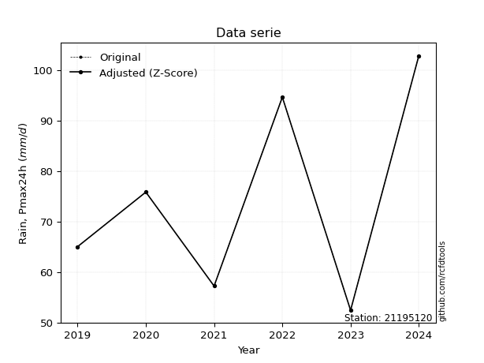</img>

</div>

> If Z-Score is active, values out of range or outliers are replaced with the station mean value.


### 4. Active continuous probability distributions from SciPy (45 of 104 available)

[scipy.stats](https://docs.scipy.org/doc/scipy/reference/stats.html) is a Python´s powerful submodule within the SciPy library for comprehensive statistical analysis, offering over 130 probability distributions (like Normal, Poisson), functions for descriptive stats (mean, variance), hypothesis testing (t-tests, chi-square), random variable generation, and statistical tests, making it essential for data science, modeling, and research. It provides tools to explore, model, and draw conclusions from data efficiently, working seamlessly with NumPy.

<div align="center">

|   id | p_dist             |   n_parameter | fit_method   | label                                                                       | active   | ref                                                                                                        |
|-----:|:-------------------|--------------:|:-------------|:----------------------------------------------------------------------------|:---------|:-----------------------------------------------------------------------------------------------------------|
|    0 | alpha              |             3 | MLE          | Alpha                                                                       | True     | [:mortar_board:](https://docs.scipy.org/doc/scipy/reference/generated/scipy.stats.alpha.html)              |
|    1 | betaprime          |             4 | MLE          | Beta prime                                                                  | True     | [:mortar_board:](https://docs.scipy.org/doc/scipy/reference/generated/scipy.stats.betaprime.html)          |
|    2 | chi2               |             3 | MLE          | Chi²                                                                        | True     | [:mortar_board:](https://docs.scipy.org/doc/scipy/reference/generated/scipy.stats.chi2.html)               |
|    3 | crystalball        |             4 | MLE          | Crystalball                                                                 | True     | [:mortar_board:](https://docs.scipy.org/doc/scipy/reference/generated/scipy.stats.crystalball.html)        |
|    4 | erlang             |             3 | MLE          | Erlang                                                                      | True     | [:mortar_board:](https://docs.scipy.org/doc/scipy/reference/generated/scipy.stats.erlang.html)             |
|    5 | expon              |             2 | MLE          | Exponential                                                                 | True     | [:mortar_board:](https://docs.scipy.org/doc/scipy/reference/generated/scipy.stats.expon.html)              |
|    6 | exponnorm          |             3 | MLE          | Exponentially modified Normal                                               | True     | [:mortar_board:](https://docs.scipy.org/doc/scipy/reference/generated/scipy.stats.exponnorm.html)          |
|    7 | f                  |             4 | MLE          | F                                                                           | True     | [:mortar_board:](https://docs.scipy.org/doc/scipy/reference/generated/scipy.stats.f.html)                  |
|    8 | fatiguelife        |             3 | MLE          | Fatigue-life (Birnbaum-Saunders)                                            | True     | [:mortar_board:](https://docs.scipy.org/doc/scipy/reference/generated/scipy.stats.fatiguelife.html)        |
|    9 | fisk               |             3 | MLE          | Fisk                                                                        | True     | [:mortar_board:](https://docs.scipy.org/doc/scipy/reference/generated/scipy.stats.fisk.html)               |
|   10 | gamma              |             3 | MLE          | Gamma                                                                       | True     | [:mortar_board:](https://docs.scipy.org/doc/scipy/reference/generated/scipy.stats.gamma.html)              |
|   11 | genexpon           |             5 | MLE          | Generalized exponential                                                     | True     | [:mortar_board:](https://docs.scipy.org/doc/scipy/reference/generated/scipy.stats.genexpon.html)           |
|   12 | genlogistic        |             3 | MLE          | Generalized logistic                                                        | True     | [:mortar_board:](https://docs.scipy.org/doc/scipy/reference/generated/scipy.stats.genlogistic.html)        |
|   13 | gibrat             |             2 | MM           | Gibrat                                                                      | True     | [:mortar_board:](https://docs.scipy.org/doc/scipy/reference/generated/scipy.stats.gibrat.html)             |
|   14 | gompertz           |             3 | MLE          | Gompertz (or truncated Gumbel)                                              | True     | [:mortar_board:](https://docs.scipy.org/doc/scipy/reference/generated/scipy.stats.gompertz.html)           |
|   15 | gumbel_l           |             2 | MM           | Gumbel Left Skew                                                            | True     | [:mortar_board:](https://docs.scipy.org/doc/scipy/reference/generated/scipy.stats.gumbel_l.html)           |
|   16 | gumbel_r           |             2 | MM           | Gumbel Right Skew                                                           | True     | [:mortar_board:](https://docs.scipy.org/doc/scipy/reference/generated/scipy.stats.gumbel_r.html)           |
|   17 | halflogistic       |             2 | MM           | Half-logistic                                                               | True     | [:mortar_board:](https://docs.scipy.org/doc/scipy/reference/generated/scipy.stats.halflogistic.html)       |
|   18 | halfnorm           |             2 | MM           | Half Normal                                                                 | True     | [:mortar_board:](https://docs.scipy.org/doc/scipy/reference/generated/scipy.stats.halfnorm.html)           |
|   19 | hypsecant          |             2 | MM           | hyperbolic secant                                                           | True     | [:mortar_board:](https://docs.scipy.org/doc/scipy/reference/generated/scipy.stats.hypsecant.html)          |
|   20 | invgamma           |             3 | MLE          | Inverted gamma                                                              | True     | [:mortar_board:](https://docs.scipy.org/doc/scipy/reference/generated/scipy.stats.invgamma.html)           |
|   21 | invgauss           |             3 | MLE          | Inverse Gaussian                                                            | True     | [:mortar_board:](https://docs.scipy.org/doc/scipy/reference/generated/scipy.stats.invgauss.html)           |
|   22 | invweibull         |             3 | MLE          | Inverted Weibull                                                            | True     | [:mortar_board:](https://docs.scipy.org/doc/scipy/reference/generated/scipy.stats.invweibull.html)         |
|   23 | johnsonsu          |             4 | MLE          | Johnson Su                                                                  | True     | [:mortar_board:](https://docs.scipy.org/doc/scipy/reference/generated/scipy.stats.johnsonsu.html)          |
|   24 | kstwobign          |             2 | MLE          | Limiting distribution of scaled Kolmogorov-Smirnov two-sided test statistic | True     | [:mortar_board:](https://docs.scipy.org/doc/scipy/reference/generated/scipy.stats.kstwobign.html)          |
|   25 | laplace            |             2 | MM           | Laplace                                                                     | True     | [:mortar_board:](https://docs.scipy.org/doc/scipy/reference/generated/scipy.stats.laplace.html)            |
|   26 | laplace_asymmetric |             3 | MLE          | Asymmetric Laplace                                                          | True     | [:mortar_board:](https://docs.scipy.org/doc/scipy/reference/generated/scipy.stats.laplace_asymmetric.html) |
|   27 | loggamma           |             3 | MLE          | Log gamma                                                                   | True     | [:mortar_board:](https://docs.scipy.org/doc/scipy/reference/generated/scipy.stats.loggamma.html)           |
|   28 | logistic           |             2 | MM           | Logistic (or Sech-squared)                                                  | True     | [:mortar_board:](https://docs.scipy.org/doc/scipy/reference/generated/scipy.stats.logistic.html)           |
|   29 | lognorm            |             3 | MLE          | Log Normal                                                                  | True     | [:mortar_board:](https://docs.scipy.org/doc/scipy/reference/generated/scipy.stats.lognorm.html)            |
|   30 | maxwell            |             2 | MM           | Maxwell                                                                     | True     | [:mortar_board:](https://docs.scipy.org/doc/scipy/reference/generated/scipy.stats.maxwell.html)            |
|   31 | mielke             |             4 | MLE          | Mielke Beta-Kappa / Dagum                                                   | True     | [:mortar_board:](https://docs.scipy.org/doc/scipy/reference/generated/scipy.stats.mielke.html)             |
|   32 | moyal              |             2 | MM           | Moyal                                                                       | True     | [:mortar_board:](https://docs.scipy.org/doc/scipy/reference/generated/scipy.stats.moyal.html)              |
|   33 | nakagami           |             3 | MLE          | Nakagami                                                                    | True     | [:mortar_board:](https://docs.scipy.org/doc/scipy/reference/generated/scipy.stats.nakagami.html)           |
|   34 | ncf                |             5 | MLE          | Non-central F distribution                                                  | True     | [:mortar_board:](https://docs.scipy.org/doc/scipy/reference/generated/scipy.stats.ncf.html)                |
|   35 | nct                |             4 | MLE          | Non-central Student’s t                                                     | True     | [:mortar_board:](https://docs.scipy.org/doc/scipy/reference/generated/scipy.stats.nct.html)                |
|   36 | norm               |             2 | MM           | Normal                                                                      | True     | [:mortar_board:](https://docs.scipy.org/doc/scipy/reference/generated/scipy.stats.norm.html)               |
|   37 | pareto             |             3 | MLE          | Pareto                                                                      | True     | [:mortar_board:](https://docs.scipy.org/doc/scipy/reference/generated/scipy.stats.pareto.html)             |
|   38 | pearson3           |             3 | MM           | Pearson type III                                                            | True     | [:mortar_board:](https://docs.scipy.org/doc/scipy/reference/generated/scipy.stats.pearson3.html)           |
|   39 | rayleigh           |             2 | MM           | Rayleigh                                                                    | True     | [:mortar_board:](https://docs.scipy.org/doc/scipy/reference/generated/scipy.stats.rayleigh.html)           |
|   40 | rice               |             3 | MLE          | Rice                                                                        | True     | [:mortar_board:](https://docs.scipy.org/doc/scipy/reference/generated/scipy.stats.rice.html)               |
|   41 | t                  |             3 | MLE          | Student’s t                                                                 | True     | [:mortar_board:](https://docs.scipy.org/doc/scipy/reference/generated/scipy.stats.t.html)                  |
|   42 | truncnorm          |             4 | MLE          | Truncated normal                                                            | True     | [:mortar_board:](https://docs.scipy.org/doc/scipy/reference/generated/scipy.stats.truncnorm.html)          |
|   43 | wald               |             2 | MM           | Wald                                                                        | True     | [:mortar_board:](https://docs.scipy.org/doc/scipy/reference/generated/scipy.stats.wald.html)               |
|   44 | weibull_min        |             3 | MLE          | Weibull minimum                                                             | True     | [:mortar_board:](https://docs.scipy.org/doc/scipy/reference/generated/scipy.stats.weibull_min.html)        |

</div>

> **n_parameter:** # arguments & localization & scale.
>
> **Fit methods:** (MLE) maximum likelihood, (MM) L-moments.
>
>**Inactive:** foldnorm, gennorm, norminvgauss, powernorm, powerlognorm, skewnorm, genextreme, anglit, arcsine, argus, beta, bradford, burr, burr12, cauchy, cosine, halfcauchy, foldcauchy, skewcauchy, wrapcauchy, dgamma, gengamma, exponweib, exponpow, truncexpon, gausshyper, genhalflogistic, genhyperbolic, geninvgauss, halfgennorm, johnsonsb, kappa4, kappa3, ksone, kstwo, loglaplace, levy, levy_l, levy_stable, ncx2, genpareto, truncpareto, lomax, powerlaw, rdist, rel_breitwigner, recipinvgauss, semicircular, studentized_range, trapezoid, triang, truncweibull_min, tukeylambda, uniform, loguniform, vonmises, vonmises_line, weibull_max, dweibull, 


## B. Probability distributions vs. Empirical distributions

A continuous probability distribution (CPD) describes probabilities for variables that can take any value within a range (like rain any time), unlike discrete variables with specific outcomes (like temperature). It uses a Probability Density Function (PDF), a curve where the total area under it equals 1, and the probability of the variable falling within an interval (a to b) is found by calculating the area under the curve between those points. A key feature is that the probability of hitting any single exact value is zero, so probabilities are always expressed for ranges, e.g., $P(a ≤ X ≤ b)$.

<div align="center">

Distributions parameters
|    |   station | p_dist                |   n |             loc |         scale | shape                  | shape1                | shape2              | shape3   |
|---:|----------:|:----------------------|----:|----------------:|--------------:|:-----------------------|:----------------------|:--------------------|:---------|
|  0 |  21195120 | alpha                 |   7 |    33.8808      |  70.9337      | 2.2400979230393503     |                       |                     |          |
|  1 |  21195120 | betaprime             |   7 |    -0.954408    |   6.29528     | 223.1514757044057      | 20.18600876688558     |                     |          |
|  2 |  21195120 | chi2                  |   7 |    52.4         |   2.71764     | 0.281164984457587      |                       |                     |          |
|  3 |  21195120 | crystalball           |   7 |    72.3429      |  18.1454      | 5380.669170262749      | 1870.7264513512712    |                     |          |
|  4 |  21195120 | erlang                |   7 |    52.4         |  22.0499      | 0.5762940842676143     |                       |                     |          |
|  5 |  21195120 | expon                 |   7 |    52.4         |  19.9429      |                        |                       |                     |          |
|  6 |  21195120 | exponnorm             |   7 |    52.3711      |   0.00966021  | 2052.813156192241      |                       |                     |          |
|  7 |  21195120 | f                     |   7 |    45.4168      |  16.367       | 66988.9105245886       | 4.342248955349348     |                     |          |
|  8 |  21195120 | fatiguelife           |   7 |    52.4         |   1.10473e-05 | 1152.787113383958      |                       |                     |          |
|  9 |  21195120 | fisk                  |   7 |    52.4         |  14.3677      | 0.35315914203605225    |                       |                     |          |
| 10 |  21195120 | gamma                 |   7 |    52.4         |  18.9662      | 0.6157348536577709     |                       |                     |          |
| 11 |  21195120 | genexpon              |   7 |    52.4         |  39.0029      | 1.9557229226825876     | 7.464569555273886e-05 | 1.1760842485351504  |          |
| 12 |  21195120 | genlogistic           |   7 |   -32.833       |  13.4204      | 1354.4921511374605     |                       |                     |          |
| 13 |  21195120 | gibrat                |   7 |    58.5003      |   8.39596     |                        |                       |                     |          |
| 14 |  21195120 | gompertz              |   7 |    52.4         | 113.593       | 4.815378731640017      |                       |                     |          |
| 15 |  21195120 | gumbel_l              |   7 |    80.5092      |  14.1479      |                        |                       |                     |          |
| 16 |  21195120 | gumbel_r              |   7 |    64.1765      |  14.1479      |                        |                       |                     |          |
| 17 |  21195120 | halflogistic          |   7 |    50.8364      |  15.5136      |                        |                       |                     |          |
| 18 |  21195120 | halfnorm              |   7 |    48.3255      |  30.1013      |                        |                       |                     |          |
| 19 |  21195120 | hypsecant             |   7 |    72.3429      |  11.5517      |                        |                       |                     |          |
| 20 |  21195120 | invgamma              |   7 |    44.952       |  39.2478      | 2.2926706880379424     |                       |                     |          |
| 21 |  21195120 | invgauss              |   7 |    48.377       |  23.0051      | 1.0417620179530438     |                       |                     |          |
| 22 |  21195120 | invweibull            |   7 |    41.9929      |  18.7005      | 1.8845864029249824     |                       |                     |          |
| 23 |  21195120 | johnsonsu             |   7 |     7.64839e+08 |   1.4177e+09  | 45239273.95450796      | 87629881.62568277     |                     |          |
| 24 |  21195120 | kstwobign             |   7 |    17.2944      |  63.1113      |                        |                       |                     |          |
| 25 |  21195120 | laplace               |   7 |    72.3429      |  12.8307      |                        |                       |                     |          |
| 26 |  21195120 | laplace_asymmetric    |   7 |    52.4         |   0.0010089   | 5.05899820637024e-05   |                       |                     |          |
| 27 |  21195120 | loggamma              |   7 | -5416.81        | 743.347       | 1610.9306879326286     |                       |                     |          |
| 28 |  21195120 | logistic              |   7 |    72.3429      |  10.0041      |                        |                       |                     |          |
| 29 |  21195120 | lognorm               |   7 |    52.4         |   0.104114    | 12.404011489070381     |                       |                     |          |
| 30 |  21195120 | maxwell               |   7 |    29.346       |  26.9443      |                        |                       |                     |          |
| 31 |  21195120 | mielke                |   7 |    24.8603      |   3.92571     | 6092.461790338482      | 3.351799318749931     |                     |          |
| 32 |  21195120 | moyal                 |   7 |    61.9662      |   8.16828     |                        |                       |                     |          |
| 33 |  21195120 | nakagami              |   7 |    52.4         |  33.8228      | 0.3457914872376524     |                       |                     |          |
| 34 |  21195120 | ncf                   |   7 |    -0.00191567  |   7.16997e-05 | 3.1825256698329945e-06 | 2.694334731907638     | 1.8388593273638518  |          |
| 35 |  21195120 | nct                   |   7 |    -0.220231    |   1.35991     | 9.847669868218794      | 49.15594056917663     |                     |          |
| 36 |  21195120 | norm                  |   7 |    72.3429      |  18.1454      |                        |                       |                     |          |
| 37 |  21195120 | pareto                |   7 |    52.3841      |   0.0159333   | 0.16832346778201462    |                       |                     |          |
| 38 |  21195120 | pearson3              |   7 |    72.3429      |  18.1453      | 0.5959988499076039     |                       |                     |          |
| 39 |  21195120 | rayleigh              |   7 |    37.6297      |  27.6971      |                        |                       |                     |          |
| 40 |  21195120 | rice                  |   7 |    42.5645      |  24.6577      | 0.0002829100309423065  |                       |                     |          |
| 41 |  21195120 | t                     |   7 |    72.3436      |  18.1457      | 30430978.191921297     |                       |                     |          |
| 42 |  21195120 | truncnorm             |   7 |  -107.059       |  51.4275      | -2089.303731757659     | 4.080680537964133     |                     |          |
| 43 |  21195120 | wald                  |   7 |    54.1975      |  18.1453      |                        |                       |                     |          |
| 44 |  21195120 | weibull_min           |   7 |    52.4         |  19.7777      | 0.5700700913309276     |                       |                     |          |
| 45 |  21195120 | logalpha              |   7 |     1.96892     |  21.8993      | 9.719811429576982      |                       |                     |          |
| 46 |  21195120 | logbetaprime          |   7 |     2.45593     |   0.505469    | 245.7981928812635      | 70.30974308829735     |                     |          |
| 47 |  21195120 | logchi2               |   7 |     3.95891     |   0.975243    | 0.9819417392490495     |                       |                     |          |
| 48 |  21195120 | logcrystalball        |   7 |     4.25159     |   0.240945    | 2924.6677980342834     | 3.277908578303978     |                     |          |
| 49 |  21195120 | logerlang             |   7 |     3.95891     |   0.288985    | 0.7325734872006873     |                       |                     |          |
| 50 |  21195120 | logexpon              |   7 |     3.95891     |   0.292682    |                        |                       |                     |          |
| 51 |  21195120 | logexponnorm          |   7 |     3.9586      |   9.49316e-05 | 3088.3239949526624     |                       |                     |          |
| 52 |  21195120 | logf                  |   7 |     3.7492      |   0.39592     | 1630.7711241425086     | 8.72932325934852      |                     |          |
| 53 |  21195120 | logfatiguelife        |   7 |     3.89099     |   0.26579     | 0.8371598578253904     |                       |                     |          |
| 54 |  21195120 | logfisk               |   7 |     3.92389     |   0.24124     | 1.7415200012840344     |                       |                     |          |
| 55 |  21195120 | loggamma              |   7 |     3.95891     |   0.263884    | 0.7846972283182866     |                       |                     |          |
| 56 |  21195120 | loggenexpon           |   7 |     3.95891     |   0.505362    | 1.4830227914225786     | 1.547592037144823     | 0.37455229381361044 |          |
| 57 |  21195120 | loggenlogistic        |   7 |     2.79067     |   0.188375    | 1273.9057565462304     |                       |                     |          |
| 58 |  21195120 | loggibrat             |   7 |     4.06779     |   0.111478    |                        |                       |                     |          |
| 59 |  21195120 | loggompertz           |   7 |     3.95891     |   0.526928    | 1.039055469373583      |                       |                     |          |
| 60 |  21195120 | loggumbel_l           |   7 |     4.36003     |   0.187864    |                        |                       |                     |          |
| 61 |  21195120 | loggumbel_r           |   7 |     4.14315     |   0.187864    |                        |                       |                     |          |
| 62 |  21195120 | loghalflogistic       |   7 |     3.96595     |   0.206046    |                        |                       |                     |          |
| 63 |  21195120 | loghalfnorm           |   7 |     3.93267     |   0.399702    |                        |                       |                     |          |
| 64 |  21195120 | loghypsecant          |   7 |     4.25159     |   0.15339     |                        |                       |                     |          |
| 65 |  21195120 | loginvgamma           |   7 |     3.74814     |   1.73169     | 4.364772526685497      |                       |                     |          |
| 66 |  21195120 | loginvgauss           |   7 |     3.85843     |   0.685858    | 0.5732252766213102     |                       |                     |          |
| 67 |  21195120 | loginvweibull         |   7 |     3.41059     |   0.704478    | 4.215250404070988      |                       |                     |          |
| 68 |  21195120 | logjohnsonsu          |   7 |     1.02738e+07 |   1.65169e+06 | 109410489.87782352     | 43290627.916393936    |                     |          |
| 69 |  21195120 | logkstwobign          |   7 |     3.48591     |   0.876213    |                        |                       |                     |          |
| 70 |  21195120 | loglaplace            |   7 |     4.25159     |   0.170374    |                        |                       |                     |          |
| 71 |  21195120 | loglaplace_asymmetric |   7 |     4.04655     |   0.13213     | 0.48989712449618744    |                       |                     |          |
| 72 |  21195120 | logloggamma           |   7 |   -58.3318      |   8.7472      | 1280.361064638576      |                       |                     |          |
| 73 |  21195120 | loglogistic           |   7 |     4.25159     |   0.13284     |                        |                       |                     |          |
| 74 |  21195120 | loglognorm            |   7 |     3.95891     |   0.00202129  | 11.9207928262396       |                       |                     |          |
| 75 |  21195120 | logmaxwell            |   7 |     3.68065     |   0.357782    |                        |                       |                     |          |
| 76 |  21195120 | logmielke             |   7 |   -29.7759      |  33.2472      | 6719.098243369794      | 181.28155099396372    |                     |          |
| 77 |  21195120 | logmoyal              |   7 |     4.1138      |   0.108463    |                        |                       |                     |          |
| 78 |  21195120 | lognakagami           |   7 |     3.95891     |   0.380755    | 0.26129210080588045    |                       |                     |          |
| 79 |  21195120 | logncf                |   7 |    -4.36186     |   0.000275936 | 0.030252453156775827   | 1587.958491144117     | 943.3272640980144   |          |
| 80 |  21195120 | lognct                |   7 |    -0.262194    |   0.0594605   | 192.77206298331242     | 75.60935857609269     |                     |          |
| 81 |  21195120 | lognorm               |   7 |     4.25159     |   0.240945    |                        |                       |                     |          |
| 82 |  21195120 | logpareto             |   7 |     3.95865     |   0.00025309  | 0.16818516033526426    |                       |                     |          |
| 83 |  21195120 | logpearson3           |   7 |     4.25159     |   0.240944    | 0.4315409831249519     |                       |                     |          |
| 84 |  21195120 | lograyleigh           |   7 |     3.79065     |   0.367778    |                        |                       |                     |          |
| 85 |  21195120 | logrice               |   7 |     3.84038     |   0.336352    | 0.08835810070184474    |                       |                     |          |
| 86 |  21195120 | logt                  |   7 |     4.25159     |   0.240944    | 1459961610.5974498     |                       |                     |          |
| 87 |  21195120 | logtruncnorm          |   7 |    -0.0509743   |   1.14618     | 3.498477536201122      | 5.7487780834162905    |                     |          |
| 88 |  21195120 | logwald               |   7 |     4.01068     |   0.240912    |                        |                       |                     |          |
| 89 |  21195120 | logweibull_min        |   7 |     3.95891     |   0.366859    | 0.9575297252310593     |                       |                     |          |

</div>

> **loc** (Location parameter): This shifts the distribution along the x-axis. For many common distributions, like the normal (Gaussian) distribution, loc represents the mean $μ$. For others, like the uniform distribution, it might represent the minimum value, or for the beta distribution, the left end of the support interval.
>
> **scale** (Scale parameter): This determines the width or spread of the distribution. For the normal distribution, scale represents the standard deviation $σ$. For a uniform distribution, it defines the length of the interval (from $loc$ to $loc + scale$).
>
> **shape** (Shape parameters): Refers to parameters that define the specific form of a probability distribution, distinct from its location (loc) and scale (scale). These parameters are required arguments for most distribution functions. For example, a normal (Gaussian) distribution is fully defined by its location (mean) and scale (standard deviation), so it has no specific shape parameters beyond loc and scale. However, other distributions have intrinsic properties that need specification, as Gamma distribution that takes a shape parameter, often named $a$ or $alpha$.


### 0. Cumulative distribution values - CDF (90 evaluated)

> Ordered by x ascending and calculating $log(f(x))$ separately. 

|   id |   Station |   date |     x |   count |    mean |     std |    zscore |   Value_initial |   station |   m |     alpha |   alpha_pdf |   betaprime |   betaprime_pdf |       chi2 |    chi2_pdf |   crystalball |   crystalball_pdf |     erlang |      erlang_pdf |    expon |   expon_pdf |   exponnorm |   exponnorm_pdf |         f |      f_pdf |   fatiguelife |   fatiguelife_pdf |        fisk |       fisk_pdf |       gamma |      gamma_pdf |    genexpon |   genexpon_pdf |   genlogistic |   genlogistic_pdf |      gibrat |   gibrat_pdf |    gompertz |   gompertz_pdf |   gumbel_l |   gumbel_l_pdf |   gumbel_r |   gumbel_r_pdf |   halflogistic |   halflogistic_pdf |   halfnorm |   halfnorm_pdf |   hypsecant |   hypsecant_pdf |   invgamma |   invgamma_pdf |   invgauss |   invgauss_pdf |   invweibull |   invweibull_pdf |   johnsonsu |   johnsonsu_pdf |   kstwobign |   kstwobign_pdf |   laplace |   laplace_pdf |   laplace_asymmetric |   laplace_asymmetric_pdf |    loggamma |   loggamma_pdf |   logistic |   logistic_pdf |   lognorm |   lognorm_pdf |   maxwell |   maxwell_pdf |   mielke |   mielke_pdf |     moyal |   moyal_pdf |    nakagami |   nakagami_pdf |      ncf |    ncf_pdf |       nct |    nct_pdf |     norm |   norm_pdf |   pareto |   pareto_pdf |   pearson3 |   pearson3_pdf |   rayleigh |   rayleigh_pdf |      rice |   rice_pdf |        t |      t_pdf |   truncnorm |   truncnorm_pdf |      wald |   wald_pdf |   weibull_min |   weibull_min_pdf |   logalpha |   logalpha_pdf |   logbetaprime |   logbetaprime_pdf |     logchi2 |   logchi2_pdf |   logcrystalball |   logcrystalball_pdf |   logerlang |   logerlang_pdf |   logexpon |   logexpon_pdf |   logexponnorm |   logexponnorm_pdf |      logf |   logf_pdf |   logfatiguelife |   logfatiguelife_pdf |   logfisk |   logfisk_pdf |   loggenexpon |   loggenexpon_pdf |   loggenlogistic |   loggenlogistic_pdf |   loggibrat |   loggibrat_pdf |   loggompertz |   loggompertz_pdf |   loggumbel_l |   loggumbel_l_pdf |   loggumbel_r |   loggumbel_r_pdf |   loghalflogistic |   loghalflogistic_pdf |   loghalfnorm |   loghalfnorm_pdf |   loghypsecant |   loghypsecant_pdf |   loginvgamma |   loginvgamma_pdf |   loginvgauss |   loginvgauss_pdf |   loginvweibull |   loginvweibull_pdf |   logjohnsonsu |   logjohnsonsu_pdf |   logkstwobign |   logkstwobign_pdf |   loglaplace |   loglaplace_pdf |   loglaplace_asymmetric |   loglaplace_asymmetric_pdf |   logloggamma |   logloggamma_pdf |   loglogistic |   loglogistic_pdf |   loglognorm |   loglognorm_pdf |   logmaxwell |   logmaxwell_pdf |   logmielke |   logmielke_pdf |   logmoyal |   logmoyal_pdf |   lognakagami |   lognakagami_pdf |   logncf |   logncf_pdf |   lognct |   lognct_pdf |   logpareto |   logpareto_pdf |   logpearson3 |   logpearson3_pdf |   lograyleigh |   lograyleigh_pdf |   logrice |   logrice_pdf |     logt |   logt_pdf |   logtruncnorm |   logtruncnorm_pdf |   logwald |   logwald_pdf |   logweibull_min |   logweibull_min_pdf |
|-----:|----------:|-------:|------:|--------:|--------:|--------:|----------:|----------------:|----------:|----:|----------:|------------:|------------:|----------------:|-----------:|------------:|--------------:|------------------:|-----------:|----------------:|---------:|------------:|------------:|----------------:|----------:|-----------:|--------------:|------------------:|------------:|---------------:|------------:|---------------:|------------:|---------------:|--------------:|------------------:|------------:|-------------:|------------:|---------------:|-----------:|---------------:|-----------:|---------------:|---------------:|-------------------:|-----------:|---------------:|------------:|----------------:|-----------:|---------------:|-----------:|---------------:|-------------:|-----------------:|------------:|----------------:|------------:|----------------:|----------:|--------------:|---------------------:|-------------------------:|------------:|---------------:|-----------:|---------------:|----------:|--------------:|----------:|--------------:|---------:|-------------:|----------:|------------:|------------:|---------------:|---------:|-----------:|----------:|-----------:|---------:|-----------:|---------:|-------------:|-----------:|---------------:|-----------:|---------------:|----------:|-----------:|---------:|-----------:|------------:|----------------:|----------:|-----------:|--------------:|------------------:|-----------:|---------------:|---------------:|-------------------:|------------:|--------------:|-----------------:|---------------------:|------------:|----------------:|-----------:|---------------:|---------------:|-------------------:|----------:|-----------:|-----------------:|---------------------:|----------:|--------------:|--------------:|------------------:|-----------------:|---------------------:|------------:|----------------:|--------------:|------------------:|--------------:|------------------:|--------------:|------------------:|------------------:|----------------------:|--------------:|------------------:|---------------:|-------------------:|--------------:|------------------:|--------------:|------------------:|----------------:|--------------------:|---------------:|-------------------:|---------------:|-------------------:|-------------:|-----------------:|------------------------:|----------------------------:|--------------:|------------------:|--------------:|------------------:|-------------:|-----------------:|-------------:|-----------------:|------------:|----------------:|-----------:|---------------:|--------------:|------------------:|---------:|-------------:|---------:|-------------:|------------:|----------------:|--------------:|------------------:|--------------:|------------------:|----------:|--------------:|---------:|-----------:|---------------:|-------------------:|----------:|--------------:|-----------------:|---------------------:|
|    0 |  21195120 |   2023 |  52.4 |       7 | 72.3429 | 19.5992 | -1.01753  |            52.4 |  21195120 |   1 | 0.0566069 |  0.0235996  |    0.105889 |      0.0158485  | 0.00863468 | 1.70839e+11 |      0.135871 |        0.0120183  | 1.3251e-09 | 107474          | 0        |  0.0501433  |  0.00145712 |      0.050284   | 0.0472752 | 0.0278463  |     0.0666245 |        2.631e+10  | 0.000424817 | 36779.8        | 3.54344e-10 | 30706.4        | 3.64229e-11 |     0.0501431  |     0.0942731 |        0.0165745  | 0           |  0           | 1.51508e-13 |     0.0423915  |   0.128144 |     0.00845065 |   0.10038  |     0.01631    |      0.0503519 |         0.032148   |   0.107672 |     0.026265   |    0.112097 |      0.00950457 |  0.0477443 |     0.0268625  |  0.0411223 |     0.0327459  |    0.0489152 |        0.0267301 |    0.138983 |      0.0120482  |   0.0835964 |       0.0166082 |  0.105668 |    0.00823555 |          2.65595e-09 |               0.0501438  | 2.75205e-12 |    4862.81     |   0.11989  |     0.0105473  |  0.112235 |      0.791731 |  0.134367 |    0.0150336  |      nan |          nan | 0.0724926 |  0.0174842  | 1.11683e-11 |  1087.03       | 0.665788 | 0.00309547 | 0.0983601 | 0.0170357  | 0.135871 | 0.0120183  | 0        | 10.5643      |   0.125809 |     0.0148772  |   0.132546 |     0.0167019  | 0.0764706 | 0.0149397  | 0.135866 | 0.0120179  |    0.999057 |     6.33945e-05 | 0         | 0          |   1.56857e-09 |   125847          |  0.0994129 |       0.966346 |       0.107746 |           0.937305 | 2.35768e-08 |   2.60658e+07 |         0.112235 |             0.791731 | 1.53663e-11 |    25348.4      |   0        |       3.41667  |     0.00103139 |           3.40491  | 0.0517707 |   1.30387  |        0.0392613 |             1.85405  | 0.0335382 |      1.61194  |   1.61983e-10 |          2.93457  |        0.0758971 |             1.03779  | 0           |        0        |   4.45303e-08 |          1.97191  |      0.111504 |          0.559141 |     0.0695008 |          0.98645  |          0        |              0        |      0.05233  |          1.9919   |      0.0937669 |           0.602494 |     0.0517714 |          1.30385  |      0.042863 |          1.56485  |       0.0563626 |            1.24614  |       0.111693 |           0.790886 |      0.0673325 |           1.06296  |    0.0897224 |         0.526622 |               0.0499732 |                    0.772022 |      0.117166 |          0.795626 |     0.0994567 |          0.674234 |   0.00724235 |      3.79323e+12 |     0.104679 |         0.996847 |   0.0775965 |        1.02998  |  0.0411284 |       0.933412 |   1.22354e-08 |       1.43981e+07 | 0.329949 |     0.581051 | 0.105239 |     0.850397 |    0        |     664.528     |      0.102563 |          0.909796 |     0.0993633 |          1.12036  | 0.0599746 |      0.98102  | 0.112233 |   0.791724 |    3.05501e-06 |           3.27176  | 0         |      0        |      5.20596e-15 |            11.2249   |
|    1 |  21195120 |   2021 |  57.2 |       7 | 72.3429 | 19.5992 | -0.772625 |            57.2 |  21195120 |   2 | 0.21403   |  0.0382147  |    0.196211 |      0.0214772  | 0.957653   | 0.0127114   |      0.201991 |        0.0155208  | 0.43136    |      0.0450143  | 0.213913 |  0.039417   |  0.216127   |      0.0395285  | 0.231451  | 0.0421166  |     0.716271  |        0.0201784  | 0.404393    |     0.0177212  | 0.436427    |     0.0477307  | 0.213913    |     0.039417   |     0.191687  |        0.0235799  | 0           |  0           | 0.187663    |     0.0359225  |   0.175124 |     0.0112248  |   0.194484 |     0.0225086  |      0.202269  |         0.0309111  |   0.231869 |     0.0253794  |    0.167637 |      0.0138503  |  0.22583   |     0.041184   |  0.24641   |     0.0433865  |    0.228424  |        0.0417984 |    0.205031 |      0.0154578  |   0.181156  |       0.0234763 |  0.153608 |    0.0119719  |          0.213915    |               0.0394173  | 0.394269    |       2.91628  |   0.180395 |     0.0147793  |  0.197395 |      1.15278  |  0.215357 |    0.0185463  |      nan |          nan | 0.180646  |  0.0266865  | 0.200977    |     0.0288072  | 0.680104 | 0.00287324 | 0.196812  | 0.0234982  | 0.201991 | 0.0155208  | 0.61762  |  0.0133647   |   0.207781 |     0.0190966  |   0.220911 |     0.0198754  | 0.161506  | 0.0201837  | 0.201984 | 0.0155202  |    0.999321 |     4.72579e-05 | 0.0355065 | 0.0398214  |   0.359889    |        0.0339147  |  0.20592   |       1.44529  |       0.209049 |           1.36056  | 0.24247     |   1.31779     |         0.197395 |             1.15278  | 0.402697    |        2.81383  |   0.258783 |       2.53249  |     0.259172   |           2.52688  | 0.217381  |   2.25461  |        0.258637  |             2.57362  | 0.235443  |      2.55563  |   0.233361    |          2.39742  |        0.197953  |             1.701    | 0           |        0        |   0.171417    |          1.92958  |      0.171805 |          0.831031 |     0.187818  |          1.67188  |          0.193151 |              2.33611  |      0.22429  |          1.9168   |      0.163553  |           1.01995  |     0.21738   |          2.25458  |      0.237587 |          2.46638  |       0.214539  |            2.18883  |       0.196847 |           1.1536   |      0.192455  |           1.72553  |    0.150079  |         0.880883 |               0.193548  |                    2.99007  |      0.2021   |          1.14337  |     0.17603   |          1.09187  |   0.624082   |      0.363206    |     0.209854 |         1.38261  |   0.198377  |        1.68292  |  0.172748  |       1.97969  |   0.360461    |       2.12572     | 0.382109 |     0.6074   | 0.197766 |     1.25678  |    0.626157 |       0.715296  |      0.201496 |          1.33601  |     0.215007  |          1.48517  | 0.17067   |      1.5055   | 0.197392 |   1.15278  |    0.25138     |           2.49647  | 0.0244536 |      2.53161  |      0.224223    |             2.15177  |
|    2 |  21195120 |   2025 |  58.6 |       7 | 72.3429 | 19.5992 | -0.701194 |            58.6 |  21195120 |   3 | 0.267877  |  0.0384708  |    0.227163 |      0.0227008  | 0.971737   | 0.00788503  |      0.224412 |        0.0165038  | 0.489126   |      0.0379036  | 0.267204 |  0.0367448  |  0.269558   |      0.0368341  | 0.289526  | 0.0406368  |     0.742108  |        0.0169279  | 0.426338    |     0.0139312  | 0.497685    |     0.0401818  | 0.267204    |     0.0367449  |     0.225747  |        0.0250218  | 4.64692e-06 |  0.000216185 | 0.236721    |     0.0341716  |   0.191478 |     0.0121467  |   0.226926 |     0.0237888  |      0.245124  |         0.0302932  |   0.267145 |     0.0250067  |    0.188066 |      0.0153496  |  0.282853  |     0.0400605  |  0.30516   |     0.0404364  |    0.286292  |        0.0406349 |    0.227344 |      0.016411   |   0.214971  |       0.024774  |  0.171317 |    0.0133521  |          0.267207    |               0.0367451  | 0.459872    |       2.52494  |   0.202018 |     0.0161141  |  0.226445 |      1.24925  |  0.241905 |    0.0193615  |      nan |          nan | 0.21914   |  0.0282083  | 0.239606    |     0.0264971  | 0.684084 | 0.00281259 | 0.230623  | 0.0247497  | 0.224412 | 0.0165038  | 0.633697 |  0.00991924  |   0.235223 |     0.0200836  |   0.249205 |     0.0205238  | 0.190598  | 0.0213472  | 0.224404 | 0.0165032  |    0.999384 |     4.33064e-05 | 0.105092  | 0.0564102  |   0.403209    |        0.0283248  |  0.242153  |       1.54857  |       0.243127 |           1.45579  | 0.272182    |   1.14974     |         0.226445 |             1.24925  | 0.465833    |        2.42472  |   0.317559 |       2.33168  |     0.317822   |           2.32683  | 0.272527  |   2.2932   |        0.31908   |             2.41929  | 0.296402  |      2.47326  |   0.289634    |          2.25765  |        0.240579  |             1.81852  | 0.000138749 |        0.183084 |   0.217813    |          1.90707  |      0.192976 |          0.921025 |     0.229854  |          1.79895  |          0.248944 |              2.27625  |      0.270215 |          1.8806   |      0.18996   |           1.1662   |     0.272524  |          2.29318  |      0.296555 |          2.3997   |       0.268416  |            2.2542   |       0.225924 |           1.25061  |      0.235491  |           1.82755  |    0.172965  |         1.01521  |               0.262704  |                    2.73366  |      0.230878 |          1.23612  |     0.204005  |          1.22243  |   0.631812   |      0.282776    |     0.244287 |         1.4631   |   0.240569  |        1.80092  |  0.222612  |       2.13232  |   0.408674    |       1.87592     | 0.396863 |     0.612734 | 0.2294   |     1.35828  |    0.641129 |       0.53851   |      0.235015 |          1.43432  |     0.251729  |          1.54946  | 0.208327  |      1.6057   | 0.226443 |   1.24925  |    0.309523    |           2.31459  | 0.111951  |      4.29626  |      0.274287    |             1.99219  |
|    3 |  21195120 |   2019 |  65   |       7 | 72.3429 | 19.5992 | -0.37465  |            65   |  21195120 |   4 | 0.490469  |  0.02957    |    0.383231 |      0.0252241  | 0.994434   | 0.00132051  |      0.342861 |        0.0202575  | 0.669091   |      0.0209959  | 0.468369 |  0.0266577  |  0.471039   |      0.026674   | 0.510164  | 0.027957   |     0.822886  |        0.00954884 | 0.488411    |     0.00700336 | 0.687134    |     0.021834   | 0.468369    |     0.0266579  |     0.396917  |        0.0273193  | 0.39898     |  0.0593997   | 0.431573    |     0.0269232  |   0.28404  |     0.0169088  |   0.389281 |     0.0259593  |      0.427218  |         0.0263473  |   0.420384 |     0.0227364  |    0.310058 |      0.0227933  |  0.503365  |     0.0282832  |  0.517239  |     0.0264574  |    0.508312  |        0.0281744 |    0.344775 |      0.0200381  |   0.38275   |       0.0266235 |  0.282117 |    0.0219876  |          0.468372    |               0.0266578  | 0.661091    |       1.48024  |   0.32432  |     0.0219048  |  0.374328 |      1.57289  |  0.374342 |    0.021604   |      nan |          nan | 0.406247  |  0.0287309  | 0.387677    |     0.0205313  | 0.701248 | 0.00255681 | 0.397748  | 0.0264206  | 0.342861 | 0.0202575  | 0.674841 |  0.00433831  |   0.373869 |     0.0227006  |   0.386313 |     0.0218957  | 0.338958  | 0.0243927  | 0.342849 | 0.0202568  |    0.999612 |     2.87801e-05 | 0.442863  | 0.0417135  |   0.538537    |        0.0161463  |  0.416946  |       1.75706  |       0.408375 |           1.67807  | 0.369221    |   0.780767    |         0.374328 |             1.57289  | 0.658699    |        1.42138  |   0.521082 |       1.6363   |     0.520979   |           1.63388  | 0.494761  |   1.89751  |        0.530535  |             1.6775   | 0.516394  |      1.73618  |   0.494567    |          1.71169  |        0.439562  |             1.91742  | 0.482126    |        3.73893  |   0.408415    |          1.75592  |      0.310825 |          1.36563  |     0.428777  |          1.93276  |          0.466677 |              1.89815  |      0.454646 |          1.66261  |      0.346158  |           1.83748  |     0.494758  |          1.89752  |      0.515141 |          1.78409  |       0.491042  |            1.9274   |       0.374061 |           1.5763   |      0.432502  |           1.88237  |    0.317817  |         1.86541  |               0.49796   |                    1.8614   |      0.376735 |          1.54871  |     0.358665  |          1.73159  |   0.652353   |      0.143841    |     0.40751  |         1.63887  |   0.438167  |        1.90924  |  0.449458  |       2.08988  |   0.568642    |       1.29022     | 0.46118  |     0.625531 | 0.387785 |     1.653    |    0.678553 |       0.250599  |      0.399096 |          1.67898  |     0.419776  |          1.64612  | 0.38807   |      1.79961  | 0.374325 |   1.5729   |    0.514076    |           1.6652   | 0.502448  |      2.74104  |      0.451622    |             1.46402  |
|    4 |  21195120 |   2020 |  75.8 |       7 | 72.3429 | 19.5992 |  0.176392 |            75.8 |  21195120 |   5 | 0.71713   |  0.0140353  |    0.636894 |      0.0204263  | 0.999506   | 0.000106351 |      0.575551 |        0.0215905  | 0.826332   |      0.00989707 | 0.690672 |  0.0155107  |  0.693167   |      0.0154727  | 0.72201   | 0.013235   |     0.896615  |        0.00485047 | 0.542957    |     0.00374522 | 0.846966    |     0.00973922 | 0.690674    |     0.0155108  |     0.66146   |        0.0203677  | 0.765142    |  0.0177574   | 0.667636    |     0.0173124  |   0.511723 |     0.024741   |   0.644204 |     0.0200229  |      0.666584  |         0.017909   |   0.638618 |     0.0174764  |    0.593871 |      0.0263657  |  0.719463  |     0.0135815  |  0.721467  |     0.0132087  |    0.720637  |        0.0131612 |    0.574582 |      0.021322   |   0.643483  |       0.020583  |  0.618098 |    0.0297647  |          0.690676    |               0.0155107  | 0.823987    |       0.736224 |   0.585544 |     0.0242584  |  0.624583 |      1.57434  |  0.604106 |    0.0199127  |      nan |          nan | 0.66808   |  0.0191027  | 0.577724    |     0.0150821  | 0.72683  | 0.00219353 | 0.652584  | 0.0196646  | 0.575551 | 0.0215905  | 0.706988 |  0.00210629  |   0.612604 |     0.0202933  |   0.613115 |     0.0192504  | 0.596824  | 0.022039   | 0.575534 | 0.0215903  |    0.999834 |     1.39437e-05 | 0.734399  | 0.0166693  |   0.667336    |        0.00891983 |  0.669031  |       1.4266   |       0.655187 |           1.43784  | 0.46911     |   0.548609    |         0.624583 |             1.57434  | 0.816489    |        0.723059 |   0.716745 |       0.96779  |     0.716431   |           0.967219 | 0.719442  |   1.06746  |        0.725872  |             0.938738 | 0.710719  |      0.885806 |   0.706215    |          1.0775   |        0.695206  |             1.34149  | 0.801786    |        1.06973  |   0.651704    |          1.38396  |      0.569885 |          1.93166  |     0.688228  |          1.36879  |          0.705825 |              1.21771  |      0.677484 |          1.22371  |      0.652568  |           1.84133  |     0.719441  |          1.06747  |      0.723991 |          0.998467 |       0.720111  |            1.0863   |       0.624895 |           1.57769  |      0.686037  |           1.36138  |    0.680888  |         1.87301  |               0.716058  |                    1.05276  |      0.623487 |          1.55752  |     0.640135  |          1.73414  |   0.668889   |      0.0823974   |     0.64882  |         1.42037  |   0.693441  |        1.34277  |  0.70962   |       1.27788  |   0.729934    |       0.848548    | 0.556913 |     0.614157 | 0.640791 |     1.52865  |    0.70636  |       0.133676  |      0.648831 |          1.4709   |     0.656224  |          1.36598  | 0.649081  |      1.50695  | 0.624581 |   1.57434  |    0.715489    |           1.00659  | 0.76963   |      1.05382  |      0.634353    |             0.954109 |
|    5 |  21195120 |   2022 |  94.6 |       7 | 72.3429 | 19.5992 |  1.13561  |            94.6 |  21195120 |   6 | 0.869011  |  0.00437632 |    0.892211 |      0.00762684 | 0.99999    | 2.01593e-06 |      0.890014 |        0.0103618  | 0.937694   |      0.00328634 | 0.879493 |  0.00604262 |  0.881101   |      0.00599573 | 0.870376  | 0.00449303 |     0.955003  |        0.00190398 | 0.593995    |     0.00201824 | 0.951666    |     0.00288155 | 0.879496    |     0.00604261 |     0.903169  |        0.00685373 | 0.927653    |  0.00381473  | 0.885421    |     0.00704249 |   0.933285 |     0.0127665  |   0.890085 |     0.00732547 |      0.887598  |         0.00683818 |   0.875779 |     0.00813163 |    0.907941 |      0.00785864 |  0.871639  |     0.00458848 |  0.876181  |     0.00491273 |    0.867288  |        0.0044238 |    0.887007 |      0.0104275  |   0.900518  |       0.0077204 |  0.911772 |    0.00687636 |          0.879496    |               0.00604255 | 0.929278    |       0.287355 |   0.902456 |     0.00879938 |  0.891972 |      0.770329 |  0.881643 |    0.00925013 |      nan |          nan | 0.892089  |  0.00656506 | 0.797281    |     0.00866121 | 0.763309 | 0.00171467 | 0.890409  | 0.00700296 | 0.890014 | 0.0103618  | 0.734662 |  0.00105796  |   0.884832 |     0.00870181 |   0.879419 |     0.00895489 | 0.892118  | 0.00923305 | 0.890002 | 0.0103624  |    0.999978 |     3.55512e-06 | 0.90749   | 0.00472009 |   0.785703    |        0.00445926 |  0.891428  |       0.612497 |       0.886484 |           0.656947 | 0.570574    |   0.385488    |         0.891972 |             0.770329 | 0.921944    |        0.296219 |   0.867132 |       0.453965 |     0.866814   |           0.45428  | 0.874365  |   0.429506 |        0.868986  |             0.426106 | 0.840238  |      0.373584 |   0.874777    |          0.503447 |        0.893909  |             0.532175 | 0.92838     |        0.283586 |   0.883408    |          0.705429 |      0.935685 |          0.93939  |     0.89147   |          0.545157 |          0.888858 |              0.509428 |      0.877317 |          0.606456 |      0.909424  |           0.582557 |     0.874365  |          0.429509 |      0.873306 |          0.432263 |       0.876398  |            0.427893 |       0.892532 |           0.769286 |      0.8951    |           0.581122 |    0.91307   |         0.510235 |               0.875127  |                    0.462989 |      0.890164 |          0.7771   |     0.904116  |          0.652592 |   0.683063   |      0.0505757   |     0.883392 |         0.688795 |   0.892645  |        0.534562 |  0.89333   |       0.488792 |   0.871646    |       0.462098    | 0.686024 |     0.541767 | 0.891286 |     0.707749 |    0.728669 |       0.0772141 |      0.88725  |          0.67859  |     0.881113  |          0.667133 | 0.890819  |      0.681848 | 0.891971 |   0.770334 |    0.872374    |           0.472062 | 0.908396  |      0.351483 |      0.79362     |             0.527876 |
|    6 |  21195120 |   2024 | 102.8 |       7 | 72.3429 | 19.5992 |  1.554    |           102.8 |  21195120 |   7 | 0.898294  |  0.00289856 |    0.940445 |      0.00438866 | 0.999998   | 3.82822e-07 |      0.953376 |        0.00537472 | 0.9594     |      0.00210151 | 0.920119 |  0.00400548 |  0.921369   |      0.00396515 | 0.900834  | 0.00305503 |     0.968047  |        0.0013177  | 0.609025    |     0.00166849 | 0.970237    |     0.00174673 | 0.920122    |     0.00400544 |     0.946217  |        0.00389768 | 0.951867    |  0.00225844  | 0.93206     |     0.00448846 |   0.992041 |     0.00271915 |   0.936861 |     0.00431883 |      0.93218   |         0.00422341 |   0.929659 |     0.00515453 |    0.954493 |      0.00392604 |  0.902666  |     0.00310274 |  0.909749  |     0.00338767 |    0.897297  |        0.0030137 |    0.951224 |      0.00550059 |   0.949108  |       0.0043699 |  0.953436 |    0.00362914 |          0.920122    |               0.00400541 | 0.949489    |       0.203844 |   0.954544 |     0.00433725 |  0.943186 |      0.473664 |  0.940665 |    0.00535504 |      nan |          nan | 0.934549  |  0.00399742 | 0.859259    |     0.006518   | 0.776683 | 0.00155118 | 0.935178  | 0.00414735 | 0.953376 | 0.00537472 | 0.742472 |  0.000859806 |   0.940097 |     0.00501352 |   0.937227 |     0.00533282 | 0.9494    | 0.00501301 | 0.953369 | 0.00537526 |    1        |     1.87845e-06 | 0.938344  | 0.00296414 |   0.818135    |        0.00350624 |  0.933058  |       0.400323 |       0.931287 |           0.431561 | 0.600902    |   0.345459    |         0.943186 |             0.473664 | 0.942981    |        0.214484 |   0.899984 |       0.341723 |     0.899696   |           0.342124 | 0.904797  |   0.309903 |        0.89982   |             0.321064 | 0.867291  |      0.282754 |   0.910795    |          0.369173 |        0.930403  |             0.356284 | 0.947703    |        0.189187 |   0.932382    |          0.47903  |      0.986035 |          0.317503 |     0.928853  |          0.364914 |          0.92436  |              0.353219 |      0.920155 |          0.430511 |      0.947083  |           0.343396 |     0.904797  |          0.309905 |      0.904309 |          0.319744 |       0.906612  |            0.306559 |       0.943624 |           0.471912 |      0.934999  |           0.38836  |    0.946633  |         0.313235 |               0.908248  |                    0.340186 |      0.942009 |          0.481371 |     0.946323  |          0.382385 |   0.686986   |      0.0441015   |     0.930672 |         0.457755 |   0.92933   |        0.358491 |  0.92717   |       0.334803 |   0.905643    |       0.359046    | 0.729445 |     0.502081 | 0.938791 |     0.447048 |    0.734609 |       0.0662109 |      0.93336  |          0.441577 |     0.927313  |          0.452553 | 0.936981  |      0.439689 | 0.943185 |   0.473667 |    0.906392    |           0.351908 | 0.932913  |      0.245757 |      0.833049    |             0.424645 |

An Empirical Distribution Function (EDF) is a step-function estimate of a true cumulative distribution function (CDF) based on observed sample data, representing the proportion of data points less than or equal to a given value. It is calculated by ordering your data and jumping up by $1/n$ (where $n$ is sample size) at each unique data point, allowing analysis without assuming an underlying population distribution, and it gets closer to the true CDF as the sample size grows.


### 1. Empirical - EDF California (1923)

California´s estimates the true probability distribution of water-related data (like rainfall, streamflow) using observed samples, crucial for risk assessment.

<div align="center">


$P=m/n$


</div>


**1.1. Empirical values**

<div align="center">

|                | 0                   | 1                  | 2                   | 3                  | 4                  | 5                  | 6              |
|:---------------|:--------------------|:-------------------|:--------------------|:-------------------|:-------------------|:-------------------|:---------------|
| date           | 2023                | 2021               | 2025                | 2019               | 2020               | 2022               | 2024           |
| x              | 52.4                | 57.2               | 58.6                | 65.0               | 75.8               | 94.6               | 102.8          |
| m              | 1                   | 2                  | 3                   | 4                  | 5                  | 6                  | 7              |
| empirical_dist | edf_california      | edf_california     | edf_california      | edf_california     | edf_california     | edf_california     | edf_california |
| empirical      | 0.14285714285714285 | 0.2857142857142857 | 0.42857142857142855 | 0.5714285714285714 | 0.7142857142857143 | 0.8571428571428571 | 1.0            |
| empirical_tr   | 1.1666666666666665  | 1.4                | 1.75                | 2.333333333333333  | 3.5                | 6.999999999999997  | inf            |

</div>


**1.2. Kolmogorov-Smirnov fit test (sorted by Δ)**


<div align="center">

|                | 0                   | 1                   | 2                   | 3                   | 4                   | 5                   | 6                   | 7                   | 8                   | 9                   | 10                  | 11                  | 12                  | 13                  | 14                  | 15                  | 16                  | 17                  | 18                  | 19                  | 20                  | 21                  | 22                  | 23                  | 24                  | 25                  | 26                  | 27                    | 28                  | 29                  | 30                  | 31                  | 32                  | 33                  | 34                  | 35                  | 36                  | 37                  | 38                  | 39                  | 40                  | 41                  | 42                  | 43                  | 44                  | 45                  | 46                  | 47                  | 48                  | 49                  | 50                  | 51                  | 52                  | 53                  | 54                  | 55                  | 56                  | 57                  | 58                  | 59                  | 60                  | 61                  | 62                  | 63                  | 64                  | 65                  | 66                  | 67                  | 68                  | 69                  | 70                  | 71                  | 72                  | 73                  | 74                  | 75                  | 76                  | 77                  | 78                  | 79                  | 80                  | 81                  | 82                  | 83                  | 84                  | 85                  | 86                  | 87                  | 88                  | 89                  |
|:---------------|:--------------------|:--------------------|:--------------------|:--------------------|:--------------------|:--------------------|:--------------------|:--------------------|:--------------------|:--------------------|:--------------------|:--------------------|:--------------------|:--------------------|:--------------------|:--------------------|:--------------------|:--------------------|:--------------------|:--------------------|:--------------------|:--------------------|:--------------------|:--------------------|:--------------------|:--------------------|:--------------------|:----------------------|:--------------------|:--------------------|:--------------------|:--------------------|:--------------------|:--------------------|:--------------------|:--------------------|:--------------------|:--------------------|:--------------------|:--------------------|:--------------------|:--------------------|:--------------------|:--------------------|:--------------------|:--------------------|:--------------------|:--------------------|:--------------------|:--------------------|:--------------------|:--------------------|:--------------------|:--------------------|:--------------------|:--------------------|:--------------------|:--------------------|:--------------------|:--------------------|:--------------------|:--------------------|:--------------------|:--------------------|:--------------------|:--------------------|:--------------------|:--------------------|:--------------------|:--------------------|:--------------------|:--------------------|:--------------------|:--------------------|:--------------------|:--------------------|:--------------------|:--------------------|:--------------------|:--------------------|:--------------------|:--------------------|:--------------------|:--------------------|:--------------------|:--------------------|:--------------------|:--------------------|:--------------------|:--------------------|
| station        | 21195120            | 21195120            | 21195120            | 21195120            | 21195120            | 21195120            | 21195120            | 21195120            | 21195120            | 21195120            | 21195120            | 21195120            | 21195120            | 21195120            | 21195120            | 21195120            | 21195120            | 21195120            | 21195120            | 21195120            | 21195120            | 21195120            | 21195120            | 21195120            | 21195120            | 21195120            | 21195120            | 21195120              | 21195120            | 21195120            | 21195120            | 21195120            | 21195120            | 21195120            | 21195120            | 21195120            | 21195120            | 21195120            | 21195120            | 21195120            | 21195120            | 21195120            | 21195120            | 21195120            | 21195120            | 21195120            | 21195120            | 21195120            | 21195120            | 21195120            | 21195120            | 21195120            | 21195120            | 21195120            | 21195120            | 21195120            | 21195120            | 21195120            | 21195120            | 21195120            | 21195120            | 21195120            | 21195120            | 21195120            | 21195120            | 21195120            | 21195120            | 21195120            | 21195120            | 21195120            | 21195120            | 21195120            | 21195120            | 21195120            | 21195120            | 21195120            | 21195120            | 21195120            | 21195120            | 21195120            | 21195120            | 21195120            | 21195120            | 21195120            | 21195120            | 21195120            | 21195120            | 21195120            | 21195120            | 21195120            |
| empirical_dist | edf_california      | edf_california      | edf_california      | edf_california      | edf_california      | edf_california      | edf_california      | edf_california      | edf_california      | edf_california      | edf_california      | edf_california      | edf_california      | edf_california      | edf_california      | edf_california      | edf_california      | edf_california      | edf_california      | edf_california      | edf_california      | edf_california      | edf_california      | edf_california      | edf_california      | edf_california      | edf_california      | edf_california        | edf_california      | edf_california      | edf_california      | edf_california      | edf_california      | edf_california      | edf_california      | edf_california      | edf_california      | edf_california      | edf_california      | edf_california      | edf_california      | edf_california      | edf_california      | edf_california      | edf_california      | edf_california      | edf_california      | edf_california      | edf_california      | edf_california      | edf_california      | edf_california      | edf_california      | edf_california      | edf_california      | edf_california      | edf_california      | edf_california      | edf_california      | edf_california      | edf_california      | edf_california      | edf_california      | edf_california      | edf_california      | edf_california      | edf_california      | edf_california      | edf_california      | edf_california      | edf_california      | edf_california      | edf_california      | edf_california      | edf_california      | edf_california      | edf_california      | edf_california      | edf_california      | edf_california      | edf_california      | edf_california      | edf_california      | edf_california      | edf_california      | edf_california      | edf_california      | edf_california      | edf_california      | edf_california      |
| p_dist         | logfatiguelife      | invgauss            | loginvgauss         | logfisk             | f                   | logexponnorm        | invweibull          | logtruncnorm        | lognakagami         | loggenexpon         | logerlang           | loggamma            | loggamma            | logexpon            | erlang              | invgamma            | gamma               | logf                | loginvgamma         | loghalfnorm         | exponnorm           | loginvweibull       | alpha               | laplace_asymmetric  | expon               | genexpon            | halfnorm            | loglaplace_asymmetric | logweibull_min      | lograyleigh         | loghalflogistic     | weibull_min         | halflogistic        | logmaxwell          | rayleigh            | logbetaprime        | logalpha            | loggenlogistic      | logmielke           | nakagami            | gompertz            | logkstwobign        | logpearson3         | maxwell             | pearson3            | logloggamma         | nct                 | loggumbel_r         | lognct              | betaprime           | gumbel_r            | logcrystalball      | lognorm             | lognorm             | logt                | logjohnsonsu        | genlogistic         | logmoyal            | moyal               | loggompertz         | kstwobign           | logrice             | loglogistic         | johnsonsu           | crystalball         | norm                | t                   | rice                | loghypsecant        | logistic            | loglaplace          | loggumbel_l         | hypsecant           | logncf              | gumbel_l            | laplace             | logwald             | wald                | pareto              | loglognorm          | logpareto           | fisk                | logchi2             | loggibrat           | gibrat              | fatiguelife         | ncf                 | chi2                | truncnorm           | mielke              |
| delta          | 0.1094910235910847  | 0.12341175274869814 | 0.13201669545970662 | 0.1327085378761168  | 0.13904506133821148 | 0.14182575508386458 | 0.14227944857012792 | 0.14285408784741183 | 0.14285713062170788 | 0.14285714269515998 | 0.14285714284177653 | 0.1428571428543908  | 0.1428571428543908  | 0.14285714285714285 | 0.1456456072745158  | 0.14571883272365221 | 0.1507124545755656  | 0.15604491775741236 | 0.15604701755116163 | 0.15835635532492143 | 0.1590129377107387  | 0.16015564650341407 | 0.16069459985409384 | 0.16136464848549797 | 0.16136718821687207 | 0.16136739291412794 | 0.161426233247014   | 0.16586775208825227   | 0.16695089892493709 | 0.17684204627031624 | 0.17962768029998094 | 0.18186522684120587 | 0.18344712943032987 | 0.18428395061688393 | 0.18511538877633482 | 0.18544485924142132 | 0.18641840855629355 | 0.18799261634442904 | 0.18800278671533266 | 0.18896558022021664 | 0.19185007108490265 | 0.19308066379774244 | 0.19355600116302002 | 0.19708660245061033 | 0.19755914318295803 | 0.19769383900249476 | 0.1979483908964274  | 0.19871737123934194 | 0.19917161306415732 | 0.20140883133212173 | 0.20164586397825757 | 0.20212636700542566 | 0.20212647925902627 | 0.20212647925902627 | 0.2021288293047851  | 0.2026474842436659  | 0.202824720873118   | 0.20595910239056797 | 0.20943098924784737 | 0.2107581828881365  | 0.21360028622866317 | 0.2202439312356468  | 0.22456643099076473 | 0.22665333683116395 | 0.22856803653682145 | 0.2285680505403913  | 0.22858004719756075 | 0.23797307453627842 | 0.23861158356695875 | 0.2471083410562827  | 0.2556061065871363  | 0.2606033009896773  | 0.26137026511837275 | 0.27055489347117734 | 0.2873888698293583  | 0.28931206922325153 | 0.3166208388334978  | 0.3234793342056545  | 0.3319061443462171  | 0.3383676303731067  | 0.340442791746      | 0.39097457442300343 | 0.39909754403391673 | 0.42843267961846243 | 0.4285667816548216  | 0.43055628899028564 | 0.5229313057810143  | 0.6719391730102457  | 0.8561998377273363  | nan                 |
| deltao         | 0.48442053926100004 | 0.48442053926100004 | 0.48442053926100004 | 0.48442053926100004 | 0.48442053926100004 | 0.48442053926100004 | 0.48442053926100004 | 0.48442053926100004 | 0.48442053926100004 | 0.48442053926100004 | 0.48442053926100004 | 0.48442053926100004 | 0.48442053926100004 | 0.48442053926100004 | 0.48442053926100004 | 0.48442053926100004 | 0.48442053926100004 | 0.48442053926100004 | 0.48442053926100004 | 0.48442053926100004 | 0.48442053926100004 | 0.48442053926100004 | 0.48442053926100004 | 0.48442053926100004 | 0.48442053926100004 | 0.48442053926100004 | 0.48442053926100004 | 0.48442053926100004   | 0.48442053926100004 | 0.48442053926100004 | 0.48442053926100004 | 0.48442053926100004 | 0.48442053926100004 | 0.48442053926100004 | 0.48442053926100004 | 0.48442053926100004 | 0.48442053926100004 | 0.48442053926100004 | 0.48442053926100004 | 0.48442053926100004 | 0.48442053926100004 | 0.48442053926100004 | 0.48442053926100004 | 0.48442053926100004 | 0.48442053926100004 | 0.48442053926100004 | 0.48442053926100004 | 0.48442053926100004 | 0.48442053926100004 | 0.48442053926100004 | 0.48442053926100004 | 0.48442053926100004 | 0.48442053926100004 | 0.48442053926100004 | 0.48442053926100004 | 0.48442053926100004 | 0.48442053926100004 | 0.48442053926100004 | 0.48442053926100004 | 0.48442053926100004 | 0.48442053926100004 | 0.48442053926100004 | 0.48442053926100004 | 0.48442053926100004 | 0.48442053926100004 | 0.48442053926100004 | 0.48442053926100004 | 0.48442053926100004 | 0.48442053926100004 | 0.48442053926100004 | 0.48442053926100004 | 0.48442053926100004 | 0.48442053926100004 | 0.48442053926100004 | 0.48442053926100004 | 0.48442053926100004 | 0.48442053926100004 | 0.48442053926100004 | 0.48442053926100004 | 0.48442053926100004 | 0.48442053926100004 | 0.48442053926100004 | 0.48442053926100004 | 0.48442053926100004 | 0.48442053926100004 | 0.48442053926100004 | 0.48442053926100004 | 0.48442053926100004 | 0.48442053926100004 | 0.48442053926100004 |
| eval           | Δo > Δ              | Δo > Δ              | Δo > Δ              | Δo > Δ              | Δo > Δ              | Δo > Δ              | Δo > Δ              | Δo > Δ              | Δo > Δ              | Δo > Δ              | Δo > Δ              | Δo > Δ              | Δo > Δ              | Δo > Δ              | Δo > Δ              | Δo > Δ              | Δo > Δ              | Δo > Δ              | Δo > Δ              | Δo > Δ              | Δo > Δ              | Δo > Δ              | Δo > Δ              | Δo > Δ              | Δo > Δ              | Δo > Δ              | Δo > Δ              | Δo > Δ                | Δo > Δ              | Δo > Δ              | Δo > Δ              | Δo > Δ              | Δo > Δ              | Δo > Δ              | Δo > Δ              | Δo > Δ              | Δo > Δ              | Δo > Δ              | Δo > Δ              | Δo > Δ              | Δo > Δ              | Δo > Δ              | Δo > Δ              | Δo > Δ              | Δo > Δ              | Δo > Δ              | Δo > Δ              | Δo > Δ              | Δo > Δ              | Δo > Δ              | Δo > Δ              | Δo > Δ              | Δo > Δ              | Δo > Δ              | Δo > Δ              | Δo > Δ              | Δo > Δ              | Δo > Δ              | Δo > Δ              | Δo > Δ              | Δo > Δ              | Δo > Δ              | Δo > Δ              | Δo > Δ              | Δo > Δ              | Δo > Δ              | Δo > Δ              | Δo > Δ              | Δo > Δ              | Δo > Δ              | Δo > Δ              | Δo > Δ              | Δo > Δ              | Δo > Δ              | Δo > Δ              | Δo > Δ              | Δo > Δ              | Δo > Δ              | Δo > Δ              | Δo > Δ              | Δo > Δ              | Δo > Δ              | Δo > Δ              | Δo > Δ              | Δo > Δ              | Δo > Δ              | Δo <= Δ             | Δo <= Δ             | Δo <= Δ             | Δo <= Δ             |
| fit            | 1                   | 1                   | 1                   | 1                   | 1                   | 1                   | 1                   | 1                   | 1                   | 1                   | 1                   | 1                   | 1                   | 1                   | 1                   | 1                   | 1                   | 1                   | 1                   | 1                   | 1                   | 1                   | 1                   | 1                   | 1                   | 1                   | 1                   | 1                     | 1                   | 1                   | 1                   | 1                   | 1                   | 1                   | 1                   | 1                   | 1                   | 1                   | 1                   | 1                   | 1                   | 1                   | 1                   | 1                   | 1                   | 1                   | 1                   | 1                   | 1                   | 1                   | 1                   | 1                   | 1                   | 1                   | 1                   | 1                   | 1                   | 1                   | 1                   | 1                   | 1                   | 1                   | 1                   | 1                   | 1                   | 1                   | 1                   | 1                   | 1                   | 1                   | 1                   | 1                   | 1                   | 1                   | 1                   | 1                   | 1                   | 1                   | 1                   | 1                   | 1                   | 1                   | 1                   | 1                   | 1                   | 1                   | 0                   | 0                   | 0                   | 0                   |
| n              | 7                   | 7                   | 7                   | 7                   | 7                   | 7                   | 7                   | 7                   | 7                   | 7                   | 7                   | 7                   | 7                   | 7                   | 7                   | 7                   | 7                   | 7                   | 7                   | 7                   | 7                   | 7                   | 7                   | 7                   | 7                   | 7                   | 7                   | 7                     | 7                   | 7                   | 7                   | 7                   | 7                   | 7                   | 7                   | 7                   | 7                   | 7                   | 7                   | 7                   | 7                   | 7                   | 7                   | 7                   | 7                   | 7                   | 7                   | 7                   | 7                   | 7                   | 7                   | 7                   | 7                   | 7                   | 7                   | 7                   | 7                   | 7                   | 7                   | 7                   | 7                   | 7                   | 7                   | 7                   | 7                   | 7                   | 7                   | 7                   | 7                   | 7                   | 7                   | 7                   | 7                   | 7                   | 7                   | 7                   | 7                   | 7                   | 7                   | 7                   | 7                   | 7                   | 7                   | 7                   | 7                   | 7                   | 7                   | 7                   | 7                   | 7                   |
| best_fit       | 1                   | 0                   | 0                   | 0                   | 0                   | 0                   | 0                   | 0                   | 0                   | 0                   | 0                   | 0                   | 0                   | 0                   | 0                   | 0                   | 0                   | 0                   | 0                   | 0                   | 0                   | 0                   | 0                   | 0                   | 0                   | 0                   | 0                   | 0                     | 0                   | 0                   | 0                   | 0                   | 0                   | 0                   | 0                   | 0                   | 0                   | 0                   | 0                   | 0                   | 0                   | 0                   | 0                   | 0                   | 0                   | 0                   | 0                   | 0                   | 0                   | 0                   | 0                   | 0                   | 0                   | 0                   | 0                   | 0                   | 0                   | 0                   | 0                   | 0                   | 0                   | 0                   | 0                   | 0                   | 0                   | 0                   | 0                   | 0                   | 0                   | 0                   | 0                   | 0                   | 0                   | 0                   | 0                   | 0                   | 0                   | 0                   | 0                   | 0                   | 0                   | 0                   | 0                   | 0                   | 0                   | 0                   | 0                   | 0                   | 0                   | 0                   |
| best_fit_sort  | 1                   | 2                   | 3                   | 4                   | 5                   | 6                   | 7                   | 8                   | 9                   | 10                  | 11                  | 12                  | 13                  | 14                  | 15                  | 16                  | 17                  | 18                  | 19                  | 20                  | 21                  | 22                  | 23                  | 24                  | 25                  | 26                  | 27                  | 28                    | 29                  | 30                  | 31                  | 32                  | 33                  | 34                  | 35                  | 36                  | 37                  | 38                  | 39                  | 40                  | 41                  | 42                  | 43                  | 44                  | 45                  | 46                  | 47                  | 48                  | 49                  | 50                  | 51                  | 52                  | 53                  | 54                  | 55                  | 56                  | 57                  | 58                  | 59                  | 60                  | 61                  | 62                  | 63                  | 64                  | 65                  | 66                  | 67                  | 68                  | 69                  | 70                  | 71                  | 72                  | 73                  | 74                  | 75                  | 76                  | 77                  | 78                  | 79                  | 80                  | 81                  | 82                  | 83                  | 84                  | 85                  | 86                  | 87                  | 88                  | 89                  | 90                  |

</div>


<div align="center">

</img>

</div>


**1.3. Best fit**

<div align="center">

|   id |   station | empirical_dist   | p_dist         |    delta |   deltao | eval   |   fit |   n |   best_fit |   best_fit_sort |
|-----:|----------:|:-----------------|:---------------|---------:|---------:|:-------|------:|----:|-----------:|----------------:|
|    0 |  21195120 | edf_california   | logfatiguelife | 0.109491 | 0.484421 | Δo > Δ |     1 |   7 |          1 |               1 |

</div>


<div align="center">

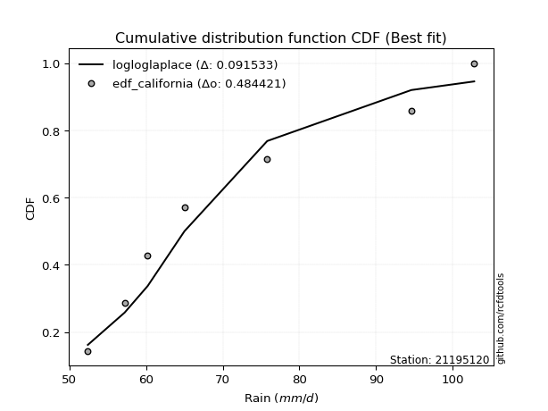</img>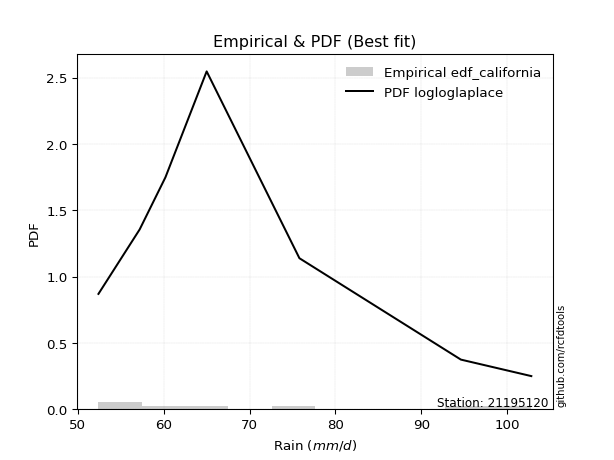</img>

</div>


### 2. Empirical - EDF Hazen (1930)

Hazen method for plotting positions is a formula used to estimate the empirical cumulative probability distribution of flood events or other hydrological data. This formula often results in biased estimations, particularly when extrapolating to extreme events (high return periods).

<div align="center">


$P=(m-0.5)/n$


</div>


**2.1. Empirical values**

<div align="center">

|                | 0                   | 1                   | 2                   | 3         | 4                  | 5                  | 6                  |
|:---------------|:--------------------|:--------------------|:--------------------|:----------|:-------------------|:-------------------|:-------------------|
| date           | 2023                | 2021                | 2025                | 2019      | 2020               | 2022               | 2024               |
| x              | 52.4                | 57.2                | 58.6                | 65.0      | 75.8               | 94.6               | 102.8              |
| m              | 1                   | 2                   | 3                   | 4         | 5                  | 6                  | 7                  |
| empirical_dist | edf_hazen           | edf_hazen           | edf_hazen           | edf_hazen | edf_hazen          | edf_hazen          | edf_hazen          |
| empirical      | 0.07142857142857142 | 0.21428571428571427 | 0.35714285714285715 | 0.5       | 0.6428571428571429 | 0.7857142857142857 | 0.9285714285714286 |
| empirical_tr   | 1.0769230769230769  | 1.2727272727272727  | 1.5555555555555558  | 2.0       | 2.8000000000000003 | 4.666666666666666  | 14.000000000000007 |

</div>


**2.2. Kolmogorov-Smirnov fit test (sorted by Δ)**


<div align="center">

|                | 0                   | 1                   | 2                   | 3                   | 4                   | 5                   | 6                   | 7                   | 8                   | 9                   | 10                  | 11                  | 12                  | 13                  | 14                  | 15                  | 16                  | 17                  | 18                  | 19                  | 20                    | 21                  | 22                  | 23                  | 24                  | 25                  | 26                  | 27                  | 28                  | 29                  | 30                  | 31                  | 32                  | 33                  | 34                  | 35                  | 36                  | 37                  | 38                  | 39                  | 40                  | 41                  | 42                  | 43                  | 44                  | 45                  | 46                  | 47                  | 48                  | 49                  | 50                  | 51                  | 52                  | 53                  | 54                  | 55                  | 56                  | 57                  | 58                  | 59                  | 60                  | 61                  | 62                  | 63                  | 64                  | 65                  | 66                  | 67                  | 68                  | 69                  | 70                  | 71                  | 72                  | 73                  | 74                  | 75                  | 76                  | 77                  | 78                  | 79                  | 80                  | 81                  | 82                  | 83                  | 84                  | 85                  | 86                  | 87                  | 88                  | 89                  |
|:---------------|:--------------------|:--------------------|:--------------------|:--------------------|:--------------------|:--------------------|:--------------------|:--------------------|:--------------------|:--------------------|:--------------------|:--------------------|:--------------------|:--------------------|:--------------------|:--------------------|:--------------------|:--------------------|:--------------------|:--------------------|:----------------------|:--------------------|:--------------------|:--------------------|:--------------------|:--------------------|:--------------------|:--------------------|:--------------------|:--------------------|:--------------------|:--------------------|:--------------------|:--------------------|:--------------------|:--------------------|:--------------------|:--------------------|:--------------------|:--------------------|:--------------------|:--------------------|:--------------------|:--------------------|:--------------------|:--------------------|:--------------------|:--------------------|:--------------------|:--------------------|:--------------------|:--------------------|:--------------------|:--------------------|:--------------------|:--------------------|:--------------------|:--------------------|:--------------------|:--------------------|:--------------------|:--------------------|:--------------------|:--------------------|:--------------------|:--------------------|:--------------------|:--------------------|:--------------------|:--------------------|:--------------------|:--------------------|:--------------------|:--------------------|:--------------------|:--------------------|:--------------------|:--------------------|:--------------------|:--------------------|:--------------------|:--------------------|:--------------------|:--------------------|:--------------------|:--------------------|:--------------------|:--------------------|:--------------------|:--------------------|
| station        | 21195120            | 21195120            | 21195120            | 21195120            | 21195120            | 21195120            | 21195120            | 21195120            | 21195120            | 21195120            | 21195120            | 21195120            | 21195120            | 21195120            | 21195120            | 21195120            | 21195120            | 21195120            | 21195120            | 21195120            | 21195120              | 21195120            | 21195120            | 21195120            | 21195120            | 21195120            | 21195120            | 21195120            | 21195120            | 21195120            | 21195120            | 21195120            | 21195120            | 21195120            | 21195120            | 21195120            | 21195120            | 21195120            | 21195120            | 21195120            | 21195120            | 21195120            | 21195120            | 21195120            | 21195120            | 21195120            | 21195120            | 21195120            | 21195120            | 21195120            | 21195120            | 21195120            | 21195120            | 21195120            | 21195120            | 21195120            | 21195120            | 21195120            | 21195120            | 21195120            | 21195120            | 21195120            | 21195120            | 21195120            | 21195120            | 21195120            | 21195120            | 21195120            | 21195120            | 21195120            | 21195120            | 21195120            | 21195120            | 21195120            | 21195120            | 21195120            | 21195120            | 21195120            | 21195120            | 21195120            | 21195120            | 21195120            | 21195120            | 21195120            | 21195120            | 21195120            | 21195120            | 21195120            | 21195120            | 21195120            |
| empirical_dist | edf_hazen           | edf_hazen           | edf_hazen           | edf_hazen           | edf_hazen           | edf_hazen           | edf_hazen           | edf_hazen           | edf_hazen           | edf_hazen           | edf_hazen           | edf_hazen           | edf_hazen           | edf_hazen           | edf_hazen           | edf_hazen           | edf_hazen           | edf_hazen           | edf_hazen           | edf_hazen           | edf_hazen             | edf_hazen           | edf_hazen           | edf_hazen           | edf_hazen           | edf_hazen           | edf_hazen           | edf_hazen           | edf_hazen           | edf_hazen           | edf_hazen           | edf_hazen           | edf_hazen           | edf_hazen           | edf_hazen           | edf_hazen           | edf_hazen           | edf_hazen           | edf_hazen           | edf_hazen           | edf_hazen           | edf_hazen           | edf_hazen           | edf_hazen           | edf_hazen           | edf_hazen           | edf_hazen           | edf_hazen           | edf_hazen           | edf_hazen           | edf_hazen           | edf_hazen           | edf_hazen           | edf_hazen           | edf_hazen           | edf_hazen           | edf_hazen           | edf_hazen           | edf_hazen           | edf_hazen           | edf_hazen           | edf_hazen           | edf_hazen           | edf_hazen           | edf_hazen           | edf_hazen           | edf_hazen           | edf_hazen           | edf_hazen           | edf_hazen           | edf_hazen           | edf_hazen           | edf_hazen           | edf_hazen           | edf_hazen           | edf_hazen           | edf_hazen           | edf_hazen           | edf_hazen           | edf_hazen           | edf_hazen           | edf_hazen           | edf_hazen           | edf_hazen           | edf_hazen           | edf_hazen           | edf_hazen           | edf_hazen           | edf_hazen           | edf_hazen           |
| p_dist         | logfisk             | logexponnorm        | logexpon            | invweibull          | logfatiguelife      | f                   | invgamma            | logtruncnorm        | loginvgauss         | logf                | loginvgamma         | loggenexpon         | alpha               | halfnorm            | invgauss            | loginvweibull       | loghalfnorm         | expon               | laplace_asymmetric  | genexpon            | loglaplace_asymmetric | exponnorm           | logweibull_min      | lograyleigh         | loghalflogistic     | halflogistic        | logmaxwell          | rayleigh            | logbetaprime        | logalpha            | loggenlogistic      | logmielke           | nakagami            | gompertz            | logkstwobign        | logpearson3         | maxwell             | pearson3            | logloggamma         | nct                 | loggumbel_r         | lognct              | betaprime           | gumbel_r            | logcrystalball      | lognorm             | lognorm             | logt                | logjohnsonsu        | genlogistic         | logmoyal            | moyal               | loggompertz         | kstwobign           | weibull_min         | lognakagami         | logrice             | loglogistic         | johnsonsu           | crystalball         | norm                | t                   | rice                | loghypsecant        | logistic            | loggamma            | loggamma            | loglaplace          | logerlang           | loggumbel_l         | hypsecant           | gumbel_l            | erlang              | laplace             | gamma               | logwald             | wald                | logncf              | fisk                | logchi2             | loggibrat           | gibrat              | pareto              | loglognorm          | logpareto           | fatiguelife         | ncf                 | chi2                | truncnorm           | mielke              |
| delta          | 0.06786162711574895 | 0.08110012482385787 | 0.08141807772275778 | 0.08157403729153101 | 0.0832721707308256  | 0.08466143153052763 | 0.08592426307263312 | 0.08665990964978232 | 0.08759158172894588 | 0.08865036071761867 | 0.0886506867013902  | 0.08906227194006633 | 0.08926602842552245 | 0.09006422585047857 | 0.09046681822138003 | 0.09068412426657213 | 0.09160308754060009 | 0.09377852253721575 | 0.09378136339955379 | 0.09378166447848124 | 0.09443918065968088   | 0.09538689106271336 | 0.09552232749636569 | 0.10541347484174485 | 0.10819910887140954 | 0.11201855800175847 | 0.11285537918831254 | 0.11368681734776342 | 0.11401628781284992 | 0.11498983712772215 | 0.11656404491585765 | 0.11657421528676126 | 0.11753700879164525 | 0.12042149965633125 | 0.12165209236917104 | 0.12212742973444862 | 0.12565803102203893 | 0.12613057175438663 | 0.12626526757392337 | 0.126519819467856   | 0.12728879981077054 | 0.12774304163558592 | 0.12998025990355033 | 0.13021729254968617 | 0.13069779557685426 | 0.13069790783045487 | 0.13069790783045487 | 0.1307002578762137  | 0.1312189128150945  | 0.1313961494445466  | 0.13453053096199658 | 0.13800241781927597 | 0.1393296114595651  | 0.14217171480009178 | 0.1456028129529904  | 0.14617517641955266 | 0.14881535980707541 | 0.15313785956219333 | 0.15522476540259256 | 0.15713946510825005 | 0.1571394791118199  | 0.15715147576898936 | 0.16654450310770702 | 0.16718301213838735 | 0.1756797696277113  | 0.18112999295955012 | 0.18112999295955012 | 0.1841775351585649  | 0.18841091394871215 | 0.18917472956110593 | 0.18994169368980135 | 0.2159602984007869  | 0.21707417870308723 | 0.21788349779468014 | 0.22214102600413702 | 0.2451922674049264  | 0.2520507627770831  | 0.25852003077343144 | 0.31954600299443203 | 0.32766897260534533 | 0.35700410818989103 | 0.3571382102262502  | 0.4033347157747885  | 0.4097962018016781  | 0.4118713631745714  | 0.501984860418857   | 0.5943598772095858  | 0.7433677444388171  | 0.9276284091559078  | nan                 |
| deltao         | 0.48442053926100004 | 0.48442053926100004 | 0.48442053926100004 | 0.48442053926100004 | 0.48442053926100004 | 0.48442053926100004 | 0.48442053926100004 | 0.48442053926100004 | 0.48442053926100004 | 0.48442053926100004 | 0.48442053926100004 | 0.48442053926100004 | 0.48442053926100004 | 0.48442053926100004 | 0.48442053926100004 | 0.48442053926100004 | 0.48442053926100004 | 0.48442053926100004 | 0.48442053926100004 | 0.48442053926100004 | 0.48442053926100004   | 0.48442053926100004 | 0.48442053926100004 | 0.48442053926100004 | 0.48442053926100004 | 0.48442053926100004 | 0.48442053926100004 | 0.48442053926100004 | 0.48442053926100004 | 0.48442053926100004 | 0.48442053926100004 | 0.48442053926100004 | 0.48442053926100004 | 0.48442053926100004 | 0.48442053926100004 | 0.48442053926100004 | 0.48442053926100004 | 0.48442053926100004 | 0.48442053926100004 | 0.48442053926100004 | 0.48442053926100004 | 0.48442053926100004 | 0.48442053926100004 | 0.48442053926100004 | 0.48442053926100004 | 0.48442053926100004 | 0.48442053926100004 | 0.48442053926100004 | 0.48442053926100004 | 0.48442053926100004 | 0.48442053926100004 | 0.48442053926100004 | 0.48442053926100004 | 0.48442053926100004 | 0.48442053926100004 | 0.48442053926100004 | 0.48442053926100004 | 0.48442053926100004 | 0.48442053926100004 | 0.48442053926100004 | 0.48442053926100004 | 0.48442053926100004 | 0.48442053926100004 | 0.48442053926100004 | 0.48442053926100004 | 0.48442053926100004 | 0.48442053926100004 | 0.48442053926100004 | 0.48442053926100004 | 0.48442053926100004 | 0.48442053926100004 | 0.48442053926100004 | 0.48442053926100004 | 0.48442053926100004 | 0.48442053926100004 | 0.48442053926100004 | 0.48442053926100004 | 0.48442053926100004 | 0.48442053926100004 | 0.48442053926100004 | 0.48442053926100004 | 0.48442053926100004 | 0.48442053926100004 | 0.48442053926100004 | 0.48442053926100004 | 0.48442053926100004 | 0.48442053926100004 | 0.48442053926100004 | 0.48442053926100004 | 0.48442053926100004 |
| eval           | Δo > Δ              | Δo > Δ              | Δo > Δ              | Δo > Δ              | Δo > Δ              | Δo > Δ              | Δo > Δ              | Δo > Δ              | Δo > Δ              | Δo > Δ              | Δo > Δ              | Δo > Δ              | Δo > Δ              | Δo > Δ              | Δo > Δ              | Δo > Δ              | Δo > Δ              | Δo > Δ              | Δo > Δ              | Δo > Δ              | Δo > Δ                | Δo > Δ              | Δo > Δ              | Δo > Δ              | Δo > Δ              | Δo > Δ              | Δo > Δ              | Δo > Δ              | Δo > Δ              | Δo > Δ              | Δo > Δ              | Δo > Δ              | Δo > Δ              | Δo > Δ              | Δo > Δ              | Δo > Δ              | Δo > Δ              | Δo > Δ              | Δo > Δ              | Δo > Δ              | Δo > Δ              | Δo > Δ              | Δo > Δ              | Δo > Δ              | Δo > Δ              | Δo > Δ              | Δo > Δ              | Δo > Δ              | Δo > Δ              | Δo > Δ              | Δo > Δ              | Δo > Δ              | Δo > Δ              | Δo > Δ              | Δo > Δ              | Δo > Δ              | Δo > Δ              | Δo > Δ              | Δo > Δ              | Δo > Δ              | Δo > Δ              | Δo > Δ              | Δo > Δ              | Δo > Δ              | Δo > Δ              | Δo > Δ              | Δo > Δ              | Δo > Δ              | Δo > Δ              | Δo > Δ              | Δo > Δ              | Δo > Δ              | Δo > Δ              | Δo > Δ              | Δo > Δ              | Δo > Δ              | Δo > Δ              | Δo > Δ              | Δo > Δ              | Δo > Δ              | Δo > Δ              | Δo > Δ              | Δo > Δ              | Δo > Δ              | Δo > Δ              | Δo <= Δ             | Δo <= Δ             | Δo <= Δ             | Δo <= Δ             | Δo <= Δ             |
| fit            | 1                   | 1                   | 1                   | 1                   | 1                   | 1                   | 1                   | 1                   | 1                   | 1                   | 1                   | 1                   | 1                   | 1                   | 1                   | 1                   | 1                   | 1                   | 1                   | 1                   | 1                     | 1                   | 1                   | 1                   | 1                   | 1                   | 1                   | 1                   | 1                   | 1                   | 1                   | 1                   | 1                   | 1                   | 1                   | 1                   | 1                   | 1                   | 1                   | 1                   | 1                   | 1                   | 1                   | 1                   | 1                   | 1                   | 1                   | 1                   | 1                   | 1                   | 1                   | 1                   | 1                   | 1                   | 1                   | 1                   | 1                   | 1                   | 1                   | 1                   | 1                   | 1                   | 1                   | 1                   | 1                   | 1                   | 1                   | 1                   | 1                   | 1                   | 1                   | 1                   | 1                   | 1                   | 1                   | 1                   | 1                   | 1                   | 1                   | 1                   | 1                   | 1                   | 1                   | 1                   | 1                   | 0                   | 0                   | 0                   | 0                   | 0                   |
| n              | 7                   | 7                   | 7                   | 7                   | 7                   | 7                   | 7                   | 7                   | 7                   | 7                   | 7                   | 7                   | 7                   | 7                   | 7                   | 7                   | 7                   | 7                   | 7                   | 7                   | 7                     | 7                   | 7                   | 7                   | 7                   | 7                   | 7                   | 7                   | 7                   | 7                   | 7                   | 7                   | 7                   | 7                   | 7                   | 7                   | 7                   | 7                   | 7                   | 7                   | 7                   | 7                   | 7                   | 7                   | 7                   | 7                   | 7                   | 7                   | 7                   | 7                   | 7                   | 7                   | 7                   | 7                   | 7                   | 7                   | 7                   | 7                   | 7                   | 7                   | 7                   | 7                   | 7                   | 7                   | 7                   | 7                   | 7                   | 7                   | 7                   | 7                   | 7                   | 7                   | 7                   | 7                   | 7                   | 7                   | 7                   | 7                   | 7                   | 7                   | 7                   | 7                   | 7                   | 7                   | 7                   | 7                   | 7                   | 7                   | 7                   | 7                   |
| best_fit       | 1                   | 0                   | 0                   | 0                   | 0                   | 0                   | 0                   | 0                   | 0                   | 0                   | 0                   | 0                   | 0                   | 0                   | 0                   | 0                   | 0                   | 0                   | 0                   | 0                   | 0                     | 0                   | 0                   | 0                   | 0                   | 0                   | 0                   | 0                   | 0                   | 0                   | 0                   | 0                   | 0                   | 0                   | 0                   | 0                   | 0                   | 0                   | 0                   | 0                   | 0                   | 0                   | 0                   | 0                   | 0                   | 0                   | 0                   | 0                   | 0                   | 0                   | 0                   | 0                   | 0                   | 0                   | 0                   | 0                   | 0                   | 0                   | 0                   | 0                   | 0                   | 0                   | 0                   | 0                   | 0                   | 0                   | 0                   | 0                   | 0                   | 0                   | 0                   | 0                   | 0                   | 0                   | 0                   | 0                   | 0                   | 0                   | 0                   | 0                   | 0                   | 0                   | 0                   | 0                   | 0                   | 0                   | 0                   | 0                   | 0                   | 0                   |
| best_fit_sort  | 1                   | 2                   | 3                   | 4                   | 5                   | 6                   | 7                   | 8                   | 9                   | 10                  | 11                  | 12                  | 13                  | 14                  | 15                  | 16                  | 17                  | 18                  | 19                  | 20                  | 21                    | 22                  | 23                  | 24                  | 25                  | 26                  | 27                  | 28                  | 29                  | 30                  | 31                  | 32                  | 33                  | 34                  | 35                  | 36                  | 37                  | 38                  | 39                  | 40                  | 41                  | 42                  | 43                  | 44                  | 45                  | 46                  | 47                  | 48                  | 49                  | 50                  | 51                  | 52                  | 53                  | 54                  | 55                  | 56                  | 57                  | 58                  | 59                  | 60                  | 61                  | 62                  | 63                  | 64                  | 65                  | 66                  | 67                  | 68                  | 69                  | 70                  | 71                  | 72                  | 73                  | 74                  | 75                  | 76                  | 77                  | 78                  | 79                  | 80                  | 81                  | 82                  | 83                  | 84                  | 85                  | 86                  | 87                  | 88                  | 89                  | 90                  |

</div>


<div align="center">

</img>

</div>


**2.3. Best fit**

<div align="center">

|   id |   station | empirical_dist   | p_dist   |     delta |   deltao | eval   |   fit |   n |   best_fit |   best_fit_sort |
|-----:|----------:|:-----------------|:---------|----------:|---------:|:-------|------:|----:|-----------:|----------------:|
|    0 |  21195120 | edf_hazen        | logfisk  | 0.0678616 | 0.484421 | Δo > Δ |     1 |   7 |          1 |               1 |

</div>


<div align="center">

</img>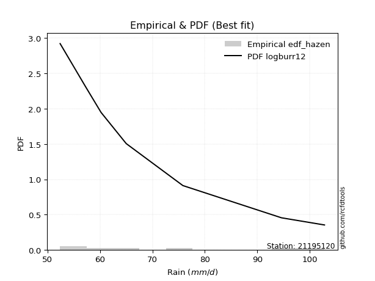</img>

</div>


### 3. Empirical - EDF Weibull (1939)

Weibull plotting position formula is an empirical method used to estimate the non-exceedance probability or plotting position for a set of observed data, is often recommended or widely used in practice, particularly in flood frequency analysis.

<div align="center">


$P=m/(n+1)$


</div>


**3.1. Empirical values**

<div align="center">

|                | 0                  | 1                  | 2           | 3           | 4                  | 5           | 6           |
|:---------------|:-------------------|:-------------------|:------------|:------------|:-------------------|:------------|:------------|
| date           | 2023               | 2021               | 2025        | 2019        | 2020               | 2022        | 2024        |
| x              | 52.4               | 57.2               | 58.6        | 65.0        | 75.8               | 94.6        | 102.8       |
| m              | 1                  | 2                  | 3           | 4           | 5                  | 6           | 7           |
| empirical_dist | edf_weibull        | edf_weibull        | edf_weibull | edf_weibull | edf_weibull        | edf_weibull | edf_weibull |
| empirical      | 0.125              | 0.25               | 0.375       | 0.5         | 0.625              | 0.75        | 0.875       |
| empirical_tr   | 1.1428571428571428 | 1.3333333333333333 | 1.6         | 2.0         | 2.6666666666666665 | 4.0         | 8.0         |

</div>


**3.2. Kolmogorov-Smirnov fit test (sorted by Δ)**


<div align="center">

|                | 0                   | 1                   | 2                   | 3                   | 4                   | 5                   | 6                   | 7                   | 8                   | 9                   | 10                  | 11                  | 12                  | 13                  | 14                  | 15                  | 16                    | 17                  | 18                  | 19                  | 20                  | 21                  | 22                  | 23                  | 24                  | 25                  | 26                  | 27                  | 28                  | 29                  | 30                  | 31                  | 32                  | 33                  | 34                  | 35                  | 36                  | 37                  | 38                  | 39                  | 40                  | 41                  | 42                  | 43                  | 44                  | 45                  | 46                  | 47                  | 48                  | 49                  | 50                  | 51                  | 52                  | 53                  | 54                  | 55                  | 56                  | 57                  | 58                  | 59                  | 60                  | 61                  | 62                  | 63                  | 64                  | 65                  | 66                  | 67                  | 68                  | 69                  | 70                  | 71                  | 72                  | 73                  | 74                  | 75                  | 76                  | 77                  | 78                  | 79                  | 80                  | 81                  | 82                  | 83                  | 84                  | 85                  | 86                  | 87                  | 88                  | 89                  |
|:---------------|:--------------------|:--------------------|:--------------------|:--------------------|:--------------------|:--------------------|:--------------------|:--------------------|:--------------------|:--------------------|:--------------------|:--------------------|:--------------------|:--------------------|:--------------------|:--------------------|:----------------------|:--------------------|:--------------------|:--------------------|:--------------------|:--------------------|:--------------------|:--------------------|:--------------------|:--------------------|:--------------------|:--------------------|:--------------------|:--------------------|:--------------------|:--------------------|:--------------------|:--------------------|:--------------------|:--------------------|:--------------------|:--------------------|:--------------------|:--------------------|:--------------------|:--------------------|:--------------------|:--------------------|:--------------------|:--------------------|:--------------------|:--------------------|:--------------------|:--------------------|:--------------------|:--------------------|:--------------------|:--------------------|:--------------------|:--------------------|:--------------------|:--------------------|:--------------------|:--------------------|:--------------------|:--------------------|:--------------------|:--------------------|:--------------------|:--------------------|:--------------------|:--------------------|:--------------------|:--------------------|:--------------------|:--------------------|:--------------------|:--------------------|:--------------------|:--------------------|:--------------------|:--------------------|:--------------------|:--------------------|:--------------------|:--------------------|:--------------------|:--------------------|:--------------------|:--------------------|:--------------------|:--------------------|:--------------------|:--------------------|
| station        | 21195120            | 21195120            | 21195120            | 21195120            | 21195120            | 21195120            | 21195120            | 21195120            | 21195120            | 21195120            | 21195120            | 21195120            | 21195120            | 21195120            | 21195120            | 21195120            | 21195120              | 21195120            | 21195120            | 21195120            | 21195120            | 21195120            | 21195120            | 21195120            | 21195120            | 21195120            | 21195120            | 21195120            | 21195120            | 21195120            | 21195120            | 21195120            | 21195120            | 21195120            | 21195120            | 21195120            | 21195120            | 21195120            | 21195120            | 21195120            | 21195120            | 21195120            | 21195120            | 21195120            | 21195120            | 21195120            | 21195120            | 21195120            | 21195120            | 21195120            | 21195120            | 21195120            | 21195120            | 21195120            | 21195120            | 21195120            | 21195120            | 21195120            | 21195120            | 21195120            | 21195120            | 21195120            | 21195120            | 21195120            | 21195120            | 21195120            | 21195120            | 21195120            | 21195120            | 21195120            | 21195120            | 21195120            | 21195120            | 21195120            | 21195120            | 21195120            | 21195120            | 21195120            | 21195120            | 21195120            | 21195120            | 21195120            | 21195120            | 21195120            | 21195120            | 21195120            | 21195120            | 21195120            | 21195120            | 21195120            |
| empirical_dist | edf_weibull         | edf_weibull         | edf_weibull         | edf_weibull         | edf_weibull         | edf_weibull         | edf_weibull         | edf_weibull         | edf_weibull         | edf_weibull         | edf_weibull         | edf_weibull         | edf_weibull         | edf_weibull         | edf_weibull         | edf_weibull         | edf_weibull           | edf_weibull         | edf_weibull         | edf_weibull         | edf_weibull         | edf_weibull         | edf_weibull         | edf_weibull         | edf_weibull         | edf_weibull         | edf_weibull         | edf_weibull         | edf_weibull         | edf_weibull         | edf_weibull         | edf_weibull         | edf_weibull         | edf_weibull         | edf_weibull         | edf_weibull         | edf_weibull         | edf_weibull         | edf_weibull         | edf_weibull         | edf_weibull         | edf_weibull         | edf_weibull         | edf_weibull         | edf_weibull         | edf_weibull         | edf_weibull         | edf_weibull         | edf_weibull         | edf_weibull         | edf_weibull         | edf_weibull         | edf_weibull         | edf_weibull         | edf_weibull         | edf_weibull         | edf_weibull         | edf_weibull         | edf_weibull         | edf_weibull         | edf_weibull         | edf_weibull         | edf_weibull         | edf_weibull         | edf_weibull         | edf_weibull         | edf_weibull         | edf_weibull         | edf_weibull         | edf_weibull         | edf_weibull         | edf_weibull         | edf_weibull         | edf_weibull         | edf_weibull         | edf_weibull         | edf_weibull         | edf_weibull         | edf_weibull         | edf_weibull         | edf_weibull         | edf_weibull         | edf_weibull         | edf_weibull         | edf_weibull         | edf_weibull         | edf_weibull         | edf_weibull         | edf_weibull         | edf_weibull         |
| p_dist         | logfisk             | invweibull          | logfatiguelife      | alpha               | f                   | invgamma            | loginvgauss         | logexponnorm        | logf                | loginvgamma         | logtruncnorm        | lognakagami         | weibull_min         | loggenexpon         | logweibull_min      | logexpon            | loglaplace_asymmetric | halfnorm            | invgauss            | loginvweibull       | loghalfnorm         | rayleigh            | expon               | laplace_asymmetric  | genexpon            | exponnorm           | lograyleigh         | maxwell             | logmaxwell          | nakagami            | logbetaprime        | halflogistic        | gompertz            | loghalflogistic     | pearson3            | logpearson3         | logalpha            | logmielke           | loggenlogistic      | logloggamma         | nct                 | logkstwobign        | loggumbel_r         | lognct              | betaprime           | gumbel_r            | logcrystalball      | lognorm             | lognorm             | logt                | logjohnsonsu        | logmoyal            | genlogistic         | johnsonsu           | moyal               | crystalball         | norm                | t                   | loggompertz         | kstwobign           | logrice             | loglogistic         | logistic            | rice                | loghypsecant        | loggumbel_l         | hypsecant           | logerlang           | loggamma            | loggamma            | erlang              | loglaplace          | logncf              | gumbel_l            | laplace             | gamma               | logwald             | fisk                | wald                | logchi2             | pareto              | loglognorm          | loggibrat           | gibrat              | logpareto           | fatiguelife         | ncf                 | chi2                | truncnorm           | mielke              |
| delta          | 0.09146179672839404 | 0.11728832300581671 | 0.1189864564451113  | 0.11901086376711822 | 0.12037571724481333 | 0.12163854878691882 | 0.12330586744323158 | 0.12396861222672173 | 0.12436464643190437 | 0.1243649724156759  | 0.12499694499026896 | 0.12499998776456503 | 0.12499999843142856 | 0.12499999983801714 | 0.1249999999999948  | 0.125               | 0.12512689278097677   | 0.12577851156476427 | 0.12618110393566573 | 0.12639840998085783 | 0.1273173732548858  | 0.12941877817314307 | 0.12949280825150145 | 0.12949564911383948 | 0.12949595019276694 | 0.13110117677699906 | 0.13111252569114584 | 0.13309513038130172 | 0.13339188854865602 | 0.1353941516487881  | 0.13648386681938351 | 0.13759784786128004 | 0.1382786425134741  | 0.13885785040082133 | 0.1397770316878981  | 0.13998457259159147 | 0.14142796940952884 | 0.14264501799916207 | 0.1439092303141618  | 0.14412241043106622 | 0.14437696232499886 | 0.14510019703973331 | 0.1451459426679134  | 0.14560018449272877 | 0.14783740276069318 | 0.14807443540682902 | 0.1485549384339971  | 0.14855505068759772 | 0.14855505068759772 | 0.14855740073335655 | 0.14907605567223736 | 0.15238767381913942 | 0.15316935648534158 | 0.15522476540259256 | 0.15585956067641882 | 0.15713946510825005 | 0.1571394791118199  | 0.15715147576898936 | 0.15718675431670795 | 0.16002885765723462 | 0.16667250266421826 | 0.17099500241933618 | 0.1756797696277113  | 0.18440164596484987 | 0.1850401549955302  | 0.18917472956110593 | 0.18994169368980135 | 0.19148921159780963 | 0.19898713581669303 | 0.19898713581669303 | 0.20133178623227388 | 0.20203467801570774 | 0.20494860220200284 | 0.2159602984007869  | 0.21788349779468014 | 0.2219661639720547  | 0.26304941026206924 | 0.26597457442300343 | 0.26990790563422595 | 0.27409754403391673 | 0.3676204300605028  | 0.3740819160873924  | 0.3748612510470339  | 0.37499535308339305 | 0.3761570774602857  | 0.46627057470457134 | 0.5407884486381572  | 0.7076534587245314  | 0.8740569805844792  | nan                 |
| deltao         | 0.48442053926100004 | 0.48442053926100004 | 0.48442053926100004 | 0.48442053926100004 | 0.48442053926100004 | 0.48442053926100004 | 0.48442053926100004 | 0.48442053926100004 | 0.48442053926100004 | 0.48442053926100004 | 0.48442053926100004 | 0.48442053926100004 | 0.48442053926100004 | 0.48442053926100004 | 0.48442053926100004 | 0.48442053926100004 | 0.48442053926100004   | 0.48442053926100004 | 0.48442053926100004 | 0.48442053926100004 | 0.48442053926100004 | 0.48442053926100004 | 0.48442053926100004 | 0.48442053926100004 | 0.48442053926100004 | 0.48442053926100004 | 0.48442053926100004 | 0.48442053926100004 | 0.48442053926100004 | 0.48442053926100004 | 0.48442053926100004 | 0.48442053926100004 | 0.48442053926100004 | 0.48442053926100004 | 0.48442053926100004 | 0.48442053926100004 | 0.48442053926100004 | 0.48442053926100004 | 0.48442053926100004 | 0.48442053926100004 | 0.48442053926100004 | 0.48442053926100004 | 0.48442053926100004 | 0.48442053926100004 | 0.48442053926100004 | 0.48442053926100004 | 0.48442053926100004 | 0.48442053926100004 | 0.48442053926100004 | 0.48442053926100004 | 0.48442053926100004 | 0.48442053926100004 | 0.48442053926100004 | 0.48442053926100004 | 0.48442053926100004 | 0.48442053926100004 | 0.48442053926100004 | 0.48442053926100004 | 0.48442053926100004 | 0.48442053926100004 | 0.48442053926100004 | 0.48442053926100004 | 0.48442053926100004 | 0.48442053926100004 | 0.48442053926100004 | 0.48442053926100004 | 0.48442053926100004 | 0.48442053926100004 | 0.48442053926100004 | 0.48442053926100004 | 0.48442053926100004 | 0.48442053926100004 | 0.48442053926100004 | 0.48442053926100004 | 0.48442053926100004 | 0.48442053926100004 | 0.48442053926100004 | 0.48442053926100004 | 0.48442053926100004 | 0.48442053926100004 | 0.48442053926100004 | 0.48442053926100004 | 0.48442053926100004 | 0.48442053926100004 | 0.48442053926100004 | 0.48442053926100004 | 0.48442053926100004 | 0.48442053926100004 | 0.48442053926100004 | 0.48442053926100004 |
| eval           | Δo > Δ              | Δo > Δ              | Δo > Δ              | Δo > Δ              | Δo > Δ              | Δo > Δ              | Δo > Δ              | Δo > Δ              | Δo > Δ              | Δo > Δ              | Δo > Δ              | Δo > Δ              | Δo > Δ              | Δo > Δ              | Δo > Δ              | Δo > Δ              | Δo > Δ                | Δo > Δ              | Δo > Δ              | Δo > Δ              | Δo > Δ              | Δo > Δ              | Δo > Δ              | Δo > Δ              | Δo > Δ              | Δo > Δ              | Δo > Δ              | Δo > Δ              | Δo > Δ              | Δo > Δ              | Δo > Δ              | Δo > Δ              | Δo > Δ              | Δo > Δ              | Δo > Δ              | Δo > Δ              | Δo > Δ              | Δo > Δ              | Δo > Δ              | Δo > Δ              | Δo > Δ              | Δo > Δ              | Δo > Δ              | Δo > Δ              | Δo > Δ              | Δo > Δ              | Δo > Δ              | Δo > Δ              | Δo > Δ              | Δo > Δ              | Δo > Δ              | Δo > Δ              | Δo > Δ              | Δo > Δ              | Δo > Δ              | Δo > Δ              | Δo > Δ              | Δo > Δ              | Δo > Δ              | Δo > Δ              | Δo > Δ              | Δo > Δ              | Δo > Δ              | Δo > Δ              | Δo > Δ              | Δo > Δ              | Δo > Δ              | Δo > Δ              | Δo > Δ              | Δo > Δ              | Δo > Δ              | Δo > Δ              | Δo > Δ              | Δo > Δ              | Δo > Δ              | Δo > Δ              | Δo > Δ              | Δo > Δ              | Δo > Δ              | Δo > Δ              | Δo > Δ              | Δo > Δ              | Δo > Δ              | Δo > Δ              | Δo > Δ              | Δo > Δ              | Δo <= Δ             | Δo <= Δ             | Δo <= Δ             | Δo <= Δ             |
| fit            | 1                   | 1                   | 1                   | 1                   | 1                   | 1                   | 1                   | 1                   | 1                   | 1                   | 1                   | 1                   | 1                   | 1                   | 1                   | 1                   | 1                     | 1                   | 1                   | 1                   | 1                   | 1                   | 1                   | 1                   | 1                   | 1                   | 1                   | 1                   | 1                   | 1                   | 1                   | 1                   | 1                   | 1                   | 1                   | 1                   | 1                   | 1                   | 1                   | 1                   | 1                   | 1                   | 1                   | 1                   | 1                   | 1                   | 1                   | 1                   | 1                   | 1                   | 1                   | 1                   | 1                   | 1                   | 1                   | 1                   | 1                   | 1                   | 1                   | 1                   | 1                   | 1                   | 1                   | 1                   | 1                   | 1                   | 1                   | 1                   | 1                   | 1                   | 1                   | 1                   | 1                   | 1                   | 1                   | 1                   | 1                   | 1                   | 1                   | 1                   | 1                   | 1                   | 1                   | 1                   | 1                   | 1                   | 0                   | 0                   | 0                   | 0                   |
| n              | 7                   | 7                   | 7                   | 7                   | 7                   | 7                   | 7                   | 7                   | 7                   | 7                   | 7                   | 7                   | 7                   | 7                   | 7                   | 7                   | 7                     | 7                   | 7                   | 7                   | 7                   | 7                   | 7                   | 7                   | 7                   | 7                   | 7                   | 7                   | 7                   | 7                   | 7                   | 7                   | 7                   | 7                   | 7                   | 7                   | 7                   | 7                   | 7                   | 7                   | 7                   | 7                   | 7                   | 7                   | 7                   | 7                   | 7                   | 7                   | 7                   | 7                   | 7                   | 7                   | 7                   | 7                   | 7                   | 7                   | 7                   | 7                   | 7                   | 7                   | 7                   | 7                   | 7                   | 7                   | 7                   | 7                   | 7                   | 7                   | 7                   | 7                   | 7                   | 7                   | 7                   | 7                   | 7                   | 7                   | 7                   | 7                   | 7                   | 7                   | 7                   | 7                   | 7                   | 7                   | 7                   | 7                   | 7                   | 7                   | 7                   | 7                   |
| best_fit       | 1                   | 0                   | 0                   | 0                   | 0                   | 0                   | 0                   | 0                   | 0                   | 0                   | 0                   | 0                   | 0                   | 0                   | 0                   | 0                   | 0                     | 0                   | 0                   | 0                   | 0                   | 0                   | 0                   | 0                   | 0                   | 0                   | 0                   | 0                   | 0                   | 0                   | 0                   | 0                   | 0                   | 0                   | 0                   | 0                   | 0                   | 0                   | 0                   | 0                   | 0                   | 0                   | 0                   | 0                   | 0                   | 0                   | 0                   | 0                   | 0                   | 0                   | 0                   | 0                   | 0                   | 0                   | 0                   | 0                   | 0                   | 0                   | 0                   | 0                   | 0                   | 0                   | 0                   | 0                   | 0                   | 0                   | 0                   | 0                   | 0                   | 0                   | 0                   | 0                   | 0                   | 0                   | 0                   | 0                   | 0                   | 0                   | 0                   | 0                   | 0                   | 0                   | 0                   | 0                   | 0                   | 0                   | 0                   | 0                   | 0                   | 0                   |
| best_fit_sort  | 1                   | 2                   | 3                   | 4                   | 5                   | 6                   | 7                   | 8                   | 9                   | 10                  | 11                  | 12                  | 13                  | 14                  | 15                  | 16                  | 17                    | 18                  | 19                  | 20                  | 21                  | 22                  | 23                  | 24                  | 25                  | 26                  | 27                  | 28                  | 29                  | 30                  | 31                  | 32                  | 33                  | 34                  | 35                  | 36                  | 37                  | 38                  | 39                  | 40                  | 41                  | 42                  | 43                  | 44                  | 45                  | 46                  | 47                  | 48                  | 49                  | 50                  | 51                  | 52                  | 53                  | 54                  | 55                  | 56                  | 57                  | 58                  | 59                  | 60                  | 61                  | 62                  | 63                  | 64                  | 65                  | 66                  | 67                  | 68                  | 69                  | 70                  | 71                  | 72                  | 73                  | 74                  | 75                  | 76                  | 77                  | 78                  | 79                  | 80                  | 81                  | 82                  | 83                  | 84                  | 85                  | 86                  | 87                  | 88                  | 89                  | 90                  |

</div>


<div align="center">

</img>

</div>


**3.3. Best fit**

<div align="center">

|   id |   station | empirical_dist   | p_dist   |     delta |   deltao | eval   |   fit |   n |   best_fit |   best_fit_sort |
|-----:|----------:|:-----------------|:---------|----------:|---------:|:-------|------:|----:|-----------:|----------------:|
|    0 |  21195120 | edf_weibull      | logfisk  | 0.0914618 | 0.484421 | Δo > Δ |     1 |   7 |          1 |               1 |

</div>


<div align="center">

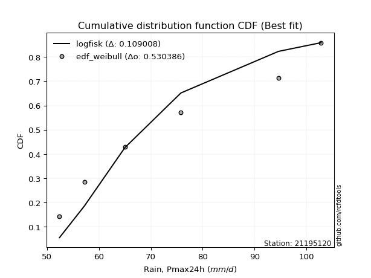</img>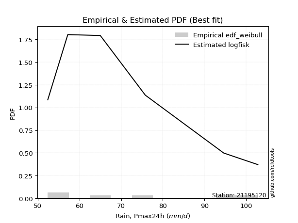</img>

</div>


### 4. Empirical - EDF Beard (1943)

The Beard formula (or Beard´s plotting position formula) in hydrology is used to estimate the empirical non-exceedance probability _(P)_ of a flood event (or other extreme hydrological data point) within a given dataset.

<div align="center">


$P=(m-0.31)/(n+0.38)$


</div>


**4.1. Empirical values**

<div align="center">

|                | 0                   | 1                   | 2                   | 3         | 4                  | 5                  | 6                  |
|:---------------|:--------------------|:--------------------|:--------------------|:----------|:-------------------|:-------------------|:-------------------|
| date           | 2023                | 2021                | 2025                | 2019      | 2020               | 2022               | 2024               |
| x              | 52.4                | 57.2                | 58.6                | 65.0      | 75.8               | 94.6               | 102.8              |
| m              | 1                   | 2                   | 3                   | 4         | 5                  | 6                  | 7                  |
| empirical_dist | edf_beard           | edf_beard           | edf_beard           | edf_beard | edf_beard          | edf_beard          | edf_beard          |
| empirical      | 0.09349593495934959 | 0.22899728997289973 | 0.36449864498644985 | 0.5       | 0.6355013550135502 | 0.7710027100271003 | 0.9065040650406505 |
| empirical_tr   | 1.1031390134529149  | 1.29701230228471    | 1.5735607675906182  | 2.0       | 2.743494423791822  | 4.366863905325444  | 10.695652173913055 |

</div>


**4.2. Kolmogorov-Smirnov fit test (sorted by Δ)**


<div align="center">

|                | 0                   | 1                   | 2                   | 3                   | 4                   | 5                   | 6                   | 7                   | 8                   | 9                   | 10                  | 11                  | 12                  | 13                  | 14                    | 15                  | 16                  | 17                  | 18                  | 19                  | 20                  | 21                  | 22                  | 23                  | 24                  | 25                  | 26                  | 27                  | 28                  | 29                  | 30                  | 31                  | 32                  | 33                  | 34                  | 35                  | 36                  | 37                  | 38                  | 39                  | 40                  | 41                  | 42                  | 43                  | 44                  | 45                  | 46                  | 47                  | 48                  | 49                  | 50                  | 51                  | 52                  | 53                  | 54                  | 55                  | 56                  | 57                  | 58                  | 59                  | 60                  | 61                  | 62                  | 63                  | 64                  | 65                  | 66                  | 67                  | 68                  | 69                  | 70                  | 71                  | 72                  | 73                  | 74                  | 75                  | 76                  | 77                  | 78                  | 79                  | 80                  | 81                  | 82                  | 83                  | 84                  | 85                  | 86                  | 87                  | 88                  | 89                  |
|:---------------|:--------------------|:--------------------|:--------------------|:--------------------|:--------------------|:--------------------|:--------------------|:--------------------|:--------------------|:--------------------|:--------------------|:--------------------|:--------------------|:--------------------|:----------------------|:--------------------|:--------------------|:--------------------|:--------------------|:--------------------|:--------------------|:--------------------|:--------------------|:--------------------|:--------------------|:--------------------|:--------------------|:--------------------|:--------------------|:--------------------|:--------------------|:--------------------|:--------------------|:--------------------|:--------------------|:--------------------|:--------------------|:--------------------|:--------------------|:--------------------|:--------------------|:--------------------|:--------------------|:--------------------|:--------------------|:--------------------|:--------------------|:--------------------|:--------------------|:--------------------|:--------------------|:--------------------|:--------------------|:--------------------|:--------------------|:--------------------|:--------------------|:--------------------|:--------------------|:--------------------|:--------------------|:--------------------|:--------------------|:--------------------|:--------------------|:--------------------|:--------------------|:--------------------|:--------------------|:--------------------|:--------------------|:--------------------|:--------------------|:--------------------|:--------------------|:--------------------|:--------------------|:--------------------|:--------------------|:--------------------|:--------------------|:--------------------|:--------------------|:--------------------|:--------------------|:--------------------|:--------------------|:--------------------|:--------------------|:--------------------|
| station        | 21195120            | 21195120            | 21195120            | 21195120            | 21195120            | 21195120            | 21195120            | 21195120            | 21195120            | 21195120            | 21195120            | 21195120            | 21195120            | 21195120            | 21195120              | 21195120            | 21195120            | 21195120            | 21195120            | 21195120            | 21195120            | 21195120            | 21195120            | 21195120            | 21195120            | 21195120            | 21195120            | 21195120            | 21195120            | 21195120            | 21195120            | 21195120            | 21195120            | 21195120            | 21195120            | 21195120            | 21195120            | 21195120            | 21195120            | 21195120            | 21195120            | 21195120            | 21195120            | 21195120            | 21195120            | 21195120            | 21195120            | 21195120            | 21195120            | 21195120            | 21195120            | 21195120            | 21195120            | 21195120            | 21195120            | 21195120            | 21195120            | 21195120            | 21195120            | 21195120            | 21195120            | 21195120            | 21195120            | 21195120            | 21195120            | 21195120            | 21195120            | 21195120            | 21195120            | 21195120            | 21195120            | 21195120            | 21195120            | 21195120            | 21195120            | 21195120            | 21195120            | 21195120            | 21195120            | 21195120            | 21195120            | 21195120            | 21195120            | 21195120            | 21195120            | 21195120            | 21195120            | 21195120            | 21195120            | 21195120            |
| empirical_dist | edf_beard           | edf_beard           | edf_beard           | edf_beard           | edf_beard           | edf_beard           | edf_beard           | edf_beard           | edf_beard           | edf_beard           | edf_beard           | edf_beard           | edf_beard           | edf_beard           | edf_beard             | edf_beard           | edf_beard           | edf_beard           | edf_beard           | edf_beard           | edf_beard           | edf_beard           | edf_beard           | edf_beard           | edf_beard           | edf_beard           | edf_beard           | edf_beard           | edf_beard           | edf_beard           | edf_beard           | edf_beard           | edf_beard           | edf_beard           | edf_beard           | edf_beard           | edf_beard           | edf_beard           | edf_beard           | edf_beard           | edf_beard           | edf_beard           | edf_beard           | edf_beard           | edf_beard           | edf_beard           | edf_beard           | edf_beard           | edf_beard           | edf_beard           | edf_beard           | edf_beard           | edf_beard           | edf_beard           | edf_beard           | edf_beard           | edf_beard           | edf_beard           | edf_beard           | edf_beard           | edf_beard           | edf_beard           | edf_beard           | edf_beard           | edf_beard           | edf_beard           | edf_beard           | edf_beard           | edf_beard           | edf_beard           | edf_beard           | edf_beard           | edf_beard           | edf_beard           | edf_beard           | edf_beard           | edf_beard           | edf_beard           | edf_beard           | edf_beard           | edf_beard           | edf_beard           | edf_beard           | edf_beard           | edf_beard           | edf_beard           | edf_beard           | edf_beard           | edf_beard           | edf_beard           |
| p_dist         | logfisk             | logweibull_min      | logexponnorm        | logexpon            | invweibull          | logfatiguelife      | alpha               | f                   | invgamma            | logtruncnorm        | loginvgauss         | logf                | loginvgamma         | loggenexpon         | loglaplace_asymmetric | halfnorm            | invgauss            | loginvweibull       | loghalfnorm         | expon               | laplace_asymmetric  | genexpon            | exponnorm           | lograyleigh         | rayleigh            | loghalflogistic     | halflogistic        | logmaxwell          | logbetaprime        | logalpha            | loggenlogistic      | logmielke           | nakagami            | maxwell             | gompertz            | logkstwobign        | pearson3            | logpearson3         | weibull_min         | lognakagami         | logloggamma         | nct                 | loggumbel_r         | lognct              | betaprime           | gumbel_r            | logcrystalball      | lognorm             | lognorm             | logt                | logjohnsonsu        | genlogistic         | logmoyal            | moyal               | loggompertz         | kstwobign           | johnsonsu           | logrice             | crystalball         | norm                | t                   | loglogistic         | rice                | loghypsecant        | logistic            | logerlang           | loggamma            | loggamma            | loggumbel_l         | hypsecant           | loglaplace          | erlang              | gamma               | gumbel_l            | laplace             | logncf              | logwald             | wald                | fisk                | logchi2             | loggibrat           | gibrat              | pareto              | loglognorm          | logpareto           | fatiguelife         | ncf                 | chi2                | truncnorm           | mielke              |
| delta          | 0.07521741495934164 | 0.09349593495934438 | 0.09581170051104326 | 0.09612965340994317 | 0.0962856129787164  | 0.097983746418011   | 0.09800815374001792 | 0.09937300721771303 | 0.10063583875981852 | 0.10137148533696771 | 0.10230315741613127 | 0.10336193640480407 | 0.1033622623885756  | 0.10377384762725173 | 0.10412418275387647   | 0.10477580153766397 | 0.10517839390856543 | 0.10539569995375753 | 0.10631466322778549 | 0.10849009822440114 | 0.10849293908673918 | 0.10849324016566664 | 0.11009846674989876 | 0.11276926268533755 | 0.11529370531461305 | 0.11785514037372102 | 0.11937434584535117 | 0.12021116703190524 | 0.12137207565644262 | 0.12234562497131485 | 0.12391983275945034 | 0.12393000313035396 | 0.12489279663523795 | 0.12565803102203893 | 0.12777728749992395 | 0.12900788021276374 | 0.12927567667434794 | 0.12948321757804132 | 0.13089123726580495 | 0.1314636007323672  | 0.13362105541751607 | 0.1338756073114487  | 0.13464458765436324 | 0.13509882947917862 | 0.13733604774714303 | 0.13757308039327887 | 0.13805358342044696 | 0.13805369567404757 | 0.13805369567404757 | 0.1380560457198064  | 0.1385747006586872  | 0.1387519372881393  | 0.14188631880558927 | 0.14535820566286867 | 0.1466853993031578  | 0.14952750264368447 | 0.15522476540259256 | 0.1561711476506681  | 0.15713946510825005 | 0.1571394791118199  | 0.15715147576898936 | 0.16049364740578603 | 0.17390029095129972 | 0.17453879998198005 | 0.1756797696277113  | 0.18098785658425942 | 0.18848578080314282 | 0.18848578080314282 | 0.18917472956110593 | 0.18994169368980135 | 0.19153332300215758 | 0.20236260301590178 | 0.2114648089585045  | 0.2159602984007869  | 0.21788349779468014 | 0.23645266724265324 | 0.2525480552485191  | 0.2594065506206758  | 0.29747863946365394 | 0.30560160907456724 | 0.36435989603348373 | 0.3644939980698429  | 0.3886231400876031  | 0.3950846261144927  | 0.397159787487386   | 0.48727328473167164 | 0.5722925136788076  | 0.7286561687516317  | 0.9055610456251296  | nan                 |
| deltao         | 0.48442053926100004 | 0.48442053926100004 | 0.48442053926100004 | 0.48442053926100004 | 0.48442053926100004 | 0.48442053926100004 | 0.48442053926100004 | 0.48442053926100004 | 0.48442053926100004 | 0.48442053926100004 | 0.48442053926100004 | 0.48442053926100004 | 0.48442053926100004 | 0.48442053926100004 | 0.48442053926100004   | 0.48442053926100004 | 0.48442053926100004 | 0.48442053926100004 | 0.48442053926100004 | 0.48442053926100004 | 0.48442053926100004 | 0.48442053926100004 | 0.48442053926100004 | 0.48442053926100004 | 0.48442053926100004 | 0.48442053926100004 | 0.48442053926100004 | 0.48442053926100004 | 0.48442053926100004 | 0.48442053926100004 | 0.48442053926100004 | 0.48442053926100004 | 0.48442053926100004 | 0.48442053926100004 | 0.48442053926100004 | 0.48442053926100004 | 0.48442053926100004 | 0.48442053926100004 | 0.48442053926100004 | 0.48442053926100004 | 0.48442053926100004 | 0.48442053926100004 | 0.48442053926100004 | 0.48442053926100004 | 0.48442053926100004 | 0.48442053926100004 | 0.48442053926100004 | 0.48442053926100004 | 0.48442053926100004 | 0.48442053926100004 | 0.48442053926100004 | 0.48442053926100004 | 0.48442053926100004 | 0.48442053926100004 | 0.48442053926100004 | 0.48442053926100004 | 0.48442053926100004 | 0.48442053926100004 | 0.48442053926100004 | 0.48442053926100004 | 0.48442053926100004 | 0.48442053926100004 | 0.48442053926100004 | 0.48442053926100004 | 0.48442053926100004 | 0.48442053926100004 | 0.48442053926100004 | 0.48442053926100004 | 0.48442053926100004 | 0.48442053926100004 | 0.48442053926100004 | 0.48442053926100004 | 0.48442053926100004 | 0.48442053926100004 | 0.48442053926100004 | 0.48442053926100004 | 0.48442053926100004 | 0.48442053926100004 | 0.48442053926100004 | 0.48442053926100004 | 0.48442053926100004 | 0.48442053926100004 | 0.48442053926100004 | 0.48442053926100004 | 0.48442053926100004 | 0.48442053926100004 | 0.48442053926100004 | 0.48442053926100004 | 0.48442053926100004 | 0.48442053926100004 |
| eval           | Δo > Δ              | Δo > Δ              | Δo > Δ              | Δo > Δ              | Δo > Δ              | Δo > Δ              | Δo > Δ              | Δo > Δ              | Δo > Δ              | Δo > Δ              | Δo > Δ              | Δo > Δ              | Δo > Δ              | Δo > Δ              | Δo > Δ                | Δo > Δ              | Δo > Δ              | Δo > Δ              | Δo > Δ              | Δo > Δ              | Δo > Δ              | Δo > Δ              | Δo > Δ              | Δo > Δ              | Δo > Δ              | Δo > Δ              | Δo > Δ              | Δo > Δ              | Δo > Δ              | Δo > Δ              | Δo > Δ              | Δo > Δ              | Δo > Δ              | Δo > Δ              | Δo > Δ              | Δo > Δ              | Δo > Δ              | Δo > Δ              | Δo > Δ              | Δo > Δ              | Δo > Δ              | Δo > Δ              | Δo > Δ              | Δo > Δ              | Δo > Δ              | Δo > Δ              | Δo > Δ              | Δo > Δ              | Δo > Δ              | Δo > Δ              | Δo > Δ              | Δo > Δ              | Δo > Δ              | Δo > Δ              | Δo > Δ              | Δo > Δ              | Δo > Δ              | Δo > Δ              | Δo > Δ              | Δo > Δ              | Δo > Δ              | Δo > Δ              | Δo > Δ              | Δo > Δ              | Δo > Δ              | Δo > Δ              | Δo > Δ              | Δo > Δ              | Δo > Δ              | Δo > Δ              | Δo > Δ              | Δo > Δ              | Δo > Δ              | Δo > Δ              | Δo > Δ              | Δo > Δ              | Δo > Δ              | Δo > Δ              | Δo > Δ              | Δo > Δ              | Δo > Δ              | Δo > Δ              | Δo > Δ              | Δo > Δ              | Δo > Δ              | Δo <= Δ             | Δo <= Δ             | Δo <= Δ             | Δo <= Δ             | Δo <= Δ             |
| fit            | 1                   | 1                   | 1                   | 1                   | 1                   | 1                   | 1                   | 1                   | 1                   | 1                   | 1                   | 1                   | 1                   | 1                   | 1                     | 1                   | 1                   | 1                   | 1                   | 1                   | 1                   | 1                   | 1                   | 1                   | 1                   | 1                   | 1                   | 1                   | 1                   | 1                   | 1                   | 1                   | 1                   | 1                   | 1                   | 1                   | 1                   | 1                   | 1                   | 1                   | 1                   | 1                   | 1                   | 1                   | 1                   | 1                   | 1                   | 1                   | 1                   | 1                   | 1                   | 1                   | 1                   | 1                   | 1                   | 1                   | 1                   | 1                   | 1                   | 1                   | 1                   | 1                   | 1                   | 1                   | 1                   | 1                   | 1                   | 1                   | 1                   | 1                   | 1                   | 1                   | 1                   | 1                   | 1                   | 1                   | 1                   | 1                   | 1                   | 1                   | 1                   | 1                   | 1                   | 1                   | 1                   | 0                   | 0                   | 0                   | 0                   | 0                   |
| n              | 7                   | 7                   | 7                   | 7                   | 7                   | 7                   | 7                   | 7                   | 7                   | 7                   | 7                   | 7                   | 7                   | 7                   | 7                     | 7                   | 7                   | 7                   | 7                   | 7                   | 7                   | 7                   | 7                   | 7                   | 7                   | 7                   | 7                   | 7                   | 7                   | 7                   | 7                   | 7                   | 7                   | 7                   | 7                   | 7                   | 7                   | 7                   | 7                   | 7                   | 7                   | 7                   | 7                   | 7                   | 7                   | 7                   | 7                   | 7                   | 7                   | 7                   | 7                   | 7                   | 7                   | 7                   | 7                   | 7                   | 7                   | 7                   | 7                   | 7                   | 7                   | 7                   | 7                   | 7                   | 7                   | 7                   | 7                   | 7                   | 7                   | 7                   | 7                   | 7                   | 7                   | 7                   | 7                   | 7                   | 7                   | 7                   | 7                   | 7                   | 7                   | 7                   | 7                   | 7                   | 7                   | 7                   | 7                   | 7                   | 7                   | 7                   |
| best_fit       | 1                   | 0                   | 0                   | 0                   | 0                   | 0                   | 0                   | 0                   | 0                   | 0                   | 0                   | 0                   | 0                   | 0                   | 0                     | 0                   | 0                   | 0                   | 0                   | 0                   | 0                   | 0                   | 0                   | 0                   | 0                   | 0                   | 0                   | 0                   | 0                   | 0                   | 0                   | 0                   | 0                   | 0                   | 0                   | 0                   | 0                   | 0                   | 0                   | 0                   | 0                   | 0                   | 0                   | 0                   | 0                   | 0                   | 0                   | 0                   | 0                   | 0                   | 0                   | 0                   | 0                   | 0                   | 0                   | 0                   | 0                   | 0                   | 0                   | 0                   | 0                   | 0                   | 0                   | 0                   | 0                   | 0                   | 0                   | 0                   | 0                   | 0                   | 0                   | 0                   | 0                   | 0                   | 0                   | 0                   | 0                   | 0                   | 0                   | 0                   | 0                   | 0                   | 0                   | 0                   | 0                   | 0                   | 0                   | 0                   | 0                   | 0                   |
| best_fit_sort  | 1                   | 2                   | 3                   | 4                   | 5                   | 6                   | 7                   | 8                   | 9                   | 10                  | 11                  | 12                  | 13                  | 14                  | 15                    | 16                  | 17                  | 18                  | 19                  | 20                  | 21                  | 22                  | 23                  | 24                  | 25                  | 26                  | 27                  | 28                  | 29                  | 30                  | 31                  | 32                  | 33                  | 34                  | 35                  | 36                  | 37                  | 38                  | 39                  | 40                  | 41                  | 42                  | 43                  | 44                  | 45                  | 46                  | 47                  | 48                  | 49                  | 50                  | 51                  | 52                  | 53                  | 54                  | 55                  | 56                  | 57                  | 58                  | 59                  | 60                  | 61                  | 62                  | 63                  | 64                  | 65                  | 66                  | 67                  | 68                  | 69                  | 70                  | 71                  | 72                  | 73                  | 74                  | 75                  | 76                  | 77                  | 78                  | 79                  | 80                  | 81                  | 82                  | 83                  | 84                  | 85                  | 86                  | 87                  | 88                  | 89                  | 90                  |

</div>


<div align="center">

</img>

</div>


**4.3. Best fit**

<div align="center">

|   id |   station | empirical_dist   | p_dist   |     delta |   deltao | eval   |   fit |   n |   best_fit |   best_fit_sort |
|-----:|----------:|:-----------------|:---------|----------:|---------:|:-------|------:|----:|-----------:|----------------:|
|    0 |  21195120 | edf_beard        | logfisk  | 0.0752174 | 0.484421 | Δo > Δ |     1 |   7 |          1 |               1 |

</div>


<div align="center">

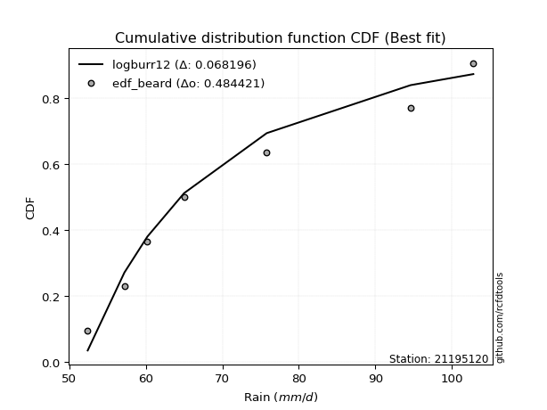</img></img>

</div>


### 5. Empirical - EDF Chegodayev (1955)

The Chegodayev formula is an empirical plotting position formula used in hydrological frequency analysis to estimate the exceedance probability or return period of a specific event from a set of observed data. It is primarily used for plotting observed data points on probability paper to fit a theoretical distribution, particularly for analyzing extreme events like maximum flood flows or rainfall intensities. The constant _b_ value in the generalized plotting position formula is 0.3.

<div align="center">


$P=(m-b)/(n+1-2b)$


</div>


**5.1. Empirical values**

<div align="center">

|                | 0                   | 1                   | 2                   | 3              | 4                  | 5                  | 6                  |
|:---------------|:--------------------|:--------------------|:--------------------|:---------------|:-------------------|:-------------------|:-------------------|
| date           | 2023                | 2021                | 2025                | 2019           | 2020               | 2022               | 2024               |
| x              | 52.4                | 57.2                | 58.6                | 65.0           | 75.8               | 94.6               | 102.8              |
| m              | 1                   | 2                   | 3                   | 4              | 5                  | 6                  | 7                  |
| empirical_dist | edf_chegodayev      | edf_chegodayev      | edf_chegodayev      | edf_chegodayev | edf_chegodayev     | edf_chegodayev     | edf_chegodayev     |
| empirical      | 0.09459459459459459 | 0.22972972972972971 | 0.36486486486486486 | 0.5            | 0.6351351351351351 | 0.7702702702702703 | 0.9054054054054054 |
| empirical_tr   | 1.1044776119402986  | 1.2982456140350878  | 1.574468085106383   | 2.0            | 2.7407407407407405 | 4.352941176470589  | 10.571428571428568 |

</div>


**5.2. Kolmogorov-Smirnov fit test (sorted by Δ)**


<div align="center">

|                | 0                   | 1                   | 2                   | 3                   | 4                   | 5                   | 6                   | 7                   | 8                   | 9                   | 10                  | 11                  | 12                  | 13                  | 14                    | 15                  | 16                  | 17                  | 18                  | 19                  | 20                  | 21                  | 22                  | 23                  | 24                  | 25                  | 26                  | 27                  | 28                  | 29                  | 30                  | 31                  | 32                  | 33                  | 34                  | 35                  | 36                  | 37                  | 38                  | 39                  | 40                  | 41                  | 42                  | 43                  | 44                  | 45                  | 46                  | 47                  | 48                  | 49                  | 50                  | 51                  | 52                  | 53                  | 54                  | 55                  | 56                  | 57                  | 58                  | 59                  | 60                  | 61                  | 62                  | 63                  | 64                  | 65                  | 66                  | 67                  | 68                  | 69                  | 70                  | 71                  | 72                  | 73                  | 74                  | 75                  | 76                  | 77                  | 78                  | 79                  | 80                  | 81                  | 82                  | 83                  | 84                  | 85                  | 86                  | 87                  | 88                  | 89                  |
|:---------------|:--------------------|:--------------------|:--------------------|:--------------------|:--------------------|:--------------------|:--------------------|:--------------------|:--------------------|:--------------------|:--------------------|:--------------------|:--------------------|:--------------------|:----------------------|:--------------------|:--------------------|:--------------------|:--------------------|:--------------------|:--------------------|:--------------------|:--------------------|:--------------------|:--------------------|:--------------------|:--------------------|:--------------------|:--------------------|:--------------------|:--------------------|:--------------------|:--------------------|:--------------------|:--------------------|:--------------------|:--------------------|:--------------------|:--------------------|:--------------------|:--------------------|:--------------------|:--------------------|:--------------------|:--------------------|:--------------------|:--------------------|:--------------------|:--------------------|:--------------------|:--------------------|:--------------------|:--------------------|:--------------------|:--------------------|:--------------------|:--------------------|:--------------------|:--------------------|:--------------------|:--------------------|:--------------------|:--------------------|:--------------------|:--------------------|:--------------------|:--------------------|:--------------------|:--------------------|:--------------------|:--------------------|:--------------------|:--------------------|:--------------------|:--------------------|:--------------------|:--------------------|:--------------------|:--------------------|:--------------------|:--------------------|:--------------------|:--------------------|:--------------------|:--------------------|:--------------------|:--------------------|:--------------------|:--------------------|:--------------------|
| station        | 21195120            | 21195120            | 21195120            | 21195120            | 21195120            | 21195120            | 21195120            | 21195120            | 21195120            | 21195120            | 21195120            | 21195120            | 21195120            | 21195120            | 21195120              | 21195120            | 21195120            | 21195120            | 21195120            | 21195120            | 21195120            | 21195120            | 21195120            | 21195120            | 21195120            | 21195120            | 21195120            | 21195120            | 21195120            | 21195120            | 21195120            | 21195120            | 21195120            | 21195120            | 21195120            | 21195120            | 21195120            | 21195120            | 21195120            | 21195120            | 21195120            | 21195120            | 21195120            | 21195120            | 21195120            | 21195120            | 21195120            | 21195120            | 21195120            | 21195120            | 21195120            | 21195120            | 21195120            | 21195120            | 21195120            | 21195120            | 21195120            | 21195120            | 21195120            | 21195120            | 21195120            | 21195120            | 21195120            | 21195120            | 21195120            | 21195120            | 21195120            | 21195120            | 21195120            | 21195120            | 21195120            | 21195120            | 21195120            | 21195120            | 21195120            | 21195120            | 21195120            | 21195120            | 21195120            | 21195120            | 21195120            | 21195120            | 21195120            | 21195120            | 21195120            | 21195120            | 21195120            | 21195120            | 21195120            | 21195120            |
| empirical_dist | edf_chegodayev      | edf_chegodayev      | edf_chegodayev      | edf_chegodayev      | edf_chegodayev      | edf_chegodayev      | edf_chegodayev      | edf_chegodayev      | edf_chegodayev      | edf_chegodayev      | edf_chegodayev      | edf_chegodayev      | edf_chegodayev      | edf_chegodayev      | edf_chegodayev        | edf_chegodayev      | edf_chegodayev      | edf_chegodayev      | edf_chegodayev      | edf_chegodayev      | edf_chegodayev      | edf_chegodayev      | edf_chegodayev      | edf_chegodayev      | edf_chegodayev      | edf_chegodayev      | edf_chegodayev      | edf_chegodayev      | edf_chegodayev      | edf_chegodayev      | edf_chegodayev      | edf_chegodayev      | edf_chegodayev      | edf_chegodayev      | edf_chegodayev      | edf_chegodayev      | edf_chegodayev      | edf_chegodayev      | edf_chegodayev      | edf_chegodayev      | edf_chegodayev      | edf_chegodayev      | edf_chegodayev      | edf_chegodayev      | edf_chegodayev      | edf_chegodayev      | edf_chegodayev      | edf_chegodayev      | edf_chegodayev      | edf_chegodayev      | edf_chegodayev      | edf_chegodayev      | edf_chegodayev      | edf_chegodayev      | edf_chegodayev      | edf_chegodayev      | edf_chegodayev      | edf_chegodayev      | edf_chegodayev      | edf_chegodayev      | edf_chegodayev      | edf_chegodayev      | edf_chegodayev      | edf_chegodayev      | edf_chegodayev      | edf_chegodayev      | edf_chegodayev      | edf_chegodayev      | edf_chegodayev      | edf_chegodayev      | edf_chegodayev      | edf_chegodayev      | edf_chegodayev      | edf_chegodayev      | edf_chegodayev      | edf_chegodayev      | edf_chegodayev      | edf_chegodayev      | edf_chegodayev      | edf_chegodayev      | edf_chegodayev      | edf_chegodayev      | edf_chegodayev      | edf_chegodayev      | edf_chegodayev      | edf_chegodayev      | edf_chegodayev      | edf_chegodayev      | edf_chegodayev      | edf_chegodayev      |
| p_dist         | logfisk             | logweibull_min      | logexponnorm        | logexpon            | invweibull          | logfatiguelife      | alpha               | f                   | invgamma            | logtruncnorm        | loginvgauss         | logf                | loginvgamma         | loggenexpon         | loglaplace_asymmetric | halfnorm            | invgauss            | loginvweibull       | loghalfnorm         | expon               | laplace_asymmetric  | genexpon            | exponnorm           | lograyleigh         | rayleigh            | loghalflogistic     | halflogistic        | logmaxwell          | logbetaprime        | logalpha            | loggenlogistic      | logmielke           | nakagami            | maxwell             | gompertz            | logkstwobign        | pearson3            | logpearson3         | weibull_min         | lognakagami         | logloggamma         | nct                 | loggumbel_r         | lognct              | betaprime           | gumbel_r            | logcrystalball      | lognorm             | lognorm             | logt                | logjohnsonsu        | genlogistic         | logmoyal            | moyal               | loggompertz         | kstwobign           | johnsonsu           | logrice             | crystalball         | norm                | t                   | loglogistic         | rice                | loghypsecant        | logistic            | logerlang           | loggamma            | loggamma            | loggumbel_l         | hypsecant           | loglaplace          | erlang              | gamma               | gumbel_l            | laplace             | logncf              | logwald             | wald                | fisk                | logchi2             | loggibrat           | gibrat              | pareto              | loglognorm          | logpareto           | fatiguelife         | ncf                 | chi2                | truncnorm           | mielke              |
| delta          | 0.07558363483775676 | 0.09459459459458938 | 0.09654414026787328 | 0.09686209316677319 | 0.09701805273554642 | 0.09871618617484101 | 0.09874059349684794 | 0.10010544697454304 | 0.10136827851664854 | 0.10210392509379773 | 0.10303559717296129 | 0.10409437616163408 | 0.10409470214540562 | 0.10450628738408174 | 0.10485662251070649   | 0.10550824129449399 | 0.10591083366539544 | 0.10612813971058754 | 0.1070471029846155  | 0.10922253798123116 | 0.1092253788435692  | 0.10922567992249665 | 0.11083090650672878 | 0.11313548256375255 | 0.11565992519302806 | 0.11858758013055104 | 0.11974056572376618 | 0.12057738691032024 | 0.12173829553485763 | 0.12271184484972986 | 0.12428605263786535 | 0.12429622300876897 | 0.12525901651365295 | 0.12565803102203893 | 0.12814350737833896 | 0.12937410009117875 | 0.12964189655276295 | 0.12984943745645633 | 0.13015879750897497 | 0.13073116097553722 | 0.13398727529593107 | 0.13424182718986372 | 0.13501080753277825 | 0.13546504935759363 | 0.13770226762555804 | 0.13793930027169388 | 0.13841980329886197 | 0.13841991555246258 | 0.13841991555246258 | 0.1384222655982214  | 0.13894092053710222 | 0.13911815716655432 | 0.14225253868400428 | 0.14572442554128368 | 0.1470516191815728  | 0.14989372252209948 | 0.15522476540259256 | 0.15653736752908312 | 0.15713946510825005 | 0.1571394791118199  | 0.15715147576898936 | 0.16085986728420104 | 0.17426651082971473 | 0.17490501986039506 | 0.1756797696277113  | 0.18135407646267454 | 0.18885200068155794 | 0.18885200068155794 | 0.18917472956110593 | 0.18994169368980135 | 0.1918995428805726  | 0.2016301632590718  | 0.21183102883691962 | 0.2159602984007869  | 0.21788349779468014 | 0.23535400760740827 | 0.2529142751269341  | 0.2597727704990908  | 0.2963799798284088  | 0.3045029494393221  | 0.36472611591189874 | 0.3648602179482579  | 0.3878907003307731  | 0.39435218635766267 | 0.396427347730556   | 0.4865408449748416  | 0.5711938540435626  | 0.7279237289948017  | 0.9044623859898846  | nan                 |
| deltao         | 0.48442053926100004 | 0.48442053926100004 | 0.48442053926100004 | 0.48442053926100004 | 0.48442053926100004 | 0.48442053926100004 | 0.48442053926100004 | 0.48442053926100004 | 0.48442053926100004 | 0.48442053926100004 | 0.48442053926100004 | 0.48442053926100004 | 0.48442053926100004 | 0.48442053926100004 | 0.48442053926100004   | 0.48442053926100004 | 0.48442053926100004 | 0.48442053926100004 | 0.48442053926100004 | 0.48442053926100004 | 0.48442053926100004 | 0.48442053926100004 | 0.48442053926100004 | 0.48442053926100004 | 0.48442053926100004 | 0.48442053926100004 | 0.48442053926100004 | 0.48442053926100004 | 0.48442053926100004 | 0.48442053926100004 | 0.48442053926100004 | 0.48442053926100004 | 0.48442053926100004 | 0.48442053926100004 | 0.48442053926100004 | 0.48442053926100004 | 0.48442053926100004 | 0.48442053926100004 | 0.48442053926100004 | 0.48442053926100004 | 0.48442053926100004 | 0.48442053926100004 | 0.48442053926100004 | 0.48442053926100004 | 0.48442053926100004 | 0.48442053926100004 | 0.48442053926100004 | 0.48442053926100004 | 0.48442053926100004 | 0.48442053926100004 | 0.48442053926100004 | 0.48442053926100004 | 0.48442053926100004 | 0.48442053926100004 | 0.48442053926100004 | 0.48442053926100004 | 0.48442053926100004 | 0.48442053926100004 | 0.48442053926100004 | 0.48442053926100004 | 0.48442053926100004 | 0.48442053926100004 | 0.48442053926100004 | 0.48442053926100004 | 0.48442053926100004 | 0.48442053926100004 | 0.48442053926100004 | 0.48442053926100004 | 0.48442053926100004 | 0.48442053926100004 | 0.48442053926100004 | 0.48442053926100004 | 0.48442053926100004 | 0.48442053926100004 | 0.48442053926100004 | 0.48442053926100004 | 0.48442053926100004 | 0.48442053926100004 | 0.48442053926100004 | 0.48442053926100004 | 0.48442053926100004 | 0.48442053926100004 | 0.48442053926100004 | 0.48442053926100004 | 0.48442053926100004 | 0.48442053926100004 | 0.48442053926100004 | 0.48442053926100004 | 0.48442053926100004 | 0.48442053926100004 |
| eval           | Δo > Δ              | Δo > Δ              | Δo > Δ              | Δo > Δ              | Δo > Δ              | Δo > Δ              | Δo > Δ              | Δo > Δ              | Δo > Δ              | Δo > Δ              | Δo > Δ              | Δo > Δ              | Δo > Δ              | Δo > Δ              | Δo > Δ                | Δo > Δ              | Δo > Δ              | Δo > Δ              | Δo > Δ              | Δo > Δ              | Δo > Δ              | Δo > Δ              | Δo > Δ              | Δo > Δ              | Δo > Δ              | Δo > Δ              | Δo > Δ              | Δo > Δ              | Δo > Δ              | Δo > Δ              | Δo > Δ              | Δo > Δ              | Δo > Δ              | Δo > Δ              | Δo > Δ              | Δo > Δ              | Δo > Δ              | Δo > Δ              | Δo > Δ              | Δo > Δ              | Δo > Δ              | Δo > Δ              | Δo > Δ              | Δo > Δ              | Δo > Δ              | Δo > Δ              | Δo > Δ              | Δo > Δ              | Δo > Δ              | Δo > Δ              | Δo > Δ              | Δo > Δ              | Δo > Δ              | Δo > Δ              | Δo > Δ              | Δo > Δ              | Δo > Δ              | Δo > Δ              | Δo > Δ              | Δo > Δ              | Δo > Δ              | Δo > Δ              | Δo > Δ              | Δo > Δ              | Δo > Δ              | Δo > Δ              | Δo > Δ              | Δo > Δ              | Δo > Δ              | Δo > Δ              | Δo > Δ              | Δo > Δ              | Δo > Δ              | Δo > Δ              | Δo > Δ              | Δo > Δ              | Δo > Δ              | Δo > Δ              | Δo > Δ              | Δo > Δ              | Δo > Δ              | Δo > Δ              | Δo > Δ              | Δo > Δ              | Δo > Δ              | Δo <= Δ             | Δo <= Δ             | Δo <= Δ             | Δo <= Δ             | Δo <= Δ             |
| fit            | 1                   | 1                   | 1                   | 1                   | 1                   | 1                   | 1                   | 1                   | 1                   | 1                   | 1                   | 1                   | 1                   | 1                   | 1                     | 1                   | 1                   | 1                   | 1                   | 1                   | 1                   | 1                   | 1                   | 1                   | 1                   | 1                   | 1                   | 1                   | 1                   | 1                   | 1                   | 1                   | 1                   | 1                   | 1                   | 1                   | 1                   | 1                   | 1                   | 1                   | 1                   | 1                   | 1                   | 1                   | 1                   | 1                   | 1                   | 1                   | 1                   | 1                   | 1                   | 1                   | 1                   | 1                   | 1                   | 1                   | 1                   | 1                   | 1                   | 1                   | 1                   | 1                   | 1                   | 1                   | 1                   | 1                   | 1                   | 1                   | 1                   | 1                   | 1                   | 1                   | 1                   | 1                   | 1                   | 1                   | 1                   | 1                   | 1                   | 1                   | 1                   | 1                   | 1                   | 1                   | 1                   | 0                   | 0                   | 0                   | 0                   | 0                   |
| n              | 7                   | 7                   | 7                   | 7                   | 7                   | 7                   | 7                   | 7                   | 7                   | 7                   | 7                   | 7                   | 7                   | 7                   | 7                     | 7                   | 7                   | 7                   | 7                   | 7                   | 7                   | 7                   | 7                   | 7                   | 7                   | 7                   | 7                   | 7                   | 7                   | 7                   | 7                   | 7                   | 7                   | 7                   | 7                   | 7                   | 7                   | 7                   | 7                   | 7                   | 7                   | 7                   | 7                   | 7                   | 7                   | 7                   | 7                   | 7                   | 7                   | 7                   | 7                   | 7                   | 7                   | 7                   | 7                   | 7                   | 7                   | 7                   | 7                   | 7                   | 7                   | 7                   | 7                   | 7                   | 7                   | 7                   | 7                   | 7                   | 7                   | 7                   | 7                   | 7                   | 7                   | 7                   | 7                   | 7                   | 7                   | 7                   | 7                   | 7                   | 7                   | 7                   | 7                   | 7                   | 7                   | 7                   | 7                   | 7                   | 7                   | 7                   |
| best_fit       | 1                   | 0                   | 0                   | 0                   | 0                   | 0                   | 0                   | 0                   | 0                   | 0                   | 0                   | 0                   | 0                   | 0                   | 0                     | 0                   | 0                   | 0                   | 0                   | 0                   | 0                   | 0                   | 0                   | 0                   | 0                   | 0                   | 0                   | 0                   | 0                   | 0                   | 0                   | 0                   | 0                   | 0                   | 0                   | 0                   | 0                   | 0                   | 0                   | 0                   | 0                   | 0                   | 0                   | 0                   | 0                   | 0                   | 0                   | 0                   | 0                   | 0                   | 0                   | 0                   | 0                   | 0                   | 0                   | 0                   | 0                   | 0                   | 0                   | 0                   | 0                   | 0                   | 0                   | 0                   | 0                   | 0                   | 0                   | 0                   | 0                   | 0                   | 0                   | 0                   | 0                   | 0                   | 0                   | 0                   | 0                   | 0                   | 0                   | 0                   | 0                   | 0                   | 0                   | 0                   | 0                   | 0                   | 0                   | 0                   | 0                   | 0                   |
| best_fit_sort  | 1                   | 2                   | 3                   | 4                   | 5                   | 6                   | 7                   | 8                   | 9                   | 10                  | 11                  | 12                  | 13                  | 14                  | 15                    | 16                  | 17                  | 18                  | 19                  | 20                  | 21                  | 22                  | 23                  | 24                  | 25                  | 26                  | 27                  | 28                  | 29                  | 30                  | 31                  | 32                  | 33                  | 34                  | 35                  | 36                  | 37                  | 38                  | 39                  | 40                  | 41                  | 42                  | 43                  | 44                  | 45                  | 46                  | 47                  | 48                  | 49                  | 50                  | 51                  | 52                  | 53                  | 54                  | 55                  | 56                  | 57                  | 58                  | 59                  | 60                  | 61                  | 62                  | 63                  | 64                  | 65                  | 66                  | 67                  | 68                  | 69                  | 70                  | 71                  | 72                  | 73                  | 74                  | 75                  | 76                  | 77                  | 78                  | 79                  | 80                  | 81                  | 82                  | 83                  | 84                  | 85                  | 86                  | 87                  | 88                  | 89                  | 90                  |

</div>


<div align="center">

</img>

</div>


**5.3. Best fit**

<div align="center">

|   id |   station | empirical_dist   | p_dist   |     delta |   deltao | eval   |   fit |   n |   best_fit |   best_fit_sort |
|-----:|----------:|:-----------------|:---------|----------:|---------:|:-------|------:|----:|-----------:|----------------:|
|    0 |  21195120 | edf_chegodayev   | logfisk  | 0.0755836 | 0.484421 | Δo > Δ |     1 |   7 |          1 |               1 |

</div>


<div align="center">

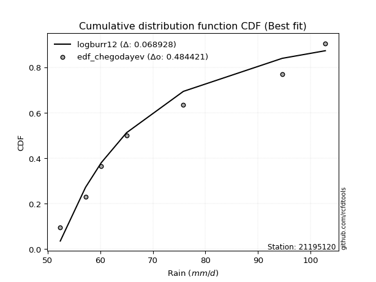</img></img>

</div>


### 6. Empirical - EDF Blom (1958)

The Blom formula is a specific "plotting position" formula used in hydrology and statistical analysis to estimate the empirical cumulative probability (or non-exceedance probability) of a data series. It is particularly recommended for data that are approximately normally distributed. The constant _a_ is set to 0.375 (or 3/8).

<div align="center">


$P=(m-a)/(n+1-2a)$


</div>


**6.1. Empirical values**

<div align="center">

|                | 0                   | 1                   | 2                  | 3        | 4                  | 5                  | 6                  |
|:---------------|:--------------------|:--------------------|:-------------------|:---------|:-------------------|:-------------------|:-------------------|
| date           | 2023                | 2021                | 2025               | 2019     | 2020               | 2022               | 2024               |
| x              | 52.4                | 57.2                | 58.6               | 65.0     | 75.8               | 94.6               | 102.8              |
| m              | 1                   | 2                   | 3                  | 4        | 5                  | 6                  | 7                  |
| empirical_dist | edf_blom            | edf_blom            | edf_blom           | edf_blom | edf_blom           | edf_blom           | edf_blom           |
| empirical      | 0.08620689655172414 | 0.22413793103448276 | 0.3620689655172414 | 0.5      | 0.6379310344827587 | 0.7758620689655172 | 0.9137931034482759 |
| empirical_tr   | 1.0943396226415094  | 1.288888888888889   | 1.5675675675675675 | 2.0      | 2.7619047619047623 | 4.461538461538462  | 11.600000000000007 |

</div>


**6.2. Kolmogorov-Smirnov fit test (sorted by Δ)**


<div align="center">

|                | 0                   | 1                   | 2                   | 3                   | 4                   | 5                   | 6                   | 7                   | 8                   | 9                   | 10                  | 11                  | 12                  | 13                  | 14                    | 15                  | 16                  | 17                  | 18                  | 19                  | 20                  | 21                  | 22                  | 23                  | 24                  | 25                  | 26                  | 27                  | 28                  | 29                  | 30                  | 31                  | 32                  | 33                  | 34                  | 35                  | 36                  | 37                  | 38                  | 39                  | 40                  | 41                  | 42                  | 43                  | 44                  | 45                  | 46                  | 47                  | 48                  | 49                  | 50                  | 51                  | 52                  | 53                  | 54                  | 55                  | 56                  | 57                  | 58                  | 59                  | 60                  | 61                  | 62                  | 63                  | 64                  | 65                  | 66                  | 67                  | 68                  | 69                  | 70                  | 71                  | 72                  | 73                  | 74                  | 75                  | 76                  | 77                  | 78                  | 79                  | 80                  | 81                  | 82                  | 83                  | 84                  | 85                  | 86                  | 87                  | 88                  | 89                  |
|:---------------|:--------------------|:--------------------|:--------------------|:--------------------|:--------------------|:--------------------|:--------------------|:--------------------|:--------------------|:--------------------|:--------------------|:--------------------|:--------------------|:--------------------|:----------------------|:--------------------|:--------------------|:--------------------|:--------------------|:--------------------|:--------------------|:--------------------|:--------------------|:--------------------|:--------------------|:--------------------|:--------------------|:--------------------|:--------------------|:--------------------|:--------------------|:--------------------|:--------------------|:--------------------|:--------------------|:--------------------|:--------------------|:--------------------|:--------------------|:--------------------|:--------------------|:--------------------|:--------------------|:--------------------|:--------------------|:--------------------|:--------------------|:--------------------|:--------------------|:--------------------|:--------------------|:--------------------|:--------------------|:--------------------|:--------------------|:--------------------|:--------------------|:--------------------|:--------------------|:--------------------|:--------------------|:--------------------|:--------------------|:--------------------|:--------------------|:--------------------|:--------------------|:--------------------|:--------------------|:--------------------|:--------------------|:--------------------|:--------------------|:--------------------|:--------------------|:--------------------|:--------------------|:--------------------|:--------------------|:--------------------|:--------------------|:--------------------|:--------------------|:--------------------|:--------------------|:--------------------|:--------------------|:--------------------|:--------------------|:--------------------|
| station        | 21195120            | 21195120            | 21195120            | 21195120            | 21195120            | 21195120            | 21195120            | 21195120            | 21195120            | 21195120            | 21195120            | 21195120            | 21195120            | 21195120            | 21195120              | 21195120            | 21195120            | 21195120            | 21195120            | 21195120            | 21195120            | 21195120            | 21195120            | 21195120            | 21195120            | 21195120            | 21195120            | 21195120            | 21195120            | 21195120            | 21195120            | 21195120            | 21195120            | 21195120            | 21195120            | 21195120            | 21195120            | 21195120            | 21195120            | 21195120            | 21195120            | 21195120            | 21195120            | 21195120            | 21195120            | 21195120            | 21195120            | 21195120            | 21195120            | 21195120            | 21195120            | 21195120            | 21195120            | 21195120            | 21195120            | 21195120            | 21195120            | 21195120            | 21195120            | 21195120            | 21195120            | 21195120            | 21195120            | 21195120            | 21195120            | 21195120            | 21195120            | 21195120            | 21195120            | 21195120            | 21195120            | 21195120            | 21195120            | 21195120            | 21195120            | 21195120            | 21195120            | 21195120            | 21195120            | 21195120            | 21195120            | 21195120            | 21195120            | 21195120            | 21195120            | 21195120            | 21195120            | 21195120            | 21195120            | 21195120            |
| empirical_dist | edf_blom            | edf_blom            | edf_blom            | edf_blom            | edf_blom            | edf_blom            | edf_blom            | edf_blom            | edf_blom            | edf_blom            | edf_blom            | edf_blom            | edf_blom            | edf_blom            | edf_blom              | edf_blom            | edf_blom            | edf_blom            | edf_blom            | edf_blom            | edf_blom            | edf_blom            | edf_blom            | edf_blom            | edf_blom            | edf_blom            | edf_blom            | edf_blom            | edf_blom            | edf_blom            | edf_blom            | edf_blom            | edf_blom            | edf_blom            | edf_blom            | edf_blom            | edf_blom            | edf_blom            | edf_blom            | edf_blom            | edf_blom            | edf_blom            | edf_blom            | edf_blom            | edf_blom            | edf_blom            | edf_blom            | edf_blom            | edf_blom            | edf_blom            | edf_blom            | edf_blom            | edf_blom            | edf_blom            | edf_blom            | edf_blom            | edf_blom            | edf_blom            | edf_blom            | edf_blom            | edf_blom            | edf_blom            | edf_blom            | edf_blom            | edf_blom            | edf_blom            | edf_blom            | edf_blom            | edf_blom            | edf_blom            | edf_blom            | edf_blom            | edf_blom            | edf_blom            | edf_blom            | edf_blom            | edf_blom            | edf_blom            | edf_blom            | edf_blom            | edf_blom            | edf_blom            | edf_blom            | edf_blom            | edf_blom            | edf_blom            | edf_blom            | edf_blom            | edf_blom            | edf_blom            |
| p_dist         | logfisk             | logweibull_min      | logexponnorm        | logexpon            | invweibull          | logfatiguelife      | alpha               | f                   | invgamma            | logtruncnorm        | loginvgauss         | logf                | loginvgamma         | loggenexpon         | loglaplace_asymmetric | halfnorm            | invgauss            | loginvweibull       | loghalfnorm         | expon               | laplace_asymmetric  | genexpon            | exponnorm           | lograyleigh         | loghalflogistic     | rayleigh            | halflogistic        | logmaxwell          | logbetaprime        | logalpha            | loggenlogistic      | logmielke           | nakagami            | gompertz            | maxwell             | logkstwobign        | pearson3            | logpearson3         | logloggamma         | nct                 | loggumbel_r         | lognct              | betaprime           | gumbel_r            | logcrystalball      | lognorm             | lognorm             | logt                | weibull_min         | logjohnsonsu        | genlogistic         | lognakagami         | logmoyal            | moyal               | loggompertz         | kstwobign           | logrice             | johnsonsu           | crystalball         | norm                | t                   | loglogistic         | rice                | loghypsecant        | logistic            | logerlang           | loggamma            | loggamma            | loglaplace          | loggumbel_l         | hypsecant           | erlang              | gamma               | gumbel_l            | laplace             | logncf              | logwald             | wald                | fisk                | logchi2             | loggibrat           | gibrat              | pareto              | loglognorm          | logpareto           | fatiguelife         | ncf                 | chi2                | truncnorm           | mielke              |
| delta          | 0.07278773549013318 | 0.08778228041071523 | 0.09095234157262633 | 0.09127029447152624 | 0.09142625404029947 | 0.09312438747959406 | 0.09419213679990668 | 0.09451364827929609 | 0.09577647982140158 | 0.09651212639855078 | 0.09744379847771434 | 0.09850257746638713 | 0.09850290345015866 | 0.09891448868883479 | 0.09936528903406511   | 0.09991644259924704 | 0.10031903497014849 | 0.10053634101534059 | 0.10145530428936855 | 0.10363073928598421 | 0.10363358014832225 | 0.1036338812272497  | 0.10523910781148182 | 0.11033958321612908 | 0.11312521724579377 | 0.11368681734776342 | 0.1169446663761427  | 0.11778148756269677 | 0.11894239618723415 | 0.11991594550210638 | 0.12149015329024188 | 0.12150032366114549 | 0.12246311716602948 | 0.12534760803071548 | 0.12565803102203893 | 0.12657820074355527 | 0.12684599720513948 | 0.12705353810883285 | 0.1311913759483076  | 0.13144592784224024 | 0.13221490818515477 | 0.13266915000997015 | 0.13490636827793456 | 0.1351434009240704  | 0.1356239039512385  | 0.1356240162048391  | 0.1356240162048391  | 0.13562636625059793 | 0.13575059620422192 | 0.13614502118947874 | 0.13632225781893084 | 0.13632295967078417 | 0.1394566393363808  | 0.1429285261936602  | 0.14425571983394933 | 0.147097823174476   | 0.15374146818145965 | 0.15522476540259256 | 0.15713946510825005 | 0.1571394791118199  | 0.15715147576898936 | 0.15806396793657757 | 0.17147061148209125 | 0.17210912051277158 | 0.1756797696277113  | 0.17855869719994366 | 0.18605610133393435 | 0.18605610133393435 | 0.18910364353294912 | 0.18917472956110593 | 0.18994169368980135 | 0.20722196195431875 | 0.21228880925536853 | 0.2159602984007869  | 0.21788349779468014 | 0.2437417056502787  | 0.2501183757793106  | 0.25697687115146733 | 0.30476767787127934 | 0.31289064748219264 | 0.36193021656427526 | 0.3620643186006344  | 0.39348249902602006 | 0.3999439850529096  | 0.40201914642580294 | 0.4921326436700886  | 0.5795815520864331  | 0.7335155276900487  | 0.9128500840327551  | nan                 |
| deltao         | 0.48442053926100004 | 0.48442053926100004 | 0.48442053926100004 | 0.48442053926100004 | 0.48442053926100004 | 0.48442053926100004 | 0.48442053926100004 | 0.48442053926100004 | 0.48442053926100004 | 0.48442053926100004 | 0.48442053926100004 | 0.48442053926100004 | 0.48442053926100004 | 0.48442053926100004 | 0.48442053926100004   | 0.48442053926100004 | 0.48442053926100004 | 0.48442053926100004 | 0.48442053926100004 | 0.48442053926100004 | 0.48442053926100004 | 0.48442053926100004 | 0.48442053926100004 | 0.48442053926100004 | 0.48442053926100004 | 0.48442053926100004 | 0.48442053926100004 | 0.48442053926100004 | 0.48442053926100004 | 0.48442053926100004 | 0.48442053926100004 | 0.48442053926100004 | 0.48442053926100004 | 0.48442053926100004 | 0.48442053926100004 | 0.48442053926100004 | 0.48442053926100004 | 0.48442053926100004 | 0.48442053926100004 | 0.48442053926100004 | 0.48442053926100004 | 0.48442053926100004 | 0.48442053926100004 | 0.48442053926100004 | 0.48442053926100004 | 0.48442053926100004 | 0.48442053926100004 | 0.48442053926100004 | 0.48442053926100004 | 0.48442053926100004 | 0.48442053926100004 | 0.48442053926100004 | 0.48442053926100004 | 0.48442053926100004 | 0.48442053926100004 | 0.48442053926100004 | 0.48442053926100004 | 0.48442053926100004 | 0.48442053926100004 | 0.48442053926100004 | 0.48442053926100004 | 0.48442053926100004 | 0.48442053926100004 | 0.48442053926100004 | 0.48442053926100004 | 0.48442053926100004 | 0.48442053926100004 | 0.48442053926100004 | 0.48442053926100004 | 0.48442053926100004 | 0.48442053926100004 | 0.48442053926100004 | 0.48442053926100004 | 0.48442053926100004 | 0.48442053926100004 | 0.48442053926100004 | 0.48442053926100004 | 0.48442053926100004 | 0.48442053926100004 | 0.48442053926100004 | 0.48442053926100004 | 0.48442053926100004 | 0.48442053926100004 | 0.48442053926100004 | 0.48442053926100004 | 0.48442053926100004 | 0.48442053926100004 | 0.48442053926100004 | 0.48442053926100004 | 0.48442053926100004 |
| eval           | Δo > Δ              | Δo > Δ              | Δo > Δ              | Δo > Δ              | Δo > Δ              | Δo > Δ              | Δo > Δ              | Δo > Δ              | Δo > Δ              | Δo > Δ              | Δo > Δ              | Δo > Δ              | Δo > Δ              | Δo > Δ              | Δo > Δ                | Δo > Δ              | Δo > Δ              | Δo > Δ              | Δo > Δ              | Δo > Δ              | Δo > Δ              | Δo > Δ              | Δo > Δ              | Δo > Δ              | Δo > Δ              | Δo > Δ              | Δo > Δ              | Δo > Δ              | Δo > Δ              | Δo > Δ              | Δo > Δ              | Δo > Δ              | Δo > Δ              | Δo > Δ              | Δo > Δ              | Δo > Δ              | Δo > Δ              | Δo > Δ              | Δo > Δ              | Δo > Δ              | Δo > Δ              | Δo > Δ              | Δo > Δ              | Δo > Δ              | Δo > Δ              | Δo > Δ              | Δo > Δ              | Δo > Δ              | Δo > Δ              | Δo > Δ              | Δo > Δ              | Δo > Δ              | Δo > Δ              | Δo > Δ              | Δo > Δ              | Δo > Δ              | Δo > Δ              | Δo > Δ              | Δo > Δ              | Δo > Δ              | Δo > Δ              | Δo > Δ              | Δo > Δ              | Δo > Δ              | Δo > Δ              | Δo > Δ              | Δo > Δ              | Δo > Δ              | Δo > Δ              | Δo > Δ              | Δo > Δ              | Δo > Δ              | Δo > Δ              | Δo > Δ              | Δo > Δ              | Δo > Δ              | Δo > Δ              | Δo > Δ              | Δo > Δ              | Δo > Δ              | Δo > Δ              | Δo > Δ              | Δo > Δ              | Δo > Δ              | Δo > Δ              | Δo <= Δ             | Δo <= Δ             | Δo <= Δ             | Δo <= Δ             | Δo <= Δ             |
| fit            | 1                   | 1                   | 1                   | 1                   | 1                   | 1                   | 1                   | 1                   | 1                   | 1                   | 1                   | 1                   | 1                   | 1                   | 1                     | 1                   | 1                   | 1                   | 1                   | 1                   | 1                   | 1                   | 1                   | 1                   | 1                   | 1                   | 1                   | 1                   | 1                   | 1                   | 1                   | 1                   | 1                   | 1                   | 1                   | 1                   | 1                   | 1                   | 1                   | 1                   | 1                   | 1                   | 1                   | 1                   | 1                   | 1                   | 1                   | 1                   | 1                   | 1                   | 1                   | 1                   | 1                   | 1                   | 1                   | 1                   | 1                   | 1                   | 1                   | 1                   | 1                   | 1                   | 1                   | 1                   | 1                   | 1                   | 1                   | 1                   | 1                   | 1                   | 1                   | 1                   | 1                   | 1                   | 1                   | 1                   | 1                   | 1                   | 1                   | 1                   | 1                   | 1                   | 1                   | 1                   | 1                   | 0                   | 0                   | 0                   | 0                   | 0                   |
| n              | 7                   | 7                   | 7                   | 7                   | 7                   | 7                   | 7                   | 7                   | 7                   | 7                   | 7                   | 7                   | 7                   | 7                   | 7                     | 7                   | 7                   | 7                   | 7                   | 7                   | 7                   | 7                   | 7                   | 7                   | 7                   | 7                   | 7                   | 7                   | 7                   | 7                   | 7                   | 7                   | 7                   | 7                   | 7                   | 7                   | 7                   | 7                   | 7                   | 7                   | 7                   | 7                   | 7                   | 7                   | 7                   | 7                   | 7                   | 7                   | 7                   | 7                   | 7                   | 7                   | 7                   | 7                   | 7                   | 7                   | 7                   | 7                   | 7                   | 7                   | 7                   | 7                   | 7                   | 7                   | 7                   | 7                   | 7                   | 7                   | 7                   | 7                   | 7                   | 7                   | 7                   | 7                   | 7                   | 7                   | 7                   | 7                   | 7                   | 7                   | 7                   | 7                   | 7                   | 7                   | 7                   | 7                   | 7                   | 7                   | 7                   | 7                   |
| best_fit       | 1                   | 0                   | 0                   | 0                   | 0                   | 0                   | 0                   | 0                   | 0                   | 0                   | 0                   | 0                   | 0                   | 0                   | 0                     | 0                   | 0                   | 0                   | 0                   | 0                   | 0                   | 0                   | 0                   | 0                   | 0                   | 0                   | 0                   | 0                   | 0                   | 0                   | 0                   | 0                   | 0                   | 0                   | 0                   | 0                   | 0                   | 0                   | 0                   | 0                   | 0                   | 0                   | 0                   | 0                   | 0                   | 0                   | 0                   | 0                   | 0                   | 0                   | 0                   | 0                   | 0                   | 0                   | 0                   | 0                   | 0                   | 0                   | 0                   | 0                   | 0                   | 0                   | 0                   | 0                   | 0                   | 0                   | 0                   | 0                   | 0                   | 0                   | 0                   | 0                   | 0                   | 0                   | 0                   | 0                   | 0                   | 0                   | 0                   | 0                   | 0                   | 0                   | 0                   | 0                   | 0                   | 0                   | 0                   | 0                   | 0                   | 0                   |
| best_fit_sort  | 1                   | 2                   | 3                   | 4                   | 5                   | 6                   | 7                   | 8                   | 9                   | 10                  | 11                  | 12                  | 13                  | 14                  | 15                    | 16                  | 17                  | 18                  | 19                  | 20                  | 21                  | 22                  | 23                  | 24                  | 25                  | 26                  | 27                  | 28                  | 29                  | 30                  | 31                  | 32                  | 33                  | 34                  | 35                  | 36                  | 37                  | 38                  | 39                  | 40                  | 41                  | 42                  | 43                  | 44                  | 45                  | 46                  | 47                  | 48                  | 49                  | 50                  | 51                  | 52                  | 53                  | 54                  | 55                  | 56                  | 57                  | 58                  | 59                  | 60                  | 61                  | 62                  | 63                  | 64                  | 65                  | 66                  | 67                  | 68                  | 69                  | 70                  | 71                  | 72                  | 73                  | 74                  | 75                  | 76                  | 77                  | 78                  | 79                  | 80                  | 81                  | 82                  | 83                  | 84                  | 85                  | 86                  | 87                  | 88                  | 89                  | 90                  |

</div>


<div align="center">

</img>

</div>


**6.3. Best fit**

<div align="center">

|   id |   station | empirical_dist   | p_dist   |     delta |   deltao | eval   |   fit |   n |   best_fit |   best_fit_sort |
|-----:|----------:|:-----------------|:---------|----------:|---------:|:-------|------:|----:|-----------:|----------------:|
|    0 |  21195120 | edf_blom         | logfisk  | 0.0727877 | 0.484421 | Δo > Δ |     1 |   7 |          1 |               1 |

</div>


<div align="center">

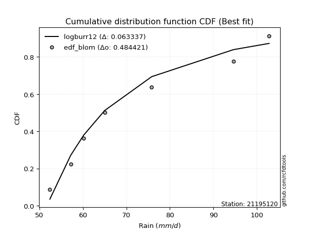</img>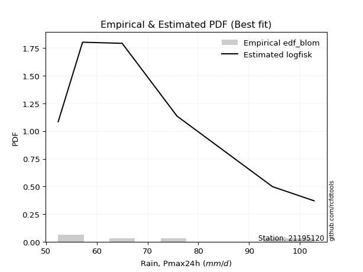</img>

</div>


### 7. Empirical - EDF Tukey (1962)

In hydrology, the Tukey formula is used as a plotting position formula to estimate the empirical probability or frequency of a flood event (or other hydrological data). The formula parameter is given as _c=0.333_ (or 1/3).

<div align="center">


$P=(m-c)/(n+1-2c)$


</div>


**7.1. Empirical values**

<div align="center">

|                | 0                   | 1                   | 2                   | 3         | 4                  | 5                  | 6                  |
|:---------------|:--------------------|:--------------------|:--------------------|:----------|:-------------------|:-------------------|:-------------------|
| date           | 2023                | 2021                | 2025                | 2019      | 2020               | 2022               | 2024               |
| x              | 52.4                | 57.2                | 58.6                | 65.0      | 75.8               | 94.6               | 102.8              |
| m              | 1                   | 2                   | 3                   | 4         | 5                  | 6                  | 7                  |
| empirical_dist | edf_tukey           | edf_tukey           | edf_tukey           | edf_tukey | edf_tukey          | edf_tukey          | edf_tukey          |
| empirical      | 0.09090909090909091 | 0.22727272727272727 | 0.36363636363636365 | 0.5       | 0.6363636363636364 | 0.7727272727272727 | 0.9090909090909091 |
| empirical_tr   | 1.1                 | 1.2941176470588236  | 1.5714285714285714  | 2.0       | 2.75               | 4.3999999999999995 | 10.999999999999996 |

</div>


**7.2. Kolmogorov-Smirnov fit test (sorted by Δ)**


<div align="center">

|                | 0                   | 1                   | 2                   | 3                   | 4                   | 5                   | 6                   | 7                   | 8                   | 9                   | 10                  | 11                  | 12                  | 13                  | 14                    | 15                  | 16                  | 17                  | 18                  | 19                  | 20                  | 21                  | 22                  | 23                  | 24                  | 25                  | 26                  | 27                  | 28                  | 29                  | 30                  | 31                  | 32                  | 33                  | 34                  | 35                  | 36                  | 37                  | 38                  | 39                  | 40                  | 41                  | 42                  | 43                  | 44                  | 45                  | 46                  | 47                  | 48                  | 49                  | 50                  | 51                  | 52                  | 53                  | 54                  | 55                  | 56                  | 57                  | 58                  | 59                  | 60                  | 61                  | 62                  | 63                  | 64                  | 65                  | 66                  | 67                  | 68                  | 69                  | 70                  | 71                  | 72                  | 73                  | 74                  | 75                  | 76                  | 77                  | 78                  | 79                  | 80                  | 81                  | 82                  | 83                  | 84                  | 85                  | 86                  | 87                  | 88                  | 89                  |
|:---------------|:--------------------|:--------------------|:--------------------|:--------------------|:--------------------|:--------------------|:--------------------|:--------------------|:--------------------|:--------------------|:--------------------|:--------------------|:--------------------|:--------------------|:----------------------|:--------------------|:--------------------|:--------------------|:--------------------|:--------------------|:--------------------|:--------------------|:--------------------|:--------------------|:--------------------|:--------------------|:--------------------|:--------------------|:--------------------|:--------------------|:--------------------|:--------------------|:--------------------|:--------------------|:--------------------|:--------------------|:--------------------|:--------------------|:--------------------|:--------------------|:--------------------|:--------------------|:--------------------|:--------------------|:--------------------|:--------------------|:--------------------|:--------------------|:--------------------|:--------------------|:--------------------|:--------------------|:--------------------|:--------------------|:--------------------|:--------------------|:--------------------|:--------------------|:--------------------|:--------------------|:--------------------|:--------------------|:--------------------|:--------------------|:--------------------|:--------------------|:--------------------|:--------------------|:--------------------|:--------------------|:--------------------|:--------------------|:--------------------|:--------------------|:--------------------|:--------------------|:--------------------|:--------------------|:--------------------|:--------------------|:--------------------|:--------------------|:--------------------|:--------------------|:--------------------|:--------------------|:--------------------|:--------------------|:--------------------|:--------------------|
| station        | 21195120            | 21195120            | 21195120            | 21195120            | 21195120            | 21195120            | 21195120            | 21195120            | 21195120            | 21195120            | 21195120            | 21195120            | 21195120            | 21195120            | 21195120              | 21195120            | 21195120            | 21195120            | 21195120            | 21195120            | 21195120            | 21195120            | 21195120            | 21195120            | 21195120            | 21195120            | 21195120            | 21195120            | 21195120            | 21195120            | 21195120            | 21195120            | 21195120            | 21195120            | 21195120            | 21195120            | 21195120            | 21195120            | 21195120            | 21195120            | 21195120            | 21195120            | 21195120            | 21195120            | 21195120            | 21195120            | 21195120            | 21195120            | 21195120            | 21195120            | 21195120            | 21195120            | 21195120            | 21195120            | 21195120            | 21195120            | 21195120            | 21195120            | 21195120            | 21195120            | 21195120            | 21195120            | 21195120            | 21195120            | 21195120            | 21195120            | 21195120            | 21195120            | 21195120            | 21195120            | 21195120            | 21195120            | 21195120            | 21195120            | 21195120            | 21195120            | 21195120            | 21195120            | 21195120            | 21195120            | 21195120            | 21195120            | 21195120            | 21195120            | 21195120            | 21195120            | 21195120            | 21195120            | 21195120            | 21195120            |
| empirical_dist | edf_tukey           | edf_tukey           | edf_tukey           | edf_tukey           | edf_tukey           | edf_tukey           | edf_tukey           | edf_tukey           | edf_tukey           | edf_tukey           | edf_tukey           | edf_tukey           | edf_tukey           | edf_tukey           | edf_tukey             | edf_tukey           | edf_tukey           | edf_tukey           | edf_tukey           | edf_tukey           | edf_tukey           | edf_tukey           | edf_tukey           | edf_tukey           | edf_tukey           | edf_tukey           | edf_tukey           | edf_tukey           | edf_tukey           | edf_tukey           | edf_tukey           | edf_tukey           | edf_tukey           | edf_tukey           | edf_tukey           | edf_tukey           | edf_tukey           | edf_tukey           | edf_tukey           | edf_tukey           | edf_tukey           | edf_tukey           | edf_tukey           | edf_tukey           | edf_tukey           | edf_tukey           | edf_tukey           | edf_tukey           | edf_tukey           | edf_tukey           | edf_tukey           | edf_tukey           | edf_tukey           | edf_tukey           | edf_tukey           | edf_tukey           | edf_tukey           | edf_tukey           | edf_tukey           | edf_tukey           | edf_tukey           | edf_tukey           | edf_tukey           | edf_tukey           | edf_tukey           | edf_tukey           | edf_tukey           | edf_tukey           | edf_tukey           | edf_tukey           | edf_tukey           | edf_tukey           | edf_tukey           | edf_tukey           | edf_tukey           | edf_tukey           | edf_tukey           | edf_tukey           | edf_tukey           | edf_tukey           | edf_tukey           | edf_tukey           | edf_tukey           | edf_tukey           | edf_tukey           | edf_tukey           | edf_tukey           | edf_tukey           | edf_tukey           | edf_tukey           |
| p_dist         | logfisk             | logweibull_min      | logexponnorm        | logexpon            | invweibull          | logfatiguelife      | alpha               | f                   | invgamma            | logtruncnorm        | loginvgauss         | logf                | loginvgamma         | loggenexpon         | loglaplace_asymmetric | halfnorm            | invgauss            | loginvweibull       | loghalfnorm         | expon               | laplace_asymmetric  | genexpon            | exponnorm           | lograyleigh         | rayleigh            | loghalflogistic     | halflogistic        | logmaxwell          | logbetaprime        | logalpha            | loggenlogistic      | logmielke           | nakagami            | maxwell             | gompertz            | logkstwobign        | pearson3            | logpearson3         | weibull_min         | logloggamma         | nct                 | lognakagami         | loggumbel_r         | lognct              | betaprime           | gumbel_r            | logcrystalball      | lognorm             | lognorm             | logt                | logjohnsonsu        | genlogistic         | logmoyal            | moyal               | loggompertz         | kstwobign           | johnsonsu           | logrice             | crystalball         | norm                | t                   | loglogistic         | rice                | loghypsecant        | logistic            | logerlang           | loggamma            | loggamma            | loggumbel_l         | hypsecant           | loglaplace          | erlang              | gamma               | gumbel_l            | laplace             | logncf              | logwald             | wald                | fisk                | logchi2             | loggibrat           | gibrat              | pareto              | loglognorm          | logpareto           | fatiguelife         | ncf                 | chi2                | truncnorm           | mielke              |
| delta          | 0.0743551336092555  | 0.09090909090908571 | 0.09408713781087086 | 0.09440509070977077 | 0.094561050278544   | 0.09625918371783859 | 0.09628359103984552 | 0.09764844451754062 | 0.09891127605964611 | 0.09964692263679531 | 0.10057859471595887 | 0.10163737370463166 | 0.1016376996884032  | 0.10204928492707932 | 0.10239962005370407   | 0.10305123883749157 | 0.10345383120839302 | 0.10367113725358512 | 0.10459010052761308 | 0.10676553552422874 | 0.10676837638656678 | 0.10676867746549423 | 0.10837390404972636 | 0.11190698133525134 | 0.11443142396452685 | 0.11613057767354862 | 0.11851206449526497 | 0.11934888568181903 | 0.12050979430635642 | 0.12148334362122865 | 0.12305755140936414 | 0.12306772178026776 | 0.12403051528515174 | 0.12565803102203893 | 0.12691500614983775 | 0.12814559886267754 | 0.12841339532426174 | 0.12862093622795512 | 0.13261579996597742 | 0.13275877406742986 | 0.1330133259613625  | 0.13318816343253967 | 0.13378230630427704 | 0.13423654812909241 | 0.13647376639705683 | 0.13671079904319267 | 0.13719130207036076 | 0.13719141432396137 | 0.13719141432396137 | 0.1371937643697202  | 0.137712419308601   | 0.1378896559380531  | 0.14102403745550307 | 0.14449592431278246 | 0.1458231179530716  | 0.14866522129359827 | 0.15522476540259256 | 0.1553088663005819  | 0.15713946510825005 | 0.1571394791118199  | 0.15715147576898936 | 0.15963136605569983 | 0.17303800960121352 | 0.17367651863189384 | 0.1756797696277113  | 0.18012557523417327 | 0.18762349945305667 | 0.18762349945305667 | 0.18917472956110593 | 0.18994169368980135 | 0.19067104165207138 | 0.20408716571607424 | 0.21060252760841836 | 0.2159602984007869  | 0.21788349779468014 | 0.23903951129291193 | 0.2516857738984329  | 0.2585442692705896  | 0.3000654835139125  | 0.3081884531248258  | 0.36349761468339753 | 0.3636317167197567  | 0.39034770278777553 | 0.3968091888146651  | 0.3988843501875584  | 0.48899784743184405 | 0.5748793577290663  | 0.7303807314518042  | 0.9081478896753883  | nan                 |
| deltao         | 0.48442053926100004 | 0.48442053926100004 | 0.48442053926100004 | 0.48442053926100004 | 0.48442053926100004 | 0.48442053926100004 | 0.48442053926100004 | 0.48442053926100004 | 0.48442053926100004 | 0.48442053926100004 | 0.48442053926100004 | 0.48442053926100004 | 0.48442053926100004 | 0.48442053926100004 | 0.48442053926100004   | 0.48442053926100004 | 0.48442053926100004 | 0.48442053926100004 | 0.48442053926100004 | 0.48442053926100004 | 0.48442053926100004 | 0.48442053926100004 | 0.48442053926100004 | 0.48442053926100004 | 0.48442053926100004 | 0.48442053926100004 | 0.48442053926100004 | 0.48442053926100004 | 0.48442053926100004 | 0.48442053926100004 | 0.48442053926100004 | 0.48442053926100004 | 0.48442053926100004 | 0.48442053926100004 | 0.48442053926100004 | 0.48442053926100004 | 0.48442053926100004 | 0.48442053926100004 | 0.48442053926100004 | 0.48442053926100004 | 0.48442053926100004 | 0.48442053926100004 | 0.48442053926100004 | 0.48442053926100004 | 0.48442053926100004 | 0.48442053926100004 | 0.48442053926100004 | 0.48442053926100004 | 0.48442053926100004 | 0.48442053926100004 | 0.48442053926100004 | 0.48442053926100004 | 0.48442053926100004 | 0.48442053926100004 | 0.48442053926100004 | 0.48442053926100004 | 0.48442053926100004 | 0.48442053926100004 | 0.48442053926100004 | 0.48442053926100004 | 0.48442053926100004 | 0.48442053926100004 | 0.48442053926100004 | 0.48442053926100004 | 0.48442053926100004 | 0.48442053926100004 | 0.48442053926100004 | 0.48442053926100004 | 0.48442053926100004 | 0.48442053926100004 | 0.48442053926100004 | 0.48442053926100004 | 0.48442053926100004 | 0.48442053926100004 | 0.48442053926100004 | 0.48442053926100004 | 0.48442053926100004 | 0.48442053926100004 | 0.48442053926100004 | 0.48442053926100004 | 0.48442053926100004 | 0.48442053926100004 | 0.48442053926100004 | 0.48442053926100004 | 0.48442053926100004 | 0.48442053926100004 | 0.48442053926100004 | 0.48442053926100004 | 0.48442053926100004 | 0.48442053926100004 |
| eval           | Δo > Δ              | Δo > Δ              | Δo > Δ              | Δo > Δ              | Δo > Δ              | Δo > Δ              | Δo > Δ              | Δo > Δ              | Δo > Δ              | Δo > Δ              | Δo > Δ              | Δo > Δ              | Δo > Δ              | Δo > Δ              | Δo > Δ                | Δo > Δ              | Δo > Δ              | Δo > Δ              | Δo > Δ              | Δo > Δ              | Δo > Δ              | Δo > Δ              | Δo > Δ              | Δo > Δ              | Δo > Δ              | Δo > Δ              | Δo > Δ              | Δo > Δ              | Δo > Δ              | Δo > Δ              | Δo > Δ              | Δo > Δ              | Δo > Δ              | Δo > Δ              | Δo > Δ              | Δo > Δ              | Δo > Δ              | Δo > Δ              | Δo > Δ              | Δo > Δ              | Δo > Δ              | Δo > Δ              | Δo > Δ              | Δo > Δ              | Δo > Δ              | Δo > Δ              | Δo > Δ              | Δo > Δ              | Δo > Δ              | Δo > Δ              | Δo > Δ              | Δo > Δ              | Δo > Δ              | Δo > Δ              | Δo > Δ              | Δo > Δ              | Δo > Δ              | Δo > Δ              | Δo > Δ              | Δo > Δ              | Δo > Δ              | Δo > Δ              | Δo > Δ              | Δo > Δ              | Δo > Δ              | Δo > Δ              | Δo > Δ              | Δo > Δ              | Δo > Δ              | Δo > Δ              | Δo > Δ              | Δo > Δ              | Δo > Δ              | Δo > Δ              | Δo > Δ              | Δo > Δ              | Δo > Δ              | Δo > Δ              | Δo > Δ              | Δo > Δ              | Δo > Δ              | Δo > Δ              | Δo > Δ              | Δo > Δ              | Δo > Δ              | Δo <= Δ             | Δo <= Δ             | Δo <= Δ             | Δo <= Δ             | Δo <= Δ             |
| fit            | 1                   | 1                   | 1                   | 1                   | 1                   | 1                   | 1                   | 1                   | 1                   | 1                   | 1                   | 1                   | 1                   | 1                   | 1                     | 1                   | 1                   | 1                   | 1                   | 1                   | 1                   | 1                   | 1                   | 1                   | 1                   | 1                   | 1                   | 1                   | 1                   | 1                   | 1                   | 1                   | 1                   | 1                   | 1                   | 1                   | 1                   | 1                   | 1                   | 1                   | 1                   | 1                   | 1                   | 1                   | 1                   | 1                   | 1                   | 1                   | 1                   | 1                   | 1                   | 1                   | 1                   | 1                   | 1                   | 1                   | 1                   | 1                   | 1                   | 1                   | 1                   | 1                   | 1                   | 1                   | 1                   | 1                   | 1                   | 1                   | 1                   | 1                   | 1                   | 1                   | 1                   | 1                   | 1                   | 1                   | 1                   | 1                   | 1                   | 1                   | 1                   | 1                   | 1                   | 1                   | 1                   | 0                   | 0                   | 0                   | 0                   | 0                   |
| n              | 7                   | 7                   | 7                   | 7                   | 7                   | 7                   | 7                   | 7                   | 7                   | 7                   | 7                   | 7                   | 7                   | 7                   | 7                     | 7                   | 7                   | 7                   | 7                   | 7                   | 7                   | 7                   | 7                   | 7                   | 7                   | 7                   | 7                   | 7                   | 7                   | 7                   | 7                   | 7                   | 7                   | 7                   | 7                   | 7                   | 7                   | 7                   | 7                   | 7                   | 7                   | 7                   | 7                   | 7                   | 7                   | 7                   | 7                   | 7                   | 7                   | 7                   | 7                   | 7                   | 7                   | 7                   | 7                   | 7                   | 7                   | 7                   | 7                   | 7                   | 7                   | 7                   | 7                   | 7                   | 7                   | 7                   | 7                   | 7                   | 7                   | 7                   | 7                   | 7                   | 7                   | 7                   | 7                   | 7                   | 7                   | 7                   | 7                   | 7                   | 7                   | 7                   | 7                   | 7                   | 7                   | 7                   | 7                   | 7                   | 7                   | 7                   |
| best_fit       | 1                   | 0                   | 0                   | 0                   | 0                   | 0                   | 0                   | 0                   | 0                   | 0                   | 0                   | 0                   | 0                   | 0                   | 0                     | 0                   | 0                   | 0                   | 0                   | 0                   | 0                   | 0                   | 0                   | 0                   | 0                   | 0                   | 0                   | 0                   | 0                   | 0                   | 0                   | 0                   | 0                   | 0                   | 0                   | 0                   | 0                   | 0                   | 0                   | 0                   | 0                   | 0                   | 0                   | 0                   | 0                   | 0                   | 0                   | 0                   | 0                   | 0                   | 0                   | 0                   | 0                   | 0                   | 0                   | 0                   | 0                   | 0                   | 0                   | 0                   | 0                   | 0                   | 0                   | 0                   | 0                   | 0                   | 0                   | 0                   | 0                   | 0                   | 0                   | 0                   | 0                   | 0                   | 0                   | 0                   | 0                   | 0                   | 0                   | 0                   | 0                   | 0                   | 0                   | 0                   | 0                   | 0                   | 0                   | 0                   | 0                   | 0                   |
| best_fit_sort  | 1                   | 2                   | 3                   | 4                   | 5                   | 6                   | 7                   | 8                   | 9                   | 10                  | 11                  | 12                  | 13                  | 14                  | 15                    | 16                  | 17                  | 18                  | 19                  | 20                  | 21                  | 22                  | 23                  | 24                  | 25                  | 26                  | 27                  | 28                  | 29                  | 30                  | 31                  | 32                  | 33                  | 34                  | 35                  | 36                  | 37                  | 38                  | 39                  | 40                  | 41                  | 42                  | 43                  | 44                  | 45                  | 46                  | 47                  | 48                  | 49                  | 50                  | 51                  | 52                  | 53                  | 54                  | 55                  | 56                  | 57                  | 58                  | 59                  | 60                  | 61                  | 62                  | 63                  | 64                  | 65                  | 66                  | 67                  | 68                  | 69                  | 70                  | 71                  | 72                  | 73                  | 74                  | 75                  | 76                  | 77                  | 78                  | 79                  | 80                  | 81                  | 82                  | 83                  | 84                  | 85                  | 86                  | 87                  | 88                  | 89                  | 90                  |

</div>


<div align="center">

</img>

</div>


**7.3. Best fit**

<div align="center">

|   id |   station | empirical_dist   | p_dist   |     delta |   deltao | eval   |   fit |   n |   best_fit |   best_fit_sort |
|-----:|----------:|:-----------------|:---------|----------:|---------:|:-------|------:|----:|-----------:|----------------:|
|    0 |  21195120 | edf_tukey        | logfisk  | 0.0743551 | 0.484421 | Δo > Δ |     1 |   7 |          1 |               1 |

</div>


<div align="center">

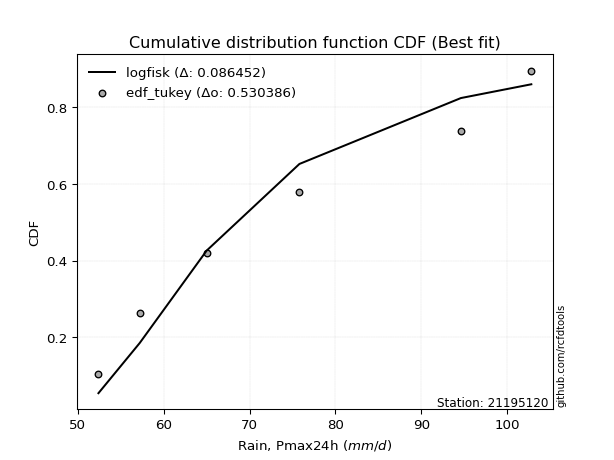</img></img>

</div>


### 8. Empirical - EDF Gringorten (1963)

Gringorten plotting position formula is essential for estimating the probability and return periods of extreme events like floods and heavy rainfall. The constant _a=0.44_.

<div align="center">


$P=(m-a)/(n+1-2a)$


</div>


**8.1. Empirical values**

<div align="center">

|                | 0                   | 1                   | 2                  | 3              | 4                  | 5                  | 6                  |
|:---------------|:--------------------|:--------------------|:-------------------|:---------------|:-------------------|:-------------------|:-------------------|
| date           | 2023                | 2021                | 2025               | 2019           | 2020               | 2022               | 2024               |
| x              | 52.4                | 57.2                | 58.6               | 65.0           | 75.8               | 94.6               | 102.8              |
| m              | 1                   | 2                   | 3                  | 4              | 5                  | 6                  | 7                  |
| empirical_dist | edf_gringorten      | edf_gringorten      | edf_gringorten     | edf_gringorten | edf_gringorten     | edf_gringorten     | edf_gringorten     |
| empirical      | 0.07865168539325844 | 0.21910112359550563 | 0.3595505617977528 | 0.5            | 0.6404494382022471 | 0.7808988764044943 | 0.9213483146067415 |
| empirical_tr   | 1.0853658536585364  | 1.2805755395683454  | 1.5614035087719298 | 2.0            | 2.781249999999999  | 4.564102564102562  | 12.714285714285701 |

</div>


**8.2. Kolmogorov-Smirnov fit test (sorted by Δ)**


<div align="center">

|                | 0                   | 1                   | 2                   | 3                   | 4                   | 5                   | 6                   | 7                   | 8                   | 9                   | 10                  | 11                  | 12                  | 13                  | 14                  | 15                  | 16                  | 17                  | 18                    | 19                  | 20                  | 21                  | 22                  | 23                  | 24                  | 25                  | 26                  | 27                  | 28                  | 29                  | 30                  | 31                  | 32                  | 33                  | 34                  | 35                  | 36                  | 37                  | 38                  | 39                  | 40                  | 41                  | 42                  | 43                  | 44                  | 45                  | 46                  | 47                  | 48                  | 49                  | 50                  | 51                  | 52                  | 53                  | 54                  | 55                  | 56                  | 57                  | 58                  | 59                  | 60                  | 61                  | 62                  | 63                  | 64                  | 65                  | 66                  | 67                  | 68                  | 69                  | 70                  | 71                  | 72                  | 73                  | 74                  | 75                  | 76                  | 77                  | 78                  | 79                  | 80                  | 81                  | 82                  | 83                  | 84                  | 85                  | 86                  | 87                  | 88                  | 89                  |
|:---------------|:--------------------|:--------------------|:--------------------|:--------------------|:--------------------|:--------------------|:--------------------|:--------------------|:--------------------|:--------------------|:--------------------|:--------------------|:--------------------|:--------------------|:--------------------|:--------------------|:--------------------|:--------------------|:----------------------|:--------------------|:--------------------|:--------------------|:--------------------|:--------------------|:--------------------|:--------------------|:--------------------|:--------------------|:--------------------|:--------------------|:--------------------|:--------------------|:--------------------|:--------------------|:--------------------|:--------------------|:--------------------|:--------------------|:--------------------|:--------------------|:--------------------|:--------------------|:--------------------|:--------------------|:--------------------|:--------------------|:--------------------|:--------------------|:--------------------|:--------------------|:--------------------|:--------------------|:--------------------|:--------------------|:--------------------|:--------------------|:--------------------|:--------------------|:--------------------|:--------------------|:--------------------|:--------------------|:--------------------|:--------------------|:--------------------|:--------------------|:--------------------|:--------------------|:--------------------|:--------------------|:--------------------|:--------------------|:--------------------|:--------------------|:--------------------|:--------------------|:--------------------|:--------------------|:--------------------|:--------------------|:--------------------|:--------------------|:--------------------|:--------------------|:--------------------|:--------------------|:--------------------|:--------------------|:--------------------|:--------------------|
| station        | 21195120            | 21195120            | 21195120            | 21195120            | 21195120            | 21195120            | 21195120            | 21195120            | 21195120            | 21195120            | 21195120            | 21195120            | 21195120            | 21195120            | 21195120            | 21195120            | 21195120            | 21195120            | 21195120              | 21195120            | 21195120            | 21195120            | 21195120            | 21195120            | 21195120            | 21195120            | 21195120            | 21195120            | 21195120            | 21195120            | 21195120            | 21195120            | 21195120            | 21195120            | 21195120            | 21195120            | 21195120            | 21195120            | 21195120            | 21195120            | 21195120            | 21195120            | 21195120            | 21195120            | 21195120            | 21195120            | 21195120            | 21195120            | 21195120            | 21195120            | 21195120            | 21195120            | 21195120            | 21195120            | 21195120            | 21195120            | 21195120            | 21195120            | 21195120            | 21195120            | 21195120            | 21195120            | 21195120            | 21195120            | 21195120            | 21195120            | 21195120            | 21195120            | 21195120            | 21195120            | 21195120            | 21195120            | 21195120            | 21195120            | 21195120            | 21195120            | 21195120            | 21195120            | 21195120            | 21195120            | 21195120            | 21195120            | 21195120            | 21195120            | 21195120            | 21195120            | 21195120            | 21195120            | 21195120            | 21195120            |
| empirical_dist | edf_gringorten      | edf_gringorten      | edf_gringorten      | edf_gringorten      | edf_gringorten      | edf_gringorten      | edf_gringorten      | edf_gringorten      | edf_gringorten      | edf_gringorten      | edf_gringorten      | edf_gringorten      | edf_gringorten      | edf_gringorten      | edf_gringorten      | edf_gringorten      | edf_gringorten      | edf_gringorten      | edf_gringorten        | edf_gringorten      | edf_gringorten      | edf_gringorten      | edf_gringorten      | edf_gringorten      | edf_gringorten      | edf_gringorten      | edf_gringorten      | edf_gringorten      | edf_gringorten      | edf_gringorten      | edf_gringorten      | edf_gringorten      | edf_gringorten      | edf_gringorten      | edf_gringorten      | edf_gringorten      | edf_gringorten      | edf_gringorten      | edf_gringorten      | edf_gringorten      | edf_gringorten      | edf_gringorten      | edf_gringorten      | edf_gringorten      | edf_gringorten      | edf_gringorten      | edf_gringorten      | edf_gringorten      | edf_gringorten      | edf_gringorten      | edf_gringorten      | edf_gringorten      | edf_gringorten      | edf_gringorten      | edf_gringorten      | edf_gringorten      | edf_gringorten      | edf_gringorten      | edf_gringorten      | edf_gringorten      | edf_gringorten      | edf_gringorten      | edf_gringorten      | edf_gringorten      | edf_gringorten      | edf_gringorten      | edf_gringorten      | edf_gringorten      | edf_gringorten      | edf_gringorten      | edf_gringorten      | edf_gringorten      | edf_gringorten      | edf_gringorten      | edf_gringorten      | edf_gringorten      | edf_gringorten      | edf_gringorten      | edf_gringorten      | edf_gringorten      | edf_gringorten      | edf_gringorten      | edf_gringorten      | edf_gringorten      | edf_gringorten      | edf_gringorten      | edf_gringorten      | edf_gringorten      | edf_gringorten      | edf_gringorten      |
| p_dist         | logfisk             | logexponnorm        | logexpon            | invweibull          | logfatiguelife      | logweibull_min      | f                   | invgamma            | logtruncnorm        | alpha               | loginvgauss         | logf                | loginvgamma         | loggenexpon         | halfnorm            | invgauss            | loginvweibull       | loghalfnorm         | loglaplace_asymmetric | expon               | laplace_asymmetric  | genexpon            | exponnorm           | lograyleigh         | loghalflogistic     | rayleigh            | halflogistic        | logmaxwell          | logbetaprime        | logalpha            | loggenlogistic      | logmielke           | nakagami            | gompertz            | logkstwobign        | logpearson3         | maxwell             | pearson3            | logloggamma         | nct                 | loggumbel_r         | lognct              | betaprime           | gumbel_r            | logcrystalball      | lognorm             | lognorm             | logt                | logjohnsonsu        | genlogistic         | logmoyal            | moyal               | weibull_min         | lognakagami         | loggompertz         | kstwobign           | logrice             | johnsonsu           | loglogistic         | crystalball         | norm                | t                   | rice                | loghypsecant        | logistic            | loggamma            | loggamma            | logerlang           | loglaplace          | loggumbel_l         | hypsecant           | erlang              | gumbel_l            | gamma               | laplace             | logwald             | logncf              | wald                | fisk                | logchi2             | loggibrat           | gibrat              | pareto              | loglognorm          | logpareto           | fatiguelife         | ncf                 | chi2                | truncnorm           | mielke              |
| delta          | 0.07026933177064476 | 0.08591553413364927 | 0.08623348703254918 | 0.08638944660132242 | 0.08808758004061701 | 0.08829921353167858 | 0.08947684084031904 | 0.09073967238242453 | 0.09147531895957373 | 0.0916737330804181  | 0.09240699103873729 | 0.09346577002741008 | 0.09346609601118161 | 0.09387768124985774 | 0.09487963516026998 | 0.09528222753117144 | 0.09549953357636354 | 0.0964184968503915  | 0.09684688531457653   | 0.09859393184700715 | 0.09859677270934519 | 0.09859707378827265 | 0.10020230037250477 | 0.1078211794966405  | 0.11060681352630519 | 0.11368681734776342 | 0.11442626265665412 | 0.11526308384320819 | 0.11642399246774557 | 0.1173975417826178  | 0.1189717495707533  | 0.11898191994165691 | 0.1199447134465409  | 0.1228292043112269  | 0.12405979702406669 | 0.12453513438934427 | 0.12565803102203893 | 0.12613057175438663 | 0.12867297222881902 | 0.12892752412275166 | 0.1296965044656662  | 0.13015074629048157 | 0.13238796455844598 | 0.13262499720458182 | 0.1331055002317499  | 0.13310561248535052 | 0.13310561248535052 | 0.13310796253110935 | 0.13362661746999016 | 0.13380385409944226 | 0.13693823561689222 | 0.14041012247417162 | 0.14078740364319905 | 0.1413597671097613  | 0.14173731611446075 | 0.14457941945498742 | 0.15122306446197106 | 0.15522476540259256 | 0.15554556421708898 | 0.15713946510825005 | 0.1571394791118199  | 0.15715147576898936 | 0.16895220776260267 | 0.169590716793283   | 0.1756797696277113  | 0.18353769761444594 | 0.18353769761444594 | 0.1835955046389208  | 0.18658523981346053 | 0.18917472956110593 | 0.18994169368980135 | 0.21225876939329588 | 0.2159602984007869  | 0.21732561669434566 | 0.21788349779468014 | 0.24759997205982204 | 0.2512969168087444  | 0.25445846743197875 | 0.3123228890297449  | 0.3204458586406582  | 0.3594118128447867  | 0.35954591488114584 | 0.3985193064649972  | 0.4049807924918868  | 0.4070559538647801  | 0.49716945110906574 | 0.5871367632448988  | 0.7385523351290258  | 0.9204052951912208  | nan                 |
| deltao         | 0.48442053926100004 | 0.48442053926100004 | 0.48442053926100004 | 0.48442053926100004 | 0.48442053926100004 | 0.48442053926100004 | 0.48442053926100004 | 0.48442053926100004 | 0.48442053926100004 | 0.48442053926100004 | 0.48442053926100004 | 0.48442053926100004 | 0.48442053926100004 | 0.48442053926100004 | 0.48442053926100004 | 0.48442053926100004 | 0.48442053926100004 | 0.48442053926100004 | 0.48442053926100004   | 0.48442053926100004 | 0.48442053926100004 | 0.48442053926100004 | 0.48442053926100004 | 0.48442053926100004 | 0.48442053926100004 | 0.48442053926100004 | 0.48442053926100004 | 0.48442053926100004 | 0.48442053926100004 | 0.48442053926100004 | 0.48442053926100004 | 0.48442053926100004 | 0.48442053926100004 | 0.48442053926100004 | 0.48442053926100004 | 0.48442053926100004 | 0.48442053926100004 | 0.48442053926100004 | 0.48442053926100004 | 0.48442053926100004 | 0.48442053926100004 | 0.48442053926100004 | 0.48442053926100004 | 0.48442053926100004 | 0.48442053926100004 | 0.48442053926100004 | 0.48442053926100004 | 0.48442053926100004 | 0.48442053926100004 | 0.48442053926100004 | 0.48442053926100004 | 0.48442053926100004 | 0.48442053926100004 | 0.48442053926100004 | 0.48442053926100004 | 0.48442053926100004 | 0.48442053926100004 | 0.48442053926100004 | 0.48442053926100004 | 0.48442053926100004 | 0.48442053926100004 | 0.48442053926100004 | 0.48442053926100004 | 0.48442053926100004 | 0.48442053926100004 | 0.48442053926100004 | 0.48442053926100004 | 0.48442053926100004 | 0.48442053926100004 | 0.48442053926100004 | 0.48442053926100004 | 0.48442053926100004 | 0.48442053926100004 | 0.48442053926100004 | 0.48442053926100004 | 0.48442053926100004 | 0.48442053926100004 | 0.48442053926100004 | 0.48442053926100004 | 0.48442053926100004 | 0.48442053926100004 | 0.48442053926100004 | 0.48442053926100004 | 0.48442053926100004 | 0.48442053926100004 | 0.48442053926100004 | 0.48442053926100004 | 0.48442053926100004 | 0.48442053926100004 | 0.48442053926100004 |
| eval           | Δo > Δ              | Δo > Δ              | Δo > Δ              | Δo > Δ              | Δo > Δ              | Δo > Δ              | Δo > Δ              | Δo > Δ              | Δo > Δ              | Δo > Δ              | Δo > Δ              | Δo > Δ              | Δo > Δ              | Δo > Δ              | Δo > Δ              | Δo > Δ              | Δo > Δ              | Δo > Δ              | Δo > Δ                | Δo > Δ              | Δo > Δ              | Δo > Δ              | Δo > Δ              | Δo > Δ              | Δo > Δ              | Δo > Δ              | Δo > Δ              | Δo > Δ              | Δo > Δ              | Δo > Δ              | Δo > Δ              | Δo > Δ              | Δo > Δ              | Δo > Δ              | Δo > Δ              | Δo > Δ              | Δo > Δ              | Δo > Δ              | Δo > Δ              | Δo > Δ              | Δo > Δ              | Δo > Δ              | Δo > Δ              | Δo > Δ              | Δo > Δ              | Δo > Δ              | Δo > Δ              | Δo > Δ              | Δo > Δ              | Δo > Δ              | Δo > Δ              | Δo > Δ              | Δo > Δ              | Δo > Δ              | Δo > Δ              | Δo > Δ              | Δo > Δ              | Δo > Δ              | Δo > Δ              | Δo > Δ              | Δo > Δ              | Δo > Δ              | Δo > Δ              | Δo > Δ              | Δo > Δ              | Δo > Δ              | Δo > Δ              | Δo > Δ              | Δo > Δ              | Δo > Δ              | Δo > Δ              | Δo > Δ              | Δo > Δ              | Δo > Δ              | Δo > Δ              | Δo > Δ              | Δo > Δ              | Δo > Δ              | Δo > Δ              | Δo > Δ              | Δo > Δ              | Δo > Δ              | Δo > Δ              | Δo > Δ              | Δo > Δ              | Δo <= Δ             | Δo <= Δ             | Δo <= Δ             | Δo <= Δ             | Δo <= Δ             |
| fit            | 1                   | 1                   | 1                   | 1                   | 1                   | 1                   | 1                   | 1                   | 1                   | 1                   | 1                   | 1                   | 1                   | 1                   | 1                   | 1                   | 1                   | 1                   | 1                     | 1                   | 1                   | 1                   | 1                   | 1                   | 1                   | 1                   | 1                   | 1                   | 1                   | 1                   | 1                   | 1                   | 1                   | 1                   | 1                   | 1                   | 1                   | 1                   | 1                   | 1                   | 1                   | 1                   | 1                   | 1                   | 1                   | 1                   | 1                   | 1                   | 1                   | 1                   | 1                   | 1                   | 1                   | 1                   | 1                   | 1                   | 1                   | 1                   | 1                   | 1                   | 1                   | 1                   | 1                   | 1                   | 1                   | 1                   | 1                   | 1                   | 1                   | 1                   | 1                   | 1                   | 1                   | 1                   | 1                   | 1                   | 1                   | 1                   | 1                   | 1                   | 1                   | 1                   | 1                   | 1                   | 1                   | 0                   | 0                   | 0                   | 0                   | 0                   |
| n              | 7                   | 7                   | 7                   | 7                   | 7                   | 7                   | 7                   | 7                   | 7                   | 7                   | 7                   | 7                   | 7                   | 7                   | 7                   | 7                   | 7                   | 7                   | 7                     | 7                   | 7                   | 7                   | 7                   | 7                   | 7                   | 7                   | 7                   | 7                   | 7                   | 7                   | 7                   | 7                   | 7                   | 7                   | 7                   | 7                   | 7                   | 7                   | 7                   | 7                   | 7                   | 7                   | 7                   | 7                   | 7                   | 7                   | 7                   | 7                   | 7                   | 7                   | 7                   | 7                   | 7                   | 7                   | 7                   | 7                   | 7                   | 7                   | 7                   | 7                   | 7                   | 7                   | 7                   | 7                   | 7                   | 7                   | 7                   | 7                   | 7                   | 7                   | 7                   | 7                   | 7                   | 7                   | 7                   | 7                   | 7                   | 7                   | 7                   | 7                   | 7                   | 7                   | 7                   | 7                   | 7                   | 7                   | 7                   | 7                   | 7                   | 7                   |
| best_fit       | 1                   | 0                   | 0                   | 0                   | 0                   | 0                   | 0                   | 0                   | 0                   | 0                   | 0                   | 0                   | 0                   | 0                   | 0                   | 0                   | 0                   | 0                   | 0                     | 0                   | 0                   | 0                   | 0                   | 0                   | 0                   | 0                   | 0                   | 0                   | 0                   | 0                   | 0                   | 0                   | 0                   | 0                   | 0                   | 0                   | 0                   | 0                   | 0                   | 0                   | 0                   | 0                   | 0                   | 0                   | 0                   | 0                   | 0                   | 0                   | 0                   | 0                   | 0                   | 0                   | 0                   | 0                   | 0                   | 0                   | 0                   | 0                   | 0                   | 0                   | 0                   | 0                   | 0                   | 0                   | 0                   | 0                   | 0                   | 0                   | 0                   | 0                   | 0                   | 0                   | 0                   | 0                   | 0                   | 0                   | 0                   | 0                   | 0                   | 0                   | 0                   | 0                   | 0                   | 0                   | 0                   | 0                   | 0                   | 0                   | 0                   | 0                   |
| best_fit_sort  | 1                   | 2                   | 3                   | 4                   | 5                   | 6                   | 7                   | 8                   | 9                   | 10                  | 11                  | 12                  | 13                  | 14                  | 15                  | 16                  | 17                  | 18                  | 19                    | 20                  | 21                  | 22                  | 23                  | 24                  | 25                  | 26                  | 27                  | 28                  | 29                  | 30                  | 31                  | 32                  | 33                  | 34                  | 35                  | 36                  | 37                  | 38                  | 39                  | 40                  | 41                  | 42                  | 43                  | 44                  | 45                  | 46                  | 47                  | 48                  | 49                  | 50                  | 51                  | 52                  | 53                  | 54                  | 55                  | 56                  | 57                  | 58                  | 59                  | 60                  | 61                  | 62                  | 63                  | 64                  | 65                  | 66                  | 67                  | 68                  | 69                  | 70                  | 71                  | 72                  | 73                  | 74                  | 75                  | 76                  | 77                  | 78                  | 79                  | 80                  | 81                  | 82                  | 83                  | 84                  | 85                  | 86                  | 87                  | 88                  | 89                  | 90                  |

</div>


<div align="center">

</img>

</div>


**8.3. Best fit**

<div align="center">

|   id |   station | empirical_dist   | p_dist   |     delta |   deltao | eval   |   fit |   n |   best_fit |   best_fit_sort |
|-----:|----------:|:-----------------|:---------|----------:|---------:|:-------|------:|----:|-----------:|----------------:|
|    0 |  21195120 | edf_gringorten   | logfisk  | 0.0702693 | 0.484421 | Δo > Δ |     1 |   7 |          1 |               1 |

</div>


<div align="center">

</img>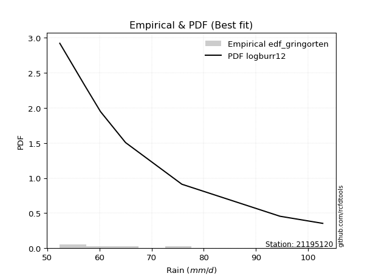</img>

</div>


### 9. Empirical - EDF Filliben (1975)

The specific values of the constants (0.3175) (often denoted as $alpha$) and (0.365) are derived from a method proposed by James J. Filliben in a 1975 paper. This particular formula is the mean value of the $i$-th order statistic of the normal distribution and is considered a robust and effective plotting position formula for the normal probability plot correlation coefficient test for normality.

<div align="center">


$P=(m-0.3175)/(n+0.365)$


</div>


**9.1. Empirical values**

<div align="center">

|                | 0                   | 1                   | 2                   | 3            | 4                  | 5                  | 6                  |
|:---------------|:--------------------|:--------------------|:--------------------|:-------------|:-------------------|:-------------------|:-------------------|
| date           | 2023                | 2021                | 2025                | 2019         | 2020               | 2022               | 2024               |
| x              | 52.4                | 57.2                | 58.6                | 65.0         | 75.8               | 94.6               | 102.8              |
| m              | 1                   | 2                   | 3                   | 4            | 5                  | 6                  | 7                  |
| empirical_dist | edf_filliben        | edf_filliben        | edf_filliben        | edf_filliben | edf_filliben       | edf_filliben       | edf_filliben       |
| empirical      | 0.09266802443991853 | 0.22844534962661237 | 0.36422267481330617 | 0.5          | 0.6357773251866938 | 0.7715546503733877 | 0.9073319755600815 |
| empirical_tr   | 1.1021324354657687  | 1.2960844698636163  | 1.5728777362520021  | 2.0          | 2.7455731593662627 | 4.377414561664191  | 10.791208791208794 |

</div>


**9.2. Kolmogorov-Smirnov fit test (sorted by Δ)**


<div align="center">

|                | 0                   | 1                   | 2                   | 3                   | 4                   | 5                   | 6                   | 7                   | 8                   | 9                   | 10                  | 11                  | 12                  | 13                  | 14                    | 15                  | 16                  | 17                  | 18                  | 19                  | 20                  | 21                  | 22                  | 23                  | 24                  | 25                  | 26                  | 27                  | 28                  | 29                  | 30                  | 31                  | 32                  | 33                  | 34                  | 35                  | 36                  | 37                  | 38                  | 39                  | 40                  | 41                  | 42                  | 43                  | 44                  | 45                  | 46                  | 47                  | 48                  | 49                  | 50                  | 51                  | 52                  | 53                  | 54                  | 55                  | 56                  | 57                  | 58                  | 59                  | 60                  | 61                  | 62                  | 63                  | 64                  | 65                  | 66                  | 67                  | 68                  | 69                  | 70                  | 71                  | 72                  | 73                  | 74                  | 75                  | 76                  | 77                  | 78                  | 79                  | 80                  | 81                  | 82                  | 83                  | 84                  | 85                  | 86                  | 87                  | 88                  | 89                  |
|:---------------|:--------------------|:--------------------|:--------------------|:--------------------|:--------------------|:--------------------|:--------------------|:--------------------|:--------------------|:--------------------|:--------------------|:--------------------|:--------------------|:--------------------|:----------------------|:--------------------|:--------------------|:--------------------|:--------------------|:--------------------|:--------------------|:--------------------|:--------------------|:--------------------|:--------------------|:--------------------|:--------------------|:--------------------|:--------------------|:--------------------|:--------------------|:--------------------|:--------------------|:--------------------|:--------------------|:--------------------|:--------------------|:--------------------|:--------------------|:--------------------|:--------------------|:--------------------|:--------------------|:--------------------|:--------------------|:--------------------|:--------------------|:--------------------|:--------------------|:--------------------|:--------------------|:--------------------|:--------------------|:--------------------|:--------------------|:--------------------|:--------------------|:--------------------|:--------------------|:--------------------|:--------------------|:--------------------|:--------------------|:--------------------|:--------------------|:--------------------|:--------------------|:--------------------|:--------------------|:--------------------|:--------------------|:--------------------|:--------------------|:--------------------|:--------------------|:--------------------|:--------------------|:--------------------|:--------------------|:--------------------|:--------------------|:--------------------|:--------------------|:--------------------|:--------------------|:--------------------|:--------------------|:--------------------|:--------------------|:--------------------|
| station        | 21195120            | 21195120            | 21195120            | 21195120            | 21195120            | 21195120            | 21195120            | 21195120            | 21195120            | 21195120            | 21195120            | 21195120            | 21195120            | 21195120            | 21195120              | 21195120            | 21195120            | 21195120            | 21195120            | 21195120            | 21195120            | 21195120            | 21195120            | 21195120            | 21195120            | 21195120            | 21195120            | 21195120            | 21195120            | 21195120            | 21195120            | 21195120            | 21195120            | 21195120            | 21195120            | 21195120            | 21195120            | 21195120            | 21195120            | 21195120            | 21195120            | 21195120            | 21195120            | 21195120            | 21195120            | 21195120            | 21195120            | 21195120            | 21195120            | 21195120            | 21195120            | 21195120            | 21195120            | 21195120            | 21195120            | 21195120            | 21195120            | 21195120            | 21195120            | 21195120            | 21195120            | 21195120            | 21195120            | 21195120            | 21195120            | 21195120            | 21195120            | 21195120            | 21195120            | 21195120            | 21195120            | 21195120            | 21195120            | 21195120            | 21195120            | 21195120            | 21195120            | 21195120            | 21195120            | 21195120            | 21195120            | 21195120            | 21195120            | 21195120            | 21195120            | 21195120            | 21195120            | 21195120            | 21195120            | 21195120            |
| empirical_dist | edf_filliben        | edf_filliben        | edf_filliben        | edf_filliben        | edf_filliben        | edf_filliben        | edf_filliben        | edf_filliben        | edf_filliben        | edf_filliben        | edf_filliben        | edf_filliben        | edf_filliben        | edf_filliben        | edf_filliben          | edf_filliben        | edf_filliben        | edf_filliben        | edf_filliben        | edf_filliben        | edf_filliben        | edf_filliben        | edf_filliben        | edf_filliben        | edf_filliben        | edf_filliben        | edf_filliben        | edf_filliben        | edf_filliben        | edf_filliben        | edf_filliben        | edf_filliben        | edf_filliben        | edf_filliben        | edf_filliben        | edf_filliben        | edf_filliben        | edf_filliben        | edf_filliben        | edf_filliben        | edf_filliben        | edf_filliben        | edf_filliben        | edf_filliben        | edf_filliben        | edf_filliben        | edf_filliben        | edf_filliben        | edf_filliben        | edf_filliben        | edf_filliben        | edf_filliben        | edf_filliben        | edf_filliben        | edf_filliben        | edf_filliben        | edf_filliben        | edf_filliben        | edf_filliben        | edf_filliben        | edf_filliben        | edf_filliben        | edf_filliben        | edf_filliben        | edf_filliben        | edf_filliben        | edf_filliben        | edf_filliben        | edf_filliben        | edf_filliben        | edf_filliben        | edf_filliben        | edf_filliben        | edf_filliben        | edf_filliben        | edf_filliben        | edf_filliben        | edf_filliben        | edf_filliben        | edf_filliben        | edf_filliben        | edf_filliben        | edf_filliben        | edf_filliben        | edf_filliben        | edf_filliben        | edf_filliben        | edf_filliben        | edf_filliben        | edf_filliben        |
| p_dist         | logfisk             | logweibull_min      | logexponnorm        | logexpon            | invweibull          | logfatiguelife      | alpha               | f                   | invgamma            | logtruncnorm        | loginvgauss         | logf                | loginvgamma         | loggenexpon         | loglaplace_asymmetric | halfnorm            | invgauss            | loginvweibull       | loghalfnorm         | expon               | laplace_asymmetric  | genexpon            | exponnorm           | lograyleigh         | rayleigh            | loghalflogistic     | halflogistic        | logmaxwell          | logbetaprime        | logalpha            | loggenlogistic      | logmielke           | nakagami            | maxwell             | gompertz            | logkstwobign        | pearson3            | logpearson3         | weibull_min         | lognakagami         | logloggamma         | nct                 | loggumbel_r         | lognct              | betaprime           | gumbel_r            | logcrystalball      | lognorm             | lognorm             | logt                | logjohnsonsu        | genlogistic         | logmoyal            | moyal               | loggompertz         | kstwobign           | johnsonsu           | logrice             | crystalball         | norm                | t                   | loglogistic         | rice                | loghypsecant        | logistic            | logerlang           | loggamma            | loggamma            | loggumbel_l         | hypsecant           | loglaplace          | erlang              | gamma               | gumbel_l            | laplace             | logncf              | logwald             | wald                | fisk                | logchi2             | loggibrat           | gibrat              | pareto              | loglognorm          | logpareto           | fatiguelife         | ncf                 | chi2                | truncnorm           | mielke              |
| delta          | 0.07494144478619802 | 0.09266802443991333 | 0.0952597601647559  | 0.09557771306365581 | 0.09573367263242905 | 0.09743180607172364 | 0.09745621339373056 | 0.09882106687142567 | 0.10008389841353116 | 0.10081954499068035 | 0.10175121706984391 | 0.1028099960585167  | 0.10281032204228824 | 0.10322190728096436 | 0.10357224240758911   | 0.10422386119137661 | 0.10462645356227807 | 0.10484375960747017 | 0.10576272288149813 | 0.10793815787811378 | 0.10794099874045182 | 0.10794129981937928 | 0.1095465264036114  | 0.11249329251219387 | 0.11501773514146937 | 0.11730320002743366 | 0.11909837567220749 | 0.11993519685876156 | 0.12109610548329894 | 0.12206965479817117 | 0.12364386258630666 | 0.12365403295721028 | 0.12461682646209427 | 0.12565803102203893 | 0.12750131732678027 | 0.12873191003962006 | 0.12899970650120426 | 0.12920724740489764 | 0.13144317761209232 | 0.13201554107865457 | 0.13334508524437239 | 0.13359963713830503 | 0.13436861748121956 | 0.13482285930603494 | 0.13706007757399935 | 0.1372971102201352  | 0.13777761324730328 | 0.1377777255009039  | 0.1377777255009039  | 0.13778007554666272 | 0.13829873048554353 | 0.13847596711499563 | 0.1416103486324456  | 0.145082235489725   | 0.14640942913001412 | 0.1492515324705408  | 0.15522476540259256 | 0.15589517747752443 | 0.15713946510825005 | 0.1571394791118199  | 0.15715147576898936 | 0.16021767723264235 | 0.17362432077815604 | 0.17426282980883637 | 0.1756797696277113  | 0.1807118864111158  | 0.1882098106299992  | 0.1882098106299992  | 0.18917472956110593 | 0.18994169368980135 | 0.1912573528290139  | 0.20291454336218914 | 0.21118883878536088 | 0.2159602984007869  | 0.21788349779468014 | 0.2372805777620843  | 0.2522720850753754  | 0.2591305804475321  | 0.2983065499830849  | 0.3064295195939982  | 0.36408392586034005 | 0.3642180278966992  | 0.3891750804338905  | 0.39563656646078005 | 0.39771172783367337 | 0.487825225077959   | 0.5731204241982387  | 0.7292081090979191  | 0.9063889561445607  | nan                 |
| deltao         | 0.48442053926100004 | 0.48442053926100004 | 0.48442053926100004 | 0.48442053926100004 | 0.48442053926100004 | 0.48442053926100004 | 0.48442053926100004 | 0.48442053926100004 | 0.48442053926100004 | 0.48442053926100004 | 0.48442053926100004 | 0.48442053926100004 | 0.48442053926100004 | 0.48442053926100004 | 0.48442053926100004   | 0.48442053926100004 | 0.48442053926100004 | 0.48442053926100004 | 0.48442053926100004 | 0.48442053926100004 | 0.48442053926100004 | 0.48442053926100004 | 0.48442053926100004 | 0.48442053926100004 | 0.48442053926100004 | 0.48442053926100004 | 0.48442053926100004 | 0.48442053926100004 | 0.48442053926100004 | 0.48442053926100004 | 0.48442053926100004 | 0.48442053926100004 | 0.48442053926100004 | 0.48442053926100004 | 0.48442053926100004 | 0.48442053926100004 | 0.48442053926100004 | 0.48442053926100004 | 0.48442053926100004 | 0.48442053926100004 | 0.48442053926100004 | 0.48442053926100004 | 0.48442053926100004 | 0.48442053926100004 | 0.48442053926100004 | 0.48442053926100004 | 0.48442053926100004 | 0.48442053926100004 | 0.48442053926100004 | 0.48442053926100004 | 0.48442053926100004 | 0.48442053926100004 | 0.48442053926100004 | 0.48442053926100004 | 0.48442053926100004 | 0.48442053926100004 | 0.48442053926100004 | 0.48442053926100004 | 0.48442053926100004 | 0.48442053926100004 | 0.48442053926100004 | 0.48442053926100004 | 0.48442053926100004 | 0.48442053926100004 | 0.48442053926100004 | 0.48442053926100004 | 0.48442053926100004 | 0.48442053926100004 | 0.48442053926100004 | 0.48442053926100004 | 0.48442053926100004 | 0.48442053926100004 | 0.48442053926100004 | 0.48442053926100004 | 0.48442053926100004 | 0.48442053926100004 | 0.48442053926100004 | 0.48442053926100004 | 0.48442053926100004 | 0.48442053926100004 | 0.48442053926100004 | 0.48442053926100004 | 0.48442053926100004 | 0.48442053926100004 | 0.48442053926100004 | 0.48442053926100004 | 0.48442053926100004 | 0.48442053926100004 | 0.48442053926100004 | 0.48442053926100004 |
| eval           | Δo > Δ              | Δo > Δ              | Δo > Δ              | Δo > Δ              | Δo > Δ              | Δo > Δ              | Δo > Δ              | Δo > Δ              | Δo > Δ              | Δo > Δ              | Δo > Δ              | Δo > Δ              | Δo > Δ              | Δo > Δ              | Δo > Δ                | Δo > Δ              | Δo > Δ              | Δo > Δ              | Δo > Δ              | Δo > Δ              | Δo > Δ              | Δo > Δ              | Δo > Δ              | Δo > Δ              | Δo > Δ              | Δo > Δ              | Δo > Δ              | Δo > Δ              | Δo > Δ              | Δo > Δ              | Δo > Δ              | Δo > Δ              | Δo > Δ              | Δo > Δ              | Δo > Δ              | Δo > Δ              | Δo > Δ              | Δo > Δ              | Δo > Δ              | Δo > Δ              | Δo > Δ              | Δo > Δ              | Δo > Δ              | Δo > Δ              | Δo > Δ              | Δo > Δ              | Δo > Δ              | Δo > Δ              | Δo > Δ              | Δo > Δ              | Δo > Δ              | Δo > Δ              | Δo > Δ              | Δo > Δ              | Δo > Δ              | Δo > Δ              | Δo > Δ              | Δo > Δ              | Δo > Δ              | Δo > Δ              | Δo > Δ              | Δo > Δ              | Δo > Δ              | Δo > Δ              | Δo > Δ              | Δo > Δ              | Δo > Δ              | Δo > Δ              | Δo > Δ              | Δo > Δ              | Δo > Δ              | Δo > Δ              | Δo > Δ              | Δo > Δ              | Δo > Δ              | Δo > Δ              | Δo > Δ              | Δo > Δ              | Δo > Δ              | Δo > Δ              | Δo > Δ              | Δo > Δ              | Δo > Δ              | Δo > Δ              | Δo > Δ              | Δo <= Δ             | Δo <= Δ             | Δo <= Δ             | Δo <= Δ             | Δo <= Δ             |
| fit            | 1                   | 1                   | 1                   | 1                   | 1                   | 1                   | 1                   | 1                   | 1                   | 1                   | 1                   | 1                   | 1                   | 1                   | 1                     | 1                   | 1                   | 1                   | 1                   | 1                   | 1                   | 1                   | 1                   | 1                   | 1                   | 1                   | 1                   | 1                   | 1                   | 1                   | 1                   | 1                   | 1                   | 1                   | 1                   | 1                   | 1                   | 1                   | 1                   | 1                   | 1                   | 1                   | 1                   | 1                   | 1                   | 1                   | 1                   | 1                   | 1                   | 1                   | 1                   | 1                   | 1                   | 1                   | 1                   | 1                   | 1                   | 1                   | 1                   | 1                   | 1                   | 1                   | 1                   | 1                   | 1                   | 1                   | 1                   | 1                   | 1                   | 1                   | 1                   | 1                   | 1                   | 1                   | 1                   | 1                   | 1                   | 1                   | 1                   | 1                   | 1                   | 1                   | 1                   | 1                   | 1                   | 0                   | 0                   | 0                   | 0                   | 0                   |
| n              | 7                   | 7                   | 7                   | 7                   | 7                   | 7                   | 7                   | 7                   | 7                   | 7                   | 7                   | 7                   | 7                   | 7                   | 7                     | 7                   | 7                   | 7                   | 7                   | 7                   | 7                   | 7                   | 7                   | 7                   | 7                   | 7                   | 7                   | 7                   | 7                   | 7                   | 7                   | 7                   | 7                   | 7                   | 7                   | 7                   | 7                   | 7                   | 7                   | 7                   | 7                   | 7                   | 7                   | 7                   | 7                   | 7                   | 7                   | 7                   | 7                   | 7                   | 7                   | 7                   | 7                   | 7                   | 7                   | 7                   | 7                   | 7                   | 7                   | 7                   | 7                   | 7                   | 7                   | 7                   | 7                   | 7                   | 7                   | 7                   | 7                   | 7                   | 7                   | 7                   | 7                   | 7                   | 7                   | 7                   | 7                   | 7                   | 7                   | 7                   | 7                   | 7                   | 7                   | 7                   | 7                   | 7                   | 7                   | 7                   | 7                   | 7                   |
| best_fit       | 1                   | 0                   | 0                   | 0                   | 0                   | 0                   | 0                   | 0                   | 0                   | 0                   | 0                   | 0                   | 0                   | 0                   | 0                     | 0                   | 0                   | 0                   | 0                   | 0                   | 0                   | 0                   | 0                   | 0                   | 0                   | 0                   | 0                   | 0                   | 0                   | 0                   | 0                   | 0                   | 0                   | 0                   | 0                   | 0                   | 0                   | 0                   | 0                   | 0                   | 0                   | 0                   | 0                   | 0                   | 0                   | 0                   | 0                   | 0                   | 0                   | 0                   | 0                   | 0                   | 0                   | 0                   | 0                   | 0                   | 0                   | 0                   | 0                   | 0                   | 0                   | 0                   | 0                   | 0                   | 0                   | 0                   | 0                   | 0                   | 0                   | 0                   | 0                   | 0                   | 0                   | 0                   | 0                   | 0                   | 0                   | 0                   | 0                   | 0                   | 0                   | 0                   | 0                   | 0                   | 0                   | 0                   | 0                   | 0                   | 0                   | 0                   |
| best_fit_sort  | 1                   | 2                   | 3                   | 4                   | 5                   | 6                   | 7                   | 8                   | 9                   | 10                  | 11                  | 12                  | 13                  | 14                  | 15                    | 16                  | 17                  | 18                  | 19                  | 20                  | 21                  | 22                  | 23                  | 24                  | 25                  | 26                  | 27                  | 28                  | 29                  | 30                  | 31                  | 32                  | 33                  | 34                  | 35                  | 36                  | 37                  | 38                  | 39                  | 40                  | 41                  | 42                  | 43                  | 44                  | 45                  | 46                  | 47                  | 48                  | 49                  | 50                  | 51                  | 52                  | 53                  | 54                  | 55                  | 56                  | 57                  | 58                  | 59                  | 60                  | 61                  | 62                  | 63                  | 64                  | 65                  | 66                  | 67                  | 68                  | 69                  | 70                  | 71                  | 72                  | 73                  | 74                  | 75                  | 76                  | 77                  | 78                  | 79                  | 80                  | 81                  | 82                  | 83                  | 84                  | 85                  | 86                  | 87                  | 88                  | 89                  | 90                  |

</div>


<div align="center">

</img>

</div>


**9.3. Best fit**

<div align="center">

|   id |   station | empirical_dist   | p_dist   |     delta |   deltao | eval   |   fit |   n |   best_fit |   best_fit_sort |
|-----:|----------:|:-----------------|:---------|----------:|---------:|:-------|------:|----:|-----------:|----------------:|
|    0 |  21195120 | edf_filliben     | logfisk  | 0.0749414 | 0.484421 | Δo > Δ |     1 |   7 |          1 |               1 |

</div>


<div align="center">

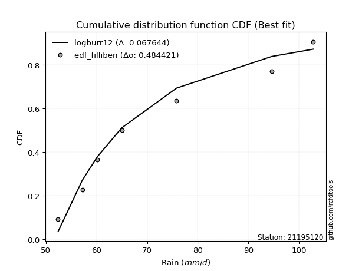</img></img>

</div>


### 10. Empirical - EDF Jenkinson (1977)

The Jenkinson formula in hydrology is an empirical plotting position formula used to estimate the non-exceedance probability _(P)_ or return period _(T)_ of a given ordered observation within a sample. It is a widely used method in the frequency analysis of extreme events such as floods and rainfall, as it provides a distribution-free way to plot data. _a≈0.31_ and _b≈0.38_ are constants derived to approximate the median of the probability distribution for the given rank.

<div align="center">


$P=(m-a)/(n+b)$


</div>


**10.1. Empirical values**

<div align="center">

|                | 0                   | 1                   | 2                   | 3             | 4                  | 5                  | 6                  |
|:---------------|:--------------------|:--------------------|:--------------------|:--------------|:-------------------|:-------------------|:-------------------|
| date           | 2023                | 2021                | 2025                | 2019          | 2020               | 2022               | 2024               |
| x              | 52.4                | 57.2                | 58.6                | 65.0          | 75.8               | 94.6               | 102.8              |
| m              | 1                   | 2                   | 3                   | 4             | 5                  | 6                  | 7                  |
| empirical_dist | edf_jenkinson       | edf_jenkinson       | edf_jenkinson       | edf_jenkinson | edf_jenkinson      | edf_jenkinson      | edf_jenkinson      |
| empirical      | 0.09349593495934959 | 0.22899728997289973 | 0.36449864498644985 | 0.5           | 0.6355013550135502 | 0.7710027100271003 | 0.9065040650406505 |
| empirical_tr   | 1.1031390134529149  | 1.29701230228471    | 1.5735607675906182  | 2.0           | 2.743494423791822  | 4.366863905325444  | 10.695652173913055 |

</div>


**10.2. Kolmogorov-Smirnov fit test (sorted by Δ)**


<div align="center">

|                | 0                   | 1                   | 2                   | 3                   | 4                   | 5                   | 6                   | 7                   | 8                   | 9                   | 10                  | 11                  | 12                  | 13                  | 14                    | 15                  | 16                  | 17                  | 18                  | 19                  | 20                  | 21                  | 22                  | 23                  | 24                  | 25                  | 26                  | 27                  | 28                  | 29                  | 30                  | 31                  | 32                  | 33                  | 34                  | 35                  | 36                  | 37                  | 38                  | 39                  | 40                  | 41                  | 42                  | 43                  | 44                  | 45                  | 46                  | 47                  | 48                  | 49                  | 50                  | 51                  | 52                  | 53                  | 54                  | 55                  | 56                  | 57                  | 58                  | 59                  | 60                  | 61                  | 62                  | 63                  | 64                  | 65                  | 66                  | 67                  | 68                  | 69                  | 70                  | 71                  | 72                  | 73                  | 74                  | 75                  | 76                  | 77                  | 78                  | 79                  | 80                  | 81                  | 82                  | 83                  | 84                  | 85                  | 86                  | 87                  | 88                  | 89                  |
|:---------------|:--------------------|:--------------------|:--------------------|:--------------------|:--------------------|:--------------------|:--------------------|:--------------------|:--------------------|:--------------------|:--------------------|:--------------------|:--------------------|:--------------------|:----------------------|:--------------------|:--------------------|:--------------------|:--------------------|:--------------------|:--------------------|:--------------------|:--------------------|:--------------------|:--------------------|:--------------------|:--------------------|:--------------------|:--------------------|:--------------------|:--------------------|:--------------------|:--------------------|:--------------------|:--------------------|:--------------------|:--------------------|:--------------------|:--------------------|:--------------------|:--------------------|:--------------------|:--------------------|:--------------------|:--------------------|:--------------------|:--------------------|:--------------------|:--------------------|:--------------------|:--------------------|:--------------------|:--------------------|:--------------------|:--------------------|:--------------------|:--------------------|:--------------------|:--------------------|:--------------------|:--------------------|:--------------------|:--------------------|:--------------------|:--------------------|:--------------------|:--------------------|:--------------------|:--------------------|:--------------------|:--------------------|:--------------------|:--------------------|:--------------------|:--------------------|:--------------------|:--------------------|:--------------------|:--------------------|:--------------------|:--------------------|:--------------------|:--------------------|:--------------------|:--------------------|:--------------------|:--------------------|:--------------------|:--------------------|:--------------------|
| station        | 21195120            | 21195120            | 21195120            | 21195120            | 21195120            | 21195120            | 21195120            | 21195120            | 21195120            | 21195120            | 21195120            | 21195120            | 21195120            | 21195120            | 21195120              | 21195120            | 21195120            | 21195120            | 21195120            | 21195120            | 21195120            | 21195120            | 21195120            | 21195120            | 21195120            | 21195120            | 21195120            | 21195120            | 21195120            | 21195120            | 21195120            | 21195120            | 21195120            | 21195120            | 21195120            | 21195120            | 21195120            | 21195120            | 21195120            | 21195120            | 21195120            | 21195120            | 21195120            | 21195120            | 21195120            | 21195120            | 21195120            | 21195120            | 21195120            | 21195120            | 21195120            | 21195120            | 21195120            | 21195120            | 21195120            | 21195120            | 21195120            | 21195120            | 21195120            | 21195120            | 21195120            | 21195120            | 21195120            | 21195120            | 21195120            | 21195120            | 21195120            | 21195120            | 21195120            | 21195120            | 21195120            | 21195120            | 21195120            | 21195120            | 21195120            | 21195120            | 21195120            | 21195120            | 21195120            | 21195120            | 21195120            | 21195120            | 21195120            | 21195120            | 21195120            | 21195120            | 21195120            | 21195120            | 21195120            | 21195120            |
| empirical_dist | edf_jenkinson       | edf_jenkinson       | edf_jenkinson       | edf_jenkinson       | edf_jenkinson       | edf_jenkinson       | edf_jenkinson       | edf_jenkinson       | edf_jenkinson       | edf_jenkinson       | edf_jenkinson       | edf_jenkinson       | edf_jenkinson       | edf_jenkinson       | edf_jenkinson         | edf_jenkinson       | edf_jenkinson       | edf_jenkinson       | edf_jenkinson       | edf_jenkinson       | edf_jenkinson       | edf_jenkinson       | edf_jenkinson       | edf_jenkinson       | edf_jenkinson       | edf_jenkinson       | edf_jenkinson       | edf_jenkinson       | edf_jenkinson       | edf_jenkinson       | edf_jenkinson       | edf_jenkinson       | edf_jenkinson       | edf_jenkinson       | edf_jenkinson       | edf_jenkinson       | edf_jenkinson       | edf_jenkinson       | edf_jenkinson       | edf_jenkinson       | edf_jenkinson       | edf_jenkinson       | edf_jenkinson       | edf_jenkinson       | edf_jenkinson       | edf_jenkinson       | edf_jenkinson       | edf_jenkinson       | edf_jenkinson       | edf_jenkinson       | edf_jenkinson       | edf_jenkinson       | edf_jenkinson       | edf_jenkinson       | edf_jenkinson       | edf_jenkinson       | edf_jenkinson       | edf_jenkinson       | edf_jenkinson       | edf_jenkinson       | edf_jenkinson       | edf_jenkinson       | edf_jenkinson       | edf_jenkinson       | edf_jenkinson       | edf_jenkinson       | edf_jenkinson       | edf_jenkinson       | edf_jenkinson       | edf_jenkinson       | edf_jenkinson       | edf_jenkinson       | edf_jenkinson       | edf_jenkinson       | edf_jenkinson       | edf_jenkinson       | edf_jenkinson       | edf_jenkinson       | edf_jenkinson       | edf_jenkinson       | edf_jenkinson       | edf_jenkinson       | edf_jenkinson       | edf_jenkinson       | edf_jenkinson       | edf_jenkinson       | edf_jenkinson       | edf_jenkinson       | edf_jenkinson       | edf_jenkinson       |
| p_dist         | logfisk             | logweibull_min      | logexponnorm        | logexpon            | invweibull          | logfatiguelife      | alpha               | f                   | invgamma            | logtruncnorm        | loginvgauss         | logf                | loginvgamma         | loggenexpon         | loglaplace_asymmetric | halfnorm            | invgauss            | loginvweibull       | loghalfnorm         | expon               | laplace_asymmetric  | genexpon            | exponnorm           | lograyleigh         | rayleigh            | loghalflogistic     | halflogistic        | logmaxwell          | logbetaprime        | logalpha            | loggenlogistic      | logmielke           | nakagami            | maxwell             | gompertz            | logkstwobign        | pearson3            | logpearson3         | weibull_min         | lognakagami         | logloggamma         | nct                 | loggumbel_r         | lognct              | betaprime           | gumbel_r            | logcrystalball      | lognorm             | lognorm             | logt                | logjohnsonsu        | genlogistic         | logmoyal            | moyal               | loggompertz         | kstwobign           | johnsonsu           | logrice             | crystalball         | norm                | t                   | loglogistic         | rice                | loghypsecant        | logistic            | logerlang           | loggamma            | loggamma            | loggumbel_l         | hypsecant           | loglaplace          | erlang              | gamma               | gumbel_l            | laplace             | logncf              | logwald             | wald                | fisk                | logchi2             | loggibrat           | gibrat              | pareto              | loglognorm          | logpareto           | fatiguelife         | ncf                 | chi2                | truncnorm           | mielke              |
| delta          | 0.07521741495934164 | 0.09349593495934438 | 0.09581170051104326 | 0.09612965340994317 | 0.0962856129787164  | 0.097983746418011   | 0.09800815374001792 | 0.09937300721771303 | 0.10063583875981852 | 0.10137148533696771 | 0.10230315741613127 | 0.10336193640480407 | 0.1033622623885756  | 0.10377384762725173 | 0.10412418275387647   | 0.10477580153766397 | 0.10517839390856543 | 0.10539569995375753 | 0.10631466322778549 | 0.10849009822440114 | 0.10849293908673918 | 0.10849324016566664 | 0.11009846674989876 | 0.11276926268533755 | 0.11529370531461305 | 0.11785514037372102 | 0.11937434584535117 | 0.12021116703190524 | 0.12137207565644262 | 0.12234562497131485 | 0.12391983275945034 | 0.12393000313035396 | 0.12489279663523795 | 0.12565803102203893 | 0.12777728749992395 | 0.12900788021276374 | 0.12927567667434794 | 0.12948321757804132 | 0.13089123726580495 | 0.1314636007323672  | 0.13362105541751607 | 0.1338756073114487  | 0.13464458765436324 | 0.13509882947917862 | 0.13733604774714303 | 0.13757308039327887 | 0.13805358342044696 | 0.13805369567404757 | 0.13805369567404757 | 0.1380560457198064  | 0.1385747006586872  | 0.1387519372881393  | 0.14188631880558927 | 0.14535820566286867 | 0.1466853993031578  | 0.14952750264368447 | 0.15522476540259256 | 0.1561711476506681  | 0.15713946510825005 | 0.1571394791118199  | 0.15715147576898936 | 0.16049364740578603 | 0.17390029095129972 | 0.17453879998198005 | 0.1756797696277113  | 0.18098785658425942 | 0.18848578080314282 | 0.18848578080314282 | 0.18917472956110593 | 0.18994169368980135 | 0.19153332300215758 | 0.20236260301590178 | 0.2114648089585045  | 0.2159602984007869  | 0.21788349779468014 | 0.23645266724265324 | 0.2525480552485191  | 0.2594065506206758  | 0.29747863946365394 | 0.30560160907456724 | 0.36435989603348373 | 0.3644939980698429  | 0.3886231400876031  | 0.3950846261144927  | 0.397159787487386   | 0.48727328473167164 | 0.5722925136788076  | 0.7286561687516317  | 0.9055610456251296  | nan                 |
| deltao         | 0.48442053926100004 | 0.48442053926100004 | 0.48442053926100004 | 0.48442053926100004 | 0.48442053926100004 | 0.48442053926100004 | 0.48442053926100004 | 0.48442053926100004 | 0.48442053926100004 | 0.48442053926100004 | 0.48442053926100004 | 0.48442053926100004 | 0.48442053926100004 | 0.48442053926100004 | 0.48442053926100004   | 0.48442053926100004 | 0.48442053926100004 | 0.48442053926100004 | 0.48442053926100004 | 0.48442053926100004 | 0.48442053926100004 | 0.48442053926100004 | 0.48442053926100004 | 0.48442053926100004 | 0.48442053926100004 | 0.48442053926100004 | 0.48442053926100004 | 0.48442053926100004 | 0.48442053926100004 | 0.48442053926100004 | 0.48442053926100004 | 0.48442053926100004 | 0.48442053926100004 | 0.48442053926100004 | 0.48442053926100004 | 0.48442053926100004 | 0.48442053926100004 | 0.48442053926100004 | 0.48442053926100004 | 0.48442053926100004 | 0.48442053926100004 | 0.48442053926100004 | 0.48442053926100004 | 0.48442053926100004 | 0.48442053926100004 | 0.48442053926100004 | 0.48442053926100004 | 0.48442053926100004 | 0.48442053926100004 | 0.48442053926100004 | 0.48442053926100004 | 0.48442053926100004 | 0.48442053926100004 | 0.48442053926100004 | 0.48442053926100004 | 0.48442053926100004 | 0.48442053926100004 | 0.48442053926100004 | 0.48442053926100004 | 0.48442053926100004 | 0.48442053926100004 | 0.48442053926100004 | 0.48442053926100004 | 0.48442053926100004 | 0.48442053926100004 | 0.48442053926100004 | 0.48442053926100004 | 0.48442053926100004 | 0.48442053926100004 | 0.48442053926100004 | 0.48442053926100004 | 0.48442053926100004 | 0.48442053926100004 | 0.48442053926100004 | 0.48442053926100004 | 0.48442053926100004 | 0.48442053926100004 | 0.48442053926100004 | 0.48442053926100004 | 0.48442053926100004 | 0.48442053926100004 | 0.48442053926100004 | 0.48442053926100004 | 0.48442053926100004 | 0.48442053926100004 | 0.48442053926100004 | 0.48442053926100004 | 0.48442053926100004 | 0.48442053926100004 | 0.48442053926100004 |
| eval           | Δo > Δ              | Δo > Δ              | Δo > Δ              | Δo > Δ              | Δo > Δ              | Δo > Δ              | Δo > Δ              | Δo > Δ              | Δo > Δ              | Δo > Δ              | Δo > Δ              | Δo > Δ              | Δo > Δ              | Δo > Δ              | Δo > Δ                | Δo > Δ              | Δo > Δ              | Δo > Δ              | Δo > Δ              | Δo > Δ              | Δo > Δ              | Δo > Δ              | Δo > Δ              | Δo > Δ              | Δo > Δ              | Δo > Δ              | Δo > Δ              | Δo > Δ              | Δo > Δ              | Δo > Δ              | Δo > Δ              | Δo > Δ              | Δo > Δ              | Δo > Δ              | Δo > Δ              | Δo > Δ              | Δo > Δ              | Δo > Δ              | Δo > Δ              | Δo > Δ              | Δo > Δ              | Δo > Δ              | Δo > Δ              | Δo > Δ              | Δo > Δ              | Δo > Δ              | Δo > Δ              | Δo > Δ              | Δo > Δ              | Δo > Δ              | Δo > Δ              | Δo > Δ              | Δo > Δ              | Δo > Δ              | Δo > Δ              | Δo > Δ              | Δo > Δ              | Δo > Δ              | Δo > Δ              | Δo > Δ              | Δo > Δ              | Δo > Δ              | Δo > Δ              | Δo > Δ              | Δo > Δ              | Δo > Δ              | Δo > Δ              | Δo > Δ              | Δo > Δ              | Δo > Δ              | Δo > Δ              | Δo > Δ              | Δo > Δ              | Δo > Δ              | Δo > Δ              | Δo > Δ              | Δo > Δ              | Δo > Δ              | Δo > Δ              | Δo > Δ              | Δo > Δ              | Δo > Δ              | Δo > Δ              | Δo > Δ              | Δo > Δ              | Δo <= Δ             | Δo <= Δ             | Δo <= Δ             | Δo <= Δ             | Δo <= Δ             |
| fit            | 1                   | 1                   | 1                   | 1                   | 1                   | 1                   | 1                   | 1                   | 1                   | 1                   | 1                   | 1                   | 1                   | 1                   | 1                     | 1                   | 1                   | 1                   | 1                   | 1                   | 1                   | 1                   | 1                   | 1                   | 1                   | 1                   | 1                   | 1                   | 1                   | 1                   | 1                   | 1                   | 1                   | 1                   | 1                   | 1                   | 1                   | 1                   | 1                   | 1                   | 1                   | 1                   | 1                   | 1                   | 1                   | 1                   | 1                   | 1                   | 1                   | 1                   | 1                   | 1                   | 1                   | 1                   | 1                   | 1                   | 1                   | 1                   | 1                   | 1                   | 1                   | 1                   | 1                   | 1                   | 1                   | 1                   | 1                   | 1                   | 1                   | 1                   | 1                   | 1                   | 1                   | 1                   | 1                   | 1                   | 1                   | 1                   | 1                   | 1                   | 1                   | 1                   | 1                   | 1                   | 1                   | 0                   | 0                   | 0                   | 0                   | 0                   |
| n              | 7                   | 7                   | 7                   | 7                   | 7                   | 7                   | 7                   | 7                   | 7                   | 7                   | 7                   | 7                   | 7                   | 7                   | 7                     | 7                   | 7                   | 7                   | 7                   | 7                   | 7                   | 7                   | 7                   | 7                   | 7                   | 7                   | 7                   | 7                   | 7                   | 7                   | 7                   | 7                   | 7                   | 7                   | 7                   | 7                   | 7                   | 7                   | 7                   | 7                   | 7                   | 7                   | 7                   | 7                   | 7                   | 7                   | 7                   | 7                   | 7                   | 7                   | 7                   | 7                   | 7                   | 7                   | 7                   | 7                   | 7                   | 7                   | 7                   | 7                   | 7                   | 7                   | 7                   | 7                   | 7                   | 7                   | 7                   | 7                   | 7                   | 7                   | 7                   | 7                   | 7                   | 7                   | 7                   | 7                   | 7                   | 7                   | 7                   | 7                   | 7                   | 7                   | 7                   | 7                   | 7                   | 7                   | 7                   | 7                   | 7                   | 7                   |
| best_fit       | 1                   | 0                   | 0                   | 0                   | 0                   | 0                   | 0                   | 0                   | 0                   | 0                   | 0                   | 0                   | 0                   | 0                   | 0                     | 0                   | 0                   | 0                   | 0                   | 0                   | 0                   | 0                   | 0                   | 0                   | 0                   | 0                   | 0                   | 0                   | 0                   | 0                   | 0                   | 0                   | 0                   | 0                   | 0                   | 0                   | 0                   | 0                   | 0                   | 0                   | 0                   | 0                   | 0                   | 0                   | 0                   | 0                   | 0                   | 0                   | 0                   | 0                   | 0                   | 0                   | 0                   | 0                   | 0                   | 0                   | 0                   | 0                   | 0                   | 0                   | 0                   | 0                   | 0                   | 0                   | 0                   | 0                   | 0                   | 0                   | 0                   | 0                   | 0                   | 0                   | 0                   | 0                   | 0                   | 0                   | 0                   | 0                   | 0                   | 0                   | 0                   | 0                   | 0                   | 0                   | 0                   | 0                   | 0                   | 0                   | 0                   | 0                   |
| best_fit_sort  | 1                   | 2                   | 3                   | 4                   | 5                   | 6                   | 7                   | 8                   | 9                   | 10                  | 11                  | 12                  | 13                  | 14                  | 15                    | 16                  | 17                  | 18                  | 19                  | 20                  | 21                  | 22                  | 23                  | 24                  | 25                  | 26                  | 27                  | 28                  | 29                  | 30                  | 31                  | 32                  | 33                  | 34                  | 35                  | 36                  | 37                  | 38                  | 39                  | 40                  | 41                  | 42                  | 43                  | 44                  | 45                  | 46                  | 47                  | 48                  | 49                  | 50                  | 51                  | 52                  | 53                  | 54                  | 55                  | 56                  | 57                  | 58                  | 59                  | 60                  | 61                  | 62                  | 63                  | 64                  | 65                  | 66                  | 67                  | 68                  | 69                  | 70                  | 71                  | 72                  | 73                  | 74                  | 75                  | 76                  | 77                  | 78                  | 79                  | 80                  | 81                  | 82                  | 83                  | 84                  | 85                  | 86                  | 87                  | 88                  | 89                  | 90                  |

</div>


<div align="center">

</img>

</div>


**10.3. Best fit**

<div align="center">

|   id |   station | empirical_dist   | p_dist   |     delta |   deltao | eval   |   fit |   n |   best_fit |   best_fit_sort |
|-----:|----------:|:-----------------|:---------|----------:|---------:|:-------|------:|----:|-----------:|----------------:|
|    0 |  21195120 | edf_jenkinson    | logfisk  | 0.0752174 | 0.484421 | Δo > Δ |     1 |   7 |          1 |               1 |

</div>


<div align="center">

</img></img>

</div>


### 11. Empirical - EDF Cunnane (1978)

Cunnane´s work in statistical hydrology has focused on the performance and evaluation of different probability distributions (such as GEV, Gumbel, Lognormal) for flood frequency estimation. _b_ is a constant, typically set to 0.4.

<div align="center">


$P=(m-b)/(n+1-2b)$


</div>


**11.1. Empirical values**

<div align="center">

|                | 0                   | 1                   | 2                  | 3           | 4                  | 5                  | 6                  |
|:---------------|:--------------------|:--------------------|:-------------------|:------------|:-------------------|:-------------------|:-------------------|
| date           | 2023                | 2021                | 2025               | 2019        | 2020               | 2022               | 2024               |
| x              | 52.4                | 57.2                | 58.6               | 65.0        | 75.8               | 94.6               | 102.8              |
| m              | 1                   | 2                   | 3                  | 4           | 5                  | 6                  | 7                  |
| empirical_dist | edf_cunnane         | edf_cunnane         | edf_cunnane        | edf_cunnane | edf_cunnane        | edf_cunnane        | edf_cunnane        |
| empirical      | 0.08333333333333333 | 0.22222222222222224 | 0.3611111111111111 | 0.5         | 0.6388888888888888 | 0.7777777777777777 | 0.9166666666666666 |
| empirical_tr   | 1.090909090909091   | 1.2857142857142856  | 1.565217391304348  | 2.0         | 2.7692307692307687 | 4.499999999999998  | 11.999999999999995 |

</div>


**11.2. Kolmogorov-Smirnov fit test (sorted by Δ)**


<div align="center">

|                | 0                   | 1                   | 2                   | 3                   | 4                   | 5                   | 6                   | 7                   | 8                   | 9                   | 10                  | 11                  | 12                  | 13                  | 14                  | 15                  | 16                    | 17                  | 18                  | 19                  | 20                  | 21                  | 22                  | 23                  | 24                  | 25                  | 26                  | 27                  | 28                  | 29                  | 30                  | 31                  | 32                  | 33                  | 34                  | 35                  | 36                  | 37                  | 38                  | 39                  | 40                  | 41                  | 42                  | 43                  | 44                  | 45                  | 46                  | 47                  | 48                  | 49                  | 50                  | 51                  | 52                  | 53                  | 54                  | 55                  | 56                  | 57                  | 58                  | 59                  | 60                  | 61                  | 62                  | 63                  | 64                  | 65                  | 66                  | 67                  | 68                  | 69                  | 70                  | 71                  | 72                  | 73                  | 74                  | 75                  | 76                  | 77                  | 78                  | 79                  | 80                  | 81                  | 82                  | 83                  | 84                  | 85                  | 86                  | 87                  | 88                  | 89                  |
|:---------------|:--------------------|:--------------------|:--------------------|:--------------------|:--------------------|:--------------------|:--------------------|:--------------------|:--------------------|:--------------------|:--------------------|:--------------------|:--------------------|:--------------------|:--------------------|:--------------------|:----------------------|:--------------------|:--------------------|:--------------------|:--------------------|:--------------------|:--------------------|:--------------------|:--------------------|:--------------------|:--------------------|:--------------------|:--------------------|:--------------------|:--------------------|:--------------------|:--------------------|:--------------------|:--------------------|:--------------------|:--------------------|:--------------------|:--------------------|:--------------------|:--------------------|:--------------------|:--------------------|:--------------------|:--------------------|:--------------------|:--------------------|:--------------------|:--------------------|:--------------------|:--------------------|:--------------------|:--------------------|:--------------------|:--------------------|:--------------------|:--------------------|:--------------------|:--------------------|:--------------------|:--------------------|:--------------------|:--------------------|:--------------------|:--------------------|:--------------------|:--------------------|:--------------------|:--------------------|:--------------------|:--------------------|:--------------------|:--------------------|:--------------------|:--------------------|:--------------------|:--------------------|:--------------------|:--------------------|:--------------------|:--------------------|:--------------------|:--------------------|:--------------------|:--------------------|:--------------------|:--------------------|:--------------------|:--------------------|:--------------------|
| station        | 21195120            | 21195120            | 21195120            | 21195120            | 21195120            | 21195120            | 21195120            | 21195120            | 21195120            | 21195120            | 21195120            | 21195120            | 21195120            | 21195120            | 21195120            | 21195120            | 21195120              | 21195120            | 21195120            | 21195120            | 21195120            | 21195120            | 21195120            | 21195120            | 21195120            | 21195120            | 21195120            | 21195120            | 21195120            | 21195120            | 21195120            | 21195120            | 21195120            | 21195120            | 21195120            | 21195120            | 21195120            | 21195120            | 21195120            | 21195120            | 21195120            | 21195120            | 21195120            | 21195120            | 21195120            | 21195120            | 21195120            | 21195120            | 21195120            | 21195120            | 21195120            | 21195120            | 21195120            | 21195120            | 21195120            | 21195120            | 21195120            | 21195120            | 21195120            | 21195120            | 21195120            | 21195120            | 21195120            | 21195120            | 21195120            | 21195120            | 21195120            | 21195120            | 21195120            | 21195120            | 21195120            | 21195120            | 21195120            | 21195120            | 21195120            | 21195120            | 21195120            | 21195120            | 21195120            | 21195120            | 21195120            | 21195120            | 21195120            | 21195120            | 21195120            | 21195120            | 21195120            | 21195120            | 21195120            | 21195120            |
| empirical_dist | edf_cunnane         | edf_cunnane         | edf_cunnane         | edf_cunnane         | edf_cunnane         | edf_cunnane         | edf_cunnane         | edf_cunnane         | edf_cunnane         | edf_cunnane         | edf_cunnane         | edf_cunnane         | edf_cunnane         | edf_cunnane         | edf_cunnane         | edf_cunnane         | edf_cunnane           | edf_cunnane         | edf_cunnane         | edf_cunnane         | edf_cunnane         | edf_cunnane         | edf_cunnane         | edf_cunnane         | edf_cunnane         | edf_cunnane         | edf_cunnane         | edf_cunnane         | edf_cunnane         | edf_cunnane         | edf_cunnane         | edf_cunnane         | edf_cunnane         | edf_cunnane         | edf_cunnane         | edf_cunnane         | edf_cunnane         | edf_cunnane         | edf_cunnane         | edf_cunnane         | edf_cunnane         | edf_cunnane         | edf_cunnane         | edf_cunnane         | edf_cunnane         | edf_cunnane         | edf_cunnane         | edf_cunnane         | edf_cunnane         | edf_cunnane         | edf_cunnane         | edf_cunnane         | edf_cunnane         | edf_cunnane         | edf_cunnane         | edf_cunnane         | edf_cunnane         | edf_cunnane         | edf_cunnane         | edf_cunnane         | edf_cunnane         | edf_cunnane         | edf_cunnane         | edf_cunnane         | edf_cunnane         | edf_cunnane         | edf_cunnane         | edf_cunnane         | edf_cunnane         | edf_cunnane         | edf_cunnane         | edf_cunnane         | edf_cunnane         | edf_cunnane         | edf_cunnane         | edf_cunnane         | edf_cunnane         | edf_cunnane         | edf_cunnane         | edf_cunnane         | edf_cunnane         | edf_cunnane         | edf_cunnane         | edf_cunnane         | edf_cunnane         | edf_cunnane         | edf_cunnane         | edf_cunnane         | edf_cunnane         | edf_cunnane         |
| p_dist         | logfisk             | logweibull_min      | logexponnorm        | logexpon            | invweibull          | logfatiguelife      | f                   | alpha               | invgamma            | logtruncnorm        | loginvgauss         | logf                | loginvgamma         | loggenexpon         | halfnorm            | invgauss            | loglaplace_asymmetric | loginvweibull       | loghalfnorm         | expon               | laplace_asymmetric  | genexpon            | exponnorm           | lograyleigh         | loghalflogistic     | rayleigh            | halflogistic        | logmaxwell          | logbetaprime        | logalpha            | loggenlogistic      | logmielke           | nakagami            | gompertz            | logkstwobign        | maxwell             | logpearson3         | pearson3            | logloggamma         | nct                 | loggumbel_r         | lognct              | betaprime           | gumbel_r            | logcrystalball      | lognorm             | lognorm             | logt                | logjohnsonsu        | genlogistic         | weibull_min         | lognakagami         | logmoyal            | moyal               | loggompertz         | kstwobign           | logrice             | johnsonsu           | loglogistic         | crystalball         | norm                | t                   | rice                | loghypsecant        | logistic            | logerlang           | loggamma            | loggamma            | loglaplace          | loggumbel_l         | hypsecant           | erlang              | gamma               | gumbel_l            | laplace             | logncf              | logwald             | wald                | fisk                | logchi2             | loggibrat           | gibrat              | pareto              | loglognorm          | logpareto           | fatiguelife         | ncf                 | chi2                | truncnorm           | mielke              |
| delta          | 0.07182988108400301 | 0.08682442600458495 | 0.08903663276036589 | 0.0893545856592658  | 0.08951054522803903 | 0.09120867866733362 | 0.09259793946703565 | 0.0932342823937764  | 0.09386077100914114 | 0.09459641758629034 | 0.0955280896654539  | 0.09658686865412669 | 0.09658719463789822 | 0.09699877987657435 | 0.0980007337869866  | 0.09840332615788805 | 0.09840743462793483   | 0.09862063220308015 | 0.09953959547710811 | 0.10171503047372377 | 0.1017178713360618  | 0.10171817241498926 | 0.10332339899922138 | 0.1093817288099988  | 0.1121673628396635  | 0.11368681734776342 | 0.11598681197001243 | 0.11682363315656649 | 0.11798454178110387 | 0.1189580910959761  | 0.1205322988841116  | 0.12054246925501522 | 0.1215052627598992  | 0.12438975362458521 | 0.125620346337425   | 0.12565803102203893 | 0.12609568370270258 | 0.12613057175438663 | 0.13023352154217732 | 0.13048807343610996 | 0.1312570537790245  | 0.13171129560383987 | 0.1339485138718043  | 0.13418554651794012 | 0.13466604954510822 | 0.13466616179870883 | 0.13466616179870883 | 0.13466851184446765 | 0.13518716678334847 | 0.13536440341280057 | 0.13766630501648244 | 0.1382386684830447  | 0.13849878493025053 | 0.14197067178752992 | 0.14329786542781905 | 0.14613996876834573 | 0.15278361377532937 | 0.15522476540259256 | 0.1571061135304473  | 0.15713946510825005 | 0.1571394791118199  | 0.15715147576898936 | 0.17051275707596097 | 0.1711512661066413  | 0.1756797696277113  | 0.18047440601220419 | 0.1850982469278042  | 0.1850982469278042  | 0.18814578912681884 | 0.18917472956110593 | 0.18994169368980135 | 0.20913767076657927 | 0.21420451806762905 | 0.2159602984007869  | 0.21788349779468014 | 0.24661526886866952 | 0.24916052137318034 | 0.25601901674533706 | 0.30764124108967006 | 0.31576421070058336 | 0.360972362158145   | 0.36110646419450415 | 0.3953982078382806  | 0.4018596938651702  | 0.4039348552380635  | 0.49404835248234913 | 0.5824551153048239  | 0.7354312365023092  | 0.9157236472511459  | nan                 |
| deltao         | 0.48442053926100004 | 0.48442053926100004 | 0.48442053926100004 | 0.48442053926100004 | 0.48442053926100004 | 0.48442053926100004 | 0.48442053926100004 | 0.48442053926100004 | 0.48442053926100004 | 0.48442053926100004 | 0.48442053926100004 | 0.48442053926100004 | 0.48442053926100004 | 0.48442053926100004 | 0.48442053926100004 | 0.48442053926100004 | 0.48442053926100004   | 0.48442053926100004 | 0.48442053926100004 | 0.48442053926100004 | 0.48442053926100004 | 0.48442053926100004 | 0.48442053926100004 | 0.48442053926100004 | 0.48442053926100004 | 0.48442053926100004 | 0.48442053926100004 | 0.48442053926100004 | 0.48442053926100004 | 0.48442053926100004 | 0.48442053926100004 | 0.48442053926100004 | 0.48442053926100004 | 0.48442053926100004 | 0.48442053926100004 | 0.48442053926100004 | 0.48442053926100004 | 0.48442053926100004 | 0.48442053926100004 | 0.48442053926100004 | 0.48442053926100004 | 0.48442053926100004 | 0.48442053926100004 | 0.48442053926100004 | 0.48442053926100004 | 0.48442053926100004 | 0.48442053926100004 | 0.48442053926100004 | 0.48442053926100004 | 0.48442053926100004 | 0.48442053926100004 | 0.48442053926100004 | 0.48442053926100004 | 0.48442053926100004 | 0.48442053926100004 | 0.48442053926100004 | 0.48442053926100004 | 0.48442053926100004 | 0.48442053926100004 | 0.48442053926100004 | 0.48442053926100004 | 0.48442053926100004 | 0.48442053926100004 | 0.48442053926100004 | 0.48442053926100004 | 0.48442053926100004 | 0.48442053926100004 | 0.48442053926100004 | 0.48442053926100004 | 0.48442053926100004 | 0.48442053926100004 | 0.48442053926100004 | 0.48442053926100004 | 0.48442053926100004 | 0.48442053926100004 | 0.48442053926100004 | 0.48442053926100004 | 0.48442053926100004 | 0.48442053926100004 | 0.48442053926100004 | 0.48442053926100004 | 0.48442053926100004 | 0.48442053926100004 | 0.48442053926100004 | 0.48442053926100004 | 0.48442053926100004 | 0.48442053926100004 | 0.48442053926100004 | 0.48442053926100004 | 0.48442053926100004 |
| eval           | Δo > Δ              | Δo > Δ              | Δo > Δ              | Δo > Δ              | Δo > Δ              | Δo > Δ              | Δo > Δ              | Δo > Δ              | Δo > Δ              | Δo > Δ              | Δo > Δ              | Δo > Δ              | Δo > Δ              | Δo > Δ              | Δo > Δ              | Δo > Δ              | Δo > Δ                | Δo > Δ              | Δo > Δ              | Δo > Δ              | Δo > Δ              | Δo > Δ              | Δo > Δ              | Δo > Δ              | Δo > Δ              | Δo > Δ              | Δo > Δ              | Δo > Δ              | Δo > Δ              | Δo > Δ              | Δo > Δ              | Δo > Δ              | Δo > Δ              | Δo > Δ              | Δo > Δ              | Δo > Δ              | Δo > Δ              | Δo > Δ              | Δo > Δ              | Δo > Δ              | Δo > Δ              | Δo > Δ              | Δo > Δ              | Δo > Δ              | Δo > Δ              | Δo > Δ              | Δo > Δ              | Δo > Δ              | Δo > Δ              | Δo > Δ              | Δo > Δ              | Δo > Δ              | Δo > Δ              | Δo > Δ              | Δo > Δ              | Δo > Δ              | Δo > Δ              | Δo > Δ              | Δo > Δ              | Δo > Δ              | Δo > Δ              | Δo > Δ              | Δo > Δ              | Δo > Δ              | Δo > Δ              | Δo > Δ              | Δo > Δ              | Δo > Δ              | Δo > Δ              | Δo > Δ              | Δo > Δ              | Δo > Δ              | Δo > Δ              | Δo > Δ              | Δo > Δ              | Δo > Δ              | Δo > Δ              | Δo > Δ              | Δo > Δ              | Δo > Δ              | Δo > Δ              | Δo > Δ              | Δo > Δ              | Δo > Δ              | Δo > Δ              | Δo <= Δ             | Δo <= Δ             | Δo <= Δ             | Δo <= Δ             | Δo <= Δ             |
| fit            | 1                   | 1                   | 1                   | 1                   | 1                   | 1                   | 1                   | 1                   | 1                   | 1                   | 1                   | 1                   | 1                   | 1                   | 1                   | 1                   | 1                     | 1                   | 1                   | 1                   | 1                   | 1                   | 1                   | 1                   | 1                   | 1                   | 1                   | 1                   | 1                   | 1                   | 1                   | 1                   | 1                   | 1                   | 1                   | 1                   | 1                   | 1                   | 1                   | 1                   | 1                   | 1                   | 1                   | 1                   | 1                   | 1                   | 1                   | 1                   | 1                   | 1                   | 1                   | 1                   | 1                   | 1                   | 1                   | 1                   | 1                   | 1                   | 1                   | 1                   | 1                   | 1                   | 1                   | 1                   | 1                   | 1                   | 1                   | 1                   | 1                   | 1                   | 1                   | 1                   | 1                   | 1                   | 1                   | 1                   | 1                   | 1                   | 1                   | 1                   | 1                   | 1                   | 1                   | 1                   | 1                   | 0                   | 0                   | 0                   | 0                   | 0                   |
| n              | 7                   | 7                   | 7                   | 7                   | 7                   | 7                   | 7                   | 7                   | 7                   | 7                   | 7                   | 7                   | 7                   | 7                   | 7                   | 7                   | 7                     | 7                   | 7                   | 7                   | 7                   | 7                   | 7                   | 7                   | 7                   | 7                   | 7                   | 7                   | 7                   | 7                   | 7                   | 7                   | 7                   | 7                   | 7                   | 7                   | 7                   | 7                   | 7                   | 7                   | 7                   | 7                   | 7                   | 7                   | 7                   | 7                   | 7                   | 7                   | 7                   | 7                   | 7                   | 7                   | 7                   | 7                   | 7                   | 7                   | 7                   | 7                   | 7                   | 7                   | 7                   | 7                   | 7                   | 7                   | 7                   | 7                   | 7                   | 7                   | 7                   | 7                   | 7                   | 7                   | 7                   | 7                   | 7                   | 7                   | 7                   | 7                   | 7                   | 7                   | 7                   | 7                   | 7                   | 7                   | 7                   | 7                   | 7                   | 7                   | 7                   | 7                   |
| best_fit       | 1                   | 0                   | 0                   | 0                   | 0                   | 0                   | 0                   | 0                   | 0                   | 0                   | 0                   | 0                   | 0                   | 0                   | 0                   | 0                   | 0                     | 0                   | 0                   | 0                   | 0                   | 0                   | 0                   | 0                   | 0                   | 0                   | 0                   | 0                   | 0                   | 0                   | 0                   | 0                   | 0                   | 0                   | 0                   | 0                   | 0                   | 0                   | 0                   | 0                   | 0                   | 0                   | 0                   | 0                   | 0                   | 0                   | 0                   | 0                   | 0                   | 0                   | 0                   | 0                   | 0                   | 0                   | 0                   | 0                   | 0                   | 0                   | 0                   | 0                   | 0                   | 0                   | 0                   | 0                   | 0                   | 0                   | 0                   | 0                   | 0                   | 0                   | 0                   | 0                   | 0                   | 0                   | 0                   | 0                   | 0                   | 0                   | 0                   | 0                   | 0                   | 0                   | 0                   | 0                   | 0                   | 0                   | 0                   | 0                   | 0                   | 0                   |
| best_fit_sort  | 1                   | 2                   | 3                   | 4                   | 5                   | 6                   | 7                   | 8                   | 9                   | 10                  | 11                  | 12                  | 13                  | 14                  | 15                  | 16                  | 17                    | 18                  | 19                  | 20                  | 21                  | 22                  | 23                  | 24                  | 25                  | 26                  | 27                  | 28                  | 29                  | 30                  | 31                  | 32                  | 33                  | 34                  | 35                  | 36                  | 37                  | 38                  | 39                  | 40                  | 41                  | 42                  | 43                  | 44                  | 45                  | 46                  | 47                  | 48                  | 49                  | 50                  | 51                  | 52                  | 53                  | 54                  | 55                  | 56                  | 57                  | 58                  | 59                  | 60                  | 61                  | 62                  | 63                  | 64                  | 65                  | 66                  | 67                  | 68                  | 69                  | 70                  | 71                  | 72                  | 73                  | 74                  | 75                  | 76                  | 77                  | 78                  | 79                  | 80                  | 81                  | 82                  | 83                  | 84                  | 85                  | 86                  | 87                  | 88                  | 89                  | 90                  |

</div>


<div align="center">

</img>

</div>


**11.3. Best fit**

<div align="center">

|   id |   station | empirical_dist   | p_dist   |     delta |   deltao | eval   |   fit |   n |   best_fit |   best_fit_sort |
|-----:|----------:|:-----------------|:---------|----------:|---------:|:-------|------:|----:|-----------:|----------------:|
|    0 |  21195120 | edf_cunnane      | logfisk  | 0.0718299 | 0.484421 | Δo > Δ |     1 |   7 |          1 |               1 |

</div>


<div align="center">

</img>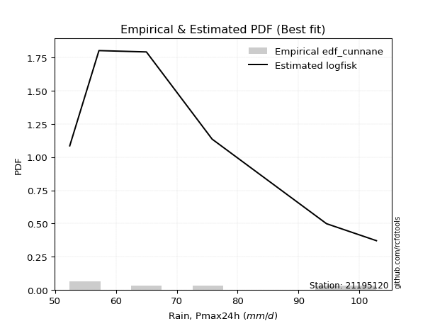</img>

</div>


### 12. Empirical - EDF Adamowski (1981)

The Adamowski formula in hydrology refers to a specific plotting position formula used for estimating the non-parametric empirical distribution of hydrological events (like flood peaks) to calculate their return periods. This formula provides an alternative to traditional parametric methods (like the Gumbel or Log Pearson Type III distributions). 

<div align="center">


$P=(m-0.25)/(n+0.5)$


</div>


**12.1. Empirical values**

<div align="center">

|                | 0                  | 1                   | 2                   | 3             | 4                  | 5                  | 6                  |
|:---------------|:-------------------|:--------------------|:--------------------|:--------------|:-------------------|:-------------------|:-------------------|
| date           | 2023               | 2021                | 2025                | 2019          | 2020               | 2022               | 2024               |
| x              | 52.4               | 57.2                | 58.6                | 65.0          | 75.8               | 94.6               | 102.8              |
| m              | 1                  | 2                   | 3                   | 4             | 5                  | 6                  | 7                  |
| empirical_dist | edf_adamowski      | edf_adamowski       | edf_adamowski       | edf_adamowski | edf_adamowski      | edf_adamowski      | edf_adamowski      |
| empirical      | 0.1                | 0.23333333333333334 | 0.36666666666666664 | 0.5           | 0.6333333333333333 | 0.7666666666666667 | 0.9                |
| empirical_tr   | 1.1111111111111112 | 1.3043478260869565  | 1.5789473684210527  | 2.0           | 2.727272727272727  | 4.2857142857142865 | 10.000000000000002 |

</div>


**12.2. Kolmogorov-Smirnov fit test (sorted by Δ)**


<div align="center">

|                | 0                   | 1                   | 2                   | 3                   | 4                   | 5                   | 6                   | 7                   | 8                   | 9                   | 10                  | 11                  | 12                  | 13                  | 14                    | 15                  | 16                  | 17                  | 18                  | 19                  | 20                  | 21                  | 22                  | 23                  | 24                  | 25                  | 26                  | 27                  | 28                  | 29                  | 30                  | 31                  | 32                  | 33                  | 34                  | 35                  | 36                  | 37                  | 38                  | 39                  | 40                  | 41                  | 42                  | 43                  | 44                  | 45                  | 46                  | 47                  | 48                  | 49                  | 50                  | 51                  | 52                  | 53                  | 54                  | 55                  | 56                  | 57                  | 58                  | 59                  | 60                  | 61                  | 62                  | 63                  | 64                  | 65                  | 66                  | 67                  | 68                  | 69                  | 70                  | 71                  | 72                  | 73                  | 74                  | 75                  | 76                  | 77                  | 78                  | 79                  | 80                  | 81                  | 82                  | 83                  | 84                  | 85                  | 86                  | 87                  | 88                  | 89                  |
|:---------------|:--------------------|:--------------------|:--------------------|:--------------------|:--------------------|:--------------------|:--------------------|:--------------------|:--------------------|:--------------------|:--------------------|:--------------------|:--------------------|:--------------------|:----------------------|:--------------------|:--------------------|:--------------------|:--------------------|:--------------------|:--------------------|:--------------------|:--------------------|:--------------------|:--------------------|:--------------------|:--------------------|:--------------------|:--------------------|:--------------------|:--------------------|:--------------------|:--------------------|:--------------------|:--------------------|:--------------------|:--------------------|:--------------------|:--------------------|:--------------------|:--------------------|:--------------------|:--------------------|:--------------------|:--------------------|:--------------------|:--------------------|:--------------------|:--------------------|:--------------------|:--------------------|:--------------------|:--------------------|:--------------------|:--------------------|:--------------------|:--------------------|:--------------------|:--------------------|:--------------------|:--------------------|:--------------------|:--------------------|:--------------------|:--------------------|:--------------------|:--------------------|:--------------------|:--------------------|:--------------------|:--------------------|:--------------------|:--------------------|:--------------------|:--------------------|:--------------------|:--------------------|:--------------------|:--------------------|:--------------------|:--------------------|:--------------------|:--------------------|:--------------------|:--------------------|:--------------------|:--------------------|:--------------------|:--------------------|:--------------------|
| station        | 21195120            | 21195120            | 21195120            | 21195120            | 21195120            | 21195120            | 21195120            | 21195120            | 21195120            | 21195120            | 21195120            | 21195120            | 21195120            | 21195120            | 21195120              | 21195120            | 21195120            | 21195120            | 21195120            | 21195120            | 21195120            | 21195120            | 21195120            | 21195120            | 21195120            | 21195120            | 21195120            | 21195120            | 21195120            | 21195120            | 21195120            | 21195120            | 21195120            | 21195120            | 21195120            | 21195120            | 21195120            | 21195120            | 21195120            | 21195120            | 21195120            | 21195120            | 21195120            | 21195120            | 21195120            | 21195120            | 21195120            | 21195120            | 21195120            | 21195120            | 21195120            | 21195120            | 21195120            | 21195120            | 21195120            | 21195120            | 21195120            | 21195120            | 21195120            | 21195120            | 21195120            | 21195120            | 21195120            | 21195120            | 21195120            | 21195120            | 21195120            | 21195120            | 21195120            | 21195120            | 21195120            | 21195120            | 21195120            | 21195120            | 21195120            | 21195120            | 21195120            | 21195120            | 21195120            | 21195120            | 21195120            | 21195120            | 21195120            | 21195120            | 21195120            | 21195120            | 21195120            | 21195120            | 21195120            | 21195120            |
| empirical_dist | edf_adamowski       | edf_adamowski       | edf_adamowski       | edf_adamowski       | edf_adamowski       | edf_adamowski       | edf_adamowski       | edf_adamowski       | edf_adamowski       | edf_adamowski       | edf_adamowski       | edf_adamowski       | edf_adamowski       | edf_adamowski       | edf_adamowski         | edf_adamowski       | edf_adamowski       | edf_adamowski       | edf_adamowski       | edf_adamowski       | edf_adamowski       | edf_adamowski       | edf_adamowski       | edf_adamowski       | edf_adamowski       | edf_adamowski       | edf_adamowski       | edf_adamowski       | edf_adamowski       | edf_adamowski       | edf_adamowski       | edf_adamowski       | edf_adamowski       | edf_adamowski       | edf_adamowski       | edf_adamowski       | edf_adamowski       | edf_adamowski       | edf_adamowski       | edf_adamowski       | edf_adamowski       | edf_adamowski       | edf_adamowski       | edf_adamowski       | edf_adamowski       | edf_adamowski       | edf_adamowski       | edf_adamowski       | edf_adamowski       | edf_adamowski       | edf_adamowski       | edf_adamowski       | edf_adamowski       | edf_adamowski       | edf_adamowski       | edf_adamowski       | edf_adamowski       | edf_adamowski       | edf_adamowski       | edf_adamowski       | edf_adamowski       | edf_adamowski       | edf_adamowski       | edf_adamowski       | edf_adamowski       | edf_adamowski       | edf_adamowski       | edf_adamowski       | edf_adamowski       | edf_adamowski       | edf_adamowski       | edf_adamowski       | edf_adamowski       | edf_adamowski       | edf_adamowski       | edf_adamowski       | edf_adamowski       | edf_adamowski       | edf_adamowski       | edf_adamowski       | edf_adamowski       | edf_adamowski       | edf_adamowski       | edf_adamowski       | edf_adamowski       | edf_adamowski       | edf_adamowski       | edf_adamowski       | edf_adamowski       | edf_adamowski       |
| p_dist         | logfisk             | logweibull_min      | logexponnorm        | logexpon            | invweibull          | logfatiguelife      | alpha               | f                   | invgamma            | logtruncnorm        | loginvgauss         | logf                | loginvgamma         | loggenexpon         | loglaplace_asymmetric | halfnorm            | invgauss            | loginvweibull       | loghalfnorm         | expon               | laplace_asymmetric  | genexpon            | exponnorm           | lograyleigh         | rayleigh            | halflogistic        | loghalflogistic     | logmaxwell          | logbetaprime        | logalpha            | maxwell             | logmielke           | weibull_min         | nakagami            | lognakagami         | loggenlogistic      | gompertz            | logkstwobign        | pearson3            | logpearson3         | logloggamma         | nct                 | loggumbel_r         | lognct              | betaprime           | gumbel_r            | logcrystalball      | lognorm             | lognorm             | logt                | logjohnsonsu        | genlogistic         | logmoyal            | moyal               | loggompertz         | kstwobign           | johnsonsu           | crystalball         | norm                | t                   | logrice             | loglogistic         | logistic            | rice                | loghypsecant        | logerlang           | loggumbel_l         | hypsecant           | loggamma            | loggamma            | loglaplace          | erlang              | gamma               | gumbel_l            | laplace             | logncf              | logwald             | wald                | fisk                | logchi2             | loggibrat           | gibrat              | pareto              | loglognorm          | logpareto           | fatiguelife         | ncf                 | chi2                | truncnorm           | mielke              |
| delta          | 0.07738543663955855 | 0.0999999999999948  | 0.10014774387147685 | 0.10046569677037676 | 0.10062165633914999 | 0.10231978977844458 | 0.1023441971004515  | 0.10370905057814661 | 0.1049718821202521  | 0.1057075286974013  | 0.10663920077656486 | 0.10769797976523765 | 0.10769830574900918 | 0.10810989098768531 | 0.10846022611431005   | 0.10911184489809755 | 0.10951443726899901 | 0.10973174331419111 | 0.11065070658821907 | 0.11282614158483473 | 0.11282898244717277 | 0.11282928352610022 | 0.11443451011033234 | 0.11493728436555434 | 0.11746172699482985 | 0.12154236752556796 | 0.12219118373415461 | 0.12237918871212203 | 0.12354009733665941 | 0.12476130274286212 | 0.12565803102203893 | 0.12609802481057075 | 0.12655519390537134 | 0.12706081831545474 | 0.1271275573719336  | 0.1272425636474951  | 0.12994530918014074 | 0.13117590189298053 | 0.13144369835456474 | 0.1316512392582581  | 0.13578907709773286 | 0.1360436289916655  | 0.13681260933458003 | 0.1372668511593954  | 0.13950406942735982 | 0.13974110207349566 | 0.14022160510066375 | 0.14022171735426436 | 0.14022171735426436 | 0.1402240674000232  | 0.140742722338904   | 0.1409199589683561  | 0.14405434048580606 | 0.14752622734308546 | 0.1488534209833746  | 0.15169552432390127 | 0.15522476540259256 | 0.15713946510825005 | 0.1571394791118199  | 0.15715147576898936 | 0.1583391693308849  | 0.16266166908600282 | 0.1756797696277113  | 0.1760683126315165  | 0.17670682166219684 | 0.18315587826447632 | 0.18917472956110593 | 0.18994169368980135 | 0.19065380248335972 | 0.19065380248335972 | 0.19370134468237438 | 0.19802655965546817 | 0.2136328306387214  | 0.2159602984007869  | 0.21788349779468014 | 0.22994860220200283 | 0.2547160769287359  | 0.2615745723008926  | 0.29097457442300345 | 0.29909754403391675 | 0.3665279177137005  | 0.3666620197500597  | 0.3842870967271695  | 0.39074858275405905 | 0.39282374412695237 | 0.482937241371238   | 0.5657884486381572  | 0.7243201253911982  | 0.8990569805844792  | nan                 |
| deltao         | 0.48442053926100004 | 0.48442053926100004 | 0.48442053926100004 | 0.48442053926100004 | 0.48442053926100004 | 0.48442053926100004 | 0.48442053926100004 | 0.48442053926100004 | 0.48442053926100004 | 0.48442053926100004 | 0.48442053926100004 | 0.48442053926100004 | 0.48442053926100004 | 0.48442053926100004 | 0.48442053926100004   | 0.48442053926100004 | 0.48442053926100004 | 0.48442053926100004 | 0.48442053926100004 | 0.48442053926100004 | 0.48442053926100004 | 0.48442053926100004 | 0.48442053926100004 | 0.48442053926100004 | 0.48442053926100004 | 0.48442053926100004 | 0.48442053926100004 | 0.48442053926100004 | 0.48442053926100004 | 0.48442053926100004 | 0.48442053926100004 | 0.48442053926100004 | 0.48442053926100004 | 0.48442053926100004 | 0.48442053926100004 | 0.48442053926100004 | 0.48442053926100004 | 0.48442053926100004 | 0.48442053926100004 | 0.48442053926100004 | 0.48442053926100004 | 0.48442053926100004 | 0.48442053926100004 | 0.48442053926100004 | 0.48442053926100004 | 0.48442053926100004 | 0.48442053926100004 | 0.48442053926100004 | 0.48442053926100004 | 0.48442053926100004 | 0.48442053926100004 | 0.48442053926100004 | 0.48442053926100004 | 0.48442053926100004 | 0.48442053926100004 | 0.48442053926100004 | 0.48442053926100004 | 0.48442053926100004 | 0.48442053926100004 | 0.48442053926100004 | 0.48442053926100004 | 0.48442053926100004 | 0.48442053926100004 | 0.48442053926100004 | 0.48442053926100004 | 0.48442053926100004 | 0.48442053926100004 | 0.48442053926100004 | 0.48442053926100004 | 0.48442053926100004 | 0.48442053926100004 | 0.48442053926100004 | 0.48442053926100004 | 0.48442053926100004 | 0.48442053926100004 | 0.48442053926100004 | 0.48442053926100004 | 0.48442053926100004 | 0.48442053926100004 | 0.48442053926100004 | 0.48442053926100004 | 0.48442053926100004 | 0.48442053926100004 | 0.48442053926100004 | 0.48442053926100004 | 0.48442053926100004 | 0.48442053926100004 | 0.48442053926100004 | 0.48442053926100004 | 0.48442053926100004 |
| eval           | Δo > Δ              | Δo > Δ              | Δo > Δ              | Δo > Δ              | Δo > Δ              | Δo > Δ              | Δo > Δ              | Δo > Δ              | Δo > Δ              | Δo > Δ              | Δo > Δ              | Δo > Δ              | Δo > Δ              | Δo > Δ              | Δo > Δ                | Δo > Δ              | Δo > Δ              | Δo > Δ              | Δo > Δ              | Δo > Δ              | Δo > Δ              | Δo > Δ              | Δo > Δ              | Δo > Δ              | Δo > Δ              | Δo > Δ              | Δo > Δ              | Δo > Δ              | Δo > Δ              | Δo > Δ              | Δo > Δ              | Δo > Δ              | Δo > Δ              | Δo > Δ              | Δo > Δ              | Δo > Δ              | Δo > Δ              | Δo > Δ              | Δo > Δ              | Δo > Δ              | Δo > Δ              | Δo > Δ              | Δo > Δ              | Δo > Δ              | Δo > Δ              | Δo > Δ              | Δo > Δ              | Δo > Δ              | Δo > Δ              | Δo > Δ              | Δo > Δ              | Δo > Δ              | Δo > Δ              | Δo > Δ              | Δo > Δ              | Δo > Δ              | Δo > Δ              | Δo > Δ              | Δo > Δ              | Δo > Δ              | Δo > Δ              | Δo > Δ              | Δo > Δ              | Δo > Δ              | Δo > Δ              | Δo > Δ              | Δo > Δ              | Δo > Δ              | Δo > Δ              | Δo > Δ              | Δo > Δ              | Δo > Δ              | Δo > Δ              | Δo > Δ              | Δo > Δ              | Δo > Δ              | Δo > Δ              | Δo > Δ              | Δo > Δ              | Δo > Δ              | Δo > Δ              | Δo > Δ              | Δo > Δ              | Δo > Δ              | Δo > Δ              | Δo > Δ              | Δo <= Δ             | Δo <= Δ             | Δo <= Δ             | Δo <= Δ             |
| fit            | 1                   | 1                   | 1                   | 1                   | 1                   | 1                   | 1                   | 1                   | 1                   | 1                   | 1                   | 1                   | 1                   | 1                   | 1                     | 1                   | 1                   | 1                   | 1                   | 1                   | 1                   | 1                   | 1                   | 1                   | 1                   | 1                   | 1                   | 1                   | 1                   | 1                   | 1                   | 1                   | 1                   | 1                   | 1                   | 1                   | 1                   | 1                   | 1                   | 1                   | 1                   | 1                   | 1                   | 1                   | 1                   | 1                   | 1                   | 1                   | 1                   | 1                   | 1                   | 1                   | 1                   | 1                   | 1                   | 1                   | 1                   | 1                   | 1                   | 1                   | 1                   | 1                   | 1                   | 1                   | 1                   | 1                   | 1                   | 1                   | 1                   | 1                   | 1                   | 1                   | 1                   | 1                   | 1                   | 1                   | 1                   | 1                   | 1                   | 1                   | 1                   | 1                   | 1                   | 1                   | 1                   | 1                   | 0                   | 0                   | 0                   | 0                   |
| n              | 7                   | 7                   | 7                   | 7                   | 7                   | 7                   | 7                   | 7                   | 7                   | 7                   | 7                   | 7                   | 7                   | 7                   | 7                     | 7                   | 7                   | 7                   | 7                   | 7                   | 7                   | 7                   | 7                   | 7                   | 7                   | 7                   | 7                   | 7                   | 7                   | 7                   | 7                   | 7                   | 7                   | 7                   | 7                   | 7                   | 7                   | 7                   | 7                   | 7                   | 7                   | 7                   | 7                   | 7                   | 7                   | 7                   | 7                   | 7                   | 7                   | 7                   | 7                   | 7                   | 7                   | 7                   | 7                   | 7                   | 7                   | 7                   | 7                   | 7                   | 7                   | 7                   | 7                   | 7                   | 7                   | 7                   | 7                   | 7                   | 7                   | 7                   | 7                   | 7                   | 7                   | 7                   | 7                   | 7                   | 7                   | 7                   | 7                   | 7                   | 7                   | 7                   | 7                   | 7                   | 7                   | 7                   | 7                   | 7                   | 7                   | 7                   |
| best_fit       | 1                   | 0                   | 0                   | 0                   | 0                   | 0                   | 0                   | 0                   | 0                   | 0                   | 0                   | 0                   | 0                   | 0                   | 0                     | 0                   | 0                   | 0                   | 0                   | 0                   | 0                   | 0                   | 0                   | 0                   | 0                   | 0                   | 0                   | 0                   | 0                   | 0                   | 0                   | 0                   | 0                   | 0                   | 0                   | 0                   | 0                   | 0                   | 0                   | 0                   | 0                   | 0                   | 0                   | 0                   | 0                   | 0                   | 0                   | 0                   | 0                   | 0                   | 0                   | 0                   | 0                   | 0                   | 0                   | 0                   | 0                   | 0                   | 0                   | 0                   | 0                   | 0                   | 0                   | 0                   | 0                   | 0                   | 0                   | 0                   | 0                   | 0                   | 0                   | 0                   | 0                   | 0                   | 0                   | 0                   | 0                   | 0                   | 0                   | 0                   | 0                   | 0                   | 0                   | 0                   | 0                   | 0                   | 0                   | 0                   | 0                   | 0                   |
| best_fit_sort  | 1                   | 2                   | 3                   | 4                   | 5                   | 6                   | 7                   | 8                   | 9                   | 10                  | 11                  | 12                  | 13                  | 14                  | 15                    | 16                  | 17                  | 18                  | 19                  | 20                  | 21                  | 22                  | 23                  | 24                  | 25                  | 26                  | 27                  | 28                  | 29                  | 30                  | 31                  | 32                  | 33                  | 34                  | 35                  | 36                  | 37                  | 38                  | 39                  | 40                  | 41                  | 42                  | 43                  | 44                  | 45                  | 46                  | 47                  | 48                  | 49                  | 50                  | 51                  | 52                  | 53                  | 54                  | 55                  | 56                  | 57                  | 58                  | 59                  | 60                  | 61                  | 62                  | 63                  | 64                  | 65                  | 66                  | 67                  | 68                  | 69                  | 70                  | 71                  | 72                  | 73                  | 74                  | 75                  | 76                  | 77                  | 78                  | 79                  | 80                  | 81                  | 82                  | 83                  | 84                  | 85                  | 86                  | 87                  | 88                  | 89                  | 90                  |

</div>


<div align="center">

</img>

</div>


**12.3. Best fit**

<div align="center">

|   id |   station | empirical_dist   | p_dist   |     delta |   deltao | eval   |   fit |   n |   best_fit |   best_fit_sort |
|-----:|----------:|:-----------------|:---------|----------:|---------:|:-------|------:|----:|-----------:|----------------:|
|    0 |  21195120 | edf_adamowski    | logfisk  | 0.0773854 | 0.484421 | Δo > Δ |     1 |   7 |          1 |               1 |

</div>


<div align="center">

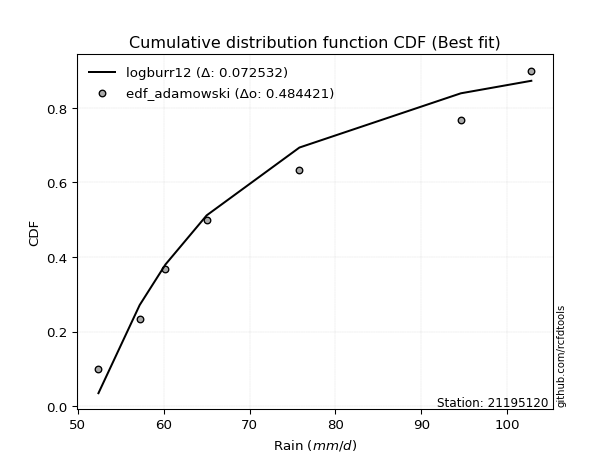</img></img>

</div>


## C. Best fit & Estimate extreme values for specific return periods - Tr


### 1. Best fit (ordered by delta Δ)

<div align="center">

|   id |   station | empirical_dist   | p_dist         |     delta |   deltao | eval   |   fit |   n |   best_fit |   best_fit_sort |
|-----:|----------:|:-----------------|:---------------|----------:|---------:|:-------|------:|----:|-----------:|----------------:|
|    0 |  21195120 | edf_hazen        | logfisk        | 0.0678616 | 0.484421 | Δo > Δ |     1 |   7 |          1 |               1 |
|    1 |  21195120 | edf_gringorten   | logfisk        | 0.0702693 | 0.484421 | Δo > Δ |     1 |   7 |          1 |               2 |
|    2 |  21195120 | edf_cunnane      | logfisk        | 0.0718299 | 0.484421 | Δo > Δ |     1 |   7 |          1 |               3 |
|    3 |  21195120 | edf_blom         | logfisk        | 0.0727877 | 0.484421 | Δo > Δ |     1 |   7 |          1 |               4 |
|    4 |  21195120 | edf_tukey        | logfisk        | 0.0743551 | 0.484421 | Δo > Δ |     1 |   7 |          1 |               5 |
|    5 |  21195120 | edf_filliben     | logfisk        | 0.0749414 | 0.484421 | Δo > Δ |     1 |   7 |          1 |               6 |
|    6 |  21195120 | edf_beard        | logfisk        | 0.0752174 | 0.484421 | Δo > Δ |     1 |   7 |          1 |               7 |
|    7 |  21195120 | edf_jenkinson    | logfisk        | 0.0752174 | 0.484421 | Δo > Δ |     1 |   7 |          1 |               8 |
|    8 |  21195120 | edf_chegodayev   | logfisk        | 0.0755836 | 0.484421 | Δo > Δ |     1 |   7 |          1 |               9 |
|    9 |  21195120 | edf_adamowski    | logfisk        | 0.0773854 | 0.484421 | Δo > Δ |     1 |   7 |          1 |              10 |
|   10 |  21195120 | edf_weibull      | logfisk        | 0.0914618 | 0.484421 | Δo > Δ |     1 |   7 |          1 |              11 |
|   11 |  21195120 | edf_california   | logfatiguelife | 0.109491  | 0.484421 | Δo > Δ |     1 |   7 |          1 |              12 |

</div>

:file_folder:Tables: [bestfit_21195120.csv](table/bestfit_21195120.csv) | [extreme_21195120.csv](table/extreme_21195120.csv)


### 2. Extreme values

In hydrology, a return period (or recurrence interval $Tr$) is the statistical average time between extreme events like floods or droughts of a specific magnitude, indicating how rare an event is, with a 100-year flood, for example, having a 1% chance of occurring in any given year, not that it happens exactly every century. It is a key tool for infrastructure design (like bridges or dams) and risk assessment, calculated from historical data to determine the probability of future events, although it is important to remember it is statistical average, and events can cluster or be missed.

> risk_rate: assuming the return period as the project useful life.

|   id |      tr |   prob_l |     prob_g |     alpha |   betaprime |    chi2 |   crystalball |   erlang |    expon |   exponnorm |        f |   fatiguelife |             fisk |    gamma |   genexpon |   genlogistic |   gibrat |   gompertz |   gumbel_l |   gumbel_r |   halflogistic |   halfnorm |   hypsecant |   invgamma |   invgauss |   invweibull |   johnsonsu |   kstwobign |   laplace |   laplace_asymmetric |   loggamma |   logistic |   lognorm |   maxwell |   mielke |    moyal |   nakagami |        ncf |      nct |     norm |           pareto |   pearson3 |   rayleigh |     rice |        t |   truncnorm |     wald |   weibull_min |   logalpha |   logbetaprime |          logchi2 |   logcrystalball |   logerlang |   logexpon |   logexponnorm |      logf |   logfatiguelife |          logfisk |   loggenexpon |   loggenlogistic |   loggibrat |   loggompertz |   loggumbel_l |   loggumbel_r |   loghalflogistic |   loghalfnorm |   loghypsecant |   loginvgamma |   loginvgauss |   loginvweibull |   logjohnsonsu |   logkstwobign |   loglaplace |   loglaplace_asymmetric |   logloggamma |   loglogistic |    loglognorm |   logmaxwell |   logmielke |   logmoyal |   lognakagami |   logncf |   lognct |      logpareto |   logpearson3 |   lograyleigh |   logrice |     logt |   logtruncnorm |   logwald |   logweibull_min |   station |   n |   risk_rate |
|-----:|--------:|---------:|-----------:|----------:|------------:|--------:|--------------:|---------:|---------:|------------:|---------:|--------------:|-----------------:|---------:|-----------:|--------------:|---------:|-----------:|-----------:|-----------:|---------------:|-----------:|------------:|-----------:|-----------:|-------------:|------------:|------------:|----------:|---------------------:|-----------:|-----------:|----------:|----------:|---------:|---------:|-----------:|-----------:|---------:|---------:|-----------------:|-----------:|-----------:|---------:|---------:|------------:|---------:|--------------:|-----------:|---------------:|-----------------:|-----------------:|------------:|-----------:|---------------:|----------:|-----------------:|-----------------:|--------------:|-----------------:|------------:|--------------:|--------------:|--------------:|------------------:|--------------:|---------------:|--------------:|--------------:|----------------:|---------------:|---------------:|-------------:|------------------------:|--------------:|--------------:|--------------:|-------------:|------------:|-----------:|--------------:|---------:|---------:|---------------:|--------------:|--------------:|----------:|---------:|---------------:|----------:|-----------------:|----------:|----:|------------:|
|    0 |    2    | 0.5      | 0.5        |   65.3256 |     69.6976 | 52.4247 |       72.3429 |  58.8916 |  66.2233 |     66.1166 |  64.6409 |       52.4    |     66.7677      |  58.6578 |    66.2233 |       68.8595 |  66.8962 |    67.6763 |    75.3239 |    69.3619 |        67.8799 |    68.6285 |     72.3429 |    64.8815 |    64.3626 |      64.708  |     72.3431 |     69.5236 |   72.3429 |              66.2232 |    59.5838 |    72.3429 |   70.2169 |   70.791  |  65.9611 |  68.3995 |    70.9791 |    14.3768 |  68.9746 |  72.3429 |     53.3629      |    70.5502 |    70.2405 |  71.5967 |  72.3436 |  -107.061   |  66.4609 |       62.7981 |    68.1678 |        68.6502 |     80.4398      |          70.2169 |     59.4675 |    64.1856 |        64.1883 |   65.1805 |          63.8658 |     64.4009      |       65.2076 |          67.1218 |     65.3184 |       68.5943 |       73.0521 |       67.4918 |           66.1755 |       66.8377 |        70.2169 |       65.1806 |       64.4587 |         65.3049 |        70.2158 |        67.4264 |      70.2169 |                 65.0714 |       70.1955 |       70.2169 |  52.506       |      68.7847 |     67.1807 |    66.6348 |       61.8785 |  69.1592 |  69.494  |   53.2104      |       69.0139 |       68.2838 |   69.2121 |  70.217  |        64.4601 |   64.9422 |          67.2955 |  21195120 |   7 |    0.75     |
|    1 |    2.33 | 0.570815 | 0.429185   |   67.986  |     72.7267 | 52.4637 |       75.5809 |  61.0477 |  69.269  |     69.1452 |  67.3529 |       52.8675 |     84.6169      |  60.6285 |    69.269  |       71.7063 |  68.5365 |    70.7827 |    78.141  |    72.3623 |        70.9648 |    72.1232 |     74.9343 |    67.6006 |    67.1793 |      67.4135 |     75.6235 |     72.4722 |   74.3024 |              69.2688 |    61.6213 |    75.1958 |   73.3018 |   74.1551 |  68.6462 |  71.2398 |    75.3448 |    27.5988 |  71.9493 |  75.5809 |     54.8093      |    73.7896 |    73.6544 |  74.636  |  75.5817 |   -97.8835  |  68.5841 |       67.1452 |    71.1016 |        71.701  |     94.6593      |          73.3018 |     61.5762 |    67.1197 |        67.1276 |   67.8518 |          66.6575 |     67.2253      |       68.172  |          69.8583 |     66.7565 |       71.7173 |       75.8365 |       70.235  |           68.9432 |       70.0124 |        72.6751 |       67.8519 |       67.1875 |         67.9464 |        73.2932 |        70.2439 |      72.0679 |                 67.8077 |       73.3231 |       72.928  |  53.2964      |      71.9271 |     69.9305 |    69.1959 |       65.1099 |  77.5418 |  72.5227 |   54.4529      |       72.0577 |       71.4505 |   72.1476 |  73.3019 |        67.3891 |   66.7989 |          71.3021 |  21195120 |   7 |    0.729209 |
|    2 |    5    | 0.8      | 0.2        |   83.3535 |     85.5494 | 53.1866 |       87.6144 |  73.3435 |  84.4968 |     84.2872 |  83.1874 |       62.7989 |    780.467       |  71.6469 |    84.4965 |       84.0729 |  77.9799 |    85.155  |    87.242  |    85.3974 |        84.9233 |    86.9018 |     85.329  |    83.2415 |    83.0749 |      83.4413 |     87.8142 |     84.997  |   84.0995 |              84.4964 |    73.5265 |    86.2114 |   86.0022 |   87.3959 |  82.5006 |  84.3962 |    94.9156 |   119.328  |  85.0677 |  87.6144 |    278.768       |    86.8567 |    87.3217 |  86.8034 |  87.6154 |   -63.78    |  80.4699 |       97.9739 |    84.3988 |        85.2509 |    252.238       |          86.0022 |     74.1671 |    83.9281 |        83.9699 |   82.9762 |          83.2048 |     86.3705      |       83.9762 |          83.1007 |     75.6743 |       85.7934 |       85.578  |       83.5074 |           82.9863 |       85.1924 |        83.4316 |       82.9763 |       82.9442 |         82.7767 |        85.9593 |        83.5849 |      82.0805 |                 83.3142 |       86.1632 |       84.4149 |   5.00662e+21 |      85.7531 |     83.2397 |    82.4045 |       83.1986 | 119.781  |  85.47   | 1964.51        |       85.4298 |       85.6686 |   85.2009 |  86.0023 |        83.6568 |   78.2174 |          95.769  |  21195120 |   7 |    0.67232  |
|    3 |   10    | 0.9      | 0.1        |  103.397  |     95.6565 | 54.6429 |       95.5971 |  85.748  |  98.3201 |     98.0327 | 102.529  |       76.5116 |   7286.86        |  82.596  |    98.3195 |       94.1446 |  88.7444 |    96.793  |    92.309  |    96.0144 |        96.5153 |    97.8377 |     93.6295 |   101.957  |   100.091  |     103.715  |     95.9012 |     94.533  |   92.9931 |              98.3196 |    86.8999 |    94.324  |   95.619  |   96.7142 |  96.965  |  95.8509 |   109.929  |   260.163  |  96.0319 |  95.5971 |  13959.8         |    96.4454 |    97.0667 |  95.4791 |  95.5982 |   -41.1581  |  93.0836 |      137.821  |    95.9812 |        96.6707 |    705.972       |          95.619  |     88.645  |   102.805  |       102.891  |  101.266  |         102.858  |    118.603       |       99.9883 |          95.7197 |     87.3013 |       96.9735 |       91.5341 |       96.1504 |           96.7989 |       98.5067 |        93.1532 |      101.266  |      101.456  |        100.694  |        95.5471 |        95.4171 |      92.3693 |                100.441  |       95.846  |       94.0163 | inf           |      97.048  |     95.9553 |    95.9419 |      101.235  | 161.216  |  95.8103 |    5.55661e+98 |       96.4817 |       97.5033 |   95.9268 |  95.6191 |       101.006  |   92.4771 |         125.897  |  21195120 |   7 |    0.651322 |
|    4 |   15    | 0.933333 | 0.0666667  |  119.966  |    101.265  | 55.7666 |       99.5806 |  93.3195 | 106.406  |    106.073  | 116.901  |       85.48   |  25330.6         |  89.2404 |   106.405  |       99.8268 |  96.1692 |   103.086  |    94.6038 |   102.004  |       103.075  |   103.529  |     98.3665 |   115.668  |   111.065  |     119.262  |     99.9368 |     99.5955 |   98.1955 |             106.406  |    95.9859 |    98.7441 |  100.813  |  101.495  | 106.673  | 102.499  |   117.808  |   382.779  | 102.362  |  99.5806 | 154719           |   101.512  |   102.088  |  99.9492 |  99.5818 |   -29.8704  | 101.184  |      165.935  |   102.871  |       103.295  |   1335.98        |         100.813  |     98.6241 |   115.758  |       115.879  |  115.122  |         116.876  |    151.684       |      110.207  |         103.667  |     96.3463 |      103.005  |       94.3661 |      104.11   |          105.611  |      106.239  |        99.2009 |      115.121  |      114.703  |        114.324  |       100.724  |       102.365  |      98.9758 |                112.048  |      101.061  |       99.6995 | inf           |     103.409  |    103.987  |   104.796  |      112.326  | 187.471  | 101.596  |  inf           |      102.794  |      104.226  |  101.97   | 100.813  |       112.425  |  102.977  |         148.007  |  21195120 |   7 |    0.644736 |
|    5 |   20    | 0.95     | 0.05       |  135.041  |    105.163  | 56.6565 |      102.189  |  98.7935 | 112.143  |    111.778  | 128.81   |       92.12   |  60071.1         |  94.0319 |   112.142  |      103.805  | 101.993  |   107.349  |    96.0321 |   106.198  |       107.672  |   107.323  |    101.708  |   126.928  |   119.261  |     132.425  |    102.58   |    103.006  |  101.887  |             112.143  |   103.059  |   101.799  |  104.366  |  104.668  | 114.239  | 107.207  |   123.074  |   494.998  | 106.867  | 102.189  | 854429           |   104.934  |   105.425  | 102.92   | 102.191  |   -22.4791  | 107.22   |      187.932  |   107.869  |       108.023  |   2125.05        |         104.366  |    106.46   |   125.927  |       126.077  |  126.887  |         128.14   |    187.211       |      117.879  |         109.621  |    104.093  |      107.1    |       96.173  |      110.073  |          112.259  |      111.729  |       103.702  |      126.886  |      125.396  |        125.942  |       104.266  |       107.328  |     103.948  |                121.088  |      104.623  |      103.827  | inf           |     107.859  |    110.018  |   111.557  |      120.429  | 207.14   | 105.637  |  inf           |      107.253  |      108.948  |  106.196  | 104.366  |       121.143  |  111.569  |         166.122  |  21195120 |   7 |    0.641514 |
|    6 |   25    | 0.96     | 0.04       |  149.273  |    108.155  | 57.391  |      104.11   | 103.088  | 116.594  |    116.203  | 139.177  |       97.3957 | 116350           |  97.7852 |   116.592  |      106.87   | 106.849  |   110.548  |    97.0486 |   109.429  |       111.213  |   110.146  |    104.295  |   136.667  |   125.835  |     144.073  |    104.525  |    105.56   |  104.75   |             116.593  |   108.931  |   104.136  |  107.062  |  107.024  | 120.54   | 110.856  |   126.995  |   600.095  | 110.384  | 104.11   |      3.21657e+06 |   107.505  |   107.905  | 105.128  | 104.111  |   -17.0386  | 112.054  |      206.136  |   111.825  |       111.719  |   3062.7         |         107.062  |    113.005  |   134.426  |       134.601  |  137.381  |         137.714  |    225.892       |      124.084  |         114.439  |    111.024  |      110.181  |       97.4798 |      114.897  |          117.665  |      115.997  |       107.325  |      137.38   |      134.524  |        136.341  |       106.953  |       111.203  |     107.976  |                128.599  |      107.322  |      107.1    | inf           |     111.286  |    114.908  |   117.095  |      126.847  | 223.035  | 108.749  |  inf           |      110.714  |      112.595  |  109.449  | 107.062  |       128.275  |  118.965  |         181.749  |  21195120 |   7 |    0.639603 |
|    7 |   50    | 0.98     | 0.02       |  214.851  |    117.337  | 59.8712 |      109.609  | 116.645  | 130.417  |    129.949  | 179.002  |      114.323  | 877701           | 109.61   |   130.415  |      116.31   | 123.964  |   119.948  |    99.8077 |   119.381  |       122.123  |   118.352  |    112.313  |   173.636  |   147.338  |     190.258  |    110.096  |    113.061  |  113.643  |             130.416  |   129.542  |   111.277  |  115.172  |  113.856  | 142.882  | 122.185  |   138.402  |  1063.17   | 121.502  | 109.609  |      1.97601e+08 |   115.119  |   115.103  | 111.536  | 109.61   |    -1.46334 | 127.84   |      268.845  |   124.657  |       123.443  |   9770.68        |         115.172  |    136.236  |   164.661  |       164.931  |  180.301  |         172.82   |    482.033       |      144.898  |         130.653  |    139.352  |      119.295  |      101.118  |      131.129  |          136.013  |      129.35   |       119.383  |      180.299  |      168.301  |        179.18   |       115.035  |       123.408  |     121.51   |                155.035  |      115.427  |      117.752  | inf           |     121.854  |    131.418  |   136.104  |      147.545  | 276.268  | 118.354  |  inf           |      121.539  |      123.888  |  119.466  | 115.172  |       152.638  |  146.703  |         240.707  |  21195120 |   7 |    0.63583  |
|    8 |   75    | 0.986667 | 0.0133333  |  276.71   |    122.669  | 61.4327 |      112.56   | 124.699  | 138.503  |    137.989  | 208.872  |      124.517  |      2.82022e+06 | 116.62   |   138.501  |      121.797  | 135.524  |   125.107  |   101.203  |   125.165  |       128.466  |   122.818  |    116.999  |   200.994  |   160.595  |     226.178  |    113.085  |    117.188  |  118.846  |             138.502  |   143.457  |   115.401  |  119.774  |  117.57   | 158.193  | 128.81   |   144.612  |  1467.4    | 128.188  | 112.56   |      2.19754e+09 |   119.357  |   119.018  | 115.022  | 112.561  |     6.88957 | 137.553  |      309.723  |   132.619  |       130.517  |  19530.7         |         119.774  |    152.123  |   185.408  |       185.75   |  215.603  |         197.75   |    880.109       |      158.244  |         141.113  |    162.469  |      124.347  |      103.008  |      141.598  |          147.967  |      137.254  |       127.047  |      215.599  |      192.577  |        214.747  |       119.62   |       130.685  |     130.201  |                172.951  |      120.014  |      124.38   | inf           |     128.014  |    142.117  |   148.619  |      160.201  | 310.336  | 123.97   |  inf           |      127.96   |      130.5    |  125.296  | 119.774  |       168.554  |  166.897  |         284.002  |  21195120 |   7 |    0.634587 |
|    9 |  100    | 0.99     | 0.01       |  337.163  |    126.45   | 62.58   |      114.555  | 130.459  | 144.24   |    143.694  | 233.699  |      131.852  |      6.42985e+06 | 121.629  |   144.238  |      125.68   | 144.479  |   128.63   |   102.116  |   129.259  |       132.955  |   125.861  |    120.323  |   223.54   |   170.269  |     256.745  |    115.107  |    120.016  |  122.537  |             144.239  |   154.265  |   118.313  |  122.991  |  120.1    | 170.215  | 133.51   |   148.841  |  1837.63   | 133.031  | 114.555  |      1.21392e+10 |   122.286  |   121.686  | 117.397  | 114.557  |    12.5362  | 144.636  |      340.551  |   138.503  |       135.651  |  32087.6         |         122.991  |    164.561  |   201.696  |       202.097  |  247.216  |         217.748  |   1479.7         |      168.283  |         149.019  |    182.982  |      127.822  |      104.264  |      149.508  |          157.057  |      142.913  |       132.78   |      247.211  |      212.214  |        246.818  |       122.825  |       135.918  |     136.742  |                186.905  |      123.216  |      129.283  | inf           |     132.388  |    150.226  |   158.19   |      169.434  | 335.923  | 127.967  |  inf           |      132.571  |      135.206  |  129.43   | 122.991  |       180.649  |  183.352  |         319.5    |  21195120 |   7 |    0.633968 |
|   10 |  200    | 0.995    | 0.005      |  574.259  |    135.586  | 65.4538 |      119.082  | 144.463  | 158.064  |    157.44   | 308.896  |      149.807  |      4.64285e+07 | 133.793  |   158.061  |      135.016  | 168.842  |   136.695  |   104.099  |   139.101  |       143.747  |   132.821  |    128.331  |   290.984  |   194.393  |     352.627  |    119.693  |    126.529  |  131.43   |             158.062  |   183.896  |   125.297  |  130.611  |  125.888  | 203.742  | 144.834  |   158.509  |  3133.07   | 145.088  | 119.082  |      7.45747e+11 |   129.114  |   127.791  | 122.831  | 119.084  |    25.33    | 162.277  |      420.899  |   153.597  |       148.473  | 107672           |         130.611  |    199.061  |   247.06   |       247.637  |  357.096  |         275.221  |   7819.77        |      194.578  |         169.884  |    252.868  |      135.867  |      107.047  |      170.382  |          181.263  |      156.75   |       147.677  |      357.084  |      269.401  |        359.645  |       130.415  |       148.78   |     153.882  |                225.326  |      130.786  |      141.847  | inf           |     142.965  |    171.728  |   183.858  |      192.574  | 402.753  | 137.679  |  inf           |      143.904  |      146.622  |  139.409  | 130.611  |       212.718  |  231.741  |         424.895  |  21195120 |   7 |    0.633042 |
|   11 |  250    | 0.996    | 0.004      |  691.754  |    138.542  | 66.4068 |      120.466  | 149.004  | 162.514  |    161.865  | 338.667  |      155.658  |      8.75849e+07 | 137.734  |   162.511  |      138.018  | 177.583  |   139.174  |   104.683  |   142.265  |       147.216  |   134.962  |    130.908  |   317.397  |   202.38   |     391.767  |    121.095  |    128.544  |  134.294  |             162.512  |   194.633  |   127.54   |  133.032  |  127.67   | 216.085  | 148.479  |   161.482  |  3713.27   | 149.099  | 120.466  |      2.80756e+12 |   131.252  |   129.67   | 124.504  | 120.467  |    29.2333  | 168.113  |      448.554  |   158.761  |       152.75   | 159579           |         133.032  |    211.693  |   263.734  |       264.379  |  407.078  |         296.945  |  15627.2         |      203.724  |         177.194  |    283.989  |      138.367  |      107.88   |      177.693  |          189.811  |      161.27   |       152.819  |      407.063  |      291.285  |        411.559  |       132.827  |       153.003  |     159.845  |                239.303  |      133.188  |      146.134  | inf           |     146.388  |    179.293  |   192.977  |      200.3    | 425.922  | 140.838  |  inf           |      147.627  |      150.326  |  142.633  | 133.032  |       223.975  |  250.411  |         465.906  |  21195120 |   7 |    0.632858 |
|   12 |  500    | 0.998    | 0.002      | 1276.61   |    147.8    | 69.4373 |      124.568  | 163.197  | 176.337  |    175.61   | 453.283  |      174.014  |      6.27029e+08 | 150.041  |   176.334  |      147.334  | 207.794  |   146.546  |   106.356  |   152.086  |       157.985  |   141.345  |    138.916  |   417.906  |   227.795  |     547.528  |    125.251  |    134.584  |  143.187  |             176.336  |   232.256  |   134.494  |  140.48   |  132.987  | 260.087  | 159.803  |   170.338  |  6270.63   | 162.004  | 124.568  |      1.72477e+14 |   137.736  |   135.276  | 129.495  | 124.57   |    40.7767  | 186.67   |      539.881  |   175.878  |       166.548  | 546930           |         140.48   |    256.44   |   323.052  |       323.954  |  639.349  |         376.537  | 260198           |      234.452  |         201.947  |    424.136  |      145.887  |      110.303  |      202.444  |          218.997  |      175.536  |       169.963  |      639.314  |      372.594  |        656.587  |       140.246  |       166.387  |     179.882  |                288.496  |      140.561  |      160.272  | inf           |     157.096  |    205.032  |   224.289  |      225.187  | 503.442  | 150.777  |  inf           |      159.458  |      161.944  |  152.703  | 140.48   |       262.042  |  320.371  |         620.934  |  21195120 |   7 |    0.632489 |
|   13 |  750    | 0.998667 | 0.00133333 | 1860.17   |    153.28   | 71.2522 |      126.847  | 171.551  | 184.423  |    183.651  | 539.375  |      184.86   |      1.98028e+09 | 157.281  |   184.42   |      152.78   | 227.773  |   150.647  |   107.25   |   157.827  |       164.281  |   144.912  |    143.599  |   492.415  |   243.043  |     668.99   |    127.56   |    137.977  |  148.389  |             184.422  |   257.624  |   138.557  |  144.796  |  135.961  | 290.361  | 166.427  |   175.281  |  8503.48   | 169.892  | 126.847  |      1.91813e+15 |   141.432  |   138.411  | 132.286  | 126.849  |    47.1555  | 197.796  |      597.038  |   186.728  |       175.01   |      1.13085e+06 |         144.796  |    286.995  |   363.757  |       364.846  |  861.93   |         433.048  |      2.45479e+06 |      254.184  |         217.99   |    552.985  |      150.128  |      111.621  |      218.481  |          238.095  |      184.049  |       180.869  |      861.873  |      431.301  |        896.007  |       144.544  |       174.413  |     192.747  |                321.835  |      144.824  |      169.156  | inf           |     163.424  |    221.811  |   244.91   |      240.388  | 552.931  | 156.694  |  inf           |      166.58   |      168.828  |  158.64   | 144.796  |       286.584  |  371.371  |         735.038  |  21195120 |   7 |    0.632366 |
|   14 | 1000    | 0.999    | 0.001      | 2443.37   |    157.201  | 72.556  |      128.416  | 177.499  | 190.16   |    189.356  | 610.975  |      192.596  |      4.47622e+09 | 162.432  |   190.157  |      156.643  | 243.062  |   153.469  |   107.852  |   161.899  |       168.746  |   147.375  |    146.923  |   553.861  |   254.015  |     772.458  |    129.149  |    140.328  |  152.081  |             190.159  |   277.318  |   141.438  |  147.845  |  138.016  | 314.17   | 171.126  |   178.694  | 10548.7    | 175.652  | 128.416  |      1.05958e+16 |   144.015  |   140.578  | 134.215  | 128.418  |    51.5246  | 205.799  |      639.233  |   194.841  |       181.202  |      1.8977e+06  |         147.845  |    310.906  |   395.712  |       396.953  | 1083.97   |         478.389  |      1.709e+07   |      269.034  |         230.136  |    677.449  |      153.074  |      112.517  |      230.621  |          252.644  |      190.167  |       189.029  |     1083.89   |      478.933  |       1138.36   |       147.58   |       180.199  |     202.43   |                347.801  |      147.832  |      175.753  | inf           |     167.945  |    234.564  |   260.68   |      251.468  | 590.021  | 160.943  |  inf           |      171.729  |      173.756  |  162.877  | 147.845  |       305.048  |  413.006  |         828.73   |  21195120 |   7 |    0.632305 |

<div align="center">

</img>

</div>


<div align="center">

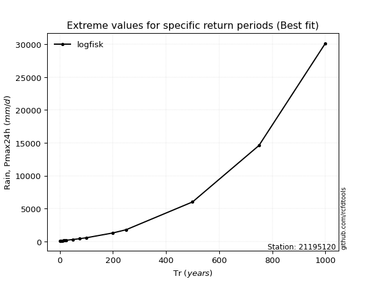</img>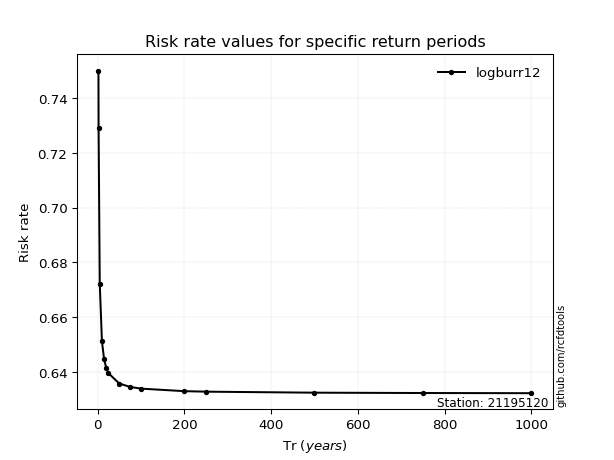</img>

</div>


<sub>**APP DISCLAIMER**: NO WARRANTY - This software is provided by [github.com/rcfdtools](https://github.com/rcfdtools) "as is", without any express or implied warranty, including warranties of merchantability, fitness for a particular purpose, or non-infringement. There is no guarantee that the software will be error-free or operate without interruption. LIMITATION OF LIABILITY - Neither the authors nor copyright holders will be liable for claims or damages arising from the software or its use. You are responsible for determining if the software is appropriate for your use and assume all associated risks, including errors, legal compliance, and data loss. NO PROFESSIONAL ADVICE - The software provides general information and does not offer professional advice. It should not replace consultation with professional advisors.</sub>