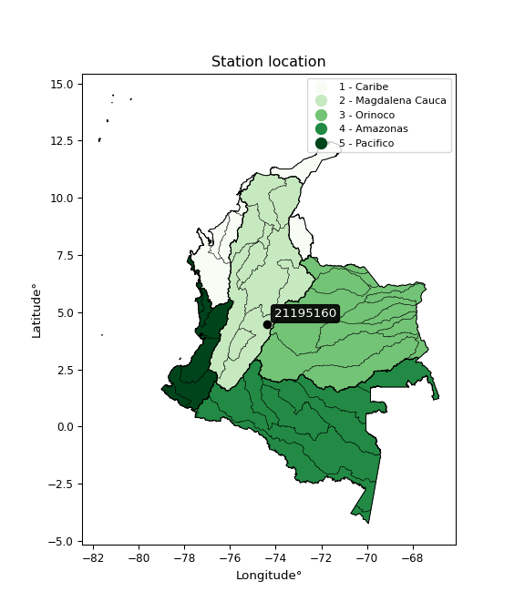

<div align="center">


</div>

# PMax24h Station (Rain): 21195160

Maximum Precipitation in 24 hours (PMax24h) is the greatest amount of rainfall for a specific duration that is meteorologically possible for a given location, acting as a "worst-case" scenario for extreme storms, crucial for designing safety-critical infrastructure like bridges, river deviations, dams, spillways, and nuclear plants to prevent catastrophic failure. The PMax24h is related with the Probable Maximum Precipitation (PMP) and it is calculated by hydrologists using meteorological data to determine the upper limit of extreme rainfall, often leading to the Probable Maximum Flood (PMF) for flood control design, and is increasingly being studied for climate change impacts. Probable Maximum Precipitation (PMP) is the theoretical upper limit of rainfall, a deterministic estimate for extreme events, while probability distributions (like GEV, Gumbel) describe the likelihood and frequency of various precipitation amounts, including rare ones, showing how often events occur, with PMP representing the extreme end of these distributions, used for critical infrastructure design to ensure safety against the worst conceivable weather, unlike standard statistical forecasts which cover typical probabilities.

The most common probability distributions in hydrology, used for analyzing floods, rainfall, and streamflow, include the Normal, Log-Normal, Gumbel, Gamma (including Log-Pearson Type III), and Generalized Extreme Value (GEV) distributions, often chosen based on the data´s skewness and whether modeling extremes or general conditions, with Gumbel and GEV popular for extreme events like floods, while the Normal distribution serves as a baseline, though often requiring transformations for skewed hydrological data. These distributions help in designing water infrastructure, managing water resources, and forecasting hydrologic events.

> Hydrological data often isn´t perfectly normal (it´s skewed), so different distributions are needed for different applications, such as: **Flood Frequency Analysis**: Using Gumbel, GEV, or Log-Pearson Type III for predicting extreme flood magnitudes and their return periods, **Rainfall Analysis**: Normal for annual totals, but Log-Normal, Weibull, or GEV for intensity or extreme daily rainfall, **Streamflow Modeling**: Gamma and Log-Normal for maximum flows, GEV for minimum flows, and Kappa for daily flows.

<div align="center">

</img>

</div>


## A. General information


### 1. General running parameters

• app_version: _v20260225_. • runtime: _2026-02-28 16:54:07.457399_. • Python version: _3.14.0_. • SciPy version: _1.16.3_. • Pandas version: _2.3.3_. • NumPy version: _2.3.5_. • Stations dataset (station_dataset_file): _dataset/pmax24h_in/automatic_colombia_2003_2025.csv_. • Stations catalog (station_catalog_file): _dataset/CNE.xls_. • Minimum year to eval til year_max (date_min): _1900_. • Maximum year to eval since year_min (date_max): _2025_. • Creates, save and include plots into reports (create_plot): _False_. • Plot only fit distributions with Δo > Δ (plot_only_fit): _True_. • Plot only simple graphs avoiding multiple CDFs and multiple Extreme values plots (plot_only_simple): _False_. • Eval low extreme values, if False, evaluates high extreme values (low_extreme): _False_. • Eval every SciPy distribution as logarithmic (pdist_logarithmic_on): _True_. • Standard deviation normalized (ddof): _1.0_. • Return periods to eval in years (Tr): _[2, 2.33, 5, 10, 15, 20, 25, 50, 75, 100, 200, 250, 500, 750, 1000]_. • Minimum data sample per station, 0 means any (minimum_sample): _5_. • Z-Score maximum threshold to adjust a value, 0 means disable (zscore_max): _3.5_. • Z-Score minimum threshold to adjust a value, 0 means disable (zscore_min): _-2.5_. • Avoid zeros, e.g. rain = 0 (avoid_zeros): _True_. • Avoid null values (avoid_nans): _True_. 

:file_folder:Table: [dataset.csv](../../dataset/pmax24h_in/automatic_colombia_2003_2025.csv)

> Delta Degrees of Freedom (DDOF): is a parameter used in the formulas for calculating variance and standard deviation. When ddof=0, the divisor is $N$ (the total number of observations) and this is used when your data set is the entire population. When ddof=1, the divisor is $N-1$ and this is used when your data set is a sample drawn from a larger population. Using $N-1$ provides an unbiased estimate of the population variance (known as Bessel´s correction).


### 2. Station info and location

|   id |   CODIGO | NOMBRE                 | CATEGORIA               | TECNOLOGIA                | ESTADO     | FECHA_INSTALACION   | FECHA_SUSPENSION   |   ALTITUD |   LATITUD |   LONGITUD | DEPARTAMENTO   | MUNICIPIO   | AREA_OPERATIVA                            | ENTIDAD                                                     | AREA_HIDROGRAFICA   | ZONA_HIDROGRAFICA   | SUBZONA_HIDROGRAFICA   |   CORRIENTE | Catalogo   |   Version |
|-----:|---------:|:-----------------------|:------------------------|:--------------------------|:-----------|:--------------------|:-------------------|----------:|----------:|-----------:|:---------------|:------------|:------------------------------------------|:------------------------------------------------------------|:--------------------|:--------------------|:-----------------------|------------:|:-----------|----------:|
|    0 | 21195160 | SUBIA - AUT [21195160] | Climatológica Principal | Automática con Telemetría | Suspendida | 28/09/2004          | 03/05/2019         |       275 |   4.47661 |   -74.3839 | Cundinamarca   | Silvania    | Area Operativa 11 - Cundinamarca-Amazonas | INSTITUTO DE HIDROLOGIA METEOROLOGIA Y ESTUDIOS AMBIENTALES | Magdalena Cauca     | Alto Magdalena      | Río Sumapaz            |         nan | CNE_IDEAM  |  20251226 |

<div align="center">

Dynamic map: [:earth_americas:Google](http://maps.google.com/maps?q=4.476611111,-74.38388889) [:earth_americas:OSM](https://www.openstreetmap.org/#map=18/4.476611111/-74.38388889&layers=P) [:earth_americas:Bing](https://www.bing.com/maps?cp=4.476611111~-74.38388889&lvl=18) [:earth_americas:Apple](https://maps.apple.com/frame?center=4.476611111%2C-74.38388889&span=0.003%2C0.006)

</div>


<div align="center">

```geojson
{
  "type": "Feature",
  "geometry": {
    "type": "Point", 
    "coordinates": [-74.38388889, 4.476611111]
  }, 
  "properties": {
    "Name": "21195160"
  }
}
```

</div>


### 3. Discrete values table and plot

<div align="center">

|               |           0 |           1 |           2 |           3 |            4 |          5 |          6 |
|:--------------|------------:|------------:|------------:|------------:|-------------:|-----------:|-----------:|
| Date          | 2006        | 2007        | 2008        | 2009        | 2010         | 2011       | 2012       |
| Value         |   33        |   43.4      |   54.5      |   31.4      |   42.2       |   74.9     |    2.9     |
| Value_initial |   33        |   43.4      |   54.5      |   31.4      |   42.2       |   74.9     |    2.9     |
| count         |    7        |    7        |    7        |    7        |    7         |    7       |    7       |
| mean          |   40.3286   |   40.3286   |   40.3286   |   40.3286   |   40.3286    |   40.3286  |   40.3286  |
| std           |   22.1483   |   22.1483   |   22.1483   |   22.1483   |   22.1483    |   22.1483  |   22.1483  |
| zscore        |   -0.330887 |    0.138676 |    0.639844 |   -0.403127 |    0.0844955 |    1.56091 |   -1.68991 |


</div>


> The initial value (value_initial) correspond to the initial obtained or null completed value, and value (value) is adjusted only when the initial value is outside the valid range (outlier) definite through the Z-Score value. If Z-Score is active, values out of range or outliers are replaced with the station mean value. A Z-Score (or standard score) measures how many standard deviations a data point is from the mean of a dataset, indicating its relative position; positive scores mean above the mean, negative mean below, and a score of zero is exactly at the mean, allowing for comparison of values from different distributions. It´s calculated using the formula $z=(x–μ)/σ$, where $x$ is the data point, $μ$ is the mean, and $σ$ is the standard deviation, helping identify outliers and understand probability.
>
> <sub>**Note**: In this study, "completing" (filling gaps in) and "extending" (forecasting or lengthening the historical record) rainfall data series are avoided for certain critical analyses because they introduce artificial bias and uncertainty, which can distort the statistics of rare events (extremes), alter day-to-day variability, and compromise the integrity and homogeneity of the original data. Some reasons against Completing/Extending rainfall data are: **Distortion of Extremes and Variability**: The primary issue is that most gap-filling or extension methods rely on averaging or regression with nearby stations, which inherently smooths the data. Rainfall is highly variable in space and time, with a large percentage of zero values and occasional large storms. Infilling methods often underestimate the highest values and overestimate the lowest (zero) values, which severely distorts analyses focused on flood frequency, drought severity, and intensity-duration-frequency (IDF) curves, **Loss of Data Homogeneity**: Infilled or extended data are synthetic estimates, not actual measurements. Combining these estimates with observed data can violate the assumption of data homogeneity, which requires that the data properties do not change over time. Inhomogeneity can lead to incorrect conclusions about long-term trends or changes in climate patterns, **Propagation of Errors**: Errors and biases from the original data (e.g., wind-induced undercatch, instrument errors, site changes) or the data used for imputation can propagate through the analysis, leading to unreliable hydrological models and inaccurate predictions, **Compromised Statistical Integrity**: For statistical analyses, especially those involving the frequency of events, using artificial data can introduce time bias or autocorrelation that doesn´t exist in reality, making it difficult to assess the true probability of events, **Difficulty in Validation**: It is difficult to accurately validate the quality of filled or extended data, especially for past periods where ground-truth measurements are unavailable. The reliability of imputation techniques heavily depends on the density of the surrounding station network and the complexity of the local topography.</sub>


### 4. Active continuous probability distributions from SciPy (80 of 104 available)

A Probability Density Function (PDF) describes the relative likelihood of a continuous random variable falling within a specific range, where the total area under its curve equals 1, and the area over any interval gives the actual probability for that range. Unlike discrete probabilities (like rolling a die), a PDF shows density, not direct probability for a single point (which is zero), with higher points indicating higher likelihood, often visualized as a bell curve for normal distributions.

A log of a probability density function (log-PDF) is simply the logarithm of the PDF´s value, denoted as $log(f(x))$, useful for converting multiplication of probabilities into addition, improving numerical stability with tiny numbers, and connecting to information theory concepts like entropy. Instead of dealing with very small probabilities (e.g., 0.000001), log-PDFs use negative numbers (e.g., $log(0.00001) ≈ -11.51$ that are easier for computers to handle, preventing underflow errors and simplifying complex calculations. In this study, each active probability distribution from SciPy is also evaluated in the $log$ form.

[scipy.stats](https://docs.scipy.org/doc/scipy/reference/stats.html) is a Python´s powerful submodule within the SciPy library for comprehensive statistical analysis, offering over 130 probability distributions (like Normal, Poisson, etc.), functions for descriptive stats (mean, variance), hypothesis testing (t-tests, chi-square), random variable generation, and statistical tests, making it essential for data science, modeling, and research. It provides tools to explore, model, and draw conclusions from data efficiently, working seamlessly with [NumPy](https://numpy.org/).

<div align="center">

|   id | p_dist           |   n_parameter | fit_method   | label                                                                       | active   | ref                                                                                                      |
|-----:|:-----------------|--------------:|:-------------|:----------------------------------------------------------------------------|:---------|:---------------------------------------------------------------------------------------------------------|
|    0 | alpha            |             3 | MLE          | Alpha                                                                       | True     | [:mortar_board:](https://docs.scipy.org/doc/scipy/reference/generated/scipy.stats.alpha.html)            |
|    1 | anglit           |             2 | MM           | Anglit                                                                      | True     | [:mortar_board:](https://docs.scipy.org/doc/scipy/reference/generated/scipy.stats.anglit.html)           |
|    2 | arcsine          |             2 | MM           | Arcsine                                                                     | True     | [:mortar_board:](https://docs.scipy.org/doc/scipy/reference/generated/scipy.stats.arcsine.html)          |
|    3 | argus            |             3 | MLE          | Argus                                                                       | True     | [:mortar_board:](https://docs.scipy.org/doc/scipy/reference/generated/scipy.stats.argus.html)            |
|    4 | beta             |             4 | MLE          | Beta                                                                        | True     | [:mortar_board:](https://docs.scipy.org/doc/scipy/reference/generated/scipy.stats.beta.html)             |
|    5 | betaprime        |             4 | MLE          | Beta prime                                                                  | True     | [:mortar_board:](https://docs.scipy.org/doc/scipy/reference/generated/scipy.stats.betaprime.html)        |
|    6 | bradford         |             3 | MLE          | Bradford                                                                    | True     | [:mortar_board:](https://docs.scipy.org/doc/scipy/reference/generated/scipy.stats.bradford.html)         |
|    7 | burr             |             4 | MLE          | Burr (Type III)                                                             | True     | [:mortar_board:](https://docs.scipy.org/doc/scipy/reference/generated/scipy.stats.burr.html)             |
|    8 | burr12           |             4 | MLE          | Burr (Type III) 12                                                          | True     | [:mortar_board:](https://docs.scipy.org/doc/scipy/reference/generated/scipy.stats.burr12.html)           |
|    9 | cosine           |             2 | MLE          | Cosine                                                                      | True     | [:mortar_board:](https://docs.scipy.org/doc/scipy/reference/generated/scipy.stats.cosine.html)           |
|   10 | crystalball      |             4 | MLE          | Crystalball                                                                 | True     | [:mortar_board:](https://docs.scipy.org/doc/scipy/reference/generated/scipy.stats.crystalball.html)      |
|   11 | dgamma           |             3 | MLE          | Double gamma                                                                | True     | [:mortar_board:](https://docs.scipy.org/doc/scipy/reference/generated/scipy.stats.dgamma.html)           |
|   12 | dweibull         |             3 | MLE          | Double Weibull                                                              | True     | [:mortar_board:](https://docs.scipy.org/doc/scipy/reference/generated/scipy.stats.dweibull.html)         |
|   13 | erlang           |             3 | MLE          | Erlang                                                                      | True     | [:mortar_board:](https://docs.scipy.org/doc/scipy/reference/generated/scipy.stats.erlang.html)           |
|   14 | exponnorm        |             3 | MLE          | Exponentially modified Normal                                               | True     | [:mortar_board:](https://docs.scipy.org/doc/scipy/reference/generated/scipy.stats.exponnorm.html)        |
|   15 | exponpow         |             3 | MLE          | Exponential power                                                           | True     | [:mortar_board:](https://docs.scipy.org/doc/scipy/reference/generated/scipy.stats.exponpow.html)         |
|   16 | exponweib        |             4 | MLE          | Exponentiated Weibull                                                       | True     | [:mortar_board:](https://docs.scipy.org/doc/scipy/reference/generated/scipy.stats.exponweib.html)        |
|   17 | f                |             4 | MLE          | F                                                                           | True     | [:mortar_board:](https://docs.scipy.org/doc/scipy/reference/generated/scipy.stats.f.html)                |
|   18 | fatiguelife      |             3 | MLE          | Fatigue-life (Birnbaum-Saunders)                                            | True     | [:mortar_board:](https://docs.scipy.org/doc/scipy/reference/generated/scipy.stats.fatiguelife.html)      |
|   19 | foldnorm         |             3 | MM           | Fold Normal                                                                 | True     | [:mortar_board:](https://docs.scipy.org/doc/scipy/reference/generated/scipy.stats.foldnorm.html)         |
|   20 | gamma            |             3 | MLE          | Gamma                                                                       | True     | [:mortar_board:](https://docs.scipy.org/doc/scipy/reference/generated/scipy.stats.gamma.html)            |
|   21 | gausshyper       |             6 | MLE          | Gauss hypergeometric                                                        | True     | [:mortar_board:](https://docs.scipy.org/doc/scipy/reference/generated/scipy.stats.gausshyper.html)       |
|   22 | genexpon         |             5 | MLE          | Generalized exponential                                                     | True     | [:mortar_board:](https://docs.scipy.org/doc/scipy/reference/generated/scipy.stats.genexpon.html)         |
|   23 | genextreme       |             3 | MLE          | Generalized exponential                                                     | True     | [:mortar_board:](https://docs.scipy.org/doc/scipy/reference/generated/scipy.stats.genextreme.html)       |
|   24 | gengamma         |             4 | MLE          | Generalized gamma                                                           | True     | [:mortar_board:](https://docs.scipy.org/doc/scipy/reference/generated/scipy.stats.gengamma.html)         |
|   25 | genhalflogistic  |             3 | MLE          | Generalized half-logistic                                                   | True     | [:mortar_board:](https://docs.scipy.org/doc/scipy/reference/generated/scipy.stats.genhalflogistic.html)  |
|   26 | genlogistic      |             3 | MLE          | Generalized logistic                                                        | True     | [:mortar_board:](https://docs.scipy.org/doc/scipy/reference/generated/scipy.stats.genlogistic.html)      |
|   27 | gennorm          |             3 | MLE          | Generalized Normal                                                          | True     | [:mortar_board:](https://docs.scipy.org/doc/scipy/reference/generated/scipy.stats.gennorm.html)          |
|   28 | genpareto        |             3 | MLE          | Generalized Pareto                                                          | True     | [:mortar_board:](https://docs.scipy.org/doc/scipy/reference/generated/scipy.stats.genpareto.html)        |
|   29 | gompertz         |             3 | MLE          | Gompertz (or truncated Gumbel)                                              | True     | [:mortar_board:](https://docs.scipy.org/doc/scipy/reference/generated/scipy.stats.gompertz.html)         |
|   30 | gumbel_l         |             2 | MM           | Gumbel Left Skew                                                            | True     | [:mortar_board:](https://docs.scipy.org/doc/scipy/reference/generated/scipy.stats.gumbel_l.html)         |
|   31 | gumbel_r         |             2 | MM           | Gumbel Right Skew                                                           | True     | [:mortar_board:](https://docs.scipy.org/doc/scipy/reference/generated/scipy.stats.gumbel_r.html)         |
|   32 | halfgennorm      |             3 | MLE          | Upper half of a generalized normal                                          | True     | [:mortar_board:](https://docs.scipy.org/doc/scipy/reference/generated/scipy.stats.halfgennorm.html)      |
|   33 | halflogistic     |             2 | MM           | Half-logistic                                                               | True     | [:mortar_board:](https://docs.scipy.org/doc/scipy/reference/generated/scipy.stats.halflogistic.html)     |
|   34 | halfnorm         |             2 | MM           | Half Normal                                                                 | True     | [:mortar_board:](https://docs.scipy.org/doc/scipy/reference/generated/scipy.stats.halfnorm.html)         |
|   35 | hypsecant        |             2 | MM           | hyperbolic secant                                                           | True     | [:mortar_board:](https://docs.scipy.org/doc/scipy/reference/generated/scipy.stats.hypsecant.html)        |
|   36 | invgamma         |             3 | MLE          | Inverted gamma                                                              | True     | [:mortar_board:](https://docs.scipy.org/doc/scipy/reference/generated/scipy.stats.invgamma.html)         |
|   37 | invgauss         |             3 | MLE          | Inverse Gaussian                                                            | True     | [:mortar_board:](https://docs.scipy.org/doc/scipy/reference/generated/scipy.stats.invgauss.html)         |
|   38 | invweibull       |             3 | MLE          | Inverted Weibull                                                            | True     | [:mortar_board:](https://docs.scipy.org/doc/scipy/reference/generated/scipy.stats.invweibull.html)       |
|   39 | johnsonsb        |             4 | MLE          | Johnson SB                                                                  | True     | [:mortar_board:](https://docs.scipy.org/doc/scipy/reference/generated/scipy.stats.johnsonsb.html)        |
|   40 | johnsonsu        |             4 | MLE          | Johnson Su                                                                  | True     | [:mortar_board:](https://docs.scipy.org/doc/scipy/reference/generated/scipy.stats.johnsonsu.html)        |
|   41 | kappa3           |             3 | MLE          | Kappa 3                                                                     | True     | [:mortar_board:](https://docs.scipy.org/doc/scipy/reference/generated/scipy.stats.kappa3.html)           |
|   42 | kappa4           |             4 | MLE          | Kappa 4                                                                     | True     | [:mortar_board:](https://docs.scipy.org/doc/scipy/reference/generated/scipy.stats.kappa4.html)           |
|   43 | ksone            |             3 | MLE          | Kolmogorov-Smirnov one-sided test statistic distribution                    | True     | [:mortar_board:](https://docs.scipy.org/doc/scipy/reference/generated/scipy.stats.ksone.html)            |
|   44 | kstwobign        |             2 | MLE          | Limiting distribution of scaled Kolmogorov-Smirnov two-sided test statistic | True     | [:mortar_board:](https://docs.scipy.org/doc/scipy/reference/generated/scipy.stats.kstwobign.html)        |
|   45 | laplace          |             2 | MM           | Laplace                                                                     | True     | [:mortar_board:](https://docs.scipy.org/doc/scipy/reference/generated/scipy.stats.laplace.html)          |
|   46 | levy_l           |             2 | MLE          | Left-skewed Levy                                                            | True     | [:mortar_board:](https://docs.scipy.org/doc/scipy/reference/generated/scipy.stats.levy_l.html)           |
|   47 | loggamma         |             3 | MLE          | Log gamma                                                                   | True     | [:mortar_board:](https://docs.scipy.org/doc/scipy/reference/generated/scipy.stats.loggamma.html)         |
|   48 | logistic         |             2 | MM           | Logistic (or Sech-squared)                                                  | True     | [:mortar_board:](https://docs.scipy.org/doc/scipy/reference/generated/scipy.stats.logistic.html)         |
|   49 | loglaplace       |             3 | MLE          | Log-Laplace                                                                 | True     | [:mortar_board:](https://docs.scipy.org/doc/scipy/reference/generated/scipy.stats.loglaplace.html)       |
|   50 | lomax            |             3 | MLE          | Lomax (Pareto of the second kind)                                           | True     | [:mortar_board:](https://docs.scipy.org/doc/scipy/reference/generated/scipy.stats.lomax.html)            |
|   51 | maxwell          |             2 | MM           | Maxwell                                                                     | True     | [:mortar_board:](https://docs.scipy.org/doc/scipy/reference/generated/scipy.stats.maxwell.html)          |
|   52 | mielke           |             4 | MLE          | Mielke Beta-Kappa / Dagum                                                   | True     | [:mortar_board:](https://docs.scipy.org/doc/scipy/reference/generated/scipy.stats.mielke.html)           |
|   53 | moyal            |             2 | MM           | Moyal                                                                       | True     | [:mortar_board:](https://docs.scipy.org/doc/scipy/reference/generated/scipy.stats.moyal.html)            |
|   54 | nakagami         |             3 | MLE          | Nakagami                                                                    | True     | [:mortar_board:](https://docs.scipy.org/doc/scipy/reference/generated/scipy.stats.nakagami.html)         |
|   55 | ncf              |             5 | MLE          | Non-central F distribution                                                  | True     | [:mortar_board:](https://docs.scipy.org/doc/scipy/reference/generated/scipy.stats.ncf.html)              |
|   56 | nct              |             4 | MLE          | Non-central Student’s t                                                     | True     | [:mortar_board:](https://docs.scipy.org/doc/scipy/reference/generated/scipy.stats.nct.html)              |
|   57 | norm             |             2 | MM           | Normal                                                                      | True     | [:mortar_board:](https://docs.scipy.org/doc/scipy/reference/generated/scipy.stats.norm.html)             |
|   58 | pearson3         |             3 | MM           | Pearson type III                                                            | True     | [:mortar_board:](https://docs.scipy.org/doc/scipy/reference/generated/scipy.stats.pearson3.html)         |
|   59 | powerlaw         |             3 | MLE          | Power-function                                                              | True     | [:mortar_board:](https://docs.scipy.org/doc/scipy/reference/generated/scipy.stats.powerlaw.html)         |
|   60 | rayleigh         |             2 | MM           | Rayleigh                                                                    | True     | [:mortar_board:](https://docs.scipy.org/doc/scipy/reference/generated/scipy.stats.rayleigh.html)         |
|   61 | rdist            |             3 | MLE          | R-distributed (symmetric beta)                                              | True     | [:mortar_board:](https://docs.scipy.org/doc/scipy/reference/generated/scipy.stats.rdist.html)            |
|   62 | rice             |             3 | MLE          | Rice                                                                        | True     | [:mortar_board:](https://docs.scipy.org/doc/scipy/reference/generated/scipy.stats.rice.html)             |
|   63 | semicircular     |             2 | MM           | Semicircular                                                                | True     | [:mortar_board:](https://docs.scipy.org/doc/scipy/reference/generated/scipy.stats.semicircular.html)     |
|   64 | skewnorm         |             3 | MLE          | Skew normal                                                                 | True     | [:mortar_board:](https://docs.scipy.org/doc/scipy/reference/generated/scipy.stats.skewnorm.html)         |
|   65 | t                |             3 | MLE          | Student’s t                                                                 | True     | [:mortar_board:](https://docs.scipy.org/doc/scipy/reference/generated/scipy.stats.t.html)                |
|   66 | trapezoid        |             4 | MLE          | Trapezoid                                                                   | True     | [:mortar_board:](https://docs.scipy.org/doc/scipy/reference/generated/scipy.stats.trapezoid.html)        |
|   67 | triang           |             3 | MLE          | Triangular                                                                  | True     | [:mortar_board:](https://docs.scipy.org/doc/scipy/reference/generated/scipy.stats.triang.html)           |
|   68 | truncexpon       |             3 | MLE          | Truncated exponential                                                       | True     | [:mortar_board:](https://docs.scipy.org/doc/scipy/reference/generated/scipy.stats.truncexpon.html)       |
|   69 | truncnorm        |             4 | MLE          | Truncated normal                                                            | True     | [:mortar_board:](https://docs.scipy.org/doc/scipy/reference/generated/scipy.stats.truncnorm.html)        |
|   70 | truncpareto      |             4 | MLE          | Upper truncated Pareto                                                      | True     | [:mortar_board:](https://docs.scipy.org/doc/scipy/reference/generated/scipy.stats.truncpareto.html)      |
|   71 | truncweibull_min |             5 | MLE          | Doubly truncated Weibull minimum                                            | True     | [:mortar_board:](https://docs.scipy.org/doc/scipy/reference/generated/scipy.stats.truncweibull_min.html) |
|   72 | tukeylambda      |             3 | MLE          | Tukey-Lamdba                                                                | True     | [:mortar_board:](https://docs.scipy.org/doc/scipy/reference/generated/scipy.stats.tukeylambda.html)      |
|   73 | uniform          |             2 | MLE          | Uniform                                                                     | True     | [:mortar_board:](https://docs.scipy.org/doc/scipy/reference/generated/scipy.stats.uniform.html)          |
|   74 | vonmises         |             3 | MLE          | Von Mises                                                                   | True     | [:mortar_board:](https://docs.scipy.org/doc/scipy/reference/generated/scipy.stats.vonmises.html)         |
|   75 | vonmises_line    |             3 | MLE          | Von Mises line                                                              | True     | [:mortar_board:](https://docs.scipy.org/doc/scipy/reference/generated/scipy.stats.vonmises_line.html)    |
|   76 | wald             |             2 | MM           | Wald                                                                        | True     | [:mortar_board:](https://docs.scipy.org/doc/scipy/reference/generated/scipy.stats.wald.html)             |
|   77 | weibull_max      |             3 | MLE          | Weibull maximum                                                             | True     | [:mortar_board:](https://docs.scipy.org/doc/scipy/reference/generated/scipy.stats.weibull_max.html)      |
|   78 | weibull_min      |             3 | MLE          | Weibull minimum                                                             | True     | [:mortar_board:](https://docs.scipy.org/doc/scipy/reference/generated/scipy.stats.weibull_min.html)      |
|   79 | wrapcauchy       |             3 | MLE          | Wrapped  Cauchy                                                             | True     | [:mortar_board:](https://docs.scipy.org/doc/scipy/reference/generated/scipy.stats.wrapcauchy.html)       |

</div>

> **n_parameter:** # arguments & localization & scale.
>
> **Fit methods:** (MLE) maximum likelihood, (MM) L-moments.
>
>**Inactive** (With the only purpose of prevent loops, zero divisions, infinite values, over high estimated values or horizontal trending for recurrence intervals estimations, the follow distributions were disabled.)**:** lognorm, norminvgauss, powernorm, powerlognorm, cauchy, halfcauchy, foldcauchy, skewcauchy, chi2, expon, fisk, genhyperbolic, geninvgauss, gibrat, kstwo, laplace_asymmetric, levy, levy_stable, ncx2, pareto, rel_breitwigner, recipinvgauss, studentized_range, loguniform, 


## B. Probability (PDF) vs. Empirical (EDF) distributions functions

A continuous probability distribution (CPD) describes probabilities for variables that can take any value within a range (like rain any time), unlike discrete variables with specific outcomes (like temperature). It uses a Probability Density Function (PDF), a curve where the total area under it equals 1, and the probability of the variable falling within an interval (a to b) is found by calculating the area under the curve between those points. A key feature is that the probability of hitting any single exact value is zero, so probabilities are always expressed for ranges, e.g., $P(a ≤ X ≤ b)$.

<div align="center">

Distributions parameters from station values
|     |   station | p_dist              |   n |             loc |           scale | shape                  | shape1                | shape2                | shape3             |
|----:|----------:|:--------------------|----:|----------------:|----------------:|:-----------------------|:----------------------|:----------------------|:-------------------|
|   0 |  21195160 | alpha               |   7 |    -0.0191474   |     7.62793     | 6.122240059070752e-10  |                       |                       |                    |
|   1 |  21195160 | anglit              |   7 |    40.3286      |    59.9862      |                        |                       |                       |                    |
|   2 |  21195160 | arcsine             |   7 |    11.3297      |    57.9978      |                        |                       |                       |                    |
|   3 |  21195160 | argus               |   7 |   -10.8093      |    89.4822      | 7.0181669950726295e-06 |                       |                       |                    |
|   4 |  21195160 | beta                |   7 |   -13.1913      |    88.0913      | 1.184887110176136      | 0.8216779418822469    |                       |                    |
|   5 |  21195160 | betaprime           |   7 |  -587.041       | 38718.1         | 939.9078360854276      | 58015.68426079511     |                       |                    |
|   6 |  21195160 | bradford            |   7 |    -5.78564     |    80.6858      | 1.5561053626981093e-06 |                       |                       |                    |
|   7 |  21195160 | burr                |   7 |     2.88314     |    71.7165      | 13.149233189049184     | 0.04931481664590749   |                       |                    |
|   8 |  21195160 | burr12              |   7 |    -0.27494     |     3.11485     | 222.94710475634588     | 0.0019609496533737726 |                       |                    |
|   9 |  21195160 | cosine              |   7 |    39.7855      |    17.8483      |                        |                       |                       |                    |
|  10 |  21195160 | crystalball         |   7 |    40.3286      |    20.5053      | 2607.7606912590372     | 4100.190367415753     |                       |                    |
|  11 |  21195160 | dgamma              |   7 |    42.2         |    15.3384      | 0.9117456866229142     |                       |                       |                    |
|  12 |  21195160 | dweibull            |   7 |    43.4         |    13.4474      | 0.8109986546111165     |                       |                       |                    |
|  13 |  21195160 | erlang              |   7 |  -417.096       |     0.925395    | 494.29630558529567     |                       |                       |                    |
|  14 |  21195160 | exponnorm           |   7 |    40.3061      |    20.5053      | 0.0010888297284817625  |                       |                       |                    |
|  15 |  21195160 | exponpow            |   7 |     2.9         |     4.44769     | 0.13624623518131274    |                       |                       |                    |
|  16 |  21195160 | exponweib           |   7 |     2.9         |     1.91254     | 3.6725655671824033     | 0.20000650625904245   |                       |                    |
|  17 |  21195160 | f                   |   7 | -3878.78        |  3919.13        | 77405.8735497075       | 1173914.684356581     |                       |                    |
|  18 |  21195160 | fatiguelife         |   7 |     2.9         |     0.000211149 | 417.11274435686335     |                       |                       |                    |
|  19 |  21195160 | foldnorm            |   7 |   -71.347       |    20.169       | 5.541070043662204      |                       |                       |                    |
|  20 |  21195160 | gamma               |   7 |  -416.755       |     0.926136    | 493.56991858450783     |                       |                       |                    |
|  21 |  21195160 | gausshyper          |   7 |    -4.86919     |    79.7692      | 1.4175464912574474     | 0.6921538981653956    | 1.0518342121291493    | 0.6233755854405627 |
|  22 |  21195160 | genexpon            |   7 |     2.89991     |     2.13048     | 0.05896699890447067    | 2.865514210984085e-07 | 0.9347739584775808    |                    |
|  23 |  21195160 | genextreme          |   7 |    34.0274      |    21.3213      | 0.37437907802241943    |                       |                       |                    |
|  24 |  21195160 | gengamma            |   7 |  -506.049       |   149.822       | 67.43493749234807      | 3.250777726467751     |                       |                    |
|  25 |  21195160 | genhalflogistic     |   7 |    -4.43876     |    82.8185      | 1.0438598292635017     |                       |                       |                    |
|  26 |  21195160 | genlogistic         |   7 |    43.3761      |    10.7179      | 0.8448171087130505     |                       |                       |                    |
|  27 |  21195160 | gennorm             |   7 |    42.2         |     0.0263649   | 0.2514079158798719     |                       |                       |                    |
|  28 |  21195160 | genpareto           |   7 |    -0.347134    |   117.878       | -1.566538918370552     |                       |                       |                    |
|  29 |  21195160 | gompertz            |   7 |   -17.917       |    20.3389      | 0.03678784191133841    |                       |                       |                    |
|  30 |  21195160 | gumbel_l            |   7 |    49.5571      |    15.9879      |                        |                       |                       |                    |
|  31 |  21195160 | gumbel_r            |   7 |    31.1001      |    15.9879      |                        |                       |                       |                    |
|  32 |  21195160 | halfgennorm         |   7 |     2.9         |     0.241002    | 0.2780128169401277     |                       |                       |                    |
|  33 |  21195160 | halflogistic        |   7 |    16.0251      |    17.5313      |                        |                       |                       |                    |
|  34 |  21195160 | halfnorm            |   7 |    13.1875      |    34.0162      |                        |                       |                       |                    |
|  35 |  21195160 | hypsecant           |   7 |    40.3286      |    13.0541      |                        |                       |                       |                    |
|  36 |  21195160 | invgamma            |   7 |  -229.706       | 44684.1         | 166.6677609291728      |                       |                       |                    |
|  37 |  21195160 | invgauss            |   7 |   -97.0359      |  5377.08        | 0.025438237894513438   |                       |                       |                    |
|  38 |  21195160 | invweibull          |   7 |    -3.81649e+08 |     3.81649e+08 | 18613517.06735497      |                       |                       |                    |
|  39 |  21195160 | johnsonsb           |   7 |     2.85048     |    72.0495      | -1.2196033794995027    | 0.10650434680403735   |                       |                    |
|  40 |  21195160 | johnsonsu           |   7 |   274.124       |   170.264       | 15.82810401602437      | 14.129668550918979    |                       |                    |
|  41 |  21195160 | kappa3              |   7 |     2.89998     |    72           | 4685113.874862382      |                       |                       |                    |
|  42 |  21195160 | kappa4              |   7 |    -4.35094     |    80.305       | 1.0993197972310509     | 1.0128697503738793    |                       |                    |
|  43 |  21195160 | ksone               |   7 |    -4.3         |    86.4         | 1.0                    |                       |                       |                    |
|  44 |  21195160 | kstwobign           |   7 |   -43.5699      |    96.144       |                        |                       |                       |                    |
|  45 |  21195160 | laplace             |   7 |    40.3286      |    14.4994      |                        |                       |                       |                    |
|  46 |  21195160 | levy_l              |   7 |    78.6348      |    16.6152      |                        |                       |                       |                    |
|  47 |  21195160 | loggamma            |   7 |  -360.43        |   115.781       | 32.35861423845532      |                       |                       |                    |
|  48 |  21195160 | logistic            |   7 |    40.3286      |    11.3052      |                        |                       |                       |                    |
|  49 |  21195160 | loglaplace          |   7 |    -0.107343    |    42.3073      | 1.734062838545848      |                       |                       |                    |
|  50 |  21195160 | lomax               |   7 |     2.9         |     2.67301e+10 | 558037413.2006526      |                       |                       |                    |
|  51 |  21195160 | maxwell             |   7 |    -8.2604      |    30.4486      |                        |                       |                       |                    |
|  52 |  21195160 | mielke              |   7 |     2.9         |    80.1957      | 0.5745899088906592     | 13.546202607790391    |                       |                    |
|  53 |  21195160 | moyal               |   7 |    28.6023      |     9.23063     |                        |                       |                       |                    |
|  54 |  21195160 | nakagami            |   7 |     2.9         |    43.5244      | 0.151047091161072      |                       |                       |                    |
|  55 |  21195160 | ncf                 |   7 |   -74.343       |     0.611233    | 0.60001391393535       | 23653.043168979544    | 111.92435272077458    |                    |
|  56 |  21195160 | nct                 |   7 |  -958.9         |    20.45        | 218885.15931144974     | 48.86169541156244     |                       |                    |
|  57 |  21195160 | norm                |   7 |    40.3286      |    20.5053      |                        |                       |                       |                    |
|  58 |  21195160 | pearson3            |   7 |    40.3286      |    20.5054      | -0.15474505869165006   |                       |                       |                    |
|  59 |  21195160 | powerlaw            |   7 |     2.9         |    72           | 0.16301806807966998    |                       |                       |                    |
|  60 |  21195160 | rayleigh            |   7 |     1.10072     |    31.2993      |                        |                       |                       |                    |
|  61 |  21195160 | rdist               |   7 |    -3.55784     |    36.5578      | 1.0626391855661677     |                       |                       |                    |
|  62 |  21195160 | rice                |   7 |    -9.43888     |    22.4236      | 1.9396040152213052     |                       |                       |                    |
|  63 |  21195160 | semicircular        |   7 |    40.3286      |    41.0106      |                        |                       |                       |                    |
|  64 |  21195160 | skewnorm            |   7 |    56.018       |    25.8191      | -1.1741159352492025    |                       |                       |                    |
|  65 |  21195160 | t                   |   7 |    40.3278      |    20.5048      | 2327679.382668959      |                       |                       |                    |
|  66 |  21195160 | trapezoid           |   7 |    -4.515       |    86.4         | 1.0                    | 1.0                   |                       |                    |
|  67 |  21195160 | triang              |   7 |   -15.852       |    90.7524      | 0.9999950892642661     |                       |                       |                    |
|  68 |  21195160 | truncexpon          |   7 |    -3.5891      |   106.146       | 0.7394433329851675     |                       |                       |                    |
|  69 |  21195160 | truncnorm           |   7 |    40.3286      |    20.5053      | -29.085007807878988    | 1775.5885843202518    |                       |                    |
|  70 |  21195160 | truncpareto         |   7 |     2.86027     |     0.0397323   | 0.1678386806504318     | 1813.128174011538     |                       |                    |
|  71 |  21195160 | truncweibull_min    |   7 |    -1.87268     |    71.6957      | 1.5393015827971777     | 0.002730160098249745  | 1.0708126415019217    |                    |
|  72 |  21195160 | tukeylambda         |   7 |    -3.37264     |    38.4238      | 1.0563918106911316     |                       |                       |                    |
|  73 |  21195160 | uniform             |   7 |     2.9         |    72           |                        |                       |                       |                    |
|  74 |  21195160 | vonmises            |   7 |    -1.00554     |     1           | 0.5893101562965426     |                       |                       |                    |
|  75 |  21195160 | vonmises_line       |   7 |    38.9         |    11.4592      | 0.5217309008957527     |                       |                       |                    |
|  76 |  21195160 | wald                |   7 |    19.8232      |    20.5054      |                        |                       |                       |                    |
|  77 |  21195160 | weibull_max         |   7 |    74.9         |     1.5172      | 0.21452009292414442    |                       |                       |                    |
|  78 |  21195160 | weibull_min         |   7 |   -29.6481      |    77.3903      | 3.855404041482249      |                       |                       |                    |
|  79 |  21195160 | wrapcauchy          |   7 |     2.77565     |    11.479       | 3.7386353623768774e-06 |                       |                       |                    |
|  80 |  21195160 | logalpha            |   7 |   -35.0651      |  1397           | 36.35860610229908      |                       |                       |                    |
|  81 |  21195160 | loganglit           |   7 |     3.40504     |     2.90788     |                        |                       |                       |                    |
|  82 |  21195160 | logarcsine          |   7 |     1.9993      |     2.81149     |                        |                       |                       |                    |
|  83 |  21195160 | logargus            |   7 |    -0.454849    |     4.8329      | 2.906621084851901      |                       |                       |                    |
|  84 |  21195160 | logbeta             |   7 |     0.757804    |     3.55835     | 0.5167396630111909     | 0.11207613346026021   |                       |                    |
|  85 |  21195160 | logbetaprime        |   7 |   -22.5979      |   111.545       | 731.9414432563456      | 3142.588999882667     |                       |                    |
|  86 |  21195160 | logbradford         |   7 |     1.06471     |     3.25146     | 0.7776397204958092     |                       |                       |                    |
|  87 |  21195160 | logburr             |   7 |    -1.31862e+07 |     1.31862e+07 | 910583329.2936554      | 0.015369491849637661  |                       |                    |
|  88 |  21195160 | logburr12           |   7 | -3886.21        |  3896.51        | 8346.11302851239       | 1069552.493608863     |                       |                    |
|  89 |  21195160 | logcosine           |   7 |     3.16595     |     0.915407    |                        |                       |                       |                    |
|  90 |  21195160 | logcrystalball      |   7 |     3.40504     |     0.994023    | 187.83055292880172     | 362.6458979427016     |                       |                    |
|  91 |  21195160 | logdgamma           |   7 |     3.77046     |     0.695148    | 0.8325088441010776     |                       |                       |                    |
|  92 |  21195160 | logdweibull         |   7 |     3.77046     |     0.677035    | 0.8588684800727027     |                       |                       |                    |
|  93 |  21195160 | logerlang           |   7 |   -16.8143      |     0.0559591   | 361.41008478765457     |                       |                       |                    |
|  94 |  21195160 | logexponnorm        |   7 |     3.4045      |     0.994027    | 0.0005468579286081118  |                       |                       |                    |
|  95 |  21195160 | logexponpow         |   7 |    -6.38926e+07 |     6.38926e+07 | 88409448.11045134      |                       |                       |                    |
|  96 |  21195160 | logexponweib        |   7 |    -3.44437e+07 |     3.44437e+07 | 0.23846614189095294    | 174320761.32449275    |                       |                    |
|  97 |  21195160 | logf                |   7 | -1795.26        |  1798.67        | 669294929.3205286      | 6530765.409060646     |                       |                    |
|  98 |  21195160 | logfatiguelife      |   7 |  -934.633       |   938.037       | 0.0010576718120628732  |                       |                       |                    |
|  99 |  21195160 | logfoldnorm         |   7 |     1.18244     |     0.875865    | 2.5585910777909584     |                       |                       |                    |
| 100 |  21195160 | loggamma            |   7 |   -16.0926      |     0.0572189   | 340.596546540363       |                       |                       |                    |
| 101 |  21195160 | loggausshyper       |   7 |     0.96891     |     3.34724     | 1.2712664367899436     | 0.43564607832015734   | 1.170344983223628     | 1.0634422024919854 |
| 102 |  21195160 | loggenexpon         |   7 |     1.02639     |     0.0361464   | 0.004061227948182646   | 9.096857415301102     | 3.174512962118838e-05 |                    |
| 103 |  21195160 | loggenextreme       |   7 |     3.45878     |     1.08961     | 1.2708708522098857     |                       |                       |                    |
| 104 |  21195160 | loggengamma         |   7 |    -7.75882e+06 |     7.75883e+06 | 0.03522310062021053    | 234274365.7070859     |                       |                    |
| 105 |  21195160 | loggenhalflogistic  |   7 |     0.747382    |     3.74145     | 1.0483853054060566     |                       |                       |                    |
| 106 |  21195160 | loggenlogistic      |   7 |     4.24706     |     0.105476    | 0.12266245837004378    |                       |                       |                    |
| 107 |  21195160 | loggennorm          |   7 |     3.74242     |     0.0261204   | 0.39086794954323184    |                       |                       |                    |
| 108 |  21195160 | loggenpareto        |   7 |    -0.00205076  |     8.50262     | -1.9690166494950683    |                       |                       |                    |
| 109 |  21195160 | loggompertz         |   7 |     1.05712     |     0.576504    | 0.008843722787504199   |                       |                       |                    |
| 110 |  21195160 | loggumbel_l         |   7 |     3.8524      |     0.775037    |                        |                       |                       |                    |
| 111 |  21195160 | loggumbel_r         |   7 |     2.95767     |     0.775037    |                        |                       |                       |                    |
| 112 |  21195160 | loghalfgennorm      |   7 |     1.0626      |     3.26924     | 1140.9571045121443     |                       |                       |                    |
| 113 |  21195160 | loghalflogistic     |   7 |     2.22693     |     0.849831    |                        |                       |                       |                    |
| 114 |  21195160 | loghalfnorm         |   7 |     2.08932     |     1.64901     |                        |                       |                       |                    |
| 115 |  21195160 | loghypsecant        |   7 |     3.40504     |     0.632815    |                        |                       |                       |                    |
| 116 |  21195160 | loginvgamma         |   7 |   -21.7653      | 14034.5         | 558.7737992691823      |                       |                       |                    |
| 117 |  21195160 | loginvgauss         |   7 |    -8.36293     |  1284.67        | 0.0091508010141099     |                       |                       |                    |
| 118 |  21195160 | loginvweibull       |   7 |    -1.07486e+08 |     1.07486e+08 | 86072410.96193187      |                       |                       |                    |
| 119 |  21195160 | logjohnsonsb        |   7 |    -6.85094e+07 |     1.44007e+08 | 3510158.8803756535     | 36140581.443197794    |                       |                    |
| 120 |  21195160 | logjohnsonsu        |   7 |     3.84235     |     0.221836    | 0.4446924425743185     | 0.7092224952979311    |                       |                    |
| 121 |  21195160 | logkappa3           |   7 |     1.06468     |     3.25153     | 117681.64718040335     |                       |                       |                    |
| 122 |  21195160 | logkappa4           |   7 |     0.684931    |     3.95227     | 1.04150794745322       | 1.0884141065507413    |                       |                    |
| 123 |  21195160 | logksone            |   7 |     0.739566    |     3.90173     | 1.0                    |                       |                       |                    |
| 124 |  21195160 | logkstwobign        |   7 |    -1.67529     |     5.81363     |                        |                       |                       |                    |
| 125 |  21195160 | loglaplace          |   7 |     3.40504     |     0.702881    |                        |                       |                       |                    |
| 126 |  21195160 | loglevy_l           |   7 |     4.38658     |     0.311991    |                        |                       |                       |                    |
| 127 |  21195160 | logloggamma         |   7 |     4.31624     |     1.00058e-05 | 1.1052405761789679e-05 |                       |                       |                    |
| 128 |  21195160 | loglogistic         |   7 |     3.40504     |     0.548034    |                        |                       |                       |                    |
| 129 |  21195160 | logloglaplace       |   7 |    -2.6579e+07  |     2.6579e+07  | 48630680.15240171      |                       |                       |                    |
| 130 |  21195160 | loglomax            |   7 |     1.06471     |     6.23771e+10 | 19564904209.50323      |                       |                       |                    |
| 131 |  21195160 | logmaxwell          |   7 |     1.04962     |     1.47604     |                        |                       |                       |                    |
| 132 |  21195160 | logmielke           |   7 |    -5.19455e+07 |     5.19455e+07 | 56157134.15174785      | 13161022730.466639    |                       |                    |
| 133 |  21195160 | logmoyal            |   7 |     2.83659     |     0.447468    |                        |                       |                       |                    |
| 134 |  21195160 | lognakagami         |   7 |     3.44681     |     0.500517    | 0.44599826686926974    |                       |                       |                    |
| 135 |  21195160 | logncf              |   7 |    -0.606069    |     3.15621e-06 | 4.253704863966962e-05  | 96.5245617576033      | 53.40802571785723     |                    |
| 136 |  21195160 | lognct              |   7 |   -80.7704      |     0.98486     | 168481.66284584388     | 85.46866694702086     |                       |                    |
| 137 |  21195160 | lognorm             |   7 |     3.40504     |     0.994023    |                        |                       |                       |                    |
| 138 |  21195160 | logpearson3         |   7 |     3.40503     |     0.99403     | -1.7112433853549431    |                       |                       |                    |
| 139 |  21195160 | logpowerlaw         |   7 |     1.06471     |     3.25144     | 0.18274327986334238    |                       |                       |                    |
| 140 |  21195160 | lograyleigh         |   7 |     1.50342     |     1.51727     |                        |                       |                       |                    |
| 141 |  21195160 | logrdist            |   7 |     1.8335      |     1.93696     | 1.0067192289169977     |                       |                       |                    |
| 142 |  21195160 | logrice             |   7 |  -488.737       |     0.994022    | 495.100727091167       |                       |                       |                    |
| 143 |  21195160 | logsemicircular     |   7 |     3.40503     |     1.98806     |                        |                       |                       |                    |
| 144 |  21195160 | logskewnorm         |   7 |     4.31615     |     1.34845     | -16717296.305198941    |                       |                       |                    |
| 145 |  21195160 | logt                |   7 |     3.72683     |     0.255728    | 1.1466404625078959     |                       |                       |                    |
| 146 |  21195160 | logtrapezoid        |   7 |     0.593515    |     4.21728     | 1.0                    | 1.0                   |                       |                    |
| 147 |  21195160 | logtriang           |   7 |     0.637021    |     3.67916     | 0.9999984344587458     |                       |                       |                    |
| 148 |  21195160 | logtruncexpon       |   7 |     1.06461     |     5.43375     | 0.5983972614245833     |                       |                       |                    |
| 149 |  21195160 | logtruncnorm        |   7 |     0.421663    |     2.91938     | 0.22020406128813003    | 1.3340124767032115    |                       |                    |
| 150 |  21195160 | logtruncpareto      |   7 |     1.06211     |     0.00259669  | 0.16778882397667655    | 1253.1468541068186    |                       |                    |
| 151 |  21195160 | logtruncweibull_min |   7 |     0.932098    |     6.37423     | 1.537619725607922      | 0.000616509674364109  | 0.5308961005375346    |                    |
| 152 |  21195160 | logtukeylambda      |   7 |     2.38486     |     1.51735     | 1.0950830015008628     |                       |                       |                    |
| 153 |  21195160 | loguniform          |   7 |     1.06471     |     3.25144     |                        |                       |                       |                    |
| 154 |  21195160 | logvonmises         |   7 |    -2.57348     |     1           | 1.9634520850474446     |                       |                       |                    |
| 155 |  21195160 | logvonmises_line    |   7 |     3.64417     |     0.821066    | 1.722257313788559      |                       |                       |                    |
| 156 |  21195160 | logwald             |   7 |     2.41103     |     0.994005    |                        |                       |                       |                    |
| 157 |  21195160 | logweibull_max      |   7 |     4.31615     |     1.16338     | 0.19719353754275565    |                       |                       |                    |
| 158 |  21195160 | logweibull_min      |   7 |     1.06471     |     1.24956     | 0.6514196009207067     |                       |                       |                    |
| 159 |  21195160 | logwrapcauchy       |   7 |     1.06471     |     0.517484    | 0.42342952261679123    |                       |                       |                    |

</div>

> **loc** (Location parameter): This shifts the distribution along the x-axis. For many common distributions, like the normal (Gaussian) distribution, loc represents the mean $μ$. For others, like the uniform distribution, it might represent the minimum value, or for the beta distribution, the left end of the support interval.
>
> **scale** (Scale parameter): This determines the width or spread of the distribution. For the normal distribution, scale represents the standard deviation $σ$. For a uniform distribution, it defines the length of the interval (from $loc$ to $loc + scale$).
>
> **shape** (Shape parameters): Refers to parameters that define the specific form of a probability distribution, distinct from its location (loc) and scale (scale). These parameters are required arguments for most distribution functions. For example, a normal (Gaussian) distribution is fully defined by its location (mean) and scale (standard deviation), so it has no specific shape parameters beyond loc and scale. However, other distributions have intrinsic properties that need specification, as Gamma distribution that takes a shape parameter, often named $a$ or $alpha$.


### 0. Cumulative distribution values - CDF (160 evaluated)

Cumulative Distribution Function (CDF), denoted as $F$<sub>$X$</sub>$(x)$, is a function that gives the probability that a random variable $X$ will take a value less than or equal to a specific value, $x$ (i.e., $(P(X≥x)$. It essentially "accumulates" probabilities from a given point up to the far right (positive infinity), providing a complete picture of the distribution´s probabilities for both discrete (like rain) and continuous (like temperature) variables, helping to find probabilities over ranges or above certain values. Each station is evaluated separately ordering the $x$ values ascending, calculating the CDF and PDF values for the activated distributions and their logarithmic forms.

<div align="center">

CDF ordered by x ascending and calculating $log(f(x))$ separately
|   id |   Station |   date |    x |   count |    mean |     std |     zscore |   Value_initial |   station |   m |      alpha |   alpha_pdf |    anglit |   anglit_pdf |   arcsine |   arcsine_pdf |     argus |   argus_pdf |     beta |   beta_pdf |   betaprime |   betaprime_pdf |   bradford |   bradford_pdf |       burr |   burr_pdf |     burr12 |   burr12_pdf |    cosine |   cosine_pdf |   crystalball |   crystalball_pdf |    dgamma |   dgamma_pdf |   dweibull |   dweibull_pdf |   erlang |   erlang_pdf |   exponnorm |   exponnorm_pdf |   exponpow |   exponpow_pdf |   exponweib |   exponweib_pdf |         f |      f_pdf |   fatiguelife |   fatiguelife_pdf |   foldnorm |   foldnorm_pdf |    gamma |   gamma_pdf |   gausshyper |   gausshyper_pdf |    genexpon |   genexpon_pdf |   genextreme |   genextreme_pdf |   gengamma |   gengamma_pdf |   genhalflogistic |   genhalflogistic_pdf |   genlogistic |   genlogistic_pdf |   gennorm |   gennorm_pdf |   genpareto |   genpareto_pdf |   gompertz |   gompertz_pdf |   gumbel_l |   gumbel_l_pdf |   gumbel_r |   gumbel_r_pdf |   halfgennorm |   halfgennorm_pdf |   halflogistic |   halflogistic_pdf |   halfnorm |   halfnorm_pdf |   hypsecant |   hypsecant_pdf |   invgamma |   invgamma_pdf |   invgauss |   invgauss_pdf |   invweibull |   invweibull_pdf |   johnsonsb |   johnsonsb_pdf |   johnsonsu |   johnsonsu_pdf |      kappa3 |   kappa3_pdf |      kappa4 |   kappa4_pdf |     ksone |   ksone_pdf |   kstwobign |   kstwobign_pdf |   laplace |   laplace_pdf |   levy_l |   levy_l_pdf |   loggamma |   loggamma_pdf |   logistic |   logistic_pdf |   loglaplace |   loglaplace_pdf |       lomax |   lomax_pdf |   maxwell |   maxwell_pdf |     mielke |    mielke_pdf |       moyal |   moyal_pdf |    nakagami |   nakagami_pdf |       ncf |    ncf_pdf |       nct |    nct_pdf |     norm |   norm_pdf |   pearson3 |   pearson3_pdf |   powerlaw |   powerlaw_pdf |   rayleigh |   rayleigh_pdf |    rdist |       rdist_pdf |      rice |   rice_pdf |   semicircular |   semicircular_pdf |   skewnorm |   skewnorm_pdf |         t |      t_pdf |   trapezoid |   trapezoid_pdf |    triang |   triang_pdf |   truncexpon |   truncexpon_pdf |   truncnorm |   truncnorm_pdf |   truncpareto |   truncpareto_pdf |   truncweibull_min |   truncweibull_min_pdf |   tukeylambda |   tukeylambda_pdf |   uniform |   uniform_pdf |   vonmises |   vonmises_pdf |   vonmises_line |   vonmises_line_pdf |     wald |   wald_pdf |   weibull_max |   weibull_max_pdf |   weibull_min |   weibull_min_pdf |   wrapcauchy |   wrapcauchy_pdf |   logalpha |   logalpha_pdf |   loganglit |   loganglit_pdf |   logarcsine |   logarcsine_pdf |   logargus |   logargus_pdf |   logbeta |   logbeta_pdf |   logbetaprime |   logbetaprime_pdf |   logbradford |   logbradford_pdf |   logburr |   logburr_pdf |   logburr12 |   logburr12_pdf |   logcosine |   logcosine_pdf |   logcrystalball |   logcrystalball_pdf |   logdgamma |   logdgamma_pdf |   logdweibull |   logdweibull_pdf |   logerlang |   logerlang_pdf |   logexponnorm |   logexponnorm_pdf |   logexponpow |   logexponpow_pdf |   logexponweib |   logexponweib_pdf |       logf |   logf_pdf |   logfatiguelife |   logfatiguelife_pdf |   logfoldnorm |   logfoldnorm_pdf |   loggausshyper |   loggausshyper_pdf |   loggenexpon |   loggenexpon_pdf |   loggenextreme |   loggenextreme_pdf |   loggengamma |   loggengamma_pdf |   loggenhalflogistic |   loggenhalflogistic_pdf |   loggenlogistic |   loggenlogistic_pdf |   loggennorm |   loggennorm_pdf |   loggenpareto |   loggenpareto_pdf |   loggompertz |   loggompertz_pdf |   loggumbel_l |   loggumbel_l_pdf |   loggumbel_r |   loggumbel_r_pdf |   loghalfgennorm |   loghalfgennorm_pdf |   loghalflogistic |   loghalflogistic_pdf |   loghalfnorm |   loghalfnorm_pdf |   loghypsecant |   loghypsecant_pdf |   loginvgamma |   loginvgamma_pdf |   loginvgauss |   loginvgauss_pdf |   loginvweibull |   loginvweibull_pdf |   logjohnsonsb |   logjohnsonsb_pdf |   logjohnsonsu |   logjohnsonsu_pdf |   logkappa3 |   logkappa3_pdf |   logkappa4 |   logkappa4_pdf |   logksone |   logksone_pdf |   logkstwobign |   logkstwobign_pdf |   loglevy_l |   loglevy_l_pdf |   logloggamma |   logloggamma_pdf |   loglogistic |   loglogistic_pdf |   logloglaplace |   logloglaplace_pdf |    loglomax |   loglomax_pdf |   logmaxwell |   logmaxwell_pdf |   logmielke |   logmielke_pdf |    logmoyal |   logmoyal_pdf |   lognakagami |   lognakagami_pdf |    logncf |   logncf_pdf |     lognct |   lognct_pdf |    lognorm |   lognorm_pdf |   logpearson3 |   logpearson3_pdf |   logpowerlaw |   logpowerlaw_pdf |   lograyleigh |   lograyleigh_pdf |   logrdist |   logrdist_pdf |    logrice |   logrice_pdf |   logsemicircular |   logsemicircular_pdf |   logskewnorm |   logskewnorm_pdf |      logt |   logt_pdf |   logtrapezoid |   logtrapezoid_pdf |   logtriang |   logtriang_pdf |   logtruncexpon |   logtruncexpon_pdf |   logtruncnorm |   logtruncnorm_pdf |   logtruncpareto |   logtruncpareto_pdf |   logtruncweibull_min |   logtruncweibull_min_pdf |   logtukeylambda |   logtukeylambda_pdf |   loguniform |   loguniform_pdf |   logvonmises |   logvonmises_pdf |   logvonmises_line |   logvonmises_line_pdf |   logwald |   logwald_pdf |   logweibull_max |   logweibull_max_pdf |   logweibull_min |   logweibull_min_pdf |   logwrapcauchy |   logwrapcauchy_pdf |
|-----:|----------:|-------:|-----:|--------:|--------:|--------:|-----------:|----------------:|----------:|----:|-----------:|------------:|----------:|-------------:|----------:|--------------:|----------:|------------:|---------:|-----------:|------------:|----------------:|-----------:|---------------:|-----------:|-----------:|-----------:|-------------:|----------:|-------------:|--------------:|------------------:|----------:|-------------:|-----------:|---------------:|---------:|-------------:|------------:|----------------:|-----------:|---------------:|------------:|----------------:|----------:|-----------:|--------------:|------------------:|-----------:|---------------:|---------:|------------:|-------------:|-----------------:|------------:|---------------:|-------------:|-----------------:|-----------:|---------------:|------------------:|----------------------:|--------------:|------------------:|----------:|--------------:|------------:|----------------:|-----------:|---------------:|-----------:|---------------:|-----------:|---------------:|--------------:|------------------:|---------------:|-------------------:|-----------:|---------------:|------------:|----------------:|-----------:|---------------:|-----------:|---------------:|-------------:|-----------------:|------------:|----------------:|------------:|----------------:|------------:|-------------:|------------:|-------------:|----------:|------------:|------------:|----------------:|----------:|--------------:|---------:|-------------:|-----------:|---------------:|-----------:|---------------:|-------------:|-----------------:|------------:|------------:|----------:|--------------:|-----------:|--------------:|------------:|------------:|------------:|---------------:|----------:|-----------:|----------:|-----------:|---------:|-----------:|-----------:|---------------:|-----------:|---------------:|-----------:|---------------:|---------:|----------------:|----------:|-----------:|---------------:|-------------------:|-----------:|---------------:|----------:|-----------:|------------:|----------------:|----------:|-------------:|-------------:|-----------------:|------------:|----------------:|--------------:|------------------:|-------------------:|-----------------------:|--------------:|------------------:|----------:|--------------:|-----------:|---------------:|----------------:|--------------------:|---------:|-----------:|--------------:|------------------:|--------------:|------------------:|-------------:|-----------------:|-----------:|---------------:|------------:|----------------:|-------------:|-----------------:|-----------:|---------------:|----------:|--------------:|---------------:|-------------------:|--------------:|------------------:|----------:|--------------:|------------:|----------------:|------------:|----------------:|-----------------:|---------------------:|------------:|----------------:|--------------:|------------------:|------------:|----------------:|---------------:|-------------------:|--------------:|------------------:|---------------:|-------------------:|-----------:|-----------:|-----------------:|---------------------:|--------------:|------------------:|----------------:|--------------------:|--------------:|------------------:|----------------:|--------------------:|--------------:|------------------:|---------------------:|-------------------------:|-----------------:|---------------------:|-------------:|-----------------:|---------------:|-------------------:|--------------:|------------------:|--------------:|------------------:|--------------:|------------------:|-----------------:|---------------------:|------------------:|----------------------:|--------------:|------------------:|---------------:|-------------------:|--------------:|------------------:|--------------:|------------------:|----------------:|--------------------:|---------------:|-------------------:|---------------:|-------------------:|------------:|----------------:|------------:|----------------:|-----------:|---------------:|---------------:|-------------------:|------------:|----------------:|--------------:|------------------:|--------------:|------------------:|----------------:|--------------------:|------------:|---------------:|-------------:|-----------------:|------------:|----------------:|------------:|---------------:|--------------:|------------------:|----------:|-------------:|-----------:|-------------:|-----------:|--------------:|--------------:|------------------:|--------------:|------------------:|--------------:|------------------:|-----------:|---------------:|-----------:|--------------:|------------------:|----------------------:|--------------:|------------------:|----------:|-----------:|---------------:|-------------------:|------------:|----------------:|----------------:|--------------------:|---------------:|-------------------:|-----------------:|---------------------:|----------------------:|--------------------------:|-----------------:|---------------------:|-------------:|-----------------:|--------------:|------------------:|-------------------:|-----------------------:|----------:|--------------:|-----------------:|---------------------:|-----------------:|---------------------:|----------------:|--------------------:|
|    0 |  21195160 |   2012 |  2.9 |       7 | 40.3286 | 22.1483 | -1.68991   |             2.9 |  21195160 |   1 | 0.00897335 |  0.0235032  | 0.0258389 |   0.0052897  |  0        |     0         | 0.0350013 |  0.00507583 | 0.109355 | 0.00819072 |   0.0331091 |      0.00373116 |   0.107648 |      0.0123938 | 0.00443595 | 0.170572   | 0.00834629 |   0.134649   | 0.0310985 |   0.00467477 |      0.033977 |        0.00367757 | 0.0326448 |   0.00218447 |  0.0433532 |     0.00212278 | 0.031729 |   0.00366755 |   0.0339773 |      0.0036776  | 0.00660643 |    2.02682e+12 | 3.27756e-12 |   5419.16       | 0.0339745 | 0.00369121 |     0.0169661 |       1.65422e+08 |  0.0314547 |     0.00350848 | 0.03161  |  0.00365629 |    0.0328131 |       0.00591536 | 2.56139e-06 |     0.0276777  |    0.0405615 |       0.00394232 |  0.0342482 |     0.00368456 |         0.0464578 |             0.0066383 |     0.0403736 |        0.00311112 | 0.0629228 |    0.00153438 |   0.0277659 |       0.0086198 |  0.0634856 |     0.00471406 |  0.0525936 |     0.00320152 | 0.00292406 |     0.00106713 |    1.3829e-16 |        0.311397   |       0        |         0          |   0        |     0          |   0.0361582 |      0.00276392 |  0.0284893 |     0.00379466 |  0.0285112 |     0.00415655 |    0.0239525 |       0.00435933 |   0.0230126 |     0.117317    |   0.0386267 |      0.00369563 | 3.33269e-07 |    0.0138888 | 3.06798e-15 |    0.344532  | 0.0833333 |   0.0115741 |   0.0263853 |      0.00542915 | 0.0378348 |    0.00260939 | 0.360493 |   0.00221096 |  0.0111807 |      0.0302933 |  0.0352043 |     0.00300437 |    0.0179033 |        0.0254714 | 2.46794e-10 |  0.0208768  | 0.0125811 |    0.00329173 | 8.5156e-08 | 1228.78       | 5.72638e-05 | 5.30241e-05 | 5.93343e-06 |    4.03625e+09 | 0.0321974 | 0.00405962 | 0.0339691 | 0.00367824 | 0.033977 | 0.00367757 |  0.0382527 |     0.00371198 | 0.00156488 |    5.74443e+11 | 0.00165098 |     0.00183364 | 0.558923 |      0.00921528 | 0.0245306 | 0.00419797 |      0.0152892 |         0.00634483 |  0.0395224 |     0.00369393 | 0.0339764 | 0.0036776  |  0.00736537 |      0.00198661 | 0.0426952 |   0.00455368 |     0.113471 |       0.0169574  |    0.033977 |      0.00367757 |      0        |       5.89865     |          0.0226765 |             0.00731136 |      0.5849   |         0.013542  |  0        |     0.0138889 |    1.06557 |      0.0955187 |     2.55177e-07 |          0.00770932 | 0        | 0          |      0.101393 |       0.000691421 |     0.0348394 |        0.00405408 |   0.00172406 |        0.013865  |  0.0105138 |      0.0297972 |    0        |        0        |     0        |         0        |  0.0177899 |      0.0279419 | 0.0551592 |   0.0979273   |      0.0123615 |          0.0323559 |   2.10817e-06 |          0.415734 | 0.0306935 |     0.0325766 |  0.00267499 |      0.00573562 |   0.0155056 |       0.0586175 |       0.00927637 |            0.0251088 |  0.00694385 |        0.010344 |     0.0186884 |         0.0194972 |   0.0113558 |        0.030394 |     0.00927645 |          0.0251089 |     0.0153672 |         0.0212623 |       0.022628 |          0.0273094 | 0.00954343 |  0.0256249 |       0.00913315 |            0.0248783 |      0        |          0        |       0.0080159 |         0.10551     |    0.00445728 |          0.120285 |       0.0575889 |           0.0397814 |     0.0305605 |         0.0325025 |            0.0443832 |                 0.146392 |        0.0247016 |            0.0287266 |    0.0171865 |        0.0120005 |       0.134201 |        0.135236    |   0.000117222 |         0.0155418 |     0.0270377 |         0.0344098 |    1.0122e-05 |         0.0001502 |         0        |             0.306036 |          0        |              0        |      0        |          0        |      0.0157634 |          0.0248997 |      0.010532 |         0.0298114 |     0.0117008 |         0.0341303 |       0.0159809 |           0.0529338 |     0.00926376 |          0.0250843 |       0.032845 |          0.0186653 | 9.15349e-06 |        0.307517 |   0.0660599 |        0.28578  |  0.0833333 |       0.256296 |      0.0205936 |          0.0759703 |    0.240749 |       0.0351166 |     0.0275536 |         0.0304356 |     0.0137835 |         0.0248041 |      0.00372583 |          0.00681704 | 2.42784e-13 |       0.313655 |  2.84255e-07 |      5.65051e-05 |   0.0293068 |        0.031683 | 4.42122e-13 |    2.63868e-11 |   0           |          0        | 0.0092094 |    0.0347844 | 0.00934544 |    0.0252644 | 0.00927637 |     0.0251088 |     0.0331393 |         0.0361221 |    0.00111132 |       9.14618e+11 |      0        |          0        |   0.369506 |    0.17977     | 0.00927618 |     0.0251084 |          0        |              0        |     0.0158985 |         0.0323292 | 0.0223732 | 0.00956775 |      0.0124835 |          0.0529866 |   0.0135133 |       0.0631921 |     3.98746e-05 |            0.40868  |    7.80506e-05 |           0.414531 |         0        |           92.5904    |            0.00819869 |                 0.0953656 |        0.0262302 |             0.386567 |     0        |         0.307556 |       1.00542 |         0.0127432 |        9.40818e-11 |              0.0183152 |  0        |      0        |         0.293855 |          0.0218257   |      5.49458e-11 |       161196         |     1.72101e-06 |            0.759289 |
|    1 |  21195160 |   2009 | 31.4 |       7 | 40.3286 | 22.1483 | -0.403127  |            31.4 |  21195160 |   2 | 0.808176   |  0.00598631 | 0.353345  |   0.0159373  |  0.400376 |     0.0115371 | 0.314441  |  0.0139446  | 0.381709 | 0.010819   |   0.337439  |      0.0178838  |   0.46087  |      0.0123938 | 0.5499     | 0.0125042  | 0.637231   |   0.00500705 | 0.353172  |   0.016868   |      0.331626 |        0.0176959  | 0.225559  |   0.0156968  |  0.200904  |     0.0123799  | 0.336677 |   0.0179757  |   0.331628  |      0.017696   | 0.927595   |    0.00161631  | 0.483154    |      0.00468214 | 0.332205  | 0.0176831  |     0.810784  |       0.00418266  |  0.327519  |     0.0179012  | 0.336073 |  0.017963   |    0.279708  |       0.010757   | 0.545621    |     0.0125763  |    0.32367   |       0.016369   |  0.331304  |     0.0176618  |         0.280162  |             0.010147  |     0.30633   |        0.018194   | 0.16597   |    0.00874837 |   0.29519   |       0.0103429 |  0.315385  |     0.0139922  |  0.274726  |     0.0145711  | 0.37478    |     0.0230058  |    0.60473    |        0.00718326 |       0.412401 |         0.0236698  |   0.40763  |     0.0203239  |   0.297511  |      0.0196143  |  0.356192  |     0.0185896  |  0.3757    |     0.0185907  |    0.394756  |       0.0178952  |   0.103033  |     0.00110824  |   0.322757  |      0.0171036  | 0.395832    |    0.0138888 | 0.426381    |    0.0136563 | 0.413194  |   0.0115741 |   0.422616  |      0.0172383  | 0.270108  |    0.0186288  | 0.446881 |   0.00420133 |  0.526361  |      0.37628   |  0.312216  |     0.0189946  |    0.528848  |        0.670315  | 0.448431    |  0.011515   | 0.36231   |    0.0190344  | 0.551865   |    0.0111262  | 0.390131    | 0.025674    | 0.70319     |    0.00704509  | 0.35513   | 0.0179022  | 0.331702  | 0.0176989  | 0.331626 | 0.0176959  |  0.324068  |     0.0171462  | 0.85978    |    0.00491788  | 0.374097   |     0.0193584  | 0.914067 |      0.0287305  | 0.344607  | 0.0178777  |      0.362502  |         0.0151509  |  0.320848  |     0.0170362  | 0.331636  | 0.0176966  |  0.172792   |      0.00962229 | 0.271097  |   0.0114746  |     0.537314 |       0.0129644  |    0.331626 |      0.0176959  |      0.933356 |       0.002723    |          0.393713  |             0.01557    |      0.976416 |         0.0143933 |  0.395833 |     0.0138889 |    5.73873 |      0.202029  |     0.341642    |          0.01965    | 0.418999 | 0.0387739  |      0.12819  |       0.00129863  |     0.330161  |        0.0169514  |   0.396874   |        0.0138648 |  0.533531  |      0.374437  |    0.514362 |        0.343751 |     0.509459 |         0.226535 |  0.377216  |      0.460944  | 0.240272  |   0.110679    |      0.52755   |          0.372489  |   0.783777    |          0.264846 | 0.384635  |     0.408233  |  0.359201   |      0.611918   |   0.596898  |       0.339606  |       0.516759   |            0.400987  |  0.270132   |        0.454325 |     0.294149  |         0.414114  |   0.52082   |        0.374012 |     0.516757   |          0.400985  |     0.402181  |         0.519987  |       0.400025 |          0.477571  | 0.515983   |  0.39853   |       0.517448   |            0.401702  |      0.51065  |          0.455322 |       0.470424  |         0.281787    |    0.601047   |          0.258026 |       0.363866  |           0.332955  |     0.384975  |         0.409439  |            0.587296  |                 0.359379 |        0.394275  |            0.458288  |    0.205645  |        0.408367  |       0.556935 |        0.258837    |   0.422719    |         0.559022  |     0.447084  |         0.422728  |    0.587429   |         0.403223  |         0.729652 |             0.306036 |          0.615495 |              0.365465 |      0.589616 |          0.344794 |      0.520996  |          0.501912  |      0.530106 |         0.372485  |     0.538097  |         0.351924  |       0.541169  |           0.266092  |     0.516762   |          0.401073  |       0.306005 |          0.548592  | 0.732544    |        0.307517 |   0.729439  |        0.287921 |  0.693856  |       0.256296 |      0.58058   |          0.246951  |    0.435508 |       0.207185  |     0.382752  |         0.422786  |     0.519046  |         0.455514  |      0.29112    |          0.532653   | 0.526289    |       0.148582 |  0.549064    |      0.381332    |   0.384927  |        0.416137 | 0.613083    |    0.39673     |   2.95139e-14 |         59.2815   | 0.545921  |    0.315811  | 0.517005   |    0.400381  | 0.516759   |     0.400987  |     0.40259   |         0.391692  |    0.944731   |       0.0724753   |      0.559691 |          0.371697 |   0.8144   |    0.297145    | 0.516759   |     0.400988  |          0.513376 |              0.320151 |     0.519123  |         0.480673  | 0.226113  | 0.592106   |      0.457749  |          0.320856  |   0.583244  |       0.415152  |     0.788209    |            0.263629 |    0.816793    |           0.248271 |         0.976822 |            0.0320918 |            0.676452   |                 0.366124  |        0.877543  |             0.364786 |     0.732628 |         0.307556 |       1.36884 |         0.476881  |        0.388605    |              0.54606   |  0.684352 |      0.376997 |         0.389003 |          0.083311    |      0.781812    |            0.0908365 |     0.610864    |            0.198509 |
|    2 |  21195160 |   2006 | 33   |       7 | 40.3286 | 22.1483 | -0.330887  |            33   |  21195160 |   3 | 0.817303   |  0.00543534 | 0.379041  |   0.0161753  |  0.418675 |     0.0113449 | 0.337049  |  0.0143123  | 0.399134 | 0.0109628  |   0.366472  |      0.0183918  |   0.4807   |      0.0123938 | 0.569714   | 0.0122665  | 0.644963   |   0.00466471 | 0.380433  |   0.0171975  |      0.360397 |        0.0182518  | 0.252217  |   0.0176709  |  0.222013  |     0.0140557  | 0.365856 |   0.0184806  |   0.360398  |      0.0182519  | 0.930089   |    0.00150312  | 0.490454    |      0.00444649 | 0.360948  | 0.0182303  |     0.817314  |       0.0039823   |  0.356644  |     0.0184887  | 0.365233 |  0.01847    |    0.297087  |       0.0109673  | 0.565304    |     0.0120315  |    0.350317  |       0.0169287  |  0.360022  |     0.0182212  |         0.296619  |             0.010426  |     0.336266  |        0.0192096  | 0.181273  |    0.0104659  |   0.31185   |       0.010484  |  0.338285  |     0.014631   |  0.298837  |     0.0155694  | 0.411496   |     0.0228541  |    0.615896   |        0.00678068 |       0.449547 |         0.0227567  |   0.439731 |     0.0197965  |   0.330009  |      0.0209886  |  0.386221  |     0.018927   |  0.405596  |     0.0187602  |    0.423283  |       0.017748   |   0.104802  |     0.00110304  |   0.350643  |      0.0177421  | 0.418055    |    0.0138888 | 0.448182    |    0.0135953 | 0.431713  |   0.0115741 |   0.450004  |      0.0169856  | 0.301621  |    0.0208022  | 0.453757 |   0.00439701 |  0.545011  |      0.374067  |  0.343384  |     0.0199441  |    0.561012  |        0.624555  | 0.46655     |  0.0111367  | 0.392921  |    0.0192118  | 0.56946    |    0.0108706  | 0.430676    | 0.0249676   | 0.714207    |    0.00673107  | 0.384047  | 0.0182274  | 0.360477  | 0.0182543  | 0.360397 | 0.0182518  |  0.352013  |     0.0177723  | 0.86747    |    0.00469811  | 0.405095   |     0.0193713  | 1        | 142392          | 0.373557  | 0.0182945  |      0.386845  |         0.0152734  |  0.348649  |     0.0177032  | 0.360408  | 0.0182525  |  0.188531   |      0.010051   | 0.289768  |   0.0118631  |     0.557901 |       0.0127704  |    0.360397 |      0.0182518  |      0.937575 |       0.00255495  |          0.418658  |             0.0156064  |      1        |         0.0224499 |  0.418056 |     0.0138889 |    5.95388 |      0.088507  |     0.373745    |          0.0204555  | 0.477311 | 0.0341953  |      0.130316 |       0.0013596   |     0.357731  |        0.0174999  |   0.419058   |        0.0138648 |  0.552073  |      0.3716    |    0.531434 |        0.343212 |     0.520726 |         0.226916 |  0.400812  |      0.488791  | 0.245892  |   0.115591    |      0.546012  |          0.370333  |   0.79689     |          0.262856 | 0.405468  |     0.430344  |  0.390504   |      0.647517   |   0.613702  |       0.336512  |       0.536659   |            0.399645  |  0.293863   |        0.501815 |     0.315722  |         0.455067  |   0.539364  |        0.37209  |     0.536657   |          0.399644  |     0.428726  |         0.548236  |       0.424441 |          0.505145  | 0.535668   |  0.397237  |       0.537381   |            0.400299  |      0.53325  |          0.453901 |       0.484627  |         0.28988     |    0.613772   |          0.254029 |       0.380903  |           0.352946  |     0.405872  |         0.431664  |            0.605385  |                 0.368617 |        0.41772   |            0.48539   |    0.227835  |        0.488518  |       0.569985 |        0.266445    |   0.451018    |         0.579482  |     0.468362  |         0.433379  |    0.607164   |         0.390883  |         0.744862 |             0.306036 |          0.633332 |              0.352359 |      0.606539 |          0.336192 |      0.545851  |          0.497797  |      0.548555 |         0.369807  |     0.555509  |         0.348645  |       0.55429   |           0.26191   |     0.536666   |          0.39973   |       0.335214 |          0.62901   | 0.747827    |        0.307517 |   0.743777  |        0.289068 |  0.706594  |       0.256296 |      0.592749  |          0.242738  |    0.446183 |       0.222705  |     0.404352  |         0.446645  |     0.54163   |         0.453014  |      0.318834   |          0.58336    | 0.533616    |       0.146284 |  0.567885    |      0.375952    |   0.406175  |        0.439107 | 0.632394    |    0.380377    |   0.100229    |          1.79342  | 0.561509  |    0.311423  | 0.536874   |    0.399022  | 0.536659   |     0.399645  |     0.422471  |         0.408422  |    0.948303   |       0.0712625   |      0.578009 |          0.365344 |   0.829725 |    0.320574    | 0.536659   |     0.399646  |          0.529281 |              0.319883 |     0.543292  |         0.491897  | 0.258596  | 0.718867   |      0.473834  |          0.326445  |   0.60406   |       0.422495  |     0.801252    |            0.261229 |    0.829023    |           0.243895 |         0.978398 |            0.031328  |            0.694678   |                 0.367302  |        0.895724  |             0.366917 |     0.747913 |         0.307556 |       1.39283 |         0.487981  |        0.416055    |              0.558061  |  0.702416 |      0.35034  |         0.393265 |          0.0882998   |      0.786265    |            0.0883447 |     0.621059    |            0.212041 |
|    3 |  21195160 |   2010 | 42.2 |       7 | 40.3286 | 22.1483 |  0.0844955 |            42.2 |  21195160 |   4 | 0.856623   |  0.00335923 | 0.531177  |   0.0166381  |  0.520556 |     0.0109995 | 0.477088  |  0.0160009  | 0.503976 | 0.0118496  |   0.542249  |      0.0191923  |   0.594723 |      0.0123938 | 0.677205   | 0.011165   | 0.680902   |   0.00328443 | 0.542995  |   0.0177528  |      0.536359 |        0.0193747  | 0.5       |   0.652979   |  0.434291  |     0.0413534  | 0.542241 |   0.0192281  |   0.536361  |      0.0193747  | 0.941609   |    0.00104617  | 0.526346    |      0.00343863 | 0.536492  | 0.0193089  |     0.849502  |       0.00307496  |  0.53534   |     0.0197023  | 0.541582 |  0.0192311  |    0.403743  |       0.0122467  | 0.663025    |     0.00932679 |    0.516252  |       0.0186908  |  0.535844  |     0.0193774  |         0.400761  |             0.0122954 |     0.530888  |        0.0220699  | 0.5       |    0.816588   |   0.412573  |       0.0114674 |  0.488365  |     0.0177832  |  0.468037  |     0.0210012  | 0.606871   |     0.0189578  |    0.669676   |        0.00505072 |       0.633069 |         0.0170901  |   0.606285 |     0.0163039  |   0.545477  |      0.0241355  |  0.561819  |     0.0186231  |  0.575779  |     0.0176954  |    0.577589  |       0.0154622  |   0.115091  |     0.00115821  |   0.52491   |      0.019554   | 0.545832    |    0.0138888 | 0.571877    |    0.013312  | 0.538194  |   0.0115741 |   0.596268  |      0.0146024  | 0.560543  |    0.0303085  | 0.500513 |   0.00588659 |  0.634637  |      0.351882  |  0.54129   |     0.021963   |    0.690608  |        0.440177  | 0.559769    |  0.00919059 | 0.567603  |    0.018229   | 0.663766   |    0.00970404 | 0.632108    | 0.0184512   | 0.769175    |    0.00531055  | 0.553732  | 0.018102   | 0.536446  | 0.0193735  | 0.536359 | 0.0193747  |  0.52618   |     0.0195023  | 0.906016   |    0.00375819  | 0.577735   |     0.0177153  | 1        |      0          | 0.546557  | 0.0187454  |      0.529041  |         0.0155071  |  0.523373  |     0.0196862  | 0.536375  | 0.0193751  |  0.292338   |      0.0125158  | 0.409185  |   0.0140972  |     0.670442 |       0.0117102  |    0.536359 |      0.0193747  |      0.957637 |       0.00187186  |          0.561602  |             0.0153462  |      1        |         0         |  0.545833 |     0.0138889 |    7.30649 |      0.222552  |     0.571711    |          0.0214218  | 0.702152 | 0.0170016  |      0.144822 |       0.00183577  |     0.528058  |        0.0190162  |   0.546614   |        0.0138648 |  0.640751  |      0.346784  |    0.614984 |        0.334676 |     0.577148 |         0.233253 |  0.539435  |      0.64226   | 0.278297  |   0.152206    |      0.634782  |          0.348727  |   0.860357    |          0.253432 | 0.52639   |     0.558685  |  0.567941   |      0.777938   |   0.693958  |       0.314375  |       0.63285    |            0.378877  |  0.463947   |        1.04708  |     0.468575  |         0.931661  |   0.628692  |        0.351455 |     0.632848   |          0.378876  |     0.580179  |         0.678006  |       0.566474 |          0.651119  | 0.631299   |  0.376963  |       0.633691   |            0.379173  |      0.642149 |          0.426254 |       0.562141  |         0.345957    |    0.673634   |          0.232355 |       0.482394  |           0.482296  |     0.527198  |         0.5607    |            0.70225   |                 0.421321 |        0.555501  |            0.640661  |    0.5       |        5.39541   |       0.641238 |        0.317576    |   0.60284     |         0.642244  |     0.580086  |         0.470122  |    0.695378   |         0.325959  |         0.82012  |             0.306036 |          0.712205 |              0.289919 |      0.683891 |          0.292745 |      0.662194  |          0.439107  |      0.636901 |         0.345916  |     0.638478  |         0.323942  |       0.615946  |           0.239021  |     0.632877   |          0.378949  |       0.553747 |          1.15233   | 0.823449    |        0.307517 |   0.8157    |        0.296428 |  0.769621  |       0.256296 |      0.64978   |          0.220859  |    0.513537 |       0.338314  |     0.530553  |         0.586046  |     0.649223  |         0.415545  |      0.5        |          0.914834   | 0.568237    |       0.135425 |  0.656266    |      0.340675    |   0.529871  |        0.572833 | 0.716285    |    0.30331     |   0.469817    |          1.27172  | 0.63497   |    0.284814  | 0.632908   |    0.378239  | 0.63285    |     0.378877  |     0.533519  |         0.495665  |    0.965145   |       0.0658674   |      0.663382 |          0.327389 |   0.946525 |    0.962287    | 0.63285    |     0.378878  |          0.607517 |              0.315577 |     0.67049   |         0.540498  | 0.519878  | 1.2721     |      0.557511  |          0.354098  |   0.712424  |       0.458829  |     0.864059    |            0.24967  |    0.88635     |           0.222398 |         0.985678 |            0.027998  |            0.785592   |                 0.371717  |        0.988429  |             0.398619 |     0.823545 |         0.307556 |       1.51669 |         0.509626  |        0.556145    |              0.566755  |  0.775094 |      0.248011 |         0.419002 |          0.125273    |      0.806591    |            0.0773033 |     0.684418    |            0.314831 |
|    4 |  21195160 |   2007 | 43.4 |       7 | 40.3286 | 22.1483 |  0.138676  |            43.4 |  21195160 |   5 | 0.860544   |  0.00317894 | 0.551113  |   0.0165832  |  0.533777 |     0.0110387 | 0.496386  |  0.0161593  | 0.518271 | 0.0119763  |   0.565182  |      0.0190179  |   0.609595 |      0.0123938 | 0.690531   | 0.0110455  | 0.684765   |   0.00315552 | 0.564242  |   0.017652   |      0.559534 |        0.0192385  | 0.548869  |   0.0356322  |  0.5       |    23.2667     | 0.565211 |   0.0190445  |   0.559536  |      0.0192385  | 0.942838   |    0.00100341  | 0.530412    |      0.00333865 | 0.559586  | 0.0191693  |     0.853134  |       0.00297999  |  0.558907  |     0.0195639  | 0.564557 |  0.0190493  |    0.418549  |       0.0124297  | 0.674033    |     0.0090221  |    0.538697  |       0.0187083  |  0.559024  |     0.0192463  |         0.415684  |             0.0125786 |     0.557306  |        0.0219398  | 0.63529   |    0.0600129  |   0.426426  |       0.0116235 |  0.509882  |     0.0180707  |  0.493575  |     0.0215513  | 0.629188   |     0.0182337  |    0.675633   |        0.00487891 |       0.653134 |         0.0163541  |   0.625555 |     0.0158108  |   0.574212  |      0.0237242  |  0.583992  |     0.0183227  |  0.596804  |     0.0173395  |    0.595895  |       0.0150454  |   0.116492  |     0.00117682  |   0.548357  |      0.0195136  | 0.562499    |    0.0138888 | 0.587833    |    0.013282  | 0.552083  |   0.0115741 |   0.613562  |      0.0142194  | 0.595449  |    0.0279011  | 0.507728 |   0.00614197 |  0.644453  |      0.348272  |  0.567506  |     0.0217107  |    0.702708  |        0.422963  | 0.570661    |  0.0089632  | 0.589275  |    0.0178844  | 0.675336   |    0.00958034 | 0.653697    | 0.0175333   | 0.775457    |    0.00516068  | 0.575308  | 0.0178495  | 0.559618  | 0.0192369  | 0.559534 | 0.0192385  |  0.54956   |     0.0194526  | 0.91047    |    0.00366477  | 0.598763   |     0.0173247  | 1        |      0          | 0.568942  | 0.0185539  |      0.547634  |         0.0154797  |  0.546989  |     0.0196619  | 0.55955   | 0.0192389  |  0.30755    |      0.0128373  | 0.426276  |   0.0143886  |     0.684415 |       0.0115786  |    0.559534 |      0.0192385  |      0.959844 |       0.00180731  |          0.579968  |             0.0152624  |      1        |         0         |  0.5625   |     0.0138889 |    7.60962 |      0.250181  |     0.597196    |          0.0210348  | 0.721715 | 0.0156271  |      0.147074 |       0.00191988  |     0.550858  |        0.0189741  |   0.563252   |        0.0138648 |  0.650421  |      0.342939  |    0.624346 |        0.333088 |     0.583705 |         0.234497 |  0.557703  |      0.660736  | 0.282651  |   0.158413    |      0.644511  |          0.345209  |   0.867449    |          0.2524   | 0.542291  |     0.575561  |  0.589848   |      0.784278   |   0.702729  |       0.311173  |       0.643422   |            0.375117  |  0.5        |      198.84     |     0.5       |        88.1262    |   0.638499  |        0.348026 |     0.643419   |          0.375117  |     0.599353  |         0.689471  |       0.58496  |          0.667338  | 0.641818   |  0.373282  |       0.64427    |            0.375369  |      0.654029 |          0.421097 |       0.571965  |         0.354885    |    0.680112   |          0.229721 |       0.496183  |           0.501408  |     0.543157  |         0.577672  |            0.71416   |                 0.428226 |        0.573736  |            0.660025  |    0.57407   |        1.9306    |       0.650252 |        0.325504    |   0.620871    |         0.643641  |     0.593297  |         0.472106  |    0.704413   |         0.318462  |         0.828701 |             0.306036 |          0.720239 |              0.283148 |      0.692029 |          0.287756 |      0.674371  |          0.429402  |      0.646549 |         0.342186  |     0.647511  |         0.320343  |       0.62261   |           0.236242  |     0.64345    |          0.375187  |       0.586557 |          1.18465   | 0.832072    |        0.307517 |   0.824027  |        0.297512 |  0.776807  |       0.256296 |      0.655937  |          0.218292  |    0.52329  |       0.357705  |     0.547242  |         0.604481  |     0.660784  |         0.409005  |      0.525004   |          0.869084   | 0.572017    |       0.134239 |  0.665752    |      0.335899    |   0.546179  |        0.590463 | 0.724674    |    0.295136    |   0.504765    |          1.221    | 0.642908  |    0.281364  | 0.643461   |    0.374485  | 0.643421   |     0.375118  |     0.54756   |         0.505832  |    0.966984   |       0.065309    |      0.672494 |          0.322516 |   1        |    6.95712e+06 | 0.643421   |     0.375119  |          0.616355 |              0.314766 |     0.685711  |         0.545183  | 0.555195  | 1.24264    |      0.567484  |          0.357251  |   0.725347  |       0.462972  |     0.871042    |            0.248385 |    0.892552    |           0.219971 |         0.986459 |            0.0276598 |            0.79602    |                 0.372078  |        1         |             0.630568 |     0.832169 |         0.307556 |       1.53096 |         0.508317  |        0.571976    |              0.56223   |  0.781919 |      0.238843 |         0.422601 |          0.131535    |      0.808742    |            0.0761663 |     0.693477    |            0.331581 |
|    5 |  21195160 |   2008 | 54.5 |       7 | 40.3286 | 22.1483 |  0.639844  |            54.5 |  21195160 |   6 | 0.888729   |  0.00202767 | 0.727552  |   0.014844   |  0.662525 |     0.0125813 | 0.68055   |  0.0167272  | 0.658513 | 0.0133767  |   0.757185  |      0.0149385  |   0.747166 |      0.0123938 | 0.807424   | 0.0100109  | 0.714479   |   0.00227889 | 0.748055  |   0.0149717  |      0.755252 |        0.0153224  | 0.796743  |   0.0140719  |  0.787553  |     0.0132855  | 0.757105 |   0.0149019  |   0.755254  |      0.0153224  | 0.952211   |    0.000712066 | 0.563194    |      0.00262222 | 0.754515  | 0.0152617  |     0.882022  |       0.00226989  |  0.757582  |     0.0154976  | 0.75658  |  0.0149188  |    0.567309  |       0.0145271  | 0.760256    |     0.00663562 |    0.737673  |       0.0164344  |  0.755035  |     0.0153611  |         0.572048  |             0.0157964 |     0.774018  |        0.0159578  | 0.846196  |    0.00752378 |   0.565345  |       0.0136011 |  0.715626  |     0.018096   |  0.743926  |     0.0218194  | 0.79342    |     0.0114836  |    0.722456   |        0.00365246 |       0.799535 |         0.0102886  |   0.77544  |     0.0112192  |   0.792668  |      0.0147831  |  0.764188  |     0.0137154  |  0.765401  |     0.0127579  |    0.739876  |       0.0108713  |   0.131215  |     0.00155059  |   0.750836  |      0.0161289  | 0.716665    |    0.0138888 | 0.733958    |    0.0130641 | 0.680556  |   0.0115741 |   0.750857  |      0.0105113  | 0.811852  |    0.0129762  | 0.593303 |   0.00972088 |  0.719889  |      0.312415  |  0.777911  |     0.015282   |    0.784986  |        0.305904  | 0.659466    |  0.00710924 | 0.76415   |    0.0133063  | 0.776101   |    0.0086203  | 0.805756    | 0.0103113   | 0.826038    |    0.00401689  | 0.753058  | 0.013746   | 0.7553    | 0.0153181  | 0.755252 | 0.0153224  |  0.751087  |     0.016037   | 0.94714    |    0.00299227  | 0.766685   |     0.0127177  | 1        |      0          | 0.756081  | 0.0145982  |      0.715527  |         0.014567   |  0.751351  |     0.0162737  | 0.75527   | 0.0153222  |  0.466549   |      0.0158112  | 0.60095   |   0.0170841  |     0.806445 |       0.0104289  |    0.755252 |      0.0153224  |      0.97722  |       0.00136235  |          0.743483  |             0.0140946  |      1        |         0         |  0.716667 |     0.0138889 |    9.2506  |      0.196684  |     0.797099    |          0.0144781  | 0.844715 | 0.00768166 |      0.174428 |       0.00320301  |     0.748657  |        0.0159025  |   0.717151   |        0.0138649 |  0.724472  |      0.305766  |    0.698372 |        0.315669 |     0.638656 |         0.249758 |  0.72452   |      0.796996  | 0.327099  |   0.247053    |      0.719344  |          0.310212  |   0.924       |          0.244321 | 0.690569  |     0.732936  |  0.766074   |      0.729089   |   0.770268  |       0.280685  |       0.724656   |            0.335885  |  0.681792   |        0.553161 |     0.662247  |         0.499683  |   0.714041  |        0.313573 |     0.724654   |          0.335885  |     0.762011  |         0.713952  |       0.748973 |          0.75367   | 0.722718   |  0.334811  |       0.725522   |            0.33579   |      0.744165 |          0.367247 |       0.664068  |         0.470533    |    0.729923   |          0.20751  |       0.632448  |           0.717091  |     0.692017  |         0.73598   |            0.818823  |                 0.494286 |        0.740464  |            0.786781  |    0.776896  |        0.470666  |       0.734162 |        0.424623    |   0.76402     |         0.594694  |     0.7009    |         0.465793  |    0.770144   |         0.259529  |         0.898398 |             0.306036 |          0.778729 |              0.231564 |      0.752972 |          0.24759  |      0.762348  |          0.341617  |      0.720536 |         0.305956  |     0.716767  |         0.286671  |       0.673785  |           0.21304   |     0.724698   |          0.335931  |       0.81834  |          0.690397  | 0.902106    |        0.307517 |   0.893038  |        0.309821 |  0.835176  |       0.256296 |      0.70326   |          0.197269  |    0.629897 |       0.616115  |     0.703771  |         0.777382  |     0.746938  |         0.344909  |      0.686871   |          0.572922   | 0.601523    |       0.124984 |  0.737511    |      0.293319    |   0.698652  |        0.755298 | 0.78479     |    0.234557    |   0.735576    |          0.808432 | 0.703622  |    0.251313  | 0.724561   |    0.33535   | 0.724656   |     0.335885  |     0.671927  |         0.584467  |    0.98137    |       0.061135    |      0.741222 |          0.280435 |   1        |    0           | 0.724656   |     0.335886  |          0.687088 |              0.305636 |     0.813595  |         0.575481  | 0.768676  | 0.61253    |      0.651761  |          0.382861  |   0.834617  |       0.496621  |     0.92644     |            0.238189 |    0.940425    |           0.200531 |         0.992466 |            0.025171  |            0.88101    |                 0.374009  |        1         |             0        |     0.902212 |         0.307556 |       1.64328 |         0.4704    |        0.692888    |              0.490098  |  0.828959 |      0.177927 |         0.461026 |          0.221393    |      0.825101    |            0.0677169 |     0.788504    |            0.517964 |
|    6 |  21195160 |   2011 | 74.9 |       7 | 40.3286 | 22.1483 |  1.56091   |            74.9 |  21195160 |   7 | 0.918903   |  0.00107872 | 0.956921  |   0.00676941 |  1        |     0         | 0.976283  |  0.00922635 | 1        | 7.57296    |   0.951652  |      0.00469399 |   0.999998 |      0.0123937 | 0.967688   | 0.00423692 | 0.751385   |   0.00144585 | 0.959922  |   0.00547262 |      0.9541   |        0.00469678 | 0.949186  |   0.00341402 |  0.93195   |     0.00349417 | 0.95103  |   0.00469691 |   0.9541    |      0.00469674 | 0.963546   |    0.000434648 | 0.608081    |      0.00185917 | 0.953158  | 0.00473004 |     0.919238  |       0.00145573  |  0.956367  |     0.00458422 | 0.950856 |  0.00471002 |    1         |     638.41       | 0.863689    |     0.00377282 |    0.966465  |       0.00547664 |  0.954409  |     0.00469897 |         1         |             0.113049  |     0.957463  |        0.00378498 | 0.925406  |    0.00203744 |   1         |    4995.14      |  0.969558  |     0.00528154 |  0.992402  |     0.00231897 | 0.937444   |     0.00378771 |    0.782456   |        0.00237257 |       0.93275  |         0.00370703 |   0.930354 |     0.00452426 |   0.955022  |      0.00343409 |  0.943804  |     0.00459699 |  0.935851  |     0.00461971 |    0.894585  |       0.00486017 |   0.995593  |     8.60058e+10 |   0.959532  |      0.00469024 | 0.999997    |    0.0138888 | 0.999531    |    0.013744  | 0.916667  |   0.0115741 |   0.904025  |      0.00491858 | 0.953925  |    0.00317774 | 0.965073 |   0.0243628  |  0.809487  |      0.249602  |  0.955127  |     0.0037911  |    0.863224  |        0.194594  | 0.777566    |  0.00464369 | 0.941386  |    0.00469142 | 0.93165    |    0.00603408 | 0.935088    | 0.00350834  | 0.892468    |    0.00260377  | 0.938173  | 0.00493185 | 0.954087  | 0.00469596 | 0.9541   | 0.00469678 |  0.959012  |     0.004707   | 1          |    0.00226414  | 0.937946   |     0.00467471 | 1        |      0          | 0.94905   | 0.00480334 |      0.963549  |         0.0083505  |  0.960252  |     0.00461836 | 0.954108  | 0.00469625 |  0.844846   |      0.0212767  | 0.999995  |   0.022038   |     1        |       0.00860544 |    0.9541   |      0.00469678 |      1        |       0.000923494 |          1         |             0.0109349  |      1        |         0         |  1        |     0.0138889 |   12.6304  |      0.244682  |     1           |          0.00770932 | 0.938743 | 0.00260369 |      0.999022 |       1.47586e+10 |     0.95878   |        0.00484726 |   0.999996   |        0.013865  |  0.811898  |      0.242932  |    0.793218 |        0.278552 |     0.724451 |         0.297345 |  0.974159  |      0.595791  | 0.985697  |   4.05767e+12 |      0.808447  |          0.248683  |   0.999997    |          0.233869 | 0.966087  |     0.916719  |  0.943506   |      0.348264   |   0.851335  |       0.227613  |       0.820323   |            0.26368   |  0.81243    |        0.302445 |     0.782175  |         0.284867  |   0.804265  |        0.252273 |     0.82032    |          0.263682  |     0.949374  |         0.385662  |       0.956238 |          0.420577  | 0.818231   |  0.263781  |       0.821094   |            0.263213  |      0.845959 |          0.270946 |       1         |         1.21876e+08 |    0.790805   |          0.175394 |       1         |        2308.11      |     0.962801  |         0.806572  |            1         |                 2.91293  |        0.949984  |            0.377657  |    0.871774  |        0.190251  |       1        |        8.36019e+06 |   0.918987    |         0.354401  |     0.837835  |         0.380629  |    0.840895   |         0.188014  |         0.995699 |             0.304775 |          0.842347 |              0.170887 |      0.823116 |          0.194413 |      0.851867  |          0.225727  |      0.808214 |         0.244271  |     0.799317  |         0.23172   |       0.73632   |           0.18048   |     0.820374   |          0.26369   |       0.934542 |          0.172826  | 0.999882    |        0.307516 |   1         |        5.00238  |  0.916667  |       0.256296 |      0.761355  |          0.168351  |    0.964691 |       1.30137   |     0.999907  |         1.10435   |     0.840576  |         0.244525  |      0.824986   |          0.320218   | 0.639345    |       0.113121 |  0.820545    |      0.228735    |   0.985113  |        1.03331  | 0.848193    |    0.167567    |   0.91336     |          0.344367 | 0.776454  |    0.206702  | 0.820093   |    0.263384  | 0.820323   |     0.263681  |     0.868774  |         0.629401  |    1          |       0.0562037   |      0.82063  |          0.219155 |   1        |    0           | 0.820323   |     0.263681  |          0.781198 |              0.284613 |     1         |         0.591703  | 0.88283   | 0.199695   |      0.779177  |          0.418615  |   0.999988  |       0.5436    |     1           |            0.224652 |    1           |           0.174445 |         1        |            0.0223231 |            1          |                 0.373962  |        1         |             0        |     1        |         0.307556 |       1.77639 |         0.359458  |        0.824331    |              0.332593  |  0.875869 |      0.121487 |         0.998956 |          2.31697e+11 |      0.845016    |            0.057892  |     1           |            0.759289 |


</div>

An Empirical Distribution Function (EDF) is a step-function estimate of a true cumulative distribution function (CDF) based on observed sample data, representing the proportion of data points less than or equal to a given value. It is calculated by ordering your data and jumping up by $1/n$ (where $n$ is sample size) at each unique data point, allowing analysis without assuming an underlying population distribution, and it gets closer to the true CDF as the sample size grows. For the empirical probability calculations, the parameter $m$ correspond to the order number which means the position of the $x$ values in an ascending order list.

The Kolmogorov-Smirnov (K-S) test is a non-parametric statistical test used to determine if a sample data set comes from a specific theoretical distribution (one-sample) or if two different samples come from the same underlying distribution (two-sample), by comparing their cumulative distribution functions (CDFs). It calculates the maximum vertical difference (D statistic) between these functions, with a small p-value indicating a significant difference and rejection of the null hypothesis (that the data/samples match).


### 1. EDF California (1923)

California´s estimates the true probability distribution of water-related data (like rainfall, streamflow) using observed samples, crucial for risk assessment.

<div align="center">


$P=m/n$


</div>


**1.1. Empirical values**

<div align="center">

|                | 0                   | 1                  | 2                   | 3                  | 4                  | 5                  | 6              |
|:---------------|:--------------------|:-------------------|:--------------------|:-------------------|:-------------------|:-------------------|:---------------|
| date           | 2012                | 2009               | 2006                | 2010               | 2007               | 2008               | 2011           |
| x              | 2.9                 | 31.4               | 33.0                | 42.2               | 43.4               | 54.5               | 74.9           |
| m              | 1                   | 2                  | 3                   | 4                  | 5                  | 6                  | 7              |
| empirical_dist | edf_california      | edf_california     | edf_california      | edf_california     | edf_california     | edf_california     | edf_california |
| empirical      | 0.14285714285714285 | 0.2857142857142857 | 0.42857142857142855 | 0.5714285714285714 | 0.7142857142857143 | 0.8571428571428571 | 1.0            |
| empirical_tr   | 1.1666666666666665  | 1.4                | 1.75                | 2.333333333333333  | 3.5                | 6.999999999999997  | inf            |

</div>


**1.2. Kolmogorov-Smirnov fit test (sorted by Δ)**


<div align="center">

|                | 0                   | 1                   | 2                   | 3                   | 4                   | 5                   | 6                   | 7                   | 8                   | 9                   | 10                  | 11                  | 12                  | 13                  | 14                  | 15                  | 16                  | 17                  | 18                  | 19                  | 20                  | 21                  | 22                  | 23                  | 24                  | 25                  | 26                  | 27                  | 28                  | 29                  | 30                  | 31                  | 32                  | 33                  | 34                  | 35                  | 36                  | 37                  | 38                  | 39                  | 40                  | 41                  | 42                  | 43                  | 44                  | 45                  | 46                  | 47                  | 48                  | 49                  | 50                  | 51                  | 52                  | 53                  | 54                  | 55                  | 56                  | 57                  | 58                  | 59                  | 60                  | 61                  | 62                  | 63                  | 64                  | 65                  | 66                  | 67                  | 68                  | 69                  | 70                  | 71                  | 72                  | 73                  | 74                  | 75                  | 76                  | 77                  | 78                  | 79                  | 80                  | 81                  | 82                  | 83                  | 84                  | 85                  | 86                  | 87                  | 88                  | 89                  | 90                  | 91                  | 92                  | 93                  | 94                  | 95                  | 96                  | 97                  | 98                  | 99                  | 100                 | 101                 | 102                 | 103                 | 104                 | 105                 | 106                 | 107                 | 108                 | 109                 | 110                 | 111                 | 112                 | 113                 | 114                 | 115                 | 116                 | 117                 | 118                 | 119                 | 120                 | 121                 | 122                 | 123                 | 124                 | 125                 | 126                 | 127                 | 128                 | 129                 | 130                 | 131                 | 132                 | 133                 | 134                 | 135                 | 136                 | 137                 | 138                 | 139                 | 140                 | 141                 | 142                 | 143                 | 144                 | 145                 | 146                 | 147                 | 148                 | 149                 | 150                 | 151                 | 152                 | 153                 | 154                 | 155                 | 156                 | 157                 | 158                 | 159                 |
|:---------------|:--------------------|:--------------------|:--------------------|:--------------------|:--------------------|:--------------------|:--------------------|:--------------------|:--------------------|:--------------------|:--------------------|:--------------------|:--------------------|:--------------------|:--------------------|:--------------------|:--------------------|:--------------------|:--------------------|:--------------------|:--------------------|:--------------------|:--------------------|:--------------------|:--------------------|:--------------------|:--------------------|:--------------------|:--------------------|:--------------------|:--------------------|:--------------------|:--------------------|:--------------------|:--------------------|:--------------------|:--------------------|:--------------------|:--------------------|:--------------------|:--------------------|:--------------------|:--------------------|:--------------------|:--------------------|:--------------------|:--------------------|:--------------------|:--------------------|:--------------------|:--------------------|:--------------------|:--------------------|:--------------------|:--------------------|:--------------------|:--------------------|:--------------------|:--------------------|:--------------------|:--------------------|:--------------------|:--------------------|:--------------------|:--------------------|:--------------------|:--------------------|:--------------------|:--------------------|:--------------------|:--------------------|:--------------------|:--------------------|:--------------------|:--------------------|:--------------------|:--------------------|:--------------------|:--------------------|:--------------------|:--------------------|:--------------------|:--------------------|:--------------------|:--------------------|:--------------------|:--------------------|:--------------------|:--------------------|:--------------------|:--------------------|:--------------------|:--------------------|:--------------------|:--------------------|:--------------------|:--------------------|:--------------------|:--------------------|:--------------------|:--------------------|:--------------------|:--------------------|:--------------------|:--------------------|:--------------------|:--------------------|:--------------------|:--------------------|:--------------------|:--------------------|:--------------------|:--------------------|:--------------------|:--------------------|:--------------------|:--------------------|:--------------------|:--------------------|:--------------------|:--------------------|:--------------------|:--------------------|:--------------------|:--------------------|:--------------------|:--------------------|:--------------------|:--------------------|:--------------------|:--------------------|:--------------------|:--------------------|:--------------------|:--------------------|:--------------------|:--------------------|:--------------------|:--------------------|:--------------------|:--------------------|:--------------------|:--------------------|:--------------------|:--------------------|:--------------------|:--------------------|:--------------------|:--------------------|:--------------------|:--------------------|:--------------------|:--------------------|:--------------------|:--------------------|:--------------------|:--------------------|:--------------------|:--------------------|:--------------------|
| station        | 21195160            | 21195160            | 21195160            | 21195160            | 21195160            | 21195160            | 21195160            | 21195160            | 21195160            | 21195160            | 21195160            | 21195160            | 21195160            | 21195160            | 21195160            | 21195160            | 21195160            | 21195160            | 21195160            | 21195160            | 21195160            | 21195160            | 21195160            | 21195160            | 21195160            | 21195160            | 21195160            | 21195160            | 21195160            | 21195160            | 21195160            | 21195160            | 21195160            | 21195160            | 21195160            | 21195160            | 21195160            | 21195160            | 21195160            | 21195160            | 21195160            | 21195160            | 21195160            | 21195160            | 21195160            | 21195160            | 21195160            | 21195160            | 21195160            | 21195160            | 21195160            | 21195160            | 21195160            | 21195160            | 21195160            | 21195160            | 21195160            | 21195160            | 21195160            | 21195160            | 21195160            | 21195160            | 21195160            | 21195160            | 21195160            | 21195160            | 21195160            | 21195160            | 21195160            | 21195160            | 21195160            | 21195160            | 21195160            | 21195160            | 21195160            | 21195160            | 21195160            | 21195160            | 21195160            | 21195160            | 21195160            | 21195160            | 21195160            | 21195160            | 21195160            | 21195160            | 21195160            | 21195160            | 21195160            | 21195160            | 21195160            | 21195160            | 21195160            | 21195160            | 21195160            | 21195160            | 21195160            | 21195160            | 21195160            | 21195160            | 21195160            | 21195160            | 21195160            | 21195160            | 21195160            | 21195160            | 21195160            | 21195160            | 21195160            | 21195160            | 21195160            | 21195160            | 21195160            | 21195160            | 21195160            | 21195160            | 21195160            | 21195160            | 21195160            | 21195160            | 21195160            | 21195160            | 21195160            | 21195160            | 21195160            | 21195160            | 21195160            | 21195160            | 21195160            | 21195160            | 21195160            | 21195160            | 21195160            | 21195160            | 21195160            | 21195160            | 21195160            | 21195160            | 21195160            | 21195160            | 21195160            | 21195160            | 21195160            | 21195160            | 21195160            | 21195160            | 21195160            | 21195160            | 21195160            | 21195160            | 21195160            | 21195160            | 21195160            | 21195160            | 21195160            | 21195160            | 21195160            | 21195160            | 21195160            | 21195160            |
| empirical_dist | edf_california      | edf_california      | edf_california      | edf_california      | edf_california      | edf_california      | edf_california      | edf_california      | edf_california      | edf_california      | edf_california      | edf_california      | edf_california      | edf_california      | edf_california      | edf_california      | edf_california      | edf_california      | edf_california      | edf_california      | edf_california      | edf_california      | edf_california      | edf_california      | edf_california      | edf_california      | edf_california      | edf_california      | edf_california      | edf_california      | edf_california      | edf_california      | edf_california      | edf_california      | edf_california      | edf_california      | edf_california      | edf_california      | edf_california      | edf_california      | edf_california      | edf_california      | edf_california      | edf_california      | edf_california      | edf_california      | edf_california      | edf_california      | edf_california      | edf_california      | edf_california      | edf_california      | edf_california      | edf_california      | edf_california      | edf_california      | edf_california      | edf_california      | edf_california      | edf_california      | edf_california      | edf_california      | edf_california      | edf_california      | edf_california      | edf_california      | edf_california      | edf_california      | edf_california      | edf_california      | edf_california      | edf_california      | edf_california      | edf_california      | edf_california      | edf_california      | edf_california      | edf_california      | edf_california      | edf_california      | edf_california      | edf_california      | edf_california      | edf_california      | edf_california      | edf_california      | edf_california      | edf_california      | edf_california      | edf_california      | edf_california      | edf_california      | edf_california      | edf_california      | edf_california      | edf_california      | edf_california      | edf_california      | edf_california      | edf_california      | edf_california      | edf_california      | edf_california      | edf_california      | edf_california      | edf_california      | edf_california      | edf_california      | edf_california      | edf_california      | edf_california      | edf_california      | edf_california      | edf_california      | edf_california      | edf_california      | edf_california      | edf_california      | edf_california      | edf_california      | edf_california      | edf_california      | edf_california      | edf_california      | edf_california      | edf_california      | edf_california      | edf_california      | edf_california      | edf_california      | edf_california      | edf_california      | edf_california      | edf_california      | edf_california      | edf_california      | edf_california      | edf_california      | edf_california      | edf_california      | edf_california      | edf_california      | edf_california      | edf_california      | edf_california      | edf_california      | edf_california      | edf_california      | edf_california      | edf_california      | edf_california      | edf_california      | edf_california      | edf_california      | edf_california      | edf_california      | edf_california      | edf_california      | edf_california      | edf_california      |
| p_dist         | invgauss            | invweibull          | laplace             | logexponpow         | logjohnsonsu        | logexponweib        | maxwell             | invgamma            | truncweibull_min    | kstwobign           | ncf                 | gumbel_r            | hypsecant           | logburr12           | loggenlogistic      | rayleigh            | loggompertz         | moyal               | vonmises_line       | kappa4              | halflogistic        | halfnorm            | wald                | rice                | logistic            | erlang              | betaprime           | gamma               | cosine              | wrapcauchy          | uniform             | kappa3              | nct                 | f                   | t                   | exponnorm           | truncnorm           | norm                | crystalball         | gengamma            | foldnorm            | logargus            | genlogistic         | loggumbel_l         | anglit              | weibull_min         | pearson3            | johnsonsu           | semicircular        | logloggamma         | skewnorm            | logmielke           | logt                | loggengamma         | logburr             | bradford            | genextreme          | logvonmises_line    | dgamma              | ksone               | logpearson3         | logloglaplace       | loggausshyper       | arcsine             | beta                | loggennorm          | gompertz            | dweibull            | logdgamma           | logdweibull         | argus               | gumbel_l            | logtrapezoid        | lomax               | loggenextreme       | logfoldnorm         | loglevy_l           | logsemicircular     | loganglit           | logf                | logexponnorm        | logrice             | lognorm             | logcrystalball      | logjohnsonsb        | lognct              | logfatiguelife      | loglogistic         | logskewnorm         | logerlang           | loghypsecant        | loggamma            | loggamma            | logbetaprime        | loglaplace          | loglaplace          | loginvgamma         | gennorm             | logalpha            | truncexpon          | loginvgauss         | genexpon            | logncf              | logmaxwell          | loginvweibull       | levy_l              | burr                | mielke              | loggenpareto        | lograyleigh         | logarcsine          | triang              | genpareto           | logkstwobign        | gausshyper          | logtriang           | genhalflogistic     | loggenhalflogistic  | loggumbel_r         | loghalfnorm         | logcosine           | loggenexpon         | halfgennorm         | logwrapcauchy       | logmoyal            | lognakagami         | loghalflogistic     | burr12              | loglomax            | logtruncweibull_min | exponweib           | logweibull_max      | logwald             | trapezoid           | logksone            | nakagami            | logkappa4           | loghalfgennorm      | logkappa3           | loguniform          | logweibull_min      | logbradford         | logtruncexpon       | alpha               | fatiguelife         | logrdist            | logbeta             | logtruncnorm        | powerlaw            | logtukeylambda      | rdist               | exponpow            | truncpareto         | logpowerlaw         | weibull_max         | tukeylambda         | logtruncpareto      | johnsonsb           | logvonmises         | vonmises            |
| delta          | 0.11748199491453382 | 0.11890465892341662 | 0.1269508093950395  | 0.12748990783681682 | 0.12772825651933262 | 0.1293258553260962  | 0.1302760266968796  | 0.13029411984964812 | 0.1343179290990737  | 0.1369014705705623  | 0.1389779750430522  | 0.13993308081207018 | 0.14007381513207162 | 0.14018214910734536 | 0.14054937329872086 | 0.14120616343172973 | 0.14273992107670827 | 0.14279987901674437 | 0.14285688768024535 | 0.14285714285713977 | 0.14285714285714285 | 0.14285714285714285 | 0.14285714285714285 | 0.14534363374231807 | 0.14677955105485585 | 0.1490743956734616  | 0.14910420109341838 | 0.14972908690693743 | 0.15004379023134273 | 0.15103393563193357 | 0.1517857142857143  | 0.15178706369713568 | 0.15466723966632856 | 0.15469988123684064 | 0.15473537457437425 | 0.15475012657038445 | 0.15475204914898877 | 0.15475205426680194 | 0.15475205492176847 | 0.1552614363459187  | 0.15537897264201772 | 0.1565831233489562  | 0.15697932457076824 | 0.16216543302250963 | 0.16317291990228822 | 0.1634276669367415  | 0.16472557207504324 | 0.16592831466528635 | 0.16665164641260533 | 0.16704380191124413 | 0.16729659526691065 | 0.16810656008317548 | 0.1699755682245609  | 0.17112892686048808 | 0.1719951135995068  | 0.17515582891137088 | 0.17558859608200494 | 0.17566932659928292 | 0.17635467917753672 | 0.17658730158730163 | 0.1852159867369393  | 0.1892813777987027  | 0.19307485592247953 | 0.19461831544720498 | 0.19863029512575536 | 0.20073602361406306 | 0.20440411556679872 | 0.21428571428591814 | 0.21428571428592647 | 0.21782516346254832 | 0.21789956310057745 | 0.2207111186295404  | 0.22082279773379299 | 0.22243370960333508 | 0.22469445479797756 | 0.22493600754788812 | 0.2272458147569213  | 0.2276613554976249  | 0.22864762867559962 | 0.23026891952223072 | 0.23104303859240827 | 0.23104463248088214 | 0.23104506903182875 | 0.23104516873336822 | 0.231048166890659   | 0.23129060063010287 | 0.23173348063440935 | 0.2333312900221377  | 0.23340829638578786 | 0.23510545518392134 | 0.2352813916094395  | 0.24064717654438705 | 0.24064717654438705 | 0.24183525786926918 | 0.2431339556097193  | 0.2431339556097193  | 0.24439144578671534 | 0.24729810079013467 | 0.24781687058706503 | 0.25159935012422596 | 0.25238272829832786 | 0.2599066646123447  | 0.2602067734322574  | 0.263349456842467   | 0.2636796300982438  | 0.26384026803159555 | 0.264185711209875   | 0.2661511526942789  | 0.27122023427675146 | 0.2739767616308809  | 0.2755487627149976  | 0.2880093427016372  | 0.291798268837673   | 0.2948658820337453  | 0.2957369801387186  | 0.29753006652997693 | 0.2986015612458934  | 0.30158209457517116 | 0.30171432996372605 | 0.3039020981801951  | 0.3111841201339429  | 0.31533225705306156 | 0.3190160041267406  | 0.3251501409213807  | 0.32736870325623124 | 0.32834262495429667 | 0.32978036276020783 | 0.3515170685645068  | 0.3606553592590165  | 0.39073762783944277 | 0.3919192397830036  | 0.3961164416956888  | 0.39863737802764676 | 0.4067358781178046  | 0.40814208909143124 | 0.41747562859410314 | 0.44372504666743773 | 0.44393772278874066 | 0.4468293199700717  | 0.44691336405257465 | 0.49609817362133857 | 0.49806276207719047 | 0.502494856661116   | 0.5224617970816683  | 0.5250694641386106  | 0.5286859649081938  | 0.5300438469854443  | 0.5310787724521174  | 0.5740655255038074  | 0.5918285812678751  | 0.6283522715102264  | 0.6418806401190021  | 0.647641500934221   | 0.6590170746817094  | 0.682714983610928   | 0.6907016771797875  | 0.6911080927247408  | 0.7259279512724428  | 1.0831295744420943  | 11.630430767656526  |
| deltao         | 0.48442053926100004 | 0.48442053926100004 | 0.48442053926100004 | 0.48442053926100004 | 0.48442053926100004 | 0.48442053926100004 | 0.48442053926100004 | 0.48442053926100004 | 0.48442053926100004 | 0.48442053926100004 | 0.48442053926100004 | 0.48442053926100004 | 0.48442053926100004 | 0.48442053926100004 | 0.48442053926100004 | 0.48442053926100004 | 0.48442053926100004 | 0.48442053926100004 | 0.48442053926100004 | 0.48442053926100004 | 0.48442053926100004 | 0.48442053926100004 | 0.48442053926100004 | 0.48442053926100004 | 0.48442053926100004 | 0.48442053926100004 | 0.48442053926100004 | 0.48442053926100004 | 0.48442053926100004 | 0.48442053926100004 | 0.48442053926100004 | 0.48442053926100004 | 0.48442053926100004 | 0.48442053926100004 | 0.48442053926100004 | 0.48442053926100004 | 0.48442053926100004 | 0.48442053926100004 | 0.48442053926100004 | 0.48442053926100004 | 0.48442053926100004 | 0.48442053926100004 | 0.48442053926100004 | 0.48442053926100004 | 0.48442053926100004 | 0.48442053926100004 | 0.48442053926100004 | 0.48442053926100004 | 0.48442053926100004 | 0.48442053926100004 | 0.48442053926100004 | 0.48442053926100004 | 0.48442053926100004 | 0.48442053926100004 | 0.48442053926100004 | 0.48442053926100004 | 0.48442053926100004 | 0.48442053926100004 | 0.48442053926100004 | 0.48442053926100004 | 0.48442053926100004 | 0.48442053926100004 | 0.48442053926100004 | 0.48442053926100004 | 0.48442053926100004 | 0.48442053926100004 | 0.48442053926100004 | 0.48442053926100004 | 0.48442053926100004 | 0.48442053926100004 | 0.48442053926100004 | 0.48442053926100004 | 0.48442053926100004 | 0.48442053926100004 | 0.48442053926100004 | 0.48442053926100004 | 0.48442053926100004 | 0.48442053926100004 | 0.48442053926100004 | 0.48442053926100004 | 0.48442053926100004 | 0.48442053926100004 | 0.48442053926100004 | 0.48442053926100004 | 0.48442053926100004 | 0.48442053926100004 | 0.48442053926100004 | 0.48442053926100004 | 0.48442053926100004 | 0.48442053926100004 | 0.48442053926100004 | 0.48442053926100004 | 0.48442053926100004 | 0.48442053926100004 | 0.48442053926100004 | 0.48442053926100004 | 0.48442053926100004 | 0.48442053926100004 | 0.48442053926100004 | 0.48442053926100004 | 0.48442053926100004 | 0.48442053926100004 | 0.48442053926100004 | 0.48442053926100004 | 0.48442053926100004 | 0.48442053926100004 | 0.48442053926100004 | 0.48442053926100004 | 0.48442053926100004 | 0.48442053926100004 | 0.48442053926100004 | 0.48442053926100004 | 0.48442053926100004 | 0.48442053926100004 | 0.48442053926100004 | 0.48442053926100004 | 0.48442053926100004 | 0.48442053926100004 | 0.48442053926100004 | 0.48442053926100004 | 0.48442053926100004 | 0.48442053926100004 | 0.48442053926100004 | 0.48442053926100004 | 0.48442053926100004 | 0.48442053926100004 | 0.48442053926100004 | 0.48442053926100004 | 0.48442053926100004 | 0.48442053926100004 | 0.48442053926100004 | 0.48442053926100004 | 0.48442053926100004 | 0.48442053926100004 | 0.48442053926100004 | 0.48442053926100004 | 0.48442053926100004 | 0.48442053926100004 | 0.48442053926100004 | 0.48442053926100004 | 0.48442053926100004 | 0.48442053926100004 | 0.48442053926100004 | 0.48442053926100004 | 0.48442053926100004 | 0.48442053926100004 | 0.48442053926100004 | 0.48442053926100004 | 0.48442053926100004 | 0.48442053926100004 | 0.48442053926100004 | 0.48442053926100004 | 0.48442053926100004 | 0.48442053926100004 | 0.48442053926100004 | 0.48442053926100004 | 0.48442053926100004 | 0.48442053926100004 | 0.48442053926100004 | 0.48442053926100004 |
| eval           | Δo > Δ              | Δo > Δ              | Δo > Δ              | Δo > Δ              | Δo > Δ              | Δo > Δ              | Δo > Δ              | Δo > Δ              | Δo > Δ              | Δo > Δ              | Δo > Δ              | Δo > Δ              | Δo > Δ              | Δo > Δ              | Δo > Δ              | Δo > Δ              | Δo > Δ              | Δo > Δ              | Δo > Δ              | Δo > Δ              | Δo > Δ              | Δo > Δ              | Δo > Δ              | Δo > Δ              | Δo > Δ              | Δo > Δ              | Δo > Δ              | Δo > Δ              | Δo > Δ              | Δo > Δ              | Δo > Δ              | Δo > Δ              | Δo > Δ              | Δo > Δ              | Δo > Δ              | Δo > Δ              | Δo > Δ              | Δo > Δ              | Δo > Δ              | Δo > Δ              | Δo > Δ              | Δo > Δ              | Δo > Δ              | Δo > Δ              | Δo > Δ              | Δo > Δ              | Δo > Δ              | Δo > Δ              | Δo > Δ              | Δo > Δ              | Δo > Δ              | Δo > Δ              | Δo > Δ              | Δo > Δ              | Δo > Δ              | Δo > Δ              | Δo > Δ              | Δo > Δ              | Δo > Δ              | Δo > Δ              | Δo > Δ              | Δo > Δ              | Δo > Δ              | Δo > Δ              | Δo > Δ              | Δo > Δ              | Δo > Δ              | Δo > Δ              | Δo > Δ              | Δo > Δ              | Δo > Δ              | Δo > Δ              | Δo > Δ              | Δo > Δ              | Δo > Δ              | Δo > Δ              | Δo > Δ              | Δo > Δ              | Δo > Δ              | Δo > Δ              | Δo > Δ              | Δo > Δ              | Δo > Δ              | Δo > Δ              | Δo > Δ              | Δo > Δ              | Δo > Δ              | Δo > Δ              | Δo > Δ              | Δo > Δ              | Δo > Δ              | Δo > Δ              | Δo > Δ              | Δo > Δ              | Δo > Δ              | Δo > Δ              | Δo > Δ              | Δo > Δ              | Δo > Δ              | Δo > Δ              | Δo > Δ              | Δo > Δ              | Δo > Δ              | Δo > Δ              | Δo > Δ              | Δo > Δ              | Δo > Δ              | Δo > Δ              | Δo > Δ              | Δo > Δ              | Δo > Δ              | Δo > Δ              | Δo > Δ              | Δo > Δ              | Δo > Δ              | Δo > Δ              | Δo > Δ              | Δo > Δ              | Δo > Δ              | Δo > Δ              | Δo > Δ              | Δo > Δ              | Δo > Δ              | Δo > Δ              | Δo > Δ              | Δo > Δ              | Δo > Δ              | Δo > Δ              | Δo > Δ              | Δo > Δ              | Δo > Δ              | Δo > Δ              | Δo > Δ              | Δo > Δ              | Δo > Δ              | Δo > Δ              | Δo > Δ              | Δo > Δ              | Δo > Δ              | Δo > Δ              | Δo <= Δ             | Δo <= Δ             | Δo <= Δ             | Δo <= Δ             | Δo <= Δ             | Δo <= Δ             | Δo <= Δ             | Δo <= Δ             | Δo <= Δ             | Δo <= Δ             | Δo <= Δ             | Δo <= Δ             | Δo <= Δ             | Δo <= Δ             | Δo <= Δ             | Δo <= Δ             | Δo <= Δ             | Δo <= Δ             | Δo <= Δ             | Δo <= Δ             |
| fit            | 1                   | 1                   | 1                   | 1                   | 1                   | 1                   | 1                   | 1                   | 1                   | 1                   | 1                   | 1                   | 1                   | 1                   | 1                   | 1                   | 1                   | 1                   | 1                   | 1                   | 1                   | 1                   | 1                   | 1                   | 1                   | 1                   | 1                   | 1                   | 1                   | 1                   | 1                   | 1                   | 1                   | 1                   | 1                   | 1                   | 1                   | 1                   | 1                   | 1                   | 1                   | 1                   | 1                   | 1                   | 1                   | 1                   | 1                   | 1                   | 1                   | 1                   | 1                   | 1                   | 1                   | 1                   | 1                   | 1                   | 1                   | 1                   | 1                   | 1                   | 1                   | 1                   | 1                   | 1                   | 1                   | 1                   | 1                   | 1                   | 1                   | 1                   | 1                   | 1                   | 1                   | 1                   | 1                   | 1                   | 1                   | 1                   | 1                   | 1                   | 1                   | 1                   | 1                   | 1                   | 1                   | 1                   | 1                   | 1                   | 1                   | 1                   | 1                   | 1                   | 1                   | 1                   | 1                   | 1                   | 1                   | 1                   | 1                   | 1                   | 1                   | 1                   | 1                   | 1                   | 1                   | 1                   | 1                   | 1                   | 1                   | 1                   | 1                   | 1                   | 1                   | 1                   | 1                   | 1                   | 1                   | 1                   | 1                   | 1                   | 1                   | 1                   | 1                   | 1                   | 1                   | 1                   | 1                   | 1                   | 1                   | 1                   | 1                   | 1                   | 1                   | 1                   | 1                   | 1                   | 1                   | 1                   | 1                   | 1                   | 0                   | 0                   | 0                   | 0                   | 0                   | 0                   | 0                   | 0                   | 0                   | 0                   | 0                   | 0                   | 0                   | 0                   | 0                   | 0                   | 0                   | 0                   | 0                   | 0                   |
| n              | 7                   | 7                   | 7                   | 7                   | 7                   | 7                   | 7                   | 7                   | 7                   | 7                   | 7                   | 7                   | 7                   | 7                   | 7                   | 7                   | 7                   | 7                   | 7                   | 7                   | 7                   | 7                   | 7                   | 7                   | 7                   | 7                   | 7                   | 7                   | 7                   | 7                   | 7                   | 7                   | 7                   | 7                   | 7                   | 7                   | 7                   | 7                   | 7                   | 7                   | 7                   | 7                   | 7                   | 7                   | 7                   | 7                   | 7                   | 7                   | 7                   | 7                   | 7                   | 7                   | 7                   | 7                   | 7                   | 7                   | 7                   | 7                   | 7                   | 7                   | 7                   | 7                   | 7                   | 7                   | 7                   | 7                   | 7                   | 7                   | 7                   | 7                   | 7                   | 7                   | 7                   | 7                   | 7                   | 7                   | 7                   | 7                   | 7                   | 7                   | 7                   | 7                   | 7                   | 7                   | 7                   | 7                   | 7                   | 7                   | 7                   | 7                   | 7                   | 7                   | 7                   | 7                   | 7                   | 7                   | 7                   | 7                   | 7                   | 7                   | 7                   | 7                   | 7                   | 7                   | 7                   | 7                   | 7                   | 7                   | 7                   | 7                   | 7                   | 7                   | 7                   | 7                   | 7                   | 7                   | 7                   | 7                   | 7                   | 7                   | 7                   | 7                   | 7                   | 7                   | 7                   | 7                   | 7                   | 7                   | 7                   | 7                   | 7                   | 7                   | 7                   | 7                   | 7                   | 7                   | 7                   | 7                   | 7                   | 7                   | 7                   | 7                   | 7                   | 7                   | 7                   | 7                   | 7                   | 7                   | 7                   | 7                   | 7                   | 7                   | 7                   | 7                   | 7                   | 7                   | 7                   | 7                   | 7                   | 7                   |
| best_fit       | 1                   | 0                   | 0                   | 0                   | 0                   | 0                   | 0                   | 0                   | 0                   | 0                   | 0                   | 0                   | 0                   | 0                   | 0                   | 0                   | 0                   | 0                   | 0                   | 0                   | 0                   | 0                   | 0                   | 0                   | 0                   | 0                   | 0                   | 0                   | 0                   | 0                   | 0                   | 0                   | 0                   | 0                   | 0                   | 0                   | 0                   | 0                   | 0                   | 0                   | 0                   | 0                   | 0                   | 0                   | 0                   | 0                   | 0                   | 0                   | 0                   | 0                   | 0                   | 0                   | 0                   | 0                   | 0                   | 0                   | 0                   | 0                   | 0                   | 0                   | 0                   | 0                   | 0                   | 0                   | 0                   | 0                   | 0                   | 0                   | 0                   | 0                   | 0                   | 0                   | 0                   | 0                   | 0                   | 0                   | 0                   | 0                   | 0                   | 0                   | 0                   | 0                   | 0                   | 0                   | 0                   | 0                   | 0                   | 0                   | 0                   | 0                   | 0                   | 0                   | 0                   | 0                   | 0                   | 0                   | 0                   | 0                   | 0                   | 0                   | 0                   | 0                   | 0                   | 0                   | 0                   | 0                   | 0                   | 0                   | 0                   | 0                   | 0                   | 0                   | 0                   | 0                   | 0                   | 0                   | 0                   | 0                   | 0                   | 0                   | 0                   | 0                   | 0                   | 0                   | 0                   | 0                   | 0                   | 0                   | 0                   | 0                   | 0                   | 0                   | 0                   | 0                   | 0                   | 0                   | 0                   | 0                   | 0                   | 0                   | 0                   | 0                   | 0                   | 0                   | 0                   | 0                   | 0                   | 0                   | 0                   | 0                   | 0                   | 0                   | 0                   | 0                   | 0                   | 0                   | 0                   | 0                   | 0                   | 0                   |
| best_fit_sort  | 1                   | 2                   | 3                   | 4                   | 5                   | 6                   | 7                   | 8                   | 9                   | 10                  | 11                  | 12                  | 13                  | 14                  | 15                  | 16                  | 17                  | 18                  | 19                  | 20                  | 21                  | 22                  | 23                  | 24                  | 25                  | 26                  | 27                  | 28                  | 29                  | 30                  | 31                  | 32                  | 33                  | 34                  | 35                  | 36                  | 37                  | 38                  | 39                  | 40                  | 41                  | 42                  | 43                  | 44                  | 45                  | 46                  | 47                  | 48                  | 49                  | 50                  | 51                  | 52                  | 53                  | 54                  | 55                  | 56                  | 57                  | 58                  | 59                  | 60                  | 61                  | 62                  | 63                  | 64                  | 65                  | 66                  | 67                  | 68                  | 69                  | 70                  | 71                  | 72                  | 73                  | 74                  | 75                  | 76                  | 77                  | 78                  | 79                  | 80                  | 81                  | 82                  | 83                  | 84                  | 85                  | 86                  | 87                  | 88                  | 89                  | 90                  | 91                  | 92                  | 93                  | 94                  | 95                  | 96                  | 97                  | 98                  | 99                  | 100                 | 101                 | 102                 | 103                 | 104                 | 105                 | 106                 | 107                 | 108                 | 109                 | 110                 | 111                 | 112                 | 113                 | 114                 | 115                 | 116                 | 117                 | 118                 | 119                 | 120                 | 121                 | 122                 | 123                 | 124                 | 125                 | 126                 | 127                 | 128                 | 129                 | 130                 | 131                 | 132                 | 133                 | 134                 | 135                 | 136                 | 137                 | 138                 | 139                 | 140                 | 141                 | 142                 | 143                 | 144                 | 145                 | 146                 | 147                 | 148                 | 149                 | 150                 | 151                 | 152                 | 153                 | 154                 | 155                 | 156                 | 157                 | 158                 | 159                 | 160                 |

</div>


**1.3. Best fit**

<div align="center">

|   id |   station | empirical_dist   | p_dist   |    delta |   deltao | eval   |   fit |   n |   best_fit |   best_fit_sort |
|-----:|----------:|:-----------------|:---------|---------:|---------:|:-------|------:|----:|-----------:|----------------:|
|    0 |  21195160 | edf_california   | invgauss | 0.117482 | 0.484421 | Δo > Δ |     1 |   7 |          1 |               1 |

</div>


### 2. EDF Hazen (1930)

Hazen method for plotting positions is a formula used to estimate the empirical cumulative probability distribution of flood events or other hydrological data. This formula often results in biased estimations, particularly when extrapolating to extreme events (high return periods).

<div align="center">


$P=(m-0.5)/n$


</div>


**2.1. Empirical values**

<div align="center">

|                | 0                   | 1                   | 2                   | 3         | 4                  | 5                  | 6                  |
|:---------------|:--------------------|:--------------------|:--------------------|:----------|:-------------------|:-------------------|:-------------------|
| date           | 2012                | 2009                | 2006                | 2010      | 2007               | 2008               | 2011               |
| x              | 2.9                 | 31.4                | 33.0                | 42.2      | 43.4               | 54.5               | 74.9               |
| m              | 1                   | 2                   | 3                   | 4         | 5                  | 6                  | 7                  |
| empirical_dist | edf_hazen           | edf_hazen           | edf_hazen           | edf_hazen | edf_hazen          | edf_hazen          | edf_hazen          |
| empirical      | 0.07142857142857142 | 0.21428571428571427 | 0.35714285714285715 | 0.5       | 0.6428571428571429 | 0.7857142857142857 | 0.9285714285714286 |
| empirical_tr   | 1.0769230769230769  | 1.2727272727272727  | 1.5555555555555558  | 2.0       | 2.8000000000000003 | 4.666666666666666  | 14.000000000000007 |

</div>


**2.2. Kolmogorov-Smirnov fit test (sorted by Δ)**


<div align="center">

|                | 0                   | 1                   | 2                   | 3                   | 4                   | 5                   | 6                   | 7                   | 8                   | 9                   | 10                  | 11                  | 12                  | 13                  | 14                  | 15                  | 16                  | 17                  | 18                  | 19                  | 20                  | 21                  | 22                  | 23                  | 24                  | 25                  | 26                  | 27                  | 28                  | 29                  | 30                  | 31                  | 32                  | 33                  | 34                  | 35                  | 36                  | 37                  | 38                  | 39                  | 40                  | 41                  | 42                  | 43                  | 44                  | 45                  | 46                  | 47                  | 48                  | 49                  | 50                  | 51                  | 52                  | 53                  | 54                  | 55                  | 56                  | 57                  | 58                  | 59                  | 60                  | 61                  | 62                  | 63                  | 64                  | 65                  | 66                  | 67                  | 68                  | 69                  | 70                  | 71                  | 72                  | 73                  | 74                  | 75                  | 76                  | 77                  | 78                  | 79                  | 80                  | 81                  | 82                  | 83                  | 84                  | 85                  | 86                  | 87                  | 88                  | 89                  | 90                  | 91                  | 92                  | 93                  | 94                  | 95                  | 96                  | 97                  | 98                  | 99                  | 100                 | 101                 | 102                 | 103                 | 104                 | 105                 | 106                 | 107                 | 108                 | 109                 | 110                 | 111                 | 112                 | 113                 | 114                 | 115                 | 116                 | 117                 | 118                 | 119                 | 120                 | 121                 | 122                 | 123                 | 124                 | 125                 | 126                 | 127                 | 128                 | 129                 | 130                 | 131                 | 132                 | 133                 | 134                 | 135                 | 136                 | 137                 | 138                 | 139                 | 140                 | 141                 | 142                 | 143                 | 144                 | 145                 | 146                 | 147                 | 148                 | 149                 | 150                 | 151                 | 152                 | 153                 | 154                 | 155                 | 156                 | 157                 | 158                 | 159                 |
|:---------------|:--------------------|:--------------------|:--------------------|:--------------------|:--------------------|:--------------------|:--------------------|:--------------------|:--------------------|:--------------------|:--------------------|:--------------------|:--------------------|:--------------------|:--------------------|:--------------------|:--------------------|:--------------------|:--------------------|:--------------------|:--------------------|:--------------------|:--------------------|:--------------------|:--------------------|:--------------------|:--------------------|:--------------------|:--------------------|:--------------------|:--------------------|:--------------------|:--------------------|:--------------------|:--------------------|:--------------------|:--------------------|:--------------------|:--------------------|:--------------------|:--------------------|:--------------------|:--------------------|:--------------------|:--------------------|:--------------------|:--------------------|:--------------------|:--------------------|:--------------------|:--------------------|:--------------------|:--------------------|:--------------------|:--------------------|:--------------------|:--------------------|:--------------------|:--------------------|:--------------------|:--------------------|:--------------------|:--------------------|:--------------------|:--------------------|:--------------------|:--------------------|:--------------------|:--------------------|:--------------------|:--------------------|:--------------------|:--------------------|:--------------------|:--------------------|:--------------------|:--------------------|:--------------------|:--------------------|:--------------------|:--------------------|:--------------------|:--------------------|:--------------------|:--------------------|:--------------------|:--------------------|:--------------------|:--------------------|:--------------------|:--------------------|:--------------------|:--------------------|:--------------------|:--------------------|:--------------------|:--------------------|:--------------------|:--------------------|:--------------------|:--------------------|:--------------------|:--------------------|:--------------------|:--------------------|:--------------------|:--------------------|:--------------------|:--------------------|:--------------------|:--------------------|:--------------------|:--------------------|:--------------------|:--------------------|:--------------------|:--------------------|:--------------------|:--------------------|:--------------------|:--------------------|:--------------------|:--------------------|:--------------------|:--------------------|:--------------------|:--------------------|:--------------------|:--------------------|:--------------------|:--------------------|:--------------------|:--------------------|:--------------------|:--------------------|:--------------------|:--------------------|:--------------------|:--------------------|:--------------------|:--------------------|:--------------------|:--------------------|:--------------------|:--------------------|:--------------------|:--------------------|:--------------------|:--------------------|:--------------------|:--------------------|:--------------------|:--------------------|:--------------------|:--------------------|:--------------------|:--------------------|:--------------------|:--------------------|:--------------------|
| station        | 21195160            | 21195160            | 21195160            | 21195160            | 21195160            | 21195160            | 21195160            | 21195160            | 21195160            | 21195160            | 21195160            | 21195160            | 21195160            | 21195160            | 21195160            | 21195160            | 21195160            | 21195160            | 21195160            | 21195160            | 21195160            | 21195160            | 21195160            | 21195160            | 21195160            | 21195160            | 21195160            | 21195160            | 21195160            | 21195160            | 21195160            | 21195160            | 21195160            | 21195160            | 21195160            | 21195160            | 21195160            | 21195160            | 21195160            | 21195160            | 21195160            | 21195160            | 21195160            | 21195160            | 21195160            | 21195160            | 21195160            | 21195160            | 21195160            | 21195160            | 21195160            | 21195160            | 21195160            | 21195160            | 21195160            | 21195160            | 21195160            | 21195160            | 21195160            | 21195160            | 21195160            | 21195160            | 21195160            | 21195160            | 21195160            | 21195160            | 21195160            | 21195160            | 21195160            | 21195160            | 21195160            | 21195160            | 21195160            | 21195160            | 21195160            | 21195160            | 21195160            | 21195160            | 21195160            | 21195160            | 21195160            | 21195160            | 21195160            | 21195160            | 21195160            | 21195160            | 21195160            | 21195160            | 21195160            | 21195160            | 21195160            | 21195160            | 21195160            | 21195160            | 21195160            | 21195160            | 21195160            | 21195160            | 21195160            | 21195160            | 21195160            | 21195160            | 21195160            | 21195160            | 21195160            | 21195160            | 21195160            | 21195160            | 21195160            | 21195160            | 21195160            | 21195160            | 21195160            | 21195160            | 21195160            | 21195160            | 21195160            | 21195160            | 21195160            | 21195160            | 21195160            | 21195160            | 21195160            | 21195160            | 21195160            | 21195160            | 21195160            | 21195160            | 21195160            | 21195160            | 21195160            | 21195160            | 21195160            | 21195160            | 21195160            | 21195160            | 21195160            | 21195160            | 21195160            | 21195160            | 21195160            | 21195160            | 21195160            | 21195160            | 21195160            | 21195160            | 21195160            | 21195160            | 21195160            | 21195160            | 21195160            | 21195160            | 21195160            | 21195160            | 21195160            | 21195160            | 21195160            | 21195160            | 21195160            | 21195160            |
| empirical_dist | edf_hazen           | edf_hazen           | edf_hazen           | edf_hazen           | edf_hazen           | edf_hazen           | edf_hazen           | edf_hazen           | edf_hazen           | edf_hazen           | edf_hazen           | edf_hazen           | edf_hazen           | edf_hazen           | edf_hazen           | edf_hazen           | edf_hazen           | edf_hazen           | edf_hazen           | edf_hazen           | edf_hazen           | edf_hazen           | edf_hazen           | edf_hazen           | edf_hazen           | edf_hazen           | edf_hazen           | edf_hazen           | edf_hazen           | edf_hazen           | edf_hazen           | edf_hazen           | edf_hazen           | edf_hazen           | edf_hazen           | edf_hazen           | edf_hazen           | edf_hazen           | edf_hazen           | edf_hazen           | edf_hazen           | edf_hazen           | edf_hazen           | edf_hazen           | edf_hazen           | edf_hazen           | edf_hazen           | edf_hazen           | edf_hazen           | edf_hazen           | edf_hazen           | edf_hazen           | edf_hazen           | edf_hazen           | edf_hazen           | edf_hazen           | edf_hazen           | edf_hazen           | edf_hazen           | edf_hazen           | edf_hazen           | edf_hazen           | edf_hazen           | edf_hazen           | edf_hazen           | edf_hazen           | edf_hazen           | edf_hazen           | edf_hazen           | edf_hazen           | edf_hazen           | edf_hazen           | edf_hazen           | edf_hazen           | edf_hazen           | edf_hazen           | edf_hazen           | edf_hazen           | edf_hazen           | edf_hazen           | edf_hazen           | edf_hazen           | edf_hazen           | edf_hazen           | edf_hazen           | edf_hazen           | edf_hazen           | edf_hazen           | edf_hazen           | edf_hazen           | edf_hazen           | edf_hazen           | edf_hazen           | edf_hazen           | edf_hazen           | edf_hazen           | edf_hazen           | edf_hazen           | edf_hazen           | edf_hazen           | edf_hazen           | edf_hazen           | edf_hazen           | edf_hazen           | edf_hazen           | edf_hazen           | edf_hazen           | edf_hazen           | edf_hazen           | edf_hazen           | edf_hazen           | edf_hazen           | edf_hazen           | edf_hazen           | edf_hazen           | edf_hazen           | edf_hazen           | edf_hazen           | edf_hazen           | edf_hazen           | edf_hazen           | edf_hazen           | edf_hazen           | edf_hazen           | edf_hazen           | edf_hazen           | edf_hazen           | edf_hazen           | edf_hazen           | edf_hazen           | edf_hazen           | edf_hazen           | edf_hazen           | edf_hazen           | edf_hazen           | edf_hazen           | edf_hazen           | edf_hazen           | edf_hazen           | edf_hazen           | edf_hazen           | edf_hazen           | edf_hazen           | edf_hazen           | edf_hazen           | edf_hazen           | edf_hazen           | edf_hazen           | edf_hazen           | edf_hazen           | edf_hazen           | edf_hazen           | edf_hazen           | edf_hazen           | edf_hazen           | edf_hazen           | edf_hazen           | edf_hazen           | edf_hazen           | edf_hazen           |
| p_dist         | laplace             | hypsecant           | logjohnsonsu        | genlogistic         | logistic            | logt                | dgamma              | skewnorm            | johnsonsu           | genextreme          | pearson3            | foldnorm            | weibull_min         | gengamma            | crystalball         | norm                | truncnorm           | exponnorm           | t                   | nct                 | logloglaplace       | f                   | gamma               | erlang              | betaprime           | vonmises_line       | loggennorm          | rice                | gompertz            | cosine              | anglit              | ncf                 | invgamma            | dweibull            | logdgamma           | logburr12           | logdweibull         | argus               | maxwell             | semicircular        | gumbel_l            | loggenextreme       | rayleigh            | gumbel_r            | invgauss            | logargus            | beta                | logloggamma         | logburr             | logmielke           | loggengamma         | logvonmises_line    | moyal               | gennorm             | truncweibull_min    | loggenlogistic      | invweibull          | kappa3              | uniform             | wrapcauchy          | logexponweib        | arcsine             | logexponpow         | logpearson3         | halfnorm            | halflogistic        | ksone               | wald                | kstwobign           | loggompertz         | kappa4              | triang              | genpareto           | loglevy_l           | gausshyper          | genhalflogistic     | loggumbel_l         | lomax               | logtrapezoid        | bradford            | loggausshyper       | lognakagami         | levy_l              | logarcsine          | logfoldnorm         | logsemicircular     | loganglit           | logf                | logexponnorm        | logrice             | lognorm             | logcrystalball      | logjohnsonsb        | lognct              | logfatiguelife      | loglogistic         | logskewnorm         | logerlang           | loghypsecant        | loglomax            | loggamma            | loggamma            | logbetaprime        | loglaplace          | loglaplace          | loginvgamma         | logalpha            | exponweib           | truncexpon          | loginvgauss         | logweibull_max      | loginvweibull       | genexpon            | logncf              | logmaxwell          | trapezoid           | burr                | mielke              | loggenpareto        | lograyleigh         | logkstwobign        | logtriang           | loggenhalflogistic  | loggumbel_r         | loghalfnorm         | logcosine           | loggenexpon         | halfgennorm         | logwrapcauchy       | logmoyal            | loghalflogistic     | burr12              | logbeta             | logtruncweibull_min | logwald             | logksone            | nakagami            | logkappa4           | loghalfgennorm      | logkappa3           | loguniform          | logweibull_min      | logbradford         | logtruncexpon       | alpha               | fatiguelife         | logrdist            | logtruncnorm        | weibull_max         | powerlaw            | johnsonsb           | logtukeylambda      | rdist               | exponpow            | truncpareto         | logpowerlaw         | tukeylambda         | logtruncpareto      | logvonmises         | vonmises            |
| delta          | 0.06054333557781666 | 0.08322551935784225 | 0.09171896431380269 | 0.09204458146449676 | 0.09793068625518994 | 0.0985469967959895  | 0.10492610774896532 | 0.1065621283023683  | 0.10847106748027771 | 0.10938475350186225 | 0.10978240824881172 | 0.1132334756264042  | 0.1158749277777115  | 0.11701805937597251 | 0.11734043945440634 | 0.11734044394973495 | 0.11734044599122609 | 0.11734202897422111 | 0.11735021566433071 | 0.11741615864902008 | 0.11785280637013129 | 0.11791923066849211 | 0.12178741509928656 | 0.12239160382143147 | 0.1231527863480045  | 0.12735664418692974 | 0.12930745218549167 | 0.13032126905062338 | 0.13297554413822732 | 0.13888607004068357 | 0.13905921851007327 | 0.14084380332816146 | 0.14190640608980112 | 0.14285714285734674 | 0.14285714285735507 | 0.14491558434606597 | 0.14639659203397692 | 0.14647099167200606 | 0.14802384030832574 | 0.1482163277336175  | 0.149282547200969   | 0.15326588336940616 | 0.15981155029245123 | 0.16049418607718938 | 0.1614147644696333  | 0.1629304047429644  | 0.1674229960812542  | 0.16846619341071775 | 0.17034893018223177 | 0.17064151064441466 | 0.17068976622015694 | 0.17431938970845615 | 0.17584482593937292 | 0.17586952936156328 | 0.17942721658024605 | 0.17998974790432967 | 0.18047030667725814 | 0.18154676820826152 | 0.18154761904761904 | 0.18258852107896886 | 0.18573977110163573 | 0.18609028629277283 | 0.18789551563320953 | 0.18830471861629863 | 0.19334451901468588 | 0.19811478747969505 | 0.1989087301587302  | 0.20471362175696237 | 0.2083300419991337  | 0.20843358600938014 | 0.21209533502401814 | 0.2165807712730658  | 0.22036969740910162 | 0.22122242885906887 | 0.22430840871014718 | 0.22717298981732198 | 0.23279855649085038 | 0.23414479076308406 | 0.24346302121002836 | 0.2465844003399423  | 0.2561387638923901  | 0.25691405352572527 | 0.2890641283927724  | 0.2951732715029357  | 0.2963645789764595  | 0.2990899269261963  | 0.300076200104171   | 0.3016974909508021  | 0.30247161002097966 | 0.30247320390945354 | 0.30247364046040015 | 0.3024737401619396  | 0.3024767383192304  | 0.30271917205867427 | 0.30316205206298075 | 0.3047598614507091  | 0.30483686781435926 | 0.30653402661249274 | 0.3067099630380109  | 0.3120031012330856  | 0.31207574797295845 | 0.31207574797295845 | 0.3132638292978406  | 0.3145625270382907  | 0.3145625270382907  | 0.31582001721528674 | 0.3192454420156364  | 0.3204906683544322  | 0.32302792155279736 | 0.32381129972689926 | 0.32468787026711743 | 0.32688293902120236 | 0.3313352360409161  | 0.3316353448608288  | 0.3347780282710384  | 0.3353073066892332  | 0.3356142826384464  | 0.3375797241228503  | 0.34264880570532286 | 0.3454053330594523  | 0.3662944534623167  | 0.36895863795854833 | 0.37301066600374255 | 0.37314290139229744 | 0.3753306696087665  | 0.3826126915625143  | 0.38676082848163296 | 0.390444575555312   | 0.3965787123499521  | 0.39879727468480264 | 0.40120893418877923 | 0.4229456399930782  | 0.4586152755568728  | 0.46216619926801417 | 0.47006594945621816 | 0.47957066052000263 | 0.48890420002267454 | 0.5151536180960091  | 0.5153662942173121  | 0.5182578913986431  | 0.518341935481146   | 0.56752674504991    | 0.5694913335057619  | 0.5739234280896874  | 0.5938903685102397  | 0.596498035567182   | 0.6001145363367651  | 0.6025073438806888  | 0.6112864121823566  | 0.6454940969323788  | 0.6544993798438714  | 0.6632571526964465  | 0.6997808429387978  | 0.7133092115475735  | 0.7190700723627924  | 0.7304456461102808  | 0.7621302486083589  | 0.7625366641533122  | 1.1545581458706657  | 11.701859339085097  |
| deltao         | 0.48442053926100004 | 0.48442053926100004 | 0.48442053926100004 | 0.48442053926100004 | 0.48442053926100004 | 0.48442053926100004 | 0.48442053926100004 | 0.48442053926100004 | 0.48442053926100004 | 0.48442053926100004 | 0.48442053926100004 | 0.48442053926100004 | 0.48442053926100004 | 0.48442053926100004 | 0.48442053926100004 | 0.48442053926100004 | 0.48442053926100004 | 0.48442053926100004 | 0.48442053926100004 | 0.48442053926100004 | 0.48442053926100004 | 0.48442053926100004 | 0.48442053926100004 | 0.48442053926100004 | 0.48442053926100004 | 0.48442053926100004 | 0.48442053926100004 | 0.48442053926100004 | 0.48442053926100004 | 0.48442053926100004 | 0.48442053926100004 | 0.48442053926100004 | 0.48442053926100004 | 0.48442053926100004 | 0.48442053926100004 | 0.48442053926100004 | 0.48442053926100004 | 0.48442053926100004 | 0.48442053926100004 | 0.48442053926100004 | 0.48442053926100004 | 0.48442053926100004 | 0.48442053926100004 | 0.48442053926100004 | 0.48442053926100004 | 0.48442053926100004 | 0.48442053926100004 | 0.48442053926100004 | 0.48442053926100004 | 0.48442053926100004 | 0.48442053926100004 | 0.48442053926100004 | 0.48442053926100004 | 0.48442053926100004 | 0.48442053926100004 | 0.48442053926100004 | 0.48442053926100004 | 0.48442053926100004 | 0.48442053926100004 | 0.48442053926100004 | 0.48442053926100004 | 0.48442053926100004 | 0.48442053926100004 | 0.48442053926100004 | 0.48442053926100004 | 0.48442053926100004 | 0.48442053926100004 | 0.48442053926100004 | 0.48442053926100004 | 0.48442053926100004 | 0.48442053926100004 | 0.48442053926100004 | 0.48442053926100004 | 0.48442053926100004 | 0.48442053926100004 | 0.48442053926100004 | 0.48442053926100004 | 0.48442053926100004 | 0.48442053926100004 | 0.48442053926100004 | 0.48442053926100004 | 0.48442053926100004 | 0.48442053926100004 | 0.48442053926100004 | 0.48442053926100004 | 0.48442053926100004 | 0.48442053926100004 | 0.48442053926100004 | 0.48442053926100004 | 0.48442053926100004 | 0.48442053926100004 | 0.48442053926100004 | 0.48442053926100004 | 0.48442053926100004 | 0.48442053926100004 | 0.48442053926100004 | 0.48442053926100004 | 0.48442053926100004 | 0.48442053926100004 | 0.48442053926100004 | 0.48442053926100004 | 0.48442053926100004 | 0.48442053926100004 | 0.48442053926100004 | 0.48442053926100004 | 0.48442053926100004 | 0.48442053926100004 | 0.48442053926100004 | 0.48442053926100004 | 0.48442053926100004 | 0.48442053926100004 | 0.48442053926100004 | 0.48442053926100004 | 0.48442053926100004 | 0.48442053926100004 | 0.48442053926100004 | 0.48442053926100004 | 0.48442053926100004 | 0.48442053926100004 | 0.48442053926100004 | 0.48442053926100004 | 0.48442053926100004 | 0.48442053926100004 | 0.48442053926100004 | 0.48442053926100004 | 0.48442053926100004 | 0.48442053926100004 | 0.48442053926100004 | 0.48442053926100004 | 0.48442053926100004 | 0.48442053926100004 | 0.48442053926100004 | 0.48442053926100004 | 0.48442053926100004 | 0.48442053926100004 | 0.48442053926100004 | 0.48442053926100004 | 0.48442053926100004 | 0.48442053926100004 | 0.48442053926100004 | 0.48442053926100004 | 0.48442053926100004 | 0.48442053926100004 | 0.48442053926100004 | 0.48442053926100004 | 0.48442053926100004 | 0.48442053926100004 | 0.48442053926100004 | 0.48442053926100004 | 0.48442053926100004 | 0.48442053926100004 | 0.48442053926100004 | 0.48442053926100004 | 0.48442053926100004 | 0.48442053926100004 | 0.48442053926100004 | 0.48442053926100004 | 0.48442053926100004 | 0.48442053926100004 | 0.48442053926100004 |
| eval           | Δo > Δ              | Δo > Δ              | Δo > Δ              | Δo > Δ              | Δo > Δ              | Δo > Δ              | Δo > Δ              | Δo > Δ              | Δo > Δ              | Δo > Δ              | Δo > Δ              | Δo > Δ              | Δo > Δ              | Δo > Δ              | Δo > Δ              | Δo > Δ              | Δo > Δ              | Δo > Δ              | Δo > Δ              | Δo > Δ              | Δo > Δ              | Δo > Δ              | Δo > Δ              | Δo > Δ              | Δo > Δ              | Δo > Δ              | Δo > Δ              | Δo > Δ              | Δo > Δ              | Δo > Δ              | Δo > Δ              | Δo > Δ              | Δo > Δ              | Δo > Δ              | Δo > Δ              | Δo > Δ              | Δo > Δ              | Δo > Δ              | Δo > Δ              | Δo > Δ              | Δo > Δ              | Δo > Δ              | Δo > Δ              | Δo > Δ              | Δo > Δ              | Δo > Δ              | Δo > Δ              | Δo > Δ              | Δo > Δ              | Δo > Δ              | Δo > Δ              | Δo > Δ              | Δo > Δ              | Δo > Δ              | Δo > Δ              | Δo > Δ              | Δo > Δ              | Δo > Δ              | Δo > Δ              | Δo > Δ              | Δo > Δ              | Δo > Δ              | Δo > Δ              | Δo > Δ              | Δo > Δ              | Δo > Δ              | Δo > Δ              | Δo > Δ              | Δo > Δ              | Δo > Δ              | Δo > Δ              | Δo > Δ              | Δo > Δ              | Δo > Δ              | Δo > Δ              | Δo > Δ              | Δo > Δ              | Δo > Δ              | Δo > Δ              | Δo > Δ              | Δo > Δ              | Δo > Δ              | Δo > Δ              | Δo > Δ              | Δo > Δ              | Δo > Δ              | Δo > Δ              | Δo > Δ              | Δo > Δ              | Δo > Δ              | Δo > Δ              | Δo > Δ              | Δo > Δ              | Δo > Δ              | Δo > Δ              | Δo > Δ              | Δo > Δ              | Δo > Δ              | Δo > Δ              | Δo > Δ              | Δo > Δ              | Δo > Δ              | Δo > Δ              | Δo > Δ              | Δo > Δ              | Δo > Δ              | Δo > Δ              | Δo > Δ              | Δo > Δ              | Δo > Δ              | Δo > Δ              | Δo > Δ              | Δo > Δ              | Δo > Δ              | Δo > Δ              | Δo > Δ              | Δo > Δ              | Δo > Δ              | Δo > Δ              | Δo > Δ              | Δo > Δ              | Δo > Δ              | Δo > Δ              | Δo > Δ              | Δo > Δ              | Δo > Δ              | Δo > Δ              | Δo > Δ              | Δo > Δ              | Δo > Δ              | Δo > Δ              | Δo > Δ              | Δo > Δ              | Δo > Δ              | Δo > Δ              | Δo > Δ              | Δo <= Δ             | Δo <= Δ             | Δo <= Δ             | Δo <= Δ             | Δo <= Δ             | Δo <= Δ             | Δo <= Δ             | Δo <= Δ             | Δo <= Δ             | Δo <= Δ             | Δo <= Δ             | Δo <= Δ             | Δo <= Δ             | Δo <= Δ             | Δo <= Δ             | Δo <= Δ             | Δo <= Δ             | Δo <= Δ             | Δo <= Δ             | Δo <= Δ             | Δo <= Δ             | Δo <= Δ             | Δo <= Δ             | Δo <= Δ             |
| fit            | 1                   | 1                   | 1                   | 1                   | 1                   | 1                   | 1                   | 1                   | 1                   | 1                   | 1                   | 1                   | 1                   | 1                   | 1                   | 1                   | 1                   | 1                   | 1                   | 1                   | 1                   | 1                   | 1                   | 1                   | 1                   | 1                   | 1                   | 1                   | 1                   | 1                   | 1                   | 1                   | 1                   | 1                   | 1                   | 1                   | 1                   | 1                   | 1                   | 1                   | 1                   | 1                   | 1                   | 1                   | 1                   | 1                   | 1                   | 1                   | 1                   | 1                   | 1                   | 1                   | 1                   | 1                   | 1                   | 1                   | 1                   | 1                   | 1                   | 1                   | 1                   | 1                   | 1                   | 1                   | 1                   | 1                   | 1                   | 1                   | 1                   | 1                   | 1                   | 1                   | 1                   | 1                   | 1                   | 1                   | 1                   | 1                   | 1                   | 1                   | 1                   | 1                   | 1                   | 1                   | 1                   | 1                   | 1                   | 1                   | 1                   | 1                   | 1                   | 1                   | 1                   | 1                   | 1                   | 1                   | 1                   | 1                   | 1                   | 1                   | 1                   | 1                   | 1                   | 1                   | 1                   | 1                   | 1                   | 1                   | 1                   | 1                   | 1                   | 1                   | 1                   | 1                   | 1                   | 1                   | 1                   | 1                   | 1                   | 1                   | 1                   | 1                   | 1                   | 1                   | 1                   | 1                   | 1                   | 1                   | 1                   | 1                   | 1                   | 1                   | 1                   | 1                   | 1                   | 1                   | 0                   | 0                   | 0                   | 0                   | 0                   | 0                   | 0                   | 0                   | 0                   | 0                   | 0                   | 0                   | 0                   | 0                   | 0                   | 0                   | 0                   | 0                   | 0                   | 0                   | 0                   | 0                   | 0                   | 0                   |
| n              | 7                   | 7                   | 7                   | 7                   | 7                   | 7                   | 7                   | 7                   | 7                   | 7                   | 7                   | 7                   | 7                   | 7                   | 7                   | 7                   | 7                   | 7                   | 7                   | 7                   | 7                   | 7                   | 7                   | 7                   | 7                   | 7                   | 7                   | 7                   | 7                   | 7                   | 7                   | 7                   | 7                   | 7                   | 7                   | 7                   | 7                   | 7                   | 7                   | 7                   | 7                   | 7                   | 7                   | 7                   | 7                   | 7                   | 7                   | 7                   | 7                   | 7                   | 7                   | 7                   | 7                   | 7                   | 7                   | 7                   | 7                   | 7                   | 7                   | 7                   | 7                   | 7                   | 7                   | 7                   | 7                   | 7                   | 7                   | 7                   | 7                   | 7                   | 7                   | 7                   | 7                   | 7                   | 7                   | 7                   | 7                   | 7                   | 7                   | 7                   | 7                   | 7                   | 7                   | 7                   | 7                   | 7                   | 7                   | 7                   | 7                   | 7                   | 7                   | 7                   | 7                   | 7                   | 7                   | 7                   | 7                   | 7                   | 7                   | 7                   | 7                   | 7                   | 7                   | 7                   | 7                   | 7                   | 7                   | 7                   | 7                   | 7                   | 7                   | 7                   | 7                   | 7                   | 7                   | 7                   | 7                   | 7                   | 7                   | 7                   | 7                   | 7                   | 7                   | 7                   | 7                   | 7                   | 7                   | 7                   | 7                   | 7                   | 7                   | 7                   | 7                   | 7                   | 7                   | 7                   | 7                   | 7                   | 7                   | 7                   | 7                   | 7                   | 7                   | 7                   | 7                   | 7                   | 7                   | 7                   | 7                   | 7                   | 7                   | 7                   | 7                   | 7                   | 7                   | 7                   | 7                   | 7                   | 7                   | 7                   |
| best_fit       | 1                   | 0                   | 0                   | 0                   | 0                   | 0                   | 0                   | 0                   | 0                   | 0                   | 0                   | 0                   | 0                   | 0                   | 0                   | 0                   | 0                   | 0                   | 0                   | 0                   | 0                   | 0                   | 0                   | 0                   | 0                   | 0                   | 0                   | 0                   | 0                   | 0                   | 0                   | 0                   | 0                   | 0                   | 0                   | 0                   | 0                   | 0                   | 0                   | 0                   | 0                   | 0                   | 0                   | 0                   | 0                   | 0                   | 0                   | 0                   | 0                   | 0                   | 0                   | 0                   | 0                   | 0                   | 0                   | 0                   | 0                   | 0                   | 0                   | 0                   | 0                   | 0                   | 0                   | 0                   | 0                   | 0                   | 0                   | 0                   | 0                   | 0                   | 0                   | 0                   | 0                   | 0                   | 0                   | 0                   | 0                   | 0                   | 0                   | 0                   | 0                   | 0                   | 0                   | 0                   | 0                   | 0                   | 0                   | 0                   | 0                   | 0                   | 0                   | 0                   | 0                   | 0                   | 0                   | 0                   | 0                   | 0                   | 0                   | 0                   | 0                   | 0                   | 0                   | 0                   | 0                   | 0                   | 0                   | 0                   | 0                   | 0                   | 0                   | 0                   | 0                   | 0                   | 0                   | 0                   | 0                   | 0                   | 0                   | 0                   | 0                   | 0                   | 0                   | 0                   | 0                   | 0                   | 0                   | 0                   | 0                   | 0                   | 0                   | 0                   | 0                   | 0                   | 0                   | 0                   | 0                   | 0                   | 0                   | 0                   | 0                   | 0                   | 0                   | 0                   | 0                   | 0                   | 0                   | 0                   | 0                   | 0                   | 0                   | 0                   | 0                   | 0                   | 0                   | 0                   | 0                   | 0                   | 0                   | 0                   |
| best_fit_sort  | 1                   | 2                   | 3                   | 4                   | 5                   | 6                   | 7                   | 8                   | 9                   | 10                  | 11                  | 12                  | 13                  | 14                  | 15                  | 16                  | 17                  | 18                  | 19                  | 20                  | 21                  | 22                  | 23                  | 24                  | 25                  | 26                  | 27                  | 28                  | 29                  | 30                  | 31                  | 32                  | 33                  | 34                  | 35                  | 36                  | 37                  | 38                  | 39                  | 40                  | 41                  | 42                  | 43                  | 44                  | 45                  | 46                  | 47                  | 48                  | 49                  | 50                  | 51                  | 52                  | 53                  | 54                  | 55                  | 56                  | 57                  | 58                  | 59                  | 60                  | 61                  | 62                  | 63                  | 64                  | 65                  | 66                  | 67                  | 68                  | 69                  | 70                  | 71                  | 72                  | 73                  | 74                  | 75                  | 76                  | 77                  | 78                  | 79                  | 80                  | 81                  | 82                  | 83                  | 84                  | 85                  | 86                  | 87                  | 88                  | 89                  | 90                  | 91                  | 92                  | 93                  | 94                  | 95                  | 96                  | 97                  | 98                  | 99                  | 100                 | 101                 | 102                 | 103                 | 104                 | 105                 | 106                 | 107                 | 108                 | 109                 | 110                 | 111                 | 112                 | 113                 | 114                 | 115                 | 116                 | 117                 | 118                 | 119                 | 120                 | 121                 | 122                 | 123                 | 124                 | 125                 | 126                 | 127                 | 128                 | 129                 | 130                 | 131                 | 132                 | 133                 | 134                 | 135                 | 136                 | 137                 | 138                 | 139                 | 140                 | 141                 | 142                 | 143                 | 144                 | 145                 | 146                 | 147                 | 148                 | 149                 | 150                 | 151                 | 152                 | 153                 | 154                 | 155                 | 156                 | 157                 | 158                 | 159                 | 160                 |

</div>


**2.3. Best fit**

<div align="center">

|   id |   station | empirical_dist   | p_dist   |     delta |   deltao | eval   |   fit |   n |   best_fit |   best_fit_sort |
|-----:|----------:|:-----------------|:---------|----------:|---------:|:-------|------:|----:|-----------:|----------------:|
|    0 |  21195160 | edf_hazen        | laplace  | 0.0605433 | 0.484421 | Δo > Δ |     1 |   7 |          1 |               1 |

</div>


### 3. EDF Weibull (1939)

Weibull plotting position formula is an empirical method used to estimate the non-exceedance probability or plotting position for a set of observed data, is often recommended or widely used in practice, particularly in flood frequency analysis.

<div align="center">


$P=m/(n+1)$


</div>


**3.1. Empirical values**

<div align="center">

|                | 0                  | 1                  | 2           | 3           | 4                  | 5           | 6           |
|:---------------|:-------------------|:-------------------|:------------|:------------|:-------------------|:------------|:------------|
| date           | 2012               | 2009               | 2006        | 2010        | 2007               | 2008        | 2011        |
| x              | 2.9                | 31.4               | 33.0        | 42.2        | 43.4               | 54.5        | 74.9        |
| m              | 1                  | 2                  | 3           | 4           | 5                  | 6           | 7           |
| empirical_dist | edf_weibull        | edf_weibull        | edf_weibull | edf_weibull | edf_weibull        | edf_weibull | edf_weibull |
| empirical      | 0.125              | 0.25               | 0.375       | 0.5         | 0.625              | 0.75        | 0.875       |
| empirical_tr   | 1.1428571428571428 | 1.3333333333333333 | 1.6         | 2.0         | 2.6666666666666665 | 4.0         | 8.0         |

</div>


**3.2. Kolmogorov-Smirnov fit test (sorted by Δ)**


<div align="center">

|                | 0                   | 1                   | 2                   | 3                   | 4                   | 5                   | 6                   | 7                   | 8                   | 9                   | 10                  | 11                  | 12                  | 13                  | 14                  | 15                  | 16                  | 17                  | 18                  | 19                  | 20                  | 21                  | 22                  | 23                  | 24                  | 25                  | 26                  | 27                  | 28                  | 29                  | 30                  | 31                  | 32                  | 33                  | 34                  | 35                  | 36                  | 37                  | 38                  | 39                  | 40                  | 41                  | 42                  | 43                  | 44                  | 45                  | 46                  | 47                  | 48                  | 49                  | 50                  | 51                  | 52                  | 53                  | 54                  | 55                  | 56                  | 57                  | 58                  | 59                  | 60                  | 61                  | 62                  | 63                  | 64                  | 65                  | 66                  | 67                  | 68                  | 69                  | 70                  | 71                  | 72                  | 73                  | 74                  | 75                  | 76                  | 77                  | 78                  | 79                  | 80                  | 81                  | 82                  | 83                  | 84                  | 85                  | 86                  | 87                  | 88                  | 89                  | 90                  | 91                  | 92                  | 93                  | 94                  | 95                  | 96                  | 97                  | 98                  | 99                  | 100                 | 101                 | 102                 | 103                 | 104                 | 105                 | 106                 | 107                 | 108                 | 109                 | 110                 | 111                 | 112                 | 113                 | 114                 | 115                 | 116                 | 117                 | 118                 | 119                 | 120                 | 121                 | 122                 | 123                 | 124                 | 125                 | 126                 | 127                 | 128                 | 129                 | 130                 | 131                 | 132                 | 133                 | 134                 | 135                 | 136                 | 137                 | 138                 | 139                 | 140                 | 141                 | 142                 | 143                 | 144                 | 145                 | 146                 | 147                 | 148                 | 149                 | 150                 | 151                 | 152                 | 153                 | 154                 | 155                 | 156                 | 157                 | 158                 | 159                 |
|:---------------|:--------------------|:--------------------|:--------------------|:--------------------|:--------------------|:--------------------|:--------------------|:--------------------|:--------------------|:--------------------|:--------------------|:--------------------|:--------------------|:--------------------|:--------------------|:--------------------|:--------------------|:--------------------|:--------------------|:--------------------|:--------------------|:--------------------|:--------------------|:--------------------|:--------------------|:--------------------|:--------------------|:--------------------|:--------------------|:--------------------|:--------------------|:--------------------|:--------------------|:--------------------|:--------------------|:--------------------|:--------------------|:--------------------|:--------------------|:--------------------|:--------------------|:--------------------|:--------------------|:--------------------|:--------------------|:--------------------|:--------------------|:--------------------|:--------------------|:--------------------|:--------------------|:--------------------|:--------------------|:--------------------|:--------------------|:--------------------|:--------------------|:--------------------|:--------------------|:--------------------|:--------------------|:--------------------|:--------------------|:--------------------|:--------------------|:--------------------|:--------------------|:--------------------|:--------------------|:--------------------|:--------------------|:--------------------|:--------------------|:--------------------|:--------------------|:--------------------|:--------------------|:--------------------|:--------------------|:--------------------|:--------------------|:--------------------|:--------------------|:--------------------|:--------------------|:--------------------|:--------------------|:--------------------|:--------------------|:--------------------|:--------------------|:--------------------|:--------------------|:--------------------|:--------------------|:--------------------|:--------------------|:--------------------|:--------------------|:--------------------|:--------------------|:--------------------|:--------------------|:--------------------|:--------------------|:--------------------|:--------------------|:--------------------|:--------------------|:--------------------|:--------------------|:--------------------|:--------------------|:--------------------|:--------------------|:--------------------|:--------------------|:--------------------|:--------------------|:--------------------|:--------------------|:--------------------|:--------------------|:--------------------|:--------------------|:--------------------|:--------------------|:--------------------|:--------------------|:--------------------|:--------------------|:--------------------|:--------------------|:--------------------|:--------------------|:--------------------|:--------------------|:--------------------|:--------------------|:--------------------|:--------------------|:--------------------|:--------------------|:--------------------|:--------------------|:--------------------|:--------------------|:--------------------|:--------------------|:--------------------|:--------------------|:--------------------|:--------------------|:--------------------|:--------------------|:--------------------|:--------------------|:--------------------|:--------------------|:--------------------|
| station        | 21195160            | 21195160            | 21195160            | 21195160            | 21195160            | 21195160            | 21195160            | 21195160            | 21195160            | 21195160            | 21195160            | 21195160            | 21195160            | 21195160            | 21195160            | 21195160            | 21195160            | 21195160            | 21195160            | 21195160            | 21195160            | 21195160            | 21195160            | 21195160            | 21195160            | 21195160            | 21195160            | 21195160            | 21195160            | 21195160            | 21195160            | 21195160            | 21195160            | 21195160            | 21195160            | 21195160            | 21195160            | 21195160            | 21195160            | 21195160            | 21195160            | 21195160            | 21195160            | 21195160            | 21195160            | 21195160            | 21195160            | 21195160            | 21195160            | 21195160            | 21195160            | 21195160            | 21195160            | 21195160            | 21195160            | 21195160            | 21195160            | 21195160            | 21195160            | 21195160            | 21195160            | 21195160            | 21195160            | 21195160            | 21195160            | 21195160            | 21195160            | 21195160            | 21195160            | 21195160            | 21195160            | 21195160            | 21195160            | 21195160            | 21195160            | 21195160            | 21195160            | 21195160            | 21195160            | 21195160            | 21195160            | 21195160            | 21195160            | 21195160            | 21195160            | 21195160            | 21195160            | 21195160            | 21195160            | 21195160            | 21195160            | 21195160            | 21195160            | 21195160            | 21195160            | 21195160            | 21195160            | 21195160            | 21195160            | 21195160            | 21195160            | 21195160            | 21195160            | 21195160            | 21195160            | 21195160            | 21195160            | 21195160            | 21195160            | 21195160            | 21195160            | 21195160            | 21195160            | 21195160            | 21195160            | 21195160            | 21195160            | 21195160            | 21195160            | 21195160            | 21195160            | 21195160            | 21195160            | 21195160            | 21195160            | 21195160            | 21195160            | 21195160            | 21195160            | 21195160            | 21195160            | 21195160            | 21195160            | 21195160            | 21195160            | 21195160            | 21195160            | 21195160            | 21195160            | 21195160            | 21195160            | 21195160            | 21195160            | 21195160            | 21195160            | 21195160            | 21195160            | 21195160            | 21195160            | 21195160            | 21195160            | 21195160            | 21195160            | 21195160            | 21195160            | 21195160            | 21195160            | 21195160            | 21195160            | 21195160            |
| empirical_dist | edf_weibull         | edf_weibull         | edf_weibull         | edf_weibull         | edf_weibull         | edf_weibull         | edf_weibull         | edf_weibull         | edf_weibull         | edf_weibull         | edf_weibull         | edf_weibull         | edf_weibull         | edf_weibull         | edf_weibull         | edf_weibull         | edf_weibull         | edf_weibull         | edf_weibull         | edf_weibull         | edf_weibull         | edf_weibull         | edf_weibull         | edf_weibull         | edf_weibull         | edf_weibull         | edf_weibull         | edf_weibull         | edf_weibull         | edf_weibull         | edf_weibull         | edf_weibull         | edf_weibull         | edf_weibull         | edf_weibull         | edf_weibull         | edf_weibull         | edf_weibull         | edf_weibull         | edf_weibull         | edf_weibull         | edf_weibull         | edf_weibull         | edf_weibull         | edf_weibull         | edf_weibull         | edf_weibull         | edf_weibull         | edf_weibull         | edf_weibull         | edf_weibull         | edf_weibull         | edf_weibull         | edf_weibull         | edf_weibull         | edf_weibull         | edf_weibull         | edf_weibull         | edf_weibull         | edf_weibull         | edf_weibull         | edf_weibull         | edf_weibull         | edf_weibull         | edf_weibull         | edf_weibull         | edf_weibull         | edf_weibull         | edf_weibull         | edf_weibull         | edf_weibull         | edf_weibull         | edf_weibull         | edf_weibull         | edf_weibull         | edf_weibull         | edf_weibull         | edf_weibull         | edf_weibull         | edf_weibull         | edf_weibull         | edf_weibull         | edf_weibull         | edf_weibull         | edf_weibull         | edf_weibull         | edf_weibull         | edf_weibull         | edf_weibull         | edf_weibull         | edf_weibull         | edf_weibull         | edf_weibull         | edf_weibull         | edf_weibull         | edf_weibull         | edf_weibull         | edf_weibull         | edf_weibull         | edf_weibull         | edf_weibull         | edf_weibull         | edf_weibull         | edf_weibull         | edf_weibull         | edf_weibull         | edf_weibull         | edf_weibull         | edf_weibull         | edf_weibull         | edf_weibull         | edf_weibull         | edf_weibull         | edf_weibull         | edf_weibull         | edf_weibull         | edf_weibull         | edf_weibull         | edf_weibull         | edf_weibull         | edf_weibull         | edf_weibull         | edf_weibull         | edf_weibull         | edf_weibull         | edf_weibull         | edf_weibull         | edf_weibull         | edf_weibull         | edf_weibull         | edf_weibull         | edf_weibull         | edf_weibull         | edf_weibull         | edf_weibull         | edf_weibull         | edf_weibull         | edf_weibull         | edf_weibull         | edf_weibull         | edf_weibull         | edf_weibull         | edf_weibull         | edf_weibull         | edf_weibull         | edf_weibull         | edf_weibull         | edf_weibull         | edf_weibull         | edf_weibull         | edf_weibull         | edf_weibull         | edf_weibull         | edf_weibull         | edf_weibull         | edf_weibull         | edf_weibull         | edf_weibull         | edf_weibull         | edf_weibull         |
| p_dist         | genlogistic         | skewnorm            | johnsonsu           | pearson3            | laplace             | hypsecant           | logistic            | weibull_min         | gengamma            | exponnorm           | norm                | truncnorm           | crystalball         | t                   | f                   | nct                 | genextreme          | betaprime           | logjohnsonsu        | erlang              | gamma               | foldnorm            | rice                | cosine              | anglit              | ncf                 | invgamma            | maxwell             | semicircular        | gompertz            | logt                | logloglaplace       | logburr12           | dgamma              | rayleigh            | gumbel_r            | vonmises_line       | logdweibull         | logdgamma           | invgauss            | logargus            | argus               | loggenextreme       | gumbel_l            | beta                | logloggamma         | logburr             | logmielke           | loggengamma         | logvonmises_line    | moyal               | truncweibull_min    | loggenlogistic      | invweibull          | kappa3              | uniform             | wrapcauchy          | loggennorm          | logexponweib        | arcsine             | logexponpow         | logpearson3         | dweibull            | halfnorm            | halflogistic        | ksone               | kstwobign           | loggompertz         | kappa4              | loglevy_l           | gennorm             | loggumbel_l         | lomax               | genpareto           | triang              | wald                | gausshyper          | logtrapezoid        | genhalflogistic     | bradford            | loggausshyper       | levy_l              | logarcsine          | logfoldnorm         | logsemicircular     | loganglit           | logf                | logexponnorm        | logrice             | lognorm             | logcrystalball      | logjohnsonsb        | exponweib           | lognct              | logfatiguelife      | loglogistic         | logskewnorm         | logerlang           | loghypsecant        | lognakagami         | loglomax            | loggamma            | loggamma            | logbetaprime        | loglaplace          | loglaplace          | loginvgamma         | logalpha            | truncexpon          | loginvgauss         | logweibull_max      | loginvweibull       | genexpon            | logncf              | logmaxwell          | burr                | mielke              | loggenpareto        | lograyleigh         | trapezoid           | logkstwobign        | logtriang           | loggenhalflogistic  | loggumbel_r         | loghalfnorm         | logcosine           | loggenexpon         | halfgennorm         | logwrapcauchy       | logmoyal            | loghalflogistic     | burr12              | logbeta             | logtruncweibull_min | logwald             | logksone            | nakagami            | logkappa4           | loghalfgennorm      | logkappa3           | loguniform          | logweibull_min      | logbradford         | logtruncexpon       | alpha               | fatiguelife         | logrdist            | logtruncnorm        | weibull_max         | powerlaw            | johnsonsb           | logtukeylambda      | rdist               | exponpow            | truncpareto         | logpowerlaw         | tukeylambda         | logtruncpareto      | logvonmises         | vonmises            |
| delta          | 0.08462639152114514 | 0.08547757826006265 | 0.08637327052923295 | 0.08674731715514909 | 0.08716523702946262 | 0.08884177563358596 | 0.08979570142381721 | 0.09016061542536678 | 0.0907518262257911  | 0.09102271815761157 | 0.0910229546252012  | 0.09102295551678455 | 0.09102295748084142 | 0.09102362646308655 | 0.09102548222903656 | 0.09103088924743678 | 0.09146507326569353 | 0.0918909173897341  | 0.09215501343675231 | 0.09327100693709976 | 0.09338999587431443 | 0.0935453404120859  | 0.10046942208405542 | 0.10317178432639784 | 0.10334493279578755 | 0.10512951761387573 | 0.1061921203755154  | 0.11241888383973675 | 0.11250204201933178 | 0.11511840128108441 | 0.11640413965313234 | 0.12127416647795956 | 0.12232500625020251 | 0.12278325060610817 | 0.1240972645781655  | 0.12477990036290365 | 0.1249997448231025  | 0.12500000000004557 | 0.12500000000021216 | 0.12570047875534757 | 0.1272161190286787  | 0.12861384881486315 | 0.12881739447353335 | 0.1314254043438261  | 0.13170871036696846 | 0.13275190769643203 | 0.13463464446794604 | 0.13492722493012893 | 0.13497548050587121 | 0.13860510399417042 | 0.1401305402250872  | 0.14371293086596032 | 0.14427546219004395 | 0.1447560209629724  | 0.1458324824939758  | 0.14583333333333331 | 0.14687423536468314 | 0.14716459504263452 | 0.15002548538735    | 0.1503760005784871  | 0.1521812299189238  | 0.1525904329020129  | 0.15298721305562102 | 0.15763023330040016 | 0.16240050176540932 | 0.16319444444444448 | 0.172615756284848   | 0.1727193002950944  | 0.17638104930973242 | 0.18550814314478314 | 0.19372667221870613 | 0.19708427077656465 | 0.19843050504879833 | 0.1985736631331504  | 0.1987236284159229  | 0.20215213006830834 | 0.20645126585300427 | 0.20774873549574263 | 0.20931584696017907 | 0.21087011462565658 | 0.22042447817810434 | 0.2354926998213438  | 0.25945898578865    | 0.2606502932621738  | 0.2633756412119106  | 0.2643619143898853  | 0.2659832052365164  | 0.26675732430669397 | 0.26675891819516784 | 0.26675935474611445 | 0.2667594544476539  | 0.2667624526049447  | 0.2669192397830036  | 0.26700488634438857 | 0.26744776634869505 | 0.2690455757364234  | 0.26912258210007356 | 0.27081974089820704 | 0.2709956773237252  | 0.2747711963828681  | 0.2762888155187999  | 0.27636146225867275 | 0.27636146225867275 | 0.2775495435835549  | 0.278848241324005   | 0.278848241324005   | 0.28010573150100104 | 0.28353115630135073 | 0.28731363583851166 | 0.28809701401261356 | 0.28897358455283173 | 0.29116865330691666 | 0.2956209503266304  | 0.2959210591465431  | 0.2990637425567527  | 0.2998999969241607  | 0.3018654384085646  | 0.30693451999103716 | 0.3096910473451666  | 0.3174501638320903  | 0.330580167748031   | 0.33324435224426263 | 0.33729638028945685 | 0.33742861567801175 | 0.3396163838944808  | 0.3468984058482286  | 0.35104654276734726 | 0.3547302898410263  | 0.3608644266356664  | 0.36308298897051694 | 0.36549464847449353 | 0.3872313542787925  | 0.4229009898425871  | 0.42645191355372847 | 0.43435166374193246 | 0.44385637480571694 | 0.45318991430838884 | 0.4794393323817234  | 0.47965200850302636 | 0.4825436056843574  | 0.48262764976686034 | 0.5318124593356243  | 0.5337770477914762  | 0.5382091423754017  | 0.558176082795954   | 0.5607837498528963  | 0.5644002506224794  | 0.5667930581664031  | 0.5755721264680709  | 0.6097798112180931  | 0.6187850941295856  | 0.6275428669821608  | 0.6640665572245121  | 0.6775949258332878  | 0.6833557866485067  | 0.6947313603959951  | 0.7264159628940732  | 0.7268223784390265  | 1.11884386015638    | 11.755430767656526  |
| deltao         | 0.48442053926100004 | 0.48442053926100004 | 0.48442053926100004 | 0.48442053926100004 | 0.48442053926100004 | 0.48442053926100004 | 0.48442053926100004 | 0.48442053926100004 | 0.48442053926100004 | 0.48442053926100004 | 0.48442053926100004 | 0.48442053926100004 | 0.48442053926100004 | 0.48442053926100004 | 0.48442053926100004 | 0.48442053926100004 | 0.48442053926100004 | 0.48442053926100004 | 0.48442053926100004 | 0.48442053926100004 | 0.48442053926100004 | 0.48442053926100004 | 0.48442053926100004 | 0.48442053926100004 | 0.48442053926100004 | 0.48442053926100004 | 0.48442053926100004 | 0.48442053926100004 | 0.48442053926100004 | 0.48442053926100004 | 0.48442053926100004 | 0.48442053926100004 | 0.48442053926100004 | 0.48442053926100004 | 0.48442053926100004 | 0.48442053926100004 | 0.48442053926100004 | 0.48442053926100004 | 0.48442053926100004 | 0.48442053926100004 | 0.48442053926100004 | 0.48442053926100004 | 0.48442053926100004 | 0.48442053926100004 | 0.48442053926100004 | 0.48442053926100004 | 0.48442053926100004 | 0.48442053926100004 | 0.48442053926100004 | 0.48442053926100004 | 0.48442053926100004 | 0.48442053926100004 | 0.48442053926100004 | 0.48442053926100004 | 0.48442053926100004 | 0.48442053926100004 | 0.48442053926100004 | 0.48442053926100004 | 0.48442053926100004 | 0.48442053926100004 | 0.48442053926100004 | 0.48442053926100004 | 0.48442053926100004 | 0.48442053926100004 | 0.48442053926100004 | 0.48442053926100004 | 0.48442053926100004 | 0.48442053926100004 | 0.48442053926100004 | 0.48442053926100004 | 0.48442053926100004 | 0.48442053926100004 | 0.48442053926100004 | 0.48442053926100004 | 0.48442053926100004 | 0.48442053926100004 | 0.48442053926100004 | 0.48442053926100004 | 0.48442053926100004 | 0.48442053926100004 | 0.48442053926100004 | 0.48442053926100004 | 0.48442053926100004 | 0.48442053926100004 | 0.48442053926100004 | 0.48442053926100004 | 0.48442053926100004 | 0.48442053926100004 | 0.48442053926100004 | 0.48442053926100004 | 0.48442053926100004 | 0.48442053926100004 | 0.48442053926100004 | 0.48442053926100004 | 0.48442053926100004 | 0.48442053926100004 | 0.48442053926100004 | 0.48442053926100004 | 0.48442053926100004 | 0.48442053926100004 | 0.48442053926100004 | 0.48442053926100004 | 0.48442053926100004 | 0.48442053926100004 | 0.48442053926100004 | 0.48442053926100004 | 0.48442053926100004 | 0.48442053926100004 | 0.48442053926100004 | 0.48442053926100004 | 0.48442053926100004 | 0.48442053926100004 | 0.48442053926100004 | 0.48442053926100004 | 0.48442053926100004 | 0.48442053926100004 | 0.48442053926100004 | 0.48442053926100004 | 0.48442053926100004 | 0.48442053926100004 | 0.48442053926100004 | 0.48442053926100004 | 0.48442053926100004 | 0.48442053926100004 | 0.48442053926100004 | 0.48442053926100004 | 0.48442053926100004 | 0.48442053926100004 | 0.48442053926100004 | 0.48442053926100004 | 0.48442053926100004 | 0.48442053926100004 | 0.48442053926100004 | 0.48442053926100004 | 0.48442053926100004 | 0.48442053926100004 | 0.48442053926100004 | 0.48442053926100004 | 0.48442053926100004 | 0.48442053926100004 | 0.48442053926100004 | 0.48442053926100004 | 0.48442053926100004 | 0.48442053926100004 | 0.48442053926100004 | 0.48442053926100004 | 0.48442053926100004 | 0.48442053926100004 | 0.48442053926100004 | 0.48442053926100004 | 0.48442053926100004 | 0.48442053926100004 | 0.48442053926100004 | 0.48442053926100004 | 0.48442053926100004 | 0.48442053926100004 | 0.48442053926100004 | 0.48442053926100004 | 0.48442053926100004 | 0.48442053926100004 |
| eval           | Δo > Δ              | Δo > Δ              | Δo > Δ              | Δo > Δ              | Δo > Δ              | Δo > Δ              | Δo > Δ              | Δo > Δ              | Δo > Δ              | Δo > Δ              | Δo > Δ              | Δo > Δ              | Δo > Δ              | Δo > Δ              | Δo > Δ              | Δo > Δ              | Δo > Δ              | Δo > Δ              | Δo > Δ              | Δo > Δ              | Δo > Δ              | Δo > Δ              | Δo > Δ              | Δo > Δ              | Δo > Δ              | Δo > Δ              | Δo > Δ              | Δo > Δ              | Δo > Δ              | Δo > Δ              | Δo > Δ              | Δo > Δ              | Δo > Δ              | Δo > Δ              | Δo > Δ              | Δo > Δ              | Δo > Δ              | Δo > Δ              | Δo > Δ              | Δo > Δ              | Δo > Δ              | Δo > Δ              | Δo > Δ              | Δo > Δ              | Δo > Δ              | Δo > Δ              | Δo > Δ              | Δo > Δ              | Δo > Δ              | Δo > Δ              | Δo > Δ              | Δo > Δ              | Δo > Δ              | Δo > Δ              | Δo > Δ              | Δo > Δ              | Δo > Δ              | Δo > Δ              | Δo > Δ              | Δo > Δ              | Δo > Δ              | Δo > Δ              | Δo > Δ              | Δo > Δ              | Δo > Δ              | Δo > Δ              | Δo > Δ              | Δo > Δ              | Δo > Δ              | Δo > Δ              | Δo > Δ              | Δo > Δ              | Δo > Δ              | Δo > Δ              | Δo > Δ              | Δo > Δ              | Δo > Δ              | Δo > Δ              | Δo > Δ              | Δo > Δ              | Δo > Δ              | Δo > Δ              | Δo > Δ              | Δo > Δ              | Δo > Δ              | Δo > Δ              | Δo > Δ              | Δo > Δ              | Δo > Δ              | Δo > Δ              | Δo > Δ              | Δo > Δ              | Δo > Δ              | Δo > Δ              | Δo > Δ              | Δo > Δ              | Δo > Δ              | Δo > Δ              | Δo > Δ              | Δo > Δ              | Δo > Δ              | Δo > Δ              | Δo > Δ              | Δo > Δ              | Δo > Δ              | Δo > Δ              | Δo > Δ              | Δo > Δ              | Δo > Δ              | Δo > Δ              | Δo > Δ              | Δo > Δ              | Δo > Δ              | Δo > Δ              | Δo > Δ              | Δo > Δ              | Δo > Δ              | Δo > Δ              | Δo > Δ              | Δo > Δ              | Δo > Δ              | Δo > Δ              | Δo > Δ              | Δo > Δ              | Δo > Δ              | Δo > Δ              | Δo > Δ              | Δo > Δ              | Δo > Δ              | Δo > Δ              | Δo > Δ              | Δo > Δ              | Δo > Δ              | Δo > Δ              | Δo > Δ              | Δo > Δ              | Δo > Δ              | Δo > Δ              | Δo > Δ              | Δo > Δ              | Δo > Δ              | Δo <= Δ             | Δo <= Δ             | Δo <= Δ             | Δo <= Δ             | Δo <= Δ             | Δo <= Δ             | Δo <= Δ             | Δo <= Δ             | Δo <= Δ             | Δo <= Δ             | Δo <= Δ             | Δo <= Δ             | Δo <= Δ             | Δo <= Δ             | Δo <= Δ             | Δo <= Δ             | Δo <= Δ             | Δo <= Δ             | Δo <= Δ             |
| fit            | 1                   | 1                   | 1                   | 1                   | 1                   | 1                   | 1                   | 1                   | 1                   | 1                   | 1                   | 1                   | 1                   | 1                   | 1                   | 1                   | 1                   | 1                   | 1                   | 1                   | 1                   | 1                   | 1                   | 1                   | 1                   | 1                   | 1                   | 1                   | 1                   | 1                   | 1                   | 1                   | 1                   | 1                   | 1                   | 1                   | 1                   | 1                   | 1                   | 1                   | 1                   | 1                   | 1                   | 1                   | 1                   | 1                   | 1                   | 1                   | 1                   | 1                   | 1                   | 1                   | 1                   | 1                   | 1                   | 1                   | 1                   | 1                   | 1                   | 1                   | 1                   | 1                   | 1                   | 1                   | 1                   | 1                   | 1                   | 1                   | 1                   | 1                   | 1                   | 1                   | 1                   | 1                   | 1                   | 1                   | 1                   | 1                   | 1                   | 1                   | 1                   | 1                   | 1                   | 1                   | 1                   | 1                   | 1                   | 1                   | 1                   | 1                   | 1                   | 1                   | 1                   | 1                   | 1                   | 1                   | 1                   | 1                   | 1                   | 1                   | 1                   | 1                   | 1                   | 1                   | 1                   | 1                   | 1                   | 1                   | 1                   | 1                   | 1                   | 1                   | 1                   | 1                   | 1                   | 1                   | 1                   | 1                   | 1                   | 1                   | 1                   | 1                   | 1                   | 1                   | 1                   | 1                   | 1                   | 1                   | 1                   | 1                   | 1                   | 1                   | 1                   | 1                   | 1                   | 1                   | 1                   | 1                   | 1                   | 1                   | 1                   | 0                   | 0                   | 0                   | 0                   | 0                   | 0                   | 0                   | 0                   | 0                   | 0                   | 0                   | 0                   | 0                   | 0                   | 0                   | 0                   | 0                   | 0                   | 0                   |
| n              | 7                   | 7                   | 7                   | 7                   | 7                   | 7                   | 7                   | 7                   | 7                   | 7                   | 7                   | 7                   | 7                   | 7                   | 7                   | 7                   | 7                   | 7                   | 7                   | 7                   | 7                   | 7                   | 7                   | 7                   | 7                   | 7                   | 7                   | 7                   | 7                   | 7                   | 7                   | 7                   | 7                   | 7                   | 7                   | 7                   | 7                   | 7                   | 7                   | 7                   | 7                   | 7                   | 7                   | 7                   | 7                   | 7                   | 7                   | 7                   | 7                   | 7                   | 7                   | 7                   | 7                   | 7                   | 7                   | 7                   | 7                   | 7                   | 7                   | 7                   | 7                   | 7                   | 7                   | 7                   | 7                   | 7                   | 7                   | 7                   | 7                   | 7                   | 7                   | 7                   | 7                   | 7                   | 7                   | 7                   | 7                   | 7                   | 7                   | 7                   | 7                   | 7                   | 7                   | 7                   | 7                   | 7                   | 7                   | 7                   | 7                   | 7                   | 7                   | 7                   | 7                   | 7                   | 7                   | 7                   | 7                   | 7                   | 7                   | 7                   | 7                   | 7                   | 7                   | 7                   | 7                   | 7                   | 7                   | 7                   | 7                   | 7                   | 7                   | 7                   | 7                   | 7                   | 7                   | 7                   | 7                   | 7                   | 7                   | 7                   | 7                   | 7                   | 7                   | 7                   | 7                   | 7                   | 7                   | 7                   | 7                   | 7                   | 7                   | 7                   | 7                   | 7                   | 7                   | 7                   | 7                   | 7                   | 7                   | 7                   | 7                   | 7                   | 7                   | 7                   | 7                   | 7                   | 7                   | 7                   | 7                   | 7                   | 7                   | 7                   | 7                   | 7                   | 7                   | 7                   | 7                   | 7                   | 7                   | 7                   |
| best_fit       | 1                   | 0                   | 0                   | 0                   | 0                   | 0                   | 0                   | 0                   | 0                   | 0                   | 0                   | 0                   | 0                   | 0                   | 0                   | 0                   | 0                   | 0                   | 0                   | 0                   | 0                   | 0                   | 0                   | 0                   | 0                   | 0                   | 0                   | 0                   | 0                   | 0                   | 0                   | 0                   | 0                   | 0                   | 0                   | 0                   | 0                   | 0                   | 0                   | 0                   | 0                   | 0                   | 0                   | 0                   | 0                   | 0                   | 0                   | 0                   | 0                   | 0                   | 0                   | 0                   | 0                   | 0                   | 0                   | 0                   | 0                   | 0                   | 0                   | 0                   | 0                   | 0                   | 0                   | 0                   | 0                   | 0                   | 0                   | 0                   | 0                   | 0                   | 0                   | 0                   | 0                   | 0                   | 0                   | 0                   | 0                   | 0                   | 0                   | 0                   | 0                   | 0                   | 0                   | 0                   | 0                   | 0                   | 0                   | 0                   | 0                   | 0                   | 0                   | 0                   | 0                   | 0                   | 0                   | 0                   | 0                   | 0                   | 0                   | 0                   | 0                   | 0                   | 0                   | 0                   | 0                   | 0                   | 0                   | 0                   | 0                   | 0                   | 0                   | 0                   | 0                   | 0                   | 0                   | 0                   | 0                   | 0                   | 0                   | 0                   | 0                   | 0                   | 0                   | 0                   | 0                   | 0                   | 0                   | 0                   | 0                   | 0                   | 0                   | 0                   | 0                   | 0                   | 0                   | 0                   | 0                   | 0                   | 0                   | 0                   | 0                   | 0                   | 0                   | 0                   | 0                   | 0                   | 0                   | 0                   | 0                   | 0                   | 0                   | 0                   | 0                   | 0                   | 0                   | 0                   | 0                   | 0                   | 0                   | 0                   |
| best_fit_sort  | 1                   | 2                   | 3                   | 4                   | 5                   | 6                   | 7                   | 8                   | 9                   | 10                  | 11                  | 12                  | 13                  | 14                  | 15                  | 16                  | 17                  | 18                  | 19                  | 20                  | 21                  | 22                  | 23                  | 24                  | 25                  | 26                  | 27                  | 28                  | 29                  | 30                  | 31                  | 32                  | 33                  | 34                  | 35                  | 36                  | 37                  | 38                  | 39                  | 40                  | 41                  | 42                  | 43                  | 44                  | 45                  | 46                  | 47                  | 48                  | 49                  | 50                  | 51                  | 52                  | 53                  | 54                  | 55                  | 56                  | 57                  | 58                  | 59                  | 60                  | 61                  | 62                  | 63                  | 64                  | 65                  | 66                  | 67                  | 68                  | 69                  | 70                  | 71                  | 72                  | 73                  | 74                  | 75                  | 76                  | 77                  | 78                  | 79                  | 80                  | 81                  | 82                  | 83                  | 84                  | 85                  | 86                  | 87                  | 88                  | 89                  | 90                  | 91                  | 92                  | 93                  | 94                  | 95                  | 96                  | 97                  | 98                  | 99                  | 100                 | 101                 | 102                 | 103                 | 104                 | 105                 | 106                 | 107                 | 108                 | 109                 | 110                 | 111                 | 112                 | 113                 | 114                 | 115                 | 116                 | 117                 | 118                 | 119                 | 120                 | 121                 | 122                 | 123                 | 124                 | 125                 | 126                 | 127                 | 128                 | 129                 | 130                 | 131                 | 132                 | 133                 | 134                 | 135                 | 136                 | 137                 | 138                 | 139                 | 140                 | 141                 | 142                 | 143                 | 144                 | 145                 | 146                 | 147                 | 148                 | 149                 | 150                 | 151                 | 152                 | 153                 | 154                 | 155                 | 156                 | 157                 | 158                 | 159                 | 160                 |

</div>


**3.3. Best fit**

<div align="center">

|   id |   station | empirical_dist   | p_dist      |     delta |   deltao | eval   |   fit |   n |   best_fit |   best_fit_sort |
|-----:|----------:|:-----------------|:------------|----------:|---------:|:-------|------:|----:|-----------:|----------------:|
|    0 |  21195160 | edf_weibull      | genlogistic | 0.0846264 | 0.484421 | Δo > Δ |     1 |   7 |          1 |               1 |

</div>


### 4. EDF Beard (1943)

The Beard formula (or Beard´s plotting position formula) in hydrology is used to estimate the empirical non-exceedance probability _(P)_ of a flood event (or other extreme hydrological data point) within a given dataset.

<div align="center">


$P=(m-0.31)/(n+0.38)$


</div>


**4.1. Empirical values**

<div align="center">

|                | 0                   | 1                   | 2                   | 3         | 4                  | 5                  | 6                  |
|:---------------|:--------------------|:--------------------|:--------------------|:----------|:-------------------|:-------------------|:-------------------|
| date           | 2012                | 2009                | 2006                | 2010      | 2007               | 2008               | 2011               |
| x              | 2.9                 | 31.4                | 33.0                | 42.2      | 43.4               | 54.5               | 74.9               |
| m              | 1                   | 2                   | 3                   | 4         | 5                  | 6                  | 7                  |
| empirical_dist | edf_beard           | edf_beard           | edf_beard           | edf_beard | edf_beard          | edf_beard          | edf_beard          |
| empirical      | 0.09349593495934959 | 0.22899728997289973 | 0.36449864498644985 | 0.5       | 0.6355013550135502 | 0.7710027100271003 | 0.9065040650406505 |
| empirical_tr   | 1.1031390134529149  | 1.29701230228471    | 1.5735607675906182  | 2.0       | 2.743494423791822  | 4.366863905325444  | 10.695652173913055 |

</div>


**4.2. Kolmogorov-Smirnov fit test (sorted by Δ)**


<div align="center">

|                | 0                   | 1                   | 2                   | 3                   | 4                   | 5                   | 6                   | 7                   | 8                   | 9                   | 10                  | 11                  | 12                  | 13                  | 14                  | 15                  | 16                  | 17                  | 18                  | 19                  | 20                  | 21                  | 22                  | 23                  | 24                  | 25                  | 26                  | 27                  | 28                  | 29                  | 30                  | 31                  | 32                  | 33                  | 34                  | 35                  | 36                  | 37                  | 38                  | 39                  | 40                  | 41                  | 42                  | 43                  | 44                  | 45                  | 46                  | 47                  | 48                  | 49                  | 50                  | 51                  | 52                  | 53                  | 54                  | 55                  | 56                  | 57                  | 58                  | 59                  | 60                  | 61                  | 62                  | 63                  | 64                  | 65                  | 66                  | 67                  | 68                  | 69                  | 70                  | 71                  | 72                  | 73                  | 74                  | 75                  | 76                  | 77                  | 78                  | 79                  | 80                  | 81                  | 82                  | 83                  | 84                  | 85                  | 86                  | 87                  | 88                  | 89                  | 90                  | 91                  | 92                  | 93                  | 94                  | 95                  | 96                  | 97                  | 98                  | 99                  | 100                 | 101                 | 102                 | 103                 | 104                 | 105                 | 106                 | 107                 | 108                 | 109                 | 110                 | 111                 | 112                 | 113                 | 114                 | 115                 | 116                 | 117                 | 118                 | 119                 | 120                 | 121                 | 122                 | 123                 | 124                 | 125                 | 126                 | 127                 | 128                 | 129                 | 130                 | 131                 | 132                 | 133                 | 134                 | 135                 | 136                 | 137                 | 138                 | 139                 | 140                 | 141                 | 142                 | 143                 | 144                 | 145                 | 146                 | 147                 | 148                 | 149                 | 150                 | 151                 | 152                 | 153                 | 154                 | 155                 | 156                 | 157                 | 158                 | 159                 |
|:---------------|:--------------------|:--------------------|:--------------------|:--------------------|:--------------------|:--------------------|:--------------------|:--------------------|:--------------------|:--------------------|:--------------------|:--------------------|:--------------------|:--------------------|:--------------------|:--------------------|:--------------------|:--------------------|:--------------------|:--------------------|:--------------------|:--------------------|:--------------------|:--------------------|:--------------------|:--------------------|:--------------------|:--------------------|:--------------------|:--------------------|:--------------------|:--------------------|:--------------------|:--------------------|:--------------------|:--------------------|:--------------------|:--------------------|:--------------------|:--------------------|:--------------------|:--------------------|:--------------------|:--------------------|:--------------------|:--------------------|:--------------------|:--------------------|:--------------------|:--------------------|:--------------------|:--------------------|:--------------------|:--------------------|:--------------------|:--------------------|:--------------------|:--------------------|:--------------------|:--------------------|:--------------------|:--------------------|:--------------------|:--------------------|:--------------------|:--------------------|:--------------------|:--------------------|:--------------------|:--------------------|:--------------------|:--------------------|:--------------------|:--------------------|:--------------------|:--------------------|:--------------------|:--------------------|:--------------------|:--------------------|:--------------------|:--------------------|:--------------------|:--------------------|:--------------------|:--------------------|:--------------------|:--------------------|:--------------------|:--------------------|:--------------------|:--------------------|:--------------------|:--------------------|:--------------------|:--------------------|:--------------------|:--------------------|:--------------------|:--------------------|:--------------------|:--------------------|:--------------------|:--------------------|:--------------------|:--------------------|:--------------------|:--------------------|:--------------------|:--------------------|:--------------------|:--------------------|:--------------------|:--------------------|:--------------------|:--------------------|:--------------------|:--------------------|:--------------------|:--------------------|:--------------------|:--------------------|:--------------------|:--------------------|:--------------------|:--------------------|:--------------------|:--------------------|:--------------------|:--------------------|:--------------------|:--------------------|:--------------------|:--------------------|:--------------------|:--------------------|:--------------------|:--------------------|:--------------------|:--------------------|:--------------------|:--------------------|:--------------------|:--------------------|:--------------------|:--------------------|:--------------------|:--------------------|:--------------------|:--------------------|:--------------------|:--------------------|:--------------------|:--------------------|:--------------------|:--------------------|:--------------------|:--------------------|:--------------------|:--------------------|
| station        | 21195160            | 21195160            | 21195160            | 21195160            | 21195160            | 21195160            | 21195160            | 21195160            | 21195160            | 21195160            | 21195160            | 21195160            | 21195160            | 21195160            | 21195160            | 21195160            | 21195160            | 21195160            | 21195160            | 21195160            | 21195160            | 21195160            | 21195160            | 21195160            | 21195160            | 21195160            | 21195160            | 21195160            | 21195160            | 21195160            | 21195160            | 21195160            | 21195160            | 21195160            | 21195160            | 21195160            | 21195160            | 21195160            | 21195160            | 21195160            | 21195160            | 21195160            | 21195160            | 21195160            | 21195160            | 21195160            | 21195160            | 21195160            | 21195160            | 21195160            | 21195160            | 21195160            | 21195160            | 21195160            | 21195160            | 21195160            | 21195160            | 21195160            | 21195160            | 21195160            | 21195160            | 21195160            | 21195160            | 21195160            | 21195160            | 21195160            | 21195160            | 21195160            | 21195160            | 21195160            | 21195160            | 21195160            | 21195160            | 21195160            | 21195160            | 21195160            | 21195160            | 21195160            | 21195160            | 21195160            | 21195160            | 21195160            | 21195160            | 21195160            | 21195160            | 21195160            | 21195160            | 21195160            | 21195160            | 21195160            | 21195160            | 21195160            | 21195160            | 21195160            | 21195160            | 21195160            | 21195160            | 21195160            | 21195160            | 21195160            | 21195160            | 21195160            | 21195160            | 21195160            | 21195160            | 21195160            | 21195160            | 21195160            | 21195160            | 21195160            | 21195160            | 21195160            | 21195160            | 21195160            | 21195160            | 21195160            | 21195160            | 21195160            | 21195160            | 21195160            | 21195160            | 21195160            | 21195160            | 21195160            | 21195160            | 21195160            | 21195160            | 21195160            | 21195160            | 21195160            | 21195160            | 21195160            | 21195160            | 21195160            | 21195160            | 21195160            | 21195160            | 21195160            | 21195160            | 21195160            | 21195160            | 21195160            | 21195160            | 21195160            | 21195160            | 21195160            | 21195160            | 21195160            | 21195160            | 21195160            | 21195160            | 21195160            | 21195160            | 21195160            | 21195160            | 21195160            | 21195160            | 21195160            | 21195160            | 21195160            |
| empirical_dist | edf_beard           | edf_beard           | edf_beard           | edf_beard           | edf_beard           | edf_beard           | edf_beard           | edf_beard           | edf_beard           | edf_beard           | edf_beard           | edf_beard           | edf_beard           | edf_beard           | edf_beard           | edf_beard           | edf_beard           | edf_beard           | edf_beard           | edf_beard           | edf_beard           | edf_beard           | edf_beard           | edf_beard           | edf_beard           | edf_beard           | edf_beard           | edf_beard           | edf_beard           | edf_beard           | edf_beard           | edf_beard           | edf_beard           | edf_beard           | edf_beard           | edf_beard           | edf_beard           | edf_beard           | edf_beard           | edf_beard           | edf_beard           | edf_beard           | edf_beard           | edf_beard           | edf_beard           | edf_beard           | edf_beard           | edf_beard           | edf_beard           | edf_beard           | edf_beard           | edf_beard           | edf_beard           | edf_beard           | edf_beard           | edf_beard           | edf_beard           | edf_beard           | edf_beard           | edf_beard           | edf_beard           | edf_beard           | edf_beard           | edf_beard           | edf_beard           | edf_beard           | edf_beard           | edf_beard           | edf_beard           | edf_beard           | edf_beard           | edf_beard           | edf_beard           | edf_beard           | edf_beard           | edf_beard           | edf_beard           | edf_beard           | edf_beard           | edf_beard           | edf_beard           | edf_beard           | edf_beard           | edf_beard           | edf_beard           | edf_beard           | edf_beard           | edf_beard           | edf_beard           | edf_beard           | edf_beard           | edf_beard           | edf_beard           | edf_beard           | edf_beard           | edf_beard           | edf_beard           | edf_beard           | edf_beard           | edf_beard           | edf_beard           | edf_beard           | edf_beard           | edf_beard           | edf_beard           | edf_beard           | edf_beard           | edf_beard           | edf_beard           | edf_beard           | edf_beard           | edf_beard           | edf_beard           | edf_beard           | edf_beard           | edf_beard           | edf_beard           | edf_beard           | edf_beard           | edf_beard           | edf_beard           | edf_beard           | edf_beard           | edf_beard           | edf_beard           | edf_beard           | edf_beard           | edf_beard           | edf_beard           | edf_beard           | edf_beard           | edf_beard           | edf_beard           | edf_beard           | edf_beard           | edf_beard           | edf_beard           | edf_beard           | edf_beard           | edf_beard           | edf_beard           | edf_beard           | edf_beard           | edf_beard           | edf_beard           | edf_beard           | edf_beard           | edf_beard           | edf_beard           | edf_beard           | edf_beard           | edf_beard           | edf_beard           | edf_beard           | edf_beard           | edf_beard           | edf_beard           | edf_beard           | edf_beard           | edf_beard           |
| p_dist         | laplace             | hypsecant           | logjohnsonsu        | genlogistic         | logistic            | skewnorm            | johnsonsu           | pearson3            | genextreme          | foldnorm            | weibull_min         | gengamma            | crystalball         | norm                | truncnorm           | exponnorm           | t                   | nct                 | f                   | logt                | gamma               | erlang              | betaprime           | logloglaplace       | dgamma              | vonmises_line       | rice                | cosine              | anglit              | gompertz            | ncf                 | invgamma            | logburr12           | maxwell             | semicircular        | logdweibull         | logdgamma           | loggennorm          | argus               | loggenextreme       | gumbel_l            | dweibull            | rayleigh            | gumbel_r            | invgauss            | logargus            | beta                | logloggamma         | logburr             | logmielke           | loggengamma         | logvonmises_line    | moyal               | truncweibull_min    | loggenlogistic      | invweibull          | kappa3              | uniform             | wrapcauchy          | logexponweib        | arcsine             | logexponpow         | logpearson3         | halfnorm            | gennorm             | halflogistic        | ksone               | kstwobign           | loggompertz         | kappa4              | wald                | loglevy_l           | genpareto           | triang              | gausshyper          | loggumbel_l         | lomax               | genhalflogistic     | logtrapezoid        | bradford            | loggausshyper       | lognakagami         | levy_l              | logarcsine          | logfoldnorm         | logsemicircular     | loganglit           | logf                | logexponnorm        | logrice             | lognorm             | logcrystalball      | logjohnsonsb        | lognct              | logfatiguelife      | loglogistic         | logskewnorm         | logerlang           | loghypsecant        | loglomax            | loggamma            | loggamma            | exponweib           | logbetaprime        | loglaplace          | loglaplace          | loginvgamma         | logalpha            | truncexpon          | loginvgauss         | logweibull_max      | loginvweibull       | genexpon            | logncf              | logmaxwell          | burr                | mielke              | loggenpareto        | trapezoid           | lograyleigh         | logkstwobign        | logtriang           | loggenhalflogistic  | loggumbel_r         | loghalfnorm         | logcosine           | loggenexpon         | halfgennorm         | logwrapcauchy       | logmoyal            | loghalflogistic     | burr12              | logbeta             | logtruncweibull_min | logwald             | logksone            | nakagami            | logkappa4           | loghalfgennorm      | logkappa3           | loguniform          | logweibull_min      | logbradford         | logtruncexpon       | alpha               | fatiguelife         | logrdist            | logtruncnorm        | weibull_max         | powerlaw            | johnsonsb           | logtukeylambda      | rdist               | exponpow            | truncpareto         | logpowerlaw         | tukeylambda         | logtruncpareto      | logvonmises         | vonmises            |
| delta          | 0.0628780258100608  | 0.0685139436706568  | 0.07700738862661724 | 0.07819496529860415 | 0.08321911056800449 | 0.09185055261518285 | 0.09375949179309226 | 0.09507083256162627 | 0.09680423680984085 | 0.09852189993921875 | 0.10116335209052604 | 0.10230648368878706 | 0.10262886376722088 | 0.1026288682625495  | 0.10262887030404064 | 0.10263045328703566 | 0.10263863997714526 | 0.10270458296183463 | 0.10320765498130666 | 0.10590278463958219 | 0.10707583941210111 | 0.10768002813424601 | 0.10844121066081905 | 0.11049701852653859 | 0.11228189559255802 | 0.11264506849974429 | 0.11560969336343793 | 0.12417449435349812 | 0.12434764282288782 | 0.12561975629463462 | 0.126132227640976   | 0.12719483040261567 | 0.13020400865888052 | 0.1333122646211403  | 0.13350475204643206 | 0.13550135501359578 | 0.13550135501376237 | 0.13666324002908437 | 0.13911520382841336 | 0.13931874948708356 | 0.1419267593573763  | 0.14248585804207087 | 0.14509997460526577 | 0.14578261039000392 | 0.14670318878244784 | 0.14821882905577896 | 0.15271142039406874 | 0.1537546177235323  | 0.15563735449504632 | 0.1559299349572292  | 0.1559781905329715  | 0.1596078140212707  | 0.16113325025218747 | 0.1647156408930606  | 0.16527817221714422 | 0.16575873099007268 | 0.16683519252107606 | 0.1668360433604336  | 0.1678769453917834  | 0.17102819541445027 | 0.17137871060558738 | 0.17318393994602407 | 0.17359314292911318 | 0.17863294332750043 | 0.18322531720515597 | 0.1834032117925096  | 0.18419715447154475 | 0.19361846631194826 | 0.1937220103221947  | 0.1973837593368327  | 0.20215213006830834 | 0.20651085317188342 | 0.2090750181467006  | 0.2092249834294731  | 0.21695262086655448 | 0.21808698080366493 | 0.2194332150758986  | 0.21981720197372928 | 0.2287514455228429  | 0.23187282465275685 | 0.24142718820520462 | 0.26426984136931797 | 0.2669967648619942  | 0.2804616958157503  | 0.2816530032892741  | 0.2843783512390109  | 0.2853646244169856  | 0.2869859152636167  | 0.28776003433379427 | 0.28776162822226814 | 0.28776206477321475 | 0.2877621644747542  | 0.287765162632045   | 0.28800759637148887 | 0.28845047637579535 | 0.2900482857635237  | 0.29012529212717386 | 0.29182245092530734 | 0.2919983873508255  | 0.2972915255459002  | 0.29736417228577305 | 0.29736417228577305 | 0.2984233048236541  | 0.2985522536106552  | 0.2998509513511053  | 0.2998509513511053  | 0.30110844152810134 | 0.30453386632845103 | 0.30831634586561196 | 0.30909972403971386 | 0.30997629457993203 | 0.31217136333401696 | 0.3166236603537307  | 0.3169237691736434  | 0.320066452583853   | 0.320902706951261   | 0.3228681484356649  | 0.32793723001813746 | 0.3279515188456405  | 0.3306937573722669  | 0.3515828777751313  | 0.35424706227136293 | 0.35829909031655716 | 0.35843132570511205 | 0.3606190939215811  | 0.3679011158753289  | 0.37204925279444756 | 0.3757329998681266  | 0.3818671366627667  | 0.38408569899761724 | 0.38649735850159384 | 0.4082340643058928  | 0.4439036998696874  | 0.44745462358082877 | 0.45535437376903276 | 0.46485908483281724 | 0.47419262433548914 | 0.5004420424088237  | 0.5006547185301267  | 0.5035463157114577  | 0.5036303597939606  | 0.5528151693627246  | 0.5547797578185765  | 0.559211852402502   | 0.5791787928230543  | 0.5817864598799966  | 0.5854029606495798  | 0.5877957681935034  | 0.5965748364951712  | 0.6307825212451934  | 0.639787804156686   | 0.6485455770092611  | 0.6850692672516124  | 0.6985976358603881  | 0.704358496675607   | 0.7157340704230954  | 0.7474186729211735  | 0.7478250884661268  | 1.1398465701834801  | 11.723926702615875  |
| deltao         | 0.48442053926100004 | 0.48442053926100004 | 0.48442053926100004 | 0.48442053926100004 | 0.48442053926100004 | 0.48442053926100004 | 0.48442053926100004 | 0.48442053926100004 | 0.48442053926100004 | 0.48442053926100004 | 0.48442053926100004 | 0.48442053926100004 | 0.48442053926100004 | 0.48442053926100004 | 0.48442053926100004 | 0.48442053926100004 | 0.48442053926100004 | 0.48442053926100004 | 0.48442053926100004 | 0.48442053926100004 | 0.48442053926100004 | 0.48442053926100004 | 0.48442053926100004 | 0.48442053926100004 | 0.48442053926100004 | 0.48442053926100004 | 0.48442053926100004 | 0.48442053926100004 | 0.48442053926100004 | 0.48442053926100004 | 0.48442053926100004 | 0.48442053926100004 | 0.48442053926100004 | 0.48442053926100004 | 0.48442053926100004 | 0.48442053926100004 | 0.48442053926100004 | 0.48442053926100004 | 0.48442053926100004 | 0.48442053926100004 | 0.48442053926100004 | 0.48442053926100004 | 0.48442053926100004 | 0.48442053926100004 | 0.48442053926100004 | 0.48442053926100004 | 0.48442053926100004 | 0.48442053926100004 | 0.48442053926100004 | 0.48442053926100004 | 0.48442053926100004 | 0.48442053926100004 | 0.48442053926100004 | 0.48442053926100004 | 0.48442053926100004 | 0.48442053926100004 | 0.48442053926100004 | 0.48442053926100004 | 0.48442053926100004 | 0.48442053926100004 | 0.48442053926100004 | 0.48442053926100004 | 0.48442053926100004 | 0.48442053926100004 | 0.48442053926100004 | 0.48442053926100004 | 0.48442053926100004 | 0.48442053926100004 | 0.48442053926100004 | 0.48442053926100004 | 0.48442053926100004 | 0.48442053926100004 | 0.48442053926100004 | 0.48442053926100004 | 0.48442053926100004 | 0.48442053926100004 | 0.48442053926100004 | 0.48442053926100004 | 0.48442053926100004 | 0.48442053926100004 | 0.48442053926100004 | 0.48442053926100004 | 0.48442053926100004 | 0.48442053926100004 | 0.48442053926100004 | 0.48442053926100004 | 0.48442053926100004 | 0.48442053926100004 | 0.48442053926100004 | 0.48442053926100004 | 0.48442053926100004 | 0.48442053926100004 | 0.48442053926100004 | 0.48442053926100004 | 0.48442053926100004 | 0.48442053926100004 | 0.48442053926100004 | 0.48442053926100004 | 0.48442053926100004 | 0.48442053926100004 | 0.48442053926100004 | 0.48442053926100004 | 0.48442053926100004 | 0.48442053926100004 | 0.48442053926100004 | 0.48442053926100004 | 0.48442053926100004 | 0.48442053926100004 | 0.48442053926100004 | 0.48442053926100004 | 0.48442053926100004 | 0.48442053926100004 | 0.48442053926100004 | 0.48442053926100004 | 0.48442053926100004 | 0.48442053926100004 | 0.48442053926100004 | 0.48442053926100004 | 0.48442053926100004 | 0.48442053926100004 | 0.48442053926100004 | 0.48442053926100004 | 0.48442053926100004 | 0.48442053926100004 | 0.48442053926100004 | 0.48442053926100004 | 0.48442053926100004 | 0.48442053926100004 | 0.48442053926100004 | 0.48442053926100004 | 0.48442053926100004 | 0.48442053926100004 | 0.48442053926100004 | 0.48442053926100004 | 0.48442053926100004 | 0.48442053926100004 | 0.48442053926100004 | 0.48442053926100004 | 0.48442053926100004 | 0.48442053926100004 | 0.48442053926100004 | 0.48442053926100004 | 0.48442053926100004 | 0.48442053926100004 | 0.48442053926100004 | 0.48442053926100004 | 0.48442053926100004 | 0.48442053926100004 | 0.48442053926100004 | 0.48442053926100004 | 0.48442053926100004 | 0.48442053926100004 | 0.48442053926100004 | 0.48442053926100004 | 0.48442053926100004 | 0.48442053926100004 | 0.48442053926100004 | 0.48442053926100004 | 0.48442053926100004 | 0.48442053926100004 |
| eval           | Δo > Δ              | Δo > Δ              | Δo > Δ              | Δo > Δ              | Δo > Δ              | Δo > Δ              | Δo > Δ              | Δo > Δ              | Δo > Δ              | Δo > Δ              | Δo > Δ              | Δo > Δ              | Δo > Δ              | Δo > Δ              | Δo > Δ              | Δo > Δ              | Δo > Δ              | Δo > Δ              | Δo > Δ              | Δo > Δ              | Δo > Δ              | Δo > Δ              | Δo > Δ              | Δo > Δ              | Δo > Δ              | Δo > Δ              | Δo > Δ              | Δo > Δ              | Δo > Δ              | Δo > Δ              | Δo > Δ              | Δo > Δ              | Δo > Δ              | Δo > Δ              | Δo > Δ              | Δo > Δ              | Δo > Δ              | Δo > Δ              | Δo > Δ              | Δo > Δ              | Δo > Δ              | Δo > Δ              | Δo > Δ              | Δo > Δ              | Δo > Δ              | Δo > Δ              | Δo > Δ              | Δo > Δ              | Δo > Δ              | Δo > Δ              | Δo > Δ              | Δo > Δ              | Δo > Δ              | Δo > Δ              | Δo > Δ              | Δo > Δ              | Δo > Δ              | Δo > Δ              | Δo > Δ              | Δo > Δ              | Δo > Δ              | Δo > Δ              | Δo > Δ              | Δo > Δ              | Δo > Δ              | Δo > Δ              | Δo > Δ              | Δo > Δ              | Δo > Δ              | Δo > Δ              | Δo > Δ              | Δo > Δ              | Δo > Δ              | Δo > Δ              | Δo > Δ              | Δo > Δ              | Δo > Δ              | Δo > Δ              | Δo > Δ              | Δo > Δ              | Δo > Δ              | Δo > Δ              | Δo > Δ              | Δo > Δ              | Δo > Δ              | Δo > Δ              | Δo > Δ              | Δo > Δ              | Δo > Δ              | Δo > Δ              | Δo > Δ              | Δo > Δ              | Δo > Δ              | Δo > Δ              | Δo > Δ              | Δo > Δ              | Δo > Δ              | Δo > Δ              | Δo > Δ              | Δo > Δ              | Δo > Δ              | Δo > Δ              | Δo > Δ              | Δo > Δ              | Δo > Δ              | Δo > Δ              | Δo > Δ              | Δo > Δ              | Δo > Δ              | Δo > Δ              | Δo > Δ              | Δo > Δ              | Δo > Δ              | Δo > Δ              | Δo > Δ              | Δo > Δ              | Δo > Δ              | Δo > Δ              | Δo > Δ              | Δo > Δ              | Δo > Δ              | Δo > Δ              | Δo > Δ              | Δo > Δ              | Δo > Δ              | Δo > Δ              | Δo > Δ              | Δo > Δ              | Δo > Δ              | Δo > Δ              | Δo > Δ              | Δo > Δ              | Δo > Δ              | Δo > Δ              | Δo > Δ              | Δo > Δ              | Δo > Δ              | Δo <= Δ             | Δo <= Δ             | Δo <= Δ             | Δo <= Δ             | Δo <= Δ             | Δo <= Δ             | Δo <= Δ             | Δo <= Δ             | Δo <= Δ             | Δo <= Δ             | Δo <= Δ             | Δo <= Δ             | Δo <= Δ             | Δo <= Δ             | Δo <= Δ             | Δo <= Δ             | Δo <= Δ             | Δo <= Δ             | Δo <= Δ             | Δo <= Δ             | Δo <= Δ             | Δo <= Δ             | Δo <= Δ             |
| fit            | 1                   | 1                   | 1                   | 1                   | 1                   | 1                   | 1                   | 1                   | 1                   | 1                   | 1                   | 1                   | 1                   | 1                   | 1                   | 1                   | 1                   | 1                   | 1                   | 1                   | 1                   | 1                   | 1                   | 1                   | 1                   | 1                   | 1                   | 1                   | 1                   | 1                   | 1                   | 1                   | 1                   | 1                   | 1                   | 1                   | 1                   | 1                   | 1                   | 1                   | 1                   | 1                   | 1                   | 1                   | 1                   | 1                   | 1                   | 1                   | 1                   | 1                   | 1                   | 1                   | 1                   | 1                   | 1                   | 1                   | 1                   | 1                   | 1                   | 1                   | 1                   | 1                   | 1                   | 1                   | 1                   | 1                   | 1                   | 1                   | 1                   | 1                   | 1                   | 1                   | 1                   | 1                   | 1                   | 1                   | 1                   | 1                   | 1                   | 1                   | 1                   | 1                   | 1                   | 1                   | 1                   | 1                   | 1                   | 1                   | 1                   | 1                   | 1                   | 1                   | 1                   | 1                   | 1                   | 1                   | 1                   | 1                   | 1                   | 1                   | 1                   | 1                   | 1                   | 1                   | 1                   | 1                   | 1                   | 1                   | 1                   | 1                   | 1                   | 1                   | 1                   | 1                   | 1                   | 1                   | 1                   | 1                   | 1                   | 1                   | 1                   | 1                   | 1                   | 1                   | 1                   | 1                   | 1                   | 1                   | 1                   | 1                   | 1                   | 1                   | 1                   | 1                   | 1                   | 1                   | 1                   | 0                   | 0                   | 0                   | 0                   | 0                   | 0                   | 0                   | 0                   | 0                   | 0                   | 0                   | 0                   | 0                   | 0                   | 0                   | 0                   | 0                   | 0                   | 0                   | 0                   | 0                   | 0                   | 0                   |
| n              | 7                   | 7                   | 7                   | 7                   | 7                   | 7                   | 7                   | 7                   | 7                   | 7                   | 7                   | 7                   | 7                   | 7                   | 7                   | 7                   | 7                   | 7                   | 7                   | 7                   | 7                   | 7                   | 7                   | 7                   | 7                   | 7                   | 7                   | 7                   | 7                   | 7                   | 7                   | 7                   | 7                   | 7                   | 7                   | 7                   | 7                   | 7                   | 7                   | 7                   | 7                   | 7                   | 7                   | 7                   | 7                   | 7                   | 7                   | 7                   | 7                   | 7                   | 7                   | 7                   | 7                   | 7                   | 7                   | 7                   | 7                   | 7                   | 7                   | 7                   | 7                   | 7                   | 7                   | 7                   | 7                   | 7                   | 7                   | 7                   | 7                   | 7                   | 7                   | 7                   | 7                   | 7                   | 7                   | 7                   | 7                   | 7                   | 7                   | 7                   | 7                   | 7                   | 7                   | 7                   | 7                   | 7                   | 7                   | 7                   | 7                   | 7                   | 7                   | 7                   | 7                   | 7                   | 7                   | 7                   | 7                   | 7                   | 7                   | 7                   | 7                   | 7                   | 7                   | 7                   | 7                   | 7                   | 7                   | 7                   | 7                   | 7                   | 7                   | 7                   | 7                   | 7                   | 7                   | 7                   | 7                   | 7                   | 7                   | 7                   | 7                   | 7                   | 7                   | 7                   | 7                   | 7                   | 7                   | 7                   | 7                   | 7                   | 7                   | 7                   | 7                   | 7                   | 7                   | 7                   | 7                   | 7                   | 7                   | 7                   | 7                   | 7                   | 7                   | 7                   | 7                   | 7                   | 7                   | 7                   | 7                   | 7                   | 7                   | 7                   | 7                   | 7                   | 7                   | 7                   | 7                   | 7                   | 7                   | 7                   |
| best_fit       | 1                   | 0                   | 0                   | 0                   | 0                   | 0                   | 0                   | 0                   | 0                   | 0                   | 0                   | 0                   | 0                   | 0                   | 0                   | 0                   | 0                   | 0                   | 0                   | 0                   | 0                   | 0                   | 0                   | 0                   | 0                   | 0                   | 0                   | 0                   | 0                   | 0                   | 0                   | 0                   | 0                   | 0                   | 0                   | 0                   | 0                   | 0                   | 0                   | 0                   | 0                   | 0                   | 0                   | 0                   | 0                   | 0                   | 0                   | 0                   | 0                   | 0                   | 0                   | 0                   | 0                   | 0                   | 0                   | 0                   | 0                   | 0                   | 0                   | 0                   | 0                   | 0                   | 0                   | 0                   | 0                   | 0                   | 0                   | 0                   | 0                   | 0                   | 0                   | 0                   | 0                   | 0                   | 0                   | 0                   | 0                   | 0                   | 0                   | 0                   | 0                   | 0                   | 0                   | 0                   | 0                   | 0                   | 0                   | 0                   | 0                   | 0                   | 0                   | 0                   | 0                   | 0                   | 0                   | 0                   | 0                   | 0                   | 0                   | 0                   | 0                   | 0                   | 0                   | 0                   | 0                   | 0                   | 0                   | 0                   | 0                   | 0                   | 0                   | 0                   | 0                   | 0                   | 0                   | 0                   | 0                   | 0                   | 0                   | 0                   | 0                   | 0                   | 0                   | 0                   | 0                   | 0                   | 0                   | 0                   | 0                   | 0                   | 0                   | 0                   | 0                   | 0                   | 0                   | 0                   | 0                   | 0                   | 0                   | 0                   | 0                   | 0                   | 0                   | 0                   | 0                   | 0                   | 0                   | 0                   | 0                   | 0                   | 0                   | 0                   | 0                   | 0                   | 0                   | 0                   | 0                   | 0                   | 0                   | 0                   |
| best_fit_sort  | 1                   | 2                   | 3                   | 4                   | 5                   | 6                   | 7                   | 8                   | 9                   | 10                  | 11                  | 12                  | 13                  | 14                  | 15                  | 16                  | 17                  | 18                  | 19                  | 20                  | 21                  | 22                  | 23                  | 24                  | 25                  | 26                  | 27                  | 28                  | 29                  | 30                  | 31                  | 32                  | 33                  | 34                  | 35                  | 36                  | 37                  | 38                  | 39                  | 40                  | 41                  | 42                  | 43                  | 44                  | 45                  | 46                  | 47                  | 48                  | 49                  | 50                  | 51                  | 52                  | 53                  | 54                  | 55                  | 56                  | 57                  | 58                  | 59                  | 60                  | 61                  | 62                  | 63                  | 64                  | 65                  | 66                  | 67                  | 68                  | 69                  | 70                  | 71                  | 72                  | 73                  | 74                  | 75                  | 76                  | 77                  | 78                  | 79                  | 80                  | 81                  | 82                  | 83                  | 84                  | 85                  | 86                  | 87                  | 88                  | 89                  | 90                  | 91                  | 92                  | 93                  | 94                  | 95                  | 96                  | 97                  | 98                  | 99                  | 100                 | 101                 | 102                 | 103                 | 104                 | 105                 | 106                 | 107                 | 108                 | 109                 | 110                 | 111                 | 112                 | 113                 | 114                 | 115                 | 116                 | 117                 | 118                 | 119                 | 120                 | 121                 | 122                 | 123                 | 124                 | 125                 | 126                 | 127                 | 128                 | 129                 | 130                 | 131                 | 132                 | 133                 | 134                 | 135                 | 136                 | 137                 | 138                 | 139                 | 140                 | 141                 | 142                 | 143                 | 144                 | 145                 | 146                 | 147                 | 148                 | 149                 | 150                 | 151                 | 152                 | 153                 | 154                 | 155                 | 156                 | 157                 | 158                 | 159                 | 160                 |

</div>


**4.3. Best fit**

<div align="center">

|   id |   station | empirical_dist   | p_dist   |    delta |   deltao | eval   |   fit |   n |   best_fit |   best_fit_sort |
|-----:|----------:|:-----------------|:---------|---------:|---------:|:-------|------:|----:|-----------:|----------------:|
|    0 |  21195160 | edf_beard        | laplace  | 0.062878 | 0.484421 | Δo > Δ |     1 |   7 |          1 |               1 |

</div>


### 5. EDF Chegodayev (1955)

The Chegodayev formula is an empirical plotting position formula used in hydrological frequency analysis to estimate the exceedance probability or return period of a specific event from a set of observed data. It is primarily used for plotting observed data points on probability paper to fit a theoretical distribution, particularly for analyzing extreme events like maximum flood flows or rainfall intensities. The constant _b_ value in the generalized plotting position formula is 0.3.

<div align="center">


$P=(m-b)/(n+1-2b)$


</div>


**5.1. Empirical values**

<div align="center">

|                | 0                   | 1                   | 2                   | 3              | 4                  | 5                  | 6                  |
|:---------------|:--------------------|:--------------------|:--------------------|:---------------|:-------------------|:-------------------|:-------------------|
| date           | 2012                | 2009                | 2006                | 2010           | 2007               | 2008               | 2011               |
| x              | 2.9                 | 31.4                | 33.0                | 42.2           | 43.4               | 54.5               | 74.9               |
| m              | 1                   | 2                   | 3                   | 4              | 5                  | 6                  | 7                  |
| empirical_dist | edf_chegodayev      | edf_chegodayev      | edf_chegodayev      | edf_chegodayev | edf_chegodayev     | edf_chegodayev     | edf_chegodayev     |
| empirical      | 0.09459459459459459 | 0.22972972972972971 | 0.36486486486486486 | 0.5            | 0.6351351351351351 | 0.7702702702702703 | 0.9054054054054054 |
| empirical_tr   | 1.1044776119402986  | 1.2982456140350878  | 1.574468085106383   | 2.0            | 2.7407407407407405 | 4.352941176470589  | 10.571428571428568 |

</div>


**5.2. Kolmogorov-Smirnov fit test (sorted by Δ)**


<div align="center">

|                | 0                   | 1                   | 2                   | 3                   | 4                   | 5                   | 6                   | 7                   | 8                   | 9                   | 10                  | 11                  | 12                  | 13                  | 14                  | 15                  | 16                  | 17                  | 18                  | 19                  | 20                  | 21                  | 22                  | 23                  | 24                  | 25                  | 26                  | 27                  | 28                  | 29                  | 30                  | 31                  | 32                  | 33                  | 34                  | 35                  | 36                  | 37                  | 38                  | 39                  | 40                  | 41                  | 42                  | 43                  | 44                  | 45                  | 46                  | 47                  | 48                  | 49                  | 50                  | 51                  | 52                  | 53                  | 54                  | 55                  | 56                  | 57                  | 58                  | 59                  | 60                  | 61                  | 62                  | 63                  | 64                  | 65                  | 66                  | 67                  | 68                  | 69                  | 70                  | 71                  | 72                  | 73                  | 74                  | 75                  | 76                  | 77                  | 78                  | 79                  | 80                  | 81                  | 82                  | 83                  | 84                  | 85                  | 86                  | 87                  | 88                  | 89                  | 90                  | 91                  | 92                  | 93                  | 94                  | 95                  | 96                  | 97                  | 98                  | 99                  | 100                 | 101                 | 102                 | 103                 | 104                 | 105                 | 106                 | 107                 | 108                 | 109                 | 110                 | 111                 | 112                 | 113                 | 114                 | 115                 | 116                 | 117                 | 118                 | 119                 | 120                 | 121                 | 122                 | 123                 | 124                 | 125                 | 126                 | 127                 | 128                 | 129                 | 130                 | 131                 | 132                 | 133                 | 134                 | 135                 | 136                 | 137                 | 138                 | 139                 | 140                 | 141                 | 142                 | 143                 | 144                 | 145                 | 146                 | 147                 | 148                 | 149                 | 150                 | 151                 | 152                 | 153                 | 154                 | 155                 | 156                 | 157                 | 158                 | 159                 |
|:---------------|:--------------------|:--------------------|:--------------------|:--------------------|:--------------------|:--------------------|:--------------------|:--------------------|:--------------------|:--------------------|:--------------------|:--------------------|:--------------------|:--------------------|:--------------------|:--------------------|:--------------------|:--------------------|:--------------------|:--------------------|:--------------------|:--------------------|:--------------------|:--------------------|:--------------------|:--------------------|:--------------------|:--------------------|:--------------------|:--------------------|:--------------------|:--------------------|:--------------------|:--------------------|:--------------------|:--------------------|:--------------------|:--------------------|:--------------------|:--------------------|:--------------------|:--------------------|:--------------------|:--------------------|:--------------------|:--------------------|:--------------------|:--------------------|:--------------------|:--------------------|:--------------------|:--------------------|:--------------------|:--------------------|:--------------------|:--------------------|:--------------------|:--------------------|:--------------------|:--------------------|:--------------------|:--------------------|:--------------------|:--------------------|:--------------------|:--------------------|:--------------------|:--------------------|:--------------------|:--------------------|:--------------------|:--------------------|:--------------------|:--------------------|:--------------------|:--------------------|:--------------------|:--------------------|:--------------------|:--------------------|:--------------------|:--------------------|:--------------------|:--------------------|:--------------------|:--------------------|:--------------------|:--------------------|:--------------------|:--------------------|:--------------------|:--------------------|:--------------------|:--------------------|:--------------------|:--------------------|:--------------------|:--------------------|:--------------------|:--------------------|:--------------------|:--------------------|:--------------------|:--------------------|:--------------------|:--------------------|:--------------------|:--------------------|:--------------------|:--------------------|:--------------------|:--------------------|:--------------------|:--------------------|:--------------------|:--------------------|:--------------------|:--------------------|:--------------------|:--------------------|:--------------------|:--------------------|:--------------------|:--------------------|:--------------------|:--------------------|:--------------------|:--------------------|:--------------------|:--------------------|:--------------------|:--------------------|:--------------------|:--------------------|:--------------------|:--------------------|:--------------------|:--------------------|:--------------------|:--------------------|:--------------------|:--------------------|:--------------------|:--------------------|:--------------------|:--------------------|:--------------------|:--------------------|:--------------------|:--------------------|:--------------------|:--------------------|:--------------------|:--------------------|:--------------------|:--------------------|:--------------------|:--------------------|:--------------------|:--------------------|
| station        | 21195160            | 21195160            | 21195160            | 21195160            | 21195160            | 21195160            | 21195160            | 21195160            | 21195160            | 21195160            | 21195160            | 21195160            | 21195160            | 21195160            | 21195160            | 21195160            | 21195160            | 21195160            | 21195160            | 21195160            | 21195160            | 21195160            | 21195160            | 21195160            | 21195160            | 21195160            | 21195160            | 21195160            | 21195160            | 21195160            | 21195160            | 21195160            | 21195160            | 21195160            | 21195160            | 21195160            | 21195160            | 21195160            | 21195160            | 21195160            | 21195160            | 21195160            | 21195160            | 21195160            | 21195160            | 21195160            | 21195160            | 21195160            | 21195160            | 21195160            | 21195160            | 21195160            | 21195160            | 21195160            | 21195160            | 21195160            | 21195160            | 21195160            | 21195160            | 21195160            | 21195160            | 21195160            | 21195160            | 21195160            | 21195160            | 21195160            | 21195160            | 21195160            | 21195160            | 21195160            | 21195160            | 21195160            | 21195160            | 21195160            | 21195160            | 21195160            | 21195160            | 21195160            | 21195160            | 21195160            | 21195160            | 21195160            | 21195160            | 21195160            | 21195160            | 21195160            | 21195160            | 21195160            | 21195160            | 21195160            | 21195160            | 21195160            | 21195160            | 21195160            | 21195160            | 21195160            | 21195160            | 21195160            | 21195160            | 21195160            | 21195160            | 21195160            | 21195160            | 21195160            | 21195160            | 21195160            | 21195160            | 21195160            | 21195160            | 21195160            | 21195160            | 21195160            | 21195160            | 21195160            | 21195160            | 21195160            | 21195160            | 21195160            | 21195160            | 21195160            | 21195160            | 21195160            | 21195160            | 21195160            | 21195160            | 21195160            | 21195160            | 21195160            | 21195160            | 21195160            | 21195160            | 21195160            | 21195160            | 21195160            | 21195160            | 21195160            | 21195160            | 21195160            | 21195160            | 21195160            | 21195160            | 21195160            | 21195160            | 21195160            | 21195160            | 21195160            | 21195160            | 21195160            | 21195160            | 21195160            | 21195160            | 21195160            | 21195160            | 21195160            | 21195160            | 21195160            | 21195160            | 21195160            | 21195160            | 21195160            |
| empirical_dist | edf_chegodayev      | edf_chegodayev      | edf_chegodayev      | edf_chegodayev      | edf_chegodayev      | edf_chegodayev      | edf_chegodayev      | edf_chegodayev      | edf_chegodayev      | edf_chegodayev      | edf_chegodayev      | edf_chegodayev      | edf_chegodayev      | edf_chegodayev      | edf_chegodayev      | edf_chegodayev      | edf_chegodayev      | edf_chegodayev      | edf_chegodayev      | edf_chegodayev      | edf_chegodayev      | edf_chegodayev      | edf_chegodayev      | edf_chegodayev      | edf_chegodayev      | edf_chegodayev      | edf_chegodayev      | edf_chegodayev      | edf_chegodayev      | edf_chegodayev      | edf_chegodayev      | edf_chegodayev      | edf_chegodayev      | edf_chegodayev      | edf_chegodayev      | edf_chegodayev      | edf_chegodayev      | edf_chegodayev      | edf_chegodayev      | edf_chegodayev      | edf_chegodayev      | edf_chegodayev      | edf_chegodayev      | edf_chegodayev      | edf_chegodayev      | edf_chegodayev      | edf_chegodayev      | edf_chegodayev      | edf_chegodayev      | edf_chegodayev      | edf_chegodayev      | edf_chegodayev      | edf_chegodayev      | edf_chegodayev      | edf_chegodayev      | edf_chegodayev      | edf_chegodayev      | edf_chegodayev      | edf_chegodayev      | edf_chegodayev      | edf_chegodayev      | edf_chegodayev      | edf_chegodayev      | edf_chegodayev      | edf_chegodayev      | edf_chegodayev      | edf_chegodayev      | edf_chegodayev      | edf_chegodayev      | edf_chegodayev      | edf_chegodayev      | edf_chegodayev      | edf_chegodayev      | edf_chegodayev      | edf_chegodayev      | edf_chegodayev      | edf_chegodayev      | edf_chegodayev      | edf_chegodayev      | edf_chegodayev      | edf_chegodayev      | edf_chegodayev      | edf_chegodayev      | edf_chegodayev      | edf_chegodayev      | edf_chegodayev      | edf_chegodayev      | edf_chegodayev      | edf_chegodayev      | edf_chegodayev      | edf_chegodayev      | edf_chegodayev      | edf_chegodayev      | edf_chegodayev      | edf_chegodayev      | edf_chegodayev      | edf_chegodayev      | edf_chegodayev      | edf_chegodayev      | edf_chegodayev      | edf_chegodayev      | edf_chegodayev      | edf_chegodayev      | edf_chegodayev      | edf_chegodayev      | edf_chegodayev      | edf_chegodayev      | edf_chegodayev      | edf_chegodayev      | edf_chegodayev      | edf_chegodayev      | edf_chegodayev      | edf_chegodayev      | edf_chegodayev      | edf_chegodayev      | edf_chegodayev      | edf_chegodayev      | edf_chegodayev      | edf_chegodayev      | edf_chegodayev      | edf_chegodayev      | edf_chegodayev      | edf_chegodayev      | edf_chegodayev      | edf_chegodayev      | edf_chegodayev      | edf_chegodayev      | edf_chegodayev      | edf_chegodayev      | edf_chegodayev      | edf_chegodayev      | edf_chegodayev      | edf_chegodayev      | edf_chegodayev      | edf_chegodayev      | edf_chegodayev      | edf_chegodayev      | edf_chegodayev      | edf_chegodayev      | edf_chegodayev      | edf_chegodayev      | edf_chegodayev      | edf_chegodayev      | edf_chegodayev      | edf_chegodayev      | edf_chegodayev      | edf_chegodayev      | edf_chegodayev      | edf_chegodayev      | edf_chegodayev      | edf_chegodayev      | edf_chegodayev      | edf_chegodayev      | edf_chegodayev      | edf_chegodayev      | edf_chegodayev      | edf_chegodayev      | edf_chegodayev      | edf_chegodayev      | edf_chegodayev      |
| p_dist         | laplace             | hypsecant           | logjohnsonsu        | genlogistic         | logistic            | skewnorm            | johnsonsu           | pearson3            | genextreme          | foldnorm            | weibull_min         | gengamma            | crystalball         | norm                | truncnorm           | exponnorm           | t                   | nct                 | f                   | logt                | gamma               | erlang              | betaprime           | logloglaplace       | vonmises_line       | dgamma              | rice                | cosine              | anglit              | gompertz            | ncf                 | invgamma            | logburr12           | maxwell             | semicircular        | logdweibull         | logdgamma           | loggennorm          | argus               | loggenextreme       | gumbel_l            | dweibull            | rayleigh            | gumbel_r            | invgauss            | logargus            | beta                | logloggamma         | logburr             | logmielke           | loggengamma         | logvonmises_line    | moyal               | truncweibull_min    | loggenlogistic      | invweibull          | kappa3              | uniform             | wrapcauchy          | logexponweib        | arcsine             | logexponpow         | logpearson3         | halfnorm            | halflogistic        | ksone               | gennorm             | kstwobign           | loggompertz         | kappa4              | wald                | loglevy_l           | genpareto           | triang              | gausshyper          | loggumbel_l         | lomax               | genhalflogistic     | logtrapezoid        | bradford            | loggausshyper       | lognakagami         | levy_l              | logarcsine          | logfoldnorm         | logsemicircular     | loganglit           | logf                | logexponnorm        | logrice             | lognorm             | logcrystalball      | logjohnsonsb        | lognct              | logfatiguelife      | loglogistic         | logskewnorm         | logerlang           | loghypsecant        | loglomax            | loggamma            | loggamma            | exponweib           | logbetaprime        | loglaplace          | loglaplace          | loginvgamma         | logalpha            | truncexpon          | loginvgauss         | logweibull_max      | loginvweibull       | genexpon            | logncf              | logmaxwell          | burr                | mielke              | loggenpareto        | trapezoid           | lograyleigh         | logkstwobign        | logtriang           | loggenhalflogistic  | loggumbel_r         | loghalfnorm         | logcosine           | loggenexpon         | halfgennorm         | logwrapcauchy       | logmoyal            | loghalflogistic     | burr12              | logbeta             | logtruncweibull_min | logwald             | logksone            | nakagami            | logkappa4           | loghalfgennorm      | logkappa3           | loguniform          | logweibull_min      | logbradford         | logtruncexpon       | alpha               | fatiguelife         | logrdist            | logtruncnorm        | weibull_max         | powerlaw            | johnsonsb           | logtukeylambda      | rdist               | exponpow            | truncpareto         | logpowerlaw         | tukeylambda         | logtruncpareto      | logvonmises         | vonmises            |
| delta          | 0.06324424568847581 | 0.06778150391382681 | 0.07627494886978725 | 0.07782874542018903 | 0.0824866708111745  | 0.09111811285835286 | 0.09302705203626227 | 0.09433839280479628 | 0.09643801693142573 | 0.09778946018238877 | 0.10043091233369605 | 0.10157404393195707 | 0.1018964240103909  | 0.1018964285057195  | 0.10189643054721065 | 0.10189801353020567 | 0.10190620022031527 | 0.10197214320500464 | 0.10247521522447667 | 0.1062690045179972  | 0.10634339965527112 | 0.10694758837741603 | 0.10770877090398906 | 0.11013079864812347 | 0.1119126287429143  | 0.11264811547097303 | 0.11487725360660794 | 0.12344205459666813 | 0.12361520306605783 | 0.1252535364162195  | 0.12539978788414602 | 0.12646239064578568 | 0.12947156890205053 | 0.1325798248643103  | 0.13277231228960207 | 0.13513513513518066 | 0.13513513513534725 | 0.13702945990749937 | 0.13874898394999824 | 0.13895252960866844 | 0.1415605394789612  | 0.14285207792048588 | 0.14436753484843579 | 0.14505017063317394 | 0.14597074902561785 | 0.14748638929894897 | 0.15197898063723875 | 0.1530221779667023  | 0.15490491473821633 | 0.15519749520039922 | 0.1552457507761415  | 0.1588753742644407  | 0.16040081049535748 | 0.1639832011362306  | 0.16454573246031423 | 0.1650262912332427  | 0.16610275276424608 | 0.1661036036036036  | 0.16714450563495342 | 0.17029575565762028 | 0.1706462708487574  | 0.17245150018919408 | 0.1728607031722832  | 0.17790050357067044 | 0.1826707720356796  | 0.18346471471471476 | 0.18359153708357098 | 0.19288602655511827 | 0.1929895705653647  | 0.1966513195800027  | 0.20215213006830834 | 0.20577841341505343 | 0.20870879826828548 | 0.20885876355105798 | 0.21658640098813936 | 0.21735454104683494 | 0.21870077531906862 | 0.21945098209531416 | 0.22801900576601292 | 0.23114038489592686 | 0.24069474844837463 | 0.264636061247733   | 0.2658981052267492  | 0.2797292560589203  | 0.2809205635324441  | 0.2836459114821809  | 0.2846321846601556  | 0.2862534755067867  | 0.28702759457696425 | 0.2870291884654381  | 0.28702962501638474 | 0.2870297247179242  | 0.287032722875215   | 0.28727515661465886 | 0.28771803661896533 | 0.2893158460066937  | 0.28939285237034384 | 0.2910900111684773  | 0.2912659475939955  | 0.2965590857890702  | 0.29663173252894304 | 0.29663173252894304 | 0.29732464518840895 | 0.29781981385382517 | 0.29911851159427527 | 0.29911851159427527 | 0.30037600177127133 | 0.303801426571621   | 0.30758390610878195 | 0.30836728428288385 | 0.309243854823102   | 0.31143892357718694 | 0.31589122059690067 | 0.3161913294168134  | 0.319334012827023   | 0.320170267194431   | 0.3221357086788349  | 0.32720479026130744 | 0.3275852989672254  | 0.3299613176154369  | 0.3508504380183013  | 0.3535146225145329  | 0.35756665055972714 | 0.35769888594828203 | 0.3598866541647511  | 0.3671686761184989  | 0.37131681303761754 | 0.37500056011129657 | 0.3811346969059367  | 0.3833532592407872  | 0.3857649187447638  | 0.4075016245490628  | 0.4431712601128574  | 0.44672218382399875 | 0.45462193401220274 | 0.4641266450759872  | 0.4734601845786591  | 0.4997096026519937  | 0.49992227877329665 | 0.5028138759546277  | 0.5028979200371306  | 0.5520827296058946  | 0.5540473180617465  | 0.558479412645672   | 0.5784463530662243  | 0.5810540201231665  | 0.5846705208927497  | 0.5870633284366734  | 0.5958423967383412  | 0.6300500814883634  | 0.639055364399856   | 0.6478131372524311  | 0.6843368274947824  | 0.6978651961035581  | 0.703626056918777   | 0.7150016306662654  | 0.7466862331643435  | 0.7470926487092968  | 1.13911413042665    | 11.72502536225112   |
| deltao         | 0.48442053926100004 | 0.48442053926100004 | 0.48442053926100004 | 0.48442053926100004 | 0.48442053926100004 | 0.48442053926100004 | 0.48442053926100004 | 0.48442053926100004 | 0.48442053926100004 | 0.48442053926100004 | 0.48442053926100004 | 0.48442053926100004 | 0.48442053926100004 | 0.48442053926100004 | 0.48442053926100004 | 0.48442053926100004 | 0.48442053926100004 | 0.48442053926100004 | 0.48442053926100004 | 0.48442053926100004 | 0.48442053926100004 | 0.48442053926100004 | 0.48442053926100004 | 0.48442053926100004 | 0.48442053926100004 | 0.48442053926100004 | 0.48442053926100004 | 0.48442053926100004 | 0.48442053926100004 | 0.48442053926100004 | 0.48442053926100004 | 0.48442053926100004 | 0.48442053926100004 | 0.48442053926100004 | 0.48442053926100004 | 0.48442053926100004 | 0.48442053926100004 | 0.48442053926100004 | 0.48442053926100004 | 0.48442053926100004 | 0.48442053926100004 | 0.48442053926100004 | 0.48442053926100004 | 0.48442053926100004 | 0.48442053926100004 | 0.48442053926100004 | 0.48442053926100004 | 0.48442053926100004 | 0.48442053926100004 | 0.48442053926100004 | 0.48442053926100004 | 0.48442053926100004 | 0.48442053926100004 | 0.48442053926100004 | 0.48442053926100004 | 0.48442053926100004 | 0.48442053926100004 | 0.48442053926100004 | 0.48442053926100004 | 0.48442053926100004 | 0.48442053926100004 | 0.48442053926100004 | 0.48442053926100004 | 0.48442053926100004 | 0.48442053926100004 | 0.48442053926100004 | 0.48442053926100004 | 0.48442053926100004 | 0.48442053926100004 | 0.48442053926100004 | 0.48442053926100004 | 0.48442053926100004 | 0.48442053926100004 | 0.48442053926100004 | 0.48442053926100004 | 0.48442053926100004 | 0.48442053926100004 | 0.48442053926100004 | 0.48442053926100004 | 0.48442053926100004 | 0.48442053926100004 | 0.48442053926100004 | 0.48442053926100004 | 0.48442053926100004 | 0.48442053926100004 | 0.48442053926100004 | 0.48442053926100004 | 0.48442053926100004 | 0.48442053926100004 | 0.48442053926100004 | 0.48442053926100004 | 0.48442053926100004 | 0.48442053926100004 | 0.48442053926100004 | 0.48442053926100004 | 0.48442053926100004 | 0.48442053926100004 | 0.48442053926100004 | 0.48442053926100004 | 0.48442053926100004 | 0.48442053926100004 | 0.48442053926100004 | 0.48442053926100004 | 0.48442053926100004 | 0.48442053926100004 | 0.48442053926100004 | 0.48442053926100004 | 0.48442053926100004 | 0.48442053926100004 | 0.48442053926100004 | 0.48442053926100004 | 0.48442053926100004 | 0.48442053926100004 | 0.48442053926100004 | 0.48442053926100004 | 0.48442053926100004 | 0.48442053926100004 | 0.48442053926100004 | 0.48442053926100004 | 0.48442053926100004 | 0.48442053926100004 | 0.48442053926100004 | 0.48442053926100004 | 0.48442053926100004 | 0.48442053926100004 | 0.48442053926100004 | 0.48442053926100004 | 0.48442053926100004 | 0.48442053926100004 | 0.48442053926100004 | 0.48442053926100004 | 0.48442053926100004 | 0.48442053926100004 | 0.48442053926100004 | 0.48442053926100004 | 0.48442053926100004 | 0.48442053926100004 | 0.48442053926100004 | 0.48442053926100004 | 0.48442053926100004 | 0.48442053926100004 | 0.48442053926100004 | 0.48442053926100004 | 0.48442053926100004 | 0.48442053926100004 | 0.48442053926100004 | 0.48442053926100004 | 0.48442053926100004 | 0.48442053926100004 | 0.48442053926100004 | 0.48442053926100004 | 0.48442053926100004 | 0.48442053926100004 | 0.48442053926100004 | 0.48442053926100004 | 0.48442053926100004 | 0.48442053926100004 | 0.48442053926100004 | 0.48442053926100004 | 0.48442053926100004 |
| eval           | Δo > Δ              | Δo > Δ              | Δo > Δ              | Δo > Δ              | Δo > Δ              | Δo > Δ              | Δo > Δ              | Δo > Δ              | Δo > Δ              | Δo > Δ              | Δo > Δ              | Δo > Δ              | Δo > Δ              | Δo > Δ              | Δo > Δ              | Δo > Δ              | Δo > Δ              | Δo > Δ              | Δo > Δ              | Δo > Δ              | Δo > Δ              | Δo > Δ              | Δo > Δ              | Δo > Δ              | Δo > Δ              | Δo > Δ              | Δo > Δ              | Δo > Δ              | Δo > Δ              | Δo > Δ              | Δo > Δ              | Δo > Δ              | Δo > Δ              | Δo > Δ              | Δo > Δ              | Δo > Δ              | Δo > Δ              | Δo > Δ              | Δo > Δ              | Δo > Δ              | Δo > Δ              | Δo > Δ              | Δo > Δ              | Δo > Δ              | Δo > Δ              | Δo > Δ              | Δo > Δ              | Δo > Δ              | Δo > Δ              | Δo > Δ              | Δo > Δ              | Δo > Δ              | Δo > Δ              | Δo > Δ              | Δo > Δ              | Δo > Δ              | Δo > Δ              | Δo > Δ              | Δo > Δ              | Δo > Δ              | Δo > Δ              | Δo > Δ              | Δo > Δ              | Δo > Δ              | Δo > Δ              | Δo > Δ              | Δo > Δ              | Δo > Δ              | Δo > Δ              | Δo > Δ              | Δo > Δ              | Δo > Δ              | Δo > Δ              | Δo > Δ              | Δo > Δ              | Δo > Δ              | Δo > Δ              | Δo > Δ              | Δo > Δ              | Δo > Δ              | Δo > Δ              | Δo > Δ              | Δo > Δ              | Δo > Δ              | Δo > Δ              | Δo > Δ              | Δo > Δ              | Δo > Δ              | Δo > Δ              | Δo > Δ              | Δo > Δ              | Δo > Δ              | Δo > Δ              | Δo > Δ              | Δo > Δ              | Δo > Δ              | Δo > Δ              | Δo > Δ              | Δo > Δ              | Δo > Δ              | Δo > Δ              | Δo > Δ              | Δo > Δ              | Δo > Δ              | Δo > Δ              | Δo > Δ              | Δo > Δ              | Δo > Δ              | Δo > Δ              | Δo > Δ              | Δo > Δ              | Δo > Δ              | Δo > Δ              | Δo > Δ              | Δo > Δ              | Δo > Δ              | Δo > Δ              | Δo > Δ              | Δo > Δ              | Δo > Δ              | Δo > Δ              | Δo > Δ              | Δo > Δ              | Δo > Δ              | Δo > Δ              | Δo > Δ              | Δo > Δ              | Δo > Δ              | Δo > Δ              | Δo > Δ              | Δo > Δ              | Δo > Δ              | Δo > Δ              | Δo > Δ              | Δo > Δ              | Δo > Δ              | Δo > Δ              | Δo <= Δ             | Δo <= Δ             | Δo <= Δ             | Δo <= Δ             | Δo <= Δ             | Δo <= Δ             | Δo <= Δ             | Δo <= Δ             | Δo <= Δ             | Δo <= Δ             | Δo <= Δ             | Δo <= Δ             | Δo <= Δ             | Δo <= Δ             | Δo <= Δ             | Δo <= Δ             | Δo <= Δ             | Δo <= Δ             | Δo <= Δ             | Δo <= Δ             | Δo <= Δ             | Δo <= Δ             | Δo <= Δ             |
| fit            | 1                   | 1                   | 1                   | 1                   | 1                   | 1                   | 1                   | 1                   | 1                   | 1                   | 1                   | 1                   | 1                   | 1                   | 1                   | 1                   | 1                   | 1                   | 1                   | 1                   | 1                   | 1                   | 1                   | 1                   | 1                   | 1                   | 1                   | 1                   | 1                   | 1                   | 1                   | 1                   | 1                   | 1                   | 1                   | 1                   | 1                   | 1                   | 1                   | 1                   | 1                   | 1                   | 1                   | 1                   | 1                   | 1                   | 1                   | 1                   | 1                   | 1                   | 1                   | 1                   | 1                   | 1                   | 1                   | 1                   | 1                   | 1                   | 1                   | 1                   | 1                   | 1                   | 1                   | 1                   | 1                   | 1                   | 1                   | 1                   | 1                   | 1                   | 1                   | 1                   | 1                   | 1                   | 1                   | 1                   | 1                   | 1                   | 1                   | 1                   | 1                   | 1                   | 1                   | 1                   | 1                   | 1                   | 1                   | 1                   | 1                   | 1                   | 1                   | 1                   | 1                   | 1                   | 1                   | 1                   | 1                   | 1                   | 1                   | 1                   | 1                   | 1                   | 1                   | 1                   | 1                   | 1                   | 1                   | 1                   | 1                   | 1                   | 1                   | 1                   | 1                   | 1                   | 1                   | 1                   | 1                   | 1                   | 1                   | 1                   | 1                   | 1                   | 1                   | 1                   | 1                   | 1                   | 1                   | 1                   | 1                   | 1                   | 1                   | 1                   | 1                   | 1                   | 1                   | 1                   | 1                   | 0                   | 0                   | 0                   | 0                   | 0                   | 0                   | 0                   | 0                   | 0                   | 0                   | 0                   | 0                   | 0                   | 0                   | 0                   | 0                   | 0                   | 0                   | 0                   | 0                   | 0                   | 0                   | 0                   |
| n              | 7                   | 7                   | 7                   | 7                   | 7                   | 7                   | 7                   | 7                   | 7                   | 7                   | 7                   | 7                   | 7                   | 7                   | 7                   | 7                   | 7                   | 7                   | 7                   | 7                   | 7                   | 7                   | 7                   | 7                   | 7                   | 7                   | 7                   | 7                   | 7                   | 7                   | 7                   | 7                   | 7                   | 7                   | 7                   | 7                   | 7                   | 7                   | 7                   | 7                   | 7                   | 7                   | 7                   | 7                   | 7                   | 7                   | 7                   | 7                   | 7                   | 7                   | 7                   | 7                   | 7                   | 7                   | 7                   | 7                   | 7                   | 7                   | 7                   | 7                   | 7                   | 7                   | 7                   | 7                   | 7                   | 7                   | 7                   | 7                   | 7                   | 7                   | 7                   | 7                   | 7                   | 7                   | 7                   | 7                   | 7                   | 7                   | 7                   | 7                   | 7                   | 7                   | 7                   | 7                   | 7                   | 7                   | 7                   | 7                   | 7                   | 7                   | 7                   | 7                   | 7                   | 7                   | 7                   | 7                   | 7                   | 7                   | 7                   | 7                   | 7                   | 7                   | 7                   | 7                   | 7                   | 7                   | 7                   | 7                   | 7                   | 7                   | 7                   | 7                   | 7                   | 7                   | 7                   | 7                   | 7                   | 7                   | 7                   | 7                   | 7                   | 7                   | 7                   | 7                   | 7                   | 7                   | 7                   | 7                   | 7                   | 7                   | 7                   | 7                   | 7                   | 7                   | 7                   | 7                   | 7                   | 7                   | 7                   | 7                   | 7                   | 7                   | 7                   | 7                   | 7                   | 7                   | 7                   | 7                   | 7                   | 7                   | 7                   | 7                   | 7                   | 7                   | 7                   | 7                   | 7                   | 7                   | 7                   | 7                   |
| best_fit       | 1                   | 0                   | 0                   | 0                   | 0                   | 0                   | 0                   | 0                   | 0                   | 0                   | 0                   | 0                   | 0                   | 0                   | 0                   | 0                   | 0                   | 0                   | 0                   | 0                   | 0                   | 0                   | 0                   | 0                   | 0                   | 0                   | 0                   | 0                   | 0                   | 0                   | 0                   | 0                   | 0                   | 0                   | 0                   | 0                   | 0                   | 0                   | 0                   | 0                   | 0                   | 0                   | 0                   | 0                   | 0                   | 0                   | 0                   | 0                   | 0                   | 0                   | 0                   | 0                   | 0                   | 0                   | 0                   | 0                   | 0                   | 0                   | 0                   | 0                   | 0                   | 0                   | 0                   | 0                   | 0                   | 0                   | 0                   | 0                   | 0                   | 0                   | 0                   | 0                   | 0                   | 0                   | 0                   | 0                   | 0                   | 0                   | 0                   | 0                   | 0                   | 0                   | 0                   | 0                   | 0                   | 0                   | 0                   | 0                   | 0                   | 0                   | 0                   | 0                   | 0                   | 0                   | 0                   | 0                   | 0                   | 0                   | 0                   | 0                   | 0                   | 0                   | 0                   | 0                   | 0                   | 0                   | 0                   | 0                   | 0                   | 0                   | 0                   | 0                   | 0                   | 0                   | 0                   | 0                   | 0                   | 0                   | 0                   | 0                   | 0                   | 0                   | 0                   | 0                   | 0                   | 0                   | 0                   | 0                   | 0                   | 0                   | 0                   | 0                   | 0                   | 0                   | 0                   | 0                   | 0                   | 0                   | 0                   | 0                   | 0                   | 0                   | 0                   | 0                   | 0                   | 0                   | 0                   | 0                   | 0                   | 0                   | 0                   | 0                   | 0                   | 0                   | 0                   | 0                   | 0                   | 0                   | 0                   | 0                   |
| best_fit_sort  | 1                   | 2                   | 3                   | 4                   | 5                   | 6                   | 7                   | 8                   | 9                   | 10                  | 11                  | 12                  | 13                  | 14                  | 15                  | 16                  | 17                  | 18                  | 19                  | 20                  | 21                  | 22                  | 23                  | 24                  | 25                  | 26                  | 27                  | 28                  | 29                  | 30                  | 31                  | 32                  | 33                  | 34                  | 35                  | 36                  | 37                  | 38                  | 39                  | 40                  | 41                  | 42                  | 43                  | 44                  | 45                  | 46                  | 47                  | 48                  | 49                  | 50                  | 51                  | 52                  | 53                  | 54                  | 55                  | 56                  | 57                  | 58                  | 59                  | 60                  | 61                  | 62                  | 63                  | 64                  | 65                  | 66                  | 67                  | 68                  | 69                  | 70                  | 71                  | 72                  | 73                  | 74                  | 75                  | 76                  | 77                  | 78                  | 79                  | 80                  | 81                  | 82                  | 83                  | 84                  | 85                  | 86                  | 87                  | 88                  | 89                  | 90                  | 91                  | 92                  | 93                  | 94                  | 95                  | 96                  | 97                  | 98                  | 99                  | 100                 | 101                 | 102                 | 103                 | 104                 | 105                 | 106                 | 107                 | 108                 | 109                 | 110                 | 111                 | 112                 | 113                 | 114                 | 115                 | 116                 | 117                 | 118                 | 119                 | 120                 | 121                 | 122                 | 123                 | 124                 | 125                 | 126                 | 127                 | 128                 | 129                 | 130                 | 131                 | 132                 | 133                 | 134                 | 135                 | 136                 | 137                 | 138                 | 139                 | 140                 | 141                 | 142                 | 143                 | 144                 | 145                 | 146                 | 147                 | 148                 | 149                 | 150                 | 151                 | 152                 | 153                 | 154                 | 155                 | 156                 | 157                 | 158                 | 159                 | 160                 |

</div>


**5.3. Best fit**

<div align="center">

|   id |   station | empirical_dist   | p_dist   |     delta |   deltao | eval   |   fit |   n |   best_fit |   best_fit_sort |
|-----:|----------:|:-----------------|:---------|----------:|---------:|:-------|------:|----:|-----------:|----------------:|
|    0 |  21195160 | edf_chegodayev   | laplace  | 0.0632442 | 0.484421 | Δo > Δ |     1 |   7 |          1 |               1 |

</div>


### 6. EDF Blom (1958)

The Blom formula is a specific "plotting position" formula used in hydrology and statistical analysis to estimate the empirical cumulative probability (or non-exceedance probability) of a data series. It is particularly recommended for data that are approximately normally distributed. The constant _a_ is set to 0.375 (or 3/8).

<div align="center">


$P=(m-a)/(n+1-2a)$


</div>


**6.1. Empirical values**

<div align="center">

|                | 0                   | 1                   | 2                  | 3        | 4                  | 5                  | 6                  |
|:---------------|:--------------------|:--------------------|:-------------------|:---------|:-------------------|:-------------------|:-------------------|
| date           | 2012                | 2009                | 2006               | 2010     | 2007               | 2008               | 2011               |
| x              | 2.9                 | 31.4                | 33.0               | 42.2     | 43.4               | 54.5               | 74.9               |
| m              | 1                   | 2                   | 3                  | 4        | 5                  | 6                  | 7                  |
| empirical_dist | edf_blom            | edf_blom            | edf_blom           | edf_blom | edf_blom           | edf_blom           | edf_blom           |
| empirical      | 0.08620689655172414 | 0.22413793103448276 | 0.3620689655172414 | 0.5      | 0.6379310344827587 | 0.7758620689655172 | 0.9137931034482759 |
| empirical_tr   | 1.0943396226415094  | 1.288888888888889   | 1.5675675675675675 | 2.0      | 2.7619047619047623 | 4.461538461538462  | 11.600000000000007 |

</div>


**6.2. Kolmogorov-Smirnov fit test (sorted by Δ)**


<div align="center">

|                | 0                   | 1                   | 2                   | 3                   | 4                   | 5                   | 6                   | 7                   | 8                   | 9                   | 10                  | 11                  | 12                  | 13                  | 14                  | 15                  | 16                  | 17                  | 18                  | 19                  | 20                  | 21                  | 22                  | 23                  | 24                  | 25                  | 26                  | 27                  | 28                  | 29                  | 30                  | 31                  | 32                  | 33                  | 34                  | 35                  | 36                  | 37                  | 38                  | 39                  | 40                  | 41                  | 42                  | 43                  | 44                  | 45                  | 46                  | 47                  | 48                  | 49                  | 50                  | 51                  | 52                  | 53                  | 54                  | 55                  | 56                  | 57                  | 58                  | 59                  | 60                  | 61                  | 62                  | 63                  | 64                  | 65                  | 66                  | 67                  | 68                  | 69                  | 70                  | 71                  | 72                  | 73                  | 74                  | 75                  | 76                  | 77                  | 78                  | 79                  | 80                  | 81                  | 82                  | 83                  | 84                  | 85                  | 86                  | 87                  | 88                  | 89                  | 90                  | 91                  | 92                  | 93                  | 94                  | 95                  | 96                  | 97                  | 98                  | 99                  | 100                 | 101                 | 102                 | 103                 | 104                 | 105                 | 106                 | 107                 | 108                 | 109                 | 110                 | 111                 | 112                 | 113                 | 114                 | 115                 | 116                 | 117                 | 118                 | 119                 | 120                 | 121                 | 122                 | 123                 | 124                 | 125                 | 126                 | 127                 | 128                 | 129                 | 130                 | 131                 | 132                 | 133                 | 134                 | 135                 | 136                 | 137                 | 138                 | 139                 | 140                 | 141                 | 142                 | 143                 | 144                 | 145                 | 146                 | 147                 | 148                 | 149                 | 150                 | 151                 | 152                 | 153                 | 154                 | 155                 | 156                 | 157                 | 158                 | 159                 |
|:---------------|:--------------------|:--------------------|:--------------------|:--------------------|:--------------------|:--------------------|:--------------------|:--------------------|:--------------------|:--------------------|:--------------------|:--------------------|:--------------------|:--------------------|:--------------------|:--------------------|:--------------------|:--------------------|:--------------------|:--------------------|:--------------------|:--------------------|:--------------------|:--------------------|:--------------------|:--------------------|:--------------------|:--------------------|:--------------------|:--------------------|:--------------------|:--------------------|:--------------------|:--------------------|:--------------------|:--------------------|:--------------------|:--------------------|:--------------------|:--------------------|:--------------------|:--------------------|:--------------------|:--------------------|:--------------------|:--------------------|:--------------------|:--------------------|:--------------------|:--------------------|:--------------------|:--------------------|:--------------------|:--------------------|:--------------------|:--------------------|:--------------------|:--------------------|:--------------------|:--------------------|:--------------------|:--------------------|:--------------------|:--------------------|:--------------------|:--------------------|:--------------------|:--------------------|:--------------------|:--------------------|:--------------------|:--------------------|:--------------------|:--------------------|:--------------------|:--------------------|:--------------------|:--------------------|:--------------------|:--------------------|:--------------------|:--------------------|:--------------------|:--------------------|:--------------------|:--------------------|:--------------------|:--------------------|:--------------------|:--------------------|:--------------------|:--------------------|:--------------------|:--------------------|:--------------------|:--------------------|:--------------------|:--------------------|:--------------------|:--------------------|:--------------------|:--------------------|:--------------------|:--------------------|:--------------------|:--------------------|:--------------------|:--------------------|:--------------------|:--------------------|:--------------------|:--------------------|:--------------------|:--------------------|:--------------------|:--------------------|:--------------------|:--------------------|:--------------------|:--------------------|:--------------------|:--------------------|:--------------------|:--------------------|:--------------------|:--------------------|:--------------------|:--------------------|:--------------------|:--------------------|:--------------------|:--------------------|:--------------------|:--------------------|:--------------------|:--------------------|:--------------------|:--------------------|:--------------------|:--------------------|:--------------------|:--------------------|:--------------------|:--------------------|:--------------------|:--------------------|:--------------------|:--------------------|:--------------------|:--------------------|:--------------------|:--------------------|:--------------------|:--------------------|:--------------------|:--------------------|:--------------------|:--------------------|:--------------------|:--------------------|
| station        | 21195160            | 21195160            | 21195160            | 21195160            | 21195160            | 21195160            | 21195160            | 21195160            | 21195160            | 21195160            | 21195160            | 21195160            | 21195160            | 21195160            | 21195160            | 21195160            | 21195160            | 21195160            | 21195160            | 21195160            | 21195160            | 21195160            | 21195160            | 21195160            | 21195160            | 21195160            | 21195160            | 21195160            | 21195160            | 21195160            | 21195160            | 21195160            | 21195160            | 21195160            | 21195160            | 21195160            | 21195160            | 21195160            | 21195160            | 21195160            | 21195160            | 21195160            | 21195160            | 21195160            | 21195160            | 21195160            | 21195160            | 21195160            | 21195160            | 21195160            | 21195160            | 21195160            | 21195160            | 21195160            | 21195160            | 21195160            | 21195160            | 21195160            | 21195160            | 21195160            | 21195160            | 21195160            | 21195160            | 21195160            | 21195160            | 21195160            | 21195160            | 21195160            | 21195160            | 21195160            | 21195160            | 21195160            | 21195160            | 21195160            | 21195160            | 21195160            | 21195160            | 21195160            | 21195160            | 21195160            | 21195160            | 21195160            | 21195160            | 21195160            | 21195160            | 21195160            | 21195160            | 21195160            | 21195160            | 21195160            | 21195160            | 21195160            | 21195160            | 21195160            | 21195160            | 21195160            | 21195160            | 21195160            | 21195160            | 21195160            | 21195160            | 21195160            | 21195160            | 21195160            | 21195160            | 21195160            | 21195160            | 21195160            | 21195160            | 21195160            | 21195160            | 21195160            | 21195160            | 21195160            | 21195160            | 21195160            | 21195160            | 21195160            | 21195160            | 21195160            | 21195160            | 21195160            | 21195160            | 21195160            | 21195160            | 21195160            | 21195160            | 21195160            | 21195160            | 21195160            | 21195160            | 21195160            | 21195160            | 21195160            | 21195160            | 21195160            | 21195160            | 21195160            | 21195160            | 21195160            | 21195160            | 21195160            | 21195160            | 21195160            | 21195160            | 21195160            | 21195160            | 21195160            | 21195160            | 21195160            | 21195160            | 21195160            | 21195160            | 21195160            | 21195160            | 21195160            | 21195160            | 21195160            | 21195160            | 21195160            |
| empirical_dist | edf_blom            | edf_blom            | edf_blom            | edf_blom            | edf_blom            | edf_blom            | edf_blom            | edf_blom            | edf_blom            | edf_blom            | edf_blom            | edf_blom            | edf_blom            | edf_blom            | edf_blom            | edf_blom            | edf_blom            | edf_blom            | edf_blom            | edf_blom            | edf_blom            | edf_blom            | edf_blom            | edf_blom            | edf_blom            | edf_blom            | edf_blom            | edf_blom            | edf_blom            | edf_blom            | edf_blom            | edf_blom            | edf_blom            | edf_blom            | edf_blom            | edf_blom            | edf_blom            | edf_blom            | edf_blom            | edf_blom            | edf_blom            | edf_blom            | edf_blom            | edf_blom            | edf_blom            | edf_blom            | edf_blom            | edf_blom            | edf_blom            | edf_blom            | edf_blom            | edf_blom            | edf_blom            | edf_blom            | edf_blom            | edf_blom            | edf_blom            | edf_blom            | edf_blom            | edf_blom            | edf_blom            | edf_blom            | edf_blom            | edf_blom            | edf_blom            | edf_blom            | edf_blom            | edf_blom            | edf_blom            | edf_blom            | edf_blom            | edf_blom            | edf_blom            | edf_blom            | edf_blom            | edf_blom            | edf_blom            | edf_blom            | edf_blom            | edf_blom            | edf_blom            | edf_blom            | edf_blom            | edf_blom            | edf_blom            | edf_blom            | edf_blom            | edf_blom            | edf_blom            | edf_blom            | edf_blom            | edf_blom            | edf_blom            | edf_blom            | edf_blom            | edf_blom            | edf_blom            | edf_blom            | edf_blom            | edf_blom            | edf_blom            | edf_blom            | edf_blom            | edf_blom            | edf_blom            | edf_blom            | edf_blom            | edf_blom            | edf_blom            | edf_blom            | edf_blom            | edf_blom            | edf_blom            | edf_blom            | edf_blom            | edf_blom            | edf_blom            | edf_blom            | edf_blom            | edf_blom            | edf_blom            | edf_blom            | edf_blom            | edf_blom            | edf_blom            | edf_blom            | edf_blom            | edf_blom            | edf_blom            | edf_blom            | edf_blom            | edf_blom            | edf_blom            | edf_blom            | edf_blom            | edf_blom            | edf_blom            | edf_blom            | edf_blom            | edf_blom            | edf_blom            | edf_blom            | edf_blom            | edf_blom            | edf_blom            | edf_blom            | edf_blom            | edf_blom            | edf_blom            | edf_blom            | edf_blom            | edf_blom            | edf_blom            | edf_blom            | edf_blom            | edf_blom            | edf_blom            | edf_blom            | edf_blom            | edf_blom            |
| p_dist         | laplace             | hypsecant           | logjohnsonsu        | genlogistic         | logistic            | skewnorm            | johnsonsu           | genextreme          | pearson3            | foldnorm            | logt                | weibull_min         | gengamma            | crystalball         | norm                | truncnorm           | exponnorm           | t                   | nct                 | f                   | dgamma              | gamma               | erlang              | logloglaplace       | betaprime           | vonmises_line       | rice                | gompertz            | cosine              | anglit              | ncf                 | invgamma            | loggennorm          | logburr12           | logdweibull         | logdgamma           | maxwell             | semicircular        | dweibull            | argus               | loggenextreme       | gumbel_l            | rayleigh            | gumbel_r            | invgauss            | logargus            | beta                | logloggamma         | logburr             | logmielke           | loggengamma         | logvonmises_line    | moyal               | truncweibull_min    | loggenlogistic      | invweibull          | kappa3              | uniform             | wrapcauchy          | logexponweib        | arcsine             | logexponpow         | logpearson3         | gennorm             | halfnorm            | halflogistic        | ksone               | kstwobign           | loggompertz         | wald                | kappa4              | loglevy_l           | genpareto           | triang              | gausshyper          | genhalflogistic     | loggumbel_l         | lomax               | logtrapezoid        | bradford            | loggausshyper       | lognakagami         | levy_l              | logarcsine          | logfoldnorm         | logsemicircular     | loganglit           | logf                | logexponnorm        | logrice             | lognorm             | logcrystalball      | logjohnsonsb        | lognct              | logfatiguelife      | loglogistic         | logskewnorm         | logerlang           | loghypsecant        | loglomax            | loggamma            | loggamma            | logbetaprime        | loglaplace          | loglaplace          | exponweib           | loginvgamma         | logalpha            | truncexpon          | loginvgauss         | logweibull_max      | loginvweibull       | genexpon            | logncf              | logmaxwell          | burr                | mielke              | trapezoid           | loggenpareto        | lograyleigh         | logkstwobign        | logtriang           | loggenhalflogistic  | loggumbel_r         | loghalfnorm         | logcosine           | loggenexpon         | halfgennorm         | logwrapcauchy       | logmoyal            | loghalflogistic     | burr12              | logbeta             | logtruncweibull_min | logwald             | logksone            | nakagami            | logkappa4           | loghalfgennorm      | logkappa3           | loguniform          | logweibull_min      | logbradford         | logtruncexpon       | alpha               | fatiguelife         | logrdist            | logtruncnorm        | weibull_max         | powerlaw            | johnsonsb           | logtukeylambda      | rdist               | exponpow            | truncpareto         | logpowerlaw         | tukeylambda         | logtruncpareto      | logvonmises         | vonmises            |
| delta          | 0.06054333557781666 | 0.07337330260907377 | 0.0818667475650342  | 0.08219236471572827 | 0.08807846950642145 | 0.09670991155359981 | 0.09861885073150922 | 0.09953253675309376 | 0.09993019150004323 | 0.10338125887763572 | 0.10347310517037372 | 0.106022711028943   | 0.10716584262720402 | 0.10748822270563785 | 0.10748822720096646 | 0.1074882292424576  | 0.10748981222545262 | 0.10749799891556222 | 0.10756394190025159 | 0.10806701391972362 | 0.10985221612334956 | 0.11193519835051807 | 0.11253938707266298 | 0.11292669799574706 | 0.11330056959923601 | 0.11750442743816125 | 0.1204690523018549  | 0.1280494357638431  | 0.12903385329191508 | 0.12920700176130478 | 0.13099158657939297 | 0.13205418934103264 | 0.1342335605598759  | 0.13506336759729748 | 0.13793103448280425 | 0.13793103448297084 | 0.13817162355955726 | 0.13836411098484902 | 0.1400561785728624  | 0.14154488329762183 | 0.1434136666206377  | 0.14435643882658478 | 0.14995933354368274 | 0.1506419693284209  | 0.1515625477208648  | 0.15307818799419592 | 0.1575707793324857  | 0.15861397666194926 | 0.16049671343346328 | 0.16078929389564617 | 0.16083754947138845 | 0.16446717295968766 | 0.16599260919060443 | 0.16957499983147756 | 0.17013753115556118 | 0.17061808992848965 | 0.17169455145949303 | 0.17169540229885055 | 0.17273630433020037 | 0.17588755435286724 | 0.17623806954400434 | 0.17804329888444104 | 0.17845250186753014 | 0.1807956377359475  | 0.1834923022659174  | 0.18826257073092656 | 0.1890565134099617  | 0.19847782525036523 | 0.19858136926061165 | 0.20215213006830834 | 0.20224311827524966 | 0.21137021211030038 | 0.21150469761590907 | 0.21165466289868157 | 0.21938230033576295 | 0.22224688144293775 | 0.2229463397420819  | 0.22429257401431557 | 0.23361080446125987 | 0.23673218359117382 | 0.24628654714362158 | 0.2618401619001095  | 0.27428580326961965 | 0.28532105475416725 | 0.28651236222769105 | 0.28923771017742783 | 0.29022398335540256 | 0.29184527420203366 | 0.2926193932722112  | 0.2926209871606851  | 0.2926214237116317  | 0.29262152341317116 | 0.2926245215704619  | 0.2928669553099058  | 0.2933098353142123  | 0.29490764470194064 | 0.2949846510655908  | 0.2966818098637243  | 0.29685774628924244 | 0.30215088448431715 | 0.30222353122419    | 0.30222353122419    | 0.3034116125490721  | 0.3047103102895222  | 0.3047103102895222  | 0.3057123432312795  | 0.3059678004665183  | 0.30939322526686797 | 0.3131757048040289  | 0.3139590829781308  | 0.31483565351834897 | 0.3170307222724339  | 0.3214830192921476  | 0.32178312811206033 | 0.32492581152226996 | 0.32576206588967793 | 0.32772750737408185 | 0.33038119831484897 | 0.3327965889565544  | 0.33555311631068385 | 0.35644223671354824 | 0.35910642120977987 | 0.3631584492549741  | 0.363290684643529   | 0.365478452859998   | 0.37276047481374586 | 0.3769086117328645  | 0.3805923588065435  | 0.38672649560118366 | 0.3889450579360342  | 0.39135671744001077 | 0.41309342324430975 | 0.44876305880810435 | 0.4523139825192457  | 0.4602137327074497  | 0.4697184437712342  | 0.4790519832739061  | 0.5053014013472407  | 0.5055140774685436  | 0.5084056746498746  | 0.5084897187323776  | 0.5576745283011415  | 0.5596391167569934  | 0.564071211340919   | 0.5840381517614712  | 0.5866458188184135  | 0.5902623195879967  | 0.5926551271319204  | 0.6014341954335881  | 0.6356418801836103  | 0.644647163095103   | 0.653404935947678   | 0.6899286261900294  | 0.7034569947988051  | 0.709217855614024   | 0.7205934293615124  | 0.7522780318595904  | 0.7526844474045438  | 1.1447059291218973  | 11.71663766420825   |
| deltao         | 0.48442053926100004 | 0.48442053926100004 | 0.48442053926100004 | 0.48442053926100004 | 0.48442053926100004 | 0.48442053926100004 | 0.48442053926100004 | 0.48442053926100004 | 0.48442053926100004 | 0.48442053926100004 | 0.48442053926100004 | 0.48442053926100004 | 0.48442053926100004 | 0.48442053926100004 | 0.48442053926100004 | 0.48442053926100004 | 0.48442053926100004 | 0.48442053926100004 | 0.48442053926100004 | 0.48442053926100004 | 0.48442053926100004 | 0.48442053926100004 | 0.48442053926100004 | 0.48442053926100004 | 0.48442053926100004 | 0.48442053926100004 | 0.48442053926100004 | 0.48442053926100004 | 0.48442053926100004 | 0.48442053926100004 | 0.48442053926100004 | 0.48442053926100004 | 0.48442053926100004 | 0.48442053926100004 | 0.48442053926100004 | 0.48442053926100004 | 0.48442053926100004 | 0.48442053926100004 | 0.48442053926100004 | 0.48442053926100004 | 0.48442053926100004 | 0.48442053926100004 | 0.48442053926100004 | 0.48442053926100004 | 0.48442053926100004 | 0.48442053926100004 | 0.48442053926100004 | 0.48442053926100004 | 0.48442053926100004 | 0.48442053926100004 | 0.48442053926100004 | 0.48442053926100004 | 0.48442053926100004 | 0.48442053926100004 | 0.48442053926100004 | 0.48442053926100004 | 0.48442053926100004 | 0.48442053926100004 | 0.48442053926100004 | 0.48442053926100004 | 0.48442053926100004 | 0.48442053926100004 | 0.48442053926100004 | 0.48442053926100004 | 0.48442053926100004 | 0.48442053926100004 | 0.48442053926100004 | 0.48442053926100004 | 0.48442053926100004 | 0.48442053926100004 | 0.48442053926100004 | 0.48442053926100004 | 0.48442053926100004 | 0.48442053926100004 | 0.48442053926100004 | 0.48442053926100004 | 0.48442053926100004 | 0.48442053926100004 | 0.48442053926100004 | 0.48442053926100004 | 0.48442053926100004 | 0.48442053926100004 | 0.48442053926100004 | 0.48442053926100004 | 0.48442053926100004 | 0.48442053926100004 | 0.48442053926100004 | 0.48442053926100004 | 0.48442053926100004 | 0.48442053926100004 | 0.48442053926100004 | 0.48442053926100004 | 0.48442053926100004 | 0.48442053926100004 | 0.48442053926100004 | 0.48442053926100004 | 0.48442053926100004 | 0.48442053926100004 | 0.48442053926100004 | 0.48442053926100004 | 0.48442053926100004 | 0.48442053926100004 | 0.48442053926100004 | 0.48442053926100004 | 0.48442053926100004 | 0.48442053926100004 | 0.48442053926100004 | 0.48442053926100004 | 0.48442053926100004 | 0.48442053926100004 | 0.48442053926100004 | 0.48442053926100004 | 0.48442053926100004 | 0.48442053926100004 | 0.48442053926100004 | 0.48442053926100004 | 0.48442053926100004 | 0.48442053926100004 | 0.48442053926100004 | 0.48442053926100004 | 0.48442053926100004 | 0.48442053926100004 | 0.48442053926100004 | 0.48442053926100004 | 0.48442053926100004 | 0.48442053926100004 | 0.48442053926100004 | 0.48442053926100004 | 0.48442053926100004 | 0.48442053926100004 | 0.48442053926100004 | 0.48442053926100004 | 0.48442053926100004 | 0.48442053926100004 | 0.48442053926100004 | 0.48442053926100004 | 0.48442053926100004 | 0.48442053926100004 | 0.48442053926100004 | 0.48442053926100004 | 0.48442053926100004 | 0.48442053926100004 | 0.48442053926100004 | 0.48442053926100004 | 0.48442053926100004 | 0.48442053926100004 | 0.48442053926100004 | 0.48442053926100004 | 0.48442053926100004 | 0.48442053926100004 | 0.48442053926100004 | 0.48442053926100004 | 0.48442053926100004 | 0.48442053926100004 | 0.48442053926100004 | 0.48442053926100004 | 0.48442053926100004 | 0.48442053926100004 | 0.48442053926100004 | 0.48442053926100004 |
| eval           | Δo > Δ              | Δo > Δ              | Δo > Δ              | Δo > Δ              | Δo > Δ              | Δo > Δ              | Δo > Δ              | Δo > Δ              | Δo > Δ              | Δo > Δ              | Δo > Δ              | Δo > Δ              | Δo > Δ              | Δo > Δ              | Δo > Δ              | Δo > Δ              | Δo > Δ              | Δo > Δ              | Δo > Δ              | Δo > Δ              | Δo > Δ              | Δo > Δ              | Δo > Δ              | Δo > Δ              | Δo > Δ              | Δo > Δ              | Δo > Δ              | Δo > Δ              | Δo > Δ              | Δo > Δ              | Δo > Δ              | Δo > Δ              | Δo > Δ              | Δo > Δ              | Δo > Δ              | Δo > Δ              | Δo > Δ              | Δo > Δ              | Δo > Δ              | Δo > Δ              | Δo > Δ              | Δo > Δ              | Δo > Δ              | Δo > Δ              | Δo > Δ              | Δo > Δ              | Δo > Δ              | Δo > Δ              | Δo > Δ              | Δo > Δ              | Δo > Δ              | Δo > Δ              | Δo > Δ              | Δo > Δ              | Δo > Δ              | Δo > Δ              | Δo > Δ              | Δo > Δ              | Δo > Δ              | Δo > Δ              | Δo > Δ              | Δo > Δ              | Δo > Δ              | Δo > Δ              | Δo > Δ              | Δo > Δ              | Δo > Δ              | Δo > Δ              | Δo > Δ              | Δo > Δ              | Δo > Δ              | Δo > Δ              | Δo > Δ              | Δo > Δ              | Δo > Δ              | Δo > Δ              | Δo > Δ              | Δo > Δ              | Δo > Δ              | Δo > Δ              | Δo > Δ              | Δo > Δ              | Δo > Δ              | Δo > Δ              | Δo > Δ              | Δo > Δ              | Δo > Δ              | Δo > Δ              | Δo > Δ              | Δo > Δ              | Δo > Δ              | Δo > Δ              | Δo > Δ              | Δo > Δ              | Δo > Δ              | Δo > Δ              | Δo > Δ              | Δo > Δ              | Δo > Δ              | Δo > Δ              | Δo > Δ              | Δo > Δ              | Δo > Δ              | Δo > Δ              | Δo > Δ              | Δo > Δ              | Δo > Δ              | Δo > Δ              | Δo > Δ              | Δo > Δ              | Δo > Δ              | Δo > Δ              | Δo > Δ              | Δo > Δ              | Δo > Δ              | Δo > Δ              | Δo > Δ              | Δo > Δ              | Δo > Δ              | Δo > Δ              | Δo > Δ              | Δo > Δ              | Δo > Δ              | Δo > Δ              | Δo > Δ              | Δo > Δ              | Δo > Δ              | Δo > Δ              | Δo > Δ              | Δo > Δ              | Δo > Δ              | Δo > Δ              | Δo > Δ              | Δo > Δ              | Δo > Δ              | Δo > Δ              | Δo > Δ              | Δo <= Δ             | Δo <= Δ             | Δo <= Δ             | Δo <= Δ             | Δo <= Δ             | Δo <= Δ             | Δo <= Δ             | Δo <= Δ             | Δo <= Δ             | Δo <= Δ             | Δo <= Δ             | Δo <= Δ             | Δo <= Δ             | Δo <= Δ             | Δo <= Δ             | Δo <= Δ             | Δo <= Δ             | Δo <= Δ             | Δo <= Δ             | Δo <= Δ             | Δo <= Δ             | Δo <= Δ             | Δo <= Δ             |
| fit            | 1                   | 1                   | 1                   | 1                   | 1                   | 1                   | 1                   | 1                   | 1                   | 1                   | 1                   | 1                   | 1                   | 1                   | 1                   | 1                   | 1                   | 1                   | 1                   | 1                   | 1                   | 1                   | 1                   | 1                   | 1                   | 1                   | 1                   | 1                   | 1                   | 1                   | 1                   | 1                   | 1                   | 1                   | 1                   | 1                   | 1                   | 1                   | 1                   | 1                   | 1                   | 1                   | 1                   | 1                   | 1                   | 1                   | 1                   | 1                   | 1                   | 1                   | 1                   | 1                   | 1                   | 1                   | 1                   | 1                   | 1                   | 1                   | 1                   | 1                   | 1                   | 1                   | 1                   | 1                   | 1                   | 1                   | 1                   | 1                   | 1                   | 1                   | 1                   | 1                   | 1                   | 1                   | 1                   | 1                   | 1                   | 1                   | 1                   | 1                   | 1                   | 1                   | 1                   | 1                   | 1                   | 1                   | 1                   | 1                   | 1                   | 1                   | 1                   | 1                   | 1                   | 1                   | 1                   | 1                   | 1                   | 1                   | 1                   | 1                   | 1                   | 1                   | 1                   | 1                   | 1                   | 1                   | 1                   | 1                   | 1                   | 1                   | 1                   | 1                   | 1                   | 1                   | 1                   | 1                   | 1                   | 1                   | 1                   | 1                   | 1                   | 1                   | 1                   | 1                   | 1                   | 1                   | 1                   | 1                   | 1                   | 1                   | 1                   | 1                   | 1                   | 1                   | 1                   | 1                   | 1                   | 0                   | 0                   | 0                   | 0                   | 0                   | 0                   | 0                   | 0                   | 0                   | 0                   | 0                   | 0                   | 0                   | 0                   | 0                   | 0                   | 0                   | 0                   | 0                   | 0                   | 0                   | 0                   | 0                   |
| n              | 7                   | 7                   | 7                   | 7                   | 7                   | 7                   | 7                   | 7                   | 7                   | 7                   | 7                   | 7                   | 7                   | 7                   | 7                   | 7                   | 7                   | 7                   | 7                   | 7                   | 7                   | 7                   | 7                   | 7                   | 7                   | 7                   | 7                   | 7                   | 7                   | 7                   | 7                   | 7                   | 7                   | 7                   | 7                   | 7                   | 7                   | 7                   | 7                   | 7                   | 7                   | 7                   | 7                   | 7                   | 7                   | 7                   | 7                   | 7                   | 7                   | 7                   | 7                   | 7                   | 7                   | 7                   | 7                   | 7                   | 7                   | 7                   | 7                   | 7                   | 7                   | 7                   | 7                   | 7                   | 7                   | 7                   | 7                   | 7                   | 7                   | 7                   | 7                   | 7                   | 7                   | 7                   | 7                   | 7                   | 7                   | 7                   | 7                   | 7                   | 7                   | 7                   | 7                   | 7                   | 7                   | 7                   | 7                   | 7                   | 7                   | 7                   | 7                   | 7                   | 7                   | 7                   | 7                   | 7                   | 7                   | 7                   | 7                   | 7                   | 7                   | 7                   | 7                   | 7                   | 7                   | 7                   | 7                   | 7                   | 7                   | 7                   | 7                   | 7                   | 7                   | 7                   | 7                   | 7                   | 7                   | 7                   | 7                   | 7                   | 7                   | 7                   | 7                   | 7                   | 7                   | 7                   | 7                   | 7                   | 7                   | 7                   | 7                   | 7                   | 7                   | 7                   | 7                   | 7                   | 7                   | 7                   | 7                   | 7                   | 7                   | 7                   | 7                   | 7                   | 7                   | 7                   | 7                   | 7                   | 7                   | 7                   | 7                   | 7                   | 7                   | 7                   | 7                   | 7                   | 7                   | 7                   | 7                   | 7                   |
| best_fit       | 1                   | 0                   | 0                   | 0                   | 0                   | 0                   | 0                   | 0                   | 0                   | 0                   | 0                   | 0                   | 0                   | 0                   | 0                   | 0                   | 0                   | 0                   | 0                   | 0                   | 0                   | 0                   | 0                   | 0                   | 0                   | 0                   | 0                   | 0                   | 0                   | 0                   | 0                   | 0                   | 0                   | 0                   | 0                   | 0                   | 0                   | 0                   | 0                   | 0                   | 0                   | 0                   | 0                   | 0                   | 0                   | 0                   | 0                   | 0                   | 0                   | 0                   | 0                   | 0                   | 0                   | 0                   | 0                   | 0                   | 0                   | 0                   | 0                   | 0                   | 0                   | 0                   | 0                   | 0                   | 0                   | 0                   | 0                   | 0                   | 0                   | 0                   | 0                   | 0                   | 0                   | 0                   | 0                   | 0                   | 0                   | 0                   | 0                   | 0                   | 0                   | 0                   | 0                   | 0                   | 0                   | 0                   | 0                   | 0                   | 0                   | 0                   | 0                   | 0                   | 0                   | 0                   | 0                   | 0                   | 0                   | 0                   | 0                   | 0                   | 0                   | 0                   | 0                   | 0                   | 0                   | 0                   | 0                   | 0                   | 0                   | 0                   | 0                   | 0                   | 0                   | 0                   | 0                   | 0                   | 0                   | 0                   | 0                   | 0                   | 0                   | 0                   | 0                   | 0                   | 0                   | 0                   | 0                   | 0                   | 0                   | 0                   | 0                   | 0                   | 0                   | 0                   | 0                   | 0                   | 0                   | 0                   | 0                   | 0                   | 0                   | 0                   | 0                   | 0                   | 0                   | 0                   | 0                   | 0                   | 0                   | 0                   | 0                   | 0                   | 0                   | 0                   | 0                   | 0                   | 0                   | 0                   | 0                   | 0                   |
| best_fit_sort  | 1                   | 2                   | 3                   | 4                   | 5                   | 6                   | 7                   | 8                   | 9                   | 10                  | 11                  | 12                  | 13                  | 14                  | 15                  | 16                  | 17                  | 18                  | 19                  | 20                  | 21                  | 22                  | 23                  | 24                  | 25                  | 26                  | 27                  | 28                  | 29                  | 30                  | 31                  | 32                  | 33                  | 34                  | 35                  | 36                  | 37                  | 38                  | 39                  | 40                  | 41                  | 42                  | 43                  | 44                  | 45                  | 46                  | 47                  | 48                  | 49                  | 50                  | 51                  | 52                  | 53                  | 54                  | 55                  | 56                  | 57                  | 58                  | 59                  | 60                  | 61                  | 62                  | 63                  | 64                  | 65                  | 66                  | 67                  | 68                  | 69                  | 70                  | 71                  | 72                  | 73                  | 74                  | 75                  | 76                  | 77                  | 78                  | 79                  | 80                  | 81                  | 82                  | 83                  | 84                  | 85                  | 86                  | 87                  | 88                  | 89                  | 90                  | 91                  | 92                  | 93                  | 94                  | 95                  | 96                  | 97                  | 98                  | 99                  | 100                 | 101                 | 102                 | 103                 | 104                 | 105                 | 106                 | 107                 | 108                 | 109                 | 110                 | 111                 | 112                 | 113                 | 114                 | 115                 | 116                 | 117                 | 118                 | 119                 | 120                 | 121                 | 122                 | 123                 | 124                 | 125                 | 126                 | 127                 | 128                 | 129                 | 130                 | 131                 | 132                 | 133                 | 134                 | 135                 | 136                 | 137                 | 138                 | 139                 | 140                 | 141                 | 142                 | 143                 | 144                 | 145                 | 146                 | 147                 | 148                 | 149                 | 150                 | 151                 | 152                 | 153                 | 154                 | 155                 | 156                 | 157                 | 158                 | 159                 | 160                 |

</div>


**6.3. Best fit**

<div align="center">

|   id |   station | empirical_dist   | p_dist   |     delta |   deltao | eval   |   fit |   n |   best_fit |   best_fit_sort |
|-----:|----------:|:-----------------|:---------|----------:|---------:|:-------|------:|----:|-----------:|----------------:|
|    0 |  21195160 | edf_blom         | laplace  | 0.0605433 | 0.484421 | Δo > Δ |     1 |   7 |          1 |               1 |

</div>


### 7. EDF Tukey (1962)

In hydrology, the Tukey formula is used as a plotting position formula to estimate the empirical probability or frequency of a flood event (or other hydrological data). The formula parameter is given as _c=0.333_ (or 1/3).

<div align="center">


$P=(m-c)/(n+1-2c)$


</div>


**7.1. Empirical values**

<div align="center">

|                | 0                   | 1                   | 2                   | 3         | 4                  | 5                  | 6                  |
|:---------------|:--------------------|:--------------------|:--------------------|:----------|:-------------------|:-------------------|:-------------------|
| date           | 2012                | 2009                | 2006                | 2010      | 2007               | 2008               | 2011               |
| x              | 2.9                 | 31.4                | 33.0                | 42.2      | 43.4               | 54.5               | 74.9               |
| m              | 1                   | 2                   | 3                   | 4         | 5                  | 6                  | 7                  |
| empirical_dist | edf_tukey           | edf_tukey           | edf_tukey           | edf_tukey | edf_tukey          | edf_tukey          | edf_tukey          |
| empirical      | 0.09090909090909091 | 0.22727272727272727 | 0.36363636363636365 | 0.5       | 0.6363636363636364 | 0.7727272727272727 | 0.9090909090909091 |
| empirical_tr   | 1.1                 | 1.2941176470588236  | 1.5714285714285714  | 2.0       | 2.75               | 4.3999999999999995 | 10.999999999999996 |

</div>


**7.2. Kolmogorov-Smirnov fit test (sorted by Δ)**


<div align="center">

|                | 0                   | 1                   | 2                   | 3                   | 4                   | 5                   | 6                   | 7                   | 8                   | 9                   | 10                  | 11                  | 12                  | 13                  | 14                  | 15                  | 16                  | 17                  | 18                  | 19                  | 20                  | 21                  | 22                  | 23                  | 24                  | 25                  | 26                  | 27                  | 28                  | 29                  | 30                  | 31                  | 32                  | 33                  | 34                  | 35                  | 36                  | 37                  | 38                  | 39                  | 40                  | 41                  | 42                  | 43                  | 44                  | 45                  | 46                  | 47                  | 48                  | 49                  | 50                  | 51                  | 52                  | 53                  | 54                  | 55                  | 56                  | 57                  | 58                  | 59                  | 60                  | 61                  | 62                  | 63                  | 64                  | 65                  | 66                  | 67                  | 68                  | 69                  | 70                  | 71                  | 72                  | 73                  | 74                  | 75                  | 76                  | 77                  | 78                  | 79                  | 80                  | 81                  | 82                  | 83                  | 84                  | 85                  | 86                  | 87                  | 88                  | 89                  | 90                  | 91                  | 92                  | 93                  | 94                  | 95                  | 96                  | 97                  | 98                  | 99                  | 100                 | 101                 | 102                 | 103                 | 104                 | 105                 | 106                 | 107                 | 108                 | 109                 | 110                 | 111                 | 112                 | 113                 | 114                 | 115                 | 116                 | 117                 | 118                 | 119                 | 120                 | 121                 | 122                 | 123                 | 124                 | 125                 | 126                 | 127                 | 128                 | 129                 | 130                 | 131                 | 132                 | 133                 | 134                 | 135                 | 136                 | 137                 | 138                 | 139                 | 140                 | 141                 | 142                 | 143                 | 144                 | 145                 | 146                 | 147                 | 148                 | 149                 | 150                 | 151                 | 152                 | 153                 | 154                 | 155                 | 156                 | 157                 | 158                 | 159                 |
|:---------------|:--------------------|:--------------------|:--------------------|:--------------------|:--------------------|:--------------------|:--------------------|:--------------------|:--------------------|:--------------------|:--------------------|:--------------------|:--------------------|:--------------------|:--------------------|:--------------------|:--------------------|:--------------------|:--------------------|:--------------------|:--------------------|:--------------------|:--------------------|:--------------------|:--------------------|:--------------------|:--------------------|:--------------------|:--------------------|:--------------------|:--------------------|:--------------------|:--------------------|:--------------------|:--------------------|:--------------------|:--------------------|:--------------------|:--------------------|:--------------------|:--------------------|:--------------------|:--------------------|:--------------------|:--------------------|:--------------------|:--------------------|:--------------------|:--------------------|:--------------------|:--------------------|:--------------------|:--------------------|:--------------------|:--------------------|:--------------------|:--------------------|:--------------------|:--------------------|:--------------------|:--------------------|:--------------------|:--------------------|:--------------------|:--------------------|:--------------------|:--------------------|:--------------------|:--------------------|:--------------------|:--------------------|:--------------------|:--------------------|:--------------------|:--------------------|:--------------------|:--------------------|:--------------------|:--------------------|:--------------------|:--------------------|:--------------------|:--------------------|:--------------------|:--------------------|:--------------------|:--------------------|:--------------------|:--------------------|:--------------------|:--------------------|:--------------------|:--------------------|:--------------------|:--------------------|:--------------------|:--------------------|:--------------------|:--------------------|:--------------------|:--------------------|:--------------------|:--------------------|:--------------------|:--------------------|:--------------------|:--------------------|:--------------------|:--------------------|:--------------------|:--------------------|:--------------------|:--------------------|:--------------------|:--------------------|:--------------------|:--------------------|:--------------------|:--------------------|:--------------------|:--------------------|:--------------------|:--------------------|:--------------------|:--------------------|:--------------------|:--------------------|:--------------------|:--------------------|:--------------------|:--------------------|:--------------------|:--------------------|:--------------------|:--------------------|:--------------------|:--------------------|:--------------------|:--------------------|:--------------------|:--------------------|:--------------------|:--------------------|:--------------------|:--------------------|:--------------------|:--------------------|:--------------------|:--------------------|:--------------------|:--------------------|:--------------------|:--------------------|:--------------------|:--------------------|:--------------------|:--------------------|:--------------------|:--------------------|:--------------------|
| station        | 21195160            | 21195160            | 21195160            | 21195160            | 21195160            | 21195160            | 21195160            | 21195160            | 21195160            | 21195160            | 21195160            | 21195160            | 21195160            | 21195160            | 21195160            | 21195160            | 21195160            | 21195160            | 21195160            | 21195160            | 21195160            | 21195160            | 21195160            | 21195160            | 21195160            | 21195160            | 21195160            | 21195160            | 21195160            | 21195160            | 21195160            | 21195160            | 21195160            | 21195160            | 21195160            | 21195160            | 21195160            | 21195160            | 21195160            | 21195160            | 21195160            | 21195160            | 21195160            | 21195160            | 21195160            | 21195160            | 21195160            | 21195160            | 21195160            | 21195160            | 21195160            | 21195160            | 21195160            | 21195160            | 21195160            | 21195160            | 21195160            | 21195160            | 21195160            | 21195160            | 21195160            | 21195160            | 21195160            | 21195160            | 21195160            | 21195160            | 21195160            | 21195160            | 21195160            | 21195160            | 21195160            | 21195160            | 21195160            | 21195160            | 21195160            | 21195160            | 21195160            | 21195160            | 21195160            | 21195160            | 21195160            | 21195160            | 21195160            | 21195160            | 21195160            | 21195160            | 21195160            | 21195160            | 21195160            | 21195160            | 21195160            | 21195160            | 21195160            | 21195160            | 21195160            | 21195160            | 21195160            | 21195160            | 21195160            | 21195160            | 21195160            | 21195160            | 21195160            | 21195160            | 21195160            | 21195160            | 21195160            | 21195160            | 21195160            | 21195160            | 21195160            | 21195160            | 21195160            | 21195160            | 21195160            | 21195160            | 21195160            | 21195160            | 21195160            | 21195160            | 21195160            | 21195160            | 21195160            | 21195160            | 21195160            | 21195160            | 21195160            | 21195160            | 21195160            | 21195160            | 21195160            | 21195160            | 21195160            | 21195160            | 21195160            | 21195160            | 21195160            | 21195160            | 21195160            | 21195160            | 21195160            | 21195160            | 21195160            | 21195160            | 21195160            | 21195160            | 21195160            | 21195160            | 21195160            | 21195160            | 21195160            | 21195160            | 21195160            | 21195160            | 21195160            | 21195160            | 21195160            | 21195160            | 21195160            | 21195160            |
| empirical_dist | edf_tukey           | edf_tukey           | edf_tukey           | edf_tukey           | edf_tukey           | edf_tukey           | edf_tukey           | edf_tukey           | edf_tukey           | edf_tukey           | edf_tukey           | edf_tukey           | edf_tukey           | edf_tukey           | edf_tukey           | edf_tukey           | edf_tukey           | edf_tukey           | edf_tukey           | edf_tukey           | edf_tukey           | edf_tukey           | edf_tukey           | edf_tukey           | edf_tukey           | edf_tukey           | edf_tukey           | edf_tukey           | edf_tukey           | edf_tukey           | edf_tukey           | edf_tukey           | edf_tukey           | edf_tukey           | edf_tukey           | edf_tukey           | edf_tukey           | edf_tukey           | edf_tukey           | edf_tukey           | edf_tukey           | edf_tukey           | edf_tukey           | edf_tukey           | edf_tukey           | edf_tukey           | edf_tukey           | edf_tukey           | edf_tukey           | edf_tukey           | edf_tukey           | edf_tukey           | edf_tukey           | edf_tukey           | edf_tukey           | edf_tukey           | edf_tukey           | edf_tukey           | edf_tukey           | edf_tukey           | edf_tukey           | edf_tukey           | edf_tukey           | edf_tukey           | edf_tukey           | edf_tukey           | edf_tukey           | edf_tukey           | edf_tukey           | edf_tukey           | edf_tukey           | edf_tukey           | edf_tukey           | edf_tukey           | edf_tukey           | edf_tukey           | edf_tukey           | edf_tukey           | edf_tukey           | edf_tukey           | edf_tukey           | edf_tukey           | edf_tukey           | edf_tukey           | edf_tukey           | edf_tukey           | edf_tukey           | edf_tukey           | edf_tukey           | edf_tukey           | edf_tukey           | edf_tukey           | edf_tukey           | edf_tukey           | edf_tukey           | edf_tukey           | edf_tukey           | edf_tukey           | edf_tukey           | edf_tukey           | edf_tukey           | edf_tukey           | edf_tukey           | edf_tukey           | edf_tukey           | edf_tukey           | edf_tukey           | edf_tukey           | edf_tukey           | edf_tukey           | edf_tukey           | edf_tukey           | edf_tukey           | edf_tukey           | edf_tukey           | edf_tukey           | edf_tukey           | edf_tukey           | edf_tukey           | edf_tukey           | edf_tukey           | edf_tukey           | edf_tukey           | edf_tukey           | edf_tukey           | edf_tukey           | edf_tukey           | edf_tukey           | edf_tukey           | edf_tukey           | edf_tukey           | edf_tukey           | edf_tukey           | edf_tukey           | edf_tukey           | edf_tukey           | edf_tukey           | edf_tukey           | edf_tukey           | edf_tukey           | edf_tukey           | edf_tukey           | edf_tukey           | edf_tukey           | edf_tukey           | edf_tukey           | edf_tukey           | edf_tukey           | edf_tukey           | edf_tukey           | edf_tukey           | edf_tukey           | edf_tukey           | edf_tukey           | edf_tukey           | edf_tukey           | edf_tukey           | edf_tukey           | edf_tukey           | edf_tukey           |
| p_dist         | laplace             | hypsecant           | logjohnsonsu        | genlogistic         | logistic            | skewnorm            | johnsonsu           | pearson3            | genextreme          | foldnorm            | weibull_min         | gengamma            | crystalball         | norm                | truncnorm           | exponnorm           | t                   | nct                 | f                   | logt                | gamma               | erlang              | betaprime           | logloglaplace       | dgamma              | vonmises_line       | rice                | cosine              | anglit              | gompertz            | ncf                 | invgamma            | logburr12           | maxwell             | semicircular        | loggennorm          | logdweibull         | logdgamma           | argus               | loggenextreme       | dweibull            | gumbel_l            | rayleigh            | gumbel_r            | invgauss            | logargus            | beta                | logloggamma         | logburr             | logmielke           | loggengamma         | logvonmises_line    | moyal               | truncweibull_min    | loggenlogistic      | invweibull          | kappa3              | uniform             | wrapcauchy          | logexponweib        | arcsine             | logexponpow         | logpearson3         | halfnorm            | gennorm             | halflogistic        | ksone               | kstwobign           | loggompertz         | kappa4              | wald                | loglevy_l           | genpareto           | triang              | gausshyper          | loggumbel_l         | genhalflogistic     | lomax               | logtrapezoid        | bradford            | loggausshyper       | lognakagami         | levy_l              | logarcsine          | logfoldnorm         | logsemicircular     | loganglit           | logf                | logexponnorm        | logrice             | lognorm             | logcrystalball      | logjohnsonsb        | lognct              | logfatiguelife      | loglogistic         | logskewnorm         | logerlang           | loghypsecant        | loglomax            | loggamma            | loggamma            | logbetaprime        | exponweib           | loglaplace          | loglaplace          | loginvgamma         | logalpha            | truncexpon          | loginvgauss         | logweibull_max      | loginvweibull       | genexpon            | logncf              | logmaxwell          | burr                | mielke              | trapezoid           | loggenpareto        | lograyleigh         | logkstwobign        | logtriang           | loggenhalflogistic  | loggumbel_r         | loghalfnorm         | logcosine           | loggenexpon         | halfgennorm         | logwrapcauchy       | logmoyal            | loghalflogistic     | burr12              | logbeta             | logtruncweibull_min | logwald             | logksone            | nakagami            | logkappa4           | loghalfgennorm      | logkappa3           | loguniform          | logweibull_min      | logbradford         | logtruncexpon       | alpha               | fatiguelife         | logrdist            | logtruncnorm        | weibull_max         | powerlaw            | johnsonsb           | logtukeylambda      | rdist               | exponpow            | truncpareto         | logpowerlaw         | tukeylambda         | logtruncpareto      | logvonmises         | vonmises            |
| delta          | 0.0620157444599746  | 0.07023850637082926 | 0.0787319513267897  | 0.07905756847748377 | 0.08494367326817695 | 0.09357511531535531 | 0.09548405449326472 | 0.09679539526179873 | 0.097666518159927   | 0.10024646263939122 | 0.1028879147906985  | 0.10403104638895952 | 0.10435342646739335 | 0.10435343096272195 | 0.1043534330042131  | 0.10435501598720812 | 0.10436320267731772 | 0.10442914566200709 | 0.10493221768147912 | 0.10504050328949599 | 0.10880040211227357 | 0.10940459083441847 | 0.11016577336099151 | 0.11135929987662474 | 0.11141961424247182 | 0.11436963119991675 | 0.11733425606361039 | 0.12589905705367058 | 0.12607220552306028 | 0.12648203764472077 | 0.12785679034114847 | 0.12891939310278813 | 0.13192857135905298 | 0.13503682732131275 | 0.13522931474660452 | 0.13580095867899816 | 0.13636363636368193 | 0.13636363636384852 | 0.1399774851784995  | 0.14027887038239317 | 0.14162357669198467 | 0.14278904070746246 | 0.14682453730543824 | 0.14750717309017639 | 0.1484277514826203  | 0.14994339175595142 | 0.1544359830942412  | 0.15547918042370476 | 0.15736191719521878 | 0.15765449765740167 | 0.15770275323314395 | 0.16133237672144315 | 0.16285781295235993 | 0.16644020359323305 | 0.16700273491731668 | 0.16748329369024514 | 0.16855975522124853 | 0.16856060606060605 | 0.16960150809195587 | 0.17275275811462273 | 0.17310327330575984 | 0.17490850264619653 | 0.17531770562928564 | 0.1803575060276729  | 0.18236303585506977 | 0.18512777449268206 | 0.1859217171717172  | 0.19534302901212072 | 0.19544657302236715 | 0.19910832203700515 | 0.20215213006830834 | 0.20823541587205588 | 0.20993729949678674 | 0.21008726477955925 | 0.21781490221664063 | 0.2198115435038374  | 0.22067948332381543 | 0.22115777777607107 | 0.23047600822301537 | 0.23359738735292931 | 0.24315175090537708 | 0.26340756001923177 | 0.26958360891225286 | 0.2821862585159227  | 0.2833775659894465  | 0.2861029139391833  | 0.28708918711715803 | 0.2887104779637891  | 0.2894845970339667  | 0.28948619092244054 | 0.28948662747338716 | 0.28948672717492663 | 0.2894897253322174  | 0.2897321590716613  | 0.29017503907596776 | 0.2917728484636961  | 0.29184985482734627 | 0.29354701362547975 | 0.2937229500509979  | 0.2990160882460726  | 0.29908873498594546 | 0.29908873498594546 | 0.3002768163108276  | 0.30101014887391264 | 0.3015755140512777  | 0.3015755140512777  | 0.30283300422827375 | 0.30625842902862344 | 0.31004090856578437 | 0.31082428673988627 | 0.31170085728010444 | 0.31389592603418937 | 0.3183482230539031  | 0.3186483318738158  | 0.32179101528402543 | 0.3226272696514334  | 0.3245927111358373  | 0.32881380019572665 | 0.32966179271830987 | 0.3324183200724393  | 0.3533074404753037  | 0.35597162497153534 | 0.36002365301672956 | 0.36015588840528445 | 0.3623436566217535  | 0.3696256785755013  | 0.37377381549461997 | 0.377457562568299   | 0.38359169936293913 | 0.38581026169778965 | 0.38822192120176624 | 0.4099586270060652  | 0.4456282625698598  | 0.4491791862810012  | 0.45707893646920517 | 0.46658364753298964 | 0.47591718703566155 | 0.5021666051089961  | 0.5023792812302991  | 0.5052708784116301  | 0.505354922494133   | 0.554539732062897   | 0.5565043205187489  | 0.5609364151026744  | 0.5809033555232267  | 0.583511022580169   | 0.5871275233497522  | 0.5895203308936758  | 0.5982993991953436  | 0.6325070839453658  | 0.6415123668568583  | 0.6502701397094335  | 0.6867938299517848  | 0.7003221985605605  | 0.7060830593757794  | 0.7174586331232679  | 0.7491432356213459  | 0.7495496511662992  | 1.1415711328836526  | 11.721339858565617  |
| deltao         | 0.48442053926100004 | 0.48442053926100004 | 0.48442053926100004 | 0.48442053926100004 | 0.48442053926100004 | 0.48442053926100004 | 0.48442053926100004 | 0.48442053926100004 | 0.48442053926100004 | 0.48442053926100004 | 0.48442053926100004 | 0.48442053926100004 | 0.48442053926100004 | 0.48442053926100004 | 0.48442053926100004 | 0.48442053926100004 | 0.48442053926100004 | 0.48442053926100004 | 0.48442053926100004 | 0.48442053926100004 | 0.48442053926100004 | 0.48442053926100004 | 0.48442053926100004 | 0.48442053926100004 | 0.48442053926100004 | 0.48442053926100004 | 0.48442053926100004 | 0.48442053926100004 | 0.48442053926100004 | 0.48442053926100004 | 0.48442053926100004 | 0.48442053926100004 | 0.48442053926100004 | 0.48442053926100004 | 0.48442053926100004 | 0.48442053926100004 | 0.48442053926100004 | 0.48442053926100004 | 0.48442053926100004 | 0.48442053926100004 | 0.48442053926100004 | 0.48442053926100004 | 0.48442053926100004 | 0.48442053926100004 | 0.48442053926100004 | 0.48442053926100004 | 0.48442053926100004 | 0.48442053926100004 | 0.48442053926100004 | 0.48442053926100004 | 0.48442053926100004 | 0.48442053926100004 | 0.48442053926100004 | 0.48442053926100004 | 0.48442053926100004 | 0.48442053926100004 | 0.48442053926100004 | 0.48442053926100004 | 0.48442053926100004 | 0.48442053926100004 | 0.48442053926100004 | 0.48442053926100004 | 0.48442053926100004 | 0.48442053926100004 | 0.48442053926100004 | 0.48442053926100004 | 0.48442053926100004 | 0.48442053926100004 | 0.48442053926100004 | 0.48442053926100004 | 0.48442053926100004 | 0.48442053926100004 | 0.48442053926100004 | 0.48442053926100004 | 0.48442053926100004 | 0.48442053926100004 | 0.48442053926100004 | 0.48442053926100004 | 0.48442053926100004 | 0.48442053926100004 | 0.48442053926100004 | 0.48442053926100004 | 0.48442053926100004 | 0.48442053926100004 | 0.48442053926100004 | 0.48442053926100004 | 0.48442053926100004 | 0.48442053926100004 | 0.48442053926100004 | 0.48442053926100004 | 0.48442053926100004 | 0.48442053926100004 | 0.48442053926100004 | 0.48442053926100004 | 0.48442053926100004 | 0.48442053926100004 | 0.48442053926100004 | 0.48442053926100004 | 0.48442053926100004 | 0.48442053926100004 | 0.48442053926100004 | 0.48442053926100004 | 0.48442053926100004 | 0.48442053926100004 | 0.48442053926100004 | 0.48442053926100004 | 0.48442053926100004 | 0.48442053926100004 | 0.48442053926100004 | 0.48442053926100004 | 0.48442053926100004 | 0.48442053926100004 | 0.48442053926100004 | 0.48442053926100004 | 0.48442053926100004 | 0.48442053926100004 | 0.48442053926100004 | 0.48442053926100004 | 0.48442053926100004 | 0.48442053926100004 | 0.48442053926100004 | 0.48442053926100004 | 0.48442053926100004 | 0.48442053926100004 | 0.48442053926100004 | 0.48442053926100004 | 0.48442053926100004 | 0.48442053926100004 | 0.48442053926100004 | 0.48442053926100004 | 0.48442053926100004 | 0.48442053926100004 | 0.48442053926100004 | 0.48442053926100004 | 0.48442053926100004 | 0.48442053926100004 | 0.48442053926100004 | 0.48442053926100004 | 0.48442053926100004 | 0.48442053926100004 | 0.48442053926100004 | 0.48442053926100004 | 0.48442053926100004 | 0.48442053926100004 | 0.48442053926100004 | 0.48442053926100004 | 0.48442053926100004 | 0.48442053926100004 | 0.48442053926100004 | 0.48442053926100004 | 0.48442053926100004 | 0.48442053926100004 | 0.48442053926100004 | 0.48442053926100004 | 0.48442053926100004 | 0.48442053926100004 | 0.48442053926100004 | 0.48442053926100004 | 0.48442053926100004 | 0.48442053926100004 |
| eval           | Δo > Δ              | Δo > Δ              | Δo > Δ              | Δo > Δ              | Δo > Δ              | Δo > Δ              | Δo > Δ              | Δo > Δ              | Δo > Δ              | Δo > Δ              | Δo > Δ              | Δo > Δ              | Δo > Δ              | Δo > Δ              | Δo > Δ              | Δo > Δ              | Δo > Δ              | Δo > Δ              | Δo > Δ              | Δo > Δ              | Δo > Δ              | Δo > Δ              | Δo > Δ              | Δo > Δ              | Δo > Δ              | Δo > Δ              | Δo > Δ              | Δo > Δ              | Δo > Δ              | Δo > Δ              | Δo > Δ              | Δo > Δ              | Δo > Δ              | Δo > Δ              | Δo > Δ              | Δo > Δ              | Δo > Δ              | Δo > Δ              | Δo > Δ              | Δo > Δ              | Δo > Δ              | Δo > Δ              | Δo > Δ              | Δo > Δ              | Δo > Δ              | Δo > Δ              | Δo > Δ              | Δo > Δ              | Δo > Δ              | Δo > Δ              | Δo > Δ              | Δo > Δ              | Δo > Δ              | Δo > Δ              | Δo > Δ              | Δo > Δ              | Δo > Δ              | Δo > Δ              | Δo > Δ              | Δo > Δ              | Δo > Δ              | Δo > Δ              | Δo > Δ              | Δo > Δ              | Δo > Δ              | Δo > Δ              | Δo > Δ              | Δo > Δ              | Δo > Δ              | Δo > Δ              | Δo > Δ              | Δo > Δ              | Δo > Δ              | Δo > Δ              | Δo > Δ              | Δo > Δ              | Δo > Δ              | Δo > Δ              | Δo > Δ              | Δo > Δ              | Δo > Δ              | Δo > Δ              | Δo > Δ              | Δo > Δ              | Δo > Δ              | Δo > Δ              | Δo > Δ              | Δo > Δ              | Δo > Δ              | Δo > Δ              | Δo > Δ              | Δo > Δ              | Δo > Δ              | Δo > Δ              | Δo > Δ              | Δo > Δ              | Δo > Δ              | Δo > Δ              | Δo > Δ              | Δo > Δ              | Δo > Δ              | Δo > Δ              | Δo > Δ              | Δo > Δ              | Δo > Δ              | Δo > Δ              | Δo > Δ              | Δo > Δ              | Δo > Δ              | Δo > Δ              | Δo > Δ              | Δo > Δ              | Δo > Δ              | Δo > Δ              | Δo > Δ              | Δo > Δ              | Δo > Δ              | Δo > Δ              | Δo > Δ              | Δo > Δ              | Δo > Δ              | Δo > Δ              | Δo > Δ              | Δo > Δ              | Δo > Δ              | Δo > Δ              | Δo > Δ              | Δo > Δ              | Δo > Δ              | Δo > Δ              | Δo > Δ              | Δo > Δ              | Δo > Δ              | Δo > Δ              | Δo > Δ              | Δo > Δ              | Δo > Δ              | Δo <= Δ             | Δo <= Δ             | Δo <= Δ             | Δo <= Δ             | Δo <= Δ             | Δo <= Δ             | Δo <= Δ             | Δo <= Δ             | Δo <= Δ             | Δo <= Δ             | Δo <= Δ             | Δo <= Δ             | Δo <= Δ             | Δo <= Δ             | Δo <= Δ             | Δo <= Δ             | Δo <= Δ             | Δo <= Δ             | Δo <= Δ             | Δo <= Δ             | Δo <= Δ             | Δo <= Δ             | Δo <= Δ             |
| fit            | 1                   | 1                   | 1                   | 1                   | 1                   | 1                   | 1                   | 1                   | 1                   | 1                   | 1                   | 1                   | 1                   | 1                   | 1                   | 1                   | 1                   | 1                   | 1                   | 1                   | 1                   | 1                   | 1                   | 1                   | 1                   | 1                   | 1                   | 1                   | 1                   | 1                   | 1                   | 1                   | 1                   | 1                   | 1                   | 1                   | 1                   | 1                   | 1                   | 1                   | 1                   | 1                   | 1                   | 1                   | 1                   | 1                   | 1                   | 1                   | 1                   | 1                   | 1                   | 1                   | 1                   | 1                   | 1                   | 1                   | 1                   | 1                   | 1                   | 1                   | 1                   | 1                   | 1                   | 1                   | 1                   | 1                   | 1                   | 1                   | 1                   | 1                   | 1                   | 1                   | 1                   | 1                   | 1                   | 1                   | 1                   | 1                   | 1                   | 1                   | 1                   | 1                   | 1                   | 1                   | 1                   | 1                   | 1                   | 1                   | 1                   | 1                   | 1                   | 1                   | 1                   | 1                   | 1                   | 1                   | 1                   | 1                   | 1                   | 1                   | 1                   | 1                   | 1                   | 1                   | 1                   | 1                   | 1                   | 1                   | 1                   | 1                   | 1                   | 1                   | 1                   | 1                   | 1                   | 1                   | 1                   | 1                   | 1                   | 1                   | 1                   | 1                   | 1                   | 1                   | 1                   | 1                   | 1                   | 1                   | 1                   | 1                   | 1                   | 1                   | 1                   | 1                   | 1                   | 1                   | 1                   | 0                   | 0                   | 0                   | 0                   | 0                   | 0                   | 0                   | 0                   | 0                   | 0                   | 0                   | 0                   | 0                   | 0                   | 0                   | 0                   | 0                   | 0                   | 0                   | 0                   | 0                   | 0                   | 0                   |
| n              | 7                   | 7                   | 7                   | 7                   | 7                   | 7                   | 7                   | 7                   | 7                   | 7                   | 7                   | 7                   | 7                   | 7                   | 7                   | 7                   | 7                   | 7                   | 7                   | 7                   | 7                   | 7                   | 7                   | 7                   | 7                   | 7                   | 7                   | 7                   | 7                   | 7                   | 7                   | 7                   | 7                   | 7                   | 7                   | 7                   | 7                   | 7                   | 7                   | 7                   | 7                   | 7                   | 7                   | 7                   | 7                   | 7                   | 7                   | 7                   | 7                   | 7                   | 7                   | 7                   | 7                   | 7                   | 7                   | 7                   | 7                   | 7                   | 7                   | 7                   | 7                   | 7                   | 7                   | 7                   | 7                   | 7                   | 7                   | 7                   | 7                   | 7                   | 7                   | 7                   | 7                   | 7                   | 7                   | 7                   | 7                   | 7                   | 7                   | 7                   | 7                   | 7                   | 7                   | 7                   | 7                   | 7                   | 7                   | 7                   | 7                   | 7                   | 7                   | 7                   | 7                   | 7                   | 7                   | 7                   | 7                   | 7                   | 7                   | 7                   | 7                   | 7                   | 7                   | 7                   | 7                   | 7                   | 7                   | 7                   | 7                   | 7                   | 7                   | 7                   | 7                   | 7                   | 7                   | 7                   | 7                   | 7                   | 7                   | 7                   | 7                   | 7                   | 7                   | 7                   | 7                   | 7                   | 7                   | 7                   | 7                   | 7                   | 7                   | 7                   | 7                   | 7                   | 7                   | 7                   | 7                   | 7                   | 7                   | 7                   | 7                   | 7                   | 7                   | 7                   | 7                   | 7                   | 7                   | 7                   | 7                   | 7                   | 7                   | 7                   | 7                   | 7                   | 7                   | 7                   | 7                   | 7                   | 7                   | 7                   |
| best_fit       | 1                   | 0                   | 0                   | 0                   | 0                   | 0                   | 0                   | 0                   | 0                   | 0                   | 0                   | 0                   | 0                   | 0                   | 0                   | 0                   | 0                   | 0                   | 0                   | 0                   | 0                   | 0                   | 0                   | 0                   | 0                   | 0                   | 0                   | 0                   | 0                   | 0                   | 0                   | 0                   | 0                   | 0                   | 0                   | 0                   | 0                   | 0                   | 0                   | 0                   | 0                   | 0                   | 0                   | 0                   | 0                   | 0                   | 0                   | 0                   | 0                   | 0                   | 0                   | 0                   | 0                   | 0                   | 0                   | 0                   | 0                   | 0                   | 0                   | 0                   | 0                   | 0                   | 0                   | 0                   | 0                   | 0                   | 0                   | 0                   | 0                   | 0                   | 0                   | 0                   | 0                   | 0                   | 0                   | 0                   | 0                   | 0                   | 0                   | 0                   | 0                   | 0                   | 0                   | 0                   | 0                   | 0                   | 0                   | 0                   | 0                   | 0                   | 0                   | 0                   | 0                   | 0                   | 0                   | 0                   | 0                   | 0                   | 0                   | 0                   | 0                   | 0                   | 0                   | 0                   | 0                   | 0                   | 0                   | 0                   | 0                   | 0                   | 0                   | 0                   | 0                   | 0                   | 0                   | 0                   | 0                   | 0                   | 0                   | 0                   | 0                   | 0                   | 0                   | 0                   | 0                   | 0                   | 0                   | 0                   | 0                   | 0                   | 0                   | 0                   | 0                   | 0                   | 0                   | 0                   | 0                   | 0                   | 0                   | 0                   | 0                   | 0                   | 0                   | 0                   | 0                   | 0                   | 0                   | 0                   | 0                   | 0                   | 0                   | 0                   | 0                   | 0                   | 0                   | 0                   | 0                   | 0                   | 0                   | 0                   |
| best_fit_sort  | 1                   | 2                   | 3                   | 4                   | 5                   | 6                   | 7                   | 8                   | 9                   | 10                  | 11                  | 12                  | 13                  | 14                  | 15                  | 16                  | 17                  | 18                  | 19                  | 20                  | 21                  | 22                  | 23                  | 24                  | 25                  | 26                  | 27                  | 28                  | 29                  | 30                  | 31                  | 32                  | 33                  | 34                  | 35                  | 36                  | 37                  | 38                  | 39                  | 40                  | 41                  | 42                  | 43                  | 44                  | 45                  | 46                  | 47                  | 48                  | 49                  | 50                  | 51                  | 52                  | 53                  | 54                  | 55                  | 56                  | 57                  | 58                  | 59                  | 60                  | 61                  | 62                  | 63                  | 64                  | 65                  | 66                  | 67                  | 68                  | 69                  | 70                  | 71                  | 72                  | 73                  | 74                  | 75                  | 76                  | 77                  | 78                  | 79                  | 80                  | 81                  | 82                  | 83                  | 84                  | 85                  | 86                  | 87                  | 88                  | 89                  | 90                  | 91                  | 92                  | 93                  | 94                  | 95                  | 96                  | 97                  | 98                  | 99                  | 100                 | 101                 | 102                 | 103                 | 104                 | 105                 | 106                 | 107                 | 108                 | 109                 | 110                 | 111                 | 112                 | 113                 | 114                 | 115                 | 116                 | 117                 | 118                 | 119                 | 120                 | 121                 | 122                 | 123                 | 124                 | 125                 | 126                 | 127                 | 128                 | 129                 | 130                 | 131                 | 132                 | 133                 | 134                 | 135                 | 136                 | 137                 | 138                 | 139                 | 140                 | 141                 | 142                 | 143                 | 144                 | 145                 | 146                 | 147                 | 148                 | 149                 | 150                 | 151                 | 152                 | 153                 | 154                 | 155                 | 156                 | 157                 | 158                 | 159                 | 160                 |

</div>


**7.3. Best fit**

<div align="center">

|   id |   station | empirical_dist   | p_dist   |     delta |   deltao | eval   |   fit |   n |   best_fit |   best_fit_sort |
|-----:|----------:|:-----------------|:---------|----------:|---------:|:-------|------:|----:|-----------:|----------------:|
|    0 |  21195160 | edf_tukey        | laplace  | 0.0620157 | 0.484421 | Δo > Δ |     1 |   7 |          1 |               1 |

</div>


### 8. EDF Gringorten (1963)

Gringorten plotting position formula is essential for estimating the probability and return periods of extreme events like floods and heavy rainfall. The constant _a=0.44_.

<div align="center">


$P=(m-a)/(n+1-2a)$


</div>


**8.1. Empirical values**

<div align="center">

|                | 0                   | 1                   | 2                  | 3              | 4                  | 5                  | 6                  |
|:---------------|:--------------------|:--------------------|:-------------------|:---------------|:-------------------|:-------------------|:-------------------|
| date           | 2012                | 2009                | 2006               | 2010           | 2007               | 2008               | 2011               |
| x              | 2.9                 | 31.4                | 33.0               | 42.2           | 43.4               | 54.5               | 74.9               |
| m              | 1                   | 2                   | 3                  | 4              | 5                  | 6                  | 7                  |
| empirical_dist | edf_gringorten      | edf_gringorten      | edf_gringorten     | edf_gringorten | edf_gringorten     | edf_gringorten     | edf_gringorten     |
| empirical      | 0.07865168539325844 | 0.21910112359550563 | 0.3595505617977528 | 0.5            | 0.6404494382022471 | 0.7808988764044943 | 0.9213483146067415 |
| empirical_tr   | 1.0853658536585364  | 1.2805755395683454  | 1.5614035087719298 | 2.0            | 2.781249999999999  | 4.564102564102562  | 12.714285714285701 |

</div>


**8.2. Kolmogorov-Smirnov fit test (sorted by Δ)**


<div align="center">

|                | 0                   | 1                   | 2                   | 3                   | 4                   | 5                   | 6                   | 7                   | 8                   | 9                   | 10                  | 11                  | 12                  | 13                  | 14                  | 15                  | 16                  | 17                  | 18                  | 19                  | 20                  | 21                  | 22                  | 23                  | 24                  | 25                  | 26                  | 27                  | 28                  | 29                  | 30                  | 31                  | 32                  | 33                  | 34                  | 35                  | 36                  | 37                  | 38                  | 39                  | 40                  | 41                  | 42                  | 43                  | 44                  | 45                  | 46                  | 47                  | 48                  | 49                  | 50                  | 51                  | 52                  | 53                  | 54                  | 55                  | 56                  | 57                  | 58                  | 59                  | 60                  | 61                  | 62                  | 63                  | 64                  | 65                  | 66                  | 67                  | 68                  | 69                  | 70                  | 71                  | 72                  | 73                  | 74                  | 75                  | 76                  | 77                  | 78                  | 79                  | 80                  | 81                  | 82                  | 83                  | 84                  | 85                  | 86                  | 87                  | 88                  | 89                  | 90                  | 91                  | 92                  | 93                  | 94                  | 95                  | 96                  | 97                  | 98                  | 99                  | 100                 | 101                 | 102                 | 103                 | 104                 | 105                 | 106                 | 107                 | 108                 | 109                 | 110                 | 111                 | 112                 | 113                 | 114                 | 115                 | 116                 | 117                 | 118                 | 119                 | 120                 | 121                 | 122                 | 123                 | 124                 | 125                 | 126                 | 127                 | 128                 | 129                 | 130                 | 131                 | 132                 | 133                 | 134                 | 135                 | 136                 | 137                 | 138                 | 139                 | 140                 | 141                 | 142                 | 143                 | 144                 | 145                 | 146                 | 147                 | 148                 | 149                 | 150                 | 151                 | 152                 | 153                 | 154                 | 155                 | 156                 | 157                 | 158                 | 159                 |
|:---------------|:--------------------|:--------------------|:--------------------|:--------------------|:--------------------|:--------------------|:--------------------|:--------------------|:--------------------|:--------------------|:--------------------|:--------------------|:--------------------|:--------------------|:--------------------|:--------------------|:--------------------|:--------------------|:--------------------|:--------------------|:--------------------|:--------------------|:--------------------|:--------------------|:--------------------|:--------------------|:--------------------|:--------------------|:--------------------|:--------------------|:--------------------|:--------------------|:--------------------|:--------------------|:--------------------|:--------------------|:--------------------|:--------------------|:--------------------|:--------------------|:--------------------|:--------------------|:--------------------|:--------------------|:--------------------|:--------------------|:--------------------|:--------------------|:--------------------|:--------------------|:--------------------|:--------------------|:--------------------|:--------------------|:--------------------|:--------------------|:--------------------|:--------------------|:--------------------|:--------------------|:--------------------|:--------------------|:--------------------|:--------------------|:--------------------|:--------------------|:--------------------|:--------------------|:--------------------|:--------------------|:--------------------|:--------------------|:--------------------|:--------------------|:--------------------|:--------------------|:--------------------|:--------------------|:--------------------|:--------------------|:--------------------|:--------------------|:--------------------|:--------------------|:--------------------|:--------------------|:--------------------|:--------------------|:--------------------|:--------------------|:--------------------|:--------------------|:--------------------|:--------------------|:--------------------|:--------------------|:--------------------|:--------------------|:--------------------|:--------------------|:--------------------|:--------------------|:--------------------|:--------------------|:--------------------|:--------------------|:--------------------|:--------------------|:--------------------|:--------------------|:--------------------|:--------------------|:--------------------|:--------------------|:--------------------|:--------------------|:--------------------|:--------------------|:--------------------|:--------------------|:--------------------|:--------------------|:--------------------|:--------------------|:--------------------|:--------------------|:--------------------|:--------------------|:--------------------|:--------------------|:--------------------|:--------------------|:--------------------|:--------------------|:--------------------|:--------------------|:--------------------|:--------------------|:--------------------|:--------------------|:--------------------|:--------------------|:--------------------|:--------------------|:--------------------|:--------------------|:--------------------|:--------------------|:--------------------|:--------------------|:--------------------|:--------------------|:--------------------|:--------------------|:--------------------|:--------------------|:--------------------|:--------------------|:--------------------|:--------------------|
| station        | 21195160            | 21195160            | 21195160            | 21195160            | 21195160            | 21195160            | 21195160            | 21195160            | 21195160            | 21195160            | 21195160            | 21195160            | 21195160            | 21195160            | 21195160            | 21195160            | 21195160            | 21195160            | 21195160            | 21195160            | 21195160            | 21195160            | 21195160            | 21195160            | 21195160            | 21195160            | 21195160            | 21195160            | 21195160            | 21195160            | 21195160            | 21195160            | 21195160            | 21195160            | 21195160            | 21195160            | 21195160            | 21195160            | 21195160            | 21195160            | 21195160            | 21195160            | 21195160            | 21195160            | 21195160            | 21195160            | 21195160            | 21195160            | 21195160            | 21195160            | 21195160            | 21195160            | 21195160            | 21195160            | 21195160            | 21195160            | 21195160            | 21195160            | 21195160            | 21195160            | 21195160            | 21195160            | 21195160            | 21195160            | 21195160            | 21195160            | 21195160            | 21195160            | 21195160            | 21195160            | 21195160            | 21195160            | 21195160            | 21195160            | 21195160            | 21195160            | 21195160            | 21195160            | 21195160            | 21195160            | 21195160            | 21195160            | 21195160            | 21195160            | 21195160            | 21195160            | 21195160            | 21195160            | 21195160            | 21195160            | 21195160            | 21195160            | 21195160            | 21195160            | 21195160            | 21195160            | 21195160            | 21195160            | 21195160            | 21195160            | 21195160            | 21195160            | 21195160            | 21195160            | 21195160            | 21195160            | 21195160            | 21195160            | 21195160            | 21195160            | 21195160            | 21195160            | 21195160            | 21195160            | 21195160            | 21195160            | 21195160            | 21195160            | 21195160            | 21195160            | 21195160            | 21195160            | 21195160            | 21195160            | 21195160            | 21195160            | 21195160            | 21195160            | 21195160            | 21195160            | 21195160            | 21195160            | 21195160            | 21195160            | 21195160            | 21195160            | 21195160            | 21195160            | 21195160            | 21195160            | 21195160            | 21195160            | 21195160            | 21195160            | 21195160            | 21195160            | 21195160            | 21195160            | 21195160            | 21195160            | 21195160            | 21195160            | 21195160            | 21195160            | 21195160            | 21195160            | 21195160            | 21195160            | 21195160            | 21195160            |
| empirical_dist | edf_gringorten      | edf_gringorten      | edf_gringorten      | edf_gringorten      | edf_gringorten      | edf_gringorten      | edf_gringorten      | edf_gringorten      | edf_gringorten      | edf_gringorten      | edf_gringorten      | edf_gringorten      | edf_gringorten      | edf_gringorten      | edf_gringorten      | edf_gringorten      | edf_gringorten      | edf_gringorten      | edf_gringorten      | edf_gringorten      | edf_gringorten      | edf_gringorten      | edf_gringorten      | edf_gringorten      | edf_gringorten      | edf_gringorten      | edf_gringorten      | edf_gringorten      | edf_gringorten      | edf_gringorten      | edf_gringorten      | edf_gringorten      | edf_gringorten      | edf_gringorten      | edf_gringorten      | edf_gringorten      | edf_gringorten      | edf_gringorten      | edf_gringorten      | edf_gringorten      | edf_gringorten      | edf_gringorten      | edf_gringorten      | edf_gringorten      | edf_gringorten      | edf_gringorten      | edf_gringorten      | edf_gringorten      | edf_gringorten      | edf_gringorten      | edf_gringorten      | edf_gringorten      | edf_gringorten      | edf_gringorten      | edf_gringorten      | edf_gringorten      | edf_gringorten      | edf_gringorten      | edf_gringorten      | edf_gringorten      | edf_gringorten      | edf_gringorten      | edf_gringorten      | edf_gringorten      | edf_gringorten      | edf_gringorten      | edf_gringorten      | edf_gringorten      | edf_gringorten      | edf_gringorten      | edf_gringorten      | edf_gringorten      | edf_gringorten      | edf_gringorten      | edf_gringorten      | edf_gringorten      | edf_gringorten      | edf_gringorten      | edf_gringorten      | edf_gringorten      | edf_gringorten      | edf_gringorten      | edf_gringorten      | edf_gringorten      | edf_gringorten      | edf_gringorten      | edf_gringorten      | edf_gringorten      | edf_gringorten      | edf_gringorten      | edf_gringorten      | edf_gringorten      | edf_gringorten      | edf_gringorten      | edf_gringorten      | edf_gringorten      | edf_gringorten      | edf_gringorten      | edf_gringorten      | edf_gringorten      | edf_gringorten      | edf_gringorten      | edf_gringorten      | edf_gringorten      | edf_gringorten      | edf_gringorten      | edf_gringorten      | edf_gringorten      | edf_gringorten      | edf_gringorten      | edf_gringorten      | edf_gringorten      | edf_gringorten      | edf_gringorten      | edf_gringorten      | edf_gringorten      | edf_gringorten      | edf_gringorten      | edf_gringorten      | edf_gringorten      | edf_gringorten      | edf_gringorten      | edf_gringorten      | edf_gringorten      | edf_gringorten      | edf_gringorten      | edf_gringorten      | edf_gringorten      | edf_gringorten      | edf_gringorten      | edf_gringorten      | edf_gringorten      | edf_gringorten      | edf_gringorten      | edf_gringorten      | edf_gringorten      | edf_gringorten      | edf_gringorten      | edf_gringorten      | edf_gringorten      | edf_gringorten      | edf_gringorten      | edf_gringorten      | edf_gringorten      | edf_gringorten      | edf_gringorten      | edf_gringorten      | edf_gringorten      | edf_gringorten      | edf_gringorten      | edf_gringorten      | edf_gringorten      | edf_gringorten      | edf_gringorten      | edf_gringorten      | edf_gringorten      | edf_gringorten      | edf_gringorten      | edf_gringorten      | edf_gringorten      |
| p_dist         | laplace             | hypsecant           | logjohnsonsu        | genlogistic         | logistic            | logt                | skewnorm            | johnsonsu           | genextreme          | pearson3            | dgamma              | foldnorm            | weibull_min         | gengamma            | crystalball         | norm                | truncnorm           | exponnorm           | t                   | nct                 | f                   | logloglaplace       | gamma               | erlang              | betaprime           | vonmises_line       | rice                | gompertz            | loggennorm          | cosine              | anglit              | ncf                 | invgamma            | logburr12           | logdweibull         | dweibull            | logdgamma           | maxwell             | semicircular        | argus               | gumbel_l            | loggenextreme       | rayleigh            | gumbel_r            | invgauss            | logargus            | beta                | logloggamma         | logburr             | logmielke           | loggengamma         | logvonmises_line    | moyal               | truncweibull_min    | loggenlogistic      | invweibull          | kappa3              | uniform             | wrapcauchy          | gennorm             | logexponweib        | arcsine             | logexponpow         | logpearson3         | halfnorm            | halflogistic        | ksone               | wald                | kstwobign           | loggompertz         | kappa4              | triang              | genpareto           | loglevy_l           | gausshyper          | genhalflogistic     | loggumbel_l         | lomax               | logtrapezoid        | bradford            | loggausshyper       | lognakagami         | levy_l              | logarcsine          | logfoldnorm         | logsemicircular     | loganglit           | logf                | logexponnorm        | logrice             | lognorm             | logcrystalball      | logjohnsonsb        | lognct              | logfatiguelife      | loglogistic         | logskewnorm         | logerlang           | loghypsecant        | loglomax            | loggamma            | loggamma            | logbetaprime        | loglaplace          | loglaplace          | loginvgamma         | exponweib           | logalpha            | truncexpon          | loginvgauss         | logweibull_max      | loginvweibull       | genexpon            | logncf              | logmaxwell          | burr                | mielke              | trapezoid           | loggenpareto        | lograyleigh         | logkstwobign        | logtriang           | loggenhalflogistic  | loggumbel_r         | loghalfnorm         | logcosine           | loggenexpon         | halfgennorm         | logwrapcauchy       | logmoyal            | loghalflogistic     | burr12              | logbeta             | logtruncweibull_min | logwald             | logksone            | nakagami            | logkappa4           | loghalfgennorm      | logkappa3           | loguniform          | logweibull_min      | logbradford         | logtruncexpon       | alpha               | fatiguelife         | logrdist            | logtruncnorm        | weibull_max         | powerlaw            | johnsonsb           | logtukeylambda      | rdist               | exponpow            | truncpareto         | logpowerlaw         | tukeylambda         | logtruncpareto      | logvonmises         | vonmises            |
| delta          | 0.06054333557781666 | 0.0784101100480509  | 0.08690355500401134 | 0.08722917215470541 | 0.09311527694539859 | 0.10095470145088514 | 0.10174671899257695 | 0.10365565817048636 | 0.1045693441920709  | 0.10496699893902037 | 0.10733381240386097 | 0.10841806631661285 | 0.11105951846792014 | 0.11220265006618116 | 0.11252503014461498 | 0.1125250346399436  | 0.11252503668143474 | 0.11252661966442976 | 0.11253480635453936 | 0.11260074933922873 | 0.11310382135870076 | 0.11544510171523548 | 0.11697200578949521 | 0.11757619451164011 | 0.11833737703821315 | 0.12254123487713839 | 0.12550585974083203 | 0.1305678394833315  | 0.13171515684038732 | 0.13407066073089222 | 0.13424380920028192 | 0.1360283940183701  | 0.13709099678000977 | 0.14010017503627462 | 0.14044943820229266 | 0.14044943820245093 | 0.14044943820245925 | 0.1432084309985344  | 0.14340091842382616 | 0.14406328701711024 | 0.1468748425460732  | 0.14845047405961476 | 0.15499614098265987 | 0.15567877676739802 | 0.15659935515984194 | 0.15811499543317306 | 0.16260758677146284 | 0.1636507841009264  | 0.16553352087244042 | 0.1658261013346233  | 0.1658743569103656  | 0.1695039803986648  | 0.17102941662958157 | 0.1746118072704547  | 0.17517433859453832 | 0.17565489736746678 | 0.17673135889847016 | 0.1767322097378277  | 0.1777731117691775  | 0.17827723401645892 | 0.18092436179184437 | 0.18127487698298148 | 0.18308010632341817 | 0.18348930930650728 | 0.18852910970489453 | 0.1932993781699037  | 0.19409332084893885 | 0.20215213006830834 | 0.20351463268934236 | 0.2036181766995888  | 0.2072799257142268  | 0.21417306661816998 | 0.2155542880993102  | 0.21640701954927752 | 0.22190070405525136 | 0.22476528516242616 | 0.22798314718105903 | 0.2293293814532927  | 0.238647611900237   | 0.24176899103015095 | 0.2513233545825987  | 0.2593217581806209  | 0.28184101442808535 | 0.2903578621931444  | 0.2915491696666682  | 0.294274517616405   | 0.2952607907943797  | 0.2968820816410108  | 0.29765620071118837 | 0.29765779459966224 | 0.29765823115060885 | 0.2976583308521483  | 0.2976613290094391  | 0.29790376274888297 | 0.29834664275318945 | 0.2999444521409178  | 0.30002145850456796 | 0.30171861730270144 | 0.3018945537282196  | 0.3071876919232943  | 0.30726033866316715 | 0.30726033866316715 | 0.3084484199880493  | 0.3097471177284994  | 0.3097471177284994  | 0.31100460790549544 | 0.3132675543897451  | 0.31443003270584513 | 0.31821251224300606 | 0.31899589041710796 | 0.319872460957326   | 0.32206752971141106 | 0.3265198267311248  | 0.3268199355510375  | 0.3299626189612471  | 0.3307988733286551  | 0.332764314813059   | 0.3328996020343374  | 0.33783339639553156 | 0.340589923749661   | 0.3614790441525254  | 0.36414322864875703 | 0.36819525669395126 | 0.36832749208250615 | 0.3705152602989752  | 0.377797282252723   | 0.38194541917184166 | 0.3856291662455207  | 0.3917633030401608  | 0.39398186537501134 | 0.39639352487898794 | 0.4181302306832869  | 0.4537998662470814  | 0.45735078995822287 | 0.46525054014642686 | 0.47475525121021134 | 0.48408879071288324 | 0.5103382087862178  | 0.5105508849075208  | 0.5134424820888518  | 0.5135265261713547  | 0.5627113357401187  | 0.5646759241959706  | 0.5691080187798961  | 0.5890749592004484  | 0.5916826262573907  | 0.5952991270269739  | 0.5976919345708975  | 0.6064710028725652  | 0.6406786876225875  | 0.64968397053408    | 0.6584417433866552  | 0.6949654336290065  | 0.7084938022377822  | 0.7142546630530011  | 0.7256302368004895  | 0.7573148392985676  | 0.7577212548435209  | 1.1497427365608743  | 11.709082453049785  |
| deltao         | 0.48442053926100004 | 0.48442053926100004 | 0.48442053926100004 | 0.48442053926100004 | 0.48442053926100004 | 0.48442053926100004 | 0.48442053926100004 | 0.48442053926100004 | 0.48442053926100004 | 0.48442053926100004 | 0.48442053926100004 | 0.48442053926100004 | 0.48442053926100004 | 0.48442053926100004 | 0.48442053926100004 | 0.48442053926100004 | 0.48442053926100004 | 0.48442053926100004 | 0.48442053926100004 | 0.48442053926100004 | 0.48442053926100004 | 0.48442053926100004 | 0.48442053926100004 | 0.48442053926100004 | 0.48442053926100004 | 0.48442053926100004 | 0.48442053926100004 | 0.48442053926100004 | 0.48442053926100004 | 0.48442053926100004 | 0.48442053926100004 | 0.48442053926100004 | 0.48442053926100004 | 0.48442053926100004 | 0.48442053926100004 | 0.48442053926100004 | 0.48442053926100004 | 0.48442053926100004 | 0.48442053926100004 | 0.48442053926100004 | 0.48442053926100004 | 0.48442053926100004 | 0.48442053926100004 | 0.48442053926100004 | 0.48442053926100004 | 0.48442053926100004 | 0.48442053926100004 | 0.48442053926100004 | 0.48442053926100004 | 0.48442053926100004 | 0.48442053926100004 | 0.48442053926100004 | 0.48442053926100004 | 0.48442053926100004 | 0.48442053926100004 | 0.48442053926100004 | 0.48442053926100004 | 0.48442053926100004 | 0.48442053926100004 | 0.48442053926100004 | 0.48442053926100004 | 0.48442053926100004 | 0.48442053926100004 | 0.48442053926100004 | 0.48442053926100004 | 0.48442053926100004 | 0.48442053926100004 | 0.48442053926100004 | 0.48442053926100004 | 0.48442053926100004 | 0.48442053926100004 | 0.48442053926100004 | 0.48442053926100004 | 0.48442053926100004 | 0.48442053926100004 | 0.48442053926100004 | 0.48442053926100004 | 0.48442053926100004 | 0.48442053926100004 | 0.48442053926100004 | 0.48442053926100004 | 0.48442053926100004 | 0.48442053926100004 | 0.48442053926100004 | 0.48442053926100004 | 0.48442053926100004 | 0.48442053926100004 | 0.48442053926100004 | 0.48442053926100004 | 0.48442053926100004 | 0.48442053926100004 | 0.48442053926100004 | 0.48442053926100004 | 0.48442053926100004 | 0.48442053926100004 | 0.48442053926100004 | 0.48442053926100004 | 0.48442053926100004 | 0.48442053926100004 | 0.48442053926100004 | 0.48442053926100004 | 0.48442053926100004 | 0.48442053926100004 | 0.48442053926100004 | 0.48442053926100004 | 0.48442053926100004 | 0.48442053926100004 | 0.48442053926100004 | 0.48442053926100004 | 0.48442053926100004 | 0.48442053926100004 | 0.48442053926100004 | 0.48442053926100004 | 0.48442053926100004 | 0.48442053926100004 | 0.48442053926100004 | 0.48442053926100004 | 0.48442053926100004 | 0.48442053926100004 | 0.48442053926100004 | 0.48442053926100004 | 0.48442053926100004 | 0.48442053926100004 | 0.48442053926100004 | 0.48442053926100004 | 0.48442053926100004 | 0.48442053926100004 | 0.48442053926100004 | 0.48442053926100004 | 0.48442053926100004 | 0.48442053926100004 | 0.48442053926100004 | 0.48442053926100004 | 0.48442053926100004 | 0.48442053926100004 | 0.48442053926100004 | 0.48442053926100004 | 0.48442053926100004 | 0.48442053926100004 | 0.48442053926100004 | 0.48442053926100004 | 0.48442053926100004 | 0.48442053926100004 | 0.48442053926100004 | 0.48442053926100004 | 0.48442053926100004 | 0.48442053926100004 | 0.48442053926100004 | 0.48442053926100004 | 0.48442053926100004 | 0.48442053926100004 | 0.48442053926100004 | 0.48442053926100004 | 0.48442053926100004 | 0.48442053926100004 | 0.48442053926100004 | 0.48442053926100004 | 0.48442053926100004 | 0.48442053926100004 | 0.48442053926100004 |
| eval           | Δo > Δ              | Δo > Δ              | Δo > Δ              | Δo > Δ              | Δo > Δ              | Δo > Δ              | Δo > Δ              | Δo > Δ              | Δo > Δ              | Δo > Δ              | Δo > Δ              | Δo > Δ              | Δo > Δ              | Δo > Δ              | Δo > Δ              | Δo > Δ              | Δo > Δ              | Δo > Δ              | Δo > Δ              | Δo > Δ              | Δo > Δ              | Δo > Δ              | Δo > Δ              | Δo > Δ              | Δo > Δ              | Δo > Δ              | Δo > Δ              | Δo > Δ              | Δo > Δ              | Δo > Δ              | Δo > Δ              | Δo > Δ              | Δo > Δ              | Δo > Δ              | Δo > Δ              | Δo > Δ              | Δo > Δ              | Δo > Δ              | Δo > Δ              | Δo > Δ              | Δo > Δ              | Δo > Δ              | Δo > Δ              | Δo > Δ              | Δo > Δ              | Δo > Δ              | Δo > Δ              | Δo > Δ              | Δo > Δ              | Δo > Δ              | Δo > Δ              | Δo > Δ              | Δo > Δ              | Δo > Δ              | Δo > Δ              | Δo > Δ              | Δo > Δ              | Δo > Δ              | Δo > Δ              | Δo > Δ              | Δo > Δ              | Δo > Δ              | Δo > Δ              | Δo > Δ              | Δo > Δ              | Δo > Δ              | Δo > Δ              | Δo > Δ              | Δo > Δ              | Δo > Δ              | Δo > Δ              | Δo > Δ              | Δo > Δ              | Δo > Δ              | Δo > Δ              | Δo > Δ              | Δo > Δ              | Δo > Δ              | Δo > Δ              | Δo > Δ              | Δo > Δ              | Δo > Δ              | Δo > Δ              | Δo > Δ              | Δo > Δ              | Δo > Δ              | Δo > Δ              | Δo > Δ              | Δo > Δ              | Δo > Δ              | Δo > Δ              | Δo > Δ              | Δo > Δ              | Δo > Δ              | Δo > Δ              | Δo > Δ              | Δo > Δ              | Δo > Δ              | Δo > Δ              | Δo > Δ              | Δo > Δ              | Δo > Δ              | Δo > Δ              | Δo > Δ              | Δo > Δ              | Δo > Δ              | Δo > Δ              | Δo > Δ              | Δo > Δ              | Δo > Δ              | Δo > Δ              | Δo > Δ              | Δo > Δ              | Δo > Δ              | Δo > Δ              | Δo > Δ              | Δo > Δ              | Δo > Δ              | Δo > Δ              | Δo > Δ              | Δo > Δ              | Δo > Δ              | Δo > Δ              | Δo > Δ              | Δo > Δ              | Δo > Δ              | Δo > Δ              | Δo > Δ              | Δo > Δ              | Δo > Δ              | Δo > Δ              | Δo > Δ              | Δo > Δ              | Δo > Δ              | Δo > Δ              | Δo > Δ              | Δo > Δ              | Δo <= Δ             | Δo <= Δ             | Δo <= Δ             | Δo <= Δ             | Δo <= Δ             | Δo <= Δ             | Δo <= Δ             | Δo <= Δ             | Δo <= Δ             | Δo <= Δ             | Δo <= Δ             | Δo <= Δ             | Δo <= Δ             | Δo <= Δ             | Δo <= Δ             | Δo <= Δ             | Δo <= Δ             | Δo <= Δ             | Δo <= Δ             | Δo <= Δ             | Δo <= Δ             | Δo <= Δ             | Δo <= Δ             |
| fit            | 1                   | 1                   | 1                   | 1                   | 1                   | 1                   | 1                   | 1                   | 1                   | 1                   | 1                   | 1                   | 1                   | 1                   | 1                   | 1                   | 1                   | 1                   | 1                   | 1                   | 1                   | 1                   | 1                   | 1                   | 1                   | 1                   | 1                   | 1                   | 1                   | 1                   | 1                   | 1                   | 1                   | 1                   | 1                   | 1                   | 1                   | 1                   | 1                   | 1                   | 1                   | 1                   | 1                   | 1                   | 1                   | 1                   | 1                   | 1                   | 1                   | 1                   | 1                   | 1                   | 1                   | 1                   | 1                   | 1                   | 1                   | 1                   | 1                   | 1                   | 1                   | 1                   | 1                   | 1                   | 1                   | 1                   | 1                   | 1                   | 1                   | 1                   | 1                   | 1                   | 1                   | 1                   | 1                   | 1                   | 1                   | 1                   | 1                   | 1                   | 1                   | 1                   | 1                   | 1                   | 1                   | 1                   | 1                   | 1                   | 1                   | 1                   | 1                   | 1                   | 1                   | 1                   | 1                   | 1                   | 1                   | 1                   | 1                   | 1                   | 1                   | 1                   | 1                   | 1                   | 1                   | 1                   | 1                   | 1                   | 1                   | 1                   | 1                   | 1                   | 1                   | 1                   | 1                   | 1                   | 1                   | 1                   | 1                   | 1                   | 1                   | 1                   | 1                   | 1                   | 1                   | 1                   | 1                   | 1                   | 1                   | 1                   | 1                   | 1                   | 1                   | 1                   | 1                   | 1                   | 1                   | 0                   | 0                   | 0                   | 0                   | 0                   | 0                   | 0                   | 0                   | 0                   | 0                   | 0                   | 0                   | 0                   | 0                   | 0                   | 0                   | 0                   | 0                   | 0                   | 0                   | 0                   | 0                   | 0                   |
| n              | 7                   | 7                   | 7                   | 7                   | 7                   | 7                   | 7                   | 7                   | 7                   | 7                   | 7                   | 7                   | 7                   | 7                   | 7                   | 7                   | 7                   | 7                   | 7                   | 7                   | 7                   | 7                   | 7                   | 7                   | 7                   | 7                   | 7                   | 7                   | 7                   | 7                   | 7                   | 7                   | 7                   | 7                   | 7                   | 7                   | 7                   | 7                   | 7                   | 7                   | 7                   | 7                   | 7                   | 7                   | 7                   | 7                   | 7                   | 7                   | 7                   | 7                   | 7                   | 7                   | 7                   | 7                   | 7                   | 7                   | 7                   | 7                   | 7                   | 7                   | 7                   | 7                   | 7                   | 7                   | 7                   | 7                   | 7                   | 7                   | 7                   | 7                   | 7                   | 7                   | 7                   | 7                   | 7                   | 7                   | 7                   | 7                   | 7                   | 7                   | 7                   | 7                   | 7                   | 7                   | 7                   | 7                   | 7                   | 7                   | 7                   | 7                   | 7                   | 7                   | 7                   | 7                   | 7                   | 7                   | 7                   | 7                   | 7                   | 7                   | 7                   | 7                   | 7                   | 7                   | 7                   | 7                   | 7                   | 7                   | 7                   | 7                   | 7                   | 7                   | 7                   | 7                   | 7                   | 7                   | 7                   | 7                   | 7                   | 7                   | 7                   | 7                   | 7                   | 7                   | 7                   | 7                   | 7                   | 7                   | 7                   | 7                   | 7                   | 7                   | 7                   | 7                   | 7                   | 7                   | 7                   | 7                   | 7                   | 7                   | 7                   | 7                   | 7                   | 7                   | 7                   | 7                   | 7                   | 7                   | 7                   | 7                   | 7                   | 7                   | 7                   | 7                   | 7                   | 7                   | 7                   | 7                   | 7                   | 7                   |
| best_fit       | 1                   | 0                   | 0                   | 0                   | 0                   | 0                   | 0                   | 0                   | 0                   | 0                   | 0                   | 0                   | 0                   | 0                   | 0                   | 0                   | 0                   | 0                   | 0                   | 0                   | 0                   | 0                   | 0                   | 0                   | 0                   | 0                   | 0                   | 0                   | 0                   | 0                   | 0                   | 0                   | 0                   | 0                   | 0                   | 0                   | 0                   | 0                   | 0                   | 0                   | 0                   | 0                   | 0                   | 0                   | 0                   | 0                   | 0                   | 0                   | 0                   | 0                   | 0                   | 0                   | 0                   | 0                   | 0                   | 0                   | 0                   | 0                   | 0                   | 0                   | 0                   | 0                   | 0                   | 0                   | 0                   | 0                   | 0                   | 0                   | 0                   | 0                   | 0                   | 0                   | 0                   | 0                   | 0                   | 0                   | 0                   | 0                   | 0                   | 0                   | 0                   | 0                   | 0                   | 0                   | 0                   | 0                   | 0                   | 0                   | 0                   | 0                   | 0                   | 0                   | 0                   | 0                   | 0                   | 0                   | 0                   | 0                   | 0                   | 0                   | 0                   | 0                   | 0                   | 0                   | 0                   | 0                   | 0                   | 0                   | 0                   | 0                   | 0                   | 0                   | 0                   | 0                   | 0                   | 0                   | 0                   | 0                   | 0                   | 0                   | 0                   | 0                   | 0                   | 0                   | 0                   | 0                   | 0                   | 0                   | 0                   | 0                   | 0                   | 0                   | 0                   | 0                   | 0                   | 0                   | 0                   | 0                   | 0                   | 0                   | 0                   | 0                   | 0                   | 0                   | 0                   | 0                   | 0                   | 0                   | 0                   | 0                   | 0                   | 0                   | 0                   | 0                   | 0                   | 0                   | 0                   | 0                   | 0                   | 0                   |
| best_fit_sort  | 1                   | 2                   | 3                   | 4                   | 5                   | 6                   | 7                   | 8                   | 9                   | 10                  | 11                  | 12                  | 13                  | 14                  | 15                  | 16                  | 17                  | 18                  | 19                  | 20                  | 21                  | 22                  | 23                  | 24                  | 25                  | 26                  | 27                  | 28                  | 29                  | 30                  | 31                  | 32                  | 33                  | 34                  | 35                  | 36                  | 37                  | 38                  | 39                  | 40                  | 41                  | 42                  | 43                  | 44                  | 45                  | 46                  | 47                  | 48                  | 49                  | 50                  | 51                  | 52                  | 53                  | 54                  | 55                  | 56                  | 57                  | 58                  | 59                  | 60                  | 61                  | 62                  | 63                  | 64                  | 65                  | 66                  | 67                  | 68                  | 69                  | 70                  | 71                  | 72                  | 73                  | 74                  | 75                  | 76                  | 77                  | 78                  | 79                  | 80                  | 81                  | 82                  | 83                  | 84                  | 85                  | 86                  | 87                  | 88                  | 89                  | 90                  | 91                  | 92                  | 93                  | 94                  | 95                  | 96                  | 97                  | 98                  | 99                  | 100                 | 101                 | 102                 | 103                 | 104                 | 105                 | 106                 | 107                 | 108                 | 109                 | 110                 | 111                 | 112                 | 113                 | 114                 | 115                 | 116                 | 117                 | 118                 | 119                 | 120                 | 121                 | 122                 | 123                 | 124                 | 125                 | 126                 | 127                 | 128                 | 129                 | 130                 | 131                 | 132                 | 133                 | 134                 | 135                 | 136                 | 137                 | 138                 | 139                 | 140                 | 141                 | 142                 | 143                 | 144                 | 145                 | 146                 | 147                 | 148                 | 149                 | 150                 | 151                 | 152                 | 153                 | 154                 | 155                 | 156                 | 157                 | 158                 | 159                 | 160                 |

</div>


**8.3. Best fit**

<div align="center">

|   id |   station | empirical_dist   | p_dist   |     delta |   deltao | eval   |   fit |   n |   best_fit |   best_fit_sort |
|-----:|----------:|:-----------------|:---------|----------:|---------:|:-------|------:|----:|-----------:|----------------:|
|    0 |  21195160 | edf_gringorten   | laplace  | 0.0605433 | 0.484421 | Δo > Δ |     1 |   7 |          1 |               1 |

</div>


### 9. EDF Filliben (1975)

The specific values of the constants (0.3175) (often denoted as $alpha$) and (0.365) are derived from a method proposed by James J. Filliben in a 1975 paper. This particular formula is the mean value of the $i$-th order statistic of the normal distribution and is considered a robust and effective plotting position formula for the normal probability plot correlation coefficient test for normality.

<div align="center">


$P=(m-0.3175)/(n+0.365)$


</div>


**9.1. Empirical values**

<div align="center">

|                | 0                   | 1                   | 2                   | 3            | 4                  | 5                  | 6                  |
|:---------------|:--------------------|:--------------------|:--------------------|:-------------|:-------------------|:-------------------|:-------------------|
| date           | 2012                | 2009                | 2006                | 2010         | 2007               | 2008               | 2011               |
| x              | 2.9                 | 31.4                | 33.0                | 42.2         | 43.4               | 54.5               | 74.9               |
| m              | 1                   | 2                   | 3                   | 4            | 5                  | 6                  | 7                  |
| empirical_dist | edf_filliben        | edf_filliben        | edf_filliben        | edf_filliben | edf_filliben       | edf_filliben       | edf_filliben       |
| empirical      | 0.09266802443991853 | 0.22844534962661237 | 0.36422267481330617 | 0.5          | 0.6357773251866938 | 0.7715546503733877 | 0.9073319755600815 |
| empirical_tr   | 1.1021324354657687  | 1.2960844698636163  | 1.5728777362520021  | 2.0          | 2.7455731593662627 | 4.377414561664191  | 10.791208791208794 |

</div>


**9.2. Kolmogorov-Smirnov fit test (sorted by Δ)**


<div align="center">

|                | 0                   | 1                   | 2                   | 3                   | 4                   | 5                   | 6                   | 7                   | 8                   | 9                   | 10                  | 11                  | 12                  | 13                  | 14                  | 15                  | 16                  | 17                  | 18                  | 19                  | 20                  | 21                  | 22                  | 23                  | 24                  | 25                  | 26                  | 27                  | 28                  | 29                  | 30                  | 31                  | 32                  | 33                  | 34                  | 35                  | 36                  | 37                  | 38                  | 39                  | 40                  | 41                  | 42                  | 43                  | 44                  | 45                  | 46                  | 47                  | 48                  | 49                  | 50                  | 51                  | 52                  | 53                  | 54                  | 55                  | 56                  | 57                  | 58                  | 59                  | 60                  | 61                  | 62                  | 63                  | 64                  | 65                  | 66                  | 67                  | 68                  | 69                  | 70                  | 71                  | 72                  | 73                  | 74                  | 75                  | 76                  | 77                  | 78                  | 79                  | 80                  | 81                  | 82                  | 83                  | 84                  | 85                  | 86                  | 87                  | 88                  | 89                  | 90                  | 91                  | 92                  | 93                  | 94                  | 95                  | 96                  | 97                  | 98                  | 99                  | 100                 | 101                 | 102                 | 103                 | 104                 | 105                 | 106                 | 107                 | 108                 | 109                 | 110                 | 111                 | 112                 | 113                 | 114                 | 115                 | 116                 | 117                 | 118                 | 119                 | 120                 | 121                 | 122                 | 123                 | 124                 | 125                 | 126                 | 127                 | 128                 | 129                 | 130                 | 131                 | 132                 | 133                 | 134                 | 135                 | 136                 | 137                 | 138                 | 139                 | 140                 | 141                 | 142                 | 143                 | 144                 | 145                 | 146                 | 147                 | 148                 | 149                 | 150                 | 151                 | 152                 | 153                 | 154                 | 155                 | 156                 | 157                 | 158                 | 159                 |
|:---------------|:--------------------|:--------------------|:--------------------|:--------------------|:--------------------|:--------------------|:--------------------|:--------------------|:--------------------|:--------------------|:--------------------|:--------------------|:--------------------|:--------------------|:--------------------|:--------------------|:--------------------|:--------------------|:--------------------|:--------------------|:--------------------|:--------------------|:--------------------|:--------------------|:--------------------|:--------------------|:--------------------|:--------------------|:--------------------|:--------------------|:--------------------|:--------------------|:--------------------|:--------------------|:--------------------|:--------------------|:--------------------|:--------------------|:--------------------|:--------------------|:--------------------|:--------------------|:--------------------|:--------------------|:--------------------|:--------------------|:--------------------|:--------------------|:--------------------|:--------------------|:--------------------|:--------------------|:--------------------|:--------------------|:--------------------|:--------------------|:--------------------|:--------------------|:--------------------|:--------------------|:--------------------|:--------------------|:--------------------|:--------------------|:--------------------|:--------------------|:--------------------|:--------------------|:--------------------|:--------------------|:--------------------|:--------------------|:--------------------|:--------------------|:--------------------|:--------------------|:--------------------|:--------------------|:--------------------|:--------------------|:--------------------|:--------------------|:--------------------|:--------------------|:--------------------|:--------------------|:--------------------|:--------------------|:--------------------|:--------------------|:--------------------|:--------------------|:--------------------|:--------------------|:--------------------|:--------------------|:--------------------|:--------------------|:--------------------|:--------------------|:--------------------|:--------------------|:--------------------|:--------------------|:--------------------|:--------------------|:--------------------|:--------------------|:--------------------|:--------------------|:--------------------|:--------------------|:--------------------|:--------------------|:--------------------|:--------------------|:--------------------|:--------------------|:--------------------|:--------------------|:--------------------|:--------------------|:--------------------|:--------------------|:--------------------|:--------------------|:--------------------|:--------------------|:--------------------|:--------------------|:--------------------|:--------------------|:--------------------|:--------------------|:--------------------|:--------------------|:--------------------|:--------------------|:--------------------|:--------------------|:--------------------|:--------------------|:--------------------|:--------------------|:--------------------|:--------------------|:--------------------|:--------------------|:--------------------|:--------------------|:--------------------|:--------------------|:--------------------|:--------------------|:--------------------|:--------------------|:--------------------|:--------------------|:--------------------|:--------------------|
| station        | 21195160            | 21195160            | 21195160            | 21195160            | 21195160            | 21195160            | 21195160            | 21195160            | 21195160            | 21195160            | 21195160            | 21195160            | 21195160            | 21195160            | 21195160            | 21195160            | 21195160            | 21195160            | 21195160            | 21195160            | 21195160            | 21195160            | 21195160            | 21195160            | 21195160            | 21195160            | 21195160            | 21195160            | 21195160            | 21195160            | 21195160            | 21195160            | 21195160            | 21195160            | 21195160            | 21195160            | 21195160            | 21195160            | 21195160            | 21195160            | 21195160            | 21195160            | 21195160            | 21195160            | 21195160            | 21195160            | 21195160            | 21195160            | 21195160            | 21195160            | 21195160            | 21195160            | 21195160            | 21195160            | 21195160            | 21195160            | 21195160            | 21195160            | 21195160            | 21195160            | 21195160            | 21195160            | 21195160            | 21195160            | 21195160            | 21195160            | 21195160            | 21195160            | 21195160            | 21195160            | 21195160            | 21195160            | 21195160            | 21195160            | 21195160            | 21195160            | 21195160            | 21195160            | 21195160            | 21195160            | 21195160            | 21195160            | 21195160            | 21195160            | 21195160            | 21195160            | 21195160            | 21195160            | 21195160            | 21195160            | 21195160            | 21195160            | 21195160            | 21195160            | 21195160            | 21195160            | 21195160            | 21195160            | 21195160            | 21195160            | 21195160            | 21195160            | 21195160            | 21195160            | 21195160            | 21195160            | 21195160            | 21195160            | 21195160            | 21195160            | 21195160            | 21195160            | 21195160            | 21195160            | 21195160            | 21195160            | 21195160            | 21195160            | 21195160            | 21195160            | 21195160            | 21195160            | 21195160            | 21195160            | 21195160            | 21195160            | 21195160            | 21195160            | 21195160            | 21195160            | 21195160            | 21195160            | 21195160            | 21195160            | 21195160            | 21195160            | 21195160            | 21195160            | 21195160            | 21195160            | 21195160            | 21195160            | 21195160            | 21195160            | 21195160            | 21195160            | 21195160            | 21195160            | 21195160            | 21195160            | 21195160            | 21195160            | 21195160            | 21195160            | 21195160            | 21195160            | 21195160            | 21195160            | 21195160            | 21195160            |
| empirical_dist | edf_filliben        | edf_filliben        | edf_filliben        | edf_filliben        | edf_filliben        | edf_filliben        | edf_filliben        | edf_filliben        | edf_filliben        | edf_filliben        | edf_filliben        | edf_filliben        | edf_filliben        | edf_filliben        | edf_filliben        | edf_filliben        | edf_filliben        | edf_filliben        | edf_filliben        | edf_filliben        | edf_filliben        | edf_filliben        | edf_filliben        | edf_filliben        | edf_filliben        | edf_filliben        | edf_filliben        | edf_filliben        | edf_filliben        | edf_filliben        | edf_filliben        | edf_filliben        | edf_filliben        | edf_filliben        | edf_filliben        | edf_filliben        | edf_filliben        | edf_filliben        | edf_filliben        | edf_filliben        | edf_filliben        | edf_filliben        | edf_filliben        | edf_filliben        | edf_filliben        | edf_filliben        | edf_filliben        | edf_filliben        | edf_filliben        | edf_filliben        | edf_filliben        | edf_filliben        | edf_filliben        | edf_filliben        | edf_filliben        | edf_filliben        | edf_filliben        | edf_filliben        | edf_filliben        | edf_filliben        | edf_filliben        | edf_filliben        | edf_filliben        | edf_filliben        | edf_filliben        | edf_filliben        | edf_filliben        | edf_filliben        | edf_filliben        | edf_filliben        | edf_filliben        | edf_filliben        | edf_filliben        | edf_filliben        | edf_filliben        | edf_filliben        | edf_filliben        | edf_filliben        | edf_filliben        | edf_filliben        | edf_filliben        | edf_filliben        | edf_filliben        | edf_filliben        | edf_filliben        | edf_filliben        | edf_filliben        | edf_filliben        | edf_filliben        | edf_filliben        | edf_filliben        | edf_filliben        | edf_filliben        | edf_filliben        | edf_filliben        | edf_filliben        | edf_filliben        | edf_filliben        | edf_filliben        | edf_filliben        | edf_filliben        | edf_filliben        | edf_filliben        | edf_filliben        | edf_filliben        | edf_filliben        | edf_filliben        | edf_filliben        | edf_filliben        | edf_filliben        | edf_filliben        | edf_filliben        | edf_filliben        | edf_filliben        | edf_filliben        | edf_filliben        | edf_filliben        | edf_filliben        | edf_filliben        | edf_filliben        | edf_filliben        | edf_filliben        | edf_filliben        | edf_filliben        | edf_filliben        | edf_filliben        | edf_filliben        | edf_filliben        | edf_filliben        | edf_filliben        | edf_filliben        | edf_filliben        | edf_filliben        | edf_filliben        | edf_filliben        | edf_filliben        | edf_filliben        | edf_filliben        | edf_filliben        | edf_filliben        | edf_filliben        | edf_filliben        | edf_filliben        | edf_filliben        | edf_filliben        | edf_filliben        | edf_filliben        | edf_filliben        | edf_filliben        | edf_filliben        | edf_filliben        | edf_filliben        | edf_filliben        | edf_filliben        | edf_filliben        | edf_filliben        | edf_filliben        | edf_filliben        | edf_filliben        | edf_filliben        |
| p_dist         | laplace             | hypsecant           | logjohnsonsu        | genlogistic         | logistic            | skewnorm            | johnsonsu           | pearson3            | genextreme          | foldnorm            | weibull_min         | gengamma            | crystalball         | norm                | truncnorm           | exponnorm           | t                   | nct                 | f                   | logt                | gamma               | erlang              | betaprime           | logloglaplace       | dgamma              | vonmises_line       | rice                | cosine              | anglit              | gompertz            | ncf                 | invgamma            | logburr12           | maxwell             | semicircular        | logdweibull         | logdgamma           | loggennorm          | argus               | loggenextreme       | gumbel_l            | dweibull            | rayleigh            | gumbel_r            | invgauss            | logargus            | beta                | logloggamma         | logburr             | logmielke           | loggengamma         | logvonmises_line    | moyal               | truncweibull_min    | loggenlogistic      | invweibull          | kappa3              | uniform             | wrapcauchy          | logexponweib        | arcsine             | logexponpow         | logpearson3         | halfnorm            | gennorm             | halflogistic        | ksone               | kstwobign           | loggompertz         | kappa4              | wald                | loglevy_l           | genpareto           | triang              | gausshyper          | loggumbel_l         | lomax               | genhalflogistic     | logtrapezoid        | bradford            | loggausshyper       | lognakagami         | levy_l              | logarcsine          | logfoldnorm         | logsemicircular     | loganglit           | logf                | logexponnorm        | logrice             | lognorm             | logcrystalball      | logjohnsonsb        | lognct              | logfatiguelife      | loglogistic         | logskewnorm         | logerlang           | loghypsecant        | loglomax            | loggamma            | loggamma            | logbetaprime        | exponweib           | loglaplace          | loglaplace          | loginvgamma         | logalpha            | truncexpon          | loginvgauss         | logweibull_max      | loginvweibull       | genexpon            | logncf              | logmaxwell          | burr                | mielke              | trapezoid           | loggenpareto        | lograyleigh         | logkstwobign        | logtriang           | loggenhalflogistic  | loggumbel_r         | loghalfnorm         | logcosine           | loggenexpon         | halfgennorm         | logwrapcauchy       | logmoyal            | loghalflogistic     | burr12              | logbeta             | logtruncweibull_min | logwald             | logksone            | nakagami            | logkappa4           | loghalfgennorm      | logkappa3           | loguniform          | logweibull_min      | logbradford         | logtruncexpon       | alpha               | fatiguelife         | logrdist            | logtruncnorm        | weibull_max         | powerlaw            | johnsonsb           | logtukeylambda      | rdist               | exponpow            | truncpareto         | logpowerlaw         | tukeylambda         | logtruncpareto      | logvonmises         | vonmises            |
| delta          | 0.06260205563691712 | 0.06906588401694416 | 0.0775593289729046  | 0.07847093547174777 | 0.08377105091429185 | 0.09240249296147021 | 0.09431143213937962 | 0.09562277290791363 | 0.09708020698298447 | 0.09907384028550612 | 0.1017152924368134  | 0.10285842403507442 | 0.10318080411350825 | 0.10318080860883685 | 0.103180810650328   | 0.10318239363332302 | 0.10319058032343262 | 0.10325652330812199 | 0.10375959532759402 | 0.10562681446643851 | 0.10762777975838847 | 0.10823196848053337 | 0.10899315100710641 | 0.11077298869968222 | 0.11200592541941434 | 0.11319700884603165 | 0.11616163370972529 | 0.12472643469978548 | 0.12489958316917518 | 0.12589572646777825 | 0.12668416798726337 | 0.12774677074890303 | 0.13075594900516788 | 0.13386420496742765 | 0.13405669239271942 | 0.1357773251867394  | 0.135777325186906   | 0.13638726985594068 | 0.13939117400155698 | 0.13959471966022718 | 0.14220272953051993 | 0.1422098878689272  | 0.14565191495155314 | 0.14633455073629129 | 0.1472551291287352  | 0.14877076940206632 | 0.1532633607403561  | 0.15430655806981966 | 0.15618929484133368 | 0.15648187530351657 | 0.15653013087925885 | 0.16015975436755805 | 0.16168519059847483 | 0.16526758123934795 | 0.16583011256343158 | 0.16631067133636004 | 0.16738713286736343 | 0.16738798370672095 | 0.16842888573807077 | 0.17158013576073763 | 0.17193065095187474 | 0.17373588029231143 | 0.17414508327540054 | 0.1791848836737878  | 0.1829493470320123  | 0.18395515213879696 | 0.1847490948178321  | 0.19417040665823562 | 0.19427395066848205 | 0.19793569968312005 | 0.20215213006830834 | 0.20706279351817078 | 0.20935098831984422 | 0.20950095360261672 | 0.2172285910396981  | 0.2186389211499523  | 0.21998515542218597 | 0.2200931721468729  | 0.22930338586913027 | 0.23242476499904421 | 0.24197912855149198 | 0.2639938711961743  | 0.2678246753814253  | 0.28101363616203767 | 0.2822049436355615  | 0.28493029158529826 | 0.285916564763273   | 0.2875378556099041  | 0.28831197468008163 | 0.2883135685685555  | 0.2883140051195021  | 0.2883141048210416  | 0.28831710297833235 | 0.28855953671777623 | 0.2890024167220827  | 0.29060022610981107 | 0.2906772324734612  | 0.2923743912715947  | 0.29255032769711287 | 0.2978434658921876  | 0.2979161126320604  | 0.2979161126320604  | 0.29910419395694254 | 0.2992512153430851  | 0.30040289169739265 | 0.30040289169739265 | 0.3016603818743887  | 0.3050858066747384  | 0.3088682862118993  | 0.3096516643860012  | 0.3105282349262194  | 0.3127233036803043  | 0.31717560070001805 | 0.31747570951993076 | 0.3206183929301404  | 0.32145464729754836 | 0.3234200887819523  | 0.3282274890187841  | 0.3284891703644248  | 0.3312456977185543  | 0.35213481812141867 | 0.3547990026176503  | 0.3588510306628445  | 0.3589832660513994  | 0.36117103426786845 | 0.3684530562216163  | 0.3726011931407349  | 0.37628494021441394 | 0.3824190770090541  | 0.3846376393439046  | 0.3870492988478812  | 0.4087860046521802  | 0.4444556402159748  | 0.44800656392711613 | 0.4559063141153201  | 0.4654110251791046  | 0.4747445646817765  | 0.5009939827551111  | 0.501206658876414   | 0.504098256057745   | 0.504182300140248   | 0.5533671097090119  | 0.5553316981648638  | 0.5597637927487894  | 0.5797307331693416  | 0.5823384002262839  | 0.5859549009958671  | 0.5883477085397908  | 0.5971267768414585  | 0.6313344615914808  | 0.6403397445029733  | 0.6490975173555484  | 0.6856212075978998  | 0.6991495762066755  | 0.7049104370218944  | 0.7162860107693828  | 0.7479706132674608  | 0.7483770288124142  | 1.1403985105297676  | 11.723098792096444  |
| deltao         | 0.48442053926100004 | 0.48442053926100004 | 0.48442053926100004 | 0.48442053926100004 | 0.48442053926100004 | 0.48442053926100004 | 0.48442053926100004 | 0.48442053926100004 | 0.48442053926100004 | 0.48442053926100004 | 0.48442053926100004 | 0.48442053926100004 | 0.48442053926100004 | 0.48442053926100004 | 0.48442053926100004 | 0.48442053926100004 | 0.48442053926100004 | 0.48442053926100004 | 0.48442053926100004 | 0.48442053926100004 | 0.48442053926100004 | 0.48442053926100004 | 0.48442053926100004 | 0.48442053926100004 | 0.48442053926100004 | 0.48442053926100004 | 0.48442053926100004 | 0.48442053926100004 | 0.48442053926100004 | 0.48442053926100004 | 0.48442053926100004 | 0.48442053926100004 | 0.48442053926100004 | 0.48442053926100004 | 0.48442053926100004 | 0.48442053926100004 | 0.48442053926100004 | 0.48442053926100004 | 0.48442053926100004 | 0.48442053926100004 | 0.48442053926100004 | 0.48442053926100004 | 0.48442053926100004 | 0.48442053926100004 | 0.48442053926100004 | 0.48442053926100004 | 0.48442053926100004 | 0.48442053926100004 | 0.48442053926100004 | 0.48442053926100004 | 0.48442053926100004 | 0.48442053926100004 | 0.48442053926100004 | 0.48442053926100004 | 0.48442053926100004 | 0.48442053926100004 | 0.48442053926100004 | 0.48442053926100004 | 0.48442053926100004 | 0.48442053926100004 | 0.48442053926100004 | 0.48442053926100004 | 0.48442053926100004 | 0.48442053926100004 | 0.48442053926100004 | 0.48442053926100004 | 0.48442053926100004 | 0.48442053926100004 | 0.48442053926100004 | 0.48442053926100004 | 0.48442053926100004 | 0.48442053926100004 | 0.48442053926100004 | 0.48442053926100004 | 0.48442053926100004 | 0.48442053926100004 | 0.48442053926100004 | 0.48442053926100004 | 0.48442053926100004 | 0.48442053926100004 | 0.48442053926100004 | 0.48442053926100004 | 0.48442053926100004 | 0.48442053926100004 | 0.48442053926100004 | 0.48442053926100004 | 0.48442053926100004 | 0.48442053926100004 | 0.48442053926100004 | 0.48442053926100004 | 0.48442053926100004 | 0.48442053926100004 | 0.48442053926100004 | 0.48442053926100004 | 0.48442053926100004 | 0.48442053926100004 | 0.48442053926100004 | 0.48442053926100004 | 0.48442053926100004 | 0.48442053926100004 | 0.48442053926100004 | 0.48442053926100004 | 0.48442053926100004 | 0.48442053926100004 | 0.48442053926100004 | 0.48442053926100004 | 0.48442053926100004 | 0.48442053926100004 | 0.48442053926100004 | 0.48442053926100004 | 0.48442053926100004 | 0.48442053926100004 | 0.48442053926100004 | 0.48442053926100004 | 0.48442053926100004 | 0.48442053926100004 | 0.48442053926100004 | 0.48442053926100004 | 0.48442053926100004 | 0.48442053926100004 | 0.48442053926100004 | 0.48442053926100004 | 0.48442053926100004 | 0.48442053926100004 | 0.48442053926100004 | 0.48442053926100004 | 0.48442053926100004 | 0.48442053926100004 | 0.48442053926100004 | 0.48442053926100004 | 0.48442053926100004 | 0.48442053926100004 | 0.48442053926100004 | 0.48442053926100004 | 0.48442053926100004 | 0.48442053926100004 | 0.48442053926100004 | 0.48442053926100004 | 0.48442053926100004 | 0.48442053926100004 | 0.48442053926100004 | 0.48442053926100004 | 0.48442053926100004 | 0.48442053926100004 | 0.48442053926100004 | 0.48442053926100004 | 0.48442053926100004 | 0.48442053926100004 | 0.48442053926100004 | 0.48442053926100004 | 0.48442053926100004 | 0.48442053926100004 | 0.48442053926100004 | 0.48442053926100004 | 0.48442053926100004 | 0.48442053926100004 | 0.48442053926100004 | 0.48442053926100004 | 0.48442053926100004 | 0.48442053926100004 |
| eval           | Δo > Δ              | Δo > Δ              | Δo > Δ              | Δo > Δ              | Δo > Δ              | Δo > Δ              | Δo > Δ              | Δo > Δ              | Δo > Δ              | Δo > Δ              | Δo > Δ              | Δo > Δ              | Δo > Δ              | Δo > Δ              | Δo > Δ              | Δo > Δ              | Δo > Δ              | Δo > Δ              | Δo > Δ              | Δo > Δ              | Δo > Δ              | Δo > Δ              | Δo > Δ              | Δo > Δ              | Δo > Δ              | Δo > Δ              | Δo > Δ              | Δo > Δ              | Δo > Δ              | Δo > Δ              | Δo > Δ              | Δo > Δ              | Δo > Δ              | Δo > Δ              | Δo > Δ              | Δo > Δ              | Δo > Δ              | Δo > Δ              | Δo > Δ              | Δo > Δ              | Δo > Δ              | Δo > Δ              | Δo > Δ              | Δo > Δ              | Δo > Δ              | Δo > Δ              | Δo > Δ              | Δo > Δ              | Δo > Δ              | Δo > Δ              | Δo > Δ              | Δo > Δ              | Δo > Δ              | Δo > Δ              | Δo > Δ              | Δo > Δ              | Δo > Δ              | Δo > Δ              | Δo > Δ              | Δo > Δ              | Δo > Δ              | Δo > Δ              | Δo > Δ              | Δo > Δ              | Δo > Δ              | Δo > Δ              | Δo > Δ              | Δo > Δ              | Δo > Δ              | Δo > Δ              | Δo > Δ              | Δo > Δ              | Δo > Δ              | Δo > Δ              | Δo > Δ              | Δo > Δ              | Δo > Δ              | Δo > Δ              | Δo > Δ              | Δo > Δ              | Δo > Δ              | Δo > Δ              | Δo > Δ              | Δo > Δ              | Δo > Δ              | Δo > Δ              | Δo > Δ              | Δo > Δ              | Δo > Δ              | Δo > Δ              | Δo > Δ              | Δo > Δ              | Δo > Δ              | Δo > Δ              | Δo > Δ              | Δo > Δ              | Δo > Δ              | Δo > Δ              | Δo > Δ              | Δo > Δ              | Δo > Δ              | Δo > Δ              | Δo > Δ              | Δo > Δ              | Δo > Δ              | Δo > Δ              | Δo > Δ              | Δo > Δ              | Δo > Δ              | Δo > Δ              | Δo > Δ              | Δo > Δ              | Δo > Δ              | Δo > Δ              | Δo > Δ              | Δo > Δ              | Δo > Δ              | Δo > Δ              | Δo > Δ              | Δo > Δ              | Δo > Δ              | Δo > Δ              | Δo > Δ              | Δo > Δ              | Δo > Δ              | Δo > Δ              | Δo > Δ              | Δo > Δ              | Δo > Δ              | Δo > Δ              | Δo > Δ              | Δo > Δ              | Δo > Δ              | Δo > Δ              | Δo > Δ              | Δo > Δ              | Δo > Δ              | Δo <= Δ             | Δo <= Δ             | Δo <= Δ             | Δo <= Δ             | Δo <= Δ             | Δo <= Δ             | Δo <= Δ             | Δo <= Δ             | Δo <= Δ             | Δo <= Δ             | Δo <= Δ             | Δo <= Δ             | Δo <= Δ             | Δo <= Δ             | Δo <= Δ             | Δo <= Δ             | Δo <= Δ             | Δo <= Δ             | Δo <= Δ             | Δo <= Δ             | Δo <= Δ             | Δo <= Δ             | Δo <= Δ             |
| fit            | 1                   | 1                   | 1                   | 1                   | 1                   | 1                   | 1                   | 1                   | 1                   | 1                   | 1                   | 1                   | 1                   | 1                   | 1                   | 1                   | 1                   | 1                   | 1                   | 1                   | 1                   | 1                   | 1                   | 1                   | 1                   | 1                   | 1                   | 1                   | 1                   | 1                   | 1                   | 1                   | 1                   | 1                   | 1                   | 1                   | 1                   | 1                   | 1                   | 1                   | 1                   | 1                   | 1                   | 1                   | 1                   | 1                   | 1                   | 1                   | 1                   | 1                   | 1                   | 1                   | 1                   | 1                   | 1                   | 1                   | 1                   | 1                   | 1                   | 1                   | 1                   | 1                   | 1                   | 1                   | 1                   | 1                   | 1                   | 1                   | 1                   | 1                   | 1                   | 1                   | 1                   | 1                   | 1                   | 1                   | 1                   | 1                   | 1                   | 1                   | 1                   | 1                   | 1                   | 1                   | 1                   | 1                   | 1                   | 1                   | 1                   | 1                   | 1                   | 1                   | 1                   | 1                   | 1                   | 1                   | 1                   | 1                   | 1                   | 1                   | 1                   | 1                   | 1                   | 1                   | 1                   | 1                   | 1                   | 1                   | 1                   | 1                   | 1                   | 1                   | 1                   | 1                   | 1                   | 1                   | 1                   | 1                   | 1                   | 1                   | 1                   | 1                   | 1                   | 1                   | 1                   | 1                   | 1                   | 1                   | 1                   | 1                   | 1                   | 1                   | 1                   | 1                   | 1                   | 1                   | 1                   | 0                   | 0                   | 0                   | 0                   | 0                   | 0                   | 0                   | 0                   | 0                   | 0                   | 0                   | 0                   | 0                   | 0                   | 0                   | 0                   | 0                   | 0                   | 0                   | 0                   | 0                   | 0                   | 0                   |
| n              | 7                   | 7                   | 7                   | 7                   | 7                   | 7                   | 7                   | 7                   | 7                   | 7                   | 7                   | 7                   | 7                   | 7                   | 7                   | 7                   | 7                   | 7                   | 7                   | 7                   | 7                   | 7                   | 7                   | 7                   | 7                   | 7                   | 7                   | 7                   | 7                   | 7                   | 7                   | 7                   | 7                   | 7                   | 7                   | 7                   | 7                   | 7                   | 7                   | 7                   | 7                   | 7                   | 7                   | 7                   | 7                   | 7                   | 7                   | 7                   | 7                   | 7                   | 7                   | 7                   | 7                   | 7                   | 7                   | 7                   | 7                   | 7                   | 7                   | 7                   | 7                   | 7                   | 7                   | 7                   | 7                   | 7                   | 7                   | 7                   | 7                   | 7                   | 7                   | 7                   | 7                   | 7                   | 7                   | 7                   | 7                   | 7                   | 7                   | 7                   | 7                   | 7                   | 7                   | 7                   | 7                   | 7                   | 7                   | 7                   | 7                   | 7                   | 7                   | 7                   | 7                   | 7                   | 7                   | 7                   | 7                   | 7                   | 7                   | 7                   | 7                   | 7                   | 7                   | 7                   | 7                   | 7                   | 7                   | 7                   | 7                   | 7                   | 7                   | 7                   | 7                   | 7                   | 7                   | 7                   | 7                   | 7                   | 7                   | 7                   | 7                   | 7                   | 7                   | 7                   | 7                   | 7                   | 7                   | 7                   | 7                   | 7                   | 7                   | 7                   | 7                   | 7                   | 7                   | 7                   | 7                   | 7                   | 7                   | 7                   | 7                   | 7                   | 7                   | 7                   | 7                   | 7                   | 7                   | 7                   | 7                   | 7                   | 7                   | 7                   | 7                   | 7                   | 7                   | 7                   | 7                   | 7                   | 7                   | 7                   |
| best_fit       | 1                   | 0                   | 0                   | 0                   | 0                   | 0                   | 0                   | 0                   | 0                   | 0                   | 0                   | 0                   | 0                   | 0                   | 0                   | 0                   | 0                   | 0                   | 0                   | 0                   | 0                   | 0                   | 0                   | 0                   | 0                   | 0                   | 0                   | 0                   | 0                   | 0                   | 0                   | 0                   | 0                   | 0                   | 0                   | 0                   | 0                   | 0                   | 0                   | 0                   | 0                   | 0                   | 0                   | 0                   | 0                   | 0                   | 0                   | 0                   | 0                   | 0                   | 0                   | 0                   | 0                   | 0                   | 0                   | 0                   | 0                   | 0                   | 0                   | 0                   | 0                   | 0                   | 0                   | 0                   | 0                   | 0                   | 0                   | 0                   | 0                   | 0                   | 0                   | 0                   | 0                   | 0                   | 0                   | 0                   | 0                   | 0                   | 0                   | 0                   | 0                   | 0                   | 0                   | 0                   | 0                   | 0                   | 0                   | 0                   | 0                   | 0                   | 0                   | 0                   | 0                   | 0                   | 0                   | 0                   | 0                   | 0                   | 0                   | 0                   | 0                   | 0                   | 0                   | 0                   | 0                   | 0                   | 0                   | 0                   | 0                   | 0                   | 0                   | 0                   | 0                   | 0                   | 0                   | 0                   | 0                   | 0                   | 0                   | 0                   | 0                   | 0                   | 0                   | 0                   | 0                   | 0                   | 0                   | 0                   | 0                   | 0                   | 0                   | 0                   | 0                   | 0                   | 0                   | 0                   | 0                   | 0                   | 0                   | 0                   | 0                   | 0                   | 0                   | 0                   | 0                   | 0                   | 0                   | 0                   | 0                   | 0                   | 0                   | 0                   | 0                   | 0                   | 0                   | 0                   | 0                   | 0                   | 0                   | 0                   |
| best_fit_sort  | 1                   | 2                   | 3                   | 4                   | 5                   | 6                   | 7                   | 8                   | 9                   | 10                  | 11                  | 12                  | 13                  | 14                  | 15                  | 16                  | 17                  | 18                  | 19                  | 20                  | 21                  | 22                  | 23                  | 24                  | 25                  | 26                  | 27                  | 28                  | 29                  | 30                  | 31                  | 32                  | 33                  | 34                  | 35                  | 36                  | 37                  | 38                  | 39                  | 40                  | 41                  | 42                  | 43                  | 44                  | 45                  | 46                  | 47                  | 48                  | 49                  | 50                  | 51                  | 52                  | 53                  | 54                  | 55                  | 56                  | 57                  | 58                  | 59                  | 60                  | 61                  | 62                  | 63                  | 64                  | 65                  | 66                  | 67                  | 68                  | 69                  | 70                  | 71                  | 72                  | 73                  | 74                  | 75                  | 76                  | 77                  | 78                  | 79                  | 80                  | 81                  | 82                  | 83                  | 84                  | 85                  | 86                  | 87                  | 88                  | 89                  | 90                  | 91                  | 92                  | 93                  | 94                  | 95                  | 96                  | 97                  | 98                  | 99                  | 100                 | 101                 | 102                 | 103                 | 104                 | 105                 | 106                 | 107                 | 108                 | 109                 | 110                 | 111                 | 112                 | 113                 | 114                 | 115                 | 116                 | 117                 | 118                 | 119                 | 120                 | 121                 | 122                 | 123                 | 124                 | 125                 | 126                 | 127                 | 128                 | 129                 | 130                 | 131                 | 132                 | 133                 | 134                 | 135                 | 136                 | 137                 | 138                 | 139                 | 140                 | 141                 | 142                 | 143                 | 144                 | 145                 | 146                 | 147                 | 148                 | 149                 | 150                 | 151                 | 152                 | 153                 | 154                 | 155                 | 156                 | 157                 | 158                 | 159                 | 160                 |

</div>


**9.3. Best fit**

<div align="center">

|   id |   station | empirical_dist   | p_dist   |     delta |   deltao | eval   |   fit |   n |   best_fit |   best_fit_sort |
|-----:|----------:|:-----------------|:---------|----------:|---------:|:-------|------:|----:|-----------:|----------------:|
|    0 |  21195160 | edf_filliben     | laplace  | 0.0626021 | 0.484421 | Δo > Δ |     1 |   7 |          1 |               1 |

</div>


### 10. EDF Jenkinson (1977)

The Jenkinson formula in hydrology is an empirical plotting position formula used to estimate the non-exceedance probability _(P)_ or return period _(T)_ of a given ordered observation within a sample. It is a widely used method in the frequency analysis of extreme events such as floods and rainfall, as it provides a distribution-free way to plot data. _a≈0.31_ and _b≈0.38_ are constants derived to approximate the median of the probability distribution for the given rank.

<div align="center">


$P=(m-a)/(n+b)$


</div>


**10.1. Empirical values**

<div align="center">

|                | 0                   | 1                   | 2                   | 3             | 4                  | 5                  | 6                  |
|:---------------|:--------------------|:--------------------|:--------------------|:--------------|:-------------------|:-------------------|:-------------------|
| date           | 2012                | 2009                | 2006                | 2010          | 2007               | 2008               | 2011               |
| x              | 2.9                 | 31.4                | 33.0                | 42.2          | 43.4               | 54.5               | 74.9               |
| m              | 1                   | 2                   | 3                   | 4             | 5                  | 6                  | 7                  |
| empirical_dist | edf_jenkinson       | edf_jenkinson       | edf_jenkinson       | edf_jenkinson | edf_jenkinson      | edf_jenkinson      | edf_jenkinson      |
| empirical      | 0.09349593495934959 | 0.22899728997289973 | 0.36449864498644985 | 0.5           | 0.6355013550135502 | 0.7710027100271003 | 0.9065040650406505 |
| empirical_tr   | 1.1031390134529149  | 1.29701230228471    | 1.5735607675906182  | 2.0           | 2.743494423791822  | 4.366863905325444  | 10.695652173913055 |

</div>


**10.2. Kolmogorov-Smirnov fit test (sorted by Δ)**


<div align="center">

|                | 0                   | 1                   | 2                   | 3                   | 4                   | 5                   | 6                   | 7                   | 8                   | 9                   | 10                  | 11                  | 12                  | 13                  | 14                  | 15                  | 16                  | 17                  | 18                  | 19                  | 20                  | 21                  | 22                  | 23                  | 24                  | 25                  | 26                  | 27                  | 28                  | 29                  | 30                  | 31                  | 32                  | 33                  | 34                  | 35                  | 36                  | 37                  | 38                  | 39                  | 40                  | 41                  | 42                  | 43                  | 44                  | 45                  | 46                  | 47                  | 48                  | 49                  | 50                  | 51                  | 52                  | 53                  | 54                  | 55                  | 56                  | 57                  | 58                  | 59                  | 60                  | 61                  | 62                  | 63                  | 64                  | 65                  | 66                  | 67                  | 68                  | 69                  | 70                  | 71                  | 72                  | 73                  | 74                  | 75                  | 76                  | 77                  | 78                  | 79                  | 80                  | 81                  | 82                  | 83                  | 84                  | 85                  | 86                  | 87                  | 88                  | 89                  | 90                  | 91                  | 92                  | 93                  | 94                  | 95                  | 96                  | 97                  | 98                  | 99                  | 100                 | 101                 | 102                 | 103                 | 104                 | 105                 | 106                 | 107                 | 108                 | 109                 | 110                 | 111                 | 112                 | 113                 | 114                 | 115                 | 116                 | 117                 | 118                 | 119                 | 120                 | 121                 | 122                 | 123                 | 124                 | 125                 | 126                 | 127                 | 128                 | 129                 | 130                 | 131                 | 132                 | 133                 | 134                 | 135                 | 136                 | 137                 | 138                 | 139                 | 140                 | 141                 | 142                 | 143                 | 144                 | 145                 | 146                 | 147                 | 148                 | 149                 | 150                 | 151                 | 152                 | 153                 | 154                 | 155                 | 156                 | 157                 | 158                 | 159                 |
|:---------------|:--------------------|:--------------------|:--------------------|:--------------------|:--------------------|:--------------------|:--------------------|:--------------------|:--------------------|:--------------------|:--------------------|:--------------------|:--------------------|:--------------------|:--------------------|:--------------------|:--------------------|:--------------------|:--------------------|:--------------------|:--------------------|:--------------------|:--------------------|:--------------------|:--------------------|:--------------------|:--------------------|:--------------------|:--------------------|:--------------------|:--------------------|:--------------------|:--------------------|:--------------------|:--------------------|:--------------------|:--------------------|:--------------------|:--------------------|:--------------------|:--------------------|:--------------------|:--------------------|:--------------------|:--------------------|:--------------------|:--------------------|:--------------------|:--------------------|:--------------------|:--------------------|:--------------------|:--------------------|:--------------------|:--------------------|:--------------------|:--------------------|:--------------------|:--------------------|:--------------------|:--------------------|:--------------------|:--------------------|:--------------------|:--------------------|:--------------------|:--------------------|:--------------------|:--------------------|:--------------------|:--------------------|:--------------------|:--------------------|:--------------------|:--------------------|:--------------------|:--------------------|:--------------------|:--------------------|:--------------------|:--------------------|:--------------------|:--------------------|:--------------------|:--------------------|:--------------------|:--------------------|:--------------------|:--------------------|:--------------------|:--------------------|:--------------------|:--------------------|:--------------------|:--------------------|:--------------------|:--------------------|:--------------------|:--------------------|:--------------------|:--------------------|:--------------------|:--------------------|:--------------------|:--------------------|:--------------------|:--------------------|:--------------------|:--------------------|:--------------------|:--------------------|:--------------------|:--------------------|:--------------------|:--------------------|:--------------------|:--------------------|:--------------------|:--------------------|:--------------------|:--------------------|:--------------------|:--------------------|:--------------------|:--------------------|:--------------------|:--------------------|:--------------------|:--------------------|:--------------------|:--------------------|:--------------------|:--------------------|:--------------------|:--------------------|:--------------------|:--------------------|:--------------------|:--------------------|:--------------------|:--------------------|:--------------------|:--------------------|:--------------------|:--------------------|:--------------------|:--------------------|:--------------------|:--------------------|:--------------------|:--------------------|:--------------------|:--------------------|:--------------------|:--------------------|:--------------------|:--------------------|:--------------------|:--------------------|:--------------------|
| station        | 21195160            | 21195160            | 21195160            | 21195160            | 21195160            | 21195160            | 21195160            | 21195160            | 21195160            | 21195160            | 21195160            | 21195160            | 21195160            | 21195160            | 21195160            | 21195160            | 21195160            | 21195160            | 21195160            | 21195160            | 21195160            | 21195160            | 21195160            | 21195160            | 21195160            | 21195160            | 21195160            | 21195160            | 21195160            | 21195160            | 21195160            | 21195160            | 21195160            | 21195160            | 21195160            | 21195160            | 21195160            | 21195160            | 21195160            | 21195160            | 21195160            | 21195160            | 21195160            | 21195160            | 21195160            | 21195160            | 21195160            | 21195160            | 21195160            | 21195160            | 21195160            | 21195160            | 21195160            | 21195160            | 21195160            | 21195160            | 21195160            | 21195160            | 21195160            | 21195160            | 21195160            | 21195160            | 21195160            | 21195160            | 21195160            | 21195160            | 21195160            | 21195160            | 21195160            | 21195160            | 21195160            | 21195160            | 21195160            | 21195160            | 21195160            | 21195160            | 21195160            | 21195160            | 21195160            | 21195160            | 21195160            | 21195160            | 21195160            | 21195160            | 21195160            | 21195160            | 21195160            | 21195160            | 21195160            | 21195160            | 21195160            | 21195160            | 21195160            | 21195160            | 21195160            | 21195160            | 21195160            | 21195160            | 21195160            | 21195160            | 21195160            | 21195160            | 21195160            | 21195160            | 21195160            | 21195160            | 21195160            | 21195160            | 21195160            | 21195160            | 21195160            | 21195160            | 21195160            | 21195160            | 21195160            | 21195160            | 21195160            | 21195160            | 21195160            | 21195160            | 21195160            | 21195160            | 21195160            | 21195160            | 21195160            | 21195160            | 21195160            | 21195160            | 21195160            | 21195160            | 21195160            | 21195160            | 21195160            | 21195160            | 21195160            | 21195160            | 21195160            | 21195160            | 21195160            | 21195160            | 21195160            | 21195160            | 21195160            | 21195160            | 21195160            | 21195160            | 21195160            | 21195160            | 21195160            | 21195160            | 21195160            | 21195160            | 21195160            | 21195160            | 21195160            | 21195160            | 21195160            | 21195160            | 21195160            | 21195160            |
| empirical_dist | edf_jenkinson       | edf_jenkinson       | edf_jenkinson       | edf_jenkinson       | edf_jenkinson       | edf_jenkinson       | edf_jenkinson       | edf_jenkinson       | edf_jenkinson       | edf_jenkinson       | edf_jenkinson       | edf_jenkinson       | edf_jenkinson       | edf_jenkinson       | edf_jenkinson       | edf_jenkinson       | edf_jenkinson       | edf_jenkinson       | edf_jenkinson       | edf_jenkinson       | edf_jenkinson       | edf_jenkinson       | edf_jenkinson       | edf_jenkinson       | edf_jenkinson       | edf_jenkinson       | edf_jenkinson       | edf_jenkinson       | edf_jenkinson       | edf_jenkinson       | edf_jenkinson       | edf_jenkinson       | edf_jenkinson       | edf_jenkinson       | edf_jenkinson       | edf_jenkinson       | edf_jenkinson       | edf_jenkinson       | edf_jenkinson       | edf_jenkinson       | edf_jenkinson       | edf_jenkinson       | edf_jenkinson       | edf_jenkinson       | edf_jenkinson       | edf_jenkinson       | edf_jenkinson       | edf_jenkinson       | edf_jenkinson       | edf_jenkinson       | edf_jenkinson       | edf_jenkinson       | edf_jenkinson       | edf_jenkinson       | edf_jenkinson       | edf_jenkinson       | edf_jenkinson       | edf_jenkinson       | edf_jenkinson       | edf_jenkinson       | edf_jenkinson       | edf_jenkinson       | edf_jenkinson       | edf_jenkinson       | edf_jenkinson       | edf_jenkinson       | edf_jenkinson       | edf_jenkinson       | edf_jenkinson       | edf_jenkinson       | edf_jenkinson       | edf_jenkinson       | edf_jenkinson       | edf_jenkinson       | edf_jenkinson       | edf_jenkinson       | edf_jenkinson       | edf_jenkinson       | edf_jenkinson       | edf_jenkinson       | edf_jenkinson       | edf_jenkinson       | edf_jenkinson       | edf_jenkinson       | edf_jenkinson       | edf_jenkinson       | edf_jenkinson       | edf_jenkinson       | edf_jenkinson       | edf_jenkinson       | edf_jenkinson       | edf_jenkinson       | edf_jenkinson       | edf_jenkinson       | edf_jenkinson       | edf_jenkinson       | edf_jenkinson       | edf_jenkinson       | edf_jenkinson       | edf_jenkinson       | edf_jenkinson       | edf_jenkinson       | edf_jenkinson       | edf_jenkinson       | edf_jenkinson       | edf_jenkinson       | edf_jenkinson       | edf_jenkinson       | edf_jenkinson       | edf_jenkinson       | edf_jenkinson       | edf_jenkinson       | edf_jenkinson       | edf_jenkinson       | edf_jenkinson       | edf_jenkinson       | edf_jenkinson       | edf_jenkinson       | edf_jenkinson       | edf_jenkinson       | edf_jenkinson       | edf_jenkinson       | edf_jenkinson       | edf_jenkinson       | edf_jenkinson       | edf_jenkinson       | edf_jenkinson       | edf_jenkinson       | edf_jenkinson       | edf_jenkinson       | edf_jenkinson       | edf_jenkinson       | edf_jenkinson       | edf_jenkinson       | edf_jenkinson       | edf_jenkinson       | edf_jenkinson       | edf_jenkinson       | edf_jenkinson       | edf_jenkinson       | edf_jenkinson       | edf_jenkinson       | edf_jenkinson       | edf_jenkinson       | edf_jenkinson       | edf_jenkinson       | edf_jenkinson       | edf_jenkinson       | edf_jenkinson       | edf_jenkinson       | edf_jenkinson       | edf_jenkinson       | edf_jenkinson       | edf_jenkinson       | edf_jenkinson       | edf_jenkinson       | edf_jenkinson       | edf_jenkinson       | edf_jenkinson       | edf_jenkinson       |
| p_dist         | laplace             | hypsecant           | logjohnsonsu        | genlogistic         | logistic            | skewnorm            | johnsonsu           | pearson3            | genextreme          | foldnorm            | weibull_min         | gengamma            | crystalball         | norm                | truncnorm           | exponnorm           | t                   | nct                 | f                   | logt                | gamma               | erlang              | betaprime           | logloglaplace       | dgamma              | vonmises_line       | rice                | cosine              | anglit              | gompertz            | ncf                 | invgamma            | logburr12           | maxwell             | semicircular        | logdweibull         | logdgamma           | loggennorm          | argus               | loggenextreme       | gumbel_l            | dweibull            | rayleigh            | gumbel_r            | invgauss            | logargus            | beta                | logloggamma         | logburr             | logmielke           | loggengamma         | logvonmises_line    | moyal               | truncweibull_min    | loggenlogistic      | invweibull          | kappa3              | uniform             | wrapcauchy          | logexponweib        | arcsine             | logexponpow         | logpearson3         | halfnorm            | gennorm             | halflogistic        | ksone               | kstwobign           | loggompertz         | kappa4              | wald                | loglevy_l           | genpareto           | triang              | gausshyper          | loggumbel_l         | lomax               | genhalflogistic     | logtrapezoid        | bradford            | loggausshyper       | lognakagami         | levy_l              | logarcsine          | logfoldnorm         | logsemicircular     | loganglit           | logf                | logexponnorm        | logrice             | lognorm             | logcrystalball      | logjohnsonsb        | lognct              | logfatiguelife      | loglogistic         | logskewnorm         | logerlang           | loghypsecant        | loglomax            | loggamma            | loggamma            | exponweib           | logbetaprime        | loglaplace          | loglaplace          | loginvgamma         | logalpha            | truncexpon          | loginvgauss         | logweibull_max      | loginvweibull       | genexpon            | logncf              | logmaxwell          | burr                | mielke              | loggenpareto        | trapezoid           | lograyleigh         | logkstwobign        | logtriang           | loggenhalflogistic  | loggumbel_r         | loghalfnorm         | logcosine           | loggenexpon         | halfgennorm         | logwrapcauchy       | logmoyal            | loghalflogistic     | burr12              | logbeta             | logtruncweibull_min | logwald             | logksone            | nakagami            | logkappa4           | loghalfgennorm      | logkappa3           | loguniform          | logweibull_min      | logbradford         | logtruncexpon       | alpha               | fatiguelife         | logrdist            | logtruncnorm        | weibull_max         | powerlaw            | johnsonsb           | logtukeylambda      | rdist               | exponpow            | truncpareto         | logpowerlaw         | tukeylambda         | logtruncpareto      | logvonmises         | vonmises            |
| delta          | 0.0628780258100608  | 0.0685139436706568  | 0.07700738862661724 | 0.07819496529860415 | 0.08321911056800449 | 0.09185055261518285 | 0.09375949179309226 | 0.09507083256162627 | 0.09680423680984085 | 0.09852189993921875 | 0.10116335209052604 | 0.10230648368878706 | 0.10262886376722088 | 0.1026288682625495  | 0.10262887030404064 | 0.10263045328703566 | 0.10263863997714526 | 0.10270458296183463 | 0.10320765498130666 | 0.10590278463958219 | 0.10707583941210111 | 0.10768002813424601 | 0.10844121066081905 | 0.11049701852653859 | 0.11228189559255802 | 0.11264506849974429 | 0.11560969336343793 | 0.12417449435349812 | 0.12434764282288782 | 0.12561975629463462 | 0.126132227640976   | 0.12719483040261567 | 0.13020400865888052 | 0.1333122646211403  | 0.13350475204643206 | 0.13550135501359578 | 0.13550135501376237 | 0.13666324002908437 | 0.13911520382841336 | 0.13931874948708356 | 0.1419267593573763  | 0.14248585804207087 | 0.14509997460526577 | 0.14578261039000392 | 0.14670318878244784 | 0.14821882905577896 | 0.15271142039406874 | 0.1537546177235323  | 0.15563735449504632 | 0.1559299349572292  | 0.1559781905329715  | 0.1596078140212707  | 0.16113325025218747 | 0.1647156408930606  | 0.16527817221714422 | 0.16575873099007268 | 0.16683519252107606 | 0.1668360433604336  | 0.1678769453917834  | 0.17102819541445027 | 0.17137871060558738 | 0.17318393994602407 | 0.17359314292911318 | 0.17863294332750043 | 0.18322531720515597 | 0.1834032117925096  | 0.18419715447154475 | 0.19361846631194826 | 0.1937220103221947  | 0.1973837593368327  | 0.20215213006830834 | 0.20651085317188342 | 0.2090750181467006  | 0.2092249834294731  | 0.21695262086655448 | 0.21808698080366493 | 0.2194332150758986  | 0.21981720197372928 | 0.2287514455228429  | 0.23187282465275685 | 0.24142718820520462 | 0.26426984136931797 | 0.2669967648619942  | 0.2804616958157503  | 0.2816530032892741  | 0.2843783512390109  | 0.2853646244169856  | 0.2869859152636167  | 0.28776003433379427 | 0.28776162822226814 | 0.28776206477321475 | 0.2877621644747542  | 0.287765162632045   | 0.28800759637148887 | 0.28845047637579535 | 0.2900482857635237  | 0.29012529212717386 | 0.29182245092530734 | 0.2919983873508255  | 0.2972915255459002  | 0.29736417228577305 | 0.29736417228577305 | 0.2984233048236541  | 0.2985522536106552  | 0.2998509513511053  | 0.2998509513511053  | 0.30110844152810134 | 0.30453386632845103 | 0.30831634586561196 | 0.30909972403971386 | 0.30997629457993203 | 0.31217136333401696 | 0.3166236603537307  | 0.3169237691736434  | 0.320066452583853   | 0.320902706951261   | 0.3228681484356649  | 0.32793723001813746 | 0.3279515188456405  | 0.3306937573722669  | 0.3515828777751313  | 0.35424706227136293 | 0.35829909031655716 | 0.35843132570511205 | 0.3606190939215811  | 0.3679011158753289  | 0.37204925279444756 | 0.3757329998681266  | 0.3818671366627667  | 0.38408569899761724 | 0.38649735850159384 | 0.4082340643058928  | 0.4439036998696874  | 0.44745462358082877 | 0.45535437376903276 | 0.46485908483281724 | 0.47419262433548914 | 0.5004420424088237  | 0.5006547185301267  | 0.5035463157114577  | 0.5036303597939606  | 0.5528151693627246  | 0.5547797578185765  | 0.559211852402502   | 0.5791787928230543  | 0.5817864598799966  | 0.5854029606495798  | 0.5877957681935034  | 0.5965748364951712  | 0.6307825212451934  | 0.639787804156686   | 0.6485455770092611  | 0.6850692672516124  | 0.6985976358603881  | 0.704358496675607   | 0.7157340704230954  | 0.7474186729211735  | 0.7478250884661268  | 1.1398465701834801  | 11.723926702615875  |
| deltao         | 0.48442053926100004 | 0.48442053926100004 | 0.48442053926100004 | 0.48442053926100004 | 0.48442053926100004 | 0.48442053926100004 | 0.48442053926100004 | 0.48442053926100004 | 0.48442053926100004 | 0.48442053926100004 | 0.48442053926100004 | 0.48442053926100004 | 0.48442053926100004 | 0.48442053926100004 | 0.48442053926100004 | 0.48442053926100004 | 0.48442053926100004 | 0.48442053926100004 | 0.48442053926100004 | 0.48442053926100004 | 0.48442053926100004 | 0.48442053926100004 | 0.48442053926100004 | 0.48442053926100004 | 0.48442053926100004 | 0.48442053926100004 | 0.48442053926100004 | 0.48442053926100004 | 0.48442053926100004 | 0.48442053926100004 | 0.48442053926100004 | 0.48442053926100004 | 0.48442053926100004 | 0.48442053926100004 | 0.48442053926100004 | 0.48442053926100004 | 0.48442053926100004 | 0.48442053926100004 | 0.48442053926100004 | 0.48442053926100004 | 0.48442053926100004 | 0.48442053926100004 | 0.48442053926100004 | 0.48442053926100004 | 0.48442053926100004 | 0.48442053926100004 | 0.48442053926100004 | 0.48442053926100004 | 0.48442053926100004 | 0.48442053926100004 | 0.48442053926100004 | 0.48442053926100004 | 0.48442053926100004 | 0.48442053926100004 | 0.48442053926100004 | 0.48442053926100004 | 0.48442053926100004 | 0.48442053926100004 | 0.48442053926100004 | 0.48442053926100004 | 0.48442053926100004 | 0.48442053926100004 | 0.48442053926100004 | 0.48442053926100004 | 0.48442053926100004 | 0.48442053926100004 | 0.48442053926100004 | 0.48442053926100004 | 0.48442053926100004 | 0.48442053926100004 | 0.48442053926100004 | 0.48442053926100004 | 0.48442053926100004 | 0.48442053926100004 | 0.48442053926100004 | 0.48442053926100004 | 0.48442053926100004 | 0.48442053926100004 | 0.48442053926100004 | 0.48442053926100004 | 0.48442053926100004 | 0.48442053926100004 | 0.48442053926100004 | 0.48442053926100004 | 0.48442053926100004 | 0.48442053926100004 | 0.48442053926100004 | 0.48442053926100004 | 0.48442053926100004 | 0.48442053926100004 | 0.48442053926100004 | 0.48442053926100004 | 0.48442053926100004 | 0.48442053926100004 | 0.48442053926100004 | 0.48442053926100004 | 0.48442053926100004 | 0.48442053926100004 | 0.48442053926100004 | 0.48442053926100004 | 0.48442053926100004 | 0.48442053926100004 | 0.48442053926100004 | 0.48442053926100004 | 0.48442053926100004 | 0.48442053926100004 | 0.48442053926100004 | 0.48442053926100004 | 0.48442053926100004 | 0.48442053926100004 | 0.48442053926100004 | 0.48442053926100004 | 0.48442053926100004 | 0.48442053926100004 | 0.48442053926100004 | 0.48442053926100004 | 0.48442053926100004 | 0.48442053926100004 | 0.48442053926100004 | 0.48442053926100004 | 0.48442053926100004 | 0.48442053926100004 | 0.48442053926100004 | 0.48442053926100004 | 0.48442053926100004 | 0.48442053926100004 | 0.48442053926100004 | 0.48442053926100004 | 0.48442053926100004 | 0.48442053926100004 | 0.48442053926100004 | 0.48442053926100004 | 0.48442053926100004 | 0.48442053926100004 | 0.48442053926100004 | 0.48442053926100004 | 0.48442053926100004 | 0.48442053926100004 | 0.48442053926100004 | 0.48442053926100004 | 0.48442053926100004 | 0.48442053926100004 | 0.48442053926100004 | 0.48442053926100004 | 0.48442053926100004 | 0.48442053926100004 | 0.48442053926100004 | 0.48442053926100004 | 0.48442053926100004 | 0.48442053926100004 | 0.48442053926100004 | 0.48442053926100004 | 0.48442053926100004 | 0.48442053926100004 | 0.48442053926100004 | 0.48442053926100004 | 0.48442053926100004 | 0.48442053926100004 | 0.48442053926100004 | 0.48442053926100004 |
| eval           | Δo > Δ              | Δo > Δ              | Δo > Δ              | Δo > Δ              | Δo > Δ              | Δo > Δ              | Δo > Δ              | Δo > Δ              | Δo > Δ              | Δo > Δ              | Δo > Δ              | Δo > Δ              | Δo > Δ              | Δo > Δ              | Δo > Δ              | Δo > Δ              | Δo > Δ              | Δo > Δ              | Δo > Δ              | Δo > Δ              | Δo > Δ              | Δo > Δ              | Δo > Δ              | Δo > Δ              | Δo > Δ              | Δo > Δ              | Δo > Δ              | Δo > Δ              | Δo > Δ              | Δo > Δ              | Δo > Δ              | Δo > Δ              | Δo > Δ              | Δo > Δ              | Δo > Δ              | Δo > Δ              | Δo > Δ              | Δo > Δ              | Δo > Δ              | Δo > Δ              | Δo > Δ              | Δo > Δ              | Δo > Δ              | Δo > Δ              | Δo > Δ              | Δo > Δ              | Δo > Δ              | Δo > Δ              | Δo > Δ              | Δo > Δ              | Δo > Δ              | Δo > Δ              | Δo > Δ              | Δo > Δ              | Δo > Δ              | Δo > Δ              | Δo > Δ              | Δo > Δ              | Δo > Δ              | Δo > Δ              | Δo > Δ              | Δo > Δ              | Δo > Δ              | Δo > Δ              | Δo > Δ              | Δo > Δ              | Δo > Δ              | Δo > Δ              | Δo > Δ              | Δo > Δ              | Δo > Δ              | Δo > Δ              | Δo > Δ              | Δo > Δ              | Δo > Δ              | Δo > Δ              | Δo > Δ              | Δo > Δ              | Δo > Δ              | Δo > Δ              | Δo > Δ              | Δo > Δ              | Δo > Δ              | Δo > Δ              | Δo > Δ              | Δo > Δ              | Δo > Δ              | Δo > Δ              | Δo > Δ              | Δo > Δ              | Δo > Δ              | Δo > Δ              | Δo > Δ              | Δo > Δ              | Δo > Δ              | Δo > Δ              | Δo > Δ              | Δo > Δ              | Δo > Δ              | Δo > Δ              | Δo > Δ              | Δo > Δ              | Δo > Δ              | Δo > Δ              | Δo > Δ              | Δo > Δ              | Δo > Δ              | Δo > Δ              | Δo > Δ              | Δo > Δ              | Δo > Δ              | Δo > Δ              | Δo > Δ              | Δo > Δ              | Δo > Δ              | Δo > Δ              | Δo > Δ              | Δo > Δ              | Δo > Δ              | Δo > Δ              | Δo > Δ              | Δo > Δ              | Δo > Δ              | Δo > Δ              | Δo > Δ              | Δo > Δ              | Δo > Δ              | Δo > Δ              | Δo > Δ              | Δo > Δ              | Δo > Δ              | Δo > Δ              | Δo > Δ              | Δo > Δ              | Δo > Δ              | Δo > Δ              | Δo > Δ              | Δo <= Δ             | Δo <= Δ             | Δo <= Δ             | Δo <= Δ             | Δo <= Δ             | Δo <= Δ             | Δo <= Δ             | Δo <= Δ             | Δo <= Δ             | Δo <= Δ             | Δo <= Δ             | Δo <= Δ             | Δo <= Δ             | Δo <= Δ             | Δo <= Δ             | Δo <= Δ             | Δo <= Δ             | Δo <= Δ             | Δo <= Δ             | Δo <= Δ             | Δo <= Δ             | Δo <= Δ             | Δo <= Δ             |
| fit            | 1                   | 1                   | 1                   | 1                   | 1                   | 1                   | 1                   | 1                   | 1                   | 1                   | 1                   | 1                   | 1                   | 1                   | 1                   | 1                   | 1                   | 1                   | 1                   | 1                   | 1                   | 1                   | 1                   | 1                   | 1                   | 1                   | 1                   | 1                   | 1                   | 1                   | 1                   | 1                   | 1                   | 1                   | 1                   | 1                   | 1                   | 1                   | 1                   | 1                   | 1                   | 1                   | 1                   | 1                   | 1                   | 1                   | 1                   | 1                   | 1                   | 1                   | 1                   | 1                   | 1                   | 1                   | 1                   | 1                   | 1                   | 1                   | 1                   | 1                   | 1                   | 1                   | 1                   | 1                   | 1                   | 1                   | 1                   | 1                   | 1                   | 1                   | 1                   | 1                   | 1                   | 1                   | 1                   | 1                   | 1                   | 1                   | 1                   | 1                   | 1                   | 1                   | 1                   | 1                   | 1                   | 1                   | 1                   | 1                   | 1                   | 1                   | 1                   | 1                   | 1                   | 1                   | 1                   | 1                   | 1                   | 1                   | 1                   | 1                   | 1                   | 1                   | 1                   | 1                   | 1                   | 1                   | 1                   | 1                   | 1                   | 1                   | 1                   | 1                   | 1                   | 1                   | 1                   | 1                   | 1                   | 1                   | 1                   | 1                   | 1                   | 1                   | 1                   | 1                   | 1                   | 1                   | 1                   | 1                   | 1                   | 1                   | 1                   | 1                   | 1                   | 1                   | 1                   | 1                   | 1                   | 0                   | 0                   | 0                   | 0                   | 0                   | 0                   | 0                   | 0                   | 0                   | 0                   | 0                   | 0                   | 0                   | 0                   | 0                   | 0                   | 0                   | 0                   | 0                   | 0                   | 0                   | 0                   | 0                   |
| n              | 7                   | 7                   | 7                   | 7                   | 7                   | 7                   | 7                   | 7                   | 7                   | 7                   | 7                   | 7                   | 7                   | 7                   | 7                   | 7                   | 7                   | 7                   | 7                   | 7                   | 7                   | 7                   | 7                   | 7                   | 7                   | 7                   | 7                   | 7                   | 7                   | 7                   | 7                   | 7                   | 7                   | 7                   | 7                   | 7                   | 7                   | 7                   | 7                   | 7                   | 7                   | 7                   | 7                   | 7                   | 7                   | 7                   | 7                   | 7                   | 7                   | 7                   | 7                   | 7                   | 7                   | 7                   | 7                   | 7                   | 7                   | 7                   | 7                   | 7                   | 7                   | 7                   | 7                   | 7                   | 7                   | 7                   | 7                   | 7                   | 7                   | 7                   | 7                   | 7                   | 7                   | 7                   | 7                   | 7                   | 7                   | 7                   | 7                   | 7                   | 7                   | 7                   | 7                   | 7                   | 7                   | 7                   | 7                   | 7                   | 7                   | 7                   | 7                   | 7                   | 7                   | 7                   | 7                   | 7                   | 7                   | 7                   | 7                   | 7                   | 7                   | 7                   | 7                   | 7                   | 7                   | 7                   | 7                   | 7                   | 7                   | 7                   | 7                   | 7                   | 7                   | 7                   | 7                   | 7                   | 7                   | 7                   | 7                   | 7                   | 7                   | 7                   | 7                   | 7                   | 7                   | 7                   | 7                   | 7                   | 7                   | 7                   | 7                   | 7                   | 7                   | 7                   | 7                   | 7                   | 7                   | 7                   | 7                   | 7                   | 7                   | 7                   | 7                   | 7                   | 7                   | 7                   | 7                   | 7                   | 7                   | 7                   | 7                   | 7                   | 7                   | 7                   | 7                   | 7                   | 7                   | 7                   | 7                   | 7                   |
| best_fit       | 1                   | 0                   | 0                   | 0                   | 0                   | 0                   | 0                   | 0                   | 0                   | 0                   | 0                   | 0                   | 0                   | 0                   | 0                   | 0                   | 0                   | 0                   | 0                   | 0                   | 0                   | 0                   | 0                   | 0                   | 0                   | 0                   | 0                   | 0                   | 0                   | 0                   | 0                   | 0                   | 0                   | 0                   | 0                   | 0                   | 0                   | 0                   | 0                   | 0                   | 0                   | 0                   | 0                   | 0                   | 0                   | 0                   | 0                   | 0                   | 0                   | 0                   | 0                   | 0                   | 0                   | 0                   | 0                   | 0                   | 0                   | 0                   | 0                   | 0                   | 0                   | 0                   | 0                   | 0                   | 0                   | 0                   | 0                   | 0                   | 0                   | 0                   | 0                   | 0                   | 0                   | 0                   | 0                   | 0                   | 0                   | 0                   | 0                   | 0                   | 0                   | 0                   | 0                   | 0                   | 0                   | 0                   | 0                   | 0                   | 0                   | 0                   | 0                   | 0                   | 0                   | 0                   | 0                   | 0                   | 0                   | 0                   | 0                   | 0                   | 0                   | 0                   | 0                   | 0                   | 0                   | 0                   | 0                   | 0                   | 0                   | 0                   | 0                   | 0                   | 0                   | 0                   | 0                   | 0                   | 0                   | 0                   | 0                   | 0                   | 0                   | 0                   | 0                   | 0                   | 0                   | 0                   | 0                   | 0                   | 0                   | 0                   | 0                   | 0                   | 0                   | 0                   | 0                   | 0                   | 0                   | 0                   | 0                   | 0                   | 0                   | 0                   | 0                   | 0                   | 0                   | 0                   | 0                   | 0                   | 0                   | 0                   | 0                   | 0                   | 0                   | 0                   | 0                   | 0                   | 0                   | 0                   | 0                   | 0                   |
| best_fit_sort  | 1                   | 2                   | 3                   | 4                   | 5                   | 6                   | 7                   | 8                   | 9                   | 10                  | 11                  | 12                  | 13                  | 14                  | 15                  | 16                  | 17                  | 18                  | 19                  | 20                  | 21                  | 22                  | 23                  | 24                  | 25                  | 26                  | 27                  | 28                  | 29                  | 30                  | 31                  | 32                  | 33                  | 34                  | 35                  | 36                  | 37                  | 38                  | 39                  | 40                  | 41                  | 42                  | 43                  | 44                  | 45                  | 46                  | 47                  | 48                  | 49                  | 50                  | 51                  | 52                  | 53                  | 54                  | 55                  | 56                  | 57                  | 58                  | 59                  | 60                  | 61                  | 62                  | 63                  | 64                  | 65                  | 66                  | 67                  | 68                  | 69                  | 70                  | 71                  | 72                  | 73                  | 74                  | 75                  | 76                  | 77                  | 78                  | 79                  | 80                  | 81                  | 82                  | 83                  | 84                  | 85                  | 86                  | 87                  | 88                  | 89                  | 90                  | 91                  | 92                  | 93                  | 94                  | 95                  | 96                  | 97                  | 98                  | 99                  | 100                 | 101                 | 102                 | 103                 | 104                 | 105                 | 106                 | 107                 | 108                 | 109                 | 110                 | 111                 | 112                 | 113                 | 114                 | 115                 | 116                 | 117                 | 118                 | 119                 | 120                 | 121                 | 122                 | 123                 | 124                 | 125                 | 126                 | 127                 | 128                 | 129                 | 130                 | 131                 | 132                 | 133                 | 134                 | 135                 | 136                 | 137                 | 138                 | 139                 | 140                 | 141                 | 142                 | 143                 | 144                 | 145                 | 146                 | 147                 | 148                 | 149                 | 150                 | 151                 | 152                 | 153                 | 154                 | 155                 | 156                 | 157                 | 158                 | 159                 | 160                 |

</div>


**10.3. Best fit**

<div align="center">

|   id |   station | empirical_dist   | p_dist   |    delta |   deltao | eval   |   fit |   n |   best_fit |   best_fit_sort |
|-----:|----------:|:-----------------|:---------|---------:|---------:|:-------|------:|----:|-----------:|----------------:|
|    0 |  21195160 | edf_jenkinson    | laplace  | 0.062878 | 0.484421 | Δo > Δ |     1 |   7 |          1 |               1 |

</div>


### 11. EDF Cunnane (1978)

Cunnane´s work in statistical hydrology has focused on the performance and evaluation of different probability distributions (such as GEV, Gumbel, Lognormal) for flood frequency estimation. _b_ is a constant, typically set to 0.4.

<div align="center">


$P=(m-b)/(n+1-2b)$


</div>


**11.1. Empirical values**

<div align="center">

|                | 0                   | 1                   | 2                  | 3           | 4                  | 5                  | 6                  |
|:---------------|:--------------------|:--------------------|:-------------------|:------------|:-------------------|:-------------------|:-------------------|
| date           | 2012                | 2009                | 2006               | 2010        | 2007               | 2008               | 2011               |
| x              | 2.9                 | 31.4                | 33.0               | 42.2        | 43.4               | 54.5               | 74.9               |
| m              | 1                   | 2                   | 3                  | 4           | 5                  | 6                  | 7                  |
| empirical_dist | edf_cunnane         | edf_cunnane         | edf_cunnane        | edf_cunnane | edf_cunnane        | edf_cunnane        | edf_cunnane        |
| empirical      | 0.08333333333333333 | 0.22222222222222224 | 0.3611111111111111 | 0.5         | 0.6388888888888888 | 0.7777777777777777 | 0.9166666666666666 |
| empirical_tr   | 1.090909090909091   | 1.2857142857142856  | 1.565217391304348  | 2.0         | 2.7692307692307687 | 4.499999999999998  | 11.999999999999995 |

</div>


**11.2. Kolmogorov-Smirnov fit test (sorted by Δ)**


<div align="center">

|                | 0                   | 1                   | 2                   | 3                   | 4                   | 5                   | 6                   | 7                   | 8                   | 9                   | 10                  | 11                  | 12                  | 13                  | 14                  | 15                  | 16                  | 17                  | 18                  | 19                  | 20                  | 21                  | 22                  | 23                  | 24                  | 25                  | 26                  | 27                  | 28                  | 29                  | 30                  | 31                  | 32                  | 33                  | 34                  | 35                  | 36                  | 37                  | 38                  | 39                  | 40                  | 41                  | 42                  | 43                  | 44                  | 45                  | 46                  | 47                  | 48                  | 49                  | 50                  | 51                  | 52                  | 53                  | 54                  | 55                  | 56                  | 57                  | 58                  | 59                  | 60                  | 61                  | 62                  | 63                  | 64                  | 65                  | 66                  | 67                  | 68                  | 69                  | 70                  | 71                  | 72                  | 73                  | 74                  | 75                  | 76                  | 77                  | 78                  | 79                  | 80                  | 81                  | 82                  | 83                  | 84                  | 85                  | 86                  | 87                  | 88                  | 89                  | 90                  | 91                  | 92                  | 93                  | 94                  | 95                  | 96                  | 97                  | 98                  | 99                  | 100                 | 101                 | 102                 | 103                 | 104                 | 105                 | 106                 | 107                 | 108                 | 109                 | 110                 | 111                 | 112                 | 113                 | 114                 | 115                 | 116                 | 117                 | 118                 | 119                 | 120                 | 121                 | 122                 | 123                 | 124                 | 125                 | 126                 | 127                 | 128                 | 129                 | 130                 | 131                 | 132                 | 133                 | 134                 | 135                 | 136                 | 137                 | 138                 | 139                 | 140                 | 141                 | 142                 | 143                 | 144                 | 145                 | 146                 | 147                 | 148                 | 149                 | 150                 | 151                 | 152                 | 153                 | 154                 | 155                 | 156                 | 157                 | 158                 | 159                 |
|:---------------|:--------------------|:--------------------|:--------------------|:--------------------|:--------------------|:--------------------|:--------------------|:--------------------|:--------------------|:--------------------|:--------------------|:--------------------|:--------------------|:--------------------|:--------------------|:--------------------|:--------------------|:--------------------|:--------------------|:--------------------|:--------------------|:--------------------|:--------------------|:--------------------|:--------------------|:--------------------|:--------------------|:--------------------|:--------------------|:--------------------|:--------------------|:--------------------|:--------------------|:--------------------|:--------------------|:--------------------|:--------------------|:--------------------|:--------------------|:--------------------|:--------------------|:--------------------|:--------------------|:--------------------|:--------------------|:--------------------|:--------------------|:--------------------|:--------------------|:--------------------|:--------------------|:--------------------|:--------------------|:--------------------|:--------------------|:--------------------|:--------------------|:--------------------|:--------------------|:--------------------|:--------------------|:--------------------|:--------------------|:--------------------|:--------------------|:--------------------|:--------------------|:--------------------|:--------------------|:--------------------|:--------------------|:--------------------|:--------------------|:--------------------|:--------------------|:--------------------|:--------------------|:--------------------|:--------------------|:--------------------|:--------------------|:--------------------|:--------------------|:--------------------|:--------------------|:--------------------|:--------------------|:--------------------|:--------------------|:--------------------|:--------------------|:--------------------|:--------------------|:--------------------|:--------------------|:--------------------|:--------------------|:--------------------|:--------------------|:--------------------|:--------------------|:--------------------|:--------------------|:--------------------|:--------------------|:--------------------|:--------------------|:--------------------|:--------------------|:--------------------|:--------------------|:--------------------|:--------------------|:--------------------|:--------------------|:--------------------|:--------------------|:--------------------|:--------------------|:--------------------|:--------------------|:--------------------|:--------------------|:--------------------|:--------------------|:--------------------|:--------------------|:--------------------|:--------------------|:--------------------|:--------------------|:--------------------|:--------------------|:--------------------|:--------------------|:--------------------|:--------------------|:--------------------|:--------------------|:--------------------|:--------------------|:--------------------|:--------------------|:--------------------|:--------------------|:--------------------|:--------------------|:--------------------|:--------------------|:--------------------|:--------------------|:--------------------|:--------------------|:--------------------|:--------------------|:--------------------|:--------------------|:--------------------|:--------------------|:--------------------|
| station        | 21195160            | 21195160            | 21195160            | 21195160            | 21195160            | 21195160            | 21195160            | 21195160            | 21195160            | 21195160            | 21195160            | 21195160            | 21195160            | 21195160            | 21195160            | 21195160            | 21195160            | 21195160            | 21195160            | 21195160            | 21195160            | 21195160            | 21195160            | 21195160            | 21195160            | 21195160            | 21195160            | 21195160            | 21195160            | 21195160            | 21195160            | 21195160            | 21195160            | 21195160            | 21195160            | 21195160            | 21195160            | 21195160            | 21195160            | 21195160            | 21195160            | 21195160            | 21195160            | 21195160            | 21195160            | 21195160            | 21195160            | 21195160            | 21195160            | 21195160            | 21195160            | 21195160            | 21195160            | 21195160            | 21195160            | 21195160            | 21195160            | 21195160            | 21195160            | 21195160            | 21195160            | 21195160            | 21195160            | 21195160            | 21195160            | 21195160            | 21195160            | 21195160            | 21195160            | 21195160            | 21195160            | 21195160            | 21195160            | 21195160            | 21195160            | 21195160            | 21195160            | 21195160            | 21195160            | 21195160            | 21195160            | 21195160            | 21195160            | 21195160            | 21195160            | 21195160            | 21195160            | 21195160            | 21195160            | 21195160            | 21195160            | 21195160            | 21195160            | 21195160            | 21195160            | 21195160            | 21195160            | 21195160            | 21195160            | 21195160            | 21195160            | 21195160            | 21195160            | 21195160            | 21195160            | 21195160            | 21195160            | 21195160            | 21195160            | 21195160            | 21195160            | 21195160            | 21195160            | 21195160            | 21195160            | 21195160            | 21195160            | 21195160            | 21195160            | 21195160            | 21195160            | 21195160            | 21195160            | 21195160            | 21195160            | 21195160            | 21195160            | 21195160            | 21195160            | 21195160            | 21195160            | 21195160            | 21195160            | 21195160            | 21195160            | 21195160            | 21195160            | 21195160            | 21195160            | 21195160            | 21195160            | 21195160            | 21195160            | 21195160            | 21195160            | 21195160            | 21195160            | 21195160            | 21195160            | 21195160            | 21195160            | 21195160            | 21195160            | 21195160            | 21195160            | 21195160            | 21195160            | 21195160            | 21195160            | 21195160            |
| empirical_dist | edf_cunnane         | edf_cunnane         | edf_cunnane         | edf_cunnane         | edf_cunnane         | edf_cunnane         | edf_cunnane         | edf_cunnane         | edf_cunnane         | edf_cunnane         | edf_cunnane         | edf_cunnane         | edf_cunnane         | edf_cunnane         | edf_cunnane         | edf_cunnane         | edf_cunnane         | edf_cunnane         | edf_cunnane         | edf_cunnane         | edf_cunnane         | edf_cunnane         | edf_cunnane         | edf_cunnane         | edf_cunnane         | edf_cunnane         | edf_cunnane         | edf_cunnane         | edf_cunnane         | edf_cunnane         | edf_cunnane         | edf_cunnane         | edf_cunnane         | edf_cunnane         | edf_cunnane         | edf_cunnane         | edf_cunnane         | edf_cunnane         | edf_cunnane         | edf_cunnane         | edf_cunnane         | edf_cunnane         | edf_cunnane         | edf_cunnane         | edf_cunnane         | edf_cunnane         | edf_cunnane         | edf_cunnane         | edf_cunnane         | edf_cunnane         | edf_cunnane         | edf_cunnane         | edf_cunnane         | edf_cunnane         | edf_cunnane         | edf_cunnane         | edf_cunnane         | edf_cunnane         | edf_cunnane         | edf_cunnane         | edf_cunnane         | edf_cunnane         | edf_cunnane         | edf_cunnane         | edf_cunnane         | edf_cunnane         | edf_cunnane         | edf_cunnane         | edf_cunnane         | edf_cunnane         | edf_cunnane         | edf_cunnane         | edf_cunnane         | edf_cunnane         | edf_cunnane         | edf_cunnane         | edf_cunnane         | edf_cunnane         | edf_cunnane         | edf_cunnane         | edf_cunnane         | edf_cunnane         | edf_cunnane         | edf_cunnane         | edf_cunnane         | edf_cunnane         | edf_cunnane         | edf_cunnane         | edf_cunnane         | edf_cunnane         | edf_cunnane         | edf_cunnane         | edf_cunnane         | edf_cunnane         | edf_cunnane         | edf_cunnane         | edf_cunnane         | edf_cunnane         | edf_cunnane         | edf_cunnane         | edf_cunnane         | edf_cunnane         | edf_cunnane         | edf_cunnane         | edf_cunnane         | edf_cunnane         | edf_cunnane         | edf_cunnane         | edf_cunnane         | edf_cunnane         | edf_cunnane         | edf_cunnane         | edf_cunnane         | edf_cunnane         | edf_cunnane         | edf_cunnane         | edf_cunnane         | edf_cunnane         | edf_cunnane         | edf_cunnane         | edf_cunnane         | edf_cunnane         | edf_cunnane         | edf_cunnane         | edf_cunnane         | edf_cunnane         | edf_cunnane         | edf_cunnane         | edf_cunnane         | edf_cunnane         | edf_cunnane         | edf_cunnane         | edf_cunnane         | edf_cunnane         | edf_cunnane         | edf_cunnane         | edf_cunnane         | edf_cunnane         | edf_cunnane         | edf_cunnane         | edf_cunnane         | edf_cunnane         | edf_cunnane         | edf_cunnane         | edf_cunnane         | edf_cunnane         | edf_cunnane         | edf_cunnane         | edf_cunnane         | edf_cunnane         | edf_cunnane         | edf_cunnane         | edf_cunnane         | edf_cunnane         | edf_cunnane         | edf_cunnane         | edf_cunnane         | edf_cunnane         | edf_cunnane         | edf_cunnane         |
| p_dist         | laplace             | hypsecant           | logjohnsonsu        | genlogistic         | logistic            | skewnorm            | johnsonsu           | genextreme          | pearson3            | logt                | foldnorm            | weibull_min         | dgamma              | gengamma            | crystalball         | norm                | truncnorm           | exponnorm           | t                   | nct                 | f                   | gamma               | logloglaplace       | erlang              | betaprime           | vonmises_line       | rice                | gompertz            | cosine              | anglit              | ncf                 | loggennorm          | invgamma            | logburr12           | logdweibull         | logdgamma           | dweibull            | maxwell             | semicircular        | argus               | gumbel_l            | loggenextreme       | rayleigh            | gumbel_r            | invgauss            | logargus            | beta                | logloggamma         | logburr             | logmielke           | loggengamma         | logvonmises_line    | moyal               | truncweibull_min    | loggenlogistic      | invweibull          | kappa3              | uniform             | wrapcauchy          | logexponweib        | arcsine             | gennorm             | logexponpow         | logpearson3         | halfnorm            | halflogistic        | ksone               | kstwobign           | loggompertz         | wald                | kappa4              | genpareto           | triang              | loglevy_l           | gausshyper          | genhalflogistic     | loggumbel_l         | lomax               | logtrapezoid        | bradford            | loggausshyper       | lognakagami         | levy_l              | logarcsine          | logfoldnorm         | logsemicircular     | loganglit           | logf                | logexponnorm        | logrice             | lognorm             | logcrystalball      | logjohnsonsb        | lognct              | logfatiguelife      | loglogistic         | logskewnorm         | logerlang           | loghypsecant        | loglomax            | loggamma            | loggamma            | logbetaprime        | loglaplace          | loglaplace          | loginvgamma         | exponweib           | logalpha            | truncexpon          | loginvgauss         | logweibull_max      | loginvweibull       | genexpon            | logncf              | logmaxwell          | burr                | mielke              | trapezoid           | loggenpareto        | lograyleigh         | logkstwobign        | logtriang           | loggenhalflogistic  | loggumbel_r         | loghalfnorm         | logcosine           | loggenexpon         | halfgennorm         | logwrapcauchy       | logmoyal            | loghalflogistic     | burr12              | logbeta             | logtruncweibull_min | logwald             | logksone            | nakagami            | logkappa4           | loghalfgennorm      | logkappa3           | loguniform          | logweibull_min      | logbradford         | logtruncexpon       | alpha               | fatiguelife         | logrdist            | logtruncnorm        | weibull_max         | powerlaw            | johnsonsb           | logtukeylambda      | rdist               | exponpow            | truncpareto         | logpowerlaw         | tukeylambda         | logtruncpareto      | logvonmises         | vonmises            |
| delta          | 0.06054333557781666 | 0.07528901142133429 | 0.08378245637729473 | 0.0841080735279888  | 0.08999417831868198 | 0.09862562036586034 | 0.10053455954376975 | 0.10144824556535428 | 0.10184590031230376 | 0.10251525076424345 | 0.10529696768989624 | 0.10793841984120353 | 0.10889436171721928 | 0.10908155143946455 | 0.10940393151789837 | 0.10940393601322698 | 0.10940393805471813 | 0.10940552103771314 | 0.10941370772782275 | 0.10947965071251212 | 0.10998272273198414 | 0.1138509071627786  | 0.11388455240187723 | 0.1144550958849235  | 0.11521627841149654 | 0.11942013625042178 | 0.12238476111411542 | 0.12900729016997325 | 0.1309495621041756  | 0.1311227105735653  | 0.1329072953916535  | 0.13327570615374562 | 0.13396989815329316 | 0.136979076409558   | 0.13888888888893441 | 0.138888888889101   | 0.13909832416673212 | 0.14008733237181778 | 0.14027981979710955 | 0.142502737703752   | 0.14531429323271494 | 0.14532937543289814 | 0.15187504235594326 | 0.1525576781406814  | 0.15347825653312533 | 0.15499389680645645 | 0.15948648814474622 | 0.1605296854742098  | 0.1624124222457238  | 0.1627050027079067  | 0.16275325828364898 | 0.16638288177194818 | 0.16790831800286496 | 0.17149070864373808 | 0.1720532399678217  | 0.17253379874075017 | 0.17361026027175355 | 0.17361111111111108 | 0.1746520131424609  | 0.17780326316512776 | 0.17815377835626486 | 0.17983778332981723 | 0.17995900769670156 | 0.18036821067979067 | 0.18540801107817792 | 0.19017827954318708 | 0.19097222222222224 | 0.20039353406262575 | 0.20049707807287218 | 0.20215213006830834 | 0.20415882708751018 | 0.21246255202203923 | 0.21261251730481173 | 0.2132859209225609  | 0.2203401547418931  | 0.22320473584906791 | 0.22486204855434241 | 0.2262082828265761  | 0.2355265132735204  | 0.23864789240343434 | 0.2482022559558821  | 0.2608823074939792  | 0.2771593664880105  | 0.2872367635664278  | 0.2884280710399516  | 0.2911534189896884  | 0.2921396921676631  | 0.2937609830142942  | 0.29453510208447176 | 0.29453669597294563 | 0.29453713252389224 | 0.2945372322254317  | 0.2945402303827225  | 0.29478266412216636 | 0.29522554412647284 | 0.2968233535142012  | 0.29690035987785135 | 0.29859751867598483 | 0.298773455101503   | 0.3040665932965777  | 0.30413924003645054 | 0.30413924003645054 | 0.30532732136133267 | 0.3066260191017828  | 0.3066260191017828  | 0.30788350927877883 | 0.3085859064496702  | 0.3113089340791285  | 0.31509141361628945 | 0.31587479179039135 | 0.3167513623306094  | 0.31894643108469445 | 0.3233987281044082  | 0.3236988369243209  | 0.3268415203345305  | 0.3276777747019385  | 0.3296432161863424  | 0.33133905272097913 | 0.33471229776881495 | 0.3374688251229444  | 0.3583579455258088  | 0.3610221300220404  | 0.36507415806723464 | 0.36520639345578954 | 0.3673941616722586  | 0.3746761836260064  | 0.37882432054512505 | 0.38250806761880407 | 0.3886422044134442  | 0.39086076674829473 | 0.3932724262522713  | 0.4150091320565703  | 0.4506787676203648  | 0.45422969133150626 | 0.46212944151971025 | 0.4716341525834947  | 0.48096769208616663 | 0.5072171101595012  | 0.5074297862808042  | 0.5103213834621352  | 0.5104054275446381  | 0.5595902371134021  | 0.561554825569254   | 0.5659869201531795  | 0.5859538605737318  | 0.588561527630674   | 0.5921780284002572  | 0.5945708359441809  | 0.6033499042458486  | 0.6375575889958709  | 0.6465628719073633  | 0.6553206447599386  | 0.6918443350022899  | 0.7053727036110656  | 0.7111335644262845  | 0.7225091381737729  | 0.754193740671851   | 0.7546001562168043  | 1.1466216379341576  | 11.71376410098986   |
| deltao         | 0.48442053926100004 | 0.48442053926100004 | 0.48442053926100004 | 0.48442053926100004 | 0.48442053926100004 | 0.48442053926100004 | 0.48442053926100004 | 0.48442053926100004 | 0.48442053926100004 | 0.48442053926100004 | 0.48442053926100004 | 0.48442053926100004 | 0.48442053926100004 | 0.48442053926100004 | 0.48442053926100004 | 0.48442053926100004 | 0.48442053926100004 | 0.48442053926100004 | 0.48442053926100004 | 0.48442053926100004 | 0.48442053926100004 | 0.48442053926100004 | 0.48442053926100004 | 0.48442053926100004 | 0.48442053926100004 | 0.48442053926100004 | 0.48442053926100004 | 0.48442053926100004 | 0.48442053926100004 | 0.48442053926100004 | 0.48442053926100004 | 0.48442053926100004 | 0.48442053926100004 | 0.48442053926100004 | 0.48442053926100004 | 0.48442053926100004 | 0.48442053926100004 | 0.48442053926100004 | 0.48442053926100004 | 0.48442053926100004 | 0.48442053926100004 | 0.48442053926100004 | 0.48442053926100004 | 0.48442053926100004 | 0.48442053926100004 | 0.48442053926100004 | 0.48442053926100004 | 0.48442053926100004 | 0.48442053926100004 | 0.48442053926100004 | 0.48442053926100004 | 0.48442053926100004 | 0.48442053926100004 | 0.48442053926100004 | 0.48442053926100004 | 0.48442053926100004 | 0.48442053926100004 | 0.48442053926100004 | 0.48442053926100004 | 0.48442053926100004 | 0.48442053926100004 | 0.48442053926100004 | 0.48442053926100004 | 0.48442053926100004 | 0.48442053926100004 | 0.48442053926100004 | 0.48442053926100004 | 0.48442053926100004 | 0.48442053926100004 | 0.48442053926100004 | 0.48442053926100004 | 0.48442053926100004 | 0.48442053926100004 | 0.48442053926100004 | 0.48442053926100004 | 0.48442053926100004 | 0.48442053926100004 | 0.48442053926100004 | 0.48442053926100004 | 0.48442053926100004 | 0.48442053926100004 | 0.48442053926100004 | 0.48442053926100004 | 0.48442053926100004 | 0.48442053926100004 | 0.48442053926100004 | 0.48442053926100004 | 0.48442053926100004 | 0.48442053926100004 | 0.48442053926100004 | 0.48442053926100004 | 0.48442053926100004 | 0.48442053926100004 | 0.48442053926100004 | 0.48442053926100004 | 0.48442053926100004 | 0.48442053926100004 | 0.48442053926100004 | 0.48442053926100004 | 0.48442053926100004 | 0.48442053926100004 | 0.48442053926100004 | 0.48442053926100004 | 0.48442053926100004 | 0.48442053926100004 | 0.48442053926100004 | 0.48442053926100004 | 0.48442053926100004 | 0.48442053926100004 | 0.48442053926100004 | 0.48442053926100004 | 0.48442053926100004 | 0.48442053926100004 | 0.48442053926100004 | 0.48442053926100004 | 0.48442053926100004 | 0.48442053926100004 | 0.48442053926100004 | 0.48442053926100004 | 0.48442053926100004 | 0.48442053926100004 | 0.48442053926100004 | 0.48442053926100004 | 0.48442053926100004 | 0.48442053926100004 | 0.48442053926100004 | 0.48442053926100004 | 0.48442053926100004 | 0.48442053926100004 | 0.48442053926100004 | 0.48442053926100004 | 0.48442053926100004 | 0.48442053926100004 | 0.48442053926100004 | 0.48442053926100004 | 0.48442053926100004 | 0.48442053926100004 | 0.48442053926100004 | 0.48442053926100004 | 0.48442053926100004 | 0.48442053926100004 | 0.48442053926100004 | 0.48442053926100004 | 0.48442053926100004 | 0.48442053926100004 | 0.48442053926100004 | 0.48442053926100004 | 0.48442053926100004 | 0.48442053926100004 | 0.48442053926100004 | 0.48442053926100004 | 0.48442053926100004 | 0.48442053926100004 | 0.48442053926100004 | 0.48442053926100004 | 0.48442053926100004 | 0.48442053926100004 | 0.48442053926100004 | 0.48442053926100004 | 0.48442053926100004 |
| eval           | Δo > Δ              | Δo > Δ              | Δo > Δ              | Δo > Δ              | Δo > Δ              | Δo > Δ              | Δo > Δ              | Δo > Δ              | Δo > Δ              | Δo > Δ              | Δo > Δ              | Δo > Δ              | Δo > Δ              | Δo > Δ              | Δo > Δ              | Δo > Δ              | Δo > Δ              | Δo > Δ              | Δo > Δ              | Δo > Δ              | Δo > Δ              | Δo > Δ              | Δo > Δ              | Δo > Δ              | Δo > Δ              | Δo > Δ              | Δo > Δ              | Δo > Δ              | Δo > Δ              | Δo > Δ              | Δo > Δ              | Δo > Δ              | Δo > Δ              | Δo > Δ              | Δo > Δ              | Δo > Δ              | Δo > Δ              | Δo > Δ              | Δo > Δ              | Δo > Δ              | Δo > Δ              | Δo > Δ              | Δo > Δ              | Δo > Δ              | Δo > Δ              | Δo > Δ              | Δo > Δ              | Δo > Δ              | Δo > Δ              | Δo > Δ              | Δo > Δ              | Δo > Δ              | Δo > Δ              | Δo > Δ              | Δo > Δ              | Δo > Δ              | Δo > Δ              | Δo > Δ              | Δo > Δ              | Δo > Δ              | Δo > Δ              | Δo > Δ              | Δo > Δ              | Δo > Δ              | Δo > Δ              | Δo > Δ              | Δo > Δ              | Δo > Δ              | Δo > Δ              | Δo > Δ              | Δo > Δ              | Δo > Δ              | Δo > Δ              | Δo > Δ              | Δo > Δ              | Δo > Δ              | Δo > Δ              | Δo > Δ              | Δo > Δ              | Δo > Δ              | Δo > Δ              | Δo > Δ              | Δo > Δ              | Δo > Δ              | Δo > Δ              | Δo > Δ              | Δo > Δ              | Δo > Δ              | Δo > Δ              | Δo > Δ              | Δo > Δ              | Δo > Δ              | Δo > Δ              | Δo > Δ              | Δo > Δ              | Δo > Δ              | Δo > Δ              | Δo > Δ              | Δo > Δ              | Δo > Δ              | Δo > Δ              | Δo > Δ              | Δo > Δ              | Δo > Δ              | Δo > Δ              | Δo > Δ              | Δo > Δ              | Δo > Δ              | Δo > Δ              | Δo > Δ              | Δo > Δ              | Δo > Δ              | Δo > Δ              | Δo > Δ              | Δo > Δ              | Δo > Δ              | Δo > Δ              | Δo > Δ              | Δo > Δ              | Δo > Δ              | Δo > Δ              | Δo > Δ              | Δo > Δ              | Δo > Δ              | Δo > Δ              | Δo > Δ              | Δo > Δ              | Δo > Δ              | Δo > Δ              | Δo > Δ              | Δo > Δ              | Δo > Δ              | Δo > Δ              | Δo > Δ              | Δo > Δ              | Δo > Δ              | Δo > Δ              | Δo <= Δ             | Δo <= Δ             | Δo <= Δ             | Δo <= Δ             | Δo <= Δ             | Δo <= Δ             | Δo <= Δ             | Δo <= Δ             | Δo <= Δ             | Δo <= Δ             | Δo <= Δ             | Δo <= Δ             | Δo <= Δ             | Δo <= Δ             | Δo <= Δ             | Δo <= Δ             | Δo <= Δ             | Δo <= Δ             | Δo <= Δ             | Δo <= Δ             | Δo <= Δ             | Δo <= Δ             | Δo <= Δ             |
| fit            | 1                   | 1                   | 1                   | 1                   | 1                   | 1                   | 1                   | 1                   | 1                   | 1                   | 1                   | 1                   | 1                   | 1                   | 1                   | 1                   | 1                   | 1                   | 1                   | 1                   | 1                   | 1                   | 1                   | 1                   | 1                   | 1                   | 1                   | 1                   | 1                   | 1                   | 1                   | 1                   | 1                   | 1                   | 1                   | 1                   | 1                   | 1                   | 1                   | 1                   | 1                   | 1                   | 1                   | 1                   | 1                   | 1                   | 1                   | 1                   | 1                   | 1                   | 1                   | 1                   | 1                   | 1                   | 1                   | 1                   | 1                   | 1                   | 1                   | 1                   | 1                   | 1                   | 1                   | 1                   | 1                   | 1                   | 1                   | 1                   | 1                   | 1                   | 1                   | 1                   | 1                   | 1                   | 1                   | 1                   | 1                   | 1                   | 1                   | 1                   | 1                   | 1                   | 1                   | 1                   | 1                   | 1                   | 1                   | 1                   | 1                   | 1                   | 1                   | 1                   | 1                   | 1                   | 1                   | 1                   | 1                   | 1                   | 1                   | 1                   | 1                   | 1                   | 1                   | 1                   | 1                   | 1                   | 1                   | 1                   | 1                   | 1                   | 1                   | 1                   | 1                   | 1                   | 1                   | 1                   | 1                   | 1                   | 1                   | 1                   | 1                   | 1                   | 1                   | 1                   | 1                   | 1                   | 1                   | 1                   | 1                   | 1                   | 1                   | 1                   | 1                   | 1                   | 1                   | 1                   | 1                   | 0                   | 0                   | 0                   | 0                   | 0                   | 0                   | 0                   | 0                   | 0                   | 0                   | 0                   | 0                   | 0                   | 0                   | 0                   | 0                   | 0                   | 0                   | 0                   | 0                   | 0                   | 0                   | 0                   |
| n              | 7                   | 7                   | 7                   | 7                   | 7                   | 7                   | 7                   | 7                   | 7                   | 7                   | 7                   | 7                   | 7                   | 7                   | 7                   | 7                   | 7                   | 7                   | 7                   | 7                   | 7                   | 7                   | 7                   | 7                   | 7                   | 7                   | 7                   | 7                   | 7                   | 7                   | 7                   | 7                   | 7                   | 7                   | 7                   | 7                   | 7                   | 7                   | 7                   | 7                   | 7                   | 7                   | 7                   | 7                   | 7                   | 7                   | 7                   | 7                   | 7                   | 7                   | 7                   | 7                   | 7                   | 7                   | 7                   | 7                   | 7                   | 7                   | 7                   | 7                   | 7                   | 7                   | 7                   | 7                   | 7                   | 7                   | 7                   | 7                   | 7                   | 7                   | 7                   | 7                   | 7                   | 7                   | 7                   | 7                   | 7                   | 7                   | 7                   | 7                   | 7                   | 7                   | 7                   | 7                   | 7                   | 7                   | 7                   | 7                   | 7                   | 7                   | 7                   | 7                   | 7                   | 7                   | 7                   | 7                   | 7                   | 7                   | 7                   | 7                   | 7                   | 7                   | 7                   | 7                   | 7                   | 7                   | 7                   | 7                   | 7                   | 7                   | 7                   | 7                   | 7                   | 7                   | 7                   | 7                   | 7                   | 7                   | 7                   | 7                   | 7                   | 7                   | 7                   | 7                   | 7                   | 7                   | 7                   | 7                   | 7                   | 7                   | 7                   | 7                   | 7                   | 7                   | 7                   | 7                   | 7                   | 7                   | 7                   | 7                   | 7                   | 7                   | 7                   | 7                   | 7                   | 7                   | 7                   | 7                   | 7                   | 7                   | 7                   | 7                   | 7                   | 7                   | 7                   | 7                   | 7                   | 7                   | 7                   | 7                   |
| best_fit       | 1                   | 0                   | 0                   | 0                   | 0                   | 0                   | 0                   | 0                   | 0                   | 0                   | 0                   | 0                   | 0                   | 0                   | 0                   | 0                   | 0                   | 0                   | 0                   | 0                   | 0                   | 0                   | 0                   | 0                   | 0                   | 0                   | 0                   | 0                   | 0                   | 0                   | 0                   | 0                   | 0                   | 0                   | 0                   | 0                   | 0                   | 0                   | 0                   | 0                   | 0                   | 0                   | 0                   | 0                   | 0                   | 0                   | 0                   | 0                   | 0                   | 0                   | 0                   | 0                   | 0                   | 0                   | 0                   | 0                   | 0                   | 0                   | 0                   | 0                   | 0                   | 0                   | 0                   | 0                   | 0                   | 0                   | 0                   | 0                   | 0                   | 0                   | 0                   | 0                   | 0                   | 0                   | 0                   | 0                   | 0                   | 0                   | 0                   | 0                   | 0                   | 0                   | 0                   | 0                   | 0                   | 0                   | 0                   | 0                   | 0                   | 0                   | 0                   | 0                   | 0                   | 0                   | 0                   | 0                   | 0                   | 0                   | 0                   | 0                   | 0                   | 0                   | 0                   | 0                   | 0                   | 0                   | 0                   | 0                   | 0                   | 0                   | 0                   | 0                   | 0                   | 0                   | 0                   | 0                   | 0                   | 0                   | 0                   | 0                   | 0                   | 0                   | 0                   | 0                   | 0                   | 0                   | 0                   | 0                   | 0                   | 0                   | 0                   | 0                   | 0                   | 0                   | 0                   | 0                   | 0                   | 0                   | 0                   | 0                   | 0                   | 0                   | 0                   | 0                   | 0                   | 0                   | 0                   | 0                   | 0                   | 0                   | 0                   | 0                   | 0                   | 0                   | 0                   | 0                   | 0                   | 0                   | 0                   | 0                   |
| best_fit_sort  | 1                   | 2                   | 3                   | 4                   | 5                   | 6                   | 7                   | 8                   | 9                   | 10                  | 11                  | 12                  | 13                  | 14                  | 15                  | 16                  | 17                  | 18                  | 19                  | 20                  | 21                  | 22                  | 23                  | 24                  | 25                  | 26                  | 27                  | 28                  | 29                  | 30                  | 31                  | 32                  | 33                  | 34                  | 35                  | 36                  | 37                  | 38                  | 39                  | 40                  | 41                  | 42                  | 43                  | 44                  | 45                  | 46                  | 47                  | 48                  | 49                  | 50                  | 51                  | 52                  | 53                  | 54                  | 55                  | 56                  | 57                  | 58                  | 59                  | 60                  | 61                  | 62                  | 63                  | 64                  | 65                  | 66                  | 67                  | 68                  | 69                  | 70                  | 71                  | 72                  | 73                  | 74                  | 75                  | 76                  | 77                  | 78                  | 79                  | 80                  | 81                  | 82                  | 83                  | 84                  | 85                  | 86                  | 87                  | 88                  | 89                  | 90                  | 91                  | 92                  | 93                  | 94                  | 95                  | 96                  | 97                  | 98                  | 99                  | 100                 | 101                 | 102                 | 103                 | 104                 | 105                 | 106                 | 107                 | 108                 | 109                 | 110                 | 111                 | 112                 | 113                 | 114                 | 115                 | 116                 | 117                 | 118                 | 119                 | 120                 | 121                 | 122                 | 123                 | 124                 | 125                 | 126                 | 127                 | 128                 | 129                 | 130                 | 131                 | 132                 | 133                 | 134                 | 135                 | 136                 | 137                 | 138                 | 139                 | 140                 | 141                 | 142                 | 143                 | 144                 | 145                 | 146                 | 147                 | 148                 | 149                 | 150                 | 151                 | 152                 | 153                 | 154                 | 155                 | 156                 | 157                 | 158                 | 159                 | 160                 |

</div>


**11.3. Best fit**

<div align="center">

|   id |   station | empirical_dist   | p_dist   |     delta |   deltao | eval   |   fit |   n |   best_fit |   best_fit_sort |
|-----:|----------:|:-----------------|:---------|----------:|---------:|:-------|------:|----:|-----------:|----------------:|
|    0 |  21195160 | edf_cunnane      | laplace  | 0.0605433 | 0.484421 | Δo > Δ |     1 |   7 |          1 |               1 |

</div>


### 12. EDF Adamowski (1981)

The Adamowski formula in hydrology refers to a specific plotting position formula used for estimating the non-parametric empirical distribution of hydrological events (like flood peaks) to calculate their return periods. This formula provides an alternative to traditional parametric methods (like the Gumbel or Log Pearson Type III distributions). 

<div align="center">


$P=(m-0.25)/(n+0.5)$


</div>


**12.1. Empirical values**

<div align="center">

|                | 0                  | 1                   | 2                   | 3             | 4                  | 5                  | 6                  |
|:---------------|:-------------------|:--------------------|:--------------------|:--------------|:-------------------|:-------------------|:-------------------|
| date           | 2012               | 2009                | 2006                | 2010          | 2007               | 2008               | 2011               |
| x              | 2.9                | 31.4                | 33.0                | 42.2          | 43.4               | 54.5               | 74.9               |
| m              | 1                  | 2                   | 3                   | 4             | 5                  | 6                  | 7                  |
| empirical_dist | edf_adamowski      | edf_adamowski       | edf_adamowski       | edf_adamowski | edf_adamowski      | edf_adamowski      | edf_adamowski      |
| empirical      | 0.1                | 0.23333333333333334 | 0.36666666666666664 | 0.5           | 0.6333333333333333 | 0.7666666666666667 | 0.9                |
| empirical_tr   | 1.1111111111111112 | 1.3043478260869565  | 1.5789473684210527  | 2.0           | 2.727272727272727  | 4.2857142857142865 | 10.000000000000002 |

</div>


**12.2. Kolmogorov-Smirnov fit test (sorted by Δ)**


<div align="center">

|                | 0                   | 1                   | 2                   | 3                   | 4                   | 5                   | 6                   | 7                   | 8                   | 9                   | 10                  | 11                  | 12                  | 13                  | 14                  | 15                  | 16                  | 17                  | 18                  | 19                  | 20                  | 21                  | 22                  | 23                  | 24                  | 25                  | 26                  | 27                  | 28                  | 29                  | 30                  | 31                  | 32                  | 33                  | 34                  | 35                  | 36                  | 37                  | 38                  | 39                  | 40                  | 41                  | 42                  | 43                  | 44                  | 45                  | 46                  | 47                  | 48                  | 49                  | 50                  | 51                  | 52                  | 53                  | 54                  | 55                  | 56                  | 57                  | 58                  | 59                  | 60                  | 61                  | 62                  | 63                  | 64                  | 65                  | 66                  | 67                  | 68                  | 69                  | 70                  | 71                  | 72                  | 73                  | 74                  | 75                  | 76                  | 77                  | 78                  | 79                  | 80                  | 81                  | 82                  | 83                  | 84                  | 85                  | 86                  | 87                  | 88                  | 89                  | 90                  | 91                  | 92                  | 93                  | 94                  | 95                  | 96                  | 97                  | 98                  | 99                  | 100                 | 101                 | 102                 | 103                 | 104                 | 105                 | 106                 | 107                 | 108                 | 109                 | 110                 | 111                 | 112                 | 113                 | 114                 | 115                 | 116                 | 117                 | 118                 | 119                 | 120                 | 121                 | 122                 | 123                 | 124                 | 125                 | 126                 | 127                 | 128                 | 129                 | 130                 | 131                 | 132                 | 133                 | 134                 | 135                 | 136                 | 137                 | 138                 | 139                 | 140                 | 141                 | 142                 | 143                 | 144                 | 145                 | 146                 | 147                 | 148                 | 149                 | 150                 | 151                 | 152                 | 153                 | 154                 | 155                 | 156                 | 157                 | 158                 | 159                 |
|:---------------|:--------------------|:--------------------|:--------------------|:--------------------|:--------------------|:--------------------|:--------------------|:--------------------|:--------------------|:--------------------|:--------------------|:--------------------|:--------------------|:--------------------|:--------------------|:--------------------|:--------------------|:--------------------|:--------------------|:--------------------|:--------------------|:--------------------|:--------------------|:--------------------|:--------------------|:--------------------|:--------------------|:--------------------|:--------------------|:--------------------|:--------------------|:--------------------|:--------------------|:--------------------|:--------------------|:--------------------|:--------------------|:--------------------|:--------------------|:--------------------|:--------------------|:--------------------|:--------------------|:--------------------|:--------------------|:--------------------|:--------------------|:--------------------|:--------------------|:--------------------|:--------------------|:--------------------|:--------------------|:--------------------|:--------------------|:--------------------|:--------------------|:--------------------|:--------------------|:--------------------|:--------------------|:--------------------|:--------------------|:--------------------|:--------------------|:--------------------|:--------------------|:--------------------|:--------------------|:--------------------|:--------------------|:--------------------|:--------------------|:--------------------|:--------------------|:--------------------|:--------------------|:--------------------|:--------------------|:--------------------|:--------------------|:--------------------|:--------------------|:--------------------|:--------------------|:--------------------|:--------------------|:--------------------|:--------------------|:--------------------|:--------------------|:--------------------|:--------------------|:--------------------|:--------------------|:--------------------|:--------------------|:--------------------|:--------------------|:--------------------|:--------------------|:--------------------|:--------------------|:--------------------|:--------------------|:--------------------|:--------------------|:--------------------|:--------------------|:--------------------|:--------------------|:--------------------|:--------------------|:--------------------|:--------------------|:--------------------|:--------------------|:--------------------|:--------------------|:--------------------|:--------------------|:--------------------|:--------------------|:--------------------|:--------------------|:--------------------|:--------------------|:--------------------|:--------------------|:--------------------|:--------------------|:--------------------|:--------------------|:--------------------|:--------------------|:--------------------|:--------------------|:--------------------|:--------------------|:--------------------|:--------------------|:--------------------|:--------------------|:--------------------|:--------------------|:--------------------|:--------------------|:--------------------|:--------------------|:--------------------|:--------------------|:--------------------|:--------------------|:--------------------|:--------------------|:--------------------|:--------------------|:--------------------|:--------------------|:--------------------|
| station        | 21195160            | 21195160            | 21195160            | 21195160            | 21195160            | 21195160            | 21195160            | 21195160            | 21195160            | 21195160            | 21195160            | 21195160            | 21195160            | 21195160            | 21195160            | 21195160            | 21195160            | 21195160            | 21195160            | 21195160            | 21195160            | 21195160            | 21195160            | 21195160            | 21195160            | 21195160            | 21195160            | 21195160            | 21195160            | 21195160            | 21195160            | 21195160            | 21195160            | 21195160            | 21195160            | 21195160            | 21195160            | 21195160            | 21195160            | 21195160            | 21195160            | 21195160            | 21195160            | 21195160            | 21195160            | 21195160            | 21195160            | 21195160            | 21195160            | 21195160            | 21195160            | 21195160            | 21195160            | 21195160            | 21195160            | 21195160            | 21195160            | 21195160            | 21195160            | 21195160            | 21195160            | 21195160            | 21195160            | 21195160            | 21195160            | 21195160            | 21195160            | 21195160            | 21195160            | 21195160            | 21195160            | 21195160            | 21195160            | 21195160            | 21195160            | 21195160            | 21195160            | 21195160            | 21195160            | 21195160            | 21195160            | 21195160            | 21195160            | 21195160            | 21195160            | 21195160            | 21195160            | 21195160            | 21195160            | 21195160            | 21195160            | 21195160            | 21195160            | 21195160            | 21195160            | 21195160            | 21195160            | 21195160            | 21195160            | 21195160            | 21195160            | 21195160            | 21195160            | 21195160            | 21195160            | 21195160            | 21195160            | 21195160            | 21195160            | 21195160            | 21195160            | 21195160            | 21195160            | 21195160            | 21195160            | 21195160            | 21195160            | 21195160            | 21195160            | 21195160            | 21195160            | 21195160            | 21195160            | 21195160            | 21195160            | 21195160            | 21195160            | 21195160            | 21195160            | 21195160            | 21195160            | 21195160            | 21195160            | 21195160            | 21195160            | 21195160            | 21195160            | 21195160            | 21195160            | 21195160            | 21195160            | 21195160            | 21195160            | 21195160            | 21195160            | 21195160            | 21195160            | 21195160            | 21195160            | 21195160            | 21195160            | 21195160            | 21195160            | 21195160            | 21195160            | 21195160            | 21195160            | 21195160            | 21195160            | 21195160            |
| empirical_dist | edf_adamowski       | edf_adamowski       | edf_adamowski       | edf_adamowski       | edf_adamowski       | edf_adamowski       | edf_adamowski       | edf_adamowski       | edf_adamowski       | edf_adamowski       | edf_adamowski       | edf_adamowski       | edf_adamowski       | edf_adamowski       | edf_adamowski       | edf_adamowski       | edf_adamowski       | edf_adamowski       | edf_adamowski       | edf_adamowski       | edf_adamowski       | edf_adamowski       | edf_adamowski       | edf_adamowski       | edf_adamowski       | edf_adamowski       | edf_adamowski       | edf_adamowski       | edf_adamowski       | edf_adamowski       | edf_adamowski       | edf_adamowski       | edf_adamowski       | edf_adamowski       | edf_adamowski       | edf_adamowski       | edf_adamowski       | edf_adamowski       | edf_adamowski       | edf_adamowski       | edf_adamowski       | edf_adamowski       | edf_adamowski       | edf_adamowski       | edf_adamowski       | edf_adamowski       | edf_adamowski       | edf_adamowski       | edf_adamowski       | edf_adamowski       | edf_adamowski       | edf_adamowski       | edf_adamowski       | edf_adamowski       | edf_adamowski       | edf_adamowski       | edf_adamowski       | edf_adamowski       | edf_adamowski       | edf_adamowski       | edf_adamowski       | edf_adamowski       | edf_adamowski       | edf_adamowski       | edf_adamowski       | edf_adamowski       | edf_adamowski       | edf_adamowski       | edf_adamowski       | edf_adamowski       | edf_adamowski       | edf_adamowski       | edf_adamowski       | edf_adamowski       | edf_adamowski       | edf_adamowski       | edf_adamowski       | edf_adamowski       | edf_adamowski       | edf_adamowski       | edf_adamowski       | edf_adamowski       | edf_adamowski       | edf_adamowski       | edf_adamowski       | edf_adamowski       | edf_adamowski       | edf_adamowski       | edf_adamowski       | edf_adamowski       | edf_adamowski       | edf_adamowski       | edf_adamowski       | edf_adamowski       | edf_adamowski       | edf_adamowski       | edf_adamowski       | edf_adamowski       | edf_adamowski       | edf_adamowski       | edf_adamowski       | edf_adamowski       | edf_adamowski       | edf_adamowski       | edf_adamowski       | edf_adamowski       | edf_adamowski       | edf_adamowski       | edf_adamowski       | edf_adamowski       | edf_adamowski       | edf_adamowski       | edf_adamowski       | edf_adamowski       | edf_adamowski       | edf_adamowski       | edf_adamowski       | edf_adamowski       | edf_adamowski       | edf_adamowski       | edf_adamowski       | edf_adamowski       | edf_adamowski       | edf_adamowski       | edf_adamowski       | edf_adamowski       | edf_adamowski       | edf_adamowski       | edf_adamowski       | edf_adamowski       | edf_adamowski       | edf_adamowski       | edf_adamowski       | edf_adamowski       | edf_adamowski       | edf_adamowski       | edf_adamowski       | edf_adamowski       | edf_adamowski       | edf_adamowski       | edf_adamowski       | edf_adamowski       | edf_adamowski       | edf_adamowski       | edf_adamowski       | edf_adamowski       | edf_adamowski       | edf_adamowski       | edf_adamowski       | edf_adamowski       | edf_adamowski       | edf_adamowski       | edf_adamowski       | edf_adamowski       | edf_adamowski       | edf_adamowski       | edf_adamowski       | edf_adamowski       | edf_adamowski       | edf_adamowski       |
| p_dist         | hypsecant           | laplace             | logjohnsonsu        | genlogistic         | logistic            | skewnorm            | johnsonsu           | pearson3            | foldnorm            | genextreme          | weibull_min         | gengamma            | crystalball         | norm                | truncnorm           | exponnorm           | t                   | nct                 | f                   | gamma               | erlang              | betaprime           | logt                | vonmises_line       | logloglaplace       | rice                | dgamma              | cosine              | anglit              | ncf                 | invgamma            | gompertz            | logburr12           | maxwell             | semicircular        | logdweibull         | logdgamma           | argus               | loggenextreme       | loggennorm          | gumbel_l            | rayleigh            | gumbel_r            | invgauss            | logargus            | dweibull            | beta                | logloggamma         | logburr             | logmielke           | loggengamma         | logvonmises_line    | moyal               | truncweibull_min    | loggenlogistic      | invweibull          | kappa3              | uniform             | wrapcauchy          | logexponweib        | arcsine             | logexponpow         | logpearson3         | halfnorm            | halflogistic        | ksone               | gennorm             | kstwobign           | loggompertz         | kappa4              | wald                | loglevy_l           | genpareto           | triang              | loggumbel_l         | gausshyper          | lomax               | genhalflogistic     | logtrapezoid        | bradford            | loggausshyper       | levy_l              | lognakagami         | logarcsine          | logfoldnorm         | logsemicircular     | loganglit           | logf                | logexponnorm        | logrice             | lognorm             | logcrystalball      | logjohnsonsb        | lognct              | logfatiguelife      | loglogistic         | logskewnorm         | logerlang           | loghypsecant        | exponweib           | loglomax            | loggamma            | loggamma            | logbetaprime        | loglaplace          | loglaplace          | loginvgamma         | logalpha            | truncexpon          | loginvgauss         | logweibull_max      | loginvweibull       | genexpon            | logncf              | logmaxwell          | burr                | mielke              | loggenpareto        | trapezoid           | lograyleigh         | logkstwobign        | logtriang           | loggenhalflogistic  | loggumbel_r         | loghalfnorm         | logcosine           | loggenexpon         | halfgennorm         | logwrapcauchy       | logmoyal            | loghalflogistic     | burr12              | logbeta             | logtruncweibull_min | logwald             | logksone            | nakagami            | logkappa4           | loghalfgennorm      | logkappa3           | loguniform          | logweibull_min      | logbradford         | logtruncexpon       | alpha               | fatiguelife         | logrdist            | logtruncnorm        | weibull_max         | powerlaw            | johnsonsb           | logtukeylambda      | rdist               | exponpow            | truncpareto         | logpowerlaw         | tukeylambda         | logtruncpareto      | logvonmises         | vonmises            |
| delta          | 0.06417790031022319 | 0.06504604749027759 | 0.07267134526618363 | 0.07602694361838724 | 0.07888306720757088 | 0.08751450925474924 | 0.08942344843265865 | 0.09073478920119266 | 0.09418585657878514 | 0.09463621512962395 | 0.09682730873009243 | 0.09797044032835345 | 0.09829282040678727 | 0.09829282490211588 | 0.09829282694360703 | 0.09829440992660204 | 0.09830259661671165 | 0.09836853960140102 | 0.09887161162087305 | 0.1027397960516675  | 0.1033439847738124  | 0.10410516730038544 | 0.10807080631979898 | 0.10830902513931068 | 0.10832899684632169 | 0.11127365000300432 | 0.11444991727277481 | 0.1198384509930645  | 0.12001159946245421 | 0.1217961842805424  | 0.12285878704218206 | 0.12345173461441772 | 0.1258679652984469  | 0.12897622126070668 | 0.12916870868599845 | 0.13333333333337888 | 0.13333333333354547 | 0.13694718214819646 | 0.13715072780686666 | 0.13883126170930116 | 0.1397587376771594  | 0.14076393124483216 | 0.1414465670295703  | 0.14236714542201423 | 0.14388278569534535 | 0.14465387972228766 | 0.14837537703363513 | 0.1494185743630987  | 0.1513013111346127  | 0.1515938915967956  | 0.15164214717253788 | 0.15527177066083708 | 0.15679720689175386 | 0.16037959753262698 | 0.1609421288567106  | 0.16142268762963907 | 0.16249914916064245 | 0.16249999999999998 | 0.1635409020313498  | 0.16669215205401666 | 0.16704266724515376 | 0.16884789658559046 | 0.16925709956867957 | 0.17429689996706682 | 0.17906716843207598 | 0.17986111111111114 | 0.18539333888537277 | 0.18928242295151465 | 0.18938596696176108 | 0.19304771597639908 | 0.20215213006830834 | 0.2021748098114498  | 0.2069069964664837  | 0.2070569617492562  | 0.21375093744323131 | 0.21478459918633758 | 0.215097171715465   | 0.21764918029351238 | 0.2244154021624093  | 0.22753678129232324 | 0.237091144844771   | 0.2604926998213438  | 0.26643786304953476 | 0.2761256524553167  | 0.2773169599288405  | 0.28004230787857726 | 0.281028581056552   | 0.2826498719031831  | 0.28342399097336063 | 0.2834255848618345  | 0.2834260214127811  | 0.2834261211143206  | 0.28342911927161135 | 0.28367155301105523 | 0.2841144330153617  | 0.28571224240309007 | 0.2857892487667402  | 0.2874864075648737  | 0.28766234399039187 | 0.2919192397830036  | 0.2929554821854666  | 0.2930281289253394  | 0.2930281289253394  | 0.29421621025022154 | 0.29551490799067165 | 0.29551490799067165 | 0.2967723981676677  | 0.3001978229680174  | 0.3039803025051783  | 0.3047636806792802  | 0.30564025121949845 | 0.3078353199735833  | 0.31228761699329705 | 0.31258772581320976 | 0.3157304092234194  | 0.31656666359082736 | 0.3185321050752313  | 0.3236011866577038  | 0.3257834971654236  | 0.3263577140118333  | 0.34724683441469767 | 0.3499110189109293  | 0.3539630469561235  | 0.3540952823446784  | 0.35628305056114745 | 0.3635650725148953  | 0.3677132094340139  | 0.37139695650769294 | 0.3775310933023331  | 0.3797496556371836  | 0.3821613151411602  | 0.4038980209454592  | 0.43956765650925383 | 0.44311858022039513 | 0.4510183304085991  | 0.4605230414723836  | 0.4698565809750555  | 0.4961059990483901  | 0.496318675169693   | 0.49921027235102405 | 0.499294316433527   | 0.548479126002291   | 0.5504437144581429  | 0.5548758090420685  | 0.5748427494626207  | 0.5774504165195629  | 0.5810669172891461  | 0.5834597248330697  | 0.5922387931347376  | 0.6264464778847598  | 0.6354517607962524  | 0.6442095336488274  | 0.6807332238911787  | 0.6942615924999544  | 0.7000224533151733  | 0.7113980270626619  | 0.7430826295607398  | 0.7434890451056932  | 1.1355105268230465  | 11.730430767656525  |
| deltao         | 0.48442053926100004 | 0.48442053926100004 | 0.48442053926100004 | 0.48442053926100004 | 0.48442053926100004 | 0.48442053926100004 | 0.48442053926100004 | 0.48442053926100004 | 0.48442053926100004 | 0.48442053926100004 | 0.48442053926100004 | 0.48442053926100004 | 0.48442053926100004 | 0.48442053926100004 | 0.48442053926100004 | 0.48442053926100004 | 0.48442053926100004 | 0.48442053926100004 | 0.48442053926100004 | 0.48442053926100004 | 0.48442053926100004 | 0.48442053926100004 | 0.48442053926100004 | 0.48442053926100004 | 0.48442053926100004 | 0.48442053926100004 | 0.48442053926100004 | 0.48442053926100004 | 0.48442053926100004 | 0.48442053926100004 | 0.48442053926100004 | 0.48442053926100004 | 0.48442053926100004 | 0.48442053926100004 | 0.48442053926100004 | 0.48442053926100004 | 0.48442053926100004 | 0.48442053926100004 | 0.48442053926100004 | 0.48442053926100004 | 0.48442053926100004 | 0.48442053926100004 | 0.48442053926100004 | 0.48442053926100004 | 0.48442053926100004 | 0.48442053926100004 | 0.48442053926100004 | 0.48442053926100004 | 0.48442053926100004 | 0.48442053926100004 | 0.48442053926100004 | 0.48442053926100004 | 0.48442053926100004 | 0.48442053926100004 | 0.48442053926100004 | 0.48442053926100004 | 0.48442053926100004 | 0.48442053926100004 | 0.48442053926100004 | 0.48442053926100004 | 0.48442053926100004 | 0.48442053926100004 | 0.48442053926100004 | 0.48442053926100004 | 0.48442053926100004 | 0.48442053926100004 | 0.48442053926100004 | 0.48442053926100004 | 0.48442053926100004 | 0.48442053926100004 | 0.48442053926100004 | 0.48442053926100004 | 0.48442053926100004 | 0.48442053926100004 | 0.48442053926100004 | 0.48442053926100004 | 0.48442053926100004 | 0.48442053926100004 | 0.48442053926100004 | 0.48442053926100004 | 0.48442053926100004 | 0.48442053926100004 | 0.48442053926100004 | 0.48442053926100004 | 0.48442053926100004 | 0.48442053926100004 | 0.48442053926100004 | 0.48442053926100004 | 0.48442053926100004 | 0.48442053926100004 | 0.48442053926100004 | 0.48442053926100004 | 0.48442053926100004 | 0.48442053926100004 | 0.48442053926100004 | 0.48442053926100004 | 0.48442053926100004 | 0.48442053926100004 | 0.48442053926100004 | 0.48442053926100004 | 0.48442053926100004 | 0.48442053926100004 | 0.48442053926100004 | 0.48442053926100004 | 0.48442053926100004 | 0.48442053926100004 | 0.48442053926100004 | 0.48442053926100004 | 0.48442053926100004 | 0.48442053926100004 | 0.48442053926100004 | 0.48442053926100004 | 0.48442053926100004 | 0.48442053926100004 | 0.48442053926100004 | 0.48442053926100004 | 0.48442053926100004 | 0.48442053926100004 | 0.48442053926100004 | 0.48442053926100004 | 0.48442053926100004 | 0.48442053926100004 | 0.48442053926100004 | 0.48442053926100004 | 0.48442053926100004 | 0.48442053926100004 | 0.48442053926100004 | 0.48442053926100004 | 0.48442053926100004 | 0.48442053926100004 | 0.48442053926100004 | 0.48442053926100004 | 0.48442053926100004 | 0.48442053926100004 | 0.48442053926100004 | 0.48442053926100004 | 0.48442053926100004 | 0.48442053926100004 | 0.48442053926100004 | 0.48442053926100004 | 0.48442053926100004 | 0.48442053926100004 | 0.48442053926100004 | 0.48442053926100004 | 0.48442053926100004 | 0.48442053926100004 | 0.48442053926100004 | 0.48442053926100004 | 0.48442053926100004 | 0.48442053926100004 | 0.48442053926100004 | 0.48442053926100004 | 0.48442053926100004 | 0.48442053926100004 | 0.48442053926100004 | 0.48442053926100004 | 0.48442053926100004 | 0.48442053926100004 | 0.48442053926100004 | 0.48442053926100004 |
| eval           | Δo > Δ              | Δo > Δ              | Δo > Δ              | Δo > Δ              | Δo > Δ              | Δo > Δ              | Δo > Δ              | Δo > Δ              | Δo > Δ              | Δo > Δ              | Δo > Δ              | Δo > Δ              | Δo > Δ              | Δo > Δ              | Δo > Δ              | Δo > Δ              | Δo > Δ              | Δo > Δ              | Δo > Δ              | Δo > Δ              | Δo > Δ              | Δo > Δ              | Δo > Δ              | Δo > Δ              | Δo > Δ              | Δo > Δ              | Δo > Δ              | Δo > Δ              | Δo > Δ              | Δo > Δ              | Δo > Δ              | Δo > Δ              | Δo > Δ              | Δo > Δ              | Δo > Δ              | Δo > Δ              | Δo > Δ              | Δo > Δ              | Δo > Δ              | Δo > Δ              | Δo > Δ              | Δo > Δ              | Δo > Δ              | Δo > Δ              | Δo > Δ              | Δo > Δ              | Δo > Δ              | Δo > Δ              | Δo > Δ              | Δo > Δ              | Δo > Δ              | Δo > Δ              | Δo > Δ              | Δo > Δ              | Δo > Δ              | Δo > Δ              | Δo > Δ              | Δo > Δ              | Δo > Δ              | Δo > Δ              | Δo > Δ              | Δo > Δ              | Δo > Δ              | Δo > Δ              | Δo > Δ              | Δo > Δ              | Δo > Δ              | Δo > Δ              | Δo > Δ              | Δo > Δ              | Δo > Δ              | Δo > Δ              | Δo > Δ              | Δo > Δ              | Δo > Δ              | Δo > Δ              | Δo > Δ              | Δo > Δ              | Δo > Δ              | Δo > Δ              | Δo > Δ              | Δo > Δ              | Δo > Δ              | Δo > Δ              | Δo > Δ              | Δo > Δ              | Δo > Δ              | Δo > Δ              | Δo > Δ              | Δo > Δ              | Δo > Δ              | Δo > Δ              | Δo > Δ              | Δo > Δ              | Δo > Δ              | Δo > Δ              | Δo > Δ              | Δo > Δ              | Δo > Δ              | Δo > Δ              | Δo > Δ              | Δo > Δ              | Δo > Δ              | Δo > Δ              | Δo > Δ              | Δo > Δ              | Δo > Δ              | Δo > Δ              | Δo > Δ              | Δo > Δ              | Δo > Δ              | Δo > Δ              | Δo > Δ              | Δo > Δ              | Δo > Δ              | Δo > Δ              | Δo > Δ              | Δo > Δ              | Δo > Δ              | Δo > Δ              | Δo > Δ              | Δo > Δ              | Δo > Δ              | Δo > Δ              | Δo > Δ              | Δo > Δ              | Δo > Δ              | Δo > Δ              | Δo > Δ              | Δo > Δ              | Δo > Δ              | Δo > Δ              | Δo > Δ              | Δo > Δ              | Δo > Δ              | Δo > Δ              | Δo > Δ              | Δo <= Δ             | Δo <= Δ             | Δo <= Δ             | Δo <= Δ             | Δo <= Δ             | Δo <= Δ             | Δo <= Δ             | Δo <= Δ             | Δo <= Δ             | Δo <= Δ             | Δo <= Δ             | Δo <= Δ             | Δo <= Δ             | Δo <= Δ             | Δo <= Δ             | Δo <= Δ             | Δo <= Δ             | Δo <= Δ             | Δo <= Δ             | Δo <= Δ             | Δo <= Δ             | Δo <= Δ             | Δo <= Δ             |
| fit            | 1                   | 1                   | 1                   | 1                   | 1                   | 1                   | 1                   | 1                   | 1                   | 1                   | 1                   | 1                   | 1                   | 1                   | 1                   | 1                   | 1                   | 1                   | 1                   | 1                   | 1                   | 1                   | 1                   | 1                   | 1                   | 1                   | 1                   | 1                   | 1                   | 1                   | 1                   | 1                   | 1                   | 1                   | 1                   | 1                   | 1                   | 1                   | 1                   | 1                   | 1                   | 1                   | 1                   | 1                   | 1                   | 1                   | 1                   | 1                   | 1                   | 1                   | 1                   | 1                   | 1                   | 1                   | 1                   | 1                   | 1                   | 1                   | 1                   | 1                   | 1                   | 1                   | 1                   | 1                   | 1                   | 1                   | 1                   | 1                   | 1                   | 1                   | 1                   | 1                   | 1                   | 1                   | 1                   | 1                   | 1                   | 1                   | 1                   | 1                   | 1                   | 1                   | 1                   | 1                   | 1                   | 1                   | 1                   | 1                   | 1                   | 1                   | 1                   | 1                   | 1                   | 1                   | 1                   | 1                   | 1                   | 1                   | 1                   | 1                   | 1                   | 1                   | 1                   | 1                   | 1                   | 1                   | 1                   | 1                   | 1                   | 1                   | 1                   | 1                   | 1                   | 1                   | 1                   | 1                   | 1                   | 1                   | 1                   | 1                   | 1                   | 1                   | 1                   | 1                   | 1                   | 1                   | 1                   | 1                   | 1                   | 1                   | 1                   | 1                   | 1                   | 1                   | 1                   | 1                   | 1                   | 0                   | 0                   | 0                   | 0                   | 0                   | 0                   | 0                   | 0                   | 0                   | 0                   | 0                   | 0                   | 0                   | 0                   | 0                   | 0                   | 0                   | 0                   | 0                   | 0                   | 0                   | 0                   | 0                   |
| n              | 7                   | 7                   | 7                   | 7                   | 7                   | 7                   | 7                   | 7                   | 7                   | 7                   | 7                   | 7                   | 7                   | 7                   | 7                   | 7                   | 7                   | 7                   | 7                   | 7                   | 7                   | 7                   | 7                   | 7                   | 7                   | 7                   | 7                   | 7                   | 7                   | 7                   | 7                   | 7                   | 7                   | 7                   | 7                   | 7                   | 7                   | 7                   | 7                   | 7                   | 7                   | 7                   | 7                   | 7                   | 7                   | 7                   | 7                   | 7                   | 7                   | 7                   | 7                   | 7                   | 7                   | 7                   | 7                   | 7                   | 7                   | 7                   | 7                   | 7                   | 7                   | 7                   | 7                   | 7                   | 7                   | 7                   | 7                   | 7                   | 7                   | 7                   | 7                   | 7                   | 7                   | 7                   | 7                   | 7                   | 7                   | 7                   | 7                   | 7                   | 7                   | 7                   | 7                   | 7                   | 7                   | 7                   | 7                   | 7                   | 7                   | 7                   | 7                   | 7                   | 7                   | 7                   | 7                   | 7                   | 7                   | 7                   | 7                   | 7                   | 7                   | 7                   | 7                   | 7                   | 7                   | 7                   | 7                   | 7                   | 7                   | 7                   | 7                   | 7                   | 7                   | 7                   | 7                   | 7                   | 7                   | 7                   | 7                   | 7                   | 7                   | 7                   | 7                   | 7                   | 7                   | 7                   | 7                   | 7                   | 7                   | 7                   | 7                   | 7                   | 7                   | 7                   | 7                   | 7                   | 7                   | 7                   | 7                   | 7                   | 7                   | 7                   | 7                   | 7                   | 7                   | 7                   | 7                   | 7                   | 7                   | 7                   | 7                   | 7                   | 7                   | 7                   | 7                   | 7                   | 7                   | 7                   | 7                   | 7                   |
| best_fit       | 1                   | 0                   | 0                   | 0                   | 0                   | 0                   | 0                   | 0                   | 0                   | 0                   | 0                   | 0                   | 0                   | 0                   | 0                   | 0                   | 0                   | 0                   | 0                   | 0                   | 0                   | 0                   | 0                   | 0                   | 0                   | 0                   | 0                   | 0                   | 0                   | 0                   | 0                   | 0                   | 0                   | 0                   | 0                   | 0                   | 0                   | 0                   | 0                   | 0                   | 0                   | 0                   | 0                   | 0                   | 0                   | 0                   | 0                   | 0                   | 0                   | 0                   | 0                   | 0                   | 0                   | 0                   | 0                   | 0                   | 0                   | 0                   | 0                   | 0                   | 0                   | 0                   | 0                   | 0                   | 0                   | 0                   | 0                   | 0                   | 0                   | 0                   | 0                   | 0                   | 0                   | 0                   | 0                   | 0                   | 0                   | 0                   | 0                   | 0                   | 0                   | 0                   | 0                   | 0                   | 0                   | 0                   | 0                   | 0                   | 0                   | 0                   | 0                   | 0                   | 0                   | 0                   | 0                   | 0                   | 0                   | 0                   | 0                   | 0                   | 0                   | 0                   | 0                   | 0                   | 0                   | 0                   | 0                   | 0                   | 0                   | 0                   | 0                   | 0                   | 0                   | 0                   | 0                   | 0                   | 0                   | 0                   | 0                   | 0                   | 0                   | 0                   | 0                   | 0                   | 0                   | 0                   | 0                   | 0                   | 0                   | 0                   | 0                   | 0                   | 0                   | 0                   | 0                   | 0                   | 0                   | 0                   | 0                   | 0                   | 0                   | 0                   | 0                   | 0                   | 0                   | 0                   | 0                   | 0                   | 0                   | 0                   | 0                   | 0                   | 0                   | 0                   | 0                   | 0                   | 0                   | 0                   | 0                   | 0                   |
| best_fit_sort  | 1                   | 2                   | 3                   | 4                   | 5                   | 6                   | 7                   | 8                   | 9                   | 10                  | 11                  | 12                  | 13                  | 14                  | 15                  | 16                  | 17                  | 18                  | 19                  | 20                  | 21                  | 22                  | 23                  | 24                  | 25                  | 26                  | 27                  | 28                  | 29                  | 30                  | 31                  | 32                  | 33                  | 34                  | 35                  | 36                  | 37                  | 38                  | 39                  | 40                  | 41                  | 42                  | 43                  | 44                  | 45                  | 46                  | 47                  | 48                  | 49                  | 50                  | 51                  | 52                  | 53                  | 54                  | 55                  | 56                  | 57                  | 58                  | 59                  | 60                  | 61                  | 62                  | 63                  | 64                  | 65                  | 66                  | 67                  | 68                  | 69                  | 70                  | 71                  | 72                  | 73                  | 74                  | 75                  | 76                  | 77                  | 78                  | 79                  | 80                  | 81                  | 82                  | 83                  | 84                  | 85                  | 86                  | 87                  | 88                  | 89                  | 90                  | 91                  | 92                  | 93                  | 94                  | 95                  | 96                  | 97                  | 98                  | 99                  | 100                 | 101                 | 102                 | 103                 | 104                 | 105                 | 106                 | 107                 | 108                 | 109                 | 110                 | 111                 | 112                 | 113                 | 114                 | 115                 | 116                 | 117                 | 118                 | 119                 | 120                 | 121                 | 122                 | 123                 | 124                 | 125                 | 126                 | 127                 | 128                 | 129                 | 130                 | 131                 | 132                 | 133                 | 134                 | 135                 | 136                 | 137                 | 138                 | 139                 | 140                 | 141                 | 142                 | 143                 | 144                 | 145                 | 146                 | 147                 | 148                 | 149                 | 150                 | 151                 | 152                 | 153                 | 154                 | 155                 | 156                 | 157                 | 158                 | 159                 | 160                 |

</div>


**12.3. Best fit**

<div align="center">

|   id |   station | empirical_dist   | p_dist    |     delta |   deltao | eval   |   fit |   n |   best_fit |   best_fit_sort |
|-----:|----------:|:-----------------|:----------|----------:|---------:|:-------|------:|----:|-----------:|----------------:|
|    0 |  21195160 | edf_adamowski    | hypsecant | 0.0641779 | 0.484421 | Δo > Δ |     1 |   7 |          1 |               1 |

</div>


## C. Best fit & Estimate extreme values for specific return periods - Tr

Best fit in probability distribution analysis means finding the theoretical distribution (like Normal, Poisson, Exponential, etc.) that most accurately mirrors your real-world data´s patterns (shape, center, spread) for better predictions, using methods like visual checks (Q-Q plots), goodness-of-fit tests (Kolmogorov-Smirnov, Chi-Squared), and information criteria (AIC) to score and select the simplest, most representative model.


### 1. Best fit (ordered by delta Δ)

:file_folder:Table: [bestfit_21195160.csv](table/bestfit_21195160.csv)

<div align="center">

|   id |   station | empirical_dist   | p_dist      |     delta |   deltao | eval   |   fit |   n |   best_fit |   best_fit_sort |
|-----:|----------:|:-----------------|:------------|----------:|---------:|:-------|------:|----:|-----------:|----------------:|
|    0 |  21195160 | edf_cunnane      | laplace     | 0.0605433 | 0.484421 | Δo > Δ |     1 |   7 |          1 |               1 |
|    1 |  21195160 | edf_gringorten   | laplace     | 0.0605433 | 0.484421 | Δo > Δ |     1 |   7 |          1 |               2 |
|    2 |  21195160 | edf_blom         | laplace     | 0.0605433 | 0.484421 | Δo > Δ |     1 |   7 |          1 |               3 |
|    3 |  21195160 | edf_hazen        | laplace     | 0.0605433 | 0.484421 | Δo > Δ |     1 |   7 |          1 |               4 |
|    4 |  21195160 | edf_tukey        | laplace     | 0.0620157 | 0.484421 | Δo > Δ |     1 |   7 |          1 |               5 |
|    5 |  21195160 | edf_filliben     | laplace     | 0.0626021 | 0.484421 | Δo > Δ |     1 |   7 |          1 |               6 |
|    6 |  21195160 | edf_beard        | laplace     | 0.062878  | 0.484421 | Δo > Δ |     1 |   7 |          1 |               7 |
|    7 |  21195160 | edf_jenkinson    | laplace     | 0.062878  | 0.484421 | Δo > Δ |     1 |   7 |          1 |               8 |
|    8 |  21195160 | edf_chegodayev   | laplace     | 0.0632442 | 0.484421 | Δo > Δ |     1 |   7 |          1 |               9 |
|    9 |  21195160 | edf_adamowski    | hypsecant   | 0.0641779 | 0.484421 | Δo > Δ |     1 |   7 |          1 |              10 |
|   10 |  21195160 | edf_weibull      | genlogistic | 0.0846264 | 0.484421 | Δo > Δ |     1 |   7 |          1 |              11 |
|   11 |  21195160 | edf_california   | invgauss    | 0.117482  | 0.484421 | Δo > Δ |     1 |   7 |          1 |              12 |

</div>


### 2. Extreme values and % difference analysis

In hydrology, a return period (or recurrence interval $Tr$) is the statistical average time between extreme events like floods or droughts of a specific magnitude, indicating how rare an event is, with a 100-year flood, for example, having a 1% chance of occurring in any given year, not that it happens exactly every century. It is a key tool for infrastructure design (like bridges or dams) and risk assessment, calculated from historical data to determine the probability of future events, although it is important to remember it is statistical average, and events can cluster or be missed.

The extreme value porcentage difference is evaluated as $pdiff = 1 - (ETrBf / ETr) * 100$, where _ETrBf_ correspond to the bestfit extreme value for a specific recurrence interval and _ETr_ correspond to the extreme value for one of the most used PDFsused in hydrology.

> risk_rate: assuming the return period as the project useful life.

:file_folder:Table: [extreme_21195160.csv](table/extreme_21195160.csv), all PDFs.  
:file_folder:Table: [extremepdiff_21195160.csv](table/extremepdiff_21195160.csv), % difference between bestfit and most used PDFs in Hydrology.

<div align="center">

Extreme values table for only best fit PDFs
|   id |      tr |   prob_l |     prob_g |     alpha |   anglit |   arcsine |   argus |    beta |   betaprime |   bradford |    burr |   burr12 |   cosine |   crystalball |   dgamma |   dweibull |   erlang |   exponnorm |   exponpow |   exponweib |        f |   fatiguelife |   foldnorm |    gamma |   gausshyper |   genexpon |   genextreme |   gengamma |   genhalflogistic |   genlogistic |   gennorm |   genpareto |   gompertz |   gumbel_l |   gumbel_r |   halfgennorm |   halflogistic |   halfnorm |   hypsecant |   invgamma |   invgauss |   invweibull |   johnsonsb |   johnsonsu |   kappa3 |   kappa4 |   ksone |   kstwobign |   laplace |   levy_l |   loggamma |   logistic |   loglaplace |    lomax |   maxwell |   mielke |    moyal |   nakagami |      ncf |      nct |     norm |   pearson3 |   powerlaw |   rayleigh |    rdist |     rice |   semicircular |   skewnorm |        t |   trapezoid |   triang |   truncexpon |   truncnorm |   truncpareto |   truncweibull_min |   tukeylambda |   uniform |   vonmises |   vonmises_line |     wald |   weibull_max |   weibull_min |   wrapcauchy |   logalpha |   loganglit |   logarcsine |   logargus |   logbeta |   logbetaprime |   logbradford |   logburr |   logburr12 |   logcosine |   logcrystalball |   logdgamma |   logdweibull |   logerlang |   logexponnorm |   logexponpow |   logexponweib |     logf |   logfatiguelife |   logfoldnorm |   loggausshyper |   loggenexpon |   loggenextreme |   loggengamma |   loggenhalflogistic |   loggenlogistic |   loggennorm |   loggenpareto |   loggompertz |   loggumbel_l |   loggumbel_r |   loghalfgennorm |   loghalflogistic |   loghalfnorm |   loghypsecant |   loginvgamma |   loginvgauss |   loginvweibull |   logjohnsonsb |   logjohnsonsu |   logkappa3 |   logkappa4 |   logksone |   logkstwobign |   loglevy_l |   logloggamma |   loglogistic |   logloglaplace |         loglomax |   logmaxwell |   logmielke |   logmoyal |   lognakagami |    logncf |   lognct |   lognorm |   logpearson3 |   logpowerlaw |   lograyleigh |   logrdist |   logrice |   logsemicircular |   logskewnorm |             logt |   logtrapezoid |   logtriang |   logtruncexpon |   logtruncnorm |   logtruncpareto |   logtruncweibull_min |   logtukeylambda |   loguniform |   logvonmises |   logvonmises_line |    logwald |   logweibull_max |   logweibull_min |   logwrapcauchy |   station |   n |   risk_rate |
|-----:|--------:|---------:|-----------:|----------:|---------:|----------:|--------:|--------:|------------:|-----------:|--------:|---------:|---------:|--------------:|---------:|-----------:|---------:|------------:|-----------:|------------:|---------:|--------------:|-----------:|---------:|-------------:|-----------:|-------------:|-----------:|------------------:|--------------:|----------:|------------:|-----------:|-----------:|-----------:|--------------:|---------------:|-----------:|------------:|-----------:|-----------:|-------------:|------------:|------------:|---------:|---------:|--------:|------------:|----------:|---------:|-----------:|-----------:|-------------:|---------:|----------:|---------:|---------:|-----------:|---------:|---------:|---------:|-----------:|-----------:|-----------:|---------:|---------:|---------------:|-----------:|---------:|------------:|---------:|-------------:|------------:|--------------:|-------------------:|--------------:|----------:|-----------:|----------------:|---------:|--------------:|--------------:|-------------:|-----------:|------------:|-------------:|-----------:|----------:|---------------:|--------------:|----------:|------------:|------------:|-----------------:|------------:|--------------:|------------:|---------------:|--------------:|---------------:|---------:|-----------------:|--------------:|----------------:|--------------:|----------------:|--------------:|---------------------:|-----------------:|-------------:|---------------:|--------------:|--------------:|--------------:|-----------------:|------------------:|--------------:|---------------:|--------------:|--------------:|----------------:|---------------:|---------------:|------------:|------------:|-----------:|---------------:|------------:|--------------:|--------------:|----------------:|-----------------:|-------------:|------------:|-----------:|--------------:|----------:|---------:|----------:|--------------:|--------------:|--------------:|-----------:|----------:|------------------:|--------------:|-----------------:|---------------:|------------:|----------------:|---------------:|-----------------:|----------------------:|-----------------:|-------------:|--------------:|-------------------:|-----------:|-----------------:|-----------------:|----------------:|----------:|----:|------------:|
|    0 |    2    | 0.5      | 0.5        |   11.29   |  40.3286 |   40.3286 | 43.6234 | 41.864  |     40.0095 |    34.5572 | 27.5089 |  14.9304 |  39.7855 |       40.3286 |  42.2    |    43.4    |  40.0148 |     40.3285 |    2.94016 |     35.2213 |  40.3157 |       2.90021 |    40.411  |  40.049  |      49.6907 |    27.9432 |      41.3295 |    40.355  |           49.6978 |       40.8011 |   42.2    |     49.4953 |    42.8513 |    43.6973 |    36.9599 |       19.9873 |        35.2851 |    36.1311 |     40.3286 |    38.9336 |    38.0331 |      37.4156 |     74.8992 |     40.9255 |  2.89998 |  36.8303 | 38.9    |     35.9963 |   40.3286 |  42.1127 |    29.2809 |    40.3286 |      30.1154 |  36.1019 |   38.5748 |  26.902  |  35.8723 |    11.8897 |  39.2685 |  40.324  |  40.3286 |    40.8572 |    3.92501 |    37.9528 | -3.55784 |  39.7332 |        40.3286 |    41.0117 |  40.3278 |     56.579  |  48.3195 |      28.5602 |     40.3286 |       3.41764 |            38.2147 |      -3.37264 |   38.9    |  -1.00554  |         38.9    |  33.6816 |       74.6252 |       40.724  |      38.838  |    28.7223 |     30.1155 |      30.1155 |    39.6053 |   73.1735 |        29.1673 |       11.684  |   40.2037 |     38.6021 |     23.7113 |          30.1154 |     43.4    |       43.4    |     29.7029 |        30.1156 |       37.2928 |        37.9032 |  30.1695 |          30.0662 |       30.6742 |         34.7683 |       21.6292 |         43.7299 |       40.1497 |              24.2435 |          38.5285 |      42.2    |        24.8577 |       35.8331 |       35.4577 |       25.5781 |          2.89389 |           23.5839 |       24.5707 |        30.1154 |       28.9714 |       28.2015 |         26.9894 |        30.1155 |        40.2038 |     2.89991 |     13.9004 |    14.738  |        23.0097 |     40.4792 |       39.9938 |       30.1154 |         42.2    |     26.433       |      27.661  |     39.9947 |    24.2645 |       43.2314 |   27.2176 |  30.0951 |   30.1154 |       39.3712 |       3.12039 |       26.8394 |    6.25572 |   30.1155 |           30.1153 |       30.1636 |     41.5472      |        35.7155 |     25.4974 |         11.5966 |        10.7255 |          2.99105 |               19.1887 |          10.8575 |      14.738  |     0.0762694 |            38.2509 |    21.8199 |          62.4772 |      5.90968     |         14.738  |  21195160 |   7 |    0.75     |
|    1 |    2.33 | 0.570815 | 0.429185   |   13.4375 |  44.5909 |   46.727  | 47.9377 | 47.7018 |     43.6966 |    40.271  | 33.0898 |  21.2879 |  43.7728 |       43.9878 |  44.0416 |    44.7254 |  43.6947 |     43.9877 |    3.02244 |     57.4911 |  43.9872 |       4.07028 |    44.0102 |  43.7291 |      54.7409 |    33.461  |      45.119  |    44.0141 |           54.4219 |       44.0173 |   42.5966 |     54.9008 |    46.7153 |    46.8808 |    40.3505 |       27.0596 |        38.7713 |    40.0804 |     43.257  |    42.6846 |    41.9201 |      41.764  |     74.8999 |     44.5536 |  2.89998 |  42.1203 | 45.0185 |     40.4881 |   42.5429 |  52.0517 |    35.3705 |    43.5526 |      33.528  |  43.4172 |   42.3765 |  33.1248 |  39.082  |    16.8924 |  43.1487 |  43.9834 |  43.9878 |    44.4953 |    5.20997 |    41.8107 |  4.18637 |  43.501  |        44.8999 |    44.6144 |  43.9869 |     60.7622 |  52.7134 |      34.0161 |     43.9878 |       3.77038 |            42.8012 |       1.8598  |   43.9987 |  -0.734893 |         42.1582 |  36.081  |       74.7977 |       44.454  |      43.9455 |    34.7155 |     37.0274 |      41.0671 |    44.2614 |   74.4533 |        35.2985 |       14.7319 |   45.5477 |     42.3561 |     29.0917 |          35.9605 |     46.3108 |       46.8236 |     35.9301 |        35.9607 |       41.6187 |        42.4814 |  36.0718 |          35.8903 |       35.8635 |         43.2595 |       27.9833 |         49.6583 |       45.4749 |              29.9764 |          43.2079 |      43.3278 |        33.1029 |       40.1392 |       41.3745 |       30.1475 |         18.6864  |           27.9258 |       29.7551 |        34.7089 |       35.0592 |       34.4884 |         35.1731 |        35.9592 |        42.8242 |     2.89991 |     17.93   |    19.4284 |        30.1905 |     48.7847 |       45.0891 |       35.2098 |         45.8736 |     43.0137      |      33.2586 |     45.2078 |    28.3495 |       45.9215 |   34.0056 |  35.9459 |   35.9605 |       45.4086 |       3.3734  |       32.3589 |    9.57303 |   35.9605 |           37.5863 |       34.8754 |     43.9536      |        43.806  |     30.469  |         14.5716 |        13.282  |          3.05188 |               23.4514 |          13.2765 |      18.554  |     0.0877041 |            43.3105 |    24.5112 |          70.4067 |      7.62259     |         24.9675 |  21195160 |   7 |    0.729209 |
|    2 |    5    | 0.8      | 0.2        |   30.0895 |  59.6292 |   63.7892 | 61.7764 | 64.3973 |     57.5278 |    58.763  | 53.7612 | inf      |  58.1416 |       57.5863 |  54.7334 |    55.4732 |  57.5428 |     57.5862 |    6.17444 |    350.66   |  57.6528 |      28.9217  |    57.3857 |  57.5782 |      68.2425 |    61.0487 |      58.4978 |    57.5932 |           66.8945 |       56.1982 |   49.785  |     68.8532 |    59.3926 |    57.1655 |    55.081  |       82.8473 |        54.5452 |    56.7811 |     55.0037 |    57.2514 |    57.3617 |      60.6553 |     74.9    |     57.7205 |  2.89998 |  59.5685 | 64.82   |     59.5685 |   53.6143 |  68.5182 |    72.1489 |    56.0009 |      57.3447 |  79.9924 |   57.3394 |  57.3075 |  53.9495 |    48.4403 |  58.1422 |  57.5837 |  57.5863 |    57.7224 |   21.2172  |    57.2555 | 25.3601  |  57.6816 |        60.5001 |    57.6574 |  57.585  |     72.7635 |  65.3193 |      53.8838 |     57.5863 |       9.17771 |            58.5903 |      18.7182  |   60.5    |   0.31432  |         54.7013 |  49.5127 |       74.8986 |       57.9093 |      60.4754 |    71.3896 |     76.7576 |      93.9076 |    59.7939 |   74.8995 |        72.4319 |       33.3931 |   62.6018 |     57.1651 |     60.7888 |          69.5209 |     71.9857 |       79.9957 |     73.6527 |        69.5215 |       57.52   |        58.3297 |  70.0405 |          69.3229 |       64.108  |         67.8956 |       78.9958 |         65.9379 |       62.4627 |              52.4372 |          58.7822 |      57.5232 |        62.4642 |       57.9957 |       68.1171 |       61.5705 |         39.5148  |           59.9912 |       66.86   |        61.3401 |       72.4563 |       75.1214 |        111.146  |        69.5086 |        53.1484 |     2.89991 |     40.0161 |    47.5106 |        95.7055 |     66.461  |       61.2047 |       64.3781 |         69.6315 |    490.753       |      68.6941 |     61.7751 |    58.2843 |       59.5033 |   84.3359 |  69.5716 |   69.521  |       67.1907 |       7.56553 |       68.4151 |   29.8661  |   69.5209 |           80.0687 |       53.225  |     57.6998      |        78.6941 |     50.7929 |         32.8423 |        29.3696 |          4.05721 |               43.8667 |          25.3371 |      39.0899 |     0.14976   |            69.8757 |    47.0043 |          74.8567 |     38.8241      |         55.6975 |  21195160 |   7 |    0.67232  |
|    3 |   10    | 0.9      | 0.1        |   60.6831 |  68.141  |   67.9082 | 68.4497 | 70.415  |     66.8153 |    66.8315 | 64.4298 | inf      |  66.8228 |       66.6072 |  64.8667 |    67.5812 |  66.8802 |     66.6071 |   19.3135  |   1104.86   |  66.7368 |      63.2352  |    66.2586 |  66.9165 |      72.4562 |    86.092  |      66.4532 |    66.5834 |           71.2302 |       65.0126 |   65.2163 |     72.8585 |    66.5396 |    62.8915 |    67.0788 |      167.714  |        67.6449 |    69.1393 |     64.3837 |    67.4906 |    68.5142 |      76.042  |     74.9    |     66.1902 |  2.89998 |  67.2767 | 73.46   |     74.0957 |   63.6645 |  72.4936 |   116.859  |    65.1686 |      93.3429 | 113.194  |   67.8696 |  70.0906 |  66.894  |    77.8853 |  68.5874 |  66.607  |  66.6072 |    66.2441 |   40.6262  |    68.268  | 30.8764  |  67.1968 |        68.5049 |    66.059  |  66.6057 |     77.4512 |  70.2431 |      63.8726 |     66.6072 |      21.7164  |            66.313  |      25.9745  |   67.7    |   1.0382   |         63.0575 |  63.7669 |       74.9    |       66.4327 |      67.6879 |   116.917  |    115.963  |     114.661  |    67.5465 |   74.9    |       117.693  |       49.4342 |   69.9502 |     67.5511 |     94.8831 |         107.655  |    111.505  |      140.996  |    119.661  |       107.656  |       67.4139 |        67.33   | 108.793  |         107.312  |       94.2442 |         73.4089 |      166.177  |         71.3109 |       69.8417 |              63.6414 |          67.6652 |      89.5606 |        71.5058 |       71.2285 |       89.9098 |      110.144  |         54.7861  |          113.205  |      121.716  |        96.6546 |      119.094  |      129.403  |        283.714  |       107.626  |        64.6652 |     2.89991 |     55.735  |    70.1843 |       230.375  |     71.612  |       68.0916 |      100.403  |        101.703  |   4473.13        |     114.449  |     68.8858 |   109.162  |       72.2093 |  166.424  | 107.827  |  107.655  |       78.7482 |      18.02    |      116.68   |   39.4012  |  107.655  |          118.029  |       63.2254 |     82.6832      |        98.9269 |     62.0149 |         48.8285 |        44.9049 |          7.42716 |               57.3378 |          33.3865 |      54.1095 |     0.221552  |            99.7458 |    93.805  |          74.899  |    259.932       |         65.4129 |  21195160 |   7 |    0.651322 |
|    4 |   15    | 0.933333 | 0.0666667  |   91.1676 |  71.7758 |   68.6938 | 70.9867 | 72.1675 |     71.4835 |    69.5211 | 68.7663 | inf      |  70.7771 |       71.1088 |  70.8648 |    75.3006 |  71.5851 |     71.1087 |   35.2665  |   1922.1    |  71.2755 |      85.6768  |    70.6864 |  71.6218 |      73.5398 |   100.741  |      70.0482 |    71.0639 |           72.5398 |       69.785  |   79.1739 |     73.8183 |    69.7906 |    65.4847 |    73.8478 |      234.986  |        75.0581 |    75.5704 |     69.7369 |    72.782  |    74.3639 |      84.723  |     74.9    |     70.3408 |  2.89998 |  69.8466 | 76.34   |     81.8079 |   69.5435 |  73.6946 |   149.071  |    70.1636 |     124.123  | 132.616  |   73.2725 |  75.1807 |  74.4064 |    94.0293 |  73.9488 |  71.1101 |  71.1088 |    70.422  |   50.0552  |    73.9421 | 32.0052  |  71.9679 |        71.6264 |    70.1907 |  71.1072 |     78.9553 |  71.823  |      67.4226 |     71.1088 |      31.3918  |            69.0621 |      28.3619  |   70.1    |   1.36071  |         66.632  |  72.9203 |       74.9    |       70.561  |      70.092  |   150.249  |    138.306  |     119.112  |    70.5308 |   74.9    |       150.342  |       56.628  |   72.3994 |     72.8565 |    116.217  |         133.908  |    144.939  |      200.549  |    152.869  |       133.909  |       72.0752 |        71.3556 | 135.538  |         133.468  |      114.225  |         74.308  |      243.94   |         72.783  |       72.4034 |              67.464  |          72.0025 |     125.815  |        73.3529 |       78.1843 |      101.953  |      152.922  |         61.0905  |          162.156  |      166.243  |       125.292  |      153.332  |      171.182  |        481.393  |       133.865  |        74.3848 |     2.89991 |     61.9242 |    79.9325 |       367.252  |     73.2452 |       70.3708 |      127.91   |        126.933  |  16294           |     148.716  |     71.2425 |   157.12   |       79.879  |  239.645  | 134.186  |  133.908  |       83.2385 |      26.943   |      153.622  |   41.557   |  133.907  |          137.311  |       66.9104 |    113.621       |       106.463  |     66.1168 |         56.1046 |        52.62   |         11.5643  |               62.6782 |          36.5334 |      60.3036 |     0.275318  |           121.882  |   146.194  |          74.8999 |    926.566       |         68.5295 |  21195160 |   7 |    0.644736 |
|    5 |   20    | 0.95     | 0.05       |  121.625  |  73.9139 |   68.9704 | 72.3792 | 72.9765 |     74.5528 |    70.8658 | 71.3795 | inf      |  73.209  |       74.0568 |  75.1405 |    81.0069 |  74.6825 |     74.0567 |   51.5238  |   2742.85   |  74.2497 |     102.292   |    73.5861 |  74.7195 |      74.0024 |   111.135  |      72.2468 |    73.996  |           73.1676 |       73.0759 |   91.6448 |     74.2108 |    71.8178 |    67.0988 |    78.5873 |      291.475  |        80.252  |    79.8581 |     73.5132 |    76.3151 |    78.3001 |      90.8012 |     74.9    |     73.0323 |  2.89998 |  71.1292 | 77.78   |     87.0031 |   73.7148 |  74.3096 |   175.015  |    73.616  |     151.939  | 146.396  |   76.8582 |  78.1913 |  79.7268 |   104.941  |  77.5136 |  74.0593 |  74.0568 |    73.1311 |   55.4633  |    77.7135 | 32.4201  |  75.0993 |        73.3579 |    72.8771 |  74.0551 |     79.6973 |  72.6023 |      69.2432 |     74.0568 |      38.3561  |            70.4763 |      29.5456  |   71.3    |   1.54048  |         68.5827 |  79.7414 |       74.9    |       73.2198 |      71.2941 |   177.376  |    153.411  |     120.72   |    72.1769 |   74.9    |       176.653  |       60.668  |   73.6434 |     76.3672 |    131.655  |         154.479  |    174.891  |      259.401  |    179.642  |       154.481  |       75.0222 |        73.8368 | 156.525  |         153.967  |      129.553  |         74.5935 |      314.906  |         73.441  |       73.7678 |              69.3739 |          74.9033 |     166.137  |        74.018  |       82.855  |      110.251  |      192.421  |         64.5097  |          208.583  |      204.651  |       150.462  |      181.241  |      206.242  |        697.063  |       154.425  |        83.4613 |     2.89991 |     65.1701 |    85.3032 |       502.8    |     74.096  |       71.5075 |      151.213  |        148.546  |  40771.7         |     176.949  |     72.4185 |   203.349  |       85.4437 |  307.26   | 154.851  |  154.479  |       85.7062 |      33.7985  |      184.439  |   42.3478  |  154.479  |          149.334  |       68.8271 |    153.307       |       110.389  |     68.2391 |         60.2212 |        57.1933 |         15.7762  |               65.5317 |          38.1936 |      63.6616 |     0.321163  |           140.629  |   203.485  |          74.9    |   2436.27        |         70.0947 |  21195160 |   7 |    0.641514 |
|    6 |   25    | 0.96     | 0.04       |  152.072  |  75.3629 |   69.0988 | 73.2772 | 73.4347 |     76.8184 |    71.6727 | 73.2314 | inf      |  74.9143 |       76.2269 |  78.466  |    85.5503 |  76.9709 |     76.2268 |   67.3919  |   3550.76   |  76.4402 |     115.494   |    75.7206 |  77.0082 |      74.2498 |   119.197  |      73.7816 |    76.1532 |           73.5349 |       75.5902 |  102.927  |     74.4141 |    73.2619 |    68.2475 |    82.238  |      340.631  |        84.2537 |    83.0484 |     76.4359 |    78.951  |    81.2518 |      95.4831 |     74.9    |     75.0002 |  2.89998 |  71.8972 | 78.644  |     90.8945 |   76.9502 |  74.6956 |   197.058  |    76.257  |     177.74   | 157.085  |   79.5202 |  80.2971 |  83.8507 |   113.105  |  80.165  |  76.2303 |  76.2269 |    75.1119 |   58.9505  |    80.5156 | 32.6187  |  77.4075 |        74.4811 |    74.8456 |  76.2252 |     80.1394 |  73.0667 |      70.3507 |     76.2269 |      43.4863  |            71.3385 |      30.2514  |   72.02   |   1.65389  |         69.7999 |  85.205  |       74.9    |       75.1547 |      72.0153 |   200.605  |    164.574  |     121.474  |    73.2413 |   74.9    |       199.017  |       63.2492 |   74.413  |     78.9681 |    143.689  |         171.616  |    202.487  |      317.882  |    202.404  |       171.618  |       77.1377 |        75.5899 | 174.026  |         171.045  |      142.136  |         74.7162 |      380.728  |         73.8058 |       74.6431 |              70.5148 |          77.097  |     210.569  |        74.3304 |       86.3486 |      116.564  |      229.673  |         66.6524  |          253.235  |      238.879  |       173.363  |      205.165  |      236.935  |        927.063  |       171.552  |        92.2192 |     2.89991 |     67.1535 |    88.6973 |       636.19   |     74.635  |       72.1885 |      171.867  |        167.813  |  83047.9         |     201.322  |     73.1234 |   248.349  |       89.8353 |  370.839  | 172.071  |  171.616  |       87.2928 |      39.0655  |      211.274  |   42.7211  |  171.615  |          157.691  |       70.002  |    204.493       |       112.797  |     69.5358 |         62.8629 |        60.2132 |         19.7631  |               67.306  |          39.2155 |      65.7656 |     0.362402  |           157.343  |   265.188  |          74.9    |   5341.95        |         71.0398 |  21195160 |   7 |    0.639603 |
|    7 |   50    | 0.98     | 0.02       |  304.259  |  78.9298 |   69.2702 | 75.3132 | 74.2703 |     83.3351 |    73.2864 | 78.4093 | inf      |  79.38   |       82.4413 |  88.8347 |   100.241  |  83.5631 |     82.4412 |  137.702   |   7311.57   |  82.7176 |     157.85    |    81.8331 |  83.6011 |      74.6612 |   144.241  |      77.763  |    82.3255 |           74.2449 |       83.2608 |  148.011  |     74.7359 |    77.1877 |    71.3655 |    93.484  |      525.558  |        96.5834 |    92.3211 |     85.4972 |    86.6675 |    89.963  |     109.906  |     74.9    |     80.5743 |  2.89998 |  73.4274 | 80.372  |    102.322  |   87.0005 |  75.5647 |   277.442  |    84.3263 |     289.317  | 190.287  |   87.2406 |  86.0752 |  96.6529 |   136.936  |  87.8853 |  82.4475 |  82.4413 |    80.721  |   66.5078  |    88.6495 | 32.8964  |  84.0306 |        77.0471 |    80.4437 |  82.4395 |     81.0166 |  73.9881 |      72.601  |     82.4413 |      56.5881  |            73.0958 |      31.6485  |   73.46   |   1.89087  |         72.3172 | 103.044  |       74.9    |       80.5924 |      73.4578 |   286.561  |    195.638  |     122.488  |    75.6628 |   74.9    |       280.617  |       68.7955 |   76.1369 |     86.4837 |    180.672  |         231.948  |    320.298  |      608.687  |    285.508  |       231.95   |       82.9457 |        80.2952 | 235.746  |         231.184  |      185.347  |         74.8625 |      660.796  |         74.4505 |       76.6822 |              72.7691 |          83.8047 |     496.484  |        74.7541 |       96.5967 |      135.584  |      396.161  |         71.1538  |          460.358  |      374.456  |       268.983  |      293.852  |      355.161  |       2231.48   |       231.847  |       134.716  |     2.89991 |     71.1499 |    95.8959 |      1269.61   |     75.863  |       73.5487 |      254.14   |        245.106  | 756966           |     292.705  |     74.534  |   461.941  |      103.927  |  651.594  | 232.733  |  231.948  |       90.8512 |      53.2957  |      313.394  |   43.2275  |  231.947  |          178.578  |       72.4104 |    783.923       |       117.732  |     72.1826 |         68.5696 |        66.9791 |         34.7532  |               71.0006 |          41.3072 |      70.1843 |     0.534377  |           223.947  |   629.653  |          74.9    |  73682.8         |         72.9507 |  21195160 |   7 |    0.63583  |
|    8 |   75    | 0.986667 | 0.0133333  |  456.425  |  80.4995 |   69.302  | 76.1207 | 74.5157 |     86.8495 |    73.8243 | 81.2261 | inf      |  81.5125 |       85.7758 |  94.9211 |   109.195  |  87.1242 |     85.7756 |  195.522   |  10660.5    |  86.0887 |     183.359   |    85.1129 |  87.1625 |      74.767  |   158.89   |      79.6386 |    85.634  |           74.4725 |       87.6859 |  182.276  |     74.8131 |    79.1757 |    72.9422 |   100.021  |      658.281  |       103.751  |    97.3689 |     90.7925 |    90.9135 |    94.798  |     118.288  |     74.9    |     83.5282 |  2.89998 |  73.9344 | 80.948  |    108.609  |   92.8795 |  75.9218 |   333.841  |    88.9868 |     384.72   | 209.708  |   91.4381 |  89.1646 | 104.139  |   149.92   |  92.1058 |  85.7837 |  85.7758 |    83.6922 |   69.209   |    93.0747 | 32.9517  |  87.5916 |        78.0721 |    83.4256 |  85.7738 |     81.3071 |  74.2932 |      73.3618 |     85.7758 |      62.0116  |            73.6918 |      32.1077  |   73.94   |   1.97206  |         73.174  | 114.021  |       74.9    |       83.4487 |      73.9386 |   347.897  |    211.106  |     122.677  |    76.6263 |   74.9    |       337.898  |       70.7655 |   76.8779 |     90.5524 |    201.554  |         272.64   |    419.635  |      900.091  |    343.882  |       272.644  |       85.9126 |        82.6461 | 277.456  |         271.758  |      213.718  |         74.8852 |      892.126  |         74.6323 |       77.5594 |              73.505  |          87.759  |     894.736  |        74.8343 |      102.235  |      146.354  |      543.859  |         72.7208  |          651.604  |      478.269  |       347.703  |      357.257  |      443.368  |       3718.14   |       272.512  |       178.011  |     2.89991 |     72.4655 |    98.4231 |      1856.85   |     76.3735 |       74.0015 |      318.56   |        305.911  |      2.75736e+06 |     358.755  |     75.0133 |   664.047  |      112.507  |  895.971  | 273.676  |  272.64   |       92.2339 |      59.4947  |      388.377  |   43.3228  |  272.639  |          187.676  |       73.231  |   2742.62        |       119.413  |     73.0808 |         70.6067 |        69.4785 |         43.728   |               72.2771 |          42.0133 |      71.7223 |     0.675001  |           272.486  |  1072      |          74.9    | 386692           |         73.5956 |  21195160 |   7 |    0.634587 |
|    9 |  100    | 0.99     | 0.01       |  608.586  |  81.433  |   69.3132 | 76.5715 | 74.6292 |     89.2334 |    74.0933 | 83.1861 | inf      |  82.8492 |       88.0311 |  99.2469 |   115.693  |  89.5422 |     88.0309 |  244.814   |  13700.1    |  88.37   |     201.713   |    87.3312 |  89.5808 |      74.8123 |   169.284  |      80.8028 |    87.8704 |           74.5839 |       90.8087 |  210.533  |     74.8446 |    80.4769 |    73.9735 |   104.647  |      764.361  |       108.823  |   100.808  |     94.5488 |    93.8281 |    98.133  |     124.222  |     74.9    |     85.5119 |  2.89998 |  74.1869 | 81.236  |    112.916  |   97.0507 |  76.1306 |   378.575  |    92.2772 |     470.936  | 223.488  |   94.2971 |  91.2981 | 109.451  |   158.757  |  94.9913 |  88.0402 |  88.0311 |    85.6867 |   70.5951  |    96.0895 | 32.9719  |  90.0027 |        78.6461 |    85.4346 |  88.029  |     81.4519 |  74.4453 |      73.7443 |     88.0311 |      64.9618  |            73.9918 |      32.3353  |   74.18   |   2.01292  |         73.6044 | 122.024  |       74.9    |       85.3569 |      74.179  |   397.082  |    220.878  |     122.743  |    77.1648 |   74.9    |       383.343  |       71.7745 |   77.339  |     93.3168 |    215.856  |         304.138  |    508.623  |     1193.33   |    390.215  |       304.142  |       87.8619 |        84.1747 | 309.777  |         303.17   |      235.33   |         74.8924 |     1094.63   |         74.7146 |       78.0879 |              73.8675 |          90.6122 |    1414.34   |        74.8627 |      106.101  |      153.857  |      680.589  |         73.5172  |          833.258  |      565.026  |       417.146  |      408.157  |      516.095  |       5336.54   |       303.988  |       223.495  |     2.89991 |     73.112  |    99.7115 |      2409.35   |     76.6734 |       74.2278 |      373.649  |        357.998  |      6.8996e+06  |     412.088  |     75.2642 |   859.051  |      118.753  | 1118.76   | 305.381  |  304.138  |       92.9938 |      62.9388  |      449.494  |   43.3564  |  304.136  |          192.972  |       73.6448 |   9086.82        |       120.26   |     73.533  |         71.6521 |        70.7791 |         49.5062  |               72.924  |          42.3662 |      72.5038 |     0.793673  |           308.62   |  1580.11   |          74.9    |      1.32079e+06 |         73.9198 |  21195160 |   7 |    0.633968 |
|   10 |  200    | 0.995    | 0.005      | 1217.21   |  83.1964 |   69.3239 | 77.3549 | 74.7835 |     94.6622 |    74.4967 | 87.8868 | inf      |  85.567  |       93.1467 | 109.69   |   131.8    |  95.0553 |     93.1466 |  394.006   |  23899.5    |  93.548  |     246.642   |    92.363  |  95.0946 |      74.8678 |   194.327  |      83.136  |    92.9391 |           74.7471 |       98.2968 |  293.531  |     74.8813 |    83.3075 |    76.2151 |   115.769  |     1063.77   |       121.019  |   108.672  |    103.598  |   100.57   |   105.895  |     138.485  |     74.9    |     89.9691 |  2.89998 |  74.5635 | 81.668  |    122.838  |  107.101  |  76.5261 |   504.423  |   100.17   |     766.567  | 256.69   |  100.838  |  96.3773 | 122.247  |   178.918  | 101.629  |  93.1589 |  93.1468 |    90.1656 |   72.7198  |   102.988  | 32.9924  |  95.4787 |        79.6469 |    89.97   |  93.1446 |     81.6687 |  74.6731 |      74.3206 |     93.1467 |      69.7156  |            74.4443 |      32.673   |   74.54   |   2.07442  |         74.2517 | 141.959  |       74.9    |       89.6162 |      74.5396 |   537.692  |    240.591  |     122.807  |    78.1021 |   74.9    |       511.23   |       73.3188 |   78.3228 |     99.62   |    248.143  |         389.737  |    809.91   |     2386.73   |    520.677  |       389.742  |       92.1177 |        87.4759 | 397.757  |         388.563  |      292.804  |         74.8984 |     1748.35   |         74.8234 |       79.1331 |              74.4003 |          97.7245 |    4901.64   |        74.8905 |      115.017  |      171.518  |     1166.92   |         74.7286  |         1504.98   |      827.268  |       646.847  |      553.884  |      732.483  |      12721.7    |       389.524  |       435.122  |    73.7203  |     74.0537 |   101.676  |      4389.84   |     77.245  |       74.5672 |      547.82   |        522.887  |      6.28886e+07 |     565.847  |     75.6964 |  1597.46   |      134.372  | 1890.28   | 391.594  |  389.737  |       94.2838 |      68.5923  |      627.987  |   43.389   |  389.735  |          202.564  |       74.2698 | 801583           |       121.54   |     74.215  |         73.2547 |        72.7972 |         60.3948  |               73.9053 |          42.8921 |      73.6922 |     1.11069   |           387.112  |  4153.14   |          74.9    |      3.01815e+07 |         74.4084 |  21195160 |   7 |    0.633042 |
|   11 |  250    | 0.996    | 0.004      | 1521.53   |  83.6452 |   69.3252 | 77.5382 | 74.8112 |     96.327  |    74.5774 | 89.413  | inf      |  86.312  |       94.7101 | 113.057  |   137.111  |  96.748  |     94.7099 |  451.683   |  28231      |  95.1314 |     261.284   |    93.9006 |  96.7875 |      74.8767 |   202.39   |      83.7659 |    94.4869 |           74.7789 |      100.7    |  325.13   |     74.8868 |    84.1409 |    76.8747 |   119.345  |     1174.19   |       124.94   |   111.092  |    106.511  |   102.668  |   108.322  |     143.071  |     74.9    |     91.3198 |  2.89998 |  74.6384 | 81.7544 |    125.908  |  110.336  |  76.6291 |   550.932  |   102.704  |     896.74   | 267.379  |  102.852  |  98.018  | 126.367  |   185.103  | 103.683  |  94.7232 |  94.7101 |    91.5219 |   73.1514  |   105.111  | 32.995   |  97.154  |        79.8817 |    91.3503 |  94.7079 |     81.712  |  74.7185 |      74.4362 |     94.7101 |      70.7167  |            74.5352 |      32.7398  |   74.612  |   2.08674  |         74.3813 | 148.554  |       74.9    |       90.8992 |      74.6118 |   590.412  |    245.882  |     122.814  |    78.3216 |   74.9    |       558.502  |       73.6322 |   78.6158 |    101.554  |    257.808  |         420.421  |    941.2    |     2994.84   |    568.927  |       420.427  |       93.3739 |        88.4428 | 429.338  |         419.182  |      313.024  |         74.8991 |     2019.52   |         74.8423 |       79.4173 |              74.5044 |         100.101  |    7633.51   |        74.8939 |      117.78   |      177.091  |     1387.77   |         74.974   |         1820      |      930.218  |       744.955  |      608.589  |      816.488  |      16820.4    |       420.184  |       561.305  |    73.9604  |     74.2353 |   102.073  |      5285.45   |     77.3945 |       74.635  |      619.423  |        590.709  |      1.28098e+08 |     623.863  |     75.8045 |  1950.56   |      139.577  | 2232.17   | 422.514  |  420.421  |       94.5779 |      69.7989  |      696.073  |   43.3929  |  420.418  |          204.883  |       74.3954 |      6.68398e+06 |       121.797  |     74.352  |         73.5803 |        73.2108 |         62.9657  |               74.1032 |          42.9962 |      73.9322 |     1.20769   |           407.265  |  5717.7    |          74.9    |      8.6798e+07  |         74.5064 |  21195160 |   7 |    0.632858 |
|   12 |  500    | 0.998    | 0.002      | 3043.08   |  84.7581 |   69.3269 | 77.9598 | 74.8618 |    101.28   |    74.7388 | 94.2462 | inf      |  88.2947 |       99.3462 | 123.53   |   153.967  | 101.789  |     99.346  |  662.502   |  45822      |  99.8294 |     307.217   |    98.4607 | 101.829  |      74.8914 |   227.433  |      85.4165 |    99.0737 |           74.8413 |      108.153  |  440.124  |     74.8955 |    86.5311 |    78.7654 |   130.443  |     1564.34   |       137.109  |   118.306  |    115.56   |   108.992  |   115.674  |     157.304  |     74.9    |     95.2939 |  2.89998 |  74.7874 | 81.9272 |    135.11   |  120.387  |  76.8949 |   716.593  |   110.563  |    1459.67   | 300.581  |  108.86   | 103.196  | 139.163  |   203.491  | 109.845  |  99.3623 |  99.3462 |    95.5099 |   74.0212  |   111.447  | 32.9986  | 102.127  |        80.4222 |    95.4294 |  99.3439 |     81.7986 |  74.8094 |      74.6678 |     99.3462 |      72.7718  |            74.7174 |      32.8719  |   74.756  |   2.11139  |         74.6406 | 169.525  |       74.9    |       94.6542 |      74.756  |   781.099  |    259.511  |     122.825  |    78.8268 |   74.9    |       726.908  |       74.2635 |   79.4876 |    107.31   |    285.403  |         526.366  |   1502.67   |     6126.75   |    740.911  |       526.374  |       96.9825 |        91.2065 | 538.532  |         524.936  |      381.574  |         74.8998 |     3105.58   |         74.8761 |       80.1828 |              74.7087 |         107.798  |   34645.9    |        74.8984 |      126.077  |      194.089  |     2376.65   |         75.4772  |         3282.97   |     1319.65   |      1155.12   |      806.684  |     1131.55   |      40022.2    |       526.045  |      1433.07   |    74.443   |     74.5867 |   102.873  |      9219.85   |     77.7818 |       74.7707 |      906.649  |        862.781  |      1.16759e+09 |     834.803  |     76.0912 |  3627.12   |      156.321  | 3718.03   | 529.329  |  526.366  |       95.2375 |      72.293   |      946.32   |   43.3982  |  526.363  |          210.323  |       74.6473 |      1.41056e+11 |       122.312  |     74.6265 |         74.2367 |        74.0484 |         68.5788  |               74.5005 |          43.2021 |      74.4145 |     1.45014   |           452.583  | 15801.8    |          74.9    |      2.67143e+09 |         74.703  |  21195160 |   7 |    0.632489 |
|   13 |  750    | 0.998667 | 0.00133333 | 4564.63   |  85.2508 |   69.3272 | 78.1292 | 74.8767 |    104.042  |    74.7925 | 97.1586 | inf      |  89.2555 |      101.922  | 129.664  |   164.063  | 104.604  |    101.921  |  808.802   |  59599.4    | 102.441  |     334.356   |   100.994  | 104.644  |      74.8952 |   242.082  |      86.2004 |   101.62   |           74.8616 |      112.506  |  520.207  |     74.8976 |    87.8093 |    79.7759 |   136.931  |     1827.74   |       144.224  |   122.336  |    120.853  |   112.574  |   119.859  |     165.624  |     74.9    |     97.4817 |  2.89998 |  74.8366 | 81.9848 |    140.279  |  126.266  |  77.021  |   829.998  |   115.155  |    1941      | 320.003  |  112.221  | 106.307  | 146.649  |   213.727  | 113.314  | 101.94   | 101.922  |    97.7033 |   74.3131  |   114.99   | 32.9994  | 104.892  |        80.6398 |    97.6868 | 101.919  |     81.8274 |  74.8397 |      74.7452 |    101.922  |      73.473   |            74.7782 |      32.9154  |   74.804  |   2.11962  |         74.7271 | 182.098  |       74.9    |       96.7087 |      74.8041 |   913.99   |    265.784  |     122.826  |    79.0299 |   74.9    |       842.209  |       74.4753 |   79.9817 |    110.519  |    299.819  |         596.359  |   1977.09   |     9378.26   |    858.735  |       596.369  |       98.9144 |        92.6806 | 610.784  |         594.829  |      425.945  |         74.8999 |     3950.79   |         74.8857 |       80.5655 |              74.7749 |         112.544  |   92556.5    |        74.8993 |      130.75   |      203.833  |     3255.03   |         75.6582  |         4634.87   |     1604.38   |      1493.01   |      944.907  |     1360.3    |      66432.6    |       595.979  |      2786.27   |    74.6046  |     74.6983 |   103.141  |     12603      |     77.9662 |       74.8159 |     1132.67   |       1076.82   |      4.2531e+09  |     982.501  |     76.2383 |  5213.78   |      166.533  | 4993.54   | 599.939  |  596.359  |       95.4938 |      73.1492  |     1123.63   |   43.3992  |  596.355  |          212.553  |       74.7314 |      1.55869e+15 |       122.485  |     74.7181 |         74.457  |        74.3307 |         70.6021  |               74.6334 |          43.2697 |      74.576  |     1.54686   |           469.18   | 29067.5    |          74.9    |      2.18826e+10 |         74.7686 |  21195160 |   7 |    0.632366 |
|   14 | 1000    | 0.999    | 0.001      | 6086.19   |  85.5444 |   69.3273 | 78.2243 | 74.8836 |    105.948  |    74.8194 | 99.27   | inf      |  89.8615 |      103.695  | 134.019  |   171.325  | 106.548  |    103.695  |  923.191   |  71242.7    | 104.24   |     353.715   |   102.738  | 106.588  |      74.8968 |   252.476  |      86.6885 |   103.372  |           74.8716 |      115.594  |  583.248  |     74.8985 |    88.6698 |    80.456  |   141.533  |     2031.38   |       149.27   |   125.119  |    124.608  |   115.07   |   122.783  |     171.526  |     74.9    |     98.9799 |  2.89998 |  74.8612 | 82.0136 |    143.86   |  130.437  |  77.1003 |   918.68   |   118.411  |    2375.98   | 333.783  |  114.543  | 108.558  | 151.96   |   220.779  | 115.721  | 103.714  | 103.695  |    99.2043 |   74.4595  |   117.438  | 32.9996  | 106.796  |        80.762  |    99.2376 | 103.692  |     81.8418 |  74.8548 |      74.7839 |    103.695  |      73.8266  |            74.8086 |      32.9369  |   74.828  |   2.12373  |         74.7703 | 191.143  |       74.9    |       98.1106 |      74.8281 |  1019.11   |    269.594  |     122.827  |    79.144  |   74.9    |       932.379  |       74.5814 |   80.3286 |    112.733  |    309.286  |         649.888  |   2402.67   |    12722.8    |    950.915  |       649.898  |      100.216  |        93.6723 | 666.093  |         648.293  |      459.459  |         74.9    |     4665.95   |         74.8901 |       80.814  |              74.8075 |         116.03   |  194361      |        74.8996 |      133.991  |      210.665  |     4068.59   |         75.7567  |         5919.38   |     1836.12   |      1791.12   |     1054.32   |     1545.99   |      95168.4    |       649.462  |      4738.92   |    74.6855  |     74.7525 |   103.275  |     15650.1    |     78.0823 |       74.8385 |     1326.33   |       1260.17   |      1.06423e+10 |    1099.59   |     76.3373 |  6744.73   |      173.971  | 6148.35   | 653.96   |  649.888  |       95.6347 |      73.5821  |     1265.23   |   43.3996  |  649.883  |          213.816  |       74.7736 |      1.15852e+19 |       122.571  |     74.764  |         74.5675 |        74.4724 |         71.6444  |               74.7    |          43.3031 |      74.6569 |     1.59832   |           477.752  | 45062.7    |          74.9    |      1.01542e+11 |         74.8014 |  21195160 |   7 |    0.632305 |


</div>


<sub>**APP DISCLAIMER**: NO WARRANTY - This software is provided by [github.com/rcfdtools](https://github.com/rcfdtools) "as is", without any express or implied warranty, including warranties of merchantability, fitness for a particular purpose, or non-infringement. There is no guarantee that the software will be error-free or operate without interruption. LIMITATION OF LIABILITY - Neither the authors nor copyright holders will be liable for claims or damages arising from the software or its use. You are responsible for determining if the software is appropriate for your use and assume all associated risks, including errors, legal compliance, and data loss. NO PROFESSIONAL ADVICE - The software provides general information and does not offer professional advice. It should not replace consultation with professional advisors.</sub>