<div align="center">


</div>

# PMP Station (Rain, Pmax24h): 21195170

Probable Maximum Precipitation (PMP) is the greatest amount of rainfall for a specific duration that is meteorologically possible for a given location, acting as a "worst-case" scenario for extreme storms, crucial for designing safety-critical infrastructure like bridges, river deviations, dams, spillways, and nuclear plants to prevent catastrophic failure. PMP is calculated by hydrologists using meteorological data to determine the upper limit of extreme rainfall, often leading to the Probable Maximum Flood (PMF) for flood control design, and is increasingly being studied for climate change impacts. Probable Maximum Precipitation (PMP) is the theoretical upper limit of rainfall, a deterministic estimate for extreme events, while probability distributions (like GEV, Gumbel) describe the likelihood and frequency of various precipitation amounts, including rare ones, showing how often events occur, with PMP representing the extreme end of these distributions, used for critical infrastructure design to ensure safety against the worst conceivable weather, unlike standard statistical forecasts which cover typical probabilities.

The most common probability distributions in hydrology, used for analyzing floods, rainfall, and streamflow, include the Normal, Log-Normal, Gumbel, Gamma (including Log-Pearson Type III), and Generalized Extreme Value (GEV) distributions, often chosen based on the data´s skewness and whether modeling extremes or general conditions, with Gumbel and GEV popular for extreme events like floods, while the Normal distribution serves as a baseline, though often requiring transformations for skewed hydrological data. These distributions help in designing water infrastructure, managing water resources, and forecasting hydrologic events.

> Hydrological data often isn´t perfectly normal (it´s skewed), so different distributions are needed for different applications, such as: **Flood Frequency Analysis**: Using Gumbel, GEV, or Log-Pearson Type III for predicting extreme flood magnitudes and their return periods, **Rainfall Analysis**: Normal for annual totals, but Log-Normal, Weibull, or GEV for intensity or extreme daily rainfall, **Streamflow Modeling**: Gamma and Log-Normal for maximum flows, GEV for minimum flows, and Kappa for daily flows.

<div align="center">

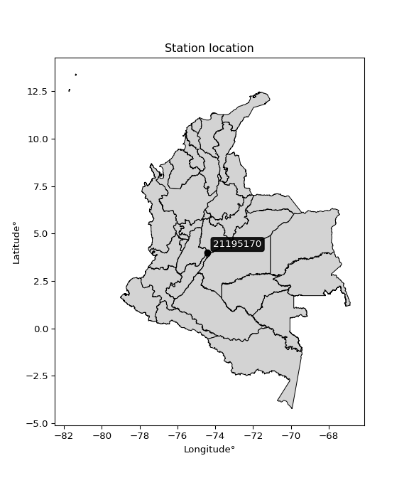</img>

</div>


## A. General information


### 1. General running parameters

• app_version: _v20260103_. • runtime: _2026-01-08 08:31:37.911183_. • Python version: _3.14.0_. • SciPy version: _1.16.3_. • Pandas version: _2.3.3_. • NumPy version: _2.3.5_. • Stations dataset (station_dataset_file): _dataset/pmax24h_in/automatic_test.csv_. • Stations catalog (station_catalog_file): _dataset/CNE.xls_. • Minimum year to eval til year_max (date_min): _1900_. • Maximum year to eval since year_min (date_max): _2024_. • Creates, save and include plots into reports (create_plot): _True_. • Plot only fit distributions with Δo > Δ (plot_only_fit): _True_. • Plot only simple graphs avoiding multiple CDFs and multiple Extreme values plots (plot_only_simple): _False_. • Eval low extreme values, if False, evaluates high extreme values (low_extreme): _False_. • Eval every SciPy distribution as logarithmic (pdist_logarithmic_on): _True_. • Standard deviation normalized (ddof): _1.0_. • Return periods to eval in years (Tr): _[2, 2.33, 5, 10, 15, 20, 25, 50, 75, 100, 200, 250, 500, 750, 1000]_. • Minimum data sample per station, 0 means any (minimum_sample): _5_. • Z-Score maximum threshold to adjust a value, 0 means disable (zscore_max): _3.5_. • Z-Score minimum threshold to adjust a value, 0 means disable (zscore_min): _-2.5_. • Avoid zeros, e.g. rain = 0 (avoid_zeros): _True_. • Avoid null values (avoid_nans): _True_. 

:file_folder:File: [Dataset values](../../dataset/pmax24h_in/automatic_test.csv)

> Delta Degrees of Freedom (DDOF): is a parameter used in the formulas for calculating variance and standard deviation. When ddof=0, the divisor is $N$ (the total number of observations) and this is used when your data set is the entire population. When ddof=1, the divisor is $N-1$ and this is used when your data set is a sample drawn from a larger population. Using $N-1$ provides an unbiased estimate of the population variance (known as Bessel´s correction).


### 2. Station info and location

|   id |   CODIGO | NOMBRE             | CATEGORIA               | TECNOLOGIA                | ESTADO   | FECHA_INSTALACION   |   FECHA_SUSPENSION |   ALTITUD |   LATITUD |   LONGITUD | DEPARTAMENTO   | MUNICIPIO   | AREA_OPERATIVA                            | ENTIDAD                                                     | AREA_HIDROGRAFICA   | ZONA_HIDROGRAFICA   | SUBZONA_HIDROGRAFICA   |   CORRIENTE | Catalogo   |   Version |
|-----:|---------:|:-------------------|:------------------------|:--------------------------|:---------|:--------------------|-------------------:|----------:|----------:|-----------:|:---------------|:------------|:------------------------------------------|:------------------------------------------------------------|:--------------------|:--------------------|:-----------------------|------------:|:-----------|----------:|
|    0 | 21195170 | PAQUILO [21195170] | Climatológica Principal | Automática con Telemetría | Activa   | 23/07/2005          |                nan |      2957 |   3.99361 |   -74.3981 | Cundinamarca   | Cabrera     | Area Operativa 11 - Cundinamarca-Amazonas | INSTITUTO DE HIDROLOGIA METEOROLOGIA Y ESTUDIOS AMBIENTALES | Magdalena Cauca     | Alto Magdalena      | Río Sumapaz            |         nan | CNE_IDEAM  |  20251226 |

<div align="center">

Dynamic map: [:earth_americas:Google](http://maps.google.com/maps?q=3.993611,-74.398056) [:earth_americas:OSM](https://www.openstreetmap.org/#map=18/3.993611/-74.398056&layers=P) [:earth_americas:Bing](https://www.bing.com/maps?cp=3.993611~-74.398056&lvl=18) [:earth_americas:Apple](https://maps.apple.com/frame?center=3.993611%2C-74.398056&span=0.003%2C0.006)

</div>


<div align="center">

```geojson
{
  "type": "Feature",
  "geometry": {
    "type": "Point", 
    "coordinates": [-74.398056, 3.993611]
  }, 
  "properties": {
    "Name": "21195170"
  }
}
```

</div>


### 3. Discrete values table and plot

<div align="center">

|               |          0 |           1 |          2 |            3 |             4 |           5 |          6 |           7 |          8 |          9 |          10 |         11 |          12 |          13 |           14 |        15 |          16 |          17 |          18 |         19 |
|:--------------|-----------:|------------:|-----------:|-------------:|--------------:|------------:|-----------:|------------:|-----------:|-----------:|------------:|-----------:|------------:|------------:|-------------:|----------:|------------:|------------:|------------:|-----------:|
| Date          | 2005       | 2006        | 2007       | 2008         | 2009          | 2010        | 2011       | 2012        | 2013       | 2014       | 2015        | 2016       | 2017        | 2018        | 2019         | 2020      | 2021        | 2022        | 2023        | 2024       |
| Value         |   33.615   |   26.8      |   26.9     |   32.6       |   33.6        |   44.6      |   52.4     |   39.3      |   48.5     |   40.3     |   22.9      |   48       |   31.1      |   28.7      |   34.7       |   29.5    |   30.7      |   22.4      |   30.4      |   48.6     |
| Value_initial |    0.3     |   26.8      |   26.9     |   32.6       |   33.6        |   44.6      |   52.4     |   39.3      |   48.5     |   40.3     |   22.9      |   48       |   31.1      |   28.7      |   34.7       |   29.5    |   30.7      |   22.4      |   30.4      |   48.6     |
| count         |   20       |   20        |   20       |   20         |   20          |   20        |   20       |   20        |   20       |   20       |   20        |   20       |   20        |   20        |   20         |   20      |   20        |   20        |   20        |   20       |
| mean          |   33.615   |   33.615    |   33.615   |   33.615     |   33.615      |   33.615    |   33.615   |   33.615    |   33.615   |   33.615   |   33.615    |   33.615   |   33.615    |   33.615    |   33.615     |   33.615  |   33.615    |   33.615    |   33.615    |   33.615   |
| std           |   11.9518  |   11.9518   |   11.9518  |   11.9518    |   11.9518     |   11.9518   |   11.9518  |   11.9518   |   11.9518  |   11.9518  |   11.9518   |   11.9518  |   11.9518   |   11.9518   |   11.9518    |   11.9518 |   11.9518   |   11.9518   |   11.9518   |   11.9518  |
| zscore        |   -2.78745 |   -0.570207 |   -0.56184 |   -0.0849244 |   -0.00125504 |    0.919108 |    1.57173 |    0.475661 |    1.24542 |    0.55933 |   -0.896518 |    1.20358 |   -0.210429 |   -0.411235 |    0.0907813 |   -0.3443 |   -0.243896 |   -0.938352 |   -0.268997 |    1.25379 |


</div>


<div align="center">

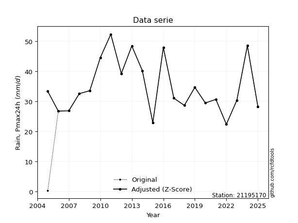</img>

</div>


> The initial value (value_initial) correspond to the initial obtained or null completed value, and value (value) is adjusted only when the initial value is outside the valid range (outlier) definite through the Z-Score value. If Z-Score is active, values out of range or outliers are replaced with the station mean value. A Z-Score (or standard score) measures how many standard deviations a data point is from the mean of a dataset, indicating its relative position; positive scores mean above the mean, negative mean below, and a score of zero is exactly at the mean, allowing for comparison of values from different distributions. It´s calculated using the formula $z=(x–μ)/σ$, where $x$ is the data point, $μ$ is the mean, and $σ$ is the standard deviation, helping identify outliers and understand probability.
>
> <sub>**Note**: In this study, "completing" (filling gaps in) and "extending" (forecasting or lengthening the historical record) rainfall data series are avoided for certain critical analyses because they introduce artificial bias and uncertainty, which can distort the statistics of rare events (extremes), alter day-to-day variability, and compromise the integrity and homogeneity of the original data. Some reasons against Completing/Extending rainfall data are: **Distortion of Extremes and Variability**: The primary issue is that most gap-filling or extension methods rely on averaging or regression with nearby stations, which inherently smooths the data. Rainfall is highly variable in space and time, with a large percentage of zero values and occasional large storms. Infilling methods often underestimate the highest values and overestimate the lowest (zero) values, which severely distorts analyses focused on flood frequency, drought severity, and intensity-duration-frequency (IDF) curves, **Loss of Data Homogeneity**: Infilled or extended data are synthetic estimates, not actual measurements. Combining these estimates with observed data can violate the assumption of data homogeneity, which requires that the data properties do not change over time. Inhomogeneity can lead to incorrect conclusions about long-term trends or changes in climate patterns, **Propagation of Errors**: Errors and biases from the original data (e.g., wind-induced undercatch, instrument errors, site changes) or the data used for imputation can propagate through the analysis, leading to unreliable hydrological models and inaccurate predictions, **Compromised Statistical Integrity**: For statistical analyses, especially those involving the frequency of events, using artificial data can introduce time bias or autocorrelation that doesn´t exist in reality, making it difficult to assess the true probability of events, **Difficulty in Validation**: It is difficult to accurately validate the quality of filled or extended data, especially for past periods where ground-truth measurements are unavailable. The reliability of imputation techniques heavily depends on the density of the surrounding station network and the complexity of the local topography.</sub>


### 4. Active continuous probability distributions from SciPy (44 of 104 available)

A Probability Density Function (PDF) describes the relative likelihood of a continuous random variable falling within a specific range, where the total area under its curve equals 1, and the area over any interval gives the actual probability for that range. Unlike discrete probabilities (like rolling a die), a PDF shows density, not direct probability for a single point (which is zero), with higher points indicating higher likelihood, often visualized as a bell curve for normal distributions.

A log of a probability density function (log-PDF) is simply the logarithm of the PDF´s value, denoted as $log(f(x))$, useful for converting multiplication of probabilities into addition, improving numerical stability with tiny numbers, and connecting to information theory concepts like entropy. Instead of dealing with very small probabilities (e.g., 0.000001), log-PDFs use negative numbers (e.g., $log(0.00001) ≈ -11.51$ that are easier for computers to handle, preventing underflow errors and simplifying complex calculations. In this study, each active probability distribution from SciPy is also evaluated in the $log$ form.

[scipy.stats](https://docs.scipy.org/doc/scipy/reference/stats.html) is a Python´s powerful submodule within the SciPy library for comprehensive statistical analysis, offering over 130 probability distributions (like Normal, Poisson), functions for descriptive stats (mean, variance), hypothesis testing (t-tests, chi-square), random variable generation, and statistical tests, making it essential for data science, modeling, and research. It provides tools to explore, model, and draw conclusions from data efficiently, working seamlessly with NumPy.

<div align="center">

|   id | p_dist             |   n_parameter | fit_method   | label                                                                       | active   | ref                                                                                                        |
|-----:|:-------------------|--------------:|:-------------|:----------------------------------------------------------------------------|:---------|:-----------------------------------------------------------------------------------------------------------|
|    0 | alpha              |             3 | MLE          | Alpha                                                                       | True     | [:mortar_board:](https://docs.scipy.org/doc/scipy/reference/generated/scipy.stats.alpha.html)              |
|    1 | betaprime          |             4 | MLE          | Beta prime                                                                  | True     | [:mortar_board:](https://docs.scipy.org/doc/scipy/reference/generated/scipy.stats.betaprime.html)          |
|    2 | chi2               |             3 | MLE          | Chi²                                                                        | True     | [:mortar_board:](https://docs.scipy.org/doc/scipy/reference/generated/scipy.stats.chi2.html)               |
|    3 | crystalball        |             4 | MLE          | Crystalball                                                                 | True     | [:mortar_board:](https://docs.scipy.org/doc/scipy/reference/generated/scipy.stats.crystalball.html)        |
|    4 | erlang             |             3 | MLE          | Erlang                                                                      | True     | [:mortar_board:](https://docs.scipy.org/doc/scipy/reference/generated/scipy.stats.erlang.html)             |
|    5 | expon              |             2 | MLE          | Exponential                                                                 | True     | [:mortar_board:](https://docs.scipy.org/doc/scipy/reference/generated/scipy.stats.expon.html)              |
|    6 | exponnorm          |             3 | MLE          | Exponentially modified Normal                                               | True     | [:mortar_board:](https://docs.scipy.org/doc/scipy/reference/generated/scipy.stats.exponnorm.html)          |
|    7 | f                  |             4 | MLE          | F                                                                           | True     | [:mortar_board:](https://docs.scipy.org/doc/scipy/reference/generated/scipy.stats.f.html)                  |
|    8 | fatiguelife        |             3 | MLE          | Fatigue-life (Birnbaum-Saunders)                                            | True     | [:mortar_board:](https://docs.scipy.org/doc/scipy/reference/generated/scipy.stats.fatiguelife.html)        |
|    9 | fisk               |             3 | MLE          | Fisk                                                                        | True     | [:mortar_board:](https://docs.scipy.org/doc/scipy/reference/generated/scipy.stats.fisk.html)               |
|   10 | gamma              |             3 | MLE          | Gamma                                                                       | True     | [:mortar_board:](https://docs.scipy.org/doc/scipy/reference/generated/scipy.stats.gamma.html)              |
|   11 | genexpon           |             5 | MLE          | Generalized exponential                                                     | True     | [:mortar_board:](https://docs.scipy.org/doc/scipy/reference/generated/scipy.stats.genexpon.html)           |
|   12 | genlogistic        |             3 | MLE          | Generalized logistic                                                        | True     | [:mortar_board:](https://docs.scipy.org/doc/scipy/reference/generated/scipy.stats.genlogistic.html)        |
|   13 | gibrat             |             2 | MM           | Gibrat                                                                      | True     | [:mortar_board:](https://docs.scipy.org/doc/scipy/reference/generated/scipy.stats.gibrat.html)             |
|   14 | gompertz           |             3 | MLE          | Gompertz (or truncated Gumbel)                                              | True     | [:mortar_board:](https://docs.scipy.org/doc/scipy/reference/generated/scipy.stats.gompertz.html)           |
|   15 | gumbel_l           |             2 | MM           | Gumbel Left Skew                                                            | True     | [:mortar_board:](https://docs.scipy.org/doc/scipy/reference/generated/scipy.stats.gumbel_l.html)           |
|   16 | gumbel_r           |             2 | MM           | Gumbel Right Skew                                                           | True     | [:mortar_board:](https://docs.scipy.org/doc/scipy/reference/generated/scipy.stats.gumbel_r.html)           |
|   17 | halflogistic       |             2 | MM           | Half-logistic                                                               | True     | [:mortar_board:](https://docs.scipy.org/doc/scipy/reference/generated/scipy.stats.halflogistic.html)       |
|   18 | halfnorm           |             2 | MM           | Half Normal                                                                 | True     | [:mortar_board:](https://docs.scipy.org/doc/scipy/reference/generated/scipy.stats.halfnorm.html)           |
|   19 | hypsecant          |             2 | MM           | hyperbolic secant                                                           | True     | [:mortar_board:](https://docs.scipy.org/doc/scipy/reference/generated/scipy.stats.hypsecant.html)          |
|   20 | invgamma           |             3 | MLE          | Inverted gamma                                                              | True     | [:mortar_board:](https://docs.scipy.org/doc/scipy/reference/generated/scipy.stats.invgamma.html)           |
|   21 | invgauss           |             3 | MLE          | Inverse Gaussian                                                            | True     | [:mortar_board:](https://docs.scipy.org/doc/scipy/reference/generated/scipy.stats.invgauss.html)           |
|   22 | invweibull         |             3 | MLE          | Inverted Weibull                                                            | True     | [:mortar_board:](https://docs.scipy.org/doc/scipy/reference/generated/scipy.stats.invweibull.html)         |
|   23 | johnsonsu          |             4 | MLE          | Johnson Su                                                                  | True     | [:mortar_board:](https://docs.scipy.org/doc/scipy/reference/generated/scipy.stats.johnsonsu.html)          |
|   24 | kstwobign          |             2 | MLE          | Limiting distribution of scaled Kolmogorov-Smirnov two-sided test statistic | True     | [:mortar_board:](https://docs.scipy.org/doc/scipy/reference/generated/scipy.stats.kstwobign.html)          |
|   25 | laplace            |             2 | MM           | Laplace                                                                     | True     | [:mortar_board:](https://docs.scipy.org/doc/scipy/reference/generated/scipy.stats.laplace.html)            |
|   26 | laplace_asymmetric |             3 | MLE          | Asymmetric Laplace                                                          | True     | [:mortar_board:](https://docs.scipy.org/doc/scipy/reference/generated/scipy.stats.laplace_asymmetric.html) |
|   27 | loggamma           |             3 | MLE          | Log gamma                                                                   | True     | [:mortar_board:](https://docs.scipy.org/doc/scipy/reference/generated/scipy.stats.loggamma.html)           |
|   28 | logistic           |             2 | MM           | Logistic (or Sech-squared)                                                  | True     | [:mortar_board:](https://docs.scipy.org/doc/scipy/reference/generated/scipy.stats.logistic.html)           |
|   29 | lognorm            |             3 | MLE          | Log Normal                                                                  | True     | [:mortar_board:](https://docs.scipy.org/doc/scipy/reference/generated/scipy.stats.lognorm.html)            |
|   30 | maxwell            |             2 | MM           | Maxwell                                                                     | True     | [:mortar_board:](https://docs.scipy.org/doc/scipy/reference/generated/scipy.stats.maxwell.html)            |
|   31 | mielke             |             4 | MLE          | Mielke Beta-Kappa / Dagum                                                   | True     | [:mortar_board:](https://docs.scipy.org/doc/scipy/reference/generated/scipy.stats.mielke.html)             |
|   32 | moyal              |             2 | MM           | Moyal                                                                       | True     | [:mortar_board:](https://docs.scipy.org/doc/scipy/reference/generated/scipy.stats.moyal.html)              |
|   33 | nakagami           |             3 | MLE          | Nakagami                                                                    | True     | [:mortar_board:](https://docs.scipy.org/doc/scipy/reference/generated/scipy.stats.nakagami.html)           |
|   34 | ncf                |             5 | MLE          | Non-central F distribution                                                  | True     | [:mortar_board:](https://docs.scipy.org/doc/scipy/reference/generated/scipy.stats.ncf.html)                |
|   35 | nct                |             4 | MLE          | Non-central Student’s t                                                     | True     | [:mortar_board:](https://docs.scipy.org/doc/scipy/reference/generated/scipy.stats.nct.html)                |
|   36 | norm               |             2 | MM           | Normal                                                                      | True     | [:mortar_board:](https://docs.scipy.org/doc/scipy/reference/generated/scipy.stats.norm.html)               |
|   37 | pearson3           |             3 | MM           | Pearson type III                                                            | True     | [:mortar_board:](https://docs.scipy.org/doc/scipy/reference/generated/scipy.stats.pearson3.html)           |
|   38 | rayleigh           |             2 | MM           | Rayleigh                                                                    | True     | [:mortar_board:](https://docs.scipy.org/doc/scipy/reference/generated/scipy.stats.rayleigh.html)           |
|   39 | rice               |             3 | MLE          | Rice                                                                        | True     | [:mortar_board:](https://docs.scipy.org/doc/scipy/reference/generated/scipy.stats.rice.html)               |
|   40 | t                  |             3 | MLE          | Student’s t                                                                 | True     | [:mortar_board:](https://docs.scipy.org/doc/scipy/reference/generated/scipy.stats.t.html)                  |
|   41 | truncnorm          |             4 | MLE          | Truncated normal                                                            | True     | [:mortar_board:](https://docs.scipy.org/doc/scipy/reference/generated/scipy.stats.truncnorm.html)          |
|   42 | wald               |             2 | MM           | Wald                                                                        | True     | [:mortar_board:](https://docs.scipy.org/doc/scipy/reference/generated/scipy.stats.wald.html)               |
|   43 | weibull_min        |             3 | MLE          | Weibull minimum                                                             | True     | [:mortar_board:](https://docs.scipy.org/doc/scipy/reference/generated/scipy.stats.weibull_min.html)        |

</div>

> **n_parameter:** # arguments & localization & scale.
>
> **Fit methods:** (MLE) maximum likelihood, (MM) L-moments.
>
>**Inactive** (With the only purpose of prevent loops, zero divisions, infinite values, over high estimated values or horizontal trending for recurrence intervals estimations, the follow distributions were disabled.)**:** foldnorm, gennorm, norminvgauss, powernorm, powerlognorm, skewnorm, genextreme, anglit, arcsine, argus, beta, bradford, burr, burr12, cauchy, cosine, halfcauchy, foldcauchy, skewcauchy, wrapcauchy, dgamma, gengamma, exponweib, exponpow, truncexpon, gausshyper, genhalflogistic, genhyperbolic, geninvgauss, halfgennorm, johnsonsb, kappa4, kappa3, ksone, kstwo, loglaplace, levy, levy_l, levy_stable, ncx2, pareto, genpareto, truncpareto, lomax, powerlaw, rdist, rel_breitwigner, recipinvgauss, semicircular, studentized_range, trapezoid, triang, truncweibull_min, tukeylambda, uniform, loguniform, vonmises, vonmises_line, weibull_max, dweibull, 


## B. Probability (PDF) vs. Empirical (EDF) distributions functions

A continuous probability distribution (CPD) describes probabilities for variables that can take any value within a range (like rain any time), unlike discrete variables with specific outcomes (like temperature). It uses a Probability Density Function (PDF), a curve where the total area under it equals 1, and the probability of the variable falling within an interval (a to b) is found by calculating the area under the curve between those points. A key feature is that the probability of hitting any single exact value is zero, so probabilities are always expressed for ranges, e.g., $P(a ≤ X ≤ b)$.

<div align="center">

Distributions parameters from station values
|    |   station | p_dist                |   n |             loc |            scale | shape                 | shape1              | shape2                | shape3   |
|---:|----------:|:----------------------|----:|----------------:|-----------------:|:----------------------|:--------------------|:----------------------|:---------|
|  0 |  21195170 | alpha                 |  20 |   -14.6024      |    286.909       | 5.925555315632836     |                     |                       |          |
|  1 |  21195170 | betaprime             |  20 |    -0.401753    |     18.4795      | 48.85111449000806     | 26.29316934815425   |                       |          |
|  2 |  21195170 | chi2                  |  20 |    19.9201      |      2.90353     | 5.290334284826914     |                     |                       |          |
|  3 |  21195170 | crystalball           |  20 |    35.2808      |      8.79966     | 2016.2590605552027    | 5818.716089830539   |                       |          |
|  4 |  21195170 | erlang                |  20 |    19.9202      |      5.80708     | 2.6451492305885385    |                     |                       |          |
|  5 |  21195170 | expon                 |  20 |    22.4         |     12.8807      |                       |                     |                       |          |
|  6 |  21195170 | exponnorm             |  20 |    25.9816      |      3.57579     | 2.600581868712416     |                     |                       |          |
|  7 |  21195170 | f                     |  20 |     4.77382     |     28.2229      | 580.6429641381081     | 26.252079154501097  |                       |          |
|  8 |  21195170 | fatiguelife           |  20 |    12.9765      |     20.5666      | 0.41086071842268      |                     |                       |          |
|  9 |  21195170 | fisk                  |  20 |    16.0105      |     17.4172      | 3.5309459807771706    |                     |                       |          |
| 10 |  21195170 | gamma                 |  20 |    19.9201      |      5.80705     | 2.6451637969036668    |                     |                       |          |
| 11 |  21195170 | genexpon              |  20 |    22.4         |      2.32405     | 0.15527604705344433   | 0.02814212841991614 | 1.5617033801145737    |          |
| 12 |  21195170 | genlogistic           |  20 |   -13.311       |      7.0891      | 527.5274695105966     |                     |                       |          |
| 13 |  21195170 | gibrat                |  20 |    28.5678      |      4.07165     |                       |                     |                       |          |
| 14 |  21195170 | gompertz              |  20 |    26.8         |      1.96967     | 2.892281019198008e-05 |                     |                       |          |
| 15 |  21195170 | gumbel_l              |  20 |    39.2411      |      6.86107     |                       |                     |                       |          |
| 16 |  21195170 | gumbel_r              |  20 |    31.3204      |      6.86107     |                       |                     |                       |          |
| 17 |  21195170 | halflogistic          |  20 |    24.8511      |      7.52338     |                       |                     |                       |          |
| 18 |  21195170 | halfnorm              |  20 |    23.6334      |     14.5978      |                       |                     |                       |          |
| 19 |  21195170 | hypsecant             |  20 |    35.2807      |      5.60204     |                       |                     |                       |          |
| 20 |  21195170 | invgamma              |  20 |     4.16927     |    377.101       | 13.1036493009435      |                     |                       |          |
| 21 |  21195170 | invgauss              |  20 |    12.2381      |    142.155       | 0.16209536612996162   |                     |                       |          |
| 22 |  21195170 | invweibull            |  20 |    -2.28177e+08 |      2.28177e+08 | 32172605.37152327     |                     |                       |          |
| 23 |  21195170 | johnsonsu             |  20 |     2.83482e+08 |      5.76192e+08 | 34756572.094290584    | 73320314.55213374   |                       |          |
| 24 |  21195170 | kstwobign             |  20 |     6.04271     |     33.5428      |                       |                     |                       |          |
| 25 |  21195170 | laplace               |  20 |    35.2807      |      6.2223      |                       |                     |                       |          |
| 26 |  21195170 | laplace_asymmetric    |  20 |    29.5         |      5.75651     | 0.6160598561940525    |                     |                       |          |
| 27 |  21195170 | loggamma              |  20 | -2038.34        |    296.509       | 1089.841721750423     |                     |                       |          |
| 28 |  21195170 | logistic              |  20 |    35.2807      |      4.85151     |                       |                     |                       |          |
| 29 |  21195170 | lognorm               |  20 |    12.3557      |     21.2687      | 0.3918434945239643    |                     |                       |          |
| 30 |  21195170 | maxwell               |  20 |    14.4292      |     13.0667      |                       |                     |                       |          |
| 31 |  21195170 | mielke                |  20 |    -8.08771     |     30.2086      | 35.322430208081826    | 6.426217266366159   |                       |          |
| 32 |  21195170 | moyal                 |  20 |    30.2485      |      3.96124     |                       |                     |                       |          |
| 33 |  21195170 | nakagami              |  20 |    22.4         |     15.7296      | 0.3253682127780244    |                     |                       |          |
| 34 |  21195170 | ncf                   |  20 |    10.2093      |     23.8865      | 25.960459111128216    | 43.17248602008617   | 0.006230448829034809  |          |
| 35 |  21195170 | nct                   |  20 |    -0.263329    |      1.18921     | 9.302782454616287     | 27.45468479093898   |                       |          |
| 36 |  21195170 | norm                  |  20 |    35.2807      |      8.79966     |                       |                     |                       |          |
| 37 |  21195170 | pearson3              |  20 |    35.2808      |      8.79965     | 0.49330190279264646   |                     |                       |          |
| 38 |  21195170 | rayleigh              |  20 |    18.4465      |     13.4318      |                       |                     |                       |          |
| 39 |  21195170 | rice                  |  20 |    19.4579      |     12.5937      | 0.2584507428300107    |                     |                       |          |
| 40 |  21195170 | t                     |  20 |    35.2815      |      8.79969     | 10000692.559554389    |                     |                       |          |
| 41 |  21195170 | truncnorm             |  20 |    35.2808      |      8.79966     | -108.71845952814499   | 71.98124738836334   |                       |          |
| 42 |  21195170 | wald                  |  20 |    26.4811      |      8.79968     |                       |                     |                       |          |
| 43 |  21195170 | weibull_min           |  20 |    21.4077      |     15.3717      | 1.5535401497206065    |                     |                       |          |
| 44 |  21195170 | logalpha              |  20 |    -1.5705      |    106.205       | 20.858606851137708    |                     |                       |          |
| 45 |  21195170 | logbetaprime          |  20 |    -3.59558     |    374.344       | 531.8460728743144     | 27956.564188011824  |                       |          |
| 46 |  21195170 | logchi2               |  20 |     3.10906     |      0.987916    | 1.0443819230421771    |                     |                       |          |
| 47 |  21195170 | logcrystalball        |  20 |     3.53295     |      0.245614    | 28.85906074339585     | 26.722008181185934  |                       |          |
| 48 |  21195170 | logerlang             |  20 |     1.81449     |      0.0349191   | 49.182386316444905    |                     |                       |          |
| 49 |  21195170 | logexpon              |  20 |     3.10906     |      0.423893    |                       |                     |                       |          |
| 50 |  21195170 | logexponnorm          |  20 |     3.49563     |      0.242765    | 0.15375304134720552   |                     |                       |          |
| 51 |  21195170 | logf                  |  20 |     0.89441     |      2.62302     | 725.8858635761314     | 339.26087862671017  |                       |          |
| 52 |  21195170 | logfatiguelife        |  20 |     1.51863     |      1.99933     | 0.12248041021487827   |                     |                       |          |
| 53 |  21195170 | logfisk               |  20 |     2.18096     |      1.33094     | 9.210147268784254     |                     |                       |          |
| 54 |  21195170 | loggamma              |  20 |     2.02833     |      0.0406723   | 36.99774092788314     |                     |                       |          |
| 55 |  21195170 | loggenexpon           |  20 |     3.10905     |     98.8596      | 169.61793601364786    | 212.0463406677469   | 117.82710360161553    |          |
| 56 |  21195170 | loggenlogistic        |  20 |     3.21666     |      0.188904    | 3.5340652725356927    |                     |                       |          |
| 57 |  21195170 | loggibrat             |  20 |     3.3456      |      0.113635    |                       |                     |                       |          |
| 58 |  21195170 | loggompertz           |  20 |     3.10903     |      0.341579    | 0.2882077623043309    |                     |                       |          |
| 59 |  21195170 | loggumbel_l           |  20 |     3.64349     |      0.191505    |                       |                     |                       |          |
| 60 |  21195170 | loggumbel_r           |  20 |     3.42241     |      0.191505    |                       |                     |                       |          |
| 61 |  21195170 | loghalflogistic       |  20 |     3.24187     |      0.209971    |                       |                     |                       |          |
| 62 |  21195170 | loghalfnorm           |  20 |     3.20788     |      0.407416    |                       |                     |                       |          |
| 63 |  21195170 | loghypsecant          |  20 |     3.53295     |      0.156363    |                       |                     |                       |          |
| 64 |  21195170 | loginvgamma           |  20 |     0.634248    |    402.847       | 140.00172414271475    |                     |                       |          |
| 65 |  21195170 | loginvgauss           |  20 |     2.08155     |     48.6399      | 0.029833464314953956  |                     |                       |          |
| 66 |  21195170 | loginvweibull         |  20 |    -1.01906e+07 |      1.01906e+07 | 46168769.27836411     |                     |                       |          |
| 67 |  21195170 | logjohnsonsu          |  20 |     6.03869e+06 | 106260           | 116277163.45217592    | 24565894.34112308   |                       |          |
| 68 |  21195170 | logkstwobign          |  20 |     2.62732     |      1.03772     |                       |                     |                       |          |
| 69 |  21195170 | loglaplace            |  20 |     3.53295     |      0.173676    |                       |                     |                       |          |
| 70 |  21195170 | loglaplace_asymmetric |  20 |     3.42426     |      0.18487     | 0.7483164373146286    |                     |                       |          |
| 71 |  21195170 | logloggamma           |  20 |   -53.5887      |      8.1629      | 1094.646178986421     |                     |                       |          |
| 72 |  21195170 | loglogistic           |  20 |     3.53295     |      0.135414    |                       |                     |                       |          |
| 73 |  21195170 | loglognorm            |  20 |     1.33407     |      2.18519     | 0.11190985745009173   |                     |                       |          |
| 74 |  21195170 | logmaxwell            |  20 |     2.95095     |      0.364716    |                       |                     |                       |          |
| 75 |  21195170 | logmielke             |  20 |    -1.16408e+07 |      1.16408e+07 | 178882280.51534492    | 63913121.95977372   |                       |          |
| 76 |  21195170 | logmoyal              |  20 |     3.3925      |      0.110565    |                       |                     |                       |          |
| 77 |  21195170 | lognakagami           |  20 |     3.03338     |      0.556685    | 1.0387818590698474    |                     |                       |          |
| 78 |  21195170 | logncf                |  20 |    -3.49234     |      7.02195     | 545.0463577838696     | 907.1509573708629   | 2.638795667698202e-05 |          |
| 79 |  21195170 | lognct                |  20 |    -0.451422    |      0.0638178   | 142.52476726361215    | 62.104694606209364  |                       |          |
| 80 |  21195170 | lognorm               |  20 |     3.53295     |      0.245614    |                       |                     |                       |          |
| 81 |  21195170 | logpearson3           |  20 |     3.53295     |      0.245614    | 0.1508585383648952    |                     |                       |          |
| 82 |  21195170 | lograyleigh           |  20 |     3.06308     |      0.374906    |                       |                     |                       |          |
| 83 |  21195170 | logrice               |  20 |     3.02072     |      0.292336    | 1.3326881059410423    |                     |                       |          |
| 84 |  21195170 | logt                  |  20 |     3.53295     |      0.245614    | 265543644436.99277    |                     |                       |          |
| 85 |  21195170 | logtruncnorm          |  20 |    -0.0969232   |      1.44388     | 2.220369050813893     | 2.808979647303084   |                       |          |
| 86 |  21195170 | logwald               |  20 |     3.28729     |      0.245655    |                       |                     |                       |          |
| 87 |  21195170 | logweibull_min        |  20 |     2.98504     |      0.618472    | 2.3986008125958733    |                     |                       |          |

</div>

> **loc** (Location parameter): This shifts the distribution along the x-axis. For many common distributions, like the normal (Gaussian) distribution, loc represents the mean $μ$. For others, like the uniform distribution, it might represent the minimum value, or for the beta distribution, the left end of the support interval.
>
> **scale** (Scale parameter): This determines the width or spread of the distribution. For the normal distribution, scale represents the standard deviation $σ$. For a uniform distribution, it defines the length of the interval (from $loc$ to $loc + scale$).
>
> **shape** (Shape parameters): Refers to parameters that define the specific form of a probability distribution, distinct from its location (loc) and scale (scale). These parameters are required arguments for most distribution functions. For example, a normal (Gaussian) distribution is fully defined by its location (mean) and scale (standard deviation), so it has no specific shape parameters beyond loc and scale. However, other distributions have intrinsic properties that need specification, as Gamma distribution that takes a shape parameter, often named $a$ or $alpha$.


### 0. Cumulative distribution values - CDF (88 evaluated)

Cumulative Distribution Function (CDF), denoted as $F$<sub>$X$</sub>$(x)$, is a function that gives the probability that a random variable $X$ will take a value less than or equal to a specific value, $x$ (i.e., $(P(X≥x)$. It essentially "accumulates" probabilities from a given point up to the far right (positive infinity), providing a complete picture of the distribution´s probabilities for both discrete (like rain) and continuous (like temperature) variables, helping to find probabilities over ranges or above certain values. Each station is evaluated separately ordering the $x$ values ascending, calculating the CDF and PDF values for the activated distributions and their logarithmic forms.

<div align="center">

CDF ordered by x ascending and calculating $log(f(x))$ separately
|   id |   Station |   date |      x |   count |   mean |     std |      zscore |   Value_initial |   station |   m |     alpha |   alpha_pdf |   betaprime |   betaprime_pdf |      chi2 |   chi2_pdf |   crystalball |   crystalball_pdf |    erlang |   erlang_pdf |     expon |   expon_pdf |   exponnorm |   exponnorm_pdf |         f |      f_pdf |   fatiguelife |   fatiguelife_pdf |      fisk |   fisk_pdf |     gamma |   gamma_pdf |    genexpon |   genexpon_pdf |   genlogistic |   genlogistic_pdf |      gibrat |   gibrat_pdf |    gompertz |   gompertz_pdf |   gumbel_l |   gumbel_l_pdf |   gumbel_r |   gumbel_r_pdf |   halflogistic |   halflogistic_pdf |   halfnorm |   halfnorm_pdf |   hypsecant |   hypsecant_pdf |   invgamma |   invgamma_pdf |   invgauss |   invgauss_pdf |   invweibull |   invweibull_pdf |   johnsonsu |   johnsonsu_pdf |   kstwobign |   kstwobign_pdf |   laplace |   laplace_pdf |   laplace_asymmetric |   laplace_asymmetric_pdf |   loggamma |   loggamma_pdf |   logistic |   logistic_pdf |   lognorm |   lognorm_pdf |   maxwell |   maxwell_pdf |    mielke |   mielke_pdf |      moyal |   moyal_pdf |    nakagami |   nakagami_pdf |       ncf |    ncf_pdf |       nct |    nct_pdf |      norm |   norm_pdf |   pearson3 |   pearson3_pdf |   rayleigh |   rayleigh_pdf |      rice |   rice_pdf |         t |      t_pdf |   truncnorm |   truncnorm_pdf |        wald |    wald_pdf |   weibull_min |   weibull_min_pdf |   logalpha |   logalpha_pdf |   logbetaprime |   logbetaprime_pdf |    logchi2 |   logchi2_pdf |   logcrystalball |   logcrystalball_pdf |   logerlang |   logerlang_pdf |   logexpon |   logexpon_pdf |   logexponnorm |   logexponnorm_pdf |      logf |   logf_pdf |   logfatiguelife |   logfatiguelife_pdf |   logfisk |   logfisk_pdf |   loggenexpon |   loggenexpon_pdf |   loggenlogistic |   loggenlogistic_pdf |   loggibrat |   loggibrat_pdf |   loggompertz |   loggompertz_pdf |   loggumbel_l |   loggumbel_l_pdf |   loggumbel_r |   loggumbel_r_pdf |   loghalflogistic |   loghalflogistic_pdf |   loghalfnorm |   loghalfnorm_pdf |   loghypsecant |   loghypsecant_pdf |   loginvgamma |   loginvgamma_pdf |   loginvgauss |   loginvgauss_pdf |   loginvweibull |   loginvweibull_pdf |   logjohnsonsu |   logjohnsonsu_pdf |   logkstwobign |   logkstwobign_pdf |   loglaplace |   loglaplace_pdf |   loglaplace_asymmetric |   loglaplace_asymmetric_pdf |   logloggamma |   logloggamma_pdf |   loglogistic |   loglogistic_pdf |   loglognorm |   loglognorm_pdf |   logmaxwell |   logmaxwell_pdf |   logmielke |   logmielke_pdf |    logmoyal |   logmoyal_pdf |   lognakagami |   lognakagami_pdf |   logncf |   logncf_pdf |    lognct |   lognct_pdf |   logpearson3 |   logpearson3_pdf |   lograyleigh |   lograyleigh_pdf |   logrice |   logrice_pdf |      logt |   logt_pdf |   logtruncnorm |   logtruncnorm_pdf |     logwald |   logwald_pdf |   logweibull_min |   logweibull_min_pdf |
|-----:|----------:|-------:|-------:|--------:|-------:|--------:|------------:|----------------:|----------:|----:|----------:|------------:|------------:|----------------:|----------:|-----------:|--------------:|------------------:|----------:|-------------:|----------:|------------:|------------:|----------------:|----------:|-----------:|--------------:|------------------:|----------:|-----------:|----------:|------------:|------------:|---------------:|--------------:|------------------:|------------:|-------------:|------------:|---------------:|-----------:|---------------:|-----------:|---------------:|---------------:|-------------------:|-----------:|---------------:|------------:|----------------:|-----------:|---------------:|-----------:|---------------:|-------------:|-----------------:|------------:|----------------:|------------:|----------------:|----------:|--------------:|---------------------:|-------------------------:|-----------:|---------------:|-----------:|---------------:|----------:|--------------:|----------:|--------------:|----------:|-------------:|-----------:|------------:|------------:|---------------:|----------:|-----------:|----------:|-----------:|----------:|-----------:|-----------:|---------------:|-----------:|---------------:|----------:|-----------:|----------:|-----------:|------------:|----------------:|------------:|------------:|--------------:|------------------:|-----------:|---------------:|---------------:|-------------------:|-----------:|--------------:|-----------------:|---------------------:|------------:|----------------:|-----------:|---------------:|---------------:|-------------------:|----------:|-----------:|-----------------:|---------------------:|----------:|--------------:|--------------:|------------------:|-----------------:|---------------------:|------------:|----------------:|--------------:|------------------:|--------------:|------------------:|--------------:|------------------:|------------------:|----------------------:|--------------:|------------------:|---------------:|-------------------:|--------------:|------------------:|--------------:|------------------:|----------------:|--------------------:|---------------:|-------------------:|---------------:|-------------------:|-------------:|-----------------:|------------------------:|----------------------------:|--------------:|------------------:|--------------:|------------------:|-------------:|-----------------:|-------------:|-----------------:|------------:|----------------:|------------:|---------------:|--------------:|------------------:|---------:|-------------:|----------:|-------------:|--------------:|------------------:|--------------:|------------------:|----------:|--------------:|----------:|-----------:|---------------:|-------------------:|------------:|--------------:|-----------------:|---------------------:|
|    0 |  21195170 |   2022 | 22.4   |      20 | 33.615 | 11.9518 | -0.938352   |            22.4 |  21195170 |   1 | 0.033756  |  0.0157174  |   0.0409262 |      0.0163674  | 0.0198187 | 0.0187278  |     0.0716274 |        0.0155301  | 0.0198188 |   0.0187279  | 0         |   0.0776352 |   0.0271416 |       0.0141001 | 0.0302946 | 0.0159093  |     0.0256977 |        0.0166386  | 0.0281731 | 0.0151302  | 0.0198188 |  0.0187279  | 1.71802e-08 |     0.0668127  |     0.032951  |        0.0158116  | 0           |   0          | 0           |    0           |  0.0823131 |     0.0114892  |  0.0254802 |     0.0136289  |       0        |         0          |   0        |     0          |   0.0636587 |      0.0112879  |  0.0302649 |     0.0159034  |  0.0263345 |     0.0165053  |    0.0325514 |       0.0157194  |   0.0706876 |      0.0154463  |   0.0287033 |      0.0164521  | 0.063087  |    0.0101388  |            0.0371561 |               0.0104773  |  0.0320169 |       0.362765 |  0.0656816 |     0.0126492  | 0.0421874 |      0.36633  | 0.0540571 |    0.0188641  | 0.0259931 |   0.0146127  | 0.00708061 |  0.00721905 | 5.11097e-11 |  9361.56       | 0.0354517 | 0.0167358  | 0.0288826 | 0.0156616  | 0.0716274 | 0.0155301  |  0.0542629 |     0.0169277  |  0.0423933 |     0.0209847  | 0.026047  |  0.0174739 | 0.0716157 | 0.0155281  |   0.0716273 |      0.0155301  | 0           | 0           |     0.0140638 |        0.0218623  |  0.0331135 |       0.358062 |       0.08839  |           0.535494 | 7.5965e-09 |    8.9325e+06 |        0.0421873 |             0.366329 |   0.0325652 |        0.359616 |  0         |       2.35909  |      0.0419868 |           0.366125 | 0.0323226 |   0.357904 |        0.0305909 |             0.357315 | 0.0348811 |      0.334075 |   1.14928e-05 |          1.71574  |        0.0273913 |             0.327282 |   0         |        0        |   2.51646e-05 |          0.843804 |     0.0595324 |          0.301424 |    0.00588129 |          0.157731 |          0        |              0        |      0        |          0        |      0.042256  |           0.26945  |     0.0316331 |          0.357574 |     0.0267877 |          0.355508 |       0.0191767 |            0.343531 |      0.0423395 |           0.36704  |      0.017628  |           0.382359 |    0.0435492 |         0.25075  |               0.0367741 |                    0.265822 |     0.0437521 |          0.369091 |     0.0418729 |          0.296273 |    0.0315991 |         0.357588 |    0.0204869 |         0.374268 |   0.0297911 |        0.327337 | 0.000314623 |      0.0197289 |     0.0160378 |          0.436122 | 0.212716 |     0.570665 | 0.0330323 |     0.358367 |     0.0374101 |          0.36474  |    0.00749309 |          0.324693 | 0.0187353 |      0.422979 | 0.0421874 |   0.36633  |    6.84553e-05 |           2.19253  | 0           |   0           |        0.020972  |             0.401307 |
|    1 |  21195170 |   2015 | 22.9   |      20 | 33.615 | 11.9518 | -0.896518   |            22.9 |  21195170 |   2 | 0.0422752 |  0.0183858  |   0.0496887 |      0.0187005  | 0.0303195 | 0.0232448  |     0.0797201 |        0.0168498  | 0.0303197 |   0.0232449  | 0.0380739 |   0.0746794 |   0.0349393 |       0.0171477 | 0.0389815 | 0.0188658  |     0.0348955 |        0.0201744  | 0.0364465 | 0.0179983  | 0.0303197 |  0.0232449  | 0.0337363   |     0.0678976  |     0.0415432 |        0.0185852  | 0           |   0          | 0           |    0           |  0.0882529 |     0.0122778  |  0.0329776 |     0.0163994  |       0        |         0          |   0        |     0          |   0.0695565 |      0.0123177  |  0.0389491 |     0.018861   |  0.03544   |     0.0199398  |    0.0410981 |       0.0184957  |   0.0787398 |      0.0167718  |   0.0377161 |      0.0196202  | 0.0683656 |    0.0109872  |            0.042782  |               0.0120637  |  0.0408254 |       0.436545 |  0.0722964 |     0.0138245  | 0.0509232 |      0.426075 | 0.0639722 |    0.0207982  | 0.0340949 |   0.0178457  | 0.011461   |  0.0104188  | 0.0822913   |     0.107073   | 0.0444934 | 0.01945    | 0.037468  | 0.0187114  | 0.0797201 | 0.0168498  |  0.0631906 |     0.0187938  |  0.0534844 |     0.0233648  | 0.0354804 |  0.0202457 | 0.0797073 | 0.0168477  |   0.07972   |      0.0168498  | 0           | 0           |     0.0263448 |        0.0270612  |  0.0417865 |       0.428958 |       0.100795 |           0.588621 | 0.107427   |    2.52251    |        0.0509231 |             0.426074 |   0.0412847 |        0.43162  |  0.0507462 |       2.23937  |      0.0507203 |           0.426073 | 0.0410063 |   0.430111 |        0.0392941 |             0.432538 | 0.0429509 |      0.398447 |   0.0377742   |          1.70455  |        0.0354588 |             0.405512 |   0         |        0        |   0.0190841   |          0.882983 |     0.066559  |          0.335726 |    0.010288   |          0.245874 |          0        |              0        |      0        |          0        |      0.0486403 |           0.309864 |     0.0403236 |          0.431098 |     0.0355401 |          0.439007 |       0.0279392 |            0.452865 |      0.0510909 |           0.426775 |      0.0275324 |           0.517394 |    0.0494519 |         0.284737 |               0.0431365 |                    0.311813 |     0.0525366 |          0.427684 |     0.0489244 |          0.343618 |    0.0402888 |         0.431003 |    0.029822  |         0.472623 |   0.0378078 |        0.400707 | 0.00111164  |      0.0578019 |     0.0271179 |          0.567303 | 0.22551  |     0.588368 | 0.0417141 |     0.429454 |     0.0461733 |          0.430284 |    0.016342   |          0.476295 | 0.0292219 |      0.526865 | 0.0509232 |   0.426075 |    0.0476564   |           2.1191   | 0           |   0           |        0.0309087 |             0.499514 |
|    2 |  21195170 |   2006 | 26.8   |      20 | 33.615 | 11.9518 | -0.570207   |            26.8 |  21195170 |   3 | 0.157636  |  0.0403292  |   0.160145  |      0.037628   | 0.174835  | 0.0470415  |     0.167584  |        0.0284938  | 0.174836  |   0.0470415  | 0.289364  |   0.0551704 |   0.158488  |       0.0464587 | 0.159526  | 0.0420502  |     0.165185  |        0.0446042  | 0.155658  | 0.0430108  | 0.174836  |  0.0470416  | 0.2812      |     0.0562764  |     0.159235  |        0.0411993  | 0           |   0          | 3.73846e-11 |    1.46841e-05 |  0.150509  |     0.0201961  |  0.144775  |     0.0407792  |       0.128801 |         0.065357   |   0.171731 |     0.0533871  |   0.137895  |      0.0238524  |  0.159497  |     0.042056   |  0.164074  |     0.0441895  |    0.158548  |       0.0411712  |   0.166447  |      0.0285035  |   0.161588  |      0.0423729  | 0.127951  |    0.0205633  |            0.128488  |               0.0362311  |  0.160377  |       1.10889  |  0.148292  |     0.0260334  | 0.159704  |      0.989426 | 0.173682  |    0.0349623  | 0.159589  |   0.0458643  | 0.122249   |  0.0471535  | 0.33674     |     0.0488533  | 0.16266   | 0.0403602  | 0.159388  | 0.0428776  | 0.167584  | 0.0284938  |  0.166329  |     0.033995   |  0.175842  |     0.0381603  | 0.151571  |  0.0379896 | 0.167562  | 0.0284914  |   0.167583  |      0.0284938  | 4.0051e-07  | 1.78931e-05 |     0.178346  |        0.0465006  |  0.158849  |       1.08938  |       0.224606 |           0.983516 | 0.312234   |    0.856198   |        0.159704  |             0.989425 |   0.159273  |        1.097    |  0.344974  |       1.54526  |      0.159655  |           0.991429 | 0.159047  |   1.09956  |        0.159535  |             1.12243  | 0.15536   |      1.09133  |   0.292523    |          1.5059   |        0.158522  |             1.20459  |   0         |        0        |   0.180495    |          1.16903  |     0.144933  |          0.699107 |    0.133544   |          1.40397  |          0.110344 |              2.35229  |      0.156665 |          1.92053  |      0.131346  |           0.816373 |     0.159436  |          1.1117   |     0.161882  |          1.18574  |       0.172978  |            1.37504  |      0.159942  |           0.989424 |      0.188236  |           1.44642  |    0.122304  |         0.70421  |               0.134446  |                    0.971842 |     0.160656  |          0.978838 |     0.141128  |          0.89511  |    0.159212  |         1.1089   |    0.163987  |         1.22068  |   0.1571    |        1.16801  | 0.109339    |      1.60331   |     0.181171  |          1.32366  | 0.326762 |     0.691774 | 0.158936  |     1.09057  |     0.159517  |          1.0415   |    0.165237   |          1.33821  | 0.166804  |      1.19356  | 0.159704  |   0.989426 |    0.342895    |           1.65128  | 9.91868e-50 |   9.97608e-45 |        0.165672  |             1.19485  |
|    3 |  21195170 |   2007 | 26.9   |      20 | 33.615 | 11.9518 | -0.56184    |            26.9 |  21195170 |   4 | 0.161693  |  0.040808   |   0.163929  |      0.0380545  | 0.179555  | 0.0473492  |     0.170449  |        0.0288058  | 0.179556  |   0.0473492  | 0.29486   |   0.0547437 |   0.163167  |       0.0471204 | 0.163755  | 0.0425204  |     0.169667  |        0.0450228  | 0.159987  | 0.0435766  | 0.179556  |  0.0473493  | 0.286807    |     0.0558666  |     0.163379  |        0.0416814  | 0           |   0          | 1.50637e-06 |    1.54489e-05 |  0.152541  |     0.0204436  |  0.148881  |     0.0413288  |       0.135331 |         0.0652423  |   0.177066 |     0.0533065  |   0.1403    |      0.0242413  |  0.163726  |     0.0425264  |  0.168514  |     0.0446174  |    0.162689  |       0.0416551  |   0.169313  |      0.0288185  |   0.165847  |      0.042791   | 0.130024  |    0.0208964  |            0.132163  |               0.0372673  |  0.164537  |       1.12528  |  0.150914  |     0.0264122  | 0.163417  |      1.00436  | 0.177193  |    0.0352722  | 0.164204  |   0.0464384  | 0.127005   |  0.047969   | 0.341604    |     0.0484147  | 0.166718  | 0.0407934  | 0.1637    | 0.0433642  | 0.170449  | 0.0288058  |  0.169747  |     0.0343568  |  0.179672  |     0.0384376  | 0.155387  |  0.0383339 | 0.170426  | 0.0288033  |   0.170448  |      0.0288058  | 1.21815e-05 | 0.000318198 |     0.183007  |        0.0467095  |  0.162937  |       1.1059   |       0.228285 |           0.992216 | 0.315404   |    0.846234   |        0.163417  |             1.00436  |   0.163389  |        1.11352  |  0.350704  |       1.53174  |      0.163375  |           1.00641  | 0.163173  |   1.11616  |        0.163747  |             1.13919  | 0.159461  |      1.11097  |   0.29812     |          1.49937  |        0.163045  |             1.22448  |   0         |        0        |   0.184861    |          1.17554  |     0.147558  |          0.710648 |    0.138824   |          1.43137  |          0.119096 |              2.34751  |      0.163811 |          1.91698  |      0.13442   |           0.834344 |     0.163608  |          1.12846  |     0.166331  |          1.20289  |       0.178132  |            1.39231  |      0.163654  |           1.00433  |      0.193648  |           1.45989  |    0.124955  |         0.719475 |               0.138114  |                    0.998361 |     0.164329  |          0.993493 |     0.144494  |          0.912871 |    0.163373  |         1.12558  |    0.168561  |         1.23597  |   0.161487  |        1.18796  | 0.115388    |      1.64491   |     0.186124  |          1.3359   | 0.329342 |     0.693629 | 0.163028  |     1.10709  |     0.163425  |          1.05719  |    0.170247   |          1.35216  | 0.171274  |      1.20667  | 0.163417  |   1.00436  |    0.349026    |           1.64132  | 2.69842e-12 |   1.446e-08   |        0.170148  |             1.2089   |
|    4 |  21195170 |   2018 | 28.7   |      20 | 33.615 | 11.9518 | -0.411235   |            28.7 |  21195170 |   5 | 0.241913  |  0.0477727  |   0.238625  |      0.0445369  | 0.268363  | 0.0506548  |     0.227278  |        0.0342768  | 0.268364  |   0.0506548  | 0.386823  |   0.0476041 |   0.256835  |       0.0558764 | 0.246726  | 0.0490321  |     0.256071  |        0.0502648  | 0.24635   | 0.0516615  | 0.268364  |  0.0506549  | 0.380875    |     0.0487537  |     0.245129  |        0.0485513  | 0.000305014 |   0.00849369 | 4.69644e-05 |    3.85267e-05 |  0.19359   |     0.025289   |  0.231053  |     0.0493389  |       0.250357 |         0.0622939  |   0.271468 |     0.0514631  |   0.190738  |      0.0320467  |  0.24671   |     0.0490395  |  0.254375  |     0.0500762  |    0.244418  |       0.0485535  |   0.226218  |      0.0343485  |   0.24842   |      0.0483285  | 0.173643  |    0.0279065  |            0.219555  |               0.0619099  |  0.246111  |       1.38366  |  0.204821  |     0.0335708  | 0.236748  |      1.25628  | 0.245263  |    0.0401166  | 0.25537   |   0.0539209  | 0.224034   |  0.058472   | 0.422593    |     0.0419602  | 0.246198  | 0.0469927  | 0.24835   | 0.0499999  | 0.227278  | 0.0342768  |  0.237044  |     0.0401783  |  0.252762  |     0.0424681  | 0.229299  |  0.0434419 | 0.227252  | 0.0342745  |   0.227278  |      0.0342768  | 0.114933    | 0.118119    |     0.269453  |        0.0488631  |  0.243416  |       1.37033  |       0.29714  |           1.12875  | 0.365443   |    0.708588   |        0.236748  |             1.25627  |   0.244331  |        1.3767   |  0.442708  |       1.3147   |      0.236857  |           1.2588   | 0.244318  |   1.38007  |        0.24638   |             1.40169  | 0.242239  |      1.43767  |   0.391379    |          1.37812  |        0.252616  |             1.52406  |   0.0104808 |        2.45839  |   0.264533    |          1.2821   |     0.200606  |          0.934626 |    0.24465    |          1.79865  |          0.267252 |              2.2112   |      0.285449 |          1.8317   |      0.199668  |           1.19485  |     0.245599  |          1.39327  |     0.25305   |          1.46044  |       0.276239  |            1.61005  |      0.236966  |           1.25569  |      0.293861  |           1.60784  |    0.181435  |         1.04468  |               0.220584  |                    1.59449  |     0.236822  |          1.24168  |     0.214142  |          1.24274  |    0.245133  |         1.3891   |    0.256303  |         1.45879  |   0.248934  |        1.49781  | 0.240127    |      2.12607   |     0.278418  |          1.49769  | 0.3752   |     0.7207   | 0.24357   |     1.37103  |     0.240442  |          1.3147   |    0.264424   |          1.53766  | 0.256134  |      1.40306  | 0.236748  |   1.25628  |    0.449898    |           1.47581  | 0.147873    |   4.35016     |        0.255587  |             1.41725  |
|    5 |  21195170 |   2020 | 29.5   |      20 | 33.615 | 11.9518 | -0.3443     |            29.5 |  21195170 |   6 | 0.280966  |  0.0497381  |   0.275107  |      0.0465745  | 0.309045  | 0.0509444  |     0.255613  |        0.036537   | 0.309046  |   0.0509443  | 0.423748  |   0.0447375 |   0.302299  |       0.0575461 | 0.286659  | 0.0506721  |     0.296734  |        0.0512662  | 0.288577  | 0.0537383  | 0.309046  |  0.0509444  | 0.418693    |     0.0458181  |     0.284759  |        0.0503962  | 0.0702135   |   0.144364   | 8.49852e-05 |    5.78281e-05 |  0.214765  |     0.0276703  |  0.271482  |     0.0515917  |       0.299492 |         0.0604984  |   0.312229 |     0.0504177  |   0.217916  |      0.0359313  |  0.286649  |     0.0506793  |  0.294929  |     0.0511814  |    0.284054  |       0.0504081  |   0.254621  |      0.0366355  |   0.28764   |      0.049604   | 0.197467  |    0.0317353  |            0.275114  |               0.0775765  |  0.285393  |       1.47122  |  0.232984  |     0.0368344  | 0.272634  |      1.35273  | 0.278039  |    0.0417683  | 0.299179  |   0.0554172  | 0.271729   |  0.060506   | 0.455232    |     0.039681   | 0.28452   | 0.0487012  | 0.289043  | 0.0515941  | 0.255613  | 0.036537   |  0.270037  |     0.0422442  |  0.287241  |     0.0436691  | 0.264717  |  0.0450343 | 0.255585  | 0.0365348  |   0.255613  |      0.036537   | 0.21174     | 0.120285    |     0.308622  |        0.0489861  |  0.282388  |       1.46218  |       0.328839 |           1.17598  | 0.384304   |    0.664539   |        0.272634  |             1.35273  |   0.283466  |        1.46759  |  0.477706  |       1.23214  |      0.272813  |           1.35527  | 0.283543  |   1.47068  |        0.286163  |             1.48943  | 0.283414  |      1.55431  |   0.428519    |          1.32343  |        0.295807  |             1.61339  |   0.141212  |        5.77199  |   0.300338    |          1.32191  |     0.227766  |          1.04226  |    0.295337   |          1.88092  |          0.326916 |              2.12679  |      0.335154 |          1.78298  |      0.234902  |           1.3696   |     0.285177  |          1.4831   |     0.294339  |          1.53975  |       0.321158  |            1.65263  |      0.272832  |           1.3519   |      0.338358  |           1.62497  |    0.212554  |         1.22386  |               0.269081  |                    1.94505  |     0.272295  |          1.33745  |     0.250283  |          1.38568  |    0.284592  |         1.47861  |    0.29736   |         1.5249   |   0.291519  |        1.59582  | 0.299579    |      2.18547   |     0.320171  |          1.53672  | 0.395134 |     0.729084 | 0.282558  |     1.46257  |     0.277906  |          1.40858  |    0.307372   |          1.58337  | 0.295599  |      1.46556  | 0.272634  |   1.35273  |    0.48956     |           1.40984  | 0.265828    |   4.11481     |        0.295477  |             1.48202  |
|    6 |  21195170 |   2023 | 30.4   |      20 | 33.615 | 11.9518 | -0.268997   |            30.4 |  21195170 |   7 | 0.326402  |  0.0510783  |   0.317803  |      0.0481848  | 0.35478   | 0.0505758  |     0.289566  |        0.0388724  | 0.35478   |   0.0505757  | 0.462637  |   0.0417183 |   0.354323  |       0.0577882 | 0.332757  | 0.0516133  |     0.343059  |        0.0515356  | 0.337546  | 0.0548697  | 0.354781  |  0.0505758  | 0.458514    |     0.0427047  |     0.330712  |        0.0515654  | 0.212289    |   0.158296   | 0.000150957 |    9.13172e-05 |  0.24093   |     0.0304976  |  0.31868   |     0.0531159  |       0.352919 |         0.0581818  |   0.35702  |     0.0490904  |   0.252288  |      0.0404658  |  0.332753  |     0.0516196  |  0.341227  |     0.0515579  |    0.330022  |       0.0515859  |   0.288676  |      0.039      |   0.332632  |      0.0502458  | 0.228198  |    0.0366741  |            0.341676  |               0.0704536  |  0.3308    |       1.5469   |  0.267758  |     0.0404129  | 0.314722  |      1.44578  | 0.316317  |    0.0432212  | 0.349337  |   0.055833   | 0.326561   |  0.0610625  | 0.489894    |     0.0373868  | 0.328926  | 0.0498438  | 0.335925  | 0.0524229  | 0.289566  | 0.0388724  |  0.308934  |     0.0441099  |  0.326992  |     0.044591   | 0.305869  |  0.0463255 | 0.289536  | 0.0388703  |   0.289566  |      0.0388724  | 0.314986    | 0.107992    |     0.352585  |        0.0486285  |  0.327603  |       1.54325  |       0.364844 |           1.21855  | 0.403634   |    0.6229     |        0.314722  |             1.44578  |   0.328825  |        1.54747  |  0.513453  |       1.14781  |      0.314976  |           1.4482   | 0.328985  |   1.5498   |        0.332105  |             1.56416  | 0.33172   |      1.65526  |   0.467377    |          1.2624   |        0.345361  |             1.67859  |   0.308112  |        5.11116  |   0.340657    |          1.36031  |     0.260945  |          1.16696  |    0.35257    |          1.91931  |          0.389266 |              2.02045  |      0.387842 |          1.72221  |      0.278995  |           1.56444  |     0.33097   |          1.56061  |     0.341612  |          1.6019   |       0.371115  |            1.66662  |      0.314891  |           1.4447   |      0.387143  |           1.61748  |    0.252708  |         1.45506  |               0.334369  |                    2.41699  |     0.313922  |          1.43052  |     0.294178  |          1.53335  |    0.330248  |         1.55599  |    0.344007  |         1.57567  |   0.340707  |        1.67199  | 0.365191    |      2.16838   |     0.366747  |          1.55959  | 0.417155 |     0.736045 | 0.327779  |     1.54325  |     0.321586  |          1.49532  |    0.355433   |          1.61132  | 0.340469  |      1.51761  | 0.314722  |   1.44578  |    0.53088     |           1.34055  | 0.380228    |   3.48315     |        0.340855  |             1.53465  |
|    7 |  21195170 |   2021 | 30.7   |      20 | 33.615 | 11.9518 | -0.243896   |            30.7 |  21195170 |   8 | 0.341765  |  0.0513248  |   0.332317  |      0.0485594  | 0.369915  | 0.0503121  |     0.301337  |        0.0395914  | 0.369915  |   0.050312   | 0.475008  |   0.0407579 |   0.371623  |       0.0575195 | 0.348261  | 0.0517261  |     0.358508  |        0.0514447  | 0.354025  | 0.0549708  | 0.369915  |  0.0503121  | 0.471176    |     0.0417115  |     0.346212  |        0.0517498  | 0.258858    |   0.151778   | 0.000180548 |    0.000106338 |  0.250224  |     0.0314705  |  0.334659  |     0.0533929  |       0.37025  |         0.0573489  |   0.371676 |     0.0486147  |   0.264656  |      0.0419847  |  0.348258  |     0.051732   |  0.356687  |     0.0514992  |    0.345528  |       0.0517727  |   0.300486  |      0.0397283  |   0.347714  |      0.0502891  | 0.239469  |    0.0384857  |            0.362476  |               0.0682276  |  0.346089  |       1.56665  |  0.280055  |     0.041559   | 0.329053  |      1.47276  | 0.329342  |    0.0436073  | 0.36607   |   0.0557014  | 0.344859   |  0.0608938  | 0.501003    |     0.0366725  | 0.343912  | 0.0500474  | 0.351664  | 0.0524868  | 0.301337  | 0.0395914  |  0.322245  |     0.0446173  |  0.340402  |     0.0447993  | 0.319815  |  0.0466399 | 0.301306  | 0.0395895  |   0.301337  |      0.0395914  | 0.346631    | 0.102946    |     0.367142  |        0.0484066  |  0.342866  |       1.56483  |       0.376869 |           1.23023  | 0.40969    |    0.610509   |        0.329053  |             1.47276  |   0.344128  |        1.56867  |  0.524595  |       1.12152  |      0.329331  |           1.47511  | 0.344309  |   1.57065  |        0.347562  |             1.58335  | 0.348105  |      1.68104  |   0.479675    |          1.24227  |        0.361915  |             1.69221  |   0.356489  |        4.73992  |   0.35407     |          1.3715   |     0.272611  |          1.20897  |    0.37143    |          1.9209   |          0.408924 |              1.98309  |      0.40465  |          1.7008   |      0.294665  |           1.62664  |     0.346397  |          1.58078  |     0.357417  |          1.6164   |       0.387473  |            1.66436  |      0.329212  |           1.47161  |      0.402991  |           1.60984  |    0.267409  |         1.5397   |               0.358967  |                    2.59477  |     0.328105  |          1.4577   |     0.309457  |          1.57807  |    0.345629  |         1.57618  |    0.359539  |         1.58729  |   0.357214  |        1.6893   | 0.386388    |      2.14774   |     0.38208   |          1.56272  | 0.424392 |     0.737813 | 0.343041  |     1.56471  |     0.336391  |          1.5195   |    0.371279   |          1.61563  | 0.355438  |      1.53074  | 0.329053  |   1.47276  |    0.543936    |           1.31853  | 0.413394    |   3.2727      |        0.355991  |             1.54759  |
|    8 |  21195170 |   2017 | 31.1   |      20 | 33.615 | 11.9518 | -0.210429   |            31.1 |  21195170 |   9 | 0.362336  |  0.0515036  |   0.35182   |      0.0489343  | 0.389953  | 0.0498643  |     0.317357  |        0.0404976  | 0.389954  |   0.0498642  | 0.491061  |   0.0395116 |   0.39452   |       0.0569216 | 0.368957  | 0.0517299  |     0.379041  |        0.0511967  | 0.376007  | 0.0549023  | 0.389954  |  0.0498643  | 0.487601    |     0.0404215  |     0.366937  |        0.0518442  | 0.317415    |   0.140742   | 0.000227709 |    0.000130276 |  0.263075  |     0.032788   |  0.356062  |     0.0535904  |       0.39296  |         0.056197   |   0.390991 |     0.0479561  |   0.281852  |      0.0439908  |  0.368957  |     0.0517353  |  0.37725   |     0.0512908  |    0.366263  |       0.05187    |   0.316563  |      0.0406463  |   0.367822  |      0.0502251  | 0.255369  |    0.041041   |            0.389192  |               0.0653685  |  0.366518  |       1.58875  |  0.296975  |     0.0430342  | 0.348334  |      1.50542  | 0.346876  |    0.044045   | 0.388285  |   0.0553372  | 0.369132   |  0.0604305  | 0.515487    |     0.0357535  | 0.363963  | 0.0501869  | 0.37265   | 0.0524185  | 0.317357  | 0.0404976  |  0.340212  |     0.045202   |  0.358365  |     0.0450019  | 0.33854   |  0.0469704 | 0.317325  | 0.0404957  |   0.317357  |      0.0404975  | 0.386448    | 0.0961504   |     0.386433  |        0.0480387  |  0.363287  |       1.58936  |       0.392885 |           1.24385  | 0.417491   |    0.594969   |        0.348333  |             1.50542  |   0.364595  |        1.59269  |  0.538894  |       1.08779  |      0.348641  |           1.50764  | 0.364798  |   1.59414  |        0.368201  |             1.60454  | 0.370055  |      1.70908  |   0.495584    |          1.21567  |        0.383907  |             1.70436  |   0.414686  |        4.25505  |   0.371914    |          1.38512  |     0.288623  |          1.26504  |    0.39627    |          1.91542  |          0.434268 |              1.9322   |      0.426478 |          1.67149  |      0.316238  |           1.7058   |     0.367011  |          1.60328  |     0.378442  |          1.6311   |       0.408974  |            1.65665  |      0.348477  |           1.50418  |      0.423747  |           1.59628  |    0.288102  |         1.65885  |               0.391692  |                    2.46231  |     0.347193  |          1.49075  |     0.330248  |          1.63339  |    0.366184  |         1.59874  |    0.380167  |         1.59888  |   0.3792    |        1.70627  | 0.413966    |      2.11134   |     0.40232   |          1.5637   | 0.433956 |     0.739761 | 0.363459  |     1.58907  |     0.356249  |          1.54793  |    0.392212   |          1.61781  | 0.37535   |      1.54505  | 0.348334  |   1.50542  |    0.560819    |           1.28996  | 0.454028    |   3.0079      |        0.376118  |             1.56138  |
|    9 |  21195170 |   2008 | 32.6   |      20 | 33.615 | 11.9518 | -0.0849244  |            32.6 |  21195170 |  10 | 0.439308  |  0.0507764  |   0.425598  |      0.0491263  | 0.463027  | 0.0473765  |     0.380319  |        0.0432804  | 0.463027  |   0.0473764  | 0.547007  |   0.0351682 |   0.477113  |       0.0527784 | 0.445813  | 0.0504208  |     0.454514  |        0.0491727  | 0.45713   | 0.0528192  | 0.463028  |  0.0473765  | 0.544792    |     0.03592    |     0.444183  |        0.0508084  | 0.496121    |   0.0989332  | 0.000520599 |    0.000278916 |  0.316047  |     0.0378674  |  0.43611   |     0.0527484  |       0.473821 |         0.0515389  |   0.460946 |     0.0452611  |   0.35318   |      0.0508825  |  0.445819  |     0.0504237  |  0.452956  |     0.0493794  |    0.443554  |       0.0508414  |   0.379779  |      0.0434666  |   0.442367  |      0.0489077  | 0.324985  |    0.052229   |            0.479779  |               0.0556739  |  0.442572  |       1.63015  |  0.365271  |     0.0477888  | 0.421506  |      1.59272  | 0.41374   |    0.0449019  | 0.469355  |   0.0523846  | 0.457369   |  0.0567859  | 0.56669     |     0.0325836  | 0.438945  | 0.0494826  | 0.450309  | 0.0507947  | 0.380319  | 0.0432804  |  0.409136  |     0.0464456  |  0.426028  |     0.0450284  | 0.409442  |  0.0473418 | 0.380285  | 0.0432791  |   0.380319  |      0.0432804  | 0.512763    | 0.0731389   |     0.457099  |        0.0460301  |  0.439573  |       1.63917  |       0.452336 |           1.27564  | 0.444301   |    0.544887   |        0.421506  |             1.59272  |   0.440996  |        1.64081  |  0.587389  |       0.973385 |      0.421904  |           1.59427  | 0.441214  |   1.63985  |        0.444896  |             1.64126  | 0.451911  |      1.75029  |   0.550564    |          1.11876  |        0.46429   |             1.69509  |   0.579021  |        2.81949  |   0.438117    |          1.42235  |     0.353072  |          1.47124  |    0.484898   |          1.83273  |          0.52071  |              1.73563  |      0.502539 |          1.55575  |      0.402539  |           1.94103  |     0.443759  |          1.64466  |     0.455802  |          1.64277  |       0.485643  |            1.58917  |      0.421585  |           1.59123  |      0.497274  |           1.51901  |    0.377864  |         2.17569  |               0.497291  |                    2.03487  |     0.419729  |          1.5807   |     0.411151  |          1.78789  |    0.44273   |         1.64077  |    0.45586   |         1.60592  |   0.460057  |        1.71263  | 0.509126    |      1.91567   |     0.475558  |          1.53876  | 0.468905 |     0.743159 | 0.439718  |     1.63834  |     0.430988  |          1.61579  |    0.46805    |          1.59422  | 0.448845  |      1.56778  | 0.421506  |   1.59272  |    0.619209    |           1.19032  | 0.575815    |   2.20648     |        0.450302  |             1.58024  |
|   10 |  21195170 |   2009 | 33.6   |      20 | 33.615 | 11.9518 | -0.00125504 |            33.6 |  21195170 |  11 | 0.489379  |  0.0492452  |   0.474364  |      0.0482873  | 0.509336  | 0.0451868  |     0.424262  |        0.0445166  | 0.509337  |   0.0451867  | 0.580845  |   0.0325412 |   0.528031  |       0.0489728 | 0.495376  | 0.0485975  |     0.502681  |        0.0470808  | 0.508692  | 0.0501701  | 0.509337  |  0.0451868  | 0.579333    |     0.0331971  |     0.494196  |        0.0491019  | 0.583876    |   0.0775184  | 0.000883923 |    0.000463241 |  0.355622  |     0.0412742  |  0.488063  |     0.051026   |       0.523715 |         0.0482312  |   0.505234 |     0.0432944  |   0.405901  |      0.0543555  |  0.495384  |     0.0485987  |  0.501353  |     0.0473308  |    0.493601  |       0.0491374  |   0.423917  |      0.04472    |   0.490498  |      0.0472688  | 0.381645  |    0.061335   |            0.532577  |               0.0500234  |  0.491801  |       1.62445  |  0.414246  |     0.0500146  | 0.470096  |      1.6197   | 0.458636  |    0.0448029  | 0.520301  |   0.0494073  | 0.512431   |  0.0532329  | 0.598302    |     0.0306614  | 0.487785  | 0.0480907  | 0.500135  | 0.0487513  | 0.424262  | 0.0445166  |  0.455639  |     0.0464538  |  0.470805  |     0.0444489  | 0.456597  |  0.0468785 | 0.424227  | 0.0445157  |   0.424262  |      0.0445166  | 0.579583    | 0.0609157   |     0.502263  |        0.0442481  |  0.489145  |       1.63798  |       0.490986 |           1.28078  | 0.460337   |    0.517126   |        0.470096  |             1.6197   |   0.490604  |        1.63878  |  0.615775  |       0.90642  |      0.470532  |           1.62066  | 0.490767  |   1.63604  |        0.494405  |             1.63178  | 0.504529  |      1.72646  |   0.583433    |          1.05714  |        0.514887  |             1.64955  |   0.654114  |        2.18318  |   0.4813      |          1.43447  |     0.399474  |          1.59911  |    0.538929   |          1.73965  |          0.571173 |              1.60442  |      0.54834  |          1.47534  |      0.462572  |           2.02166  |     0.49341   |          1.63778  |     0.505118  |          1.6177   |       0.532655  |            1.52003  |      0.470128  |           1.61813  |      0.542181  |           1.45178  |    0.449665  |         2.58911  |               0.555161  |                    1.80062  |     0.467993  |          1.61026  |     0.466031  |          1.83766  |    0.492275  |         1.6346   |    0.504085  |         1.583    |   0.511301  |        1.67445  | 0.564692    |      1.7604    |     0.521526  |          1.5015   | 0.491351 |     0.742303 | 0.48926   |     1.63688  |     0.480056  |          1.62813  |    0.515676   |          1.5556   | 0.496115  |      1.55812  | 0.470096  |   1.6197   |    0.654253    |           1.12987  | 0.636419    |   1.81991     |        0.497896  |             1.56704  |
|   11 |  21195170 |   2005 | 33.615 |      20 | 33.615 | 11.9518 | -2.78745    |             0.3 |  21195170 |  12 | 0.490118  |  0.0492169  |   0.475088  |      0.0482695  | 0.510014  | 0.0451516  |     0.42493   |        0.044531   | 0.510014  |   0.0451515  | 0.581333  |   0.0325033 |   0.528766  |       0.0489124 | 0.496105  | 0.0485655  |     0.503387  |        0.047046   | 0.509444  | 0.0501246  | 0.510015  |  0.0451516  | 0.579831    |     0.0331578  |     0.494932  |        0.0490712  | 0.585037    |   0.077239   | 0.000890898 |    0.000466779 |  0.356242  |     0.0413247  |  0.488828  |     0.0509944  |       0.524438 |         0.0481808  |   0.505883 |     0.043264   |   0.406716  |      0.0543978  |  0.496113  |     0.0485667  |  0.502063  |     0.0472964  |    0.494338  |       0.0491068  |   0.424588  |      0.0447346  |   0.491207  |      0.0472405  | 0.382566  |    0.0614831  |            0.533327  |               0.0499432  |  0.492526  |       1.62419  |  0.414997  |     0.050041   | 0.470819  |      1.61992  | 0.459308  |    0.0447975  | 0.521042  |   0.0493584  | 0.513229   |  0.0531753  | 0.598761    |     0.0306335  | 0.488507  | 0.048065   | 0.500866  | 0.048716   | 0.42493   | 0.044531   |  0.456335  |     0.0464491  |  0.471471  |     0.0444368  | 0.4573    |  0.0468675 | 0.424895  | 0.0445301  |   0.42493   |      0.044531   | 0.580495    | 0.0607508   |     0.502926  |        0.0442192  |  0.489876  |       1.63777  |       0.491558 |           1.28077  | 0.460568   |    0.516737   |        0.470819  |             1.61992  |   0.491336  |        1.63856  |  0.616179  |       0.905466 |      0.471255  |           1.62087  | 0.491497  |   1.6358   |        0.495133  |             1.63146  | 0.5053    |      1.72583  |   0.583905    |          1.05624  |        0.515623  |             1.64868  |   0.655086  |        2.17515  |   0.48194     |          1.43457  |     0.400188  |          1.60094  |    0.539705   |          1.7381   |          0.571888 |              1.60247  |      0.548998 |          1.47412  |      0.463475  |           2.02232  |     0.494141  |          1.63748  |     0.50584   |          1.61715  |       0.533334  |            1.51889  |      0.47085   |           1.61835  |      0.542829  |           1.45071  |    0.450822  |         2.59577  |               0.555964  |                    1.79737  |     0.468712  |          1.61052  |     0.466851  |          1.83807  |    0.493005  |         1.63432  |    0.504792  |         1.58251  |   0.512048  |        1.67366  | 0.565478    |      1.75803   |     0.522196  |          1.50083  | 0.491683 |     0.742273 | 0.489991  |     1.63667  |     0.480783  |          1.62812  |    0.51637    |          1.55491  | 0.49681   |      1.55784  | 0.470819  |   1.61992  |    0.654758    |           1.129    | 0.63723     |   1.81483     |        0.498595  |             1.5667   |
|   12 |  21195170 |   2019 | 34.7   |      20 | 33.615 | 11.9518 |  0.0907813  |            34.7 |  21195170 |  13 | 0.542278  |  0.0468243  |   0.526626  |      0.046617   | 0.557567  | 0.0424624  |     0.47369   |        0.0452375  | 0.557568  |   0.0424623  | 0.615155  |   0.0298776 |   0.579419  |       0.0444342 | 0.547433  | 0.0459582  |     0.552987  |        0.0443195  | 0.56192   | 0.0465072  | 0.557568  |  0.0424624  | 0.61431     |     0.0304381  |     0.546852  |        0.0465332  | 0.658919    |   0.0598238  | 0.00156619  |    0.000809191 |  0.403032  |     0.0448867  |  0.542779  |     0.0483404  |       0.574725 |         0.0445073  |   0.55161  |     0.0410068  |   0.467061  |      0.0565164  |  0.547441  |     0.0459577  |  0.551948  |     0.0445912  |    0.546297  |       0.04657    |   0.473575  |      0.0454509  |   0.541265  |      0.0449606  | 0.455445  |    0.0731955  |            0.584488  |               0.044468   |  0.54368   |       1.59212  |  0.470109  |     0.0513462  | 0.52238   |      1.62171  | 0.507594  |    0.0441153  | 0.572591  |   0.0455984  | 0.568584   |  0.048806   | 0.630929    |     0.0286825  | 0.539536  | 0.0459001  | 0.552235  | 0.0458864  | 0.47369   | 0.0452375  |  0.506417  |     0.0457525  |  0.519123  |     0.0433224  | 0.507614  |  0.0457838 | 0.473654  | 0.045237   |   0.47369   |      0.0452375  | 0.640416    | 0.0501081   |     0.549718  |        0.0419899  |  0.54152   |       1.60925  |       0.532156 |           1.27303  | 0.47656    |    0.490514   |        0.522379  |             1.62171  |   0.542995  |        1.60944  |  0.643892  |       0.840089 |      0.522835  |           1.62197  | 0.543039  |   1.60481  |        0.546451  |             1.59517  | 0.559209  |      1.66224  |   0.616443    |          0.992487 |        0.566869  |             1.5736   |   0.715997  |        1.68508  |   0.527564    |          1.43574  |     0.453033  |          1.72331  |    0.593058   |          1.61798  |          0.620594 |              1.46416  |      0.594432 |          1.38576  |      0.528027  |           2.02783  |     0.545686  |          1.6033   |     0.556466  |          1.56633  |       0.580221  |            1.43092  |      0.522361  |           1.62013  |      0.587652  |           1.3699   |    0.538154  |         2.65925  |               0.609543  |                    1.58049  |     0.520024  |          1.61555  |     0.525429  |          1.84141  |    0.544463  |         1.60109  |    0.5544    |         1.53742  |   0.564173  |        1.60348  | 0.618613    |      1.58689   |     0.569043  |          1.44615  | 0.515214 |     0.738824 | 0.541598  |     1.60797  |     0.532353  |          1.61411  |    0.564891   |          1.49725  | 0.545872  |      1.52774  | 0.52238   |   1.62171  |    0.689651    |           1.06829  | 0.689586    |   1.49402     |        0.547875  |             1.53256  |
|   13 |  21195170 |   2012 | 39.3   |      20 | 33.615 | 11.9518 |  0.475661   |            39.3 |  21195170 |  14 | 0.726678  |  0.03285    |   0.715563  |      0.0346526  | 0.724329  | 0.0300321  |     0.676075  |        0.0408453  | 0.724329  |   0.0300321  | 0.730729  |   0.0209049 |   0.742908  |       0.0276363 | 0.727439  | 0.0320021  |     0.726478  |        0.0310044  | 0.736122  | 0.0294499  | 0.72433   |  0.0300321  | 0.731729    |     0.0211724  |     0.7294    |        0.0324556  | 0.833779    |   0.0232402  | 0.0163325   |    0.00823837  |  0.63528   |     0.0536164  |  0.731586  |     0.0333258  |       0.744395 |         0.0296327  |   0.716827 |     0.0307287  |   0.710979  |      0.0447895  |  0.727435  |     0.0319983  |  0.726568  |     0.0311925  |    0.729009  |       0.0324885  |   0.676861  |      0.0409978  |   0.720764  |      0.0327431  | 0.737916  |    0.0421201  |            0.746029  |               0.0271799  |  0.724572  |       1.27236  |  0.696028  |     0.0436097  | 0.713268  |      1.38624  | 0.694818  |    0.0361524  | 0.743538  |   0.0290885  | 0.749712   |  0.0305349  | 0.745785    |     0.0215136  | 0.722322  | 0.0330295  | 0.730424  | 0.0314079  | 0.676075  | 0.0408453  |  0.699247  |     0.0367891  |  0.700369  |     0.0346336  | 0.699054  |  0.0364379 | 0.676042  | 0.0408469  |   0.676075  |      0.0408453  | 0.801883    | 0.0240031   |     0.718054  |        0.0309934  |  0.724798  |       1.29025  |       0.683278 |           1.12662  | 0.532231   |    0.408647   |        0.713268  |             1.38624  |   0.726251  |        1.29008  |  0.734514  |       0.626305 |      0.713595  |           1.38412  | 0.72539   |   1.28135  |        0.726811  |             1.26232  | 0.739109  |      1.19171  |   0.725163    |          0.759409 |        0.737104  |             1.1403   |   0.85377   |        0.703946 |   0.700696    |          1.30954  |     0.685199  |          1.89996  |    0.761291   |          1.08423  |          0.770844 |              0.966323 |      0.744573 |          1.02577  |      0.750656  |           1.4365   |     0.727241  |          1.27153  |     0.731059  |          1.20738  |       0.733667  |            1.02941  |      0.713084  |           1.38531  |      0.736335  |           1.01529  |    0.774467  |         1.29859  |               0.764095  |                    0.954896 |     0.710979  |          1.3928   |     0.735185  |          1.43772  |    0.726006  |         1.27344  |    0.727553  |         1.21383  |   0.738175  |        1.16598  | 0.776778    |      0.9827    |     0.730673  |          1.13031  | 0.605267 |     0.702079 | 0.724719  |     1.28925  |     0.719123  |          1.33493  |    0.7317     |          1.16087  | 0.721043  |      1.25023  | 0.713268  |   1.38624  |    0.809024    |           0.85622  | 0.822843    |   0.751058    |        0.722802  |             1.24319  |
|   14 |  21195170 |   2014 | 40.3   |      20 | 33.615 | 11.9518 |  0.55933    |            40.3 |  21195170 |  15 | 0.757957  |  0.0297267  |   0.748719  |      0.0316623  | 0.753068  | 0.0274629  |     0.715794  |        0.0385297  | 0.753068  |   0.0274629  | 0.750843  |   0.0193434 |   0.769115  |       0.0248253 | 0.757926  | 0.028993   |     0.756079  |        0.0282186  | 0.763931  | 0.0262159  | 0.753068  |  0.0274629  | 0.752088    |     0.0195657  |     0.760308  |        0.0293823  | 0.855039    |   0.0194235  | 0.0270076   |    0.0135392   |  0.688665  |     0.0529498  |  0.763263  |     0.0300532  |       0.772591 |         0.02679    |   0.74643  |     0.0284837  |   0.753268  |      0.0397634  |  0.757918  |     0.0289891  |  0.756341  |     0.0283741  |    0.759949  |       0.0294135  |   0.716717  |      0.038652   |   0.752137  |      0.0300137  | 0.776826  |    0.0358668  |            0.771805  |               0.0244214  |  0.755449  |       1.18468  |  0.737802  |     0.0398742  | 0.747058  |      1.30183  | 0.729764  |    0.0337166  | 0.771063  |   0.0260033  | 0.778565   |  0.0272213  | 0.766609    |     0.0201428  | 0.753868  | 0.0300743  | 0.760304  | 0.0283777  | 0.715794  | 0.0385297  |  0.73469   |     0.0340742  |  0.733814  |     0.0322431  | 0.734186  |  0.0338085 | 0.715763  | 0.0385316  |   0.715794  |      0.0385297  | 0.824222    | 0.0207704   |     0.747831  |        0.0285673  |  0.756102  |       1.20066  |       0.710996 |           1.07881  | 0.542328   |    0.39514    |        0.747058  |             1.30183  |   0.757552  |        1.20058  |  0.749793  |       0.590259 |      0.747328  |           1.29946  | 0.756472  |   1.19197  |        0.757419  |             1.17337  | 0.767694  |      1.08391  |   0.743702    |          0.716483 |        0.764571  |             1.04625  |   0.870145  |        0.602659 |   0.732965    |          1.25754  |     0.732294  |          1.84226  |    0.787255   |          0.983336 |          0.794028 |              0.879931 |      0.769449 |          0.954471 |      0.784705  |           1.27429  |     0.758069  |          1.18163  |     0.760294  |          1.11938  |       0.758527  |            0.949776 |      0.746853  |           1.30111  |      0.760952  |           0.944348 |    0.804846  |         1.12367  |               0.786909  |                    0.86255  |     0.744957  |          1.31011  |     0.769705  |          1.30901  |    0.75689   |         1.18418  |    0.75703   |         1.13193  |   0.766245  |        1.06851  | 0.800216    |      0.884343  |     0.758145  |          1.05608  | 0.622766 |     0.690603 | 0.756     |     1.19985  |     0.751586  |          1.24791  |    0.759879   |          1.08187  | 0.751492  |      1.17263  | 0.747058  |   1.30183  |    0.830056    |           0.81808  | 0.840564    |   0.661759    |        0.753061  |             1.16462  |
|   15 |  21195170 |   2010 | 44.6   |      20 | 33.615 | 11.9518 |  0.919108   |            44.6 |  21195170 |  16 | 0.859775  |  0.0182398  |   0.858632  |      0.01989    | 0.849732  | 0.0179449  |     0.855211  |        0.0258759  | 0.849732  |   0.0179449  | 0.82156   |   0.0138532 |   0.854595  |       0.0156364 | 0.85772   | 0.0180147  |     0.854342  |        0.0180044  | 0.851938  | 0.0155789  | 0.849733  |  0.0179449  | 0.823431    |     0.0139351  |     0.861203  |        0.01815    | 0.914743    |   0.00972796 | 0.215874    |    0.0968241   |  0.887387  |     0.0358435  |  0.865582  |     0.0182113  |       0.864906 |         0.0167436  |   0.84908  |     0.0194848  |   0.880795  |      0.0207849  |  0.857698  |     0.0180123  |  0.854995  |     0.0180393  |    0.860962  |       0.0181734  |   0.856355  |      0.0258598  |   0.857711  |      0.0194837  | 0.88818   |    0.0179708  |            0.855971  |               0.015414   |  0.856958  |       0.819418 |  0.872238  |     0.0229699  | 0.85949   |      0.908445 | 0.850919  |    0.0226423  | 0.859049  |   0.0157006  | 0.870195   |  0.0162391  | 0.841571    |     0.0148931  | 0.858041  | 0.0188802  | 0.857633  | 0.0175268  | 0.855211  | 0.0258759  |  0.8553    |     0.0221532  |  0.849782  |     0.0217763  | 0.854617  |  0.0223131 | 0.855189  | 0.0258784  |   0.85521   |      0.025876   | 0.891752    | 0.0116859   |     0.849608  |        0.0190854  |  0.858733  |       0.825311 |       0.809168 |           0.85092  | 0.579904   |    0.347874   |        0.85949   |             0.908446 |   0.860173  |        0.82505  |  0.803017  |       0.4647   |      0.859509  |           0.906133 | 0.858361  |   0.819828 |        0.85771   |             0.807898 | 0.857145  |      0.697539 |   0.808161    |          0.559545 |        0.852641  |             0.703559 |   0.916357  |        0.340035 |   0.846833    |          0.970551 |     0.893288  |          1.24687  |    0.868593   |          0.638981 |          0.867691 |              0.588444 |      0.852322 |          0.686666 |      0.88422   |           0.724239 |     0.858935  |          0.810806 |     0.855852  |          0.771205 |       0.8398    |            0.664275 |      0.859257  |           0.90858  |      0.843003  |           0.681555 |    0.891142  |         0.626788 |               0.858635  |                    0.572217 |     0.8584    |          0.918857 |     0.876027  |          0.802012 |    0.858102  |         0.814699 |    0.854667  |         0.796295 |   0.855832  |        0.71156  | 0.87288     |      0.569975  |     0.849957  |          0.75794  | 0.690006 |     0.633108 | 0.85859   |     0.825292 |     0.858836  |          0.865042 |    0.853387   |          0.766322 | 0.853436  |      0.836216 | 0.85949   |   0.908445 |    0.905736    |           0.678599 | 0.893667    |   0.409961    |        0.854167  |             0.82867  |
|   16 |  21195170 |   2016 | 48     |      20 | 33.615 | 11.9518 |  1.20358    |            48   |  21195170 |  17 | 0.910285  |  0.0118604  |   0.913685  |      0.0128694  | 0.900771  | 0.0123561  |     0.925831  |        0.0159503  | 0.90077   |   0.0123561  | 0.862957  |   0.0106394 |   0.899123  |       0.010848  | 0.907946  | 0.0118918  |     0.905079  |        0.0121568  | 0.895355  | 0.0103418  | 0.900771  |  0.012356   | 0.864986    |     0.0106555  |     0.911647  |        0.0118947  | 0.94096     |   0.00605313 | 0.745036    |    0.176908    |  0.972249  |     0.0144982  |  0.915811  |     0.0117388  |       0.911862 |         0.011199   |   0.904922 |     0.0135716  |   0.934492  |      0.0116112  |  0.907919  |     0.0118908  |  0.905749  |     0.0121384  |    0.911475  |       0.0119124  |   0.92679   |      0.0158671  |   0.91251   |      0.0130472  | 0.935254  |    0.0104054  |            0.899902  |               0.0107125  |  0.908201  |       0.582154 |  0.932246  |     0.0130194  | 0.915766  |      0.629259 | 0.914224  |    0.0148609  | 0.902926  |   0.0104665  | 0.915273   |  0.0106542  | 0.886172    |     0.0114434  | 0.9106    | 0.0123954  | 0.906523  | 0.0115945  | 0.925831  | 0.0159503  |  0.916595  |     0.0142393  |  0.91113   |     0.0145578  | 0.916722  |  0.0145139 | 0.925817  | 0.0159524  |   0.925831  |      0.0159503  | 0.92422     | 0.00773379  |     0.903973  |        0.0131448  |  0.91016   |       0.58165  |       0.865164 |           0.673899 | 0.604387   |    0.31933    |        0.915766  |             0.62926  |   0.911556  |        0.580631 |  0.834362  |       0.390753 |      0.915644  |           0.627783 | 0.9095    |   0.57926  |        0.908212  |             0.573755 | 0.900345  |      0.488909 |   0.845619    |          0.462506 |        0.896881  |             0.508841 |   0.937182  |        0.234915 |   0.908883    |          0.715915 |     0.96252   |          0.642717 |    0.90847    |          0.455379 |          0.904896 |              0.431401 |      0.896498 |          0.520359 |      0.927137  |           0.461925 |     0.909515  |          0.573146 |     0.904303  |          0.554622 |       0.882354  |            0.500337 |      0.91556   |           0.629802 |      0.887032  |           0.521678 |    0.928691  |         0.41059  |               0.895     |                    0.42502  |     0.915369  |          0.637308 |     0.923992  |          0.518635 |    0.908964  |         0.57682  |    0.904922  |         0.57732  |   0.900361  |        0.509249 | 0.908626    |      0.411403  |     0.898345  |          0.563936 | 0.734703 |     0.582723 | 0.910031  |     0.582016 |     0.912624  |          0.605579 |    0.902037   |          0.563244 | 0.906199  |      0.604725 | 0.915766  |   0.629259 |    0.952301    |           0.590808 | 0.91939     |   0.297407    |        0.906469  |             0.599859 |
|   17 |  21195170 |   2013 | 48.5   |      20 | 33.615 | 11.9518 |  1.24542    |            48.5 |  21195170 |  18 | 0.916026  |  0.0111104  |   0.919907  |      0.0120244  | 0.906776  | 0.0116707  |     0.933483  |        0.014669   | 0.906775  |   0.0116707  | 0.868175  |   0.0102343 |   0.904404  |       0.0102801 | 0.913709  | 0.0111662  |     0.910979  |        0.0114507  | 0.900376  | 0.00974845 | 0.906776  |  0.0116707  | 0.87021     |     0.0102433  |     0.917407  |        0.0111548  | 0.94389     |   0.00566974 | 0.828225    |    0.153629    |  0.978836  |     0.0118927  |  0.92149   |     0.0109815  |       0.917294 |         0.0105385  |   0.911517 |     0.0128099  |   0.940051  |      0.0106381  |  0.913682  |     0.0111655  |  0.911639  |     0.0114275  |    0.917244  |       0.0111717  |   0.9344    |      0.0145808  |   0.918832  |      0.0122492  | 0.940253  |    0.00960202 |            0.905117  |               0.0101543  |  0.914077  |       0.552141 |  0.938473  |     0.0119018  | 0.9221    |      0.593211 | 0.921403  |    0.0138635  | 0.908007  |   0.00986413 | 0.920437   |  0.0100093  | 0.891779    |     0.0109864  | 0.916601  | 0.0116181  | 0.912144  | 0.0108961  | 0.933483  | 0.014669   |  0.923467  |     0.0132541  |  0.918176  |     0.0136304  | 0.92373   |  0.013526  | 0.933471  | 0.014671   |   0.933483  |      0.014669   | 0.927976    | 0.00729638  |     0.910357  |        0.0123981  |  0.916028  |       0.550927 |       0.872021 |           0.649438 | 0.607677   |    0.315616   |        0.9221    |             0.593211 |   0.917413  |        0.549774 |  0.838363  |       0.381316 |      0.921962  |           0.591876 | 0.915345  |   0.548941 |        0.914004  |             0.544276 | 0.905283  |      0.464383 |   0.850347    |          0.449932 |        0.902031  |             0.485231 |   0.939557  |        0.223543 |   0.916113    |          0.679414 |     0.968775  |          0.565222 |    0.913075   |          0.433579 |          0.909268 |              0.412514 |      0.901779 |          0.499089 |      0.931773  |           0.433005 |     0.915298  |          0.543272 |     0.90991   |          0.527513 |       0.887434  |            0.480138 |      0.921899  |           0.59379  |      0.892332  |           0.50138  |    0.932821  |         0.386808 |               0.899313  |                    0.407561 |     0.921783  |          0.60078  |     0.929195  |          0.485853 |    0.914785  |         0.546857 |    0.910758  |         0.549329 |   0.905511  |        0.484822 | 0.912792    |      0.3928    |     0.904059  |          0.538949 | 0.740703 |     0.575189 | 0.915903  |     0.551328 |     0.918727  |          0.572459 |    0.907738   |          0.537265 | 0.912309  |      0.574636 | 0.9221    |   0.593211 |    0.958363    |           0.579254 | 0.922405    |   0.284659    |        0.91253   |             0.570179 |
|   18 |  21195170 |   2024 | 48.6   |      20 | 33.615 | 11.9518 |  1.25379    |            48.6 |  21195170 |  19 | 0.91713   |  0.0109657  |   0.921101  |      0.011861   | 0.907936  | 0.0115376  |     0.934937  |        0.0144197  | 0.907936  |   0.0115376  | 0.869194  |   0.0101551 |   0.905426  |       0.0101701 | 0.914819  | 0.011026   |     0.912118  |        0.0113139  | 0.901345  | 0.00963435 | 0.907937  |  0.0115375  | 0.87123     |     0.0101627  |     0.918516  |        0.0110119  | 0.944453    |   0.0055967  | 0.843284    |    0.147462    |  0.980001  |     0.0114033  |  0.92258   |     0.0108354  |       0.918342 |         0.0104108  |   0.91279  |     0.012661   |   0.941106  |      0.0104531  |  0.914791  |     0.0110253  |  0.912775  |     0.0112897  |    0.918354  |       0.0110287  |   0.935845  |      0.0143308  |   0.92005   |      0.0120941  | 0.941206  |    0.00944893 |            0.906127  |               0.0100462  |  0.915208  |       0.546289 |  0.939652  |     0.0116883  | 0.923314  |      0.586171 | 0.92278   |    0.0136691  | 0.908987  |   0.00974807 | 0.921432   |  0.00988499 | 0.892873    |     0.0108966  | 0.917756  | 0.0114677  | 0.913227  | 0.0107613  | 0.934937  | 0.0144197  |  0.924783  |     0.0130629  |  0.91953   |     0.0134495  | 0.925073  |  0.0133337 | 0.934925  | 0.0144218  |   0.934937  |      0.0144197  | 0.928702    | 0.00721241  |     0.91159   |        0.0122526  |  0.917156  |       0.54494  |       0.873353 |           0.644606 | 0.608327   |    0.314886   |        0.923314  |             0.586172 |   0.918539  |        0.54376  |  0.839146  |       0.379468 |      0.923174  |           0.584865 | 0.916469  |   0.543033 |        0.915119  |             0.538532 | 0.906235  |      0.459644 |   0.851271    |          0.447465 |        0.903025  |             0.480648 |   0.940015  |        0.221365 |   0.917505    |          0.672181 |     0.969924  |          0.550314 |    0.913964   |          0.429358 |          0.910114 |              0.408849 |      0.902803 |          0.494928 |      0.932659  |           0.427466 |     0.916411  |          0.537452 |     0.910991  |          0.522231 |       0.888419  |            0.476207 |      0.923115  |           0.586757 |      0.893361  |           0.497412 |    0.933613  |         0.382247 |               0.900149  |                    0.404177 |     0.923013  |          0.593643 |     0.93019   |          0.479543 |    0.915905  |         0.541019 |    0.911884  |         0.54386  |   0.906504  |        0.480084 | 0.913597    |      0.389201  |     0.905164  |          0.53406  | 0.741886 |     0.573681 | 0.917032  |     0.545347 |     0.9199    |          0.565997 |    0.908839   |          0.532187 | 0.913486  |      0.568747 | 0.923314  |   0.586171 |    0.959554    |           0.576981 | 0.922989    |   0.282202    |        0.913699  |             0.564371 |
|   19 |  21195170 |   2011 | 52.4   |      20 | 33.615 | 11.9518 |  1.57173    |            52.4 |  21195170 |  20 | 0.949858  |  0.00660624 |   0.956004  |      0.00689297 | 0.943322  | 0.00735905 |     0.974139  |        0.00683276 | 0.943321  |   0.00735906 | 0.902612  |   0.0075607 |   0.937151  |       0.0067586 | 0.948001  | 0.00676268 |     0.946499  |        0.00707803 | 0.93097   | 0.00623573 | 0.943322  |  0.00735902 | 0.904596    |     0.00752947 |     0.951486  |        0.00667436 | 0.961385    |   0.00351362 | 0.999997    |    1.86287e-05 |  0.998894  |     0.00109754 |  0.954744  |     0.00644455 |       0.949912 |         0.00649086 |   0.951232 |     0.00784151 |   0.97005   |      0.00533843 |  0.947973  |     0.00676312 |  0.947022  |     0.00703613 |    0.951379  |       0.00668611 |   0.97469   |      0.00674253 |   0.956146  |      0.00722721 | 0.968077  |    0.00513046 |            0.937494  |               0.00668938 |  0.948963  |       0.359251 |  0.971492  |     0.00570862 | 0.958562  |      0.361054 | 0.962331  |    0.00756275 | 0.938873  |   0.00625555 | 0.951318   |  0.00613721 | 0.928265    |     0.00784838 | 0.951958  | 0.00687958 | 0.945752  | 0.00667073 | 0.974139  | 0.00683275 |  0.962418  |     0.00718585 |  0.959033  |     0.00770984 | 0.963546  |  0.0073358 | 0.974133  | 0.00683402 |   0.974139  |      0.00683276 | 0.950981    | 0.00471731  |     0.948818  |        0.00762583 |  0.950662  |       0.354466 |       0.915464 |           0.477616 | 0.631074   |    0.289974   |        0.958562  |             0.361054 |   0.951919  |        0.352306 |  0.865321  |       0.31772  |      0.958362  |           0.360741 | 0.949928  |   0.354918 |        0.948438  |             0.355379 | 0.93505   |      0.314602 |   0.881746    |          0.364426 |        0.933513  |             0.336705 |   0.954089  |        0.157062 |   0.958467    |          0.421855 |     0.994436  |          0.150824 |    0.941085   |          0.298396 |          0.936335 |              0.293557 |      0.934726 |          0.358117 |      0.958295  |           0.265955 |     0.949566  |          0.352349 |     0.943664  |          0.353683 |       0.91932   |            0.350364 |      0.958412  |           0.361755 |      0.925729  |           0.3673   |    0.956964  |         0.247794 |               0.926378  |                    0.298009 |     0.958683  |          0.364829 |     0.958733  |          0.29217  |    0.949297  |         0.355031 |    0.94588   |         0.366787 |   0.936777  |        0.332024 | 0.938469    |      0.277704  |     0.93911   |          0.373835 | 0.78295  |     0.516717 | 0.950575  |     0.35498  |     0.95437   |          0.359642 |    0.942432   |          0.366911 | 0.948782  |      0.376703 | 0.958562  |   0.361054 |    0.999996    |           0.499052 | 0.941246    |   0.207296    |        0.948768  |             0.374936 |


</div>

An Empirical Distribution Function (EDF) is a step-function estimate of a true cumulative distribution function (CDF) based on observed sample data, representing the proportion of data points less than or equal to a given value. It is calculated by ordering your data and jumping up by $1/n$ (where $n$ is sample size) at each unique data point, allowing analysis without assuming an underlying population distribution, and it gets closer to the true CDF as the sample size grows. For the empirical probability calculations, the parameter $m$ correspond to the order number which means the position of the $x$ values in an ascending order list.

The Kolmogorov-Smirnov (K-S) test is a non-parametric statistical test used to determine if a sample data set comes from a specific theoretical distribution (one-sample) or if two different samples come from the same underlying distribution (two-sample), by comparing their cumulative distribution functions (CDFs). It calculates the maximum vertical difference (D statistic) between these functions, with a small p-value indicating a significant difference and rejection of the null hypothesis (that the data/samples match).


### 1. EDF California (1923)

California´s estimates the true probability distribution of water-related data (like rainfall, streamflow) using observed samples, crucial for risk assessment.

<div align="center">


$P=m/n$


</div>


**1.1. Empirical values**

<div align="center">

|                | 0                  | 1                  | 2                  | 3              | 4                  | 5                  | 6                  | 7                  | 8                  | 9              | 10                 | 11                 | 12                | 13                | 14             | 15                | 16                | 17                 | 18                 | 19             |
|:---------------|:-------------------|:-------------------|:-------------------|:---------------|:-------------------|:-------------------|:-------------------|:-------------------|:-------------------|:---------------|:-------------------|:-------------------|:------------------|:------------------|:---------------|:------------------|:------------------|:-------------------|:-------------------|:---------------|
| date           | 2022               | 2015               | 2006               | 2007           | 2018               | 2020               | 2023               | 2021               | 2017               | 2008           | 2009               | 2005               | 2019              | 2012              | 2014           | 2010              | 2016              | 2013               | 2024               | 2011           |
| x              | 22.4               | 22.9               | 26.8               | 26.9           | 28.7               | 29.5               | 30.4               | 30.7               | 31.1               | 32.6           | 33.6               | 33.614999999999995 | 34.7              | 39.3              | 40.3           | 44.6              | 48.0              | 48.5               | 48.6               | 52.4           |
| m              | 1                  | 2                  | 3                  | 4              | 5                  | 6                  | 7                  | 8                  | 9                  | 10             | 11                 | 12                 | 13                | 14                | 15             | 16                | 17                | 18                 | 19                 | 20             |
| empirical_dist | edf_california     | edf_california     | edf_california     | edf_california | edf_california     | edf_california     | edf_california     | edf_california     | edf_california     | edf_california | edf_california     | edf_california     | edf_california    | edf_california    | edf_california | edf_california    | edf_california    | edf_california     | edf_california     | edf_california |
| empirical      | 0.05               | 0.1                | 0.15               | 0.2            | 0.25               | 0.3                | 0.35               | 0.4                | 0.45               | 0.5            | 0.55               | 0.6                | 0.65              | 0.7               | 0.75           | 0.8               | 0.85              | 0.9                | 0.95               | 1.0            |
| empirical_tr   | 1.0526315789473684 | 1.1111111111111112 | 1.1764705882352942 | 1.25           | 1.3333333333333333 | 1.4285714285714286 | 1.5384615384615383 | 1.6666666666666667 | 1.8181818181818181 | 2.0            | 2.2222222222222223 | 2.5                | 2.857142857142857 | 3.333333333333333 | 4.0            | 5.000000000000001 | 6.666666666666666 | 10.000000000000002 | 19.999999999999982 | inf            |

</div>


**1.2. Kolmogorov-Smirnov fit test (sorted by Δ)**


<div align="center">

|                | 0                   | 1                   | 2                     | 3                   | 4                   | 5                   | 6                   | 7                   | 8                   | 9                   | 10                  | 11                  | 12                  | 13                  | 14                  | 15                  | 16                 | 17                  | 18                 | 19                  | 20                  | 21                  | 22                  | 23                 | 24                 | 25                 | 26                 | 27                  | 28                  | 29                  | 30                  | 31                  | 32                 | 33                  | 34                  | 35                  | 36                  | 37                  | 38                  | 39                  | 40                  | 41                  | 42                  | 43                  | 44                  | 45                  | 46                  | 47                  | 48                  | 49                  | 50                  | 51                 | 52                  | 53                  | 54                 | 55                 | 56                  | 57                  | 58                  | 59                  | 60                 | 61                  | 62                 | 63                  | 64                  | 65                  | 66                  | 67                  | 68                 | 69                  | 70                  | 71                  | 72                  | 73                  | 74                 | 75                  | 76                  | 77                  | 78                  | 79                  | 80                 | 81                  | 82                  | 83                  | 84                 | 85                  | 86                 | 87                 |
|:---------------|:--------------------|:--------------------|:----------------------|:--------------------|:--------------------|:--------------------|:--------------------|:--------------------|:--------------------|:--------------------|:--------------------|:--------------------|:--------------------|:--------------------|:--------------------|:--------------------|:-------------------|:--------------------|:-------------------|:--------------------|:--------------------|:--------------------|:--------------------|:-------------------|:-------------------|:-------------------|:-------------------|:--------------------|:--------------------|:--------------------|:--------------------|:--------------------|:-------------------|:--------------------|:--------------------|:--------------------|:--------------------|:--------------------|:--------------------|:--------------------|:--------------------|:--------------------|:--------------------|:--------------------|:--------------------|:--------------------|:--------------------|:--------------------|:--------------------|:--------------------|:--------------------|:-------------------|:--------------------|:--------------------|:-------------------|:-------------------|:--------------------|:--------------------|:--------------------|:--------------------|:-------------------|:--------------------|:-------------------|:--------------------|:--------------------|:--------------------|:--------------------|:--------------------|:-------------------|:--------------------|:--------------------|:--------------------|:--------------------|:--------------------|:-------------------|:--------------------|:--------------------|:--------------------|:--------------------|:--------------------|:-------------------|:--------------------|:--------------------|:--------------------|:-------------------|:--------------------|:-------------------|:-------------------|
| station        | 21195170            | 21195170            | 21195170              | 21195170            | 21195170            | 21195170            | 21195170            | 21195170            | 21195170            | 21195170            | 21195170            | 21195170            | 21195170            | 21195170            | 21195170            | 21195170            | 21195170           | 21195170            | 21195170           | 21195170            | 21195170            | 21195170            | 21195170            | 21195170           | 21195170           | 21195170           | 21195170           | 21195170            | 21195170            | 21195170            | 21195170            | 21195170            | 21195170           | 21195170            | 21195170            | 21195170            | 21195170            | 21195170            | 21195170            | 21195170            | 21195170            | 21195170            | 21195170            | 21195170            | 21195170            | 21195170            | 21195170            | 21195170            | 21195170            | 21195170            | 21195170            | 21195170           | 21195170            | 21195170            | 21195170           | 21195170           | 21195170            | 21195170            | 21195170            | 21195170            | 21195170           | 21195170            | 21195170           | 21195170            | 21195170            | 21195170            | 21195170            | 21195170            | 21195170           | 21195170            | 21195170            | 21195170            | 21195170            | 21195170            | 21195170           | 21195170            | 21195170            | 21195170            | 21195170            | 21195170            | 21195170           | 21195170            | 21195170            | 21195170            | 21195170           | 21195170            | 21195170           | 21195170           |
| empirical_dist | edf_california      | edf_california      | edf_california        | edf_california      | edf_california      | edf_california      | edf_california      | edf_california      | edf_california      | edf_california      | edf_california      | edf_california      | edf_california      | edf_california      | edf_california      | edf_california      | edf_california     | edf_california      | edf_california     | edf_california      | edf_california      | edf_california      | edf_california      | edf_california     | edf_california     | edf_california     | edf_california     | edf_california      | edf_california      | edf_california      | edf_california      | edf_california      | edf_california     | edf_california      | edf_california      | edf_california      | edf_california      | edf_california      | edf_california      | edf_california      | edf_california      | edf_california      | edf_california      | edf_california      | edf_california      | edf_california      | edf_california      | edf_california      | edf_california      | edf_california      | edf_california      | edf_california     | edf_california      | edf_california      | edf_california     | edf_california     | edf_california      | edf_california      | edf_california      | edf_california      | edf_california     | edf_california      | edf_california     | edf_california      | edf_california      | edf_california      | edf_california      | edf_california      | edf_california     | edf_california      | edf_california      | edf_california      | edf_california      | edf_california      | edf_california     | edf_california      | edf_california      | edf_california      | edf_california      | edf_california      | edf_california     | edf_california      | edf_california      | edf_california      | edf_california     | edf_california      | edf_california     | edf_california     |
| p_dist         | laplace_asymmetric  | exponnorm           | loglaplace_asymmetric | logkstwobign        | mielke              | loginvweibull       | lognakagami         | loggenlogistic      | lograyleigh         | logmielke           | moyal               | loggumbel_r         | fisk                | gamma               | erlang              | chi2                | loginvgauss        | logfisk             | logmaxwell         | fatiguelife         | invgauss            | logmoyal            | nct                 | halfnorm           | loghalflogistic    | loghalfnorm        | halflogistic       | weibull_min         | logweibull_min      | invgamma            | f                   | logrice             | logfatiguelife     | genlogistic         | invweibull          | loginvgamma         | loglognorm          | loggamma            | loggamma            | logf                | logerlang           | kstwobign           | alpha               | lognct              | logalpha            | gumbel_r            | ncf                 | logbetaprime        | logpearson3         | loggompertz         | betaprime           | logexponnorm       | logjohnsonsu        | logt                | lognorm            | lognorm            | logcrystalball      | rayleigh            | genexpon            | logloggamma         | loglogistic        | loghypsecant        | expon              | maxwell             | loggenexpon         | rice                | pearson3            | loglaplace          | norm               | crystalball         | truncnorm           | t                   | johnsonsu           | logistic            | nakagami           | hypsecant           | logexpon            | loggumbel_l         | logtruncnorm        | wald                | logwald            | logncf              | laplace             | loggibrat           | gumbel_l           | gibrat              | logchi2            | gompertz           |
| delta          | 0.06783683374312288 | 0.07123441349248694 | 0.0736223826896365    | 0.07427060766183491 | 0.07895832660600322 | 0.08067999653697822 | 0.08095722325181054 | 0.08437680400571446 | 0.08510859864888587 | 0.08795196448183229 | 0.08853901127781427 | 0.08971195701651624 | 0.09055557786931823 | 0.09243180279073027 | 0.09243246417245043 | 0.09243268895242363 | 0.0941603828050428 | 0.09470026493085326 | 0.0955997458948481 | 0.09701311782179334 | 0.09805159642949135 | 0.09888836476081408 | 0.09913384337838183 | 0.1                | 0.1                | 0.1                | 0.1                | 0.10028171924155094 | 0.10212513340370577 | 0.10388727153686839 | 0.10389532031944804 | 0.10412760290966461 | 0.1048670050803498 | 0.10506754933638895 | 0.10566189575247786 | 0.10585863402372575 | 0.10699543783251125 | 0.10747364804102089 | 0.10747364804102089 | 0.10850314722101412 | 0.10866443268598536 | 0.10879328354365281 | 0.10988246968996462 | 0.11000905561235164 | 0.11012429992921013 | 0.11117167054672245 | 0.11149340484165787 | 0.11784362691481653 | 0.11921685681835448 | 0.12243621596268983 | 0.12491194839234993 | 0.128744756439015  | 0.12914957720063186 | 0.12918080194007042 | 0.1291809168136911 | 0.1291809168136911 | 0.12918114234245826 | 0.13087716007741912 | 0.13120029658193752 | 0.13128799428127913 | 0.1331488471728559 | 0.13652511091555208 | 0.1393640572435841 | 0.14240593705955495 | 0.14252308371716357 | 0.14270028543212138 | 0.14366471434138128 | 0.16189804969056937 | 0.1763098278769043 | 0.17630983962970115 | 0.17631000602906532 | 0.17634568170609816 | 0.17642501755360457 | 0.18500326356638275 | 0.1867404253217014 | 0.19328382768582597 | 0.19497411761786856 | 0.19981163145680447 | 0.19989773377144143 | 0.19998781849442337 | 0.1999999999973016 | 0.21704970060901219 | 0.21743379612625618 | 0.23951917728731972 | 0.2469684956285978 | 0.24969498554948288 | 0.3689263093437529 | 0.7229923661927735 |
| deltao         | 0.3096406529800002  | 0.3096406529800002  | 0.3096406529800002    | 0.3096406529800002  | 0.3096406529800002  | 0.3096406529800002  | 0.3096406529800002  | 0.3096406529800002  | 0.3096406529800002  | 0.3096406529800002  | 0.3096406529800002  | 0.3096406529800002  | 0.3096406529800002  | 0.3096406529800002  | 0.3096406529800002  | 0.3096406529800002  | 0.3096406529800002 | 0.3096406529800002  | 0.3096406529800002 | 0.3096406529800002  | 0.3096406529800002  | 0.3096406529800002  | 0.3096406529800002  | 0.3096406529800002 | 0.3096406529800002 | 0.3096406529800002 | 0.3096406529800002 | 0.3096406529800002  | 0.3096406529800002  | 0.3096406529800002  | 0.3096406529800002  | 0.3096406529800002  | 0.3096406529800002 | 0.3096406529800002  | 0.3096406529800002  | 0.3096406529800002  | 0.3096406529800002  | 0.3096406529800002  | 0.3096406529800002  | 0.3096406529800002  | 0.3096406529800002  | 0.3096406529800002  | 0.3096406529800002  | 0.3096406529800002  | 0.3096406529800002  | 0.3096406529800002  | 0.3096406529800002  | 0.3096406529800002  | 0.3096406529800002  | 0.3096406529800002  | 0.3096406529800002  | 0.3096406529800002 | 0.3096406529800002  | 0.3096406529800002  | 0.3096406529800002 | 0.3096406529800002 | 0.3096406529800002  | 0.3096406529800002  | 0.3096406529800002  | 0.3096406529800002  | 0.3096406529800002 | 0.3096406529800002  | 0.3096406529800002 | 0.3096406529800002  | 0.3096406529800002  | 0.3096406529800002  | 0.3096406529800002  | 0.3096406529800002  | 0.3096406529800002 | 0.3096406529800002  | 0.3096406529800002  | 0.3096406529800002  | 0.3096406529800002  | 0.3096406529800002  | 0.3096406529800002 | 0.3096406529800002  | 0.3096406529800002  | 0.3096406529800002  | 0.3096406529800002  | 0.3096406529800002  | 0.3096406529800002 | 0.3096406529800002  | 0.3096406529800002  | 0.3096406529800002  | 0.3096406529800002 | 0.3096406529800002  | 0.3096406529800002 | 0.3096406529800002 |
| eval           | Δo > Δ              | Δo > Δ              | Δo > Δ                | Δo > Δ              | Δo > Δ              | Δo > Δ              | Δo > Δ              | Δo > Δ              | Δo > Δ              | Δo > Δ              | Δo > Δ              | Δo > Δ              | Δo > Δ              | Δo > Δ              | Δo > Δ              | Δo > Δ              | Δo > Δ             | Δo > Δ              | Δo > Δ             | Δo > Δ              | Δo > Δ              | Δo > Δ              | Δo > Δ              | Δo > Δ             | Δo > Δ             | Δo > Δ             | Δo > Δ             | Δo > Δ              | Δo > Δ              | Δo > Δ              | Δo > Δ              | Δo > Δ              | Δo > Δ             | Δo > Δ              | Δo > Δ              | Δo > Δ              | Δo > Δ              | Δo > Δ              | Δo > Δ              | Δo > Δ              | Δo > Δ              | Δo > Δ              | Δo > Δ              | Δo > Δ              | Δo > Δ              | Δo > Δ              | Δo > Δ              | Δo > Δ              | Δo > Δ              | Δo > Δ              | Δo > Δ              | Δo > Δ             | Δo > Δ              | Δo > Δ              | Δo > Δ             | Δo > Δ             | Δo > Δ              | Δo > Δ              | Δo > Δ              | Δo > Δ              | Δo > Δ             | Δo > Δ              | Δo > Δ             | Δo > Δ              | Δo > Δ              | Δo > Δ              | Δo > Δ              | Δo > Δ              | Δo > Δ             | Δo > Δ              | Δo > Δ              | Δo > Δ              | Δo > Δ              | Δo > Δ              | Δo > Δ             | Δo > Δ              | Δo > Δ              | Δo > Δ              | Δo > Δ              | Δo > Δ              | Δo > Δ             | Δo > Δ              | Δo > Δ              | Δo > Δ              | Δo > Δ             | Δo > Δ              | Δo <= Δ            | Δo <= Δ            |
| fit            | 1                   | 1                   | 1                     | 1                   | 1                   | 1                   | 1                   | 1                   | 1                   | 1                   | 1                   | 1                   | 1                   | 1                   | 1                   | 1                   | 1                  | 1                   | 1                  | 1                   | 1                   | 1                   | 1                   | 1                  | 1                  | 1                  | 1                  | 1                   | 1                   | 1                   | 1                   | 1                   | 1                  | 1                   | 1                   | 1                   | 1                   | 1                   | 1                   | 1                   | 1                   | 1                   | 1                   | 1                   | 1                   | 1                   | 1                   | 1                   | 1                   | 1                   | 1                   | 1                  | 1                   | 1                   | 1                  | 1                  | 1                   | 1                   | 1                   | 1                   | 1                  | 1                   | 1                  | 1                   | 1                   | 1                   | 1                   | 1                   | 1                  | 1                   | 1                   | 1                   | 1                   | 1                   | 1                  | 1                   | 1                   | 1                   | 1                   | 1                   | 1                  | 1                   | 1                   | 1                   | 1                  | 1                   | 0                  | 0                  |
| n              | 20                  | 20                  | 20                    | 20                  | 20                  | 20                  | 20                  | 20                  | 20                  | 20                  | 20                  | 20                  | 20                  | 20                  | 20                  | 20                  | 20                 | 20                  | 20                 | 20                  | 20                  | 20                  | 20                  | 20                 | 20                 | 20                 | 20                 | 20                  | 20                  | 20                  | 20                  | 20                  | 20                 | 20                  | 20                  | 20                  | 20                  | 20                  | 20                  | 20                  | 20                  | 20                  | 20                  | 20                  | 20                  | 20                  | 20                  | 20                  | 20                  | 20                  | 20                  | 20                 | 20                  | 20                  | 20                 | 20                 | 20                  | 20                  | 20                  | 20                  | 20                 | 20                  | 20                 | 20                  | 20                  | 20                  | 20                  | 20                  | 20                 | 20                  | 20                  | 20                  | 20                  | 20                  | 20                 | 20                  | 20                  | 20                  | 20                  | 20                  | 20                 | 20                  | 20                  | 20                  | 20                 | 20                  | 20                 | 20                 |
| best_fit       | 1                   | 0                   | 0                     | 0                   | 0                   | 0                   | 0                   | 0                   | 0                   | 0                   | 0                   | 0                   | 0                   | 0                   | 0                   | 0                   | 0                  | 0                   | 0                  | 0                   | 0                   | 0                   | 0                   | 0                  | 0                  | 0                  | 0                  | 0                   | 0                   | 0                   | 0                   | 0                   | 0                  | 0                   | 0                   | 0                   | 0                   | 0                   | 0                   | 0                   | 0                   | 0                   | 0                   | 0                   | 0                   | 0                   | 0                   | 0                   | 0                   | 0                   | 0                   | 0                  | 0                   | 0                   | 0                  | 0                  | 0                   | 0                   | 0                   | 0                   | 0                  | 0                   | 0                  | 0                   | 0                   | 0                   | 0                   | 0                   | 0                  | 0                   | 0                   | 0                   | 0                   | 0                   | 0                  | 0                   | 0                   | 0                   | 0                   | 0                   | 0                  | 0                   | 0                   | 0                   | 0                  | 0                   | 0                  | 0                  |
| best_fit_sort  | 1                   | 2                   | 3                     | 4                   | 5                   | 6                   | 7                   | 8                   | 9                   | 10                  | 11                  | 12                  | 13                  | 14                  | 15                  | 16                  | 17                 | 18                  | 19                 | 20                  | 21                  | 22                  | 23                  | 24                 | 25                 | 26                 | 27                 | 28                  | 29                  | 30                  | 31                  | 32                  | 33                 | 34                  | 35                  | 36                  | 37                  | 38                  | 39                  | 40                  | 41                  | 42                  | 43                  | 44                  | 45                  | 46                  | 47                  | 48                  | 49                  | 50                  | 51                  | 52                 | 53                  | 54                  | 55                 | 56                 | 57                  | 58                  | 59                  | 60                  | 61                 | 62                  | 63                 | 64                  | 65                  | 66                  | 67                  | 68                  | 69                 | 70                  | 71                  | 72                  | 73                  | 74                  | 75                 | 76                  | 77                  | 78                  | 79                  | 80                  | 81                 | 82                  | 83                  | 84                  | 85                 | 86                  | 87                 | 88                 |

</div>


<div align="center">

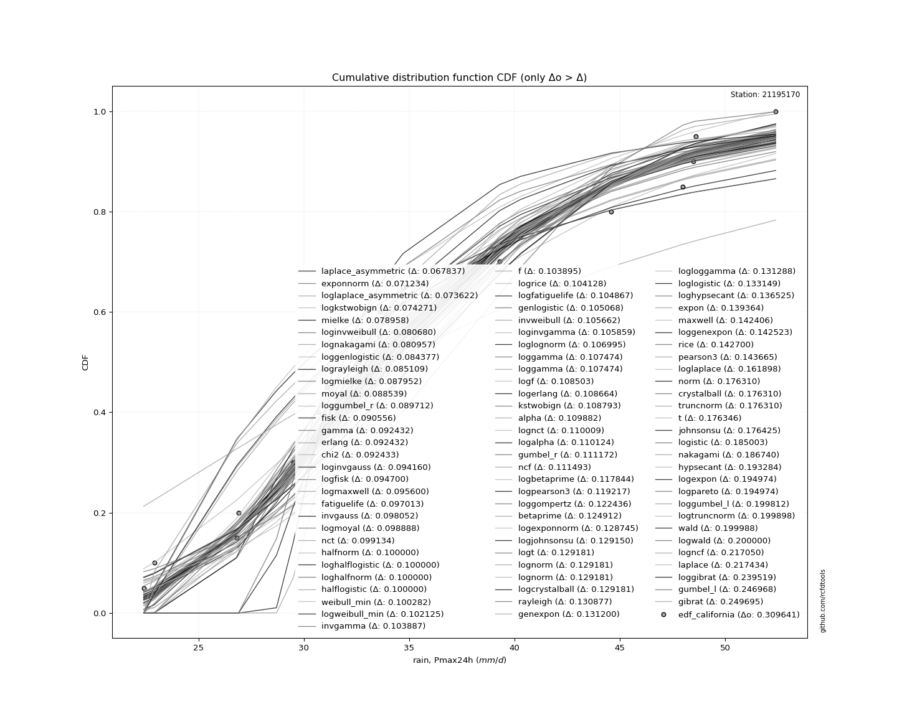</img>

</div>


**1.3. Best fit**

<div align="center">

|   id |   station | empirical_dist   | p_dist             |     delta |   deltao | eval   |   fit |   n |   best_fit |   best_fit_sort |
|-----:|----------:|:-----------------|:-------------------|----------:|---------:|:-------|------:|----:|-----------:|----------------:|
|    0 |  21195170 | edf_california   | laplace_asymmetric | 0.0678368 | 0.309641 | Δo > Δ |     1 |  20 |          1 |               1 |

</div>


<div align="center">

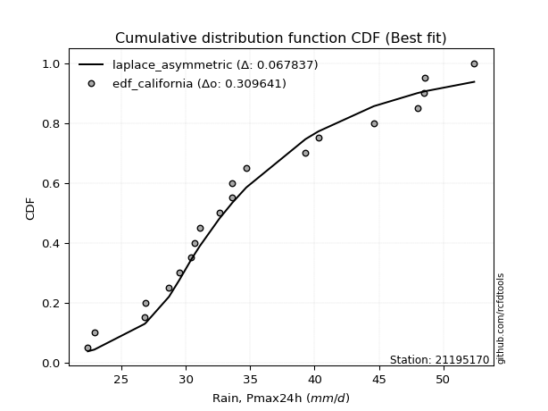</img>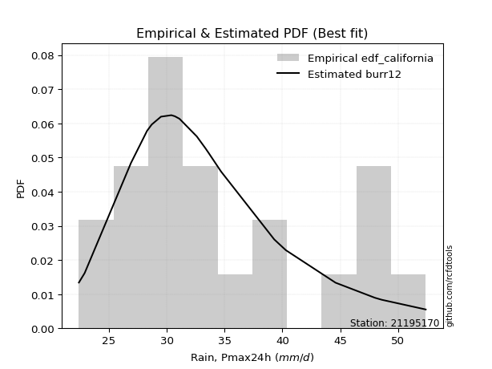</img>

</div>


### 2. EDF Hazen (1930)

Hazen method for plotting positions is a formula used to estimate the empirical cumulative probability distribution of flood events or other hydrological data. This formula often results in biased estimations, particularly when extrapolating to extreme events (high return periods).

<div align="center">


$P=(m-0.5)/n$


</div>


**2.1. Empirical values**

<div align="center">

|                | 0                  | 1                 | 2                  | 3                  | 4                  | 5                  | 6                  | 7         | 8                  | 9                  | 10                 | 11                 | 12                 | 13                 | 14                 | 15                | 16                | 17        | 18                 | 19                 |
|:---------------|:-------------------|:------------------|:-------------------|:-------------------|:-------------------|:-------------------|:-------------------|:----------|:-------------------|:-------------------|:-------------------|:-------------------|:-------------------|:-------------------|:-------------------|:------------------|:------------------|:----------|:-------------------|:-------------------|
| date           | 2022               | 2015              | 2006               | 2007               | 2018               | 2020               | 2023               | 2021      | 2017               | 2008               | 2009               | 2005               | 2019               | 2012               | 2014               | 2010              | 2016              | 2013      | 2024               | 2011               |
| x              | 22.4               | 22.9              | 26.8               | 26.9               | 28.7               | 29.5               | 30.4               | 30.7      | 31.1               | 32.6               | 33.6               | 33.614999999999995 | 34.7               | 39.3               | 40.3               | 44.6              | 48.0              | 48.5      | 48.6               | 52.4               |
| m              | 1                  | 2                 | 3                  | 4                  | 5                  | 6                  | 7                  | 8         | 9                  | 10                 | 11                 | 12                 | 13                 | 14                 | 15                 | 16                | 17                | 18        | 19                 | 20                 |
| empirical_dist | edf_hazen          | edf_hazen         | edf_hazen          | edf_hazen          | edf_hazen          | edf_hazen          | edf_hazen          | edf_hazen | edf_hazen          | edf_hazen          | edf_hazen          | edf_hazen          | edf_hazen          | edf_hazen          | edf_hazen          | edf_hazen         | edf_hazen         | edf_hazen | edf_hazen          | edf_hazen          |
| empirical      | 0.025              | 0.075             | 0.125              | 0.175              | 0.225              | 0.275              | 0.325              | 0.375     | 0.425              | 0.475              | 0.525              | 0.575              | 0.625              | 0.675              | 0.725              | 0.775             | 0.825             | 0.875     | 0.925              | 0.975              |
| empirical_tr   | 1.0256410256410258 | 1.081081081081081 | 1.1428571428571428 | 1.2121212121212122 | 1.2903225806451613 | 1.3793103448275863 | 1.4814814814814814 | 1.6       | 1.7391304347826089 | 1.9047619047619047 | 2.1052631578947367 | 2.352941176470588  | 2.6666666666666665 | 3.0769230769230775 | 3.6363636363636362 | 4.444444444444445 | 5.714285714285713 | 8.0       | 13.333333333333341 | 39.999999999999964 |

</div>


**2.2. Kolmogorov-Smirnov fit test (sorted by Δ)**


<div align="center">

|                | 0                   | 1                   | 2                  | 3                   | 4                   | 5                   | 6                  | 7                  | 8                   | 9                   | 10                  | 11                  | 12                  | 13                  | 14                  | 15                  | 16                  | 17                  | 18                  | 19                  | 20                  | 21                 | 22                  | 23                  | 24                  | 25                  | 26                  | 27                  | 28                  | 29                  | 30                  | 31                  | 32                  | 33                  | 34                  | 35                  | 36                  | 37                  | 38                  | 39                  | 40                    | 41                  | 42                  | 43                  | 44                  | 45                  | 46                  | 47                  | 48                  | 49                 | 50                  | 51                  | 52                  | 53                 | 54                  | 55                  | 56                  | 57                 | 58                  | 59                  | 60                  | 61                  | 62                  | 63                  | 64                  | 65                  | 66                  | 67                 | 68                  | 69                  | 70                  | 71                  | 72                 | 73                  | 74                  | 75                  | 76                  | 77                  | 78                  | 79                 | 80                 | 81                  | 82                  | 83                  | 84                 | 85                  | 86                 | 87                 |
|:---------------|:--------------------|:--------------------|:-------------------|:--------------------|:--------------------|:--------------------|:-------------------|:-------------------|:--------------------|:--------------------|:--------------------|:--------------------|:--------------------|:--------------------|:--------------------|:--------------------|:--------------------|:--------------------|:--------------------|:--------------------|:--------------------|:-------------------|:--------------------|:--------------------|:--------------------|:--------------------|:--------------------|:--------------------|:--------------------|:--------------------|:--------------------|:--------------------|:--------------------|:--------------------|:--------------------|:--------------------|:--------------------|:--------------------|:--------------------|:--------------------|:----------------------|:--------------------|:--------------------|:--------------------|:--------------------|:--------------------|:--------------------|:--------------------|:--------------------|:-------------------|:--------------------|:--------------------|:--------------------|:-------------------|:--------------------|:--------------------|:--------------------|:-------------------|:--------------------|:--------------------|:--------------------|:--------------------|:--------------------|:--------------------|:--------------------|:--------------------|:--------------------|:-------------------|:--------------------|:--------------------|:--------------------|:--------------------|:-------------------|:--------------------|:--------------------|:--------------------|:--------------------|:--------------------|:--------------------|:-------------------|:-------------------|:--------------------|:--------------------|:--------------------|:-------------------|:--------------------|:-------------------|:-------------------|
| station        | 21195170            | 21195170            | 21195170           | 21195170            | 21195170            | 21195170            | 21195170           | 21195170           | 21195170            | 21195170            | 21195170            | 21195170            | 21195170            | 21195170            | 21195170            | 21195170            | 21195170            | 21195170            | 21195170            | 21195170            | 21195170            | 21195170           | 21195170            | 21195170            | 21195170            | 21195170            | 21195170            | 21195170            | 21195170            | 21195170            | 21195170            | 21195170            | 21195170            | 21195170            | 21195170            | 21195170            | 21195170            | 21195170            | 21195170            | 21195170            | 21195170              | 21195170            | 21195170            | 21195170            | 21195170            | 21195170            | 21195170            | 21195170            | 21195170            | 21195170           | 21195170            | 21195170            | 21195170            | 21195170           | 21195170            | 21195170            | 21195170            | 21195170           | 21195170            | 21195170            | 21195170            | 21195170            | 21195170            | 21195170            | 21195170            | 21195170            | 21195170            | 21195170           | 21195170            | 21195170            | 21195170            | 21195170            | 21195170           | 21195170            | 21195170            | 21195170            | 21195170            | 21195170            | 21195170            | 21195170           | 21195170           | 21195170            | 21195170            | 21195170            | 21195170           | 21195170            | 21195170           | 21195170           |
| empirical_dist | edf_hazen           | edf_hazen           | edf_hazen          | edf_hazen           | edf_hazen           | edf_hazen           | edf_hazen          | edf_hazen          | edf_hazen           | edf_hazen           | edf_hazen           | edf_hazen           | edf_hazen           | edf_hazen           | edf_hazen           | edf_hazen           | edf_hazen           | edf_hazen           | edf_hazen           | edf_hazen           | edf_hazen           | edf_hazen          | edf_hazen           | edf_hazen           | edf_hazen           | edf_hazen           | edf_hazen           | edf_hazen           | edf_hazen           | edf_hazen           | edf_hazen           | edf_hazen           | edf_hazen           | edf_hazen           | edf_hazen           | edf_hazen           | edf_hazen           | edf_hazen           | edf_hazen           | edf_hazen           | edf_hazen             | edf_hazen           | edf_hazen           | edf_hazen           | edf_hazen           | edf_hazen           | edf_hazen           | edf_hazen           | edf_hazen           | edf_hazen          | edf_hazen           | edf_hazen           | edf_hazen           | edf_hazen          | edf_hazen           | edf_hazen           | edf_hazen           | edf_hazen          | edf_hazen           | edf_hazen           | edf_hazen           | edf_hazen           | edf_hazen           | edf_hazen           | edf_hazen           | edf_hazen           | edf_hazen           | edf_hazen          | edf_hazen           | edf_hazen           | edf_hazen           | edf_hazen           | edf_hazen          | edf_hazen           | edf_hazen           | edf_hazen           | edf_hazen           | edf_hazen           | edf_hazen           | edf_hazen          | edf_hazen          | edf_hazen           | edf_hazen           | edf_hazen           | edf_hazen          | edf_hazen           | edf_hazen          | edf_hazen          |
| p_dist         | loginvweibull       | logkstwobign        | lognakagami        | erlang              | chi2                | gamma               | fisk               | loghalfnorm        | loggenlogistic      | lograyleigh         | weibull_min         | exponnorm           | logmaxwell          | halfnorm            | fatiguelife         | invgauss            | logmielke           | loginvgauss         | laplace_asymmetric  | logrice             | logweibull_min      | logfisk            | nct                 | invgamma            | f                   | loggamma            | loggamma            | logfatiguelife      | loglognorm          | mielke              | logf                | loginvgamma         | lognct              | logalpha            | alpha               | invweibull          | ncf                 | logerlang           | genlogistic         | kstwobign           | loglaplace_asymmetric | halflogistic        | gumbel_r            | loggumbel_r         | logpearson3         | moyal               | loghalflogistic     | loggompertz         | logbetaprime        | betaprime          | logmoyal            | logexponnorm        | logjohnsonsu        | logt               | lognorm             | lognorm             | logcrystalball      | rayleigh           | logloggamma         | loglogistic         | loghypsecant        | maxwell             | rice                | pearson3            | loglaplace          | norm                | crystalball         | truncnorm          | t                   | johnsonsu           | genexpon            | logistic            | expon              | loggenexpon         | hypsecant           | loggumbel_l         | wald                | logwald             | laplace             | logncf             | nakagami           | loggibrat           | logexpon            | gumbel_l            | gibrat             | logtruncnorm        | logchi2            | gompertz           |
| delta          | 0.06479950998792194 | 0.06886130377494168 | 0.0749567218795919 | 0.07577017743198178 | 0.07577054316907184 | 0.07577091320805096 | 0.0769378437905015 | 0.077321990232599  | 0.07764132115555633 | 0.07838706796146011 | 0.07897308868205444 | 0.07959469624241489 | 0.07992156525201632 | 0.07992233851603303 | 0.08007905501695589 | 0.08074938137254417 | 0.08083159807403506 | 0.08085170799190444 | 0.08097058448627925 | 0.08119869420825787 | 0.08146868377221361 | 0.0821448955919103 | 0.08263318803460329 | 0.08291925338108408 | 0.08294641916311962 | 0.08320071067759982 | 0.08320071067759982 | 0.08321170559962976 | 0.08396368758244899 | 0.08404929811369266 | 0.08450004309366954 | 0.08451450702221253 | 0.08503126759319846 | 0.08516009807717073 | 0.08528524406396965 | 0.08647480197986135 | 0.08649340484165785 | 0.08655633870040824 | 0.08664668675020182 | 0.08750987062192361 | 0.0890951500478423    | 0.08990646262456903 | 0.09081131834138123 | 0.09359310235791907 | 0.09421685681835446 | 0.09519472597602874 | 0.09584438828424324 | 0.09743621596268981 | 0.09960550468004295 | 0.0999119483923499 | 0.10177764600996209 | 0.10374475643901498 | 0.10414957720063184 | 0.1041808019400704 | 0.10418091681369107 | 0.10418091681369107 | 0.10418114234245823 | 0.1058771600774191 | 0.10628799428127911 | 0.10814884717285589 | 0.11152511091555206 | 0.11740593705955493 | 0.11770028543212135 | 0.11866471434138126 | 0.13689804969056935 | 0.15130982787690428 | 0.15130983962970113 | 0.1513100060290653 | 0.15134568170609813 | 0.15142501755360455 | 0.15620029658193751 | 0.16000326356638273 | 0.1643640572435841 | 0.16752308371716357 | 0.16828382768582595 | 0.17481163145680445 | 0.17498781849442335 | 0.17499999999730156 | 0.19243379612625616 | 0.2017620525093512 | 0.2117404253217014 | 0.21451917728731973 | 0.21997411761786856 | 0.22196849562859777 | 0.2246949855494829 | 0.22489773377144143 | 0.3439263093437529 | 0.6979923661927735 |
| deltao         | 0.3096406529800002  | 0.3096406529800002  | 0.3096406529800002 | 0.3096406529800002  | 0.3096406529800002  | 0.3096406529800002  | 0.3096406529800002 | 0.3096406529800002 | 0.3096406529800002  | 0.3096406529800002  | 0.3096406529800002  | 0.3096406529800002  | 0.3096406529800002  | 0.3096406529800002  | 0.3096406529800002  | 0.3096406529800002  | 0.3096406529800002  | 0.3096406529800002  | 0.3096406529800002  | 0.3096406529800002  | 0.3096406529800002  | 0.3096406529800002 | 0.3096406529800002  | 0.3096406529800002  | 0.3096406529800002  | 0.3096406529800002  | 0.3096406529800002  | 0.3096406529800002  | 0.3096406529800002  | 0.3096406529800002  | 0.3096406529800002  | 0.3096406529800002  | 0.3096406529800002  | 0.3096406529800002  | 0.3096406529800002  | 0.3096406529800002  | 0.3096406529800002  | 0.3096406529800002  | 0.3096406529800002  | 0.3096406529800002  | 0.3096406529800002    | 0.3096406529800002  | 0.3096406529800002  | 0.3096406529800002  | 0.3096406529800002  | 0.3096406529800002  | 0.3096406529800002  | 0.3096406529800002  | 0.3096406529800002  | 0.3096406529800002 | 0.3096406529800002  | 0.3096406529800002  | 0.3096406529800002  | 0.3096406529800002 | 0.3096406529800002  | 0.3096406529800002  | 0.3096406529800002  | 0.3096406529800002 | 0.3096406529800002  | 0.3096406529800002  | 0.3096406529800002  | 0.3096406529800002  | 0.3096406529800002  | 0.3096406529800002  | 0.3096406529800002  | 0.3096406529800002  | 0.3096406529800002  | 0.3096406529800002 | 0.3096406529800002  | 0.3096406529800002  | 0.3096406529800002  | 0.3096406529800002  | 0.3096406529800002 | 0.3096406529800002  | 0.3096406529800002  | 0.3096406529800002  | 0.3096406529800002  | 0.3096406529800002  | 0.3096406529800002  | 0.3096406529800002 | 0.3096406529800002 | 0.3096406529800002  | 0.3096406529800002  | 0.3096406529800002  | 0.3096406529800002 | 0.3096406529800002  | 0.3096406529800002 | 0.3096406529800002 |
| eval           | Δo > Δ              | Δo > Δ              | Δo > Δ             | Δo > Δ              | Δo > Δ              | Δo > Δ              | Δo > Δ             | Δo > Δ             | Δo > Δ              | Δo > Δ              | Δo > Δ              | Δo > Δ              | Δo > Δ              | Δo > Δ              | Δo > Δ              | Δo > Δ              | Δo > Δ              | Δo > Δ              | Δo > Δ              | Δo > Δ              | Δo > Δ              | Δo > Δ             | Δo > Δ              | Δo > Δ              | Δo > Δ              | Δo > Δ              | Δo > Δ              | Δo > Δ              | Δo > Δ              | Δo > Δ              | Δo > Δ              | Δo > Δ              | Δo > Δ              | Δo > Δ              | Δo > Δ              | Δo > Δ              | Δo > Δ              | Δo > Δ              | Δo > Δ              | Δo > Δ              | Δo > Δ                | Δo > Δ              | Δo > Δ              | Δo > Δ              | Δo > Δ              | Δo > Δ              | Δo > Δ              | Δo > Δ              | Δo > Δ              | Δo > Δ             | Δo > Δ              | Δo > Δ              | Δo > Δ              | Δo > Δ             | Δo > Δ              | Δo > Δ              | Δo > Δ              | Δo > Δ             | Δo > Δ              | Δo > Δ              | Δo > Δ              | Δo > Δ              | Δo > Δ              | Δo > Δ              | Δo > Δ              | Δo > Δ              | Δo > Δ              | Δo > Δ             | Δo > Δ              | Δo > Δ              | Δo > Δ              | Δo > Δ              | Δo > Δ             | Δo > Δ              | Δo > Δ              | Δo > Δ              | Δo > Δ              | Δo > Δ              | Δo > Δ              | Δo > Δ             | Δo > Δ             | Δo > Δ              | Δo > Δ              | Δo > Δ              | Δo > Δ             | Δo > Δ              | Δo <= Δ            | Δo <= Δ            |
| fit            | 1                   | 1                   | 1                  | 1                   | 1                   | 1                   | 1                  | 1                  | 1                   | 1                   | 1                   | 1                   | 1                   | 1                   | 1                   | 1                   | 1                   | 1                   | 1                   | 1                   | 1                   | 1                  | 1                   | 1                   | 1                   | 1                   | 1                   | 1                   | 1                   | 1                   | 1                   | 1                   | 1                   | 1                   | 1                   | 1                   | 1                   | 1                   | 1                   | 1                   | 1                     | 1                   | 1                   | 1                   | 1                   | 1                   | 1                   | 1                   | 1                   | 1                  | 1                   | 1                   | 1                   | 1                  | 1                   | 1                   | 1                   | 1                  | 1                   | 1                   | 1                   | 1                   | 1                   | 1                   | 1                   | 1                   | 1                   | 1                  | 1                   | 1                   | 1                   | 1                   | 1                  | 1                   | 1                   | 1                   | 1                   | 1                   | 1                   | 1                  | 1                  | 1                   | 1                   | 1                   | 1                  | 1                   | 0                  | 0                  |
| n              | 20                  | 20                  | 20                 | 20                  | 20                  | 20                  | 20                 | 20                 | 20                  | 20                  | 20                  | 20                  | 20                  | 20                  | 20                  | 20                  | 20                  | 20                  | 20                  | 20                  | 20                  | 20                 | 20                  | 20                  | 20                  | 20                  | 20                  | 20                  | 20                  | 20                  | 20                  | 20                  | 20                  | 20                  | 20                  | 20                  | 20                  | 20                  | 20                  | 20                  | 20                    | 20                  | 20                  | 20                  | 20                  | 20                  | 20                  | 20                  | 20                  | 20                 | 20                  | 20                  | 20                  | 20                 | 20                  | 20                  | 20                  | 20                 | 20                  | 20                  | 20                  | 20                  | 20                  | 20                  | 20                  | 20                  | 20                  | 20                 | 20                  | 20                  | 20                  | 20                  | 20                 | 20                  | 20                  | 20                  | 20                  | 20                  | 20                  | 20                 | 20                 | 20                  | 20                  | 20                  | 20                 | 20                  | 20                 | 20                 |
| best_fit       | 1                   | 0                   | 0                  | 0                   | 0                   | 0                   | 0                  | 0                  | 0                   | 0                   | 0                   | 0                   | 0                   | 0                   | 0                   | 0                   | 0                   | 0                   | 0                   | 0                   | 0                   | 0                  | 0                   | 0                   | 0                   | 0                   | 0                   | 0                   | 0                   | 0                   | 0                   | 0                   | 0                   | 0                   | 0                   | 0                   | 0                   | 0                   | 0                   | 0                   | 0                     | 0                   | 0                   | 0                   | 0                   | 0                   | 0                   | 0                   | 0                   | 0                  | 0                   | 0                   | 0                   | 0                  | 0                   | 0                   | 0                   | 0                  | 0                   | 0                   | 0                   | 0                   | 0                   | 0                   | 0                   | 0                   | 0                   | 0                  | 0                   | 0                   | 0                   | 0                   | 0                  | 0                   | 0                   | 0                   | 0                   | 0                   | 0                   | 0                  | 0                  | 0                   | 0                   | 0                   | 0                  | 0                   | 0                  | 0                  |
| best_fit_sort  | 1                   | 2                   | 3                  | 4                   | 5                   | 6                   | 7                  | 8                  | 9                   | 10                  | 11                  | 12                  | 13                  | 14                  | 15                  | 16                  | 17                  | 18                  | 19                  | 20                  | 21                  | 22                 | 23                  | 24                  | 25                  | 26                  | 27                  | 28                  | 29                  | 30                  | 31                  | 32                  | 33                  | 34                  | 35                  | 36                  | 37                  | 38                  | 39                  | 40                  | 41                    | 42                  | 43                  | 44                  | 45                  | 46                  | 47                  | 48                  | 49                  | 50                 | 51                  | 52                  | 53                  | 54                 | 55                  | 56                  | 57                  | 58                 | 59                  | 60                  | 61                  | 62                  | 63                  | 64                  | 65                  | 66                  | 67                  | 68                 | 69                  | 70                  | 71                  | 72                  | 73                 | 74                  | 75                  | 76                  | 77                  | 78                  | 79                  | 80                 | 81                 | 82                  | 83                  | 84                  | 85                 | 86                  | 87                 | 88                 |

</div>


<div align="center">

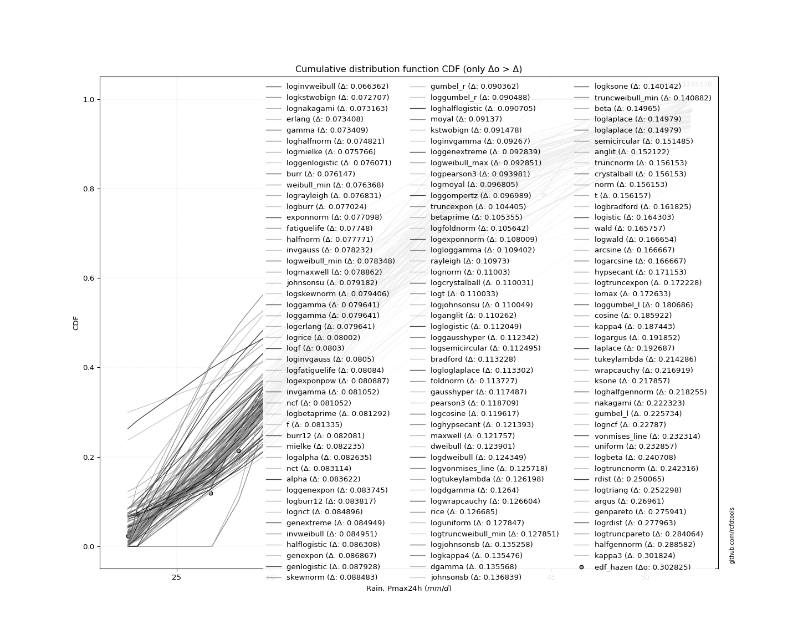</img>

</div>


**2.3. Best fit**

<div align="center">

|   id |   station | empirical_dist   | p_dist        |     delta |   deltao | eval   |   fit |   n |   best_fit |   best_fit_sort |
|-----:|----------:|:-----------------|:--------------|----------:|---------:|:-------|------:|----:|-----------:|----------------:|
|    0 |  21195170 | edf_hazen        | loginvweibull | 0.0647995 | 0.309641 | Δo > Δ |     1 |  20 |          1 |               1 |

</div>


<div align="center">

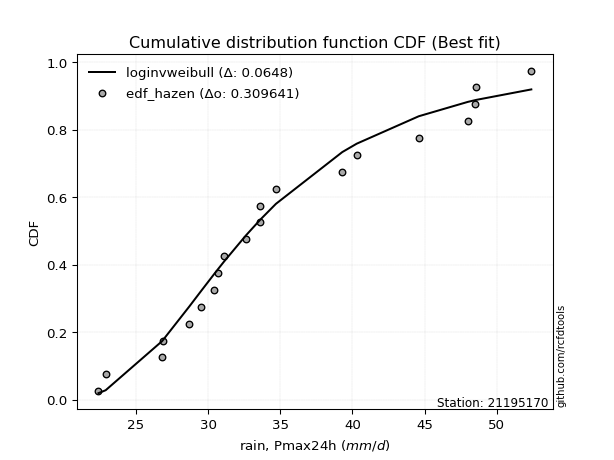</img></img>

</div>


### 3. EDF Weibull (1939)

Weibull plotting position formula is an empirical method used to estimate the non-exceedance probability or plotting position for a set of observed data, is often recommended or widely used in practice, particularly in flood frequency analysis.

<div align="center">


$P=m/(n+1)$


</div>


**3.1. Empirical values**

<div align="center">

|                | 0                    | 1                   | 2                   | 3                   | 4                   | 5                  | 6                  | 7                   | 8                   | 9                   | 10                 | 11                 | 12                 | 13                 | 14                 | 15                 | 16                 | 17                 | 18                 | 19                 |
|:---------------|:---------------------|:--------------------|:--------------------|:--------------------|:--------------------|:-------------------|:-------------------|:--------------------|:--------------------|:--------------------|:-------------------|:-------------------|:-------------------|:-------------------|:-------------------|:-------------------|:-------------------|:-------------------|:-------------------|:-------------------|
| date           | 2022                 | 2015                | 2006                | 2007                | 2018                | 2020               | 2023               | 2021                | 2017                | 2008                | 2009               | 2005               | 2019               | 2012               | 2014               | 2010               | 2016               | 2013               | 2024               | 2011               |
| x              | 22.4                 | 22.9                | 26.8                | 26.9                | 28.7                | 29.5               | 30.4               | 30.7                | 31.1                | 32.6                | 33.6               | 33.614999999999995 | 34.7               | 39.3               | 40.3               | 44.6               | 48.0               | 48.5               | 48.6               | 52.4               |
| m              | 1                    | 2                   | 3                   | 4                   | 5                   | 6                  | 7                  | 8                   | 9                   | 10                  | 11                 | 12                 | 13                 | 14                 | 15                 | 16                 | 17                 | 18                 | 19                 | 20                 |
| empirical_dist | edf_weibull          | edf_weibull         | edf_weibull         | edf_weibull         | edf_weibull         | edf_weibull        | edf_weibull        | edf_weibull         | edf_weibull         | edf_weibull         | edf_weibull        | edf_weibull        | edf_weibull        | edf_weibull        | edf_weibull        | edf_weibull        | edf_weibull        | edf_weibull        | edf_weibull        | edf_weibull        |
| empirical      | 0.047619047619047616 | 0.09523809523809523 | 0.14285714285714285 | 0.19047619047619047 | 0.23809523809523808 | 0.2857142857142857 | 0.3333333333333333 | 0.38095238095238093 | 0.42857142857142855 | 0.47619047619047616 | 0.5238095238095238 | 0.5714285714285714 | 0.6190476190476191 | 0.6666666666666666 | 0.7142857142857143 | 0.7619047619047619 | 0.8095238095238095 | 0.8571428571428571 | 0.9047619047619048 | 0.9523809523809523 |
| empirical_tr   | 1.05                 | 1.1052631578947367  | 1.1666666666666665  | 1.2352941176470589  | 1.3125              | 1.4                | 1.4999999999999998 | 1.6153846153846154  | 1.75                | 1.909090909090909   | 2.1                | 2.333333333333333  | 2.625              | 2.9999999999999996 | 3.5                | 4.199999999999999  | 5.25               | 6.999999999999997  | 10.5               | 20.999999999999975 |

</div>


**3.2. Kolmogorov-Smirnov fit test (sorted by Δ)**


<div align="center">

|                | 0                  | 1                  | 2                   | 3                  | 4                   | 5                   | 6                  | 7                   | 8                   | 9                   | 10                  | 11                  | 12                  | 13                  | 14                  | 15                  | 16                  | 17                  | 18                  | 19                  | 20                  | 21                  | 22                  | 23                  | 24                  | 25                    | 26                 | 27                  | 28                  | 29                  | 30                  | 31                  | 32                  | 33                  | 34                  | 35                  | 36                  | 37                  | 38                  | 39                 | 40                  | 41                  | 42                  | 43                  | 44                  | 45                  | 46                  | 47                  | 48                  | 49                  | 50                  | 51                  | 52                  | 53                  | 54                  | 55                  | 56                  | 57                 | 58                 | 59                 | 60                 | 61                  | 62                 | 63                  | 64                 | 65                  | 66                 | 67                 | 68                  | 69                  | 70                 | 71                  | 72                  | 73                  | 74                 | 75                 | 76                  | 77                 | 78                  | 79                  | 80                  | 81                  | 82                  | 83                  | 84                 | 85                  | 86                  | 87                 |
|:---------------|:-------------------|:-------------------|:--------------------|:-------------------|:--------------------|:--------------------|:-------------------|:--------------------|:--------------------|:--------------------|:--------------------|:--------------------|:--------------------|:--------------------|:--------------------|:--------------------|:--------------------|:--------------------|:--------------------|:--------------------|:--------------------|:--------------------|:--------------------|:--------------------|:--------------------|:----------------------|:-------------------|:--------------------|:--------------------|:--------------------|:--------------------|:--------------------|:--------------------|:--------------------|:--------------------|:--------------------|:--------------------|:--------------------|:--------------------|:-------------------|:--------------------|:--------------------|:--------------------|:--------------------|:--------------------|:--------------------|:--------------------|:--------------------|:--------------------|:--------------------|:--------------------|:--------------------|:--------------------|:--------------------|:--------------------|:--------------------|:--------------------|:-------------------|:-------------------|:-------------------|:-------------------|:--------------------|:-------------------|:--------------------|:-------------------|:--------------------|:-------------------|:-------------------|:--------------------|:--------------------|:-------------------|:--------------------|:--------------------|:--------------------|:-------------------|:-------------------|:--------------------|:-------------------|:--------------------|:--------------------|:--------------------|:--------------------|:--------------------|:--------------------|:-------------------|:--------------------|:--------------------|:-------------------|
| station        | 21195170           | 21195170           | 21195170            | 21195170           | 21195170            | 21195170            | 21195170           | 21195170            | 21195170            | 21195170            | 21195170            | 21195170            | 21195170            | 21195170            | 21195170            | 21195170            | 21195170            | 21195170            | 21195170            | 21195170            | 21195170            | 21195170            | 21195170            | 21195170            | 21195170            | 21195170              | 21195170           | 21195170            | 21195170            | 21195170            | 21195170            | 21195170            | 21195170            | 21195170            | 21195170            | 21195170            | 21195170            | 21195170            | 21195170            | 21195170           | 21195170            | 21195170            | 21195170            | 21195170            | 21195170            | 21195170            | 21195170            | 21195170            | 21195170            | 21195170            | 21195170            | 21195170            | 21195170            | 21195170            | 21195170            | 21195170            | 21195170            | 21195170           | 21195170           | 21195170           | 21195170           | 21195170            | 21195170           | 21195170            | 21195170           | 21195170            | 21195170           | 21195170           | 21195170            | 21195170            | 21195170           | 21195170            | 21195170            | 21195170            | 21195170           | 21195170           | 21195170            | 21195170           | 21195170            | 21195170            | 21195170            | 21195170            | 21195170            | 21195170            | 21195170           | 21195170            | 21195170            | 21195170           |
| empirical_dist | edf_weibull        | edf_weibull        | edf_weibull         | edf_weibull        | edf_weibull         | edf_weibull         | edf_weibull        | edf_weibull         | edf_weibull         | edf_weibull         | edf_weibull         | edf_weibull         | edf_weibull         | edf_weibull         | edf_weibull         | edf_weibull         | edf_weibull         | edf_weibull         | edf_weibull         | edf_weibull         | edf_weibull         | edf_weibull         | edf_weibull         | edf_weibull         | edf_weibull         | edf_weibull           | edf_weibull        | edf_weibull         | edf_weibull         | edf_weibull         | edf_weibull         | edf_weibull         | edf_weibull         | edf_weibull         | edf_weibull         | edf_weibull         | edf_weibull         | edf_weibull         | edf_weibull         | edf_weibull        | edf_weibull         | edf_weibull         | edf_weibull         | edf_weibull         | edf_weibull         | edf_weibull         | edf_weibull         | edf_weibull         | edf_weibull         | edf_weibull         | edf_weibull         | edf_weibull         | edf_weibull         | edf_weibull         | edf_weibull         | edf_weibull         | edf_weibull         | edf_weibull        | edf_weibull        | edf_weibull        | edf_weibull        | edf_weibull         | edf_weibull        | edf_weibull         | edf_weibull        | edf_weibull         | edf_weibull        | edf_weibull        | edf_weibull         | edf_weibull         | edf_weibull        | edf_weibull         | edf_weibull         | edf_weibull         | edf_weibull        | edf_weibull        | edf_weibull         | edf_weibull        | edf_weibull         | edf_weibull         | edf_weibull         | edf_weibull         | edf_weibull         | edf_weibull         | edf_weibull        | edf_weibull         | edf_weibull         | edf_weibull        |
| p_dist         | loginvweibull      | logkstwobign       | logbetaprime        | lognakagami        | fisk                | loggenlogistic      | erlang             | chi2                | gamma               | lograyleigh         | exponnorm           | logmielke           | laplace_asymmetric  | weibull_min         | loginvgauss         | loghalfnorm         | logfisk             | logmaxwell          | halfnorm            | fatiguelife         | invgauss            | logrice             | logweibull_min      | nct                 | mielke              | loglaplace_asymmetric | invgamma           | f                   | loggamma            | loggamma            | logfatiguelife      | loggompertz         | loglognorm          | logf                | loginvgamma         | lognct              | logalpha            | alpha               | ncf                 | rayleigh           | invweibull          | logerlang           | genlogistic         | kstwobign           | halflogistic        | logpearson3         | betaprime           | loghalflogistic     | logloggamma         | logjohnsonsu        | logexponnorm        | logcrystalball      | lognorm             | lognorm             | logt                | gumbel_r            | loggumbel_r         | moyal              | logmoyal           | maxwell            | rice               | loglogistic         | pearson3           | loghypsecant        | loglaplace         | genexpon            | norm               | crystalball        | truncnorm           | t                   | johnsonsu          | expon               | loggenexpon         | logistic            | hypsecant          | loggumbel_l        | logncf              | laplace            | wald                | logwald             | nakagami            | logexpon            | logtruncnorm        | gumbel_l            | loggibrat          | gibrat              | logchi2             | gompertz           |
| delta          | 0.0778947480831601 | 0.0810980788735528 | 0.08689124596243558 | 0.0888214535416949 | 0.09003308188573966 | 0.09073655925079449 | 0.0912463679081722 | 0.09124673364526226 | 0.09124710368424138 | 0.09251271164993624 | 0.09268993433765305 | 0.09392683616927322 | 0.09406582258151741 | 0.09444927915824486 | 0.09477967836289858 | 0.09523809523809523 | 0.09524013368714845 | 0.09539775572820675 | 0.09539852899222345 | 0.09555524549314631 | 0.09622557184873459 | 0.09667488468444829 | 0.09694487424840403 | 0.09699966677901062 | 0.09714453620893082 | 0.09742848338117571   | 0.0983954438572745 | 0.09842260963931004 | 0.09867690115379024 | 0.09867690115379024 | 0.09868789607582018 | 0.09935925127571632 | 0.09943987805863941 | 0.09997623356985996 | 0.09999069749840295 | 0.10050745806938888 | 0.10063628855336115 | 0.10076143454016007 | 0.10107593330906062 | 0.1016062629959138 | 0.10195099245605177 | 0.10203252917659866 | 0.10212287722639224 | 0.10298606109811403 | 0.10300170071980719 | 0.10310035125605654 | 0.10416163999549166 | 0.10578648146725889 | 0.10584507836581558 | 0.10603632690190357 | 0.10612004020800381 | 0.10624257426562156 | 0.10624265412457168 | 0.10624265412457168 | 0.10624268327928343 | 0.10628750881757165 | 0.10668834045315723 | 0.1082899640712669 | 0.1109751256770366 | 0.1121208660796722 | 0.1141288568606928 | 0.11446832820802066 | 0.1150932857699527 | 0.12231482962958629 | 0.1404694782619979 | 0.14277992554389912 | 0.1464985463616047 | 0.1464985566956068 | 0.14649871973366269 | 0.14653368729701133 | 0.1468408154643051 | 0.14872795421240786 | 0.15328365213761813 | 0.15643183499495417 | 0.1647123991143974 | 0.1712402028853759 | 0.18390490965220835 | 0.1888623675548276 | 0.19046400897061383 | 0.19047619047349204 | 0.19388328246455855 | 0.20461314352476706 | 0.21180249567620335 | 0.21601611467621684 | 0.2276144153825578 | 0.23779022364472097 | 0.32130726172470525 | 0.6872780804784878 |
| deltao         | 0.3096406529800002 | 0.3096406529800002 | 0.3096406529800002  | 0.3096406529800002 | 0.3096406529800002  | 0.3096406529800002  | 0.3096406529800002 | 0.3096406529800002  | 0.3096406529800002  | 0.3096406529800002  | 0.3096406529800002  | 0.3096406529800002  | 0.3096406529800002  | 0.3096406529800002  | 0.3096406529800002  | 0.3096406529800002  | 0.3096406529800002  | 0.3096406529800002  | 0.3096406529800002  | 0.3096406529800002  | 0.3096406529800002  | 0.3096406529800002  | 0.3096406529800002  | 0.3096406529800002  | 0.3096406529800002  | 0.3096406529800002    | 0.3096406529800002 | 0.3096406529800002  | 0.3096406529800002  | 0.3096406529800002  | 0.3096406529800002  | 0.3096406529800002  | 0.3096406529800002  | 0.3096406529800002  | 0.3096406529800002  | 0.3096406529800002  | 0.3096406529800002  | 0.3096406529800002  | 0.3096406529800002  | 0.3096406529800002 | 0.3096406529800002  | 0.3096406529800002  | 0.3096406529800002  | 0.3096406529800002  | 0.3096406529800002  | 0.3096406529800002  | 0.3096406529800002  | 0.3096406529800002  | 0.3096406529800002  | 0.3096406529800002  | 0.3096406529800002  | 0.3096406529800002  | 0.3096406529800002  | 0.3096406529800002  | 0.3096406529800002  | 0.3096406529800002  | 0.3096406529800002  | 0.3096406529800002 | 0.3096406529800002 | 0.3096406529800002 | 0.3096406529800002 | 0.3096406529800002  | 0.3096406529800002 | 0.3096406529800002  | 0.3096406529800002 | 0.3096406529800002  | 0.3096406529800002 | 0.3096406529800002 | 0.3096406529800002  | 0.3096406529800002  | 0.3096406529800002 | 0.3096406529800002  | 0.3096406529800002  | 0.3096406529800002  | 0.3096406529800002 | 0.3096406529800002 | 0.3096406529800002  | 0.3096406529800002 | 0.3096406529800002  | 0.3096406529800002  | 0.3096406529800002  | 0.3096406529800002  | 0.3096406529800002  | 0.3096406529800002  | 0.3096406529800002 | 0.3096406529800002  | 0.3096406529800002  | 0.3096406529800002 |
| eval           | Δo > Δ             | Δo > Δ             | Δo > Δ              | Δo > Δ             | Δo > Δ              | Δo > Δ              | Δo > Δ             | Δo > Δ              | Δo > Δ              | Δo > Δ              | Δo > Δ              | Δo > Δ              | Δo > Δ              | Δo > Δ              | Δo > Δ              | Δo > Δ              | Δo > Δ              | Δo > Δ              | Δo > Δ              | Δo > Δ              | Δo > Δ              | Δo > Δ              | Δo > Δ              | Δo > Δ              | Δo > Δ              | Δo > Δ                | Δo > Δ             | Δo > Δ              | Δo > Δ              | Δo > Δ              | Δo > Δ              | Δo > Δ              | Δo > Δ              | Δo > Δ              | Δo > Δ              | Δo > Δ              | Δo > Δ              | Δo > Δ              | Δo > Δ              | Δo > Δ             | Δo > Δ              | Δo > Δ              | Δo > Δ              | Δo > Δ              | Δo > Δ              | Δo > Δ              | Δo > Δ              | Δo > Δ              | Δo > Δ              | Δo > Δ              | Δo > Δ              | Δo > Δ              | Δo > Δ              | Δo > Δ              | Δo > Δ              | Δo > Δ              | Δo > Δ              | Δo > Δ             | Δo > Δ             | Δo > Δ             | Δo > Δ             | Δo > Δ              | Δo > Δ             | Δo > Δ              | Δo > Δ             | Δo > Δ              | Δo > Δ             | Δo > Δ             | Δo > Δ              | Δo > Δ              | Δo > Δ             | Δo > Δ              | Δo > Δ              | Δo > Δ              | Δo > Δ             | Δo > Δ             | Δo > Δ              | Δo > Δ             | Δo > Δ              | Δo > Δ              | Δo > Δ              | Δo > Δ              | Δo > Δ              | Δo > Δ              | Δo > Δ             | Δo > Δ              | Δo <= Δ             | Δo <= Δ            |
| fit            | 1                  | 1                  | 1                   | 1                  | 1                   | 1                   | 1                  | 1                   | 1                   | 1                   | 1                   | 1                   | 1                   | 1                   | 1                   | 1                   | 1                   | 1                   | 1                   | 1                   | 1                   | 1                   | 1                   | 1                   | 1                   | 1                     | 1                  | 1                   | 1                   | 1                   | 1                   | 1                   | 1                   | 1                   | 1                   | 1                   | 1                   | 1                   | 1                   | 1                  | 1                   | 1                   | 1                   | 1                   | 1                   | 1                   | 1                   | 1                   | 1                   | 1                   | 1                   | 1                   | 1                   | 1                   | 1                   | 1                   | 1                   | 1                  | 1                  | 1                  | 1                  | 1                   | 1                  | 1                   | 1                  | 1                   | 1                  | 1                  | 1                   | 1                   | 1                  | 1                   | 1                   | 1                   | 1                  | 1                  | 1                   | 1                  | 1                   | 1                   | 1                   | 1                   | 1                   | 1                   | 1                  | 1                   | 0                   | 0                  |
| n              | 20                 | 20                 | 20                  | 20                 | 20                  | 20                  | 20                 | 20                  | 20                  | 20                  | 20                  | 20                  | 20                  | 20                  | 20                  | 20                  | 20                  | 20                  | 20                  | 20                  | 20                  | 20                  | 20                  | 20                  | 20                  | 20                    | 20                 | 20                  | 20                  | 20                  | 20                  | 20                  | 20                  | 20                  | 20                  | 20                  | 20                  | 20                  | 20                  | 20                 | 20                  | 20                  | 20                  | 20                  | 20                  | 20                  | 20                  | 20                  | 20                  | 20                  | 20                  | 20                  | 20                  | 20                  | 20                  | 20                  | 20                  | 20                 | 20                 | 20                 | 20                 | 20                  | 20                 | 20                  | 20                 | 20                  | 20                 | 20                 | 20                  | 20                  | 20                 | 20                  | 20                  | 20                  | 20                 | 20                 | 20                  | 20                 | 20                  | 20                  | 20                  | 20                  | 20                  | 20                  | 20                 | 20                  | 20                  | 20                 |
| best_fit       | 1                  | 0                  | 0                   | 0                  | 0                   | 0                   | 0                  | 0                   | 0                   | 0                   | 0                   | 0                   | 0                   | 0                   | 0                   | 0                   | 0                   | 0                   | 0                   | 0                   | 0                   | 0                   | 0                   | 0                   | 0                   | 0                     | 0                  | 0                   | 0                   | 0                   | 0                   | 0                   | 0                   | 0                   | 0                   | 0                   | 0                   | 0                   | 0                   | 0                  | 0                   | 0                   | 0                   | 0                   | 0                   | 0                   | 0                   | 0                   | 0                   | 0                   | 0                   | 0                   | 0                   | 0                   | 0                   | 0                   | 0                   | 0                  | 0                  | 0                  | 0                  | 0                   | 0                  | 0                   | 0                  | 0                   | 0                  | 0                  | 0                   | 0                   | 0                  | 0                   | 0                   | 0                   | 0                  | 0                  | 0                   | 0                  | 0                   | 0                   | 0                   | 0                   | 0                   | 0                   | 0                  | 0                   | 0                   | 0                  |
| best_fit_sort  | 1                  | 2                  | 3                   | 4                  | 5                   | 6                   | 7                  | 8                   | 9                   | 10                  | 11                  | 12                  | 13                  | 14                  | 15                  | 16                  | 17                  | 18                  | 19                  | 20                  | 21                  | 22                  | 23                  | 24                  | 25                  | 26                    | 27                 | 28                  | 29                  | 30                  | 31                  | 32                  | 33                  | 34                  | 35                  | 36                  | 37                  | 38                  | 39                  | 40                 | 41                  | 42                  | 43                  | 44                  | 45                  | 46                  | 47                  | 48                  | 49                  | 50                  | 51                  | 52                  | 53                  | 54                  | 55                  | 56                  | 57                  | 58                 | 59                 | 60                 | 61                 | 62                  | 63                 | 64                  | 65                 | 66                  | 67                 | 68                 | 69                  | 70                  | 71                 | 72                  | 73                  | 74                  | 75                 | 76                 | 77                  | 78                 | 79                  | 80                  | 81                  | 82                  | 83                  | 84                  | 85                 | 86                  | 87                  | 88                 |

</div>


<div align="center">

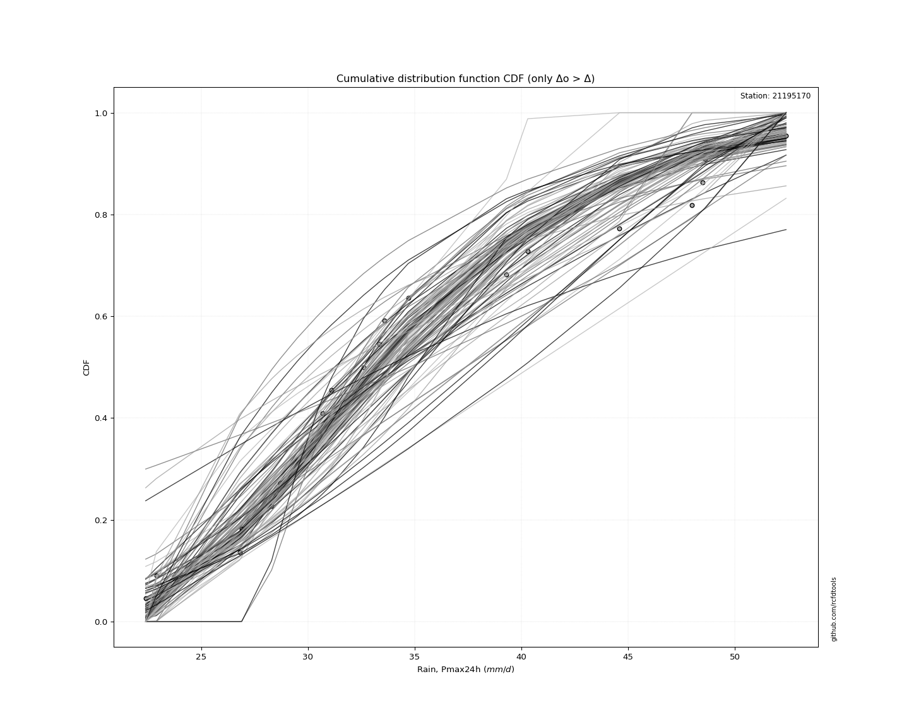</img>

</div>


**3.3. Best fit**

<div align="center">

|   id |   station | empirical_dist   | p_dist        |     delta |   deltao | eval   |   fit |   n |   best_fit |   best_fit_sort |
|-----:|----------:|:-----------------|:--------------|----------:|---------:|:-------|------:|----:|-----------:|----------------:|
|    0 |  21195170 | edf_weibull      | loginvweibull | 0.0778947 | 0.309641 | Δo > Δ |     1 |  20 |          1 |               1 |

</div>


<div align="center">

</img>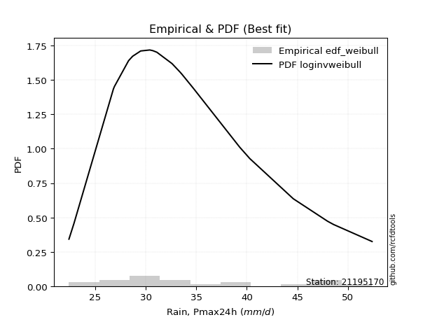</img>

</div>


### 4. EDF Beard (1943)

The Beard formula (or Beard´s plotting position formula) in hydrology is used to estimate the empirical non-exceedance probability _(P)_ of a flood event (or other extreme hydrological data point) within a given dataset.

<div align="center">


$P=(m-0.31)/(n+0.38)$


</div>


**4.1. Empirical values**

<div align="center">

|                | 0                    | 1                   | 2                   | 3                   | 4                   | 5                   | 6                   | 7                  | 8                  | 9                   | 10                 | 11                 | 12                 | 13                 | 14                 | 15                 | 16                 | 17                 | 18                 | 19                 |
|:---------------|:---------------------|:--------------------|:--------------------|:--------------------|:--------------------|:--------------------|:--------------------|:-------------------|:-------------------|:--------------------|:-------------------|:-------------------|:-------------------|:-------------------|:-------------------|:-------------------|:-------------------|:-------------------|:-------------------|:-------------------|
| date           | 2022                 | 2015                | 2006                | 2007                | 2018                | 2020                | 2023                | 2021               | 2017               | 2008                | 2009               | 2005               | 2019               | 2012               | 2014               | 2010               | 2016               | 2013               | 2024               | 2011               |
| x              | 22.4                 | 22.9                | 26.8                | 26.9                | 28.7                | 29.5                | 30.4                | 30.7               | 31.1               | 32.6                | 33.6               | 33.614999999999995 | 34.7               | 39.3               | 40.3               | 44.6               | 48.0               | 48.5               | 48.6               | 52.4               |
| m              | 1                    | 2                   | 3                   | 4                   | 5                   | 6                   | 7                   | 8                  | 9                  | 10                  | 11                 | 12                 | 13                 | 14                 | 15                 | 16                 | 17                 | 18                 | 19                 | 20                 |
| empirical_dist | edf_beard            | edf_beard           | edf_beard           | edf_beard           | edf_beard           | edf_beard           | edf_beard           | edf_beard          | edf_beard          | edf_beard           | edf_beard          | edf_beard          | edf_beard          | edf_beard          | edf_beard          | edf_beard          | edf_beard          | edf_beard          | edf_beard          | edf_beard          |
| empirical      | 0.033856722276741906 | 0.08292443572129539 | 0.13199214916584887 | 0.18105986261040236 | 0.23012757605495587 | 0.27919528949950934 | 0.32826300294406285 | 0.3773307163886163 | 0.4263984298331698 | 0.47546614327772324 | 0.5245338567222767 | 0.5736015701668302 | 0.6226692836113837 | 0.6717369970559373 | 0.7208047105004907 | 0.7698724239450442 | 0.8189401373895977 | 0.8680078508341512 | 0.9170755642787047 | 0.9661432777232583 |
| empirical_tr   | 1.0350431691213813   | 1.090422685928304   | 1.152063312605992   | 1.2210904733373276  | 1.2989165073295095  | 1.3873383253914227  | 1.4886778670562455  | 1.6059889676910957 | 1.7433704020530367 | 1.9064546304957901  | 2.1031991744066048 | 2.3452243958573074 | 2.6501950585175553 | 3.0463378176382667 | 3.581722319859402  | 4.345415778251599  | 5.523035230352305  | 7.576208178438667  | 12.059171597633155 | 29.536231884058108 |

</div>


**4.2. Kolmogorov-Smirnov fit test (sorted by Δ)**


<div align="center">

|                | 0                   | 1                   | 2                   | 3                   | 4                   | 5                   | 6                   | 7                   | 8                   | 9                   | 10                  | 11                 | 12                 | 13                  | 14                  | 15                  | 16                  | 17                  | 18                  | 19                  | 20                  | 21                  | 22                  | 23                  | 24                  | 25                 | 26                  | 27                  | 28                  | 29                  | 30                 | 31                  | 32                  | 33                  | 34                 | 35                  | 36                    | 37                 | 38                  | 39                 | 40                  | 41                  | 42                  | 43                  | 44                  | 45                  | 46                  | 47                  | 48                  | 49                  | 50                  | 51                 | 52                  | 53                  | 54                  | 55                 | 56                  | 57                  | 58                  | 59                  | 60                  | 61                  | 62                  | 63                  | 64                  | 65                  | 66                  | 67                  | 68                  | 69                  | 70                  | 71                  | 72                 | 73                  | 74                  | 75                  | 76                  | 77                  | 78                  | 79                  | 80                  | 81                 | 82                 | 83                 | 84                  | 85                  | 86                 | 87                 |
|:---------------|:--------------------|:--------------------|:--------------------|:--------------------|:--------------------|:--------------------|:--------------------|:--------------------|:--------------------|:--------------------|:--------------------|:-------------------|:-------------------|:--------------------|:--------------------|:--------------------|:--------------------|:--------------------|:--------------------|:--------------------|:--------------------|:--------------------|:--------------------|:--------------------|:--------------------|:-------------------|:--------------------|:--------------------|:--------------------|:--------------------|:-------------------|:--------------------|:--------------------|:--------------------|:-------------------|:--------------------|:----------------------|:-------------------|:--------------------|:-------------------|:--------------------|:--------------------|:--------------------|:--------------------|:--------------------|:--------------------|:--------------------|:--------------------|:--------------------|:--------------------|:--------------------|:-------------------|:--------------------|:--------------------|:--------------------|:-------------------|:--------------------|:--------------------|:--------------------|:--------------------|:--------------------|:--------------------|:--------------------|:--------------------|:--------------------|:--------------------|:--------------------|:--------------------|:--------------------|:--------------------|:--------------------|:--------------------|:-------------------|:--------------------|:--------------------|:--------------------|:--------------------|:--------------------|:--------------------|:--------------------|:--------------------|:-------------------|:-------------------|:-------------------|:--------------------|:--------------------|:-------------------|:-------------------|
| station        | 21195170            | 21195170            | 21195170            | 21195170            | 21195170            | 21195170            | 21195170            | 21195170            | 21195170            | 21195170            | 21195170            | 21195170           | 21195170           | 21195170            | 21195170            | 21195170            | 21195170            | 21195170            | 21195170            | 21195170            | 21195170            | 21195170            | 21195170            | 21195170            | 21195170            | 21195170           | 21195170            | 21195170            | 21195170            | 21195170            | 21195170           | 21195170            | 21195170            | 21195170            | 21195170           | 21195170            | 21195170              | 21195170           | 21195170            | 21195170           | 21195170            | 21195170            | 21195170            | 21195170            | 21195170            | 21195170            | 21195170            | 21195170            | 21195170            | 21195170            | 21195170            | 21195170           | 21195170            | 21195170            | 21195170            | 21195170           | 21195170            | 21195170            | 21195170            | 21195170            | 21195170            | 21195170            | 21195170            | 21195170            | 21195170            | 21195170            | 21195170            | 21195170            | 21195170            | 21195170            | 21195170            | 21195170            | 21195170           | 21195170            | 21195170            | 21195170            | 21195170            | 21195170            | 21195170            | 21195170            | 21195170            | 21195170           | 21195170           | 21195170           | 21195170            | 21195170            | 21195170           | 21195170           |
| empirical_dist | edf_beard           | edf_beard           | edf_beard           | edf_beard           | edf_beard           | edf_beard           | edf_beard           | edf_beard           | edf_beard           | edf_beard           | edf_beard           | edf_beard          | edf_beard          | edf_beard           | edf_beard           | edf_beard           | edf_beard           | edf_beard           | edf_beard           | edf_beard           | edf_beard           | edf_beard           | edf_beard           | edf_beard           | edf_beard           | edf_beard          | edf_beard           | edf_beard           | edf_beard           | edf_beard           | edf_beard          | edf_beard           | edf_beard           | edf_beard           | edf_beard          | edf_beard           | edf_beard             | edf_beard          | edf_beard           | edf_beard          | edf_beard           | edf_beard           | edf_beard           | edf_beard           | edf_beard           | edf_beard           | edf_beard           | edf_beard           | edf_beard           | edf_beard           | edf_beard           | edf_beard          | edf_beard           | edf_beard           | edf_beard           | edf_beard          | edf_beard           | edf_beard           | edf_beard           | edf_beard           | edf_beard           | edf_beard           | edf_beard           | edf_beard           | edf_beard           | edf_beard           | edf_beard           | edf_beard           | edf_beard           | edf_beard           | edf_beard           | edf_beard           | edf_beard          | edf_beard           | edf_beard           | edf_beard           | edf_beard           | edf_beard           | edf_beard           | edf_beard           | edf_beard           | edf_beard          | edf_beard          | edf_beard          | edf_beard           | edf_beard           | edf_beard          | edf_beard          |
| p_dist         | loginvweibull       | logkstwobign        | lognakagami         | erlang              | chi2                | gamma               | fisk                | loggenlogistic      | loghalfnorm         | lograyleigh         | exponnorm           | weibull_min        | logmielke          | loginvgauss         | logmaxwell          | halfnorm            | laplace_asymmetric  | fatiguelife         | invgauss            | logrice             | logfisk             | logweibull_min      | nct                 | invgamma            | f                   | mielke             | loggamma            | loggamma            | logfatiguelife      | loglognorm          | logf               | loginvgamma         | lognct              | logalpha            | alpha              | ncf                 | loglaplace_asymmetric | invweibull         | logbetaprime        | logerlang          | genlogistic         | kstwobign           | logpearson3         | halflogistic        | loggompertz         | gumbel_r            | betaprime           | loggumbel_r         | loghalflogistic     | moyal               | logexponnorm        | logjohnsonsu       | logt                | lognorm             | lognorm             | logcrystalball     | rayleigh            | logloggamma         | logmoyal            | loglogistic         | loghypsecant        | maxwell             | rice                | pearson3            | loglaplace          | norm                | crystalball         | truncnorm           | t                   | johnsonsu           | genexpon            | expon               | logistic           | loggenexpon         | hypsecant           | loggumbel_l         | wald                | logwald             | laplace             | logncf              | nakagami            | logexpon           | gumbel_l           | loggibrat          | logtruncnorm        | gibrat              | logchi2            | gompertz           |
| delta          | 0.06992708604287778 | 0.07313041683327048 | 0.08008429793454774 | 0.08183004004238403 | 0.08183040577947409 | 0.08183077581845322 | 0.08206541984545734 | 0.08276889721051217 | 0.08292443572129539 | 0.08351464401641595 | 0.08472227229737073 | 0.0850329512924567 | 0.0859591741289909 | 0.08597928404686028 | 0.08598142786241858 | 0.08598220112643529 | 0.08609816054123509 | 0.08613891762735815 | 0.08680924398294643 | 0.08725855681866013 | 0.08727247164686613 | 0.08752854638261587 | 0.08776076408955913 | 0.08897911599148633 | 0.08900628177352188 | 0.0891768741686485 | 0.08926057328800208 | 0.08926057328800208 | 0.08927156821003202 | 0.09002355019285124 | 0.0905599057040718 | 0.09057436963261478 | 0.09109113020360071 | 0.09121996068757299 | 0.0913451066743719 | 0.09165960544327245 | 0.09235815299190508   | 0.0925346645902636 | 0.09261335551419408 | 0.0926162013108105 | 0.09270654936060407 | 0.09356973323232587 | 0.09368402339026838 | 0.09503403867952487 | 0.09510549957407355 | 0.09687118095178349 | 0.09851351855918017 | 0.09872067841287491 | 0.09910739122830603 | 0.10032230203098458 | 0.10234632660584525 | 0.1027511473674621 | 0.10278237210690067 | 0.10278248698052134 | 0.10278248698052134 | 0.1027827125092885 | 0.10354644368880284 | 0.10488956444810937 | 0.10504064895402487 | 0.10675041733968615 | 0.11434716758930397 | 0.11507522067093867 | 0.11630185559895162 | 0.11726628450821153 | 0.13829647952373914 | 0.14897911148828802 | 0.14897912324108487 | 0.14897928964044904 | 0.14901496531748187 | 0.14909430116498829 | 0.15074758758418133 | 0.15737190807773524 | 0.158604833733213  | 0.16125131417790034 | 0.16688539785265621 | 0.17341320162363472 | 0.18104768110482572 | 0.18105986260770393 | 0.19103536629308643 | 0.19476990334350233 | 0.20474827615585253 | 0.2129819684520197 | 0.2196377792399815 | 0.2196467533422756 | 0.21977015771648556 | 0.22982256160443876 | 0.3350695870670112 | 0.6937970766932642 |
| deltao         | 0.3096406529800002  | 0.3096406529800002  | 0.3096406529800002  | 0.3096406529800002  | 0.3096406529800002  | 0.3096406529800002  | 0.3096406529800002  | 0.3096406529800002  | 0.3096406529800002  | 0.3096406529800002  | 0.3096406529800002  | 0.3096406529800002 | 0.3096406529800002 | 0.3096406529800002  | 0.3096406529800002  | 0.3096406529800002  | 0.3096406529800002  | 0.3096406529800002  | 0.3096406529800002  | 0.3096406529800002  | 0.3096406529800002  | 0.3096406529800002  | 0.3096406529800002  | 0.3096406529800002  | 0.3096406529800002  | 0.3096406529800002 | 0.3096406529800002  | 0.3096406529800002  | 0.3096406529800002  | 0.3096406529800002  | 0.3096406529800002 | 0.3096406529800002  | 0.3096406529800002  | 0.3096406529800002  | 0.3096406529800002 | 0.3096406529800002  | 0.3096406529800002    | 0.3096406529800002 | 0.3096406529800002  | 0.3096406529800002 | 0.3096406529800002  | 0.3096406529800002  | 0.3096406529800002  | 0.3096406529800002  | 0.3096406529800002  | 0.3096406529800002  | 0.3096406529800002  | 0.3096406529800002  | 0.3096406529800002  | 0.3096406529800002  | 0.3096406529800002  | 0.3096406529800002 | 0.3096406529800002  | 0.3096406529800002  | 0.3096406529800002  | 0.3096406529800002 | 0.3096406529800002  | 0.3096406529800002  | 0.3096406529800002  | 0.3096406529800002  | 0.3096406529800002  | 0.3096406529800002  | 0.3096406529800002  | 0.3096406529800002  | 0.3096406529800002  | 0.3096406529800002  | 0.3096406529800002  | 0.3096406529800002  | 0.3096406529800002  | 0.3096406529800002  | 0.3096406529800002  | 0.3096406529800002  | 0.3096406529800002 | 0.3096406529800002  | 0.3096406529800002  | 0.3096406529800002  | 0.3096406529800002  | 0.3096406529800002  | 0.3096406529800002  | 0.3096406529800002  | 0.3096406529800002  | 0.3096406529800002 | 0.3096406529800002 | 0.3096406529800002 | 0.3096406529800002  | 0.3096406529800002  | 0.3096406529800002 | 0.3096406529800002 |
| eval           | Δo > Δ              | Δo > Δ              | Δo > Δ              | Δo > Δ              | Δo > Δ              | Δo > Δ              | Δo > Δ              | Δo > Δ              | Δo > Δ              | Δo > Δ              | Δo > Δ              | Δo > Δ             | Δo > Δ             | Δo > Δ              | Δo > Δ              | Δo > Δ              | Δo > Δ              | Δo > Δ              | Δo > Δ              | Δo > Δ              | Δo > Δ              | Δo > Δ              | Δo > Δ              | Δo > Δ              | Δo > Δ              | Δo > Δ             | Δo > Δ              | Δo > Δ              | Δo > Δ              | Δo > Δ              | Δo > Δ             | Δo > Δ              | Δo > Δ              | Δo > Δ              | Δo > Δ             | Δo > Δ              | Δo > Δ                | Δo > Δ             | Δo > Δ              | Δo > Δ             | Δo > Δ              | Δo > Δ              | Δo > Δ              | Δo > Δ              | Δo > Δ              | Δo > Δ              | Δo > Δ              | Δo > Δ              | Δo > Δ              | Δo > Δ              | Δo > Δ              | Δo > Δ             | Δo > Δ              | Δo > Δ              | Δo > Δ              | Δo > Δ             | Δo > Δ              | Δo > Δ              | Δo > Δ              | Δo > Δ              | Δo > Δ              | Δo > Δ              | Δo > Δ              | Δo > Δ              | Δo > Δ              | Δo > Δ              | Δo > Δ              | Δo > Δ              | Δo > Δ              | Δo > Δ              | Δo > Δ              | Δo > Δ              | Δo > Δ             | Δo > Δ              | Δo > Δ              | Δo > Δ              | Δo > Δ              | Δo > Δ              | Δo > Δ              | Δo > Δ              | Δo > Δ              | Δo > Δ             | Δo > Δ             | Δo > Δ             | Δo > Δ              | Δo > Δ              | Δo <= Δ            | Δo <= Δ            |
| fit            | 1                   | 1                   | 1                   | 1                   | 1                   | 1                   | 1                   | 1                   | 1                   | 1                   | 1                   | 1                  | 1                  | 1                   | 1                   | 1                   | 1                   | 1                   | 1                   | 1                   | 1                   | 1                   | 1                   | 1                   | 1                   | 1                  | 1                   | 1                   | 1                   | 1                   | 1                  | 1                   | 1                   | 1                   | 1                  | 1                   | 1                     | 1                  | 1                   | 1                  | 1                   | 1                   | 1                   | 1                   | 1                   | 1                   | 1                   | 1                   | 1                   | 1                   | 1                   | 1                  | 1                   | 1                   | 1                   | 1                  | 1                   | 1                   | 1                   | 1                   | 1                   | 1                   | 1                   | 1                   | 1                   | 1                   | 1                   | 1                   | 1                   | 1                   | 1                   | 1                   | 1                  | 1                   | 1                   | 1                   | 1                   | 1                   | 1                   | 1                   | 1                   | 1                  | 1                  | 1                  | 1                   | 1                   | 0                  | 0                  |
| n              | 20                  | 20                  | 20                  | 20                  | 20                  | 20                  | 20                  | 20                  | 20                  | 20                  | 20                  | 20                 | 20                 | 20                  | 20                  | 20                  | 20                  | 20                  | 20                  | 20                  | 20                  | 20                  | 20                  | 20                  | 20                  | 20                 | 20                  | 20                  | 20                  | 20                  | 20                 | 20                  | 20                  | 20                  | 20                 | 20                  | 20                    | 20                 | 20                  | 20                 | 20                  | 20                  | 20                  | 20                  | 20                  | 20                  | 20                  | 20                  | 20                  | 20                  | 20                  | 20                 | 20                  | 20                  | 20                  | 20                 | 20                  | 20                  | 20                  | 20                  | 20                  | 20                  | 20                  | 20                  | 20                  | 20                  | 20                  | 20                  | 20                  | 20                  | 20                  | 20                  | 20                 | 20                  | 20                  | 20                  | 20                  | 20                  | 20                  | 20                  | 20                  | 20                 | 20                 | 20                 | 20                  | 20                  | 20                 | 20                 |
| best_fit       | 1                   | 0                   | 0                   | 0                   | 0                   | 0                   | 0                   | 0                   | 0                   | 0                   | 0                   | 0                  | 0                  | 0                   | 0                   | 0                   | 0                   | 0                   | 0                   | 0                   | 0                   | 0                   | 0                   | 0                   | 0                   | 0                  | 0                   | 0                   | 0                   | 0                   | 0                  | 0                   | 0                   | 0                   | 0                  | 0                   | 0                     | 0                  | 0                   | 0                  | 0                   | 0                   | 0                   | 0                   | 0                   | 0                   | 0                   | 0                   | 0                   | 0                   | 0                   | 0                  | 0                   | 0                   | 0                   | 0                  | 0                   | 0                   | 0                   | 0                   | 0                   | 0                   | 0                   | 0                   | 0                   | 0                   | 0                   | 0                   | 0                   | 0                   | 0                   | 0                   | 0                  | 0                   | 0                   | 0                   | 0                   | 0                   | 0                   | 0                   | 0                   | 0                  | 0                  | 0                  | 0                   | 0                   | 0                  | 0                  |
| best_fit_sort  | 1                   | 2                   | 3                   | 4                   | 5                   | 6                   | 7                   | 8                   | 9                   | 10                  | 11                  | 12                 | 13                 | 14                  | 15                  | 16                  | 17                  | 18                  | 19                  | 20                  | 21                  | 22                  | 23                  | 24                  | 25                  | 26                 | 27                  | 28                  | 29                  | 30                  | 31                 | 32                  | 33                  | 34                  | 35                 | 36                  | 37                    | 38                 | 39                  | 40                 | 41                  | 42                  | 43                  | 44                  | 45                  | 46                  | 47                  | 48                  | 49                  | 50                  | 51                  | 52                 | 53                  | 54                  | 55                  | 56                 | 57                  | 58                  | 59                  | 60                  | 61                  | 62                  | 63                  | 64                  | 65                  | 66                  | 67                  | 68                  | 69                  | 70                  | 71                  | 72                  | 73                 | 74                  | 75                  | 76                  | 77                  | 78                  | 79                  | 80                  | 81                  | 82                 | 83                 | 84                 | 85                  | 86                  | 87                 | 88                 |

</div>


<div align="center">

</img>

</div>


**4.3. Best fit**

<div align="center">

|   id |   station | empirical_dist   | p_dist        |     delta |   deltao | eval   |   fit |   n |   best_fit |   best_fit_sort |
|-----:|----------:|:-----------------|:--------------|----------:|---------:|:-------|------:|----:|-----------:|----------------:|
|    0 |  21195170 | edf_beard        | loginvweibull | 0.0699271 | 0.309641 | Δo > Δ |     1 |  20 |          1 |               1 |

</div>


<div align="center">

</img>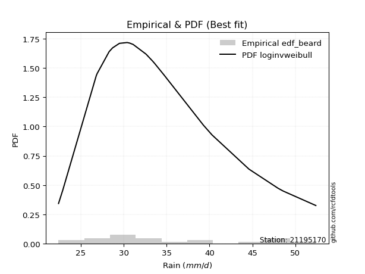</img>

</div>


### 5. EDF Chegodayev (1955)

The Chegodayev formula is an empirical plotting position formula used in hydrological frequency analysis to estimate the exceedance probability or return period of a specific event from a set of observed data. It is primarily used for plotting observed data points on probability paper to fit a theoretical distribution, particularly for analyzing extreme events like maximum flood flows or rainfall intensities. The constant _b_ value in the generalized plotting position formula is 0.3.

<div align="center">


$P=(m-b)/(n+1-2b)$


</div>


**5.1. Empirical values**

<div align="center">

|                | 0                   | 1                   | 2                   | 3                   | 4                  | 5                   | 6                   | 7                  | 8                  | 9                   | 10                 | 11                 | 12                 | 13                 | 14                 | 15                 | 16                 | 17                 | 18                 | 19                 |
|:---------------|:--------------------|:--------------------|:--------------------|:--------------------|:-------------------|:--------------------|:--------------------|:-------------------|:-------------------|:--------------------|:-------------------|:-------------------|:-------------------|:-------------------|:-------------------|:-------------------|:-------------------|:-------------------|:-------------------|:-------------------|
| date           | 2022                | 2015                | 2006                | 2007                | 2018               | 2020                | 2023                | 2021               | 2017               | 2008                | 2009               | 2005               | 2019               | 2012               | 2014               | 2010               | 2016               | 2013               | 2024               | 2011               |
| x              | 22.4                | 22.9                | 26.8                | 26.9                | 28.7               | 29.5                | 30.4                | 30.7               | 31.1               | 32.6                | 33.6               | 33.614999999999995 | 34.7               | 39.3               | 40.3               | 44.6               | 48.0               | 48.5               | 48.6               | 52.4               |
| m              | 1                   | 2                   | 3                   | 4                   | 5                  | 6                   | 7                   | 8                  | 9                  | 10                  | 11                 | 12                 | 13                 | 14                 | 15                 | 16                 | 17                 | 18                 | 19                 | 20                 |
| empirical_dist | edf_chegodayev      | edf_chegodayev      | edf_chegodayev      | edf_chegodayev      | edf_chegodayev     | edf_chegodayev      | edf_chegodayev      | edf_chegodayev     | edf_chegodayev     | edf_chegodayev      | edf_chegodayev     | edf_chegodayev     | edf_chegodayev     | edf_chegodayev     | edf_chegodayev     | edf_chegodayev     | edf_chegodayev     | edf_chegodayev     | edf_chegodayev     | edf_chegodayev     |
| empirical      | 0.03431372549019608 | 0.08333333333333334 | 0.13235294117647062 | 0.18137254901960786 | 0.2303921568627451 | 0.27941176470588236 | 0.32843137254901966 | 0.3774509803921569 | 0.4264705882352941 | 0.47549019607843135 | 0.5245098039215687 | 0.5735294117647058 | 0.6225490196078431 | 0.6715686274509804 | 0.7205882352941176 | 0.7696078431372549 | 0.8186274509803921 | 0.8676470588235294 | 0.9166666666666667 | 0.9656862745098039 |
| empirical_tr   | 1.0355329949238579  | 1.090909090909091   | 1.152542372881356   | 1.221556886227545   | 1.299363057324841  | 1.3877551020408163  | 1.4890510948905111  | 1.6062992125984252 | 1.7435897435897436 | 1.9065420560747663  | 2.1030927835051547 | 2.3448275862068964 | 2.6493506493506493 | 3.0447761194029854 | 3.5789473684210527 | 4.340425531914894  | 5.513513513513513  | 7.555555555555557  | 12.00000000000001  | 29.142857142857153 |

</div>


**5.2. Kolmogorov-Smirnov fit test (sorted by Δ)**


<div align="center">

|                | 0                   | 1                   | 2                   | 3                  | 4                   | 5                   | 6                   | 7                   | 8                   | 9                   | 10                  | 11                  | 12                  | 13                  | 14                  | 15                  | 16                  | 17                  | 18                  | 19                  | 20                  | 21                  | 22                  | 23                 | 24                  | 25                  | 26                  | 27                  | 28                  | 29                  | 30                  | 31                  | 32                  | 33                  | 34                  | 35                  | 36                  | 37                    | 38                  | 39                  | 40                  | 41                  | 42                  | 43                  | 44                 | 45                  | 46                  | 47                  | 48                  | 49                  | 50                  | 51                  | 52                  | 53                  | 54                  | 55                  | 56                  | 57                 | 58                  | 59                  | 60                 | 61                  | 62                  | 63                  | 64                  | 65                  | 66                  | 67                  | 68                  | 69                 | 70                 | 71                 | 72                 | 73                 | 74                  | 75                  | 76                  | 77                  | 78                  | 79                  | 80                  | 81                  | 82                  | 83                  | 84                  | 85                 | 86                  | 87                 |
|:---------------|:--------------------|:--------------------|:--------------------|:-------------------|:--------------------|:--------------------|:--------------------|:--------------------|:--------------------|:--------------------|:--------------------|:--------------------|:--------------------|:--------------------|:--------------------|:--------------------|:--------------------|:--------------------|:--------------------|:--------------------|:--------------------|:--------------------|:--------------------|:-------------------|:--------------------|:--------------------|:--------------------|:--------------------|:--------------------|:--------------------|:--------------------|:--------------------|:--------------------|:--------------------|:--------------------|:--------------------|:--------------------|:----------------------|:--------------------|:--------------------|:--------------------|:--------------------|:--------------------|:--------------------|:-------------------|:--------------------|:--------------------|:--------------------|:--------------------|:--------------------|:--------------------|:--------------------|:--------------------|:--------------------|:--------------------|:--------------------|:--------------------|:-------------------|:--------------------|:--------------------|:-------------------|:--------------------|:--------------------|:--------------------|:--------------------|:--------------------|:--------------------|:--------------------|:--------------------|:-------------------|:-------------------|:-------------------|:-------------------|:-------------------|:--------------------|:--------------------|:--------------------|:--------------------|:--------------------|:--------------------|:--------------------|:--------------------|:--------------------|:--------------------|:--------------------|:-------------------|:--------------------|:-------------------|
| station        | 21195170            | 21195170            | 21195170            | 21195170           | 21195170            | 21195170            | 21195170            | 21195170            | 21195170            | 21195170            | 21195170            | 21195170            | 21195170            | 21195170            | 21195170            | 21195170            | 21195170            | 21195170            | 21195170            | 21195170            | 21195170            | 21195170            | 21195170            | 21195170           | 21195170            | 21195170            | 21195170            | 21195170            | 21195170            | 21195170            | 21195170            | 21195170            | 21195170            | 21195170            | 21195170            | 21195170            | 21195170            | 21195170              | 21195170            | 21195170            | 21195170            | 21195170            | 21195170            | 21195170            | 21195170           | 21195170            | 21195170            | 21195170            | 21195170            | 21195170            | 21195170            | 21195170            | 21195170            | 21195170            | 21195170            | 21195170            | 21195170            | 21195170           | 21195170            | 21195170            | 21195170           | 21195170            | 21195170            | 21195170            | 21195170            | 21195170            | 21195170            | 21195170            | 21195170            | 21195170           | 21195170           | 21195170           | 21195170           | 21195170           | 21195170            | 21195170            | 21195170            | 21195170            | 21195170            | 21195170            | 21195170            | 21195170            | 21195170            | 21195170            | 21195170            | 21195170           | 21195170            | 21195170           |
| empirical_dist | edf_chegodayev      | edf_chegodayev      | edf_chegodayev      | edf_chegodayev     | edf_chegodayev      | edf_chegodayev      | edf_chegodayev      | edf_chegodayev      | edf_chegodayev      | edf_chegodayev      | edf_chegodayev      | edf_chegodayev      | edf_chegodayev      | edf_chegodayev      | edf_chegodayev      | edf_chegodayev      | edf_chegodayev      | edf_chegodayev      | edf_chegodayev      | edf_chegodayev      | edf_chegodayev      | edf_chegodayev      | edf_chegodayev      | edf_chegodayev     | edf_chegodayev      | edf_chegodayev      | edf_chegodayev      | edf_chegodayev      | edf_chegodayev      | edf_chegodayev      | edf_chegodayev      | edf_chegodayev      | edf_chegodayev      | edf_chegodayev      | edf_chegodayev      | edf_chegodayev      | edf_chegodayev      | edf_chegodayev        | edf_chegodayev      | edf_chegodayev      | edf_chegodayev      | edf_chegodayev      | edf_chegodayev      | edf_chegodayev      | edf_chegodayev     | edf_chegodayev      | edf_chegodayev      | edf_chegodayev      | edf_chegodayev      | edf_chegodayev      | edf_chegodayev      | edf_chegodayev      | edf_chegodayev      | edf_chegodayev      | edf_chegodayev      | edf_chegodayev      | edf_chegodayev      | edf_chegodayev     | edf_chegodayev      | edf_chegodayev      | edf_chegodayev     | edf_chegodayev      | edf_chegodayev      | edf_chegodayev      | edf_chegodayev      | edf_chegodayev      | edf_chegodayev      | edf_chegodayev      | edf_chegodayev      | edf_chegodayev     | edf_chegodayev     | edf_chegodayev     | edf_chegodayev     | edf_chegodayev     | edf_chegodayev      | edf_chegodayev      | edf_chegodayev      | edf_chegodayev      | edf_chegodayev      | edf_chegodayev      | edf_chegodayev      | edf_chegodayev      | edf_chegodayev      | edf_chegodayev      | edf_chegodayev      | edf_chegodayev     | edf_chegodayev      | edf_chegodayev     |
| p_dist         | loginvweibull       | logkstwobign        | lognakagami         | erlang             | chi2                | gamma               | fisk                | loggenlogistic      | loghalfnorm         | lograyleigh         | exponnorm           | weibull_min         | logmielke           | loginvgauss         | logmaxwell          | halfnorm            | laplace_asymmetric  | fatiguelife         | invgauss            | logfisk             | logrice             | logweibull_min      | nct                 | invgamma           | f                   | mielke              | loggamma            | loggamma            | logfatiguelife      | loglognorm          | logf                | loginvgamma         | lognct              | logalpha            | alpha               | ncf                 | logbetaprime        | loglaplace_asymmetric | invweibull          | logerlang           | genlogistic         | kstwobign           | logpearson3         | loggompertz         | halflogistic       | gumbel_r            | betaprime           | loggumbel_r         | loghalflogistic     | moyal               | logexponnorm        | logjohnsonsu        | logt                | lognorm             | lognorm             | logcrystalball      | rayleigh            | logloggamma        | logmoyal            | loglogistic         | loghypsecant       | maxwell             | rice                | pearson3            | loglaplace          | norm                | crystalball         | truncnorm           | t                   | johnsonsu          | genexpon           | expon              | logistic           | loggenexpon        | hypsecant           | loggumbel_l         | wald                | logwald             | laplace             | logncf              | nakagami            | logexpon            | logtruncnorm        | gumbel_l            | loggibrat           | gibrat             | logchi2             | gompertz           |
| delta          | 0.07019166685066702 | 0.07339499764105972 | 0.08034887874233698 | 0.0821427264515896 | 0.08214309218867966 | 0.08214346222765878 | 0.08233000065324658 | 0.08303347801830141 | 0.08333333333333334 | 0.08377922482420519 | 0.08498685310515997 | 0.08534563770166226 | 0.08622375493678014 | 0.08624386485464952 | 0.08629411427162414 | 0.08629488753564085 | 0.08636274134902433 | 0.08645160403656371 | 0.08712193039215199 | 0.08753705245465537 | 0.08757124322786569 | 0.08784123279182143 | 0.08802534489734837 | 0.0892918024006919 | 0.08931896818272744 | 0.08944145497643774 | 0.08957325969720764 | 0.08957325969720764 | 0.08958425461923758 | 0.09033623660205681 | 0.09087259211327736 | 0.09088705604182035 | 0.09140381661280628 | 0.09153264709677855 | 0.09165779308357747 | 0.09197229185247802 | 0.09225256350357233 | 0.0925265225968619    | 0.09284735099946917 | 0.09292888772001606 | 0.09301923576980964 | 0.09388241964153143 | 0.09399670979947394 | 0.09498523557053296 | 0.0952986194873141 | 0.09718386736098905 | 0.09844136015705579 | 0.09898525922066415 | 0.09927576083326284 | 0.10058688283877382 | 0.10227416820372087 | 0.10267898896533773 | 0.10271021370477629 | 0.10271032857839696 | 0.10271032857839696 | 0.10271055410716412 | 0.10342617968526224 | 0.104817406045985  | 0.10520901855898168 | 0.10667825893756178 | 0.1146117483970932 | 0.11495495666739808 | 0.11622969719682724 | 0.11719412610608715 | 0.13836863792586346 | 0.14885884748474743 | 0.14885885923754427 | 0.14885902563690845 | 0.14889470131394128 | 0.1489740371614477 | 0.1504830067763921 | 0.1570111160671135 | 0.1585326753310886 | 0.1609867333701111 | 0.16681323945053184 | 0.17334104322151034 | 0.18136036751403123 | 0.18137254901690944 | 0.19096320789096205 | 0.19440911133288058 | 0.20438748414523078 | 0.21262117644139794 | 0.21950557690869632 | 0.21951751523644092 | 0.21991133415006484 | 0.230087142412228  | 0.33461258385355686 | 0.6935806014868912 |
| deltao         | 0.3096406529800002  | 0.3096406529800002  | 0.3096406529800002  | 0.3096406529800002 | 0.3096406529800002  | 0.3096406529800002  | 0.3096406529800002  | 0.3096406529800002  | 0.3096406529800002  | 0.3096406529800002  | 0.3096406529800002  | 0.3096406529800002  | 0.3096406529800002  | 0.3096406529800002  | 0.3096406529800002  | 0.3096406529800002  | 0.3096406529800002  | 0.3096406529800002  | 0.3096406529800002  | 0.3096406529800002  | 0.3096406529800002  | 0.3096406529800002  | 0.3096406529800002  | 0.3096406529800002 | 0.3096406529800002  | 0.3096406529800002  | 0.3096406529800002  | 0.3096406529800002  | 0.3096406529800002  | 0.3096406529800002  | 0.3096406529800002  | 0.3096406529800002  | 0.3096406529800002  | 0.3096406529800002  | 0.3096406529800002  | 0.3096406529800002  | 0.3096406529800002  | 0.3096406529800002    | 0.3096406529800002  | 0.3096406529800002  | 0.3096406529800002  | 0.3096406529800002  | 0.3096406529800002  | 0.3096406529800002  | 0.3096406529800002 | 0.3096406529800002  | 0.3096406529800002  | 0.3096406529800002  | 0.3096406529800002  | 0.3096406529800002  | 0.3096406529800002  | 0.3096406529800002  | 0.3096406529800002  | 0.3096406529800002  | 0.3096406529800002  | 0.3096406529800002  | 0.3096406529800002  | 0.3096406529800002 | 0.3096406529800002  | 0.3096406529800002  | 0.3096406529800002 | 0.3096406529800002  | 0.3096406529800002  | 0.3096406529800002  | 0.3096406529800002  | 0.3096406529800002  | 0.3096406529800002  | 0.3096406529800002  | 0.3096406529800002  | 0.3096406529800002 | 0.3096406529800002 | 0.3096406529800002 | 0.3096406529800002 | 0.3096406529800002 | 0.3096406529800002  | 0.3096406529800002  | 0.3096406529800002  | 0.3096406529800002  | 0.3096406529800002  | 0.3096406529800002  | 0.3096406529800002  | 0.3096406529800002  | 0.3096406529800002  | 0.3096406529800002  | 0.3096406529800002  | 0.3096406529800002 | 0.3096406529800002  | 0.3096406529800002 |
| eval           | Δo > Δ              | Δo > Δ              | Δo > Δ              | Δo > Δ             | Δo > Δ              | Δo > Δ              | Δo > Δ              | Δo > Δ              | Δo > Δ              | Δo > Δ              | Δo > Δ              | Δo > Δ              | Δo > Δ              | Δo > Δ              | Δo > Δ              | Δo > Δ              | Δo > Δ              | Δo > Δ              | Δo > Δ              | Δo > Δ              | Δo > Δ              | Δo > Δ              | Δo > Δ              | Δo > Δ             | Δo > Δ              | Δo > Δ              | Δo > Δ              | Δo > Δ              | Δo > Δ              | Δo > Δ              | Δo > Δ              | Δo > Δ              | Δo > Δ              | Δo > Δ              | Δo > Δ              | Δo > Δ              | Δo > Δ              | Δo > Δ                | Δo > Δ              | Δo > Δ              | Δo > Δ              | Δo > Δ              | Δo > Δ              | Δo > Δ              | Δo > Δ             | Δo > Δ              | Δo > Δ              | Δo > Δ              | Δo > Δ              | Δo > Δ              | Δo > Δ              | Δo > Δ              | Δo > Δ              | Δo > Δ              | Δo > Δ              | Δo > Δ              | Δo > Δ              | Δo > Δ             | Δo > Δ              | Δo > Δ              | Δo > Δ             | Δo > Δ              | Δo > Δ              | Δo > Δ              | Δo > Δ              | Δo > Δ              | Δo > Δ              | Δo > Δ              | Δo > Δ              | Δo > Δ             | Δo > Δ             | Δo > Δ             | Δo > Δ             | Δo > Δ             | Δo > Δ              | Δo > Δ              | Δo > Δ              | Δo > Δ              | Δo > Δ              | Δo > Δ              | Δo > Δ              | Δo > Δ              | Δo > Δ              | Δo > Δ              | Δo > Δ              | Δo > Δ             | Δo <= Δ             | Δo <= Δ            |
| fit            | 1                   | 1                   | 1                   | 1                  | 1                   | 1                   | 1                   | 1                   | 1                   | 1                   | 1                   | 1                   | 1                   | 1                   | 1                   | 1                   | 1                   | 1                   | 1                   | 1                   | 1                   | 1                   | 1                   | 1                  | 1                   | 1                   | 1                   | 1                   | 1                   | 1                   | 1                   | 1                   | 1                   | 1                   | 1                   | 1                   | 1                   | 1                     | 1                   | 1                   | 1                   | 1                   | 1                   | 1                   | 1                  | 1                   | 1                   | 1                   | 1                   | 1                   | 1                   | 1                   | 1                   | 1                   | 1                   | 1                   | 1                   | 1                  | 1                   | 1                   | 1                  | 1                   | 1                   | 1                   | 1                   | 1                   | 1                   | 1                   | 1                   | 1                  | 1                  | 1                  | 1                  | 1                  | 1                   | 1                   | 1                   | 1                   | 1                   | 1                   | 1                   | 1                   | 1                   | 1                   | 1                   | 1                  | 0                   | 0                  |
| n              | 20                  | 20                  | 20                  | 20                 | 20                  | 20                  | 20                  | 20                  | 20                  | 20                  | 20                  | 20                  | 20                  | 20                  | 20                  | 20                  | 20                  | 20                  | 20                  | 20                  | 20                  | 20                  | 20                  | 20                 | 20                  | 20                  | 20                  | 20                  | 20                  | 20                  | 20                  | 20                  | 20                  | 20                  | 20                  | 20                  | 20                  | 20                    | 20                  | 20                  | 20                  | 20                  | 20                  | 20                  | 20                 | 20                  | 20                  | 20                  | 20                  | 20                  | 20                  | 20                  | 20                  | 20                  | 20                  | 20                  | 20                  | 20                 | 20                  | 20                  | 20                 | 20                  | 20                  | 20                  | 20                  | 20                  | 20                  | 20                  | 20                  | 20                 | 20                 | 20                 | 20                 | 20                 | 20                  | 20                  | 20                  | 20                  | 20                  | 20                  | 20                  | 20                  | 20                  | 20                  | 20                  | 20                 | 20                  | 20                 |
| best_fit       | 1                   | 0                   | 0                   | 0                  | 0                   | 0                   | 0                   | 0                   | 0                   | 0                   | 0                   | 0                   | 0                   | 0                   | 0                   | 0                   | 0                   | 0                   | 0                   | 0                   | 0                   | 0                   | 0                   | 0                  | 0                   | 0                   | 0                   | 0                   | 0                   | 0                   | 0                   | 0                   | 0                   | 0                   | 0                   | 0                   | 0                   | 0                     | 0                   | 0                   | 0                   | 0                   | 0                   | 0                   | 0                  | 0                   | 0                   | 0                   | 0                   | 0                   | 0                   | 0                   | 0                   | 0                   | 0                   | 0                   | 0                   | 0                  | 0                   | 0                   | 0                  | 0                   | 0                   | 0                   | 0                   | 0                   | 0                   | 0                   | 0                   | 0                  | 0                  | 0                  | 0                  | 0                  | 0                   | 0                   | 0                   | 0                   | 0                   | 0                   | 0                   | 0                   | 0                   | 0                   | 0                   | 0                  | 0                   | 0                  |
| best_fit_sort  | 1                   | 2                   | 3                   | 4                  | 5                   | 6                   | 7                   | 8                   | 9                   | 10                  | 11                  | 12                  | 13                  | 14                  | 15                  | 16                  | 17                  | 18                  | 19                  | 20                  | 21                  | 22                  | 23                  | 24                 | 25                  | 26                  | 27                  | 28                  | 29                  | 30                  | 31                  | 32                  | 33                  | 34                  | 35                  | 36                  | 37                  | 38                    | 39                  | 40                  | 41                  | 42                  | 43                  | 44                  | 45                 | 46                  | 47                  | 48                  | 49                  | 50                  | 51                  | 52                  | 53                  | 54                  | 55                  | 56                  | 57                  | 58                 | 59                  | 60                  | 61                 | 62                  | 63                  | 64                  | 65                  | 66                  | 67                  | 68                  | 69                  | 70                 | 71                 | 72                 | 73                 | 74                 | 75                  | 76                  | 77                  | 78                  | 79                  | 80                  | 81                  | 82                  | 83                  | 84                  | 85                  | 86                 | 87                  | 88                 |

</div>


<div align="center">

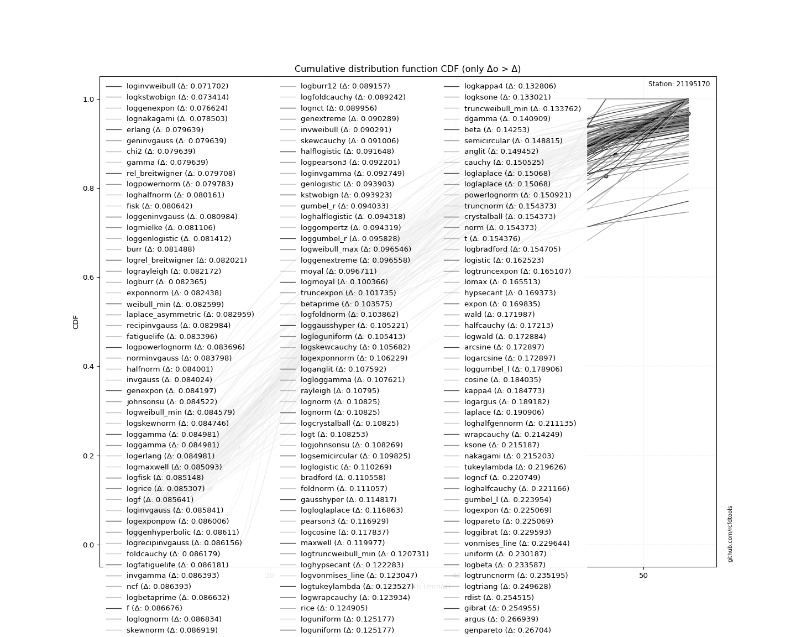</img>

</div>


**5.3. Best fit**

<div align="center">

|   id |   station | empirical_dist   | p_dist        |     delta |   deltao | eval   |   fit |   n |   best_fit |   best_fit_sort |
|-----:|----------:|:-----------------|:--------------|----------:|---------:|:-------|------:|----:|-----------:|----------------:|
|    0 |  21195170 | edf_chegodayev   | loginvweibull | 0.0701917 | 0.309641 | Δo > Δ |     1 |  20 |          1 |               1 |

</div>


<div align="center">

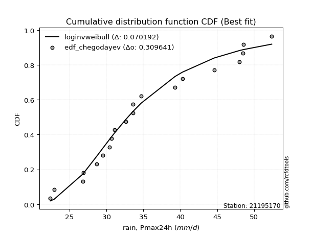</img>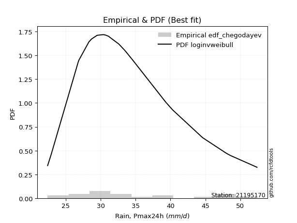</img>

</div>


### 6. EDF Blom (1958)

The Blom formula is a specific "plotting position" formula used in hydrology and statistical analysis to estimate the empirical cumulative probability (or non-exceedance probability) of a data series. It is particularly recommended for data that are approximately normally distributed. The constant _a_ is set to 0.375 (or 3/8).

<div align="center">


$P=(m-a)/(n+1-2a)$


</div>


**6.1. Empirical values**

<div align="center">

|                | 0                    | 1                   | 2                   | 3                   | 4                   | 5                  | 6                  | 7                  | 8                   | 9                   | 10                 | 11                 | 12                 | 13                 | 14                 | 15                 | 16                 | 17                 | 18                 | 19                 |
|:---------------|:---------------------|:--------------------|:--------------------|:--------------------|:--------------------|:-------------------|:-------------------|:-------------------|:--------------------|:--------------------|:-------------------|:-------------------|:-------------------|:-------------------|:-------------------|:-------------------|:-------------------|:-------------------|:-------------------|:-------------------|
| date           | 2022                 | 2015                | 2006                | 2007                | 2018                | 2020               | 2023               | 2021               | 2017                | 2008                | 2009               | 2005               | 2019               | 2012               | 2014               | 2010               | 2016               | 2013               | 2024               | 2011               |
| x              | 22.4                 | 22.9                | 26.8                | 26.9                | 28.7                | 29.5               | 30.4               | 30.7               | 31.1                | 32.6                | 33.6               | 33.614999999999995 | 34.7               | 39.3               | 40.3               | 44.6               | 48.0               | 48.5               | 48.6               | 52.4               |
| m              | 1                    | 2                   | 3                   | 4                   | 5                   | 6                  | 7                  | 8                  | 9                   | 10                  | 11                 | 12                 | 13                 | 14                 | 15                 | 16                 | 17                 | 18                 | 19                 | 20                 |
| empirical_dist | edf_blom             | edf_blom            | edf_blom            | edf_blom            | edf_blom            | edf_blom           | edf_blom           | edf_blom           | edf_blom            | edf_blom            | edf_blom           | edf_blom           | edf_blom           | edf_blom           | edf_blom           | edf_blom           | edf_blom           | edf_blom           | edf_blom           | edf_blom           |
| empirical      | 0.030864197530864196 | 0.08024691358024691 | 0.12962962962962962 | 0.17901234567901234 | 0.22839506172839505 | 0.2777777777777778 | 0.3271604938271605 | 0.3765432098765432 | 0.42592592592592593 | 0.47530864197530864 | 0.5246913580246914 | 0.5740740740740741 | 0.6234567901234568 | 0.6728395061728395 | 0.7222222222222222 | 0.7716049382716049 | 0.8209876543209876 | 0.8703703703703703 | 0.9197530864197531 | 0.9691358024691358 |
| empirical_tr   | 1.0318471337579618   | 1.087248322147651   | 1.148936170212766   | 1.218045112781955   | 1.296               | 1.3846153846153846 | 1.4862385321100917 | 1.603960396039604  | 1.7419354838709677  | 1.9058823529411766  | 2.103896103896104  | 2.3478260869565215 | 2.6557377049180326 | 3.0566037735849054 | 3.5999999999999996 | 4.378378378378378  | 5.586206896551723  | 7.714285714285713  | 12.461538461538458 | 32.39999999999997  |

</div>


**6.2. Kolmogorov-Smirnov fit test (sorted by Δ)**


<div align="center">

|                | 0                   | 1                   | 2                  | 3                  | 4                   | 5                   | 6                  | 7                  | 8                   | 9                   | 10                  | 11                  | 12                  | 13                  | 14                  | 15                  | 16                  | 17                  | 18                  | 19                  | 20                  | 21                 | 22                  | 23                 | 24                  | 25                  | 26                  | 27                  | 28                  | 29                 | 30                  | 31                  | 32                  | 33                  | 34                  | 35                  | 36                  | 37                  | 38                  | 39                    | 40                  | 41                  | 42                  | 43                  | 44                  | 45                  | 46                  | 47                  | 48                  | 49                  | 50                 | 51                  | 52                  | 53                  | 54                  | 55                  | 56                  | 57                  | 58                  | 59                 | 60                  | 61                  | 62                  | 63                  | 64                 | 65                  | 66                 | 67                  | 68                  | 69                  | 70                  | 71                  | 72                  | 73                  | 74                  | 75                  | 76                 | 77                 | 78                  | 79                  | 80                  | 81                  | 82                  | 83                  | 84                  | 85                  | 86                 | 87                 |
|:---------------|:--------------------|:--------------------|:-------------------|:-------------------|:--------------------|:--------------------|:-------------------|:-------------------|:--------------------|:--------------------|:--------------------|:--------------------|:--------------------|:--------------------|:--------------------|:--------------------|:--------------------|:--------------------|:--------------------|:--------------------|:--------------------|:-------------------|:--------------------|:-------------------|:--------------------|:--------------------|:--------------------|:--------------------|:--------------------|:-------------------|:--------------------|:--------------------|:--------------------|:--------------------|:--------------------|:--------------------|:--------------------|:--------------------|:--------------------|:----------------------|:--------------------|:--------------------|:--------------------|:--------------------|:--------------------|:--------------------|:--------------------|:--------------------|:--------------------|:--------------------|:-------------------|:--------------------|:--------------------|:--------------------|:--------------------|:--------------------|:--------------------|:--------------------|:--------------------|:-------------------|:--------------------|:--------------------|:--------------------|:--------------------|:-------------------|:--------------------|:-------------------|:--------------------|:--------------------|:--------------------|:--------------------|:--------------------|:--------------------|:--------------------|:--------------------|:--------------------|:-------------------|:-------------------|:--------------------|:--------------------|:--------------------|:--------------------|:--------------------|:--------------------|:--------------------|:--------------------|:-------------------|:-------------------|
| station        | 21195170            | 21195170            | 21195170           | 21195170           | 21195170            | 21195170            | 21195170           | 21195170           | 21195170            | 21195170            | 21195170            | 21195170            | 21195170            | 21195170            | 21195170            | 21195170            | 21195170            | 21195170            | 21195170            | 21195170            | 21195170            | 21195170           | 21195170            | 21195170           | 21195170            | 21195170            | 21195170            | 21195170            | 21195170            | 21195170           | 21195170            | 21195170            | 21195170            | 21195170            | 21195170            | 21195170            | 21195170            | 21195170            | 21195170            | 21195170              | 21195170            | 21195170            | 21195170            | 21195170            | 21195170            | 21195170            | 21195170            | 21195170            | 21195170            | 21195170            | 21195170           | 21195170            | 21195170            | 21195170            | 21195170            | 21195170            | 21195170            | 21195170            | 21195170            | 21195170           | 21195170            | 21195170            | 21195170            | 21195170            | 21195170           | 21195170            | 21195170           | 21195170            | 21195170            | 21195170            | 21195170            | 21195170            | 21195170            | 21195170            | 21195170            | 21195170            | 21195170           | 21195170           | 21195170            | 21195170            | 21195170            | 21195170            | 21195170            | 21195170            | 21195170            | 21195170            | 21195170           | 21195170           |
| empirical_dist | edf_blom            | edf_blom            | edf_blom           | edf_blom           | edf_blom            | edf_blom            | edf_blom           | edf_blom           | edf_blom            | edf_blom            | edf_blom            | edf_blom            | edf_blom            | edf_blom            | edf_blom            | edf_blom            | edf_blom            | edf_blom            | edf_blom            | edf_blom            | edf_blom            | edf_blom           | edf_blom            | edf_blom           | edf_blom            | edf_blom            | edf_blom            | edf_blom            | edf_blom            | edf_blom           | edf_blom            | edf_blom            | edf_blom            | edf_blom            | edf_blom            | edf_blom            | edf_blom            | edf_blom            | edf_blom            | edf_blom              | edf_blom            | edf_blom            | edf_blom            | edf_blom            | edf_blom            | edf_blom            | edf_blom            | edf_blom            | edf_blom            | edf_blom            | edf_blom           | edf_blom            | edf_blom            | edf_blom            | edf_blom            | edf_blom            | edf_blom            | edf_blom            | edf_blom            | edf_blom           | edf_blom            | edf_blom            | edf_blom            | edf_blom            | edf_blom           | edf_blom            | edf_blom           | edf_blom            | edf_blom            | edf_blom            | edf_blom            | edf_blom            | edf_blom            | edf_blom            | edf_blom            | edf_blom            | edf_blom           | edf_blom           | edf_blom            | edf_blom            | edf_blom            | edf_blom            | edf_blom            | edf_blom            | edf_blom            | edf_blom            | edf_blom           | edf_blom           |
| p_dist         | loginvweibull       | logkstwobign        | lognakagami        | erlang             | chi2                | gamma               | fisk               | loghalfnorm        | loggenlogistic      | lograyleigh         | weibull_min         | exponnorm           | logmaxwell          | halfnorm            | fatiguelife         | logmielke           | loginvgauss         | laplace_asymmetric  | invgauss            | logrice             | logweibull_min      | logfisk            | nct                 | invgamma           | f                   | loggamma            | loggamma            | logfatiguelife      | mielke              | loglognorm         | logf                | loginvgamma         | lognct              | logalpha            | alpha               | ncf                 | invweibull          | logerlang           | genlogistic         | loglaplace_asymmetric | kstwobign           | logpearson3         | halflogistic        | gumbel_r            | logbetaprime        | loggompertz         | loggumbel_r         | loghalflogistic     | moyal               | betaprime           | logexponnorm       | logjohnsonsu        | logt                | lognorm             | lognorm             | logcrystalball      | logmoyal            | rayleigh            | logloggamma         | loglogistic        | loghypsecant        | maxwell             | rice                | pearson3            | loglaplace         | norm                | crystalball        | truncnorm           | t                   | johnsonsu           | genexpon            | logistic            | expon               | loggenexpon         | hypsecant           | loggumbel_l         | wald               | logwald            | laplace             | logncf              | nakagami            | logexpon            | loggibrat           | gumbel_l            | logtruncnorm        | gibrat              | logchi2            | gompertz           |
| delta          | 0.06819457171631704 | 0.07139790250670974 | 0.078351783607987  | 0.0797825231109941 | 0.07978288884808415 | 0.07978325888706328 | 0.0803329055188966 | 0.0807170519609941 | 0.08103638288395143 | 0.08178212968985521 | 0.08298543436106676 | 0.08298975797080999 | 0.08393391093102864 | 0.08393468419504535 | 0.08409140069596821 | 0.08422665980243016 | 0.08424676972029954 | 0.08436564621467435 | 0.08476172705155649 | 0.08521103988727019 | 0.08548102945122593 | 0.0855399573203054 | 0.08602824976299839 | 0.0869315990600964 | 0.08695876484213194 | 0.08721305635661214 | 0.08721305635661214 | 0.08722405127864208 | 0.08744435984208776 | 0.0879760332614613 | 0.08851238877268186 | 0.08852685270122485 | 0.08904361327221078 | 0.08917244375618305 | 0.08929758974298196 | 0.08961208851188252 | 0.09048714765887367 | 0.09056868437942056 | 0.09065903242921414 | 0.09125564387500285   | 0.09152221630093593 | 0.09329093089242857 | 0.09330152435296413 | 0.09482366402039355 | 0.09497587505041333 | 0.09589300608614659 | 0.09698816408631417 | 0.09800488211140379 | 0.09858978770442384 | 0.09898602246642402 | 0.1028188305130891 | 0.10322365127470595 | 0.10325487601414451 | 0.10325499088776519 | 0.10325499088776519 | 0.10325521641653235 | 0.10393813983712263 | 0.10433395020087588 | 0.10536206835535322 | 0.10722292124693   | 0.11261465326274323 | 0.11586272718301172 | 0.11677435950619547 | 0.11773878841545538 | 0.1378239756164953 | 0.14976661800036106 | 0.1497666297531579 | 0.14976679615252209 | 0.14980247182955492 | 0.14988180767706133 | 0.15248010191074216 | 0.15907733764045684 | 0.15973442761395448 | 0.16298382850446116 | 0.16735790175990006 | 0.17388570553087856 | 0.1790001641734357 | 0.1790123456763139 | 0.19150787020033028 | 0.19713242287972157 | 0.20711079569207178 | 0.21534448798823894 | 0.21791423901571477 | 0.22042528575205456 | 0.22150267204304638 | 0.22809004727787793 | 0.3380621118128887 | 0.6952145884149957 |
| deltao         | 0.3096406529800002  | 0.3096406529800002  | 0.3096406529800002 | 0.3096406529800002 | 0.3096406529800002  | 0.3096406529800002  | 0.3096406529800002 | 0.3096406529800002 | 0.3096406529800002  | 0.3096406529800002  | 0.3096406529800002  | 0.3096406529800002  | 0.3096406529800002  | 0.3096406529800002  | 0.3096406529800002  | 0.3096406529800002  | 0.3096406529800002  | 0.3096406529800002  | 0.3096406529800002  | 0.3096406529800002  | 0.3096406529800002  | 0.3096406529800002 | 0.3096406529800002  | 0.3096406529800002 | 0.3096406529800002  | 0.3096406529800002  | 0.3096406529800002  | 0.3096406529800002  | 0.3096406529800002  | 0.3096406529800002 | 0.3096406529800002  | 0.3096406529800002  | 0.3096406529800002  | 0.3096406529800002  | 0.3096406529800002  | 0.3096406529800002  | 0.3096406529800002  | 0.3096406529800002  | 0.3096406529800002  | 0.3096406529800002    | 0.3096406529800002  | 0.3096406529800002  | 0.3096406529800002  | 0.3096406529800002  | 0.3096406529800002  | 0.3096406529800002  | 0.3096406529800002  | 0.3096406529800002  | 0.3096406529800002  | 0.3096406529800002  | 0.3096406529800002 | 0.3096406529800002  | 0.3096406529800002  | 0.3096406529800002  | 0.3096406529800002  | 0.3096406529800002  | 0.3096406529800002  | 0.3096406529800002  | 0.3096406529800002  | 0.3096406529800002 | 0.3096406529800002  | 0.3096406529800002  | 0.3096406529800002  | 0.3096406529800002  | 0.3096406529800002 | 0.3096406529800002  | 0.3096406529800002 | 0.3096406529800002  | 0.3096406529800002  | 0.3096406529800002  | 0.3096406529800002  | 0.3096406529800002  | 0.3096406529800002  | 0.3096406529800002  | 0.3096406529800002  | 0.3096406529800002  | 0.3096406529800002 | 0.3096406529800002 | 0.3096406529800002  | 0.3096406529800002  | 0.3096406529800002  | 0.3096406529800002  | 0.3096406529800002  | 0.3096406529800002  | 0.3096406529800002  | 0.3096406529800002  | 0.3096406529800002 | 0.3096406529800002 |
| eval           | Δo > Δ              | Δo > Δ              | Δo > Δ             | Δo > Δ             | Δo > Δ              | Δo > Δ              | Δo > Δ             | Δo > Δ             | Δo > Δ              | Δo > Δ              | Δo > Δ              | Δo > Δ              | Δo > Δ              | Δo > Δ              | Δo > Δ              | Δo > Δ              | Δo > Δ              | Δo > Δ              | Δo > Δ              | Δo > Δ              | Δo > Δ              | Δo > Δ             | Δo > Δ              | Δo > Δ             | Δo > Δ              | Δo > Δ              | Δo > Δ              | Δo > Δ              | Δo > Δ              | Δo > Δ             | Δo > Δ              | Δo > Δ              | Δo > Δ              | Δo > Δ              | Δo > Δ              | Δo > Δ              | Δo > Δ              | Δo > Δ              | Δo > Δ              | Δo > Δ                | Δo > Δ              | Δo > Δ              | Δo > Δ              | Δo > Δ              | Δo > Δ              | Δo > Δ              | Δo > Δ              | Δo > Δ              | Δo > Δ              | Δo > Δ              | Δo > Δ             | Δo > Δ              | Δo > Δ              | Δo > Δ              | Δo > Δ              | Δo > Δ              | Δo > Δ              | Δo > Δ              | Δo > Δ              | Δo > Δ             | Δo > Δ              | Δo > Δ              | Δo > Δ              | Δo > Δ              | Δo > Δ             | Δo > Δ              | Δo > Δ             | Δo > Δ              | Δo > Δ              | Δo > Δ              | Δo > Δ              | Δo > Δ              | Δo > Δ              | Δo > Δ              | Δo > Δ              | Δo > Δ              | Δo > Δ             | Δo > Δ             | Δo > Δ              | Δo > Δ              | Δo > Δ              | Δo > Δ              | Δo > Δ              | Δo > Δ              | Δo > Δ              | Δo > Δ              | Δo <= Δ            | Δo <= Δ            |
| fit            | 1                   | 1                   | 1                  | 1                  | 1                   | 1                   | 1                  | 1                  | 1                   | 1                   | 1                   | 1                   | 1                   | 1                   | 1                   | 1                   | 1                   | 1                   | 1                   | 1                   | 1                   | 1                  | 1                   | 1                  | 1                   | 1                   | 1                   | 1                   | 1                   | 1                  | 1                   | 1                   | 1                   | 1                   | 1                   | 1                   | 1                   | 1                   | 1                   | 1                     | 1                   | 1                   | 1                   | 1                   | 1                   | 1                   | 1                   | 1                   | 1                   | 1                   | 1                  | 1                   | 1                   | 1                   | 1                   | 1                   | 1                   | 1                   | 1                   | 1                  | 1                   | 1                   | 1                   | 1                   | 1                  | 1                   | 1                  | 1                   | 1                   | 1                   | 1                   | 1                   | 1                   | 1                   | 1                   | 1                   | 1                  | 1                  | 1                   | 1                   | 1                   | 1                   | 1                   | 1                   | 1                   | 1                   | 0                  | 0                  |
| n              | 20                  | 20                  | 20                 | 20                 | 20                  | 20                  | 20                 | 20                 | 20                  | 20                  | 20                  | 20                  | 20                  | 20                  | 20                  | 20                  | 20                  | 20                  | 20                  | 20                  | 20                  | 20                 | 20                  | 20                 | 20                  | 20                  | 20                  | 20                  | 20                  | 20                 | 20                  | 20                  | 20                  | 20                  | 20                  | 20                  | 20                  | 20                  | 20                  | 20                    | 20                  | 20                  | 20                  | 20                  | 20                  | 20                  | 20                  | 20                  | 20                  | 20                  | 20                 | 20                  | 20                  | 20                  | 20                  | 20                  | 20                  | 20                  | 20                  | 20                 | 20                  | 20                  | 20                  | 20                  | 20                 | 20                  | 20                 | 20                  | 20                  | 20                  | 20                  | 20                  | 20                  | 20                  | 20                  | 20                  | 20                 | 20                 | 20                  | 20                  | 20                  | 20                  | 20                  | 20                  | 20                  | 20                  | 20                 | 20                 |
| best_fit       | 1                   | 0                   | 0                  | 0                  | 0                   | 0                   | 0                  | 0                  | 0                   | 0                   | 0                   | 0                   | 0                   | 0                   | 0                   | 0                   | 0                   | 0                   | 0                   | 0                   | 0                   | 0                  | 0                   | 0                  | 0                   | 0                   | 0                   | 0                   | 0                   | 0                  | 0                   | 0                   | 0                   | 0                   | 0                   | 0                   | 0                   | 0                   | 0                   | 0                     | 0                   | 0                   | 0                   | 0                   | 0                   | 0                   | 0                   | 0                   | 0                   | 0                   | 0                  | 0                   | 0                   | 0                   | 0                   | 0                   | 0                   | 0                   | 0                   | 0                  | 0                   | 0                   | 0                   | 0                   | 0                  | 0                   | 0                  | 0                   | 0                   | 0                   | 0                   | 0                   | 0                   | 0                   | 0                   | 0                   | 0                  | 0                  | 0                   | 0                   | 0                   | 0                   | 0                   | 0                   | 0                   | 0                   | 0                  | 0                  |
| best_fit_sort  | 1                   | 2                   | 3                  | 4                  | 5                   | 6                   | 7                  | 8                  | 9                   | 10                  | 11                  | 12                  | 13                  | 14                  | 15                  | 16                  | 17                  | 18                  | 19                  | 20                  | 21                  | 22                 | 23                  | 24                 | 25                  | 26                  | 27                  | 28                  | 29                  | 30                 | 31                  | 32                  | 33                  | 34                  | 35                  | 36                  | 37                  | 38                  | 39                  | 40                    | 41                  | 42                  | 43                  | 44                  | 45                  | 46                  | 47                  | 48                  | 49                  | 50                  | 51                 | 52                  | 53                  | 54                  | 55                  | 56                  | 57                  | 58                  | 59                  | 60                 | 61                  | 62                  | 63                  | 64                  | 65                 | 66                  | 67                 | 68                  | 69                  | 70                  | 71                  | 72                  | 73                  | 74                  | 75                  | 76                  | 77                 | 78                 | 79                  | 80                  | 81                  | 82                  | 83                  | 84                  | 85                  | 86                  | 87                 | 88                 |

</div>


<div align="center">

</img>

</div>


**6.3. Best fit**

<div align="center">

|   id |   station | empirical_dist   | p_dist        |     delta |   deltao | eval   |   fit |   n |   best_fit |   best_fit_sort |
|-----:|----------:|:-----------------|:--------------|----------:|---------:|:-------|------:|----:|-----------:|----------------:|
|    0 |  21195170 | edf_blom         | loginvweibull | 0.0681946 | 0.309641 | Δo > Δ |     1 |  20 |          1 |               1 |

</div>


<div align="center">

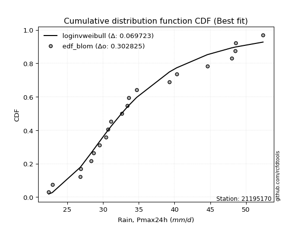</img>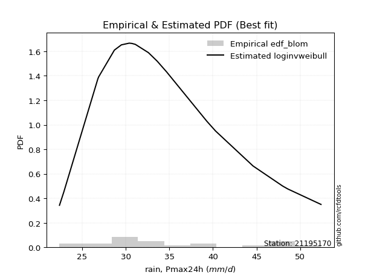</img>

</div>


### 7. EDF Tukey (1962)

In hydrology, the Tukey formula is used as a plotting position formula to estimate the empirical probability or frequency of a flood event (or other hydrological data). The formula parameter is given as _c=0.333_ (or 1/3).

<div align="center">


$P=(m-c)/(n+1-2c)$


</div>


**7.1. Empirical values**

<div align="center">

|                | 0                   | 1                   | 2                   | 3                   | 4                   | 5                  | 6                   | 7                  | 8                  | 9                   | 10                 | 11                 | 12                 | 13                 | 14                 | 15                 | 16                | 17                 | 18                 | 19                 |
|:---------------|:--------------------|:--------------------|:--------------------|:--------------------|:--------------------|:-------------------|:--------------------|:-------------------|:-------------------|:--------------------|:-------------------|:-------------------|:-------------------|:-------------------|:-------------------|:-------------------|:------------------|:-------------------|:-------------------|:-------------------|
| date           | 2022                | 2015                | 2006                | 2007                | 2018                | 2020               | 2023                | 2021               | 2017               | 2008                | 2009               | 2005               | 2019               | 2012               | 2014               | 2010               | 2016              | 2013               | 2024               | 2011               |
| x              | 22.4                | 22.9                | 26.8                | 26.9                | 28.7                | 29.5               | 30.4                | 30.7               | 31.1               | 32.6                | 33.6               | 33.614999999999995 | 34.7               | 39.3               | 40.3               | 44.6               | 48.0              | 48.5               | 48.6               | 52.4               |
| m              | 1                   | 2                   | 3                   | 4                   | 5                   | 6                  | 7                   | 8                  | 9                  | 10                  | 11                 | 12                 | 13                 | 14                 | 15                 | 16                 | 17                | 18                 | 19                 | 20                 |
| empirical_dist | edf_tukey           | edf_tukey           | edf_tukey           | edf_tukey           | edf_tukey           | edf_tukey          | edf_tukey           | edf_tukey          | edf_tukey          | edf_tukey           | edf_tukey          | edf_tukey          | edf_tukey          | edf_tukey          | edf_tukey          | edf_tukey          | edf_tukey         | edf_tukey          | edf_tukey          | edf_tukey          |
| empirical      | 0.03278688524590164 | 0.08196721311475409 | 0.13114754098360656 | 0.18032786885245902 | 0.22950819672131148 | 0.2786885245901639 | 0.32786885245901637 | 0.3770491803278688 | 0.4262295081967213 | 0.47540983606557374 | 0.5245901639344263 | 0.5737704918032787 | 0.6229508196721312 | 0.6721311475409836 | 0.7213114754098361 | 0.7704918032786885 | 0.819672131147541 | 0.8688524590163934 | 0.9180327868852459 | 0.9672131147540983 |
| empirical_tr   | 1.033898305084746   | 1.0892857142857142  | 1.150943396226415   | 1.22                | 1.297872340425532   | 1.3863636363636362 | 1.4878048780487803  | 1.6052631578947367 | 1.7428571428571429 | 1.90625             | 2.103448275862069  | 2.346153846153846  | 2.6521739130434785 | 3.05               | 3.588235294117647  | 4.357142857142857  | 5.545454545454546 | 7.624999999999998  | 12.200000000000003 | 30.499999999999964 |

</div>


**7.2. Kolmogorov-Smirnov fit test (sorted by Δ)**


<div align="center">

|                | 0                   | 1                   | 2                   | 3                   | 4                   | 5                   | 6                   | 7                   | 8                   | 9                   | 10                  | 11                  | 12                  | 13                  | 14                  | 15                  | 16                  | 17                  | 18                  | 19                  | 20                  | 21                  | 22                  | 23                  | 24                  | 25                  | 26                  | 27                  | 28                  | 29                  | 30                  | 31                  | 32                 | 33                  | 34                 | 35                  | 36                 | 37                  | 38                    | 39                  | 40                  | 41                  | 42                  | 43                  | 44                  | 45                  | 46                 | 47                 | 48                  | 49                  | 50                  | 51                  | 52                 | 53                  | 54                  | 55                  | 56                  | 57                  | 58                  | 59                  | 60                  | 61                 | 62                  | 63                  | 64                  | 65                  | 66                 | 67                  | 68                 | 69                  | 70                  | 71                  | 72                  | 73                  | 74                  | 75                  | 76                 | 77                 | 78                  | 79                  | 80                  | 81                 | 82                 | 83                  | 84                  | 85                  | 86                  | 87                 |
|:---------------|:--------------------|:--------------------|:--------------------|:--------------------|:--------------------|:--------------------|:--------------------|:--------------------|:--------------------|:--------------------|:--------------------|:--------------------|:--------------------|:--------------------|:--------------------|:--------------------|:--------------------|:--------------------|:--------------------|:--------------------|:--------------------|:--------------------|:--------------------|:--------------------|:--------------------|:--------------------|:--------------------|:--------------------|:--------------------|:--------------------|:--------------------|:--------------------|:-------------------|:--------------------|:-------------------|:--------------------|:-------------------|:--------------------|:----------------------|:--------------------|:--------------------|:--------------------|:--------------------|:--------------------|:--------------------|:--------------------|:-------------------|:-------------------|:--------------------|:--------------------|:--------------------|:--------------------|:-------------------|:--------------------|:--------------------|:--------------------|:--------------------|:--------------------|:--------------------|:--------------------|:--------------------|:-------------------|:--------------------|:--------------------|:--------------------|:--------------------|:-------------------|:--------------------|:-------------------|:--------------------|:--------------------|:--------------------|:--------------------|:--------------------|:--------------------|:--------------------|:-------------------|:-------------------|:--------------------|:--------------------|:--------------------|:-------------------|:-------------------|:--------------------|:--------------------|:--------------------|:--------------------|:-------------------|
| station        | 21195170            | 21195170            | 21195170            | 21195170            | 21195170            | 21195170            | 21195170            | 21195170            | 21195170            | 21195170            | 21195170            | 21195170            | 21195170            | 21195170            | 21195170            | 21195170            | 21195170            | 21195170            | 21195170            | 21195170            | 21195170            | 21195170            | 21195170            | 21195170            | 21195170            | 21195170            | 21195170            | 21195170            | 21195170            | 21195170            | 21195170            | 21195170            | 21195170           | 21195170            | 21195170           | 21195170            | 21195170           | 21195170            | 21195170              | 21195170            | 21195170            | 21195170            | 21195170            | 21195170            | 21195170            | 21195170            | 21195170           | 21195170           | 21195170            | 21195170            | 21195170            | 21195170            | 21195170           | 21195170            | 21195170            | 21195170            | 21195170            | 21195170            | 21195170            | 21195170            | 21195170            | 21195170           | 21195170            | 21195170            | 21195170            | 21195170            | 21195170           | 21195170            | 21195170           | 21195170            | 21195170            | 21195170            | 21195170            | 21195170            | 21195170            | 21195170            | 21195170           | 21195170           | 21195170            | 21195170            | 21195170            | 21195170           | 21195170           | 21195170            | 21195170            | 21195170            | 21195170            | 21195170           |
| empirical_dist | edf_tukey           | edf_tukey           | edf_tukey           | edf_tukey           | edf_tukey           | edf_tukey           | edf_tukey           | edf_tukey           | edf_tukey           | edf_tukey           | edf_tukey           | edf_tukey           | edf_tukey           | edf_tukey           | edf_tukey           | edf_tukey           | edf_tukey           | edf_tukey           | edf_tukey           | edf_tukey           | edf_tukey           | edf_tukey           | edf_tukey           | edf_tukey           | edf_tukey           | edf_tukey           | edf_tukey           | edf_tukey           | edf_tukey           | edf_tukey           | edf_tukey           | edf_tukey           | edf_tukey          | edf_tukey           | edf_tukey          | edf_tukey           | edf_tukey          | edf_tukey           | edf_tukey             | edf_tukey           | edf_tukey           | edf_tukey           | edf_tukey           | edf_tukey           | edf_tukey           | edf_tukey           | edf_tukey          | edf_tukey          | edf_tukey           | edf_tukey           | edf_tukey           | edf_tukey           | edf_tukey          | edf_tukey           | edf_tukey           | edf_tukey           | edf_tukey           | edf_tukey           | edf_tukey           | edf_tukey           | edf_tukey           | edf_tukey          | edf_tukey           | edf_tukey           | edf_tukey           | edf_tukey           | edf_tukey          | edf_tukey           | edf_tukey          | edf_tukey           | edf_tukey           | edf_tukey           | edf_tukey           | edf_tukey           | edf_tukey           | edf_tukey           | edf_tukey          | edf_tukey          | edf_tukey           | edf_tukey           | edf_tukey           | edf_tukey          | edf_tukey          | edf_tukey           | edf_tukey           | edf_tukey           | edf_tukey           | edf_tukey          |
| p_dist         | loginvweibull       | logkstwobign        | lognakagami         | erlang              | chi2                | gamma               | fisk                | loghalfnorm         | loggenlogistic      | lograyleigh         | exponnorm           | weibull_min         | logmaxwell          | halfnorm            | logmielke           | loginvgauss         | fatiguelife         | laplace_asymmetric  | invgauss            | logrice             | logfisk             | logweibull_min      | nct                 | invgamma            | f                   | loggamma            | loggamma            | logfatiguelife      | mielke              | loglognorm          | logf                | loginvgamma         | lognct             | logalpha            | alpha              | ncf                 | invweibull         | logerlang           | loglaplace_asymmetric | genlogistic         | kstwobign           | logpearson3         | logbetaprime        | halflogistic        | loggompertz         | gumbel_r            | loggumbel_r        | betaprime          | loghalflogistic     | moyal               | logexponnorm        | logjohnsonsu        | logt               | lognorm             | lognorm             | logcrystalball      | rayleigh            | logmoyal            | logloggamma         | loglogistic         | loghypsecant        | maxwell            | rice                | pearson3            | loglaplace          | norm                | crystalball        | truncnorm           | t                  | johnsonsu           | genexpon            | expon               | logistic            | loggenexpon         | hypsecant           | loggumbel_l         | wald               | logwald            | laplace             | logncf              | nakagami            | logexpon           | loggibrat          | gumbel_l            | logtruncnorm        | gibrat              | logchi2             | gompertz           |
| delta          | 0.06930770670923347 | 0.07251103749962617 | 0.07946491860090343 | 0.08109804628444073 | 0.08109841202153079 | 0.08109878206050991 | 0.08144604051181303 | 0.08196721311475409 | 0.08214951787686786 | 0.08289526468277164 | 0.08410289296372642 | 0.08430095753451339 | 0.08524943410447527 | 0.08525020736849198 | 0.08533979479534659 | 0.08535990471321597 | 0.08540692386941484 | 0.08547878120759078 | 0.08607725022500312 | 0.08652656306071682 | 0.08665309231322182 | 0.08679655262467256 | 0.08714138475591482 | 0.08824712223354303 | 0.08827428801557857 | 0.08852857953005877 | 0.08852857953005877 | 0.08853957445208871 | 0.08855749483500419 | 0.08929155643490794 | 0.08982791194612849 | 0.08984237587467148 | 0.0903591364456574 | 0.09048796692962968 | 0.0906131129164286 | 0.09092761168532915 | 0.0918026708323203 | 0.09188420755286719 | 0.09196400250685877   | 0.09197455560266077 | 0.09283773947438256 | 0.09298734862163316 | 0.09345796369643639 | 0.09441465934588056 | 0.09538703563482098 | 0.09613918719384018 | 0.0981012990792306 | 0.0986824401956286 | 0.09871324074325971 | 0.09970292269734027 | 0.10251524824229369 | 0.10292006900391054 | 0.1029512937433491 | 0.10295140861696978 | 0.10295140861696978 | 0.10295163414573694 | 0.10382797974955027 | 0.10464649846897855 | 0.10505848608455781 | 0.10691933897613459 | 0.11372778825565966 | 0.1153567567316861 | 0.11647077723540006 | 0.11743520614465996 | 0.13812755788729064 | 0.14926064754903545 | 0.1492606593018323 | 0.14926082570119648 | 0.1492965013782293 | 0.14937583722573572 | 0.15136696691782572 | 0.15821651625997754 | 0.15877375536966143 | 0.16187069351154473 | 0.16705431948910465 | 0.17358212326008315 | 0.1803156873468824 | 0.1803278688497606 | 0.19120428792953487 | 0.19561451152574463 | 0.20559288433809483 | 0.213826576634262  | 0.2190273740086312 | 0.21991931530072895 | 0.22038953705012995 | 0.22920318227079436 | 0.33613942409785125 | 0.6943038416026096 |
| deltao         | 0.3096406529800002  | 0.3096406529800002  | 0.3096406529800002  | 0.3096406529800002  | 0.3096406529800002  | 0.3096406529800002  | 0.3096406529800002  | 0.3096406529800002  | 0.3096406529800002  | 0.3096406529800002  | 0.3096406529800002  | 0.3096406529800002  | 0.3096406529800002  | 0.3096406529800002  | 0.3096406529800002  | 0.3096406529800002  | 0.3096406529800002  | 0.3096406529800002  | 0.3096406529800002  | 0.3096406529800002  | 0.3096406529800002  | 0.3096406529800002  | 0.3096406529800002  | 0.3096406529800002  | 0.3096406529800002  | 0.3096406529800002  | 0.3096406529800002  | 0.3096406529800002  | 0.3096406529800002  | 0.3096406529800002  | 0.3096406529800002  | 0.3096406529800002  | 0.3096406529800002 | 0.3096406529800002  | 0.3096406529800002 | 0.3096406529800002  | 0.3096406529800002 | 0.3096406529800002  | 0.3096406529800002    | 0.3096406529800002  | 0.3096406529800002  | 0.3096406529800002  | 0.3096406529800002  | 0.3096406529800002  | 0.3096406529800002  | 0.3096406529800002  | 0.3096406529800002 | 0.3096406529800002 | 0.3096406529800002  | 0.3096406529800002  | 0.3096406529800002  | 0.3096406529800002  | 0.3096406529800002 | 0.3096406529800002  | 0.3096406529800002  | 0.3096406529800002  | 0.3096406529800002  | 0.3096406529800002  | 0.3096406529800002  | 0.3096406529800002  | 0.3096406529800002  | 0.3096406529800002 | 0.3096406529800002  | 0.3096406529800002  | 0.3096406529800002  | 0.3096406529800002  | 0.3096406529800002 | 0.3096406529800002  | 0.3096406529800002 | 0.3096406529800002  | 0.3096406529800002  | 0.3096406529800002  | 0.3096406529800002  | 0.3096406529800002  | 0.3096406529800002  | 0.3096406529800002  | 0.3096406529800002 | 0.3096406529800002 | 0.3096406529800002  | 0.3096406529800002  | 0.3096406529800002  | 0.3096406529800002 | 0.3096406529800002 | 0.3096406529800002  | 0.3096406529800002  | 0.3096406529800002  | 0.3096406529800002  | 0.3096406529800002 |
| eval           | Δo > Δ              | Δo > Δ              | Δo > Δ              | Δo > Δ              | Δo > Δ              | Δo > Δ              | Δo > Δ              | Δo > Δ              | Δo > Δ              | Δo > Δ              | Δo > Δ              | Δo > Δ              | Δo > Δ              | Δo > Δ              | Δo > Δ              | Δo > Δ              | Δo > Δ              | Δo > Δ              | Δo > Δ              | Δo > Δ              | Δo > Δ              | Δo > Δ              | Δo > Δ              | Δo > Δ              | Δo > Δ              | Δo > Δ              | Δo > Δ              | Δo > Δ              | Δo > Δ              | Δo > Δ              | Δo > Δ              | Δo > Δ              | Δo > Δ             | Δo > Δ              | Δo > Δ             | Δo > Δ              | Δo > Δ             | Δo > Δ              | Δo > Δ                | Δo > Δ              | Δo > Δ              | Δo > Δ              | Δo > Δ              | Δo > Δ              | Δo > Δ              | Δo > Δ              | Δo > Δ             | Δo > Δ             | Δo > Δ              | Δo > Δ              | Δo > Δ              | Δo > Δ              | Δo > Δ             | Δo > Δ              | Δo > Δ              | Δo > Δ              | Δo > Δ              | Δo > Δ              | Δo > Δ              | Δo > Δ              | Δo > Δ              | Δo > Δ             | Δo > Δ              | Δo > Δ              | Δo > Δ              | Δo > Δ              | Δo > Δ             | Δo > Δ              | Δo > Δ             | Δo > Δ              | Δo > Δ              | Δo > Δ              | Δo > Δ              | Δo > Δ              | Δo > Δ              | Δo > Δ              | Δo > Δ             | Δo > Δ             | Δo > Δ              | Δo > Δ              | Δo > Δ              | Δo > Δ             | Δo > Δ             | Δo > Δ              | Δo > Δ              | Δo > Δ              | Δo <= Δ             | Δo <= Δ            |
| fit            | 1                   | 1                   | 1                   | 1                   | 1                   | 1                   | 1                   | 1                   | 1                   | 1                   | 1                   | 1                   | 1                   | 1                   | 1                   | 1                   | 1                   | 1                   | 1                   | 1                   | 1                   | 1                   | 1                   | 1                   | 1                   | 1                   | 1                   | 1                   | 1                   | 1                   | 1                   | 1                   | 1                  | 1                   | 1                  | 1                   | 1                  | 1                   | 1                     | 1                   | 1                   | 1                   | 1                   | 1                   | 1                   | 1                   | 1                  | 1                  | 1                   | 1                   | 1                   | 1                   | 1                  | 1                   | 1                   | 1                   | 1                   | 1                   | 1                   | 1                   | 1                   | 1                  | 1                   | 1                   | 1                   | 1                   | 1                  | 1                   | 1                  | 1                   | 1                   | 1                   | 1                   | 1                   | 1                   | 1                   | 1                  | 1                  | 1                   | 1                   | 1                   | 1                  | 1                  | 1                   | 1                   | 1                   | 0                   | 0                  |
| n              | 20                  | 20                  | 20                  | 20                  | 20                  | 20                  | 20                  | 20                  | 20                  | 20                  | 20                  | 20                  | 20                  | 20                  | 20                  | 20                  | 20                  | 20                  | 20                  | 20                  | 20                  | 20                  | 20                  | 20                  | 20                  | 20                  | 20                  | 20                  | 20                  | 20                  | 20                  | 20                  | 20                 | 20                  | 20                 | 20                  | 20                 | 20                  | 20                    | 20                  | 20                  | 20                  | 20                  | 20                  | 20                  | 20                  | 20                 | 20                 | 20                  | 20                  | 20                  | 20                  | 20                 | 20                  | 20                  | 20                  | 20                  | 20                  | 20                  | 20                  | 20                  | 20                 | 20                  | 20                  | 20                  | 20                  | 20                 | 20                  | 20                 | 20                  | 20                  | 20                  | 20                  | 20                  | 20                  | 20                  | 20                 | 20                 | 20                  | 20                  | 20                  | 20                 | 20                 | 20                  | 20                  | 20                  | 20                  | 20                 |
| best_fit       | 1                   | 0                   | 0                   | 0                   | 0                   | 0                   | 0                   | 0                   | 0                   | 0                   | 0                   | 0                   | 0                   | 0                   | 0                   | 0                   | 0                   | 0                   | 0                   | 0                   | 0                   | 0                   | 0                   | 0                   | 0                   | 0                   | 0                   | 0                   | 0                   | 0                   | 0                   | 0                   | 0                  | 0                   | 0                  | 0                   | 0                  | 0                   | 0                     | 0                   | 0                   | 0                   | 0                   | 0                   | 0                   | 0                   | 0                  | 0                  | 0                   | 0                   | 0                   | 0                   | 0                  | 0                   | 0                   | 0                   | 0                   | 0                   | 0                   | 0                   | 0                   | 0                  | 0                   | 0                   | 0                   | 0                   | 0                  | 0                   | 0                  | 0                   | 0                   | 0                   | 0                   | 0                   | 0                   | 0                   | 0                  | 0                  | 0                   | 0                   | 0                   | 0                  | 0                  | 0                   | 0                   | 0                   | 0                   | 0                  |
| best_fit_sort  | 1                   | 2                   | 3                   | 4                   | 5                   | 6                   | 7                   | 8                   | 9                   | 10                  | 11                  | 12                  | 13                  | 14                  | 15                  | 16                  | 17                  | 18                  | 19                  | 20                  | 21                  | 22                  | 23                  | 24                  | 25                  | 26                  | 27                  | 28                  | 29                  | 30                  | 31                  | 32                  | 33                 | 34                  | 35                 | 36                  | 37                 | 38                  | 39                    | 40                  | 41                  | 42                  | 43                  | 44                  | 45                  | 46                  | 47                 | 48                 | 49                  | 50                  | 51                  | 52                  | 53                 | 54                  | 55                  | 56                  | 57                  | 58                  | 59                  | 60                  | 61                  | 62                 | 63                  | 64                  | 65                  | 66                  | 67                 | 68                  | 69                 | 70                  | 71                  | 72                  | 73                  | 74                  | 75                  | 76                  | 77                 | 78                 | 79                  | 80                  | 81                  | 82                 | 83                 | 84                  | 85                  | 86                  | 87                  | 88                 |

</div>


<div align="center">

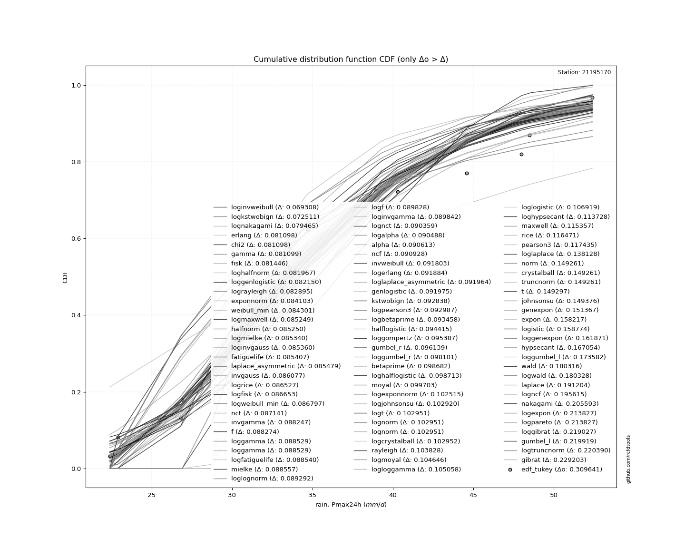</img>

</div>


**7.3. Best fit**

<div align="center">

|   id |   station | empirical_dist   | p_dist        |     delta |   deltao | eval   |   fit |   n |   best_fit |   best_fit_sort |
|-----:|----------:|:-----------------|:--------------|----------:|---------:|:-------|------:|----:|-----------:|----------------:|
|    0 |  21195170 | edf_tukey        | loginvweibull | 0.0693077 | 0.309641 | Δo > Δ |     1 |  20 |          1 |               1 |

</div>


<div align="center">

</img>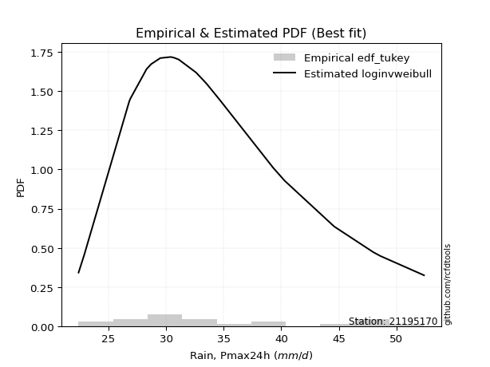</img>

</div>


### 8. EDF Gringorten (1963)

Gringorten plotting position formula is essential for estimating the probability and return periods of extreme events like floods and heavy rainfall. The constant _a=0.44_.

<div align="center">


$P=(m-a)/(n+1-2a)$


</div>


**8.1. Empirical values**

<div align="center">

|                | 0                    | 1                  | 2                  | 3                  | 4                   | 5                   | 6                   | 7                   | 8                  | 9                   | 10                 | 11                 | 12                 | 13                 | 14                 | 15                 | 16                 | 17                 | 18                 | 19                 |
|:---------------|:---------------------|:-------------------|:-------------------|:-------------------|:--------------------|:--------------------|:--------------------|:--------------------|:-------------------|:--------------------|:-------------------|:-------------------|:-------------------|:-------------------|:-------------------|:-------------------|:-------------------|:-------------------|:-------------------|:-------------------|
| date           | 2022                 | 2015               | 2006               | 2007               | 2018                | 2020                | 2023                | 2021                | 2017               | 2008                | 2009               | 2005               | 2019               | 2012               | 2014               | 2010               | 2016               | 2013               | 2024               | 2011               |
| x              | 22.4                 | 22.9               | 26.8               | 26.9               | 28.7                | 29.5                | 30.4                | 30.7                | 31.1               | 32.6                | 33.6               | 33.614999999999995 | 34.7               | 39.3               | 40.3               | 44.6               | 48.0               | 48.5               | 48.6               | 52.4               |
| m              | 1                    | 2                  | 3                  | 4                  | 5                   | 6                   | 7                   | 8                   | 9                  | 10                  | 11                 | 12                 | 13                 | 14                 | 15                 | 16                 | 17                 | 18                 | 19                 | 20                 |
| empirical_dist | edf_gringorten       | edf_gringorten     | edf_gringorten     | edf_gringorten     | edf_gringorten      | edf_gringorten      | edf_gringorten      | edf_gringorten      | edf_gringorten     | edf_gringorten      | edf_gringorten     | edf_gringorten     | edf_gringorten     | edf_gringorten     | edf_gringorten     | edf_gringorten     | edf_gringorten     | edf_gringorten     | edf_gringorten     | edf_gringorten     |
| empirical      | 0.027833001988071572 | 0.0775347912524851 | 0.1272365805168986 | 0.1769383697813121 | 0.22664015904572563 | 0.27634194831013914 | 0.32604373757455263 | 0.37574552683896617 | 0.4254473161033797 | 0.47514910536779326 | 0.5248508946322068 | 0.5745526838966203 | 0.6242544731610338 | 0.6739562624254473 | 0.7236580516898609 | 0.7733598409542743 | 0.8230616302186877 | 0.8727634194831013 | 0.9224652087475148 | 0.9721669980119283 |
| empirical_tr   | 1.0286298568507157   | 1.084051724137931  | 1.1457858769931661 | 1.2149758454106279 | 1.2930591259640103  | 1.3818681318681318  | 1.4837758112094395  | 1.6019108280254777  | 1.740484429065744  | 1.90530303030303    | 2.1046025104602513 | 2.350467289719626  | 2.6613756613756614 | 3.0670731707317067 | 3.618705035971223  | 4.412280701754386  | 5.651685393258422  | 7.859374999999996  | 12.89743589743588  | 35.92857142857125  |

</div>


**8.2. Kolmogorov-Smirnov fit test (sorted by Δ)**


<div align="center">

|                | 0                   | 1                   | 2                   | 3                   | 4                   | 5                  | 6                   | 7                   | 8                  | 9                   | 10                  | 11                  | 12                  | 13                  | 14                  | 15                  | 16                  | 17                  | 18                 | 19                 | 20                  | 21                  | 22                  | 23                  | 24                  | 25                  | 26                  | 27                  | 28                  | 29                  | 30                  | 31                  | 32                  | 33                  | 34                  | 35                  | 36                  | 37                  | 38                  | 39                  | 40                    | 41                 | 42                  | 43                  | 44                  | 45                  | 46                  | 47                  | 48                  | 49                  | 50                  | 51                  | 52                  | 53                  | 54                 | 55                 | 56                  | 57                  | 58                  | 59                  | 60                  | 61                 | 62                  | 63                  | 64                  | 65                  | 66                 | 67                  | 68                 | 69                  | 70                  | 71                  | 72                 | 73                  | 74                  | 75                  | 76                  | 77                  | 78                 | 79                 | 80                 | 81                  | 82                  | 83                  | 84                 | 85                 | 86                 | 87                 |
|:---------------|:--------------------|:--------------------|:--------------------|:--------------------|:--------------------|:-------------------|:--------------------|:--------------------|:-------------------|:--------------------|:--------------------|:--------------------|:--------------------|:--------------------|:--------------------|:--------------------|:--------------------|:--------------------|:-------------------|:-------------------|:--------------------|:--------------------|:--------------------|:--------------------|:--------------------|:--------------------|:--------------------|:--------------------|:--------------------|:--------------------|:--------------------|:--------------------|:--------------------|:--------------------|:--------------------|:--------------------|:--------------------|:--------------------|:--------------------|:--------------------|:----------------------|:-------------------|:--------------------|:--------------------|:--------------------|:--------------------|:--------------------|:--------------------|:--------------------|:--------------------|:--------------------|:--------------------|:--------------------|:--------------------|:-------------------|:-------------------|:--------------------|:--------------------|:--------------------|:--------------------|:--------------------|:-------------------|:--------------------|:--------------------|:--------------------|:--------------------|:-------------------|:--------------------|:-------------------|:--------------------|:--------------------|:--------------------|:-------------------|:--------------------|:--------------------|:--------------------|:--------------------|:--------------------|:-------------------|:-------------------|:-------------------|:--------------------|:--------------------|:--------------------|:-------------------|:-------------------|:-------------------|:-------------------|
| station        | 21195170            | 21195170            | 21195170            | 21195170            | 21195170            | 21195170           | 21195170            | 21195170            | 21195170           | 21195170            | 21195170            | 21195170            | 21195170            | 21195170            | 21195170            | 21195170            | 21195170            | 21195170            | 21195170           | 21195170           | 21195170            | 21195170            | 21195170            | 21195170            | 21195170            | 21195170            | 21195170            | 21195170            | 21195170            | 21195170            | 21195170            | 21195170            | 21195170            | 21195170            | 21195170            | 21195170            | 21195170            | 21195170            | 21195170            | 21195170            | 21195170              | 21195170           | 21195170            | 21195170            | 21195170            | 21195170            | 21195170            | 21195170            | 21195170            | 21195170            | 21195170            | 21195170            | 21195170            | 21195170            | 21195170           | 21195170           | 21195170            | 21195170            | 21195170            | 21195170            | 21195170            | 21195170           | 21195170            | 21195170            | 21195170            | 21195170            | 21195170           | 21195170            | 21195170           | 21195170            | 21195170            | 21195170            | 21195170           | 21195170            | 21195170            | 21195170            | 21195170            | 21195170            | 21195170           | 21195170           | 21195170           | 21195170            | 21195170            | 21195170            | 21195170           | 21195170           | 21195170           | 21195170           |
| empirical_dist | edf_gringorten      | edf_gringorten      | edf_gringorten      | edf_gringorten      | edf_gringorten      | edf_gringorten     | edf_gringorten      | edf_gringorten      | edf_gringorten     | edf_gringorten      | edf_gringorten      | edf_gringorten      | edf_gringorten      | edf_gringorten      | edf_gringorten      | edf_gringorten      | edf_gringorten      | edf_gringorten      | edf_gringorten     | edf_gringorten     | edf_gringorten      | edf_gringorten      | edf_gringorten      | edf_gringorten      | edf_gringorten      | edf_gringorten      | edf_gringorten      | edf_gringorten      | edf_gringorten      | edf_gringorten      | edf_gringorten      | edf_gringorten      | edf_gringorten      | edf_gringorten      | edf_gringorten      | edf_gringorten      | edf_gringorten      | edf_gringorten      | edf_gringorten      | edf_gringorten      | edf_gringorten        | edf_gringorten     | edf_gringorten      | edf_gringorten      | edf_gringorten      | edf_gringorten      | edf_gringorten      | edf_gringorten      | edf_gringorten      | edf_gringorten      | edf_gringorten      | edf_gringorten      | edf_gringorten      | edf_gringorten      | edf_gringorten     | edf_gringorten     | edf_gringorten      | edf_gringorten      | edf_gringorten      | edf_gringorten      | edf_gringorten      | edf_gringorten     | edf_gringorten      | edf_gringorten      | edf_gringorten      | edf_gringorten      | edf_gringorten     | edf_gringorten      | edf_gringorten     | edf_gringorten      | edf_gringorten      | edf_gringorten      | edf_gringorten     | edf_gringorten      | edf_gringorten      | edf_gringorten      | edf_gringorten      | edf_gringorten      | edf_gringorten     | edf_gringorten     | edf_gringorten     | edf_gringorten      | edf_gringorten      | edf_gringorten      | edf_gringorten     | edf_gringorten     | edf_gringorten     | edf_gringorten     |
| p_dist         | loginvweibull       | logkstwobign        | lognakagami         | erlang              | chi2                | gamma              | fisk                | loghalfnorm         | loggenlogistic     | lograyleigh         | weibull_min         | exponnorm           | logmaxwell          | halfnorm            | fatiguelife         | logmielke           | loginvgauss         | laplace_asymmetric  | invgauss           | logrice            | logweibull_min      | logfisk             | nct                 | invgamma            | f                   | loggamma            | loggamma            | logfatiguelife      | mielke              | loglognorm          | logf                | loginvgamma         | lognct              | logalpha            | alpha               | ncf                 | invweibull          | logerlang           | genlogistic         | kstwobign           | loglaplace_asymmetric | halflogistic       | gumbel_r            | logpearson3         | loggumbel_r         | loggompertz         | moyal               | loghalflogistic     | logbetaprime        | betaprime           | logmoyal            | logexponnorm        | logjohnsonsu        | logt                | lognorm            | lognorm            | logcrystalball      | rayleigh            | logloggamma         | loglogistic         | loghypsecant        | maxwell            | rice                | pearson3            | loglaplace          | norm                | crystalball        | truncnorm           | t                  | johnsonsu           | genexpon            | logistic            | expon              | loggenexpon         | hypsecant           | loggumbel_l         | wald                | logwald             | laplace            | logncf             | nakagami           | loggibrat           | logexpon            | gumbel_l            | logtruncnorm       | gibrat             | logchi2            | gompertz           |
| delta          | 0.06643966903364762 | 0.06964299982404032 | 0.07659688092531758 | 0.07770854721329401 | 0.07770891295038407 | 0.0777092829893632 | 0.07857800283622718 | 0.07896214927832468 | 0.079281480201282  | 0.08002722700718579 | 0.08091145846336667 | 0.08123485528814056 | 0.08185993503332856 | 0.08186070829734526 | 0.08201742479826812 | 0.08247175711976074 | 0.08249186703763012 | 0.08261074353200493 | 0.0826877511538564 | 0.0831370639895701 | 0.08340705355352585 | 0.08378505463763597 | 0.08427334708032896 | 0.08485762316239631 | 0.08488478894443185 | 0.08513908045891205 | 0.08513908045891205 | 0.08515007538094199 | 0.08568945715941834 | 0.08590205736376122 | 0.08643841287498177 | 0.08645287680352476 | 0.08696963737451069 | 0.08709846785848296 | 0.08722361384528188 | 0.08753811261418243 | 0.08841317176117358 | 0.08849470848172047 | 0.08858505653151405 | 0.08944824040323585 | 0.09013888762239508   | 0.0915466216702947 | 0.09274968812269346 | 0.09376954071497479 | 0.09523326140364474 | 0.09669068912372358 | 0.09683488502175441 | 0.09688812585879603 | 0.09736892416314435 | 0.09946463228897023 | 0.10282138358451487 | 0.10329744033563532 | 0.10370226109725217 | 0.10373348583669073 | 0.1037336007103114 | 0.1037336007103114 | 0.10373382623907856 | 0.10513163323845287 | 0.10584067817789944 | 0.10770153106947622 | 0.11107779481217239 | 0.1166604102205887 | 0.11725296932874169 | 0.11821739823800159 | 0.13734536579394907 | 0.15056430103793805 | 0.1505643127907349 | 0.15056447919009908 | 0.1506001548671319 | 0.15067949071463832 | 0.15423500459341158 | 0.15955594746300306 | 0.1621274767266855 | 0.16528650320026497 | 0.16783651158244628 | 0.17436431535342478 | 0.17692618827573547 | 0.17693836977861369 | 0.1919864800228765 | 0.1995254719924526 | 0.2095038448048028 | 0.21615933633304535 | 0.21773753710096996 | 0.22122296878963155 | 0.2232575747257158 | 0.2263351445952085 | 0.3410933073556812 | 0.6966504178826344 |
| deltao         | 0.3096406529800002  | 0.3096406529800002  | 0.3096406529800002  | 0.3096406529800002  | 0.3096406529800002  | 0.3096406529800002 | 0.3096406529800002  | 0.3096406529800002  | 0.3096406529800002 | 0.3096406529800002  | 0.3096406529800002  | 0.3096406529800002  | 0.3096406529800002  | 0.3096406529800002  | 0.3096406529800002  | 0.3096406529800002  | 0.3096406529800002  | 0.3096406529800002  | 0.3096406529800002 | 0.3096406529800002 | 0.3096406529800002  | 0.3096406529800002  | 0.3096406529800002  | 0.3096406529800002  | 0.3096406529800002  | 0.3096406529800002  | 0.3096406529800002  | 0.3096406529800002  | 0.3096406529800002  | 0.3096406529800002  | 0.3096406529800002  | 0.3096406529800002  | 0.3096406529800002  | 0.3096406529800002  | 0.3096406529800002  | 0.3096406529800002  | 0.3096406529800002  | 0.3096406529800002  | 0.3096406529800002  | 0.3096406529800002  | 0.3096406529800002    | 0.3096406529800002 | 0.3096406529800002  | 0.3096406529800002  | 0.3096406529800002  | 0.3096406529800002  | 0.3096406529800002  | 0.3096406529800002  | 0.3096406529800002  | 0.3096406529800002  | 0.3096406529800002  | 0.3096406529800002  | 0.3096406529800002  | 0.3096406529800002  | 0.3096406529800002 | 0.3096406529800002 | 0.3096406529800002  | 0.3096406529800002  | 0.3096406529800002  | 0.3096406529800002  | 0.3096406529800002  | 0.3096406529800002 | 0.3096406529800002  | 0.3096406529800002  | 0.3096406529800002  | 0.3096406529800002  | 0.3096406529800002 | 0.3096406529800002  | 0.3096406529800002 | 0.3096406529800002  | 0.3096406529800002  | 0.3096406529800002  | 0.3096406529800002 | 0.3096406529800002  | 0.3096406529800002  | 0.3096406529800002  | 0.3096406529800002  | 0.3096406529800002  | 0.3096406529800002 | 0.3096406529800002 | 0.3096406529800002 | 0.3096406529800002  | 0.3096406529800002  | 0.3096406529800002  | 0.3096406529800002 | 0.3096406529800002 | 0.3096406529800002 | 0.3096406529800002 |
| eval           | Δo > Δ              | Δo > Δ              | Δo > Δ              | Δo > Δ              | Δo > Δ              | Δo > Δ             | Δo > Δ              | Δo > Δ              | Δo > Δ             | Δo > Δ              | Δo > Δ              | Δo > Δ              | Δo > Δ              | Δo > Δ              | Δo > Δ              | Δo > Δ              | Δo > Δ              | Δo > Δ              | Δo > Δ             | Δo > Δ             | Δo > Δ              | Δo > Δ              | Δo > Δ              | Δo > Δ              | Δo > Δ              | Δo > Δ              | Δo > Δ              | Δo > Δ              | Δo > Δ              | Δo > Δ              | Δo > Δ              | Δo > Δ              | Δo > Δ              | Δo > Δ              | Δo > Δ              | Δo > Δ              | Δo > Δ              | Δo > Δ              | Δo > Δ              | Δo > Δ              | Δo > Δ                | Δo > Δ             | Δo > Δ              | Δo > Δ              | Δo > Δ              | Δo > Δ              | Δo > Δ              | Δo > Δ              | Δo > Δ              | Δo > Δ              | Δo > Δ              | Δo > Δ              | Δo > Δ              | Δo > Δ              | Δo > Δ             | Δo > Δ             | Δo > Δ              | Δo > Δ              | Δo > Δ              | Δo > Δ              | Δo > Δ              | Δo > Δ             | Δo > Δ              | Δo > Δ              | Δo > Δ              | Δo > Δ              | Δo > Δ             | Δo > Δ              | Δo > Δ             | Δo > Δ              | Δo > Δ              | Δo > Δ              | Δo > Δ             | Δo > Δ              | Δo > Δ              | Δo > Δ              | Δo > Δ              | Δo > Δ              | Δo > Δ             | Δo > Δ             | Δo > Δ             | Δo > Δ              | Δo > Δ              | Δo > Δ              | Δo > Δ             | Δo > Δ             | Δo <= Δ            | Δo <= Δ            |
| fit            | 1                   | 1                   | 1                   | 1                   | 1                   | 1                  | 1                   | 1                   | 1                  | 1                   | 1                   | 1                   | 1                   | 1                   | 1                   | 1                   | 1                   | 1                   | 1                  | 1                  | 1                   | 1                   | 1                   | 1                   | 1                   | 1                   | 1                   | 1                   | 1                   | 1                   | 1                   | 1                   | 1                   | 1                   | 1                   | 1                   | 1                   | 1                   | 1                   | 1                   | 1                     | 1                  | 1                   | 1                   | 1                   | 1                   | 1                   | 1                   | 1                   | 1                   | 1                   | 1                   | 1                   | 1                   | 1                  | 1                  | 1                   | 1                   | 1                   | 1                   | 1                   | 1                  | 1                   | 1                   | 1                   | 1                   | 1                  | 1                   | 1                  | 1                   | 1                   | 1                   | 1                  | 1                   | 1                   | 1                   | 1                   | 1                   | 1                  | 1                  | 1                  | 1                   | 1                   | 1                   | 1                  | 1                  | 0                  | 0                  |
| n              | 20                  | 20                  | 20                  | 20                  | 20                  | 20                 | 20                  | 20                  | 20                 | 20                  | 20                  | 20                  | 20                  | 20                  | 20                  | 20                  | 20                  | 20                  | 20                 | 20                 | 20                  | 20                  | 20                  | 20                  | 20                  | 20                  | 20                  | 20                  | 20                  | 20                  | 20                  | 20                  | 20                  | 20                  | 20                  | 20                  | 20                  | 20                  | 20                  | 20                  | 20                    | 20                 | 20                  | 20                  | 20                  | 20                  | 20                  | 20                  | 20                  | 20                  | 20                  | 20                  | 20                  | 20                  | 20                 | 20                 | 20                  | 20                  | 20                  | 20                  | 20                  | 20                 | 20                  | 20                  | 20                  | 20                  | 20                 | 20                  | 20                 | 20                  | 20                  | 20                  | 20                 | 20                  | 20                  | 20                  | 20                  | 20                  | 20                 | 20                 | 20                 | 20                  | 20                  | 20                  | 20                 | 20                 | 20                 | 20                 |
| best_fit       | 1                   | 0                   | 0                   | 0                   | 0                   | 0                  | 0                   | 0                   | 0                  | 0                   | 0                   | 0                   | 0                   | 0                   | 0                   | 0                   | 0                   | 0                   | 0                  | 0                  | 0                   | 0                   | 0                   | 0                   | 0                   | 0                   | 0                   | 0                   | 0                   | 0                   | 0                   | 0                   | 0                   | 0                   | 0                   | 0                   | 0                   | 0                   | 0                   | 0                   | 0                     | 0                  | 0                   | 0                   | 0                   | 0                   | 0                   | 0                   | 0                   | 0                   | 0                   | 0                   | 0                   | 0                   | 0                  | 0                  | 0                   | 0                   | 0                   | 0                   | 0                   | 0                  | 0                   | 0                   | 0                   | 0                   | 0                  | 0                   | 0                  | 0                   | 0                   | 0                   | 0                  | 0                   | 0                   | 0                   | 0                   | 0                   | 0                  | 0                  | 0                  | 0                   | 0                   | 0                   | 0                  | 0                  | 0                  | 0                  |
| best_fit_sort  | 1                   | 2                   | 3                   | 4                   | 5                   | 6                  | 7                   | 8                   | 9                  | 10                  | 11                  | 12                  | 13                  | 14                  | 15                  | 16                  | 17                  | 18                  | 19                 | 20                 | 21                  | 22                  | 23                  | 24                  | 25                  | 26                  | 27                  | 28                  | 29                  | 30                  | 31                  | 32                  | 33                  | 34                  | 35                  | 36                  | 37                  | 38                  | 39                  | 40                  | 41                    | 42                 | 43                  | 44                  | 45                  | 46                  | 47                  | 48                  | 49                  | 50                  | 51                  | 52                  | 53                  | 54                  | 55                 | 56                 | 57                  | 58                  | 59                  | 60                  | 61                  | 62                 | 63                  | 64                  | 65                  | 66                  | 67                 | 68                  | 69                 | 70                  | 71                  | 72                  | 73                 | 74                  | 75                  | 76                  | 77                  | 78                  | 79                 | 80                 | 81                 | 82                  | 83                  | 84                  | 85                 | 86                 | 87                 | 88                 |

</div>


<div align="center">

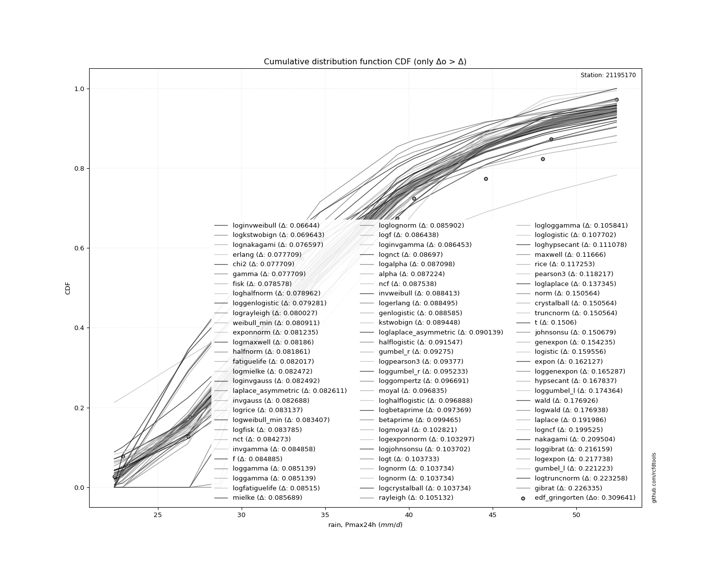</img>

</div>


**8.3. Best fit**

<div align="center">

|   id |   station | empirical_dist   | p_dist        |     delta |   deltao | eval   |   fit |   n |   best_fit |   best_fit_sort |
|-----:|----------:|:-----------------|:--------------|----------:|---------:|:-------|------:|----:|-----------:|----------------:|
|    0 |  21195170 | edf_gringorten   | loginvweibull | 0.0664397 | 0.309641 | Δo > Δ |     1 |  20 |          1 |               1 |

</div>


<div align="center">

</img></img>

</div>


### 9. EDF Filliben (1975)

The specific values of the constants (0.3175) (often denoted as $alpha$) and (0.365) are derived from a method proposed by James J. Filliben in a 1975 paper. This particular formula is the mean value of the $i$-th order statistic of the normal distribution and is considered a robust and effective plotting position formula for the normal probability plot correlation coefficient test for normality.

<div align="center">


$P=(m-0.3175)/(n+0.365)$


</div>


**9.1. Empirical values**

<div align="center">

|                | 0                   | 1                   | 2                  | 3                   | 4                   | 5                  | 6                   | 7                   | 8                   | 9                   | 10                 | 11                 | 12                 | 13                 | 14                | 15                 | 16                 | 17                 | 18                 | 19                 |
|:---------------|:--------------------|:--------------------|:-------------------|:--------------------|:--------------------|:-------------------|:--------------------|:--------------------|:--------------------|:--------------------|:-------------------|:-------------------|:-------------------|:-------------------|:------------------|:-------------------|:-------------------|:-------------------|:-------------------|:-------------------|
| date           | 2022                | 2015                | 2006               | 2007                | 2018                | 2020               | 2023                | 2021                | 2017                | 2008                | 2009               | 2005               | 2019               | 2012               | 2014              | 2010               | 2016               | 2013               | 2024               | 2011               |
| x              | 22.4                | 22.9                | 26.8               | 26.9                | 28.7                | 29.5               | 30.4                | 30.7                | 31.1                | 32.6                | 33.6               | 33.614999999999995 | 34.7               | 39.3               | 40.3              | 44.6               | 48.0               | 48.5               | 48.6               | 52.4               |
| m              | 1                   | 2                   | 3                  | 4                   | 5                   | 6                  | 7                   | 8                   | 9                   | 10                  | 11                 | 12                 | 13                 | 14                 | 15                | 16                 | 17                 | 18                 | 19                 | 20                 |
| empirical_dist | edf_filliben        | edf_filliben        | edf_filliben       | edf_filliben        | edf_filliben        | edf_filliben       | edf_filliben        | edf_filliben        | edf_filliben        | edf_filliben        | edf_filliben       | edf_filliben       | edf_filliben       | edf_filliben       | edf_filliben      | edf_filliben       | edf_filliben       | edf_filliben       | edf_filliben       | edf_filliben       |
| empirical      | 0.03351338080039283 | 0.08261723545298306 | 0.1317210901055733 | 0.18082494475816355 | 0.22992879941075375 | 0.279032654063344  | 0.32813650871593425 | 0.37724036336852446 | 0.42634421802111466 | 0.47544807267370487 | 0.5245519273262951 | 0.5736557819788853 | 0.6227596366314756 | 0.6718634912840659 | 0.720967345936656 | 0.7700712005892463 | 0.8191750552418366 | 0.8682789098944268 | 0.9173827645470171 | 0.9664866191996073 |
| empirical_tr   | 1.0346754731360346  | 1.090057540479058   | 1.1517036618125265 | 1.2207402967181178  | 1.2985812211063288  | 1.3870253703388389 | 1.4883975881600586  | 1.6057559629410605  | 1.7432056494757115  | 1.90638895389656    | 2.1032791117996386 | 2.345522602936942  | 2.6508298080052066 | 3.0475121586232703 | 3.583809942806863 | 4.349172450613988  | 5.5302104548540445 | 7.591798695246976  | 12.104011887072826 | 29.838827838827974 |

</div>


**9.2. Kolmogorov-Smirnov fit test (sorted by Δ)**


<div align="center">

|                | 0                   | 1                   | 2                   | 3                   | 4                   | 5                   | 6                   | 7                   | 8                   | 9                   | 10                  | 11                  | 12                  | 13                  | 14                  | 15                  | 16                 | 17                 | 18                  | 19                  | 20                  | 21                  | 22                  | 23                  | 24                  | 25                  | 26                  | 27                  | 28                  | 29                 | 30                  | 31                  | 32                  | 33                  | 34                  | 35                 | 36                    | 37                  | 38                  | 39                  | 40                  | 41                  | 42                  | 43                  | 44                  | 45                  | 46                  | 47                  | 48                  | 49                  | 50                  | 51                  | 52                  | 53                  | 54                  | 55                  | 56                 | 57                  | 58                  | 59                  | 60                  | 61                  | 62                  | 63                  | 64                  | 65                  | 66                  | 67                 | 68                  | 69                  | 70                  | 71                 | 72                 | 73                  | 74                  | 75                  | 76                 | 77                  | 78                  | 79                  | 80                  | 81                  | 82                  | 83                  | 84                  | 85                  | 86                  | 87                 |
|:---------------|:--------------------|:--------------------|:--------------------|:--------------------|:--------------------|:--------------------|:--------------------|:--------------------|:--------------------|:--------------------|:--------------------|:--------------------|:--------------------|:--------------------|:--------------------|:--------------------|:-------------------|:-------------------|:--------------------|:--------------------|:--------------------|:--------------------|:--------------------|:--------------------|:--------------------|:--------------------|:--------------------|:--------------------|:--------------------|:-------------------|:--------------------|:--------------------|:--------------------|:--------------------|:--------------------|:-------------------|:----------------------|:--------------------|:--------------------|:--------------------|:--------------------|:--------------------|:--------------------|:--------------------|:--------------------|:--------------------|:--------------------|:--------------------|:--------------------|:--------------------|:--------------------|:--------------------|:--------------------|:--------------------|:--------------------|:--------------------|:-------------------|:--------------------|:--------------------|:--------------------|:--------------------|:--------------------|:--------------------|:--------------------|:--------------------|:--------------------|:--------------------|:-------------------|:--------------------|:--------------------|:--------------------|:-------------------|:-------------------|:--------------------|:--------------------|:--------------------|:-------------------|:--------------------|:--------------------|:--------------------|:--------------------|:--------------------|:--------------------|:--------------------|:--------------------|:--------------------|:--------------------|:-------------------|
| station        | 21195170            | 21195170            | 21195170            | 21195170            | 21195170            | 21195170            | 21195170            | 21195170            | 21195170            | 21195170            | 21195170            | 21195170            | 21195170            | 21195170            | 21195170            | 21195170            | 21195170           | 21195170           | 21195170            | 21195170            | 21195170            | 21195170            | 21195170            | 21195170            | 21195170            | 21195170            | 21195170            | 21195170            | 21195170            | 21195170           | 21195170            | 21195170            | 21195170            | 21195170            | 21195170            | 21195170           | 21195170              | 21195170            | 21195170            | 21195170            | 21195170            | 21195170            | 21195170            | 21195170            | 21195170            | 21195170            | 21195170            | 21195170            | 21195170            | 21195170            | 21195170            | 21195170            | 21195170            | 21195170            | 21195170            | 21195170            | 21195170           | 21195170            | 21195170            | 21195170            | 21195170            | 21195170            | 21195170            | 21195170            | 21195170            | 21195170            | 21195170            | 21195170           | 21195170            | 21195170            | 21195170            | 21195170           | 21195170           | 21195170            | 21195170            | 21195170            | 21195170           | 21195170            | 21195170            | 21195170            | 21195170            | 21195170            | 21195170            | 21195170            | 21195170            | 21195170            | 21195170            | 21195170           |
| empirical_dist | edf_filliben        | edf_filliben        | edf_filliben        | edf_filliben        | edf_filliben        | edf_filliben        | edf_filliben        | edf_filliben        | edf_filliben        | edf_filliben        | edf_filliben        | edf_filliben        | edf_filliben        | edf_filliben        | edf_filliben        | edf_filliben        | edf_filliben       | edf_filliben       | edf_filliben        | edf_filliben        | edf_filliben        | edf_filliben        | edf_filliben        | edf_filliben        | edf_filliben        | edf_filliben        | edf_filliben        | edf_filliben        | edf_filliben        | edf_filliben       | edf_filliben        | edf_filliben        | edf_filliben        | edf_filliben        | edf_filliben        | edf_filliben       | edf_filliben          | edf_filliben        | edf_filliben        | edf_filliben        | edf_filliben        | edf_filliben        | edf_filliben        | edf_filliben        | edf_filliben        | edf_filliben        | edf_filliben        | edf_filliben        | edf_filliben        | edf_filliben        | edf_filliben        | edf_filliben        | edf_filliben        | edf_filliben        | edf_filliben        | edf_filliben        | edf_filliben       | edf_filliben        | edf_filliben        | edf_filliben        | edf_filliben        | edf_filliben        | edf_filliben        | edf_filliben        | edf_filliben        | edf_filliben        | edf_filliben        | edf_filliben       | edf_filliben        | edf_filliben        | edf_filliben        | edf_filliben       | edf_filliben       | edf_filliben        | edf_filliben        | edf_filliben        | edf_filliben       | edf_filliben        | edf_filliben        | edf_filliben        | edf_filliben        | edf_filliben        | edf_filliben        | edf_filliben        | edf_filliben        | edf_filliben        | edf_filliben        | edf_filliben       |
| p_dist         | loginvweibull       | logkstwobign        | lognakagami         | erlang              | chi2                | gamma               | fisk                | loggenlogistic      | loghalfnorm         | lograyleigh         | exponnorm           | weibull_min         | logmaxwell          | halfnorm            | logmielke           | loginvgauss         | laplace_asymmetric | fatiguelife        | invgauss            | logrice             | logfisk             | logweibull_min      | nct                 | invgamma            | f                   | mielke              | loggamma            | loggamma            | logfatiguelife      | loglognorm         | logf                | loginvgamma         | lognct              | logalpha            | alpha               | ncf                | loglaplace_asymmetric | invweibull          | logerlang           | genlogistic         | logbetaprime        | kstwobign           | logpearson3         | halflogistic        | loggompertz         | gumbel_r            | loggumbel_r         | betaprime           | loghalflogistic     | moyal               | logexponnorm        | logjohnsonsu        | logt                | lognorm             | lognorm             | logcrystalball      | rayleigh           | logmoyal            | logloggamma         | loglogistic         | loghypsecant        | maxwell             | rice                | pearson3            | loglaplace          | norm                | crystalball         | truncnorm          | t                   | johnsonsu           | genexpon            | expon              | logistic           | loggenexpon         | hypsecant           | loggumbel_l         | wald               | logwald             | laplace             | logncf              | nakagami            | logexpon            | loggibrat           | gumbel_l            | logtruncnorm        | gibrat              | logchi2             | gompertz           |
| delta          | 0.06972830939867569 | 0.07293164018906839 | 0.07988552129034565 | 0.08159512219014509 | 0.08159548792723514 | 0.08159585796621427 | 0.08186664320125525 | 0.08257012056631008 | 0.08261723545298306 | 0.08331586737221386 | 0.08452349565316863 | 0.08479803344021775 | 0.08574651001017963 | 0.08574728327419634 | 0.08576039748478881 | 0.08578050740265819 | 0.085899383897033  | 0.0859039997751192 | 0.08657432613070748 | 0.08702363896642118 | 0.08707369500266404 | 0.08729362853037692 | 0.08756198744535704 | 0.08874419813924739 | 0.08877136392128293 | 0.08897809752444641 | 0.08902565543576313 | 0.08902565543576313 | 0.08903665035779307 | 0.0897886323406123 | 0.09032498785183285 | 0.09033945178037583 | 0.09085621235136176 | 0.09098504283533404 | 0.09111018882213295 | 0.0914246875910335 | 0.09223165876377648   | 0.09229974673802466 | 0.09238128345857155 | 0.09247163150836513 | 0.09288441457446964 | 0.09333481538008692 | 0.09344910553802943 | 0.09483526203532278 | 0.09519585259416541 | 0.09663626309954454 | 0.09852190176867281 | 0.09856773037123528 | 0.09898089700017743 | 0.10012352538678249 | 0.10240053841790037 | 0.10280535917951722 | 0.10283658391895578 | 0.10283669879257645 | 0.10283669879257645 | 0.10283692432134361 | 0.1036367967088947 | 0.10491415472589627 | 0.10494377626016449 | 0.10680462915174127 | 0.11414839094510187 | 0.11516557369103053 | 0.11635606741100674 | 0.11732049632026664 | 0.13824226771168402 | 0.14906946450837988 | 0.14906947626117673 | 0.1490696426605409 | 0.14910531833757373 | 0.14918465418508015 | 0.15094636422838345 | 0.1576429671380108 | 0.1586590455452681 | 0.16145009082210246 | 0.16693960966471133 | 0.17346741343568983 | 0.1808127632525869 | 0.18082494475546512 | 0.19108957810514154 | 0.19504096240377788 | 0.20501933521612808 | 0.21325302751229525 | 0.21944797669807348 | 0.21972813226007337 | 0.21996893436068768 | 0.22962378496023664 | 0.33541292854336024 | 0.6939597121294295 |
| deltao         | 0.3096406529800002  | 0.3096406529800002  | 0.3096406529800002  | 0.3096406529800002  | 0.3096406529800002  | 0.3096406529800002  | 0.3096406529800002  | 0.3096406529800002  | 0.3096406529800002  | 0.3096406529800002  | 0.3096406529800002  | 0.3096406529800002  | 0.3096406529800002  | 0.3096406529800002  | 0.3096406529800002  | 0.3096406529800002  | 0.3096406529800002 | 0.3096406529800002 | 0.3096406529800002  | 0.3096406529800002  | 0.3096406529800002  | 0.3096406529800002  | 0.3096406529800002  | 0.3096406529800002  | 0.3096406529800002  | 0.3096406529800002  | 0.3096406529800002  | 0.3096406529800002  | 0.3096406529800002  | 0.3096406529800002 | 0.3096406529800002  | 0.3096406529800002  | 0.3096406529800002  | 0.3096406529800002  | 0.3096406529800002  | 0.3096406529800002 | 0.3096406529800002    | 0.3096406529800002  | 0.3096406529800002  | 0.3096406529800002  | 0.3096406529800002  | 0.3096406529800002  | 0.3096406529800002  | 0.3096406529800002  | 0.3096406529800002  | 0.3096406529800002  | 0.3096406529800002  | 0.3096406529800002  | 0.3096406529800002  | 0.3096406529800002  | 0.3096406529800002  | 0.3096406529800002  | 0.3096406529800002  | 0.3096406529800002  | 0.3096406529800002  | 0.3096406529800002  | 0.3096406529800002 | 0.3096406529800002  | 0.3096406529800002  | 0.3096406529800002  | 0.3096406529800002  | 0.3096406529800002  | 0.3096406529800002  | 0.3096406529800002  | 0.3096406529800002  | 0.3096406529800002  | 0.3096406529800002  | 0.3096406529800002 | 0.3096406529800002  | 0.3096406529800002  | 0.3096406529800002  | 0.3096406529800002 | 0.3096406529800002 | 0.3096406529800002  | 0.3096406529800002  | 0.3096406529800002  | 0.3096406529800002 | 0.3096406529800002  | 0.3096406529800002  | 0.3096406529800002  | 0.3096406529800002  | 0.3096406529800002  | 0.3096406529800002  | 0.3096406529800002  | 0.3096406529800002  | 0.3096406529800002  | 0.3096406529800002  | 0.3096406529800002 |
| eval           | Δo > Δ              | Δo > Δ              | Δo > Δ              | Δo > Δ              | Δo > Δ              | Δo > Δ              | Δo > Δ              | Δo > Δ              | Δo > Δ              | Δo > Δ              | Δo > Δ              | Δo > Δ              | Δo > Δ              | Δo > Δ              | Δo > Δ              | Δo > Δ              | Δo > Δ             | Δo > Δ             | Δo > Δ              | Δo > Δ              | Δo > Δ              | Δo > Δ              | Δo > Δ              | Δo > Δ              | Δo > Δ              | Δo > Δ              | Δo > Δ              | Δo > Δ              | Δo > Δ              | Δo > Δ             | Δo > Δ              | Δo > Δ              | Δo > Δ              | Δo > Δ              | Δo > Δ              | Δo > Δ             | Δo > Δ                | Δo > Δ              | Δo > Δ              | Δo > Δ              | Δo > Δ              | Δo > Δ              | Δo > Δ              | Δo > Δ              | Δo > Δ              | Δo > Δ              | Δo > Δ              | Δo > Δ              | Δo > Δ              | Δo > Δ              | Δo > Δ              | Δo > Δ              | Δo > Δ              | Δo > Δ              | Δo > Δ              | Δo > Δ              | Δo > Δ             | Δo > Δ              | Δo > Δ              | Δo > Δ              | Δo > Δ              | Δo > Δ              | Δo > Δ              | Δo > Δ              | Δo > Δ              | Δo > Δ              | Δo > Δ              | Δo > Δ             | Δo > Δ              | Δo > Δ              | Δo > Δ              | Δo > Δ             | Δo > Δ             | Δo > Δ              | Δo > Δ              | Δo > Δ              | Δo > Δ             | Δo > Δ              | Δo > Δ              | Δo > Δ              | Δo > Δ              | Δo > Δ              | Δo > Δ              | Δo > Δ              | Δo > Δ              | Δo > Δ              | Δo <= Δ             | Δo <= Δ            |
| fit            | 1                   | 1                   | 1                   | 1                   | 1                   | 1                   | 1                   | 1                   | 1                   | 1                   | 1                   | 1                   | 1                   | 1                   | 1                   | 1                   | 1                  | 1                  | 1                   | 1                   | 1                   | 1                   | 1                   | 1                   | 1                   | 1                   | 1                   | 1                   | 1                   | 1                  | 1                   | 1                   | 1                   | 1                   | 1                   | 1                  | 1                     | 1                   | 1                   | 1                   | 1                   | 1                   | 1                   | 1                   | 1                   | 1                   | 1                   | 1                   | 1                   | 1                   | 1                   | 1                   | 1                   | 1                   | 1                   | 1                   | 1                  | 1                   | 1                   | 1                   | 1                   | 1                   | 1                   | 1                   | 1                   | 1                   | 1                   | 1                  | 1                   | 1                   | 1                   | 1                  | 1                  | 1                   | 1                   | 1                   | 1                  | 1                   | 1                   | 1                   | 1                   | 1                   | 1                   | 1                   | 1                   | 1                   | 0                   | 0                  |
| n              | 20                  | 20                  | 20                  | 20                  | 20                  | 20                  | 20                  | 20                  | 20                  | 20                  | 20                  | 20                  | 20                  | 20                  | 20                  | 20                  | 20                 | 20                 | 20                  | 20                  | 20                  | 20                  | 20                  | 20                  | 20                  | 20                  | 20                  | 20                  | 20                  | 20                 | 20                  | 20                  | 20                  | 20                  | 20                  | 20                 | 20                    | 20                  | 20                  | 20                  | 20                  | 20                  | 20                  | 20                  | 20                  | 20                  | 20                  | 20                  | 20                  | 20                  | 20                  | 20                  | 20                  | 20                  | 20                  | 20                  | 20                 | 20                  | 20                  | 20                  | 20                  | 20                  | 20                  | 20                  | 20                  | 20                  | 20                  | 20                 | 20                  | 20                  | 20                  | 20                 | 20                 | 20                  | 20                  | 20                  | 20                 | 20                  | 20                  | 20                  | 20                  | 20                  | 20                  | 20                  | 20                  | 20                  | 20                  | 20                 |
| best_fit       | 1                   | 0                   | 0                   | 0                   | 0                   | 0                   | 0                   | 0                   | 0                   | 0                   | 0                   | 0                   | 0                   | 0                   | 0                   | 0                   | 0                  | 0                  | 0                   | 0                   | 0                   | 0                   | 0                   | 0                   | 0                   | 0                   | 0                   | 0                   | 0                   | 0                  | 0                   | 0                   | 0                   | 0                   | 0                   | 0                  | 0                     | 0                   | 0                   | 0                   | 0                   | 0                   | 0                   | 0                   | 0                   | 0                   | 0                   | 0                   | 0                   | 0                   | 0                   | 0                   | 0                   | 0                   | 0                   | 0                   | 0                  | 0                   | 0                   | 0                   | 0                   | 0                   | 0                   | 0                   | 0                   | 0                   | 0                   | 0                  | 0                   | 0                   | 0                   | 0                  | 0                  | 0                   | 0                   | 0                   | 0                  | 0                   | 0                   | 0                   | 0                   | 0                   | 0                   | 0                   | 0                   | 0                   | 0                   | 0                  |
| best_fit_sort  | 1                   | 2                   | 3                   | 4                   | 5                   | 6                   | 7                   | 8                   | 9                   | 10                  | 11                  | 12                  | 13                  | 14                  | 15                  | 16                  | 17                 | 18                 | 19                  | 20                  | 21                  | 22                  | 23                  | 24                  | 25                  | 26                  | 27                  | 28                  | 29                  | 30                 | 31                  | 32                  | 33                  | 34                  | 35                  | 36                 | 37                    | 38                  | 39                  | 40                  | 41                  | 42                  | 43                  | 44                  | 45                  | 46                  | 47                  | 48                  | 49                  | 50                  | 51                  | 52                  | 53                  | 54                  | 55                  | 56                  | 57                 | 58                  | 59                  | 60                  | 61                  | 62                  | 63                  | 64                  | 65                  | 66                  | 67                  | 68                 | 69                  | 70                  | 71                  | 72                 | 73                 | 74                  | 75                  | 76                  | 77                 | 78                  | 79                  | 80                  | 81                  | 82                  | 83                  | 84                  | 85                  | 86                  | 87                  | 88                 |

</div>


<div align="center">

</img>

</div>


**9.3. Best fit**

<div align="center">

|   id |   station | empirical_dist   | p_dist        |     delta |   deltao | eval   |   fit |   n |   best_fit |   best_fit_sort |
|-----:|----------:|:-----------------|:--------------|----------:|---------:|:-------|------:|----:|-----------:|----------------:|
|    0 |  21195170 | edf_filliben     | loginvweibull | 0.0697283 | 0.309641 | Δo > Δ |     1 |  20 |          1 |               1 |

</div>


<div align="center">

</img></img>

</div>


### 10. EDF Jenkinson (1977)

The Jenkinson formula in hydrology is an empirical plotting position formula used to estimate the non-exceedance probability _(P)_ or return period _(T)_ of a given ordered observation within a sample. It is a widely used method in the frequency analysis of extreme events such as floods and rainfall, as it provides a distribution-free way to plot data. _a≈0.31_ and _b≈0.38_ are constants derived to approximate the median of the probability distribution for the given rank.

<div align="center">


$P=(m-a)/(n+b)$


</div>


**10.1. Empirical values**

<div align="center">

|                | 0                    | 1                   | 2                   | 3                   | 4                   | 5                   | 6                   | 7                  | 8                  | 9                   | 10                 | 11                 | 12                 | 13                 | 14                 | 15                 | 16                 | 17                 | 18                 | 19                 |
|:---------------|:---------------------|:--------------------|:--------------------|:--------------------|:--------------------|:--------------------|:--------------------|:-------------------|:-------------------|:--------------------|:-------------------|:-------------------|:-------------------|:-------------------|:-------------------|:-------------------|:-------------------|:-------------------|:-------------------|:-------------------|
| date           | 2022                 | 2015                | 2006                | 2007                | 2018                | 2020                | 2023                | 2021               | 2017               | 2008                | 2009               | 2005               | 2019               | 2012               | 2014               | 2010               | 2016               | 2013               | 2024               | 2011               |
| x              | 22.4                 | 22.9                | 26.8                | 26.9                | 28.7                | 29.5                | 30.4                | 30.7               | 31.1               | 32.6                | 33.6               | 33.614999999999995 | 34.7               | 39.3               | 40.3               | 44.6               | 48.0               | 48.5               | 48.6               | 52.4               |
| m              | 1                    | 2                   | 3                   | 4                   | 5                   | 6                   | 7                   | 8                  | 9                  | 10                  | 11                 | 12                 | 13                 | 14                 | 15                 | 16                 | 17                 | 18                 | 19                 | 20                 |
| empirical_dist | edf_jenkinson        | edf_jenkinson       | edf_jenkinson       | edf_jenkinson       | edf_jenkinson       | edf_jenkinson       | edf_jenkinson       | edf_jenkinson      | edf_jenkinson      | edf_jenkinson       | edf_jenkinson      | edf_jenkinson      | edf_jenkinson      | edf_jenkinson      | edf_jenkinson      | edf_jenkinson      | edf_jenkinson      | edf_jenkinson      | edf_jenkinson      | edf_jenkinson      |
| empirical      | 0.033856722276741906 | 0.08292443572129539 | 0.13199214916584887 | 0.18105986261040236 | 0.23012757605495587 | 0.27919528949950934 | 0.32826300294406285 | 0.3773307163886163 | 0.4263984298331698 | 0.47546614327772324 | 0.5245338567222767 | 0.5736015701668302 | 0.6226692836113837 | 0.6717369970559373 | 0.7208047105004907 | 0.7698724239450442 | 0.8189401373895977 | 0.8680078508341512 | 0.9170755642787047 | 0.9661432777232583 |
| empirical_tr   | 1.0350431691213813   | 1.090422685928304   | 1.152063312605992   | 1.2210904733373276  | 1.2989165073295095  | 1.3873383253914227  | 1.4886778670562455  | 1.6059889676910957 | 1.7433704020530367 | 1.9064546304957901  | 2.1031991744066048 | 2.3452243958573074 | 2.6501950585175553 | 3.0463378176382667 | 3.581722319859402  | 4.345415778251599  | 5.523035230352305  | 7.576208178438667  | 12.059171597633155 | 29.536231884058108 |

</div>


**10.2. Kolmogorov-Smirnov fit test (sorted by Δ)**


<div align="center">

|                | 0                   | 1                   | 2                   | 3                   | 4                   | 5                   | 6                   | 7                   | 8                   | 9                   | 10                  | 11                 | 12                 | 13                  | 14                  | 15                  | 16                  | 17                  | 18                  | 19                  | 20                  | 21                  | 22                  | 23                  | 24                  | 25                 | 26                  | 27                  | 28                  | 29                  | 30                 | 31                  | 32                  | 33                  | 34                 | 35                  | 36                    | 37                 | 38                  | 39                 | 40                  | 41                  | 42                  | 43                  | 44                  | 45                  | 46                  | 47                  | 48                  | 49                  | 50                  | 51                 | 52                  | 53                  | 54                  | 55                 | 56                  | 57                  | 58                  | 59                  | 60                  | 61                  | 62                  | 63                  | 64                  | 65                  | 66                  | 67                  | 68                  | 69                  | 70                  | 71                  | 72                 | 73                  | 74                  | 75                  | 76                  | 77                  | 78                  | 79                  | 80                  | 81                 | 82                 | 83                 | 84                  | 85                  | 86                 | 87                 |
|:---------------|:--------------------|:--------------------|:--------------------|:--------------------|:--------------------|:--------------------|:--------------------|:--------------------|:--------------------|:--------------------|:--------------------|:-------------------|:-------------------|:--------------------|:--------------------|:--------------------|:--------------------|:--------------------|:--------------------|:--------------------|:--------------------|:--------------------|:--------------------|:--------------------|:--------------------|:-------------------|:--------------------|:--------------------|:--------------------|:--------------------|:-------------------|:--------------------|:--------------------|:--------------------|:-------------------|:--------------------|:----------------------|:-------------------|:--------------------|:-------------------|:--------------------|:--------------------|:--------------------|:--------------------|:--------------------|:--------------------|:--------------------|:--------------------|:--------------------|:--------------------|:--------------------|:-------------------|:--------------------|:--------------------|:--------------------|:-------------------|:--------------------|:--------------------|:--------------------|:--------------------|:--------------------|:--------------------|:--------------------|:--------------------|:--------------------|:--------------------|:--------------------|:--------------------|:--------------------|:--------------------|:--------------------|:--------------------|:-------------------|:--------------------|:--------------------|:--------------------|:--------------------|:--------------------|:--------------------|:--------------------|:--------------------|:-------------------|:-------------------|:-------------------|:--------------------|:--------------------|:-------------------|:-------------------|
| station        | 21195170            | 21195170            | 21195170            | 21195170            | 21195170            | 21195170            | 21195170            | 21195170            | 21195170            | 21195170            | 21195170            | 21195170           | 21195170           | 21195170            | 21195170            | 21195170            | 21195170            | 21195170            | 21195170            | 21195170            | 21195170            | 21195170            | 21195170            | 21195170            | 21195170            | 21195170           | 21195170            | 21195170            | 21195170            | 21195170            | 21195170           | 21195170            | 21195170            | 21195170            | 21195170           | 21195170            | 21195170              | 21195170           | 21195170            | 21195170           | 21195170            | 21195170            | 21195170            | 21195170            | 21195170            | 21195170            | 21195170            | 21195170            | 21195170            | 21195170            | 21195170            | 21195170           | 21195170            | 21195170            | 21195170            | 21195170           | 21195170            | 21195170            | 21195170            | 21195170            | 21195170            | 21195170            | 21195170            | 21195170            | 21195170            | 21195170            | 21195170            | 21195170            | 21195170            | 21195170            | 21195170            | 21195170            | 21195170           | 21195170            | 21195170            | 21195170            | 21195170            | 21195170            | 21195170            | 21195170            | 21195170            | 21195170           | 21195170           | 21195170           | 21195170            | 21195170            | 21195170           | 21195170           |
| empirical_dist | edf_jenkinson       | edf_jenkinson       | edf_jenkinson       | edf_jenkinson       | edf_jenkinson       | edf_jenkinson       | edf_jenkinson       | edf_jenkinson       | edf_jenkinson       | edf_jenkinson       | edf_jenkinson       | edf_jenkinson      | edf_jenkinson      | edf_jenkinson       | edf_jenkinson       | edf_jenkinson       | edf_jenkinson       | edf_jenkinson       | edf_jenkinson       | edf_jenkinson       | edf_jenkinson       | edf_jenkinson       | edf_jenkinson       | edf_jenkinson       | edf_jenkinson       | edf_jenkinson      | edf_jenkinson       | edf_jenkinson       | edf_jenkinson       | edf_jenkinson       | edf_jenkinson      | edf_jenkinson       | edf_jenkinson       | edf_jenkinson       | edf_jenkinson      | edf_jenkinson       | edf_jenkinson         | edf_jenkinson      | edf_jenkinson       | edf_jenkinson      | edf_jenkinson       | edf_jenkinson       | edf_jenkinson       | edf_jenkinson       | edf_jenkinson       | edf_jenkinson       | edf_jenkinson       | edf_jenkinson       | edf_jenkinson       | edf_jenkinson       | edf_jenkinson       | edf_jenkinson      | edf_jenkinson       | edf_jenkinson       | edf_jenkinson       | edf_jenkinson      | edf_jenkinson       | edf_jenkinson       | edf_jenkinson       | edf_jenkinson       | edf_jenkinson       | edf_jenkinson       | edf_jenkinson       | edf_jenkinson       | edf_jenkinson       | edf_jenkinson       | edf_jenkinson       | edf_jenkinson       | edf_jenkinson       | edf_jenkinson       | edf_jenkinson       | edf_jenkinson       | edf_jenkinson      | edf_jenkinson       | edf_jenkinson       | edf_jenkinson       | edf_jenkinson       | edf_jenkinson       | edf_jenkinson       | edf_jenkinson       | edf_jenkinson       | edf_jenkinson      | edf_jenkinson      | edf_jenkinson      | edf_jenkinson       | edf_jenkinson       | edf_jenkinson      | edf_jenkinson      |
| p_dist         | loginvweibull       | logkstwobign        | lognakagami         | erlang              | chi2                | gamma               | fisk                | loggenlogistic      | loghalfnorm         | lograyleigh         | exponnorm           | weibull_min        | logmielke          | loginvgauss         | logmaxwell          | halfnorm            | laplace_asymmetric  | fatiguelife         | invgauss            | logrice             | logfisk             | logweibull_min      | nct                 | invgamma            | f                   | mielke             | loggamma            | loggamma            | logfatiguelife      | loglognorm          | logf               | loginvgamma         | lognct              | logalpha            | alpha              | ncf                 | loglaplace_asymmetric | invweibull         | logbetaprime        | logerlang          | genlogistic         | kstwobign           | logpearson3         | halflogistic        | loggompertz         | gumbel_r            | betaprime           | loggumbel_r         | loghalflogistic     | moyal               | logexponnorm        | logjohnsonsu       | logt                | lognorm             | lognorm             | logcrystalball     | rayleigh            | logloggamma         | logmoyal            | loglogistic         | loghypsecant        | maxwell             | rice                | pearson3            | loglaplace          | norm                | crystalball         | truncnorm           | t                   | johnsonsu           | genexpon            | expon               | logistic           | loggenexpon         | hypsecant           | loggumbel_l         | wald                | logwald             | laplace             | logncf              | nakagami            | logexpon           | gumbel_l           | loggibrat          | logtruncnorm        | gibrat              | logchi2            | gompertz           |
| delta          | 0.06992708604287778 | 0.07313041683327048 | 0.08008429793454774 | 0.08183004004238403 | 0.08183040577947409 | 0.08183077581845322 | 0.08206541984545734 | 0.08276889721051217 | 0.08292443572129539 | 0.08351464401641595 | 0.08472227229737073 | 0.0850329512924567 | 0.0859591741289909 | 0.08597928404686028 | 0.08598142786241858 | 0.08598220112643529 | 0.08609816054123509 | 0.08613891762735815 | 0.08680924398294643 | 0.08725855681866013 | 0.08727247164686613 | 0.08752854638261587 | 0.08776076408955913 | 0.08897911599148633 | 0.08900628177352188 | 0.0891768741686485 | 0.08926057328800208 | 0.08926057328800208 | 0.08927156821003202 | 0.09002355019285124 | 0.0905599057040718 | 0.09057436963261478 | 0.09109113020360071 | 0.09121996068757299 | 0.0913451066743719 | 0.09165960544327245 | 0.09235815299190508   | 0.0925346645902636 | 0.09261335551419408 | 0.0926162013108105 | 0.09270654936060407 | 0.09356973323232587 | 0.09368402339026838 | 0.09503403867952487 | 0.09510549957407355 | 0.09687118095178349 | 0.09851351855918017 | 0.09872067841287491 | 0.09910739122830603 | 0.10032230203098458 | 0.10234632660584525 | 0.1027511473674621 | 0.10278237210690067 | 0.10278248698052134 | 0.10278248698052134 | 0.1027827125092885 | 0.10354644368880284 | 0.10488956444810937 | 0.10504064895402487 | 0.10675041733968615 | 0.11434716758930397 | 0.11507522067093867 | 0.11630185559895162 | 0.11726628450821153 | 0.13829647952373914 | 0.14897911148828802 | 0.14897912324108487 | 0.14897928964044904 | 0.14901496531748187 | 0.14909430116498829 | 0.15074758758418133 | 0.15737190807773524 | 0.158604833733213  | 0.16125131417790034 | 0.16688539785265621 | 0.17341320162363472 | 0.18104768110482572 | 0.18105986260770393 | 0.19103536629308643 | 0.19476990334350233 | 0.20474827615585253 | 0.2129819684520197 | 0.2196377792399815 | 0.2196467533422756 | 0.21977015771648556 | 0.22982256160443876 | 0.3350695870670112 | 0.6937970766932642 |
| deltao         | 0.3096406529800002  | 0.3096406529800002  | 0.3096406529800002  | 0.3096406529800002  | 0.3096406529800002  | 0.3096406529800002  | 0.3096406529800002  | 0.3096406529800002  | 0.3096406529800002  | 0.3096406529800002  | 0.3096406529800002  | 0.3096406529800002 | 0.3096406529800002 | 0.3096406529800002  | 0.3096406529800002  | 0.3096406529800002  | 0.3096406529800002  | 0.3096406529800002  | 0.3096406529800002  | 0.3096406529800002  | 0.3096406529800002  | 0.3096406529800002  | 0.3096406529800002  | 0.3096406529800002  | 0.3096406529800002  | 0.3096406529800002 | 0.3096406529800002  | 0.3096406529800002  | 0.3096406529800002  | 0.3096406529800002  | 0.3096406529800002 | 0.3096406529800002  | 0.3096406529800002  | 0.3096406529800002  | 0.3096406529800002 | 0.3096406529800002  | 0.3096406529800002    | 0.3096406529800002 | 0.3096406529800002  | 0.3096406529800002 | 0.3096406529800002  | 0.3096406529800002  | 0.3096406529800002  | 0.3096406529800002  | 0.3096406529800002  | 0.3096406529800002  | 0.3096406529800002  | 0.3096406529800002  | 0.3096406529800002  | 0.3096406529800002  | 0.3096406529800002  | 0.3096406529800002 | 0.3096406529800002  | 0.3096406529800002  | 0.3096406529800002  | 0.3096406529800002 | 0.3096406529800002  | 0.3096406529800002  | 0.3096406529800002  | 0.3096406529800002  | 0.3096406529800002  | 0.3096406529800002  | 0.3096406529800002  | 0.3096406529800002  | 0.3096406529800002  | 0.3096406529800002  | 0.3096406529800002  | 0.3096406529800002  | 0.3096406529800002  | 0.3096406529800002  | 0.3096406529800002  | 0.3096406529800002  | 0.3096406529800002 | 0.3096406529800002  | 0.3096406529800002  | 0.3096406529800002  | 0.3096406529800002  | 0.3096406529800002  | 0.3096406529800002  | 0.3096406529800002  | 0.3096406529800002  | 0.3096406529800002 | 0.3096406529800002 | 0.3096406529800002 | 0.3096406529800002  | 0.3096406529800002  | 0.3096406529800002 | 0.3096406529800002 |
| eval           | Δo > Δ              | Δo > Δ              | Δo > Δ              | Δo > Δ              | Δo > Δ              | Δo > Δ              | Δo > Δ              | Δo > Δ              | Δo > Δ              | Δo > Δ              | Δo > Δ              | Δo > Δ             | Δo > Δ             | Δo > Δ              | Δo > Δ              | Δo > Δ              | Δo > Δ              | Δo > Δ              | Δo > Δ              | Δo > Δ              | Δo > Δ              | Δo > Δ              | Δo > Δ              | Δo > Δ              | Δo > Δ              | Δo > Δ             | Δo > Δ              | Δo > Δ              | Δo > Δ              | Δo > Δ              | Δo > Δ             | Δo > Δ              | Δo > Δ              | Δo > Δ              | Δo > Δ             | Δo > Δ              | Δo > Δ                | Δo > Δ             | Δo > Δ              | Δo > Δ             | Δo > Δ              | Δo > Δ              | Δo > Δ              | Δo > Δ              | Δo > Δ              | Δo > Δ              | Δo > Δ              | Δo > Δ              | Δo > Δ              | Δo > Δ              | Δo > Δ              | Δo > Δ             | Δo > Δ              | Δo > Δ              | Δo > Δ              | Δo > Δ             | Δo > Δ              | Δo > Δ              | Δo > Δ              | Δo > Δ              | Δo > Δ              | Δo > Δ              | Δo > Δ              | Δo > Δ              | Δo > Δ              | Δo > Δ              | Δo > Δ              | Δo > Δ              | Δo > Δ              | Δo > Δ              | Δo > Δ              | Δo > Δ              | Δo > Δ             | Δo > Δ              | Δo > Δ              | Δo > Δ              | Δo > Δ              | Δo > Δ              | Δo > Δ              | Δo > Δ              | Δo > Δ              | Δo > Δ             | Δo > Δ             | Δo > Δ             | Δo > Δ              | Δo > Δ              | Δo <= Δ            | Δo <= Δ            |
| fit            | 1                   | 1                   | 1                   | 1                   | 1                   | 1                   | 1                   | 1                   | 1                   | 1                   | 1                   | 1                  | 1                  | 1                   | 1                   | 1                   | 1                   | 1                   | 1                   | 1                   | 1                   | 1                   | 1                   | 1                   | 1                   | 1                  | 1                   | 1                   | 1                   | 1                   | 1                  | 1                   | 1                   | 1                   | 1                  | 1                   | 1                     | 1                  | 1                   | 1                  | 1                   | 1                   | 1                   | 1                   | 1                   | 1                   | 1                   | 1                   | 1                   | 1                   | 1                   | 1                  | 1                   | 1                   | 1                   | 1                  | 1                   | 1                   | 1                   | 1                   | 1                   | 1                   | 1                   | 1                   | 1                   | 1                   | 1                   | 1                   | 1                   | 1                   | 1                   | 1                   | 1                  | 1                   | 1                   | 1                   | 1                   | 1                   | 1                   | 1                   | 1                   | 1                  | 1                  | 1                  | 1                   | 1                   | 0                  | 0                  |
| n              | 20                  | 20                  | 20                  | 20                  | 20                  | 20                  | 20                  | 20                  | 20                  | 20                  | 20                  | 20                 | 20                 | 20                  | 20                  | 20                  | 20                  | 20                  | 20                  | 20                  | 20                  | 20                  | 20                  | 20                  | 20                  | 20                 | 20                  | 20                  | 20                  | 20                  | 20                 | 20                  | 20                  | 20                  | 20                 | 20                  | 20                    | 20                 | 20                  | 20                 | 20                  | 20                  | 20                  | 20                  | 20                  | 20                  | 20                  | 20                  | 20                  | 20                  | 20                  | 20                 | 20                  | 20                  | 20                  | 20                 | 20                  | 20                  | 20                  | 20                  | 20                  | 20                  | 20                  | 20                  | 20                  | 20                  | 20                  | 20                  | 20                  | 20                  | 20                  | 20                  | 20                 | 20                  | 20                  | 20                  | 20                  | 20                  | 20                  | 20                  | 20                  | 20                 | 20                 | 20                 | 20                  | 20                  | 20                 | 20                 |
| best_fit       | 1                   | 0                   | 0                   | 0                   | 0                   | 0                   | 0                   | 0                   | 0                   | 0                   | 0                   | 0                  | 0                  | 0                   | 0                   | 0                   | 0                   | 0                   | 0                   | 0                   | 0                   | 0                   | 0                   | 0                   | 0                   | 0                  | 0                   | 0                   | 0                   | 0                   | 0                  | 0                   | 0                   | 0                   | 0                  | 0                   | 0                     | 0                  | 0                   | 0                  | 0                   | 0                   | 0                   | 0                   | 0                   | 0                   | 0                   | 0                   | 0                   | 0                   | 0                   | 0                  | 0                   | 0                   | 0                   | 0                  | 0                   | 0                   | 0                   | 0                   | 0                   | 0                   | 0                   | 0                   | 0                   | 0                   | 0                   | 0                   | 0                   | 0                   | 0                   | 0                   | 0                  | 0                   | 0                   | 0                   | 0                   | 0                   | 0                   | 0                   | 0                   | 0                  | 0                  | 0                  | 0                   | 0                   | 0                  | 0                  |
| best_fit_sort  | 1                   | 2                   | 3                   | 4                   | 5                   | 6                   | 7                   | 8                   | 9                   | 10                  | 11                  | 12                 | 13                 | 14                  | 15                  | 16                  | 17                  | 18                  | 19                  | 20                  | 21                  | 22                  | 23                  | 24                  | 25                  | 26                 | 27                  | 28                  | 29                  | 30                  | 31                 | 32                  | 33                  | 34                  | 35                 | 36                  | 37                    | 38                 | 39                  | 40                 | 41                  | 42                  | 43                  | 44                  | 45                  | 46                  | 47                  | 48                  | 49                  | 50                  | 51                  | 52                 | 53                  | 54                  | 55                  | 56                 | 57                  | 58                  | 59                  | 60                  | 61                  | 62                  | 63                  | 64                  | 65                  | 66                  | 67                  | 68                  | 69                  | 70                  | 71                  | 72                  | 73                 | 74                  | 75                  | 76                  | 77                  | 78                  | 79                  | 80                  | 81                  | 82                 | 83                 | 84                 | 85                  | 86                  | 87                 | 88                 |

</div>


<div align="center">

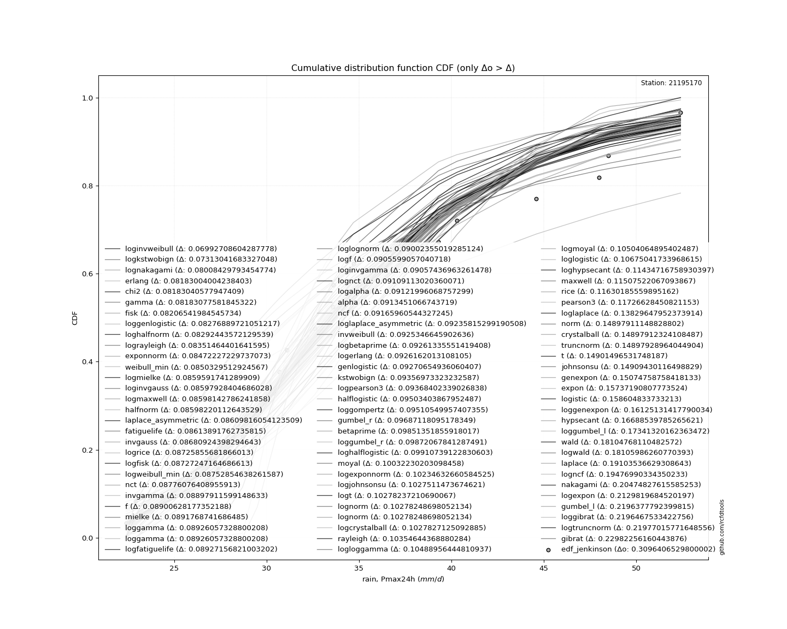</img>

</div>


**10.3. Best fit**

<div align="center">

|   id |   station | empirical_dist   | p_dist        |     delta |   deltao | eval   |   fit |   n |   best_fit |   best_fit_sort |
|-----:|----------:|:-----------------|:--------------|----------:|---------:|:-------|------:|----:|-----------:|----------------:|
|    0 |  21195170 | edf_jenkinson    | loginvweibull | 0.0699271 | 0.309641 | Δo > Δ |     1 |  20 |          1 |               1 |

</div>


<div align="center">

</img></img>

</div>


### 11. EDF Cunnane (1978)

Cunnane´s work in statistical hydrology has focused on the performance and evaluation of different probability distributions (such as GEV, Gumbel, Lognormal) for flood frequency estimation. _b_ is a constant, typically set to 0.4.

<div align="center">


$P=(m-b)/(n+1-2b)$


</div>


**11.1. Empirical values**

<div align="center">

|                | 0                  | 1                   | 2                   | 3                   | 4                  | 5                  | 6                   | 7                   | 8                   | 9                  | 10                 | 11                 | 12                 | 13                 | 14                 | 15                 | 16                 | 17                 | 18                 | 19                 |
|:---------------|:-------------------|:--------------------|:--------------------|:--------------------|:-------------------|:-------------------|:--------------------|:--------------------|:--------------------|:-------------------|:-------------------|:-------------------|:-------------------|:-------------------|:-------------------|:-------------------|:-------------------|:-------------------|:-------------------|:-------------------|
| date           | 2022               | 2015                | 2006                | 2007                | 2018               | 2020               | 2023                | 2021                | 2017                | 2008               | 2009               | 2005               | 2019               | 2012               | 2014               | 2010               | 2016               | 2013               | 2024               | 2011               |
| x              | 22.4               | 22.9                | 26.8                | 26.9                | 28.7               | 29.5               | 30.4                | 30.7                | 31.1                | 32.6               | 33.6               | 33.614999999999995 | 34.7               | 39.3               | 40.3               | 44.6               | 48.0               | 48.5               | 48.6               | 52.4               |
| m              | 1                  | 2                   | 3                   | 4                   | 5                  | 6                  | 7                   | 8                   | 9                   | 10                 | 11                 | 12                 | 13                 | 14                 | 15                 | 16                 | 17                 | 18                 | 19                 | 20                 |
| empirical_dist | edf_cunnane        | edf_cunnane         | edf_cunnane         | edf_cunnane         | edf_cunnane        | edf_cunnane        | edf_cunnane         | edf_cunnane         | edf_cunnane         | edf_cunnane        | edf_cunnane        | edf_cunnane        | edf_cunnane        | edf_cunnane        | edf_cunnane        | edf_cunnane        | edf_cunnane        | edf_cunnane        | edf_cunnane        | edf_cunnane        |
| empirical      | 0.0297029702970297 | 0.07920792079207921 | 0.12871287128712872 | 0.17821782178217824 | 0.2277227722772277 | 0.2772277227722772 | 0.32673267326732675 | 0.37623762376237624 | 0.42574257425742573 | 0.4752475247524752 | 0.5247524752475248 | 0.5742574257425742 | 0.6237623762376238 | 0.6732673267326733 | 0.7227722772277227 | 0.7722772277227723 | 0.8217821782178218 | 0.8712871287128714 | 0.9207920792079209 | 0.9702970297029704 |
| empirical_tr   | 1.030612244897959  | 1.086021505376344   | 1.1477272727272727  | 1.216867469879518   | 1.294871794871795  | 1.3835616438356164 | 1.4852941176470589  | 1.6031746031746033  | 1.7413793103448274  | 1.9056603773584906 | 2.104166666666667  | 2.3488372093023253 | 2.6578947368421053 | 3.060606060606061  | 3.6071428571428568 | 4.391304347826087  | 5.611111111111113  | 7.769230769230775  | 12.625000000000025 | 33.666666666666764 |

</div>


**11.2. Kolmogorov-Smirnov fit test (sorted by Δ)**


<div align="center">

|                | 0                   | 1                   | 2                   | 3                   | 4                   | 5                   | 6                   | 7                   | 8                   | 9                   | 10                  | 11                  | 12                  | 13                  | 14                 | 15                  | 16                  | 17                  | 18                  | 19                  | 20                  | 21                  | 22                  | 23                  | 24                  | 25                  | 26                  | 27                  | 28                  | 29                 | 30                  | 31                  | 32                  | 33                  | 34                  | 35                 | 36                  | 37                  | 38                  | 39                  | 40                    | 41                  | 42                  | 43                  | 44                  | 45                  | 46                  | 47                  | 48                  | 49                  | 50                  | 51                 | 52                  | 53                  | 54                  | 55                  | 56                  | 57                  | 58                  | 59                  | 60                  | 61                 | 62                  | 63                  | 64                 | 65                  | 66                 | 67                  | 68                 | 69                 | 70                 | 71                  | 72                 | 73                  | 74                 | 75                 | 76                 | 77                 | 78                  | 79                  | 80                  | 81                  | 82                  | 83                  | 84                  | 85                 | 86                 | 87                 |
|:---------------|:--------------------|:--------------------|:--------------------|:--------------------|:--------------------|:--------------------|:--------------------|:--------------------|:--------------------|:--------------------|:--------------------|:--------------------|:--------------------|:--------------------|:-------------------|:--------------------|:--------------------|:--------------------|:--------------------|:--------------------|:--------------------|:--------------------|:--------------------|:--------------------|:--------------------|:--------------------|:--------------------|:--------------------|:--------------------|:-------------------|:--------------------|:--------------------|:--------------------|:--------------------|:--------------------|:-------------------|:--------------------|:--------------------|:--------------------|:--------------------|:----------------------|:--------------------|:--------------------|:--------------------|:--------------------|:--------------------|:--------------------|:--------------------|:--------------------|:--------------------|:--------------------|:-------------------|:--------------------|:--------------------|:--------------------|:--------------------|:--------------------|:--------------------|:--------------------|:--------------------|:--------------------|:-------------------|:--------------------|:--------------------|:-------------------|:--------------------|:-------------------|:--------------------|:-------------------|:-------------------|:-------------------|:--------------------|:-------------------|:--------------------|:-------------------|:-------------------|:-------------------|:-------------------|:--------------------|:--------------------|:--------------------|:--------------------|:--------------------|:--------------------|:--------------------|:-------------------|:-------------------|:-------------------|
| station        | 21195170            | 21195170            | 21195170            | 21195170            | 21195170            | 21195170            | 21195170            | 21195170            | 21195170            | 21195170            | 21195170            | 21195170            | 21195170            | 21195170            | 21195170           | 21195170            | 21195170            | 21195170            | 21195170            | 21195170            | 21195170            | 21195170            | 21195170            | 21195170            | 21195170            | 21195170            | 21195170            | 21195170            | 21195170            | 21195170           | 21195170            | 21195170            | 21195170            | 21195170            | 21195170            | 21195170           | 21195170            | 21195170            | 21195170            | 21195170            | 21195170              | 21195170            | 21195170            | 21195170            | 21195170            | 21195170            | 21195170            | 21195170            | 21195170            | 21195170            | 21195170            | 21195170           | 21195170            | 21195170            | 21195170            | 21195170            | 21195170            | 21195170            | 21195170            | 21195170            | 21195170            | 21195170           | 21195170            | 21195170            | 21195170           | 21195170            | 21195170           | 21195170            | 21195170           | 21195170           | 21195170           | 21195170            | 21195170           | 21195170            | 21195170           | 21195170           | 21195170           | 21195170           | 21195170            | 21195170            | 21195170            | 21195170            | 21195170            | 21195170            | 21195170            | 21195170           | 21195170           | 21195170           |
| empirical_dist | edf_cunnane         | edf_cunnane         | edf_cunnane         | edf_cunnane         | edf_cunnane         | edf_cunnane         | edf_cunnane         | edf_cunnane         | edf_cunnane         | edf_cunnane         | edf_cunnane         | edf_cunnane         | edf_cunnane         | edf_cunnane         | edf_cunnane        | edf_cunnane         | edf_cunnane         | edf_cunnane         | edf_cunnane         | edf_cunnane         | edf_cunnane         | edf_cunnane         | edf_cunnane         | edf_cunnane         | edf_cunnane         | edf_cunnane         | edf_cunnane         | edf_cunnane         | edf_cunnane         | edf_cunnane        | edf_cunnane         | edf_cunnane         | edf_cunnane         | edf_cunnane         | edf_cunnane         | edf_cunnane        | edf_cunnane         | edf_cunnane         | edf_cunnane         | edf_cunnane         | edf_cunnane           | edf_cunnane         | edf_cunnane         | edf_cunnane         | edf_cunnane         | edf_cunnane         | edf_cunnane         | edf_cunnane         | edf_cunnane         | edf_cunnane         | edf_cunnane         | edf_cunnane        | edf_cunnane         | edf_cunnane         | edf_cunnane         | edf_cunnane         | edf_cunnane         | edf_cunnane         | edf_cunnane         | edf_cunnane         | edf_cunnane         | edf_cunnane        | edf_cunnane         | edf_cunnane         | edf_cunnane        | edf_cunnane         | edf_cunnane        | edf_cunnane         | edf_cunnane        | edf_cunnane        | edf_cunnane        | edf_cunnane         | edf_cunnane        | edf_cunnane         | edf_cunnane        | edf_cunnane        | edf_cunnane        | edf_cunnane        | edf_cunnane         | edf_cunnane         | edf_cunnane         | edf_cunnane         | edf_cunnane         | edf_cunnane         | edf_cunnane         | edf_cunnane        | edf_cunnane        | edf_cunnane        |
| p_dist         | loginvweibull       | logkstwobign        | lognakagami         | erlang              | chi2                | gamma               | fisk                | loghalfnorm         | loggenlogistic      | lograyleigh         | weibull_min         | exponnorm           | logmaxwell          | halfnorm            | fatiguelife        | logmielke           | loginvgauss         | laplace_asymmetric  | invgauss            | logrice             | logweibull_min      | logfisk             | nct                 | invgamma            | f                   | loggamma            | loggamma            | logfatiguelife      | mielke              | loglognorm         | logf                | loginvgamma         | lognct              | logalpha            | alpha               | ncf                | invweibull          | logerlang           | genlogistic         | kstwobign           | loglaplace_asymmetric | halflogistic        | logpearson3         | gumbel_r            | logbetaprime        | loggompertz         | loggumbel_r         | loghalflogistic     | moyal               | betaprime           | logexponnorm        | logjohnsonsu       | logt                | lognorm             | lognorm             | logcrystalball      | logmoyal            | rayleigh            | logloggamma         | loglogistic         | loghypsecant        | maxwell            | rice                | pearson3            | loglaplace         | norm                | crystalball        | truncnorm           | t                  | johnsonsu          | genexpon           | logistic            | expon              | loggenexpon         | hypsecant          | loggumbel_l        | wald               | logwald            | laplace             | logncf              | nakagami            | logexpon            | loggibrat           | gumbel_l            | logtruncnorm        | gibrat             | logchi2            | gompertz           |
| delta          | 0.06752228226514967 | 0.07072561305554237 | 0.07767949415681963 | 0.07898799921415989 | 0.07898836495124995 | 0.07898873499022907 | 0.07966061606772923 | 0.08004476250982673 | 0.08036409343278406 | 0.08110984023868784 | 0.08219091046423255 | 0.08231746851964261 | 0.08313938703419443 | 0.08314016029821114 | 0.083296876799134  | 0.08355437035126279 | 0.08357448026913217 | 0.08369335676350698 | 0.08396720315472228 | 0.08441651599043598 | 0.08468650555439172 | 0.08486766786913802 | 0.08535596031183101 | 0.08613707516326219 | 0.08616424094529773 | 0.08641853245977793 | 0.08641853245977793 | 0.08642952738180787 | 0.08677207039092039 | 0.0871815093646271 | 0.08771786487584765 | 0.08773232880439064 | 0.08824908937537657 | 0.08837791985934884 | 0.08850306584614775 | 0.0888175646150483 | 0.08969262376203946 | 0.08977416048258635 | 0.08986450853237993 | 0.09072769240410172 | 0.09082782331516903   | 0.09262923490179675 | 0.09347428256092871 | 0.09402914012355934 | 0.09589263339291423 | 0.09619859220031357 | 0.09631587463514679 | 0.09757706155156998 | 0.09791749825325646 | 0.09916937413492416 | 0.10300218218158924 | 0.1034070029432061 | 0.10343822768264466 | 0.10343834255626533 | 0.10343834255626533 | 0.10343856808503249 | 0.10351031927728882 | 0.10463953631504286 | 0.10554542002385336 | 0.10740627291543015 | 0.11194236381157585 | 0.1161683132971787 | 0.11695771117469561 | 0.11792214008395552 | 0.1376406239479951 | 0.15007220411452804 | 0.1500722158673249 | 0.15007238226668906 | 0.1501080579437219 | 0.1501873937912283 | 0.1531523913619095 | 0.15926068930895698 | 0.1606511859564554 | 0.16381021243003485 | 0.1675412534284002 | 0.1740690571993787 | 0.1782056402766016 | 0.1782178217794798 | 0.19169122186883042 | 0.19804918122222248 | 0.20802755403457268 | 0.21626124633073984 | 0.21724194956454743 | 0.22073087186622153 | 0.22217496149421373 | 0.2274177578267106 | 0.3392233390467233 | 0.6957646434204963 |
| deltao         | 0.3096406529800002  | 0.3096406529800002  | 0.3096406529800002  | 0.3096406529800002  | 0.3096406529800002  | 0.3096406529800002  | 0.3096406529800002  | 0.3096406529800002  | 0.3096406529800002  | 0.3096406529800002  | 0.3096406529800002  | 0.3096406529800002  | 0.3096406529800002  | 0.3096406529800002  | 0.3096406529800002 | 0.3096406529800002  | 0.3096406529800002  | 0.3096406529800002  | 0.3096406529800002  | 0.3096406529800002  | 0.3096406529800002  | 0.3096406529800002  | 0.3096406529800002  | 0.3096406529800002  | 0.3096406529800002  | 0.3096406529800002  | 0.3096406529800002  | 0.3096406529800002  | 0.3096406529800002  | 0.3096406529800002 | 0.3096406529800002  | 0.3096406529800002  | 0.3096406529800002  | 0.3096406529800002  | 0.3096406529800002  | 0.3096406529800002 | 0.3096406529800002  | 0.3096406529800002  | 0.3096406529800002  | 0.3096406529800002  | 0.3096406529800002    | 0.3096406529800002  | 0.3096406529800002  | 0.3096406529800002  | 0.3096406529800002  | 0.3096406529800002  | 0.3096406529800002  | 0.3096406529800002  | 0.3096406529800002  | 0.3096406529800002  | 0.3096406529800002  | 0.3096406529800002 | 0.3096406529800002  | 0.3096406529800002  | 0.3096406529800002  | 0.3096406529800002  | 0.3096406529800002  | 0.3096406529800002  | 0.3096406529800002  | 0.3096406529800002  | 0.3096406529800002  | 0.3096406529800002 | 0.3096406529800002  | 0.3096406529800002  | 0.3096406529800002 | 0.3096406529800002  | 0.3096406529800002 | 0.3096406529800002  | 0.3096406529800002 | 0.3096406529800002 | 0.3096406529800002 | 0.3096406529800002  | 0.3096406529800002 | 0.3096406529800002  | 0.3096406529800002 | 0.3096406529800002 | 0.3096406529800002 | 0.3096406529800002 | 0.3096406529800002  | 0.3096406529800002  | 0.3096406529800002  | 0.3096406529800002  | 0.3096406529800002  | 0.3096406529800002  | 0.3096406529800002  | 0.3096406529800002 | 0.3096406529800002 | 0.3096406529800002 |
| eval           | Δo > Δ              | Δo > Δ              | Δo > Δ              | Δo > Δ              | Δo > Δ              | Δo > Δ              | Δo > Δ              | Δo > Δ              | Δo > Δ              | Δo > Δ              | Δo > Δ              | Δo > Δ              | Δo > Δ              | Δo > Δ              | Δo > Δ             | Δo > Δ              | Δo > Δ              | Δo > Δ              | Δo > Δ              | Δo > Δ              | Δo > Δ              | Δo > Δ              | Δo > Δ              | Δo > Δ              | Δo > Δ              | Δo > Δ              | Δo > Δ              | Δo > Δ              | Δo > Δ              | Δo > Δ             | Δo > Δ              | Δo > Δ              | Δo > Δ              | Δo > Δ              | Δo > Δ              | Δo > Δ             | Δo > Δ              | Δo > Δ              | Δo > Δ              | Δo > Δ              | Δo > Δ                | Δo > Δ              | Δo > Δ              | Δo > Δ              | Δo > Δ              | Δo > Δ              | Δo > Δ              | Δo > Δ              | Δo > Δ              | Δo > Δ              | Δo > Δ              | Δo > Δ             | Δo > Δ              | Δo > Δ              | Δo > Δ              | Δo > Δ              | Δo > Δ              | Δo > Δ              | Δo > Δ              | Δo > Δ              | Δo > Δ              | Δo > Δ             | Δo > Δ              | Δo > Δ              | Δo > Δ             | Δo > Δ              | Δo > Δ             | Δo > Δ              | Δo > Δ             | Δo > Δ             | Δo > Δ             | Δo > Δ              | Δo > Δ             | Δo > Δ              | Δo > Δ             | Δo > Δ             | Δo > Δ             | Δo > Δ             | Δo > Δ              | Δo > Δ              | Δo > Δ              | Δo > Δ              | Δo > Δ              | Δo > Δ              | Δo > Δ              | Δo > Δ             | Δo <= Δ            | Δo <= Δ            |
| fit            | 1                   | 1                   | 1                   | 1                   | 1                   | 1                   | 1                   | 1                   | 1                   | 1                   | 1                   | 1                   | 1                   | 1                   | 1                  | 1                   | 1                   | 1                   | 1                   | 1                   | 1                   | 1                   | 1                   | 1                   | 1                   | 1                   | 1                   | 1                   | 1                   | 1                  | 1                   | 1                   | 1                   | 1                   | 1                   | 1                  | 1                   | 1                   | 1                   | 1                   | 1                     | 1                   | 1                   | 1                   | 1                   | 1                   | 1                   | 1                   | 1                   | 1                   | 1                   | 1                  | 1                   | 1                   | 1                   | 1                   | 1                   | 1                   | 1                   | 1                   | 1                   | 1                  | 1                   | 1                   | 1                  | 1                   | 1                  | 1                   | 1                  | 1                  | 1                  | 1                   | 1                  | 1                   | 1                  | 1                  | 1                  | 1                  | 1                   | 1                   | 1                   | 1                   | 1                   | 1                   | 1                   | 1                  | 0                  | 0                  |
| n              | 20                  | 20                  | 20                  | 20                  | 20                  | 20                  | 20                  | 20                  | 20                  | 20                  | 20                  | 20                  | 20                  | 20                  | 20                 | 20                  | 20                  | 20                  | 20                  | 20                  | 20                  | 20                  | 20                  | 20                  | 20                  | 20                  | 20                  | 20                  | 20                  | 20                 | 20                  | 20                  | 20                  | 20                  | 20                  | 20                 | 20                  | 20                  | 20                  | 20                  | 20                    | 20                  | 20                  | 20                  | 20                  | 20                  | 20                  | 20                  | 20                  | 20                  | 20                  | 20                 | 20                  | 20                  | 20                  | 20                  | 20                  | 20                  | 20                  | 20                  | 20                  | 20                 | 20                  | 20                  | 20                 | 20                  | 20                 | 20                  | 20                 | 20                 | 20                 | 20                  | 20                 | 20                  | 20                 | 20                 | 20                 | 20                 | 20                  | 20                  | 20                  | 20                  | 20                  | 20                  | 20                  | 20                 | 20                 | 20                 |
| best_fit       | 1                   | 0                   | 0                   | 0                   | 0                   | 0                   | 0                   | 0                   | 0                   | 0                   | 0                   | 0                   | 0                   | 0                   | 0                  | 0                   | 0                   | 0                   | 0                   | 0                   | 0                   | 0                   | 0                   | 0                   | 0                   | 0                   | 0                   | 0                   | 0                   | 0                  | 0                   | 0                   | 0                   | 0                   | 0                   | 0                  | 0                   | 0                   | 0                   | 0                   | 0                     | 0                   | 0                   | 0                   | 0                   | 0                   | 0                   | 0                   | 0                   | 0                   | 0                   | 0                  | 0                   | 0                   | 0                   | 0                   | 0                   | 0                   | 0                   | 0                   | 0                   | 0                  | 0                   | 0                   | 0                  | 0                   | 0                  | 0                   | 0                  | 0                  | 0                  | 0                   | 0                  | 0                   | 0                  | 0                  | 0                  | 0                  | 0                   | 0                   | 0                   | 0                   | 0                   | 0                   | 0                   | 0                  | 0                  | 0                  |
| best_fit_sort  | 1                   | 2                   | 3                   | 4                   | 5                   | 6                   | 7                   | 8                   | 9                   | 10                  | 11                  | 12                  | 13                  | 14                  | 15                 | 16                  | 17                  | 18                  | 19                  | 20                  | 21                  | 22                  | 23                  | 24                  | 25                  | 26                  | 27                  | 28                  | 29                  | 30                 | 31                  | 32                  | 33                  | 34                  | 35                  | 36                 | 37                  | 38                  | 39                  | 40                  | 41                    | 42                  | 43                  | 44                  | 45                  | 46                  | 47                  | 48                  | 49                  | 50                  | 51                  | 52                 | 53                  | 54                  | 55                  | 56                  | 57                  | 58                  | 59                  | 60                  | 61                  | 62                 | 63                  | 64                  | 65                 | 66                  | 67                 | 68                  | 69                 | 70                 | 71                 | 72                  | 73                 | 74                  | 75                 | 76                 | 77                 | 78                 | 79                  | 80                  | 81                  | 82                  | 83                  | 84                  | 85                  | 86                 | 87                 | 88                 |

</div>


<div align="center">

</img>

</div>


**11.3. Best fit**

<div align="center">

|   id |   station | empirical_dist   | p_dist        |     delta |   deltao | eval   |   fit |   n |   best_fit |   best_fit_sort |
|-----:|----------:|:-----------------|:--------------|----------:|---------:|:-------|------:|----:|-----------:|----------------:|
|    0 |  21195170 | edf_cunnane      | loginvweibull | 0.0675223 | 0.309641 | Δo > Δ |     1 |  20 |          1 |               1 |

</div>


<div align="center">

</img></img>

</div>


### 12. EDF Adamowski (1981)

The Adamowski formula in hydrology refers to a specific plotting position formula used for estimating the non-parametric empirical distribution of hydrological events (like flood peaks) to calculate their return periods. This formula provides an alternative to traditional parametric methods (like the Gumbel or Log Pearson Type III distributions). 

<div align="center">


$P=(m-0.25)/(n+0.5)$


</div>


**12.1. Empirical values**

<div align="center">

|                | 0                    | 1                   | 2                   | 3                   | 4                   | 5                  | 6                   | 7                  | 8                  | 9                   | 10                 | 11                 | 12                 | 13                 | 14                 | 15                 | 16                 | 17                 | 18                 | 19                 |
|:---------------|:---------------------|:--------------------|:--------------------|:--------------------|:--------------------|:-------------------|:--------------------|:-------------------|:-------------------|:--------------------|:-------------------|:-------------------|:-------------------|:-------------------|:-------------------|:-------------------|:-------------------|:-------------------|:-------------------|:-------------------|
| date           | 2022                 | 2015                | 2006                | 2007                | 2018                | 2020               | 2023                | 2021               | 2017               | 2008                | 2009               | 2005               | 2019               | 2012               | 2014               | 2010               | 2016               | 2013               | 2024               | 2011               |
| x              | 22.4                 | 22.9                | 26.8                | 26.9                | 28.7                | 29.5               | 30.4                | 30.7               | 31.1               | 32.6                | 33.6               | 33.614999999999995 | 34.7               | 39.3               | 40.3               | 44.6               | 48.0               | 48.5               | 48.6               | 52.4               |
| m              | 1                    | 2                   | 3                   | 4                   | 5                   | 6                  | 7                   | 8                  | 9                  | 10                  | 11                 | 12                 | 13                 | 14                 | 15                 | 16                 | 17                 | 18                 | 19                 | 20                 |
| empirical_dist | edf_adamowski        | edf_adamowski       | edf_adamowski       | edf_adamowski       | edf_adamowski       | edf_adamowski      | edf_adamowski       | edf_adamowski      | edf_adamowski      | edf_adamowski       | edf_adamowski      | edf_adamowski      | edf_adamowski      | edf_adamowski      | edf_adamowski      | edf_adamowski      | edf_adamowski      | edf_adamowski      | edf_adamowski      | edf_adamowski      |
| empirical      | 0.036585365853658534 | 0.08536585365853659 | 0.13414634146341464 | 0.18292682926829268 | 0.23170731707317074 | 0.2804878048780488 | 0.32926829268292684 | 0.3780487804878049 | 0.4268292682926829 | 0.47560975609756095 | 0.524390243902439  | 0.573170731707317  | 0.6219512195121951 | 0.6707317073170732 | 0.7195121951219512 | 0.7682926829268293 | 0.8170731707317073 | 0.8658536585365854 | 0.9146341463414634 | 0.9634146341463414 |
| empirical_tr   | 1.0379746835443038   | 1.0933333333333333  | 1.1549295774647887  | 1.2238805970149254  | 1.3015873015873016  | 1.3898305084745763 | 1.490909090909091   | 1.607843137254902  | 1.7446808510638296 | 1.9069767441860463  | 2.1025641025641026 | 2.3428571428571425 | 2.6451612903225805 | 3.037037037037037  | 3.5652173913043477 | 4.315789473684211  | 5.466666666666665  | 7.454545454545454  | 11.714285714285719 | 27.33333333333331  |

</div>


**12.2. Kolmogorov-Smirnov fit test (sorted by Δ)**


<div align="center">

|                | 0                   | 1                   | 2                   | 3                   | 4                   | 5                   | 6                   | 7                   | 8                   | 9                   | 10                  | 11                  | 12                 | 13                  | 14                  | 15                  | 16                  | 17                  | 18                  | 19                  | 20                  | 21                 | 22                  | 23                  | 24                 | 25                  | 26                  | 27                  | 28                  | 29                  | 30                  | 31                  | 32                  | 33                  | 34                  | 35                  | 36                    | 37                  | 38                  | 39                  | 40                  | 41                  | 42                 | 43                  | 44                  | 45                  | 46                  | 47                  | 48                 | 49                  | 50                  | 51                  | 52                  | 53                  | 54                  | 55                 | 56                  | 57                  | 58                  | 59                  | 60                  | 61                  | 62                  | 63                  | 64                  | 65                 | 66                  | 67                  | 68                  | 69                  | 70                  | 71                  | 72                 | 73                  | 74                  | 75                  | 76                  | 77                  | 78                  | 79                  | 80                  | 81                 | 82                 | 83                 | 84                  | 85                  | 86                  | 87                 |
|:---------------|:--------------------|:--------------------|:--------------------|:--------------------|:--------------------|:--------------------|:--------------------|:--------------------|:--------------------|:--------------------|:--------------------|:--------------------|:-------------------|:--------------------|:--------------------|:--------------------|:--------------------|:--------------------|:--------------------|:--------------------|:--------------------|:-------------------|:--------------------|:--------------------|:-------------------|:--------------------|:--------------------|:--------------------|:--------------------|:--------------------|:--------------------|:--------------------|:--------------------|:--------------------|:--------------------|:--------------------|:----------------------|:--------------------|:--------------------|:--------------------|:--------------------|:--------------------|:-------------------|:--------------------|:--------------------|:--------------------|:--------------------|:--------------------|:-------------------|:--------------------|:--------------------|:--------------------|:--------------------|:--------------------|:--------------------|:-------------------|:--------------------|:--------------------|:--------------------|:--------------------|:--------------------|:--------------------|:--------------------|:--------------------|:--------------------|:-------------------|:--------------------|:--------------------|:--------------------|:--------------------|:--------------------|:--------------------|:-------------------|:--------------------|:--------------------|:--------------------|:--------------------|:--------------------|:--------------------|:--------------------|:--------------------|:-------------------|:-------------------|:-------------------|:--------------------|:--------------------|:--------------------|:-------------------|
| station        | 21195170            | 21195170            | 21195170            | 21195170            | 21195170            | 21195170            | 21195170            | 21195170            | 21195170            | 21195170            | 21195170            | 21195170            | 21195170           | 21195170            | 21195170            | 21195170            | 21195170            | 21195170            | 21195170            | 21195170            | 21195170            | 21195170           | 21195170            | 21195170            | 21195170           | 21195170            | 21195170            | 21195170            | 21195170            | 21195170            | 21195170            | 21195170            | 21195170            | 21195170            | 21195170            | 21195170            | 21195170              | 21195170            | 21195170            | 21195170            | 21195170            | 21195170            | 21195170           | 21195170            | 21195170            | 21195170            | 21195170            | 21195170            | 21195170           | 21195170            | 21195170            | 21195170            | 21195170            | 21195170            | 21195170            | 21195170           | 21195170            | 21195170            | 21195170            | 21195170            | 21195170            | 21195170            | 21195170            | 21195170            | 21195170            | 21195170           | 21195170            | 21195170            | 21195170            | 21195170            | 21195170            | 21195170            | 21195170           | 21195170            | 21195170            | 21195170            | 21195170            | 21195170            | 21195170            | 21195170            | 21195170            | 21195170           | 21195170           | 21195170           | 21195170            | 21195170            | 21195170            | 21195170           |
| empirical_dist | edf_adamowski       | edf_adamowski       | edf_adamowski       | edf_adamowski       | edf_adamowski       | edf_adamowski       | edf_adamowski       | edf_adamowski       | edf_adamowski       | edf_adamowski       | edf_adamowski       | edf_adamowski       | edf_adamowski      | edf_adamowski       | edf_adamowski       | edf_adamowski       | edf_adamowski       | edf_adamowski       | edf_adamowski       | edf_adamowski       | edf_adamowski       | edf_adamowski      | edf_adamowski       | edf_adamowski       | edf_adamowski      | edf_adamowski       | edf_adamowski       | edf_adamowski       | edf_adamowski       | edf_adamowski       | edf_adamowski       | edf_adamowski       | edf_adamowski       | edf_adamowski       | edf_adamowski       | edf_adamowski       | edf_adamowski         | edf_adamowski       | edf_adamowski       | edf_adamowski       | edf_adamowski       | edf_adamowski       | edf_adamowski      | edf_adamowski       | edf_adamowski       | edf_adamowski       | edf_adamowski       | edf_adamowski       | edf_adamowski      | edf_adamowski       | edf_adamowski       | edf_adamowski       | edf_adamowski       | edf_adamowski       | edf_adamowski       | edf_adamowski      | edf_adamowski       | edf_adamowski       | edf_adamowski       | edf_adamowski       | edf_adamowski       | edf_adamowski       | edf_adamowski       | edf_adamowski       | edf_adamowski       | edf_adamowski      | edf_adamowski       | edf_adamowski       | edf_adamowski       | edf_adamowski       | edf_adamowski       | edf_adamowski       | edf_adamowski      | edf_adamowski       | edf_adamowski       | edf_adamowski       | edf_adamowski       | edf_adamowski       | edf_adamowski       | edf_adamowski       | edf_adamowski       | edf_adamowski      | edf_adamowski      | edf_adamowski      | edf_adamowski       | edf_adamowski       | edf_adamowski       | edf_adamowski      |
| p_dist         | loginvweibull       | logkstwobign        | lognakagami         | fisk                | erlang              | chi2                | gamma               | loggenlogistic      | lograyleigh         | loghalfnorm         | exponnorm           | weibull_min         | logmielke          | loginvgauss         | laplace_asymmetric  | logmaxwell          | halfnorm            | fatiguelife         | invgauss            | logfisk             | logrice             | logweibull_min     | nct                 | logbetaprime        | mielke             | invgamma            | f                   | loggamma            | loggamma            | logfatiguelife      | loglognorm          | logf                | loginvgamma         | lognct              | logalpha            | alpha               | loglaplace_asymmetric | ncf                 | loggompertz         | invweibull          | logerlang           | genlogistic         | kstwobign          | logpearson3         | halflogistic        | betaprime           | gumbel_r            | loghalflogistic     | loggumbel_r        | moyal               | logexponnorm        | logjohnsonsu        | logt                | lognorm             | lognorm             | logcrystalball     | rayleigh            | logloggamma         | logmoyal            | loglogistic         | maxwell             | rice                | loghypsecant        | pearson3            | loglaplace          | norm               | crystalball         | truncnorm           | t                   | johnsonsu           | genexpon            | expon               | logistic           | loggenexpon         | hypsecant           | loggumbel_l         | wald                | logwald             | laplace             | logncf              | nakagami            | logexpon           | logtruncnorm       | gumbel_l           | loggibrat           | gibrat              | logchi2             | gompertz           |
| delta          | 0.07150682706109268 | 0.07471015785148538 | 0.08166403895276264 | 0.08364516086367224 | 0.08369700670027447 | 0.08369737243736453 | 0.08369774247634365 | 0.08434863822872707 | 0.08509438503463085 | 0.08536585365853659 | 0.08630201331558562 | 0.08689991795034713 | 0.0875389151472058 | 0.08755902506507518 | 0.08767790155944999 | 0.08784839452030901 | 0.08784916778432572 | 0.08800588428524858 | 0.08867621064083686 | 0.08885221266508103 | 0.08912552347655056 | 0.0893955130405063 | 0.08945030557111289 | 0.09045916321662831 | 0.0907566151868634 | 0.09084608264937677 | 0.09087324843141231 | 0.09112753994589251 | 0.09112753994589251 | 0.09113853486792245 | 0.09189051685074168 | 0.09242687236196223 | 0.09244133629050522 | 0.09295809686149115 | 0.09308692734546342 | 0.09321207333226234 | 0.09336344273076913   | 0.09352657210116289 | 0.09438743547488493 | 0.09440163124815404 | 0.09448316796870093 | 0.09457351601849451 | 0.0954366998902163 | 0.09555099004815881 | 0.09661377969773977 | 0.09808268009966697 | 0.09873814760967392 | 0.10011268096717008 | 0.1003004194310898 | 0.10190204304919948 | 0.10191548814633206 | 0.10232030890794891 | 0.10235153364738747 | 0.10235164852100814 | 0.10235164852100814 | 0.1023518740497753 | 0.10282837958961422 | 0.10445872598859618 | 0.10604593869288892 | 0.10773405557197102 | 0.11435715657175005 | 0.11587101713943843 | 0.11592690860751886 | 0.11683544604869833 | 0.13872731798325227 | 0.1482610473890994 | 0.14826105914189625 | 0.14826122554126042 | 0.14829690121829325 | 0.14858297574305074 | 0.14916784656596646 | 0.15521771578016946 | 0.1581739952736998 | 0.15967157315968547 | 0.16645455939314302 | 0.17298236316412152 | 0.18291464776271604 | 0.18292682926559425 | 0.19060452783357323 | 0.19261571104593656 | 0.20259408385828676 | 0.2110010645468344 | 0.2181904166982707 | 0.2189197151407929 | 0.22122649436049047 | 0.23140230262265363 | 0.33234094349009435 | 0.6925045613147247 |
| deltao         | 0.3096406529800002  | 0.3096406529800002  | 0.3096406529800002  | 0.3096406529800002  | 0.3096406529800002  | 0.3096406529800002  | 0.3096406529800002  | 0.3096406529800002  | 0.3096406529800002  | 0.3096406529800002  | 0.3096406529800002  | 0.3096406529800002  | 0.3096406529800002 | 0.3096406529800002  | 0.3096406529800002  | 0.3096406529800002  | 0.3096406529800002  | 0.3096406529800002  | 0.3096406529800002  | 0.3096406529800002  | 0.3096406529800002  | 0.3096406529800002 | 0.3096406529800002  | 0.3096406529800002  | 0.3096406529800002 | 0.3096406529800002  | 0.3096406529800002  | 0.3096406529800002  | 0.3096406529800002  | 0.3096406529800002  | 0.3096406529800002  | 0.3096406529800002  | 0.3096406529800002  | 0.3096406529800002  | 0.3096406529800002  | 0.3096406529800002  | 0.3096406529800002    | 0.3096406529800002  | 0.3096406529800002  | 0.3096406529800002  | 0.3096406529800002  | 0.3096406529800002  | 0.3096406529800002 | 0.3096406529800002  | 0.3096406529800002  | 0.3096406529800002  | 0.3096406529800002  | 0.3096406529800002  | 0.3096406529800002 | 0.3096406529800002  | 0.3096406529800002  | 0.3096406529800002  | 0.3096406529800002  | 0.3096406529800002  | 0.3096406529800002  | 0.3096406529800002 | 0.3096406529800002  | 0.3096406529800002  | 0.3096406529800002  | 0.3096406529800002  | 0.3096406529800002  | 0.3096406529800002  | 0.3096406529800002  | 0.3096406529800002  | 0.3096406529800002  | 0.3096406529800002 | 0.3096406529800002  | 0.3096406529800002  | 0.3096406529800002  | 0.3096406529800002  | 0.3096406529800002  | 0.3096406529800002  | 0.3096406529800002 | 0.3096406529800002  | 0.3096406529800002  | 0.3096406529800002  | 0.3096406529800002  | 0.3096406529800002  | 0.3096406529800002  | 0.3096406529800002  | 0.3096406529800002  | 0.3096406529800002 | 0.3096406529800002 | 0.3096406529800002 | 0.3096406529800002  | 0.3096406529800002  | 0.3096406529800002  | 0.3096406529800002 |
| eval           | Δo > Δ              | Δo > Δ              | Δo > Δ              | Δo > Δ              | Δo > Δ              | Δo > Δ              | Δo > Δ              | Δo > Δ              | Δo > Δ              | Δo > Δ              | Δo > Δ              | Δo > Δ              | Δo > Δ             | Δo > Δ              | Δo > Δ              | Δo > Δ              | Δo > Δ              | Δo > Δ              | Δo > Δ              | Δo > Δ              | Δo > Δ              | Δo > Δ             | Δo > Δ              | Δo > Δ              | Δo > Δ             | Δo > Δ              | Δo > Δ              | Δo > Δ              | Δo > Δ              | Δo > Δ              | Δo > Δ              | Δo > Δ              | Δo > Δ              | Δo > Δ              | Δo > Δ              | Δo > Δ              | Δo > Δ                | Δo > Δ              | Δo > Δ              | Δo > Δ              | Δo > Δ              | Δo > Δ              | Δo > Δ             | Δo > Δ              | Δo > Δ              | Δo > Δ              | Δo > Δ              | Δo > Δ              | Δo > Δ             | Δo > Δ              | Δo > Δ              | Δo > Δ              | Δo > Δ              | Δo > Δ              | Δo > Δ              | Δo > Δ             | Δo > Δ              | Δo > Δ              | Δo > Δ              | Δo > Δ              | Δo > Δ              | Δo > Δ              | Δo > Δ              | Δo > Δ              | Δo > Δ              | Δo > Δ             | Δo > Δ              | Δo > Δ              | Δo > Δ              | Δo > Δ              | Δo > Δ              | Δo > Δ              | Δo > Δ             | Δo > Δ              | Δo > Δ              | Δo > Δ              | Δo > Δ              | Δo > Δ              | Δo > Δ              | Δo > Δ              | Δo > Δ              | Δo > Δ             | Δo > Δ             | Δo > Δ             | Δo > Δ              | Δo > Δ              | Δo <= Δ             | Δo <= Δ            |
| fit            | 1                   | 1                   | 1                   | 1                   | 1                   | 1                   | 1                   | 1                   | 1                   | 1                   | 1                   | 1                   | 1                  | 1                   | 1                   | 1                   | 1                   | 1                   | 1                   | 1                   | 1                   | 1                  | 1                   | 1                   | 1                  | 1                   | 1                   | 1                   | 1                   | 1                   | 1                   | 1                   | 1                   | 1                   | 1                   | 1                   | 1                     | 1                   | 1                   | 1                   | 1                   | 1                   | 1                  | 1                   | 1                   | 1                   | 1                   | 1                   | 1                  | 1                   | 1                   | 1                   | 1                   | 1                   | 1                   | 1                  | 1                   | 1                   | 1                   | 1                   | 1                   | 1                   | 1                   | 1                   | 1                   | 1                  | 1                   | 1                   | 1                   | 1                   | 1                   | 1                   | 1                  | 1                   | 1                   | 1                   | 1                   | 1                   | 1                   | 1                   | 1                   | 1                  | 1                  | 1                  | 1                   | 1                   | 0                   | 0                  |
| n              | 20                  | 20                  | 20                  | 20                  | 20                  | 20                  | 20                  | 20                  | 20                  | 20                  | 20                  | 20                  | 20                 | 20                  | 20                  | 20                  | 20                  | 20                  | 20                  | 20                  | 20                  | 20                 | 20                  | 20                  | 20                 | 20                  | 20                  | 20                  | 20                  | 20                  | 20                  | 20                  | 20                  | 20                  | 20                  | 20                  | 20                    | 20                  | 20                  | 20                  | 20                  | 20                  | 20                 | 20                  | 20                  | 20                  | 20                  | 20                  | 20                 | 20                  | 20                  | 20                  | 20                  | 20                  | 20                  | 20                 | 20                  | 20                  | 20                  | 20                  | 20                  | 20                  | 20                  | 20                  | 20                  | 20                 | 20                  | 20                  | 20                  | 20                  | 20                  | 20                  | 20                 | 20                  | 20                  | 20                  | 20                  | 20                  | 20                  | 20                  | 20                  | 20                 | 20                 | 20                 | 20                  | 20                  | 20                  | 20                 |
| best_fit       | 1                   | 0                   | 0                   | 0                   | 0                   | 0                   | 0                   | 0                   | 0                   | 0                   | 0                   | 0                   | 0                  | 0                   | 0                   | 0                   | 0                   | 0                   | 0                   | 0                   | 0                   | 0                  | 0                   | 0                   | 0                  | 0                   | 0                   | 0                   | 0                   | 0                   | 0                   | 0                   | 0                   | 0                   | 0                   | 0                   | 0                     | 0                   | 0                   | 0                   | 0                   | 0                   | 0                  | 0                   | 0                   | 0                   | 0                   | 0                   | 0                  | 0                   | 0                   | 0                   | 0                   | 0                   | 0                   | 0                  | 0                   | 0                   | 0                   | 0                   | 0                   | 0                   | 0                   | 0                   | 0                   | 0                  | 0                   | 0                   | 0                   | 0                   | 0                   | 0                   | 0                  | 0                   | 0                   | 0                   | 0                   | 0                   | 0                   | 0                   | 0                   | 0                  | 0                  | 0                  | 0                   | 0                   | 0                   | 0                  |
| best_fit_sort  | 1                   | 2                   | 3                   | 4                   | 5                   | 6                   | 7                   | 8                   | 9                   | 10                  | 11                  | 12                  | 13                 | 14                  | 15                  | 16                  | 17                  | 18                  | 19                  | 20                  | 21                  | 22                 | 23                  | 24                  | 25                 | 26                  | 27                  | 28                  | 29                  | 30                  | 31                  | 32                  | 33                  | 34                  | 35                  | 36                  | 37                    | 38                  | 39                  | 40                  | 41                  | 42                  | 43                 | 44                  | 45                  | 46                  | 47                  | 48                  | 49                 | 50                  | 51                  | 52                  | 53                  | 54                  | 55                  | 56                 | 57                  | 58                  | 59                  | 60                  | 61                  | 62                  | 63                  | 64                  | 65                  | 66                 | 67                  | 68                  | 69                  | 70                  | 71                  | 72                  | 73                 | 74                  | 75                  | 76                  | 77                  | 78                  | 79                  | 80                  | 81                  | 82                 | 83                 | 84                 | 85                  | 86                  | 87                  | 88                 |

</div>


<div align="center">

</img>

</div>


**12.3. Best fit**

<div align="center">

|   id |   station | empirical_dist   | p_dist        |     delta |   deltao | eval   |   fit |   n |   best_fit |   best_fit_sort |
|-----:|----------:|:-----------------|:--------------|----------:|---------:|:-------|------:|----:|-----------:|----------------:|
|    0 |  21195170 | edf_adamowski    | loginvweibull | 0.0715068 | 0.309641 | Δo > Δ |     1 |  20 |          1 |               1 |

</div>


<div align="center">

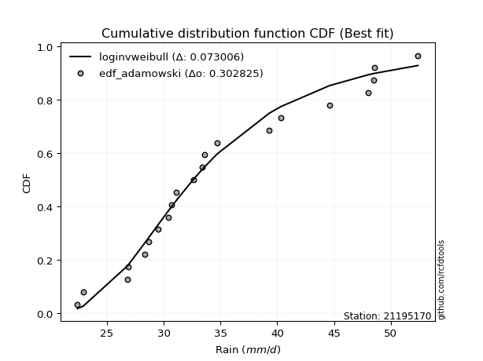</img>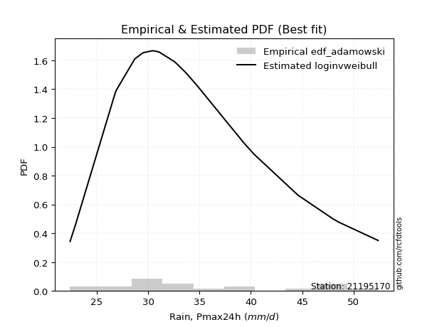</img>

</div>


## C. Best fit & Estimate extreme values for specific return periods - Tr

Best fit in probability distribution analysis means finding the theoretical distribution (like Normal, Poisson, Exponential) that most accurately mirrors your real-world data´s patterns (shape, center, spread) for better predictions, using methods like visual checks (Q-Q plots), goodness-of-fit tests (Kolmogorov-Smirnov, Chi-Squared), and information criteria (AIC) to score and select the simplest, most representative model.


### 1. Best fit (ordered by delta Δ)

:file_folder:Table: [bestfit_21195170.csv](table/bestfit_21195170.csv)

<div align="center">

|   id |   station | empirical_dist   | p_dist             |     delta |   deltao | eval   |   fit |   n |   best_fit |   best_fit_sort |
|-----:|----------:|:-----------------|:-------------------|----------:|---------:|:-------|------:|----:|-----------:|----------------:|
|    0 |  21195170 | edf_hazen        | loginvweibull      | 0.0647995 | 0.309641 | Δo > Δ |     1 |  20 |          1 |               1 |
|    1 |  21195170 | edf_gringorten   | loginvweibull      | 0.0664397 | 0.309641 | Δo > Δ |     1 |  20 |          1 |               2 |
|    2 |  21195170 | edf_cunnane      | loginvweibull      | 0.0675223 | 0.309641 | Δo > Δ |     1 |  20 |          1 |               3 |
|    3 |  21195170 | edf_california   | laplace_asymmetric | 0.0678368 | 0.309641 | Δo > Δ |     1 |  20 |          1 |               4 |
|    4 |  21195170 | edf_blom         | loginvweibull      | 0.0681946 | 0.309641 | Δo > Δ |     1 |  20 |          1 |               5 |
|    5 |  21195170 | edf_tukey        | loginvweibull      | 0.0693077 | 0.309641 | Δo > Δ |     1 |  20 |          1 |               6 |
|    6 |  21195170 | edf_filliben     | loginvweibull      | 0.0697283 | 0.309641 | Δo > Δ |     1 |  20 |          1 |               7 |
|    7 |  21195170 | edf_jenkinson    | loginvweibull      | 0.0699271 | 0.309641 | Δo > Δ |     1 |  20 |          1 |               8 |
|    8 |  21195170 | edf_beard        | loginvweibull      | 0.0699271 | 0.309641 | Δo > Δ |     1 |  20 |          1 |               9 |
|    9 |  21195170 | edf_chegodayev   | loginvweibull      | 0.0701917 | 0.309641 | Δo > Δ |     1 |  20 |          1 |              10 |
|   10 |  21195170 | edf_adamowski    | loginvweibull      | 0.0715068 | 0.309641 | Δo > Δ |     1 |  20 |          1 |              11 |
|   11 |  21195170 | edf_weibull      | loginvweibull      | 0.0778947 | 0.309641 | Δo > Δ |     1 |  20 |          1 |              12 |

</div>


### 2. Extreme values

In hydrology, a return period (or recurrence interval $Tr$) is the statistical average time between extreme events like floods or droughts of a specific magnitude, indicating how rare an event is, with a 100-year flood, for example, having a 1% chance of occurring in any given year, not that it happens exactly every century. It is a key tool for infrastructure design (like bridges or dams) and risk assessment, calculated from historical data to determine the probability of future events, although it is important to remember it is statistical average, and events can cluster or be missed.

:file_folder:Table: [extreme_21195170.csv](table/extreme_21195170.csv)

> risk_rate: assuming the return period as the project useful life.

|   id |      tr |   prob_l |     prob_g |   alpha |   betaprime |    chi2 |   crystalball |   erlang |    expon |   exponnorm |       f |   fatiguelife |     fisk |   gamma |   genexpon |   genlogistic |   gibrat |   gompertz |   gumbel_l |   gumbel_r |   halflogistic |   halfnorm |   hypsecant |   invgamma |   invgauss |   invweibull |   johnsonsu |   kstwobign |   laplace |   laplace_asymmetric |   loggamma |   logistic |   lognorm |   maxwell |   mielke |   moyal |   nakagami |     ncf |     nct |    norm |   pearson3 |   rayleigh |    rice |       t |   truncnorm |     wald |   weibull_min |   logalpha |   logbetaprime |          logchi2 |   logcrystalball |   logerlang |   logexpon |   logexponnorm |    logf |   logfatiguelife |   logfisk |   loggenexpon |   loggenlogistic |   loggibrat |   loggompertz |   loggumbel_l |   loggumbel_r |   loghalflogistic |   loghalfnorm |   loghypsecant |   loginvgamma |   loginvgauss |   loginvweibull |   logjohnsonsu |   logkstwobign |   loglaplace |   loglaplace_asymmetric |   logloggamma |   loglogistic |   loglognorm |   logmaxwell |   logmielke |   logmoyal |   lognakagami |   logncf |   lognct |   logpearson3 |   lograyleigh |   logrice |    logt |   logtruncnorm |   logwald |   logweibull_min |   station |   n |   risk_rate |
|-----:|--------:|---------:|-----------:|--------:|------------:|--------:|--------------:|---------:|---------:|------------:|--------:|--------------:|---------:|--------:|-----------:|--------------:|---------:|-----------:|-----------:|-----------:|---------------:|-----------:|------------:|-----------:|-----------:|-------------:|------------:|------------:|----------:|---------------------:|-----------:|-----------:|----------:|----------:|---------:|--------:|-----------:|--------:|--------:|--------:|-----------:|-----------:|--------:|--------:|------------:|---------:|--------------:|-----------:|---------------:|-----------------:|-----------------:|------------:|-----------:|---------------:|--------:|-----------------:|----------:|--------------:|-----------------:|------------:|--------------:|--------------:|--------------:|------------------:|--------------:|---------------:|--------------:|--------------:|----------------:|---------------:|---------------:|-------------:|------------------------:|--------------:|--------------:|-------------:|-------------:|------------:|-----------:|--------------:|---------:|---------:|--------------:|--------------:|----------:|--------:|---------------:|----------:|-----------------:|----------:|----:|------------:|
|    0 |    2    | 0.5      | 0.5        | 33.8166 |     34.1347 | 33.3945 |       35.2808 |  33.3945 |  31.3283 |     33.0403 | 33.6954 |       33.5431 |  33.4276 | 33.3945 |    31.4105 |       33.7185 |  32.6394 |    46.6629 |    36.7264 |    33.8351 |        33.1164 |    33.4795 |     35.2807 |    33.6952 |    33.5714 |      33.7306 |     35.2805 |     33.8018 |   35.2807 |              32.9705 |    33.7702 |    35.2807 |   34.2249 |   34.5281 |  33.1944 | 33.3684 |    30.6727 | 33.8552 | 33.5972 | 35.2807 |    34.5599 |    34.2612 | 34.5341 | 35.2815 |     35.2808 |  32.4283 |       33.5489 |    33.8237 |        33.8373 |     36.4668      |          34.2249 |     33.7934 |    30.0506 |        34.2154 | 33.7904 |          33.7155 |   33.5121 |       31.2135 |          33.2996 |     31.7927 |       34.0405 |       35.6342 |       32.8714 |           32.2188 |       32.5469 |        34.2249 |       33.7356 |       33.494  |         32.8976 |        34.2249 |        32.6586 |      34.2249 |                 32.6435 |       34.2728 |       34.2249 |      33.7593 |      33.5135 |     33.3748 |    32.446  |       33.1249 |  33.994  |  33.8214 |       34.0143 |       33.2647 |   33.6839 | 34.2249 |        29.7206 |   31.6051 |          33.6452 |  21195170 |  20 |    0.75     |
|    1 |    2.33 | 0.570815 | 0.429185   | 35.32   |     35.6679 | 35.015  |       36.8511 |  35.015  |  33.2954 |     34.5081 | 35.2166 |       35.1073 |  34.8927 | 35.015  |    33.346  |       35.2228 |  33.4348 |    47.0551 |    38.0926 |    35.2902 |        34.6124 |    35.1742 |     36.5375 |    35.2164 |    35.1287 |      35.2347 |     36.8434 |     35.369  |   36.231  |              34.3975 |    35.3015 |    36.6643 |   35.7584 |   36.1596 |  34.6611 | 34.7458 |    32.7271 | 35.3938 | 35.1102 | 36.8511 |    36.1347 |    35.9168 | 36.112  | 36.8519 |     36.8511 |  33.4579 |       35.2092 |    35.3429 |        35.7775 |     43.4675      |          35.7584 |     35.3099 |    32.0603 |        35.7482 | 35.3109 |          35.2384 |   34.9445 |       33.2058 |          34.7873 |     32.5064 |       35.7646 |       37.0192 |       34.2339 |           33.5925 |       34.1234 |        35.4467 |       35.2526 |       35.0213 |         34.4742 |        35.7598 |        34.281  |      35.1448 |                 33.8987 |       35.8142 |       35.5724 |      35.2806 |      35.0748 |     34.8445 |    33.7177 |       34.7426 |  37.443  |  35.3417 |       35.5436 |       34.8379 |   35.2754 | 35.7584 |        31.3436 |   32.5268 |          35.2272 |  21195170 |  20 |    0.729209 |
|    2 |    5    | 0.8      | 0.2        | 41.8321 |     42.064  | 42.1626 |       42.6867 |  42.1626 |  43.1308 |     41.6355 | 41.8732 |       41.9899 |  41.8026 | 42.1625 |    43.0212 |       41.7566 |  38.0145 |    48.3221 |    42.5061 |    41.6116 |        41.3817 |    42.3412 |     41.5784 |    41.8737 |    41.97   |      41.7692 |     42.6516 |     42.0257 |   40.9822 |              41.5323 |    41.9466 |    42.0064 |   42.084  |   42.5808 |  41.4905 | 41.1261 |    42.0581 | 41.9654 | 41.8143 | 42.6867 |    42.3984 |    42.5448 | 42.4279 | 42.6876 |     42.6867 |  39.222  |       42.2889 |    41.8981 |        44.1291 |    122.286       |          42.084  |     41.8409 |    44.3136 |        42.078  | 41.8962 |          41.8859 |   41.5999 |       43.9657 |          41.7829 |     36.9384 |       42.6403 |       41.8724 |       40.8399 |           40.578  |       41.6795 |        40.8021 |       41.8483 |       41.8489 |         42.2488 |        42.0924 |        42.1204 |      40.1287 |                 40.9362 |       42.1463 |       41.2924 |      41.8911 |      41.9598 |     41.6768 |    40.2902 |       42.0347 |  54.2046 |  41.9032 |       41.9997 |       41.9176 |   42.1151 | 42.084  |        38.8918 |   38.2054 |          42.0657 |  21195170 |  20 |    0.67232  |
|    3 |   10    | 0.9      | 0.1        | 47.1782 |     47.0057 | 47.9379 |       46.558  |  47.9379 |  52.059  |     48.0812 | 47.3582 |       47.5923 |  48.4615 | 47.9378 |    51.8039 |       47.0773 |  43.2347 |    49.0275 |    44.9634 |    46.7604 |        47.0033 |    47.6446 |     45.6038 |    47.3603 |    47.5393 |      47.0914 |     46.5046 |     47.094  |   45.2952 |              48.0092 |    47.351  |    45.9406 |   46.8861 |   47.0997 |  47.725  | 46.6811 |    49.2724 | 47.1885 | 47.4561 | 46.558  |    46.92   |    47.2707 | 46.9299 | 46.5588 |     46.558  |  45.3391 |       47.7029 |    47.2036 |        50.8339 |    356.11        |          46.8861 |     47.099  |    59.4485 |        46.8917 | 47.2498 |          47.341  |   47.9662 |       55.3061 |          48.2994 |     42.7318 |       47.4251 |       44.8451 |       47.1517 |           47.4711 |       48.3286 |        45.6539 |       47.2409 |       47.6357 |         49.8598 |        46.9004 |        49.2707 |      45.2623 |                 48.5821 |       46.925  |       46.0851 |      47.2872 |      47.6005 |     47.9661 |    47.0475 |       48.142  |  69.958  |  47.2136 |       47.0599 |       47.8282 |   47.5221 | 46.8861 |        44.2275 |   45.3197 |          47.498  |  21195170 |  20 |    0.651322 |
|    4 |   15    | 0.933333 | 0.0666667  | 50.2437 |     49.7126 | 51.1432 |       48.4898 |  51.1432 |  57.2817 |     51.8517 | 50.4891 |       50.7281 |  52.7872 | 51.1432 |    56.9414 |       50.0789 |  46.8354 |    49.347  |    46.0763 |    49.6652 |        50.1846 |    50.4045 |     47.901  |    50.4924 |    50.6605 |      50.0941 |     48.4273 |     49.7846 |   47.8181 |              51.7979 |    50.4065 |    48.0842 |   49.4837 |   49.4183 |  51.5568 | 49.905  |    53.0655 | 50.0965 | 50.7282 | 48.4898 |    49.2883 |    49.7057 | 49.2491 | 48.4906 |     48.4898 |  49.2672 |       50.5967 |    50.199  |        54.5889 |    687.923       |          49.4837 |     50.0528 |    70.5968 |        49.4989 | 50.2798 |          50.4449 |   52.1187 |       62.8197 |          52.3721 |     47.2491 |       49.8399 |       46.2599 |       51.1341 |           51.8787 |       52.1983 |        48.6771 |       50.305  |       50.9976 |         54.7439 |        49.5014 |        53.5476 |      48.5645 |                 53.7006 |       49.4999 |       48.9266 |      50.3487 |      50.7829 |     51.8729 |    51.4773 |       51.6258 |  79.6948 |  50.2111 |       49.8542 |       51.1918 |   50.5066 | 49.4837 |        46.5272 |   50.5721 |          50.4987 |  21195170 |  20 |    0.644736 |
|    5 |   20    | 0.95     | 0.05       | 52.4215 |     51.5805 | 53.3618 |       49.7549 |  53.3618 |  60.9873 |     54.5268 | 52.7014 |       52.9107 |  56.1095 | 53.3618 |    60.5866 |       52.1806 |  49.6599 |    49.5458 |    46.769  |    51.6992 |        52.4135 |    52.2445 |     49.5216 |    52.7057 |    52.835  |      52.1966 |     49.6865 |     51.5971 |   49.6081 |              54.486  |    52.5527 |    49.5657 |   51.2622 |   50.9571 |  54.3884 | 52.1882 |    55.6015 | 52.1208 | 53.064  | 49.7549 |    50.8801 |    51.3241 | 50.7904 | 49.7558 |     49.7549 |  52.1944 |       52.5566 |    52.3027 |        57.211  |   1109.4         |          51.2622 |     52.12   |    79.7528 |        51.2855 | 52.4107 |          52.6338 |   55.3281 |       68.606  |          55.4148 |     51.1244 |       51.4254 |       47.163  |       54.1209 |           55.2084 |       54.949  |        50.9295 |       52.4648 |       53.3975 |         58.4457 |        51.2823 |        56.636  |      51.0526 |                 57.6561 |       51.2589 |       50.9922 |      52.5044 |      53.0115 |     54.7823 |    54.8647 |       54.0795 |  86.89   |  52.3157 |       51.7906 |       53.5574 |   52.5714 | 51.2622 |        47.8141 |   54.8783 |          52.5742 |  21195170 |  20 |    0.641514 |
|    6 |   25    | 0.96     | 0.04       | 54.1206 |     53.0062 | 55.0562 |       50.6862 |  55.0562 |  63.8615 |     56.6019 | 54.4187 |       54.5844 |  58.8522 | 55.0562 |    63.414  |       53.7994 |  52.0145 |    49.6874 |    47.2619 |    53.2658 |        54.1308 |    53.6135 |     50.7759 |    54.4238 |    54.5039 |      53.816  |     50.6134 |     52.9548 |   50.9966 |              56.5711 |    54.2115 |    50.6991 |   52.6122 |   52.0995 |  56.6578 | 53.9579 |    57.4906 | 53.6753 | 54.8907 | 50.6862 |    52.0727 |    52.5266 | 51.9354 | 50.687  |     50.6862 |  54.539  |       54.0309 |    53.9287 |        59.2288 |   1615.42        |          52.6122 |     53.7136 |    87.6648 |        52.6424 | 54.0592 |          54.3303 |   57.9948 |       73.379  |          57.8736 |     54.5969 |       52.5933 |       47.8164 |       56.54   |           57.9188 |       57.0892 |        52.744  |       54.1385 |       55.2737 |         61.4669 |        52.6341 |        59.0654 |      53.07   |                 60.9237 |       52.5919 |       52.6311 |      54.1736 |      54.7291 |     57.1281 |    57.6428 |       55.9775 |  92.6508 |  53.9421 |       53.2729 |       55.3855 |   54.1495 | 52.6122 |        48.6376 |   58.5904 |          54.1597 |  21195170 |  20 |    0.639603 |
|    7 |   50    | 0.98     | 0.02       | 59.4998 |     57.3427 | 60.1994 |       53.3531 |  60.1994 |  72.7898 |     63.0476 | 59.794  |       59.7005 |  68.45   | 60.1993 |    72.1967 |       58.786  |  60.3147 |    50.0715 |    48.5999 |    58.0919 |        59.422  |    57.5929 |     54.6644 |    59.8023 |    59.6129 |      58.8048 |     53.2676 |     56.9415 |   55.3096 |              63.0479 |    59.3633 |    54.162  |   56.6779 |   55.4126 |  64.1683 | 59.4518 |    62.9862 | 58.4506 | 60.6864 | 53.3531 |    55.5864 |    56.0172 | 55.2587 | 53.3539 |     53.3531 |  62.1943 |       58.3944 |    58.9825 |        65.4479 |   5311.09        |          56.6779 |     58.6413 |   117.606  |        56.7337 | 59.1897 |          59.626  |   67.4775 |       89.9846 |          66.1344 |     68.8291 |       55.9352 |       49.636  |       64.6931 |           67.1356 |       63.795  |        58.7909 |       59.3629 |       61.2181 |         71.7909 |        56.7057 |        66.8186 |      59.8592 |                 72.3028 |       56.5956 |       57.9721 |      59.3761 |      60.0316 |     64.9802 |    67.1959 |       61.8726 | 111.648  |  58.9946 |       57.8022 |       61.0533 |   58.9553 | 56.6779 |        50.4165 |   72.5502 |          58.9815 |  21195170 |  20 |    0.63583  |
|    8 |   75    | 0.986667 | 0.0133333  | 62.7485 |     59.8353 | 63.1393 |       54.784  |  63.1393 |  78.0125 |     66.818  | 62.9871 |       62.6485 |  74.9441 | 63.1392 |    77.3343 |       61.6844 |  65.9206 |    50.2657 |    49.2766 |    60.897  |        62.4977 |    59.7591 |     56.9369 |    62.9976 |    62.5626 |      61.7044 |     54.6918 |     59.1349 |   57.8325 |              66.8366 |    62.3955 |    56.162  |   58.9874 |   57.2139 |  68.9221 | 62.6646 |    65.9782 | 61.2258 | 64.1858 | 54.784  |    57.5325 |    57.9163 | 57.0664 | 54.7849 |     54.784  |  66.905  |       60.8184 |    61.961  |        69.0746 |  10794.1         |          58.9875 |     61.5269 |   139.661  |        59.0609 | 62.2179 |          62.7614 |   74.0513 |      101.108  |          71.4575 |     80.4859 |       57.7239 |       50.5823 |       69.9619 |           73.1532 |       67.7709 |        62.6407 |       62.4573 |       64.7982 |         78.5708 |        59.0187 |        71.5102 |      64.2264 |                 79.9205 |       58.8627 |       61.3004 |      62.4516 |      63.127  |     70.0191 |    73.5    |       65.3363 | 123.605  |  61.9706 |       60.4184 |       64.3767 |   61.7184 | 58.9874 |        51.0531 |   82.7467 |          61.7483 |  21195170 |  20 |    0.634587 |
|    9 |  100    | 0.99     | 0.01       | 65.1122 |     61.5915 | 65.1999 |       55.7518 |  65.2    |  81.718  |     69.4932 | 65.2821 |       64.7247 |  80.0078 | 65.1999 |    80.9794 |       63.7357 |  70.2633 |    50.3928 |    49.7192 |    62.8824 |        64.6747 |    61.2347 |     58.5489 |    65.2942 |    64.6425 |      63.7567 |     55.6551 |     60.6378 |   59.6225 |              69.5247 |    64.562  |    57.574  |   60.6027 |   58.4408 |  72.4728 | 64.9439 |    68.0158 | 63.1937 | 66.7269 | 55.7518 |    58.873  |    59.21   | 58.2977 | 55.7527 |     55.7518 |  70.3395 |       62.4893 |    64.0917 |        71.6511 |  17937.7         |          60.6027 |     63.5825 |   157.774  |        60.6899 | 64.3859 |          65.01   |   79.2768 |      109.714  |          75.479  |     90.8566 |       58.931  |       51.2111 |       73.9482 |           77.7356 |       70.6203 |        65.5235 |       64.6775 |       67.3927 |         83.7529 |        60.6363 |        74.9135 |      67.5168 |                 85.8073 |       60.4451 |       63.7647 |      64.6554 |      65.3262 |     73.8164 |    78.328  |       67.8064 | 132.498  |  64.0986 |       62.2667 |       66.744  |   63.6643 | 60.6026 |        51.3804 |   91.0732 |          63.6938 |  21195170 |  20 |    0.633968 |
|   10 |  200    | 0.995    | 0.005      | 71.0492 |     65.7986 | 70.0924 |       57.9472 |  70.0925 |  90.6463 |     75.9389 | 70.9321 |       69.6858 |  94      | 70.0923 |    89.7621 |       68.6674 |  82.0782 |    50.6689 |    50.6811 |    67.6554 |        69.9084 |    64.6098 |     62.4322 |    70.9489 |    69.6209 |      68.6905 |     57.8401 |     64.0992 |   63.9355 |              76.0015 |    69.8515 |    60.9613 |   64.4323 |   61.2479 |  81.6898 | 70.4355 |    72.673  | 67.9484 | 73.0761 | 57.9472 |    61.9866 |    62.1703 | 61.1147 | 57.9481 |     57.9472 |  78.8945 |       66.3694 |    69.3049 |        77.8907 |  61806.8         |          64.4323 |     68.5804 |   211.66   |        64.5572 | 69.6954 |          70.5289 |   94.2142 |      133.207  |          86.0908 |    126.346  |       61.6589 |       52.6048 |       84.4862 |           89.9614 |       77.5959 |        73.0249 |       70.1314 |       73.8531 |         97.6531 |        64.4719 |        83.3811 |      76.1542 |                101.834  |       64.1872 |       70.0874 |      70.0591 |      70.6504 |     83.8014 |    91.3032 |       73.8153 | 155.431  |  69.3015 |       66.7101 |       72.493  |   68.3198 | 64.4323 |        51.883  |  115.641  |          68.3376 |  21195170 |  20 |    0.633042 |
|   11 |  250    | 0.996    | 0.004      | 73.0441 |     67.1495 | 71.6484 |       58.6181 |  71.6485 |  93.5206 |     78.0139 | 72.7918 |       71.2726 |  99.1114 | 71.6484 |    92.5895 |       70.2529 |  86.3174 |    50.7502 |    50.9642 |    69.1898 |        71.5909 |    65.6481 |     63.6823 |    72.8103 |    71.2158 |      70.2767 |     58.5078 |     65.1704 |   65.324  |              78.0866 |    71.5792 |    62.0487 |   65.6502 |   62.112  |  84.8705 | 72.2033 |    74.1047 | 69.4867 | 75.1948 | 58.6181 |    62.9584 |    63.0816 | 61.9817 | 58.6189 |     58.6181 |  81.7248 |       67.5793 |    71.0115 |        79.9132 |  92363.8         |          65.6502 |     70.2066 |   232.658  |        65.7887 | 71.4349 |          72.3401 |   99.8656 |      141.692  |          89.8082 |    142.214  |       62.4894 |       53.022  |       88.1832 |           94.2866 |       79.8774 |        75.6179 |       71.9232 |       76.0012 |        102.595  |        65.6918 |        86.1907 |      79.1634 |                107.605  |       65.3744 |       72.2474 |      71.8312 |      72.375  |     87.2882 |    95.9215 |       75.7701 | 163.293  |  71.0035 |       68.1411 |       74.3605 |   69.8123 | 65.6502 |        51.9853 |  125.148  |          69.8228 |  21195170 |  20 |    0.632858 |
|   12 |  500    | 0.998    | 0.002      | 79.5467 |     71.3476 | 76.4321 |       60.6076 |  76.4322 | 102.449  |     84.4596 | 78.7122 |       76.1765 | 117.193  | 76.432  |   101.372  |       75.1738 | 100.968  |    50.9831 |    51.7756 |    73.9524 |        76.8133 |    68.7439 |     67.5654 |    78.7364 |    76.1525 |      75.1998 |     60.488  |     68.3807 |   69.6369 |              84.5634 |    77.0364 |    65.4213 |   69.399  |   64.6904 |  95.4771 | 77.6948 |    78.3697 | 74.3018 | 82.0342 | 60.6076 |    65.8968 |    65.8004 | 64.5682 | 60.6085 |     60.6076 |  90.7241 |       71.2313 |    76.416  |        86.2535 | 324580           |          69.399  |     75.3247 |   312.121  |        69.5838 | 76.9474 |          78.089  |  120.756  |      171.345  |         102.397  |    214.051  |       64.9421 |       54.2365 |      100.721  |          109.081  |       87.0858 |        84.2743 |       77.6175 |       82.9079 |        119.582  |        69.4467 |        95.1904 |      89.2907 |                127.704  |       69.0201 |       79.3787 |      77.4523 |      77.7758 |     99.0584 |   111.811  |       81.9157 | 189.327  |  76.3895 |       72.6001 |       80.2232 |   74.4404 | 69.399  |        52.1916 |  160.891  |          74.4172 |  21195170 |  20 |    0.632489 |
|   13 |  750    | 0.998667 | 0.00133333 | 83.5938 |     73.8104 | 79.1996 |       61.7128 |  79.1997 | 107.672  |     88.2301 | 82.2846 |       79.0305 | 129.527  | 79.1995 |   106.51   |       78.0505 | 110.657  |    51.1076 |    52.2092 |    76.7366 |        79.8663 |    70.4733 |     69.8369 |    82.3126 |    79.0308 |      78.0778 |     61.588  |     70.1841 |   72.1599 |              88.3521 |    80.2987 |    67.3916 |   71.5732 |   66.1325 | 102.229  | 80.9071 |    80.75   | 77.15   | 86.2303 | 61.7128 |    67.5657 |    67.3208 | 66.0143 | 61.7137 |     61.7128 |  96.1199 |       73.3001 |    79.6579 |        90.0095 | 680731           |          71.5732 |     78.3714 |   370.652  |        71.7884 | 80.2563 |          81.5455 |  135.852  |      191.287  |         110.557  |    280.514  |       66.2978 |       54.897  |      108.86   |          118.783  |       91.3924 |        89.7903 |       81.0471 |       87.1235 |        130.787  |        71.6245 |       100.652  |      95.8052 |                141.158  |       71.1287 |       83.8665 |      80.8299 |      80.9703 |    106.659  |   122.299  |       85.5672 | 205.755  |  79.6172 |       75.2235 |       83.7009 |   77.1474 | 71.5732 |        52.261  |  187.047  |          77.0964 |  21195170 |  20 |    0.632366 |
|   14 | 1000    | 0.999    | 0.001      | 86.5887 |     75.5634 | 81.151  |       62.4738 |  81.1512 | 111.377  |     90.9053 | 84.872  |       81.05   | 139.175  | 81.151  |   110.155  |       80.0911 | 118.071  |    51.1914 |    52.5011 |    78.7116 |        82.0318 |    71.6677 |     71.4485 |    84.9028 |    81.0697 |      80.1193 |     62.3453 |     71.4335 |   73.9499 |              91.0402 |    82.6475 |    68.7889 |   73.1096 |   67.1293 | 107.283  | 83.1863 |    82.3928 | 79.1874 | 89.3017 | 62.4738 |    68.73   |    68.3715 | 67.0135 | 62.4746 |     62.4738 | 100.001  |       74.7406 |    81.9976 |        92.6983 |      1.15376e+06 |          73.1096 |     80.5591 |   418.724  |        73.3479 | 82.6452 |          84.0431 |  148.162  |      206.747  |         116.736  |    345.004  |       67.2282 |       55.346  |      115.029  |          126.183  |       94.4903 |        93.9216 |       83.5282 |       90.1983 |        139.367  |        73.1636 |       104.619  |     100.714  |                151.556  |       72.6162 |       87.202  |      83.2699 |      83.2546 |    112.402  |   130.332  |       88.1853 | 217.982  |  81.945  |       77.0938 |       86.1918 |   79.0701 | 73.1096 |        52.2957 |  208.452  |          78.9955 |  21195170 |  20 |    0.632305 |

<div align="center">

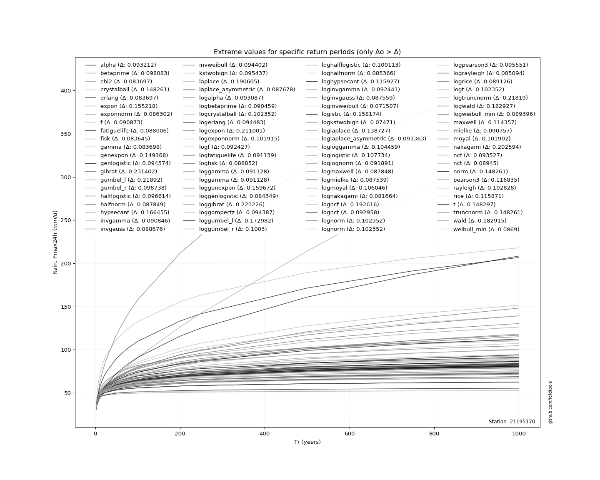</img>

</div>


<div align="center">

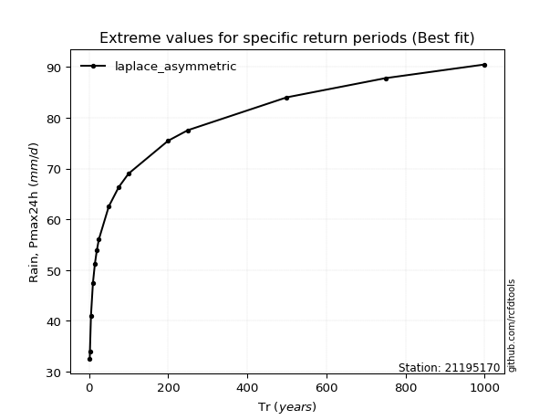</img>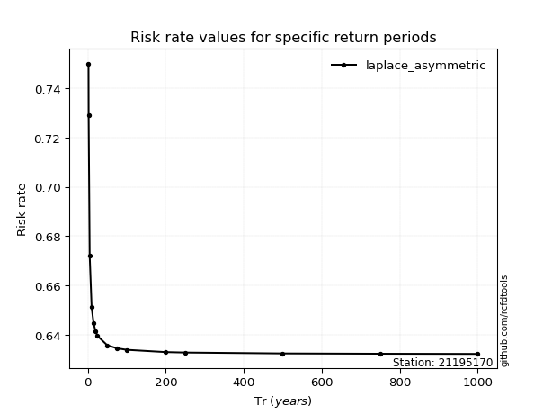</img>

</div>


<sub>**APP DISCLAIMER**: NO WARRANTY - This software is provided by [github.com/rcfdtools](https://github.com/rcfdtools) "as is", without any express or implied warranty, including warranties of merchantability, fitness for a particular purpose, or non-infringement. There is no guarantee that the software will be error-free or operate without interruption. LIMITATION OF LIABILITY - Neither the authors nor copyright holders will be liable for claims or damages arising from the software or its use. You are responsible for determining if the software is appropriate for your use and assume all associated risks, including errors, legal compliance, and data loss. NO PROFESSIONAL ADVICE - The software provides general information and does not offer professional advice. It should not replace consultation with professional advisors.</sub>