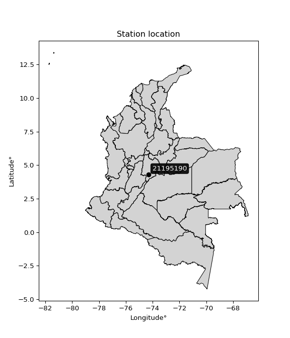

<div align="center">


</div>

# PMax24h Station (Rain): 21195190

Maximum Precipitation in 24 hours (PMax24h) is the greatest amount of rainfall for a specific duration that is meteorologically possible for a given location, acting as a "worst-case" scenario for extreme storms, crucial for designing safety-critical infrastructure like bridges, river deviations, dams, spillways, and nuclear plants to prevent catastrophic failure. The PMax24h is related with the Probable Maximum Precipitation (PMP) and it is calculated by hydrologists using meteorological data to determine the upper limit of extreme rainfall, often leading to the Probable Maximum Flood (PMF) for flood control design, and is increasingly being studied for climate change impacts. Probable Maximum Precipitation (PMP) is the theoretical upper limit of rainfall, a deterministic estimate for extreme events, while probability distributions (like GEV, Gumbel) describe the likelihood and frequency of various precipitation amounts, including rare ones, showing how often events occur, with PMP representing the extreme end of these distributions, used for critical infrastructure design to ensure safety against the worst conceivable weather, unlike standard statistical forecasts which cover typical probabilities.

The most common probability distributions in hydrology, used for analyzing floods, rainfall, and streamflow, include the Normal, Log-Normal, Gumbel, Gamma (including Log-Pearson Type III), and Generalized Extreme Value (GEV) distributions, often chosen based on the data´s skewness and whether modeling extremes or general conditions, with Gumbel and GEV popular for extreme events like floods, while the Normal distribution serves as a baseline, though often requiring transformations for skewed hydrological data. These distributions help in designing water infrastructure, managing water resources, and forecasting hydrologic events.

> Hydrological data often isn´t perfectly normal (it´s skewed), so different distributions are needed for different applications, such as: **Flood Frequency Analysis**: Using Gumbel, GEV, or Log-Pearson Type III for predicting extreme flood magnitudes and their return periods, **Rainfall Analysis**: Normal for annual totals, but Log-Normal, Weibull, or GEV for intensity or extreme daily rainfall, **Streamflow Modeling**: Gamma and Log-Normal for maximum flows, GEV for minimum flows, and Kappa for daily flows.

<div align="center">

</img>

</div>


## A. General information


### 1. General running parameters

• app_version: _v20260225_. • runtime: _2026-02-28 16:54:07.457399_. • Python version: _3.14.0_. • SciPy version: _1.16.3_. • Pandas version: _2.3.3_. • NumPy version: _2.3.5_. • Stations dataset (station_dataset_file): _dataset/pmax24h_in/automatic_colombia_2003_2025.csv_. • Stations catalog (station_catalog_file): _dataset/CNE.xls_. • Minimum year to eval til year_max (date_min): _1900_. • Maximum year to eval since year_min (date_max): _2025_. • Creates, save and include plots into reports (create_plot): _False_. • Plot only fit distributions with Δo > Δ (plot_only_fit): _True_. • Plot only simple graphs avoiding multiple CDFs and multiple Extreme values plots (plot_only_simple): _False_. • Eval low extreme values, if False, evaluates high extreme values (low_extreme): _False_. • Eval every SciPy distribution as logarithmic (pdist_logarithmic_on): _True_. • Standard deviation normalized (ddof): _1.0_. • Return periods to eval in years (Tr): _[2, 2.33, 5, 10, 15, 20, 25, 50, 75, 100, 200, 250, 500, 750, 1000]_. • Minimum data sample per station, 0 means any (minimum_sample): _5_. • Z-Score maximum threshold to adjust a value, 0 means disable (zscore_max): _3.5_. • Z-Score minimum threshold to adjust a value, 0 means disable (zscore_min): _-2.5_. • Avoid zeros, e.g. rain = 0 (avoid_zeros): _True_. • Avoid null values (avoid_nans): _True_. 

:file_folder:Table: [dataset.csv](../../dataset/pmax24h_in/automatic_colombia_2003_2025.csv)

> Delta Degrees of Freedom (DDOF): is a parameter used in the formulas for calculating variance and standard deviation. When ddof=0, the divisor is $N$ (the total number of observations) and this is used when your data set is the entire population. When ddof=1, the divisor is $N-1$ and this is used when your data set is a sample drawn from a larger population. Using $N-1$ provides an unbiased estimate of the population variance (known as Bessel´s correction).


### 2. Station info and location

|   id |   CODIGO | NOMBRE           | CATEGORIA         | TECNOLOGIA                              | ESTADO           | FECHA_INSTALACION   |   FECHA_SUSPENSION |   ALTITUD |   LATITUD |   LONGITUD | DEPARTAMENTO   | MUNICIPIO   | AREA_OPERATIVA                            | ENTIDAD                                                     | AREA_HIDROGRAFICA   | ZONA_HIDROGRAFICA   | SUBZONA_HIDROGRAFICA   |   CORRIENTE | Catalogo   |   Version |
|-----:|---------:|:-----------------|:------------------|:----------------------------------------|:-----------------|:--------------------|-------------------:|----------:|----------:|-----------:|:---------------|:------------|:------------------------------------------|:------------------------------------------------------------|:--------------------|:--------------------|:-----------------------|------------:|:-----------|----------:|
|    0 | 21195190 | PASCA [21195190] | Agrometeorológica | Automática con Telemetría, Convencional | En Mantenimiento | 26/08/2005          |                nan |      2187 |   4.30719 |   -74.3084 | Cundinamarca   | Pasca       | Area Operativa 11 - Cundinamarca-Amazonas | INSTITUTO DE HIDROLOGIA METEOROLOGIA Y ESTUDIOS AMBIENTALES | Magdalena Cauca     | Alto Magdalena      | Río Sumapaz            |         nan | CNE_IDEAM  |  20251226 |

<div align="center">

Dynamic map: [:earth_americas:Google](http://maps.google.com/maps?q=4.307189,-74.308399) [:earth_americas:OSM](https://www.openstreetmap.org/#map=18/4.307189/-74.308399&layers=P) [:earth_americas:Bing](https://www.bing.com/maps?cp=4.307189~-74.308399&lvl=18) [:earth_americas:Apple](https://maps.apple.com/frame?center=4.307189%2C-74.308399&span=0.003%2C0.006)

</div>


<div align="center">

```geojson
{
  "type": "Feature",
  "geometry": {
    "type": "Point", 
    "coordinates": [-74.308399, 4.307189]
  }, 
  "properties": {
    "Name": "21195190"
  }
}
```

</div>


### 3. Discrete values table and plot

<div align="center">

|               |          0 |          1 |           2 |           3 |           4 |          5 |          6 |          7 |           8 |           9 |          10 |           11 |          12 |          13 |         14 |          15 |          16 |         17 |          18 |          19 |
|:--------------|-----------:|-----------:|------------:|------------:|------------:|-----------:|-----------:|-----------:|------------:|------------:|------------:|-------------:|------------:|------------:|-----------:|------------:|------------:|-----------:|------------:|------------:|
| Date          | 2005       | 2006       | 2007        | 2008        | 2009        | 2010       | 2011       | 2012       | 2013        | 2014        | 2015        | 2016         | 2017        | 2018        | 2019       | 2020        | 2021        | 2022       | 2023        | 2025        |
| Value         |   17.6     |   58.3     |   36.7      |   29.9      |   21.3      |   48.5     |   56.2     |   26.9     |   43.9      |   24.1      |   20.9      |   34         |   30.5      |   28.4      |   19.4     |   20.9      |   30.6      |   46.9     |   29.7      |   31.2      |
| Value_initial |   17.6     |   58.3     |   36.7      |   29.9      |   21.3      |   48.5     |   56.2     |   26.9     |   43.9      |   24.1      |   20.9      |   34         |   30.5      |   28.4      |   19.4     |   20.9      |   30.6      |   46.9     |   29.7      |   31.2      |
| count         |   20       |   20       |   20        |   20        |   20        |   20       |   20       |   20       |   20        |   20        |   20        |   20         |   20        |   20        |   20       |   20        |   20        |   20       |   20        |   20        |
| mean          |   32.795   |   32.795   |   32.795    |   32.795    |   32.795    |   32.795   |   32.795   |   32.795   |   32.795    |   32.795    |   32.795    |   32.795     |   32.795    |   32.795    |   32.795   |   32.795    |   32.795    |   32.795   |   32.795    |   32.795    |
| std           |   12.0735  |   12.0735  |   12.0735   |   12.0735   |   12.0735   |   12.0735  |   12.0735  |   12.0735  |   12.0735   |   12.0735   |   12.0735   |   12.0735    |   12.0735   |   12.0735   |   12.0735  |   12.0735   |   12.0735   |   12.0735  |   12.0735   |   12.0735   |
| zscore        |   -1.25854 |    2.11248 |    0.323436 |   -0.239782 |   -0.952087 |    1.30078 |    1.93855 |   -0.48826 |    0.919785 |   -0.720173 |   -0.985217 |    0.0998055 |   -0.190086 |   -0.364021 |   -1.10946 |   -0.985217 |   -0.181803 |    1.16826 |   -0.256347 |   -0.132108 |


</div>


> The initial value (value_initial) correspond to the initial obtained or null completed value, and value (value) is adjusted only when the initial value is outside the valid range (outlier) definite through the Z-Score value. If Z-Score is active, values out of range or outliers are replaced with the station mean value. A Z-Score (or standard score) measures how many standard deviations a data point is from the mean of a dataset, indicating its relative position; positive scores mean above the mean, negative mean below, and a score of zero is exactly at the mean, allowing for comparison of values from different distributions. It´s calculated using the formula $z=(x–μ)/σ$, where $x$ is the data point, $μ$ is the mean, and $σ$ is the standard deviation, helping identify outliers and understand probability.
>
> <sub>**Note**: In this study, "completing" (filling gaps in) and "extending" (forecasting or lengthening the historical record) rainfall data series are avoided for certain critical analyses because they introduce artificial bias and uncertainty, which can distort the statistics of rare events (extremes), alter day-to-day variability, and compromise the integrity and homogeneity of the original data. Some reasons against Completing/Extending rainfall data are: **Distortion of Extremes and Variability**: The primary issue is that most gap-filling or extension methods rely on averaging or regression with nearby stations, which inherently smooths the data. Rainfall is highly variable in space and time, with a large percentage of zero values and occasional large storms. Infilling methods often underestimate the highest values and overestimate the lowest (zero) values, which severely distorts analyses focused on flood frequency, drought severity, and intensity-duration-frequency (IDF) curves, **Loss of Data Homogeneity**: Infilled or extended data are synthetic estimates, not actual measurements. Combining these estimates with observed data can violate the assumption of data homogeneity, which requires that the data properties do not change over time. Inhomogeneity can lead to incorrect conclusions about long-term trends or changes in climate patterns, **Propagation of Errors**: Errors and biases from the original data (e.g., wind-induced undercatch, instrument errors, site changes) or the data used for imputation can propagate through the analysis, leading to unreliable hydrological models and inaccurate predictions, **Compromised Statistical Integrity**: For statistical analyses, especially those involving the frequency of events, using artificial data can introduce time bias or autocorrelation that doesn´t exist in reality, making it difficult to assess the true probability of events, **Difficulty in Validation**: It is difficult to accurately validate the quality of filled or extended data, especially for past periods where ground-truth measurements are unavailable. The reliability of imputation techniques heavily depends on the density of the surrounding station network and the complexity of the local topography.</sub>


### 4. Active continuous probability distributions from SciPy (80 of 104 available)

A Probability Density Function (PDF) describes the relative likelihood of a continuous random variable falling within a specific range, where the total area under its curve equals 1, and the area over any interval gives the actual probability for that range. Unlike discrete probabilities (like rolling a die), a PDF shows density, not direct probability for a single point (which is zero), with higher points indicating higher likelihood, often visualized as a bell curve for normal distributions.

A log of a probability density function (log-PDF) is simply the logarithm of the PDF´s value, denoted as $log(f(x))$, useful for converting multiplication of probabilities into addition, improving numerical stability with tiny numbers, and connecting to information theory concepts like entropy. Instead of dealing with very small probabilities (e.g., 0.000001), log-PDFs use negative numbers (e.g., $log(0.00001) ≈ -11.51$ that are easier for computers to handle, preventing underflow errors and simplifying complex calculations. In this study, each active probability distribution from SciPy is also evaluated in the $log$ form.

[scipy.stats](https://docs.scipy.org/doc/scipy/reference/stats.html) is a Python´s powerful submodule within the SciPy library for comprehensive statistical analysis, offering over 130 probability distributions (like Normal, Poisson, etc.), functions for descriptive stats (mean, variance), hypothesis testing (t-tests, chi-square), random variable generation, and statistical tests, making it essential for data science, modeling, and research. It provides tools to explore, model, and draw conclusions from data efficiently, working seamlessly with [NumPy](https://numpy.org/).

<div align="center">

|   id | p_dist           |   n_parameter | fit_method   | label                                                                       | active   | ref                                                                                                      |
|-----:|:-----------------|--------------:|:-------------|:----------------------------------------------------------------------------|:---------|:---------------------------------------------------------------------------------------------------------|
|    0 | alpha            |             3 | MLE          | Alpha                                                                       | True     | [:mortar_board:](https://docs.scipy.org/doc/scipy/reference/generated/scipy.stats.alpha.html)            |
|    1 | anglit           |             2 | MM           | Anglit                                                                      | True     | [:mortar_board:](https://docs.scipy.org/doc/scipy/reference/generated/scipy.stats.anglit.html)           |
|    2 | arcsine          |             2 | MM           | Arcsine                                                                     | True     | [:mortar_board:](https://docs.scipy.org/doc/scipy/reference/generated/scipy.stats.arcsine.html)          |
|    3 | argus            |             3 | MLE          | Argus                                                                       | True     | [:mortar_board:](https://docs.scipy.org/doc/scipy/reference/generated/scipy.stats.argus.html)            |
|    4 | beta             |             4 | MLE          | Beta                                                                        | True     | [:mortar_board:](https://docs.scipy.org/doc/scipy/reference/generated/scipy.stats.beta.html)             |
|    5 | betaprime        |             4 | MLE          | Beta prime                                                                  | True     | [:mortar_board:](https://docs.scipy.org/doc/scipy/reference/generated/scipy.stats.betaprime.html)        |
|    6 | bradford         |             3 | MLE          | Bradford                                                                    | True     | [:mortar_board:](https://docs.scipy.org/doc/scipy/reference/generated/scipy.stats.bradford.html)         |
|    7 | burr             |             4 | MLE          | Burr (Type III)                                                             | True     | [:mortar_board:](https://docs.scipy.org/doc/scipy/reference/generated/scipy.stats.burr.html)             |
|    8 | burr12           |             4 | MLE          | Burr (Type III) 12                                                          | True     | [:mortar_board:](https://docs.scipy.org/doc/scipy/reference/generated/scipy.stats.burr12.html)           |
|    9 | cosine           |             2 | MLE          | Cosine                                                                      | True     | [:mortar_board:](https://docs.scipy.org/doc/scipy/reference/generated/scipy.stats.cosine.html)           |
|   10 | crystalball      |             4 | MLE          | Crystalball                                                                 | True     | [:mortar_board:](https://docs.scipy.org/doc/scipy/reference/generated/scipy.stats.crystalball.html)      |
|   11 | dgamma           |             3 | MLE          | Double gamma                                                                | True     | [:mortar_board:](https://docs.scipy.org/doc/scipy/reference/generated/scipy.stats.dgamma.html)           |
|   12 | dweibull         |             3 | MLE          | Double Weibull                                                              | True     | [:mortar_board:](https://docs.scipy.org/doc/scipy/reference/generated/scipy.stats.dweibull.html)         |
|   13 | erlang           |             3 | MLE          | Erlang                                                                      | True     | [:mortar_board:](https://docs.scipy.org/doc/scipy/reference/generated/scipy.stats.erlang.html)           |
|   14 | exponnorm        |             3 | MLE          | Exponentially modified Normal                                               | True     | [:mortar_board:](https://docs.scipy.org/doc/scipy/reference/generated/scipy.stats.exponnorm.html)        |
|   15 | exponpow         |             3 | MLE          | Exponential power                                                           | True     | [:mortar_board:](https://docs.scipy.org/doc/scipy/reference/generated/scipy.stats.exponpow.html)         |
|   16 | exponweib        |             4 | MLE          | Exponentiated Weibull                                                       | True     | [:mortar_board:](https://docs.scipy.org/doc/scipy/reference/generated/scipy.stats.exponweib.html)        |
|   17 | f                |             4 | MLE          | F                                                                           | True     | [:mortar_board:](https://docs.scipy.org/doc/scipy/reference/generated/scipy.stats.f.html)                |
|   18 | fatiguelife      |             3 | MLE          | Fatigue-life (Birnbaum-Saunders)                                            | True     | [:mortar_board:](https://docs.scipy.org/doc/scipy/reference/generated/scipy.stats.fatiguelife.html)      |
|   19 | foldnorm         |             3 | MM           | Fold Normal                                                                 | True     | [:mortar_board:](https://docs.scipy.org/doc/scipy/reference/generated/scipy.stats.foldnorm.html)         |
|   20 | gamma            |             3 | MLE          | Gamma                                                                       | True     | [:mortar_board:](https://docs.scipy.org/doc/scipy/reference/generated/scipy.stats.gamma.html)            |
|   21 | gausshyper       |             6 | MLE          | Gauss hypergeometric                                                        | True     | [:mortar_board:](https://docs.scipy.org/doc/scipy/reference/generated/scipy.stats.gausshyper.html)       |
|   22 | genexpon         |             5 | MLE          | Generalized exponential                                                     | True     | [:mortar_board:](https://docs.scipy.org/doc/scipy/reference/generated/scipy.stats.genexpon.html)         |
|   23 | genextreme       |             3 | MLE          | Generalized exponential                                                     | True     | [:mortar_board:](https://docs.scipy.org/doc/scipy/reference/generated/scipy.stats.genextreme.html)       |
|   24 | gengamma         |             4 | MLE          | Generalized gamma                                                           | True     | [:mortar_board:](https://docs.scipy.org/doc/scipy/reference/generated/scipy.stats.gengamma.html)         |
|   25 | genhalflogistic  |             3 | MLE          | Generalized half-logistic                                                   | True     | [:mortar_board:](https://docs.scipy.org/doc/scipy/reference/generated/scipy.stats.genhalflogistic.html)  |
|   26 | genlogistic      |             3 | MLE          | Generalized logistic                                                        | True     | [:mortar_board:](https://docs.scipy.org/doc/scipy/reference/generated/scipy.stats.genlogistic.html)      |
|   27 | gennorm          |             3 | MLE          | Generalized Normal                                                          | True     | [:mortar_board:](https://docs.scipy.org/doc/scipy/reference/generated/scipy.stats.gennorm.html)          |
|   28 | genpareto        |             3 | MLE          | Generalized Pareto                                                          | True     | [:mortar_board:](https://docs.scipy.org/doc/scipy/reference/generated/scipy.stats.genpareto.html)        |
|   29 | gompertz         |             3 | MLE          | Gompertz (or truncated Gumbel)                                              | True     | [:mortar_board:](https://docs.scipy.org/doc/scipy/reference/generated/scipy.stats.gompertz.html)         |
|   30 | gumbel_l         |             2 | MM           | Gumbel Left Skew                                                            | True     | [:mortar_board:](https://docs.scipy.org/doc/scipy/reference/generated/scipy.stats.gumbel_l.html)         |
|   31 | gumbel_r         |             2 | MM           | Gumbel Right Skew                                                           | True     | [:mortar_board:](https://docs.scipy.org/doc/scipy/reference/generated/scipy.stats.gumbel_r.html)         |
|   32 | halfgennorm      |             3 | MLE          | Upper half of a generalized normal                                          | True     | [:mortar_board:](https://docs.scipy.org/doc/scipy/reference/generated/scipy.stats.halfgennorm.html)      |
|   33 | halflogistic     |             2 | MM           | Half-logistic                                                               | True     | [:mortar_board:](https://docs.scipy.org/doc/scipy/reference/generated/scipy.stats.halflogistic.html)     |
|   34 | halfnorm         |             2 | MM           | Half Normal                                                                 | True     | [:mortar_board:](https://docs.scipy.org/doc/scipy/reference/generated/scipy.stats.halfnorm.html)         |
|   35 | hypsecant        |             2 | MM           | hyperbolic secant                                                           | True     | [:mortar_board:](https://docs.scipy.org/doc/scipy/reference/generated/scipy.stats.hypsecant.html)        |
|   36 | invgamma         |             3 | MLE          | Inverted gamma                                                              | True     | [:mortar_board:](https://docs.scipy.org/doc/scipy/reference/generated/scipy.stats.invgamma.html)         |
|   37 | invgauss         |             3 | MLE          | Inverse Gaussian                                                            | True     | [:mortar_board:](https://docs.scipy.org/doc/scipy/reference/generated/scipy.stats.invgauss.html)         |
|   38 | invweibull       |             3 | MLE          | Inverted Weibull                                                            | True     | [:mortar_board:](https://docs.scipy.org/doc/scipy/reference/generated/scipy.stats.invweibull.html)       |
|   39 | johnsonsb        |             4 | MLE          | Johnson SB                                                                  | True     | [:mortar_board:](https://docs.scipy.org/doc/scipy/reference/generated/scipy.stats.johnsonsb.html)        |
|   40 | johnsonsu        |             4 | MLE          | Johnson Su                                                                  | True     | [:mortar_board:](https://docs.scipy.org/doc/scipy/reference/generated/scipy.stats.johnsonsu.html)        |
|   41 | kappa3           |             3 | MLE          | Kappa 3                                                                     | True     | [:mortar_board:](https://docs.scipy.org/doc/scipy/reference/generated/scipy.stats.kappa3.html)           |
|   42 | kappa4           |             4 | MLE          | Kappa 4                                                                     | True     | [:mortar_board:](https://docs.scipy.org/doc/scipy/reference/generated/scipy.stats.kappa4.html)           |
|   43 | ksone            |             3 | MLE          | Kolmogorov-Smirnov one-sided test statistic distribution                    | True     | [:mortar_board:](https://docs.scipy.org/doc/scipy/reference/generated/scipy.stats.ksone.html)            |
|   44 | kstwobign        |             2 | MLE          | Limiting distribution of scaled Kolmogorov-Smirnov two-sided test statistic | True     | [:mortar_board:](https://docs.scipy.org/doc/scipy/reference/generated/scipy.stats.kstwobign.html)        |
|   45 | laplace          |             2 | MM           | Laplace                                                                     | True     | [:mortar_board:](https://docs.scipy.org/doc/scipy/reference/generated/scipy.stats.laplace.html)          |
|   46 | levy_l           |             2 | MLE          | Left-skewed Levy                                                            | True     | [:mortar_board:](https://docs.scipy.org/doc/scipy/reference/generated/scipy.stats.levy_l.html)           |
|   47 | loggamma         |             3 | MLE          | Log gamma                                                                   | True     | [:mortar_board:](https://docs.scipy.org/doc/scipy/reference/generated/scipy.stats.loggamma.html)         |
|   48 | logistic         |             2 | MM           | Logistic (or Sech-squared)                                                  | True     | [:mortar_board:](https://docs.scipy.org/doc/scipy/reference/generated/scipy.stats.logistic.html)         |
|   49 | loglaplace       |             3 | MLE          | Log-Laplace                                                                 | True     | [:mortar_board:](https://docs.scipy.org/doc/scipy/reference/generated/scipy.stats.loglaplace.html)       |
|   50 | lomax            |             3 | MLE          | Lomax (Pareto of the second kind)                                           | True     | [:mortar_board:](https://docs.scipy.org/doc/scipy/reference/generated/scipy.stats.lomax.html)            |
|   51 | maxwell          |             2 | MM           | Maxwell                                                                     | True     | [:mortar_board:](https://docs.scipy.org/doc/scipy/reference/generated/scipy.stats.maxwell.html)          |
|   52 | mielke           |             4 | MLE          | Mielke Beta-Kappa / Dagum                                                   | True     | [:mortar_board:](https://docs.scipy.org/doc/scipy/reference/generated/scipy.stats.mielke.html)           |
|   53 | moyal            |             2 | MM           | Moyal                                                                       | True     | [:mortar_board:](https://docs.scipy.org/doc/scipy/reference/generated/scipy.stats.moyal.html)            |
|   54 | nakagami         |             3 | MLE          | Nakagami                                                                    | True     | [:mortar_board:](https://docs.scipy.org/doc/scipy/reference/generated/scipy.stats.nakagami.html)         |
|   55 | ncf              |             5 | MLE          | Non-central F distribution                                                  | True     | [:mortar_board:](https://docs.scipy.org/doc/scipy/reference/generated/scipy.stats.ncf.html)              |
|   56 | nct              |             4 | MLE          | Non-central Student’s t                                                     | True     | [:mortar_board:](https://docs.scipy.org/doc/scipy/reference/generated/scipy.stats.nct.html)              |
|   57 | norm             |             2 | MM           | Normal                                                                      | True     | [:mortar_board:](https://docs.scipy.org/doc/scipy/reference/generated/scipy.stats.norm.html)             |
|   58 | pearson3         |             3 | MM           | Pearson type III                                                            | True     | [:mortar_board:](https://docs.scipy.org/doc/scipy/reference/generated/scipy.stats.pearson3.html)         |
|   59 | powerlaw         |             3 | MLE          | Power-function                                                              | True     | [:mortar_board:](https://docs.scipy.org/doc/scipy/reference/generated/scipy.stats.powerlaw.html)         |
|   60 | rayleigh         |             2 | MM           | Rayleigh                                                                    | True     | [:mortar_board:](https://docs.scipy.org/doc/scipy/reference/generated/scipy.stats.rayleigh.html)         |
|   61 | rdist            |             3 | MLE          | R-distributed (symmetric beta)                                              | True     | [:mortar_board:](https://docs.scipy.org/doc/scipy/reference/generated/scipy.stats.rdist.html)            |
|   62 | rice             |             3 | MLE          | Rice                                                                        | True     | [:mortar_board:](https://docs.scipy.org/doc/scipy/reference/generated/scipy.stats.rice.html)             |
|   63 | semicircular     |             2 | MM           | Semicircular                                                                | True     | [:mortar_board:](https://docs.scipy.org/doc/scipy/reference/generated/scipy.stats.semicircular.html)     |
|   64 | skewnorm         |             3 | MLE          | Skew normal                                                                 | True     | [:mortar_board:](https://docs.scipy.org/doc/scipy/reference/generated/scipy.stats.skewnorm.html)         |
|   65 | t                |             3 | MLE          | Student’s t                                                                 | True     | [:mortar_board:](https://docs.scipy.org/doc/scipy/reference/generated/scipy.stats.t.html)                |
|   66 | trapezoid        |             4 | MLE          | Trapezoid                                                                   | True     | [:mortar_board:](https://docs.scipy.org/doc/scipy/reference/generated/scipy.stats.trapezoid.html)        |
|   67 | triang           |             3 | MLE          | Triangular                                                                  | True     | [:mortar_board:](https://docs.scipy.org/doc/scipy/reference/generated/scipy.stats.triang.html)           |
|   68 | truncexpon       |             3 | MLE          | Truncated exponential                                                       | True     | [:mortar_board:](https://docs.scipy.org/doc/scipy/reference/generated/scipy.stats.truncexpon.html)       |
|   69 | truncnorm        |             4 | MLE          | Truncated normal                                                            | True     | [:mortar_board:](https://docs.scipy.org/doc/scipy/reference/generated/scipy.stats.truncnorm.html)        |
|   70 | truncpareto      |             4 | MLE          | Upper truncated Pareto                                                      | True     | [:mortar_board:](https://docs.scipy.org/doc/scipy/reference/generated/scipy.stats.truncpareto.html)      |
|   71 | truncweibull_min |             5 | MLE          | Doubly truncated Weibull minimum                                            | True     | [:mortar_board:](https://docs.scipy.org/doc/scipy/reference/generated/scipy.stats.truncweibull_min.html) |
|   72 | tukeylambda      |             3 | MLE          | Tukey-Lamdba                                                                | True     | [:mortar_board:](https://docs.scipy.org/doc/scipy/reference/generated/scipy.stats.tukeylambda.html)      |
|   73 | uniform          |             2 | MLE          | Uniform                                                                     | True     | [:mortar_board:](https://docs.scipy.org/doc/scipy/reference/generated/scipy.stats.uniform.html)          |
|   74 | vonmises         |             3 | MLE          | Von Mises                                                                   | True     | [:mortar_board:](https://docs.scipy.org/doc/scipy/reference/generated/scipy.stats.vonmises.html)         |
|   75 | vonmises_line    |             3 | MLE          | Von Mises line                                                              | True     | [:mortar_board:](https://docs.scipy.org/doc/scipy/reference/generated/scipy.stats.vonmises_line.html)    |
|   76 | wald             |             2 | MM           | Wald                                                                        | True     | [:mortar_board:](https://docs.scipy.org/doc/scipy/reference/generated/scipy.stats.wald.html)             |
|   77 | weibull_max      |             3 | MLE          | Weibull maximum                                                             | True     | [:mortar_board:](https://docs.scipy.org/doc/scipy/reference/generated/scipy.stats.weibull_max.html)      |
|   78 | weibull_min      |             3 | MLE          | Weibull minimum                                                             | True     | [:mortar_board:](https://docs.scipy.org/doc/scipy/reference/generated/scipy.stats.weibull_min.html)      |
|   79 | wrapcauchy       |             3 | MLE          | Wrapped  Cauchy                                                             | True     | [:mortar_board:](https://docs.scipy.org/doc/scipy/reference/generated/scipy.stats.wrapcauchy.html)       |

</div>

> **n_parameter:** # arguments & localization & scale.
>
> **Fit methods:** (MLE) maximum likelihood, (MM) L-moments.
>
>**Inactive** (With the only purpose of prevent loops, zero divisions, infinite values, over high estimated values or horizontal trending for recurrence intervals estimations, the follow distributions were disabled.)**:** lognorm, norminvgauss, powernorm, powerlognorm, cauchy, halfcauchy, foldcauchy, skewcauchy, chi2, expon, fisk, genhyperbolic, geninvgauss, gibrat, kstwo, laplace_asymmetric, levy, levy_stable, ncx2, pareto, rel_breitwigner, recipinvgauss, studentized_range, loguniform, 


## B. Probability (PDF) vs. Empirical (EDF) distributions functions

A continuous probability distribution (CPD) describes probabilities for variables that can take any value within a range (like rain any time), unlike discrete variables with specific outcomes (like temperature). It uses a Probability Density Function (PDF), a curve where the total area under it equals 1, and the probability of the variable falling within an interval (a to b) is found by calculating the area under the curve between those points. A key feature is that the probability of hitting any single exact value is zero, so probabilities are always expressed for ranges, e.g., $P(a ≤ X ≤ b)$.

<div align="center">

Distributions parameters from station values
|     |   station | p_dist              |   n |             loc |          scale | shape                  | shape1                 | shape2                | shape3             |
|----:|----------:|:--------------------|----:|----------------:|---------------:|:-----------------------|:-----------------------|:----------------------|:-------------------|
|   0 |  21195190 | alpha               |  20 |   -10.1771      |  162.398       | 4.043581216473783      |                        |                       |                    |
|   1 |  21195190 | anglit              |  20 |    32.795       |   34.4254      |                        |                        |                       |                    |
|   2 |  21195190 | arcsine             |  20 |    16.1528      |   33.2843      |                        |                        |                       |                    |
|   3 |  21195190 | argus               |  20 |     5.17248     |   54.194       | 7.5945559474515605e-06 |                        |                       |                    |
|   4 |  21195190 | beta                |  20 |    17.6         |   41.255       | 0.7376772239336337     | 1.1281270123902858     |                       |                    |
|   5 |  21195190 | betaprime           |  20 |    -0.75871     |    2.03034     | 147.5117578087095      | 9.928588049130894      |                       |                    |
|   6 |  21195190 | bradford            |  20 |    17.6         |   40.7002      | 0.999420087047099      |                        |                       |                    |
|   7 |  21195190 | burr                |  20 |   -23.0009      |   10.6632      | 6.0966641229181615     | 11884.825301482466     |                       |                    |
|   8 |  21195190 | burr12              |  20 |    -1.80829     |   19.3235      | 625.4565142729982      | 0.0030256385505728735  |                       |                    |
|   9 |  21195190 | cosine              |  20 |    34.306       |   10.1287      |                        |                        |                       |                    |
|  10 |  21195190 | crystalball         |  20 |    32.795       |   11.7678      | 793.2979733170383      | 6094.681334744408      |                       |                    |
|  11 |  21195190 | dgamma              |  20 |    29.9         |    9.23876     | 0.7944610591664123     |                        |                       |                    |
|  12 |  21195190 | dweibull            |  20 |    30.5         |    7.93899     | 0.9452586567436811     |                        |                       |                    |
|  13 |  21195190 | erlang              |  20 |    17.2901      |   11.8636      | 1.3069278230418064     |                        |                       |                    |
|  14 |  21195190 | exponnorm           |  20 |    18.3018      |    1.29714     | 11.173148996838599     |                        |                       |                    |
|  15 |  21195190 | exponpow            |  20 |    17.6         |   28.7886      | 0.9816953015227023     |                        |                       |                    |
|  16 |  21195190 | exponweib           |  20 |    17.6         |    1.08408     | 1.2696198295113583     | 0.2872792531730045     |                       |                    |
|  17 |  21195190 | f                   |  20 |     8.83913     |   19.8479      | 42.892629969505606     | 10.911737686938729     |                       |                    |
|  18 |  21195190 | fatiguelife         |  20 |    12.9944      |   16.3067      | 0.6528117876154453     |                        |                       |                    |
|  19 |  21195190 | foldnorm            |  20 |    16.2097      |   15.4516      | 0.8556583993642297     |                        |                       |                    |
|  20 |  21195190 | gamma               |  20 |    17.2901      |   11.8637      | 1.3069159831197021     |                        |                       |                    |
|  21 |  21195190 | gausshyper          |  20 |    17.6         |   41.4884      | 0.89417287322084       | 1.2019128232841392     | 1.0143127790105102    | 0.9248190156738377 |
|  22 |  21195190 | genexpon            |  20 |    17.6         |    1.37472     | 0.09026152486970546    | 0.00021595593510066976 | 1.285766963551644     |                    |
|  23 |  21195190 | genextreme          |  20 |    26.6897      |    8.15069     | -0.1635701734501404    |                        |                       |                    |
|  24 |  21195190 | gengamma            |  20 |    17.6         |    1.06352     | 1.2019418742720847     | 0.3507311407956102     |                       |                    |
|  25 |  21195190 | genhalflogistic     |  20 |    13.8293      |   46.2759      | 1.0405923524343401     |                        |                       |                    |
|  26 |  21195190 | genlogistic         |  20 |   -35.4266      |    8.81228     | 1255.7430036737164     |                        |                       |                    |
|  27 |  21195190 | gennorm             |  20 |    30.5         |    7.52857     | 0.8982659941891296     |                        |                       |                    |
|  28 |  21195190 | genpareto           |  20 |    -0.0197602   |   65.5611      | -1.1241657575550414    |                        |                       |                    |
|  29 |  21195190 | gompertz            |  20 |    17.6         |   35.5556      | 1.5952024922189403     |                        |                       |                    |
|  30 |  21195190 | gumbel_l            |  20 |    38.0911      |    9.17529     |                        |                        |                       |                    |
|  31 |  21195190 | gumbel_r            |  20 |    27.4989      |    9.17529     |                        |                        |                       |                    |
|  32 |  21195190 | halfgennorm         |  20 |    17.6         |    1.15063     | 0.4046019562254499     |                        |                       |                    |
|  33 |  21195190 | halflogistic        |  20 |    18.8475      |   10.061       |                        |                        |                       |                    |
|  34 |  21195190 | halfnorm            |  20 |    17.2191      |   19.5215      |                        |                        |                       |                    |
|  35 |  21195190 | hypsecant           |  20 |    32.795       |    7.4916      |                        |                        |                       |                    |
|  36 |  21195190 | invgamma            |  20 |     6.07363     |  127.721       | 5.737941153463924      |                        |                       |                    |
|  37 |  21195190 | invgauss            |  20 |    11.9077      |   52.958       | 0.3944133987109463     |                        |                       |                    |
|  38 |  21195190 | invweibull          |  20 |   -23.1394      |   49.8291      | 6.11349591421377       |                        |                       |                    |
|  39 |  21195190 | johnsonsb           |  20 |    17.4364      |   41.5967      | 0.3742306794833365     | 0.5024677282839647     |                       |                    |
|  40 |  21195190 | johnsonsu           |  20 |    12.7753      |    0.335861    | -7.433171198648033     | 1.6156309323893723     |                       |                    |
|  41 |  21195190 | kappa3              |  20 |    17.6         |   40.6533      | 2610.815883768566      |                        |                       |                    |
|  42 |  21195190 | kappa4              |  20 |    12.7994      |   46.5329      | 1.1151721663223806     | 1.0203495445373947     |                       |                    |
|  43 |  21195190 | ksone               |  20 |    13.53        |   48.84        | 1.0                    |                        |                       |                    |
|  44 |  21195190 | kstwobign           |  20 |    -3.79854     |   42.0841      |                        |                        |                       |                    |
|  45 |  21195190 | laplace             |  20 |    32.795       |    8.32107     |                        |                        |                       |                    |
|  46 |  21195190 | levy_l              |  20 |    60.6475      |   15.1362      |                        |                        |                       |                    |
|  47 |  21195190 | loggamma            |  20 | -3893.49        |  520.782       | 1880.9748425904086     |                        |                       |                    |
|  48 |  21195190 | logistic            |  20 |    32.795       |    6.48791     |                        |                        |                       |                    |
|  49 |  21195190 | loglaplace          |  20 |    -0.0781473   |   29.9782      | 3.690493394929047      |                        |                       |                    |
|  50 |  21195190 | lomax               |  20 |    17.6         |    3.57181e+11 | 7805134091.339712      |                        |                       |                    |
|  51 |  21195190 | maxwell             |  20 |     4.91032     |   17.4741      |                        |                        |                       |                    |
|  52 |  21195190 | mielke              |  20 |   -23.1617      |   15.2785      | 8490.798160705555      | 6.11784208077954       |                       |                    |
|  53 |  21195190 | moyal               |  20 |    26.0654      |    5.29736     |                        |                        |                       |                    |
|  54 |  21195190 | nakagami            |  20 |    17.6         |   21.611       | 0.38931977517506255    |                        |                       |                    |
|  55 |  21195190 | ncf                 |  20 |    -1.5896      |   17.2866      | 137.72647238068527     | 21.972113158745636     | 111.31729089927823    |                    |
|  56 |  21195190 | nct                 |  20 |    -0.150885    |    0.852659    | 5.012258517483088      | 32.712746404324726     |                       |                    |
|  57 |  21195190 | norm                |  20 |    32.795       |   11.7678      |                        |                        |                       |                    |
|  58 |  21195190 | pearson3            |  20 |    32.795       |   11.7678      | 0.7884929338811101     |                        |                       |                    |
|  59 |  21195190 | powerlaw            |  20 |    17.6         |   40.7         | 0.3294302138048513     |                        |                       |                    |
|  60 |  21195190 | rayleigh            |  20 |    10.2826      |   17.9623      |                        |                        |                       |                    |
|  61 |  21195190 | rdist               |  20 |    27.1545      |    9.55445     | 0.9196325890293244     |                        |                       |                    |
|  62 |  21195190 | rice                |  20 |    13.0461      |   16.2557      | 0.00031106166872693153 |                        |                       |                    |
|  63 |  21195190 | semicircular        |  20 |    32.795       |   23.5355      |                        |                        |                       |                    |
|  64 |  21195190 | skewnorm            |  20 |    17.6         |   19.2185      | 81771169.64575559      |                        |                       |                    |
|  65 |  21195190 | t                   |  20 |    32.7951      |   11.7676      | 18900737.97911055      |                        |                       |                    |
|  66 |  21195190 | trapezoid           |  20 |    13.53        |   48.84        | 0.9999999999999999     | 1.0                    |                       |                    |
|  67 |  21195190 | triang              |  20 |     0.0088926   |   58.2911      | 0.9999999992556547     |                        |                       |                    |
|  68 |  21195190 | truncexpon          |  20 |    17.6         |   49.2695      | 0.8260688889748324     |                        |                       |                    |
|  69 |  21195190 | truncnorm           |  20 |    32.795       |   11.7678      | -133.49118215199672    | 329.4546066992304      |                       |                    |
|  70 |  21195190 | truncpareto         |  20 |    17.6         |    2.40551e-08 | 0.05263155613597501    | 1691945831.135029      |                       |                    |
|  71 |  21195190 | truncweibull_min    |  20 |    17.5538      |   41.4082      | 0.8198793896864458     | 0.0011168668435412546  | 0.9840136347850171    |                    |
|  72 |  21195190 | tukeylambda         |  20 |    37.9345      |   28.2024      | 1.384814031845365      |                        |                       |                    |
|  73 |  21195190 | uniform             |  20 |    17.6         |   40.7         |                        |                        |                       |                    |
|  74 |  21195190 | vonmises            |  20 |    -1.06009     |    1           | 0.26033602343486406    |                        |                       |                    |
|  75 |  21195190 | vonmises_line       |  20 |    31.5352      |    8.51949     | 0.8407319636236661     |                        |                       |                    |
|  76 |  21195190 | wald                |  20 |    21.0273      |   11.7677      |                        |                        |                       |                    |
|  77 |  21195190 | weibull_max         |  20 |    58.3         |    1.45935     | 0.26220907830706375    |                        |                       |                    |
|  78 |  21195190 | weibull_min         |  20 |    17.344       |   16.423       | 1.2210807283147869     |                        |                       |                    |
|  79 |  21195190 | wrapcauchy          |  20 |    17.6         |    6.47761     | 0.12321678375578698    |                        |                       |                    |
|  80 |  21195190 | logalpha            |  20 |    -0.600789    |   47.4082      | 11.847257496412634     |                        |                       |                    |
|  81 |  21195190 | loganglit           |  20 |     3.42977     |    1.00682     |                        |                        |                       |                    |
|  82 |  21195190 | logarcsine          |  20 |     2.94304     |    0.973467    |                        |                        |                       |                    |
|  83 |  21195190 | logargus            |  20 |     2.63495     |    1.46623     | 5.3674162027114464e-05 |                        |                       |                    |
|  84 |  21195190 | logbeta             |  20 |     2.8679      |    1.19832     | 0.7442637012239817     | 0.7778525299434773     |                       |                    |
|  85 |  21195190 | logbetaprime        |  20 |     0.134259    |    4.50991     | 161.08438043620535     | 221.30592666966484     |                       |                    |
|  86 |  21195190 | logbradford         |  20 |     2.8679      |    1.19771     | 1.0149617688110004     |                        |                       |                    |
|  87 |  21195190 | logburr             |  20 |    -0.0761434   |    3.06909     | 13.11027978136094      | 3.578212392913103      |                       |                    |
|  88 |  21195190 | logburr12           |  20 |    -0.25024     |    3.62467     | 18.880151054595856     | 0.8940865824777697     |                       |                    |
|  89 |  21195190 | logcosine           |  20 |     3.44466     |    0.28775     |                        |                        |                       |                    |
|  90 |  21195190 | logcrystalball      |  20 |     3.42977     |    0.344164    | 161.2240308646239      | 705.278348434173       |                       |                    |
|  91 |  21195190 | logdgamma           |  20 |     3.41773     |    0.278462    | 0.8497671945047839     |                        |                       |                    |
|  92 |  21195190 | logdweibull         |  20 |     3.41773     |    0.264913    | 0.9552145017649665     |                        |                       |                    |
|  93 |  21195190 | logerlang           |  20 |     2.5513      |    0.145389    | 6.042187594521609      |                        |                       |                    |
|  94 |  21195190 | logexponnorm        |  20 |     3.31548     |    0.324945    | 0.3517131653786307     |                        |                       |                    |
|  95 |  21195190 | logexponpow         |  20 |     2.85515     |    0.900139    | 1.2115658787818506     |                        |                       |                    |
|  96 |  21195190 | logexponweib        |  20 |     2.8679      |    1.0221      | 0.22900808632411918    | 3.4442794758085133     |                       |                    |
|  97 |  21195190 | logf                |  20 |     1.31712     |    2.07162     | 292.8565726406829      | 102.42415217167823     |                       |                    |
|  98 |  21195190 | logfatiguelife      |  20 |     1.91914     |    1.47113     | 0.23170438945591093    |                        |                       |                    |
|  99 |  21195190 | logfoldnorm         |  20 |     2.96376     |    0.46854     | 0.7182006792261049     |                        |                       |                    |
| 100 |  21195190 | loggamma            |  20 |     2.5513      |    0.145388    | 6.0422470880464        |                        |                       |                    |
| 101 |  21195190 | loggausshyper       |  20 |     2.86479     |    1.20081     | 1.0633112238081766     | 0.9013554163638402     | 1.0403720688734215    | 1.01588109605049   |
| 102 |  21195190 | loggenexpon         |  20 |     2.8679      |    0.685149    | 0.6029105068156655     | 1.236565727495941      | 1.515064423500223     |                    |
| 103 |  21195190 | loggenextreme       |  20 |     3.29562     |    0.318953    | 0.20007014162120124    |                        |                       |                    |
| 104 |  21195190 | loggengamma         |  20 |     2.8679      |    1.16838     | 0.2090289929119487     | 3.8112886276149887     |                       |                    |
| 105 |  21195190 | loggenhalflogistic  |  20 |     2.70469     |    1.43441     | 1.0540005638816723     |                        |                       |                    |
| 106 |  21195190 | loggenlogistic      |  20 |     1.77682     |    0.296967    | 149.74266510060397     |                        |                       |                    |
| 107 |  21195190 | loggennorm          |  20 |     3.46675     |    0.598852    | 11200453.759941295     |                        |                       |                    |
| 108 |  21195190 | loggenpareto        |  20 |    -0.00240304  |    8.56023     | -2.10428168107802      |                        |                       |                    |
| 109 |  21195190 | loggompertz         |  20 |     2.8679      |    0.88699     | 1.0023905502209853     |                        |                       |                    |
| 110 |  21195190 | loggumbel_l         |  20 |     3.58466     |    0.268344    |                        |                        |                       |                    |
| 111 |  21195190 | loggumbel_r         |  20 |     3.27488     |    0.268344    |                        |                        |                       |                    |
| 112 |  21195190 | loghalfgennorm      |  20 |     2.8679      |    1.19771     | 1204635.0330512137     |                        |                       |                    |
| 113 |  21195190 | loghalflogistic     |  20 |     3.02189     |    0.294226    |                        |                        |                       |                    |
| 114 |  21195190 | loghalfnorm         |  20 |     2.97426     |    0.570902    |                        |                        |                       |                    |
| 115 |  21195190 | loghypsecant        |  20 |     3.42977     |    0.219102    |                        |                        |                       |                    |
| 116 |  21195190 | loginvgamma         |  20 |     1.01418     |  118.081       | 49.8781950344507       |                        |                       |                    |
| 117 |  21195190 | loginvgauss         |  20 |     1.88631     |   29.7178      | 0.05193724809303618    |                        |                       |                    |
| 118 |  21195190 | loginvweibull       |  20 |    -2.96943e+07 |    2.96943e+07 | 99710620.76054722      |                        |                       |                    |
| 119 |  21195190 | logjohnsonsb        |  20 |     2.85615     |    1.22565     | 0.07210371329684642    | 0.5292736597744274     |                       |                    |
| 120 |  21195190 | logjohnsonsu        |  20 |     2.00501e+06 |    1.07638e+07 | 5900009.004847222      | 31855283.766455162     |                       |                    |
| 121 |  21195190 | logkappa3           |  20 |     2.8679      |    1.19769     | 352866.62578775827     |                        |                       |                    |
| 122 |  21195190 | logkappa4           |  20 |     2.7518      |    1.43653     | 1.0873180518009318     | 1.0934096523646522     |                       |                    |
| 123 |  21195190 | logksone            |  20 |     2.74813     |    1.43724     | 1.0                    |                        |                       |                    |
| 124 |  21195190 | logkstwobign        |  20 |     2.21479     |    1.3913      |                        |                        |                       |                    |
| 125 |  21195190 | loglaplace          |  20 |     3.42977     |    0.243361    |                        |                        |                       |                    |
| 126 |  21195190 | loglevy_l           |  20 |     4.12042     |    0.340726    |                        |                        |                       |                    |
| 127 |  21195190 | logloggamma         |  20 |   -79.5137      |   11.7596      | 1157.0609796966396     |                        |                       |                    |
| 128 |  21195190 | loglogistic         |  20 |     3.42977     |    0.189748    |                        |                        |                       |                    |
| 129 |  21195190 | logloglaplace       |  20 |    -0.0301449   |    3.42804     | 12.741531058880799     |                        |                       |                    |
| 130 |  21195190 | loglomax            |  20 |     2.8679      |   25.6598      | 45.97137703536178      |                        |                       |                    |
| 131 |  21195190 | logmaxwell          |  20 |     2.61425     |    0.511054    |                        |                        |                       |                    |
| 132 |  21195190 | logmielke           |  20 | -2628.63        | 2630.72        | 499713.46445043536     | 8993.535092170576      |                       |                    |
| 133 |  21195190 | logmoyal            |  20 |     3.23296     |    0.154928    |                        |                        |                       |                    |
| 134 |  21195190 | lognakagami         |  20 |     2.84408     |    0.679309    | 0.700905136047647      |                        |                       |                    |
| 135 |  21195190 | logncf              |  20 |    -3.35741     |    6.7775      | 518.8746613867293      | 358.99772434315094     | 7.614475048547203e-12 |                    |
| 136 |  21195190 | lognct              |  20 |    -0.115288    |    0.06839     | 56.80665595678798      | 51.14233180426518      |                       |                    |
| 137 |  21195190 | lognorm             |  20 |     3.42977     |    0.344164    |                        |                        |                       |                    |
| 138 |  21195190 | logpearson3         |  20 |     3.42977     |    0.344164    | 0.2716065266446781     |                        |                       |                    |
| 139 |  21195190 | logpowerlaw         |  20 |     2.8679      |    1.1977      | 0.37920530398268687    |                        |                       |                    |
| 140 |  21195190 | lograyleigh         |  20 |     2.77136     |    0.525332    |                        |                        |                       |                    |
| 141 |  21195190 | logrdist            |  20 |     3.56792     |    0.70002     | 1.1046716089700586     |                        |                       |                    |
| 142 |  21195190 | logrice             |  20 |     2.7646      |    0.438591    | 0.957010839943695      |                        |                       |                    |
| 143 |  21195190 | logsemicircular     |  20 |     3.42977     |    0.688328    |                        |                        |                       |                    |
| 144 |  21195190 | logskewnorm         |  20 |     3.01322     |    0.540337    | 3.03075509637707       |                        |                       |                    |
| 145 |  21195190 | logt                |  20 |     3.42977     |    0.34417     | 39203424.80102929      |                        |                       |                    |
| 146 |  21195190 | logtrapezoid        |  20 |     2.74813     |    1.43724     | 1.0                    | 1.0                    |                       |                    |
| 147 |  21195190 | logtriang           |  20 |     2.51725     |    1.54835     | 0.9999998454553432     |                        |                       |                    |
| 148 |  21195190 | logtruncexpon       |  20 |     2.8679      |    1.24166     | 0.9646030392260481     |                        |                       |                    |
| 149 |  21195190 | logtruncnorm        |  20 |    -0.1309      |    1.47212     | 2.037060940021597      | 4.444793053940444      |                       |                    |
| 150 |  21195190 | logtruncpareto      |  20 |    -3.35544e+07 |    3.35544e+07 | 59719036.275641784     | 1.0000000356943366     |                       |                    |
| 151 |  21195190 | logtruncweibull_min |  20 |     2.86664     |    1.38911     | 1.0271867164831898     | 0.0004953597789480205  | 0.8631172977728259    |                    |
| 152 |  21195190 | logtukeylambda      |  20 |     3.4666      |    0.603866    | 1.0081130361438648     |                        |                       |                    |
| 153 |  21195190 | loguniform          |  20 |     2.8679      |    1.1977      |                        |                        |                       |                    |
| 154 |  21195190 | logvonmises         |  20 |    -2.85532     |    1           | 8.897727621077182      |                        |                       |                    |
| 155 |  21195190 | logvonmises_line    |  20 |     3.46675     |    0.19062     | 0.13211024064577886    |                        |                       |                    |
| 156 |  21195190 | logwald             |  20 |     3.08561     |    0.344163    |                        |                        |                       |                    |
| 157 |  21195190 | logweibull_max      |  20 |     4.88981     |    1.59416     | 4.99825268007554       |                        |                       |                    |
| 158 |  21195190 | logweibull_min      |  20 |     2.78589     |    0.725175    | 1.9353080310457111     |                        |                       |                    |
| 159 |  21195190 | logwrapcauchy       |  20 |     2.8679      |    0.19062     | 0.5                    |                        |                       |                    |

</div>

> **loc** (Location parameter): This shifts the distribution along the x-axis. For many common distributions, like the normal (Gaussian) distribution, loc represents the mean $μ$. For others, like the uniform distribution, it might represent the minimum value, or for the beta distribution, the left end of the support interval.
>
> **scale** (Scale parameter): This determines the width or spread of the distribution. For the normal distribution, scale represents the standard deviation $σ$. For a uniform distribution, it defines the length of the interval (from $loc$ to $loc + scale$).
>
> **shape** (Shape parameters): Refers to parameters that define the specific form of a probability distribution, distinct from its location (loc) and scale (scale). These parameters are required arguments for most distribution functions. For example, a normal (Gaussian) distribution is fully defined by its location (mean) and scale (standard deviation), so it has no specific shape parameters beyond loc and scale. However, other distributions have intrinsic properties that need specification, as Gamma distribution that takes a shape parameter, often named $a$ or $alpha$.


### 0. Cumulative distribution values - CDF (160 evaluated)

Cumulative Distribution Function (CDF), denoted as $F$<sub>$X$</sub>$(x)$, is a function that gives the probability that a random variable $X$ will take a value less than or equal to a specific value, $x$ (i.e., $(P(X≥x)$. It essentially "accumulates" probabilities from a given point up to the far right (positive infinity), providing a complete picture of the distribution´s probabilities for both discrete (like rain) and continuous (like temperature) variables, helping to find probabilities over ranges or above certain values. Each station is evaluated separately ordering the $x$ values ascending, calculating the CDF and PDF values for the activated distributions and their logarithmic forms.

<div align="center">

CDF ordered by x ascending and calculating $log(f(x))$ separately
|   id |   Station |   date |    x |   count |   mean |     std |     zscore |   Value_initial |   station |   m |     alpha |   alpha_pdf |   anglit |   anglit_pdf |   arcsine |   arcsine_pdf |     argus |   argus_pdf |        beta |    beta_pdf |   betaprime |   betaprime_pdf |   bradford |   bradford_pdf |      burr |   burr_pdf |     burr12 |   burr12_pdf |    cosine |   cosine_pdf |   crystalball |   crystalball_pdf |   dgamma |   dgamma_pdf |   dweibull |   dweibull_pdf |     erlang |   erlang_pdf |   exponnorm |   exponnorm_pdf |    exponpow |   exponpow_pdf |   exponweib |   exponweib_pdf |         f |      f_pdf |   fatiguelife |   fatiguelife_pdf |   foldnorm |   foldnorm_pdf |     gamma |   gamma_pdf |   gausshyper |   gausshyper_pdf |    genexpon |   genexpon_pdf |   genextreme |   genextreme_pdf |    gengamma |   gengamma_pdf |   genhalflogistic |   genhalflogistic_pdf |   genlogistic |   genlogistic_pdf |   gennorm |   gennorm_pdf |   genpareto |   genpareto_pdf |    gompertz |   gompertz_pdf |   gumbel_l |   gumbel_l_pdf |   gumbel_r |   gumbel_r_pdf |   halfgennorm |   halfgennorm_pdf |   halflogistic |   halflogistic_pdf |   halfnorm |   halfnorm_pdf |   hypsecant |   hypsecant_pdf |   invgamma |   invgamma_pdf |   invgauss |   invgauss_pdf |   invweibull |   invweibull_pdf |   johnsonsb |   johnsonsb_pdf |   johnsonsu |   johnsonsu_pdf |      kappa3 |   kappa3_pdf |      kappa4 |   kappa4_pdf |     ksone |   ksone_pdf |   kstwobign |   kstwobign_pdf |   laplace |   laplace_pdf |   levy_l |   levy_l_pdf |   loggamma |   loggamma_pdf |   logistic |   logistic_pdf |   loglaplace |   loglaplace_pdf |       lomax |   lomax_pdf |   maxwell |   maxwell_pdf |   mielke |   mielke_pdf |     moyal |   moyal_pdf |    nakagami |   nakagami_pdf |       ncf |    ncf_pdf |       nct |    nct_pdf |      norm |   norm_pdf |   pearson3 |   pearson3_pdf |    powerlaw |   powerlaw_pdf |   rayleigh |   rayleigh_pdf |       rdist |   rdist_pdf |      rice |   rice_pdf |   semicircular |   semicircular_pdf |   skewnorm |   skewnorm_pdf |         t |      t_pdf |   trapezoid |   trapezoid_pdf |    triang |   triang_pdf |   truncexpon |   truncexpon_pdf |   truncnorm |   truncnorm_pdf |   truncpareto |   truncpareto_pdf |   truncweibull_min |   truncweibull_min_pdf |   tukeylambda |   tukeylambda_pdf |   uniform |   uniform_pdf |   vonmises |   vonmises_pdf |   vonmises_line |   vonmises_line_pdf |        wald |   wald_pdf |   weibull_max |   weibull_max_pdf |   weibull_min |   weibull_min_pdf |   wrapcauchy |   wrapcauchy_pdf |   logalpha |   logalpha_pdf |   loganglit |   loganglit_pdf |   logarcsine |   logarcsine_pdf |   logargus |   logargus_pdf |   logbeta |   logbeta_pdf |   logbetaprime |   logbetaprime_pdf |   logbradford |   logbradford_pdf |   logburr |   logburr_pdf |   logburr12 |   logburr12_pdf |   logcosine |   logcosine_pdf |   logcrystalball |   logcrystalball_pdf |   logdgamma |   logdgamma_pdf |   logdweibull |   logdweibull_pdf |   logerlang |   logerlang_pdf |   logexponnorm |   logexponnorm_pdf |   logexponpow |   logexponpow_pdf |   logexponweib |   logexponweib_pdf |      logf |   logf_pdf |   logfatiguelife |   logfatiguelife_pdf |   logfoldnorm |   logfoldnorm_pdf |   loggausshyper |   loggausshyper_pdf |   loggenexpon |   loggenexpon_pdf |   loggenextreme |   loggenextreme_pdf |   loggengamma |   loggengamma_pdf |   loggenhalflogistic |   loggenhalflogistic_pdf |   loggenlogistic |   loggenlogistic_pdf |   loggennorm |   loggennorm_pdf |   loggenpareto |   loggenpareto_pdf |   loggompertz |   loggompertz_pdf |   loggumbel_l |   loggumbel_l_pdf |   loggumbel_r |   loggumbel_r_pdf |   loghalfgennorm |   loghalfgennorm_pdf |   loghalflogistic |   loghalflogistic_pdf |   loghalfnorm |   loghalfnorm_pdf |   loghypsecant |   loghypsecant_pdf |   loginvgamma |   loginvgamma_pdf |   loginvgauss |   loginvgauss_pdf |   loginvweibull |   loginvweibull_pdf |   logjohnsonsb |   logjohnsonsb_pdf |   logjohnsonsu |   logjohnsonsu_pdf |   logkappa3 |   logkappa3_pdf |   logkappa4 |   logkappa4_pdf |   logksone |   logksone_pdf |   logkstwobign |   logkstwobign_pdf |   loglevy_l |   loglevy_l_pdf |   logloggamma |   logloggamma_pdf |   loglogistic |   loglogistic_pdf |   logloglaplace |   logloglaplace_pdf |    loglomax |   loglomax_pdf |   logmaxwell |   logmaxwell_pdf |   logmielke |   logmielke_pdf |   logmoyal |   logmoyal_pdf |   lognakagami |   lognakagami_pdf |   logncf |   logncf_pdf |    lognct |   lognct_pdf |   lognorm |   lognorm_pdf |   logpearson3 |   logpearson3_pdf |   logpowerlaw |   logpowerlaw_pdf |   lograyleigh |   lograyleigh_pdf |    logrdist |   logrdist_pdf |   logrice |   logrice_pdf |   logsemicircular |   logsemicircular_pdf |   logskewnorm |   logskewnorm_pdf |      logt |   logt_pdf |   logtrapezoid |   logtrapezoid_pdf |   logtriang |   logtriang_pdf |   logtruncexpon |   logtruncexpon_pdf |   logtruncnorm |   logtruncnorm_pdf |   logtruncpareto |   logtruncpareto_pdf |   logtruncweibull_min |   logtruncweibull_min_pdf |   logtukeylambda |   logtukeylambda_pdf |   loguniform |   loguniform_pdf |   logvonmises |   logvonmises_pdf |   logvonmises_line |   logvonmises_line_pdf |   logwald |   logwald_pdf |   logweibull_max |   logweibull_max_pdf |   logweibull_min |   logweibull_min_pdf |   logwrapcauchy |   logwrapcauchy_pdf |
|-----:|----------:|-------:|-----:|--------:|-------:|--------:|-----------:|----------------:|----------:|----:|----------:|------------:|---------:|-------------:|----------:|--------------:|----------:|------------:|------------:|------------:|------------:|----------------:|-----------:|---------------:|----------:|-----------:|-----------:|-------------:|----------:|-------------:|--------------:|------------------:|---------:|-------------:|-----------:|---------------:|-----------:|-------------:|------------:|----------------:|------------:|---------------:|------------:|----------------:|----------:|-----------:|--------------:|------------------:|-----------:|---------------:|----------:|------------:|-------------:|-----------------:|------------:|---------------:|-------------:|-----------------:|------------:|---------------:|------------------:|----------------------:|--------------:|------------------:|----------:|--------------:|------------:|----------------:|------------:|---------------:|-----------:|---------------:|-----------:|---------------:|--------------:|------------------:|---------------:|-------------------:|-----------:|---------------:|------------:|----------------:|-----------:|---------------:|-----------:|---------------:|-------------:|-----------------:|------------:|----------------:|------------:|----------------:|------------:|-------------:|------------:|-------------:|----------:|------------:|------------:|----------------:|----------:|--------------:|---------:|-------------:|-----------:|---------------:|-----------:|---------------:|-------------:|-----------------:|------------:|------------:|----------:|--------------:|---------:|-------------:|----------:|------------:|------------:|---------------:|----------:|-----------:|----------:|-----------:|----------:|-----------:|-----------:|---------------:|------------:|---------------:|-----------:|---------------:|------------:|------------:|----------:|-----------:|---------------:|-------------------:|-----------:|---------------:|----------:|-----------:|------------:|----------------:|----------:|-------------:|-------------:|-----------------:|------------:|----------------:|--------------:|------------------:|-------------------:|-----------------------:|--------------:|------------------:|----------:|--------------:|-----------:|---------------:|----------------:|--------------------:|------------:|-----------:|--------------:|------------------:|--------------:|------------------:|-------------:|-----------------:|-----------:|---------------:|------------:|----------------:|-------------:|-----------------:|-----------:|---------------:|----------:|--------------:|---------------:|-------------------:|--------------:|------------------:|----------:|--------------:|------------:|----------------:|------------:|----------------:|-----------------:|---------------------:|------------:|----------------:|--------------:|------------------:|------------:|----------------:|---------------:|-------------------:|--------------:|------------------:|---------------:|-------------------:|----------:|-----------:|-----------------:|---------------------:|--------------:|------------------:|----------------:|--------------------:|--------------:|------------------:|----------------:|--------------------:|--------------:|------------------:|---------------------:|-------------------------:|-----------------:|---------------------:|-------------:|-----------------:|---------------:|-------------------:|--------------:|------------------:|--------------:|------------------:|--------------:|------------------:|-----------------:|---------------------:|------------------:|----------------------:|--------------:|------------------:|---------------:|-------------------:|--------------:|------------------:|--------------:|------------------:|----------------:|--------------------:|---------------:|-------------------:|---------------:|-------------------:|------------:|----------------:|------------:|----------------:|-----------:|---------------:|---------------:|-------------------:|------------:|----------------:|--------------:|------------------:|--------------:|------------------:|----------------:|--------------------:|------------:|---------------:|-------------:|-----------------:|------------:|----------------:|-----------:|---------------:|--------------:|------------------:|---------:|-------------:|----------:|-------------:|----------:|--------------:|--------------:|------------------:|--------------:|------------------:|--------------:|------------------:|------------:|---------------:|----------:|--------------:|------------------:|----------------------:|--------------:|------------------:|----------:|-----------:|---------------:|-------------------:|------------:|----------------:|----------------:|--------------------:|---------------:|-------------------:|-----------------:|---------------------:|----------------------:|--------------------------:|-----------------:|---------------------:|-------------:|-----------------:|--------------:|------------------:|-------------------:|-----------------------:|----------:|--------------:|-----------------:|---------------------:|-----------------:|---------------------:|----------------:|--------------------:|
|    0 |  21195190 |   2005 | 17.6 |      20 | 32.795 | 12.0735 | -1.25854   |            17.6 |  21195190 |   1 | 0.0357051 |  0.0165319  | 0.113747 |   0.0184459  |  0.133726 |     0.0468948 | 0.0778321 |   0.0123559 | 1.55517e-12 | 322.913     |   0.0427562 |      0.0174054  | 8.7071e-07 |      0.0354411 | 0.0324854 | 0.0167145  | 0.00843525 |   0.0908018  | 0.0788301 |   0.0144798  |     0.0983105 |        0.0147288  | 0.096472 |   0.0115143  |   0.102753 |     0.0119135  | 0.00717705 |   0.029926   |   0.0158495 |      0.019208   | 2.41292e-16 |     0.0666744  | 5.21159e-06 |     5.35023e+08 | 0.0280946 | 0.0173483  |     0.0193057 |        0.0188562  |  0.0497671 |     0.0357693  | 0.0071768 |  0.0299264  |   6.8882e-15 |       1.73386    | 2.69219e-08 |     0.0656579  |    0.0325306 |       0.0167223  | 7.15939e-07 |    8.49517e+07 |         0.0425477 |             0.0117844 |     0.0471036 |        0.016312   |  0.115727 |    0.0124517  |    0.273838 |       0.0158712 | 1.71953e-11 |     0.044865   |   0.101631 |    0.0104937   |  0.0527955 |     0.0169247  |   6.85243e-12 |        0.269795   |      0         |         0          |  0.015568  |     0.0408643  |   0.0832771 |      0.0109897  |  0.0286278 |     0.0170576  |  0.0215195 |     0.018231   |    0.0325297 |       0.0167221  |  0.00804891 |       0.0679588 |   0.0224282 |      0.0178207  | 7.17757e-13 |    0.0245242 | 4.93356e-15 |    0.95709   | 0.0833333 |    0.020475 |   0.0417333 |      0.0166623  | 0.0805213 |    0.00967679 | 0.4468   |   0.00460939 |  0.0227262 |       0.305756 |   0.0877   |     0.012332   |    0.0496902 |         0.204183 | 2.44327e-09 |  0.021852   | 0.0871601 |    0.0184986  |      nan |          nan | 0.0261909 |  0.0141391  | 3.99943e-13 |    87.6546     | 0.0448941 | 0.0173024  | 0.031385  | 0.0169797  | 0.0983105 | 0.0147288  |  0.0700681 |     0.0185394  | 5.12471e-06 |    4.75195e+08 |  0.0796286 |     0.0208736  | 2.84756e-08 |  6.1718e+06 | 0.038479  | 0.0165701  |       0.119662 |          0.0206564 |  0         |     0.0415164  | 0.0983067 | 0.0147285  |  0.00694444 |      0.0034125  | 0.0910713 |    0.0103542 |  7.41004e-08 |        0.0360998 |   0.0983105 |      0.0147288  |      0        |       3.25013e+06 |        5.70607e-09 |              0.107625  |    0.00104509 |         0.0331113 | 0         |       0.02457 |    3.46159 |       0.202084 |        0.119442 |          0.0149325  | 0           | 0          |     0.0913233 |       0.00140812  |    0.00619219 |        0.0294473  |  5.88618e-08 |        0.0314758 |  0.0343624 |       0.299901 |   0.0507954 |        0.436186 |    0         |         0        |  0.0376217 |       0.320939 |  2.66e-12 |   4457.99     |      0.039977  |           0.300525 |   1.20781e-06 |          1.20956  | 0.0276713 |      0.279131 |   0.0494097 |        0.283546 |   0.0365664 |        0.320735 |        0.0512799 |             0.305764 |   0.0533662 |        0.202262 |     0.0670798 |          0.234092 |   0.0227259 |        0.305755 |      0.0493679 |           0.304723 |    0.00575632 |          0.546894 |    7.63713e-13 |        1356.47     | 0.0323741 |   0.299971 |        0.0281766 |             0.3009   |    0          |          0        |      0.00241048 |            0.823128 |   3.78409e-11 |          0.87997  |       0.0376143 |            0.305021 |   5.66823e-13 |       1016.85     |            0.0605293 |                 0.394626 |        0.0234707 |             0.292854 |  5.46363e-07 |         0.834928 |       0.440704 |        0.221916    |   8.04396e-09 |          1.1301   |     0.0668399 |         0.240567  |     0.010495  |          0.178219 |         0        |             0.834924 |         0         |              0        |     0         |          0        |      0.0488997 |           0.222306 |     0.0323723 |          0.299855 |     0.0284777 |          0.300817 |       0.0231531 |            0.292762 |     0.00859229 |           1.06186  |      0.0510525 |           0.305089 | 6.06808e-12 |        0.834908 |  0.00158509 |        1.23198  |  0.0833333 |       0.695776 |      0.0197745 |           0.30874  |    0.398029 |        0.144999 |     0.0530442 |          0.307714 |     0.0492121 |          0.246592 |       0.0588283 |            0.258644 | 8.52027e-12 |       1.79157  |    0.0302183 |         0.340037 |   0.0232253 |        0.288765 | 0.00116078 |       0.042772 |    0.00782219 |          0.460146 | 0.18865  |     0.448884 | 0.0357103 |     0.3028   |  0.05128  |      0.305764 |     0.0422155 |          0.309535 |   1.40776e-06 |       1.20208e+09 |      0.016742 |          0.343941 | 6.97086e-10 |    4.95414e+06 | 0.0174136 |      0.334616 |         0.0459387 |              0.534257 |     0.0279307 |          0.295527 | 0.0512822 |   0.30577  |     0.00694444 |           0.115963 |   0.0512866 |        0.292525 |     6.94398e-07 |            1.30137  |    6.04062e-11 |           1.63478  |         0        |             2.01935  |           0.000599553 |                  1.05977  |      0.000265026 |             0.855651 |    0         |         0.834931 |       1.05229 |          0.301225 |        2.55664e-07 |               0.728422 |  0        |      0        |        0.0376013 |             0.30495  |        0.0146177 |             0.342426 |        0        |            2.50479  |
|    1 |  21195190 |   2019 | 19.4 |      20 | 32.795 | 12.0735 | -1.10946   |            19.4 |  21195190 |   2 | 0.0739407 |  0.0259945  | 0.148999 |   0.0206875  |  0.202228 |     0.0322306 | 0.10158   |   0.014023  | 0.109161    |   0.0445884 |   0.0814454 |      0.0255534  | 0.0624253  |      0.0339409 | 0.0720302 | 0.0272427  | 0.161484   |   0.0748203  | 0.107404  |   0.0172684  |     0.127502  |        0.0177363  | 0.119733 |   0.0144536  |   0.126705 |     0.0148119  | 0.0808802  |   0.0463276  |   0.0795912 |      0.049803   | 0.0657312   |     0.0357959  | 0.619158    |     0.0665821   | 0.0702208 | 0.0293151  |     0.0689042 |        0.0352466  |  0.114021  |     0.0356015  | 0.0808808 |  0.0463279  |   0.094775   |       0.0458815  | 0.111597    |     0.0584443  |    0.0720841 |       0.0272445  | 0.621075    |    0.0796234   |         0.0642196 |             0.0123011 |     0.0827874 |        0.0233831  |  0.140594 |    0.0152823  |    0.302477 |       0.0159507 | 0.079498    |     0.0434429  |   0.12226  |    0.0124749   |  0.0891552 |     0.0234893  |   0.214251    |        0.0813884  |      0.0274515 |         0.0496593  |  0.0889536 |     0.0406178  |   0.105525  |      0.0138292  |  0.0698615 |     0.0286615  |  0.0682758 |     0.0330917  |    0.072083  |       0.0272443  |  0.128055   |       0.0562243 |   0.0675003 |      0.0317989  | 0.0441436   |    0.0245242 | 0.0598247   |    0.0298169 | 0.120188  |    0.020475 |   0.0784369 |      0.0240734  | 0.0999669 |    0.0120137  | 0.455334 |   0.00487682 |  0.0667171 |       0.604975 |   0.112585 |     0.0153993  |    0.0741382 |         0.304643 | 0.0385701   |  0.0210092  | 0.12388   |    0.022262   |      nan |          nan | 0.0606589 |  0.0243151  | 0.112549    |     0.0485915  | 0.0829923 | 0.025009   | 0.0717583 | 0.0278485  | 0.127502  | 0.0177363  |  0.108044  |     0.0236049  | 0.357969    |    0.0655143   |  0.12087   |     0.0248428  | 0.211893    |  0.0561592  | 0.0735444 | 0.0222766  |       0.158317 |          0.022241  |  0.0746204 |     0.0413347  | 0.127498  | 0.0177361  |  0.0144452  |      0.00492172 | 0.110663  |    0.0114137 |  0.0638071   |        0.0348048 |   0.127502  |      0.0177363  |      0.91341  |       0.0167268   |        0.11438     |              0.0514338 |    0.0530852  |         0.0272263 | 0.044226  |       0.02457 |    3.79723 |       0.154882 |        0.148852 |          0.0178266  | 0           | 0          |     0.0939371 |       0.00149758  |    0.0760319  |        0.0433949  |  0.0564254   |        0.0310934 |  0.0739452 |       0.522043 |   0.101382  |        0.599579 |    0.0965895 |         2.18859  |  0.0751562 |       0.4491   |  0.126413 |      0.976805 |      0.0782861 |           0.49396  |   0.113174    |          1.11736  | 0.0672722 |      0.54958  |   0.0848143 |        0.453408 |   0.076418  |        0.50054  |        0.0885659 |             0.466236 |   0.0773016 |        0.29546  |     0.0943616 |          0.332186 |   0.0667167 |        0.604976 |      0.0867968 |           0.470553 |    0.0783594  |          0.860259 |    0.156536    |           1.26781  | 0.0724647 |   0.532585 |        0.0696298 |             0.559706 |    0.00199682 |          1.31579  |      0.0933883  |            0.952753 |   0.0981608   |          1.1089   |       0.077058  |            0.512966 |   0.150821    |          1.23387  |            0.100489  |                 0.426775 |        0.0663694 |             0.600766 |  0.5         |         0.83493  |       0.462794 |        0.232014    |   0.109801    |          1.12275  |     0.0946563 |         0.335495  |     0.0419994 |          0.496163 |         0        |             0.834924 |         0         |              0        |     0         |          0        |      0.0760501 |           0.343807 |     0.0724529 |          0.532521 |     0.069818  |          0.557476 |       0.066178  |            0.603416 |     0.123281   |           1.08549  |      0.0882792 |           0.465728 | 0.0812985   |        0.834908 |  0.0928594  |        0.869746 |  0.151084  |       0.695776 |      0.0669516 |           0.667295 |    0.412943 |        0.161848 |     0.090373  |          0.464956 |     0.0795869 |          0.386054 |       0.0896311 |            0.381262 | 0.159806    |       1.49958  |    0.074956  |         0.581799 |   0.0656749 |        0.596439 | 0.0176743  |       0.36629  |    0.0758542  |          0.865943 | 0.235019 |     0.502323 | 0.075343  |     0.519751 |  0.088566 |      0.466236 |     0.0813275 |          0.50089  |   0.386102    |       1.5036      |      0.065855 |          0.656363 | 0.153938    |    0.891629    | 0.0643581 |      0.623166 |         0.105702  |              0.682544 |     0.0698603 |          0.579496 | 0.0885686 |   0.466238 |     0.0228264  |           0.210241 |   0.0837259 |        0.373758 |     0.121879    |            1.20321  |    0.148822    |           1.42558  |         0.180537 |             1.69804  |           0.110254    |                  1.11774  |      0.0820425   |             0.836691 |    0.0813007 |         0.834931 |       1.08904 |          0.460179 |        0.071334    |               0.740811 |  0        |      0        |        0.0770375 |             0.512888 |        0.064783  |             0.675778 |        0.211519 |            1.6581   |
|    2 |  21195190 |   2015 | 20.9 |      20 | 32.795 | 12.0735 | -0.985217  |            20.9 |  21195190 |   3 | 0.118596  |  0.0333589  | 0.181323 |   0.0223838  |  0.24654  |     0.0273481 | 0.123632  |   0.0153736 | 0.170357    |   0.0378452 |   0.124531  |      0.0317312  | 0.112459   |      0.0327845 | 0.119044  | 0.0351813  | 0.263205   |   0.0614012  | 0.135032  |   0.0195586  |     0.156053  |        0.0203399  | 0.14365  |   0.0175488  |   0.151093 |     0.0178038  | 0.152245   |   0.048141   |   0.161542  |      0.0562934  | 0.118974    |     0.0352176  | 0.691239    |     0.0355088   | 0.120665  | 0.0375358  |     0.128514  |        0.0433588  |  0.167251  |     0.0353559  | 0.152246  |  0.0481411  |   0.159924   |       0.0413488  | 0.195094    |     0.0529692  |    0.119097  |       0.0351787  | 0.707117    |    0.042174    |         0.0830114 |             0.0127589 |     0.122231  |        0.0291293  |  0.165618 |    0.0181738  |    0.326455 |       0.0160201 | 0.143707    |     0.0421539  |   0.142355 |    0.0143542   |  0.128376  |     0.0287216  |   0.317052    |        0.0583312  |      0.101651  |         0.0491833  |  0.14956   |     0.0401519  |   0.128344  |      0.0166713  |  0.119261  |     0.0368369  |  0.124703  |     0.0414311  |    0.119095  |       0.0351787  |  0.202965   |       0.0446959 |   0.121957  |      0.0401998  | 0.08093     |    0.0245242 | 0.103059    |    0.0280284 | 0.150901  |    0.020475 |   0.118844  |      0.0296579  | 0.119714  |    0.0143868  | 0.462829 |   0.0051199  |  0.120483  |       0.834716 |   0.137833 |     0.0183163  |    0.100682  |         0.413713 | 0.0695731   |  0.0203317  | 0.159477  |    0.0251543  |      nan |          nan | 0.103457  |  0.0325718  | 0.180109    |     0.0422201  | 0.125043  | 0.030917   | 0.119728  | 0.0358111  | 0.156053  | 0.0203399  |  0.146392  |     0.0274456  | 0.437084    |    0.043633    |  0.160288  |     0.0276328  | 0.284192    |  0.0425097  | 0.11016   | 0.0264473  |       0.192526 |          0.0233404 |  0.136334  |     0.0409088  | 0.156049  | 0.0203397  |  0.0227711  |      0.0061794  | 0.128445  |    0.0122967 |  0.115228    |        0.0337611 |   0.156053  |      0.0203399  |      0.931371 |       0.00883722  |        0.185401    |              0.043997  |    0.0929138  |         0.0259966 | 0.0810811 |       0.02457 |    3.99625 |       0.120638 |        0.177624 |          0.0205833  | 0           | 0          |     0.096244  |       0.00157953  |    0.143056   |        0.0454295  |  0.102482    |        0.0302446 |  0.119986  |       0.715492 |   0.150228  |        0.70975  |    0.204142  |         1.09312  |  0.112123  |       0.542925 |  0.194168 |      0.857973 |      0.121368  |           0.664781 |   0.194055    |          1.05581  | 0.117322  |      0.795843 |   0.124652  |        0.621364 |   0.119017  |        0.643211 |        0.128556  |             0.609924 |   0.102879  |        0.396632 |     0.122774  |          0.435702 |   0.120483  |        0.834717 |      0.127294  |           0.619261 |    0.146131   |          0.951823 |    0.244972    |           1.12318  | 0.119559  |   0.732743 |        0.119351  |             0.774603 |    0.0997795  |          1.30742  |      0.163848   |            0.936973 |   0.184006    |          1.18364  |       0.121929  |            0.69318  |   0.237117    |          1.09862  |            0.133279  |                 0.454214 |        0.120625  |             0.853081 |  0.5         |         0.83493  |       0.480391 |        0.240706    |   0.192892    |          1.10711  |     0.123001  |         0.428949  |     0.0905538 |          0.810502 |         0        |             0.834924 |         0.0303413 |              1.69781  |     0.0913294 |          1.38842  |      0.106348  |           0.476403 |     0.119547  |          0.73281  |     0.119325  |          0.771224 |       0.120683  |            0.85692  |     0.198546   |           0.945115 |      0.128241  |           0.609695 | 0.143479    |        0.834908 |  0.156238   |        0.836108 |  0.202903  |       0.695776 |      0.126514  |           0.922901 |    0.425549 |        0.177056 |     0.130156  |          0.605608 |     0.113501  |          0.530274 |       0.122563  |            0.508695 | 0.264243    |       1.30939  |    0.125203  |         0.765269 |   0.119713  |        0.852021 | 0.0621102  |       0.843098 |    0.146306   |          1.01279  | 0.273776 |     0.537536 | 0.121034  |     0.708412 |  0.128556 |      0.609924 |     0.124798  |          0.668044 |   0.478911    |       1.05677     |      0.122346 |          0.85352  | 0.212603    |    0.709886    | 0.117997  |      0.8117   |         0.159637  |              0.76208  |     0.122185  |          0.824663 | 0.128559  |   0.609923 |     0.0411695  |           0.28235  |   0.113876  |        0.435889 |     0.208855    |            1.13317  |    0.249498    |           1.28004  |         0.298977 |             1.48724  |           0.192066    |                  1.0778   |      0.144287    |             0.835033 |    0.143483  |         0.834931 |       1.1286  |          0.604859 |        0.127364    |               0.765882 |  0        |      0        |        0.121903  |             0.69311  |        0.12292   |             0.876973 |        0.308026 |            0.994613 |
|    3 |  21195190 |   2020 | 20.9 |      20 | 32.795 | 12.0735 | -0.985217  |            20.9 |  21195190 |   4 | 0.118596  |  0.0333589  | 0.181323 |   0.0223838  |  0.24654  |     0.0273481 | 0.123632  |   0.0153736 | 0.170357    |   0.0378452 |   0.124531  |      0.0317312  | 0.112459   |      0.0327845 | 0.119044  | 0.0351813  | 0.263205   |   0.0614012  | 0.135032  |   0.0195586  |     0.156053  |        0.0203399  | 0.14365  |   0.0175488  |   0.151093 |     0.0178038  | 0.152245   |   0.048141   |   0.161542  |      0.0562934  | 0.118974    |     0.0352176  | 0.691239    |     0.0355088   | 0.120665  | 0.0375358  |     0.128514  |        0.0433588  |  0.167251  |     0.0353559  | 0.152246  |  0.0481411  |   0.159924   |       0.0413488  | 0.195094    |     0.0529692  |    0.119097  |       0.0351787  | 0.707117    |    0.042174    |         0.0830114 |             0.0127589 |     0.122231  |        0.0291293  |  0.165618 |    0.0181738  |    0.326455 |       0.0160201 | 0.143707    |     0.0421539  |   0.142355 |    0.0143542   |  0.128376  |     0.0287216  |   0.317052    |        0.0583312  |      0.101651  |         0.0491833  |  0.14956   |     0.0401519  |   0.128344  |      0.0166713  |  0.119261  |     0.0368369  |  0.124703  |     0.0414311  |    0.119095  |       0.0351787  |  0.202965   |       0.0446959 |   0.121957  |      0.0401998  | 0.08093     |    0.0245242 | 0.103059    |    0.0280284 | 0.150901  |    0.020475 |   0.118844  |      0.0296579  | 0.119714  |    0.0143868  | 0.462829 |   0.0051199  |  0.120483  |       0.834716 |   0.137833 |     0.0183163  |    0.100682  |         0.413713 | 0.0695731   |  0.0203317  | 0.159477  |    0.0251543  |      nan |          nan | 0.103457  |  0.0325718  | 0.180109    |     0.0422201  | 0.125043  | 0.030917   | 0.119728  | 0.0358111  | 0.156053  | 0.0203399  |  0.146392  |     0.0274456  | 0.437084    |    0.043633    |  0.160288  |     0.0276328  | 0.284192    |  0.0425097  | 0.11016   | 0.0264473  |       0.192526 |          0.0233404 |  0.136334  |     0.0409088  | 0.156049  | 0.0203397  |  0.0227711  |      0.0061794  | 0.128445  |    0.0122967 |  0.115228    |        0.0337611 |   0.156053  |      0.0203399  |      0.931371 |       0.00883722  |        0.185401    |              0.043997  |    0.0929138  |         0.0259966 | 0.0810811 |       0.02457 |    3.99625 |       0.120638 |        0.177624 |          0.0205833  | 0           | 0          |     0.096244  |       0.00157953  |    0.143056   |        0.0454295  |  0.102482    |        0.0302446 |  0.119986  |       0.715492 |   0.150228  |        0.70975  |    0.204142  |         1.09312  |  0.112123  |       0.542925 |  0.194168 |      0.857973 |      0.121368  |           0.664781 |   0.194055    |          1.05581  | 0.117322  |      0.795843 |   0.124652  |        0.621364 |   0.119017  |        0.643211 |        0.128556  |             0.609924 |   0.102879  |        0.396632 |     0.122774  |          0.435702 |   0.120483  |        0.834717 |      0.127294  |           0.619261 |    0.146131   |          0.951823 |    0.244972    |           1.12318  | 0.119559  |   0.732743 |        0.119351  |             0.774603 |    0.0997795  |          1.30742  |      0.163848   |            0.936973 |   0.184006    |          1.18364  |       0.121929  |            0.69318  |   0.237117    |          1.09862  |            0.133279  |                 0.454214 |        0.120625  |             0.853081 |  0.5         |         0.83493  |       0.480391 |        0.240706    |   0.192892    |          1.10711  |     0.123001  |         0.428949  |     0.0905538 |          0.810502 |         0        |             0.834924 |         0.0303413 |              1.69781  |     0.0913294 |          1.38842  |      0.106348  |           0.476403 |     0.119547  |          0.73281  |     0.119325  |          0.771224 |       0.120683  |            0.85692  |     0.198546   |           0.945115 |      0.128241  |           0.609695 | 0.143479    |        0.834908 |  0.156238   |        0.836108 |  0.202903  |       0.695776 |      0.126514  |           0.922901 |    0.425549 |        0.177056 |     0.130156  |          0.605608 |     0.113501  |          0.530274 |       0.122563  |            0.508695 | 0.264243    |       1.30939  |    0.125203  |         0.765269 |   0.119713  |        0.852021 | 0.0621102  |       0.843098 |    0.146306   |          1.01279  | 0.273776 |     0.537536 | 0.121034  |     0.708412 |  0.128556 |      0.609924 |     0.124798  |          0.668044 |   0.478911    |       1.05677     |      0.122346 |          0.85352  | 0.212603    |    0.709886    | 0.117997  |      0.8117   |         0.159637  |              0.76208  |     0.122185  |          0.824663 | 0.128559  |   0.609923 |     0.0411695  |           0.28235  |   0.113876  |        0.435889 |     0.208855    |            1.13317  |    0.249498    |           1.28004  |         0.298977 |             1.48724  |           0.192066    |                  1.0778   |      0.144287    |             0.835033 |    0.143483  |         0.834931 |       1.1286  |          0.604859 |        0.127364    |               0.765882 |  0        |      0        |        0.121903  |             0.69311  |        0.12292   |             0.876973 |        0.308026 |            0.994613 |
|    4 |  21195190 |   2009 | 21.3 |      20 | 32.795 | 12.0735 | -0.952087  |            21.3 |  21195190 |   5 | 0.13229   |  0.0350942  | 0.190362 |   0.0228079  |  0.257296 |     0.02645   | 0.129853  |   0.0157272 | 0.185256    |   0.0366764 |   0.137518  |      0.033188   | 0.125514   |      0.0324893 | 0.133483  | 0.0369897  | 0.287153   |   0.0583771  | 0.142975  |   0.0201571  |     0.164329  |        0.0210387  | 0.150857 |   0.0184973  |   0.158394 |     0.0187076  | 0.171493   |   0.0480706  |   0.183936  |      0.0555888  | 0.133033    |     0.0350769  | 0.704586    |     0.0313838   | 0.136035  | 0.03928    |     0.146133  |        0.0446846  |  0.181377  |     0.0352733  | 0.171494  |  0.0480707  |   0.176276   |       0.0404238  | 0.216005    |     0.0515948  |    0.133535  |       0.0369864  | 0.722943    |    0.0371409   |         0.0881402 |             0.0128855 |     0.13417   |        0.0305579  |  0.17306  |    0.0190419  |    0.332866 |       0.0160391 | 0.160497    |     0.0417949  |   0.148204 |    0.0148916   |  0.140125  |     0.0300128  |   0.339549    |        0.0542484  |      0.121282  |         0.0489658  |  0.165589  |     0.0399887  |   0.135179  |      0.0175065  |  0.134356  |     0.0386069  |  0.141588  |     0.0429432  |    0.133534  |       0.0369864  |  0.220394   |       0.0424941 |   0.138368  |      0.0418158  | 0.0907397   |    0.0245242 | 0.114204    |    0.0277048 | 0.159091  |    0.020475 |   0.130974  |      0.0309822  | 0.125609  |    0.0150953  | 0.464891 |   0.00518812 |  0.136815  |       0.887754 |   0.145324 |     0.0191441  |    0.108838  |         0.44723  | 0.0776703   |  0.0201548  | 0.169684  |    0.025874   |      nan |          nan | 0.116884  |  0.0345397  | 0.196762    |     0.0410683  | 0.137694  | 0.0323264  | 0.134414  | 0.0375892  | 0.164329  | 0.0210387  |  0.157558  |     0.028381   | 0.453872    |    0.0404106   |  0.171474  |     0.0282919  | 0.300784    |  0.0405191  | 0.120943  | 0.0274575  |       0.201915 |          0.0236036 |  0.152667  |     0.0407541  | 0.164324  | 0.0210385  |  0.0253099  |      0.00651478 | 0.133411  |    0.0125321 |  0.128677    |        0.0334881 |   0.164329  |      0.0210387  |      0.934698 |       0.00783453  |        0.202711    |              0.0425829 |    0.103265   |         0.0257627 | 0.0909091 |       0.02457 |    4.04476 |       0.122755 |        0.186013 |          0.021362   | 1.36532e-10 | 1.1034e-08 |     0.0968804 |       0.00160263  |    0.161252   |        0.0455252  |  0.114522    |        0.0299516 |  0.134018  |       0.764773 |   0.163928  |        0.735406 |    0.224045  |         1.01052  |  0.122636  |       0.5661   |  0.210247 |      0.838783 |      0.134392  |           0.70927  |   0.213932    |          1.04121  | 0.132998  |      0.85772  |   0.136875  |        0.668384 |   0.13155   |        0.678943 |        0.140482  |             0.648227 |   0.11069   |        0.42787  |     0.131328  |          0.467135 |   0.136815  |        0.887756 |      0.139408  |           0.658836 |    0.164339   |          0.968695 |    0.266022    |           1.09799  | 0.13393   |   0.783148 |        0.134536  |             0.827044 |    0.124523   |          1.30272  |      0.181558   |            0.931293 |   0.206524    |          1.19119  |       0.135508  |            0.739298 |   0.257717    |          1.07514  |            0.14196   |                 0.46164  |        0.137363  |             0.912168 |  0.5         |         0.83493  |       0.484977 |        0.243074    |   0.21383     |          1.10169  |     0.131387  |         0.455948  |     0.106673  |          0.889655 |         0        |             0.834924 |         0.0624857 |              1.69274  |     0.117596  |          1.38238  |      0.115758  |           0.51676  |     0.133919  |          0.783256 |     0.134445  |          0.823521 |       0.137495  |            0.916079 |     0.216198   |           0.917605 |      0.140163  |           0.648088 | 0.159307    |        0.834908 |  0.172034   |        0.830428 |  0.216093  |       0.695776 |      0.144534  |           0.977275 |    0.428946 |        0.181308 |     0.141992  |          0.643135 |     0.123948  |          0.57226  |       0.132564  |            0.546829 | 0.288644    |       1.26504  |    0.140128  |         0.809028 |   0.136442  |        0.912304 | 0.0792948  |       0.969046 |    0.165759   |          1.03878  | 0.284044 |     0.545547 | 0.134921  |     0.756579 |  0.140482 |      0.648227 |     0.137874  |          0.711391 |   0.498297    |       0.990297    |      0.138939 |          0.896533 | 0.22579     |    0.682131    | 0.13379   |      0.854036 |         0.174246  |              0.778983 |     0.138385  |          0.883869 | 0.140484  |   0.648225 |     0.0466962  |           0.300705 |   0.122289  |        0.451704 |     0.230175    |            1.116    |    0.273431    |           1.24492  |         0.326702 |             1.4379   |           0.212394    |                  1.06661  |      0.160115    |             0.834746 |    0.159312  |         0.834931 |       1.14044 |          0.643774 |        0.14196     |               0.774115 |  0        |      0        |        0.135481  |             0.739231 |        0.139957  |             0.919861 |        0.325777 |            0.881316 |
|    5 |  21195190 |   2014 | 24.1 |      20 | 32.795 | 12.0735 | -0.720173  |            24.1 |  21195190 |   6 | 0.243784  |  0.0433357  | 0.258031 |   0.0254202  |  0.325011 |     0.0224319 | 0.17727   |   0.0181161 | 0.279611    |   0.0313244 |   0.241792  |      0.0403675  | 0.213732   |      0.0305629 | 0.250083  | 0.0448615  | 0.425886   |   0.0419347  | 0.205053  |   0.024102   |     0.229989  |        0.0258027  | 0.213833 |   0.0271577  |   0.221162 |     0.0266452  | 0.302197   |   0.0446658  |   0.327032  |      0.0464332  | 0.22983     |     0.034036   | 0.768013    |     0.0166597   | 0.257405  | 0.0458089  |     0.27691   |        0.0470358  |  0.279122  |     0.0344794  | 0.302198  |  0.0446657  |   0.281996   |       0.0354238  | 0.347947    |     0.0429146  |    0.250124  |       0.0448579  | 0.797011    |    0.0191142   |         0.125515  |             0.0138282 |     0.231727  |        0.0384274  |  0.236266 |    0.0265684  |    0.377969 |       0.0161791 | 0.273836    |     0.0391144  |   0.195593 |    0.0190816   |  0.234953  |     0.0370886  |   0.462698    |        0.0359747  |      0.255262  |         0.0464586  |  0.275521  |     0.0384103  |   0.193279  |      0.0242431  |  0.254366  |     0.0455556  |  0.269644  |     0.0468059  |    0.250123  |       0.044858   |  0.323388   |       0.0322503 |   0.264648  |      0.0466766  | 0.159408    |    0.0245242 | 0.189413    |    0.0261775 | 0.216421  |    0.020475 |   0.228271  |      0.0377567  | 0.175857  |    0.0211339  | 0.48013  |   0.00571083 |  0.263817  |       1.13874  |   0.20748  |     0.0253443  |    0.180794  |         0.742906 | 0.132412    |  0.0189586  | 0.248432  |    0.0301308  |      nan |          nan | 0.228654  |  0.0439262  | 0.303115    |     0.0353996  | 0.239397  | 0.0394777  | 0.252155  | 0.0450438  | 0.229989  | 0.0258027  |  0.244882  |     0.0335721  | 0.546448    |    0.0276949   |  0.256115  |     0.0318572  | 0.40217     |  0.0333056  | 0.206418  | 0.0331965  |       0.270271 |          0.0251357 |  0.264799  |     0.0392085  | 0.229984  | 0.0258027  |  0.046838   |      0.00886245 | 0.170808  |    0.0141802 |  0.219829    |        0.0316381 |   0.229989  |      0.0258027  |      0.950792 |       0.00432934  |        0.311171    |              0.0355163 |    0.173664   |         0.0246397 | 0.159705  |       0.02457 |    4.50555 |       0.203008 |        0.253762 |          0.02707    | 0.124295    | 0.0893199  |     0.101611  |       0.00178136  |    0.286824   |        0.0435717  |  0.194982    |        0.0274109 |  0.246781  |       1.04545  |   0.263909  |        0.875532 |    0.33016   |         0.759551 |  0.201509  |       0.708492 |  0.308346 |      0.760032 |      0.239181  |           0.978168 |   0.337059    |          0.955153 | 0.260505  |      1.17522  |   0.239095  |        0.985397 |   0.228988  |        0.891665 |        0.235977  |             0.894939 |   0.179355  |        0.710297 |     0.204565  |          0.741509 |   0.263817  |        1.13874  |      0.23665   |           0.911805 |    0.288826   |          1.03602  |    0.393725    |           0.979568 | 0.249068  |   1.0632   |        0.255029  |             1.10047  |    0.282422   |          1.24706  |      0.294065   |            0.89003  |   0.352736    |          1.15477  |       0.244181  |            1.00766  |   0.383182    |          0.965852 |            0.202178  |                 0.515052 |        0.269106  |             1.1843   |  0.5         |         0.83493  |       0.516029 |        0.260353    |   0.347069    |          1.05168  |     0.200032  |         0.665341  |     0.243545  |          1.28192  |         0        |             0.834924 |         0.265901  |              1.57922  |     0.284333  |          1.30788  |      0.198936  |           0.849997 |     0.249086  |          1.06353  |     0.254517  |          1.09763  |       0.269659  |            1.18673  |     0.320953   |           0.791876 |      0.235684  |           0.895512 | 0.262422    |        0.834908 |  0.272938   |        0.806593 |  0.302025  |       0.695776 |      0.28102   |           1.19192  |    0.453248 |        0.2137   |     0.236585  |          0.885823 |     0.21338   |          0.88459  |       0.21846   |            0.866504 | 0.428616    |       1.01129  |    0.255407  |         1.03987  |   0.26872   |        1.19254  | 0.238822   |       1.51566  |    0.300698   |          1.12411  | 0.354171 |     0.586778 | 0.246358  |     1.03332  |  0.235977 |      0.894938 |     0.242435  |          0.972453 |   0.602125    |       0.726438    |      0.26348  |          1.09647  | 0.302323    |    0.5725      | 0.253442  |      1.06358  |         0.276075  |              0.862991 |     0.267122  |          1.16487  | 0.235979  |   0.894927 |     0.091219   |           0.420283 |   0.184439  |        0.554737 |     0.361372    |            1.01033  |    0.413863    |           1.03436  |         0.486126 |             1.15416  |           0.339472    |                  0.990845 |      0.263126    |             0.83352  |    0.26243   |         0.834931 |       1.23577 |          0.897532 |        0.241465    |               0.839912 |  0.145042 |      3.10119  |        0.244147  |             1.00763  |        0.266984  |             1.11173  |        0.404818 |            0.471528 |
|    6 |  21195190 |   2012 | 26.9 |      20 | 32.795 | 12.0735 | -0.48826   |            26.9 |  21195190 |   7 | 0.368289  |  0.0445363  | 0.332088 |   0.0273613  |  0.384746 |     0.0204528 | 0.231141  |   0.0203319 | 0.362656    |   0.0282097 |   0.358409  |      0.0420847  | 0.296867   |      0.0288522 | 0.377315  | 0.0449294  | 0.527223   |   0.0311647  | 0.27735   |   0.0274099  |     0.308205  |        0.0299036  | 0.308572 |   0.0421077  |   0.311403 |     0.0387177  | 0.419812   |   0.0392089  |   0.445258  |      0.0382761  | 0.323406    |     0.0327564  | 0.80557     |     0.0108754   | 0.385148  | 0.0444481  |     0.403515  |        0.0427911  |  0.374076  |     0.0332715  | 0.419813  |  0.0392088  |   0.375869   |       0.0317786  | 0.457687    |     0.0356923  |    0.377352  |       0.0449303  | 0.839443    |    0.012069    |         0.165682  |             0.0148823 |     0.344954  |        0.0416458  |  0.325131 |    0.0376574  |    0.423482 |       0.0163325 | 0.379294    |     0.0361733  |   0.255705 |    0.023956    |  0.343885  |     0.0400074  |   0.548655    |        0.0262737  |      0.380107  |         0.0425166  |  0.380042  |     0.036143   |   0.271978  |      0.0320454  |  0.382061  |     0.0446411  |  0.397037  |     0.0434485  |    0.377351  |       0.0449304  |  0.405164   |       0.0266416 |   0.392713  |      0.0439597  | 0.228075    |    0.0245242 | 0.261349    |    0.0252676 | 0.273751  |    0.020475 |   0.338199  |      0.0400683  | 0.246205  |    0.0295882  | 0.496958 |   0.00632648 |  0.393809  |       1.20165  |   0.287284 |     0.031559   |    0.284011  |         1.16703  | 0.183905    |  0.0178334  | 0.336887  |    0.0327579  |      nan |          nan | 0.355356  |  0.0454093  | 0.396573    |     0.031517   | 0.353956  | 0.0415424  | 0.379331  | 0.044744   | 0.308205  | 0.0299036  |  0.343032  |     0.0360759  | 0.614892    |    0.0217811   |  0.348143  |     0.0335731  | 0.492004    |  0.0314334  | 0.304525  | 0.0364619  |       0.342227 |          0.0261871 |  0.371549  |     0.0369293  | 0.308201  | 0.0299038  |  0.0749396  |      0.0112101  | 0.21282   |    0.0158283 |  0.305946    |        0.0298902 |   0.308205  |      0.0299036  |      0.960778 |       0.00296937  |        0.403807    |              0.0309116 |    0.241674   |         0.0239907 | 0.228501  |       0.02457 |    4.96193 |       0.122171 |        0.337242 |          0.0323752  | 0.364144    | 0.0747832  |     0.106889  |       0.0019958   |    0.403224   |        0.039365   |  0.26782     |        0.0246406 |  0.37039   |       1.18154  |   0.364985  |        0.956332 |    0.40874   |         0.681801 |  0.285652  |       0.819789 |  0.389762 |      0.724996 |      0.356367  |           1.13668  |   0.438363    |          0.889713 | 0.396109  |      1.25798  |   0.360287  |        1.19883  |   0.335166  |        1.0303   |        0.344601  |             1.07007  |   0.27956   |        1.15846  |     0.306242  |          1.14177  |   0.393809  |        1.20166  |      0.347173  |           1.08657  |    0.4036     |          1.045    |    0.497025    |           0.901947 | 0.374119  |   1.18904  |        0.382833  |             1.20027  |    0.41513    |          1.16243  |      0.389871   |            0.853709 |   0.473872    |          1.04091  |       0.363856  |            1.15081  |   0.48539     |          0.895789 |            0.261796  |                 0.571279 |        0.403408  |             1.22946  |  0.5         |         0.83493  |       0.545644 |        0.279155    |   0.459229    |          0.985927 |     0.285494  |         0.895088  |     0.391509  |          1.36816  |         0        |             0.834924 |         0.42946   |              1.38595  |     0.422324  |          1.19691  |      0.312019  |           1.20673  |     0.374177  |          1.18939  |     0.382119  |          1.19955  |       0.404095  |            1.2295   |     0.404272   |           0.729961 |      0.344407  |           1.07126  | 0.354191    |        0.834908 |  0.360955   |        0.796131 |  0.378501  |       0.695776 |      0.413603  |           1.19591  |    0.47872  |        0.251485 |     0.344146  |          1.06044  |     0.326204  |          1.15835  |       0.335385  |            1.28626  | 0.529434    |       0.829341 |    0.376197  |         1.1397   |   0.404157  |        1.24101  | 0.408712   |       1.51228  |    0.42384    |          1.10389  | 0.419871 |     0.605797 | 0.368738  |     1.17228  |  0.344601 |      1.07007  |     0.358706  |          1.12638  |   0.674641    |       0.603044    |      0.388193 |          1.15448  | 0.362378    |    0.525079    | 0.375717  |      1.14433  |         0.37355   |              0.906198 |     0.399659  |          1.21639  | 0.344602  |   1.07005  |     0.143263   |           0.526703 |   0.250452  |        0.646432 |     0.467649    |            0.92474  |    0.518422    |           0.871932 |         0.601347 |             0.949091 |           0.444668    |                  0.923602 |      0.354708    |             0.832964 |    0.354201  |         0.834931 |       1.34511 |          1.08022  |        0.337222    |               0.900938 |  0.446423 |      2.18261  |        0.363822  |             1.15082  |        0.392736  |             1.15796  |        0.448153 |            0.336859 |
|    7 |  21195190 |   2018 | 28.4 |      20 | 32.795 | 12.0735 | -0.364021  |            28.4 |  21195190 |   8 | 0.434048  |  0.0429388  | 0.373715 |   0.0281065  |  0.414929 |     0.0198307 | 0.262475  |   0.0214362 | 0.404006    |   0.026958  |   0.420973  |      0.0411558  | 0.339509   |      0.0280122 | 0.443231  | 0.0427742  | 0.570662   |   0.026896   | 0.319564  |   0.0288301  |     0.354396  |        0.0316175  | 0.381815 |   0.0571145  |   0.376198 |     0.0481746  | 0.476311   |   0.0361249  |   0.499801  |      0.0345128  | 0.371945    |     0.0319465  | 0.82044     |     0.00904696  | 0.44997   | 0.0418376  |     0.4653    |        0.0395342  |  0.423375  |     0.032439   | 0.476312  |  0.0361248  |   0.422282   |       0.030133   | 0.508668    |     0.0323371  |    0.443271  |       0.0427775  | 0.855804    |    0.00986451  |         0.188464  |             0.0154993 |     0.407459  |        0.041498   |  0.387535 |    0.0458948  |    0.448047 |       0.016421  | 0.432313    |     0.0345091  |   0.293737 |    0.0267692   |  0.403953  |     0.0399078  |   0.585298    |        0.0227213  |      0.442013  |         0.0399873  |  0.433185  |     0.0346891  |   0.323134  |      0.036097   |  0.447298  |     0.042185   |  0.459963  |     0.0403721  |    0.44327   |       0.0427776  |  0.443518   |       0.0245783 |   0.456509  |      0.0409967  | 0.264862    |    0.0245242 | 0.298969    |    0.0249034 | 0.304464  |    0.020475 |   0.398185  |      0.0397591  | 0.294839  |    0.0354329  | 0.506725 |   0.0067027  |  0.458606  |       1.18163  |   0.336839 |     0.0344299  |    0.354953  |         1.45854  | 0.210221    |  0.0172583  | 0.386592  |    0.0334286  |      nan |          nan | 0.422416  |  0.0437926  | 0.442494    |     0.0297341  | 0.415885  | 0.040851   | 0.444888  | 0.0424933  | 0.354396  | 0.0316175  |  0.397419  |     0.0363191  | 0.64594     |    0.019703    |  0.398707  |     0.0337643  | 0.539258    |  0.0317137  | 0.359854  | 0.0371949  |       0.381813 |          0.0265735 |  0.425855  |     0.0354524  | 0.354392  | 0.0316177  |  0.0926981  |      0.0124678  | 0.237225  |    0.0167112 |  0.350105    |        0.0289939 |   0.354396  |      0.0316175  |      0.964891 |       0.00253691  |        0.448679    |              0.028963  |    0.277472   |         0.0237491 | 0.265356  |       0.02457 |    5.15158 |       0.141914 |        0.387518 |          0.0345532  | 0.465887    | 0.0611601  |     0.109981  |       0.00212905  |    0.460337   |        0.0367639  |  0.30375     |        0.0232905 |  0.435099  |       1.19782  |   0.417562  |        0.979635 |    0.445202  |         0.663784 |  0.331468  |       0.868085 |  0.4288   |      0.714461 |      0.419153  |           1.17233  |   0.485843    |          0.860604 | 0.463751  |      1.22841  |   0.426841  |        1.24662  |   0.392347  |        1.07426  |        0.404285  |             1.12564  |   0.351809  |        1.53257  |     0.375788  |          1.437    |   0.458606  |        1.18163  |      0.407683  |           1.13931  |    0.460037   |          1.0334   |    0.544988    |           0.865893 | 0.439065  |   1.19904  |        0.448003  |             1.19624  |    0.476803   |          1.10953  |      0.435739   |            0.837009 |   0.528471    |          0.970545 |       0.427143  |            1.17665  |   0.533121    |          0.86349  |            0.293636  |                 0.602716 |        0.469267  |             1.19254  |  0.5         |         0.83493  |       0.561081 |        0.290017    |   0.511677    |          0.946469 |     0.337346  |         1.01617   |     0.464839  |          1.32702  |         0        |             0.834924 |         0.501604  |              1.2718   |     0.48549   |          1.1301   |      0.381687  |           1.35359  |     0.43914   |          1.19931  |     0.44728   |          1.19662  |       0.469929  |            1.19164  |     0.443327   |           0.710574 |      0.404161  |           1.12705  | 0.399495    |        0.834908 |  0.404071   |        0.79324  |  0.416255  |       0.695776 |      0.477404  |           1.15169  |    0.492974 |        0.274404 |     0.403332  |          1.11711  |     0.391876  |          1.25593  |       0.412281  |            1.55576  | 0.572309    |       0.752212 |    0.438394  |         1.14832  |   0.470641  |        1.20385  | 0.488031   |       1.40402  |    0.482851   |          1.0687   | 0.452842 |     0.608725 | 0.433029  |     1.19176  |  0.404285 |      1.12564  |     0.420909  |          1.16138  |   0.706148    |       0.559625    |      0.450676 |          1.14458  | 0.390453    |    0.510442    | 0.437996  |      1.14722  |         0.423072  |              0.918067 |     0.464906  |          1.18337  | 0.404284  |   1.12562  |     0.173269   |           0.579241 |   0.286758  |        0.6917   |     0.516748    |            0.885197 |    0.563754    |           0.799769 |         0.650439 |             0.861719 |           0.493904    |                  0.89125  |      0.399902    |             0.832805 |    0.399507  |         0.834931 |       1.40542 |          1.13825  |        0.386787    |               0.924847 |  0.550937 |      1.69068  |        0.42711   |             1.17668  |        0.455255  |             1.14254  |        0.465479 |            0.304395 |
|    8 |  21195190 |   2023 | 29.7 |      20 | 32.795 | 12.0735 | -0.256347  |            29.7 |  21195190 |   9 | 0.488497  |  0.0407261  | 0.410579 |   0.02858    |  0.440456 |     0.0194663 | 0.290936  |   0.0223409 | 0.438429    |   0.0260203 |   0.473526  |      0.0395958  | 0.375473   |      0.0273229 | 0.497212  | 0.04019    | 0.603566   |   0.02381    | 0.357718  |   0.0298296  |     0.396273  |        0.0327488  | 0.474653 |   0.0994755  |   0.446014 |     0.0602134  | 0.521556   |   0.0334941  |   0.542714  |      0.0315518  | 0.412979    |     0.0311714  | 0.831389    |     0.00784592  | 0.502578  | 0.0390397  |     0.514766  |        0.036559   |  0.465017  |     0.0316091  | 0.521557  |  0.033494   |   0.460597   |       0.0288306  | 0.548958    |     0.0296854  |    0.497257  |       0.0401948  | 0.867656    |    0.00842754  |         0.208978  |             0.0160668 |     0.460836  |        0.0405009  |  0.452949 |    0.0551742  |    0.469446 |       0.0165019 | 0.476214    |     0.0330261  |   0.330151 |    0.0292536   |  0.455341  |     0.0390419  |   0.613162    |        0.0202237  |      0.492485  |         0.0376433  |  0.477399  |     0.033317   |   0.372085  |      0.0391041  |  0.500415  |     0.0394683  |  0.510556  |     0.03744    |    0.497257  |       0.0401949  |  0.4745     |       0.023132  |   0.507923  |      0.038068   | 0.296743    |    0.0245242 | 0.331164    |    0.0246336 | 0.331081  |    0.020475 |   0.449322  |      0.0388211  | 0.344695  |    0.0414244  | 0.515668 |   0.00705951 |  0.510729  |       1.14475  |   0.382951 |     0.0364215  |    0.426623  |         1.75305  | 0.232341    |  0.0167749  | 0.430198  |    0.0335948  |      nan |          nan | 0.477953  |  0.0415455  | 0.480198    |     0.0282846  | 0.468171  | 0.0394881  | 0.498478  | 0.0398768  | 0.396273  | 0.0327488  |  0.444462  |     0.035974   | 0.670584    |    0.0182571   |  0.442499  |     0.0335516  | 0.581042    |  0.0326963  | 0.408321  | 0.0372896  |       0.416524 |          0.0268144 |  0.471044  |     0.034052   | 0.396269  | 0.0327491  |  0.109615   |      0.0135578  | 0.259447  |    0.0174764 |  0.387305    |        0.0282389 |   0.396273  |      0.0327488  |      0.967996 |       0.00225085  |        0.485345    |              0.027473  |    0.308233   |         0.0235824 | 0.297297  |       0.02457 |    5.36924 |       0.192353 |        0.433347 |          0.0358506  | 0.538674    | 0.0511259  |     0.112831  |       0.00225703  |    0.506626   |        0.0344468  |  0.333338    |        0.0222533 |  0.488535  |       1.18636  |   0.461676  |        0.990307 |    0.474716  |         0.65604  |  0.371141  |       0.904073 |  0.460632 |      0.708338 |      0.47184   |           1.17849  |   0.523851    |          0.83799  | 0.517663  |      1.17716  |   0.48285   |        1.25073  |   0.440978  |        1.09667  |        0.455323  |             1.15189  |   0.431219  |        2.08756  |     0.447373  |          1.78808  |   0.510729  |        1.14475  |      0.459258  |           1.16206  |    0.505928   |          1.0161   |    0.583074    |           0.835888 | 0.492444  |   1.1827   |        0.501022  |             1.16968  |    0.525393   |          1.06099  |      0.472908   |            0.824007 |   0.570547    |          0.909293 |       0.479848  |            1.17511  |   0.571168    |          0.836546 |            0.321232  |                 0.630778 |        0.521545  |             1.14076  |  0.5         |         0.83493  |       0.57428  |        0.299962    |   0.553249    |          0.910709 |     0.385037  |         1.11421   |     0.522894  |          1.26343  |         0        |             0.834924 |         0.556334  |              1.17341  |     0.53475   |          1.0705   |      0.444177  |           1.43051  |     0.49253   |          1.18288  |     0.500334  |          1.17085  |       0.522154  |            1.13931  |     0.474858   |           0.699011 |      0.455265  |           1.1534   | 0.436864    |        0.834908 |  0.439539   |        0.791768 |  0.447397  |       0.695776 |      0.527836  |           1.09998  |    0.505729 |        0.296023 |     0.454021  |          1.14486  |     0.449287  |          1.30399  |       0.487598  |            1.81591  | 0.604659    |       0.694127 |    0.489581  |         1.13618  |   0.523406  |        1.15113  | 0.548389   |       1.29074  |    0.529844   |          1.02984  | 0.480081 |     0.607946 | 0.486261  |     1.18338  |  0.455323 |      1.15189  |     0.47311   |          1.16784  |   0.730503    |       0.529406    |      0.501402 |          1.11975  | 0.413089    |    0.501466    | 0.489068  |      1.13245  |         0.464297  |              0.923421 |     0.516877  |          1.13657  | 0.455321  |   1.15187  |     0.200164   |           0.622576 |   0.318552  |        0.729039 |     0.555662    |            0.853857 |    0.59829     |           0.744002 |         0.687512 |             0.795739 |           0.533208    |                  0.86511  |      0.437175    |             0.832721 |    0.436876  |         0.834931 |       1.45704 |          1.16534  |        0.42852     |               0.939028 |  0.619285 |      1.37599  |        0.479817  |             1.17515  |        0.505798  |             1.11375  |        0.47871  |            0.288256 |
|    9 |  21195190 |   2008 | 29.9 |      20 | 32.795 | 12.0735 | -0.239782  |            29.9 |  21195190 |  10 | 0.496603  |  0.040336   | 0.416301 |   0.0286384  |  0.444345 |     0.0194229 | 0.295417  |   0.0224755 | 0.44362     |   0.0258858 |   0.481416  |      0.0393067  | 0.380928   |      0.0272198 | 0.505207  | 0.0397532  | 0.608285   |   0.0233782  | 0.363697  |   0.0299631  |     0.402837  |        0.0328907  | 0.5      |  68.1357     |   0.458314 |     0.0628561  | 0.528215   |   0.0330962  |   0.548981  |      0.0311194  | 0.4192      |     0.0310461  | 0.832942    |     0.00768496  | 0.510341  | 0.038583   |     0.522031  |        0.0360994  |  0.471326  |     0.0314724  | 0.528215  |  0.0330961  |   0.466344   |       0.028639   | 0.554856    |     0.0292972  |    0.505253  |       0.0397582  | 0.869322    |    0.00823582  |         0.2122    |             0.016157  |     0.468915  |        0.0402867  |  0.464153 |    0.0568771  |    0.472748 |       0.0165147 | 0.482796    |     0.032795   |   0.33604  |    0.0296354   |  0.463131  |     0.0388536  |   0.617172    |        0.019878   |      0.499976  |         0.0372738  |  0.484041  |     0.0330977  |   0.379946  |      0.0395026  |  0.508264  |     0.0390201  |  0.517998  |     0.03698    |    0.505252  |       0.0397583  |  0.479106   |       0.0229325 |   0.51549   |      0.0376026  | 0.301648    |    0.0245242 | 0.336087    |    0.0245952 | 0.335176  |    0.020475 |   0.457067  |      0.0386308  | 0.353081  |    0.0424321  | 0.517085 |   0.00711717 |  0.518389  |       1.13787  |   0.390261 |     0.036677   |    0.438552  |         1.80206  | 0.235689    |  0.0167018  | 0.436916  |    0.033587   |      nan |          nan | 0.486222  |  0.0411506  | 0.485833    |     0.0280677  | 0.476043  | 0.0392274  | 0.50641   | 0.0394383  | 0.402837  | 0.0328907  |  0.451647  |     0.0358792  | 0.674215    |    0.0180575   |  0.449203  |     0.0334895  | 0.587603    |  0.0329188  | 0.415776  | 0.0372619  |       0.42189  |          0.0268439 |  0.477832  |     0.0338278  | 0.402833  | 0.032891   |  0.112343   |      0.0137255  | 0.262954  |    0.0175941 |  0.392941    |        0.0281245 |   0.402837  |      0.0328907  |      0.968442 |       0.00221234  |        0.490818    |              0.0272575 |    0.312947   |         0.0235597 | 0.302211  |       0.02457 |    5.40827 |       0.197702 |        0.440532 |          0.035994   | 0.54876     | 0.0497439  |     0.113284  |       0.00227786  |    0.51348    |        0.0340891  |  0.337774    |        0.0221061 |  0.496486  |       1.18283  |   0.468325  |        0.991234 |    0.479116  |         0.655381 |  0.377225  |       0.909146 |  0.465384 |      0.707602 |      0.479747  |           1.17761  |   0.529464    |          0.834701 | 0.525532  |      1.1678   |   0.491237  |        1.24859  |   0.448346  |        1.0989   |        0.463062  |             1.15419  |   0.4457    |        2.23406  |     0.459613  |          1.8611   |   0.518389  |        1.13787  |      0.467063  |           1.16376  |    0.512737   |          1.01292  |    0.588669    |           0.831329 | 0.500368  |   1.17848  |        0.508853  |             1.16409  |    0.532488   |          1.05336  |      0.478432   |            0.822122 |   0.576619    |          0.899977 |       0.487728  |            1.17317  |   0.576769    |          0.832439 |            0.32548   |                 0.635166 |        0.52917   |             1.13169  |  0.5         |         0.83493  |       0.576299 |        0.301541    |   0.559343    |          0.90511  |     0.392563  |         1.12845   |     0.531336  |          1.25211  |         0        |             0.834924 |         0.564159  |              1.15851  |     0.541904  |          1.06128  |      0.453802  |           1.43752  |     0.500454  |          1.17865  |     0.508174  |          1.16536  |       0.52977   |            1.13017  |     0.479545   |           0.697594 |      0.463014  |           1.15571  | 0.442468    |        0.834908 |  0.444852   |        0.791613 |  0.452067  |       0.695776 |      0.53519   |           1.09132  |    0.507727 |        0.299507 |     0.461713  |          1.14743  |     0.458054  |          1.30827  |       0.499927  |            1.85818  | 0.60929     |       0.685821 |    0.497196  |         1.13295  |   0.531101  |        1.14186  | 0.556992   |       1.27277  |    0.536734   |          1.02335  | 0.48416  |     0.607584 | 0.494194  |     1.18031  |  0.463062 |      1.15419  |     0.480946  |          1.16707  |   0.734042    |       0.525234    |      0.508901 |          1.11485  | 0.416451    |    0.500331    | 0.496657  |      1.12898  |         0.470496  |              0.923883 |     0.524478  |          1.1284   | 0.46306   |   1.15417  |     0.204364   |           0.629074 |   0.323464  |        0.734638 |     0.561377    |            0.849254 |    0.603256    |           0.735924 |         0.69282  |             0.78629  |           0.539001    |                  0.861235 |      0.442763    |             0.832712 |    0.44248   |         0.834931 |       1.46487 |          1.16766  |        0.434828    |               0.940645 |  0.628381 |      1.33501  |        0.487697  |             1.17321  |        0.513255  |             1.10832  |        0.480639 |            0.286537 |
|   10 |  21195190 |   2017 | 30.5 |      20 | 32.795 | 12.0735 | -0.190086  |            30.5 |  21195190 |  11 | 0.52044   |  0.0391049  | 0.433532 |   0.0287905  |  0.455964 |     0.0193112 | 0.309022  |   0.0228717 | 0.459033    |   0.0254959 |   0.504725  |      0.0383747  | 0.397168   |      0.0269152 | 0.528655  | 0.0383988  | 0.621937   |   0.0221444  | 0.381787  |   0.0303302  |     0.422687  |        0.0332626  | 0.559528 |   0.0760057  |   0.5      |     0.396746   | 0.547718   |   0.0319161  |   0.567272  |      0.0298574  | 0.437713    |     0.0306606  | 0.837416    |     0.00723389  | 0.533073  | 0.0371868  |     0.543278  |        0.0347259  |  0.490083  |     0.0310481  | 0.547718  |  0.031916   |   0.483358   |       0.0280768  | 0.572092    |     0.0281628  |    0.528704  |       0.0384043  | 0.8741      |    0.00769977  |         0.221977  |             0.0164324 |     0.492875  |        0.0395596  |  0.5      |    0.0630532  |    0.482668 |       0.0165537 | 0.502264    |     0.0320977  |   0.354164 |    0.0307745   |  0.486256  |     0.0382114  |   0.6288      |        0.0188944  |      0.522006  |         0.0361549  |  0.503699  |     0.0324282  |   0.403978  |      0.0405703  |  0.531265  |     0.0376441  |  0.539771  |     0.0355965  |    0.528704  |       0.0384043  |  0.492694   |       0.0223662 |   0.53763   |      0.0361957  | 0.316363    |    0.0245242 | 0.35081     |    0.0244844 | 0.347461  |    0.020475 |   0.48006   |      0.0379965  | 0.37948   |    0.0456047  | 0.521408 |   0.00729487 |  0.540781  |       1.11569  |   0.412477 |     0.0373525  |    0.475858  |         1.95536  | 0.245644    |  0.0164842  | 0.45705   |    0.0335118  |      nan |          nan | 0.510544  |  0.0399077  | 0.502481    |     0.0274255  | 0.499329  | 0.0383769  | 0.529669  | 0.0380835  | 0.422687  | 0.0332626  |  0.473075  |     0.035533   | 0.684877    |    0.0174899   |  0.469231  |     0.0332588  | 0.607585    |  0.0337219  | 0.438094  | 0.0371143  |       0.43802  |          0.0269204 |  0.497924  |     0.0331425  | 0.422683  | 0.033263   |  0.120729   |      0.0142285  | 0.273616  |    0.0179473 |  0.409713    |        0.0277841 |   0.422687  |      0.0332626  |      0.969736 |       0.00210416  |        0.506983    |              0.0266309 |    0.327064   |         0.0234963 | 0.316953  |       0.02457 |    5.52924 |       0.20248  |        0.462236 |          0.0363281  | 0.577418    | 0.0458441  |     0.11467   |       0.00234234  |    0.533612   |        0.0330175  |  0.35091     |        0.0216854 |  0.519863  |       1.16975  |   0.488039  |        0.992944 |    0.492124  |         0.654172 |  0.395434  |       0.923641 |  0.479423 |      0.705688 |      0.503098  |           1.17234  |   0.545952    |          0.825114 | 0.548443  |      1.13797  |   0.515951  |        1.23817  |   0.470232  |        1.10378  |        0.486042  |             1.15845  |   0.5       |      269.689    |     0.5       |          8.27373  |   0.540781  |        1.11569  |      0.490215  |           1.16614  |    0.532761   |          1.0026   |    0.605051    |           0.817707 | 0.523639  |   1.1635   |        0.531801  |             1.14533  |    0.553188   |          1.03028  |      0.494711   |            0.816643 |   0.594225    |          0.872303 |       0.510961  |            1.16491  |   0.593186    |          0.820142 |            0.338231  |                 0.648448 |        0.551376  |             1.10317  |  0.5         |         0.83493  |       0.582338 |        0.306359    |   0.577159    |          0.88819  |     0.415394  |         1.16949   |     0.555863  |          1.21643  |         0        |             0.834924 |         0.586738  |              1.11435  |     0.562715  |          1.0336   |      0.482512  |           1.4506   |     0.523729  |          1.16362  |     0.53115   |          1.14689  |       0.551943  |            1.10148  |     0.493367   |           0.693863 |      0.486025  |           1.15999  | 0.459056    |        0.834908 |  0.460576   |        0.791255 |  0.46589   |       0.695776 |      0.556609  |           1.06453  |    0.513784 |        0.310224 |     0.484567  |          1.15253  |     0.484137  |          1.31621  |       0.535426  |            1.71682  | 0.622676    |       0.661822 |    0.519595  |         1.12135  |   0.553502  |        1.11274  | 0.581744   |       1.21875  |    0.556868   |          1.00323  | 0.496218 |     0.606145 | 0.517535  |     1.16864  |  0.486042 |      1.15845  |     0.504091  |          1.1622   |   0.744358    |       0.513369    |      0.530895 |          1.0987   | 0.42636     |    0.49727     | 0.518972  |      1.11688  |         0.488862  |              0.924736 |     0.546646  |          1.1028   | 0.48604   |   1.15843  |     0.217054   |           0.648311 |   0.338224  |        0.751213 |     0.578116    |            0.835773 |    0.617643    |           0.712432 |         0.70817  |             0.758973 |           0.555999    |                  0.849838 |      0.459308    |             0.83269  |    0.459068  |         0.834931 |       1.48812 |          1.17181  |        0.453558    |               0.944595 |  0.653763 |      1.22203  |        0.510931  |             1.16495  |        0.535103  |             1.09068  |        0.486289 |            0.282439 |
|   11 |  21195190 |   2021 | 30.6 |      20 | 32.795 | 12.0735 | -0.181803  |            30.6 |  21195190 |  12 | 0.52434   |  0.038892   | 0.436412 |   0.0288124  |  0.457894 |     0.0192953 | 0.311312  |   0.0229367 | 0.46158     |   0.0254328 |   0.508554  |      0.0382107  | 0.399857   |      0.0268651 | 0.532484  | 0.0381677  | 0.624142   |   0.0219473  | 0.384823  |   0.0303864  |     0.426016  |        0.0333166  | 0.566967 |   0.0728425  |   0.507938 |     0.074439   | 0.550899   |   0.0317215  |   0.570247  |      0.0296521  | 0.440776    |     0.030595   | 0.838135    |     0.00716302  | 0.53678   | 0.0369512  |     0.54674   |        0.0344982  |  0.493184  |     0.0309753  | 0.5509    |  0.0317214  |   0.486161   |       0.0279848  | 0.574899    |     0.0279781  |    0.532533  |       0.0381733  | 0.874865    |    0.00761574  |         0.223622  |             0.016479  |     0.496825  |        0.0394269  |  0.506237 |    0.0617665  |    0.484324 |       0.0165602 | 0.505468    |     0.0319809  |   0.35725  |    0.0309631   |  0.490071  |     0.0380937  |   0.630681    |        0.0187379  |      0.525612  |         0.0359672  |  0.506937  |     0.0323149  |   0.408043  |      0.0407282  |  0.535018  |     0.0374111  |  0.543319  |     0.035366   |    0.532533  |       0.0381733  |  0.494926   |       0.0222763 |   0.541238  |      0.0359604  | 0.318815    |    0.0245242 | 0.353258    |    0.0244665 | 0.349509  |    0.020475 |   0.483854  |      0.0378821  | 0.384068  |    0.0461561  | 0.522139 |   0.00732519 |  0.544426  |       1.11179  |   0.416217 |     0.0374512  |    0.482302  |         1.98184  | 0.247291    |  0.0164482  | 0.4604    |    0.0334918  |      nan |          nan | 0.514524  |  0.0396931  | 0.505218    |     0.0273196  | 0.503159  | 0.038226   | 0.533466  | 0.0378529  | 0.426016  | 0.0333166  |  0.476625  |     0.0354666  | 0.686622    |    0.0173995   |  0.472554  |     0.033214   | 0.610965    |  0.0338773  | 0.441804  | 0.0370805  |       0.440713 |          0.0269314 |  0.501232  |     0.0330265  | 0.426012  | 0.0333169  |  0.122156   |      0.0143124  | 0.275414  |    0.0180061 |  0.412489    |        0.0277277 |   0.426016  |      0.0333166  |      0.969946 |       0.00208712  |        0.509641    |              0.0265292 |    0.329413   |         0.0234864 | 0.31941   |       0.02457 |    5.54944 |       0.201466 |        0.465871 |          0.0363695  | 0.581972    | 0.0452288  |     0.114905  |       0.00235339  |    0.536904   |        0.0328393  |  0.353075    |        0.0216183 |  0.523688  |       1.16724  |   0.491289  |        0.993078 |    0.494265  |         0.654078 |  0.398461  |       0.925953 |  0.481732 |      0.70541  |      0.506933  |           1.17109  |   0.548651    |          0.823555 | 0.552159  |      1.13278  |   0.52      |        1.23589  |   0.473846  |        1.10433  |        0.489835  |             1.15879  |   0.512053  |        3.1091   |     0.507465  |          2.16217  |   0.544427  |        1.11179  |      0.494032  |           1.16615  |    0.53604    |          1.00078  |    0.607724    |           0.815443 | 0.527443  |   1.16069  |        0.535544  |             1.14194  |    0.556554   |          1.0264   |      0.497383   |            0.815756 |   0.597073    |          0.867736 |       0.514772  |            1.16319  |   0.595867    |          0.818094 |            0.340358  |                 0.650679 |        0.554979  |             1.09825  |  0.5         |         0.83493  |       0.583342 |        0.307174    |   0.580061    |          0.885354 |     0.419233  |         1.17607   |     0.559835  |          1.21027  |         0        |             0.834924 |         0.590373  |              1.10707  |     0.566091  |          1.02899  |      0.487262  |           1.45163  |     0.527533  |          1.1608   |     0.534899  |          1.14354  |       0.55554   |            1.09654  |     0.495637   |           0.693313 |      0.489822  |           1.16032  | 0.461789    |        0.834908 |  0.463166   |        0.79121  |  0.468168  |       0.695776 |      0.560086  |           1.05997  |    0.514802 |        0.31205  |     0.488341  |          1.15301  |     0.488447  |          1.31684  |       0.54101   |            1.69458  | 0.624836    |       0.657951 |    0.523262  |         1.11915  |   0.557136  |        1.10772  | 0.585719   |       1.20978  |    0.560147   |          0.999789 | 0.498202 |     0.605856 | 0.521356  |     1.16636  |  0.489835 |      1.15879  |     0.507894  |          1.16102  |   0.746036    |       0.511481    |      0.534486 |          1.09581  | 0.427987    |    0.496808    | 0.522624  |      1.11463  |         0.491889  |              0.924803 |     0.550249  |          1.09839  | 0.489833  |   1.15877  |     0.219181   |           0.65148  |   0.340688  |        0.753944 |     0.580848    |            0.833573 |    0.619969    |           0.708621 |         0.710647 |             0.754564 |           0.558778    |                  0.847971 |      0.462033    |             0.832688 |    0.461801  |         0.834931 |       1.49196 |          1.1721   |        0.456651    |               0.945122 |  0.657735 |      1.20455  |        0.514741  |             1.16324  |        0.538668  |             1.08756  |        0.487213 |            0.281902 |
|   12 |  21195190 |   2025 | 31.2 |      20 | 32.795 | 12.0735 | -0.132108  |            31.2 |  21195190 |  13 | 0.547283  |  0.0375766  | 0.453734 |   0.0289237  |  0.469446 |     0.0192152 | 0.32519   |   0.0233191 | 0.476728    |   0.0250645 |   0.531176  |      0.0371822  | 0.415887   |      0.0265684 | 0.554963  | 0.0367576  | 0.636966   |   0.0208132  | 0.40315   |   0.0306935  |     0.446093  |        0.0335913  | 0.60647  |   0.0601066  |   0.547902 |     0.0614826  | 0.569585   |   0.030568   |   0.587675  |      0.0284496  | 0.459013    |     0.0301929  | 0.842311    |     0.00676116  | 0.558524  | 0.0355272  |     0.567031  |        0.0331427  |  0.511636  |     0.0305262  | 0.569585  |  0.0305679  |   0.502788   |       0.0274434  | 0.591358    |     0.0268948  |    0.555016  |       0.0367635  | 0.87929     |    0.00714017  |         0.233595  |             0.016763  |     0.520228  |        0.0385683  |  0.541492 |    0.0560129  |    0.494272 |       0.0166004 | 0.524446    |     0.031277   |   0.376165 |    0.0320828   |  0.512703  |     0.0373302  |   0.641651    |        0.0178394  |      0.546853  |         0.0348351  |  0.52612   |     0.0316263  |   0.432736  |      0.0415438  |  0.557042  |     0.0359982  |  0.564125  |     0.0339878  |    0.555016  |       0.0367635  |  0.508135   |       0.0217617 |   0.562391  |      0.0345481  | 0.33353     |    0.0245242 | 0.367906    |    0.0243629 | 0.361794  |    0.020475 |   0.506367  |      0.0371488  | 0.412785  |    0.0496072  | 0.52659  |   0.00751156 |  0.565781  |       1.08736  |   0.438847 |     0.0379568  |    0.521405  |         1.96661  | 0.257095    |  0.016234   | 0.480449  |    0.0333282  |      nan |          nan | 0.537946  |  0.0383707  | 0.521421    |     0.0266907  | 0.525813  | 0.0372716  | 0.555758  | 0.0364489  | 0.446093  | 0.0335913  |  0.497775  |     0.0350193  | 0.696904    |    0.016881    |  0.492394  |     0.0329086  | 0.631603    |  0.0349605  | 0.46398   | 0.0368245  |       0.456889 |          0.0269871 |  0.520837  |     0.0323206  | 0.446089  | 0.0335916  |  0.130895   |      0.0148155  | 0.286323  |    0.0183593 |  0.429025    |        0.0273921 |   0.446093  |      0.0335913  |      0.971169 |       0.00199031  |        0.525379    |              0.0259346 |    0.343488   |         0.0234302 | 0.334152  |       0.02457 |    5.66641 |       0.18604  |        0.487748 |          0.0365302  | 0.608044    | 0.0417335  |     0.116337  |       0.00242153  |    0.556288   |        0.0317742  |  0.36593     |        0.0212348 |  0.546194  |       1.15032  |   0.510575  |        0.993006 |    0.506965  |         0.654128 |  0.416571  |       0.939208 |  0.495416 |      0.703976 |      0.529587  |           1.16154  |   0.564554    |          0.814431 | 0.573847  |      1.10058  |   0.543845  |        1.21917  |   0.495311  |        1.10614  |        0.512341  |             1.15861  |   0.560512  |        2.16782  |     0.545596  |          1.8291   |   0.565782  |        1.08736  |      0.516662  |           1.16401  |    0.555363   |          0.989209 |    0.623427    |           0.801883 | 0.549806  |   1.14211  |        0.557511  |             1.12017  |    0.576259   |          1.00304  |      0.513173   |            0.810578 |   0.613659    |          0.840641 |       0.537246  |            1.15107  |   0.611634    |          0.805798 |            0.353123  |                 0.664172 |        0.576014  |             1.06799  |  0.5         |         0.83493  |       0.589354 |        0.312144    |   0.597088    |          0.868259 |     0.44244   |         1.21381   |     0.582971  |          1.17231  |         0        |             0.834924 |         0.611452  |              1.06402  |     0.585805  |          1.00138  |      0.515463  |           1.45108  |     0.549898  |          1.14216  |     0.556899  |          1.12202  |       0.576541  |            1.06615  |     0.509071   |           0.690426 |      0.512358  |           1.16014  | 0.478001    |        0.834908 |  0.478528   |        0.791023 |  0.481679  |       0.695776 |      0.5804    |           1.03215  |    0.520969 |        0.323255 |     0.510743  |          1.15372  |     0.514025  |          1.3165   |       0.572678  |            1.56884  | 0.637392    |       0.635459 |    0.544856  |         1.10455  |   0.578349  |        1.07679  | 0.608692   |       1.15635  |    0.579358   |          0.978717 | 0.509948 |     0.603839 | 0.543859  |     1.15078  |  0.512341 |      1.15861  |     0.530357  |          1.15199  |   0.755862    |       0.500641    |      0.555589 |          1.0774   | 0.437609    |    0.494299    | 0.544129  |      1.09988  |         0.509847  |              0.924767 |     0.571317  |          1.07135  | 0.512338  |   1.15859  |     0.232014   |           0.670281 |   0.355485  |        0.770143 |     0.596908    |            0.820638 |    0.633512    |           0.686364 |         0.725049 |             0.728932 |           0.575136    |                  0.836956 |      0.478202    |             0.832675 |    0.478014  |         0.834931 |       1.51472 |          1.17152  |        0.475029    |               0.947514 |  0.68016  |      1.10688  |        0.537217  |             1.15112  |        0.559599  |             1.06788  |        0.492661 |            0.279494 |
|   13 |  21195190 |   2016 | 34   |      20 | 32.795 | 12.0735 |  0.0998055 |            34   |  21195190 |  14 | 0.643403  |  0.0310296  | 0.534975 |   0.0289771  |  0.523068 |     0.0191771 | 0.392812  |   0.0249345 | 0.544707    |   0.0235392 |   0.627835  |      0.031735   | 0.488424   |      0.0252661 | 0.648459  | 0.0300421  | 0.688806   |   0.016446   | 0.490384  |   0.0314193  |     0.54078   |        0.033724   | 0.733679 |   0.0350565  |   0.684698 |     0.039263   | 0.647992   |   0.0255396  |   0.660112  |      0.0234516  | 0.540741    |     0.0281354  | 0.859059    |     0.00529983  | 0.648718  | 0.0289587  |     0.651331  |        0.0271903  |  0.593897  |     0.0281598  | 0.647992  |  0.0255395  |   0.576301   |       0.0251158  | 0.660132    |     0.0223684  |    0.64853   |       0.0300482  | 0.896717    |    0.0054279   |         0.282494  |             0.0181955 |     0.621489  |        0.0335381  |  0.671079 |    0.0381455  |    0.541029 |       0.0168015 | 0.607365    |     0.0279392  |   0.472843 |    0.0367853   |  0.611183  |     0.0327969  |   0.686535    |        0.0144063  |      0.636954  |         0.0295343  |  0.609997  |     0.0282468  |   0.55098   |      0.0419452  |  0.648546  |     0.0294071  |  0.650549  |     0.0278472  |    0.64853   |       0.0300483  |  0.566203   |       0.0198323 |   0.650092  |      0.0281886  | 0.402198    |    0.0245242 | 0.435515    |    0.0239459 | 0.419124  |    0.020475 |   0.604734  |      0.0329375  | 0.567408  |    0.0519875  | 0.548951 |   0.00849356 |  0.653904  |       0.95875  |   0.546299 |     0.0382028  |    0.6638    |         1.38149  | 0.301188    |  0.0152705  | 0.571757  |    0.0316553  |      nan |          nan | 0.6363    |  0.0318451  | 0.592171    |     0.0238754  | 0.623109  | 0.0320742  | 0.648477  | 0.0298033  | 0.54078   | 0.033724   |  0.591923  |     0.0320029  | 0.741237    |    0.0148894   |  0.581771  |     0.0307437  | 0.742011    |  0.046364   | 0.56429   | 0.03455    |       0.53258  |          0.0270138 |  0.606531  |     0.0288466  | 0.540777  | 0.0337244  |  0.175665   |      0.0171631  | 0.340037  |    0.0200074 |  0.503584    |        0.0258788 |   0.54078   |      0.033724   |      0.976211 |       0.00163432  |        0.594428    |              0.0234627 |    0.408801   |         0.0232412 | 0.402948  |       0.02457 |    6.06128 |       0.124569 |        0.589055 |          0.0352989  | 0.706002    | 0.0291504  |     0.123611  |       0.00278851  |    0.638448   |        0.0269659  |  0.423322    |        0.0198792 |  0.640703  |       1.04056  |   0.595349  |        0.975002 |    0.56359   |         0.667242 |  0.499495  |       0.987639 |  0.555778 |      0.701902 |      0.626312  |           1.07923  |   0.632886    |          0.77636  | 0.661657  |      0.939239 |   0.643656  |        1.0905   |   0.589776  |        1.08405  |        0.610511  |             1.1144   |   0.699955  |        1.25838  |     0.673695  |          1.2245   |   0.653904  |        0.95875  |      0.614901  |           1.11055  |    0.637722   |          0.923559 |    0.689666    |           0.73863  | 0.643367  |   1.02737  |        0.648755  |             0.996886 |    0.657802   |          0.892938 |      0.58191    |            0.789563 |   0.680802    |          0.722659 |       0.632715  |            1.06169  |   0.678436    |          0.747662 |            0.412948  |                 0.729707 |        0.661531  |             0.919183 |  0.5         |         0.83493  |       0.617222 |        0.337333    |   0.668295    |          0.787537 |     0.552785  |         1.34112   |     0.675882  |          0.986674 |         0        |             0.834924 |         0.694857  |              0.878873 |     0.666492  |          0.875582 |      0.63599   |           1.32222  |     0.643454  |          1.02722  |     0.648333  |          0.999367 |       0.661888  |            0.917157 |     0.568091   |           0.68505  |      0.610655  |           1.11576  | 0.549755    |        0.834908 |  0.546526   |        0.79184  |  0.541475  |       0.695776 |      0.663464  |           0.898812 |    0.551152 |        0.38179  |     0.608674  |          1.11376  |     0.624583  |          1.23574  |       0.687107  |            1.12097  | 0.688015    |       0.54496  |    0.636087  |         1.01143  |   0.66448   |        0.924617 | 0.698061   |       0.926537 |    0.659097   |          0.874308 | 0.561272 |     0.588979 | 0.638642  |     1.0462   |  0.610511 |      1.1144   |     0.626391  |          1.07288  |   0.797031    |       0.459007    |      0.643971 |          0.974009 | 0.479755    |    0.48766     | 0.635014  |      1.00864  |         0.58904   |              0.915727 |     0.657808  |          0.938789 | 0.610507  |   1.11438  |     0.293195   |           0.753491 |   0.424754  |        0.84184  |     0.66505     |            0.765758 |    0.688483    |           0.594711 |         0.783139 |             0.625545 |           0.645012    |                  0.789503 |      0.549764    |             0.832702 |    0.54977   |         0.834931 |       1.61384 |          1.12286  |        0.556432    |               0.942649 |  0.760015 |      0.77562  |        0.632691  |             1.06175  |        0.646977  |             0.960702 |        0.516711 |            0.284442 |
|   14 |  21195190 |   2007 | 36.7 |      20 | 32.795 | 12.0735 |  0.323436  |            36.7 |  21195190 |  15 | 0.718811  |  0.0249298  | 0.612463 |   0.028304   |  0.575393 |     0.0196761 | 0.461907  |   0.0261935 | 0.606533    |   0.0222858 |   0.706068  |      0.0262431  | 0.55508    |      0.0241258 | 0.721322  | 0.0240626  | 0.728802   |   0.0133274  | 0.574885  |   0.0309897  |     0.629994  |        0.0320852  | 0.811487 |   0.0235877  |   0.77344  |     0.027343   | 0.711086   |   0.0212981  |   0.717883  |      0.0194655  | 0.613733    |     0.0258948  | 0.87198     |     0.00432559  | 0.719035  | 0.0232688  |     0.717848  |        0.0222161  |  0.666416  |     0.0255037  | 0.711086  |  0.021298   |   0.64137    |       0.0231185  | 0.715465    |     0.0187267  |    0.721408  |       0.0240677  | 0.90977     |    0.00430623  |         0.333698  |             0.0197681 |     0.704594  |        0.0279914  |  0.758356 |    0.0272219  |    0.586684 |       0.0170215 | 0.678412    |     0.024689   |   0.576549 |    0.0396585   |  0.692917  |     0.0277041  |   0.721973    |        0.0119568  |      0.710014  |         0.0246436  |  0.681682  |     0.0248417  |   0.658879  |      0.0373052  |  0.719966  |     0.0236317  |  0.718546  |     0.0226562  |    0.721408  |       0.0240677  |  0.617888   |       0.0185292 |   0.71871   |      0.0227805  | 0.468413    |    0.0245242 | 0.499721    |    0.0236248 | 0.474406  |    0.020475 |   0.687409  |      0.0282592  | 0.687277  |    0.037582   | 0.573398 |   0.00965557 |  0.722262  |       0.82921  |   0.646088 |     0.0352437  |    0.7544    |         1.0092   | 0.341225    |  0.0143956  | 0.653697  |    0.0288832  |      nan |          nan | 0.713993  |  0.0258081  | 0.653143    |     0.0213108  | 0.702421  | 0.0266826  | 0.72081   | 0.0239077  | 0.629994  | 0.0320852  |  0.673247  |     0.0281311  | 0.779403    |    0.0134429   |  0.660913  |     0.0277636  | 0.981859    |  0.937382   | 0.653083  | 0.0310537  |       0.605141 |          0.0266744 |  0.679695  |     0.0253363  | 0.629993  | 0.0320856  |  0.225061   |      0.019427   | 0.396202  |    0.0215966 |  0.571577    |        0.0244988 |   0.629994  |      0.0320852  |      0.98028  |       0.00139208  |        0.654992    |              0.0214512 |    0.471419   |         0.0231575 | 0.469287  |       0.02457 |    6.51238 |       0.202929 |        0.679664 |          0.0314681  | 0.773216    | 0.0211634  |     0.131725  |       0.00324134  |    0.705417   |        0.0227132  |  0.475997    |        0.0192492 |  0.715376  |       0.910301 |   0.668472  |        0.935149 |    0.615671  |         0.699662 |  0.576102  |       1.01454  |  0.609535 |      0.706003 |      0.704549  |           0.963124 |   0.691012    |          0.745379 | 0.727662  |      0.788835 |   0.720988  |        0.929187 |   0.670577  |        1.02478  |        0.692408  |             1.02158  |   0.780634  |        0.882834 |     0.75414   |          0.900873 |   0.722263  |        0.829209 |      0.696212  |           1.01042  |    0.705475   |          0.847078 |    0.743791    |           0.677043 | 0.71697   |   0.895991 |        0.719969  |             0.864915 |    0.722081   |          0.788722 |      0.641622   |            0.773729 |   0.732201    |          0.623813 |       0.709572  |            0.945438 |   0.733395    |          0.689673 |            0.471231  |                 0.797368 |        0.726475  |             0.780891 |  0.5         |         0.83493  |       0.644035 |        0.3655      |   0.725549    |          0.710231 |     0.656935  |         1.36773   |     0.744785  |          0.817824 |         0        |             0.834924 |         0.756143  |              0.727755 |     0.72907   |          0.762411 |      0.728678  |           1.09374  |     0.71704   |          0.895701 |     0.719741  |          0.867425 |       0.726683  |            0.779049 |     0.620579   |           0.69029  |      0.692643  |           1.02259  | 0.613556    |        0.834908 |  0.607138   |        0.794911 |  0.594644  |       0.695776 |      0.727441  |           0.775748 |    0.582814 |        0.449923 |     0.690658  |          1.02439  |     0.713362  |          1.07762  |       0.761352  |            0.836998 | 0.726946    |       0.475576 |    0.709236  |         0.899625 |   0.729724  |        0.783369 | 0.761775   |       0.745559 |    0.722031   |          0.771888 | 0.605532 |     0.568335 | 0.713867  |     0.918823 |  0.692407 |      1.02158  |     0.704269  |          0.960068 |   0.830917    |       0.428763    |      0.714176 |          0.861089 | 0.516978    |    0.487431    | 0.708078  |      0.900291 |         0.658309  |              0.895188 |     0.724784  |          0.813882 | 0.692402  |   1.02157  |     0.353601   |           0.827478 |   0.49152   |        0.905589 |     0.721803    |            0.720051 |    0.731102    |           0.522053 |         0.827833 |             0.546    |           0.70379     |                  0.749139 |      0.613401    |             0.832845 |    0.613573  |         0.834931 |       1.69614 |          1.02351  |        0.627652    |               0.918615 |  0.811302 |      0.578538 |        0.709552  |             0.9455   |        0.716117  |             0.846876 |        0.539349 |            0.312161 |
|   15 |  21195190 |   2013 | 43.9 |      20 | 32.795 | 12.0735 |  0.919785  |            43.9 |  21195190 |  16 | 0.85097   |  0.0128937  | 0.800664 |   0.0232096  |  0.732542 |     0.0256802 | 0.657699  |   0.027672  | 0.756596    |   0.0194858 |   0.848794  |      0.0142472  | 0.719102   |      0.0215341 | 0.849452  | 0.0126305  | 0.803929   |   0.00811771 | 0.779953  |   0.0248891  |     0.827333  |        0.021719   | 0.921173 |   0.00932756 |   0.903029 |     0.0112198  | 0.831511   |   0.0127886  |   0.828337  |      0.0118444  | 0.776188    |     0.0190883  | 0.896908    |     0.00278179  | 0.844026  | 0.0124834  |     0.840414  |        0.0126597  |  0.821418  |     0.0174299  | 0.831511  |  0.0127886  |   0.790855   |       0.0185457  | 0.822852    |     0.011659   |    0.849558  |       0.0126312  | 0.93378     |    0.00258077  |         0.494356  |             0.0252131 |     0.85669   |        0.0150363  |  0.890327 |    0.0117692  |    0.711835 |       0.0178011 | 0.825737    |     0.0163815  |   0.847934 |    0.0312151   |  0.845884  |     0.0154304  |   0.791448    |        0.00777332 |      0.846884  |         0.0140536  |  0.828294  |     0.0160619  |   0.85783   |      0.0183526  |  0.846635  |     0.0125999  |  0.842637  |     0.0126971  |    0.849558  |       0.0126312  |  0.743783   |       0.0168006 |   0.842319  |      0.0125089  | 0.644988    |    0.0245242 | 0.667494    |    0.0230346 | 0.621826  |    0.020475 |   0.846882  |      0.0164729  | 0.868363  |    0.0158197  | 0.658232 |   0.0144124  |  0.843752  |       0.53463  |   0.847049 |     0.0199689  |    0.882363  |         0.483386 | 0.437131    |  0.0122998  | 0.82663   |    0.0188608  |      nan |          nan | 0.85264   |  0.0137496  | 0.783706    |     0.0151185  | 0.84811   | 0.0145767  | 0.848404  | 0.0126124  | 0.827333  | 0.021719   |  0.835262  |     0.0170403  | 0.866019    |    0.0108476   |  0.826461  |     0.0180816  | 1           |  0          | 0.834909  | 0.0192761  |       0.788831 |          0.023849  |  0.828835  |     0.0162767  | 0.827334  | 0.0217192  |  0.386668   |      0.0254638  | 0.566955  |    0.0258346 |  0.735685    |        0.021168  |   0.827333  |      0.021719   |      0.988714 |       0.000994099 |        0.793551    |              0.0172763 |    0.638519   |         0.0233668 | 0.646192  |       0.02457 |    7.69093 |       0.181    |        0.855194 |          0.0174309  | 0.879088    | 0.00994923 |     0.161607  |       0.00536332  |    0.834413   |        0.0136918  |  0.617271    |        0.0207742 |  0.848527  |       0.579224 |   0.821925  |        0.759971 |    0.757462  |         0.94732  |  0.758242  |       0.997075 |  0.738701 |      0.744254 |      0.847385  |           0.626936 |   0.818656    |          0.681615 | 0.840332  |      0.48487  |   0.852022  |        0.546402 |   0.833206  |        0.76785  |        0.84689   |             0.686769 |   0.891498  |        0.419101 |     0.871063  |          0.458335 |   0.843753  |        0.534629 |      0.847888  |           0.669624 |    0.837616   |          0.619682 |    0.850719    |           0.512471 | 0.847934  |   0.570338 |        0.846385  |             0.552647 |    0.84116    |          0.542853 |      0.777789   |            0.750293 |   0.825512    |          0.426735 |       0.850263  |            0.622219 |   0.843013    |          0.528687 |            0.631466  |                 1.00541  |        0.839547  |             0.494148 |  0.5         |         0.83493  |       0.717911 |        0.472544    |   0.835803    |          0.520009 |     0.875771  |         0.965535  |     0.859721  |          0.484246 |         0        |             0.834924 |         0.859537  |              0.443872 |     0.842844  |          0.513787 |      0.874062  |           0.559914 |     0.847941  |          0.569981 |     0.846527  |          0.554111 |       0.8395    |            0.493175 |     0.74816    |           0.745418 |      0.847211  |           0.686724 | 0.763119    |        0.834908 |  0.750919   |        0.813615 |  0.719283  |       0.695776 |      0.841942  |           0.511086 |    0.684274 |        0.714819 |     0.84606   |          0.692935 |     0.864813  |          0.616142 |       0.870755  |            0.431993 | 0.799919    |       0.34613  |    0.843649  |         0.59921  |   0.842757  |        0.491815 | 0.86497    |       0.431598 |    0.838373   |          0.529749 | 0.701473 |     0.498567 | 0.848659  |     0.587605 |  0.84689  |      0.686769 |     0.847103  |          0.629102 |   0.902574    |       0.374459    |      0.842794 |          0.575652 | 0.605707    |    0.508751    | 0.843238  |      0.605713 |         0.810865  |              0.794681 |     0.845154  |          0.536783 | 0.846885  |   0.686774 |     0.517369   |           1.00092  |   0.667131  |        1.05503  |     0.841918    |            0.623314 |    0.811383    |           0.380595 |         0.911583 |             0.396945 |           0.829982    |                  0.661327 |      0.762662    |             0.83375  |    0.76314   |         0.834931 |       1.84961 |          0.675115 |        0.783987    |               0.822292 |  0.887989 |      0.310979 |        0.850254  |             0.622265 |        0.842472  |             0.565686 |        0.610573 |            0.536344 |
|   16 |  21195190 |   2022 | 46.9 |      20 | 32.795 | 12.0735 |  1.16826   |            46.9 |  21195190 |  17 | 0.884633  |  0.00969939 | 0.865386 |   0.019829   |  0.821921 |     0.0360391 | 0.740201  |   0.0271969 | 0.813433    |   0.0184057 |   0.886119  |      0.0107789  | 0.782301   |      0.0206115 | 0.882606  | 0.00961287 | 0.826152   |   0.0067543  | 0.848593  |   0.0207664  |     0.884661  |        0.016529   | 0.944607 |   0.00647758 |   0.931332 |     0.00785766 | 0.865959   |   0.0102622  |   0.860434  |      0.00962982 | 0.829       |     0.0161242  | 0.904634    |     0.00238488  | 0.87697   | 0.00960832 |     0.874208  |        0.00997412 |  0.868639  |     0.0140817  | 0.865958  |  0.0102622  |   0.843889   |       0.0168187  | 0.854592    |     0.00957002 |    0.882712  |       0.00961232 | 0.940852    |    0.00215256  |         0.574396  |             0.0282426 |     0.895789  |        0.0111864  |  0.920326 |    0.00842747 |    0.765906 |       0.0182665 | 0.870159    |     0.0132802  |   0.926602 |    0.0208935   |  0.886305  |     0.0116587  |   0.812996    |        0.00663421 |      0.884074  |         0.0108544  |  0.871595  |     0.0128662  |   0.903865  |      0.0126382  |  0.879819  |     0.00965575 |  0.876413  |     0.00993239 |    0.882712  |       0.00961231 |  0.7939     |       0.0166648 |   0.875483  |      0.00971932 | 0.71856     |    0.0245242 | 0.736354    |    0.0228811 | 0.683251  |    0.020475 |   0.890256  |      0.0125598  | 0.908209  |    0.0110311  | 0.705956 |   0.017559   |  0.875963  |       0.441744 |   0.897894 |     0.0141309  |    0.910344  |         0.368407 | 0.472847    |  0.0115194  | 0.876874  |    0.0146954  |      nan |          nan | 0.888703  |  0.0104365  | 0.825602    |     0.0128451  | 0.886284  | 0.0110159  | 0.881539  | 0.00961623 | 0.884661  | 0.016529   |  0.880326  |     0.0131061  | 0.897391    |    0.0100897   |  0.874805  |     0.0142086  | 1           |  0          | 0.885659  | 0.0146487  |       0.857268 |          0.0216535 |  0.872633  |     0.0129868  | 0.884662  | 0.0165291  |  0.466833   |      0.0279792  | 0.647107  |    0.0276004 |  0.797294    |        0.0199175 |   0.884661  |      0.016529   |      0.99153  |       0.000887255 |        0.843268    |              0.0158966 |    0.709037   |         0.0236718 | 0.719902  |       0.02457 |    8.1039  |       0.131434 |        0.900478 |          0.0129902  | 0.905057    | 0.00750065 |     0.18009   |       0.007101    |    0.871179   |        0.0109068  |  0.682426    |        0.0227949 |  0.883147  |       0.470248 |   0.869246  |        0.669697 |    0.829098  |         1.27859  |  0.822775  |       0.950848 |  0.788849 |      0.775348 |      0.88483   |           0.507654 |   0.863017    |          0.660757 | 0.86945   |      0.398517 |   0.884311  |        0.433818 |   0.879986  |        0.646142 |        0.887866  |             0.553925 |   0.915857  |        0.32236  |     0.897973  |          0.359981 |   0.875963  |        0.441743 |      0.887789  |           0.538896 |    0.875535   |          0.527437 |    0.882426    |           0.446619 | 0.882065  |   0.464324 |        0.879555  |             0.452882 |    0.874225   |          0.458494 |      0.827312   |            0.749033 |   0.851722    |          0.367458 |       0.887567  |            0.507888 |   0.875785    |          0.462475 |            0.701221  |                 1.10818  |        0.869351  |             0.409673 |  0.5         |         0.83493  |       0.751323 |        0.54313     |   0.867878    |          0.450801 |     0.930624  |         0.689824  |     0.888567  |          0.391214 |         0        |             0.834924 |         0.886192  |              0.364794 |     0.874105  |          0.433244 |      0.906309  |           0.421465 |     0.882049  |          0.464017 |     0.879777  |          0.453856 |       0.86925   |            0.409002 |     0.798707   |           0.786254 |      0.888173  |           0.553573 | 0.818309    |        0.834908 |  0.805121   |        0.827216 |  0.765277  |       0.695776 |      0.872945  |           0.428473 |    0.736607 |        0.876373 |     0.887428  |          0.559506 |     0.900629  |          0.471662 |       0.89618   |            0.341097 | 0.821514    |       0.308005 |    0.879726  |         0.493659 |   0.872375  |        0.406427 | 0.890729   |       0.350437 |    0.870655   |          0.448008 | 0.733415 |     0.467528 | 0.88378   |     0.476962 |  0.887866 |      0.553926 |     0.884712  |          0.51035  |   0.926792    |       0.358573    |      0.877564 |          0.477658 | 0.639885    |    0.526443    | 0.879755  |      0.500288 |         0.861492  |              0.734558 |     0.877644  |          0.44768  | 0.887861  |   0.553934 |     0.585648   |           1.06492  |   0.738695  |        1.11018  |     0.882043    |            0.590997 |    0.835091    |           0.337436 |         0.936337 |             0.352887 |           0.872698    |                  0.631292 |      0.817796    |             0.834402 |    0.818332  |         0.834931 |       1.88975 |          0.540711 |        0.837144    |               0.786818 |  0.906512 |      0.251911 |        0.88756   |             0.507925 |        0.876669  |             0.470316 |        0.652439 |            0.751083 |
|   17 |  21195190 |   2010 | 48.5 |      20 | 32.795 | 12.0735 |  1.30078   |            48.5 |  21195190 |  18 | 0.899034  |  0.0083377  | 0.895489 |   0.017773   |  0.892669 |     0.0578132 | 0.783264  |   0.0265844 | 0.842416    |   0.0178197 |   0.902122  |      0.00926105 | 0.814908   |      0.0201511 | 0.896926  | 0.0083194  | 0.836467   |   0.00615149 | 0.87991   |   0.0183629  |     0.908993  |        0.0139141  | 0.954037 |   0.00534775 |   0.942793 |     0.00651286 | 0.881442   |   0.00911348 |   0.875021  |      0.0086233  | 0.853551    |     0.0145688  | 0.908306    |     0.00220876  | 0.891325  | 0.00836622 |     0.889192  |        0.00878025 |  0.889808  |     0.0123936  | 0.881441  |  0.00911347 |   0.87007    |       0.0159076  | 0.869126    |     0.00861351 |    0.897031  |       0.00831833 | 0.944143    |    0.00196536  |         0.621058  |             0.0301186 |     0.912307  |        0.00950118 |  0.932691 |    0.00707083 |    0.795372 |       0.0185741 | 0.890171    |     0.0117504  |   0.955375 |    0.0151233   |  0.903589  |     0.00998399 |   0.823192    |        0.00612062 |      0.900269  |         0.00941836 |  0.890929  |     0.0113207  |   0.922147  |      0.0102887  |  0.894227  |     0.00838558 |  0.891307  |     0.00871213 |    0.897031  |       0.00831832 |  0.820601   |       0.0167267 |   0.890037  |      0.00850138 | 0.757799    |    0.0245242 | 0.772914    |    0.0228218 | 0.716011  |    0.020475 |   0.908885  |      0.0107592  | 0.924266  |    0.00910151 | 0.735688 |   0.0196614  |  0.890055  |       0.398928 |   0.918389 |     0.0115524  |    0.921889  |         0.320968 | 0.49096     |  0.0111236  | 0.898734  |    0.0126557  |      nan |          nan | 0.904222  |  0.00899658 | 0.845243    |     0.0117154  | 0.902629  | 0.00945178 | 0.89587   | 0.00832933 | 0.908993  | 0.0139141  |  0.899804  |     0.0112739  | 0.913247    |    0.00973628  |  0.896007  |     0.012318   | 1           |  0          | 0.907301  | 0.0124373  |       0.890744 |          0.0201463 |  0.892126  |     0.0113992  | 0.908994  | 0.0139141  |  0.512672   |      0.0293207  | 0.692022  |    0.0285422 |  0.828651    |        0.0192811 |   0.908993  |      0.0139141  |      0.99291  |       0.000838962 |        0.868161    |              0.0152259 |    0.747093   |         0.0239088 | 0.759214  |       0.02457 |    8.35975 |       0.190798 |        0.91977  |          0.0111882  | 0.916226    | 0.00648989 |     0.192502  |       0.00848637  |    0.887589   |        0.009629   |  0.719977    |        0.0241747 |  0.898068  |       0.419927 |   0.890875  |        0.619369 |    0.878659  |         1.75781  |  0.854109  |       0.915783 |  0.815218 |      0.797745 |      0.900909  |           0.451538 |   0.885012    |          0.650653 | 0.882164  |      0.360039 |   0.898018  |        0.384225 |   0.90059   |        0.582093 |        0.905363  |             0.489717 |   0.925988  |        0.282568 |     0.909343  |          0.318789 |   0.890055  |        0.398927 |      0.90481   |           0.476381 |    0.892444   |          0.480732 |    0.896842    |           0.412833 | 0.896811  |   0.415432 |        0.893967  |             0.406929 |    0.888923   |          0.418038 |      0.852467   |            0.751018 |   0.863584    |          0.340076 |       0.903687  |            0.453683 |   0.890726    |          0.428245 |            0.739389  |                 1.16845  |        0.882445  |             0.371461 |  0.5         |         0.83493  |       0.770344 |        0.593014    |   0.882426    |          0.416628 |     0.95137   |         0.547928  |     0.90099   |          0.350068 |         0        |             0.834924 |         0.897829  |              0.329514 |     0.887996  |          0.395299 |      0.919457  |           0.363695 |     0.896786  |          0.415159 |     0.894219  |          0.40767  |       0.882324  |            0.370926 |     0.825517   |           0.812892 |      0.905656  |           0.489245 | 0.846317    |        0.834908 |  0.833023   |        0.836641 |  0.788617  |       0.695776 |      0.886668  |           0.39013  |    0.767665 |        0.977584 |     0.905103  |          0.494744 |     0.915369  |          0.408273 |       0.90697   |            0.303024 | 0.831547    |       0.290326 |    0.895439  |         0.443579 |   0.885354  |        0.367903 | 0.901881   |       0.315058 |    0.885026   |          0.409118 | 0.748824 |     0.451099 | 0.89891   |     0.425664 |  0.905362 |      0.489717 |     0.900882  |          0.454253 |   0.938696    |       0.35116     |      0.892802 |          0.43124  | 0.657738    |    0.538265    | 0.895685  |      0.449882 |         0.88553   |              0.69777  |     0.891955  |          0.405952 | 0.905358  |   0.489727 |     0.621917   |           1.0974   |   0.776406  |        1.13816  |     0.901604    |            0.575244 |    0.846068    |           0.317198 |         0.947829 |             0.332435 |           0.893627    |                  0.616525 |      0.845794    |             0.834849 |    0.846341  |         0.834931 |       1.9068  |          0.476555 |        0.86327     |               0.771098 |  0.914537 |      0.227071 |        0.903682  |             0.453716 |        0.891684  |             0.425248 |        0.680318 |            0.919569 |
|   18 |  21195190 |   2011 | 56.2 |      20 | 32.795 | 12.0735 |  1.93855   |            56.2 |  21195190 |  19 | 0.944891  |  0.00410824 | 0.988906 |   0.00608511 |  1        |     0         | 0.961791  |   0.0175555 | 0.967045    |   0.0141195 |   0.9525    |      0.00440768 | 0.962284   |      0.018195  | 0.943356  | 0.00423437 | 0.875101   |   0.00407459 | 0.976205  |   0.00696082 |     0.976644  |        0.00469068 | 0.981079 |   0.00216416 |   0.975976 |     0.00268223 | 0.934723   |   0.00509568 |   0.926531  |      0.0050692  | 0.938873    |     0.00786773 | 0.922732    |     0.00159106  | 0.93862   | 0.00438095 |     0.939712  |        0.00475245 |  0.958116  |     0.00582567 | 0.934722  |  0.0050957  |   0.974458   |       0.0108349  | 0.921157    |     0.00518908 |    0.943447  |       0.00423209 | 0.956585    |    0.00132631  |         0.898985  |             0.0438913 |     0.962418  |        0.00418351 |  0.969676 |    0.00309923 |    0.948018 |       0.0220192 | 0.956223    |     0.00581613 |   0.999251 |    0.000587403 |  0.957144  |     0.00456926 |   0.862677    |        0.00428458 |      0.952336  |         0.00462461 |  0.954155  |     0.00556672 |   0.972024  |      0.00372957 |  0.941338  |     0.00432847 |  0.941095  |     0.00464932 |    0.943447  |       0.00423209 |  0.954366   |       0.018244  |   0.938471  |      0.00451998 | 0.946636    |    0.0245242 | 0.948499    |    0.0229681 | 0.873669  |    0.020475 |   0.965679  |      0.00465068 | 0.96998   |    0.00360773 | 0.934933 |   0.0301805  |  0.936875  |       0.245911 |   0.973596 |     0.00396228 |    0.957366  |         0.175186 | 0.569793    |  0.0094009  | 0.965131  |    0.00529702 |      nan |          nan | 0.953609  |  0.00437373 | 0.916904    |     0.00713886 | 0.953798  | 0.00444145 | 0.942428  | 0.00425354 | 0.976644  | 0.00469068 |  0.959929  |     0.00500989 | 0.9827      |    0.00838681  |  0.961894  |     0.00542308 | 1           |  0          | 0.970509  | 0.00481607 |       0.999752 |          0.0028448 |  0.955407  |     0.00552398 | 0.976645  | 0.00469059 |  0.763298   |      0.0357768  | 0.929246  |    0.0330745 |  0.966095    |        0.0164915 |   0.976644  |      0.00469068 |      0.998645 |       0.000663786 |        0.974419    |              0.0124983 |    0.939629   |         0.0269473 | 0.948403  |       0.02457 |    9.6414  |       0.190603 |        0.985592 |          0.00697784 | 0.952749    | 0.00338499 |     0.332827  |       0.0457185   |    0.942854   |        0.00514002 |  0.934266    |        0.0309588 |  0.946     |       0.2425   |   0.964218  |        0.368979 |    1         |         0        |  0.97019   |       0.603149 |  0.947528 |      1.09927  |      0.951678  |           0.250441 |   0.977805    |          0.609699 | 0.92482   |      0.228337 |   0.941584  |        0.220826 |   0.965791  |        0.307729 |        0.959147  |             0.254711 |   0.957686  |        0.159702 |     0.945823  |          0.188171 |   0.936875  |        0.245911 |      0.957299  |           0.250588 |    0.948807   |          0.289508 |    0.946892    |           0.268479 | 0.944469  |   0.242813 |        0.941152  |             0.243919 |    0.938659   |          0.26379  |      0.966464   |            0.830149 |   0.905913    |          0.239573 |       0.955065  |            0.254931 |   0.942837    |          0.280859 |            0.937161  |                 1.5741   |        0.926674  |             0.237575 |  0.5         |         0.83493  |       0.893285 |        1.38238     |   0.933377    |          0.278744 |     0.994678  |         0.103842  |     0.94157   |          0.211254 |         0        |             0.834924 |         0.936809  |              0.207985 |     0.935304  |          0.253697 |      0.958727  |           0.187847 |     0.944416  |          0.242704 |     0.941449  |          0.243876 |       0.926509  |            0.237477 |     0.956584   |           0.963227 |      0.95935   |           0.254024 | 0.969343    |        0.834908 |  0.962029   |        0.948234 |  0.891142  |       0.695776 |      0.93328   |           0.250089 |    0.946357 |        1.30729  |     0.959401  |          0.256592 |     0.959207  |          0.206216 |       0.941923  |            0.182306 | 0.869236    |       0.224132 |    0.946476  |         0.259379 |   0.929008  |        0.233543 | 0.93892    |       0.196737 |    0.934003   |          0.26243  | 0.809814 |     0.376293 | 0.947368  |     0.244038 |  0.959147 |      0.254712 |     0.951986  |          0.252033 |   0.988273    |       0.322784    |      0.943028 |          0.259609 | 0.742705    |    0.628027    | 0.947435  |      0.262435 |         0.972559  |              0.455299 |     0.939858  |          0.252346 | 0.959144  |   0.254723 |     0.794134   |           1.24007  |   0.953175  |        1.26109  |     0.981531    |            0.510873 |    0.886911    |           0.240253 |         0.990918 |             0.255747 |           0.979892    |                  0.55532  |      0.969072    |             0.839782 |    0.96937   |         0.834931 |       1.95894 |          0.246495 |        0.973256    |               0.730201 |  0.941597 |      0.146963 |        0.955063  |             0.254947 |        0.941428  |             0.25876  |        0.91028  |            2.33254  |
|   19 |  21195190 |   2006 | 58.3 |      20 | 32.795 | 12.0735 |  2.11248   |            58.3 |  21195190 |  20 | 0.952765  |  0.00341461 | 0.998019 |   0.00258313 |  1        |     0         | 0.992307  |   0.010713  | 0.994404    |   0.0113943 |   0.960878  |      0.00359836 | 0.999997   |      0.0177258 | 0.951503  | 0.00354706 | 0.88323    |   0.00367631 | 0.988123  |   0.00446194 |     0.984896  |        0.00323726 | 0.985113 |   0.00169713 |   0.980988 |     0.0021136  | 0.944608   |   0.00433844 |   0.936441  |      0.00438542 | 0.953801    |     0.00637882 | 0.925942    |     0.00146901  | 0.947079  | 0.0036967  |     0.948903  |        0.0040212  |  0.968972  |     0.00455004 | 0.944608  |  0.00433846 |   0.994725   |       0.00808314 | 0.931334    |     0.00451924 |    0.951589  |       0.0035447  | 0.959239    |    0.00120401  |         1         |             0.176321  |     0.970267  |        0.00332335 |  0.975517 |    0.00248658 |    1        |       0.882189  | 0.967158    |     0.00462878 |   0.999882 |    0.000116006 |  0.965759  |     0.00366723 |   0.871281    |        0.00391678 |      0.96114   |         0.00378734 |  0.964656  |     0.00446476 |   0.978857  |      0.0028202  |  0.949679  |     0.00363693 |  0.950074  |     0.00392295 |    0.951589  |       0.0035447  |  0.991679   |       0.0158316 |   0.947208  |      0.00382177 | 0.998134    |    0.0243373 | 0.997417    |    0.0242679 | 0.916667  |    0.020475 |   0.974307  |      0.00360341 | 0.976676  |    0.00280305 | 0.98889  |   0.0171752  |  0.945342  |       0.216221 |   0.980757 |     0.00290896 |    0.963332  |         0.150672 | 0.589089    |  0.00897925 | 0.974849  |    0.00400457 |      nan |          nan | 0.961944  |  0.0035893  | 0.930829    |     0.00614113 | 0.962219  | 0.00360802 | 0.950615  | 0.00356601 | 0.984896  | 0.00323726 |  0.969277  |     0.00393113 | 1           |    0.00809411  |  0.971931  |     0.00417739 | 1           |  0          | 0.979245  | 0.0035544  |       1        |          0         |  0.965803  |     0.00440907 | 0.984897  | 0.00323717 |  0.840278   |      0.0375375  | 1         |    0.0343106 |  1           |        0.0158033 |   0.984896  |      0.00323726 |      1        |       0.000627784 |        1           |              0.0118718 |    1          |         0.0354555 | 1         |       0.02457 |    9.95999 |       0.122331 |        1        |          0.00680275 | 0.959294    | 0.00286498 |     0.999823  |       6.51771e+09 |    0.952742   |        0.00430035 |  1           |        0.0314758 |  0.95427   |       0.209053 |   0.97651   |        0.300858 |    1         |         0        |  0.989503  |       0.437123 |  0.997856 |      2.71527  |      0.960154  |           0.212425 |   0.999999    |          0.600292 | 0.932735  |      0.203606 |   0.949141  |        0.191816 |   0.975947  |        0.246695 |        0.96766   |             0.210374 |   0.963152  |        0.138769 |     0.952296  |          0.165255 |   0.945342  |        0.21622  |      0.9657    |           0.208359 |    0.958657   |          0.247993 |    0.956127    |           0.235266 | 0.952765  |   0.210122 |        0.949517  |             0.212707 |    0.947743   |          0.231922 |      1          |           20.3092   |   0.914321    |          0.219088 |       0.963693  |            0.216129 |   0.952511    |          0.246817 |            1         |                 9.15744  |        0.934909  |             0.211845 |  0.999999    |         0.83493  |       1        |        2.75511e+07 |   0.943041    |          0.248377 |     0.997529  |         0.0552871 |     0.948841  |          0.185684 |         0.999991 |             0.83491  |         0.944009  |              0.184971 |     0.944074  |          0.224835 |      0.965076  |           0.159077 |     0.952709  |          0.210051 |     0.949811  |          0.212537 |       0.934742  |            0.211819 |     0.990737   |           0.825504 |      0.967838  |           0.2097   | 0.999972    |        0.834861 |  1          |       16.0577   |  0.916667  |       0.695776 |      0.941932  |           0.222066 |    0.98734  |        0.810941 |     0.967969  |          0.21154  |     0.966135  |          0.172428 |       0.948213  |            0.161104 | 0.8772      |       0.210194 |    0.955316  |         0.223232 |   0.937096  |        0.207858 | 0.945729   |       0.174879 |    0.94307    |          0.232328 | 0.823274 |     0.357558 | 0.955679  |     0.209737 |  0.96766  |      0.210374 |     0.960513  |          0.213609 |   1           |       0.31661     |      0.951916 |          0.225501 | 0.766432    |    0.667305    | 0.95637   |      0.225324 |         0.987504  |              0.354262 |     0.948542  |          0.2216   | 0.967658  |   0.210385 |     0.840278   |           1.27559  |   1         |        1.2917   |     0.999998    |            0.495999 |    0.895421    |           0.223847 |         1        |             0.239583 |           1           |                  0.54098  |      1           |             0.936789 |    1         |         0.834931 |       1.96718 |          0.203945 |        1           |               0.728422 |  0.946717 |      0.132487 |        0.963691  |             0.216141 |        0.950302  |             0.225609 |        1        |            2.50479  |


</div>

An Empirical Distribution Function (EDF) is a step-function estimate of a true cumulative distribution function (CDF) based on observed sample data, representing the proportion of data points less than or equal to a given value. It is calculated by ordering your data and jumping up by $1/n$ (where $n$ is sample size) at each unique data point, allowing analysis without assuming an underlying population distribution, and it gets closer to the true CDF as the sample size grows. For the empirical probability calculations, the parameter $m$ correspond to the order number which means the position of the $x$ values in an ascending order list.

The Kolmogorov-Smirnov (K-S) test is a non-parametric statistical test used to determine if a sample data set comes from a specific theoretical distribution (one-sample) or if two different samples come from the same underlying distribution (two-sample), by comparing their cumulative distribution functions (CDFs). It calculates the maximum vertical difference (D statistic) between these functions, with a small p-value indicating a significant difference and rejection of the null hypothesis (that the data/samples match).


### 1. EDF California (1923)

California´s estimates the true probability distribution of water-related data (like rainfall, streamflow) using observed samples, crucial for risk assessment.

<div align="center">


$P=m/n$


</div>


**1.1. Empirical values**

<div align="center">

|                | 0                  | 1                  | 2                  | 3              | 4                  | 5                  | 6                  | 7                  | 8                  | 9              | 10                 | 11             | 12                | 13                | 14             | 15                | 16                | 17                 | 18                 | 19             |
|:---------------|:-------------------|:-------------------|:-------------------|:---------------|:-------------------|:-------------------|:-------------------|:-------------------|:-------------------|:---------------|:-------------------|:---------------|:------------------|:------------------|:---------------|:------------------|:------------------|:-------------------|:-------------------|:---------------|
| date           | 2005               | 2019               | 2015               | 2020           | 2009               | 2014               | 2012               | 2018               | 2023               | 2008           | 2017               | 2021           | 2025              | 2016              | 2007           | 2013              | 2022              | 2010               | 2011               | 2006           |
| x              | 17.6               | 19.4               | 20.9               | 20.9           | 21.3               | 24.1               | 26.9               | 28.4               | 29.7               | 29.9           | 30.5               | 30.6           | 31.2              | 34.0              | 36.7           | 43.9              | 46.9              | 48.5               | 56.2               | 58.3           |
| m              | 1                  | 2                  | 3                  | 4              | 5                  | 6                  | 7                  | 8                  | 9                  | 10             | 11                 | 12             | 13                | 14                | 15             | 16                | 17                | 18                 | 19                 | 20             |
| empirical_dist | edf_california     | edf_california     | edf_california     | edf_california | edf_california     | edf_california     | edf_california     | edf_california     | edf_california     | edf_california | edf_california     | edf_california | edf_california    | edf_california    | edf_california | edf_california    | edf_california    | edf_california     | edf_california     | edf_california |
| empirical      | 0.05               | 0.1                | 0.15               | 0.2            | 0.25               | 0.3                | 0.35               | 0.4                | 0.45               | 0.5            | 0.55               | 0.6            | 0.65              | 0.7               | 0.75           | 0.8               | 0.85              | 0.9                | 0.95               | 1.0            |
| empirical_tr   | 1.0526315789473684 | 1.1111111111111112 | 1.1764705882352942 | 1.25           | 1.3333333333333333 | 1.4285714285714286 | 1.5384615384615383 | 1.6666666666666667 | 1.8181818181818181 | 2.0            | 2.2222222222222223 | 2.5            | 2.857142857142857 | 3.333333333333333 | 4.0            | 5.000000000000001 | 6.666666666666666 | 10.000000000000002 | 19.999999999999982 | inf            |

</div>


**1.2. Kolmogorov-Smirnov fit test (sorted by Δ)**


<div align="center">

|                | 0                   | 1                  | 2                   | 3                   | 4                   | 5                   | 6                   | 7                   | 8                   | 9                   | 10                  | 11                 | 12                  | 13                  | 14                 | 15                  | 16                  | 17                  | 18                 | 19                  | 20                  | 21                  | 22                  | 23                  | 24                  | 25                  | 26                 | 27                  | 28                  | 29                  | 30                  | 31                 | 32                  | 33                  | 34                  | 35                 | 36                  | 37                  | 38                  | 39                 | 40                  | 41                  | 42                 | 43                  | 44                  | 45                  | 46                  | 47                  | 48                  | 49                 | 50                  | 51                  | 52                  | 53                  | 54                 | 55                  | 56                  | 57                  | 58                  | 59                  | 60                  | 61                  | 62                  | 63                  | 64                  | 65                  | 66                  | 67                  | 68                  | 69                  | 70                  | 71                  | 72                  | 73                 | 74                  | 75                 | 76                  | 77                 | 78                 | 79                  | 80                  | 81                  | 82                  | 83                  | 84                 | 85                  | 86                  | 87                  | 88                 | 89                  | 90                  | 91                  | 92                  | 93                 | 94                  | 95                  | 96                  | 97                 | 98                  | 99                  | 100                | 101                 | 102                | 103                 | 104                 | 105                 | 106                 | 107                 | 108                 | 109                 | 110                 | 111                 | 112                 | 113                | 114                 | 115                | 116                 | 117                | 118                 | 119                 | 120                 | 121                | 122                 | 123                | 124                 | 125                | 126                 | 127                 | 128                | 129                | 130                | 131                | 132                | 133                 | 134                | 135                | 136                | 137                | 138                | 139                | 140                 | 141                 | 142                 | 143                | 144                 | 145                | 146                 | 147                | 148                 | 149                 | 150                 | 151                | 152                | 153                | 154                | 155                | 156                | 157                | 158                | 159                |
|:---------------|:--------------------|:-------------------|:--------------------|:--------------------|:--------------------|:--------------------|:--------------------|:--------------------|:--------------------|:--------------------|:--------------------|:-------------------|:--------------------|:--------------------|:-------------------|:--------------------|:--------------------|:--------------------|:-------------------|:--------------------|:--------------------|:--------------------|:--------------------|:--------------------|:--------------------|:--------------------|:-------------------|:--------------------|:--------------------|:--------------------|:--------------------|:-------------------|:--------------------|:--------------------|:--------------------|:-------------------|:--------------------|:--------------------|:--------------------|:-------------------|:--------------------|:--------------------|:-------------------|:--------------------|:--------------------|:--------------------|:--------------------|:--------------------|:--------------------|:-------------------|:--------------------|:--------------------|:--------------------|:--------------------|:-------------------|:--------------------|:--------------------|:--------------------|:--------------------|:--------------------|:--------------------|:--------------------|:--------------------|:--------------------|:--------------------|:--------------------|:--------------------|:--------------------|:--------------------|:--------------------|:--------------------|:--------------------|:--------------------|:-------------------|:--------------------|:-------------------|:--------------------|:-------------------|:-------------------|:--------------------|:--------------------|:--------------------|:--------------------|:--------------------|:-------------------|:--------------------|:--------------------|:--------------------|:-------------------|:--------------------|:--------------------|:--------------------|:--------------------|:-------------------|:--------------------|:--------------------|:--------------------|:-------------------|:--------------------|:--------------------|:-------------------|:--------------------|:-------------------|:--------------------|:--------------------|:--------------------|:--------------------|:--------------------|:--------------------|:--------------------|:--------------------|:--------------------|:--------------------|:-------------------|:--------------------|:-------------------|:--------------------|:-------------------|:--------------------|:--------------------|:--------------------|:-------------------|:--------------------|:-------------------|:--------------------|:-------------------|:--------------------|:--------------------|:-------------------|:-------------------|:-------------------|:-------------------|:-------------------|:--------------------|:-------------------|:-------------------|:-------------------|:-------------------|:-------------------|:-------------------|:--------------------|:--------------------|:--------------------|:-------------------|:--------------------|:-------------------|:--------------------|:-------------------|:--------------------|:--------------------|:--------------------|:-------------------|:-------------------|:-------------------|:-------------------|:-------------------|:-------------------|:-------------------|:-------------------|:-------------------|
| station        | 21195190            | 21195190           | 21195190            | 21195190            | 21195190            | 21195190            | 21195190            | 21195190            | 21195190            | 21195190            | 21195190            | 21195190           | 21195190            | 21195190            | 21195190           | 21195190            | 21195190            | 21195190            | 21195190           | 21195190            | 21195190            | 21195190            | 21195190            | 21195190            | 21195190            | 21195190            | 21195190           | 21195190            | 21195190            | 21195190            | 21195190            | 21195190           | 21195190            | 21195190            | 21195190            | 21195190           | 21195190            | 21195190            | 21195190            | 21195190           | 21195190            | 21195190            | 21195190           | 21195190            | 21195190            | 21195190            | 21195190            | 21195190            | 21195190            | 21195190           | 21195190            | 21195190            | 21195190            | 21195190            | 21195190           | 21195190            | 21195190            | 21195190            | 21195190            | 21195190            | 21195190            | 21195190            | 21195190            | 21195190            | 21195190            | 21195190            | 21195190            | 21195190            | 21195190            | 21195190            | 21195190            | 21195190            | 21195190            | 21195190           | 21195190            | 21195190           | 21195190            | 21195190           | 21195190           | 21195190            | 21195190            | 21195190            | 21195190            | 21195190            | 21195190           | 21195190            | 21195190            | 21195190            | 21195190           | 21195190            | 21195190            | 21195190            | 21195190            | 21195190           | 21195190            | 21195190            | 21195190            | 21195190           | 21195190            | 21195190            | 21195190           | 21195190            | 21195190           | 21195190            | 21195190            | 21195190            | 21195190            | 21195190            | 21195190            | 21195190            | 21195190            | 21195190            | 21195190            | 21195190           | 21195190            | 21195190           | 21195190            | 21195190           | 21195190            | 21195190            | 21195190            | 21195190           | 21195190            | 21195190           | 21195190            | 21195190           | 21195190            | 21195190            | 21195190           | 21195190           | 21195190           | 21195190           | 21195190           | 21195190            | 21195190           | 21195190           | 21195190           | 21195190           | 21195190           | 21195190           | 21195190            | 21195190            | 21195190            | 21195190           | 21195190            | 21195190           | 21195190            | 21195190           | 21195190            | 21195190            | 21195190            | 21195190           | 21195190           | 21195190           | 21195190           | 21195190           | 21195190           | 21195190           | 21195190           | 21195190           |
| empirical_dist | edf_california      | edf_california     | edf_california      | edf_california      | edf_california      | edf_california      | edf_california      | edf_california      | edf_california      | edf_california      | edf_california      | edf_california     | edf_california      | edf_california      | edf_california     | edf_california      | edf_california      | edf_california      | edf_california     | edf_california      | edf_california      | edf_california      | edf_california      | edf_california      | edf_california      | edf_california      | edf_california     | edf_california      | edf_california      | edf_california      | edf_california      | edf_california     | edf_california      | edf_california      | edf_california      | edf_california     | edf_california      | edf_california      | edf_california      | edf_california     | edf_california      | edf_california      | edf_california     | edf_california      | edf_california      | edf_california      | edf_california      | edf_california      | edf_california      | edf_california     | edf_california      | edf_california      | edf_california      | edf_california      | edf_california     | edf_california      | edf_california      | edf_california      | edf_california      | edf_california      | edf_california      | edf_california      | edf_california      | edf_california      | edf_california      | edf_california      | edf_california      | edf_california      | edf_california      | edf_california      | edf_california      | edf_california      | edf_california      | edf_california     | edf_california      | edf_california     | edf_california      | edf_california     | edf_california     | edf_california      | edf_california      | edf_california      | edf_california      | edf_california      | edf_california     | edf_california      | edf_california      | edf_california      | edf_california     | edf_california      | edf_california      | edf_california      | edf_california      | edf_california     | edf_california      | edf_california      | edf_california      | edf_california     | edf_california      | edf_california      | edf_california     | edf_california      | edf_california     | edf_california      | edf_california      | edf_california      | edf_california      | edf_california      | edf_california      | edf_california      | edf_california      | edf_california      | edf_california      | edf_california     | edf_california      | edf_california     | edf_california      | edf_california     | edf_california      | edf_california      | edf_california      | edf_california     | edf_california      | edf_california     | edf_california      | edf_california     | edf_california      | edf_california      | edf_california     | edf_california     | edf_california     | edf_california     | edf_california     | edf_california      | edf_california     | edf_california     | edf_california     | edf_california     | edf_california     | edf_california     | edf_california      | edf_california      | edf_california      | edf_california     | edf_california      | edf_california     | edf_california      | edf_california     | edf_california      | edf_california      | edf_california      | edf_california     | edf_california     | edf_california     | edf_california     | edf_california     | edf_california     | edf_california     | edf_california     | edf_california     |
| p_dist         | gamma               | erlang             | lognakagami         | logbradford         | weibull_min         | logexponpow         | logtruncweibull_min | exponnorm           | dweibull            | fatiguelife         | logkstwobign        | invgauss           | gennorm             | genexpon            | logmaxwell         | logweibull_min      | lograyleigh         | logskewnorm         | johnsonsu          | loggompertz         | loginvweibull       | loggenlogistic      | logburr12           | loggamma            | loggamma            | logerlang           | logmielke          | f                   | loggenextreme       | logweibull_max      | lognct              | logfatiguelife     | loginvgauss         | nct                 | invgamma            | logalpha           | logf                | loginvgamma         | logrice             | genextreme         | invweibull          | burr                | logburr            | logloglaplace       | logtruncexpon       | alpha               | logdweibull         | betaprime           | logpearson3         | logbetaprime       | dgamma              | halfnorm            | ncf                 | truncweibull_min    | logfoldnorm        | gompertz            | loggenexpon         | nakagami            | halflogistic        | skewnorm            | genlogistic         | loghalfnorm         | moyal               | logexponnorm        | loghypsecant        | loggengamma         | loglogistic         | loggausshyper       | gumbel_r            | logjohnsonsu        | logcrystalball      | lognorm             | logt                | foldnorm           | logloggamma         | logdgamma          | loganglit           | logsemicircular    | logjohnsonsb       | loglaplace          | loglaplace          | johnsonsb           | logarcsine          | loggumbel_r         | kstwobign          | logexponweib        | gausshyper          | pearson3            | logbeta            | logcosine           | rayleigh            | vonmises_line       | logksone            | logtruncnorm       | maxwell             | logmoyal            | logkappa4           | logtukeylambda     | loguniform          | logkappa3           | beta               | logvonmises_line    | logncf             | burr12              | loglomax            | arcsine             | rice                | loghalflogistic     | exponpow            | semicircular        | anglit              | halfgennorm         | crystalball         | norm               | truncnorm           | t                  | loggumbel_l         | logistic           | hypsecant           | logwrapcauchy       | truncexpon          | genpareto          | rdist               | logargus           | bradford            | laplace            | logrdist            | cosine              | wald               | logwald            | logtruncpareto     | gumbel_l           | kappa4             | wrapcauchy          | powerlaw           | ksone              | logtriang          | loggenhalflogistic | tukeylambda        | uniform            | kappa3              | argus               | logpowerlaw         | loglevy_l          | triang              | loggenpareto       | levy_l              | lomax              | genhalflogistic     | logtrapezoid        | loggennorm          | trapezoid          | exponweib          | gengamma           | weibull_max        | truncpareto        | loghalfgennorm     | logvonmises        | vonmises           | mielke             |
| delta          | 0.08041452768591728 | 0.080414903886593  | 0.08424085761951225 | 0.08836279664771074 | 0.09371196945589866 | 0.09463679190881813 | 0.09466800654742968 | 0.09980110509663942 | 0.10302862278474934 | 0.10386658084033162 | 0.10546596568794156 | 0.1084124323140413 | 0.10850825043281842 | 0.10866761038940653 | 0.1098718188508111 | 0.11004281811201214 | 0.11106076885363303 | 0.11161542465741403 | 0.1116316094249124 | 0.11167737757521579 | 0.11250499573476341 | 0.11263733711194102 | 0.11312482378850741 | 0.11318479294569297 | 0.11318479294569297 | 0.11318500917419136 | 0.1135582551055006 | 0.11396512643397505 | 0.11449213778163381 | 0.11451947159981732 | 0.11507901612387433 | 0.1154641518033912 | 0.11555535587647336 | 0.11558628554664221 | 0.11564371467776763 | 0.1159815153163451 | 0.11607028775770806 | 0.11608071493502245 | 0.11620969068491549 | 0.1164652610826882 | 0.11646645301230732 | 0.11651715229678752 | 0.1170015816695211 | 0.11743568195996215 | 0.11764927227775795 | 0.11770979453303651 | 0.11867198249074012 | 0.11882399476805261 | 0.11964327075336534 | 0.1204133506251045 | 0.12117333324178703 | 0.12388029933590494 | 0.12418724884553745 | 0.12462145371574862 | 0.1254774004533841 | 0.12555406774143762 | 0.12847144093195972 | 0.12857942276064604 | 0.12871765879780395 | 0.12916277482620986 | 0.12977161035277185 | 0.13240388737217343 | 0.13311604399005583 | 0.13333806575497376 | 0.13453708664180808 | 0.13538956153018206 | 0.13597485023211986 | 0.13682736463041734 | 0.13729705947633442 | 0.13764225194124302 | 0.13765933321680235 | 0.13765949350607742 | 0.13766215453972186 | 0.1383644681120172 | 0.13925715983661002 | 0.1393098867048671 | 0.13942513862448047 | 0.1401525223875908 | 0.1409293436027228 | 0.14116173703375826 | 0.14116173703375826 | 0.14186481378452998 | 0.14303537115042064 | 0.14332660173941403 | 0.1436331961123427 | 0.14702474295916718 | 0.14721163309586327 | 0.15222487628008735 | 0.1545843334456652 | 0.15468854225071338 | 0.15760579820597298 | 0.16225192924041426 | 0.16832145829607081 | 0.1684215890327293 | 0.16955050120029486 | 0.17070519210964635 | 0.17147188670459923 | 0.1717977572349284 | 0.17198574995528482 | 0.17199899693903287 | 0.1732719426974193 | 0.17497125416784187 | 0.1767259382548041 | 0.17722261153784724 | 0.17943420331669457 | 0.18055394969899918 | 0.18602011986430284 | 0.18751430622920734 | 0.19098695453950287 | 0.19311077730882592 | 0.19626574777975053 | 0.19865528050016268 | 0.20390739023134535 | 0.2039073981637522 | 0.20390742890459013 | 0.203910918931679  | 0.20755962444197273 | 0.2111527536528715 | 0.21726357460282036 | 0.21968226406121516 | 0.22097530551634287 | 0.2238379408163526 | 0.23185927345757418 | 0.2334288924731922 | 0.23411335241040765 | 0.2372153358192971 | 0.24226226581549892 | 0.24685011410545937 | 0.2499999998634684 | 0.25               | 0.2513473537966443 | 0.273834690645925  | 0.2820936212195454 | 0.28407027690615233 | 0.287084220215723  | 0.2882063882063882 | 0.2945146529028969 | 0.2968772495734756 | 0.3065123431554341 | 0.3158476658476659 | 0.31647032628402255 | 0.32481023093456673 | 0.32891061025308843 | 0.3480286983250374 | 0.36367651245883714 | 0.3907036120195309 | 0.39680025593243134 | 0.4109112707595579 | 0.41750640804212813 | 0.41798578246197615 | 0.44999999999999996 | 0.5249387342446309 | 0.5412385608726573 | 0.5571170135500557 | 0.7074977475973836 | 0.8134096792230184 | 0.95               | 1.0496051915966007 | 8.95998517755384   | nan                |
| deltao         | 0.3096406529800002  | 0.3096406529800002 | 0.3096406529800002  | 0.3096406529800002  | 0.3096406529800002  | 0.3096406529800002  | 0.3096406529800002  | 0.3096406529800002  | 0.3096406529800002  | 0.3096406529800002  | 0.3096406529800002  | 0.3096406529800002 | 0.3096406529800002  | 0.3096406529800002  | 0.3096406529800002 | 0.3096406529800002  | 0.3096406529800002  | 0.3096406529800002  | 0.3096406529800002 | 0.3096406529800002  | 0.3096406529800002  | 0.3096406529800002  | 0.3096406529800002  | 0.3096406529800002  | 0.3096406529800002  | 0.3096406529800002  | 0.3096406529800002 | 0.3096406529800002  | 0.3096406529800002  | 0.3096406529800002  | 0.3096406529800002  | 0.3096406529800002 | 0.3096406529800002  | 0.3096406529800002  | 0.3096406529800002  | 0.3096406529800002 | 0.3096406529800002  | 0.3096406529800002  | 0.3096406529800002  | 0.3096406529800002 | 0.3096406529800002  | 0.3096406529800002  | 0.3096406529800002 | 0.3096406529800002  | 0.3096406529800002  | 0.3096406529800002  | 0.3096406529800002  | 0.3096406529800002  | 0.3096406529800002  | 0.3096406529800002 | 0.3096406529800002  | 0.3096406529800002  | 0.3096406529800002  | 0.3096406529800002  | 0.3096406529800002 | 0.3096406529800002  | 0.3096406529800002  | 0.3096406529800002  | 0.3096406529800002  | 0.3096406529800002  | 0.3096406529800002  | 0.3096406529800002  | 0.3096406529800002  | 0.3096406529800002  | 0.3096406529800002  | 0.3096406529800002  | 0.3096406529800002  | 0.3096406529800002  | 0.3096406529800002  | 0.3096406529800002  | 0.3096406529800002  | 0.3096406529800002  | 0.3096406529800002  | 0.3096406529800002 | 0.3096406529800002  | 0.3096406529800002 | 0.3096406529800002  | 0.3096406529800002 | 0.3096406529800002 | 0.3096406529800002  | 0.3096406529800002  | 0.3096406529800002  | 0.3096406529800002  | 0.3096406529800002  | 0.3096406529800002 | 0.3096406529800002  | 0.3096406529800002  | 0.3096406529800002  | 0.3096406529800002 | 0.3096406529800002  | 0.3096406529800002  | 0.3096406529800002  | 0.3096406529800002  | 0.3096406529800002 | 0.3096406529800002  | 0.3096406529800002  | 0.3096406529800002  | 0.3096406529800002 | 0.3096406529800002  | 0.3096406529800002  | 0.3096406529800002 | 0.3096406529800002  | 0.3096406529800002 | 0.3096406529800002  | 0.3096406529800002  | 0.3096406529800002  | 0.3096406529800002  | 0.3096406529800002  | 0.3096406529800002  | 0.3096406529800002  | 0.3096406529800002  | 0.3096406529800002  | 0.3096406529800002  | 0.3096406529800002 | 0.3096406529800002  | 0.3096406529800002 | 0.3096406529800002  | 0.3096406529800002 | 0.3096406529800002  | 0.3096406529800002  | 0.3096406529800002  | 0.3096406529800002 | 0.3096406529800002  | 0.3096406529800002 | 0.3096406529800002  | 0.3096406529800002 | 0.3096406529800002  | 0.3096406529800002  | 0.3096406529800002 | 0.3096406529800002 | 0.3096406529800002 | 0.3096406529800002 | 0.3096406529800002 | 0.3096406529800002  | 0.3096406529800002 | 0.3096406529800002 | 0.3096406529800002 | 0.3096406529800002 | 0.3096406529800002 | 0.3096406529800002 | 0.3096406529800002  | 0.3096406529800002  | 0.3096406529800002  | 0.3096406529800002 | 0.3096406529800002  | 0.3096406529800002 | 0.3096406529800002  | 0.3096406529800002 | 0.3096406529800002  | 0.3096406529800002  | 0.3096406529800002  | 0.3096406529800002 | 0.3096406529800002 | 0.3096406529800002 | 0.3096406529800002 | 0.3096406529800002 | 0.3096406529800002 | 0.3096406529800002 | 0.3096406529800002 | 0.3096406529800002 |
| eval           | Δo > Δ              | Δo > Δ             | Δo > Δ              | Δo > Δ              | Δo > Δ              | Δo > Δ              | Δo > Δ              | Δo > Δ              | Δo > Δ              | Δo > Δ              | Δo > Δ              | Δo > Δ             | Δo > Δ              | Δo > Δ              | Δo > Δ             | Δo > Δ              | Δo > Δ              | Δo > Δ              | Δo > Δ             | Δo > Δ              | Δo > Δ              | Δo > Δ              | Δo > Δ              | Δo > Δ              | Δo > Δ              | Δo > Δ              | Δo > Δ             | Δo > Δ              | Δo > Δ              | Δo > Δ              | Δo > Δ              | Δo > Δ             | Δo > Δ              | Δo > Δ              | Δo > Δ              | Δo > Δ             | Δo > Δ              | Δo > Δ              | Δo > Δ              | Δo > Δ             | Δo > Δ              | Δo > Δ              | Δo > Δ             | Δo > Δ              | Δo > Δ              | Δo > Δ              | Δo > Δ              | Δo > Δ              | Δo > Δ              | Δo > Δ             | Δo > Δ              | Δo > Δ              | Δo > Δ              | Δo > Δ              | Δo > Δ             | Δo > Δ              | Δo > Δ              | Δo > Δ              | Δo > Δ              | Δo > Δ              | Δo > Δ              | Δo > Δ              | Δo > Δ              | Δo > Δ              | Δo > Δ              | Δo > Δ              | Δo > Δ              | Δo > Δ              | Δo > Δ              | Δo > Δ              | Δo > Δ              | Δo > Δ              | Δo > Δ              | Δo > Δ             | Δo > Δ              | Δo > Δ             | Δo > Δ              | Δo > Δ             | Δo > Δ             | Δo > Δ              | Δo > Δ              | Δo > Δ              | Δo > Δ              | Δo > Δ              | Δo > Δ             | Δo > Δ              | Δo > Δ              | Δo > Δ              | Δo > Δ             | Δo > Δ              | Δo > Δ              | Δo > Δ              | Δo > Δ              | Δo > Δ             | Δo > Δ              | Δo > Δ              | Δo > Δ              | Δo > Δ             | Δo > Δ              | Δo > Δ              | Δo > Δ             | Δo > Δ              | Δo > Δ             | Δo > Δ              | Δo > Δ              | Δo > Δ              | Δo > Δ              | Δo > Δ              | Δo > Δ              | Δo > Δ              | Δo > Δ              | Δo > Δ              | Δo > Δ              | Δo > Δ             | Δo > Δ              | Δo > Δ             | Δo > Δ              | Δo > Δ             | Δo > Δ              | Δo > Δ              | Δo > Δ              | Δo > Δ             | Δo > Δ              | Δo > Δ             | Δo > Δ              | Δo > Δ             | Δo > Δ              | Δo > Δ              | Δo > Δ             | Δo > Δ             | Δo > Δ             | Δo > Δ             | Δo > Δ             | Δo > Δ              | Δo > Δ             | Δo > Δ             | Δo > Δ             | Δo > Δ             | Δo > Δ             | Δo <= Δ            | Δo <= Δ             | Δo <= Δ             | Δo <= Δ             | Δo <= Δ            | Δo <= Δ             | Δo <= Δ            | Δo <= Δ             | Δo <= Δ            | Δo <= Δ             | Δo <= Δ             | Δo <= Δ             | Δo <= Δ            | Δo <= Δ            | Δo <= Δ            | Δo <= Δ            | Δo <= Δ            | Δo <= Δ            | Δo <= Δ            | Δo <= Δ            | Δo <= Δ            |
| fit            | 1                   | 1                  | 1                   | 1                   | 1                   | 1                   | 1                   | 1                   | 1                   | 1                   | 1                   | 1                  | 1                   | 1                   | 1                  | 1                   | 1                   | 1                   | 1                  | 1                   | 1                   | 1                   | 1                   | 1                   | 1                   | 1                   | 1                  | 1                   | 1                   | 1                   | 1                   | 1                  | 1                   | 1                   | 1                   | 1                  | 1                   | 1                   | 1                   | 1                  | 1                   | 1                   | 1                  | 1                   | 1                   | 1                   | 1                   | 1                   | 1                   | 1                  | 1                   | 1                   | 1                   | 1                   | 1                  | 1                   | 1                   | 1                   | 1                   | 1                   | 1                   | 1                   | 1                   | 1                   | 1                   | 1                   | 1                   | 1                   | 1                   | 1                   | 1                   | 1                   | 1                   | 1                  | 1                   | 1                  | 1                   | 1                  | 1                  | 1                   | 1                   | 1                   | 1                   | 1                   | 1                  | 1                   | 1                   | 1                   | 1                  | 1                   | 1                   | 1                   | 1                   | 1                  | 1                   | 1                   | 1                   | 1                  | 1                   | 1                   | 1                  | 1                   | 1                  | 1                   | 1                   | 1                   | 1                   | 1                   | 1                   | 1                   | 1                   | 1                   | 1                   | 1                  | 1                   | 1                  | 1                   | 1                  | 1                   | 1                   | 1                   | 1                  | 1                   | 1                  | 1                   | 1                  | 1                   | 1                   | 1                  | 1                  | 1                  | 1                  | 1                  | 1                   | 1                  | 1                  | 1                  | 1                  | 1                  | 0                  | 0                   | 0                   | 0                   | 0                  | 0                   | 0                  | 0                   | 0                  | 0                   | 0                   | 0                   | 0                  | 0                  | 0                  | 0                  | 0                  | 0                  | 0                  | 0                  | 0                  |
| n              | 20                  | 20                 | 20                  | 20                  | 20                  | 20                  | 20                  | 20                  | 20                  | 20                  | 20                  | 20                 | 20                  | 20                  | 20                 | 20                  | 20                  | 20                  | 20                 | 20                  | 20                  | 20                  | 20                  | 20                  | 20                  | 20                  | 20                 | 20                  | 20                  | 20                  | 20                  | 20                 | 20                  | 20                  | 20                  | 20                 | 20                  | 20                  | 20                  | 20                 | 20                  | 20                  | 20                 | 20                  | 20                  | 20                  | 20                  | 20                  | 20                  | 20                 | 20                  | 20                  | 20                  | 20                  | 20                 | 20                  | 20                  | 20                  | 20                  | 20                  | 20                  | 20                  | 20                  | 20                  | 20                  | 20                  | 20                  | 20                  | 20                  | 20                  | 20                  | 20                  | 20                  | 20                 | 20                  | 20                 | 20                  | 20                 | 20                 | 20                  | 20                  | 20                  | 20                  | 20                  | 20                 | 20                  | 20                  | 20                  | 20                 | 20                  | 20                  | 20                  | 20                  | 20                 | 20                  | 20                  | 20                  | 20                 | 20                  | 20                  | 20                 | 20                  | 20                 | 20                  | 20                  | 20                  | 20                  | 20                  | 20                  | 20                  | 20                  | 20                  | 20                  | 20                 | 20                  | 20                 | 20                  | 20                 | 20                  | 20                  | 20                  | 20                 | 20                  | 20                 | 20                  | 20                 | 20                  | 20                  | 20                 | 20                 | 20                 | 20                 | 20                 | 20                  | 20                 | 20                 | 20                 | 20                 | 20                 | 20                 | 20                  | 20                  | 20                  | 20                 | 20                  | 20                 | 20                  | 20                 | 20                  | 20                  | 20                  | 20                 | 20                 | 20                 | 20                 | 20                 | 20                 | 20                 | 20                 | 20                 |
| best_fit       | 1                   | 0                  | 0                   | 0                   | 0                   | 0                   | 0                   | 0                   | 0                   | 0                   | 0                   | 0                  | 0                   | 0                   | 0                  | 0                   | 0                   | 0                   | 0                  | 0                   | 0                   | 0                   | 0                   | 0                   | 0                   | 0                   | 0                  | 0                   | 0                   | 0                   | 0                   | 0                  | 0                   | 0                   | 0                   | 0                  | 0                   | 0                   | 0                   | 0                  | 0                   | 0                   | 0                  | 0                   | 0                   | 0                   | 0                   | 0                   | 0                   | 0                  | 0                   | 0                   | 0                   | 0                   | 0                  | 0                   | 0                   | 0                   | 0                   | 0                   | 0                   | 0                   | 0                   | 0                   | 0                   | 0                   | 0                   | 0                   | 0                   | 0                   | 0                   | 0                   | 0                   | 0                  | 0                   | 0                  | 0                   | 0                  | 0                  | 0                   | 0                   | 0                   | 0                   | 0                   | 0                  | 0                   | 0                   | 0                   | 0                  | 0                   | 0                   | 0                   | 0                   | 0                  | 0                   | 0                   | 0                   | 0                  | 0                   | 0                   | 0                  | 0                   | 0                  | 0                   | 0                   | 0                   | 0                   | 0                   | 0                   | 0                   | 0                   | 0                   | 0                   | 0                  | 0                   | 0                  | 0                   | 0                  | 0                   | 0                   | 0                   | 0                  | 0                   | 0                  | 0                   | 0                  | 0                   | 0                   | 0                  | 0                  | 0                  | 0                  | 0                  | 0                   | 0                  | 0                  | 0                  | 0                  | 0                  | 0                  | 0                   | 0                   | 0                   | 0                  | 0                   | 0                  | 0                   | 0                  | 0                   | 0                   | 0                   | 0                  | 0                  | 0                  | 0                  | 0                  | 0                  | 0                  | 0                  | 0                  |
| best_fit_sort  | 1                   | 2                  | 3                   | 4                   | 5                   | 6                   | 7                   | 8                   | 9                   | 10                  | 11                  | 12                 | 13                  | 14                  | 15                 | 16                  | 17                  | 18                  | 19                 | 20                  | 21                  | 22                  | 23                  | 24                  | 25                  | 26                  | 27                 | 28                  | 29                  | 30                  | 31                  | 32                 | 33                  | 34                  | 35                  | 36                 | 37                  | 38                  | 39                  | 40                 | 41                  | 42                  | 43                 | 44                  | 45                  | 46                  | 47                  | 48                  | 49                  | 50                 | 51                  | 52                  | 53                  | 54                  | 55                 | 56                  | 57                  | 58                  | 59                  | 60                  | 61                  | 62                  | 63                  | 64                  | 65                  | 66                  | 67                  | 68                  | 69                  | 70                  | 71                  | 72                  | 73                  | 74                 | 75                  | 76                 | 77                  | 78                 | 79                 | 80                  | 81                  | 82                  | 83                  | 84                  | 85                 | 86                  | 87                  | 88                  | 89                 | 90                  | 91                  | 92                  | 93                  | 94                 | 95                  | 96                  | 97                  | 98                 | 99                  | 100                 | 101                | 102                 | 103                | 104                 | 105                 | 106                 | 107                 | 108                 | 109                 | 110                 | 111                 | 112                 | 113                 | 114                | 115                 | 116                | 117                 | 118                | 119                 | 120                 | 121                 | 122                | 123                 | 124                | 125                 | 126                | 127                 | 128                 | 129                | 130                | 131                | 132                | 133                | 134                 | 135                | 136                | 137                | 138                | 139                | 140                | 141                 | 142                 | 143                 | 144                | 145                 | 146                | 147                 | 148                | 149                 | 150                 | 151                 | 152                | 153                | 154                | 155                | 156                | 157                | 158                | 159                | 160                |

</div>


**1.3. Best fit**

<div align="center">

|   id |   station | empirical_dist   | p_dist   |     delta |   deltao | eval   |   fit |   n |   best_fit |   best_fit_sort |
|-----:|----------:|:-----------------|:---------|----------:|---------:|:-------|------:|----:|-----------:|----------------:|
|    0 |  21195190 | edf_california   | gamma    | 0.0804145 | 0.309641 | Δo > Δ |     1 |  20 |          1 |               1 |

</div>


### 2. EDF Hazen (1930)

Hazen method for plotting positions is a formula used to estimate the empirical cumulative probability distribution of flood events or other hydrological data. This formula often results in biased estimations, particularly when extrapolating to extreme events (high return periods).

<div align="center">


$P=(m-0.5)/n$


</div>


**2.1. Empirical values**

<div align="center">

|                | 0                  | 1                 | 2                  | 3                  | 4                  | 5                  | 6                  | 7         | 8                  | 9                  | 10                 | 11                | 12                 | 13                 | 14                 | 15                | 16                | 17        | 18                 | 19                 |
|:---------------|:-------------------|:------------------|:-------------------|:-------------------|:-------------------|:-------------------|:-------------------|:----------|:-------------------|:-------------------|:-------------------|:------------------|:-------------------|:-------------------|:-------------------|:------------------|:------------------|:----------|:-------------------|:-------------------|
| date           | 2005               | 2019              | 2015               | 2020               | 2009               | 2014               | 2012               | 2018      | 2023               | 2008               | 2017               | 2021              | 2025               | 2016               | 2007               | 2013              | 2022              | 2010      | 2011               | 2006               |
| x              | 17.6               | 19.4              | 20.9               | 20.9               | 21.3               | 24.1               | 26.9               | 28.4      | 29.7               | 29.9               | 30.5               | 30.6              | 31.2               | 34.0               | 36.7               | 43.9              | 46.9              | 48.5      | 56.2               | 58.3               |
| m              | 1                  | 2                 | 3                  | 4                  | 5                  | 6                  | 7                  | 8         | 9                  | 10                 | 11                 | 12                | 13                 | 14                 | 15                 | 16                | 17                | 18        | 19                 | 20                 |
| empirical_dist | edf_hazen          | edf_hazen         | edf_hazen          | edf_hazen          | edf_hazen          | edf_hazen          | edf_hazen          | edf_hazen | edf_hazen          | edf_hazen          | edf_hazen          | edf_hazen         | edf_hazen          | edf_hazen          | edf_hazen          | edf_hazen         | edf_hazen         | edf_hazen | edf_hazen          | edf_hazen          |
| empirical      | 0.025              | 0.075             | 0.125              | 0.175              | 0.225              | 0.275              | 0.325              | 0.375     | 0.425              | 0.475              | 0.525              | 0.575             | 0.625              | 0.675              | 0.725              | 0.775             | 0.825             | 0.875     | 0.925              | 0.975              |
| empirical_tr   | 1.0256410256410258 | 1.081081081081081 | 1.1428571428571428 | 1.2121212121212122 | 1.2903225806451613 | 1.3793103448275863 | 1.4814814814814814 | 1.6       | 1.7391304347826089 | 1.9047619047619047 | 2.1052631578947367 | 2.352941176470588 | 2.6666666666666665 | 3.0769230769230775 | 3.6363636363636362 | 4.444444444444445 | 5.714285714285713 | 8.0       | 13.333333333333341 | 39.999999999999964 |

</div>


**2.2. Kolmogorov-Smirnov fit test (sorted by Δ)**


<div align="center">

|                | 0                  | 1                   | 2                   | 3                   | 4                  | 5                   | 6                   | 7                   | 8                   | 9                   | 10                  | 11                  | 12                  | 13                  | 14                  | 15                  | 16                  | 17                  | 18                  | 19                  | 20                 | 21                  | 22                  | 23                 | 24                  | 25                  | 26                  | 27                  | 28                  | 29                  | 30                  | 31                  | 32                  | 33                 | 34                  | 35                  | 36                  | 37                  | 38                  | 39                  | 40                 | 41                 | 42                  | 43                  | 44                 | 45                  | 46                  | 47                  | 48                  | 49                  | 50                  | 51                  | 52                  | 53                  | 54                 | 55                  | 56                  | 57                 | 58                 | 59                  | 60                 | 61                  | 62                 | 63                  | 64                 | 65                  | 66                  | 67                  | 68                  | 69                  | 70                  | 71                  | 72                  | 73                  | 74                  | 75                  | 76                  | 77                  | 78                  | 79                  | 80                  | 81                  | 82                  | 83                  | 84                  | 85                 | 86                  | 87                  | 88                 | 89                  | 90                  | 91                  | 92                 | 93                  | 94                 | 95                  | 96                  | 97                  | 98                  | 99                  | 100                 | 101                | 102                 | 103                 | 104                 | 105                | 106                | 107                 | 108                 | 109                 | 110                | 111                 | 112                | 113                 | 114                 | 115                 | 116                 | 117                 | 118                | 119                 | 120                 | 121                 | 122                 | 123                | 124                 | 125                 | 126                 | 127                | 128                | 129                | 130                | 131                | 132                | 133                | 134                | 135                | 136                 | 137                 | 138                 | 139                 | 140                | 141                 | 142                | 143                | 144                | 145                | 146                | 147                 | 148                | 149                | 150                 | 151                 | 152                | 153                | 154                | 155                | 156                | 157                | 158                | 159                |
|:---------------|:-------------------|:--------------------|:--------------------|:--------------------|:-------------------|:--------------------|:--------------------|:--------------------|:--------------------|:--------------------|:--------------------|:--------------------|:--------------------|:--------------------|:--------------------|:--------------------|:--------------------|:--------------------|:--------------------|:--------------------|:-------------------|:--------------------|:--------------------|:-------------------|:--------------------|:--------------------|:--------------------|:--------------------|:--------------------|:--------------------|:--------------------|:--------------------|:--------------------|:-------------------|:--------------------|:--------------------|:--------------------|:--------------------|:--------------------|:--------------------|:-------------------|:-------------------|:--------------------|:--------------------|:-------------------|:--------------------|:--------------------|:--------------------|:--------------------|:--------------------|:--------------------|:--------------------|:--------------------|:--------------------|:-------------------|:--------------------|:--------------------|:-------------------|:-------------------|:--------------------|:-------------------|:--------------------|:-------------------|:--------------------|:-------------------|:--------------------|:--------------------|:--------------------|:--------------------|:--------------------|:--------------------|:--------------------|:--------------------|:--------------------|:--------------------|:--------------------|:--------------------|:--------------------|:--------------------|:--------------------|:--------------------|:--------------------|:--------------------|:--------------------|:--------------------|:-------------------|:--------------------|:--------------------|:-------------------|:--------------------|:--------------------|:--------------------|:-------------------|:--------------------|:-------------------|:--------------------|:--------------------|:--------------------|:--------------------|:--------------------|:--------------------|:-------------------|:--------------------|:--------------------|:--------------------|:-------------------|:-------------------|:--------------------|:--------------------|:--------------------|:-------------------|:--------------------|:-------------------|:--------------------|:--------------------|:--------------------|:--------------------|:--------------------|:-------------------|:--------------------|:--------------------|:--------------------|:--------------------|:-------------------|:--------------------|:--------------------|:--------------------|:-------------------|:-------------------|:-------------------|:-------------------|:-------------------|:-------------------|:-------------------|:-------------------|:-------------------|:--------------------|:--------------------|:--------------------|:--------------------|:-------------------|:--------------------|:-------------------|:-------------------|:-------------------|:-------------------|:-------------------|:--------------------|:-------------------|:-------------------|:--------------------|:--------------------|:-------------------|:-------------------|:-------------------|:-------------------|:-------------------|:-------------------|:-------------------|:-------------------|
| station        | 21195190           | 21195190            | 21195190            | 21195190            | 21195190           | 21195190            | 21195190            | 21195190            | 21195190            | 21195190            | 21195190            | 21195190            | 21195190            | 21195190            | 21195190            | 21195190            | 21195190            | 21195190            | 21195190            | 21195190            | 21195190           | 21195190            | 21195190            | 21195190           | 21195190            | 21195190            | 21195190            | 21195190            | 21195190            | 21195190            | 21195190            | 21195190            | 21195190            | 21195190           | 21195190            | 21195190            | 21195190            | 21195190            | 21195190            | 21195190            | 21195190           | 21195190           | 21195190            | 21195190            | 21195190           | 21195190            | 21195190            | 21195190            | 21195190            | 21195190            | 21195190            | 21195190            | 21195190            | 21195190            | 21195190           | 21195190            | 21195190            | 21195190           | 21195190           | 21195190            | 21195190           | 21195190            | 21195190           | 21195190            | 21195190           | 21195190            | 21195190            | 21195190            | 21195190            | 21195190            | 21195190            | 21195190            | 21195190            | 21195190            | 21195190            | 21195190            | 21195190            | 21195190            | 21195190            | 21195190            | 21195190            | 21195190            | 21195190            | 21195190            | 21195190            | 21195190           | 21195190            | 21195190            | 21195190           | 21195190            | 21195190            | 21195190            | 21195190           | 21195190            | 21195190           | 21195190            | 21195190            | 21195190            | 21195190            | 21195190            | 21195190            | 21195190           | 21195190            | 21195190            | 21195190            | 21195190           | 21195190           | 21195190            | 21195190            | 21195190            | 21195190           | 21195190            | 21195190           | 21195190            | 21195190            | 21195190            | 21195190            | 21195190            | 21195190           | 21195190            | 21195190            | 21195190            | 21195190            | 21195190           | 21195190            | 21195190            | 21195190            | 21195190           | 21195190           | 21195190           | 21195190           | 21195190           | 21195190           | 21195190           | 21195190           | 21195190           | 21195190            | 21195190            | 21195190            | 21195190            | 21195190           | 21195190            | 21195190           | 21195190           | 21195190           | 21195190           | 21195190           | 21195190            | 21195190           | 21195190           | 21195190            | 21195190            | 21195190           | 21195190           | 21195190           | 21195190           | 21195190           | 21195190           | 21195190           | 21195190           |
| empirical_dist | edf_hazen          | edf_hazen           | edf_hazen           | edf_hazen           | edf_hazen          | edf_hazen           | edf_hazen           | edf_hazen           | edf_hazen           | edf_hazen           | edf_hazen           | edf_hazen           | edf_hazen           | edf_hazen           | edf_hazen           | edf_hazen           | edf_hazen           | edf_hazen           | edf_hazen           | edf_hazen           | edf_hazen          | edf_hazen           | edf_hazen           | edf_hazen          | edf_hazen           | edf_hazen           | edf_hazen           | edf_hazen           | edf_hazen           | edf_hazen           | edf_hazen           | edf_hazen           | edf_hazen           | edf_hazen          | edf_hazen           | edf_hazen           | edf_hazen           | edf_hazen           | edf_hazen           | edf_hazen           | edf_hazen          | edf_hazen          | edf_hazen           | edf_hazen           | edf_hazen          | edf_hazen           | edf_hazen           | edf_hazen           | edf_hazen           | edf_hazen           | edf_hazen           | edf_hazen           | edf_hazen           | edf_hazen           | edf_hazen          | edf_hazen           | edf_hazen           | edf_hazen          | edf_hazen          | edf_hazen           | edf_hazen          | edf_hazen           | edf_hazen          | edf_hazen           | edf_hazen          | edf_hazen           | edf_hazen           | edf_hazen           | edf_hazen           | edf_hazen           | edf_hazen           | edf_hazen           | edf_hazen           | edf_hazen           | edf_hazen           | edf_hazen           | edf_hazen           | edf_hazen           | edf_hazen           | edf_hazen           | edf_hazen           | edf_hazen           | edf_hazen           | edf_hazen           | edf_hazen           | edf_hazen          | edf_hazen           | edf_hazen           | edf_hazen          | edf_hazen           | edf_hazen           | edf_hazen           | edf_hazen          | edf_hazen           | edf_hazen          | edf_hazen           | edf_hazen           | edf_hazen           | edf_hazen           | edf_hazen           | edf_hazen           | edf_hazen          | edf_hazen           | edf_hazen           | edf_hazen           | edf_hazen          | edf_hazen          | edf_hazen           | edf_hazen           | edf_hazen           | edf_hazen          | edf_hazen           | edf_hazen          | edf_hazen           | edf_hazen           | edf_hazen           | edf_hazen           | edf_hazen           | edf_hazen          | edf_hazen           | edf_hazen           | edf_hazen           | edf_hazen           | edf_hazen          | edf_hazen           | edf_hazen           | edf_hazen           | edf_hazen          | edf_hazen          | edf_hazen          | edf_hazen          | edf_hazen          | edf_hazen          | edf_hazen          | edf_hazen          | edf_hazen          | edf_hazen           | edf_hazen           | edf_hazen           | edf_hazen           | edf_hazen          | edf_hazen           | edf_hazen          | edf_hazen          | edf_hazen          | edf_hazen          | edf_hazen          | edf_hazen           | edf_hazen          | edf_hazen          | edf_hazen           | edf_hazen           | edf_hazen          | edf_hazen          | edf_hazen          | edf_hazen          | edf_hazen          | edf_hazen          | edf_hazen          | edf_hazen          |
| p_dist         | logmaxwell         | logexponpow         | logweibull_min      | weibull_min         | invgauss           | lograyleigh         | johnsonsu           | logburr12           | loggamma            | loggamma            | logerlang           | f                   | loggenextreme       | logweibull_max      | lognct              | fatiguelife         | logfatiguelife      | loginvgauss         | nct                 | invgamma            | logalpha           | logf                | loginvgamma         | logrice            | genextreme          | invweibull          | burr                | logskewnorm         | logburr             | alpha               | betaprime           | logpearson3         | logbetaprime        | logloglaplace      | logdweibull         | loggenlogistic      | loginvweibull       | logmielke           | halfnorm            | ncf                 | truncweibull_min   | gompertz           | erlang              | gamma               | logfoldnorm        | logkstwobign        | nakagami            | halflogistic        | skewnorm            | genlogistic         | lognakagami         | moyal               | logexponnorm        | loghypsecant        | loghalfnorm        | loglogistic         | loggausshyper       | gumbel_r           | logjohnsonsu       | logcrystalball      | lognorm            | logt                | logbradford        | foldnorm            | logloggamma        | loganglit           | logsemicircular     | gennorm             | logjohnsonsb        | loglaplace          | loglaplace          | logdgamma           | johnsonsb           | logarcsine          | loggumbel_r         | kstwobign           | logtruncweibull_min | gausshyper          | exponnorm           | pearson3            | dweibull            | logbeta             | logcosine           | rayleigh            | genexpon            | loggompertz        | vonmises_line       | logtruncexpon       | logksone           | maxwell             | logmoyal            | dgamma              | logkappa4          | logtukeylambda      | loguniform         | logkappa3           | beta                | logvonmises_line    | loggenexpon         | arcsine             | loggengamma         | rice               | loghalflogistic     | logncf              | exponpow            | semicircular       | anglit             | logexponweib        | crystalball         | norm                | truncnorm          | t                   | loggumbel_l        | logistic            | hypsecant           | logtruncnorm        | logwrapcauchy       | truncexpon          | burr12             | loglomax            | logargus            | bradford            | laplace             | logrdist           | cosine              | halfgennorm         | wald                | logwald            | gumbel_l           | genpareto          | rdist              | kappa4             | wrapcauchy         | ksone              | logtriang          | loggenhalflogistic | logtruncpareto      | tukeylambda         | uniform             | kappa3              | argus              | powerlaw            | triang             | logpowerlaw        | loglevy_l          | lomax              | genhalflogistic    | logtrapezoid        | loggenpareto       | levy_l             | loggennorm          | trapezoid           | exponweib          | gengamma           | weibull_max        | truncpareto        | loghalfgennorm     | logvonmises        | vonmises           | mielke             |
| delta          | 0.0848718188508111 | 0.08503657933761788 | 0.08504281811201214 | 0.08533655424004294 | 0.0855559248381263 | 0.08606076885363304 | 0.08663160942491241 | 0.08812482378850742 | 0.08818479294569298 | 0.08818479294569298 | 0.08818500917419136 | 0.08896512643397506 | 0.08949213778163381 | 0.08951947159981732 | 0.09007901612387434 | 0.09029953468203544 | 0.09046415180339121 | 0.09055535587647337 | 0.09058628554664222 | 0.09064371467776763 | 0.0909815153163451 | 0.09107028775770806 | 0.09108071493502246 | 0.0912096906849155 | 0.09146526108268821 | 0.09146645301230732 | 0.09151715229678753 | 0.09187724192129626 | 0.09266283009370152 | 0.09270979453303652 | 0.09382399476805259 | 0.09464327075336532 | 0.09541335062510448 | 0.0957547236037174 | 0.09606333309777293 | 0.09654456894695723 | 0.09715366636531858 | 0.09840572237649475 | 0.09888029933590492 | 0.09918724884553742 | 0.0996214537157486 | 0.1005540677414376 | 0.10131095244910565 | 0.10131166831571203 | 0.1018028939876261 | 0.10283609864754434 | 0.10357942276064602 | 0.10371765879780395 | 0.10416277482620984 | 0.10477161035277183 | 0.10785066796013609 | 0.10811604399005584 | 0.10833806575497373 | 0.10953708664180806 | 0.1104895966419493 | 0.11097485023211984 | 0.11182736463041731 | 0.1122970594763344 | 0.112642251941243  | 0.11265933321680233 | 0.1126594935060774 | 0.11266215453972184 | 0.1133627966477107 | 0.11336446811201717 | 0.11425715983661   | 0.11442513862448045 | 0.11515252238759077 | 0.11532662584205577 | 0.11592934360272278 | 0.11616173703375826 | 0.11616173703375826 | 0.11649838764289677 | 0.11686481378452995 | 0.11803537115042062 | 0.11832660173941405 | 0.11863319611234269 | 0.11966800654742965 | 0.12221163309586325 | 0.12480110509663944 | 0.12722487628008733 | 0.12802862278474936 | 0.12958433344566517 | 0.12968854225071336 | 0.13260579820597296 | 0.13366761038940655 | 0.1366773775752158 | 0.13725192924041424 | 0.14264927227775792 | 0.1433214582960708 | 0.14455050120029483 | 0.14570519210964636 | 0.14617333324178705 | 0.1464718867045992 | 0.14679775723492838 | 0.1469857499552848 | 0.14699899693903284 | 0.14827194269741928 | 0.14997125416784185 | 0.15347144093195975 | 0.15555394969899916 | 0.16038956153018202 | 0.1610201198643028 | 0.16251430622920732 | 0.16364960228923314 | 0.16598695453950285 | 0.1681107773088259 | 0.1712657477797505 | 0.17202474295916714 | 0.17890739023134533 | 0.17890739816375217 | 0.1789074289045901 | 0.17891091893167899 | 0.1825596244419727 | 0.18615275365287148 | 0.19226357460282034 | 0.19342158903272927 | 0.19468226406121514 | 0.19597530551634285 | 0.2022226115378472 | 0.20443420331669454 | 0.20842889247319218 | 0.20911335241040763 | 0.21221533581929708 | 0.2172622658154989 | 0.22185011410545935 | 0.22365528050016265 | 0.22499999986346841 | 0.225              | 0.248834690645925  | 0.2488379408163526 | 0.2568592734575742 | 0.2570936212195454 | 0.2590702769061523 | 0.2632063882063882 | 0.2695146529028969 | 0.2718772495734756 | 0.27634735379664427 | 0.28151234315543405 | 0.29084766584766586 | 0.29147032628402253 | 0.2998102309345667 | 0.31208422021572296 | 0.3386765124588371 | 0.3539106102530884 | 0.3730286983250374 | 0.3859112707595579 | 0.3925064080421282 | 0.39298578246197613 | 0.4157036120195309 | 0.4218002559324313 | 0.42500000000000004 | 0.49993873424463087 | 0.5662385608726573 | 0.5821170135500557 | 0.6824977475973836 | 0.8384096792230185 | 0.925              | 1.0746051915966008 | 8.98498517755384   | nan                |
| deltao         | 0.3096406529800002 | 0.3096406529800002  | 0.3096406529800002  | 0.3096406529800002  | 0.3096406529800002 | 0.3096406529800002  | 0.3096406529800002  | 0.3096406529800002  | 0.3096406529800002  | 0.3096406529800002  | 0.3096406529800002  | 0.3096406529800002  | 0.3096406529800002  | 0.3096406529800002  | 0.3096406529800002  | 0.3096406529800002  | 0.3096406529800002  | 0.3096406529800002  | 0.3096406529800002  | 0.3096406529800002  | 0.3096406529800002 | 0.3096406529800002  | 0.3096406529800002  | 0.3096406529800002 | 0.3096406529800002  | 0.3096406529800002  | 0.3096406529800002  | 0.3096406529800002  | 0.3096406529800002  | 0.3096406529800002  | 0.3096406529800002  | 0.3096406529800002  | 0.3096406529800002  | 0.3096406529800002 | 0.3096406529800002  | 0.3096406529800002  | 0.3096406529800002  | 0.3096406529800002  | 0.3096406529800002  | 0.3096406529800002  | 0.3096406529800002 | 0.3096406529800002 | 0.3096406529800002  | 0.3096406529800002  | 0.3096406529800002 | 0.3096406529800002  | 0.3096406529800002  | 0.3096406529800002  | 0.3096406529800002  | 0.3096406529800002  | 0.3096406529800002  | 0.3096406529800002  | 0.3096406529800002  | 0.3096406529800002  | 0.3096406529800002 | 0.3096406529800002  | 0.3096406529800002  | 0.3096406529800002 | 0.3096406529800002 | 0.3096406529800002  | 0.3096406529800002 | 0.3096406529800002  | 0.3096406529800002 | 0.3096406529800002  | 0.3096406529800002 | 0.3096406529800002  | 0.3096406529800002  | 0.3096406529800002  | 0.3096406529800002  | 0.3096406529800002  | 0.3096406529800002  | 0.3096406529800002  | 0.3096406529800002  | 0.3096406529800002  | 0.3096406529800002  | 0.3096406529800002  | 0.3096406529800002  | 0.3096406529800002  | 0.3096406529800002  | 0.3096406529800002  | 0.3096406529800002  | 0.3096406529800002  | 0.3096406529800002  | 0.3096406529800002  | 0.3096406529800002  | 0.3096406529800002 | 0.3096406529800002  | 0.3096406529800002  | 0.3096406529800002 | 0.3096406529800002  | 0.3096406529800002  | 0.3096406529800002  | 0.3096406529800002 | 0.3096406529800002  | 0.3096406529800002 | 0.3096406529800002  | 0.3096406529800002  | 0.3096406529800002  | 0.3096406529800002  | 0.3096406529800002  | 0.3096406529800002  | 0.3096406529800002 | 0.3096406529800002  | 0.3096406529800002  | 0.3096406529800002  | 0.3096406529800002 | 0.3096406529800002 | 0.3096406529800002  | 0.3096406529800002  | 0.3096406529800002  | 0.3096406529800002 | 0.3096406529800002  | 0.3096406529800002 | 0.3096406529800002  | 0.3096406529800002  | 0.3096406529800002  | 0.3096406529800002  | 0.3096406529800002  | 0.3096406529800002 | 0.3096406529800002  | 0.3096406529800002  | 0.3096406529800002  | 0.3096406529800002  | 0.3096406529800002 | 0.3096406529800002  | 0.3096406529800002  | 0.3096406529800002  | 0.3096406529800002 | 0.3096406529800002 | 0.3096406529800002 | 0.3096406529800002 | 0.3096406529800002 | 0.3096406529800002 | 0.3096406529800002 | 0.3096406529800002 | 0.3096406529800002 | 0.3096406529800002  | 0.3096406529800002  | 0.3096406529800002  | 0.3096406529800002  | 0.3096406529800002 | 0.3096406529800002  | 0.3096406529800002 | 0.3096406529800002 | 0.3096406529800002 | 0.3096406529800002 | 0.3096406529800002 | 0.3096406529800002  | 0.3096406529800002 | 0.3096406529800002 | 0.3096406529800002  | 0.3096406529800002  | 0.3096406529800002 | 0.3096406529800002 | 0.3096406529800002 | 0.3096406529800002 | 0.3096406529800002 | 0.3096406529800002 | 0.3096406529800002 | 0.3096406529800002 |
| eval           | Δo > Δ             | Δo > Δ              | Δo > Δ              | Δo > Δ              | Δo > Δ             | Δo > Δ              | Δo > Δ              | Δo > Δ              | Δo > Δ              | Δo > Δ              | Δo > Δ              | Δo > Δ              | Δo > Δ              | Δo > Δ              | Δo > Δ              | Δo > Δ              | Δo > Δ              | Δo > Δ              | Δo > Δ              | Δo > Δ              | Δo > Δ             | Δo > Δ              | Δo > Δ              | Δo > Δ             | Δo > Δ              | Δo > Δ              | Δo > Δ              | Δo > Δ              | Δo > Δ              | Δo > Δ              | Δo > Δ              | Δo > Δ              | Δo > Δ              | Δo > Δ             | Δo > Δ              | Δo > Δ              | Δo > Δ              | Δo > Δ              | Δo > Δ              | Δo > Δ              | Δo > Δ             | Δo > Δ             | Δo > Δ              | Δo > Δ              | Δo > Δ             | Δo > Δ              | Δo > Δ              | Δo > Δ              | Δo > Δ              | Δo > Δ              | Δo > Δ              | Δo > Δ              | Δo > Δ              | Δo > Δ              | Δo > Δ             | Δo > Δ              | Δo > Δ              | Δo > Δ             | Δo > Δ             | Δo > Δ              | Δo > Δ             | Δo > Δ              | Δo > Δ             | Δo > Δ              | Δo > Δ             | Δo > Δ              | Δo > Δ              | Δo > Δ              | Δo > Δ              | Δo > Δ              | Δo > Δ              | Δo > Δ              | Δo > Δ              | Δo > Δ              | Δo > Δ              | Δo > Δ              | Δo > Δ              | Δo > Δ              | Δo > Δ              | Δo > Δ              | Δo > Δ              | Δo > Δ              | Δo > Δ              | Δo > Δ              | Δo > Δ              | Δo > Δ             | Δo > Δ              | Δo > Δ              | Δo > Δ             | Δo > Δ              | Δo > Δ              | Δo > Δ              | Δo > Δ             | Δo > Δ              | Δo > Δ             | Δo > Δ              | Δo > Δ              | Δo > Δ              | Δo > Δ              | Δo > Δ              | Δo > Δ              | Δo > Δ             | Δo > Δ              | Δo > Δ              | Δo > Δ              | Δo > Δ             | Δo > Δ             | Δo > Δ              | Δo > Δ              | Δo > Δ              | Δo > Δ             | Δo > Δ              | Δo > Δ             | Δo > Δ              | Δo > Δ              | Δo > Δ              | Δo > Δ              | Δo > Δ              | Δo > Δ             | Δo > Δ              | Δo > Δ              | Δo > Δ              | Δo > Δ              | Δo > Δ             | Δo > Δ              | Δo > Δ              | Δo > Δ              | Δo > Δ             | Δo > Δ             | Δo > Δ             | Δo > Δ             | Δo > Δ             | Δo > Δ             | Δo > Δ             | Δo > Δ             | Δo > Δ             | Δo > Δ              | Δo > Δ              | Δo > Δ              | Δo > Δ              | Δo > Δ             | Δo <= Δ             | Δo <= Δ            | Δo <= Δ            | Δo <= Δ            | Δo <= Δ            | Δo <= Δ            | Δo <= Δ             | Δo <= Δ            | Δo <= Δ            | Δo <= Δ             | Δo <= Δ             | Δo <= Δ            | Δo <= Δ            | Δo <= Δ            | Δo <= Δ            | Δo <= Δ            | Δo <= Δ            | Δo <= Δ            | Δo <= Δ            |
| fit            | 1                  | 1                   | 1                   | 1                   | 1                  | 1                   | 1                   | 1                   | 1                   | 1                   | 1                   | 1                   | 1                   | 1                   | 1                   | 1                   | 1                   | 1                   | 1                   | 1                   | 1                  | 1                   | 1                   | 1                  | 1                   | 1                   | 1                   | 1                   | 1                   | 1                   | 1                   | 1                   | 1                   | 1                  | 1                   | 1                   | 1                   | 1                   | 1                   | 1                   | 1                  | 1                  | 1                   | 1                   | 1                  | 1                   | 1                   | 1                   | 1                   | 1                   | 1                   | 1                   | 1                   | 1                   | 1                  | 1                   | 1                   | 1                  | 1                  | 1                   | 1                  | 1                   | 1                  | 1                   | 1                  | 1                   | 1                   | 1                   | 1                   | 1                   | 1                   | 1                   | 1                   | 1                   | 1                   | 1                   | 1                   | 1                   | 1                   | 1                   | 1                   | 1                   | 1                   | 1                   | 1                   | 1                  | 1                   | 1                   | 1                  | 1                   | 1                   | 1                   | 1                  | 1                   | 1                  | 1                   | 1                   | 1                   | 1                   | 1                   | 1                   | 1                  | 1                   | 1                   | 1                   | 1                  | 1                  | 1                   | 1                   | 1                   | 1                  | 1                   | 1                  | 1                   | 1                   | 1                   | 1                   | 1                   | 1                  | 1                   | 1                   | 1                   | 1                   | 1                  | 1                   | 1                   | 1                   | 1                  | 1                  | 1                  | 1                  | 1                  | 1                  | 1                  | 1                  | 1                  | 1                   | 1                   | 1                   | 1                   | 1                  | 0                   | 0                  | 0                  | 0                  | 0                  | 0                  | 0                   | 0                  | 0                  | 0                   | 0                   | 0                  | 0                  | 0                  | 0                  | 0                  | 0                  | 0                  | 0                  |
| n              | 20                 | 20                  | 20                  | 20                  | 20                 | 20                  | 20                  | 20                  | 20                  | 20                  | 20                  | 20                  | 20                  | 20                  | 20                  | 20                  | 20                  | 20                  | 20                  | 20                  | 20                 | 20                  | 20                  | 20                 | 20                  | 20                  | 20                  | 20                  | 20                  | 20                  | 20                  | 20                  | 20                  | 20                 | 20                  | 20                  | 20                  | 20                  | 20                  | 20                  | 20                 | 20                 | 20                  | 20                  | 20                 | 20                  | 20                  | 20                  | 20                  | 20                  | 20                  | 20                  | 20                  | 20                  | 20                 | 20                  | 20                  | 20                 | 20                 | 20                  | 20                 | 20                  | 20                 | 20                  | 20                 | 20                  | 20                  | 20                  | 20                  | 20                  | 20                  | 20                  | 20                  | 20                  | 20                  | 20                  | 20                  | 20                  | 20                  | 20                  | 20                  | 20                  | 20                  | 20                  | 20                  | 20                 | 20                  | 20                  | 20                 | 20                  | 20                  | 20                  | 20                 | 20                  | 20                 | 20                  | 20                  | 20                  | 20                  | 20                  | 20                  | 20                 | 20                  | 20                  | 20                  | 20                 | 20                 | 20                  | 20                  | 20                  | 20                 | 20                  | 20                 | 20                  | 20                  | 20                  | 20                  | 20                  | 20                 | 20                  | 20                  | 20                  | 20                  | 20                 | 20                  | 20                  | 20                  | 20                 | 20                 | 20                 | 20                 | 20                 | 20                 | 20                 | 20                 | 20                 | 20                  | 20                  | 20                  | 20                  | 20                 | 20                  | 20                 | 20                 | 20                 | 20                 | 20                 | 20                  | 20                 | 20                 | 20                  | 20                  | 20                 | 20                 | 20                 | 20                 | 20                 | 20                 | 20                 | 20                 |
| best_fit       | 1                  | 0                   | 0                   | 0                   | 0                  | 0                   | 0                   | 0                   | 0                   | 0                   | 0                   | 0                   | 0                   | 0                   | 0                   | 0                   | 0                   | 0                   | 0                   | 0                   | 0                  | 0                   | 0                   | 0                  | 0                   | 0                   | 0                   | 0                   | 0                   | 0                   | 0                   | 0                   | 0                   | 0                  | 0                   | 0                   | 0                   | 0                   | 0                   | 0                   | 0                  | 0                  | 0                   | 0                   | 0                  | 0                   | 0                   | 0                   | 0                   | 0                   | 0                   | 0                   | 0                   | 0                   | 0                  | 0                   | 0                   | 0                  | 0                  | 0                   | 0                  | 0                   | 0                  | 0                   | 0                  | 0                   | 0                   | 0                   | 0                   | 0                   | 0                   | 0                   | 0                   | 0                   | 0                   | 0                   | 0                   | 0                   | 0                   | 0                   | 0                   | 0                   | 0                   | 0                   | 0                   | 0                  | 0                   | 0                   | 0                  | 0                   | 0                   | 0                   | 0                  | 0                   | 0                  | 0                   | 0                   | 0                   | 0                   | 0                   | 0                   | 0                  | 0                   | 0                   | 0                   | 0                  | 0                  | 0                   | 0                   | 0                   | 0                  | 0                   | 0                  | 0                   | 0                   | 0                   | 0                   | 0                   | 0                  | 0                   | 0                   | 0                   | 0                   | 0                  | 0                   | 0                   | 0                   | 0                  | 0                  | 0                  | 0                  | 0                  | 0                  | 0                  | 0                  | 0                  | 0                   | 0                   | 0                   | 0                   | 0                  | 0                   | 0                  | 0                  | 0                  | 0                  | 0                  | 0                   | 0                  | 0                  | 0                   | 0                   | 0                  | 0                  | 0                  | 0                  | 0                  | 0                  | 0                  | 0                  |
| best_fit_sort  | 1                  | 2                   | 3                   | 4                   | 5                  | 6                   | 7                   | 8                   | 9                   | 10                  | 11                  | 12                  | 13                  | 14                  | 15                  | 16                  | 17                  | 18                  | 19                  | 20                  | 21                 | 22                  | 23                  | 24                 | 25                  | 26                  | 27                  | 28                  | 29                  | 30                  | 31                  | 32                  | 33                  | 34                 | 35                  | 36                  | 37                  | 38                  | 39                  | 40                  | 41                 | 42                 | 43                  | 44                  | 45                 | 46                  | 47                  | 48                  | 49                  | 50                  | 51                  | 52                  | 53                  | 54                  | 55                 | 56                  | 57                  | 58                 | 59                 | 60                  | 61                 | 62                  | 63                 | 64                  | 65                 | 66                  | 67                  | 68                  | 69                  | 70                  | 71                  | 72                  | 73                  | 74                  | 75                  | 76                  | 77                  | 78                  | 79                  | 80                  | 81                  | 82                  | 83                  | 84                  | 85                  | 86                 | 87                  | 88                  | 89                 | 90                  | 91                  | 92                  | 93                 | 94                  | 95                 | 96                  | 97                  | 98                  | 99                  | 100                 | 101                 | 102                | 103                 | 104                 | 105                 | 106                | 107                | 108                 | 109                 | 110                 | 111                | 112                 | 113                | 114                 | 115                 | 116                 | 117                 | 118                 | 119                | 120                 | 121                 | 122                 | 123                 | 124                | 125                 | 126                 | 127                 | 128                | 129                | 130                | 131                | 132                | 133                | 134                | 135                | 136                | 137                 | 138                 | 139                 | 140                 | 141                | 142                 | 143                | 144                | 145                | 146                | 147                | 148                 | 149                | 150                | 151                 | 152                 | 153                | 154                | 155                | 156                | 157                | 158                | 159                | 160                |

</div>


**2.3. Best fit**

<div align="center">

|   id |   station | empirical_dist   | p_dist     |     delta |   deltao | eval   |   fit |   n |   best_fit |   best_fit_sort |
|-----:|----------:|:-----------------|:-----------|----------:|---------:|:-------|------:|----:|-----------:|----------------:|
|    0 |  21195190 | edf_hazen        | logmaxwell | 0.0848718 | 0.309641 | Δo > Δ |     1 |  20 |          1 |               1 |

</div>


### 3. EDF Weibull (1939)

Weibull plotting position formula is an empirical method used to estimate the non-exceedance probability or plotting position for a set of observed data, is often recommended or widely used in practice, particularly in flood frequency analysis.

<div align="center">


$P=m/(n+1)$


</div>


**3.1. Empirical values**

<div align="center">

|                | 0                    | 1                   | 2                   | 3                   | 4                   | 5                  | 6                  | 7                   | 8                   | 9                   | 10                 | 11                 | 12                 | 13                 | 14                 | 15                 | 16                 | 17                 | 18                 | 19                 |
|:---------------|:---------------------|:--------------------|:--------------------|:--------------------|:--------------------|:-------------------|:-------------------|:--------------------|:--------------------|:--------------------|:-------------------|:-------------------|:-------------------|:-------------------|:-------------------|:-------------------|:-------------------|:-------------------|:-------------------|:-------------------|
| date           | 2005                 | 2019                | 2015                | 2020                | 2009                | 2014               | 2012               | 2018                | 2023                | 2008                | 2017               | 2021               | 2025               | 2016               | 2007               | 2013               | 2022               | 2010               | 2011               | 2006               |
| x              | 17.6                 | 19.4                | 20.9                | 20.9                | 21.3                | 24.1               | 26.9               | 28.4                | 29.7                | 29.9                | 30.5               | 30.6               | 31.2               | 34.0               | 36.7               | 43.9               | 46.9               | 48.5               | 56.2               | 58.3               |
| m              | 1                    | 2                   | 3                   | 4                   | 5                   | 6                  | 7                  | 8                   | 9                   | 10                  | 11                 | 12                 | 13                 | 14                 | 15                 | 16                 | 17                 | 18                 | 19                 | 20                 |
| empirical_dist | edf_weibull          | edf_weibull         | edf_weibull         | edf_weibull         | edf_weibull         | edf_weibull        | edf_weibull        | edf_weibull         | edf_weibull         | edf_weibull         | edf_weibull        | edf_weibull        | edf_weibull        | edf_weibull        | edf_weibull        | edf_weibull        | edf_weibull        | edf_weibull        | edf_weibull        | edf_weibull        |
| empirical      | 0.047619047619047616 | 0.09523809523809523 | 0.14285714285714285 | 0.19047619047619047 | 0.23809523809523808 | 0.2857142857142857 | 0.3333333333333333 | 0.38095238095238093 | 0.42857142857142855 | 0.47619047619047616 | 0.5238095238095238 | 0.5714285714285714 | 0.6190476190476191 | 0.6666666666666666 | 0.7142857142857143 | 0.7619047619047619 | 0.8095238095238095 | 0.8571428571428571 | 0.9047619047619048 | 0.9523809523809523 |
| empirical_tr   | 1.05                 | 1.1052631578947367  | 1.1666666666666665  | 1.2352941176470589  | 1.3125              | 1.4                | 1.4999999999999998 | 1.6153846153846154  | 1.75                | 1.909090909090909   | 2.1                | 2.333333333333333  | 2.625              | 2.9999999999999996 | 3.5                | 4.199999999999999  | 5.25               | 6.999999999999997  | 10.5               | 20.999999999999975 |

</div>


**3.2. Kolmogorov-Smirnov fit test (sorted by Δ)**


<div align="center">

|                | 0                   | 1                   | 2                  | 3                   | 4                   | 5                   | 6                   | 7                  | 8                   | 9                   | 10                  | 11                  | 12                 | 13                  | 14                  | 15                  | 16                  | 17                  | 18                  | 19                 | 20                 | 21                 | 22                 | 23                  | 24                  | 25                  | 26                  | 27                  | 28                  | 29                 | 30                  | 31                 | 32                  | 33                  | 34                  | 35                 | 36                  | 37                  | 38                  | 39                  | 40                  | 41                  | 42                  | 43                  | 44                 | 45                 | 46                 | 47                  | 48                  | 49                  | 50                  | 51                  | 52                 | 53                  | 54                 | 55                  | 56                  | 57                  | 58                  | 59                  | 60                  | 61                  | 62                  | 63                  | 64                  | 65                  | 66                  | 67                  | 68                  | 69                  | 70                  | 71                  | 72                  | 73                 | 74                  | 75                  | 76                  | 77                  | 78                  | 79                  | 80                  | 81                  | 82                  | 83                  | 84                 | 85                 | 86                  | 87                  | 88                 | 89                  | 90                  | 91                  | 92                  | 93                 | 94                  | 95                  | 96                  | 97                  | 98                  | 99                  | 100                 | 101                 | 102                | 103                 | 104                 | 105                 | 106                 | 107                | 108                 | 109                 | 110                 | 111                 | 112                 | 113                 | 114                 | 115                 | 116                | 117                 | 118                | 119                 | 120                | 121                 | 122                | 123                 | 124                 | 125                 | 126                 | 127                | 128                 | 129                 | 130                 | 131                | 132                 | 133                 | 134                 | 135                | 136                 | 137                | 138                 | 139                | 140                | 141                | 142                | 143                | 144                | 145                 | 146                 | 147                | 148                | 149                | 150                 | 151                | 152                | 153                | 154                | 155                | 156                | 157                | 158                | 159                |
|:---------------|:--------------------|:--------------------|:-------------------|:--------------------|:--------------------|:--------------------|:--------------------|:-------------------|:--------------------|:--------------------|:--------------------|:--------------------|:-------------------|:--------------------|:--------------------|:--------------------|:--------------------|:--------------------|:--------------------|:-------------------|:-------------------|:-------------------|:-------------------|:--------------------|:--------------------|:--------------------|:--------------------|:--------------------|:--------------------|:-------------------|:--------------------|:-------------------|:--------------------|:--------------------|:--------------------|:-------------------|:--------------------|:--------------------|:--------------------|:--------------------|:--------------------|:--------------------|:--------------------|:--------------------|:-------------------|:-------------------|:-------------------|:--------------------|:--------------------|:--------------------|:--------------------|:--------------------|:-------------------|:--------------------|:-------------------|:--------------------|:--------------------|:--------------------|:--------------------|:--------------------|:--------------------|:--------------------|:--------------------|:--------------------|:--------------------|:--------------------|:--------------------|:--------------------|:--------------------|:--------------------|:--------------------|:--------------------|:--------------------|:-------------------|:--------------------|:--------------------|:--------------------|:--------------------|:--------------------|:--------------------|:--------------------|:--------------------|:--------------------|:--------------------|:-------------------|:-------------------|:--------------------|:--------------------|:-------------------|:--------------------|:--------------------|:--------------------|:--------------------|:-------------------|:--------------------|:--------------------|:--------------------|:--------------------|:--------------------|:--------------------|:--------------------|:--------------------|:-------------------|:--------------------|:--------------------|:--------------------|:--------------------|:-------------------|:--------------------|:--------------------|:--------------------|:--------------------|:--------------------|:--------------------|:--------------------|:--------------------|:-------------------|:--------------------|:-------------------|:--------------------|:-------------------|:--------------------|:-------------------|:--------------------|:--------------------|:--------------------|:--------------------|:-------------------|:--------------------|:--------------------|:--------------------|:-------------------|:--------------------|:--------------------|:--------------------|:-------------------|:--------------------|:-------------------|:--------------------|:-------------------|:-------------------|:-------------------|:-------------------|:-------------------|:-------------------|:--------------------|:--------------------|:-------------------|:-------------------|:-------------------|:--------------------|:-------------------|:-------------------|:-------------------|:-------------------|:-------------------|:-------------------|:-------------------|:-------------------|:-------------------|
| station        | 21195190            | 21195190            | 21195190           | 21195190            | 21195190            | 21195190            | 21195190            | 21195190           | 21195190            | 21195190            | 21195190            | 21195190            | 21195190           | 21195190            | 21195190            | 21195190            | 21195190            | 21195190            | 21195190            | 21195190           | 21195190           | 21195190           | 21195190           | 21195190            | 21195190            | 21195190            | 21195190            | 21195190            | 21195190            | 21195190           | 21195190            | 21195190           | 21195190            | 21195190            | 21195190            | 21195190           | 21195190            | 21195190            | 21195190            | 21195190            | 21195190            | 21195190            | 21195190            | 21195190            | 21195190           | 21195190           | 21195190           | 21195190            | 21195190            | 21195190            | 21195190            | 21195190            | 21195190           | 21195190            | 21195190           | 21195190            | 21195190            | 21195190            | 21195190            | 21195190            | 21195190            | 21195190            | 21195190            | 21195190            | 21195190            | 21195190            | 21195190            | 21195190            | 21195190            | 21195190            | 21195190            | 21195190            | 21195190            | 21195190           | 21195190            | 21195190            | 21195190            | 21195190            | 21195190            | 21195190            | 21195190            | 21195190            | 21195190            | 21195190            | 21195190           | 21195190           | 21195190            | 21195190            | 21195190           | 21195190            | 21195190            | 21195190            | 21195190            | 21195190           | 21195190            | 21195190            | 21195190            | 21195190            | 21195190            | 21195190            | 21195190            | 21195190            | 21195190           | 21195190            | 21195190            | 21195190            | 21195190            | 21195190           | 21195190            | 21195190            | 21195190            | 21195190            | 21195190            | 21195190            | 21195190            | 21195190            | 21195190           | 21195190            | 21195190           | 21195190            | 21195190           | 21195190            | 21195190           | 21195190            | 21195190            | 21195190            | 21195190            | 21195190           | 21195190            | 21195190            | 21195190            | 21195190           | 21195190            | 21195190            | 21195190            | 21195190           | 21195190            | 21195190           | 21195190            | 21195190           | 21195190           | 21195190           | 21195190           | 21195190           | 21195190           | 21195190            | 21195190            | 21195190           | 21195190           | 21195190           | 21195190            | 21195190           | 21195190           | 21195190           | 21195190           | 21195190           | 21195190           | 21195190           | 21195190           | 21195190           |
| empirical_dist | edf_weibull         | edf_weibull         | edf_weibull        | edf_weibull         | edf_weibull         | edf_weibull         | edf_weibull         | edf_weibull        | edf_weibull         | edf_weibull         | edf_weibull         | edf_weibull         | edf_weibull        | edf_weibull         | edf_weibull         | edf_weibull         | edf_weibull         | edf_weibull         | edf_weibull         | edf_weibull        | edf_weibull        | edf_weibull        | edf_weibull        | edf_weibull         | edf_weibull         | edf_weibull         | edf_weibull         | edf_weibull         | edf_weibull         | edf_weibull        | edf_weibull         | edf_weibull        | edf_weibull         | edf_weibull         | edf_weibull         | edf_weibull        | edf_weibull         | edf_weibull         | edf_weibull         | edf_weibull         | edf_weibull         | edf_weibull         | edf_weibull         | edf_weibull         | edf_weibull        | edf_weibull        | edf_weibull        | edf_weibull         | edf_weibull         | edf_weibull         | edf_weibull         | edf_weibull         | edf_weibull        | edf_weibull         | edf_weibull        | edf_weibull         | edf_weibull         | edf_weibull         | edf_weibull         | edf_weibull         | edf_weibull         | edf_weibull         | edf_weibull         | edf_weibull         | edf_weibull         | edf_weibull         | edf_weibull         | edf_weibull         | edf_weibull         | edf_weibull         | edf_weibull         | edf_weibull         | edf_weibull         | edf_weibull        | edf_weibull         | edf_weibull         | edf_weibull         | edf_weibull         | edf_weibull         | edf_weibull         | edf_weibull         | edf_weibull         | edf_weibull         | edf_weibull         | edf_weibull        | edf_weibull        | edf_weibull         | edf_weibull         | edf_weibull        | edf_weibull         | edf_weibull         | edf_weibull         | edf_weibull         | edf_weibull        | edf_weibull         | edf_weibull         | edf_weibull         | edf_weibull         | edf_weibull         | edf_weibull         | edf_weibull         | edf_weibull         | edf_weibull        | edf_weibull         | edf_weibull         | edf_weibull         | edf_weibull         | edf_weibull        | edf_weibull         | edf_weibull         | edf_weibull         | edf_weibull         | edf_weibull         | edf_weibull         | edf_weibull         | edf_weibull         | edf_weibull        | edf_weibull         | edf_weibull        | edf_weibull         | edf_weibull        | edf_weibull         | edf_weibull        | edf_weibull         | edf_weibull         | edf_weibull         | edf_weibull         | edf_weibull        | edf_weibull         | edf_weibull         | edf_weibull         | edf_weibull        | edf_weibull         | edf_weibull         | edf_weibull         | edf_weibull        | edf_weibull         | edf_weibull        | edf_weibull         | edf_weibull        | edf_weibull        | edf_weibull        | edf_weibull        | edf_weibull        | edf_weibull        | edf_weibull         | edf_weibull         | edf_weibull        | edf_weibull        | edf_weibull        | edf_weibull         | edf_weibull        | edf_weibull        | edf_weibull        | edf_weibull        | edf_weibull        | edf_weibull        | edf_weibull        | edf_weibull        | edf_weibull        |
| p_dist         | logexponpow         | weibull_min         | fatiguelife        | halfnorm            | truncweibull_min    | gompertz            | erlang              | gamma              | invgauss            | nakagami            | logmaxwell          | logweibull_min      | skewnorm           | lograyleigh         | logkstwobign        | logskewnorm         | johnsonsu           | logpearson3         | ncf                 | betaprime          | loginvweibull      | loggenlogistic     | logburr12          | loggamma            | loggamma            | logerlang           | logmielke           | lognakagami         | f                   | logexponnorm       | loggenextreme       | logweibull_max     | lognct              | logfatiguelife      | loginvgauss         | nct                | logbetaprime        | invgamma            | genlogistic         | logalpha            | logf                | loginvgamma         | logrice             | genextreme          | invweibull         | burr               | logbradford        | logburr             | alpha               | loggausshyper       | gumbel_r            | logjohnsonsu        | logcrystalball     | lognorm             | logt               | foldnorm            | logloggamma         | loganglit           | logloglaplace       | logdweibull         | logsemicircular     | logjohnsonsb        | johnsonsb           | logarcsine          | kstwobign           | logtruncweibull_min | logfoldnorm         | loglogistic         | gausshyper          | halflogistic        | exponnorm           | loghalfnorm         | moyal               | pearson3           | loghypsecant        | logbeta             | logcosine           | rayleigh            | genexpon            | gennorm             | loglaplace          | loglaplace          | logdgamma           | loggompertz         | vonmises_line      | loggumbel_r        | logtruncexpon       | logksone            | maxwell            | logkappa4           | logtukeylambda      | logncf              | loguniform          | logkappa3          | dweibull            | beta                | logvonmises_line    | loggenexpon         | arcsine             | loggengamma         | rice                | logmoyal            | dgamma             | exponpow            | semicircular        | logexponweib        | anglit              | crystalball        | norm                | truncnorm           | t                   | loghalflogistic     | loggumbel_l         | logwrapcauchy       | logistic            | logtruncnorm        | hypsecant          | truncexpon          | burr12             | loglomax            | logrdist           | logargus            | bradford           | laplace             | halfgennorm         | cosine              | genpareto           | wald               | logwald             | gumbel_l            | kappa4              | wrapcauchy         | ksone               | logtriang           | loggenhalflogistic  | rdist              | logtruncpareto      | tukeylambda        | uniform             | kappa3             | argus              | powerlaw           | triang             | logpowerlaw        | loglevy_l          | lomax               | genhalflogistic     | logtrapezoid       | loggenpareto       | levy_l             | loggennorm          | trapezoid          | exponweib          | gengamma           | weibull_max        | truncpareto        | loghalfgennorm     | logvonmises        | vonmises           | mielke             |
| delta          | 0.07908419838523695 | 0.07938417328766201 | 0.0919618189355697 | 0.09292791838352399 | 0.09366907276336767 | 0.09460168678905667 | 0.09535857149672472 | 0.0953592873633311 | 0.09650767040927938 | 0.09762704180826509 | 0.09796705694604918 | 0.09813805620725022 | 0.0982103938738289 | 0.09915600694887111 | 0.09926467007611578 | 0.09971066275265211 | 0.09972684752015049 | 0.10022148514550341 | 0.10040116526244819 | 0.100576975351368  | 0.1006002338300015 | 0.1007325752071791 | 0.1012200618837455 | 0.10128003104093106 | 0.10128003104093106 | 0.10128024726942944 | 0.10165349320073869 | 0.10189828700775516 | 0.10206036452921313 | 0.1023856848025928 | 0.10258737587687189 | 0.1026147096950554 | 0.10317425421911242 | 0.10355938989862928 | 0.10365059397171145 | 0.1036815236418803 | 0.10370301365686327 | 0.10373895277300571 | 0.10392500022962717 | 0.10407675341158318 | 0.10416552585294614 | 0.10417595303026053 | 0.10430492878015357 | 0.10456049917792629 | 0.1045616911075454 | 0.1046123903920256 | 0.1050294633143774 | 0.10509681976475918 | 0.10580503262827459 | 0.10587498367803638 | 0.10634467852395346 | 0.10668987098886207 | 0.1067069522644214 | 0.10670711255369647 | 0.1067097735873409 | 0.10741208715963624 | 0.10830477888422907 | 0.10847275767209952 | 0.10884996169895556 | 0.10915857119301109 | 0.10920014143520984 | 0.10997696265034185 | 0.11091243283214902 | 0.11208299019803969 | 0.11268081515996176 | 0.11295204735712572 | 0.11357263854862218 | 0.11414705334640177 | 0.11625925214348232 | 0.11681289689304203 | 0.11884872414425851 | 0.12049912546741151 | 0.12121128208529391 | 0.1212724953277064 | 0.12233747449436959 | 0.12363195249328424 | 0.12373616129833243 | 0.12665341725359203 | 0.12771522943702562 | 0.12842186393729393 | 0.12925697512899634 | 0.12925697512899634 | 0.12959362573813493 | 0.13072499662283488 | 0.1312995482880333 | 0.1314218398346521 | 0.13579526539585984 | 0.13736907734368986 | 0.1385981202479139 | 0.14051950575221828 | 0.14084537628254745 | 0.14103055467018552 | 0.14103336900290386 | 0.1410466159866519 | 0.14112386087998752 | 0.14231956174503835 | 0.14401887321546092 | 0.14751905997957881 | 0.14960156874661823 | 0.15216825448793259 | 0.15506773891192188 | 0.15880043020488444 | 0.1592685713370252 | 0.16003457358712192 | 0.16215839635644497 | 0.16403566801211678 | 0.16531336682736958 | 0.1729550092789644 | 0.17295501721137124 | 0.17295504795220917 | 0.17295853797929805 | 0.17560954432444542 | 0.17660724348959178 | 0.17682512120407223 | 0.18020037270049055 | 0.18508825569939596 | 0.1863111936504394 | 0.19002292456396191 | 0.1938892782045139 | 0.19610086998336124 | 0.199405122958356  | 0.20247651152081125 | 0.2031609714580267 | 0.20626295486691615 | 0.21532194716682934 | 0.21589773315307842 | 0.22621889319730498 | 0.2380952379587065 | 0.23809523809523808 | 0.24288230969354407 | 0.25114124026716445 | 0.2531178959537714 | 0.25725400725400727 | 0.26356227195051596 | 0.26592486862109466 | 0.2675735591718599 | 0.26948670486146287 | 0.2755599622030531 | 0.28489528489528493 | 0.2855179453316416 | 0.2938578499821858 | 0.2942270773585801 | 0.3327241315064562 | 0.3413081106600107 | 0.3504096507059898 | 0.37306024603138854 | 0.38545293456130275 | 0.3870334015095952 | 0.3930845644004833 | 0.3991812083133837 | 0.40476190476190477 | 0.4910020166469796 | 0.5483814180155144 | 0.564259870692913  | 0.6646406047402407 | 0.8181715839849232 | 0.9047619047619048 | 1.0877004296918389 | 9.007604225172887  | nan                |
| deltao         | 0.3096406529800002  | 0.3096406529800002  | 0.3096406529800002 | 0.3096406529800002  | 0.3096406529800002  | 0.3096406529800002  | 0.3096406529800002  | 0.3096406529800002 | 0.3096406529800002  | 0.3096406529800002  | 0.3096406529800002  | 0.3096406529800002  | 0.3096406529800002 | 0.3096406529800002  | 0.3096406529800002  | 0.3096406529800002  | 0.3096406529800002  | 0.3096406529800002  | 0.3096406529800002  | 0.3096406529800002 | 0.3096406529800002 | 0.3096406529800002 | 0.3096406529800002 | 0.3096406529800002  | 0.3096406529800002  | 0.3096406529800002  | 0.3096406529800002  | 0.3096406529800002  | 0.3096406529800002  | 0.3096406529800002 | 0.3096406529800002  | 0.3096406529800002 | 0.3096406529800002  | 0.3096406529800002  | 0.3096406529800002  | 0.3096406529800002 | 0.3096406529800002  | 0.3096406529800002  | 0.3096406529800002  | 0.3096406529800002  | 0.3096406529800002  | 0.3096406529800002  | 0.3096406529800002  | 0.3096406529800002  | 0.3096406529800002 | 0.3096406529800002 | 0.3096406529800002 | 0.3096406529800002  | 0.3096406529800002  | 0.3096406529800002  | 0.3096406529800002  | 0.3096406529800002  | 0.3096406529800002 | 0.3096406529800002  | 0.3096406529800002 | 0.3096406529800002  | 0.3096406529800002  | 0.3096406529800002  | 0.3096406529800002  | 0.3096406529800002  | 0.3096406529800002  | 0.3096406529800002  | 0.3096406529800002  | 0.3096406529800002  | 0.3096406529800002  | 0.3096406529800002  | 0.3096406529800002  | 0.3096406529800002  | 0.3096406529800002  | 0.3096406529800002  | 0.3096406529800002  | 0.3096406529800002  | 0.3096406529800002  | 0.3096406529800002 | 0.3096406529800002  | 0.3096406529800002  | 0.3096406529800002  | 0.3096406529800002  | 0.3096406529800002  | 0.3096406529800002  | 0.3096406529800002  | 0.3096406529800002  | 0.3096406529800002  | 0.3096406529800002  | 0.3096406529800002 | 0.3096406529800002 | 0.3096406529800002  | 0.3096406529800002  | 0.3096406529800002 | 0.3096406529800002  | 0.3096406529800002  | 0.3096406529800002  | 0.3096406529800002  | 0.3096406529800002 | 0.3096406529800002  | 0.3096406529800002  | 0.3096406529800002  | 0.3096406529800002  | 0.3096406529800002  | 0.3096406529800002  | 0.3096406529800002  | 0.3096406529800002  | 0.3096406529800002 | 0.3096406529800002  | 0.3096406529800002  | 0.3096406529800002  | 0.3096406529800002  | 0.3096406529800002 | 0.3096406529800002  | 0.3096406529800002  | 0.3096406529800002  | 0.3096406529800002  | 0.3096406529800002  | 0.3096406529800002  | 0.3096406529800002  | 0.3096406529800002  | 0.3096406529800002 | 0.3096406529800002  | 0.3096406529800002 | 0.3096406529800002  | 0.3096406529800002 | 0.3096406529800002  | 0.3096406529800002 | 0.3096406529800002  | 0.3096406529800002  | 0.3096406529800002  | 0.3096406529800002  | 0.3096406529800002 | 0.3096406529800002  | 0.3096406529800002  | 0.3096406529800002  | 0.3096406529800002 | 0.3096406529800002  | 0.3096406529800002  | 0.3096406529800002  | 0.3096406529800002 | 0.3096406529800002  | 0.3096406529800002 | 0.3096406529800002  | 0.3096406529800002 | 0.3096406529800002 | 0.3096406529800002 | 0.3096406529800002 | 0.3096406529800002 | 0.3096406529800002 | 0.3096406529800002  | 0.3096406529800002  | 0.3096406529800002 | 0.3096406529800002 | 0.3096406529800002 | 0.3096406529800002  | 0.3096406529800002 | 0.3096406529800002 | 0.3096406529800002 | 0.3096406529800002 | 0.3096406529800002 | 0.3096406529800002 | 0.3096406529800002 | 0.3096406529800002 | 0.3096406529800002 |
| eval           | Δo > Δ              | Δo > Δ              | Δo > Δ             | Δo > Δ              | Δo > Δ              | Δo > Δ              | Δo > Δ              | Δo > Δ             | Δo > Δ              | Δo > Δ              | Δo > Δ              | Δo > Δ              | Δo > Δ             | Δo > Δ              | Δo > Δ              | Δo > Δ              | Δo > Δ              | Δo > Δ              | Δo > Δ              | Δo > Δ             | Δo > Δ             | Δo > Δ             | Δo > Δ             | Δo > Δ              | Δo > Δ              | Δo > Δ              | Δo > Δ              | Δo > Δ              | Δo > Δ              | Δo > Δ             | Δo > Δ              | Δo > Δ             | Δo > Δ              | Δo > Δ              | Δo > Δ              | Δo > Δ             | Δo > Δ              | Δo > Δ              | Δo > Δ              | Δo > Δ              | Δo > Δ              | Δo > Δ              | Δo > Δ              | Δo > Δ              | Δo > Δ             | Δo > Δ             | Δo > Δ             | Δo > Δ              | Δo > Δ              | Δo > Δ              | Δo > Δ              | Δo > Δ              | Δo > Δ             | Δo > Δ              | Δo > Δ             | Δo > Δ              | Δo > Δ              | Δo > Δ              | Δo > Δ              | Δo > Δ              | Δo > Δ              | Δo > Δ              | Δo > Δ              | Δo > Δ              | Δo > Δ              | Δo > Δ              | Δo > Δ              | Δo > Δ              | Δo > Δ              | Δo > Δ              | Δo > Δ              | Δo > Δ              | Δo > Δ              | Δo > Δ             | Δo > Δ              | Δo > Δ              | Δo > Δ              | Δo > Δ              | Δo > Δ              | Δo > Δ              | Δo > Δ              | Δo > Δ              | Δo > Δ              | Δo > Δ              | Δo > Δ             | Δo > Δ             | Δo > Δ              | Δo > Δ              | Δo > Δ             | Δo > Δ              | Δo > Δ              | Δo > Δ              | Δo > Δ              | Δo > Δ             | Δo > Δ              | Δo > Δ              | Δo > Δ              | Δo > Δ              | Δo > Δ              | Δo > Δ              | Δo > Δ              | Δo > Δ              | Δo > Δ             | Δo > Δ              | Δo > Δ              | Δo > Δ              | Δo > Δ              | Δo > Δ             | Δo > Δ              | Δo > Δ              | Δo > Δ              | Δo > Δ              | Δo > Δ              | Δo > Δ              | Δo > Δ              | Δo > Δ              | Δo > Δ             | Δo > Δ              | Δo > Δ             | Δo > Δ              | Δo > Δ             | Δo > Δ              | Δo > Δ             | Δo > Δ              | Δo > Δ              | Δo > Δ              | Δo > Δ              | Δo > Δ             | Δo > Δ              | Δo > Δ              | Δo > Δ              | Δo > Δ             | Δo > Δ              | Δo > Δ              | Δo > Δ              | Δo > Δ             | Δo > Δ              | Δo > Δ             | Δo > Δ              | Δo > Δ             | Δo > Δ             | Δo > Δ             | Δo <= Δ            | Δo <= Δ            | Δo <= Δ            | Δo <= Δ             | Δo <= Δ             | Δo <= Δ            | Δo <= Δ            | Δo <= Δ            | Δo <= Δ             | Δo <= Δ            | Δo <= Δ            | Δo <= Δ            | Δo <= Δ            | Δo <= Δ            | Δo <= Δ            | Δo <= Δ            | Δo <= Δ            | Δo <= Δ            |
| fit            | 1                   | 1                   | 1                  | 1                   | 1                   | 1                   | 1                   | 1                  | 1                   | 1                   | 1                   | 1                   | 1                  | 1                   | 1                   | 1                   | 1                   | 1                   | 1                   | 1                  | 1                  | 1                  | 1                  | 1                   | 1                   | 1                   | 1                   | 1                   | 1                   | 1                  | 1                   | 1                  | 1                   | 1                   | 1                   | 1                  | 1                   | 1                   | 1                   | 1                   | 1                   | 1                   | 1                   | 1                   | 1                  | 1                  | 1                  | 1                   | 1                   | 1                   | 1                   | 1                   | 1                  | 1                   | 1                  | 1                   | 1                   | 1                   | 1                   | 1                   | 1                   | 1                   | 1                   | 1                   | 1                   | 1                   | 1                   | 1                   | 1                   | 1                   | 1                   | 1                   | 1                   | 1                  | 1                   | 1                   | 1                   | 1                   | 1                   | 1                   | 1                   | 1                   | 1                   | 1                   | 1                  | 1                  | 1                   | 1                   | 1                  | 1                   | 1                   | 1                   | 1                   | 1                  | 1                   | 1                   | 1                   | 1                   | 1                   | 1                   | 1                   | 1                   | 1                  | 1                   | 1                   | 1                   | 1                   | 1                  | 1                   | 1                   | 1                   | 1                   | 1                   | 1                   | 1                   | 1                   | 1                  | 1                   | 1                  | 1                   | 1                  | 1                   | 1                  | 1                   | 1                   | 1                   | 1                   | 1                  | 1                   | 1                   | 1                   | 1                  | 1                   | 1                   | 1                   | 1                  | 1                   | 1                  | 1                   | 1                  | 1                  | 1                  | 0                  | 0                  | 0                  | 0                   | 0                   | 0                  | 0                  | 0                  | 0                   | 0                  | 0                  | 0                  | 0                  | 0                  | 0                  | 0                  | 0                  | 0                  |
| n              | 20                  | 20                  | 20                 | 20                  | 20                  | 20                  | 20                  | 20                 | 20                  | 20                  | 20                  | 20                  | 20                 | 20                  | 20                  | 20                  | 20                  | 20                  | 20                  | 20                 | 20                 | 20                 | 20                 | 20                  | 20                  | 20                  | 20                  | 20                  | 20                  | 20                 | 20                  | 20                 | 20                  | 20                  | 20                  | 20                 | 20                  | 20                  | 20                  | 20                  | 20                  | 20                  | 20                  | 20                  | 20                 | 20                 | 20                 | 20                  | 20                  | 20                  | 20                  | 20                  | 20                 | 20                  | 20                 | 20                  | 20                  | 20                  | 20                  | 20                  | 20                  | 20                  | 20                  | 20                  | 20                  | 20                  | 20                  | 20                  | 20                  | 20                  | 20                  | 20                  | 20                  | 20                 | 20                  | 20                  | 20                  | 20                  | 20                  | 20                  | 20                  | 20                  | 20                  | 20                  | 20                 | 20                 | 20                  | 20                  | 20                 | 20                  | 20                  | 20                  | 20                  | 20                 | 20                  | 20                  | 20                  | 20                  | 20                  | 20                  | 20                  | 20                  | 20                 | 20                  | 20                  | 20                  | 20                  | 20                 | 20                  | 20                  | 20                  | 20                  | 20                  | 20                  | 20                  | 20                  | 20                 | 20                  | 20                 | 20                  | 20                 | 20                  | 20                 | 20                  | 20                  | 20                  | 20                  | 20                 | 20                  | 20                  | 20                  | 20                 | 20                  | 20                  | 20                  | 20                 | 20                  | 20                 | 20                  | 20                 | 20                 | 20                 | 20                 | 20                 | 20                 | 20                  | 20                  | 20                 | 20                 | 20                 | 20                  | 20                 | 20                 | 20                 | 20                 | 20                 | 20                 | 20                 | 20                 | 20                 |
| best_fit       | 1                   | 0                   | 0                  | 0                   | 0                   | 0                   | 0                   | 0                  | 0                   | 0                   | 0                   | 0                   | 0                  | 0                   | 0                   | 0                   | 0                   | 0                   | 0                   | 0                  | 0                  | 0                  | 0                  | 0                   | 0                   | 0                   | 0                   | 0                   | 0                   | 0                  | 0                   | 0                  | 0                   | 0                   | 0                   | 0                  | 0                   | 0                   | 0                   | 0                   | 0                   | 0                   | 0                   | 0                   | 0                  | 0                  | 0                  | 0                   | 0                   | 0                   | 0                   | 0                   | 0                  | 0                   | 0                  | 0                   | 0                   | 0                   | 0                   | 0                   | 0                   | 0                   | 0                   | 0                   | 0                   | 0                   | 0                   | 0                   | 0                   | 0                   | 0                   | 0                   | 0                   | 0                  | 0                   | 0                   | 0                   | 0                   | 0                   | 0                   | 0                   | 0                   | 0                   | 0                   | 0                  | 0                  | 0                   | 0                   | 0                  | 0                   | 0                   | 0                   | 0                   | 0                  | 0                   | 0                   | 0                   | 0                   | 0                   | 0                   | 0                   | 0                   | 0                  | 0                   | 0                   | 0                   | 0                   | 0                  | 0                   | 0                   | 0                   | 0                   | 0                   | 0                   | 0                   | 0                   | 0                  | 0                   | 0                  | 0                   | 0                  | 0                   | 0                  | 0                   | 0                   | 0                   | 0                   | 0                  | 0                   | 0                   | 0                   | 0                  | 0                   | 0                   | 0                   | 0                  | 0                   | 0                  | 0                   | 0                  | 0                  | 0                  | 0                  | 0                  | 0                  | 0                   | 0                   | 0                  | 0                  | 0                  | 0                   | 0                  | 0                  | 0                  | 0                  | 0                  | 0                  | 0                  | 0                  | 0                  |
| best_fit_sort  | 1                   | 2                   | 3                  | 4                   | 5                   | 6                   | 7                   | 8                  | 9                   | 10                  | 11                  | 12                  | 13                 | 14                  | 15                  | 16                  | 17                  | 18                  | 19                  | 20                 | 21                 | 22                 | 23                 | 24                  | 25                  | 26                  | 27                  | 28                  | 29                  | 30                 | 31                  | 32                 | 33                  | 34                  | 35                  | 36                 | 37                  | 38                  | 39                  | 40                  | 41                  | 42                  | 43                  | 44                  | 45                 | 46                 | 47                 | 48                  | 49                  | 50                  | 51                  | 52                  | 53                 | 54                  | 55                 | 56                  | 57                  | 58                  | 59                  | 60                  | 61                  | 62                  | 63                  | 64                  | 65                  | 66                  | 67                  | 68                  | 69                  | 70                  | 71                  | 72                  | 73                  | 74                 | 75                  | 76                  | 77                  | 78                  | 79                  | 80                  | 81                  | 82                  | 83                  | 84                  | 85                 | 86                 | 87                  | 88                  | 89                 | 90                  | 91                  | 92                  | 93                  | 94                 | 95                  | 96                  | 97                  | 98                  | 99                  | 100                 | 101                 | 102                 | 103                | 104                 | 105                 | 106                 | 107                 | 108                | 109                 | 110                 | 111                 | 112                 | 113                 | 114                 | 115                 | 116                 | 117                | 118                 | 119                | 120                 | 121                | 122                 | 123                | 124                 | 125                 | 126                 | 127                 | 128                | 129                 | 130                 | 131                 | 132                | 133                 | 134                 | 135                 | 136                | 137                 | 138                | 139                 | 140                | 141                | 142                | 143                | 144                | 145                | 146                 | 147                 | 148                | 149                | 150                | 151                 | 152                | 153                | 154                | 155                | 156                | 157                | 158                | 159                | 160                |

</div>


**3.3. Best fit**

<div align="center">

|   id |   station | empirical_dist   | p_dist      |     delta |   deltao | eval   |   fit |   n |   best_fit |   best_fit_sort |
|-----:|----------:|:-----------------|:------------|----------:|---------:|:-------|------:|----:|-----------:|----------------:|
|    0 |  21195190 | edf_weibull      | logexponpow | 0.0790842 | 0.309641 | Δo > Δ |     1 |  20 |          1 |               1 |

</div>


### 4. EDF Beard (1943)

The Beard formula (or Beard´s plotting position formula) in hydrology is used to estimate the empirical non-exceedance probability _(P)_ of a flood event (or other extreme hydrological data point) within a given dataset.

<div align="center">


$P=(m-0.31)/(n+0.38)$


</div>


**4.1. Empirical values**

<div align="center">

|                | 0                    | 1                   | 2                   | 3                   | 4                   | 5                   | 6                   | 7                  | 8                  | 9                   | 10                 | 11                 | 12                 | 13                 | 14                 | 15                 | 16                 | 17                 | 18                 | 19                 |
|:---------------|:---------------------|:--------------------|:--------------------|:--------------------|:--------------------|:--------------------|:--------------------|:-------------------|:-------------------|:--------------------|:-------------------|:-------------------|:-------------------|:-------------------|:-------------------|:-------------------|:-------------------|:-------------------|:-------------------|:-------------------|
| date           | 2005                 | 2019                | 2015                | 2020                | 2009                | 2014                | 2012                | 2018               | 2023               | 2008                | 2017               | 2021               | 2025               | 2016               | 2007               | 2013               | 2022               | 2010               | 2011               | 2006               |
| x              | 17.6                 | 19.4                | 20.9                | 20.9                | 21.3                | 24.1                | 26.9                | 28.4               | 29.7               | 29.9                | 30.5               | 30.6               | 31.2               | 34.0               | 36.7               | 43.9               | 46.9               | 48.5               | 56.2               | 58.3               |
| m              | 1                    | 2                   | 3                   | 4                   | 5                   | 6                   | 7                   | 8                  | 9                  | 10                  | 11                 | 12                 | 13                 | 14                 | 15                 | 16                 | 17                 | 18                 | 19                 | 20                 |
| empirical_dist | edf_beard            | edf_beard           | edf_beard           | edf_beard           | edf_beard           | edf_beard           | edf_beard           | edf_beard          | edf_beard          | edf_beard           | edf_beard          | edf_beard          | edf_beard          | edf_beard          | edf_beard          | edf_beard          | edf_beard          | edf_beard          | edf_beard          | edf_beard          |
| empirical      | 0.033856722276741906 | 0.08292443572129539 | 0.13199214916584887 | 0.18105986261040236 | 0.23012757605495587 | 0.27919528949950934 | 0.32826300294406285 | 0.3773307163886163 | 0.4263984298331698 | 0.47546614327772324 | 0.5245338567222767 | 0.5736015701668302 | 0.6226692836113837 | 0.6717369970559373 | 0.7208047105004907 | 0.7698724239450442 | 0.8189401373895977 | 0.8680078508341512 | 0.9170755642787047 | 0.9661432777232583 |
| empirical_tr   | 1.0350431691213813   | 1.090422685928304   | 1.152063312605992   | 1.2210904733373276  | 1.2989165073295095  | 1.3873383253914227  | 1.4886778670562455  | 1.6059889676910957 | 1.7433704020530367 | 1.9064546304957901  | 2.1031991744066048 | 2.3452243958573074 | 2.6501950585175553 | 3.0463378176382667 | 3.581722319859402  | 4.345415778251599  | 5.523035230352305  | 7.576208178438667  | 12.059171597633155 | 29.536231884058108 |

</div>


**4.2. Kolmogorov-Smirnov fit test (sorted by Δ)**


<div align="center">

|                | 0                   | 1                   | 2                   | 3                   | 4                   | 5                   | 6                  | 7                  | 8                   | 9                   | 10                 | 11                  | 12                  | 13                  | 14                  | 15                  | 16                  | 17                  | 18                  | 19                  | 20                  | 21                  | 22                  | 23                  | 24                  | 25                 | 26                  | 27                  | 28                  | 29                  | 30                  | 31                  | 32                  | 33                 | 34                  | 35                  | 36                  | 37                  | 38                  | 39                  | 40                  | 41                  | 42                  | 43                  | 44                  | 45                  | 46                  | 47                  | 48                  | 49                  | 50                  | 51                  | 52                  | 53                  | 54                  | 55                  | 56                  | 57                  | 58                  | 59                  | 60                  | 61                  | 62                  | 63                 | 64                  | 65                 | 66                  | 67                  | 68                  | 69                  | 70                  | 71                  | 72                  | 73                  | 74                  | 75                  | 76                  | 77                  | 78                  | 79                  | 80                 | 81                 | 82                 | 83                  | 84                 | 85                 | 86                  | 87                  | 88                  | 89                  | 90                  | 91                  | 92                  | 93                  | 94                  | 95                 | 96                  | 97                  | 98                 | 99                 | 100                 | 101                 | 102                 | 103                | 104                 | 105                | 106                | 107                 | 108                 | 109                | 110                 | 111                 | 112                 | 113                 | 114                 | 115                 | 116                 | 117                 | 118                 | 119                | 120                 | 121                 | 122                 | 123                 | 124                | 125                | 126                 | 127                 | 128                 | 129                 | 130                | 131                 | 132                 | 133                | 134                 | 135                | 136                | 137                | 138                | 139                 | 140                 | 141                | 142                 | 143                 | 144                | 145                | 146                 | 147                 | 148                | 149                | 150                 | 151                 | 152                | 153                | 154                | 155                | 156                | 157                | 158                | 159                |
|:---------------|:--------------------|:--------------------|:--------------------|:--------------------|:--------------------|:--------------------|:-------------------|:-------------------|:--------------------|:--------------------|:-------------------|:--------------------|:--------------------|:--------------------|:--------------------|:--------------------|:--------------------|:--------------------|:--------------------|:--------------------|:--------------------|:--------------------|:--------------------|:--------------------|:--------------------|:-------------------|:--------------------|:--------------------|:--------------------|:--------------------|:--------------------|:--------------------|:--------------------|:-------------------|:--------------------|:--------------------|:--------------------|:--------------------|:--------------------|:--------------------|:--------------------|:--------------------|:--------------------|:--------------------|:--------------------|:--------------------|:--------------------|:--------------------|:--------------------|:--------------------|:--------------------|:--------------------|:--------------------|:--------------------|:--------------------|:--------------------|:--------------------|:--------------------|:--------------------|:--------------------|:--------------------|:--------------------|:--------------------|:-------------------|:--------------------|:-------------------|:--------------------|:--------------------|:--------------------|:--------------------|:--------------------|:--------------------|:--------------------|:--------------------|:--------------------|:--------------------|:--------------------|:--------------------|:--------------------|:--------------------|:-------------------|:-------------------|:-------------------|:--------------------|:-------------------|:-------------------|:--------------------|:--------------------|:--------------------|:--------------------|:--------------------|:--------------------|:--------------------|:--------------------|:--------------------|:-------------------|:--------------------|:--------------------|:-------------------|:-------------------|:--------------------|:--------------------|:--------------------|:-------------------|:--------------------|:-------------------|:-------------------|:--------------------|:--------------------|:-------------------|:--------------------|:--------------------|:--------------------|:--------------------|:--------------------|:--------------------|:--------------------|:--------------------|:--------------------|:-------------------|:--------------------|:--------------------|:--------------------|:--------------------|:-------------------|:-------------------|:--------------------|:--------------------|:--------------------|:--------------------|:-------------------|:--------------------|:--------------------|:-------------------|:--------------------|:-------------------|:-------------------|:-------------------|:-------------------|:--------------------|:--------------------|:-------------------|:--------------------|:--------------------|:-------------------|:-------------------|:--------------------|:--------------------|:-------------------|:-------------------|:--------------------|:--------------------|:-------------------|:-------------------|:-------------------|:-------------------|:-------------------|:-------------------|:-------------------|:-------------------|
| station        | 21195190            | 21195190            | 21195190            | 21195190            | 21195190            | 21195190            | 21195190           | 21195190           | 21195190            | 21195190            | 21195190           | 21195190            | 21195190            | 21195190            | 21195190            | 21195190            | 21195190            | 21195190            | 21195190            | 21195190            | 21195190            | 21195190            | 21195190            | 21195190            | 21195190            | 21195190           | 21195190            | 21195190            | 21195190            | 21195190            | 21195190            | 21195190            | 21195190            | 21195190           | 21195190            | 21195190            | 21195190            | 21195190            | 21195190            | 21195190            | 21195190            | 21195190            | 21195190            | 21195190            | 21195190            | 21195190            | 21195190            | 21195190            | 21195190            | 21195190            | 21195190            | 21195190            | 21195190            | 21195190            | 21195190            | 21195190            | 21195190            | 21195190            | 21195190            | 21195190            | 21195190            | 21195190            | 21195190            | 21195190           | 21195190            | 21195190           | 21195190            | 21195190            | 21195190            | 21195190            | 21195190            | 21195190            | 21195190            | 21195190            | 21195190            | 21195190            | 21195190            | 21195190            | 21195190            | 21195190            | 21195190           | 21195190           | 21195190           | 21195190            | 21195190           | 21195190           | 21195190            | 21195190            | 21195190            | 21195190            | 21195190            | 21195190            | 21195190            | 21195190            | 21195190            | 21195190           | 21195190            | 21195190            | 21195190           | 21195190           | 21195190            | 21195190            | 21195190            | 21195190           | 21195190            | 21195190           | 21195190           | 21195190            | 21195190            | 21195190           | 21195190            | 21195190            | 21195190            | 21195190            | 21195190            | 21195190            | 21195190            | 21195190            | 21195190            | 21195190           | 21195190            | 21195190            | 21195190            | 21195190            | 21195190           | 21195190           | 21195190            | 21195190            | 21195190            | 21195190            | 21195190           | 21195190            | 21195190            | 21195190           | 21195190            | 21195190           | 21195190           | 21195190           | 21195190           | 21195190            | 21195190            | 21195190           | 21195190            | 21195190            | 21195190           | 21195190           | 21195190            | 21195190            | 21195190           | 21195190           | 21195190            | 21195190            | 21195190           | 21195190           | 21195190           | 21195190           | 21195190           | 21195190           | 21195190           | 21195190           |
| empirical_dist | edf_beard           | edf_beard           | edf_beard           | edf_beard           | edf_beard           | edf_beard           | edf_beard          | edf_beard          | edf_beard           | edf_beard           | edf_beard          | edf_beard           | edf_beard           | edf_beard           | edf_beard           | edf_beard           | edf_beard           | edf_beard           | edf_beard           | edf_beard           | edf_beard           | edf_beard           | edf_beard           | edf_beard           | edf_beard           | edf_beard          | edf_beard           | edf_beard           | edf_beard           | edf_beard           | edf_beard           | edf_beard           | edf_beard           | edf_beard          | edf_beard           | edf_beard           | edf_beard           | edf_beard           | edf_beard           | edf_beard           | edf_beard           | edf_beard           | edf_beard           | edf_beard           | edf_beard           | edf_beard           | edf_beard           | edf_beard           | edf_beard           | edf_beard           | edf_beard           | edf_beard           | edf_beard           | edf_beard           | edf_beard           | edf_beard           | edf_beard           | edf_beard           | edf_beard           | edf_beard           | edf_beard           | edf_beard           | edf_beard           | edf_beard          | edf_beard           | edf_beard          | edf_beard           | edf_beard           | edf_beard           | edf_beard           | edf_beard           | edf_beard           | edf_beard           | edf_beard           | edf_beard           | edf_beard           | edf_beard           | edf_beard           | edf_beard           | edf_beard           | edf_beard          | edf_beard          | edf_beard          | edf_beard           | edf_beard          | edf_beard          | edf_beard           | edf_beard           | edf_beard           | edf_beard           | edf_beard           | edf_beard           | edf_beard           | edf_beard           | edf_beard           | edf_beard          | edf_beard           | edf_beard           | edf_beard          | edf_beard          | edf_beard           | edf_beard           | edf_beard           | edf_beard          | edf_beard           | edf_beard          | edf_beard          | edf_beard           | edf_beard           | edf_beard          | edf_beard           | edf_beard           | edf_beard           | edf_beard           | edf_beard           | edf_beard           | edf_beard           | edf_beard           | edf_beard           | edf_beard          | edf_beard           | edf_beard           | edf_beard           | edf_beard           | edf_beard          | edf_beard          | edf_beard           | edf_beard           | edf_beard           | edf_beard           | edf_beard          | edf_beard           | edf_beard           | edf_beard          | edf_beard           | edf_beard          | edf_beard          | edf_beard          | edf_beard          | edf_beard           | edf_beard           | edf_beard          | edf_beard           | edf_beard           | edf_beard          | edf_beard          | edf_beard           | edf_beard           | edf_beard          | edf_beard          | edf_beard           | edf_beard           | edf_beard          | edf_beard          | edf_beard          | edf_beard          | edf_beard          | edf_beard          | edf_beard          | edf_beard          |
| p_dist         | logexponpow         | weibull_min         | fatiguelife         | invgauss            | logmaxwell          | logweibull_min      | lograyleigh        | logskewnorm        | johnsonsu           | logpearson3         | betaprime          | logburr12           | loggamma            | loggamma            | logerlang           | f                   | loggenextreme       | logweibull_max      | loggenlogistic      | lognct              | logfatiguelife      | loginvgauss         | nct                 | logbetaprime        | loginvweibull       | invgamma           | logalpha            | logf                | loginvgamma         | logrice             | halfnorm            | genextreme          | invweibull          | burr               | ncf                 | logmielke           | logburr             | truncweibull_min    | alpha               | gompertz            | erlang              | gamma               | logloglaplace       | logdweibull         | nakagami            | logkstwobign        | skewnorm            | genlogistic         | lognakagami         | logfoldnorm         | logexponnorm        | loglogistic         | halflogistic        | loggausshyper       | gumbel_r            | logbradford         | logjohnsonsu        | logcrystalball      | lognorm             | logt                | foldnorm            | logloggamma         | loganglit           | loghalfnorm        | logsemicircular     | moyal              | logjohnsonsb        | loghypsecant        | johnsonsb           | logarcsine          | kstwobign           | logtruncweibull_min | gausshyper          | gennorm             | loglaplace          | loglaplace          | logdgamma           | exponnorm           | loggumbel_r         | pearson3            | logbeta            | logcosine          | rayleigh           | genexpon            | dweibull           | loggompertz        | vonmises_line       | logtruncexpon       | logksone            | maxwell             | logkappa4           | logtukeylambda      | loguniform          | logkappa3           | beta                | logvonmises_line   | logmoyal            | loggenexpon         | dgamma             | arcsine            | logncf              | loggengamma         | rice                | exponpow           | semicircular        | loghalflogistic    | logexponweib       | anglit              | crystalball         | norm               | truncnorm           | t                   | loggumbel_l         | logistic            | logwrapcauchy       | hypsecant           | logtruncnorm        | truncexpon          | burr12              | loglomax           | logargus            | bradford            | laplace             | logrdist            | cosine             | halfgennorm        | wald                | logwald             | genpareto           | gumbel_l            | kappa4             | wrapcauchy          | ksone               | rdist              | logtriang           | loggenhalflogistic | logtruncpareto     | tukeylambda        | uniform            | kappa3              | argus               | powerlaw           | triang              | logpowerlaw         | loglevy_l          | lomax              | genhalflogistic     | logtrapezoid        | loggenpareto       | levy_l             | loggennorm          | trapezoid           | exponweib          | gengamma           | weibull_max        | truncpareto        | loghalfgennorm     | logvonmises        | vonmises           | mielke             |
| delta          | 0.08270586294900156 | 0.08300583785142662 | 0.08836708394329418 | 0.08854000836899717 | 0.08999939490576697 | 0.09017039416696801 | 0.0911883449085889 | 0.0917430007123699 | 0.09175918547986828 | 0.09231255436474906 | 0.0926093133110858 | 0.09325239984346329 | 0.09331236900064885 | 0.09331236900064885 | 0.09331258522914723 | 0.09409270248893092 | 0.09461971383658968 | 0.09464704765477319 | 0.09514613911378744 | 0.09520659217883021 | 0.09559172785834708 | 0.09568293193142924 | 0.09571386160159809 | 0.09573535161658106 | 0.09575523653214879 | 0.0957712907327235 | 0.09610909137130097 | 0.09619786381266393 | 0.09620829098997832 | 0.09633726673987136 | 0.09654958294728866 | 0.09659283713764408 | 0.09659402906726319 | 0.0966447283517434 | 0.09685653245692116 | 0.09700729254332496 | 0.09712915772447697 | 0.09729073732713234 | 0.09783737058799238 | 0.09822335135282134 | 0.09898023606048933 | 0.09898095192709572 | 0.10088229965867324 | 0.10119090915272877 | 0.10124870637202976 | 0.10143766881437455 | 0.10183205843759358 | 0.10244089396415557 | 0.10551995157151978 | 0.10560497650833997 | 0.10600734936635747 | 0.10864413384350358 | 0.10884523485275982 | 0.10949664824180105 | 0.10996634308771813 | 0.11009979370364786 | 0.11031153555262674 | 0.11032861682818607 | 0.11032877711746114 | 0.11033143815110558 | 0.11103375172340091 | 0.11192644344799374 | 0.11209442223586419 | 0.1125314634271293 | 0.11282180599897451 | 0.1132436200450117 | 0.11359862721410652 | 0.11436981245408738 | 0.11453409739591369 | 0.11570465476180436 | 0.11630247972372643 | 0.11657371192089033 | 0.11988091670724699 | 0.12045420189701161 | 0.12128931308871413 | 0.12128931308871413 | 0.12162596369785261 | 0.12247038870802313 | 0.12345417779436992 | 0.12489415989147107 | 0.1272536170570489 | 0.1273578258620971 | 0.1302750818173567 | 0.13133689400079024 | 0.1331561988397052 | 0.1343466611865995 | 0.13492121285179798 | 0.13941692995962446 | 0.14099074190745453 | 0.14221978481167857 | 0.14414117031598295 | 0.14446704084631212 | 0.14465503356666853 | 0.14466828055041658 | 0.14594122630880302 | 0.1476405377792256 | 0.15083276816460223 | 0.15114072454334343 | 0.1513009092967429 | 0.1532232333103829 | 0.15479288001249122 | 0.15712655858611918 | 0.15868940347568655 | 0.1636562381508866 | 0.16578006092020964 | 0.1676418822841632 | 0.1687617400151043 | 0.16893503139113425 | 0.17657667384272907 | 0.1765766817751359 | 0.17657671251597384 | 0.17658020254306273 | 0.18022890805335645 | 0.18382203726425522 | 0.18769011489536636 | 0.18993285821420408 | 0.19015858608866643 | 0.19364458912772659 | 0.19895960859378437 | 0.2011712003726317 | 0.20609817608457592 | 0.20678263602179137 | 0.20988461943068082 | 0.21027011664965012 | 0.2195193977168431 | 0.2203922775560998 | 0.23012757591842428 | 0.23012757605495587 | 0.23998121853961069 | 0.24650397425730874 | 0.2547629048309291 | 0.25673956051753605 | 0.26087567181777194 | 0.2610545629570835 | 0.26718393651428063 | 0.2695465331848593 | 0.2731083694252275 | 0.2791816267668178 | 0.2885169494590496 | 0.28913960989540627 | 0.29747951454595045 | 0.3050920710498741 | 0.33634579607022086 | 0.34691846108723956 | 0.3641719760482955 | 0.3795792422461649 | 0.38924340509806543 | 0.39065506607335987 | 0.406846889742789  | 0.4129435336556894 | 0.41707556427870474 | 0.49607234703625025 | 0.5592464117068084 | 0.5751248643842068 | 0.6755055984315348 | 0.830485243501723  | 0.9170755642787047 | 1.0797327676515565 | 8.993841899830581  | nan                |
| deltao         | 0.3096406529800002  | 0.3096406529800002  | 0.3096406529800002  | 0.3096406529800002  | 0.3096406529800002  | 0.3096406529800002  | 0.3096406529800002 | 0.3096406529800002 | 0.3096406529800002  | 0.3096406529800002  | 0.3096406529800002 | 0.3096406529800002  | 0.3096406529800002  | 0.3096406529800002  | 0.3096406529800002  | 0.3096406529800002  | 0.3096406529800002  | 0.3096406529800002  | 0.3096406529800002  | 0.3096406529800002  | 0.3096406529800002  | 0.3096406529800002  | 0.3096406529800002  | 0.3096406529800002  | 0.3096406529800002  | 0.3096406529800002 | 0.3096406529800002  | 0.3096406529800002  | 0.3096406529800002  | 0.3096406529800002  | 0.3096406529800002  | 0.3096406529800002  | 0.3096406529800002  | 0.3096406529800002 | 0.3096406529800002  | 0.3096406529800002  | 0.3096406529800002  | 0.3096406529800002  | 0.3096406529800002  | 0.3096406529800002  | 0.3096406529800002  | 0.3096406529800002  | 0.3096406529800002  | 0.3096406529800002  | 0.3096406529800002  | 0.3096406529800002  | 0.3096406529800002  | 0.3096406529800002  | 0.3096406529800002  | 0.3096406529800002  | 0.3096406529800002  | 0.3096406529800002  | 0.3096406529800002  | 0.3096406529800002  | 0.3096406529800002  | 0.3096406529800002  | 0.3096406529800002  | 0.3096406529800002  | 0.3096406529800002  | 0.3096406529800002  | 0.3096406529800002  | 0.3096406529800002  | 0.3096406529800002  | 0.3096406529800002 | 0.3096406529800002  | 0.3096406529800002 | 0.3096406529800002  | 0.3096406529800002  | 0.3096406529800002  | 0.3096406529800002  | 0.3096406529800002  | 0.3096406529800002  | 0.3096406529800002  | 0.3096406529800002  | 0.3096406529800002  | 0.3096406529800002  | 0.3096406529800002  | 0.3096406529800002  | 0.3096406529800002  | 0.3096406529800002  | 0.3096406529800002 | 0.3096406529800002 | 0.3096406529800002 | 0.3096406529800002  | 0.3096406529800002 | 0.3096406529800002 | 0.3096406529800002  | 0.3096406529800002  | 0.3096406529800002  | 0.3096406529800002  | 0.3096406529800002  | 0.3096406529800002  | 0.3096406529800002  | 0.3096406529800002  | 0.3096406529800002  | 0.3096406529800002 | 0.3096406529800002  | 0.3096406529800002  | 0.3096406529800002 | 0.3096406529800002 | 0.3096406529800002  | 0.3096406529800002  | 0.3096406529800002  | 0.3096406529800002 | 0.3096406529800002  | 0.3096406529800002 | 0.3096406529800002 | 0.3096406529800002  | 0.3096406529800002  | 0.3096406529800002 | 0.3096406529800002  | 0.3096406529800002  | 0.3096406529800002  | 0.3096406529800002  | 0.3096406529800002  | 0.3096406529800002  | 0.3096406529800002  | 0.3096406529800002  | 0.3096406529800002  | 0.3096406529800002 | 0.3096406529800002  | 0.3096406529800002  | 0.3096406529800002  | 0.3096406529800002  | 0.3096406529800002 | 0.3096406529800002 | 0.3096406529800002  | 0.3096406529800002  | 0.3096406529800002  | 0.3096406529800002  | 0.3096406529800002 | 0.3096406529800002  | 0.3096406529800002  | 0.3096406529800002 | 0.3096406529800002  | 0.3096406529800002 | 0.3096406529800002 | 0.3096406529800002 | 0.3096406529800002 | 0.3096406529800002  | 0.3096406529800002  | 0.3096406529800002 | 0.3096406529800002  | 0.3096406529800002  | 0.3096406529800002 | 0.3096406529800002 | 0.3096406529800002  | 0.3096406529800002  | 0.3096406529800002 | 0.3096406529800002 | 0.3096406529800002  | 0.3096406529800002  | 0.3096406529800002 | 0.3096406529800002 | 0.3096406529800002 | 0.3096406529800002 | 0.3096406529800002 | 0.3096406529800002 | 0.3096406529800002 | 0.3096406529800002 |
| eval           | Δo > Δ              | Δo > Δ              | Δo > Δ              | Δo > Δ              | Δo > Δ              | Δo > Δ              | Δo > Δ             | Δo > Δ             | Δo > Δ              | Δo > Δ              | Δo > Δ             | Δo > Δ              | Δo > Δ              | Δo > Δ              | Δo > Δ              | Δo > Δ              | Δo > Δ              | Δo > Δ              | Δo > Δ              | Δo > Δ              | Δo > Δ              | Δo > Δ              | Δo > Δ              | Δo > Δ              | Δo > Δ              | Δo > Δ             | Δo > Δ              | Δo > Δ              | Δo > Δ              | Δo > Δ              | Δo > Δ              | Δo > Δ              | Δo > Δ              | Δo > Δ             | Δo > Δ              | Δo > Δ              | Δo > Δ              | Δo > Δ              | Δo > Δ              | Δo > Δ              | Δo > Δ              | Δo > Δ              | Δo > Δ              | Δo > Δ              | Δo > Δ              | Δo > Δ              | Δo > Δ              | Δo > Δ              | Δo > Δ              | Δo > Δ              | Δo > Δ              | Δo > Δ              | Δo > Δ              | Δo > Δ              | Δo > Δ              | Δo > Δ              | Δo > Δ              | Δo > Δ              | Δo > Δ              | Δo > Δ              | Δo > Δ              | Δo > Δ              | Δo > Δ              | Δo > Δ             | Δo > Δ              | Δo > Δ             | Δo > Δ              | Δo > Δ              | Δo > Δ              | Δo > Δ              | Δo > Δ              | Δo > Δ              | Δo > Δ              | Δo > Δ              | Δo > Δ              | Δo > Δ              | Δo > Δ              | Δo > Δ              | Δo > Δ              | Δo > Δ              | Δo > Δ             | Δo > Δ             | Δo > Δ             | Δo > Δ              | Δo > Δ             | Δo > Δ             | Δo > Δ              | Δo > Δ              | Δo > Δ              | Δo > Δ              | Δo > Δ              | Δo > Δ              | Δo > Δ              | Δo > Δ              | Δo > Δ              | Δo > Δ             | Δo > Δ              | Δo > Δ              | Δo > Δ             | Δo > Δ             | Δo > Δ              | Δo > Δ              | Δo > Δ              | Δo > Δ             | Δo > Δ              | Δo > Δ             | Δo > Δ             | Δo > Δ              | Δo > Δ              | Δo > Δ             | Δo > Δ              | Δo > Δ              | Δo > Δ              | Δo > Δ              | Δo > Δ              | Δo > Δ              | Δo > Δ              | Δo > Δ              | Δo > Δ              | Δo > Δ             | Δo > Δ              | Δo > Δ              | Δo > Δ              | Δo > Δ              | Δo > Δ             | Δo > Δ             | Δo > Δ              | Δo > Δ              | Δo > Δ              | Δo > Δ              | Δo > Δ             | Δo > Δ              | Δo > Δ              | Δo > Δ             | Δo > Δ              | Δo > Δ             | Δo > Δ             | Δo > Δ             | Δo > Δ             | Δo > Δ              | Δo > Δ              | Δo > Δ             | Δo <= Δ             | Δo <= Δ             | Δo <= Δ            | Δo <= Δ            | Δo <= Δ             | Δo <= Δ             | Δo <= Δ            | Δo <= Δ            | Δo <= Δ             | Δo <= Δ             | Δo <= Δ            | Δo <= Δ            | Δo <= Δ            | Δo <= Δ            | Δo <= Δ            | Δo <= Δ            | Δo <= Δ            | Δo <= Δ            |
| fit            | 1                   | 1                   | 1                   | 1                   | 1                   | 1                   | 1                  | 1                  | 1                   | 1                   | 1                  | 1                   | 1                   | 1                   | 1                   | 1                   | 1                   | 1                   | 1                   | 1                   | 1                   | 1                   | 1                   | 1                   | 1                   | 1                  | 1                   | 1                   | 1                   | 1                   | 1                   | 1                   | 1                   | 1                  | 1                   | 1                   | 1                   | 1                   | 1                   | 1                   | 1                   | 1                   | 1                   | 1                   | 1                   | 1                   | 1                   | 1                   | 1                   | 1                   | 1                   | 1                   | 1                   | 1                   | 1                   | 1                   | 1                   | 1                   | 1                   | 1                   | 1                   | 1                   | 1                   | 1                  | 1                   | 1                  | 1                   | 1                   | 1                   | 1                   | 1                   | 1                   | 1                   | 1                   | 1                   | 1                   | 1                   | 1                   | 1                   | 1                   | 1                  | 1                  | 1                  | 1                   | 1                  | 1                  | 1                   | 1                   | 1                   | 1                   | 1                   | 1                   | 1                   | 1                   | 1                   | 1                  | 1                   | 1                   | 1                  | 1                  | 1                   | 1                   | 1                   | 1                  | 1                   | 1                  | 1                  | 1                   | 1                   | 1                  | 1                   | 1                   | 1                   | 1                   | 1                   | 1                   | 1                   | 1                   | 1                   | 1                  | 1                   | 1                   | 1                   | 1                   | 1                  | 1                  | 1                   | 1                   | 1                   | 1                   | 1                  | 1                   | 1                   | 1                  | 1                   | 1                  | 1                  | 1                  | 1                  | 1                   | 1                   | 1                  | 0                   | 0                   | 0                  | 0                  | 0                   | 0                   | 0                  | 0                  | 0                   | 0                   | 0                  | 0                  | 0                  | 0                  | 0                  | 0                  | 0                  | 0                  |
| n              | 20                  | 20                  | 20                  | 20                  | 20                  | 20                  | 20                 | 20                 | 20                  | 20                  | 20                 | 20                  | 20                  | 20                  | 20                  | 20                  | 20                  | 20                  | 20                  | 20                  | 20                  | 20                  | 20                  | 20                  | 20                  | 20                 | 20                  | 20                  | 20                  | 20                  | 20                  | 20                  | 20                  | 20                 | 20                  | 20                  | 20                  | 20                  | 20                  | 20                  | 20                  | 20                  | 20                  | 20                  | 20                  | 20                  | 20                  | 20                  | 20                  | 20                  | 20                  | 20                  | 20                  | 20                  | 20                  | 20                  | 20                  | 20                  | 20                  | 20                  | 20                  | 20                  | 20                  | 20                 | 20                  | 20                 | 20                  | 20                  | 20                  | 20                  | 20                  | 20                  | 20                  | 20                  | 20                  | 20                  | 20                  | 20                  | 20                  | 20                  | 20                 | 20                 | 20                 | 20                  | 20                 | 20                 | 20                  | 20                  | 20                  | 20                  | 20                  | 20                  | 20                  | 20                  | 20                  | 20                 | 20                  | 20                  | 20                 | 20                 | 20                  | 20                  | 20                  | 20                 | 20                  | 20                 | 20                 | 20                  | 20                  | 20                 | 20                  | 20                  | 20                  | 20                  | 20                  | 20                  | 20                  | 20                  | 20                  | 20                 | 20                  | 20                  | 20                  | 20                  | 20                 | 20                 | 20                  | 20                  | 20                  | 20                  | 20                 | 20                  | 20                  | 20                 | 20                  | 20                 | 20                 | 20                 | 20                 | 20                  | 20                  | 20                 | 20                  | 20                  | 20                 | 20                 | 20                  | 20                  | 20                 | 20                 | 20                  | 20                  | 20                 | 20                 | 20                 | 20                 | 20                 | 20                 | 20                 | 20                 |
| best_fit       | 1                   | 0                   | 0                   | 0                   | 0                   | 0                   | 0                  | 0                  | 0                   | 0                   | 0                  | 0                   | 0                   | 0                   | 0                   | 0                   | 0                   | 0                   | 0                   | 0                   | 0                   | 0                   | 0                   | 0                   | 0                   | 0                  | 0                   | 0                   | 0                   | 0                   | 0                   | 0                   | 0                   | 0                  | 0                   | 0                   | 0                   | 0                   | 0                   | 0                   | 0                   | 0                   | 0                   | 0                   | 0                   | 0                   | 0                   | 0                   | 0                   | 0                   | 0                   | 0                   | 0                   | 0                   | 0                   | 0                   | 0                   | 0                   | 0                   | 0                   | 0                   | 0                   | 0                   | 0                  | 0                   | 0                  | 0                   | 0                   | 0                   | 0                   | 0                   | 0                   | 0                   | 0                   | 0                   | 0                   | 0                   | 0                   | 0                   | 0                   | 0                  | 0                  | 0                  | 0                   | 0                  | 0                  | 0                   | 0                   | 0                   | 0                   | 0                   | 0                   | 0                   | 0                   | 0                   | 0                  | 0                   | 0                   | 0                  | 0                  | 0                   | 0                   | 0                   | 0                  | 0                   | 0                  | 0                  | 0                   | 0                   | 0                  | 0                   | 0                   | 0                   | 0                   | 0                   | 0                   | 0                   | 0                   | 0                   | 0                  | 0                   | 0                   | 0                   | 0                   | 0                  | 0                  | 0                   | 0                   | 0                   | 0                   | 0                  | 0                   | 0                   | 0                  | 0                   | 0                  | 0                  | 0                  | 0                  | 0                   | 0                   | 0                  | 0                   | 0                   | 0                  | 0                  | 0                   | 0                   | 0                  | 0                  | 0                   | 0                   | 0                  | 0                  | 0                  | 0                  | 0                  | 0                  | 0                  | 0                  |
| best_fit_sort  | 1                   | 2                   | 3                   | 4                   | 5                   | 6                   | 7                  | 8                  | 9                   | 10                  | 11                 | 12                  | 13                  | 14                  | 15                  | 16                  | 17                  | 18                  | 19                  | 20                  | 21                  | 22                  | 23                  | 24                  | 25                  | 26                 | 27                  | 28                  | 29                  | 30                  | 31                  | 32                  | 33                  | 34                 | 35                  | 36                  | 37                  | 38                  | 39                  | 40                  | 41                  | 42                  | 43                  | 44                  | 45                  | 46                  | 47                  | 48                  | 49                  | 50                  | 51                  | 52                  | 53                  | 54                  | 55                  | 56                  | 57                  | 58                  | 59                  | 60                  | 61                  | 62                  | 63                  | 64                 | 65                  | 66                 | 67                  | 68                  | 69                  | 70                  | 71                  | 72                  | 73                  | 74                  | 75                  | 76                  | 77                  | 78                  | 79                  | 80                  | 81                 | 82                 | 83                 | 84                  | 85                 | 86                 | 87                  | 88                  | 89                  | 90                  | 91                  | 92                  | 93                  | 94                  | 95                  | 96                 | 97                  | 98                  | 99                 | 100                | 101                 | 102                 | 103                 | 104                | 105                 | 106                | 107                | 108                 | 109                 | 110                | 111                 | 112                 | 113                 | 114                 | 115                 | 116                 | 117                 | 118                 | 119                 | 120                | 121                 | 122                 | 123                 | 124                 | 125                | 126                | 127                 | 128                 | 129                 | 130                 | 131                | 132                 | 133                 | 134                | 135                 | 136                | 137                | 138                | 139                | 140                 | 141                 | 142                | 143                 | 144                 | 145                | 146                | 147                 | 148                 | 149                | 150                | 151                 | 152                 | 153                | 154                | 155                | 156                | 157                | 158                | 159                | 160                |

</div>


**4.3. Best fit**

<div align="center">

|   id |   station | empirical_dist   | p_dist      |     delta |   deltao | eval   |   fit |   n |   best_fit |   best_fit_sort |
|-----:|----------:|:-----------------|:------------|----------:|---------:|:-------|------:|----:|-----------:|----------------:|
|    0 |  21195190 | edf_beard        | logexponpow | 0.0827059 | 0.309641 | Δo > Δ |     1 |  20 |          1 |               1 |

</div>


### 5. EDF Chegodayev (1955)

The Chegodayev formula is an empirical plotting position formula used in hydrological frequency analysis to estimate the exceedance probability or return period of a specific event from a set of observed data. It is primarily used for plotting observed data points on probability paper to fit a theoretical distribution, particularly for analyzing extreme events like maximum flood flows or rainfall intensities. The constant _b_ value in the generalized plotting position formula is 0.3.

<div align="center">


$P=(m-b)/(n+1-2b)$


</div>


**5.1. Empirical values**

<div align="center">

|                | 0                   | 1                   | 2                   | 3                   | 4                  | 5                   | 6                   | 7                  | 8                  | 9                   | 10                 | 11                 | 12                 | 13                 | 14                 | 15                 | 16                 | 17                 | 18                 | 19                 |
|:---------------|:--------------------|:--------------------|:--------------------|:--------------------|:-------------------|:--------------------|:--------------------|:-------------------|:-------------------|:--------------------|:-------------------|:-------------------|:-------------------|:-------------------|:-------------------|:-------------------|:-------------------|:-------------------|:-------------------|:-------------------|
| date           | 2005                | 2019                | 2015                | 2020                | 2009               | 2014                | 2012                | 2018               | 2023               | 2008                | 2017               | 2021               | 2025               | 2016               | 2007               | 2013               | 2022               | 2010               | 2011               | 2006               |
| x              | 17.6                | 19.4                | 20.9                | 20.9                | 21.3               | 24.1                | 26.9                | 28.4               | 29.7               | 29.9                | 30.5               | 30.6               | 31.2               | 34.0               | 36.7               | 43.9               | 46.9               | 48.5               | 56.2               | 58.3               |
| m              | 1                   | 2                   | 3                   | 4                   | 5                  | 6                   | 7                   | 8                  | 9                  | 10                  | 11                 | 12                 | 13                 | 14                 | 15                 | 16                 | 17                 | 18                 | 19                 | 20                 |
| empirical_dist | edf_chegodayev      | edf_chegodayev      | edf_chegodayev      | edf_chegodayev      | edf_chegodayev     | edf_chegodayev      | edf_chegodayev      | edf_chegodayev     | edf_chegodayev     | edf_chegodayev      | edf_chegodayev     | edf_chegodayev     | edf_chegodayev     | edf_chegodayev     | edf_chegodayev     | edf_chegodayev     | edf_chegodayev     | edf_chegodayev     | edf_chegodayev     | edf_chegodayev     |
| empirical      | 0.03431372549019608 | 0.08333333333333334 | 0.13235294117647062 | 0.18137254901960786 | 0.2303921568627451 | 0.27941176470588236 | 0.32843137254901966 | 0.3774509803921569 | 0.4264705882352941 | 0.47549019607843135 | 0.5245098039215687 | 0.5735294117647058 | 0.6225490196078431 | 0.6715686274509804 | 0.7205882352941176 | 0.7696078431372549 | 0.8186274509803921 | 0.8676470588235294 | 0.9166666666666667 | 0.9656862745098039 |
| empirical_tr   | 1.0355329949238579  | 1.090909090909091   | 1.152542372881356   | 1.221556886227545   | 1.299363057324841  | 1.3877551020408163  | 1.4890510948905111  | 1.6062992125984252 | 1.7435897435897436 | 1.9065420560747663  | 2.1030927835051547 | 2.3448275862068964 | 2.6493506493506493 | 3.0447761194029854 | 3.5789473684210527 | 4.340425531914894  | 5.513513513513513  | 7.555555555555557  | 12.00000000000001  | 29.142857142857153 |

</div>


**5.2. Kolmogorov-Smirnov fit test (sorted by Δ)**


<div align="center">

|                | 0                   | 1                   | 2                   | 3                   | 4                   | 5                   | 6                   | 7                   | 8                   | 9                   | 10                  | 11                  | 12                  | 13                  | 14                  | 15                  | 16                  | 17                  | 18                  | 19                  | 20                  | 21                  | 22                  | 23                  | 24                 | 25                  | 26                  | 27                  | 28                  | 29                  | 30                 | 31                  | 32                  | 33                  | 34                  | 35                  | 36                  | 37                  | 38                  | 39                  | 40                  | 41                  | 42                  | 43                  | 44                  | 45                  | 46                  | 47                  | 48                  | 49                  | 50                  | 51                  | 52                  | 53                  | 54                  | 55                  | 56                  | 57                  | 58                  | 59                  | 60                  | 61                  | 62                 | 63                  | 64                  | 65                  | 66                  | 67                 | 68                  | 69                  | 70                  | 71                  | 72                 | 73                  | 74                  | 75                  | 76                  | 77                  | 78                  | 79                  | 80                 | 81                 | 82                 | 83                  | 84                  | 85                 | 86                  | 87                  | 88                  | 89                  | 90                  | 91                  | 92                  | 93                 | 94                  | 95                 | 96                  | 97                  | 98                  | 99                 | 100                 | 101                 | 102                 | 103                | 104                 | 105                 | 106                | 107                 | 108                 | 109                 | 110                 | 111                 | 112                 | 113                 | 114                 | 115                | 116                 | 117                | 118                 | 119                | 120                 | 121                 | 122                 | 123                 | 124                | 125                | 126                 | 127                | 128                 | 129                 | 130                | 131                 | 132                 | 133                 | 134                 | 135                 | 136                | 137                | 138                | 139                | 140                 | 141                 | 142                 | 143                | 144                 | 145                | 146                | 147                | 148                 | 149                 | 150                 | 151                 | 152                | 153                | 154                | 155                | 156                | 157                | 158                | 159                |
|:---------------|:--------------------|:--------------------|:--------------------|:--------------------|:--------------------|:--------------------|:--------------------|:--------------------|:--------------------|:--------------------|:--------------------|:--------------------|:--------------------|:--------------------|:--------------------|:--------------------|:--------------------|:--------------------|:--------------------|:--------------------|:--------------------|:--------------------|:--------------------|:--------------------|:-------------------|:--------------------|:--------------------|:--------------------|:--------------------|:--------------------|:-------------------|:--------------------|:--------------------|:--------------------|:--------------------|:--------------------|:--------------------|:--------------------|:--------------------|:--------------------|:--------------------|:--------------------|:--------------------|:--------------------|:--------------------|:--------------------|:--------------------|:--------------------|:--------------------|:--------------------|:--------------------|:--------------------|:--------------------|:--------------------|:--------------------|:--------------------|:--------------------|:--------------------|:--------------------|:--------------------|:--------------------|:--------------------|:-------------------|:--------------------|:--------------------|:--------------------|:--------------------|:-------------------|:--------------------|:--------------------|:--------------------|:--------------------|:-------------------|:--------------------|:--------------------|:--------------------|:--------------------|:--------------------|:--------------------|:--------------------|:-------------------|:-------------------|:-------------------|:--------------------|:--------------------|:-------------------|:--------------------|:--------------------|:--------------------|:--------------------|:--------------------|:--------------------|:--------------------|:-------------------|:--------------------|:-------------------|:--------------------|:--------------------|:--------------------|:-------------------|:--------------------|:--------------------|:--------------------|:-------------------|:--------------------|:--------------------|:-------------------|:--------------------|:--------------------|:--------------------|:--------------------|:--------------------|:--------------------|:--------------------|:--------------------|:-------------------|:--------------------|:-------------------|:--------------------|:-------------------|:--------------------|:--------------------|:--------------------|:--------------------|:-------------------|:-------------------|:--------------------|:-------------------|:--------------------|:--------------------|:-------------------|:--------------------|:--------------------|:--------------------|:--------------------|:--------------------|:-------------------|:-------------------|:-------------------|:-------------------|:--------------------|:--------------------|:--------------------|:-------------------|:--------------------|:-------------------|:-------------------|:-------------------|:--------------------|:--------------------|:--------------------|:--------------------|:-------------------|:-------------------|:-------------------|:-------------------|:-------------------|:-------------------|:-------------------|:-------------------|
| station        | 21195190            | 21195190            | 21195190            | 21195190            | 21195190            | 21195190            | 21195190            | 21195190            | 21195190            | 21195190            | 21195190            | 21195190            | 21195190            | 21195190            | 21195190            | 21195190            | 21195190            | 21195190            | 21195190            | 21195190            | 21195190            | 21195190            | 21195190            | 21195190            | 21195190           | 21195190            | 21195190            | 21195190            | 21195190            | 21195190            | 21195190           | 21195190            | 21195190            | 21195190            | 21195190            | 21195190            | 21195190            | 21195190            | 21195190            | 21195190            | 21195190            | 21195190            | 21195190            | 21195190            | 21195190            | 21195190            | 21195190            | 21195190            | 21195190            | 21195190            | 21195190            | 21195190            | 21195190            | 21195190            | 21195190            | 21195190            | 21195190            | 21195190            | 21195190            | 21195190            | 21195190            | 21195190            | 21195190           | 21195190            | 21195190            | 21195190            | 21195190            | 21195190           | 21195190            | 21195190            | 21195190            | 21195190            | 21195190           | 21195190            | 21195190            | 21195190            | 21195190            | 21195190            | 21195190            | 21195190            | 21195190           | 21195190           | 21195190           | 21195190            | 21195190            | 21195190           | 21195190            | 21195190            | 21195190            | 21195190            | 21195190            | 21195190            | 21195190            | 21195190           | 21195190            | 21195190           | 21195190            | 21195190            | 21195190            | 21195190           | 21195190            | 21195190            | 21195190            | 21195190           | 21195190            | 21195190            | 21195190           | 21195190            | 21195190            | 21195190            | 21195190            | 21195190            | 21195190            | 21195190            | 21195190            | 21195190           | 21195190            | 21195190           | 21195190            | 21195190           | 21195190            | 21195190            | 21195190            | 21195190            | 21195190           | 21195190           | 21195190            | 21195190           | 21195190            | 21195190            | 21195190           | 21195190            | 21195190            | 21195190            | 21195190            | 21195190            | 21195190           | 21195190           | 21195190           | 21195190           | 21195190            | 21195190            | 21195190            | 21195190           | 21195190            | 21195190           | 21195190           | 21195190           | 21195190            | 21195190            | 21195190            | 21195190            | 21195190           | 21195190           | 21195190           | 21195190           | 21195190           | 21195190           | 21195190           | 21195190           |
| empirical_dist | edf_chegodayev      | edf_chegodayev      | edf_chegodayev      | edf_chegodayev      | edf_chegodayev      | edf_chegodayev      | edf_chegodayev      | edf_chegodayev      | edf_chegodayev      | edf_chegodayev      | edf_chegodayev      | edf_chegodayev      | edf_chegodayev      | edf_chegodayev      | edf_chegodayev      | edf_chegodayev      | edf_chegodayev      | edf_chegodayev      | edf_chegodayev      | edf_chegodayev      | edf_chegodayev      | edf_chegodayev      | edf_chegodayev      | edf_chegodayev      | edf_chegodayev     | edf_chegodayev      | edf_chegodayev      | edf_chegodayev      | edf_chegodayev      | edf_chegodayev      | edf_chegodayev     | edf_chegodayev      | edf_chegodayev      | edf_chegodayev      | edf_chegodayev      | edf_chegodayev      | edf_chegodayev      | edf_chegodayev      | edf_chegodayev      | edf_chegodayev      | edf_chegodayev      | edf_chegodayev      | edf_chegodayev      | edf_chegodayev      | edf_chegodayev      | edf_chegodayev      | edf_chegodayev      | edf_chegodayev      | edf_chegodayev      | edf_chegodayev      | edf_chegodayev      | edf_chegodayev      | edf_chegodayev      | edf_chegodayev      | edf_chegodayev      | edf_chegodayev      | edf_chegodayev      | edf_chegodayev      | edf_chegodayev      | edf_chegodayev      | edf_chegodayev      | edf_chegodayev      | edf_chegodayev     | edf_chegodayev      | edf_chegodayev      | edf_chegodayev      | edf_chegodayev      | edf_chegodayev     | edf_chegodayev      | edf_chegodayev      | edf_chegodayev      | edf_chegodayev      | edf_chegodayev     | edf_chegodayev      | edf_chegodayev      | edf_chegodayev      | edf_chegodayev      | edf_chegodayev      | edf_chegodayev      | edf_chegodayev      | edf_chegodayev     | edf_chegodayev     | edf_chegodayev     | edf_chegodayev      | edf_chegodayev      | edf_chegodayev     | edf_chegodayev      | edf_chegodayev      | edf_chegodayev      | edf_chegodayev      | edf_chegodayev      | edf_chegodayev      | edf_chegodayev      | edf_chegodayev     | edf_chegodayev      | edf_chegodayev     | edf_chegodayev      | edf_chegodayev      | edf_chegodayev      | edf_chegodayev     | edf_chegodayev      | edf_chegodayev      | edf_chegodayev      | edf_chegodayev     | edf_chegodayev      | edf_chegodayev      | edf_chegodayev     | edf_chegodayev      | edf_chegodayev      | edf_chegodayev      | edf_chegodayev      | edf_chegodayev      | edf_chegodayev      | edf_chegodayev      | edf_chegodayev      | edf_chegodayev     | edf_chegodayev      | edf_chegodayev     | edf_chegodayev      | edf_chegodayev     | edf_chegodayev      | edf_chegodayev      | edf_chegodayev      | edf_chegodayev      | edf_chegodayev     | edf_chegodayev     | edf_chegodayev      | edf_chegodayev     | edf_chegodayev      | edf_chegodayev      | edf_chegodayev     | edf_chegodayev      | edf_chegodayev      | edf_chegodayev      | edf_chegodayev      | edf_chegodayev      | edf_chegodayev     | edf_chegodayev     | edf_chegodayev     | edf_chegodayev     | edf_chegodayev      | edf_chegodayev      | edf_chegodayev      | edf_chegodayev     | edf_chegodayev      | edf_chegodayev     | edf_chegodayev     | edf_chegodayev     | edf_chegodayev      | edf_chegodayev      | edf_chegodayev      | edf_chegodayev      | edf_chegodayev     | edf_chegodayev     | edf_chegodayev     | edf_chegodayev     | edf_chegodayev     | edf_chegodayev     | edf_chegodayev     | edf_chegodayev     |
| p_dist         | logexponpow         | weibull_min         | fatiguelife         | invgauss            | logmaxwell          | logweibull_min      | lograyleigh         | logskewnorm         | johnsonsu           | logpearson3         | betaprime           | logburr12           | loggamma            | loggamma            | logerlang           | f                   | loggenextreme       | logweibull_max      | loggenlogistic      | lognct              | loginvweibull       | logfatiguelife      | loginvgauss         | nct                 | logbetaprime       | invgamma            | logalpha            | halfnorm            | logf                | loginvgamma         | logrice            | ncf                 | genextreme          | invweibull          | burr                | logmielke           | truncweibull_min    | logburr             | alpha               | gompertz            | erlang              | gamma               | nakagami            | logloglaplace       | logkstwobign        | logdweibull         | skewnorm            | genlogistic         | lognakagami         | logfoldnorm         | logexponnorm        | loglogistic         | halflogistic        | loggausshyper       | gumbel_r            | logbradford         | logjohnsonsu        | logcrystalball      | lognorm             | logt                | foldnorm            | logloggamma         | loganglit          | logsemicircular     | loghalfnorm         | logjohnsonsb        | moyal               | johnsonsb          | loghypsecant        | logarcsine          | kstwobign           | logtruncweibull_min | gausshyper         | gennorm             | loglaplace          | loglaplace          | logdgamma           | exponnorm           | loggumbel_r         | pearson3            | logbeta            | logcosine          | rayleigh           | genexpon            | dweibull            | loggompertz        | vonmises_line       | logtruncexpon       | logksone            | maxwell             | logkappa4           | logtukeylambda      | loguniform          | logkappa3          | beta                | logvonmises_line   | loggenexpon         | logmoyal            | dgamma              | arcsine            | logncf              | loggengamma         | rice                | exponpow           | semicircular        | loghalflogistic     | logexponweib       | anglit              | crystalball         | norm                | truncnorm           | t                   | loggumbel_l         | logistic            | logwrapcauchy       | hypsecant          | logtruncnorm        | truncexpon         | burr12              | loglomax           | logargus            | bradford            | laplace             | logrdist            | cosine             | halfgennorm        | wald                | logwald            | genpareto           | gumbel_l            | kappa4             | wrapcauchy          | ksone               | rdist               | logtriang           | loggenhalflogistic  | logtruncpareto     | tukeylambda        | uniform            | kappa3             | argus               | powerlaw            | triang              | logpowerlaw        | loglevy_l           | lomax              | genhalflogistic    | logtrapezoid       | loggenpareto        | levy_l              | loggennorm          | trapezoid           | exponweib          | gengamma           | weibull_max        | truncpareto        | loghalfgennorm     | logvonmises        | vonmises           | mielke             |
| delta          | 0.08258559894546097 | 0.08288557384788603 | 0.08829492554116986 | 0.08880458917678641 | 0.09026397571355621 | 0.09043497497475725 | 0.09145292571637814 | 0.09200758152015914 | 0.09202376628765752 | 0.09251840391301044 | 0.09287389411887503 | 0.09351698065125252 | 0.09357694980843809 | 0.09357694980843809 | 0.09357716603693647 | 0.09435728329672016 | 0.09488429464437892 | 0.09491162846256243 | 0.09507398071166312 | 0.09547117298661945 | 0.09568307813002447 | 0.09585630866613631 | 0.09594751273921848 | 0.09597844240938733 | 0.0959999324243703 | 0.09603587154051274 | 0.09637367217909021 | 0.09642931894374807 | 0.09646244462045317 | 0.09647287179776756 | 0.0966018475476606 | 0.09673626845338057 | 0.09685741794543332 | 0.09685860987505243 | 0.09690930915953264 | 0.09693513414120064 | 0.09717047332359174 | 0.09739373853226621 | 0.09810195139578162 | 0.09810308734928075 | 0.09885997205694874 | 0.09886068792355512 | 0.10112844236848917 | 0.10114688046646247 | 0.10136551041225023 | 0.10145548996051801 | 0.10171179443405298 | 0.10232062996061497 | 0.10539968756797918 | 0.10586955731612921 | 0.10588708536281688 | 0.10852386983996298 | 0.10910981566054906 | 0.10937638423826046 | 0.10984607908417754 | 0.10993142409869106 | 0.11019127154908614 | 0.11020835282464547 | 0.11020851311392055 | 0.11021117414756498 | 0.11091348771986032 | 0.11180617944445315 | 0.1119741582323236 | 0.11270154199543392 | 0.11279604423491854 | 0.11347836321056592 | 0.11350820085280094 | 0.1144138333923731 | 0.11463439326187662 | 0.11558439075826377 | 0.11618221572018583 | 0.11645344791734974 | 0.1197606527037064 | 0.12071878270480085 | 0.12155389389650337 | 0.12155389389650337 | 0.12189054450564185 | 0.12235012470448253 | 0.12371875860215915 | 0.12477389588793047 | 0.1271333530535083 | 0.1272375618585565 | 0.1301548178138161 | 0.13121662999724965 | 0.13342077964749444 | 0.1342263971830589 | 0.13480094884825738 | 0.13929666595608386 | 0.14087047790391394 | 0.14209952080813798 | 0.14402090631244235 | 0.14434677684277153 | 0.14453476956312794 | 0.144548016546876  | 0.14582096230526242 | 0.147520273775685  | 0.15102046053980284 | 0.15109734897239147 | 0.15156549010453213 | 0.1531029693068423 | 0.15433587679903704 | 0.15695818898116237 | 0.15856913947214596 | 0.163535974147346  | 0.16565979691666904 | 0.16790646309195245 | 0.1685933704101475 | 0.16881476738759366 | 0.17645640983918848 | 0.17645641777159532 | 0.17645644851243325 | 0.17645993853952213 | 0.18010864404981586 | 0.18370177326071463 | 0.18732932288474458 | 0.1898125942106635 | 0.18999021648370962 | 0.193524325124186  | 0.19879123898882756 | 0.2010028307676749 | 0.20597791208103533 | 0.20666237201825077 | 0.20976435542714023 | 0.20990932463902834 | 0.2193991337133025 | 0.220223907951143  | 0.23039215672621352 | 0.2303921568627451 | 0.23952421532615653 | 0.24638371025376815 | 0.2546426408273885 | 0.25661929651399545 | 0.26075540781423134 | 0.26127103816345654 | 0.26706367251074004 | 0.26942626918131873 | 0.2729881054216869 | 0.2790613627632772 | 0.288396685455509  | 0.2890193458918657 | 0.29735925054240986 | 0.30473127903925235 | 0.33622553206668027 | 0.3465576690766178 | 0.36371497283484133 | 0.3793627670397919 | 0.3890750354931086 | 0.3905348020698193 | 0.40638988652933483 | 0.41248653044223527 | 0.41666666666666674 | 0.49590397743129344 | 0.5588856196961867 | 0.5747640723735852 | 0.675144806420913  | 0.830076345889685  | 0.9166666666666667 | 1.079997348459346  | 8.994298903044037  | nan                |
| deltao         | 0.3096406529800002  | 0.3096406529800002  | 0.3096406529800002  | 0.3096406529800002  | 0.3096406529800002  | 0.3096406529800002  | 0.3096406529800002  | 0.3096406529800002  | 0.3096406529800002  | 0.3096406529800002  | 0.3096406529800002  | 0.3096406529800002  | 0.3096406529800002  | 0.3096406529800002  | 0.3096406529800002  | 0.3096406529800002  | 0.3096406529800002  | 0.3096406529800002  | 0.3096406529800002  | 0.3096406529800002  | 0.3096406529800002  | 0.3096406529800002  | 0.3096406529800002  | 0.3096406529800002  | 0.3096406529800002 | 0.3096406529800002  | 0.3096406529800002  | 0.3096406529800002  | 0.3096406529800002  | 0.3096406529800002  | 0.3096406529800002 | 0.3096406529800002  | 0.3096406529800002  | 0.3096406529800002  | 0.3096406529800002  | 0.3096406529800002  | 0.3096406529800002  | 0.3096406529800002  | 0.3096406529800002  | 0.3096406529800002  | 0.3096406529800002  | 0.3096406529800002  | 0.3096406529800002  | 0.3096406529800002  | 0.3096406529800002  | 0.3096406529800002  | 0.3096406529800002  | 0.3096406529800002  | 0.3096406529800002  | 0.3096406529800002  | 0.3096406529800002  | 0.3096406529800002  | 0.3096406529800002  | 0.3096406529800002  | 0.3096406529800002  | 0.3096406529800002  | 0.3096406529800002  | 0.3096406529800002  | 0.3096406529800002  | 0.3096406529800002  | 0.3096406529800002  | 0.3096406529800002  | 0.3096406529800002 | 0.3096406529800002  | 0.3096406529800002  | 0.3096406529800002  | 0.3096406529800002  | 0.3096406529800002 | 0.3096406529800002  | 0.3096406529800002  | 0.3096406529800002  | 0.3096406529800002  | 0.3096406529800002 | 0.3096406529800002  | 0.3096406529800002  | 0.3096406529800002  | 0.3096406529800002  | 0.3096406529800002  | 0.3096406529800002  | 0.3096406529800002  | 0.3096406529800002 | 0.3096406529800002 | 0.3096406529800002 | 0.3096406529800002  | 0.3096406529800002  | 0.3096406529800002 | 0.3096406529800002  | 0.3096406529800002  | 0.3096406529800002  | 0.3096406529800002  | 0.3096406529800002  | 0.3096406529800002  | 0.3096406529800002  | 0.3096406529800002 | 0.3096406529800002  | 0.3096406529800002 | 0.3096406529800002  | 0.3096406529800002  | 0.3096406529800002  | 0.3096406529800002 | 0.3096406529800002  | 0.3096406529800002  | 0.3096406529800002  | 0.3096406529800002 | 0.3096406529800002  | 0.3096406529800002  | 0.3096406529800002 | 0.3096406529800002  | 0.3096406529800002  | 0.3096406529800002  | 0.3096406529800002  | 0.3096406529800002  | 0.3096406529800002  | 0.3096406529800002  | 0.3096406529800002  | 0.3096406529800002 | 0.3096406529800002  | 0.3096406529800002 | 0.3096406529800002  | 0.3096406529800002 | 0.3096406529800002  | 0.3096406529800002  | 0.3096406529800002  | 0.3096406529800002  | 0.3096406529800002 | 0.3096406529800002 | 0.3096406529800002  | 0.3096406529800002 | 0.3096406529800002  | 0.3096406529800002  | 0.3096406529800002 | 0.3096406529800002  | 0.3096406529800002  | 0.3096406529800002  | 0.3096406529800002  | 0.3096406529800002  | 0.3096406529800002 | 0.3096406529800002 | 0.3096406529800002 | 0.3096406529800002 | 0.3096406529800002  | 0.3096406529800002  | 0.3096406529800002  | 0.3096406529800002 | 0.3096406529800002  | 0.3096406529800002 | 0.3096406529800002 | 0.3096406529800002 | 0.3096406529800002  | 0.3096406529800002  | 0.3096406529800002  | 0.3096406529800002  | 0.3096406529800002 | 0.3096406529800002 | 0.3096406529800002 | 0.3096406529800002 | 0.3096406529800002 | 0.3096406529800002 | 0.3096406529800002 | 0.3096406529800002 |
| eval           | Δo > Δ              | Δo > Δ              | Δo > Δ              | Δo > Δ              | Δo > Δ              | Δo > Δ              | Δo > Δ              | Δo > Δ              | Δo > Δ              | Δo > Δ              | Δo > Δ              | Δo > Δ              | Δo > Δ              | Δo > Δ              | Δo > Δ              | Δo > Δ              | Δo > Δ              | Δo > Δ              | Δo > Δ              | Δo > Δ              | Δo > Δ              | Δo > Δ              | Δo > Δ              | Δo > Δ              | Δo > Δ             | Δo > Δ              | Δo > Δ              | Δo > Δ              | Δo > Δ              | Δo > Δ              | Δo > Δ             | Δo > Δ              | Δo > Δ              | Δo > Δ              | Δo > Δ              | Δo > Δ              | Δo > Δ              | Δo > Δ              | Δo > Δ              | Δo > Δ              | Δo > Δ              | Δo > Δ              | Δo > Δ              | Δo > Δ              | Δo > Δ              | Δo > Δ              | Δo > Δ              | Δo > Δ              | Δo > Δ              | Δo > Δ              | Δo > Δ              | Δo > Δ              | Δo > Δ              | Δo > Δ              | Δo > Δ              | Δo > Δ              | Δo > Δ              | Δo > Δ              | Δo > Δ              | Δo > Δ              | Δo > Δ              | Δo > Δ              | Δo > Δ             | Δo > Δ              | Δo > Δ              | Δo > Δ              | Δo > Δ              | Δo > Δ             | Δo > Δ              | Δo > Δ              | Δo > Δ              | Δo > Δ              | Δo > Δ             | Δo > Δ              | Δo > Δ              | Δo > Δ              | Δo > Δ              | Δo > Δ              | Δo > Δ              | Δo > Δ              | Δo > Δ             | Δo > Δ             | Δo > Δ             | Δo > Δ              | Δo > Δ              | Δo > Δ             | Δo > Δ              | Δo > Δ              | Δo > Δ              | Δo > Δ              | Δo > Δ              | Δo > Δ              | Δo > Δ              | Δo > Δ             | Δo > Δ              | Δo > Δ             | Δo > Δ              | Δo > Δ              | Δo > Δ              | Δo > Δ             | Δo > Δ              | Δo > Δ              | Δo > Δ              | Δo > Δ             | Δo > Δ              | Δo > Δ              | Δo > Δ             | Δo > Δ              | Δo > Δ              | Δo > Δ              | Δo > Δ              | Δo > Δ              | Δo > Δ              | Δo > Δ              | Δo > Δ              | Δo > Δ             | Δo > Δ              | Δo > Δ             | Δo > Δ              | Δo > Δ             | Δo > Δ              | Δo > Δ              | Δo > Δ              | Δo > Δ              | Δo > Δ             | Δo > Δ             | Δo > Δ              | Δo > Δ             | Δo > Δ              | Δo > Δ              | Δo > Δ             | Δo > Δ              | Δo > Δ              | Δo > Δ              | Δo > Δ              | Δo > Δ              | Δo > Δ             | Δo > Δ             | Δo > Δ             | Δo > Δ             | Δo > Δ              | Δo > Δ              | Δo <= Δ             | Δo <= Δ            | Δo <= Δ             | Δo <= Δ            | Δo <= Δ            | Δo <= Δ            | Δo <= Δ             | Δo <= Δ             | Δo <= Δ             | Δo <= Δ             | Δo <= Δ            | Δo <= Δ            | Δo <= Δ            | Δo <= Δ            | Δo <= Δ            | Δo <= Δ            | Δo <= Δ            | Δo <= Δ            |
| fit            | 1                   | 1                   | 1                   | 1                   | 1                   | 1                   | 1                   | 1                   | 1                   | 1                   | 1                   | 1                   | 1                   | 1                   | 1                   | 1                   | 1                   | 1                   | 1                   | 1                   | 1                   | 1                   | 1                   | 1                   | 1                  | 1                   | 1                   | 1                   | 1                   | 1                   | 1                  | 1                   | 1                   | 1                   | 1                   | 1                   | 1                   | 1                   | 1                   | 1                   | 1                   | 1                   | 1                   | 1                   | 1                   | 1                   | 1                   | 1                   | 1                   | 1                   | 1                   | 1                   | 1                   | 1                   | 1                   | 1                   | 1                   | 1                   | 1                   | 1                   | 1                   | 1                   | 1                  | 1                   | 1                   | 1                   | 1                   | 1                  | 1                   | 1                   | 1                   | 1                   | 1                  | 1                   | 1                   | 1                   | 1                   | 1                   | 1                   | 1                   | 1                  | 1                  | 1                  | 1                   | 1                   | 1                  | 1                   | 1                   | 1                   | 1                   | 1                   | 1                   | 1                   | 1                  | 1                   | 1                  | 1                   | 1                   | 1                   | 1                  | 1                   | 1                   | 1                   | 1                  | 1                   | 1                   | 1                  | 1                   | 1                   | 1                   | 1                   | 1                   | 1                   | 1                   | 1                   | 1                  | 1                   | 1                  | 1                   | 1                  | 1                   | 1                   | 1                   | 1                   | 1                  | 1                  | 1                   | 1                  | 1                   | 1                   | 1                  | 1                   | 1                   | 1                   | 1                   | 1                   | 1                  | 1                  | 1                  | 1                  | 1                   | 1                   | 0                   | 0                  | 0                   | 0                  | 0                  | 0                  | 0                   | 0                   | 0                   | 0                   | 0                  | 0                  | 0                  | 0                  | 0                  | 0                  | 0                  | 0                  |
| n              | 20                  | 20                  | 20                  | 20                  | 20                  | 20                  | 20                  | 20                  | 20                  | 20                  | 20                  | 20                  | 20                  | 20                  | 20                  | 20                  | 20                  | 20                  | 20                  | 20                  | 20                  | 20                  | 20                  | 20                  | 20                 | 20                  | 20                  | 20                  | 20                  | 20                  | 20                 | 20                  | 20                  | 20                  | 20                  | 20                  | 20                  | 20                  | 20                  | 20                  | 20                  | 20                  | 20                  | 20                  | 20                  | 20                  | 20                  | 20                  | 20                  | 20                  | 20                  | 20                  | 20                  | 20                  | 20                  | 20                  | 20                  | 20                  | 20                  | 20                  | 20                  | 20                  | 20                 | 20                  | 20                  | 20                  | 20                  | 20                 | 20                  | 20                  | 20                  | 20                  | 20                 | 20                  | 20                  | 20                  | 20                  | 20                  | 20                  | 20                  | 20                 | 20                 | 20                 | 20                  | 20                  | 20                 | 20                  | 20                  | 20                  | 20                  | 20                  | 20                  | 20                  | 20                 | 20                  | 20                 | 20                  | 20                  | 20                  | 20                 | 20                  | 20                  | 20                  | 20                 | 20                  | 20                  | 20                 | 20                  | 20                  | 20                  | 20                  | 20                  | 20                  | 20                  | 20                  | 20                 | 20                  | 20                 | 20                  | 20                 | 20                  | 20                  | 20                  | 20                  | 20                 | 20                 | 20                  | 20                 | 20                  | 20                  | 20                 | 20                  | 20                  | 20                  | 20                  | 20                  | 20                 | 20                 | 20                 | 20                 | 20                  | 20                  | 20                  | 20                 | 20                  | 20                 | 20                 | 20                 | 20                  | 20                  | 20                  | 20                  | 20                 | 20                 | 20                 | 20                 | 20                 | 20                 | 20                 | 20                 |
| best_fit       | 1                   | 0                   | 0                   | 0                   | 0                   | 0                   | 0                   | 0                   | 0                   | 0                   | 0                   | 0                   | 0                   | 0                   | 0                   | 0                   | 0                   | 0                   | 0                   | 0                   | 0                   | 0                   | 0                   | 0                   | 0                  | 0                   | 0                   | 0                   | 0                   | 0                   | 0                  | 0                   | 0                   | 0                   | 0                   | 0                   | 0                   | 0                   | 0                   | 0                   | 0                   | 0                   | 0                   | 0                   | 0                   | 0                   | 0                   | 0                   | 0                   | 0                   | 0                   | 0                   | 0                   | 0                   | 0                   | 0                   | 0                   | 0                   | 0                   | 0                   | 0                   | 0                   | 0                  | 0                   | 0                   | 0                   | 0                   | 0                  | 0                   | 0                   | 0                   | 0                   | 0                  | 0                   | 0                   | 0                   | 0                   | 0                   | 0                   | 0                   | 0                  | 0                  | 0                  | 0                   | 0                   | 0                  | 0                   | 0                   | 0                   | 0                   | 0                   | 0                   | 0                   | 0                  | 0                   | 0                  | 0                   | 0                   | 0                   | 0                  | 0                   | 0                   | 0                   | 0                  | 0                   | 0                   | 0                  | 0                   | 0                   | 0                   | 0                   | 0                   | 0                   | 0                   | 0                   | 0                  | 0                   | 0                  | 0                   | 0                  | 0                   | 0                   | 0                   | 0                   | 0                  | 0                  | 0                   | 0                  | 0                   | 0                   | 0                  | 0                   | 0                   | 0                   | 0                   | 0                   | 0                  | 0                  | 0                  | 0                  | 0                   | 0                   | 0                   | 0                  | 0                   | 0                  | 0                  | 0                  | 0                   | 0                   | 0                   | 0                   | 0                  | 0                  | 0                  | 0                  | 0                  | 0                  | 0                  | 0                  |
| best_fit_sort  | 1                   | 2                   | 3                   | 4                   | 5                   | 6                   | 7                   | 8                   | 9                   | 10                  | 11                  | 12                  | 13                  | 14                  | 15                  | 16                  | 17                  | 18                  | 19                  | 20                  | 21                  | 22                  | 23                  | 24                  | 25                 | 26                  | 27                  | 28                  | 29                  | 30                  | 31                 | 32                  | 33                  | 34                  | 35                  | 36                  | 37                  | 38                  | 39                  | 40                  | 41                  | 42                  | 43                  | 44                  | 45                  | 46                  | 47                  | 48                  | 49                  | 50                  | 51                  | 52                  | 53                  | 54                  | 55                  | 56                  | 57                  | 58                  | 59                  | 60                  | 61                  | 62                  | 63                 | 64                  | 65                  | 66                  | 67                  | 68                 | 69                  | 70                  | 71                  | 72                  | 73                 | 74                  | 75                  | 76                  | 77                  | 78                  | 79                  | 80                  | 81                 | 82                 | 83                 | 84                  | 85                  | 86                 | 87                  | 88                  | 89                  | 90                  | 91                  | 92                  | 93                  | 94                 | 95                  | 96                 | 97                  | 98                  | 99                  | 100                | 101                 | 102                 | 103                 | 104                | 105                 | 106                 | 107                | 108                 | 109                 | 110                 | 111                 | 112                 | 113                 | 114                 | 115                 | 116                | 117                 | 118                | 119                 | 120                | 121                 | 122                 | 123                 | 124                 | 125                | 126                | 127                 | 128                | 129                 | 130                 | 131                | 132                 | 133                 | 134                 | 135                 | 136                 | 137                | 138                | 139                | 140                | 141                 | 142                 | 143                 | 144                | 145                 | 146                | 147                | 148                | 149                 | 150                 | 151                 | 152                 | 153                | 154                | 155                | 156                | 157                | 158                | 159                | 160                |

</div>


**5.3. Best fit**

<div align="center">

|   id |   station | empirical_dist   | p_dist      |     delta |   deltao | eval   |   fit |   n |   best_fit |   best_fit_sort |
|-----:|----------:|:-----------------|:------------|----------:|---------:|:-------|------:|----:|-----------:|----------------:|
|    0 |  21195190 | edf_chegodayev   | logexponpow | 0.0825856 | 0.309641 | Δo > Δ |     1 |  20 |          1 |               1 |

</div>


### 6. EDF Blom (1958)

The Blom formula is a specific "plotting position" formula used in hydrology and statistical analysis to estimate the empirical cumulative probability (or non-exceedance probability) of a data series. It is particularly recommended for data that are approximately normally distributed. The constant _a_ is set to 0.375 (or 3/8).

<div align="center">


$P=(m-a)/(n+1-2a)$


</div>


**6.1. Empirical values**

<div align="center">

|                | 0                    | 1                   | 2                   | 3                   | 4                   | 5                  | 6                  | 7                  | 8                   | 9                   | 10                 | 11                 | 12                 | 13                 | 14                 | 15                 | 16                 | 17                 | 18                 | 19                 |
|:---------------|:---------------------|:--------------------|:--------------------|:--------------------|:--------------------|:-------------------|:-------------------|:-------------------|:--------------------|:--------------------|:-------------------|:-------------------|:-------------------|:-------------------|:-------------------|:-------------------|:-------------------|:-------------------|:-------------------|:-------------------|
| date           | 2005                 | 2019                | 2015                | 2020                | 2009                | 2014               | 2012               | 2018               | 2023                | 2008                | 2017               | 2021               | 2025               | 2016               | 2007               | 2013               | 2022               | 2010               | 2011               | 2006               |
| x              | 17.6                 | 19.4                | 20.9                | 20.9                | 21.3                | 24.1               | 26.9               | 28.4               | 29.7                | 29.9                | 30.5               | 30.6               | 31.2               | 34.0               | 36.7               | 43.9               | 46.9               | 48.5               | 56.2               | 58.3               |
| m              | 1                    | 2                   | 3                   | 4                   | 5                   | 6                  | 7                  | 8                  | 9                   | 10                  | 11                 | 12                 | 13                 | 14                 | 15                 | 16                 | 17                 | 18                 | 19                 | 20                 |
| empirical_dist | edf_blom             | edf_blom            | edf_blom            | edf_blom            | edf_blom            | edf_blom           | edf_blom           | edf_blom           | edf_blom            | edf_blom            | edf_blom           | edf_blom           | edf_blom           | edf_blom           | edf_blom           | edf_blom           | edf_blom           | edf_blom           | edf_blom           | edf_blom           |
| empirical      | 0.030864197530864196 | 0.08024691358024691 | 0.12962962962962962 | 0.17901234567901234 | 0.22839506172839505 | 0.2777777777777778 | 0.3271604938271605 | 0.3765432098765432 | 0.42592592592592593 | 0.47530864197530864 | 0.5246913580246914 | 0.5740740740740741 | 0.6234567901234568 | 0.6728395061728395 | 0.7222222222222222 | 0.7716049382716049 | 0.8209876543209876 | 0.8703703703703703 | 0.9197530864197531 | 0.9691358024691358 |
| empirical_tr   | 1.0318471337579618   | 1.087248322147651   | 1.148936170212766   | 1.218045112781955   | 1.296               | 1.3846153846153846 | 1.4862385321100917 | 1.603960396039604  | 1.7419354838709677  | 1.9058823529411766  | 2.103896103896104  | 2.3478260869565215 | 2.6557377049180326 | 3.0566037735849054 | 3.5999999999999996 | 4.378378378378378  | 5.586206896551723  | 7.714285714285713  | 12.461538461538458 | 32.39999999999997  |

</div>


**6.2. Kolmogorov-Smirnov fit test (sorted by Δ)**


<div align="center">

|                | 0                   | 1                   | 2                   | 3                   | 4                   | 5                   | 6                   | 7                   | 8                   | 9                   | 10                  | 11                  | 12                  | 13                  | 14                 | 15                  | 16                  | 17                 | 18                  | 19                  | 20                  | 21                  | 22                  | 23                  | 24                  | 25                 | 26                 | 27                  | 28                  | 29                  | 30                  | 31                  | 32                  | 33                  | 34                  | 35                 | 36                  | 37                 | 38                  | 39                  | 40                 | 41                  | 42                  | 43                  | 44                 | 45                 | 46                  | 47                  | 48                  | 49                  | 50                  | 51                 | 52                  | 53                 | 54                  | 55                  | 56                  | 57                  | 58                  | 59                  | 60                  | 61                  | 62                  | 63                  | 64                  | 65                  | 66                  | 67                  | 68                  | 69                 | 70                  | 71                  | 72                  | 73                 | 74                 | 75                  | 76                  | 77                  | 78                  | 79                 | 80                  | 81                  | 82                  | 83                  | 84                  | 85                 | 86                  | 87                  | 88                  | 89                  | 90                 | 91                  | 92                  | 93                  | 94                  | 95                  | 96                 | 97                  | 98                  | 99                  | 100                 | 101                 | 102                | 103                 | 104                 | 105                 | 106                | 107                 | 108                 | 109                 | 110                | 111                 | 112                | 113                 | 114                | 115                 | 116                 | 117                 | 118                 | 119                 | 120                 | 121                | 122                 | 123                 | 124                 | 125                 | 126                 | 127                 | 128                | 129                | 130                 | 131                | 132                 | 133                | 134                | 135                 | 136                | 137                 | 138                 | 139                | 140                | 141                 | 142                | 143                | 144                | 145                 | 146                 | 147                | 148                | 149                | 150                 | 151                | 152                | 153                | 154                | 155                | 156                | 157                | 158                | 159                |
|:---------------|:--------------------|:--------------------|:--------------------|:--------------------|:--------------------|:--------------------|:--------------------|:--------------------|:--------------------|:--------------------|:--------------------|:--------------------|:--------------------|:--------------------|:-------------------|:--------------------|:--------------------|:-------------------|:--------------------|:--------------------|:--------------------|:--------------------|:--------------------|:--------------------|:--------------------|:-------------------|:-------------------|:--------------------|:--------------------|:--------------------|:--------------------|:--------------------|:--------------------|:--------------------|:--------------------|:-------------------|:--------------------|:-------------------|:--------------------|:--------------------|:-------------------|:--------------------|:--------------------|:--------------------|:-------------------|:-------------------|:--------------------|:--------------------|:--------------------|:--------------------|:--------------------|:-------------------|:--------------------|:-------------------|:--------------------|:--------------------|:--------------------|:--------------------|:--------------------|:--------------------|:--------------------|:--------------------|:--------------------|:--------------------|:--------------------|:--------------------|:--------------------|:--------------------|:--------------------|:-------------------|:--------------------|:--------------------|:--------------------|:-------------------|:-------------------|:--------------------|:--------------------|:--------------------|:--------------------|:-------------------|:--------------------|:--------------------|:--------------------|:--------------------|:--------------------|:-------------------|:--------------------|:--------------------|:--------------------|:--------------------|:-------------------|:--------------------|:--------------------|:--------------------|:--------------------|:--------------------|:-------------------|:--------------------|:--------------------|:--------------------|:--------------------|:--------------------|:-------------------|:--------------------|:--------------------|:--------------------|:-------------------|:--------------------|:--------------------|:--------------------|:-------------------|:--------------------|:-------------------|:--------------------|:-------------------|:--------------------|:--------------------|:--------------------|:--------------------|:--------------------|:--------------------|:-------------------|:--------------------|:--------------------|:--------------------|:--------------------|:--------------------|:--------------------|:-------------------|:-------------------|:--------------------|:-------------------|:--------------------|:-------------------|:-------------------|:--------------------|:-------------------|:--------------------|:--------------------|:-------------------|:-------------------|:--------------------|:-------------------|:-------------------|:-------------------|:--------------------|:--------------------|:-------------------|:-------------------|:-------------------|:--------------------|:-------------------|:-------------------|:-------------------|:-------------------|:-------------------|:-------------------|:-------------------|:-------------------|:-------------------|
| station        | 21195190            | 21195190            | 21195190            | 21195190            | 21195190            | 21195190            | 21195190            | 21195190            | 21195190            | 21195190            | 21195190            | 21195190            | 21195190            | 21195190            | 21195190           | 21195190            | 21195190            | 21195190           | 21195190            | 21195190            | 21195190            | 21195190            | 21195190            | 21195190            | 21195190            | 21195190           | 21195190           | 21195190            | 21195190            | 21195190            | 21195190            | 21195190            | 21195190            | 21195190            | 21195190            | 21195190           | 21195190            | 21195190           | 21195190            | 21195190            | 21195190           | 21195190            | 21195190            | 21195190            | 21195190           | 21195190           | 21195190            | 21195190            | 21195190            | 21195190            | 21195190            | 21195190           | 21195190            | 21195190           | 21195190            | 21195190            | 21195190            | 21195190            | 21195190            | 21195190            | 21195190            | 21195190            | 21195190            | 21195190            | 21195190            | 21195190            | 21195190            | 21195190            | 21195190            | 21195190           | 21195190            | 21195190            | 21195190            | 21195190           | 21195190           | 21195190            | 21195190            | 21195190            | 21195190            | 21195190           | 21195190            | 21195190            | 21195190            | 21195190            | 21195190            | 21195190           | 21195190            | 21195190            | 21195190            | 21195190            | 21195190           | 21195190            | 21195190            | 21195190            | 21195190            | 21195190            | 21195190           | 21195190            | 21195190            | 21195190            | 21195190            | 21195190            | 21195190           | 21195190            | 21195190            | 21195190            | 21195190           | 21195190            | 21195190            | 21195190            | 21195190           | 21195190            | 21195190           | 21195190            | 21195190           | 21195190            | 21195190            | 21195190            | 21195190            | 21195190            | 21195190            | 21195190           | 21195190            | 21195190            | 21195190            | 21195190            | 21195190            | 21195190            | 21195190           | 21195190           | 21195190            | 21195190           | 21195190            | 21195190           | 21195190           | 21195190            | 21195190           | 21195190            | 21195190            | 21195190           | 21195190           | 21195190            | 21195190           | 21195190           | 21195190           | 21195190            | 21195190            | 21195190           | 21195190           | 21195190           | 21195190            | 21195190           | 21195190           | 21195190           | 21195190           | 21195190           | 21195190           | 21195190           | 21195190           | 21195190           |
| empirical_dist | edf_blom            | edf_blom            | edf_blom            | edf_blom            | edf_blom            | edf_blom            | edf_blom            | edf_blom            | edf_blom            | edf_blom            | edf_blom            | edf_blom            | edf_blom            | edf_blom            | edf_blom           | edf_blom            | edf_blom            | edf_blom           | edf_blom            | edf_blom            | edf_blom            | edf_blom            | edf_blom            | edf_blom            | edf_blom            | edf_blom           | edf_blom           | edf_blom            | edf_blom            | edf_blom            | edf_blom            | edf_blom            | edf_blom            | edf_blom            | edf_blom            | edf_blom           | edf_blom            | edf_blom           | edf_blom            | edf_blom            | edf_blom           | edf_blom            | edf_blom            | edf_blom            | edf_blom           | edf_blom           | edf_blom            | edf_blom            | edf_blom            | edf_blom            | edf_blom            | edf_blom           | edf_blom            | edf_blom           | edf_blom            | edf_blom            | edf_blom            | edf_blom            | edf_blom            | edf_blom            | edf_blom            | edf_blom            | edf_blom            | edf_blom            | edf_blom            | edf_blom            | edf_blom            | edf_blom            | edf_blom            | edf_blom           | edf_blom            | edf_blom            | edf_blom            | edf_blom           | edf_blom           | edf_blom            | edf_blom            | edf_blom            | edf_blom            | edf_blom           | edf_blom            | edf_blom            | edf_blom            | edf_blom            | edf_blom            | edf_blom           | edf_blom            | edf_blom            | edf_blom            | edf_blom            | edf_blom           | edf_blom            | edf_blom            | edf_blom            | edf_blom            | edf_blom            | edf_blom           | edf_blom            | edf_blom            | edf_blom            | edf_blom            | edf_blom            | edf_blom           | edf_blom            | edf_blom            | edf_blom            | edf_blom           | edf_blom            | edf_blom            | edf_blom            | edf_blom           | edf_blom            | edf_blom           | edf_blom            | edf_blom           | edf_blom            | edf_blom            | edf_blom            | edf_blom            | edf_blom            | edf_blom            | edf_blom           | edf_blom            | edf_blom            | edf_blom            | edf_blom            | edf_blom            | edf_blom            | edf_blom           | edf_blom           | edf_blom            | edf_blom           | edf_blom            | edf_blom           | edf_blom           | edf_blom            | edf_blom           | edf_blom            | edf_blom            | edf_blom           | edf_blom           | edf_blom            | edf_blom           | edf_blom           | edf_blom           | edf_blom            | edf_blom            | edf_blom           | edf_blom           | edf_blom           | edf_blom            | edf_blom           | edf_blom           | edf_blom           | edf_blom           | edf_blom           | edf_blom           | edf_blom           | edf_blom           | edf_blom           |
| p_dist         | logexponpow         | weibull_min         | invgauss            | logmaxwell          | logweibull_min      | fatiguelife         | lograyleigh         | johnsonsu           | logskewnorm         | logburr12           | loggamma            | loggamma            | logerlang           | betaprime           | f                  | loggenextreme       | logweibull_max      | logpearson3        | lognct              | logfatiguelife      | loginvgauss         | nct                 | logbetaprime        | invgamma            | logalpha            | logf               | loginvgamma        | logrice             | genextreme          | invweibull          | burr                | logburr             | loggenlogistic      | alpha               | loginvweibull       | halfnorm           | logmielke           | ncf                | truncweibull_min    | gompertz            | logloglaplace      | logdweibull         | erlang              | gamma               | logkstwobign       | nakagami           | skewnorm            | genlogistic         | logfoldnorm         | lognakagami         | logexponnorm        | halflogistic       | loglogistic         | loggausshyper      | gumbel_r            | loghalfnorm         | logjohnsonsu        | logcrystalball      | lognorm             | logt                | logbradford         | moyal               | foldnorm            | loghypsecant        | logloggamma         | loganglit           | logsemicircular     | logjohnsonsb        | johnsonsb           | logarcsine         | kstwobign           | logtruncweibull_min | gennorm             | loglaplace         | loglaplace         | logdgamma           | gausshyper          | loggumbel_r         | exponnorm           | pearson3           | logbeta             | logcosine           | rayleigh            | dweibull            | genexpon            | loggompertz        | vonmises_line       | logtruncexpon       | logksone            | maxwell             | logkappa4          | logtukeylambda      | loguniform          | logkappa3           | beta                | logvonmises_line    | logmoyal           | dgamma              | loggenexpon         | arcsine             | logncf              | loggengamma         | rice               | exponpow            | loghalflogistic     | semicircular        | anglit             | logexponweib        | crystalball         | norm                | truncnorm          | t                   | loggumbel_l        | logistic            | logwrapcauchy      | hypsecant           | logtruncnorm        | truncexpon          | burr12              | loglomax            | logargus            | bradford           | laplace             | logrdist            | cosine              | halfgennorm         | wald                | logwald             | genpareto          | gumbel_l           | kappa4              | wrapcauchy         | rdist               | ksone              | logtriang          | loggenhalflogistic  | logtruncpareto     | tukeylambda         | uniform             | kappa3             | argus              | powerlaw            | triang             | logpowerlaw        | loglevy_l          | lomax               | genhalflogistic     | logtrapezoid       | loggenpareto       | levy_l             | loggennorm          | trapezoid          | exponweib          | gengamma           | weibull_max        | truncpareto        | loghalfgennorm     | logvonmises        | vonmises           | mielke             |
| delta          | 0.08349336946107466 | 0.08379334436349972 | 0.08680749404243635 | 0.08826688057920615 | 0.08843787984040719 | 0.08883958785053803 | 0.08945583058202808 | 0.09002667115330745 | 0.09095131599537032 | 0.09151988551690246 | 0.09157985467408802 | 0.09157985467408802 | 0.09158007090258641 | 0.09228078489150937 | 0.0923601881623701 | 0.09288719951002886 | 0.09291453332821237 | 0.0931000608768221 | 0.09347407785226938 | 0.09385921353178625 | 0.09395041760486841 | 0.09398134727503726 | 0.09400283729002024 | 0.09403877640616268 | 0.09437657704474015 | 0.0944653494861031 | 0.0944757766634175 | 0.09460475241331054 | 0.09486032281108325 | 0.09486151474070237 | 0.09491221402518257 | 0.09539664339791615 | 0.09561864302103129 | 0.09610485626143156 | 0.09622774043939264 | 0.0973370894593617 | 0.09747979645056881 | 0.0976440389689942 | 0.09807824383920538 | 0.09901085786489439 | 0.0991497853321125 | 0.09945839482616803 | 0.09976774257256243 | 0.09976845843916882 | 0.1019101727216184 | 0.1020362128841028 | 0.10261956494966662 | 0.10322840047622861 | 0.10387246218177915 | 0.10630745808359288 | 0.10679485587843052 | 0.107112720526199  | 0.10943164035557662 | 0.1102841547538741 | 0.11075384959979118 | 0.11079894910056848 | 0.11109904206469978 | 0.11111612334025911 | 0.11111628362953418 | 0.11111894466317862 | 0.11120230282055021 | 0.11151110571845088 | 0.11182125823547395 | 0.11263729812752656 | 0.11271394996006678 | 0.11288192874793723 | 0.11360931251104756 | 0.11438613372617956 | 0.11532160390798674 | 0.1164921612738774 | 0.11708998623579947 | 0.11750751272026916 | 0.11872168757045087 | 0.1195567987621533 | 0.1195567987621533 | 0.11989344937129187 | 0.12066842321932003 | 0.12172166346780909 | 0.12325789522009623 | 0.1256816664035441 | 0.12804112356912195 | 0.12814533237417014 | 0.13106258832942974 | 0.13142368451314446 | 0.13212440051286334 | 0.1351341676986726 | 0.13570871936387102 | 0.14048877845059743 | 0.14177824841952757 | 0.14300729132375162 | 0.144928676828056  | 0.14525454735838517 | 0.14544254007874158 | 0.14545578706248963 | 0.14672873282087606 | 0.14842804429129863 | 0.1491002538380414 | 0.14956839497018215 | 0.15192823105541653 | 0.15401073982245594 | 0.15778540475836894 | 0.15822906770302153 | 0.1594769099877596 | 0.16444374466295963 | 0.16590936795760236 | 0.16656756743228268 | 0.1697225379032073 | 0.16986424913200665 | 0.17736418035480211 | 0.17736418828720896 | 0.1773642190280469 | 0.17736770905513577 | 0.1810164145654295 | 0.18460954377632827 | 0.1900526344315855 | 0.19072036472627713 | 0.19126109520556878 | 0.19443209563979963 | 0.20006211771068672 | 0.20227370948953405 | 0.20688568259664897 | 0.2075701425338644 | 0.21067212594275386 | 0.21263263618586925 | 0.22030690422891613 | 0.22149478667300215 | 0.22839506159186346 | 0.22839506172839505 | 0.2429737432854884 | 0.2472914807693818 | 0.25555041134300216 | 0.2575270670296091 | 0.25963705123535197 | 0.261663178329845  | 0.2679714430263537 | 0.27033403969693237 | 0.2741868599694838 | 0.27996913327889084 | 0.28930445597112264 | 0.2899271164074793 | 0.2982670210580235 | 0.30745459058609337 | 0.3371333025822939 | 0.3492809806234588 | 0.3671645007941732 | 0.38099675396789645 | 0.39034591421496767 | 0.3914425725854329 | 0.4098394144886667 | 0.4159360584015671 | 0.41975308641975306 | 0.4971748561531525 | 0.5616089312430277 | 0.5774873839204261 | 0.6778681179677539 | 0.8331627656427715 | 0.9197530864197531 | 1.078000253324996  | 8.990849375084704  | nan                |
| deltao         | 0.3096406529800002  | 0.3096406529800002  | 0.3096406529800002  | 0.3096406529800002  | 0.3096406529800002  | 0.3096406529800002  | 0.3096406529800002  | 0.3096406529800002  | 0.3096406529800002  | 0.3096406529800002  | 0.3096406529800002  | 0.3096406529800002  | 0.3096406529800002  | 0.3096406529800002  | 0.3096406529800002 | 0.3096406529800002  | 0.3096406529800002  | 0.3096406529800002 | 0.3096406529800002  | 0.3096406529800002  | 0.3096406529800002  | 0.3096406529800002  | 0.3096406529800002  | 0.3096406529800002  | 0.3096406529800002  | 0.3096406529800002 | 0.3096406529800002 | 0.3096406529800002  | 0.3096406529800002  | 0.3096406529800002  | 0.3096406529800002  | 0.3096406529800002  | 0.3096406529800002  | 0.3096406529800002  | 0.3096406529800002  | 0.3096406529800002 | 0.3096406529800002  | 0.3096406529800002 | 0.3096406529800002  | 0.3096406529800002  | 0.3096406529800002 | 0.3096406529800002  | 0.3096406529800002  | 0.3096406529800002  | 0.3096406529800002 | 0.3096406529800002 | 0.3096406529800002  | 0.3096406529800002  | 0.3096406529800002  | 0.3096406529800002  | 0.3096406529800002  | 0.3096406529800002 | 0.3096406529800002  | 0.3096406529800002 | 0.3096406529800002  | 0.3096406529800002  | 0.3096406529800002  | 0.3096406529800002  | 0.3096406529800002  | 0.3096406529800002  | 0.3096406529800002  | 0.3096406529800002  | 0.3096406529800002  | 0.3096406529800002  | 0.3096406529800002  | 0.3096406529800002  | 0.3096406529800002  | 0.3096406529800002  | 0.3096406529800002  | 0.3096406529800002 | 0.3096406529800002  | 0.3096406529800002  | 0.3096406529800002  | 0.3096406529800002 | 0.3096406529800002 | 0.3096406529800002  | 0.3096406529800002  | 0.3096406529800002  | 0.3096406529800002  | 0.3096406529800002 | 0.3096406529800002  | 0.3096406529800002  | 0.3096406529800002  | 0.3096406529800002  | 0.3096406529800002  | 0.3096406529800002 | 0.3096406529800002  | 0.3096406529800002  | 0.3096406529800002  | 0.3096406529800002  | 0.3096406529800002 | 0.3096406529800002  | 0.3096406529800002  | 0.3096406529800002  | 0.3096406529800002  | 0.3096406529800002  | 0.3096406529800002 | 0.3096406529800002  | 0.3096406529800002  | 0.3096406529800002  | 0.3096406529800002  | 0.3096406529800002  | 0.3096406529800002 | 0.3096406529800002  | 0.3096406529800002  | 0.3096406529800002  | 0.3096406529800002 | 0.3096406529800002  | 0.3096406529800002  | 0.3096406529800002  | 0.3096406529800002 | 0.3096406529800002  | 0.3096406529800002 | 0.3096406529800002  | 0.3096406529800002 | 0.3096406529800002  | 0.3096406529800002  | 0.3096406529800002  | 0.3096406529800002  | 0.3096406529800002  | 0.3096406529800002  | 0.3096406529800002 | 0.3096406529800002  | 0.3096406529800002  | 0.3096406529800002  | 0.3096406529800002  | 0.3096406529800002  | 0.3096406529800002  | 0.3096406529800002 | 0.3096406529800002 | 0.3096406529800002  | 0.3096406529800002 | 0.3096406529800002  | 0.3096406529800002 | 0.3096406529800002 | 0.3096406529800002  | 0.3096406529800002 | 0.3096406529800002  | 0.3096406529800002  | 0.3096406529800002 | 0.3096406529800002 | 0.3096406529800002  | 0.3096406529800002 | 0.3096406529800002 | 0.3096406529800002 | 0.3096406529800002  | 0.3096406529800002  | 0.3096406529800002 | 0.3096406529800002 | 0.3096406529800002 | 0.3096406529800002  | 0.3096406529800002 | 0.3096406529800002 | 0.3096406529800002 | 0.3096406529800002 | 0.3096406529800002 | 0.3096406529800002 | 0.3096406529800002 | 0.3096406529800002 | 0.3096406529800002 |
| eval           | Δo > Δ              | Δo > Δ              | Δo > Δ              | Δo > Δ              | Δo > Δ              | Δo > Δ              | Δo > Δ              | Δo > Δ              | Δo > Δ              | Δo > Δ              | Δo > Δ              | Δo > Δ              | Δo > Δ              | Δo > Δ              | Δo > Δ             | Δo > Δ              | Δo > Δ              | Δo > Δ             | Δo > Δ              | Δo > Δ              | Δo > Δ              | Δo > Δ              | Δo > Δ              | Δo > Δ              | Δo > Δ              | Δo > Δ             | Δo > Δ             | Δo > Δ              | Δo > Δ              | Δo > Δ              | Δo > Δ              | Δo > Δ              | Δo > Δ              | Δo > Δ              | Δo > Δ              | Δo > Δ             | Δo > Δ              | Δo > Δ             | Δo > Δ              | Δo > Δ              | Δo > Δ             | Δo > Δ              | Δo > Δ              | Δo > Δ              | Δo > Δ             | Δo > Δ             | Δo > Δ              | Δo > Δ              | Δo > Δ              | Δo > Δ              | Δo > Δ              | Δo > Δ             | Δo > Δ              | Δo > Δ             | Δo > Δ              | Δo > Δ              | Δo > Δ              | Δo > Δ              | Δo > Δ              | Δo > Δ              | Δo > Δ              | Δo > Δ              | Δo > Δ              | Δo > Δ              | Δo > Δ              | Δo > Δ              | Δo > Δ              | Δo > Δ              | Δo > Δ              | Δo > Δ             | Δo > Δ              | Δo > Δ              | Δo > Δ              | Δo > Δ             | Δo > Δ             | Δo > Δ              | Δo > Δ              | Δo > Δ              | Δo > Δ              | Δo > Δ             | Δo > Δ              | Δo > Δ              | Δo > Δ              | Δo > Δ              | Δo > Δ              | Δo > Δ             | Δo > Δ              | Δo > Δ              | Δo > Δ              | Δo > Δ              | Δo > Δ             | Δo > Δ              | Δo > Δ              | Δo > Δ              | Δo > Δ              | Δo > Δ              | Δo > Δ             | Δo > Δ              | Δo > Δ              | Δo > Δ              | Δo > Δ              | Δo > Δ              | Δo > Δ             | Δo > Δ              | Δo > Δ              | Δo > Δ              | Δo > Δ             | Δo > Δ              | Δo > Δ              | Δo > Δ              | Δo > Δ             | Δo > Δ              | Δo > Δ             | Δo > Δ              | Δo > Δ             | Δo > Δ              | Δo > Δ              | Δo > Δ              | Δo > Δ              | Δo > Δ              | Δo > Δ              | Δo > Δ             | Δo > Δ              | Δo > Δ              | Δo > Δ              | Δo > Δ              | Δo > Δ              | Δo > Δ              | Δo > Δ             | Δo > Δ             | Δo > Δ              | Δo > Δ             | Δo > Δ              | Δo > Δ             | Δo > Δ             | Δo > Δ              | Δo > Δ             | Δo > Δ              | Δo > Δ              | Δo > Δ             | Δo > Δ             | Δo > Δ              | Δo <= Δ            | Δo <= Δ            | Δo <= Δ            | Δo <= Δ             | Δo <= Δ             | Δo <= Δ            | Δo <= Δ            | Δo <= Δ            | Δo <= Δ             | Δo <= Δ            | Δo <= Δ            | Δo <= Δ            | Δo <= Δ            | Δo <= Δ            | Δo <= Δ            | Δo <= Δ            | Δo <= Δ            | Δo <= Δ            |
| fit            | 1                   | 1                   | 1                   | 1                   | 1                   | 1                   | 1                   | 1                   | 1                   | 1                   | 1                   | 1                   | 1                   | 1                   | 1                  | 1                   | 1                   | 1                  | 1                   | 1                   | 1                   | 1                   | 1                   | 1                   | 1                   | 1                  | 1                  | 1                   | 1                   | 1                   | 1                   | 1                   | 1                   | 1                   | 1                   | 1                  | 1                   | 1                  | 1                   | 1                   | 1                  | 1                   | 1                   | 1                   | 1                  | 1                  | 1                   | 1                   | 1                   | 1                   | 1                   | 1                  | 1                   | 1                  | 1                   | 1                   | 1                   | 1                   | 1                   | 1                   | 1                   | 1                   | 1                   | 1                   | 1                   | 1                   | 1                   | 1                   | 1                   | 1                  | 1                   | 1                   | 1                   | 1                  | 1                  | 1                   | 1                   | 1                   | 1                   | 1                  | 1                   | 1                   | 1                   | 1                   | 1                   | 1                  | 1                   | 1                   | 1                   | 1                   | 1                  | 1                   | 1                   | 1                   | 1                   | 1                   | 1                  | 1                   | 1                   | 1                   | 1                   | 1                   | 1                  | 1                   | 1                   | 1                   | 1                  | 1                   | 1                   | 1                   | 1                  | 1                   | 1                  | 1                   | 1                  | 1                   | 1                   | 1                   | 1                   | 1                   | 1                   | 1                  | 1                   | 1                   | 1                   | 1                   | 1                   | 1                   | 1                  | 1                  | 1                   | 1                  | 1                   | 1                  | 1                  | 1                   | 1                  | 1                   | 1                   | 1                  | 1                  | 1                   | 0                  | 0                  | 0                  | 0                   | 0                   | 0                  | 0                  | 0                  | 0                   | 0                  | 0                  | 0                  | 0                  | 0                  | 0                  | 0                  | 0                  | 0                  |
| n              | 20                  | 20                  | 20                  | 20                  | 20                  | 20                  | 20                  | 20                  | 20                  | 20                  | 20                  | 20                  | 20                  | 20                  | 20                 | 20                  | 20                  | 20                 | 20                  | 20                  | 20                  | 20                  | 20                  | 20                  | 20                  | 20                 | 20                 | 20                  | 20                  | 20                  | 20                  | 20                  | 20                  | 20                  | 20                  | 20                 | 20                  | 20                 | 20                  | 20                  | 20                 | 20                  | 20                  | 20                  | 20                 | 20                 | 20                  | 20                  | 20                  | 20                  | 20                  | 20                 | 20                  | 20                 | 20                  | 20                  | 20                  | 20                  | 20                  | 20                  | 20                  | 20                  | 20                  | 20                  | 20                  | 20                  | 20                  | 20                  | 20                  | 20                 | 20                  | 20                  | 20                  | 20                 | 20                 | 20                  | 20                  | 20                  | 20                  | 20                 | 20                  | 20                  | 20                  | 20                  | 20                  | 20                 | 20                  | 20                  | 20                  | 20                  | 20                 | 20                  | 20                  | 20                  | 20                  | 20                  | 20                 | 20                  | 20                  | 20                  | 20                  | 20                  | 20                 | 20                  | 20                  | 20                  | 20                 | 20                  | 20                  | 20                  | 20                 | 20                  | 20                 | 20                  | 20                 | 20                  | 20                  | 20                  | 20                  | 20                  | 20                  | 20                 | 20                  | 20                  | 20                  | 20                  | 20                  | 20                  | 20                 | 20                 | 20                  | 20                 | 20                  | 20                 | 20                 | 20                  | 20                 | 20                  | 20                  | 20                 | 20                 | 20                  | 20                 | 20                 | 20                 | 20                  | 20                  | 20                 | 20                 | 20                 | 20                  | 20                 | 20                 | 20                 | 20                 | 20                 | 20                 | 20                 | 20                 | 20                 |
| best_fit       | 1                   | 0                   | 0                   | 0                   | 0                   | 0                   | 0                   | 0                   | 0                   | 0                   | 0                   | 0                   | 0                   | 0                   | 0                  | 0                   | 0                   | 0                  | 0                   | 0                   | 0                   | 0                   | 0                   | 0                   | 0                   | 0                  | 0                  | 0                   | 0                   | 0                   | 0                   | 0                   | 0                   | 0                   | 0                   | 0                  | 0                   | 0                  | 0                   | 0                   | 0                  | 0                   | 0                   | 0                   | 0                  | 0                  | 0                   | 0                   | 0                   | 0                   | 0                   | 0                  | 0                   | 0                  | 0                   | 0                   | 0                   | 0                   | 0                   | 0                   | 0                   | 0                   | 0                   | 0                   | 0                   | 0                   | 0                   | 0                   | 0                   | 0                  | 0                   | 0                   | 0                   | 0                  | 0                  | 0                   | 0                   | 0                   | 0                   | 0                  | 0                   | 0                   | 0                   | 0                   | 0                   | 0                  | 0                   | 0                   | 0                   | 0                   | 0                  | 0                   | 0                   | 0                   | 0                   | 0                   | 0                  | 0                   | 0                   | 0                   | 0                   | 0                   | 0                  | 0                   | 0                   | 0                   | 0                  | 0                   | 0                   | 0                   | 0                  | 0                   | 0                  | 0                   | 0                  | 0                   | 0                   | 0                   | 0                   | 0                   | 0                   | 0                  | 0                   | 0                   | 0                   | 0                   | 0                   | 0                   | 0                  | 0                  | 0                   | 0                  | 0                   | 0                  | 0                  | 0                   | 0                  | 0                   | 0                   | 0                  | 0                  | 0                   | 0                  | 0                  | 0                  | 0                   | 0                   | 0                  | 0                  | 0                  | 0                   | 0                  | 0                  | 0                  | 0                  | 0                  | 0                  | 0                  | 0                  | 0                  |
| best_fit_sort  | 1                   | 2                   | 3                   | 4                   | 5                   | 6                   | 7                   | 8                   | 9                   | 10                  | 11                  | 12                  | 13                  | 14                  | 15                 | 16                  | 17                  | 18                 | 19                  | 20                  | 21                  | 22                  | 23                  | 24                  | 25                  | 26                 | 27                 | 28                  | 29                  | 30                  | 31                  | 32                  | 33                  | 34                  | 35                  | 36                 | 37                  | 38                 | 39                  | 40                  | 41                 | 42                  | 43                  | 44                  | 45                 | 46                 | 47                  | 48                  | 49                  | 50                  | 51                  | 52                 | 53                  | 54                 | 55                  | 56                  | 57                  | 58                  | 59                  | 60                  | 61                  | 62                  | 63                  | 64                  | 65                  | 66                  | 67                  | 68                  | 69                  | 70                 | 71                  | 72                  | 73                  | 74                 | 75                 | 76                  | 77                  | 78                  | 79                  | 80                 | 81                  | 82                  | 83                  | 84                  | 85                  | 86                 | 87                  | 88                  | 89                  | 90                  | 91                 | 92                  | 93                  | 94                  | 95                  | 96                  | 97                 | 98                  | 99                  | 100                 | 101                 | 102                 | 103                | 104                 | 105                 | 106                 | 107                | 108                 | 109                 | 110                 | 111                | 112                 | 113                | 114                 | 115                | 116                 | 117                 | 118                 | 119                 | 120                 | 121                 | 122                | 123                 | 124                 | 125                 | 126                 | 127                 | 128                 | 129                | 130                | 131                 | 132                | 133                 | 134                | 135                | 136                 | 137                | 138                 | 139                 | 140                | 141                | 142                 | 143                | 144                | 145                | 146                 | 147                 | 148                | 149                | 150                | 151                 | 152                | 153                | 154                | 155                | 156                | 157                | 158                | 159                | 160                |

</div>


**6.3. Best fit**

<div align="center">

|   id |   station | empirical_dist   | p_dist      |     delta |   deltao | eval   |   fit |   n |   best_fit |   best_fit_sort |
|-----:|----------:|:-----------------|:------------|----------:|---------:|:-------|------:|----:|-----------:|----------------:|
|    0 |  21195190 | edf_blom         | logexponpow | 0.0834934 | 0.309641 | Δo > Δ |     1 |  20 |          1 |               1 |

</div>


### 7. EDF Tukey (1962)

In hydrology, the Tukey formula is used as a plotting position formula to estimate the empirical probability or frequency of a flood event (or other hydrological data). The formula parameter is given as _c=0.333_ (or 1/3).

<div align="center">


$P=(m-c)/(n+1-2c)$


</div>


**7.1. Empirical values**

<div align="center">

|                | 0                   | 1                   | 2                   | 3                   | 4                   | 5                  | 6                   | 7                  | 8                  | 9                   | 10                 | 11                 | 12                 | 13                 | 14                 | 15                 | 16                | 17                 | 18                 | 19                 |
|:---------------|:--------------------|:--------------------|:--------------------|:--------------------|:--------------------|:-------------------|:--------------------|:-------------------|:-------------------|:--------------------|:-------------------|:-------------------|:-------------------|:-------------------|:-------------------|:-------------------|:------------------|:-------------------|:-------------------|:-------------------|
| date           | 2005                | 2019                | 2015                | 2020                | 2009                | 2014               | 2012                | 2018               | 2023               | 2008                | 2017               | 2021               | 2025               | 2016               | 2007               | 2013               | 2022              | 2010               | 2011               | 2006               |
| x              | 17.6                | 19.4                | 20.9                | 20.9                | 21.3                | 24.1               | 26.9                | 28.4               | 29.7               | 29.9                | 30.5               | 30.6               | 31.2               | 34.0               | 36.7               | 43.9               | 46.9              | 48.5               | 56.2               | 58.3               |
| m              | 1                   | 2                   | 3                   | 4                   | 5                   | 6                  | 7                   | 8                  | 9                  | 10                  | 11                 | 12                 | 13                 | 14                 | 15                 | 16                 | 17                | 18                 | 19                 | 20                 |
| empirical_dist | edf_tukey           | edf_tukey           | edf_tukey           | edf_tukey           | edf_tukey           | edf_tukey          | edf_tukey           | edf_tukey          | edf_tukey          | edf_tukey           | edf_tukey          | edf_tukey          | edf_tukey          | edf_tukey          | edf_tukey          | edf_tukey          | edf_tukey         | edf_tukey          | edf_tukey          | edf_tukey          |
| empirical      | 0.03278688524590164 | 0.08196721311475409 | 0.13114754098360656 | 0.18032786885245902 | 0.22950819672131148 | 0.2786885245901639 | 0.32786885245901637 | 0.3770491803278688 | 0.4262295081967213 | 0.47540983606557374 | 0.5245901639344263 | 0.5737704918032787 | 0.6229508196721312 | 0.6721311475409836 | 0.7213114754098361 | 0.7704918032786885 | 0.819672131147541 | 0.8688524590163934 | 0.9180327868852459 | 0.9672131147540983 |
| empirical_tr   | 1.033898305084746   | 1.0892857142857142  | 1.150943396226415   | 1.22                | 1.297872340425532   | 1.3863636363636362 | 1.4878048780487803  | 1.6052631578947367 | 1.7428571428571429 | 1.90625             | 2.103448275862069  | 2.346153846153846  | 2.6521739130434785 | 3.05               | 3.588235294117647  | 4.357142857142857  | 5.545454545454546 | 7.624999999999998  | 12.200000000000003 | 30.499999999999964 |

</div>


**7.2. Kolmogorov-Smirnov fit test (sorted by Δ)**


<div align="center">

|                | 0                   | 1                   | 2                   | 3                   | 4                   | 5                   | 6                   | 7                   | 8                   | 9                  | 10                  | 11                  | 12                  | 13                  | 14                  | 15                  | 16                  | 17                 | 18                  | 19                  | 20                  | 21                 | 22                  | 23                  | 24                  | 25                  | 26                  | 27                  | 28                  | 29                  | 30                  | 31                 | 32                 | 33                  | 34                  | 35                 | 36                  | 37                  | 38                  | 39                  | 40                  | 41                 | 42                  | 43                  | 44                 | 45                  | 46                  | 47                 | 48                  | 49                  | 50                 | 51                  | 52                  | 53                  | 54                  | 55                  | 56                  | 57                 | 58                  | 59                  | 60                  | 61                  | 62                  | 63                  | 64                  | 65                  | 66                  | 67                  | 68                  | 69                 | 70                  | 71                  | 72                 | 73                  | 74                  | 75                  | 76                 | 77                  | 78                  | 79                 | 80                  | 81                  | 82                  | 83                  | 84                 | 85                  | 86                 | 87                  | 88                  | 89                 | 90                  | 91                  | 92                  | 93                  | 94                  | 95                  | 96                  | 97                  | 98                  | 99                  | 100                | 101                 | 102                 | 103                 | 104                 | 105                | 106                 | 107                 | 108                | 109                 | 110                 | 111                 | 112                 | 113                 | 114                 | 115                 | 116                | 117                 | 118                 | 119                 | 120                 | 121                | 122                 | 123                | 124                 | 125                | 126                | 127                 | 128                 | 129                 | 130                 | 131                | 132                | 133                 | 134                 | 135                 | 136                | 137                | 138                 | 139                | 140                | 141                | 142                | 143                 | 144                | 145                 | 146                 | 147                | 148                | 149                | 150                | 151                 | 152                | 153                | 154                | 155                | 156                | 157                | 158                | 159                |
|:---------------|:--------------------|:--------------------|:--------------------|:--------------------|:--------------------|:--------------------|:--------------------|:--------------------|:--------------------|:-------------------|:--------------------|:--------------------|:--------------------|:--------------------|:--------------------|:--------------------|:--------------------|:-------------------|:--------------------|:--------------------|:--------------------|:-------------------|:--------------------|:--------------------|:--------------------|:--------------------|:--------------------|:--------------------|:--------------------|:--------------------|:--------------------|:-------------------|:-------------------|:--------------------|:--------------------|:-------------------|:--------------------|:--------------------|:--------------------|:--------------------|:--------------------|:-------------------|:--------------------|:--------------------|:-------------------|:--------------------|:--------------------|:-------------------|:--------------------|:--------------------|:-------------------|:--------------------|:--------------------|:--------------------|:--------------------|:--------------------|:--------------------|:-------------------|:--------------------|:--------------------|:--------------------|:--------------------|:--------------------|:--------------------|:--------------------|:--------------------|:--------------------|:--------------------|:--------------------|:-------------------|:--------------------|:--------------------|:-------------------|:--------------------|:--------------------|:--------------------|:-------------------|:--------------------|:--------------------|:-------------------|:--------------------|:--------------------|:--------------------|:--------------------|:-------------------|:--------------------|:-------------------|:--------------------|:--------------------|:-------------------|:--------------------|:--------------------|:--------------------|:--------------------|:--------------------|:--------------------|:--------------------|:--------------------|:--------------------|:--------------------|:-------------------|:--------------------|:--------------------|:--------------------|:--------------------|:-------------------|:--------------------|:--------------------|:-------------------|:--------------------|:--------------------|:--------------------|:--------------------|:--------------------|:--------------------|:--------------------|:-------------------|:--------------------|:--------------------|:--------------------|:--------------------|:-------------------|:--------------------|:-------------------|:--------------------|:-------------------|:-------------------|:--------------------|:--------------------|:--------------------|:--------------------|:-------------------|:-------------------|:--------------------|:--------------------|:--------------------|:-------------------|:-------------------|:--------------------|:-------------------|:-------------------|:-------------------|:-------------------|:--------------------|:-------------------|:--------------------|:--------------------|:-------------------|:-------------------|:-------------------|:-------------------|:--------------------|:-------------------|:-------------------|:-------------------|:-------------------|:-------------------|:-------------------|:-------------------|:-------------------|
| station        | 21195190            | 21195190            | 21195190            | 21195190            | 21195190            | 21195190            | 21195190            | 21195190            | 21195190            | 21195190           | 21195190            | 21195190            | 21195190            | 21195190            | 21195190            | 21195190            | 21195190            | 21195190           | 21195190            | 21195190            | 21195190            | 21195190           | 21195190            | 21195190            | 21195190            | 21195190            | 21195190            | 21195190            | 21195190            | 21195190            | 21195190            | 21195190           | 21195190           | 21195190            | 21195190            | 21195190           | 21195190            | 21195190            | 21195190            | 21195190            | 21195190            | 21195190           | 21195190            | 21195190            | 21195190           | 21195190            | 21195190            | 21195190           | 21195190            | 21195190            | 21195190           | 21195190            | 21195190            | 21195190            | 21195190            | 21195190            | 21195190            | 21195190           | 21195190            | 21195190            | 21195190            | 21195190            | 21195190            | 21195190            | 21195190            | 21195190            | 21195190            | 21195190            | 21195190            | 21195190           | 21195190            | 21195190            | 21195190           | 21195190            | 21195190            | 21195190            | 21195190           | 21195190            | 21195190            | 21195190           | 21195190            | 21195190            | 21195190            | 21195190            | 21195190           | 21195190            | 21195190           | 21195190            | 21195190            | 21195190           | 21195190            | 21195190            | 21195190            | 21195190            | 21195190            | 21195190            | 21195190            | 21195190            | 21195190            | 21195190            | 21195190           | 21195190            | 21195190            | 21195190            | 21195190            | 21195190           | 21195190            | 21195190            | 21195190           | 21195190            | 21195190            | 21195190            | 21195190            | 21195190            | 21195190            | 21195190            | 21195190           | 21195190            | 21195190            | 21195190            | 21195190            | 21195190           | 21195190            | 21195190           | 21195190            | 21195190           | 21195190           | 21195190            | 21195190            | 21195190            | 21195190            | 21195190           | 21195190           | 21195190            | 21195190            | 21195190            | 21195190           | 21195190           | 21195190            | 21195190           | 21195190           | 21195190           | 21195190           | 21195190            | 21195190           | 21195190            | 21195190            | 21195190           | 21195190           | 21195190           | 21195190           | 21195190            | 21195190           | 21195190           | 21195190           | 21195190           | 21195190           | 21195190           | 21195190           | 21195190           |
| empirical_dist | edf_tukey           | edf_tukey           | edf_tukey           | edf_tukey           | edf_tukey           | edf_tukey           | edf_tukey           | edf_tukey           | edf_tukey           | edf_tukey          | edf_tukey           | edf_tukey           | edf_tukey           | edf_tukey           | edf_tukey           | edf_tukey           | edf_tukey           | edf_tukey          | edf_tukey           | edf_tukey           | edf_tukey           | edf_tukey          | edf_tukey           | edf_tukey           | edf_tukey           | edf_tukey           | edf_tukey           | edf_tukey           | edf_tukey           | edf_tukey           | edf_tukey           | edf_tukey          | edf_tukey          | edf_tukey           | edf_tukey           | edf_tukey          | edf_tukey           | edf_tukey           | edf_tukey           | edf_tukey           | edf_tukey           | edf_tukey          | edf_tukey           | edf_tukey           | edf_tukey          | edf_tukey           | edf_tukey           | edf_tukey          | edf_tukey           | edf_tukey           | edf_tukey          | edf_tukey           | edf_tukey           | edf_tukey           | edf_tukey           | edf_tukey           | edf_tukey           | edf_tukey          | edf_tukey           | edf_tukey           | edf_tukey           | edf_tukey           | edf_tukey           | edf_tukey           | edf_tukey           | edf_tukey           | edf_tukey           | edf_tukey           | edf_tukey           | edf_tukey          | edf_tukey           | edf_tukey           | edf_tukey          | edf_tukey           | edf_tukey           | edf_tukey           | edf_tukey          | edf_tukey           | edf_tukey           | edf_tukey          | edf_tukey           | edf_tukey           | edf_tukey           | edf_tukey           | edf_tukey          | edf_tukey           | edf_tukey          | edf_tukey           | edf_tukey           | edf_tukey          | edf_tukey           | edf_tukey           | edf_tukey           | edf_tukey           | edf_tukey           | edf_tukey           | edf_tukey           | edf_tukey           | edf_tukey           | edf_tukey           | edf_tukey          | edf_tukey           | edf_tukey           | edf_tukey           | edf_tukey           | edf_tukey          | edf_tukey           | edf_tukey           | edf_tukey          | edf_tukey           | edf_tukey           | edf_tukey           | edf_tukey           | edf_tukey           | edf_tukey           | edf_tukey           | edf_tukey          | edf_tukey           | edf_tukey           | edf_tukey           | edf_tukey           | edf_tukey          | edf_tukey           | edf_tukey          | edf_tukey           | edf_tukey          | edf_tukey          | edf_tukey           | edf_tukey           | edf_tukey           | edf_tukey           | edf_tukey          | edf_tukey          | edf_tukey           | edf_tukey           | edf_tukey           | edf_tukey          | edf_tukey          | edf_tukey           | edf_tukey          | edf_tukey          | edf_tukey          | edf_tukey          | edf_tukey           | edf_tukey          | edf_tukey           | edf_tukey           | edf_tukey          | edf_tukey          | edf_tukey          | edf_tukey          | edf_tukey           | edf_tukey          | edf_tukey          | edf_tukey          | edf_tukey          | edf_tukey          | edf_tukey          | edf_tukey          | edf_tukey          |
| p_dist         | logexponpow         | weibull_min         | invgauss            | fatiguelife         | logmaxwell          | logweibull_min      | lograyleigh         | logskewnorm         | johnsonsu           | betaprime          | logpearson3         | logburr12           | loggamma            | loggamma            | logerlang           | f                   | loggenextreme       | logweibull_max     | lognct              | logfatiguelife      | loginvgauss         | nct                | logbetaprime        | invgamma            | loggenlogistic      | logalpha            | logf                | loginvgamma         | logrice             | loginvweibull       | genextreme          | invweibull         | burr               | logburr             | halfnorm            | ncf                | logmielke           | alpha               | truncweibull_min    | gompertz            | erlang              | gamma              | logloglaplace       | logdweibull         | nakagami           | logkstwobign        | skewnorm            | genlogistic        | logfoldnorm         | lognakagami         | logexponnorm       | halflogistic        | loglogistic         | loggausshyper       | gumbel_r            | logbradford         | logjohnsonsu        | logcrystalball     | lognorm             | logt                | foldnorm            | loghalfnorm         | logloggamma         | loganglit           | moyal               | logsemicircular     | loghypsecant        | logjohnsonsb        | johnsonsb           | logarcsine         | kstwobign           | logtruncweibull_min | gennorm            | gausshyper          | loglaplace          | loglaplace          | logdgamma          | exponnorm           | loggumbel_r         | pearson3           | logbeta             | logcosine           | rayleigh            | genexpon            | dweibull           | loggompertz         | vonmises_line      | logtruncexpon       | logksone            | maxwell            | logkappa4           | logtukeylambda      | loguniform          | logkappa3           | beta                | logvonmises_line    | logmoyal            | dgamma              | loggenexpon         | arcsine             | logncf             | loggengamma         | rice                | exponpow            | semicircular        | loghalflogistic    | logexponweib        | anglit              | crystalball        | norm                | truncnorm           | t                   | loggumbel_l         | logistic            | logwrapcauchy       | hypsecant           | logtruncnorm       | truncexpon          | burr12              | loglomax            | logargus            | bradford           | laplace             | logrdist           | cosine              | halfgennorm        | wald               | logwald             | genpareto           | gumbel_l            | kappa4              | wrapcauchy         | rdist              | ksone               | logtriang           | loggenhalflogistic  | logtruncpareto     | tukeylambda        | uniform             | kappa3             | argus              | powerlaw           | triang             | logpowerlaw         | loglevy_l          | lomax               | genhalflogistic     | logtrapezoid       | loggenpareto       | levy_l             | loggennorm         | trapezoid           | exponweib          | gengamma           | weibull_max        | truncpareto        | loghalfgennorm     | logvonmises        | vonmises           | mielke             |
| delta          | 0.08298739900974905 | 0.08328737391217411 | 0.08792062903535278 | 0.08853600557974267 | 0.08938001557212258 | 0.08955101483332362 | 0.09056896557494451 | 0.09112362137872551 | 0.09113980614622388 | 0.0919899339774414 | 0.09259409042549649 | 0.09263302050981889 | 0.09269298966700446 | 0.09269298966700446 | 0.09269320589550284 | 0.09347332315528653 | 0.09400033450294529 | 0.0940276683211288 | 0.09458721284518581 | 0.09497234852470268 | 0.09506355259778485 | 0.0950944822679537 | 0.09511597228293667 | 0.09515191139907911 | 0.09531506075023594 | 0.09548971203765658 | 0.09557848447901954 | 0.09558891165633393 | 0.09571788740622697 | 0.09592415816859728 | 0.09597345780399968 | 0.0959746497336188 | 0.096025349018099  | 0.09650977839083258 | 0.09683111900803609 | 0.0971380685176686 | 0.09717621417977346 | 0.09721799125434799 | 0.09757227338787977 | 0.09850488741356878 | 0.09926177212123682 | 0.0992624879878432 | 0.10026292032502893 | 0.10057152981908446 | 0.1015302424327772 | 0.10160659045082304 | 0.10211359449834101 | 0.102722430024903  | 0.10498559717469558 | 0.10580148763226727 | 0.1062888854271049 | 0.10822585551911543 | 0.10892566990425101 | 0.10977818430254849 | 0.11024787914846557 | 0.11049394418869435 | 0.11059307161337417 | 0.1106101528889335 | 0.11061031317820857 | 0.11061297421185301 | 0.11131528778414834 | 0.11191208409348491 | 0.11220797950874117 | 0.11237595829661162 | 0.11262424071136731 | 0.11310334205972195 | 0.11375043312044299 | 0.11388016327485395 | 0.11481563345666113 | 0.1159861908225518 | 0.11658401578447386 | 0.11685524798163782 | 0.1198348225633673 | 0.12016245276799442 | 0.12066993375506974 | 0.12066993375506974 | 0.1210065843642083 | 0.12275192476877061 | 0.12283479846072552 | 0.1251756959522185 | 0.12753515311779634 | 0.12763936192284453 | 0.13055661787810413 | 0.13161843006153773 | 0.1325368195060609 | 0.13462819724734698 | 0.1352027489125454 | 0.13978041981874156 | 0.14127227796820196 | 0.142501320872426  | 0.14442270637673038 | 0.14474857690705956 | 0.14493656962741597 | 0.14494981661116402 | 0.14622276236955045 | 0.14792207383997302 | 0.15021338883095783 | 0.15068152996309858 | 0.15142226060409092 | 0.15350476937113033 | 0.1558627170433315 | 0.15752070907116567 | 0.15897093953643399 | 0.16393777421163402 | 0.16606159698095707 | 0.1670225029505188 | 0.16915589050015079 | 0.16921656745188168 | 0.1768582099034765 | 0.17685821783588335 | 0.17685824857672128 | 0.17686173860381016 | 0.18051044411410389 | 0.18410357332500266 | 0.18853472307760855 | 0.19021439427495151 | 0.1905527365737129 | 0.19392612518847402 | 0.19935375907883085 | 0.20156535085767818 | 0.20637971214532336 | 0.2070641720825388 | 0.21016615549142825 | 0.2111147248318923 | 0.21980093377759052 | 0.2207864280411463 | 0.2295081965847799 | 0.22950819672131148 | 0.24105105557045095 | 0.24678551031805618 | 0.25504444089167655 | 0.2570210965782835 | 0.2605477980477381 | 0.26115720787851937 | 0.26746547257502806 | 0.26982806924560676 | 0.2734785013376279 | 0.2794631628275652 | 0.28879848551979703 | 0.2894211459561537 | 0.2977610506066979 | 0.3059366792321164 | 0.3366273321309683 | 0.34776306926948186 | 0.3652418130791358 | 0.38008600715551033 | 0.38963755558311175 | 0.3909366021341073 | 0.4079167267736293 | 0.4140133706865297 | 0.4180327868852459 | 0.49646649752129657 | 0.5600910198890507 | 0.5759694725664491 | 0.676350206613777  | 0.8314424661082643 | 0.9180327868852459 | 1.0791133883179123 | 8.992772062799741  | nan                |
| deltao         | 0.3096406529800002  | 0.3096406529800002  | 0.3096406529800002  | 0.3096406529800002  | 0.3096406529800002  | 0.3096406529800002  | 0.3096406529800002  | 0.3096406529800002  | 0.3096406529800002  | 0.3096406529800002 | 0.3096406529800002  | 0.3096406529800002  | 0.3096406529800002  | 0.3096406529800002  | 0.3096406529800002  | 0.3096406529800002  | 0.3096406529800002  | 0.3096406529800002 | 0.3096406529800002  | 0.3096406529800002  | 0.3096406529800002  | 0.3096406529800002 | 0.3096406529800002  | 0.3096406529800002  | 0.3096406529800002  | 0.3096406529800002  | 0.3096406529800002  | 0.3096406529800002  | 0.3096406529800002  | 0.3096406529800002  | 0.3096406529800002  | 0.3096406529800002 | 0.3096406529800002 | 0.3096406529800002  | 0.3096406529800002  | 0.3096406529800002 | 0.3096406529800002  | 0.3096406529800002  | 0.3096406529800002  | 0.3096406529800002  | 0.3096406529800002  | 0.3096406529800002 | 0.3096406529800002  | 0.3096406529800002  | 0.3096406529800002 | 0.3096406529800002  | 0.3096406529800002  | 0.3096406529800002 | 0.3096406529800002  | 0.3096406529800002  | 0.3096406529800002 | 0.3096406529800002  | 0.3096406529800002  | 0.3096406529800002  | 0.3096406529800002  | 0.3096406529800002  | 0.3096406529800002  | 0.3096406529800002 | 0.3096406529800002  | 0.3096406529800002  | 0.3096406529800002  | 0.3096406529800002  | 0.3096406529800002  | 0.3096406529800002  | 0.3096406529800002  | 0.3096406529800002  | 0.3096406529800002  | 0.3096406529800002  | 0.3096406529800002  | 0.3096406529800002 | 0.3096406529800002  | 0.3096406529800002  | 0.3096406529800002 | 0.3096406529800002  | 0.3096406529800002  | 0.3096406529800002  | 0.3096406529800002 | 0.3096406529800002  | 0.3096406529800002  | 0.3096406529800002 | 0.3096406529800002  | 0.3096406529800002  | 0.3096406529800002  | 0.3096406529800002  | 0.3096406529800002 | 0.3096406529800002  | 0.3096406529800002 | 0.3096406529800002  | 0.3096406529800002  | 0.3096406529800002 | 0.3096406529800002  | 0.3096406529800002  | 0.3096406529800002  | 0.3096406529800002  | 0.3096406529800002  | 0.3096406529800002  | 0.3096406529800002  | 0.3096406529800002  | 0.3096406529800002  | 0.3096406529800002  | 0.3096406529800002 | 0.3096406529800002  | 0.3096406529800002  | 0.3096406529800002  | 0.3096406529800002  | 0.3096406529800002 | 0.3096406529800002  | 0.3096406529800002  | 0.3096406529800002 | 0.3096406529800002  | 0.3096406529800002  | 0.3096406529800002  | 0.3096406529800002  | 0.3096406529800002  | 0.3096406529800002  | 0.3096406529800002  | 0.3096406529800002 | 0.3096406529800002  | 0.3096406529800002  | 0.3096406529800002  | 0.3096406529800002  | 0.3096406529800002 | 0.3096406529800002  | 0.3096406529800002 | 0.3096406529800002  | 0.3096406529800002 | 0.3096406529800002 | 0.3096406529800002  | 0.3096406529800002  | 0.3096406529800002  | 0.3096406529800002  | 0.3096406529800002 | 0.3096406529800002 | 0.3096406529800002  | 0.3096406529800002  | 0.3096406529800002  | 0.3096406529800002 | 0.3096406529800002 | 0.3096406529800002  | 0.3096406529800002 | 0.3096406529800002 | 0.3096406529800002 | 0.3096406529800002 | 0.3096406529800002  | 0.3096406529800002 | 0.3096406529800002  | 0.3096406529800002  | 0.3096406529800002 | 0.3096406529800002 | 0.3096406529800002 | 0.3096406529800002 | 0.3096406529800002  | 0.3096406529800002 | 0.3096406529800002 | 0.3096406529800002 | 0.3096406529800002 | 0.3096406529800002 | 0.3096406529800002 | 0.3096406529800002 | 0.3096406529800002 |
| eval           | Δo > Δ              | Δo > Δ              | Δo > Δ              | Δo > Δ              | Δo > Δ              | Δo > Δ              | Δo > Δ              | Δo > Δ              | Δo > Δ              | Δo > Δ             | Δo > Δ              | Δo > Δ              | Δo > Δ              | Δo > Δ              | Δo > Δ              | Δo > Δ              | Δo > Δ              | Δo > Δ             | Δo > Δ              | Δo > Δ              | Δo > Δ              | Δo > Δ             | Δo > Δ              | Δo > Δ              | Δo > Δ              | Δo > Δ              | Δo > Δ              | Δo > Δ              | Δo > Δ              | Δo > Δ              | Δo > Δ              | Δo > Δ             | Δo > Δ             | Δo > Δ              | Δo > Δ              | Δo > Δ             | Δo > Δ              | Δo > Δ              | Δo > Δ              | Δo > Δ              | Δo > Δ              | Δo > Δ             | Δo > Δ              | Δo > Δ              | Δo > Δ             | Δo > Δ              | Δo > Δ              | Δo > Δ             | Δo > Δ              | Δo > Δ              | Δo > Δ             | Δo > Δ              | Δo > Δ              | Δo > Δ              | Δo > Δ              | Δo > Δ              | Δo > Δ              | Δo > Δ             | Δo > Δ              | Δo > Δ              | Δo > Δ              | Δo > Δ              | Δo > Δ              | Δo > Δ              | Δo > Δ              | Δo > Δ              | Δo > Δ              | Δo > Δ              | Δo > Δ              | Δo > Δ             | Δo > Δ              | Δo > Δ              | Δo > Δ             | Δo > Δ              | Δo > Δ              | Δo > Δ              | Δo > Δ             | Δo > Δ              | Δo > Δ              | Δo > Δ             | Δo > Δ              | Δo > Δ              | Δo > Δ              | Δo > Δ              | Δo > Δ             | Δo > Δ              | Δo > Δ             | Δo > Δ              | Δo > Δ              | Δo > Δ             | Δo > Δ              | Δo > Δ              | Δo > Δ              | Δo > Δ              | Δo > Δ              | Δo > Δ              | Δo > Δ              | Δo > Δ              | Δo > Δ              | Δo > Δ              | Δo > Δ             | Δo > Δ              | Δo > Δ              | Δo > Δ              | Δo > Δ              | Δo > Δ             | Δo > Δ              | Δo > Δ              | Δo > Δ             | Δo > Δ              | Δo > Δ              | Δo > Δ              | Δo > Δ              | Δo > Δ              | Δo > Δ              | Δo > Δ              | Δo > Δ             | Δo > Δ              | Δo > Δ              | Δo > Δ              | Δo > Δ              | Δo > Δ             | Δo > Δ              | Δo > Δ             | Δo > Δ              | Δo > Δ             | Δo > Δ             | Δo > Δ              | Δo > Δ              | Δo > Δ              | Δo > Δ              | Δo > Δ             | Δo > Δ             | Δo > Δ              | Δo > Δ              | Δo > Δ              | Δo > Δ             | Δo > Δ             | Δo > Δ              | Δo > Δ             | Δo > Δ             | Δo > Δ             | Δo <= Δ            | Δo <= Δ             | Δo <= Δ            | Δo <= Δ             | Δo <= Δ             | Δo <= Δ            | Δo <= Δ            | Δo <= Δ            | Δo <= Δ            | Δo <= Δ             | Δo <= Δ            | Δo <= Δ            | Δo <= Δ            | Δo <= Δ            | Δo <= Δ            | Δo <= Δ            | Δo <= Δ            | Δo <= Δ            |
| fit            | 1                   | 1                   | 1                   | 1                   | 1                   | 1                   | 1                   | 1                   | 1                   | 1                  | 1                   | 1                   | 1                   | 1                   | 1                   | 1                   | 1                   | 1                  | 1                   | 1                   | 1                   | 1                  | 1                   | 1                   | 1                   | 1                   | 1                   | 1                   | 1                   | 1                   | 1                   | 1                  | 1                  | 1                   | 1                   | 1                  | 1                   | 1                   | 1                   | 1                   | 1                   | 1                  | 1                   | 1                   | 1                  | 1                   | 1                   | 1                  | 1                   | 1                   | 1                  | 1                   | 1                   | 1                   | 1                   | 1                   | 1                   | 1                  | 1                   | 1                   | 1                   | 1                   | 1                   | 1                   | 1                   | 1                   | 1                   | 1                   | 1                   | 1                  | 1                   | 1                   | 1                  | 1                   | 1                   | 1                   | 1                  | 1                   | 1                   | 1                  | 1                   | 1                   | 1                   | 1                   | 1                  | 1                   | 1                  | 1                   | 1                   | 1                  | 1                   | 1                   | 1                   | 1                   | 1                   | 1                   | 1                   | 1                   | 1                   | 1                   | 1                  | 1                   | 1                   | 1                   | 1                   | 1                  | 1                   | 1                   | 1                  | 1                   | 1                   | 1                   | 1                   | 1                   | 1                   | 1                   | 1                  | 1                   | 1                   | 1                   | 1                   | 1                  | 1                   | 1                  | 1                   | 1                  | 1                  | 1                   | 1                   | 1                   | 1                   | 1                  | 1                  | 1                   | 1                   | 1                   | 1                  | 1                  | 1                   | 1                  | 1                  | 1                  | 0                  | 0                   | 0                  | 0                   | 0                   | 0                  | 0                  | 0                  | 0                  | 0                   | 0                  | 0                  | 0                  | 0                  | 0                  | 0                  | 0                  | 0                  |
| n              | 20                  | 20                  | 20                  | 20                  | 20                  | 20                  | 20                  | 20                  | 20                  | 20                 | 20                  | 20                  | 20                  | 20                  | 20                  | 20                  | 20                  | 20                 | 20                  | 20                  | 20                  | 20                 | 20                  | 20                  | 20                  | 20                  | 20                  | 20                  | 20                  | 20                  | 20                  | 20                 | 20                 | 20                  | 20                  | 20                 | 20                  | 20                  | 20                  | 20                  | 20                  | 20                 | 20                  | 20                  | 20                 | 20                  | 20                  | 20                 | 20                  | 20                  | 20                 | 20                  | 20                  | 20                  | 20                  | 20                  | 20                  | 20                 | 20                  | 20                  | 20                  | 20                  | 20                  | 20                  | 20                  | 20                  | 20                  | 20                  | 20                  | 20                 | 20                  | 20                  | 20                 | 20                  | 20                  | 20                  | 20                 | 20                  | 20                  | 20                 | 20                  | 20                  | 20                  | 20                  | 20                 | 20                  | 20                 | 20                  | 20                  | 20                 | 20                  | 20                  | 20                  | 20                  | 20                  | 20                  | 20                  | 20                  | 20                  | 20                  | 20                 | 20                  | 20                  | 20                  | 20                  | 20                 | 20                  | 20                  | 20                 | 20                  | 20                  | 20                  | 20                  | 20                  | 20                  | 20                  | 20                 | 20                  | 20                  | 20                  | 20                  | 20                 | 20                  | 20                 | 20                  | 20                 | 20                 | 20                  | 20                  | 20                  | 20                  | 20                 | 20                 | 20                  | 20                  | 20                  | 20                 | 20                 | 20                  | 20                 | 20                 | 20                 | 20                 | 20                  | 20                 | 20                  | 20                  | 20                 | 20                 | 20                 | 20                 | 20                  | 20                 | 20                 | 20                 | 20                 | 20                 | 20                 | 20                 | 20                 |
| best_fit       | 1                   | 0                   | 0                   | 0                   | 0                   | 0                   | 0                   | 0                   | 0                   | 0                  | 0                   | 0                   | 0                   | 0                   | 0                   | 0                   | 0                   | 0                  | 0                   | 0                   | 0                   | 0                  | 0                   | 0                   | 0                   | 0                   | 0                   | 0                   | 0                   | 0                   | 0                   | 0                  | 0                  | 0                   | 0                   | 0                  | 0                   | 0                   | 0                   | 0                   | 0                   | 0                  | 0                   | 0                   | 0                  | 0                   | 0                   | 0                  | 0                   | 0                   | 0                  | 0                   | 0                   | 0                   | 0                   | 0                   | 0                   | 0                  | 0                   | 0                   | 0                   | 0                   | 0                   | 0                   | 0                   | 0                   | 0                   | 0                   | 0                   | 0                  | 0                   | 0                   | 0                  | 0                   | 0                   | 0                   | 0                  | 0                   | 0                   | 0                  | 0                   | 0                   | 0                   | 0                   | 0                  | 0                   | 0                  | 0                   | 0                   | 0                  | 0                   | 0                   | 0                   | 0                   | 0                   | 0                   | 0                   | 0                   | 0                   | 0                   | 0                  | 0                   | 0                   | 0                   | 0                   | 0                  | 0                   | 0                   | 0                  | 0                   | 0                   | 0                   | 0                   | 0                   | 0                   | 0                   | 0                  | 0                   | 0                   | 0                   | 0                   | 0                  | 0                   | 0                  | 0                   | 0                  | 0                  | 0                   | 0                   | 0                   | 0                   | 0                  | 0                  | 0                   | 0                   | 0                   | 0                  | 0                  | 0                   | 0                  | 0                  | 0                  | 0                  | 0                   | 0                  | 0                   | 0                   | 0                  | 0                  | 0                  | 0                  | 0                   | 0                  | 0                  | 0                  | 0                  | 0                  | 0                  | 0                  | 0                  |
| best_fit_sort  | 1                   | 2                   | 3                   | 4                   | 5                   | 6                   | 7                   | 8                   | 9                   | 10                 | 11                  | 12                  | 13                  | 14                  | 15                  | 16                  | 17                  | 18                 | 19                  | 20                  | 21                  | 22                 | 23                  | 24                  | 25                  | 26                  | 27                  | 28                  | 29                  | 30                  | 31                  | 32                 | 33                 | 34                  | 35                  | 36                 | 37                  | 38                  | 39                  | 40                  | 41                  | 42                 | 43                  | 44                  | 45                 | 46                  | 47                  | 48                 | 49                  | 50                  | 51                 | 52                  | 53                  | 54                  | 55                  | 56                  | 57                  | 58                 | 59                  | 60                  | 61                  | 62                  | 63                  | 64                  | 65                  | 66                  | 67                  | 68                  | 69                  | 70                 | 71                  | 72                  | 73                 | 74                  | 75                  | 76                  | 77                 | 78                  | 79                  | 80                 | 81                  | 82                  | 83                  | 84                  | 85                 | 86                  | 87                 | 88                  | 89                  | 90                 | 91                  | 92                  | 93                  | 94                  | 95                  | 96                  | 97                  | 98                  | 99                  | 100                 | 101                | 102                 | 103                 | 104                 | 105                 | 106                | 107                 | 108                 | 109                | 110                 | 111                 | 112                 | 113                 | 114                 | 115                 | 116                 | 117                | 118                 | 119                 | 120                 | 121                 | 122                | 123                 | 124                | 125                 | 126                | 127                | 128                 | 129                 | 130                 | 131                 | 132                | 133                | 134                 | 135                 | 136                 | 137                | 138                | 139                 | 140                | 141                | 142                | 143                | 144                 | 145                | 146                 | 147                 | 148                | 149                | 150                | 151                | 152                 | 153                | 154                | 155                | 156                | 157                | 158                | 159                | 160                |

</div>


**7.3. Best fit**

<div align="center">

|   id |   station | empirical_dist   | p_dist      |     delta |   deltao | eval   |   fit |   n |   best_fit |   best_fit_sort |
|-----:|----------:|:-----------------|:------------|----------:|---------:|:-------|------:|----:|-----------:|----------------:|
|    0 |  21195190 | edf_tukey        | logexponpow | 0.0829874 | 0.309641 | Δo > Δ |     1 |  20 |          1 |               1 |

</div>


### 8. EDF Gringorten (1963)

Gringorten plotting position formula is essential for estimating the probability and return periods of extreme events like floods and heavy rainfall. The constant _a=0.44_.

<div align="center">


$P=(m-a)/(n+1-2a)$


</div>


**8.1. Empirical values**

<div align="center">

|                | 0                    | 1                  | 2                  | 3                  | 4                   | 5                   | 6                   | 7                   | 8                  | 9                   | 10                 | 11                 | 12                 | 13                 | 14                 | 15                 | 16                 | 17                 | 18                 | 19                 |
|:---------------|:---------------------|:-------------------|:-------------------|:-------------------|:--------------------|:--------------------|:--------------------|:--------------------|:-------------------|:--------------------|:-------------------|:-------------------|:-------------------|:-------------------|:-------------------|:-------------------|:-------------------|:-------------------|:-------------------|:-------------------|
| date           | 2005                 | 2019               | 2015               | 2020               | 2009                | 2014                | 2012                | 2018                | 2023               | 2008                | 2017               | 2021               | 2025               | 2016               | 2007               | 2013               | 2022               | 2010               | 2011               | 2006               |
| x              | 17.6                 | 19.4               | 20.9               | 20.9               | 21.3                | 24.1                | 26.9                | 28.4                | 29.7               | 29.9                | 30.5               | 30.6               | 31.2               | 34.0               | 36.7               | 43.9               | 46.9               | 48.5               | 56.2               | 58.3               |
| m              | 1                    | 2                  | 3                  | 4                  | 5                   | 6                   | 7                   | 8                   | 9                  | 10                  | 11                 | 12                 | 13                 | 14                 | 15                 | 16                 | 17                 | 18                 | 19                 | 20                 |
| empirical_dist | edf_gringorten       | edf_gringorten     | edf_gringorten     | edf_gringorten     | edf_gringorten      | edf_gringorten      | edf_gringorten      | edf_gringorten      | edf_gringorten     | edf_gringorten      | edf_gringorten     | edf_gringorten     | edf_gringorten     | edf_gringorten     | edf_gringorten     | edf_gringorten     | edf_gringorten     | edf_gringorten     | edf_gringorten     | edf_gringorten     |
| empirical      | 0.027833001988071572 | 0.0775347912524851 | 0.1272365805168986 | 0.1769383697813121 | 0.22664015904572563 | 0.27634194831013914 | 0.32604373757455263 | 0.37574552683896617 | 0.4254473161033797 | 0.47514910536779326 | 0.5248508946322068 | 0.5745526838966203 | 0.6242544731610338 | 0.6739562624254473 | 0.7236580516898609 | 0.7733598409542743 | 0.8230616302186877 | 0.8727634194831013 | 0.9224652087475148 | 0.9721669980119283 |
| empirical_tr   | 1.0286298568507157   | 1.084051724137931  | 1.1457858769931661 | 1.2149758454106279 | 1.2930591259640103  | 1.3818681318681318  | 1.4837758112094395  | 1.6019108280254777  | 1.740484429065744  | 1.90530303030303    | 2.1046025104602513 | 2.350467289719626  | 2.6613756613756614 | 3.0670731707317067 | 3.618705035971223  | 4.412280701754386  | 5.651685393258422  | 7.859374999999996  | 12.89743589743588  | 35.92857142857125  |

</div>


**8.2. Kolmogorov-Smirnov fit test (sorted by Δ)**


<div align="center">

|                | 0                   | 1                   | 2                   | 3                   | 4                   | 5                   | 6                   | 7                   | 8                   | 9                  | 10                 | 11                  | 12                  | 13                  | 14                  | 15                  | 16                  | 17                  | 18                  | 19                  | 20                  | 21                  | 22                  | 23                  | 24                  | 25                  | 26                  | 27                  | 28                  | 29                  | 30                  | 31                  | 32                  | 33                  | 34                  | 35                  | 36                 | 37                  | 38                 | 39                 | 40                  | 41                  | 42                  | 43                  | 44                  | 45                  | 46                 | 47                  | 48                 | 49                  | 50                  | 51                  | 52                  | 53                  | 54                  | 55                  | 56                  | 57                  | 58                  | 59                 | 60                  | 61                  | 62                  | 63                  | 64                  | 65                  | 66                  | 67                  | 68                  | 69                  | 70                 | 71                  | 72                  | 73                  | 74                  | 75                  | 76                  | 77                  | 78                  | 79                 | 80                  | 81                  | 82                  | 83                  | 84                  | 85                  | 86                 | 87                 | 88                  | 89                 | 90                  | 91                  | 92                  | 93                  | 94                  | 95                  | 96                  | 97                  | 98                  | 99                  | 100                | 101                | 102                 | 103                 | 104                 | 105                 | 106                 | 107                 | 108                | 109                 | 110                 | 111                 | 112                 | 113                 | 114                 | 115                 | 116                 | 117                 | 118                | 119                 | 120                 | 121                | 122                 | 123                 | 124                 | 125                 | 126                 | 127                 | 128                 | 129                 | 130                 | 131                | 132                | 133                 | 134                 | 135                 | 136                 | 137                | 138                 | 139                | 140                | 141                 | 142                | 143                | 144                | 145                | 146                 | 147                | 148                | 149                 | 150                | 151                 | 152                | 153                | 154                | 155                | 156                | 157                | 158                | 159                |
|:---------------|:--------------------|:--------------------|:--------------------|:--------------------|:--------------------|:--------------------|:--------------------|:--------------------|:--------------------|:-------------------|:-------------------|:--------------------|:--------------------|:--------------------|:--------------------|:--------------------|:--------------------|:--------------------|:--------------------|:--------------------|:--------------------|:--------------------|:--------------------|:--------------------|:--------------------|:--------------------|:--------------------|:--------------------|:--------------------|:--------------------|:--------------------|:--------------------|:--------------------|:--------------------|:--------------------|:--------------------|:-------------------|:--------------------|:-------------------|:-------------------|:--------------------|:--------------------|:--------------------|:--------------------|:--------------------|:--------------------|:-------------------|:--------------------|:-------------------|:--------------------|:--------------------|:--------------------|:--------------------|:--------------------|:--------------------|:--------------------|:--------------------|:--------------------|:--------------------|:-------------------|:--------------------|:--------------------|:--------------------|:--------------------|:--------------------|:--------------------|:--------------------|:--------------------|:--------------------|:--------------------|:-------------------|:--------------------|:--------------------|:--------------------|:--------------------|:--------------------|:--------------------|:--------------------|:--------------------|:-------------------|:--------------------|:--------------------|:--------------------|:--------------------|:--------------------|:--------------------|:-------------------|:-------------------|:--------------------|:-------------------|:--------------------|:--------------------|:--------------------|:--------------------|:--------------------|:--------------------|:--------------------|:--------------------|:--------------------|:--------------------|:-------------------|:-------------------|:--------------------|:--------------------|:--------------------|:--------------------|:--------------------|:--------------------|:-------------------|:--------------------|:--------------------|:--------------------|:--------------------|:--------------------|:--------------------|:--------------------|:--------------------|:--------------------|:-------------------|:--------------------|:--------------------|:-------------------|:--------------------|:--------------------|:--------------------|:--------------------|:--------------------|:--------------------|:--------------------|:--------------------|:--------------------|:-------------------|:-------------------|:--------------------|:--------------------|:--------------------|:--------------------|:-------------------|:--------------------|:-------------------|:-------------------|:--------------------|:-------------------|:-------------------|:-------------------|:-------------------|:--------------------|:-------------------|:-------------------|:--------------------|:-------------------|:--------------------|:-------------------|:-------------------|:-------------------|:-------------------|:-------------------|:-------------------|:-------------------|:-------------------|
| station        | 21195190            | 21195190            | 21195190            | 21195190            | 21195190            | 21195190            | 21195190            | 21195190            | 21195190            | 21195190           | 21195190           | 21195190            | 21195190            | 21195190            | 21195190            | 21195190            | 21195190            | 21195190            | 21195190            | 21195190            | 21195190            | 21195190            | 21195190            | 21195190            | 21195190            | 21195190            | 21195190            | 21195190            | 21195190            | 21195190            | 21195190            | 21195190            | 21195190            | 21195190            | 21195190            | 21195190            | 21195190           | 21195190            | 21195190           | 21195190           | 21195190            | 21195190            | 21195190            | 21195190            | 21195190            | 21195190            | 21195190           | 21195190            | 21195190           | 21195190            | 21195190            | 21195190            | 21195190            | 21195190            | 21195190            | 21195190            | 21195190            | 21195190            | 21195190            | 21195190           | 21195190            | 21195190            | 21195190            | 21195190            | 21195190            | 21195190            | 21195190            | 21195190            | 21195190            | 21195190            | 21195190           | 21195190            | 21195190            | 21195190            | 21195190            | 21195190            | 21195190            | 21195190            | 21195190            | 21195190           | 21195190            | 21195190            | 21195190            | 21195190            | 21195190            | 21195190            | 21195190           | 21195190           | 21195190            | 21195190           | 21195190            | 21195190            | 21195190            | 21195190            | 21195190            | 21195190            | 21195190            | 21195190            | 21195190            | 21195190            | 21195190           | 21195190           | 21195190            | 21195190            | 21195190            | 21195190            | 21195190            | 21195190            | 21195190           | 21195190            | 21195190            | 21195190            | 21195190            | 21195190            | 21195190            | 21195190            | 21195190            | 21195190            | 21195190           | 21195190            | 21195190            | 21195190           | 21195190            | 21195190            | 21195190            | 21195190            | 21195190            | 21195190            | 21195190            | 21195190            | 21195190            | 21195190           | 21195190           | 21195190            | 21195190            | 21195190            | 21195190            | 21195190           | 21195190            | 21195190           | 21195190           | 21195190            | 21195190           | 21195190           | 21195190           | 21195190           | 21195190            | 21195190           | 21195190           | 21195190            | 21195190           | 21195190            | 21195190           | 21195190           | 21195190           | 21195190           | 21195190           | 21195190           | 21195190           | 21195190           |
| empirical_dist | edf_gringorten      | edf_gringorten      | edf_gringorten      | edf_gringorten      | edf_gringorten      | edf_gringorten      | edf_gringorten      | edf_gringorten      | edf_gringorten      | edf_gringorten     | edf_gringorten     | edf_gringorten      | edf_gringorten      | edf_gringorten      | edf_gringorten      | edf_gringorten      | edf_gringorten      | edf_gringorten      | edf_gringorten      | edf_gringorten      | edf_gringorten      | edf_gringorten      | edf_gringorten      | edf_gringorten      | edf_gringorten      | edf_gringorten      | edf_gringorten      | edf_gringorten      | edf_gringorten      | edf_gringorten      | edf_gringorten      | edf_gringorten      | edf_gringorten      | edf_gringorten      | edf_gringorten      | edf_gringorten      | edf_gringorten     | edf_gringorten      | edf_gringorten     | edf_gringorten     | edf_gringorten      | edf_gringorten      | edf_gringorten      | edf_gringorten      | edf_gringorten      | edf_gringorten      | edf_gringorten     | edf_gringorten      | edf_gringorten     | edf_gringorten      | edf_gringorten      | edf_gringorten      | edf_gringorten      | edf_gringorten      | edf_gringorten      | edf_gringorten      | edf_gringorten      | edf_gringorten      | edf_gringorten      | edf_gringorten     | edf_gringorten      | edf_gringorten      | edf_gringorten      | edf_gringorten      | edf_gringorten      | edf_gringorten      | edf_gringorten      | edf_gringorten      | edf_gringorten      | edf_gringorten      | edf_gringorten     | edf_gringorten      | edf_gringorten      | edf_gringorten      | edf_gringorten      | edf_gringorten      | edf_gringorten      | edf_gringorten      | edf_gringorten      | edf_gringorten     | edf_gringorten      | edf_gringorten      | edf_gringorten      | edf_gringorten      | edf_gringorten      | edf_gringorten      | edf_gringorten     | edf_gringorten     | edf_gringorten      | edf_gringorten     | edf_gringorten      | edf_gringorten      | edf_gringorten      | edf_gringorten      | edf_gringorten      | edf_gringorten      | edf_gringorten      | edf_gringorten      | edf_gringorten      | edf_gringorten      | edf_gringorten     | edf_gringorten     | edf_gringorten      | edf_gringorten      | edf_gringorten      | edf_gringorten      | edf_gringorten      | edf_gringorten      | edf_gringorten     | edf_gringorten      | edf_gringorten      | edf_gringorten      | edf_gringorten      | edf_gringorten      | edf_gringorten      | edf_gringorten      | edf_gringorten      | edf_gringorten      | edf_gringorten     | edf_gringorten      | edf_gringorten      | edf_gringorten     | edf_gringorten      | edf_gringorten      | edf_gringorten      | edf_gringorten      | edf_gringorten      | edf_gringorten      | edf_gringorten      | edf_gringorten      | edf_gringorten      | edf_gringorten     | edf_gringorten     | edf_gringorten      | edf_gringorten      | edf_gringorten      | edf_gringorten      | edf_gringorten     | edf_gringorten      | edf_gringorten     | edf_gringorten     | edf_gringorten      | edf_gringorten     | edf_gringorten     | edf_gringorten     | edf_gringorten     | edf_gringorten      | edf_gringorten     | edf_gringorten     | edf_gringorten      | edf_gringorten     | edf_gringorten      | edf_gringorten     | edf_gringorten     | edf_gringorten     | edf_gringorten     | edf_gringorten     | edf_gringorten     | edf_gringorten     | edf_gringorten     |
| p_dist         | logexponpow         | weibull_min         | invgauss            | logmaxwell          | logweibull_min      | lograyleigh         | johnsonsu           | fatiguelife         | logburr12           | loggamma           | loggamma           | logerlang           | f                   | loggenextreme       | logweibull_max      | logskewnorm         | lognct              | logfatiguelife      | loginvgauss         | nct                 | invgamma            | logalpha            | logf                | loginvgamma         | logrice             | betaprime           | genextreme          | invweibull          | burr                | logburr             | logpearson3         | alpha               | logbetaprime        | loggenlogistic      | loginvweibull       | logloglaplace       | logdweibull        | logmielke           | halfnorm           | ncf                | truncweibull_min    | gompertz            | erlang              | gamma               | logfoldnorm         | logkstwobign        | nakagami           | skewnorm            | genlogistic        | halflogistic        | lognakagami         | logexponnorm        | loghalfnorm         | moyal               | loglogistic         | loghypsecant        | loggausshyper       | gumbel_r            | logjohnsonsu        | logcrystalball     | lognorm             | logt                | logbradford         | foldnorm            | logloggamma         | loganglit           | logsemicircular     | logjohnsonsb        | johnsonsb           | gennorm             | logarcsine         | loglaplace          | loglaplace          | kstwobign           | logdgamma           | logtruncweibull_min | loggumbel_r         | gausshyper          | exponnorm           | pearson3           | logbeta             | logcosine           | dweibull            | rayleigh            | genexpon            | loggompertz         | vonmises_line      | logtruncexpon      | logksone            | maxwell            | logkappa4           | logtukeylambda      | loguniform          | logkappa3           | logmoyal            | beta                | dgamma              | logvonmises_line    | loggenexpon         | arcsine             | loggengamma        | rice               | logncf              | loghalflogistic     | exponpow            | semicircular        | anglit              | logexponweib        | crystalball        | norm                | truncnorm           | t                   | loggumbel_l         | logistic            | hypsecant           | logtruncnorm        | logwrapcauchy       | truncexpon          | burr12             | loglomax            | logargus            | bradford           | laplace             | logrdist            | cosine              | halfgennorm         | wald                | logwald             | genpareto           | gumbel_l            | kappa4              | rdist              | wrapcauchy         | ksone               | logtriang           | loggenhalflogistic  | logtruncpareto      | tukeylambda        | uniform             | kappa3             | argus              | powerlaw            | triang             | logpowerlaw        | loglevy_l          | lomax              | genhalflogistic     | logtrapezoid       | loggenpareto       | levy_l              | loggennorm         | trapezoid           | exponweib          | gengamma           | weibull_max        | truncpareto        | loghalfgennorm     | logvonmises        | vonmises           | mielke             |
| delta          | 0.08429105249865171 | 0.08459102740107677 | 0.08510860873474657 | 0.08651197789653672 | 0.08668297715773776 | 0.08770092789935865 | 0.08827176847063803 | 0.08955400784306927 | 0.08976498283423304 | 0.0898249519914186 | 0.0898249519914186 | 0.08982516821991698 | 0.09060528547970068 | 0.09113229682735943 | 0.09115963064554294 | 0.09142992581791654 | 0.09171917516959996 | 0.09210431084911683 | 0.09219551492219899 | 0.09222644459236784 | 0.09228387372349325 | 0.09262167436207072 | 0.09271044680343368 | 0.09272087398074808 | 0.09284984973064112 | 0.09307846792908636 | 0.09310542012841383 | 0.09310661205803294 | 0.09315731134251315 | 0.09364174071524672 | 0.09389774391439909 | 0.09434995357876214 | 0.09466782378613825 | 0.09609725284357751 | 0.09670635026193886 | 0.09739488264944307 | 0.0977034921434986 | 0.09795840627311503 | 0.0981347724969387 | 0.0984417220065712 | 0.09887592687678237 | 0.09980854090247138 | 0.10056542561013948 | 0.10056614147674586 | 0.10211755949910972 | 0.10238878254416461 | 0.1028338959216798 | 0.10341724798724361 | 0.1040260835138056 | 0.10535781784352957 | 0.10710514112116992 | 0.10759253891600751 | 0.10974406980298312 | 0.10975620303578146 | 0.11022932339315361 | 0.11088239544485713 | 0.11108183779145109 | 0.11155153263736817 | 0.11189672510227677 | 0.1119138063778361 | 0.11191396666711118 | 0.11191662770075561 | 0.11231905907315809 | 0.11261894127305094 | 0.11351163299764377 | 0.11367961178551422 | 0.11440699554862455 | 0.11518381676375655 | 0.11611928694556373 | 0.11696678488778145 | 0.1172898443114544 | 0.11780189607948388 | 0.11780189607948388 | 0.11788766927337646 | 0.11813854668862245 | 0.11862426897287703 | 0.11996676078513967 | 0.12146610625689702 | 0.12405557825767327 | 0.1264793494411211 | 0.12883880660669894 | 0.12894301541174713 | 0.12966878183047503 | 0.13186027136700673 | 0.13292208355044038 | 0.13593185073624964 | 0.136506402401448  | 0.1416055347032053 | 0.14257593145710457 | 0.1438049743613286 | 0.14572635986563298 | 0.14605223039596216 | 0.14624022311631857 | 0.14625347010006662 | 0.14734535115537198 | 0.14752641585845305 | 0.14781349228751273 | 0.14922572732887562 | 0.15272591409299358 | 0.15480842286003293 | 0.1593458239556294 | 0.1602745930253366 | 0.16081660030116157 | 0.16415446527493294 | 0.16524142770053662 | 0.16736525046985967 | 0.17052022094078428 | 0.17098100538461453 | 0.1781618633923791 | 0.17816187132478595 | 0.17816190206562388 | 0.17816539209271276 | 0.18181409760300649 | 0.18540722681390526 | 0.19151804776385412 | 0.19237785145817665 | 0.19244568354431646 | 0.19522977867737662 | 0.2011788739632946 | 0.20339046574214192 | 0.20768336563422596 | 0.2083678255714414 | 0.21146980898033085 | 0.21502568529860022 | 0.22110458726649312 | 0.22261154292561003 | 0.22664015890919403 | 0.22664015904572563 | 0.24600493882828103 | 0.24808916380695878 | 0.25634809438057915 | 0.2582012217677133 | 0.2583247500671861 | 0.26246086136742197 | 0.26876912606393066 | 0.27113172273450936 | 0.27530361622209165 | 0.2807668163164678 | 0.29010213900869963 | 0.2907247994450563 | 0.2990647040956005 | 0.30984763969882434 | 0.3379309856198709 | 0.3516740297361898 | 0.3701956963369658 | 0.3830782687714862 | 0.39146267046757544 | 0.3922402556230099 | 0.4128706100314593 | 0.41896725394435974 | 0.4224652087475149 | 0.49859678593449175 | 0.5640019803557588 | 0.5798804330331572 | 0.6802611670804849 | 0.8358748879705333 | 0.9224652087475148 | 1.0762453506423264 | 8.987818179541911  | nan                |
| deltao         | 0.3096406529800002  | 0.3096406529800002  | 0.3096406529800002  | 0.3096406529800002  | 0.3096406529800002  | 0.3096406529800002  | 0.3096406529800002  | 0.3096406529800002  | 0.3096406529800002  | 0.3096406529800002 | 0.3096406529800002 | 0.3096406529800002  | 0.3096406529800002  | 0.3096406529800002  | 0.3096406529800002  | 0.3096406529800002  | 0.3096406529800002  | 0.3096406529800002  | 0.3096406529800002  | 0.3096406529800002  | 0.3096406529800002  | 0.3096406529800002  | 0.3096406529800002  | 0.3096406529800002  | 0.3096406529800002  | 0.3096406529800002  | 0.3096406529800002  | 0.3096406529800002  | 0.3096406529800002  | 0.3096406529800002  | 0.3096406529800002  | 0.3096406529800002  | 0.3096406529800002  | 0.3096406529800002  | 0.3096406529800002  | 0.3096406529800002  | 0.3096406529800002 | 0.3096406529800002  | 0.3096406529800002 | 0.3096406529800002 | 0.3096406529800002  | 0.3096406529800002  | 0.3096406529800002  | 0.3096406529800002  | 0.3096406529800002  | 0.3096406529800002  | 0.3096406529800002 | 0.3096406529800002  | 0.3096406529800002 | 0.3096406529800002  | 0.3096406529800002  | 0.3096406529800002  | 0.3096406529800002  | 0.3096406529800002  | 0.3096406529800002  | 0.3096406529800002  | 0.3096406529800002  | 0.3096406529800002  | 0.3096406529800002  | 0.3096406529800002 | 0.3096406529800002  | 0.3096406529800002  | 0.3096406529800002  | 0.3096406529800002  | 0.3096406529800002  | 0.3096406529800002  | 0.3096406529800002  | 0.3096406529800002  | 0.3096406529800002  | 0.3096406529800002  | 0.3096406529800002 | 0.3096406529800002  | 0.3096406529800002  | 0.3096406529800002  | 0.3096406529800002  | 0.3096406529800002  | 0.3096406529800002  | 0.3096406529800002  | 0.3096406529800002  | 0.3096406529800002 | 0.3096406529800002  | 0.3096406529800002  | 0.3096406529800002  | 0.3096406529800002  | 0.3096406529800002  | 0.3096406529800002  | 0.3096406529800002 | 0.3096406529800002 | 0.3096406529800002  | 0.3096406529800002 | 0.3096406529800002  | 0.3096406529800002  | 0.3096406529800002  | 0.3096406529800002  | 0.3096406529800002  | 0.3096406529800002  | 0.3096406529800002  | 0.3096406529800002  | 0.3096406529800002  | 0.3096406529800002  | 0.3096406529800002 | 0.3096406529800002 | 0.3096406529800002  | 0.3096406529800002  | 0.3096406529800002  | 0.3096406529800002  | 0.3096406529800002  | 0.3096406529800002  | 0.3096406529800002 | 0.3096406529800002  | 0.3096406529800002  | 0.3096406529800002  | 0.3096406529800002  | 0.3096406529800002  | 0.3096406529800002  | 0.3096406529800002  | 0.3096406529800002  | 0.3096406529800002  | 0.3096406529800002 | 0.3096406529800002  | 0.3096406529800002  | 0.3096406529800002 | 0.3096406529800002  | 0.3096406529800002  | 0.3096406529800002  | 0.3096406529800002  | 0.3096406529800002  | 0.3096406529800002  | 0.3096406529800002  | 0.3096406529800002  | 0.3096406529800002  | 0.3096406529800002 | 0.3096406529800002 | 0.3096406529800002  | 0.3096406529800002  | 0.3096406529800002  | 0.3096406529800002  | 0.3096406529800002 | 0.3096406529800002  | 0.3096406529800002 | 0.3096406529800002 | 0.3096406529800002  | 0.3096406529800002 | 0.3096406529800002 | 0.3096406529800002 | 0.3096406529800002 | 0.3096406529800002  | 0.3096406529800002 | 0.3096406529800002 | 0.3096406529800002  | 0.3096406529800002 | 0.3096406529800002  | 0.3096406529800002 | 0.3096406529800002 | 0.3096406529800002 | 0.3096406529800002 | 0.3096406529800002 | 0.3096406529800002 | 0.3096406529800002 | 0.3096406529800002 |
| eval           | Δo > Δ              | Δo > Δ              | Δo > Δ              | Δo > Δ              | Δo > Δ              | Δo > Δ              | Δo > Δ              | Δo > Δ              | Δo > Δ              | Δo > Δ             | Δo > Δ             | Δo > Δ              | Δo > Δ              | Δo > Δ              | Δo > Δ              | Δo > Δ              | Δo > Δ              | Δo > Δ              | Δo > Δ              | Δo > Δ              | Δo > Δ              | Δo > Δ              | Δo > Δ              | Δo > Δ              | Δo > Δ              | Δo > Δ              | Δo > Δ              | Δo > Δ              | Δo > Δ              | Δo > Δ              | Δo > Δ              | Δo > Δ              | Δo > Δ              | Δo > Δ              | Δo > Δ              | Δo > Δ              | Δo > Δ             | Δo > Δ              | Δo > Δ             | Δo > Δ             | Δo > Δ              | Δo > Δ              | Δo > Δ              | Δo > Δ              | Δo > Δ              | Δo > Δ              | Δo > Δ             | Δo > Δ              | Δo > Δ             | Δo > Δ              | Δo > Δ              | Δo > Δ              | Δo > Δ              | Δo > Δ              | Δo > Δ              | Δo > Δ              | Δo > Δ              | Δo > Δ              | Δo > Δ              | Δo > Δ             | Δo > Δ              | Δo > Δ              | Δo > Δ              | Δo > Δ              | Δo > Δ              | Δo > Δ              | Δo > Δ              | Δo > Δ              | Δo > Δ              | Δo > Δ              | Δo > Δ             | Δo > Δ              | Δo > Δ              | Δo > Δ              | Δo > Δ              | Δo > Δ              | Δo > Δ              | Δo > Δ              | Δo > Δ              | Δo > Δ             | Δo > Δ              | Δo > Δ              | Δo > Δ              | Δo > Δ              | Δo > Δ              | Δo > Δ              | Δo > Δ             | Δo > Δ             | Δo > Δ              | Δo > Δ             | Δo > Δ              | Δo > Δ              | Δo > Δ              | Δo > Δ              | Δo > Δ              | Δo > Δ              | Δo > Δ              | Δo > Δ              | Δo > Δ              | Δo > Δ              | Δo > Δ             | Δo > Δ             | Δo > Δ              | Δo > Δ              | Δo > Δ              | Δo > Δ              | Δo > Δ              | Δo > Δ              | Δo > Δ             | Δo > Δ              | Δo > Δ              | Δo > Δ              | Δo > Δ              | Δo > Δ              | Δo > Δ              | Δo > Δ              | Δo > Δ              | Δo > Δ              | Δo > Δ             | Δo > Δ              | Δo > Δ              | Δo > Δ             | Δo > Δ              | Δo > Δ              | Δo > Δ              | Δo > Δ              | Δo > Δ              | Δo > Δ              | Δo > Δ              | Δo > Δ              | Δo > Δ              | Δo > Δ             | Δo > Δ             | Δo > Δ              | Δo > Δ              | Δo > Δ              | Δo > Δ              | Δo > Δ             | Δo > Δ              | Δo > Δ             | Δo > Δ             | Δo <= Δ             | Δo <= Δ            | Δo <= Δ            | Δo <= Δ            | Δo <= Δ            | Δo <= Δ             | Δo <= Δ            | Δo <= Δ            | Δo <= Δ             | Δo <= Δ            | Δo <= Δ             | Δo <= Δ            | Δo <= Δ            | Δo <= Δ            | Δo <= Δ            | Δo <= Δ            | Δo <= Δ            | Δo <= Δ            | Δo <= Δ            |
| fit            | 1                   | 1                   | 1                   | 1                   | 1                   | 1                   | 1                   | 1                   | 1                   | 1                  | 1                  | 1                   | 1                   | 1                   | 1                   | 1                   | 1                   | 1                   | 1                   | 1                   | 1                   | 1                   | 1                   | 1                   | 1                   | 1                   | 1                   | 1                   | 1                   | 1                   | 1                   | 1                   | 1                   | 1                   | 1                   | 1                   | 1                  | 1                   | 1                  | 1                  | 1                   | 1                   | 1                   | 1                   | 1                   | 1                   | 1                  | 1                   | 1                  | 1                   | 1                   | 1                   | 1                   | 1                   | 1                   | 1                   | 1                   | 1                   | 1                   | 1                  | 1                   | 1                   | 1                   | 1                   | 1                   | 1                   | 1                   | 1                   | 1                   | 1                   | 1                  | 1                   | 1                   | 1                   | 1                   | 1                   | 1                   | 1                   | 1                   | 1                  | 1                   | 1                   | 1                   | 1                   | 1                   | 1                   | 1                  | 1                  | 1                   | 1                  | 1                   | 1                   | 1                   | 1                   | 1                   | 1                   | 1                   | 1                   | 1                   | 1                   | 1                  | 1                  | 1                   | 1                   | 1                   | 1                   | 1                   | 1                   | 1                  | 1                   | 1                   | 1                   | 1                   | 1                   | 1                   | 1                   | 1                   | 1                   | 1                  | 1                   | 1                   | 1                  | 1                   | 1                   | 1                   | 1                   | 1                   | 1                   | 1                   | 1                   | 1                   | 1                  | 1                  | 1                   | 1                   | 1                   | 1                   | 1                  | 1                   | 1                  | 1                  | 0                   | 0                  | 0                  | 0                  | 0                  | 0                   | 0                  | 0                  | 0                   | 0                  | 0                   | 0                  | 0                  | 0                  | 0                  | 0                  | 0                  | 0                  | 0                  |
| n              | 20                  | 20                  | 20                  | 20                  | 20                  | 20                  | 20                  | 20                  | 20                  | 20                 | 20                 | 20                  | 20                  | 20                  | 20                  | 20                  | 20                  | 20                  | 20                  | 20                  | 20                  | 20                  | 20                  | 20                  | 20                  | 20                  | 20                  | 20                  | 20                  | 20                  | 20                  | 20                  | 20                  | 20                  | 20                  | 20                  | 20                 | 20                  | 20                 | 20                 | 20                  | 20                  | 20                  | 20                  | 20                  | 20                  | 20                 | 20                  | 20                 | 20                  | 20                  | 20                  | 20                  | 20                  | 20                  | 20                  | 20                  | 20                  | 20                  | 20                 | 20                  | 20                  | 20                  | 20                  | 20                  | 20                  | 20                  | 20                  | 20                  | 20                  | 20                 | 20                  | 20                  | 20                  | 20                  | 20                  | 20                  | 20                  | 20                  | 20                 | 20                  | 20                  | 20                  | 20                  | 20                  | 20                  | 20                 | 20                 | 20                  | 20                 | 20                  | 20                  | 20                  | 20                  | 20                  | 20                  | 20                  | 20                  | 20                  | 20                  | 20                 | 20                 | 20                  | 20                  | 20                  | 20                  | 20                  | 20                  | 20                 | 20                  | 20                  | 20                  | 20                  | 20                  | 20                  | 20                  | 20                  | 20                  | 20                 | 20                  | 20                  | 20                 | 20                  | 20                  | 20                  | 20                  | 20                  | 20                  | 20                  | 20                  | 20                  | 20                 | 20                 | 20                  | 20                  | 20                  | 20                  | 20                 | 20                  | 20                 | 20                 | 20                  | 20                 | 20                 | 20                 | 20                 | 20                  | 20                 | 20                 | 20                  | 20                 | 20                  | 20                 | 20                 | 20                 | 20                 | 20                 | 20                 | 20                 | 20                 |
| best_fit       | 1                   | 0                   | 0                   | 0                   | 0                   | 0                   | 0                   | 0                   | 0                   | 0                  | 0                  | 0                   | 0                   | 0                   | 0                   | 0                   | 0                   | 0                   | 0                   | 0                   | 0                   | 0                   | 0                   | 0                   | 0                   | 0                   | 0                   | 0                   | 0                   | 0                   | 0                   | 0                   | 0                   | 0                   | 0                   | 0                   | 0                  | 0                   | 0                  | 0                  | 0                   | 0                   | 0                   | 0                   | 0                   | 0                   | 0                  | 0                   | 0                  | 0                   | 0                   | 0                   | 0                   | 0                   | 0                   | 0                   | 0                   | 0                   | 0                   | 0                  | 0                   | 0                   | 0                   | 0                   | 0                   | 0                   | 0                   | 0                   | 0                   | 0                   | 0                  | 0                   | 0                   | 0                   | 0                   | 0                   | 0                   | 0                   | 0                   | 0                  | 0                   | 0                   | 0                   | 0                   | 0                   | 0                   | 0                  | 0                  | 0                   | 0                  | 0                   | 0                   | 0                   | 0                   | 0                   | 0                   | 0                   | 0                   | 0                   | 0                   | 0                  | 0                  | 0                   | 0                   | 0                   | 0                   | 0                   | 0                   | 0                  | 0                   | 0                   | 0                   | 0                   | 0                   | 0                   | 0                   | 0                   | 0                   | 0                  | 0                   | 0                   | 0                  | 0                   | 0                   | 0                   | 0                   | 0                   | 0                   | 0                   | 0                   | 0                   | 0                  | 0                  | 0                   | 0                   | 0                   | 0                   | 0                  | 0                   | 0                  | 0                  | 0                   | 0                  | 0                  | 0                  | 0                  | 0                   | 0                  | 0                  | 0                   | 0                  | 0                   | 0                  | 0                  | 0                  | 0                  | 0                  | 0                  | 0                  | 0                  |
| best_fit_sort  | 1                   | 2                   | 3                   | 4                   | 5                   | 6                   | 7                   | 8                   | 9                   | 10                 | 11                 | 12                  | 13                  | 14                  | 15                  | 16                  | 17                  | 18                  | 19                  | 20                  | 21                  | 22                  | 23                  | 24                  | 25                  | 26                  | 27                  | 28                  | 29                  | 30                  | 31                  | 32                  | 33                  | 34                  | 35                  | 36                  | 37                 | 38                  | 39                 | 40                 | 41                  | 42                  | 43                  | 44                  | 45                  | 46                  | 47                 | 48                  | 49                 | 50                  | 51                  | 52                  | 53                  | 54                  | 55                  | 56                  | 57                  | 58                  | 59                  | 60                 | 61                  | 62                  | 63                  | 64                  | 65                  | 66                  | 67                  | 68                  | 69                  | 70                  | 71                 | 72                  | 73                  | 74                  | 75                  | 76                  | 77                  | 78                  | 79                  | 80                 | 81                  | 82                  | 83                  | 84                  | 85                  | 86                  | 87                 | 88                 | 89                  | 90                 | 91                  | 92                  | 93                  | 94                  | 95                  | 96                  | 97                  | 98                  | 99                  | 100                 | 101                | 102                | 103                 | 104                 | 105                 | 106                 | 107                 | 108                 | 109                | 110                 | 111                 | 112                 | 113                 | 114                 | 115                 | 116                 | 117                 | 118                 | 119                | 120                 | 121                 | 122                | 123                 | 124                 | 125                 | 126                 | 127                 | 128                 | 129                 | 130                 | 131                 | 132                | 133                | 134                 | 135                 | 136                 | 137                 | 138                | 139                 | 140                | 141                | 142                 | 143                | 144                | 145                | 146                | 147                 | 148                | 149                | 150                 | 151                | 152                 | 153                | 154                | 155                | 156                | 157                | 158                | 159                | 160                |

</div>


**8.3. Best fit**

<div align="center">

|   id |   station | empirical_dist   | p_dist      |     delta |   deltao | eval   |   fit |   n |   best_fit |   best_fit_sort |
|-----:|----------:|:-----------------|:------------|----------:|---------:|:-------|------:|----:|-----------:|----------------:|
|    0 |  21195190 | edf_gringorten   | logexponpow | 0.0842911 | 0.309641 | Δo > Δ |     1 |  20 |          1 |               1 |

</div>


### 9. EDF Filliben (1975)

The specific values of the constants (0.3175) (often denoted as $alpha$) and (0.365) are derived from a method proposed by James J. Filliben in a 1975 paper. This particular formula is the mean value of the $i$-th order statistic of the normal distribution and is considered a robust and effective plotting position formula for the normal probability plot correlation coefficient test for normality.

<div align="center">


$P=(m-0.3175)/(n+0.365)$


</div>


**9.1. Empirical values**

<div align="center">

|                | 0                   | 1                   | 2                  | 3                   | 4                   | 5                  | 6                   | 7                   | 8                   | 9                   | 10                 | 11                 | 12                 | 13                 | 14                | 15                 | 16                 | 17                 | 18                 | 19                 |
|:---------------|:--------------------|:--------------------|:-------------------|:--------------------|:--------------------|:-------------------|:--------------------|:--------------------|:--------------------|:--------------------|:-------------------|:-------------------|:-------------------|:-------------------|:------------------|:-------------------|:-------------------|:-------------------|:-------------------|:-------------------|
| date           | 2005                | 2019                | 2015               | 2020                | 2009                | 2014               | 2012                | 2018                | 2023                | 2008                | 2017               | 2021               | 2025               | 2016               | 2007              | 2013               | 2022               | 2010               | 2011               | 2006               |
| x              | 17.6                | 19.4                | 20.9               | 20.9                | 21.3                | 24.1               | 26.9                | 28.4                | 29.7                | 29.9                | 30.5               | 30.6               | 31.2               | 34.0               | 36.7              | 43.9               | 46.9               | 48.5               | 56.2               | 58.3               |
| m              | 1                   | 2                   | 3                  | 4                   | 5                   | 6                  | 7                   | 8                   | 9                   | 10                  | 11                 | 12                 | 13                 | 14                 | 15                | 16                 | 17                 | 18                 | 19                 | 20                 |
| empirical_dist | edf_filliben        | edf_filliben        | edf_filliben       | edf_filliben        | edf_filliben        | edf_filliben       | edf_filliben        | edf_filliben        | edf_filliben        | edf_filliben        | edf_filliben       | edf_filliben       | edf_filliben       | edf_filliben       | edf_filliben      | edf_filliben       | edf_filliben       | edf_filliben       | edf_filliben       | edf_filliben       |
| empirical      | 0.03351338080039283 | 0.08261723545298306 | 0.1317210901055733 | 0.18082494475816355 | 0.22992879941075375 | 0.279032654063344  | 0.32813650871593425 | 0.37724036336852446 | 0.42634421802111466 | 0.47544807267370487 | 0.5245519273262951 | 0.5736557819788853 | 0.6227596366314756 | 0.6718634912840659 | 0.720967345936656 | 0.7700712005892463 | 0.8191750552418366 | 0.8682789098944268 | 0.9173827645470171 | 0.9664866191996073 |
| empirical_tr   | 1.0346754731360346  | 1.090057540479058   | 1.1517036618125265 | 1.2207402967181178  | 1.2985812211063288  | 1.3870253703388389 | 1.4883975881600586  | 1.6057559629410605  | 1.7432056494757115  | 1.90638895389656    | 2.1032791117996386 | 2.345522602936942  | 2.6508298080052066 | 3.0475121586232703 | 3.583809942806863 | 4.349172450613988  | 5.5302104548540445 | 7.591798695246976  | 12.104011887072826 | 29.838827838827974 |

</div>


**9.2. Kolmogorov-Smirnov fit test (sorted by Δ)**


<div align="center">

|                | 0                   | 1                   | 2                   | 3                  | 4                   | 5                   | 6                   | 7                   | 8                   | 9                   | 10                  | 11                  | 12                  | 13                  | 14                  | 15                 | 16                  | 17                  | 18                  | 19                  | 20                  | 21                  | 22                  | 23                  | 24                  | 25                 | 26                  | 27                  | 28                 | 29                  | 30                  | 31                  | 32                  | 33                  | 34                  | 35                  | 36                  | 37                 | 38                  | 39                 | 40                 | 41                  | 42                  | 43                  | 44                  | 45                  | 46                  | 47                  | 48                  | 49                  | 50                  | 51                 | 52                  | 53                  | 54                  | 55                  | 56                 | 57                  | 58                 | 59                  | 60                  | 61                 | 62                  | 63                  | 64                  | 65                  | 66                  | 67                  | 68                  | 69                  | 70                  | 71                  | 72                  | 73                  | 74                  | 75                  | 76                  | 77                  | 78                 | 79                  | 80                  | 81                  | 82                  | 83                 | 84                 | 85                  | 86                  | 87                  | 88                 | 89                  | 90                 | 91                  | 92                 | 93                  | 94                  | 95                  | 96                 | 97                 | 98                 | 99                  | 100                 | 101                 | 102                | 103                 | 104                | 105                 | 106                | 107                | 108                 | 109                 | 110                | 111                 | 112                | 113                 | 114                 | 115                 | 116                 | 117                 | 118                 | 119                | 120                 | 121                 | 122                 | 123                | 124                 | 125                | 126                 | 127                 | 128                 | 129                | 130                | 131                | 132                 | 133                | 134                | 135                | 136                 | 137                 | 138                 | 139                 | 140                | 141                 | 142                | 143                | 144                 | 145                 | 146                 | 147                 | 148                 | 149                | 150                 | 151                 | 152                | 153                | 154                | 155                | 156                | 157                | 158                | 159                |
|:---------------|:--------------------|:--------------------|:--------------------|:-------------------|:--------------------|:--------------------|:--------------------|:--------------------|:--------------------|:--------------------|:--------------------|:--------------------|:--------------------|:--------------------|:--------------------|:-------------------|:--------------------|:--------------------|:--------------------|:--------------------|:--------------------|:--------------------|:--------------------|:--------------------|:--------------------|:-------------------|:--------------------|:--------------------|:-------------------|:--------------------|:--------------------|:--------------------|:--------------------|:--------------------|:--------------------|:--------------------|:--------------------|:-------------------|:--------------------|:-------------------|:-------------------|:--------------------|:--------------------|:--------------------|:--------------------|:--------------------|:--------------------|:--------------------|:--------------------|:--------------------|:--------------------|:-------------------|:--------------------|:--------------------|:--------------------|:--------------------|:-------------------|:--------------------|:-------------------|:--------------------|:--------------------|:-------------------|:--------------------|:--------------------|:--------------------|:--------------------|:--------------------|:--------------------|:--------------------|:--------------------|:--------------------|:--------------------|:--------------------|:--------------------|:--------------------|:--------------------|:--------------------|:--------------------|:-------------------|:--------------------|:--------------------|:--------------------|:--------------------|:-------------------|:-------------------|:--------------------|:--------------------|:--------------------|:-------------------|:--------------------|:-------------------|:--------------------|:-------------------|:--------------------|:--------------------|:--------------------|:-------------------|:-------------------|:-------------------|:--------------------|:--------------------|:--------------------|:-------------------|:--------------------|:-------------------|:--------------------|:-------------------|:-------------------|:--------------------|:--------------------|:-------------------|:--------------------|:-------------------|:--------------------|:--------------------|:--------------------|:--------------------|:--------------------|:--------------------|:-------------------|:--------------------|:--------------------|:--------------------|:-------------------|:--------------------|:-------------------|:--------------------|:--------------------|:--------------------|:-------------------|:-------------------|:-------------------|:--------------------|:-------------------|:-------------------|:-------------------|:--------------------|:--------------------|:--------------------|:--------------------|:-------------------|:--------------------|:-------------------|:-------------------|:--------------------|:--------------------|:--------------------|:--------------------|:--------------------|:-------------------|:--------------------|:--------------------|:-------------------|:-------------------|:-------------------|:-------------------|:-------------------|:-------------------|:-------------------|:-------------------|
| station        | 21195190            | 21195190            | 21195190            | 21195190           | 21195190            | 21195190            | 21195190            | 21195190            | 21195190            | 21195190            | 21195190            | 21195190            | 21195190            | 21195190            | 21195190            | 21195190           | 21195190            | 21195190            | 21195190            | 21195190            | 21195190            | 21195190            | 21195190            | 21195190            | 21195190            | 21195190           | 21195190            | 21195190            | 21195190           | 21195190            | 21195190            | 21195190            | 21195190            | 21195190            | 21195190            | 21195190            | 21195190            | 21195190           | 21195190            | 21195190           | 21195190           | 21195190            | 21195190            | 21195190            | 21195190            | 21195190            | 21195190            | 21195190            | 21195190            | 21195190            | 21195190            | 21195190           | 21195190            | 21195190            | 21195190            | 21195190            | 21195190           | 21195190            | 21195190           | 21195190            | 21195190            | 21195190           | 21195190            | 21195190            | 21195190            | 21195190            | 21195190            | 21195190            | 21195190            | 21195190            | 21195190            | 21195190            | 21195190            | 21195190            | 21195190            | 21195190            | 21195190            | 21195190            | 21195190           | 21195190            | 21195190            | 21195190            | 21195190            | 21195190           | 21195190           | 21195190            | 21195190            | 21195190            | 21195190           | 21195190            | 21195190           | 21195190            | 21195190           | 21195190            | 21195190            | 21195190            | 21195190           | 21195190           | 21195190           | 21195190            | 21195190            | 21195190            | 21195190           | 21195190            | 21195190           | 21195190            | 21195190           | 21195190           | 21195190            | 21195190            | 21195190           | 21195190            | 21195190           | 21195190            | 21195190            | 21195190            | 21195190            | 21195190            | 21195190            | 21195190           | 21195190            | 21195190            | 21195190            | 21195190           | 21195190            | 21195190           | 21195190            | 21195190            | 21195190            | 21195190           | 21195190           | 21195190           | 21195190            | 21195190           | 21195190           | 21195190           | 21195190            | 21195190            | 21195190            | 21195190            | 21195190           | 21195190            | 21195190           | 21195190           | 21195190            | 21195190            | 21195190            | 21195190            | 21195190            | 21195190           | 21195190            | 21195190            | 21195190           | 21195190           | 21195190           | 21195190           | 21195190           | 21195190           | 21195190           | 21195190           |
| empirical_dist | edf_filliben        | edf_filliben        | edf_filliben        | edf_filliben       | edf_filliben        | edf_filliben        | edf_filliben        | edf_filliben        | edf_filliben        | edf_filliben        | edf_filliben        | edf_filliben        | edf_filliben        | edf_filliben        | edf_filliben        | edf_filliben       | edf_filliben        | edf_filliben        | edf_filliben        | edf_filliben        | edf_filliben        | edf_filliben        | edf_filliben        | edf_filliben        | edf_filliben        | edf_filliben       | edf_filliben        | edf_filliben        | edf_filliben       | edf_filliben        | edf_filliben        | edf_filliben        | edf_filliben        | edf_filliben        | edf_filliben        | edf_filliben        | edf_filliben        | edf_filliben       | edf_filliben        | edf_filliben       | edf_filliben       | edf_filliben        | edf_filliben        | edf_filliben        | edf_filliben        | edf_filliben        | edf_filliben        | edf_filliben        | edf_filliben        | edf_filliben        | edf_filliben        | edf_filliben       | edf_filliben        | edf_filliben        | edf_filliben        | edf_filliben        | edf_filliben       | edf_filliben        | edf_filliben       | edf_filliben        | edf_filliben        | edf_filliben       | edf_filliben        | edf_filliben        | edf_filliben        | edf_filliben        | edf_filliben        | edf_filliben        | edf_filliben        | edf_filliben        | edf_filliben        | edf_filliben        | edf_filliben        | edf_filliben        | edf_filliben        | edf_filliben        | edf_filliben        | edf_filliben        | edf_filliben       | edf_filliben        | edf_filliben        | edf_filliben        | edf_filliben        | edf_filliben       | edf_filliben       | edf_filliben        | edf_filliben        | edf_filliben        | edf_filliben       | edf_filliben        | edf_filliben       | edf_filliben        | edf_filliben       | edf_filliben        | edf_filliben        | edf_filliben        | edf_filliben       | edf_filliben       | edf_filliben       | edf_filliben        | edf_filliben        | edf_filliben        | edf_filliben       | edf_filliben        | edf_filliben       | edf_filliben        | edf_filliben       | edf_filliben       | edf_filliben        | edf_filliben        | edf_filliben       | edf_filliben        | edf_filliben       | edf_filliben        | edf_filliben        | edf_filliben        | edf_filliben        | edf_filliben        | edf_filliben        | edf_filliben       | edf_filliben        | edf_filliben        | edf_filliben        | edf_filliben       | edf_filliben        | edf_filliben       | edf_filliben        | edf_filliben        | edf_filliben        | edf_filliben       | edf_filliben       | edf_filliben       | edf_filliben        | edf_filliben       | edf_filliben       | edf_filliben       | edf_filliben        | edf_filliben        | edf_filliben        | edf_filliben        | edf_filliben       | edf_filliben        | edf_filliben       | edf_filliben       | edf_filliben        | edf_filliben        | edf_filliben        | edf_filliben        | edf_filliben        | edf_filliben       | edf_filliben        | edf_filliben        | edf_filliben       | edf_filliben       | edf_filliben       | edf_filliben       | edf_filliben       | edf_filliben       | edf_filliben       | edf_filliben       |
| p_dist         | logexponpow         | weibull_min         | invgauss            | fatiguelife        | logmaxwell          | logweibull_min      | lograyleigh         | logskewnorm         | johnsonsu           | logpearson3         | betaprime           | logburr12           | loggamma            | loggamma            | logerlang           | f                  | loggenextreme       | logweibull_max      | lognct              | loggenlogistic      | logfatiguelife      | loginvgauss         | nct                 | logbetaprime        | invgamma            | loginvweibull      | logalpha            | logf                | loginvgamma        | logrice             | genextreme          | invweibull          | burr                | halfnorm            | logburr             | ncf                 | logmielke           | truncweibull_min   | alpha               | gompertz           | erlang             | gamma               | logloglaplace       | logdweibull         | nakagami            | logkstwobign        | skewnorm            | genlogistic         | logfoldnorm         | lognakagami         | logexponnorm        | halflogistic       | loglogistic         | loggausshyper       | gumbel_r            | logbradford         | logjohnsonsu       | logcrystalball      | lognorm            | logt                | foldnorm            | logloggamma        | loganglit           | loghalfnorm         | logsemicircular     | moyal               | logjohnsonsb        | loghypsecant        | johnsonsb           | logarcsine          | kstwobign           | logtruncweibull_min | gausshyper          | gennorm             | loglaplace          | loglaplace          | logdgamma           | exponnorm           | loggumbel_r        | pearson3            | logbeta             | logcosine           | rayleigh            | genexpon           | dweibull           | loggompertz         | vonmises_line       | logtruncexpon       | logksone           | maxwell             | logkappa4          | logtukeylambda      | loguniform         | logkappa3           | beta                | logvonmises_line    | logmoyal           | dgamma             | loggenexpon        | arcsine             | logncf              | loggengamma         | rice               | exponpow            | semicircular       | loghalflogistic     | logexponweib       | anglit             | crystalball         | norm                | truncnorm          | t                   | loggumbel_l        | logistic            | logwrapcauchy       | hypsecant           | logtruncnorm        | truncexpon          | burr12              | loglomax           | logargus            | bradford            | laplace             | logrdist           | cosine              | halfgennorm        | wald                | logwald             | genpareto           | gumbel_l           | kappa4             | wrapcauchy         | rdist               | ksone              | logtriang          | loggenhalflogistic | logtruncpareto      | tukeylambda         | uniform             | kappa3              | argus              | powerlaw            | triang             | logpowerlaw        | loglevy_l           | lomax               | genhalflogistic     | logtrapezoid        | loggenpareto        | levy_l             | loggennorm          | trapezoid           | exponweib          | gengamma           | weibull_max        | truncpareto        | loghalfgennorm     | logvonmises        | vonmises           | mielke             |
| delta          | 0.08279621596909342 | 0.08309619087151848 | 0.08834123172479505 | 0.0884212957553493 | 0.08980061826156485 | 0.08997161752276589 | 0.09098956826438678 | 0.09154422406816778 | 0.09156040883566616 | 0.09240290738484092 | 0.09241053666688367 | 0.09305362319926117 | 0.09311359235644673 | 0.09311359235644673 | 0.09311380858494511 | 0.0938939258447288 | 0.09442093719238756 | 0.09444827101057107 | 0.09500781553462809 | 0.09520035092584256 | 0.09539295121414496 | 0.09548415528722712 | 0.09551508495739597 | 0.09553657497237894 | 0.09557251408852138 | 0.0958094483442039 | 0.09591031472709885 | 0.09599908716846181 | 0.0960095143457762 | 0.09613849009566924 | 0.09639406049344196 | 0.09639525242306107 | 0.09644595170754128 | 0.09663993596738052 | 0.09693038108027485 | 0.09694688547701302 | 0.09706150435538008 | 0.0973810903472242 | 0.09763859394379026 | 0.0983137043729132 | 0.0990705890805812 | 0.09907130494718758 | 0.10068352301447114 | 0.10099213250852668 | 0.10133905939212162 | 0.10149188062642966 | 0.10192241145768544 | 0.10253124698424743 | 0.10540619986413785 | 0.10561030459161164 | 0.10609770238644933 | 0.1086464582085577 | 0.10873448686359544 | 0.10958700126189291 | 0.11005669610780999 | 0.11022628793177647 | 0.1104018885727186 | 0.11041896984827793 | 0.110419130137553  | 0.11042179117119744 | 0.11112410474349277 | 0.1120167964680856 | 0.11218477525595605 | 0.11233268678292718 | 0.11291215901906637 | 0.11304484340080959 | 0.11368898023419838 | 0.11417103580988526 | 0.11462445041600555 | 0.11579500778189622 | 0.11639283274381829 | 0.11666406494098219 | 0.11997126972733885 | 0.12025542525280952 | 0.12109053644451201 | 0.12109053644451201 | 0.12142718705365052 | 0.12256074172811499 | 0.1232554011501678 | 0.12498451291156293 | 0.12734397007714077 | 0.12744817888218896 | 0.13036543483744856 | 0.1314272470208821 | 0.1329574221955031 | 0.13443701420669135 | 0.13501156587188984 | 0.13951276356182368 | 0.1410810949275464 | 0.14231013783177043 | 0.1442315233360748 | 0.14455739386640398 | 0.1447453865867604 | 0.14475863357050844 | 0.14603157932889488 | 0.14773089079931745 | 0.1506339915204001 | 0.1511021326525408 | 0.1512310775634353 | 0.15331358633047476 | 0.15513622148884032 | 0.15725305281424778 | 0.1587797564957784 | 0.16374659117097845 | 0.1658704139403015 | 0.16744310563996107 | 0.1688882342432329 | 0.1690253844112261 | 0.17666702686282093 | 0.17666703479522777 | 0.1766670655360657 | 0.17667055556315459 | 0.1803192610734483 | 0.18391239028434708 | 0.18796117395564194 | 0.19002321123429594 | 0.19028508031679503 | 0.19373494214781845 | 0.19908610282191297 | 0.2012976946007603 | 0.20618852910466778 | 0.20687298904188323 | 0.20997497245077268 | 0.2105411757099257 | 0.21960975073693495 | 0.2205187717842284 | 0.22992879927422216 | 0.22992879941075375 | 0.24032456001595975 | 0.2465943272774006 | 0.254853257851021  | 0.2568299135376279 | 0.26089192752091817 | 0.2609660248378638 | 0.2672742895343725 | 0.2696368862049512 | 0.27321084508071003 | 0.27927197978690965 | 0.28860730247914146 | 0.28922996291549813 | 0.2975698675660423 | 0.30536313011014965 | 0.3364361490903127 | 0.3471895201475151 | 0.36451531752464456 | 0.37974187768233025 | 0.38936989932619404 | 0.39074541909345173 | 0.40719023121913805 | 0.4132868751320385 | 0.41738276454701706 | 0.49619884126437885 | 0.559517470767084  | 0.5753959234444824 | 0.6757766574918104 | 0.8307924437700354 | 0.9173827645470171 | 1.0795339910073545 | 8.993498558354233  | nan                |
| deltao         | 0.3096406529800002  | 0.3096406529800002  | 0.3096406529800002  | 0.3096406529800002 | 0.3096406529800002  | 0.3096406529800002  | 0.3096406529800002  | 0.3096406529800002  | 0.3096406529800002  | 0.3096406529800002  | 0.3096406529800002  | 0.3096406529800002  | 0.3096406529800002  | 0.3096406529800002  | 0.3096406529800002  | 0.3096406529800002 | 0.3096406529800002  | 0.3096406529800002  | 0.3096406529800002  | 0.3096406529800002  | 0.3096406529800002  | 0.3096406529800002  | 0.3096406529800002  | 0.3096406529800002  | 0.3096406529800002  | 0.3096406529800002 | 0.3096406529800002  | 0.3096406529800002  | 0.3096406529800002 | 0.3096406529800002  | 0.3096406529800002  | 0.3096406529800002  | 0.3096406529800002  | 0.3096406529800002  | 0.3096406529800002  | 0.3096406529800002  | 0.3096406529800002  | 0.3096406529800002 | 0.3096406529800002  | 0.3096406529800002 | 0.3096406529800002 | 0.3096406529800002  | 0.3096406529800002  | 0.3096406529800002  | 0.3096406529800002  | 0.3096406529800002  | 0.3096406529800002  | 0.3096406529800002  | 0.3096406529800002  | 0.3096406529800002  | 0.3096406529800002  | 0.3096406529800002 | 0.3096406529800002  | 0.3096406529800002  | 0.3096406529800002  | 0.3096406529800002  | 0.3096406529800002 | 0.3096406529800002  | 0.3096406529800002 | 0.3096406529800002  | 0.3096406529800002  | 0.3096406529800002 | 0.3096406529800002  | 0.3096406529800002  | 0.3096406529800002  | 0.3096406529800002  | 0.3096406529800002  | 0.3096406529800002  | 0.3096406529800002  | 0.3096406529800002  | 0.3096406529800002  | 0.3096406529800002  | 0.3096406529800002  | 0.3096406529800002  | 0.3096406529800002  | 0.3096406529800002  | 0.3096406529800002  | 0.3096406529800002  | 0.3096406529800002 | 0.3096406529800002  | 0.3096406529800002  | 0.3096406529800002  | 0.3096406529800002  | 0.3096406529800002 | 0.3096406529800002 | 0.3096406529800002  | 0.3096406529800002  | 0.3096406529800002  | 0.3096406529800002 | 0.3096406529800002  | 0.3096406529800002 | 0.3096406529800002  | 0.3096406529800002 | 0.3096406529800002  | 0.3096406529800002  | 0.3096406529800002  | 0.3096406529800002 | 0.3096406529800002 | 0.3096406529800002 | 0.3096406529800002  | 0.3096406529800002  | 0.3096406529800002  | 0.3096406529800002 | 0.3096406529800002  | 0.3096406529800002 | 0.3096406529800002  | 0.3096406529800002 | 0.3096406529800002 | 0.3096406529800002  | 0.3096406529800002  | 0.3096406529800002 | 0.3096406529800002  | 0.3096406529800002 | 0.3096406529800002  | 0.3096406529800002  | 0.3096406529800002  | 0.3096406529800002  | 0.3096406529800002  | 0.3096406529800002  | 0.3096406529800002 | 0.3096406529800002  | 0.3096406529800002  | 0.3096406529800002  | 0.3096406529800002 | 0.3096406529800002  | 0.3096406529800002 | 0.3096406529800002  | 0.3096406529800002  | 0.3096406529800002  | 0.3096406529800002 | 0.3096406529800002 | 0.3096406529800002 | 0.3096406529800002  | 0.3096406529800002 | 0.3096406529800002 | 0.3096406529800002 | 0.3096406529800002  | 0.3096406529800002  | 0.3096406529800002  | 0.3096406529800002  | 0.3096406529800002 | 0.3096406529800002  | 0.3096406529800002 | 0.3096406529800002 | 0.3096406529800002  | 0.3096406529800002  | 0.3096406529800002  | 0.3096406529800002  | 0.3096406529800002  | 0.3096406529800002 | 0.3096406529800002  | 0.3096406529800002  | 0.3096406529800002 | 0.3096406529800002 | 0.3096406529800002 | 0.3096406529800002 | 0.3096406529800002 | 0.3096406529800002 | 0.3096406529800002 | 0.3096406529800002 |
| eval           | Δo > Δ              | Δo > Δ              | Δo > Δ              | Δo > Δ             | Δo > Δ              | Δo > Δ              | Δo > Δ              | Δo > Δ              | Δo > Δ              | Δo > Δ              | Δo > Δ              | Δo > Δ              | Δo > Δ              | Δo > Δ              | Δo > Δ              | Δo > Δ             | Δo > Δ              | Δo > Δ              | Δo > Δ              | Δo > Δ              | Δo > Δ              | Δo > Δ              | Δo > Δ              | Δo > Δ              | Δo > Δ              | Δo > Δ             | Δo > Δ              | Δo > Δ              | Δo > Δ             | Δo > Δ              | Δo > Δ              | Δo > Δ              | Δo > Δ              | Δo > Δ              | Δo > Δ              | Δo > Δ              | Δo > Δ              | Δo > Δ             | Δo > Δ              | Δo > Δ             | Δo > Δ             | Δo > Δ              | Δo > Δ              | Δo > Δ              | Δo > Δ              | Δo > Δ              | Δo > Δ              | Δo > Δ              | Δo > Δ              | Δo > Δ              | Δo > Δ              | Δo > Δ             | Δo > Δ              | Δo > Δ              | Δo > Δ              | Δo > Δ              | Δo > Δ             | Δo > Δ              | Δo > Δ             | Δo > Δ              | Δo > Δ              | Δo > Δ             | Δo > Δ              | Δo > Δ              | Δo > Δ              | Δo > Δ              | Δo > Δ              | Δo > Δ              | Δo > Δ              | Δo > Δ              | Δo > Δ              | Δo > Δ              | Δo > Δ              | Δo > Δ              | Δo > Δ              | Δo > Δ              | Δo > Δ              | Δo > Δ              | Δo > Δ             | Δo > Δ              | Δo > Δ              | Δo > Δ              | Δo > Δ              | Δo > Δ             | Δo > Δ             | Δo > Δ              | Δo > Δ              | Δo > Δ              | Δo > Δ             | Δo > Δ              | Δo > Δ             | Δo > Δ              | Δo > Δ             | Δo > Δ              | Δo > Δ              | Δo > Δ              | Δo > Δ             | Δo > Δ             | Δo > Δ             | Δo > Δ              | Δo > Δ              | Δo > Δ              | Δo > Δ             | Δo > Δ              | Δo > Δ             | Δo > Δ              | Δo > Δ             | Δo > Δ             | Δo > Δ              | Δo > Δ              | Δo > Δ             | Δo > Δ              | Δo > Δ             | Δo > Δ              | Δo > Δ              | Δo > Δ              | Δo > Δ              | Δo > Δ              | Δo > Δ              | Δo > Δ             | Δo > Δ              | Δo > Δ              | Δo > Δ              | Δo > Δ             | Δo > Δ              | Δo > Δ             | Δo > Δ              | Δo > Δ              | Δo > Δ              | Δo > Δ             | Δo > Δ             | Δo > Δ             | Δo > Δ              | Δo > Δ             | Δo > Δ             | Δo > Δ             | Δo > Δ              | Δo > Δ              | Δo > Δ              | Δo > Δ              | Δo > Δ             | Δo > Δ              | Δo <= Δ            | Δo <= Δ            | Δo <= Δ             | Δo <= Δ             | Δo <= Δ             | Δo <= Δ             | Δo <= Δ             | Δo <= Δ            | Δo <= Δ             | Δo <= Δ             | Δo <= Δ            | Δo <= Δ            | Δo <= Δ            | Δo <= Δ            | Δo <= Δ            | Δo <= Δ            | Δo <= Δ            | Δo <= Δ            |
| fit            | 1                   | 1                   | 1                   | 1                  | 1                   | 1                   | 1                   | 1                   | 1                   | 1                   | 1                   | 1                   | 1                   | 1                   | 1                   | 1                  | 1                   | 1                   | 1                   | 1                   | 1                   | 1                   | 1                   | 1                   | 1                   | 1                  | 1                   | 1                   | 1                  | 1                   | 1                   | 1                   | 1                   | 1                   | 1                   | 1                   | 1                   | 1                  | 1                   | 1                  | 1                  | 1                   | 1                   | 1                   | 1                   | 1                   | 1                   | 1                   | 1                   | 1                   | 1                   | 1                  | 1                   | 1                   | 1                   | 1                   | 1                  | 1                   | 1                  | 1                   | 1                   | 1                  | 1                   | 1                   | 1                   | 1                   | 1                   | 1                   | 1                   | 1                   | 1                   | 1                   | 1                   | 1                   | 1                   | 1                   | 1                   | 1                   | 1                  | 1                   | 1                   | 1                   | 1                   | 1                  | 1                  | 1                   | 1                   | 1                   | 1                  | 1                   | 1                  | 1                   | 1                  | 1                   | 1                   | 1                   | 1                  | 1                  | 1                  | 1                   | 1                   | 1                   | 1                  | 1                   | 1                  | 1                   | 1                  | 1                  | 1                   | 1                   | 1                  | 1                   | 1                  | 1                   | 1                   | 1                   | 1                   | 1                   | 1                   | 1                  | 1                   | 1                   | 1                   | 1                  | 1                   | 1                  | 1                   | 1                   | 1                   | 1                  | 1                  | 1                  | 1                   | 1                  | 1                  | 1                  | 1                   | 1                   | 1                   | 1                   | 1                  | 1                   | 0                  | 0                  | 0                   | 0                   | 0                   | 0                   | 0                   | 0                  | 0                   | 0                   | 0                  | 0                  | 0                  | 0                  | 0                  | 0                  | 0                  | 0                  |
| n              | 20                  | 20                  | 20                  | 20                 | 20                  | 20                  | 20                  | 20                  | 20                  | 20                  | 20                  | 20                  | 20                  | 20                  | 20                  | 20                 | 20                  | 20                  | 20                  | 20                  | 20                  | 20                  | 20                  | 20                  | 20                  | 20                 | 20                  | 20                  | 20                 | 20                  | 20                  | 20                  | 20                  | 20                  | 20                  | 20                  | 20                  | 20                 | 20                  | 20                 | 20                 | 20                  | 20                  | 20                  | 20                  | 20                  | 20                  | 20                  | 20                  | 20                  | 20                  | 20                 | 20                  | 20                  | 20                  | 20                  | 20                 | 20                  | 20                 | 20                  | 20                  | 20                 | 20                  | 20                  | 20                  | 20                  | 20                  | 20                  | 20                  | 20                  | 20                  | 20                  | 20                  | 20                  | 20                  | 20                  | 20                  | 20                  | 20                 | 20                  | 20                  | 20                  | 20                  | 20                 | 20                 | 20                  | 20                  | 20                  | 20                 | 20                  | 20                 | 20                  | 20                 | 20                  | 20                  | 20                  | 20                 | 20                 | 20                 | 20                  | 20                  | 20                  | 20                 | 20                  | 20                 | 20                  | 20                 | 20                 | 20                  | 20                  | 20                 | 20                  | 20                 | 20                  | 20                  | 20                  | 20                  | 20                  | 20                  | 20                 | 20                  | 20                  | 20                  | 20                 | 20                  | 20                 | 20                  | 20                  | 20                  | 20                 | 20                 | 20                 | 20                  | 20                 | 20                 | 20                 | 20                  | 20                  | 20                  | 20                  | 20                 | 20                  | 20                 | 20                 | 20                  | 20                  | 20                  | 20                  | 20                  | 20                 | 20                  | 20                  | 20                 | 20                 | 20                 | 20                 | 20                 | 20                 | 20                 | 20                 |
| best_fit       | 1                   | 0                   | 0                   | 0                  | 0                   | 0                   | 0                   | 0                   | 0                   | 0                   | 0                   | 0                   | 0                   | 0                   | 0                   | 0                  | 0                   | 0                   | 0                   | 0                   | 0                   | 0                   | 0                   | 0                   | 0                   | 0                  | 0                   | 0                   | 0                  | 0                   | 0                   | 0                   | 0                   | 0                   | 0                   | 0                   | 0                   | 0                  | 0                   | 0                  | 0                  | 0                   | 0                   | 0                   | 0                   | 0                   | 0                   | 0                   | 0                   | 0                   | 0                   | 0                  | 0                   | 0                   | 0                   | 0                   | 0                  | 0                   | 0                  | 0                   | 0                   | 0                  | 0                   | 0                   | 0                   | 0                   | 0                   | 0                   | 0                   | 0                   | 0                   | 0                   | 0                   | 0                   | 0                   | 0                   | 0                   | 0                   | 0                  | 0                   | 0                   | 0                   | 0                   | 0                  | 0                  | 0                   | 0                   | 0                   | 0                  | 0                   | 0                  | 0                   | 0                  | 0                   | 0                   | 0                   | 0                  | 0                  | 0                  | 0                   | 0                   | 0                   | 0                  | 0                   | 0                  | 0                   | 0                  | 0                  | 0                   | 0                   | 0                  | 0                   | 0                  | 0                   | 0                   | 0                   | 0                   | 0                   | 0                   | 0                  | 0                   | 0                   | 0                   | 0                  | 0                   | 0                  | 0                   | 0                   | 0                   | 0                  | 0                  | 0                  | 0                   | 0                  | 0                  | 0                  | 0                   | 0                   | 0                   | 0                   | 0                  | 0                   | 0                  | 0                  | 0                   | 0                   | 0                   | 0                   | 0                   | 0                  | 0                   | 0                   | 0                  | 0                  | 0                  | 0                  | 0                  | 0                  | 0                  | 0                  |
| best_fit_sort  | 1                   | 2                   | 3                   | 4                  | 5                   | 6                   | 7                   | 8                   | 9                   | 10                  | 11                  | 12                  | 13                  | 14                  | 15                  | 16                 | 17                  | 18                  | 19                  | 20                  | 21                  | 22                  | 23                  | 24                  | 25                  | 26                 | 27                  | 28                  | 29                 | 30                  | 31                  | 32                  | 33                  | 34                  | 35                  | 36                  | 37                  | 38                 | 39                  | 40                 | 41                 | 42                  | 43                  | 44                  | 45                  | 46                  | 47                  | 48                  | 49                  | 50                  | 51                  | 52                 | 53                  | 54                  | 55                  | 56                  | 57                 | 58                  | 59                 | 60                  | 61                  | 62                 | 63                  | 64                  | 65                  | 66                  | 67                  | 68                  | 69                  | 70                  | 71                  | 72                  | 73                  | 74                  | 75                  | 76                  | 77                  | 78                  | 79                 | 80                  | 81                  | 82                  | 83                  | 84                 | 85                 | 86                  | 87                  | 88                  | 89                 | 90                  | 91                 | 92                  | 93                 | 94                  | 95                  | 96                  | 97                 | 98                 | 99                 | 100                 | 101                 | 102                 | 103                | 104                 | 105                | 106                 | 107                | 108                | 109                 | 110                 | 111                | 112                 | 113                | 114                 | 115                 | 116                 | 117                 | 118                 | 119                 | 120                | 121                 | 122                 | 123                 | 124                | 125                 | 126                | 127                 | 128                 | 129                 | 130                | 131                | 132                | 133                 | 134                | 135                | 136                | 137                 | 138                 | 139                 | 140                 | 141                | 142                 | 143                | 144                | 145                 | 146                 | 147                 | 148                 | 149                 | 150                | 151                 | 152                 | 153                | 154                | 155                | 156                | 157                | 158                | 159                | 160                |

</div>


**9.3. Best fit**

<div align="center">

|   id |   station | empirical_dist   | p_dist      |     delta |   deltao | eval   |   fit |   n |   best_fit |   best_fit_sort |
|-----:|----------:|:-----------------|:------------|----------:|---------:|:-------|------:|----:|-----------:|----------------:|
|    0 |  21195190 | edf_filliben     | logexponpow | 0.0827962 | 0.309641 | Δo > Δ |     1 |  20 |          1 |               1 |

</div>


### 10. EDF Jenkinson (1977)

The Jenkinson formula in hydrology is an empirical plotting position formula used to estimate the non-exceedance probability _(P)_ or return period _(T)_ of a given ordered observation within a sample. It is a widely used method in the frequency analysis of extreme events such as floods and rainfall, as it provides a distribution-free way to plot data. _a≈0.31_ and _b≈0.38_ are constants derived to approximate the median of the probability distribution for the given rank.

<div align="center">


$P=(m-a)/(n+b)$


</div>


**10.1. Empirical values**

<div align="center">

|                | 0                    | 1                   | 2                   | 3                   | 4                   | 5                   | 6                   | 7                  | 8                  | 9                   | 10                 | 11                 | 12                 | 13                 | 14                 | 15                 | 16                 | 17                 | 18                 | 19                 |
|:---------------|:---------------------|:--------------------|:--------------------|:--------------------|:--------------------|:--------------------|:--------------------|:-------------------|:-------------------|:--------------------|:-------------------|:-------------------|:-------------------|:-------------------|:-------------------|:-------------------|:-------------------|:-------------------|:-------------------|:-------------------|
| date           | 2005                 | 2019                | 2015                | 2020                | 2009                | 2014                | 2012                | 2018               | 2023               | 2008                | 2017               | 2021               | 2025               | 2016               | 2007               | 2013               | 2022               | 2010               | 2011               | 2006               |
| x              | 17.6                 | 19.4                | 20.9                | 20.9                | 21.3                | 24.1                | 26.9                | 28.4               | 29.7               | 29.9                | 30.5               | 30.6               | 31.2               | 34.0               | 36.7               | 43.9               | 46.9               | 48.5               | 56.2               | 58.3               |
| m              | 1                    | 2                   | 3                   | 4                   | 5                   | 6                   | 7                   | 8                  | 9                  | 10                  | 11                 | 12                 | 13                 | 14                 | 15                 | 16                 | 17                 | 18                 | 19                 | 20                 |
| empirical_dist | edf_jenkinson        | edf_jenkinson       | edf_jenkinson       | edf_jenkinson       | edf_jenkinson       | edf_jenkinson       | edf_jenkinson       | edf_jenkinson      | edf_jenkinson      | edf_jenkinson       | edf_jenkinson      | edf_jenkinson      | edf_jenkinson      | edf_jenkinson      | edf_jenkinson      | edf_jenkinson      | edf_jenkinson      | edf_jenkinson      | edf_jenkinson      | edf_jenkinson      |
| empirical      | 0.033856722276741906 | 0.08292443572129539 | 0.13199214916584887 | 0.18105986261040236 | 0.23012757605495587 | 0.27919528949950934 | 0.32826300294406285 | 0.3773307163886163 | 0.4263984298331698 | 0.47546614327772324 | 0.5245338567222767 | 0.5736015701668302 | 0.6226692836113837 | 0.6717369970559373 | 0.7208047105004907 | 0.7698724239450442 | 0.8189401373895977 | 0.8680078508341512 | 0.9170755642787047 | 0.9661432777232583 |
| empirical_tr   | 1.0350431691213813   | 1.090422685928304   | 1.152063312605992   | 1.2210904733373276  | 1.2989165073295095  | 1.3873383253914227  | 1.4886778670562455  | 1.6059889676910957 | 1.7433704020530367 | 1.9064546304957901  | 2.1031991744066048 | 2.3452243958573074 | 2.6501950585175553 | 3.0463378176382667 | 3.581722319859402  | 4.345415778251599  | 5.523035230352305  | 7.576208178438667  | 12.059171597633155 | 29.536231884058108 |

</div>


**10.2. Kolmogorov-Smirnov fit test (sorted by Δ)**


<div align="center">

|                | 0                   | 1                   | 2                   | 3                   | 4                   | 5                   | 6                  | 7                  | 8                   | 9                   | 10                 | 11                  | 12                  | 13                  | 14                  | 15                  | 16                  | 17                  | 18                  | 19                  | 20                  | 21                  | 22                  | 23                  | 24                  | 25                 | 26                  | 27                  | 28                  | 29                  | 30                  | 31                  | 32                  | 33                 | 34                  | 35                  | 36                  | 37                  | 38                  | 39                  | 40                  | 41                  | 42                  | 43                  | 44                  | 45                  | 46                  | 47                  | 48                  | 49                  | 50                  | 51                  | 52                  | 53                  | 54                  | 55                  | 56                  | 57                  | 58                  | 59                  | 60                  | 61                  | 62                  | 63                 | 64                  | 65                 | 66                  | 67                  | 68                  | 69                  | 70                  | 71                  | 72                  | 73                  | 74                  | 75                  | 76                  | 77                  | 78                  | 79                  | 80                 | 81                 | 82                 | 83                  | 84                 | 85                 | 86                  | 87                  | 88                  | 89                  | 90                  | 91                  | 92                  | 93                  | 94                  | 95                 | 96                  | 97                  | 98                 | 99                 | 100                 | 101                 | 102                 | 103                | 104                 | 105                | 106                | 107                 | 108                 | 109                | 110                 | 111                 | 112                 | 113                 | 114                 | 115                 | 116                 | 117                 | 118                 | 119                | 120                 | 121                 | 122                 | 123                 | 124                | 125                | 126                 | 127                 | 128                 | 129                 | 130                | 131                 | 132                 | 133                | 134                 | 135                | 136                | 137                | 138                | 139                 | 140                 | 141                | 142                 | 143                 | 144                | 145                | 146                 | 147                 | 148                | 149                | 150                 | 151                 | 152                | 153                | 154                | 155                | 156                | 157                | 158                | 159                |
|:---------------|:--------------------|:--------------------|:--------------------|:--------------------|:--------------------|:--------------------|:-------------------|:-------------------|:--------------------|:--------------------|:-------------------|:--------------------|:--------------------|:--------------------|:--------------------|:--------------------|:--------------------|:--------------------|:--------------------|:--------------------|:--------------------|:--------------------|:--------------------|:--------------------|:--------------------|:-------------------|:--------------------|:--------------------|:--------------------|:--------------------|:--------------------|:--------------------|:--------------------|:-------------------|:--------------------|:--------------------|:--------------------|:--------------------|:--------------------|:--------------------|:--------------------|:--------------------|:--------------------|:--------------------|:--------------------|:--------------------|:--------------------|:--------------------|:--------------------|:--------------------|:--------------------|:--------------------|:--------------------|:--------------------|:--------------------|:--------------------|:--------------------|:--------------------|:--------------------|:--------------------|:--------------------|:--------------------|:--------------------|:-------------------|:--------------------|:-------------------|:--------------------|:--------------------|:--------------------|:--------------------|:--------------------|:--------------------|:--------------------|:--------------------|:--------------------|:--------------------|:--------------------|:--------------------|:--------------------|:--------------------|:-------------------|:-------------------|:-------------------|:--------------------|:-------------------|:-------------------|:--------------------|:--------------------|:--------------------|:--------------------|:--------------------|:--------------------|:--------------------|:--------------------|:--------------------|:-------------------|:--------------------|:--------------------|:-------------------|:-------------------|:--------------------|:--------------------|:--------------------|:-------------------|:--------------------|:-------------------|:-------------------|:--------------------|:--------------------|:-------------------|:--------------------|:--------------------|:--------------------|:--------------------|:--------------------|:--------------------|:--------------------|:--------------------|:--------------------|:-------------------|:--------------------|:--------------------|:--------------------|:--------------------|:-------------------|:-------------------|:--------------------|:--------------------|:--------------------|:--------------------|:-------------------|:--------------------|:--------------------|:-------------------|:--------------------|:-------------------|:-------------------|:-------------------|:-------------------|:--------------------|:--------------------|:-------------------|:--------------------|:--------------------|:-------------------|:-------------------|:--------------------|:--------------------|:-------------------|:-------------------|:--------------------|:--------------------|:-------------------|:-------------------|:-------------------|:-------------------|:-------------------|:-------------------|:-------------------|:-------------------|
| station        | 21195190            | 21195190            | 21195190            | 21195190            | 21195190            | 21195190            | 21195190           | 21195190           | 21195190            | 21195190            | 21195190           | 21195190            | 21195190            | 21195190            | 21195190            | 21195190            | 21195190            | 21195190            | 21195190            | 21195190            | 21195190            | 21195190            | 21195190            | 21195190            | 21195190            | 21195190           | 21195190            | 21195190            | 21195190            | 21195190            | 21195190            | 21195190            | 21195190            | 21195190           | 21195190            | 21195190            | 21195190            | 21195190            | 21195190            | 21195190            | 21195190            | 21195190            | 21195190            | 21195190            | 21195190            | 21195190            | 21195190            | 21195190            | 21195190            | 21195190            | 21195190            | 21195190            | 21195190            | 21195190            | 21195190            | 21195190            | 21195190            | 21195190            | 21195190            | 21195190            | 21195190            | 21195190            | 21195190            | 21195190           | 21195190            | 21195190           | 21195190            | 21195190            | 21195190            | 21195190            | 21195190            | 21195190            | 21195190            | 21195190            | 21195190            | 21195190            | 21195190            | 21195190            | 21195190            | 21195190            | 21195190           | 21195190           | 21195190           | 21195190            | 21195190           | 21195190           | 21195190            | 21195190            | 21195190            | 21195190            | 21195190            | 21195190            | 21195190            | 21195190            | 21195190            | 21195190           | 21195190            | 21195190            | 21195190           | 21195190           | 21195190            | 21195190            | 21195190            | 21195190           | 21195190            | 21195190           | 21195190           | 21195190            | 21195190            | 21195190           | 21195190            | 21195190            | 21195190            | 21195190            | 21195190            | 21195190            | 21195190            | 21195190            | 21195190            | 21195190           | 21195190            | 21195190            | 21195190            | 21195190            | 21195190           | 21195190           | 21195190            | 21195190            | 21195190            | 21195190            | 21195190           | 21195190            | 21195190            | 21195190           | 21195190            | 21195190           | 21195190           | 21195190           | 21195190           | 21195190            | 21195190            | 21195190           | 21195190            | 21195190            | 21195190           | 21195190           | 21195190            | 21195190            | 21195190           | 21195190           | 21195190            | 21195190            | 21195190           | 21195190           | 21195190           | 21195190           | 21195190           | 21195190           | 21195190           | 21195190           |
| empirical_dist | edf_jenkinson       | edf_jenkinson       | edf_jenkinson       | edf_jenkinson       | edf_jenkinson       | edf_jenkinson       | edf_jenkinson      | edf_jenkinson      | edf_jenkinson       | edf_jenkinson       | edf_jenkinson      | edf_jenkinson       | edf_jenkinson       | edf_jenkinson       | edf_jenkinson       | edf_jenkinson       | edf_jenkinson       | edf_jenkinson       | edf_jenkinson       | edf_jenkinson       | edf_jenkinson       | edf_jenkinson       | edf_jenkinson       | edf_jenkinson       | edf_jenkinson       | edf_jenkinson      | edf_jenkinson       | edf_jenkinson       | edf_jenkinson       | edf_jenkinson       | edf_jenkinson       | edf_jenkinson       | edf_jenkinson       | edf_jenkinson      | edf_jenkinson       | edf_jenkinson       | edf_jenkinson       | edf_jenkinson       | edf_jenkinson       | edf_jenkinson       | edf_jenkinson       | edf_jenkinson       | edf_jenkinson       | edf_jenkinson       | edf_jenkinson       | edf_jenkinson       | edf_jenkinson       | edf_jenkinson       | edf_jenkinson       | edf_jenkinson       | edf_jenkinson       | edf_jenkinson       | edf_jenkinson       | edf_jenkinson       | edf_jenkinson       | edf_jenkinson       | edf_jenkinson       | edf_jenkinson       | edf_jenkinson       | edf_jenkinson       | edf_jenkinson       | edf_jenkinson       | edf_jenkinson       | edf_jenkinson      | edf_jenkinson       | edf_jenkinson      | edf_jenkinson       | edf_jenkinson       | edf_jenkinson       | edf_jenkinson       | edf_jenkinson       | edf_jenkinson       | edf_jenkinson       | edf_jenkinson       | edf_jenkinson       | edf_jenkinson       | edf_jenkinson       | edf_jenkinson       | edf_jenkinson       | edf_jenkinson       | edf_jenkinson      | edf_jenkinson      | edf_jenkinson      | edf_jenkinson       | edf_jenkinson      | edf_jenkinson      | edf_jenkinson       | edf_jenkinson       | edf_jenkinson       | edf_jenkinson       | edf_jenkinson       | edf_jenkinson       | edf_jenkinson       | edf_jenkinson       | edf_jenkinson       | edf_jenkinson      | edf_jenkinson       | edf_jenkinson       | edf_jenkinson      | edf_jenkinson      | edf_jenkinson       | edf_jenkinson       | edf_jenkinson       | edf_jenkinson      | edf_jenkinson       | edf_jenkinson      | edf_jenkinson      | edf_jenkinson       | edf_jenkinson       | edf_jenkinson      | edf_jenkinson       | edf_jenkinson       | edf_jenkinson       | edf_jenkinson       | edf_jenkinson       | edf_jenkinson       | edf_jenkinson       | edf_jenkinson       | edf_jenkinson       | edf_jenkinson      | edf_jenkinson       | edf_jenkinson       | edf_jenkinson       | edf_jenkinson       | edf_jenkinson      | edf_jenkinson      | edf_jenkinson       | edf_jenkinson       | edf_jenkinson       | edf_jenkinson       | edf_jenkinson      | edf_jenkinson       | edf_jenkinson       | edf_jenkinson      | edf_jenkinson       | edf_jenkinson      | edf_jenkinson      | edf_jenkinson      | edf_jenkinson      | edf_jenkinson       | edf_jenkinson       | edf_jenkinson      | edf_jenkinson       | edf_jenkinson       | edf_jenkinson      | edf_jenkinson      | edf_jenkinson       | edf_jenkinson       | edf_jenkinson      | edf_jenkinson      | edf_jenkinson       | edf_jenkinson       | edf_jenkinson      | edf_jenkinson      | edf_jenkinson      | edf_jenkinson      | edf_jenkinson      | edf_jenkinson      | edf_jenkinson      | edf_jenkinson      |
| p_dist         | logexponpow         | weibull_min         | fatiguelife         | invgauss            | logmaxwell          | logweibull_min      | lograyleigh        | logskewnorm        | johnsonsu           | logpearson3         | betaprime          | logburr12           | loggamma            | loggamma            | logerlang           | f                   | loggenextreme       | logweibull_max      | loggenlogistic      | lognct              | logfatiguelife      | loginvgauss         | nct                 | logbetaprime        | loginvweibull       | invgamma           | logalpha            | logf                | loginvgamma         | logrice             | halfnorm            | genextreme          | invweibull          | burr               | ncf                 | logmielke           | logburr             | truncweibull_min    | alpha               | gompertz            | erlang              | gamma               | logloglaplace       | logdweibull         | nakagami            | logkstwobign        | skewnorm            | genlogistic         | lognakagami         | logfoldnorm         | logexponnorm        | loglogistic         | halflogistic        | loggausshyper       | gumbel_r            | logbradford         | logjohnsonsu        | logcrystalball      | lognorm             | logt                | foldnorm            | logloggamma         | loganglit           | loghalfnorm        | logsemicircular     | moyal              | logjohnsonsb        | loghypsecant        | johnsonsb           | logarcsine          | kstwobign           | logtruncweibull_min | gausshyper          | gennorm             | loglaplace          | loglaplace          | logdgamma           | exponnorm           | loggumbel_r         | pearson3            | logbeta            | logcosine          | rayleigh           | genexpon            | dweibull           | loggompertz        | vonmises_line       | logtruncexpon       | logksone            | maxwell             | logkappa4           | logtukeylambda      | loguniform          | logkappa3           | beta                | logvonmises_line   | logmoyal            | loggenexpon         | dgamma             | arcsine            | logncf              | loggengamma         | rice                | exponpow           | semicircular        | loghalflogistic    | logexponweib       | anglit              | crystalball         | norm               | truncnorm           | t                   | loggumbel_l         | logistic            | logwrapcauchy       | hypsecant           | logtruncnorm        | truncexpon          | burr12              | loglomax           | logargus            | bradford            | laplace             | logrdist            | cosine             | halfgennorm        | wald                | logwald             | genpareto           | gumbel_l            | kappa4             | wrapcauchy          | ksone               | rdist              | logtriang           | loggenhalflogistic | logtruncpareto     | tukeylambda        | uniform            | kappa3              | argus               | powerlaw           | triang              | logpowerlaw         | loglevy_l          | lomax              | genhalflogistic     | logtrapezoid        | loggenpareto       | levy_l             | loggennorm          | trapezoid           | exponweib          | gengamma           | weibull_max        | truncpareto        | loghalfgennorm     | logvonmises        | vonmises           | mielke             |
| delta          | 0.08270586294900156 | 0.08300583785142662 | 0.08836708394329418 | 0.08854000836899717 | 0.08999939490576697 | 0.09017039416696801 | 0.0911883449085889 | 0.0917430007123699 | 0.09175918547986828 | 0.09231255436474906 | 0.0926093133110858 | 0.09325239984346329 | 0.09331236900064885 | 0.09331236900064885 | 0.09331258522914723 | 0.09409270248893092 | 0.09461971383658968 | 0.09464704765477319 | 0.09514613911378744 | 0.09520659217883021 | 0.09559172785834708 | 0.09568293193142924 | 0.09571386160159809 | 0.09573535161658106 | 0.09575523653214879 | 0.0957712907327235 | 0.09610909137130097 | 0.09619786381266393 | 0.09620829098997832 | 0.09633726673987136 | 0.09654958294728866 | 0.09659283713764408 | 0.09659402906726319 | 0.0966447283517434 | 0.09685653245692116 | 0.09700729254332496 | 0.09712915772447697 | 0.09729073732713234 | 0.09783737058799238 | 0.09822335135282134 | 0.09898023606048933 | 0.09898095192709572 | 0.10088229965867324 | 0.10119090915272877 | 0.10124870637202976 | 0.10143766881437455 | 0.10183205843759358 | 0.10244089396415557 | 0.10551995157151978 | 0.10560497650833997 | 0.10600734936635747 | 0.10864413384350358 | 0.10884523485275982 | 0.10949664824180105 | 0.10996634308771813 | 0.11009979370364786 | 0.11031153555262674 | 0.11032861682818607 | 0.11032877711746114 | 0.11033143815110558 | 0.11103375172340091 | 0.11192644344799374 | 0.11209442223586419 | 0.1125314634271293 | 0.11282180599897451 | 0.1132436200450117 | 0.11359862721410652 | 0.11436981245408738 | 0.11453409739591369 | 0.11570465476180436 | 0.11630247972372643 | 0.11657371192089033 | 0.11988091670724699 | 0.12045420189701161 | 0.12128931308871413 | 0.12128931308871413 | 0.12162596369785261 | 0.12247038870802313 | 0.12345417779436992 | 0.12489415989147107 | 0.1272536170570489 | 0.1273578258620971 | 0.1302750818173567 | 0.13133689400079024 | 0.1331561988397052 | 0.1343466611865995 | 0.13492121285179798 | 0.13941692995962446 | 0.14099074190745453 | 0.14221978481167857 | 0.14414117031598295 | 0.14446704084631212 | 0.14465503356666853 | 0.14466828055041658 | 0.14594122630880302 | 0.1476405377792256 | 0.15083276816460223 | 0.15114072454334343 | 0.1513009092967429 | 0.1532232333103829 | 0.15479288001249122 | 0.15712655858611918 | 0.15868940347568655 | 0.1636562381508866 | 0.16578006092020964 | 0.1676418822841632 | 0.1687617400151043 | 0.16893503139113425 | 0.17657667384272907 | 0.1765766817751359 | 0.17657671251597384 | 0.17658020254306273 | 0.18022890805335645 | 0.18382203726425522 | 0.18769011489536636 | 0.18993285821420408 | 0.19015858608866643 | 0.19364458912772659 | 0.19895960859378437 | 0.2011712003726317 | 0.20609817608457592 | 0.20678263602179137 | 0.20988461943068082 | 0.21027011664965012 | 0.2195193977168431 | 0.2203922775560998 | 0.23012757591842428 | 0.23012757605495587 | 0.23998121853961069 | 0.24650397425730874 | 0.2547629048309291 | 0.25673956051753605 | 0.26087567181777194 | 0.2610545629570835 | 0.26718393651428063 | 0.2695465331848593 | 0.2731083694252275 | 0.2791816267668178 | 0.2885169494590496 | 0.28913960989540627 | 0.29747951454595045 | 0.3050920710498741 | 0.33634579607022086 | 0.34691846108723956 | 0.3641719760482955 | 0.3795792422461649 | 0.38924340509806543 | 0.39065506607335987 | 0.406846889742789  | 0.4129435336556894 | 0.41707556427870474 | 0.49607234703625025 | 0.5592464117068084 | 0.5751248643842068 | 0.6755055984315348 | 0.830485243501723  | 0.9170755642787047 | 1.0797327676515565 | 8.993841899830581  | nan                |
| deltao         | 0.3096406529800002  | 0.3096406529800002  | 0.3096406529800002  | 0.3096406529800002  | 0.3096406529800002  | 0.3096406529800002  | 0.3096406529800002 | 0.3096406529800002 | 0.3096406529800002  | 0.3096406529800002  | 0.3096406529800002 | 0.3096406529800002  | 0.3096406529800002  | 0.3096406529800002  | 0.3096406529800002  | 0.3096406529800002  | 0.3096406529800002  | 0.3096406529800002  | 0.3096406529800002  | 0.3096406529800002  | 0.3096406529800002  | 0.3096406529800002  | 0.3096406529800002  | 0.3096406529800002  | 0.3096406529800002  | 0.3096406529800002 | 0.3096406529800002  | 0.3096406529800002  | 0.3096406529800002  | 0.3096406529800002  | 0.3096406529800002  | 0.3096406529800002  | 0.3096406529800002  | 0.3096406529800002 | 0.3096406529800002  | 0.3096406529800002  | 0.3096406529800002  | 0.3096406529800002  | 0.3096406529800002  | 0.3096406529800002  | 0.3096406529800002  | 0.3096406529800002  | 0.3096406529800002  | 0.3096406529800002  | 0.3096406529800002  | 0.3096406529800002  | 0.3096406529800002  | 0.3096406529800002  | 0.3096406529800002  | 0.3096406529800002  | 0.3096406529800002  | 0.3096406529800002  | 0.3096406529800002  | 0.3096406529800002  | 0.3096406529800002  | 0.3096406529800002  | 0.3096406529800002  | 0.3096406529800002  | 0.3096406529800002  | 0.3096406529800002  | 0.3096406529800002  | 0.3096406529800002  | 0.3096406529800002  | 0.3096406529800002 | 0.3096406529800002  | 0.3096406529800002 | 0.3096406529800002  | 0.3096406529800002  | 0.3096406529800002  | 0.3096406529800002  | 0.3096406529800002  | 0.3096406529800002  | 0.3096406529800002  | 0.3096406529800002  | 0.3096406529800002  | 0.3096406529800002  | 0.3096406529800002  | 0.3096406529800002  | 0.3096406529800002  | 0.3096406529800002  | 0.3096406529800002 | 0.3096406529800002 | 0.3096406529800002 | 0.3096406529800002  | 0.3096406529800002 | 0.3096406529800002 | 0.3096406529800002  | 0.3096406529800002  | 0.3096406529800002  | 0.3096406529800002  | 0.3096406529800002  | 0.3096406529800002  | 0.3096406529800002  | 0.3096406529800002  | 0.3096406529800002  | 0.3096406529800002 | 0.3096406529800002  | 0.3096406529800002  | 0.3096406529800002 | 0.3096406529800002 | 0.3096406529800002  | 0.3096406529800002  | 0.3096406529800002  | 0.3096406529800002 | 0.3096406529800002  | 0.3096406529800002 | 0.3096406529800002 | 0.3096406529800002  | 0.3096406529800002  | 0.3096406529800002 | 0.3096406529800002  | 0.3096406529800002  | 0.3096406529800002  | 0.3096406529800002  | 0.3096406529800002  | 0.3096406529800002  | 0.3096406529800002  | 0.3096406529800002  | 0.3096406529800002  | 0.3096406529800002 | 0.3096406529800002  | 0.3096406529800002  | 0.3096406529800002  | 0.3096406529800002  | 0.3096406529800002 | 0.3096406529800002 | 0.3096406529800002  | 0.3096406529800002  | 0.3096406529800002  | 0.3096406529800002  | 0.3096406529800002 | 0.3096406529800002  | 0.3096406529800002  | 0.3096406529800002 | 0.3096406529800002  | 0.3096406529800002 | 0.3096406529800002 | 0.3096406529800002 | 0.3096406529800002 | 0.3096406529800002  | 0.3096406529800002  | 0.3096406529800002 | 0.3096406529800002  | 0.3096406529800002  | 0.3096406529800002 | 0.3096406529800002 | 0.3096406529800002  | 0.3096406529800002  | 0.3096406529800002 | 0.3096406529800002 | 0.3096406529800002  | 0.3096406529800002  | 0.3096406529800002 | 0.3096406529800002 | 0.3096406529800002 | 0.3096406529800002 | 0.3096406529800002 | 0.3096406529800002 | 0.3096406529800002 | 0.3096406529800002 |
| eval           | Δo > Δ              | Δo > Δ              | Δo > Δ              | Δo > Δ              | Δo > Δ              | Δo > Δ              | Δo > Δ             | Δo > Δ             | Δo > Δ              | Δo > Δ              | Δo > Δ             | Δo > Δ              | Δo > Δ              | Δo > Δ              | Δo > Δ              | Δo > Δ              | Δo > Δ              | Δo > Δ              | Δo > Δ              | Δo > Δ              | Δo > Δ              | Δo > Δ              | Δo > Δ              | Δo > Δ              | Δo > Δ              | Δo > Δ             | Δo > Δ              | Δo > Δ              | Δo > Δ              | Δo > Δ              | Δo > Δ              | Δo > Δ              | Δo > Δ              | Δo > Δ             | Δo > Δ              | Δo > Δ              | Δo > Δ              | Δo > Δ              | Δo > Δ              | Δo > Δ              | Δo > Δ              | Δo > Δ              | Δo > Δ              | Δo > Δ              | Δo > Δ              | Δo > Δ              | Δo > Δ              | Δo > Δ              | Δo > Δ              | Δo > Δ              | Δo > Δ              | Δo > Δ              | Δo > Δ              | Δo > Δ              | Δo > Δ              | Δo > Δ              | Δo > Δ              | Δo > Δ              | Δo > Δ              | Δo > Δ              | Δo > Δ              | Δo > Δ              | Δo > Δ              | Δo > Δ             | Δo > Δ              | Δo > Δ             | Δo > Δ              | Δo > Δ              | Δo > Δ              | Δo > Δ              | Δo > Δ              | Δo > Δ              | Δo > Δ              | Δo > Δ              | Δo > Δ              | Δo > Δ              | Δo > Δ              | Δo > Δ              | Δo > Δ              | Δo > Δ              | Δo > Δ             | Δo > Δ             | Δo > Δ             | Δo > Δ              | Δo > Δ             | Δo > Δ             | Δo > Δ              | Δo > Δ              | Δo > Δ              | Δo > Δ              | Δo > Δ              | Δo > Δ              | Δo > Δ              | Δo > Δ              | Δo > Δ              | Δo > Δ             | Δo > Δ              | Δo > Δ              | Δo > Δ             | Δo > Δ             | Δo > Δ              | Δo > Δ              | Δo > Δ              | Δo > Δ             | Δo > Δ              | Δo > Δ             | Δo > Δ             | Δo > Δ              | Δo > Δ              | Δo > Δ             | Δo > Δ              | Δo > Δ              | Δo > Δ              | Δo > Δ              | Δo > Δ              | Δo > Δ              | Δo > Δ              | Δo > Δ              | Δo > Δ              | Δo > Δ             | Δo > Δ              | Δo > Δ              | Δo > Δ              | Δo > Δ              | Δo > Δ             | Δo > Δ             | Δo > Δ              | Δo > Δ              | Δo > Δ              | Δo > Δ              | Δo > Δ             | Δo > Δ              | Δo > Δ              | Δo > Δ             | Δo > Δ              | Δo > Δ             | Δo > Δ             | Δo > Δ             | Δo > Δ             | Δo > Δ              | Δo > Δ              | Δo > Δ             | Δo <= Δ             | Δo <= Δ             | Δo <= Δ            | Δo <= Δ            | Δo <= Δ             | Δo <= Δ             | Δo <= Δ            | Δo <= Δ            | Δo <= Δ             | Δo <= Δ             | Δo <= Δ            | Δo <= Δ            | Δo <= Δ            | Δo <= Δ            | Δo <= Δ            | Δo <= Δ            | Δo <= Δ            | Δo <= Δ            |
| fit            | 1                   | 1                   | 1                   | 1                   | 1                   | 1                   | 1                  | 1                  | 1                   | 1                   | 1                  | 1                   | 1                   | 1                   | 1                   | 1                   | 1                   | 1                   | 1                   | 1                   | 1                   | 1                   | 1                   | 1                   | 1                   | 1                  | 1                   | 1                   | 1                   | 1                   | 1                   | 1                   | 1                   | 1                  | 1                   | 1                   | 1                   | 1                   | 1                   | 1                   | 1                   | 1                   | 1                   | 1                   | 1                   | 1                   | 1                   | 1                   | 1                   | 1                   | 1                   | 1                   | 1                   | 1                   | 1                   | 1                   | 1                   | 1                   | 1                   | 1                   | 1                   | 1                   | 1                   | 1                  | 1                   | 1                  | 1                   | 1                   | 1                   | 1                   | 1                   | 1                   | 1                   | 1                   | 1                   | 1                   | 1                   | 1                   | 1                   | 1                   | 1                  | 1                  | 1                  | 1                   | 1                  | 1                  | 1                   | 1                   | 1                   | 1                   | 1                   | 1                   | 1                   | 1                   | 1                   | 1                  | 1                   | 1                   | 1                  | 1                  | 1                   | 1                   | 1                   | 1                  | 1                   | 1                  | 1                  | 1                   | 1                   | 1                  | 1                   | 1                   | 1                   | 1                   | 1                   | 1                   | 1                   | 1                   | 1                   | 1                  | 1                   | 1                   | 1                   | 1                   | 1                  | 1                  | 1                   | 1                   | 1                   | 1                   | 1                  | 1                   | 1                   | 1                  | 1                   | 1                  | 1                  | 1                  | 1                  | 1                   | 1                   | 1                  | 0                   | 0                   | 0                  | 0                  | 0                   | 0                   | 0                  | 0                  | 0                   | 0                   | 0                  | 0                  | 0                  | 0                  | 0                  | 0                  | 0                  | 0                  |
| n              | 20                  | 20                  | 20                  | 20                  | 20                  | 20                  | 20                 | 20                 | 20                  | 20                  | 20                 | 20                  | 20                  | 20                  | 20                  | 20                  | 20                  | 20                  | 20                  | 20                  | 20                  | 20                  | 20                  | 20                  | 20                  | 20                 | 20                  | 20                  | 20                  | 20                  | 20                  | 20                  | 20                  | 20                 | 20                  | 20                  | 20                  | 20                  | 20                  | 20                  | 20                  | 20                  | 20                  | 20                  | 20                  | 20                  | 20                  | 20                  | 20                  | 20                  | 20                  | 20                  | 20                  | 20                  | 20                  | 20                  | 20                  | 20                  | 20                  | 20                  | 20                  | 20                  | 20                  | 20                 | 20                  | 20                 | 20                  | 20                  | 20                  | 20                  | 20                  | 20                  | 20                  | 20                  | 20                  | 20                  | 20                  | 20                  | 20                  | 20                  | 20                 | 20                 | 20                 | 20                  | 20                 | 20                 | 20                  | 20                  | 20                  | 20                  | 20                  | 20                  | 20                  | 20                  | 20                  | 20                 | 20                  | 20                  | 20                 | 20                 | 20                  | 20                  | 20                  | 20                 | 20                  | 20                 | 20                 | 20                  | 20                  | 20                 | 20                  | 20                  | 20                  | 20                  | 20                  | 20                  | 20                  | 20                  | 20                  | 20                 | 20                  | 20                  | 20                  | 20                  | 20                 | 20                 | 20                  | 20                  | 20                  | 20                  | 20                 | 20                  | 20                  | 20                 | 20                  | 20                 | 20                 | 20                 | 20                 | 20                  | 20                  | 20                 | 20                  | 20                  | 20                 | 20                 | 20                  | 20                  | 20                 | 20                 | 20                  | 20                  | 20                 | 20                 | 20                 | 20                 | 20                 | 20                 | 20                 | 20                 |
| best_fit       | 1                   | 0                   | 0                   | 0                   | 0                   | 0                   | 0                  | 0                  | 0                   | 0                   | 0                  | 0                   | 0                   | 0                   | 0                   | 0                   | 0                   | 0                   | 0                   | 0                   | 0                   | 0                   | 0                   | 0                   | 0                   | 0                  | 0                   | 0                   | 0                   | 0                   | 0                   | 0                   | 0                   | 0                  | 0                   | 0                   | 0                   | 0                   | 0                   | 0                   | 0                   | 0                   | 0                   | 0                   | 0                   | 0                   | 0                   | 0                   | 0                   | 0                   | 0                   | 0                   | 0                   | 0                   | 0                   | 0                   | 0                   | 0                   | 0                   | 0                   | 0                   | 0                   | 0                   | 0                  | 0                   | 0                  | 0                   | 0                   | 0                   | 0                   | 0                   | 0                   | 0                   | 0                   | 0                   | 0                   | 0                   | 0                   | 0                   | 0                   | 0                  | 0                  | 0                  | 0                   | 0                  | 0                  | 0                   | 0                   | 0                   | 0                   | 0                   | 0                   | 0                   | 0                   | 0                   | 0                  | 0                   | 0                   | 0                  | 0                  | 0                   | 0                   | 0                   | 0                  | 0                   | 0                  | 0                  | 0                   | 0                   | 0                  | 0                   | 0                   | 0                   | 0                   | 0                   | 0                   | 0                   | 0                   | 0                   | 0                  | 0                   | 0                   | 0                   | 0                   | 0                  | 0                  | 0                   | 0                   | 0                   | 0                   | 0                  | 0                   | 0                   | 0                  | 0                   | 0                  | 0                  | 0                  | 0                  | 0                   | 0                   | 0                  | 0                   | 0                   | 0                  | 0                  | 0                   | 0                   | 0                  | 0                  | 0                   | 0                   | 0                  | 0                  | 0                  | 0                  | 0                  | 0                  | 0                  | 0                  |
| best_fit_sort  | 1                   | 2                   | 3                   | 4                   | 5                   | 6                   | 7                  | 8                  | 9                   | 10                  | 11                 | 12                  | 13                  | 14                  | 15                  | 16                  | 17                  | 18                  | 19                  | 20                  | 21                  | 22                  | 23                  | 24                  | 25                  | 26                 | 27                  | 28                  | 29                  | 30                  | 31                  | 32                  | 33                  | 34                 | 35                  | 36                  | 37                  | 38                  | 39                  | 40                  | 41                  | 42                  | 43                  | 44                  | 45                  | 46                  | 47                  | 48                  | 49                  | 50                  | 51                  | 52                  | 53                  | 54                  | 55                  | 56                  | 57                  | 58                  | 59                  | 60                  | 61                  | 62                  | 63                  | 64                 | 65                  | 66                 | 67                  | 68                  | 69                  | 70                  | 71                  | 72                  | 73                  | 74                  | 75                  | 76                  | 77                  | 78                  | 79                  | 80                  | 81                 | 82                 | 83                 | 84                  | 85                 | 86                 | 87                  | 88                  | 89                  | 90                  | 91                  | 92                  | 93                  | 94                  | 95                  | 96                 | 97                  | 98                  | 99                 | 100                | 101                 | 102                 | 103                 | 104                | 105                 | 106                | 107                | 108                 | 109                 | 110                | 111                 | 112                 | 113                 | 114                 | 115                 | 116                 | 117                 | 118                 | 119                 | 120                | 121                 | 122                 | 123                 | 124                 | 125                | 126                | 127                 | 128                 | 129                 | 130                 | 131                | 132                 | 133                 | 134                | 135                 | 136                | 137                | 138                | 139                | 140                 | 141                 | 142                | 143                 | 144                 | 145                | 146                | 147                 | 148                 | 149                | 150                | 151                 | 152                 | 153                | 154                | 155                | 156                | 157                | 158                | 159                | 160                |

</div>


**10.3. Best fit**

<div align="center">

|   id |   station | empirical_dist   | p_dist      |     delta |   deltao | eval   |   fit |   n |   best_fit |   best_fit_sort |
|-----:|----------:|:-----------------|:------------|----------:|---------:|:-------|------:|----:|-----------:|----------------:|
|    0 |  21195190 | edf_jenkinson    | logexponpow | 0.0827059 | 0.309641 | Δo > Δ |     1 |  20 |          1 |               1 |

</div>


### 11. EDF Cunnane (1978)

Cunnane´s work in statistical hydrology has focused on the performance and evaluation of different probability distributions (such as GEV, Gumbel, Lognormal) for flood frequency estimation. _b_ is a constant, typically set to 0.4.

<div align="center">


$P=(m-b)/(n+1-2b)$


</div>


**11.1. Empirical values**

<div align="center">

|                | 0                  | 1                   | 2                   | 3                   | 4                  | 5                  | 6                   | 7                   | 8                   | 9                  | 10                 | 11                 | 12                 | 13                 | 14                 | 15                 | 16                 | 17                 | 18                 | 19                 |
|:---------------|:-------------------|:--------------------|:--------------------|:--------------------|:-------------------|:-------------------|:--------------------|:--------------------|:--------------------|:-------------------|:-------------------|:-------------------|:-------------------|:-------------------|:-------------------|:-------------------|:-------------------|:-------------------|:-------------------|:-------------------|
| date           | 2005               | 2019                | 2015                | 2020                | 2009               | 2014               | 2012                | 2018                | 2023                | 2008               | 2017               | 2021               | 2025               | 2016               | 2007               | 2013               | 2022               | 2010               | 2011               | 2006               |
| x              | 17.6               | 19.4                | 20.9                | 20.9                | 21.3               | 24.1               | 26.9                | 28.4                | 29.7                | 29.9               | 30.5               | 30.6               | 31.2               | 34.0               | 36.7               | 43.9               | 46.9               | 48.5               | 56.2               | 58.3               |
| m              | 1                  | 2                   | 3                   | 4                   | 5                  | 6                  | 7                   | 8                   | 9                   | 10                 | 11                 | 12                 | 13                 | 14                 | 15                 | 16                 | 17                 | 18                 | 19                 | 20                 |
| empirical_dist | edf_cunnane        | edf_cunnane         | edf_cunnane         | edf_cunnane         | edf_cunnane        | edf_cunnane        | edf_cunnane         | edf_cunnane         | edf_cunnane         | edf_cunnane        | edf_cunnane        | edf_cunnane        | edf_cunnane        | edf_cunnane        | edf_cunnane        | edf_cunnane        | edf_cunnane        | edf_cunnane        | edf_cunnane        | edf_cunnane        |
| empirical      | 0.0297029702970297 | 0.07920792079207921 | 0.12871287128712872 | 0.17821782178217824 | 0.2277227722772277 | 0.2772277227722772 | 0.32673267326732675 | 0.37623762376237624 | 0.42574257425742573 | 0.4752475247524752 | 0.5247524752475248 | 0.5742574257425742 | 0.6237623762376238 | 0.6732673267326733 | 0.7227722772277227 | 0.7722772277227723 | 0.8217821782178218 | 0.8712871287128714 | 0.9207920792079209 | 0.9702970297029704 |
| empirical_tr   | 1.030612244897959  | 1.086021505376344   | 1.1477272727272727  | 1.216867469879518   | 1.294871794871795  | 1.3835616438356164 | 1.4852941176470589  | 1.6031746031746033  | 1.7413793103448274  | 1.9056603773584906 | 2.104166666666667  | 2.3488372093023253 | 2.6578947368421053 | 3.060606060606061  | 3.6071428571428568 | 4.391304347826087  | 5.611111111111113  | 7.769230769230775  | 12.625000000000025 | 33.666666666666764 |

</div>


**11.2. Kolmogorov-Smirnov fit test (sorted by Δ)**


<div align="center">

|                | 0                   | 1                  | 2                  | 3                  | 4                   | 5                   | 6                  | 7                  | 8                   | 9                   | 10                  | 11                  | 12                  | 13                  | 14                  | 15                  | 16                  | 17                  | 18                 | 19                  | 20                  | 21                  | 22                  | 23                 | 24                  | 25                  | 26                  | 27                  | 28                  | 29                  | 30                  | 31                 | 32                  | 33                  | 34                  | 35                  | 36                  | 37                  | 38                  | 39                  | 40                  | 41                  | 42                  | 43                 | 44                 | 45                  | 46                 | 47                 | 48                  | 49                  | 50                  | 51                 | 52                 | 53                  | 54                  | 55                  | 56                  | 57                  | 58                  | 59                  | 60                 | 61                  | 62                  | 63                  | 64                  | 65                  | 66                  | 67                  | 68                  | 69                  | 70                  | 71                  | 72                 | 73                  | 74                  | 75                 | 76                  | 77                  | 78                 | 79                 | 80                  | 81                  | 82                  | 83                  | 84                  | 85                  | 86                 | 87                 | 88                  | 89                 | 90                  | 91                  | 92                  | 93                 | 94                  | 95                  | 96                 | 97                  | 98                 | 99                  | 100                | 101                 | 102                 | 103                | 104                 | 105                 | 106                 | 107                | 108                | 109                 | 110                 | 111                 | 112                 | 113                 | 114                 | 115                | 116                 | 117                | 118                 | 119                | 120                 | 121                | 122                 | 123                | 124                | 125                | 126                | 127                | 128                | 129                 | 130                 | 131                 | 132                 | 133                 | 134                 | 135                 | 136                 | 137                | 138                | 139                | 140                | 141                 | 142                | 143                | 144                 | 145                | 146                | 147                | 148                 | 149                | 150                 | 151                 | 152                | 153                | 154                | 155                | 156                | 157                | 158                | 159                |
|:---------------|:--------------------|:-------------------|:-------------------|:-------------------|:--------------------|:--------------------|:-------------------|:-------------------|:--------------------|:--------------------|:--------------------|:--------------------|:--------------------|:--------------------|:--------------------|:--------------------|:--------------------|:--------------------|:-------------------|:--------------------|:--------------------|:--------------------|:--------------------|:-------------------|:--------------------|:--------------------|:--------------------|:--------------------|:--------------------|:--------------------|:--------------------|:-------------------|:--------------------|:--------------------|:--------------------|:--------------------|:--------------------|:--------------------|:--------------------|:--------------------|:--------------------|:--------------------|:--------------------|:-------------------|:-------------------|:--------------------|:-------------------|:-------------------|:--------------------|:--------------------|:--------------------|:-------------------|:-------------------|:--------------------|:--------------------|:--------------------|:--------------------|:--------------------|:--------------------|:--------------------|:-------------------|:--------------------|:--------------------|:--------------------|:--------------------|:--------------------|:--------------------|:--------------------|:--------------------|:--------------------|:--------------------|:--------------------|:-------------------|:--------------------|:--------------------|:-------------------|:--------------------|:--------------------|:-------------------|:-------------------|:--------------------|:--------------------|:--------------------|:--------------------|:--------------------|:--------------------|:-------------------|:-------------------|:--------------------|:-------------------|:--------------------|:--------------------|:--------------------|:-------------------|:--------------------|:--------------------|:-------------------|:--------------------|:-------------------|:--------------------|:-------------------|:--------------------|:--------------------|:-------------------|:--------------------|:--------------------|:--------------------|:-------------------|:-------------------|:--------------------|:--------------------|:--------------------|:--------------------|:--------------------|:--------------------|:-------------------|:--------------------|:-------------------|:--------------------|:-------------------|:--------------------|:-------------------|:--------------------|:-------------------|:-------------------|:-------------------|:-------------------|:-------------------|:-------------------|:--------------------|:--------------------|:--------------------|:--------------------|:--------------------|:--------------------|:--------------------|:--------------------|:-------------------|:-------------------|:-------------------|:-------------------|:--------------------|:-------------------|:-------------------|:--------------------|:-------------------|:-------------------|:-------------------|:--------------------|:-------------------|:--------------------|:--------------------|:-------------------|:-------------------|:-------------------|:-------------------|:-------------------|:-------------------|:-------------------|:-------------------|
| station        | 21195190            | 21195190           | 21195190           | 21195190           | 21195190            | 21195190            | 21195190           | 21195190           | 21195190            | 21195190            | 21195190            | 21195190            | 21195190            | 21195190            | 21195190            | 21195190            | 21195190            | 21195190            | 21195190           | 21195190            | 21195190            | 21195190            | 21195190            | 21195190           | 21195190            | 21195190            | 21195190            | 21195190            | 21195190            | 21195190            | 21195190            | 21195190           | 21195190            | 21195190            | 21195190            | 21195190            | 21195190            | 21195190            | 21195190            | 21195190            | 21195190            | 21195190            | 21195190            | 21195190           | 21195190           | 21195190            | 21195190           | 21195190           | 21195190            | 21195190            | 21195190            | 21195190           | 21195190           | 21195190            | 21195190            | 21195190            | 21195190            | 21195190            | 21195190            | 21195190            | 21195190           | 21195190            | 21195190            | 21195190            | 21195190            | 21195190            | 21195190            | 21195190            | 21195190            | 21195190            | 21195190            | 21195190            | 21195190           | 21195190            | 21195190            | 21195190           | 21195190            | 21195190            | 21195190           | 21195190           | 21195190            | 21195190            | 21195190            | 21195190            | 21195190            | 21195190            | 21195190           | 21195190           | 21195190            | 21195190           | 21195190            | 21195190            | 21195190            | 21195190           | 21195190            | 21195190            | 21195190           | 21195190            | 21195190           | 21195190            | 21195190           | 21195190            | 21195190            | 21195190           | 21195190            | 21195190            | 21195190            | 21195190           | 21195190           | 21195190            | 21195190            | 21195190            | 21195190            | 21195190            | 21195190            | 21195190           | 21195190            | 21195190           | 21195190            | 21195190           | 21195190            | 21195190           | 21195190            | 21195190           | 21195190           | 21195190           | 21195190           | 21195190           | 21195190           | 21195190            | 21195190            | 21195190            | 21195190            | 21195190            | 21195190            | 21195190            | 21195190            | 21195190           | 21195190           | 21195190           | 21195190           | 21195190            | 21195190           | 21195190           | 21195190            | 21195190           | 21195190           | 21195190           | 21195190            | 21195190           | 21195190            | 21195190            | 21195190           | 21195190           | 21195190           | 21195190           | 21195190           | 21195190           | 21195190           | 21195190           |
| empirical_dist | edf_cunnane         | edf_cunnane        | edf_cunnane        | edf_cunnane        | edf_cunnane         | edf_cunnane         | edf_cunnane        | edf_cunnane        | edf_cunnane         | edf_cunnane         | edf_cunnane         | edf_cunnane         | edf_cunnane         | edf_cunnane         | edf_cunnane         | edf_cunnane         | edf_cunnane         | edf_cunnane         | edf_cunnane        | edf_cunnane         | edf_cunnane         | edf_cunnane         | edf_cunnane         | edf_cunnane        | edf_cunnane         | edf_cunnane         | edf_cunnane         | edf_cunnane         | edf_cunnane         | edf_cunnane         | edf_cunnane         | edf_cunnane        | edf_cunnane         | edf_cunnane         | edf_cunnane         | edf_cunnane         | edf_cunnane         | edf_cunnane         | edf_cunnane         | edf_cunnane         | edf_cunnane         | edf_cunnane         | edf_cunnane         | edf_cunnane        | edf_cunnane        | edf_cunnane         | edf_cunnane        | edf_cunnane        | edf_cunnane         | edf_cunnane         | edf_cunnane         | edf_cunnane        | edf_cunnane        | edf_cunnane         | edf_cunnane         | edf_cunnane         | edf_cunnane         | edf_cunnane         | edf_cunnane         | edf_cunnane         | edf_cunnane        | edf_cunnane         | edf_cunnane         | edf_cunnane         | edf_cunnane         | edf_cunnane         | edf_cunnane         | edf_cunnane         | edf_cunnane         | edf_cunnane         | edf_cunnane         | edf_cunnane         | edf_cunnane        | edf_cunnane         | edf_cunnane         | edf_cunnane        | edf_cunnane         | edf_cunnane         | edf_cunnane        | edf_cunnane        | edf_cunnane         | edf_cunnane         | edf_cunnane         | edf_cunnane         | edf_cunnane         | edf_cunnane         | edf_cunnane        | edf_cunnane        | edf_cunnane         | edf_cunnane        | edf_cunnane         | edf_cunnane         | edf_cunnane         | edf_cunnane        | edf_cunnane         | edf_cunnane         | edf_cunnane        | edf_cunnane         | edf_cunnane        | edf_cunnane         | edf_cunnane        | edf_cunnane         | edf_cunnane         | edf_cunnane        | edf_cunnane         | edf_cunnane         | edf_cunnane         | edf_cunnane        | edf_cunnane        | edf_cunnane         | edf_cunnane         | edf_cunnane         | edf_cunnane         | edf_cunnane         | edf_cunnane         | edf_cunnane        | edf_cunnane         | edf_cunnane        | edf_cunnane         | edf_cunnane        | edf_cunnane         | edf_cunnane        | edf_cunnane         | edf_cunnane        | edf_cunnane        | edf_cunnane        | edf_cunnane        | edf_cunnane        | edf_cunnane        | edf_cunnane         | edf_cunnane         | edf_cunnane         | edf_cunnane         | edf_cunnane         | edf_cunnane         | edf_cunnane         | edf_cunnane         | edf_cunnane        | edf_cunnane        | edf_cunnane        | edf_cunnane        | edf_cunnane         | edf_cunnane        | edf_cunnane        | edf_cunnane         | edf_cunnane        | edf_cunnane        | edf_cunnane        | edf_cunnane         | edf_cunnane        | edf_cunnane         | edf_cunnane         | edf_cunnane        | edf_cunnane        | edf_cunnane        | edf_cunnane        | edf_cunnane        | edf_cunnane        | edf_cunnane        | edf_cunnane        |
| p_dist         | logexponpow         | weibull_min        | invgauss           | logmaxwell         | logweibull_min      | lograyleigh         | fatiguelife        | johnsonsu          | logburr12           | loggamma            | loggamma            | logerlang           | logskewnorm         | f                   | loggenextreme       | logweibull_max      | betaprime           | lognct              | logfatiguelife     | loginvgauss         | nct                 | invgamma            | logpearson3         | logalpha           | logf                | loginvgamma         | logrice             | logbetaprime        | genextreme          | invweibull          | burr                | logburr            | alpha               | loggenlogistic      | loginvweibull       | halfnorm            | logmielke           | ncf                 | truncweibull_min    | logloglaplace       | logdweibull         | gompertz            | erlang              | gamma              | logkstwobign       | nakagami            | skewnorm           | logfoldnorm        | genlogistic         | halflogistic        | lognakagami         | logexponnorm       | loglogistic        | loghalfnorm         | loggausshyper       | moyal               | gumbel_r            | logjohnsonsu        | logcrystalball      | lognorm             | logt               | logbradford         | loghypsecant        | foldnorm            | logloggamma         | loganglit           | logsemicircular     | logjohnsonsb        | johnsonsb           | logarcsine          | kstwobign           | logtruncweibull_min | gennorm            | loglaplace          | loglaplace          | logdgamma          | gausshyper          | loggumbel_r         | exponnorm          | pearson3           | logbeta             | logcosine           | dweibull            | rayleigh            | genexpon            | loggompertz         | vonmises_line      | logtruncexpon      | logksone            | maxwell            | logkappa4           | logtukeylambda      | loguniform          | logkappa3          | beta                | logmoyal            | logvonmises_line   | dgamma              | loggenexpon        | arcsine             | loggengamma        | logncf              | rice                | exponpow           | loghalflogistic     | semicircular        | anglit              | logexponweib       | crystalball        | norm                | truncnorm           | t                   | loggumbel_l         | logistic            | logwrapcauchy       | hypsecant          | logtruncnorm        | truncexpon         | burr12              | loglomax           | logargus            | bradford           | laplace             | logrdist           | cosine             | halfgennorm        | wald               | logwald            | genpareto          | gumbel_l            | kappa4              | wrapcauchy          | rdist               | ksone               | logtriang           | loggenhalflogistic  | logtruncpareto      | tukeylambda        | uniform            | kappa3             | argus              | powerlaw            | triang             | logpowerlaw        | loglevy_l           | lomax              | genhalflogistic    | logtrapezoid       | loggenpareto        | levy_l             | loggennorm          | trapezoid           | exponweib          | gengamma           | weibull_max        | truncpareto        | loghalfgennorm     | logvonmises        | vonmises           | mielke             |
| delta          | 0.08379895557524164 | 0.0840989304776667 | 0.086135204591269  | 0.0875945911280388 | 0.08776559038923984 | 0.08878354113086073 | 0.0890619109196592 | 0.0893543817021401 | 0.09084759606573511 | 0.09090756522292068 | 0.09090756522292068 | 0.09090778145141906 | 0.09113466766387052 | 0.09168789871120275 | 0.09221491005886151 | 0.09224224387704502 | 0.09258637100567635 | 0.09280178840110204 | 0.0931869240806189 | 0.09327812815370107 | 0.09330905782386992 | 0.09336648695499533 | 0.09340564699098908 | 0.0937042875935728 | 0.09379306003493576 | 0.09380348721225015 | 0.09393246296214319 | 0.09417572686272824 | 0.09418803335991591 | 0.09418922528953502 | 0.09423992457401523 | 0.0947243539467488 | 0.09543256681026421 | 0.09580199468953149 | 0.09641109210789284 | 0.09764267557352868 | 0.09766314811906901 | 0.09794962508316118 | 0.09838382995337236 | 0.09847749588094512 | 0.09878610537500065 | 0.09931644397906136 | 0.10007332868672941 | 0.1000740445533358 | 0.1020935243901186 | 0.10234179899826978 | 0.1029251510638336 | 0.1032001727306118 | 0.10353398659039559 | 0.10644043107503165 | 0.10661304419775985 | 0.1071004419925975 | 0.1097372264697436 | 0.11012665964940113 | 0.11058974086804108 | 0.11083881626728354 | 0.11105943571395815 | 0.11140462817886676 | 0.11142170945442609 | 0.11142186974370116 | 0.1114245307773456 | 0.11163012338038397 | 0.11196500867635921 | 0.11212684434964093 | 0.11301953607423376 | 0.11318751486210421 | 0.11391489862521453 | 0.11469171984034654 | 0.11562719002215371 | 0.11679774738804438 | 0.11739557234996645 | 0.11793533328010292 | 0.1180493981192835 | 0.11888450931098596 | 0.11888450931098596 | 0.1192211599201245 | 0.12097400933348701 | 0.12104937401664174 | 0.1235634813342632 | 0.1259872525177111 | 0.12834670968328893 | 0.12845091848833712 | 0.13075139506197708 | 0.13136817444359672 | 0.13242998662703032 | 0.13543975381283957 | 0.136014305478038  | 0.1409165990104312 | 0.14208383453369455 | 0.1433128774379186 | 0.14523426294222297 | 0.14556013347255214 | 0.14574812619290856 | 0.1457613731766566 | 0.14703431893504304 | 0.14842796438687406 | 0.1487336304054656 | 0.14889610551901478 | 0.1522338171695835 | 0.15431632593662292 | 0.1586568882628553 | 0.15894663199220344 | 0.15978249610192657 | 0.1647493307771266 | 0.16523707850643504 | 0.16687315354644966 | 0.17002812401737427 | 0.1702920696918404 | 0.1776697664689691 | 0.17766977440137594 | 0.17766980514221387 | 0.17767329516930275 | 0.18132200067959647 | 0.18491512989049524 | 0.19096939277408653 | 0.1910259508404441 | 0.19168891576540253 | 0.1947376817539666 | 0.20048993827052047 | 0.2027015300493678 | 0.20719126871081595 | 0.2078757286480314 | 0.21097771205692084 | 0.2135493945283703 | 0.2206124903430831 | 0.2219226072328359 | 0.2277227721406961 | 0.2277227722772277 | 0.2441349705193229 | 0.24759706688354877 | 0.25585599745716914 | 0.25783265314377607 | 0.25908699622985143 | 0.26196876444401196 | 0.26827702914052065 | 0.27063962581109935 | 0.27461468052931753 | 0.2802747193930578 | 0.2896100420852896 | 0.2902327025216463 | 0.2985726071721905 | 0.30837134892859425 | 0.3374388886964609 | 0.3501977389659597 | 0.36832572802800767 | 0.381546808973397  | 0.3907737347748015 | 0.3917481586995999 | 0.41100064172250117 | 0.4170972856354016 | 0.42079207920792094 | 0.49771101147235364 | 0.5625256895855286 | 0.578404142262927  | 0.678784876310255  | 0.8342017584309392 | 0.9207920792079209 | 1.0773279638738285 | 8.989688147850869  | nan                |
| deltao         | 0.3096406529800002  | 0.3096406529800002 | 0.3096406529800002 | 0.3096406529800002 | 0.3096406529800002  | 0.3096406529800002  | 0.3096406529800002 | 0.3096406529800002 | 0.3096406529800002  | 0.3096406529800002  | 0.3096406529800002  | 0.3096406529800002  | 0.3096406529800002  | 0.3096406529800002  | 0.3096406529800002  | 0.3096406529800002  | 0.3096406529800002  | 0.3096406529800002  | 0.3096406529800002 | 0.3096406529800002  | 0.3096406529800002  | 0.3096406529800002  | 0.3096406529800002  | 0.3096406529800002 | 0.3096406529800002  | 0.3096406529800002  | 0.3096406529800002  | 0.3096406529800002  | 0.3096406529800002  | 0.3096406529800002  | 0.3096406529800002  | 0.3096406529800002 | 0.3096406529800002  | 0.3096406529800002  | 0.3096406529800002  | 0.3096406529800002  | 0.3096406529800002  | 0.3096406529800002  | 0.3096406529800002  | 0.3096406529800002  | 0.3096406529800002  | 0.3096406529800002  | 0.3096406529800002  | 0.3096406529800002 | 0.3096406529800002 | 0.3096406529800002  | 0.3096406529800002 | 0.3096406529800002 | 0.3096406529800002  | 0.3096406529800002  | 0.3096406529800002  | 0.3096406529800002 | 0.3096406529800002 | 0.3096406529800002  | 0.3096406529800002  | 0.3096406529800002  | 0.3096406529800002  | 0.3096406529800002  | 0.3096406529800002  | 0.3096406529800002  | 0.3096406529800002 | 0.3096406529800002  | 0.3096406529800002  | 0.3096406529800002  | 0.3096406529800002  | 0.3096406529800002  | 0.3096406529800002  | 0.3096406529800002  | 0.3096406529800002  | 0.3096406529800002  | 0.3096406529800002  | 0.3096406529800002  | 0.3096406529800002 | 0.3096406529800002  | 0.3096406529800002  | 0.3096406529800002 | 0.3096406529800002  | 0.3096406529800002  | 0.3096406529800002 | 0.3096406529800002 | 0.3096406529800002  | 0.3096406529800002  | 0.3096406529800002  | 0.3096406529800002  | 0.3096406529800002  | 0.3096406529800002  | 0.3096406529800002 | 0.3096406529800002 | 0.3096406529800002  | 0.3096406529800002 | 0.3096406529800002  | 0.3096406529800002  | 0.3096406529800002  | 0.3096406529800002 | 0.3096406529800002  | 0.3096406529800002  | 0.3096406529800002 | 0.3096406529800002  | 0.3096406529800002 | 0.3096406529800002  | 0.3096406529800002 | 0.3096406529800002  | 0.3096406529800002  | 0.3096406529800002 | 0.3096406529800002  | 0.3096406529800002  | 0.3096406529800002  | 0.3096406529800002 | 0.3096406529800002 | 0.3096406529800002  | 0.3096406529800002  | 0.3096406529800002  | 0.3096406529800002  | 0.3096406529800002  | 0.3096406529800002  | 0.3096406529800002 | 0.3096406529800002  | 0.3096406529800002 | 0.3096406529800002  | 0.3096406529800002 | 0.3096406529800002  | 0.3096406529800002 | 0.3096406529800002  | 0.3096406529800002 | 0.3096406529800002 | 0.3096406529800002 | 0.3096406529800002 | 0.3096406529800002 | 0.3096406529800002 | 0.3096406529800002  | 0.3096406529800002  | 0.3096406529800002  | 0.3096406529800002  | 0.3096406529800002  | 0.3096406529800002  | 0.3096406529800002  | 0.3096406529800002  | 0.3096406529800002 | 0.3096406529800002 | 0.3096406529800002 | 0.3096406529800002 | 0.3096406529800002  | 0.3096406529800002 | 0.3096406529800002 | 0.3096406529800002  | 0.3096406529800002 | 0.3096406529800002 | 0.3096406529800002 | 0.3096406529800002  | 0.3096406529800002 | 0.3096406529800002  | 0.3096406529800002  | 0.3096406529800002 | 0.3096406529800002 | 0.3096406529800002 | 0.3096406529800002 | 0.3096406529800002 | 0.3096406529800002 | 0.3096406529800002 | 0.3096406529800002 |
| eval           | Δo > Δ              | Δo > Δ             | Δo > Δ             | Δo > Δ             | Δo > Δ              | Δo > Δ              | Δo > Δ             | Δo > Δ             | Δo > Δ              | Δo > Δ              | Δo > Δ              | Δo > Δ              | Δo > Δ              | Δo > Δ              | Δo > Δ              | Δo > Δ              | Δo > Δ              | Δo > Δ              | Δo > Δ             | Δo > Δ              | Δo > Δ              | Δo > Δ              | Δo > Δ              | Δo > Δ             | Δo > Δ              | Δo > Δ              | Δo > Δ              | Δo > Δ              | Δo > Δ              | Δo > Δ              | Δo > Δ              | Δo > Δ             | Δo > Δ              | Δo > Δ              | Δo > Δ              | Δo > Δ              | Δo > Δ              | Δo > Δ              | Δo > Δ              | Δo > Δ              | Δo > Δ              | Δo > Δ              | Δo > Δ              | Δo > Δ             | Δo > Δ             | Δo > Δ              | Δo > Δ             | Δo > Δ             | Δo > Δ              | Δo > Δ              | Δo > Δ              | Δo > Δ             | Δo > Δ             | Δo > Δ              | Δo > Δ              | Δo > Δ              | Δo > Δ              | Δo > Δ              | Δo > Δ              | Δo > Δ              | Δo > Δ             | Δo > Δ              | Δo > Δ              | Δo > Δ              | Δo > Δ              | Δo > Δ              | Δo > Δ              | Δo > Δ              | Δo > Δ              | Δo > Δ              | Δo > Δ              | Δo > Δ              | Δo > Δ             | Δo > Δ              | Δo > Δ              | Δo > Δ             | Δo > Δ              | Δo > Δ              | Δo > Δ             | Δo > Δ             | Δo > Δ              | Δo > Δ              | Δo > Δ              | Δo > Δ              | Δo > Δ              | Δo > Δ              | Δo > Δ             | Δo > Δ             | Δo > Δ              | Δo > Δ             | Δo > Δ              | Δo > Δ              | Δo > Δ              | Δo > Δ             | Δo > Δ              | Δo > Δ              | Δo > Δ             | Δo > Δ              | Δo > Δ             | Δo > Δ              | Δo > Δ             | Δo > Δ              | Δo > Δ              | Δo > Δ             | Δo > Δ              | Δo > Δ              | Δo > Δ              | Δo > Δ             | Δo > Δ             | Δo > Δ              | Δo > Δ              | Δo > Δ              | Δo > Δ              | Δo > Δ              | Δo > Δ              | Δo > Δ             | Δo > Δ              | Δo > Δ             | Δo > Δ              | Δo > Δ             | Δo > Δ              | Δo > Δ             | Δo > Δ              | Δo > Δ             | Δo > Δ             | Δo > Δ             | Δo > Δ             | Δo > Δ             | Δo > Δ             | Δo > Δ              | Δo > Δ              | Δo > Δ              | Δo > Δ              | Δo > Δ              | Δo > Δ              | Δo > Δ              | Δo > Δ              | Δo > Δ             | Δo > Δ             | Δo > Δ             | Δo > Δ             | Δo > Δ              | Δo <= Δ            | Δo <= Δ            | Δo <= Δ             | Δo <= Δ            | Δo <= Δ            | Δo <= Δ            | Δo <= Δ             | Δo <= Δ            | Δo <= Δ             | Δo <= Δ             | Δo <= Δ            | Δo <= Δ            | Δo <= Δ            | Δo <= Δ            | Δo <= Δ            | Δo <= Δ            | Δo <= Δ            | Δo <= Δ            |
| fit            | 1                   | 1                  | 1                  | 1                  | 1                   | 1                   | 1                  | 1                  | 1                   | 1                   | 1                   | 1                   | 1                   | 1                   | 1                   | 1                   | 1                   | 1                   | 1                  | 1                   | 1                   | 1                   | 1                   | 1                  | 1                   | 1                   | 1                   | 1                   | 1                   | 1                   | 1                   | 1                  | 1                   | 1                   | 1                   | 1                   | 1                   | 1                   | 1                   | 1                   | 1                   | 1                   | 1                   | 1                  | 1                  | 1                   | 1                  | 1                  | 1                   | 1                   | 1                   | 1                  | 1                  | 1                   | 1                   | 1                   | 1                   | 1                   | 1                   | 1                   | 1                  | 1                   | 1                   | 1                   | 1                   | 1                   | 1                   | 1                   | 1                   | 1                   | 1                   | 1                   | 1                  | 1                   | 1                   | 1                  | 1                   | 1                   | 1                  | 1                  | 1                   | 1                   | 1                   | 1                   | 1                   | 1                   | 1                  | 1                  | 1                   | 1                  | 1                   | 1                   | 1                   | 1                  | 1                   | 1                   | 1                  | 1                   | 1                  | 1                   | 1                  | 1                   | 1                   | 1                  | 1                   | 1                   | 1                   | 1                  | 1                  | 1                   | 1                   | 1                   | 1                   | 1                   | 1                   | 1                  | 1                   | 1                  | 1                   | 1                  | 1                   | 1                  | 1                   | 1                  | 1                  | 1                  | 1                  | 1                  | 1                  | 1                   | 1                   | 1                   | 1                   | 1                   | 1                   | 1                   | 1                   | 1                  | 1                  | 1                  | 1                  | 1                   | 0                  | 0                  | 0                   | 0                  | 0                  | 0                  | 0                   | 0                  | 0                   | 0                   | 0                  | 0                  | 0                  | 0                  | 0                  | 0                  | 0                  | 0                  |
| n              | 20                  | 20                 | 20                 | 20                 | 20                  | 20                  | 20                 | 20                 | 20                  | 20                  | 20                  | 20                  | 20                  | 20                  | 20                  | 20                  | 20                  | 20                  | 20                 | 20                  | 20                  | 20                  | 20                  | 20                 | 20                  | 20                  | 20                  | 20                  | 20                  | 20                  | 20                  | 20                 | 20                  | 20                  | 20                  | 20                  | 20                  | 20                  | 20                  | 20                  | 20                  | 20                  | 20                  | 20                 | 20                 | 20                  | 20                 | 20                 | 20                  | 20                  | 20                  | 20                 | 20                 | 20                  | 20                  | 20                  | 20                  | 20                  | 20                  | 20                  | 20                 | 20                  | 20                  | 20                  | 20                  | 20                  | 20                  | 20                  | 20                  | 20                  | 20                  | 20                  | 20                 | 20                  | 20                  | 20                 | 20                  | 20                  | 20                 | 20                 | 20                  | 20                  | 20                  | 20                  | 20                  | 20                  | 20                 | 20                 | 20                  | 20                 | 20                  | 20                  | 20                  | 20                 | 20                  | 20                  | 20                 | 20                  | 20                 | 20                  | 20                 | 20                  | 20                  | 20                 | 20                  | 20                  | 20                  | 20                 | 20                 | 20                  | 20                  | 20                  | 20                  | 20                  | 20                  | 20                 | 20                  | 20                 | 20                  | 20                 | 20                  | 20                 | 20                  | 20                 | 20                 | 20                 | 20                 | 20                 | 20                 | 20                  | 20                  | 20                  | 20                  | 20                  | 20                  | 20                  | 20                  | 20                 | 20                 | 20                 | 20                 | 20                  | 20                 | 20                 | 20                  | 20                 | 20                 | 20                 | 20                  | 20                 | 20                  | 20                  | 20                 | 20                 | 20                 | 20                 | 20                 | 20                 | 20                 | 20                 |
| best_fit       | 1                   | 0                  | 0                  | 0                  | 0                   | 0                   | 0                  | 0                  | 0                   | 0                   | 0                   | 0                   | 0                   | 0                   | 0                   | 0                   | 0                   | 0                   | 0                  | 0                   | 0                   | 0                   | 0                   | 0                  | 0                   | 0                   | 0                   | 0                   | 0                   | 0                   | 0                   | 0                  | 0                   | 0                   | 0                   | 0                   | 0                   | 0                   | 0                   | 0                   | 0                   | 0                   | 0                   | 0                  | 0                  | 0                   | 0                  | 0                  | 0                   | 0                   | 0                   | 0                  | 0                  | 0                   | 0                   | 0                   | 0                   | 0                   | 0                   | 0                   | 0                  | 0                   | 0                   | 0                   | 0                   | 0                   | 0                   | 0                   | 0                   | 0                   | 0                   | 0                   | 0                  | 0                   | 0                   | 0                  | 0                   | 0                   | 0                  | 0                  | 0                   | 0                   | 0                   | 0                   | 0                   | 0                   | 0                  | 0                  | 0                   | 0                  | 0                   | 0                   | 0                   | 0                  | 0                   | 0                   | 0                  | 0                   | 0                  | 0                   | 0                  | 0                   | 0                   | 0                  | 0                   | 0                   | 0                   | 0                  | 0                  | 0                   | 0                   | 0                   | 0                   | 0                   | 0                   | 0                  | 0                   | 0                  | 0                   | 0                  | 0                   | 0                  | 0                   | 0                  | 0                  | 0                  | 0                  | 0                  | 0                  | 0                   | 0                   | 0                   | 0                   | 0                   | 0                   | 0                   | 0                   | 0                  | 0                  | 0                  | 0                  | 0                   | 0                  | 0                  | 0                   | 0                  | 0                  | 0                  | 0                   | 0                  | 0                   | 0                   | 0                  | 0                  | 0                  | 0                  | 0                  | 0                  | 0                  | 0                  |
| best_fit_sort  | 1                   | 2                  | 3                  | 4                  | 5                   | 6                   | 7                  | 8                  | 9                   | 10                  | 11                  | 12                  | 13                  | 14                  | 15                  | 16                  | 17                  | 18                  | 19                 | 20                  | 21                  | 22                  | 23                  | 24                 | 25                  | 26                  | 27                  | 28                  | 29                  | 30                  | 31                  | 32                 | 33                  | 34                  | 35                  | 36                  | 37                  | 38                  | 39                  | 40                  | 41                  | 42                  | 43                  | 44                 | 45                 | 46                  | 47                 | 48                 | 49                  | 50                  | 51                  | 52                 | 53                 | 54                  | 55                  | 56                  | 57                  | 58                  | 59                  | 60                  | 61                 | 62                  | 63                  | 64                  | 65                  | 66                  | 67                  | 68                  | 69                  | 70                  | 71                  | 72                  | 73                 | 74                  | 75                  | 76                 | 77                  | 78                  | 79                 | 80                 | 81                  | 82                  | 83                  | 84                  | 85                  | 86                  | 87                 | 88                 | 89                  | 90                 | 91                  | 92                  | 93                  | 94                 | 95                  | 96                  | 97                 | 98                  | 99                 | 100                 | 101                | 102                 | 103                 | 104                | 105                 | 106                 | 107                 | 108                | 109                | 110                 | 111                 | 112                 | 113                 | 114                 | 115                 | 116                | 117                 | 118                | 119                 | 120                | 121                 | 122                | 123                 | 124                | 125                | 126                | 127                | 128                | 129                | 130                 | 131                 | 132                 | 133                 | 134                 | 135                 | 136                 | 137                 | 138                | 139                | 140                | 141                | 142                 | 143                | 144                | 145                 | 146                | 147                | 148                | 149                 | 150                | 151                 | 152                 | 153                | 154                | 155                | 156                | 157                | 158                | 159                | 160                |

</div>


**11.3. Best fit**

<div align="center">

|   id |   station | empirical_dist   | p_dist      |    delta |   deltao | eval   |   fit |   n |   best_fit |   best_fit_sort |
|-----:|----------:|:-----------------|:------------|---------:|---------:|:-------|------:|----:|-----------:|----------------:|
|    0 |  21195190 | edf_cunnane      | logexponpow | 0.083799 | 0.309641 | Δo > Δ |     1 |  20 |          1 |               1 |

</div>


### 12. EDF Adamowski (1981)

The Adamowski formula in hydrology refers to a specific plotting position formula used for estimating the non-parametric empirical distribution of hydrological events (like flood peaks) to calculate their return periods. This formula provides an alternative to traditional parametric methods (like the Gumbel or Log Pearson Type III distributions). 

<div align="center">


$P=(m-0.25)/(n+0.5)$


</div>


**12.1. Empirical values**

<div align="center">

|                | 0                    | 1                   | 2                   | 3                   | 4                   | 5                  | 6                   | 7                  | 8                  | 9                   | 10                 | 11                 | 12                 | 13                 | 14                 | 15                 | 16                 | 17                 | 18                 | 19                 |
|:---------------|:---------------------|:--------------------|:--------------------|:--------------------|:--------------------|:-------------------|:--------------------|:-------------------|:-------------------|:--------------------|:-------------------|:-------------------|:-------------------|:-------------------|:-------------------|:-------------------|:-------------------|:-------------------|:-------------------|:-------------------|
| date           | 2005                 | 2019                | 2015                | 2020                | 2009                | 2014               | 2012                | 2018               | 2023               | 2008                | 2017               | 2021               | 2025               | 2016               | 2007               | 2013               | 2022               | 2010               | 2011               | 2006               |
| x              | 17.6                 | 19.4                | 20.9                | 20.9                | 21.3                | 24.1               | 26.9                | 28.4               | 29.7               | 29.9                | 30.5               | 30.6               | 31.2               | 34.0               | 36.7               | 43.9               | 46.9               | 48.5               | 56.2               | 58.3               |
| m              | 1                    | 2                   | 3                   | 4                   | 5                   | 6                  | 7                   | 8                  | 9                  | 10                  | 11                 | 12                 | 13                 | 14                 | 15                 | 16                 | 17                 | 18                 | 19                 | 20                 |
| empirical_dist | edf_adamowski        | edf_adamowski       | edf_adamowski       | edf_adamowski       | edf_adamowski       | edf_adamowski      | edf_adamowski       | edf_adamowski      | edf_adamowski      | edf_adamowski       | edf_adamowski      | edf_adamowski      | edf_adamowski      | edf_adamowski      | edf_adamowski      | edf_adamowski      | edf_adamowski      | edf_adamowski      | edf_adamowski      | edf_adamowski      |
| empirical      | 0.036585365853658534 | 0.08536585365853659 | 0.13414634146341464 | 0.18292682926829268 | 0.23170731707317074 | 0.2804878048780488 | 0.32926829268292684 | 0.3780487804878049 | 0.4268292682926829 | 0.47560975609756095 | 0.524390243902439  | 0.573170731707317  | 0.6219512195121951 | 0.6707317073170732 | 0.7195121951219512 | 0.7682926829268293 | 0.8170731707317073 | 0.8658536585365854 | 0.9146341463414634 | 0.9634146341463414 |
| empirical_tr   | 1.0379746835443038   | 1.0933333333333333  | 1.1549295774647887  | 1.2238805970149254  | 1.3015873015873016  | 1.3898305084745763 | 1.490909090909091   | 1.607843137254902  | 1.7446808510638296 | 1.9069767441860463  | 2.1025641025641026 | 2.3428571428571425 | 2.6451612903225805 | 3.037037037037037  | 3.5652173913043477 | 4.315789473684211  | 5.466666666666665  | 7.454545454545454  | 11.714285714285719 | 27.33333333333331  |

</div>


**12.2. Kolmogorov-Smirnov fit test (sorted by Δ)**


<div align="center">

|                | 0                  | 1                   | 2                   | 3                   | 4                   | 5                   | 6                   | 7                   | 8                   | 9                   | 10                  | 11                 | 12                  | 13                  | 14                  | 15                 | 16                  | 17                 | 18                  | 19                  | 20                  | 21                  | 22                  | 23                  | 24                  | 25                  | 26                  | 27                  | 28                  | 29                  | 30                  | 31                  | 32                 | 33                 | 34                  | 35                  | 36                  | 37                  | 38                  | 39                  | 40                  | 41                  | 42                  | 43                  | 44                  | 45                  | 46                  | 47                  | 48                  | 49                  | 50                  | 51                  | 52                  | 53                  | 54                  | 55                  | 56                  | 57                  | 58                  | 59                  | 60                  | 61                  | 62                  | 63                  | 64                 | 65                  | 66                  | 67                  | 68                  | 69                 | 70                  | 71                  | 72                  | 73                  | 74                  | 75                 | 76                 | 77                  | 78                  | 79                 | 80                 | 81                  | 82                  | 83                  | 84                  | 85                  | 86                 | 87                 | 88                 | 89                  | 90                  | 91                 | 92                 | 93                  | 94                 | 95                  | 96                  | 97                 | 98                 | 99                  | 100                | 101                | 102                 | 103                 | 104                 | 105                | 106                 | 107                 | 108                 | 109                | 110                 | 111                | 112                 | 113                | 114                | 115                 | 116                 | 117                 | 118                 | 119                | 120                | 121                 | 122                 | 123                | 124                 | 125                | 126                 | 127                 | 128                 | 129                 | 130                | 131                | 132                | 133                | 134                | 135                | 136                | 137                 | 138                | 139                 | 140                 | 141                | 142                 | 143                | 144                | 145                 | 146                | 147                 | 148                | 149                | 150                 | 151                | 152                | 153                | 154                | 155                | 156                | 157                | 158                | 159                |
|:---------------|:-------------------|:--------------------|:--------------------|:--------------------|:--------------------|:--------------------|:--------------------|:--------------------|:--------------------|:--------------------|:--------------------|:-------------------|:--------------------|:--------------------|:--------------------|:-------------------|:--------------------|:-------------------|:--------------------|:--------------------|:--------------------|:--------------------|:--------------------|:--------------------|:--------------------|:--------------------|:--------------------|:--------------------|:--------------------|:--------------------|:--------------------|:--------------------|:-------------------|:-------------------|:--------------------|:--------------------|:--------------------|:--------------------|:--------------------|:--------------------|:--------------------|:--------------------|:--------------------|:--------------------|:--------------------|:--------------------|:--------------------|:--------------------|:--------------------|:--------------------|:--------------------|:--------------------|:--------------------|:--------------------|:--------------------|:--------------------|:--------------------|:--------------------|:--------------------|:--------------------|:--------------------|:--------------------|:--------------------|:--------------------|:-------------------|:--------------------|:--------------------|:--------------------|:--------------------|:-------------------|:--------------------|:--------------------|:--------------------|:--------------------|:--------------------|:-------------------|:-------------------|:--------------------|:--------------------|:-------------------|:-------------------|:--------------------|:--------------------|:--------------------|:--------------------|:--------------------|:-------------------|:-------------------|:-------------------|:--------------------|:--------------------|:-------------------|:-------------------|:--------------------|:-------------------|:--------------------|:--------------------|:-------------------|:-------------------|:--------------------|:-------------------|:-------------------|:--------------------|:--------------------|:--------------------|:-------------------|:--------------------|:--------------------|:--------------------|:-------------------|:--------------------|:-------------------|:--------------------|:-------------------|:-------------------|:--------------------|:--------------------|:--------------------|:--------------------|:-------------------|:-------------------|:--------------------|:--------------------|:-------------------|:--------------------|:-------------------|:--------------------|:--------------------|:--------------------|:--------------------|:-------------------|:-------------------|:-------------------|:-------------------|:-------------------|:-------------------|:-------------------|:--------------------|:-------------------|:--------------------|:--------------------|:-------------------|:--------------------|:-------------------|:-------------------|:--------------------|:-------------------|:--------------------|:-------------------|:-------------------|:--------------------|:-------------------|:-------------------|:-------------------|:-------------------|:-------------------|:-------------------|:-------------------|:-------------------|:-------------------|
| station        | 21195190           | 21195190            | 21195190            | 21195190            | 21195190            | 21195190            | 21195190            | 21195190            | 21195190            | 21195190            | 21195190            | 21195190           | 21195190            | 21195190            | 21195190            | 21195190           | 21195190            | 21195190           | 21195190            | 21195190            | 21195190            | 21195190            | 21195190            | 21195190            | 21195190            | 21195190            | 21195190            | 21195190            | 21195190            | 21195190            | 21195190            | 21195190            | 21195190           | 21195190           | 21195190            | 21195190            | 21195190            | 21195190            | 21195190            | 21195190            | 21195190            | 21195190            | 21195190            | 21195190            | 21195190            | 21195190            | 21195190            | 21195190            | 21195190            | 21195190            | 21195190            | 21195190            | 21195190            | 21195190            | 21195190            | 21195190            | 21195190            | 21195190            | 21195190            | 21195190            | 21195190            | 21195190            | 21195190            | 21195190            | 21195190           | 21195190            | 21195190            | 21195190            | 21195190            | 21195190           | 21195190            | 21195190            | 21195190            | 21195190            | 21195190            | 21195190           | 21195190           | 21195190            | 21195190            | 21195190           | 21195190           | 21195190            | 21195190            | 21195190            | 21195190            | 21195190            | 21195190           | 21195190           | 21195190           | 21195190            | 21195190            | 21195190           | 21195190           | 21195190            | 21195190           | 21195190            | 21195190            | 21195190           | 21195190           | 21195190            | 21195190           | 21195190           | 21195190            | 21195190            | 21195190            | 21195190           | 21195190            | 21195190            | 21195190            | 21195190           | 21195190            | 21195190           | 21195190            | 21195190           | 21195190           | 21195190            | 21195190            | 21195190            | 21195190            | 21195190           | 21195190           | 21195190            | 21195190            | 21195190           | 21195190            | 21195190           | 21195190            | 21195190            | 21195190            | 21195190            | 21195190           | 21195190           | 21195190           | 21195190           | 21195190           | 21195190           | 21195190           | 21195190            | 21195190           | 21195190            | 21195190            | 21195190           | 21195190            | 21195190           | 21195190           | 21195190            | 21195190           | 21195190            | 21195190           | 21195190           | 21195190            | 21195190           | 21195190           | 21195190           | 21195190           | 21195190           | 21195190           | 21195190           | 21195190           | 21195190           |
| empirical_dist | edf_adamowski      | edf_adamowski       | edf_adamowski       | edf_adamowski       | edf_adamowski       | edf_adamowski       | edf_adamowski       | edf_adamowski       | edf_adamowski       | edf_adamowski       | edf_adamowski       | edf_adamowski      | edf_adamowski       | edf_adamowski       | edf_adamowski       | edf_adamowski      | edf_adamowski       | edf_adamowski      | edf_adamowski       | edf_adamowski       | edf_adamowski       | edf_adamowski       | edf_adamowski       | edf_adamowski       | edf_adamowski       | edf_adamowski       | edf_adamowski       | edf_adamowski       | edf_adamowski       | edf_adamowski       | edf_adamowski       | edf_adamowski       | edf_adamowski      | edf_adamowski      | edf_adamowski       | edf_adamowski       | edf_adamowski       | edf_adamowski       | edf_adamowski       | edf_adamowski       | edf_adamowski       | edf_adamowski       | edf_adamowski       | edf_adamowski       | edf_adamowski       | edf_adamowski       | edf_adamowski       | edf_adamowski       | edf_adamowski       | edf_adamowski       | edf_adamowski       | edf_adamowski       | edf_adamowski       | edf_adamowski       | edf_adamowski       | edf_adamowski       | edf_adamowski       | edf_adamowski       | edf_adamowski       | edf_adamowski       | edf_adamowski       | edf_adamowski       | edf_adamowski       | edf_adamowski       | edf_adamowski      | edf_adamowski       | edf_adamowski       | edf_adamowski       | edf_adamowski       | edf_adamowski      | edf_adamowski       | edf_adamowski       | edf_adamowski       | edf_adamowski       | edf_adamowski       | edf_adamowski      | edf_adamowski      | edf_adamowski       | edf_adamowski       | edf_adamowski      | edf_adamowski      | edf_adamowski       | edf_adamowski       | edf_adamowski       | edf_adamowski       | edf_adamowski       | edf_adamowski      | edf_adamowski      | edf_adamowski      | edf_adamowski       | edf_adamowski       | edf_adamowski      | edf_adamowski      | edf_adamowski       | edf_adamowski      | edf_adamowski       | edf_adamowski       | edf_adamowski      | edf_adamowski      | edf_adamowski       | edf_adamowski      | edf_adamowski      | edf_adamowski       | edf_adamowski       | edf_adamowski       | edf_adamowski      | edf_adamowski       | edf_adamowski       | edf_adamowski       | edf_adamowski      | edf_adamowski       | edf_adamowski      | edf_adamowski       | edf_adamowski      | edf_adamowski      | edf_adamowski       | edf_adamowski       | edf_adamowski       | edf_adamowski       | edf_adamowski      | edf_adamowski      | edf_adamowski       | edf_adamowski       | edf_adamowski      | edf_adamowski       | edf_adamowski      | edf_adamowski       | edf_adamowski       | edf_adamowski       | edf_adamowski       | edf_adamowski      | edf_adamowski      | edf_adamowski      | edf_adamowski      | edf_adamowski      | edf_adamowski      | edf_adamowski      | edf_adamowski       | edf_adamowski      | edf_adamowski       | edf_adamowski       | edf_adamowski      | edf_adamowski       | edf_adamowski      | edf_adamowski      | edf_adamowski       | edf_adamowski      | edf_adamowski       | edf_adamowski      | edf_adamowski      | edf_adamowski       | edf_adamowski      | edf_adamowski      | edf_adamowski      | edf_adamowski      | edf_adamowski      | edf_adamowski      | edf_adamowski      | edf_adamowski      | edf_adamowski      |
| p_dist         | logexponpow        | weibull_min         | fatiguelife         | invgauss            | logmaxwell          | logweibull_min      | lograyleigh         | logskewnorm         | johnsonsu           | logpearson3         | betaprime           | loggenlogistic     | logburr12           | loggamma            | loggamma            | logerlang          | loginvweibull       | f                  | halfnorm            | ncf                 | loggenextreme       | logweibull_max      | truncweibull_min    | logmielke           | lognct              | logfatiguelife      | loginvgauss         | nct                 | logbetaprime        | invgamma            | gompertz            | logalpha            | logf               | loginvgamma        | logrice             | genextreme          | invweibull          | burr                | erlang              | gamma               | logburr             | alpha               | nakagami            | logkstwobign        | skewnorm            | genlogistic         | logloglaplace       | logdweibull         | lognakagami         | logexponnorm        | logfoldnorm         | loglogistic         | loggausshyper       | logbradford         | gumbel_r            | logjohnsonsu        | logcrystalball      | lognorm             | logt                | foldnorm            | halflogistic        | logloggamma         | loganglit           | logsemicircular     | logjohnsonsb       | johnsonsb           | loghalfnorm         | moyal               | logarcsine          | kstwobign          | logtruncweibull_min | loghypsecant        | gausshyper          | exponnorm           | gennorm             | loglaplace         | loglaplace         | logdgamma           | pearson3            | loggumbel_r        | logbeta            | logcosine           | rayleigh            | genexpon            | loggompertz         | vonmises_line       | dweibull           | logtruncexpon      | logksone           | maxwell             | logkappa4           | logtukeylambda     | loguniform         | logkappa3           | beta               | logvonmises_line    | loggenexpon         | logncf             | logmoyal           | arcsine             | dgamma             | loggengamma        | rice                | exponpow            | semicircular        | logexponweib       | anglit              | loghalflogistic     | crystalball         | norm               | truncnorm           | t                  | loggumbel_l         | logistic           | logwrapcauchy      | logtruncnorm        | hypsecant           | truncexpon          | burr12              | loglomax           | logargus           | bradford            | logrdist            | laplace            | cosine              | halfgennorm        | wald                | logwald             | genpareto           | gumbel_l            | kappa4             | wrapcauchy         | ksone              | rdist              | logtriang          | loggenhalflogistic | logtruncpareto     | tukeylambda         | uniform            | kappa3              | argus               | powerlaw           | triang              | logpowerlaw        | loglevy_l          | lomax               | genhalflogistic    | logtrapezoid        | loggenpareto       | levy_l             | loggennorm          | trapezoid          | exponweib          | gengamma           | weibull_max        | truncpareto        | loghalfgennorm     | logvonmises        | vonmises           | mielke             |
| delta          | 0.081987798849813  | 0.08228777375223806 | 0.08793624548378104 | 0.09011974938721204 | 0.09157913592398184 | 0.09175013518518288 | 0.09276808592680377 | 0.09332274173058477 | 0.09333892649808315 | 0.09383356412343608 | 0.09418905432930066 | 0.0947153006542743 | 0.09483214086167815 | 0.09489211001886372 | 0.09489211001886372 | 0.0948923262473621 | 0.09532439807263565 | 0.0956724435071458 | 0.09583151884810004 | 0.09613846835773254 | 0.09619945485480455 | 0.09622678867298806 | 0.09657267322794372 | 0.09657645408381182 | 0.09678633319704508 | 0.09717146887656194 | 0.09726267294964411 | 0.09729360261981296 | 0.09731509263479593 | 0.09735103175093837 | 0.09750528725363272 | 0.09768883238951584 | 0.0977776048308788 | 0.0977880320081932 | 0.09791700775808623 | 0.09817257815585895 | 0.09817377008547806 | 0.09822446936995827 | 0.09826217196130077 | 0.09826288782790715 | 0.09870889874269184 | 0.09941711160620725 | 0.10053064227284114 | 0.10100683035486141 | 0.10111399433840496 | 0.10172282986496695 | 0.10246204067688813 | 0.10277065017094367 | 0.10480188747233121 | 0.10528928526716885 | 0.10718471752655484 | 0.10792606974431496 | 0.10877858414261243 | 0.10909450396478387 | 0.10924827898852951 | 0.10959347145343812 | 0.10961055272899745 | 0.10961071301827252 | 0.10961337405191696 | 0.11031568762421229 | 0.11042497587097469 | 0.11120837934880512 | 0.11137635813667557 | 0.11210374189978589 | 0.1128805631149179 | 0.11381603329672507 | 0.11411120444534417 | 0.11482336106322658 | 0.11498659066261574 | 0.1155844156245378 | 0.11585564782170177 | 0.11594955347230225 | 0.11916285260805837 | 0.12175232460883456 | 0.12203394291522651 | 0.122869054106929  | 0.122869054106929  | 0.12320570471606751 | 0.12417609579228245 | 0.1250339188125848 | 0.1265355529578603 | 0.12663976176290848 | 0.12955701771816808 | 0.13061882990160167 | 0.13362859708741093 | 0.13420314875260936 | 0.1347359398579201 | 0.1386988658604359 | 0.1402726778082659 | 0.14150172071248995 | 0.14342310621679433 | 0.1437489767471235 | 0.1439369694674799 | 0.14395021645122796 | 0.1452231622096144 | 0.14692247368003697 | 0.15042266044415487 | 0.1520642364355746 | 0.1524125091828171 | 0.15250516921119428 | 0.1528806503149578 | 0.1561212688472552 | 0.15797133937649793 | 0.16293817405169797 | 0.16506199682102102 | 0.1677564502762403 | 0.16821696729194563 | 0.16922162330237805 | 0.17585860974354045 | 0.1758586176759473 | 0.17585864841678522 | 0.1758621384438741 | 0.17951084395416783 | 0.1831039731650666 | 0.1855359225978005 | 0.18915329634980244 | 0.18921479411501546 | 0.19292652502853797 | 0.19795431885492037 | 0.2001659106337677 | 0.2053801119853873 | 0.20606457192260275 | 0.20811592435208426 | 0.2091665553314922 | 0.21880133361765447 | 0.2193869878172358 | 0.23170731693663915 | 0.23170731707317074 | 0.23725257496269406 | 0.24578591015812012 | 0.2540448407317405 | 0.2560214964183474 | 0.2601576077185833 | 0.262347078335623  | 0.266465872415092  | 0.2688284690856707 | 0.2723903053260389 | 0.27846356266762917 | 0.287798885359861  | 0.28842154579621765 | 0.29676145044676183 | 0.3029378787523083 | 0.33562773197103224 | 0.3453731513104172 | 0.3614433324713789 | 0.37828672686762543 | 0.3883565350258788 | 0.38993700197417125 | 0.4041182461658724 | 0.4102148900787728 | 0.41463414634146345 | 0.4950670572973862 | 0.5570922194092427 | 0.5729706720866411 | 0.6733514061339689 | 0.8280438255644819 | 0.9146341463414634 | 1.0813125086697715 | 8.996570543407499  | nan                |
| deltao         | 0.3096406529800002 | 0.3096406529800002  | 0.3096406529800002  | 0.3096406529800002  | 0.3096406529800002  | 0.3096406529800002  | 0.3096406529800002  | 0.3096406529800002  | 0.3096406529800002  | 0.3096406529800002  | 0.3096406529800002  | 0.3096406529800002 | 0.3096406529800002  | 0.3096406529800002  | 0.3096406529800002  | 0.3096406529800002 | 0.3096406529800002  | 0.3096406529800002 | 0.3096406529800002  | 0.3096406529800002  | 0.3096406529800002  | 0.3096406529800002  | 0.3096406529800002  | 0.3096406529800002  | 0.3096406529800002  | 0.3096406529800002  | 0.3096406529800002  | 0.3096406529800002  | 0.3096406529800002  | 0.3096406529800002  | 0.3096406529800002  | 0.3096406529800002  | 0.3096406529800002 | 0.3096406529800002 | 0.3096406529800002  | 0.3096406529800002  | 0.3096406529800002  | 0.3096406529800002  | 0.3096406529800002  | 0.3096406529800002  | 0.3096406529800002  | 0.3096406529800002  | 0.3096406529800002  | 0.3096406529800002  | 0.3096406529800002  | 0.3096406529800002  | 0.3096406529800002  | 0.3096406529800002  | 0.3096406529800002  | 0.3096406529800002  | 0.3096406529800002  | 0.3096406529800002  | 0.3096406529800002  | 0.3096406529800002  | 0.3096406529800002  | 0.3096406529800002  | 0.3096406529800002  | 0.3096406529800002  | 0.3096406529800002  | 0.3096406529800002  | 0.3096406529800002  | 0.3096406529800002  | 0.3096406529800002  | 0.3096406529800002  | 0.3096406529800002 | 0.3096406529800002  | 0.3096406529800002  | 0.3096406529800002  | 0.3096406529800002  | 0.3096406529800002 | 0.3096406529800002  | 0.3096406529800002  | 0.3096406529800002  | 0.3096406529800002  | 0.3096406529800002  | 0.3096406529800002 | 0.3096406529800002 | 0.3096406529800002  | 0.3096406529800002  | 0.3096406529800002 | 0.3096406529800002 | 0.3096406529800002  | 0.3096406529800002  | 0.3096406529800002  | 0.3096406529800002  | 0.3096406529800002  | 0.3096406529800002 | 0.3096406529800002 | 0.3096406529800002 | 0.3096406529800002  | 0.3096406529800002  | 0.3096406529800002 | 0.3096406529800002 | 0.3096406529800002  | 0.3096406529800002 | 0.3096406529800002  | 0.3096406529800002  | 0.3096406529800002 | 0.3096406529800002 | 0.3096406529800002  | 0.3096406529800002 | 0.3096406529800002 | 0.3096406529800002  | 0.3096406529800002  | 0.3096406529800002  | 0.3096406529800002 | 0.3096406529800002  | 0.3096406529800002  | 0.3096406529800002  | 0.3096406529800002 | 0.3096406529800002  | 0.3096406529800002 | 0.3096406529800002  | 0.3096406529800002 | 0.3096406529800002 | 0.3096406529800002  | 0.3096406529800002  | 0.3096406529800002  | 0.3096406529800002  | 0.3096406529800002 | 0.3096406529800002 | 0.3096406529800002  | 0.3096406529800002  | 0.3096406529800002 | 0.3096406529800002  | 0.3096406529800002 | 0.3096406529800002  | 0.3096406529800002  | 0.3096406529800002  | 0.3096406529800002  | 0.3096406529800002 | 0.3096406529800002 | 0.3096406529800002 | 0.3096406529800002 | 0.3096406529800002 | 0.3096406529800002 | 0.3096406529800002 | 0.3096406529800002  | 0.3096406529800002 | 0.3096406529800002  | 0.3096406529800002  | 0.3096406529800002 | 0.3096406529800002  | 0.3096406529800002 | 0.3096406529800002 | 0.3096406529800002  | 0.3096406529800002 | 0.3096406529800002  | 0.3096406529800002 | 0.3096406529800002 | 0.3096406529800002  | 0.3096406529800002 | 0.3096406529800002 | 0.3096406529800002 | 0.3096406529800002 | 0.3096406529800002 | 0.3096406529800002 | 0.3096406529800002 | 0.3096406529800002 | 0.3096406529800002 |
| eval           | Δo > Δ             | Δo > Δ              | Δo > Δ              | Δo > Δ              | Δo > Δ              | Δo > Δ              | Δo > Δ              | Δo > Δ              | Δo > Δ              | Δo > Δ              | Δo > Δ              | Δo > Δ             | Δo > Δ              | Δo > Δ              | Δo > Δ              | Δo > Δ             | Δo > Δ              | Δo > Δ             | Δo > Δ              | Δo > Δ              | Δo > Δ              | Δo > Δ              | Δo > Δ              | Δo > Δ              | Δo > Δ              | Δo > Δ              | Δo > Δ              | Δo > Δ              | Δo > Δ              | Δo > Δ              | Δo > Δ              | Δo > Δ              | Δo > Δ             | Δo > Δ             | Δo > Δ              | Δo > Δ              | Δo > Δ              | Δo > Δ              | Δo > Δ              | Δo > Δ              | Δo > Δ              | Δo > Δ              | Δo > Δ              | Δo > Δ              | Δo > Δ              | Δo > Δ              | Δo > Δ              | Δo > Δ              | Δo > Δ              | Δo > Δ              | Δo > Δ              | Δo > Δ              | Δo > Δ              | Δo > Δ              | Δo > Δ              | Δo > Δ              | Δo > Δ              | Δo > Δ              | Δo > Δ              | Δo > Δ              | Δo > Δ              | Δo > Δ              | Δo > Δ              | Δo > Δ              | Δo > Δ             | Δo > Δ              | Δo > Δ              | Δo > Δ              | Δo > Δ              | Δo > Δ             | Δo > Δ              | Δo > Δ              | Δo > Δ              | Δo > Δ              | Δo > Δ              | Δo > Δ             | Δo > Δ             | Δo > Δ              | Δo > Δ              | Δo > Δ             | Δo > Δ             | Δo > Δ              | Δo > Δ              | Δo > Δ              | Δo > Δ              | Δo > Δ              | Δo > Δ             | Δo > Δ             | Δo > Δ             | Δo > Δ              | Δo > Δ              | Δo > Δ             | Δo > Δ             | Δo > Δ              | Δo > Δ             | Δo > Δ              | Δo > Δ              | Δo > Δ             | Δo > Δ             | Δo > Δ              | Δo > Δ             | Δo > Δ             | Δo > Δ              | Δo > Δ              | Δo > Δ              | Δo > Δ             | Δo > Δ              | Δo > Δ              | Δo > Δ              | Δo > Δ             | Δo > Δ              | Δo > Δ             | Δo > Δ              | Δo > Δ             | Δo > Δ             | Δo > Δ              | Δo > Δ              | Δo > Δ              | Δo > Δ              | Δo > Δ             | Δo > Δ             | Δo > Δ              | Δo > Δ              | Δo > Δ             | Δo > Δ              | Δo > Δ             | Δo > Δ              | Δo > Δ              | Δo > Δ              | Δo > Δ              | Δo > Δ             | Δo > Δ             | Δo > Δ             | Δo > Δ             | Δo > Δ             | Δo > Δ             | Δo > Δ             | Δo > Δ              | Δo > Δ             | Δo > Δ              | Δo > Δ              | Δo > Δ             | Δo <= Δ             | Δo <= Δ            | Δo <= Δ            | Δo <= Δ             | Δo <= Δ            | Δo <= Δ             | Δo <= Δ            | Δo <= Δ            | Δo <= Δ             | Δo <= Δ            | Δo <= Δ            | Δo <= Δ            | Δo <= Δ            | Δo <= Δ            | Δo <= Δ            | Δo <= Δ            | Δo <= Δ            | Δo <= Δ            |
| fit            | 1                  | 1                   | 1                   | 1                   | 1                   | 1                   | 1                   | 1                   | 1                   | 1                   | 1                   | 1                  | 1                   | 1                   | 1                   | 1                  | 1                   | 1                  | 1                   | 1                   | 1                   | 1                   | 1                   | 1                   | 1                   | 1                   | 1                   | 1                   | 1                   | 1                   | 1                   | 1                   | 1                  | 1                  | 1                   | 1                   | 1                   | 1                   | 1                   | 1                   | 1                   | 1                   | 1                   | 1                   | 1                   | 1                   | 1                   | 1                   | 1                   | 1                   | 1                   | 1                   | 1                   | 1                   | 1                   | 1                   | 1                   | 1                   | 1                   | 1                   | 1                   | 1                   | 1                   | 1                   | 1                  | 1                   | 1                   | 1                   | 1                   | 1                  | 1                   | 1                   | 1                   | 1                   | 1                   | 1                  | 1                  | 1                   | 1                   | 1                  | 1                  | 1                   | 1                   | 1                   | 1                   | 1                   | 1                  | 1                  | 1                  | 1                   | 1                   | 1                  | 1                  | 1                   | 1                  | 1                   | 1                   | 1                  | 1                  | 1                   | 1                  | 1                  | 1                   | 1                   | 1                   | 1                  | 1                   | 1                   | 1                   | 1                  | 1                   | 1                  | 1                   | 1                  | 1                  | 1                   | 1                   | 1                   | 1                   | 1                  | 1                  | 1                   | 1                   | 1                  | 1                   | 1                  | 1                   | 1                   | 1                   | 1                   | 1                  | 1                  | 1                  | 1                  | 1                  | 1                  | 1                  | 1                   | 1                  | 1                   | 1                   | 1                  | 0                   | 0                  | 0                  | 0                   | 0                  | 0                   | 0                  | 0                  | 0                   | 0                  | 0                  | 0                  | 0                  | 0                  | 0                  | 0                  | 0                  | 0                  |
| n              | 20                 | 20                  | 20                  | 20                  | 20                  | 20                  | 20                  | 20                  | 20                  | 20                  | 20                  | 20                 | 20                  | 20                  | 20                  | 20                 | 20                  | 20                 | 20                  | 20                  | 20                  | 20                  | 20                  | 20                  | 20                  | 20                  | 20                  | 20                  | 20                  | 20                  | 20                  | 20                  | 20                 | 20                 | 20                  | 20                  | 20                  | 20                  | 20                  | 20                  | 20                  | 20                  | 20                  | 20                  | 20                  | 20                  | 20                  | 20                  | 20                  | 20                  | 20                  | 20                  | 20                  | 20                  | 20                  | 20                  | 20                  | 20                  | 20                  | 20                  | 20                  | 20                  | 20                  | 20                  | 20                 | 20                  | 20                  | 20                  | 20                  | 20                 | 20                  | 20                  | 20                  | 20                  | 20                  | 20                 | 20                 | 20                  | 20                  | 20                 | 20                 | 20                  | 20                  | 20                  | 20                  | 20                  | 20                 | 20                 | 20                 | 20                  | 20                  | 20                 | 20                 | 20                  | 20                 | 20                  | 20                  | 20                 | 20                 | 20                  | 20                 | 20                 | 20                  | 20                  | 20                  | 20                 | 20                  | 20                  | 20                  | 20                 | 20                  | 20                 | 20                  | 20                 | 20                 | 20                  | 20                  | 20                  | 20                  | 20                 | 20                 | 20                  | 20                  | 20                 | 20                  | 20                 | 20                  | 20                  | 20                  | 20                  | 20                 | 20                 | 20                 | 20                 | 20                 | 20                 | 20                 | 20                  | 20                 | 20                  | 20                  | 20                 | 20                  | 20                 | 20                 | 20                  | 20                 | 20                  | 20                 | 20                 | 20                  | 20                 | 20                 | 20                 | 20                 | 20                 | 20                 | 20                 | 20                 | 20                 |
| best_fit       | 1                  | 0                   | 0                   | 0                   | 0                   | 0                   | 0                   | 0                   | 0                   | 0                   | 0                   | 0                  | 0                   | 0                   | 0                   | 0                  | 0                   | 0                  | 0                   | 0                   | 0                   | 0                   | 0                   | 0                   | 0                   | 0                   | 0                   | 0                   | 0                   | 0                   | 0                   | 0                   | 0                  | 0                  | 0                   | 0                   | 0                   | 0                   | 0                   | 0                   | 0                   | 0                   | 0                   | 0                   | 0                   | 0                   | 0                   | 0                   | 0                   | 0                   | 0                   | 0                   | 0                   | 0                   | 0                   | 0                   | 0                   | 0                   | 0                   | 0                   | 0                   | 0                   | 0                   | 0                   | 0                  | 0                   | 0                   | 0                   | 0                   | 0                  | 0                   | 0                   | 0                   | 0                   | 0                   | 0                  | 0                  | 0                   | 0                   | 0                  | 0                  | 0                   | 0                   | 0                   | 0                   | 0                   | 0                  | 0                  | 0                  | 0                   | 0                   | 0                  | 0                  | 0                   | 0                  | 0                   | 0                   | 0                  | 0                  | 0                   | 0                  | 0                  | 0                   | 0                   | 0                   | 0                  | 0                   | 0                   | 0                   | 0                  | 0                   | 0                  | 0                   | 0                  | 0                  | 0                   | 0                   | 0                   | 0                   | 0                  | 0                  | 0                   | 0                   | 0                  | 0                   | 0                  | 0                   | 0                   | 0                   | 0                   | 0                  | 0                  | 0                  | 0                  | 0                  | 0                  | 0                  | 0                   | 0                  | 0                   | 0                   | 0                  | 0                   | 0                  | 0                  | 0                   | 0                  | 0                   | 0                  | 0                  | 0                   | 0                  | 0                  | 0                  | 0                  | 0                  | 0                  | 0                  | 0                  | 0                  |
| best_fit_sort  | 1                  | 2                   | 3                   | 4                   | 5                   | 6                   | 7                   | 8                   | 9                   | 10                  | 11                  | 12                 | 13                  | 14                  | 15                  | 16                 | 17                  | 18                 | 19                  | 20                  | 21                  | 22                  | 23                  | 24                  | 25                  | 26                  | 27                  | 28                  | 29                  | 30                  | 31                  | 32                  | 33                 | 34                 | 35                  | 36                  | 37                  | 38                  | 39                  | 40                  | 41                  | 42                  | 43                  | 44                  | 45                  | 46                  | 47                  | 48                  | 49                  | 50                  | 51                  | 52                  | 53                  | 54                  | 55                  | 56                  | 57                  | 58                  | 59                  | 60                  | 61                  | 62                  | 63                  | 64                  | 65                 | 66                  | 67                  | 68                  | 69                  | 70                 | 71                  | 72                  | 73                  | 74                  | 75                  | 76                 | 77                 | 78                  | 79                  | 80                 | 81                 | 82                  | 83                  | 84                  | 85                  | 86                  | 87                 | 88                 | 89                 | 90                  | 91                  | 92                 | 93                 | 94                  | 95                 | 96                  | 97                  | 98                 | 99                 | 100                 | 101                | 102                | 103                 | 104                 | 105                 | 106                | 107                 | 108                 | 109                 | 110                | 111                 | 112                | 113                 | 114                | 115                | 116                 | 117                 | 118                 | 119                 | 120                | 121                | 122                 | 123                 | 124                | 125                 | 126                | 127                 | 128                 | 129                 | 130                 | 131                | 132                | 133                | 134                | 135                | 136                | 137                | 138                 | 139                | 140                 | 141                 | 142                | 143                 | 144                | 145                | 146                 | 147                | 148                 | 149                | 150                | 151                 | 152                | 153                | 154                | 155                | 156                | 157                | 158                | 159                | 160                |

</div>


**12.3. Best fit**

<div align="center">

|   id |   station | empirical_dist   | p_dist      |     delta |   deltao | eval   |   fit |   n |   best_fit |   best_fit_sort |
|-----:|----------:|:-----------------|:------------|----------:|---------:|:-------|------:|----:|-----------:|----------------:|
|    0 |  21195190 | edf_adamowski    | logexponpow | 0.0819878 | 0.309641 | Δo > Δ |     1 |  20 |          1 |               1 |

</div>


## C. Best fit & Estimate extreme values for specific return periods - Tr

Best fit in probability distribution analysis means finding the theoretical distribution (like Normal, Poisson, Exponential, etc.) that most accurately mirrors your real-world data´s patterns (shape, center, spread) for better predictions, using methods like visual checks (Q-Q plots), goodness-of-fit tests (Kolmogorov-Smirnov, Chi-Squared), and information criteria (AIC) to score and select the simplest, most representative model.


### 1. Best fit (ordered by delta Δ)

:file_folder:Table: [bestfit_21195190.csv](table/bestfit_21195190.csv)

<div align="center">

|   id |   station | empirical_dist   | p_dist      |     delta |   deltao | eval   |   fit |   n |   best_fit |   best_fit_sort |
|-----:|----------:|:-----------------|:------------|----------:|---------:|:-------|------:|----:|-----------:|----------------:|
|    0 |  21195190 | edf_weibull      | logexponpow | 0.0790842 | 0.309641 | Δo > Δ |     1 |  20 |          1 |               1 |
|    1 |  21195190 | edf_california   | gamma       | 0.0804145 | 0.309641 | Δo > Δ |     1 |  20 |          1 |               2 |
|    2 |  21195190 | edf_adamowski    | logexponpow | 0.0819878 | 0.309641 | Δo > Δ |     1 |  20 |          1 |               3 |
|    3 |  21195190 | edf_chegodayev   | logexponpow | 0.0825856 | 0.309641 | Δo > Δ |     1 |  20 |          1 |               4 |
|    4 |  21195190 | edf_jenkinson    | logexponpow | 0.0827059 | 0.309641 | Δo > Δ |     1 |  20 |          1 |               5 |
|    5 |  21195190 | edf_beard        | logexponpow | 0.0827059 | 0.309641 | Δo > Δ |     1 |  20 |          1 |               6 |
|    6 |  21195190 | edf_filliben     | logexponpow | 0.0827962 | 0.309641 | Δo > Δ |     1 |  20 |          1 |               7 |
|    7 |  21195190 | edf_tukey        | logexponpow | 0.0829874 | 0.309641 | Δo > Δ |     1 |  20 |          1 |               8 |
|    8 |  21195190 | edf_blom         | logexponpow | 0.0834934 | 0.309641 | Δo > Δ |     1 |  20 |          1 |               9 |
|    9 |  21195190 | edf_cunnane      | logexponpow | 0.083799  | 0.309641 | Δo > Δ |     1 |  20 |          1 |              10 |
|   10 |  21195190 | edf_gringorten   | logexponpow | 0.0842911 | 0.309641 | Δo > Δ |     1 |  20 |          1 |              11 |
|   11 |  21195190 | edf_hazen        | logmaxwell  | 0.0848718 | 0.309641 | Δo > Δ |     1 |  20 |          1 |              12 |

</div>


### 2. Extreme values and % difference analysis

In hydrology, a return period (or recurrence interval $Tr$) is the statistical average time between extreme events like floods or droughts of a specific magnitude, indicating how rare an event is, with a 100-year flood, for example, having a 1% chance of occurring in any given year, not that it happens exactly every century. It is a key tool for infrastructure design (like bridges or dams) and risk assessment, calculated from historical data to determine the probability of future events, although it is important to remember it is statistical average, and events can cluster or be missed.

The extreme value porcentage difference is evaluated as $pdiff = 1 - (ETrBf / ETr) * 100$, where _ETrBf_ correspond to the bestfit extreme value for a specific recurrence interval and _ETr_ correspond to the extreme value for one of the most used PDFsused in hydrology.

> risk_rate: assuming the return period as the project useful life.

:file_folder:Table: [extreme_21195190.csv](table/extreme_21195190.csv), all PDFs.  
:file_folder:Table: [extremepdiff_21195190.csv](table/extremepdiff_21195190.csv), % difference between bestfit and most used PDFs in Hydrology.

<div align="center">

Extreme values table for only best fit PDFs
|   id |      tr |   prob_l |     prob_g |    alpha |   anglit |   arcsine |   argus |    beta |   betaprime |   bradford |     burr |   burr12 |   cosine |   crystalball |   dgamma |   dweibull |   erlang |   exponnorm |   exponpow |   exponweib |        f |   fatiguelife |   foldnorm |    gamma |   gausshyper |   genexpon |   genextreme |   gengamma |   genhalflogistic |   genlogistic |   gennorm |   genpareto |   gompertz |   gumbel_l |   gumbel_r |   halfgennorm |   halflogistic |   halfnorm |   hypsecant |   invgamma |   invgauss |   invweibull |   johnsonsb |   johnsonsu |   kappa3 |   kappa4 |   ksone |   kstwobign |   laplace |   levy_l |   loggamma |   logistic |   loglaplace |    lomax |   maxwell |   mielke |   moyal |   nakagami |      ncf |      nct |    norm |   pearson3 |   powerlaw |   rayleigh |   rdist |    rice |   semicircular |   skewnorm |       t |   trapezoid |   triang |   truncexpon |   truncnorm |   truncpareto |   truncweibull_min |   tukeylambda |   uniform |   vonmises |   vonmises_line |     wald |   weibull_max |   weibull_min |   wrapcauchy |   logalpha |   loganglit |   logarcsine |   logargus |   logbeta |   logbetaprime |   logbradford |   logburr |   logburr12 |   logcosine |   logcrystalball |   logdgamma |   logdweibull |   logerlang |   logexponnorm |   logexponpow |   logexponweib |     logf |   logfatiguelife |   logfoldnorm |   loggausshyper |   loggenexpon |   loggenextreme |   loggengamma |   loggenhalflogistic |   loggenlogistic |   loggennorm |   loggenpareto |   loggompertz |   loggumbel_l |   loggumbel_r |   loghalfgennorm |   loghalflogistic |   loghalfnorm |   loghypsecant |   loginvgamma |   loginvgauss |   loginvweibull |   logjohnsonsb |   logjohnsonsu |   logkappa3 |   logkappa4 |   logksone |   logkstwobign |   loglevy_l |   logloggamma |   loglogistic |   logloglaplace |   loglomax |   logmaxwell |   logmielke |   logmoyal |   lognakagami |   logncf |   lognct |   lognorm |   logpearson3 |   logpowerlaw |   lograyleigh |   logrdist |   logrice |   logsemicircular |   logskewnorm |    logt |   logtrapezoid |   logtriang |   logtruncexpon |   logtruncnorm |   logtruncpareto |   logtruncweibull_min |   logtukeylambda |   loguniform |   logvonmises |   logvonmises_line |   logwald |   logweibull_max |   logweibull_min |   logwrapcauchy |   station |   n |   risk_rate |
|-----:|--------:|---------:|-----------:|---------:|---------:|----------:|--------:|--------:|------------:|-----------:|---------:|---------:|---------:|--------------:|---------:|-----------:|---------:|------------:|-----------:|------------:|---------:|--------------:|-----------:|---------:|-------------:|-----------:|-------------:|-----------:|------------------:|--------------:|----------:|------------:|-----------:|-----------:|-----------:|--------------:|---------------:|-----------:|------------:|-----------:|-----------:|-------------:|------------:|------------:|---------:|---------:|--------:|------------:|----------:|---------:|-----------:|-----------:|-------------:|---------:|----------:|---------:|--------:|-----------:|---------:|---------:|--------:|-----------:|-----------:|-----------:|--------:|--------:|---------------:|-----------:|--------:|------------:|---------:|-------------:|------------:|--------------:|-------------------:|--------------:|----------:|-----------:|----------------:|---------:|--------------:|--------------:|-------------:|-----------:|------------:|-------------:|-----------:|----------:|---------------:|--------------:|----------:|------------:|------------:|-----------------:|------------:|--------------:|------------:|---------------:|--------------:|---------------:|---------:|-----------------:|--------------:|----------------:|--------------:|----------------:|--------------:|---------------------:|-----------------:|-------------:|---------------:|--------------:|--------------:|--------------:|-----------------:|------------------:|--------------:|---------------:|--------------:|--------------:|----------------:|---------------:|---------------:|------------:|------------:|-----------:|---------------:|------------:|--------------:|--------------:|----------------:|-----------:|-------------:|------------:|-----------:|--------------:|---------:|---------:|----------:|--------------:|--------------:|--------------:|-----------:|----------:|------------------:|--------------:|--------:|---------------:|------------:|----------------:|---------------:|-----------------:|----------------------:|-----------------:|-------------:|--------------:|-------------------:|----------:|-----------------:|-----------------:|----------------:|----------:|----:|------------:|
|    0 |    2    | 0.5      | 0.5        |  29.9844 |  32.795  |   32.795  | 38.1392 | 32.1388 |     30.3772 |    34.46   |  29.7695 |  26.0632 |  34.306  |       32.795  |  29.9    |    30.5    |  29.0684 |     28.4058 |    32.5796 |     18.2565 |  29.6341 |       29.3011 |    30.8206 |  29.0683 |      31.0986 |    28.1343 |      29.7684 |    18.3625 |           44.123  |       30.6806 |   30.5    |     31.5448 |    30.4295 |    34.7283 |    30.8617 |       25.2083 |        29.9006 |    30.3861 |     32.795  |    29.6895 |    29.4205 |      29.7684 |     30.8288 |     29.4932 |  17.6    |  36.7118 | 37.95   |     31.0291 |   32.795  |  27.3765 |    29.424  |    32.795  |      30.8696 |  49.32   |   31.7885 |  29.7703 | 30.2376 |    30.4097 |  30.5175 |  29.7382 | 32.795  |    31.2636 |    22.5637 |    31.4316 | 27.1545 | 32.1858 |        32.795  |    30.5627 | 32.7951 |     48.0651 |  41.2269 |      33.8617 |     32.795  |       17.6001 |            30.2391 |       37.9345 |   37.95   |  -1.06009  |         31.5352 |  28.9804 |       57.9393 |       29.5086 |      37.95   |    29.989  |     30.8696 |      30.8695 |    34.0174 |   31.4039 |        30.4195 |       28.8734 |   29.2613 |     30.1108 |     31.3325 |          30.8695 |     30.5    |       30.5    |     29.424  |        30.757  |       29.5275 |        26.989  |  29.8907 |          29.6741 |       29.0061 |         30.6984 |       27.5946 |         30.2149 |       27.3448 |              38.0193 |          29.1501 |      32.0325 |        22.6355 |       28.0535 |       32.6652 |       29.1726 |             17.6 |           28.3642 |       28.7698 |        30.8696 |       29.8885 |       29.6915 |         29.1342 |        30.7933 |        30.8695 |     17.6    |     32.0585 |    32.0325 |        28.968  |     29.1211 |       30.9109 |       30.8696 |         29.9012 |    25.9903 |      29.9741 |     29.1089 |    28.6449 |       28.8622 |  30.691  |  30.0476 |   30.8696 |       30.3929 |       21.3368 |       29.6629 |    35.4428 |   29.9887 |           30.8696 |       29.2655 | 30.8696 |        43.1384 |     37.0438 |         27.8717 |        26.3467 |          24.3946 |               28.5953 |          32.0275 |      32.0325 |     0.0575372 |            32.0325 |   27.6109 |          30.2157 |          29.5461 |         32.0325 |  21195190 |  20 |    0.75     |
|    1 |    2.33 | 0.570815 | 0.429185   |  31.8385 |  35.2411 |   36.467  | 40.752  | 35.1222 |     32.2957 |    37.3558 |  31.6375 |  28.4057 |  36.5688 |       34.895  |  30.6534 |    31.5874 |  31.2403 |     30.6192 |    35.0856 |     18.8016 |  31.5501 |       31.3146 |    33.1909 |  31.2403 |      33.7823 |    30.4548 |      31.6359 |    18.8663 |           46.7729 |       32.55   |   31.745  |     35.7656 |    32.7266 |    36.5553 |    32.8076 |       27.7809 |        31.9013 |    32.6526 |     34.4756 |    31.5876 |    31.3982 |      31.6359 |     34.2333 |     31.4459 |  17.6    |  39.7286 | 41.4086 |     32.9953 |   34.0658 |  36.4307 |    31.3452 |    34.6452 |      32.0384 |  56.3089 |   33.9703 |  31.6378 | 32.0796 |    33.1214 |  32.4433 |  31.6188 | 34.895  |    33.3489 |    25.0204 |    33.6456 | 29.3857 | 34.1895 |        35.4185 |    32.7939 | 34.895  |     50.4298 |  44.0492 |      36.6689 |     34.895  |       17.6002 |            33.0108 |       40.9912 |   40.8322 |  -0.709438 |         33.4867 |  30.3574 |       58.1394 |       31.6632 |      41.6043 |    31.8816 |     33.1588 |      34.3693 |    36.5092 |   34.736  |        32.3398 |       31.4413 |   31.1144 |     31.9051 |     33.4128 |          32.8249 |     31.3522 |       31.6511 |     31.3452 |        32.697  |       31.6937 |        29.2701 |  31.7844 |          31.5752 |       31.0317 |         33.5266 |       29.7088 |         32.1329 |       29.6875 |              41.2202 |          31.0491 |      32.0325 |        29.3574 |       30.2837 |       34.4581 |       30.8809 |             17.6 |           30.0733 |       30.7413 |        32.4247 |       31.7818 |       31.592  |         31.0336 |        34.1355 |        32.8222 |     17.6    |     35.0585 |    35.4644 |        30.9135 |     35.7046 |       32.8764 |       32.586  |         31.1631 |    28.3438 |      31.9491 |     30.9836 |    30.2304 |       30.9302 |  34.5572 |  31.9469 |   32.8249 |       32.3269 |       23.1253 |       31.6471 |    40.9531 |   31.9739 |           33.3313 |       31.1854 | 32.825  |        46.2471 |     39.9275 |         30.2357 |        28.6537 |          26.0715 |               31.0396 |          34.8705 |      34.8679 |     0.06114   |            34.5237 |   28.7455 |          32.1337 |          31.5312 |         40.2081 |  21195190 |  20 |    0.729209 |
|    2 |    5    | 0.8      | 0.2        |  40.5399 |  43.8714 |   46.2588 | 49.1333 | 46.1753 |     40.9146 |    47.764  |  40.5514 |  43.4233 |  44.7229 |       42.699  |  36.2288 |    37.7377 |  41.6327 |     41.6857 |    45.1907 |     26.4045 |  40.8264 |       41.0535 |    42.7172 |  41.6327 |      44.397  |    42.0565 |      40.5455 |    24.2587 |           53.7804 |       40.6704 |   38.3912 |     48.7488 |    42.4036 |    42.4575 |    41.2613 |       45.0343 |        40.9538 |    42.2369 |     41.2169 |    40.6995 |    40.9318 |      40.5455 |     47.266  |     40.9231 |  50.2208 |  49.6877 | 52.602  |     41.3471 |   40.4195 |  51.4315 |    40.7706 |    41.7892 |      38.581  |  91.2516 |   42.5574 |  40.5457 | 40.6119 |    45.0096 |  41.0095 |  40.6054 | 42.699  |    41.9864 |    38.2738 |    42.5092 | 35.1146 | 42.2109 |        44.3712 |    42.2296 | 42.699  |     57.2138 |  52.146  |      47.036  |     42.699  |       17.6579 |            44.2753 |       50.6937 |   50.16   |   0.568344 |         41.1345 |  38.0656 |       58.2952 |       41.5938 |      51.6163 |    40.725  |     42.6793 |      45.7662 |    45.8016 |   47.5756 |        40.9948 |       42.7223 |   40.7448 |     40.409  |     42.123  |          41.2407 |     37.5562 |       38.8408 |     40.7706 |        41.1335 |       41.4635 |        40.0755 |  40.7137 |          40.7106 |       40.9397 |         45.2203 |       41.5028 |         40.8096 |       40.6836 |              50.9736 |          40.834  |      32.0325 |        50.8064 |       41.1546 |       40.9505 |       39.5426 |             17.6 |           39.188  |       40.6866 |        39.4913 |       40.7117 |       40.7099 |         40.8315 |        46.9772 |        41.2249 |     17.6    |     46.6103 |    49.3    |        40.7438 |     50.0467 |       41.3018 |       40.1578 |         38.6096 |    43.9102 |      41.0702 |     40.6097 |    38.7987 |       41.0587 |  54.7778 |  40.7557 |   41.2407 |       41.0158 |       34.2213 |       41.0124 |    61.1594 |   41.1166 |           43.3078 |       40.678  | 41.241  |        56.466  |     49.5082 |         41.117  |        42.6396 |          34.9522 |               41.9838 |          45.9102 |      45.8815 |     0.0766973 |            44.7692 |   36.0144 |          40.8103 |          40.9856 |         53.251  |  21195190 |  20 |    0.67232  |
|    3 |   10    | 0.9      | 0.1        |  48.6165 |  48.7563 |   48.6226 | 53.1749 | 51.8531 |     48.2733 |    52.8497 |  48.8758 | inf      |  49.6494 |       47.876  |  41.8993 |    43.6343 |  50.7089 |     51.7316 |    52.1082 |     45.0455 |  49.5861 |       49.7957 |    49.3522 |  50.709  |      50.4501 |    52.5883 |      48.8628 |    34.622  |           56.2231 |       47.2838 |   44.7624 |     53.9182 |    49.3657 |    45.7436 |    48.1467 |       66.9987 |        48.4715 |    49.3291 |     46.6    |    49.2101 |    49.5409 |      48.8628 |     53.1615 |     49.7332 |  54.2984 |  54.079  | 57.486  |     47.7059 |   46.1872 |  55.053  |    49.775  |    47.0504 |      45.6701 | 122.972  |   48.6005 |  48.8602 | 48.0406 |    54.0067 |  48.2255 |  49.0071 | 47.876  |    48.5174 |    47.1594 |    48.8291 | 36.3469 | 47.9304 |        48.9651 |    49.2117 | 47.8759 |     59.8637 |  55.3087 |      52.3468 |     47.876  |       18.759  |            50.6512 |       54.6956 |   54.23   |   1.27505  |         46.8633 |  46.2459 |       58.2997 |       49.8593 |      55.082  |    48.7255 |     49.2337 |      49.0422 |    51.094  |   53.5846 |        48.4029 |       49.6362 |   51.1766 |     48.7532 |     48.451  |          47.9824 |     44.8386 |       47.1676 |     49.775  |        48.0218 |       49.2867 |        48.876  |  48.8787 |          49.2426 |       49.855  |         51.6481 |       54.8688 |         48.1128 |       49.5911 |              54.8446 |          51.0335 |      32.0325 |        56.4641 |       50.7096 |       45.0814 |       48.3637 |             17.6 |           48.8239 |       50.0643 |        46.2248 |       48.882  |       49.2094 |         51.0566 |        52.9101 |        47.9543 |     17.6    |     52.4662 |    56.9201 |        50.276  |     54.2976 |       48.0117 |       46.8377 |         47.439  |    65.7501 |      49.01   |     50.601  |    48.214  |       50.4097 |  75.7137 |  48.6249 |   47.9824 |       48.4062 |       43.5999 |       49.3387 |    68.2274 |   48.9749 |           49.5353 |       49.5011 | 47.9829 |        61.0454 |     53.847  |         48.3651 |        59.5298 |          42.6687 |               49.0058 |          51.7513 |      51.7193 |     0.0893218 |            50.8975 |   45.7487 |          48.1134 |          49.4883 |         55.9507 |  21195190 |  20 |    0.651322 |
|    4 |   15    | 0.933333 | 0.0666667  |  53.6914 |  50.8422 |   49.0735 | 54.7114 | 53.933  |     52.5705 |    54.6247 |  54.0447 | inf      |  51.8934 |       50.4594 |  45.3203 |    47.1586 |  55.9301 |     57.6081 |    55.5183 |     63.8487 |  55.0492 |       54.9248 |    52.7027 |  55.9302 |      52.8188 |    58.7489 |      54.026  |    43.7279 |           56.9624 |       51.0149 |   48.5913 |     55.5222 |    52.8844 |    47.2318 |    52.0313 |       82.6631 |        52.7259 |    53.0199 |     49.6721 |    54.4809 |    54.6343 |      54.026  |     55.0404 |     55.1125 |  55.6576 |  55.5385 | 59.114  |     51.0817 |   49.5612 |  56.1471 |    55.4156 |    49.917  |      50.4064 | 141.527  |   51.7012 |  54.0212 | 52.3519 |    58.714  |  52.4029 |  54.2358 | 50.4594 |    52.0237 |    50.6096 |    52.0854 | 36.5584 | 50.8773 |        50.7565 |    52.8452 | 50.4593 |     60.7139 |  56.3235 |      54.2524 |     50.4594 |       21.1301 |            53.0405 |       55.9654 |   55.5867 |   1.53585  |         49.7819 |  51.499  |       58.2999 |       54.4783 |      56.1699 |    53.5926 |     52.3308 |      49.6931 |    53.2627 |   55.4541 |        52.731  |       52.3055 |   58.4724 |     54.2712 |     51.6404 |          51.7482 |     49.8479 |       52.9488 |     55.4156 |        51.9326 |       53.5372 |        53.6368 |  53.8756 |          54.5221 |       55.1134 |         53.9277 |       64.279  |         52.2525 |       54.4258 |              56.063  |          57.8729 |      32.0325 |        57.5107 |       56.1911 |       47.0869 |       54.1828 |             17.6 |           55.2923 |       55.7704 |        50.5702 |       53.8846 |       54.4629 |         57.9175 |        54.8503 |        51.7128 |     17.6    |     54.4788 |    59.7134 |        56.2121 |     55.6514 |       51.7449 |       50.9337 |         53.7967 |    83.5008 |      53.6621 |     57.2829 |    54.6931 |       56.0574 |  89.4939 |  53.3648 |   51.7482 |       52.7015 |       47.7684 |       54.2685 |    69.8389 |   53.5281 |           52.1998 |       54.8253 | 51.7488 |        62.592  |     55.3181 |         51.3151 |        71.6358 |          46.5054 |               51.8047 |          53.8547 |      53.8259 |     0.0964725 |            53.2254 |   53.3457 |          52.253  |          54.5592 |         56.7489 |  21195190 |  20 |    0.644736 |
|    5 |   20    | 0.95     | 0.05       |  57.5176 |  52.0693 |   49.2323 | 55.5548 | 55.0273 |     55.6478 |    55.5277 |  57.8835 | inf      |  53.2735 |       52.1513 |  47.7773 |    49.6848 |  59.6062 |     61.7775 |    57.7218 |     81.7379 |  59.1163 |       58.5758 |    54.9051 |  59.6064 |      54.1089 |    63.12   |      57.8599 |    51.7511 |           57.3173 |       53.6273 |   51.3458 |     56.2898 |    55.1852 |    48.1582 |    54.7513 |       95.0575 |        55.7066 |    55.4806 |     51.8393 |    58.3886 |    58.2811 |      57.86   |     55.9605 |     59.0527 |  56.3372 |  56.2653 | 59.928  |     53.3558 |   51.955  |  56.7073 |    59.6215 |    51.8983 |      54.0619 | 154.692  |   53.759  |  57.8533 | 55.4052 |    61.8571 |  55.3792 |  58.1287 | 52.1513 |    54.4107 |    52.4316 |    54.2498 | 36.6283 | 52.8361 |        51.7501 |    55.2677 | 52.1511 |     61.1333 |  56.824  |      55.2336 |     52.1513 |       23.9198 |            54.2922 |       56.5821 |   56.265  |   1.67001  |         51.567  |  55.4135 |       58.3    |       57.6791 |      56.7064 |    57.1673 |     54.2429 |      49.9244 |    54.492  |   56.3257 |        55.8301 |       53.7183 |   64.3375 |     58.5641 |     53.7053 |          54.3731 |     53.7722 |       57.5145 |     59.6215 |        54.6891 |       56.434  |        56.8679 |  57.557  |          58.4331 |       58.8804 |         55.0752 |       71.8195 |         55.139  |       57.7206 |              56.6544 |          63.1998 |      32.0325 |        57.8678 |       60.039  |       48.38   |       58.669  |             17.6 |           60.3284 |       59.9317 |        53.8793 |       57.5715 |       58.3521 |         63.2631 |        55.8168 |        54.3323 |     17.6    |     55.4824 |    61.161  |        60.601  |     56.3578 |       54.3409 |       53.9723 |         58.9626 |    99.0584 |      56.9908 |     62.4788 |    59.8019 |       60.1632 | 100.063  |  56.8232 |   54.3731 |       55.7664 |       50.1026 |       57.8148 |    70.4566 |   56.7633 |           53.739  |       58.6895 | 54.3738 |        63.3694 |     56.0586 |         52.9147 |        81.3612 |          48.8196 |               53.3084 |          54.9368 |      54.9112 |     0.101508  |            54.443  |   59.8164 |          55.1394 |          58.2221 |         57.1394 |  21195190 |  20 |    0.641514 |
|    6 |   25    | 0.96     | 0.04       |  60.6403 |  52.9008 |   49.3059 | 56.0987 | 55.7075 |     58.059  |    56.0746 |  60.9703 | inf      |  54.2413 |       53.3967 |  49.6964 |    51.657  |  62.4442 |     65.0115 |    59.3257 |     98.6239 |  62.3924 |       61.4152 |    56.5295 |  62.4443 |      54.9293 |    66.5105 |      60.9424 |    58.941  |           57.5251 |       55.6395 |   53.502  |     56.7358 |    56.8727 |    48.8173 |    56.8464 |      105.412  |        58.0031 |    57.3114 |     53.5166 |    61.5272 |    61.1296 |      60.9425 |     56.5086 |     62.1857 |  56.7449 |  56.6999 | 60.4164 |     55.0591 |   53.8118 |  57.059  |    63.012  |    53.4139 |      57.0789 | 164.903  |   55.2867 |  60.9342 | 57.7719 |    64.1971 |  57.7029 |  61.2667 | 53.3967 |    56.2143 |    53.5565 |    55.8579 | 36.6593 | 54.2914 |        52.3947 |    57.0701 | 53.3965 |     61.3832 |  57.1223 |      55.8318 |     53.3967 |       26.642  |            55.0625 |       56.9446 |   56.672  |   1.75145  |         52.759  |  58.549  |       58.3    |       60.1234 |      57.0266 |    60.0207 |     55.5783 |      50.0321 |    55.2998 |   56.8188 |        58.2579 |       54.5924 |   69.3471 |     62.1447 |     55.2023 |          56.3901 |     57.044  |       61.3461 |     63.0121 |        56.8258 |       58.6204 |        59.2994 |  60.5015 |          61.5722 |       61.8277 |         55.7605 |       78.2263 |         57.3489 |       60.2087 |              57.0024 |          67.6347 |      32.0325 |        58.0294 |       63.002  |       49.3217 |       62.3763 |             17.6 |           64.5192 |       63.228  |        56.5882 |       60.5212 |       61.4723 |         67.7147 |        56.3996 |        56.345  |     17.6    |     56.0796 |    62.0464 |        64.1115 |     56.8056 |       56.3322 |       56.4186 |         63.4    |   113.179  |      59.5949 |     66.7998 |    64.0877 |       63.4096 | 108.751  |  59.5701 |   56.3901 |       58.161  |       51.5919 |       60.5988 |    70.7598 |   59.2813 |           54.7617 |       61.7402 | 56.3908 |        63.8371 |     56.5044 |         53.9183 |        89.6106 |          50.3714 |               54.2469 |          55.5959 |      55.5728 |     0.105408  |            55.1904 |   65.561  |          57.3493 |          61.1063 |         57.3721 |  21195190 |  20 |    0.639603 |
|    7 |   50    | 0.98     | 0.02       |  71.4147 |  54.9478 |   49.4043 | 57.3318 | 57.1447 |     65.7297 |    57.1797 |  71.2396 | inf      |  56.7755 |       56.963  |  55.7153 |    57.8446 |  71.1986 |     75.0574 |    63.8213 |    171.039  |  73.3307 |       70.2772 |    61.1911 |  71.1989 |      56.7236 |    77.0422 |      71.1951 |    87.185  |           57.9272 |       61.8382 |   60.2971 |     57.5824 |    61.6556 |    50.6067 |    63.3003 |      141.765  |        65.079  |    62.6329 |     58.7168 |    71.953  |    70.0884 |      71.1953 |     57.613  |     72.3807 |  57.5605 |  57.563  | 61.3932 |     60.0609 |   59.5795 |  57.8507 |    74.339  |    58.0448 |      67.5669 | 196.623  |   59.7173 |  71.1811 | 65.1189 |    71.0019 |  65.0494 |  71.767  | 56.9631 |    61.5991 |    55.879  |    60.5259 | 36.6979 | 58.5159 |        53.8673 |    62.309  | 56.9629 |     61.8791 |  57.7141 |      57.0504 |     56.9631 |       36.5001 |            56.649  |       57.6477 |   57.486  |   1.9159   |         55.4072 |  68.7863 |       58.3    |       67.5317 |      57.6643 |    69.4073 |     59.0072 |      50.1763 |    57.1758 |   57.7075 |        65.9758 |       56.4028 |   88.0563 |     74.9397 |     59.3232 |          62.5894 |     68.6164 |       75.0753 |     74.339  |        63.5049 |       65.1175 |        66.4942 |  70.2184 |          71.9836 |       71.1527 |         57.1032 |      101.772  |         64.0403 |       67.6205 |              57.678  |          83.3483 |      32.0325 |        58.2369 |       72.0977 |       51.9716 |       75.3346 |             17.6 |           79.3519 |       73.875  |        65.8834 |       70.2598 |       71.814  |         83.4945 |        57.5972 |        62.5308 |     17.6    |     57.2476 |    63.8558 |        75.64   |     57.8271 |       62.435  |       64.6013 |         80.0887 |   171.927  |      67.8398 |     82.079  |    79.4499 |       73.8679 | 138.761  |  68.5219 |   62.5895 |       65.7366 |       54.7875 |       69.4632 |    71.1984 |   67.1835 |           57.1717 |       71.5382 | 62.5904 |        64.7755 |     57.3998 |         56.032  |       119.602  |          53.9346 |               56.2109 |          56.9355 |      56.9201 |     0.117588  |            56.7218 |   88.4452 |          64.0406 |          70.3356 |         57.8358 |  21195190 |  20 |    0.63583  |
|    8 |   75    | 0.986667 | 0.0133333  |  78.6629 |  55.8487 |   49.4226 | 57.8208 | 57.6592 |     70.372  |    57.5514 |  77.7761 | inf      |  57.9857 |       58.8767 |  59.2675 |    61.5013 |  76.2849 |     80.9339 |    66.1685 |    229.995  |  80.3268 |       75.4898 |    63.6966 |  76.2851 |      57.3932 |    83.2029 |      77.7195 |   108.247  |           58.0564 |       65.441  |   64.3334 |     57.8451 |    64.1814 |    51.5116 |    67.0516 |      166.019  |        69.1922 |    65.5298 |     61.7557 |    78.5827 |    75.4047 |      77.7197 |     57.9958 |     78.6924 |  57.8323 |  57.8478 | 61.7188 |     62.8129 |   62.9534 |  58.1761 |    81.5823 |    60.7194 |      74.5741 | 215.178  |   62.1262 |  77.7014 | 69.4153 |    74.7064 |  69.4638 |  78.5078 | 58.8767 |    64.6245 |    56.675  |    63.0654 | 36.7043 | 60.8142 |        54.4556 |    65.1609 | 58.8764 |     62.0433 |  57.9101 |      57.4635 |     58.8767 |       41.9232 |            57.192  |       57.8734 |   57.7573 |   1.97103  |         56.3543 |  75.0858 |       58.3    |       71.7532 |      57.8763 |    75.3186 |     60.5825 |      50.2031 |    57.9373 |   57.9617 |        70.6412 |       57.0254 |  101.756  |     83.8356 |     61.3983 |          66.1922 |     76.4969 |       84.5729 |     81.5823 |        67.4725 |       68.7375 |        70.4898 |  76.3564 |          78.5907 |       76.7438 |         57.5327 |      118.577  |         67.8211 |       71.7697 |              57.895  |          94.1085 |      32.0325 |        58.2731 |       77.3501 |       53.3654 |       84.07   |             17.6 |           89.4947 |       80.4062 |        72.0071 |       76.4152 |       78.3717 |         94.3052 |        58.0229 |        66.1253 |     17.6    |     57.6221 |    64.4706 |        82.8446 |     58.2522 |       65.9695 |       69.8574 |         92.373  |   220.21   |      72.7915 |     92.5178 |    90.0874 |       80.2675 | 158.665  |  74.0946 |   66.1922 |       70.2885 |       55.9214 |       74.8189 |    71.2899 |   71.8812 |           58.1638 |       77.5104 | 66.1932 |        65.0892 |     57.6993 |         56.7701 |       140.548  |          55.2869 |               56.8928 |          57.3882 |      57.3764 |     0.124814  |            57.2428 |  106.338  |          67.8212 |          75.9436 |         57.9903 |  21195190 |  20 |    0.634587 |
|    9 |  100    | 0.99     | 0.01       |  84.3384 |  56.3844 |   49.4289 | 58.0938 | 57.9276 |     73.7465 |    57.738  |  82.6746 | inf      |  58.7442 |       60.1709 |  61.7987 |    64.1104 |  79.8809 |     85.1033 |    67.7289 |    280.533  |  85.5881 |       79.2004 |    65.3923 |  79.8811 |      57.7509 |    87.574  |      82.6082 |   125.407  |           58.1197 |       67.991  |   67.222  |     57.9708 |    65.8706 |    52.1034 |    69.7066 |      184.591  |        72.1035 |    67.5032 |     63.9114 |    83.5506 |    79.2092 |      82.6084 |     58.1956 |     83.3361 |  57.9682 |  57.9893 | 61.8816 |     64.6985 |   65.3472 |  58.3662 |    87.0262 |    62.6077 |      79.9822 | 228.343  |   63.7669 |  82.5867 | 72.4634 |    77.2297 |  72.6586 |  83.592  | 60.1709 |    66.7251 |    57.0771 |    64.7956 | 36.7065 | 62.3799 |        54.785  |    67.1037 | 60.1707 |     62.1252 |  58.0078 |      57.6713 |     60.1709 |       45.2279 |            57.4662 |       57.9839 |   57.893  |   1.99863  |         56.8361 |  79.6788 |       58.3    |       74.7048 |      57.9823 |    79.7256 |     61.5391 |      50.2124 |    58.3668 |   58.0771 |        74.0292 |       57.3403 |  113.025  |     90.9074 |     62.7357 |          68.7458 |     82.6506 |       92.0671 |     87.0263 |        70.3271 |       71.2351 |        73.2447 |  80.9395 |          83.5347 |       80.7785 |         57.741  |      132.114  |         70.4375 |       74.6438 |              58.0012 |         102.553  |      32.0325 |        58.2853 |       81.0491 |       54.2971 |       90.8581 |             17.6 |           97.4477 |       85.1831 |        76.693  |       81.0133 |       83.2765 |        102.792  |        58.2484 |        68.6728 |     17.6    |     57.8042 |    64.7802 |        88.1731 |     58.5021 |       68.4695 |       73.824  |        102.501  |   262.833  |      76.3697 |    100.699  |    98.4872 |       84.9423 | 173.953  |  78.2177 |   68.7458 |       73.5813 |       56.502  |       78.7022 |    71.3242 |   75.2548 |           58.7269 |       81.862  | 68.7469 |        65.2462 |     57.8493 |         57.1458 |       157.086  |          55.9994 |               57.2391 |          57.6156 |      57.6059 |     0.130008  |            57.5052 |  121.626  |          70.4376 |          80.0238 |         58.0676 |  21195190 |  20 |    0.633968 |
|   10 |  200    | 0.995    | 0.005      | 100.331  |  57.3964 |   49.4351 | 58.5683 | 58.3527 |     82.1851 |    58.0186 |  95.4477 | inf      |  60.2865 |       63.1068 |  67.928  |    70.4411 |  88.5087 |     95.1492 |    71.1851 |    436.601  |  99.3853 |       88.1791 |    69.2413 |  88.509  |      58.3341 |    98.1057 |      95.3526 |   174.912  |           58.2126 |       74.1214 |   74.2589 |     58.149  |    69.6385 |    53.3899 |    76.0895 |      234.068  |        79.1025 |    72.0166 |     69.1046 |    96.5132 |    88.4804 |      95.3529 |     58.5193 |     95.1183 |  58.1721 |  58.1997 | 62.1258 |     69.0413 |   71.115  |  58.7266 |   101.281  |    67.1375 |      94.6786 | 260.063  |   67.5208 |  95.3218 | 79.8073 |    82.9987 |  80.6    |  96.9898 | 63.1068 |    71.6542 |    57.6854 |    68.7544 | 36.7084 | 65.9626 |        55.3593 |    71.5471 | 63.1065 |     62.2477 |  58.1541 |      57.9846 |     63.1068 |       51.0998 |            57.881  |       58.1459 |   58.0965 |   2.04006  |         57.5658 |  91.1194 |       58.3    |       81.6842 |      58.1411 |    91.1567 |     63.3878 |      50.2215 |    59.1209 |   58.2295 |        82.4887 |       57.8174 |  146.887  |    111.074  |     65.5457 |          74.9093 |     99.6533 |      113.098  |    101.281  |        77.3775 |       77.0381 |        79.6511 |  92.8473 |          96.4056 |       90.7499 |         58.04   |      171.294  |         76.4964 |       81.3657 |              58.1563 |         126.088  |      32.0325 |        58.2966 |       89.876  |       56.379  |      109.506  |             17.6 |          119.581  |       97.2027 |        89.2725 |       92.967  |       96.0375 |        126.455  |        58.6203 |        74.8213 |     17.6    |     58.0671 |    65.2474 |       101.786  |     58.9786 |       74.4861 |       84.2815 |        133.007  |   404.405  |      85.2316 |    123.45   |   122.084  |       96.687  | 215.192  |  88.7908 |   74.9093 |       81.7561 |       57.3902 |       88.3627 |    71.3601 |   83.5395 |           59.7217 |       92.7552 | 74.9106 |        65.482  |     58.0745 |         57.7178 |       203.074  |          57.1175 |               57.7654 |          57.9577 |      57.9519 |     0.142816  |            57.9012 |  169.957  |          76.4963 |          90.2222 |         58.1837 |  21195190 |  20 |    0.633042 |
|   11 |  250    | 0.996    | 0.004      | 106.344  |  57.654  |   49.4358 | 58.6793 | 58.4427 |     85.0022 |    58.0748 |  99.8734 | inf      |  60.7093 |       64.004  |  69.9089 |    72.4914 |  91.2767 |     98.3833 |    72.2179 |    498.414  | 104.193  |       91.0803 |    70.418  |  91.277  |      58.4614 |   101.496  |      99.7675 |   193.46   |           58.2307 |       76.0922 |   76.546  |     58.1825 |    70.7712 |    53.7684 |    78.1415 |      251.44   |        81.3526 |    73.4052 |     70.7764 |   101.01   |    91.4948 |      99.7679 |     58.5909 |     99.0972 |  58.2129 |  58.2413 | 62.1746 |     70.3853 |   72.9717 |  58.8203 |   106.24   |    68.5918 |      99.9623 | 270.275  |   68.6763 |  99.7333 | 82.1715 |    84.7728 |  83.2367 | 101.681  | 64.004  |    73.2063 |    57.8078 |    69.973  | 36.7086 | 67.0654 |        55.4941 |    72.9141 | 64.0037 |     62.2722 |  58.1833 |      58.0476 |     64.004  |       52.4244 |            57.9644 |       58.1775 |   58.1372 |   2.04835  |         57.7124 |  94.9043 |       58.3    |       83.895  |      58.1729 |    95.1045 |     63.8671 |      50.2226 |    59.2988 |   58.256  |        85.3083 |       57.9135 |  160.273  |    118.671  |     66.3377 |          76.9009 |    105.857  |      120.881  |    106.24   |        79.7082 |       78.8474 |        81.6531 |  96.9645 |         100.861  |       94.0395 |         58.0968 |      186.201  |         78.3686 |       83.4762 |              58.1864 |         134.746  |      32.0325 |        58.2979 |       92.6937 |       57.0065 |      116.279  |             17.6 |          127.715  |      101.231  |        93.7458 |       97.1024 |      100.452  |        135.164  |        58.704  |        76.8079 |     17.6    |     58.1174 |    65.3412 |       106.411  |     59.1032 |       76.425  |       87.9435 |        145.087  |   465.226  |      88.1612 |    131.806  |   130.824  |      100.618  | 229.912  |  92.403  |   76.9009 |       84.4663 |       57.5705 |       91.5687 |    71.3648 |   86.2575 |           59.9575 |       96.3894 | 76.9023 |        65.5291 |     58.1196 |         57.8334 |       219.793  |          57.3487 |               57.8716 |          58.0263 |      58.0214 |     0.147042  |            57.9808 |  189.851  |          78.3685 |          93.621  |         58.207  |  21195190 |  20 |    0.632858 |
|   12 |  500    | 0.998    | 0.002      | 128.679  |  58.2926 |   49.4368 | 58.9346 | 58.6318 |     94.0962 |    58.1874 | 114.691  | inf      |  61.8345 |       66.6646 |  76.0818 |    78.8941 |  99.8501 |    108.429  |    75.2165 |    731.792  | 120.392  |      100.123  |    73.9085 |  99.8505 |      58.7355 |   112.028  |     114.546  |   259.83   |           58.2664 |       82.2093 |   83.7118 |     58.2461 |    74.0758 |    54.8535 |    84.5106 |      309.977  |        88.3364 |    77.5451 |     75.9692 |   116.092  |   100.944  |     114.546  |     58.75   |    112.063  |  58.2945 |  58.324  | 62.2723 |     74.413  |   78.7395 |  59.0625 |   122.909  |    73.1018 |     118.33   | 301.995  |   72.1245 | 114.499  | 89.5152 |    90.0599 |  91.7026 | 117.575  | 66.6646 |    77.9363 |    58.0534 |    73.6089 | 36.7088 | 70.3559 |        55.8043 |    76.9898 | 66.6643 |     62.3211 |  58.2417 |      58.1736 |     66.6646 |       55.2417 |            58.1319 |       58.2399 |   58.2186 |   2.06493  |         58.0061 | 106.939  |       58.3    |       90.6629 |      58.2365 |   108.304  |     65.0712 |      50.224  |    59.7098 |   58.3031 |        94.394  |       58.1063 |  212.126  |    146.55   |     68.4924 |          83.1237 |    127.753  |      148.775  |    122.91   |        87.1741 |       84.3056 |        87.7162 | 110.739  |         115.767  |      104.52   |         58.2057 |      241.223  |         83.9263 |       89.8916 |              58.2453 |         165.593  |      32.0325 |        58.2995 |      101.379  |       58.8446 |      140.087  |             17.6 |          156.653  |      114.26   |       109.121  |      110.947  |      115.216  |        166.203  |        58.893  |        83.0146 |     58.1624 |     58.2143 |    65.5293 |       121.567  |     59.4263 |       82.4677 |      100.343  |        191.96   |   722.052  |      97.5157 |    161.516  |   162.167  |      113.321  | 280.659  | 104.341  |   83.1238 |       93.1504 |       57.9335 |      101.843  |    71.3717 |   94.8723 |           60.5039 |      108.092  | 83.1253 |        65.6235 |     58.2098 |         58.066  |       277.542  |          57.8189 |               58.0851 |          58.1633 |      58.1605 |     0.160553  |            58.1402 |  269.942  |          83.926  |         104.558  |         58.2535 |  21195190 |  20 |    0.632489 |
|   13 |  750    | 0.998667 | 0.00133333 | 145.113  |  58.5754 |   49.437  | 59.0372 | 58.6992 |     99.6735 |    58.225  | 124.168  | inf      |  62.3797 |       68.1425 |  79.7045 |    82.6615 | 104.85   |    114.306  |    76.8409 |    900.584  | 130.836  |      105.432  |    75.848  | 104.85   |      58.8364 |   118.189  |     123.995  |   305.158  |           58.278  |       85.7853 |   87.944  |     58.2658 |    75.8755 |    55.4334 |    88.2339 |      347.478  |        92.4192 |    79.8579 |     79.0068 |   125.764  |   106.528  |     123.996  |     58.8123 |    120.09   |  58.3221 |  58.3512 | 62.3049 |     76.6757 |   82.1134 |  59.1774 |   133.622  |    75.7368 |     130.602  | 320.55   |   74.053  | 123.94   | 93.811  |    93.0119 |  96.8622 | 127.891  | 68.1426 |    80.6465 |    58.1355 |    75.6421 | 36.7089 | 72.1959 |        55.9291 |    79.2667 | 68.1422 |     62.3374 |  58.2611 |      58.2157 |     68.1426 |       56.2334 |            58.1878 |       58.2603 |   58.2457 |   2.07045  |         58.104  | 114.155  |       58.3    |       94.5578 |      58.2576 |   116.747  |     65.6115 |      50.2243 |    59.8757 |   58.3164 |        99.9534 |       58.1708 |  251.647  |    166.467  |     69.5616 |          86.7956 |    142.641  |      168.085  |    133.622  |        91.7208 |       87.3943 |        91.1683 | 119.553  |         125.297  |      110.844  |         58.2399 |      280.623  |         86.9907 |       93.5576 |              58.2643 |         186.801  |      32.0325 |        58.2998 |      106.415  |       59.8512 |      156.203  |             17.6 |          176.519  |      122.256  |       119.259  |      119.811  |      124.649  |        187.552  |        58.9683 |        86.6767 |     58.2089 |     58.245  |    65.5922 |       131.01   |     59.5802 |       86.0224 |      108.382  |        227.751  |   936.66   |     103.174  |    181.898  |   183.877  |      121.107  | 314.212  | 111.869  |   86.7957 |       98.4282 |       58.0553 |      108.082  |    71.3731 |  100.039  |           60.7253 |      115.238  | 86.7974 |        65.655  |     58.2398 |         58.1438 |       314.912  |          57.978  |               58.1566 |          58.209  |      58.207  |     0.168758  |            58.1934 |  333.366  |          86.9902 |         111.232  |         58.269  |  21195190 |  20 |    0.632366 |
|   14 | 1000    | 0.999    | 0.001      | 158.799  |  58.7439 |   49.4371 | 59.0948 | 58.7342 |    103.754  |    58.2438 | 131.283  | inf      |  62.7237 |       69.1602 |  82.2794 |    85.3437 | 108.391  |    118.475  |    77.9422 |   1036.37   | 138.718  |      109.207  |    77.1836 | 108.392  |      58.89   |   122.56   |     131.088  |   340.398  |           58.2837 |       88.3219 |   90.9638 |     58.2753 |    77.0993 |    55.8237 |    90.875  |      375.567  |        95.3152 |    81.4552 |     81.162  |   133.041  |   110.513  |     131.089  |     58.847  |    125.99   |  58.3364 |  58.3647 | 62.3212 |     78.2433 |   84.5072 |  59.2496 |   141.689  |    77.6054 |     140.073  | 333.715  |   75.386  | 131.027  | 96.859  |    95.05   | 100.622  | 135.714  | 69.1602 |    82.5471 |    58.1766 |    77.0471 | 36.7089 | 73.4674 |        55.9993 |    80.8391 | 69.1598 |     62.3456 |  58.2708 |      58.2368 |     69.1602 |       56.7394 |            58.2159 |       58.2704 |   58.2593 |   2.07322  |         58.153  | 119.345  |       58.3    |       97.2951 |      58.2682 |   123.094  |     65.9357 |      50.2244 |    59.9691 |   58.3224 |       104.014  |       58.2031 |  284.99   |    182.557  |     70.2447 |          89.4175 |    154.261  |      183.331  |    141.69   |        95.037  |       89.5431 |        93.5812 | 126.177  |         132.452  |      115.419  |         58.2563 |      312.406  |         89.0796 |       96.1245 |              58.2737 |         203.472  |      32.0325 |        58.2999 |      109.97   |       60.5383 |      168.746  |             17.6 |          192.121  |      128.102  |       127.018  |      126.477  |      131.73   |        204.339  |        59.0109 |        89.2916 |     58.2321 |     58.2598 |    65.6236 |       137.978  |     59.6771 |       88.5558 |      114.47   |        257.984  |  1128.17   |     107.276  |    197.897  |   201.02   |      126.797  | 339.923  | 117.475  |   89.4176 |      102.267  |       58.1163 |      112.616  |    71.3736 |  103.764  |           60.85   |      120.447  | 89.4194 |        65.6707 |     58.2549 |         58.1829 |       342.58   |          58.0581 |               58.1924 |          58.2318 |      58.2302 |     0.174732  |            58.22   |  388.014  |          89.0791 |         116.095  |         58.2767 |  21195190 |  20 |    0.632305 |


</div>


<sub>**APP DISCLAIMER**: NO WARRANTY - This software is provided by [github.com/rcfdtools](https://github.com/rcfdtools) "as is", without any express or implied warranty, including warranties of merchantability, fitness for a particular purpose, or non-infringement. There is no guarantee that the software will be error-free or operate without interruption. LIMITATION OF LIABILITY - Neither the authors nor copyright holders will be liable for claims or damages arising from the software or its use. You are responsible for determining if the software is appropriate for your use and assume all associated risks, including errors, legal compliance, and data loss. NO PROFESSIONAL ADVICE - The software provides general information and does not offer professional advice. It should not replace consultation with professional advisors.</sub>