<div align="center">


</div>

# PMax24h Station (Rain): 21195501

Maximum Precipitation in 24 hours (PMax24h) is the greatest amount of rainfall for a specific duration that is meteorologically possible for a given location, acting as a "worst-case" scenario for extreme storms, crucial for designing safety-critical infrastructure like bridges, river deviations, dams, spillways, and nuclear plants to prevent catastrophic failure. The PMax24h is related with the Probable Maximum Precipitation (PMP) and it is calculated by hydrologists using meteorological data to determine the upper limit of extreme rainfall, often leading to the Probable Maximum Flood (PMF) for flood control design, and is increasingly being studied for climate change impacts. Probable Maximum Precipitation (PMP) is the theoretical upper limit of rainfall, a deterministic estimate for extreme events, while probability distributions (like GEV, Gumbel) describe the likelihood and frequency of various precipitation amounts, including rare ones, showing how often events occur, with PMP representing the extreme end of these distributions, used for critical infrastructure design to ensure safety against the worst conceivable weather, unlike standard statistical forecasts which cover typical probabilities.

The most common probability distributions in hydrology, used for analyzing floods, rainfall, and streamflow, include the Normal, Log-Normal, Gumbel, Gamma (including Log-Pearson Type III), and Generalized Extreme Value (GEV) distributions, often chosen based on the data´s skewness and whether modeling extremes or general conditions, with Gumbel and GEV popular for extreme events like floods, while the Normal distribution serves as a baseline, though often requiring transformations for skewed hydrological data. These distributions help in designing water infrastructure, managing water resources, and forecasting hydrologic events.

> Hydrological data often isn´t perfectly normal (it´s skewed), so different distributions are needed for different applications, such as: **Flood Frequency Analysis**: Using Gumbel, GEV, or Log-Pearson Type III for predicting extreme flood magnitudes and their return periods, **Rainfall Analysis**: Normal for annual totals, but Log-Normal, Weibull, or GEV for intensity or extreme daily rainfall, **Streamflow Modeling**: Gamma and Log-Normal for maximum flows, GEV for minimum flows, and Kappa for daily flows.

<div align="center">

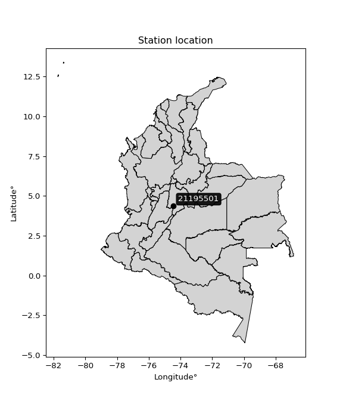</img>

</div>


## A. General information


### 1. General running parameters

• app_version: _v20260312_. • runtime: _2026-03-12 07:15:23.203550_. • Python version: _3.14.0_. • SciPy version: _1.16.3_. • Pandas version: _2.3.3_. • NumPy version: _2.3.5_. • Stations dataset (station_dataset_file): _dataset/pmax24h_in/automatic_colombia_2003_2025.csv_. • Stations catalog (station_catalog_file): _dataset/CNE.xls_. • Minimum year to eval til year_max (date_min): _1900_. • Maximum year to eval since year_min (date_max): _2025_. • Creates, save and include plots into reports (create_plot): _True_. • Plot only fit distributions with Δo > Δ (plot_only_fit): _True_. • Plot only simple graphs avoiding multiple CDFs and multiple Extreme values plots (plot_only_simple): _True_. • Eval low extreme values, if False, evaluates high extreme values (low_extreme): _False_. • Eval every SciPy distribution as logarithmic (pdist_logarithmic_on): _True_. • Standard deviation normalized (ddof): _1.0_. • Return periods to eval in years (Tr): _[2, 2.33, 5, 10, 15, 20, 25, 50, 75, 100, 200, 250, 500, 750, 1000]_. • Minimum data sample per station, 0 means any (minimum_sample): _5_. • Z-Score maximum threshold to adjust a value, 0 means disable (zscore_max): _3.5_. • Z-Score minimum threshold to adjust a value, 0 means disable (zscore_min): _-2.5_. • Avoid zeros, e.g. rain = 0 (avoid_zeros): _True_. • Avoid null values (avoid_nans): _True_. 

:file_folder:Table: [dataset.csv](../../dataset/pmax24h_in/automatic_colombia_2003_2025.csv)

> Delta Degrees of Freedom (DDOF): is a parameter used in the formulas for calculating variance and standard deviation. When ddof=0, the divisor is $N$ (the total number of observations) and this is used when your data set is the entire population. When ddof=1, the divisor is $N-1$ and this is used when your data set is a sample drawn from a larger population. Using $N-1$ provides an unbiased estimate of the population variance (known as Bessel´s correction).


### 2. Station info and location

|   id |   CODIGO | NOMBRE                          | CATEGORIA               | TECNOLOGIA                | ESTADO   | FECHA_INSTALACION   |   FECHA_SUSPENSION |   ALTITUD |   LATITUD |   LONGITUD | DEPARTAMENTO   | MUNICIPIO   | AREA_OPERATIVA                            | ENTIDAD                                    | AREA_HIDROGRAFICA   | ZONA_HIDROGRAFICA   | SUBZONA_HIDROGRAFICA   |   CORRIENTE | Catalogo   |   Version |
|-----:|---------:|:--------------------------------|:------------------------|:--------------------------|:---------|:--------------------|-------------------:|----------:|----------:|-----------:|:---------------|:------------|:------------------------------------------|:-------------------------------------------|:--------------------|:--------------------|:-----------------------|------------:|:-----------|----------:|
|    0 | 21195501 | GRANJA TIBACUY - AUT [21195501] | Climatológica Principal | Automática con Telemetría | Activa   | 15/06/2013          |                nan |      1538 |   4.36305 |   -74.4353 | Cundinamarca   | Tibacuy     | Area Operativa 11 - Cundinamarca-Amazonas | CENTRO NACIONAL DE INVESTIGACIONES DE CAFE | Magdalena Cauca     | Alto Magdalena      | Río Sumapaz            |         nan | CNE_OE     |  20251226 |

<div align="center">

Dynamic map: [:earth_americas:Google](http://maps.google.com/maps?q=4.363052778,-74.43527778) [:earth_americas:OSM](https://www.openstreetmap.org/#map=18/4.363052778/-74.43527778&layers=P) [:earth_americas:Bing](https://www.bing.com/maps?cp=4.363052778~-74.43527778&lvl=18) [:earth_americas:Apple](https://maps.apple.com/frame?center=4.363052778%2C-74.43527778&span=0.003%2C0.006)

</div>


<div align="center">

```geojson
{
  "type": "Feature",
  "geometry": {
    "type": "Point", 
    "coordinates": [-74.43527778, 4.363052778]
  }, 
  "properties": {
    "Name": "21195501"
  }
}
```

</div>


### 3. Discrete values table and plot

<div align="center">

|               |           0 |           1 |           2 |            3 |         4 |
|:--------------|------------:|------------:|------------:|-------------:|----------:|
| Date          | 2016        | 2017        | 2018        | 2019         | 2020      |
| Value         |   33.5      |   25.5      |   39.1      |   50.7       |   92.3    |
| Value_initial |   33.5      |   25.5      |   39.1      |   50.7       |   92.3    |
| count         |    5        |    5        |    5        |    5         |    5      |
| mean          |   48.22     |   48.22     |   48.22     |   48.22      |   48.22   |
| std           |   26.2928   |   26.2928   |   26.2928   |   26.2928    |   26.2928 |
| zscore        |   -0.559849 |   -0.864114 |   -0.346863 |    0.0943224 |    1.6765 |


</div>


<div align="center">

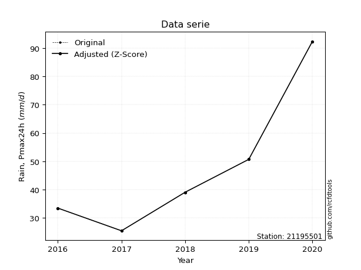</img>

</div>


> The initial value (value_initial) correspond to the initial obtained or null completed value, and value (value) is adjusted only when the initial value is outside the valid range (outlier) definite through the Z-Score value. If Z-Score is active, values out of range or outliers are replaced with the station mean value. A Z-Score (or standard score) measures how many standard deviations a data point is from the mean of a dataset, indicating its relative position; positive scores mean above the mean, negative mean below, and a score of zero is exactly at the mean, allowing for comparison of values from different distributions. It´s calculated using the formula $z=(x–μ)/σ$, where $x$ is the data point, $μ$ is the mean, and $σ$ is the standard deviation, helping identify outliers and understand probability.
>
> <sub>**Note**: In this study, "completing" (filling gaps in) and "extending" (forecasting or lengthening the historical record) rainfall data series are avoided for certain critical analyses because they introduce artificial bias and uncertainty, which can distort the statistics of rare events (extremes), alter day-to-day variability, and compromise the integrity and homogeneity of the original data. Some reasons against Completing/Extending rainfall data are: **Distortion of Extremes and Variability**: The primary issue is that most gap-filling or extension methods rely on averaging or regression with nearby stations, which inherently smooths the data. Rainfall is highly variable in space and time, with a large percentage of zero values and occasional large storms. Infilling methods often underestimate the highest values and overestimate the lowest (zero) values, which severely distorts analyses focused on flood frequency, drought severity, and intensity-duration-frequency (IDF) curves, **Loss of Data Homogeneity**: Infilled or extended data are synthetic estimates, not actual measurements. Combining these estimates with observed data can violate the assumption of data homogeneity, which requires that the data properties do not change over time. Inhomogeneity can lead to incorrect conclusions about long-term trends or changes in climate patterns, **Propagation of Errors**: Errors and biases from the original data (e.g., wind-induced undercatch, instrument errors, site changes) or the data used for imputation can propagate through the analysis, leading to unreliable hydrological models and inaccurate predictions, **Compromised Statistical Integrity**: For statistical analyses, especially those involving the frequency of events, using artificial data can introduce time bias or autocorrelation that doesn´t exist in reality, making it difficult to assess the true probability of events, **Difficulty in Validation**: It is difficult to accurately validate the quality of filled or extended data, especially for past periods where ground-truth measurements are unavailable. The reliability of imputation techniques heavily depends on the density of the surrounding station network and the complexity of the local topography.</sub>


### 4. Active continuous probability distributions from SciPy (80 of 104 available)

A Probability Density Function (PDF) describes the relative likelihood of a continuous random variable falling within a specific range, where the total area under its curve equals 1, and the area over any interval gives the actual probability for that range. Unlike discrete probabilities (like rolling a die), a PDF shows density, not direct probability for a single point (which is zero), with higher points indicating higher likelihood, often visualized as a bell curve for normal distributions.

A log of a probability density function (log-PDF) is simply the logarithm of the PDF´s value, denoted as $log(f(x))$, useful for converting multiplication of probabilities into addition, improving numerical stability with tiny numbers, and connecting to information theory concepts like entropy. Instead of dealing with very small probabilities (e.g., 0.000001), log-PDFs use negative numbers (e.g., $log(0.00001) ≈ -11.51$ that are easier for computers to handle, preventing underflow errors and simplifying complex calculations. In this study, each active probability distribution from SciPy is also evaluated in the $log$ form.

[scipy.stats](https://docs.scipy.org/doc/scipy/reference/stats.html) is a Python´s powerful submodule within the SciPy library for comprehensive statistical analysis, offering over 130 probability distributions (like Normal, Poisson, etc.), functions for descriptive stats (mean, variance), hypothesis testing (t-tests, chi-square), random variable generation, and statistical tests, making it essential for data science, modeling, and research. It provides tools to explore, model, and draw conclusions from data efficiently, working seamlessly with [NumPy](https://numpy.org/).

<div align="center">

|   id | p_dist           |   n_parameter | fit_method   | label                                                                       | active   | ref                                                                                                      |
|-----:|:-----------------|--------------:|:-------------|:----------------------------------------------------------------------------|:---------|:---------------------------------------------------------------------------------------------------------|
|    0 | alpha            |             3 | MLE          | Alpha                                                                       | True     | [:mortar_board:](https://docs.scipy.org/doc/scipy/reference/generated/scipy.stats.alpha.html)            |
|    1 | anglit           |             2 | MM           | Anglit                                                                      | True     | [:mortar_board:](https://docs.scipy.org/doc/scipy/reference/generated/scipy.stats.anglit.html)           |
|    2 | arcsine          |             2 | MM           | Arcsine                                                                     | True     | [:mortar_board:](https://docs.scipy.org/doc/scipy/reference/generated/scipy.stats.arcsine.html)          |
|    3 | argus            |             3 | MLE          | Argus                                                                       | True     | [:mortar_board:](https://docs.scipy.org/doc/scipy/reference/generated/scipy.stats.argus.html)            |
|    4 | beta             |             4 | MLE          | Beta                                                                        | True     | [:mortar_board:](https://docs.scipy.org/doc/scipy/reference/generated/scipy.stats.beta.html)             |
|    5 | betaprime        |             4 | MLE          | Beta prime                                                                  | True     | [:mortar_board:](https://docs.scipy.org/doc/scipy/reference/generated/scipy.stats.betaprime.html)        |
|    6 | bradford         |             3 | MLE          | Bradford                                                                    | True     | [:mortar_board:](https://docs.scipy.org/doc/scipy/reference/generated/scipy.stats.bradford.html)         |
|    7 | burr             |             4 | MLE          | Burr (Type III)                                                             | True     | [:mortar_board:](https://docs.scipy.org/doc/scipy/reference/generated/scipy.stats.burr.html)             |
|    8 | burr12           |             4 | MLE          | Burr (Type III) 12                                                          | True     | [:mortar_board:](https://docs.scipy.org/doc/scipy/reference/generated/scipy.stats.burr12.html)           |
|    9 | cosine           |             2 | MLE          | Cosine                                                                      | True     | [:mortar_board:](https://docs.scipy.org/doc/scipy/reference/generated/scipy.stats.cosine.html)           |
|   10 | crystalball      |             4 | MLE          | Crystalball                                                                 | True     | [:mortar_board:](https://docs.scipy.org/doc/scipy/reference/generated/scipy.stats.crystalball.html)      |
|   11 | dgamma           |             3 | MLE          | Double gamma                                                                | True     | [:mortar_board:](https://docs.scipy.org/doc/scipy/reference/generated/scipy.stats.dgamma.html)           |
|   12 | dweibull         |             3 | MLE          | Double Weibull                                                              | True     | [:mortar_board:](https://docs.scipy.org/doc/scipy/reference/generated/scipy.stats.dweibull.html)         |
|   13 | erlang           |             3 | MLE          | Erlang                                                                      | True     | [:mortar_board:](https://docs.scipy.org/doc/scipy/reference/generated/scipy.stats.erlang.html)           |
|   14 | exponnorm        |             3 | MLE          | Exponentially modified Normal                                               | True     | [:mortar_board:](https://docs.scipy.org/doc/scipy/reference/generated/scipy.stats.exponnorm.html)        |
|   15 | exponpow         |             3 | MLE          | Exponential power                                                           | True     | [:mortar_board:](https://docs.scipy.org/doc/scipy/reference/generated/scipy.stats.exponpow.html)         |
|   16 | exponweib        |             4 | MLE          | Exponentiated Weibull                                                       | True     | [:mortar_board:](https://docs.scipy.org/doc/scipy/reference/generated/scipy.stats.exponweib.html)        |
|   17 | f                |             4 | MLE          | F                                                                           | True     | [:mortar_board:](https://docs.scipy.org/doc/scipy/reference/generated/scipy.stats.f.html)                |
|   18 | fatiguelife      |             3 | MLE          | Fatigue-life (Birnbaum-Saunders)                                            | True     | [:mortar_board:](https://docs.scipy.org/doc/scipy/reference/generated/scipy.stats.fatiguelife.html)      |
|   19 | foldnorm         |             3 | MM           | Fold Normal                                                                 | True     | [:mortar_board:](https://docs.scipy.org/doc/scipy/reference/generated/scipy.stats.foldnorm.html)         |
|   20 | gamma            |             3 | MLE          | Gamma                                                                       | True     | [:mortar_board:](https://docs.scipy.org/doc/scipy/reference/generated/scipy.stats.gamma.html)            |
|   21 | gausshyper       |             6 | MLE          | Gauss hypergeometric                                                        | True     | [:mortar_board:](https://docs.scipy.org/doc/scipy/reference/generated/scipy.stats.gausshyper.html)       |
|   22 | genexpon         |             5 | MLE          | Generalized exponential                                                     | True     | [:mortar_board:](https://docs.scipy.org/doc/scipy/reference/generated/scipy.stats.genexpon.html)         |
|   23 | genextreme       |             3 | MLE          | Generalized exponential                                                     | True     | [:mortar_board:](https://docs.scipy.org/doc/scipy/reference/generated/scipy.stats.genextreme.html)       |
|   24 | gengamma         |             4 | MLE          | Generalized gamma                                                           | True     | [:mortar_board:](https://docs.scipy.org/doc/scipy/reference/generated/scipy.stats.gengamma.html)         |
|   25 | genhalflogistic  |             3 | MLE          | Generalized half-logistic                                                   | True     | [:mortar_board:](https://docs.scipy.org/doc/scipy/reference/generated/scipy.stats.genhalflogistic.html)  |
|   26 | genlogistic      |             3 | MLE          | Generalized logistic                                                        | True     | [:mortar_board:](https://docs.scipy.org/doc/scipy/reference/generated/scipy.stats.genlogistic.html)      |
|   27 | gennorm          |             3 | MLE          | Generalized Normal                                                          | True     | [:mortar_board:](https://docs.scipy.org/doc/scipy/reference/generated/scipy.stats.gennorm.html)          |
|   28 | genpareto        |             3 | MLE          | Generalized Pareto                                                          | True     | [:mortar_board:](https://docs.scipy.org/doc/scipy/reference/generated/scipy.stats.genpareto.html)        |
|   29 | gompertz         |             3 | MLE          | Gompertz (or truncated Gumbel)                                              | True     | [:mortar_board:](https://docs.scipy.org/doc/scipy/reference/generated/scipy.stats.gompertz.html)         |
|   30 | gumbel_l         |             2 | MM           | Gumbel Left Skew                                                            | True     | [:mortar_board:](https://docs.scipy.org/doc/scipy/reference/generated/scipy.stats.gumbel_l.html)         |
|   31 | gumbel_r         |             2 | MM           | Gumbel Right Skew                                                           | True     | [:mortar_board:](https://docs.scipy.org/doc/scipy/reference/generated/scipy.stats.gumbel_r.html)         |
|   32 | halfgennorm      |             3 | MLE          | Upper half of a generalized normal                                          | True     | [:mortar_board:](https://docs.scipy.org/doc/scipy/reference/generated/scipy.stats.halfgennorm.html)      |
|   33 | halflogistic     |             2 | MM           | Half-logistic                                                               | True     | [:mortar_board:](https://docs.scipy.org/doc/scipy/reference/generated/scipy.stats.halflogistic.html)     |
|   34 | halfnorm         |             2 | MM           | Half Normal                                                                 | True     | [:mortar_board:](https://docs.scipy.org/doc/scipy/reference/generated/scipy.stats.halfnorm.html)         |
|   35 | hypsecant        |             2 | MM           | hyperbolic secant                                                           | True     | [:mortar_board:](https://docs.scipy.org/doc/scipy/reference/generated/scipy.stats.hypsecant.html)        |
|   36 | invgamma         |             3 | MLE          | Inverted gamma                                                              | True     | [:mortar_board:](https://docs.scipy.org/doc/scipy/reference/generated/scipy.stats.invgamma.html)         |
|   37 | invgauss         |             3 | MLE          | Inverse Gaussian                                                            | True     | [:mortar_board:](https://docs.scipy.org/doc/scipy/reference/generated/scipy.stats.invgauss.html)         |
|   38 | invweibull       |             3 | MLE          | Inverted Weibull                                                            | True     | [:mortar_board:](https://docs.scipy.org/doc/scipy/reference/generated/scipy.stats.invweibull.html)       |
|   39 | johnsonsb        |             4 | MLE          | Johnson SB                                                                  | True     | [:mortar_board:](https://docs.scipy.org/doc/scipy/reference/generated/scipy.stats.johnsonsb.html)        |
|   40 | johnsonsu        |             4 | MLE          | Johnson Su                                                                  | True     | [:mortar_board:](https://docs.scipy.org/doc/scipy/reference/generated/scipy.stats.johnsonsu.html)        |
|   41 | kappa3           |             3 | MLE          | Kappa 3                                                                     | True     | [:mortar_board:](https://docs.scipy.org/doc/scipy/reference/generated/scipy.stats.kappa3.html)           |
|   42 | kappa4           |             4 | MLE          | Kappa 4                                                                     | True     | [:mortar_board:](https://docs.scipy.org/doc/scipy/reference/generated/scipy.stats.kappa4.html)           |
|   43 | ksone            |             3 | MLE          | Kolmogorov-Smirnov one-sided test statistic distribution                    | True     | [:mortar_board:](https://docs.scipy.org/doc/scipy/reference/generated/scipy.stats.ksone.html)            |
|   44 | kstwobign        |             2 | MLE          | Limiting distribution of scaled Kolmogorov-Smirnov two-sided test statistic | True     | [:mortar_board:](https://docs.scipy.org/doc/scipy/reference/generated/scipy.stats.kstwobign.html)        |
|   45 | laplace          |             2 | MM           | Laplace                                                                     | True     | [:mortar_board:](https://docs.scipy.org/doc/scipy/reference/generated/scipy.stats.laplace.html)          |
|   46 | levy_l           |             2 | MLE          | Left-skewed Levy                                                            | True     | [:mortar_board:](https://docs.scipy.org/doc/scipy/reference/generated/scipy.stats.levy_l.html)           |
|   47 | loggamma         |             3 | MLE          | Log gamma                                                                   | True     | [:mortar_board:](https://docs.scipy.org/doc/scipy/reference/generated/scipy.stats.loggamma.html)         |
|   48 | logistic         |             2 | MM           | Logistic (or Sech-squared)                                                  | True     | [:mortar_board:](https://docs.scipy.org/doc/scipy/reference/generated/scipy.stats.logistic.html)         |
|   49 | loglaplace       |             3 | MLE          | Log-Laplace                                                                 | True     | [:mortar_board:](https://docs.scipy.org/doc/scipy/reference/generated/scipy.stats.loglaplace.html)       |
|   50 | lomax            |             3 | MLE          | Lomax (Pareto of the second kind)                                           | True     | [:mortar_board:](https://docs.scipy.org/doc/scipy/reference/generated/scipy.stats.lomax.html)            |
|   51 | maxwell          |             2 | MM           | Maxwell                                                                     | True     | [:mortar_board:](https://docs.scipy.org/doc/scipy/reference/generated/scipy.stats.maxwell.html)          |
|   52 | mielke           |             4 | MLE          | Mielke Beta-Kappa / Dagum                                                   | True     | [:mortar_board:](https://docs.scipy.org/doc/scipy/reference/generated/scipy.stats.mielke.html)           |
|   53 | moyal            |             2 | MM           | Moyal                                                                       | True     | [:mortar_board:](https://docs.scipy.org/doc/scipy/reference/generated/scipy.stats.moyal.html)            |
|   54 | nakagami         |             3 | MLE          | Nakagami                                                                    | True     | [:mortar_board:](https://docs.scipy.org/doc/scipy/reference/generated/scipy.stats.nakagami.html)         |
|   55 | ncf              |             5 | MLE          | Non-central F distribution                                                  | True     | [:mortar_board:](https://docs.scipy.org/doc/scipy/reference/generated/scipy.stats.ncf.html)              |
|   56 | nct              |             4 | MLE          | Non-central Student’s t                                                     | True     | [:mortar_board:](https://docs.scipy.org/doc/scipy/reference/generated/scipy.stats.nct.html)              |
|   57 | norm             |             2 | MM           | Normal                                                                      | True     | [:mortar_board:](https://docs.scipy.org/doc/scipy/reference/generated/scipy.stats.norm.html)             |
|   58 | pearson3         |             3 | MM           | Pearson type III                                                            | True     | [:mortar_board:](https://docs.scipy.org/doc/scipy/reference/generated/scipy.stats.pearson3.html)         |
|   59 | powerlaw         |             3 | MLE          | Power-function                                                              | True     | [:mortar_board:](https://docs.scipy.org/doc/scipy/reference/generated/scipy.stats.powerlaw.html)         |
|   60 | rayleigh         |             2 | MM           | Rayleigh                                                                    | True     | [:mortar_board:](https://docs.scipy.org/doc/scipy/reference/generated/scipy.stats.rayleigh.html)         |
|   61 | rdist            |             3 | MLE          | R-distributed (symmetric beta)                                              | True     | [:mortar_board:](https://docs.scipy.org/doc/scipy/reference/generated/scipy.stats.rdist.html)            |
|   62 | rice             |             3 | MLE          | Rice                                                                        | True     | [:mortar_board:](https://docs.scipy.org/doc/scipy/reference/generated/scipy.stats.rice.html)             |
|   63 | semicircular     |             2 | MM           | Semicircular                                                                | True     | [:mortar_board:](https://docs.scipy.org/doc/scipy/reference/generated/scipy.stats.semicircular.html)     |
|   64 | skewnorm         |             3 | MLE          | Skew normal                                                                 | True     | [:mortar_board:](https://docs.scipy.org/doc/scipy/reference/generated/scipy.stats.skewnorm.html)         |
|   65 | t                |             3 | MLE          | Student’s t                                                                 | True     | [:mortar_board:](https://docs.scipy.org/doc/scipy/reference/generated/scipy.stats.t.html)                |
|   66 | trapezoid        |             4 | MLE          | Trapezoid                                                                   | True     | [:mortar_board:](https://docs.scipy.org/doc/scipy/reference/generated/scipy.stats.trapezoid.html)        |
|   67 | triang           |             3 | MLE          | Triangular                                                                  | True     | [:mortar_board:](https://docs.scipy.org/doc/scipy/reference/generated/scipy.stats.triang.html)           |
|   68 | truncexpon       |             3 | MLE          | Truncated exponential                                                       | True     | [:mortar_board:](https://docs.scipy.org/doc/scipy/reference/generated/scipy.stats.truncexpon.html)       |
|   69 | truncnorm        |             4 | MLE          | Truncated normal                                                            | True     | [:mortar_board:](https://docs.scipy.org/doc/scipy/reference/generated/scipy.stats.truncnorm.html)        |
|   70 | truncpareto      |             4 | MLE          | Upper truncated Pareto                                                      | True     | [:mortar_board:](https://docs.scipy.org/doc/scipy/reference/generated/scipy.stats.truncpareto.html)      |
|   71 | truncweibull_min |             5 | MLE          | Doubly truncated Weibull minimum                                            | True     | [:mortar_board:](https://docs.scipy.org/doc/scipy/reference/generated/scipy.stats.truncweibull_min.html) |
|   72 | tukeylambda      |             3 | MLE          | Tukey-Lamdba                                                                | True     | [:mortar_board:](https://docs.scipy.org/doc/scipy/reference/generated/scipy.stats.tukeylambda.html)      |
|   73 | uniform          |             2 | MLE          | Uniform                                                                     | True     | [:mortar_board:](https://docs.scipy.org/doc/scipy/reference/generated/scipy.stats.uniform.html)          |
|   74 | vonmises         |             3 | MLE          | Von Mises                                                                   | True     | [:mortar_board:](https://docs.scipy.org/doc/scipy/reference/generated/scipy.stats.vonmises.html)         |
|   75 | vonmises_line    |             3 | MLE          | Von Mises line                                                              | True     | [:mortar_board:](https://docs.scipy.org/doc/scipy/reference/generated/scipy.stats.vonmises_line.html)    |
|   76 | wald             |             2 | MM           | Wald                                                                        | True     | [:mortar_board:](https://docs.scipy.org/doc/scipy/reference/generated/scipy.stats.wald.html)             |
|   77 | weibull_max      |             3 | MLE          | Weibull maximum                                                             | True     | [:mortar_board:](https://docs.scipy.org/doc/scipy/reference/generated/scipy.stats.weibull_max.html)      |
|   78 | weibull_min      |             3 | MLE          | Weibull minimum                                                             | True     | [:mortar_board:](https://docs.scipy.org/doc/scipy/reference/generated/scipy.stats.weibull_min.html)      |
|   79 | wrapcauchy       |             3 | MLE          | Wrapped  Cauchy                                                             | True     | [:mortar_board:](https://docs.scipy.org/doc/scipy/reference/generated/scipy.stats.wrapcauchy.html)       |

</div>

> **n_parameter:** # arguments & localization & scale.
>
> **Fit methods:** (MLE) maximum likelihood, (MM) L-moments.
>
>**Inactive** (With the only purpose of prevent loops, zero divisions, infinite values, over high estimated values or horizontal trending for recurrence intervals estimations, the follow distributions were disabled.)**:** lognorm, norminvgauss, powernorm, powerlognorm, cauchy, halfcauchy, foldcauchy, skewcauchy, chi2, expon, fisk, genhyperbolic, geninvgauss, gibrat, kstwo, laplace_asymmetric, levy, levy_stable, ncx2, pareto, rel_breitwigner, recipinvgauss, studentized_range, loguniform, 


## B. Probability (PDF) vs. Empirical (EDF) distributions functions

A continuous probability distribution (CPD) describes probabilities for variables that can take any value within a range (like rain any time), unlike discrete variables with specific outcomes (like temperature). It uses a Probability Density Function (PDF), a curve where the total area under it equals 1, and the probability of the variable falling within an interval (a to b) is found by calculating the area under the curve between those points. A key feature is that the probability of hitting any single exact value is zero, so probabilities are always expressed for ranges, e.g., $P(a ≤ X ≤ b)$.

<div align="center">

Distributions parameters from station values
|     |   station | p_dist              |   n |             loc |          scale | shape                  | shape1                | shape2                | shape3             |
|----:|----------:|:--------------------|----:|----------------:|---------------:|:-----------------------|:----------------------|:----------------------|:-------------------|
|   0 |  21195501 | alpha               |   5 |      5.8166     |   72.357       | 2.141569650370082      |                       |                       |                    |
|   1 |  21195501 | anglit              |   5 |     48.22       |   68.7966      |                        |                       |                       |                    |
|   2 |  21195501 | arcsine             |   5 |     14.9619     |   66.5161      |                        |                       |                       |                    |
|   3 |  21195501 | argus               |   5 |     -2.78961    |  100.151       | 2.8705198979487577e-06 |                       |                       |                    |
|   4 |  21195501 | beta                |   5 |     21.6115     |   70.6885      | 0.22840184729239826    | 0.5354421889281185    |                       |                    |
|   5 |  21195501 | betaprime           |   5 |     -0.841373   |    1.32003     | 196.77766504364183     | 6.3253670134565       |                       |                    |
|   6 |  21195501 | bradford            |   5 |     25.4998     |   66.8002      | 0.6626059966792703     |                       |                       |                    |
|   7 |  21195501 | burr                |   5 |     11.847      |    0.651474    | 2.010718349440684      | 1251.4038173065942    |                       |                    |
|   8 |  21195501 | burr12              |   5 |      0.429746   |   24.8833      | 543.4024930586818      | 0.0033554151539602877 |                       |                    |
|   9 |  21195501 | cosine              |   5 |     51.7505     |   19.8933      |                        |                       |                       |                    |
|  10 |  21195501 | crystalball         |   5 |     48.22       |   23.517       | 12292.22482213959      | 113.28294050362902    |                       |                    |
|  11 |  21195501 | dgamma              |   5 |     44.5035     |   11.0437      | 1.6190836546290799     |                       |                       |                    |
|  12 |  21195501 | dweibull            |   5 |     39.1        |   21.5182      | 0.8620520134099396     |                       |                       |                    |
|  13 |  21195501 | erlang              |   5 |     25.5        |   21.4245      | 0.19333973031925955    |                       |                       |                    |
|  14 |  21195501 | exponnorm           |   5 |     25.4728     |    0.00819177  | 2770.3774483997095     |                       |                       |                    |
|  15 |  21195501 | exponpow            |   5 |     25.5        |   36.3499      | 0.3523112326602482     |                       |                       |                    |
|  16 |  21195501 | exponweib           |   5 |     25.5        |   27.5706      | 0.7894919362380475     | 0.8820680642117309    |                       |                    |
|  17 |  21195501 | f                   |   5 |     25.5        |   26.3309      | 0.7096084111801721     | 14.27337790529335     |                       |                    |
|  18 |  21195501 | fatiguelife         |   5 |     25.5        |    7.22212e-06 | 1614.524099812188      |                       |                       |                    |
|  19 |  21195501 | foldnorm            |   5 |     16.8366     |   38.9042      | 0.13883670266507292    |                       |                       |                    |
|  20 |  21195501 | gamma               |   5 |     25.5        |   19.7829      | 0.7312458398206365     |                       |                       |                    |
|  21 |  21195501 | gausshyper          |   5 |     17.8576     |   74.4424      | 0.7559924289092497     | 0.2489442642440326    | 1.1306830567240653    | 1.4456546335902325 |
|  22 |  21195501 | genexpon            |   5 |     25.5        |   39.2967      | 1.7195023746026967     | 3.050017405844417e-08 | 1.3560840317889271    |                    |
|  23 |  21195501 | genextreme          |   5 |     26.0359     |    5.71618     | -10.66580056401289     |                       |                       |                    |
|  24 |  21195501 | gengamma            |   5 |     25.5        |   27.5629      | 0.7898589355041689     | 0.8822804802317192    |                       |                    |
|  25 |  21195501 | genhalflogistic     |   5 |     18.8942     |   77.0329      | 1.0494111998761917     |                       |                       |                    |
|  26 |  21195501 | genlogistic         |   5 |    -74.8994     |   15.4293      | 1511.6515927908285     |                       |                       |                    |
|  27 |  21195501 | gennorm             |   5 |     39.1        |    1.07118     | 0.4100245183989809     |                       |                       |                    |
|  28 |  21195501 | genpareto           |   5 |     -0.150643   |  160.609       | -1.7372364629944461    |                       |                       |                    |
|  29 |  21195501 | gompertz            |   5 |     25.5        |    2.43119e+14 | 10944227543203.006     |                       |                       |                    |
|  30 |  21195501 | gumbel_l            |   5 |     58.8039     |   18.3361      |                        |                       |                       |                    |
|  31 |  21195501 | gumbel_r            |   5 |     37.6361     |   18.3361      |                        |                       |                       |                    |
|  32 |  21195501 | halfgennorm         |   5 |     25.5        |    0.0438297   | 0.2574219231681628     |                       |                       |                    |
|  33 |  21195501 | halflogistic        |   5 |     20.3469     |   20.1062      |                        |                       |                       |                    |
|  34 |  21195501 | halfnorm            |   5 |     17.0927     |   39.0123      |                        |                       |                       |                    |
|  35 |  21195501 | hypsecant           |   5 |     48.22       |   14.9714      |                        |                       |                       |                    |
|  36 |  21195501 | invgamma            |   5 |     17.1384     |   40.401       | 2.176386293710974      |                       |                       |                    |
|  37 |  21195501 | invgauss            |   5 |     21.1959     |   21.5145      | 1.256086295148404      |                       |                       |                    |
|  38 |  21195501 | invweibull          |   5 |     25.5        |    1.36907     | 0.050178887072866676   |                       |                       |                    |
|  39 |  21195501 | johnsonsb           |   5 |     25.5        |   91.9537      | 0.38882075340846206    | 0.1323679545402203    |                       |                    |
|  40 |  21195501 | johnsonsu           |   5 |     25.5        |    4.24376e-10 | -2.2652381073264083    | 0.1543240664828959    |                       |                    |
|  41 |  21195501 | kappa3              |   5 |     25.5        |   16.9541      | 1.7723130853048357     |                       |                       |                    |
|  42 |  21195501 | kappa4              |   5 |     18.3637     |   75.5374      | 1.104428218366868      | 1.0174996127873794    |                       |                    |
|  43 |  21195501 | ksone               |   5 |     18.82       |   80.16        | 1.0                    |                       |                       |                    |
|  44 |  21195501 | kstwobign           |   5 |    -17.9813     |   76.543       |                        |                       |                       |                    |
|  45 |  21195501 | laplace             |   5 |     48.22       |   16.629       |                        |                       |                       |                    |
|  46 |  21195501 | levy_l              |   5 |     96.7474     |   17.0207      |                        |                       |                       |                    |
|  47 |  21195501 | loggamma            |   5 |  -8720.41       | 1139.58        | 2196.7713047674097     |                       |                       |                    |
|  48 |  21195501 | logistic            |   5 |     48.22       |   12.9656      |                        |                       |                       |                    |
|  49 |  21195501 | loglaplace          |   5 |     -0.146812   |   39.2468      | 2.9448258729990062     |                       |                       |                    |
|  50 |  21195501 | lomax               |   5 |     25.5        | 1851.96        | 82.6020903035008       |                       |                       |                    |
|  51 |  21195501 | maxwell             |   5 |     -7.50543    |   34.9207      |                        |                       |                       |                    |
|  52 |  21195501 | mielke              |   5 |     11.0384     |    3.51048     | 115.12192701665123     | 2.085831530917427     |                       |                    |
|  53 |  21195501 | moyal               |   5 |     34.7715     |   10.5864      |                        |                       |                       |                    |
|  54 |  21195501 | nakagami            |   5 |     25.5        |   34.9334      | 0.18163806666646226    |                       |                       |                    |
|  55 |  21195501 | ncf                 |   5 |     -0.497262   |    0.294625    | 2.819739227153586      | 13.042861582678796    | 387.91337841944       |                    |
|  56 |  21195501 | nct                 |   5 |     -0.146828   |    0.672635    | 3.5705990329564337     | 55.7409401485296      |                       |                    |
|  57 |  21195501 | norm                |   5 |     48.22       |   23.517       |                        |                       |                       |                    |
|  58 |  21195501 | pearson3            |   5 |     48.22       |   23.517       | 1.0762504386327851     |                       |                       |                    |
|  59 |  21195501 | powerlaw            |   5 |     25.5        |   66.8         | 0.11859154516073332    |                       |                       |                    |
|  60 |  21195501 | rayleigh            |   5 |      3.23059    |   35.8964      |                        |                       |                       |                    |
|  61 |  21195501 | rdist               |   5 |     22.3127     |   28.3873      | 1.1383508649105885     |                       |                       |                    |
|  62 |  21195501 | rice                |   5 |     11.7924     |   30.6596      | 0.0002636134931008939  |                       |                       |                    |
|  63 |  21195501 | semicircular        |   5 |     48.22       |   47.034       |                        |                       |                       |                    |
|  64 |  21195501 | skewnorm            |   5 |     25.5        |   32.6994      | 53410268.275962815     |                       |                       |                    |
|  65 |  21195501 | t                   |   5 |     48.2196     |   23.5174      | 3084699.1916634426     |                       |                       |                    |
|  66 |  21195501 | trapezoid           |   5 |     18.82       |   80.16        | 1.0                    | 1.0                   |                       |                    |
|  67 |  21195501 | triang              |   5 |    -10.0192     |  102.319       | 0.999999999949106      |                       |                       |                    |
|  68 |  21195501 | truncexpon          |   5 |     25.5        |   96.0444      | 0.6955120127048715     |                       |                       |                    |
|  69 |  21195501 | truncnorm           |   5 | -15336.8        |  602.447       | 25.499908878511263     | 25.610790335312323    |                       |                    |
|  70 |  21195501 | truncpareto         |   5 |     25.314      |    0.185966    | 0.2646410403772551     | 360.2053887335556     |                       |                    |
|  71 |  21195501 | truncweibull_min    |   5 |     25.5        |   88.542       | 0.4471935376682706     | 4.183178853183692e-17 | 0.7572279470713357    |                    |
|  72 |  21195501 | tukeylambda         |   5 |     38.3686     |   13.7639      | 1.0695734620813515     |                       |                       |                    |
|  73 |  21195501 | uniform             |   5 |     25.5        |   66.8         |                        |                       |                       |                    |
|  74 |  21195501 | vonmises            |   5 |      0.977808   |    1           | 0.9049081377878028     |                       |                       |                    |
|  75 |  21195501 | vonmises_line       |   5 |     42.6382     |   15.8078      | 0.9560469849391217     |                       |                       |                    |
|  76 |  21195501 | wald                |   5 |     24.703      |   23.517       |                        |                       |                       |                    |
|  77 |  21195501 | weibull_max         |   5 |     92.3        |    1.57365     | 0.17333979876998423    |                       |                       |                    |
|  78 |  21195501 | weibull_min         |   5 |     25.5        |   18.0913      | 0.5949992309558589     |                       |                       |                    |
|  79 |  21195501 | wrapcauchy          |   5 |     25.5        |   10.6316      | 0.548112659004508      |                       |                       |                    |
|  80 |  21195501 | logalpha            |   5 |      1.79095    |    9.18863     | 4.850422864264761      |                       |                       |                    |
|  81 |  21195501 | loganglit           |   5 |      3.77346    |    1.27799     |                        |                       |                       |                    |
|  82 |  21195501 | logarcsine          |   5 |      3.15566    |    1.2356      |                        |                       |                       |                    |
|  83 |  21195501 | logargus            |   5 |      2.81594    |    1.80286     | 0.00022170303680042172 |                       |                       |                    |
|  84 |  21195501 | logbeta             |   5 |      3.23868    |    1.46895     | 0.6710516605277705     | 1.2711129975500053    |                       |                    |
|  85 |  21195501 | logbetaprime        |   5 |     -0.0527034  |    1.922       | 236.25440031871517     | 119.6728197081526     |                       |                    |
|  86 |  21195501 | logbradford         |   5 |      3.23868    |    1.28771     | 4.0330689614023525     |                       |                       |                    |
|  87 |  21195501 | logburr             |   5 |     -0.758177   |    2.61348     | 13.079492958365982     | 704.527812327106      |                       |                    |
|  88 |  21195501 | logburr12           |   5 |      0.040908   |    3.36371     | 26.99959995175385      | 0.32789797386588243   |                       |                    |
|  89 |  21195501 | logcosine           |   5 |      3.81222    |    0.363741    |                        |                       |                       |                    |
|  90 |  21195501 | logcrystalball      |   5 |      3.77352    |    0.436727    | 860.3313253259129      | 19.26572783220281     |                       |                    |
|  91 |  21195501 | logdgamma           |   5 |      3.66612    |    0.338063    | 0.8125188630609239     |                       |                       |                    |
|  92 |  21195501 | logdweibull         |   5 |      3.79605    |    0.410417    | 1.5905917525626738     |                       |                       |                    |
|  93 |  21195501 | logerlang           |   5 |      3.23868    |    0.439192    | 0.8161702768597832     |                       |                       |                    |
|  94 |  21195501 | logexponnorm        |   5 |      3.30717    |    0.162107    | 2.8764871439163153     |                       |                       |                    |
|  95 |  21195501 | logexponpow         |   5 |      3.23868    |    1.17963     | 0.8903916713075586     |                       |                       |                    |
|  96 |  21195501 | logexponweib        |   5 |      3.23868    |    0.753885    | 0.5401162551647989     | 1.323246524041394     |                       |                    |
|  97 |  21195501 | logf                |   5 |      2.58928    |    1.04115     | 637.0236799084691      | 16.032959935669588    |                       |                    |
|  98 |  21195501 | logfatiguelife      |   5 |      2.99119    |    0.652499    | 0.6284962958828411     |                       |                       |                    |
|  99 |  21195501 | logfoldnorm         |   5 |      3.10945    |    0.523872    | 1.1410355239152528     |                       |                       |                    |
| 100 |  21195501 | loggamma            |   5 |      3.23868    |    0.448286    | 0.8665349366122419     |                       |                       |                    |
| 101 |  21195501 | loggausshyper       |   5 |      3.23857    |    1.28648     | 0.9263206649272067     | 0.9058663902806439    | 1.0466134141560053    | 1.1396178102319872 |
| 102 |  21195501 | loggenexpon         |   5 |      3.23804    |    0.116041    | 0.1637383656315975     | 4.675143684386022     | 0.0029212033119775035 |                    |
| 103 |  21195501 | loggenextreme       |   5 |      3.55786    |    0.330971    | -0.06928972545095463   |                       |                       |                    |
| 104 |  21195501 | loggengamma         |   5 |      3.23868    |    0.714368    | 0.18579915748963755    | 1.6019403981161637    |                       |                    |
| 105 |  21195501 | loggenhalflogistic  |   5 |      3.13278    |    1.48581     | 1.0671859011094562     |                       |                       |                    |
| 106 |  21195501 | loggenlogistic      |   5 |      1.25382    |    0.341074    | 889.3258648426497      |                       |                       |                    |
| 107 |  21195501 | loggennorm          |   5 |      3.88186    |    0.643201    | 400223.5045847934      |                       |                       |                    |
| 108 |  21195501 | loggenpareto        |   5 |     -0.00584833 |   12.7717      | -2.8188144368967945    |                       |                       |                    |
| 109 |  21195501 | loggompertz         |   5 |      3.23868    |    1.4578      | 1.9488671617868145     |                       |                       |                    |
| 110 |  21195501 | loggumbel_l         |   5 |      3.97007    |    0.340619    |                        |                       |                       |                    |
| 111 |  21195501 | loggumbel_r         |   5 |      3.57685    |    0.340619    |                        |                       |                       |                    |
| 112 |  21195501 | loghalfgennorm      |   5 |      3.23868    |    0.974542    | 1.9866598206935762     |                       |                       |                    |
| 113 |  21195501 | loghalflogistic     |   5 |      3.25571    |    0.373481    |                        |                       |                       |                    |
| 114 |  21195501 | loghalfnorm         |   5 |      3.19523    |    0.724707    |                        |                       |                       |                    |
| 115 |  21195501 | loghypsecant        |   5 |      3.77346    |    0.278114    |                        |                       |                       |                    |
| 116 |  21195501 | loginvgamma         |   5 |      1.40286    |   74.6936      | 32.68821986050591      |                       |                       |                    |
| 117 |  21195501 | loginvgauss         |   5 |      2.91558    |    2.64809     | 0.323962262134402      |                       |                       |                    |
| 118 |  21195501 | loginvweibull       |   5 |     -1.22183    |    4.77968     | 14.44125435713661      |                       |                       |                    |
| 119 |  21195501 | logjohnsonsb        |   5 |      3.23868    |    1.28637     | 0.697359349386143      | 0.1586755063796183    |                       |                    |
| 120 |  21195501 | logjohnsonsu        |   5 |      2.92923    |    0.0224172   | -7.658783721059965     | 1.8322038528353843    |                       |                    |
| 121 |  21195501 | logkappa3           |   5 |      3.23868    |    0.769041    | 4.840444855282451      |                       |                       |                    |
| 122 |  21195501 | logkappa4           |   5 |      3.1589     |    1.43999     | 1.0586690265371832     | 1.0102887534372431    |                       |                    |
| 123 |  21195501 | logksone            |   5 |      3.0168     |    1.51333     | 1.0                    |                       |                       |                    |
| 124 |  21195501 | logkstwobign        |   5 |      2.36869    |    1.61262     |                        |                       |                       |                    |
| 125 |  21195501 | loglaplace          |   5 |      3.77346    |    0.308907    |                        |                       |                       |                    |
| 126 |  21195501 | loglevy_l           |   5 |      4.59787    |    0.278579    |                        |                       |                       |                    |
| 127 |  21195501 | logloggamma         |   5 |   -125.187      |   17.5485      | 1554.7023349908163     |                       |                       |                    |
| 128 |  21195501 | loglogistic         |   5 |      3.77346    |    0.240854    |                        |                       |                       |                    |
| 129 |  21195501 | logloglaplace       |   5 |      3.23868    |    0.428042    | 0.5183773454835303     |                       |                       |                    |
| 130 |  21195501 | loglomax            |   5 |      3.23868    |   61.2547      | 115.18673850256954     |                       |                       |                    |
| 131 |  21195501 | logmaxwell          |   5 |      2.73829    |    0.648701    |                        |                       |                       |                    |
| 132 |  21195501 | logmielke           |   5 |     -0.135081   |    2.78873     | 289.3717771570504      | 11.44429693773822     |                       |                    |
| 133 |  21195501 | logmoyal            |   5 |      3.52364    |    0.196656    |                        |                       |                       |                    |
| 134 |  21195501 | lognakagami         |   5 |      3.23868    |    0.949117    | 0.231810520601884      |                       |                       |                    |
| 135 |  21195501 | logncf              |   5 |     -4.66681    |    8.41822     | 681.3704094676941      | 567.9558458506376     | 0.0017359983612897116 |                    |
| 136 |  21195501 | lognct              |   5 |     -0.16482    |    0.0648087   | 45.63144209625382      | 59.75260109102608     |                       |                    |
| 137 |  21195501 | lognorm             |   5 |      3.77346    |    0.436861    |                        |                       |                       |                    |
| 138 |  21195501 | logpearson3         |   5 |      3.77346    |    0.436861    | 0.6139568113593792     |                       |                       |                    |
| 139 |  21195501 | logpowerlaw         |   5 |      3.23868    |    1.28637     | 0.12859568438697047    |                       |                       |                    |
| 140 |  21195501 | lograyleigh         |   5 |      2.93772    |    0.666824    |                        |                       |                       |                    |
| 141 |  21195501 | logrdist            |   5 |      3.95447    |    0.715796    | 1.0725852323458411     |                       |                       |                    |
| 142 |  21195501 | logrice             |   5 |      3.02042    |    0.615595    | 0.0010285923582064363  |                       |                       |                    |
| 143 |  21195501 | logsemicircular     |   5 |      3.77346    |    0.873721    |                        |                       |                       |                    |
| 144 |  21195501 | logskewnorm         |   5 |      3.23868    |    0.690575    | 14583375.86975995      |                       |                       |                    |
| 145 |  21195501 | logt                |   5 |      3.77346    |    0.436864    | 1535409938.4614065     |                       |                       |                    |
| 146 |  21195501 | logtrapezoid        |   5 |      3.11004    |    1.54364     | 1.0                    | 1.0                   |                       |                    |
| 147 |  21195501 | logtriang           |   5 |      2.6973     |    1.82775     | 0.9999998606368872     |                       |                       |                    |
| 148 |  21195501 | logtruncexpon       |   5 |      3.23867    |    1.29789     | 0.9911638149551394     |                       |                       |                    |
| 149 |  21195501 | logtruncnorm        |   5 |     -0.0770679  |    1.50641     | 2.201097929938106      | 8.076076475843834     |                       |                    |
| 150 |  21195501 | logtruncpareto      |   5 |      3.23378    |    0.00490044  | 0.2625790542273179     | 263.5000016875504     |                       |                    |
| 151 |  21195501 | logtruncweibull_min |   5 |      3.23868    |    1.21439     | 0.7467270211166318     | 1.771525927825221e-16 | 1.060008096405797     |                    |
| 152 |  21195501 | logtukeylambda      |   5 |      3.86798    |    0.79023     | 1.2026612843659672     |                       |                       |                    |
| 153 |  21195501 | loguniform          |   5 |      3.23868    |    1.28637     |                        |                       |                       |                    |
| 154 |  21195501 | logvonmises         |   5 |     -2.51877    |    1           | 5.7296757060075        |                       |                       |                    |
| 155 |  21195501 | logvonmises_line    |   5 |      3.90106    |    0.210844    | 1.6326593092601282e-06 |                       |                       |                    |
| 156 |  21195501 | logwald             |   5 |      3.33658    |    0.436879    |                        |                       |                       |                    |
| 157 |  21195501 | logweibull_max      |   5 |      1.0719e+07 |    1.0719e+07  | 31522472.44975632      |                       |                       |                    |
| 158 |  21195501 | logweibull_min      |   5 |      3.23868    |    0.669436    | 0.9065797578557995     |                       |                       |                    |
| 159 |  21195501 | logwrapcauchy       |   5 |      3.23868    |    0.204731    | 0.5                    |                       |                       |                    |

</div>

> **loc** (Location parameter): This shifts the distribution along the x-axis. For many common distributions, like the normal (Gaussian) distribution, loc represents the mean $μ$. For others, like the uniform distribution, it might represent the minimum value, or for the beta distribution, the left end of the support interval.
>
> **scale** (Scale parameter): This determines the width or spread of the distribution. For the normal distribution, scale represents the standard deviation $σ$. For a uniform distribution, it defines the length of the interval (from $loc$ to $loc + scale$).
>
> **shape** (Shape parameters): Refers to parameters that define the specific form of a probability distribution, distinct from its location (loc) and scale (scale). These parameters are required arguments for most distribution functions. For example, a normal (Gaussian) distribution is fully defined by its location (mean) and scale (standard deviation), so it has no specific shape parameters beyond loc and scale. However, other distributions have intrinsic properties that need specification, as Gamma distribution that takes a shape parameter, often named $a$ or $alpha$.


### 0. Cumulative distribution values - CDF (160 evaluated)

Cumulative Distribution Function (CDF), denoted as $F$<sub>$X$</sub>$(x)$, is a function that gives the probability that a random variable $X$ will take a value less than or equal to a specific value, $x$ (i.e., $(P(X≥x)$. It essentially "accumulates" probabilities from a given point up to the far right (positive infinity), providing a complete picture of the distribution´s probabilities for both discrete (like rain) and continuous (like temperature) variables, helping to find probabilities over ranges or above certain values. Each station is evaluated separately ordering the $x$ values ascending, calculating the CDF and PDF values for the activated distributions and their logarithmic forms.

<div align="center">

CDF ordered by x ascending and calculating $log(f(x))$ separately
|   id |   Station |   date |    x |   count |   mean |     std |     zscore |   Value_initial |   station |   m |     alpha |   alpha_pdf |   anglit |   anglit_pdf |   arcsine |   arcsine_pdf |    argus |   argus_pdf |     beta |       beta_pdf |   betaprime |   betaprime_pdf |    bradford |   bradford_pdf |      burr |   burr_pdf |    burr12 |   burr12_pdf |   cosine |   cosine_pdf |   crystalball |   crystalball_pdf |   dgamma |   dgamma_pdf |   dweibull |   dweibull_pdf |     erlang |   erlang_pdf |   exponnorm |   exponnorm_pdf |    exponpow |   exponpow_pdf |   exponweib |   exponweib_pdf |          f |       f_pdf |   fatiguelife |   fatiguelife_pdf |   foldnorm |   foldnorm_pdf |       gamma |     gamma_pdf |   gausshyper |   gausshyper_pdf |    genexpon |   genexpon_pdf |   genextreme |   genextreme_pdf |    gengamma |   gengamma_pdf |   genhalflogistic |   genhalflogistic_pdf |   genlogistic |   genlogistic_pdf |   gennorm |   gennorm_pdf |   genpareto |   genpareto_pdf |    gompertz |   gompertz_pdf |   gumbel_l |   gumbel_l_pdf |   gumbel_r |   gumbel_r_pdf |   halfgennorm |   halfgennorm_pdf |   halflogistic |   halflogistic_pdf |   halfnorm |   halfnorm_pdf |   hypsecant |   hypsecant_pdf |   invgamma |   invgamma_pdf |   invgauss |   invgauss_pdf |   invweibull |   invweibull_pdf |   johnsonsb |   johnsonsb_pdf |   johnsonsu |   johnsonsu_pdf |      kappa3 |   kappa3_pdf |      kappa4 |   kappa4_pdf |     ksone |   ksone_pdf |   kstwobign |   kstwobign_pdf |   laplace |   laplace_pdf |   levy_l |   levy_l_pdf |    loggamma |   loggamma_pdf |   logistic |   logistic_pdf |   loglaplace |   loglaplace_pdf |       lomax |   lomax_pdf |   maxwell |   maxwell_pdf |    mielke |   mielke_pdf |    moyal |   moyal_pdf |    nakagami |   nakagami_pdf |       ncf |    ncf_pdf |       nct |    nct_pdf |     norm |   norm_pdf |   pearson3 |   pearson3_pdf |   powerlaw |   powerlaw_pdf |   rayleigh |   rayleigh_pdf |    rdist |     rdist_pdf |      rice |   rice_pdf |   semicircular |   semicircular_pdf |   skewnorm |   skewnorm_pdf |        t |      t_pdf |   trapezoid |   trapezoid_pdf |   triang |   triang_pdf |   truncexpon |   truncexpon_pdf |   truncnorm |   truncnorm_pdf |   truncpareto |   truncpareto_pdf |   truncweibull_min |   truncweibull_min_pdf |   tukeylambda |   tukeylambda_pdf |   uniform |   uniform_pdf |   vonmises |   vonmises_pdf |   vonmises_line |   vonmises_line_pdf |        wald |    wald_pdf |   weibull_max |   weibull_max_pdf |   weibull_min |   weibull_min_pdf |   wrapcauchy |   wrapcauchy_pdf |   logalpha |   logalpha_pdf |   loganglit |   loganglit_pdf |   logarcsine |   logarcsine_pdf |   logargus |   logargus_pdf |     logbeta |   logbeta_pdf |   logbetaprime |   logbetaprime_pdf |   logbradford |   logbradford_pdf |   logburr |   logburr_pdf |   logburr12 |   logburr12_pdf |   logcosine |   logcosine_pdf |   logcrystalball |   logcrystalball_pdf |   logdgamma |   logdgamma_pdf |   logdweibull |   logdweibull_pdf |   logerlang |   logerlang_pdf |   logexponnorm |   logexponnorm_pdf |   logexponpow |   logexponpow_pdf |   logexponweib |   logexponweib_pdf |      logf |   logf_pdf |   logfatiguelife |   logfatiguelife_pdf |   logfoldnorm |   logfoldnorm_pdf |   loggausshyper |   loggausshyper_pdf |   loggenexpon |   loggenexpon_pdf |   loggenextreme |   loggenextreme_pdf |   loggengamma |   loggengamma_pdf |   loggenhalflogistic |   loggenhalflogistic_pdf |   loggenlogistic |   loggenlogistic_pdf |   loggennorm |   loggennorm_pdf |   loggenpareto |   loggenpareto_pdf |   loggompertz |   loggompertz_pdf |   loggumbel_l |   loggumbel_l_pdf |   loggumbel_r |   loggumbel_r_pdf |   loghalfgennorm |   loghalfgennorm_pdf |   loghalflogistic |   loghalflogistic_pdf |   loghalfnorm |   loghalfnorm_pdf |   loghypsecant |   loghypsecant_pdf |   loginvgamma |   loginvgamma_pdf |   loginvgauss |   loginvgauss_pdf |   loginvweibull |   loginvweibull_pdf |   logjohnsonsb |   logjohnsonsb_pdf |   logjohnsonsu |   logjohnsonsu_pdf |   logkappa3 |   logkappa3_pdf |   logkappa4 |   logkappa4_pdf |   logksone |   logksone_pdf |   logkstwobign |   logkstwobign_pdf |   loglevy_l |   loglevy_l_pdf |   logloggamma |   logloggamma_pdf |   loglogistic |   loglogistic_pdf |   logloglaplace |   logloglaplace_pdf |   loglomax |   loglomax_pdf |   logmaxwell |   logmaxwell_pdf |   logmielke |   logmielke_pdf |   logmoyal |   logmoyal_pdf |   lognakagami |   lognakagami_pdf |   logncf |   logncf_pdf |    lognct |   lognct_pdf |   lognorm |   lognorm_pdf |   logpearson3 |   logpearson3_pdf |   logpowerlaw |   logpowerlaw_pdf |   lograyleigh |   lograyleigh_pdf |    logrdist |   logrdist_pdf |   logrice |   logrice_pdf |   logsemicircular |   logsemicircular_pdf |   logskewnorm |   logskewnorm_pdf |     logt |   logt_pdf |   logtrapezoid |   logtrapezoid_pdf |   logtriang |   logtriang_pdf |   logtruncexpon |   logtruncexpon_pdf |   logtruncnorm |   logtruncnorm_pdf |   logtruncpareto |   logtruncpareto_pdf |   logtruncweibull_min |   logtruncweibull_min_pdf |   logtukeylambda |   logtukeylambda_pdf |   loguniform |   loguniform_pdf |   logvonmises |   logvonmises_pdf |   logvonmises_line |   logvonmises_line_pdf |   logwald |   logwald_pdf |   logweibull_max |   logweibull_max_pdf |   logweibull_min |   logweibull_min_pdf |   logwrapcauchy |   logwrapcauchy_pdf |
|-----:|----------:|-------:|-----:|--------:|-------:|--------:|-----------:|----------------:|----------:|----:|----------:|------------:|---------:|-------------:|----------:|--------------:|---------:|------------:|---------:|---------------:|------------:|----------------:|------------:|---------------:|----------:|-----------:|----------:|-------------:|---------:|-------------:|--------------:|------------------:|---------:|-------------:|-----------:|---------------:|-----------:|-------------:|------------:|----------------:|------------:|---------------:|------------:|----------------:|-----------:|------------:|--------------:|------------------:|-----------:|---------------:|------------:|--------------:|-------------:|-----------------:|------------:|---------------:|-------------:|-----------------:|------------:|---------------:|------------------:|----------------------:|--------------:|------------------:|----------:|--------------:|------------:|----------------:|------------:|---------------:|-----------:|---------------:|-----------:|---------------:|--------------:|------------------:|---------------:|-------------------:|-----------:|---------------:|------------:|----------------:|-----------:|---------------:|-----------:|---------------:|-------------:|-----------------:|------------:|----------------:|------------:|----------------:|------------:|-------------:|------------:|-------------:|----------:|------------:|------------:|----------------:|----------:|--------------:|---------:|-------------:|------------:|---------------:|-----------:|---------------:|-------------:|-----------------:|------------:|------------:|----------:|--------------:|----------:|-------------:|---------:|------------:|------------:|---------------:|----------:|-----------:|----------:|-----------:|---------:|-----------:|-----------:|---------------:|-----------:|---------------:|-----------:|---------------:|---------:|--------------:|----------:|-----------:|---------------:|-------------------:|-----------:|---------------:|---------:|-----------:|------------:|----------------:|---------:|-------------:|-------------:|-----------------:|------------:|----------------:|--------------:|------------------:|-------------------:|-----------------------:|--------------:|------------------:|----------:|--------------:|-----------:|---------------:|----------------:|--------------------:|------------:|------------:|--------------:|------------------:|--------------:|------------------:|-------------:|-----------------:|-----------:|---------------:|------------:|----------------:|-------------:|-----------------:|-----------:|---------------:|------------:|--------------:|---------------:|-------------------:|--------------:|------------------:|----------:|--------------:|------------:|----------------:|------------:|----------------:|-----------------:|---------------------:|------------:|----------------:|--------------:|------------------:|------------:|----------------:|---------------:|-------------------:|--------------:|------------------:|---------------:|-------------------:|----------:|-----------:|-----------------:|---------------------:|--------------:|------------------:|----------------:|--------------------:|--------------:|------------------:|----------------:|--------------------:|--------------:|------------------:|---------------------:|-------------------------:|-----------------:|---------------------:|-------------:|-----------------:|---------------:|-------------------:|--------------:|------------------:|--------------:|------------------:|--------------:|------------------:|-----------------:|---------------------:|------------------:|----------------------:|--------------:|------------------:|---------------:|-------------------:|--------------:|------------------:|--------------:|------------------:|----------------:|--------------------:|---------------:|-------------------:|---------------:|-------------------:|------------:|----------------:|------------:|----------------:|-----------:|---------------:|---------------:|-------------------:|------------:|----------------:|--------------:|------------------:|--------------:|------------------:|----------------:|--------------------:|-----------:|---------------:|-------------:|-----------------:|------------:|----------------:|-----------:|---------------:|--------------:|------------------:|---------:|-------------:|----------:|-------------:|----------:|--------------:|--------------:|------------------:|--------------:|------------------:|--------------:|------------------:|------------:|---------------:|----------:|--------------:|------------------:|----------------------:|--------------:|------------------:|---------:|-----------:|---------------:|-------------------:|------------:|----------------:|----------------:|--------------------:|---------------:|-------------------:|-----------------:|---------------------:|----------------------:|--------------------------:|-----------------:|---------------------:|-------------:|-----------------:|--------------:|------------------:|-------------------:|-----------------------:|----------:|--------------:|-----------------:|---------------------:|-----------------:|---------------------:|----------------:|--------------------:|
|    0 |  21195501 |   2017 | 25.5 |       5 |  48.22 | 26.2928 | -0.864114  |            25.5 |  21195501 |   1 | 0.0634798 |  0.0233319  | 0.193245 |   0.0114786  |  0.260613 |    0.0131057  | 0.117265 |  0.00811681 | 0.414052 |     0.0248474  |    0.096632 |      0.0184368  | 4.29661e-06 |      0.0195111 | 0.0636202 | 0.025783   | 0.0136148 |   0.0705327  | 0.135826 |   0.00998932 |      0.166995 |        0.0106378  | 0.183142 |   0.0126549  |   0.255006 |     0.0108835  | 0.00096663 |  5.26043e+10 |  0.00119918 |      0.0439915  | 2.28832e-06 |    2.26926e+08 | 8.60026e-12 |    1685.78      | 0.00533231 | 86.0954     |     0.0369062 |       8.32167e+10 |   0.174557 |     0.0198243  | 3.34667e-12 | 688.837       |     0.109411 |      0.0103919   | 6.62079e-09 |     0.0437569  |  2.53176e-05 |      3.97816e+06 | 9.09696e-12 |  1784.4        |         0.0448999 |            0.00711822 |      0.104876 |        0.0153161  |  0.162544 |    0.00881806 |    0.170608 |      0.00714701 | 4.15814e-15 |     0.0450159  |   0.150091 |    0.00753799  |   0.143933 |     0.0152159  |      0        |        1.1293     |       0.127451 |         0.024464   |   0.170626 |     0.0199827  |    0.137402 |      0.00889528 |  0.0584942 |     0.0270144  |  0.0535354 |     0.035419   |   0.00546433 |      2.01032e+11 | 1.97805e-06 |     3.54761e+08 |   0.0138094 |     1.18383e+07 | 9.58554e-10 |   0.0427062  | 3.58082e-15 |    0.427725  | 0.0833333 |    0.012475 |   0.0964591 |      0.0147439  |  0.127526 |    0.0076689  | 0.374995 |   0.00242868 | 1.04803e-13 |     204.499    |   0.147754 |     0.00971205 |    0.0885345 |         0.286606 | 3.16921e-16 |  0.0446026  |  0.172959 |     0.0130581 | 0.0603585 |   0.0238295  | 0.121275 |  0.0175799  | 1.58387e-06 |    8.09781e+07 | 0.0960573 | 0.0183781  | 0.0817582 | 0.0202401  | 0.166995 | 0.0106378  |   0.152477 |     0.0164823  |  0.0117494 |    3.92201e+11 |   0.175053 |     0.0142572  | 0.539127 |     0.0123209 | 0.0951129 | 0.0131954  |       0.204896 |         0.0118514  |   0        |     0.0244006  | 0.167003 | 0.0106379  |  0.00694444 |      0.00207917 | 0.120507 |   0.00678545 |  5.65885e-08 |        0.0207746 | 8.48762e-09 |      0.0450284  |   1.40639e-16 |        1.80268    |        2.73264e-08 |            6.80485e+06 |   7.10543e-15 |         0.0658294 |  0        |     0.0149701 |    4.31278 |      0.274843  |        0.193571 |          0.0126776  | 1.49078e-07 | 2.84481e-06 |      0.147338 |       0.000732169 |   6.81574e-10 |    57074.1        |  2.84454e-08 |        0.0512856 |  0.0672587 |       0.570782 |    0.12871  |        0.52407  |     0.166919 |         1.02905  |  0.0813285 |       0.379305 | 4.61508e-11 |  69737.3      |      0.0988451 |           0.477704 |   2.33504e-09 |          1.93807  | 0.0661533 |      0.586789 |   0.0718067 |        0.522373 |   0.0898943 |        0.434929 |         0.110352 |             0.431545 |    0.107063 |       0.347443  |     0.0982492 |          0.456206 | 6.16886e-13 |     1133.74     |      0.0649054 |           0.582097 |   1.84652e-14 |         37.0223   |    1.30356e-11 |       20979.2      | 0.0625386 |   0.615259 |         0.0544   |             0.793937 |      0.10295  |          0.801244 |     0.000243254 |            1.99126  |   0.000902728 |          1.41041  |       0.0663295 |            0.582667 |   3.23001e-05 |       2.16483e+10 |            0.0370489 |                 0.363721 |        0.0715925 |             0.552646 |  1.28391e-05 |         0.777349 |       0.360249 |        0.176433    |   1.56993e-10 |          1.33686  |      0.110241 |         0.305115  |     0.0672834 |          0.53311  |      2.48914e-11 |             1.15771  |          0        |              0        |     0.0478061 |          1.099    |      0.0924084 |           0.32762  |     0.0875368 |          0.533144 |     0.0566231 |          0.719074 |       0.0663373 |            0.582678 |    3.67541e-07 |        6.75001e+08 |       0.057403 |           0.679463 | 1.19147e-09 |        0.938768 |  8.5031e-16 |        5.32183  |   0.146617 |       0.660794 |      0.0670212 |           0.576051 |    0.349253 |        0.119938 |      0.115593 |          0.433266 |     0.0979361 |          0.366798 |     1.75263e-08 |         5.11453e+06 | 9.8123e-13 |       1.88045  |     0.102428 |         0.543526 |   0.0665845 |        0.580288 |  0.0390439 |       0.497775 |   6.11485e-08 |       6.38379e+07 | 0.216259 |     0.462114 | 0.0907178 |     0.491258 |  0.110447 |      0.431678 |     0.0938617 |          0.526997 |     0.0102723 |       2.97456e+12 |     0.0968329 |          0.61129  | 2.26133e-09 |     5.0868e+06 | 0.0609155 |      0.54085  |          0.136263 |              0.576199 |      0        |          1.15539  | 0.110449 |   0.431682 |     0.00694444 |           0.10797  |   0.0877353 |        0.324116 |     1.22816e-05 |            1.2252   |    2.20871e-09 |           1.69442  |      1.44446e-16 |           69.7143    |            1.9158e-12 |               7707.13     |        0.0252462 |             0.861277 |     0        |         0.777384 |       1.11256 |          0.429936 |        1.95271e-06 |               0.754846 |  0        |      0        |        0.0707759 |             0.551201 |      1.73666e-14 |            35.4529   |        0        |            2.33215  |
|    1 |  21195501 |   2016 | 33.5 |       5 |  48.22 | 26.2928 | -0.559849  |            33.5 |  21195501 |   2 | 0.32362   |  0.034245   | 0.292507 |   0.0132249  |  0.354056 |    0.0106733  | 0.190333 |  0.0101166  | 0.540174 |     0.0111308  |    0.281047 |      0.0255872  | 0.15021     |      0.0180767 | 0.336023  | 0.0340148  | 0.404664  |   0.0328241  | 0.227613 |   0.0128637  |      0.26568  |        0.0139461  | 0.308624 |   0.0186186  |   0.365497 |     0.0176302  | 0.849217   |  0.0149478   |  0.297922   |      0.0309363  | 0.549759    |    0.0209146   | 0.3714      |       0.0272055 | 0.486911   |  0.0198684  |     0.742761  |       0.0131426   |   0.328589 |     0.0185647  | 0.478672    |   0.0343903   |     0.182993 |      0.00831946  | 0.295351    |     0.0308333  |  0.460187    |      0.00418583  | 0.394024    |     0.0283125  |         0.105316  |            0.00801315 |      0.261047 |        0.022713   |  0.27055  |    0.0209342  |    0.229326 |      0.00754457 | 0.302412    |     0.0314025  |   0.222427 |    0.0106686   |   0.285636 |     0.0195195  |      0.55468  |        0.0247522  |       0.315905 |         0.0223862  |   0.325929 |     0.0187211  |    0.227903 |      0.0139549  |  0.338764  |     0.0340075  |  0.369128  |     0.0330786  |   0.400425   |      0.0022987   | 0.530946    |     0.00720814  |   0.932283  |     0.00252472  | 0.315889    |   0.0343638  | 0.143644    |    0.0162759 | 0.183134  |    0.012475 |   0.24374   |      0.0210897  |  0.206316 |    0.012407   | 0.396073 |   0.00286021 | 0.523953    |       1.18194  |   0.243182 |     0.0141948  |    0.21416   |         0.693282 | 0.299564    |  0.0311069  |  0.289499 |     0.015811  | 0.320529  |   0.0335194  | 0.288285 |  0.0227711  | 0.464447    |    0.0209209   | 0.280705  | 0.025705   | 0.292269  | 0.0288878  | 0.26568  | 0.0139461  |   0.298569 |     0.0193477  |  0.777492  |    0.0115255   |   0.299199 |     0.0164626  | 0.640367 |     0.013178  | 0.221703  | 0.0179732  |       0.304062 |         0.0128554  |   0.193275 |     0.0236812  | 0.265689 | 0.0139461  |  0.033538   |      0.0045692  | 0.180904 |   0.00831374 |  0.159464    |        0.0191143 | 0.305568    |      0.0320914  |   0.801476    |        0.0150421  |        0.492998    |            0.0231227   |   0.314112    |         0.0383053 |  0.11976  |     0.0149701 |    5.80434 |      0.196405  |        0.316915 |          0.0180552  | 0.244177    | 0.0439204   |      0.15364  |       0.00084839  |   0.459565    |        0.0247351  |  0.297447    |        0.0209375 |  0.312079  |       1.09819  |    0.300746 |        0.717661 |     0.360642 |         0.568887 |  0.214773  |       0.592321 | 0.379078    |      0.90079  |      0.283905  |           0.852382 |   0.382218    |          1.045    | 0.317857  |      1.1151   |   0.325805  |        1.20299  |   0.251358  |        0.733933 |         0.274301 |             0.76307  |    0.267157 |       0.942411  |     0.28609   |          0.892993 | 0.557348    |        1.16447  |      0.334747  |           1.20429  |   0.268042    |          0.851048 |    0.451502    |           1.03519  | 0.323478  |   1.12768  |         0.359112 |             1.1503   |      0.32623  |          0.833443 |     0.298885    |            0.914662 |   0.345429    |          1.10457  |       0.316329  |            1.11082  |   0.788596    |       0.717183    |            0.147679  |                 0.4522   |        0.305528  |             1.06143  |  0.5         |         0.777364 |       0.412134 |        0.205773    |   0.330455    |          1.07933  |      0.229131 |         0.588953  |     0.297797  |          1.05906  |      0.307664    |             1.06898  |          0.329709 |              1.19322  |     0.337506  |          1.00094  |      0.236697  |           0.774786 |     0.300359  |          0.968164 |     0.344837  |          1.14712  |       0.316333  |            1.11081  |    0.687632    |        0.261249    |       0.33713  |           1.14828  | 0.256086    |        0.937218 |  0.219639   |        0.761233 |   0.326926 |       0.660794 |      0.303285  |           1.03833  |    0.387425 |        0.163591 |      0.27797  |          0.749871 |     0.252098  |          0.782817 |     0.395921    |         0.752149    | 0.400689   |       1.12198  |     0.299355 |         0.858843 |   0.317324  |        1.11753  |  0.302436  |       1.22924  |   0.437599    |       0.732028    | 0.358593 |     0.568764 | 0.285573  |     0.900147 |  0.274405 |      0.762979 |     0.295748  |          0.904292 |     0.819223  |       0.38608     |     0.309443  |          0.891158 | 0.278375    |     0.583758   | 0.272573  |      0.942731 |          0.312057 |              0.695121 |      0.307253 |          1.06863  | 0.274407 |   0.762977 |     0.0676531  |           0.336999 |   0.198464  |        0.487477 |     0.301524    |            0.99289  |    0.379429    |           1.11877  |      0.850368    |            0.426047  |            0.431408   |                  0.997562 |        0.238382  |             0.746965 |     0.212122 |         0.777384 |       1.2779  |          0.77681  |        0.205974    |               0.754847 |  0.271094 |      2.30034  |        0.30513   |             1.06515  |      0.358056    |             0.945377 |        0.372387 |            0.574847 |
|    2 |  21195501 |   2018 | 39.1 |       5 |  48.22 | 26.2928 | -0.346863  |            39.1 |  21195501 |   3 | 0.495055  |  0.0264705  | 0.368983 |   0.0140277  |  0.411581 |    0.00995242 | 0.250584 |  0.0113805  | 0.594745 |     0.00865724 |    0.422546 |      0.0243447  | 0.24892     |      0.0171919 | 0.503157  | 0.0254909  | 0.552405  |   0.0211045  | 0.304266 |   0.014437   |      0.34908  |        0.0157351  | 0.419288 |   0.0199049  |   0.5      |     2.73716    | 0.908568   |  0.00750183  |  0.451446   |      0.0241714  | 0.642426    |    0.0132888   | 0.499408    |       0.0193265 | 0.576395   |  0.0130546  |     0.802323  |       0.00868689  |   0.429135 |     0.0172988  | 0.634529    |   0.022468    |     0.227406 |      0.00760275  | 0.448489    |     0.0241324  |  0.477851    |      0.00243268  | 0.526012    |     0.0197272  |         0.152201  |            0.0087485  |      0.392827 |        0.023782   |  0.5      |    0.150096   |    0.272471 |      0.00787191 | 0.457852    |     0.0244053  |   0.289251 |    0.0132348   |   0.397219 |     0.0200009  |      0.65893  |        0.0141503  |       0.435247 |         0.020157   |   0.427322 |     0.0174437  |    0.317085 |      0.0178463  |  0.504188  |     0.0250587  |  0.523763  |     0.0228102  |   0.410171   |      0.00134869  | 0.562387    |     0.00450101  |   0.942361  |     0.00130982  | 0.483942    |   0.0257527  | 0.232415    |    0.0155047 | 0.252994  |    0.012475 |   0.365661  |      0.0220155  |  0.288926 |    0.0173748  | 0.413128 |   0.00324426 | 0.673867    |       0.788544 |   0.331059 |     0.0170805  |    0.353231  |         1.14349  | 0.453586    |  0.0241938  |  0.38096  |     0.0167027 | 0.487766  |   0.0258602  | 0.415013 |  0.0220346  | 0.561642    |    0.0146565   | 0.423071  | 0.024522   | 0.447088  | 0.0257218  | 0.34908  | 0.0157351  |   0.407114 |     0.0191722  |  0.82799   |    0.00722004  |   0.393014 |     0.0168967  | 0.718001 |     0.0147498 | 0.327429  | 0.0195384  |       0.377336 |         0.0132784  |   0.322524 |     0.0223789  | 0.349089 | 0.015735   |  0.064006   |      0.00631223 | 0.230456 |   0.00938355 |  0.263443    |        0.0180317 | 0.465557    |      0.0253148  |   0.861427    |        0.00778101 |        0.598867    |            0.0157381   |   0.527884    |         0.0381255 |  0.203593 |     0.0149701 |    6.63336 |      0.298837  |        0.42597  |          0.0205926  | 0.455456    | 0.0313219   |      0.15867  |       0.00095174  |   0.569945    |        0.0158768  |  0.38098     |        0.0106289 |  0.480166  |       1.04122  |    0.416403 |        0.771463 |     0.444412 |         0.523189 |  0.314276  |       0.691976 | 0.505544    |      0.748528 |      0.424065  |           0.940091 |   0.525741    |          0.828679 | 0.486727  |      1.03556  |   0.505207  |        1.06699  |   0.373855  |        0.840279 |         0.402875 |             0.886275 |    0.5      |     696.098     |     0.425865  |          0.836722 | 0.702894    |        0.754122 |      0.509881  |           1.02234  |   0.393047    |          0.767719 |    0.589788    |           0.771673 | 0.491908  |   1.02076  |         0.521446 |             0.939251 |      0.454967 |          0.826363 |     0.431345    |            0.805608 |   0.501743    |          0.918225 |       0.484984  |            1.03687  |   0.873658    |       0.41774     |            0.222516  |                 0.518469 |        0.470572  |             1.03957  |  0.5         |         0.777364 |       0.445652 |        0.228961    |   0.485228    |          0.922656 |      0.336145 |         0.798475  |     0.463268  |          1.04651  |      0.464426    |             0.953073 |          0.500102 |              1.00393  |     0.484158  |          0.891453 |      0.380087  |           1.06427  |     0.45497   |          1.00372  |     0.509982  |          0.971227 |       0.484988  |            1.03687  |    0.721273    |        0.186734    |       0.504307 |           0.991416 | 0.40028     |        0.925314 |  0.335836   |        0.74368  |   0.42907  |       0.660794 |      0.463243  |           1.00395  |    0.415481 |        0.20161  |      0.404074 |          0.86848  |     0.390391  |          0.988092 |     0.499638    |         0.605929    | 0.551119   |       0.838251 |     0.437035 |         0.904731 |   0.486829  |        1.04019  |  0.486368  |       1.10829  |   0.536043    |       0.559596    | 0.448616 |     0.590803 | 0.432302  |     0.973553 |  0.402954 |      0.886048 |     0.440787  |          0.949309 |     0.867898  |       0.261106    |     0.449322  |          0.90208  | 0.361791    |     0.506614   | 0.423106  |      0.982959 |          0.421985 |              0.723111 |      0.464063 |          0.953971 | 0.402955 |   0.886043 |     0.129773   |           0.466741 |   0.280969  |        0.58002  |     0.446215    |            0.881409 |    0.532598    |           0.87155  |      0.8998      |            0.243699  |            0.567473   |                  0.781375 |        0.352667  |             0.733498 |     0.332288 |         0.777384 |       1.40922 |          0.90665  |        0.322656    |               0.754847 |  0.548942 |      1.33923  |        0.470756  |             1.04303  |      0.486159    |             0.725649 |        0.439032 |            0.334253 |
|    3 |  21195501 |   2019 | 50.7 |       5 |  48.22 | 26.2928 |  0.0943224 |            50.7 |  21195501 |   4 | 0.71325   |  0.0126591  | 0.536017 |   0.0144978  |  0.523758 |    0.00959763 | 0.395735 |  0.0135257  | 0.680762 |     0.00655396 |    0.660435 |      0.016317   | 0.438872    |      0.0156094 | 0.714118  | 0.012442   | 0.722576  |   0.0100624  | 0.483195 |   0.0159897  |      0.541993 |        0.0168699  | 0.596616 |   0.0201647  |   0.722016 |     0.0121273  | 0.961331   |  0.00265431  |  0.670971   |      0.0144983  | 0.755437    |    0.0072372   | 0.670732    |       0.0112739 | 0.690168   |  0.00748511 |     0.876358  |       0.00468957  |   0.611368 |     0.0140088  | 0.816161    |   0.0105906   |     0.310978 |      0.00695603  | 0.668018    |     0.0145265  |  0.498095    |      0.0012916   | 0.698004    |     0.0111036  |         0.264166  |            0.0106541  |      0.643622 |        0.0183785  |  0.81817  |    0.0105465  |    0.368515 |      0.00873797 | 0.678385    |     0.0144778  |   0.474168 |    0.018433    |   0.612362 |     0.0163787  |      0.770974 |        0.00666012 |       0.638016 |         0.0147451  |   0.611012 |     0.0141121  |    0.552488 |      0.0209728  |  0.711667  |     0.0123048  |  0.713229  |     0.0115112  |   0.421463   |      0.000725112 | 0.602519    |     0.00279075  |   0.952549  |     0.00060573  | 0.700771    |   0.0130007  | 0.406939    |    0.0146854 | 0.397705  |    0.012475 |   0.603518  |      0.0181431  |  0.569274 |    0.025902   | 0.456796 |   0.0043785  | 0.824607    |       0.414578 |   0.547674 |     0.0191065  |    0.694774  |         0.988084 | 0.672546    |  0.0144092  |  0.572895 |     0.015825  | 0.704663  |   0.0129308  | 0.637444 |  0.0158931  | 0.695664    |    0.00925512  | 0.662776  | 0.0164283  | 0.683298  | 0.0152265  | 0.541993 | 0.0168699  |   0.611475 |     0.0155875  |  0.890823  |    0.00419222  |   0.582877 |     0.0153666  | 1        | 50409.8       | 0.553004  | 0.0185014  |       0.533552 |         0.0135165  |   0.55909  |     0.0181315  | 0.541999 | 0.0168696  |  0.158169   |      0.00992277 | 0.352158 |   0.0115996  |  0.460473    |        0.0159803 | 0.69754     |      0.0154834  |   0.921903    |        0.00359508 |        0.740899    |            0.00975428  |   0.97728     |         0.0411191 |  0.377246 |     0.0149701 |    8.33158 |      0.284118  |        0.663312 |          0.0186738  | 0.707049    | 0.0145222   |      0.171342 |       0.00125948  |   0.704171    |        0.00850735 |  0.462455    |        0.0050194 |  0.70766   |       0.692642 |    0.61817  |        0.76031  |     0.579373 |         0.531675 |  0.510703  |       0.807305 | 0.678188    |      0.592354 |      0.658732  |           0.81703  |   0.710493    |          0.614783 | 0.710729  |      0.677499 |   0.72258   |        0.619517 |   0.598698  |        0.853896 |         0.636446 |             0.859518 |    0.813906 |       0.626302  |     0.5741    |          0.836631 | 0.844632    |        0.382493 |      0.718199  |           0.604191 |   0.574916    |          0.631657 |    0.750083    |           0.485212 | 0.710783  |   0.659048 |         0.717358 |             0.584923 |      0.658371 |          0.717883 |     0.62365     |            0.684685 |   0.701568    |          0.627513 |       0.709954  |            0.682232 |   0.947156    |       0.181396    |            0.375724  |                 0.671623 |        0.703278  |             0.72567  |  0.5         |         0.777364 |       0.512153 |        0.288871    |   0.6908      |          0.662313 |      0.584568 |         1.07138   |     0.698471  |          0.735878 |      0.680337    |             0.702445 |          0.714959 |              0.654428 |     0.686672  |          0.662258 |      0.666362  |           0.991739 |     0.690949  |          0.771994 |     0.7146    |          0.613333 |       0.70996   |            0.682245 |    0.763971    |        0.152707    |       0.713602 |           0.625395 | 0.630251    |        0.8189   |  0.526625   |        0.726767 |   0.600746 |       0.660794 |      0.691354  |           0.731011 |    0.480349 |        0.310712 |      0.633496 |          0.848081 |     0.653171  |          0.940564 |     0.608819    |         0.29506     | 0.723389   |       0.514384 |     0.659504 |         0.771504 |   0.711529  |        0.677861 |  0.719161  |       0.683787 |   0.659032    |       0.402615    | 0.599754 |     0.559052 | 0.669736  |     0.806026 |  0.636454 |      0.859249 |     0.669644  |          0.77314  |     0.922549  |       0.172625    |     0.666494  |          0.741186 | 0.486674    |     0.467023   | 0.661024  |      0.809967 |          0.610522 |              0.717451 |      0.680352 |          0.704157 | 0.636454 |   0.859243 |     0.279361   |           0.684805 |   0.451865  |        0.73556  |     0.653744    |            0.721512 |    0.715945    |           0.559392 |      0.94644     |            0.134531  |            0.740414   |                  0.569993 |        0.542204  |             0.728576 |     0.534255 |         0.777384 |       1.64687 |          0.865104 |        0.518769    |               0.754848 |  0.777436 |      0.557105 |        0.704034  |             0.726574 |      0.640877    |             0.485148 |        0.511458 |            0.261813 |
|    4 |  21195501 |   2020 | 92.3 |       5 |  48.22 | 26.2928 |  1.6765    |            92.3 |  21195501 |   5 | 0.918845  |  0.00167426 | 0.979216 |   0.00414727 |  1        |    0          | 0.96908  |  0.00892675 | 1        | 48302.7        |    0.951575 |      0.00208651 | 1           |      0.0117353 | 0.925034  | 0.00180147 | 0.907599  |   0.00183388 | 0.966487 |   0.00439458 |      0.969562 |        0.00292832 | 0.979329 |   0.00165178 |   0.943599 |     0.00199429 | 0.996931   |  0.000173445 |  0.947381   |      0.00231862 | 0.913922    |    0.00194214  | 0.909893    |       0.0026306 | 0.864019   |  0.00232172 |     0.970197  |       0.00095413  |   0.945311 |     0.00320847 | 0.981506    |   0.000995151 |     1        |      1.33547e+09 | 0.946226    |     0.00235299 |  0.529361    |      0.000472604 | 0.924164    |     0.00234441 |         1         |            0.14641    |      0.970706 |        0.00187047 |  0.963787 |    0.00105376 |    1        |  36722.3        | 0.950563    |     0.00222544 |   0.997998 |    0.000678285 |   0.950534 |     0.00262988 |      0.904366 |        0.00154019 |       0.945689 |         0.00262783 |   0.946118 |     0.00318965 |    0.966519 |      0.00223219 |  0.923743  |     0.00185015 |  0.927713  |     0.00206358 |   0.439212   |      0.000271456 | 0.697807    |     0.00252693  |   0.965661  |     0.00017574  | 0.921461    |   0.00186151 | 0.995527    |    0.0145598 | 0.916667  |    0.012475 |   0.968524  |      0.00236988 |  0.964702 |    0.00212267 | 0.94957  |   0.0258936  | 0.956664    |       0.100196 |   0.967697 |     0.00241095 |    0.956115  |         0.142066 | 0.946441    |  0.00230569 |  0.957345 |     0.0031422 | 0.924411  |   0.00186364 | 0.947325 |  0.00248423 | 0.918859    |    0.00281458  | 0.953623  | 0.00204205 | 0.943673  | 0.00195217 | 0.969562 | 0.00292832 |   0.948977 |     0.00281492 |  1         |    0.00177532  |   0.953968 |     0.00318194 | 1        |     0         | 0.968177  | 0.00272552 |       0.990642 |         0.00472123 |   0.958933 |     0.00302825 | 0.96956  | 0.00292835 |  0.840278   |      0.0228709  | 1        |   0.0195467  |  1           |        0.0103628 | 1           |      0.00264769 |   1           |        0.0010539  |        0.998975    |            0.00416735  |   1           |         0         |  1        |     0.0149701 |   15.0115  |      0.0541035 |        1        |          0.00311642 | 0.947929    | 0.00188927  |      0.996329 |       4.46938e+10 |   0.886442    |        0.00220042 |  0.999999    |        0.0512856 |  0.931844  |       0.161684 |    0.961574 |        0.300819 |     1        |         0        |  0.967756  |       0.502091 | 0.954235    |      0.324933 |      0.949639  |           0.197359 |   0.999483    |          0.385389 | 0.931694  |      0.163183 |   0.92156   |        0.154799 |   0.959167  |        0.271641 |         0.957358 |             0.207818 |    0.972785 |       0.0850675 |     0.958701  |          0.224714 | 0.963541    |        0.087124 |      0.922025  |           0.16722  |   0.857041    |          0.314801 |    0.926622    |           0.158219 | 0.927677  |   0.164117 |         0.919503 |             0.169304 |      0.940693 |          0.225621 |     1           |           12.9289   |   0.929135    |          0.191011 |       0.932516  |            0.163709 |   0.994252    |       0.022979    |            1         |                13.599    |        0.941032  |             0.167684 |  0.999987    |         0.777352 |       0.999998 |        1.54278e+09 |   0.936769    |          0.204286 |      0.993905 |         0.0912629 |     0.940064  |          0.170581 |      0.936972    |             0.204041 |          0.935325 |              0.167568 |     0.933489  |          0.204466 |      0.957383  |           0.152779 |     0.949155  |          0.172815 |     0.923428  |          0.169095 |       0.932524  |            0.163705 |    0.999901    |     9133.37        |       0.923096 |           0.165641 | 0.932671    |        0.207632 |  0.957054   |        0.719166 |   0.99664  |       0.660794 |      0.94403   |           0.185627 |    0.949514 |        1.58237  |      0.95532  |          0.214789 |     0.95773   |          0.168083 |     0.71735     |         0.113902    | 0.908727   |       0.168104 |     0.944623 |         0.210158 |   0.931611  |        0.161843 |  0.937519  |       0.158533 |   0.836748    |       0.212185    | 0.862062 |     0.297269 | 0.948678  |     0.187935 |  0.957321 |      0.207898 |     0.943513  |          0.196477 |     1         |       0.0999682   |     0.941176  |          0.209991 | 0.804697    |     0.745077   | 0.949561  |      0.200265 |          0.969295 |              0.371562 |      0.937502 |          0.20383  | 0.957321 |   0.207899 |     0.840278   |           1.18767  |   1         |        1.09424  |     0.999977    |            0.454747 |    0.918844    |           0.179632 |      1           |            0.0612202 |            0.999706   |                  0.329183 |        1         |             1.26374  |     1        |         0.777384 |       1.95826 |          0.192164 |        0.971011    |               0.754846 |  0.940547 |      0.118133 |        0.941519  |             0.166853 |      0.835989    |             0.208963 |        1        |            2.33215  |


</div>

An Empirical Distribution Function (EDF) is a step-function estimate of a true cumulative distribution function (CDF) based on observed sample data, representing the proportion of data points less than or equal to a given value. It is calculated by ordering your data and jumping up by $1/n$ (where $n$ is sample size) at each unique data point, allowing analysis without assuming an underlying population distribution, and it gets closer to the true CDF as the sample size grows. For the empirical probability calculations, the parameter $m$ correspond to the order number which means the position of the $x$ values in an ascending order list.

The Kolmogorov-Smirnov (K-S) test is a non-parametric statistical test used to determine if a sample data set comes from a specific theoretical distribution (one-sample) or if two different samples come from the same underlying distribution (two-sample), by comparing their cumulative distribution functions (CDFs). It calculates the maximum vertical difference (D statistic) between these functions, with a small p-value indicating a significant difference and rejection of the null hypothesis (that the data/samples match).


### 1. EDF California (1923)

California´s estimates the true probability distribution of water-related data (like rainfall, streamflow) using observed samples, crucial for risk assessment.

<div align="center">


$P=m/n$


</div>


**1.1. Empirical values**

<div align="center">

|                | 0              | 1                  | 2              | 3                 | 4              |
|:---------------|:---------------|:-------------------|:---------------|:------------------|:---------------|
| date           | 2017           | 2016               | 2018           | 2019              | 2020           |
| x              | 25.5           | 33.5               | 39.1           | 50.7              | 92.3           |
| m              | 1              | 2                  | 3              | 4                 | 5              |
| empirical_dist | edf_california | edf_california     | edf_california | edf_california    | edf_california |
| empirical      | 0.2            | 0.4                | 0.6            | 0.8               | 1.0            |
| empirical_tr   | 1.25           | 1.6666666666666667 | 2.5            | 5.000000000000001 | inf            |

</div>


**1.2. Kolmogorov-Smirnov fit test (sorted by Δ)**


<div align="center">

|                | 0                   | 1                   | 2                   | 3                   | 4                   | 5                   | 6                   | 7                   | 8                   | 9                   | 10                  | 11                  | 12                  | 13                 | 14                  | 15                 | 16                  | 17                  | 18                  | 19                  | 20                  | 21                  | 22                  | 23                  | 24                 | 25                 | 26                  | 27                  | 28                  | 29                 | 30                  | 31                  | 32                 | 33                  | 34                  | 35                  | 36                  | 37                  | 38                 | 39                  | 40                  | 41                 | 42                  | 43                 | 44                  | 45                 | 46                 | 47                  | 48                  | 49                  | 50                  | 51                  | 52                  | 53                  | 54                 | 55                 | 56                 | 57                  | 58                 | 59                  | 60                  | 61                  | 62                  | 63                 | 64                 | 65                  | 66                  | 67                  | 68                  | 69                  | 70                 | 71                  | 72                  | 73                  | 74                  | 75                  | 76                  | 77                 | 78                 | 79                  | 80                 | 81                  | 82                 | 83                 | 84                 | 85                 | 86                 | 87                 | 88                 | 89                  | 90                  | 91                  | 92                  | 93                  | 94                  | 95                  | 96                 | 97                  | 98                  | 99                  | 100                 | 101                | 102                | 103                 | 104                | 105                 | 106                | 107                 | 108                 | 109                 | 110                | 111                 | 112                | 113                 | 114                | 115                | 116                | 117                | 118                | 119                 | 120                | 121                | 122                | 123                 | 124                 | 125                 | 126                | 127                 | 128                | 129                 | 130                | 131                | 132                | 133                 | 134                 | 135                 | 136                | 137                 | 138                | 139                 | 140                 | 141                | 142                 | 143                | 144                | 145                 | 146                 | 147                | 148                | 149                 | 150                 | 151                | 152                | 153                | 154                | 155                | 156                | 157                | 158                | 159                |
|:---------------|:--------------------|:--------------------|:--------------------|:--------------------|:--------------------|:--------------------|:--------------------|:--------------------|:--------------------|:--------------------|:--------------------|:--------------------|:--------------------|:-------------------|:--------------------|:-------------------|:--------------------|:--------------------|:--------------------|:--------------------|:--------------------|:--------------------|:--------------------|:--------------------|:-------------------|:-------------------|:--------------------|:--------------------|:--------------------|:-------------------|:--------------------|:--------------------|:-------------------|:--------------------|:--------------------|:--------------------|:--------------------|:--------------------|:-------------------|:--------------------|:--------------------|:-------------------|:--------------------|:-------------------|:--------------------|:-------------------|:-------------------|:--------------------|:--------------------|:--------------------|:--------------------|:--------------------|:--------------------|:--------------------|:-------------------|:-------------------|:-------------------|:--------------------|:-------------------|:--------------------|:--------------------|:--------------------|:--------------------|:-------------------|:-------------------|:--------------------|:--------------------|:--------------------|:--------------------|:--------------------|:-------------------|:--------------------|:--------------------|:--------------------|:--------------------|:--------------------|:--------------------|:-------------------|:-------------------|:--------------------|:-------------------|:--------------------|:-------------------|:-------------------|:-------------------|:-------------------|:-------------------|:-------------------|:-------------------|:--------------------|:--------------------|:--------------------|:--------------------|:--------------------|:--------------------|:--------------------|:-------------------|:--------------------|:--------------------|:--------------------|:--------------------|:-------------------|:-------------------|:--------------------|:-------------------|:--------------------|:-------------------|:--------------------|:--------------------|:--------------------|:-------------------|:--------------------|:-------------------|:--------------------|:-------------------|:-------------------|:-------------------|:-------------------|:-------------------|:--------------------|:-------------------|:-------------------|:-------------------|:--------------------|:--------------------|:--------------------|:-------------------|:--------------------|:-------------------|:--------------------|:-------------------|:-------------------|:-------------------|:--------------------|:--------------------|:--------------------|:-------------------|:--------------------|:-------------------|:--------------------|:--------------------|:-------------------|:--------------------|:-------------------|:-------------------|:--------------------|:--------------------|:-------------------|:-------------------|:--------------------|:--------------------|:-------------------|:-------------------|:-------------------|:-------------------|:-------------------|:-------------------|:-------------------|:-------------------|:-------------------|
| station        | 21195501            | 21195501            | 21195501            | 21195501            | 21195501            | 21195501            | 21195501            | 21195501            | 21195501            | 21195501            | 21195501            | 21195501            | 21195501            | 21195501           | 21195501            | 21195501           | 21195501            | 21195501            | 21195501            | 21195501            | 21195501            | 21195501            | 21195501            | 21195501            | 21195501           | 21195501           | 21195501            | 21195501            | 21195501            | 21195501           | 21195501            | 21195501            | 21195501           | 21195501            | 21195501            | 21195501            | 21195501            | 21195501            | 21195501           | 21195501            | 21195501            | 21195501           | 21195501            | 21195501           | 21195501            | 21195501           | 21195501           | 21195501            | 21195501            | 21195501            | 21195501            | 21195501            | 21195501            | 21195501            | 21195501           | 21195501           | 21195501           | 21195501            | 21195501           | 21195501            | 21195501            | 21195501            | 21195501            | 21195501           | 21195501           | 21195501            | 21195501            | 21195501            | 21195501            | 21195501            | 21195501           | 21195501            | 21195501            | 21195501            | 21195501            | 21195501            | 21195501            | 21195501           | 21195501           | 21195501            | 21195501           | 21195501            | 21195501           | 21195501           | 21195501           | 21195501           | 21195501           | 21195501           | 21195501           | 21195501            | 21195501            | 21195501            | 21195501            | 21195501            | 21195501            | 21195501            | 21195501           | 21195501            | 21195501            | 21195501            | 21195501            | 21195501           | 21195501           | 21195501            | 21195501           | 21195501            | 21195501           | 21195501            | 21195501            | 21195501            | 21195501           | 21195501            | 21195501           | 21195501            | 21195501           | 21195501           | 21195501           | 21195501           | 21195501           | 21195501            | 21195501           | 21195501           | 21195501           | 21195501            | 21195501            | 21195501            | 21195501           | 21195501            | 21195501           | 21195501            | 21195501           | 21195501           | 21195501           | 21195501            | 21195501            | 21195501            | 21195501           | 21195501            | 21195501           | 21195501            | 21195501            | 21195501           | 21195501            | 21195501           | 21195501           | 21195501            | 21195501            | 21195501           | 21195501           | 21195501            | 21195501            | 21195501           | 21195501           | 21195501           | 21195501           | 21195501           | 21195501           | 21195501           | 21195501           | 21195501           |
| empirical_dist | edf_california      | edf_california      | edf_california      | edf_california      | edf_california      | edf_california      | edf_california      | edf_california      | edf_california      | edf_california      | edf_california      | edf_california      | edf_california      | edf_california     | edf_california      | edf_california     | edf_california      | edf_california      | edf_california      | edf_california      | edf_california      | edf_california      | edf_california      | edf_california      | edf_california     | edf_california     | edf_california      | edf_california      | edf_california      | edf_california     | edf_california      | edf_california      | edf_california     | edf_california      | edf_california      | edf_california      | edf_california      | edf_california      | edf_california     | edf_california      | edf_california      | edf_california     | edf_california      | edf_california     | edf_california      | edf_california     | edf_california     | edf_california      | edf_california      | edf_california      | edf_california      | edf_california      | edf_california      | edf_california      | edf_california     | edf_california     | edf_california     | edf_california      | edf_california     | edf_california      | edf_california      | edf_california      | edf_california      | edf_california     | edf_california     | edf_california      | edf_california      | edf_california      | edf_california      | edf_california      | edf_california     | edf_california      | edf_california      | edf_california      | edf_california      | edf_california      | edf_california      | edf_california     | edf_california     | edf_california      | edf_california     | edf_california      | edf_california     | edf_california     | edf_california     | edf_california     | edf_california     | edf_california     | edf_california     | edf_california      | edf_california      | edf_california      | edf_california      | edf_california      | edf_california      | edf_california      | edf_california     | edf_california      | edf_california      | edf_california      | edf_california      | edf_california     | edf_california     | edf_california      | edf_california     | edf_california      | edf_california     | edf_california      | edf_california      | edf_california      | edf_california     | edf_california      | edf_california     | edf_california      | edf_california     | edf_california     | edf_california     | edf_california     | edf_california     | edf_california      | edf_california     | edf_california     | edf_california     | edf_california      | edf_california      | edf_california      | edf_california     | edf_california      | edf_california     | edf_california      | edf_california     | edf_california     | edf_california     | edf_california      | edf_california      | edf_california      | edf_california     | edf_california      | edf_california     | edf_california      | edf_california      | edf_california     | edf_california      | edf_california     | edf_california     | edf_california      | edf_california      | edf_california     | edf_california     | edf_california      | edf_california      | edf_california     | edf_california     | edf_california     | edf_california     | edf_california     | edf_california     | edf_california     | edf_california     | edf_california     |
| p_dist         | dweibull            | logburr12           | logweibull_max      | loggenlogistic      | gennorm             | logalpha            | logdgamma           | logmielke           | loginvweibull       | loggenextreme       | logburr             | logexponnorm        | burr                | alpha              | loggumbel_r         | logkstwobign       | logf                | mielke              | invgamma            | logjohnsonsu        | loginvgauss         | loginvgamma         | logfoldnorm         | logfatiguelife      | invgauss           | lograyleigh        | loghalfnorm         | nct                 | logpearson3         | logmoyal           | logmaxwell          | halflogistic        | lognct             | vonmises_line       | logbetaprime        | logrice             | ncf                 | betaprime           | loganglit          | moyal               | burr12              | foldnorm           | halfnorm            | logsemicircular    | pearson3            | f                  | logloggamma        | logt                | lognorm             | logcrystalball      | exponnorm           | loggenexpon         | logksone            | loggausshyper       | logtruncexpon      | exponpow           | nakagami           | wald                | lognakagami        | truncweibull_min    | truncnorm           | genexpon            | logbradford         | logtruncnorm       | logkappa3          | kappa3              | weibull_min         | loggompertz         | logbeta             | loghalfgennorm      | logexponweib       | gengamma            | exponweib           | gamma               | logtruncweibull_min | loglomax            | logerlang           | loggamma           | loggamma           | logweibull_min      | tukeylambda        | gompertz            | lomax              | loghalflogistic    | logskewnorm        | logwald            | halfgennorm        | logncf             | gumbel_r           | dgamma              | genlogistic         | loglogistic         | beta                | rayleigh            | loghypsecant        | logarcsine          | logexponpow        | logdweibull         | logcosine           | maxwell             | kstwobign           | loglaplace         | loglaplace         | logtukeylambda      | t                  | norm                | crystalball        | loggumbel_l         | anglit              | semicircular        | loguniform         | logistic            | rice               | logkappa4           | arcsine            | skewnorm           | logvonmises_line   | logloglaplace      | hypsecant          | logjohnsonsb        | loggenpareto       | logwrapcauchy      | logargus           | loggennorm          | johnsonsb           | laplace             | logrdist           | cosine              | loglevy_l          | gumbel_l            | wrapcauchy         | rdist              | truncexpon         | fatiguelife         | levy_l              | logtriang           | bradford           | powerlaw            | loggengamma        | kappa4              | truncpareto         | ksone              | argus               | logpowerlaw        | uniform            | loggenhalflogistic  | genpareto           | triang             | erlang             | logtruncpareto      | genextreme          | gausshyper         | logtrapezoid       | johnsonsu          | genhalflogistic    | invweibull         | weibull_max        | trapezoid          | logvonmises        | vonmises           |
| delta          | 0.10000000000002252 | 0.12819325870158027 | 0.12924386133206173 | 0.12942823466133874 | 0.12944965065398845 | 0.13274128434419896 | 0.13284289670067084 | 0.13341551243501384 | 0.13366273470377746 | 0.13367049425642877 | 0.13384669163009968 | 0.13509458253094297 | 0.13637977390799452 | 0.1365201751177629 | 0.13673158891732162 | 0.13675733145441   | 0.13746141212485316 | 0.13964150507420398 | 0.14150575812123858 | 0.14259703724507072 | 0.14337685144539447 | 0.14503010544556505 | 0.14503302939778212 | 0.14559995374601142 | 0.1464646355030324 | 0.1506783749459616 | 0.15219393221072733 | 0.15291217938117907 | 0.15921320696686608 | 0.1609560599759557 | 0.16296476427262657 | 0.16475330095488672 | 0.1676980500911462 | 0.17402950705157877 | 0.17593482861933113 | 0.17689437987564205 | 0.17692871653730968 | 0.17745359323970217 | 0.1835973114758025 | 0.18498749588760344 | 0.18638520035394712 | 0.1886316916228138 | 0.18898789225237778 | 0.1894775061762064 | 0.19288584810711912 | 0.194667687877243  | 0.1959258335599946 | 0.19704459722572804 | 0.19704642773922504 | 0.19712483877811032 | 0.19880082403637217 | 0.19909727154554688 | 0.19925354383714977 | 0.19975674600130078 | 0.1999877184050551 | 0.1999977116778663 | 0.1999984161256712 | 0.19999985092180722 | 0.1999999388514887 | 0.19999997267363365 | 0.19999999151237557 | 0.19999999337921073 | 0.19999999766496185 | 0.1999999977912859 | 0.1999999988085271 | 0.19999999904144647 | 0.19999999931842566 | 0.19999999984300693 | 0.19999999995384918 | 0.19999999997510864 | 0.1999999999869644 | 0.19999999999090304 | 0.19999999999139975 | 0.19999999999665333 | 0.1999999999980842  | 0.19999999999901877 | 0.19999999999938312 | 0.1999999999998952 | 0.1999999999998952 | 0.19999999999998264 | 0.1999999999999929 | 0.19999999999999585 | 0.1999999999999997 | 0.2                | 0.2                | 0.2                | 0.2                | 0.2002460231136891 | 0.2027806820829381 | 0.20338418787528245 | 0.20717327692016702 | 0.20960869179482516 | 0.21405246003697387 | 0.21712329056783486 | 0.21991345862028938 | 0.22062705797787374 | 0.2250843342090565 | 0.22590027291478343 | 0.22614526410154412 | 0.22710461220350975 | 0.23433911231266907 | 0.2467689271252581 | 0.2467689271252581 | 0.25779585408721606 | 0.2580013731648412 | 0.25800715048903833 | 0.258007150586103  | 0.26385486997356994 | 0.26398294439251824 | 0.26644800123932844 | 0.267711896883087  | 0.26894104904234895 | 0.2725708698888668 | 0.27337473030653736 | 0.276242131339828  | 0.2774756747254844 | 0.281231433967867  | 0.2826500522284898 | 0.2829151726864295 | 0.28763176725178907 | 0.2878467448506443 | 0.2885422926433884 | 0.289297269298215  | 0.30000000000000004 | 0.30219283532484864 | 0.31107423848191307 | 0.3133260374723612 | 0.31680454994773855 | 0.3196505643283263 | 0.32583225259202453 | 0.3375451898721365 | 0.3391268972180764 | 0.3395270772283649 | 0.34276075217738355 | 0.34320359354476127 | 0.34813457925734304 | 0.3611275060440349 | 0.37749172728836944 | 0.388595848328973  | 0.39306118752288915 | 0.40147593780060076 | 0.4022954091816367 | 0.40426463197544715 | 0.4192226215263529 | 0.4227544910179641 | 0.42427589062784093 | 0.43148500073444007 | 0.4478417037415192 | 0.4492170330045617 | 0.45036760243709373 | 0.47063947220901936 | 0.4890221658506289 | 0.5206391945022283 | 0.5322832848295046 | 0.5358338669791329 | 0.5607883370817129 | 0.6286578370899032 | 0.6418310584419982 | 0.9582557943473016 | 14.011524266822548 |
| deltao         | 0.5865427407550001  | 0.5865427407550001  | 0.5865427407550001  | 0.5865427407550001  | 0.5865427407550001  | 0.5865427407550001  | 0.5865427407550001  | 0.5865427407550001  | 0.5865427407550001  | 0.5865427407550001  | 0.5865427407550001  | 0.5865427407550001  | 0.5865427407550001  | 0.5865427407550001 | 0.5865427407550001  | 0.5865427407550001 | 0.5865427407550001  | 0.5865427407550001  | 0.5865427407550001  | 0.5865427407550001  | 0.5865427407550001  | 0.5865427407550001  | 0.5865427407550001  | 0.5865427407550001  | 0.5865427407550001 | 0.5865427407550001 | 0.5865427407550001  | 0.5865427407550001  | 0.5865427407550001  | 0.5865427407550001 | 0.5865427407550001  | 0.5865427407550001  | 0.5865427407550001 | 0.5865427407550001  | 0.5865427407550001  | 0.5865427407550001  | 0.5865427407550001  | 0.5865427407550001  | 0.5865427407550001 | 0.5865427407550001  | 0.5865427407550001  | 0.5865427407550001 | 0.5865427407550001  | 0.5865427407550001 | 0.5865427407550001  | 0.5865427407550001 | 0.5865427407550001 | 0.5865427407550001  | 0.5865427407550001  | 0.5865427407550001  | 0.5865427407550001  | 0.5865427407550001  | 0.5865427407550001  | 0.5865427407550001  | 0.5865427407550001 | 0.5865427407550001 | 0.5865427407550001 | 0.5865427407550001  | 0.5865427407550001 | 0.5865427407550001  | 0.5865427407550001  | 0.5865427407550001  | 0.5865427407550001  | 0.5865427407550001 | 0.5865427407550001 | 0.5865427407550001  | 0.5865427407550001  | 0.5865427407550001  | 0.5865427407550001  | 0.5865427407550001  | 0.5865427407550001 | 0.5865427407550001  | 0.5865427407550001  | 0.5865427407550001  | 0.5865427407550001  | 0.5865427407550001  | 0.5865427407550001  | 0.5865427407550001 | 0.5865427407550001 | 0.5865427407550001  | 0.5865427407550001 | 0.5865427407550001  | 0.5865427407550001 | 0.5865427407550001 | 0.5865427407550001 | 0.5865427407550001 | 0.5865427407550001 | 0.5865427407550001 | 0.5865427407550001 | 0.5865427407550001  | 0.5865427407550001  | 0.5865427407550001  | 0.5865427407550001  | 0.5865427407550001  | 0.5865427407550001  | 0.5865427407550001  | 0.5865427407550001 | 0.5865427407550001  | 0.5865427407550001  | 0.5865427407550001  | 0.5865427407550001  | 0.5865427407550001 | 0.5865427407550001 | 0.5865427407550001  | 0.5865427407550001 | 0.5865427407550001  | 0.5865427407550001 | 0.5865427407550001  | 0.5865427407550001  | 0.5865427407550001  | 0.5865427407550001 | 0.5865427407550001  | 0.5865427407550001 | 0.5865427407550001  | 0.5865427407550001 | 0.5865427407550001 | 0.5865427407550001 | 0.5865427407550001 | 0.5865427407550001 | 0.5865427407550001  | 0.5865427407550001 | 0.5865427407550001 | 0.5865427407550001 | 0.5865427407550001  | 0.5865427407550001  | 0.5865427407550001  | 0.5865427407550001 | 0.5865427407550001  | 0.5865427407550001 | 0.5865427407550001  | 0.5865427407550001 | 0.5865427407550001 | 0.5865427407550001 | 0.5865427407550001  | 0.5865427407550001  | 0.5865427407550001  | 0.5865427407550001 | 0.5865427407550001  | 0.5865427407550001 | 0.5865427407550001  | 0.5865427407550001  | 0.5865427407550001 | 0.5865427407550001  | 0.5865427407550001 | 0.5865427407550001 | 0.5865427407550001  | 0.5865427407550001  | 0.5865427407550001 | 0.5865427407550001 | 0.5865427407550001  | 0.5865427407550001  | 0.5865427407550001 | 0.5865427407550001 | 0.5865427407550001 | 0.5865427407550001 | 0.5865427407550001 | 0.5865427407550001 | 0.5865427407550001 | 0.5865427407550001 | 0.5865427407550001 |
| eval           | Δo > Δ              | Δo > Δ              | Δo > Δ              | Δo > Δ              | Δo > Δ              | Δo > Δ              | Δo > Δ              | Δo > Δ              | Δo > Δ              | Δo > Δ              | Δo > Δ              | Δo > Δ              | Δo > Δ              | Δo > Δ             | Δo > Δ              | Δo > Δ             | Δo > Δ              | Δo > Δ              | Δo > Δ              | Δo > Δ              | Δo > Δ              | Δo > Δ              | Δo > Δ              | Δo > Δ              | Δo > Δ             | Δo > Δ             | Δo > Δ              | Δo > Δ              | Δo > Δ              | Δo > Δ             | Δo > Δ              | Δo > Δ              | Δo > Δ             | Δo > Δ              | Δo > Δ              | Δo > Δ              | Δo > Δ              | Δo > Δ              | Δo > Δ             | Δo > Δ              | Δo > Δ              | Δo > Δ             | Δo > Δ              | Δo > Δ             | Δo > Δ              | Δo > Δ             | Δo > Δ             | Δo > Δ              | Δo > Δ              | Δo > Δ              | Δo > Δ              | Δo > Δ              | Δo > Δ              | Δo > Δ              | Δo > Δ             | Δo > Δ             | Δo > Δ             | Δo > Δ              | Δo > Δ             | Δo > Δ              | Δo > Δ              | Δo > Δ              | Δo > Δ              | Δo > Δ             | Δo > Δ             | Δo > Δ              | Δo > Δ              | Δo > Δ              | Δo > Δ              | Δo > Δ              | Δo > Δ             | Δo > Δ              | Δo > Δ              | Δo > Δ              | Δo > Δ              | Δo > Δ              | Δo > Δ              | Δo > Δ             | Δo > Δ             | Δo > Δ              | Δo > Δ             | Δo > Δ              | Δo > Δ             | Δo > Δ             | Δo > Δ             | Δo > Δ             | Δo > Δ             | Δo > Δ             | Δo > Δ             | Δo > Δ              | Δo > Δ              | Δo > Δ              | Δo > Δ              | Δo > Δ              | Δo > Δ              | Δo > Δ              | Δo > Δ             | Δo > Δ              | Δo > Δ              | Δo > Δ              | Δo > Δ              | Δo > Δ             | Δo > Δ             | Δo > Δ              | Δo > Δ             | Δo > Δ              | Δo > Δ             | Δo > Δ              | Δo > Δ              | Δo > Δ              | Δo > Δ             | Δo > Δ              | Δo > Δ             | Δo > Δ              | Δo > Δ             | Δo > Δ             | Δo > Δ             | Δo > Δ             | Δo > Δ             | Δo > Δ              | Δo > Δ             | Δo > Δ             | Δo > Δ             | Δo > Δ              | Δo > Δ              | Δo > Δ              | Δo > Δ             | Δo > Δ              | Δo > Δ             | Δo > Δ              | Δo > Δ             | Δo > Δ             | Δo > Δ             | Δo > Δ              | Δo > Δ              | Δo > Δ              | Δo > Δ             | Δo > Δ              | Δo > Δ             | Δo > Δ              | Δo > Δ              | Δo > Δ             | Δo > Δ              | Δo > Δ             | Δo > Δ             | Δo > Δ              | Δo > Δ              | Δo > Δ             | Δo > Δ             | Δo > Δ              | Δo > Δ              | Δo > Δ             | Δo > Δ             | Δo > Δ             | Δo > Δ             | Δo > Δ             | Δo <= Δ            | Δo <= Δ            | Δo <= Δ            | Δo <= Δ            |
| fit            | 1                   | 1                   | 1                   | 1                   | 1                   | 1                   | 1                   | 1                   | 1                   | 1                   | 1                   | 1                   | 1                   | 1                  | 1                   | 1                  | 1                   | 1                   | 1                   | 1                   | 1                   | 1                   | 1                   | 1                   | 1                  | 1                  | 1                   | 1                   | 1                   | 1                  | 1                   | 1                   | 1                  | 1                   | 1                   | 1                   | 1                   | 1                   | 1                  | 1                   | 1                   | 1                  | 1                   | 1                  | 1                   | 1                  | 1                  | 1                   | 1                   | 1                   | 1                   | 1                   | 1                   | 1                   | 1                  | 1                  | 1                  | 1                   | 1                  | 1                   | 1                   | 1                   | 1                   | 1                  | 1                  | 1                   | 1                   | 1                   | 1                   | 1                   | 1                  | 1                   | 1                   | 1                   | 1                   | 1                   | 1                   | 1                  | 1                  | 1                   | 1                  | 1                   | 1                  | 1                  | 1                  | 1                  | 1                  | 1                  | 1                  | 1                   | 1                   | 1                   | 1                   | 1                   | 1                   | 1                   | 1                  | 1                   | 1                   | 1                   | 1                   | 1                  | 1                  | 1                   | 1                  | 1                   | 1                  | 1                   | 1                   | 1                   | 1                  | 1                   | 1                  | 1                   | 1                  | 1                  | 1                  | 1                  | 1                  | 1                   | 1                  | 1                  | 1                  | 1                   | 1                   | 1                   | 1                  | 1                   | 1                  | 1                   | 1                  | 1                  | 1                  | 1                   | 1                   | 1                   | 1                  | 1                   | 1                  | 1                   | 1                   | 1                  | 1                   | 1                  | 1                  | 1                   | 1                   | 1                  | 1                  | 1                   | 1                   | 1                  | 1                  | 1                  | 1                  | 1                  | 0                  | 0                  | 0                  | 0                  |
| n              | 5                   | 5                   | 5                   | 5                   | 5                   | 5                   | 5                   | 5                   | 5                   | 5                   | 5                   | 5                   | 5                   | 5                  | 5                   | 5                  | 5                   | 5                   | 5                   | 5                   | 5                   | 5                   | 5                   | 5                   | 5                  | 5                  | 5                   | 5                   | 5                   | 5                  | 5                   | 5                   | 5                  | 5                   | 5                   | 5                   | 5                   | 5                   | 5                  | 5                   | 5                   | 5                  | 5                   | 5                  | 5                   | 5                  | 5                  | 5                   | 5                   | 5                   | 5                   | 5                   | 5                   | 5                   | 5                  | 5                  | 5                  | 5                   | 5                  | 5                   | 5                   | 5                   | 5                   | 5                  | 5                  | 5                   | 5                   | 5                   | 5                   | 5                   | 5                  | 5                   | 5                   | 5                   | 5                   | 5                   | 5                   | 5                  | 5                  | 5                   | 5                  | 5                   | 5                  | 5                  | 5                  | 5                  | 5                  | 5                  | 5                  | 5                   | 5                   | 5                   | 5                   | 5                   | 5                   | 5                   | 5                  | 5                   | 5                   | 5                   | 5                   | 5                  | 5                  | 5                   | 5                  | 5                   | 5                  | 5                   | 5                   | 5                   | 5                  | 5                   | 5                  | 5                   | 5                  | 5                  | 5                  | 5                  | 5                  | 5                   | 5                  | 5                  | 5                  | 5                   | 5                   | 5                   | 5                  | 5                   | 5                  | 5                   | 5                  | 5                  | 5                  | 5                   | 5                   | 5                   | 5                  | 5                   | 5                  | 5                   | 5                   | 5                  | 5                   | 5                  | 5                  | 5                   | 5                   | 5                  | 5                  | 5                   | 5                   | 5                  | 5                  | 5                  | 5                  | 5                  | 5                  | 5                  | 5                  | 5                  |
| best_fit       | 1                   | 0                   | 0                   | 0                   | 0                   | 0                   | 0                   | 0                   | 0                   | 0                   | 0                   | 0                   | 0                   | 0                  | 0                   | 0                  | 0                   | 0                   | 0                   | 0                   | 0                   | 0                   | 0                   | 0                   | 0                  | 0                  | 0                   | 0                   | 0                   | 0                  | 0                   | 0                   | 0                  | 0                   | 0                   | 0                   | 0                   | 0                   | 0                  | 0                   | 0                   | 0                  | 0                   | 0                  | 0                   | 0                  | 0                  | 0                   | 0                   | 0                   | 0                   | 0                   | 0                   | 0                   | 0                  | 0                  | 0                  | 0                   | 0                  | 0                   | 0                   | 0                   | 0                   | 0                  | 0                  | 0                   | 0                   | 0                   | 0                   | 0                   | 0                  | 0                   | 0                   | 0                   | 0                   | 0                   | 0                   | 0                  | 0                  | 0                   | 0                  | 0                   | 0                  | 0                  | 0                  | 0                  | 0                  | 0                  | 0                  | 0                   | 0                   | 0                   | 0                   | 0                   | 0                   | 0                   | 0                  | 0                   | 0                   | 0                   | 0                   | 0                  | 0                  | 0                   | 0                  | 0                   | 0                  | 0                   | 0                   | 0                   | 0                  | 0                   | 0                  | 0                   | 0                  | 0                  | 0                  | 0                  | 0                  | 0                   | 0                  | 0                  | 0                  | 0                   | 0                   | 0                   | 0                  | 0                   | 0                  | 0                   | 0                  | 0                  | 0                  | 0                   | 0                   | 0                   | 0                  | 0                   | 0                  | 0                   | 0                   | 0                  | 0                   | 0                  | 0                  | 0                   | 0                   | 0                  | 0                  | 0                   | 0                   | 0                  | 0                  | 0                  | 0                  | 0                  | 0                  | 0                  | 0                  | 0                  |
| best_fit_sort  | 1                   | 2                   | 3                   | 4                   | 5                   | 6                   | 7                   | 8                   | 9                   | 10                  | 11                  | 12                  | 13                  | 14                 | 15                  | 16                 | 17                  | 18                  | 19                  | 20                  | 21                  | 22                  | 23                  | 24                  | 25                 | 26                 | 27                  | 28                  | 29                  | 30                 | 31                  | 32                  | 33                 | 34                  | 35                  | 36                  | 37                  | 38                  | 39                 | 40                  | 41                  | 42                 | 43                  | 44                 | 45                  | 46                 | 47                 | 48                  | 49                  | 50                  | 51                  | 52                  | 53                  | 54                  | 55                 | 56                 | 57                 | 58                  | 59                 | 60                  | 61                  | 62                  | 63                  | 64                 | 65                 | 66                  | 67                  | 68                  | 69                  | 70                  | 71                 | 72                  | 73                  | 74                  | 75                  | 76                  | 77                  | 78                 | 79                 | 80                  | 81                 | 82                  | 83                 | 84                 | 85                 | 86                 | 87                 | 88                 | 89                 | 90                  | 91                  | 92                  | 93                  | 94                  | 95                  | 96                  | 97                 | 98                  | 99                  | 100                 | 101                 | 102                | 103                | 104                 | 105                | 106                 | 107                | 108                 | 109                 | 110                 | 111                | 112                 | 113                | 114                 | 115                | 116                | 117                | 118                | 119                | 120                 | 121                | 122                | 123                | 124                 | 125                 | 126                 | 127                | 128                 | 129                | 130                 | 131                | 132                | 133                | 134                 | 135                 | 136                 | 137                | 138                 | 139                | 140                 | 141                 | 142                | 143                 | 144                | 145                | 146                 | 147                 | 148                | 149                | 150                 | 151                 | 152                | 153                | 154                | 155                | 156                | 157                | 158                | 159                | 160                |

</div>


**1.3. Best fit**

<div align="center">

|   id |   station | empirical_dist   | p_dist   |   delta |   deltao | eval   |   fit |   n |   best_fit |   best_fit_sort |
|-----:|----------:|:-----------------|:---------|--------:|---------:|:-------|------:|----:|-----------:|----------------:|
|    0 |  21195501 | edf_california   | dweibull |     0.1 | 0.586543 | Δo > Δ |     1 |   5 |          1 |               1 |

</div>


<div align="center">

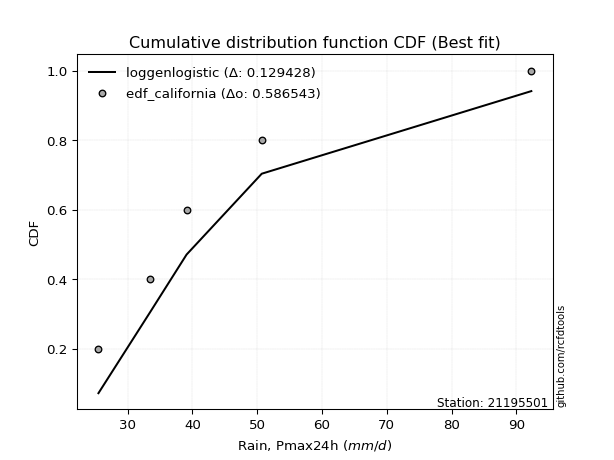</img>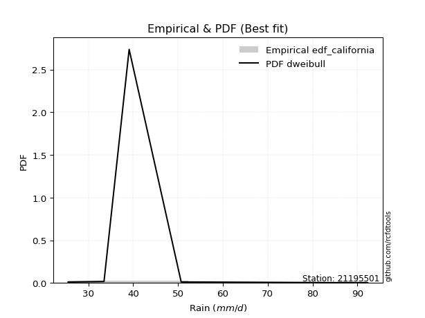</img>

</div>


### 2. EDF Hazen (1930)

Hazen method for plotting positions is a formula used to estimate the empirical cumulative probability distribution of flood events or other hydrological data. This formula often results in biased estimations, particularly when extrapolating to extreme events (high return periods).

<div align="center">


$P=(m-0.5)/n$


</div>


**2.1. Empirical values**

<div align="center">

|                | 0                  | 1                  | 2         | 3                 | 4                  |
|:---------------|:-------------------|:-------------------|:----------|:------------------|:-------------------|
| date           | 2017               | 2016               | 2018      | 2019              | 2020               |
| x              | 25.5               | 33.5               | 39.1      | 50.7              | 92.3               |
| m              | 1                  | 2                  | 3         | 4                 | 5                  |
| empirical_dist | edf_hazen          | edf_hazen          | edf_hazen | edf_hazen         | edf_hazen          |
| empirical      | 0.1                | 0.3                | 0.5       | 0.7               | 0.9                |
| empirical_tr   | 1.1111111111111112 | 1.4285714285714286 | 2.0       | 3.333333333333333 | 10.000000000000002 |

</div>


**2.2. Kolmogorov-Smirnov fit test (sorted by Δ)**


<div align="center">

|                | 0                    | 1                   | 2                   | 3                   | 4                   | 5                   | 6                   | 7                   | 8                  | 9                    | 10                  | 11                  | 12                  | 13                  | 14                  | 15                  | 16                   | 17                 | 18                  | 19                  | 20                  | 21                   | 22                  | 23                  | 24                   | 25                  | 26                 | 27                  | 28                  | 29                  | 30                  | 31                  | 32                 | 33                  | 34                  | 35                  | 36                 | 37                  | 38                  | 39                  | 40                  | 41                  | 42                  | 43                  | 44                  | 45                  | 46                  | 47                  | 48                 | 49                  | 50                  | 51                  | 52                 | 53                  | 54                  | 55                  | 56                  | 57                  | 58                  | 59                  | 60                  | 61                  | 62                  | 63                  | 64                  | 65                 | 66                 | 67                 | 68                  | 69                  | 70                  | 71                  | 72                  | 73                  | 74                  | 75                  | 76                  | 77                 | 78                 | 79                  | 80                 | 81                  | 82                  | 83                  | 84                  | 85                 | 86                  | 87                  | 88                  | 89                  | 90                 | 91                  | 92                  | 93                  | 94                  | 95                  | 96                  | 97                  | 98                  | 99                  | 100                 | 101                 | 102                 | 103                 | 104                | 105                 | 106                 | 107                | 108                 | 109                 | 110                 | 111                | 112                | 113                 | 114                | 115                | 116                 | 117                 | 118                 | 119                 | 120                 | 121                 | 122                | 123                | 124                 | 125                | 126                 | 127                | 128                | 129                | 130                | 131                 | 132                | 133                 | 134                | 135                 | 136                 | 137                | 138                 | 139                | 140                | 141                | 142                | 143                | 144                | 145                 | 146                | 147                | 148                 | 149                 | 150                | 151                | 152                | 153                | 154                | 155                | 156                | 157                | 158                | 159                |
|:---------------|:---------------------|:--------------------|:--------------------|:--------------------|:--------------------|:--------------------|:--------------------|:--------------------|:-------------------|:---------------------|:--------------------|:--------------------|:--------------------|:--------------------|:--------------------|:--------------------|:---------------------|:-------------------|:--------------------|:--------------------|:--------------------|:---------------------|:--------------------|:--------------------|:---------------------|:--------------------|:-------------------|:--------------------|:--------------------|:--------------------|:--------------------|:--------------------|:-------------------|:--------------------|:--------------------|:--------------------|:-------------------|:--------------------|:--------------------|:--------------------|:--------------------|:--------------------|:--------------------|:--------------------|:--------------------|:--------------------|:--------------------|:--------------------|:-------------------|:--------------------|:--------------------|:--------------------|:-------------------|:--------------------|:--------------------|:--------------------|:--------------------|:--------------------|:--------------------|:--------------------|:--------------------|:--------------------|:--------------------|:--------------------|:--------------------|:-------------------|:-------------------|:-------------------|:--------------------|:--------------------|:--------------------|:--------------------|:--------------------|:--------------------|:--------------------|:--------------------|:--------------------|:-------------------|:-------------------|:--------------------|:-------------------|:--------------------|:--------------------|:--------------------|:--------------------|:-------------------|:--------------------|:--------------------|:--------------------|:--------------------|:-------------------|:--------------------|:--------------------|:--------------------|:--------------------|:--------------------|:--------------------|:--------------------|:--------------------|:--------------------|:--------------------|:--------------------|:--------------------|:--------------------|:-------------------|:--------------------|:--------------------|:-------------------|:--------------------|:--------------------|:--------------------|:-------------------|:-------------------|:--------------------|:-------------------|:-------------------|:--------------------|:--------------------|:--------------------|:--------------------|:--------------------|:--------------------|:-------------------|:-------------------|:--------------------|:-------------------|:--------------------|:-------------------|:-------------------|:-------------------|:-------------------|:--------------------|:-------------------|:--------------------|:-------------------|:--------------------|:--------------------|:-------------------|:--------------------|:-------------------|:-------------------|:-------------------|:-------------------|:-------------------|:-------------------|:--------------------|:-------------------|:-------------------|:--------------------|:--------------------|:-------------------|:-------------------|:-------------------|:-------------------|:-------------------|:-------------------|:-------------------|:-------------------|:-------------------|:-------------------|
| station        | 21195501             | 21195501            | 21195501            | 21195501            | 21195501            | 21195501            | 21195501            | 21195501            | 21195501           | 21195501             | 21195501            | 21195501            | 21195501            | 21195501            | 21195501            | 21195501            | 21195501             | 21195501           | 21195501            | 21195501            | 21195501            | 21195501             | 21195501            | 21195501            | 21195501             | 21195501            | 21195501           | 21195501            | 21195501            | 21195501            | 21195501            | 21195501            | 21195501           | 21195501            | 21195501            | 21195501            | 21195501           | 21195501            | 21195501            | 21195501            | 21195501            | 21195501            | 21195501            | 21195501            | 21195501            | 21195501            | 21195501            | 21195501            | 21195501           | 21195501            | 21195501            | 21195501            | 21195501           | 21195501            | 21195501            | 21195501            | 21195501            | 21195501            | 21195501            | 21195501            | 21195501            | 21195501            | 21195501            | 21195501            | 21195501            | 21195501           | 21195501           | 21195501           | 21195501            | 21195501            | 21195501            | 21195501            | 21195501            | 21195501            | 21195501            | 21195501            | 21195501            | 21195501           | 21195501           | 21195501            | 21195501           | 21195501            | 21195501            | 21195501            | 21195501            | 21195501           | 21195501            | 21195501            | 21195501            | 21195501            | 21195501           | 21195501            | 21195501            | 21195501            | 21195501            | 21195501            | 21195501            | 21195501            | 21195501            | 21195501            | 21195501            | 21195501            | 21195501            | 21195501            | 21195501           | 21195501            | 21195501            | 21195501           | 21195501            | 21195501            | 21195501            | 21195501           | 21195501           | 21195501            | 21195501           | 21195501           | 21195501            | 21195501            | 21195501            | 21195501            | 21195501            | 21195501            | 21195501           | 21195501           | 21195501            | 21195501           | 21195501            | 21195501           | 21195501           | 21195501           | 21195501           | 21195501            | 21195501           | 21195501            | 21195501           | 21195501            | 21195501            | 21195501           | 21195501            | 21195501           | 21195501           | 21195501           | 21195501           | 21195501           | 21195501           | 21195501            | 21195501           | 21195501           | 21195501            | 21195501            | 21195501           | 21195501           | 21195501           | 21195501           | 21195501           | 21195501           | 21195501           | 21195501           | 21195501           | 21195501           |
| empirical_dist | edf_hazen            | edf_hazen           | edf_hazen           | edf_hazen           | edf_hazen           | edf_hazen           | edf_hazen           | edf_hazen           | edf_hazen          | edf_hazen            | edf_hazen           | edf_hazen           | edf_hazen           | edf_hazen           | edf_hazen           | edf_hazen           | edf_hazen            | edf_hazen          | edf_hazen           | edf_hazen           | edf_hazen           | edf_hazen            | edf_hazen           | edf_hazen           | edf_hazen            | edf_hazen           | edf_hazen          | edf_hazen           | edf_hazen           | edf_hazen           | edf_hazen           | edf_hazen           | edf_hazen          | edf_hazen           | edf_hazen           | edf_hazen           | edf_hazen          | edf_hazen           | edf_hazen           | edf_hazen           | edf_hazen           | edf_hazen           | edf_hazen           | edf_hazen           | edf_hazen           | edf_hazen           | edf_hazen           | edf_hazen           | edf_hazen          | edf_hazen           | edf_hazen           | edf_hazen           | edf_hazen          | edf_hazen           | edf_hazen           | edf_hazen           | edf_hazen           | edf_hazen           | edf_hazen           | edf_hazen           | edf_hazen           | edf_hazen           | edf_hazen           | edf_hazen           | edf_hazen           | edf_hazen          | edf_hazen          | edf_hazen          | edf_hazen           | edf_hazen           | edf_hazen           | edf_hazen           | edf_hazen           | edf_hazen           | edf_hazen           | edf_hazen           | edf_hazen           | edf_hazen          | edf_hazen          | edf_hazen           | edf_hazen          | edf_hazen           | edf_hazen           | edf_hazen           | edf_hazen           | edf_hazen          | edf_hazen           | edf_hazen           | edf_hazen           | edf_hazen           | edf_hazen          | edf_hazen           | edf_hazen           | edf_hazen           | edf_hazen           | edf_hazen           | edf_hazen           | edf_hazen           | edf_hazen           | edf_hazen           | edf_hazen           | edf_hazen           | edf_hazen           | edf_hazen           | edf_hazen          | edf_hazen           | edf_hazen           | edf_hazen          | edf_hazen           | edf_hazen           | edf_hazen           | edf_hazen          | edf_hazen          | edf_hazen           | edf_hazen          | edf_hazen          | edf_hazen           | edf_hazen           | edf_hazen           | edf_hazen           | edf_hazen           | edf_hazen           | edf_hazen          | edf_hazen          | edf_hazen           | edf_hazen          | edf_hazen           | edf_hazen          | edf_hazen          | edf_hazen          | edf_hazen          | edf_hazen           | edf_hazen          | edf_hazen           | edf_hazen          | edf_hazen           | edf_hazen           | edf_hazen          | edf_hazen           | edf_hazen          | edf_hazen          | edf_hazen          | edf_hazen          | edf_hazen          | edf_hazen          | edf_hazen           | edf_hazen          | edf_hazen          | edf_hazen           | edf_hazen           | edf_hazen          | edf_hazen          | edf_hazen          | edf_hazen          | edf_hazen          | edf_hazen          | edf_hazen          | edf_hazen          | edf_hazen          | edf_hazen          |
| p_dist         | logburr12            | logalpha            | logmielke           | loginvweibull       | loggenextreme       | logburr             | logexponnorm        | burr                | alpha              | logf                 | mielke              | loggumbel_r         | loggenlogistic      | invgamma            | logweibull_max      | logjohnsonsu        | logkstwobign         | loginvgauss        | logfoldnorm         | loginvgamma         | lograyleigh         | loghalfnorm          | nct                 | logfatiguelife      | logpearson3          | logmoyal            | logmaxwell         | halflogistic        | lognct              | invgauss            | logbetaprime        | logrice             | ncf                | betaprime           | loganglit           | moyal               | foldnorm           | halfnorm            | logsemicircular     | pearson3            | logloggamma         | logt                | lognorm             | logcrystalball      | exponnorm           | loggenexpon         | logksone            | logtruncexpon       | wald               | truncnorm           | genexpon            | logbradford         | logtruncnorm       | logkappa3           | kappa3              | loggompertz         | logbeta             | loghalfgennorm      | gengamma            | exponweib           | vonmises_line       | loggausshyper       | logweibull_min      | gompertz            | lomax               | logwald            | logskewnorm        | loghalflogistic    | loglomax            | gumbel_r            | dgamma              | burr12              | genlogistic         | loglogistic         | logdgamma           | logncf              | rayleigh            | gennorm            | loghypsecant       | logarcsine          | logexponpow        | logdweibull         | logcosine           | maxwell             | logtruncweibull_min | kstwobign          | lognakagami         | loglaplace          | loglaplace          | logexponweib        | dweibull           | logtukeylambda      | t                   | norm                | crystalball         | weibull_min         | loggumbel_l         | anglit              | nakagami            | semicircular        | loguniform          | logistic            | rice                | logkappa4           | arcsine            | skewnorm            | gamma               | logvonmises_line   | logloglaplace       | hypsecant           | f                   | logwrapcauchy      | logargus           | truncweibull_min    | loggennorm         | laplace            | logrdist            | cosine              | loggamma            | loggamma            | gumbel_l            | johnsonsb           | wrapcauchy         | truncexpon         | logtriang           | loglevy_l          | exponpow            | halfgennorm        | logerlang          | loggenpareto       | bradford           | levy_l              | tukeylambda        | kappa4              | ksone              | argus               | beta                | uniform            | loggenhalflogistic  | genpareto          | triang             | genextreme         | logjohnsonsb       | gausshyper         | logtrapezoid       | genhalflogistic     | rdist              | fatiguelife        | invweibull          | powerlaw            | loggengamma        | truncpareto        | logpowerlaw        | weibull_max        | trapezoid          | erlang             | logtruncpareto     | johnsonsu          | logvonmises        | vonmises           |
| delta          | 0.028193258701580265 | 0.03274128434419894 | 0.03341551243501384 | 0.03366273470377745 | 0.03367049425642876 | 0.03384669163009968 | 0.03509458253094297 | 0.03637977390799452 | 0.0365201751177629 | 0.037461412124853155 | 0.03964150507420397 | 0.04006385918498445 | 0.04103155821400695 | 0.04150575812123857 | 0.04151860936149554 | 0.04259703724507072 | 0.044030184118814764 | 0.0448367375450715 | 0.04503302939778214 | 0.04915464357045174 | 0.05067837494596161 | 0.052193932210727316 | 0.05291217938117909 | 0.05911168051468535 | 0.059213206966866105 | 0.06095605997595568 | 0.0629647642726266 | 0.06475330095488674 | 0.06769805009114621 | 0.06912768659003393 | 0.07593482861933115 | 0.07689437987564207 | 0.0769287165373097 | 0.07745359323970219 | 0.08359731147580252 | 0.08498749588760346 | 0.0886316916228137 | 0.08898789225237769 | 0.08947750617620631 | 0.09288584810711914 | 0.09592583355999462 | 0.09704459722572806 | 0.09704642773922506 | 0.09712483877811035 | 0.09880082403637216 | 0.09909727154554689 | 0.09925354383714968 | 0.09998771840505509 | 0.0999998509218072 | 0.09999999151237558 | 0.09999999337921073 | 0.09999999766496184 | 0.0999999977912859 | 0.09999999880852709 | 0.09999999904144646 | 0.09999999984300692 | 0.09999999995384917 | 0.09999999997510862 | 0.09999999999090305 | 0.09999999999139975 | 0.09999999999889697 | 0.09999999999982112 | 0.09999999999998264 | 0.09999999999999584 | 0.09999999999999969 | 0.1                | 0.1                | 0.1                | 0.10068896219570772 | 0.10278068208293811 | 0.10338418787528236 | 0.10466418928305338 | 0.10717327692016704 | 0.10960869179482519 | 0.11390646165550522 | 0.11625940698196105 | 0.11712329056783477 | 0.1181700249351556 | 0.1199134586202894 | 0.12062705797787365 | 0.1250843342090564 | 0.12590027291478334 | 0.12614526410154414 | 0.12710461220350966 | 0.13140849259897008 | 0.1343391123126691 | 0.13759894625803776 | 0.14676892712525813 | 0.14676892712525813 | 0.15150216442502157 | 0.1550063538830513 | 0.15779585408721597 | 0.15800137316484109 | 0.15800715048903824 | 0.15800715058610293 | 0.15956500808214974 | 0.16385486997356996 | 0.16398294439251815 | 0.16444746986267433 | 0.16644800123932835 | 0.16771189688308702 | 0.16894104904234897 | 0.17257086988886683 | 0.17337473030653727 | 0.1762421313398279 | 0.17747567472548442 | 0.17867213946613142 | 0.1812314339678669 | 0.18265005222848985 | 0.18291517268642954 | 0.18691101140694066 | 0.1885422926433883 | 0.1892972692982149 | 0.19299814448935448 | 0.2                | 0.2110742384819131 | 0.21332603747236112 | 0.21680454994773846 | 0.22395299202598934 | 0.22395299202598934 | 0.22583225259202444 | 0.23094554608727963 | 0.2375451898721364 | 0.2395270772283648 | 0.24813457925734295 | 0.2492529329179821 | 0.24975870345765522 | 0.2546802736360299 | 0.2573477490890049 | 0.2602491246184018 | 0.2611275060440348 | 0.27499527365660204 | 0.2772795237430856 | 0.29306118752288907 | 0.3022954091816366 | 0.30426463197544706 | 0.31405246003697385 | 0.322754491017964  | 0.32427589062784085 | 0.33148500073444   | 0.3478417037415191 | 0.3706394722090194 | 0.3876317672517891 | 0.3890221658506288 | 0.4206391945022282 | 0.43583386697913284 | 0.4391268972180764 | 0.4427607521773836 | 0.46078833708171296 | 0.47749172728836947 | 0.488595848328973  | 0.5014759378006008 | 0.5192226215263529 | 0.5286578370899031 | 0.5418310584419981 | 0.5492170330045618 | 0.5503676024370938 | 0.6322832848295046 | 1.0582557943473017 | 14.111524266822547 |
| deltao         | 0.5865427407550001   | 0.5865427407550001  | 0.5865427407550001  | 0.5865427407550001  | 0.5865427407550001  | 0.5865427407550001  | 0.5865427407550001  | 0.5865427407550001  | 0.5865427407550001 | 0.5865427407550001   | 0.5865427407550001  | 0.5865427407550001  | 0.5865427407550001  | 0.5865427407550001  | 0.5865427407550001  | 0.5865427407550001  | 0.5865427407550001   | 0.5865427407550001 | 0.5865427407550001  | 0.5865427407550001  | 0.5865427407550001  | 0.5865427407550001   | 0.5865427407550001  | 0.5865427407550001  | 0.5865427407550001   | 0.5865427407550001  | 0.5865427407550001 | 0.5865427407550001  | 0.5865427407550001  | 0.5865427407550001  | 0.5865427407550001  | 0.5865427407550001  | 0.5865427407550001 | 0.5865427407550001  | 0.5865427407550001  | 0.5865427407550001  | 0.5865427407550001 | 0.5865427407550001  | 0.5865427407550001  | 0.5865427407550001  | 0.5865427407550001  | 0.5865427407550001  | 0.5865427407550001  | 0.5865427407550001  | 0.5865427407550001  | 0.5865427407550001  | 0.5865427407550001  | 0.5865427407550001  | 0.5865427407550001 | 0.5865427407550001  | 0.5865427407550001  | 0.5865427407550001  | 0.5865427407550001 | 0.5865427407550001  | 0.5865427407550001  | 0.5865427407550001  | 0.5865427407550001  | 0.5865427407550001  | 0.5865427407550001  | 0.5865427407550001  | 0.5865427407550001  | 0.5865427407550001  | 0.5865427407550001  | 0.5865427407550001  | 0.5865427407550001  | 0.5865427407550001 | 0.5865427407550001 | 0.5865427407550001 | 0.5865427407550001  | 0.5865427407550001  | 0.5865427407550001  | 0.5865427407550001  | 0.5865427407550001  | 0.5865427407550001  | 0.5865427407550001  | 0.5865427407550001  | 0.5865427407550001  | 0.5865427407550001 | 0.5865427407550001 | 0.5865427407550001  | 0.5865427407550001 | 0.5865427407550001  | 0.5865427407550001  | 0.5865427407550001  | 0.5865427407550001  | 0.5865427407550001 | 0.5865427407550001  | 0.5865427407550001  | 0.5865427407550001  | 0.5865427407550001  | 0.5865427407550001 | 0.5865427407550001  | 0.5865427407550001  | 0.5865427407550001  | 0.5865427407550001  | 0.5865427407550001  | 0.5865427407550001  | 0.5865427407550001  | 0.5865427407550001  | 0.5865427407550001  | 0.5865427407550001  | 0.5865427407550001  | 0.5865427407550001  | 0.5865427407550001  | 0.5865427407550001 | 0.5865427407550001  | 0.5865427407550001  | 0.5865427407550001 | 0.5865427407550001  | 0.5865427407550001  | 0.5865427407550001  | 0.5865427407550001 | 0.5865427407550001 | 0.5865427407550001  | 0.5865427407550001 | 0.5865427407550001 | 0.5865427407550001  | 0.5865427407550001  | 0.5865427407550001  | 0.5865427407550001  | 0.5865427407550001  | 0.5865427407550001  | 0.5865427407550001 | 0.5865427407550001 | 0.5865427407550001  | 0.5865427407550001 | 0.5865427407550001  | 0.5865427407550001 | 0.5865427407550001 | 0.5865427407550001 | 0.5865427407550001 | 0.5865427407550001  | 0.5865427407550001 | 0.5865427407550001  | 0.5865427407550001 | 0.5865427407550001  | 0.5865427407550001  | 0.5865427407550001 | 0.5865427407550001  | 0.5865427407550001 | 0.5865427407550001 | 0.5865427407550001 | 0.5865427407550001 | 0.5865427407550001 | 0.5865427407550001 | 0.5865427407550001  | 0.5865427407550001 | 0.5865427407550001 | 0.5865427407550001  | 0.5865427407550001  | 0.5865427407550001 | 0.5865427407550001 | 0.5865427407550001 | 0.5865427407550001 | 0.5865427407550001 | 0.5865427407550001 | 0.5865427407550001 | 0.5865427407550001 | 0.5865427407550001 | 0.5865427407550001 |
| eval           | Δo > Δ               | Δo > Δ              | Δo > Δ              | Δo > Δ              | Δo > Δ              | Δo > Δ              | Δo > Δ              | Δo > Δ              | Δo > Δ             | Δo > Δ               | Δo > Δ              | Δo > Δ              | Δo > Δ              | Δo > Δ              | Δo > Δ              | Δo > Δ              | Δo > Δ               | Δo > Δ             | Δo > Δ              | Δo > Δ              | Δo > Δ              | Δo > Δ               | Δo > Δ              | Δo > Δ              | Δo > Δ               | Δo > Δ              | Δo > Δ             | Δo > Δ              | Δo > Δ              | Δo > Δ              | Δo > Δ              | Δo > Δ              | Δo > Δ             | Δo > Δ              | Δo > Δ              | Δo > Δ              | Δo > Δ             | Δo > Δ              | Δo > Δ              | Δo > Δ              | Δo > Δ              | Δo > Δ              | Δo > Δ              | Δo > Δ              | Δo > Δ              | Δo > Δ              | Δo > Δ              | Δo > Δ              | Δo > Δ             | Δo > Δ              | Δo > Δ              | Δo > Δ              | Δo > Δ             | Δo > Δ              | Δo > Δ              | Δo > Δ              | Δo > Δ              | Δo > Δ              | Δo > Δ              | Δo > Δ              | Δo > Δ              | Δo > Δ              | Δo > Δ              | Δo > Δ              | Δo > Δ              | Δo > Δ             | Δo > Δ             | Δo > Δ             | Δo > Δ              | Δo > Δ              | Δo > Δ              | Δo > Δ              | Δo > Δ              | Δo > Δ              | Δo > Δ              | Δo > Δ              | Δo > Δ              | Δo > Δ             | Δo > Δ             | Δo > Δ              | Δo > Δ             | Δo > Δ              | Δo > Δ              | Δo > Δ              | Δo > Δ              | Δo > Δ             | Δo > Δ              | Δo > Δ              | Δo > Δ              | Δo > Δ              | Δo > Δ             | Δo > Δ              | Δo > Δ              | Δo > Δ              | Δo > Δ              | Δo > Δ              | Δo > Δ              | Δo > Δ              | Δo > Δ              | Δo > Δ              | Δo > Δ              | Δo > Δ              | Δo > Δ              | Δo > Δ              | Δo > Δ             | Δo > Δ              | Δo > Δ              | Δo > Δ             | Δo > Δ              | Δo > Δ              | Δo > Δ              | Δo > Δ             | Δo > Δ             | Δo > Δ              | Δo > Δ             | Δo > Δ             | Δo > Δ              | Δo > Δ              | Δo > Δ              | Δo > Δ              | Δo > Δ              | Δo > Δ              | Δo > Δ             | Δo > Δ             | Δo > Δ              | Δo > Δ             | Δo > Δ              | Δo > Δ             | Δo > Δ             | Δo > Δ             | Δo > Δ             | Δo > Δ              | Δo > Δ             | Δo > Δ              | Δo > Δ             | Δo > Δ              | Δo > Δ              | Δo > Δ             | Δo > Δ              | Δo > Δ             | Δo > Δ             | Δo > Δ             | Δo > Δ             | Δo > Δ             | Δo > Δ             | Δo > Δ              | Δo > Δ             | Δo > Δ             | Δo > Δ              | Δo > Δ              | Δo > Δ             | Δo > Δ             | Δo > Δ             | Δo > Δ             | Δo > Δ             | Δo > Δ             | Δo > Δ             | Δo <= Δ            | Δo <= Δ            | Δo <= Δ            |
| fit            | 1                    | 1                   | 1                   | 1                   | 1                   | 1                   | 1                   | 1                   | 1                  | 1                    | 1                   | 1                   | 1                   | 1                   | 1                   | 1                   | 1                    | 1                  | 1                   | 1                   | 1                   | 1                    | 1                   | 1                   | 1                    | 1                   | 1                  | 1                   | 1                   | 1                   | 1                   | 1                   | 1                  | 1                   | 1                   | 1                   | 1                  | 1                   | 1                   | 1                   | 1                   | 1                   | 1                   | 1                   | 1                   | 1                   | 1                   | 1                   | 1                  | 1                   | 1                   | 1                   | 1                  | 1                   | 1                   | 1                   | 1                   | 1                   | 1                   | 1                   | 1                   | 1                   | 1                   | 1                   | 1                   | 1                  | 1                  | 1                  | 1                   | 1                   | 1                   | 1                   | 1                   | 1                   | 1                   | 1                   | 1                   | 1                  | 1                  | 1                   | 1                  | 1                   | 1                   | 1                   | 1                   | 1                  | 1                   | 1                   | 1                   | 1                   | 1                  | 1                   | 1                   | 1                   | 1                   | 1                   | 1                   | 1                   | 1                   | 1                   | 1                   | 1                   | 1                   | 1                   | 1                  | 1                   | 1                   | 1                  | 1                   | 1                   | 1                   | 1                  | 1                  | 1                   | 1                  | 1                  | 1                   | 1                   | 1                   | 1                   | 1                   | 1                   | 1                  | 1                  | 1                   | 1                  | 1                   | 1                  | 1                  | 1                  | 1                  | 1                   | 1                  | 1                   | 1                  | 1                   | 1                   | 1                  | 1                   | 1                  | 1                  | 1                  | 1                  | 1                  | 1                  | 1                   | 1                  | 1                  | 1                   | 1                   | 1                  | 1                  | 1                  | 1                  | 1                  | 1                  | 1                  | 0                  | 0                  | 0                  |
| n              | 5                    | 5                   | 5                   | 5                   | 5                   | 5                   | 5                   | 5                   | 5                  | 5                    | 5                   | 5                   | 5                   | 5                   | 5                   | 5                   | 5                    | 5                  | 5                   | 5                   | 5                   | 5                    | 5                   | 5                   | 5                    | 5                   | 5                  | 5                   | 5                   | 5                   | 5                   | 5                   | 5                  | 5                   | 5                   | 5                   | 5                  | 5                   | 5                   | 5                   | 5                   | 5                   | 5                   | 5                   | 5                   | 5                   | 5                   | 5                   | 5                  | 5                   | 5                   | 5                   | 5                  | 5                   | 5                   | 5                   | 5                   | 5                   | 5                   | 5                   | 5                   | 5                   | 5                   | 5                   | 5                   | 5                  | 5                  | 5                  | 5                   | 5                   | 5                   | 5                   | 5                   | 5                   | 5                   | 5                   | 5                   | 5                  | 5                  | 5                   | 5                  | 5                   | 5                   | 5                   | 5                   | 5                  | 5                   | 5                   | 5                   | 5                   | 5                  | 5                   | 5                   | 5                   | 5                   | 5                   | 5                   | 5                   | 5                   | 5                   | 5                   | 5                   | 5                   | 5                   | 5                  | 5                   | 5                   | 5                  | 5                   | 5                   | 5                   | 5                  | 5                  | 5                   | 5                  | 5                  | 5                   | 5                   | 5                   | 5                   | 5                   | 5                   | 5                  | 5                  | 5                   | 5                  | 5                   | 5                  | 5                  | 5                  | 5                  | 5                   | 5                  | 5                   | 5                  | 5                   | 5                   | 5                  | 5                   | 5                  | 5                  | 5                  | 5                  | 5                  | 5                  | 5                   | 5                  | 5                  | 5                   | 5                   | 5                  | 5                  | 5                  | 5                  | 5                  | 5                  | 5                  | 5                  | 5                  | 5                  |
| best_fit       | 1                    | 0                   | 0                   | 0                   | 0                   | 0                   | 0                   | 0                   | 0                  | 0                    | 0                   | 0                   | 0                   | 0                   | 0                   | 0                   | 0                    | 0                  | 0                   | 0                   | 0                   | 0                    | 0                   | 0                   | 0                    | 0                   | 0                  | 0                   | 0                   | 0                   | 0                   | 0                   | 0                  | 0                   | 0                   | 0                   | 0                  | 0                   | 0                   | 0                   | 0                   | 0                   | 0                   | 0                   | 0                   | 0                   | 0                   | 0                   | 0                  | 0                   | 0                   | 0                   | 0                  | 0                   | 0                   | 0                   | 0                   | 0                   | 0                   | 0                   | 0                   | 0                   | 0                   | 0                   | 0                   | 0                  | 0                  | 0                  | 0                   | 0                   | 0                   | 0                   | 0                   | 0                   | 0                   | 0                   | 0                   | 0                  | 0                  | 0                   | 0                  | 0                   | 0                   | 0                   | 0                   | 0                  | 0                   | 0                   | 0                   | 0                   | 0                  | 0                   | 0                   | 0                   | 0                   | 0                   | 0                   | 0                   | 0                   | 0                   | 0                   | 0                   | 0                   | 0                   | 0                  | 0                   | 0                   | 0                  | 0                   | 0                   | 0                   | 0                  | 0                  | 0                   | 0                  | 0                  | 0                   | 0                   | 0                   | 0                   | 0                   | 0                   | 0                  | 0                  | 0                   | 0                  | 0                   | 0                  | 0                  | 0                  | 0                  | 0                   | 0                  | 0                   | 0                  | 0                   | 0                   | 0                  | 0                   | 0                  | 0                  | 0                  | 0                  | 0                  | 0                  | 0                   | 0                  | 0                  | 0                   | 0                   | 0                  | 0                  | 0                  | 0                  | 0                  | 0                  | 0                  | 0                  | 0                  | 0                  |
| best_fit_sort  | 1                    | 2                   | 3                   | 4                   | 5                   | 6                   | 7                   | 8                   | 9                  | 10                   | 11                  | 12                  | 13                  | 14                  | 15                  | 16                  | 17                   | 18                 | 19                  | 20                  | 21                  | 22                   | 23                  | 24                  | 25                   | 26                  | 27                 | 28                  | 29                  | 30                  | 31                  | 32                  | 33                 | 34                  | 35                  | 36                  | 37                 | 38                  | 39                  | 40                  | 41                  | 42                  | 43                  | 44                  | 45                  | 46                  | 47                  | 48                  | 49                 | 50                  | 51                  | 52                  | 53                 | 54                  | 55                  | 56                  | 57                  | 58                  | 59                  | 60                  | 61                  | 62                  | 63                  | 64                  | 65                  | 66                 | 67                 | 68                 | 69                  | 70                  | 71                  | 72                  | 73                  | 74                  | 75                  | 76                  | 77                  | 78                 | 79                 | 80                  | 81                 | 82                  | 83                  | 84                  | 85                  | 86                 | 87                  | 88                  | 89                  | 90                  | 91                 | 92                  | 93                  | 94                  | 95                  | 96                  | 97                  | 98                  | 99                  | 100                 | 101                 | 102                 | 103                 | 104                 | 105                | 106                 | 107                 | 108                | 109                 | 110                 | 111                 | 112                | 113                | 114                 | 115                | 116                | 117                 | 118                 | 119                 | 120                 | 121                 | 122                 | 123                | 124                | 125                 | 126                | 127                 | 128                | 129                | 130                | 131                | 132                 | 133                | 134                 | 135                | 136                 | 137                 | 138                | 139                 | 140                | 141                | 142                | 143                | 144                | 145                | 146                 | 147                | 148                | 149                 | 150                 | 151                | 152                | 153                | 154                | 155                | 156                | 157                | 158                | 159                | 160                |

</div>


**2.3. Best fit**

<div align="center">

|   id |   station | empirical_dist   | p_dist    |     delta |   deltao | eval   |   fit |   n |   best_fit |   best_fit_sort |
|-----:|----------:|:-----------------|:----------|----------:|---------:|:-------|------:|----:|-----------:|----------------:|
|    0 |  21195501 | edf_hazen        | logburr12 | 0.0281933 | 0.586543 | Δo > Δ |     1 |   5 |          1 |               1 |

</div>


<div align="center">

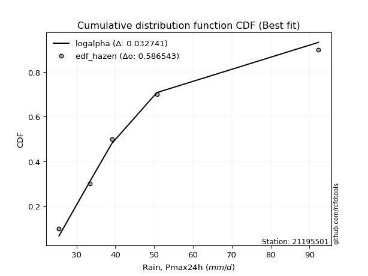</img>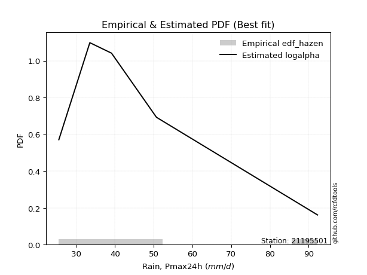</img>

</div>


### 3. EDF Weibull (1939)

Weibull plotting position formula is an empirical method used to estimate the non-exceedance probability or plotting position for a set of observed data, is often recommended or widely used in practice, particularly in flood frequency analysis.

<div align="center">


$P=m/(n+1)$


</div>


**3.1. Empirical values**

<div align="center">

|                | 0                   | 1                  | 2           | 3                  | 4                  |
|:---------------|:--------------------|:-------------------|:------------|:-------------------|:-------------------|
| date           | 2017                | 2016               | 2018        | 2019               | 2020               |
| x              | 25.5                | 33.5               | 39.1        | 50.7               | 92.3               |
| m              | 1                   | 2                  | 3           | 4                  | 5                  |
| empirical_dist | edf_weibull         | edf_weibull        | edf_weibull | edf_weibull        | edf_weibull        |
| empirical      | 0.16666666666666666 | 0.3333333333333333 | 0.5         | 0.6666666666666666 | 0.8333333333333334 |
| empirical_tr   | 1.2                 | 1.4999999999999998 | 2.0         | 2.9999999999999996 | 6.000000000000002  |

</div>


**3.2. Kolmogorov-Smirnov fit test (sorted by Δ)**


<div align="center">

|                | 0                  | 1                   | 2                  | 3                   | 4                  | 5                   | 6                   | 7                   | 8                   | 9                   | 10                  | 11                  | 12                 | 13                  | 14                 | 15                  | 16                  | 17                  | 18                  | 19                  | 20                  | 21                  | 22                  | 23                  | 24                  | 25                  | 26                  | 27                  | 28                  | 29                  | 30                  | 31                  | 32                  | 33                  | 34                  | 35                  | 36                  | 37                  | 38                  | 39                  | 40                  | 41                  | 42                  | 43                  | 44                  | 45                  | 46                  | 47                  | 48                  | 49                  | 50                  | 51                  | 52                  | 53                 | 54                 | 55                  | 56                  | 57                  | 58                  | 59                  | 60                  | 61                 | 62                 | 63                  | 64                  | 65                 | 66                  | 67                 | 68                  | 69                  | 70                  | 71                  | 72                  | 73                  | 74                  | 75                 | 76                  | 77                  | 78                  | 79                 | 80                  | 81                  | 82                  | 83                 | 84                  | 85                  | 86                 | 87                  | 88                  | 89                 | 90                  | 91                  | 92                  | 93                  | 94                  | 95                 | 96                  | 97                  | 98                 | 99                 | 100                 | 101                 | 102                 | 103                 | 104                 | 105                 | 106                 | 107                 | 108                 | 109                 | 110                 | 111                 | 112                 | 113                | 114                 | 115                | 116                 | 117                | 118                | 119                 | 120                 | 121                | 122                 | 123                 | 124                 | 125                | 126                | 127                 | 128                 | 129                 | 130                | 131                 | 132                | 133                | 134                | 135                 | 136                | 137                 | 138                 | 139                 | 140                 | 141                | 142                | 143                | 144                 | 145                 | 146                | 147                | 148                 | 149                 | 150                | 151                 | 152                 | 153                 | 154                | 155                | 156                | 157                | 158                | 159                |
|:---------------|:-------------------|:--------------------|:-------------------|:--------------------|:-------------------|:--------------------|:--------------------|:--------------------|:--------------------|:--------------------|:--------------------|:--------------------|:-------------------|:--------------------|:-------------------|:--------------------|:--------------------|:--------------------|:--------------------|:--------------------|:--------------------|:--------------------|:--------------------|:--------------------|:--------------------|:--------------------|:--------------------|:--------------------|:--------------------|:--------------------|:--------------------|:--------------------|:--------------------|:--------------------|:--------------------|:--------------------|:--------------------|:--------------------|:--------------------|:--------------------|:--------------------|:--------------------|:--------------------|:--------------------|:--------------------|:--------------------|:--------------------|:--------------------|:--------------------|:--------------------|:--------------------|:--------------------|:--------------------|:-------------------|:-------------------|:--------------------|:--------------------|:--------------------|:--------------------|:--------------------|:--------------------|:-------------------|:-------------------|:--------------------|:--------------------|:-------------------|:--------------------|:-------------------|:--------------------|:--------------------|:--------------------|:--------------------|:--------------------|:--------------------|:--------------------|:-------------------|:--------------------|:--------------------|:--------------------|:-------------------|:--------------------|:--------------------|:--------------------|:-------------------|:--------------------|:--------------------|:-------------------|:--------------------|:--------------------|:-------------------|:--------------------|:--------------------|:--------------------|:--------------------|:--------------------|:-------------------|:--------------------|:--------------------|:-------------------|:-------------------|:--------------------|:--------------------|:--------------------|:--------------------|:--------------------|:--------------------|:--------------------|:--------------------|:--------------------|:--------------------|:--------------------|:--------------------|:--------------------|:-------------------|:--------------------|:-------------------|:--------------------|:-------------------|:-------------------|:--------------------|:--------------------|:-------------------|:--------------------|:--------------------|:--------------------|:-------------------|:-------------------|:--------------------|:--------------------|:--------------------|:-------------------|:--------------------|:-------------------|:-------------------|:-------------------|:--------------------|:-------------------|:--------------------|:--------------------|:--------------------|:--------------------|:-------------------|:-------------------|:-------------------|:--------------------|:--------------------|:-------------------|:-------------------|:--------------------|:--------------------|:-------------------|:--------------------|:--------------------|:--------------------|:-------------------|:-------------------|:-------------------|:-------------------|:-------------------|:-------------------|
| station        | 21195501           | 21195501            | 21195501           | 21195501            | 21195501           | 21195501            | 21195501            | 21195501            | 21195501            | 21195501            | 21195501            | 21195501            | 21195501           | 21195501            | 21195501           | 21195501            | 21195501            | 21195501            | 21195501            | 21195501            | 21195501            | 21195501            | 21195501            | 21195501            | 21195501            | 21195501            | 21195501            | 21195501            | 21195501            | 21195501            | 21195501            | 21195501            | 21195501            | 21195501            | 21195501            | 21195501            | 21195501            | 21195501            | 21195501            | 21195501            | 21195501            | 21195501            | 21195501            | 21195501            | 21195501            | 21195501            | 21195501            | 21195501            | 21195501            | 21195501            | 21195501            | 21195501            | 21195501            | 21195501           | 21195501           | 21195501            | 21195501            | 21195501            | 21195501            | 21195501            | 21195501            | 21195501           | 21195501           | 21195501            | 21195501            | 21195501           | 21195501            | 21195501           | 21195501            | 21195501            | 21195501            | 21195501            | 21195501            | 21195501            | 21195501            | 21195501           | 21195501            | 21195501            | 21195501            | 21195501           | 21195501            | 21195501            | 21195501            | 21195501           | 21195501            | 21195501            | 21195501           | 21195501            | 21195501            | 21195501           | 21195501            | 21195501            | 21195501            | 21195501            | 21195501            | 21195501           | 21195501            | 21195501            | 21195501           | 21195501           | 21195501            | 21195501            | 21195501            | 21195501            | 21195501            | 21195501            | 21195501            | 21195501            | 21195501            | 21195501            | 21195501            | 21195501            | 21195501            | 21195501           | 21195501            | 21195501           | 21195501            | 21195501           | 21195501           | 21195501            | 21195501            | 21195501           | 21195501            | 21195501            | 21195501            | 21195501           | 21195501           | 21195501            | 21195501            | 21195501            | 21195501           | 21195501            | 21195501           | 21195501           | 21195501           | 21195501            | 21195501           | 21195501            | 21195501            | 21195501            | 21195501            | 21195501           | 21195501           | 21195501           | 21195501            | 21195501            | 21195501           | 21195501           | 21195501            | 21195501            | 21195501           | 21195501            | 21195501            | 21195501            | 21195501           | 21195501           | 21195501           | 21195501           | 21195501           | 21195501           |
| empirical_dist | edf_weibull        | edf_weibull         | edf_weibull        | edf_weibull         | edf_weibull        | edf_weibull         | edf_weibull         | edf_weibull         | edf_weibull         | edf_weibull         | edf_weibull         | edf_weibull         | edf_weibull        | edf_weibull         | edf_weibull        | edf_weibull         | edf_weibull         | edf_weibull         | edf_weibull         | edf_weibull         | edf_weibull         | edf_weibull         | edf_weibull         | edf_weibull         | edf_weibull         | edf_weibull         | edf_weibull         | edf_weibull         | edf_weibull         | edf_weibull         | edf_weibull         | edf_weibull         | edf_weibull         | edf_weibull         | edf_weibull         | edf_weibull         | edf_weibull         | edf_weibull         | edf_weibull         | edf_weibull         | edf_weibull         | edf_weibull         | edf_weibull         | edf_weibull         | edf_weibull         | edf_weibull         | edf_weibull         | edf_weibull         | edf_weibull         | edf_weibull         | edf_weibull         | edf_weibull         | edf_weibull         | edf_weibull        | edf_weibull        | edf_weibull         | edf_weibull         | edf_weibull         | edf_weibull         | edf_weibull         | edf_weibull         | edf_weibull        | edf_weibull        | edf_weibull         | edf_weibull         | edf_weibull        | edf_weibull         | edf_weibull        | edf_weibull         | edf_weibull         | edf_weibull         | edf_weibull         | edf_weibull         | edf_weibull         | edf_weibull         | edf_weibull        | edf_weibull         | edf_weibull         | edf_weibull         | edf_weibull        | edf_weibull         | edf_weibull         | edf_weibull         | edf_weibull        | edf_weibull         | edf_weibull         | edf_weibull        | edf_weibull         | edf_weibull         | edf_weibull        | edf_weibull         | edf_weibull         | edf_weibull         | edf_weibull         | edf_weibull         | edf_weibull        | edf_weibull         | edf_weibull         | edf_weibull        | edf_weibull        | edf_weibull         | edf_weibull         | edf_weibull         | edf_weibull         | edf_weibull         | edf_weibull         | edf_weibull         | edf_weibull         | edf_weibull         | edf_weibull         | edf_weibull         | edf_weibull         | edf_weibull         | edf_weibull        | edf_weibull         | edf_weibull        | edf_weibull         | edf_weibull        | edf_weibull        | edf_weibull         | edf_weibull         | edf_weibull        | edf_weibull         | edf_weibull         | edf_weibull         | edf_weibull        | edf_weibull        | edf_weibull         | edf_weibull         | edf_weibull         | edf_weibull        | edf_weibull         | edf_weibull        | edf_weibull        | edf_weibull        | edf_weibull         | edf_weibull        | edf_weibull         | edf_weibull         | edf_weibull         | edf_weibull         | edf_weibull        | edf_weibull        | edf_weibull        | edf_weibull         | edf_weibull         | edf_weibull        | edf_weibull        | edf_weibull         | edf_weibull         | edf_weibull        | edf_weibull         | edf_weibull         | edf_weibull         | edf_weibull        | edf_weibull        | edf_weibull        | edf_weibull        | edf_weibull        | edf_weibull        |
| p_dist         | logncf             | logburr12           | logalpha           | logmielke           | loginvweibull      | loggenextreme       | logburr             | logexponnorm        | burr                | alpha               | logf                | mielke              | loggumbel_r        | logfoldnorm         | loggenlogistic     | lograyleigh         | invgamma            | logweibull_max      | logjohnsonsu        | loginvgauss         | logpearson3         | dweibull            | nct                 | logkstwobign        | logmaxwell          | foldnorm            | logfatiguelife      | halflogistic        | halfnorm            | invgauss            | moyal               | lognct              | pearson3            | loginvgamma         | logrice             | logbetaprime        | gumbel_r            | betaprime           | loghalfnorm         | ncf                 | rayleigh            | logloggamma         | logt                | lognorm             | maxwell             | logcrystalball      | loghypsecant        | loglogistic         | logdweibull         | logcosine           | logmoyal            | loganglit           | kstwobign           | logsemicircular    | genlogistic        | anglit              | dgamma              | loglaplace          | loglaplace          | logdgamma           | t                   | crystalball        | norm               | gennorm             | burr12              | semicircular       | f                   | logksone           | loggumbel_l         | exponnorm           | loggenexpon         | logtruncexpon       | nakagami            | wald                | lognakagami         | truncweibull_min   | logloglaplace       | truncnorm           | genexpon            | logbradford        | logtruncnorm        | logkappa3           | kappa3              | weibull_min        | loggompertz         | logbeta             | loghalfgennorm     | logexponweib        | gengamma            | exponweib          | gamma               | logtruncweibull_min | vonmises_line       | loglomax            | loggausshyper       | logexponpow        | logweibull_min      | logtukeylambda      | gompertz           | logkappa4          | lomax               | arcsine             | logarcsine          | loghalflogistic     | logskewnorm         | logwrapcauchy       | logwald             | loggennorm          | loguniform          | logistic            | rice                | logvonmises_line    | skewnorm            | logrdist           | hypsecant           | logargus           | loglevy_l           | loggamma           | loggamma           | loggenpareto        | cosine              | johnsonsb          | wrapcauchy          | levy_l              | gumbel_l            | laplace            | exponpow           | logtriang           | halfgennorm         | logerlang           | truncexpon         | beta                | bradford           | kappa4             | ksone              | argus               | loggenhalflogistic | uniform             | genpareto           | genextreme          | tukeylambda         | triang             | logjohnsonsb       | gausshyper         | rdist               | logtrapezoid        | invweibull         | genhalflogistic    | fatiguelife         | powerlaw            | loggengamma        | truncpareto         | logpowerlaw         | weibull_max         | trapezoid          | erlang             | logtruncpareto     | johnsonsu          | logvonmises        | vonmises           |
| delta          | 0.0669126897803557 | 0.09485992536824692 | 0.0994079510108656 | 0.10008217910168049 | 0.1003294013704441 | 0.10033716092309541 | 0.10051335829676633 | 0.10176124919760962 | 0.10304644057466117 | 0.10318684178442955 | 0.10412807879151981 | 0.10630817174087062 | 0.1067305258516511 | 0.10735956339495767 | 0.1076982248806736 | 0.10784223076008992 | 0.10817242478790523 | 0.10818527602816219 | 0.10926370391173737 | 0.11004351811206112 | 0.11017916830875252 | 0.11026524414279781 | 0.11033923038387528 | 0.11069685078548142 | 0.11129004174858736 | 0.11197741532950967 | 0.11226662041267808 | 0.11235607968491923 | 0.11278479677949338 | 0.11313130216969904 | 0.11399206418813812 | 0.11534472318544564 | 0.11564358087201565 | 0.11582131023711839 | 0.11622740245977525 | 0.11630560320406924 | 0.11720069920145015 | 0.11824127533844708 | 0.11886059887739397 | 0.12029006495520156 | 0.12063427942788019 | 0.12198675376222123 | 0.12398722349329361 | 0.12398796677780921 | 0.12401170346235268 | 0.12402431551162885 | 0.12404942793835438 | 0.12439649167252032 | 0.12536735837047186 | 0.12614526410154414 | 0.12762272664262234 | 0.12824070544946453 | 0.13519060143208594 | 0.1359615024860853 | 0.1373730943801439 | 0.14588311692338718 | 0.14599574276702632 | 0.14676892712525813 | 0.14676892712525813 | 0.14723979498883855 | 0.15091110128373086 | 0.1509196257410636 | 0.1509196268462426 | 0.15150335826848893 | 0.15305186702061377 | 0.1573089438457932 | 0.16133435454390965 | 0.1633071143579914 | 0.16385486997356996 | 0.16546749070303882 | 0.16576393821221352 | 0.16665438507172176 | 0.16666508279233785 | 0.16666651758847387 | 0.16666660551815535 | 0.1666666393403003 | 0.16666664914039603 | 0.16666665817904222 | 0.16666666004587738 | 0.1666666643316285 | 0.16666666445795256 | 0.16666666547519374 | 0.16666666570811312 | 0.1666666659850923 | 0.16666666650967357 | 0.16666666662051582 | 0.1666666666417753 | 0.16666666665363106 | 0.16666666665756968 | 0.1666666666580664 | 0.16666666666331997 | 0.16666666666475086 | 0.16666666666556362 | 0.16666666666568541 | 0.16666666666648777 | 0.1666666666666482 | 0.16666666666664928 | 0.16666666666665952 | 0.1666666666666625 | 0.1666666666666658 | 0.16666666666666635 | 0.16666666666666663 | 0.16666666666666663 | 0.16666666666666666 | 0.16666666666666666 | 0.16666666666666666 | 0.16666666666666666 | 0.16666666666666669 | 0.16771189688308702 | 0.16894104904234897 | 0.17257086988886683 | 0.17734351015274202 | 0.17747567472548442 | 0.1799927041390278 | 0.18291517268642954 | 0.1857243795678596 | 0.18631723099499287 | 0.190619658692656  | 0.190619658692656  | 0.19358245795173515 | 0.19573401792717682 | 0.1976122127539463 | 0.20421185653880308 | 0.20987026021142785 | 0.21074875521353342 | 0.2110742384819131 | 0.2164253701243219 | 0.21903076883431993 | 0.22134694030269658 | 0.22401441575567155 | 0.2365569563717707 | 0.24738579337030722 | 0.2510796694309767 | 0.2675854536811415 | 0.2689620758483033 | 0.27093129864211374 | 0.2909425572945075 | 0.29640718562874246 | 0.29815166740110666 | 0.30397280554235273 | 0.31061285707641895 | 0.3145083704081858 | 0.3542984339184558 | 0.3556888325172955 | 0.37246023055140975 | 0.38730586116889487 | 0.3941216704150463 | 0.4025005336457995 | 0.40942741884405026 | 0.44415839395503615 | 0.4552625149956397 | 0.46814260446726746 | 0.48588928819301963 | 0.49532450375656983 | 0.5084977251086649 | 0.5158836996712284 | 0.5170342691037604 | 0.5989499514961714 | 1.124922461013968  | 14.178190933489214 |
| deltao         | 0.5865427407550001 | 0.5865427407550001  | 0.5865427407550001 | 0.5865427407550001  | 0.5865427407550001 | 0.5865427407550001  | 0.5865427407550001  | 0.5865427407550001  | 0.5865427407550001  | 0.5865427407550001  | 0.5865427407550001  | 0.5865427407550001  | 0.5865427407550001 | 0.5865427407550001  | 0.5865427407550001 | 0.5865427407550001  | 0.5865427407550001  | 0.5865427407550001  | 0.5865427407550001  | 0.5865427407550001  | 0.5865427407550001  | 0.5865427407550001  | 0.5865427407550001  | 0.5865427407550001  | 0.5865427407550001  | 0.5865427407550001  | 0.5865427407550001  | 0.5865427407550001  | 0.5865427407550001  | 0.5865427407550001  | 0.5865427407550001  | 0.5865427407550001  | 0.5865427407550001  | 0.5865427407550001  | 0.5865427407550001  | 0.5865427407550001  | 0.5865427407550001  | 0.5865427407550001  | 0.5865427407550001  | 0.5865427407550001  | 0.5865427407550001  | 0.5865427407550001  | 0.5865427407550001  | 0.5865427407550001  | 0.5865427407550001  | 0.5865427407550001  | 0.5865427407550001  | 0.5865427407550001  | 0.5865427407550001  | 0.5865427407550001  | 0.5865427407550001  | 0.5865427407550001  | 0.5865427407550001  | 0.5865427407550001 | 0.5865427407550001 | 0.5865427407550001  | 0.5865427407550001  | 0.5865427407550001  | 0.5865427407550001  | 0.5865427407550001  | 0.5865427407550001  | 0.5865427407550001 | 0.5865427407550001 | 0.5865427407550001  | 0.5865427407550001  | 0.5865427407550001 | 0.5865427407550001  | 0.5865427407550001 | 0.5865427407550001  | 0.5865427407550001  | 0.5865427407550001  | 0.5865427407550001  | 0.5865427407550001  | 0.5865427407550001  | 0.5865427407550001  | 0.5865427407550001 | 0.5865427407550001  | 0.5865427407550001  | 0.5865427407550001  | 0.5865427407550001 | 0.5865427407550001  | 0.5865427407550001  | 0.5865427407550001  | 0.5865427407550001 | 0.5865427407550001  | 0.5865427407550001  | 0.5865427407550001 | 0.5865427407550001  | 0.5865427407550001  | 0.5865427407550001 | 0.5865427407550001  | 0.5865427407550001  | 0.5865427407550001  | 0.5865427407550001  | 0.5865427407550001  | 0.5865427407550001 | 0.5865427407550001  | 0.5865427407550001  | 0.5865427407550001 | 0.5865427407550001 | 0.5865427407550001  | 0.5865427407550001  | 0.5865427407550001  | 0.5865427407550001  | 0.5865427407550001  | 0.5865427407550001  | 0.5865427407550001  | 0.5865427407550001  | 0.5865427407550001  | 0.5865427407550001  | 0.5865427407550001  | 0.5865427407550001  | 0.5865427407550001  | 0.5865427407550001 | 0.5865427407550001  | 0.5865427407550001 | 0.5865427407550001  | 0.5865427407550001 | 0.5865427407550001 | 0.5865427407550001  | 0.5865427407550001  | 0.5865427407550001 | 0.5865427407550001  | 0.5865427407550001  | 0.5865427407550001  | 0.5865427407550001 | 0.5865427407550001 | 0.5865427407550001  | 0.5865427407550001  | 0.5865427407550001  | 0.5865427407550001 | 0.5865427407550001  | 0.5865427407550001 | 0.5865427407550001 | 0.5865427407550001 | 0.5865427407550001  | 0.5865427407550001 | 0.5865427407550001  | 0.5865427407550001  | 0.5865427407550001  | 0.5865427407550001  | 0.5865427407550001 | 0.5865427407550001 | 0.5865427407550001 | 0.5865427407550001  | 0.5865427407550001  | 0.5865427407550001 | 0.5865427407550001 | 0.5865427407550001  | 0.5865427407550001  | 0.5865427407550001 | 0.5865427407550001  | 0.5865427407550001  | 0.5865427407550001  | 0.5865427407550001 | 0.5865427407550001 | 0.5865427407550001 | 0.5865427407550001 | 0.5865427407550001 | 0.5865427407550001 |
| eval           | Δo > Δ             | Δo > Δ              | Δo > Δ             | Δo > Δ              | Δo > Δ             | Δo > Δ              | Δo > Δ              | Δo > Δ              | Δo > Δ              | Δo > Δ              | Δo > Δ              | Δo > Δ              | Δo > Δ             | Δo > Δ              | Δo > Δ             | Δo > Δ              | Δo > Δ              | Δo > Δ              | Δo > Δ              | Δo > Δ              | Δo > Δ              | Δo > Δ              | Δo > Δ              | Δo > Δ              | Δo > Δ              | Δo > Δ              | Δo > Δ              | Δo > Δ              | Δo > Δ              | Δo > Δ              | Δo > Δ              | Δo > Δ              | Δo > Δ              | Δo > Δ              | Δo > Δ              | Δo > Δ              | Δo > Δ              | Δo > Δ              | Δo > Δ              | Δo > Δ              | Δo > Δ              | Δo > Δ              | Δo > Δ              | Δo > Δ              | Δo > Δ              | Δo > Δ              | Δo > Δ              | Δo > Δ              | Δo > Δ              | Δo > Δ              | Δo > Δ              | Δo > Δ              | Δo > Δ              | Δo > Δ             | Δo > Δ             | Δo > Δ              | Δo > Δ              | Δo > Δ              | Δo > Δ              | Δo > Δ              | Δo > Δ              | Δo > Δ             | Δo > Δ             | Δo > Δ              | Δo > Δ              | Δo > Δ             | Δo > Δ              | Δo > Δ             | Δo > Δ              | Δo > Δ              | Δo > Δ              | Δo > Δ              | Δo > Δ              | Δo > Δ              | Δo > Δ              | Δo > Δ             | Δo > Δ              | Δo > Δ              | Δo > Δ              | Δo > Δ             | Δo > Δ              | Δo > Δ              | Δo > Δ              | Δo > Δ             | Δo > Δ              | Δo > Δ              | Δo > Δ             | Δo > Δ              | Δo > Δ              | Δo > Δ             | Δo > Δ              | Δo > Δ              | Δo > Δ              | Δo > Δ              | Δo > Δ              | Δo > Δ             | Δo > Δ              | Δo > Δ              | Δo > Δ             | Δo > Δ             | Δo > Δ              | Δo > Δ              | Δo > Δ              | Δo > Δ              | Δo > Δ              | Δo > Δ              | Δo > Δ              | Δo > Δ              | Δo > Δ              | Δo > Δ              | Δo > Δ              | Δo > Δ              | Δo > Δ              | Δo > Δ             | Δo > Δ              | Δo > Δ             | Δo > Δ              | Δo > Δ             | Δo > Δ             | Δo > Δ              | Δo > Δ              | Δo > Δ             | Δo > Δ              | Δo > Δ              | Δo > Δ              | Δo > Δ             | Δo > Δ             | Δo > Δ              | Δo > Δ              | Δo > Δ              | Δo > Δ             | Δo > Δ              | Δo > Δ             | Δo > Δ             | Δo > Δ             | Δo > Δ              | Δo > Δ             | Δo > Δ              | Δo > Δ              | Δo > Δ              | Δo > Δ              | Δo > Δ             | Δo > Δ             | Δo > Δ             | Δo > Δ              | Δo > Δ              | Δo > Δ             | Δo > Δ             | Δo > Δ              | Δo > Δ              | Δo > Δ             | Δo > Δ              | Δo > Δ              | Δo > Δ              | Δo > Δ             | Δo > Δ             | Δo > Δ             | Δo <= Δ            | Δo <= Δ            | Δo <= Δ            |
| fit            | 1                  | 1                   | 1                  | 1                   | 1                  | 1                   | 1                   | 1                   | 1                   | 1                   | 1                   | 1                   | 1                  | 1                   | 1                  | 1                   | 1                   | 1                   | 1                   | 1                   | 1                   | 1                   | 1                   | 1                   | 1                   | 1                   | 1                   | 1                   | 1                   | 1                   | 1                   | 1                   | 1                   | 1                   | 1                   | 1                   | 1                   | 1                   | 1                   | 1                   | 1                   | 1                   | 1                   | 1                   | 1                   | 1                   | 1                   | 1                   | 1                   | 1                   | 1                   | 1                   | 1                   | 1                  | 1                  | 1                   | 1                   | 1                   | 1                   | 1                   | 1                   | 1                  | 1                  | 1                   | 1                   | 1                  | 1                   | 1                  | 1                   | 1                   | 1                   | 1                   | 1                   | 1                   | 1                   | 1                  | 1                   | 1                   | 1                   | 1                  | 1                   | 1                   | 1                   | 1                  | 1                   | 1                   | 1                  | 1                   | 1                   | 1                  | 1                   | 1                   | 1                   | 1                   | 1                   | 1                  | 1                   | 1                   | 1                  | 1                  | 1                   | 1                   | 1                   | 1                   | 1                   | 1                   | 1                   | 1                   | 1                   | 1                   | 1                   | 1                   | 1                   | 1                  | 1                   | 1                  | 1                   | 1                  | 1                  | 1                   | 1                   | 1                  | 1                   | 1                   | 1                   | 1                  | 1                  | 1                   | 1                   | 1                   | 1                  | 1                   | 1                  | 1                  | 1                  | 1                   | 1                  | 1                   | 1                   | 1                   | 1                   | 1                  | 1                  | 1                  | 1                   | 1                   | 1                  | 1                  | 1                   | 1                   | 1                  | 1                   | 1                   | 1                   | 1                  | 1                  | 1                  | 0                  | 0                  | 0                  |
| n              | 5                  | 5                   | 5                  | 5                   | 5                  | 5                   | 5                   | 5                   | 5                   | 5                   | 5                   | 5                   | 5                  | 5                   | 5                  | 5                   | 5                   | 5                   | 5                   | 5                   | 5                   | 5                   | 5                   | 5                   | 5                   | 5                   | 5                   | 5                   | 5                   | 5                   | 5                   | 5                   | 5                   | 5                   | 5                   | 5                   | 5                   | 5                   | 5                   | 5                   | 5                   | 5                   | 5                   | 5                   | 5                   | 5                   | 5                   | 5                   | 5                   | 5                   | 5                   | 5                   | 5                   | 5                  | 5                  | 5                   | 5                   | 5                   | 5                   | 5                   | 5                   | 5                  | 5                  | 5                   | 5                   | 5                  | 5                   | 5                  | 5                   | 5                   | 5                   | 5                   | 5                   | 5                   | 5                   | 5                  | 5                   | 5                   | 5                   | 5                  | 5                   | 5                   | 5                   | 5                  | 5                   | 5                   | 5                  | 5                   | 5                   | 5                  | 5                   | 5                   | 5                   | 5                   | 5                   | 5                  | 5                   | 5                   | 5                  | 5                  | 5                   | 5                   | 5                   | 5                   | 5                   | 5                   | 5                   | 5                   | 5                   | 5                   | 5                   | 5                   | 5                   | 5                  | 5                   | 5                  | 5                   | 5                  | 5                  | 5                   | 5                   | 5                  | 5                   | 5                   | 5                   | 5                  | 5                  | 5                   | 5                   | 5                   | 5                  | 5                   | 5                  | 5                  | 5                  | 5                   | 5                  | 5                   | 5                   | 5                   | 5                   | 5                  | 5                  | 5                  | 5                   | 5                   | 5                  | 5                  | 5                   | 5                   | 5                  | 5                   | 5                   | 5                   | 5                  | 5                  | 5                  | 5                  | 5                  | 5                  |
| best_fit       | 1                  | 0                   | 0                  | 0                   | 0                  | 0                   | 0                   | 0                   | 0                   | 0                   | 0                   | 0                   | 0                  | 0                   | 0                  | 0                   | 0                   | 0                   | 0                   | 0                   | 0                   | 0                   | 0                   | 0                   | 0                   | 0                   | 0                   | 0                   | 0                   | 0                   | 0                   | 0                   | 0                   | 0                   | 0                   | 0                   | 0                   | 0                   | 0                   | 0                   | 0                   | 0                   | 0                   | 0                   | 0                   | 0                   | 0                   | 0                   | 0                   | 0                   | 0                   | 0                   | 0                   | 0                  | 0                  | 0                   | 0                   | 0                   | 0                   | 0                   | 0                   | 0                  | 0                  | 0                   | 0                   | 0                  | 0                   | 0                  | 0                   | 0                   | 0                   | 0                   | 0                   | 0                   | 0                   | 0                  | 0                   | 0                   | 0                   | 0                  | 0                   | 0                   | 0                   | 0                  | 0                   | 0                   | 0                  | 0                   | 0                   | 0                  | 0                   | 0                   | 0                   | 0                   | 0                   | 0                  | 0                   | 0                   | 0                  | 0                  | 0                   | 0                   | 0                   | 0                   | 0                   | 0                   | 0                   | 0                   | 0                   | 0                   | 0                   | 0                   | 0                   | 0                  | 0                   | 0                  | 0                   | 0                  | 0                  | 0                   | 0                   | 0                  | 0                   | 0                   | 0                   | 0                  | 0                  | 0                   | 0                   | 0                   | 0                  | 0                   | 0                  | 0                  | 0                  | 0                   | 0                  | 0                   | 0                   | 0                   | 0                   | 0                  | 0                  | 0                  | 0                   | 0                   | 0                  | 0                  | 0                   | 0                   | 0                  | 0                   | 0                   | 0                   | 0                  | 0                  | 0                  | 0                  | 0                  | 0                  |
| best_fit_sort  | 1                  | 2                   | 3                  | 4                   | 5                  | 6                   | 7                   | 8                   | 9                   | 10                  | 11                  | 12                  | 13                 | 14                  | 15                 | 16                  | 17                  | 18                  | 19                  | 20                  | 21                  | 22                  | 23                  | 24                  | 25                  | 26                  | 27                  | 28                  | 29                  | 30                  | 31                  | 32                  | 33                  | 34                  | 35                  | 36                  | 37                  | 38                  | 39                  | 40                  | 41                  | 42                  | 43                  | 44                  | 45                  | 46                  | 47                  | 48                  | 49                  | 50                  | 51                  | 52                  | 53                  | 54                 | 55                 | 56                  | 57                  | 58                  | 59                  | 60                  | 61                  | 62                 | 63                 | 64                  | 65                  | 66                 | 67                  | 68                 | 69                  | 70                  | 71                  | 72                  | 73                  | 74                  | 75                  | 76                 | 77                  | 78                  | 79                  | 80                 | 81                  | 82                  | 83                  | 84                 | 85                  | 86                  | 87                 | 88                  | 89                  | 90                 | 91                  | 92                  | 93                  | 94                  | 95                  | 96                 | 97                  | 98                  | 99                 | 100                | 101                 | 102                 | 103                 | 104                 | 105                 | 106                 | 107                 | 108                 | 109                 | 110                 | 111                 | 112                 | 113                 | 114                | 115                 | 116                | 117                 | 118                | 119                | 120                 | 121                 | 122                | 123                 | 124                 | 125                 | 126                | 127                | 128                 | 129                 | 130                 | 131                | 132                 | 133                | 134                | 135                | 136                 | 137                | 138                 | 139                 | 140                 | 141                 | 142                | 143                | 144                | 145                 | 146                 | 147                | 148                | 149                 | 150                 | 151                | 152                 | 153                 | 154                 | 155                | 156                | 157                | 158                | 159                | 160                |

</div>


**3.3. Best fit**

<div align="center">

|   id |   station | empirical_dist   | p_dist   |     delta |   deltao | eval   |   fit |   n |   best_fit |   best_fit_sort |
|-----:|----------:|:-----------------|:---------|----------:|---------:|:-------|------:|----:|-----------:|----------------:|
|    0 |  21195501 | edf_weibull      | logncf   | 0.0669127 | 0.586543 | Δo > Δ |     1 |   5 |          1 |               1 |

</div>


<div align="center">

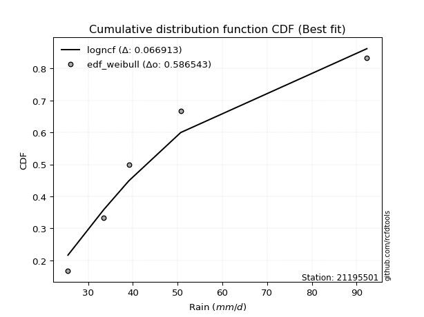</img>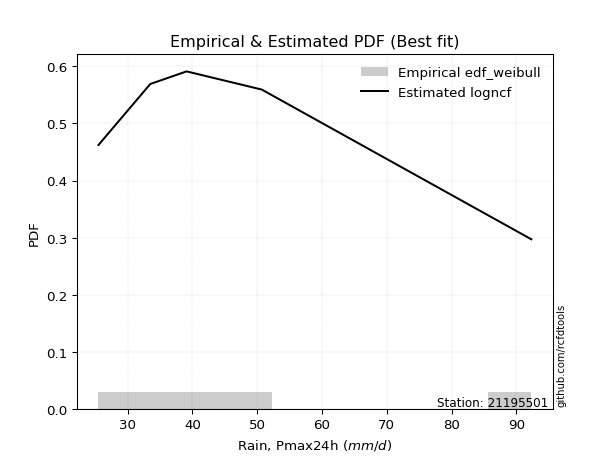</img>

</div>


### 4. EDF Beard (1943)

The Beard formula (or Beard´s plotting position formula) in hydrology is used to estimate the empirical non-exceedance probability _(P)_ of a flood event (or other extreme hydrological data point) within a given dataset.

<div align="center">


$P=(m-0.31)/(n+0.38)$


</div>


**4.1. Empirical values**

<div align="center">

|                | 0                   | 1                  | 2         | 3                  | 4                  |
|:---------------|:--------------------|:-------------------|:----------|:-------------------|:-------------------|
| date           | 2017                | 2016               | 2018      | 2019               | 2020               |
| x              | 25.5                | 33.5               | 39.1      | 50.7               | 92.3               |
| m              | 1                   | 2                  | 3         | 4                  | 5                  |
| empirical_dist | edf_beard           | edf_beard          | edf_beard | edf_beard          | edf_beard          |
| empirical      | 0.12825278810408922 | 0.3141263940520446 | 0.5       | 0.6858736059479554 | 0.8717472118959109 |
| empirical_tr   | 1.1471215351812367  | 1.4579945799457996 | 2.0       | 3.183431952662722  | 7.797101449275368  |

</div>


**4.2. Kolmogorov-Smirnov fit test (sorted by Δ)**


<div align="center">

|                | 0                    | 1                   | 2                   | 3                   | 4                   | 5                   | 6                   | 7                   | 8                   | 9                   | 10                  | 11                 | 12                  | 13                 | 14                  | 15                  | 16                 | 17                  | 18                  | 19                  | 20                  | 21                  | 22                  | 23                  | 24                  | 25                  | 26                 | 27                  | 28                  | 29                 | 30                  | 31                  | 32                  | 33                  | 34                  | 35                  | 36                  | 37                 | 38                  | 39                  | 40                  | 41                  | 42                  | 43                  | 44                 | 45                  | 46                  | 47                  | 48                  | 49                  | 50                  | 51                  | 52                  | 53                 | 54                  | 55                  | 56                 | 57                  | 58                  | 59                  | 60                  | 61                  | 62                 | 63                  | 64                  | 65                  | 66                  | 67                 | 68                  | 69                  | 70                  | 71                  | 72                  | 73                  | 74                  | 75                  | 76                  | 77                  | 78                  | 79                  | 80                  | 81                 | 82                  | 83                  | 84                  | 85                  | 86                  | 87                 | 88                  | 89                 | 90                  | 91                  | 92                  | 93                  | 94                 | 95                  | 96                 | 97                 | 98                  | 99                 | 100                | 101                 | 102                 | 103                 | 104                 | 105                 | 106                 | 107                 | 108                 | 109                 | 110                 | 111                 | 112                 | 113                | 114                 | 115                | 116                 | 117                | 118                | 119                | 120                 | 121                | 122                 | 123                | 124                | 125                 | 126                 | 127                | 128                 | 129                 | 130                | 131                | 132                 | 133                | 134                | 135                 | 136                 | 137                | 138                | 139                 | 140                | 141                 | 142                | 143                | 144                | 145                 | 146                | 147                 | 148                | 149                 | 150                | 151                 | 152                | 153                | 154                | 155                | 156                | 157                | 158                | 159                |
|:---------------|:---------------------|:--------------------|:--------------------|:--------------------|:--------------------|:--------------------|:--------------------|:--------------------|:--------------------|:--------------------|:--------------------|:-------------------|:--------------------|:-------------------|:--------------------|:--------------------|:-------------------|:--------------------|:--------------------|:--------------------|:--------------------|:--------------------|:--------------------|:--------------------|:--------------------|:--------------------|:-------------------|:--------------------|:--------------------|:-------------------|:--------------------|:--------------------|:--------------------|:--------------------|:--------------------|:--------------------|:--------------------|:-------------------|:--------------------|:--------------------|:--------------------|:--------------------|:--------------------|:--------------------|:-------------------|:--------------------|:--------------------|:--------------------|:--------------------|:--------------------|:--------------------|:--------------------|:--------------------|:-------------------|:--------------------|:--------------------|:-------------------|:--------------------|:--------------------|:--------------------|:--------------------|:--------------------|:-------------------|:--------------------|:--------------------|:--------------------|:--------------------|:-------------------|:--------------------|:--------------------|:--------------------|:--------------------|:--------------------|:--------------------|:--------------------|:--------------------|:--------------------|:--------------------|:--------------------|:--------------------|:--------------------|:-------------------|:--------------------|:--------------------|:--------------------|:--------------------|:--------------------|:-------------------|:--------------------|:-------------------|:--------------------|:--------------------|:--------------------|:--------------------|:-------------------|:--------------------|:-------------------|:-------------------|:--------------------|:-------------------|:-------------------|:--------------------|:--------------------|:--------------------|:--------------------|:--------------------|:--------------------|:--------------------|:--------------------|:--------------------|:--------------------|:--------------------|:--------------------|:-------------------|:--------------------|:-------------------|:--------------------|:-------------------|:-------------------|:-------------------|:--------------------|:-------------------|:--------------------|:-------------------|:-------------------|:--------------------|:--------------------|:-------------------|:--------------------|:--------------------|:-------------------|:-------------------|:--------------------|:-------------------|:-------------------|:--------------------|:--------------------|:-------------------|:-------------------|:--------------------|:-------------------|:--------------------|:-------------------|:-------------------|:-------------------|:--------------------|:-------------------|:--------------------|:-------------------|:--------------------|:-------------------|:--------------------|:-------------------|:-------------------|:-------------------|:-------------------|:-------------------|:-------------------|:-------------------|:-------------------|
| station        | 21195501             | 21195501            | 21195501            | 21195501            | 21195501            | 21195501            | 21195501            | 21195501            | 21195501            | 21195501            | 21195501            | 21195501           | 21195501            | 21195501           | 21195501            | 21195501            | 21195501           | 21195501            | 21195501            | 21195501            | 21195501            | 21195501            | 21195501            | 21195501            | 21195501            | 21195501            | 21195501           | 21195501            | 21195501            | 21195501           | 21195501            | 21195501            | 21195501            | 21195501            | 21195501            | 21195501            | 21195501            | 21195501           | 21195501            | 21195501            | 21195501            | 21195501            | 21195501            | 21195501            | 21195501           | 21195501            | 21195501            | 21195501            | 21195501            | 21195501            | 21195501            | 21195501            | 21195501            | 21195501           | 21195501            | 21195501            | 21195501           | 21195501            | 21195501            | 21195501            | 21195501            | 21195501            | 21195501           | 21195501            | 21195501            | 21195501            | 21195501            | 21195501           | 21195501            | 21195501            | 21195501            | 21195501            | 21195501            | 21195501            | 21195501            | 21195501            | 21195501            | 21195501            | 21195501            | 21195501            | 21195501            | 21195501           | 21195501            | 21195501            | 21195501            | 21195501            | 21195501            | 21195501           | 21195501            | 21195501           | 21195501            | 21195501            | 21195501            | 21195501            | 21195501           | 21195501            | 21195501           | 21195501           | 21195501            | 21195501           | 21195501           | 21195501            | 21195501            | 21195501            | 21195501            | 21195501            | 21195501            | 21195501            | 21195501            | 21195501            | 21195501            | 21195501            | 21195501            | 21195501           | 21195501            | 21195501           | 21195501            | 21195501           | 21195501           | 21195501           | 21195501            | 21195501           | 21195501            | 21195501           | 21195501           | 21195501            | 21195501            | 21195501           | 21195501            | 21195501            | 21195501           | 21195501           | 21195501            | 21195501           | 21195501           | 21195501            | 21195501            | 21195501           | 21195501           | 21195501            | 21195501           | 21195501            | 21195501           | 21195501           | 21195501           | 21195501            | 21195501           | 21195501            | 21195501           | 21195501            | 21195501           | 21195501            | 21195501           | 21195501           | 21195501           | 21195501           | 21195501           | 21195501           | 21195501           | 21195501           |
| empirical_dist | edf_beard            | edf_beard           | edf_beard           | edf_beard           | edf_beard           | edf_beard           | edf_beard           | edf_beard           | edf_beard           | edf_beard           | edf_beard           | edf_beard          | edf_beard           | edf_beard          | edf_beard           | edf_beard           | edf_beard          | edf_beard           | edf_beard           | edf_beard           | edf_beard           | edf_beard           | edf_beard           | edf_beard           | edf_beard           | edf_beard           | edf_beard          | edf_beard           | edf_beard           | edf_beard          | edf_beard           | edf_beard           | edf_beard           | edf_beard           | edf_beard           | edf_beard           | edf_beard           | edf_beard          | edf_beard           | edf_beard           | edf_beard           | edf_beard           | edf_beard           | edf_beard           | edf_beard          | edf_beard           | edf_beard           | edf_beard           | edf_beard           | edf_beard           | edf_beard           | edf_beard           | edf_beard           | edf_beard          | edf_beard           | edf_beard           | edf_beard          | edf_beard           | edf_beard           | edf_beard           | edf_beard           | edf_beard           | edf_beard          | edf_beard           | edf_beard           | edf_beard           | edf_beard           | edf_beard          | edf_beard           | edf_beard           | edf_beard           | edf_beard           | edf_beard           | edf_beard           | edf_beard           | edf_beard           | edf_beard           | edf_beard           | edf_beard           | edf_beard           | edf_beard           | edf_beard          | edf_beard           | edf_beard           | edf_beard           | edf_beard           | edf_beard           | edf_beard          | edf_beard           | edf_beard          | edf_beard           | edf_beard           | edf_beard           | edf_beard           | edf_beard          | edf_beard           | edf_beard          | edf_beard          | edf_beard           | edf_beard          | edf_beard          | edf_beard           | edf_beard           | edf_beard           | edf_beard           | edf_beard           | edf_beard           | edf_beard           | edf_beard           | edf_beard           | edf_beard           | edf_beard           | edf_beard           | edf_beard          | edf_beard           | edf_beard          | edf_beard           | edf_beard          | edf_beard          | edf_beard          | edf_beard           | edf_beard          | edf_beard           | edf_beard          | edf_beard          | edf_beard           | edf_beard           | edf_beard          | edf_beard           | edf_beard           | edf_beard          | edf_beard          | edf_beard           | edf_beard          | edf_beard          | edf_beard           | edf_beard           | edf_beard          | edf_beard          | edf_beard           | edf_beard          | edf_beard           | edf_beard          | edf_beard          | edf_beard          | edf_beard           | edf_beard          | edf_beard           | edf_beard          | edf_beard           | edf_beard          | edf_beard           | edf_beard          | edf_beard          | edf_beard          | edf_beard          | edf_beard          | edf_beard          | edf_beard          | edf_beard          |
| p_dist         | logburr12            | logalpha            | logmielke           | loginvweibull       | loggenextreme       | logburr             | logexponnorm        | burr                | alpha               | logf                | mielke              | loggumbel_r        | logfoldnorm         | loggenlogistic     | lograyleigh         | invgamma            | logweibull_max     | logjohnsonsu        | loginvgauss         | logpearson3         | nct                 | logkstwobign        | logmaxwell          | logfatiguelife      | halflogistic        | foldnorm            | invgauss           | halfnorm            | lognct              | loginvgamma        | logrice             | logbetaprime        | betaprime           | loghalfnorm         | ncf                 | moyal               | logncf              | logmoyal           | loganglit           | pearson3            | logloggamma         | logt                | lognorm             | logcrystalball      | logsemicircular    | gumbel_r            | rayleigh            | genlogistic         | dgamma              | loglogistic         | logdweibull         | burr12              | maxwell             | loghypsecant       | logksone            | logcosine           | dweibull           | exponnorm           | loggenexpon         | logdgamma           | logtruncexpon       | wald                | lognakagami        | truncnorm           | genexpon            | logbradford         | logtruncnorm        | logkappa3          | kappa3              | loggompertz         | logbeta             | loghalfgennorm      | gengamma            | exponweib           | logtruncweibull_min | vonmises_line       | loglomax            | loggausshyper       | logexponpow         | logweibull_min      | gompertz            | lomax              | logarcsine          | loghalflogistic     | logskewnorm         | logwald             | gennorm             | kstwobign          | logexponweib        | weibull_min        | loglaplace          | loglaplace          | logtukeylambda      | anglit              | nakagami           | t                   | crystalball        | norm               | semicircular        | logloglaplace      | arcsine            | loggumbel_l         | logkappa4           | gamma               | loguniform          | logistic            | rice                | f                   | logwrapcauchy       | logvonmises_line    | skewnorm            | truncweibull_min    | hypsecant           | logargus           | loggennorm          | logrdist           | cosine              | loggamma           | loggamma           | laplace            | gumbel_l            | johnsonsb          | loglevy_l           | wrapcauchy         | loggenpareto       | logtriang           | exponpow            | truncexpon         | halfgennorm         | logerlang           | levy_l             | bradford           | kappa4              | beta               | ksone              | argus               | tukeylambda         | uniform            | loggenhalflogistic | genpareto           | triang             | genextreme          | logjohnsonsb       | gausshyper         | logtrapezoid       | rdist               | genhalflogistic    | fatiguelife         | invweibull         | powerlaw            | loggengamma        | truncpareto         | logpowerlaw        | weibull_max        | trapezoid          | erlang             | logtruncpareto     | johnsonsu          | logvonmises        | vonmises           |
| delta          | 0.056446046805669475 | 0.06099407244828815 | 0.06166830053910305 | 0.06191552280786666 | 0.06192328236051797 | 0.06209947973418889 | 0.06334737063503218 | 0.06463256201208373 | 0.06477296322185211 | 0.06571420022894237 | 0.06789429317829318 | 0.0683166472890736 | 0.06894568483238017 | 0.0692843463180961 | 0.06942835219751242 | 0.06975854622532779 | 0.0697713974655847 | 0.07084982534915993 | 0.07162963954948368 | 0.07176528974617502 | 0.07192535182129778 | 0.07228297222290392 | 0.07287616318600987 | 0.07385274185010064 | 0.07394220112234173 | 0.07450529757076918 | 0.0747174236071216 | 0.07486149820033317 | 0.07693084462286814 | 0.0774074316745409 | 0.07781352389719776 | 0.07789172464149174 | 0.07982739677586959 | 0.08044672031481653 | 0.08187618639262406 | 0.08498749588760346 | 0.08800661887787184 | 0.0892088480800449 | 0.08982682688688703 | 0.09288584810711914 | 0.09592583355999462 | 0.09704459722572806 | 0.09704642773922506 | 0.09712483877811035 | 0.0975476239235078 | 0.10278068208293811 | 0.10698596424992746 | 0.10717327692016704 | 0.10758186420444882 | 0.10960869179482519 | 0.11177387886273882 | 0.11463798845803633 | 0.11904026975738285 | 0.1199134586202894 | 0.12489323579541389 | 0.12614526410154414 | 0.1267535657789621 | 0.12705361214046137 | 0.12735005964963608 | 0.12803285570754974 | 0.12824050650914431 | 0.12825263902589643 | 0.1282527269555779 | 0.12825277961646478 | 0.12825278148329994 | 0.12825278576905105 | 0.12825278589537512 | 0.1282527869126163 | 0.12825278714553567 | 0.12825278794709613 | 0.12825278805793838 | 0.12825278807919785 | 0.12825278809499224 | 0.12825278809548896 | 0.12825278810217342 | 0.12825278810298613 | 0.12825278810310797 | 0.12825278810391028 | 0.12825278810407076 | 0.12825278810407184 | 0.12825278810408505 | 0.1282527881040889 | 0.12825278810408913 | 0.12825278810408922 | 0.12825278810408922 | 0.12825278810408922 | 0.13229641898720013 | 0.1343391123126691 | 0.13737577037297694 | 0.1454386140301051 | 0.14676892712525813 | 0.14676892712525813 | 0.14733348705511418 | 0.14985655034047363 | 0.1503210758106297 | 0.15091110128373086 | 0.1509196257410636 | 0.1509196268462426 | 0.15232160718728383 | 0.1543972641244007 | 0.1621157372877834 | 0.16385486997356996 | 0.16416418692293633 | 0.16454574541408679 | 0.16771189688308702 | 0.16894104904234897 | 0.17257086988886683 | 0.17278461735489603 | 0.17441589859134377 | 0.17734351015274202 | 0.17747567472548442 | 0.17887175043730985 | 0.18291517268642954 | 0.1857243795678596 | 0.18587360594795543 | 0.1991996434203166 | 0.20267815589569393 | 0.2098265979739447 | 0.2098265979739447 | 0.2110742384819131 | 0.21170585853997992 | 0.216819152035235  | 0.22100014481389288 | 0.2234187958200919 | 0.2319963365143126 | 0.23400818520529842 | 0.23563230940561058 | 0.2365569563717707 | 0.24055387958398528 | 0.24322135503696024 | 0.2467424855525128 | 0.2510796694309767 | 0.27893479347084454 | 0.2857996719328847 | 0.2881690151295921 | 0.29013823792340254 | 0.29140591779513014 | 0.3086280969659195 | 0.3101494965757963 | 0.31735860668239546 | 0.3337153096894746 | 0.34238668410493023 | 0.3735053731997445 | 0.3748957717985843 | 0.4065128004501837 | 0.41087410911398714 | 0.4217074729270883 | 0.42863435812533895 | 0.4325355489776238 | 0.46336533323632484 | 0.4744694542769284 | 0.48734954374855616 | 0.5050962274743083 | 0.5145314430378587 | 0.5277046643899537 | 0.5350906389525172 | 0.5362412083850492 | 0.6181568907774599 | 1.0865085824513907 | 14.139777054926636 |
| deltao         | 0.5865427407550001   | 0.5865427407550001  | 0.5865427407550001  | 0.5865427407550001  | 0.5865427407550001  | 0.5865427407550001  | 0.5865427407550001  | 0.5865427407550001  | 0.5865427407550001  | 0.5865427407550001  | 0.5865427407550001  | 0.5865427407550001 | 0.5865427407550001  | 0.5865427407550001 | 0.5865427407550001  | 0.5865427407550001  | 0.5865427407550001 | 0.5865427407550001  | 0.5865427407550001  | 0.5865427407550001  | 0.5865427407550001  | 0.5865427407550001  | 0.5865427407550001  | 0.5865427407550001  | 0.5865427407550001  | 0.5865427407550001  | 0.5865427407550001 | 0.5865427407550001  | 0.5865427407550001  | 0.5865427407550001 | 0.5865427407550001  | 0.5865427407550001  | 0.5865427407550001  | 0.5865427407550001  | 0.5865427407550001  | 0.5865427407550001  | 0.5865427407550001  | 0.5865427407550001 | 0.5865427407550001  | 0.5865427407550001  | 0.5865427407550001  | 0.5865427407550001  | 0.5865427407550001  | 0.5865427407550001  | 0.5865427407550001 | 0.5865427407550001  | 0.5865427407550001  | 0.5865427407550001  | 0.5865427407550001  | 0.5865427407550001  | 0.5865427407550001  | 0.5865427407550001  | 0.5865427407550001  | 0.5865427407550001 | 0.5865427407550001  | 0.5865427407550001  | 0.5865427407550001 | 0.5865427407550001  | 0.5865427407550001  | 0.5865427407550001  | 0.5865427407550001  | 0.5865427407550001  | 0.5865427407550001 | 0.5865427407550001  | 0.5865427407550001  | 0.5865427407550001  | 0.5865427407550001  | 0.5865427407550001 | 0.5865427407550001  | 0.5865427407550001  | 0.5865427407550001  | 0.5865427407550001  | 0.5865427407550001  | 0.5865427407550001  | 0.5865427407550001  | 0.5865427407550001  | 0.5865427407550001  | 0.5865427407550001  | 0.5865427407550001  | 0.5865427407550001  | 0.5865427407550001  | 0.5865427407550001 | 0.5865427407550001  | 0.5865427407550001  | 0.5865427407550001  | 0.5865427407550001  | 0.5865427407550001  | 0.5865427407550001 | 0.5865427407550001  | 0.5865427407550001 | 0.5865427407550001  | 0.5865427407550001  | 0.5865427407550001  | 0.5865427407550001  | 0.5865427407550001 | 0.5865427407550001  | 0.5865427407550001 | 0.5865427407550001 | 0.5865427407550001  | 0.5865427407550001 | 0.5865427407550001 | 0.5865427407550001  | 0.5865427407550001  | 0.5865427407550001  | 0.5865427407550001  | 0.5865427407550001  | 0.5865427407550001  | 0.5865427407550001  | 0.5865427407550001  | 0.5865427407550001  | 0.5865427407550001  | 0.5865427407550001  | 0.5865427407550001  | 0.5865427407550001 | 0.5865427407550001  | 0.5865427407550001 | 0.5865427407550001  | 0.5865427407550001 | 0.5865427407550001 | 0.5865427407550001 | 0.5865427407550001  | 0.5865427407550001 | 0.5865427407550001  | 0.5865427407550001 | 0.5865427407550001 | 0.5865427407550001  | 0.5865427407550001  | 0.5865427407550001 | 0.5865427407550001  | 0.5865427407550001  | 0.5865427407550001 | 0.5865427407550001 | 0.5865427407550001  | 0.5865427407550001 | 0.5865427407550001 | 0.5865427407550001  | 0.5865427407550001  | 0.5865427407550001 | 0.5865427407550001 | 0.5865427407550001  | 0.5865427407550001 | 0.5865427407550001  | 0.5865427407550001 | 0.5865427407550001 | 0.5865427407550001 | 0.5865427407550001  | 0.5865427407550001 | 0.5865427407550001  | 0.5865427407550001 | 0.5865427407550001  | 0.5865427407550001 | 0.5865427407550001  | 0.5865427407550001 | 0.5865427407550001 | 0.5865427407550001 | 0.5865427407550001 | 0.5865427407550001 | 0.5865427407550001 | 0.5865427407550001 | 0.5865427407550001 |
| eval           | Δo > Δ               | Δo > Δ              | Δo > Δ              | Δo > Δ              | Δo > Δ              | Δo > Δ              | Δo > Δ              | Δo > Δ              | Δo > Δ              | Δo > Δ              | Δo > Δ              | Δo > Δ             | Δo > Δ              | Δo > Δ             | Δo > Δ              | Δo > Δ              | Δo > Δ             | Δo > Δ              | Δo > Δ              | Δo > Δ              | Δo > Δ              | Δo > Δ              | Δo > Δ              | Δo > Δ              | Δo > Δ              | Δo > Δ              | Δo > Δ             | Δo > Δ              | Δo > Δ              | Δo > Δ             | Δo > Δ              | Δo > Δ              | Δo > Δ              | Δo > Δ              | Δo > Δ              | Δo > Δ              | Δo > Δ              | Δo > Δ             | Δo > Δ              | Δo > Δ              | Δo > Δ              | Δo > Δ              | Δo > Δ              | Δo > Δ              | Δo > Δ             | Δo > Δ              | Δo > Δ              | Δo > Δ              | Δo > Δ              | Δo > Δ              | Δo > Δ              | Δo > Δ              | Δo > Δ              | Δo > Δ             | Δo > Δ              | Δo > Δ              | Δo > Δ             | Δo > Δ              | Δo > Δ              | Δo > Δ              | Δo > Δ              | Δo > Δ              | Δo > Δ             | Δo > Δ              | Δo > Δ              | Δo > Δ              | Δo > Δ              | Δo > Δ             | Δo > Δ              | Δo > Δ              | Δo > Δ              | Δo > Δ              | Δo > Δ              | Δo > Δ              | Δo > Δ              | Δo > Δ              | Δo > Δ              | Δo > Δ              | Δo > Δ              | Δo > Δ              | Δo > Δ              | Δo > Δ             | Δo > Δ              | Δo > Δ              | Δo > Δ              | Δo > Δ              | Δo > Δ              | Δo > Δ             | Δo > Δ              | Δo > Δ             | Δo > Δ              | Δo > Δ              | Δo > Δ              | Δo > Δ              | Δo > Δ             | Δo > Δ              | Δo > Δ             | Δo > Δ             | Δo > Δ              | Δo > Δ             | Δo > Δ             | Δo > Δ              | Δo > Δ              | Δo > Δ              | Δo > Δ              | Δo > Δ              | Δo > Δ              | Δo > Δ              | Δo > Δ              | Δo > Δ              | Δo > Δ              | Δo > Δ              | Δo > Δ              | Δo > Δ             | Δo > Δ              | Δo > Δ             | Δo > Δ              | Δo > Δ             | Δo > Δ             | Δo > Δ             | Δo > Δ              | Δo > Δ             | Δo > Δ              | Δo > Δ             | Δo > Δ             | Δo > Δ              | Δo > Δ              | Δo > Δ             | Δo > Δ              | Δo > Δ              | Δo > Δ             | Δo > Δ             | Δo > Δ              | Δo > Δ             | Δo > Δ             | Δo > Δ              | Δo > Δ              | Δo > Δ             | Δo > Δ             | Δo > Δ              | Δo > Δ             | Δo > Δ              | Δo > Δ             | Δo > Δ             | Δo > Δ             | Δo > Δ              | Δo > Δ             | Δo > Δ              | Δo > Δ             | Δo > Δ              | Δo > Δ             | Δo > Δ              | Δo > Δ             | Δo > Δ             | Δo > Δ             | Δo > Δ             | Δo > Δ             | Δo <= Δ            | Δo <= Δ            | Δo <= Δ            |
| fit            | 1                    | 1                   | 1                   | 1                   | 1                   | 1                   | 1                   | 1                   | 1                   | 1                   | 1                   | 1                  | 1                   | 1                  | 1                   | 1                   | 1                  | 1                   | 1                   | 1                   | 1                   | 1                   | 1                   | 1                   | 1                   | 1                   | 1                  | 1                   | 1                   | 1                  | 1                   | 1                   | 1                   | 1                   | 1                   | 1                   | 1                   | 1                  | 1                   | 1                   | 1                   | 1                   | 1                   | 1                   | 1                  | 1                   | 1                   | 1                   | 1                   | 1                   | 1                   | 1                   | 1                   | 1                  | 1                   | 1                   | 1                  | 1                   | 1                   | 1                   | 1                   | 1                   | 1                  | 1                   | 1                   | 1                   | 1                   | 1                  | 1                   | 1                   | 1                   | 1                   | 1                   | 1                   | 1                   | 1                   | 1                   | 1                   | 1                   | 1                   | 1                   | 1                  | 1                   | 1                   | 1                   | 1                   | 1                   | 1                  | 1                   | 1                  | 1                   | 1                   | 1                   | 1                   | 1                  | 1                   | 1                  | 1                  | 1                   | 1                  | 1                  | 1                   | 1                   | 1                   | 1                   | 1                   | 1                   | 1                   | 1                   | 1                   | 1                   | 1                   | 1                   | 1                  | 1                   | 1                  | 1                   | 1                  | 1                  | 1                  | 1                   | 1                  | 1                   | 1                  | 1                  | 1                   | 1                   | 1                  | 1                   | 1                   | 1                  | 1                  | 1                   | 1                  | 1                  | 1                   | 1                   | 1                  | 1                  | 1                   | 1                  | 1                   | 1                  | 1                  | 1                  | 1                   | 1                  | 1                   | 1                  | 1                   | 1                  | 1                   | 1                  | 1                  | 1                  | 1                  | 1                  | 0                  | 0                  | 0                  |
| n              | 5                    | 5                   | 5                   | 5                   | 5                   | 5                   | 5                   | 5                   | 5                   | 5                   | 5                   | 5                  | 5                   | 5                  | 5                   | 5                   | 5                  | 5                   | 5                   | 5                   | 5                   | 5                   | 5                   | 5                   | 5                   | 5                   | 5                  | 5                   | 5                   | 5                  | 5                   | 5                   | 5                   | 5                   | 5                   | 5                   | 5                   | 5                  | 5                   | 5                   | 5                   | 5                   | 5                   | 5                   | 5                  | 5                   | 5                   | 5                   | 5                   | 5                   | 5                   | 5                   | 5                   | 5                  | 5                   | 5                   | 5                  | 5                   | 5                   | 5                   | 5                   | 5                   | 5                  | 5                   | 5                   | 5                   | 5                   | 5                  | 5                   | 5                   | 5                   | 5                   | 5                   | 5                   | 5                   | 5                   | 5                   | 5                   | 5                   | 5                   | 5                   | 5                  | 5                   | 5                   | 5                   | 5                   | 5                   | 5                  | 5                   | 5                  | 5                   | 5                   | 5                   | 5                   | 5                  | 5                   | 5                  | 5                  | 5                   | 5                  | 5                  | 5                   | 5                   | 5                   | 5                   | 5                   | 5                   | 5                   | 5                   | 5                   | 5                   | 5                   | 5                   | 5                  | 5                   | 5                  | 5                   | 5                  | 5                  | 5                  | 5                   | 5                  | 5                   | 5                  | 5                  | 5                   | 5                   | 5                  | 5                   | 5                   | 5                  | 5                  | 5                   | 5                  | 5                  | 5                   | 5                   | 5                  | 5                  | 5                   | 5                  | 5                   | 5                  | 5                  | 5                  | 5                   | 5                  | 5                   | 5                  | 5                   | 5                  | 5                   | 5                  | 5                  | 5                  | 5                  | 5                  | 5                  | 5                  | 5                  |
| best_fit       | 1                    | 0                   | 0                   | 0                   | 0                   | 0                   | 0                   | 0                   | 0                   | 0                   | 0                   | 0                  | 0                   | 0                  | 0                   | 0                   | 0                  | 0                   | 0                   | 0                   | 0                   | 0                   | 0                   | 0                   | 0                   | 0                   | 0                  | 0                   | 0                   | 0                  | 0                   | 0                   | 0                   | 0                   | 0                   | 0                   | 0                   | 0                  | 0                   | 0                   | 0                   | 0                   | 0                   | 0                   | 0                  | 0                   | 0                   | 0                   | 0                   | 0                   | 0                   | 0                   | 0                   | 0                  | 0                   | 0                   | 0                  | 0                   | 0                   | 0                   | 0                   | 0                   | 0                  | 0                   | 0                   | 0                   | 0                   | 0                  | 0                   | 0                   | 0                   | 0                   | 0                   | 0                   | 0                   | 0                   | 0                   | 0                   | 0                   | 0                   | 0                   | 0                  | 0                   | 0                   | 0                   | 0                   | 0                   | 0                  | 0                   | 0                  | 0                   | 0                   | 0                   | 0                   | 0                  | 0                   | 0                  | 0                  | 0                   | 0                  | 0                  | 0                   | 0                   | 0                   | 0                   | 0                   | 0                   | 0                   | 0                   | 0                   | 0                   | 0                   | 0                   | 0                  | 0                   | 0                  | 0                   | 0                  | 0                  | 0                  | 0                   | 0                  | 0                   | 0                  | 0                  | 0                   | 0                   | 0                  | 0                   | 0                   | 0                  | 0                  | 0                   | 0                  | 0                  | 0                   | 0                   | 0                  | 0                  | 0                   | 0                  | 0                   | 0                  | 0                  | 0                  | 0                   | 0                  | 0                   | 0                  | 0                   | 0                  | 0                   | 0                  | 0                  | 0                  | 0                  | 0                  | 0                  | 0                  | 0                  |
| best_fit_sort  | 1                    | 2                   | 3                   | 4                   | 5                   | 6                   | 7                   | 8                   | 9                   | 10                  | 11                  | 12                 | 13                  | 14                 | 15                  | 16                  | 17                 | 18                  | 19                  | 20                  | 21                  | 22                  | 23                  | 24                  | 25                  | 26                  | 27                 | 28                  | 29                  | 30                 | 31                  | 32                  | 33                  | 34                  | 35                  | 36                  | 37                  | 38                 | 39                  | 40                  | 41                  | 42                  | 43                  | 44                  | 45                 | 46                  | 47                  | 48                  | 49                  | 50                  | 51                  | 52                  | 53                  | 54                 | 55                  | 56                  | 57                 | 58                  | 59                  | 60                  | 61                  | 62                  | 63                 | 64                  | 65                  | 66                  | 67                  | 68                 | 69                  | 70                  | 71                  | 72                  | 73                  | 74                  | 75                  | 76                  | 77                  | 78                  | 79                  | 80                  | 81                  | 82                 | 83                  | 84                  | 85                  | 86                  | 87                  | 88                 | 89                  | 90                 | 91                  | 92                  | 93                  | 94                  | 95                 | 96                  | 97                 | 98                 | 99                  | 100                | 101                | 102                 | 103                 | 104                 | 105                 | 106                 | 107                 | 108                 | 109                 | 110                 | 111                 | 112                 | 113                 | 114                | 115                 | 116                | 117                 | 118                | 119                | 120                | 121                 | 122                | 123                 | 124                | 125                | 126                 | 127                 | 128                | 129                 | 130                 | 131                | 132                | 133                 | 134                | 135                | 136                 | 137                 | 138                | 139                | 140                 | 141                | 142                 | 143                | 144                | 145                | 146                 | 147                | 148                 | 149                | 150                 | 151                | 152                 | 153                | 154                | 155                | 156                | 157                | 158                | 159                | 160                |

</div>


**4.3. Best fit**

<div align="center">

|   id |   station | empirical_dist   | p_dist    |    delta |   deltao | eval   |   fit |   n |   best_fit |   best_fit_sort |
|-----:|----------:|:-----------------|:----------|---------:|---------:|:-------|------:|----:|-----------:|----------------:|
|    0 |  21195501 | edf_beard        | logburr12 | 0.056446 | 0.586543 | Δo > Δ |     1 |   5 |          1 |               1 |

</div>


<div align="center">

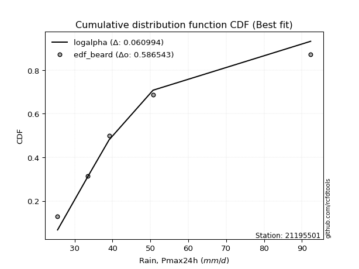</img></img>

</div>


### 5. EDF Chegodayev (1955)

The Chegodayev formula is an empirical plotting position formula used in hydrological frequency analysis to estimate the exceedance probability or return period of a specific event from a set of observed data. It is primarily used for plotting observed data points on probability paper to fit a theoretical distribution, particularly for analyzing extreme events like maximum flood flows or rainfall intensities. The constant _b_ value in the generalized plotting position formula is 0.3.

<div align="center">


$P=(m-b)/(n+1-2b)$


</div>


**5.1. Empirical values**

<div align="center">

|                | 0                   | 1                   | 2              | 3                  | 4                  |
|:---------------|:--------------------|:--------------------|:---------------|:-------------------|:-------------------|
| date           | 2017                | 2016                | 2018           | 2019               | 2020               |
| x              | 25.5                | 33.5                | 39.1           | 50.7               | 92.3               |
| m              | 1                   | 2                   | 3              | 4                  | 5                  |
| empirical_dist | edf_chegodayev      | edf_chegodayev      | edf_chegodayev | edf_chegodayev     | edf_chegodayev     |
| empirical      | 0.12962962962962962 | 0.31481481481481477 | 0.5            | 0.6851851851851851 | 0.8703703703703703 |
| empirical_tr   | 1.148936170212766   | 1.4594594594594594  | 2.0            | 3.1764705882352935 | 7.714285714285713  |

</div>


**5.2. Kolmogorov-Smirnov fit test (sorted by Δ)**


<div align="center">

|                | 0                   | 1                   | 2                   | 3                   | 4                   | 5                  | 6                   | 7                   | 8                   | 9                   | 10                  | 11                  | 12                  | 13                  | 14                  | 15                 | 16                  | 17                  | 18                  | 19                  | 20                 | 21                  | 22                  | 23                  | 24                  | 25                  | 26                 | 27                 | 28                  | 29                  | 30                  | 31                  | 32                 | 33                  | 34                  | 35                  | 36                  | 37                 | 38                  | 39                  | 40                  | 41                  | 42                  | 43                  | 44                  | 45                  | 46                  | 47                  | 48                  | 49                  | 50                 | 51                  | 52                  | 53                 | 54                 | 55                  | 56                 | 57                  | 58                  | 59                 | 60                  | 61                  | 62                 | 63                  | 64                  | 65                  | 66                  | 67                 | 68                  | 69                  | 70                 | 71                  | 72                  | 73                  | 74                  | 75                  | 76                  | 77                 | 78                  | 79                  | 80                  | 81                  | 82                  | 83                  | 84                  | 85                  | 86                  | 87                 | 88                 | 89                  | 90                  | 91                  | 92                  | 93                 | 94                  | 95                  | 96                 | 97                 | 98                 | 99                  | 100                 | 101                 | 102                 | 103                 | 104                 | 105                 | 106                 | 107                 | 108                 | 109                 | 110                 | 111                | 112                 | 113                 | 114                | 115                 | 116                 | 117                 | 118                 | 119                | 120                | 121                 | 122                 | 123                 | 124                 | 125                | 126                 | 127                | 128                 | 129                | 130                | 131                | 132                 | 133                | 134                | 135                 | 136                 | 137                 | 138                | 139                 | 140                | 141                | 142                | 143                | 144                 | 145                 | 146                | 147                | 148                | 149                | 150                 | 151                | 152                | 153                | 154                | 155                | 156                | 157                | 158                | 159                |
|:---------------|:--------------------|:--------------------|:--------------------|:--------------------|:--------------------|:-------------------|:--------------------|:--------------------|:--------------------|:--------------------|:--------------------|:--------------------|:--------------------|:--------------------|:--------------------|:-------------------|:--------------------|:--------------------|:--------------------|:--------------------|:-------------------|:--------------------|:--------------------|:--------------------|:--------------------|:--------------------|:-------------------|:-------------------|:--------------------|:--------------------|:--------------------|:--------------------|:-------------------|:--------------------|:--------------------|:--------------------|:--------------------|:-------------------|:--------------------|:--------------------|:--------------------|:--------------------|:--------------------|:--------------------|:--------------------|:--------------------|:--------------------|:--------------------|:--------------------|:--------------------|:-------------------|:--------------------|:--------------------|:-------------------|:-------------------|:--------------------|:-------------------|:--------------------|:--------------------|:-------------------|:--------------------|:--------------------|:-------------------|:--------------------|:--------------------|:--------------------|:--------------------|:-------------------|:--------------------|:--------------------|:-------------------|:--------------------|:--------------------|:--------------------|:--------------------|:--------------------|:--------------------|:-------------------|:--------------------|:--------------------|:--------------------|:--------------------|:--------------------|:--------------------|:--------------------|:--------------------|:--------------------|:-------------------|:-------------------|:--------------------|:--------------------|:--------------------|:--------------------|:-------------------|:--------------------|:--------------------|:-------------------|:-------------------|:-------------------|:--------------------|:--------------------|:--------------------|:--------------------|:--------------------|:--------------------|:--------------------|:--------------------|:--------------------|:--------------------|:--------------------|:--------------------|:-------------------|:--------------------|:--------------------|:-------------------|:--------------------|:--------------------|:--------------------|:--------------------|:-------------------|:-------------------|:--------------------|:--------------------|:--------------------|:--------------------|:-------------------|:--------------------|:-------------------|:--------------------|:-------------------|:-------------------|:-------------------|:--------------------|:-------------------|:-------------------|:--------------------|:--------------------|:--------------------|:-------------------|:--------------------|:-------------------|:-------------------|:-------------------|:-------------------|:--------------------|:--------------------|:-------------------|:-------------------|:-------------------|:-------------------|:--------------------|:-------------------|:-------------------|:-------------------|:-------------------|:-------------------|:-------------------|:-------------------|:-------------------|:-------------------|
| station        | 21195501            | 21195501            | 21195501            | 21195501            | 21195501            | 21195501           | 21195501            | 21195501            | 21195501            | 21195501            | 21195501            | 21195501            | 21195501            | 21195501            | 21195501            | 21195501           | 21195501            | 21195501            | 21195501            | 21195501            | 21195501           | 21195501            | 21195501            | 21195501            | 21195501            | 21195501            | 21195501           | 21195501           | 21195501            | 21195501            | 21195501            | 21195501            | 21195501           | 21195501            | 21195501            | 21195501            | 21195501            | 21195501           | 21195501            | 21195501            | 21195501            | 21195501            | 21195501            | 21195501            | 21195501            | 21195501            | 21195501            | 21195501            | 21195501            | 21195501            | 21195501           | 21195501            | 21195501            | 21195501           | 21195501           | 21195501            | 21195501           | 21195501            | 21195501            | 21195501           | 21195501            | 21195501            | 21195501           | 21195501            | 21195501            | 21195501            | 21195501            | 21195501           | 21195501            | 21195501            | 21195501           | 21195501            | 21195501            | 21195501            | 21195501            | 21195501            | 21195501            | 21195501           | 21195501            | 21195501            | 21195501            | 21195501            | 21195501            | 21195501            | 21195501            | 21195501            | 21195501            | 21195501           | 21195501           | 21195501            | 21195501            | 21195501            | 21195501            | 21195501           | 21195501            | 21195501            | 21195501           | 21195501           | 21195501           | 21195501            | 21195501            | 21195501            | 21195501            | 21195501            | 21195501            | 21195501            | 21195501            | 21195501            | 21195501            | 21195501            | 21195501            | 21195501           | 21195501            | 21195501            | 21195501           | 21195501            | 21195501            | 21195501            | 21195501            | 21195501           | 21195501           | 21195501            | 21195501            | 21195501            | 21195501            | 21195501           | 21195501            | 21195501           | 21195501            | 21195501           | 21195501           | 21195501           | 21195501            | 21195501           | 21195501           | 21195501            | 21195501            | 21195501            | 21195501           | 21195501            | 21195501           | 21195501           | 21195501           | 21195501           | 21195501            | 21195501            | 21195501           | 21195501           | 21195501           | 21195501           | 21195501            | 21195501           | 21195501           | 21195501           | 21195501           | 21195501           | 21195501           | 21195501           | 21195501           | 21195501           |
| empirical_dist | edf_chegodayev      | edf_chegodayev      | edf_chegodayev      | edf_chegodayev      | edf_chegodayev      | edf_chegodayev     | edf_chegodayev      | edf_chegodayev      | edf_chegodayev      | edf_chegodayev      | edf_chegodayev      | edf_chegodayev      | edf_chegodayev      | edf_chegodayev      | edf_chegodayev      | edf_chegodayev     | edf_chegodayev      | edf_chegodayev      | edf_chegodayev      | edf_chegodayev      | edf_chegodayev     | edf_chegodayev      | edf_chegodayev      | edf_chegodayev      | edf_chegodayev      | edf_chegodayev      | edf_chegodayev     | edf_chegodayev     | edf_chegodayev      | edf_chegodayev      | edf_chegodayev      | edf_chegodayev      | edf_chegodayev     | edf_chegodayev      | edf_chegodayev      | edf_chegodayev      | edf_chegodayev      | edf_chegodayev     | edf_chegodayev      | edf_chegodayev      | edf_chegodayev      | edf_chegodayev      | edf_chegodayev      | edf_chegodayev      | edf_chegodayev      | edf_chegodayev      | edf_chegodayev      | edf_chegodayev      | edf_chegodayev      | edf_chegodayev      | edf_chegodayev     | edf_chegodayev      | edf_chegodayev      | edf_chegodayev     | edf_chegodayev     | edf_chegodayev      | edf_chegodayev     | edf_chegodayev      | edf_chegodayev      | edf_chegodayev     | edf_chegodayev      | edf_chegodayev      | edf_chegodayev     | edf_chegodayev      | edf_chegodayev      | edf_chegodayev      | edf_chegodayev      | edf_chegodayev     | edf_chegodayev      | edf_chegodayev      | edf_chegodayev     | edf_chegodayev      | edf_chegodayev      | edf_chegodayev      | edf_chegodayev      | edf_chegodayev      | edf_chegodayev      | edf_chegodayev     | edf_chegodayev      | edf_chegodayev      | edf_chegodayev      | edf_chegodayev      | edf_chegodayev      | edf_chegodayev      | edf_chegodayev      | edf_chegodayev      | edf_chegodayev      | edf_chegodayev     | edf_chegodayev     | edf_chegodayev      | edf_chegodayev      | edf_chegodayev      | edf_chegodayev      | edf_chegodayev     | edf_chegodayev      | edf_chegodayev      | edf_chegodayev     | edf_chegodayev     | edf_chegodayev     | edf_chegodayev      | edf_chegodayev      | edf_chegodayev      | edf_chegodayev      | edf_chegodayev      | edf_chegodayev      | edf_chegodayev      | edf_chegodayev      | edf_chegodayev      | edf_chegodayev      | edf_chegodayev      | edf_chegodayev      | edf_chegodayev     | edf_chegodayev      | edf_chegodayev      | edf_chegodayev     | edf_chegodayev      | edf_chegodayev      | edf_chegodayev      | edf_chegodayev      | edf_chegodayev     | edf_chegodayev     | edf_chegodayev      | edf_chegodayev      | edf_chegodayev      | edf_chegodayev      | edf_chegodayev     | edf_chegodayev      | edf_chegodayev     | edf_chegodayev      | edf_chegodayev     | edf_chegodayev     | edf_chegodayev     | edf_chegodayev      | edf_chegodayev     | edf_chegodayev     | edf_chegodayev      | edf_chegodayev      | edf_chegodayev      | edf_chegodayev     | edf_chegodayev      | edf_chegodayev     | edf_chegodayev     | edf_chegodayev     | edf_chegodayev     | edf_chegodayev      | edf_chegodayev      | edf_chegodayev     | edf_chegodayev     | edf_chegodayev     | edf_chegodayev     | edf_chegodayev      | edf_chegodayev     | edf_chegodayev     | edf_chegodayev     | edf_chegodayev     | edf_chegodayev     | edf_chegodayev     | edf_chegodayev     | edf_chegodayev     | edf_chegodayev     |
| p_dist         | logburr12           | logalpha            | logmielke           | loginvweibull       | loggenextreme       | logburr            | logexponnorm        | burr                | alpha               | logf                | mielke              | loggumbel_r         | logfoldnorm         | loggenlogistic      | lograyleigh         | invgamma           | logweibull_max      | logjohnsonsu        | loginvgauss         | logpearson3         | nct                | logkstwobign        | logmaxwell          | foldnorm            | logfatiguelife      | halflogistic        | halfnorm           | invgauss           | lognct              | loginvgamma         | logrice             | logbetaprime        | betaprime          | loghalfnorm         | ncf                 | moyal               | logncf              | logmoyal           | loganglit           | pearson3            | logloggamma         | logt                | lognorm             | logcrystalball      | logsemicircular     | gumbel_r            | rayleigh            | genlogistic         | dgamma              | loglogistic         | logdweibull        | burr12              | maxwell             | loghypsecant       | dweibull           | logcosine           | logksone           | exponnorm           | logdgamma           | loggenexpon        | logtruncexpon       | wald                | lognakagami        | truncnorm           | genexpon            | logbradford         | logtruncnorm        | logkappa3          | kappa3              | loggompertz         | logbeta            | loghalfgennorm      | gengamma            | exponweib           | logtruncweibull_min | vonmises_line       | loglomax            | loggausshyper      | logexponpow         | logweibull_min      | gompertz            | lomax               | logskewnorm         | logwald             | loghalflogistic     | logarcsine          | gennorm             | kstwobign          | logexponweib       | weibull_min         | loglaplace          | loglaplace          | logtukeylambda      | anglit             | nakagami            | t                   | crystalball        | norm               | semicircular       | logloglaplace       | arcsine             | loggumbel_l         | gamma               | logkappa4           | loguniform          | logistic            | f                   | rice                | logwrapcauchy       | logvonmises_line    | skewnorm            | truncweibull_min   | hypsecant           | loggennorm          | logargus           | logrdist            | cosine              | loggamma            | loggamma            | gumbel_l           | laplace            | johnsonsb           | loglevy_l           | wrapcauchy          | loggenpareto        | logtriang          | exponpow            | truncexpon         | halfgennorm         | logerlang          | levy_l             | bradford           | kappa4              | beta               | ksone              | argus               | tukeylambda         | uniform             | loggenhalflogistic | genpareto           | triang             | genextreme         | logjohnsonsb       | gausshyper         | logtrapezoid        | rdist               | genhalflogistic    | fatiguelife        | invweibull         | powerlaw           | loggengamma         | truncpareto        | logpowerlaw        | weibull_max        | trapezoid          | erlang             | logtruncpareto     | johnsonsu          | logvonmises        | vonmises           |
| delta          | 0.05782288833120988 | 0.06237091397382856 | 0.06304514206464346 | 0.06329236433340707 | 0.06330012388605838 | 0.0634763212597293 | 0.06472421216057259 | 0.06600940353762413 | 0.06614980474739252 | 0.06709104175448277 | 0.06927113470383359 | 0.06969348881461412 | 0.07032252635792069 | 0.07066118784363662 | 0.07080519372305294 | 0.0711353877508682 | 0.07114823899112521 | 0.07222666687470033 | 0.07300648107502408 | 0.07314213127171554 | 0.0733021933468383 | 0.07365981374844444 | 0.07425300471155039 | 0.07494037829247269 | 0.07522958337564105 | 0.07531904264788225 | 0.0757477597424564 | 0.076094265132662  | 0.07830768614840866 | 0.07878427320008141 | 0.07919036542273827 | 0.07926856616703226 | 0.0812042383014101 | 0.08182356184035694 | 0.08325302791816458 | 0.08498749588760346 | 0.08662977735233143 | 0.0905856896055853 | 0.09120366841242755 | 0.09288584810711914 | 0.09592583355999462 | 0.09704459722572806 | 0.09704642773922506 | 0.09712483877811035 | 0.09892446544904832 | 0.10278068208293811 | 0.10698596424992746 | 0.10717327692016704 | 0.10895870572998934 | 0.10960869179482519 | 0.1110854580999685 | 0.11601482998357673 | 0.11904026975738285 | 0.1199134586202894 | 0.1253767242534217 | 0.12614526410154414 | 0.1262700773209544 | 0.12843045366600178 | 0.12872127647032006 | 0.1287269011751765 | 0.12961734803468472 | 0.12962948055143683 | 0.1296295684811183 | 0.12962962114200519 | 0.12962962300884034 | 0.12962962729459146 | 0.12962962742091552 | 0.1296296284381567 | 0.12962962867107608 | 0.12962962947263654 | 0.1296296295834788 | 0.12962962960473826 | 0.12962962962053265 | 0.12962962962102936 | 0.12962962962771382 | 0.12962962962852664 | 0.12962962962864838 | 0.1296296296294508 | 0.12962962962961116 | 0.12962962962961225 | 0.12962962962962546 | 0.12962962962962932 | 0.12962962962962962 | 0.12962962962962962 | 0.12962962962962962 | 0.12962962962962965 | 0.13298483974997044 | 0.1343391123126691 | 0.1366873496102068 | 0.14475019326733496 | 0.14676892712525813 | 0.14676892712525813 | 0.14733348705511418 | 0.1491681295777033 | 0.14963265504785955 | 0.15091110128373086 | 0.1509196257410636 | 0.1509196268462426 | 0.1516331864245135 | 0.15302042259886017 | 0.16142731652501308 | 0.16385486997356996 | 0.16385732465131664 | 0.16416418692293633 | 0.16771189688308702 | 0.16894104904234897 | 0.17209619659212588 | 0.17257086988886683 | 0.17372747782857345 | 0.17734351015274202 | 0.17747567472548442 | 0.1781833296745397 | 0.18291517268642954 | 0.18518518518518523 | 0.1857243795678596 | 0.19851122265754628 | 0.20198973513292362 | 0.20913817721117456 | 0.20913817721117456 | 0.2110174377772096 | 0.2110742384819131 | 0.21613073127246485 | 0.21962330328835247 | 0.22273037505732157 | 0.23061949498877218 | 0.2333197644425281 | 0.23494388864284044 | 0.2365569563717707 | 0.23986545882121513 | 0.2425329342741901 | 0.2453656440269724 | 0.2510796694309767 | 0.27824637270807423 | 0.2844228304073443 | 0.2874805943668218 | 0.28944981716063223 | 0.29209433855790046 | 0.30793967620314916 | 0.309461075813026  | 0.31667018591962515 | 0.3330268889267043 | 0.3410098425793897 | 0.3728169524369743 | 0.374207351035814  | 0.40582437968741336 | 0.40949726758844673 | 0.421019052164318  | 0.4279459373625688 | 0.4311587074520833 | 0.4626769124735547 | 0.47378103351415823 | 0.486661122985786  | 0.5044078067115382 | 0.5138430222750883 | 0.5270162436271832 | 0.534402218189747  | 0.535552787622279  | 0.6174684700146899 | 1.0878854239769313 | 14.141153896452177 |
| deltao         | 0.5865427407550001  | 0.5865427407550001  | 0.5865427407550001  | 0.5865427407550001  | 0.5865427407550001  | 0.5865427407550001 | 0.5865427407550001  | 0.5865427407550001  | 0.5865427407550001  | 0.5865427407550001  | 0.5865427407550001  | 0.5865427407550001  | 0.5865427407550001  | 0.5865427407550001  | 0.5865427407550001  | 0.5865427407550001 | 0.5865427407550001  | 0.5865427407550001  | 0.5865427407550001  | 0.5865427407550001  | 0.5865427407550001 | 0.5865427407550001  | 0.5865427407550001  | 0.5865427407550001  | 0.5865427407550001  | 0.5865427407550001  | 0.5865427407550001 | 0.5865427407550001 | 0.5865427407550001  | 0.5865427407550001  | 0.5865427407550001  | 0.5865427407550001  | 0.5865427407550001 | 0.5865427407550001  | 0.5865427407550001  | 0.5865427407550001  | 0.5865427407550001  | 0.5865427407550001 | 0.5865427407550001  | 0.5865427407550001  | 0.5865427407550001  | 0.5865427407550001  | 0.5865427407550001  | 0.5865427407550001  | 0.5865427407550001  | 0.5865427407550001  | 0.5865427407550001  | 0.5865427407550001  | 0.5865427407550001  | 0.5865427407550001  | 0.5865427407550001 | 0.5865427407550001  | 0.5865427407550001  | 0.5865427407550001 | 0.5865427407550001 | 0.5865427407550001  | 0.5865427407550001 | 0.5865427407550001  | 0.5865427407550001  | 0.5865427407550001 | 0.5865427407550001  | 0.5865427407550001  | 0.5865427407550001 | 0.5865427407550001  | 0.5865427407550001  | 0.5865427407550001  | 0.5865427407550001  | 0.5865427407550001 | 0.5865427407550001  | 0.5865427407550001  | 0.5865427407550001 | 0.5865427407550001  | 0.5865427407550001  | 0.5865427407550001  | 0.5865427407550001  | 0.5865427407550001  | 0.5865427407550001  | 0.5865427407550001 | 0.5865427407550001  | 0.5865427407550001  | 0.5865427407550001  | 0.5865427407550001  | 0.5865427407550001  | 0.5865427407550001  | 0.5865427407550001  | 0.5865427407550001  | 0.5865427407550001  | 0.5865427407550001 | 0.5865427407550001 | 0.5865427407550001  | 0.5865427407550001  | 0.5865427407550001  | 0.5865427407550001  | 0.5865427407550001 | 0.5865427407550001  | 0.5865427407550001  | 0.5865427407550001 | 0.5865427407550001 | 0.5865427407550001 | 0.5865427407550001  | 0.5865427407550001  | 0.5865427407550001  | 0.5865427407550001  | 0.5865427407550001  | 0.5865427407550001  | 0.5865427407550001  | 0.5865427407550001  | 0.5865427407550001  | 0.5865427407550001  | 0.5865427407550001  | 0.5865427407550001  | 0.5865427407550001 | 0.5865427407550001  | 0.5865427407550001  | 0.5865427407550001 | 0.5865427407550001  | 0.5865427407550001  | 0.5865427407550001  | 0.5865427407550001  | 0.5865427407550001 | 0.5865427407550001 | 0.5865427407550001  | 0.5865427407550001  | 0.5865427407550001  | 0.5865427407550001  | 0.5865427407550001 | 0.5865427407550001  | 0.5865427407550001 | 0.5865427407550001  | 0.5865427407550001 | 0.5865427407550001 | 0.5865427407550001 | 0.5865427407550001  | 0.5865427407550001 | 0.5865427407550001 | 0.5865427407550001  | 0.5865427407550001  | 0.5865427407550001  | 0.5865427407550001 | 0.5865427407550001  | 0.5865427407550001 | 0.5865427407550001 | 0.5865427407550001 | 0.5865427407550001 | 0.5865427407550001  | 0.5865427407550001  | 0.5865427407550001 | 0.5865427407550001 | 0.5865427407550001 | 0.5865427407550001 | 0.5865427407550001  | 0.5865427407550001 | 0.5865427407550001 | 0.5865427407550001 | 0.5865427407550001 | 0.5865427407550001 | 0.5865427407550001 | 0.5865427407550001 | 0.5865427407550001 | 0.5865427407550001 |
| eval           | Δo > Δ              | Δo > Δ              | Δo > Δ              | Δo > Δ              | Δo > Δ              | Δo > Δ             | Δo > Δ              | Δo > Δ              | Δo > Δ              | Δo > Δ              | Δo > Δ              | Δo > Δ              | Δo > Δ              | Δo > Δ              | Δo > Δ              | Δo > Δ             | Δo > Δ              | Δo > Δ              | Δo > Δ              | Δo > Δ              | Δo > Δ             | Δo > Δ              | Δo > Δ              | Δo > Δ              | Δo > Δ              | Δo > Δ              | Δo > Δ             | Δo > Δ             | Δo > Δ              | Δo > Δ              | Δo > Δ              | Δo > Δ              | Δo > Δ             | Δo > Δ              | Δo > Δ              | Δo > Δ              | Δo > Δ              | Δo > Δ             | Δo > Δ              | Δo > Δ              | Δo > Δ              | Δo > Δ              | Δo > Δ              | Δo > Δ              | Δo > Δ              | Δo > Δ              | Δo > Δ              | Δo > Δ              | Δo > Δ              | Δo > Δ              | Δo > Δ             | Δo > Δ              | Δo > Δ              | Δo > Δ             | Δo > Δ             | Δo > Δ              | Δo > Δ             | Δo > Δ              | Δo > Δ              | Δo > Δ             | Δo > Δ              | Δo > Δ              | Δo > Δ             | Δo > Δ              | Δo > Δ              | Δo > Δ              | Δo > Δ              | Δo > Δ             | Δo > Δ              | Δo > Δ              | Δo > Δ             | Δo > Δ              | Δo > Δ              | Δo > Δ              | Δo > Δ              | Δo > Δ              | Δo > Δ              | Δo > Δ             | Δo > Δ              | Δo > Δ              | Δo > Δ              | Δo > Δ              | Δo > Δ              | Δo > Δ              | Δo > Δ              | Δo > Δ              | Δo > Δ              | Δo > Δ             | Δo > Δ             | Δo > Δ              | Δo > Δ              | Δo > Δ              | Δo > Δ              | Δo > Δ             | Δo > Δ              | Δo > Δ              | Δo > Δ             | Δo > Δ             | Δo > Δ             | Δo > Δ              | Δo > Δ              | Δo > Δ              | Δo > Δ              | Δo > Δ              | Δo > Δ              | Δo > Δ              | Δo > Δ              | Δo > Δ              | Δo > Δ              | Δo > Δ              | Δo > Δ              | Δo > Δ             | Δo > Δ              | Δo > Δ              | Δo > Δ             | Δo > Δ              | Δo > Δ              | Δo > Δ              | Δo > Δ              | Δo > Δ             | Δo > Δ             | Δo > Δ              | Δo > Δ              | Δo > Δ              | Δo > Δ              | Δo > Δ             | Δo > Δ              | Δo > Δ             | Δo > Δ              | Δo > Δ             | Δo > Δ             | Δo > Δ             | Δo > Δ              | Δo > Δ             | Δo > Δ             | Δo > Δ              | Δo > Δ              | Δo > Δ              | Δo > Δ             | Δo > Δ              | Δo > Δ             | Δo > Δ             | Δo > Δ             | Δo > Δ             | Δo > Δ              | Δo > Δ              | Δo > Δ             | Δo > Δ             | Δo > Δ             | Δo > Δ             | Δo > Δ              | Δo > Δ             | Δo > Δ             | Δo > Δ             | Δo > Δ             | Δo > Δ             | Δo > Δ             | Δo <= Δ            | Δo <= Δ            | Δo <= Δ            |
| fit            | 1                   | 1                   | 1                   | 1                   | 1                   | 1                  | 1                   | 1                   | 1                   | 1                   | 1                   | 1                   | 1                   | 1                   | 1                   | 1                  | 1                   | 1                   | 1                   | 1                   | 1                  | 1                   | 1                   | 1                   | 1                   | 1                   | 1                  | 1                  | 1                   | 1                   | 1                   | 1                   | 1                  | 1                   | 1                   | 1                   | 1                   | 1                  | 1                   | 1                   | 1                   | 1                   | 1                   | 1                   | 1                   | 1                   | 1                   | 1                   | 1                   | 1                   | 1                  | 1                   | 1                   | 1                  | 1                  | 1                   | 1                  | 1                   | 1                   | 1                  | 1                   | 1                   | 1                  | 1                   | 1                   | 1                   | 1                   | 1                  | 1                   | 1                   | 1                  | 1                   | 1                   | 1                   | 1                   | 1                   | 1                   | 1                  | 1                   | 1                   | 1                   | 1                   | 1                   | 1                   | 1                   | 1                   | 1                   | 1                  | 1                  | 1                   | 1                   | 1                   | 1                   | 1                  | 1                   | 1                   | 1                  | 1                  | 1                  | 1                   | 1                   | 1                   | 1                   | 1                   | 1                   | 1                   | 1                   | 1                   | 1                   | 1                   | 1                   | 1                  | 1                   | 1                   | 1                  | 1                   | 1                   | 1                   | 1                   | 1                  | 1                  | 1                   | 1                   | 1                   | 1                   | 1                  | 1                   | 1                  | 1                   | 1                  | 1                  | 1                  | 1                   | 1                  | 1                  | 1                   | 1                   | 1                   | 1                  | 1                   | 1                  | 1                  | 1                  | 1                  | 1                   | 1                   | 1                  | 1                  | 1                  | 1                  | 1                   | 1                  | 1                  | 1                  | 1                  | 1                  | 1                  | 0                  | 0                  | 0                  |
| n              | 5                   | 5                   | 5                   | 5                   | 5                   | 5                  | 5                   | 5                   | 5                   | 5                   | 5                   | 5                   | 5                   | 5                   | 5                   | 5                  | 5                   | 5                   | 5                   | 5                   | 5                  | 5                   | 5                   | 5                   | 5                   | 5                   | 5                  | 5                  | 5                   | 5                   | 5                   | 5                   | 5                  | 5                   | 5                   | 5                   | 5                   | 5                  | 5                   | 5                   | 5                   | 5                   | 5                   | 5                   | 5                   | 5                   | 5                   | 5                   | 5                   | 5                   | 5                  | 5                   | 5                   | 5                  | 5                  | 5                   | 5                  | 5                   | 5                   | 5                  | 5                   | 5                   | 5                  | 5                   | 5                   | 5                   | 5                   | 5                  | 5                   | 5                   | 5                  | 5                   | 5                   | 5                   | 5                   | 5                   | 5                   | 5                  | 5                   | 5                   | 5                   | 5                   | 5                   | 5                   | 5                   | 5                   | 5                   | 5                  | 5                  | 5                   | 5                   | 5                   | 5                   | 5                  | 5                   | 5                   | 5                  | 5                  | 5                  | 5                   | 5                   | 5                   | 5                   | 5                   | 5                   | 5                   | 5                   | 5                   | 5                   | 5                   | 5                   | 5                  | 5                   | 5                   | 5                  | 5                   | 5                   | 5                   | 5                   | 5                  | 5                  | 5                   | 5                   | 5                   | 5                   | 5                  | 5                   | 5                  | 5                   | 5                  | 5                  | 5                  | 5                   | 5                  | 5                  | 5                   | 5                   | 5                   | 5                  | 5                   | 5                  | 5                  | 5                  | 5                  | 5                   | 5                   | 5                  | 5                  | 5                  | 5                  | 5                   | 5                  | 5                  | 5                  | 5                  | 5                  | 5                  | 5                  | 5                  | 5                  |
| best_fit       | 1                   | 0                   | 0                   | 0                   | 0                   | 0                  | 0                   | 0                   | 0                   | 0                   | 0                   | 0                   | 0                   | 0                   | 0                   | 0                  | 0                   | 0                   | 0                   | 0                   | 0                  | 0                   | 0                   | 0                   | 0                   | 0                   | 0                  | 0                  | 0                   | 0                   | 0                   | 0                   | 0                  | 0                   | 0                   | 0                   | 0                   | 0                  | 0                   | 0                   | 0                   | 0                   | 0                   | 0                   | 0                   | 0                   | 0                   | 0                   | 0                   | 0                   | 0                  | 0                   | 0                   | 0                  | 0                  | 0                   | 0                  | 0                   | 0                   | 0                  | 0                   | 0                   | 0                  | 0                   | 0                   | 0                   | 0                   | 0                  | 0                   | 0                   | 0                  | 0                   | 0                   | 0                   | 0                   | 0                   | 0                   | 0                  | 0                   | 0                   | 0                   | 0                   | 0                   | 0                   | 0                   | 0                   | 0                   | 0                  | 0                  | 0                   | 0                   | 0                   | 0                   | 0                  | 0                   | 0                   | 0                  | 0                  | 0                  | 0                   | 0                   | 0                   | 0                   | 0                   | 0                   | 0                   | 0                   | 0                   | 0                   | 0                   | 0                   | 0                  | 0                   | 0                   | 0                  | 0                   | 0                   | 0                   | 0                   | 0                  | 0                  | 0                   | 0                   | 0                   | 0                   | 0                  | 0                   | 0                  | 0                   | 0                  | 0                  | 0                  | 0                   | 0                  | 0                  | 0                   | 0                   | 0                   | 0                  | 0                   | 0                  | 0                  | 0                  | 0                  | 0                   | 0                   | 0                  | 0                  | 0                  | 0                  | 0                   | 0                  | 0                  | 0                  | 0                  | 0                  | 0                  | 0                  | 0                  | 0                  |
| best_fit_sort  | 1                   | 2                   | 3                   | 4                   | 5                   | 6                  | 7                   | 8                   | 9                   | 10                  | 11                  | 12                  | 13                  | 14                  | 15                  | 16                 | 17                  | 18                  | 19                  | 20                  | 21                 | 22                  | 23                  | 24                  | 25                  | 26                  | 27                 | 28                 | 29                  | 30                  | 31                  | 32                  | 33                 | 34                  | 35                  | 36                  | 37                  | 38                 | 39                  | 40                  | 41                  | 42                  | 43                  | 44                  | 45                  | 46                  | 47                  | 48                  | 49                  | 50                  | 51                 | 52                  | 53                  | 54                 | 55                 | 56                  | 57                 | 58                  | 59                  | 60                 | 61                  | 62                  | 63                 | 64                  | 65                  | 66                  | 67                  | 68                 | 69                  | 70                  | 71                 | 72                  | 73                  | 74                  | 75                  | 76                  | 77                  | 78                 | 79                  | 80                  | 81                  | 82                  | 83                  | 84                  | 85                  | 86                  | 87                  | 88                 | 89                 | 90                  | 91                  | 92                  | 93                  | 94                 | 95                  | 96                  | 97                 | 98                 | 99                 | 100                 | 101                 | 102                 | 103                 | 104                 | 105                 | 106                 | 107                 | 108                 | 109                 | 110                 | 111                 | 112                | 113                 | 114                 | 115                | 116                 | 117                 | 118                 | 119                 | 120                | 121                | 122                 | 123                 | 124                 | 125                 | 126                | 127                 | 128                | 129                 | 130                | 131                | 132                | 133                 | 134                | 135                | 136                 | 137                 | 138                 | 139                | 140                 | 141                | 142                | 143                | 144                | 145                 | 146                 | 147                | 148                | 149                | 150                | 151                 | 152                | 153                | 154                | 155                | 156                | 157                | 158                | 159                | 160                |

</div>


**5.3. Best fit**

<div align="center">

|   id |   station | empirical_dist   | p_dist    |     delta |   deltao | eval   |   fit |   n |   best_fit |   best_fit_sort |
|-----:|----------:|:-----------------|:----------|----------:|---------:|:-------|------:|----:|-----------:|----------------:|
|    0 |  21195501 | edf_chegodayev   | logburr12 | 0.0578229 | 0.586543 | Δo > Δ |     1 |   5 |          1 |               1 |

</div>


<div align="center">

</img>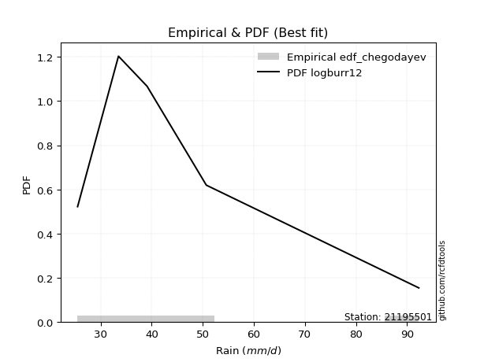</img>

</div>


### 6. EDF Blom (1958)

The Blom formula is a specific "plotting position" formula used in hydrology and statistical analysis to estimate the empirical cumulative probability (or non-exceedance probability) of a data series. It is particularly recommended for data that are approximately normally distributed. The constant _a_ is set to 0.375 (or 3/8).

<div align="center">


$P=(m-a)/(n+1-2a)$


</div>


**6.1. Empirical values**

<div align="center">

|                | 0                   | 1                   | 2        | 3                  | 4                  |
|:---------------|:--------------------|:--------------------|:---------|:-------------------|:-------------------|
| date           | 2017                | 2016                | 2018     | 2019               | 2020               |
| x              | 25.5                | 33.5                | 39.1     | 50.7               | 92.3               |
| m              | 1                   | 2                   | 3        | 4                  | 5                  |
| empirical_dist | edf_blom            | edf_blom            | edf_blom | edf_blom           | edf_blom           |
| empirical      | 0.11904761904761904 | 0.30952380952380953 | 0.5      | 0.6904761904761905 | 0.8809523809523809 |
| empirical_tr   | 1.135135135135135   | 1.4482758620689655  | 2.0      | 3.230769230769231  | 8.399999999999999  |

</div>


**6.2. Kolmogorov-Smirnov fit test (sorted by Δ)**


<div align="center">

|                | 0                  | 1                   | 2                    | 3                   | 4                  | 5                    | 6                    | 7                   | 8                    | 9                   | 10                   | 11                  | 12                  | 13                  | 14                  | 15                  | 16                  | 17                  | 18                   | 19                  | 20                  | 21                  | 22                 | 23                  | 24                  | 25                  | 26                  | 27                  | 28                  | 29                  | 30                  | 31                 | 32                  | 33                  | 34                 | 35                  | 36                  | 37                  | 38                  | 39                  | 40                  | 41                  | 42                  | 43                  | 44                  | 45                  | 46                  | 47                  | 48                  | 49                  | 50                  | 51                  | 52                  | 53                 | 54                  | 55                  | 56                  | 57                  | 58                  | 59                  | 60                  | 61                  | 62                  | 63                 | 64                  | 65                  | 66                  | 67                  | 68                  | 69                  | 70                  | 71                  | 72                  | 73                  | 74                  | 75                  | 76                  | 77                  | 78                  | 79                  | 80                 | 81                  | 82                  | 83                  | 84                 | 85                 | 86                 | 87                  | 88                  | 89                  | 90                  | 91                  | 92                 | 93                  | 94                 | 95                 | 96                  | 97                 | 98                  | 99                  | 100                 | 101                 | 102                 | 103                 | 104                 | 105                 | 106                 | 107                 | 108                 | 109                 | 110                | 111                 | 112                 | 113                | 114                 | 115                 | 116                 | 117                | 118                | 119                | 120                 | 121                 | 122                 | 123                 | 124                | 125                 | 126                 | 127                 | 128                 | 129                 | 130                | 131                 | 132                | 133                | 134                | 135                | 136                 | 137                | 138                 | 139                | 140                 | 141                | 142                 | 143                 | 144                | 145                | 146                 | 147                 | 148                 | 149                | 150                 | 151                 | 152                | 153                | 154                | 155                | 156                | 157                | 158                | 159                |
|:---------------|:-------------------|:--------------------|:---------------------|:--------------------|:-------------------|:---------------------|:---------------------|:--------------------|:---------------------|:--------------------|:---------------------|:--------------------|:--------------------|:--------------------|:--------------------|:--------------------|:--------------------|:--------------------|:---------------------|:--------------------|:--------------------|:--------------------|:-------------------|:--------------------|:--------------------|:--------------------|:--------------------|:--------------------|:--------------------|:--------------------|:--------------------|:-------------------|:--------------------|:--------------------|:-------------------|:--------------------|:--------------------|:--------------------|:--------------------|:--------------------|:--------------------|:--------------------|:--------------------|:--------------------|:--------------------|:--------------------|:--------------------|:--------------------|:--------------------|:--------------------|:--------------------|:--------------------|:--------------------|:-------------------|:--------------------|:--------------------|:--------------------|:--------------------|:--------------------|:--------------------|:--------------------|:--------------------|:--------------------|:-------------------|:--------------------|:--------------------|:--------------------|:--------------------|:--------------------|:--------------------|:--------------------|:--------------------|:--------------------|:--------------------|:--------------------|:--------------------|:--------------------|:--------------------|:--------------------|:--------------------|:-------------------|:--------------------|:--------------------|:--------------------|:-------------------|:-------------------|:-------------------|:--------------------|:--------------------|:--------------------|:--------------------|:--------------------|:-------------------|:--------------------|:-------------------|:-------------------|:--------------------|:-------------------|:--------------------|:--------------------|:--------------------|:--------------------|:--------------------|:--------------------|:--------------------|:--------------------|:--------------------|:--------------------|:--------------------|:--------------------|:-------------------|:--------------------|:--------------------|:-------------------|:--------------------|:--------------------|:--------------------|:-------------------|:-------------------|:-------------------|:--------------------|:--------------------|:--------------------|:--------------------|:-------------------|:--------------------|:--------------------|:--------------------|:--------------------|:--------------------|:-------------------|:--------------------|:-------------------|:-------------------|:-------------------|:-------------------|:--------------------|:-------------------|:--------------------|:-------------------|:--------------------|:-------------------|:--------------------|:--------------------|:-------------------|:-------------------|:--------------------|:--------------------|:--------------------|:-------------------|:--------------------|:--------------------|:-------------------|:-------------------|:-------------------|:-------------------|:-------------------|:-------------------|:-------------------|:-------------------|
| station        | 21195501           | 21195501            | 21195501             | 21195501            | 21195501           | 21195501             | 21195501             | 21195501            | 21195501             | 21195501            | 21195501             | 21195501            | 21195501            | 21195501            | 21195501            | 21195501            | 21195501            | 21195501            | 21195501             | 21195501            | 21195501            | 21195501            | 21195501           | 21195501            | 21195501            | 21195501            | 21195501            | 21195501            | 21195501            | 21195501            | 21195501            | 21195501           | 21195501            | 21195501            | 21195501           | 21195501            | 21195501            | 21195501            | 21195501            | 21195501            | 21195501            | 21195501            | 21195501            | 21195501            | 21195501            | 21195501            | 21195501            | 21195501            | 21195501            | 21195501            | 21195501            | 21195501            | 21195501            | 21195501           | 21195501            | 21195501            | 21195501            | 21195501            | 21195501            | 21195501            | 21195501            | 21195501            | 21195501            | 21195501           | 21195501            | 21195501            | 21195501            | 21195501            | 21195501            | 21195501            | 21195501            | 21195501            | 21195501            | 21195501            | 21195501            | 21195501            | 21195501            | 21195501            | 21195501            | 21195501            | 21195501           | 21195501            | 21195501            | 21195501            | 21195501           | 21195501           | 21195501           | 21195501            | 21195501            | 21195501            | 21195501            | 21195501            | 21195501           | 21195501            | 21195501           | 21195501           | 21195501            | 21195501           | 21195501            | 21195501            | 21195501            | 21195501            | 21195501            | 21195501            | 21195501            | 21195501            | 21195501            | 21195501            | 21195501            | 21195501            | 21195501           | 21195501            | 21195501            | 21195501           | 21195501            | 21195501            | 21195501            | 21195501           | 21195501           | 21195501           | 21195501            | 21195501            | 21195501            | 21195501            | 21195501           | 21195501            | 21195501            | 21195501            | 21195501            | 21195501            | 21195501           | 21195501            | 21195501           | 21195501           | 21195501           | 21195501           | 21195501            | 21195501           | 21195501            | 21195501           | 21195501            | 21195501           | 21195501            | 21195501            | 21195501           | 21195501           | 21195501            | 21195501            | 21195501            | 21195501           | 21195501            | 21195501            | 21195501           | 21195501           | 21195501           | 21195501           | 21195501           | 21195501           | 21195501           | 21195501           |
| empirical_dist | edf_blom           | edf_blom            | edf_blom             | edf_blom            | edf_blom           | edf_blom             | edf_blom             | edf_blom            | edf_blom             | edf_blom            | edf_blom             | edf_blom            | edf_blom            | edf_blom            | edf_blom            | edf_blom            | edf_blom            | edf_blom            | edf_blom             | edf_blom            | edf_blom            | edf_blom            | edf_blom           | edf_blom            | edf_blom            | edf_blom            | edf_blom            | edf_blom            | edf_blom            | edf_blom            | edf_blom            | edf_blom           | edf_blom            | edf_blom            | edf_blom           | edf_blom            | edf_blom            | edf_blom            | edf_blom            | edf_blom            | edf_blom            | edf_blom            | edf_blom            | edf_blom            | edf_blom            | edf_blom            | edf_blom            | edf_blom            | edf_blom            | edf_blom            | edf_blom            | edf_blom            | edf_blom            | edf_blom           | edf_blom            | edf_blom            | edf_blom            | edf_blom            | edf_blom            | edf_blom            | edf_blom            | edf_blom            | edf_blom            | edf_blom           | edf_blom            | edf_blom            | edf_blom            | edf_blom            | edf_blom            | edf_blom            | edf_blom            | edf_blom            | edf_blom            | edf_blom            | edf_blom            | edf_blom            | edf_blom            | edf_blom            | edf_blom            | edf_blom            | edf_blom           | edf_blom            | edf_blom            | edf_blom            | edf_blom           | edf_blom           | edf_blom           | edf_blom            | edf_blom            | edf_blom            | edf_blom            | edf_blom            | edf_blom           | edf_blom            | edf_blom           | edf_blom           | edf_blom            | edf_blom           | edf_blom            | edf_blom            | edf_blom            | edf_blom            | edf_blom            | edf_blom            | edf_blom            | edf_blom            | edf_blom            | edf_blom            | edf_blom            | edf_blom            | edf_blom           | edf_blom            | edf_blom            | edf_blom           | edf_blom            | edf_blom            | edf_blom            | edf_blom           | edf_blom           | edf_blom           | edf_blom            | edf_blom            | edf_blom            | edf_blom            | edf_blom           | edf_blom            | edf_blom            | edf_blom            | edf_blom            | edf_blom            | edf_blom           | edf_blom            | edf_blom           | edf_blom           | edf_blom           | edf_blom           | edf_blom            | edf_blom           | edf_blom            | edf_blom           | edf_blom            | edf_blom           | edf_blom            | edf_blom            | edf_blom           | edf_blom           | edf_blom            | edf_blom            | edf_blom            | edf_blom           | edf_blom            | edf_blom            | edf_blom           | edf_blom           | edf_blom           | edf_blom           | edf_blom           | edf_blom           | edf_blom           | edf_blom           |
| p_dist         | logburr12          | logalpha            | logmielke            | loginvweibull       | loggenextreme      | logburr              | logexponnorm         | burr                | alpha                | logf                | mielke               | loggumbel_r         | logfoldnorm         | loggenlogistic      | lograyleigh         | invgamma            | logweibull_max      | logjohnsonsu        | loginvgauss          | logpearson3         | nct                 | logkstwobign        | logmaxwell         | logfatiguelife      | halflogistic        | invgauss            | lognct              | loginvgamma         | loghalfnorm         | logbetaprime        | logrice             | ncf                | betaprime           | foldnorm            | halfnorm           | logmoyal            | loganglit           | moyal               | logsemicircular     | pearson3            | logloggamma         | logt                | lognorm             | logcrystalball      | logncf              | dgamma              | gumbel_r            | burr12              | genlogistic         | rayleigh            | loglogistic         | logksone            | logdweibull         | exponnorm          | loggenexpon         | logtruncexpon       | maxwell             | wald                | truncnorm           | genexpon            | logbradford         | logtruncnorm        | logkappa3           | kappa3             | loggompertz         | logbeta             | loghalfgennorm      | gengamma            | exponweib           | vonmises_line       | loglomax            | loggausshyper       | logexponpow         | logweibull_min      | gompertz            | lomax               | logwald             | logskewnorm         | loghalflogistic     | logarcsine          | loghypsecant       | logtruncweibull_min | logdgamma           | logcosine           | gennorm            | lognakagami        | kstwobign          | dweibull            | logexponweib        | loglaplace          | loglaplace          | logtukeylambda      | weibull_min        | t                   | crystalball        | norm               | anglit              | nakagami           | semicircular        | logloglaplace       | loggumbel_l         | logkappa4           | arcsine             | loguniform          | logistic            | gamma               | rice                | logvonmises_line    | f                   | skewnorm            | logwrapcauchy      | hypsecant           | truncweibull_min    | logargus           | loggennorm          | logrdist            | cosine              | laplace            | loggamma           | loggamma           | gumbel_l            | johnsonsb           | wrapcauchy          | loglevy_l           | truncexpon         | logtriang           | exponpow            | loggenpareto        | halfgennorm         | logerlang           | bradford           | levy_l              | kappa4             | tukeylambda        | ksone              | argus              | beta                | uniform            | loggenhalflogistic  | genpareto          | triang              | genextreme         | logjohnsonsb        | gausshyper          | logtrapezoid       | rdist              | genhalflogistic     | fatiguelife         | invweibull          | powerlaw           | loggengamma         | truncpareto         | logpowerlaw        | weibull_max        | trapezoid          | erlang             | logtruncpareto     | johnsonsu          | logvonmises        | vonmises           |
| delta          | 0.0472408777491993 | 0.05178890339181798 | 0.052463131482632874 | 0.05271035375139649 | 0.0527181133040478 | 0.052894310677718714 | 0.054142201578562005 | 0.05542739295561355 | 0.055567794165381934 | 0.05650903117247219 | 0.058689124121823005 | 0.05911147823260354 | 0.05974051577591011 | 0.06007917726162604 | 0.06022318314104236 | 0.06055337716885761 | 0.06056622840911463 | 0.06164465629268975 | 0.062424470493013494 | 0.06256012068970496 | 0.06272018276482771 | 0.06307780316643385 | 0.0636709941295398 | 0.06464757279363047 | 0.06475330095488674 | 0.06551225455065142 | 0.06772567556639808 | 0.06820226261807083 | 0.07124155125834636 | 0.07593482861933115 | 0.07689437987564207 | 0.0769287165373097 | 0.07745359323970219 | 0.07910788209900421 | 0.0794640827285682 | 0.08000367902357472 | 0.08359731147580252 | 0.08498749588760346 | 0.08834245486703773 | 0.09288584810711914 | 0.09592583355999462 | 0.09704459722572806 | 0.09704642773922506 | 0.09712483877811035 | 0.09721178793434201 | 0.09837669514797875 | 0.10278068208293811 | 0.10543281940156615 | 0.10717327692016704 | 0.10759948104402528 | 0.10960869179482519 | 0.11568806673894383 | 0.11637646339097385 | 0.1178484430839912 | 0.11814489059316592 | 0.11903533745267413 | 0.11904026975738285 | 0.11904746996942624 | 0.11904761055999462 | 0.11904761242682976 | 0.11904761671258088 | 0.11904761683890494 | 0.11904761785614612 | 0.1190476180890655 | 0.11904761889062596 | 0.11904761900146821 | 0.11904761902272766 | 0.11904761903852208 | 0.11904761903901878 | 0.11904761904651606 | 0.11904761904663781 | 0.11904761904744021 | 0.11904761904760057 | 0.11904761904760168 | 0.11904761904761488 | 0.11904761904761872 | 0.11904761904761904 | 0.11904761904761904 | 0.11904761904761904 | 0.11904761904761907 | 0.1199134586202894 | 0.12188468307516054 | 0.12343027117931471 | 0.12614526410154414 | 0.1276938344589651 | 0.1280751367342282 | 0.1343391123126691 | 0.13595873483543228 | 0.14197835490121202 | 0.14676892712525813 | 0.14676892712525813 | 0.14827204456340648 | 0.1500411985583402 | 0.15091110128373086 | 0.1509196257410636 | 0.1509196268462426 | 0.15445913486870866 | 0.1549236603388648 | 0.15692419171551886 | 0.16360243318087075 | 0.16385486997356996 | 0.16416418692293633 | 0.16671832181601842 | 0.16771189688308702 | 0.16894104904234897 | 0.16914832994232187 | 0.17257086988886683 | 0.17734351015274202 | 0.17738720188313112 | 0.17747567472548442 | 0.1790184831195788 | 0.18291517268642954 | 0.18347433496554494 | 0.1857243795678596 | 0.19047619047619047 | 0.20380222794855163 | 0.20728074042392897 | 0.2110742384819131 | 0.2144291825021798 | 0.2144291825021798 | 0.21630844306821495 | 0.22142173656347008 | 0.22802138034832692 | 0.23020531387036305 | 0.2365569563717707 | 0.23861076973353346 | 0.24023489393384567 | 0.24120150557078276 | 0.24515646411222036 | 0.24782393956519533 | 0.2516036965202253 | 0.25594765460898294 | 0.2835373779990796 | 0.2868033332668951 | 0.2927715996578271 | 0.2947408224516376 | 0.29500484098935487 | 0.3132306814941545 | 0.31475208110403136 | 0.3219611912106305 | 0.33831789421770964 | 0.3515918531614003 | 0.37810795772797956 | 0.37949835632681933 | 0.4111153849784187 | 0.4200792781704573 | 0.42631005745532335 | 0.43323694265357404 | 0.44174071803409387 | 0.4679679177645599 | 0.47907203880516347 | 0.49195212827679125 | 0.5096988120025434 | 0.5191340275660936 | 0.5323072489181886 | 0.5396932234807522 | 0.5408437929132842 | 0.6227594753056951 | 1.0773034133949206 | 14.130571885870166 |
| deltao         | 0.5865427407550001 | 0.5865427407550001  | 0.5865427407550001   | 0.5865427407550001  | 0.5865427407550001 | 0.5865427407550001   | 0.5865427407550001   | 0.5865427407550001  | 0.5865427407550001   | 0.5865427407550001  | 0.5865427407550001   | 0.5865427407550001  | 0.5865427407550001  | 0.5865427407550001  | 0.5865427407550001  | 0.5865427407550001  | 0.5865427407550001  | 0.5865427407550001  | 0.5865427407550001   | 0.5865427407550001  | 0.5865427407550001  | 0.5865427407550001  | 0.5865427407550001 | 0.5865427407550001  | 0.5865427407550001  | 0.5865427407550001  | 0.5865427407550001  | 0.5865427407550001  | 0.5865427407550001  | 0.5865427407550001  | 0.5865427407550001  | 0.5865427407550001 | 0.5865427407550001  | 0.5865427407550001  | 0.5865427407550001 | 0.5865427407550001  | 0.5865427407550001  | 0.5865427407550001  | 0.5865427407550001  | 0.5865427407550001  | 0.5865427407550001  | 0.5865427407550001  | 0.5865427407550001  | 0.5865427407550001  | 0.5865427407550001  | 0.5865427407550001  | 0.5865427407550001  | 0.5865427407550001  | 0.5865427407550001  | 0.5865427407550001  | 0.5865427407550001  | 0.5865427407550001  | 0.5865427407550001  | 0.5865427407550001 | 0.5865427407550001  | 0.5865427407550001  | 0.5865427407550001  | 0.5865427407550001  | 0.5865427407550001  | 0.5865427407550001  | 0.5865427407550001  | 0.5865427407550001  | 0.5865427407550001  | 0.5865427407550001 | 0.5865427407550001  | 0.5865427407550001  | 0.5865427407550001  | 0.5865427407550001  | 0.5865427407550001  | 0.5865427407550001  | 0.5865427407550001  | 0.5865427407550001  | 0.5865427407550001  | 0.5865427407550001  | 0.5865427407550001  | 0.5865427407550001  | 0.5865427407550001  | 0.5865427407550001  | 0.5865427407550001  | 0.5865427407550001  | 0.5865427407550001 | 0.5865427407550001  | 0.5865427407550001  | 0.5865427407550001  | 0.5865427407550001 | 0.5865427407550001 | 0.5865427407550001 | 0.5865427407550001  | 0.5865427407550001  | 0.5865427407550001  | 0.5865427407550001  | 0.5865427407550001  | 0.5865427407550001 | 0.5865427407550001  | 0.5865427407550001 | 0.5865427407550001 | 0.5865427407550001  | 0.5865427407550001 | 0.5865427407550001  | 0.5865427407550001  | 0.5865427407550001  | 0.5865427407550001  | 0.5865427407550001  | 0.5865427407550001  | 0.5865427407550001  | 0.5865427407550001  | 0.5865427407550001  | 0.5865427407550001  | 0.5865427407550001  | 0.5865427407550001  | 0.5865427407550001 | 0.5865427407550001  | 0.5865427407550001  | 0.5865427407550001 | 0.5865427407550001  | 0.5865427407550001  | 0.5865427407550001  | 0.5865427407550001 | 0.5865427407550001 | 0.5865427407550001 | 0.5865427407550001  | 0.5865427407550001  | 0.5865427407550001  | 0.5865427407550001  | 0.5865427407550001 | 0.5865427407550001  | 0.5865427407550001  | 0.5865427407550001  | 0.5865427407550001  | 0.5865427407550001  | 0.5865427407550001 | 0.5865427407550001  | 0.5865427407550001 | 0.5865427407550001 | 0.5865427407550001 | 0.5865427407550001 | 0.5865427407550001  | 0.5865427407550001 | 0.5865427407550001  | 0.5865427407550001 | 0.5865427407550001  | 0.5865427407550001 | 0.5865427407550001  | 0.5865427407550001  | 0.5865427407550001 | 0.5865427407550001 | 0.5865427407550001  | 0.5865427407550001  | 0.5865427407550001  | 0.5865427407550001 | 0.5865427407550001  | 0.5865427407550001  | 0.5865427407550001 | 0.5865427407550001 | 0.5865427407550001 | 0.5865427407550001 | 0.5865427407550001 | 0.5865427407550001 | 0.5865427407550001 | 0.5865427407550001 |
| eval           | Δo > Δ             | Δo > Δ              | Δo > Δ               | Δo > Δ              | Δo > Δ             | Δo > Δ               | Δo > Δ               | Δo > Δ              | Δo > Δ               | Δo > Δ              | Δo > Δ               | Δo > Δ              | Δo > Δ              | Δo > Δ              | Δo > Δ              | Δo > Δ              | Δo > Δ              | Δo > Δ              | Δo > Δ               | Δo > Δ              | Δo > Δ              | Δo > Δ              | Δo > Δ             | Δo > Δ              | Δo > Δ              | Δo > Δ              | Δo > Δ              | Δo > Δ              | Δo > Δ              | Δo > Δ              | Δo > Δ              | Δo > Δ             | Δo > Δ              | Δo > Δ              | Δo > Δ             | Δo > Δ              | Δo > Δ              | Δo > Δ              | Δo > Δ              | Δo > Δ              | Δo > Δ              | Δo > Δ              | Δo > Δ              | Δo > Δ              | Δo > Δ              | Δo > Δ              | Δo > Δ              | Δo > Δ              | Δo > Δ              | Δo > Δ              | Δo > Δ              | Δo > Δ              | Δo > Δ              | Δo > Δ             | Δo > Δ              | Δo > Δ              | Δo > Δ              | Δo > Δ              | Δo > Δ              | Δo > Δ              | Δo > Δ              | Δo > Δ              | Δo > Δ              | Δo > Δ             | Δo > Δ              | Δo > Δ              | Δo > Δ              | Δo > Δ              | Δo > Δ              | Δo > Δ              | Δo > Δ              | Δo > Δ              | Δo > Δ              | Δo > Δ              | Δo > Δ              | Δo > Δ              | Δo > Δ              | Δo > Δ              | Δo > Δ              | Δo > Δ              | Δo > Δ             | Δo > Δ              | Δo > Δ              | Δo > Δ              | Δo > Δ             | Δo > Δ             | Δo > Δ             | Δo > Δ              | Δo > Δ              | Δo > Δ              | Δo > Δ              | Δo > Δ              | Δo > Δ             | Δo > Δ              | Δo > Δ             | Δo > Δ             | Δo > Δ              | Δo > Δ             | Δo > Δ              | Δo > Δ              | Δo > Δ              | Δo > Δ              | Δo > Δ              | Δo > Δ              | Δo > Δ              | Δo > Δ              | Δo > Δ              | Δo > Δ              | Δo > Δ              | Δo > Δ              | Δo > Δ             | Δo > Δ              | Δo > Δ              | Δo > Δ             | Δo > Δ              | Δo > Δ              | Δo > Δ              | Δo > Δ             | Δo > Δ             | Δo > Δ             | Δo > Δ              | Δo > Δ              | Δo > Δ              | Δo > Δ              | Δo > Δ             | Δo > Δ              | Δo > Δ              | Δo > Δ              | Δo > Δ              | Δo > Δ              | Δo > Δ             | Δo > Δ              | Δo > Δ             | Δo > Δ             | Δo > Δ             | Δo > Δ             | Δo > Δ              | Δo > Δ             | Δo > Δ              | Δo > Δ             | Δo > Δ              | Δo > Δ             | Δo > Δ              | Δo > Δ              | Δo > Δ             | Δo > Δ             | Δo > Δ              | Δo > Δ              | Δo > Δ              | Δo > Δ             | Δo > Δ              | Δo > Δ              | Δo > Δ             | Δo > Δ             | Δo > Δ             | Δo > Δ             | Δo > Δ             | Δo <= Δ            | Δo <= Δ            | Δo <= Δ            |
| fit            | 1                  | 1                   | 1                    | 1                   | 1                  | 1                    | 1                    | 1                   | 1                    | 1                   | 1                    | 1                   | 1                   | 1                   | 1                   | 1                   | 1                   | 1                   | 1                    | 1                   | 1                   | 1                   | 1                  | 1                   | 1                   | 1                   | 1                   | 1                   | 1                   | 1                   | 1                   | 1                  | 1                   | 1                   | 1                  | 1                   | 1                   | 1                   | 1                   | 1                   | 1                   | 1                   | 1                   | 1                   | 1                   | 1                   | 1                   | 1                   | 1                   | 1                   | 1                   | 1                   | 1                   | 1                  | 1                   | 1                   | 1                   | 1                   | 1                   | 1                   | 1                   | 1                   | 1                   | 1                  | 1                   | 1                   | 1                   | 1                   | 1                   | 1                   | 1                   | 1                   | 1                   | 1                   | 1                   | 1                   | 1                   | 1                   | 1                   | 1                   | 1                  | 1                   | 1                   | 1                   | 1                  | 1                  | 1                  | 1                   | 1                   | 1                   | 1                   | 1                   | 1                  | 1                   | 1                  | 1                  | 1                   | 1                  | 1                   | 1                   | 1                   | 1                   | 1                   | 1                   | 1                   | 1                   | 1                   | 1                   | 1                   | 1                   | 1                  | 1                   | 1                   | 1                  | 1                   | 1                   | 1                   | 1                  | 1                  | 1                  | 1                   | 1                   | 1                   | 1                   | 1                  | 1                   | 1                   | 1                   | 1                   | 1                   | 1                  | 1                   | 1                  | 1                  | 1                  | 1                  | 1                   | 1                  | 1                   | 1                  | 1                   | 1                  | 1                   | 1                   | 1                  | 1                  | 1                   | 1                   | 1                   | 1                  | 1                   | 1                   | 1                  | 1                  | 1                  | 1                  | 1                  | 0                  | 0                  | 0                  |
| n              | 5                  | 5                   | 5                    | 5                   | 5                  | 5                    | 5                    | 5                   | 5                    | 5                   | 5                    | 5                   | 5                   | 5                   | 5                   | 5                   | 5                   | 5                   | 5                    | 5                   | 5                   | 5                   | 5                  | 5                   | 5                   | 5                   | 5                   | 5                   | 5                   | 5                   | 5                   | 5                  | 5                   | 5                   | 5                  | 5                   | 5                   | 5                   | 5                   | 5                   | 5                   | 5                   | 5                   | 5                   | 5                   | 5                   | 5                   | 5                   | 5                   | 5                   | 5                   | 5                   | 5                   | 5                  | 5                   | 5                   | 5                   | 5                   | 5                   | 5                   | 5                   | 5                   | 5                   | 5                  | 5                   | 5                   | 5                   | 5                   | 5                   | 5                   | 5                   | 5                   | 5                   | 5                   | 5                   | 5                   | 5                   | 5                   | 5                   | 5                   | 5                  | 5                   | 5                   | 5                   | 5                  | 5                  | 5                  | 5                   | 5                   | 5                   | 5                   | 5                   | 5                  | 5                   | 5                  | 5                  | 5                   | 5                  | 5                   | 5                   | 5                   | 5                   | 5                   | 5                   | 5                   | 5                   | 5                   | 5                   | 5                   | 5                   | 5                  | 5                   | 5                   | 5                  | 5                   | 5                   | 5                   | 5                  | 5                  | 5                  | 5                   | 5                   | 5                   | 5                   | 5                  | 5                   | 5                   | 5                   | 5                   | 5                   | 5                  | 5                   | 5                  | 5                  | 5                  | 5                  | 5                   | 5                  | 5                   | 5                  | 5                   | 5                  | 5                   | 5                   | 5                  | 5                  | 5                   | 5                   | 5                   | 5                  | 5                   | 5                   | 5                  | 5                  | 5                  | 5                  | 5                  | 5                  | 5                  | 5                  |
| best_fit       | 1                  | 0                   | 0                    | 0                   | 0                  | 0                    | 0                    | 0                   | 0                    | 0                   | 0                    | 0                   | 0                   | 0                   | 0                   | 0                   | 0                   | 0                   | 0                    | 0                   | 0                   | 0                   | 0                  | 0                   | 0                   | 0                   | 0                   | 0                   | 0                   | 0                   | 0                   | 0                  | 0                   | 0                   | 0                  | 0                   | 0                   | 0                   | 0                   | 0                   | 0                   | 0                   | 0                   | 0                   | 0                   | 0                   | 0                   | 0                   | 0                   | 0                   | 0                   | 0                   | 0                   | 0                  | 0                   | 0                   | 0                   | 0                   | 0                   | 0                   | 0                   | 0                   | 0                   | 0                  | 0                   | 0                   | 0                   | 0                   | 0                   | 0                   | 0                   | 0                   | 0                   | 0                   | 0                   | 0                   | 0                   | 0                   | 0                   | 0                   | 0                  | 0                   | 0                   | 0                   | 0                  | 0                  | 0                  | 0                   | 0                   | 0                   | 0                   | 0                   | 0                  | 0                   | 0                  | 0                  | 0                   | 0                  | 0                   | 0                   | 0                   | 0                   | 0                   | 0                   | 0                   | 0                   | 0                   | 0                   | 0                   | 0                   | 0                  | 0                   | 0                   | 0                  | 0                   | 0                   | 0                   | 0                  | 0                  | 0                  | 0                   | 0                   | 0                   | 0                   | 0                  | 0                   | 0                   | 0                   | 0                   | 0                   | 0                  | 0                   | 0                  | 0                  | 0                  | 0                  | 0                   | 0                  | 0                   | 0                  | 0                   | 0                  | 0                   | 0                   | 0                  | 0                  | 0                   | 0                   | 0                   | 0                  | 0                   | 0                   | 0                  | 0                  | 0                  | 0                  | 0                  | 0                  | 0                  | 0                  |
| best_fit_sort  | 1                  | 2                   | 3                    | 4                   | 5                  | 6                    | 7                    | 8                   | 9                    | 10                  | 11                   | 12                  | 13                  | 14                  | 15                  | 16                  | 17                  | 18                  | 19                   | 20                  | 21                  | 22                  | 23                 | 24                  | 25                  | 26                  | 27                  | 28                  | 29                  | 30                  | 31                  | 32                 | 33                  | 34                  | 35                 | 36                  | 37                  | 38                  | 39                  | 40                  | 41                  | 42                  | 43                  | 44                  | 45                  | 46                  | 47                  | 48                  | 49                  | 50                  | 51                  | 52                  | 53                  | 54                 | 55                  | 56                  | 57                  | 58                  | 59                  | 60                  | 61                  | 62                  | 63                  | 64                 | 65                  | 66                  | 67                  | 68                  | 69                  | 70                  | 71                  | 72                  | 73                  | 74                  | 75                  | 76                  | 77                  | 78                  | 79                  | 80                  | 81                 | 82                  | 83                  | 84                  | 85                 | 86                 | 87                 | 88                  | 89                  | 90                  | 91                  | 92                  | 93                 | 94                  | 95                 | 96                 | 97                  | 98                 | 99                  | 100                 | 101                 | 102                 | 103                 | 104                 | 105                 | 106                 | 107                 | 108                 | 109                 | 110                 | 111                | 112                 | 113                 | 114                | 115                 | 116                 | 117                 | 118                | 119                | 120                | 121                 | 122                 | 123                 | 124                 | 125                | 126                 | 127                 | 128                 | 129                 | 130                 | 131                | 132                 | 133                | 134                | 135                | 136                | 137                 | 138                | 139                 | 140                | 141                 | 142                | 143                 | 144                 | 145                | 146                | 147                 | 148                 | 149                 | 150                | 151                 | 152                 | 153                | 154                | 155                | 156                | 157                | 158                | 159                | 160                |

</div>


**6.3. Best fit**

<div align="center">

|   id |   station | empirical_dist   | p_dist    |     delta |   deltao | eval   |   fit |   n |   best_fit |   best_fit_sort |
|-----:|----------:|:-----------------|:----------|----------:|---------:|:-------|------:|----:|-----------:|----------------:|
|    0 |  21195501 | edf_blom         | logburr12 | 0.0472409 | 0.586543 | Δo > Δ |     1 |   5 |          1 |               1 |

</div>


<div align="center">

</img>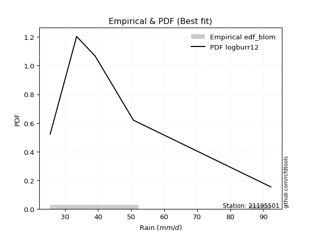</img>

</div>


### 7. EDF Tukey (1962)

In hydrology, the Tukey formula is used as a plotting position formula to estimate the empirical probability or frequency of a flood event (or other hydrological data). The formula parameter is given as _c=0.333_ (or 1/3).

<div align="center">


$P=(m-c)/(n+1-2c)$


</div>


**7.1. Empirical values**

<div align="center">

|                | 0                  | 1                  | 2         | 3         | 4         |
|:---------------|:-------------------|:-------------------|:----------|:----------|:----------|
| date           | 2017               | 2016               | 2018      | 2019      | 2020      |
| x              | 25.5               | 33.5               | 39.1      | 50.7      | 92.3      |
| m              | 1                  | 2                  | 3         | 4         | 5         |
| empirical_dist | edf_tukey          | edf_tukey          | edf_tukey | edf_tukey | edf_tukey |
| empirical      | 0.125              | 0.3125             | 0.5       | 0.6875    | 0.875     |
| empirical_tr   | 1.1428571428571428 | 1.4545454545454546 | 2.0       | 3.2       | 8.0       |

</div>


**7.2. Kolmogorov-Smirnov fit test (sorted by Δ)**


<div align="center">

|                | 0                   | 1                   | 2                   | 3                   | 4                   | 5                   | 6                    | 7                   | 8                   | 9                   | 10                  | 11                  | 12                  | 13                  | 14                  | 15                  | 16                  | 17                  | 18                  | 19                  | 20                  | 21                  | 22                  | 23                  | 24                 | 25                  | 26                  | 27                  | 28                  | 29                  | 30                  | 31                  | 32                  | 33                  | 34                  | 35                  | 36                  | 37                 | 38                  | 39                  | 40                  | 41                  | 42                  | 43                  | 44                  | 45                  | 46                  | 47                  | 48                  | 49                  | 50                  | 51                  | 52                  | 53                 | 54                  | 55                  | 56                  | 57                  | 58                 | 59                  | 60                  | 61                  | 62                 | 63                  | 64                  | 65                  | 66                  | 67                  | 68                  | 69                  | 70                  | 71                 | 72                  | 73                  | 74                  | 75                  | 76                  | 77                  | 78                 | 79                 | 80                 | 81                 | 82                  | 83                  | 84                  | 85                  | 86                  | 87                 | 88                  | 89                  | 90                  | 91                  | 92                  | 93                  | 94                 | 95                 | 96                 | 97                  | 98                 | 99                  | 100                 | 101                 | 102                 | 103                | 104                 | 105                 | 106                 | 107                 | 108                 | 109                 | 110                 | 111                 | 112                 | 113                | 114                | 115                 | 116                | 117                | 118                 | 119                 | 120                 | 121                 | 122                | 123                 | 124                | 125                | 126                | 127                | 128                | 129                 | 130                | 131                | 132                | 133                | 134                | 135                 | 136                | 137                 | 138                | 139                | 140                 | 141                 | 142                | 143                 | 144                 | 145                | 146                | 147                | 148                 | 149                 | 150                | 151                | 152                | 153                | 154                | 155                | 156                | 157                | 158                | 159                |
|:---------------|:--------------------|:--------------------|:--------------------|:--------------------|:--------------------|:--------------------|:---------------------|:--------------------|:--------------------|:--------------------|:--------------------|:--------------------|:--------------------|:--------------------|:--------------------|:--------------------|:--------------------|:--------------------|:--------------------|:--------------------|:--------------------|:--------------------|:--------------------|:--------------------|:-------------------|:--------------------|:--------------------|:--------------------|:--------------------|:--------------------|:--------------------|:--------------------|:--------------------|:--------------------|:--------------------|:--------------------|:--------------------|:-------------------|:--------------------|:--------------------|:--------------------|:--------------------|:--------------------|:--------------------|:--------------------|:--------------------|:--------------------|:--------------------|:--------------------|:--------------------|:--------------------|:--------------------|:--------------------|:-------------------|:--------------------|:--------------------|:--------------------|:--------------------|:-------------------|:--------------------|:--------------------|:--------------------|:-------------------|:--------------------|:--------------------|:--------------------|:--------------------|:--------------------|:--------------------|:--------------------|:--------------------|:-------------------|:--------------------|:--------------------|:--------------------|:--------------------|:--------------------|:--------------------|:-------------------|:-------------------|:-------------------|:-------------------|:--------------------|:--------------------|:--------------------|:--------------------|:--------------------|:-------------------|:--------------------|:--------------------|:--------------------|:--------------------|:--------------------|:--------------------|:-------------------|:-------------------|:-------------------|:--------------------|:-------------------|:--------------------|:--------------------|:--------------------|:--------------------|:-------------------|:--------------------|:--------------------|:--------------------|:--------------------|:--------------------|:--------------------|:--------------------|:--------------------|:--------------------|:-------------------|:-------------------|:--------------------|:-------------------|:-------------------|:--------------------|:--------------------|:--------------------|:--------------------|:-------------------|:--------------------|:-------------------|:-------------------|:-------------------|:-------------------|:-------------------|:--------------------|:-------------------|:-------------------|:-------------------|:-------------------|:-------------------|:--------------------|:-------------------|:--------------------|:-------------------|:-------------------|:--------------------|:--------------------|:-------------------|:--------------------|:--------------------|:-------------------|:-------------------|:-------------------|:--------------------|:--------------------|:-------------------|:-------------------|:-------------------|:-------------------|:-------------------|:-------------------|:-------------------|:-------------------|:-------------------|:-------------------|
| station        | 21195501            | 21195501            | 21195501            | 21195501            | 21195501            | 21195501            | 21195501             | 21195501            | 21195501            | 21195501            | 21195501            | 21195501            | 21195501            | 21195501            | 21195501            | 21195501            | 21195501            | 21195501            | 21195501            | 21195501            | 21195501            | 21195501            | 21195501            | 21195501            | 21195501           | 21195501            | 21195501            | 21195501            | 21195501            | 21195501            | 21195501            | 21195501            | 21195501            | 21195501            | 21195501            | 21195501            | 21195501            | 21195501           | 21195501            | 21195501            | 21195501            | 21195501            | 21195501            | 21195501            | 21195501            | 21195501            | 21195501            | 21195501            | 21195501            | 21195501            | 21195501            | 21195501            | 21195501            | 21195501           | 21195501            | 21195501            | 21195501            | 21195501            | 21195501           | 21195501            | 21195501            | 21195501            | 21195501           | 21195501            | 21195501            | 21195501            | 21195501            | 21195501            | 21195501            | 21195501            | 21195501            | 21195501           | 21195501            | 21195501            | 21195501            | 21195501            | 21195501            | 21195501            | 21195501           | 21195501           | 21195501           | 21195501           | 21195501            | 21195501            | 21195501            | 21195501            | 21195501            | 21195501           | 21195501            | 21195501            | 21195501            | 21195501            | 21195501            | 21195501            | 21195501           | 21195501           | 21195501           | 21195501            | 21195501           | 21195501            | 21195501            | 21195501            | 21195501            | 21195501           | 21195501            | 21195501            | 21195501            | 21195501            | 21195501            | 21195501            | 21195501            | 21195501            | 21195501            | 21195501           | 21195501           | 21195501            | 21195501           | 21195501           | 21195501            | 21195501            | 21195501            | 21195501            | 21195501           | 21195501            | 21195501           | 21195501           | 21195501           | 21195501           | 21195501           | 21195501            | 21195501           | 21195501           | 21195501           | 21195501           | 21195501           | 21195501            | 21195501           | 21195501            | 21195501           | 21195501           | 21195501            | 21195501            | 21195501           | 21195501            | 21195501            | 21195501           | 21195501           | 21195501           | 21195501            | 21195501            | 21195501           | 21195501           | 21195501           | 21195501           | 21195501           | 21195501           | 21195501           | 21195501           | 21195501           | 21195501           |
| empirical_dist | edf_tukey           | edf_tukey           | edf_tukey           | edf_tukey           | edf_tukey           | edf_tukey           | edf_tukey            | edf_tukey           | edf_tukey           | edf_tukey           | edf_tukey           | edf_tukey           | edf_tukey           | edf_tukey           | edf_tukey           | edf_tukey           | edf_tukey           | edf_tukey           | edf_tukey           | edf_tukey           | edf_tukey           | edf_tukey           | edf_tukey           | edf_tukey           | edf_tukey          | edf_tukey           | edf_tukey           | edf_tukey           | edf_tukey           | edf_tukey           | edf_tukey           | edf_tukey           | edf_tukey           | edf_tukey           | edf_tukey           | edf_tukey           | edf_tukey           | edf_tukey          | edf_tukey           | edf_tukey           | edf_tukey           | edf_tukey           | edf_tukey           | edf_tukey           | edf_tukey           | edf_tukey           | edf_tukey           | edf_tukey           | edf_tukey           | edf_tukey           | edf_tukey           | edf_tukey           | edf_tukey           | edf_tukey          | edf_tukey           | edf_tukey           | edf_tukey           | edf_tukey           | edf_tukey          | edf_tukey           | edf_tukey           | edf_tukey           | edf_tukey          | edf_tukey           | edf_tukey           | edf_tukey           | edf_tukey           | edf_tukey           | edf_tukey           | edf_tukey           | edf_tukey           | edf_tukey          | edf_tukey           | edf_tukey           | edf_tukey           | edf_tukey           | edf_tukey           | edf_tukey           | edf_tukey          | edf_tukey          | edf_tukey          | edf_tukey          | edf_tukey           | edf_tukey           | edf_tukey           | edf_tukey           | edf_tukey           | edf_tukey          | edf_tukey           | edf_tukey           | edf_tukey           | edf_tukey           | edf_tukey           | edf_tukey           | edf_tukey          | edf_tukey          | edf_tukey          | edf_tukey           | edf_tukey          | edf_tukey           | edf_tukey           | edf_tukey           | edf_tukey           | edf_tukey          | edf_tukey           | edf_tukey           | edf_tukey           | edf_tukey           | edf_tukey           | edf_tukey           | edf_tukey           | edf_tukey           | edf_tukey           | edf_tukey          | edf_tukey          | edf_tukey           | edf_tukey          | edf_tukey          | edf_tukey           | edf_tukey           | edf_tukey           | edf_tukey           | edf_tukey          | edf_tukey           | edf_tukey          | edf_tukey          | edf_tukey          | edf_tukey          | edf_tukey          | edf_tukey           | edf_tukey          | edf_tukey          | edf_tukey          | edf_tukey          | edf_tukey          | edf_tukey           | edf_tukey          | edf_tukey           | edf_tukey          | edf_tukey          | edf_tukey           | edf_tukey           | edf_tukey          | edf_tukey           | edf_tukey           | edf_tukey          | edf_tukey          | edf_tukey          | edf_tukey           | edf_tukey           | edf_tukey          | edf_tukey          | edf_tukey          | edf_tukey          | edf_tukey          | edf_tukey          | edf_tukey          | edf_tukey          | edf_tukey          | edf_tukey          |
| p_dist         | logburr12           | logalpha            | logmielke           | loginvweibull       | loggenextreme       | logburr             | logexponnorm         | burr                | alpha               | logf                | mielke              | loggumbel_r         | logfoldnorm         | loggenlogistic      | lograyleigh         | invgamma            | logweibull_max      | logjohnsonsu        | loginvgauss         | logpearson3         | nct                 | logkstwobign        | logmaxwell          | logfatiguelife      | halflogistic       | invgauss            | lognct              | loginvgamma         | logbetaprime        | foldnorm            | halfnorm            | logrice             | loghalfnorm         | betaprime           | ncf                 | moyal               | logmoyal            | loganglit          | logncf              | pearson3            | logsemicircular     | logloggamma         | logt                | lognorm             | logcrystalball      | gumbel_r            | dgamma              | rayleigh            | genlogistic         | loglogistic         | burr12              | logdweibull         | maxwell             | loghypsecant       | logksone            | exponnorm           | loggenexpon         | logtruncexpon       | wald               | truncnorm           | genexpon            | logbradford         | logtruncnorm       | logkappa3           | kappa3              | loggompertz         | logbeta             | loghalfgennorm      | gengamma            | exponweib           | logtruncweibull_min | vonmises_line      | loglomax            | loggausshyper       | logexponpow         | logweibull_min      | gompertz            | lomax               | logwald            | logskewnorm        | logarcsine         | loghalflogistic    | lognakagami         | logcosine           | logdgamma           | dweibull            | gennorm             | kstwobign          | logexponweib        | loglaplace          | loglaplace          | weibull_min         | logtukeylambda      | t                   | crystalball        | norm               | anglit             | nakagami            | semicircular       | logloglaplace       | arcsine             | loggumbel_l         | logkappa4           | gamma              | loguniform          | logistic            | rice                | f                   | logwrapcauchy       | logvonmises_line    | skewnorm            | truncweibull_min    | hypsecant           | logargus           | loggennorm         | logrdist            | cosine             | laplace            | loggamma            | loggamma            | gumbel_l            | johnsonsb           | loglevy_l          | wrapcauchy          | loggenpareto       | logtriang          | truncexpon         | exponpow           | halfgennorm        | logerlang           | levy_l             | bradford           | kappa4             | beta               | tukeylambda        | ksone               | argus              | uniform             | loggenhalflogistic | genpareto          | triang              | genextreme          | logjohnsonsb       | gausshyper          | logtrapezoid        | rdist              | genhalflogistic    | fatiguelife        | invweibull          | powerlaw            | loggengamma        | truncpareto        | logpowerlaw        | weibull_max        | trapezoid          | erlang             | logtruncpareto     | johnsonsu          | logvonmises        | vonmises           |
| delta          | 0.05319325870158026 | 0.05774128434419894 | 0.05841551243501383 | 0.05866273470377745 | 0.05867049425642876 | 0.05884669163009967 | 0.060094582530942964 | 0.06137977390799451 | 0.06152017511776289 | 0.06246141212485315 | 0.06464150507420396 | 0.06506385918498447 | 0.06569289672829104 | 0.06603155821400697 | 0.06617556409342329 | 0.06650575812123857 | 0.06651860936149556 | 0.06759703724507071 | 0.06837685144539446 | 0.06851250164208589 | 0.06867256371720865 | 0.06903018411881479 | 0.06962337508192074 | 0.07059995374601143 | 0.0706894130182526 | 0.07146463550303238 | 0.07367805651877901 | 0.07415464357045176 | 0.07593482861933115 | 0.07613169162281375 | 0.07648789225237773 | 0.07689437987564207 | 0.07719393221072732 | 0.07745359323970219 | 0.07862339828853493 | 0.08498749588760346 | 0.08595605997595568 | 0.0865740387827979 | 0.09125940698196106 | 0.09288584810711914 | 0.09429483581941867 | 0.09592583355999462 | 0.09704459722572806 | 0.09704642773922506 | 0.09712483877811035 | 0.10278068208293811 | 0.10432907610035969 | 0.10698596424992746 | 0.10717327692016704 | 0.10960869179482519 | 0.11138520035394711 | 0.11340027291478338 | 0.11904026975738285 | 0.1199134586202894 | 0.12164044769132476 | 0.12380082403637216 | 0.12409727154554688 | 0.12498771840505508 | 0.1249998509218072 | 0.12499999151237558 | 0.12499999337921072 | 0.12499999766496184 | 0.1249999977912859 | 0.12499999880852708 | 0.12499999904144646 | 0.12499999984300691 | 0.12499999995384917 | 0.12499999997510862 | 0.12499999999090304 | 0.12499999999139974 | 0.1249999999980842  | 0.124999999998897  | 0.12499999999901877 | 0.12499999999982114 | 0.12499999999998153 | 0.12499999999998264 | 0.12499999999999584 | 0.12499999999999968 | 0.125              | 0.125              | 0.125              | 0.125              | 0.12509894625803775 | 0.12614526410154414 | 0.12640646165550518 | 0.13000635388305132 | 0.13067002493515556 | 0.1343391123126691 | 0.13900216442502156 | 0.14676892712525813 | 0.14676892712525813 | 0.14706500808214973 | 0.14733348705511418 | 0.15091110128373086 | 0.1509196257410636 | 0.1509196268462426 | 0.1514829443925182 | 0.15194746986267432 | 0.1539480012393284 | 0.15765005222848982 | 0.16374213133982796 | 0.16385486997356996 | 0.16416418692293633 | 0.1661721394661314 | 0.16771189688308702 | 0.16894104904234897 | 0.17257086988886683 | 0.17441101140694065 | 0.17604229264338833 | 0.17734351015274202 | 0.17747567472548442 | 0.18049814448935447 | 0.18291517268642954 | 0.1857243795678596 | 0.1875             | 0.20082603747236116 | 0.2043045499477385 | 0.2110742384819131 | 0.21145299202598933 | 0.21145299202598933 | 0.21333225259202448 | 0.21844554608727962 | 0.2242529329179821 | 0.22504518987213645 | 0.2352491246184018 | 0.235634579257343  | 0.2365569563717707 | 0.2372587034576552 | 0.2421802736360299 | 0.24484774908900486 | 0.249995273656602  | 0.2510796694309767 | 0.2805611875228891 | 0.2890524600369739 | 0.2897795237430856 | 0.28979540918163665 | 0.2917646319754471 | 0.31025449101796404 | 0.3117758906278409 | 0.31898500073444   | 0.33534170374151917 | 0.34563947220901936 | 0.3751317672517891 | 0.37652216585062886 | 0.40813919450222824 | 0.4141268972180764 | 0.4233338669791329 | 0.4302607521773836 | 0.43578833708171294 | 0.46499172728836946 | 0.476095848328973  | 0.4889759378006008 | 0.506722621526353  | 0.5161578370899031 | 0.5293310584419981 | 0.5367170330045617 | 0.5378676024370938 | 0.6197832848295046 | 1.0832557943473016 | 14.136524266822548 |
| deltao         | 0.5865427407550001  | 0.5865427407550001  | 0.5865427407550001  | 0.5865427407550001  | 0.5865427407550001  | 0.5865427407550001  | 0.5865427407550001   | 0.5865427407550001  | 0.5865427407550001  | 0.5865427407550001  | 0.5865427407550001  | 0.5865427407550001  | 0.5865427407550001  | 0.5865427407550001  | 0.5865427407550001  | 0.5865427407550001  | 0.5865427407550001  | 0.5865427407550001  | 0.5865427407550001  | 0.5865427407550001  | 0.5865427407550001  | 0.5865427407550001  | 0.5865427407550001  | 0.5865427407550001  | 0.5865427407550001 | 0.5865427407550001  | 0.5865427407550001  | 0.5865427407550001  | 0.5865427407550001  | 0.5865427407550001  | 0.5865427407550001  | 0.5865427407550001  | 0.5865427407550001  | 0.5865427407550001  | 0.5865427407550001  | 0.5865427407550001  | 0.5865427407550001  | 0.5865427407550001 | 0.5865427407550001  | 0.5865427407550001  | 0.5865427407550001  | 0.5865427407550001  | 0.5865427407550001  | 0.5865427407550001  | 0.5865427407550001  | 0.5865427407550001  | 0.5865427407550001  | 0.5865427407550001  | 0.5865427407550001  | 0.5865427407550001  | 0.5865427407550001  | 0.5865427407550001  | 0.5865427407550001  | 0.5865427407550001 | 0.5865427407550001  | 0.5865427407550001  | 0.5865427407550001  | 0.5865427407550001  | 0.5865427407550001 | 0.5865427407550001  | 0.5865427407550001  | 0.5865427407550001  | 0.5865427407550001 | 0.5865427407550001  | 0.5865427407550001  | 0.5865427407550001  | 0.5865427407550001  | 0.5865427407550001  | 0.5865427407550001  | 0.5865427407550001  | 0.5865427407550001  | 0.5865427407550001 | 0.5865427407550001  | 0.5865427407550001  | 0.5865427407550001  | 0.5865427407550001  | 0.5865427407550001  | 0.5865427407550001  | 0.5865427407550001 | 0.5865427407550001 | 0.5865427407550001 | 0.5865427407550001 | 0.5865427407550001  | 0.5865427407550001  | 0.5865427407550001  | 0.5865427407550001  | 0.5865427407550001  | 0.5865427407550001 | 0.5865427407550001  | 0.5865427407550001  | 0.5865427407550001  | 0.5865427407550001  | 0.5865427407550001  | 0.5865427407550001  | 0.5865427407550001 | 0.5865427407550001 | 0.5865427407550001 | 0.5865427407550001  | 0.5865427407550001 | 0.5865427407550001  | 0.5865427407550001  | 0.5865427407550001  | 0.5865427407550001  | 0.5865427407550001 | 0.5865427407550001  | 0.5865427407550001  | 0.5865427407550001  | 0.5865427407550001  | 0.5865427407550001  | 0.5865427407550001  | 0.5865427407550001  | 0.5865427407550001  | 0.5865427407550001  | 0.5865427407550001 | 0.5865427407550001 | 0.5865427407550001  | 0.5865427407550001 | 0.5865427407550001 | 0.5865427407550001  | 0.5865427407550001  | 0.5865427407550001  | 0.5865427407550001  | 0.5865427407550001 | 0.5865427407550001  | 0.5865427407550001 | 0.5865427407550001 | 0.5865427407550001 | 0.5865427407550001 | 0.5865427407550001 | 0.5865427407550001  | 0.5865427407550001 | 0.5865427407550001 | 0.5865427407550001 | 0.5865427407550001 | 0.5865427407550001 | 0.5865427407550001  | 0.5865427407550001 | 0.5865427407550001  | 0.5865427407550001 | 0.5865427407550001 | 0.5865427407550001  | 0.5865427407550001  | 0.5865427407550001 | 0.5865427407550001  | 0.5865427407550001  | 0.5865427407550001 | 0.5865427407550001 | 0.5865427407550001 | 0.5865427407550001  | 0.5865427407550001  | 0.5865427407550001 | 0.5865427407550001 | 0.5865427407550001 | 0.5865427407550001 | 0.5865427407550001 | 0.5865427407550001 | 0.5865427407550001 | 0.5865427407550001 | 0.5865427407550001 | 0.5865427407550001 |
| eval           | Δo > Δ              | Δo > Δ              | Δo > Δ              | Δo > Δ              | Δo > Δ              | Δo > Δ              | Δo > Δ               | Δo > Δ              | Δo > Δ              | Δo > Δ              | Δo > Δ              | Δo > Δ              | Δo > Δ              | Δo > Δ              | Δo > Δ              | Δo > Δ              | Δo > Δ              | Δo > Δ              | Δo > Δ              | Δo > Δ              | Δo > Δ              | Δo > Δ              | Δo > Δ              | Δo > Δ              | Δo > Δ             | Δo > Δ              | Δo > Δ              | Δo > Δ              | Δo > Δ              | Δo > Δ              | Δo > Δ              | Δo > Δ              | Δo > Δ              | Δo > Δ              | Δo > Δ              | Δo > Δ              | Δo > Δ              | Δo > Δ             | Δo > Δ              | Δo > Δ              | Δo > Δ              | Δo > Δ              | Δo > Δ              | Δo > Δ              | Δo > Δ              | Δo > Δ              | Δo > Δ              | Δo > Δ              | Δo > Δ              | Δo > Δ              | Δo > Δ              | Δo > Δ              | Δo > Δ              | Δo > Δ             | Δo > Δ              | Δo > Δ              | Δo > Δ              | Δo > Δ              | Δo > Δ             | Δo > Δ              | Δo > Δ              | Δo > Δ              | Δo > Δ             | Δo > Δ              | Δo > Δ              | Δo > Δ              | Δo > Δ              | Δo > Δ              | Δo > Δ              | Δo > Δ              | Δo > Δ              | Δo > Δ             | Δo > Δ              | Δo > Δ              | Δo > Δ              | Δo > Δ              | Δo > Δ              | Δo > Δ              | Δo > Δ             | Δo > Δ             | Δo > Δ             | Δo > Δ             | Δo > Δ              | Δo > Δ              | Δo > Δ              | Δo > Δ              | Δo > Δ              | Δo > Δ             | Δo > Δ              | Δo > Δ              | Δo > Δ              | Δo > Δ              | Δo > Δ              | Δo > Δ              | Δo > Δ             | Δo > Δ             | Δo > Δ             | Δo > Δ              | Δo > Δ             | Δo > Δ              | Δo > Δ              | Δo > Δ              | Δo > Δ              | Δo > Δ             | Δo > Δ              | Δo > Δ              | Δo > Δ              | Δo > Δ              | Δo > Δ              | Δo > Δ              | Δo > Δ              | Δo > Δ              | Δo > Δ              | Δo > Δ             | Δo > Δ             | Δo > Δ              | Δo > Δ             | Δo > Δ             | Δo > Δ              | Δo > Δ              | Δo > Δ              | Δo > Δ              | Δo > Δ             | Δo > Δ              | Δo > Δ             | Δo > Δ             | Δo > Δ             | Δo > Δ             | Δo > Δ             | Δo > Δ              | Δo > Δ             | Δo > Δ             | Δo > Δ             | Δo > Δ             | Δo > Δ             | Δo > Δ              | Δo > Δ             | Δo > Δ              | Δo > Δ             | Δo > Δ             | Δo > Δ              | Δo > Δ              | Δo > Δ             | Δo > Δ              | Δo > Δ              | Δo > Δ             | Δo > Δ             | Δo > Δ             | Δo > Δ              | Δo > Δ              | Δo > Δ             | Δo > Δ             | Δo > Δ             | Δo > Δ             | Δo > Δ             | Δo > Δ             | Δo > Δ             | Δo <= Δ            | Δo <= Δ            | Δo <= Δ            |
| fit            | 1                   | 1                   | 1                   | 1                   | 1                   | 1                   | 1                    | 1                   | 1                   | 1                   | 1                   | 1                   | 1                   | 1                   | 1                   | 1                   | 1                   | 1                   | 1                   | 1                   | 1                   | 1                   | 1                   | 1                   | 1                  | 1                   | 1                   | 1                   | 1                   | 1                   | 1                   | 1                   | 1                   | 1                   | 1                   | 1                   | 1                   | 1                  | 1                   | 1                   | 1                   | 1                   | 1                   | 1                   | 1                   | 1                   | 1                   | 1                   | 1                   | 1                   | 1                   | 1                   | 1                   | 1                  | 1                   | 1                   | 1                   | 1                   | 1                  | 1                   | 1                   | 1                   | 1                  | 1                   | 1                   | 1                   | 1                   | 1                   | 1                   | 1                   | 1                   | 1                  | 1                   | 1                   | 1                   | 1                   | 1                   | 1                   | 1                  | 1                  | 1                  | 1                  | 1                   | 1                   | 1                   | 1                   | 1                   | 1                  | 1                   | 1                   | 1                   | 1                   | 1                   | 1                   | 1                  | 1                  | 1                  | 1                   | 1                  | 1                   | 1                   | 1                   | 1                   | 1                  | 1                   | 1                   | 1                   | 1                   | 1                   | 1                   | 1                   | 1                   | 1                   | 1                  | 1                  | 1                   | 1                  | 1                  | 1                   | 1                   | 1                   | 1                   | 1                  | 1                   | 1                  | 1                  | 1                  | 1                  | 1                  | 1                   | 1                  | 1                  | 1                  | 1                  | 1                  | 1                   | 1                  | 1                   | 1                  | 1                  | 1                   | 1                   | 1                  | 1                   | 1                   | 1                  | 1                  | 1                  | 1                   | 1                   | 1                  | 1                  | 1                  | 1                  | 1                  | 1                  | 1                  | 0                  | 0                  | 0                  |
| n              | 5                   | 5                   | 5                   | 5                   | 5                   | 5                   | 5                    | 5                   | 5                   | 5                   | 5                   | 5                   | 5                   | 5                   | 5                   | 5                   | 5                   | 5                   | 5                   | 5                   | 5                   | 5                   | 5                   | 5                   | 5                  | 5                   | 5                   | 5                   | 5                   | 5                   | 5                   | 5                   | 5                   | 5                   | 5                   | 5                   | 5                   | 5                  | 5                   | 5                   | 5                   | 5                   | 5                   | 5                   | 5                   | 5                   | 5                   | 5                   | 5                   | 5                   | 5                   | 5                   | 5                   | 5                  | 5                   | 5                   | 5                   | 5                   | 5                  | 5                   | 5                   | 5                   | 5                  | 5                   | 5                   | 5                   | 5                   | 5                   | 5                   | 5                   | 5                   | 5                  | 5                   | 5                   | 5                   | 5                   | 5                   | 5                   | 5                  | 5                  | 5                  | 5                  | 5                   | 5                   | 5                   | 5                   | 5                   | 5                  | 5                   | 5                   | 5                   | 5                   | 5                   | 5                   | 5                  | 5                  | 5                  | 5                   | 5                  | 5                   | 5                   | 5                   | 5                   | 5                  | 5                   | 5                   | 5                   | 5                   | 5                   | 5                   | 5                   | 5                   | 5                   | 5                  | 5                  | 5                   | 5                  | 5                  | 5                   | 5                   | 5                   | 5                   | 5                  | 5                   | 5                  | 5                  | 5                  | 5                  | 5                  | 5                   | 5                  | 5                  | 5                  | 5                  | 5                  | 5                   | 5                  | 5                   | 5                  | 5                  | 5                   | 5                   | 5                  | 5                   | 5                   | 5                  | 5                  | 5                  | 5                   | 5                   | 5                  | 5                  | 5                  | 5                  | 5                  | 5                  | 5                  | 5                  | 5                  | 5                  |
| best_fit       | 1                   | 0                   | 0                   | 0                   | 0                   | 0                   | 0                    | 0                   | 0                   | 0                   | 0                   | 0                   | 0                   | 0                   | 0                   | 0                   | 0                   | 0                   | 0                   | 0                   | 0                   | 0                   | 0                   | 0                   | 0                  | 0                   | 0                   | 0                   | 0                   | 0                   | 0                   | 0                   | 0                   | 0                   | 0                   | 0                   | 0                   | 0                  | 0                   | 0                   | 0                   | 0                   | 0                   | 0                   | 0                   | 0                   | 0                   | 0                   | 0                   | 0                   | 0                   | 0                   | 0                   | 0                  | 0                   | 0                   | 0                   | 0                   | 0                  | 0                   | 0                   | 0                   | 0                  | 0                   | 0                   | 0                   | 0                   | 0                   | 0                   | 0                   | 0                   | 0                  | 0                   | 0                   | 0                   | 0                   | 0                   | 0                   | 0                  | 0                  | 0                  | 0                  | 0                   | 0                   | 0                   | 0                   | 0                   | 0                  | 0                   | 0                   | 0                   | 0                   | 0                   | 0                   | 0                  | 0                  | 0                  | 0                   | 0                  | 0                   | 0                   | 0                   | 0                   | 0                  | 0                   | 0                   | 0                   | 0                   | 0                   | 0                   | 0                   | 0                   | 0                   | 0                  | 0                  | 0                   | 0                  | 0                  | 0                   | 0                   | 0                   | 0                   | 0                  | 0                   | 0                  | 0                  | 0                  | 0                  | 0                  | 0                   | 0                  | 0                  | 0                  | 0                  | 0                  | 0                   | 0                  | 0                   | 0                  | 0                  | 0                   | 0                   | 0                  | 0                   | 0                   | 0                  | 0                  | 0                  | 0                   | 0                   | 0                  | 0                  | 0                  | 0                  | 0                  | 0                  | 0                  | 0                  | 0                  | 0                  |
| best_fit_sort  | 1                   | 2                   | 3                   | 4                   | 5                   | 6                   | 7                    | 8                   | 9                   | 10                  | 11                  | 12                  | 13                  | 14                  | 15                  | 16                  | 17                  | 18                  | 19                  | 20                  | 21                  | 22                  | 23                  | 24                  | 25                 | 26                  | 27                  | 28                  | 29                  | 30                  | 31                  | 32                  | 33                  | 34                  | 35                  | 36                  | 37                  | 38                 | 39                  | 40                  | 41                  | 42                  | 43                  | 44                  | 45                  | 46                  | 47                  | 48                  | 49                  | 50                  | 51                  | 52                  | 53                  | 54                 | 55                  | 56                  | 57                  | 58                  | 59                 | 60                  | 61                  | 62                  | 63                 | 64                  | 65                  | 66                  | 67                  | 68                  | 69                  | 70                  | 71                  | 72                 | 73                  | 74                  | 75                  | 76                  | 77                  | 78                  | 79                 | 80                 | 81                 | 82                 | 83                  | 84                  | 85                  | 86                  | 87                  | 88                 | 89                  | 90                  | 91                  | 92                  | 93                  | 94                  | 95                 | 96                 | 97                 | 98                  | 99                 | 100                 | 101                 | 102                 | 103                 | 104                | 105                 | 106                 | 107                 | 108                 | 109                 | 110                 | 111                 | 112                 | 113                 | 114                | 115                | 116                 | 117                | 118                | 119                 | 120                 | 121                 | 122                 | 123                | 124                 | 125                | 126                | 127                | 128                | 129                | 130                 | 131                | 132                | 133                | 134                | 135                | 136                 | 137                | 138                 | 139                | 140                | 141                 | 142                 | 143                | 144                 | 145                 | 146                | 147                | 148                | 149                 | 150                 | 151                | 152                | 153                | 154                | 155                | 156                | 157                | 158                | 159                | 160                |

</div>


**7.3. Best fit**

<div align="center">

|   id |   station | empirical_dist   | p_dist    |     delta |   deltao | eval   |   fit |   n |   best_fit |   best_fit_sort |
|-----:|----------:|:-----------------|:----------|----------:|---------:|:-------|------:|----:|-----------:|----------------:|
|    0 |  21195501 | edf_tukey        | logburr12 | 0.0531933 | 0.586543 | Δo > Δ |     1 |   5 |          1 |               1 |

</div>


<div align="center">

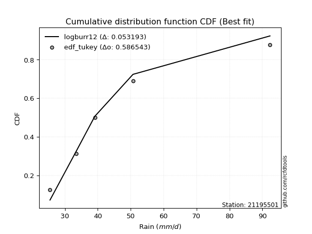</img>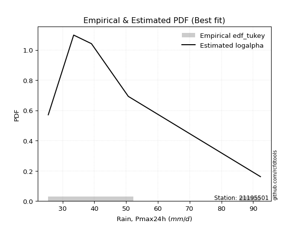</img>

</div>


### 8. EDF Gringorten (1963)

Gringorten plotting position formula is essential for estimating the probability and return periods of extreme events like floods and heavy rainfall. The constant _a=0.44_.

<div align="center">


$P=(m-a)/(n+1-2a)$


</div>


**8.1. Empirical values**

<div align="center">

|                | 0                   | 1                  | 2              | 3                 | 4                  |
|:---------------|:--------------------|:-------------------|:---------------|:------------------|:-------------------|
| date           | 2017                | 2016               | 2018           | 2019              | 2020               |
| x              | 25.5                | 33.5               | 39.1           | 50.7              | 92.3               |
| m              | 1                   | 2                  | 3              | 4                 | 5                  |
| empirical_dist | edf_gringorten      | edf_gringorten     | edf_gringorten | edf_gringorten    | edf_gringorten     |
| empirical      | 0.10937500000000001 | 0.3046875          | 0.5            | 0.6953125         | 0.8906249999999999 |
| empirical_tr   | 1.1228070175438596  | 1.4382022471910112 | 2.0            | 3.282051282051282 | 9.142857142857133  |

</div>


**8.2. Kolmogorov-Smirnov fit test (sorted by Δ)**


<div align="center">

|                | 0                   | 1                   | 2                   | 3                   | 4                   | 5                   | 6                   | 7                    | 8                   | 9                   | 10                  | 11                   | 12                  | 13                  | 14                  | 15                  | 16                  | 17                   | 18                  | 19                  | 20                 | 21                  | 22                  | 23                   | 24                   | 25                 | 26                  | 27                  | 28                  | 29                  | 30                  | 31                  | 32                 | 33                  | 34                  | 35                  | 36                  | 37                  | 38                  | 39                  | 40                  | 41                  | 42                  | 43                  | 44                  | 45                  | 46                  | 47                  | 48                  | 49                  | 50                  | 51                 | 52                 | 53                  | 54                  | 55                  | 56                  | 57                  | 58                 | 59                  | 60                  | 61                  | 62                  | 63                  | 64                  | 65                 | 66                  | 67                  | 68                  | 69                  | 70                 | 71                  | 72                  | 73                  | 74                  | 75                  | 76                 | 77                  | 78                 | 79                  | 80                  | 81                 | 82                  | 83                  | 84                  | 85                  | 86                 | 87                  | 88                  | 89                  | 90                  | 91                  | 92                  | 93                  | 94                  | 95                  | 96                 | 97                  | 98                 | 99                  | 100                 | 101                 | 102                 | 103                 | 104                 | 105                | 106                | 107                 | 108                 | 109                 | 110                 | 111                 | 112                | 113                 | 114                | 115                 | 116                | 117                | 118                 | 119                 | 120                 | 121                 | 122                 | 123                | 124                | 125                | 126                | 127                | 128                | 129                 | 130                 | 131                | 132                | 133                | 134                 | 135                | 136                | 137                 | 138                | 139                | 140                 | 141                 | 142                | 143                 | 144                 | 145                | 146                | 147                | 148                 | 149                 | 150                | 151                | 152                | 153                | 154                | 155                | 156                | 157                | 158                | 159                |
|:---------------|:--------------------|:--------------------|:--------------------|:--------------------|:--------------------|:--------------------|:--------------------|:---------------------|:--------------------|:--------------------|:--------------------|:---------------------|:--------------------|:--------------------|:--------------------|:--------------------|:--------------------|:---------------------|:--------------------|:--------------------|:-------------------|:--------------------|:--------------------|:---------------------|:---------------------|:-------------------|:--------------------|:--------------------|:--------------------|:--------------------|:--------------------|:--------------------|:-------------------|:--------------------|:--------------------|:--------------------|:--------------------|:--------------------|:--------------------|:--------------------|:--------------------|:--------------------|:--------------------|:--------------------|:--------------------|:--------------------|:--------------------|:--------------------|:--------------------|:--------------------|:--------------------|:-------------------|:-------------------|:--------------------|:--------------------|:--------------------|:--------------------|:--------------------|:-------------------|:--------------------|:--------------------|:--------------------|:--------------------|:--------------------|:--------------------|:-------------------|:--------------------|:--------------------|:--------------------|:--------------------|:-------------------|:--------------------|:--------------------|:--------------------|:--------------------|:--------------------|:-------------------|:--------------------|:-------------------|:--------------------|:--------------------|:-------------------|:--------------------|:--------------------|:--------------------|:--------------------|:-------------------|:--------------------|:--------------------|:--------------------|:--------------------|:--------------------|:--------------------|:--------------------|:--------------------|:--------------------|:-------------------|:--------------------|:-------------------|:--------------------|:--------------------|:--------------------|:--------------------|:--------------------|:--------------------|:-------------------|:-------------------|:--------------------|:--------------------|:--------------------|:--------------------|:--------------------|:-------------------|:--------------------|:-------------------|:--------------------|:-------------------|:-------------------|:--------------------|:--------------------|:--------------------|:--------------------|:--------------------|:-------------------|:-------------------|:-------------------|:-------------------|:-------------------|:-------------------|:--------------------|:--------------------|:-------------------|:-------------------|:-------------------|:--------------------|:-------------------|:-------------------|:--------------------|:-------------------|:-------------------|:--------------------|:--------------------|:-------------------|:--------------------|:--------------------|:-------------------|:-------------------|:-------------------|:--------------------|:--------------------|:-------------------|:-------------------|:-------------------|:-------------------|:-------------------|:-------------------|:-------------------|:-------------------|:-------------------|:-------------------|
| station        | 21195501            | 21195501            | 21195501            | 21195501            | 21195501            | 21195501            | 21195501            | 21195501             | 21195501            | 21195501            | 21195501            | 21195501             | 21195501            | 21195501            | 21195501            | 21195501            | 21195501            | 21195501             | 21195501            | 21195501            | 21195501           | 21195501            | 21195501            | 21195501             | 21195501             | 21195501           | 21195501            | 21195501            | 21195501            | 21195501            | 21195501            | 21195501            | 21195501           | 21195501            | 21195501            | 21195501            | 21195501            | 21195501            | 21195501            | 21195501            | 21195501            | 21195501            | 21195501            | 21195501            | 21195501            | 21195501            | 21195501            | 21195501            | 21195501            | 21195501            | 21195501            | 21195501           | 21195501           | 21195501            | 21195501            | 21195501            | 21195501            | 21195501            | 21195501           | 21195501            | 21195501            | 21195501            | 21195501            | 21195501            | 21195501            | 21195501           | 21195501            | 21195501            | 21195501            | 21195501            | 21195501           | 21195501            | 21195501            | 21195501            | 21195501            | 21195501            | 21195501           | 21195501            | 21195501           | 21195501            | 21195501            | 21195501           | 21195501            | 21195501            | 21195501            | 21195501            | 21195501           | 21195501            | 21195501            | 21195501            | 21195501            | 21195501            | 21195501            | 21195501            | 21195501            | 21195501            | 21195501           | 21195501            | 21195501           | 21195501            | 21195501            | 21195501            | 21195501            | 21195501            | 21195501            | 21195501           | 21195501           | 21195501            | 21195501            | 21195501            | 21195501            | 21195501            | 21195501           | 21195501            | 21195501           | 21195501            | 21195501           | 21195501           | 21195501            | 21195501            | 21195501            | 21195501            | 21195501            | 21195501           | 21195501           | 21195501           | 21195501           | 21195501           | 21195501           | 21195501            | 21195501            | 21195501           | 21195501           | 21195501           | 21195501            | 21195501           | 21195501           | 21195501            | 21195501           | 21195501           | 21195501            | 21195501            | 21195501           | 21195501            | 21195501            | 21195501           | 21195501           | 21195501           | 21195501            | 21195501            | 21195501           | 21195501           | 21195501           | 21195501           | 21195501           | 21195501           | 21195501           | 21195501           | 21195501           | 21195501           |
| empirical_dist | edf_gringorten      | edf_gringorten      | edf_gringorten      | edf_gringorten      | edf_gringorten      | edf_gringorten      | edf_gringorten      | edf_gringorten       | edf_gringorten      | edf_gringorten      | edf_gringorten      | edf_gringorten       | edf_gringorten      | edf_gringorten      | edf_gringorten      | edf_gringorten      | edf_gringorten      | edf_gringorten       | edf_gringorten      | edf_gringorten      | edf_gringorten     | edf_gringorten      | edf_gringorten      | edf_gringorten       | edf_gringorten       | edf_gringorten     | edf_gringorten      | edf_gringorten      | edf_gringorten      | edf_gringorten      | edf_gringorten      | edf_gringorten      | edf_gringorten     | edf_gringorten      | edf_gringorten      | edf_gringorten      | edf_gringorten      | edf_gringorten      | edf_gringorten      | edf_gringorten      | edf_gringorten      | edf_gringorten      | edf_gringorten      | edf_gringorten      | edf_gringorten      | edf_gringorten      | edf_gringorten      | edf_gringorten      | edf_gringorten      | edf_gringorten      | edf_gringorten      | edf_gringorten     | edf_gringorten     | edf_gringorten      | edf_gringorten      | edf_gringorten      | edf_gringorten      | edf_gringorten      | edf_gringorten     | edf_gringorten      | edf_gringorten      | edf_gringorten      | edf_gringorten      | edf_gringorten      | edf_gringorten      | edf_gringorten     | edf_gringorten      | edf_gringorten      | edf_gringorten      | edf_gringorten      | edf_gringorten     | edf_gringorten      | edf_gringorten      | edf_gringorten      | edf_gringorten      | edf_gringorten      | edf_gringorten     | edf_gringorten      | edf_gringorten     | edf_gringorten      | edf_gringorten      | edf_gringorten     | edf_gringorten      | edf_gringorten      | edf_gringorten      | edf_gringorten      | edf_gringorten     | edf_gringorten      | edf_gringorten      | edf_gringorten      | edf_gringorten      | edf_gringorten      | edf_gringorten      | edf_gringorten      | edf_gringorten      | edf_gringorten      | edf_gringorten     | edf_gringorten      | edf_gringorten     | edf_gringorten      | edf_gringorten      | edf_gringorten      | edf_gringorten      | edf_gringorten      | edf_gringorten      | edf_gringorten     | edf_gringorten     | edf_gringorten      | edf_gringorten      | edf_gringorten      | edf_gringorten      | edf_gringorten      | edf_gringorten     | edf_gringorten      | edf_gringorten     | edf_gringorten      | edf_gringorten     | edf_gringorten     | edf_gringorten      | edf_gringorten      | edf_gringorten      | edf_gringorten      | edf_gringorten      | edf_gringorten     | edf_gringorten     | edf_gringorten     | edf_gringorten     | edf_gringorten     | edf_gringorten     | edf_gringorten      | edf_gringorten      | edf_gringorten     | edf_gringorten     | edf_gringorten     | edf_gringorten      | edf_gringorten     | edf_gringorten     | edf_gringorten      | edf_gringorten     | edf_gringorten     | edf_gringorten      | edf_gringorten      | edf_gringorten     | edf_gringorten      | edf_gringorten      | edf_gringorten     | edf_gringorten     | edf_gringorten     | edf_gringorten      | edf_gringorten      | edf_gringorten     | edf_gringorten     | edf_gringorten     | edf_gringorten     | edf_gringorten     | edf_gringorten     | edf_gringorten     | edf_gringorten     | edf_gringorten     | edf_gringorten     |
| p_dist         | logburr12           | logalpha            | logmielke           | loginvweibull       | loggenextreme       | logburr             | logexponnorm        | burr                 | alpha               | logf                | mielke              | loggumbel_r          | logfoldnorm         | loggenlogistic      | lograyleigh         | invgamma            | logweibull_max      | logjohnsonsu         | loginvgauss         | nct                 | logkstwobign       | logfatiguelife      | loginvgamma         | logpearson3          | loghalfnorm          | logmaxwell         | invgauss            | halflogistic        | lognct              | logmoyal            | logbetaprime        | logrice             | ncf                | betaprime           | loganglit           | foldnorm            | halfnorm            | logsemicircular     | moyal               | pearson3            | logloggamma         | logt                | lognorm             | logcrystalball      | dgamma              | burr12              | gumbel_r            | logksone            | logncf              | genlogistic         | exponnorm           | loggenexpon        | logtruncexpon      | wald                | truncnorm           | genexpon            | logbradford         | logtruncnorm        | logkappa3          | kappa3              | loggompertz         | logbeta             | loghalfgennorm      | gengamma            | exponweib           | vonmises_line      | loglomax            | loggausshyper       | logweibull_min      | gompertz            | lomax              | loghalflogistic     | logwald             | logskewnorm         | loglogistic         | rayleigh            | logarcsine         | logdgamma           | loghypsecant       | logexponpow         | logdweibull         | maxwell            | gennorm             | logcosine           | logtruncweibull_min | lognakagami         | kstwobign          | dweibull            | loglaplace          | loglaplace          | logexponweib        | logtukeylambda      | t                   | norm                | crystalball         | weibull_min         | anglit             | nakagami            | semicircular       | loggumbel_l         | loguniform          | logkappa4           | logistic            | arcsine             | rice                | logloglaplace      | gamma              | logvonmises_line    | skewnorm            | f                   | hypsecant           | logwrapcauchy       | logargus           | truncweibull_min    | loggennorm         | logrdist            | laplace            | cosine             | loggamma            | loggamma            | gumbel_l            | johnsonsb           | wrapcauchy          | truncexpon         | loglevy_l          | logtriang          | exponpow           | halfgennorm        | loggenpareto       | logerlang           | bradford            | levy_l             | tukeylambda        | kappa4             | ksone               | argus              | beta               | uniform             | loggenhalflogistic | genpareto          | triang              | genextreme          | logjohnsonsb       | gausshyper          | logtrapezoid        | rdist              | genhalflogistic    | fatiguelife        | invweibull          | powerlaw            | loggengamma        | truncpareto        | logpowerlaw        | weibull_max        | trapezoid          | erlang             | logtruncpareto     | johnsonsu          | logvonmises        | vonmises           |
| delta          | 0.03756825870158027 | 0.04211628434419895 | 0.04279051243501385 | 0.04303773470377746 | 0.04304549425642877 | 0.04322169163009969 | 0.04446958253094298 | 0.045754773907994525 | 0.04589517511776291 | 0.04683641212485316 | 0.04901650507420398 | 0.049438859184984585 | 0.05006789672829115 | 0.05040655821400708 | 0.05067837494596161 | 0.05088075812123858 | 0.05089360936149567 | 0.051972037245070726 | 0.05275185144539447 | 0.05304756371720876 | 0.0534051841188149 | 0.05497495374601144 | 0.05852964357045187 | 0.059213206966866105 | 0.061568932210727324 | 0.0629647642726266 | 0.06444018659003392 | 0.06475330095488674 | 0.06769805009114621 | 0.07033105997595568 | 0.07593482861933115 | 0.07689437987564207 | 0.0769287165373097 | 0.07745359323970219 | 0.08359731147580252 | 0.08394419162281375 | 0.08430039225237773 | 0.08479000617620636 | 0.08498749588760346 | 0.09288584810711914 | 0.09592583355999462 | 0.09704459722572806 | 0.09704642773922506 | 0.09712483877811035 | 0.09869668787528241 | 0.09997668928305337 | 0.10278068208293811 | 0.10601544769132487 | 0.10688440698196104 | 0.10717327692016704 | 0.10817582403637217 | 0.1084722715455469 | 0.1093627184050551 | 0.10937485092180721 | 0.10937499151237559 | 0.10937499337921074 | 0.10937499766496185 | 0.10937499779128591 | 0.1093749988085271 | 0.10937499904144647 | 0.10937499984300693 | 0.10937499995384918 | 0.10937499997510863 | 0.10937499999090305 | 0.10937499999139975 | 0.1093749999988971 | 0.10937499999901878 | 0.10937499999982125 | 0.10937499999998265 | 0.10937499999999585 | 0.1093749999999997 | 0.10937500000000001 | 0.10937500000000001 | 0.10937500000000001 | 0.10960869179482519 | 0.11243579056783481 | 0.1159395579778737 | 0.11859396165550518 | 0.1199134586202894 | 0.12039683420905645 | 0.12121277291478338 | 0.1224171122035097 | 0.12285752493515556 | 0.12614526410154414 | 0.12672099259897007 | 0.13291144625803775 | 0.1343391123126691 | 0.14563135388305132 | 0.14676892712525813 | 0.14676892712525813 | 0.14681466442502156 | 0.15310835408721601 | 0.15331387316484113 | 0.15331965048903828 | 0.15331965058610297 | 0.15487750808214973 | 0.1592954443925182 | 0.15975996986267432 | 0.1617605012393284 | 0.16385486997356996 | 0.16771189688308702 | 0.16868723030653732 | 0.16894104904234897 | 0.17155463133982796 | 0.17257086988886683 | 0.1732750522284897 | 0.1739846394661314 | 0.17734351015274202 | 0.17747567472548442 | 0.18222351140694065 | 0.18291517268642954 | 0.18385479264338833 | 0.1857243795678596 | 0.18831064448935447 | 0.1953125          | 0.20863853747236116 | 0.2110742384819131 | 0.2121170499477385 | 0.21926549202598933 | 0.21926549202598933 | 0.22114475259202448 | 0.22625804608727962 | 0.23285768987213645 | 0.2365569563717707 | 0.2398779329179821 | 0.243447079257343  | 0.2450712034576552 | 0.2499927736360299 | 0.2508741246184018 | 0.25266024908900486 | 0.25644000604403483 | 0.265620273656602  | 0.2819670237430856 | 0.2883736875228891 | 0.29760790918163665 | 0.2995771319754471 | 0.3046774600369739 | 0.31806699101796404 | 0.3195883906278409 | 0.32679750073444   | 0.34315420374151917 | 0.36126447220901925 | 0.3829442672517891 | 0.38433466585062886 | 0.41595169450222824 | 0.4297518972180764 | 0.4311463669791329 | 0.4380732521773836 | 0.45141333708171283 | 0.47280422728836946 | 0.483908348328973  | 0.4967884378006008 | 0.514535121526353  | 0.5239703370899031 | 0.5371435584419981 | 0.5445295330045617 | 0.5456801024370938 | 0.6275957848295046 | 1.0676307943473016 | 14.120899266822548 |
| deltao         | 0.5865427407550001  | 0.5865427407550001  | 0.5865427407550001  | 0.5865427407550001  | 0.5865427407550001  | 0.5865427407550001  | 0.5865427407550001  | 0.5865427407550001   | 0.5865427407550001  | 0.5865427407550001  | 0.5865427407550001  | 0.5865427407550001   | 0.5865427407550001  | 0.5865427407550001  | 0.5865427407550001  | 0.5865427407550001  | 0.5865427407550001  | 0.5865427407550001   | 0.5865427407550001  | 0.5865427407550001  | 0.5865427407550001 | 0.5865427407550001  | 0.5865427407550001  | 0.5865427407550001   | 0.5865427407550001   | 0.5865427407550001 | 0.5865427407550001  | 0.5865427407550001  | 0.5865427407550001  | 0.5865427407550001  | 0.5865427407550001  | 0.5865427407550001  | 0.5865427407550001 | 0.5865427407550001  | 0.5865427407550001  | 0.5865427407550001  | 0.5865427407550001  | 0.5865427407550001  | 0.5865427407550001  | 0.5865427407550001  | 0.5865427407550001  | 0.5865427407550001  | 0.5865427407550001  | 0.5865427407550001  | 0.5865427407550001  | 0.5865427407550001  | 0.5865427407550001  | 0.5865427407550001  | 0.5865427407550001  | 0.5865427407550001  | 0.5865427407550001  | 0.5865427407550001 | 0.5865427407550001 | 0.5865427407550001  | 0.5865427407550001  | 0.5865427407550001  | 0.5865427407550001  | 0.5865427407550001  | 0.5865427407550001 | 0.5865427407550001  | 0.5865427407550001  | 0.5865427407550001  | 0.5865427407550001  | 0.5865427407550001  | 0.5865427407550001  | 0.5865427407550001 | 0.5865427407550001  | 0.5865427407550001  | 0.5865427407550001  | 0.5865427407550001  | 0.5865427407550001 | 0.5865427407550001  | 0.5865427407550001  | 0.5865427407550001  | 0.5865427407550001  | 0.5865427407550001  | 0.5865427407550001 | 0.5865427407550001  | 0.5865427407550001 | 0.5865427407550001  | 0.5865427407550001  | 0.5865427407550001 | 0.5865427407550001  | 0.5865427407550001  | 0.5865427407550001  | 0.5865427407550001  | 0.5865427407550001 | 0.5865427407550001  | 0.5865427407550001  | 0.5865427407550001  | 0.5865427407550001  | 0.5865427407550001  | 0.5865427407550001  | 0.5865427407550001  | 0.5865427407550001  | 0.5865427407550001  | 0.5865427407550001 | 0.5865427407550001  | 0.5865427407550001 | 0.5865427407550001  | 0.5865427407550001  | 0.5865427407550001  | 0.5865427407550001  | 0.5865427407550001  | 0.5865427407550001  | 0.5865427407550001 | 0.5865427407550001 | 0.5865427407550001  | 0.5865427407550001  | 0.5865427407550001  | 0.5865427407550001  | 0.5865427407550001  | 0.5865427407550001 | 0.5865427407550001  | 0.5865427407550001 | 0.5865427407550001  | 0.5865427407550001 | 0.5865427407550001 | 0.5865427407550001  | 0.5865427407550001  | 0.5865427407550001  | 0.5865427407550001  | 0.5865427407550001  | 0.5865427407550001 | 0.5865427407550001 | 0.5865427407550001 | 0.5865427407550001 | 0.5865427407550001 | 0.5865427407550001 | 0.5865427407550001  | 0.5865427407550001  | 0.5865427407550001 | 0.5865427407550001 | 0.5865427407550001 | 0.5865427407550001  | 0.5865427407550001 | 0.5865427407550001 | 0.5865427407550001  | 0.5865427407550001 | 0.5865427407550001 | 0.5865427407550001  | 0.5865427407550001  | 0.5865427407550001 | 0.5865427407550001  | 0.5865427407550001  | 0.5865427407550001 | 0.5865427407550001 | 0.5865427407550001 | 0.5865427407550001  | 0.5865427407550001  | 0.5865427407550001 | 0.5865427407550001 | 0.5865427407550001 | 0.5865427407550001 | 0.5865427407550001 | 0.5865427407550001 | 0.5865427407550001 | 0.5865427407550001 | 0.5865427407550001 | 0.5865427407550001 |
| eval           | Δo > Δ              | Δo > Δ              | Δo > Δ              | Δo > Δ              | Δo > Δ              | Δo > Δ              | Δo > Δ              | Δo > Δ               | Δo > Δ              | Δo > Δ              | Δo > Δ              | Δo > Δ               | Δo > Δ              | Δo > Δ              | Δo > Δ              | Δo > Δ              | Δo > Δ              | Δo > Δ               | Δo > Δ              | Δo > Δ              | Δo > Δ             | Δo > Δ              | Δo > Δ              | Δo > Δ               | Δo > Δ               | Δo > Δ             | Δo > Δ              | Δo > Δ              | Δo > Δ              | Δo > Δ              | Δo > Δ              | Δo > Δ              | Δo > Δ             | Δo > Δ              | Δo > Δ              | Δo > Δ              | Δo > Δ              | Δo > Δ              | Δo > Δ              | Δo > Δ              | Δo > Δ              | Δo > Δ              | Δo > Δ              | Δo > Δ              | Δo > Δ              | Δo > Δ              | Δo > Δ              | Δo > Δ              | Δo > Δ              | Δo > Δ              | Δo > Δ              | Δo > Δ             | Δo > Δ             | Δo > Δ              | Δo > Δ              | Δo > Δ              | Δo > Δ              | Δo > Δ              | Δo > Δ             | Δo > Δ              | Δo > Δ              | Δo > Δ              | Δo > Δ              | Δo > Δ              | Δo > Δ              | Δo > Δ             | Δo > Δ              | Δo > Δ              | Δo > Δ              | Δo > Δ              | Δo > Δ             | Δo > Δ              | Δo > Δ              | Δo > Δ              | Δo > Δ              | Δo > Δ              | Δo > Δ             | Δo > Δ              | Δo > Δ             | Δo > Δ              | Δo > Δ              | Δo > Δ             | Δo > Δ              | Δo > Δ              | Δo > Δ              | Δo > Δ              | Δo > Δ             | Δo > Δ              | Δo > Δ              | Δo > Δ              | Δo > Δ              | Δo > Δ              | Δo > Δ              | Δo > Δ              | Δo > Δ              | Δo > Δ              | Δo > Δ             | Δo > Δ              | Δo > Δ             | Δo > Δ              | Δo > Δ              | Δo > Δ              | Δo > Δ              | Δo > Δ              | Δo > Δ              | Δo > Δ             | Δo > Δ             | Δo > Δ              | Δo > Δ              | Δo > Δ              | Δo > Δ              | Δo > Δ              | Δo > Δ             | Δo > Δ              | Δo > Δ             | Δo > Δ              | Δo > Δ             | Δo > Δ             | Δo > Δ              | Δo > Δ              | Δo > Δ              | Δo > Δ              | Δo > Δ              | Δo > Δ             | Δo > Δ             | Δo > Δ             | Δo > Δ             | Δo > Δ             | Δo > Δ             | Δo > Δ              | Δo > Δ              | Δo > Δ             | Δo > Δ             | Δo > Δ             | Δo > Δ              | Δo > Δ             | Δo > Δ             | Δo > Δ              | Δo > Δ             | Δo > Δ             | Δo > Δ              | Δo > Δ              | Δo > Δ             | Δo > Δ              | Δo > Δ              | Δo > Δ             | Δo > Δ             | Δo > Δ             | Δo > Δ              | Δo > Δ              | Δo > Δ             | Δo > Δ             | Δo > Δ             | Δo > Δ             | Δo > Δ             | Δo > Δ             | Δo > Δ             | Δo <= Δ            | Δo <= Δ            | Δo <= Δ            |
| fit            | 1                   | 1                   | 1                   | 1                   | 1                   | 1                   | 1                   | 1                    | 1                   | 1                   | 1                   | 1                    | 1                   | 1                   | 1                   | 1                   | 1                   | 1                    | 1                   | 1                   | 1                  | 1                   | 1                   | 1                    | 1                    | 1                  | 1                   | 1                   | 1                   | 1                   | 1                   | 1                   | 1                  | 1                   | 1                   | 1                   | 1                   | 1                   | 1                   | 1                   | 1                   | 1                   | 1                   | 1                   | 1                   | 1                   | 1                   | 1                   | 1                   | 1                   | 1                   | 1                  | 1                  | 1                   | 1                   | 1                   | 1                   | 1                   | 1                  | 1                   | 1                   | 1                   | 1                   | 1                   | 1                   | 1                  | 1                   | 1                   | 1                   | 1                   | 1                  | 1                   | 1                   | 1                   | 1                   | 1                   | 1                  | 1                   | 1                  | 1                   | 1                   | 1                  | 1                   | 1                   | 1                   | 1                   | 1                  | 1                   | 1                   | 1                   | 1                   | 1                   | 1                   | 1                   | 1                   | 1                   | 1                  | 1                   | 1                  | 1                   | 1                   | 1                   | 1                   | 1                   | 1                   | 1                  | 1                  | 1                   | 1                   | 1                   | 1                   | 1                   | 1                  | 1                   | 1                  | 1                   | 1                  | 1                  | 1                   | 1                   | 1                   | 1                   | 1                   | 1                  | 1                  | 1                  | 1                  | 1                  | 1                  | 1                   | 1                   | 1                  | 1                  | 1                  | 1                   | 1                  | 1                  | 1                   | 1                  | 1                  | 1                   | 1                   | 1                  | 1                   | 1                   | 1                  | 1                  | 1                  | 1                   | 1                   | 1                  | 1                  | 1                  | 1                  | 1                  | 1                  | 1                  | 0                  | 0                  | 0                  |
| n              | 5                   | 5                   | 5                   | 5                   | 5                   | 5                   | 5                   | 5                    | 5                   | 5                   | 5                   | 5                    | 5                   | 5                   | 5                   | 5                   | 5                   | 5                    | 5                   | 5                   | 5                  | 5                   | 5                   | 5                    | 5                    | 5                  | 5                   | 5                   | 5                   | 5                   | 5                   | 5                   | 5                  | 5                   | 5                   | 5                   | 5                   | 5                   | 5                   | 5                   | 5                   | 5                   | 5                   | 5                   | 5                   | 5                   | 5                   | 5                   | 5                   | 5                   | 5                   | 5                  | 5                  | 5                   | 5                   | 5                   | 5                   | 5                   | 5                  | 5                   | 5                   | 5                   | 5                   | 5                   | 5                   | 5                  | 5                   | 5                   | 5                   | 5                   | 5                  | 5                   | 5                   | 5                   | 5                   | 5                   | 5                  | 5                   | 5                  | 5                   | 5                   | 5                  | 5                   | 5                   | 5                   | 5                   | 5                  | 5                   | 5                   | 5                   | 5                   | 5                   | 5                   | 5                   | 5                   | 5                   | 5                  | 5                   | 5                  | 5                   | 5                   | 5                   | 5                   | 5                   | 5                   | 5                  | 5                  | 5                   | 5                   | 5                   | 5                   | 5                   | 5                  | 5                   | 5                  | 5                   | 5                  | 5                  | 5                   | 5                   | 5                   | 5                   | 5                   | 5                  | 5                  | 5                  | 5                  | 5                  | 5                  | 5                   | 5                   | 5                  | 5                  | 5                  | 5                   | 5                  | 5                  | 5                   | 5                  | 5                  | 5                   | 5                   | 5                  | 5                   | 5                   | 5                  | 5                  | 5                  | 5                   | 5                   | 5                  | 5                  | 5                  | 5                  | 5                  | 5                  | 5                  | 5                  | 5                  | 5                  |
| best_fit       | 1                   | 0                   | 0                   | 0                   | 0                   | 0                   | 0                   | 0                    | 0                   | 0                   | 0                   | 0                    | 0                   | 0                   | 0                   | 0                   | 0                   | 0                    | 0                   | 0                   | 0                  | 0                   | 0                   | 0                    | 0                    | 0                  | 0                   | 0                   | 0                   | 0                   | 0                   | 0                   | 0                  | 0                   | 0                   | 0                   | 0                   | 0                   | 0                   | 0                   | 0                   | 0                   | 0                   | 0                   | 0                   | 0                   | 0                   | 0                   | 0                   | 0                   | 0                   | 0                  | 0                  | 0                   | 0                   | 0                   | 0                   | 0                   | 0                  | 0                   | 0                   | 0                   | 0                   | 0                   | 0                   | 0                  | 0                   | 0                   | 0                   | 0                   | 0                  | 0                   | 0                   | 0                   | 0                   | 0                   | 0                  | 0                   | 0                  | 0                   | 0                   | 0                  | 0                   | 0                   | 0                   | 0                   | 0                  | 0                   | 0                   | 0                   | 0                   | 0                   | 0                   | 0                   | 0                   | 0                   | 0                  | 0                   | 0                  | 0                   | 0                   | 0                   | 0                   | 0                   | 0                   | 0                  | 0                  | 0                   | 0                   | 0                   | 0                   | 0                   | 0                  | 0                   | 0                  | 0                   | 0                  | 0                  | 0                   | 0                   | 0                   | 0                   | 0                   | 0                  | 0                  | 0                  | 0                  | 0                  | 0                  | 0                   | 0                   | 0                  | 0                  | 0                  | 0                   | 0                  | 0                  | 0                   | 0                  | 0                  | 0                   | 0                   | 0                  | 0                   | 0                   | 0                  | 0                  | 0                  | 0                   | 0                   | 0                  | 0                  | 0                  | 0                  | 0                  | 0                  | 0                  | 0                  | 0                  | 0                  |
| best_fit_sort  | 1                   | 2                   | 3                   | 4                   | 5                   | 6                   | 7                   | 8                    | 9                   | 10                  | 11                  | 12                   | 13                  | 14                  | 15                  | 16                  | 17                  | 18                   | 19                  | 20                  | 21                 | 22                  | 23                  | 24                   | 25                   | 26                 | 27                  | 28                  | 29                  | 30                  | 31                  | 32                  | 33                 | 34                  | 35                  | 36                  | 37                  | 38                  | 39                  | 40                  | 41                  | 42                  | 43                  | 44                  | 45                  | 46                  | 47                  | 48                  | 49                  | 50                  | 51                  | 52                 | 53                 | 54                  | 55                  | 56                  | 57                  | 58                  | 59                 | 60                  | 61                  | 62                  | 63                  | 64                  | 65                  | 66                 | 67                  | 68                  | 69                  | 70                  | 71                 | 72                  | 73                  | 74                  | 75                  | 76                  | 77                 | 78                  | 79                 | 80                  | 81                  | 82                 | 83                  | 84                  | 85                  | 86                  | 87                 | 88                  | 89                  | 90                  | 91                  | 92                  | 93                  | 94                  | 95                  | 96                  | 97                 | 98                  | 99                 | 100                 | 101                 | 102                 | 103                 | 104                 | 105                 | 106                | 107                | 108                 | 109                 | 110                 | 111                 | 112                 | 113                | 114                 | 115                | 116                 | 117                | 118                | 119                 | 120                 | 121                 | 122                 | 123                 | 124                | 125                | 126                | 127                | 128                | 129                | 130                 | 131                 | 132                | 133                | 134                | 135                 | 136                | 137                | 138                 | 139                | 140                | 141                 | 142                 | 143                | 144                 | 145                 | 146                | 147                | 148                | 149                 | 150                 | 151                | 152                | 153                | 154                | 155                | 156                | 157                | 158                | 159                | 160                |

</div>


**8.3. Best fit**

<div align="center">

|   id |   station | empirical_dist   | p_dist    |     delta |   deltao | eval   |   fit |   n |   best_fit |   best_fit_sort |
|-----:|----------:|:-----------------|:----------|----------:|---------:|:-------|------:|----:|-----------:|----------------:|
|    0 |  21195501 | edf_gringorten   | logburr12 | 0.0375683 | 0.586543 | Δo > Δ |     1 |   5 |          1 |               1 |

</div>


<div align="center">

</img>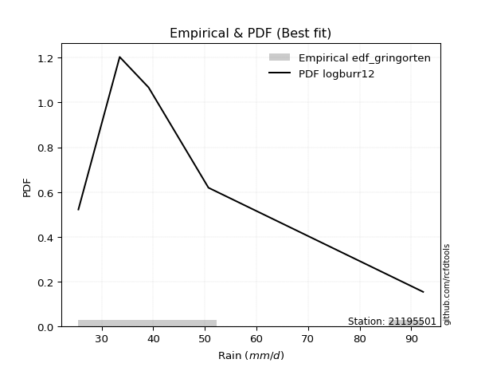</img>

</div>


### 9. EDF Filliben (1975)

The specific values of the constants (0.3175) (often denoted as $alpha$) and (0.365) are derived from a method proposed by James J. Filliben in a 1975 paper. This particular formula is the mean value of the $i$-th order statistic of the normal distribution and is considered a robust and effective plotting position formula for the normal probability plot correlation coefficient test for normality.

<div align="center">


$P=(m-0.3175)/(n+0.365)$


</div>


**9.1. Empirical values**

<div align="center">

|                | 0                   | 1                  | 2            | 3                  | 4                  |
|:---------------|:--------------------|:-------------------|:-------------|:-------------------|:-------------------|
| date           | 2017                | 2016               | 2018         | 2019               | 2020               |
| x              | 25.5                | 33.5               | 39.1         | 50.7               | 92.3               |
| m              | 1                   | 2                  | 3            | 4                  | 5                  |
| empirical_dist | edf_filliben        | edf_filliben       | edf_filliben | edf_filliben       | edf_filliben       |
| empirical      | 0.12721342031686858 | 0.3136067101584343 | 0.5          | 0.6863932898415657 | 0.8727865796831314 |
| empirical_tr   | 1.1457554725040042  | 1.456890699253225  | 2.0          | 3.188707280832095  | 7.860805860805863  |

</div>


**9.2. Kolmogorov-Smirnov fit test (sorted by Δ)**


<div align="center">

|                | 0                   | 1                   | 2                    | 3                   | 4                   | 5                    | 6                    | 7                   | 8                   | 9                   | 10                  | 11                  | 12                  | 13                  | 14                  | 15                  | 16                  | 17                 | 18                  | 19                  | 20                 | 21                  | 22                  | 23                 | 24                  | 25                  | 26                  | 27                 | 28                  | 29                  | 30                  | 31                  | 32                 | 33                 | 34                  | 35                  | 36                  | 37                  | 38                  | 39                  | 40                  | 41                  | 42                  | 43                  | 44                  | 45                  | 46                  | 47                  | 48                  | 49                  | 50                  | 51                  | 52                  | 53                 | 54                  | 55                  | 56                  | 57                  | 58                  | 59                 | 60                  | 61                  | 62                 | 63                  | 64                  | 65                  | 66                  | 67                 | 68                  | 69                  | 70                 | 71                  | 72                  | 73                  | 74                  | 75                 | 76                  | 77                 | 78                  | 79                  | 80                  | 81                  | 82                  | 83                  | 84                 | 85                  | 86                 | 87                 | 88                  | 89                  | 90                  | 91                  | 92                  | 93                  | 94                  | 95                  | 96                 | 97                 | 98                  | 99                  | 100                 | 101                 | 102                 | 103                 | 104                 | 105                 | 106                 | 107                 | 108                | 109                 | 110                 | 111                | 112                 | 113                | 114                 | 115                 | 116                 | 117                 | 118                 | 119                | 120                 | 121                 | 122                 | 123                 | 124                 | 125                 | 126                 | 127                | 128                 | 129                 | 130                 | 131                | 132                | 133                 | 134                | 135                | 136                | 137                | 138                 | 139                | 140                 | 141                | 142                | 143                 | 144                | 145                 | 146                 | 147                | 148                | 149                | 150                | 151                | 152                | 153                | 154                | 155                | 156                | 157                | 158                | 159                |
|:---------------|:--------------------|:--------------------|:---------------------|:--------------------|:--------------------|:---------------------|:---------------------|:--------------------|:--------------------|:--------------------|:--------------------|:--------------------|:--------------------|:--------------------|:--------------------|:--------------------|:--------------------|:-------------------|:--------------------|:--------------------|:-------------------|:--------------------|:--------------------|:-------------------|:--------------------|:--------------------|:--------------------|:-------------------|:--------------------|:--------------------|:--------------------|:--------------------|:-------------------|:-------------------|:--------------------|:--------------------|:--------------------|:--------------------|:--------------------|:--------------------|:--------------------|:--------------------|:--------------------|:--------------------|:--------------------|:--------------------|:--------------------|:--------------------|:--------------------|:--------------------|:--------------------|:--------------------|:--------------------|:-------------------|:--------------------|:--------------------|:--------------------|:--------------------|:--------------------|:-------------------|:--------------------|:--------------------|:-------------------|:--------------------|:--------------------|:--------------------|:--------------------|:-------------------|:--------------------|:--------------------|:-------------------|:--------------------|:--------------------|:--------------------|:--------------------|:-------------------|:--------------------|:-------------------|:--------------------|:--------------------|:--------------------|:--------------------|:--------------------|:--------------------|:-------------------|:--------------------|:-------------------|:-------------------|:--------------------|:--------------------|:--------------------|:--------------------|:--------------------|:--------------------|:--------------------|:--------------------|:-------------------|:-------------------|:--------------------|:--------------------|:--------------------|:--------------------|:--------------------|:--------------------|:--------------------|:--------------------|:--------------------|:--------------------|:-------------------|:--------------------|:--------------------|:-------------------|:--------------------|:-------------------|:--------------------|:--------------------|:--------------------|:--------------------|:--------------------|:-------------------|:--------------------|:--------------------|:--------------------|:--------------------|:--------------------|:--------------------|:--------------------|:-------------------|:--------------------|:--------------------|:--------------------|:-------------------|:-------------------|:--------------------|:-------------------|:-------------------|:-------------------|:-------------------|:--------------------|:-------------------|:--------------------|:-------------------|:-------------------|:--------------------|:-------------------|:--------------------|:--------------------|:-------------------|:-------------------|:-------------------|:-------------------|:-------------------|:-------------------|:-------------------|:-------------------|:-------------------|:-------------------|:-------------------|:-------------------|:-------------------|
| station        | 21195501            | 21195501            | 21195501             | 21195501            | 21195501            | 21195501             | 21195501             | 21195501            | 21195501            | 21195501            | 21195501            | 21195501            | 21195501            | 21195501            | 21195501            | 21195501            | 21195501            | 21195501           | 21195501            | 21195501            | 21195501           | 21195501            | 21195501            | 21195501           | 21195501            | 21195501            | 21195501            | 21195501           | 21195501            | 21195501            | 21195501            | 21195501            | 21195501           | 21195501           | 21195501            | 21195501            | 21195501            | 21195501            | 21195501            | 21195501            | 21195501            | 21195501            | 21195501            | 21195501            | 21195501            | 21195501            | 21195501            | 21195501            | 21195501            | 21195501            | 21195501            | 21195501            | 21195501            | 21195501           | 21195501            | 21195501            | 21195501            | 21195501            | 21195501            | 21195501           | 21195501            | 21195501            | 21195501           | 21195501            | 21195501            | 21195501            | 21195501            | 21195501           | 21195501            | 21195501            | 21195501           | 21195501            | 21195501            | 21195501            | 21195501            | 21195501           | 21195501            | 21195501           | 21195501            | 21195501            | 21195501            | 21195501            | 21195501            | 21195501            | 21195501           | 21195501            | 21195501           | 21195501           | 21195501            | 21195501            | 21195501            | 21195501            | 21195501            | 21195501            | 21195501            | 21195501            | 21195501           | 21195501           | 21195501            | 21195501            | 21195501            | 21195501            | 21195501            | 21195501            | 21195501            | 21195501            | 21195501            | 21195501            | 21195501           | 21195501            | 21195501            | 21195501           | 21195501            | 21195501           | 21195501            | 21195501            | 21195501            | 21195501            | 21195501            | 21195501           | 21195501            | 21195501            | 21195501            | 21195501            | 21195501            | 21195501            | 21195501            | 21195501           | 21195501            | 21195501            | 21195501            | 21195501           | 21195501           | 21195501            | 21195501           | 21195501           | 21195501           | 21195501           | 21195501            | 21195501           | 21195501            | 21195501           | 21195501           | 21195501            | 21195501           | 21195501            | 21195501            | 21195501           | 21195501           | 21195501           | 21195501           | 21195501           | 21195501           | 21195501           | 21195501           | 21195501           | 21195501           | 21195501           | 21195501           | 21195501           |
| empirical_dist | edf_filliben        | edf_filliben        | edf_filliben         | edf_filliben        | edf_filliben        | edf_filliben         | edf_filliben         | edf_filliben        | edf_filliben        | edf_filliben        | edf_filliben        | edf_filliben        | edf_filliben        | edf_filliben        | edf_filliben        | edf_filliben        | edf_filliben        | edf_filliben       | edf_filliben        | edf_filliben        | edf_filliben       | edf_filliben        | edf_filliben        | edf_filliben       | edf_filliben        | edf_filliben        | edf_filliben        | edf_filliben       | edf_filliben        | edf_filliben        | edf_filliben        | edf_filliben        | edf_filliben       | edf_filliben       | edf_filliben        | edf_filliben        | edf_filliben        | edf_filliben        | edf_filliben        | edf_filliben        | edf_filliben        | edf_filliben        | edf_filliben        | edf_filliben        | edf_filliben        | edf_filliben        | edf_filliben        | edf_filliben        | edf_filliben        | edf_filliben        | edf_filliben        | edf_filliben        | edf_filliben        | edf_filliben       | edf_filliben        | edf_filliben        | edf_filliben        | edf_filliben        | edf_filliben        | edf_filliben       | edf_filliben        | edf_filliben        | edf_filliben       | edf_filliben        | edf_filliben        | edf_filliben        | edf_filliben        | edf_filliben       | edf_filliben        | edf_filliben        | edf_filliben       | edf_filliben        | edf_filliben        | edf_filliben        | edf_filliben        | edf_filliben       | edf_filliben        | edf_filliben       | edf_filliben        | edf_filliben        | edf_filliben        | edf_filliben        | edf_filliben        | edf_filliben        | edf_filliben       | edf_filliben        | edf_filliben       | edf_filliben       | edf_filliben        | edf_filliben        | edf_filliben        | edf_filliben        | edf_filliben        | edf_filliben        | edf_filliben        | edf_filliben        | edf_filliben       | edf_filliben       | edf_filliben        | edf_filliben        | edf_filliben        | edf_filliben        | edf_filliben        | edf_filliben        | edf_filliben        | edf_filliben        | edf_filliben        | edf_filliben        | edf_filliben       | edf_filliben        | edf_filliben        | edf_filliben       | edf_filliben        | edf_filliben       | edf_filliben        | edf_filliben        | edf_filliben        | edf_filliben        | edf_filliben        | edf_filliben       | edf_filliben        | edf_filliben        | edf_filliben        | edf_filliben        | edf_filliben        | edf_filliben        | edf_filliben        | edf_filliben       | edf_filliben        | edf_filliben        | edf_filliben        | edf_filliben       | edf_filliben       | edf_filliben        | edf_filliben       | edf_filliben       | edf_filliben       | edf_filliben       | edf_filliben        | edf_filliben       | edf_filliben        | edf_filliben       | edf_filliben       | edf_filliben        | edf_filliben       | edf_filliben        | edf_filliben        | edf_filliben       | edf_filliben       | edf_filliben       | edf_filliben       | edf_filliben       | edf_filliben       | edf_filliben       | edf_filliben       | edf_filliben       | edf_filliben       | edf_filliben       | edf_filliben       | edf_filliben       |
| p_dist         | logburr12           | logalpha            | logmielke            | loginvweibull       | loggenextreme       | logburr              | logexponnorm         | burr                | alpha               | logf                | mielke              | loggumbel_r         | logfoldnorm         | loggenlogistic      | lograyleigh         | invgamma            | logweibull_max      | logjohnsonsu       | loginvgauss         | logpearson3         | nct                | logkstwobign        | logmaxwell          | logfatiguelife     | halflogistic        | invgauss            | foldnorm            | halfnorm           | lognct              | loginvgamma         | logbetaprime        | logrice             | betaprime          | loghalfnorm        | ncf                 | moyal               | logmoyal            | loganglit           | logncf              | pearson3            | logloggamma         | logsemicircular     | logt                | lognorm             | logcrystalball      | gumbel_r            | dgamma              | rayleigh            | genlogistic         | loglogistic         | logdweibull         | burr12              | maxwell             | loghypsecant       | logksone            | exponnorm           | logcosine           | loggenexpon         | logtruncexpon       | wald               | lognakagami         | truncnorm           | genexpon           | logbradford         | logtruncnorm        | logkappa3           | kappa3              | loggompertz        | logbeta             | loghalfgennorm      | gengamma           | exponweib           | logtruncweibull_min | vonmises_line       | loglomax            | loggausshyper      | logexponpow         | logweibull_min     | gompertz            | lomax               | logarcsine          | logskewnorm         | loghalflogistic     | logwald             | logdgamma          | dweibull            | gennorm            | kstwobign          | logexponweib        | weibull_min         | loglaplace          | loglaplace          | logtukeylambda      | anglit              | nakagami            | t                   | crystalball        | norm               | semicircular        | logloglaplace       | arcsine             | loggumbel_l         | logkappa4           | gamma               | loguniform          | logistic            | rice                | f                   | logwrapcauchy      | logvonmises_line    | skewnorm            | truncweibull_min   | hypsecant           | logargus           | loggennorm          | logrdist            | cosine              | loggamma            | loggamma            | laplace            | gumbel_l            | johnsonsb           | loglevy_l           | wrapcauchy          | loggenpareto        | logtriang           | exponpow            | truncexpon         | halfgennorm         | logerlang           | levy_l              | bradford           | kappa4             | beta                | ksone              | argus              | tukeylambda        | uniform            | loggenhalflogistic  | genpareto          | triang              | genextreme         | logjohnsonsb       | gausshyper          | logtrapezoid       | rdist               | genhalflogistic     | fatiguelife        | invweibull         | powerlaw           | loggengamma        | truncpareto        | logpowerlaw        | weibull_max        | trapezoid          | erlang             | logtruncpareto     | johnsonsu          | logvonmises        | vonmises           |
| delta          | 0.05540667901844884 | 0.05995470466106752 | 0.060628932751882414 | 0.06087615502064603 | 0.06088391457329734 | 0.061060111946968254 | 0.062308002847811544 | 0.06359319422486309 | 0.06373359543463147 | 0.06467483244172173 | 0.06685492539107254 | 0.06727727950185303 | 0.06790631704515959 | 0.06824497853087552 | 0.06838898441029184 | 0.06871917843810715 | 0.06873202967836411 | 0.0698104575619393 | 0.07059027176226304 | 0.07072592195895444 | 0.0708859840340772 | 0.07124360443568334 | 0.07183679539878929 | 0.07281337406288   | 0.07290283333512115 | 0.07367805581990096 | 0.07502498146437941 | 0.0753811820939434 | 0.07589147683564756 | 0.07636806388732031 | 0.07685235685427116 | 0.07689437987564207 | 0.078788028988649  | 0.0794073525275959 | 0.08083681860540348 | 0.08498749588760346 | 0.08816948029282426 | 0.08878745909966645 | 0.08904598666509247 | 0.09288584810711914 | 0.09592583355999462 | 0.09650825613628722 | 0.09704459722572806 | 0.09704642773922506 | 0.09712483877811035 | 0.10278068208293811 | 0.10654249641722824 | 0.10698596424992746 | 0.10717327692016704 | 0.10960869179482519 | 0.11229356275634905 | 0.11359862067081569 | 0.11904026975738285 | 0.1199134586202894 | 0.12385386800819331 | 0.12601424435324074 | 0.12614526410154414 | 0.12631069186241545 | 0.12720113872192368 | 0.1272132712386758 | 0.12721335916835727 | 0.12721341182924414 | 0.1272134136960793 | 0.12721341798183042 | 0.12721341810815448 | 0.12721341912539566 | 0.12721341935831504 | 0.1272134201598755 | 0.12721342027071775 | 0.12721342029197721 | 0.1272134203077716 | 0.12721342030826832 | 0.12721342031495278 | 0.12721342031576555 | 0.12721342031588734 | 0.1272134203166897 | 0.12721342031685012 | 0.1272134203168512 | 0.12721342031686442 | 0.12721342031686828 | 0.12721342031686855 | 0.12721342031686858 | 0.12721342031686858 | 0.12721342031686858 | 0.1275131718139395 | 0.12779293356618274 | 0.1317767350935899 | 0.1343391123126691 | 0.13789545426658728 | 0.14595829792371545 | 0.14676892712525813 | 0.14676892712525813 | 0.14733348705511418 | 0.15037623423408386 | 0.15084075970424005 | 0.15091110128373086 | 0.1509196257410636 | 0.1509196268462426 | 0.15284129108089406 | 0.15543663191162127 | 0.16263542118139362 | 0.16385486997356996 | 0.16416418692293633 | 0.16506542930769713 | 0.16771189688308702 | 0.16894104904234897 | 0.17257086988886683 | 0.17330430124850638 | 0.174935582484954  | 0.17734351015274202 | 0.17747567472548442 | 0.1793914343309202 | 0.18291517268642954 | 0.1857243795678596 | 0.18639328984156572 | 0.19971932731392683 | 0.20319783978930417 | 0.21034628186755505 | 0.21034628186755505 | 0.2110742384819131 | 0.21222554243359015 | 0.21733883592884534 | 0.22203951260111351 | 0.22393847971370212 | 0.23303570430153323 | 0.23452786909890866 | 0.23615199329922093 | 0.2365569563717707 | 0.24107356347759562 | 0.24374103893057059 | 0.24778185333973343 | 0.2510796694309767 | 0.2794544773644548 | 0.28683903972010527 | 0.2886886990232023 | 0.2906579218170128 | 0.2908862339015199 | 0.3091477808595297 | 0.31066918046940656 | 0.3178782905760057 | 0.33423499358308484 | 0.3434260518921508 | 0.3740250570933548 | 0.37541545569219453 | 0.4070324843437939 | 0.41191347690120783 | 0.42222715682069856 | 0.4291540420189493 | 0.4335749167648444 | 0.4638850171299352 | 0.4749891381705387 | 0.4878692276421665 | 0.5056159113679186 | 0.5150511269314688 | 0.5282243482835638 | 0.5356103228461275 | 0.5367608922786595 | 0.6186765746710703 | 1.0854692146641702 | 14.138737687139416 |
| deltao         | 0.5865427407550001  | 0.5865427407550001  | 0.5865427407550001   | 0.5865427407550001  | 0.5865427407550001  | 0.5865427407550001   | 0.5865427407550001   | 0.5865427407550001  | 0.5865427407550001  | 0.5865427407550001  | 0.5865427407550001  | 0.5865427407550001  | 0.5865427407550001  | 0.5865427407550001  | 0.5865427407550001  | 0.5865427407550001  | 0.5865427407550001  | 0.5865427407550001 | 0.5865427407550001  | 0.5865427407550001  | 0.5865427407550001 | 0.5865427407550001  | 0.5865427407550001  | 0.5865427407550001 | 0.5865427407550001  | 0.5865427407550001  | 0.5865427407550001  | 0.5865427407550001 | 0.5865427407550001  | 0.5865427407550001  | 0.5865427407550001  | 0.5865427407550001  | 0.5865427407550001 | 0.5865427407550001 | 0.5865427407550001  | 0.5865427407550001  | 0.5865427407550001  | 0.5865427407550001  | 0.5865427407550001  | 0.5865427407550001  | 0.5865427407550001  | 0.5865427407550001  | 0.5865427407550001  | 0.5865427407550001  | 0.5865427407550001  | 0.5865427407550001  | 0.5865427407550001  | 0.5865427407550001  | 0.5865427407550001  | 0.5865427407550001  | 0.5865427407550001  | 0.5865427407550001  | 0.5865427407550001  | 0.5865427407550001 | 0.5865427407550001  | 0.5865427407550001  | 0.5865427407550001  | 0.5865427407550001  | 0.5865427407550001  | 0.5865427407550001 | 0.5865427407550001  | 0.5865427407550001  | 0.5865427407550001 | 0.5865427407550001  | 0.5865427407550001  | 0.5865427407550001  | 0.5865427407550001  | 0.5865427407550001 | 0.5865427407550001  | 0.5865427407550001  | 0.5865427407550001 | 0.5865427407550001  | 0.5865427407550001  | 0.5865427407550001  | 0.5865427407550001  | 0.5865427407550001 | 0.5865427407550001  | 0.5865427407550001 | 0.5865427407550001  | 0.5865427407550001  | 0.5865427407550001  | 0.5865427407550001  | 0.5865427407550001  | 0.5865427407550001  | 0.5865427407550001 | 0.5865427407550001  | 0.5865427407550001 | 0.5865427407550001 | 0.5865427407550001  | 0.5865427407550001  | 0.5865427407550001  | 0.5865427407550001  | 0.5865427407550001  | 0.5865427407550001  | 0.5865427407550001  | 0.5865427407550001  | 0.5865427407550001 | 0.5865427407550001 | 0.5865427407550001  | 0.5865427407550001  | 0.5865427407550001  | 0.5865427407550001  | 0.5865427407550001  | 0.5865427407550001  | 0.5865427407550001  | 0.5865427407550001  | 0.5865427407550001  | 0.5865427407550001  | 0.5865427407550001 | 0.5865427407550001  | 0.5865427407550001  | 0.5865427407550001 | 0.5865427407550001  | 0.5865427407550001 | 0.5865427407550001  | 0.5865427407550001  | 0.5865427407550001  | 0.5865427407550001  | 0.5865427407550001  | 0.5865427407550001 | 0.5865427407550001  | 0.5865427407550001  | 0.5865427407550001  | 0.5865427407550001  | 0.5865427407550001  | 0.5865427407550001  | 0.5865427407550001  | 0.5865427407550001 | 0.5865427407550001  | 0.5865427407550001  | 0.5865427407550001  | 0.5865427407550001 | 0.5865427407550001 | 0.5865427407550001  | 0.5865427407550001 | 0.5865427407550001 | 0.5865427407550001 | 0.5865427407550001 | 0.5865427407550001  | 0.5865427407550001 | 0.5865427407550001  | 0.5865427407550001 | 0.5865427407550001 | 0.5865427407550001  | 0.5865427407550001 | 0.5865427407550001  | 0.5865427407550001  | 0.5865427407550001 | 0.5865427407550001 | 0.5865427407550001 | 0.5865427407550001 | 0.5865427407550001 | 0.5865427407550001 | 0.5865427407550001 | 0.5865427407550001 | 0.5865427407550001 | 0.5865427407550001 | 0.5865427407550001 | 0.5865427407550001 | 0.5865427407550001 |
| eval           | Δo > Δ              | Δo > Δ              | Δo > Δ               | Δo > Δ              | Δo > Δ              | Δo > Δ               | Δo > Δ               | Δo > Δ              | Δo > Δ              | Δo > Δ              | Δo > Δ              | Δo > Δ              | Δo > Δ              | Δo > Δ              | Δo > Δ              | Δo > Δ              | Δo > Δ              | Δo > Δ             | Δo > Δ              | Δo > Δ              | Δo > Δ             | Δo > Δ              | Δo > Δ              | Δo > Δ             | Δo > Δ              | Δo > Δ              | Δo > Δ              | Δo > Δ             | Δo > Δ              | Δo > Δ              | Δo > Δ              | Δo > Δ              | Δo > Δ             | Δo > Δ             | Δo > Δ              | Δo > Δ              | Δo > Δ              | Δo > Δ              | Δo > Δ              | Δo > Δ              | Δo > Δ              | Δo > Δ              | Δo > Δ              | Δo > Δ              | Δo > Δ              | Δo > Δ              | Δo > Δ              | Δo > Δ              | Δo > Δ              | Δo > Δ              | Δo > Δ              | Δo > Δ              | Δo > Δ              | Δo > Δ             | Δo > Δ              | Δo > Δ              | Δo > Δ              | Δo > Δ              | Δo > Δ              | Δo > Δ             | Δo > Δ              | Δo > Δ              | Δo > Δ             | Δo > Δ              | Δo > Δ              | Δo > Δ              | Δo > Δ              | Δo > Δ             | Δo > Δ              | Δo > Δ              | Δo > Δ             | Δo > Δ              | Δo > Δ              | Δo > Δ              | Δo > Δ              | Δo > Δ             | Δo > Δ              | Δo > Δ             | Δo > Δ              | Δo > Δ              | Δo > Δ              | Δo > Δ              | Δo > Δ              | Δo > Δ              | Δo > Δ             | Δo > Δ              | Δo > Δ             | Δo > Δ             | Δo > Δ              | Δo > Δ              | Δo > Δ              | Δo > Δ              | Δo > Δ              | Δo > Δ              | Δo > Δ              | Δo > Δ              | Δo > Δ             | Δo > Δ             | Δo > Δ              | Δo > Δ              | Δo > Δ              | Δo > Δ              | Δo > Δ              | Δo > Δ              | Δo > Δ              | Δo > Δ              | Δo > Δ              | Δo > Δ              | Δo > Δ             | Δo > Δ              | Δo > Δ              | Δo > Δ             | Δo > Δ              | Δo > Δ             | Δo > Δ              | Δo > Δ              | Δo > Δ              | Δo > Δ              | Δo > Δ              | Δo > Δ             | Δo > Δ              | Δo > Δ              | Δo > Δ              | Δo > Δ              | Δo > Δ              | Δo > Δ              | Δo > Δ              | Δo > Δ             | Δo > Δ              | Δo > Δ              | Δo > Δ              | Δo > Δ             | Δo > Δ             | Δo > Δ              | Δo > Δ             | Δo > Δ             | Δo > Δ             | Δo > Δ             | Δo > Δ              | Δo > Δ             | Δo > Δ              | Δo > Δ             | Δo > Δ             | Δo > Δ              | Δo > Δ             | Δo > Δ              | Δo > Δ              | Δo > Δ             | Δo > Δ             | Δo > Δ             | Δo > Δ             | Δo > Δ             | Δo > Δ             | Δo > Δ             | Δo > Δ             | Δo > Δ             | Δo > Δ             | Δo <= Δ            | Δo <= Δ            | Δo <= Δ            |
| fit            | 1                   | 1                   | 1                    | 1                   | 1                   | 1                    | 1                    | 1                   | 1                   | 1                   | 1                   | 1                   | 1                   | 1                   | 1                   | 1                   | 1                   | 1                  | 1                   | 1                   | 1                  | 1                   | 1                   | 1                  | 1                   | 1                   | 1                   | 1                  | 1                   | 1                   | 1                   | 1                   | 1                  | 1                  | 1                   | 1                   | 1                   | 1                   | 1                   | 1                   | 1                   | 1                   | 1                   | 1                   | 1                   | 1                   | 1                   | 1                   | 1                   | 1                   | 1                   | 1                   | 1                   | 1                  | 1                   | 1                   | 1                   | 1                   | 1                   | 1                  | 1                   | 1                   | 1                  | 1                   | 1                   | 1                   | 1                   | 1                  | 1                   | 1                   | 1                  | 1                   | 1                   | 1                   | 1                   | 1                  | 1                   | 1                  | 1                   | 1                   | 1                   | 1                   | 1                   | 1                   | 1                  | 1                   | 1                  | 1                  | 1                   | 1                   | 1                   | 1                   | 1                   | 1                   | 1                   | 1                   | 1                  | 1                  | 1                   | 1                   | 1                   | 1                   | 1                   | 1                   | 1                   | 1                   | 1                   | 1                   | 1                  | 1                   | 1                   | 1                  | 1                   | 1                  | 1                   | 1                   | 1                   | 1                   | 1                   | 1                  | 1                   | 1                   | 1                   | 1                   | 1                   | 1                   | 1                   | 1                  | 1                   | 1                   | 1                   | 1                  | 1                  | 1                   | 1                  | 1                  | 1                  | 1                  | 1                   | 1                  | 1                   | 1                  | 1                  | 1                   | 1                  | 1                   | 1                   | 1                  | 1                  | 1                  | 1                  | 1                  | 1                  | 1                  | 1                  | 1                  | 1                  | 0                  | 0                  | 0                  |
| n              | 5                   | 5                   | 5                    | 5                   | 5                   | 5                    | 5                    | 5                   | 5                   | 5                   | 5                   | 5                   | 5                   | 5                   | 5                   | 5                   | 5                   | 5                  | 5                   | 5                   | 5                  | 5                   | 5                   | 5                  | 5                   | 5                   | 5                   | 5                  | 5                   | 5                   | 5                   | 5                   | 5                  | 5                  | 5                   | 5                   | 5                   | 5                   | 5                   | 5                   | 5                   | 5                   | 5                   | 5                   | 5                   | 5                   | 5                   | 5                   | 5                   | 5                   | 5                   | 5                   | 5                   | 5                  | 5                   | 5                   | 5                   | 5                   | 5                   | 5                  | 5                   | 5                   | 5                  | 5                   | 5                   | 5                   | 5                   | 5                  | 5                   | 5                   | 5                  | 5                   | 5                   | 5                   | 5                   | 5                  | 5                   | 5                  | 5                   | 5                   | 5                   | 5                   | 5                   | 5                   | 5                  | 5                   | 5                  | 5                  | 5                   | 5                   | 5                   | 5                   | 5                   | 5                   | 5                   | 5                   | 5                  | 5                  | 5                   | 5                   | 5                   | 5                   | 5                   | 5                   | 5                   | 5                   | 5                   | 5                   | 5                  | 5                   | 5                   | 5                  | 5                   | 5                  | 5                   | 5                   | 5                   | 5                   | 5                   | 5                  | 5                   | 5                   | 5                   | 5                   | 5                   | 5                   | 5                   | 5                  | 5                   | 5                   | 5                   | 5                  | 5                  | 5                   | 5                  | 5                  | 5                  | 5                  | 5                   | 5                  | 5                   | 5                  | 5                  | 5                   | 5                  | 5                   | 5                   | 5                  | 5                  | 5                  | 5                  | 5                  | 5                  | 5                  | 5                  | 5                  | 5                  | 5                  | 5                  | 5                  |
| best_fit       | 1                   | 0                   | 0                    | 0                   | 0                   | 0                    | 0                    | 0                   | 0                   | 0                   | 0                   | 0                   | 0                   | 0                   | 0                   | 0                   | 0                   | 0                  | 0                   | 0                   | 0                  | 0                   | 0                   | 0                  | 0                   | 0                   | 0                   | 0                  | 0                   | 0                   | 0                   | 0                   | 0                  | 0                  | 0                   | 0                   | 0                   | 0                   | 0                   | 0                   | 0                   | 0                   | 0                   | 0                   | 0                   | 0                   | 0                   | 0                   | 0                   | 0                   | 0                   | 0                   | 0                   | 0                  | 0                   | 0                   | 0                   | 0                   | 0                   | 0                  | 0                   | 0                   | 0                  | 0                   | 0                   | 0                   | 0                   | 0                  | 0                   | 0                   | 0                  | 0                   | 0                   | 0                   | 0                   | 0                  | 0                   | 0                  | 0                   | 0                   | 0                   | 0                   | 0                   | 0                   | 0                  | 0                   | 0                  | 0                  | 0                   | 0                   | 0                   | 0                   | 0                   | 0                   | 0                   | 0                   | 0                  | 0                  | 0                   | 0                   | 0                   | 0                   | 0                   | 0                   | 0                   | 0                   | 0                   | 0                   | 0                  | 0                   | 0                   | 0                  | 0                   | 0                  | 0                   | 0                   | 0                   | 0                   | 0                   | 0                  | 0                   | 0                   | 0                   | 0                   | 0                   | 0                   | 0                   | 0                  | 0                   | 0                   | 0                   | 0                  | 0                  | 0                   | 0                  | 0                  | 0                  | 0                  | 0                   | 0                  | 0                   | 0                  | 0                  | 0                   | 0                  | 0                   | 0                   | 0                  | 0                  | 0                  | 0                  | 0                  | 0                  | 0                  | 0                  | 0                  | 0                  | 0                  | 0                  | 0                  |
| best_fit_sort  | 1                   | 2                   | 3                    | 4                   | 5                   | 6                    | 7                    | 8                   | 9                   | 10                  | 11                  | 12                  | 13                  | 14                  | 15                  | 16                  | 17                  | 18                 | 19                  | 20                  | 21                 | 22                  | 23                  | 24                 | 25                  | 26                  | 27                  | 28                 | 29                  | 30                  | 31                  | 32                  | 33                 | 34                 | 35                  | 36                  | 37                  | 38                  | 39                  | 40                  | 41                  | 42                  | 43                  | 44                  | 45                  | 46                  | 47                  | 48                  | 49                  | 50                  | 51                  | 52                  | 53                  | 54                 | 55                  | 56                  | 57                  | 58                  | 59                  | 60                 | 61                  | 62                  | 63                 | 64                  | 65                  | 66                  | 67                  | 68                 | 69                  | 70                  | 71                 | 72                  | 73                  | 74                  | 75                  | 76                 | 77                  | 78                 | 79                  | 80                  | 81                  | 82                  | 83                  | 84                  | 85                 | 86                  | 87                 | 88                 | 89                  | 90                  | 91                  | 92                  | 93                  | 94                  | 95                  | 96                  | 97                 | 98                 | 99                  | 100                 | 101                 | 102                 | 103                 | 104                 | 105                 | 106                 | 107                 | 108                 | 109                | 110                 | 111                 | 112                | 113                 | 114                | 115                 | 116                 | 117                 | 118                 | 119                 | 120                | 121                 | 122                 | 123                 | 124                 | 125                 | 126                 | 127                 | 128                | 129                 | 130                 | 131                 | 132                | 133                | 134                 | 135                | 136                | 137                | 138                | 139                 | 140                | 141                 | 142                | 143                | 144                 | 145                | 146                 | 147                 | 148                | 149                | 150                | 151                | 152                | 153                | 154                | 155                | 156                | 157                | 158                | 159                | 160                |

</div>


**9.3. Best fit**

<div align="center">

|   id |   station | empirical_dist   | p_dist    |     delta |   deltao | eval   |   fit |   n |   best_fit |   best_fit_sort |
|-----:|----------:|:-----------------|:----------|----------:|---------:|:-------|------:|----:|-----------:|----------------:|
|    0 |  21195501 | edf_filliben     | logburr12 | 0.0554067 | 0.586543 | Δo > Δ |     1 |   5 |          1 |               1 |

</div>


<div align="center">

</img></img>

</div>


### 10. EDF Jenkinson (1977)

The Jenkinson formula in hydrology is an empirical plotting position formula used to estimate the non-exceedance probability _(P)_ or return period _(T)_ of a given ordered observation within a sample. It is a widely used method in the frequency analysis of extreme events such as floods and rainfall, as it provides a distribution-free way to plot data. _a≈0.31_ and _b≈0.38_ are constants derived to approximate the median of the probability distribution for the given rank.

<div align="center">


$P=(m-a)/(n+b)$


</div>


**10.1. Empirical values**

<div align="center">

|                | 0                   | 1                  | 2             | 3                  | 4                  |
|:---------------|:--------------------|:-------------------|:--------------|:-------------------|:-------------------|
| date           | 2017                | 2016               | 2018          | 2019               | 2020               |
| x              | 25.5                | 33.5               | 39.1          | 50.7               | 92.3               |
| m              | 1                   | 2                  | 3             | 4                  | 5                  |
| empirical_dist | edf_jenkinson       | edf_jenkinson      | edf_jenkinson | edf_jenkinson      | edf_jenkinson      |
| empirical      | 0.12825278810408922 | 0.3141263940520446 | 0.5           | 0.6858736059479554 | 0.8717472118959109 |
| empirical_tr   | 1.1471215351812367  | 1.4579945799457996 | 2.0           | 3.183431952662722  | 7.797101449275368  |

</div>


**10.2. Kolmogorov-Smirnov fit test (sorted by Δ)**


<div align="center">

|                | 0                    | 1                   | 2                   | 3                   | 4                   | 5                   | 6                   | 7                   | 8                   | 9                   | 10                  | 11                 | 12                  | 13                 | 14                  | 15                  | 16                 | 17                  | 18                  | 19                  | 20                  | 21                  | 22                  | 23                  | 24                  | 25                  | 26                 | 27                  | 28                  | 29                 | 30                  | 31                  | 32                  | 33                  | 34                  | 35                  | 36                  | 37                 | 38                  | 39                  | 40                  | 41                  | 42                  | 43                  | 44                 | 45                  | 46                  | 47                  | 48                  | 49                  | 50                  | 51                  | 52                  | 53                 | 54                  | 55                  | 56                 | 57                  | 58                  | 59                  | 60                  | 61                  | 62                 | 63                  | 64                  | 65                  | 66                  | 67                 | 68                  | 69                  | 70                  | 71                  | 72                  | 73                  | 74                  | 75                  | 76                  | 77                  | 78                  | 79                  | 80                  | 81                 | 82                  | 83                  | 84                  | 85                  | 86                  | 87                 | 88                  | 89                 | 90                  | 91                  | 92                  | 93                  | 94                 | 95                  | 96                 | 97                 | 98                  | 99                 | 100                | 101                 | 102                 | 103                 | 104                 | 105                 | 106                 | 107                 | 108                 | 109                 | 110                 | 111                 | 112                 | 113                | 114                 | 115                | 116                 | 117                | 118                | 119                | 120                 | 121                | 122                 | 123                | 124                | 125                 | 126                 | 127                | 128                 | 129                 | 130                | 131                | 132                 | 133                | 134                | 135                 | 136                 | 137                | 138                | 139                 | 140                | 141                 | 142                | 143                | 144                | 145                 | 146                | 147                 | 148                | 149                 | 150                | 151                 | 152                | 153                | 154                | 155                | 156                | 157                | 158                | 159                |
|:---------------|:---------------------|:--------------------|:--------------------|:--------------------|:--------------------|:--------------------|:--------------------|:--------------------|:--------------------|:--------------------|:--------------------|:-------------------|:--------------------|:-------------------|:--------------------|:--------------------|:-------------------|:--------------------|:--------------------|:--------------------|:--------------------|:--------------------|:--------------------|:--------------------|:--------------------|:--------------------|:-------------------|:--------------------|:--------------------|:-------------------|:--------------------|:--------------------|:--------------------|:--------------------|:--------------------|:--------------------|:--------------------|:-------------------|:--------------------|:--------------------|:--------------------|:--------------------|:--------------------|:--------------------|:-------------------|:--------------------|:--------------------|:--------------------|:--------------------|:--------------------|:--------------------|:--------------------|:--------------------|:-------------------|:--------------------|:--------------------|:-------------------|:--------------------|:--------------------|:--------------------|:--------------------|:--------------------|:-------------------|:--------------------|:--------------------|:--------------------|:--------------------|:-------------------|:--------------------|:--------------------|:--------------------|:--------------------|:--------------------|:--------------------|:--------------------|:--------------------|:--------------------|:--------------------|:--------------------|:--------------------|:--------------------|:-------------------|:--------------------|:--------------------|:--------------------|:--------------------|:--------------------|:-------------------|:--------------------|:-------------------|:--------------------|:--------------------|:--------------------|:--------------------|:-------------------|:--------------------|:-------------------|:-------------------|:--------------------|:-------------------|:-------------------|:--------------------|:--------------------|:--------------------|:--------------------|:--------------------|:--------------------|:--------------------|:--------------------|:--------------------|:--------------------|:--------------------|:--------------------|:-------------------|:--------------------|:-------------------|:--------------------|:-------------------|:-------------------|:-------------------|:--------------------|:-------------------|:--------------------|:-------------------|:-------------------|:--------------------|:--------------------|:-------------------|:--------------------|:--------------------|:-------------------|:-------------------|:--------------------|:-------------------|:-------------------|:--------------------|:--------------------|:-------------------|:-------------------|:--------------------|:-------------------|:--------------------|:-------------------|:-------------------|:-------------------|:--------------------|:-------------------|:--------------------|:-------------------|:--------------------|:-------------------|:--------------------|:-------------------|:-------------------|:-------------------|:-------------------|:-------------------|:-------------------|:-------------------|:-------------------|
| station        | 21195501             | 21195501            | 21195501            | 21195501            | 21195501            | 21195501            | 21195501            | 21195501            | 21195501            | 21195501            | 21195501            | 21195501           | 21195501            | 21195501           | 21195501            | 21195501            | 21195501           | 21195501            | 21195501            | 21195501            | 21195501            | 21195501            | 21195501            | 21195501            | 21195501            | 21195501            | 21195501           | 21195501            | 21195501            | 21195501           | 21195501            | 21195501            | 21195501            | 21195501            | 21195501            | 21195501            | 21195501            | 21195501           | 21195501            | 21195501            | 21195501            | 21195501            | 21195501            | 21195501            | 21195501           | 21195501            | 21195501            | 21195501            | 21195501            | 21195501            | 21195501            | 21195501            | 21195501            | 21195501           | 21195501            | 21195501            | 21195501           | 21195501            | 21195501            | 21195501            | 21195501            | 21195501            | 21195501           | 21195501            | 21195501            | 21195501            | 21195501            | 21195501           | 21195501            | 21195501            | 21195501            | 21195501            | 21195501            | 21195501            | 21195501            | 21195501            | 21195501            | 21195501            | 21195501            | 21195501            | 21195501            | 21195501           | 21195501            | 21195501            | 21195501            | 21195501            | 21195501            | 21195501           | 21195501            | 21195501           | 21195501            | 21195501            | 21195501            | 21195501            | 21195501           | 21195501            | 21195501           | 21195501           | 21195501            | 21195501           | 21195501           | 21195501            | 21195501            | 21195501            | 21195501            | 21195501            | 21195501            | 21195501            | 21195501            | 21195501            | 21195501            | 21195501            | 21195501            | 21195501           | 21195501            | 21195501           | 21195501            | 21195501           | 21195501           | 21195501           | 21195501            | 21195501           | 21195501            | 21195501           | 21195501           | 21195501            | 21195501            | 21195501           | 21195501            | 21195501            | 21195501           | 21195501           | 21195501            | 21195501           | 21195501           | 21195501            | 21195501            | 21195501           | 21195501           | 21195501            | 21195501           | 21195501            | 21195501           | 21195501           | 21195501           | 21195501            | 21195501           | 21195501            | 21195501           | 21195501            | 21195501           | 21195501            | 21195501           | 21195501           | 21195501           | 21195501           | 21195501           | 21195501           | 21195501           | 21195501           |
| empirical_dist | edf_jenkinson        | edf_jenkinson       | edf_jenkinson       | edf_jenkinson       | edf_jenkinson       | edf_jenkinson       | edf_jenkinson       | edf_jenkinson       | edf_jenkinson       | edf_jenkinson       | edf_jenkinson       | edf_jenkinson      | edf_jenkinson       | edf_jenkinson      | edf_jenkinson       | edf_jenkinson       | edf_jenkinson      | edf_jenkinson       | edf_jenkinson       | edf_jenkinson       | edf_jenkinson       | edf_jenkinson       | edf_jenkinson       | edf_jenkinson       | edf_jenkinson       | edf_jenkinson       | edf_jenkinson      | edf_jenkinson       | edf_jenkinson       | edf_jenkinson      | edf_jenkinson       | edf_jenkinson       | edf_jenkinson       | edf_jenkinson       | edf_jenkinson       | edf_jenkinson       | edf_jenkinson       | edf_jenkinson      | edf_jenkinson       | edf_jenkinson       | edf_jenkinson       | edf_jenkinson       | edf_jenkinson       | edf_jenkinson       | edf_jenkinson      | edf_jenkinson       | edf_jenkinson       | edf_jenkinson       | edf_jenkinson       | edf_jenkinson       | edf_jenkinson       | edf_jenkinson       | edf_jenkinson       | edf_jenkinson      | edf_jenkinson       | edf_jenkinson       | edf_jenkinson      | edf_jenkinson       | edf_jenkinson       | edf_jenkinson       | edf_jenkinson       | edf_jenkinson       | edf_jenkinson      | edf_jenkinson       | edf_jenkinson       | edf_jenkinson       | edf_jenkinson       | edf_jenkinson      | edf_jenkinson       | edf_jenkinson       | edf_jenkinson       | edf_jenkinson       | edf_jenkinson       | edf_jenkinson       | edf_jenkinson       | edf_jenkinson       | edf_jenkinson       | edf_jenkinson       | edf_jenkinson       | edf_jenkinson       | edf_jenkinson       | edf_jenkinson      | edf_jenkinson       | edf_jenkinson       | edf_jenkinson       | edf_jenkinson       | edf_jenkinson       | edf_jenkinson      | edf_jenkinson       | edf_jenkinson      | edf_jenkinson       | edf_jenkinson       | edf_jenkinson       | edf_jenkinson       | edf_jenkinson      | edf_jenkinson       | edf_jenkinson      | edf_jenkinson      | edf_jenkinson       | edf_jenkinson      | edf_jenkinson      | edf_jenkinson       | edf_jenkinson       | edf_jenkinson       | edf_jenkinson       | edf_jenkinson       | edf_jenkinson       | edf_jenkinson       | edf_jenkinson       | edf_jenkinson       | edf_jenkinson       | edf_jenkinson       | edf_jenkinson       | edf_jenkinson      | edf_jenkinson       | edf_jenkinson      | edf_jenkinson       | edf_jenkinson      | edf_jenkinson      | edf_jenkinson      | edf_jenkinson       | edf_jenkinson      | edf_jenkinson       | edf_jenkinson      | edf_jenkinson      | edf_jenkinson       | edf_jenkinson       | edf_jenkinson      | edf_jenkinson       | edf_jenkinson       | edf_jenkinson      | edf_jenkinson      | edf_jenkinson       | edf_jenkinson      | edf_jenkinson      | edf_jenkinson       | edf_jenkinson       | edf_jenkinson      | edf_jenkinson      | edf_jenkinson       | edf_jenkinson      | edf_jenkinson       | edf_jenkinson      | edf_jenkinson      | edf_jenkinson      | edf_jenkinson       | edf_jenkinson      | edf_jenkinson       | edf_jenkinson      | edf_jenkinson       | edf_jenkinson      | edf_jenkinson       | edf_jenkinson      | edf_jenkinson      | edf_jenkinson      | edf_jenkinson      | edf_jenkinson      | edf_jenkinson      | edf_jenkinson      | edf_jenkinson      |
| p_dist         | logburr12            | logalpha            | logmielke           | loginvweibull       | loggenextreme       | logburr             | logexponnorm        | burr                | alpha               | logf                | mielke              | loggumbel_r        | logfoldnorm         | loggenlogistic     | lograyleigh         | invgamma            | logweibull_max     | logjohnsonsu        | loginvgauss         | logpearson3         | nct                 | logkstwobign        | logmaxwell          | logfatiguelife      | halflogistic        | foldnorm            | invgauss           | halfnorm            | lognct              | loginvgamma        | logrice             | logbetaprime        | betaprime           | loghalfnorm         | ncf                 | moyal               | logncf              | logmoyal           | loganglit           | pearson3            | logloggamma         | logt                | lognorm             | logcrystalball      | logsemicircular    | gumbel_r            | rayleigh            | genlogistic         | dgamma              | loglogistic         | logdweibull         | burr12              | maxwell             | loghypsecant       | logksone            | logcosine           | dweibull           | exponnorm           | loggenexpon         | logdgamma           | logtruncexpon       | wald                | lognakagami        | truncnorm           | genexpon            | logbradford         | logtruncnorm        | logkappa3          | kappa3              | loggompertz         | logbeta             | loghalfgennorm      | gengamma            | exponweib           | logtruncweibull_min | vonmises_line       | loglomax            | loggausshyper       | logexponpow         | logweibull_min      | gompertz            | lomax              | logarcsine          | loghalflogistic     | logskewnorm         | logwald             | gennorm             | kstwobign          | logexponweib        | weibull_min        | loglaplace          | loglaplace          | logtukeylambda      | anglit              | nakagami           | t                   | crystalball        | norm               | semicircular        | logloglaplace      | arcsine            | loggumbel_l         | logkappa4           | gamma               | loguniform          | logistic            | rice                | f                   | logwrapcauchy       | logvonmises_line    | skewnorm            | truncweibull_min    | hypsecant           | logargus           | loggennorm          | logrdist           | cosine              | loggamma           | loggamma           | laplace            | gumbel_l            | johnsonsb          | loglevy_l           | wrapcauchy         | loggenpareto       | logtriang           | exponpow            | truncexpon         | halfgennorm         | logerlang           | levy_l             | bradford           | kappa4              | beta               | ksone              | argus               | tukeylambda         | uniform            | loggenhalflogistic | genpareto           | triang             | genextreme          | logjohnsonsb       | gausshyper         | logtrapezoid       | rdist               | genhalflogistic    | fatiguelife         | invweibull         | powerlaw            | loggengamma        | truncpareto         | logpowerlaw        | weibull_max        | trapezoid          | erlang             | logtruncpareto     | johnsonsu          | logvonmises        | vonmises           |
| delta          | 0.056446046805669475 | 0.06099407244828815 | 0.06166830053910305 | 0.06191552280786666 | 0.06192328236051797 | 0.06209947973418889 | 0.06334737063503218 | 0.06463256201208373 | 0.06477296322185211 | 0.06571420022894237 | 0.06789429317829318 | 0.0683166472890736 | 0.06894568483238017 | 0.0692843463180961 | 0.06942835219751242 | 0.06975854622532779 | 0.0697713974655847 | 0.07084982534915993 | 0.07162963954948368 | 0.07176528974617502 | 0.07192535182129778 | 0.07228297222290392 | 0.07287616318600987 | 0.07385274185010064 | 0.07394220112234173 | 0.07450529757076918 | 0.0747174236071216 | 0.07486149820033317 | 0.07693084462286814 | 0.0774074316745409 | 0.07781352389719776 | 0.07789172464149174 | 0.07982739677586959 | 0.08044672031481653 | 0.08187618639262406 | 0.08498749588760346 | 0.08800661887787184 | 0.0892088480800449 | 0.08982682688688703 | 0.09288584810711914 | 0.09592583355999462 | 0.09704459722572806 | 0.09704642773922506 | 0.09712483877811035 | 0.0975476239235078 | 0.10278068208293811 | 0.10698596424992746 | 0.10717327692016704 | 0.10758186420444882 | 0.10960869179482519 | 0.11177387886273882 | 0.11463798845803633 | 0.11904026975738285 | 0.1199134586202894 | 0.12489323579541389 | 0.12614526410154414 | 0.1267535657789621 | 0.12705361214046137 | 0.12735005964963608 | 0.12803285570754974 | 0.12824050650914431 | 0.12825263902589643 | 0.1282527269555779 | 0.12825277961646478 | 0.12825278148329994 | 0.12825278576905105 | 0.12825278589537512 | 0.1282527869126163 | 0.12825278714553567 | 0.12825278794709613 | 0.12825278805793838 | 0.12825278807919785 | 0.12825278809499224 | 0.12825278809548896 | 0.12825278810217342 | 0.12825278810298613 | 0.12825278810310797 | 0.12825278810391028 | 0.12825278810407076 | 0.12825278810407184 | 0.12825278810408505 | 0.1282527881040889 | 0.12825278810408913 | 0.12825278810408922 | 0.12825278810408922 | 0.12825278810408922 | 0.13229641898720013 | 0.1343391123126691 | 0.13737577037297694 | 0.1454386140301051 | 0.14676892712525813 | 0.14676892712525813 | 0.14733348705511418 | 0.14985655034047363 | 0.1503210758106297 | 0.15091110128373086 | 0.1509196257410636 | 0.1509196268462426 | 0.15232160718728383 | 0.1543972641244007 | 0.1621157372877834 | 0.16385486997356996 | 0.16416418692293633 | 0.16454574541408679 | 0.16771189688308702 | 0.16894104904234897 | 0.17257086988886683 | 0.17278461735489603 | 0.17441589859134377 | 0.17734351015274202 | 0.17747567472548442 | 0.17887175043730985 | 0.18291517268642954 | 0.1857243795678596 | 0.18587360594795543 | 0.1991996434203166 | 0.20267815589569393 | 0.2098265979739447 | 0.2098265979739447 | 0.2110742384819131 | 0.21170585853997992 | 0.216819152035235  | 0.22100014481389288 | 0.2234187958200919 | 0.2319963365143126 | 0.23400818520529842 | 0.23563230940561058 | 0.2365569563717707 | 0.24055387958398528 | 0.24322135503696024 | 0.2467424855525128 | 0.2510796694309767 | 0.27893479347084454 | 0.2857996719328847 | 0.2881690151295921 | 0.29013823792340254 | 0.29140591779513014 | 0.3086280969659195 | 0.3101494965757963 | 0.31735860668239546 | 0.3337153096894746 | 0.34238668410493023 | 0.3735053731997445 | 0.3748957717985843 | 0.4065128004501837 | 0.41087410911398714 | 0.4217074729270883 | 0.42863435812533895 | 0.4325355489776238 | 0.46336533323632484 | 0.4744694542769284 | 0.48734954374855616 | 0.5050962274743083 | 0.5145314430378587 | 0.5277046643899537 | 0.5350906389525172 | 0.5362412083850492 | 0.6181568907774599 | 1.0865085824513907 | 14.139777054926636 |
| deltao         | 0.5865427407550001   | 0.5865427407550001  | 0.5865427407550001  | 0.5865427407550001  | 0.5865427407550001  | 0.5865427407550001  | 0.5865427407550001  | 0.5865427407550001  | 0.5865427407550001  | 0.5865427407550001  | 0.5865427407550001  | 0.5865427407550001 | 0.5865427407550001  | 0.5865427407550001 | 0.5865427407550001  | 0.5865427407550001  | 0.5865427407550001 | 0.5865427407550001  | 0.5865427407550001  | 0.5865427407550001  | 0.5865427407550001  | 0.5865427407550001  | 0.5865427407550001  | 0.5865427407550001  | 0.5865427407550001  | 0.5865427407550001  | 0.5865427407550001 | 0.5865427407550001  | 0.5865427407550001  | 0.5865427407550001 | 0.5865427407550001  | 0.5865427407550001  | 0.5865427407550001  | 0.5865427407550001  | 0.5865427407550001  | 0.5865427407550001  | 0.5865427407550001  | 0.5865427407550001 | 0.5865427407550001  | 0.5865427407550001  | 0.5865427407550001  | 0.5865427407550001  | 0.5865427407550001  | 0.5865427407550001  | 0.5865427407550001 | 0.5865427407550001  | 0.5865427407550001  | 0.5865427407550001  | 0.5865427407550001  | 0.5865427407550001  | 0.5865427407550001  | 0.5865427407550001  | 0.5865427407550001  | 0.5865427407550001 | 0.5865427407550001  | 0.5865427407550001  | 0.5865427407550001 | 0.5865427407550001  | 0.5865427407550001  | 0.5865427407550001  | 0.5865427407550001  | 0.5865427407550001  | 0.5865427407550001 | 0.5865427407550001  | 0.5865427407550001  | 0.5865427407550001  | 0.5865427407550001  | 0.5865427407550001 | 0.5865427407550001  | 0.5865427407550001  | 0.5865427407550001  | 0.5865427407550001  | 0.5865427407550001  | 0.5865427407550001  | 0.5865427407550001  | 0.5865427407550001  | 0.5865427407550001  | 0.5865427407550001  | 0.5865427407550001  | 0.5865427407550001  | 0.5865427407550001  | 0.5865427407550001 | 0.5865427407550001  | 0.5865427407550001  | 0.5865427407550001  | 0.5865427407550001  | 0.5865427407550001  | 0.5865427407550001 | 0.5865427407550001  | 0.5865427407550001 | 0.5865427407550001  | 0.5865427407550001  | 0.5865427407550001  | 0.5865427407550001  | 0.5865427407550001 | 0.5865427407550001  | 0.5865427407550001 | 0.5865427407550001 | 0.5865427407550001  | 0.5865427407550001 | 0.5865427407550001 | 0.5865427407550001  | 0.5865427407550001  | 0.5865427407550001  | 0.5865427407550001  | 0.5865427407550001  | 0.5865427407550001  | 0.5865427407550001  | 0.5865427407550001  | 0.5865427407550001  | 0.5865427407550001  | 0.5865427407550001  | 0.5865427407550001  | 0.5865427407550001 | 0.5865427407550001  | 0.5865427407550001 | 0.5865427407550001  | 0.5865427407550001 | 0.5865427407550001 | 0.5865427407550001 | 0.5865427407550001  | 0.5865427407550001 | 0.5865427407550001  | 0.5865427407550001 | 0.5865427407550001 | 0.5865427407550001  | 0.5865427407550001  | 0.5865427407550001 | 0.5865427407550001  | 0.5865427407550001  | 0.5865427407550001 | 0.5865427407550001 | 0.5865427407550001  | 0.5865427407550001 | 0.5865427407550001 | 0.5865427407550001  | 0.5865427407550001  | 0.5865427407550001 | 0.5865427407550001 | 0.5865427407550001  | 0.5865427407550001 | 0.5865427407550001  | 0.5865427407550001 | 0.5865427407550001 | 0.5865427407550001 | 0.5865427407550001  | 0.5865427407550001 | 0.5865427407550001  | 0.5865427407550001 | 0.5865427407550001  | 0.5865427407550001 | 0.5865427407550001  | 0.5865427407550001 | 0.5865427407550001 | 0.5865427407550001 | 0.5865427407550001 | 0.5865427407550001 | 0.5865427407550001 | 0.5865427407550001 | 0.5865427407550001 |
| eval           | Δo > Δ               | Δo > Δ              | Δo > Δ              | Δo > Δ              | Δo > Δ              | Δo > Δ              | Δo > Δ              | Δo > Δ              | Δo > Δ              | Δo > Δ              | Δo > Δ              | Δo > Δ             | Δo > Δ              | Δo > Δ             | Δo > Δ              | Δo > Δ              | Δo > Δ             | Δo > Δ              | Δo > Δ              | Δo > Δ              | Δo > Δ              | Δo > Δ              | Δo > Δ              | Δo > Δ              | Δo > Δ              | Δo > Δ              | Δo > Δ             | Δo > Δ              | Δo > Δ              | Δo > Δ             | Δo > Δ              | Δo > Δ              | Δo > Δ              | Δo > Δ              | Δo > Δ              | Δo > Δ              | Δo > Δ              | Δo > Δ             | Δo > Δ              | Δo > Δ              | Δo > Δ              | Δo > Δ              | Δo > Δ              | Δo > Δ              | Δo > Δ             | Δo > Δ              | Δo > Δ              | Δo > Δ              | Δo > Δ              | Δo > Δ              | Δo > Δ              | Δo > Δ              | Δo > Δ              | Δo > Δ             | Δo > Δ              | Δo > Δ              | Δo > Δ             | Δo > Δ              | Δo > Δ              | Δo > Δ              | Δo > Δ              | Δo > Δ              | Δo > Δ             | Δo > Δ              | Δo > Δ              | Δo > Δ              | Δo > Δ              | Δo > Δ             | Δo > Δ              | Δo > Δ              | Δo > Δ              | Δo > Δ              | Δo > Δ              | Δo > Δ              | Δo > Δ              | Δo > Δ              | Δo > Δ              | Δo > Δ              | Δo > Δ              | Δo > Δ              | Δo > Δ              | Δo > Δ             | Δo > Δ              | Δo > Δ              | Δo > Δ              | Δo > Δ              | Δo > Δ              | Δo > Δ             | Δo > Δ              | Δo > Δ             | Δo > Δ              | Δo > Δ              | Δo > Δ              | Δo > Δ              | Δo > Δ             | Δo > Δ              | Δo > Δ             | Δo > Δ             | Δo > Δ              | Δo > Δ             | Δo > Δ             | Δo > Δ              | Δo > Δ              | Δo > Δ              | Δo > Δ              | Δo > Δ              | Δo > Δ              | Δo > Δ              | Δo > Δ              | Δo > Δ              | Δo > Δ              | Δo > Δ              | Δo > Δ              | Δo > Δ             | Δo > Δ              | Δo > Δ             | Δo > Δ              | Δo > Δ             | Δo > Δ             | Δo > Δ             | Δo > Δ              | Δo > Δ             | Δo > Δ              | Δo > Δ             | Δo > Δ             | Δo > Δ              | Δo > Δ              | Δo > Δ             | Δo > Δ              | Δo > Δ              | Δo > Δ             | Δo > Δ             | Δo > Δ              | Δo > Δ             | Δo > Δ             | Δo > Δ              | Δo > Δ              | Δo > Δ             | Δo > Δ             | Δo > Δ              | Δo > Δ             | Δo > Δ              | Δo > Δ             | Δo > Δ             | Δo > Δ             | Δo > Δ              | Δo > Δ             | Δo > Δ              | Δo > Δ             | Δo > Δ              | Δo > Δ             | Δo > Δ              | Δo > Δ             | Δo > Δ             | Δo > Δ             | Δo > Δ             | Δo > Δ             | Δo <= Δ            | Δo <= Δ            | Δo <= Δ            |
| fit            | 1                    | 1                   | 1                   | 1                   | 1                   | 1                   | 1                   | 1                   | 1                   | 1                   | 1                   | 1                  | 1                   | 1                  | 1                   | 1                   | 1                  | 1                   | 1                   | 1                   | 1                   | 1                   | 1                   | 1                   | 1                   | 1                   | 1                  | 1                   | 1                   | 1                  | 1                   | 1                   | 1                   | 1                   | 1                   | 1                   | 1                   | 1                  | 1                   | 1                   | 1                   | 1                   | 1                   | 1                   | 1                  | 1                   | 1                   | 1                   | 1                   | 1                   | 1                   | 1                   | 1                   | 1                  | 1                   | 1                   | 1                  | 1                   | 1                   | 1                   | 1                   | 1                   | 1                  | 1                   | 1                   | 1                   | 1                   | 1                  | 1                   | 1                   | 1                   | 1                   | 1                   | 1                   | 1                   | 1                   | 1                   | 1                   | 1                   | 1                   | 1                   | 1                  | 1                   | 1                   | 1                   | 1                   | 1                   | 1                  | 1                   | 1                  | 1                   | 1                   | 1                   | 1                   | 1                  | 1                   | 1                  | 1                  | 1                   | 1                  | 1                  | 1                   | 1                   | 1                   | 1                   | 1                   | 1                   | 1                   | 1                   | 1                   | 1                   | 1                   | 1                   | 1                  | 1                   | 1                  | 1                   | 1                  | 1                  | 1                  | 1                   | 1                  | 1                   | 1                  | 1                  | 1                   | 1                   | 1                  | 1                   | 1                   | 1                  | 1                  | 1                   | 1                  | 1                  | 1                   | 1                   | 1                  | 1                  | 1                   | 1                  | 1                   | 1                  | 1                  | 1                  | 1                   | 1                  | 1                   | 1                  | 1                   | 1                  | 1                   | 1                  | 1                  | 1                  | 1                  | 1                  | 0                  | 0                  | 0                  |
| n              | 5                    | 5                   | 5                   | 5                   | 5                   | 5                   | 5                   | 5                   | 5                   | 5                   | 5                   | 5                  | 5                   | 5                  | 5                   | 5                   | 5                  | 5                   | 5                   | 5                   | 5                   | 5                   | 5                   | 5                   | 5                   | 5                   | 5                  | 5                   | 5                   | 5                  | 5                   | 5                   | 5                   | 5                   | 5                   | 5                   | 5                   | 5                  | 5                   | 5                   | 5                   | 5                   | 5                   | 5                   | 5                  | 5                   | 5                   | 5                   | 5                   | 5                   | 5                   | 5                   | 5                   | 5                  | 5                   | 5                   | 5                  | 5                   | 5                   | 5                   | 5                   | 5                   | 5                  | 5                   | 5                   | 5                   | 5                   | 5                  | 5                   | 5                   | 5                   | 5                   | 5                   | 5                   | 5                   | 5                   | 5                   | 5                   | 5                   | 5                   | 5                   | 5                  | 5                   | 5                   | 5                   | 5                   | 5                   | 5                  | 5                   | 5                  | 5                   | 5                   | 5                   | 5                   | 5                  | 5                   | 5                  | 5                  | 5                   | 5                  | 5                  | 5                   | 5                   | 5                   | 5                   | 5                   | 5                   | 5                   | 5                   | 5                   | 5                   | 5                   | 5                   | 5                  | 5                   | 5                  | 5                   | 5                  | 5                  | 5                  | 5                   | 5                  | 5                   | 5                  | 5                  | 5                   | 5                   | 5                  | 5                   | 5                   | 5                  | 5                  | 5                   | 5                  | 5                  | 5                   | 5                   | 5                  | 5                  | 5                   | 5                  | 5                   | 5                  | 5                  | 5                  | 5                   | 5                  | 5                   | 5                  | 5                   | 5                  | 5                   | 5                  | 5                  | 5                  | 5                  | 5                  | 5                  | 5                  | 5                  |
| best_fit       | 1                    | 0                   | 0                   | 0                   | 0                   | 0                   | 0                   | 0                   | 0                   | 0                   | 0                   | 0                  | 0                   | 0                  | 0                   | 0                   | 0                  | 0                   | 0                   | 0                   | 0                   | 0                   | 0                   | 0                   | 0                   | 0                   | 0                  | 0                   | 0                   | 0                  | 0                   | 0                   | 0                   | 0                   | 0                   | 0                   | 0                   | 0                  | 0                   | 0                   | 0                   | 0                   | 0                   | 0                   | 0                  | 0                   | 0                   | 0                   | 0                   | 0                   | 0                   | 0                   | 0                   | 0                  | 0                   | 0                   | 0                  | 0                   | 0                   | 0                   | 0                   | 0                   | 0                  | 0                   | 0                   | 0                   | 0                   | 0                  | 0                   | 0                   | 0                   | 0                   | 0                   | 0                   | 0                   | 0                   | 0                   | 0                   | 0                   | 0                   | 0                   | 0                  | 0                   | 0                   | 0                   | 0                   | 0                   | 0                  | 0                   | 0                  | 0                   | 0                   | 0                   | 0                   | 0                  | 0                   | 0                  | 0                  | 0                   | 0                  | 0                  | 0                   | 0                   | 0                   | 0                   | 0                   | 0                   | 0                   | 0                   | 0                   | 0                   | 0                   | 0                   | 0                  | 0                   | 0                  | 0                   | 0                  | 0                  | 0                  | 0                   | 0                  | 0                   | 0                  | 0                  | 0                   | 0                   | 0                  | 0                   | 0                   | 0                  | 0                  | 0                   | 0                  | 0                  | 0                   | 0                   | 0                  | 0                  | 0                   | 0                  | 0                   | 0                  | 0                  | 0                  | 0                   | 0                  | 0                   | 0                  | 0                   | 0                  | 0                   | 0                  | 0                  | 0                  | 0                  | 0                  | 0                  | 0                  | 0                  |
| best_fit_sort  | 1                    | 2                   | 3                   | 4                   | 5                   | 6                   | 7                   | 8                   | 9                   | 10                  | 11                  | 12                 | 13                  | 14                 | 15                  | 16                  | 17                 | 18                  | 19                  | 20                  | 21                  | 22                  | 23                  | 24                  | 25                  | 26                  | 27                 | 28                  | 29                  | 30                 | 31                  | 32                  | 33                  | 34                  | 35                  | 36                  | 37                  | 38                 | 39                  | 40                  | 41                  | 42                  | 43                  | 44                  | 45                 | 46                  | 47                  | 48                  | 49                  | 50                  | 51                  | 52                  | 53                  | 54                 | 55                  | 56                  | 57                 | 58                  | 59                  | 60                  | 61                  | 62                  | 63                 | 64                  | 65                  | 66                  | 67                  | 68                 | 69                  | 70                  | 71                  | 72                  | 73                  | 74                  | 75                  | 76                  | 77                  | 78                  | 79                  | 80                  | 81                  | 82                 | 83                  | 84                  | 85                  | 86                  | 87                  | 88                 | 89                  | 90                 | 91                  | 92                  | 93                  | 94                  | 95                 | 96                  | 97                 | 98                 | 99                  | 100                | 101                | 102                 | 103                 | 104                 | 105                 | 106                 | 107                 | 108                 | 109                 | 110                 | 111                 | 112                 | 113                 | 114                | 115                 | 116                | 117                 | 118                | 119                | 120                | 121                 | 122                | 123                 | 124                | 125                | 126                 | 127                 | 128                | 129                 | 130                 | 131                | 132                | 133                 | 134                | 135                | 136                 | 137                 | 138                | 139                | 140                 | 141                | 142                 | 143                | 144                | 145                | 146                 | 147                | 148                 | 149                | 150                 | 151                | 152                 | 153                | 154                | 155                | 156                | 157                | 158                | 159                | 160                |

</div>


**10.3. Best fit**

<div align="center">

|   id |   station | empirical_dist   | p_dist    |    delta |   deltao | eval   |   fit |   n |   best_fit |   best_fit_sort |
|-----:|----------:|:-----------------|:----------|---------:|---------:|:-------|------:|----:|-----------:|----------------:|
|    0 |  21195501 | edf_jenkinson    | logburr12 | 0.056446 | 0.586543 | Δo > Δ |     1 |   5 |          1 |               1 |

</div>


<div align="center">

</img>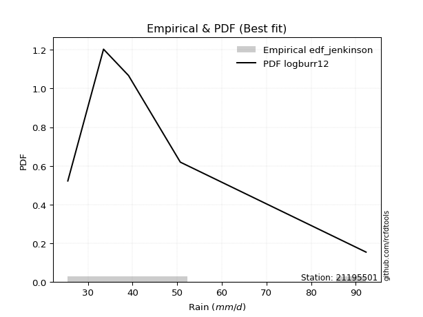</img>

</div>


### 11. EDF Cunnane (1978)

Cunnane´s work in statistical hydrology has focused on the performance and evaluation of different probability distributions (such as GEV, Gumbel, Lognormal) for flood frequency estimation. _b_ is a constant, typically set to 0.4.

<div align="center">


$P=(m-b)/(n+1-2b)$


</div>


**11.1. Empirical values**

<div align="center">

|                | 0                   | 1                  | 2           | 3                  | 4                  |
|:---------------|:--------------------|:-------------------|:------------|:-------------------|:-------------------|
| date           | 2017                | 2016               | 2018        | 2019               | 2020               |
| x              | 25.5                | 33.5               | 39.1        | 50.7               | 92.3               |
| m              | 1                   | 2                  | 3           | 4                  | 5                  |
| empirical_dist | edf_cunnane         | edf_cunnane        | edf_cunnane | edf_cunnane        | edf_cunnane        |
| empirical      | 0.11538461538461538 | 0.3076923076923077 | 0.5         | 0.6923076923076923 | 0.8846153846153845 |
| empirical_tr   | 1.1304347826086958  | 1.4444444444444444 | 2.0         | 3.25               | 8.666666666666655  |

</div>


**11.2. Kolmogorov-Smirnov fit test (sorted by Δ)**


<div align="center">

|                | 0                    | 1                    | 2                   | 3                    | 4                    | 5                   | 6                   | 7                   | 8                   | 9                   | 10                  | 11                   | 12                  | 13                 | 14                  | 15                  | 16                  | 17                  | 18                  | 19                   | 20                   | 21                   | 22                 | 23                   | 24                 | 25                  | 26                  | 27                  | 28                  | 29                  | 30                  | 31                  | 32                 | 33                  | 34                  | 35                  | 36                  | 37                 | 38                  | 39                  | 40                 | 41                  | 42                  | 43                  | 44                  | 45                  | 46                  | 47                  | 48                  | 49                 | 50                  | 51                  | 52                  | 53                  | 54                  | 55                  | 56                  | 57                 | 58                  | 59                  | 60                  | 61                  | 62                  | 63                  | 64                 | 65                  | 66                  | 67                  | 68                  | 69                  | 70                  | 71                  | 72                  | 73                  | 74                  | 75                  | 76                  | 77                  | 78                  | 79                 | 80                 | 81                  | 82                  | 83                  | 84                  | 85                  | 86                 | 87                  | 88                  | 89                  | 90                  | 91                 | 92                  | 93                 | 94                 | 95                  | 96                  | 97                 | 98                  | 99                  | 100                | 101                | 102                 | 103                 | 104                 | 105                | 106                 | 107                 | 108                 | 109                 | 110                 | 111                 | 112                 | 113                | 114                | 115                 | 116                | 117                | 118                 | 119                 | 120                 | 121                | 122                 | 123                 | 124                | 125                 | 126                | 127                 | 128                | 129                 | 130                | 131                 | 132                | 133                | 134                 | 135                | 136                | 137                 | 138                | 139                | 140                 | 141                 | 142                | 143                 | 144                 | 145                | 146                | 147                 | 148                | 149                 | 150                | 151                 | 152                | 153                | 154                | 155                | 156                | 157                | 158                | 159                |
|:---------------|:---------------------|:---------------------|:--------------------|:---------------------|:---------------------|:--------------------|:--------------------|:--------------------|:--------------------|:--------------------|:--------------------|:---------------------|:--------------------|:-------------------|:--------------------|:--------------------|:--------------------|:--------------------|:--------------------|:---------------------|:---------------------|:---------------------|:-------------------|:---------------------|:-------------------|:--------------------|:--------------------|:--------------------|:--------------------|:--------------------|:--------------------|:--------------------|:-------------------|:--------------------|:--------------------|:--------------------|:--------------------|:-------------------|:--------------------|:--------------------|:-------------------|:--------------------|:--------------------|:--------------------|:--------------------|:--------------------|:--------------------|:--------------------|:--------------------|:-------------------|:--------------------|:--------------------|:--------------------|:--------------------|:--------------------|:--------------------|:--------------------|:-------------------|:--------------------|:--------------------|:--------------------|:--------------------|:--------------------|:--------------------|:-------------------|:--------------------|:--------------------|:--------------------|:--------------------|:--------------------|:--------------------|:--------------------|:--------------------|:--------------------|:--------------------|:--------------------|:--------------------|:--------------------|:--------------------|:-------------------|:-------------------|:--------------------|:--------------------|:--------------------|:--------------------|:--------------------|:-------------------|:--------------------|:--------------------|:--------------------|:--------------------|:-------------------|:--------------------|:-------------------|:-------------------|:--------------------|:--------------------|:-------------------|:--------------------|:--------------------|:-------------------|:-------------------|:--------------------|:--------------------|:--------------------|:-------------------|:--------------------|:--------------------|:--------------------|:--------------------|:--------------------|:--------------------|:--------------------|:-------------------|:-------------------|:--------------------|:-------------------|:-------------------|:--------------------|:--------------------|:--------------------|:-------------------|:--------------------|:--------------------|:-------------------|:--------------------|:-------------------|:--------------------|:-------------------|:--------------------|:-------------------|:--------------------|:-------------------|:-------------------|:--------------------|:-------------------|:-------------------|:--------------------|:-------------------|:-------------------|:--------------------|:--------------------|:-------------------|:--------------------|:--------------------|:-------------------|:-------------------|:--------------------|:-------------------|:--------------------|:-------------------|:--------------------|:-------------------|:-------------------|:-------------------|:-------------------|:-------------------|:-------------------|:-------------------|:-------------------|
| station        | 21195501             | 21195501             | 21195501            | 21195501             | 21195501             | 21195501            | 21195501            | 21195501            | 21195501            | 21195501            | 21195501            | 21195501             | 21195501            | 21195501           | 21195501            | 21195501            | 21195501            | 21195501            | 21195501            | 21195501             | 21195501             | 21195501             | 21195501           | 21195501             | 21195501           | 21195501            | 21195501            | 21195501            | 21195501            | 21195501            | 21195501            | 21195501            | 21195501           | 21195501            | 21195501            | 21195501            | 21195501            | 21195501           | 21195501            | 21195501            | 21195501           | 21195501            | 21195501            | 21195501            | 21195501            | 21195501            | 21195501            | 21195501            | 21195501            | 21195501           | 21195501            | 21195501            | 21195501            | 21195501            | 21195501            | 21195501            | 21195501            | 21195501           | 21195501            | 21195501            | 21195501            | 21195501            | 21195501            | 21195501            | 21195501           | 21195501            | 21195501            | 21195501            | 21195501            | 21195501            | 21195501            | 21195501            | 21195501            | 21195501            | 21195501            | 21195501            | 21195501            | 21195501            | 21195501            | 21195501           | 21195501           | 21195501            | 21195501            | 21195501            | 21195501            | 21195501            | 21195501           | 21195501            | 21195501            | 21195501            | 21195501            | 21195501           | 21195501            | 21195501           | 21195501           | 21195501            | 21195501            | 21195501           | 21195501            | 21195501            | 21195501           | 21195501           | 21195501            | 21195501            | 21195501            | 21195501           | 21195501            | 21195501            | 21195501            | 21195501            | 21195501            | 21195501            | 21195501            | 21195501           | 21195501           | 21195501            | 21195501           | 21195501           | 21195501            | 21195501            | 21195501            | 21195501           | 21195501            | 21195501            | 21195501           | 21195501            | 21195501           | 21195501            | 21195501           | 21195501            | 21195501           | 21195501            | 21195501           | 21195501           | 21195501            | 21195501           | 21195501           | 21195501            | 21195501           | 21195501           | 21195501            | 21195501            | 21195501           | 21195501            | 21195501            | 21195501           | 21195501           | 21195501            | 21195501           | 21195501            | 21195501           | 21195501            | 21195501           | 21195501           | 21195501           | 21195501           | 21195501           | 21195501           | 21195501           | 21195501           |
| empirical_dist | edf_cunnane          | edf_cunnane          | edf_cunnane         | edf_cunnane          | edf_cunnane          | edf_cunnane         | edf_cunnane         | edf_cunnane         | edf_cunnane         | edf_cunnane         | edf_cunnane         | edf_cunnane          | edf_cunnane         | edf_cunnane        | edf_cunnane         | edf_cunnane         | edf_cunnane         | edf_cunnane         | edf_cunnane         | edf_cunnane          | edf_cunnane          | edf_cunnane          | edf_cunnane        | edf_cunnane          | edf_cunnane        | edf_cunnane         | edf_cunnane         | edf_cunnane         | edf_cunnane         | edf_cunnane         | edf_cunnane         | edf_cunnane         | edf_cunnane        | edf_cunnane         | edf_cunnane         | edf_cunnane         | edf_cunnane         | edf_cunnane        | edf_cunnane         | edf_cunnane         | edf_cunnane        | edf_cunnane         | edf_cunnane         | edf_cunnane         | edf_cunnane         | edf_cunnane         | edf_cunnane         | edf_cunnane         | edf_cunnane         | edf_cunnane        | edf_cunnane         | edf_cunnane         | edf_cunnane         | edf_cunnane         | edf_cunnane         | edf_cunnane         | edf_cunnane         | edf_cunnane        | edf_cunnane         | edf_cunnane         | edf_cunnane         | edf_cunnane         | edf_cunnane         | edf_cunnane         | edf_cunnane        | edf_cunnane         | edf_cunnane         | edf_cunnane         | edf_cunnane         | edf_cunnane         | edf_cunnane         | edf_cunnane         | edf_cunnane         | edf_cunnane         | edf_cunnane         | edf_cunnane         | edf_cunnane         | edf_cunnane         | edf_cunnane         | edf_cunnane        | edf_cunnane        | edf_cunnane         | edf_cunnane         | edf_cunnane         | edf_cunnane         | edf_cunnane         | edf_cunnane        | edf_cunnane         | edf_cunnane         | edf_cunnane         | edf_cunnane         | edf_cunnane        | edf_cunnane         | edf_cunnane        | edf_cunnane        | edf_cunnane         | edf_cunnane         | edf_cunnane        | edf_cunnane         | edf_cunnane         | edf_cunnane        | edf_cunnane        | edf_cunnane         | edf_cunnane         | edf_cunnane         | edf_cunnane        | edf_cunnane         | edf_cunnane         | edf_cunnane         | edf_cunnane         | edf_cunnane         | edf_cunnane         | edf_cunnane         | edf_cunnane        | edf_cunnane        | edf_cunnane         | edf_cunnane        | edf_cunnane        | edf_cunnane         | edf_cunnane         | edf_cunnane         | edf_cunnane        | edf_cunnane         | edf_cunnane         | edf_cunnane        | edf_cunnane         | edf_cunnane        | edf_cunnane         | edf_cunnane        | edf_cunnane         | edf_cunnane        | edf_cunnane         | edf_cunnane        | edf_cunnane        | edf_cunnane         | edf_cunnane        | edf_cunnane        | edf_cunnane         | edf_cunnane        | edf_cunnane        | edf_cunnane         | edf_cunnane         | edf_cunnane        | edf_cunnane         | edf_cunnane         | edf_cunnane        | edf_cunnane        | edf_cunnane         | edf_cunnane        | edf_cunnane         | edf_cunnane        | edf_cunnane         | edf_cunnane        | edf_cunnane        | edf_cunnane        | edf_cunnane        | edf_cunnane        | edf_cunnane        | edf_cunnane        | edf_cunnane        |
| p_dist         | logburr12            | logalpha             | logmielke           | loginvweibull        | loggenextreme        | logburr             | logexponnorm        | burr                | alpha               | logf                | mielke              | loggumbel_r          | logfoldnorm         | loggenlogistic     | lograyleigh         | invgamma            | logweibull_max      | logjohnsonsu        | loginvgauss         | nct                  | logpearson3          | logkstwobign         | logfatiguelife     | invgauss             | logmaxwell         | loginvgamma         | halflogistic        | loghalfnorm         | lognct              | logbetaprime        | logmoyal            | logrice             | ncf                | betaprime           | foldnorm            | halfnorm            | loganglit           | logsemicircular    | moyal               | pearson3            | dgamma             | logloggamma         | logt                | lognorm             | logcrystalball      | logncf              | burr12              | gumbel_r            | genlogistic         | rayleigh           | loglogistic         | logksone            | exponnorm           | loggenexpon         | logtruncexpon       | wald                | truncnorm           | genexpon           | logbradford         | logtruncnorm        | logkappa3           | kappa3              | loggompertz         | logbeta             | loghalfgennorm     | gengamma            | exponweib           | vonmises_line       | loglomax            | loggausshyper       | logweibull_min      | gompertz            | lomax               | loghalflogistic     | logwald             | logskewnorm         | logarcsine          | logexponpow         | logdweibull         | maxwell            | loghypsecant       | logdgamma           | logtruncweibull_min | gennorm             | logcosine           | lognakagami         | kstwobign          | dweibull            | logexponweib        | loglaplace          | loglaplace          | logtukeylambda     | t                   | crystalball        | norm               | weibull_min         | anglit              | nakagami           | semicircular        | loggumbel_l         | logkappa4          | logloglaplace      | loguniform          | arcsine             | logistic            | gamma              | rice                | logvonmises_line    | skewnorm            | f                   | logwrapcauchy       | hypsecant           | truncweibull_min    | logargus           | loggennorm         | logrdist            | cosine             | laplace            | loggamma            | loggamma            | gumbel_l            | johnsonsb          | wrapcauchy          | loglevy_l           | truncexpon         | logtriang           | exponpow           | loggenpareto        | halfgennorm        | logerlang           | bradford           | levy_l              | tukeylambda        | kappa4             | ksone               | argus              | beta               | uniform             | loggenhalflogistic | genpareto          | triang              | genextreme          | logjohnsonsb       | gausshyper          | logtrapezoid        | rdist              | genhalflogistic    | fatiguelife         | invweibull         | powerlaw            | loggengamma        | truncpareto         | logpowerlaw        | weibull_max        | trapezoid          | erlang             | logtruncpareto     | johnsonsu          | logvonmises        | vonmises           |
| delta          | 0.043577874086195637 | 0.048125899728814314 | 0.04880012781962921 | 0.049047350088392824 | 0.049055109641044134 | 0.04923130701471505 | 0.05047919791555834 | 0.05176438929260989 | 0.05190479050237827 | 0.05284602750946853 | 0.05502612045881934 | 0.055448474569600004 | 0.05607751211290657 | 0.0564161735986225 | 0.05656017947803882 | 0.05689037350585394 | 0.05690322474611109 | 0.05798165262968609 | 0.05876146683000983 | 0.059057179101824175 | 0.059213206966866105 | 0.059414799503430316 | 0.0609845691306268 | 0.061849250887647755 | 0.0629647642726266 | 0.06453925895506729 | 0.06475330095488674 | 0.06757854759534268 | 0.06769805009114621 | 0.07593482861933115 | 0.07634067536057104 | 0.07689437987564207 | 0.0769287165373097 | 0.07745359323970219 | 0.08093938393050604 | 0.08129558456007002 | 0.08359731147580252 | 0.0846794512040342 | 0.08498749588760346 | 0.09288584810711914 | 0.0956918801829747 | 0.09592583355999462 | 0.09704459722572806 | 0.09704642773922506 | 0.09712483877811035 | 0.10087479159734568 | 0.10176981573856249 | 0.10278068208293811 | 0.10717327692016704 | 0.1094309828755271 | 0.10960869179482519 | 0.11202506307594029 | 0.11418543942098754 | 0.11448188693016226 | 0.11537233378967046 | 0.11538446630642257 | 0.11538460689699095 | 0.1153846087638261 | 0.11538461304957721 | 0.11538461317590128 | 0.11538461419314246 | 0.11538461442606184 | 0.11538461522762229 | 0.11538461533846454 | 0.115384615359724  | 0.11538461537551842 | 0.11538461537601512 | 0.11538461538351252 | 0.11538461538363415 | 0.11538461538443667 | 0.11538461538459802 | 0.11538461538461121 | 0.11538461538461506 | 0.11538461538461538 | 0.11538461538461538 | 0.11538461538461538 | 0.11538461538461553 | 0.11739202651674874 | 0.11820796522247567 | 0.119412304511202  | 0.1199134586202894 | 0.12159876934781289 | 0.12371618490666236 | 0.12586233262746327 | 0.12614526410154414 | 0.12990663856573004 | 0.1343391123126691 | 0.13962173849843595 | 0.14380985673271385 | 0.14676892712525813 | 0.14676892712525813 | 0.1501035463949083 | 0.15091110128373086 | 0.1509196257410636 | 0.1509196268462426 | 0.15187270038984202 | 0.15629063670021048 | 0.1567551621703666 | 0.15875569354702068 | 0.16385486997356996 | 0.1656824226142296 | 0.1672654368438743 | 0.16771189688308702 | 0.16854982364752025 | 0.16894104904234897 | 0.1709798317738237 | 0.17257086988886683 | 0.17734351015274202 | 0.17747567472548442 | 0.17921870371463294 | 0.18084998495108062 | 0.18291517268642954 | 0.18530583679704676 | 0.1857243795678596 | 0.1923076923076923 | 0.20563372978005345 | 0.2091122422554308 | 0.2110742384819131 | 0.21626068433368162 | 0.21626068433368162 | 0.21813994489971678 | 0.2232532383949719 | 0.22985288217982874 | 0.23386831753336673 | 0.2365569563717707 | 0.24044227156503528 | 0.2420663957653475 | 0.24486450923378644 | 0.2469879659437222 | 0.24965544139669715 | 0.2534351983517271 | 0.25961065827198665 | 0.2849718314353933 | 0.2853688798305814 | 0.29460310148932894 | 0.2965723242831394 | 0.2986678446523585 | 0.31506218332565633 | 0.3165835829355332 | 0.3237926930421323 | 0.34014939604921146 | 0.35525485682440383 | 0.3799394595594814 | 0.38132985815832116 | 0.41294688680992053 | 0.423742281833461  | 0.4281415592868252 | 0.43506844448507587 | 0.4454037216970974 | 0.46979941959606175 | 0.4809035406366653 | 0.49378363010829307 | 0.5115303138340452 | 0.5209655293975954 | 0.5341387507496904 | 0.541524725312254  | 0.542675294744786  | 0.6245909771371969 | 1.073640409731917  | 14.126908882207163 |
| deltao         | 0.5865427407550001   | 0.5865427407550001   | 0.5865427407550001  | 0.5865427407550001   | 0.5865427407550001   | 0.5865427407550001  | 0.5865427407550001  | 0.5865427407550001  | 0.5865427407550001  | 0.5865427407550001  | 0.5865427407550001  | 0.5865427407550001   | 0.5865427407550001  | 0.5865427407550001 | 0.5865427407550001  | 0.5865427407550001  | 0.5865427407550001  | 0.5865427407550001  | 0.5865427407550001  | 0.5865427407550001   | 0.5865427407550001   | 0.5865427407550001   | 0.5865427407550001 | 0.5865427407550001   | 0.5865427407550001 | 0.5865427407550001  | 0.5865427407550001  | 0.5865427407550001  | 0.5865427407550001  | 0.5865427407550001  | 0.5865427407550001  | 0.5865427407550001  | 0.5865427407550001 | 0.5865427407550001  | 0.5865427407550001  | 0.5865427407550001  | 0.5865427407550001  | 0.5865427407550001 | 0.5865427407550001  | 0.5865427407550001  | 0.5865427407550001 | 0.5865427407550001  | 0.5865427407550001  | 0.5865427407550001  | 0.5865427407550001  | 0.5865427407550001  | 0.5865427407550001  | 0.5865427407550001  | 0.5865427407550001  | 0.5865427407550001 | 0.5865427407550001  | 0.5865427407550001  | 0.5865427407550001  | 0.5865427407550001  | 0.5865427407550001  | 0.5865427407550001  | 0.5865427407550001  | 0.5865427407550001 | 0.5865427407550001  | 0.5865427407550001  | 0.5865427407550001  | 0.5865427407550001  | 0.5865427407550001  | 0.5865427407550001  | 0.5865427407550001 | 0.5865427407550001  | 0.5865427407550001  | 0.5865427407550001  | 0.5865427407550001  | 0.5865427407550001  | 0.5865427407550001  | 0.5865427407550001  | 0.5865427407550001  | 0.5865427407550001  | 0.5865427407550001  | 0.5865427407550001  | 0.5865427407550001  | 0.5865427407550001  | 0.5865427407550001  | 0.5865427407550001 | 0.5865427407550001 | 0.5865427407550001  | 0.5865427407550001  | 0.5865427407550001  | 0.5865427407550001  | 0.5865427407550001  | 0.5865427407550001 | 0.5865427407550001  | 0.5865427407550001  | 0.5865427407550001  | 0.5865427407550001  | 0.5865427407550001 | 0.5865427407550001  | 0.5865427407550001 | 0.5865427407550001 | 0.5865427407550001  | 0.5865427407550001  | 0.5865427407550001 | 0.5865427407550001  | 0.5865427407550001  | 0.5865427407550001 | 0.5865427407550001 | 0.5865427407550001  | 0.5865427407550001  | 0.5865427407550001  | 0.5865427407550001 | 0.5865427407550001  | 0.5865427407550001  | 0.5865427407550001  | 0.5865427407550001  | 0.5865427407550001  | 0.5865427407550001  | 0.5865427407550001  | 0.5865427407550001 | 0.5865427407550001 | 0.5865427407550001  | 0.5865427407550001 | 0.5865427407550001 | 0.5865427407550001  | 0.5865427407550001  | 0.5865427407550001  | 0.5865427407550001 | 0.5865427407550001  | 0.5865427407550001  | 0.5865427407550001 | 0.5865427407550001  | 0.5865427407550001 | 0.5865427407550001  | 0.5865427407550001 | 0.5865427407550001  | 0.5865427407550001 | 0.5865427407550001  | 0.5865427407550001 | 0.5865427407550001 | 0.5865427407550001  | 0.5865427407550001 | 0.5865427407550001 | 0.5865427407550001  | 0.5865427407550001 | 0.5865427407550001 | 0.5865427407550001  | 0.5865427407550001  | 0.5865427407550001 | 0.5865427407550001  | 0.5865427407550001  | 0.5865427407550001 | 0.5865427407550001 | 0.5865427407550001  | 0.5865427407550001 | 0.5865427407550001  | 0.5865427407550001 | 0.5865427407550001  | 0.5865427407550001 | 0.5865427407550001 | 0.5865427407550001 | 0.5865427407550001 | 0.5865427407550001 | 0.5865427407550001 | 0.5865427407550001 | 0.5865427407550001 |
| eval           | Δo > Δ               | Δo > Δ               | Δo > Δ              | Δo > Δ               | Δo > Δ               | Δo > Δ              | Δo > Δ              | Δo > Δ              | Δo > Δ              | Δo > Δ              | Δo > Δ              | Δo > Δ               | Δo > Δ              | Δo > Δ             | Δo > Δ              | Δo > Δ              | Δo > Δ              | Δo > Δ              | Δo > Δ              | Δo > Δ               | Δo > Δ               | Δo > Δ               | Δo > Δ             | Δo > Δ               | Δo > Δ             | Δo > Δ              | Δo > Δ              | Δo > Δ              | Δo > Δ              | Δo > Δ              | Δo > Δ              | Δo > Δ              | Δo > Δ             | Δo > Δ              | Δo > Δ              | Δo > Δ              | Δo > Δ              | Δo > Δ             | Δo > Δ              | Δo > Δ              | Δo > Δ             | Δo > Δ              | Δo > Δ              | Δo > Δ              | Δo > Δ              | Δo > Δ              | Δo > Δ              | Δo > Δ              | Δo > Δ              | Δo > Δ             | Δo > Δ              | Δo > Δ              | Δo > Δ              | Δo > Δ              | Δo > Δ              | Δo > Δ              | Δo > Δ              | Δo > Δ             | Δo > Δ              | Δo > Δ              | Δo > Δ              | Δo > Δ              | Δo > Δ              | Δo > Δ              | Δo > Δ             | Δo > Δ              | Δo > Δ              | Δo > Δ              | Δo > Δ              | Δo > Δ              | Δo > Δ              | Δo > Δ              | Δo > Δ              | Δo > Δ              | Δo > Δ              | Δo > Δ              | Δo > Δ              | Δo > Δ              | Δo > Δ              | Δo > Δ             | Δo > Δ             | Δo > Δ              | Δo > Δ              | Δo > Δ              | Δo > Δ              | Δo > Δ              | Δo > Δ             | Δo > Δ              | Δo > Δ              | Δo > Δ              | Δo > Δ              | Δo > Δ             | Δo > Δ              | Δo > Δ             | Δo > Δ             | Δo > Δ              | Δo > Δ              | Δo > Δ             | Δo > Δ              | Δo > Δ              | Δo > Δ             | Δo > Δ             | Δo > Δ              | Δo > Δ              | Δo > Δ              | Δo > Δ             | Δo > Δ              | Δo > Δ              | Δo > Δ              | Δo > Δ              | Δo > Δ              | Δo > Δ              | Δo > Δ              | Δo > Δ             | Δo > Δ             | Δo > Δ              | Δo > Δ             | Δo > Δ             | Δo > Δ              | Δo > Δ              | Δo > Δ              | Δo > Δ             | Δo > Δ              | Δo > Δ              | Δo > Δ             | Δo > Δ              | Δo > Δ             | Δo > Δ              | Δo > Δ             | Δo > Δ              | Δo > Δ             | Δo > Δ              | Δo > Δ             | Δo > Δ             | Δo > Δ              | Δo > Δ             | Δo > Δ             | Δo > Δ              | Δo > Δ             | Δo > Δ             | Δo > Δ              | Δo > Δ              | Δo > Δ             | Δo > Δ              | Δo > Δ              | Δo > Δ             | Δo > Δ             | Δo > Δ              | Δo > Δ             | Δo > Δ              | Δo > Δ             | Δo > Δ              | Δo > Δ             | Δo > Δ             | Δo > Δ             | Δo > Δ             | Δo > Δ             | Δo <= Δ            | Δo <= Δ            | Δo <= Δ            |
| fit            | 1                    | 1                    | 1                   | 1                    | 1                    | 1                   | 1                   | 1                   | 1                   | 1                   | 1                   | 1                    | 1                   | 1                  | 1                   | 1                   | 1                   | 1                   | 1                   | 1                    | 1                    | 1                    | 1                  | 1                    | 1                  | 1                   | 1                   | 1                   | 1                   | 1                   | 1                   | 1                   | 1                  | 1                   | 1                   | 1                   | 1                   | 1                  | 1                   | 1                   | 1                  | 1                   | 1                   | 1                   | 1                   | 1                   | 1                   | 1                   | 1                   | 1                  | 1                   | 1                   | 1                   | 1                   | 1                   | 1                   | 1                   | 1                  | 1                   | 1                   | 1                   | 1                   | 1                   | 1                   | 1                  | 1                   | 1                   | 1                   | 1                   | 1                   | 1                   | 1                   | 1                   | 1                   | 1                   | 1                   | 1                   | 1                   | 1                   | 1                  | 1                  | 1                   | 1                   | 1                   | 1                   | 1                   | 1                  | 1                   | 1                   | 1                   | 1                   | 1                  | 1                   | 1                  | 1                  | 1                   | 1                   | 1                  | 1                   | 1                   | 1                  | 1                  | 1                   | 1                   | 1                   | 1                  | 1                   | 1                   | 1                   | 1                   | 1                   | 1                   | 1                   | 1                  | 1                  | 1                   | 1                  | 1                  | 1                   | 1                   | 1                   | 1                  | 1                   | 1                   | 1                  | 1                   | 1                  | 1                   | 1                  | 1                   | 1                  | 1                   | 1                  | 1                  | 1                   | 1                  | 1                  | 1                   | 1                  | 1                  | 1                   | 1                   | 1                  | 1                   | 1                   | 1                  | 1                  | 1                   | 1                  | 1                   | 1                  | 1                   | 1                  | 1                  | 1                  | 1                  | 1                  | 0                  | 0                  | 0                  |
| n              | 5                    | 5                    | 5                   | 5                    | 5                    | 5                   | 5                   | 5                   | 5                   | 5                   | 5                   | 5                    | 5                   | 5                  | 5                   | 5                   | 5                   | 5                   | 5                   | 5                    | 5                    | 5                    | 5                  | 5                    | 5                  | 5                   | 5                   | 5                   | 5                   | 5                   | 5                   | 5                   | 5                  | 5                   | 5                   | 5                   | 5                   | 5                  | 5                   | 5                   | 5                  | 5                   | 5                   | 5                   | 5                   | 5                   | 5                   | 5                   | 5                   | 5                  | 5                   | 5                   | 5                   | 5                   | 5                   | 5                   | 5                   | 5                  | 5                   | 5                   | 5                   | 5                   | 5                   | 5                   | 5                  | 5                   | 5                   | 5                   | 5                   | 5                   | 5                   | 5                   | 5                   | 5                   | 5                   | 5                   | 5                   | 5                   | 5                   | 5                  | 5                  | 5                   | 5                   | 5                   | 5                   | 5                   | 5                  | 5                   | 5                   | 5                   | 5                   | 5                  | 5                   | 5                  | 5                  | 5                   | 5                   | 5                  | 5                   | 5                   | 5                  | 5                  | 5                   | 5                   | 5                   | 5                  | 5                   | 5                   | 5                   | 5                   | 5                   | 5                   | 5                   | 5                  | 5                  | 5                   | 5                  | 5                  | 5                   | 5                   | 5                   | 5                  | 5                   | 5                   | 5                  | 5                   | 5                  | 5                   | 5                  | 5                   | 5                  | 5                   | 5                  | 5                  | 5                   | 5                  | 5                  | 5                   | 5                  | 5                  | 5                   | 5                   | 5                  | 5                   | 5                   | 5                  | 5                  | 5                   | 5                  | 5                   | 5                  | 5                   | 5                  | 5                  | 5                  | 5                  | 5                  | 5                  | 5                  | 5                  |
| best_fit       | 1                    | 0                    | 0                   | 0                    | 0                    | 0                   | 0                   | 0                   | 0                   | 0                   | 0                   | 0                    | 0                   | 0                  | 0                   | 0                   | 0                   | 0                   | 0                   | 0                    | 0                    | 0                    | 0                  | 0                    | 0                  | 0                   | 0                   | 0                   | 0                   | 0                   | 0                   | 0                   | 0                  | 0                   | 0                   | 0                   | 0                   | 0                  | 0                   | 0                   | 0                  | 0                   | 0                   | 0                   | 0                   | 0                   | 0                   | 0                   | 0                   | 0                  | 0                   | 0                   | 0                   | 0                   | 0                   | 0                   | 0                   | 0                  | 0                   | 0                   | 0                   | 0                   | 0                   | 0                   | 0                  | 0                   | 0                   | 0                   | 0                   | 0                   | 0                   | 0                   | 0                   | 0                   | 0                   | 0                   | 0                   | 0                   | 0                   | 0                  | 0                  | 0                   | 0                   | 0                   | 0                   | 0                   | 0                  | 0                   | 0                   | 0                   | 0                   | 0                  | 0                   | 0                  | 0                  | 0                   | 0                   | 0                  | 0                   | 0                   | 0                  | 0                  | 0                   | 0                   | 0                   | 0                  | 0                   | 0                   | 0                   | 0                   | 0                   | 0                   | 0                   | 0                  | 0                  | 0                   | 0                  | 0                  | 0                   | 0                   | 0                   | 0                  | 0                   | 0                   | 0                  | 0                   | 0                  | 0                   | 0                  | 0                   | 0                  | 0                   | 0                  | 0                  | 0                   | 0                  | 0                  | 0                   | 0                  | 0                  | 0                   | 0                   | 0                  | 0                   | 0                   | 0                  | 0                  | 0                   | 0                  | 0                   | 0                  | 0                   | 0                  | 0                  | 0                  | 0                  | 0                  | 0                  | 0                  | 0                  |
| best_fit_sort  | 1                    | 2                    | 3                   | 4                    | 5                    | 6                   | 7                   | 8                   | 9                   | 10                  | 11                  | 12                   | 13                  | 14                 | 15                  | 16                  | 17                  | 18                  | 19                  | 20                   | 21                   | 22                   | 23                 | 24                   | 25                 | 26                  | 27                  | 28                  | 29                  | 30                  | 31                  | 32                  | 33                 | 34                  | 35                  | 36                  | 37                  | 38                 | 39                  | 40                  | 41                 | 42                  | 43                  | 44                  | 45                  | 46                  | 47                  | 48                  | 49                  | 50                 | 51                  | 52                  | 53                  | 54                  | 55                  | 56                  | 57                  | 58                 | 59                  | 60                  | 61                  | 62                  | 63                  | 64                  | 65                 | 66                  | 67                  | 68                  | 69                  | 70                  | 71                  | 72                  | 73                  | 74                  | 75                  | 76                  | 77                  | 78                  | 79                  | 80                 | 81                 | 82                  | 83                  | 84                  | 85                  | 86                  | 87                 | 88                  | 89                  | 90                  | 91                  | 92                 | 93                  | 94                 | 95                 | 96                  | 97                  | 98                 | 99                  | 100                 | 101                | 102                | 103                 | 104                 | 105                 | 106                | 107                 | 108                 | 109                 | 110                 | 111                 | 112                 | 113                 | 114                | 115                | 116                 | 117                | 118                | 119                 | 120                 | 121                 | 122                | 123                 | 124                 | 125                | 126                 | 127                | 128                 | 129                | 130                 | 131                | 132                 | 133                | 134                | 135                 | 136                | 137                | 138                 | 139                | 140                | 141                 | 142                 | 143                | 144                 | 145                 | 146                | 147                | 148                 | 149                | 150                 | 151                | 152                 | 153                | 154                | 155                | 156                | 157                | 158                | 159                | 160                |

</div>


**11.3. Best fit**

<div align="center">

|   id |   station | empirical_dist   | p_dist    |     delta |   deltao | eval   |   fit |   n |   best_fit |   best_fit_sort |
|-----:|----------:|:-----------------|:----------|----------:|---------:|:-------|------:|----:|-----------:|----------------:|
|    0 |  21195501 | edf_cunnane      | logburr12 | 0.0435779 | 0.586543 | Δo > Δ |     1 |   5 |          1 |               1 |

</div>


<div align="center">

</img>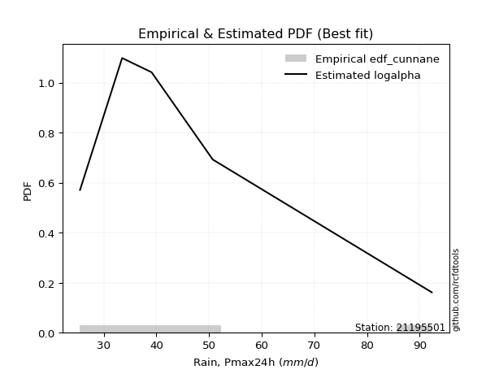</img>

</div>


### 12. EDF Adamowski (1981)

The Adamowski formula in hydrology refers to a specific plotting position formula used for estimating the non-parametric empirical distribution of hydrological events (like flood peaks) to calculate their return periods. This formula provides an alternative to traditional parametric methods (like the Gumbel or Log Pearson Type III distributions). 

<div align="center">


$P=(m-0.25)/(n+0.5)$


</div>


**12.1. Empirical values**

<div align="center">

|                | 0                   | 1                  | 2             | 3                  | 4                  |
|:---------------|:--------------------|:-------------------|:--------------|:-------------------|:-------------------|
| date           | 2017                | 2016               | 2018          | 2019               | 2020               |
| x              | 25.5                | 33.5               | 39.1          | 50.7               | 92.3               |
| m              | 1                   | 2                  | 3             | 4                  | 5                  |
| empirical_dist | edf_adamowski       | edf_adamowski      | edf_adamowski | edf_adamowski      | edf_adamowski      |
| empirical      | 0.13636363636363635 | 0.3181818181818182 | 0.5           | 0.6818181818181818 | 0.8636363636363636 |
| empirical_tr   | 1.1578947368421053  | 1.4666666666666666 | 2.0           | 3.1428571428571423 | 7.333333333333334  |

</div>


**12.2. Kolmogorov-Smirnov fit test (sorted by Δ)**


<div align="center">

|                | 0                   | 1                   | 2                   | 3                  | 4                   | 5                   | 6                   | 7                   | 8                   | 9                  | 10                  | 11                  | 12                  | 13                  | 14                  | 15                  | 16                  | 17                  | 18                  | 19                  | 20                 | 21                  | 22                  | 23                  | 24                  | 25                  | 26                  | 27                 | 28                  | 29                  | 30                  | 31                  | 32                  | 33                  | 34                 | 35                  | 36                  | 37                  | 38                  | 39                  | 40                  | 41                  | 42                  | 43                  | 44                  | 45                  | 46                  | 47                  | 48                  | 49                  | 50                  | 51                  | 52                  | 53                 | 54                  | 55                  | 56                 | 57                 | 58                 | 59                 | 60                  | 61                  | 62                 | 63                  | 64                  | 65                  | 66                  | 67                 | 68                  | 69                  | 70                 | 71                  | 72                  | 73                 | 74                  | 75                  | 76                 | 77                  | 78                  | 79                 | 80                 | 81                 | 82                  | 83                 | 84                  | 85                  | 86                  | 87                  | 88                  | 89                  | 90                  | 91                  | 92                  | 93                  | 94                  | 95                  | 96                  | 97                  | 98                 | 99                 | 100                 | 101                 | 102                 | 103                 | 104                 | 105                 | 106                 | 107                | 108                 | 109                | 110                 | 111                 | 112                 | 113                 | 114                | 115                 | 116                 | 117                 | 118                 | 119                 | 120                | 121                 | 122                 | 123                 | 124                 | 125                 | 126                 | 127                 | 128                | 129                 | 130                 | 131                | 132                | 133                | 134                | 135                | 136                | 137                | 138                 | 139                | 140                 | 141                | 142                | 143                 | 144                | 145                 | 146                 | 147                | 148                | 149                | 150                | 151                | 152                | 153                | 154                | 155                | 156                | 157                | 158                | 159                |
|:---------------|:--------------------|:--------------------|:--------------------|:-------------------|:--------------------|:--------------------|:--------------------|:--------------------|:--------------------|:-------------------|:--------------------|:--------------------|:--------------------|:--------------------|:--------------------|:--------------------|:--------------------|:--------------------|:--------------------|:--------------------|:-------------------|:--------------------|:--------------------|:--------------------|:--------------------|:--------------------|:--------------------|:-------------------|:--------------------|:--------------------|:--------------------|:--------------------|:--------------------|:--------------------|:-------------------|:--------------------|:--------------------|:--------------------|:--------------------|:--------------------|:--------------------|:--------------------|:--------------------|:--------------------|:--------------------|:--------------------|:--------------------|:--------------------|:--------------------|:--------------------|:--------------------|:--------------------|:--------------------|:-------------------|:--------------------|:--------------------|:-------------------|:-------------------|:-------------------|:-------------------|:--------------------|:--------------------|:-------------------|:--------------------|:--------------------|:--------------------|:--------------------|:-------------------|:--------------------|:--------------------|:-------------------|:--------------------|:--------------------|:-------------------|:--------------------|:--------------------|:-------------------|:--------------------|:--------------------|:-------------------|:-------------------|:-------------------|:--------------------|:-------------------|:--------------------|:--------------------|:--------------------|:--------------------|:--------------------|:--------------------|:--------------------|:--------------------|:--------------------|:--------------------|:--------------------|:--------------------|:--------------------|:--------------------|:-------------------|:-------------------|:--------------------|:--------------------|:--------------------|:--------------------|:--------------------|:--------------------|:--------------------|:-------------------|:--------------------|:-------------------|:--------------------|:--------------------|:--------------------|:--------------------|:-------------------|:--------------------|:--------------------|:--------------------|:--------------------|:--------------------|:-------------------|:--------------------|:--------------------|:--------------------|:--------------------|:--------------------|:--------------------|:--------------------|:-------------------|:--------------------|:--------------------|:-------------------|:-------------------|:-------------------|:-------------------|:-------------------|:-------------------|:-------------------|:--------------------|:-------------------|:--------------------|:-------------------|:-------------------|:--------------------|:-------------------|:--------------------|:--------------------|:-------------------|:-------------------|:-------------------|:-------------------|:-------------------|:-------------------|:-------------------|:-------------------|:-------------------|:-------------------|:-------------------|:-------------------|:-------------------|
| station        | 21195501            | 21195501            | 21195501            | 21195501           | 21195501            | 21195501            | 21195501            | 21195501            | 21195501            | 21195501           | 21195501            | 21195501            | 21195501            | 21195501            | 21195501            | 21195501            | 21195501            | 21195501            | 21195501            | 21195501            | 21195501           | 21195501            | 21195501            | 21195501            | 21195501            | 21195501            | 21195501            | 21195501           | 21195501            | 21195501            | 21195501            | 21195501            | 21195501            | 21195501            | 21195501           | 21195501            | 21195501            | 21195501            | 21195501            | 21195501            | 21195501            | 21195501            | 21195501            | 21195501            | 21195501            | 21195501            | 21195501            | 21195501            | 21195501            | 21195501            | 21195501            | 21195501            | 21195501            | 21195501           | 21195501            | 21195501            | 21195501           | 21195501           | 21195501           | 21195501           | 21195501            | 21195501            | 21195501           | 21195501            | 21195501            | 21195501            | 21195501            | 21195501           | 21195501            | 21195501            | 21195501           | 21195501            | 21195501            | 21195501           | 21195501            | 21195501            | 21195501           | 21195501            | 21195501            | 21195501           | 21195501           | 21195501           | 21195501            | 21195501           | 21195501            | 21195501            | 21195501            | 21195501            | 21195501            | 21195501            | 21195501            | 21195501            | 21195501            | 21195501            | 21195501            | 21195501            | 21195501            | 21195501            | 21195501           | 21195501           | 21195501            | 21195501            | 21195501            | 21195501            | 21195501            | 21195501            | 21195501            | 21195501           | 21195501            | 21195501           | 21195501            | 21195501            | 21195501            | 21195501            | 21195501           | 21195501            | 21195501            | 21195501            | 21195501            | 21195501            | 21195501           | 21195501            | 21195501            | 21195501            | 21195501            | 21195501            | 21195501            | 21195501            | 21195501           | 21195501            | 21195501            | 21195501           | 21195501           | 21195501           | 21195501           | 21195501           | 21195501           | 21195501           | 21195501            | 21195501           | 21195501            | 21195501           | 21195501           | 21195501            | 21195501           | 21195501            | 21195501            | 21195501           | 21195501           | 21195501           | 21195501           | 21195501           | 21195501           | 21195501           | 21195501           | 21195501           | 21195501           | 21195501           | 21195501           | 21195501           |
| empirical_dist | edf_adamowski       | edf_adamowski       | edf_adamowski       | edf_adamowski      | edf_adamowski       | edf_adamowski       | edf_adamowski       | edf_adamowski       | edf_adamowski       | edf_adamowski      | edf_adamowski       | edf_adamowski       | edf_adamowski       | edf_adamowski       | edf_adamowski       | edf_adamowski       | edf_adamowski       | edf_adamowski       | edf_adamowski       | edf_adamowski       | edf_adamowski      | edf_adamowski       | edf_adamowski       | edf_adamowski       | edf_adamowski       | edf_adamowski       | edf_adamowski       | edf_adamowski      | edf_adamowski       | edf_adamowski       | edf_adamowski       | edf_adamowski       | edf_adamowski       | edf_adamowski       | edf_adamowski      | edf_adamowski       | edf_adamowski       | edf_adamowski       | edf_adamowski       | edf_adamowski       | edf_adamowski       | edf_adamowski       | edf_adamowski       | edf_adamowski       | edf_adamowski       | edf_adamowski       | edf_adamowski       | edf_adamowski       | edf_adamowski       | edf_adamowski       | edf_adamowski       | edf_adamowski       | edf_adamowski       | edf_adamowski      | edf_adamowski       | edf_adamowski       | edf_adamowski      | edf_adamowski      | edf_adamowski      | edf_adamowski      | edf_adamowski       | edf_adamowski       | edf_adamowski      | edf_adamowski       | edf_adamowski       | edf_adamowski       | edf_adamowski       | edf_adamowski      | edf_adamowski       | edf_adamowski       | edf_adamowski      | edf_adamowski       | edf_adamowski       | edf_adamowski      | edf_adamowski       | edf_adamowski       | edf_adamowski      | edf_adamowski       | edf_adamowski       | edf_adamowski      | edf_adamowski      | edf_adamowski      | edf_adamowski       | edf_adamowski      | edf_adamowski       | edf_adamowski       | edf_adamowski       | edf_adamowski       | edf_adamowski       | edf_adamowski       | edf_adamowski       | edf_adamowski       | edf_adamowski       | edf_adamowski       | edf_adamowski       | edf_adamowski       | edf_adamowski       | edf_adamowski       | edf_adamowski      | edf_adamowski      | edf_adamowski       | edf_adamowski       | edf_adamowski       | edf_adamowski       | edf_adamowski       | edf_adamowski       | edf_adamowski       | edf_adamowski      | edf_adamowski       | edf_adamowski      | edf_adamowski       | edf_adamowski       | edf_adamowski       | edf_adamowski       | edf_adamowski      | edf_adamowski       | edf_adamowski       | edf_adamowski       | edf_adamowski       | edf_adamowski       | edf_adamowski      | edf_adamowski       | edf_adamowski       | edf_adamowski       | edf_adamowski       | edf_adamowski       | edf_adamowski       | edf_adamowski       | edf_adamowski      | edf_adamowski       | edf_adamowski       | edf_adamowski      | edf_adamowski      | edf_adamowski      | edf_adamowski      | edf_adamowski      | edf_adamowski      | edf_adamowski      | edf_adamowski       | edf_adamowski      | edf_adamowski       | edf_adamowski      | edf_adamowski      | edf_adamowski       | edf_adamowski      | edf_adamowski       | edf_adamowski       | edf_adamowski      | edf_adamowski      | edf_adamowski      | edf_adamowski      | edf_adamowski      | edf_adamowski      | edf_adamowski      | edf_adamowski      | edf_adamowski      | edf_adamowski      | edf_adamowski      | edf_adamowski      | edf_adamowski      |
| p_dist         | logburr12           | logalpha            | logmielke           | loginvweibull      | loggenextreme       | logburr             | logexponnorm        | burr                | alpha               | logf               | mielke              | loggumbel_r         | logfoldnorm         | loggenlogistic      | lograyleigh         | invgamma            | logweibull_max      | logjohnsonsu        | loginvgauss         | logpearson3         | nct                | logkstwobign        | logmaxwell          | foldnorm            | logfatiguelife      | halflogistic        | logncf              | halfnorm           | invgauss            | moyal               | lognct              | loginvgamma         | logrice             | logbetaprime        | betaprime          | loghalfnorm         | ncf                 | pearson3            | logloggamma         | logt                | lognorm             | logcrystalball      | logmoyal            | loganglit           | gumbel_r            | logsemicircular     | rayleigh            | genlogistic         | logdweibull         | loglogistic         | dgamma              | dweibull            | maxwell             | loghypsecant       | burr12              | logcosine           | logdgamma          | logksone           | kstwobign          | exponnorm          | loggenexpon         | logtruncexpon       | gennorm            | wald                | lognakagami         | truncnorm           | genexpon            | logbradford        | logtruncnorm        | logkappa3           | kappa3             | loggompertz         | logbeta             | loghalfgennorm     | logexponweib        | gengamma            | exponweib          | logtruncweibull_min | vonmises_line       | loglomax           | loggausshyper      | logexponpow        | logweibull_min      | gompertz           | lomax               | logskewnorm         | logarcsine          | loghalflogistic     | logwald             | weibull_min         | anglit              | nakagami            | logloglaplace       | loglaplace          | loglaplace          | logtukeylambda      | semicircular        | t                   | crystalball        | norm               | arcsine             | gamma               | loggumbel_l         | logkappa4           | loguniform          | f                   | logistic            | logwrapcauchy      | rice                | truncweibull_min   | logvonmises_line    | skewnorm            | loggennorm          | hypsecant           | logargus           | logrdist            | cosine              | loggamma            | loggamma            | gumbel_l            | laplace            | johnsonsb           | loglevy_l           | wrapcauchy          | loggenpareto        | logtriang           | exponpow            | halfgennorm         | truncexpon         | levy_l              | logerlang           | bradford           | kappa4             | beta               | ksone              | argus              | tukeylambda        | uniform            | loggenhalflogistic  | genpareto          | triang              | genextreme         | logjohnsonsb       | gausshyper          | logtrapezoid       | rdist               | genhalflogistic     | invweibull         | fatiguelife        | powerlaw           | loggengamma        | truncpareto        | logpowerlaw        | weibull_max        | trapezoid          | erlang             | logtruncpareto     | johnsonsu          | logvonmises        | vonmises           |
| delta          | 0.06455689506521661 | 0.06910492070783529 | 0.06977914879865019 | 0.0700263710674138 | 0.07003413062006511 | 0.07021032799373603 | 0.07145821889457932 | 0.07274341027163087 | 0.07288381148139925 | 0.0738250484884895 | 0.07600514143784032 | 0.07642749554862083 | 0.07705653309192739 | 0.07739519457764332 | 0.07753920045705964 | 0.07786939448487493 | 0.07788224572513192 | 0.07896067360870707 | 0.07974048780903081 | 0.07987613800572224 | 0.080036200080845  | 0.08039382048245114 | 0.08098701144555709 | 0.08167438502647939 | 0.08196359010964778 | 0.08205304938188895 | 0.08206420493187083 | 0.0824817664764631 | 0.08282827186666873 | 0.08498749588760346 | 0.08504169288241537 | 0.08551827993408812 | 0.08592437215674498 | 0.08600257290103897 | 0.0879382450354168 | 0.08855756857436367 | 0.08998703465217128 | 0.09288584810711914 | 0.09592583355999462 | 0.09704459722572806 | 0.09704642773922506 | 0.09712483877811035 | 0.09731969633959203 | 0.09793767514643426 | 0.10278068208293811 | 0.10565847218305502 | 0.10698596424992746 | 0.10717327692016704 | 0.10771845473296515 | 0.10960869179482519 | 0.11569271246399604 | 0.11864271751941496 | 0.11904026975738285 | 0.1199134586202894 | 0.12274883671758346 | 0.12614526410154414 | 0.1320882798373234 | 0.1330040840549611 | 0.1343391123126691 | 0.1351644604000085 | 0.13546090790918322 | 0.13635135476869145 | 0.1363518431169738 | 0.13636348728544356 | 0.13636357521512504 | 0.13636362787601192 | 0.13636362974284708 | 0.1363636340285982 | 0.13636363415492225 | 0.13636363517216343 | 0.1363636354050828 | 0.13636363620664327 | 0.13636363631748552 | 0.136363636338745  | 0.13636363635060075 | 0.13636363635453938 | 0.1363636363550361 | 0.13636363636172055 | 0.13636363636253335 | 0.1363636363626551 | 0.1363636363634575 | 0.1363636363636179 | 0.13636363636361898 | 0.1363636363636322 | 0.13636363636363605 | 0.13636363636363635 | 0.13636363636363635 | 0.13636363636363635 | 0.13636363636363635 | 0.14138318990033155 | 0.14580112621069996 | 0.14626565168085615 | 0.14628641586485347 | 0.14676892712525813 | 0.14676892712525813 | 0.14733348705511418 | 0.14826618305751016 | 0.15091110128373086 | 0.1509196257410636 | 0.1509196268462426 | 0.15806031315800972 | 0.16049032128431323 | 0.16385486997356996 | 0.16416418692293633 | 0.16771189688308702 | 0.16872919322512248 | 0.16894104904234897 | 0.1703604744615701 | 0.17257086988886683 | 0.1748163263075363 | 0.17734351015274202 | 0.17747567472548442 | 0.18181818181818182 | 0.18291517268642954 | 0.1857243795678596 | 0.19514421929054293 | 0.19862273176592027 | 0.20577117384417115 | 0.20577117384417115 | 0.21074875521353342 | 0.2110742384819131 | 0.21276372790546144 | 0.21288929655434574 | 0.21936337169031822 | 0.22388548825476545 | 0.22995276107552476 | 0.23157688527583703 | 0.23649845545421172 | 0.2365569563717707 | 0.23863163729296566 | 0.23916593090718669 | 0.2510796694309767 | 0.2748793693410709 | 0.2776888236733375 | 0.2841135909998184 | 0.2860828137936289 | 0.2954613419249038 | 0.3045726728361458 | 0.30609407244602266 | 0.3133031825526218 | 0.32965988555970094 | 0.334275835845383  | 0.3694499490699709 | 0.37084034766881063 | 0.40245737632041   | 0.40276326085444003 | 0.41765204879731466 | 0.4244247007180766 | 0.4245789339955654 | 0.4593099091065513 | 0.4704140301471548 | 0.4832941196187826 | 0.5010408033445348 | 0.510476018908085  | 0.52364924026018   | 0.5310352148227435 | 0.5321857842552755 | 0.6141014666476865 | 1.0946194307109378 | 14.147887903186184 |
| deltao         | 0.5865427407550001  | 0.5865427407550001  | 0.5865427407550001  | 0.5865427407550001 | 0.5865427407550001  | 0.5865427407550001  | 0.5865427407550001  | 0.5865427407550001  | 0.5865427407550001  | 0.5865427407550001 | 0.5865427407550001  | 0.5865427407550001  | 0.5865427407550001  | 0.5865427407550001  | 0.5865427407550001  | 0.5865427407550001  | 0.5865427407550001  | 0.5865427407550001  | 0.5865427407550001  | 0.5865427407550001  | 0.5865427407550001 | 0.5865427407550001  | 0.5865427407550001  | 0.5865427407550001  | 0.5865427407550001  | 0.5865427407550001  | 0.5865427407550001  | 0.5865427407550001 | 0.5865427407550001  | 0.5865427407550001  | 0.5865427407550001  | 0.5865427407550001  | 0.5865427407550001  | 0.5865427407550001  | 0.5865427407550001 | 0.5865427407550001  | 0.5865427407550001  | 0.5865427407550001  | 0.5865427407550001  | 0.5865427407550001  | 0.5865427407550001  | 0.5865427407550001  | 0.5865427407550001  | 0.5865427407550001  | 0.5865427407550001  | 0.5865427407550001  | 0.5865427407550001  | 0.5865427407550001  | 0.5865427407550001  | 0.5865427407550001  | 0.5865427407550001  | 0.5865427407550001  | 0.5865427407550001  | 0.5865427407550001 | 0.5865427407550001  | 0.5865427407550001  | 0.5865427407550001 | 0.5865427407550001 | 0.5865427407550001 | 0.5865427407550001 | 0.5865427407550001  | 0.5865427407550001  | 0.5865427407550001 | 0.5865427407550001  | 0.5865427407550001  | 0.5865427407550001  | 0.5865427407550001  | 0.5865427407550001 | 0.5865427407550001  | 0.5865427407550001  | 0.5865427407550001 | 0.5865427407550001  | 0.5865427407550001  | 0.5865427407550001 | 0.5865427407550001  | 0.5865427407550001  | 0.5865427407550001 | 0.5865427407550001  | 0.5865427407550001  | 0.5865427407550001 | 0.5865427407550001 | 0.5865427407550001 | 0.5865427407550001  | 0.5865427407550001 | 0.5865427407550001  | 0.5865427407550001  | 0.5865427407550001  | 0.5865427407550001  | 0.5865427407550001  | 0.5865427407550001  | 0.5865427407550001  | 0.5865427407550001  | 0.5865427407550001  | 0.5865427407550001  | 0.5865427407550001  | 0.5865427407550001  | 0.5865427407550001  | 0.5865427407550001  | 0.5865427407550001 | 0.5865427407550001 | 0.5865427407550001  | 0.5865427407550001  | 0.5865427407550001  | 0.5865427407550001  | 0.5865427407550001  | 0.5865427407550001  | 0.5865427407550001  | 0.5865427407550001 | 0.5865427407550001  | 0.5865427407550001 | 0.5865427407550001  | 0.5865427407550001  | 0.5865427407550001  | 0.5865427407550001  | 0.5865427407550001 | 0.5865427407550001  | 0.5865427407550001  | 0.5865427407550001  | 0.5865427407550001  | 0.5865427407550001  | 0.5865427407550001 | 0.5865427407550001  | 0.5865427407550001  | 0.5865427407550001  | 0.5865427407550001  | 0.5865427407550001  | 0.5865427407550001  | 0.5865427407550001  | 0.5865427407550001 | 0.5865427407550001  | 0.5865427407550001  | 0.5865427407550001 | 0.5865427407550001 | 0.5865427407550001 | 0.5865427407550001 | 0.5865427407550001 | 0.5865427407550001 | 0.5865427407550001 | 0.5865427407550001  | 0.5865427407550001 | 0.5865427407550001  | 0.5865427407550001 | 0.5865427407550001 | 0.5865427407550001  | 0.5865427407550001 | 0.5865427407550001  | 0.5865427407550001  | 0.5865427407550001 | 0.5865427407550001 | 0.5865427407550001 | 0.5865427407550001 | 0.5865427407550001 | 0.5865427407550001 | 0.5865427407550001 | 0.5865427407550001 | 0.5865427407550001 | 0.5865427407550001 | 0.5865427407550001 | 0.5865427407550001 | 0.5865427407550001 |
| eval           | Δo > Δ              | Δo > Δ              | Δo > Δ              | Δo > Δ             | Δo > Δ              | Δo > Δ              | Δo > Δ              | Δo > Δ              | Δo > Δ              | Δo > Δ             | Δo > Δ              | Δo > Δ              | Δo > Δ              | Δo > Δ              | Δo > Δ              | Δo > Δ              | Δo > Δ              | Δo > Δ              | Δo > Δ              | Δo > Δ              | Δo > Δ             | Δo > Δ              | Δo > Δ              | Δo > Δ              | Δo > Δ              | Δo > Δ              | Δo > Δ              | Δo > Δ             | Δo > Δ              | Δo > Δ              | Δo > Δ              | Δo > Δ              | Δo > Δ              | Δo > Δ              | Δo > Δ             | Δo > Δ              | Δo > Δ              | Δo > Δ              | Δo > Δ              | Δo > Δ              | Δo > Δ              | Δo > Δ              | Δo > Δ              | Δo > Δ              | Δo > Δ              | Δo > Δ              | Δo > Δ              | Δo > Δ              | Δo > Δ              | Δo > Δ              | Δo > Δ              | Δo > Δ              | Δo > Δ              | Δo > Δ             | Δo > Δ              | Δo > Δ              | Δo > Δ             | Δo > Δ             | Δo > Δ             | Δo > Δ             | Δo > Δ              | Δo > Δ              | Δo > Δ             | Δo > Δ              | Δo > Δ              | Δo > Δ              | Δo > Δ              | Δo > Δ             | Δo > Δ              | Δo > Δ              | Δo > Δ             | Δo > Δ              | Δo > Δ              | Δo > Δ             | Δo > Δ              | Δo > Δ              | Δo > Δ             | Δo > Δ              | Δo > Δ              | Δo > Δ             | Δo > Δ             | Δo > Δ             | Δo > Δ              | Δo > Δ             | Δo > Δ              | Δo > Δ              | Δo > Δ              | Δo > Δ              | Δo > Δ              | Δo > Δ              | Δo > Δ              | Δo > Δ              | Δo > Δ              | Δo > Δ              | Δo > Δ              | Δo > Δ              | Δo > Δ              | Δo > Δ              | Δo > Δ             | Δo > Δ             | Δo > Δ              | Δo > Δ              | Δo > Δ              | Δo > Δ              | Δo > Δ              | Δo > Δ              | Δo > Δ              | Δo > Δ             | Δo > Δ              | Δo > Δ             | Δo > Δ              | Δo > Δ              | Δo > Δ              | Δo > Δ              | Δo > Δ             | Δo > Δ              | Δo > Δ              | Δo > Δ              | Δo > Δ              | Δo > Δ              | Δo > Δ             | Δo > Δ              | Δo > Δ              | Δo > Δ              | Δo > Δ              | Δo > Δ              | Δo > Δ              | Δo > Δ              | Δo > Δ             | Δo > Δ              | Δo > Δ              | Δo > Δ             | Δo > Δ             | Δo > Δ             | Δo > Δ             | Δo > Δ             | Δo > Δ             | Δo > Δ             | Δo > Δ              | Δo > Δ             | Δo > Δ              | Δo > Δ             | Δo > Δ             | Δo > Δ              | Δo > Δ             | Δo > Δ              | Δo > Δ              | Δo > Δ             | Δo > Δ             | Δo > Δ             | Δo > Δ             | Δo > Δ             | Δo > Δ             | Δo > Δ             | Δo > Δ             | Δo > Δ             | Δo > Δ             | Δo <= Δ            | Δo <= Δ            | Δo <= Δ            |
| fit            | 1                   | 1                   | 1                   | 1                  | 1                   | 1                   | 1                   | 1                   | 1                   | 1                  | 1                   | 1                   | 1                   | 1                   | 1                   | 1                   | 1                   | 1                   | 1                   | 1                   | 1                  | 1                   | 1                   | 1                   | 1                   | 1                   | 1                   | 1                  | 1                   | 1                   | 1                   | 1                   | 1                   | 1                   | 1                  | 1                   | 1                   | 1                   | 1                   | 1                   | 1                   | 1                   | 1                   | 1                   | 1                   | 1                   | 1                   | 1                   | 1                   | 1                   | 1                   | 1                   | 1                   | 1                  | 1                   | 1                   | 1                  | 1                  | 1                  | 1                  | 1                   | 1                   | 1                  | 1                   | 1                   | 1                   | 1                   | 1                  | 1                   | 1                   | 1                  | 1                   | 1                   | 1                  | 1                   | 1                   | 1                  | 1                   | 1                   | 1                  | 1                  | 1                  | 1                   | 1                  | 1                   | 1                   | 1                   | 1                   | 1                   | 1                   | 1                   | 1                   | 1                   | 1                   | 1                   | 1                   | 1                   | 1                   | 1                  | 1                  | 1                   | 1                   | 1                   | 1                   | 1                   | 1                   | 1                   | 1                  | 1                   | 1                  | 1                   | 1                   | 1                   | 1                   | 1                  | 1                   | 1                   | 1                   | 1                   | 1                   | 1                  | 1                   | 1                   | 1                   | 1                   | 1                   | 1                   | 1                   | 1                  | 1                   | 1                   | 1                  | 1                  | 1                  | 1                  | 1                  | 1                  | 1                  | 1                   | 1                  | 1                   | 1                  | 1                  | 1                   | 1                  | 1                   | 1                   | 1                  | 1                  | 1                  | 1                  | 1                  | 1                  | 1                  | 1                  | 1                  | 1                  | 0                  | 0                  | 0                  |
| n              | 5                   | 5                   | 5                   | 5                  | 5                   | 5                   | 5                   | 5                   | 5                   | 5                  | 5                   | 5                   | 5                   | 5                   | 5                   | 5                   | 5                   | 5                   | 5                   | 5                   | 5                  | 5                   | 5                   | 5                   | 5                   | 5                   | 5                   | 5                  | 5                   | 5                   | 5                   | 5                   | 5                   | 5                   | 5                  | 5                   | 5                   | 5                   | 5                   | 5                   | 5                   | 5                   | 5                   | 5                   | 5                   | 5                   | 5                   | 5                   | 5                   | 5                   | 5                   | 5                   | 5                   | 5                  | 5                   | 5                   | 5                  | 5                  | 5                  | 5                  | 5                   | 5                   | 5                  | 5                   | 5                   | 5                   | 5                   | 5                  | 5                   | 5                   | 5                  | 5                   | 5                   | 5                  | 5                   | 5                   | 5                  | 5                   | 5                   | 5                  | 5                  | 5                  | 5                   | 5                  | 5                   | 5                   | 5                   | 5                   | 5                   | 5                   | 5                   | 5                   | 5                   | 5                   | 5                   | 5                   | 5                   | 5                   | 5                  | 5                  | 5                   | 5                   | 5                   | 5                   | 5                   | 5                   | 5                   | 5                  | 5                   | 5                  | 5                   | 5                   | 5                   | 5                   | 5                  | 5                   | 5                   | 5                   | 5                   | 5                   | 5                  | 5                   | 5                   | 5                   | 5                   | 5                   | 5                   | 5                   | 5                  | 5                   | 5                   | 5                  | 5                  | 5                  | 5                  | 5                  | 5                  | 5                  | 5                   | 5                  | 5                   | 5                  | 5                  | 5                   | 5                  | 5                   | 5                   | 5                  | 5                  | 5                  | 5                  | 5                  | 5                  | 5                  | 5                  | 5                  | 5                  | 5                  | 5                  | 5                  |
| best_fit       | 1                   | 0                   | 0                   | 0                  | 0                   | 0                   | 0                   | 0                   | 0                   | 0                  | 0                   | 0                   | 0                   | 0                   | 0                   | 0                   | 0                   | 0                   | 0                   | 0                   | 0                  | 0                   | 0                   | 0                   | 0                   | 0                   | 0                   | 0                  | 0                   | 0                   | 0                   | 0                   | 0                   | 0                   | 0                  | 0                   | 0                   | 0                   | 0                   | 0                   | 0                   | 0                   | 0                   | 0                   | 0                   | 0                   | 0                   | 0                   | 0                   | 0                   | 0                   | 0                   | 0                   | 0                  | 0                   | 0                   | 0                  | 0                  | 0                  | 0                  | 0                   | 0                   | 0                  | 0                   | 0                   | 0                   | 0                   | 0                  | 0                   | 0                   | 0                  | 0                   | 0                   | 0                  | 0                   | 0                   | 0                  | 0                   | 0                   | 0                  | 0                  | 0                  | 0                   | 0                  | 0                   | 0                   | 0                   | 0                   | 0                   | 0                   | 0                   | 0                   | 0                   | 0                   | 0                   | 0                   | 0                   | 0                   | 0                  | 0                  | 0                   | 0                   | 0                   | 0                   | 0                   | 0                   | 0                   | 0                  | 0                   | 0                  | 0                   | 0                   | 0                   | 0                   | 0                  | 0                   | 0                   | 0                   | 0                   | 0                   | 0                  | 0                   | 0                   | 0                   | 0                   | 0                   | 0                   | 0                   | 0                  | 0                   | 0                   | 0                  | 0                  | 0                  | 0                  | 0                  | 0                  | 0                  | 0                   | 0                  | 0                   | 0                  | 0                  | 0                   | 0                  | 0                   | 0                   | 0                  | 0                  | 0                  | 0                  | 0                  | 0                  | 0                  | 0                  | 0                  | 0                  | 0                  | 0                  | 0                  |
| best_fit_sort  | 1                   | 2                   | 3                   | 4                  | 5                   | 6                   | 7                   | 8                   | 9                   | 10                 | 11                  | 12                  | 13                  | 14                  | 15                  | 16                  | 17                  | 18                  | 19                  | 20                  | 21                 | 22                  | 23                  | 24                  | 25                  | 26                  | 27                  | 28                 | 29                  | 30                  | 31                  | 32                  | 33                  | 34                  | 35                 | 36                  | 37                  | 38                  | 39                  | 40                  | 41                  | 42                  | 43                  | 44                  | 45                  | 46                  | 47                  | 48                  | 49                  | 50                  | 51                  | 52                  | 53                  | 54                 | 55                  | 56                  | 57                 | 58                 | 59                 | 60                 | 61                  | 62                  | 63                 | 64                  | 65                  | 66                  | 67                  | 68                 | 69                  | 70                  | 71                 | 72                  | 73                  | 74                 | 75                  | 76                  | 77                 | 78                  | 79                  | 80                 | 81                 | 82                 | 83                  | 84                 | 85                  | 86                  | 87                  | 88                  | 89                  | 90                  | 91                  | 92                  | 93                  | 94                  | 95                  | 96                  | 97                  | 98                  | 99                 | 100                | 101                 | 102                 | 103                 | 104                 | 105                 | 106                 | 107                 | 108                | 109                 | 110                | 111                 | 112                 | 113                 | 114                 | 115                | 116                 | 117                 | 118                 | 119                 | 120                 | 121                | 122                 | 123                 | 124                 | 125                 | 126                 | 127                 | 128                 | 129                | 130                 | 131                 | 132                | 133                | 134                | 135                | 136                | 137                | 138                | 139                 | 140                | 141                 | 142                | 143                | 144                 | 145                | 146                 | 147                 | 148                | 149                | 150                | 151                | 152                | 153                | 154                | 155                | 156                | 157                | 158                | 159                | 160                |

</div>


**12.3. Best fit**

<div align="center">

|   id |   station | empirical_dist   | p_dist    |     delta |   deltao | eval   |   fit |   n |   best_fit |   best_fit_sort |
|-----:|----------:|:-----------------|:----------|----------:|---------:|:-------|------:|----:|-----------:|----------------:|
|    0 |  21195501 | edf_adamowski    | logburr12 | 0.0645569 | 0.586543 | Δo > Δ |     1 |   5 |          1 |               1 |

</div>


<div align="center">

</img>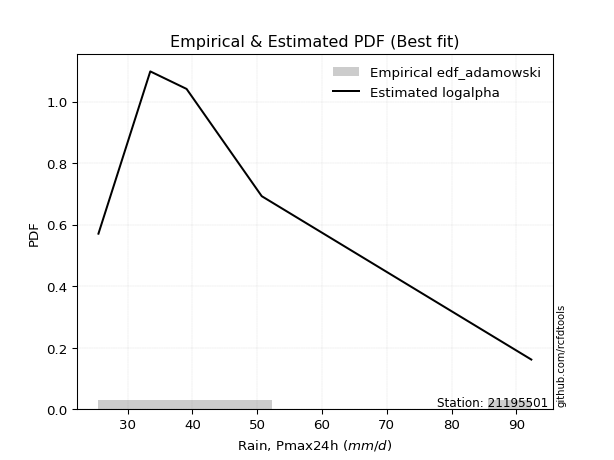</img>

</div>


## C. Best fit & Estimate extreme values for specific return periods - Tr

Best fit in probability distribution analysis means finding the theoretical distribution (like Normal, Poisson, Exponential, etc.) that most accurately mirrors your real-world data´s patterns (shape, center, spread) for better predictions, using methods like visual checks (Q-Q plots), goodness-of-fit tests (Kolmogorov-Smirnov, Chi-Squared), and information criteria (AIC) to score and select the simplest, most representative model.


### 1. Best fit (ordered by delta Δ)

:file_folder:Table: [bestfit_21195501.csv](table/bestfit_21195501.csv)

<div align="center">

|   id |   station | empirical_dist   | p_dist    |     delta |   deltao | eval   |   fit |   n |   best_fit |   best_fit_sort |
|-----:|----------:|:-----------------|:----------|----------:|---------:|:-------|------:|----:|-----------:|----------------:|
|    0 |  21195501 | edf_hazen        | logburr12 | 0.0281933 | 0.586543 | Δo > Δ |     1 |   5 |          1 |               1 |
|    1 |  21195501 | edf_gringorten   | logburr12 | 0.0375683 | 0.586543 | Δo > Δ |     1 |   5 |          1 |               2 |
|    2 |  21195501 | edf_cunnane      | logburr12 | 0.0435779 | 0.586543 | Δo > Δ |     1 |   5 |          1 |               3 |
|    3 |  21195501 | edf_blom         | logburr12 | 0.0472409 | 0.586543 | Δo > Δ |     1 |   5 |          1 |               4 |
|    4 |  21195501 | edf_tukey        | logburr12 | 0.0531933 | 0.586543 | Δo > Δ |     1 |   5 |          1 |               5 |
|    5 |  21195501 | edf_filliben     | logburr12 | 0.0554067 | 0.586543 | Δo > Δ |     1 |   5 |          1 |               6 |
|    6 |  21195501 | edf_beard        | logburr12 | 0.056446  | 0.586543 | Δo > Δ |     1 |   5 |          1 |               7 |
|    7 |  21195501 | edf_jenkinson    | logburr12 | 0.056446  | 0.586543 | Δo > Δ |     1 |   5 |          1 |               8 |
|    8 |  21195501 | edf_chegodayev   | logburr12 | 0.0578229 | 0.586543 | Δo > Δ |     1 |   5 |          1 |               9 |
|    9 |  21195501 | edf_adamowski    | logburr12 | 0.0645569 | 0.586543 | Δo > Δ |     1 |   5 |          1 |              10 |
|   10 |  21195501 | edf_weibull      | logncf    | 0.0669127 | 0.586543 | Δo > Δ |     1 |   5 |          1 |              11 |
|   11 |  21195501 | edf_california   | dweibull  | 0.1       | 0.586543 | Δo > Δ |     1 |   5 |          1 |              12 |

</div>


### 2. Extreme values and % difference analysis

In hydrology, a return period (or recurrence interval $Tr$) is the statistical average time between extreme events like floods or droughts of a specific magnitude, indicating how rare an event is, with a 100-year flood, for example, having a 1% chance of occurring in any given year, not that it happens exactly every century. It is a key tool for infrastructure design (like bridges or dams) and risk assessment, calculated from historical data to determine the probability of future events, although it is important to remember it is statistical average, and events can cluster or be missed.

The extreme value porcentage difference is evaluated as $pdiff = 1 - (ETrBf / ETr) * 100$, where _ETrBf_ correspond to the bestfit extreme value for a specific recurrence interval and _ETr_ correspond to the extreme value for one of the most used PDFsused in hydrology.

> risk_rate: assuming the return period as the project useful life.

:file_folder:Table: [extreme_21195501.csv](table/extreme_21195501.csv), all PDFs.  
:file_folder:Table: [extremepdiff_21195501.csv](table/extremepdiff_21195501.csv), % difference between bestfit and most used PDFs in Hydrology.

<div align="center">

Extreme values table for only best fit PDFs
|   id |      tr |   prob_l |     prob_g |     alpha |   anglit |   arcsine |   argus |    beta |   betaprime |   bradford |     burr |   burr12 |   cosine |   crystalball |   dgamma |   dweibull |   erlang |   exponnorm |   exponpow |   exponweib |        f |   fatiguelife |   foldnorm |    gamma |   gausshyper |   genexpon |    genextreme |   gengamma |   genhalflogistic |   genlogistic |   gennorm |   genpareto |   gompertz |   gumbel_l |   gumbel_r |   halfgennorm |   halflogistic |   halfnorm |   hypsecant |   invgamma |   invgauss |       invweibull |   johnsonsb |   johnsonsu |   kappa3 |   kappa4 |   ksone |   kstwobign |   laplace |   levy_l |   loggamma |   logistic |   loglaplace |    lomax |   maxwell |   mielke |    moyal |   nakagami |      ncf |      nct |     norm |   pearson3 |   powerlaw |   rayleigh |   rdist |     rice |   semicircular |   skewnorm |        t |   trapezoid |   triang |   truncexpon |   truncnorm |   truncpareto |   truncweibull_min |   tukeylambda |   uniform |   vonmises |   vonmises_line |     wald |   weibull_max |   weibull_min |   wrapcauchy |   logalpha |   loganglit |   logarcsine |   logargus |   logbeta |   logbetaprime |   logbradford |   logburr |   logburr12 |   logcosine |   logcrystalball |   logdgamma |   logdweibull |   logerlang |   logexponnorm |   logexponpow |   logexponweib |     logf |   logfatiguelife |   logfoldnorm |   loggausshyper |   loggenexpon |   loggenextreme |   loggengamma |   loggenhalflogistic |   loggenlogistic |   loggennorm |   loggenpareto |   loggompertz |   loggumbel_l |   loggumbel_r |   loghalfgennorm |   loghalflogistic |   loghalfnorm |   loghypsecant |   loginvgamma |   loginvgauss |   loginvweibull |   logjohnsonsb |   logjohnsonsu |   logkappa3 |   logkappa4 |   logksone |   logkstwobign |   loglevy_l |   logloggamma |   loglogistic |     logloglaplace |   loglomax |   logmaxwell |   logmielke |   logmoyal |   lognakagami |   logncf |   lognct |   lognorm |   logpearson3 |   logpowerlaw |   lograyleigh |   logrdist |   logrice |   logsemicircular |   logskewnorm |     logt |   logtrapezoid |   logtriang |   logtruncexpon |   logtruncnorm |   logtruncpareto |   logtruncweibull_min |   logtukeylambda |   loguniform |   logvonmises |   logvonmises_line |   logwald |   logweibull_max |   logweibull_min |   logwrapcauchy |   station |   n |   risk_rate |
|-----:|--------:|---------:|-----------:|----------:|---------:|----------:|--------:|--------:|------------:|-----------:|---------:|---------:|---------:|--------------:|---------:|-----------:|---------:|------------:|-----------:|------------:|---------:|--------------:|-----------:|---------:|-------------:|-----------:|--------------:|-----------:|------------------:|--------------:|----------:|------------:|-----------:|-----------:|-----------:|--------------:|---------------:|-----------:|------------:|-----------:|-----------:|-----------------:|------------:|------------:|---------:|---------:|--------:|------------:|----------:|---------:|-----------:|-----------:|-------------:|---------:|----------:|---------:|---------:|-----------:|---------:|---------:|---------:|-----------:|-----------:|-----------:|--------:|---------:|---------------:|-----------:|---------:|------------:|---------:|-------------:|------------:|--------------:|-------------------:|--------------:|----------:|-----------:|----------------:|---------:|--------------:|--------------:|-------------:|-----------:|------------:|-------------:|-----------:|----------:|---------------:|--------------:|----------:|------------:|------------:|-----------------:|------------:|--------------:|------------:|---------------:|--------------:|---------------:|---------:|-----------------:|--------------:|----------------:|--------------:|----------------:|--------------:|---------------------:|-----------------:|-------------:|---------------:|--------------:|--------------:|--------------:|-----------------:|------------------:|--------------:|---------------:|--------------:|--------------:|----------------:|---------------:|---------------:|------------:|------------:|-----------:|---------------:|------------:|--------------:|--------------:|------------------:|-----------:|-------------:|------------:|-----------:|--------------:|---------:|---------:|----------:|--------------:|--------------:|--------------:|-----------:|----------:|------------------:|--------------:|---------:|---------------:|------------:|----------------:|---------------:|-----------------:|----------------------:|-----------------:|-------------:|--------------:|-------------------:|----------:|-----------------:|-----------------:|----------------:|----------:|----:|------------:|
|    0 |    2    | 0.5      | 0.5        |   39.2878 |  48.22   |   48.22   | 58.1328 | 30.2535 |     42.4105 |    54.6776 |  38.9766 |  36.8217 |  51.7505 |       48.22   |  44.5035 |    39.1    |  25.8919 |     41.2033 |    31.3875 |     39.1307 |  34.1797 |       25.5    |    43.3308 |  34.1368 |      76.036  |    41.3409 |  52.22        |    37.8293 |           69.1242 |       43.7092 |   39.1    |     64.57   |    40.8978 |    52.0835 |    44.3565 |       31.5605 |        42.4358 |    43.4061 |     48.22   |    38.9337 |    38.0921 |   2060.52        |     30.1284 |     25.5005 |  39.7348 |  57.0991 | 58.9    |     45.3636 |   48.22   |  59.334  |    32.8457 |    48.22   |      43.5306 |  41.1059 |   46.2087 |  39.5795 |  43.1093 |    35.3209 |  42.361  |  41.2363 |  48.22   |    44.0818 |    25.6934 |    45.4953 | 22.3127 |  47.8913 |        48.22   |    47.5554 |  48.2196 |     75.5017 |  62.3314 |      53.2059 |     40.5014 |       26.5537 |            33.8069 |       38.3686 |   58.9    |   0.977808 |         42.6382 |  40.5968 |       92.1101 |       35.2712 |      58.9    |    39.8591 |     43.5306 |      43.5306 |    50.0307 |   38.8126 |        42.3882 |       37.9283 |   39.6079 |     38.9104 |     45.2508 |          43.533  |     39.1    |       44.5247 |     31.9958 |        38.7269 |       45.2727 |        35.1888 |  39.4127 |          38.2327 |       41.3051 |         42.6925 |       39.0259 |         39.6748 |       26.8993 |              59.9779 |          40.2354 |      48.5144 |        48.5646 |       39.7368 |       46.7696 |       40.5159 |          40.6139 |           39.096  |       39.8068 |        43.5306 |       40.9106 |       38.7031 |         39.6746 |        25.903  |        38.931  |     43.6069 |     48.8784 |    43.5306 |        40.579  |     53.8134 |       43.5674 |       43.5306 |     39.1234       |    36.9068 |      41.9341 |     39.6017 |    39.5879 |       36.7704 |  42.6521 |  41.9305 |   43.5306 |       41.6382 |       25.6501 |       41.3821 |    52.1682 |   42.3188 |           43.5306 |       40.6283 |  43.5305 |        66.7904 |     54.0392 |         41.6219 |        37.7062 |          26.1762 |               36.0448 |          47.8455 |      48.5144 |     0.0805589 |            49.4549 |   37.7825 |          40.2244 |          39.865  |         48.5144 |  21195501 |   5 |    0.75     |
|    1 |    2.33 | 0.570815 | 0.429185   |   42.241  |  53.1083 |   55.5581 | 62.9614 | 36.4714 |     45.7553 |    59.4428 |  41.9952 |  40.0011 |  56.1946 |       52.4166 |  49.4063 |    41.5328 |  26.2896 |     44.6692 |    34.56   |     43.1987 |  38.6781 |       26.0995 |    47.8911 |  36.5187 |      82.8002 |    44.8311 | 282.061       |    41.528  |           73.4892 |       46.982  |   39.9916 |     71.032  |    44.2904 |    55.7346 |    48.2452 |       34.1789 |        46.4339 |    47.9353 |     51.5786 |    42.0037 |    41.3129 | 139362           |     41.0848 |     25.5016 |  42.85   |  62.0408 | 64.5766 |     48.9397 |   50.7596 |  69.5156 |    34.9346 |    51.9175 |      45.6334 |  44.562  |   50.5687 |  42.6522 |  46.7904 |    39.7359 |  45.6722 |  44.4162 |  52.4166 |    48.1727 |    26.0908 |    49.9198 | 28.0574 |  51.6703 |        53.4628 |    51.3517 |  52.4163 |     79.3827 |  67.2853 |      57.8657 |     43.6739 |       27.1019 |            37.4025 |       40.2258 |   63.6305 |   1.19821  |         46.0205 |  43.3485 |       92.2441 |       39.1549 |      72.9189 |    42.8502 |     47.6685 |      49.8878 |    54.5741 |   42.8331 |        45.7809 |       41.3695 |   42.5889 |     41.7236 |     49.0814 |          47.0614 |     40.2682 |       50.5003 |     33.8965 |        41.6442 |       50.3729 |        38.1708 |  42.4195 |          41.3094 |       45.1296 |         47.009  |       42.3255 |         42.6592 |       27.7373 |              65.1309 |          43.2547 |      48.5144 |        60.7961 |       43.1291 |       50.0517 |       43.5509 |          44.0084 |           42.1101 |       43.301  |        46.3329 |       44.0483 |       41.7602 |         42.659  |        26.7295 |        41.962  |     47.2476 |     53.8847 |    48.4548 |        43.7544 |     63.5714 |       47.1662 |       46.6256 |     45.3029       |    40.0511 |      45.4718 |     42.5679 |    42.3897 |       41.7288 |  48.171  |  45.2142 |   47.0599 |       45.0137 |       25.9226 |       44.927  |    60.6527 |   45.6548 |           47.9834 |       44.0198 |  47.0599 |        71.9734 |     59.0393 |         45.4129 |        40.9211 |          26.5223 |               39.2681 |          52.7296 |      53.1414 |     0.0869548 |            54.3191 |   39.7642 |          43.2323 |          44.4893 |         61.9301 |  21195501 |   5 |    0.729209 |
|    2 |    5    | 0.8      | 0.2        |   59.608  |  70.3554 |   75.1263 | 78.45   | 70.4669 |     61.5974 |    76.0952 |  59.5222 |  60.5821 |  72.2098 |       68.0124 |  62.2231 |    58.543  |  30.8595 |     61.9978 |    57.7902 |     65.9262 |  71.0729 |       38.8348 |    67.1746 |  49.2413 |      91.8147 |    62.2813 |   4.75318e+06 |    62.3391 |           84.9829 |       61.1995 |   49.1064 |     86.6554 |    61.2527 |    67.5298 |    65.1392 |       55.6176 |        64.5247 |    67.089  |     65.0505 |    59.9167 |    60.2    |      1.31309e+13 |    114.543  |     25.6175 |  60.7188 |  78.3302 | 82.948  |     64.1301 |   63.457  |  86.3839 |    47.9655 |    66.1941 |      57.7725 |  61.9378 |   67.7293 |  60.2821 |  63.8415 |    64.5195 |  61.291  |  60.5074 |  68.0124 |    65.8181 |    35.6766 |    67.6331 | 44.1782 |  66.7994 |        71.3542 |    67.4059 |  68.0124 |     90.5173 |  81.4979 |      74.7133 |     58.4668 |       33.4026 |            57.3851 |       46.2038 |   78.94   |   2.06216  |         59.276  |  58.753  |       92.2997 |       65.7552 |      87.8565 |    59.3271 |     65.671  |      71.7563 |    72.1233 |   63.5053 |        61.906  |       59.2979 |   59.1939 |     58.7987 |     65.7796 |          62.8705 |     49.6296 |       65.6616 |     45.7788 |        59.4908 |       78.595  |        56.8054 |  59.4817 |          59.8585 |       63.4193 |         66.682  |       60.8484 |         59.2052 |       34.054  |              80.7678 |          59.2295 |      48.5144 |        87.9286 |       61.3335 |       62.313  |       59.6063 |          61.826  |           58.9289 |       61.8047 |        59.5081 |       59.6905 |       59.7197 |         59.2042 |        63.7926 |        59.6842 |     64.529  |     74.1154 |    68.5431 |        60.2575 |     83.7847 |       63.281  |       60.7859 |    312.831        |    60.3742 |      62.5443 |     59.1082 |    58.1866 |       78.7406 |  76.9469 |  61.1608 |   62.8741 |       61.6932 |       31.9938 |       62.4326 |    91.7149 |   61.8602 |           66.901  |       61.7866 |  62.8742 |        89.1851 |     76.1027 |         63.2017 |        60.3968 |          30.5489 |               56.6373 |          71.9197 |      71.3624 |     0.115742  |            73.5888 |   52.9388 |          59.1387 |          79.0631 |         83.7431 |  21195501 |   5 |    0.67232  |
|    3 |   10    | 0.9      | 0.1        |   82.9033 |  80.1174 |   79.8503 | 85.9189 | 85.4963 |     76.1257 |    83.9917 |  81.0918 |  88.4031 |  81.8856 |       78.3583 |  71.935  |    76.4726 |  38.0228 |     77.7283 |    85.7283 |     88.7458 | 111.113  |       56.419  |    81.4426 |  61.4401 |      92.2699 |    78.1222 |   1.42244e+10 |    83.4553 |           88.9596 |       72.7786 |   62.9011 |     90.6069 |    76.6505 |    74.0968 |    78.8991 |       89.5638 |        79.5484 |    81.2622 |     75.8082 |    81.7763 |    81.2737 |      4.1038e+19  |    117.346  |     27.5323 |  82.7108 |  85.5105 | 90.964  |     75.6957 |   74.9834 |  90.4564 |    64.4    |    76.7083 |      71.5667 |  77.8507 |   79.8061 |  81.6411 |  78.6872 |    86.1788 |  75.5356 |  76.8136 |  78.3583 |    79.7535 |    52.9749 |    80.2629 | 48.7249 |  77.5868 |        80.5347 |    79.2857 |  78.3584 |     94.8665 |  87.0493 |      83.1047 |     69.7686 |       45.4301 |            72.0931 |       48.7694 |   85.62   |   2.7162   |         69.3717 |  75.1007 |       92.3    |       98.9915 |      90.2894 |    78.6975 |     78.7282 |      78.3376 |    82.5026 |   79.4889 |        76.7274 |       72.718  |   78.7757 |     81.748  |     78.5102 |          76.1882 |     61.2295 |       77.4475 |     60.7087 |        82.1901 |      107.683  |        79.8083 |  80.1186 |          83.2559 |       79.7681 |         78.7633 |       80.9758 |         78.5607 |       41.9599 |              86.914  |          76.5079 |      48.5144 |        91.6675 |       79.5018 |       70.3977 |       76.9665 |          79.5463 |           77.8981 |       80.4204 |        72.6717 |       75.1597 |       81.7955 |         78.5578 |        89.4293 |        81.768  |     81.2456 |     85.2391 |    79.7419 |        76.8835 |     89.5596 |       76.8344 |       73.8971 | 357072            |    87.8369 |      78.2742 |     78.7202 |    76.6641 |      132.516  | 106.533  |  76.3243 |   76.1971 |       77.7992 |       44.9532 |       78.9413 |   102.271  |   76.8204 |           79.3408 |       79.406  |  76.1972 |        96.9763 |     84.0364 |         75.335  |        83.9209 |          39.1322 |               70.4472 |          81.9115 |      81.1588 |     0.14051   |            84.0129 |   71.7245 |          76.3297 |         136.79   |         88.3114 |  21195501 |   5 |    0.651322 |
|    4 |   15    | 0.933333 | 0.0666667  |  102.565  |  84.286  |   80.7513 | 88.7584 | 89.0233 |     85.0153 |    86.7143 |  97.3216 | inf      |  86.293  |       83.521  |  77.3303 |    87.6007 |  43.1163 |     86.9301 |   103.815  |    102.73   | 138.299  |       67.9194 |    88.8671 |  68.7387 |      92.2941 |    87.3885 |   1.30075e+12 |    96.4896 |           90.1567 |       79.3113 |   73.3221 |     91.4629 |    85.6576 |    77.0709 |    86.6624 |      117.121  |        88.0504 |    88.6379 |     81.9476 |    98.01   |    95.1558 |      1.89474e+23 |    117.433  |     33.9296 |  99.5161 |  87.8989 | 93.636  |     81.8356 |   81.7259 |  91.6866 |    76.6441 |    82.437  |      81.1161 |  87.2213 |   86.0025 |  97.5438 |  87.303  |    97.8808 |  84.2201 |  87.535  |  83.521  |    87.4019 |    62.8351 |    86.7704 | 49.7265 |  83.145  |        84.1147 |    85.4679 |  83.5213 |     96.2619 |  88.8305 |      86.0731 |     75.1793 |       54.1484 |            78.1694 |       49.6112 |   87.8467 |   3.05833  |         74.7496 |  85.5985 |       92.3    |      122.022  |      90.9825 |    93.1646 |     85.067  |      79.6597 |    86.8293 |   86.8184 |        85.7968 |       78.4339 |   93.2439 |    100.304  |     85.0991 |          83.8545 |     69.4728 |       84.2331 |     71.7771 |        99.2958 |      126.08   |        96.4819 |  95.6814 |         100.958  |       89.4698 |         83.2736 |       94.4064 |         92.7651 |       47.3584 |              88.8327 |          88.3942 |      48.5144 |        92.0978 |       90.7923 |       74.3965 |       88.9063 |          90.7061 |           91.2252 |       92.2296 |        81.4508 |       85.1499 |       98.2777 |         92.7602 |        91.5582 |        98.6541 |     92.5965 |     89.3003 |    83.8676 |        87.5009 |     91.3812 |       84.6248 |       82.1947 |      2.959e+10    |   109.491  |      87.8232 |     93.3006 |    89.9707 |      174.861  | 125.884  |  85.842  |   83.8667 |       87.9609 |       54.105  |       89.085  |   104.601  |   85.8902 |           84.7967 |       90.4805 |  83.867  |        99.6176 |     86.7533 |         80.334  |       100.804  |          46.3665 |               76.5902 |          85.4065 |      84.7145 |     0.155113  |            87.806  |   87.1692 |          88.1492 |         190.098  |         89.6651 |  21195501 |   5 |    0.644736 |
|    5 |   20    | 0.95     | 0.05       |  120.688  |  86.7382 |   81.0686 | 90.3169 | 90.3664 |     91.5587 |    88.093  | 110.9    | inf      |  89.0035 |       86.902  |  81.0782 |    95.7219 |  47.03   |     93.4588 |   117.163  |    112.877  | 159.144  |       76.4341 |    93.8168 |  73.9697 |      92.2981 |    93.963  |   3.07149e+13 |   105.987  |           90.7295 |       83.8853 |   81.7725 |     91.7922 |    92.0483 |    78.9221 |    92.098  |      140.576  |        94.0072 |    93.5554 |     86.2786 |   111.455  |   105.629  |      6.97015e+25 |    117.447  |     46.8989 | 113.783  |  89.0892 | 94.972  |     85.9716 |   86.5098 |  92.3166 |    86.7665 |    86.3964 |      88.6546 |  93.8978 |   90.1149 | 110.762  |  93.4048 |   105.76   |  90.5987 |  95.7886 |  86.902  |    92.6669 |    68.8446 |    91.0958 | 50.1116 |  86.8393 |        86.1004 |    89.5896 |  86.9023 |     96.9503 |  89.7092 |      87.5924 |     78.4359 |       60.3134 |            81.4686 |       50.0278 |   88.96   |   3.27273  |         78.1833 |  93.4215 |       92.3    |      139.871  |      91.3177 |   105.362  |     89.0316 |      80.1306 |    89.2999 |   91.1177 |        92.4695 |       81.5851 |  105.274  |    116.639  |     89.4229 |          89.2883 |     76.0609 |       89.0671 |     80.8953 |       113.551  |      139.717  |       109.974  | 108.818  |         115.779  |       96.4594 |         85.5912 |      104.744  |        104.52   |       51.5221 |              89.7595 |          97.7994 |      48.5144 |        92.2101 |       99.083  |       76.9994 |       98.3524 |          99.0081 |          101.899  |      101.051  |        88.2748 |       92.7561 |      111.982  |        104.513  |        91.9984 |       112.993  |    101.746  |     91.3986 |    86.0098 |        95.4677 |     92.3284 |       90.141  |       88.4682 |      1.57043e+17  |   128.081  |      94.7952 |    105.483  |   100.769  |      210.611  | 140.66   |  92.9591 |   89.303  |       95.5694 |       60.4567 |       96.5383 |   105.476  |   92.5034 |           87.9831 |       98.7095 |  89.3033 |       100.947  |     88.1258 |         83.0589 |       114.388  |          52.0936 |               80.0503 |          87.1676 |      86.5503 |     0.165652  |            89.7663 |  100.804  |          97.4982 |         240.852  |         90.3279 |  21195501 |   5 |    0.641514 |
|    6 |   25    | 0.96     | 0.04       |  137.955  |  88.4    |   81.2158 | 91.322  | 91.0193 |     96.7874 |    88.9259 | 122.812  | inf      |  90.9043 |       89.3909 |  83.9492 |   102.135  |  50.2082 |     98.5229 |   127.742  |    120.861  | 176.182  |       83.1993 |    97.4994 |  78.0522 |      92.2992 |    99.0626 |   3.50782e+14 |   113.48   |           91.064  |       87.4085 |   88.9353 |     91.9554 |    97.0053 |    80.2394 |    96.2849 |      161.176  |        98.5966 |    97.2141 |     89.6305 |   123.156  |   114.082  |      6.59932e+27 |    117.451  |     67.9837 | 126.457  |  89.8012 | 95.7736 |     89.0697 |   90.2204 |  92.7121 |    95.5549 |    89.4254 |      94.9812 |  99.0925 |   93.1679 | 122.304  |  98.1344 |   111.646  |  95.6879 | 102.604  |  89.3909 |    96.6737 |    72.8459 |    94.3094 | 50.3021 |  89.5841 |        87.3886 |    92.6563 |  89.3912 |     97.3604 |  90.2327 |      88.5156 |     80.6305 |       64.8237 |            83.5378 |       50.2759 |   89.628  |   3.41848  |         80.552  |  99.6875 |       92.3    |      154.549  |      91.5163 |   116.195  |     91.8229 |      80.3501 |    90.9303 |   93.9791 |        97.7987 |       83.5792 |  115.808  |    131.568  |     92.5855 |          93.5121 |     81.6345 |       92.8426 |     88.7905 |       126.002  |      150.617  |       121.486  | 120.463  |         128.778  |      101.953  |         86.9911 |      113.251  |        114.773  |       54.9435 |              90.3028 |         105.721  |      48.5144 |        92.2521 |      105.668  |       78.9069 |      106.307  |         105.677  |          110.967  |      108.158  |        93.946  |       98.9873 |      123.948  |        114.764  |        92.1449 |       125.745  |    109.642  |     92.6788 |    87.3214 |       101.907  |     92.9279 |       94.4256 |       93.5887 |      4.90157e+25  |   144.687  |     100.327  |    116.191  |   110.023  |      241.961  | 152.768  |  98.7124 |   93.5288 |      101.721  |       65.0504 |      102.477  |   105.899  |   97.7445 |           90.1139 |      105.314  |  93.5291 |       101.747  |     88.9537 |         84.7735 |       125.929  |          56.6404 |               82.2682 |          88.2237 |      87.6709 |     0.173966  |            90.9634 |  113.248  |         105.37   |         289.853  |         90.7231 |  21195501 |   5 |    0.639603 |
|    7 |   50    | 0.98     | 0.02       |  218.749  |  92.4907 |   81.4124 | 93.6007 | 91.9467 |    113.999  |    90.6044 | 169.288  | inf      |  95.8815 |       96.518  |  92.7127 |   122.613  |  60.7183 |    114.253  |   161.474  |    146.205  | 233.904  |      104.905  |   108.203  |  90.846  |      92.3    |   114.903  |   6.35735e+17 |   137.381  |           91.7091 |       98.2616 |  114.613  |     92.1966 |   112.403  |    83.8154 |   109.183  |      239.919  |       112.737  |   107.849  |    100.023  |   168.081  |   141.994  |      8.07999e+33 |    117.453  |    328.257  | 177.212  |  91.217  | 97.3768 |     98.1671 |  101.747  |  93.6024 |   129.099  |    98.6798 |     117.66   | 115.319  |  102.022  | 166.943  | 112.817  |   128.807  | 112.395  | 126.416  |  96.518  |   108.771  |    81.8368 |   103.638  | 50.5821 |  97.5518 |        90.3315 |   101.57   |  96.5185 |     98.1744 |  91.2716 |      90.3892 |     85.7493 |       76.2873 |            87.8903 |       50.766  |   90.964  |   3.7496   |         86.041  | 120.146  |       92.3    |      204.604  |      91.9096 |   160.212  |     99.0726 |      80.6441 |    94.7379 |  100.64   |       115.319  |       87.819  |  157.021  |    195.116  |    101.407  |         106.745  |    101.883  |      104.787  |    118.77   |       174.08   |      186.204  |       163.876  | 167.268  |         179.407  |      119.485  |         89.7704 |      142.599  |        154.582  |       66.6707 |              91.3516 |         134.386  |      48.5144 |        92.2932 |      126.95   |       84.3265 |      135.088  |         127.735  |          144.301  |      131.782  |       113.951  |      120.455  |      170.217  |        154.563  |        92.277  |       177.141  |    140.226  |     95.2842 |    90.0047 |       123.436  |     94.2919 |      107.831  |      111.144  |      7.64332e+93  |   211.615  |     118.263  |    158.448  |   144.523  |      362.442  | 194.32   | 118.052  |  106.769  |      122.373  |       76.5564 |      121.867  |   106.498  |  114.702  |           95.1774 |      127.128  | 106.769  |       103.355  |     90.62   |         88.3973 |       168.075  |          69.7215 |               87.0589 |          90.3169 |      89.9557 |     0.200797  |            93.4057 |  165.612  |         133.843  |         519.447  |         91.5109 |  21195501 |   5 |    0.63583  |
|    8 |   75    | 0.986667 | 0.0133333  |  295.97   |  94.291  |   81.4489 | 94.5045 | 92.1341 |    124.831  |    91.1677 | 204.788  | inf      |  98.2585 |      100.342  |  97.7547 |   134.935  |  67.2235 |    123.455  |   181.599  |    161.363  | 271.069  |      117.977  |   114.029  |  98.3939 |      92.3    |   124.17   |   4.97838e+19 |   151.748  |           91.9153 |      104.57   |  132.073  |     92.2489 |   121.41   |    85.6237 |   116.679  |      297.381  |       120.957  |   113.638  |    106.096  |   201.756  |   159.353  |      2.79214e+37 |    117.454  |    893.894  | 217.228  |  91.6849 | 97.9112 |    103.172  |  108.489  |  93.9682 |   154.047  |   104.025  |     133.359  | 124.873  |  106.836  | 200.708  | 121.403  |   138.153  | 122.878  | 142.477  | 100.342  |   115.647  |    85.1513 |   108.713  | 50.6422 | 101.887  |        91.5071 |   106.422  | 100.343  |     98.4438 |  91.6156 |      91.0219 |     87.7369 |       81.0255 |            89.4074 |       50.9267 |   91.4093 |   3.87007  |         88.0702 | 132.735  |       92.3    |      236.891  |      92.0399 |   196.236  |    102.442  |      80.6987 |    96.2918 |  103.296  |       126.324  |       89.3115 |  188.86   |    249.341  |    105.911  |         114.602  |    116.102  |      111.968  |    140.933  |       210.31   |      208.189  |       194.021  | 204.721  |         217.976  |      130.107  |         90.6709 |      161.978  |        185.042  |       74.3367 |              91.6858 |         154.496  |      48.5144 |        92.2978 |      139.953  |       87.2073 |      155.273  |         141.63   |          168.105  |      146.744  |       127.56   |      134.714  |      205.219  |        185.013  |        92.2917 |       218.234  |    164.001  |     96.1643 |    90.9173 |       137.164  |     94.8582 |      115.775  |      122.746  |      3.82411e+203 |   264.603  |     129.326  |    191.452  |   169.514  |      451.642  | 221.666  | 130.529  |  114.629  |      135.65   |       81.2509 |      133.915  |   106.619  |  125.132  |           97.2787 |      140.847  | 114.63   |       103.892  |     91.1785 |         89.6667 |       197.739  |          75.8375 |               88.7704 |          91.0009 |      90.7304 |     0.217369  |            94.2343 |  209.247  |         153.806  |         734.463  |         91.7735 |  21195501 |   5 |    0.634587 |
|    9 |  100    | 0.99     | 0.01       |  371.892  |  95.3616 |   81.4616 | 95.009  | 92.203  |    132.897  |    91.45   | 234.652  | inf      |  99.7483 |      102.929  | 101.302  |   143.814  |  71.9667 |    129.984  |   195.978  |    172.249  | 298.998  |      127.383  |   117.997  | 103.773  |      92.3    |   130.744  |   1.09007e+21 |   162.094  |           92.016  |      109.035  |  145.569  |     92.269  |   127.801  |    86.8065 |   121.985  |      343.762  |       126.775  |   117.582  |    110.404  |   229.735  |   172.076  |      8.92012e+39 |    117.454  |   1796.56   | 251.614  |  91.9175 | 98.1784 |    106.602  |  113.273  |  94.1821 |   174.663  |   107.799  |     145.753  | 131.681  |  110.115  | 228.936  | 127.494  |   144.514  | 130.668  | 154.969  | 102.929  |   120.453  |    86.8721 |   112.171  | 50.6651 | 104.84   |        92.1654 |   109.728  | 102.929  |     98.5782 |  91.7871 |      91.3399 |     88.7975 |       83.6037 |            90.1789 |       51.0062 |   91.632  |   3.93164  |         89.1119 | 141.914  |       92.3    |      261.097  |      92.105  |   228.45   |    104.5    |      80.7178 |    97.1703 |  104.763  |       134.506  |       90.0735 |  215.985  |    298.793  |    108.836  |         120.241  |    127.424  |      117.165  |    159.178  |       240.502  |      224.292  |       218.176  | 237.472  |         250.358  |      137.822  |         91.1098 |      176.798  |        210.818  |       80.1569 |              91.8486 |         170.521  |      48.5144 |        92.299  |      149.417  |       89.1446 |      171.357  |         151.956  |          187.29   |      157.898  |       138.188  |      145.703  |      234.495  |        210.78   |        92.2959 |       254.052  |    184.545  |     96.6059 |    91.3771 |       147.441  |     95.1908 |      121.471  |      131.659  |    inf            |   310.213  |     137.449  |    219.792  |   189.823  |      524.627  | 242.564  | 139.966  |  120.272  |      145.66   |       83.792  |      142.799  |   106.664  |  132.776  |           98.4757 |      151.031  | 120.272  |       104.162  |     91.4583 |         90.3136 |       221.336  |          79.3565 |               89.6493 |          91.3379 |      91.1203 |     0.229599  |            94.6514 |  248.15   |         169.709  |         941.014  |         91.905  |  21195501 |   5 |    0.633968 |
|   10 |  200    | 0.995    | 0.005      |  671.396  |  97.384  |   81.474  | 95.8858 | 92.2734 |    153.753  |    91.8745 | 326.753  | inf      | 102.777  |      108.796  | 109.767  |   165.628  |  83.752  |    145.714  |   230.782  |    198.879  | 371.807  |      150.407  |   127.073  | 116.798  |      92.3    |   146.585  |   1.81901e+24 |   187.495  |           92.1632 |      119.768  |  181.931  |     92.2907 |   143.199  |    89.3774 |   134.741  |      476.431  |       140.762  |   126.602  |    120.782  |   314.43   |   203.962  |      9.36011e+45 |    117.454  |   8944.53   | 361.153  |  92.2638 | 98.5792 |    114.501  |  124.8    |  94.5873 |   236.556  |   116.851  |     180.555  | 148.182  |  117.617  | 315.202  | 142.171  |   159.036  | 150.758  | 189.364  | 108.796  |   131.819  |    89.5354 |   120.082  | 50.6897 | 111.597  |        93.3132 |   117.288  | 108.796  |     98.7793 |  92.0439 |      91.8188 |     90.4837 |       87.7608 |            91.3526 |       51.1239 |   91.966  |   4.02515  |         90.6982 | 164.777  |       92.3    |      323.702  |      92.2025 |   340.549  |    108.5    |      80.7363 |    98.7162 |  107.247  |       155.615  |       91.2364 |  301.95   |    473.717  |    115.034  |         134.082  |    159.611  |      130.07   |    213.642  |       332.267  |      264.754  |       287.281  | 346.037  |         349.938  |      157.061  |         91.7434 |      216.443  |        291.613  |       95.5596 |              92.0849 |         216.185  |      48.5144 |        92.2999 |      173.001  |       93.5053 |      217.176  |         178.502  |          242.857  |      186.701  |       167.57   |      175.592  |      324.1    |        291.542  |        92.2991 |       371.678  |    252.043  |     97.2692 |    92.0711 |       174.137  |     95.8242 |      135.43   |      155.769  |    inf            |   455.801  |     158.002  |    310.807  |   249.317  |      738.645  | 298.505  | 164.933  |  134.121  |      171.982  |       87.8708 |      165.406  |   106.709  |  152.07   |          100.598  |      177.177  | 134.122  |       104.566  |     91.8787 |         91.2995 |       288.069  |          85.3304 |               90.9974 |          91.8331 |      91.7082 |     0.260971  |            95.2804 |  379.467  |         215.001  |        1720.68   |         92.1023 |  21195501 |   5 |    0.633042 |
|   11 |  250    | 0.996    | 0.004      |  820.242  |  97.8988 |   81.4754 | 96.091  | 92.2825 |    160.929  |    91.9595 | 363.801  | inf      | 103.608  |      110.589  | 112.471  |   172.767  |  87.6372 |    150.778  |   241.998  |    207.563  | 396.971  |      157.911  |   129.865  | 121.009  |      92.3    |   151.685  |   1.97598e+25 |   195.802  |           92.1918 |      123.219  |  194.808  |     92.2937 |   148.156  |    90.1338 |   138.842  |      525.91   |       145.259  |   129.376  |    124.123  |   347.945  |   214.561  |      8.07078e+47 |    117.454  |  14642.9    | 406.489  |  92.3325 | 98.6594 |    116.945  |  128.51   |  94.6927 |   260.868  |   119.757  |     193.439  | 153.523  |  119.926  | 349.629  | 146.895  |   163.493  | 157.654  | 201.888  | 110.589  |   135.423  |    90.0801 |   122.517  | 50.693  | 113.677  |        93.5824 |   119.614  | 110.589  |     98.8195 |  92.0952 |      91.9148 |     90.8359 |       88.6367 |            91.5898 |       51.1471 |   92.0328 |   4.04396  |         91.0178 | 172.341  |       92.3    |      345.111  |      92.222  |   391.754  |    109.543  |      80.7385 |    99.0816 |  107.808  |       162.862  |       91.4719 |  337.584  |    553.809  |    116.794  |         138.622  |    171.657  |      134.349  |    234.931  |       368.703  |      278.267  |       313.243  | 393.029  |         389.898  |      163.461  |         91.8645 |      230.471  |        324.763  |      100.956  |              92.1305 |         233.321  |      48.5144 |        92.2999 |      180.821  |       94.8285 |      234.366  |         187.57   |          264.014  |      196.577  |       178.299  |      186.365  |      359.932  |        324.675  |        92.2995 |       422.008  |    281.221  |     97.4017 |    92.2106 |       183.341  |     95.9897 |      140.002  |      164.41   |    inf            |   516.166  |     164.927  |    349.012  |   272.188  |      820.496  | 318.332  | 173.707  |  138.663  |      181.17   |       88.7275 |      173.06   |   106.715  |  158.555  |          101.102  |      186.097  | 138.664  |       104.647  |     91.9629 |         91.499  |       312.862  |          86.6382 |               91.2714 |          91.9299 |      91.8263 |     0.271728  |            95.4067 |  436.715  |         231.989  |        2093.42   |         92.1418 |  21195501 |   5 |    0.632858 |
|   12 |  500    | 0.998    | 0.002      | 1562.31   |  99.175  |   81.4774 | 96.5628 | 92.2952 |    184.805  |    92.1297 | 508.914  | inf      | 105.818  |      115.906  | 120.817  |   195.273  |  99.9376 |    166.509  |   276.765  |    234.848  | 480.804  |      181.45   |   138.189  | 134.133  |      92.3    |   167.526  |   3.24453e+28 |   221.974  |           92.2478 |      133.929  |  238.516  |     92.2981 |   163.554  |    92.3022 |   151.57   |      702.675  |       159.216  |   137.65   |    134.5    |   476.905  |   248.389  |      8.21729e+53 |    117.454  |  63286.1    | 589.716  |  92.4689 | 98.8197 |    124.271  |  140.037  |  94.9651 |   353.675  |   128.77   |     239.627  | 170.208  |  126.817  | 483.329  | 161.571  |   176.752  | 180.543  | 246.058  | 115.906  |   146.472  |    91.1818 |   129.784  | 50.6979 | 119.883  |        94.2024 |   126.549  | 115.907  |     98.8998 |  92.1976 |      92.1072 |     91.5567 |       90.4358 |            92.0665 |       51.1929 |   92.1664 |   4.08166  |         91.6584 | 196.392  |       92.3    |      415.389  |      92.261  |   632.485  |    112.171  |      80.7415 |    99.9266 |  109.049  |       186.912  |       91.946  |  483.214  |    923.281  |    121.61   |         153.008  |    215.328  |      148.061  |    315.767  |       509.385  |      321.707  |       407.5    | 596.027  |         546.049  |      184.014  |         92.097  |      278.324  |        458.562  |      119.184  |              92.2192 |         295.648  |      48.5144 |        92.3    |      205.791  |       98.7263 |      296.879  |         217.445  |          342.151  |      229.234  |       216.208  |      224.005  |      499.538  |        458.4    |        92.2999 |       635.396  |    408.329  |     97.6662 |    92.4901 |       213.938  |     96.4186 |      154.466  |      194.376  |    inf            |   760.746  |     187.45   |    507.607  |   357.493  |     1121.84   | 386.174  | 203.547  |  153.058  |      212.163  |       90.484  |      198.069  |   106.723  |  179.596  |          102.273  |      215.447  | 153.059  |       104.809  |     92.1314 |         91.9003 |       401.728  |          89.3794 |               91.824  |          92.1199 |      92.0628 |     0.307599  |            95.6598 |  682.711  |         293.75   |        3868.94   |         92.2209 |  21195501 |   5 |    0.632489 |
|   13 |  750    | 0.998667 | 0.00133333 | 2303.32   |  99.7401 |   81.4778 | 96.7524 | 92.2977 |    199.971  |    92.1864 | 620.071  | inf      | 106.889  |      118.859  | 125.666  |   208.653  | 107.272  |    175.711  |   297.005  |    251.013  | 534.028  |      195.357  |   142.839  | 141.837  |      92.3    |   176.792  |   2.45953e+30 |   237.521  |           92.2659 |      140.19   |  266.721  |     92.2991 |   172.561  |    93.4612 |   159.01   |      823.465  |       167.375  |   142.272  |    140.571  |   573.714  |   268.749  |      2.67231e+57 |    117.454  | 142778      | 735.125  |  92.5139 | 98.8731 |    128.386  |  146.779  |  95.0943 |   422.72   |   134.036  |     271.601  | 180.033  |  130.671  | 584.761  | 170.156  |   184.137  | 195.041  | 276.087  | 118.859  |   152.846  |    91.5527 |   133.847  | 50.699  | 123.353  |        94.4519 |   130.423  | 118.86   |     98.9265 |  92.2318 |      92.1715 |     91.8019 |       91.0498 |            92.2261 |       51.208  |   92.2109 |   4.09424  |         91.8722 | 210.812  |       92.3    |      459.084  |      92.274  |   868.158  |    113.354  |      80.742  |   100.268  |  109.521  |       202.14   |       92.1048 |  601.309  |   1269.02   |    124.014  |         161.635  |    245.954  |      156.392  |    375.548  |       615.4    |      348.121  |       473.566  | 772.43   |         665.379  |      196.528  |         92.1702 |      309.534  |        565.441  |      130.938  |              92.2476 |         339.535  |      48.5144 |        92.3    |      220.859  |      100.875  |      340.886  |         236.167  |          398.143  |      249.786  |       242.017  |      249.35   |      605.946  |        565.209  |        92.2999 |       815.961  |    520.929  |     97.754  |    92.5835 |       233.315  |     96.6226 |      163.124  |      214.351  |    inf            |   955.537  |     201.362  |    638.71   |   419.302  |     1335.58   | 430.627  | 223.004  |  161.691  |      232.153  |       91.0826 |      213.598  |   106.725  |  192.557  |          102.748  |      233.816  | 161.692  |       104.863  |     92.1876 |         92.0347 |       463.036  |          90.3323 |               92.0095 |          92.1817 |      92.1418 |     0.330596  |            95.7443 |  892.436  |         337.214  |        5559.98   |         92.2472 |  21195501 |   5 |    0.632366 |
|   14 | 1000    | 0.999    | 0.001      | 3044.04   | 100.077  |   81.4779 | 96.8589 | 92.2987 |    211.313  |    92.2148 | 713.684  | inf      | 107.564  |      120.893  | 129.094  |   218.237  | 112.53   |    182.239  |   311.304  |    262.566  | 573.772  |      205.278  |   146.05   | 147.314  |      92.3    |   183.367  |   5.29904e+31 |   248.651  |           92.2748 |      144.632  |  287.932  |     92.2994 |   178.951  |    94.2411 |   164.288  |      917.531  |       173.162  |   145.464  |    144.878  |   654.195  |   283.423  |      8.2832e+59  |    117.454  | 250023      | 860.405  |  92.5362 | 98.8998 |    131.237  |  151.563  |  95.1754 |   479.792  |   137.77   |     296.842  | 187.033  |  133.335  | 669.661  | 176.247  |   189.229  | 205.864  | 299.53   | 120.893  |   157.332  |    91.7388 |   136.655  | 50.6994 | 125.752  |        94.5921 |   133.098  | 120.894  |     98.9399 |  92.2488 |      92.2036 |     91.9255 |       91.3596 |            92.3061 |       51.2154 |   92.2332 |   4.10053  |         91.9791 | 221.184  |       92.3    |      491.217  |      92.2805 |  1108.38   |    114.066  |      80.7422 |   100.461  |  109.776  |       213.504  |       92.1845 |  705.121  |   1604.67   |    125.556  |         167.856  |    270.331  |      162.449  |    424.775  |       703.747  |      367.3    |       526.058  | 935.428  |         765.745  |      205.635  |         92.2055 |      333.225  |        658.411  |      139.799  |              92.2614 |         374.561  |      48.5144 |        92.3    |      231.751  |      102.347  |      376.002  |         250.033  |          443.331  |      265.045  |       262.176  |      269.031  |      695.331  |        658.113  |        92.3    |       979.277  |    627.034  |     97.7978 |    92.6302 |       247.759  |     96.7511 |      169.361  |      229.748  |    inf            |  1123.85   |     211.577  |    755.534  |   469.534  |     1506.3    | 464.493  | 237.803  |  167.916  |      247.24   |       91.3844 |      225.035  |   106.726  |  202.056  |          103.016  |      247.407  | 167.917  |       104.89   |     92.2157 |         92.1021 |       511.228  |          90.8163 |               92.1025 |          92.2122 |      92.1813 |     0.34798   |            95.7866 | 1082.09   |         371.891  |        7201.4    |         92.2604 |  21195501 |   5 |    0.632305 |


</div>


<div align="center">

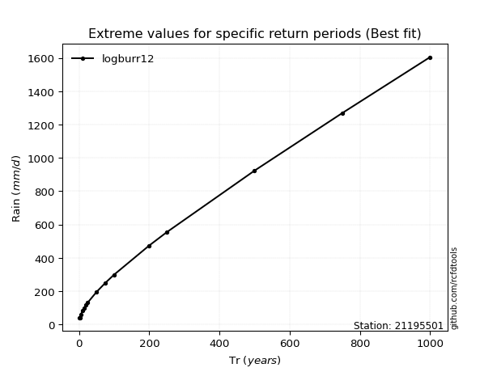</img>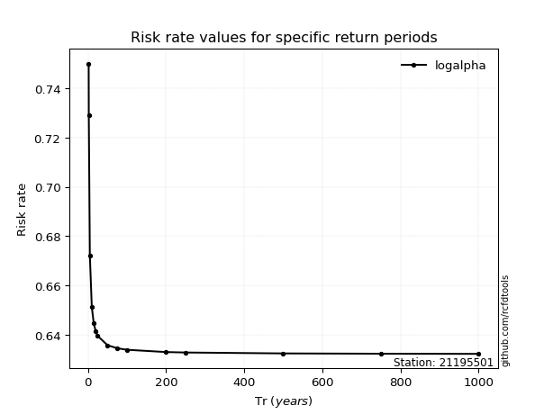</img>

</div>


<sub>**APP DISCLAIMER**: NO WARRANTY - This software is provided by [github.com/rcfdtools](https://github.com/rcfdtools) "as is", without any express or implied warranty, including warranties of merchantability, fitness for a particular purpose, or non-infringement. There is no guarantee that the software will be error-free or operate without interruption. LIMITATION OF LIABILITY - Neither the authors nor copyright holders will be liable for claims or damages arising from the software or its use. You are responsible for determining if the software is appropriate for your use and assume all associated risks, including errors, legal compliance, and data loss. NO PROFESSIONAL ADVICE - The software provides general information and does not offer professional advice. It should not replace consultation with professional advisors.</sub>