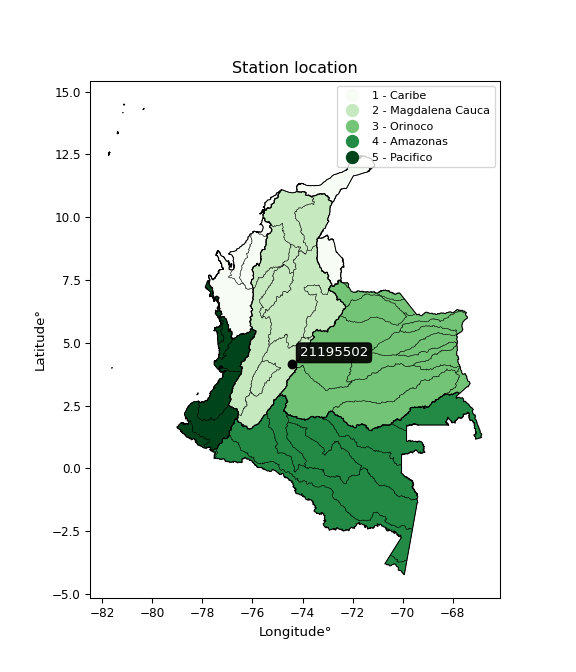

<div align="center">


</div>

# PMP Station (Rain, Pmax24h): 21195502

Probable Maximum Precipitation (PMP) is the greatest amount of rainfall for a specific duration that is meteorologically possible for a given location, acting as a "worst-case" scenario for extreme storms, crucial for designing safety-critical infrastructure like bridges, river deviations, dams, spillways, and nuclear plants to prevent catastrophic failure. PMP is calculated by hydrologists using meteorological data to determine the upper limit of extreme rainfall, often leading to the Probable Maximum Flood (PMF) for flood control design, and is increasingly being studied for climate change impacts. Probable Maximum Precipitation (PMP) is the theoretical upper limit of rainfall, a deterministic estimate for extreme events, while probability distributions (like GEV, Gumbel) describe the likelihood and frequency of various precipitation amounts, including rare ones, showing how often events occur, with PMP representing the extreme end of these distributions, used for critical infrastructure design to ensure safety against the worst conceivable weather, unlike standard statistical forecasts which cover typical probabilities.

The most common probability distributions in hydrology, used for analyzing floods, rainfall, and streamflow, include the Normal, Log-Normal, Gumbel, Gamma (including Log-Pearson Type III), and Generalized Extreme Value (GEV) distributions, often chosen based on the data´s skewness and whether modeling extremes or general conditions, with Gumbel and GEV popular for extreme events like floods, while the Normal distribution serves as a baseline, though often requiring transformations for skewed hydrological data. These distributions help in designing water infrastructure, managing water resources, and forecasting hydrologic events.

> Hydrological data often isn´t perfectly normal (it´s skewed), so different distributions are needed for different applications, such as: **Flood Frequency Analysis**: Using Gumbel, GEV, or Log-Pearson Type III for predicting extreme flood magnitudes and their return periods, **Rainfall Analysis**: Normal for annual totals, but Log-Normal, Weibull, or GEV for intensity or extreme daily rainfall, **Streamflow Modeling**: Gamma and Log-Normal for maximum flows, GEV for minimum flows, and Kappa for daily flows.

<div align="center">

</img>

</div>


## A. General information


### 1. General running parameters

• app_version: _v20260113_. • runtime: _2026-01-17 18:24:04.630693_. • Python version: _3.14.0_. • SciPy version: _1.16.3_. • Pandas version: _2.3.3_. • NumPy version: _2.3.5_. • Stations dataset (station_dataset_file): _dataset/pmax24h_in/automatic_colombia_2003_2025.csv_. • Stations catalog (station_catalog_file): _dataset/CNE.xls_. • Minimum year to eval til year_max (date_min): _1900_. • Maximum year to eval since year_min (date_max): _2025_. • Creates, save and include plots into reports (create_plot): _False_. • Plot only fit distributions with Δo > Δ (plot_only_fit): _True_. • Plot only simple graphs avoiding multiple CDFs and multiple Extreme values plots (plot_only_simple): _True_. • Eval low extreme values, if False, evaluates high extreme values (low_extreme): _False_. • Eval every SciPy distribution as logarithmic (pdist_logarithmic_on): _True_. • Standard deviation normalized (ddof): _1.0_. • Return periods to eval in years (Tr): _[2, 2.33, 5, 10, 15, 20, 25, 50, 75, 100, 200, 250, 500, 750, 1000]_. • Minimum data sample per station, 0 means any (minimum_sample): _5_. • Z-Score maximum threshold to adjust a value, 0 means disable (zscore_max): _3.5_. • Z-Score minimum threshold to adjust a value, 0 means disable (zscore_min): _-2.5_. • Avoid zeros, e.g. rain = 0 (avoid_zeros): _True_. • Avoid null values (avoid_nans): _True_. 

:file_folder:Table: [dataset.csv](../../dataset/pmax24h_in/automatic_colombia_2003_2025.csv)

> Delta Degrees of Freedom (DDOF): is a parameter used in the formulas for calculating variance and standard deviation. When ddof=0, the divisor is $N$ (the total number of observations) and this is used when your data set is the entire population. When ddof=1, the divisor is $N-1$ and this is used when your data set is a sample drawn from a larger population. Using $N-1$ provides an unbiased estimate of the population variance (known as Bessel´s correction).


### 2. Station info and location

|   id |   CODIGO | NOMBRE                          | CATEGORIA               | TECNOLOGIA                | ESTADO   |   FECHA_INSTALACION |   FECHA_SUSPENSION |   ALTITUD |   LATITUD |   LONGITUD | DEPARTAMENTO   | MUNICIPIO    | AREA_OPERATIVA                            | ENTIDAD                                       | AREA_HIDROGRAFICA   | ZONA_HIDROGRAFICA   | SUBZONA_HIDROGRAFICA   |   CORRIENTE | Catalogo   |   Version |
|-----:|---------:|:--------------------------------|:------------------------|:--------------------------|:---------|--------------------:|-------------------:|----------:|----------:|-----------:|:---------------|:-------------|:------------------------------------------|:----------------------------------------------|:--------------------|:--------------------|:-----------------------|------------:|:-----------|----------:|
|    0 | 21195502 | AGUAS CLARAS  - AUT  [21195502] | Climatológica Principal | Automática con Telemetría | Activa   |                 nan |                nan |         2 |   4.14469 |   -74.4277 | Cundinamarca   | San Bernardo | Area Operativa 11 - Cundinamarca-Amazonas | CORPORACION AUTONOMA REGIONAL DE CUNDINAMARCA | Magdalena Cauca     | Alto Magdalena      | Río Sumapaz            |         nan | CNE_OE     |  20251226 |

<div align="center">

Dynamic map: [:earth_americas:Google](http://maps.google.com/maps?q=4.144691667,-74.42774722) [:earth_americas:OSM](https://www.openstreetmap.org/#map=18/4.144691667/-74.42774722&layers=P) [:earth_americas:Bing](https://www.bing.com/maps?cp=4.144691667~-74.42774722&lvl=18) [:earth_americas:Apple](https://maps.apple.com/frame?center=4.144691667%2C-74.42774722&span=0.003%2C0.006)

</div>


<div align="center">

```geojson
{
  "type": "Feature",
  "geometry": {
    "type": "Point", 
    "coordinates": [-74.42774722, 4.144691667]
  }, 
  "properties": {
    "Name": "21195502"
  }
}
```

</div>


### 3. Discrete values table and plot

<div align="center">

|               |          0 |           1 |          2 |          3 |          4 |           5 |           6 |
|:--------------|-----------:|------------:|-----------:|-----------:|-----------:|------------:|------------:|
| Date          | 2015       | 2016        | 2017       | 2018       | 2019       | 2020        | 2021        |
| Value         |   46.2     |   43.2      |   60.9     |   35.4     |   34.7     |   46.9      |   49.5      |
| Value_initial |   46.2     |   43.2      |   60.9     |   35.4     |   34.7     |   46.9      |   49.5      |
| count         |    7       |    7        |    7       |    7       |    7       |    7        |    7        |
| mean          |   45.2571  |   45.2571   |   45.2571  |   45.2571  |   45.2571  |   45.2571   |   45.2571   |
| std           |    8.93623 |    8.93623  |    8.93623 |    8.93623 |    8.93623 |    8.93623  |    8.93623  |
| zscore        |    0.10551 |   -0.230203 |    1.7505  |   -1.10305 |   -1.18139 |    0.183842 |    0.474793 |


</div>


> The initial value (value_initial) correspond to the initial obtained or null completed value, and value (value) is adjusted only when the initial value is outside the valid range (outlier) definite through the Z-Score value. If Z-Score is active, values out of range or outliers are replaced with the station mean value. A Z-Score (or standard score) measures how many standard deviations a data point is from the mean of a dataset, indicating its relative position; positive scores mean above the mean, negative mean below, and a score of zero is exactly at the mean, allowing for comparison of values from different distributions. It´s calculated using the formula $z=(x–μ)/σ$, where $x$ is the data point, $μ$ is the mean, and $σ$ is the standard deviation, helping identify outliers and understand probability.
>
> <sub>**Note**: In this study, "completing" (filling gaps in) and "extending" (forecasting or lengthening the historical record) rainfall data series are avoided for certain critical analyses because they introduce artificial bias and uncertainty, which can distort the statistics of rare events (extremes), alter day-to-day variability, and compromise the integrity and homogeneity of the original data. Some reasons against Completing/Extending rainfall data are: **Distortion of Extremes and Variability**: The primary issue is that most gap-filling or extension methods rely on averaging or regression with nearby stations, which inherently smooths the data. Rainfall is highly variable in space and time, with a large percentage of zero values and occasional large storms. Infilling methods often underestimate the highest values and overestimate the lowest (zero) values, which severely distorts analyses focused on flood frequency, drought severity, and intensity-duration-frequency (IDF) curves, **Loss of Data Homogeneity**: Infilled or extended data are synthetic estimates, not actual measurements. Combining these estimates with observed data can violate the assumption of data homogeneity, which requires that the data properties do not change over time. Inhomogeneity can lead to incorrect conclusions about long-term trends or changes in climate patterns, **Propagation of Errors**: Errors and biases from the original data (e.g., wind-induced undercatch, instrument errors, site changes) or the data used for imputation can propagate through the analysis, leading to unreliable hydrological models and inaccurate predictions, **Compromised Statistical Integrity**: For statistical analyses, especially those involving the frequency of events, using artificial data can introduce time bias or autocorrelation that doesn´t exist in reality, making it difficult to assess the true probability of events, **Difficulty in Validation**: It is difficult to accurately validate the quality of filled or extended data, especially for past periods where ground-truth measurements are unavailable. The reliability of imputation techniques heavily depends on the density of the surrounding station network and the complexity of the local topography.</sub>


### 4. Active continuous probability distributions from SciPy (80 of 104 available)

A Probability Density Function (PDF) describes the relative likelihood of a continuous random variable falling within a specific range, where the total area under its curve equals 1, and the area over any interval gives the actual probability for that range. Unlike discrete probabilities (like rolling a die), a PDF shows density, not direct probability for a single point (which is zero), with higher points indicating higher likelihood, often visualized as a bell curve for normal distributions.

A log of a probability density function (log-PDF) is simply the logarithm of the PDF´s value, denoted as $log(f(x))$, useful for converting multiplication of probabilities into addition, improving numerical stability with tiny numbers, and connecting to information theory concepts like entropy. Instead of dealing with very small probabilities (e.g., 0.000001), log-PDFs use negative numbers (e.g., $log(0.00001) ≈ -11.51$ that are easier for computers to handle, preventing underflow errors and simplifying complex calculations. In this study, each active probability distribution from SciPy is also evaluated in the $log$ form.

[scipy.stats](https://docs.scipy.org/doc/scipy/reference/stats.html) is a Python´s powerful submodule within the SciPy library for comprehensive statistical analysis, offering over 130 probability distributions (like Normal, Poisson), functions for descriptive stats (mean, variance), hypothesis testing (t-tests, chi-square), random variable generation, and statistical tests, making it essential for data science, modeling, and research. It provides tools to explore, model, and draw conclusions from data efficiently, working seamlessly with NumPy.

<div align="center">

|   id | p_dist           |   n_parameter | fit_method   | label                                                                       | active   | ref                                                                                                      |
|-----:|:-----------------|--------------:|:-------------|:----------------------------------------------------------------------------|:---------|:---------------------------------------------------------------------------------------------------------|
|    0 | alpha            |             3 | MLE          | Alpha                                                                       | True     | [:mortar_board:](https://docs.scipy.org/doc/scipy/reference/generated/scipy.stats.alpha.html)            |
|    1 | anglit           |             2 | MM           | Anglit                                                                      | True     | [:mortar_board:](https://docs.scipy.org/doc/scipy/reference/generated/scipy.stats.anglit.html)           |
|    2 | arcsine          |             2 | MM           | Arcsine                                                                     | True     | [:mortar_board:](https://docs.scipy.org/doc/scipy/reference/generated/scipy.stats.arcsine.html)          |
|    3 | argus            |             3 | MLE          | Argus                                                                       | True     | [:mortar_board:](https://docs.scipy.org/doc/scipy/reference/generated/scipy.stats.argus.html)            |
|    4 | beta             |             4 | MLE          | Beta                                                                        | True     | [:mortar_board:](https://docs.scipy.org/doc/scipy/reference/generated/scipy.stats.beta.html)             |
|    5 | betaprime        |             4 | MLE          | Beta prime                                                                  | True     | [:mortar_board:](https://docs.scipy.org/doc/scipy/reference/generated/scipy.stats.betaprime.html)        |
|    6 | bradford         |             3 | MLE          | Bradford                                                                    | True     | [:mortar_board:](https://docs.scipy.org/doc/scipy/reference/generated/scipy.stats.bradford.html)         |
|    7 | burr             |             4 | MLE          | Burr (Type III)                                                             | True     | [:mortar_board:](https://docs.scipy.org/doc/scipy/reference/generated/scipy.stats.burr.html)             |
|    8 | burr12           |             4 | MLE          | Burr (Type III) 12                                                          | True     | [:mortar_board:](https://docs.scipy.org/doc/scipy/reference/generated/scipy.stats.burr12.html)           |
|    9 | cosine           |             2 | MLE          | Cosine                                                                      | True     | [:mortar_board:](https://docs.scipy.org/doc/scipy/reference/generated/scipy.stats.cosine.html)           |
|   10 | crystalball      |             4 | MLE          | Crystalball                                                                 | True     | [:mortar_board:](https://docs.scipy.org/doc/scipy/reference/generated/scipy.stats.crystalball.html)      |
|   11 | dgamma           |             3 | MLE          | Double gamma                                                                | True     | [:mortar_board:](https://docs.scipy.org/doc/scipy/reference/generated/scipy.stats.dgamma.html)           |
|   12 | dweibull         |             3 | MLE          | Double Weibull                                                              | True     | [:mortar_board:](https://docs.scipy.org/doc/scipy/reference/generated/scipy.stats.dweibull.html)         |
|   13 | erlang           |             3 | MLE          | Erlang                                                                      | True     | [:mortar_board:](https://docs.scipy.org/doc/scipy/reference/generated/scipy.stats.erlang.html)           |
|   14 | exponnorm        |             3 | MLE          | Exponentially modified Normal                                               | True     | [:mortar_board:](https://docs.scipy.org/doc/scipy/reference/generated/scipy.stats.exponnorm.html)        |
|   15 | exponpow         |             3 | MLE          | Exponential power                                                           | True     | [:mortar_board:](https://docs.scipy.org/doc/scipy/reference/generated/scipy.stats.exponpow.html)         |
|   16 | exponweib        |             4 | MLE          | Exponentiated Weibull                                                       | True     | [:mortar_board:](https://docs.scipy.org/doc/scipy/reference/generated/scipy.stats.exponweib.html)        |
|   17 | f                |             4 | MLE          | F                                                                           | True     | [:mortar_board:](https://docs.scipy.org/doc/scipy/reference/generated/scipy.stats.f.html)                |
|   18 | fatiguelife      |             3 | MLE          | Fatigue-life (Birnbaum-Saunders)                                            | True     | [:mortar_board:](https://docs.scipy.org/doc/scipy/reference/generated/scipy.stats.fatiguelife.html)      |
|   19 | foldnorm         |             3 | MM           | Fold Normal                                                                 | True     | [:mortar_board:](https://docs.scipy.org/doc/scipy/reference/generated/scipy.stats.foldnorm.html)         |
|   20 | gamma            |             3 | MLE          | Gamma                                                                       | True     | [:mortar_board:](https://docs.scipy.org/doc/scipy/reference/generated/scipy.stats.gamma.html)            |
|   21 | gausshyper       |             6 | MLE          | Gauss hypergeometric                                                        | True     | [:mortar_board:](https://docs.scipy.org/doc/scipy/reference/generated/scipy.stats.gausshyper.html)       |
|   22 | genexpon         |             5 | MLE          | Generalized exponential                                                     | True     | [:mortar_board:](https://docs.scipy.org/doc/scipy/reference/generated/scipy.stats.genexpon.html)         |
|   23 | genextreme       |             3 | MLE          | Generalized exponential                                                     | True     | [:mortar_board:](https://docs.scipy.org/doc/scipy/reference/generated/scipy.stats.genextreme.html)       |
|   24 | gengamma         |             4 | MLE          | Generalized gamma                                                           | True     | [:mortar_board:](https://docs.scipy.org/doc/scipy/reference/generated/scipy.stats.gengamma.html)         |
|   25 | genhalflogistic  |             3 | MLE          | Generalized half-logistic                                                   | True     | [:mortar_board:](https://docs.scipy.org/doc/scipy/reference/generated/scipy.stats.genhalflogistic.html)  |
|   26 | genlogistic      |             3 | MLE          | Generalized logistic                                                        | True     | [:mortar_board:](https://docs.scipy.org/doc/scipy/reference/generated/scipy.stats.genlogistic.html)      |
|   27 | gennorm          |             3 | MLE          | Generalized Normal                                                          | True     | [:mortar_board:](https://docs.scipy.org/doc/scipy/reference/generated/scipy.stats.gennorm.html)          |
|   28 | genpareto        |             3 | MLE          | Generalized Pareto                                                          | True     | [:mortar_board:](https://docs.scipy.org/doc/scipy/reference/generated/scipy.stats.genpareto.html)        |
|   29 | gompertz         |             3 | MLE          | Gompertz (or truncated Gumbel)                                              | True     | [:mortar_board:](https://docs.scipy.org/doc/scipy/reference/generated/scipy.stats.gompertz.html)         |
|   30 | gumbel_l         |             2 | MM           | Gumbel Left Skew                                                            | True     | [:mortar_board:](https://docs.scipy.org/doc/scipy/reference/generated/scipy.stats.gumbel_l.html)         |
|   31 | gumbel_r         |             2 | MM           | Gumbel Right Skew                                                           | True     | [:mortar_board:](https://docs.scipy.org/doc/scipy/reference/generated/scipy.stats.gumbel_r.html)         |
|   32 | halfgennorm      |             3 | MLE          | Upper half of a generalized normal                                          | True     | [:mortar_board:](https://docs.scipy.org/doc/scipy/reference/generated/scipy.stats.halfgennorm.html)      |
|   33 | halflogistic     |             2 | MM           | Half-logistic                                                               | True     | [:mortar_board:](https://docs.scipy.org/doc/scipy/reference/generated/scipy.stats.halflogistic.html)     |
|   34 | halfnorm         |             2 | MM           | Half Normal                                                                 | True     | [:mortar_board:](https://docs.scipy.org/doc/scipy/reference/generated/scipy.stats.halfnorm.html)         |
|   35 | hypsecant        |             2 | MM           | hyperbolic secant                                                           | True     | [:mortar_board:](https://docs.scipy.org/doc/scipy/reference/generated/scipy.stats.hypsecant.html)        |
|   36 | invgamma         |             3 | MLE          | Inverted gamma                                                              | True     | [:mortar_board:](https://docs.scipy.org/doc/scipy/reference/generated/scipy.stats.invgamma.html)         |
|   37 | invgauss         |             3 | MLE          | Inverse Gaussian                                                            | True     | [:mortar_board:](https://docs.scipy.org/doc/scipy/reference/generated/scipy.stats.invgauss.html)         |
|   38 | invweibull       |             3 | MLE          | Inverted Weibull                                                            | True     | [:mortar_board:](https://docs.scipy.org/doc/scipy/reference/generated/scipy.stats.invweibull.html)       |
|   39 | johnsonsb        |             4 | MLE          | Johnson SB                                                                  | True     | [:mortar_board:](https://docs.scipy.org/doc/scipy/reference/generated/scipy.stats.johnsonsb.html)        |
|   40 | johnsonsu        |             4 | MLE          | Johnson Su                                                                  | True     | [:mortar_board:](https://docs.scipy.org/doc/scipy/reference/generated/scipy.stats.johnsonsu.html)        |
|   41 | kappa3           |             3 | MLE          | Kappa 3                                                                     | True     | [:mortar_board:](https://docs.scipy.org/doc/scipy/reference/generated/scipy.stats.kappa3.html)           |
|   42 | kappa4           |             4 | MLE          | Kappa 4                                                                     | True     | [:mortar_board:](https://docs.scipy.org/doc/scipy/reference/generated/scipy.stats.kappa4.html)           |
|   43 | ksone            |             3 | MLE          | Kolmogorov-Smirnov one-sided test statistic distribution                    | True     | [:mortar_board:](https://docs.scipy.org/doc/scipy/reference/generated/scipy.stats.ksone.html)            |
|   44 | kstwobign        |             2 | MLE          | Limiting distribution of scaled Kolmogorov-Smirnov two-sided test statistic | True     | [:mortar_board:](https://docs.scipy.org/doc/scipy/reference/generated/scipy.stats.kstwobign.html)        |
|   45 | laplace          |             2 | MM           | Laplace                                                                     | True     | [:mortar_board:](https://docs.scipy.org/doc/scipy/reference/generated/scipy.stats.laplace.html)          |
|   46 | levy_l           |             2 | MLE          | Left-skewed Levy                                                            | True     | [:mortar_board:](https://docs.scipy.org/doc/scipy/reference/generated/scipy.stats.levy_l.html)           |
|   47 | loggamma         |             3 | MLE          | Log gamma                                                                   | True     | [:mortar_board:](https://docs.scipy.org/doc/scipy/reference/generated/scipy.stats.loggamma.html)         |
|   48 | logistic         |             2 | MM           | Logistic (or Sech-squared)                                                  | True     | [:mortar_board:](https://docs.scipy.org/doc/scipy/reference/generated/scipy.stats.logistic.html)         |
|   49 | loglaplace       |             3 | MLE          | Log-Laplace                                                                 | True     | [:mortar_board:](https://docs.scipy.org/doc/scipy/reference/generated/scipy.stats.loglaplace.html)       |
|   50 | lomax            |             3 | MLE          | Lomax (Pareto of the second kind)                                           | True     | [:mortar_board:](https://docs.scipy.org/doc/scipy/reference/generated/scipy.stats.lomax.html)            |
|   51 | maxwell          |             2 | MM           | Maxwell                                                                     | True     | [:mortar_board:](https://docs.scipy.org/doc/scipy/reference/generated/scipy.stats.maxwell.html)          |
|   52 | mielke           |             4 | MLE          | Mielke Beta-Kappa / Dagum                                                   | True     | [:mortar_board:](https://docs.scipy.org/doc/scipy/reference/generated/scipy.stats.mielke.html)           |
|   53 | moyal            |             2 | MM           | Moyal                                                                       | True     | [:mortar_board:](https://docs.scipy.org/doc/scipy/reference/generated/scipy.stats.moyal.html)            |
|   54 | nakagami         |             3 | MLE          | Nakagami                                                                    | True     | [:mortar_board:](https://docs.scipy.org/doc/scipy/reference/generated/scipy.stats.nakagami.html)         |
|   55 | ncf              |             5 | MLE          | Non-central F distribution                                                  | True     | [:mortar_board:](https://docs.scipy.org/doc/scipy/reference/generated/scipy.stats.ncf.html)              |
|   56 | nct              |             4 | MLE          | Non-central Student’s t                                                     | True     | [:mortar_board:](https://docs.scipy.org/doc/scipy/reference/generated/scipy.stats.nct.html)              |
|   57 | norm             |             2 | MM           | Normal                                                                      | True     | [:mortar_board:](https://docs.scipy.org/doc/scipy/reference/generated/scipy.stats.norm.html)             |
|   58 | pearson3         |             3 | MM           | Pearson type III                                                            | True     | [:mortar_board:](https://docs.scipy.org/doc/scipy/reference/generated/scipy.stats.pearson3.html)         |
|   59 | powerlaw         |             3 | MLE          | Power-function                                                              | True     | [:mortar_board:](https://docs.scipy.org/doc/scipy/reference/generated/scipy.stats.powerlaw.html)         |
|   60 | rayleigh         |             2 | MM           | Rayleigh                                                                    | True     | [:mortar_board:](https://docs.scipy.org/doc/scipy/reference/generated/scipy.stats.rayleigh.html)         |
|   61 | rdist            |             3 | MLE          | R-distributed (symmetric beta)                                              | True     | [:mortar_board:](https://docs.scipy.org/doc/scipy/reference/generated/scipy.stats.rdist.html)            |
|   62 | rice             |             3 | MLE          | Rice                                                                        | True     | [:mortar_board:](https://docs.scipy.org/doc/scipy/reference/generated/scipy.stats.rice.html)             |
|   63 | semicircular     |             2 | MM           | Semicircular                                                                | True     | [:mortar_board:](https://docs.scipy.org/doc/scipy/reference/generated/scipy.stats.semicircular.html)     |
|   64 | skewnorm         |             3 | MLE          | Skew normal                                                                 | True     | [:mortar_board:](https://docs.scipy.org/doc/scipy/reference/generated/scipy.stats.skewnorm.html)         |
|   65 | t                |             3 | MLE          | Student’s t                                                                 | True     | [:mortar_board:](https://docs.scipy.org/doc/scipy/reference/generated/scipy.stats.t.html)                |
|   66 | trapezoid        |             4 | MLE          | Trapezoid                                                                   | True     | [:mortar_board:](https://docs.scipy.org/doc/scipy/reference/generated/scipy.stats.trapezoid.html)        |
|   67 | triang           |             3 | MLE          | Triangular                                                                  | True     | [:mortar_board:](https://docs.scipy.org/doc/scipy/reference/generated/scipy.stats.triang.html)           |
|   68 | truncexpon       |             3 | MLE          | Truncated exponential                                                       | True     | [:mortar_board:](https://docs.scipy.org/doc/scipy/reference/generated/scipy.stats.truncexpon.html)       |
|   69 | truncnorm        |             4 | MLE          | Truncated normal                                                            | True     | [:mortar_board:](https://docs.scipy.org/doc/scipy/reference/generated/scipy.stats.truncnorm.html)        |
|   70 | truncpareto      |             4 | MLE          | Upper truncated Pareto                                                      | True     | [:mortar_board:](https://docs.scipy.org/doc/scipy/reference/generated/scipy.stats.truncpareto.html)      |
|   71 | truncweibull_min |             5 | MLE          | Doubly truncated Weibull minimum                                            | True     | [:mortar_board:](https://docs.scipy.org/doc/scipy/reference/generated/scipy.stats.truncweibull_min.html) |
|   72 | tukeylambda      |             3 | MLE          | Tukey-Lamdba                                                                | True     | [:mortar_board:](https://docs.scipy.org/doc/scipy/reference/generated/scipy.stats.tukeylambda.html)      |
|   73 | uniform          |             2 | MLE          | Uniform                                                                     | True     | [:mortar_board:](https://docs.scipy.org/doc/scipy/reference/generated/scipy.stats.uniform.html)          |
|   74 | vonmises         |             3 | MLE          | Von Mises                                                                   | True     | [:mortar_board:](https://docs.scipy.org/doc/scipy/reference/generated/scipy.stats.vonmises.html)         |
|   75 | vonmises_line    |             3 | MLE          | Von Mises line                                                              | True     | [:mortar_board:](https://docs.scipy.org/doc/scipy/reference/generated/scipy.stats.vonmises_line.html)    |
|   76 | wald             |             2 | MM           | Wald                                                                        | True     | [:mortar_board:](https://docs.scipy.org/doc/scipy/reference/generated/scipy.stats.wald.html)             |
|   77 | weibull_max      |             3 | MLE          | Weibull maximum                                                             | True     | [:mortar_board:](https://docs.scipy.org/doc/scipy/reference/generated/scipy.stats.weibull_max.html)      |
|   78 | weibull_min      |             3 | MLE          | Weibull minimum                                                             | True     | [:mortar_board:](https://docs.scipy.org/doc/scipy/reference/generated/scipy.stats.weibull_min.html)      |
|   79 | wrapcauchy       |             3 | MLE          | Wrapped  Cauchy                                                             | True     | [:mortar_board:](https://docs.scipy.org/doc/scipy/reference/generated/scipy.stats.wrapcauchy.html)       |

</div>

> **n_parameter:** # arguments & localization & scale.
>
> **Fit methods:** (MLE) maximum likelihood, (MM) L-moments.
>
>**Inactive** (With the only purpose of prevent loops, zero divisions, infinite values, over high estimated values or horizontal trending for recurrence intervals estimations, the follow distributions were disabled.)**:** lognorm, norminvgauss, powernorm, powerlognorm, cauchy, halfcauchy, foldcauchy, skewcauchy, chi2, expon, fisk, genhyperbolic, geninvgauss, gibrat, kstwo, laplace_asymmetric, levy, levy_stable, ncx2, pareto, rel_breitwigner, recipinvgauss, studentized_range, loguniform, 


## B. Probability (PDF) vs. Empirical (EDF) distributions functions

A continuous probability distribution (CPD) describes probabilities for variables that can take any value within a range (like rain any time), unlike discrete variables with specific outcomes (like temperature). It uses a Probability Density Function (PDF), a curve where the total area under it equals 1, and the probability of the variable falling within an interval (a to b) is found by calculating the area under the curve between those points. A key feature is that the probability of hitting any single exact value is zero, so probabilities are always expressed for ranges, e.g., $P(a ≤ X ≤ b)$.

<div align="center">

Distributions parameters from station values
|     |   station | p_dist              |   n |              loc |          scale | shape                  | shape1                 | shape2                 | shape3             |
|----:|----------:|:--------------------|----:|-----------------:|---------------:|:-----------------------|:-----------------------|:-----------------------|:-------------------|
|   0 |  21195502 | alpha               |   7 |    -21.7492      |  548.932       | 8.314605225583339      |                        |                        |                    |
|   1 |  21195502 | anglit              |   7 |     45.2571      |   24.2028      |                        |                        |                        |                    |
|   2 |  21195502 | arcsine             |   7 |     33.5569      |   23.4005      |                        |                        |                        |                    |
|   3 |  21195502 | argus               |   7 |     26.054       |   36.2776      | 2.146462124697453e-06  |                        |                        |                    |
|   4 |  21195502 | beta                |   7 |     34.7         |   46.9117      | 0.5984856341016331     | 2.7106703073361476     |                        |                    |
|   5 |  21195502 | betaprime           |   7 |     -1.63061     |    6.11015     | 281.5474052404038      | 37.69622519487085      |                        |                    |
|   6 |  21195502 | bradford            |   7 |     34.7         |   26.2         | 1.0352597455084043     |                        |                        |                    |
|   7 |  21195502 | burr                |   7 |    -40.3099      |   36.5006      | 11.978830488880883     | 14517.387237128576     |                        |                    |
|   8 |  21195502 | burr12              |   7 |     -5.77655     |   40.3687      | 1414.4776867464152     | 0.0031913040057310813  |                        |                    |
|   9 |  21195502 | cosine              |   7 |     45.9203      |    7.06145     |                        |                        |                        |                    |
|  10 |  21195502 | crystalball         |   7 |     45.2571      |    8.27334     | 2992.5364234945177     | 3247.9343137112996     |                        |                    |
|  11 |  21195502 | dgamma              |   7 |     46.2         |    8.30784     | 0.4526986682671468     |                        |                        |                    |
|  12 |  21195502 | dweibull            |   7 |     46.2         |    6.91465     | 0.8892174373396462     |                        |                        |                    |
|  13 |  21195502 | erlang              |   7 |     34.7         |    8.10132     | 0.8696723435079874     |                        |                        |                    |
|  14 |  21195502 | exponnorm           |   7 |     38.9709      |    5.75779     | 1.091779755150582      |                        |                        |                    |
|  15 |  21195502 | exponpow            |   7 |     34.7         |   31.8349      | 0.3164080183972383     |                        |                        |                    |
|  16 |  21195502 | exponweib           |   7 |     34.7         |    1.36515     | 1.0382404334030872     | 0.326189695946952      |                        |                    |
|  17 |  21195502 | f                   |   7 |      8.19456     |   35.5276      | 280.57131274657024     | 48.29837421137105      |                        |                    |
|  18 |  21195502 | fatiguelife         |   7 |     34.7         |    1.21407e-05 | 738.7166604880686      |                        |                        |                    |
|  19 |  21195502 | foldnorm            |   7 |     31.4232      |    9.26905     | 1.422744342255865      |                        |                        |                    |
|  20 |  21195502 | gamma               |   7 |     34.7         |   10.8517      | 0.3384024636636218     |                        |                        |                    |
|  21 |  21195502 | gausshyper          |   7 |     34.7         |   26.2204      | 0.8739947749691146     | 0.9441942728317971     | 0.9847764942629262     | 1.0596343717278986 |
|  22 |  21195502 | genexpon            |   7 |     34.7         |    2.45148     | 0.17628501201106322    | 0.3534767252726058     | 0.05010455708747606    |                    |
|  23 |  21195502 | genextreme          |   7 |     41.7242      |    7.23061     | 0.10934140185588505    |                        |                        |                    |
|  24 |  21195502 | gengamma            |   7 |     34.7         |    1.46104     | 1.1113020623715688     | 0.3158938492032296     |                        |                    |
|  25 |  21195502 | genhalflogistic     |   7 |     32.4925      |   30.1948      | 1.0629184666219267     |                        |                        |                    |
|  26 |  21195502 | genlogistic         |   7 |     -0.53433     |    6.93908     | 416.5519733451707      |                        |                        |                    |
|  27 |  21195502 | gennorm             |   7 |     46.2         |    6.08585     | 0.9787712388989926     |                        |                        |                    |
|  28 |  21195502 | genpareto           |   7 |     -0.0774818   |  107.358       | -1.7606153376242273    |                        |                        |                    |
|  29 |  21195502 | gompertz            |   7 |     34.7         |   18.7097      | 1.0401326960494512     |                        |                        |                    |
|  30 |  21195502 | gumbel_l            |   7 |     48.9806      |    6.4507      |                        |                        |                        |                    |
|  31 |  21195502 | gumbel_r            |   7 |     41.5337      |    6.4507      |                        |                        |                        |                    |
|  32 |  21195502 | halfgennorm         |   7 |     34.7         |    1.31486     | 0.4498158768077447     |                        |                        |                    |
|  33 |  21195502 | halflogistic        |   7 |     35.4512      |    7.07346     |                        |                        |                        |                    |
|  34 |  21195502 | halfnorm            |   7 |     34.3065      |   13.7246      |                        |                        |                        |                    |
|  35 |  21195502 | hypsecant           |   7 |     45.2571      |    5.26697     |                        |                        |                        |                    |
|  36 |  21195502 | invgamma            |   7 |      5.70913     |  891.47        | 23.531753921231164     |                        |                        |                    |
|  37 |  21195502 | invgauss            |   7 |     22.0623      |  160.896       | 0.14416000425925146    |                        |                        |                    |
|  38 |  21195502 | invweibull          |   7 |     -2.82531e+08 |    2.82531e+08 | 40706807.51429166      |                        |                        |                    |
|  39 |  21195502 | johnsonsb           |   7 |     34.6868      |   26.2132      | 0.2754053745209443     | 0.12972208482355674    |                        |                    |
|  40 |  21195502 | johnsonsu           |   7 |     18.5445      |    3.24731     | -8.83499220799185      | 3.2053085114875337     |                        |                    |
|  41 |  21195502 | kappa3              |   7 |     34.686       |   26.3601      | 218286.87860358035     |                        |                        |                    |
|  42 |  21195502 | kappa4              |   7 |     32.0738      |   31.0041      | 1.092877814285162      | 1.0755500312660708     |                        |                    |
|  43 |  21195502 | ksone               |   7 |     32.08        |   31.44        | 1.0                    |                        |                        |                    |
|  44 |  21195502 | kstwobign           |   7 |     17.1224      |   32.2207      |                        |                        |                        |                    |
|  45 |  21195502 | laplace             |   7 |     45.2571      |    5.85014     |                        |                        |                        |                    |
|  46 |  21195502 | levy_l              |   7 |     62.664       |    7.85764     |                        |                        |                        |                    |
|  47 |  21195502 | loggamma            |   7 |  -1968.68        |  285.649       | 1153.835114098736      |                        |                        |                    |
|  48 |  21195502 | logistic            |   7 |     45.2571      |    4.56133     |                        |                        |                        |                    |
|  49 |  21195502 | loglaplace          |   7 |     -0.143906    |   46.3439      | 7.16644987505922       |                        |                        |                    |
|  50 |  21195502 | lomax               |   7 |     34.7         |  335.228       | 32.30429192836755      |                        |                        |                    |
|  51 |  21195502 | maxwell             |   7 |     25.6528      |   12.2852      |                        |                        |                        |                    |
|  52 |  21195502 | mielke              |   7 |     -1.48972     |   18.1433      | 1414.4599743367903     | 6.39563859204908       |                        |                    |
|  53 |  21195502 | moyal               |   7 |     40.5259      |    3.72431     |                        |                        |                        |                    |
|  54 |  21195502 | nakagami            |   7 |     34.7         |   19.2284      | 0.2022732865694558     |                        |                        |                    |
|  55 |  21195502 | ncf                 |   7 |     -3.51748     |    4.94636     | 94.36622849749706      | 84.37896077080762      | 814.3175392947351      |                    |
|  56 |  21195502 | nct                 |   7 |     -0.212427    |    1.53515     | 16.741037909616846     | 28.285143520775826     |                        |                    |
|  57 |  21195502 | norm                |   7 |     45.2571      |    8.27334     |                        |                        |                        |                    |
|  58 |  21195502 | pearson3            |   7 |     45.2571      |    8.27333     | 0.4456224719839165     |                        |                        |                    |
|  59 |  21195502 | powerlaw            |   7 |     34.7         |   26.2         | 0.1637401140205495     |                        |                        |                    |
|  60 |  21195502 | rayleigh            |   7 |     29.4298      |   12.6284      |                        |                        |                        |                    |
|  61 |  21195502 | rdist               |   7 |     33.1368      |   16.3632      | 0.9951112796014481     |                        |                        |                    |
|  62 |  21195502 | rice                |   7 |     30.3924      |   11.8228      | 0.26551208976557056    |                        |                        |                    |
|  63 |  21195502 | semicircular        |   7 |     45.2571      |   16.5467      |                        |                        |                        |                    |
|  64 |  21195502 | skewnorm            |   7 |     34.7         |   13.4137      | 10281028.7336375       |                        |                        |                    |
|  65 |  21195502 | t                   |   7 |     45.257       |    8.27335     | 135859252.2200037      |                        |                        |                    |
|  66 |  21195502 | trapezoid           |   7 |     32.08        |   31.44        | 1.0                    | 1.0                    |                        |                    |
|  67 |  21195502 | triang              |   7 |     23.38        |   37.52        | 0.9999999976374756     |                        |                        |                    |
|  68 |  21195502 | truncexpon          |   7 |     34.7         |   25.2735      | 1.0366595201202065     |                        |                        |                    |
|  69 |  21195502 | truncnorm           |   7 |   -118.598       |   26.6958      | 6.06081283016719       | 906.0636493938346      |                        |                    |
|  70 |  21195502 | truncpareto         |   7 |     34.6914      |    0.00857937  | 0.0002098534649435457  | 3054.8373609063556     |                        |                    |
|  71 |  21195502 | truncweibull_min    |   7 |     34.7         |   31.2303      | 0.46849309834333663    | 1.2808608740366627e-16 | 0.9283586132304325     |                    |
|  72 |  21195502 | tukeylambda         |   7 |     42.1         |    9.7328      | 1.3152429394722773     |                        |                        |                    |
|  73 |  21195502 | uniform             |   7 |     34.7         |   26.2         |                        |                        |                        |                    |
|  74 |  21195502 | vonmises            |   7 |     -2.34576     |    1           | 0.9827057695054688     |                        |                        |                    |
|  75 |  21195502 | vonmises_line       |   7 |     47.8006      |    4.17006     | 0.23360376220127277    |                        |                        |                    |
|  76 |  21195502 | wald                |   7 |     36.9838      |    8.27337     |                        |                        |                        |                    |
|  77 |  21195502 | weibull_max         |   7 |     60.9         |    1.46545     | 0.17115478677554935    |                        |                        |                    |
|  78 |  21195502 | weibull_min         |   7 |     34.7         |   13.8054      | 0.3264036953652432     |                        |                        |                    |
|  79 |  21195502 | wrapcauchy          |   7 |     34.6526      |    4.17743     | 5.8148384019908754e-05 |                        |                        |                    |
|  80 |  21195502 | logalpha            |   7 |     -1.6511      |  164.151       | 30.169267169041298     |                        |                        |                    |
|  81 |  21195502 | loganglit           |   7 |      3.79593     |    0.529156    |                        |                        |                        |                    |
|  82 |  21195502 | logarcsine          |   7 |      3.54014     |    0.511573    |                        |                        |                        |                    |
|  83 |  21195502 | logargus            |   7 |      3.3791      |    0.761273    | 9.197787720441672e-05  |                        |                        |                    |
|  84 |  21195502 | logbeta             |   7 |      3.54674     |    0.93405     | 0.7040874298432789     | 2.2772045647732506     |                        |                    |
|  85 |  21195502 | logbetaprime        |   7 |      2.01427     |    7.98358     | 118.3785877236347      | 531.5524665225723      |                        |                    |
|  86 |  21195502 | logbradford         |   7 |      3.54674     |    0.562496    | 1.0828584879087226     |                        |                        |                    |
|  87 |  21195502 | logburr             |   7 |     -1.74254     |    4.95179     | 34.28654243464739      | 27.63813669919457      |                        |                    |
|  88 |  21195502 | logburr12           |   7 |     -0.0133235   |    3.87964     | 31.78864568528657      | 1.5217946944199348     |                        |                    |
|  89 |  21195502 | logcosine           |   7 |      3.80153     |    0.151432    |                        |                        |                        |                    |
|  90 |  21195502 | logcrystalball      |   7 |      3.79593     |    0.180884    | 7.583796224642228      | 845.5434848698333      |                        |                    |
|  91 |  21195502 | logdgamma           |   7 |      3.83298     |    0.126154    | 0.9247708643194188     |                        |                        |                    |
|  92 |  21195502 | logdweibull         |   7 |      3.83298     |    0.150166    | 0.7558330585994512     |                        |                        |                    |
|  93 |  21195502 | logerlang           |   7 |      1.61574     |    0.0149636   | 145.7115920244995      |                        |                        |                    |
|  94 |  21195502 | logexponnorm        |   7 |      3.7699      |    0.179003    | 0.14537789109582616    |                        |                        |                    |
|  95 |  21195502 | logexponpow         |   7 |      3.54674     |    0.57989     | 0.4308405570597825     |                        |                        |                    |
|  96 |  21195502 | logexponweib        |   7 |      3.54674     |    0.366537    | 0.45963842275884975    | 1.5633585202400058     |                        |                    |
|  97 |  21195502 | logf                |   7 |      1.07304     |    2.71498     | 1331.7901394305597     | 687.759933691936       |                        |                    |
|  98 |  21195502 | logfatiguelife      |   7 |      3.54674     |    4.10447e-06 | 213.5036676693544      |                        |                        |                    |
|  99 |  21195502 | logfoldnorm         |   7 |      3.48116     |    0.197698    | 1.5385999312224459     |                        |                        |                    |
| 100 |  21195502 | loggamma            |   7 |      1.63979     |    0.0151547   | 142.24251370046557     |                        |                        |                    |
| 101 |  21195502 | loggausshyper       |   7 |      3.54218     |    0.56705     | 0.9860364629387504     | 0.8791223170871023     | 0.9786566234919545     | 1.1401747671270286 |
| 102 |  21195502 | loggenexpon         |   7 |      3.54671     |    0.000879865 | 0.002260903557554694   | 0.2476968783696899     | 2.3554655951892425e-05 |                    |
| 103 |  21195502 | loggenextreme       |   7 |      3.73214     |    0.177408    | 0.2821694106500847     |                        |                        |                    |
| 104 |  21195502 | loggengamma         |   7 |      3.54674     |    0.872351    | 0.3545575396647228     | 1.2499926995735966     |                        |                    |
| 105 |  21195502 | loggenhalflogistic  |   7 |      3.47506     |    0.665493    | 1.0493860920876443     |                        |                        |                    |
| 106 |  21195502 | loggenlogistic      |   7 |      2.97285     |    0.161576    | 94.58440524532017      |                        |                        |                    |
| 107 |  21195502 | loggennorm          |   7 |      3.83298     |    0.00985745  | 0.4076417784953775     |                        |                        |                    |
| 108 |  21195502 | loggenpareto        |   7 |     -0.00171212  |    9.42907     | -2.2936511414408605    |                        |                        |                    |
| 109 |  21195502 | loggompertz         |   7 |      3.54674     |    0.350791    | 0.7550149900680574     |                        |                        |                    |
| 110 |  21195502 | loggumbel_l         |   7 |      3.87734     |    0.141034    |                        |                        |                        |                    |
| 111 |  21195502 | loggumbel_r         |   7 |      3.71452     |    0.141034    |                        |                        |                        |                    |
| 112 |  21195502 | loghalfgennorm      |   7 |      3.54674     |    0.541992    | 4.857498837236872      |                        |                        |                    |
| 113 |  21195502 | loghalflogistic     |   7 |      3.58151     |    0.154667    |                        |                        |                        |                    |
| 114 |  21195502 | loghalfnorm         |   7 |      3.55645     |    0.300142    |                        |                        |                        |                    |
| 115 |  21195502 | loghypsecant        |   7 |      3.79593     |    0.115154    |                        |                        |                        |                    |
| 116 |  21195502 | loginvgamma         |   7 |     -1.69825     | 5080.38        | 925.7333675208475      |                        |                        |                    |
| 117 |  21195502 | loginvgauss         |   7 |      2.83267     |   25.555       | 0.03762250676760978    |                        |                        |                    |
| 118 |  21195502 | loginvweibull       |   7 |     -7.49682e+06 |    7.49682e+06 | 46225509.83264747      |                        |                        |                    |
| 119 |  21195502 | logjohnsonsb        |   7 |      3.54674     |    0.5625      | -0.22229956191771716   | 0.09009761017743406    |                        |                    |
| 120 |  21195502 | logjohnsonsu        |   7 | 152001           |    3.95118e+06 | 840606.3355782967      | 21857039.753952626     |                        |                    |
| 121 |  21195502 | logkappa3           |   7 |      3.54674     |    0.726435    | 21.263149900774494     |                        |                        |                    |
| 122 |  21195502 | logkappa4           |   7 |      3.46765     |    0.668508    | 1.1345327335055018     | 1.0381308001737453     |                        |                    |
| 123 |  21195502 | logksone            |   7 |      3.49049     |    0.674992    | 1.0                    |                        |                        |                    |
| 124 |  21195502 | logkstwobign        |   7 |      3.14667     |    0.741444    |                        |                        |                        |                    |
| 125 |  21195502 | loglaplace          |   7 |      3.79593     |    0.127904    |                        |                        |                        |                    |
| 126 |  21195502 | loglevy_l           |   7 |      4.1433      |    0.151608    |                        |                        |                        |                    |
| 127 |  21195502 | logloggamma         |   7 |    -45.3807      |    6.78601     | 1404.003260634679      |                        |                        |                    |
| 128 |  21195502 | loglogistic         |   7 |      3.79593     |    0.0997263   |                        |                        |                        |                    |
| 129 |  21195502 | logloglaplace       |   7 |     -0.265778    |    4.09876     | 28.968063882697095     |                        |                        |                    |
| 130 |  21195502 | loglomax            |   7 |      3.54674     |    7.07938e+11 | 162859913151.4526      |                        |                        |                    |
| 131 |  21195502 | logmaxwell          |   7 |      3.36731     |    0.268596    |                        |                        |                        |                    |
| 132 |  21195502 | logmielke           |   7 |     -0.27495     |    4.08907     | 35.645242793746434     | 40.13693884666802      |                        |                    |
| 133 |  21195502 | logmoyal            |   7 |      3.69249     |    0.0814262   |                        |                        |                        |                    |
| 134 |  21195502 | lognakagami         |   7 |      3.54674     |    0.389964    | 0.40615907527988404    |                        |                        |                    |
| 135 |  21195502 | logncf              |   7 |      1.63007     |    1.87803     | 466.09074200168834     | 723.7978994317975      | 69.95017376957941      |                    |
| 136 |  21195502 | lognct              |   7 |     -0.321834    |    0.0318313   | 268.73567150709755     | 129.0007374770958      |                        |                    |
| 137 |  21195502 | lognorm             |   7 |      3.79593     |    0.180884    |                        |                        |                        |                    |
| 138 |  21195502 | logpearson3         |   7 |      3.79593     |    0.180883    | 0.11097480864403617    |                        |                        |                    |
| 139 |  21195502 | logpowerlaw         |   7 |      3.54674     |    0.562493    | 0.17150338843196455    |                        |                        |                    |
| 140 |  21195502 | lograyleigh         |   7 |      3.44989     |    0.276101    |                        |                        |                        |                    |
| 141 |  21195502 | logrdist            |   7 |      3.8722      |    0.325457    | 1.1039673684568156     |                        |                        |                    |
| 142 |  21195502 | logrice             |   7 |      3.44598     |    0.219797    | 1.1009895806219228     |                        |                        |                    |
| 143 |  21195502 | logsemicircular     |   7 |      3.79593     |    0.361767    |                        |                        |                        |                    |
| 144 |  21195502 | logskewnorm         |   7 |      3.68653     |    0.211391    | 0.8505400554442286     |                        |                        |                    |
| 145 |  21195502 | logt                |   7 |      3.79593     |    0.180882    | 195102406.17809296     |                        |                        |                    |
| 146 |  21195502 | logtrapezoid        |   7 |      3.49049     |    0.674992    | 1.0                    | 1.0                    |                        |                    |
| 147 |  21195502 | logtriang           |   7 |      3.32652     |    0.782713    | 0.9999999903750723     |                        |                        |                    |
| 148 |  21195502 | logtruncexpon       |   7 |      3.54674     |    0.526422    | 1.0685267285243016     |                        |                        |                    |
| 149 |  21195502 | logtruncnorm        |   7 |     -0.0661934   |    1.09889     | 3.287798014808857      | 3.7996723699453656     |                        |                    |
| 150 |  21195502 | logtruncpareto      |   7 |      3.54653     |    0.000209862 | 0.006375911324278508   | 2681.2986889088306     |                        |                    |
| 151 |  21195502 | logtruncweibull_min |   7 |      3.54674     |    0.561411    | 0.44369332291380414    | 1.8918960013671434e-15 | 1.0022586214051665     |                    |
| 152 |  21195502 | logtukeylambda      |   7 |      5.42011     |    3.73578e-29 | 1.3053444309087499     |                        |                        |                    |
| 153 |  21195502 | loguniform          |   7 |      3.54674     |    0.562493    |                        |                        |                        |                    |
| 154 |  21195502 | logvonmises         |   7 |     -2.48737     |    1           | 31.002640236733278     |                        |                        |                    |
| 155 |  21195502 | logvonmises_line    |   7 |      3.82354     |    0.0909374   | 0.1773230006333853     |                        |                        |                    |
| 156 |  21195502 | logwald             |   7 |      3.61501     |    0.180921    |                        |                        |                        |                    |
| 157 |  21195502 | logweibull_max      |   7 |      4.36092     |    0.62879     | 3.544282948645133      |                        |                        |                    |
| 158 |  21195502 | logweibull_min      |   7 |      3.54674     |    0.13832     | 0.5837593110375474     |                        |                        |                    |
| 159 |  21195502 | logwrapcauchy       |   7 |      3.54674     |    0.0895236   | 0.5                    |                        |                        |                    |

</div>

> **loc** (Location parameter): This shifts the distribution along the x-axis. For many common distributions, like the normal (Gaussian) distribution, loc represents the mean $μ$. For others, like the uniform distribution, it might represent the minimum value, or for the beta distribution, the left end of the support interval.
>
> **scale** (Scale parameter): This determines the width or spread of the distribution. For the normal distribution, scale represents the standard deviation $σ$. For a uniform distribution, it defines the length of the interval (from $loc$ to $loc + scale$).
>
> **shape** (Shape parameters): Refers to parameters that define the specific form of a probability distribution, distinct from its location (loc) and scale (scale). These parameters are required arguments for most distribution functions. For example, a normal (Gaussian) distribution is fully defined by its location (mean) and scale (standard deviation), so it has no specific shape parameters beyond loc and scale. However, other distributions have intrinsic properties that need specification, as Gamma distribution that takes a shape parameter, often named $a$ or $alpha$.


### 0. Cumulative distribution values - CDF (160 evaluated)

Cumulative Distribution Function (CDF), denoted as $F$<sub>$X$</sub>$(x)$, is a function that gives the probability that a random variable $X$ will take a value less than or equal to a specific value, $x$ (i.e., $(P(X≥x)$. It essentially "accumulates" probabilities from a given point up to the far right (positive infinity), providing a complete picture of the distribution´s probabilities for both discrete (like rain) and continuous (like temperature) variables, helping to find probabilities over ranges or above certain values. Each station is evaluated separately ordering the $x$ values ascending, calculating the CDF and PDF values for the activated distributions and their logarithmic forms.

<div align="center">

CDF ordered by x ascending and calculating $log(f(x))$ separately
|   id |   Station |   date |    x |   count |    mean |     std |    zscore |   Value_initial |   station |   m |     alpha |   alpha_pdf |   anglit |   anglit_pdf |   arcsine |   arcsine_pdf |     argus |   argus_pdf |        beta |       beta_pdf |   betaprime |   betaprime_pdf |    bradford |   bradford_pdf |      burr |   burr_pdf |    burr12 |   burr12_pdf |    cosine |   cosine_pdf |   crystalball |   crystalball_pdf |    dgamma |   dgamma_pdf |   dweibull |   dweibull_pdf |      erlang |   erlang_pdf |   exponnorm |   exponnorm_pdf |    exponpow |   exponpow_pdf |   exponweib |   exponweib_pdf |         f |      f_pdf |   fatiguelife |   fatiguelife_pdf |   foldnorm |   foldnorm_pdf |       gamma |   gamma_pdf |   gausshyper |   gausshyper_pdf |    genexpon |   genexpon_pdf |   genextreme |   genextreme_pdf |    gengamma |   gengamma_pdf |   genhalflogistic |   genhalflogistic_pdf |   genlogistic |   genlogistic_pdf |   gennorm |   gennorm_pdf |   genpareto |   genpareto_pdf |    gompertz |   gompertz_pdf |   gumbel_l |   gumbel_l_pdf |   gumbel_r |   gumbel_r_pdf |   halfgennorm |   halfgennorm_pdf |   halflogistic |   halflogistic_pdf |   halfnorm |   halfnorm_pdf |   hypsecant |   hypsecant_pdf |   invgamma |   invgamma_pdf |   invgauss |   invgauss_pdf |   invweibull |   invweibull_pdf |   johnsonsb |   johnsonsb_pdf |   johnsonsu |   johnsonsu_pdf |      kappa3 |   kappa3_pdf |      kappa4 |   kappa4_pdf |     ksone |   ksone_pdf |   kstwobign |   kstwobign_pdf |   laplace |   laplace_pdf |   levy_l |   levy_l_pdf |   loggamma |   loggamma_pdf |   logistic |   logistic_pdf |   loglaplace |   loglaplace_pdf |       lomax |   lomax_pdf |   maxwell |   maxwell_pdf |   mielke |   mielke_pdf |     moyal |   moyal_pdf |    nakagami |   nakagami_pdf |       ncf |    ncf_pdf |       nct |    nct_pdf |     norm |   norm_pdf |   pearson3 |   pearson3_pdf |   powerlaw |   powerlaw_pdf |   rayleigh |   rayleigh_pdf |    rdist |   rdist_pdf |      rice |   rice_pdf |   semicircular |   semicircular_pdf |   skewnorm |   skewnorm_pdf |        t |      t_pdf |   trapezoid |   trapezoid_pdf |    triang |   triang_pdf |   truncexpon |   truncexpon_pdf |   truncnorm |   truncnorm_pdf |   truncpareto |   truncpareto_pdf |   truncweibull_min |   truncweibull_min_pdf |   tukeylambda |   tukeylambda_pdf |   uniform |   uniform_pdf |   vonmises |   vonmises_pdf |   vonmises_line |   vonmises_line_pdf |     wald |   wald_pdf |   weibull_max |   weibull_max_pdf |   weibull_min |   weibull_min_pdf |   wrapcauchy |   wrapcauchy_pdf |   logalpha |   logalpha_pdf |   loganglit |   loganglit_pdf |   logarcsine |   logarcsine_pdf |   logargus |   logargus_pdf |     logbeta |   logbeta_pdf |   logbetaprime |   logbetaprime_pdf |   logbradford |   logbradford_pdf |   logburr |   logburr_pdf |   logburr12 |   logburr12_pdf |   logcosine |   logcosine_pdf |   logcrystalball |   logcrystalball_pdf |   logdgamma |   logdgamma_pdf |   logdweibull |   logdweibull_pdf |   logerlang |   logerlang_pdf |   logexponnorm |   logexponnorm_pdf |   logexponpow |   logexponpow_pdf |   logexponweib |   logexponweib_pdf |      logf |   logf_pdf |   logfatiguelife |   logfatiguelife_pdf |   logfoldnorm |   logfoldnorm_pdf |   loggausshyper |   loggausshyper_pdf |   loggenexpon |   loggenexpon_pdf |   loggenextreme |   loggenextreme_pdf |   loggengamma |   loggengamma_pdf |   loggenhalflogistic |   loggenhalflogistic_pdf |   loggenlogistic |   loggenlogistic_pdf |   loggennorm |   loggennorm_pdf |   loggenpareto |   loggenpareto_pdf |   loggompertz |   loggompertz_pdf |   loggumbel_l |   loggumbel_l_pdf |   loggumbel_r |   loggumbel_r_pdf |   loghalfgennorm |   loghalfgennorm_pdf |   loghalflogistic |   loghalflogistic_pdf |   loghalfnorm |   loghalfnorm_pdf |   loghypsecant |   loghypsecant_pdf |   loginvgamma |   loginvgamma_pdf |   loginvgauss |   loginvgauss_pdf |   loginvweibull |   loginvweibull_pdf |   logjohnsonsb |   logjohnsonsb_pdf |   logjohnsonsu |   logjohnsonsu_pdf |   logkappa3 |   logkappa3_pdf |   logkappa4 |   logkappa4_pdf |   logksone |   logksone_pdf |   logkstwobign |   logkstwobign_pdf |   loglevy_l |   loglevy_l_pdf |   logloggamma |   logloggamma_pdf |   loglogistic |   loglogistic_pdf |   logloglaplace |   logloglaplace_pdf |    loglomax |   loglomax_pdf |   logmaxwell |   logmaxwell_pdf |   logmielke |   logmielke_pdf |   logmoyal |   logmoyal_pdf |   lognakagami |   lognakagami_pdf |    logncf |   logncf_pdf |    lognct |   lognct_pdf |   lognorm |   lognorm_pdf |   logpearson3 |   logpearson3_pdf |   logpowerlaw |   logpowerlaw_pdf |   lograyleigh |   lograyleigh_pdf |    logrdist |   logrdist_pdf |   logrice |   logrice_pdf |   logsemicircular |   logsemicircular_pdf |   logskewnorm |   logskewnorm_pdf |      logt |   logt_pdf |   logtrapezoid |   logtrapezoid_pdf |   logtriang |   logtriang_pdf |   logtruncexpon |   logtruncexpon_pdf |   logtruncnorm |   logtruncnorm_pdf |   logtruncpareto |   logtruncpareto_pdf |   logtruncweibull_min |   logtruncweibull_min_pdf |   logtukeylambda |   logtukeylambda_pdf |   loguniform |   loguniform_pdf |   logvonmises |   logvonmises_pdf |   logvonmises_line |   logvonmises_line_pdf |   logwald |   logwald_pdf |   logweibull_max |   logweibull_max_pdf |   logweibull_min |   logweibull_min_pdf |   logwrapcauchy |   logwrapcauchy_pdf |
|-----:|----------:|-------:|-----:|--------:|--------:|--------:|----------:|----------------:|----------:|----:|----------:|------------:|---------:|-------------:|----------:|--------------:|----------:|------------:|------------:|---------------:|------------:|----------------:|------------:|---------------:|----------:|-----------:|----------:|-------------:|----------:|-------------:|--------------:|------------------:|----------:|-------------:|-----------:|---------------:|------------:|-------------:|------------:|----------------:|------------:|---------------:|------------:|----------------:|----------:|-----------:|--------------:|------------------:|-----------:|---------------:|------------:|------------:|-------------:|-----------------:|------------:|---------------:|-------------:|-----------------:|------------:|---------------:|------------------:|----------------------:|--------------:|------------------:|----------:|--------------:|------------:|----------------:|------------:|---------------:|-----------:|---------------:|-----------:|---------------:|--------------:|------------------:|---------------:|-------------------:|-----------:|---------------:|------------:|----------------:|-----------:|---------------:|-----------:|---------------:|-------------:|-----------------:|------------:|----------------:|------------:|----------------:|------------:|-------------:|------------:|-------------:|----------:|------------:|------------:|----------------:|----------:|--------------:|---------:|-------------:|-----------:|---------------:|-----------:|---------------:|-------------:|-----------------:|------------:|------------:|----------:|--------------:|---------:|-------------:|----------:|------------:|------------:|---------------:|----------:|-----------:|----------:|-----------:|---------:|-----------:|-----------:|---------------:|-----------:|---------------:|-----------:|---------------:|---------:|------------:|----------:|-----------:|---------------:|-------------------:|-----------:|---------------:|---------:|-----------:|------------:|----------------:|----------:|-------------:|-------------:|-----------------:|------------:|----------------:|--------------:|------------------:|-------------------:|-----------------------:|--------------:|------------------:|----------:|--------------:|-----------:|---------------:|----------------:|--------------------:|---------:|-----------:|--------------:|------------------:|--------------:|------------------:|-------------:|-----------------:|-----------:|---------------:|------------:|----------------:|-------------:|-----------------:|-----------:|---------------:|------------:|--------------:|---------------:|-------------------:|--------------:|------------------:|----------:|--------------:|------------:|----------------:|------------:|----------------:|-----------------:|---------------------:|------------:|----------------:|--------------:|------------------:|------------:|----------------:|---------------:|-------------------:|--------------:|------------------:|---------------:|-------------------:|----------:|-----------:|-----------------:|---------------------:|--------------:|------------------:|----------------:|--------------------:|--------------:|------------------:|----------------:|--------------------:|--------------:|------------------:|---------------------:|-------------------------:|-----------------:|---------------------:|-------------:|-----------------:|---------------:|-------------------:|--------------:|------------------:|--------------:|------------------:|--------------:|------------------:|-----------------:|---------------------:|------------------:|----------------------:|--------------:|------------------:|---------------:|-------------------:|--------------:|------------------:|--------------:|------------------:|----------------:|--------------------:|---------------:|-------------------:|---------------:|-------------------:|------------:|----------------:|------------:|----------------:|-----------:|---------------:|---------------:|-------------------:|------------:|----------------:|--------------:|------------------:|--------------:|------------------:|----------------:|--------------------:|------------:|---------------:|-------------:|-----------------:|------------:|----------------:|-----------:|---------------:|--------------:|------------------:|----------:|-------------:|----------:|-------------:|----------:|--------------:|--------------:|------------------:|--------------:|------------------:|--------------:|------------------:|------------:|---------------:|----------:|--------------:|------------------:|----------------------:|--------------:|------------------:|----------:|-----------:|---------------:|-------------------:|------------:|----------------:|----------------:|--------------------:|---------------:|-------------------:|-----------------:|---------------------:|----------------------:|--------------------------:|-----------------:|---------------------:|-------------:|-----------------:|--------------:|------------------:|-------------------:|-----------------------:|----------:|--------------:|-----------------:|---------------------:|-----------------:|---------------------:|----------------:|--------------------:|
|    0 |  21195502 |   2019 | 34.7 |       7 | 45.2571 | 8.93623 | -1.18139  |            34.7 |  21195502 |   1 | 0.0793052 |   0.0254419 | 0.117066 |    0.0265671 |  0.141878 |     0.0631055 | 0.0839791 |   0.0191408 | 6.62814e-10 | 55828.4        |   0.0813722 |      0.025279   | 7.57841e-08 |      0.0556043 | 0.0744185 | 0.0308735  | 0.0120425 |    0.107705  | 0.0879809 |    0.0221293 |      0.10097  |         0.0213625 | 0.0420522 |  0.00645038  |   0.103815 |     0.0126189  | 8.45001e-14 |   10.3424    |   0.0830101 |      0.0232423  | 1.11635e-05 |    4.97114e+08 | 1.45434e-05 |      6.9317e+08 | 0.0771104 | 0.0264201  |     0.0708512 |       9.66461e+09 |   0.104639 |     0.0331878  | 8.15026e-06 | 3.88163e+08 |  3.37528e-14 |        4.15235   | 1.34694e-08 |     0.0719097  |    0.0806646 |       0.025388   | 8.97857e-06 |    4.43592e+08 |         0.0380336 |             0.0179283 |     0.0751016 |        0.0279329  | 0.08018   |    0.0126171  |    0.381094 |       0.0134171 | 2.77244e-11 |     0.0555933  |   0.103524 |     0.0151876  |  0.0558791 |     0.0249875  |   4.28091e-10 |        0.306534   |       0        |          0         |  0.0228741 |     0.0581114  |   0.0852649 |      0.0159957  |  0.0769991 |     0.0264403  |  0.0709598 |     0.0301273  |    0.0750069 |       0.0279918  |    0.239112 |     3.03983     |   0.0751264 |      0.0275697  | 0.000529905 |     0.037934 | 2.51945e-15 |    0.736867  | 0.0833333 |   0.0318066 |   0.0727722 |      0.0301839  | 0.0822703 |    0.014063   | 0.403948 |   0.00657115 |  0.0800848 |       0.893487 |  0.0899302 |     0.0179427  |    0.071262  |         0.557152 | 1.21674e-11 |  0.0963652  | 0.0905021 |     0.0268569 |      nan |          nan | 0.0288039 |  0.0214652  | 4.50677e-07 |    2.56593e+07 | 0.0823272 | 0.0249796  | 0.0762033 | 0.0265469  | 0.10097  |  0.0213625 |  0.0891787 |     0.0244091  | 0.00282556 |    6.51133e+10 |  0.0833988 |     0.0302909  | 0.530352 | 0.0194763   | 0.0620678 | 0.0279049  |       0.123371 |          0.0296258 |  0         |     0.0594828  | 0.100973 | 0.0213628  |  0.00694444 |      0.0053011  | 0.0910259 |    0.0160824 |  3.60531e-07 |        0.0613098 | 0           |      0          |   2.21378e-10 |       14.5376     |        1.78786e-08 |            4.99544e+06 |   7.10543e-15 |         0.102742  | 0         |     0.0381679 |    6.29313 |       0.276427 |     4.99258e-07 |           0.0298072 | 0        | 0          |      0.194347 |       0.00207974  |   1.02279e-05 |       4.69841e+08 |   0.00180613 |        0.0381032 |  0.0790729 |       0.895321 |   0.0956814 |        1.11178  |    0.0724548 |          5.51458 |  0.0718517 |       0.846506 | 3.05529e-11 |  48440.5      |      0.0782744 |           0.908873 |   2.78532e-06 |           2.62367 | 0.0644605 |      1.09063  |   0.0914443 |        0.753995 |   0.0740522 |        0.933794 |        0.0841608 |             0.853892 |   0.0452082 |        0.36723  |     0.0981248 |          0.421917 |   0.0794013 |        0.887613 |      0.0840075 |           0.85478  |   3.07233e-07 |       2.98067e+08 |    1.91073e-11 |       30917.5      | 0.078543  |   0.900731 |        0.0523354 |           2.5373e+09 |     0.0830173 |          1.32513  |       0.0114163 |             2.46051 |   7.42092e-05 |          2.56963  |       0.0821788 |            0.893917 |   1.87241e-07 |       1.86863e+08 |            0.057087  |                 0.844305 |        0.0689873 |             1.12565  |    0.0775222 |         0.310008 |       0.579869 |        0.325642    |   4.42563e-10 |           2.15232 |     0.0914775 |          0.618003 |     0.0374061 |          0.871515 |       1.0434e-10 |             2.01285  |          0        |              0        |     0         |          0        |      0.0728093 |           0.626778 |     0.0808887 |          0.882881 |     0.0734788 |          1.02233  |       0.0686681 |            1.13409  |     0.00039617 |        2.90585e+11 |      0.0841887 |           0.853992 | 2.59966e-12 |         1.19224 | 8.65572e-15 |       117.186   |  0.0833333 |         1.4815 |      0.0671096 |           1.25383  |    0.385823 |        0.296897 |     0.0852904 |          0.850864 |     0.0759479 |          0.703724 |       0.0614049 |            0.466563 | 6.77539e-12 |       0.230048 |    0.0694712 |         1.06053  |   0.0847982 |        0.741775 |  0.0143949 |       0.600232 |   5.67873e-13 |       1038.74     | 0.0782543 |     0.903887 | 0.0786668 |     0.898642 | 0.0841608 |      0.853892 |     0.0813941 |          0.878097 |    0.00256948 |        9.9231e+11 |     0.0596713 |          1.19469  | 1.03526e-09 |    7.90756e+06 | 0.0561305 |      1.0905   |         0.0991869 |              1.27572  |     0.0817264 |          0.870207 | 0.0841572 |   0.853874 |     0.00694444 |           0.246916 |   0.0791603 |        0.718921 |     3.85384e-06 |             2.89361 |    2.48818e-06 |           3.77366  |      1.09582e-09 |           618.941    |           4.90653e-08 |               1.70829e+08 |                0 |                    0 |    0         |           1.7778 |       1.08417 |          0.849808 |          0.0129227 |                1.45555 |  0        |      0        |        0.0821884 |             0.894004 |      5.18876e-09 |          3.41034e+06 |        0        |            5.3334   |
|    1 |  21195502 |   2018 | 35.4 |       7 | 45.2571 | 8.93623 | -1.10305  |            35.4 |  21195502 |   2 | 0.0984125 |   0.0291534 | 0.136293 |    0.028352  |  0.1811   |     0.0504981 | 0.0978847 |   0.0205853 | 0.15565     |     0.130946   |   0.10031   |      0.028832   | 0.0383945   |      0.0541077 | 0.0978331 | 0.0359783  | 0.085558  |    0.100247  | 0.104253  |    0.0243615 |      0.116742 |         0.0237129 | 0.0468453 |  0.00726282  |   0.113068 |     0.0138396  | 0.120035    |    0.14235   |   0.100442  |      0.026586   | 0.294121    |    0.128566    | 0.540173    |      0.170187   | 0.0969912 | 0.0303773  |     0.627426  |       0.0878612   |   0.128154 |     0.0340187  | 0.436112    | 0.200877    |  0.0566701   |        0.0697853 | 0.049774    |     0.0702768  |    0.0997055 |       0.0290168  | 0.495965    |    0.166625    |         0.0507473 |             0.0183997 |     0.0962134 |        0.0323705  | 0.0895213 |    0.0141003  |    0.39054  |       0.013575  | 0.0388766   |     0.0554689  |   0.114684 |     0.0167177  |  0.0751755 |     0.0301594  |   0.129565    |        0.144362   |       0        |          0         |  0.0635048 |     0.0579511  |   0.0972084 |      0.0181707  |  0.0968964 |     0.0304037  |  0.0937559 |     0.0349524  |    0.0961655 |       0.032445   |    0.425219 |     0.0732731   |   0.0959055 |      0.031782   | 0.0270837   |     0.037934 | 0.0340351   |    0.044532  | 0.105598  |   0.0318066 |   0.095557  |      0.0348599  | 0.0927275 |    0.0158505  | 0.408628 |   0.00680126 |  0.0993988 |       1.04194  |  0.103306  |     0.0203085  |    0.0833053 |         0.651312 | 0.0651651   |  0.0898978  | 0.110353  |     0.0298441 |      nan |          nan | 0.0465833 |  0.0294271  | 0.206477    |    0.119301    | 0.101021  | 0.0284359  | 0.0962072 | 0.030602   | 0.116742 |  0.0237129 |  0.107333  |     0.0274659  | 0.552591   |    0.129259    |  0.105734  |     0.0334781  | 0.544018 | 0.0195758   | 0.0829525 | 0.0317176  |       0.144564 |          0.0309022 |  0.0416195 |     0.0594018  | 0.116744 | 0.0237133  |  0.0111509  |      0.00671743 | 0.102632  |    0.0170769 |  0.0423284   |        0.059635  | 0           |      0          |   0.550263    |        0.175856   |        0.250723    |            0.154043    |   0.0554662   |         0.0742368 | 0.0267176 |     0.0381679 |    6.51578 |       0.338075 |     0.0208884   |           0.0299052 | 0        | 0          |      0.195825 |       0.00214312  |   0.314669    |       0.120748    |   0.0284783  |        0.0381031 |  0.0984464 |       1.04608  |   0.119016  |        1.22386  |    0.146371  |          2.80402 |  0.0897076 |       0.94124  | 0.123882    |      4.29674  |      0.097959  |           1.06363  |   0.0514208   |           2.52653 | 0.0886126 |      1.32777  |   0.107636  |        0.869423 |   0.0940825 |        1.07216  |        0.102541  |             0.988133 |   0.053177  |        0.432571 |     0.107004  |          0.468295 |   0.0985944 |        1.03574  |      0.10241   |           0.989453 |   0.232014    |       4.9057      |    0.123277    |           4.41196  | 0.0980438 |   1.0534   |        0.628035  |           3.09423    |     0.11005   |          1.38393  |       0.0590189 |             2.32344 |   0.0515269   |          2.58013  |       0.101439  |            1.03586  |   0.21004     |       4.63035     |            0.0742377 |                 0.873409 |        0.0937813 |             1.35668  |    0.0840801 |         0.347686 |       0.586439 |        0.33235     |   0.0432696   |           2.17983 |     0.104641  |          0.701703 |     0.0577264 |          1.16736  |       0.0402009  |             2.01285  |          0        |              0        |     0.0272814 |          2.6568   |      0.0864428 |           0.741478 |     0.0999574 |          1.02801  |     0.095776  |          1.21106  |       0.0936564 |            1.36756  |     0.301604   |        1.63016     |      0.102571  |           0.988211 | 0.0238117   |         1.19224 | 0.0508775   |         2.24684 |  0.112922  |         1.4815 |      0.0947254 |           1.50821  |    0.391893 |        0.311084 |     0.10359   |          0.983021 |     0.0912513 |          0.831521 |       0.071439  |            0.539975 | 0.00458402  |       0.228994 |    0.092478  |         1.24285  |   0.100818  |        0.864823 |  0.0304032 |       1.01844  |   0.0699294   |          2.84206  | 0.0978292 |     1.05765  | 0.09812   |     1.05074  | 0.102541  |      0.988133 |     0.100347  |          1.02119  |    0.564122   |        4.84419    |     0.0856271 |          1.40127  | 0.0974237   |    2.71696     | 0.0798427 |      1.28199  |         0.125543  |              1.36145  |     0.100509  |          1.01208  | 0.102537  |   0.988116 |     0.0127514  |           0.334588 |   0.0941698 |        0.784121 |     0.0567128   |             2.78588 |    0.073159    |           3.55418  |      0.58455     |             6.25138  |           0.321822    |               6.36674     |                0 |                    0 |    0.0355064 |           1.7778 |       1.10246 |          0.984019 |          0.0420895 |                1.46725 |  0        |      0        |        0.10145   |             1.03595  |      0.276118    |          6.83677     |        0.10319  |            4.85238  |
|    2 |  21195502 |   2016 | 43.2 |       7 | 45.2571 | 8.93623 | -0.230203 |            43.2 |  21195502 |   3 | 0.445469  |   0.0514279 | 0.415413 |    0.0407219 |  0.443742 |     0.0276359 | 0.315598  |   0.0344437 | 0.62225     |     0.0350247  |   0.441592  |      0.0509244  | 0.407502    |      0.0416241 | 0.487642  | 0.0502339  | 0.582095  |    0.0385171 | 0.37888   |    0.0434253 |      0.401817 |         0.0467524 | 0.180115  |  0.0374384   |   0.310659 |     0.0438225  | 0.70461     |    0.0392552 |   0.436435  |      0.0528524  | 0.60618     |    0.0186486   | 0.831629    |      0.0116916  | 0.45259   | 0.0514298  |     0.871327  |       0.0139951   |   0.435978 |     0.0436894  | 0.865902    | 0.0187665   |  0.446569    |        0.0399592 | 0.509234    |     0.0465758  |    0.443305  |       0.0510135  | 0.794528    |    0.0127298   |         0.218939  |             0.0253025 |     0.466627  |        0.0512099  | 0.308405  |    0.0493491  |    0.504685 |       0.0158944 | 0.450181    |     0.0481445  |   0.335122 |     0.0420684  |  0.461925  |     0.0553071  |   0.612429    |        0.030271   |       0.498821 |          0.0530983 |  0.483013  |     0.0471259  |   0.378722  |      0.0561013  |  0.452489  |     0.0513708  |  0.474374  |     0.0505354  |    0.467136  |       0.0512277  |    0.571603 |     0.00885738  |   0.459492  |      0.0511546  | 0.322969    |     0.037934 | 0.337948    |    0.0369163 | 0.35369   |   0.0318066 |   0.470982  |      0.049971   | 0.351767  |    0.0601297  | 0.474816 |   0.0106426  |  0.445716  |       2.2066   |  0.389124  |     0.0521134  |    0.395193  |         3.08976  | 0.554649    |  0.0418551  | 0.435874  |     0.0477757 |      nan |          nan | 0.484945  |  0.0586196  | 0.563226    |    0.0259378   | 0.438303  | 0.0506909  | 0.454894  | 0.0515784  | 0.401817 |  0.0467524 |  0.429091  |     0.0492315  | 0.831669   |    0.0160209   |  0.448164  |     0.047649   | 0.710203 | 0.0246144   | 0.43252   | 0.0502143  |       0.421058 |          0.0381757 |  0.473711  |     0.0486626  | 0.401822 | 0.0467525  |  0.125096   |      0.0224993  | 0.279049  |    0.0281584 |  0.442551    |        0.0437994 | 6.87035e-05 |      0.232899   |   0.859904    |        0.0146374  |        0.677056    |            0.0280898   |   0.570361    |         0.0640569 | 0.324427  |     0.0381679 |    7.88744 |       0.127592 |     0.290588    |           0.041831  | 0.547215 | 0.0710546  |      0.216155 |       0.00320164  |   0.574117    |       0.0139597   |   0.325662   |        0.0380967 |  0.446707  |       2.2118   |   0.443263  |        1.87759  |    0.462471  |          1.25314 |  0.360957  |       1.72441  | 0.594639    |      1.54539  |      0.450128  |           2.21539  |   0.479622    |           1.84533 | 0.492827  |      2.14305  |   0.422377  |        2.23871  |   0.425325  |        2.07294  |        0.433946  |             2.17522  |   0.274664  |        2.32587  |     0.290151  |          1.77761  |   0.444061  |        2.20697  |      0.434295  |           2.17683  |   0.605416    |       0.984543    |    0.625791    |           1.62745  | 0.448049  |   2.2134   |        0.860403  |           0.548594   |     0.459268  |          2.03205  |       0.453923  |             1.73524 |   0.524631    |          2.00426  |       0.439269  |            2.15225  |   0.581665    |       1.03053     |            0.28424   |                 1.27543  |        0.498444  |             2.14001  |    0.242181  |         1.80531  |       0.661202 |        0.430153    |   0.480537    |           2.08793 |     0.36466   |          2.04338  |     0.499088  |          2.45935  |       0.440095   |             1.98828  |          0.534114 |              2.31052  |     0.514602  |          2.08413  |      0.417763  |           2.67247  |     0.442902  |          2.20178  |     0.476736  |          2.21087  |       0.49973   |            2.13749  |     0.396358   |        0.259602    |      0.433955  |           2.17494  | 0.261222    |         1.19224 | 0.422979    |         1.71825 |  0.407931  |         1.4815 |      0.511755  |           2.09782  |    0.473764 |        0.547962 |     0.432923  |          2.16814  |     0.425142  |          2.45067  |       0.309875  |            2.22652  | 0.0491546   |       0.218739 |    0.468351  |         2.17525  |   0.426452  |        2.32098  |  0.523894  |       2.54869  |   0.472064    |          1.59655  | 0.448845  |     2.21438  | 0.447599  |     2.21347  | 0.433946  |      2.17522  |     0.441038  |          2.19473  |    0.850695   |        0.66589    |     0.480433  |          2.15343  | 0.386804    |    1.10111     | 0.460445  |      2.19513  |         0.447115  |              1.75365  |     0.440132  |          2.19933  | 0.433942  |   2.17524  |     0.166408   |           1.2087   |   0.315034  |        1.43419  |     0.518607    |             1.90846 |    0.603111    |           1.9206   |      0.883265    |             0.566597 |           0.762826    |               1.09145     |                0 |                    0 |    0.389517  |           1.7778 |       1.43399 |          2.18162  |          0.381738  |                2.00304 |  0.592571 |      2.84904  |        0.439293  |             2.15224  |      0.729643    |          0.942192    |        0.461803 |            0.660539 |
|    3 |  21195502 |   2015 | 46.2 |       7 | 45.2571 | 8.93623 |  0.10551  |            46.2 |  21195502 |   4 | 0.593296  |   0.0461278 | 0.538917 |    0.0411921 |  0.525679 |     0.0272941 | 0.424835  |   0.0381912 | 0.714559    |     0.0269928  |   0.588891  |      0.0462756  | 0.527141    |      0.0382316 | 0.624646  | 0.0407005  | 0.680458  |    0.0277514 | 0.512605  |    0.0450595 |      0.545367 |         0.0479081 | 0.5       |  5.42895e+06 |   0.5      |     2.94196    | 0.801138    |    0.0260594 |   0.590506  |      0.048495   | 0.654876    |    0.0141999   | 0.860425    |      0.00791118 | 0.599088  | 0.0453393  |     0.906164  |       0.00959421  |   0.566792 |     0.0428666  | 0.910464    | 0.0116538   |  0.559736    |        0.035696  | 0.634841    |     0.0372872  |    0.590495  |       0.0461443  | 0.826182    |    0.00878481  |         0.300349  |             0.0291135 |     0.60967   |        0.0434508  | 0.500002  |    0.0813952  |    0.554272 |       0.0172222 | 0.586497    |     0.0425052  |   0.477863 |     0.0525986  |  0.615629  |     0.046297   |   0.689157    |        0.0216062  |       0.640956 |          0.0416469 |  0.613829  |     0.0399365  |   0.55668   |      0.0594795  |  0.598768  |     0.0452586  |  0.614635  |     0.0424373  |    0.610169  |       0.0434304  |    0.596271 |     0.00778095  |   0.603923  |      0.0443553  | 0.436771    |     0.037934 | 0.447881    |    0.0364354 | 0.449109  |   0.0318066 |   0.610645  |      0.0426265  | 0.574426  |    0.0727461  | 0.510335 |   0.0131861  |  0.592686  |       2.12242  |  0.551493  |     0.0542272  |    0.62575   |         2.92602  | 0.663654    |  0.031337   | 0.576057  |     0.0448611 |      nan |          nan | 0.640612  |  0.0448445  | 0.633057    |    0.0209656   | 0.585504  | 0.0464274  | 0.601246  | 0.0451119  | 0.545367 |  0.0479081 |  0.574254  |     0.0465339  | 0.873868   |    0.0124424   |  0.585946  |     0.0435409  | 0.793509 | 0.032272    | 0.578159  | 0.046079   |       0.536256 |          0.0384117 |  0.608739  |     0.0411892  | 0.545372 | 0.047908   |  0.201699   |      0.0285693  | 0.369918  |    0.0324205 |  0.56645     |        0.0388971 | 0.505883    |      0.117119   |   0.897517    |        0.0108211  |        0.751471    |            0.0220222   |   0.764937    |         0.0661793 | 0.438931  |     0.0381679 |    8.09408 |       0.109488 |     0.424309    |           0.0467567 | 0.709936 | 0.0407745  |      0.226767 |       0.00391774  |   0.610194    |       0.0104233   |   0.439948   |        0.0380946 |  0.593674  |       2.11713  |   0.569792  |        1.8713   |    0.546271  |          1.2577  |  0.482557  |       1.88627  | 0.688381    |      1.25888  |      0.596728  |           2.10359  |   0.598204    |           1.69155 | 0.625562  |      1.78936  |   0.576992  |        2.29753  |   0.565868  |        2.07942  |        0.581151  |             2.15973  |   0.5       |       46.1775   |     0.5       |       8878.71     |   0.591184  |        2.12641  |      0.581534  |           2.15908  |   0.664181    |       0.779796    |    0.722519    |           1.26691  | 0.594838  |   2.11066  |        0.891933  |           0.401128   |     0.59476   |          1.96839  |       0.566612  |             1.62684 |   0.647821    |          1.66186  |       0.583799  |            2.10937  |   0.64361     |       0.827542    |            0.376476  |                 1.4803   |        0.631219  |             1.79309  |    0.5       |        16.0588   |       0.69186  |        0.48631     |   0.614176    |           1.8779  |     0.518165  |          2.49452  |     0.649378  |          1.9879   |       0.571786   |             1.92428  |          0.671202 |              1.77636  |     0.643127  |          1.73894  |      0.600696  |           2.62704  |     0.590073  |          2.13265  |     0.618493  |          1.97414  |       0.632208  |            1.78747  |     0.413285   |        0.249617    |      0.58114   |           2.15946  | 0.341268    |         1.19224 | 0.536863    |         1.67726 |  0.507398  |         1.4815 |      0.641686  |           1.75773  |    0.515428 |        0.703836 |     0.579964  |          2.16209  |     0.59183   |          2.4223   |       0.5       |            3.53376  | 0.0637278   |       0.215387 |    0.609263  |         1.98656  |   0.584296  |        2.30158  |  0.67301   |       1.8915   |   0.57214     |          1.38689  | 0.595536  |     2.10704  | 0.594481  |     2.11319  | 0.581151  |      2.15973  |     0.588056  |          2.13525  |    0.890601   |        0.533612   |     0.618099  |          1.9192   | 0.458858    |    1.05367     | 0.603339  |      2.02594  |         0.565088  |              1.7505   |     0.587638  |          2.14418  | 0.581148  |   2.15976  |     0.257452   |           1.50342  |   0.418682  |        1.65337  |     0.638906    |             1.67994 |    0.719179    |           1.54916  |      0.916423    |             0.433057 |           0.827954    |               0.865773    |                0 |                    0 |    0.508877  |           1.7778 |       1.58163 |          2.16538  |          0.519556  |                2.07141 |  0.738675 |      1.63865  |        0.583819  |             2.10929  |      0.783225    |          0.675912    |        0.50296  |            0.593009 |
|    4 |  21195502 |   2020 | 46.9 |       7 | 45.2571 | 8.93623 |  0.183842 |            46.9 |  21195502 |   5 | 0.624912  |   0.0441716 | 0.56767  |    0.0409373 |  0.544843 |     0.0274776 | 0.451818  |   0.0388903 | 0.732916    |     0.0254749  |   0.620658  |      0.0444529  | 0.553652    |      0.0375181 | 0.652289  | 0.0382809  | 0.699183  |    0.025778  | 0.54409   |    0.0448606 |      0.578701 |         0.0472788 | 0.679502  |  0.109511    |   0.56116  |     0.0727338  | 0.818547    |    0.0237189 |   0.623754  |      0.0464517  | 0.664545    |    0.0134382   | 0.865749    |      0.00731326 | 0.630118  | 0.0432897  |     0.91261   |       0.00883558  |   0.596546 |     0.0421081  | 0.918212    | 0.0105069   |  0.584429    |        0.0348647 | 0.660224    |     0.0352454  |    0.622162  |       0.0443006  | 0.832106    |    0.00815412  |         0.321083  |             0.0301362 |     0.639301  |        0.0411952  | 0.553647  |    0.0721605  |    0.566454 |       0.0175891 | 0.61573     |     0.0410061  |   0.515341 |     0.0544194  |  0.64712   |     0.0436607  |   0.703751    |        0.0201164  |       0.669191 |          0.0390321 |  0.641164  |     0.0381601  |   0.597714  |      0.0576098  |  0.62974   |     0.0432098  |  0.643569  |     0.0402217  |    0.639784  |       0.0411696  |    0.601678 |     0.00767478  |   0.634239  |      0.0422426  | 0.463325    |     0.037934 | 0.473363    |    0.0363731 | 0.471374  |   0.0318066 |   0.639774  |      0.0405875  | 0.622419  |    0.0645422  | 0.51982  |   0.0139258  |  0.624191  |       2.06557  |  0.589082  |     0.0530688  |    0.667263  |         2.60146  | 0.684869    |  0.0293013  | 0.607009  |     0.0435387 |      nan |          nan | 0.67086   |  0.0415915  | 0.647411    |    0.0200579   | 0.617402  | 0.0446739  | 0.632093  | 0.0429975  | 0.578701 |  0.0472788 |  0.606345  |     0.0451142  | 0.882364   |    0.0118425   |  0.615921  |     0.0420747  | 0.817307 | 0.0359516   | 0.609873  | 0.0445039  |       0.563104 |          0.0382841 |  0.636923  |     0.0393335  | 0.578706 | 0.0472787  |  0.222193   |      0.0299856  | 0.39296   |    0.033415  |  0.593305    |        0.0378345 | 0.581567    |      0.0995818  |   0.90487     |        0.0102005  |        0.766512    |            0.0209695   |   0.811626    |         0.0672795 | 0.465649  |     0.0381679 |    8.20354 |       0.211913 |     0.457246    |           0.0473009 | 0.736819 | 0.0361482  |      0.229582 |       0.00413007  |   0.61728     |       0.00983449  |   0.466614   |        0.0380944 |  0.625083  |       2.05821  |   0.597805  |        1.85329  |    0.565278  |          1.27107 |  0.511123  |       1.91223  | 0.706891    |      1.20331  |      0.627912  |           2.04191  |   0.623407    |           1.66056 | 0.651784  |      1.69785  |   0.611231  |        2.25265  |   0.596951  |        2.05286  |        0.613317  |             2.11594  |   0.5681    |        3.93398  |     0.580541  |          3.70305  |   0.622754  |        2.07016  |      0.613686  |           2.11478  |   0.675633    |       0.743709    |    0.741034    |           1.1961   | 0.626139  |   2.05043  |        0.89777   |           0.375588   |     0.62405   |          1.92538  |       0.590924  |             1.60674 |   0.672223    |          1.58357  |       0.615202  |            2.06527  |   0.655778    |       0.791188    |            0.399133  |                 1.53346  |        0.657505  |             1.70251  |    0.60755   |         4.8982   |       0.699289 |        0.501907    |   0.641978    |           1.81891 |     0.556168  |          2.55632  |     0.678362  |          1.8666   |       0.600546   |             1.89999  |          0.697051 |              1.66202  |     0.668672  |          1.65841  |      0.639314  |           2.50366  |     0.621751  |          2.07841  |     0.647591  |          1.89471  |       0.658408  |            1.6967   |     0.41705    |        0.251329    |      0.613302  |           2.11568  | 0.359197    |         1.19224 | 0.562033    |         1.67035 |  0.529676  |         1.4815 |      0.667484  |           1.67305  |    0.526345 |        0.748906 |     0.612181  |          2.12031  |     0.627692  |          2.34336  |       0.550326  |            3.16646  | 0.0669612   |       0.214641 |    0.638632  |         1.9181   |   0.618428  |        2.23442  |  0.700388  |       1.75075  |   0.592655    |          1.34159  | 0.626778  |     2.04607  | 0.625824  |     2.05332  | 0.613317  |      2.11594  |     0.619789  |          2.08304  |    0.898456   |        0.511449   |     0.646421  |          1.84662  | 0.474668    |    1.04939     | 0.63333   |      1.96131  |         0.591347  |              1.74141  |     0.619507  |          2.09208  | 0.613315  |   2.11597  |     0.280557   |           1.56943  |   0.443915  |        1.70246  |     0.663811    |             1.63263 |    0.741918    |           1.4756   |      0.922769    |             0.411323 |           0.840679    |               0.827241    |                0 |                    0 |    0.535612  |           1.7778 |       1.61387 |          2.12075  |          0.550634  |                2.0602  |  0.761949 |      1.46086  |        0.615222  |             2.06518  |      0.793051    |          0.631667    |        0.511915 |            0.599239 |
|    5 |  21195502 |   2021 | 49.5 |       7 | 45.2571 | 8.93623 |  0.474793 |            49.5 |  21195502 |   6 | 0.729136  |   0.0358109 | 0.671735 |    0.0388039 |  0.618121 |     0.0291924 | 0.55565   |   0.0407838 | 0.792614    |     0.0206339  |   0.726112  |      0.0364307  | 0.647966    |      0.0350859 | 0.740435  | 0.0296785  | 0.757979  |    0.0197641 | 0.65795   |    0.0422427 |      0.695967 |         0.0422785 | 0.830631  |  0.0342752   |   0.702146 |     0.0415749  | 0.870655    |    0.0167795 |   0.732821  |      0.0371373  | 0.696365    |    0.0111664   | 0.882415    |      0.00562562 | 0.731871  | 0.0348578  |     0.932493  |       0.00659275  |   0.700699 |     0.037596   | 0.941026    | 0.0072763   |  0.671467    |        0.0321884 | 0.742516    |     0.0282065  |    0.727222  |       0.0363045  | 0.850816    |    0.00636061  |         0.4049    |             0.0344985 |     0.73519   |        0.0325807  | 0.706046  |    0.0469923  |    0.614204 |       0.0192216 | 0.714657    |     0.034989   |   0.66171  |     0.0568398  |  0.747629  |     0.0337091  |   0.749987    |        0.0157091  |       0.758665 |          0.0300014 |  0.731718  |     0.031501   |   0.732479  |      0.0450204  |  0.731305  |     0.0347954  |  0.737297  |     0.0319194  |    0.735591  |       0.0325455  |    0.621484 |     0.00765782  |   0.733235  |      0.0338443  | 0.561954    |     0.037934 | 0.567769    |    0.0362837 | 0.554071  |   0.0318066 |   0.735184  |      0.0328032  | 0.7579    |    0.0413836  | 0.560239 |   0.0173724  |  0.72836   |       1.7766   |  0.717112  |     0.0444744  |    0.781778  |         1.70614  | 0.75232     |  0.0228585  | 0.712369  |     0.0371928 |      nan |          nan | 0.764366  |  0.0306984  | 0.695698    |    0.0172047   | 0.723667  | 0.0368068  | 0.732878  | 0.0344334  | 0.695967 |  0.0422785 |  0.715046  |     0.0381367  | 0.910722   |    0.0100758   |  0.717174  |     0.0355938  | 1        | 1.00299e+06 | 0.716706  | 0.0374142  |       0.661433 |          0.0371878 |  0.730124  |     0.0323624  | 0.695971 | 0.0422782  |  0.306995   |      0.0352463  | 0.484641  |    0.0371089 |  0.686784    |        0.0341358 | 0.775671    |      0.0541876  |   0.928913    |        0.00840922 |        0.816696    |            0.0178035   |   1           |         0.102465  | 0.564885  |     0.0381679 |    8.88956 |       0.125501 |     0.580305    |           0.0466571 | 0.813311 | 0.023757   |      0.241556 |       0.00515217  |   0.640473    |       0.00811122  |   0.56566    |        0.0380947 |  0.728702  |       1.76433  |   0.695081  |        1.74003  |    0.636072  |          1.36749 |  0.616068  |       1.96724  | 0.766823    |      1.02275  |      0.730479  |           1.74289  |   0.71018     |           1.55813 | 0.734469  |      1.36916  |   0.725321  |        1.94194  |   0.703556  |        1.87916  |        0.72115   |             1.85728  |   0.729611  |        2.28726  |     0.713114  |          1.74596  |   0.727211  |        1.78247  |      0.721415  |           1.85474  |   0.712676    |       0.634029    |    0.799227    |           0.967338 | 0.729259  |   1.7542   |        0.915883  |           0.299445   |     0.722268  |          1.69805  |       0.675914  |             1.54693 |   0.750168    |          1.3077   |       0.720637  |            1.82331  |   0.695333    |       0.679439    |            0.487562  |                 1.7524   |        0.740482  |             1.37476  |    0.761125  |         1.76179  |       0.728143 |        0.571869    |   0.733793    |           1.57732 |     0.696046  |          2.56656  |     0.767429  |          1.4404   |       0.699885   |             1.77021  |          0.77629  |              1.28461  |     0.750353  |          1.37036  |      0.758771  |           1.9      |     0.726787  |          1.79481  |     0.741244  |          1.56921  |       0.741074  |            1.36926  |     0.431028   |        0.270487    |      0.721124  |           1.85712  | 0.423524    |         1.19224 | 0.651603    |         1.65128 |  0.609611  |         1.4815 |      0.749502  |           1.36849  |    0.571994 |        0.957079 |     0.720407  |          1.86689  |     0.743332  |          1.91313  |       0.691705  |            2.14281  | 0.0784708   |       0.211995 |    0.734448  |         1.6232   |   0.729649  |        1.86031  |  0.782336  |       1.30291  |   0.660741    |          1.18333  | 0.729615  |     1.74846  | 0.729117  |     1.75757  | 0.72115   |      1.85728  |     0.725236  |          1.80486  |    0.924203   |        0.446197   |     0.738293  |          1.55203  | 0.531208    |    1.05074     | 0.731727  |      1.67382  |         0.683904  |              1.68245  |     0.725406  |          1.81206  | 0.721149  |   1.8573   |     0.371625   |           1.80627  |   0.540523  |        1.8786   |     0.747535    |             1.47358 |    0.814933    |           1.23734  |      0.943175    |             0.348519 |           0.882073    |               0.712598    |                0 |                    0 |    0.631533  |           1.7778 |       1.72186 |          1.85797  |          0.659231  |                1.94882 |  0.827074 |      0.990536 |        0.720651  |             1.8232   |      0.823477    |          0.503092    |        0.546196 |            0.691752 |
|    6 |  21195502 |   2017 | 60.9 |       7 | 45.2571 | 8.93623 |  1.7505   |            60.9 |  21195502 |   7 | 0.952825  |   0.0079114 | 0.980783 |    0.0113448 |  1        |     0         | 0.97848   |   0.0220943 | 0.944957    |     0.00774814 |   0.955277  |      0.00801139 | 1           |      0.0273205 | 0.930707  | 0.00791025 | 0.896184  |    0.0070284 | 0.973259  |    0.0107477 |      0.970671 |         0.0080712 | 0.974002  |  0.00383665  |   0.929254 |     0.00836861 | 0.970071    |    0.0038135 |   0.953549  |      0.00737813 | 0.78998     |    0.0061062   | 0.92463     |      0.00245627 | 0.950813  | 0.00795628 |     0.976628  |       0.00209604  |   0.960572 |     0.00918944 | 0.984403    | 0.00174409  |  0.999281    |        0.0332206 | 0.93522     |     0.00853105 |    0.957307  |       0.00813571 | 0.899602    |    0.00291135  |         1         |             0.582794  |     0.942216  |        0.00808132 | 0.951493  |    0.00760402 |    1        |   72747.2       | 0.958384    |     0.00938527 |   0.998246 |     0.00172578 |  0.951536  |     0.00732788 |   0.866903    |        0.00657924 |       0.946691 |          0.0073356 |  0.947334  |     0.00889534 |   0.967368  |      0.00618482 |  0.95021   |     0.00799222 |  0.942763  |     0.00814966 |    0.942312  |       0.00806716 |    1        |     5.39462e+07 |   0.947765  |      0.00805765 | 0.994401    |     0.037934 | 0.99999     |    0.0769654 | 0.916667  |   0.0318066 |   0.950158  |      0.00840659 | 0.96551   |    0.00589564 | 0.965191 |   0.0514676  |  0.954108  |       0.48678  |  0.968612  |     0.00666526 |    0.956833  |         0.337494 | 0.912048    |  0.00786113 | 0.95854   |     0.0087211 |      nan |          nan | 0.948273  |  0.00693477 | 0.842817    |    0.00948197  | 0.955839  | 0.00807356 | 0.948852  | 0.00793611 | 0.970671 |  0.0080712 |  0.959769  |     0.00829501 | 1          |    0.00624962  |  0.955179  |     0.00884475 | 1        | 0           | 0.959928  | 0.00845908 |       0.992401 |          0.0125417 |  0.949207  |     0.00882988 | 0.970672 | 0.00807102 |  0.840278   |      0.0583121  | 1         |    0.053305  |  0.999999    |        0.0217428 | 0.986932    |      0.00336127 |   1           |        0.00475088 |        0.971861    |            0.0105869   |   1           |         0         | 1         |     0.0381679 |   10.6363  |       0.311486 |     0.999964    |           0.0298072 | 0.94865  | 0.00528653 |      0.996458 |       8.51693e+10 |   0.708467    |       0.00447677  |   0.999993   |        0.0381032 |  0.952786  |       0.487357 |   0.963093  |        0.712581 |    1         |          0       |  0.977317  |       1.0699   | 0.921469    |      0.506784 |      0.951846  |           0.486085 |   0.999998    |           1.25965 | 0.913946  |      0.481076 |   0.956893  |        0.441751 |   0.965924  |        0.583325 |        0.958371  |             0.492091 |   0.95097   |        0.398546 |     0.897551  |          0.444347 |   0.953929  |        0.489167 |      0.958201  |           0.491739 |   0.814198    |       0.376863    |    0.932128    |           0.384318 | 0.952151  |   0.487593 |        0.958531  |           0.136762   |     0.949322  |          0.527333 |       1         |            85.9005  |   0.928057    |          0.487578 |       0.961791  |            0.527713 |   0.80491     |       0.408644    |            1         |                16.9332   |        0.919979  |             0.474676 |    0.919293  |         0.328107 |       1        |        1.05716e+08 |   0.950098    |           0.53384 |     0.994356  |          0.207174 |     0.940927  |          0.40623  |       0.95965    |             0.607695 |          0.936153 |              0.399623 |     0.934488  |          0.487575 |      0.958155  |           0.36234  |     0.954941  |          0.487855 |     0.941692  |          0.477092 |       0.919906  |            0.473535 |     0.790008   |     4198.9         |      0.95835   |           0.49222  | 0.670623    |         1.19199 | 0.995468    |         1.83879 |  0.916667  |         1.4815 |      0.931279  |           0.481251 |    0.96511  |        2.66922  |     0.959089  |          0.492082 |     0.958578  |          0.398147 |       0.924422  |            0.50042  | 0.121378    |       0.202128 |    0.945686  |         0.499518 |   0.948778  |        0.443461 |  0.938322  |       0.377979 |   0.848578    |          0.653151 | 0.951808  |     0.487553 | 0.952359  |     0.487336 | 0.958371  |      0.492091 |     0.955233  |          0.490937 |    1          |        0.304898   |     0.942238  |          0.499597 | 0.77454     |    1.46875     | 0.949463  |      0.501809 |         0.971171  |              0.879826 |     0.955614  |          0.488465 | 0.958372  |   0.492087 |     0.840278   |           2.71608  |   1         |        2.55521  |     0.999999    |             0.994   |    1           |           0.615144 |      1           |             0.219505 |           0.999915    |               0.458794    |                0 |                    0 |    1         |           1.7778 |       1.95825 |          0.488579 |          1         |                1.45432 |  0.941132 |      0.282084 |        0.961788  |             0.527691 |      0.896482    |          0.243656    |        1        |            5.3334   |


</div>

An Empirical Distribution Function (EDF) is a step-function estimate of a true cumulative distribution function (CDF) based on observed sample data, representing the proportion of data points less than or equal to a given value. It is calculated by ordering your data and jumping up by $1/n$ (where $n$ is sample size) at each unique data point, allowing analysis without assuming an underlying population distribution, and it gets closer to the true CDF as the sample size grows. For the empirical probability calculations, the parameter $m$ correspond to the order number which means the position of the $x$ values in an ascending order list.

The Kolmogorov-Smirnov (K-S) test is a non-parametric statistical test used to determine if a sample data set comes from a specific theoretical distribution (one-sample) or if two different samples come from the same underlying distribution (two-sample), by comparing their cumulative distribution functions (CDFs). It calculates the maximum vertical difference (D statistic) between these functions, with a small p-value indicating a significant difference and rejection of the null hypothesis (that the data/samples match).


### 1. EDF California (1923)

California´s estimates the true probability distribution of water-related data (like rainfall, streamflow) using observed samples, crucial for risk assessment.

<div align="center">


$P=m/n$


</div>


**1.1. Empirical values**

<div align="center">

|                | 0                   | 1                  | 2                   | 3                  | 4                  | 5                  | 6              |
|:---------------|:--------------------|:-------------------|:--------------------|:-------------------|:-------------------|:-------------------|:---------------|
| date           | 2019                | 2018               | 2016                | 2015               | 2020               | 2021               | 2017           |
| x              | 34.7                | 35.4               | 43.2                | 46.2               | 46.9               | 49.5               | 60.9           |
| m              | 1                   | 2                  | 3                   | 4                  | 5                  | 6                  | 7              |
| empirical_dist | edf_california      | edf_california     | edf_california      | edf_california     | edf_california     | edf_california     | edf_california |
| empirical      | 0.14285714285714285 | 0.2857142857142857 | 0.42857142857142855 | 0.5714285714285714 | 0.7142857142857143 | 0.8571428571428571 | 1.0            |
| empirical_tr   | 1.1666666666666665  | 1.4                | 1.75                | 2.333333333333333  | 3.5                | 6.999999999999997  | inf            |

</div>


**1.2. Kolmogorov-Smirnov fit test (sorted by Δ)**


<div align="center">

|                | 0                   | 1                   | 2                   | 3                   | 4                   | 5                   | 6                   | 7                   | 8                   | 9                   | 10                  | 11                  | 12                  | 13                  | 14                  | 15                  | 16                  | 17                  | 18                  | 19                  | 20                  | 21                  | 22                  | 23                  | 24                  | 25                  | 26                  | 27                  | 28                  | 29                  | 30                  | 31                  | 32                  | 33                  | 34                  | 35                  | 36                  | 37                  | 38                  | 39                  | 40                  | 41                  | 42                  | 43                  | 44                  | 45                  | 46                  | 47                  | 48                  | 49                  | 50                  | 51                  | 52                  | 53                  | 54                  | 55                  | 56                  | 57                  | 58                  | 59                  | 60                  | 61                  | 62                  | 63                  | 64                  | 65                  | 66                  | 67                  | 68                  | 69                  | 70                  | 71                  | 72                  | 73                  | 74                  | 75                  | 76                  | 77                  | 78                  | 79                  | 80                  | 81                  | 82                  | 83                  | 84                  | 85                  | 86                  | 87                  | 88                  | 89                  | 90                  | 91                  | 92                  | 93                  | 94                  | 95                  | 96                  | 97                  | 98                  | 99                  | 100                 | 101                 | 102                 | 103                 | 104                 | 105                 | 106                 | 107                 | 108                 | 109                 | 110                 | 111                 | 112                 | 113                 | 114                 | 115                 | 116                 | 117                 | 118                 | 119                 | 120                 | 121                 | 122                 | 123                 | 124                 | 125                 | 126                 | 127                 | 128                 | 129                 | 130                 | 131                 | 132                 | 133                 | 134                 | 135                 | 136                 | 137                 | 138                 | 139                 | 140                 | 141                 | 142                 | 143                 | 144                 | 145                 | 146                 | 147                 | 148                 | 149                 | 150                 | 151                 | 152                 | 153                 | 154                 | 155                 | 156                 | 157                 | 158                 | 159                 |
|:---------------|:--------------------|:--------------------|:--------------------|:--------------------|:--------------------|:--------------------|:--------------------|:--------------------|:--------------------|:--------------------|:--------------------|:--------------------|:--------------------|:--------------------|:--------------------|:--------------------|:--------------------|:--------------------|:--------------------|:--------------------|:--------------------|:--------------------|:--------------------|:--------------------|:--------------------|:--------------------|:--------------------|:--------------------|:--------------------|:--------------------|:--------------------|:--------------------|:--------------------|:--------------------|:--------------------|:--------------------|:--------------------|:--------------------|:--------------------|:--------------------|:--------------------|:--------------------|:--------------------|:--------------------|:--------------------|:--------------------|:--------------------|:--------------------|:--------------------|:--------------------|:--------------------|:--------------------|:--------------------|:--------------------|:--------------------|:--------------------|:--------------------|:--------------------|:--------------------|:--------------------|:--------------------|:--------------------|:--------------------|:--------------------|:--------------------|:--------------------|:--------------------|:--------------------|:--------------------|:--------------------|:--------------------|:--------------------|:--------------------|:--------------------|:--------------------|:--------------------|:--------------------|:--------------------|:--------------------|:--------------------|:--------------------|:--------------------|:--------------------|:--------------------|:--------------------|:--------------------|:--------------------|:--------------------|:--------------------|:--------------------|:--------------------|:--------------------|:--------------------|:--------------------|:--------------------|:--------------------|:--------------------|:--------------------|:--------------------|:--------------------|:--------------------|:--------------------|:--------------------|:--------------------|:--------------------|:--------------------|:--------------------|:--------------------|:--------------------|:--------------------|:--------------------|:--------------------|:--------------------|:--------------------|:--------------------|:--------------------|:--------------------|:--------------------|:--------------------|:--------------------|:--------------------|:--------------------|:--------------------|:--------------------|:--------------------|:--------------------|:--------------------|:--------------------|:--------------------|:--------------------|:--------------------|:--------------------|:--------------------|:--------------------|:--------------------|:--------------------|:--------------------|:--------------------|:--------------------|:--------------------|:--------------------|:--------------------|:--------------------|:--------------------|:--------------------|:--------------------|:--------------------|:--------------------|:--------------------|:--------------------|:--------------------|:--------------------|:--------------------|:--------------------|:--------------------|:--------------------|:--------------------|:--------------------|:--------------------|:--------------------|
| station        | 21195502            | 21195502            | 21195502            | 21195502            | 21195502            | 21195502            | 21195502            | 21195502            | 21195502            | 21195502            | 21195502            | 21195502            | 21195502            | 21195502            | 21195502            | 21195502            | 21195502            | 21195502            | 21195502            | 21195502            | 21195502            | 21195502            | 21195502            | 21195502            | 21195502            | 21195502            | 21195502            | 21195502            | 21195502            | 21195502            | 21195502            | 21195502            | 21195502            | 21195502            | 21195502            | 21195502            | 21195502            | 21195502            | 21195502            | 21195502            | 21195502            | 21195502            | 21195502            | 21195502            | 21195502            | 21195502            | 21195502            | 21195502            | 21195502            | 21195502            | 21195502            | 21195502            | 21195502            | 21195502            | 21195502            | 21195502            | 21195502            | 21195502            | 21195502            | 21195502            | 21195502            | 21195502            | 21195502            | 21195502            | 21195502            | 21195502            | 21195502            | 21195502            | 21195502            | 21195502            | 21195502            | 21195502            | 21195502            | 21195502            | 21195502            | 21195502            | 21195502            | 21195502            | 21195502            | 21195502            | 21195502            | 21195502            | 21195502            | 21195502            | 21195502            | 21195502            | 21195502            | 21195502            | 21195502            | 21195502            | 21195502            | 21195502            | 21195502            | 21195502            | 21195502            | 21195502            | 21195502            | 21195502            | 21195502            | 21195502            | 21195502            | 21195502            | 21195502            | 21195502            | 21195502            | 21195502            | 21195502            | 21195502            | 21195502            | 21195502            | 21195502            | 21195502            | 21195502            | 21195502            | 21195502            | 21195502            | 21195502            | 21195502            | 21195502            | 21195502            | 21195502            | 21195502            | 21195502            | 21195502            | 21195502            | 21195502            | 21195502            | 21195502            | 21195502            | 21195502            | 21195502            | 21195502            | 21195502            | 21195502            | 21195502            | 21195502            | 21195502            | 21195502            | 21195502            | 21195502            | 21195502            | 21195502            | 21195502            | 21195502            | 21195502            | 21195502            | 21195502            | 21195502            | 21195502            | 21195502            | 21195502            | 21195502            | 21195502            | 21195502            | 21195502            | 21195502            | 21195502            | 21195502            | 21195502            | 21195502            |
| empirical_dist | edf_california      | edf_california      | edf_california      | edf_california      | edf_california      | edf_california      | edf_california      | edf_california      | edf_california      | edf_california      | edf_california      | edf_california      | edf_california      | edf_california      | edf_california      | edf_california      | edf_california      | edf_california      | edf_california      | edf_california      | edf_california      | edf_california      | edf_california      | edf_california      | edf_california      | edf_california      | edf_california      | edf_california      | edf_california      | edf_california      | edf_california      | edf_california      | edf_california      | edf_california      | edf_california      | edf_california      | edf_california      | edf_california      | edf_california      | edf_california      | edf_california      | edf_california      | edf_california      | edf_california      | edf_california      | edf_california      | edf_california      | edf_california      | edf_california      | edf_california      | edf_california      | edf_california      | edf_california      | edf_california      | edf_california      | edf_california      | edf_california      | edf_california      | edf_california      | edf_california      | edf_california      | edf_california      | edf_california      | edf_california      | edf_california      | edf_california      | edf_california      | edf_california      | edf_california      | edf_california      | edf_california      | edf_california      | edf_california      | edf_california      | edf_california      | edf_california      | edf_california      | edf_california      | edf_california      | edf_california      | edf_california      | edf_california      | edf_california      | edf_california      | edf_california      | edf_california      | edf_california      | edf_california      | edf_california      | edf_california      | edf_california      | edf_california      | edf_california      | edf_california      | edf_california      | edf_california      | edf_california      | edf_california      | edf_california      | edf_california      | edf_california      | edf_california      | edf_california      | edf_california      | edf_california      | edf_california      | edf_california      | edf_california      | edf_california      | edf_california      | edf_california      | edf_california      | edf_california      | edf_california      | edf_california      | edf_california      | edf_california      | edf_california      | edf_california      | edf_california      | edf_california      | edf_california      | edf_california      | edf_california      | edf_california      | edf_california      | edf_california      | edf_california      | edf_california      | edf_california      | edf_california      | edf_california      | edf_california      | edf_california      | edf_california      | edf_california      | edf_california      | edf_california      | edf_california      | edf_california      | edf_california      | edf_california      | edf_california      | edf_california      | edf_california      | edf_california      | edf_california      | edf_california      | edf_california      | edf_california      | edf_california      | edf_california      | edf_california      | edf_california      | edf_california      | edf_california      | edf_california      | edf_california      | edf_california      | edf_california      |
| p_dist         | foldnorm            | nakagami            | logbeta             | loganglit           | t                   | crystalball         | norm                | dweibull            | logsemicircular     | maxwell             | logfoldnorm         | logburr12           | pearson3            | logdweibull         | rayleigh            | loggumbel_l         | logloggamma         | logistic            | logjohnsonsu        | lognorm             | logcrystalball      | logt                | logexponnorm        | halfgennorm         | logweibull_max      | loggenextreme       | ncf                 | logmielke           | logskewnorm         | exponnorm           | logpearson3         | betaprime           | anglit              | loginvgamma         | logexponpow         | genextreme          | loggamma            | loggamma            | logerlang           | logalpha            | alpha               | lognct              | logf                | logbetaprime        | burr                | logncf              | hypsecant           | f                   | invgamma            | genlogistic         | nct                 | invweibull          | johnsonsu           | loginvgauss         | kstwobign           | logkstwobign        | logcosine           | loggenlogistic      | invgauss            | loginvweibull       | laplace             | logmaxwell          | beta                | loglogistic         | loggengamma         | semicircular        | gennorm             | logburr             | logexponweib        | gumbel_l            | cosine              | loghypsecant        | lograyleigh         | burr12              | loggennorm          | loglaplace          | loglaplace          | rice                | logrice             | exponpow            | gumbel_r            | logtruncnorm        | logloglaplace       | lognakagami         | lomax               | logarcsine          | halfnorm            | loggausshyper       | loggumbel_r         | logtruncexpon       | gausshyper          | tukeylambda         | logdgamma           | loggenexpon         | logbradford         | logkappa4           | johnsonsb           | genexpon            | arcsine             | moyal               | logargus            | loggompertz         | genpareto           | truncexpon          | logvonmises_line    | skewnorm            | loghalfgennorm      | gompertz            | bradford            | logksone            | dgamma              | truncweibull_min    | loguniform          | logmoyal            | loghalfnorm         | erlang              | vonmises_line       | loglevy_l           | halflogistic        | loghalflogistic     | logwald             | wald                | kappa4              | wrapcauchy          | weibull_min         | uniform             | kappa3              | levy_l              | logweibull_min      | argus               | ksone               | logwrapcauchy       | logtriang           | logrdist            | logtruncweibull_min | gengamma            | loggenhalflogistic  | triang              | rdist               | exponweib           | powerlaw            | logpowerlaw         | logjohnsonsb        | truncnorm           | truncpareto         | logfatiguelife      | logkappa3           | loggenpareto        | gamma               | fatiguelife         | genhalflogistic     | logtruncpareto      | logtrapezoid        | trapezoid           | weibull_max         | loglomax            | logtukeylambda      | logvonmises         | vonmises            | mielke              |
| delta          | 0.15756033331594194 | 0.16144475989947682 | 0.16606773812794778 | 0.16669785187558497 | 0.1689699920102885  | 0.1689727320205595  | 0.16897274681910696 | 0.1726463866754443  | 0.1732384999765375  | 0.17536147421002968 | 0.175664606748266   | 0.17807803753611923 | 0.17838081708396675 | 0.17870992828318988 | 0.17998029587055814 | 0.18107356282524684 | 0.18212450200439817 | 0.18240864034733525 | 0.1831432068673567  | 0.1831728879653045  | 0.18317288807867171 | 0.18317679508521084 | 0.18330410601628688 | 0.18385766126716702 | 0.18426422769459844 | 0.184275608331343   | 0.1846929925560874  | 0.18489579446290227 | 0.18520554874985712 | 0.18527202362080095 | 0.1853673414708437  | 0.18540411330268303 | 0.18540820590469842 | 0.1857569147411161  | 0.18580229384058877 | 0.18600875499199276 | 0.18631552610004298 | 0.18631552610004298 | 0.18711984625036596 | 0.1872678504205496  | 0.18730180290935988 | 0.18759428565563527 | 0.18767050884223901 | 0.18775525899997245 | 0.18788116936661914 | 0.18788505730308597 | 0.18850587069385766 | 0.18872306732579033 | 0.1888179077758046  | 0.18950090369383446 | 0.18950708138156447 | 0.1895487741980367  | 0.18980878026825376 | 0.18993825289058075 | 0.19015732983239325 | 0.19098888466689018 | 0.19163180919331702 | 0.19193301617263195 | 0.19195840776018777 | 0.19205792656302184 | 0.19298676120380215 | 0.19323623739290302 | 0.1936788485381497  | 0.19446300392875654 | 0.19509024124010899 | 0.19570937216160877 | 0.19619296530061553 | 0.19710166390995015 | 0.19722006524077723 | 0.19894488304899227 | 0.1991931839863763  | 0.1992714986632017  | 0.2000872348270945  | 0.2001563169366744  | 0.2016341660678847  | 0.20240893724167594 | 0.20240893724167594 | 0.20276179947317408 | 0.20587157107671827 | 0.2100197953429419  | 0.21053880318562485 | 0.21255532068979457 | 0.21427527967738108 | 0.21578486918536788 | 0.22054923155760228 | 0.22107099671343955 | 0.22220952330310878 | 0.22669536251312672 | 0.22798793014141086 | 0.2290014741820997  | 0.22904422260327933 | 0.2302480631520335  | 0.2325372577741895  | 0.23418743089346036 | 0.23429352978435802 | 0.23483683497192576 | 0.2356588386491597  | 0.23594029262297533 | 0.23902209997360901 | 0.2391309959009724  | 0.24107513159675353 | 0.24244467277816284 | 0.24293901236202953 | 0.24338592208602147 | 0.24362475138431938 | 0.2440948269071564  | 0.24551338272982287 | 0.24683772242665686 | 0.24731979100198587 | 0.2475323455697278  | 0.24845653981419835 | 0.2484846843059742  | 0.25020786009086754 | 0.25531111347658725 | 0.25843290832401095 | 0.2760386898883654  | 0.27683776548217076 | 0.28514844137887196 | 0.2857142857142857  | 0.2857142857142857  | 0.2857142857142857  | 0.2857142857142857  | 0.2893734800866652  | 0.29148297325304184 | 0.2915331494442257  | 0.29225736095965105 | 0.2951893219206059  | 0.29690425357108097 | 0.30107145085925596 | 0.30149316364787293 | 0.3030716103235187  | 0.3109471350041616  | 0.3166201069730237  | 0.32593502982481537 | 0.3342540903801737  | 0.3659563763878401  | 0.3695806597048831  | 0.37250170209253963 | 0.3874949299419265  | 0.4030571713064665  | 0.40309724973662014 | 0.42212361801655623 | 0.4261149886541306  | 0.4285027250781777  | 0.4313325984571282  | 0.43183137026664214 | 0.4336184083892805  | 0.43701192033018627 | 0.43733098296354384 | 0.4427555052857804  | 0.452242883063108   | 0.4546933236164579  | 0.4855178813224047  | 0.5501479105909208  | 0.6155864009221647  | 0.8786217979024351  | 1.0                 | 1.0101979052556715  | 9.63627913126042    | nan                 |
| deltao         | 0.48442053926100004 | 0.48442053926100004 | 0.48442053926100004 | 0.48442053926100004 | 0.48442053926100004 | 0.48442053926100004 | 0.48442053926100004 | 0.48442053926100004 | 0.48442053926100004 | 0.48442053926100004 | 0.48442053926100004 | 0.48442053926100004 | 0.48442053926100004 | 0.48442053926100004 | 0.48442053926100004 | 0.48442053926100004 | 0.48442053926100004 | 0.48442053926100004 | 0.48442053926100004 | 0.48442053926100004 | 0.48442053926100004 | 0.48442053926100004 | 0.48442053926100004 | 0.48442053926100004 | 0.48442053926100004 | 0.48442053926100004 | 0.48442053926100004 | 0.48442053926100004 | 0.48442053926100004 | 0.48442053926100004 | 0.48442053926100004 | 0.48442053926100004 | 0.48442053926100004 | 0.48442053926100004 | 0.48442053926100004 | 0.48442053926100004 | 0.48442053926100004 | 0.48442053926100004 | 0.48442053926100004 | 0.48442053926100004 | 0.48442053926100004 | 0.48442053926100004 | 0.48442053926100004 | 0.48442053926100004 | 0.48442053926100004 | 0.48442053926100004 | 0.48442053926100004 | 0.48442053926100004 | 0.48442053926100004 | 0.48442053926100004 | 0.48442053926100004 | 0.48442053926100004 | 0.48442053926100004 | 0.48442053926100004 | 0.48442053926100004 | 0.48442053926100004 | 0.48442053926100004 | 0.48442053926100004 | 0.48442053926100004 | 0.48442053926100004 | 0.48442053926100004 | 0.48442053926100004 | 0.48442053926100004 | 0.48442053926100004 | 0.48442053926100004 | 0.48442053926100004 | 0.48442053926100004 | 0.48442053926100004 | 0.48442053926100004 | 0.48442053926100004 | 0.48442053926100004 | 0.48442053926100004 | 0.48442053926100004 | 0.48442053926100004 | 0.48442053926100004 | 0.48442053926100004 | 0.48442053926100004 | 0.48442053926100004 | 0.48442053926100004 | 0.48442053926100004 | 0.48442053926100004 | 0.48442053926100004 | 0.48442053926100004 | 0.48442053926100004 | 0.48442053926100004 | 0.48442053926100004 | 0.48442053926100004 | 0.48442053926100004 | 0.48442053926100004 | 0.48442053926100004 | 0.48442053926100004 | 0.48442053926100004 | 0.48442053926100004 | 0.48442053926100004 | 0.48442053926100004 | 0.48442053926100004 | 0.48442053926100004 | 0.48442053926100004 | 0.48442053926100004 | 0.48442053926100004 | 0.48442053926100004 | 0.48442053926100004 | 0.48442053926100004 | 0.48442053926100004 | 0.48442053926100004 | 0.48442053926100004 | 0.48442053926100004 | 0.48442053926100004 | 0.48442053926100004 | 0.48442053926100004 | 0.48442053926100004 | 0.48442053926100004 | 0.48442053926100004 | 0.48442053926100004 | 0.48442053926100004 | 0.48442053926100004 | 0.48442053926100004 | 0.48442053926100004 | 0.48442053926100004 | 0.48442053926100004 | 0.48442053926100004 | 0.48442053926100004 | 0.48442053926100004 | 0.48442053926100004 | 0.48442053926100004 | 0.48442053926100004 | 0.48442053926100004 | 0.48442053926100004 | 0.48442053926100004 | 0.48442053926100004 | 0.48442053926100004 | 0.48442053926100004 | 0.48442053926100004 | 0.48442053926100004 | 0.48442053926100004 | 0.48442053926100004 | 0.48442053926100004 | 0.48442053926100004 | 0.48442053926100004 | 0.48442053926100004 | 0.48442053926100004 | 0.48442053926100004 | 0.48442053926100004 | 0.48442053926100004 | 0.48442053926100004 | 0.48442053926100004 | 0.48442053926100004 | 0.48442053926100004 | 0.48442053926100004 | 0.48442053926100004 | 0.48442053926100004 | 0.48442053926100004 | 0.48442053926100004 | 0.48442053926100004 | 0.48442053926100004 | 0.48442053926100004 | 0.48442053926100004 | 0.48442053926100004 | 0.48442053926100004 | 0.48442053926100004 |
| eval           | Δo > Δ              | Δo > Δ              | Δo > Δ              | Δo > Δ              | Δo > Δ              | Δo > Δ              | Δo > Δ              | Δo > Δ              | Δo > Δ              | Δo > Δ              | Δo > Δ              | Δo > Δ              | Δo > Δ              | Δo > Δ              | Δo > Δ              | Δo > Δ              | Δo > Δ              | Δo > Δ              | Δo > Δ              | Δo > Δ              | Δo > Δ              | Δo > Δ              | Δo > Δ              | Δo > Δ              | Δo > Δ              | Δo > Δ              | Δo > Δ              | Δo > Δ              | Δo > Δ              | Δo > Δ              | Δo > Δ              | Δo > Δ              | Δo > Δ              | Δo > Δ              | Δo > Δ              | Δo > Δ              | Δo > Δ              | Δo > Δ              | Δo > Δ              | Δo > Δ              | Δo > Δ              | Δo > Δ              | Δo > Δ              | Δo > Δ              | Δo > Δ              | Δo > Δ              | Δo > Δ              | Δo > Δ              | Δo > Δ              | Δo > Δ              | Δo > Δ              | Δo > Δ              | Δo > Δ              | Δo > Δ              | Δo > Δ              | Δo > Δ              | Δo > Δ              | Δo > Δ              | Δo > Δ              | Δo > Δ              | Δo > Δ              | Δo > Δ              | Δo > Δ              | Δo > Δ              | Δo > Δ              | Δo > Δ              | Δo > Δ              | Δo > Δ              | Δo > Δ              | Δo > Δ              | Δo > Δ              | Δo > Δ              | Δo > Δ              | Δo > Δ              | Δo > Δ              | Δo > Δ              | Δo > Δ              | Δo > Δ              | Δo > Δ              | Δo > Δ              | Δo > Δ              | Δo > Δ              | Δo > Δ              | Δo > Δ              | Δo > Δ              | Δo > Δ              | Δo > Δ              | Δo > Δ              | Δo > Δ              | Δo > Δ              | Δo > Δ              | Δo > Δ              | Δo > Δ              | Δo > Δ              | Δo > Δ              | Δo > Δ              | Δo > Δ              | Δo > Δ              | Δo > Δ              | Δo > Δ              | Δo > Δ              | Δo > Δ              | Δo > Δ              | Δo > Δ              | Δo > Δ              | Δo > Δ              | Δo > Δ              | Δo > Δ              | Δo > Δ              | Δo > Δ              | Δo > Δ              | Δo > Δ              | Δo > Δ              | Δo > Δ              | Δo > Δ              | Δo > Δ              | Δo > Δ              | Δo > Δ              | Δo > Δ              | Δo > Δ              | Δo > Δ              | Δo > Δ              | Δo > Δ              | Δo > Δ              | Δo > Δ              | Δo > Δ              | Δo > Δ              | Δo > Δ              | Δo > Δ              | Δo > Δ              | Δo > Δ              | Δo > Δ              | Δo > Δ              | Δo > Δ              | Δo > Δ              | Δo > Δ              | Δo > Δ              | Δo > Δ              | Δo > Δ              | Δo > Δ              | Δo > Δ              | Δo > Δ              | Δo > Δ              | Δo > Δ              | Δo > Δ              | Δo > Δ              | Δo > Δ              | Δo > Δ              | Δo > Δ              | Δo > Δ              | Δo > Δ              | Δo > Δ              | Δo <= Δ             | Δo <= Δ             | Δo <= Δ             | Δo <= Δ             | Δo <= Δ             | Δo <= Δ             | Δo <= Δ             | Δo <= Δ             |
| fit            | 1                   | 1                   | 1                   | 1                   | 1                   | 1                   | 1                   | 1                   | 1                   | 1                   | 1                   | 1                   | 1                   | 1                   | 1                   | 1                   | 1                   | 1                   | 1                   | 1                   | 1                   | 1                   | 1                   | 1                   | 1                   | 1                   | 1                   | 1                   | 1                   | 1                   | 1                   | 1                   | 1                   | 1                   | 1                   | 1                   | 1                   | 1                   | 1                   | 1                   | 1                   | 1                   | 1                   | 1                   | 1                   | 1                   | 1                   | 1                   | 1                   | 1                   | 1                   | 1                   | 1                   | 1                   | 1                   | 1                   | 1                   | 1                   | 1                   | 1                   | 1                   | 1                   | 1                   | 1                   | 1                   | 1                   | 1                   | 1                   | 1                   | 1                   | 1                   | 1                   | 1                   | 1                   | 1                   | 1                   | 1                   | 1                   | 1                   | 1                   | 1                   | 1                   | 1                   | 1                   | 1                   | 1                   | 1                   | 1                   | 1                   | 1                   | 1                   | 1                   | 1                   | 1                   | 1                   | 1                   | 1                   | 1                   | 1                   | 1                   | 1                   | 1                   | 1                   | 1                   | 1                   | 1                   | 1                   | 1                   | 1                   | 1                   | 1                   | 1                   | 1                   | 1                   | 1                   | 1                   | 1                   | 1                   | 1                   | 1                   | 1                   | 1                   | 1                   | 1                   | 1                   | 1                   | 1                   | 1                   | 1                   | 1                   | 1                   | 1                   | 1                   | 1                   | 1                   | 1                   | 1                   | 1                   | 1                   | 1                   | 1                   | 1                   | 1                   | 1                   | 1                   | 1                   | 1                   | 1                   | 1                   | 1                   | 1                   | 1                   | 0                   | 0                   | 0                   | 0                   | 0                   | 0                   | 0                   | 0                   |
| n              | 7                   | 7                   | 7                   | 7                   | 7                   | 7                   | 7                   | 7                   | 7                   | 7                   | 7                   | 7                   | 7                   | 7                   | 7                   | 7                   | 7                   | 7                   | 7                   | 7                   | 7                   | 7                   | 7                   | 7                   | 7                   | 7                   | 7                   | 7                   | 7                   | 7                   | 7                   | 7                   | 7                   | 7                   | 7                   | 7                   | 7                   | 7                   | 7                   | 7                   | 7                   | 7                   | 7                   | 7                   | 7                   | 7                   | 7                   | 7                   | 7                   | 7                   | 7                   | 7                   | 7                   | 7                   | 7                   | 7                   | 7                   | 7                   | 7                   | 7                   | 7                   | 7                   | 7                   | 7                   | 7                   | 7                   | 7                   | 7                   | 7                   | 7                   | 7                   | 7                   | 7                   | 7                   | 7                   | 7                   | 7                   | 7                   | 7                   | 7                   | 7                   | 7                   | 7                   | 7                   | 7                   | 7                   | 7                   | 7                   | 7                   | 7                   | 7                   | 7                   | 7                   | 7                   | 7                   | 7                   | 7                   | 7                   | 7                   | 7                   | 7                   | 7                   | 7                   | 7                   | 7                   | 7                   | 7                   | 7                   | 7                   | 7                   | 7                   | 7                   | 7                   | 7                   | 7                   | 7                   | 7                   | 7                   | 7                   | 7                   | 7                   | 7                   | 7                   | 7                   | 7                   | 7                   | 7                   | 7                   | 7                   | 7                   | 7                   | 7                   | 7                   | 7                   | 7                   | 7                   | 7                   | 7                   | 7                   | 7                   | 7                   | 7                   | 7                   | 7                   | 7                   | 7                   | 7                   | 7                   | 7                   | 7                   | 7                   | 7                   | 7                   | 7                   | 7                   | 7                   | 7                   | 7                   | 7                   | 7                   |
| best_fit       | 1                   | 0                   | 0                   | 0                   | 0                   | 0                   | 0                   | 0                   | 0                   | 0                   | 0                   | 0                   | 0                   | 0                   | 0                   | 0                   | 0                   | 0                   | 0                   | 0                   | 0                   | 0                   | 0                   | 0                   | 0                   | 0                   | 0                   | 0                   | 0                   | 0                   | 0                   | 0                   | 0                   | 0                   | 0                   | 0                   | 0                   | 0                   | 0                   | 0                   | 0                   | 0                   | 0                   | 0                   | 0                   | 0                   | 0                   | 0                   | 0                   | 0                   | 0                   | 0                   | 0                   | 0                   | 0                   | 0                   | 0                   | 0                   | 0                   | 0                   | 0                   | 0                   | 0                   | 0                   | 0                   | 0                   | 0                   | 0                   | 0                   | 0                   | 0                   | 0                   | 0                   | 0                   | 0                   | 0                   | 0                   | 0                   | 0                   | 0                   | 0                   | 0                   | 0                   | 0                   | 0                   | 0                   | 0                   | 0                   | 0                   | 0                   | 0                   | 0                   | 0                   | 0                   | 0                   | 0                   | 0                   | 0                   | 0                   | 0                   | 0                   | 0                   | 0                   | 0                   | 0                   | 0                   | 0                   | 0                   | 0                   | 0                   | 0                   | 0                   | 0                   | 0                   | 0                   | 0                   | 0                   | 0                   | 0                   | 0                   | 0                   | 0                   | 0                   | 0                   | 0                   | 0                   | 0                   | 0                   | 0                   | 0                   | 0                   | 0                   | 0                   | 0                   | 0                   | 0                   | 0                   | 0                   | 0                   | 0                   | 0                   | 0                   | 0                   | 0                   | 0                   | 0                   | 0                   | 0                   | 0                   | 0                   | 0                   | 0                   | 0                   | 0                   | 0                   | 0                   | 0                   | 0                   | 0                   | 0                   |
| best_fit_sort  | 1                   | 2                   | 3                   | 4                   | 5                   | 6                   | 7                   | 8                   | 9                   | 10                  | 11                  | 12                  | 13                  | 14                  | 15                  | 16                  | 17                  | 18                  | 19                  | 20                  | 21                  | 22                  | 23                  | 24                  | 25                  | 26                  | 27                  | 28                  | 29                  | 30                  | 31                  | 32                  | 33                  | 34                  | 35                  | 36                  | 37                  | 38                  | 39                  | 40                  | 41                  | 42                  | 43                  | 44                  | 45                  | 46                  | 47                  | 48                  | 49                  | 50                  | 51                  | 52                  | 53                  | 54                  | 55                  | 56                  | 57                  | 58                  | 59                  | 60                  | 61                  | 62                  | 63                  | 64                  | 65                  | 66                  | 67                  | 68                  | 69                  | 70                  | 71                  | 72                  | 73                  | 74                  | 75                  | 76                  | 77                  | 78                  | 79                  | 80                  | 81                  | 82                  | 83                  | 84                  | 85                  | 86                  | 87                  | 88                  | 89                  | 90                  | 91                  | 92                  | 93                  | 94                  | 95                  | 96                  | 97                  | 98                  | 99                  | 100                 | 101                 | 102                 | 103                 | 104                 | 105                 | 106                 | 107                 | 108                 | 109                 | 110                 | 111                 | 112                 | 113                 | 114                 | 115                 | 116                 | 117                 | 118                 | 119                 | 120                 | 121                 | 122                 | 123                 | 124                 | 125                 | 126                 | 127                 | 128                 | 129                 | 130                 | 131                 | 132                 | 133                 | 134                 | 135                 | 136                 | 137                 | 138                 | 139                 | 140                 | 141                 | 142                 | 143                 | 144                 | 145                 | 146                 | 147                 | 148                 | 149                 | 150                 | 151                 | 152                 | 153                 | 154                 | 155                 | 156                 | 157                 | 158                 | 159                 | 160                 |

</div>


**1.3. Best fit**

<div align="center">

|   id |   station | empirical_dist   | p_dist   |   delta |   deltao | eval   |   fit |   n |   best_fit |   best_fit_sort |
|-----:|----------:|:-----------------|:---------|--------:|---------:|:-------|------:|----:|-----------:|----------------:|
|    0 |  21195502 | edf_california   | foldnorm | 0.15756 | 0.484421 | Δo > Δ |     1 |   7 |          1 |               1 |

</div>


### 2. EDF Hazen (1930)

Hazen method for plotting positions is a formula used to estimate the empirical cumulative probability distribution of flood events or other hydrological data. This formula often results in biased estimations, particularly when extrapolating to extreme events (high return periods).

<div align="center">


$P=(m-0.5)/n$


</div>


**2.1. Empirical values**

<div align="center">

|                | 0                   | 1                   | 2                   | 3         | 4                  | 5                  | 6                  |
|:---------------|:--------------------|:--------------------|:--------------------|:----------|:-------------------|:-------------------|:-------------------|
| date           | 2019                | 2018                | 2016                | 2015      | 2020               | 2021               | 2017               |
| x              | 34.7                | 35.4                | 43.2                | 46.2      | 46.9               | 49.5               | 60.9               |
| m              | 1                   | 2                   | 3                   | 4         | 5                  | 6                  | 7                  |
| empirical_dist | edf_hazen           | edf_hazen           | edf_hazen           | edf_hazen | edf_hazen          | edf_hazen          | edf_hazen          |
| empirical      | 0.07142857142857142 | 0.21428571428571427 | 0.35714285714285715 | 0.5       | 0.6428571428571429 | 0.7857142857142857 | 0.9285714285714286 |
| empirical_tr   | 1.0769230769230769  | 1.2727272727272727  | 1.5555555555555558  | 2.0       | 2.8000000000000003 | 4.666666666666666  | 14.000000000000007 |

</div>


**2.2. Kolmogorov-Smirnov fit test (sorted by Δ)**


<div align="center">

|                | 0                   | 1                   | 2                   | 3                   | 4                   | 5                   | 6                   | 7                   | 8                   | 9                   | 10                  | 11                  | 12                  | 13                  | 14                  | 15                  | 16                  | 17                  | 18                  | 19                  | 20                  | 21                  | 22                  | 23                  | 24                  | 25                  | 26                  | 27                  | 28                  | 29                  | 30                  | 31                  | 32                  | 33                  | 34                  | 35                  | 36                  | 37                  | 38                  | 39                  | 40                  | 41                  | 42                  | 43                  | 44                  | 45                  | 46                  | 47                  | 48                  | 49                  | 50                  | 51                  | 52                  | 53                  | 54                  | 55                  | 56                  | 57                  | 58                  | 59                  | 60                  | 61                  | 62                  | 63                  | 64                  | 65                  | 66                  | 67                  | 68                  | 69                  | 70                  | 71                  | 72                  | 73                  | 74                  | 75                  | 76                  | 77                  | 78                  | 79                  | 80                  | 81                  | 82                  | 83                  | 84                  | 85                  | 86                  | 87                  | 88                  | 89                  | 90                  | 91                  | 92                  | 93                  | 94                  | 95                  | 96                  | 97                  | 98                  | 99                  | 100                 | 101                 | 102                 | 103                 | 104                 | 105                 | 106                 | 107                 | 108                 | 109                 | 110                 | 111                 | 112                 | 113                 | 114                 | 115                 | 116                 | 117                 | 118                 | 119                 | 120                 | 121                 | 122                 | 123                 | 124                 | 125                 | 126                 | 127                 | 128                 | 129                 | 130                 | 131                 | 132                 | 133                 | 134                 | 135                 | 136                 | 137                 | 138                 | 139                 | 140                 | 141                 | 142                 | 143                 | 144                 | 145                 | 146                 | 147                 | 148                 | 149                 | 150                 | 151                 | 152                 | 153                 | 154                 | 155                 | 156                 | 157                 | 158                 | 159                 |
|:---------------|:--------------------|:--------------------|:--------------------|:--------------------|:--------------------|:--------------------|:--------------------|:--------------------|:--------------------|:--------------------|:--------------------|:--------------------|:--------------------|:--------------------|:--------------------|:--------------------|:--------------------|:--------------------|:--------------------|:--------------------|:--------------------|:--------------------|:--------------------|:--------------------|:--------------------|:--------------------|:--------------------|:--------------------|:--------------------|:--------------------|:--------------------|:--------------------|:--------------------|:--------------------|:--------------------|:--------------------|:--------------------|:--------------------|:--------------------|:--------------------|:--------------------|:--------------------|:--------------------|:--------------------|:--------------------|:--------------------|:--------------------|:--------------------|:--------------------|:--------------------|:--------------------|:--------------------|:--------------------|:--------------------|:--------------------|:--------------------|:--------------------|:--------------------|:--------------------|:--------------------|:--------------------|:--------------------|:--------------------|:--------------------|:--------------------|:--------------------|:--------------------|:--------------------|:--------------------|:--------------------|:--------------------|:--------------------|:--------------------|:--------------------|:--------------------|:--------------------|:--------------------|:--------------------|:--------------------|:--------------------|:--------------------|:--------------------|:--------------------|:--------------------|:--------------------|:--------------------|:--------------------|:--------------------|:--------------------|:--------------------|:--------------------|:--------------------|:--------------------|:--------------------|:--------------------|:--------------------|:--------------------|:--------------------|:--------------------|:--------------------|:--------------------|:--------------------|:--------------------|:--------------------|:--------------------|:--------------------|:--------------------|:--------------------|:--------------------|:--------------------|:--------------------|:--------------------|:--------------------|:--------------------|:--------------------|:--------------------|:--------------------|:--------------------|:--------------------|:--------------------|:--------------------|:--------------------|:--------------------|:--------------------|:--------------------|:--------------------|:--------------------|:--------------------|:--------------------|:--------------------|:--------------------|:--------------------|:--------------------|:--------------------|:--------------------|:--------------------|:--------------------|:--------------------|:--------------------|:--------------------|:--------------------|:--------------------|:--------------------|:--------------------|:--------------------|:--------------------|:--------------------|:--------------------|:--------------------|:--------------------|:--------------------|:--------------------|:--------------------|:--------------------|:--------------------|:--------------------|:--------------------|:--------------------|:--------------------|:--------------------|
| station        | 21195502            | 21195502            | 21195502            | 21195502            | 21195502            | 21195502            | 21195502            | 21195502            | 21195502            | 21195502            | 21195502            | 21195502            | 21195502            | 21195502            | 21195502            | 21195502            | 21195502            | 21195502            | 21195502            | 21195502            | 21195502            | 21195502            | 21195502            | 21195502            | 21195502            | 21195502            | 21195502            | 21195502            | 21195502            | 21195502            | 21195502            | 21195502            | 21195502            | 21195502            | 21195502            | 21195502            | 21195502            | 21195502            | 21195502            | 21195502            | 21195502            | 21195502            | 21195502            | 21195502            | 21195502            | 21195502            | 21195502            | 21195502            | 21195502            | 21195502            | 21195502            | 21195502            | 21195502            | 21195502            | 21195502            | 21195502            | 21195502            | 21195502            | 21195502            | 21195502            | 21195502            | 21195502            | 21195502            | 21195502            | 21195502            | 21195502            | 21195502            | 21195502            | 21195502            | 21195502            | 21195502            | 21195502            | 21195502            | 21195502            | 21195502            | 21195502            | 21195502            | 21195502            | 21195502            | 21195502            | 21195502            | 21195502            | 21195502            | 21195502            | 21195502            | 21195502            | 21195502            | 21195502            | 21195502            | 21195502            | 21195502            | 21195502            | 21195502            | 21195502            | 21195502            | 21195502            | 21195502            | 21195502            | 21195502            | 21195502            | 21195502            | 21195502            | 21195502            | 21195502            | 21195502            | 21195502            | 21195502            | 21195502            | 21195502            | 21195502            | 21195502            | 21195502            | 21195502            | 21195502            | 21195502            | 21195502            | 21195502            | 21195502            | 21195502            | 21195502            | 21195502            | 21195502            | 21195502            | 21195502            | 21195502            | 21195502            | 21195502            | 21195502            | 21195502            | 21195502            | 21195502            | 21195502            | 21195502            | 21195502            | 21195502            | 21195502            | 21195502            | 21195502            | 21195502            | 21195502            | 21195502            | 21195502            | 21195502            | 21195502            | 21195502            | 21195502            | 21195502            | 21195502            | 21195502            | 21195502            | 21195502            | 21195502            | 21195502            | 21195502            | 21195502            | 21195502            | 21195502            | 21195502            | 21195502            | 21195502            |
| empirical_dist | edf_hazen           | edf_hazen           | edf_hazen           | edf_hazen           | edf_hazen           | edf_hazen           | edf_hazen           | edf_hazen           | edf_hazen           | edf_hazen           | edf_hazen           | edf_hazen           | edf_hazen           | edf_hazen           | edf_hazen           | edf_hazen           | edf_hazen           | edf_hazen           | edf_hazen           | edf_hazen           | edf_hazen           | edf_hazen           | edf_hazen           | edf_hazen           | edf_hazen           | edf_hazen           | edf_hazen           | edf_hazen           | edf_hazen           | edf_hazen           | edf_hazen           | edf_hazen           | edf_hazen           | edf_hazen           | edf_hazen           | edf_hazen           | edf_hazen           | edf_hazen           | edf_hazen           | edf_hazen           | edf_hazen           | edf_hazen           | edf_hazen           | edf_hazen           | edf_hazen           | edf_hazen           | edf_hazen           | edf_hazen           | edf_hazen           | edf_hazen           | edf_hazen           | edf_hazen           | edf_hazen           | edf_hazen           | edf_hazen           | edf_hazen           | edf_hazen           | edf_hazen           | edf_hazen           | edf_hazen           | edf_hazen           | edf_hazen           | edf_hazen           | edf_hazen           | edf_hazen           | edf_hazen           | edf_hazen           | edf_hazen           | edf_hazen           | edf_hazen           | edf_hazen           | edf_hazen           | edf_hazen           | edf_hazen           | edf_hazen           | edf_hazen           | edf_hazen           | edf_hazen           | edf_hazen           | edf_hazen           | edf_hazen           | edf_hazen           | edf_hazen           | edf_hazen           | edf_hazen           | edf_hazen           | edf_hazen           | edf_hazen           | edf_hazen           | edf_hazen           | edf_hazen           | edf_hazen           | edf_hazen           | edf_hazen           | edf_hazen           | edf_hazen           | edf_hazen           | edf_hazen           | edf_hazen           | edf_hazen           | edf_hazen           | edf_hazen           | edf_hazen           | edf_hazen           | edf_hazen           | edf_hazen           | edf_hazen           | edf_hazen           | edf_hazen           | edf_hazen           | edf_hazen           | edf_hazen           | edf_hazen           | edf_hazen           | edf_hazen           | edf_hazen           | edf_hazen           | edf_hazen           | edf_hazen           | edf_hazen           | edf_hazen           | edf_hazen           | edf_hazen           | edf_hazen           | edf_hazen           | edf_hazen           | edf_hazen           | edf_hazen           | edf_hazen           | edf_hazen           | edf_hazen           | edf_hazen           | edf_hazen           | edf_hazen           | edf_hazen           | edf_hazen           | edf_hazen           | edf_hazen           | edf_hazen           | edf_hazen           | edf_hazen           | edf_hazen           | edf_hazen           | edf_hazen           | edf_hazen           | edf_hazen           | edf_hazen           | edf_hazen           | edf_hazen           | edf_hazen           | edf_hazen           | edf_hazen           | edf_hazen           | edf_hazen           | edf_hazen           | edf_hazen           | edf_hazen           | edf_hazen           | edf_hazen           | edf_hazen           |
| p_dist         | foldnorm            | loganglit           | t                   | crystalball         | norm                | dweibull            | logsemicircular     | maxwell             | logfoldnorm         | logburr12           | pearson3            | logdweibull         | rayleigh            | loggumbel_l         | logloggamma         | logistic            | logjohnsonsu        | lognorm             | logcrystalball      | logt                | logexponnorm        | logweibull_max      | loggenextreme       | ncf                 | logmielke           | logskewnorm         | exponnorm           | logpearson3         | betaprime           | anglit              | loginvgamma         | genextreme          | loggamma            | loggamma            | logerlang           | logalpha            | alpha               | lognct              | logf                | logbetaprime        | logncf              | hypsecant           | f                   | invgamma            | genlogistic         | nct                 | invweibull          | johnsonsu           | kstwobign           | loginvgauss         | logcosine           | invgauss            | laplace             | logmaxwell          | loglogistic         | semicircular        | gennorm             | gumbel_l            | cosine              | loghypsecant        | lograyleigh         | loggennorm          | burr                | loglaplace          | loglaplace          | rice                | logrice             | logburr             | gumbel_r            | loggenlogistic      | loginvweibull       | logloglaplace       | lognakagami         | logarcsine          | halfnorm            | logkstwobign        | loggausshyper       | loggumbel_r         | gausshyper          | logdgamma           | logtruncexpon       | logbradford         | logkappa4           | genexpon            | loggenexpon         | arcsine             | moyal               | logargus            | loggompertz         | truncexpon          | logvonmises_line    | skewnorm            | loghalfgennorm      | gompertz            | bradford            | logksone            | dgamma              | loguniform          | logmoyal            | loghalfnorm         | lomax               | vonmises_line       | nakagami            | loghalflogistic     | wald                | halflogistic        | johnsonsb           | kappa4              | wrapcauchy          | weibull_min         | uniform             | kappa3              | loggengamma         | burr12              | argus               | ksone               | logbeta             | logwald             | logwrapcauchy       | logtriang           | logtruncnorm        | logexponpow         | exponpow            | logrdist            | halfgennorm         | tukeylambda         | beta                | logexponweib        | loggenhalflogistic  | triang              | genpareto           | loglevy_l           | truncweibull_min    | levy_l              | erlang              | logjohnsonsb        | truncnorm           | logkappa3           | logweibull_min      | genhalflogistic     | logtruncweibull_min | logtrapezoid        | gengamma            | rdist               | exponweib           | powerlaw            | trapezoid           | logpowerlaw         | truncpareto         | logfatiguelife      | loggenpareto        | gamma               | fatiguelife         | logtruncpareto      | weibull_max         | loglomax            | logtukeylambda      | logvonmises         | vonmises            | mielke              |
| delta          | 0.08613176188737051 | 0.09526928044701355 | 0.09754142058171707 | 0.0975441605919881  | 0.09754417539053553 | 0.10121781524687289 | 0.10180992854796611 | 0.10393290278145824 | 0.10423603531969458 | 0.10664946610754782 | 0.10695224565539532 | 0.10728135685461845 | 0.10855172444198673 | 0.10964499139667541 | 0.11069593057582675 | 0.11098006891876383 | 0.11171463543878526 | 0.11174431653673308 | 0.11174431665010028 | 0.11174822365663943 | 0.11187553458771546 | 0.11283565626602701 | 0.11284703690277155 | 0.11326442112751597 | 0.11346722303433084 | 0.1137769773212857  | 0.11384345219222952 | 0.11393877004227226 | 0.1139755418741116  | 0.11397963447612702 | 0.11432834331254468 | 0.11458018356342133 | 0.11488695467147157 | 0.11488695467147157 | 0.11569127482179453 | 0.11583927899197818 | 0.11587323148078846 | 0.11616571422706384 | 0.11624193741366758 | 0.11632668757140102 | 0.11645648587451454 | 0.11707729926528623 | 0.11729449589721891 | 0.11738933634723316 | 0.11807233226526304 | 0.11807850995299306 | 0.11812020276946528 | 0.11838020883968234 | 0.11872875840382184 | 0.1195929480553331  | 0.12020323776474559 | 0.12052983633161635 | 0.12155818977523071 | 0.12180766596433158 | 0.1230344325001851  | 0.12428080073303738 | 0.1247643938720441  | 0.12751631162042087 | 0.1277646125578049  | 0.12784292723463028 | 0.12865866339852305 | 0.13020559463931325 | 0.13049865465640237 | 0.13098036581310452 | 0.13098036581310452 | 0.13133322804460262 | 0.13444299964814682 | 0.13568448246623527 | 0.13911023175705345 | 0.14130150535251168 | 0.14258683081145473 | 0.14284670824880966 | 0.14435629775679648 | 0.14964242528486815 | 0.15078095187453736 | 0.15461237941612943 | 0.1552667910845553  | 0.15655935871283944 | 0.1576156511747079  | 0.16110868634561806 | 0.1614644660459797  | 0.1628649583557866  | 0.16340826354335433 | 0.1645117211944039  | 0.16748810142770837 | 0.16759352854503762 | 0.16770242447240097 | 0.16964656016818214 | 0.17101610134959142 | 0.17195735065745005 | 0.17219617995574799 | 0.17266625547858497 | 0.17408481130125147 | 0.17540915099808543 | 0.17589121957341447 | 0.1761037741411564  | 0.17702796838562695 | 0.17877928866229612 | 0.18388254204801585 | 0.18700433689543952 | 0.1975057755622856  | 0.20540919405359936 | 0.206083461210319   | 0.21428571428571427 | 0.21428571428571427 | 0.21428571428571427 | 0.21446001088524808 | 0.2179449086580938  | 0.22005440182447045 | 0.2201045780156543  | 0.22082878953107965 | 0.22376075049203448 | 0.2245222455588763  | 0.2249524336617768  | 0.23006459221930153 | 0.2316430388949473  | 0.23749630955651918 | 0.23867538650118159 | 0.2395185635755902  | 0.24519153554445228 | 0.24596834125465733 | 0.24827329613939347 | 0.24903665421708737 | 0.254506458396244   | 0.2552862326957384  | 0.2649371058078529  | 0.2651074199667211  | 0.26864863666934863 | 0.2981520882763117  | 0.30107313066396824 | 0.3096649692033887  | 0.314394512105298   | 0.3199132557345456  | 0.33251941049501155 | 0.3474672613169368  | 0.3546864172255592  | 0.3570741536496063  | 0.3621898369607091  | 0.37250002228782736 | 0.3808143116345366  | 0.40568266180874507 | 0.4140893098938333  | 0.4373849478164115  | 0.458923501370498   | 0.4744857427350379  | 0.47452582116519154 | 0.4787193391623495  | 0.49355218944512763 | 0.5027611698856995  | 0.5032599416952135  | 0.5084404917587577  | 0.5087595543921153  | 0.5141840767143517  | 0.5261218950450293  | 0.5441578294935933  | 0.8071932264738637  | 0.9285714285714286  | 1.081626476684243   | 9.70770770268899    | nan                 |
| deltao         | 0.48442053926100004 | 0.48442053926100004 | 0.48442053926100004 | 0.48442053926100004 | 0.48442053926100004 | 0.48442053926100004 | 0.48442053926100004 | 0.48442053926100004 | 0.48442053926100004 | 0.48442053926100004 | 0.48442053926100004 | 0.48442053926100004 | 0.48442053926100004 | 0.48442053926100004 | 0.48442053926100004 | 0.48442053926100004 | 0.48442053926100004 | 0.48442053926100004 | 0.48442053926100004 | 0.48442053926100004 | 0.48442053926100004 | 0.48442053926100004 | 0.48442053926100004 | 0.48442053926100004 | 0.48442053926100004 | 0.48442053926100004 | 0.48442053926100004 | 0.48442053926100004 | 0.48442053926100004 | 0.48442053926100004 | 0.48442053926100004 | 0.48442053926100004 | 0.48442053926100004 | 0.48442053926100004 | 0.48442053926100004 | 0.48442053926100004 | 0.48442053926100004 | 0.48442053926100004 | 0.48442053926100004 | 0.48442053926100004 | 0.48442053926100004 | 0.48442053926100004 | 0.48442053926100004 | 0.48442053926100004 | 0.48442053926100004 | 0.48442053926100004 | 0.48442053926100004 | 0.48442053926100004 | 0.48442053926100004 | 0.48442053926100004 | 0.48442053926100004 | 0.48442053926100004 | 0.48442053926100004 | 0.48442053926100004 | 0.48442053926100004 | 0.48442053926100004 | 0.48442053926100004 | 0.48442053926100004 | 0.48442053926100004 | 0.48442053926100004 | 0.48442053926100004 | 0.48442053926100004 | 0.48442053926100004 | 0.48442053926100004 | 0.48442053926100004 | 0.48442053926100004 | 0.48442053926100004 | 0.48442053926100004 | 0.48442053926100004 | 0.48442053926100004 | 0.48442053926100004 | 0.48442053926100004 | 0.48442053926100004 | 0.48442053926100004 | 0.48442053926100004 | 0.48442053926100004 | 0.48442053926100004 | 0.48442053926100004 | 0.48442053926100004 | 0.48442053926100004 | 0.48442053926100004 | 0.48442053926100004 | 0.48442053926100004 | 0.48442053926100004 | 0.48442053926100004 | 0.48442053926100004 | 0.48442053926100004 | 0.48442053926100004 | 0.48442053926100004 | 0.48442053926100004 | 0.48442053926100004 | 0.48442053926100004 | 0.48442053926100004 | 0.48442053926100004 | 0.48442053926100004 | 0.48442053926100004 | 0.48442053926100004 | 0.48442053926100004 | 0.48442053926100004 | 0.48442053926100004 | 0.48442053926100004 | 0.48442053926100004 | 0.48442053926100004 | 0.48442053926100004 | 0.48442053926100004 | 0.48442053926100004 | 0.48442053926100004 | 0.48442053926100004 | 0.48442053926100004 | 0.48442053926100004 | 0.48442053926100004 | 0.48442053926100004 | 0.48442053926100004 | 0.48442053926100004 | 0.48442053926100004 | 0.48442053926100004 | 0.48442053926100004 | 0.48442053926100004 | 0.48442053926100004 | 0.48442053926100004 | 0.48442053926100004 | 0.48442053926100004 | 0.48442053926100004 | 0.48442053926100004 | 0.48442053926100004 | 0.48442053926100004 | 0.48442053926100004 | 0.48442053926100004 | 0.48442053926100004 | 0.48442053926100004 | 0.48442053926100004 | 0.48442053926100004 | 0.48442053926100004 | 0.48442053926100004 | 0.48442053926100004 | 0.48442053926100004 | 0.48442053926100004 | 0.48442053926100004 | 0.48442053926100004 | 0.48442053926100004 | 0.48442053926100004 | 0.48442053926100004 | 0.48442053926100004 | 0.48442053926100004 | 0.48442053926100004 | 0.48442053926100004 | 0.48442053926100004 | 0.48442053926100004 | 0.48442053926100004 | 0.48442053926100004 | 0.48442053926100004 | 0.48442053926100004 | 0.48442053926100004 | 0.48442053926100004 | 0.48442053926100004 | 0.48442053926100004 | 0.48442053926100004 | 0.48442053926100004 | 0.48442053926100004 | 0.48442053926100004 |
| eval           | Δo > Δ              | Δo > Δ              | Δo > Δ              | Δo > Δ              | Δo > Δ              | Δo > Δ              | Δo > Δ              | Δo > Δ              | Δo > Δ              | Δo > Δ              | Δo > Δ              | Δo > Δ              | Δo > Δ              | Δo > Δ              | Δo > Δ              | Δo > Δ              | Δo > Δ              | Δo > Δ              | Δo > Δ              | Δo > Δ              | Δo > Δ              | Δo > Δ              | Δo > Δ              | Δo > Δ              | Δo > Δ              | Δo > Δ              | Δo > Δ              | Δo > Δ              | Δo > Δ              | Δo > Δ              | Δo > Δ              | Δo > Δ              | Δo > Δ              | Δo > Δ              | Δo > Δ              | Δo > Δ              | Δo > Δ              | Δo > Δ              | Δo > Δ              | Δo > Δ              | Δo > Δ              | Δo > Δ              | Δo > Δ              | Δo > Δ              | Δo > Δ              | Δo > Δ              | Δo > Δ              | Δo > Δ              | Δo > Δ              | Δo > Δ              | Δo > Δ              | Δo > Δ              | Δo > Δ              | Δo > Δ              | Δo > Δ              | Δo > Δ              | Δo > Δ              | Δo > Δ              | Δo > Δ              | Δo > Δ              | Δo > Δ              | Δo > Δ              | Δo > Δ              | Δo > Δ              | Δo > Δ              | Δo > Δ              | Δo > Δ              | Δo > Δ              | Δo > Δ              | Δo > Δ              | Δo > Δ              | Δo > Δ              | Δo > Δ              | Δo > Δ              | Δo > Δ              | Δo > Δ              | Δo > Δ              | Δo > Δ              | Δo > Δ              | Δo > Δ              | Δo > Δ              | Δo > Δ              | Δo > Δ              | Δo > Δ              | Δo > Δ              | Δo > Δ              | Δo > Δ              | Δo > Δ              | Δo > Δ              | Δo > Δ              | Δo > Δ              | Δo > Δ              | Δo > Δ              | Δo > Δ              | Δo > Δ              | Δo > Δ              | Δo > Δ              | Δo > Δ              | Δo > Δ              | Δo > Δ              | Δo > Δ              | Δo > Δ              | Δo > Δ              | Δo > Δ              | Δo > Δ              | Δo > Δ              | Δo > Δ              | Δo > Δ              | Δo > Δ              | Δo > Δ              | Δo > Δ              | Δo > Δ              | Δo > Δ              | Δo > Δ              | Δo > Δ              | Δo > Δ              | Δo > Δ              | Δo > Δ              | Δo > Δ              | Δo > Δ              | Δo > Δ              | Δo > Δ              | Δo > Δ              | Δo > Δ              | Δo > Δ              | Δo > Δ              | Δo > Δ              | Δo > Δ              | Δo > Δ              | Δo > Δ              | Δo > Δ              | Δo > Δ              | Δo > Δ              | Δo > Δ              | Δo > Δ              | Δo > Δ              | Δo > Δ              | Δo > Δ              | Δo > Δ              | Δo > Δ              | Δo > Δ              | Δo > Δ              | Δo > Δ              | Δo > Δ              | Δo > Δ              | Δo > Δ              | Δo > Δ              | Δo <= Δ             | Δo <= Δ             | Δo <= Δ             | Δo <= Δ             | Δo <= Δ             | Δo <= Δ             | Δo <= Δ             | Δo <= Δ             | Δo <= Δ             | Δo <= Δ             | Δo <= Δ             | Δo <= Δ             | Δo <= Δ             |
| fit            | 1                   | 1                   | 1                   | 1                   | 1                   | 1                   | 1                   | 1                   | 1                   | 1                   | 1                   | 1                   | 1                   | 1                   | 1                   | 1                   | 1                   | 1                   | 1                   | 1                   | 1                   | 1                   | 1                   | 1                   | 1                   | 1                   | 1                   | 1                   | 1                   | 1                   | 1                   | 1                   | 1                   | 1                   | 1                   | 1                   | 1                   | 1                   | 1                   | 1                   | 1                   | 1                   | 1                   | 1                   | 1                   | 1                   | 1                   | 1                   | 1                   | 1                   | 1                   | 1                   | 1                   | 1                   | 1                   | 1                   | 1                   | 1                   | 1                   | 1                   | 1                   | 1                   | 1                   | 1                   | 1                   | 1                   | 1                   | 1                   | 1                   | 1                   | 1                   | 1                   | 1                   | 1                   | 1                   | 1                   | 1                   | 1                   | 1                   | 1                   | 1                   | 1                   | 1                   | 1                   | 1                   | 1                   | 1                   | 1                   | 1                   | 1                   | 1                   | 1                   | 1                   | 1                   | 1                   | 1                   | 1                   | 1                   | 1                   | 1                   | 1                   | 1                   | 1                   | 1                   | 1                   | 1                   | 1                   | 1                   | 1                   | 1                   | 1                   | 1                   | 1                   | 1                   | 1                   | 1                   | 1                   | 1                   | 1                   | 1                   | 1                   | 1                   | 1                   | 1                   | 1                   | 1                   | 1                   | 1                   | 1                   | 1                   | 1                   | 1                   | 1                   | 1                   | 1                   | 1                   | 1                   | 1                   | 1                   | 1                   | 1                   | 1                   | 1                   | 1                   | 1                   | 1                   | 1                   | 0                   | 0                   | 0                   | 0                   | 0                   | 0                   | 0                   | 0                   | 0                   | 0                   | 0                   | 0                   | 0                   |
| n              | 7                   | 7                   | 7                   | 7                   | 7                   | 7                   | 7                   | 7                   | 7                   | 7                   | 7                   | 7                   | 7                   | 7                   | 7                   | 7                   | 7                   | 7                   | 7                   | 7                   | 7                   | 7                   | 7                   | 7                   | 7                   | 7                   | 7                   | 7                   | 7                   | 7                   | 7                   | 7                   | 7                   | 7                   | 7                   | 7                   | 7                   | 7                   | 7                   | 7                   | 7                   | 7                   | 7                   | 7                   | 7                   | 7                   | 7                   | 7                   | 7                   | 7                   | 7                   | 7                   | 7                   | 7                   | 7                   | 7                   | 7                   | 7                   | 7                   | 7                   | 7                   | 7                   | 7                   | 7                   | 7                   | 7                   | 7                   | 7                   | 7                   | 7                   | 7                   | 7                   | 7                   | 7                   | 7                   | 7                   | 7                   | 7                   | 7                   | 7                   | 7                   | 7                   | 7                   | 7                   | 7                   | 7                   | 7                   | 7                   | 7                   | 7                   | 7                   | 7                   | 7                   | 7                   | 7                   | 7                   | 7                   | 7                   | 7                   | 7                   | 7                   | 7                   | 7                   | 7                   | 7                   | 7                   | 7                   | 7                   | 7                   | 7                   | 7                   | 7                   | 7                   | 7                   | 7                   | 7                   | 7                   | 7                   | 7                   | 7                   | 7                   | 7                   | 7                   | 7                   | 7                   | 7                   | 7                   | 7                   | 7                   | 7                   | 7                   | 7                   | 7                   | 7                   | 7                   | 7                   | 7                   | 7                   | 7                   | 7                   | 7                   | 7                   | 7                   | 7                   | 7                   | 7                   | 7                   | 7                   | 7                   | 7                   | 7                   | 7                   | 7                   | 7                   | 7                   | 7                   | 7                   | 7                   | 7                   | 7                   |
| best_fit       | 1                   | 0                   | 0                   | 0                   | 0                   | 0                   | 0                   | 0                   | 0                   | 0                   | 0                   | 0                   | 0                   | 0                   | 0                   | 0                   | 0                   | 0                   | 0                   | 0                   | 0                   | 0                   | 0                   | 0                   | 0                   | 0                   | 0                   | 0                   | 0                   | 0                   | 0                   | 0                   | 0                   | 0                   | 0                   | 0                   | 0                   | 0                   | 0                   | 0                   | 0                   | 0                   | 0                   | 0                   | 0                   | 0                   | 0                   | 0                   | 0                   | 0                   | 0                   | 0                   | 0                   | 0                   | 0                   | 0                   | 0                   | 0                   | 0                   | 0                   | 0                   | 0                   | 0                   | 0                   | 0                   | 0                   | 0                   | 0                   | 0                   | 0                   | 0                   | 0                   | 0                   | 0                   | 0                   | 0                   | 0                   | 0                   | 0                   | 0                   | 0                   | 0                   | 0                   | 0                   | 0                   | 0                   | 0                   | 0                   | 0                   | 0                   | 0                   | 0                   | 0                   | 0                   | 0                   | 0                   | 0                   | 0                   | 0                   | 0                   | 0                   | 0                   | 0                   | 0                   | 0                   | 0                   | 0                   | 0                   | 0                   | 0                   | 0                   | 0                   | 0                   | 0                   | 0                   | 0                   | 0                   | 0                   | 0                   | 0                   | 0                   | 0                   | 0                   | 0                   | 0                   | 0                   | 0                   | 0                   | 0                   | 0                   | 0                   | 0                   | 0                   | 0                   | 0                   | 0                   | 0                   | 0                   | 0                   | 0                   | 0                   | 0                   | 0                   | 0                   | 0                   | 0                   | 0                   | 0                   | 0                   | 0                   | 0                   | 0                   | 0                   | 0                   | 0                   | 0                   | 0                   | 0                   | 0                   | 0                   |
| best_fit_sort  | 1                   | 2                   | 3                   | 4                   | 5                   | 6                   | 7                   | 8                   | 9                   | 10                  | 11                  | 12                  | 13                  | 14                  | 15                  | 16                  | 17                  | 18                  | 19                  | 20                  | 21                  | 22                  | 23                  | 24                  | 25                  | 26                  | 27                  | 28                  | 29                  | 30                  | 31                  | 32                  | 33                  | 34                  | 35                  | 36                  | 37                  | 38                  | 39                  | 40                  | 41                  | 42                  | 43                  | 44                  | 45                  | 46                  | 47                  | 48                  | 49                  | 50                  | 51                  | 52                  | 53                  | 54                  | 55                  | 56                  | 57                  | 58                  | 59                  | 60                  | 61                  | 62                  | 63                  | 64                  | 65                  | 66                  | 67                  | 68                  | 69                  | 70                  | 71                  | 72                  | 73                  | 74                  | 75                  | 76                  | 77                  | 78                  | 79                  | 80                  | 81                  | 82                  | 83                  | 84                  | 85                  | 86                  | 87                  | 88                  | 89                  | 90                  | 91                  | 92                  | 93                  | 94                  | 95                  | 96                  | 97                  | 98                  | 99                  | 100                 | 101                 | 102                 | 103                 | 104                 | 105                 | 106                 | 107                 | 108                 | 109                 | 110                 | 111                 | 112                 | 113                 | 114                 | 115                 | 116                 | 117                 | 118                 | 119                 | 120                 | 121                 | 122                 | 123                 | 124                 | 125                 | 126                 | 127                 | 128                 | 129                 | 130                 | 131                 | 132                 | 133                 | 134                 | 135                 | 136                 | 137                 | 138                 | 139                 | 140                 | 141                 | 142                 | 143                 | 144                 | 145                 | 146                 | 147                 | 148                 | 149                 | 150                 | 151                 | 152                 | 153                 | 154                 | 155                 | 156                 | 157                 | 158                 | 159                 | 160                 |

</div>


**2.3. Best fit**

<div align="center">

|   id |   station | empirical_dist   | p_dist   |     delta |   deltao | eval   |   fit |   n |   best_fit |   best_fit_sort |
|-----:|----------:|:-----------------|:---------|----------:|---------:|:-------|------:|----:|-----------:|----------------:|
|    0 |  21195502 | edf_hazen        | foldnorm | 0.0861318 | 0.484421 | Δo > Δ |     1 |   7 |          1 |               1 |

</div>


### 3. EDF Weibull (1939)

Weibull plotting position formula is an empirical method used to estimate the non-exceedance probability or plotting position for a set of observed data, is often recommended or widely used in practice, particularly in flood frequency analysis.

<div align="center">


$P=m/(n+1)$


</div>


**3.1. Empirical values**

<div align="center">

|                | 0                  | 1                  | 2           | 3           | 4                  | 5           | 6           |
|:---------------|:-------------------|:-------------------|:------------|:------------|:-------------------|:------------|:------------|
| date           | 2019               | 2018               | 2016        | 2015        | 2020               | 2021        | 2017        |
| x              | 34.7               | 35.4               | 43.2        | 46.2        | 46.9               | 49.5        | 60.9        |
| m              | 1                  | 2                  | 3           | 4           | 5                  | 6           | 7           |
| empirical_dist | edf_weibull        | edf_weibull        | edf_weibull | edf_weibull | edf_weibull        | edf_weibull | edf_weibull |
| empirical      | 0.125              | 0.25               | 0.375       | 0.5         | 0.625              | 0.75        | 0.875       |
| empirical_tr   | 1.1428571428571428 | 1.3333333333333333 | 1.6         | 2.0         | 2.6666666666666665 | 4.0         | 8.0         |

</div>


**3.2. Kolmogorov-Smirnov fit test (sorted by Δ)**


<div align="center">

|                | 0                   | 1                   | 2                   | 3                   | 4                   | 5                   | 6                   | 7                   | 8                   | 9                   | 10                  | 11                  | 12                  | 13                  | 14                  | 15                  | 16                  | 17                  | 18                  | 19                  | 20                  | 21                  | 22                  | 23                  | 24                  | 25                  | 26                  | 27                  | 28                  | 29                  | 30                  | 31                  | 32                  | 33                  | 34                  | 35                  | 36                  | 37                  | 38                  | 39                  | 40                  | 41                  | 42                  | 43                  | 44                  | 45                  | 46                  | 47                  | 48                  | 49                  | 50                  | 51                  | 52                  | 53                  | 54                  | 55                  | 56                  | 57                  | 58                  | 59                  | 60                  | 61                  | 62                  | 63                  | 64                  | 65                  | 66                  | 67                  | 68                  | 69                  | 70                  | 71                  | 72                  | 73                  | 74                  | 75                  | 76                  | 77                  | 78                  | 79                  | 80                  | 81                  | 82                  | 83                  | 84                  | 85                  | 86                  | 87                  | 88                  | 89                  | 90                  | 91                  | 92                  | 93                  | 94                  | 95                  | 96                  | 97                  | 98                  | 99                  | 100                 | 101                 | 102                 | 103                 | 104                 | 105                 | 106                 | 107                 | 108                 | 109                 | 110                 | 111                 | 112                 | 113                 | 114                 | 115                 | 116                 | 117                 | 118                 | 119                 | 120                 | 121                 | 122                 | 123                 | 124                 | 125                 | 126                 | 127                 | 128                 | 129                 | 130                 | 131                 | 132                 | 133                 | 134                 | 135                 | 136                 | 137                 | 138                 | 139                 | 140                 | 141                 | 142                 | 143                 | 144                 | 145                 | 146                 | 147                 | 148                 | 149                 | 150                 | 151                 | 152                 | 153                 | 154                 | 155                 | 156                 | 157                 | 158                 | 159                 |
|:---------------|:--------------------|:--------------------|:--------------------|:--------------------|:--------------------|:--------------------|:--------------------|:--------------------|:--------------------|:--------------------|:--------------------|:--------------------|:--------------------|:--------------------|:--------------------|:--------------------|:--------------------|:--------------------|:--------------------|:--------------------|:--------------------|:--------------------|:--------------------|:--------------------|:--------------------|:--------------------|:--------------------|:--------------------|:--------------------|:--------------------|:--------------------|:--------------------|:--------------------|:--------------------|:--------------------|:--------------------|:--------------------|:--------------------|:--------------------|:--------------------|:--------------------|:--------------------|:--------------------|:--------------------|:--------------------|:--------------------|:--------------------|:--------------------|:--------------------|:--------------------|:--------------------|:--------------------|:--------------------|:--------------------|:--------------------|:--------------------|:--------------------|:--------------------|:--------------------|:--------------------|:--------------------|:--------------------|:--------------------|:--------------------|:--------------------|:--------------------|:--------------------|:--------------------|:--------------------|:--------------------|:--------------------|:--------------------|:--------------------|:--------------------|:--------------------|:--------------------|:--------------------|:--------------------|:--------------------|:--------------------|:--------------------|:--------------------|:--------------------|:--------------------|:--------------------|:--------------------|:--------------------|:--------------------|:--------------------|:--------------------|:--------------------|:--------------------|:--------------------|:--------------------|:--------------------|:--------------------|:--------------------|:--------------------|:--------------------|:--------------------|:--------------------|:--------------------|:--------------------|:--------------------|:--------------------|:--------------------|:--------------------|:--------------------|:--------------------|:--------------------|:--------------------|:--------------------|:--------------------|:--------------------|:--------------------|:--------------------|:--------------------|:--------------------|:--------------------|:--------------------|:--------------------|:--------------------|:--------------------|:--------------------|:--------------------|:--------------------|:--------------------|:--------------------|:--------------------|:--------------------|:--------------------|:--------------------|:--------------------|:--------------------|:--------------------|:--------------------|:--------------------|:--------------------|:--------------------|:--------------------|:--------------------|:--------------------|:--------------------|:--------------------|:--------------------|:--------------------|:--------------------|:--------------------|:--------------------|:--------------------|:--------------------|:--------------------|:--------------------|:--------------------|:--------------------|:--------------------|:--------------------|:--------------------|:--------------------|:--------------------|
| station        | 21195502            | 21195502            | 21195502            | 21195502            | 21195502            | 21195502            | 21195502            | 21195502            | 21195502            | 21195502            | 21195502            | 21195502            | 21195502            | 21195502            | 21195502            | 21195502            | 21195502            | 21195502            | 21195502            | 21195502            | 21195502            | 21195502            | 21195502            | 21195502            | 21195502            | 21195502            | 21195502            | 21195502            | 21195502            | 21195502            | 21195502            | 21195502            | 21195502            | 21195502            | 21195502            | 21195502            | 21195502            | 21195502            | 21195502            | 21195502            | 21195502            | 21195502            | 21195502            | 21195502            | 21195502            | 21195502            | 21195502            | 21195502            | 21195502            | 21195502            | 21195502            | 21195502            | 21195502            | 21195502            | 21195502            | 21195502            | 21195502            | 21195502            | 21195502            | 21195502            | 21195502            | 21195502            | 21195502            | 21195502            | 21195502            | 21195502            | 21195502            | 21195502            | 21195502            | 21195502            | 21195502            | 21195502            | 21195502            | 21195502            | 21195502            | 21195502            | 21195502            | 21195502            | 21195502            | 21195502            | 21195502            | 21195502            | 21195502            | 21195502            | 21195502            | 21195502            | 21195502            | 21195502            | 21195502            | 21195502            | 21195502            | 21195502            | 21195502            | 21195502            | 21195502            | 21195502            | 21195502            | 21195502            | 21195502            | 21195502            | 21195502            | 21195502            | 21195502            | 21195502            | 21195502            | 21195502            | 21195502            | 21195502            | 21195502            | 21195502            | 21195502            | 21195502            | 21195502            | 21195502            | 21195502            | 21195502            | 21195502            | 21195502            | 21195502            | 21195502            | 21195502            | 21195502            | 21195502            | 21195502            | 21195502            | 21195502            | 21195502            | 21195502            | 21195502            | 21195502            | 21195502            | 21195502            | 21195502            | 21195502            | 21195502            | 21195502            | 21195502            | 21195502            | 21195502            | 21195502            | 21195502            | 21195502            | 21195502            | 21195502            | 21195502            | 21195502            | 21195502            | 21195502            | 21195502            | 21195502            | 21195502            | 21195502            | 21195502            | 21195502            | 21195502            | 21195502            | 21195502            | 21195502            | 21195502            | 21195502            |
| empirical_dist | edf_weibull         | edf_weibull         | edf_weibull         | edf_weibull         | edf_weibull         | edf_weibull         | edf_weibull         | edf_weibull         | edf_weibull         | edf_weibull         | edf_weibull         | edf_weibull         | edf_weibull         | edf_weibull         | edf_weibull         | edf_weibull         | edf_weibull         | edf_weibull         | edf_weibull         | edf_weibull         | edf_weibull         | edf_weibull         | edf_weibull         | edf_weibull         | edf_weibull         | edf_weibull         | edf_weibull         | edf_weibull         | edf_weibull         | edf_weibull         | edf_weibull         | edf_weibull         | edf_weibull         | edf_weibull         | edf_weibull         | edf_weibull         | edf_weibull         | edf_weibull         | edf_weibull         | edf_weibull         | edf_weibull         | edf_weibull         | edf_weibull         | edf_weibull         | edf_weibull         | edf_weibull         | edf_weibull         | edf_weibull         | edf_weibull         | edf_weibull         | edf_weibull         | edf_weibull         | edf_weibull         | edf_weibull         | edf_weibull         | edf_weibull         | edf_weibull         | edf_weibull         | edf_weibull         | edf_weibull         | edf_weibull         | edf_weibull         | edf_weibull         | edf_weibull         | edf_weibull         | edf_weibull         | edf_weibull         | edf_weibull         | edf_weibull         | edf_weibull         | edf_weibull         | edf_weibull         | edf_weibull         | edf_weibull         | edf_weibull         | edf_weibull         | edf_weibull         | edf_weibull         | edf_weibull         | edf_weibull         | edf_weibull         | edf_weibull         | edf_weibull         | edf_weibull         | edf_weibull         | edf_weibull         | edf_weibull         | edf_weibull         | edf_weibull         | edf_weibull         | edf_weibull         | edf_weibull         | edf_weibull         | edf_weibull         | edf_weibull         | edf_weibull         | edf_weibull         | edf_weibull         | edf_weibull         | edf_weibull         | edf_weibull         | edf_weibull         | edf_weibull         | edf_weibull         | edf_weibull         | edf_weibull         | edf_weibull         | edf_weibull         | edf_weibull         | edf_weibull         | edf_weibull         | edf_weibull         | edf_weibull         | edf_weibull         | edf_weibull         | edf_weibull         | edf_weibull         | edf_weibull         | edf_weibull         | edf_weibull         | edf_weibull         | edf_weibull         | edf_weibull         | edf_weibull         | edf_weibull         | edf_weibull         | edf_weibull         | edf_weibull         | edf_weibull         | edf_weibull         | edf_weibull         | edf_weibull         | edf_weibull         | edf_weibull         | edf_weibull         | edf_weibull         | edf_weibull         | edf_weibull         | edf_weibull         | edf_weibull         | edf_weibull         | edf_weibull         | edf_weibull         | edf_weibull         | edf_weibull         | edf_weibull         | edf_weibull         | edf_weibull         | edf_weibull         | edf_weibull         | edf_weibull         | edf_weibull         | edf_weibull         | edf_weibull         | edf_weibull         | edf_weibull         | edf_weibull         | edf_weibull         | edf_weibull         | edf_weibull         |
| p_dist         | anglit              | semicircular        | foldnorm            | logsemicircular     | logarcsine          | loganglit           | arcsine             | t                   | crystalball         | norm                | gumbel_l            | dweibull            | maxwell             | logfoldnorm         | logksone            | logburr12           | pearson3            | logdweibull         | rayleigh            | loggumbel_l         | cosine              | logloggamma         | logistic            | logjohnsonsu        | lognorm             | logcrystalball      | logt                | logexponnorm        | logweibull_max      | loggenextreme       | ncf                 | logmielke           | logskewnorm         | exponnorm           | logpearson3         | betaprime           | loginvgamma         | genextreme          | loggamma            | loggamma            | logerlang           | logalpha            | alpha               | lognct              | logf                | logbetaprime        | burr                | logncf              | hypsecant           | f                   | invgamma            | genlogistic         | nct                 | invweibull          | johnsonsu           | loginvgauss         | kstwobign           | logkstwobign        | logcosine           | loggenlogistic      | invgauss            | loginvweibull       | laplace             | logmaxwell          | loglogistic         | logargus            | gennorm             | logburr             | loghypsecant        | lograyleigh         | loggennorm          | loglaplace          | loglaplace          | rice                | logrice             | gumbel_r            | logloglaplace       | lognakagami         | lomax               | halfnorm            | nakagami            | loggausshyper       | loggumbel_r         | logtruncexpon       | gausshyper          | argus               | ksone               | johnsonsb           | logdgamma           | loggenexpon         | logbradford         | weibull_min         | logkappa4           | genexpon            | dgamma              | moyal               | logwrapcauchy       | loggengamma         | loggompertz         | burr12              | truncexpon          | logvonmises_line    | skewnorm            | logtriang           | loghalfgennorm      | gompertz            | bradford            | loguniform          | kappa4              | logrdist            | logmoyal            | logbeta             | wrapcauchy          | loghalfnorm         | kappa3              | uniform             | logtruncnorm        | vonmises_line       | logexponpow         | exponpow            | halfgennorm         | beta                | loghalflogistic     | logwald             | halflogistic        | wald                | logexponweib        | genpareto           | loglevy_l           | loggenhalflogistic  | tukeylambda         | triang              | levy_l              | truncweibull_min    | logjohnsonsb        | logkappa3           | erlang              | genhalflogistic     | logweibull_min      | truncnorm           | logtrapezoid        | logtruncweibull_min | rdist               | gengamma            | trapezoid           | loggenpareto        | exponweib           | powerlaw            | logpowerlaw         | truncpareto         | logfatiguelife      | gamma               | fatiguelife         | logtruncpareto      | weibull_max         | loglomax            | logtukeylambda      | logvonmises         | vonmises            | mielke              |
| delta          | 0.11370668435096004 | 0.11740071822217302 | 0.12184604760165624 | 0.1244569573853439  | 0.125               | 0.13098356616129928 | 0.13187924283075192 | 0.1332557062960028  | 0.13325844630627381 | 0.13325846110482126 | 0.13531622660299675 | 0.1369321009611586  | 0.13964718849574398 | 0.1399503210339803  | 0.1403894884268707  | 0.14236375182183353 | 0.14266653136968105 | 0.14299564256890418 | 0.14426601015627244 | 0.14535927711096114 | 0.14574689608343938 | 0.14641021629011247 | 0.14669435463304956 | 0.147428921153071   | 0.1474586022510188  | 0.14745860236438602 | 0.14746250937092514 | 0.14758982030200118 | 0.14854994198031274 | 0.1485613226170573  | 0.1489787068418017  | 0.14918150874861658 | 0.14949126303557142 | 0.14955773790651525 | 0.149653055756558   | 0.14968982758839733 | 0.1500426290268304  | 0.15029446927770707 | 0.15060124038575728 | 0.15060124038575728 | 0.15140556053608026 | 0.1515535647062639  | 0.15158751719507418 | 0.15187999994134957 | 0.15195622312795332 | 0.15204097328568675 | 0.15216688365233344 | 0.15217077158880027 | 0.15279158497957196 | 0.15300878161150464 | 0.1531036220615189  | 0.15378661797954876 | 0.15379279566727877 | 0.153834488483751   | 0.15409449455396806 | 0.15422396717629505 | 0.15444304411810755 | 0.15527459895260448 | 0.15591752347903132 | 0.15621873045834625 | 0.15624412204590207 | 0.15634364084873614 | 0.15727247548951645 | 0.15752195167861732 | 0.15874871821447084 | 0.16029239698679953 | 0.16047867958632983 | 0.16138737819566445 | 0.163557212948916   | 0.1643729491128088  | 0.165919880353599   | 0.16669465152739024 | 0.16669465152739024 | 0.16704751375888838 | 0.17015728536243258 | 0.17482451747133915 | 0.17856099396309538 | 0.18007058347108218 | 0.18483494584331658 | 0.18649523758882308 | 0.18822631835317616 | 0.19098107679884102 | 0.19227364442712516 | 0.193287188467814   | 0.19332993688899364 | 0.19435030650501584 | 0.1959287531806616  | 0.19660286802810523 | 0.1968229720599038  | 0.19847314517917466 | 0.19857924407007232 | 0.19911705770028876 | 0.19912254925764006 | 0.20022600690868964 | 0.20315468619022178 | 0.2034167101866867  | 0.2038042778613045  | 0.20666510270173344 | 0.20673038706387714 | 0.20709529080463396 | 0.20767163637173577 | 0.20791046567003368 | 0.2083805411928707  | 0.20947724983016658 | 0.20979909701553717 | 0.21112343671237116 | 0.21160550528770017 | 0.21449357437658184 | 0.21596491631497383 | 0.21879217268195827 | 0.21959682776230155 | 0.21963916669937633 | 0.221521664040798   | 0.22271862260972525 | 0.22291627443527512 | 0.22328244274809175 | 0.22811119839751448 | 0.22911161197681545 | 0.23041615328225062 | 0.23117951135994452 | 0.23742908983859556 | 0.24725027710957825 | 0.25                | 0.25                | 0.25                | 0.25                | 0.2507914938122058  | 0.25609354063196016 | 0.2608230835338694  | 0.262437802562026   | 0.2649371058078529  | 0.26535884494968254 | 0.27894798192358294 | 0.30205611287740275 | 0.3189721315112735  | 0.3264755512464234  | 0.32961011845979393 | 0.3451000259202509  | 0.3546428794306845  | 0.37493129650674917 | 0.3783750241795476  | 0.3878255189516022  | 0.4053520727990694  | 0.41952780495926867 | 0.4430050534480638  | 0.4548690631873291  | 0.45662859987789506 | 0.4566686783080487  | 0.4756950465879848  | 0.48490402702855673 | 0.4854027988380707  | 0.4909024115349724  | 0.49632693385720894 | 0.5082647521878865  | 0.5084435437793076  | 0.7536217979024351  | 0.875               | 1.083252781847056   | 9.76127913126042    | nan                 |
| deltao         | 0.48442053926100004 | 0.48442053926100004 | 0.48442053926100004 | 0.48442053926100004 | 0.48442053926100004 | 0.48442053926100004 | 0.48442053926100004 | 0.48442053926100004 | 0.48442053926100004 | 0.48442053926100004 | 0.48442053926100004 | 0.48442053926100004 | 0.48442053926100004 | 0.48442053926100004 | 0.48442053926100004 | 0.48442053926100004 | 0.48442053926100004 | 0.48442053926100004 | 0.48442053926100004 | 0.48442053926100004 | 0.48442053926100004 | 0.48442053926100004 | 0.48442053926100004 | 0.48442053926100004 | 0.48442053926100004 | 0.48442053926100004 | 0.48442053926100004 | 0.48442053926100004 | 0.48442053926100004 | 0.48442053926100004 | 0.48442053926100004 | 0.48442053926100004 | 0.48442053926100004 | 0.48442053926100004 | 0.48442053926100004 | 0.48442053926100004 | 0.48442053926100004 | 0.48442053926100004 | 0.48442053926100004 | 0.48442053926100004 | 0.48442053926100004 | 0.48442053926100004 | 0.48442053926100004 | 0.48442053926100004 | 0.48442053926100004 | 0.48442053926100004 | 0.48442053926100004 | 0.48442053926100004 | 0.48442053926100004 | 0.48442053926100004 | 0.48442053926100004 | 0.48442053926100004 | 0.48442053926100004 | 0.48442053926100004 | 0.48442053926100004 | 0.48442053926100004 | 0.48442053926100004 | 0.48442053926100004 | 0.48442053926100004 | 0.48442053926100004 | 0.48442053926100004 | 0.48442053926100004 | 0.48442053926100004 | 0.48442053926100004 | 0.48442053926100004 | 0.48442053926100004 | 0.48442053926100004 | 0.48442053926100004 | 0.48442053926100004 | 0.48442053926100004 | 0.48442053926100004 | 0.48442053926100004 | 0.48442053926100004 | 0.48442053926100004 | 0.48442053926100004 | 0.48442053926100004 | 0.48442053926100004 | 0.48442053926100004 | 0.48442053926100004 | 0.48442053926100004 | 0.48442053926100004 | 0.48442053926100004 | 0.48442053926100004 | 0.48442053926100004 | 0.48442053926100004 | 0.48442053926100004 | 0.48442053926100004 | 0.48442053926100004 | 0.48442053926100004 | 0.48442053926100004 | 0.48442053926100004 | 0.48442053926100004 | 0.48442053926100004 | 0.48442053926100004 | 0.48442053926100004 | 0.48442053926100004 | 0.48442053926100004 | 0.48442053926100004 | 0.48442053926100004 | 0.48442053926100004 | 0.48442053926100004 | 0.48442053926100004 | 0.48442053926100004 | 0.48442053926100004 | 0.48442053926100004 | 0.48442053926100004 | 0.48442053926100004 | 0.48442053926100004 | 0.48442053926100004 | 0.48442053926100004 | 0.48442053926100004 | 0.48442053926100004 | 0.48442053926100004 | 0.48442053926100004 | 0.48442053926100004 | 0.48442053926100004 | 0.48442053926100004 | 0.48442053926100004 | 0.48442053926100004 | 0.48442053926100004 | 0.48442053926100004 | 0.48442053926100004 | 0.48442053926100004 | 0.48442053926100004 | 0.48442053926100004 | 0.48442053926100004 | 0.48442053926100004 | 0.48442053926100004 | 0.48442053926100004 | 0.48442053926100004 | 0.48442053926100004 | 0.48442053926100004 | 0.48442053926100004 | 0.48442053926100004 | 0.48442053926100004 | 0.48442053926100004 | 0.48442053926100004 | 0.48442053926100004 | 0.48442053926100004 | 0.48442053926100004 | 0.48442053926100004 | 0.48442053926100004 | 0.48442053926100004 | 0.48442053926100004 | 0.48442053926100004 | 0.48442053926100004 | 0.48442053926100004 | 0.48442053926100004 | 0.48442053926100004 | 0.48442053926100004 | 0.48442053926100004 | 0.48442053926100004 | 0.48442053926100004 | 0.48442053926100004 | 0.48442053926100004 | 0.48442053926100004 | 0.48442053926100004 | 0.48442053926100004 | 0.48442053926100004 | 0.48442053926100004 |
| eval           | Δo > Δ              | Δo > Δ              | Δo > Δ              | Δo > Δ              | Δo > Δ              | Δo > Δ              | Δo > Δ              | Δo > Δ              | Δo > Δ              | Δo > Δ              | Δo > Δ              | Δo > Δ              | Δo > Δ              | Δo > Δ              | Δo > Δ              | Δo > Δ              | Δo > Δ              | Δo > Δ              | Δo > Δ              | Δo > Δ              | Δo > Δ              | Δo > Δ              | Δo > Δ              | Δo > Δ              | Δo > Δ              | Δo > Δ              | Δo > Δ              | Δo > Δ              | Δo > Δ              | Δo > Δ              | Δo > Δ              | Δo > Δ              | Δo > Δ              | Δo > Δ              | Δo > Δ              | Δo > Δ              | Δo > Δ              | Δo > Δ              | Δo > Δ              | Δo > Δ              | Δo > Δ              | Δo > Δ              | Δo > Δ              | Δo > Δ              | Δo > Δ              | Δo > Δ              | Δo > Δ              | Δo > Δ              | Δo > Δ              | Δo > Δ              | Δo > Δ              | Δo > Δ              | Δo > Δ              | Δo > Δ              | Δo > Δ              | Δo > Δ              | Δo > Δ              | Δo > Δ              | Δo > Δ              | Δo > Δ              | Δo > Δ              | Δo > Δ              | Δo > Δ              | Δo > Δ              | Δo > Δ              | Δo > Δ              | Δo > Δ              | Δo > Δ              | Δo > Δ              | Δo > Δ              | Δo > Δ              | Δo > Δ              | Δo > Δ              | Δo > Δ              | Δo > Δ              | Δo > Δ              | Δo > Δ              | Δo > Δ              | Δo > Δ              | Δo > Δ              | Δo > Δ              | Δo > Δ              | Δo > Δ              | Δo > Δ              | Δo > Δ              | Δo > Δ              | Δo > Δ              | Δo > Δ              | Δo > Δ              | Δo > Δ              | Δo > Δ              | Δo > Δ              | Δo > Δ              | Δo > Δ              | Δo > Δ              | Δo > Δ              | Δo > Δ              | Δo > Δ              | Δo > Δ              | Δo > Δ              | Δo > Δ              | Δo > Δ              | Δo > Δ              | Δo > Δ              | Δo > Δ              | Δo > Δ              | Δo > Δ              | Δo > Δ              | Δo > Δ              | Δo > Δ              | Δo > Δ              | Δo > Δ              | Δo > Δ              | Δo > Δ              | Δo > Δ              | Δo > Δ              | Δo > Δ              | Δo > Δ              | Δo > Δ              | Δo > Δ              | Δo > Δ              | Δo > Δ              | Δo > Δ              | Δo > Δ              | Δo > Δ              | Δo > Δ              | Δo > Δ              | Δo > Δ              | Δo > Δ              | Δo > Δ              | Δo > Δ              | Δo > Δ              | Δo > Δ              | Δo > Δ              | Δo > Δ              | Δo > Δ              | Δo > Δ              | Δo > Δ              | Δo > Δ              | Δo > Δ              | Δo > Δ              | Δo > Δ              | Δo > Δ              | Δo > Δ              | Δo > Δ              | Δo > Δ              | Δo > Δ              | Δo > Δ              | Δo > Δ              | Δo <= Δ             | Δo <= Δ             | Δo <= Δ             | Δo <= Δ             | Δo <= Δ             | Δo <= Δ             | Δo <= Δ             | Δo <= Δ             | Δo <= Δ             | Δo <= Δ             | Δo <= Δ             |
| fit            | 1                   | 1                   | 1                   | 1                   | 1                   | 1                   | 1                   | 1                   | 1                   | 1                   | 1                   | 1                   | 1                   | 1                   | 1                   | 1                   | 1                   | 1                   | 1                   | 1                   | 1                   | 1                   | 1                   | 1                   | 1                   | 1                   | 1                   | 1                   | 1                   | 1                   | 1                   | 1                   | 1                   | 1                   | 1                   | 1                   | 1                   | 1                   | 1                   | 1                   | 1                   | 1                   | 1                   | 1                   | 1                   | 1                   | 1                   | 1                   | 1                   | 1                   | 1                   | 1                   | 1                   | 1                   | 1                   | 1                   | 1                   | 1                   | 1                   | 1                   | 1                   | 1                   | 1                   | 1                   | 1                   | 1                   | 1                   | 1                   | 1                   | 1                   | 1                   | 1                   | 1                   | 1                   | 1                   | 1                   | 1                   | 1                   | 1                   | 1                   | 1                   | 1                   | 1                   | 1                   | 1                   | 1                   | 1                   | 1                   | 1                   | 1                   | 1                   | 1                   | 1                   | 1                   | 1                   | 1                   | 1                   | 1                   | 1                   | 1                   | 1                   | 1                   | 1                   | 1                   | 1                   | 1                   | 1                   | 1                   | 1                   | 1                   | 1                   | 1                   | 1                   | 1                   | 1                   | 1                   | 1                   | 1                   | 1                   | 1                   | 1                   | 1                   | 1                   | 1                   | 1                   | 1                   | 1                   | 1                   | 1                   | 1                   | 1                   | 1                   | 1                   | 1                   | 1                   | 1                   | 1                   | 1                   | 1                   | 1                   | 1                   | 1                   | 1                   | 1                   | 1                   | 1                   | 1                   | 1                   | 1                   | 0                   | 0                   | 0                   | 0                   | 0                   | 0                   | 0                   | 0                   | 0                   | 0                   | 0                   |
| n              | 7                   | 7                   | 7                   | 7                   | 7                   | 7                   | 7                   | 7                   | 7                   | 7                   | 7                   | 7                   | 7                   | 7                   | 7                   | 7                   | 7                   | 7                   | 7                   | 7                   | 7                   | 7                   | 7                   | 7                   | 7                   | 7                   | 7                   | 7                   | 7                   | 7                   | 7                   | 7                   | 7                   | 7                   | 7                   | 7                   | 7                   | 7                   | 7                   | 7                   | 7                   | 7                   | 7                   | 7                   | 7                   | 7                   | 7                   | 7                   | 7                   | 7                   | 7                   | 7                   | 7                   | 7                   | 7                   | 7                   | 7                   | 7                   | 7                   | 7                   | 7                   | 7                   | 7                   | 7                   | 7                   | 7                   | 7                   | 7                   | 7                   | 7                   | 7                   | 7                   | 7                   | 7                   | 7                   | 7                   | 7                   | 7                   | 7                   | 7                   | 7                   | 7                   | 7                   | 7                   | 7                   | 7                   | 7                   | 7                   | 7                   | 7                   | 7                   | 7                   | 7                   | 7                   | 7                   | 7                   | 7                   | 7                   | 7                   | 7                   | 7                   | 7                   | 7                   | 7                   | 7                   | 7                   | 7                   | 7                   | 7                   | 7                   | 7                   | 7                   | 7                   | 7                   | 7                   | 7                   | 7                   | 7                   | 7                   | 7                   | 7                   | 7                   | 7                   | 7                   | 7                   | 7                   | 7                   | 7                   | 7                   | 7                   | 7                   | 7                   | 7                   | 7                   | 7                   | 7                   | 7                   | 7                   | 7                   | 7                   | 7                   | 7                   | 7                   | 7                   | 7                   | 7                   | 7                   | 7                   | 7                   | 7                   | 7                   | 7                   | 7                   | 7                   | 7                   | 7                   | 7                   | 7                   | 7                   | 7                   |
| best_fit       | 1                   | 0                   | 0                   | 0                   | 0                   | 0                   | 0                   | 0                   | 0                   | 0                   | 0                   | 0                   | 0                   | 0                   | 0                   | 0                   | 0                   | 0                   | 0                   | 0                   | 0                   | 0                   | 0                   | 0                   | 0                   | 0                   | 0                   | 0                   | 0                   | 0                   | 0                   | 0                   | 0                   | 0                   | 0                   | 0                   | 0                   | 0                   | 0                   | 0                   | 0                   | 0                   | 0                   | 0                   | 0                   | 0                   | 0                   | 0                   | 0                   | 0                   | 0                   | 0                   | 0                   | 0                   | 0                   | 0                   | 0                   | 0                   | 0                   | 0                   | 0                   | 0                   | 0                   | 0                   | 0                   | 0                   | 0                   | 0                   | 0                   | 0                   | 0                   | 0                   | 0                   | 0                   | 0                   | 0                   | 0                   | 0                   | 0                   | 0                   | 0                   | 0                   | 0                   | 0                   | 0                   | 0                   | 0                   | 0                   | 0                   | 0                   | 0                   | 0                   | 0                   | 0                   | 0                   | 0                   | 0                   | 0                   | 0                   | 0                   | 0                   | 0                   | 0                   | 0                   | 0                   | 0                   | 0                   | 0                   | 0                   | 0                   | 0                   | 0                   | 0                   | 0                   | 0                   | 0                   | 0                   | 0                   | 0                   | 0                   | 0                   | 0                   | 0                   | 0                   | 0                   | 0                   | 0                   | 0                   | 0                   | 0                   | 0                   | 0                   | 0                   | 0                   | 0                   | 0                   | 0                   | 0                   | 0                   | 0                   | 0                   | 0                   | 0                   | 0                   | 0                   | 0                   | 0                   | 0                   | 0                   | 0                   | 0                   | 0                   | 0                   | 0                   | 0                   | 0                   | 0                   | 0                   | 0                   | 0                   |
| best_fit_sort  | 1                   | 2                   | 3                   | 4                   | 5                   | 6                   | 7                   | 8                   | 9                   | 10                  | 11                  | 12                  | 13                  | 14                  | 15                  | 16                  | 17                  | 18                  | 19                  | 20                  | 21                  | 22                  | 23                  | 24                  | 25                  | 26                  | 27                  | 28                  | 29                  | 30                  | 31                  | 32                  | 33                  | 34                  | 35                  | 36                  | 37                  | 38                  | 39                  | 40                  | 41                  | 42                  | 43                  | 44                  | 45                  | 46                  | 47                  | 48                  | 49                  | 50                  | 51                  | 52                  | 53                  | 54                  | 55                  | 56                  | 57                  | 58                  | 59                  | 60                  | 61                  | 62                  | 63                  | 64                  | 65                  | 66                  | 67                  | 68                  | 69                  | 70                  | 71                  | 72                  | 73                  | 74                  | 75                  | 76                  | 77                  | 78                  | 79                  | 80                  | 81                  | 82                  | 83                  | 84                  | 85                  | 86                  | 87                  | 88                  | 89                  | 90                  | 91                  | 92                  | 93                  | 94                  | 95                  | 96                  | 97                  | 98                  | 99                  | 100                 | 101                 | 102                 | 103                 | 104                 | 105                 | 106                 | 107                 | 108                 | 109                 | 110                 | 111                 | 112                 | 113                 | 114                 | 115                 | 116                 | 117                 | 118                 | 119                 | 120                 | 121                 | 122                 | 123                 | 124                 | 125                 | 126                 | 127                 | 128                 | 129                 | 130                 | 131                 | 132                 | 133                 | 134                 | 135                 | 136                 | 137                 | 138                 | 139                 | 140                 | 141                 | 142                 | 143                 | 144                 | 145                 | 146                 | 147                 | 148                 | 149                 | 150                 | 151                 | 152                 | 153                 | 154                 | 155                 | 156                 | 157                 | 158                 | 159                 | 160                 |

</div>


**3.3. Best fit**

<div align="center">

|   id |   station | empirical_dist   | p_dist   |    delta |   deltao | eval   |   fit |   n |   best_fit |   best_fit_sort |
|-----:|----------:|:-----------------|:---------|---------:|---------:|:-------|------:|----:|-----------:|----------------:|
|    0 |  21195502 | edf_weibull      | anglit   | 0.113707 | 0.484421 | Δo > Δ |     1 |   7 |          1 |               1 |

</div>


### 4. EDF Beard (1943)

The Beard formula (or Beard´s plotting position formula) in hydrology is used to estimate the empirical non-exceedance probability _(P)_ of a flood event (or other extreme hydrological data point) within a given dataset.

<div align="center">


$P=(m-0.31)/(n+0.38)$


</div>


**4.1. Empirical values**

<div align="center">

|                | 0                   | 1                   | 2                   | 3         | 4                  | 5                  | 6                  |
|:---------------|:--------------------|:--------------------|:--------------------|:----------|:-------------------|:-------------------|:-------------------|
| date           | 2019                | 2018                | 2016                | 2015      | 2020               | 2021               | 2017               |
| x              | 34.7                | 35.4                | 43.2                | 46.2      | 46.9               | 49.5               | 60.9               |
| m              | 1                   | 2                   | 3                   | 4         | 5                  | 6                  | 7                  |
| empirical_dist | edf_beard           | edf_beard           | edf_beard           | edf_beard | edf_beard          | edf_beard          | edf_beard          |
| empirical      | 0.09349593495934959 | 0.22899728997289973 | 0.36449864498644985 | 0.5       | 0.6355013550135502 | 0.7710027100271003 | 0.9065040650406505 |
| empirical_tr   | 1.1031390134529149  | 1.29701230228471    | 1.5735607675906182  | 2.0       | 2.743494423791822  | 4.366863905325444  | 10.695652173913055 |

</div>


**4.2. Kolmogorov-Smirnov fit test (sorted by Δ)**


<div align="center">

|                | 0                   | 1                   | 2                   | 3                   | 4                   | 5                   | 6                   | 7                   | 8                   | 9                   | 10                  | 11                  | 12                  | 13                  | 14                  | 15                  | 16                  | 17                  | 18                  | 19                  | 20                  | 21                  | 22                  | 23                  | 24                  | 25                  | 26                  | 27                  | 28                  | 29                  | 30                  | 31                  | 32                  | 33                  | 34                  | 35                  | 36                  | 37                  | 38                  | 39                  | 40                  | 41                  | 42                  | 43                  | 44                  | 45                  | 46                  | 47                  | 48                  | 49                  | 50                  | 51                  | 52                  | 53                  | 54                  | 55                  | 56                  | 57                  | 58                  | 59                  | 60                  | 61                  | 62                  | 63                  | 64                  | 65                  | 66                  | 67                  | 68                  | 69                  | 70                  | 71                  | 72                  | 73                  | 74                  | 75                  | 76                  | 77                  | 78                  | 79                  | 80                  | 81                  | 82                  | 83                  | 84                  | 85                  | 86                  | 87                  | 88                  | 89                  | 90                  | 91                  | 92                  | 93                  | 94                  | 95                  | 96                  | 97                  | 98                  | 99                  | 100                 | 101                 | 102                 | 103                 | 104                 | 105                 | 106                 | 107                 | 108                 | 109                 | 110                 | 111                 | 112                 | 113                 | 114                 | 115                 | 116                 | 117                 | 118                 | 119                 | 120                 | 121                 | 122                 | 123                 | 124                 | 125                 | 126                 | 127                 | 128                 | 129                 | 130                 | 131                 | 132                 | 133                 | 134                 | 135                 | 136                 | 137                 | 138                 | 139                 | 140                 | 141                 | 142                 | 143                 | 144                 | 145                 | 146                 | 147                 | 148                 | 149                 | 150                 | 151                 | 152                 | 153                 | 154                 | 155                 | 156                 | 157                 | 158                 | 159                 |
|:---------------|:--------------------|:--------------------|:--------------------|:--------------------|:--------------------|:--------------------|:--------------------|:--------------------|:--------------------|:--------------------|:--------------------|:--------------------|:--------------------|:--------------------|:--------------------|:--------------------|:--------------------|:--------------------|:--------------------|:--------------------|:--------------------|:--------------------|:--------------------|:--------------------|:--------------------|:--------------------|:--------------------|:--------------------|:--------------------|:--------------------|:--------------------|:--------------------|:--------------------|:--------------------|:--------------------|:--------------------|:--------------------|:--------------------|:--------------------|:--------------------|:--------------------|:--------------------|:--------------------|:--------------------|:--------------------|:--------------------|:--------------------|:--------------------|:--------------------|:--------------------|:--------------------|:--------------------|:--------------------|:--------------------|:--------------------|:--------------------|:--------------------|:--------------------|:--------------------|:--------------------|:--------------------|:--------------------|:--------------------|:--------------------|:--------------------|:--------------------|:--------------------|:--------------------|:--------------------|:--------------------|:--------------------|:--------------------|:--------------------|:--------------------|:--------------------|:--------------------|:--------------------|:--------------------|:--------------------|:--------------------|:--------------------|:--------------------|:--------------------|:--------------------|:--------------------|:--------------------|:--------------------|:--------------------|:--------------------|:--------------------|:--------------------|:--------------------|:--------------------|:--------------------|:--------------------|:--------------------|:--------------------|:--------------------|:--------------------|:--------------------|:--------------------|:--------------------|:--------------------|:--------------------|:--------------------|:--------------------|:--------------------|:--------------------|:--------------------|:--------------------|:--------------------|:--------------------|:--------------------|:--------------------|:--------------------|:--------------------|:--------------------|:--------------------|:--------------------|:--------------------|:--------------------|:--------------------|:--------------------|:--------------------|:--------------------|:--------------------|:--------------------|:--------------------|:--------------------|:--------------------|:--------------------|:--------------------|:--------------------|:--------------------|:--------------------|:--------------------|:--------------------|:--------------------|:--------------------|:--------------------|:--------------------|:--------------------|:--------------------|:--------------------|:--------------------|:--------------------|:--------------------|:--------------------|:--------------------|:--------------------|:--------------------|:--------------------|:--------------------|:--------------------|:--------------------|:--------------------|:--------------------|:--------------------|:--------------------|:--------------------|
| station        | 21195502            | 21195502            | 21195502            | 21195502            | 21195502            | 21195502            | 21195502            | 21195502            | 21195502            | 21195502            | 21195502            | 21195502            | 21195502            | 21195502            | 21195502            | 21195502            | 21195502            | 21195502            | 21195502            | 21195502            | 21195502            | 21195502            | 21195502            | 21195502            | 21195502            | 21195502            | 21195502            | 21195502            | 21195502            | 21195502            | 21195502            | 21195502            | 21195502            | 21195502            | 21195502            | 21195502            | 21195502            | 21195502            | 21195502            | 21195502            | 21195502            | 21195502            | 21195502            | 21195502            | 21195502            | 21195502            | 21195502            | 21195502            | 21195502            | 21195502            | 21195502            | 21195502            | 21195502            | 21195502            | 21195502            | 21195502            | 21195502            | 21195502            | 21195502            | 21195502            | 21195502            | 21195502            | 21195502            | 21195502            | 21195502            | 21195502            | 21195502            | 21195502            | 21195502            | 21195502            | 21195502            | 21195502            | 21195502            | 21195502            | 21195502            | 21195502            | 21195502            | 21195502            | 21195502            | 21195502            | 21195502            | 21195502            | 21195502            | 21195502            | 21195502            | 21195502            | 21195502            | 21195502            | 21195502            | 21195502            | 21195502            | 21195502            | 21195502            | 21195502            | 21195502            | 21195502            | 21195502            | 21195502            | 21195502            | 21195502            | 21195502            | 21195502            | 21195502            | 21195502            | 21195502            | 21195502            | 21195502            | 21195502            | 21195502            | 21195502            | 21195502            | 21195502            | 21195502            | 21195502            | 21195502            | 21195502            | 21195502            | 21195502            | 21195502            | 21195502            | 21195502            | 21195502            | 21195502            | 21195502            | 21195502            | 21195502            | 21195502            | 21195502            | 21195502            | 21195502            | 21195502            | 21195502            | 21195502            | 21195502            | 21195502            | 21195502            | 21195502            | 21195502            | 21195502            | 21195502            | 21195502            | 21195502            | 21195502            | 21195502            | 21195502            | 21195502            | 21195502            | 21195502            | 21195502            | 21195502            | 21195502            | 21195502            | 21195502            | 21195502            | 21195502            | 21195502            | 21195502            | 21195502            | 21195502            | 21195502            |
| empirical_dist | edf_beard           | edf_beard           | edf_beard           | edf_beard           | edf_beard           | edf_beard           | edf_beard           | edf_beard           | edf_beard           | edf_beard           | edf_beard           | edf_beard           | edf_beard           | edf_beard           | edf_beard           | edf_beard           | edf_beard           | edf_beard           | edf_beard           | edf_beard           | edf_beard           | edf_beard           | edf_beard           | edf_beard           | edf_beard           | edf_beard           | edf_beard           | edf_beard           | edf_beard           | edf_beard           | edf_beard           | edf_beard           | edf_beard           | edf_beard           | edf_beard           | edf_beard           | edf_beard           | edf_beard           | edf_beard           | edf_beard           | edf_beard           | edf_beard           | edf_beard           | edf_beard           | edf_beard           | edf_beard           | edf_beard           | edf_beard           | edf_beard           | edf_beard           | edf_beard           | edf_beard           | edf_beard           | edf_beard           | edf_beard           | edf_beard           | edf_beard           | edf_beard           | edf_beard           | edf_beard           | edf_beard           | edf_beard           | edf_beard           | edf_beard           | edf_beard           | edf_beard           | edf_beard           | edf_beard           | edf_beard           | edf_beard           | edf_beard           | edf_beard           | edf_beard           | edf_beard           | edf_beard           | edf_beard           | edf_beard           | edf_beard           | edf_beard           | edf_beard           | edf_beard           | edf_beard           | edf_beard           | edf_beard           | edf_beard           | edf_beard           | edf_beard           | edf_beard           | edf_beard           | edf_beard           | edf_beard           | edf_beard           | edf_beard           | edf_beard           | edf_beard           | edf_beard           | edf_beard           | edf_beard           | edf_beard           | edf_beard           | edf_beard           | edf_beard           | edf_beard           | edf_beard           | edf_beard           | edf_beard           | edf_beard           | edf_beard           | edf_beard           | edf_beard           | edf_beard           | edf_beard           | edf_beard           | edf_beard           | edf_beard           | edf_beard           | edf_beard           | edf_beard           | edf_beard           | edf_beard           | edf_beard           | edf_beard           | edf_beard           | edf_beard           | edf_beard           | edf_beard           | edf_beard           | edf_beard           | edf_beard           | edf_beard           | edf_beard           | edf_beard           | edf_beard           | edf_beard           | edf_beard           | edf_beard           | edf_beard           | edf_beard           | edf_beard           | edf_beard           | edf_beard           | edf_beard           | edf_beard           | edf_beard           | edf_beard           | edf_beard           | edf_beard           | edf_beard           | edf_beard           | edf_beard           | edf_beard           | edf_beard           | edf_beard           | edf_beard           | edf_beard           | edf_beard           | edf_beard           | edf_beard           | edf_beard           | edf_beard           |
| p_dist         | anglit              | foldnorm            | logsemicircular     | semicircular        | loganglit           | t                   | crystalball         | norm                | dweibull            | maxwell             | logfoldnorm         | gumbel_l            | logburr12           | pearson3            | logdweibull         | rayleigh            | loggumbel_l         | cosine              | logloggamma         | logistic            | logjohnsonsu        | lognorm             | logcrystalball      | logt                | logexponnorm        | logweibull_max      | loggenextreme       | ncf                 | logmielke           | logskewnorm         | exponnorm           | logpearson3         | betaprime           | loginvgamma         | genextreme          | loggamma            | loggamma            | logerlang           | logalpha            | alpha               | lognct              | logf                | logbetaprime        | burr                | logncf              | hypsecant           | f                   | invgamma            | genlogistic         | nct                 | invweibull          | johnsonsu           | loginvgauss         | kstwobign           | logcosine           | logarcsine          | loggenlogistic      | invgauss            | loginvweibull       | laplace             | logmaxwell          | loglogistic         | gennorm             | logburr             | loghypsecant        | lograyleigh         | loggennorm          | loglaplace          | loglaplace          | rice                | logkstwobign        | logrice             | arcsine             | gumbel_r            | logargus            | logloglaplace       | lognakagami         | logksone            | halfnorm            | loggausshyper       | loggumbel_r         | logtruncexpon       | gausshyper          | logdgamma           | loggenexpon         | logbradford         | logkappa4           | genexpon            | moyal               | dgamma              | loggompertz         | truncexpon          | logvonmises_line    | skewnorm            | loghalfgennorm      | gompertz            | lomax               | bradford            | loguniform          | logmoyal            | nakagami            | loghalfnorm         | kappa4              | wrapcauchy          | uniform             | johnsonsb           | vonmises_line       | kappa3              | weibull_min         | argus               | ksone               | loggengamma         | burr12              | logwrapcauchy       | wald                | halflogistic        | loghalflogistic     | logbeta             | logtriang           | logtruncnorm        | logwald             | logrdist            | logexponpow         | exponpow            | halfgennorm         | beta                | logexponweib        | tukeylambda         | loggenhalflogistic  | triang              | genpareto           | loglevy_l           | levy_l              | truncweibull_min    | logjohnsonsb        | erlang              | logkappa3           | truncnorm           | logweibull_min      | genhalflogistic     | logtruncweibull_min | logtrapezoid        | gengamma            | rdist               | trapezoid           | exponweib           | powerlaw            | logpowerlaw         | loggenpareto        | truncpareto         | logfatiguelife      | gamma               | fatiguelife         | logtruncpareto      | weibull_max         | loglomax            | logtukeylambda      | logvonmises         | vonmises            | mielke              |
| delta          | 0.09926805878894163 | 0.10084333757455596 | 0.10345424735824363 | 0.10956922504585198 | 0.109980856134199   | 0.11225299626890252 | 0.11225573627917355 | 0.11225575107772098 | 0.11592939093405834 | 0.11864447846864369 | 0.11894761100688003 | 0.12016052377682818 | 0.12136104179473327 | 0.12166382134258077 | 0.1219929325418039  | 0.12326330012917218 | 0.12435656708386086 | 0.12474418605633911 | 0.1254075062630122  | 0.12569164460594928 | 0.12642621112597072 | 0.12645589222391854 | 0.1264558923372857  | 0.1264597993438249  | 0.1265871102749009  | 0.12754723195321246 | 0.127558612589957   | 0.12797599681470143 | 0.12817879872151627 | 0.12848855300847115 | 0.12855502787941497 | 0.12865034572945772 | 0.12868711756129705 | 0.12903991899973014 | 0.12929175925060676 | 0.12959853035865704 | 0.12959853035865704 | 0.13040285050897998 | 0.13055085467916364 | 0.1305848071679739  | 0.1308772899142493  | 0.13095351310085301 | 0.13103826325858647 | 0.13116417362523317 | 0.1311680615617     | 0.13178887495247169 | 0.13200607158440436 | 0.1321009120344186  | 0.1327839079524485  | 0.13279008564017852 | 0.13283177845665073 | 0.1330917845268678  | 0.13322125714919478 | 0.1334403340910073  | 0.13491481345193104 | 0.13493084959768276 | 0.13521602043124598 | 0.1352414120188018  | 0.13534093082163584 | 0.13626976546241615 | 0.13651924165151702 | 0.13774600818737054 | 0.13947596955922956 | 0.14038466816856415 | 0.14255450292181573 | 0.1433702390857085  | 0.1449171703264987  | 0.14569194150028997 | 0.14569194150028997 | 0.14604480373178808 | 0.14725659157253673 | 0.14915457533533227 | 0.15288195285785222 | 0.1538218074442389  | 0.15493498448099674 | 0.1575582839359951  | 0.15906787344398193 | 0.16139219845397101 | 0.1654925275617228  | 0.16997836677174075 | 0.1712709344000249  | 0.17228447844071373 | 0.17232722686189336 | 0.17582026203280351 | 0.1774704351520744  | 0.17757653404297205 | 0.17811983923053978 | 0.17922329688158936 | 0.18241400015958642 | 0.18438375622921965 | 0.18572767703677687 | 0.1866689263446355  | 0.18690775564293344 | 0.18737783116577042 | 0.18879638698843693 | 0.19012072668527089 | 0.1901499877186929  | 0.19060279526059992 | 0.19349086434948157 | 0.1985941177352013  | 0.1987276733667263  | 0.20171591258262497 | 0.2032333329709084  | 0.20534282613728505 | 0.20611721384389425 | 0.20710422304165538 | 0.20810890194971518 | 0.20904917480484908 | 0.2096184127138389  | 0.21535301653211614 | 0.2169314632077619  | 0.2171664577152836  | 0.2175966458181841  | 0.2248069878884048  | 0.22899728997289973 | 0.22899728997289973 | 0.22899728997289973 | 0.23014052171292648 | 0.23047995985726688 | 0.23861255341106463 | 0.23867538650118159 | 0.23979488270905858 | 0.24091750829580078 | 0.24168086637349467 | 0.24793044485214571 | 0.2577516321231284  | 0.26129284882575593 | 0.2649371058078529  | 0.2834405125891263  | 0.28636155497678284 | 0.28759760567261056 | 0.2923271485745198  | 0.31045204696423334 | 0.3125574678909529  | 0.3399748415383738  | 0.3401114734733441  | 0.3474782612735237  | 0.364429941493199   | 0.36514423444423466 | 0.3661027359473512  | 0.3983268739651524  | 0.3993777342066479  | 0.4300291599728188  | 0.43685613783971977 | 0.4640077634751641  | 0.4671299548914452  | 0.46717003332159884 | 0.48619640160153493 | 0.4863731282279795  | 0.4954053820421069  | 0.49590415385162084 | 0.5014037665485225  | 0.5068282888707591  | 0.5187661072014367  | 0.5294462538064079  | 0.7851258629430856  | 0.9065040650406505  | 1.081626476684243   | 9.72977506621977    | nan                 |
| deltao         | 0.48442053926100004 | 0.48442053926100004 | 0.48442053926100004 | 0.48442053926100004 | 0.48442053926100004 | 0.48442053926100004 | 0.48442053926100004 | 0.48442053926100004 | 0.48442053926100004 | 0.48442053926100004 | 0.48442053926100004 | 0.48442053926100004 | 0.48442053926100004 | 0.48442053926100004 | 0.48442053926100004 | 0.48442053926100004 | 0.48442053926100004 | 0.48442053926100004 | 0.48442053926100004 | 0.48442053926100004 | 0.48442053926100004 | 0.48442053926100004 | 0.48442053926100004 | 0.48442053926100004 | 0.48442053926100004 | 0.48442053926100004 | 0.48442053926100004 | 0.48442053926100004 | 0.48442053926100004 | 0.48442053926100004 | 0.48442053926100004 | 0.48442053926100004 | 0.48442053926100004 | 0.48442053926100004 | 0.48442053926100004 | 0.48442053926100004 | 0.48442053926100004 | 0.48442053926100004 | 0.48442053926100004 | 0.48442053926100004 | 0.48442053926100004 | 0.48442053926100004 | 0.48442053926100004 | 0.48442053926100004 | 0.48442053926100004 | 0.48442053926100004 | 0.48442053926100004 | 0.48442053926100004 | 0.48442053926100004 | 0.48442053926100004 | 0.48442053926100004 | 0.48442053926100004 | 0.48442053926100004 | 0.48442053926100004 | 0.48442053926100004 | 0.48442053926100004 | 0.48442053926100004 | 0.48442053926100004 | 0.48442053926100004 | 0.48442053926100004 | 0.48442053926100004 | 0.48442053926100004 | 0.48442053926100004 | 0.48442053926100004 | 0.48442053926100004 | 0.48442053926100004 | 0.48442053926100004 | 0.48442053926100004 | 0.48442053926100004 | 0.48442053926100004 | 0.48442053926100004 | 0.48442053926100004 | 0.48442053926100004 | 0.48442053926100004 | 0.48442053926100004 | 0.48442053926100004 | 0.48442053926100004 | 0.48442053926100004 | 0.48442053926100004 | 0.48442053926100004 | 0.48442053926100004 | 0.48442053926100004 | 0.48442053926100004 | 0.48442053926100004 | 0.48442053926100004 | 0.48442053926100004 | 0.48442053926100004 | 0.48442053926100004 | 0.48442053926100004 | 0.48442053926100004 | 0.48442053926100004 | 0.48442053926100004 | 0.48442053926100004 | 0.48442053926100004 | 0.48442053926100004 | 0.48442053926100004 | 0.48442053926100004 | 0.48442053926100004 | 0.48442053926100004 | 0.48442053926100004 | 0.48442053926100004 | 0.48442053926100004 | 0.48442053926100004 | 0.48442053926100004 | 0.48442053926100004 | 0.48442053926100004 | 0.48442053926100004 | 0.48442053926100004 | 0.48442053926100004 | 0.48442053926100004 | 0.48442053926100004 | 0.48442053926100004 | 0.48442053926100004 | 0.48442053926100004 | 0.48442053926100004 | 0.48442053926100004 | 0.48442053926100004 | 0.48442053926100004 | 0.48442053926100004 | 0.48442053926100004 | 0.48442053926100004 | 0.48442053926100004 | 0.48442053926100004 | 0.48442053926100004 | 0.48442053926100004 | 0.48442053926100004 | 0.48442053926100004 | 0.48442053926100004 | 0.48442053926100004 | 0.48442053926100004 | 0.48442053926100004 | 0.48442053926100004 | 0.48442053926100004 | 0.48442053926100004 | 0.48442053926100004 | 0.48442053926100004 | 0.48442053926100004 | 0.48442053926100004 | 0.48442053926100004 | 0.48442053926100004 | 0.48442053926100004 | 0.48442053926100004 | 0.48442053926100004 | 0.48442053926100004 | 0.48442053926100004 | 0.48442053926100004 | 0.48442053926100004 | 0.48442053926100004 | 0.48442053926100004 | 0.48442053926100004 | 0.48442053926100004 | 0.48442053926100004 | 0.48442053926100004 | 0.48442053926100004 | 0.48442053926100004 | 0.48442053926100004 | 0.48442053926100004 | 0.48442053926100004 | 0.48442053926100004 | 0.48442053926100004 |
| eval           | Δo > Δ              | Δo > Δ              | Δo > Δ              | Δo > Δ              | Δo > Δ              | Δo > Δ              | Δo > Δ              | Δo > Δ              | Δo > Δ              | Δo > Δ              | Δo > Δ              | Δo > Δ              | Δo > Δ              | Δo > Δ              | Δo > Δ              | Δo > Δ              | Δo > Δ              | Δo > Δ              | Δo > Δ              | Δo > Δ              | Δo > Δ              | Δo > Δ              | Δo > Δ              | Δo > Δ              | Δo > Δ              | Δo > Δ              | Δo > Δ              | Δo > Δ              | Δo > Δ              | Δo > Δ              | Δo > Δ              | Δo > Δ              | Δo > Δ              | Δo > Δ              | Δo > Δ              | Δo > Δ              | Δo > Δ              | Δo > Δ              | Δo > Δ              | Δo > Δ              | Δo > Δ              | Δo > Δ              | Δo > Δ              | Δo > Δ              | Δo > Δ              | Δo > Δ              | Δo > Δ              | Δo > Δ              | Δo > Δ              | Δo > Δ              | Δo > Δ              | Δo > Δ              | Δo > Δ              | Δo > Δ              | Δo > Δ              | Δo > Δ              | Δo > Δ              | Δo > Δ              | Δo > Δ              | Δo > Δ              | Δo > Δ              | Δo > Δ              | Δo > Δ              | Δo > Δ              | Δo > Δ              | Δo > Δ              | Δo > Δ              | Δo > Δ              | Δo > Δ              | Δo > Δ              | Δo > Δ              | Δo > Δ              | Δo > Δ              | Δo > Δ              | Δo > Δ              | Δo > Δ              | Δo > Δ              | Δo > Δ              | Δo > Δ              | Δo > Δ              | Δo > Δ              | Δo > Δ              | Δo > Δ              | Δo > Δ              | Δo > Δ              | Δo > Δ              | Δo > Δ              | Δo > Δ              | Δo > Δ              | Δo > Δ              | Δo > Δ              | Δo > Δ              | Δo > Δ              | Δo > Δ              | Δo > Δ              | Δo > Δ              | Δo > Δ              | Δo > Δ              | Δo > Δ              | Δo > Δ              | Δo > Δ              | Δo > Δ              | Δo > Δ              | Δo > Δ              | Δo > Δ              | Δo > Δ              | Δo > Δ              | Δo > Δ              | Δo > Δ              | Δo > Δ              | Δo > Δ              | Δo > Δ              | Δo > Δ              | Δo > Δ              | Δo > Δ              | Δo > Δ              | Δo > Δ              | Δo > Δ              | Δo > Δ              | Δo > Δ              | Δo > Δ              | Δo > Δ              | Δo > Δ              | Δo > Δ              | Δo > Δ              | Δo > Δ              | Δo > Δ              | Δo > Δ              | Δo > Δ              | Δo > Δ              | Δo > Δ              | Δo > Δ              | Δo > Δ              | Δo > Δ              | Δo > Δ              | Δo > Δ              | Δo > Δ              | Δo > Δ              | Δo > Δ              | Δo > Δ              | Δo > Δ              | Δo > Δ              | Δo > Δ              | Δo > Δ              | Δo > Δ              | Δo > Δ              | Δo > Δ              | Δo <= Δ             | Δo <= Δ             | Δo <= Δ             | Δo <= Δ             | Δo <= Δ             | Δo <= Δ             | Δo <= Δ             | Δo <= Δ             | Δo <= Δ             | Δo <= Δ             | Δo <= Δ             | Δo <= Δ             | Δo <= Δ             |
| fit            | 1                   | 1                   | 1                   | 1                   | 1                   | 1                   | 1                   | 1                   | 1                   | 1                   | 1                   | 1                   | 1                   | 1                   | 1                   | 1                   | 1                   | 1                   | 1                   | 1                   | 1                   | 1                   | 1                   | 1                   | 1                   | 1                   | 1                   | 1                   | 1                   | 1                   | 1                   | 1                   | 1                   | 1                   | 1                   | 1                   | 1                   | 1                   | 1                   | 1                   | 1                   | 1                   | 1                   | 1                   | 1                   | 1                   | 1                   | 1                   | 1                   | 1                   | 1                   | 1                   | 1                   | 1                   | 1                   | 1                   | 1                   | 1                   | 1                   | 1                   | 1                   | 1                   | 1                   | 1                   | 1                   | 1                   | 1                   | 1                   | 1                   | 1                   | 1                   | 1                   | 1                   | 1                   | 1                   | 1                   | 1                   | 1                   | 1                   | 1                   | 1                   | 1                   | 1                   | 1                   | 1                   | 1                   | 1                   | 1                   | 1                   | 1                   | 1                   | 1                   | 1                   | 1                   | 1                   | 1                   | 1                   | 1                   | 1                   | 1                   | 1                   | 1                   | 1                   | 1                   | 1                   | 1                   | 1                   | 1                   | 1                   | 1                   | 1                   | 1                   | 1                   | 1                   | 1                   | 1                   | 1                   | 1                   | 1                   | 1                   | 1                   | 1                   | 1                   | 1                   | 1                   | 1                   | 1                   | 1                   | 1                   | 1                   | 1                   | 1                   | 1                   | 1                   | 1                   | 1                   | 1                   | 1                   | 1                   | 1                   | 1                   | 1                   | 1                   | 1                   | 1                   | 1                   | 1                   | 0                   | 0                   | 0                   | 0                   | 0                   | 0                   | 0                   | 0                   | 0                   | 0                   | 0                   | 0                   | 0                   |
| n              | 7                   | 7                   | 7                   | 7                   | 7                   | 7                   | 7                   | 7                   | 7                   | 7                   | 7                   | 7                   | 7                   | 7                   | 7                   | 7                   | 7                   | 7                   | 7                   | 7                   | 7                   | 7                   | 7                   | 7                   | 7                   | 7                   | 7                   | 7                   | 7                   | 7                   | 7                   | 7                   | 7                   | 7                   | 7                   | 7                   | 7                   | 7                   | 7                   | 7                   | 7                   | 7                   | 7                   | 7                   | 7                   | 7                   | 7                   | 7                   | 7                   | 7                   | 7                   | 7                   | 7                   | 7                   | 7                   | 7                   | 7                   | 7                   | 7                   | 7                   | 7                   | 7                   | 7                   | 7                   | 7                   | 7                   | 7                   | 7                   | 7                   | 7                   | 7                   | 7                   | 7                   | 7                   | 7                   | 7                   | 7                   | 7                   | 7                   | 7                   | 7                   | 7                   | 7                   | 7                   | 7                   | 7                   | 7                   | 7                   | 7                   | 7                   | 7                   | 7                   | 7                   | 7                   | 7                   | 7                   | 7                   | 7                   | 7                   | 7                   | 7                   | 7                   | 7                   | 7                   | 7                   | 7                   | 7                   | 7                   | 7                   | 7                   | 7                   | 7                   | 7                   | 7                   | 7                   | 7                   | 7                   | 7                   | 7                   | 7                   | 7                   | 7                   | 7                   | 7                   | 7                   | 7                   | 7                   | 7                   | 7                   | 7                   | 7                   | 7                   | 7                   | 7                   | 7                   | 7                   | 7                   | 7                   | 7                   | 7                   | 7                   | 7                   | 7                   | 7                   | 7                   | 7                   | 7                   | 7                   | 7                   | 7                   | 7                   | 7                   | 7                   | 7                   | 7                   | 7                   | 7                   | 7                   | 7                   | 7                   |
| best_fit       | 1                   | 0                   | 0                   | 0                   | 0                   | 0                   | 0                   | 0                   | 0                   | 0                   | 0                   | 0                   | 0                   | 0                   | 0                   | 0                   | 0                   | 0                   | 0                   | 0                   | 0                   | 0                   | 0                   | 0                   | 0                   | 0                   | 0                   | 0                   | 0                   | 0                   | 0                   | 0                   | 0                   | 0                   | 0                   | 0                   | 0                   | 0                   | 0                   | 0                   | 0                   | 0                   | 0                   | 0                   | 0                   | 0                   | 0                   | 0                   | 0                   | 0                   | 0                   | 0                   | 0                   | 0                   | 0                   | 0                   | 0                   | 0                   | 0                   | 0                   | 0                   | 0                   | 0                   | 0                   | 0                   | 0                   | 0                   | 0                   | 0                   | 0                   | 0                   | 0                   | 0                   | 0                   | 0                   | 0                   | 0                   | 0                   | 0                   | 0                   | 0                   | 0                   | 0                   | 0                   | 0                   | 0                   | 0                   | 0                   | 0                   | 0                   | 0                   | 0                   | 0                   | 0                   | 0                   | 0                   | 0                   | 0                   | 0                   | 0                   | 0                   | 0                   | 0                   | 0                   | 0                   | 0                   | 0                   | 0                   | 0                   | 0                   | 0                   | 0                   | 0                   | 0                   | 0                   | 0                   | 0                   | 0                   | 0                   | 0                   | 0                   | 0                   | 0                   | 0                   | 0                   | 0                   | 0                   | 0                   | 0                   | 0                   | 0                   | 0                   | 0                   | 0                   | 0                   | 0                   | 0                   | 0                   | 0                   | 0                   | 0                   | 0                   | 0                   | 0                   | 0                   | 0                   | 0                   | 0                   | 0                   | 0                   | 0                   | 0                   | 0                   | 0                   | 0                   | 0                   | 0                   | 0                   | 0                   | 0                   |
| best_fit_sort  | 1                   | 2                   | 3                   | 4                   | 5                   | 6                   | 7                   | 8                   | 9                   | 10                  | 11                  | 12                  | 13                  | 14                  | 15                  | 16                  | 17                  | 18                  | 19                  | 20                  | 21                  | 22                  | 23                  | 24                  | 25                  | 26                  | 27                  | 28                  | 29                  | 30                  | 31                  | 32                  | 33                  | 34                  | 35                  | 36                  | 37                  | 38                  | 39                  | 40                  | 41                  | 42                  | 43                  | 44                  | 45                  | 46                  | 47                  | 48                  | 49                  | 50                  | 51                  | 52                  | 53                  | 54                  | 55                  | 56                  | 57                  | 58                  | 59                  | 60                  | 61                  | 62                  | 63                  | 64                  | 65                  | 66                  | 67                  | 68                  | 69                  | 70                  | 71                  | 72                  | 73                  | 74                  | 75                  | 76                  | 77                  | 78                  | 79                  | 80                  | 81                  | 82                  | 83                  | 84                  | 85                  | 86                  | 87                  | 88                  | 89                  | 90                  | 91                  | 92                  | 93                  | 94                  | 95                  | 96                  | 97                  | 98                  | 99                  | 100                 | 101                 | 102                 | 103                 | 104                 | 105                 | 106                 | 107                 | 108                 | 109                 | 110                 | 111                 | 112                 | 113                 | 114                 | 115                 | 116                 | 117                 | 118                 | 119                 | 120                 | 121                 | 122                 | 123                 | 124                 | 125                 | 126                 | 127                 | 128                 | 129                 | 130                 | 131                 | 132                 | 133                 | 134                 | 135                 | 136                 | 137                 | 138                 | 139                 | 140                 | 141                 | 142                 | 143                 | 144                 | 145                 | 146                 | 147                 | 148                 | 149                 | 150                 | 151                 | 152                 | 153                 | 154                 | 155                 | 156                 | 157                 | 158                 | 159                 | 160                 |

</div>


**4.3. Best fit**

<div align="center">

|   id |   station | empirical_dist   | p_dist   |     delta |   deltao | eval   |   fit |   n |   best_fit |   best_fit_sort |
|-----:|----------:|:-----------------|:---------|----------:|---------:|:-------|------:|----:|-----------:|----------------:|
|    0 |  21195502 | edf_beard        | anglit   | 0.0992681 | 0.484421 | Δo > Δ |     1 |   7 |          1 |               1 |

</div>


### 5. EDF Chegodayev (1955)

The Chegodayev formula is an empirical plotting position formula used in hydrological frequency analysis to estimate the exceedance probability or return period of a specific event from a set of observed data. It is primarily used for plotting observed data points on probability paper to fit a theoretical distribution, particularly for analyzing extreme events like maximum flood flows or rainfall intensities. The constant _b_ value in the generalized plotting position formula is 0.3.

<div align="center">


$P=(m-b)/(n+1-2b)$


</div>


**5.1. Empirical values**

<div align="center">

|                | 0                   | 1                   | 2                   | 3              | 4                  | 5                  | 6                  |
|:---------------|:--------------------|:--------------------|:--------------------|:---------------|:-------------------|:-------------------|:-------------------|
| date           | 2019                | 2018                | 2016                | 2015           | 2020               | 2021               | 2017               |
| x              | 34.7                | 35.4                | 43.2                | 46.2           | 46.9               | 49.5               | 60.9               |
| m              | 1                   | 2                   | 3                   | 4              | 5                  | 6                  | 7                  |
| empirical_dist | edf_chegodayev      | edf_chegodayev      | edf_chegodayev      | edf_chegodayev | edf_chegodayev     | edf_chegodayev     | edf_chegodayev     |
| empirical      | 0.09459459459459459 | 0.22972972972972971 | 0.36486486486486486 | 0.5            | 0.6351351351351351 | 0.7702702702702703 | 0.9054054054054054 |
| empirical_tr   | 1.1044776119402986  | 1.2982456140350878  | 1.574468085106383   | 2.0            | 2.7407407407407405 | 4.352941176470589  | 10.571428571428568 |

</div>


**5.2. Kolmogorov-Smirnov fit test (sorted by Δ)**


<div align="center">

|                | 0                   | 1                   | 2                   | 3                   | 4                   | 5                   | 6                   | 7                   | 8                   | 9                   | 10                  | 11                  | 12                  | 13                  | 14                  | 15                  | 16                  | 17                  | 18                  | 19                  | 20                  | 21                  | 22                  | 23                  | 24                  | 25                  | 26                  | 27                  | 28                  | 29                  | 30                  | 31                  | 32                  | 33                  | 34                  | 35                  | 36                  | 37                  | 38                  | 39                  | 40                  | 41                  | 42                  | 43                  | 44                  | 45                  | 46                  | 47                  | 48                  | 49                  | 50                  | 51                  | 52                  | 53                  | 54                  | 55                  | 56                  | 57                  | 58                  | 59                  | 60                  | 61                  | 62                  | 63                  | 64                  | 65                  | 66                  | 67                  | 68                  | 69                  | 70                  | 71                  | 72                  | 73                  | 74                  | 75                  | 76                  | 77                  | 78                  | 79                  | 80                  | 81                  | 82                  | 83                  | 84                  | 85                  | 86                  | 87                  | 88                  | 89                  | 90                  | 91                  | 92                  | 93                  | 94                  | 95                  | 96                  | 97                  | 98                  | 99                  | 100                 | 101                 | 102                 | 103                 | 104                 | 105                 | 106                 | 107                 | 108                 | 109                 | 110                 | 111                 | 112                 | 113                 | 114                 | 115                 | 116                 | 117                 | 118                 | 119                 | 120                 | 121                 | 122                 | 123                 | 124                 | 125                 | 126                 | 127                 | 128                 | 129                 | 130                 | 131                 | 132                 | 133                 | 134                 | 135                 | 136                 | 137                 | 138                 | 139                 | 140                 | 141                 | 142                 | 143                 | 144                 | 145                 | 146                 | 147                 | 148                 | 149                 | 150                 | 151                 | 152                 | 153                 | 154                 | 155                 | 156                 | 157                 | 158                 | 159                 |
|:---------------|:--------------------|:--------------------|:--------------------|:--------------------|:--------------------|:--------------------|:--------------------|:--------------------|:--------------------|:--------------------|:--------------------|:--------------------|:--------------------|:--------------------|:--------------------|:--------------------|:--------------------|:--------------------|:--------------------|:--------------------|:--------------------|:--------------------|:--------------------|:--------------------|:--------------------|:--------------------|:--------------------|:--------------------|:--------------------|:--------------------|:--------------------|:--------------------|:--------------------|:--------------------|:--------------------|:--------------------|:--------------------|:--------------------|:--------------------|:--------------------|:--------------------|:--------------------|:--------------------|:--------------------|:--------------------|:--------------------|:--------------------|:--------------------|:--------------------|:--------------------|:--------------------|:--------------------|:--------------------|:--------------------|:--------------------|:--------------------|:--------------------|:--------------------|:--------------------|:--------------------|:--------------------|:--------------------|:--------------------|:--------------------|:--------------------|:--------------------|:--------------------|:--------------------|:--------------------|:--------------------|:--------------------|:--------------------|:--------------------|:--------------------|:--------------------|:--------------------|:--------------------|:--------------------|:--------------------|:--------------------|:--------------------|:--------------------|:--------------------|:--------------------|:--------------------|:--------------------|:--------------------|:--------------------|:--------------------|:--------------------|:--------------------|:--------------------|:--------------------|:--------------------|:--------------------|:--------------------|:--------------------|:--------------------|:--------------------|:--------------------|:--------------------|:--------------------|:--------------------|:--------------------|:--------------------|:--------------------|:--------------------|:--------------------|:--------------------|:--------------------|:--------------------|:--------------------|:--------------------|:--------------------|:--------------------|:--------------------|:--------------------|:--------------------|:--------------------|:--------------------|:--------------------|:--------------------|:--------------------|:--------------------|:--------------------|:--------------------|:--------------------|:--------------------|:--------------------|:--------------------|:--------------------|:--------------------|:--------------------|:--------------------|:--------------------|:--------------------|:--------------------|:--------------------|:--------------------|:--------------------|:--------------------|:--------------------|:--------------------|:--------------------|:--------------------|:--------------------|:--------------------|:--------------------|:--------------------|:--------------------|:--------------------|:--------------------|:--------------------|:--------------------|:--------------------|:--------------------|:--------------------|:--------------------|:--------------------|:--------------------|
| station        | 21195502            | 21195502            | 21195502            | 21195502            | 21195502            | 21195502            | 21195502            | 21195502            | 21195502            | 21195502            | 21195502            | 21195502            | 21195502            | 21195502            | 21195502            | 21195502            | 21195502            | 21195502            | 21195502            | 21195502            | 21195502            | 21195502            | 21195502            | 21195502            | 21195502            | 21195502            | 21195502            | 21195502            | 21195502            | 21195502            | 21195502            | 21195502            | 21195502            | 21195502            | 21195502            | 21195502            | 21195502            | 21195502            | 21195502            | 21195502            | 21195502            | 21195502            | 21195502            | 21195502            | 21195502            | 21195502            | 21195502            | 21195502            | 21195502            | 21195502            | 21195502            | 21195502            | 21195502            | 21195502            | 21195502            | 21195502            | 21195502            | 21195502            | 21195502            | 21195502            | 21195502            | 21195502            | 21195502            | 21195502            | 21195502            | 21195502            | 21195502            | 21195502            | 21195502            | 21195502            | 21195502            | 21195502            | 21195502            | 21195502            | 21195502            | 21195502            | 21195502            | 21195502            | 21195502            | 21195502            | 21195502            | 21195502            | 21195502            | 21195502            | 21195502            | 21195502            | 21195502            | 21195502            | 21195502            | 21195502            | 21195502            | 21195502            | 21195502            | 21195502            | 21195502            | 21195502            | 21195502            | 21195502            | 21195502            | 21195502            | 21195502            | 21195502            | 21195502            | 21195502            | 21195502            | 21195502            | 21195502            | 21195502            | 21195502            | 21195502            | 21195502            | 21195502            | 21195502            | 21195502            | 21195502            | 21195502            | 21195502            | 21195502            | 21195502            | 21195502            | 21195502            | 21195502            | 21195502            | 21195502            | 21195502            | 21195502            | 21195502            | 21195502            | 21195502            | 21195502            | 21195502            | 21195502            | 21195502            | 21195502            | 21195502            | 21195502            | 21195502            | 21195502            | 21195502            | 21195502            | 21195502            | 21195502            | 21195502            | 21195502            | 21195502            | 21195502            | 21195502            | 21195502            | 21195502            | 21195502            | 21195502            | 21195502            | 21195502            | 21195502            | 21195502            | 21195502            | 21195502            | 21195502            | 21195502            | 21195502            |
| empirical_dist | edf_chegodayev      | edf_chegodayev      | edf_chegodayev      | edf_chegodayev      | edf_chegodayev      | edf_chegodayev      | edf_chegodayev      | edf_chegodayev      | edf_chegodayev      | edf_chegodayev      | edf_chegodayev      | edf_chegodayev      | edf_chegodayev      | edf_chegodayev      | edf_chegodayev      | edf_chegodayev      | edf_chegodayev      | edf_chegodayev      | edf_chegodayev      | edf_chegodayev      | edf_chegodayev      | edf_chegodayev      | edf_chegodayev      | edf_chegodayev      | edf_chegodayev      | edf_chegodayev      | edf_chegodayev      | edf_chegodayev      | edf_chegodayev      | edf_chegodayev      | edf_chegodayev      | edf_chegodayev      | edf_chegodayev      | edf_chegodayev      | edf_chegodayev      | edf_chegodayev      | edf_chegodayev      | edf_chegodayev      | edf_chegodayev      | edf_chegodayev      | edf_chegodayev      | edf_chegodayev      | edf_chegodayev      | edf_chegodayev      | edf_chegodayev      | edf_chegodayev      | edf_chegodayev      | edf_chegodayev      | edf_chegodayev      | edf_chegodayev      | edf_chegodayev      | edf_chegodayev      | edf_chegodayev      | edf_chegodayev      | edf_chegodayev      | edf_chegodayev      | edf_chegodayev      | edf_chegodayev      | edf_chegodayev      | edf_chegodayev      | edf_chegodayev      | edf_chegodayev      | edf_chegodayev      | edf_chegodayev      | edf_chegodayev      | edf_chegodayev      | edf_chegodayev      | edf_chegodayev      | edf_chegodayev      | edf_chegodayev      | edf_chegodayev      | edf_chegodayev      | edf_chegodayev      | edf_chegodayev      | edf_chegodayev      | edf_chegodayev      | edf_chegodayev      | edf_chegodayev      | edf_chegodayev      | edf_chegodayev      | edf_chegodayev      | edf_chegodayev      | edf_chegodayev      | edf_chegodayev      | edf_chegodayev      | edf_chegodayev      | edf_chegodayev      | edf_chegodayev      | edf_chegodayev      | edf_chegodayev      | edf_chegodayev      | edf_chegodayev      | edf_chegodayev      | edf_chegodayev      | edf_chegodayev      | edf_chegodayev      | edf_chegodayev      | edf_chegodayev      | edf_chegodayev      | edf_chegodayev      | edf_chegodayev      | edf_chegodayev      | edf_chegodayev      | edf_chegodayev      | edf_chegodayev      | edf_chegodayev      | edf_chegodayev      | edf_chegodayev      | edf_chegodayev      | edf_chegodayev      | edf_chegodayev      | edf_chegodayev      | edf_chegodayev      | edf_chegodayev      | edf_chegodayev      | edf_chegodayev      | edf_chegodayev      | edf_chegodayev      | edf_chegodayev      | edf_chegodayev      | edf_chegodayev      | edf_chegodayev      | edf_chegodayev      | edf_chegodayev      | edf_chegodayev      | edf_chegodayev      | edf_chegodayev      | edf_chegodayev      | edf_chegodayev      | edf_chegodayev      | edf_chegodayev      | edf_chegodayev      | edf_chegodayev      | edf_chegodayev      | edf_chegodayev      | edf_chegodayev      | edf_chegodayev      | edf_chegodayev      | edf_chegodayev      | edf_chegodayev      | edf_chegodayev      | edf_chegodayev      | edf_chegodayev      | edf_chegodayev      | edf_chegodayev      | edf_chegodayev      | edf_chegodayev      | edf_chegodayev      | edf_chegodayev      | edf_chegodayev      | edf_chegodayev      | edf_chegodayev      | edf_chegodayev      | edf_chegodayev      | edf_chegodayev      | edf_chegodayev      | edf_chegodayev      | edf_chegodayev      | edf_chegodayev      | edf_chegodayev      |
| p_dist         | anglit              | foldnorm            | logsemicircular     | semicircular        | loganglit           | t                   | crystalball         | norm                | dweibull            | maxwell             | logfoldnorm         | gumbel_l            | logburr12           | pearson3            | logdweibull         | rayleigh            | loggumbel_l         | cosine              | logloggamma         | logistic            | logjohnsonsu        | lognorm             | logcrystalball      | logt                | logexponnorm        | logweibull_max      | loggenextreme       | ncf                 | logmielke           | logskewnorm         | exponnorm           | logpearson3         | betaprime           | loginvgamma         | genextreme          | loggamma            | loggamma            | logerlang           | logalpha            | alpha               | lognct              | logf                | logbetaprime        | burr                | logncf              | hypsecant           | f                   | invgamma            | genlogistic         | nct                 | invweibull          | johnsonsu           | loginvgauss         | kstwobign           | logarcsine          | logcosine           | loggenlogistic      | invgauss            | loginvweibull       | laplace             | logmaxwell          | loglogistic         | gennorm             | logburr             | loghypsecant        | lograyleigh         | loggennorm          | loglaplace          | loglaplace          | rice                | logkstwobign        | logrice             | arcsine             | logargus            | gumbel_r            | logloglaplace       | lognakagami         | logksone            | halfnorm            | loggausshyper       | loggumbel_r         | logtruncexpon       | gausshyper          | logdgamma           | loggenexpon         | logbradford         | logkappa4           | genexpon            | moyal               | dgamma              | loggompertz         | truncexpon          | logvonmises_line    | skewnorm            | loghalfgennorm      | lomax               | gompertz            | bradford            | loguniform          | nakagami            | logmoyal            | loghalfnorm         | kappa4              | wrapcauchy          | uniform             | johnsonsb           | kappa3              | vonmises_line       | weibull_min         | argus               | ksone               | loggengamma         | burr12              | logwrapcauchy       | wald                | halflogistic        | loghalflogistic     | logtriang           | logbeta             | logtruncnorm        | logwald             | logrdist            | logexponpow         | exponpow            | halfgennorm         | beta                | logexponweib        | tukeylambda         | loggenhalflogistic  | triang              | genpareto           | loglevy_l           | levy_l              | truncweibull_min    | logjohnsonsb        | erlang              | logkappa3           | logweibull_min      | truncnorm           | genhalflogistic     | logtruncweibull_min | logtrapezoid        | gengamma            | rdist               | trapezoid           | exponweib           | powerlaw            | loggenpareto        | logpowerlaw         | truncpareto         | logfatiguelife      | gamma               | fatiguelife         | logtruncpareto      | weibull_max         | loglomax            | logtukeylambda      | logvonmises         | vonmises            | mielke              |
| delta          | 0.09853561903211161 | 0.10157577733138595 | 0.10418668711507362 | 0.10883678528902196 | 0.11071329589102899 | 0.11298543602573251 | 0.11298817603600354 | 0.11298819083455097 | 0.11666183069088833 | 0.11937691822547368 | 0.11968005076371002 | 0.11979430389841306 | 0.12209348155156326 | 0.12239626109941076 | 0.1227253722986339  | 0.12399573988600217 | 0.12508900684069085 | 0.1254766258131691  | 0.1261399460198422  | 0.12642408436277927 | 0.1271586508828007  | 0.12718833198074853 | 0.12718833209411573 | 0.12719223910065486 | 0.1273195500317309  | 0.12827967171004245 | 0.128291052346787   | 0.12870843657153141 | 0.1289112384783463  | 0.12922099276530113 | 0.12928746763624496 | 0.1293827854862877  | 0.12941955731812704 | 0.12977235875656012 | 0.13002419900743678 | 0.130330970115487   | 0.130330970115487   | 0.13113529026580997 | 0.13128329443599362 | 0.1313172469248039  | 0.13160972967107928 | 0.13168595285768303 | 0.13177070301541646 | 0.13189661338206315 | 0.13190050131852998 | 0.13252131470930167 | 0.13273851134123435 | 0.1328333517912486  | 0.13351634770927848 | 0.13352252539700848 | 0.13356421821348072 | 0.13382422428369778 | 0.13395369690602477 | 0.13417277384783727 | 0.13419840984085274 | 0.13564725320876103 | 0.13594846018807596 | 0.1359738517756318  | 0.13607337057846586 | 0.13700220521924616 | 0.13725168140834704 | 0.13847844794420056 | 0.14020840931605955 | 0.14111710792539417 | 0.14328694267864572 | 0.14410267884253852 | 0.14564961008332872 | 0.14642438125711996 | 0.14642438125711996 | 0.1467772434886181  | 0.14689037169412172 | 0.1498870150921623  | 0.1521495131010222  | 0.15420254472416672 | 0.15455424720106886 | 0.1582907236928251  | 0.1598003132008119  | 0.160659758697141   | 0.1662249673185528  | 0.17071080652857074 | 0.17200337415685488 | 0.17301691819754372 | 0.17305966661872335 | 0.1765527017896335  | 0.17820287490890438 | 0.17830897379980204 | 0.17885227898736977 | 0.17995573663841935 | 0.1831464399164164  | 0.18474997610763466 | 0.18646011679360686 | 0.1874013661014655  | 0.1876401953997634  | 0.1881102709226004  | 0.1895288267452669  | 0.1897837678402779  | 0.19085316644210087 | 0.19133523501742988 | 0.19422330410631156 | 0.1983614534883113  | 0.19932655749203126 | 0.20244835233945496 | 0.20250089321407838 | 0.20461038638045503 | 0.20538477408706424 | 0.20673800316324037 | 0.20831673504801906 | 0.20884134170654517 | 0.2092521928354239  | 0.21462057677528612 | 0.2161990234509319  | 0.21680023783686858 | 0.2172304259397691  | 0.2240745481315748  | 0.22972972972972971 | 0.22972972972972971 | 0.22972972972972971 | 0.22974752010043686 | 0.22977430183451147 | 0.23824633353264962 | 0.23867538650118159 | 0.23906244295222856 | 0.24055128841738577 | 0.24131464649507967 | 0.2475642249737307  | 0.2573854122447134  | 0.2609266289473409  | 0.2649371058078529  | 0.28270807283229626 | 0.2856291152199528  | 0.2864989460373656  | 0.29122848893927483 | 0.30935338732898837 | 0.3121912480125379  | 0.3392424017815438  | 0.3397452535949291  | 0.3467458215166937  | 0.36477801456581965 | 0.364796161371614   | 0.3653702961905212  | 0.39796065408673736 | 0.3986452944498179  | 0.4296629400944038  | 0.4357574782044748  | 0.4632753237183341  | 0.4667637350130302  | 0.46680381344318383 | 0.48527446859273454 | 0.4858301817231199  | 0.49503916216369187 | 0.49553793397320584 | 0.5010375466701076  | 0.506462068992344   | 0.5183998873230216  | 0.5287138140495778  | 0.7840272033078405  | 0.9054054054054054  | 1.081626476684243   | 9.730873725855014   | nan                 |
| deltao         | 0.48442053926100004 | 0.48442053926100004 | 0.48442053926100004 | 0.48442053926100004 | 0.48442053926100004 | 0.48442053926100004 | 0.48442053926100004 | 0.48442053926100004 | 0.48442053926100004 | 0.48442053926100004 | 0.48442053926100004 | 0.48442053926100004 | 0.48442053926100004 | 0.48442053926100004 | 0.48442053926100004 | 0.48442053926100004 | 0.48442053926100004 | 0.48442053926100004 | 0.48442053926100004 | 0.48442053926100004 | 0.48442053926100004 | 0.48442053926100004 | 0.48442053926100004 | 0.48442053926100004 | 0.48442053926100004 | 0.48442053926100004 | 0.48442053926100004 | 0.48442053926100004 | 0.48442053926100004 | 0.48442053926100004 | 0.48442053926100004 | 0.48442053926100004 | 0.48442053926100004 | 0.48442053926100004 | 0.48442053926100004 | 0.48442053926100004 | 0.48442053926100004 | 0.48442053926100004 | 0.48442053926100004 | 0.48442053926100004 | 0.48442053926100004 | 0.48442053926100004 | 0.48442053926100004 | 0.48442053926100004 | 0.48442053926100004 | 0.48442053926100004 | 0.48442053926100004 | 0.48442053926100004 | 0.48442053926100004 | 0.48442053926100004 | 0.48442053926100004 | 0.48442053926100004 | 0.48442053926100004 | 0.48442053926100004 | 0.48442053926100004 | 0.48442053926100004 | 0.48442053926100004 | 0.48442053926100004 | 0.48442053926100004 | 0.48442053926100004 | 0.48442053926100004 | 0.48442053926100004 | 0.48442053926100004 | 0.48442053926100004 | 0.48442053926100004 | 0.48442053926100004 | 0.48442053926100004 | 0.48442053926100004 | 0.48442053926100004 | 0.48442053926100004 | 0.48442053926100004 | 0.48442053926100004 | 0.48442053926100004 | 0.48442053926100004 | 0.48442053926100004 | 0.48442053926100004 | 0.48442053926100004 | 0.48442053926100004 | 0.48442053926100004 | 0.48442053926100004 | 0.48442053926100004 | 0.48442053926100004 | 0.48442053926100004 | 0.48442053926100004 | 0.48442053926100004 | 0.48442053926100004 | 0.48442053926100004 | 0.48442053926100004 | 0.48442053926100004 | 0.48442053926100004 | 0.48442053926100004 | 0.48442053926100004 | 0.48442053926100004 | 0.48442053926100004 | 0.48442053926100004 | 0.48442053926100004 | 0.48442053926100004 | 0.48442053926100004 | 0.48442053926100004 | 0.48442053926100004 | 0.48442053926100004 | 0.48442053926100004 | 0.48442053926100004 | 0.48442053926100004 | 0.48442053926100004 | 0.48442053926100004 | 0.48442053926100004 | 0.48442053926100004 | 0.48442053926100004 | 0.48442053926100004 | 0.48442053926100004 | 0.48442053926100004 | 0.48442053926100004 | 0.48442053926100004 | 0.48442053926100004 | 0.48442053926100004 | 0.48442053926100004 | 0.48442053926100004 | 0.48442053926100004 | 0.48442053926100004 | 0.48442053926100004 | 0.48442053926100004 | 0.48442053926100004 | 0.48442053926100004 | 0.48442053926100004 | 0.48442053926100004 | 0.48442053926100004 | 0.48442053926100004 | 0.48442053926100004 | 0.48442053926100004 | 0.48442053926100004 | 0.48442053926100004 | 0.48442053926100004 | 0.48442053926100004 | 0.48442053926100004 | 0.48442053926100004 | 0.48442053926100004 | 0.48442053926100004 | 0.48442053926100004 | 0.48442053926100004 | 0.48442053926100004 | 0.48442053926100004 | 0.48442053926100004 | 0.48442053926100004 | 0.48442053926100004 | 0.48442053926100004 | 0.48442053926100004 | 0.48442053926100004 | 0.48442053926100004 | 0.48442053926100004 | 0.48442053926100004 | 0.48442053926100004 | 0.48442053926100004 | 0.48442053926100004 | 0.48442053926100004 | 0.48442053926100004 | 0.48442053926100004 | 0.48442053926100004 | 0.48442053926100004 | 0.48442053926100004 |
| eval           | Δo > Δ              | Δo > Δ              | Δo > Δ              | Δo > Δ              | Δo > Δ              | Δo > Δ              | Δo > Δ              | Δo > Δ              | Δo > Δ              | Δo > Δ              | Δo > Δ              | Δo > Δ              | Δo > Δ              | Δo > Δ              | Δo > Δ              | Δo > Δ              | Δo > Δ              | Δo > Δ              | Δo > Δ              | Δo > Δ              | Δo > Δ              | Δo > Δ              | Δo > Δ              | Δo > Δ              | Δo > Δ              | Δo > Δ              | Δo > Δ              | Δo > Δ              | Δo > Δ              | Δo > Δ              | Δo > Δ              | Δo > Δ              | Δo > Δ              | Δo > Δ              | Δo > Δ              | Δo > Δ              | Δo > Δ              | Δo > Δ              | Δo > Δ              | Δo > Δ              | Δo > Δ              | Δo > Δ              | Δo > Δ              | Δo > Δ              | Δo > Δ              | Δo > Δ              | Δo > Δ              | Δo > Δ              | Δo > Δ              | Δo > Δ              | Δo > Δ              | Δo > Δ              | Δo > Δ              | Δo > Δ              | Δo > Δ              | Δo > Δ              | Δo > Δ              | Δo > Δ              | Δo > Δ              | Δo > Δ              | Δo > Δ              | Δo > Δ              | Δo > Δ              | Δo > Δ              | Δo > Δ              | Δo > Δ              | Δo > Δ              | Δo > Δ              | Δo > Δ              | Δo > Δ              | Δo > Δ              | Δo > Δ              | Δo > Δ              | Δo > Δ              | Δo > Δ              | Δo > Δ              | Δo > Δ              | Δo > Δ              | Δo > Δ              | Δo > Δ              | Δo > Δ              | Δo > Δ              | Δo > Δ              | Δo > Δ              | Δo > Δ              | Δo > Δ              | Δo > Δ              | Δo > Δ              | Δo > Δ              | Δo > Δ              | Δo > Δ              | Δo > Δ              | Δo > Δ              | Δo > Δ              | Δo > Δ              | Δo > Δ              | Δo > Δ              | Δo > Δ              | Δo > Δ              | Δo > Δ              | Δo > Δ              | Δo > Δ              | Δo > Δ              | Δo > Δ              | Δo > Δ              | Δo > Δ              | Δo > Δ              | Δo > Δ              | Δo > Δ              | Δo > Δ              | Δo > Δ              | Δo > Δ              | Δo > Δ              | Δo > Δ              | Δo > Δ              | Δo > Δ              | Δo > Δ              | Δo > Δ              | Δo > Δ              | Δo > Δ              | Δo > Δ              | Δo > Δ              | Δo > Δ              | Δo > Δ              | Δo > Δ              | Δo > Δ              | Δo > Δ              | Δo > Δ              | Δo > Δ              | Δo > Δ              | Δo > Δ              | Δo > Δ              | Δo > Δ              | Δo > Δ              | Δo > Δ              | Δo > Δ              | Δo > Δ              | Δo > Δ              | Δo > Δ              | Δo > Δ              | Δo > Δ              | Δo > Δ              | Δo > Δ              | Δo > Δ              | Δo > Δ              | Δo > Δ              | Δo > Δ              | Δo <= Δ             | Δo <= Δ             | Δo <= Δ             | Δo <= Δ             | Δo <= Δ             | Δo <= Δ             | Δo <= Δ             | Δo <= Δ             | Δo <= Δ             | Δo <= Δ             | Δo <= Δ             | Δo <= Δ             | Δo <= Δ             |
| fit            | 1                   | 1                   | 1                   | 1                   | 1                   | 1                   | 1                   | 1                   | 1                   | 1                   | 1                   | 1                   | 1                   | 1                   | 1                   | 1                   | 1                   | 1                   | 1                   | 1                   | 1                   | 1                   | 1                   | 1                   | 1                   | 1                   | 1                   | 1                   | 1                   | 1                   | 1                   | 1                   | 1                   | 1                   | 1                   | 1                   | 1                   | 1                   | 1                   | 1                   | 1                   | 1                   | 1                   | 1                   | 1                   | 1                   | 1                   | 1                   | 1                   | 1                   | 1                   | 1                   | 1                   | 1                   | 1                   | 1                   | 1                   | 1                   | 1                   | 1                   | 1                   | 1                   | 1                   | 1                   | 1                   | 1                   | 1                   | 1                   | 1                   | 1                   | 1                   | 1                   | 1                   | 1                   | 1                   | 1                   | 1                   | 1                   | 1                   | 1                   | 1                   | 1                   | 1                   | 1                   | 1                   | 1                   | 1                   | 1                   | 1                   | 1                   | 1                   | 1                   | 1                   | 1                   | 1                   | 1                   | 1                   | 1                   | 1                   | 1                   | 1                   | 1                   | 1                   | 1                   | 1                   | 1                   | 1                   | 1                   | 1                   | 1                   | 1                   | 1                   | 1                   | 1                   | 1                   | 1                   | 1                   | 1                   | 1                   | 1                   | 1                   | 1                   | 1                   | 1                   | 1                   | 1                   | 1                   | 1                   | 1                   | 1                   | 1                   | 1                   | 1                   | 1                   | 1                   | 1                   | 1                   | 1                   | 1                   | 1                   | 1                   | 1                   | 1                   | 1                   | 1                   | 1                   | 1                   | 0                   | 0                   | 0                   | 0                   | 0                   | 0                   | 0                   | 0                   | 0                   | 0                   | 0                   | 0                   | 0                   |
| n              | 7                   | 7                   | 7                   | 7                   | 7                   | 7                   | 7                   | 7                   | 7                   | 7                   | 7                   | 7                   | 7                   | 7                   | 7                   | 7                   | 7                   | 7                   | 7                   | 7                   | 7                   | 7                   | 7                   | 7                   | 7                   | 7                   | 7                   | 7                   | 7                   | 7                   | 7                   | 7                   | 7                   | 7                   | 7                   | 7                   | 7                   | 7                   | 7                   | 7                   | 7                   | 7                   | 7                   | 7                   | 7                   | 7                   | 7                   | 7                   | 7                   | 7                   | 7                   | 7                   | 7                   | 7                   | 7                   | 7                   | 7                   | 7                   | 7                   | 7                   | 7                   | 7                   | 7                   | 7                   | 7                   | 7                   | 7                   | 7                   | 7                   | 7                   | 7                   | 7                   | 7                   | 7                   | 7                   | 7                   | 7                   | 7                   | 7                   | 7                   | 7                   | 7                   | 7                   | 7                   | 7                   | 7                   | 7                   | 7                   | 7                   | 7                   | 7                   | 7                   | 7                   | 7                   | 7                   | 7                   | 7                   | 7                   | 7                   | 7                   | 7                   | 7                   | 7                   | 7                   | 7                   | 7                   | 7                   | 7                   | 7                   | 7                   | 7                   | 7                   | 7                   | 7                   | 7                   | 7                   | 7                   | 7                   | 7                   | 7                   | 7                   | 7                   | 7                   | 7                   | 7                   | 7                   | 7                   | 7                   | 7                   | 7                   | 7                   | 7                   | 7                   | 7                   | 7                   | 7                   | 7                   | 7                   | 7                   | 7                   | 7                   | 7                   | 7                   | 7                   | 7                   | 7                   | 7                   | 7                   | 7                   | 7                   | 7                   | 7                   | 7                   | 7                   | 7                   | 7                   | 7                   | 7                   | 7                   | 7                   |
| best_fit       | 1                   | 0                   | 0                   | 0                   | 0                   | 0                   | 0                   | 0                   | 0                   | 0                   | 0                   | 0                   | 0                   | 0                   | 0                   | 0                   | 0                   | 0                   | 0                   | 0                   | 0                   | 0                   | 0                   | 0                   | 0                   | 0                   | 0                   | 0                   | 0                   | 0                   | 0                   | 0                   | 0                   | 0                   | 0                   | 0                   | 0                   | 0                   | 0                   | 0                   | 0                   | 0                   | 0                   | 0                   | 0                   | 0                   | 0                   | 0                   | 0                   | 0                   | 0                   | 0                   | 0                   | 0                   | 0                   | 0                   | 0                   | 0                   | 0                   | 0                   | 0                   | 0                   | 0                   | 0                   | 0                   | 0                   | 0                   | 0                   | 0                   | 0                   | 0                   | 0                   | 0                   | 0                   | 0                   | 0                   | 0                   | 0                   | 0                   | 0                   | 0                   | 0                   | 0                   | 0                   | 0                   | 0                   | 0                   | 0                   | 0                   | 0                   | 0                   | 0                   | 0                   | 0                   | 0                   | 0                   | 0                   | 0                   | 0                   | 0                   | 0                   | 0                   | 0                   | 0                   | 0                   | 0                   | 0                   | 0                   | 0                   | 0                   | 0                   | 0                   | 0                   | 0                   | 0                   | 0                   | 0                   | 0                   | 0                   | 0                   | 0                   | 0                   | 0                   | 0                   | 0                   | 0                   | 0                   | 0                   | 0                   | 0                   | 0                   | 0                   | 0                   | 0                   | 0                   | 0                   | 0                   | 0                   | 0                   | 0                   | 0                   | 0                   | 0                   | 0                   | 0                   | 0                   | 0                   | 0                   | 0                   | 0                   | 0                   | 0                   | 0                   | 0                   | 0                   | 0                   | 0                   | 0                   | 0                   | 0                   |
| best_fit_sort  | 1                   | 2                   | 3                   | 4                   | 5                   | 6                   | 7                   | 8                   | 9                   | 10                  | 11                  | 12                  | 13                  | 14                  | 15                  | 16                  | 17                  | 18                  | 19                  | 20                  | 21                  | 22                  | 23                  | 24                  | 25                  | 26                  | 27                  | 28                  | 29                  | 30                  | 31                  | 32                  | 33                  | 34                  | 35                  | 36                  | 37                  | 38                  | 39                  | 40                  | 41                  | 42                  | 43                  | 44                  | 45                  | 46                  | 47                  | 48                  | 49                  | 50                  | 51                  | 52                  | 53                  | 54                  | 55                  | 56                  | 57                  | 58                  | 59                  | 60                  | 61                  | 62                  | 63                  | 64                  | 65                  | 66                  | 67                  | 68                  | 69                  | 70                  | 71                  | 72                  | 73                  | 74                  | 75                  | 76                  | 77                  | 78                  | 79                  | 80                  | 81                  | 82                  | 83                  | 84                  | 85                  | 86                  | 87                  | 88                  | 89                  | 90                  | 91                  | 92                  | 93                  | 94                  | 95                  | 96                  | 97                  | 98                  | 99                  | 100                 | 101                 | 102                 | 103                 | 104                 | 105                 | 106                 | 107                 | 108                 | 109                 | 110                 | 111                 | 112                 | 113                 | 114                 | 115                 | 116                 | 117                 | 118                 | 119                 | 120                 | 121                 | 122                 | 123                 | 124                 | 125                 | 126                 | 127                 | 128                 | 129                 | 130                 | 131                 | 132                 | 133                 | 134                 | 135                 | 136                 | 137                 | 138                 | 139                 | 140                 | 141                 | 142                 | 143                 | 144                 | 145                 | 146                 | 147                 | 148                 | 149                 | 150                 | 151                 | 152                 | 153                 | 154                 | 155                 | 156                 | 157                 | 158                 | 159                 | 160                 |

</div>


**5.3. Best fit**

<div align="center">

|   id |   station | empirical_dist   | p_dist   |     delta |   deltao | eval   |   fit |   n |   best_fit |   best_fit_sort |
|-----:|----------:|:-----------------|:---------|----------:|---------:|:-------|------:|----:|-----------:|----------------:|
|    0 |  21195502 | edf_chegodayev   | anglit   | 0.0985356 | 0.484421 | Δo > Δ |     1 |   7 |          1 |               1 |

</div>


### 6. EDF Blom (1958)

The Blom formula is a specific "plotting position" formula used in hydrology and statistical analysis to estimate the empirical cumulative probability (or non-exceedance probability) of a data series. It is particularly recommended for data that are approximately normally distributed. The constant _a_ is set to 0.375 (or 3/8).

<div align="center">


$P=(m-a)/(n+1-2a)$


</div>


**6.1. Empirical values**

<div align="center">

|                | 0                   | 1                   | 2                  | 3        | 4                  | 5                  | 6                  |
|:---------------|:--------------------|:--------------------|:-------------------|:---------|:-------------------|:-------------------|:-------------------|
| date           | 2019                | 2018                | 2016               | 2015     | 2020               | 2021               | 2017               |
| x              | 34.7                | 35.4                | 43.2               | 46.2     | 46.9               | 49.5               | 60.9               |
| m              | 1                   | 2                   | 3                  | 4        | 5                  | 6                  | 7                  |
| empirical_dist | edf_blom            | edf_blom            | edf_blom           | edf_blom | edf_blom           | edf_blom           | edf_blom           |
| empirical      | 0.08620689655172414 | 0.22413793103448276 | 0.3620689655172414 | 0.5      | 0.6379310344827587 | 0.7758620689655172 | 0.9137931034482759 |
| empirical_tr   | 1.0943396226415094  | 1.288888888888889   | 1.5675675675675675 | 2.0      | 2.7619047619047623 | 4.461538461538462  | 11.600000000000007 |

</div>


**6.2. Kolmogorov-Smirnov fit test (sorted by Δ)**


<div align="center">

|                | 0                   | 1                   | 2                   | 3                   | 4                   | 5                   | 6                   | 7                   | 8                   | 9                   | 10                  | 11                  | 12                  | 13                  | 14                  | 15                  | 16                  | 17                  | 18                  | 19                  | 20                  | 21                  | 22                  | 23                  | 24                  | 25                  | 26                  | 27                  | 28                  | 29                  | 30                  | 31                  | 32                  | 33                  | 34                  | 35                  | 36                  | 37                  | 38                  | 39                  | 40                  | 41                  | 42                  | 43                  | 44                  | 45                  | 46                  | 47                  | 48                  | 49                  | 50                  | 51                  | 52                  | 53                  | 54                  | 55                  | 56                  | 57                  | 58                  | 59                  | 60                  | 61                  | 62                  | 63                  | 64                  | 65                  | 66                  | 67                  | 68                  | 69                  | 70                  | 71                  | 72                  | 73                  | 74                  | 75                  | 76                  | 77                  | 78                  | 79                  | 80                  | 81                  | 82                  | 83                  | 84                  | 85                  | 86                  | 87                  | 88                  | 89                  | 90                  | 91                  | 92                  | 93                  | 94                  | 95                  | 96                  | 97                  | 98                  | 99                  | 100                 | 101                 | 102                 | 103                 | 104                 | 105                 | 106                 | 107                 | 108                 | 109                 | 110                 | 111                 | 112                 | 113                 | 114                 | 115                 | 116                 | 117                 | 118                 | 119                 | 120                 | 121                 | 122                 | 123                 | 124                 | 125                 | 126                 | 127                 | 128                 | 129                 | 130                 | 131                 | 132                 | 133                 | 134                 | 135                 | 136                 | 137                 | 138                 | 139                 | 140                 | 141                 | 142                 | 143                 | 144                 | 145                 | 146                 | 147                 | 148                 | 149                 | 150                 | 151                 | 152                 | 153                 | 154                 | 155                 | 156                 | 157                 | 158                 | 159                 |
|:---------------|:--------------------|:--------------------|:--------------------|:--------------------|:--------------------|:--------------------|:--------------------|:--------------------|:--------------------|:--------------------|:--------------------|:--------------------|:--------------------|:--------------------|:--------------------|:--------------------|:--------------------|:--------------------|:--------------------|:--------------------|:--------------------|:--------------------|:--------------------|:--------------------|:--------------------|:--------------------|:--------------------|:--------------------|:--------------------|:--------------------|:--------------------|:--------------------|:--------------------|:--------------------|:--------------------|:--------------------|:--------------------|:--------------------|:--------------------|:--------------------|:--------------------|:--------------------|:--------------------|:--------------------|:--------------------|:--------------------|:--------------------|:--------------------|:--------------------|:--------------------|:--------------------|:--------------------|:--------------------|:--------------------|:--------------------|:--------------------|:--------------------|:--------------------|:--------------------|:--------------------|:--------------------|:--------------------|:--------------------|:--------------------|:--------------------|:--------------------|:--------------------|:--------------------|:--------------------|:--------------------|:--------------------|:--------------------|:--------------------|:--------------------|:--------------------|:--------------------|:--------------------|:--------------------|:--------------------|:--------------------|:--------------------|:--------------------|:--------------------|:--------------------|:--------------------|:--------------------|:--------------------|:--------------------|:--------------------|:--------------------|:--------------------|:--------------------|:--------------------|:--------------------|:--------------------|:--------------------|:--------------------|:--------------------|:--------------------|:--------------------|:--------------------|:--------------------|:--------------------|:--------------------|:--------------------|:--------------------|:--------------------|:--------------------|:--------------------|:--------------------|:--------------------|:--------------------|:--------------------|:--------------------|:--------------------|:--------------------|:--------------------|:--------------------|:--------------------|:--------------------|:--------------------|:--------------------|:--------------------|:--------------------|:--------------------|:--------------------|:--------------------|:--------------------|:--------------------|:--------------------|:--------------------|:--------------------|:--------------------|:--------------------|:--------------------|:--------------------|:--------------------|:--------------------|:--------------------|:--------------------|:--------------------|:--------------------|:--------------------|:--------------------|:--------------------|:--------------------|:--------------------|:--------------------|:--------------------|:--------------------|:--------------------|:--------------------|:--------------------|:--------------------|:--------------------|:--------------------|:--------------------|:--------------------|:--------------------|:--------------------|
| station        | 21195502            | 21195502            | 21195502            | 21195502            | 21195502            | 21195502            | 21195502            | 21195502            | 21195502            | 21195502            | 21195502            | 21195502            | 21195502            | 21195502            | 21195502            | 21195502            | 21195502            | 21195502            | 21195502            | 21195502            | 21195502            | 21195502            | 21195502            | 21195502            | 21195502            | 21195502            | 21195502            | 21195502            | 21195502            | 21195502            | 21195502            | 21195502            | 21195502            | 21195502            | 21195502            | 21195502            | 21195502            | 21195502            | 21195502            | 21195502            | 21195502            | 21195502            | 21195502            | 21195502            | 21195502            | 21195502            | 21195502            | 21195502            | 21195502            | 21195502            | 21195502            | 21195502            | 21195502            | 21195502            | 21195502            | 21195502            | 21195502            | 21195502            | 21195502            | 21195502            | 21195502            | 21195502            | 21195502            | 21195502            | 21195502            | 21195502            | 21195502            | 21195502            | 21195502            | 21195502            | 21195502            | 21195502            | 21195502            | 21195502            | 21195502            | 21195502            | 21195502            | 21195502            | 21195502            | 21195502            | 21195502            | 21195502            | 21195502            | 21195502            | 21195502            | 21195502            | 21195502            | 21195502            | 21195502            | 21195502            | 21195502            | 21195502            | 21195502            | 21195502            | 21195502            | 21195502            | 21195502            | 21195502            | 21195502            | 21195502            | 21195502            | 21195502            | 21195502            | 21195502            | 21195502            | 21195502            | 21195502            | 21195502            | 21195502            | 21195502            | 21195502            | 21195502            | 21195502            | 21195502            | 21195502            | 21195502            | 21195502            | 21195502            | 21195502            | 21195502            | 21195502            | 21195502            | 21195502            | 21195502            | 21195502            | 21195502            | 21195502            | 21195502            | 21195502            | 21195502            | 21195502            | 21195502            | 21195502            | 21195502            | 21195502            | 21195502            | 21195502            | 21195502            | 21195502            | 21195502            | 21195502            | 21195502            | 21195502            | 21195502            | 21195502            | 21195502            | 21195502            | 21195502            | 21195502            | 21195502            | 21195502            | 21195502            | 21195502            | 21195502            | 21195502            | 21195502            | 21195502            | 21195502            | 21195502            | 21195502            |
| empirical_dist | edf_blom            | edf_blom            | edf_blom            | edf_blom            | edf_blom            | edf_blom            | edf_blom            | edf_blom            | edf_blom            | edf_blom            | edf_blom            | edf_blom            | edf_blom            | edf_blom            | edf_blom            | edf_blom            | edf_blom            | edf_blom            | edf_blom            | edf_blom            | edf_blom            | edf_blom            | edf_blom            | edf_blom            | edf_blom            | edf_blom            | edf_blom            | edf_blom            | edf_blom            | edf_blom            | edf_blom            | edf_blom            | edf_blom            | edf_blom            | edf_blom            | edf_blom            | edf_blom            | edf_blom            | edf_blom            | edf_blom            | edf_blom            | edf_blom            | edf_blom            | edf_blom            | edf_blom            | edf_blom            | edf_blom            | edf_blom            | edf_blom            | edf_blom            | edf_blom            | edf_blom            | edf_blom            | edf_blom            | edf_blom            | edf_blom            | edf_blom            | edf_blom            | edf_blom            | edf_blom            | edf_blom            | edf_blom            | edf_blom            | edf_blom            | edf_blom            | edf_blom            | edf_blom            | edf_blom            | edf_blom            | edf_blom            | edf_blom            | edf_blom            | edf_blom            | edf_blom            | edf_blom            | edf_blom            | edf_blom            | edf_blom            | edf_blom            | edf_blom            | edf_blom            | edf_blom            | edf_blom            | edf_blom            | edf_blom            | edf_blom            | edf_blom            | edf_blom            | edf_blom            | edf_blom            | edf_blom            | edf_blom            | edf_blom            | edf_blom            | edf_blom            | edf_blom            | edf_blom            | edf_blom            | edf_blom            | edf_blom            | edf_blom            | edf_blom            | edf_blom            | edf_blom            | edf_blom            | edf_blom            | edf_blom            | edf_blom            | edf_blom            | edf_blom            | edf_blom            | edf_blom            | edf_blom            | edf_blom            | edf_blom            | edf_blom            | edf_blom            | edf_blom            | edf_blom            | edf_blom            | edf_blom            | edf_blom            | edf_blom            | edf_blom            | edf_blom            | edf_blom            | edf_blom            | edf_blom            | edf_blom            | edf_blom            | edf_blom            | edf_blom            | edf_blom            | edf_blom            | edf_blom            | edf_blom            | edf_blom            | edf_blom            | edf_blom            | edf_blom            | edf_blom            | edf_blom            | edf_blom            | edf_blom            | edf_blom            | edf_blom            | edf_blom            | edf_blom            | edf_blom            | edf_blom            | edf_blom            | edf_blom            | edf_blom            | edf_blom            | edf_blom            | edf_blom            | edf_blom            | edf_blom            | edf_blom            | edf_blom            |
| p_dist         | foldnorm            | logsemicircular     | anglit              | loganglit           | t                   | crystalball         | norm                | dweibull            | maxwell             | logfoldnorm         | semicircular        | logburr12           | pearson3            | logdweibull         | rayleigh            | loggumbel_l         | cosine              | logloggamma         | logistic            | logjohnsonsu        | lognorm             | logcrystalball      | logt                | logexponnorm        | gumbel_l            | logweibull_max      | loggenextreme       | ncf                 | logmielke           | logskewnorm         | exponnorm           | logpearson3         | betaprime           | loginvgamma         | genextreme          | loggamma            | loggamma            | logerlang           | logalpha            | alpha               | lognct              | logf                | logbetaprime        | burr                | logncf              | hypsecant           | f                   | invgamma            | genlogistic         | nct                 | invweibull          | johnsonsu           | loginvgauss         | kstwobign           | logcosine           | invgauss            | laplace             | logmaxwell          | loglogistic         | gennorm             | logburr             | loggenlogistic      | loginvweibull       | loghypsecant        | lograyleigh         | logarcsine          | loggennorm          | loglaplace          | loglaplace          | rice                | logrice             | gumbel_r            | logkstwobign        | logloglaplace       | lognakagami         | arcsine             | logargus            | halfnorm            | loggausshyper       | logksone            | loggumbel_r         | logtruncexpon       | gausshyper          | logdgamma           | loggenexpon         | logbradford         | logkappa4           | genexpon            | moyal               | loggompertz         | truncexpon          | dgamma              | logvonmises_line    | skewnorm            | loghalfgennorm      | gompertz            | bradford            | loguniform          | lomax               | logmoyal            | loghalfnorm         | nakagami            | vonmises_line       | kappa4              | johnsonsb           | wrapcauchy          | uniform             | weibull_min         | kappa3              | loggengamma         | burr12              | argus               | ksone               | loghalflogistic     | wald                | halflogistic        | logwrapcauchy       | logbeta             | logtriang           | logwald             | logtruncnorm        | logexponpow         | exponpow            | logrdist            | halfgennorm         | beta                | logexponweib        | tukeylambda         | loggenhalflogistic  | triang              | genpareto           | loglevy_l           | truncweibull_min    | levy_l              | erlang              | logjohnsonsb        | logkappa3           | truncnorm           | logweibull_min      | genhalflogistic     | logtruncweibull_min | logtrapezoid        | gengamma            | rdist               | trapezoid           | exponweib           | powerlaw            | logpowerlaw         | loggenpareto        | truncpareto         | logfatiguelife      | gamma               | fatiguelife         | logtruncpareto      | weibull_max         | loglomax            | logtukeylambda      | logvonmises         | vonmises            | mielke              |
| delta          | 0.095983978636139   | 0.09859488841982667 | 0.10412741772735856 | 0.10512149719578204 | 0.10739363733048556 | 0.10739637734075659 | 0.10739639213930402 | 0.11107003199564137 | 0.11378511953022673 | 0.11408825206846307 | 0.11442858398426892 | 0.1165016828563163  | 0.11680446240416381 | 0.11713357360338694 | 0.11840394119075522 | 0.1194972081454439  | 0.11988482711792214 | 0.12054814732459523 | 0.12083228566753232 | 0.12156685218755375 | 0.12159653328550157 | 0.12159653339886876 | 0.12160044040540792 | 0.12172775133648395 | 0.12259020324603664 | 0.1226878730147955  | 0.12269925365154004 | 0.12311663787628446 | 0.12331943978309932 | 0.12362919407005418 | 0.12369566894099801 | 0.12379098679104075 | 0.12382775862288009 | 0.12418056006131317 | 0.12443240031218981 | 0.12473917142024006 | 0.12473917142024006 | 0.12554349157056302 | 0.12569149574074667 | 0.12572544822955695 | 0.12601793097583233 | 0.12609415416243608 | 0.1261789043201695  | 0.1263048146868162  | 0.12630870262328303 | 0.12692951601405472 | 0.1271467126459874  | 0.12724155309600166 | 0.12792454901403152 | 0.12793072670176153 | 0.12797241951823377 | 0.12823242558845083 | 0.12836189821077781 | 0.12858097515259032 | 0.13005545451351408 | 0.13038205308038484 | 0.1314104065239992  | 0.13165988271310008 | 0.1328866492489536  | 0.1346166106208126  | 0.13552530923014722 | 0.13637539697812745 | 0.1376607224370705  | 0.13769514398339877 | 0.13851088014729157 | 0.1397902085360997  | 0.14005781138808177 | 0.140832582561873   | 0.140832582561873   | 0.14118544479337114 | 0.14429521639691534 | 0.1489624485058219  | 0.1496862710417452  | 0.15269892499757814 | 0.15420851450556494 | 0.15774131179626916 | 0.15979434341941368 | 0.16063316862330584 | 0.16511900783332378 | 0.16625155739238795 | 0.16641157546160792 | 0.16742511950229677 | 0.1674678679234764  | 0.17096090309438655 | 0.17261107621365743 | 0.1727171751045551  | 0.17326048029212282 | 0.1743639379431724  | 0.17755464122116946 | 0.1808683180983599  | 0.18180956740621854 | 0.18195407676001119 | 0.18204839670451645 | 0.18251847222735346 | 0.18393702805001994 | 0.18526136774685392 | 0.18574343632218293 | 0.1886315054110646  | 0.19257966718790137 | 0.1937347587967843  | 0.196856553644208   | 0.20115735283593478 | 0.20324954301129822 | 0.20809269190932533 | 0.20953390251086385 | 0.21020218507570199 | 0.2109765727823112  | 0.21204809218304738 | 0.21390853374326602 | 0.21959613718449206 | 0.22002632528739258 | 0.22021237547053307 | 0.22179082214617885 | 0.22413793103448276 | 0.22413793103448276 | 0.22413793103448276 | 0.22966634682682174 | 0.23257020118213495 | 0.23533931879568382 | 0.23867538650118159 | 0.2410422328802731  | 0.24334718776500924 | 0.24411054584270314 | 0.2446542416474755  | 0.2503601243213542  | 0.2601813115923369  | 0.2637225282949644  | 0.2649371058078529  | 0.2882998715275432  | 0.2912209139151998  | 0.294886644080236   | 0.29961618698214526 | 0.31498714736016137 | 0.3177410853718588  | 0.34254115294255255 | 0.34483420047679075 | 0.35233762021194065 | 0.36200026202399055 | 0.36757391391344313 | 0.37096209488576815 | 0.40075655343436084 | 0.40423709314506484 | 0.4324588394420273  | 0.44414517624734523 | 0.46886712241358103 | 0.4695596343606537  | 0.4695997127908073  | 0.4886260810707434  | 0.49366216663560497 | 0.49783506151131535 | 0.4983338333208293  | 0.503833446017731   | 0.5092579683399676  | 0.5211957866706451  | 0.5343056127448248  | 0.792414901350711   | 0.9137931034482759  | 1.081626476684243   | 9.722486027812144   | nan                 |
| deltao         | 0.48442053926100004 | 0.48442053926100004 | 0.48442053926100004 | 0.48442053926100004 | 0.48442053926100004 | 0.48442053926100004 | 0.48442053926100004 | 0.48442053926100004 | 0.48442053926100004 | 0.48442053926100004 | 0.48442053926100004 | 0.48442053926100004 | 0.48442053926100004 | 0.48442053926100004 | 0.48442053926100004 | 0.48442053926100004 | 0.48442053926100004 | 0.48442053926100004 | 0.48442053926100004 | 0.48442053926100004 | 0.48442053926100004 | 0.48442053926100004 | 0.48442053926100004 | 0.48442053926100004 | 0.48442053926100004 | 0.48442053926100004 | 0.48442053926100004 | 0.48442053926100004 | 0.48442053926100004 | 0.48442053926100004 | 0.48442053926100004 | 0.48442053926100004 | 0.48442053926100004 | 0.48442053926100004 | 0.48442053926100004 | 0.48442053926100004 | 0.48442053926100004 | 0.48442053926100004 | 0.48442053926100004 | 0.48442053926100004 | 0.48442053926100004 | 0.48442053926100004 | 0.48442053926100004 | 0.48442053926100004 | 0.48442053926100004 | 0.48442053926100004 | 0.48442053926100004 | 0.48442053926100004 | 0.48442053926100004 | 0.48442053926100004 | 0.48442053926100004 | 0.48442053926100004 | 0.48442053926100004 | 0.48442053926100004 | 0.48442053926100004 | 0.48442053926100004 | 0.48442053926100004 | 0.48442053926100004 | 0.48442053926100004 | 0.48442053926100004 | 0.48442053926100004 | 0.48442053926100004 | 0.48442053926100004 | 0.48442053926100004 | 0.48442053926100004 | 0.48442053926100004 | 0.48442053926100004 | 0.48442053926100004 | 0.48442053926100004 | 0.48442053926100004 | 0.48442053926100004 | 0.48442053926100004 | 0.48442053926100004 | 0.48442053926100004 | 0.48442053926100004 | 0.48442053926100004 | 0.48442053926100004 | 0.48442053926100004 | 0.48442053926100004 | 0.48442053926100004 | 0.48442053926100004 | 0.48442053926100004 | 0.48442053926100004 | 0.48442053926100004 | 0.48442053926100004 | 0.48442053926100004 | 0.48442053926100004 | 0.48442053926100004 | 0.48442053926100004 | 0.48442053926100004 | 0.48442053926100004 | 0.48442053926100004 | 0.48442053926100004 | 0.48442053926100004 | 0.48442053926100004 | 0.48442053926100004 | 0.48442053926100004 | 0.48442053926100004 | 0.48442053926100004 | 0.48442053926100004 | 0.48442053926100004 | 0.48442053926100004 | 0.48442053926100004 | 0.48442053926100004 | 0.48442053926100004 | 0.48442053926100004 | 0.48442053926100004 | 0.48442053926100004 | 0.48442053926100004 | 0.48442053926100004 | 0.48442053926100004 | 0.48442053926100004 | 0.48442053926100004 | 0.48442053926100004 | 0.48442053926100004 | 0.48442053926100004 | 0.48442053926100004 | 0.48442053926100004 | 0.48442053926100004 | 0.48442053926100004 | 0.48442053926100004 | 0.48442053926100004 | 0.48442053926100004 | 0.48442053926100004 | 0.48442053926100004 | 0.48442053926100004 | 0.48442053926100004 | 0.48442053926100004 | 0.48442053926100004 | 0.48442053926100004 | 0.48442053926100004 | 0.48442053926100004 | 0.48442053926100004 | 0.48442053926100004 | 0.48442053926100004 | 0.48442053926100004 | 0.48442053926100004 | 0.48442053926100004 | 0.48442053926100004 | 0.48442053926100004 | 0.48442053926100004 | 0.48442053926100004 | 0.48442053926100004 | 0.48442053926100004 | 0.48442053926100004 | 0.48442053926100004 | 0.48442053926100004 | 0.48442053926100004 | 0.48442053926100004 | 0.48442053926100004 | 0.48442053926100004 | 0.48442053926100004 | 0.48442053926100004 | 0.48442053926100004 | 0.48442053926100004 | 0.48442053926100004 | 0.48442053926100004 | 0.48442053926100004 | 0.48442053926100004 | 0.48442053926100004 |
| eval           | Δo > Δ              | Δo > Δ              | Δo > Δ              | Δo > Δ              | Δo > Δ              | Δo > Δ              | Δo > Δ              | Δo > Δ              | Δo > Δ              | Δo > Δ              | Δo > Δ              | Δo > Δ              | Δo > Δ              | Δo > Δ              | Δo > Δ              | Δo > Δ              | Δo > Δ              | Δo > Δ              | Δo > Δ              | Δo > Δ              | Δo > Δ              | Δo > Δ              | Δo > Δ              | Δo > Δ              | Δo > Δ              | Δo > Δ              | Δo > Δ              | Δo > Δ              | Δo > Δ              | Δo > Δ              | Δo > Δ              | Δo > Δ              | Δo > Δ              | Δo > Δ              | Δo > Δ              | Δo > Δ              | Δo > Δ              | Δo > Δ              | Δo > Δ              | Δo > Δ              | Δo > Δ              | Δo > Δ              | Δo > Δ              | Δo > Δ              | Δo > Δ              | Δo > Δ              | Δo > Δ              | Δo > Δ              | Δo > Δ              | Δo > Δ              | Δo > Δ              | Δo > Δ              | Δo > Δ              | Δo > Δ              | Δo > Δ              | Δo > Δ              | Δo > Δ              | Δo > Δ              | Δo > Δ              | Δo > Δ              | Δo > Δ              | Δo > Δ              | Δo > Δ              | Δo > Δ              | Δo > Δ              | Δo > Δ              | Δo > Δ              | Δo > Δ              | Δo > Δ              | Δo > Δ              | Δo > Δ              | Δo > Δ              | Δo > Δ              | Δo > Δ              | Δo > Δ              | Δo > Δ              | Δo > Δ              | Δo > Δ              | Δo > Δ              | Δo > Δ              | Δo > Δ              | Δo > Δ              | Δo > Δ              | Δo > Δ              | Δo > Δ              | Δo > Δ              | Δo > Δ              | Δo > Δ              | Δo > Δ              | Δo > Δ              | Δo > Δ              | Δo > Δ              | Δo > Δ              | Δo > Δ              | Δo > Δ              | Δo > Δ              | Δo > Δ              | Δo > Δ              | Δo > Δ              | Δo > Δ              | Δo > Δ              | Δo > Δ              | Δo > Δ              | Δo > Δ              | Δo > Δ              | Δo > Δ              | Δo > Δ              | Δo > Δ              | Δo > Δ              | Δo > Δ              | Δo > Δ              | Δo > Δ              | Δo > Δ              | Δo > Δ              | Δo > Δ              | Δo > Δ              | Δo > Δ              | Δo > Δ              | Δo > Δ              | Δo > Δ              | Δo > Δ              | Δo > Δ              | Δo > Δ              | Δo > Δ              | Δo > Δ              | Δo > Δ              | Δo > Δ              | Δo > Δ              | Δo > Δ              | Δo > Δ              | Δo > Δ              | Δo > Δ              | Δo > Δ              | Δo > Δ              | Δo > Δ              | Δo > Δ              | Δo > Δ              | Δo > Δ              | Δo > Δ              | Δo > Δ              | Δo > Δ              | Δo > Δ              | Δo > Δ              | Δo > Δ              | Δo > Δ              | Δo > Δ              | Δo > Δ              | Δo <= Δ             | Δo <= Δ             | Δo <= Δ             | Δo <= Δ             | Δo <= Δ             | Δo <= Δ             | Δo <= Δ             | Δo <= Δ             | Δo <= Δ             | Δo <= Δ             | Δo <= Δ             | Δo <= Δ             | Δo <= Δ             |
| fit            | 1                   | 1                   | 1                   | 1                   | 1                   | 1                   | 1                   | 1                   | 1                   | 1                   | 1                   | 1                   | 1                   | 1                   | 1                   | 1                   | 1                   | 1                   | 1                   | 1                   | 1                   | 1                   | 1                   | 1                   | 1                   | 1                   | 1                   | 1                   | 1                   | 1                   | 1                   | 1                   | 1                   | 1                   | 1                   | 1                   | 1                   | 1                   | 1                   | 1                   | 1                   | 1                   | 1                   | 1                   | 1                   | 1                   | 1                   | 1                   | 1                   | 1                   | 1                   | 1                   | 1                   | 1                   | 1                   | 1                   | 1                   | 1                   | 1                   | 1                   | 1                   | 1                   | 1                   | 1                   | 1                   | 1                   | 1                   | 1                   | 1                   | 1                   | 1                   | 1                   | 1                   | 1                   | 1                   | 1                   | 1                   | 1                   | 1                   | 1                   | 1                   | 1                   | 1                   | 1                   | 1                   | 1                   | 1                   | 1                   | 1                   | 1                   | 1                   | 1                   | 1                   | 1                   | 1                   | 1                   | 1                   | 1                   | 1                   | 1                   | 1                   | 1                   | 1                   | 1                   | 1                   | 1                   | 1                   | 1                   | 1                   | 1                   | 1                   | 1                   | 1                   | 1                   | 1                   | 1                   | 1                   | 1                   | 1                   | 1                   | 1                   | 1                   | 1                   | 1                   | 1                   | 1                   | 1                   | 1                   | 1                   | 1                   | 1                   | 1                   | 1                   | 1                   | 1                   | 1                   | 1                   | 1                   | 1                   | 1                   | 1                   | 1                   | 1                   | 1                   | 1                   | 1                   | 1                   | 0                   | 0                   | 0                   | 0                   | 0                   | 0                   | 0                   | 0                   | 0                   | 0                   | 0                   | 0                   | 0                   |
| n              | 7                   | 7                   | 7                   | 7                   | 7                   | 7                   | 7                   | 7                   | 7                   | 7                   | 7                   | 7                   | 7                   | 7                   | 7                   | 7                   | 7                   | 7                   | 7                   | 7                   | 7                   | 7                   | 7                   | 7                   | 7                   | 7                   | 7                   | 7                   | 7                   | 7                   | 7                   | 7                   | 7                   | 7                   | 7                   | 7                   | 7                   | 7                   | 7                   | 7                   | 7                   | 7                   | 7                   | 7                   | 7                   | 7                   | 7                   | 7                   | 7                   | 7                   | 7                   | 7                   | 7                   | 7                   | 7                   | 7                   | 7                   | 7                   | 7                   | 7                   | 7                   | 7                   | 7                   | 7                   | 7                   | 7                   | 7                   | 7                   | 7                   | 7                   | 7                   | 7                   | 7                   | 7                   | 7                   | 7                   | 7                   | 7                   | 7                   | 7                   | 7                   | 7                   | 7                   | 7                   | 7                   | 7                   | 7                   | 7                   | 7                   | 7                   | 7                   | 7                   | 7                   | 7                   | 7                   | 7                   | 7                   | 7                   | 7                   | 7                   | 7                   | 7                   | 7                   | 7                   | 7                   | 7                   | 7                   | 7                   | 7                   | 7                   | 7                   | 7                   | 7                   | 7                   | 7                   | 7                   | 7                   | 7                   | 7                   | 7                   | 7                   | 7                   | 7                   | 7                   | 7                   | 7                   | 7                   | 7                   | 7                   | 7                   | 7                   | 7                   | 7                   | 7                   | 7                   | 7                   | 7                   | 7                   | 7                   | 7                   | 7                   | 7                   | 7                   | 7                   | 7                   | 7                   | 7                   | 7                   | 7                   | 7                   | 7                   | 7                   | 7                   | 7                   | 7                   | 7                   | 7                   | 7                   | 7                   | 7                   |
| best_fit       | 1                   | 0                   | 0                   | 0                   | 0                   | 0                   | 0                   | 0                   | 0                   | 0                   | 0                   | 0                   | 0                   | 0                   | 0                   | 0                   | 0                   | 0                   | 0                   | 0                   | 0                   | 0                   | 0                   | 0                   | 0                   | 0                   | 0                   | 0                   | 0                   | 0                   | 0                   | 0                   | 0                   | 0                   | 0                   | 0                   | 0                   | 0                   | 0                   | 0                   | 0                   | 0                   | 0                   | 0                   | 0                   | 0                   | 0                   | 0                   | 0                   | 0                   | 0                   | 0                   | 0                   | 0                   | 0                   | 0                   | 0                   | 0                   | 0                   | 0                   | 0                   | 0                   | 0                   | 0                   | 0                   | 0                   | 0                   | 0                   | 0                   | 0                   | 0                   | 0                   | 0                   | 0                   | 0                   | 0                   | 0                   | 0                   | 0                   | 0                   | 0                   | 0                   | 0                   | 0                   | 0                   | 0                   | 0                   | 0                   | 0                   | 0                   | 0                   | 0                   | 0                   | 0                   | 0                   | 0                   | 0                   | 0                   | 0                   | 0                   | 0                   | 0                   | 0                   | 0                   | 0                   | 0                   | 0                   | 0                   | 0                   | 0                   | 0                   | 0                   | 0                   | 0                   | 0                   | 0                   | 0                   | 0                   | 0                   | 0                   | 0                   | 0                   | 0                   | 0                   | 0                   | 0                   | 0                   | 0                   | 0                   | 0                   | 0                   | 0                   | 0                   | 0                   | 0                   | 0                   | 0                   | 0                   | 0                   | 0                   | 0                   | 0                   | 0                   | 0                   | 0                   | 0                   | 0                   | 0                   | 0                   | 0                   | 0                   | 0                   | 0                   | 0                   | 0                   | 0                   | 0                   | 0                   | 0                   | 0                   |
| best_fit_sort  | 1                   | 2                   | 3                   | 4                   | 5                   | 6                   | 7                   | 8                   | 9                   | 10                  | 11                  | 12                  | 13                  | 14                  | 15                  | 16                  | 17                  | 18                  | 19                  | 20                  | 21                  | 22                  | 23                  | 24                  | 25                  | 26                  | 27                  | 28                  | 29                  | 30                  | 31                  | 32                  | 33                  | 34                  | 35                  | 36                  | 37                  | 38                  | 39                  | 40                  | 41                  | 42                  | 43                  | 44                  | 45                  | 46                  | 47                  | 48                  | 49                  | 50                  | 51                  | 52                  | 53                  | 54                  | 55                  | 56                  | 57                  | 58                  | 59                  | 60                  | 61                  | 62                  | 63                  | 64                  | 65                  | 66                  | 67                  | 68                  | 69                  | 70                  | 71                  | 72                  | 73                  | 74                  | 75                  | 76                  | 77                  | 78                  | 79                  | 80                  | 81                  | 82                  | 83                  | 84                  | 85                  | 86                  | 87                  | 88                  | 89                  | 90                  | 91                  | 92                  | 93                  | 94                  | 95                  | 96                  | 97                  | 98                  | 99                  | 100                 | 101                 | 102                 | 103                 | 104                 | 105                 | 106                 | 107                 | 108                 | 109                 | 110                 | 111                 | 112                 | 113                 | 114                 | 115                 | 116                 | 117                 | 118                 | 119                 | 120                 | 121                 | 122                 | 123                 | 124                 | 125                 | 126                 | 127                 | 128                 | 129                 | 130                 | 131                 | 132                 | 133                 | 134                 | 135                 | 136                 | 137                 | 138                 | 139                 | 140                 | 141                 | 142                 | 143                 | 144                 | 145                 | 146                 | 147                 | 148                 | 149                 | 150                 | 151                 | 152                 | 153                 | 154                 | 155                 | 156                 | 157                 | 158                 | 159                 | 160                 |

</div>


**6.3. Best fit**

<div align="center">

|   id |   station | empirical_dist   | p_dist   |    delta |   deltao | eval   |   fit |   n |   best_fit |   best_fit_sort |
|-----:|----------:|:-----------------|:---------|---------:|---------:|:-------|------:|----:|-----------:|----------------:|
|    0 |  21195502 | edf_blom         | foldnorm | 0.095984 | 0.484421 | Δo > Δ |     1 |   7 |          1 |               1 |

</div>


### 7. EDF Tukey (1962)

In hydrology, the Tukey formula is used as a plotting position formula to estimate the empirical probability or frequency of a flood event (or other hydrological data). The formula parameter is given as _c=0.333_ (or 1/3).

<div align="center">


$P=(m-c)/(n+1-2c)$


</div>


**7.1. Empirical values**

<div align="center">

|                | 0                   | 1                   | 2                   | 3         | 4                  | 5                  | 6                  |
|:---------------|:--------------------|:--------------------|:--------------------|:----------|:-------------------|:-------------------|:-------------------|
| date           | 2019                | 2018                | 2016                | 2015      | 2020               | 2021               | 2017               |
| x              | 34.7                | 35.4                | 43.2                | 46.2      | 46.9               | 49.5               | 60.9               |
| m              | 1                   | 2                   | 3                   | 4         | 5                  | 6                  | 7                  |
| empirical_dist | edf_tukey           | edf_tukey           | edf_tukey           | edf_tukey | edf_tukey          | edf_tukey          | edf_tukey          |
| empirical      | 0.09090909090909091 | 0.22727272727272727 | 0.36363636363636365 | 0.5       | 0.6363636363636364 | 0.7727272727272727 | 0.9090909090909091 |
| empirical_tr   | 1.1                 | 1.2941176470588236  | 1.5714285714285714  | 2.0       | 2.75               | 4.3999999999999995 | 10.999999999999996 |

</div>


**7.2. Kolmogorov-Smirnov fit test (sorted by Δ)**


<div align="center">

|                | 0                   | 1                   | 2                   | 3                   | 4                   | 5                   | 6                   | 7                   | 8                   | 9                   | 10                  | 11                  | 12                  | 13                  | 14                  | 15                  | 16                  | 17                  | 18                  | 19                  | 20                  | 21                  | 22                  | 23                  | 24                  | 25                  | 26                  | 27                  | 28                  | 29                  | 30                  | 31                  | 32                  | 33                  | 34                  | 35                  | 36                  | 37                  | 38                  | 39                  | 40                  | 41                  | 42                  | 43                  | 44                  | 45                  | 46                  | 47                  | 48                  | 49                  | 50                  | 51                  | 52                  | 53                  | 54                  | 55                  | 56                  | 57                  | 58                  | 59                  | 60                  | 61                  | 62                  | 63                  | 64                  | 65                  | 66                  | 67                  | 68                  | 69                  | 70                  | 71                  | 72                  | 73                  | 74                  | 75                  | 76                  | 77                  | 78                  | 79                  | 80                  | 81                  | 82                  | 83                  | 84                  | 85                  | 86                  | 87                  | 88                  | 89                  | 90                  | 91                  | 92                  | 93                  | 94                  | 95                  | 96                  | 97                  | 98                  | 99                  | 100                 | 101                 | 102                 | 103                 | 104                 | 105                 | 106                 | 107                 | 108                 | 109                 | 110                 | 111                 | 112                 | 113                 | 114                 | 115                 | 116                 | 117                 | 118                 | 119                 | 120                 | 121                 | 122                 | 123                 | 124                 | 125                 | 126                 | 127                 | 128                 | 129                 | 130                 | 131                 | 132                 | 133                 | 134                 | 135                 | 136                 | 137                 | 138                 | 139                 | 140                 | 141                 | 142                 | 143                 | 144                 | 145                 | 146                 | 147                 | 148                 | 149                 | 150                 | 151                 | 152                 | 153                 | 154                 | 155                 | 156                 | 157                 | 158                 | 159                 |
|:---------------|:--------------------|:--------------------|:--------------------|:--------------------|:--------------------|:--------------------|:--------------------|:--------------------|:--------------------|:--------------------|:--------------------|:--------------------|:--------------------|:--------------------|:--------------------|:--------------------|:--------------------|:--------------------|:--------------------|:--------------------|:--------------------|:--------------------|:--------------------|:--------------------|:--------------------|:--------------------|:--------------------|:--------------------|:--------------------|:--------------------|:--------------------|:--------------------|:--------------------|:--------------------|:--------------------|:--------------------|:--------------------|:--------------------|:--------------------|:--------------------|:--------------------|:--------------------|:--------------------|:--------------------|:--------------------|:--------------------|:--------------------|:--------------------|:--------------------|:--------------------|:--------------------|:--------------------|:--------------------|:--------------------|:--------------------|:--------------------|:--------------------|:--------------------|:--------------------|:--------------------|:--------------------|:--------------------|:--------------------|:--------------------|:--------------------|:--------------------|:--------------------|:--------------------|:--------------------|:--------------------|:--------------------|:--------------------|:--------------------|:--------------------|:--------------------|:--------------------|:--------------------|:--------------------|:--------------------|:--------------------|:--------------------|:--------------------|:--------------------|:--------------------|:--------------------|:--------------------|:--------------------|:--------------------|:--------------------|:--------------------|:--------------------|:--------------------|:--------------------|:--------------------|:--------------------|:--------------------|:--------------------|:--------------------|:--------------------|:--------------------|:--------------------|:--------------------|:--------------------|:--------------------|:--------------------|:--------------------|:--------------------|:--------------------|:--------------------|:--------------------|:--------------------|:--------------------|:--------------------|:--------------------|:--------------------|:--------------------|:--------------------|:--------------------|:--------------------|:--------------------|:--------------------|:--------------------|:--------------------|:--------------------|:--------------------|:--------------------|:--------------------|:--------------------|:--------------------|:--------------------|:--------------------|:--------------------|:--------------------|:--------------------|:--------------------|:--------------------|:--------------------|:--------------------|:--------------------|:--------------------|:--------------------|:--------------------|:--------------------|:--------------------|:--------------------|:--------------------|:--------------------|:--------------------|:--------------------|:--------------------|:--------------------|:--------------------|:--------------------|:--------------------|:--------------------|:--------------------|:--------------------|:--------------------|:--------------------|:--------------------|
| station        | 21195502            | 21195502            | 21195502            | 21195502            | 21195502            | 21195502            | 21195502            | 21195502            | 21195502            | 21195502            | 21195502            | 21195502            | 21195502            | 21195502            | 21195502            | 21195502            | 21195502            | 21195502            | 21195502            | 21195502            | 21195502            | 21195502            | 21195502            | 21195502            | 21195502            | 21195502            | 21195502            | 21195502            | 21195502            | 21195502            | 21195502            | 21195502            | 21195502            | 21195502            | 21195502            | 21195502            | 21195502            | 21195502            | 21195502            | 21195502            | 21195502            | 21195502            | 21195502            | 21195502            | 21195502            | 21195502            | 21195502            | 21195502            | 21195502            | 21195502            | 21195502            | 21195502            | 21195502            | 21195502            | 21195502            | 21195502            | 21195502            | 21195502            | 21195502            | 21195502            | 21195502            | 21195502            | 21195502            | 21195502            | 21195502            | 21195502            | 21195502            | 21195502            | 21195502            | 21195502            | 21195502            | 21195502            | 21195502            | 21195502            | 21195502            | 21195502            | 21195502            | 21195502            | 21195502            | 21195502            | 21195502            | 21195502            | 21195502            | 21195502            | 21195502            | 21195502            | 21195502            | 21195502            | 21195502            | 21195502            | 21195502            | 21195502            | 21195502            | 21195502            | 21195502            | 21195502            | 21195502            | 21195502            | 21195502            | 21195502            | 21195502            | 21195502            | 21195502            | 21195502            | 21195502            | 21195502            | 21195502            | 21195502            | 21195502            | 21195502            | 21195502            | 21195502            | 21195502            | 21195502            | 21195502            | 21195502            | 21195502            | 21195502            | 21195502            | 21195502            | 21195502            | 21195502            | 21195502            | 21195502            | 21195502            | 21195502            | 21195502            | 21195502            | 21195502            | 21195502            | 21195502            | 21195502            | 21195502            | 21195502            | 21195502            | 21195502            | 21195502            | 21195502            | 21195502            | 21195502            | 21195502            | 21195502            | 21195502            | 21195502            | 21195502            | 21195502            | 21195502            | 21195502            | 21195502            | 21195502            | 21195502            | 21195502            | 21195502            | 21195502            | 21195502            | 21195502            | 21195502            | 21195502            | 21195502            | 21195502            |
| empirical_dist | edf_tukey           | edf_tukey           | edf_tukey           | edf_tukey           | edf_tukey           | edf_tukey           | edf_tukey           | edf_tukey           | edf_tukey           | edf_tukey           | edf_tukey           | edf_tukey           | edf_tukey           | edf_tukey           | edf_tukey           | edf_tukey           | edf_tukey           | edf_tukey           | edf_tukey           | edf_tukey           | edf_tukey           | edf_tukey           | edf_tukey           | edf_tukey           | edf_tukey           | edf_tukey           | edf_tukey           | edf_tukey           | edf_tukey           | edf_tukey           | edf_tukey           | edf_tukey           | edf_tukey           | edf_tukey           | edf_tukey           | edf_tukey           | edf_tukey           | edf_tukey           | edf_tukey           | edf_tukey           | edf_tukey           | edf_tukey           | edf_tukey           | edf_tukey           | edf_tukey           | edf_tukey           | edf_tukey           | edf_tukey           | edf_tukey           | edf_tukey           | edf_tukey           | edf_tukey           | edf_tukey           | edf_tukey           | edf_tukey           | edf_tukey           | edf_tukey           | edf_tukey           | edf_tukey           | edf_tukey           | edf_tukey           | edf_tukey           | edf_tukey           | edf_tukey           | edf_tukey           | edf_tukey           | edf_tukey           | edf_tukey           | edf_tukey           | edf_tukey           | edf_tukey           | edf_tukey           | edf_tukey           | edf_tukey           | edf_tukey           | edf_tukey           | edf_tukey           | edf_tukey           | edf_tukey           | edf_tukey           | edf_tukey           | edf_tukey           | edf_tukey           | edf_tukey           | edf_tukey           | edf_tukey           | edf_tukey           | edf_tukey           | edf_tukey           | edf_tukey           | edf_tukey           | edf_tukey           | edf_tukey           | edf_tukey           | edf_tukey           | edf_tukey           | edf_tukey           | edf_tukey           | edf_tukey           | edf_tukey           | edf_tukey           | edf_tukey           | edf_tukey           | edf_tukey           | edf_tukey           | edf_tukey           | edf_tukey           | edf_tukey           | edf_tukey           | edf_tukey           | edf_tukey           | edf_tukey           | edf_tukey           | edf_tukey           | edf_tukey           | edf_tukey           | edf_tukey           | edf_tukey           | edf_tukey           | edf_tukey           | edf_tukey           | edf_tukey           | edf_tukey           | edf_tukey           | edf_tukey           | edf_tukey           | edf_tukey           | edf_tukey           | edf_tukey           | edf_tukey           | edf_tukey           | edf_tukey           | edf_tukey           | edf_tukey           | edf_tukey           | edf_tukey           | edf_tukey           | edf_tukey           | edf_tukey           | edf_tukey           | edf_tukey           | edf_tukey           | edf_tukey           | edf_tukey           | edf_tukey           | edf_tukey           | edf_tukey           | edf_tukey           | edf_tukey           | edf_tukey           | edf_tukey           | edf_tukey           | edf_tukey           | edf_tukey           | edf_tukey           | edf_tukey           | edf_tukey           | edf_tukey           | edf_tukey           | edf_tukey           |
| p_dist         | foldnorm            | anglit              | logsemicircular     | loganglit           | t                   | crystalball         | norm                | semicircular        | dweibull            | maxwell             | logfoldnorm         | logburr12           | pearson3            | logdweibull         | gumbel_l            | rayleigh            | loggumbel_l         | cosine              | logloggamma         | logistic            | logjohnsonsu        | lognorm             | logcrystalball      | logt                | logexponnorm        | logweibull_max      | loggenextreme       | ncf                 | logmielke           | logskewnorm         | exponnorm           | logpearson3         | betaprime           | loginvgamma         | genextreme          | loggamma            | loggamma            | logerlang           | logalpha            | alpha               | lognct              | logf                | logbetaprime        | burr                | logncf              | hypsecant           | f                   | invgamma            | genlogistic         | nct                 | invweibull          | johnsonsu           | loginvgauss         | kstwobign           | logcosine           | invgauss            | laplace             | logmaxwell          | loggenlogistic      | loglogistic         | loginvweibull       | logarcsine          | gennorm             | logburr             | loghypsecant        | lograyleigh         | loggennorm          | loglaplace          | loglaplace          | rice                | logrice             | logkstwobign        | gumbel_r            | arcsine             | logloglaplace       | logargus            | lognakagami         | logksone            | halfnorm            | loggausshyper       | loggumbel_r         | logtruncexpon       | gausshyper          | logdgamma           | loggenexpon         | logbradford         | logkappa4           | genexpon            | moyal               | dgamma              | loggompertz         | truncexpon          | logvonmises_line    | skewnorm            | loghalfgennorm      | gompertz            | bradford            | lomax               | loguniform          | logmoyal            | nakagami            | loghalfnorm         | kappa4              | vonmises_line       | wrapcauchy          | uniform             | johnsonsb           | weibull_min         | kappa3              | argus               | loggengamma         | burr12              | ksone               | logwrapcauchy       | wald                | halflogistic        | loghalflogistic     | logbeta             | logtriang           | logwald             | logtruncnorm        | logrdist            | logexponpow         | exponpow            | halfgennorm         | beta                | logexponweib        | tukeylambda         | loggenhalflogistic  | triang              | genpareto           | loglevy_l           | levy_l              | truncweibull_min    | erlang              | logjohnsonsb        | logkappa3           | truncnorm           | logweibull_min      | genhalflogistic     | logtruncweibull_min | logtrapezoid        | gengamma            | rdist               | trapezoid           | exponweib           | powerlaw            | logpowerlaw         | loggenpareto        | truncpareto         | logfatiguelife      | gamma               | fatiguelife         | logtruncpareto      | weibull_max         | loglomax            | logtukeylambda      | logvonmises         | vonmises            | mielke              |
| delta          | 0.0991187748743835  | 0.10099262148911403 | 0.10172968465807117 | 0.10825629343402654 | 0.11052843356873006 | 0.1105311735790011  | 0.11053118837754852 | 0.11129378774602439 | 0.11420482823388588 | 0.11691991576847123 | 0.11722304830670757 | 0.11963647909456081 | 0.11993925864240831 | 0.12026836984163145 | 0.12102280512691432 | 0.12153873742899972 | 0.1226320043836884  | 0.12301962335616665 | 0.12368294356283974 | 0.12396708190577682 | 0.12470164842579826 | 0.12473132952374608 | 0.12473132963711327 | 0.12473523664365242 | 0.12486254757472845 | 0.12582266925304    | 0.12583404988978453 | 0.12625143411452897 | 0.1264542360213438  | 0.12676399030829869 | 0.1268304651792425  | 0.12692578302928526 | 0.1269625548611246  | 0.12731535629955767 | 0.1275671965504343  | 0.12787396765848458 | 0.12787396765848458 | 0.12867828780880752 | 0.12882629197899118 | 0.12886024446780145 | 0.12915272721407683 | 0.12922895040068055 | 0.129313700558414   | 0.1294396109250607  | 0.12944349886152753 | 0.13006431225229922 | 0.1302815088842319  | 0.13037634933424613 | 0.13105934525227603 | 0.13106552294000606 | 0.13110721575647827 | 0.13136722182669533 | 0.13149669444902232 | 0.13171577139083485 | 0.13319025075175858 | 0.13351684931862934 | 0.1345452027622437  | 0.13479467895134456 | 0.13480799885900518 | 0.13602144548719808 | 0.13609332431794824 | 0.13665541229785516 | 0.1377514068590571  | 0.1386601054683917  | 0.14082994022164327 | 0.14164567638553605 | 0.14319260762632624 | 0.1439673788001175  | 0.1439673788001175  | 0.14432024103161561 | 0.1474300126351598  | 0.14811887292262294 | 0.15209724474406644 | 0.15460651555802463 | 0.15583372123582265 | 0.15665954718116915 | 0.15734331074380947 | 0.16311676115414342 | 0.16376796486155035 | 0.16825380407156829 | 0.16954637169985243 | 0.17055991574054127 | 0.1706026641617209  | 0.17409569933263105 | 0.17574587245190193 | 0.1758519713427996  | 0.17639527653036732 | 0.1774987341814169  | 0.18068943745941396 | 0.18352147487913345 | 0.1840031143366044  | 0.18494436364446304 | 0.18518319294276098 | 0.18565326846559796 | 0.18707182428826447 | 0.18839616398509842 | 0.18887823256042746 | 0.1910122690687791  | 0.1917663016493091  | 0.19686955503502884 | 0.1995899547168125  | 0.1999913498824525  | 0.2049578956710808  | 0.20638433924954272 | 0.20706738883745746 | 0.20784177654406666 | 0.20796650439174158 | 0.2104806940639251  | 0.21077373750502149 | 0.21707757923228854 | 0.2180287390653698  | 0.2184589271682703  | 0.21865602590793431 | 0.2265315505885772  | 0.22727272727272727 | 0.22727272727272727 | 0.22727272727272727 | 0.23100280306301268 | 0.23220452255743929 | 0.23867538650118159 | 0.23947483476115083 | 0.24151944540923098 | 0.24177978964588698 | 0.24254314772358088 | 0.24879272620223192 | 0.2586139134732146  | 0.26215513017584213 | 0.2649371058078529  | 0.2851650752892987  | 0.28808611767695524 | 0.2901844497228693  | 0.29491399262477846 | 0.313038891014492   | 0.3134197492410391  | 0.3409737548234303  | 0.3416994042385462  | 0.3492028239736961  | 0.3635676601431128  | 0.36600651579432086 | 0.3678272986475236  | 0.3991891553152386  | 0.4011022969068203  | 0.430891441322905   | 0.43944298188997843 | 0.4657323261753365  | 0.4679922362415314  | 0.46803231467168505 | 0.48705868295162114 | 0.4889599722782382  | 0.4962676633921931  | 0.49676643520170705 | 0.5022660478986087  | 0.5076905702208453  | 0.5196283885515228  | 0.5311708165065803  | 0.7877127069933442  | 0.9090909090909091  | 1.081626476684243   | 9.727188222169511   | nan                 |
| deltao         | 0.48442053926100004 | 0.48442053926100004 | 0.48442053926100004 | 0.48442053926100004 | 0.48442053926100004 | 0.48442053926100004 | 0.48442053926100004 | 0.48442053926100004 | 0.48442053926100004 | 0.48442053926100004 | 0.48442053926100004 | 0.48442053926100004 | 0.48442053926100004 | 0.48442053926100004 | 0.48442053926100004 | 0.48442053926100004 | 0.48442053926100004 | 0.48442053926100004 | 0.48442053926100004 | 0.48442053926100004 | 0.48442053926100004 | 0.48442053926100004 | 0.48442053926100004 | 0.48442053926100004 | 0.48442053926100004 | 0.48442053926100004 | 0.48442053926100004 | 0.48442053926100004 | 0.48442053926100004 | 0.48442053926100004 | 0.48442053926100004 | 0.48442053926100004 | 0.48442053926100004 | 0.48442053926100004 | 0.48442053926100004 | 0.48442053926100004 | 0.48442053926100004 | 0.48442053926100004 | 0.48442053926100004 | 0.48442053926100004 | 0.48442053926100004 | 0.48442053926100004 | 0.48442053926100004 | 0.48442053926100004 | 0.48442053926100004 | 0.48442053926100004 | 0.48442053926100004 | 0.48442053926100004 | 0.48442053926100004 | 0.48442053926100004 | 0.48442053926100004 | 0.48442053926100004 | 0.48442053926100004 | 0.48442053926100004 | 0.48442053926100004 | 0.48442053926100004 | 0.48442053926100004 | 0.48442053926100004 | 0.48442053926100004 | 0.48442053926100004 | 0.48442053926100004 | 0.48442053926100004 | 0.48442053926100004 | 0.48442053926100004 | 0.48442053926100004 | 0.48442053926100004 | 0.48442053926100004 | 0.48442053926100004 | 0.48442053926100004 | 0.48442053926100004 | 0.48442053926100004 | 0.48442053926100004 | 0.48442053926100004 | 0.48442053926100004 | 0.48442053926100004 | 0.48442053926100004 | 0.48442053926100004 | 0.48442053926100004 | 0.48442053926100004 | 0.48442053926100004 | 0.48442053926100004 | 0.48442053926100004 | 0.48442053926100004 | 0.48442053926100004 | 0.48442053926100004 | 0.48442053926100004 | 0.48442053926100004 | 0.48442053926100004 | 0.48442053926100004 | 0.48442053926100004 | 0.48442053926100004 | 0.48442053926100004 | 0.48442053926100004 | 0.48442053926100004 | 0.48442053926100004 | 0.48442053926100004 | 0.48442053926100004 | 0.48442053926100004 | 0.48442053926100004 | 0.48442053926100004 | 0.48442053926100004 | 0.48442053926100004 | 0.48442053926100004 | 0.48442053926100004 | 0.48442053926100004 | 0.48442053926100004 | 0.48442053926100004 | 0.48442053926100004 | 0.48442053926100004 | 0.48442053926100004 | 0.48442053926100004 | 0.48442053926100004 | 0.48442053926100004 | 0.48442053926100004 | 0.48442053926100004 | 0.48442053926100004 | 0.48442053926100004 | 0.48442053926100004 | 0.48442053926100004 | 0.48442053926100004 | 0.48442053926100004 | 0.48442053926100004 | 0.48442053926100004 | 0.48442053926100004 | 0.48442053926100004 | 0.48442053926100004 | 0.48442053926100004 | 0.48442053926100004 | 0.48442053926100004 | 0.48442053926100004 | 0.48442053926100004 | 0.48442053926100004 | 0.48442053926100004 | 0.48442053926100004 | 0.48442053926100004 | 0.48442053926100004 | 0.48442053926100004 | 0.48442053926100004 | 0.48442053926100004 | 0.48442053926100004 | 0.48442053926100004 | 0.48442053926100004 | 0.48442053926100004 | 0.48442053926100004 | 0.48442053926100004 | 0.48442053926100004 | 0.48442053926100004 | 0.48442053926100004 | 0.48442053926100004 | 0.48442053926100004 | 0.48442053926100004 | 0.48442053926100004 | 0.48442053926100004 | 0.48442053926100004 | 0.48442053926100004 | 0.48442053926100004 | 0.48442053926100004 | 0.48442053926100004 | 0.48442053926100004 | 0.48442053926100004 |
| eval           | Δo > Δ              | Δo > Δ              | Δo > Δ              | Δo > Δ              | Δo > Δ              | Δo > Δ              | Δo > Δ              | Δo > Δ              | Δo > Δ              | Δo > Δ              | Δo > Δ              | Δo > Δ              | Δo > Δ              | Δo > Δ              | Δo > Δ              | Δo > Δ              | Δo > Δ              | Δo > Δ              | Δo > Δ              | Δo > Δ              | Δo > Δ              | Δo > Δ              | Δo > Δ              | Δo > Δ              | Δo > Δ              | Δo > Δ              | Δo > Δ              | Δo > Δ              | Δo > Δ              | Δo > Δ              | Δo > Δ              | Δo > Δ              | Δo > Δ              | Δo > Δ              | Δo > Δ              | Δo > Δ              | Δo > Δ              | Δo > Δ              | Δo > Δ              | Δo > Δ              | Δo > Δ              | Δo > Δ              | Δo > Δ              | Δo > Δ              | Δo > Δ              | Δo > Δ              | Δo > Δ              | Δo > Δ              | Δo > Δ              | Δo > Δ              | Δo > Δ              | Δo > Δ              | Δo > Δ              | Δo > Δ              | Δo > Δ              | Δo > Δ              | Δo > Δ              | Δo > Δ              | Δo > Δ              | Δo > Δ              | Δo > Δ              | Δo > Δ              | Δo > Δ              | Δo > Δ              | Δo > Δ              | Δo > Δ              | Δo > Δ              | Δo > Δ              | Δo > Δ              | Δo > Δ              | Δo > Δ              | Δo > Δ              | Δo > Δ              | Δo > Δ              | Δo > Δ              | Δo > Δ              | Δo > Δ              | Δo > Δ              | Δo > Δ              | Δo > Δ              | Δo > Δ              | Δo > Δ              | Δo > Δ              | Δo > Δ              | Δo > Δ              | Δo > Δ              | Δo > Δ              | Δo > Δ              | Δo > Δ              | Δo > Δ              | Δo > Δ              | Δo > Δ              | Δo > Δ              | Δo > Δ              | Δo > Δ              | Δo > Δ              | Δo > Δ              | Δo > Δ              | Δo > Δ              | Δo > Δ              | Δo > Δ              | Δo > Δ              | Δo > Δ              | Δo > Δ              | Δo > Δ              | Δo > Δ              | Δo > Δ              | Δo > Δ              | Δo > Δ              | Δo > Δ              | Δo > Δ              | Δo > Δ              | Δo > Δ              | Δo > Δ              | Δo > Δ              | Δo > Δ              | Δo > Δ              | Δo > Δ              | Δo > Δ              | Δo > Δ              | Δo > Δ              | Δo > Δ              | Δo > Δ              | Δo > Δ              | Δo > Δ              | Δo > Δ              | Δo > Δ              | Δo > Δ              | Δo > Δ              | Δo > Δ              | Δo > Δ              | Δo > Δ              | Δo > Δ              | Δo > Δ              | Δo > Δ              | Δo > Δ              | Δo > Δ              | Δo > Δ              | Δo > Δ              | Δo > Δ              | Δo > Δ              | Δo > Δ              | Δo > Δ              | Δo > Δ              | Δo > Δ              | Δo > Δ              | Δo > Δ              | Δo <= Δ             | Δo <= Δ             | Δo <= Δ             | Δo <= Δ             | Δo <= Δ             | Δo <= Δ             | Δo <= Δ             | Δo <= Δ             | Δo <= Δ             | Δo <= Δ             | Δo <= Δ             | Δo <= Δ             | Δo <= Δ             |
| fit            | 1                   | 1                   | 1                   | 1                   | 1                   | 1                   | 1                   | 1                   | 1                   | 1                   | 1                   | 1                   | 1                   | 1                   | 1                   | 1                   | 1                   | 1                   | 1                   | 1                   | 1                   | 1                   | 1                   | 1                   | 1                   | 1                   | 1                   | 1                   | 1                   | 1                   | 1                   | 1                   | 1                   | 1                   | 1                   | 1                   | 1                   | 1                   | 1                   | 1                   | 1                   | 1                   | 1                   | 1                   | 1                   | 1                   | 1                   | 1                   | 1                   | 1                   | 1                   | 1                   | 1                   | 1                   | 1                   | 1                   | 1                   | 1                   | 1                   | 1                   | 1                   | 1                   | 1                   | 1                   | 1                   | 1                   | 1                   | 1                   | 1                   | 1                   | 1                   | 1                   | 1                   | 1                   | 1                   | 1                   | 1                   | 1                   | 1                   | 1                   | 1                   | 1                   | 1                   | 1                   | 1                   | 1                   | 1                   | 1                   | 1                   | 1                   | 1                   | 1                   | 1                   | 1                   | 1                   | 1                   | 1                   | 1                   | 1                   | 1                   | 1                   | 1                   | 1                   | 1                   | 1                   | 1                   | 1                   | 1                   | 1                   | 1                   | 1                   | 1                   | 1                   | 1                   | 1                   | 1                   | 1                   | 1                   | 1                   | 1                   | 1                   | 1                   | 1                   | 1                   | 1                   | 1                   | 1                   | 1                   | 1                   | 1                   | 1                   | 1                   | 1                   | 1                   | 1                   | 1                   | 1                   | 1                   | 1                   | 1                   | 1                   | 1                   | 1                   | 1                   | 1                   | 1                   | 1                   | 0                   | 0                   | 0                   | 0                   | 0                   | 0                   | 0                   | 0                   | 0                   | 0                   | 0                   | 0                   | 0                   |
| n              | 7                   | 7                   | 7                   | 7                   | 7                   | 7                   | 7                   | 7                   | 7                   | 7                   | 7                   | 7                   | 7                   | 7                   | 7                   | 7                   | 7                   | 7                   | 7                   | 7                   | 7                   | 7                   | 7                   | 7                   | 7                   | 7                   | 7                   | 7                   | 7                   | 7                   | 7                   | 7                   | 7                   | 7                   | 7                   | 7                   | 7                   | 7                   | 7                   | 7                   | 7                   | 7                   | 7                   | 7                   | 7                   | 7                   | 7                   | 7                   | 7                   | 7                   | 7                   | 7                   | 7                   | 7                   | 7                   | 7                   | 7                   | 7                   | 7                   | 7                   | 7                   | 7                   | 7                   | 7                   | 7                   | 7                   | 7                   | 7                   | 7                   | 7                   | 7                   | 7                   | 7                   | 7                   | 7                   | 7                   | 7                   | 7                   | 7                   | 7                   | 7                   | 7                   | 7                   | 7                   | 7                   | 7                   | 7                   | 7                   | 7                   | 7                   | 7                   | 7                   | 7                   | 7                   | 7                   | 7                   | 7                   | 7                   | 7                   | 7                   | 7                   | 7                   | 7                   | 7                   | 7                   | 7                   | 7                   | 7                   | 7                   | 7                   | 7                   | 7                   | 7                   | 7                   | 7                   | 7                   | 7                   | 7                   | 7                   | 7                   | 7                   | 7                   | 7                   | 7                   | 7                   | 7                   | 7                   | 7                   | 7                   | 7                   | 7                   | 7                   | 7                   | 7                   | 7                   | 7                   | 7                   | 7                   | 7                   | 7                   | 7                   | 7                   | 7                   | 7                   | 7                   | 7                   | 7                   | 7                   | 7                   | 7                   | 7                   | 7                   | 7                   | 7                   | 7                   | 7                   | 7                   | 7                   | 7                   | 7                   |
| best_fit       | 1                   | 0                   | 0                   | 0                   | 0                   | 0                   | 0                   | 0                   | 0                   | 0                   | 0                   | 0                   | 0                   | 0                   | 0                   | 0                   | 0                   | 0                   | 0                   | 0                   | 0                   | 0                   | 0                   | 0                   | 0                   | 0                   | 0                   | 0                   | 0                   | 0                   | 0                   | 0                   | 0                   | 0                   | 0                   | 0                   | 0                   | 0                   | 0                   | 0                   | 0                   | 0                   | 0                   | 0                   | 0                   | 0                   | 0                   | 0                   | 0                   | 0                   | 0                   | 0                   | 0                   | 0                   | 0                   | 0                   | 0                   | 0                   | 0                   | 0                   | 0                   | 0                   | 0                   | 0                   | 0                   | 0                   | 0                   | 0                   | 0                   | 0                   | 0                   | 0                   | 0                   | 0                   | 0                   | 0                   | 0                   | 0                   | 0                   | 0                   | 0                   | 0                   | 0                   | 0                   | 0                   | 0                   | 0                   | 0                   | 0                   | 0                   | 0                   | 0                   | 0                   | 0                   | 0                   | 0                   | 0                   | 0                   | 0                   | 0                   | 0                   | 0                   | 0                   | 0                   | 0                   | 0                   | 0                   | 0                   | 0                   | 0                   | 0                   | 0                   | 0                   | 0                   | 0                   | 0                   | 0                   | 0                   | 0                   | 0                   | 0                   | 0                   | 0                   | 0                   | 0                   | 0                   | 0                   | 0                   | 0                   | 0                   | 0                   | 0                   | 0                   | 0                   | 0                   | 0                   | 0                   | 0                   | 0                   | 0                   | 0                   | 0                   | 0                   | 0                   | 0                   | 0                   | 0                   | 0                   | 0                   | 0                   | 0                   | 0                   | 0                   | 0                   | 0                   | 0                   | 0                   | 0                   | 0                   | 0                   |
| best_fit_sort  | 1                   | 2                   | 3                   | 4                   | 5                   | 6                   | 7                   | 8                   | 9                   | 10                  | 11                  | 12                  | 13                  | 14                  | 15                  | 16                  | 17                  | 18                  | 19                  | 20                  | 21                  | 22                  | 23                  | 24                  | 25                  | 26                  | 27                  | 28                  | 29                  | 30                  | 31                  | 32                  | 33                  | 34                  | 35                  | 36                  | 37                  | 38                  | 39                  | 40                  | 41                  | 42                  | 43                  | 44                  | 45                  | 46                  | 47                  | 48                  | 49                  | 50                  | 51                  | 52                  | 53                  | 54                  | 55                  | 56                  | 57                  | 58                  | 59                  | 60                  | 61                  | 62                  | 63                  | 64                  | 65                  | 66                  | 67                  | 68                  | 69                  | 70                  | 71                  | 72                  | 73                  | 74                  | 75                  | 76                  | 77                  | 78                  | 79                  | 80                  | 81                  | 82                  | 83                  | 84                  | 85                  | 86                  | 87                  | 88                  | 89                  | 90                  | 91                  | 92                  | 93                  | 94                  | 95                  | 96                  | 97                  | 98                  | 99                  | 100                 | 101                 | 102                 | 103                 | 104                 | 105                 | 106                 | 107                 | 108                 | 109                 | 110                 | 111                 | 112                 | 113                 | 114                 | 115                 | 116                 | 117                 | 118                 | 119                 | 120                 | 121                 | 122                 | 123                 | 124                 | 125                 | 126                 | 127                 | 128                 | 129                 | 130                 | 131                 | 132                 | 133                 | 134                 | 135                 | 136                 | 137                 | 138                 | 139                 | 140                 | 141                 | 142                 | 143                 | 144                 | 145                 | 146                 | 147                 | 148                 | 149                 | 150                 | 151                 | 152                 | 153                 | 154                 | 155                 | 156                 | 157                 | 158                 | 159                 | 160                 |

</div>


**7.3. Best fit**

<div align="center">

|   id |   station | empirical_dist   | p_dist   |     delta |   deltao | eval   |   fit |   n |   best_fit |   best_fit_sort |
|-----:|----------:|:-----------------|:---------|----------:|---------:|:-------|------:|----:|-----------:|----------------:|
|    0 |  21195502 | edf_tukey        | foldnorm | 0.0991188 | 0.484421 | Δo > Δ |     1 |   7 |          1 |               1 |

</div>


### 8. EDF Gringorten (1963)

Gringorten plotting position formula is essential for estimating the probability and return periods of extreme events like floods and heavy rainfall. The constant _a=0.44_.

<div align="center">


$P=(m-a)/(n+1-2a)$


</div>


**8.1. Empirical values**

<div align="center">

|                | 0                   | 1                   | 2                  | 3              | 4                  | 5                  | 6                  |
|:---------------|:--------------------|:--------------------|:-------------------|:---------------|:-------------------|:-------------------|:-------------------|
| date           | 2019                | 2018                | 2016               | 2015           | 2020               | 2021               | 2017               |
| x              | 34.7                | 35.4                | 43.2               | 46.2           | 46.9               | 49.5               | 60.9               |
| m              | 1                   | 2                   | 3                  | 4              | 5                  | 6                  | 7                  |
| empirical_dist | edf_gringorten      | edf_gringorten      | edf_gringorten     | edf_gringorten | edf_gringorten     | edf_gringorten     | edf_gringorten     |
| empirical      | 0.07865168539325844 | 0.21910112359550563 | 0.3595505617977528 | 0.5            | 0.6404494382022471 | 0.7808988764044943 | 0.9213483146067415 |
| empirical_tr   | 1.0853658536585364  | 1.2805755395683454  | 1.5614035087719298 | 2.0            | 2.781249999999999  | 4.564102564102562  | 12.714285714285701 |

</div>


**8.2. Kolmogorov-Smirnov fit test (sorted by Δ)**


<div align="center">

|                | 0                   | 1                   | 2                   | 3                   | 4                   | 5                   | 6                   | 7                   | 8                   | 9                   | 10                  | 11                  | 12                  | 13                  | 14                  | 15                  | 16                  | 17                  | 18                  | 19                  | 20                  | 21                  | 22                  | 23                  | 24                  | 25                  | 26                  | 27                  | 28                  | 29                  | 30                  | 31                  | 32                  | 33                  | 34                  | 35                  | 36                  | 37                  | 38                  | 39                  | 40                  | 41                  | 42                  | 43                  | 44                  | 45                  | 46                  | 47                  | 48                  | 49                  | 50                  | 51                  | 52                  | 53                  | 54                  | 55                  | 56                  | 57                  | 58                  | 59                  | 60                  | 61                  | 62                  | 63                  | 64                  | 65                  | 66                  | 67                  | 68                  | 69                  | 70                  | 71                  | 72                  | 73                  | 74                  | 75                  | 76                  | 77                  | 78                  | 79                  | 80                  | 81                  | 82                  | 83                  | 84                  | 85                  | 86                  | 87                  | 88                  | 89                  | 90                  | 91                  | 92                  | 93                  | 94                  | 95                  | 96                  | 97                  | 98                  | 99                  | 100                 | 101                 | 102                 | 103                 | 104                 | 105                 | 106                 | 107                 | 108                 | 109                 | 110                 | 111                 | 112                 | 113                 | 114                 | 115                 | 116                 | 117                 | 118                 | 119                 | 120                 | 121                 | 122                 | 123                 | 124                 | 125                 | 126                 | 127                 | 128                 | 129                 | 130                 | 131                 | 132                 | 133                 | 134                 | 135                 | 136                 | 137                 | 138                 | 139                 | 140                 | 141                 | 142                 | 143                 | 144                 | 145                 | 146                 | 147                 | 148                 | 149                 | 150                 | 151                 | 152                 | 153                 | 154                 | 155                 | 156                 | 157                 | 158                 | 159                 |
|:---------------|:--------------------|:--------------------|:--------------------|:--------------------|:--------------------|:--------------------|:--------------------|:--------------------|:--------------------|:--------------------|:--------------------|:--------------------|:--------------------|:--------------------|:--------------------|:--------------------|:--------------------|:--------------------|:--------------------|:--------------------|:--------------------|:--------------------|:--------------------|:--------------------|:--------------------|:--------------------|:--------------------|:--------------------|:--------------------|:--------------------|:--------------------|:--------------------|:--------------------|:--------------------|:--------------------|:--------------------|:--------------------|:--------------------|:--------------------|:--------------------|:--------------------|:--------------------|:--------------------|:--------------------|:--------------------|:--------------------|:--------------------|:--------------------|:--------------------|:--------------------|:--------------------|:--------------------|:--------------------|:--------------------|:--------------------|:--------------------|:--------------------|:--------------------|:--------------------|:--------------------|:--------------------|:--------------------|:--------------------|:--------------------|:--------------------|:--------------------|:--------------------|:--------------------|:--------------------|:--------------------|:--------------------|:--------------------|:--------------------|:--------------------|:--------------------|:--------------------|:--------------------|:--------------------|:--------------------|:--------------------|:--------------------|:--------------------|:--------------------|:--------------------|:--------------------|:--------------------|:--------------------|:--------------------|:--------------------|:--------------------|:--------------------|:--------------------|:--------------------|:--------------------|:--------------------|:--------------------|:--------------------|:--------------------|:--------------------|:--------------------|:--------------------|:--------------------|:--------------------|:--------------------|:--------------------|:--------------------|:--------------------|:--------------------|:--------------------|:--------------------|:--------------------|:--------------------|:--------------------|:--------------------|:--------------------|:--------------------|:--------------------|:--------------------|:--------------------|:--------------------|:--------------------|:--------------------|:--------------------|:--------------------|:--------------------|:--------------------|:--------------------|:--------------------|:--------------------|:--------------------|:--------------------|:--------------------|:--------------------|:--------------------|:--------------------|:--------------------|:--------------------|:--------------------|:--------------------|:--------------------|:--------------------|:--------------------|:--------------------|:--------------------|:--------------------|:--------------------|:--------------------|:--------------------|:--------------------|:--------------------|:--------------------|:--------------------|:--------------------|:--------------------|:--------------------|:--------------------|:--------------------|:--------------------|:--------------------|:--------------------|
| station        | 21195502            | 21195502            | 21195502            | 21195502            | 21195502            | 21195502            | 21195502            | 21195502            | 21195502            | 21195502            | 21195502            | 21195502            | 21195502            | 21195502            | 21195502            | 21195502            | 21195502            | 21195502            | 21195502            | 21195502            | 21195502            | 21195502            | 21195502            | 21195502            | 21195502            | 21195502            | 21195502            | 21195502            | 21195502            | 21195502            | 21195502            | 21195502            | 21195502            | 21195502            | 21195502            | 21195502            | 21195502            | 21195502            | 21195502            | 21195502            | 21195502            | 21195502            | 21195502            | 21195502            | 21195502            | 21195502            | 21195502            | 21195502            | 21195502            | 21195502            | 21195502            | 21195502            | 21195502            | 21195502            | 21195502            | 21195502            | 21195502            | 21195502            | 21195502            | 21195502            | 21195502            | 21195502            | 21195502            | 21195502            | 21195502            | 21195502            | 21195502            | 21195502            | 21195502            | 21195502            | 21195502            | 21195502            | 21195502            | 21195502            | 21195502            | 21195502            | 21195502            | 21195502            | 21195502            | 21195502            | 21195502            | 21195502            | 21195502            | 21195502            | 21195502            | 21195502            | 21195502            | 21195502            | 21195502            | 21195502            | 21195502            | 21195502            | 21195502            | 21195502            | 21195502            | 21195502            | 21195502            | 21195502            | 21195502            | 21195502            | 21195502            | 21195502            | 21195502            | 21195502            | 21195502            | 21195502            | 21195502            | 21195502            | 21195502            | 21195502            | 21195502            | 21195502            | 21195502            | 21195502            | 21195502            | 21195502            | 21195502            | 21195502            | 21195502            | 21195502            | 21195502            | 21195502            | 21195502            | 21195502            | 21195502            | 21195502            | 21195502            | 21195502            | 21195502            | 21195502            | 21195502            | 21195502            | 21195502            | 21195502            | 21195502            | 21195502            | 21195502            | 21195502            | 21195502            | 21195502            | 21195502            | 21195502            | 21195502            | 21195502            | 21195502            | 21195502            | 21195502            | 21195502            | 21195502            | 21195502            | 21195502            | 21195502            | 21195502            | 21195502            | 21195502            | 21195502            | 21195502            | 21195502            | 21195502            | 21195502            |
| empirical_dist | edf_gringorten      | edf_gringorten      | edf_gringorten      | edf_gringorten      | edf_gringorten      | edf_gringorten      | edf_gringorten      | edf_gringorten      | edf_gringorten      | edf_gringorten      | edf_gringorten      | edf_gringorten      | edf_gringorten      | edf_gringorten      | edf_gringorten      | edf_gringorten      | edf_gringorten      | edf_gringorten      | edf_gringorten      | edf_gringorten      | edf_gringorten      | edf_gringorten      | edf_gringorten      | edf_gringorten      | edf_gringorten      | edf_gringorten      | edf_gringorten      | edf_gringorten      | edf_gringorten      | edf_gringorten      | edf_gringorten      | edf_gringorten      | edf_gringorten      | edf_gringorten      | edf_gringorten      | edf_gringorten      | edf_gringorten      | edf_gringorten      | edf_gringorten      | edf_gringorten      | edf_gringorten      | edf_gringorten      | edf_gringorten      | edf_gringorten      | edf_gringorten      | edf_gringorten      | edf_gringorten      | edf_gringorten      | edf_gringorten      | edf_gringorten      | edf_gringorten      | edf_gringorten      | edf_gringorten      | edf_gringorten      | edf_gringorten      | edf_gringorten      | edf_gringorten      | edf_gringorten      | edf_gringorten      | edf_gringorten      | edf_gringorten      | edf_gringorten      | edf_gringorten      | edf_gringorten      | edf_gringorten      | edf_gringorten      | edf_gringorten      | edf_gringorten      | edf_gringorten      | edf_gringorten      | edf_gringorten      | edf_gringorten      | edf_gringorten      | edf_gringorten      | edf_gringorten      | edf_gringorten      | edf_gringorten      | edf_gringorten      | edf_gringorten      | edf_gringorten      | edf_gringorten      | edf_gringorten      | edf_gringorten      | edf_gringorten      | edf_gringorten      | edf_gringorten      | edf_gringorten      | edf_gringorten      | edf_gringorten      | edf_gringorten      | edf_gringorten      | edf_gringorten      | edf_gringorten      | edf_gringorten      | edf_gringorten      | edf_gringorten      | edf_gringorten      | edf_gringorten      | edf_gringorten      | edf_gringorten      | edf_gringorten      | edf_gringorten      | edf_gringorten      | edf_gringorten      | edf_gringorten      | edf_gringorten      | edf_gringorten      | edf_gringorten      | edf_gringorten      | edf_gringorten      | edf_gringorten      | edf_gringorten      | edf_gringorten      | edf_gringorten      | edf_gringorten      | edf_gringorten      | edf_gringorten      | edf_gringorten      | edf_gringorten      | edf_gringorten      | edf_gringorten      | edf_gringorten      | edf_gringorten      | edf_gringorten      | edf_gringorten      | edf_gringorten      | edf_gringorten      | edf_gringorten      | edf_gringorten      | edf_gringorten      | edf_gringorten      | edf_gringorten      | edf_gringorten      | edf_gringorten      | edf_gringorten      | edf_gringorten      | edf_gringorten      | edf_gringorten      | edf_gringorten      | edf_gringorten      | edf_gringorten      | edf_gringorten      | edf_gringorten      | edf_gringorten      | edf_gringorten      | edf_gringorten      | edf_gringorten      | edf_gringorten      | edf_gringorten      | edf_gringorten      | edf_gringorten      | edf_gringorten      | edf_gringorten      | edf_gringorten      | edf_gringorten      | edf_gringorten      | edf_gringorten      | edf_gringorten      | edf_gringorten      | edf_gringorten      |
| p_dist         | foldnorm            | logsemicircular     | loganglit           | t                   | crystalball         | norm                | dweibull            | maxwell             | logfoldnorm         | anglit              | logburr12           | pearson3            | logdweibull         | rayleigh            | loggumbel_l         | logloggamma         | logistic            | logjohnsonsu        | lognorm             | logcrystalball      | logt                | logexponnorm        | logweibull_max      | loggenextreme       | ncf                 | logmielke           | logskewnorm         | exponnorm           | logpearson3         | betaprime           | loginvgamma         | genextreme          | semicircular        | loggamma            | loggamma            | logerlang           | logalpha            | alpha               | lognct              | logf                | logbetaprime        | logncf              | hypsecant           | f                   | invgamma            | genlogistic         | nct                 | invweibull          | cosine              | johnsonsu           | loginvgauss         | kstwobign           | logcosine           | gumbel_l            | invgauss            | laplace             | logmaxwell          | loglogistic         | burr                | gennorm             | loghypsecant        | logburr             | lograyleigh         | loggennorm          | loglaplace          | loglaplace          | rice                | loggenlogistic      | logrice             | loginvweibull       | gumbel_r            | logarcsine          | logloglaplace       | lognakagami         | logkstwobign        | halfnorm            | loggausshyper       | loggumbel_r         | logtruncexpon       | gausshyper          | arcsine             | logargus            | logdgamma           | loggenexpon         | logbradford         | logkappa4           | genexpon            | logksone            | moyal               | loggompertz         | truncexpon          | logvonmises_line    | skewnorm            | loghalfgennorm      | dgamma              | gompertz            | bradford            | loguniform          | logmoyal            | loghalfnorm         | lomax               | vonmises_line       | nakagami            | johnsonsb           | kappa4              | weibull_min         | wrapcauchy          | uniform             | kappa3              | wald                | loghalflogistic     | halflogistic        | loggengamma         | burr12              | argus               | ksone               | logwrapcauchy       | logbeta             | logwald             | logtriang           | logtruncnorm        | logexponpow         | exponpow            | logrdist            | halfgennorm         | beta                | tukeylambda         | logexponweib        | loggenhalflogistic  | triang              | genpareto           | loglevy_l           | truncweibull_min    | levy_l              | erlang              | logjohnsonsb        | logkappa3           | truncnorm           | logweibull_min      | genhalflogistic     | logtruncweibull_min | logtrapezoid        | gengamma            | rdist               | exponweib           | powerlaw            | trapezoid           | logpowerlaw         | truncpareto         | logfatiguelife      | loggenpareto        | gamma               | fatiguelife         | logtruncpareto      | weibull_max         | loglomax            | logtukeylambda      | logvonmises         | vonmises            | mielke              |
| delta          | 0.09094717119716186 | 0.0969945192381747  | 0.1000846897568049  | 0.10235682989150842 | 0.10235956990177945 | 0.10235958470032688 | 0.10603322455666424 | 0.10874831209124959 | 0.10905144462948593 | 0.10916422516633562 | 0.11146487541733917 | 0.11176765496518667 | 0.1120967661644098  | 0.11336713375177808 | 0.11446040070646676 | 0.1155113398856181  | 0.11579547822855518 | 0.11653004474857662 | 0.11655972584652444 | 0.11655972595989163 | 0.11656363296643078 | 0.11669094389750681 | 0.11765106557581836 | 0.1176624462125629  | 0.11807983043730733 | 0.11828263234412219 | 0.11859238663107705 | 0.11865886150202087 | 0.11875417935206362 | 0.11879095118390295 | 0.11914375262233604 | 0.11939559287321268 | 0.11946539142324597 | 0.11970236398126292 | 0.11970236398126292 | 0.12050668413158588 | 0.12065468830176954 | 0.12068864079057981 | 0.1209811235368552  | 0.12105734672345893 | 0.12114209688119237 | 0.1212718951843059  | 0.12189270857507759 | 0.12210990520701026 | 0.12220474565702451 | 0.12288774157505439 | 0.12289391926278441 | 0.12293561207925663 | 0.1229492032480135  | 0.12319561814947369 | 0.12332509077180068 | 0.12354416771361319 | 0.12501864707453694 | 0.12510860696552506 | 0.1253452456414077  | 0.12637359908502205 | 0.12662307527412292 | 0.12784984180997644 | 0.12809095000150672 | 0.12957980318183546 | 0.13265833654442163 | 0.13327677781133962 | 0.1334740727083144  | 0.1350210039491046  | 0.13579577512289587 | 0.13579577512289587 | 0.13614863735439398 | 0.13889380069761603 | 0.13925840895793817 | 0.1401791261565591  | 0.1439256410668448  | 0.14482701597507674 | 0.147662117558601   | 0.14917170706658783 | 0.15220467476123378 | 0.1555963611843287  | 0.16008220039434665 | 0.1613747680226308  | 0.16238831206331963 | 0.16243106048449926 | 0.1627781192352462  | 0.16483115085839073 | 0.16592409565540941 | 0.1675742687746803  | 0.16768036766557795 | 0.16822367285314568 | 0.16932713050419526 | 0.171288364831365   | 0.17251783378219232 | 0.17583151065938277 | 0.1767727599672414  | 0.17701158926553934 | 0.17748166478837632 | 0.17890022061104283 | 0.1794356730405226  | 0.18022456030787679 | 0.18070662888320582 | 0.18359469797208747 | 0.1886979513578072  | 0.19181974620523087 | 0.19509807090738995 | 0.20059378474380796 | 0.20367575655542336 | 0.21205230623035243 | 0.2131294993483024  | 0.21456649590253596 | 0.21523899251467904 | 0.21601338022128824 | 0.21894534118224307 | 0.21910112359550563 | 0.21910112359550563 | 0.21910112359550563 | 0.22211454090398064 | 0.22254472900688116 | 0.22524918290951013 | 0.2268276295851559  | 0.2347031542657988  | 0.23508860490162353 | 0.23867538650118159 | 0.24037612623466087 | 0.24356063659976168 | 0.24586559148449783 | 0.24662894956219172 | 0.24969104908645257 | 0.25287852804084276 | 0.26269971531182545 | 0.2649371058078529  | 0.266240932014453   | 0.29333667896652027 | 0.29625772135417683 | 0.3024418552387017  | 0.30717139814061095 | 0.31750555107964995 | 0.3252962965303245  | 0.34505955666204113 | 0.3498710079157678  | 0.3573744276509177  | 0.35948185830450197 | 0.3700923176329317  | 0.3759989023247452  | 0.4032749571538494  | 0.4092739005840419  | 0.43497724316151587 | 0.4517003874058109  | 0.47207803808014226 | 0.4721181165102959  | 0.4739039298525581  | 0.491144484790232   | 0.5003534652308039  | 0.5008522370403179  | 0.5012173777940707  | 0.5063518497372196  | 0.5117763720594561  | 0.5237141903901337  | 0.5393424201838019  | 0.7999701125091766  | 0.9213483146067415  | 1.081626476684243   | 9.714930816653679   | nan                 |
| deltao         | 0.48442053926100004 | 0.48442053926100004 | 0.48442053926100004 | 0.48442053926100004 | 0.48442053926100004 | 0.48442053926100004 | 0.48442053926100004 | 0.48442053926100004 | 0.48442053926100004 | 0.48442053926100004 | 0.48442053926100004 | 0.48442053926100004 | 0.48442053926100004 | 0.48442053926100004 | 0.48442053926100004 | 0.48442053926100004 | 0.48442053926100004 | 0.48442053926100004 | 0.48442053926100004 | 0.48442053926100004 | 0.48442053926100004 | 0.48442053926100004 | 0.48442053926100004 | 0.48442053926100004 | 0.48442053926100004 | 0.48442053926100004 | 0.48442053926100004 | 0.48442053926100004 | 0.48442053926100004 | 0.48442053926100004 | 0.48442053926100004 | 0.48442053926100004 | 0.48442053926100004 | 0.48442053926100004 | 0.48442053926100004 | 0.48442053926100004 | 0.48442053926100004 | 0.48442053926100004 | 0.48442053926100004 | 0.48442053926100004 | 0.48442053926100004 | 0.48442053926100004 | 0.48442053926100004 | 0.48442053926100004 | 0.48442053926100004 | 0.48442053926100004 | 0.48442053926100004 | 0.48442053926100004 | 0.48442053926100004 | 0.48442053926100004 | 0.48442053926100004 | 0.48442053926100004 | 0.48442053926100004 | 0.48442053926100004 | 0.48442053926100004 | 0.48442053926100004 | 0.48442053926100004 | 0.48442053926100004 | 0.48442053926100004 | 0.48442053926100004 | 0.48442053926100004 | 0.48442053926100004 | 0.48442053926100004 | 0.48442053926100004 | 0.48442053926100004 | 0.48442053926100004 | 0.48442053926100004 | 0.48442053926100004 | 0.48442053926100004 | 0.48442053926100004 | 0.48442053926100004 | 0.48442053926100004 | 0.48442053926100004 | 0.48442053926100004 | 0.48442053926100004 | 0.48442053926100004 | 0.48442053926100004 | 0.48442053926100004 | 0.48442053926100004 | 0.48442053926100004 | 0.48442053926100004 | 0.48442053926100004 | 0.48442053926100004 | 0.48442053926100004 | 0.48442053926100004 | 0.48442053926100004 | 0.48442053926100004 | 0.48442053926100004 | 0.48442053926100004 | 0.48442053926100004 | 0.48442053926100004 | 0.48442053926100004 | 0.48442053926100004 | 0.48442053926100004 | 0.48442053926100004 | 0.48442053926100004 | 0.48442053926100004 | 0.48442053926100004 | 0.48442053926100004 | 0.48442053926100004 | 0.48442053926100004 | 0.48442053926100004 | 0.48442053926100004 | 0.48442053926100004 | 0.48442053926100004 | 0.48442053926100004 | 0.48442053926100004 | 0.48442053926100004 | 0.48442053926100004 | 0.48442053926100004 | 0.48442053926100004 | 0.48442053926100004 | 0.48442053926100004 | 0.48442053926100004 | 0.48442053926100004 | 0.48442053926100004 | 0.48442053926100004 | 0.48442053926100004 | 0.48442053926100004 | 0.48442053926100004 | 0.48442053926100004 | 0.48442053926100004 | 0.48442053926100004 | 0.48442053926100004 | 0.48442053926100004 | 0.48442053926100004 | 0.48442053926100004 | 0.48442053926100004 | 0.48442053926100004 | 0.48442053926100004 | 0.48442053926100004 | 0.48442053926100004 | 0.48442053926100004 | 0.48442053926100004 | 0.48442053926100004 | 0.48442053926100004 | 0.48442053926100004 | 0.48442053926100004 | 0.48442053926100004 | 0.48442053926100004 | 0.48442053926100004 | 0.48442053926100004 | 0.48442053926100004 | 0.48442053926100004 | 0.48442053926100004 | 0.48442053926100004 | 0.48442053926100004 | 0.48442053926100004 | 0.48442053926100004 | 0.48442053926100004 | 0.48442053926100004 | 0.48442053926100004 | 0.48442053926100004 | 0.48442053926100004 | 0.48442053926100004 | 0.48442053926100004 | 0.48442053926100004 | 0.48442053926100004 | 0.48442053926100004 | 0.48442053926100004 |
| eval           | Δo > Δ              | Δo > Δ              | Δo > Δ              | Δo > Δ              | Δo > Δ              | Δo > Δ              | Δo > Δ              | Δo > Δ              | Δo > Δ              | Δo > Δ              | Δo > Δ              | Δo > Δ              | Δo > Δ              | Δo > Δ              | Δo > Δ              | Δo > Δ              | Δo > Δ              | Δo > Δ              | Δo > Δ              | Δo > Δ              | Δo > Δ              | Δo > Δ              | Δo > Δ              | Δo > Δ              | Δo > Δ              | Δo > Δ              | Δo > Δ              | Δo > Δ              | Δo > Δ              | Δo > Δ              | Δo > Δ              | Δo > Δ              | Δo > Δ              | Δo > Δ              | Δo > Δ              | Δo > Δ              | Δo > Δ              | Δo > Δ              | Δo > Δ              | Δo > Δ              | Δo > Δ              | Δo > Δ              | Δo > Δ              | Δo > Δ              | Δo > Δ              | Δo > Δ              | Δo > Δ              | Δo > Δ              | Δo > Δ              | Δo > Δ              | Δo > Δ              | Δo > Δ              | Δo > Δ              | Δo > Δ              | Δo > Δ              | Δo > Δ              | Δo > Δ              | Δo > Δ              | Δo > Δ              | Δo > Δ              | Δo > Δ              | Δo > Δ              | Δo > Δ              | Δo > Δ              | Δo > Δ              | Δo > Δ              | Δo > Δ              | Δo > Δ              | Δo > Δ              | Δo > Δ              | Δo > Δ              | Δo > Δ              | Δo > Δ              | Δo > Δ              | Δo > Δ              | Δo > Δ              | Δo > Δ              | Δo > Δ              | Δo > Δ              | Δo > Δ              | Δo > Δ              | Δo > Δ              | Δo > Δ              | Δo > Δ              | Δo > Δ              | Δo > Δ              | Δo > Δ              | Δo > Δ              | Δo > Δ              | Δo > Δ              | Δo > Δ              | Δo > Δ              | Δo > Δ              | Δo > Δ              | Δo > Δ              | Δo > Δ              | Δo > Δ              | Δo > Δ              | Δo > Δ              | Δo > Δ              | Δo > Δ              | Δo > Δ              | Δo > Δ              | Δo > Δ              | Δo > Δ              | Δo > Δ              | Δo > Δ              | Δo > Δ              | Δo > Δ              | Δo > Δ              | Δo > Δ              | Δo > Δ              | Δo > Δ              | Δo > Δ              | Δo > Δ              | Δo > Δ              | Δo > Δ              | Δo > Δ              | Δo > Δ              | Δo > Δ              | Δo > Δ              | Δo > Δ              | Δo > Δ              | Δo > Δ              | Δo > Δ              | Δo > Δ              | Δo > Δ              | Δo > Δ              | Δo > Δ              | Δo > Δ              | Δo > Δ              | Δo > Δ              | Δo > Δ              | Δo > Δ              | Δo > Δ              | Δo > Δ              | Δo > Δ              | Δo > Δ              | Δo > Δ              | Δo > Δ              | Δo > Δ              | Δo > Δ              | Δo > Δ              | Δo > Δ              | Δo > Δ              | Δo > Δ              | Δo > Δ              | Δo <= Δ             | Δo <= Δ             | Δo <= Δ             | Δo <= Δ             | Δo <= Δ             | Δo <= Δ             | Δo <= Δ             | Δo <= Δ             | Δo <= Δ             | Δo <= Δ             | Δo <= Δ             | Δo <= Δ             | Δo <= Δ             |
| fit            | 1                   | 1                   | 1                   | 1                   | 1                   | 1                   | 1                   | 1                   | 1                   | 1                   | 1                   | 1                   | 1                   | 1                   | 1                   | 1                   | 1                   | 1                   | 1                   | 1                   | 1                   | 1                   | 1                   | 1                   | 1                   | 1                   | 1                   | 1                   | 1                   | 1                   | 1                   | 1                   | 1                   | 1                   | 1                   | 1                   | 1                   | 1                   | 1                   | 1                   | 1                   | 1                   | 1                   | 1                   | 1                   | 1                   | 1                   | 1                   | 1                   | 1                   | 1                   | 1                   | 1                   | 1                   | 1                   | 1                   | 1                   | 1                   | 1                   | 1                   | 1                   | 1                   | 1                   | 1                   | 1                   | 1                   | 1                   | 1                   | 1                   | 1                   | 1                   | 1                   | 1                   | 1                   | 1                   | 1                   | 1                   | 1                   | 1                   | 1                   | 1                   | 1                   | 1                   | 1                   | 1                   | 1                   | 1                   | 1                   | 1                   | 1                   | 1                   | 1                   | 1                   | 1                   | 1                   | 1                   | 1                   | 1                   | 1                   | 1                   | 1                   | 1                   | 1                   | 1                   | 1                   | 1                   | 1                   | 1                   | 1                   | 1                   | 1                   | 1                   | 1                   | 1                   | 1                   | 1                   | 1                   | 1                   | 1                   | 1                   | 1                   | 1                   | 1                   | 1                   | 1                   | 1                   | 1                   | 1                   | 1                   | 1                   | 1                   | 1                   | 1                   | 1                   | 1                   | 1                   | 1                   | 1                   | 1                   | 1                   | 1                   | 1                   | 1                   | 1                   | 1                   | 1                   | 1                   | 0                   | 0                   | 0                   | 0                   | 0                   | 0                   | 0                   | 0                   | 0                   | 0                   | 0                   | 0                   | 0                   |
| n              | 7                   | 7                   | 7                   | 7                   | 7                   | 7                   | 7                   | 7                   | 7                   | 7                   | 7                   | 7                   | 7                   | 7                   | 7                   | 7                   | 7                   | 7                   | 7                   | 7                   | 7                   | 7                   | 7                   | 7                   | 7                   | 7                   | 7                   | 7                   | 7                   | 7                   | 7                   | 7                   | 7                   | 7                   | 7                   | 7                   | 7                   | 7                   | 7                   | 7                   | 7                   | 7                   | 7                   | 7                   | 7                   | 7                   | 7                   | 7                   | 7                   | 7                   | 7                   | 7                   | 7                   | 7                   | 7                   | 7                   | 7                   | 7                   | 7                   | 7                   | 7                   | 7                   | 7                   | 7                   | 7                   | 7                   | 7                   | 7                   | 7                   | 7                   | 7                   | 7                   | 7                   | 7                   | 7                   | 7                   | 7                   | 7                   | 7                   | 7                   | 7                   | 7                   | 7                   | 7                   | 7                   | 7                   | 7                   | 7                   | 7                   | 7                   | 7                   | 7                   | 7                   | 7                   | 7                   | 7                   | 7                   | 7                   | 7                   | 7                   | 7                   | 7                   | 7                   | 7                   | 7                   | 7                   | 7                   | 7                   | 7                   | 7                   | 7                   | 7                   | 7                   | 7                   | 7                   | 7                   | 7                   | 7                   | 7                   | 7                   | 7                   | 7                   | 7                   | 7                   | 7                   | 7                   | 7                   | 7                   | 7                   | 7                   | 7                   | 7                   | 7                   | 7                   | 7                   | 7                   | 7                   | 7                   | 7                   | 7                   | 7                   | 7                   | 7                   | 7                   | 7                   | 7                   | 7                   | 7                   | 7                   | 7                   | 7                   | 7                   | 7                   | 7                   | 7                   | 7                   | 7                   | 7                   | 7                   | 7                   |
| best_fit       | 1                   | 0                   | 0                   | 0                   | 0                   | 0                   | 0                   | 0                   | 0                   | 0                   | 0                   | 0                   | 0                   | 0                   | 0                   | 0                   | 0                   | 0                   | 0                   | 0                   | 0                   | 0                   | 0                   | 0                   | 0                   | 0                   | 0                   | 0                   | 0                   | 0                   | 0                   | 0                   | 0                   | 0                   | 0                   | 0                   | 0                   | 0                   | 0                   | 0                   | 0                   | 0                   | 0                   | 0                   | 0                   | 0                   | 0                   | 0                   | 0                   | 0                   | 0                   | 0                   | 0                   | 0                   | 0                   | 0                   | 0                   | 0                   | 0                   | 0                   | 0                   | 0                   | 0                   | 0                   | 0                   | 0                   | 0                   | 0                   | 0                   | 0                   | 0                   | 0                   | 0                   | 0                   | 0                   | 0                   | 0                   | 0                   | 0                   | 0                   | 0                   | 0                   | 0                   | 0                   | 0                   | 0                   | 0                   | 0                   | 0                   | 0                   | 0                   | 0                   | 0                   | 0                   | 0                   | 0                   | 0                   | 0                   | 0                   | 0                   | 0                   | 0                   | 0                   | 0                   | 0                   | 0                   | 0                   | 0                   | 0                   | 0                   | 0                   | 0                   | 0                   | 0                   | 0                   | 0                   | 0                   | 0                   | 0                   | 0                   | 0                   | 0                   | 0                   | 0                   | 0                   | 0                   | 0                   | 0                   | 0                   | 0                   | 0                   | 0                   | 0                   | 0                   | 0                   | 0                   | 0                   | 0                   | 0                   | 0                   | 0                   | 0                   | 0                   | 0                   | 0                   | 0                   | 0                   | 0                   | 0                   | 0                   | 0                   | 0                   | 0                   | 0                   | 0                   | 0                   | 0                   | 0                   | 0                   | 0                   |
| best_fit_sort  | 1                   | 2                   | 3                   | 4                   | 5                   | 6                   | 7                   | 8                   | 9                   | 10                  | 11                  | 12                  | 13                  | 14                  | 15                  | 16                  | 17                  | 18                  | 19                  | 20                  | 21                  | 22                  | 23                  | 24                  | 25                  | 26                  | 27                  | 28                  | 29                  | 30                  | 31                  | 32                  | 33                  | 34                  | 35                  | 36                  | 37                  | 38                  | 39                  | 40                  | 41                  | 42                  | 43                  | 44                  | 45                  | 46                  | 47                  | 48                  | 49                  | 50                  | 51                  | 52                  | 53                  | 54                  | 55                  | 56                  | 57                  | 58                  | 59                  | 60                  | 61                  | 62                  | 63                  | 64                  | 65                  | 66                  | 67                  | 68                  | 69                  | 70                  | 71                  | 72                  | 73                  | 74                  | 75                  | 76                  | 77                  | 78                  | 79                  | 80                  | 81                  | 82                  | 83                  | 84                  | 85                  | 86                  | 87                  | 88                  | 89                  | 90                  | 91                  | 92                  | 93                  | 94                  | 95                  | 96                  | 97                  | 98                  | 99                  | 100                 | 101                 | 102                 | 103                 | 104                 | 105                 | 106                 | 107                 | 108                 | 109                 | 110                 | 111                 | 112                 | 113                 | 114                 | 115                 | 116                 | 117                 | 118                 | 119                 | 120                 | 121                 | 122                 | 123                 | 124                 | 125                 | 126                 | 127                 | 128                 | 129                 | 130                 | 131                 | 132                 | 133                 | 134                 | 135                 | 136                 | 137                 | 138                 | 139                 | 140                 | 141                 | 142                 | 143                 | 144                 | 145                 | 146                 | 147                 | 148                 | 149                 | 150                 | 151                 | 152                 | 153                 | 154                 | 155                 | 156                 | 157                 | 158                 | 159                 | 160                 |

</div>


**8.3. Best fit**

<div align="center">

|   id |   station | empirical_dist   | p_dist   |     delta |   deltao | eval   |   fit |   n |   best_fit |   best_fit_sort |
|-----:|----------:|:-----------------|:---------|----------:|---------:|:-------|------:|----:|-----------:|----------------:|
|    0 |  21195502 | edf_gringorten   | foldnorm | 0.0909472 | 0.484421 | Δo > Δ |     1 |   7 |          1 |               1 |

</div>


### 9. EDF Filliben (1975)

The specific values of the constants (0.3175) (often denoted as $alpha$) and (0.365) are derived from a method proposed by James J. Filliben in a 1975 paper. This particular formula is the mean value of the $i$-th order statistic of the normal distribution and is considered a robust and effective plotting position formula for the normal probability plot correlation coefficient test for normality.

<div align="center">


$P=(m-0.3175)/(n+0.365)$


</div>


**9.1. Empirical values**

<div align="center">

|                | 0                   | 1                   | 2                   | 3            | 4                  | 5                  | 6                  |
|:---------------|:--------------------|:--------------------|:--------------------|:-------------|:-------------------|:-------------------|:-------------------|
| date           | 2019                | 2018                | 2016                | 2015         | 2020               | 2021               | 2017               |
| x              | 34.7                | 35.4                | 43.2                | 46.2         | 46.9               | 49.5               | 60.9               |
| m              | 1                   | 2                   | 3                   | 4            | 5                  | 6                  | 7                  |
| empirical_dist | edf_filliben        | edf_filliben        | edf_filliben        | edf_filliben | edf_filliben       | edf_filliben       | edf_filliben       |
| empirical      | 0.09266802443991853 | 0.22844534962661237 | 0.36422267481330617 | 0.5          | 0.6357773251866938 | 0.7715546503733877 | 0.9073319755600815 |
| empirical_tr   | 1.1021324354657687  | 1.2960844698636163  | 1.5728777362520021  | 2.0          | 2.7455731593662627 | 4.377414561664191  | 10.791208791208794 |

</div>


**9.2. Kolmogorov-Smirnov fit test (sorted by Δ)**


<div align="center">

|                | 0                   | 1                   | 2                   | 3                   | 4                   | 5                   | 6                   | 7                   | 8                   | 9                   | 10                  | 11                  | 12                  | 13                  | 14                  | 15                  | 16                  | 17                  | 18                  | 19                  | 20                  | 21                  | 22                  | 23                  | 24                  | 25                  | 26                  | 27                  | 28                  | 29                  | 30                  | 31                  | 32                  | 33                  | 34                  | 35                  | 36                  | 37                  | 38                  | 39                  | 40                  | 41                  | 42                  | 43                  | 44                  | 45                  | 46                  | 47                  | 48                  | 49                  | 50                  | 51                  | 52                  | 53                  | 54                  | 55                  | 56                  | 57                  | 58                  | 59                  | 60                  | 61                  | 62                  | 63                  | 64                  | 65                  | 66                  | 67                  | 68                  | 69                  | 70                  | 71                  | 72                  | 73                  | 74                  | 75                  | 76                  | 77                  | 78                  | 79                  | 80                  | 81                  | 82                  | 83                  | 84                  | 85                  | 86                  | 87                  | 88                  | 89                  | 90                  | 91                  | 92                  | 93                  | 94                  | 95                  | 96                  | 97                  | 98                  | 99                  | 100                 | 101                 | 102                 | 103                 | 104                 | 105                 | 106                 | 107                 | 108                 | 109                 | 110                 | 111                 | 112                 | 113                 | 114                 | 115                 | 116                 | 117                 | 118                 | 119                 | 120                 | 121                 | 122                 | 123                 | 124                 | 125                 | 126                 | 127                 | 128                 | 129                 | 130                 | 131                 | 132                 | 133                 | 134                 | 135                 | 136                 | 137                 | 138                 | 139                 | 140                 | 141                 | 142                 | 143                 | 144                 | 145                 | 146                 | 147                 | 148                 | 149                 | 150                 | 151                 | 152                 | 153                 | 154                 | 155                 | 156                 | 157                 | 158                 | 159                 |
|:---------------|:--------------------|:--------------------|:--------------------|:--------------------|:--------------------|:--------------------|:--------------------|:--------------------|:--------------------|:--------------------|:--------------------|:--------------------|:--------------------|:--------------------|:--------------------|:--------------------|:--------------------|:--------------------|:--------------------|:--------------------|:--------------------|:--------------------|:--------------------|:--------------------|:--------------------|:--------------------|:--------------------|:--------------------|:--------------------|:--------------------|:--------------------|:--------------------|:--------------------|:--------------------|:--------------------|:--------------------|:--------------------|:--------------------|:--------------------|:--------------------|:--------------------|:--------------------|:--------------------|:--------------------|:--------------------|:--------------------|:--------------------|:--------------------|:--------------------|:--------------------|:--------------------|:--------------------|:--------------------|:--------------------|:--------------------|:--------------------|:--------------------|:--------------------|:--------------------|:--------------------|:--------------------|:--------------------|:--------------------|:--------------------|:--------------------|:--------------------|:--------------------|:--------------------|:--------------------|:--------------------|:--------------------|:--------------------|:--------------------|:--------------------|:--------------------|:--------------------|:--------------------|:--------------------|:--------------------|:--------------------|:--------------------|:--------------------|:--------------------|:--------------------|:--------------------|:--------------------|:--------------------|:--------------------|:--------------------|:--------------------|:--------------------|:--------------------|:--------------------|:--------------------|:--------------------|:--------------------|:--------------------|:--------------------|:--------------------|:--------------------|:--------------------|:--------------------|:--------------------|:--------------------|:--------------------|:--------------------|:--------------------|:--------------------|:--------------------|:--------------------|:--------------------|:--------------------|:--------------------|:--------------------|:--------------------|:--------------------|:--------------------|:--------------------|:--------------------|:--------------------|:--------------------|:--------------------|:--------------------|:--------------------|:--------------------|:--------------------|:--------------------|:--------------------|:--------------------|:--------------------|:--------------------|:--------------------|:--------------------|:--------------------|:--------------------|:--------------------|:--------------------|:--------------------|:--------------------|:--------------------|:--------------------|:--------------------|:--------------------|:--------------------|:--------------------|:--------------------|:--------------------|:--------------------|:--------------------|:--------------------|:--------------------|:--------------------|:--------------------|:--------------------|:--------------------|:--------------------|:--------------------|:--------------------|:--------------------|:--------------------|
| station        | 21195502            | 21195502            | 21195502            | 21195502            | 21195502            | 21195502            | 21195502            | 21195502            | 21195502            | 21195502            | 21195502            | 21195502            | 21195502            | 21195502            | 21195502            | 21195502            | 21195502            | 21195502            | 21195502            | 21195502            | 21195502            | 21195502            | 21195502            | 21195502            | 21195502            | 21195502            | 21195502            | 21195502            | 21195502            | 21195502            | 21195502            | 21195502            | 21195502            | 21195502            | 21195502            | 21195502            | 21195502            | 21195502            | 21195502            | 21195502            | 21195502            | 21195502            | 21195502            | 21195502            | 21195502            | 21195502            | 21195502            | 21195502            | 21195502            | 21195502            | 21195502            | 21195502            | 21195502            | 21195502            | 21195502            | 21195502            | 21195502            | 21195502            | 21195502            | 21195502            | 21195502            | 21195502            | 21195502            | 21195502            | 21195502            | 21195502            | 21195502            | 21195502            | 21195502            | 21195502            | 21195502            | 21195502            | 21195502            | 21195502            | 21195502            | 21195502            | 21195502            | 21195502            | 21195502            | 21195502            | 21195502            | 21195502            | 21195502            | 21195502            | 21195502            | 21195502            | 21195502            | 21195502            | 21195502            | 21195502            | 21195502            | 21195502            | 21195502            | 21195502            | 21195502            | 21195502            | 21195502            | 21195502            | 21195502            | 21195502            | 21195502            | 21195502            | 21195502            | 21195502            | 21195502            | 21195502            | 21195502            | 21195502            | 21195502            | 21195502            | 21195502            | 21195502            | 21195502            | 21195502            | 21195502            | 21195502            | 21195502            | 21195502            | 21195502            | 21195502            | 21195502            | 21195502            | 21195502            | 21195502            | 21195502            | 21195502            | 21195502            | 21195502            | 21195502            | 21195502            | 21195502            | 21195502            | 21195502            | 21195502            | 21195502            | 21195502            | 21195502            | 21195502            | 21195502            | 21195502            | 21195502            | 21195502            | 21195502            | 21195502            | 21195502            | 21195502            | 21195502            | 21195502            | 21195502            | 21195502            | 21195502            | 21195502            | 21195502            | 21195502            | 21195502            | 21195502            | 21195502            | 21195502            | 21195502            | 21195502            |
| empirical_dist | edf_filliben        | edf_filliben        | edf_filliben        | edf_filliben        | edf_filliben        | edf_filliben        | edf_filliben        | edf_filliben        | edf_filliben        | edf_filliben        | edf_filliben        | edf_filliben        | edf_filliben        | edf_filliben        | edf_filliben        | edf_filliben        | edf_filliben        | edf_filliben        | edf_filliben        | edf_filliben        | edf_filliben        | edf_filliben        | edf_filliben        | edf_filliben        | edf_filliben        | edf_filliben        | edf_filliben        | edf_filliben        | edf_filliben        | edf_filliben        | edf_filliben        | edf_filliben        | edf_filliben        | edf_filliben        | edf_filliben        | edf_filliben        | edf_filliben        | edf_filliben        | edf_filliben        | edf_filliben        | edf_filliben        | edf_filliben        | edf_filliben        | edf_filliben        | edf_filliben        | edf_filliben        | edf_filliben        | edf_filliben        | edf_filliben        | edf_filliben        | edf_filliben        | edf_filliben        | edf_filliben        | edf_filliben        | edf_filliben        | edf_filliben        | edf_filliben        | edf_filliben        | edf_filliben        | edf_filliben        | edf_filliben        | edf_filliben        | edf_filliben        | edf_filliben        | edf_filliben        | edf_filliben        | edf_filliben        | edf_filliben        | edf_filliben        | edf_filliben        | edf_filliben        | edf_filliben        | edf_filliben        | edf_filliben        | edf_filliben        | edf_filliben        | edf_filliben        | edf_filliben        | edf_filliben        | edf_filliben        | edf_filliben        | edf_filliben        | edf_filliben        | edf_filliben        | edf_filliben        | edf_filliben        | edf_filliben        | edf_filliben        | edf_filliben        | edf_filliben        | edf_filliben        | edf_filliben        | edf_filliben        | edf_filliben        | edf_filliben        | edf_filliben        | edf_filliben        | edf_filliben        | edf_filliben        | edf_filliben        | edf_filliben        | edf_filliben        | edf_filliben        | edf_filliben        | edf_filliben        | edf_filliben        | edf_filliben        | edf_filliben        | edf_filliben        | edf_filliben        | edf_filliben        | edf_filliben        | edf_filliben        | edf_filliben        | edf_filliben        | edf_filliben        | edf_filliben        | edf_filliben        | edf_filliben        | edf_filliben        | edf_filliben        | edf_filliben        | edf_filliben        | edf_filliben        | edf_filliben        | edf_filliben        | edf_filliben        | edf_filliben        | edf_filliben        | edf_filliben        | edf_filliben        | edf_filliben        | edf_filliben        | edf_filliben        | edf_filliben        | edf_filliben        | edf_filliben        | edf_filliben        | edf_filliben        | edf_filliben        | edf_filliben        | edf_filliben        | edf_filliben        | edf_filliben        | edf_filliben        | edf_filliben        | edf_filliben        | edf_filliben        | edf_filliben        | edf_filliben        | edf_filliben        | edf_filliben        | edf_filliben        | edf_filliben        | edf_filliben        | edf_filliben        | edf_filliben        | edf_filliben        | edf_filliben        | edf_filliben        |
| p_dist         | anglit              | foldnorm            | logsemicircular     | loganglit           | semicircular        | t                   | crystalball         | norm                | dweibull            | maxwell             | logfoldnorm         | gumbel_l            | logburr12           | pearson3            | logdweibull         | rayleigh            | loggumbel_l         | cosine              | logloggamma         | logistic            | logjohnsonsu        | lognorm             | logcrystalball      | logt                | logexponnorm        | logweibull_max      | loggenextreme       | ncf                 | logmielke           | logskewnorm         | exponnorm           | logpearson3         | betaprime           | loginvgamma         | genextreme          | loggamma            | loggamma            | logerlang           | logalpha            | alpha               | lognct              | logf                | logbetaprime        | burr                | logncf              | hypsecant           | f                   | invgamma            | genlogistic         | nct                 | invweibull          | johnsonsu           | loginvgauss         | kstwobign           | logcosine           | loggenlogistic      | invgauss            | logarcsine          | loginvweibull       | laplace             | logmaxwell          | loglogistic         | gennorm             | logburr             | loghypsecant        | lograyleigh         | loggennorm          | loglaplace          | loglaplace          | rice                | logkstwobign        | logrice             | gumbel_r            | arcsine             | logargus            | logloglaplace       | lognakagami         | logksone            | halfnorm            | loggausshyper       | loggumbel_r         | logtruncexpon       | gausshyper          | logdgamma           | loggenexpon         | logbradford         | logkappa4           | genexpon            | moyal               | dgamma              | loggompertz         | truncexpon          | logvonmises_line    | skewnorm            | loghalfgennorm      | gompertz            | bradford            | lomax               | loguniform          | logmoyal            | nakagami            | loghalfnorm         | kappa4              | wrapcauchy          | uniform             | johnsonsb           | vonmises_line       | kappa3              | weibull_min         | argus               | loggengamma         | ksone               | burr12              | logwrapcauchy       | wald                | halflogistic        | loghalflogistic     | logbeta             | logtriang           | logwald             | logtruncnorm        | logrdist            | logexponpow         | exponpow            | halfgennorm         | beta                | logexponweib        | tukeylambda         | loggenhalflogistic  | triang              | genpareto           | loglevy_l           | levy_l              | truncweibull_min    | erlang              | logjohnsonsb        | logkappa3           | truncnorm           | logweibull_min      | genhalflogistic     | logtruncweibull_min | logtrapezoid        | gengamma            | rdist               | trapezoid           | exponweib           | powerlaw            | logpowerlaw         | loggenpareto        | truncpareto         | logfatiguelife      | gamma               | fatiguelife         | logtruncpareto      | weibull_max         | loglomax            | logtukeylambda      | logvonmises         | vonmises            | mielke              |
| delta          | 0.09981999913522899 | 0.1002913972282686  | 0.10290230701195627 | 0.10942891578791164 | 0.11012116539213934 | 0.11170105592261516 | 0.1117037959328862  | 0.11170381073143362 | 0.11537745058777098 | 0.11809253812235633 | 0.11839567066059267 | 0.1204364939499718  | 0.12080910144844591 | 0.12111188099629341 | 0.12144099219551655 | 0.12271135978288482 | 0.1238046267375735  | 0.12419224571005175 | 0.12485556591672484 | 0.12513970425966192 | 0.12587427077968336 | 0.12590395187763118 | 0.12590395199099835 | 0.12590785899753754 | 0.12603516992861355 | 0.1269952916069251  | 0.12700667224366963 | 0.12742405646841407 | 0.1276268583752289  | 0.12793661266218379 | 0.1280030875331276  | 0.12809840538317036 | 0.1281351772150097  | 0.12848797865344277 | 0.1287398189043194  | 0.12904659001236968 | 0.12904659001236968 | 0.12985091016269262 | 0.12999891433287628 | 0.13003286682168655 | 0.13032534956796193 | 0.13040157275456565 | 0.1304863229122991  | 0.1306122332789458  | 0.13061612121541263 | 0.13123693460618432 | 0.131454131238117   | 0.13154897168813123 | 0.13223196760616113 | 0.13223814529389116 | 0.13227983811036337 | 0.13253984418058043 | 0.13266931680290742 | 0.13288839374471995 | 0.13436287310564368 | 0.13466408008495862 | 0.13468947167251444 | 0.13548278994397012 | 0.13550701314100572 | 0.1357178251161288  | 0.13596730130522966 | 0.13719406784108318 | 0.1389240292129422  | 0.1398327278222768  | 0.14200256257552837 | 0.14281829873942115 | 0.14436522998021134 | 0.1451400011540026  | 0.1451400011540026  | 0.14549286338550071 | 0.1475325617456804  | 0.1486026349890449  | 0.15326986709795154 | 0.15343389320413958 | 0.1554869248272841  | 0.15700634358970775 | 0.15851593309769457 | 0.16194413880025837 | 0.16494058721543545 | 0.16942642642545339 | 0.17071899405373753 | 0.17173253809442637 | 0.171775286515606   | 0.17526832168651615 | 0.17691849480578703 | 0.1770245936966847  | 0.17756789888425242 | 0.178671356535302   | 0.18186205981329906 | 0.18410778605607597 | 0.1851757366904895  | 0.18611698599834814 | 0.18635581529664608 | 0.18682589081948306 | 0.18824444664214957 | 0.18956878633898352 | 0.19005085491431256 | 0.19042595789183658 | 0.1929389240031942  | 0.19804217738891394 | 0.19900364353987    | 0.2011639722363376  | 0.20378527331719576 | 0.2058947664835724  | 0.20666915419018161 | 0.20738019321479906 | 0.20755696160342782 | 0.20960111515113644 | 0.2098943828869826  | 0.2159049568784035  | 0.21744242788842727 | 0.21748340355404927 | 0.2178726159913278  | 0.22535892823469217 | 0.22844534962661237 | 0.22844534962661237 | 0.22844534962661237 | 0.23041649188607016 | 0.23103190020355424 | 0.23867538650118159 | 0.2388885235842083  | 0.24034682305534594 | 0.24119347846894446 | 0.24195683654663835 | 0.2482064150252894  | 0.2580276022962721  | 0.2615688189988996  | 0.2649371058078529  | 0.28399245293541364 | 0.2869134953230702  | 0.2884255161920416  | 0.2931550590939509  | 0.31127995748366444 | 0.3128334380640966  | 0.34038744364648776 | 0.3405267818846612  | 0.3480302016198111  | 0.36415397132005534 | 0.36542020461737834 | 0.36665467629363857 | 0.39860284413829605 | 0.39992967455293527 | 0.4303051301459625  | 0.43768404835915087 | 0.46455970382145145 | 0.4674059250645889  | 0.4674460034947425  | 0.4864723717746786  | 0.4872010387474106  | 0.49568135221525056 | 0.4961801240247645  | 0.5016797367216662  | 0.5071042590439028  | 0.5190420773745803  | 0.5299981941526952  | 0.7859537734625166  | 0.9073319755600815  | 1.081626476684243   | 9.728947155700338   | nan                 |
| deltao         | 0.48442053926100004 | 0.48442053926100004 | 0.48442053926100004 | 0.48442053926100004 | 0.48442053926100004 | 0.48442053926100004 | 0.48442053926100004 | 0.48442053926100004 | 0.48442053926100004 | 0.48442053926100004 | 0.48442053926100004 | 0.48442053926100004 | 0.48442053926100004 | 0.48442053926100004 | 0.48442053926100004 | 0.48442053926100004 | 0.48442053926100004 | 0.48442053926100004 | 0.48442053926100004 | 0.48442053926100004 | 0.48442053926100004 | 0.48442053926100004 | 0.48442053926100004 | 0.48442053926100004 | 0.48442053926100004 | 0.48442053926100004 | 0.48442053926100004 | 0.48442053926100004 | 0.48442053926100004 | 0.48442053926100004 | 0.48442053926100004 | 0.48442053926100004 | 0.48442053926100004 | 0.48442053926100004 | 0.48442053926100004 | 0.48442053926100004 | 0.48442053926100004 | 0.48442053926100004 | 0.48442053926100004 | 0.48442053926100004 | 0.48442053926100004 | 0.48442053926100004 | 0.48442053926100004 | 0.48442053926100004 | 0.48442053926100004 | 0.48442053926100004 | 0.48442053926100004 | 0.48442053926100004 | 0.48442053926100004 | 0.48442053926100004 | 0.48442053926100004 | 0.48442053926100004 | 0.48442053926100004 | 0.48442053926100004 | 0.48442053926100004 | 0.48442053926100004 | 0.48442053926100004 | 0.48442053926100004 | 0.48442053926100004 | 0.48442053926100004 | 0.48442053926100004 | 0.48442053926100004 | 0.48442053926100004 | 0.48442053926100004 | 0.48442053926100004 | 0.48442053926100004 | 0.48442053926100004 | 0.48442053926100004 | 0.48442053926100004 | 0.48442053926100004 | 0.48442053926100004 | 0.48442053926100004 | 0.48442053926100004 | 0.48442053926100004 | 0.48442053926100004 | 0.48442053926100004 | 0.48442053926100004 | 0.48442053926100004 | 0.48442053926100004 | 0.48442053926100004 | 0.48442053926100004 | 0.48442053926100004 | 0.48442053926100004 | 0.48442053926100004 | 0.48442053926100004 | 0.48442053926100004 | 0.48442053926100004 | 0.48442053926100004 | 0.48442053926100004 | 0.48442053926100004 | 0.48442053926100004 | 0.48442053926100004 | 0.48442053926100004 | 0.48442053926100004 | 0.48442053926100004 | 0.48442053926100004 | 0.48442053926100004 | 0.48442053926100004 | 0.48442053926100004 | 0.48442053926100004 | 0.48442053926100004 | 0.48442053926100004 | 0.48442053926100004 | 0.48442053926100004 | 0.48442053926100004 | 0.48442053926100004 | 0.48442053926100004 | 0.48442053926100004 | 0.48442053926100004 | 0.48442053926100004 | 0.48442053926100004 | 0.48442053926100004 | 0.48442053926100004 | 0.48442053926100004 | 0.48442053926100004 | 0.48442053926100004 | 0.48442053926100004 | 0.48442053926100004 | 0.48442053926100004 | 0.48442053926100004 | 0.48442053926100004 | 0.48442053926100004 | 0.48442053926100004 | 0.48442053926100004 | 0.48442053926100004 | 0.48442053926100004 | 0.48442053926100004 | 0.48442053926100004 | 0.48442053926100004 | 0.48442053926100004 | 0.48442053926100004 | 0.48442053926100004 | 0.48442053926100004 | 0.48442053926100004 | 0.48442053926100004 | 0.48442053926100004 | 0.48442053926100004 | 0.48442053926100004 | 0.48442053926100004 | 0.48442053926100004 | 0.48442053926100004 | 0.48442053926100004 | 0.48442053926100004 | 0.48442053926100004 | 0.48442053926100004 | 0.48442053926100004 | 0.48442053926100004 | 0.48442053926100004 | 0.48442053926100004 | 0.48442053926100004 | 0.48442053926100004 | 0.48442053926100004 | 0.48442053926100004 | 0.48442053926100004 | 0.48442053926100004 | 0.48442053926100004 | 0.48442053926100004 | 0.48442053926100004 | 0.48442053926100004 | 0.48442053926100004 |
| eval           | Δo > Δ              | Δo > Δ              | Δo > Δ              | Δo > Δ              | Δo > Δ              | Δo > Δ              | Δo > Δ              | Δo > Δ              | Δo > Δ              | Δo > Δ              | Δo > Δ              | Δo > Δ              | Δo > Δ              | Δo > Δ              | Δo > Δ              | Δo > Δ              | Δo > Δ              | Δo > Δ              | Δo > Δ              | Δo > Δ              | Δo > Δ              | Δo > Δ              | Δo > Δ              | Δo > Δ              | Δo > Δ              | Δo > Δ              | Δo > Δ              | Δo > Δ              | Δo > Δ              | Δo > Δ              | Δo > Δ              | Δo > Δ              | Δo > Δ              | Δo > Δ              | Δo > Δ              | Δo > Δ              | Δo > Δ              | Δo > Δ              | Δo > Δ              | Δo > Δ              | Δo > Δ              | Δo > Δ              | Δo > Δ              | Δo > Δ              | Δo > Δ              | Δo > Δ              | Δo > Δ              | Δo > Δ              | Δo > Δ              | Δo > Δ              | Δo > Δ              | Δo > Δ              | Δo > Δ              | Δo > Δ              | Δo > Δ              | Δo > Δ              | Δo > Δ              | Δo > Δ              | Δo > Δ              | Δo > Δ              | Δo > Δ              | Δo > Δ              | Δo > Δ              | Δo > Δ              | Δo > Δ              | Δo > Δ              | Δo > Δ              | Δo > Δ              | Δo > Δ              | Δo > Δ              | Δo > Δ              | Δo > Δ              | Δo > Δ              | Δo > Δ              | Δo > Δ              | Δo > Δ              | Δo > Δ              | Δo > Δ              | Δo > Δ              | Δo > Δ              | Δo > Δ              | Δo > Δ              | Δo > Δ              | Δo > Δ              | Δo > Δ              | Δo > Δ              | Δo > Δ              | Δo > Δ              | Δo > Δ              | Δo > Δ              | Δo > Δ              | Δo > Δ              | Δo > Δ              | Δo > Δ              | Δo > Δ              | Δo > Δ              | Δo > Δ              | Δo > Δ              | Δo > Δ              | Δo > Δ              | Δo > Δ              | Δo > Δ              | Δo > Δ              | Δo > Δ              | Δo > Δ              | Δo > Δ              | Δo > Δ              | Δo > Δ              | Δo > Δ              | Δo > Δ              | Δo > Δ              | Δo > Δ              | Δo > Δ              | Δo > Δ              | Δo > Δ              | Δo > Δ              | Δo > Δ              | Δo > Δ              | Δo > Δ              | Δo > Δ              | Δo > Δ              | Δo > Δ              | Δo > Δ              | Δo > Δ              | Δo > Δ              | Δo > Δ              | Δo > Δ              | Δo > Δ              | Δo > Δ              | Δo > Δ              | Δo > Δ              | Δo > Δ              | Δo > Δ              | Δo > Δ              | Δo > Δ              | Δo > Δ              | Δo > Δ              | Δo > Δ              | Δo > Δ              | Δo > Δ              | Δo > Δ              | Δo > Δ              | Δo > Δ              | Δo > Δ              | Δo > Δ              | Δo > Δ              | Δo > Δ              | Δo <= Δ             | Δo <= Δ             | Δo <= Δ             | Δo <= Δ             | Δo <= Δ             | Δo <= Δ             | Δo <= Δ             | Δo <= Δ             | Δo <= Δ             | Δo <= Δ             | Δo <= Δ             | Δo <= Δ             | Δo <= Δ             |
| fit            | 1                   | 1                   | 1                   | 1                   | 1                   | 1                   | 1                   | 1                   | 1                   | 1                   | 1                   | 1                   | 1                   | 1                   | 1                   | 1                   | 1                   | 1                   | 1                   | 1                   | 1                   | 1                   | 1                   | 1                   | 1                   | 1                   | 1                   | 1                   | 1                   | 1                   | 1                   | 1                   | 1                   | 1                   | 1                   | 1                   | 1                   | 1                   | 1                   | 1                   | 1                   | 1                   | 1                   | 1                   | 1                   | 1                   | 1                   | 1                   | 1                   | 1                   | 1                   | 1                   | 1                   | 1                   | 1                   | 1                   | 1                   | 1                   | 1                   | 1                   | 1                   | 1                   | 1                   | 1                   | 1                   | 1                   | 1                   | 1                   | 1                   | 1                   | 1                   | 1                   | 1                   | 1                   | 1                   | 1                   | 1                   | 1                   | 1                   | 1                   | 1                   | 1                   | 1                   | 1                   | 1                   | 1                   | 1                   | 1                   | 1                   | 1                   | 1                   | 1                   | 1                   | 1                   | 1                   | 1                   | 1                   | 1                   | 1                   | 1                   | 1                   | 1                   | 1                   | 1                   | 1                   | 1                   | 1                   | 1                   | 1                   | 1                   | 1                   | 1                   | 1                   | 1                   | 1                   | 1                   | 1                   | 1                   | 1                   | 1                   | 1                   | 1                   | 1                   | 1                   | 1                   | 1                   | 1                   | 1                   | 1                   | 1                   | 1                   | 1                   | 1                   | 1                   | 1                   | 1                   | 1                   | 1                   | 1                   | 1                   | 1                   | 1                   | 1                   | 1                   | 1                   | 1                   | 1                   | 0                   | 0                   | 0                   | 0                   | 0                   | 0                   | 0                   | 0                   | 0                   | 0                   | 0                   | 0                   | 0                   |
| n              | 7                   | 7                   | 7                   | 7                   | 7                   | 7                   | 7                   | 7                   | 7                   | 7                   | 7                   | 7                   | 7                   | 7                   | 7                   | 7                   | 7                   | 7                   | 7                   | 7                   | 7                   | 7                   | 7                   | 7                   | 7                   | 7                   | 7                   | 7                   | 7                   | 7                   | 7                   | 7                   | 7                   | 7                   | 7                   | 7                   | 7                   | 7                   | 7                   | 7                   | 7                   | 7                   | 7                   | 7                   | 7                   | 7                   | 7                   | 7                   | 7                   | 7                   | 7                   | 7                   | 7                   | 7                   | 7                   | 7                   | 7                   | 7                   | 7                   | 7                   | 7                   | 7                   | 7                   | 7                   | 7                   | 7                   | 7                   | 7                   | 7                   | 7                   | 7                   | 7                   | 7                   | 7                   | 7                   | 7                   | 7                   | 7                   | 7                   | 7                   | 7                   | 7                   | 7                   | 7                   | 7                   | 7                   | 7                   | 7                   | 7                   | 7                   | 7                   | 7                   | 7                   | 7                   | 7                   | 7                   | 7                   | 7                   | 7                   | 7                   | 7                   | 7                   | 7                   | 7                   | 7                   | 7                   | 7                   | 7                   | 7                   | 7                   | 7                   | 7                   | 7                   | 7                   | 7                   | 7                   | 7                   | 7                   | 7                   | 7                   | 7                   | 7                   | 7                   | 7                   | 7                   | 7                   | 7                   | 7                   | 7                   | 7                   | 7                   | 7                   | 7                   | 7                   | 7                   | 7                   | 7                   | 7                   | 7                   | 7                   | 7                   | 7                   | 7                   | 7                   | 7                   | 7                   | 7                   | 7                   | 7                   | 7                   | 7                   | 7                   | 7                   | 7                   | 7                   | 7                   | 7                   | 7                   | 7                   | 7                   |
| best_fit       | 1                   | 0                   | 0                   | 0                   | 0                   | 0                   | 0                   | 0                   | 0                   | 0                   | 0                   | 0                   | 0                   | 0                   | 0                   | 0                   | 0                   | 0                   | 0                   | 0                   | 0                   | 0                   | 0                   | 0                   | 0                   | 0                   | 0                   | 0                   | 0                   | 0                   | 0                   | 0                   | 0                   | 0                   | 0                   | 0                   | 0                   | 0                   | 0                   | 0                   | 0                   | 0                   | 0                   | 0                   | 0                   | 0                   | 0                   | 0                   | 0                   | 0                   | 0                   | 0                   | 0                   | 0                   | 0                   | 0                   | 0                   | 0                   | 0                   | 0                   | 0                   | 0                   | 0                   | 0                   | 0                   | 0                   | 0                   | 0                   | 0                   | 0                   | 0                   | 0                   | 0                   | 0                   | 0                   | 0                   | 0                   | 0                   | 0                   | 0                   | 0                   | 0                   | 0                   | 0                   | 0                   | 0                   | 0                   | 0                   | 0                   | 0                   | 0                   | 0                   | 0                   | 0                   | 0                   | 0                   | 0                   | 0                   | 0                   | 0                   | 0                   | 0                   | 0                   | 0                   | 0                   | 0                   | 0                   | 0                   | 0                   | 0                   | 0                   | 0                   | 0                   | 0                   | 0                   | 0                   | 0                   | 0                   | 0                   | 0                   | 0                   | 0                   | 0                   | 0                   | 0                   | 0                   | 0                   | 0                   | 0                   | 0                   | 0                   | 0                   | 0                   | 0                   | 0                   | 0                   | 0                   | 0                   | 0                   | 0                   | 0                   | 0                   | 0                   | 0                   | 0                   | 0                   | 0                   | 0                   | 0                   | 0                   | 0                   | 0                   | 0                   | 0                   | 0                   | 0                   | 0                   | 0                   | 0                   | 0                   |
| best_fit_sort  | 1                   | 2                   | 3                   | 4                   | 5                   | 6                   | 7                   | 8                   | 9                   | 10                  | 11                  | 12                  | 13                  | 14                  | 15                  | 16                  | 17                  | 18                  | 19                  | 20                  | 21                  | 22                  | 23                  | 24                  | 25                  | 26                  | 27                  | 28                  | 29                  | 30                  | 31                  | 32                  | 33                  | 34                  | 35                  | 36                  | 37                  | 38                  | 39                  | 40                  | 41                  | 42                  | 43                  | 44                  | 45                  | 46                  | 47                  | 48                  | 49                  | 50                  | 51                  | 52                  | 53                  | 54                  | 55                  | 56                  | 57                  | 58                  | 59                  | 60                  | 61                  | 62                  | 63                  | 64                  | 65                  | 66                  | 67                  | 68                  | 69                  | 70                  | 71                  | 72                  | 73                  | 74                  | 75                  | 76                  | 77                  | 78                  | 79                  | 80                  | 81                  | 82                  | 83                  | 84                  | 85                  | 86                  | 87                  | 88                  | 89                  | 90                  | 91                  | 92                  | 93                  | 94                  | 95                  | 96                  | 97                  | 98                  | 99                  | 100                 | 101                 | 102                 | 103                 | 104                 | 105                 | 106                 | 107                 | 108                 | 109                 | 110                 | 111                 | 112                 | 113                 | 114                 | 115                 | 116                 | 117                 | 118                 | 119                 | 120                 | 121                 | 122                 | 123                 | 124                 | 125                 | 126                 | 127                 | 128                 | 129                 | 130                 | 131                 | 132                 | 133                 | 134                 | 135                 | 136                 | 137                 | 138                 | 139                 | 140                 | 141                 | 142                 | 143                 | 144                 | 145                 | 146                 | 147                 | 148                 | 149                 | 150                 | 151                 | 152                 | 153                 | 154                 | 155                 | 156                 | 157                 | 158                 | 159                 | 160                 |

</div>


**9.3. Best fit**

<div align="center">

|   id |   station | empirical_dist   | p_dist   |   delta |   deltao | eval   |   fit |   n |   best_fit |   best_fit_sort |
|-----:|----------:|:-----------------|:---------|--------:|---------:|:-------|------:|----:|-----------:|----------------:|
|    0 |  21195502 | edf_filliben     | anglit   | 0.09982 | 0.484421 | Δo > Δ |     1 |   7 |          1 |               1 |

</div>


### 10. EDF Jenkinson (1977)

The Jenkinson formula in hydrology is an empirical plotting position formula used to estimate the non-exceedance probability _(P)_ or return period _(T)_ of a given ordered observation within a sample. It is a widely used method in the frequency analysis of extreme events such as floods and rainfall, as it provides a distribution-free way to plot data. _a≈0.31_ and _b≈0.38_ are constants derived to approximate the median of the probability distribution for the given rank.

<div align="center">


$P=(m-a)/(n+b)$


</div>


**10.1. Empirical values**

<div align="center">

|                | 0                   | 1                   | 2                   | 3             | 4                  | 5                  | 6                  |
|:---------------|:--------------------|:--------------------|:--------------------|:--------------|:-------------------|:-------------------|:-------------------|
| date           | 2019                | 2018                | 2016                | 2015          | 2020               | 2021               | 2017               |
| x              | 34.7                | 35.4                | 43.2                | 46.2          | 46.9               | 49.5               | 60.9               |
| m              | 1                   | 2                   | 3                   | 4             | 5                  | 6                  | 7                  |
| empirical_dist | edf_jenkinson       | edf_jenkinson       | edf_jenkinson       | edf_jenkinson | edf_jenkinson      | edf_jenkinson      | edf_jenkinson      |
| empirical      | 0.09349593495934959 | 0.22899728997289973 | 0.36449864498644985 | 0.5           | 0.6355013550135502 | 0.7710027100271003 | 0.9065040650406505 |
| empirical_tr   | 1.1031390134529149  | 1.29701230228471    | 1.5735607675906182  | 2.0           | 2.743494423791822  | 4.366863905325444  | 10.695652173913055 |

</div>


**10.2. Kolmogorov-Smirnov fit test (sorted by Δ)**


<div align="center">

|                | 0                   | 1                   | 2                   | 3                   | 4                   | 5                   | 6                   | 7                   | 8                   | 9                   | 10                  | 11                  | 12                  | 13                  | 14                  | 15                  | 16                  | 17                  | 18                  | 19                  | 20                  | 21                  | 22                  | 23                  | 24                  | 25                  | 26                  | 27                  | 28                  | 29                  | 30                  | 31                  | 32                  | 33                  | 34                  | 35                  | 36                  | 37                  | 38                  | 39                  | 40                  | 41                  | 42                  | 43                  | 44                  | 45                  | 46                  | 47                  | 48                  | 49                  | 50                  | 51                  | 52                  | 53                  | 54                  | 55                  | 56                  | 57                  | 58                  | 59                  | 60                  | 61                  | 62                  | 63                  | 64                  | 65                  | 66                  | 67                  | 68                  | 69                  | 70                  | 71                  | 72                  | 73                  | 74                  | 75                  | 76                  | 77                  | 78                  | 79                  | 80                  | 81                  | 82                  | 83                  | 84                  | 85                  | 86                  | 87                  | 88                  | 89                  | 90                  | 91                  | 92                  | 93                  | 94                  | 95                  | 96                  | 97                  | 98                  | 99                  | 100                 | 101                 | 102                 | 103                 | 104                 | 105                 | 106                 | 107                 | 108                 | 109                 | 110                 | 111                 | 112                 | 113                 | 114                 | 115                 | 116                 | 117                 | 118                 | 119                 | 120                 | 121                 | 122                 | 123                 | 124                 | 125                 | 126                 | 127                 | 128                 | 129                 | 130                 | 131                 | 132                 | 133                 | 134                 | 135                 | 136                 | 137                 | 138                 | 139                 | 140                 | 141                 | 142                 | 143                 | 144                 | 145                 | 146                 | 147                 | 148                 | 149                 | 150                 | 151                 | 152                 | 153                 | 154                 | 155                 | 156                 | 157                 | 158                 | 159                 |
|:---------------|:--------------------|:--------------------|:--------------------|:--------------------|:--------------------|:--------------------|:--------------------|:--------------------|:--------------------|:--------------------|:--------------------|:--------------------|:--------------------|:--------------------|:--------------------|:--------------------|:--------------------|:--------------------|:--------------------|:--------------------|:--------------------|:--------------------|:--------------------|:--------------------|:--------------------|:--------------------|:--------------------|:--------------------|:--------------------|:--------------------|:--------------------|:--------------------|:--------------------|:--------------------|:--------------------|:--------------------|:--------------------|:--------------------|:--------------------|:--------------------|:--------------------|:--------------------|:--------------------|:--------------------|:--------------------|:--------------------|:--------------------|:--------------------|:--------------------|:--------------------|:--------------------|:--------------------|:--------------------|:--------------------|:--------------------|:--------------------|:--------------------|:--------------------|:--------------------|:--------------------|:--------------------|:--------------------|:--------------------|:--------------------|:--------------------|:--------------------|:--------------------|:--------------------|:--------------------|:--------------------|:--------------------|:--------------------|:--------------------|:--------------------|:--------------------|:--------------------|:--------------------|:--------------------|:--------------------|:--------------------|:--------------------|:--------------------|:--------------------|:--------------------|:--------------------|:--------------------|:--------------------|:--------------------|:--------------------|:--------------------|:--------------------|:--------------------|:--------------------|:--------------------|:--------------------|:--------------------|:--------------------|:--------------------|:--------------------|:--------------------|:--------------------|:--------------------|:--------------------|:--------------------|:--------------------|:--------------------|:--------------------|:--------------------|:--------------------|:--------------------|:--------------------|:--------------------|:--------------------|:--------------------|:--------------------|:--------------------|:--------------------|:--------------------|:--------------------|:--------------------|:--------------------|:--------------------|:--------------------|:--------------------|:--------------------|:--------------------|:--------------------|:--------------------|:--------------------|:--------------------|:--------------------|:--------------------|:--------------------|:--------------------|:--------------------|:--------------------|:--------------------|:--------------------|:--------------------|:--------------------|:--------------------|:--------------------|:--------------------|:--------------------|:--------------------|:--------------------|:--------------------|:--------------------|:--------------------|:--------------------|:--------------------|:--------------------|:--------------------|:--------------------|:--------------------|:--------------------|:--------------------|:--------------------|:--------------------|:--------------------|
| station        | 21195502            | 21195502            | 21195502            | 21195502            | 21195502            | 21195502            | 21195502            | 21195502            | 21195502            | 21195502            | 21195502            | 21195502            | 21195502            | 21195502            | 21195502            | 21195502            | 21195502            | 21195502            | 21195502            | 21195502            | 21195502            | 21195502            | 21195502            | 21195502            | 21195502            | 21195502            | 21195502            | 21195502            | 21195502            | 21195502            | 21195502            | 21195502            | 21195502            | 21195502            | 21195502            | 21195502            | 21195502            | 21195502            | 21195502            | 21195502            | 21195502            | 21195502            | 21195502            | 21195502            | 21195502            | 21195502            | 21195502            | 21195502            | 21195502            | 21195502            | 21195502            | 21195502            | 21195502            | 21195502            | 21195502            | 21195502            | 21195502            | 21195502            | 21195502            | 21195502            | 21195502            | 21195502            | 21195502            | 21195502            | 21195502            | 21195502            | 21195502            | 21195502            | 21195502            | 21195502            | 21195502            | 21195502            | 21195502            | 21195502            | 21195502            | 21195502            | 21195502            | 21195502            | 21195502            | 21195502            | 21195502            | 21195502            | 21195502            | 21195502            | 21195502            | 21195502            | 21195502            | 21195502            | 21195502            | 21195502            | 21195502            | 21195502            | 21195502            | 21195502            | 21195502            | 21195502            | 21195502            | 21195502            | 21195502            | 21195502            | 21195502            | 21195502            | 21195502            | 21195502            | 21195502            | 21195502            | 21195502            | 21195502            | 21195502            | 21195502            | 21195502            | 21195502            | 21195502            | 21195502            | 21195502            | 21195502            | 21195502            | 21195502            | 21195502            | 21195502            | 21195502            | 21195502            | 21195502            | 21195502            | 21195502            | 21195502            | 21195502            | 21195502            | 21195502            | 21195502            | 21195502            | 21195502            | 21195502            | 21195502            | 21195502            | 21195502            | 21195502            | 21195502            | 21195502            | 21195502            | 21195502            | 21195502            | 21195502            | 21195502            | 21195502            | 21195502            | 21195502            | 21195502            | 21195502            | 21195502            | 21195502            | 21195502            | 21195502            | 21195502            | 21195502            | 21195502            | 21195502            | 21195502            | 21195502            | 21195502            |
| empirical_dist | edf_jenkinson       | edf_jenkinson       | edf_jenkinson       | edf_jenkinson       | edf_jenkinson       | edf_jenkinson       | edf_jenkinson       | edf_jenkinson       | edf_jenkinson       | edf_jenkinson       | edf_jenkinson       | edf_jenkinson       | edf_jenkinson       | edf_jenkinson       | edf_jenkinson       | edf_jenkinson       | edf_jenkinson       | edf_jenkinson       | edf_jenkinson       | edf_jenkinson       | edf_jenkinson       | edf_jenkinson       | edf_jenkinson       | edf_jenkinson       | edf_jenkinson       | edf_jenkinson       | edf_jenkinson       | edf_jenkinson       | edf_jenkinson       | edf_jenkinson       | edf_jenkinson       | edf_jenkinson       | edf_jenkinson       | edf_jenkinson       | edf_jenkinson       | edf_jenkinson       | edf_jenkinson       | edf_jenkinson       | edf_jenkinson       | edf_jenkinson       | edf_jenkinson       | edf_jenkinson       | edf_jenkinson       | edf_jenkinson       | edf_jenkinson       | edf_jenkinson       | edf_jenkinson       | edf_jenkinson       | edf_jenkinson       | edf_jenkinson       | edf_jenkinson       | edf_jenkinson       | edf_jenkinson       | edf_jenkinson       | edf_jenkinson       | edf_jenkinson       | edf_jenkinson       | edf_jenkinson       | edf_jenkinson       | edf_jenkinson       | edf_jenkinson       | edf_jenkinson       | edf_jenkinson       | edf_jenkinson       | edf_jenkinson       | edf_jenkinson       | edf_jenkinson       | edf_jenkinson       | edf_jenkinson       | edf_jenkinson       | edf_jenkinson       | edf_jenkinson       | edf_jenkinson       | edf_jenkinson       | edf_jenkinson       | edf_jenkinson       | edf_jenkinson       | edf_jenkinson       | edf_jenkinson       | edf_jenkinson       | edf_jenkinson       | edf_jenkinson       | edf_jenkinson       | edf_jenkinson       | edf_jenkinson       | edf_jenkinson       | edf_jenkinson       | edf_jenkinson       | edf_jenkinson       | edf_jenkinson       | edf_jenkinson       | edf_jenkinson       | edf_jenkinson       | edf_jenkinson       | edf_jenkinson       | edf_jenkinson       | edf_jenkinson       | edf_jenkinson       | edf_jenkinson       | edf_jenkinson       | edf_jenkinson       | edf_jenkinson       | edf_jenkinson       | edf_jenkinson       | edf_jenkinson       | edf_jenkinson       | edf_jenkinson       | edf_jenkinson       | edf_jenkinson       | edf_jenkinson       | edf_jenkinson       | edf_jenkinson       | edf_jenkinson       | edf_jenkinson       | edf_jenkinson       | edf_jenkinson       | edf_jenkinson       | edf_jenkinson       | edf_jenkinson       | edf_jenkinson       | edf_jenkinson       | edf_jenkinson       | edf_jenkinson       | edf_jenkinson       | edf_jenkinson       | edf_jenkinson       | edf_jenkinson       | edf_jenkinson       | edf_jenkinson       | edf_jenkinson       | edf_jenkinson       | edf_jenkinson       | edf_jenkinson       | edf_jenkinson       | edf_jenkinson       | edf_jenkinson       | edf_jenkinson       | edf_jenkinson       | edf_jenkinson       | edf_jenkinson       | edf_jenkinson       | edf_jenkinson       | edf_jenkinson       | edf_jenkinson       | edf_jenkinson       | edf_jenkinson       | edf_jenkinson       | edf_jenkinson       | edf_jenkinson       | edf_jenkinson       | edf_jenkinson       | edf_jenkinson       | edf_jenkinson       | edf_jenkinson       | edf_jenkinson       | edf_jenkinson       | edf_jenkinson       | edf_jenkinson       | edf_jenkinson       | edf_jenkinson       |
| p_dist         | anglit              | foldnorm            | logsemicircular     | semicircular        | loganglit           | t                   | crystalball         | norm                | dweibull            | maxwell             | logfoldnorm         | gumbel_l            | logburr12           | pearson3            | logdweibull         | rayleigh            | loggumbel_l         | cosine              | logloggamma         | logistic            | logjohnsonsu        | lognorm             | logcrystalball      | logt                | logexponnorm        | logweibull_max      | loggenextreme       | ncf                 | logmielke           | logskewnorm         | exponnorm           | logpearson3         | betaprime           | loginvgamma         | genextreme          | loggamma            | loggamma            | logerlang           | logalpha            | alpha               | lognct              | logf                | logbetaprime        | burr                | logncf              | hypsecant           | f                   | invgamma            | genlogistic         | nct                 | invweibull          | johnsonsu           | loginvgauss         | kstwobign           | logcosine           | logarcsine          | loggenlogistic      | invgauss            | loginvweibull       | laplace             | logmaxwell          | loglogistic         | gennorm             | logburr             | loghypsecant        | lograyleigh         | loggennorm          | loglaplace          | loglaplace          | rice                | logkstwobign        | logrice             | arcsine             | gumbel_r            | logargus            | logloglaplace       | lognakagami         | logksone            | halfnorm            | loggausshyper       | loggumbel_r         | logtruncexpon       | gausshyper          | logdgamma           | loggenexpon         | logbradford         | logkappa4           | genexpon            | moyal               | dgamma              | loggompertz         | truncexpon          | logvonmises_line    | skewnorm            | loghalfgennorm      | gompertz            | lomax               | bradford            | loguniform          | logmoyal            | nakagami            | loghalfnorm         | kappa4              | wrapcauchy          | uniform             | johnsonsb           | vonmises_line       | kappa3              | weibull_min         | argus               | ksone               | loggengamma         | burr12              | logwrapcauchy       | wald                | halflogistic        | loghalflogistic     | logbeta             | logtriang           | logtruncnorm        | logwald             | logrdist            | logexponpow         | exponpow            | halfgennorm         | beta                | logexponweib        | tukeylambda         | loggenhalflogistic  | triang              | genpareto           | loglevy_l           | levy_l              | truncweibull_min    | logjohnsonsb        | erlang              | logkappa3           | truncnorm           | logweibull_min      | genhalflogistic     | logtruncweibull_min | logtrapezoid        | gengamma            | rdist               | trapezoid           | exponweib           | powerlaw            | logpowerlaw         | loggenpareto        | truncpareto         | logfatiguelife      | gamma               | fatiguelife         | logtruncpareto      | weibull_max         | loglomax            | logtukeylambda      | logvonmises         | vonmises            | mielke              |
| delta          | 0.09926805878894163 | 0.10084333757455596 | 0.10345424735824363 | 0.10956922504585198 | 0.109980856134199   | 0.11225299626890252 | 0.11225573627917355 | 0.11225575107772098 | 0.11592939093405834 | 0.11864447846864369 | 0.11894761100688003 | 0.12016052377682818 | 0.12136104179473327 | 0.12166382134258077 | 0.1219929325418039  | 0.12326330012917218 | 0.12435656708386086 | 0.12474418605633911 | 0.1254075062630122  | 0.12569164460594928 | 0.12642621112597072 | 0.12645589222391854 | 0.1264558923372857  | 0.1264597993438249  | 0.1265871102749009  | 0.12754723195321246 | 0.127558612589957   | 0.12797599681470143 | 0.12817879872151627 | 0.12848855300847115 | 0.12855502787941497 | 0.12865034572945772 | 0.12868711756129705 | 0.12903991899973014 | 0.12929175925060676 | 0.12959853035865704 | 0.12959853035865704 | 0.13040285050897998 | 0.13055085467916364 | 0.1305848071679739  | 0.1308772899142493  | 0.13095351310085301 | 0.13103826325858647 | 0.13116417362523317 | 0.1311680615617     | 0.13178887495247169 | 0.13200607158440436 | 0.1321009120344186  | 0.1327839079524485  | 0.13279008564017852 | 0.13283177845665073 | 0.1330917845268678  | 0.13322125714919478 | 0.1334403340910073  | 0.13491481345193104 | 0.13493084959768276 | 0.13521602043124598 | 0.1352414120188018  | 0.13534093082163584 | 0.13626976546241615 | 0.13651924165151702 | 0.13774600818737054 | 0.13947596955922956 | 0.14038466816856415 | 0.14255450292181573 | 0.1433702390857085  | 0.1449171703264987  | 0.14569194150028997 | 0.14569194150028997 | 0.14604480373178808 | 0.14725659157253673 | 0.14915457533533227 | 0.15288195285785222 | 0.1538218074442389  | 0.15493498448099674 | 0.1575582839359951  | 0.15906787344398193 | 0.16139219845397101 | 0.1654925275617228  | 0.16997836677174075 | 0.1712709344000249  | 0.17228447844071373 | 0.17232722686189336 | 0.17582026203280351 | 0.1774704351520744  | 0.17757653404297205 | 0.17811983923053978 | 0.17922329688158936 | 0.18241400015958642 | 0.18438375622921965 | 0.18572767703677687 | 0.1866689263446355  | 0.18690775564293344 | 0.18737783116577042 | 0.18879638698843693 | 0.19012072668527089 | 0.1901499877186929  | 0.19060279526059992 | 0.19349086434948157 | 0.1985941177352013  | 0.1987276733667263  | 0.20171591258262497 | 0.2032333329709084  | 0.20534282613728505 | 0.20611721384389425 | 0.20710422304165538 | 0.20810890194971518 | 0.20904917480484908 | 0.2096184127138389  | 0.21535301653211614 | 0.2169314632077619  | 0.2171664577152836  | 0.2175966458181841  | 0.2248069878884048  | 0.22899728997289973 | 0.22899728997289973 | 0.22899728997289973 | 0.23014052171292648 | 0.23047995985726688 | 0.23861255341106463 | 0.23867538650118159 | 0.23979488270905858 | 0.24091750829580078 | 0.24168086637349467 | 0.24793044485214571 | 0.2577516321231284  | 0.26129284882575593 | 0.2649371058078529  | 0.2834405125891263  | 0.28636155497678284 | 0.28759760567261056 | 0.2923271485745198  | 0.31045204696423334 | 0.3125574678909529  | 0.3399748415383738  | 0.3401114734733441  | 0.3474782612735237  | 0.364429941493199   | 0.36514423444423466 | 0.3661027359473512  | 0.3983268739651524  | 0.3993777342066479  | 0.4300291599728188  | 0.43685613783971977 | 0.4640077634751641  | 0.4671299548914452  | 0.46717003332159884 | 0.48619640160153493 | 0.4863731282279795  | 0.4954053820421069  | 0.49590415385162084 | 0.5014037665485225  | 0.5068282888707591  | 0.5187661072014367  | 0.5294462538064079  | 0.7851258629430856  | 0.9065040650406505  | 1.081626476684243   | 9.72977506621977    | nan                 |
| deltao         | 0.48442053926100004 | 0.48442053926100004 | 0.48442053926100004 | 0.48442053926100004 | 0.48442053926100004 | 0.48442053926100004 | 0.48442053926100004 | 0.48442053926100004 | 0.48442053926100004 | 0.48442053926100004 | 0.48442053926100004 | 0.48442053926100004 | 0.48442053926100004 | 0.48442053926100004 | 0.48442053926100004 | 0.48442053926100004 | 0.48442053926100004 | 0.48442053926100004 | 0.48442053926100004 | 0.48442053926100004 | 0.48442053926100004 | 0.48442053926100004 | 0.48442053926100004 | 0.48442053926100004 | 0.48442053926100004 | 0.48442053926100004 | 0.48442053926100004 | 0.48442053926100004 | 0.48442053926100004 | 0.48442053926100004 | 0.48442053926100004 | 0.48442053926100004 | 0.48442053926100004 | 0.48442053926100004 | 0.48442053926100004 | 0.48442053926100004 | 0.48442053926100004 | 0.48442053926100004 | 0.48442053926100004 | 0.48442053926100004 | 0.48442053926100004 | 0.48442053926100004 | 0.48442053926100004 | 0.48442053926100004 | 0.48442053926100004 | 0.48442053926100004 | 0.48442053926100004 | 0.48442053926100004 | 0.48442053926100004 | 0.48442053926100004 | 0.48442053926100004 | 0.48442053926100004 | 0.48442053926100004 | 0.48442053926100004 | 0.48442053926100004 | 0.48442053926100004 | 0.48442053926100004 | 0.48442053926100004 | 0.48442053926100004 | 0.48442053926100004 | 0.48442053926100004 | 0.48442053926100004 | 0.48442053926100004 | 0.48442053926100004 | 0.48442053926100004 | 0.48442053926100004 | 0.48442053926100004 | 0.48442053926100004 | 0.48442053926100004 | 0.48442053926100004 | 0.48442053926100004 | 0.48442053926100004 | 0.48442053926100004 | 0.48442053926100004 | 0.48442053926100004 | 0.48442053926100004 | 0.48442053926100004 | 0.48442053926100004 | 0.48442053926100004 | 0.48442053926100004 | 0.48442053926100004 | 0.48442053926100004 | 0.48442053926100004 | 0.48442053926100004 | 0.48442053926100004 | 0.48442053926100004 | 0.48442053926100004 | 0.48442053926100004 | 0.48442053926100004 | 0.48442053926100004 | 0.48442053926100004 | 0.48442053926100004 | 0.48442053926100004 | 0.48442053926100004 | 0.48442053926100004 | 0.48442053926100004 | 0.48442053926100004 | 0.48442053926100004 | 0.48442053926100004 | 0.48442053926100004 | 0.48442053926100004 | 0.48442053926100004 | 0.48442053926100004 | 0.48442053926100004 | 0.48442053926100004 | 0.48442053926100004 | 0.48442053926100004 | 0.48442053926100004 | 0.48442053926100004 | 0.48442053926100004 | 0.48442053926100004 | 0.48442053926100004 | 0.48442053926100004 | 0.48442053926100004 | 0.48442053926100004 | 0.48442053926100004 | 0.48442053926100004 | 0.48442053926100004 | 0.48442053926100004 | 0.48442053926100004 | 0.48442053926100004 | 0.48442053926100004 | 0.48442053926100004 | 0.48442053926100004 | 0.48442053926100004 | 0.48442053926100004 | 0.48442053926100004 | 0.48442053926100004 | 0.48442053926100004 | 0.48442053926100004 | 0.48442053926100004 | 0.48442053926100004 | 0.48442053926100004 | 0.48442053926100004 | 0.48442053926100004 | 0.48442053926100004 | 0.48442053926100004 | 0.48442053926100004 | 0.48442053926100004 | 0.48442053926100004 | 0.48442053926100004 | 0.48442053926100004 | 0.48442053926100004 | 0.48442053926100004 | 0.48442053926100004 | 0.48442053926100004 | 0.48442053926100004 | 0.48442053926100004 | 0.48442053926100004 | 0.48442053926100004 | 0.48442053926100004 | 0.48442053926100004 | 0.48442053926100004 | 0.48442053926100004 | 0.48442053926100004 | 0.48442053926100004 | 0.48442053926100004 | 0.48442053926100004 | 0.48442053926100004 | 0.48442053926100004 |
| eval           | Δo > Δ              | Δo > Δ              | Δo > Δ              | Δo > Δ              | Δo > Δ              | Δo > Δ              | Δo > Δ              | Δo > Δ              | Δo > Δ              | Δo > Δ              | Δo > Δ              | Δo > Δ              | Δo > Δ              | Δo > Δ              | Δo > Δ              | Δo > Δ              | Δo > Δ              | Δo > Δ              | Δo > Δ              | Δo > Δ              | Δo > Δ              | Δo > Δ              | Δo > Δ              | Δo > Δ              | Δo > Δ              | Δo > Δ              | Δo > Δ              | Δo > Δ              | Δo > Δ              | Δo > Δ              | Δo > Δ              | Δo > Δ              | Δo > Δ              | Δo > Δ              | Δo > Δ              | Δo > Δ              | Δo > Δ              | Δo > Δ              | Δo > Δ              | Δo > Δ              | Δo > Δ              | Δo > Δ              | Δo > Δ              | Δo > Δ              | Δo > Δ              | Δo > Δ              | Δo > Δ              | Δo > Δ              | Δo > Δ              | Δo > Δ              | Δo > Δ              | Δo > Δ              | Δo > Δ              | Δo > Δ              | Δo > Δ              | Δo > Δ              | Δo > Δ              | Δo > Δ              | Δo > Δ              | Δo > Δ              | Δo > Δ              | Δo > Δ              | Δo > Δ              | Δo > Δ              | Δo > Δ              | Δo > Δ              | Δo > Δ              | Δo > Δ              | Δo > Δ              | Δo > Δ              | Δo > Δ              | Δo > Δ              | Δo > Δ              | Δo > Δ              | Δo > Δ              | Δo > Δ              | Δo > Δ              | Δo > Δ              | Δo > Δ              | Δo > Δ              | Δo > Δ              | Δo > Δ              | Δo > Δ              | Δo > Δ              | Δo > Δ              | Δo > Δ              | Δo > Δ              | Δo > Δ              | Δo > Δ              | Δo > Δ              | Δo > Δ              | Δo > Δ              | Δo > Δ              | Δo > Δ              | Δo > Δ              | Δo > Δ              | Δo > Δ              | Δo > Δ              | Δo > Δ              | Δo > Δ              | Δo > Δ              | Δo > Δ              | Δo > Δ              | Δo > Δ              | Δo > Δ              | Δo > Δ              | Δo > Δ              | Δo > Δ              | Δo > Δ              | Δo > Δ              | Δo > Δ              | Δo > Δ              | Δo > Δ              | Δo > Δ              | Δo > Δ              | Δo > Δ              | Δo > Δ              | Δo > Δ              | Δo > Δ              | Δo > Δ              | Δo > Δ              | Δo > Δ              | Δo > Δ              | Δo > Δ              | Δo > Δ              | Δo > Δ              | Δo > Δ              | Δo > Δ              | Δo > Δ              | Δo > Δ              | Δo > Δ              | Δo > Δ              | Δo > Δ              | Δo > Δ              | Δo > Δ              | Δo > Δ              | Δo > Δ              | Δo > Δ              | Δo > Δ              | Δo > Δ              | Δo > Δ              | Δo > Δ              | Δo > Δ              | Δo > Δ              | Δo > Δ              | Δo > Δ              | Δo > Δ              | Δo <= Δ             | Δo <= Δ             | Δo <= Δ             | Δo <= Δ             | Δo <= Δ             | Δo <= Δ             | Δo <= Δ             | Δo <= Δ             | Δo <= Δ             | Δo <= Δ             | Δo <= Δ             | Δo <= Δ             | Δo <= Δ             |
| fit            | 1                   | 1                   | 1                   | 1                   | 1                   | 1                   | 1                   | 1                   | 1                   | 1                   | 1                   | 1                   | 1                   | 1                   | 1                   | 1                   | 1                   | 1                   | 1                   | 1                   | 1                   | 1                   | 1                   | 1                   | 1                   | 1                   | 1                   | 1                   | 1                   | 1                   | 1                   | 1                   | 1                   | 1                   | 1                   | 1                   | 1                   | 1                   | 1                   | 1                   | 1                   | 1                   | 1                   | 1                   | 1                   | 1                   | 1                   | 1                   | 1                   | 1                   | 1                   | 1                   | 1                   | 1                   | 1                   | 1                   | 1                   | 1                   | 1                   | 1                   | 1                   | 1                   | 1                   | 1                   | 1                   | 1                   | 1                   | 1                   | 1                   | 1                   | 1                   | 1                   | 1                   | 1                   | 1                   | 1                   | 1                   | 1                   | 1                   | 1                   | 1                   | 1                   | 1                   | 1                   | 1                   | 1                   | 1                   | 1                   | 1                   | 1                   | 1                   | 1                   | 1                   | 1                   | 1                   | 1                   | 1                   | 1                   | 1                   | 1                   | 1                   | 1                   | 1                   | 1                   | 1                   | 1                   | 1                   | 1                   | 1                   | 1                   | 1                   | 1                   | 1                   | 1                   | 1                   | 1                   | 1                   | 1                   | 1                   | 1                   | 1                   | 1                   | 1                   | 1                   | 1                   | 1                   | 1                   | 1                   | 1                   | 1                   | 1                   | 1                   | 1                   | 1                   | 1                   | 1                   | 1                   | 1                   | 1                   | 1                   | 1                   | 1                   | 1                   | 1                   | 1                   | 1                   | 1                   | 0                   | 0                   | 0                   | 0                   | 0                   | 0                   | 0                   | 0                   | 0                   | 0                   | 0                   | 0                   | 0                   |
| n              | 7                   | 7                   | 7                   | 7                   | 7                   | 7                   | 7                   | 7                   | 7                   | 7                   | 7                   | 7                   | 7                   | 7                   | 7                   | 7                   | 7                   | 7                   | 7                   | 7                   | 7                   | 7                   | 7                   | 7                   | 7                   | 7                   | 7                   | 7                   | 7                   | 7                   | 7                   | 7                   | 7                   | 7                   | 7                   | 7                   | 7                   | 7                   | 7                   | 7                   | 7                   | 7                   | 7                   | 7                   | 7                   | 7                   | 7                   | 7                   | 7                   | 7                   | 7                   | 7                   | 7                   | 7                   | 7                   | 7                   | 7                   | 7                   | 7                   | 7                   | 7                   | 7                   | 7                   | 7                   | 7                   | 7                   | 7                   | 7                   | 7                   | 7                   | 7                   | 7                   | 7                   | 7                   | 7                   | 7                   | 7                   | 7                   | 7                   | 7                   | 7                   | 7                   | 7                   | 7                   | 7                   | 7                   | 7                   | 7                   | 7                   | 7                   | 7                   | 7                   | 7                   | 7                   | 7                   | 7                   | 7                   | 7                   | 7                   | 7                   | 7                   | 7                   | 7                   | 7                   | 7                   | 7                   | 7                   | 7                   | 7                   | 7                   | 7                   | 7                   | 7                   | 7                   | 7                   | 7                   | 7                   | 7                   | 7                   | 7                   | 7                   | 7                   | 7                   | 7                   | 7                   | 7                   | 7                   | 7                   | 7                   | 7                   | 7                   | 7                   | 7                   | 7                   | 7                   | 7                   | 7                   | 7                   | 7                   | 7                   | 7                   | 7                   | 7                   | 7                   | 7                   | 7                   | 7                   | 7                   | 7                   | 7                   | 7                   | 7                   | 7                   | 7                   | 7                   | 7                   | 7                   | 7                   | 7                   | 7                   |
| best_fit       | 1                   | 0                   | 0                   | 0                   | 0                   | 0                   | 0                   | 0                   | 0                   | 0                   | 0                   | 0                   | 0                   | 0                   | 0                   | 0                   | 0                   | 0                   | 0                   | 0                   | 0                   | 0                   | 0                   | 0                   | 0                   | 0                   | 0                   | 0                   | 0                   | 0                   | 0                   | 0                   | 0                   | 0                   | 0                   | 0                   | 0                   | 0                   | 0                   | 0                   | 0                   | 0                   | 0                   | 0                   | 0                   | 0                   | 0                   | 0                   | 0                   | 0                   | 0                   | 0                   | 0                   | 0                   | 0                   | 0                   | 0                   | 0                   | 0                   | 0                   | 0                   | 0                   | 0                   | 0                   | 0                   | 0                   | 0                   | 0                   | 0                   | 0                   | 0                   | 0                   | 0                   | 0                   | 0                   | 0                   | 0                   | 0                   | 0                   | 0                   | 0                   | 0                   | 0                   | 0                   | 0                   | 0                   | 0                   | 0                   | 0                   | 0                   | 0                   | 0                   | 0                   | 0                   | 0                   | 0                   | 0                   | 0                   | 0                   | 0                   | 0                   | 0                   | 0                   | 0                   | 0                   | 0                   | 0                   | 0                   | 0                   | 0                   | 0                   | 0                   | 0                   | 0                   | 0                   | 0                   | 0                   | 0                   | 0                   | 0                   | 0                   | 0                   | 0                   | 0                   | 0                   | 0                   | 0                   | 0                   | 0                   | 0                   | 0                   | 0                   | 0                   | 0                   | 0                   | 0                   | 0                   | 0                   | 0                   | 0                   | 0                   | 0                   | 0                   | 0                   | 0                   | 0                   | 0                   | 0                   | 0                   | 0                   | 0                   | 0                   | 0                   | 0                   | 0                   | 0                   | 0                   | 0                   | 0                   | 0                   |
| best_fit_sort  | 1                   | 2                   | 3                   | 4                   | 5                   | 6                   | 7                   | 8                   | 9                   | 10                  | 11                  | 12                  | 13                  | 14                  | 15                  | 16                  | 17                  | 18                  | 19                  | 20                  | 21                  | 22                  | 23                  | 24                  | 25                  | 26                  | 27                  | 28                  | 29                  | 30                  | 31                  | 32                  | 33                  | 34                  | 35                  | 36                  | 37                  | 38                  | 39                  | 40                  | 41                  | 42                  | 43                  | 44                  | 45                  | 46                  | 47                  | 48                  | 49                  | 50                  | 51                  | 52                  | 53                  | 54                  | 55                  | 56                  | 57                  | 58                  | 59                  | 60                  | 61                  | 62                  | 63                  | 64                  | 65                  | 66                  | 67                  | 68                  | 69                  | 70                  | 71                  | 72                  | 73                  | 74                  | 75                  | 76                  | 77                  | 78                  | 79                  | 80                  | 81                  | 82                  | 83                  | 84                  | 85                  | 86                  | 87                  | 88                  | 89                  | 90                  | 91                  | 92                  | 93                  | 94                  | 95                  | 96                  | 97                  | 98                  | 99                  | 100                 | 101                 | 102                 | 103                 | 104                 | 105                 | 106                 | 107                 | 108                 | 109                 | 110                 | 111                 | 112                 | 113                 | 114                 | 115                 | 116                 | 117                 | 118                 | 119                 | 120                 | 121                 | 122                 | 123                 | 124                 | 125                 | 126                 | 127                 | 128                 | 129                 | 130                 | 131                 | 132                 | 133                 | 134                 | 135                 | 136                 | 137                 | 138                 | 139                 | 140                 | 141                 | 142                 | 143                 | 144                 | 145                 | 146                 | 147                 | 148                 | 149                 | 150                 | 151                 | 152                 | 153                 | 154                 | 155                 | 156                 | 157                 | 158                 | 159                 | 160                 |

</div>


**10.3. Best fit**

<div align="center">

|   id |   station | empirical_dist   | p_dist   |     delta |   deltao | eval   |   fit |   n |   best_fit |   best_fit_sort |
|-----:|----------:|:-----------------|:---------|----------:|---------:|:-------|------:|----:|-----------:|----------------:|
|    0 |  21195502 | edf_jenkinson    | anglit   | 0.0992681 | 0.484421 | Δo > Δ |     1 |   7 |          1 |               1 |

</div>


### 11. EDF Cunnane (1978)

Cunnane´s work in statistical hydrology has focused on the performance and evaluation of different probability distributions (such as GEV, Gumbel, Lognormal) for flood frequency estimation. _b_ is a constant, typically set to 0.4.

<div align="center">


$P=(m-b)/(n+1-2b)$


</div>


**11.1. Empirical values**

<div align="center">

|                | 0                   | 1                   | 2                  | 3           | 4                  | 5                  | 6                  |
|:---------------|:--------------------|:--------------------|:-------------------|:------------|:-------------------|:-------------------|:-------------------|
| date           | 2019                | 2018                | 2016               | 2015        | 2020               | 2021               | 2017               |
| x              | 34.7                | 35.4                | 43.2               | 46.2        | 46.9               | 49.5               | 60.9               |
| m              | 1                   | 2                   | 3                  | 4           | 5                  | 6                  | 7                  |
| empirical_dist | edf_cunnane         | edf_cunnane         | edf_cunnane        | edf_cunnane | edf_cunnane        | edf_cunnane        | edf_cunnane        |
| empirical      | 0.08333333333333333 | 0.22222222222222224 | 0.3611111111111111 | 0.5         | 0.6388888888888888 | 0.7777777777777777 | 0.9166666666666666 |
| empirical_tr   | 1.090909090909091   | 1.2857142857142856  | 1.565217391304348  | 2.0         | 2.7692307692307687 | 4.499999999999998  | 11.999999999999995 |

</div>


**11.2. Kolmogorov-Smirnov fit test (sorted by Δ)**


<div align="center">

|                | 0                   | 1                   | 2                   | 3                   | 4                   | 5                   | 6                   | 7                   | 8                   | 9                   | 10                  | 11                  | 12                  | 13                  | 14                  | 15                  | 16                  | 17                  | 18                  | 19                  | 20                  | 21                  | 22                  | 23                  | 24                  | 25                  | 26                  | 27                  | 28                  | 29                  | 30                  | 31                  | 32                  | 33                  | 34                  | 35                  | 36                  | 37                  | 38                  | 39                  | 40                  | 41                  | 42                  | 43                  | 44                  | 45                  | 46                  | 47                  | 48                  | 49                  | 50                  | 51                  | 52                  | 53                  | 54                  | 55                  | 56                  | 57                  | 58                  | 59                  | 60                  | 61                  | 62                  | 63                  | 64                  | 65                  | 66                  | 67                  | 68                  | 69                  | 70                  | 71                  | 72                  | 73                  | 74                  | 75                  | 76                  | 77                  | 78                  | 79                  | 80                  | 81                  | 82                  | 83                  | 84                  | 85                  | 86                  | 87                  | 88                  | 89                  | 90                  | 91                  | 92                  | 93                  | 94                  | 95                  | 96                  | 97                  | 98                  | 99                  | 100                 | 101                 | 102                 | 103                 | 104                 | 105                 | 106                 | 107                 | 108                 | 109                 | 110                 | 111                 | 112                 | 113                 | 114                 | 115                 | 116                 | 117                 | 118                 | 119                 | 120                 | 121                 | 122                 | 123                 | 124                 | 125                 | 126                 | 127                 | 128                 | 129                 | 130                 | 131                 | 132                 | 133                 | 134                 | 135                 | 136                 | 137                 | 138                 | 139                 | 140                 | 141                 | 142                 | 143                 | 144                 | 145                 | 146                 | 147                 | 148                 | 149                 | 150                 | 151                 | 152                 | 153                 | 154                 | 155                 | 156                 | 157                 | 158                 | 159                 |
|:---------------|:--------------------|:--------------------|:--------------------|:--------------------|:--------------------|:--------------------|:--------------------|:--------------------|:--------------------|:--------------------|:--------------------|:--------------------|:--------------------|:--------------------|:--------------------|:--------------------|:--------------------|:--------------------|:--------------------|:--------------------|:--------------------|:--------------------|:--------------------|:--------------------|:--------------------|:--------------------|:--------------------|:--------------------|:--------------------|:--------------------|:--------------------|:--------------------|:--------------------|:--------------------|:--------------------|:--------------------|:--------------------|:--------------------|:--------------------|:--------------------|:--------------------|:--------------------|:--------------------|:--------------------|:--------------------|:--------------------|:--------------------|:--------------------|:--------------------|:--------------------|:--------------------|:--------------------|:--------------------|:--------------------|:--------------------|:--------------------|:--------------------|:--------------------|:--------------------|:--------------------|:--------------------|:--------------------|:--------------------|:--------------------|:--------------------|:--------------------|:--------------------|:--------------------|:--------------------|:--------------------|:--------------------|:--------------------|:--------------------|:--------------------|:--------------------|:--------------------|:--------------------|:--------------------|:--------------------|:--------------------|:--------------------|:--------------------|:--------------------|:--------------------|:--------------------|:--------------------|:--------------------|:--------------------|:--------------------|:--------------------|:--------------------|:--------------------|:--------------------|:--------------------|:--------------------|:--------------------|:--------------------|:--------------------|:--------------------|:--------------------|:--------------------|:--------------------|:--------------------|:--------------------|:--------------------|:--------------------|:--------------------|:--------------------|:--------------------|:--------------------|:--------------------|:--------------------|:--------------------|:--------------------|:--------------------|:--------------------|:--------------------|:--------------------|:--------------------|:--------------------|:--------------------|:--------------------|:--------------------|:--------------------|:--------------------|:--------------------|:--------------------|:--------------------|:--------------------|:--------------------|:--------------------|:--------------------|:--------------------|:--------------------|:--------------------|:--------------------|:--------------------|:--------------------|:--------------------|:--------------------|:--------------------|:--------------------|:--------------------|:--------------------|:--------------------|:--------------------|:--------------------|:--------------------|:--------------------|:--------------------|:--------------------|:--------------------|:--------------------|:--------------------|:--------------------|:--------------------|:--------------------|:--------------------|:--------------------|:--------------------|
| station        | 21195502            | 21195502            | 21195502            | 21195502            | 21195502            | 21195502            | 21195502            | 21195502            | 21195502            | 21195502            | 21195502            | 21195502            | 21195502            | 21195502            | 21195502            | 21195502            | 21195502            | 21195502            | 21195502            | 21195502            | 21195502            | 21195502            | 21195502            | 21195502            | 21195502            | 21195502            | 21195502            | 21195502            | 21195502            | 21195502            | 21195502            | 21195502            | 21195502            | 21195502            | 21195502            | 21195502            | 21195502            | 21195502            | 21195502            | 21195502            | 21195502            | 21195502            | 21195502            | 21195502            | 21195502            | 21195502            | 21195502            | 21195502            | 21195502            | 21195502            | 21195502            | 21195502            | 21195502            | 21195502            | 21195502            | 21195502            | 21195502            | 21195502            | 21195502            | 21195502            | 21195502            | 21195502            | 21195502            | 21195502            | 21195502            | 21195502            | 21195502            | 21195502            | 21195502            | 21195502            | 21195502            | 21195502            | 21195502            | 21195502            | 21195502            | 21195502            | 21195502            | 21195502            | 21195502            | 21195502            | 21195502            | 21195502            | 21195502            | 21195502            | 21195502            | 21195502            | 21195502            | 21195502            | 21195502            | 21195502            | 21195502            | 21195502            | 21195502            | 21195502            | 21195502            | 21195502            | 21195502            | 21195502            | 21195502            | 21195502            | 21195502            | 21195502            | 21195502            | 21195502            | 21195502            | 21195502            | 21195502            | 21195502            | 21195502            | 21195502            | 21195502            | 21195502            | 21195502            | 21195502            | 21195502            | 21195502            | 21195502            | 21195502            | 21195502            | 21195502            | 21195502            | 21195502            | 21195502            | 21195502            | 21195502            | 21195502            | 21195502            | 21195502            | 21195502            | 21195502            | 21195502            | 21195502            | 21195502            | 21195502            | 21195502            | 21195502            | 21195502            | 21195502            | 21195502            | 21195502            | 21195502            | 21195502            | 21195502            | 21195502            | 21195502            | 21195502            | 21195502            | 21195502            | 21195502            | 21195502            | 21195502            | 21195502            | 21195502            | 21195502            | 21195502            | 21195502            | 21195502            | 21195502            | 21195502            | 21195502            |
| empirical_dist | edf_cunnane         | edf_cunnane         | edf_cunnane         | edf_cunnane         | edf_cunnane         | edf_cunnane         | edf_cunnane         | edf_cunnane         | edf_cunnane         | edf_cunnane         | edf_cunnane         | edf_cunnane         | edf_cunnane         | edf_cunnane         | edf_cunnane         | edf_cunnane         | edf_cunnane         | edf_cunnane         | edf_cunnane         | edf_cunnane         | edf_cunnane         | edf_cunnane         | edf_cunnane         | edf_cunnane         | edf_cunnane         | edf_cunnane         | edf_cunnane         | edf_cunnane         | edf_cunnane         | edf_cunnane         | edf_cunnane         | edf_cunnane         | edf_cunnane         | edf_cunnane         | edf_cunnane         | edf_cunnane         | edf_cunnane         | edf_cunnane         | edf_cunnane         | edf_cunnane         | edf_cunnane         | edf_cunnane         | edf_cunnane         | edf_cunnane         | edf_cunnane         | edf_cunnane         | edf_cunnane         | edf_cunnane         | edf_cunnane         | edf_cunnane         | edf_cunnane         | edf_cunnane         | edf_cunnane         | edf_cunnane         | edf_cunnane         | edf_cunnane         | edf_cunnane         | edf_cunnane         | edf_cunnane         | edf_cunnane         | edf_cunnane         | edf_cunnane         | edf_cunnane         | edf_cunnane         | edf_cunnane         | edf_cunnane         | edf_cunnane         | edf_cunnane         | edf_cunnane         | edf_cunnane         | edf_cunnane         | edf_cunnane         | edf_cunnane         | edf_cunnane         | edf_cunnane         | edf_cunnane         | edf_cunnane         | edf_cunnane         | edf_cunnane         | edf_cunnane         | edf_cunnane         | edf_cunnane         | edf_cunnane         | edf_cunnane         | edf_cunnane         | edf_cunnane         | edf_cunnane         | edf_cunnane         | edf_cunnane         | edf_cunnane         | edf_cunnane         | edf_cunnane         | edf_cunnane         | edf_cunnane         | edf_cunnane         | edf_cunnane         | edf_cunnane         | edf_cunnane         | edf_cunnane         | edf_cunnane         | edf_cunnane         | edf_cunnane         | edf_cunnane         | edf_cunnane         | edf_cunnane         | edf_cunnane         | edf_cunnane         | edf_cunnane         | edf_cunnane         | edf_cunnane         | edf_cunnane         | edf_cunnane         | edf_cunnane         | edf_cunnane         | edf_cunnane         | edf_cunnane         | edf_cunnane         | edf_cunnane         | edf_cunnane         | edf_cunnane         | edf_cunnane         | edf_cunnane         | edf_cunnane         | edf_cunnane         | edf_cunnane         | edf_cunnane         | edf_cunnane         | edf_cunnane         | edf_cunnane         | edf_cunnane         | edf_cunnane         | edf_cunnane         | edf_cunnane         | edf_cunnane         | edf_cunnane         | edf_cunnane         | edf_cunnane         | edf_cunnane         | edf_cunnane         | edf_cunnane         | edf_cunnane         | edf_cunnane         | edf_cunnane         | edf_cunnane         | edf_cunnane         | edf_cunnane         | edf_cunnane         | edf_cunnane         | edf_cunnane         | edf_cunnane         | edf_cunnane         | edf_cunnane         | edf_cunnane         | edf_cunnane         | edf_cunnane         | edf_cunnane         | edf_cunnane         | edf_cunnane         | edf_cunnane         | edf_cunnane         |
| p_dist         | foldnorm            | logsemicircular     | loganglit           | t                   | crystalball         | norm                | anglit              | dweibull            | maxwell             | logfoldnorm         | logburr12           | pearson3            | logdweibull         | semicircular        | rayleigh            | loggumbel_l         | logloggamma         | logistic            | logjohnsonsu        | lognorm             | logcrystalball      | logt                | logexponnorm        | cosine              | logweibull_max      | loggenextreme       | ncf                 | logmielke           | logskewnorm         | exponnorm           | logpearson3         | betaprime           | loginvgamma         | genextreme          | loggamma            | loggamma            | gumbel_l            | logerlang           | logalpha            | alpha               | lognct              | logf                | logbetaprime        | logncf              | hypsecant           | f                   | invgamma            | genlogistic         | nct                 | invweibull          | johnsonsu           | loginvgauss         | burr                | kstwobign           | logcosine           | invgauss            | laplace             | logmaxwell          | loglogistic         | gennorm             | logburr             | loghypsecant        | lograyleigh         | loggenlogistic      | loggennorm          | loginvweibull       | loglaplace          | loglaplace          | rice                | logarcsine          | logrice             | gumbel_r            | logkstwobign        | logloglaplace       | lognakagami         | halfnorm            | arcsine             | logargus            | loggausshyper       | loggumbel_r         | logtruncexpon       | gausshyper          | logksone            | logdgamma           | loggenexpon         | logbradford         | logkappa4           | genexpon            | moyal               | loggompertz         | truncexpon          | logvonmises_line    | skewnorm            | dgamma              | loghalfgennorm      | gompertz            | bradford            | loguniform          | logmoyal            | lomax               | loghalfnorm         | vonmises_line       | nakagami            | kappa4              | johnsonsb           | wrapcauchy          | uniform             | weibull_min         | kappa3              | loggengamma         | burr12              | argus               | wald                | loghalflogistic     | halflogistic        | ksone               | logwrapcauchy       | logbeta             | logtriang           | logwald             | logtruncnorm        | logexponpow         | exponpow            | logrdist            | halfgennorm         | beta                | logexponweib        | tukeylambda         | loggenhalflogistic  | triang              | genpareto           | loglevy_l           | truncweibull_min    | levy_l              | erlang              | logjohnsonsb        | logkappa3           | truncnorm           | logweibull_min      | genhalflogistic     | logtruncweibull_min | logtrapezoid        | gengamma            | rdist               | exponweib           | powerlaw            | trapezoid           | logpowerlaw         | loggenpareto        | truncpareto         | logfatiguelife      | gamma               | fatiguelife         | logtruncpareto      | weibull_max         | loglomax            | logtukeylambda      | logvonmises         | vonmises            | mielke              |
| delta          | 0.09406826982387848 | 0.09667917960756614 | 0.10320578838352151 | 0.10547792851822503 | 0.10548066852849607 | 0.1054806833270435  | 0.106043126539619   | 0.10915432318338085 | 0.1118694107179662  | 0.11217254325620254 | 0.11458597404405578 | 0.11488875359190329 | 0.11521786479112642 | 0.11634429279652936 | 0.11648823237849469 | 0.11758149933318338 | 0.11863243851233471 | 0.1189165768552718  | 0.11965114337529323 | 0.11968082447324105 | 0.11968082458660824 | 0.1196847315931474  | 0.11981204252422342 | 0.1198281046212969  | 0.12077216420253498 | 0.12078354483927951 | 0.12120092906402394 | 0.1214037309708388  | 0.12171348525779366 | 0.12177996012873749 | 0.12187527797878023 | 0.12191204981061957 | 0.12226485124905265 | 0.12251669149992929 | 0.12282346260797954 | 0.12282346260797954 | 0.12354805765216681 | 0.1236277827583025  | 0.12377578692848615 | 0.12380973941729642 | 0.12410222216357181 | 0.12417844535017554 | 0.12426319550790899 | 0.1243929938110225  | 0.1250138072017942  | 0.12523100383372687 | 0.1253258442837411  | 0.126008840201771   | 0.12601501788950104 | 0.12605671070597324 | 0.1263167167761903  | 0.1264461893985173  | 0.12653040068814841 | 0.12666526634032982 | 0.12813974570125355 | 0.1284663442681243  | 0.12949469771173866 | 0.12974417390083953 | 0.13097094043669305 | 0.13270090180855207 | 0.13360960041788666 | 0.13577943517113825 | 0.13659517133503102 | 0.13733325138425773 | 0.1381421025758212  | 0.13861857684320078 | 0.13891687374961248 | 0.13891687374961248 | 0.1392697359811106  | 0.14170591734836013 | 0.14237950758465479 | 0.1470467396935614  | 0.15064412544787548 | 0.15078321618531762 | 0.15229280569330444 | 0.15871745981104532 | 0.1596570206085296  | 0.16171005223167412 | 0.16320329902106326 | 0.1644958666493474  | 0.16550941069003625 | 0.16555215911121587 | 0.1681672662046484  | 0.16904519428212603 | 0.1706953674013969  | 0.17080146629229456 | 0.1713447714798623  | 0.17244822913091187 | 0.17563893240890893 | 0.17895260928609938 | 0.179893858593958   | 0.18013268789225595 | 0.18060276341509293 | 0.1809962223538809  | 0.18202131923775944 | 0.1833456589345934  | 0.18382772750992243 | 0.18671579659880408 | 0.19181904998452382 | 0.19353752159403165 | 0.19494084483194749 | 0.2013338341990377  | 0.20211520724206505 | 0.21000840072158578 | 0.21049175691699412 | 0.21211789388796243 | 0.21289228159457163 | 0.21300594658917765 | 0.21582424255552646 | 0.22055399159062233 | 0.22098417969352285 | 0.22212808428279351 | 0.22222222222222224 | 0.22222222222222224 | 0.22222222222222224 | 0.2237065309584393  | 0.23158205563908218 | 0.23352805558826523 | 0.23725502760794426 | 0.23867538650118159 | 0.24200008728640338 | 0.24430504217113952 | 0.24506840024883342 | 0.24656995045973595 | 0.25131797872748446 | 0.26113916599846715 | 0.2646803827010947  | 0.2649371058078529  | 0.29021558033980366 | 0.2931366227274602  | 0.29776020729862684 | 0.3024897502005361  | 0.31594500176629164 | 0.32061464859024963 | 0.3434990073486828  | 0.3467499092890512  | 0.3542533290242011  | 0.3610424076178603  | 0.3685317683195734  | 0.3728778036980286  | 0.4017144078404911  | 0.4061528019573253  | 0.43341669384815756 | 0.44701873946573606 | 0.47051748876678395 | 0.4705575671969376  | 0.47078283122584147 | 0.4895839354768737  | 0.4965357298539958  | 0.4987929159174456  | 0.4992916877269596  | 0.5047913004238613  | 0.5102158227460978  | 0.5221536410767753  | 0.5362213215570852  | 0.7952884645691017  | 0.9166666666666666  | 1.081626476684243   | 9.719612464593753   | nan                 |
| deltao         | 0.48442053926100004 | 0.48442053926100004 | 0.48442053926100004 | 0.48442053926100004 | 0.48442053926100004 | 0.48442053926100004 | 0.48442053926100004 | 0.48442053926100004 | 0.48442053926100004 | 0.48442053926100004 | 0.48442053926100004 | 0.48442053926100004 | 0.48442053926100004 | 0.48442053926100004 | 0.48442053926100004 | 0.48442053926100004 | 0.48442053926100004 | 0.48442053926100004 | 0.48442053926100004 | 0.48442053926100004 | 0.48442053926100004 | 0.48442053926100004 | 0.48442053926100004 | 0.48442053926100004 | 0.48442053926100004 | 0.48442053926100004 | 0.48442053926100004 | 0.48442053926100004 | 0.48442053926100004 | 0.48442053926100004 | 0.48442053926100004 | 0.48442053926100004 | 0.48442053926100004 | 0.48442053926100004 | 0.48442053926100004 | 0.48442053926100004 | 0.48442053926100004 | 0.48442053926100004 | 0.48442053926100004 | 0.48442053926100004 | 0.48442053926100004 | 0.48442053926100004 | 0.48442053926100004 | 0.48442053926100004 | 0.48442053926100004 | 0.48442053926100004 | 0.48442053926100004 | 0.48442053926100004 | 0.48442053926100004 | 0.48442053926100004 | 0.48442053926100004 | 0.48442053926100004 | 0.48442053926100004 | 0.48442053926100004 | 0.48442053926100004 | 0.48442053926100004 | 0.48442053926100004 | 0.48442053926100004 | 0.48442053926100004 | 0.48442053926100004 | 0.48442053926100004 | 0.48442053926100004 | 0.48442053926100004 | 0.48442053926100004 | 0.48442053926100004 | 0.48442053926100004 | 0.48442053926100004 | 0.48442053926100004 | 0.48442053926100004 | 0.48442053926100004 | 0.48442053926100004 | 0.48442053926100004 | 0.48442053926100004 | 0.48442053926100004 | 0.48442053926100004 | 0.48442053926100004 | 0.48442053926100004 | 0.48442053926100004 | 0.48442053926100004 | 0.48442053926100004 | 0.48442053926100004 | 0.48442053926100004 | 0.48442053926100004 | 0.48442053926100004 | 0.48442053926100004 | 0.48442053926100004 | 0.48442053926100004 | 0.48442053926100004 | 0.48442053926100004 | 0.48442053926100004 | 0.48442053926100004 | 0.48442053926100004 | 0.48442053926100004 | 0.48442053926100004 | 0.48442053926100004 | 0.48442053926100004 | 0.48442053926100004 | 0.48442053926100004 | 0.48442053926100004 | 0.48442053926100004 | 0.48442053926100004 | 0.48442053926100004 | 0.48442053926100004 | 0.48442053926100004 | 0.48442053926100004 | 0.48442053926100004 | 0.48442053926100004 | 0.48442053926100004 | 0.48442053926100004 | 0.48442053926100004 | 0.48442053926100004 | 0.48442053926100004 | 0.48442053926100004 | 0.48442053926100004 | 0.48442053926100004 | 0.48442053926100004 | 0.48442053926100004 | 0.48442053926100004 | 0.48442053926100004 | 0.48442053926100004 | 0.48442053926100004 | 0.48442053926100004 | 0.48442053926100004 | 0.48442053926100004 | 0.48442053926100004 | 0.48442053926100004 | 0.48442053926100004 | 0.48442053926100004 | 0.48442053926100004 | 0.48442053926100004 | 0.48442053926100004 | 0.48442053926100004 | 0.48442053926100004 | 0.48442053926100004 | 0.48442053926100004 | 0.48442053926100004 | 0.48442053926100004 | 0.48442053926100004 | 0.48442053926100004 | 0.48442053926100004 | 0.48442053926100004 | 0.48442053926100004 | 0.48442053926100004 | 0.48442053926100004 | 0.48442053926100004 | 0.48442053926100004 | 0.48442053926100004 | 0.48442053926100004 | 0.48442053926100004 | 0.48442053926100004 | 0.48442053926100004 | 0.48442053926100004 | 0.48442053926100004 | 0.48442053926100004 | 0.48442053926100004 | 0.48442053926100004 | 0.48442053926100004 | 0.48442053926100004 | 0.48442053926100004 | 0.48442053926100004 |
| eval           | Δo > Δ              | Δo > Δ              | Δo > Δ              | Δo > Δ              | Δo > Δ              | Δo > Δ              | Δo > Δ              | Δo > Δ              | Δo > Δ              | Δo > Δ              | Δo > Δ              | Δo > Δ              | Δo > Δ              | Δo > Δ              | Δo > Δ              | Δo > Δ              | Δo > Δ              | Δo > Δ              | Δo > Δ              | Δo > Δ              | Δo > Δ              | Δo > Δ              | Δo > Δ              | Δo > Δ              | Δo > Δ              | Δo > Δ              | Δo > Δ              | Δo > Δ              | Δo > Δ              | Δo > Δ              | Δo > Δ              | Δo > Δ              | Δo > Δ              | Δo > Δ              | Δo > Δ              | Δo > Δ              | Δo > Δ              | Δo > Δ              | Δo > Δ              | Δo > Δ              | Δo > Δ              | Δo > Δ              | Δo > Δ              | Δo > Δ              | Δo > Δ              | Δo > Δ              | Δo > Δ              | Δo > Δ              | Δo > Δ              | Δo > Δ              | Δo > Δ              | Δo > Δ              | Δo > Δ              | Δo > Δ              | Δo > Δ              | Δo > Δ              | Δo > Δ              | Δo > Δ              | Δo > Δ              | Δo > Δ              | Δo > Δ              | Δo > Δ              | Δo > Δ              | Δo > Δ              | Δo > Δ              | Δo > Δ              | Δo > Δ              | Δo > Δ              | Δo > Δ              | Δo > Δ              | Δo > Δ              | Δo > Δ              | Δo > Δ              | Δo > Δ              | Δo > Δ              | Δo > Δ              | Δo > Δ              | Δo > Δ              | Δo > Δ              | Δo > Δ              | Δo > Δ              | Δo > Δ              | Δo > Δ              | Δo > Δ              | Δo > Δ              | Δo > Δ              | Δo > Δ              | Δo > Δ              | Δo > Δ              | Δo > Δ              | Δo > Δ              | Δo > Δ              | Δo > Δ              | Δo > Δ              | Δo > Δ              | Δo > Δ              | Δo > Δ              | Δo > Δ              | Δo > Δ              | Δo > Δ              | Δo > Δ              | Δo > Δ              | Δo > Δ              | Δo > Δ              | Δo > Δ              | Δo > Δ              | Δo > Δ              | Δo > Δ              | Δo > Δ              | Δo > Δ              | Δo > Δ              | Δo > Δ              | Δo > Δ              | Δo > Δ              | Δo > Δ              | Δo > Δ              | Δo > Δ              | Δo > Δ              | Δo > Δ              | Δo > Δ              | Δo > Δ              | Δo > Δ              | Δo > Δ              | Δo > Δ              | Δo > Δ              | Δo > Δ              | Δo > Δ              | Δo > Δ              | Δo > Δ              | Δo > Δ              | Δo > Δ              | Δo > Δ              | Δo > Δ              | Δo > Δ              | Δo > Δ              | Δo > Δ              | Δo > Δ              | Δo > Δ              | Δo > Δ              | Δo > Δ              | Δo > Δ              | Δo > Δ              | Δo > Δ              | Δo > Δ              | Δo > Δ              | Δo > Δ              | Δo > Δ              | Δo <= Δ             | Δo <= Δ             | Δo <= Δ             | Δo <= Δ             | Δo <= Δ             | Δo <= Δ             | Δo <= Δ             | Δo <= Δ             | Δo <= Δ             | Δo <= Δ             | Δo <= Δ             | Δo <= Δ             | Δo <= Δ             |
| fit            | 1                   | 1                   | 1                   | 1                   | 1                   | 1                   | 1                   | 1                   | 1                   | 1                   | 1                   | 1                   | 1                   | 1                   | 1                   | 1                   | 1                   | 1                   | 1                   | 1                   | 1                   | 1                   | 1                   | 1                   | 1                   | 1                   | 1                   | 1                   | 1                   | 1                   | 1                   | 1                   | 1                   | 1                   | 1                   | 1                   | 1                   | 1                   | 1                   | 1                   | 1                   | 1                   | 1                   | 1                   | 1                   | 1                   | 1                   | 1                   | 1                   | 1                   | 1                   | 1                   | 1                   | 1                   | 1                   | 1                   | 1                   | 1                   | 1                   | 1                   | 1                   | 1                   | 1                   | 1                   | 1                   | 1                   | 1                   | 1                   | 1                   | 1                   | 1                   | 1                   | 1                   | 1                   | 1                   | 1                   | 1                   | 1                   | 1                   | 1                   | 1                   | 1                   | 1                   | 1                   | 1                   | 1                   | 1                   | 1                   | 1                   | 1                   | 1                   | 1                   | 1                   | 1                   | 1                   | 1                   | 1                   | 1                   | 1                   | 1                   | 1                   | 1                   | 1                   | 1                   | 1                   | 1                   | 1                   | 1                   | 1                   | 1                   | 1                   | 1                   | 1                   | 1                   | 1                   | 1                   | 1                   | 1                   | 1                   | 1                   | 1                   | 1                   | 1                   | 1                   | 1                   | 1                   | 1                   | 1                   | 1                   | 1                   | 1                   | 1                   | 1                   | 1                   | 1                   | 1                   | 1                   | 1                   | 1                   | 1                   | 1                   | 1                   | 1                   | 1                   | 1                   | 1                   | 1                   | 0                   | 0                   | 0                   | 0                   | 0                   | 0                   | 0                   | 0                   | 0                   | 0                   | 0                   | 0                   | 0                   |
| n              | 7                   | 7                   | 7                   | 7                   | 7                   | 7                   | 7                   | 7                   | 7                   | 7                   | 7                   | 7                   | 7                   | 7                   | 7                   | 7                   | 7                   | 7                   | 7                   | 7                   | 7                   | 7                   | 7                   | 7                   | 7                   | 7                   | 7                   | 7                   | 7                   | 7                   | 7                   | 7                   | 7                   | 7                   | 7                   | 7                   | 7                   | 7                   | 7                   | 7                   | 7                   | 7                   | 7                   | 7                   | 7                   | 7                   | 7                   | 7                   | 7                   | 7                   | 7                   | 7                   | 7                   | 7                   | 7                   | 7                   | 7                   | 7                   | 7                   | 7                   | 7                   | 7                   | 7                   | 7                   | 7                   | 7                   | 7                   | 7                   | 7                   | 7                   | 7                   | 7                   | 7                   | 7                   | 7                   | 7                   | 7                   | 7                   | 7                   | 7                   | 7                   | 7                   | 7                   | 7                   | 7                   | 7                   | 7                   | 7                   | 7                   | 7                   | 7                   | 7                   | 7                   | 7                   | 7                   | 7                   | 7                   | 7                   | 7                   | 7                   | 7                   | 7                   | 7                   | 7                   | 7                   | 7                   | 7                   | 7                   | 7                   | 7                   | 7                   | 7                   | 7                   | 7                   | 7                   | 7                   | 7                   | 7                   | 7                   | 7                   | 7                   | 7                   | 7                   | 7                   | 7                   | 7                   | 7                   | 7                   | 7                   | 7                   | 7                   | 7                   | 7                   | 7                   | 7                   | 7                   | 7                   | 7                   | 7                   | 7                   | 7                   | 7                   | 7                   | 7                   | 7                   | 7                   | 7                   | 7                   | 7                   | 7                   | 7                   | 7                   | 7                   | 7                   | 7                   | 7                   | 7                   | 7                   | 7                   | 7                   |
| best_fit       | 1                   | 0                   | 0                   | 0                   | 0                   | 0                   | 0                   | 0                   | 0                   | 0                   | 0                   | 0                   | 0                   | 0                   | 0                   | 0                   | 0                   | 0                   | 0                   | 0                   | 0                   | 0                   | 0                   | 0                   | 0                   | 0                   | 0                   | 0                   | 0                   | 0                   | 0                   | 0                   | 0                   | 0                   | 0                   | 0                   | 0                   | 0                   | 0                   | 0                   | 0                   | 0                   | 0                   | 0                   | 0                   | 0                   | 0                   | 0                   | 0                   | 0                   | 0                   | 0                   | 0                   | 0                   | 0                   | 0                   | 0                   | 0                   | 0                   | 0                   | 0                   | 0                   | 0                   | 0                   | 0                   | 0                   | 0                   | 0                   | 0                   | 0                   | 0                   | 0                   | 0                   | 0                   | 0                   | 0                   | 0                   | 0                   | 0                   | 0                   | 0                   | 0                   | 0                   | 0                   | 0                   | 0                   | 0                   | 0                   | 0                   | 0                   | 0                   | 0                   | 0                   | 0                   | 0                   | 0                   | 0                   | 0                   | 0                   | 0                   | 0                   | 0                   | 0                   | 0                   | 0                   | 0                   | 0                   | 0                   | 0                   | 0                   | 0                   | 0                   | 0                   | 0                   | 0                   | 0                   | 0                   | 0                   | 0                   | 0                   | 0                   | 0                   | 0                   | 0                   | 0                   | 0                   | 0                   | 0                   | 0                   | 0                   | 0                   | 0                   | 0                   | 0                   | 0                   | 0                   | 0                   | 0                   | 0                   | 0                   | 0                   | 0                   | 0                   | 0                   | 0                   | 0                   | 0                   | 0                   | 0                   | 0                   | 0                   | 0                   | 0                   | 0                   | 0                   | 0                   | 0                   | 0                   | 0                   | 0                   |
| best_fit_sort  | 1                   | 2                   | 3                   | 4                   | 5                   | 6                   | 7                   | 8                   | 9                   | 10                  | 11                  | 12                  | 13                  | 14                  | 15                  | 16                  | 17                  | 18                  | 19                  | 20                  | 21                  | 22                  | 23                  | 24                  | 25                  | 26                  | 27                  | 28                  | 29                  | 30                  | 31                  | 32                  | 33                  | 34                  | 35                  | 36                  | 37                  | 38                  | 39                  | 40                  | 41                  | 42                  | 43                  | 44                  | 45                  | 46                  | 47                  | 48                  | 49                  | 50                  | 51                  | 52                  | 53                  | 54                  | 55                  | 56                  | 57                  | 58                  | 59                  | 60                  | 61                  | 62                  | 63                  | 64                  | 65                  | 66                  | 67                  | 68                  | 69                  | 70                  | 71                  | 72                  | 73                  | 74                  | 75                  | 76                  | 77                  | 78                  | 79                  | 80                  | 81                  | 82                  | 83                  | 84                  | 85                  | 86                  | 87                  | 88                  | 89                  | 90                  | 91                  | 92                  | 93                  | 94                  | 95                  | 96                  | 97                  | 98                  | 99                  | 100                 | 101                 | 102                 | 103                 | 104                 | 105                 | 106                 | 107                 | 108                 | 109                 | 110                 | 111                 | 112                 | 113                 | 114                 | 115                 | 116                 | 117                 | 118                 | 119                 | 120                 | 121                 | 122                 | 123                 | 124                 | 125                 | 126                 | 127                 | 128                 | 129                 | 130                 | 131                 | 132                 | 133                 | 134                 | 135                 | 136                 | 137                 | 138                 | 139                 | 140                 | 141                 | 142                 | 143                 | 144                 | 145                 | 146                 | 147                 | 148                 | 149                 | 150                 | 151                 | 152                 | 153                 | 154                 | 155                 | 156                 | 157                 | 158                 | 159                 | 160                 |

</div>


**11.3. Best fit**

<div align="center">

|   id |   station | empirical_dist   | p_dist   |     delta |   deltao | eval   |   fit |   n |   best_fit |   best_fit_sort |
|-----:|----------:|:-----------------|:---------|----------:|---------:|:-------|------:|----:|-----------:|----------------:|
|    0 |  21195502 | edf_cunnane      | foldnorm | 0.0940683 | 0.484421 | Δo > Δ |     1 |   7 |          1 |               1 |

</div>


### 12. EDF Adamowski (1981)

The Adamowski formula in hydrology refers to a specific plotting position formula used for estimating the non-parametric empirical distribution of hydrological events (like flood peaks) to calculate their return periods. This formula provides an alternative to traditional parametric methods (like the Gumbel or Log Pearson Type III distributions). 

<div align="center">


$P=(m-0.25)/(n+0.5)$


</div>


**12.1. Empirical values**

<div align="center">

|                | 0                  | 1                   | 2                   | 3             | 4                  | 5                  | 6                  |
|:---------------|:-------------------|:--------------------|:--------------------|:--------------|:-------------------|:-------------------|:-------------------|
| date           | 2019               | 2018                | 2016                | 2015          | 2020               | 2021               | 2017               |
| x              | 34.7               | 35.4                | 43.2                | 46.2          | 46.9               | 49.5               | 60.9               |
| m              | 1                  | 2                   | 3                   | 4             | 5                  | 6                  | 7                  |
| empirical_dist | edf_adamowski      | edf_adamowski       | edf_adamowski       | edf_adamowski | edf_adamowski      | edf_adamowski      | edf_adamowski      |
| empirical      | 0.1                | 0.23333333333333334 | 0.36666666666666664 | 0.5           | 0.6333333333333333 | 0.7666666666666667 | 0.9                |
| empirical_tr   | 1.1111111111111112 | 1.3043478260869565  | 1.5789473684210527  | 2.0           | 2.727272727272727  | 4.2857142857142865 | 10.000000000000002 |

</div>


**12.2. Kolmogorov-Smirnov fit test (sorted by Δ)**


<div align="center">

|                | 0                   | 1                   | 2                   | 3                   | 4                   | 5                   | 6                   | 7                   | 8                   | 9                   | 10                  | 11                  | 12                  | 13                  | 14                  | 15                  | 16                  | 17                  | 18                  | 19                  | 20                  | 21                  | 22                  | 23                  | 24                  | 25                  | 26                  | 27                  | 28                  | 29                  | 30                  | 31                  | 32                  | 33                  | 34                  | 35                  | 36                  | 37                  | 38                  | 39                  | 40                  | 41                  | 42                  | 43                  | 44                  | 45                  | 46                  | 47                  | 48                  | 49                  | 50                  | 51                  | 52                  | 53                  | 54                  | 55                  | 56                  | 57                  | 58                  | 59                  | 60                  | 61                  | 62                  | 63                  | 64                  | 65                  | 66                  | 67                  | 68                  | 69                  | 70                  | 71                  | 72                  | 73                  | 74                  | 75                  | 76                  | 77                  | 78                  | 79                  | 80                  | 81                  | 82                  | 83                  | 84                  | 85                  | 86                  | 87                  | 88                  | 89                  | 90                  | 91                  | 92                  | 93                  | 94                  | 95                  | 96                  | 97                  | 98                  | 99                  | 100                 | 101                 | 102                 | 103                 | 104                 | 105                 | 106                 | 107                 | 108                 | 109                 | 110                 | 111                 | 112                 | 113                 | 114                 | 115                 | 116                 | 117                 | 118                 | 119                 | 120                 | 121                 | 122                 | 123                 | 124                 | 125                 | 126                 | 127                 | 128                 | 129                 | 130                 | 131                 | 132                 | 133                 | 134                 | 135                 | 136                 | 137                 | 138                 | 139                 | 140                 | 141                 | 142                 | 143                 | 144                 | 145                 | 146                 | 147                 | 148                 | 149                 | 150                 | 151                 | 152                 | 153                 | 154                 | 155                 | 156                 | 157                 | 158                 | 159                 |
|:---------------|:--------------------|:--------------------|:--------------------|:--------------------|:--------------------|:--------------------|:--------------------|:--------------------|:--------------------|:--------------------|:--------------------|:--------------------|:--------------------|:--------------------|:--------------------|:--------------------|:--------------------|:--------------------|:--------------------|:--------------------|:--------------------|:--------------------|:--------------------|:--------------------|:--------------------|:--------------------|:--------------------|:--------------------|:--------------------|:--------------------|:--------------------|:--------------------|:--------------------|:--------------------|:--------------------|:--------------------|:--------------------|:--------------------|:--------------------|:--------------------|:--------------------|:--------------------|:--------------------|:--------------------|:--------------------|:--------------------|:--------------------|:--------------------|:--------------------|:--------------------|:--------------------|:--------------------|:--------------------|:--------------------|:--------------------|:--------------------|:--------------------|:--------------------|:--------------------|:--------------------|:--------------------|:--------------------|:--------------------|:--------------------|:--------------------|:--------------------|:--------------------|:--------------------|:--------------------|:--------------------|:--------------------|:--------------------|:--------------------|:--------------------|:--------------------|:--------------------|:--------------------|:--------------------|:--------------------|:--------------------|:--------------------|:--------------------|:--------------------|:--------------------|:--------------------|:--------------------|:--------------------|:--------------------|:--------------------|:--------------------|:--------------------|:--------------------|:--------------------|:--------------------|:--------------------|:--------------------|:--------------------|:--------------------|:--------------------|:--------------------|:--------------------|:--------------------|:--------------------|:--------------------|:--------------------|:--------------------|:--------------------|:--------------------|:--------------------|:--------------------|:--------------------|:--------------------|:--------------------|:--------------------|:--------------------|:--------------------|:--------------------|:--------------------|:--------------------|:--------------------|:--------------------|:--------------------|:--------------------|:--------------------|:--------------------|:--------------------|:--------------------|:--------------------|:--------------------|:--------------------|:--------------------|:--------------------|:--------------------|:--------------------|:--------------------|:--------------------|:--------------------|:--------------------|:--------------------|:--------------------|:--------------------|:--------------------|:--------------------|:--------------------|:--------------------|:--------------------|:--------------------|:--------------------|:--------------------|:--------------------|:--------------------|:--------------------|:--------------------|:--------------------|:--------------------|:--------------------|:--------------------|:--------------------|:--------------------|:--------------------|
| station        | 21195502            | 21195502            | 21195502            | 21195502            | 21195502            | 21195502            | 21195502            | 21195502            | 21195502            | 21195502            | 21195502            | 21195502            | 21195502            | 21195502            | 21195502            | 21195502            | 21195502            | 21195502            | 21195502            | 21195502            | 21195502            | 21195502            | 21195502            | 21195502            | 21195502            | 21195502            | 21195502            | 21195502            | 21195502            | 21195502            | 21195502            | 21195502            | 21195502            | 21195502            | 21195502            | 21195502            | 21195502            | 21195502            | 21195502            | 21195502            | 21195502            | 21195502            | 21195502            | 21195502            | 21195502            | 21195502            | 21195502            | 21195502            | 21195502            | 21195502            | 21195502            | 21195502            | 21195502            | 21195502            | 21195502            | 21195502            | 21195502            | 21195502            | 21195502            | 21195502            | 21195502            | 21195502            | 21195502            | 21195502            | 21195502            | 21195502            | 21195502            | 21195502            | 21195502            | 21195502            | 21195502            | 21195502            | 21195502            | 21195502            | 21195502            | 21195502            | 21195502            | 21195502            | 21195502            | 21195502            | 21195502            | 21195502            | 21195502            | 21195502            | 21195502            | 21195502            | 21195502            | 21195502            | 21195502            | 21195502            | 21195502            | 21195502            | 21195502            | 21195502            | 21195502            | 21195502            | 21195502            | 21195502            | 21195502            | 21195502            | 21195502            | 21195502            | 21195502            | 21195502            | 21195502            | 21195502            | 21195502            | 21195502            | 21195502            | 21195502            | 21195502            | 21195502            | 21195502            | 21195502            | 21195502            | 21195502            | 21195502            | 21195502            | 21195502            | 21195502            | 21195502            | 21195502            | 21195502            | 21195502            | 21195502            | 21195502            | 21195502            | 21195502            | 21195502            | 21195502            | 21195502            | 21195502            | 21195502            | 21195502            | 21195502            | 21195502            | 21195502            | 21195502            | 21195502            | 21195502            | 21195502            | 21195502            | 21195502            | 21195502            | 21195502            | 21195502            | 21195502            | 21195502            | 21195502            | 21195502            | 21195502            | 21195502            | 21195502            | 21195502            | 21195502            | 21195502            | 21195502            | 21195502            | 21195502            | 21195502            |
| empirical_dist | edf_adamowski       | edf_adamowski       | edf_adamowski       | edf_adamowski       | edf_adamowski       | edf_adamowski       | edf_adamowski       | edf_adamowski       | edf_adamowski       | edf_adamowski       | edf_adamowski       | edf_adamowski       | edf_adamowski       | edf_adamowski       | edf_adamowski       | edf_adamowski       | edf_adamowski       | edf_adamowski       | edf_adamowski       | edf_adamowski       | edf_adamowski       | edf_adamowski       | edf_adamowski       | edf_adamowski       | edf_adamowski       | edf_adamowski       | edf_adamowski       | edf_adamowski       | edf_adamowski       | edf_adamowski       | edf_adamowski       | edf_adamowski       | edf_adamowski       | edf_adamowski       | edf_adamowski       | edf_adamowski       | edf_adamowski       | edf_adamowski       | edf_adamowski       | edf_adamowski       | edf_adamowski       | edf_adamowski       | edf_adamowski       | edf_adamowski       | edf_adamowski       | edf_adamowski       | edf_adamowski       | edf_adamowski       | edf_adamowski       | edf_adamowski       | edf_adamowski       | edf_adamowski       | edf_adamowski       | edf_adamowski       | edf_adamowski       | edf_adamowski       | edf_adamowski       | edf_adamowski       | edf_adamowski       | edf_adamowski       | edf_adamowski       | edf_adamowski       | edf_adamowski       | edf_adamowski       | edf_adamowski       | edf_adamowski       | edf_adamowski       | edf_adamowski       | edf_adamowski       | edf_adamowski       | edf_adamowski       | edf_adamowski       | edf_adamowski       | edf_adamowski       | edf_adamowski       | edf_adamowski       | edf_adamowski       | edf_adamowski       | edf_adamowski       | edf_adamowski       | edf_adamowski       | edf_adamowski       | edf_adamowski       | edf_adamowski       | edf_adamowski       | edf_adamowski       | edf_adamowski       | edf_adamowski       | edf_adamowski       | edf_adamowski       | edf_adamowski       | edf_adamowski       | edf_adamowski       | edf_adamowski       | edf_adamowski       | edf_adamowski       | edf_adamowski       | edf_adamowski       | edf_adamowski       | edf_adamowski       | edf_adamowski       | edf_adamowski       | edf_adamowski       | edf_adamowski       | edf_adamowski       | edf_adamowski       | edf_adamowski       | edf_adamowski       | edf_adamowski       | edf_adamowski       | edf_adamowski       | edf_adamowski       | edf_adamowski       | edf_adamowski       | edf_adamowski       | edf_adamowski       | edf_adamowski       | edf_adamowski       | edf_adamowski       | edf_adamowski       | edf_adamowski       | edf_adamowski       | edf_adamowski       | edf_adamowski       | edf_adamowski       | edf_adamowski       | edf_adamowski       | edf_adamowski       | edf_adamowski       | edf_adamowski       | edf_adamowski       | edf_adamowski       | edf_adamowski       | edf_adamowski       | edf_adamowski       | edf_adamowski       | edf_adamowski       | edf_adamowski       | edf_adamowski       | edf_adamowski       | edf_adamowski       | edf_adamowski       | edf_adamowski       | edf_adamowski       | edf_adamowski       | edf_adamowski       | edf_adamowski       | edf_adamowski       | edf_adamowski       | edf_adamowski       | edf_adamowski       | edf_adamowski       | edf_adamowski       | edf_adamowski       | edf_adamowski       | edf_adamowski       | edf_adamowski       | edf_adamowski       | edf_adamowski       | edf_adamowski       |
| p_dist         | anglit              | foldnorm            | semicircular        | logsemicircular     | loganglit           | t                   | crystalball         | norm                | gumbel_l            | dweibull            | maxwell             | logfoldnorm         | logburr12           | pearson3            | logdweibull         | rayleigh            | loggumbel_l         | cosine              | logloggamma         | logistic            | logarcsine          | logjohnsonsu        | lognorm             | logcrystalball      | logt                | logexponnorm        | logweibull_max      | loggenextreme       | ncf                 | logmielke           | logskewnorm         | exponnorm           | logpearson3         | betaprime           | loginvgamma         | genextreme          | loggamma            | loggamma            | logerlang           | logalpha            | alpha               | lognct              | logf                | logbetaprime        | burr                | logncf              | hypsecant           | f                   | invgamma            | genlogistic         | nct                 | invweibull          | johnsonsu           | loginvgauss         | kstwobign           | logcosine           | loggenlogistic      | invgauss            | loginvweibull       | laplace             | logmaxwell          | loglogistic         | gennorm             | logburr             | logkstwobign        | loghypsecant        | lograyleigh         | arcsine             | loggennorm          | loglaplace          | loglaplace          | rice                | logargus            | logrice             | logksone            | gumbel_r            | logloglaplace       | lognakagami         | halfnorm            | loggausshyper       | loggumbel_r         | logtruncexpon       | gausshyper          | logdgamma           | loggenexpon         | logbradford         | logkappa4           | genexpon            | dgamma              | moyal               | lomax               | loggompertz         | truncexpon          | logvonmises_line    | skewnorm            | loghalfgennorm      | gompertz            | bradford            | nakagami            | loguniform          | kappa4              | logmoyal            | wrapcauchy          | johnsonsb           | loghalfnorm         | kappa3              | uniform             | weibull_min         | argus               | vonmises_line       | ksone               | loggengamma         | burr12              | logwrapcauchy       | logtriang           | logbeta             | wald                | halflogistic        | loghalflogistic     | logrdist            | logtruncnorm        | logwald             | logexponpow         | exponpow            | halfgennorm         | beta                | logexponweib        | tukeylambda         | loggenhalflogistic  | genpareto           | triang              | loglevy_l           | levy_l              | truncweibull_min    | logjohnsonsb        | erlang              | logkappa3           | genhalflogistic     | logweibull_min      | truncnorm           | logtrapezoid        | logtruncweibull_min | gengamma            | rdist               | trapezoid           | exponweib           | powerlaw            | loggenpareto        | logpowerlaw         | truncpareto         | logfatiguelife      | gamma               | fatiguelife         | logtruncpareto      | weibull_max         | loglomax            | logtukeylambda      | logvonmises         | vonmises            | mielke              |
| delta          | 0.09704001768429338 | 0.10517938093498957 | 0.1052331816854184  | 0.10779029071867724 | 0.11431689949463261 | 0.11658903962933613 | 0.11659177963960717 | 0.1165917944381546  | 0.11864955993633008 | 0.12026543429449195 | 0.1229805218290773  | 0.12328365436731364 | 0.12569708515516687 | 0.12599986470301439 | 0.12632897590223752 | 0.12759934348960578 | 0.12869261044429448 | 0.12908022941677272 | 0.1297435496234458  | 0.1300276879663829  | 0.13059480623724917 | 0.13076225448640433 | 0.13079193558435215 | 0.13079193569771935 | 0.13079584270425848 | 0.13092315363533452 | 0.13188327531364608 | 0.13189465595039063 | 0.13231204017513504 | 0.1325148420819499  | 0.13282459636890476 | 0.13289107123984858 | 0.13298638908989133 | 0.13302316092173067 | 0.13337596236016375 | 0.1336278026110404  | 0.13393457371909062 | 0.13393457371909062 | 0.1347388938694136  | 0.13488689803959725 | 0.13492085052840752 | 0.1352133332746829  | 0.13528955646128665 | 0.13537430661902008 | 0.13550021698566678 | 0.1355041049221336  | 0.1361249183129053  | 0.13634211494483797 | 0.13643695539485223 | 0.1371199513128821  | 0.1371261290006121  | 0.13716782181708434 | 0.1374278278873014  | 0.1375573005096284  | 0.1377763774514409  | 0.13925085681236465 | 0.1395520637916796  | 0.1395774553792354  | 0.13967697418206948 | 0.1406058088228498  | 0.14085528501195066 | 0.14208205154780418 | 0.14381201291966317 | 0.1447207115289978  | 0.14508856989231994 | 0.14689054628224935 | 0.14770628244614215 | 0.14854590949741864 | 0.14925321368693234 | 0.15002798486072358 | 0.15002798486072358 | 0.15038084709222171 | 0.15059894112056316 | 0.1534906186957659  | 0.15705615509353743 | 0.15815785080467248 | 0.16189432729642872 | 0.16340391680441552 | 0.16982857092215642 | 0.17431441013217436 | 0.1756069777604585  | 0.17662052180114735 | 0.17666327022232697 | 0.18015630539323713 | 0.181806478512508   | 0.18191257740340566 | 0.1824558825909734  | 0.18355934024202297 | 0.18655177790943644 | 0.18675004352002003 | 0.1879819660384761  | 0.19006372039721048 | 0.1910049697050691  | 0.19124379900336702 | 0.19171387452620403 | 0.1931324303488705  | 0.1944567700457045  | 0.1949388386210335  | 0.19655965168650952 | 0.19782690770991518 | 0.19929824964830717 | 0.2029301610956349  | 0.20485499737413135 | 0.20493620136143859 | 0.20605195594305858 | 0.20624960776860846 | 0.2066157760814251  | 0.20745039103362212 | 0.21101697317168255 | 0.2124449453101488  | 0.21259541984732833 | 0.2149984360350668  | 0.21542862413796732 | 0.22047094452797122 | 0.2261439164968333  | 0.2279725000327097  | 0.23333333333333334 | 0.23333333333333334 | 0.23333333333333334 | 0.235458839348625   | 0.23644453173084784 | 0.23867538650118159 | 0.23874948661558398 | 0.23951284469327788 | 0.24576242317192892 | 0.2555836104429116  | 0.25912482714553914 | 0.2649371058078529  | 0.2791044692286927  | 0.2810935406319601  | 0.28202551161634926 | 0.2858230835338694  | 0.30394798192358297 | 0.3103894462107361  | 0.33563879817794023 | 0.3379434517931273  | 0.34314221791309013 | 0.3617666925869176  | 0.36297621276401787 | 0.3665979631734158  | 0.3950416908462143  | 0.3961588522849356  | 0.42786113829260203 | 0.4303520727990694  | 0.4596717201147305  | 0.4649619332112284  | 0.46500201164138205 | 0.47986906318732914 | 0.48402837992131814 | 0.4932373603618901  | 0.49373613217140405 | 0.49923574486830574 | 0.5046602671905422  | 0.5165980855212198  | 0.5251102104459743  | 0.7786217979024351  | 0.9                 | 1.081626476684243   | 9.736279131260419   | nan                 |
| deltao         | 0.48442053926100004 | 0.48442053926100004 | 0.48442053926100004 | 0.48442053926100004 | 0.48442053926100004 | 0.48442053926100004 | 0.48442053926100004 | 0.48442053926100004 | 0.48442053926100004 | 0.48442053926100004 | 0.48442053926100004 | 0.48442053926100004 | 0.48442053926100004 | 0.48442053926100004 | 0.48442053926100004 | 0.48442053926100004 | 0.48442053926100004 | 0.48442053926100004 | 0.48442053926100004 | 0.48442053926100004 | 0.48442053926100004 | 0.48442053926100004 | 0.48442053926100004 | 0.48442053926100004 | 0.48442053926100004 | 0.48442053926100004 | 0.48442053926100004 | 0.48442053926100004 | 0.48442053926100004 | 0.48442053926100004 | 0.48442053926100004 | 0.48442053926100004 | 0.48442053926100004 | 0.48442053926100004 | 0.48442053926100004 | 0.48442053926100004 | 0.48442053926100004 | 0.48442053926100004 | 0.48442053926100004 | 0.48442053926100004 | 0.48442053926100004 | 0.48442053926100004 | 0.48442053926100004 | 0.48442053926100004 | 0.48442053926100004 | 0.48442053926100004 | 0.48442053926100004 | 0.48442053926100004 | 0.48442053926100004 | 0.48442053926100004 | 0.48442053926100004 | 0.48442053926100004 | 0.48442053926100004 | 0.48442053926100004 | 0.48442053926100004 | 0.48442053926100004 | 0.48442053926100004 | 0.48442053926100004 | 0.48442053926100004 | 0.48442053926100004 | 0.48442053926100004 | 0.48442053926100004 | 0.48442053926100004 | 0.48442053926100004 | 0.48442053926100004 | 0.48442053926100004 | 0.48442053926100004 | 0.48442053926100004 | 0.48442053926100004 | 0.48442053926100004 | 0.48442053926100004 | 0.48442053926100004 | 0.48442053926100004 | 0.48442053926100004 | 0.48442053926100004 | 0.48442053926100004 | 0.48442053926100004 | 0.48442053926100004 | 0.48442053926100004 | 0.48442053926100004 | 0.48442053926100004 | 0.48442053926100004 | 0.48442053926100004 | 0.48442053926100004 | 0.48442053926100004 | 0.48442053926100004 | 0.48442053926100004 | 0.48442053926100004 | 0.48442053926100004 | 0.48442053926100004 | 0.48442053926100004 | 0.48442053926100004 | 0.48442053926100004 | 0.48442053926100004 | 0.48442053926100004 | 0.48442053926100004 | 0.48442053926100004 | 0.48442053926100004 | 0.48442053926100004 | 0.48442053926100004 | 0.48442053926100004 | 0.48442053926100004 | 0.48442053926100004 | 0.48442053926100004 | 0.48442053926100004 | 0.48442053926100004 | 0.48442053926100004 | 0.48442053926100004 | 0.48442053926100004 | 0.48442053926100004 | 0.48442053926100004 | 0.48442053926100004 | 0.48442053926100004 | 0.48442053926100004 | 0.48442053926100004 | 0.48442053926100004 | 0.48442053926100004 | 0.48442053926100004 | 0.48442053926100004 | 0.48442053926100004 | 0.48442053926100004 | 0.48442053926100004 | 0.48442053926100004 | 0.48442053926100004 | 0.48442053926100004 | 0.48442053926100004 | 0.48442053926100004 | 0.48442053926100004 | 0.48442053926100004 | 0.48442053926100004 | 0.48442053926100004 | 0.48442053926100004 | 0.48442053926100004 | 0.48442053926100004 | 0.48442053926100004 | 0.48442053926100004 | 0.48442053926100004 | 0.48442053926100004 | 0.48442053926100004 | 0.48442053926100004 | 0.48442053926100004 | 0.48442053926100004 | 0.48442053926100004 | 0.48442053926100004 | 0.48442053926100004 | 0.48442053926100004 | 0.48442053926100004 | 0.48442053926100004 | 0.48442053926100004 | 0.48442053926100004 | 0.48442053926100004 | 0.48442053926100004 | 0.48442053926100004 | 0.48442053926100004 | 0.48442053926100004 | 0.48442053926100004 | 0.48442053926100004 | 0.48442053926100004 | 0.48442053926100004 | 0.48442053926100004 |
| eval           | Δo > Δ              | Δo > Δ              | Δo > Δ              | Δo > Δ              | Δo > Δ              | Δo > Δ              | Δo > Δ              | Δo > Δ              | Δo > Δ              | Δo > Δ              | Δo > Δ              | Δo > Δ              | Δo > Δ              | Δo > Δ              | Δo > Δ              | Δo > Δ              | Δo > Δ              | Δo > Δ              | Δo > Δ              | Δo > Δ              | Δo > Δ              | Δo > Δ              | Δo > Δ              | Δo > Δ              | Δo > Δ              | Δo > Δ              | Δo > Δ              | Δo > Δ              | Δo > Δ              | Δo > Δ              | Δo > Δ              | Δo > Δ              | Δo > Δ              | Δo > Δ              | Δo > Δ              | Δo > Δ              | Δo > Δ              | Δo > Δ              | Δo > Δ              | Δo > Δ              | Δo > Δ              | Δo > Δ              | Δo > Δ              | Δo > Δ              | Δo > Δ              | Δo > Δ              | Δo > Δ              | Δo > Δ              | Δo > Δ              | Δo > Δ              | Δo > Δ              | Δo > Δ              | Δo > Δ              | Δo > Δ              | Δo > Δ              | Δo > Δ              | Δo > Δ              | Δo > Δ              | Δo > Δ              | Δo > Δ              | Δo > Δ              | Δo > Δ              | Δo > Δ              | Δo > Δ              | Δo > Δ              | Δo > Δ              | Δo > Δ              | Δo > Δ              | Δo > Δ              | Δo > Δ              | Δo > Δ              | Δo > Δ              | Δo > Δ              | Δo > Δ              | Δo > Δ              | Δo > Δ              | Δo > Δ              | Δo > Δ              | Δo > Δ              | Δo > Δ              | Δo > Δ              | Δo > Δ              | Δo > Δ              | Δo > Δ              | Δo > Δ              | Δo > Δ              | Δo > Δ              | Δo > Δ              | Δo > Δ              | Δo > Δ              | Δo > Δ              | Δo > Δ              | Δo > Δ              | Δo > Δ              | Δo > Δ              | Δo > Δ              | Δo > Δ              | Δo > Δ              | Δo > Δ              | Δo > Δ              | Δo > Δ              | Δo > Δ              | Δo > Δ              | Δo > Δ              | Δo > Δ              | Δo > Δ              | Δo > Δ              | Δo > Δ              | Δo > Δ              | Δo > Δ              | Δo > Δ              | Δo > Δ              | Δo > Δ              | Δo > Δ              | Δo > Δ              | Δo > Δ              | Δo > Δ              | Δo > Δ              | Δo > Δ              | Δo > Δ              | Δo > Δ              | Δo > Δ              | Δo > Δ              | Δo > Δ              | Δo > Δ              | Δo > Δ              | Δo > Δ              | Δo > Δ              | Δo > Δ              | Δo > Δ              | Δo > Δ              | Δo > Δ              | Δo > Δ              | Δo > Δ              | Δo > Δ              | Δo > Δ              | Δo > Δ              | Δo > Δ              | Δo > Δ              | Δo > Δ              | Δo > Δ              | Δo > Δ              | Δo > Δ              | Δo > Δ              | Δo > Δ              | Δo > Δ              | Δo > Δ              | Δo > Δ              | Δo > Δ              | Δo <= Δ             | Δo <= Δ             | Δo <= Δ             | Δo <= Δ             | Δo <= Δ             | Δo <= Δ             | Δo <= Δ             | Δo <= Δ             | Δo <= Δ             | Δo <= Δ             | Δo <= Δ             |
| fit            | 1                   | 1                   | 1                   | 1                   | 1                   | 1                   | 1                   | 1                   | 1                   | 1                   | 1                   | 1                   | 1                   | 1                   | 1                   | 1                   | 1                   | 1                   | 1                   | 1                   | 1                   | 1                   | 1                   | 1                   | 1                   | 1                   | 1                   | 1                   | 1                   | 1                   | 1                   | 1                   | 1                   | 1                   | 1                   | 1                   | 1                   | 1                   | 1                   | 1                   | 1                   | 1                   | 1                   | 1                   | 1                   | 1                   | 1                   | 1                   | 1                   | 1                   | 1                   | 1                   | 1                   | 1                   | 1                   | 1                   | 1                   | 1                   | 1                   | 1                   | 1                   | 1                   | 1                   | 1                   | 1                   | 1                   | 1                   | 1                   | 1                   | 1                   | 1                   | 1                   | 1                   | 1                   | 1                   | 1                   | 1                   | 1                   | 1                   | 1                   | 1                   | 1                   | 1                   | 1                   | 1                   | 1                   | 1                   | 1                   | 1                   | 1                   | 1                   | 1                   | 1                   | 1                   | 1                   | 1                   | 1                   | 1                   | 1                   | 1                   | 1                   | 1                   | 1                   | 1                   | 1                   | 1                   | 1                   | 1                   | 1                   | 1                   | 1                   | 1                   | 1                   | 1                   | 1                   | 1                   | 1                   | 1                   | 1                   | 1                   | 1                   | 1                   | 1                   | 1                   | 1                   | 1                   | 1                   | 1                   | 1                   | 1                   | 1                   | 1                   | 1                   | 1                   | 1                   | 1                   | 1                   | 1                   | 1                   | 1                   | 1                   | 1                   | 1                   | 1                   | 1                   | 1                   | 1                   | 1                   | 1                   | 0                   | 0                   | 0                   | 0                   | 0                   | 0                   | 0                   | 0                   | 0                   | 0                   | 0                   |
| n              | 7                   | 7                   | 7                   | 7                   | 7                   | 7                   | 7                   | 7                   | 7                   | 7                   | 7                   | 7                   | 7                   | 7                   | 7                   | 7                   | 7                   | 7                   | 7                   | 7                   | 7                   | 7                   | 7                   | 7                   | 7                   | 7                   | 7                   | 7                   | 7                   | 7                   | 7                   | 7                   | 7                   | 7                   | 7                   | 7                   | 7                   | 7                   | 7                   | 7                   | 7                   | 7                   | 7                   | 7                   | 7                   | 7                   | 7                   | 7                   | 7                   | 7                   | 7                   | 7                   | 7                   | 7                   | 7                   | 7                   | 7                   | 7                   | 7                   | 7                   | 7                   | 7                   | 7                   | 7                   | 7                   | 7                   | 7                   | 7                   | 7                   | 7                   | 7                   | 7                   | 7                   | 7                   | 7                   | 7                   | 7                   | 7                   | 7                   | 7                   | 7                   | 7                   | 7                   | 7                   | 7                   | 7                   | 7                   | 7                   | 7                   | 7                   | 7                   | 7                   | 7                   | 7                   | 7                   | 7                   | 7                   | 7                   | 7                   | 7                   | 7                   | 7                   | 7                   | 7                   | 7                   | 7                   | 7                   | 7                   | 7                   | 7                   | 7                   | 7                   | 7                   | 7                   | 7                   | 7                   | 7                   | 7                   | 7                   | 7                   | 7                   | 7                   | 7                   | 7                   | 7                   | 7                   | 7                   | 7                   | 7                   | 7                   | 7                   | 7                   | 7                   | 7                   | 7                   | 7                   | 7                   | 7                   | 7                   | 7                   | 7                   | 7                   | 7                   | 7                   | 7                   | 7                   | 7                   | 7                   | 7                   | 7                   | 7                   | 7                   | 7                   | 7                   | 7                   | 7                   | 7                   | 7                   | 7                   | 7                   |
| best_fit       | 1                   | 0                   | 0                   | 0                   | 0                   | 0                   | 0                   | 0                   | 0                   | 0                   | 0                   | 0                   | 0                   | 0                   | 0                   | 0                   | 0                   | 0                   | 0                   | 0                   | 0                   | 0                   | 0                   | 0                   | 0                   | 0                   | 0                   | 0                   | 0                   | 0                   | 0                   | 0                   | 0                   | 0                   | 0                   | 0                   | 0                   | 0                   | 0                   | 0                   | 0                   | 0                   | 0                   | 0                   | 0                   | 0                   | 0                   | 0                   | 0                   | 0                   | 0                   | 0                   | 0                   | 0                   | 0                   | 0                   | 0                   | 0                   | 0                   | 0                   | 0                   | 0                   | 0                   | 0                   | 0                   | 0                   | 0                   | 0                   | 0                   | 0                   | 0                   | 0                   | 0                   | 0                   | 0                   | 0                   | 0                   | 0                   | 0                   | 0                   | 0                   | 0                   | 0                   | 0                   | 0                   | 0                   | 0                   | 0                   | 0                   | 0                   | 0                   | 0                   | 0                   | 0                   | 0                   | 0                   | 0                   | 0                   | 0                   | 0                   | 0                   | 0                   | 0                   | 0                   | 0                   | 0                   | 0                   | 0                   | 0                   | 0                   | 0                   | 0                   | 0                   | 0                   | 0                   | 0                   | 0                   | 0                   | 0                   | 0                   | 0                   | 0                   | 0                   | 0                   | 0                   | 0                   | 0                   | 0                   | 0                   | 0                   | 0                   | 0                   | 0                   | 0                   | 0                   | 0                   | 0                   | 0                   | 0                   | 0                   | 0                   | 0                   | 0                   | 0                   | 0                   | 0                   | 0                   | 0                   | 0                   | 0                   | 0                   | 0                   | 0                   | 0                   | 0                   | 0                   | 0                   | 0                   | 0                   | 0                   |
| best_fit_sort  | 1                   | 2                   | 3                   | 4                   | 5                   | 6                   | 7                   | 8                   | 9                   | 10                  | 11                  | 12                  | 13                  | 14                  | 15                  | 16                  | 17                  | 18                  | 19                  | 20                  | 21                  | 22                  | 23                  | 24                  | 25                  | 26                  | 27                  | 28                  | 29                  | 30                  | 31                  | 32                  | 33                  | 34                  | 35                  | 36                  | 37                  | 38                  | 39                  | 40                  | 41                  | 42                  | 43                  | 44                  | 45                  | 46                  | 47                  | 48                  | 49                  | 50                  | 51                  | 52                  | 53                  | 54                  | 55                  | 56                  | 57                  | 58                  | 59                  | 60                  | 61                  | 62                  | 63                  | 64                  | 65                  | 66                  | 67                  | 68                  | 69                  | 70                  | 71                  | 72                  | 73                  | 74                  | 75                  | 76                  | 77                  | 78                  | 79                  | 80                  | 81                  | 82                  | 83                  | 84                  | 85                  | 86                  | 87                  | 88                  | 89                  | 90                  | 91                  | 92                  | 93                  | 94                  | 95                  | 96                  | 97                  | 98                  | 99                  | 100                 | 101                 | 102                 | 103                 | 104                 | 105                 | 106                 | 107                 | 108                 | 109                 | 110                 | 111                 | 112                 | 113                 | 114                 | 115                 | 116                 | 117                 | 118                 | 119                 | 120                 | 121                 | 122                 | 123                 | 124                 | 125                 | 126                 | 127                 | 128                 | 129                 | 130                 | 131                 | 132                 | 133                 | 134                 | 135                 | 136                 | 137                 | 138                 | 139                 | 140                 | 141                 | 142                 | 143                 | 144                 | 145                 | 146                 | 147                 | 148                 | 149                 | 150                 | 151                 | 152                 | 153                 | 154                 | 155                 | 156                 | 157                 | 158                 | 159                 | 160                 |

</div>


**12.3. Best fit**

<div align="center">

|   id |   station | empirical_dist   | p_dist   |   delta |   deltao | eval   |   fit |   n |   best_fit |   best_fit_sort |
|-----:|----------:|:-----------------|:---------|--------:|---------:|:-------|------:|----:|-----------:|----------------:|
|    0 |  21195502 | edf_adamowski    | anglit   | 0.09704 | 0.484421 | Δo > Δ |     1 |   7 |          1 |               1 |

</div>


## C. Best fit & Estimate extreme values for specific return periods - Tr

Best fit in probability distribution analysis means finding the theoretical distribution (like Normal, Poisson, Exponential) that most accurately mirrors your real-world data´s patterns (shape, center, spread) for better predictions, using methods like visual checks (Q-Q plots), goodness-of-fit tests (Kolmogorov-Smirnov, Chi-Squared), and information criteria (AIC) to score and select the simplest, most representative model.


### 1. Best fit (ordered by delta Δ)

:file_folder:Table: [bestfit_21195502.csv](table/bestfit_21195502.csv)

<div align="center">

|   id |   station | empirical_dist   | p_dist   |     delta |   deltao | eval   |   fit |   n |   best_fit |   best_fit_sort |
|-----:|----------:|:-----------------|:---------|----------:|---------:|:-------|------:|----:|-----------:|----------------:|
|    0 |  21195502 | edf_hazen        | foldnorm | 0.0861318 | 0.484421 | Δo > Δ |     1 |   7 |          1 |               1 |
|    1 |  21195502 | edf_gringorten   | foldnorm | 0.0909472 | 0.484421 | Δo > Δ |     1 |   7 |          1 |               2 |
|    2 |  21195502 | edf_cunnane      | foldnorm | 0.0940683 | 0.484421 | Δo > Δ |     1 |   7 |          1 |               3 |
|    3 |  21195502 | edf_blom         | foldnorm | 0.095984  | 0.484421 | Δo > Δ |     1 |   7 |          1 |               4 |
|    4 |  21195502 | edf_adamowski    | anglit   | 0.09704   | 0.484421 | Δo > Δ |     1 |   7 |          1 |               5 |
|    5 |  21195502 | edf_chegodayev   | anglit   | 0.0985356 | 0.484421 | Δo > Δ |     1 |   7 |          1 |               6 |
|    6 |  21195502 | edf_tukey        | foldnorm | 0.0991188 | 0.484421 | Δo > Δ |     1 |   7 |          1 |               7 |
|    7 |  21195502 | edf_jenkinson    | anglit   | 0.0992681 | 0.484421 | Δo > Δ |     1 |   7 |          1 |               8 |
|    8 |  21195502 | edf_beard        | anglit   | 0.0992681 | 0.484421 | Δo > Δ |     1 |   7 |          1 |               9 |
|    9 |  21195502 | edf_filliben     | anglit   | 0.09982   | 0.484421 | Δo > Δ |     1 |   7 |          1 |              10 |
|   10 |  21195502 | edf_weibull      | anglit   | 0.113707  | 0.484421 | Δo > Δ |     1 |   7 |          1 |              11 |
|   11 |  21195502 | edf_california   | foldnorm | 0.15756   | 0.484421 | Δo > Δ |     1 |   7 |          1 |              12 |

</div>


### 2. Extreme values and % difference analysis

In hydrology, a return period (or recurrence interval $Tr$) is the statistical average time between extreme events like floods or droughts of a specific magnitude, indicating how rare an event is, with a 100-year flood, for example, having a 1% chance of occurring in any given year, not that it happens exactly every century. It is a key tool for infrastructure design (like bridges or dams) and risk assessment, calculated from historical data to determine the probability of future events, although it is important to remember it is statistical average, and events can cluster or be missed.

The extreme value porcentage difference is evaluated as $pdiff = 1 - (ETrBf / ETr) * 100$, where _ETrBf_ correspond to the bestfit extreme value for a specific recurrence interval and _ETr_ correspond to the extreme value for one of the most used PDFsused in hydrology.

> risk_rate: assuming the return period as the project useful life.

:file_folder:Table: [extreme_21195502.csv](table/extreme_21195502.csv), all PDFs.  
:file_folder:Table: [extremepdiff_21195502.csv](table/extremepdiff_21195502.csv), % difference between bestfit and most used PDFs in Hydrology.

<div align="center">

Extreme values table for only best fit PDFs
|   id |      tr |   prob_l |     prob_g |   alpha |   anglit |   arcsine |   argus |    beta |   betaprime |   bradford |     burr |   burr12 |   cosine |   crystalball |   dgamma |   dweibull |   erlang |   exponnorm |   exponpow |   exponweib |       f |   fatiguelife |   foldnorm |   gamma |   gausshyper |   genexpon |   genextreme |   gengamma |   genhalflogistic |   genlogistic |   gennorm |   genpareto |   gompertz |   gumbel_l |   gumbel_r |   halfgennorm |   halflogistic |   halfnorm |   hypsecant |   invgamma |   invgauss |   invweibull |   johnsonsb |   johnsonsu |   kappa3 |   kappa4 |   ksone |   kstwobign |   laplace |   levy_l |   loggamma |   logistic |   loglaplace |    lomax |   maxwell |   mielke |   moyal |   nakagami |     ncf |     nct |    norm |   pearson3 |   powerlaw |   rayleigh |   rdist |    rice |   semicircular |   skewnorm |       t |   trapezoid |   triang |   truncexpon |   truncnorm |   truncpareto |   truncweibull_min |   tukeylambda |   uniform |   vonmises |   vonmises_line |     wald |   weibull_max |   weibull_min |   wrapcauchy |   logalpha |   loganglit |   logarcsine |   logargus |   logbeta |   logbetaprime |   logbradford |   logburr |   logburr12 |   logcosine |   logcrystalball |   logdgamma |   logdweibull |   logerlang |   logexponnorm |   logexponpow |   logexponweib |    logf |   logfatiguelife |   logfoldnorm |   loggausshyper |   loggenexpon |   loggenextreme |   loggengamma |   loggenhalflogistic |   loggenlogistic |   loggennorm |   loggenpareto |   loggompertz |   loggumbel_l |   loggumbel_r |   loghalfgennorm |   loghalflogistic |   loghalfnorm |   loghypsecant |   loginvgamma |   loginvgauss |   loginvweibull |   logjohnsonsb |   logjohnsonsu |   logkappa3 |   logkappa4 |   logksone |   logkstwobign |   loglevy_l |   logloggamma |   loglogistic |   logloglaplace |         loglomax |   logmaxwell |   logmielke |   logmoyal |   lognakagami |   logncf |   lognct |   lognorm |   logpearson3 |   logpowerlaw |   lograyleigh |   logrdist |   logrice |   logsemicircular |   logskewnorm |    logt |   logtrapezoid |   logtriang |   logtruncexpon |   logtruncnorm |   logtruncpareto |   logtruncweibull_min |   logtukeylambda |   loguniform |   logvonmises |   logvonmises_line |   logwald |   logweibull_max |   logweibull_min |   logwrapcauchy |   station |   n |   risk_rate |
|-----:|--------:|---------:|-----------:|--------:|---------:|----------:|--------:|--------:|------------:|-----------:|---------:|---------:|---------:|--------------:|---------:|-----------:|---------:|------------:|-----------:|------------:|--------:|--------------:|-----------:|--------:|-------------:|-----------:|-------------:|-----------:|------------------:|--------------:|----------:|------------:|-----------:|-----------:|-----------:|--------------:|---------------:|-----------:|------------:|-----------:|-----------:|-------------:|------------:|------------:|---------:|---------:|--------:|------------:|----------:|---------:|-----------:|-----------:|-------------:|---------:|----------:|---------:|--------:|-----------:|--------:|--------:|--------:|-----------:|-----------:|-----------:|--------:|--------:|---------------:|-----------:|--------:|------------:|---------:|-------------:|------------:|--------------:|-------------------:|--------------:|----------:|-----------:|----------------:|---------:|--------------:|--------------:|-------------:|-----------:|------------:|-------------:|-----------:|----------:|---------------:|--------------:|----------:|------------:|------------:|-----------------:|------------:|--------------:|------------:|---------------:|--------------:|---------------:|--------:|-----------------:|--------------:|----------------:|--------------:|----------------:|--------------:|---------------------:|-----------------:|-------------:|---------------:|--------------:|--------------:|--------------:|-----------------:|------------------:|--------------:|---------------:|--------------:|--------------:|----------------:|---------------:|---------------:|------------:|------------:|-----------:|---------------:|------------:|--------------:|--------------:|----------------:|-----------------:|-------------:|------------:|-----------:|--------------:|---------:|---------:|----------:|--------------:|--------------:|--------------:|-----------:|----------:|------------------:|--------------:|--------:|---------------:|------------:|----------------:|---------------:|-----------------:|----------------------:|-----------------:|-------------:|--------------:|-------------------:|----------:|-----------------:|-----------------:|----------------:|----------:|----:|------------:|
|    0 |    2    | 0.5      | 0.5        | 44.2711 |  45.2571 |   45.2571 | 48.122  | 40.1964 |     44.3571 |    45.4969 |  43.4477 |  41.2922 |  45.9203 |       45.2571 |  46.2    |    46.2    |  39.299  |     44.4084 |    38.8939 |     35.1973 | 44.1325 |       34.7    |    44.6614 | 35.7752 |      44.5743 |    43.0031 |      44.3219 |    35.4246 |           52.0633 |       43.8598 |   46.2    |     42.9042 |    44.2544 |    46.6163 |    43.898  |       40.1785 |        43.2222 |    43.5636 |     45.2571 |    44.1358 |    43.7127 |      43.8494 |     37.4884 |     44.0017 |  34.686  |  47.6328 | 47.8    |     43.7874 |   45.2571 |  45.392  |    44.2733 |    45.2571 |      44.5195 |  41.9706 |   44.5496 |  43.1896 | 43.4592 |    40.9863 | 44.4268 | 44.0851 | 45.2571 |    44.6445 |    35.08   |    44.2986 | 33.1368 | 44.5586 |        45.2571 |    43.7474 | 45.257  |     54.3114 |  49.9107 |      44.5469 |     46.1501 |       35.1648 |            38.4524 |       42.1    |   47.8    | -2.34576   |         47.8006 |  42.5753 |       60.7278 |       39.1915 |      47.7764 |    44.2519 |     44.5195 |      44.5195 |    46.6273 |   40.852  |        44.1833 |       43.6833 |   43.3453 |     44.6907 |     44.7697 |          44.5195 |     46.2    |       46.2    |     44.3059 |        44.5118 |       39.5521 |        40.3594 | 44.225  |          34.7001 |       44.0732 |         44.379  |       42.6799 |         44.43   |       40.3135 |              49.8494 |          43.2314 |      46.2    |        26.3316 |       43.6069 |       45.8623 |       43.216  |          44.528  |           42.582  |       42.9008 |        44.5195 |       44.3307 |       43.6591 |         43.2055 |        58.2802 |        44.5195 |     52.7792 |     45.199  |    45.9699 |        42.9599 |     45.1526 |       44.5433 |       44.5195 |         46.2    |    706.123       |      43.8361 |     44.5706 |    42.8034 |       43.9766 |  44.2091 |  44.2337 |   44.5195 |       44.3709 |       35.0446 |       43.5962 |    48.0478 |   43.9893 |           44.5195 |       44.3859 | 44.5196 |        52.8671 |     48.4233 |         42.7847 |        41.1099 |          35.0533 |               36.9739 |          225.903 |      45.9699 |     0.0831286 |            45.7662 |   41.9836 |          44.4295 |          37.3587 |         45.9699 |  21195502 |   7 |    0.75     |
|    1 |    2.33 | 0.570815 | 0.429185   | 45.7191 |  46.9769 |   47.8387 | 49.8711 | 41.8244 |     45.8133 |    47.3603 |  44.9437 |  42.9119 |  47.4979 |       46.7335 |  46.2853 |    47.0356 |  40.4163 |     45.7983 |    41.4774 |     35.6034 | 45.5877 |       34.911  |    46.2939 | 36.3521 |      46.512  |    44.5879 |      45.7782 |    36.008  |           53.7468 |       45.3325 |   47.1428 |     47.147  |    45.8343 |    47.9008 |    45.266  |       41.9323 |        44.6288 |    45.157  |     46.4387 |    45.5935 |    45.2033 |      45.3214 |     43.1114 |     45.4707 |  34.686  |  49.584  | 50.0264 |     45.2927 |   46.1506 |  50.0923 |    45.7299 |    46.5579 |      45.3977 |  43.5937 |   46.0834 |  44.6982 | 44.7542 |    43.496  | 45.8861 | 45.5391 | 46.7335 |    46.1262 |    35.5534 |    45.8551 | 36.7592 | 46.0412 |        47.1016 |    45.3047 | 46.7334 |     55.8337 |  51.7272 |      46.3125 |     46.7934 |       35.5271 |            40.0148 |       43.2071 |   49.6554 | -2.135     |         49.297  |  43.5433 |       60.8501 |       42.9666 |      49.6353 |    45.708  |     46.2253 |      47.1044 |    48.3705 |   42.5546 |        45.64   |       45.4653 |   44.8707 |     46.0761 |     46.3101 |          45.98   |     46.9325 |       46.781  |     45.7626 |        45.9718 |       41.8013 |        41.8461 | 45.6818 |          34.9076 |       45.6454 |         46.3196 |       44.2378 |         45.9175 |       42.7559 |              51.7651 |          44.7436 |      46.5894 |        33.7354 |       45.1678 |       47.1685 |       44.5281 |          46.1767 |           43.912  |       44.422  |        45.6846 |       45.7873 |       45.1275 |         44.7173 |        60.5054 |        45.9802 |     56.0091 |     47.1474 |    48.2206 |        44.4741 |     49.4389 |       46.0053 |       45.8038 |         47.2119 |   1371.49        |      45.3311 |     45.9314 |    44.0327 |       46.1559 |  45.6662 |  45.69   |   45.98   |       45.8305 |       35.4504 |       45.1054 |    51.3883 |   45.4749 |           46.3515 |       45.8408 | 45.9801 |        54.6234 |     50.2936 |         44.4308 |        42.498  |          35.3264 |               38.0385 |          225.903 |      47.838  |     0.0858474 |            47.363  |   42.8819 |          45.917  |          38.4969 |         51.1491 |  21195502 |   7 |    0.729209 |
|    2 |    5    | 0.8      | 0.2        | 51.7064 |  53.0444 |   54.7229 | 55.4815 | 49.8632 |     51.7593 |    54.0759 |  51.7599 |  51.8853 |  53.1827 |       52.2202 |  48.7087 |    52.4672 |  46.1564 |     51.5185 |    62.602  |     40.9556 | 51.6777 |       39.3928 |    52.4155 | 40.4797 |      53.7183 |    51.7564 |      51.7271 |    43.6433 |           58.1512 |       51.7286 |   51.9169 |     57.3145 |    52.1945 |    52.0504 |    51.2094 |       53.2247 |        50.9932 |    51.8953 |     51.1782 |    51.7021 |    51.6902 |      51.7161 |     60.5708 |     51.7005 |  34.686  |  55.8493 | 57.232  |     51.6871 |   50.6176 |  57.8797 |    51.7223 |    51.5805 |      50.0551 |  51.8245 |   52.1206 |  51.8615 | 50.7528 |    56.8376 | 51.8126 | 51.675  | 52.2202 |    51.9815 |    41.4058 |    52.0867 | 46.3984 | 51.9756 |        53.3958 |    51.8904 | 52.2201 |     60.2008 |  56.9389 |      53.0554 |     49.9746 |       39.9513 |            48.5873 |       46.7268 |   55.66   | -1.3092    |         54.7023 |  48.9627 |       60.8998 |       94.0246 |      55.6511 |    51.7301 |     52.7827 |      54.7547 |    54.4141 |   51.2203 |        51.7    |       52.5392 |   52.2408 |     51.6294 |     52.3144 |          51.8401 |     51.3114 |       52.8123 |     51.7533 |        51.8355 |       58.7391 |        49.5396 | 51.7259 |          39.6176 |       52.0267 |         53.7163 |       51.5865 |         51.8887 |       60.1824 |              57.1692 |          51.9408 |      50.7897 |        54.9667 |       51.7897 |       51.648  |       50.707  |          52.5802 |           50.4686 |       51.4749 |        50.6724 |       51.7488 |       51.563  |         51.9242 |        60.9001 |        51.8411 |     67.8988 |     54.1784 |    56.2882 |        51.5242 |     57.4542 |       51.8487 |       51.1201 |         52.7045 |  37904.4         |      51.7273 |     51.6137 |    50.2034 |       56.9733 |  51.7221 |  51.7259 |   51.8401 |       51.7853 |       40.442  |       51.689  |    61.9239 |   51.7467 |           53.1898 |       51.7706 | 51.8401 |        59.9926 |     56.0699 |         51.3588 |        48.9176 |          38.8188 |               44.8019 |          225.903 |      54.4201 |     0.0967674 |            53.472  |   48.2771 |          51.8884 |          47.4318 |         58.3635 |  21195502 |   7 |    0.67232  |
|    3 |   10    | 0.9      | 0.1        | 56.3012 |  56.4787 |   56.3848 | 58.187  | 56.2619 |     56.2262 |    57.3668 |  57.7122 | inf      |  56.6173 |       55.8599 |  52.3413 |    58.0085 |  51.4881 |     56.0498 |    90.5579 |     53.1529 | 56.405  |       45.5811 |    56.4905 | 45.358  |      57.2878 |    57.5269 |      56.1485 |    61.0373 |           59.6577 |       56.9369 |   56.2975 |     59.8418 |    56.5424 |    54.3607 |    56.0501 |       66.9595 |        56.2786 |    56.8815 |     54.9628 |    56.4524 |    56.914  |      56.9246 |     60.8888 |     56.6001 |  34.686  |  58.4902 | 60.376  |     56.5556 |   54.6726 |  59.7597 |    56.2646 |    55.2794 |      54.6955 |  59.4665 |   56.3692 |  58.506  | 55.9756 |    68.1411 | 56.2329 | 56.5026 | 55.8599 |    56.1758 |    48.4673 |    56.5299 | 48.7105 | 56.2056 |        56.6255 |    56.7636 | 55.8598 |     61.9066 |  58.9746 |      56.6746 |     52.8136 |       46.4318 |            54.8833 |       48.1843 |   58.28   | -0.678736  |         57.6243 |  54.7139 |       60.9    |      212.432  |      58.2757 |    56.3329 |     56.8986 |      56.7807 |    57.5927 |   58.5568 |        56.3654 |       56.4124 |   59.283  |     55.9092 |     56.313  |          56.1339 |     55.8058 |       61.2415 |     56.2921 |        56.1381 |       83.3525 |        56.7667 | 56.3639 |          47.1829 |       56.7529 |         57.4024 |       57.9325 |         56.1305 |       84.2914 |              59.1675 |          58.6423 |      57.9069 |        59.64   |       56.6773 |       54.3238 |       56.3679 |          56.7336 |           56.6517 |       57.4053 |        55.0436 |       56.2382 |       56.8718 |         58.6442 |        60.9004 |        56.1356 |     74.1155 |     57.5728 |    60.2187 |        57.6323 |     59.5766 |       56.1072 |       55.426  |         58.3902 | 771330           |      56.7625 |     56.3021 |    56.2761 |       66.7693 |  56.3797 |  56.3525 |   56.1339 |       56.2487 |       47.0424 |       56.9623 |    65.1521 |   56.5683 |           57.0815 |       56.2161 | 56.1338 |        62.2304 |     58.5023 |         55.5438 |        53.5155 |          44.5884 |               50.8037 |          225.903 |      57.569  |     0.104797  |            56.9153 |   54.7471 |          56.1304 |          61.806  |         59.7349 |  21195502 |   7 |    0.651322 |
|    4 |   15    | 0.933333 | 0.0666667  | 58.816  |  57.9452 |   56.7017 | 59.2155 | 59.4989 |     58.6311 |    58.5167 |  61.2387 | inf      |  58.1818 |       57.6761 |  54.7692 |    61.403  |  54.6371 |     58.6221 |   109.529  |     64.8503 | 59.0028 |       49.6283 |    58.5249 | 48.513  |      58.5173 |    60.6817 |      58.4875 |    77.7534 |           60.1075 |       59.8751 |   58.8737 |     60.3818 |    58.6844 |    55.407  |    58.7813 |       76.4942 |        59.2697 |    59.4763 |     57.1226 |    59.0658 |    59.8245 |      59.8631 |     60.8979 |     59.3074 |  34.686  |  59.3393 | 61.424  |     59.1402 |   57.0446 |  60.3276 |    58.7223 |    57.2948 |      57.6069 |  64.0135 |   58.5491 |  62.6128 | 59.0066 |    74.2063 | 58.6021 | 59.1822 | 57.6761 |    58.3633 |    51.8913 |    58.8193 | 49.1489 | 58.3846 |        57.885  |    59.2996 | 57.676  |     62.4539 |  59.6278 |      58.0061 |     54.4536 |       50.0351 |            57.492  |       48.648  |   59.1533 | -0.340041  |         58.6888 |  58.407  |       60.9    |      326.829  |      59.1505 |    58.8383 |     58.7525 |      57.1755 |    58.8493 |   62.4162 |        58.9154 |       57.8344 |   63.7398 |     58.3178 |     58.2344 |          58.4078 |     58.644  |       67.518  |     58.7473 |        58.4191 |      102.82   |        61.0928 | 58.8945 |          52.896  |       59.2701 |         58.646  |       61.5842 |         58.2765 |      102.932  |              59.7826 |          62.7962 |      63.95   |        60.3997 |       59.2079 |       55.5808 |       59.8362 |          58.7307 |           60.4806 |       60.757  |        57.7052 |       58.6579 |       59.9025 |         62.8125 |        60.9004 |        58.4099 |     76.653  |     58.7372 |    61.589  |        61.1639 |     60.233  |       58.3547 |       57.9228 |         62.0675 |      4.49463e+06 |      59.5333 |     59.0655 |    60.1318 |       72.5424 |  58.9245 |  58.8754 |   58.4078 |       58.6467 |       50.5484 |       59.886  |    65.8622 |   59.1792 |           58.6751 |       58.6061 | 58.4077 |        62.966  |     59.305  |         57.1744 |        55.5393 |          48.1747 |               53.5752 |          225.903 |      58.6586 |     0.109064  |            58.1908 |   59.352  |          58.2766 |          74.3579 |         60.1336 |  21195502 |   7 |    0.644736 |
|    5 |   20    | 0.95     | 0.05       | 60.5526 |  58.8079 |   56.8134 | 59.7801 | 61.5727 |     60.2744 |    59.102  |  63.7831 | inf      |  59.1439 |       58.8656 |  56.5811 |    63.865  |  56.8811 |     60.4363 |   123.861  |     75.6412 | 60.7986 |       52.6248 |    59.8573 | 50.8495 |      59.1343 |    62.8421 |      60.0619 |    93.2023 |           60.3216 |       61.9323 |   60.7066 |     60.5877 |    60.068  |    56.0582 |    60.6935 |       83.9259 |        61.3653 |    61.2062 |     58.6463 |    60.8738 |    61.8461 |      61.9207 |     60.8993 |     61.1831 |  34.686  |  59.7536 | 61.948  |     60.8813 |   58.7276 |  60.6185 |    60.4061 |    58.6877 |      59.766  |  67.2743 |   59.9959 |  65.6544 | 61.1533 |    78.2829 | 60.2169 | 61.0462 | 58.8656 |    59.8304 |    53.8538 |    60.3409 | 49.3028 | 59.8327 |        58.5836 |    60.9904 | 58.8655 |     62.7239 |  59.95   |      58.6991 |     55.6083 |       52.2324 |            58.9111 |       48.8733 |   59.59   | -0.121758  |         59.2341 |  61.1592 |       60.9    |      432.721  |      59.588  |    60.561  |     59.8711 |      57.3152 |    59.5506 |   64.9339 |        60.6728 |       58.5722 |   67.0927 |     60.0199 |     59.4484 |          59.9466 |     60.7534 |       72.6511 |     60.429  |        59.9637 |      119.364  |        64.2094 | 60.6369 |          57.5669 |       60.9788 |         59.2579 |       64.1632 |         59.6757 |      118.613  |              60.0792 |          65.8783 |      69.3161 |        60.6409 |       60.8888 |       56.3778 |       62.3909 |          60.009  |           63.3165 |       63.0996 |        59.6599 |       60.3122 |       62.044  |         65.9061 |        60.9004 |        59.949  |     78.1828 |     59.3224 |    62.2858 |        63.6642 |     60.5719 |       59.8726 |       59.714  |         64.85   |      1.56961e+07 |      61.4465 |     61.0701 |    63.0212 |       76.6713 |  60.6781 |  60.6119 |   59.9466 |       60.283  |       52.6585 |       61.9118 |    66.1319 |   60.9655 |           59.5782 |       60.2375 | 59.9465 |        63.332  |     59.7049 |         58.0435 |        56.6875 |          50.5069 |               55.1583 |          225.903 |      59.2111 |     0.111958  |            58.8502 |   63.0337 |          59.6759 |          85.8659 |         60.3276 |  21195502 |   7 |    0.641514 |
|    6 |   25    | 0.96     | 0.04       | 61.8796 |  59.3926 |   56.8651 | 60.1442 | 63.0599 |     61.5202 |    59.4565 |  65.7864 | inf      |  59.8186 |       59.7412 |  58.0269 |    65.8015 |  58.6262 |     61.841  |   135.392  |     85.607  | 62.1713 |       55.0056 |    60.8382 | 52.7083 |      59.5036 |    64.479  |      61.2404 |   107.491  |           60.4462 |       63.5168 |   62.1308 |     60.6892 |    61.0748 |    56.5217 |    62.1665 |       90.0707 |        62.9799 |    62.4934 |     59.8255 |    62.2564 |    63.3946 |      63.5055 |     60.8997 |     62.6186 |  34.686  |  59.9978 | 62.2624 |     62.1854 |   60.033  |  60.801  |    61.6849 |    59.7533 |      61.4964 |  69.8237 |   61.0699 |  68.0952 | 62.8172 |    81.3261 | 61.439  | 62.4775 | 59.7412 |    60.9279 |    55.1187 |    61.4715 | 49.374  | 60.9085 |        59.0368 |    62.2484 | 59.7411 |     62.8848 |  60.1419 |      59.1242 |     56.4989 |       53.6992 |            59.8023 |       49.0059 |   59.852  |  0.0299906 |         59.5646 |  63.3636 |       60.9    |      530.718  |      59.8504 |    61.8729 |     60.6413 |      57.3801 |    60.0073 |   66.7574 |        62.0131 |       59.0238 |   69.8155 |     61.345  |     60.3149 |          61.1053 |     62.4456 |       77.0612 |     61.7061 |        61.1272 |      133.968  |        66.6553 | 61.9649 |          61.5705 |       62.268  |         59.6182 |       66.1609 |         60.697  |      132.376  |              60.2531 |          68.3548 |      74.2193 |        60.7445 |       62.1357 |       56.952  |       64.4329 |          60.9352 |           65.5917 |       64.901  |        61.218  |       61.5667 |       63.706  |         68.3924 |        60.9004 |        61.1078 |     79.2672 |     59.6736 |    62.7076 |        65.6037 |     60.7857 |       61.0138 |       61.1215 |         67.114  |      4.14048e+07 |      62.9065 |     62.6588 |    65.356  |       79.8967 |  62.0153 |  61.9351 |   61.1053 |       61.5222 |       54.0596 |       63.4613 |    66.2638 |   62.3201 |           60.1714 |       61.4733 | 61.1052 |        63.5511 |     59.9445 |         58.5837 |        57.4292 |          52.1281 |               56.1806 |          225.903 |      59.5451 |     0.114142  |            59.2522 |   66.1467 |          60.6972 |          96.6838 |         60.4428 |  21195502 |   7 |    0.639603 |
|    7 |   50    | 0.98     | 0.02       | 65.9277 |  60.8317 |   56.9343 | 60.9696 | 67.0573 |     65.2665 |    60.1731 |  72.203  | inf      |  61.5854 |       62.2485 |  62.6922 |    71.947  |  64.068  |     66.1996 |   173.015  |    126.722  | 66.3564 |       62.6443 |    63.6471 | 58.6909 |      60.2341 |    69.3794 |      64.691  |   166.616  |           60.6851 |       68.398  |   66.5675 |     60.8378 |    63.896  |    57.7797 |    66.7039 |      111.276  |        67.9546 |    66.2347 |     63.4815 |    66.4752 |    68.1207 |      68.3876 |     60.9    |     67.0004 |  34.686  |  60.4715 | 62.8912 |     66.0149 |   64.088  |  61.2121 |    65.5411 |    63.009  |      67.1974 |  77.8562 |   64.1849 |  76.1855 | 67.9825 |    90.1934 | 65.103  | 66.8771 | 62.2485 |    64.1538 |    57.8588 |    64.7534 | 49.4687 | 64.0307 |        60.0721 |    65.905  | 62.2484 |     63.204  |  60.5229 |      59.9965 |     59.2381 |       57.011  |            61.6797 |       49.2628 |   60.376  |  0.38552   |         60.2309 |  70.561  |       60.9    |      936.236  |      60.3753 |    65.8478 |     62.5797 |      57.467  |    61.0558 |   71.7119 |        66.084  |       59.9477 |   79.0473 |     65.5341 |     62.6439 |          64.5485 |     68.0269 |       93.5166 |     65.5565 |        64.588  |      191.004  |        74.4251 | 65.9944 |          76.394  |       66.1128 |         60.3105 |       72.3729 |         63.548  |      185.768  |              60.5899 |          76.5835 |      94.8522 |        60.8683 |       65.7409 |       58.5402 |       71.1527 |          63.5203 |           73.1292 |       70.4344 |        66.3122 |       65.3406 |       68.9067 |         76.6569 |        60.9004 |        64.5517 |     82.3034 |     60.3722 |    63.5599 |        71.6473 |     61.2696 |       64.3975 |       65.6308 |         74.7907 |      8.4256e+08  |      67.3399 |     67.8314 |    73.1697 |       90.0673 |  66.0764 |  65.9489 |   64.5485 |       65.2412 |       57.2099 |       68.1821 |    66.454  |   66.3905 |           61.5489 |       65.1829 | 64.5484 |        63.9882 |     60.4228 |         59.7093 |        59.052  |          55.9889 |               58.4079 |          225.903 |      60.2187 |     0.120654  |            60.0688 |   77.4216 |          63.5486 |         145.169  |         60.6718 |  21195502 |   7 |    0.63583  |
|    8 |   75    | 0.986667 | 0.0133333  | 68.2657 |  61.465  |   56.9471 | 61.297  | 69.0052 |     67.392  |    60.4143 |  76.1094 | inf      |  62.4291 |       63.5939 |  65.5157 |    75.6219 |  67.2632 |     68.7485 |   195.993  |    158.882  | 68.7686 |       67.2447 |    65.1544 | 62.308  |      60.4724 |    72.136  |      66.578  |   213.019  |           60.7608 |       71.2351 |   69.1706 |     60.8695 |    65.3684 |    58.4159 |    69.3413 |      125.167  |        70.8465 |    68.2713 |     65.618  |    68.9092 |    70.8405 |      71.2252 |     60.9    |     69.5277 |  34.686  |  60.6229 | 63.1008 |     68.1219 |   66.46   |  61.381  |    67.7356 |    64.8894 |      70.7743 |  82.6354 |   65.8784 |  81.3133 | 71.0031 |    95.0222 | 67.1748 | 69.4379 | 63.5939 |    65.9358 |    58.8379 |    66.5388 | 49.4861 | 65.729  |        60.4856 |    67.8954 | 63.5938 |     63.3097 |  60.649  |      60.2941 |     60.8218 |       58.2386 |            62.3351 |       49.3452 |   60.5507 |  0.518158  |         60.4541 |  74.9899 |       60.9    |     1254.25   |      60.5503 |    68.1227 |     63.4523 |      57.4831 |    61.4767 |   74.1384 |        68.4201 |       60.262  |   85.0631 |     68.0635 |     63.7877 |          66.4754 |     71.5307 |      105.423  |     67.7471 |        66.5268 |      234.179  |        79.1006 | 68.3045 |          86.9924 |       68.2727 |         60.527  |       76.0244 |         65.0122 |      226.058  |              60.6979 |          81.8139 |     112.09   |        60.8875 |       67.6905 |       59.3601 |       75.376  |          64.8684 |           77.9026 |       73.6423 |        69.4832 |       67.4826 |       71.9944 |         81.912  |        60.9004 |        66.4789 |     83.9606 |     60.6022 |    63.8466 |        75.2067 |     61.4696 |       66.2859 |       68.3852 |         79.7788 |      4.90969e+09 |      69.88   |     71.0546 |    78.165  |       96.1383 |  68.4069 |  68.2491 |   66.4754 |       67.3461 |       58.375  |       70.8963 |    66.4936 |   68.6956 |           62.108  |       67.2823 | 66.4752 |        64.1335 |     60.582  |         60.0987 |        59.6403 |          57.4936 |               59.2096 |          225.903 |      60.445  |     0.124315  |            60.3444 |   85.2951 |          65.013  |         188.916  |         60.7479 |  21195502 |   7 |    0.634587 |
|    9 |  100    | 0.99     | 0.01       | 69.919  |  61.8417 |   56.9516 | 61.4797 | 70.2338 |     68.8779 |    60.5353 |  78.9559 | inf      |  62.958  |       64.5038 |  67.5519 |    78.2609 |  69.5345 |     70.557  |   212.621  |    185.794  | 70.471  |       70.5549 |    66.1738 | 64.9168 |      60.5896 |    74.05   |      67.8635 |   251.938  |           60.7977 |       73.243  |   71.0207 |     60.8816 |    66.347  |    58.832  |    71.2079 |      135.69   |        72.8932 |    69.6588 |     67.1335 |    70.628  |    72.7551 |      73.2336 |     60.9    |     71.311  |  34.686  |  60.6967 | 63.2056 |     69.5655 |   68.143  |  61.4797 |    69.2723 |    66.217  |      73.427  |  86.0628 |   67.032  |  85.1458 | 73.1461 |    98.3092 | 68.6203 | 71.2564 | 64.5038 |    67.1615 |    59.3402 |    67.7552 | 49.4922 | 66.8858 |        60.7173 |    69.2514 | 64.5037 |     63.3624 |  60.7119 |      60.4443 |     61.9374 |       58.8774 |            62.6686 |       49.3855 |   60.638  |  0.586437  |         60.5658 |  78.219  |       60.9    |     1520.73   |      60.6377 |    69.7214 |     63.9769 |      57.4887 |    61.7129 |   75.6661 |        70.0644 |       60.4203 |   89.6428 |     69.904  |     64.5152 |          67.8111 |     74.1294 |      115.09   |     69.281  |        67.8717 |      270.086  |        82.4811 | 69.9294 |          95.5166 |       69.7735 |         60.6306 |       78.6279 |         65.9688 |      259.587  |              60.7508 |          85.7302 |     127.546  |        60.8935 |       69.0131 |       59.9026 |       78.5158 |          65.7658 |           81.4682 |       75.911  |        71.8241 |       68.9802 |       74.2128 |         85.8477 |        60.9004 |        67.8149 |     85.1172 |     60.7161 |    63.9904 |        77.747  |     61.5868 |       67.5928 |       70.3992 |         83.5644 |      1.71456e+10 |      71.6649 |     73.4425 |    81.9144 |      100.506  |  70.0472 |  69.8668 |   67.8111 |       68.8152 |       58.9811 |       72.807  |    66.5084 |   70.3042 |           62.4233 |       68.7473 | 67.8109 |        64.2062 |     60.6615 |         60.2962 |        59.9444 |          58.293  |               59.6224 |          225.903 |      60.5584 |     0.126861  |            60.4828 |   91.5359 |          65.9697 |         230.278  |         60.7859 |  21195502 |   7 |    0.633968 |
|   10 |  200    | 0.995    | 0.005      | 73.904  |  62.5532 |   56.956  | 61.7973 | 72.739  |     72.4005 |    60.7173 |  86.0873 | inf      |  64.0332 |       66.5679 |  72.5487 |    84.7164 |  75.0193 |     74.9143 |   253.509  |    266.197  | 74.5588 |       78.6575 |    68.4862 | 71.3221 |      60.7613 |    78.5377 |      70.7925 |   368.587  |           60.8512 |       78.0703 |   75.4879 |     60.8946 |    68.5138 |    59.7364 |    75.6954 |      163.324  |        77.8139 |    72.8319 |     70.7847 |    74.7585 |    77.3277 |      78.0619 |     60.9    |     75.5899 |  34.686  |  60.8036 | 63.3628 |     72.8905 |   72.198  |  61.6667 |    72.9231 |    69.4017 |      80.234  |  94.4475 |   69.6711 |  95.101  | 78.3092 |   105.814  | 72.0375 | 75.6613 | 66.5679 |    70.0032 |    60.1101 |    70.5384 | 49.4981 | 69.5323 |        61.121  |    72.3527 | 66.5678 |     63.4413 |  60.8061 |      60.6711 |     64.5984 |       59.8684 |            63.1762 |       49.4444 |   60.769  |  0.690572  |         60.7335 |  86.2624 |       60.9    |     2318.11   |      60.769  |    73.5387 |     64.9799 |      57.4942 |    62.1256 |   78.7569 |        73.9982 |       60.6593 |  101.872  |     74.5239 |     66.0201 |          70.9413 |     80.7969 |      143.391  |     72.9243 |        71.0264 |      378.192  |        90.8564 | 73.8142 |         120.076  |       73.3011 |         60.7773 |       84.9574 |         68.0187 |      361.005  |              60.828  |          95.9293 |     180.693  |        60.8987 |       72.0209 |       61.0989 |       86.6097 |          67.761  |           90.7228 |       81.3658 |        77.7926 |       72.5308 |       79.6707 |         96.1008 |        60.9004 |        70.9457 |     87.9063 |     60.8845 |    64.2067 |        83.9292 |     61.8095 |       70.6486 |       75.4756 |         93.6184 |      3.48901e+11 |      75.9216 |     79.5794 |    91.7034 |      111.254  |  73.9718 |  73.7334 |   70.9413 |       72.2899 |       59.9212 |       77.3749 |    66.5239 |   74.1064 |           62.9768 |       72.2102 | 70.9411 |        64.315  |     60.7808 |         60.5959 |        60.4138 |          59.5557 |               60.2572 |          225.903 |      60.729  |     0.132852  |            60.691  |  109.139  |          68.0198 |         384.939  |         60.8429 |  21195502 |   7 |    0.633042 |
|   11 |  250    | 0.996    | 0.004      | 75.1919 |  62.7343 |   56.9565 | 61.8716 | 73.4249 |     73.5209 |    60.7538 |  88.4693 | inf      |  64.328  |       67.1986 |  74.1803 |    86.8215 |  76.7883 |     76.317  |   266.861  |    297.181  | 75.8743 |       81.2982 |    69.1929 | 73.415  |      60.7948 |    79.9492 |      71.6878 |   413.665  |           60.8615 |       79.6222 |   76.9288 |     60.8963 |    69.1611 |    60.0025 |    77.138  |      172.908  |        79.3959 |    73.8082 |     71.96   |    76.0887 |    78.7899 |      79.6142 |     60.9    |     76.9652 |  34.686  |  60.8242 | 63.3942 |     73.9195 |   73.5034 |  61.7154 |    74.0865 |    70.4241 |      82.5569 |  97.1852 |   70.4835 |  98.5385 | 79.9713 |   108.119  | 73.1217 | 77.0903 | 67.1986 |    70.8887 |    60.2665 |    71.3951 | 49.4988 | 70.3468 |        61.2157 |    73.3068 | 67.1985 |     63.4571 |  60.8249 |      60.7167 |     65.4472 |       60.0714 |            63.2788 |       49.4559 |   60.7952 |  0.711569  |         60.767  |  88.9234 |       60.9    |     2625.73   |      60.7952 |    74.7608 |     65.2377 |      57.4948 |    62.2226 |   79.5932 |        75.2598 |       60.7073 |  106.206  |     76.0738 |     66.4388 |          71.9264 |     83.0715 |      154.277  |     74.0851 |        72.0202 |      420.567  |        93.6258 | 75.0594 |         129.372  |       74.4143 |         60.8047 |       87.0148 |         68.6081 |      401.025  |              60.8431 |          99.4592 |     204.435  |        60.8992 |       72.9413 |       61.4554 |       89.3851 |          68.3602 |           93.9158 |       83.1215 |        79.8175 |       73.6602 |       81.466  |         99.6504 |        60.9004 |        71.931  |     88.8171 |     60.9176 |    64.2501 |        85.9402 |     61.8676 |       71.6084 |       77.1818 |         97.1623 |      9.20367e+11 |      77.2821 |     81.6804 |    95.0971 |      114.784  |  75.2306 |  74.9725 |   71.9264 |       73.3926 |       60.1138 |       78.8379 |    66.526  |   75.312  |           63.1074 |       73.3084 | 71.9262 |        64.3368 |     60.8046 |         60.6564 |        60.5096 |          59.8179 |               60.3864 |          225.903 |      60.7631 |     0.134746  |            60.7327 |  115.678  |          68.6094 |         459.11   |         60.8543 |  21195502 |   7 |    0.632858 |
|   12 |  500    | 0.998    | 0.002      | 79.2235 |  63.1833 |   56.9572 | 62.0425 | 75.2416 |     76.9713 |    60.8269 |  96.1523 | inf      |  65.1124 |       69.0692 |  79.3061 |    93.436  |  82.2915 |     80.6743 |   308.735  |    411.021  | 79.9707 |       89.5819 |    71.2886 | 79.9951 |      60.8601 |    84.2451 |      74.3311 |   579.781  |           60.8816 |       84.439  |   81.4119 |     60.8989 |    71.04   |    60.7654 |    81.6158 |      204.827  |        84.3059 |    76.7187 |     75.6108 |    80.2339 |    83.3086 |      84.432  |     60.9    |     81.2412 |  60.9949 |  60.8641 | 63.4571 |     77.0033 |   77.5584 |  61.8411 |    77.675  |    73.5949 |      90.2104 | 105.811  |   72.9078 | 110.006  | 85.1343 |   114.976  | 76.4528 | 81.5771 | 69.0692 |    73.5621 |    60.5816 |    73.9514 | 49.4997 | 72.7766 |        61.4339 |    76.1515 | 69.0691 |     63.4885 |  60.8625 |      60.8082 |     68.0602 |       60.4824 |            63.4851 |       49.4785 |   60.8476 |  0.753665  |         60.8341 |  97.3845 |       60.9    |     3757.1    |      60.8477 |    78.5483 |     65.8813 |      57.4957 |    62.4461 |   81.7747 |        79.1759 |       60.8035 |  121.079  |     81.1085 |     67.5659 |          74.9289 |     90.5619 |      194.983  |     77.665  |        75.0519 |      580.973  |       102.471  | 78.9222 |         163.47   |       77.8159 |         60.8567 |       93.4762 |         70.2438 |      554.144  |              60.8725 |         111.264  |     310.93   |        60.8998 |       75.6715 |       62.489  |       98.5784 |          70.1101 |          104.56   |       88.5843 |        86.4497 |       77.138  |       87.1773 |        111.525  |        60.9004 |        74.9341 |     91.7211 |     60.9828 |    64.3368 |        92.2602 |     62.0178 |       74.5279 |       82.7222 |        109.25   |      1.87289e+13 |      81.4887 |     88.6371 |   106.461  |      125.987  |  79.1384 |  78.8158 |   74.9289 |       76.7809 |       60.5037 |       83.3695 |    66.5289 |   79.0118 |           63.409  |       76.6788 | 74.9286 |        64.3803 |     60.8523 |         60.7779 |        60.7034 |          60.3521 |               60.6473 |          225.903 |      60.8315 |     0.140543  |            60.8163 |  139.19   |          70.2454 |         819.942  |         60.8772 |  21195502 |   7 |    0.632489 |
|   13 |  750    | 0.998667 | 0.00133333 | 81.6114 |  63.382  |   56.9573 | 62.1112 | 76.1143 |     78.9741 |    60.8512 | 100.854  | inf      |  65.4925 |       70.1083 |  82.3392 |    97.3543 |  85.5157 |     83.2232 |   333.423  |    490.97   | 82.3799 |       94.4763 |    72.4527 | 83.8922 |      60.8811 |    86.7023 |      75.786  |   696.833  |           60.888  |       87.2549 |   84.0393 |     60.8995 |    72.0575 |    61.1731 |    84.2335 |      225.011  |        87.1763 |    78.3448 |     77.7464 |    82.6737 |    85.9386 |      87.2485 |     60.9    |     83.75   |  61.0124 |  60.8768 | 63.4781 |     78.7356 |   79.9305 |  61.9008 |    79.7618 |    75.4474 |      95.0122 | 110.943  |   74.2636 | 117.31   | 88.1545 |   118.797  | 78.3811 | 84.2417 | 70.1083 |    75.0779 |    60.6874 |    75.3808 | 49.4999 | 74.1351 |        61.5216 |    77.7407 | 70.1082 |     63.499  |  60.875  |      60.8388 |     69.5725 |       60.6208 |            63.5542 |       49.4858 |   60.8651 |  0.767717  |         60.8565 | 102.457  |       60.9    |     4552.41   |      60.8652 |    80.7633 |     66.1682 |      57.4958 |    62.5362 |   82.7989 |        81.4702 |       60.8357 |  130.882  |     84.2221 |     68.1189 |          76.6507 |     95.2582 |      224.628  |     79.7465 |        76.7925 |      698.544  |       107.824  | 81.1838 |         187.701  |       79.7723 |         60.8727 |       97.31   |         71.0763 |      668.092  |              60.882  |         118.804  |     407.638  |        60.8999 |       77.1875 |       63.0485 |      104.385  |          71.0658 |          111.333  |       91.791  |        90.5819 |       79.1566 |       90.6204 |        119.111  |        60.9004 |        76.6562 |     93.4862 |     61.0041 |    64.3658 |        96.0124 |     62.0892 |       76.1982 |       86.1414 |        117.161  |      1.09135e+14 |      83.9406 |     93.0336 |   113.728  |      132.711  |  81.4283 |  81.0657 |   76.6507 |       78.7424 |       60.6351 |       86.0161 |    66.5295 |   81.15   |           63.5308 |       78.6269 | 76.6503 |        64.3948 |     60.8682 |         60.8185 |        60.7686 |          60.5332 |               60.7349 |          225.903 |      60.8543 |     0.143885  |            60.8442 |  155.52   |          71.078  |        1177.16   |         60.8848 |  21195502 |   7 |    0.632366 |
|   14 | 1000    | 0.999    | 0.001      | 83.3223 |  63.5005 |   56.9574 | 62.1498 | 76.661  |     80.3905 |    60.8634 | 104.288  | inf      |  65.7323 |       70.8237 |  84.5044 |   100.155  |  87.8054 |     85.0316 |   350.993  |    554.154  | 84.0973 |       97.9676 |    73.2542 | 86.6759 |      60.8915 |    88.4233 |      76.7795 |   789.533  |           60.8912 |       89.2523 |   85.9056 |     60.8997 |    72.7472 |    61.4475 |    86.0903 |      240.012  |        89.2124 |    79.4677 |     79.2616 |    84.4139 |    87.7999 |      89.2464 |     60.9    |     85.5352 |  61.0212 |  60.883  | 63.4886 |     79.9358 |   81.6134 |  61.9383 |    81.239  |    76.7611 |      98.5733 | 114.624  |   75.2008 | 122.779  | 90.2973 |   121.432  | 79.7424 | 86.153  | 70.8237 |    76.1344 |    60.7404 |    76.3686 | 49.4999 | 75.0738 |        61.5709 |    78.8382 | 70.8236 |     63.5043 |  60.8812 |      60.8541 |     70.6384 |       60.6904 |            63.5888 |       49.4894 |   60.8738 |  0.774745  |         60.8677 | 106.107  |       60.9    |     5181.26   |      60.8739 |    82.3369 |     66.3398 |      57.4959 |    62.5868 |   83.4302 |        83.1017 |       60.8518 |  138.391  |     86.5132 |     68.4701 |          77.859  |     98.7393 |      248.835  |     81.2198 |        78.0151 |      794.485  |       111.706  | 82.7917 |         207.15   |       81.1478 |         60.8803 |      100.056  |         71.6168 |      762.165  |              60.8867 |         124.46   |     499.762  |        60.9    |       78.2306 |       63.4279 |      108.71   |          71.7175 |          116.401  |       94.0731 |        93.6329 |       80.5838 |       93.1127 |        124.803  |        60.9004 |        77.8648 |     94.7735 |     61.0146 |    64.3803 |        98.7009 |     62.1342 |       77.3688 |       88.6515 |        123.192  |      3.81121e+14 |      85.6781 |     96.3115 |   119.183  |      137.562  |  83.0569 |  82.665  |   77.859  |       80.127  |       60.7011 |       87.894  |    66.5298 |   82.6576 |           63.5994 |       80.0005 | 77.8587 |        64.402  |     60.8762 |         60.8389 |        60.8014 |          60.6243 |               60.7789 |          225.903 |      60.8658 |     0.146239  |            60.8581 |  168.439  |          71.6187 |        1536.48   |         60.8886 |  21195502 |   7 |    0.632305 |


</div>


<sub>**APP DISCLAIMER**: NO WARRANTY - This software is provided by [github.com/rcfdtools](https://github.com/rcfdtools) "as is", without any express or implied warranty, including warranties of merchantability, fitness for a particular purpose, or non-infringement. There is no guarantee that the software will be error-free or operate without interruption. LIMITATION OF LIABILITY - Neither the authors nor copyright holders will be liable for claims or damages arising from the software or its use. You are responsible for determining if the software is appropriate for your use and assume all associated risks, including errors, legal compliance, and data loss. NO PROFESSIONAL ADVICE - The software provides general information and does not offer professional advice. It should not replace consultation with professional advisors.</sub>